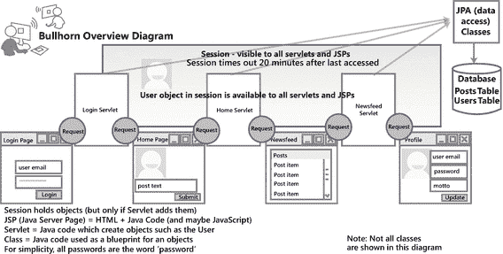
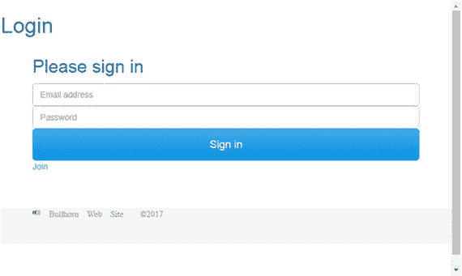
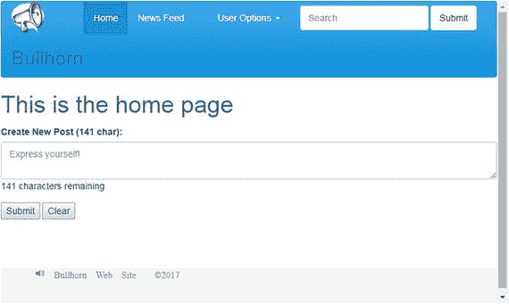
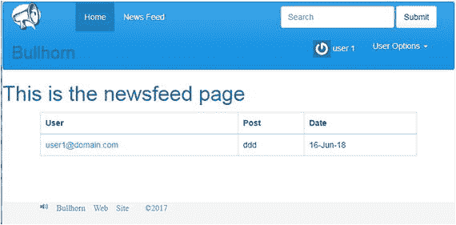
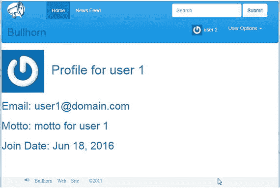
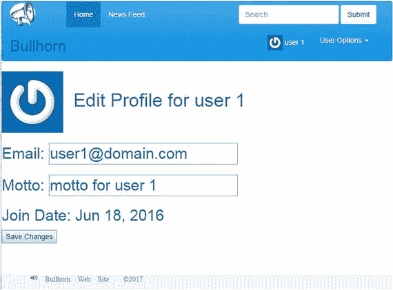
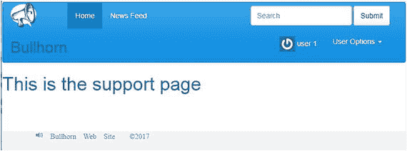

# 4. Bullhorn 网站概览

图 4-1 中的图表说明了网站的组成方式。仅显示了核心组件。你可以根据需要添加额外的页面和类。

图 4-1

构成 Bullhorn 的组件

## Bullhorn 的组件

*   Servlet Java 类，用于扩展 Web 服务器，为浏览器和数据库或其他 Servlet 提供接口。
*   JPA 类 Java 持久化 API 类，用于在 Servlet 和数据库之间进行通信。
*   请求对象 表示在浏览器和 Servlet 之间发送的信息。这些信息可能包括 Servlet 用于允许访问网站的电子邮件地址和密码。
*   会话 是 Web 服务器在用户访问网站时保留数据的方法或途径。
*   用户对象 用户信息存储在一个类中，该类将存储在会话中，并且当前用户的所有页面都可以访问。
*   JSP（Java 服务器页面） 包含 HTML 和来自 JSP 标准标签库的标签的网页，用于添加功能。由于它们包含代码，因此可以为每个用户的请求动态渲染。JSP 标准标签库允许每个人查看自己版本的页面。
*   HTML（超文本标记语言）页面。HTML 是一种标记文本文件的系统，用于控制网页上的字体、颜色和图像。

提示

为了避免 HTML 过于复杂，请使用 CSS（层叠样式表）和 JavaScript 来控制内容的呈现，并让 HTML 控制布局。

Bullhorn 应用程序包含用于登录、主页、新闻推送和用户个人资料的网页。用户从登录页面开始。一旦用户点击“登录”按钮，请求（来自登录表单的数据）将被发送到登录 Servlet。

登录 Servlet 将根据数据库验证用户。有效的用户将被存储在会话中，这是网站在页面视图之间记住数据的方式。无效的用户将无法通过登录页面，直到他们输入正确的用户名和密码组合。

我们将创建其他对象（类）来验证数据或支持图中所示的类和页面。

## 每个页面的外观是怎样的？

登录页面将包含文本框，用户可在其中输入电子邮件和密码。这些信息将在登录 servlet 中进行验证。如果与数据库中的信息匹配，用户将被重定向到其主页。如果不匹配，系统将提示用户重新登录。未在网站上注册的用户可以通过点击“加入”链接来注册登录。见图 4-2。

图 4-2

登录页面包含用于输入电子邮件和密码的文本框，以及一个用于登录应用程序的按钮

主页将允许每个用户创建新帖子。每个帖子限制为 141 个字符，因此主页会强制执行此限制（见图 4-3）。用户登录后，所有页面顶部都会显示一个导航栏，允许用户导航到不同页面、查看或编辑其个人资料，以及搜索包含特定单词的帖子。

图 4-3

主页包含一个用于向数据库提交帖子的表单。该表单包含一个文本框以及用于提交帖子或清除表单的按钮。

每个页面都包含相同的导航栏，允许用户在应用程序中移动。导航栏包含徽标、主页和动态消息页面的链接，以及一个搜索框。它还显示已登录用户的姓名。用户还可以从各种用户选项中进行选择，这些选项以下拉列表的形式实现。这些选项包括注销、查看或编辑个人资料以及提交反馈。见图 4-4。

图 4-4

Bullhorn 中的导航栏显示在每个页面的顶部

导航栏中的“动态消息”链接会将用户带到动态消息页面，该页面显示所有用户的所有帖子。每个用户的电子邮件地址都是一个链接，点击后会显示该用户的个人资料信息。点击导航栏中的“搜索”也会显示动态消息，但会进行过滤，只显示包含搜索文本框中输入内容的帖子。见图 4-5。

图 4-5

动态消息页面显示数据库中的任何帖子

用户的个人资料是只读的。它显示用户的电子邮件、座右铭、注册日期以及头像（如果有）。用户可以通过在动态消息页面上点击其他用户的用户名来查看他们的个人资料。见图 4-6。

图 4-6

以只读视图显示的用户个人资料页面

## 编辑个人资料

如果用户查看自己的个人资料，则可以对其进行编辑。见图 4-7。

图 4-7

已登录用户的个人资料页面显示有文本框和一个按钮，以便用户进行更改

支持页面显示的内容不多，只有一些文字让您知道它的存在。我们可以修改此页面，使其包含一个文本框，用于发送电子邮件或向数据库添加记录。然后，支持人员可以定期检查新消息。见图 4-8。

图 4-8

支持页面可以允许用户向网站管理员提交请求

