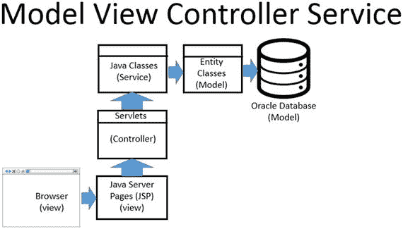

# 5. 什么是 MVC？

模型-视图-控制器（MVC）模式是一种用于创建数据驱动型 Web 应用程序的软件设计模式。设计模式是一种解决常见软件设计挑战的通用方案。虽然不是一个完成的设计，但您可以将设计模式视为一个模板或一组最佳实践。

遵循 MVC 模式意味着您打算将表示层（视图）、业务逻辑（控制器）和数据库层（模型）分开。对某一层所做的更改对其他层的影响将最小。

MVC 的真正好处并非在编写代码时体现，而是在维护代码时体现。代码是独立的单元，可以在无需记住整个应用程序的情况下进行维护。

围绕 MVC 组建团队更容易。这种设计有利于在不同人员或团队之间进行分工。想象一下，有一个负责出色视图的视图团队，一个了解所有数据的模型团队，以及一个理解应用程序流程和业务规则的控制器团队。每个团队都可以同时处理自己负责的应用程序部分，而无需考虑其他团队。这允许更快速的应用程序开发。

MVC 的另一个巨大优势是代码复用。在模型和控制器中实现的应用程序逻辑会被每个不同的视图复用。

## Bullhorn 中的模型、视图、控制器和服务

当您想到模型时，请想到数据库。通常，模型是首先构建的。模型必须存储数据。模型可能包含与数据库通信的类。Bullhorn 中的模型由 Oracle 数据库和实体类表示，这些实体类代表 Oracle 中的表。

一旦创建了数据模型以及作为模型一部分的任何类，就可以继续处理服务。服务是与模型交互的所有代码。

接下来，继续处理控制器。控制器是 Web 应用程序的一部分，它在服务与视图之间移动数据。控制器还决定接下来调用哪个页面或 servlet。在 Bullhorn 中，servlet 恰好也是控制器。情况并非总是如此。控制器仅仅是控制特定于应用程序逻辑的代码。由于这是一个 Web 应用程序，servlet 负责从视图获取数据并决定接下来显示哪个 JSP。如果您有包含该功能的 Java 类，它们将成为控制器的一部分。

用户实际看到的应用程序部分称为视图。它向用户呈现数据并从用户处获取数据，然后通过服务和控制器将数据传递回模型。Bullhorn 中的视图由使用 Bootstrap、CSS（层叠样式表）、JavaScript 和图像的 JSP（Java 服务器页面）组成。视图的所有部分协同工作，以创建在用户浏览器中显示的页面。见图 5-1。

图 5-1

Bullhorn 的组件在逻辑上被划分为称为模型、视图、控制器和服务的层

提示

在每个层中执行验证。数据可能通过您在最初开发时未曾预料到的方式进入您的应用程序，而不仅仅是通过浏览器。例如，您可能需要将信息导入数据库。或者，您以后可能会编写一个直接与服务层交互的 Web 服务。

