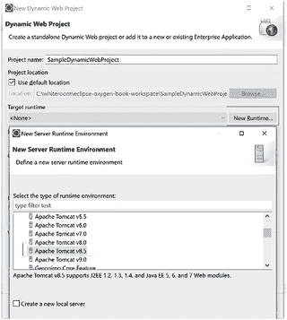
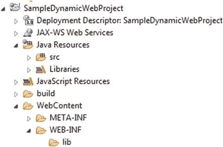

# 6. 创建 Web 应用程序

我们将把 Bullhorn 应用程序创建为一个动态 Web 项目，这样我们就可以使用 HTML、JSP、Servlet 以及 JPA 连接数据库来开发它。如果你已经理解所有这些概念，现在就可以停止阅读了。如果你还不太明白，那么这些内容将在后续章节中逐步解释。

我们的动态 Web 应用程序不仅包含静态 HTML 页面，还包含动态的 Java Server Pages（JSP）和 Servlet。我们能够在应用程序的不同部分之间传递数据。

数据库实际上是一个独立的软件，你的 Web 应用程序将与之通信。在许多系统中，数据库甚至完全位于另一台计算机上。JSP 会将信息发送给 Servlet。Servlet 通过服务层将信息发送到数据库（并从数据库获取信息）。然后 Servlet 将结果返回给 JSP。

注意

可以直接从 JSP 向数据库发送信息。也可以在两个 JSP 之间传递信息。但我们不会这样做。我们会在每一次通信之间都加入一个 Servlet。这样我们就可以在 Servlet 中用一些 Java 代码拦截每条消息，从而轻松地验证、评估和重定向每条被拦截的消息。

## 使用 Eclipse 创建动态 Web 项目

Eclipse 为各种类型的项目预配置了模板。我发现动态 Web 项目最为实用。创建一个这样的项目只需几个简单的步骤。

1.  在 Eclipse 中选择 `File` ➤ `New` ➤ `Dynamic Web Project`。为项目命名，例如 `SampleDynamicWebProject`，如步骤 2 所示。
2.  选择目标运行时为 Tomcat v.8.0 或更高版本。在继续之前，系统可能会提示你安装 Tomcat。

    

3.  点击 Finish。
4.  如果系统提示，选择“Yes”以关联 Java EE 透视图。
5.  一旦你的项目包含了一些网页，你可以在 Project Explorer 中选择该页面，然后右键点击并选择 `Run As` ➤ `Run on Server` 来启动它们。你的应用程序将在 Eclipse 中启动。

    

    图 6-1

    Eclipse 中动态 Web 项目的文件夹结构

动态 Web 项目会生成用于组织 Java 代码的文件夹（见图 6-1）。最重要的是 Java 源文件夹和 Web 内容文件夹。Java Servlet 和类应放置在 Java Resources 下的 `src` 文件夹中。JSP 文件属于 `WebContent` 文件夹。JSP 文件不能放在 `WEB-INF` 中，否则你的应用程序将无法访问它们。将 `WEB-INF` 下的 `lib` 文件夹用于 JAR（Java 归档）文件。当我们将数据库添加到项目中时，我们会用到 JAR 文件。

提示

Bullhorn 的 JAR（Java 归档）文件可以在 `WebContent/WEB-INF/lib` 中找到。对于你选择开发的任何动态 Web 应用程序，你都应该将 Bullhorn 中的所有 JAR 文件复制到 `/WEB-INF/lib` 目录中。

