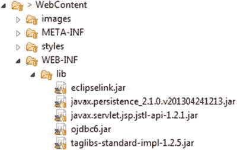

# 7. DAO/仓库

Bullhorn 需要两个表，分别用于用户和帖子。我们将在 Oracle 中创建这些表，并分别命名为 `Bhuser` 和 `Bhpost`。用户表需要以下字段：用户名、用户邮箱、密码、座右铭和注册日期。帖子表将包含帖子文本、发帖日期以及创建该帖子的用户 ID 字段。每个表还将包含一个 ID 字段，用于唯一标识每条记录。我们可以通过运行脚本来指示 SQL Developer 构建这些表。只需在新的 SQL 工作表中输入清单 7-1 中的文本即可。

```
CREATE TABLE BHUSER
("BHUSERID" NUMBER GENERATED BY DEFAULT ON NULL AS IDENTITY MINVALUE 1 MAXVALUE 9999999999999999999999999999 INCREMENT BY 1 START WITH 1 CACHE 20 NOORDER NOCYCLE,
"USERNAME" VARCHAR2(50 BYTE) NOT NULL,
"USERPASSWORD" VARCHAR2(50 BYTE),
"MOTTO" VARCHAR2(100 BYTE) NOT NULL,
"USEREMAIL" VARCHAR2(100 BYTE) NOT NULL,
"JOINDATE" DATE NOT NULL,
PRIMARY KEY ("BHUSERID")
) ;
清单 7-1
Bhuser 表的数据定义
```

现在我们有了存储用户的地方，可以再添加一个表来存储帖子。创建 `Bhpost` 表的 SQL 如清单 7-2 所示。你需要在 SQL Developer 的 SQL 工作表中输入这些内容。许多开发人员使用同一个 SQL 工作表，将每个表一个接一个地输入。一旦 SQL 输入到工作表中，选中这些语句，然后同时按下 Ctrl 和 Enter 键。首先创建 `Bhuser` 表，因为 `Bhpost` 表包含一个外键，代表 `Bhuser` 表中的 `BhuserId`。

```
CREATE TABLE BHPOST
("POSTID" NUMBER GENERATED BY DEFAULT ON NULL AS IDENTITY MINVALUE 1 MAXVALUE 9999999999999999999999999999 INCREMENT BY 1 START WITH 1 CACHE 20 NOORDER NOCYCLE,
"POSTDATE" DATE NOT NULL,
"POSTTEXT" VARCHAR2(141 BYTE) NOT NULL,
"BHUSERID" NUMBER NOT NULL,
PRIMARY KEY ("POSTID")
);
清单 7-2
创建 Bhpost 表的 SQL
```

接下来，你可能希望输入一些测试数据。清单 7-3 和 7-4 展示了一些可以运行的语句。将 SQL 输入到 SQL Developer 中，选中这些语句，然后按 Ctrl + Enter。

```
Insert into BHUSER (USERNAME,USERPASSWORD,MOTTO,USEREMAIL,JOINDATE) values ('user 1','password','motto for user 1','user1@domain.com',to_date('18-JUN-16','DD-MON-RR'));
Insert into BHUSER (USERNAME,USERPASSWORD,MOTTO,USEREMAIL,JOINDATE) values ('user 2','password','motto for user 2','user2@domain.com',to_date('22-JUL-15','DD-MON-RR'));
Insert into BHUSER (USERNAME,USERPASSWORD,MOTTO,USEREMAIL,JOINDATE) values ('user 3','password','motto for user 3','user3@domain.com',to_date('31-DEC-16','DD-MON-RR'));
Insert into BHUSER (USERNAME,USERPASSWORD,MOTTO,USEREMAIL,JOINDATE) values ('user 4','password','motto for user 4','user4@domain.com',to_date('22-JAN-17','DD-MON-RR'));
-- commit saves the data to the database
commit;
清单 7-3
为 Bhuser 表输入测试数据的 SQL 语句
```

```
Insert into BHPOST (POSTDATE,POSTTEXT,BHUSERID) values (to_date('18-JUN-17','DD-MON-RR'),'This is a test post',1);
Insert into BHPOST (POSTDATE,POSTTEXT,BHUSERID) values (to_date('21-AUG-17','DD-MON-RR'),'Bullhorn is a fun program!',2);
Insert into BHPOST (POSTDATE,POSTTEXT,BHUSERID) values (to_date('30-JUL-17','DD-MON-RR'),'Hello, I am posting something',2);
-- commit saves the data to the database
commit;
清单 7-4
为 Bhpost 表输入测试数据的 SQL 语句
```

如果你需要重新创建这些表，只需在 SQL 工作表中运行以下两行来删除它们（清单 7-5）。

```
DROP TABLE BHPOST;
DROP TABLE BHUSER;
清单 7-5
删除现有表和数据的 SQL 语句
```

现在你已经在 Oracle 中创建了表并输入了一些测试数据，是时候回到 Eclipse 并将你的项目连接到数据库了。我们将使用 Java 持久化 API（JPA）来实现这一点。


## 实现 Java 持久化（JPA）

Java 持久化 API（JPA）是一套标准，规定了 Java 如何使用实体（也称为 POJO，即普通 Java 对象）连接数据库。每个实体代表数据库表中的一行。JPA 将数据库对象视为 Java 对象。我们的程序只需与实体交互，而实体则负责与数据库交互。

有时，我们会有一个包含来自其他表数据的表。例如，Bullhorn 表中的一条帖子会包含一个用户 ID，用于标识提交该帖子的用户。使用 JPA，该 ID 会被替换为完整的 `User` 对象，从而允许你从 `Post` 实体访问关于该用户的所有数据。

JPA 允许你运用面向对象编程技能来处理数据库。此外，它还能让你的程序以统一的方式看待所有数据库。JPA 是一种对象关系映射规范。它负责处理连接数据库的细节。你只需为现有数据库设置各种参数的值，其余工作由 JPA 完成。Eclipse JPA 工具会检查表，并为每个表创建一个类。类名基于表名。我们将使用 Eclipse JPA 工具来创建类及其 getter 和 setter 方法。类的字段映射到表的字段。每个类代表数据库中的一个表。类的实例代表表中的一条记录（即一行）。Eclipse JPA 工具会处理序列和标识键，也会处理表关系。当你的表包含指向数据库中另一个表的外键时，你的类将包含一个代表该外键所对应表的对象实例。例如，`Posts` 表中的 `userID` 列会变成嵌入在 `Posts` 类中的一个 `User` 对象。

使用 JPA 的一个优势是，我们可以在不更改 Java 代码的情况下更换数据库。数据库信息存储在一个 XML 文件中，无需重新编译应用程序即可编辑该文件。你可以先用 MySQL 编写应用程序，随着应用规模增长，再迁移到 Oracle，而无需对应用程序代码做任何更改。

JPA 中的查询使用一种名为 JPQL（Java 持久化查询语言）的语言编写。这种语言对所有数据库都是相同的。

要实现 JPA，我们需要配置一个名为 `persistence.xml` 的文件。该文件必须位于 Java 源代码文件夹下的 `META-INF` 文件夹中。Eclipse 使用该配置来生成实体类。之后，我们将为应用程序创建辅助类。

第一步是将三个 JAR 文件复制到项目的 `WEB-INF\lib` 文件夹中。本项目所需的 JAR 文件包含在代码下载包中。你也可以在 Bullhorn 应用程序的 `WEB-INF\lib` 文件夹中找到它们。这些 JAR 文件分别是 `eclipselink.jar`、`javax.persistence_2.1.0.v201304241213.jar` 和 `ojdbc6.jar`。



注意

请将以下 JAR 文件放置在 `WEB-INF\lib` 文件夹中：`eclipselink.jar`、`javax.persistence_2.1.0.v201304241213.jar` 和 `ojdbc6.jar`。放置在其他位置可能无法正常工作。你也可以同时包含在 Bullhorn 中找到的其他 JAR 文件，我们稍后会用到它们。

## Persistence.xml 文件

要配置 JPA，我们需要创建 `persistence.xml` 文件。在 Eclipse 中，有多种方法可以创建此类文件，但我们将把它创建在名为 `META-INF` 的 `src` 目录下。JPA 规范要求必须使用这个特定位置。该文件可以是任何文本文件，你需要按照表 7-1 中所示的值进行填写。不想手动输入全部内容？你可以从本书附带的下载包中复制该文件。需要更改的值已在表中详细列出。你可能需要按所示内容进行修改。

表 7-1

Bullhorn 的 persistence.xml 文件元素设置

| XML 标签名 | 推荐值 |
| --- | --- |
| Persistence Unit Name | Bullhorn |
| Transaction Type | RESOURCE_LOCAL |
| Provider | org.eclipse.persistence.jpa.PersistenceProvider |
| Class | 为数据库中的每个表列出一次。因此应有两个 class 元素：model.Bhuser 和 model.Bhpost |
| Exclude Unlisted Classes | False |
| Java.persistence.jdbc.url | `jdbc:oracle:thin:@localhost:1521:ora1` |
| javax.persistence.jdbc.user | system |
| javax.persistence.jdbc.password | password |
| javax.persistence.jdbc.driver | `oracle.jdbc.OracleDriver` |

清单 7-6 展示了完整的 `persistence.xml` 文件。

```

org.eclipse.persistence.jpa.PersistenceProvider

model.Bhpost
model.Bhuser

False

清单 7-6
详细说明所有 JPA 设置的 persistence.xml 文件示例
```

请记住

`persistence.xml` 文件必须位于 `src` 目录下的 `META-INF` 目录中。这是强制要求的位置。

一旦设置好 `persistence.xml` 文件，你就可以让 Eclipse 根据数据库中的表自动生成实体了。为此，右键单击项目名称，选择“新建”，然后导航到“JPA”菜单下的“从表生成 JPA 实体”。弹出的对话框将使用 `persistence.xml` 文件中的信息连接到数据库，并为每个表生成一个 Java 类。你的程序将使用这些 Java 类（以及 `persistence.xml` 文件）来查找、添加、编辑和删除数据库中的记录。


## JPA 实体类

```
package model;
import java.io.Serializable;
import javax.persistence.*;
import java.util.Date;
import java.util.List;
@Entity
@NamedQuery(name="Bhuser.findAll", query="SELECT b FROM Bhuser b")
public class Bhuser implements Serializable {
private static final long serialVersionUID = 1L;
@Id
@GeneratedValue(strategy=GenerationType.IDENTITY)
private long bhuserid;
@Temporal(TemporalType.DATE)
private Date joindate;
private String motto;
private String useremail;
private String username;
private String userpassword;
//bi-directional many-to-one association to Bhpost
@OneToMany(mappedBy="bhuser")
private List bhposts;
public Bhuser() {
}
public long getBhuserid() {
return this.bhuserid;
}
public void setBhuserid(long bhuserid) {
this.bhuserid = bhuserid;
}
public Date getJoindate() {
return this.joindate;
}
public void setJoindate(Date joindate) {
this.joindate = joindate;
}
public String getMotto() {
return this.motto;
}
public void setMotto(String motto) {
this.motto = motto;
}
public String getUseremail() {
return this.useremail;
}
public void setUseremail(String useremail) {
this.useremail = useremail;
}
public String getUsername() {
return this.username;
}
public void setUsername(String username) {
this.username = username;
}
public String getUserpassword() {
return this.userpassword;
}
public void setUserpassword(String userpassword) {
this.userpassword = userpassword;
}
public List getBhposts() {
return this.bhposts;
}
public void setBhposts(List bhposts) {
this.bhposts = bhposts;
}
public Bhpost addBhpost(Bhpost bhpost) {
getBhposts().add(bhpost);
bhpost.setBhuser(this);
return bhpost;
}
public Bhpost removeBhpost(Bhpost bhpost) {
getBhposts().remove(bhpost);
bhpost.setBhuser(null);
return bhpost;
}
}
package model;
import java.io.Serializable;
import javax.persistence.*;
import java.math.BigDecimal;
import java.util.Date;
@Entity
@NamedQuery(name="Bhpost.findAll",
query="SELECT b FROM Bhpost b")
public class Bhpost implements Serializable {
private static final long serialVersionUID = 1L;
@Id
@GeneratedValue(strategy=GenerationType.IDENTITY)
private long postid;
@Temporal(TemporalType.DATE)
private Date postdate;
private String posttext;
//bi-directional many-to-one association to Bhuser
@ManyToOne
@JoinColumn(name="BHUSERID")
private Bhuser bhuser;
public Bhpost() {
}
public long getPostid() {
return this.postid;
}
public void setPostid(long postid) {
this.postid = postid;
}
public Date getPostdate() {
return this.postdate;
}
public void setPostdate(Date postdate) {
this.postdate = postdate;
}
public String getPosttext() {
return this.posttext;
}
public void setPosttext(String posttext) {
this.posttext = posttext;
}
public Bhuser getBhuser() {
return this.bhuser;
}
public void setBhuser(Bhuser bhuser) {
this.bhuser = bhuser;
}
}
```

