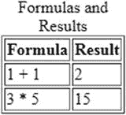
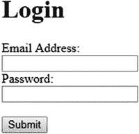

# 12. HTML5 标签

标签是通过将标签名称放入尖括号中来创建的，例如：`<tag>`。括号中的单词（此处为 tag）就是标签名称。标签包含一个开始标签和一个结束标签。开始标签仅包含尖括号中的标签名称。结束标签则在标签名称前加上一个正斜杠。例如：`<table></table>`。如果标签不包含任何数据，则开始标签和结束标签可以合并，例如 `<br/>`。

标签可以包含属性，这些属性提供关于标签的更多信息。HTML5 属性使用名称-值对创建，通常放在标签名称旁边。在本章中，我们将讨论属性，然后介绍一些用于开发 Bullhorn 的标签。

名称-值对由一组文本字符串表示，其中 `name="value"`，通常用逗号、分号、空格或换行符分隔。HTML5 属性写在元素的标签内，并用空格分隔。参见清单 12-1。

```
清单 12-1
来自 HTML 表单的输入标签示例
```

在这段代码中，属性是 `type`、`id`、`name` 和 `value`，它们的值始终跟在等号后面的引号内。属性提供了关于元素的额外信息。例如，我们现在知道，前面的 input 元素是一个文本框，由 `name`/`id` 标识为 `email`，并包含默认值 `user@domain.com`。`id` 属性是元素的唯一标识符。`id` 被 CSS 和 JavaScript 使用。`name` 属性为元素指定一个名称。我们在 servlet 中检索元素的值时使用该名称。对表单控件（例如 `<input>`）使用 name 属性。`Name` 是在表单提交时发生的 `POST` 或 `GET` 调用中使用的标识符。使用 `id` 属性通过 CSS 或 JavaScript 来标识特定的 HTML 元素。可以通过 `name` 查找元素，但使用 `id` 更简单。

## 常用标签说明

*   `<!DOCTYPE html>` 将文档标识为 HTML5 文档。这确保了不同浏览器会以相同方式解析该文档。
*   `<head></head>` HTML 文档头部部分的所有数据都被视为元数据，即关于数据的数据。此部分的信息通常不会直接显示。相反，诸如 style 之类的元素会影响文档中其他元素的外观。头部部分中的某些项目可能被搜索引擎等程序用于了解有关页面的更多信息，以供参考。
*   `<title></title>` 属于文档的头部部分，设置显示在浏览器标签页中的标题。
*   `<body></body>` 整个文档主体都包含在这两个标签内。
*   `<h1></h1>` 包含在这些标签内的任何文本通常显示为大的粗体字体标题，但实际格式取决于浏览器。有六个标题标签，从 h1（最大）到 h6（最小）。
*   `<p></p>` 段落标签内的任何内容都被视为一个段落。你可以向段落标签添加诸如 style 之类的属性，以控制哪些样式影响段落标签内的文本。
*   `</img>` 图像标签用于显示图像。它有两个你需要使用的属性：`src` 和 `alt`。`src` 属性包含图像文件的路径。该路径可以是文件名或 URL。`alt` 属性包含当图像不显示或无法看到时要显示的替代文本。屏幕阅读器也用它来描述图像。一个完整的图像标签看起来像这样：``

HTML 表单允许用户向 Web 服务器提交数据。表单中的数据将在请求数据包中发送到 servlet。Servlet 将接收数据，并可以使用它来查询数据库或选择另一个页面发送给用户。参见清单 12-2。请注意，每个标签都有一个结束标签（或包含 `/>` 以表示它是自闭合的）。

*   `<form></form>` `form` 标签包含用户输入表单的所有元素，该表单从用户获取数据并将其发送到 servlet。`form` 标签包含两个必需的属性：`method` 和 `action`。`method` 属性可以是 `"get"` 或 `"post"`，它决定了数据如何发送到 servlet。`action` 属性包含处理表单数据的 servlet 的 URL。
*   `<input></input>` 表单的目的是从用户获取输入并显示将要发送到服务器的数据。从用户获取输入的方式是使用 `input` 标签。它将在网页上创建一个文本框。当点击提交按钮时，`input` 标签的内容将被发送到 servlet。Submit 本身就是一个 input。当 `type` 属性设置为 `"submit"` 时，`input` 标签就变成了一个提交按钮。

```
创建新帖子 (141 字符):

清单 12-2
HTML 表单示例
```

一些 input 标签示例：

*   `<input id="email" name="email" type="text" value=""/>` 一个显示为文本框并收集用户电子邮件地址的 input 标签
*   `<input type="submit" value="提交" id="submit"/>` 一个显示为按钮并在点击时调用表单 action 的 input 标签
*   `<input type="reset" value="清除"/>` 一个显示为带有“清除”标签的按钮，并导致表单所有输入框被清空的 input 标签
*   `<textarea></textarea>` 一个包含多行的输入：`<textarea name="posttext" id="posttext" rows="2" maxlength="141"></textarea>`

## HTML 表格

表格以 `<table>` 开始，以 `</table>` 结束。

每个表格由表格行组成，表格行以 `<tr>` 开始，以 `</tr>` 结束。

每行由表格数据单元格组成，单元格以 `<td>` 开始，以 `</td>` 结束。

表格的第一行可以用作标题行。在这种情况下，将第一行的 `<td>` 标签改为 `<th>`。你可以更改标题行的样式，使其看起来与其他表格行不同。

`<caption>...</caption>` 用于定义或描述表格的内容。标题是可选的。要向表格添加标题，请在开始表格标签之后添加 caption 元素，并将标题文本放在元素内部。标题通常显示在表格边框之外，位于顶部。标题的确切外观和位置取决于 CSS 样式。参见清单 12-3 和图 12-1。



图 12-1

由上述代码生成的表格

```
公式和结果
公式结果
1 + 12
3 * 515

清单 12-3
最小 HTML 表格示例
```

## 基本的 HTML5 和 JSP 文档

JSP（JavaServer Pages）页面是一个动态 HTML 页面。它同时包含 HTML 和 JSP 标签。内容可以根据用户正在查看的数据而变化。

JSP 仍然是一个文本文档。它也像 HTML 文档一样包含 HTML 标签。但不仅如此。JSP 可以接收并显示由 servlet 发送的数据。现在你可以为每个用户个性化你的网站，而 HTML 页面则为每个用户显示相同的内容。JSTL 允许你在 JSP 页面中嵌入逻辑，而无需直接使用 Java 代码。使用标准化标签不仅更安全，而且使代码更易于维护，并将 Java 代码与用户界面分离。此模板将保存为扩展名为 .jsp 的文本文档。参见清单 12-4。

```

在此处插入标题

这是一个示例标题
这是一个副标题
这是段落文本

清单 12-4
基本 HTML/JSP 页面的结构
```


## JSP 标准标签库 (JSTL)

JSP 标准标签库 (JSTL) 是一组实用标签，您可以将其添加到 JSP 页面中。这些标签为许多 JSP 应用程序提供了通用功能。JSTL 支持常见的结构性任务，例如迭代和条件判断。它还支持在页面中正确转义 HTML 或 XML 代码，从而防止标签被解析并可能执行恶意代码。

EL（表达式语言）是 JSTL 的一个子集，它使得在 JSP 中轻松使用 Java 类（称为 bean）成为可能。表达式语言语法简洁，允许您访问对象的嵌套属性。例如，一个 `post` 对象包含一个用户。表达式语言允许您的 JSP 使用 `${user.username}` 这种简洁的语法来访问用户的 `getUsername()` 方法。表达式语言还可以使用 `${message}` 这样的语法来检索从 Servlet 设置的标量变量的值。

要在 JSP 中包含 JSTL，请将以下代码清单（清单 12-5）中所示的指令添加到页面顶部。确切位置并不重要，但放在 `<html>` 标签上方是一个好位置。JSTL 由多个库组成，这些库为循环、if/else 语句以及格式化数字、日期和时间等任务添加了功能。由于我们知道要在 JSP 中包含循环和 if/else 功能，并且还要格式化日期，因此我们将同时包含核心库和格式化库。请参见清单 12-5。

```

清单 12-5
应包含在页面 <html> 标签上方的 JSTL 指令。C 前缀包含来自核心库的标签。FMT 前缀包含来自格式化库的标签。
```

## 如何在 JSP 中使用 JSTL 标签

1.  将本书附带的以下两个 Java 归档 (jar) 文件复制到动态 Web 应用程序的 `WEB-INF/lib` 文件夹中。
    1.  `taglibs-standard-impl-1.2.5.jar`  
    2.  `javax.servlet.jsp.jstl-api-1.2.1.jar`   
2.  添加以下指令，将 JSTL 的核心库和格式化库包含到页面顶部： 

现在，您可以使用接下来讨论的任何 JSTL 标签了。

## 使用 JSTL 可以做什么？

### 防止跨站脚本攻击

跨站脚本 (XSS) 是一种计算机安全漏洞，当恶意用户通过网页上的文本框向您的网站输入脚本或其他代码时就会发生。JSTL `core out` 标签可以防止跨站脚本攻击。`c:out` 会转义用户的任何输入，使其不再可执行。如果用户在您网站的文本框中输入了恶意的 JavaScript，该 JavaScript 将被执行并可能危及数据安全。JSTL 的 `c:out` 标签可以降低这种风险。

### 遍历集合

JSTL `forEach` 标签提供了一种遍历集合中项目的机制。该集合可以在 Servlet 中设置，JSP 中的 JSTL 代码将遍历它，并重复执行 `forEach` 开始和结束标签之间的代码。这两个标签之间的任何 HTML 也会为集合中的每个项目重复显示。您可以在 `newsfeed.jsp` 页面中看到 `forEach` 标签的示例。另请参见清单 12-6。

```

清单 12-6
JSTL forEach 标签允许您遍历帖子集合
```

### 设置值

清单 12-7 中的代码展示了如何设置一个名为 `number` 的变量的值。然后，您可以在页面后续部分甚至会话中引用该变量。如果只想在当前页面引用该变量，请将作用域设置为 `"request"`。如果要在应用程序的其他页面引用该变量，请将作用域设置为 `"session"`（仅适用于单个用户）或 `"application"`（适用于所有用户）。然后，您可以在页面或应用程序的后续部分使用 `c:out` 标签来使用该变量。在此示例中，我们只是将值设置为某个随机值，比如 10。

```

清单 12-7
使用 JSTL 核心库的 set 标签
```

### 测试条件

JSTL 允许您根据条件包含或排除代码。在清单 12-8 的示例中，名为 `number` 的变量的值决定了 JSTL `if` 标签之间的内容是否显示。

```

if 标签之间的任何内容
在条件为真时显示

清单 12-8
JSTL 允许您根据条件显示或隐藏代码
```

### 重复内容固定次数

JSTL 核心库的 `forEach` 标签会将内容重复固定的次数。内容是指您在 `forEach` 开始和结束标签之间指定的任何内容。内容将根据 `begin` 和 `end` 属性指定的次数（包含边界值）重复显示。在清单 12-9 的代码中，数字 5 6 7 8 9 10 将显示在浏览器中。

```

清单 12-9
JSTL 允许您将内容重复固定次数
```

### 测试条件并选择替代方案

JSTL 没有与 `if` 语句配套的 `else` 子句。但是，当 JSTL 核心库的 `when` 和 `otherwise` 标签放在 JSTL 核心库的 `choose` 标签内部时，它们的作用类似于 if-else 语句。您可以使用任意数量的 `when` 标签，但只能有一个 `otherwise` 标签。请参见清单 12-10。

```

清单 12-10
JSTL 的 choose、when 和 otherwise 标签允许您模拟 if/else 条件
```

### 判断字符串是否为空或 null

JSTL 允许您的代码测试一个值并判断该值是否为 null 或空。如清单 12-11 中的代码所示，您传入变量，该变量可以在 Servlet 中设置，也可以来自您正在遍历的集合。然后，如果字符串为 null 或空，`c:if` 语句之间的代码将执行。如果 `c:if` 标签之间有 HTML 代码，那么当条件为真时，它将在浏览器中显示。您可以通过在 `empty` 前面加上 `not` 来否定该条件。

```
var1 为空或 null。

清单 12-11
测试变量是否为 null 或空
```

### 格式化日期

JSTL 允许您以指定的格式显示日期。我们在 Bullhorn 中显示帖子日期时使用了这个功能。我们只想将日期显示为年份，后跟月份缩写，然后是日期。日期的值应该是一个 `Date` 对象，即 `java.util.Date`。如果您的日期是一个 `String` 对象，那么您应该先转换它。JSTL `formatDate` 标签将根据指定的模式格式化日期。请参见清单 12-12。

```
清单 12-12
使用 JSTL 格式化库来格式化日期
```

## 如何显示表单数据

Java Web 应用程序通常包含表单，用于收集用户输入并将其传递给 Servlet 进行处理。然后，Servlet 可以与数据库通信并对数据执行某些操作。一旦 Servlet 处理完数据，它会将包含表单结果的新网页发送到浏览器。所有这些都在服务器上瞬间完成，用户是看不到的。


### 创建 HTML 登录表单

HTML 表单允许用户向你的 Servlet 提交数据。

我们希望用户能够使用他们的电子邮件和密码登录。因此，我们需要创建一个包含 HTML 登录表单的网页。

该表单应包含两个文本框——一个用于用户名，一个用于密码。表单需要一个提交按钮。文本框和按钮必须包含在声明表单的标签内，这样它们才会被提交到 `form` 标签的 `action` 属性所指定的登录 Servlet 的 URL。

所有属性值必须用引号括起来，格式为 `attribute="value"`。这些值将被 Web 服务器用来决定如何处理表单。

在我们创建 Servlet 之前，表单是无法工作的。Servlet 是一个可以运行 Java 代码并处理我们表单的容器。它将接收来自输入字段的值。然后，我们可以编写 Java 代码来处理这些输入。

```

Login

Email Address:

Password:

```

生成的网页表单如图 12-2 所示。



图 12-2

如果你点击提交按钮，表单数据将被发送到一个名为 LoginServlet.java 的 Servlet，该 Servlet 的代码顶部包含一个设置为 'loginServlet' 的 @WebServlet 注解。

请确保将表单的 `action` 属性设置为与你的 Servlet 的 @WebServlet 注解相匹配。

### 创建页面以显示表单的输出

接下来，我们将创建一个 JSP 来显示表单的输出。表单会将其数据发送给 Servlet，然后 Servlet 会将数据发送给输出 JSP。虽然可以绕过 Servlet，但没有任何充分的理由这样做，因为任何重要的应用程序都会使用 Servlet 来执行一些处理。用于显示输出的页面将被简单地命名为 `output.jsp`。参见清单 12-13。由于 body 中没有 HTML 代码，该页面不会显示任何内容。

```

Page

Listing 12-13
A Simple JSP Page, output.jsp
```

### 如何允许用户在网页之间导航

链接几乎出现在所有网页中。链接允许用户点击从一个页面跳转到另一个页面。HTML 链接被称为超链接。它们使用 `<a>` 标签定义：

```
_link text_
```

超链接是可以点击以跳转到另一个文档的文本或图像。例如：

```
Visit Some Site
```

本地链接（指向同一网站的链接）使用相对 URL（不带 `http://www` `.`...）指定：

```
My other page
```

## 重用 JSP 代码

编写代码很有趣。重复编写相同的代码则……很重复。而且无趣。Java Server Pages 允许你通过创建包含文件来重用代码。包含文件就是一个你包含在现有页面中的 JSP 或 JSP（或 HTML）片段。在一个页面中包含某些代码片段的好处是，你可以在其他页面中包含相同的片段，从而节省你重写相同代码的宝贵时间。Bullhorn 的导航栏代码位于每个页面的顶部，就在 body 开始标签的下方。我可以将该代码复制到每个页面。然后，如果我选择修改它，我可以打开每个页面并修改每个页面。更好的方法是将导航栏的代码放在一个 JSP 文件中，并在我希望导航栏出现的位置添加一个 `include` 标签（参见清单 12-14 到 12-16）。现在，我只需要在一个地方更改或更新导航栏。太好了！

```
Listing 12-14
The include Directive That Goes in Every Page to Include the navbar on Bullhorn
```

```

Listing 12-15
The First Two Lines of navbar.jsp (you can view the entire file in the source code that accompanies this book)
```

```

Listing 12-16
The Last Three Lines of navbar.jsp (you can view the entire file in the source code that accompanies this book)
```

## 自定义错误页面

在开发应用程序时，你可能不想实现自定义错误页面。Tomcat 的错误页面正是你所需要的，它在一个地方包含了你可能想要的所有信息。

一旦你准备好部署应用程序，默认的错误页面就缺乏……打磨……并且可能是不专业应用程序的标志。

你希望应用程序能够处理的错误有两种：HTML 错误和 Java 异常。

你需要处理的主要 HTML 错误是 404 错误（页面未找到）和 500 错误（服务器错误）。

至于 Java 异常，我们可以构建一个通用页面来处理所有异常。

如何添加自定义错误页面

处理自定义错误最简单的方法是在 `web.xml` 文件中添加条目。默认情况下，`web.xml` 文件是不可用的，因此要添加它，你需要执行以下操作：

1.  右键单击你的动态 Web 项目。  
2.  选择 Java EE 工具 ➤ 生成部署描述符存根。  
3.  双击 `WebContent/WEB-INF` 中的 `web.xml` 文件。  
4.  在 `</web-app>` 之前添加一行，并插入以下内容：

    ```

    /error_404.jsp

    ```

5.  然后，创建一个带有适当消息的相应 JSP。  

如果你运行应用程序并尝试导航到一个不存在的页面，你现在应该会看到新的自定义错误页面。

要创建你自己的、用于处理所有 Java 异常的漂亮页面，请将以下内容添加到你的 `web.xml` 文件中：

```
/error_java.jsp

```

然后，在你的 `error_java.jsp` 中放入类似以下内容：

```
Error
Sorry, Java has thrown an exception.
To continue, click the Back button.
Details
Type: ${pageContext.exception["class"]}
Message: ${pageContext.exception.message}
```

