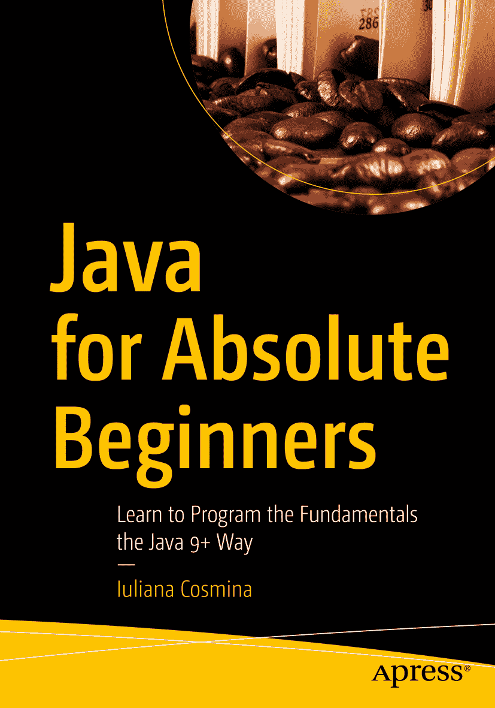

ISBN 978-1-4842-3777-9e-ISBN 978-1-4842-3778-6 [`doi.org/10.1007/978-1-4842-3778-6`](https://doi.org/10.1007/978-1-4842-3778-6) 美国国会图书馆控制号：2018964482 © Iuliana Cosmina 2018 本作品受版权保护。出版商保留所有权利，无论是整体还是部分材料，特别是翻译、重印、重用插图、朗诵、广播、以缩微胶卷或任何其他物理方式复制，以及传输或信息存储与检索、电子改编、计算机软件，或通过目前已知或未来开发的类似或不同方法。本书中可能出现商标名称、标识和图像。我们仅在编辑风格中使用商标名称、标识和图像，以利于商标所有者，并无意侵犯商标权，而非在每次出现时都使用商标符号。本书中使用的商品名称、商标、服务标志和类似术语，即使未明确标识，也不应被视为对其是否受专有权利保护的表达意见。尽管本书中的建议和信息在出版时被认为是真实准确的，但作者、编辑或出版商均不对可能出现的任何错误或遗漏承担法律责任。出版商对本书所含材料不作任何明示或暗示的保证。本书通过 Springer Science+Business Media New York 在全球图书贸易中发行，地址：233 Spring Street, 6th Floor, New York, NY 10013。电话：1-800-SPRINGER，传真：(201) 348-4505，电子邮件：orders-ny@springer-sbm.com，或访问 www.springeronline.com。Apress Media, LLC 是一家加利福尼亚有限责任公司，其唯一成员（所有者）是 Springer Science + Business Media Finance Inc (SSBM Finance Inc)。SSBM Finance Inc 是一家特拉华州公司。

*本书献给所有曾告诉我软件工程不适合女性的男性。*

*也献给那位曾告诉我我不是读博士的料教授。*

*你们觉得这怎么样？*

引言

尽管我从 2002 年就开始编写 Java 应用程序，但我不认为我曾像写这本书时那样深入钻研过 JVM。我工作过的大多数公司在我加入时都有自己现有的代码库，我的工作主要是设计、改进或维护已有的代码。这就像你已经有布朗尼预拌粉时再做布朗尼一样。写这本书让我有机会回归基础，使用基本原料——也就是用鸡蛋、面粉、可可粉、牛奶和黄油来制作布朗尼。

Java 始于 1982 年，由少数人创建。与 Java 起源关联最密切的名字是詹姆斯·高斯林，他也被称为 Java 之父。这门语言如今被用于超过三十亿台设备。当甲骨文收购 Sun Microsystems 时，开发者们担心 Java 的未来，尤其是因为其主要创建者离开了公司，去创建了被认为是 Java 替代品的语言：Scala。这种情况可能永远不会发生。Java 依然存在。

大多数银行应用程序都是用 Java 编写的，并且由于迁移这些应用程序无疑既危险又昂贵，Java 在 50 年后甚至更久仍将存在。Java 最初是为了让网站更具动态性和娱乐性，最终却成为自动取款机、收银机、计算机和移动设备上运行应用程序的基础。当然，如果 Java 不是跨平台的，这将会困难得多。

第一个 Java 版本于 1996 年正式发布。自那时起，又发布了十个版本，最新版本 Java 11 于 2018 年 9 月 25 日发布。Java 12 的工作已经开始，早期访问版本已经可用。

本书旨在涵盖语言和 JVM 的基本元素，特别是版本 9、10 和 11 中引入的元素。本书全面概述了 JVM 中最重要的 Java 类，所有这些都封装在一个多模块项目中，该项目使用 Java 11 和 Gradle 5 进行编译。一组审阅者已经审阅了本书，但如果您发现任何不一致之处，请发送电子邮件至`editorial@apress.com`，或直接发送给作者，更正内容将制作成勘误表并发布到本书的官方 GitHub 仓库中。本书的示例源代码可以在 GitHub 上找到，或从本书的官方产品页面下载，网址为[`www.apress.com/in/book/9781484237779`](http://www.apress.com/in/book/9781484237779)。

我真心希望您能像我享受编写这本书一样，享受使用本书学习 Java 的过程。

致谢

我又来了，第三次作为一本技术书籍的主要作者。

写这本书相当具有挑战性，因为我必须快速适应 Java 生态系统发生的变化。随着新的六个月发布周期、模块的引入以及向后兼容性的抛弃，我发现自己遇到了一个停止编译的项目，不得不投入宝贵的时间来修复它，理解它最初崩溃的原因，并最终调整本书。

为初学者写书很棘手，因为作为一名经验丰富的开发者，可能很难找到合适的例子，并以一种即使是非技术人员也能轻松理解的方式来解释它们。这就是为什么我深深感谢 Matthew Moodie 和 Mark Powers，感谢他们提供的所有支持和建议，使本书保持在初学者的水平。我们已经合作了四年，到目前为止这是一次富有成效的合作。

我要感谢 Wallace Jackson；他的建议和更正对本书的最终形式至关重要。

Apress 出版了许多我阅读过并用于提升自己专业水平的书籍。能在 Apress 出版我的第四本书是莫大的荣幸，能够为“培养”新一代 Java 开发者做出贡献，这给了我巨大的满足感。

我感谢所有耐心听我抱怨失眠和写作瓶颈的朋友们。感谢你们所有人的支持，并确保我在写这本书的同时还能享受一些乐趣。你们不知道你们对我有多重要。

我仍然感谢 John Mayer，因为他的音乐再次为我的夜间工作提供了绝佳的环境。

特别感谢 Achim Wagner，我视他为导师和挚友。他为我提供了成长为一个专业人士和一个人的环境和支持，我会怀念与他共事的日子。

特别感谢 Bogza-Vlad 一家：Monica、Tinel、Cristina 和 Stefan。你们都在我心中占有重要位置，如果没有你们在我搬到爱丁堡时的支持，这本书可能会推迟发布。

并提前特别感谢所有热情的 Java 开发者，他们会在书中发现错误，并好心写信告诉我，以便我能提供勘误表，使这本书变得更好。

### 关于作者与技术审稿人

### 关于作者

### 关于技术审稿人

