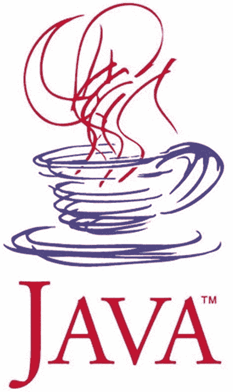
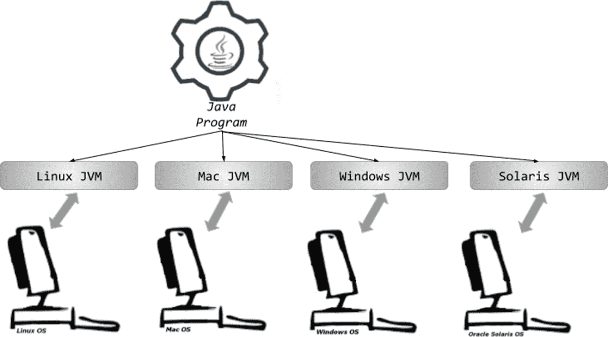
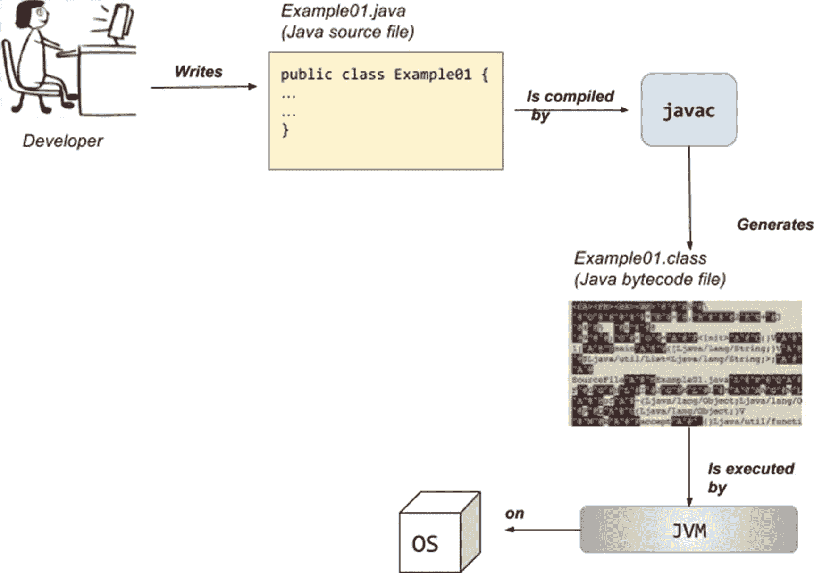
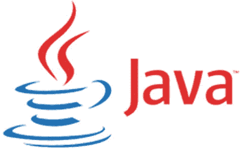

# 1. Java 简介及其历史

Java 是目前最具影响力的编程语言之一。这一切始于 1990 年，当时一家引领计算机行业革命的美国公司决定召集其最优秀的工程师，共同设计和开发一款产品，以便在新兴的互联网世界中占据重要地位。在这些工程师中，有一位加拿大计算机科学家詹姆斯·阿瑟·高斯林，他被公认为 Java 编程语言的“之父”。经过五年的设计、编程以及一次更名（由于商标问题，从 Oak 更名为 Java），Java 1.0 最终于 1996 年在 Linux、Solaris、Mac 和 Windows 平台上发布。

你可能会倾向于跳过这一章。但我认为这将是一个错误。我以前对 Java 的历史并不太感兴趣。我只是用它来工作。我知道詹姆斯·高斯林是创造者，Oracle 收购了 Sun，仅此而已。我从未过多关心这门语言是如何演变的，它的灵感来自哪里，或者一个版本与另一个版本有何不同。我从 1.5 版本开始学习 Java，并且对语言中的许多特性习以为常。因此，当我被分配到一个运行在 Java 1.4 上的项目时，我感到非常困惑，因为我不知道为什么我写的一些代码无法编译。尽管 IT 行业发展迅速，但总会有某个客户拥有遗留应用程序。了解每个 Java 版本的特性是一个优势，因为你在执行迁移时会知道可能遇到的问题。

当我开始为这本书做研究时，我完全被迷住了。Java 的历史之所以有趣，是因为它讲述了一个关于技术惊人成长和成功的故事，以及管理层之间的自负冲突如何几乎摧毁了创造它的公司。因为即使 Java 是软件开发中使用最广泛的技术，但创造它的公司已不复存在，这本身就是一个悖论。

本章将涵盖 Java 的每个版本，以追踪该语言和 Java 虚拟机的演变。你可以在 Oracle 官方网站 [`http://oracle.com/edgesuite.net/timeline/java./`](http://oracle.com/edgesuite.net/timeline/java./) 上找到版本 1.0 到 1.8 的时间线。但首先，我将介绍这本书。

## 本书的读者对象

大多数面向初学者的 Java 书籍都以典型的 *Hello World!* 示例开始，如下所示：

```
public class HelloWorld {
public static void main(String[] args) {
System.out.println("Hello  World!");
}
}
```

这段代码执行时，会在控制台打印 *Hello World!*。但是，如果你购买了这本书，那么假设你希望用 Java 开发真正的应用程序，并在申请 Java 开发人员职位时获得真正的机会。如果这是你想要的，如果这就是你——一个渴望并希望充分利用这门语言力量的初学者，那么这本书就是为你准备的。这就是为什么本书以一个复杂的示例开始。我们几乎在每个章节中都会回顾这个示例，当其中的某些部分得到解释时。

Java 是一种语法可读且基于英语的语言。因此，如果你具有逻辑思维并掌握一点英语知识，即使不执行以下代码，也应该能明白它的作用。

```
package com.apress.ch.one.hw;
import java.util.List;
public class Example01 {
public static void main(String[] args) {
List items = List.of("1", "a", "2", "a", "3", "a");
items.forEach(item -> {
if (item.equals("a")) {
System.out.println("A");
} else {
System.out.println("Not A");
}
});
}
}
```

在这个代码示例中，声明了一个文本值列表；然后遍历该列表，当某个文本等于 `"a"` 时，在控制台打印字母 `"A"`；否则，打印 `"Not A"`。

如果你是一个绝对的编程初学者，这本书非常适合你，特别是因为本书附带的源代码使用了编程中常用的算法和设计模式。因此，如果你的计划是进入编程领域并学习一门高级编程语言，那么阅读本书，运行示例，编写你自己的代码，你将拥有一个良好的开端。

如果你已经了解 Java，你也可以使用这本书，因为它涵盖了 Java 9、10 和 11（EAP^(¹) 版本）的具体特性。

## 本书的结构

你正在阅读的这一章是介绍性的，涵盖了一些 Java 历史，向你展示了这门语言是如何演变的，并展望了它的未来。此外，还涵盖了执行 Java 应用程序的机制，以便你为**第** 2 章做好准备。下一章将向你展示如何设置开发环境，并介绍一个简单的应用程序。在第 3 章到第 7 章中，涵盖了语言的基本部分：包、模块、类、对象、运算符、数据类型、语句、流、Lambda 表达式等。从第 8 章开始，涵盖了更高级的特性，例如：与外部数据源的交互：读写文件、序列化/反序列化对象、测试和创建接口。第 12 章完全致力于介绍 Java 9 中引入的发布-订阅框架。第 13 章涵盖了垃圾回收器。

本书由 `java-for-absolute-beginners` 项目完成。该项目按模块组织（因此它是一个多模块项目），这些模块相互链接，并且必须由 **Gradle** 管理。Gradle 是我们开发人员称之为*构建工具*的东西，用于构建项目。构建项目意味着将代码转换为可执行的内容。我选择为我写的书使用多模块项目，因为这样更容易构建它们，并且可以将公共元素分组在一起，使项目配置保持简单且不重复。此外，通过将所有源代码组织在一个多模块项目中，你可以尽快获得源代码是否正常工作的反馈，并且可以联系作者并要求他或她进行更新。

## 排版约定

本书使用了一些排版约定，以便于阅读。为此，书中使用了以下约定：

*   段落中的代码或概念名称显示如下：

    `import java.util.List;`

*   代码清单显示如下：

    ```
    public static void main(String[] args) {
    System.out.println("Hello there young developer!");
    }
    ```

*   控制台输出中的日志显示如下：

    ```
    01:24:07.809 [main] INFO  c.a.Application - Starting Application
    01:24:07.814 [main] DEBUG c.a.p.c.Application - Running in debug mode
    ...
    ```

*   ! 此符号出现在需要特别注意的段落前面。

*   *斜体* 字体用于比喻、诙谐的术语以及读者应特别注意的技术术语，因为它们不在当前上下文中解释，但会在本书中涵盖。例如：“这在第 4 章末尾介绍*泛型*时提到过。” “**栈**内存在执行期间使用（也称为在*运行时*）”或“让我们看看这在*幕后*是如何完成的”。

*   **粗体** 字体用于章节引用和重要术语。

至于我的写作风格，我喜欢以与同事和朋友进行技术对话的方式写书：穿插笑话，提供生产示例，并与非编程场景进行类比。因为编程只是模拟现实世界的另一种方式。


## 当 Java 属于 Sun Microsystems 时

Java 的第一个版本于 1996 年发布。在此之前，有一个名为**绿色团队**的小团队致力于开发一个名为 Oak 的原型语言，该语言通过一个可工作的演示——一个名为 Star7 的交互式手持家庭娱乐控制器——向世界展示。动画触摸屏用户界面的主角是一个名为**杜克**的卡通角色，由团队中的一位图形艺术家 Joe Palrang 创作。多年来，杜克已成为 Java 技术的官方吉祥物，每届 JavaOne 大会都有其独特的杜克吉祥物形象，而最简单的版本如图 1-1 所示。


图 1-1

杜克吉祥物（图片来源：[`http://oracle.com`](http://oracle.com)）

**绿色团队**通过互联网将其发布到全世界，因为这是实现广泛采用的最快方式。你可以想象，每当有人下载它时，他们都会欢呼雀跃，因为这意味着人们对它感兴趣。将软件开源还有其他一些优势，例如，来自世界各地更多样化人群的贡献和反馈。因此，对于 Java 来说，这是最好的决定，因为它塑造了如今众多开发者所使用的语言。即使在 22 年后，Java 仍然是最常用的三种编程语言之一。

这一切的始作俑者是美国公司 Sun Microsystems，成立于 1982 年。该公司通过销售计算机、计算机部件和软件引领了计算机革命。其最伟大的成就之一就是 Java 编程语言。在图 1-2² 中，你可以看到从 Java 诞生之年到 2010 年被 Oracle 收购期间所使用的公司标志。


图 1-2

Sun Microsystems 标志（图片来源：[`https://en.wikipedia.org/wiki/Sun_Microsystems`](https://en.wikipedia.org/wiki/Sun_Microsystems)）

找到关于 Java 第一个版本的信息相当困难，但那些见证了 Java 诞生——当时网络规模小得多且充满静态页面——的资深开发者们确实创建了博客，并与世界分享了他们的经验。Java 凭借其显示动态内容并与用户交互的小程序很容易大放异彩。但由于开发团队志向远大，Java 远不止是一种网络编程语言。因为在试图让小程序在任何浏览器中运行时，团队找到了一个常见问题的解决方案：可移植性。

如今，开发者在开发应在任何操作系统上运行的软件时面临许多难题。而随着移动革命，情况变得非常棘手。在图 1-3 中，你看到的是被认为是第一个 Java 标志的抽象图。



图 1-3

第一个 Java 标志，1996–2003（图片来源：[`http://xahlee.info/`](http://xahlee.info/)）

Java 1.0 在首届 JavaOne 大会上发布——与会者超过 6000 人。它最初是一种名为 Oak³ 的语言，与 C++ 非常相似，专为手持设备和机顶盒设计。它演变成了 Java 的第一个版本，为开发者提供了 C++ 所不具备的一些优势。

*   **安全性**：在 Java 中，意外超出数组大小而读取虚假数据没有危险。
*   **自动内存管理**：Java 开发者无需检查是否有足够内存为对象分配，然后显式释放它；这些操作由垃圾收集器自动处理。这也意味着不需要指针。
*   **简单性**：没有指针、联合体、模板、结构体。Java 中几乎所有内容都可以声明为类。此外，通过修改继承模型且不允许多重类继承，避免了使用多重继承时的混淆。
*   **支持多线程执行**：Java 从一开始就被设计为支持多线程软件的开发。
*   **可移植性**：Java 的座右铭是*一次编写，到处运行。*这得益于 Java 虚拟机，稍后将介绍。

所有这些都使 Java 对开发者具有吸引力，到 1997 年 Java 1.1 发布时，全球已有大约 40 万 Java 开发者。那年的 JavaOne 大会有 10,000 名与会者。通往伟大的道路已经铺就。在进一步分析每个 Java 版本之前，让我们先澄清一些事情。

### 为什么 Java 是可移植的？

我多次提到 Java 是可移植的，并且 Java 程序可以在任何操作系统上运行。现在是时候解释这是如何实现的了。让我们从一个简单的图开始，如图 1-4 所示。



图 1-4

是什么让 Java 可移植

Java 是我们所谓的高级编程语言，允许开发者编写独立于特定类型计算机的程序。高级语言更易于阅读、编写和维护。但它们的代码必须由编译器翻译或由解释器解释为机器语言（由数字组成，人类无法阅读）才能执行，因为这是计算机唯一理解的语言。

在图 1-4 中，请注意，在操作系统之上，需要 JVM 来执行 Java 程序。JVM 代表 Java 虚拟机，它是一种抽象的计算设备，使计算机能够运行 Java 程序。它是一个独立于平台的执行环境，将 Java 代码转换为机器语言并执行。

那么，Java 和其他高级语言有什么区别呢？嗯，其他高级语言将源代码直接编译为机器代码，这些机器代码旨在特定的微处理器架构或操作系统（如 Windows 或 UNIX）上运行。JVM 所做的是模拟一个 Java 处理器，使得 Java 程序可以在任何处理器上被解释为一系列操作或操作系统调用，而不管操作系统是什么。

由于提到了 Java 编译器，我们必须回到 Java 1.1，即使新版本发布，它也被广泛使用。它带来了改进的抽象窗口工具包（AWT）图形 API（用于构建小程序的组件集合）、内部类、数据库连接类（JDBC 模型）、远程调用类（RMI）、一个名为 JIT⁴ 的针对微软平台的专用编译器、对国际化和 Unicode 的支持。此外，它被如此广泛接受的原因是，在 Java 发布后不久，微软就获得了许可并开始使用它创建应用程序。这些反馈有助于 Java 的进一步发展，因此 Java 1.1 得到了当时所有浏览器的支持，这就是它被如此广泛部署的原因。


### **！**

本书引言中使用的许多术语，现在对你来说可能看起来很陌生，但随着你阅读本书，会接触到更多信息，这些词汇的含义也会逐渐清晰。目前只需记住，每一个新的 Java 版本，都比前一个版本有所增加，而当时，每一个新组件都是一种创新。

那么，开发者编写的 Java 代码在真正执行之前，究竟经历了什么过程？这个过程如图 1-5 所示。



图 1-5

从 Java 代码到机器码

在图 1-5 中，你可以看到 Java 代码被编译并转换为字节码，然后由 Java 虚拟机在底层操作系统上进行解释和执行。这就是 Java 的本质：一种编译型与解释型相结合的通用编程语言，拥有大量特性，使其非常适合用于 Web 开发。现在我们已经了解了 Java 代码是如何执行的，让我们再回顾一些历史。

### Sun Microsystems 的 Java 版本

Sun Microsystems 发布的第一个稳定 Java 版本，可以从网站上下载，其归档文件名为 JDK 1.0.2。JDK 是 **J**ava **D**evelopment **K**it（Java 开发工具包）的缩写。这是用于开发 Java 应用程序和小程序的软件开发环境。它包含 **J**ava **R**untime **E**nvironment（JRE，Java 运行时环境）、解释器（加载器）、编译器、归档器、文档生成器以及 Java 开发所需的其他工具。在我介绍如何在你的计算机上安装 JDK 时，我们会更详细地讨论这些内容。

从 1998 年发布的 1.2 版本开始，Java 版本开始拥有代号。^(⁵) Java 1.2 版本的代号是 **Playground**。这是一个重大的版本发布，也正是从这时起，人们开始谈论 **Java 2 平台**。从这个版本开始，直到 J2SE 5.0 的版本都进行了重命名，J2SE 取代了 JDK，因为 Java 平台现在由三部分组成：

*   J2SE（Java 2 平台，标准版），后来成为 JSE，是一个用于开发和部署桌面及服务器环境可移植代码的计算平台。
*   J2EE（Java 2 平台，企业版），后来成为 JEE，是一组规范，通过分布式计算和 Web 服务等企业特性扩展了 Java SE。
*   J2ME（Java 2 平台，微型版），后来成为 JME，是一个用于开发和部署嵌入式及移动设备可移植代码的计算平台。

在此版本中，JIT 编译器成为 Sun Microsystems JVM 的一部分（这基本上意味着将代码转换为可执行代码的操作变得更快，并且生成的可执行代码得到了优化），Swing 图形 API 作为 AWT 的华丽替代品被引入（引入了用于创建精美桌面应用程序的新组件），并且引入了 Java 集合框架（用于处理数据集）。

J2SE 1.3 于 2000 年发布，代号为 **Kestrel**（可能指的是新引入的 Java 声音类）。此版本还包含了 Java XML API。

J2SE 1.4 于 2002 年发布，代号为 **Merlin**。这是 **J**ava **C**ommunity **P**rocess（Java 社区流程）成员首次参与决定版本应包含哪些功能的一年，因此，该版本的发布相当稳定。这是作为 JSR 59^(⁶) 在 Java 社区流程下开发的第一个 Java 平台版本。以下是一些值得一提的特性。

*   支持 IPv6（基本上，现在可以编写运行在网络上的应用程序，使其使用 IPv6 网络协议工作）。
*   非阻塞 IO（IO 是输入-输出的缩写，指的是读取和写入数据——一种非常慢的操作。使 IO 非阻塞意味着优化这些操作以提高运行应用程序的速度）。
*   日志记录 API（执行的操作需要报告到文件或资源中，以便在发生故障时可以读取这些记录来确定原因并找到解决方案。这个过程称为日志记录，显然只有在这个版本中才引入了支持此操作的组件）。
*   图像处理 API（开发者可以使用此 API 通过 Java 代码操作图像）。

Java 的咖啡杯标志于 2003 年（在 1.4 和 5.0 版本之间）在 JavaOne 大会上首次亮相。你可以在图 1-6 中看到它。^(⁷)



图 1-6

Java 官方标志 2003-2006（图片来源：[`http://oracle.com`](http://oracle.com)）


J2SE 5.0 于 2004 年发布，代号为 **Tiger**。最初，它遵循典型的版本命名方式，被命名为 1.5，但由于这是一个重大版本，包含大量新特性，显著提升了 J2SE 的成熟度、稳定性、可扩展性和安全性，因此该版本被标记为 5.0 并向公众如此呈现，尽管内部仍沿用 1.5。对于此版本及后续两个版本，遵循 `1.x = x.0` 的规则。让我们列出这些特性，因为本书大部分内容都涉及它们。

*   **泛型**为集合提供了编译时（静态）类型安全，并消除了大多数类型转换的需求（这意味着在特定上下文中使用的类型是在应用程序运行时决定的，我们将在**第** 5 章中详细讨论）。
*   **注解**，也称为**元数据**，用于标记类和方法，以便支持元数据的工具对其进行处理（这意味着一个组件被标记为另一个组件能够识别并对其执行特定操作的内容）。
*   **自动装箱/拆箱**是基本类型与对应对象类型（包装器）之间的自动转换，同样在**第** 5 章中讨论。
*   **枚举**使用 `enum` 关键字定义静态的、final 的有序值集合；在**第** 5 章中讨论。
*   **可变参数**是指方法的最后一个参数使用类型名后跟三个点（`String...`）声明，这意味着可以提供该类型的任意数量的参数，并放入一个数组中；在**第** 3 章中讨论。
*   **增强的 for each 循环**也用于遍历集合和数组；在**第** 5 章中讨论。
*   改进了多线程 Java 程序的语义，在**第** 7 章中讨论。
*   **静态导入**在**第** 5 章中讨论。
*   对 RMI（本书未涉及）、Swing（**第** 10 章）、并发工具（**第** 7 章）的改进，以及引入了 `Scanner` 类；在**第** 11 章中讨论。

Java 5 是首个可用于 Mac OS X（版本 10.4）的版本，也是 Mac OS X（版本 10.5）上默认安装的版本。此版本发布了大量更新^(⁸)，以修复与安全性和性能相关的问题。这是一个错误较多的版本，考虑到在短短两年内开发了相当多的特性，这也是可以理解的。

2006 年，Java SE 6 略有延迟地发布，代号为 **Mustang**。是的，又一次更名。是的，同样在短时间内实现了大量新特性，随后也发布了大量更新。这是 Sun Microsystems 发布的最后一个主要 Java 版本。Oracle 于 2010 年 1 月收购了该公司。让我们看看此版本中最重要的特性：

*   核心平台的性能显著提升（应用程序运行更快，执行所需的内存或 CPU 更少）
*   改进了 Web 服务支持（优化了开发 Web 应用程序所需的组件）
*   JDBC 4.0（优化了开发使用数据库的应用程序所需的组件）
*   Java 编译器 API（基本上，你可以从代码中使用用于编译代码的组件）
*   许多 GUI 改进，例如将 SwingWorker 集成到 API 中、表格排序和过滤，以及真正的 Swing 双缓冲（消除了灰色区域效应）；基本上，改进了用于创建桌面应用程序界面的组件

2008 年 12 月，Java FX 1.0 SDK 发布。JavaFX 用于为任何平台创建图形用户界面，其初始版本是一种脚本语言。直到 2008 年，在 Java 中创建用户界面有两种方式：

*   **AWT**（抽象窗口工具包）组件，由底层操作系统特定的原生对等组件渲染和控制；这就是为什么 AWT 组件也被称为*重量级组件*。
*   **Swing** 组件，被称为*轻量级*组件，因为它们不需要在操作系统的窗口工具包中分配原生资源。Swing API 是 AWT 的补充扩展。

在最初几个版本中，JavaFX 是否真的会有未来并发展壮大以取代 Swing，这一点从未明确过。Sun 内部的管理动荡也无助于为该项目规划一条清晰的路径。


## Oracle 接管

尽管太阳微系统公司在针对微软的诉讼中胜诉，微软因未完全实现 Java 1.1 标准而同意支付 2000 万美元，但到了 2008 年，该公司状况已非常糟糕，开始与 IBM 和惠普洽谈合并事宜。2009 年，甲骨文与太阳微系统公司宣布就收购价格达成一致：甲骨文将以每股 9.50 美元现金收购太阳微系统公司；这相当于 56 亿美元的报价。此举影响巨大。许多工程师离职，包括 *Java 之父* 詹姆斯·高斯林，这让许多开发者对 Java 平台的未来产生了质疑。

Java SE 7，代号 **Dolphin**，是甲骨文于 2011 年发布的第一个 Java 版本。它是甲骨文工程师与全球 Java 社区成员（如 OpenJDK 社区和 Java 社区流程）广泛合作的成果。它包含了许多变化，但仍远少于开发者的预期。考虑到版本发布间隔时间较长，大家的期望值相当高。原本计划允许在 Java 中使用 lambda 表达式（这能在某些情况下显著简化语法）的 **Lambda** 项目，以及 **Jigsaw**（使 JVM 和 Java 应用程序模块化；**第** 3 章有一节专门介绍它们）都被推迟了。两者都在后续版本中发布。以下是 Java 7 中最值得注意的特性。

*   JVM 通过新的 `invokedynamic` 字节码支持动态语言（基本上，Java 代码可以使用非 Java 语言（如 C 语言）实现的代码）
*   压缩的 64 位指针（JVM 的内部优化，从而消耗更少的内存）
*   归入 **Coin** 项目的小型语言变更
    *   `switch` 中的字符串（**第** 7 章介绍）
*   try 语句中的自动资源管理（**第** 5 章介绍）
*   改进的泛型类型推断——菱形 `<>` 运算符（**第** 5 章介绍）
*   二进制整数字面量（**第** 5 章介绍）
*   多重异常处理改进（**第** 5 章介绍）
*   并发性改进
*   新的 I/O 库（新增了用于从文件读写数据的类，**第** 8 章介绍）
*   使用 `Timsort` 替代 `merge sort` 对集合和对象数组进行排序（有序的数据集需要使用算法进行排序，基本上，在此版本中，该算法被替换为性能更好的算法。更好的性能通常意味着减少资源消耗：内存和/或 CPU，或减少执行所需的时间。）

在几乎没有原始开发团队参与的情况下接手一个项目并对其进行更新，这一定非常困难。从后续的 161 次更新中可见一斑；其中大部分更新都是为了修复安全问题和漏洞。

JavaFX 2.0 与 Java 7 一同发布。这证实了 JavaFX 项目在甲骨文旗下仍有未来。作为一项重大变化，JavaFX 不再是一种脚本语言，而是变成了一个 Java API。这意味着掌握 Java 语言语法就足以开始用它构建用户图形界面。JavaFX 开始超越 Swing，因为它拥有名为 **Prism** 的硬件加速图形引擎，该引擎在渲染方面表现更佳。

Java SE 8，代号 **Spider**，于 2014 年发布，包含了最初计划作为 Java 7 一部分的功能。但，迟做总比不做好，对吧？经过三年的开发，Java 8 包含了以下关键特性。

*   语言语法变更
    *   对 lambda 表达式的语言级支持（函数式编程特性）
*   接口中的默认方法支持（**第** 4 章介绍）
*   新的日期和时间 API（**第** 5 章介绍）
*   使用流进行并行处理的新方法（**第** 8 章介绍）
*   与 JavaScript 的集成改进（Nashorn 项目）。JavaScript 是一种在开发社区中颇受欢迎的 Web 脚本语言，因此在 Java 中为其提供支持可能为甲骨文赢得了一些新的支持者。
*   垃圾回收过程的改进

从 Java 8 开始，为了规避任何商标法方面的麻烦，代号被弃用；取而代之的是采用一种能够轻松区分主版本、次版本和安全更新版本的语义化版本控制方案。^(⁹) 版本号遵循以下模式：

`$MAJOR.$MINOR.$SECURITY`

在终端中执行 `java -version`（如果你安装了 Java 8），你会看到类似下面的日志。

```
$ java -version
java version "1.8.0_162"
JavaTM SE Runtime Environment build 1.8.0_162-b12
Java HotSpotTM 64-Bit Server VM build 25.162-b12, mixed mode
```

在此日志中，版本号具有以下含义：

*   `1` 代表主版本号，当发布包含 Java SE 平台规范新版本中规定的重要新功能的主版本时递增。
*   `8` 代表次版本号，当发布可能包含兼容性错误修复、标准 API 修订和其他小功能的次更新版本时递增。
*   `0` 代表安全级别，当发布包含关键修复（包括提高安全性所必需的修复）的安全更新版本时递增。当 `$MINOR` 递增时，`$SECURITY` 不会重置为零，这使用户知道此版本是更安全的版本。
*   `162` 是构建编号。
*   `b12` 代表额外的构建信息。

这种版本控制风格在 Java 应用程序中相当常见，因此采用这种版本控制风格是为了与通用行业实践保持一致。

Java SE 9 于 2017 年 9 月发布。期待已久的 **Jigsaw** 项目终于到来。Java 平台终于实现了模块化。


### ！

这对 Java 世界来说是一个重大变化；它不是语法上的改变，也不是什么新特性。而是平台设计上的改变。我认识一些经验丰富的开发者，他们从 Java 诞生之初就开始使用它，至今仍难以适应这种变化。这一变化旨在修复 Java 多年来一直存在的一些严重问题（详见**第** 3 章）。你很幸运，因为作为初学者，你是从零开始，所以无需改变开发应用程序的方式。

以下是除引入 Java 模块之外最重要的特性。^(¹⁰)

*   Java Shell 工具，一个用于评估用 Java 编写的声明、语句和表达式的交互式命令行界面（详见**第** 3 章）

*   相当多的安全更新

*   改进的 `try-with-resources`：现在可以将最终变量用作资源（详见**第** 5 章）

*   从合法标识符名称集合中移除了 `"_"`（详见**第** 4 章）

*   支持私有接口方法（详见**第** 5 章）

*   对 G1 垃圾回收器的增强；它成为默认的垃圾回收器（详见**第** 13 章）

*   内部使用了更紧凑的新字符串表示形式（详见**第** 5 章）

*   并发更新（与并行执行相关，在**第** 5 章中提及）

*   集合的工厂方法（详见**第** 5 章）

*   图像处理 API 的更新，优化了用于编写图像处理代码的组件

Java 9 沿用了与 Java 8 相同的版本命名方案，但略有改动。JDK 名称中包含的 Java 版本号最终成为了版本方案中的 `$MAJOR` 数字。因此，如果你安装了 Java 9，在终端中执行 `java -version` 时，会看到类似如下的日志。

```
$ java  -version
java version "9.0.4"
JavaTM SE Runtime Environment build 9.0.4+11
Java HotSpotTM 64-Bit Server VM build 9.0.4+11, mixed mode
```

Java SE 10（又名 Java 18.3）于 2018 年 3 月 20 日发布。Oracle 改变了 Java 的发布风格，因此每六个月发布一个新版本。此外，Java 10 采用了 Oracle 设定的新版本命名约定：版本号遵循 `$YEAR.$MONTH` 格式。^(¹¹) 显然，这种发布版本命名风格旨在让开发者或最终用户更容易了解版本的发布时间，以便他们判断是否要升级到包含最新安全修复和附加功能的新版本。

以下是 Java 10 的一些特性。^(¹²)

*   局部变量类型推断，用于增强语言能力，将类型推断扩展到局部变量（这是最受期待的特性，详见**第** 5 章）

*   更多垃圾回收优化（详见**第** 13 章）

*   应用程序类数据共享，通过跨进程共享通用类元数据来减少内存占用（这是一个高级特性，本书不会涉及）

*   更多并发更新（与并行执行相关，在**第** 5 章中提及）

*   在替代内存设备上进行堆分配（JVM 运行 Java 程序所需的内存——称为*堆内存*——可以在替代内存设备上分配，因此堆也可以在易失性和非易失性 RAM 之间分配。有关 Java 应用程序使用内存的更多信息，请参阅**第** 5 章。）

既然我们之前已经做过，那么让我们看看在终端中运行 `java -version` 对于这个 Java 版本会显示什么。

```
$ java -version
java version "10" 2018-03-20
JavaTM SE Runtime Environment 18.3 build 10+46
Java HotSpotTM 64-Bit Server VM 18.3 build 10+46, mixed mode
```

Java SE 11（又名 Java 18.9）^(¹³)（于 2018 年 9 月 25 日发布）包含以下特性：

*   移除了用于构建企业级 Java 应用程序的 JEE 高级组件以及 Corba（一种非常古老的远程调用技术，允许你的应用程序与安装在另一台计算机上的应用程序进行通信）模块

*   Lambda 参数的局部变量语法，允许在声明隐式类型 Lambda 表达式的形式参数时使用 `var` 关键字

*   Epsilon，一种低开销的垃圾回收器（是一种无 GC 回收器，因此基本上你可以在没有 GC 的情况下运行应用程序），基本上是对垃圾回收的更多优化（详见**第** 13 章）

*   更多并发更新（与并行执行相关，在**第** 5 章中提及）

除了这些变化之外，还有人推测应该引入一个新的版本命名变更，因为 `$YEAR.$MONTH` 格式在开发者中反响不佳。（为什么有这么多版本命名变更，对吧？这真的那么重要吗？显然是的。）提议的版本命名变更与 Java 9 中引入的类似，如果你好奇，可以在 [`http://openjdk.java.net/jeps/322`](http://openjdk.java.net/jeps/322) 阅读其详细规范。

在撰写本章时，JDK 11 仅通过早期访问计划提供，这就是版本名称中出现 `"ea"` 字符串的原因；它表示*早期访问*。使用它相当困难，因为任何编辑器或其他构建工具尚不支持它。到本书发布时，Java 11 将稳定并可供使用，本书的源代码也将在 GitHub 仓库中相应更新。

```
$ java -version
java version "11-ea" 2018-09-18
JavaTM SE Runtime Environment 18.9 build 11-ea+2
Java HotSpotTM 64-Bit Server VM 18.9 build 11-ea+2, mixed mode
```

细节就到此为止。如果你想了解更多关于 Java 诞生头 20 年的信息，可以在 Oracle 的网站上找到。^(¹⁴)

## 未来展望

Java 主导行业已超过 20 年。它并非始终位居最常用开发技术的榜首，但自诞生以来从未跌出前五。即使有像 Node.js 这样的服务端 JavaScript 智能框架，繁重的工作仍然留给了 Java。像 Scala 和 Kotlin 这样的新兴编程语言运行在 JVM 上，因此 Java 编程语言或许会经历一次重大的蜕变以保持竞争力，但它仍将存在。

第 9 版引入的模块化可能性为 Java 应用程序安装在更小的设备上打开了大门，因为要运行 Java 应用程序，我们不再需要整个运行时环境——只需要其核心以及应用程序构建时所用的模块。

此外，有大量用 Java 编写的应用程序，尤其是在金融领域，因此由于遗留原因，以及将这些庞大的应用程序迁移到其他技术是一项不可能完成的任务，Java 仍将存在。

Java 很可能会在未来 10 到 15 年内继续生存并保持领先地位。它是一项非常成熟的技术，拥有庞大的社区支持，这确实有所帮助。而且它易于学习且对开发者友好，这使其仍然是大多数公司的首选。因此，你现在可以得出结论：学习 Java 并购买这本书是一项不错的投资。


## 前置要求

在结束本章之前，有必要告诉你，要学习 Java，你需要了解或具备以下几样东西……

*   熟悉操作系统的基本操作，例如 Windows、Linux 或 macOS
*   知道如何优化搜索条件，因为本书不涵盖与操作系统相关的信息；如果遇到问题，你需要自行解决
*   互联网连接

如果你已经了解 Java，只是出于好奇或为了模块章节而购买本书，那么了解 Maven 或 Gradle 这类构建工具会很有帮助，因为源代码组织在一个多模块项目中，只需一个简单的命令即可完整构建。我选择使用构建工具，是因为在当今时代，学习 Java 而不使用构建工具毫无意义；你应聘的任何公司几乎肯定都会使用一种构建工具。

除了我列出的这些前置要求，不需要其他任何东西。你不需要了解数学、算法或设计模式。实际上，读完这本书后，你可能会掌握一些这方面的知识。

话虽如此，让我们开始吧。

脚注 1   2   3   4   5   6   7   8   9   10   11   12   13   14

