# 2. 准备你的开发环境

要开始学习 Java，你需要在计算机上安装一些东西。以下是具体要求：

*   计算机上支持 **Java**（这几乎是强制性的）。
*   一个集成开发环境，也称为 **IDE**，它基本上是一个用于编写代码，并用来编译和执行代码的应用程序。
    *   本书推荐的 IDE 是 IntelliJ IDEA。你可以访问其网站获取免费的社区版；就本书而言，它完全够用。
    *   或者，你可以选择最流行的免费 Java 开发 IDE：Eclipse。
    *   或者，你可以尝试 NetBeans，^(¹⁵) 它是大多数初学者的默认选择，因为在版本 8 之前，它一直与 JDK 捆绑在一起。^(¹⁶),^(¹⁷)
*   **Gradle** 是一个构建工具，用于组织项目、轻松处理依赖关系，并让你的工作随着项目规模变大而更加轻松。（这是强制性的，因为本书中的项目都是基于 Gradle 设置来组织和构建的。）
*   **Git** 是一个版本控制系统，你可以用它来获取本书的源代码，并可以对其进行实验并创建自己的版本。它是可选的，因为托管本章源代码的 GitHub 支持直接下载。^(¹⁸)

要编写和执行 Java 程序/应用程序，你只需要安装 Java 开发工具包。我在这里列出的所有其他工具只是为了让你工作更轻松，并让你熟悉真实的开发工作。

### **!**

如果你要为所有用户安装这些应用程序，你可能需要管理员权限。对于 Windows 10，你甚至可能需要一个特殊的应用程序来为你的用户授予管理员权限，以便你可以安装必要的工具。本书提供了如何安装所有内容的说明——假设你的用户拥有必要的权限。如果你需要更多信息，互联网可以提供帮助。

如果看起来很多，请不要气馁；本章包含如何安装和验证每个工具是否正常工作的说明。让我们首先确保你的计算机支持 Java。

## 安装 Java

现在你面前有台电脑，并且迫不及待地想开始编写 Java 应用程序。但首先，你需要获取一个 JDK 并安装它。为此，你需要互联网连接，打开 [`​developer.​oracle.​com/​java`](https://developer.oracle.com/java)。

向下滚动，直到看到 **Downloads** 部分。点击 Java SE 链接。这两个链接及其内容如图 2-1 所示。

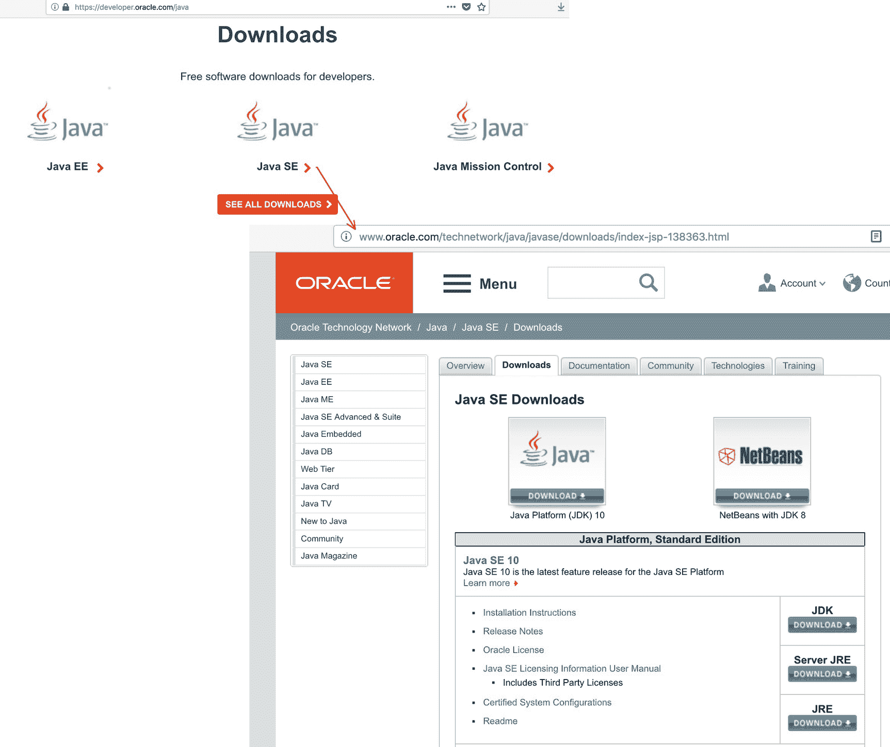

图 2-1

在 Oracle 网站上导航以找到所需产品，此处为 JDK

在 Oracle 网站上，你可以找到最新的稳定版 Java。点击 **Download JDK** 按钮。你应该会被重定向到图 2-2 所示的页面。

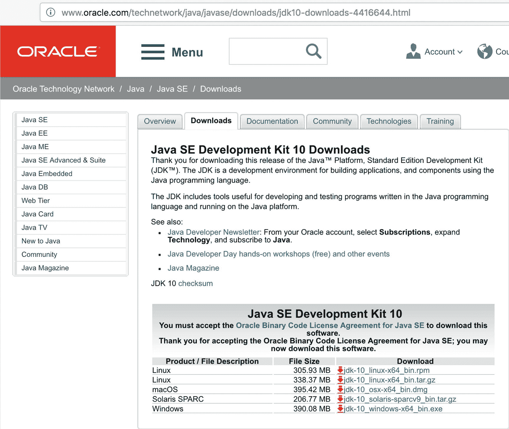

图 2-2

可以下载所需 JDK 的 Oracle 页面

如你所见，JDK 适用于几种操作系统。你应该下载与你系统匹配的那个。在编写本书和源代码时，我使用的是 macOS 计算机，这意味着我下载的是扩展名为 .dmg 的 JDK。

在允许下载所需的 JDK 之前，你需要接受许可协议。如果你好奇，可以阅读一下，但基本上，它告诉你只要不修改其原始组件，你就可以使用 Java。它还告诉你，你需要对使用方式负责，因此如果你用它来编写或执行危险的应用程序，你将承担法律责任。

如果你想获取尚未正式发布的早期版本 JDK，请访问 [`http://openjdk.java.net/projects/jdk/`](http://openjdk.java.net/projects/jdk/) 。在 **Releases** 下，版本 10 和 11 中，提供了早期访问（不稳定）的 JDK 11 供下载。

### **!**

本书涵盖 Java 11 之前的 Java 特性，但在编写本章时，该版本还有八个月才发布，因此某些图片和细节可能看起来已过时。请记住，从一个版本到下一个版本，有一些共同的细节保持不变，这些细节不会被审查和更改，因为唯一不同的是版本号。由于本书计划在 Java 11 发布后出版，因此建议下载该版本的 JDK 以获得源代码的完全兼容性。

下载 JDK 后，下一步是安装它。只需双击它，然后一直点击 **Next** 直到完成。这适用于 Windows 和 macOS。JDK 会安装到特定位置。

在 Windows 中，路径是 `C:\ProgramFiles\Java\jdk-10`。

在 macOS 中，路径是 `/Library/Java/JavaVirtualMachines/jdk-10.jdk/Contents/Home`。

在 Linux 系统上，根据发行版的不同，JDK 的安装位置会有所不同。我更喜欢的方式是从 Oracle 网站获取包含 JDK 完整内容的 `*.tar.gz` 文件，解压它，然后将其复制到特定位置。另外，我在 Linux 上偏好的位置是 `/home/iuliana.cosmina/tools/jdk-10.jdk`。


### **！**

在 Linux 上使用 PPA（软件源）安装程序^((19))，JDK 文件会被自动放置到 Linux 系统中应有的位置，并且当新版本发布时，会通过 Linux（全局）更新工具自动更新。但如果你熟练使用 Linux，可能已经知道这一点了。

如果你进入该位置，可以查看 JDK 的内容。在图 2-3 中，左侧是 JDK 10 的内容，右侧是 JDK 8 的内容。

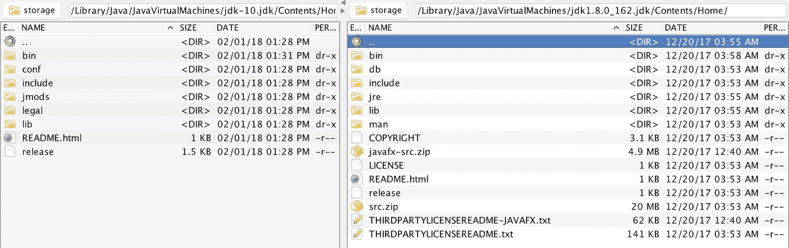

图 2-3

JDK 8 与 JDK 10 内容对比

我选择进行这种对比，是因为从 Java 9 开始，JDK 的内容组织方式发生了变化。直到 Java 8，JDK 都包含一个名为 `jre` 的目录，其中包含 JDK 使用的 Java 运行时环境（JRE）。`lib` 目录包含开发工具所需的 Java 库和支持文件。

`bin` 目录包含一组用于运行 Java 应用程序的 Java 可执行文件。

从 Java 9 开始，JRE 不再独立存在于自己的目录中。在图 2-4 中，左侧是 JDK 10 的内容，右侧是 JRE 10 的内容。^((20))

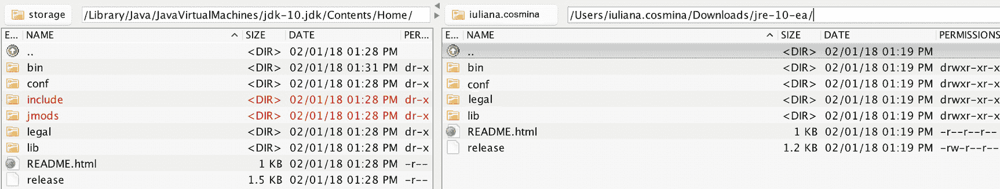

图 2-4

JDK 10 与 JRE 内容对比

所示的目录结构是在 Java 9 发布时引入的。你可以在 Oracle 官方网站上阅读更多相关信息。^((21))

关于 JDK，你需要了解的最重要的一点是，`bin` 目录包含由链接到镜像的模块定义的可执行文件和命令行启动器，因此 JDK 比 JRE 多出一些这样的文件。其他目录包括 `jmods` 目录（包含编译后的模块定义）和 `include` 目录（包含 C 语言头文件，用于支持通过 Java 本地接口（JNI）和 Java 虚拟机（JVM）调试接口进行本地代码编程）。

## JAVA_HOME 环境变量

JDK 中最重要的目录是 `bin` 目录，因为必须将该目录添加到系统路径中，这样你才能从任何位置调用 Java 可执行文件。这也使得其他应用程序无需额外配置步骤即可调用它们。大多数用于处理^((22)) Java 代码的 IDE 都是用 Java 编写的，它们需要知道 JDK 的安装位置才能运行。这通过声明一个名为 `JAVA_HOME` 的环境变量来实现，该变量指向 JDK 目录的位置。要使 Java 可执行文件能从系统中的任何位置被调用，你必须将 `bin` 目录添加到系统路径中。接下来的三节将解释如何在三种最常见的操作系统上完成此操作。

### Windows 上的 JAVA_HOME

要在 Windows 系统上声明 `JAVA_HOME` 环境变量，你需要打开设置系统变量的对话框。在 Windows 系统中，点击“开始”按钮；在菜单中有一个搜索框（或右键点击“开始”按钮弹出上下文菜单并选择“搜索”）。在其中输入单词 **environment**（前三个字母就足够了），应该会出现可点击的选项。这些步骤如图 2-5 所示。

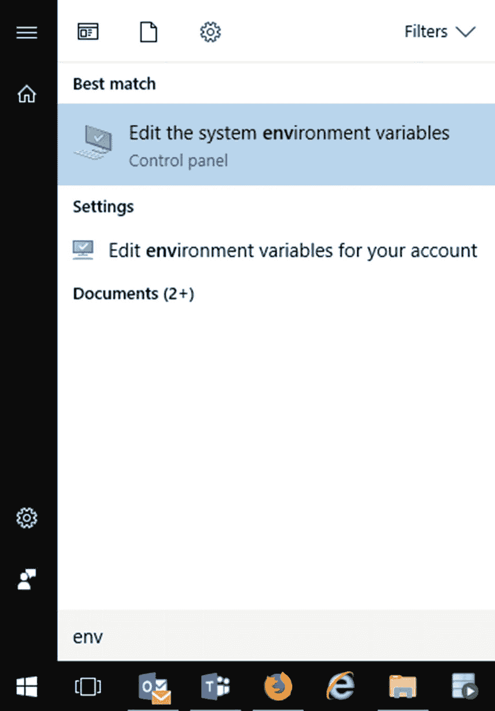

图 2-5

用于配置环境变量的 Windows 菜单项

点击该菜单项后，应会打开一个如图 2-6 所示的窗口。

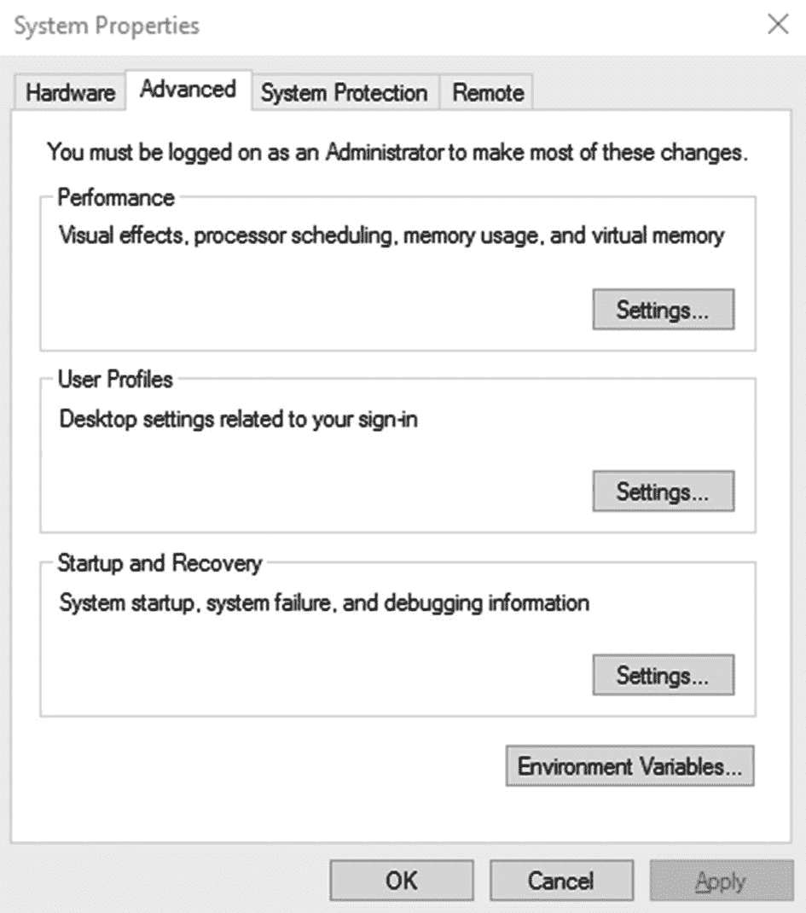

图 2-6

在 Windows 上设置环境变量的第一个对话框

点击 **环境变量** 按钮。会打开另一个对话框，分为两个部分：用户变量和系统变量。你关注的是 **系统变量**，因为我们要在那里声明 `JAVA_HOME`。只需点击 **新建...** 按钮，就会出现一个带有两个文本字段的小对话框；一个要求你输入变量名称——此处为 `JAVA_HOME`，另一个要求你输入路径——此处为 JDK 的路径。第二个窗口和变量信息弹出对话框如图 2-7 所示。

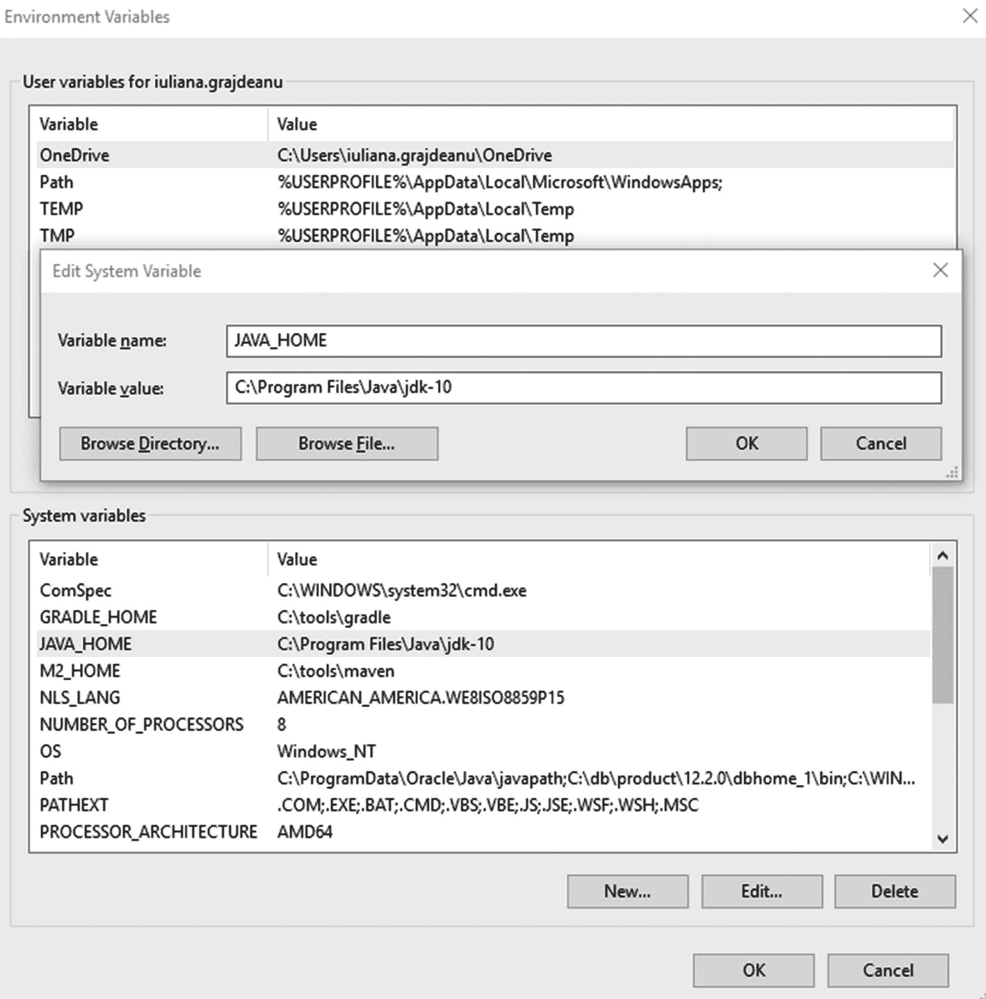

图 2-7

在 Windows 上将 JAVA_HOME 声明为系统变量

定义 `JAVA_HOME` 变量后，你需要将可执行文件添加到系统路径中。这可以通过编辑 `Path` 变量来完成。只需从 **系统变量** 列表中选择它，然后点击 **编辑...** 按钮。从 Windows 10 开始，`Path` 变量的每个部分都显示在不同的行上，因此你可以添加一行，并在其中添加 `%JAVA_HOME%\bin`。这种语法很实用，因为它会从 `JAVA_HOME` 变量包含的任何位置获取 `bin` 目录的位置。该对话框如图 2-8 所示。

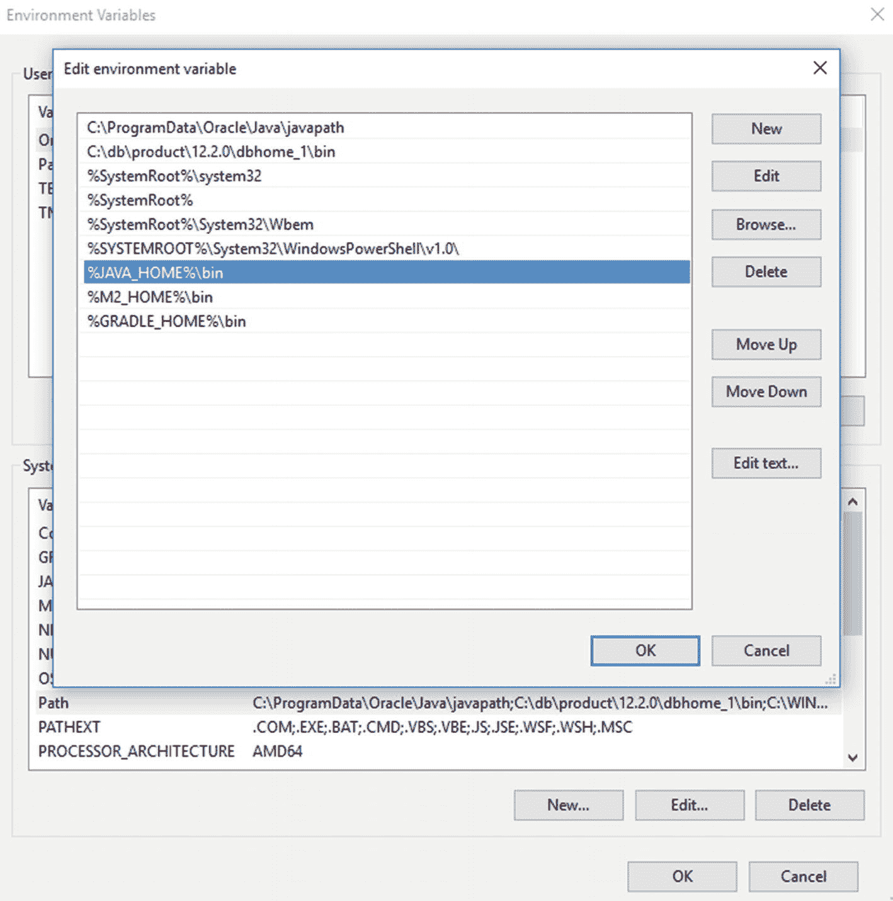

图 2-8

在 Windows 10 上将 JDK 可执行文件目录声明为系统 Path 变量的一部分

在较旧的 Windows 系统上，`Path` 变量的内容显示在图 2-7 所示的对话框中，因此你必须在 **变量值** 文本字段中添加 `%JAVA_HOME%\bin` 文本，并使用分号 (;) 将其与现有内容分隔开。

无论你使用哪种 Windows 系统，都可以通过打开 **命令提示符** 并执行 `set` 命令来检查是否一切设置正确。这会列出所有系统变量及其值。`JAVA_HOME` 和 `Path` 应该出现在其中，并带有期望的值。对于本节提出的设置，执行 **set** 时的输出如图 2-9 所示。

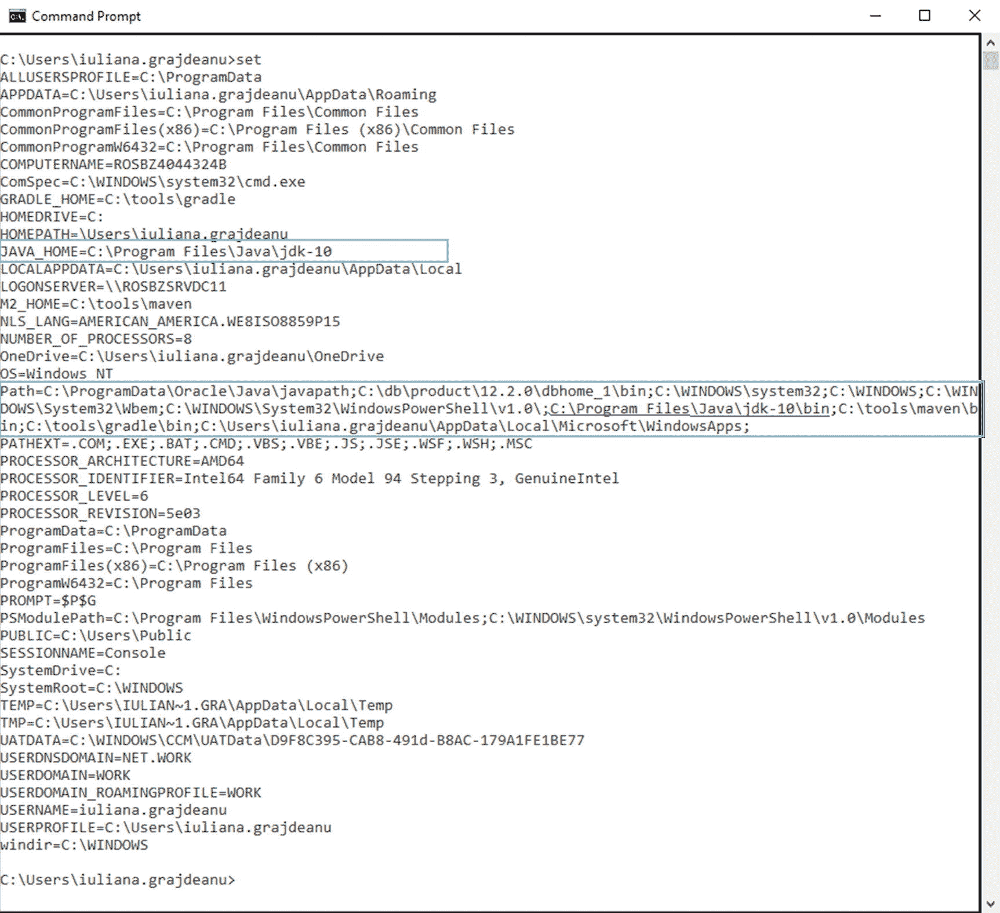

图 2-9

使用 **set** 命令列出的 Windows 系统变量

如果你执行上述命令并看到预期的输出，然后在 **命令提示符** 中执行 `java -version`，它会打印出预期的结果。一切就绪。

```
...> java -version
java version "10-ea" 2018-03-20
Java(TM) SE Runtime Environment 18.3 (build 10-ea+42)
Java HotSpot(TM) 64-Bit Server VM 18.3 (build 10-ea+42, mixed mode)
```


### macOS 上的 JAVA_HOME

JDK 的安装位置是 `/Library/Java/JavaVirtualMachines/jdk-10.jdk/Contents/Home`。你的 `JAVA_HOME` 环境变量应指向此位置。要为当前用户设置，可以执行以下操作：

1.  在 `/Users/your.user` 目录下，创建一个名为 `.bash_profile` 的文件。

2.  在该文件中，写入以下内容：

```
export JAVA_HOME=$(/usr/libexec/java_home -v10)
export PATH=$JAVA_HOME/bin:$PATH
```

在 macOS 上，你可以同时安装多个 Java 版本。你可以通过调用 `/usr/libexec/java_home` 命令并将你感兴趣的 Java 版本作为参数传入，来获取所需版本的 JDK 位置，从而设置系统当前使用的版本。命令执行的结果会作为 `JAVA_HOME` 变量的值存储。

在我的系统上，安装了 JDK 8、9、10 和 11。如果我执行该命令，并为每个 Java 版本传入参数，看看会发生什么：

```
$ /usr/libexec/java_home -v11
/Library/Java/JavaVirtualMachines/jdk-11.jdk/Contents/Home
$ /usr/libexec/java_home -v10
/Library/Java/JavaVirtualMachines/jdk-10.jdk/Contents/Home
$ /usr/libexec/java_home -v9
/Library/Java/JavaVirtualMachines/jdk-9.0.4.jdk/Contents/Home
$ /usr/libexec/java_home -v1.8
/Library/Java/JavaVirtualMachines/jdk1.8.0_162.jdk/Contents/Home
```

根据作为参数传入的版本不同，会返回不同的 JDK 位置。如果你想测试 `JAVA_HOME` 的值，可以使用 `echo` 命令。

```
$ echo $JAVA_HOME
/Library/Java/JavaVirtualMachines/jdk-10.jdk/Contents/Home
```

`export PATH=$JAVA_HOME/bin:$PATH` 这行代码将 JDK 位置下的 `bin` 目录内容添加到系统路径中。这意味着我可以打开终端并执行该目录下的任何 Java 可执行文件。例如，我可以执行 `java –version` 来验证为我的用户设置的默认 Java 版本是否符合预期。

```
$ java -version
java version "10-ea" 2018-03-20
Java(TM) SE Runtime Environment 18.3 (build 10-ea+42)
Java HotSpot(TM) 64-Bit Server VM 18.3 (build 10-ea+42, mixed mode)
```

如果你完成了所有这些步骤，并且 `java -version` 打印出了预期的结果，那么你就设置好了。

### Linux 上的 JAVA_HOME

### **！**

如果你熟练使用 Linux，你可能正在使用 PPA，因此可以跳过本节。但如果你喜欢控制 JDK 的位置并定义自己的环境变量，请继续阅读。

Linux 系统是类 Unix 操作系统。这与基于 Unix 的 macOS 类似。根据你的 Linux 发行版，可以通过特定的包管理器安装 Java，或者直接从 Oracle 官方网站下载 `*.tar.gz` 格式的 JDK 归档文件。

如果使用包管理器安装 Java，必要的可执行文件通常会在安装时自动放置在系统路径中。这就是为什么在本书中，我们只介绍手动完成所有操作的情况，并选择将 Java 仅为当前用户安装到诸如 `/home/your.user/tools/jdk-10.jdk`^(²³) 这样的位置，因为介绍包管理器毕竟不是本书的目的。^(²⁴)

因此，从 Oracle 网站下载 JDK 归档文件并将其解压到 `/home/your.user/tools/jdk-10.jdk` 后，你需要在你的用户主目录下创建一个名为 `.bashrc` 或 `.bash_profile`^(²⁵) 的文件，并向其中添加以下内容。

```
export JAVA_HOME=/home/your.user/tools/jdk-10.jdk
export PATH=$JAVA_HOME/bin:$PATH
```

如你所见，语法与 macOS 类似。要检查 JDK 的位置和 Java 版本，可以使用 macOS 部分提到的相同命令。

## 安装 Gradle

 **Gradle 5.x **** 本书附带的源代码可以使用 Gradle 包装器进行编译和执行，该包装器在 Windows 上是一个批处理脚本，在其他操作系统上是一个 shell 脚本。当你通过包装器启动 Gradle 构建时，Gradle 会自动下载并运行构建；因此你实际上并不需要安装 Gradle。如何执行此操作的说明可以在 [`www.gradle.org/docs/current/userguide/gradle_wrapper.html`](http://www.gradle.org/docs/current/userguide/gradle_wrapper.html) 的公开文档中找到。

一个好的做法是将代码和构建工具分开，对于本书附带的项目，这是推荐的方式。

如果你决定在编辑器之外使用 Gradle，你可以从官方网站（ [`www.gradle.org`](http://www.gradle.org) ）仅下载二进制文件（或者如果你好奇，可以下载包含二进制文件、源代码和文档的完整包），解压它们，并将内容复制到硬盘上的某个位置。创建一个 `GRADLE_HOME` 环境变量，并将其指向你解压 Gradle 的位置。此外，对于 Windows，将 `%GRADLE_HOME%\bin` 添加到系统的一般路径中；对于基于 Unix 的操作系统，则添加 `$GRADLE_HOME/bin`。

选择 Gradle 作为本书源代码的构建工具，是因为它设置简单、配置文件小巧、定义执行任务灵活，并且学习一个构建工具很实用——因为对于中型和大型项目，构建工具是必不可少的。

### **！**

通过打开终端（Windows 上的**命令提示符**，以及你在 macOS 和 Linux 上安装的任何类型的终端）并输入以下命令，验证操作系统看到的 Gradle 版本是否是你刚刚安装的版本：

`gradle -version`

你应该会看到类似如下的输出：

`------------------------------------------------------------`

`Gradle 5.0-20180826235923+0000`

`------------------------------------------------------------`

`Build time:   2018-08-26 23:59:23 UTC`

`Revision:     c2edb259761ee18f9a14e271f24ef58530b1300f`

`Kotlin DSL:   1.0-rc-3`

`Kotlin:       1.2.60`

`Groovy:       2.4.15`

`Ant:          Apache Ant (TM) version 1.9.11 compiled on March 23 2018`

`JVM:          10 (Oracle Corporation 10+46)`

`OS:           -- 你使用的任何操作系统 --`

上述文本确认了 Gradle 命令可以在你的终端中执行；因此，Gradle 已成功安装。

## 安装 Git

这是一个可选部分，但作为开发者，熟悉版本控制系统很重要，所以这里介绍一下。要在你的系统上安装 Git，只需访问官方页面 [`https://git-scm.com/downloads`](https://git-scm.com/downloads) 并下载安装程序。打开安装程序并点击**下一步**直到完成。这适用于 Windows 和 macOS。^(²⁶) 是的，就这么简单。你不需要做其他任何事情。^(²⁷) 对于 Linux，你可以使用你的包管理器或 PPA 来安装 Git。

要测试 Git 是否成功安装到你的系统上，打开一个终端（Windows 上的**命令提示符**，以及你在 macOS 和 Linux 上安装的任何类型的终端）并运行 `git --version` 来查看打印的结果。它应该显示你刚刚安装的 Git 版本。

```
$ git –version
git version 2.15.1
```

现在你已经安装了 Git，你可以通过在终端中或直接从 IDE 克隆官方 Git 仓库来获取本书的源代码。但关于这一点，稍后会详细介绍。


## 安装 Java 集成开发环境

根据我十多年的经验，我推荐的编辑器是 IntelliJ IDEA。它由一家名为 JetBrains 的公司开发。你可以从他们的官方网站 [`www.jetbrains.com`](http://www.jetbrains.com) 下载此 IDE。有一个终极版可供你免费使用 30 天；之后，你需要获取许可证。这就是为什么我建议你下载并使用社区版，^(²⁸) 因为对于学习 Java 所涉及的简单开发来说，这个版本已经足够了。

下载 IntelliJ IDEA 压缩包后，双击进行安装。之后，启动它并进行一些配置。只需点击**下一步**按钮，直到进入插件选择步骤，该步骤应与图 2-10 中所示的非常相似。

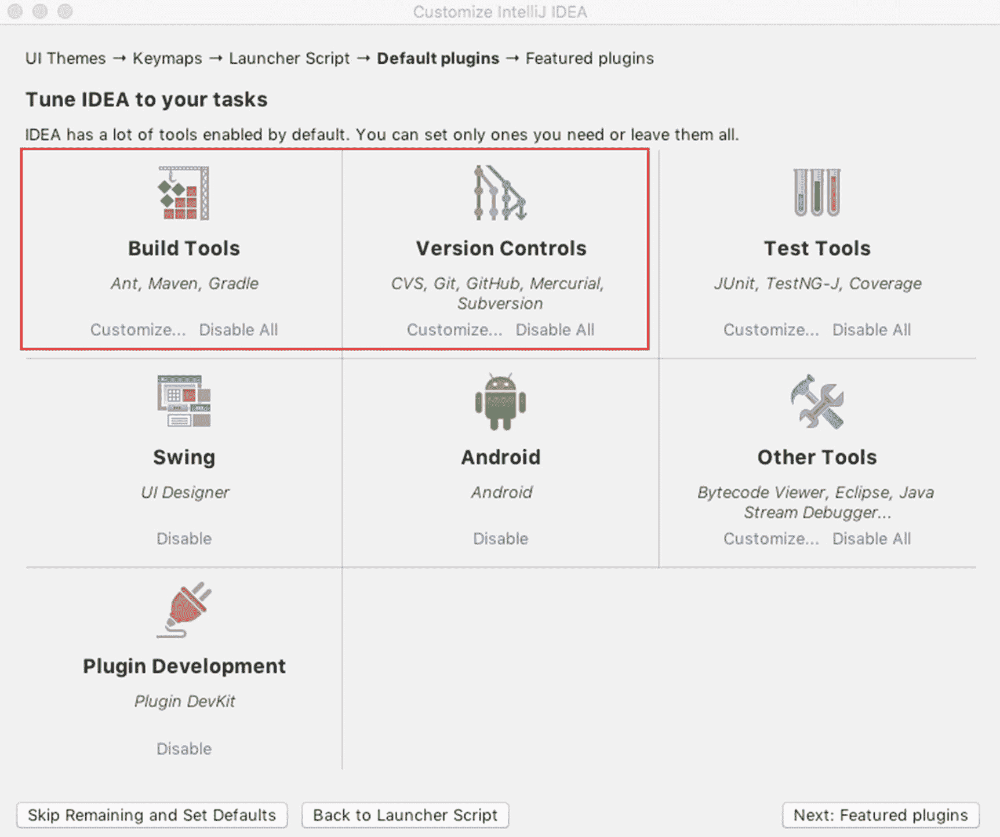

图 2-10

IntelliJ IDEA 社区版配置插件对话框部分

在上图中，有两个部分被划了线。第一部分配置构建工具。如果你点击**自定义...**按钮，窗口应会切换显示可用于构建工具的插件。确保 Gradle 的选项被勾选，如图 2-11 所示，然后点击**保存更改并返回**按钮。

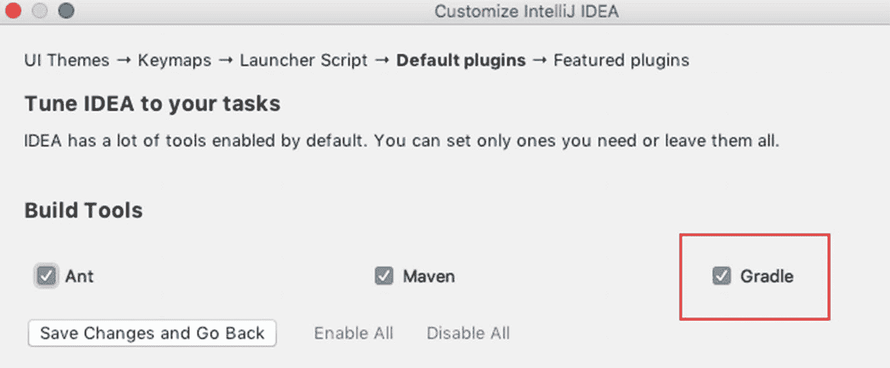

图 2-11

IntelliJ IDEA 社区版配置 Gradle 插件

第二部分配置版本控制系统的支持。如果你点击**自定义...**按钮，窗口应会显示可用于版本控制系统的插件。确保 Git 和 GitHub 的选项被勾选，如图 2-12 所示，然后点击**保存更改并返回**按钮。如果你再继续下一步，你会进入另一个插件屏幕，该屏幕提供安装一个名为 **IDE Feature Trainer** 的插件的选项。我认为如果你是初学者，这个插件可能非常有用。该窗口如图 2-13 所示。

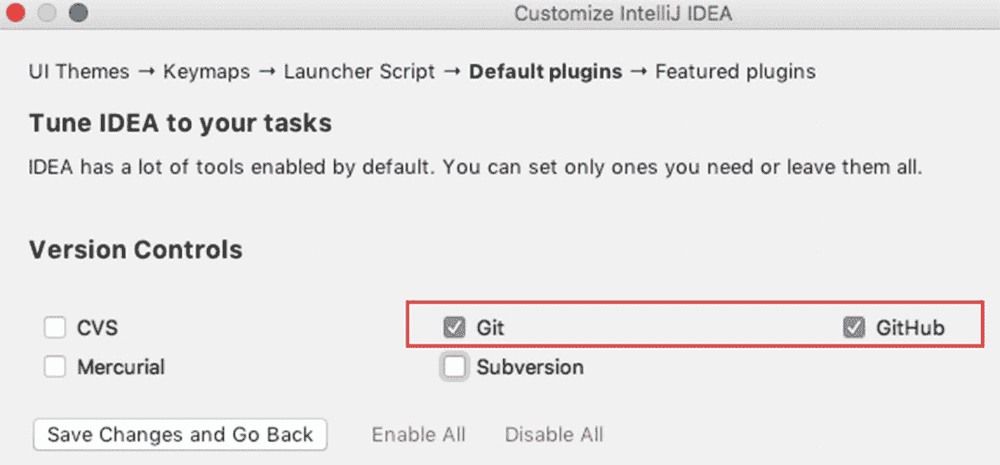

图 2-12

IntelliJ IDEA 社区版配置 Git 插件

最后一步，点击**安装**按钮，然后点击**开始使用 IntelliJ IDEA**，这样你就全部设置好，可以开始使用了。你的开发环境已完全配置好，可以编写你的第一个 Java 程序了。

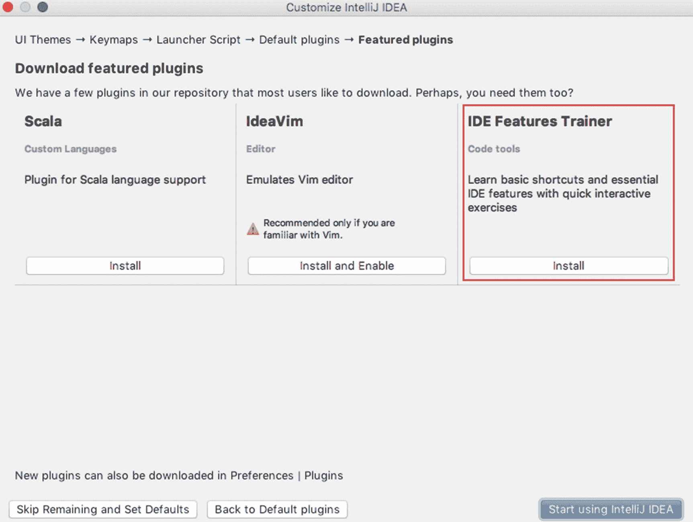

图 2-13

IntelliJ IDEA 社区版配置 IDE Feature Trainer 插件

但在那之前，让我们也介绍一下如何获取本书的源代码。

有三种方法可以获取本书的源代码：

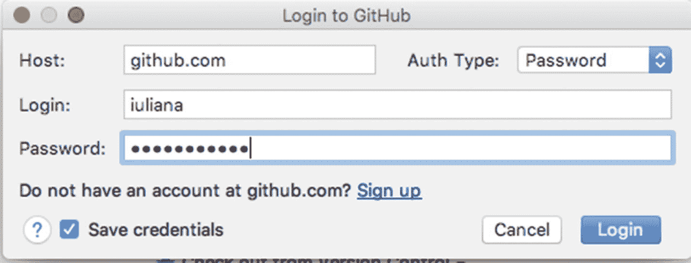

图 2-15

IntelliJ IDEA 克隆 java-for-absolute-beginners 项目的第二个对话框窗口

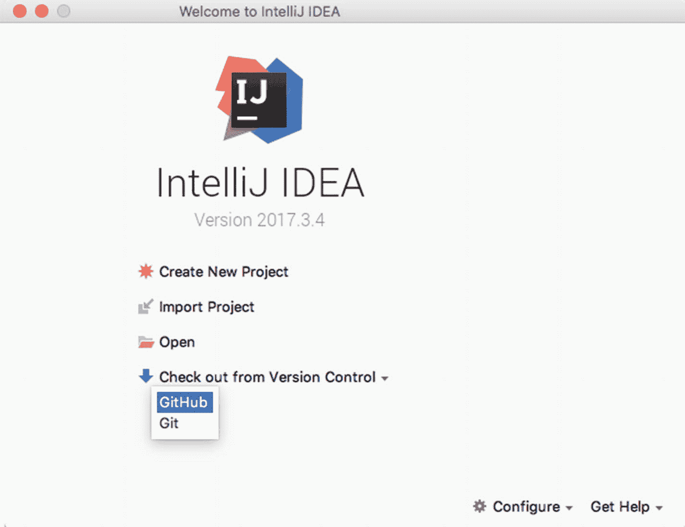

图 2-14

IntelliJ IDEA 克隆 java-for-absolute-beginners 项目的第一个对话框窗口

*   直接从 GitHub 下载压缩包。

*   使用终端（或在 Windows 中使用 Git Bash Shell）通过以下命令克隆仓库：

```
    git clone git@github.com:Apress/java-for-absolute-beginners.git
    ```

*   使用 IntelliJ IDEA 克隆项目。对于此方法以及从命令行克隆，你需要一个 GitHub 用户。以下图片展示了使用 IntelliJ IDEA 克隆项目时看到的所有对话框窗口。图 2-14 显示了在启动一个从未使用过的 IntelliJ IDEA 实例后看到的窗口。该项目托管在 GitHub 上，因此从**从版本控制检出**菜单中，选择 **GitHub**。此时，你会进入下一个对话框窗口，如图 2-15 所示。

这需要你输入你的 GitHub 用户名和密码（认证类型：**密码**）。如果你没有 GitHub 用户名，请访问 [`https://github.com`](https://github.com) 创建一个。点击**登录**按钮后，会显示如图 2-16 所示的窗口。

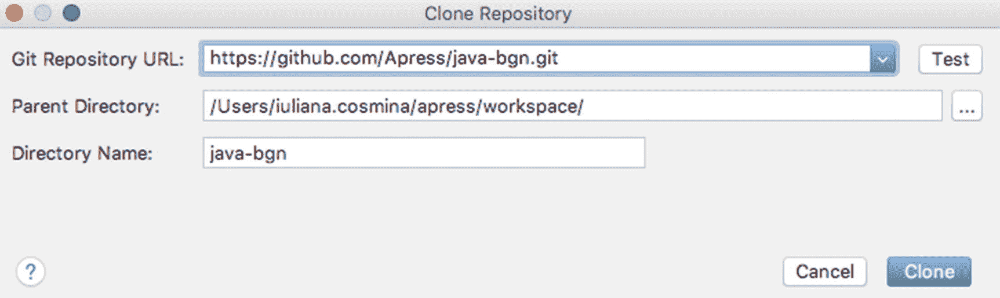

图 2-16

IntelliJ IDEA 克隆 java-for-absolute-beginners 项目的第三个对话框窗口

点击**克隆**按钮，然后进入如图 2-17 所示的窗口。

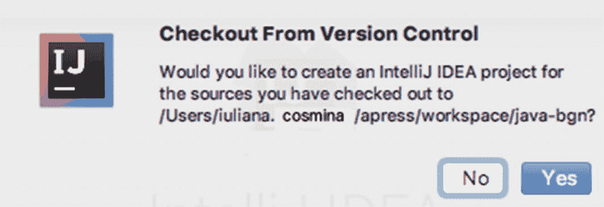

图 2-17

IntelliJ IDEA 克隆 java-for-absolute-beginners 项目的第四个对话框窗口

点击**是**，因为你绝对需要为源代码创建一个 IntelliJ IDEA 项目。在图 2-18 中，IntelliJ IDEA 已识别出该项目可能使用 Gradle 配置，并建议**从外部模型导入项目**并选择 Gradle。照做并点击**下一步**。

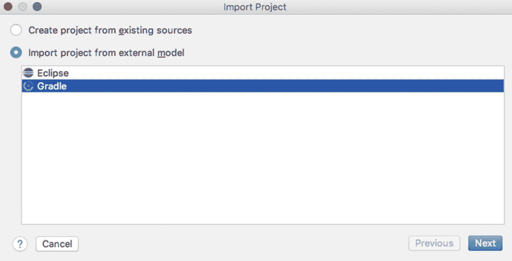

图 2-18

IntelliJ IDEA 克隆 java-for-absolute-beginners 项目的第五个对话框窗口

图 2-19 所示的窗口是在拥有一个完整的本地 Gradle 项目之前的最后一张图片。如果你正确配置了 JAVA 和 Gradle，IntelliJ IDEA 会自动为你找到并选择它们。

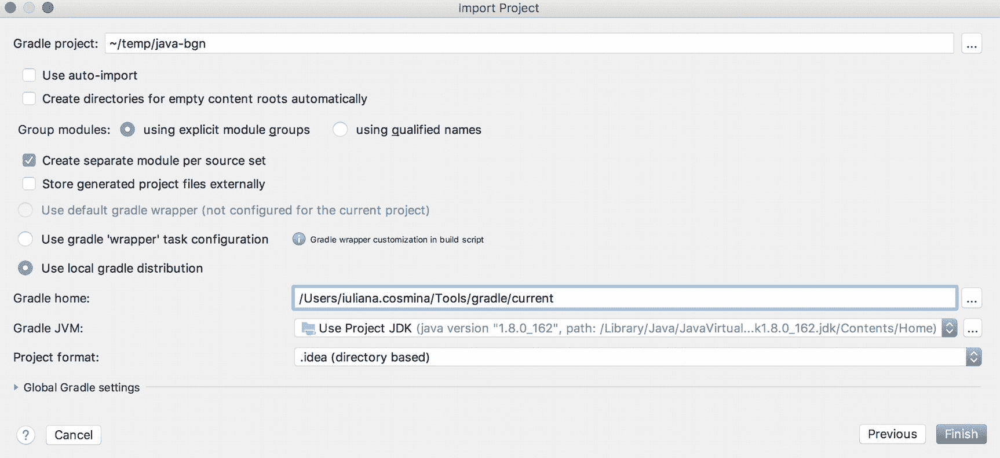

图 2-19

IntelliJ IDEA 克隆 java-for-absolute-beginners 项目的最后一个窗口

就是这样。从下一章开始，将展示一些代码片段；所以请继续构建项目。你可以通过从 Gradle 项目视图中执行 `build` 任务来完成此操作。图 2-20 显示了加载了项目并打开了 Gradle 视图的 IntelliJ IDEA 编辑器。

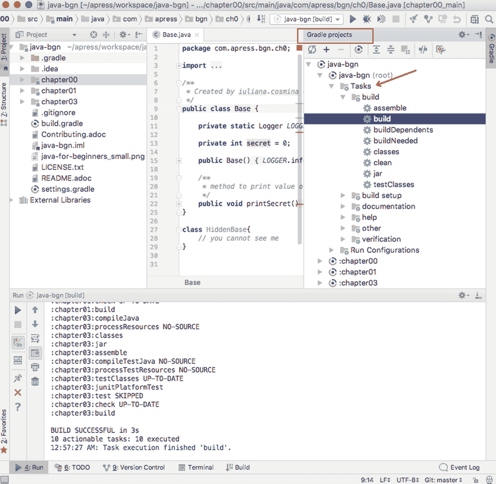

图 2-20

IntelliJ IDEA Gradle 项目视图，其中 Tasks 节点已展开


## 总结

如果你对任何说明感到不清楚（或者我遗漏了什么），请随时使用万维网搜索答案。本章介绍的所有软件技术都有详尽的官方文档和庞大的开发者社区提供支持，他们乐于提供帮助。在最坏的情况下，你可以在本书的 Apress GitHub 官方仓库中创建一个 issue，或者给我发邮件。如果需要，我会尽力提供支持。

但我认为你不会遇到问题。Java 并非高深莫测的尖端技术。^(²⁹)

脚注 1   2   3   4   5   6   7   8   9   10   11   12   13   14   15

