# 3. 初试身手

这是本书的最后一章入门章节。本章之后，我们将进入正题。上一章为你配置了一个完整的、可用于编写 Java 代码的开发环境。现在是时候利用它了。本章涵盖以下主题：

*   使用 JShell

*   Java 基本构建块：包、模块和类

*   使用 IntelliJ IDEA 创建 Java 项目

*   编译和执行 Java 类

*   将 Java 应用程序打包成可执行 jar

*   使用 Gradle 自动化编译和测试执行

## 使用 JShell

Java Shell 工具（JShell）在 Java 9 中引入，是一个用于学习 Java 编程语言和编写 Java 代码原型的交互式工具。这意味着你可以在控制台中编写并执行 Java 代码，无需将其保存到文件，再编译成字节码，最后由底层操作系统解释为一系列指令来运行。JShell 的出现相当晚，因为像 Python 和 Node 这样的脚本语言多年前就引入了类似的工具，而 Scala、Clojure 和 Groovy 等 JVM 语言也早已采用。但是，迟到总比不到好，这仍然是可以接受的。

JShell 是一个读取-求值-输出循环（REPL），它会在输入声明、语句和表达式时立即对其进行求值，并立即显示结果。它非常适合快速尝试新的想法和技术，而无需拥有完整的开发环境或为代码提供完整的执行上下文。

JShell 是 JDK 的标准组件，启动它的可执行文件位于 JDK 安装目录的 `bin` 目录中。这意味着你只需打开一个终端（Windows 中的命令提示符，以及你在 `macOS` 和 `Linux` 上安装的任何类型的终端），然后输入 **jshell**。你应该会看到类似这样的内容：^(³⁰)

```
$ jshell
|  欢迎使用 JShell -- 版本 10
|  如需介绍，请输入：/help intro
```

继续输入 **/help** 以查看所有可用操作和命令的列表。

```
jshell> /help
|  输入 Java 语言表达式、语句或声明。
|  或输入以下命令之一：
|  /list |-all|-start
|          列出你输入的源代码
|  /edit 
|          编辑源代码条目
|  /drop 
|          删除源代码条目
...
|  /exit 
|          退出 jshell 工具
...
```

为了准确了解 JShell 在做什么，我们可以通过添加 `-v` 参数以详细模式启动它。让我们用一些数字试试，看看会发生什么。首先，让我们以详细模式启动 JShell，这样当我们插入语句时，就能看到 JShell 所做一切的报告日志。在你的终端中，输入 **java -v**。

```
$ jshell -v
|  欢迎使用 JShell -- 版本 10-ea
|  如需介绍，请输入：/help intro
```

在 Java 中，值被赋给称为**变量**的字符序列。（关于如何命名和使用它们的更多信息，请参见**第** 4 章。）接下来，让我们创建一个整数类型（Java 中的 `int`）的变量，并赋予它值 42。为此，请输入 **int i=42**。

```
jshell> int i = 42
i ==> 42
|  创建了变量 i : int
```

如你所见，日志信息很清晰，告诉我们命令已成功执行，并且创建了 `int` 类型的变量。`i ==> 42` 这一行让我们知道值 42 已赋给我们刚刚创建的变量。

让我们声明另一个名为 `j` 的变量。在下面的代码片段中，35 是我们赋给它的值。但如果你想，可以尝试不同的数字。

```
jshell> int j = 35
j ==> 35
|  创建了变量 j : int
```

只要 JShell 会话没有关闭，之前的两个变量就仍然存在，因为我们可以继续使用它们。让我们把它们相加。在 Java 中，`+` 运算符对两个整数变量求和，就像在普通数学中一样。输入 **i + j**。

```
jshell> i + j
$3 ==> 77
|  创建了临时变量 $3 : int
```

如你所见，我们将两个变量相加，但没有将结果存储在第三个变量中，因此 JShell 创建了一个**临时变量**来存储结果并将其打印在日志中；但该变量不能在后续语句中使用，因为它没有名称。

一切看起来都很好：变量被创建，操作被正确执行。任何可以用 Java 编写的代码都可以在 JShell 中编写并执行。


### ！

Java 的构建块被称为**类**，它们是模拟现实世界对象和事件的代码片段。类包含两种类型的**成员**：一种用于模拟状态，即类变量，也称为**字段**或**属性**；另一种用于模拟行为，称为**方法**。JDK 提供了许多类，用于模拟创建大多数应用程序所需的基础组件。下一章将更详细地介绍类，在阅读本书的过程中，你也会创建大量类。即使这些术语和概念现在看起来有些陌生，请耐心等待，让它们逐渐积累；稍后它们会变得更有意义。

在 JShell 中，JDK 类可以像 `java.lang.String`（你将在**第** 4 章中进一步了解的程序组件）一样使用，它是 Java 中表示文本对象的类。并且可以调用它们的方法。让我们声明第一个 `String` 变量。

```
jshell> String text = "this is a text";
text ==> "this is a text"
|  created variable text : String
```

我们刚刚声明了一个类型为 `String` 的变量，名为 `text`，其值为 `"this is a text"`。`String` 类有许多方法可以调用来修改文本，让我们调用一个效果明显的方法。输入 `text.toUpperCase()`。

```
jshell> text.toUpperCase()
$6 ==> "THIS  IS  A  TEXT"
|  created scratch variable $6 : String
```

最后一条语句调用了 `String` 方法，该方法将变量内容转换为大写。但让我们看看当引入一些不符合 Java 语法的内容时会发生什么。让我们调用一个对 `String` 类型不存在的方法。

```
jshell> text.toAnotherUniverse()
|  Error:
|  cannot find symbol
|    symbol:   method toAnotherUniverse()
|  text.toAnotherUniverse()
|  ^--------------------^
```

JShell 非常清楚地告诉我们，它不知道 `toAnotherUniverse()` 是什么。让我们直接输入纯文本。下面，我尝试了 `"what is this?"`。

```
jshell> what is this?
|  Error:
|  ';' expected
|  what is this?
|         ^
```

在第一条语句中，我们尝试调用一个未在 `String` 类中定义的方法，错误消息与我们做错的地方非常相关。

我们甚至可以创建自己的方法。

```
jshell> String createHello(String s){
...> return "Hello " + s;
...> }
|  created method createHello(String)
jshell> createHello(text)
$8 ==> "Hello this is a text"
|  created scratch variable $8 : String
```

JShell 也支持代码补全^(³¹)。以我们之前定义的 `text` 变量为例；如果我们输入 **text**，然后在后面加上一个“.”（点），再按 Tab 键，就会列出可用的方法列表，如图 3-1 所示。如果你输入方法名称的几个字母，就会应用过滤。JShell 只建议以该字母组合开头的方法名称。非常有用，对吧？

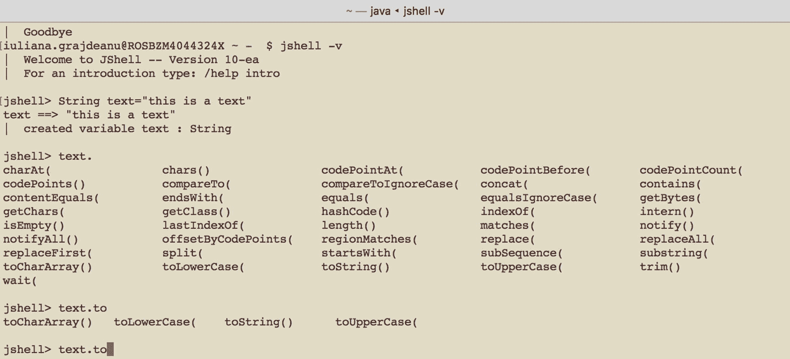

图 3-1

JShell 列出可在 String 变量上调用的方法

如果你想查看在 JShell 会话中声明的所有变量，可以通过执行 `/vars` 命令来实现。

```
jshell> /vars
|    String text = "this is a text"
|    List units = []
|    List list1 = [One]
|    File f = .
|    Logger log = null
```

上述输出对应于在 JShell 控制台中执行的一系列语句，如下所示：

```
jshell> String text = "this is a text"
text ==> "this is a text"
|  created variable text : String
jshell> List units = new ArrayList()
units ==> []
|  created variable units : List
jshell> List list1 = new ArrayList()
list1 ==> []
|  created variable list1 : List
jshell> list1.add("One");
$4 ==> true
|  created scratch variable $4 : boolean
jshell> File f = new File(".")
f ==> .
|  created variable f : File
jshell> import java.util.logging.LogManager;
jshell> import java.util.logging.Logger;
jshell> Logger l = LogManager.getLogManager().getLogger("sample");
l ==> null
|  created variable l : Logger
```

如果你想保存 JShell 会话中的所有输入，可以通过执行 `/save [filename.java]` 命令来实现。这将生成一个文件，其中包含你在该会话中使用 JShell 执行的所有 Java 语句。

```
String text="this is a text";
List units = new ArrayList();
List list1 = List.of("One");
File f = new File(".");
import java.util.logging.Logger;
import java.util.logging.LogManager;
Logger log = LogManager.getLogManager().getLogger("sample");
```

另外，假设上述输出是 JShell 导出到名为 `sample.java` 的文件中的 Java 语句列表（使用命令 `/save sample.java`），则所有这些语句都可以通过使用 `/open sample.java` 命令在新的 JShell 会话中执行。这样，所有变量都会被创建，我们可以在新会话中使用它们。

如果你有兴趣尝试 JShell 提供的每条命令和每个功能，Oracle 官方网站上提供了完整的 JShell 用户指南。^(³²)

如果你已经打开了 JShell 并亲自尝试了本节中列出的一些命令，那么你已经对 Java 语法有了一点初步了解。但本书之所以用一整章来介绍它，是有原因的；在此之前，了解 Java 生态系统的基本构建块会更有帮助。

## Java 基本构建块

### ！

这是对 Java 作为平台的一致介绍，但要自信地编写代码，你需要掌握*底层*发生了什么，构建块是什么，以及它们之间如何相互连接。如果你愿意，可以完全跳过下一节，但就像一些新司机在握方向盘之前需要了解一点发动机的工作原理一样，有些人在编程时如果对*机制*有一点了解，可能会感到更自信、更有掌控力。所以，我想确保任何阅读本书的人都能有一个良好的开端。^(³³)

要编写 Java 应用程序，开发人员必须熟悉 Java 生态系统的构建块。该生态系统的核心是**类**。Java 中还有其他对象类型，但类是最重要的，因为它们代表了构成应用程序的对象的模板。一个类将**字段**和**方法**组合在一起。当创建一个对象时，字段的值定义了对象的状态，而方法则描述了其行为。


### !

Java 对象是现实世界对象的模型。因此，如果我们选择在 Java 中对汽车进行建模，我们就会选择定义描述汽车的字段：制造商（manufacturer）、型号名称（modelName）、生产年份（productionYear）和速度（speed）。我们汽车类的方法描述了汽车的行为；而汽车主要做两件事：加速和刹车。

所有对象类型都定义在扩展名为 `*.java` 的文件中。对象类型被组织在**包**中。包是类型的逻辑集合，其中一些类型在包外部可见，而另一些则不可见，这取决于它们的作用域。包是一个目录层次结构，Java 对象类型位于其最底层（通常是，但并非总是如此）。

包名必须唯一，并且其名称应遵循特定的模板。良好的实践表明，为了确保唯一性和含义，通常以组织域名的反向顺序作为名称的开头，然后添加各种分组标准。在本项目中，包名遵循如下所示的模板：

```
com.apress.bgn.ch[*]+
```

此模板以 Apress 出版社的域名反向顺序（[`www.apress.com`](http://www.apress.com)）开头，然后添加一个标识本书的术语（`bgn` 是 *beginner* 的缩写），最后是 `ch` 加上源代码（通常）对应的章节编号。

从 Java 5 开始，每个包可以包含一个名为 `package-info.java` 的文件，该文件包含包声明、包注解、包注释和 Javadoc 标签。这些注释会被导出到该包的 Javadoc 中，稍后你将学习如何使用 Gradle 生成它。`package-info.java` 文件必须位于包路径的最后一个目录下。因此，如果我们定义一个 `com.apress.bgn.ch3` 包，Java 项目的整体结构和内容将如图 3-2 所示。^(³⁴)

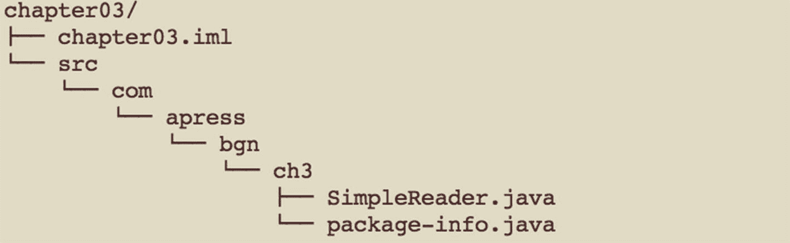

图 3-2

Java 包内容

`package-info.java` 文件的内容可能类似于：

```
/**
* 包含用于从各种来源读取信息的类。
* @since 1.0-SNAPSHOT
* @author iuliana.cosmina
* @version 1.0-SNAPSHOT
*/
@Deprecated
package com.apress.bgn.ch3;
```

包含对象类型定义的 `*.java` 文件会被编译成 `*.class` 文件，这些文件根据包结构进行组织，并打包到一个或多个 **JAR**（**J**ava **Ar**chives，Java 归档文件）中。^(³⁵) 对于前面的例子，如果我们解压编译和链接后生成的 JAR 文件，你会看到如图 3-3 所示的内容。

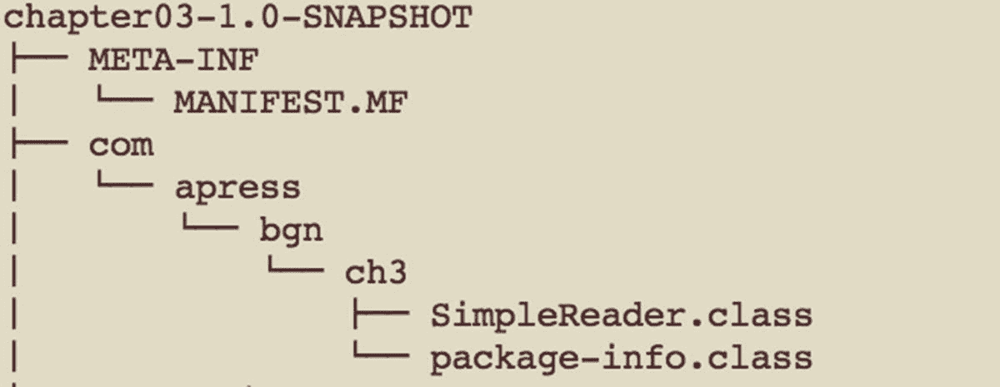

图 3-3

示例 JAR 文件的内容

### !

`package-info.java` 文件不是必需的，没有它们也可以定义包。它们主要用于文档目的。

一个包中的代码可能跨越多个 JAR 文件，这意味着如果你的项目中有多个子项目^(³⁶)，你可以多次使用相同的包名，其中包含不同的类。上述所有内容的符号表示如图 3-4 所示。

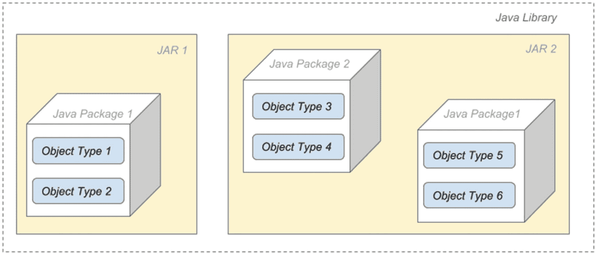

图 3-4

Java 构建块

一个**库**由一个或多个 JAR 文件组成。^(³⁷)

一个 Java 应用程序可以使用一个或多个库，并且为了能够运行，它需要其所有依赖项（所有 JAR 文件）都在类路径上。这意味着什么？这意味着要运行一个 Java 应用程序，需要 JDK、依赖项（外部 JAR 文件）以及应用程序的 JAR 文件。图 3-5 清晰地展示了这一点。

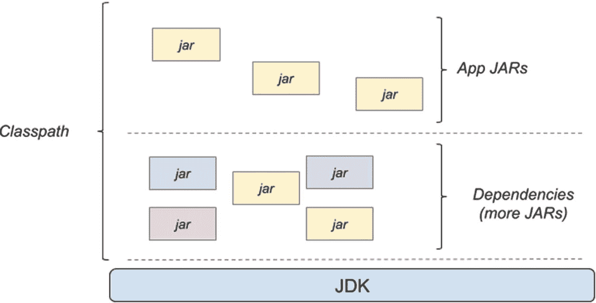

图 3-5

应用程序的类路径

构成应用程序类路径的 JAR 文件（显然）并不总是相互独立的。在 21 年的时间里，这种组织方式已经足够，但在复杂的应用程序中，出现了许多问题，原因包括：包分散在多个 JAR 文件中、JAR 文件之间的传递依赖关系（有时会导致类路径上存在同一类的不同版本）、缺少传递依赖项以及可访问性问题。所有这些问题都被统称为**JAR 地狱**。^(³⁸) 这个问题在 Java 9 中通过引入另一个层级来组织包得到了解决，但我们应该预料到，未来某个时候可能会出现**模块地狱**。

在介绍模块之前，应该先提一下**访问修饰符**，因为 Java 对象类型和成员可以在包内以特定的访问权限进行声明，这在开始编码之前是需要理解的重要内容。

### 访问修饰符

当你在 Java 中声明一个对象类型时（我们暂且坚持使用类，因为这是目前唯一提到的类型），你可以配置谁能够使用它。访问修饰符指定了对类的访问权限，在这种情况下，我们说它们是在**顶层**使用的。它们也可以指定对类成员的访问权限，在这种情况下，它们是在**成员级别**使用的。^(³⁹)

在顶层，只能使用两种访问修饰符：`public` 和默认（无修饰符）。

一个声明为 `public` 的**顶层**类必须定义在一个同名的 Java 文件中。因此，下面的类定义在 `com.apress.bgn.ch0` 包下的 `Base.java` 文件中。

```
package com.apress.bgn.ch0;
// 顶层访问修饰符
public class Base {
...
}
```

为了不让你分心，类的内容暂时用 `...` 代替。一个 `public` 类对所有地方的任何类都是可见的。因此，不同包中的不同类可以创建此类型的对象，如下面的示例代码所示：

```
package com.apress.bgn.ch3;
import com.apress.bgn.ch0.Base;
import  org.apache.logging.log4j.LogManager;
import org.apache.logging.log4j.Logger;
public class Main {
public static void main(String... args) {
// 创建一个 Base 类型的对象
Base base = new Base();
}
}
```


### ！

现在，请先让这句话深入脑海：**一个** **public 类** **对所有类在任何位置都是可见的**。

不使用访问修饰符的选项被称为使用 `default` 或 `package-private` 修饰符。^((40)) 这意味着，如果一个类没有访问修饰符，那么该类仅对定义在同一个包中的类可见。没有访问修饰符的类可以定义在任何 Java 文件中，可以是与文件名同名的文件，也可以紧邻着为文件命名的那个类。因此，如果我们像下面的代码片段所示，在 `Base.java` 文件中声明一个名为 `HiddenBase` 的类，那么在 `Main` 类中尝试创建此类型的对象是不可能的，因为该类位于不同的包中。

```
package com.apress.bgn.ch0;
public class Base {
...
}
class HiddenBase{
// 在包外部你看不到我
}
```

当然，你可以编写代码，但 Java 编译器不会编译它，因此也没有字节码可以执行。此外，智能的 Java 编辑器会通过将你的代码标红，并在你编写时拒绝提供任何代码辅助，来非常清晰地指出你的错误。图 3-6 展示了 IntelliJ IDEA 如何试图告诉我，我在尝试访问一个 `package-private` 类时做错了。

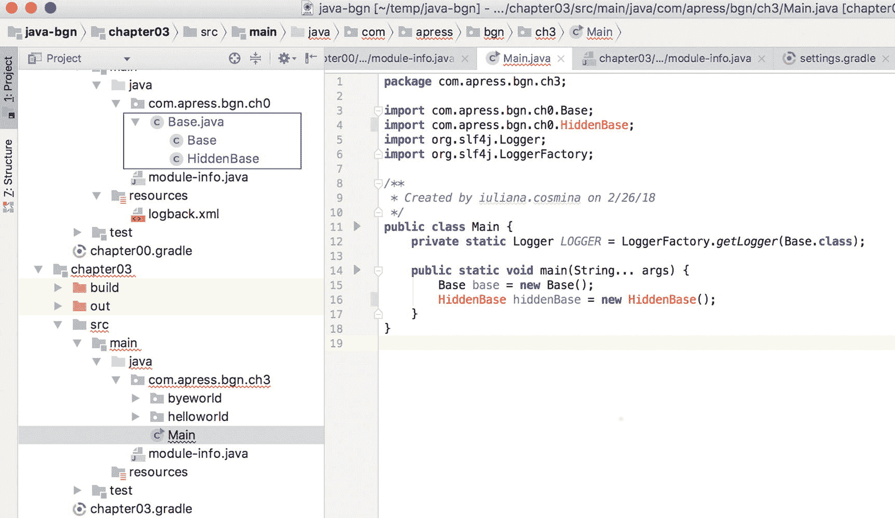

图 3-6

IntelliJ IDEA 提示访问 package-private 类会导致编译错误

在同一张图中，包含这两个类的文件被一个矩形框出，以吸引你注意编辑器是如何清晰地表明这两个类定义在同一个 Java 文件中。

### ！

现在，请先接受这个说法并让它深入脑海：**一个没有访问修饰符的类，对同一个包中的所有类都是可见的**。

在类内部，定义了类的成员：字段和方法。^((41)) 访问修饰符也可以应用于类成员，并且在成员级别，还可以应用另外两个修饰符：`private` 和 `protected`。在成员级别，访问修饰符具有以下影响。

*   `public`：与顶层相同，该成员可以从任何位置访问。

*   `private`：该成员只能从其自身的类内部访问。

*   `protected`：该成员只能从其自身的包内部，或者由另一个包中该类的任何子类^((42))访问。

*   `none`：该成员只能从其自身的包内部访问。

如果这看起来很复杂，那只是在你开始编写代码并习惯它之前的感觉。在 Oracle 官方文档页面上，有一个成员可见性的表格，本书在此将其展示为表 3-1。^((43))

表 3-1

成员级别访问器

| 修饰符 | 类 | 包 | 子类 | 全局 |
| --- | --- | --- | --- | --- |
| public | 是 | 是 | 是 | 是 |
| protected | 是 | 是 | 是 | 否 |
| none（也称为 default/package-private） | 是 | 是 | 否 | 否 |
| private | 是 | 否 | 否 | 否 |

在你开始编写 Java 代码后，你可能会回过头来查看这个表格一两次。在引入模块之后，此表格中的所有内容仍然有效，当然，前提是你正确配置了模块访问。

### 引入模块

从 Java 9 开始，引入了一个新概念：**模块**。它们用于对包进行分组和封装。这个新概念的实施耗时超过十年。关于模块的讨论始于 2005 年，并提议在 Java 7 中实现。在 **Project Jigsaw** 的名称下，探索阶段于 2008 年开始。Java 开发者曾希望模块化 JDK 能在 Java 8 中可用，但最终在 Java 9 中才得以实现，这经过了三年工作（以及近七年的分析）。显然，这就是 Java 9 的官方发布日期推迟到 2017 年 9 月的原因。^((44))

模块代表了一种聚合包的新方式。**模块**是一种对包进行分组并配置对包内容更细粒度访问的方法。

**模块**是一个唯一命名的、可重用的包和资源（XML 文件）组，由一个名为 `module-info.java` 的文件描述。该文件包含以下信息：

*   模块的名称
*   模块的依赖项（即，此模块依赖的其他模块）
*   它明确提供给其他模块的包（模块中所有其他包隐式地不对其他模块可用）
*   它提供的服务
*   它消费的服务
*   允许哪些其他模块进行反射
*   本地代码
*   资源
*   配置数据

理论上，模块命名类似于包命名，并遵循反向域名约定。实践中，请确保模块名称不包含任何数字，并且能清晰表明其用途。`module-info.java` 文件被编译成一个**模块描述符**，这是一个名为 `module-info.class` 的文件，它与类一起被打包到一个普通的旧 JAR 文件中。该文件位于根源码目录中，在任何包之外。对于前面介绍的示例，添加了一个 `module-info.java`，新的项目结构如图 3-7 所示。

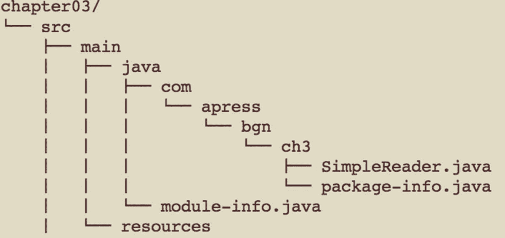

图 3-7

Java 9 项目的结构

与任何扩展名为 `*.java` 的文件一样，`module-info.java` 会被编译成一个 `*.class` 文件。由于模块声明不是 Java 对象类型声明的一部分，`module` 不是一个 Java 关键字，因此在为 Java 对象类型编写代码时仍然可以使用它。对于 `package`，情况则不同，因为每个 Java 对象类型声明都必须以包声明开头。看一下 `SimpleReader` 类，声明如下。

```
package com.apress.bgn.ch3;
public class SimpleReader {
private String source;
...
}
```

那么，这实际上意味着什么？模块在哪里，它是什么？嗯，在由单个包含源码的根目录组成的简单项目中，模块不必在物理上划分或组织源码。^((45)) 它们由 `module-info.java` 文件的内容定义。因此，从 Java 9 开始，图 3-4 中所示的内容演变为图 3-8。

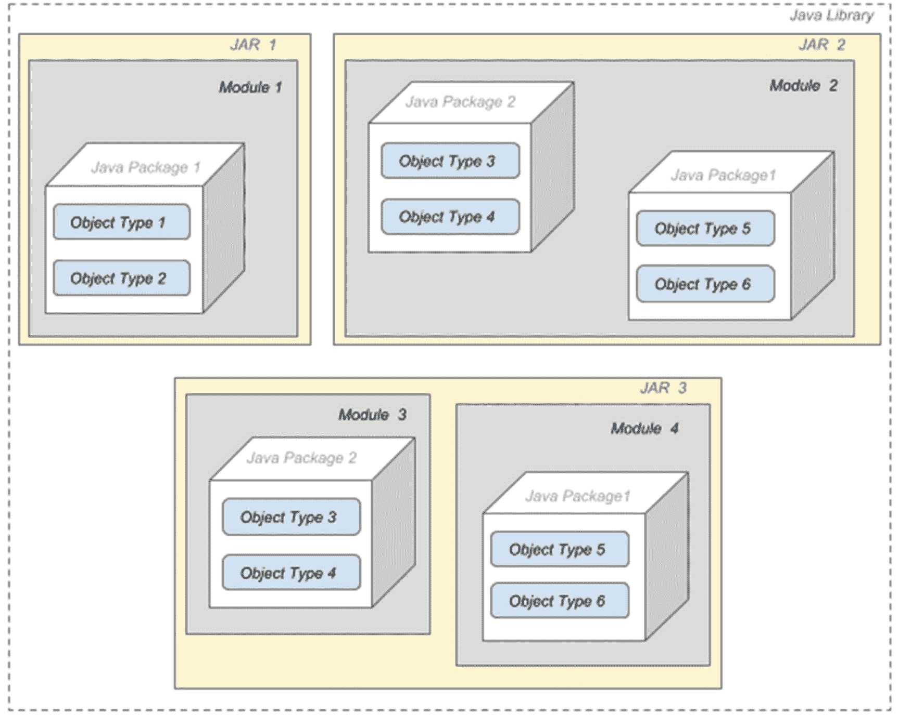

图 3-8

从 Java 9 开始的 Java 构建块

在图 3-8 中，无需为 JAR1 和 JAR2 中的模块创建目录。对于 JAR3，同一个 JAR 中归档了两个模块；在这种情况下，我们需要显式地分离它们的源码。这样做的原因是需要有两个 `module-info.java` 文件，而显然没有操作系统允许同一个目录中有两个同名文件。此类项目的一个示例在**附录**中介绍，该附录作为本书源代码下载的一部分提供（[`​github.​com/​apress/​java-for-absolute-beginners`](https://github.com/apress/java-for-absolute-beginners)）。


模块的引入意味着 JDK 现在也被划分为多个模块。这意味着 Java 平台不再是一个由大量包组成的庞然大物，从而使其开发、维护和演进变得困难。该平台现在被拆分为 95 个模块，可以通过执行 `java --list-modules` 来查看（在 Java 后续版本中，数量可能会有所不同）。

```
$ java --list-modules
java.base@10
java.compiler@10
java.datatransfer@10
java.desktop@10
...
```

每个模块名称后面都跟着一个版本字符串 `@10`，表示该模块属于 Java 10。

因此，如果某个 Java 应用程序不需要所有模块，则可以仅使用其所需的模块来创建运行时，从而减小运行时的体积。用于构建满足应用程序需求的、更小运行时的工具称为 `jlink`，它是 JDK 可执行文件的一部分。它允许实现更大程度的可扩展性和更高的性能。^(⁴⁶)

引入模块有诸多好处，经验丰富的开发者们多年来一直期待能利用这些优势。但是，为更大、更复杂的项目配置模块并非易事，因此目前只介绍包含一个包的模块的简单配置。在读完本书后，欢迎阅读**附录**，其中涵盖了更高级的模块配置，并针对每种可能的模块配置给出了示例。

`module-info.java` 的内容可以简单到只有模块名称和两个大括号。

```
module chapter.three {
}
```

### 配置模块

在这些大括号内，可以使用以下关键字之一来声明不同的模块 `指令`：

*   `requires`

*   `exports`

*   `module`

*   `open`

*   `opens... to`

*   `provides ... with`

*   `transitive`

每个关键字都涵盖特定的行为，但对于初学者来说，最重要的两个是 `requires` 和 `exports`。

**模块可以相互依赖**。在我们的示例中，`chapter.three` 模块内的类需要访问 `chapter.zero` 模块中的包和类。声明模块依赖关系是通过使用 `requires` 关键字来完成的。

```
module chapter.three {
requires chapter.zero;
}
```

上述依赖关系是**显式**的。但也存在隐式依赖关系。例如，开发者声明的任何模块都**隐式地**依赖于 JDK 的 `java.base` 模块。该模块定义了 Java SE 平台的基础 API，没有它，任何 Java 应用程序都无法编写。

将某个模块声明为必需的，意味着该模块在编译时和运行时都是必需的。如果某个模块仅在运行时需要，则使用 `requires static` 关键字来声明依赖关系。请暂时记住这一点；当我谈到 Web 应用程序时，你就会明白它的意义。

**但是，仅仅将我们的模块声明为依赖于另一个模块就足够了吗？** 这是否意味着依赖模块可以访问所有 `public` 类型（以及它们的嵌套 `public` 和 `protected` 类型）？如果你认为不能，那你是对的。仅仅因为一个模块依赖于另一个模块，并不意味着它可以访问它所需的包和类。这是因为它所依赖的模块必须配置为暴露其*内部*。这该怎么做呢？在我们的例子中，我们需要确保 `chapter.zero` 模块能够访问所需的包。这可以通过为该模块定制 `module-info.java`，添加 `exports` 指令，后跟必要的包名来实现。

```
module chapter.zero {
exports com.apress.bgn.ch0;
}
```

通过这样做，我们向任何需要将此包作为依赖项的模块授予了对 `com.apress.bgn.ch0` 包的访问权限。如果我们不希望这样呢？

### ！

如果你很好奇并阅读了推荐的 **Jar Hell** 文章，你会注意到，使用打包在 Jar 中的 Java 源代码时，其中一个问题是安全性。因为即使没有 Java 源代码的访问权限，通过将 Jar 作为依赖项添加到应用程序中，也可以访问、扩展和实例化对象。因此，除了提供可靠的配置、更好的可扩展性、平台的完整性以及更高的性能之外，引入模块的目标是为了更好的安全性。

如果我们想**将对模块内容的访问限制**仅限 `chapter.three` 模块，该怎么办？这可以通过在 `exports` 指令中添加 `to` 关键字，后跟模块名称来实现。

```
module chapter.zero {
exports com.apress.bgn.ch0 to chapter.three;
}
```

可以通过列出所需的模块（用逗号分隔）来指定多个模块具有访问权限。

```
module chapter.zero {
exports  com.apress.bgn.ch0  to  chapter.three,  chapter.two;
}
```

关于模块，目前你需要了解的大致就是这些。

### 确定结构：一个 Java 项目

### ！

在编写本章时，JDK 11 EAP 刚刚发布。不久之后，Gradle 4.9 版本和 IntelliJ IDEA 2018.2 版本发布，它们完全支持使用 JDK 11 进行开发。因此，从本节开始，本书的其余部分将提及 Java 11。

Java 项目的结构有几种方式。这取决于项目的范围以及所使用的构建工具。

你可能会想，为什么项目范围会影响其结构，因为你认为应该有一个标准，对吧？嗯，标准不止一个，这取决于项目范围，因为创建 Java 项目的范围（即原因）会影响其规模。如果项目很小，可能不需要将源代码拆分成子项目，也不需要构建工具，而构建工具有自己组织项目的标准方式。让我们从有史以来最小的 Java 项目开始，它应该向控制台打印 Hello World!。


#### IntelliJ IDEA 中的 HelloWorld! 项目

顺便提一下，你甚至不需要创建项目，因为你有 JShell。打开终端（Windows 上是命令提示符）和 JShell，然后输入 `System.out.print("Hello World!")` 语句。

```
$  jshell
|   Welcome to JShell -- Version 11-ea
|   For an introduction type: /help intro
jshell> System.out.print("Hello World!")
Hello World!
```

既然你已经安装了 IntelliJ IDEA，那我们就创建一个 Java 项目，看看编辑器会为我们选择什么样的项目结构。首先启动 IntelliJ IDEA，点击 **Create New Project** 选项。随后会弹出一个二级对话框窗口，左侧列出了你可以创建的项目类型。这里提到的两个对话框窗口如图 3-9 所示。

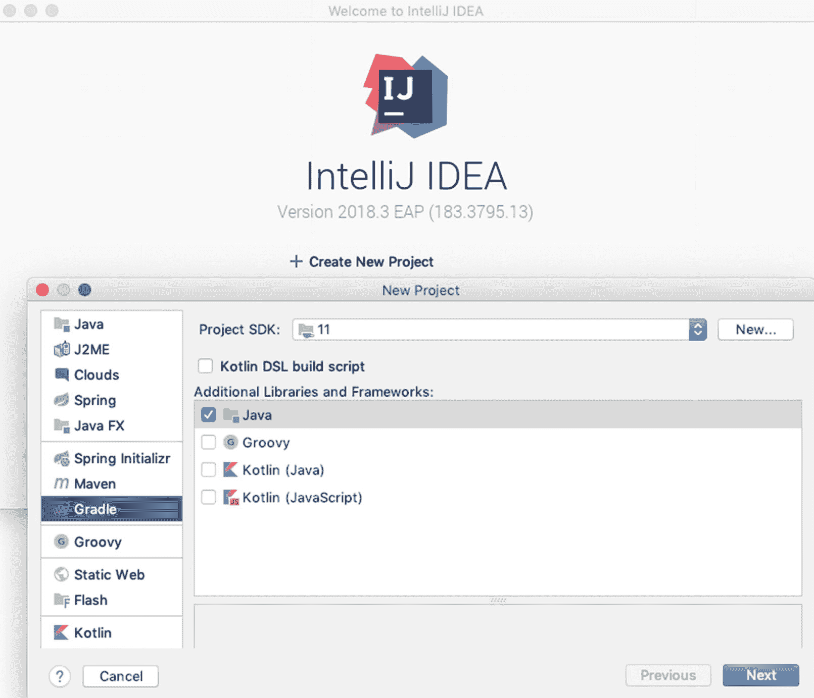

图 3-9

创建一个 IntelliJ IDEA 项目

从左侧选择 Java 项目类型，然后点击 **Next**。（不要选择任何额外的库和框架，我们实际上是在创建尽可能最小的 Java 项目。）在下一个对话框窗口中，可以输入项目名称和位置。由于我们创建的是 Java 11 项目，你可以注意到底部有一个用于配置 Java 模块的区域。这个配置窗口如图 3-10 所示。

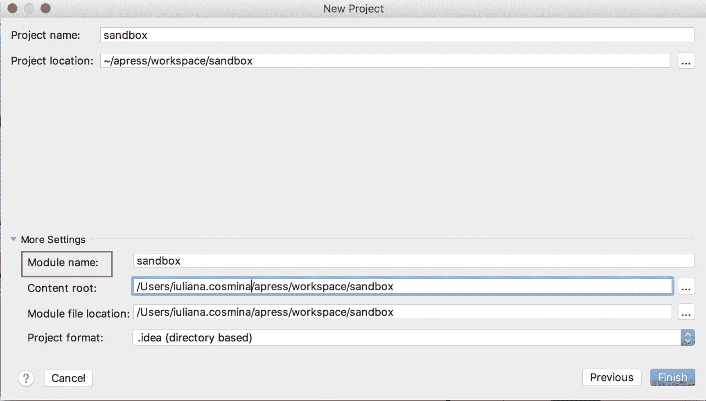

图 3-10

IntelliJ IDEA 项目配置对话框窗口

输入项目名称和模块名称后——我们将项目名称和模块名称都设为 `sandbox`——点击 **Finish**，下一个窗口应该是编辑器窗口，你可以在其中开始编写代码。如果你展开左侧的 `sandbox` 节点（该部分称为*项目视图*），可以看到项目是使用你已安装的 JDK（此处为 11）构建的，并且为你创建了一个 `src` 目录。你的项目应该与图 3-11 所示非常相似。

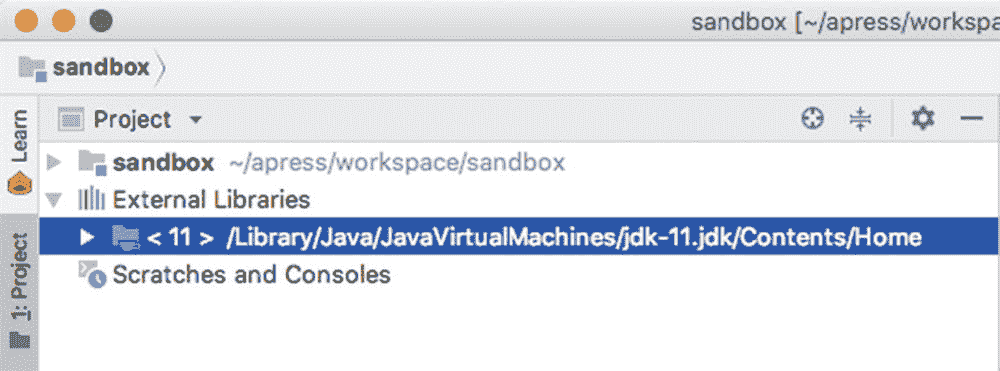

图 3-11

*IntelliJ IDEA* *项目视图*

在编写代码之前，让我们看看还有哪些其他项目设置可用。IntelliJ IDEA 允许你通过 **File ➤ Project Structure...** 菜单项查看和编辑项目属性。如果你点击它，会打开一个对话框窗口，类似于图 3-12 所示。

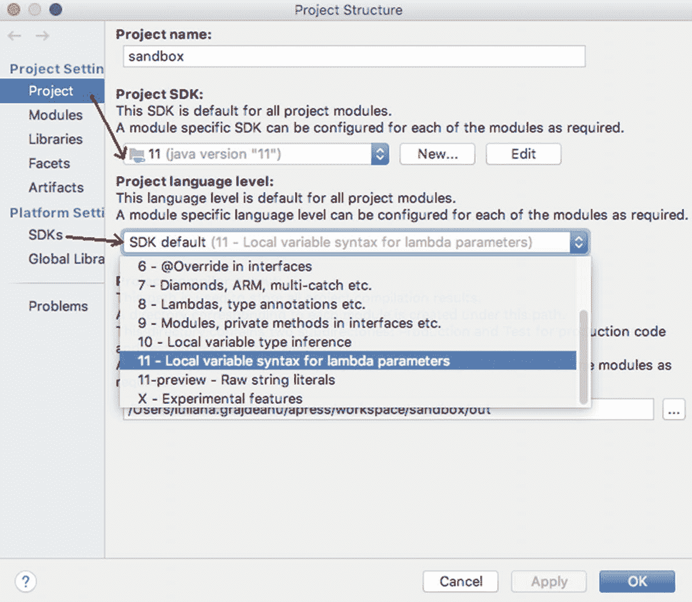

图 3-12

IntelliJ IDEA 项目设置选项卡

默认情况下，会打开 **Project** 设置选项卡。在图 3-12 中，有两个箭头吸引你的注意，分别指向 **Project SDK** **:** 部分（显示 Java 项目的 JDK 版本）和 **Project** **language level** **:** 部分。在撰写本章时，JDK 11 EA 是最新版本。最新版本的 IntelliJ IDEA 支持 Java 11 的语法和代码补全，这就是此处显示它的原因。这就是项目语言级别设置的含义。

如果你切换到名为 **Modules** 的选项卡，你会看到如图 3-13 所示的信息。

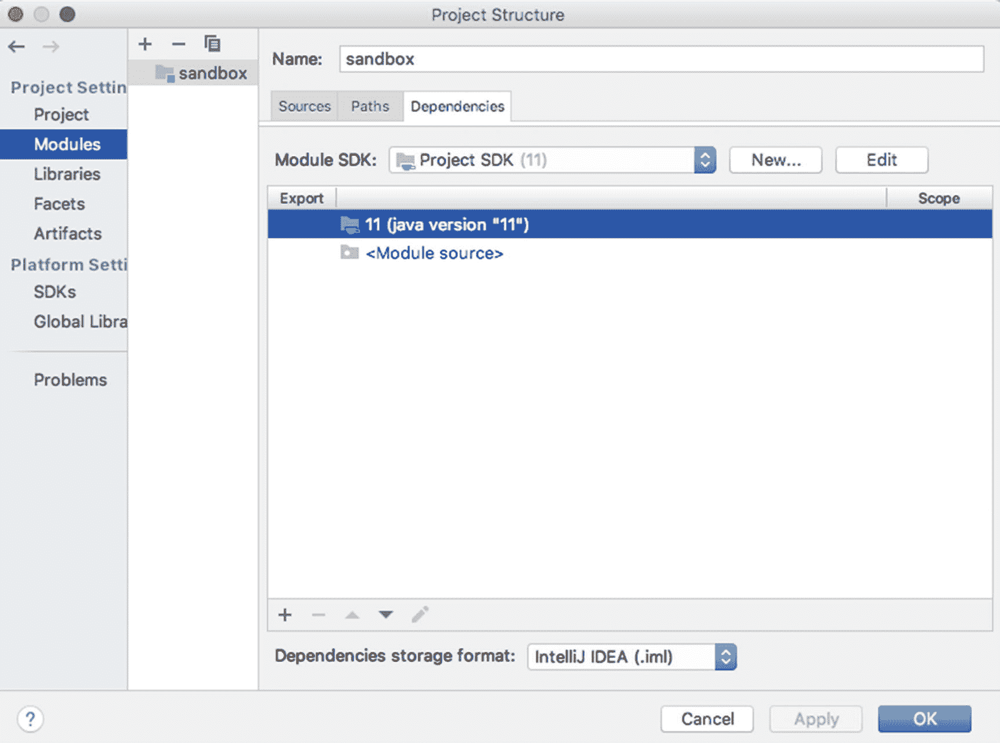

图 3-13

IntelliJ IDEA 模块设置选项卡

### !

让我们先澄清一点。Modules 选项卡并不显示项目中 Java 模块的信息。除了将包组合在一起的 Java 模块之外，模块也是一种将项目中具有共同目的的 Java 源文件和资源文件打包在一起的方式。这就是为什么在 Oracle 引入 `module` 概念来模块化 Java 应用程序之前，构成这些应用程序的代码就已经被那些需要以某种实用方式组织大型项目的开发者模块化了。

在 Modules 选项卡中，你可以看到项目包含的部分（模块）数量以及每个部分的设置。`sandbox` 有一个部分：一个同样名为 `sandbox` 的模块，该模块的源文件包含在 `src` 目录中。因此，如果我们想编写一个打印 *Hello World!* 的类，名为 `HelloWorld.java` 的文件必须放在该目录下。如果你右键单击 `src` 目录，会出现如图 3-14 所示的菜单。

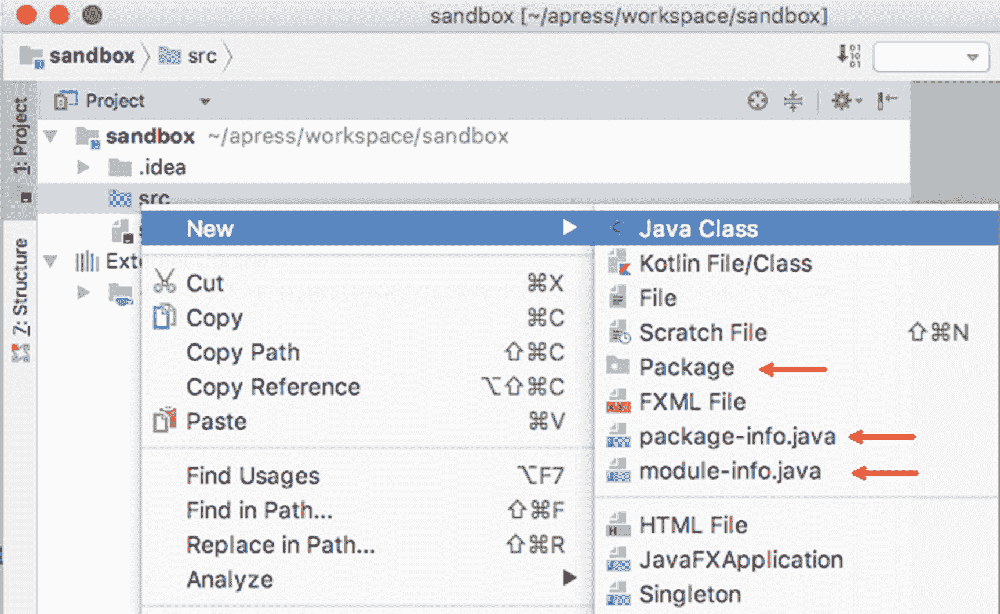

图 3-14

IntelliJ IDEA 菜单，列出了可以在 **src** 目录中创建的 Java 对象

除了 Java Class 选项外，还有一些红色箭头向你展示 `src` 目录中还可以包含哪些其他组件。让我们继续创建我们的类。点击 **Java Class** 菜单选项，输入类名后，展开 **Kind:** 下拉列表。图 3-15 显示了展开后的列表。

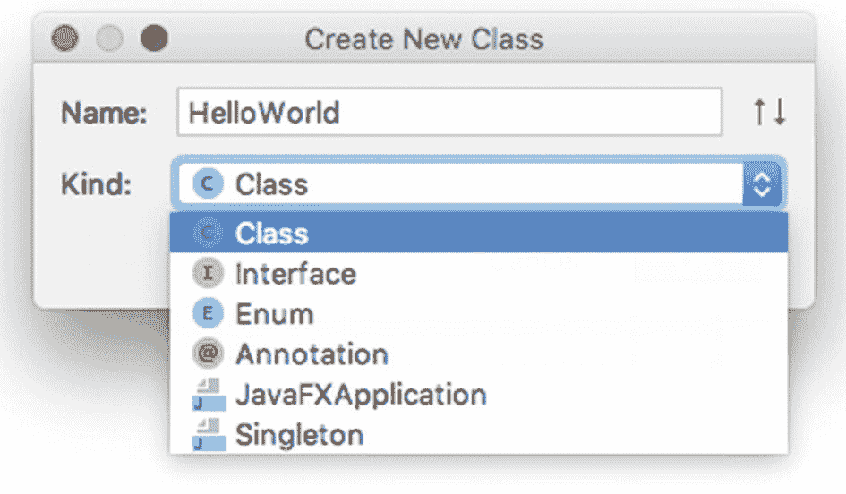

图 3-15

IntelliJ IDEA 创建 Java 数据类型的对话框窗口

Java 应用程序的核心构建块是 Java 类，但 Java 中还有其他对象类型。在 **Kind:** 列表中，列出了四种 Java 对象类型。每种类型稍后都会详细解释；现在，选择 **Class** 并点击 **OK** 按钮。你会注意到，在 `src` 目录下创建了一个名为 `HelloWorld.java` 的文件，该文件的内容非常简单。

```
/**
* Created on 3/3/18.
*/
public class HelloWorld {
}
```

你已经在你第一个简单的 Java 项目中创建了第一个 Java 类。它目前还什么也不做。但可以通过从 IntelliJ IDEA 的 **Build** 菜单中选择 **Build Project** 选项，或按组合键（每个操作系统不同）来编译它。编译 Build Project 选项会生成包含字节码的 `HelloWorld.class` 文件。默认情况下，IntelliJ IDEA 将编译结果存储到名为 `out\production` 的目录中。编译项目的菜单选项和结果如图 3-16 所示。菜单选项用 (`1`) 标记。

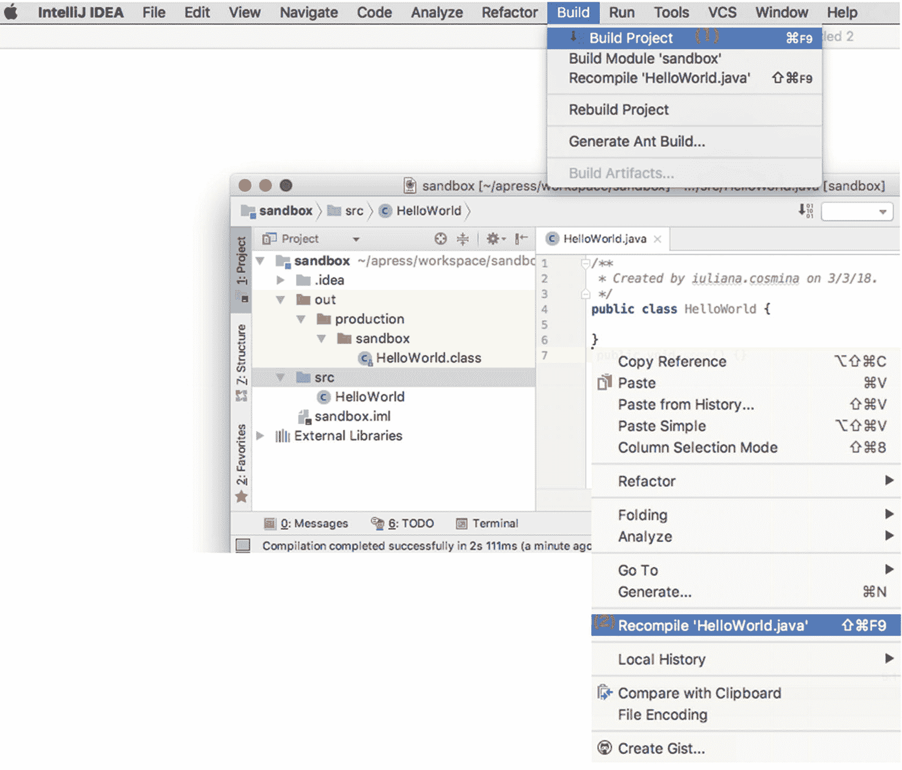

图 3-16

IntelliJ IDEA——如何编译 Java 项目

当你的项目中有多个类时，你可以通过右键单击类体并选择 **Recompile [ClassName].java**（在图 3-16 中用 (2) 标记）来编译你修改的那个类。


是时候让这个类打印 *Hello World!* 了。为此，我们需要给这个类添加一个特殊的方法。任何 Java 桌面应用程序都有一个名为 `main` 的特殊方法，它必须在顶层类中声明。JRE 会调用这个方法来运行 Java 程序/应用程序，我将其称为**入口点**。如果没有这个方法，一个 Java 项目就只是一堆类的集合，这些类不可运行、无法执行，也无法执行某些功能。可以这样想象：这就像你有一辆车，但无法启动它，因为点火锁芯不见了。从各方面来看，它确实是一辆车，但它无法实现汽车的主要目的——带你去某个地方。你可以把 main 方法想象成点火锁芯，JRE 将钥匙插入其中，让你的应用程序运行起来。让我们把这个方法添加到 `HelloWorld` 类中。^(⁴⁷)

```
/**
* Created on 3/3/18.
*/
public class HelloWorld {
public static void main(String... args) {
System.out.println("Hello  World!");
}
}
```

现在，让我们运行这个类。在 IntelliJ IDEA 中，你也有两个选项：从“运行”菜单中选择**运行 '[ClassName]'** 选项，或者右键单击类主体，然后从出现的菜单中选择**运行 '[ClassName]'.main()**。^(⁴⁸)

图 3-17 展示了可用于执行该类的菜单项以及执行结果。

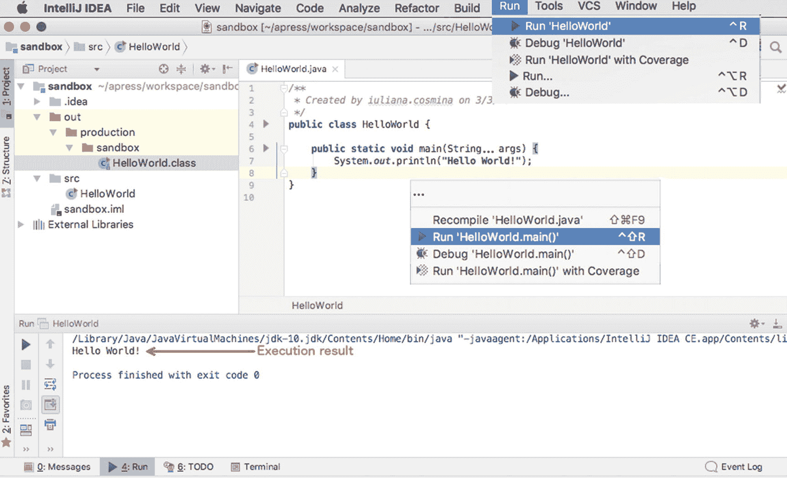

图 3-17

IntelliJ IDEA——如何执行一个 Java 类

所以，这就是 Java 项目最基本的结构。这个项目非常简单，甚至可以从命令行手动编译。那么，让我们来试试。

#### 手动编译和执行 HelloWorld! 项目

你可能已经注意到了 IntelliJ IDEA 中的**终端**按钮。点击该按钮，编辑器内会打开一个终端窗口。在 Windows 上是命令提示符实例，在 Linux 和 macOS 上是默认的 shell。IntelliJ 会在你的项目根目录下打开终端。下面说明你需要做什么。

1.  执行以下命令进入 `src` 目录：

    ```
    cd src
    ```

    `cd` 是一个在 Windows 和 Unix 系统中都适用的命令，是 *change directory*（更改目录）的缩写。

2.  执行以下命令编译 `HelloWorld.java` 文件：

    ```
    javac HelloWorld.java
    ```

    `javac` 是一个 JDK 可执行文件，用于编译 Java 文件，IntelliJ IDEA 在后台会调用它。

3.  执行以下命令运行 `HelloWorld.class` 文件生成的字节码：

    ```
    java HelloWorld
    ```

图 3-18 展示了在 IntelliJ IDEA 的终端中执行这些命令的过程。

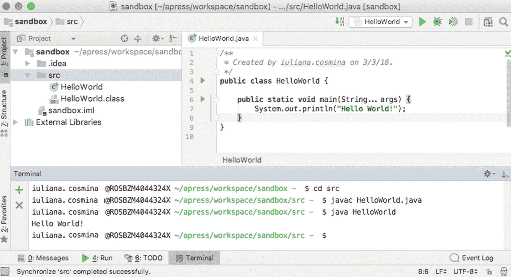

图 3-18

在 IntelliJ IDEA 内部的终端中手动编译并运行 HelloWorld 类

看起来很简单，对吧？实际上也确实很简单，因为没有定义任何包或 Java 模块。但是，等等，这有可能吗？嗯，是的。如果你没有定义包，该类仍然属于一个未命名的默认包，这是 JSE 平台默认提供的，用于开发小型、临时性和教学性的应用程序，就像你正在构建的这个一样。那么，让我们让项目稍微复杂一点，为我们的类添加一个命名包。

#### 将 HelloWorld 类放入一个包中

在图 3-14 中，菜单里有一个**包**选项。因此，右键单击 `src` 目录并选择它。会出现一个对话框窗口，你必须在其中输入包名。输入 **com.sandbox**。图 3-19 显示了该对话框窗口。即使包已经创建好了，我还是再次输入了相同的名称，以展示 IDE 如何警告你正在尝试创建同名的包。

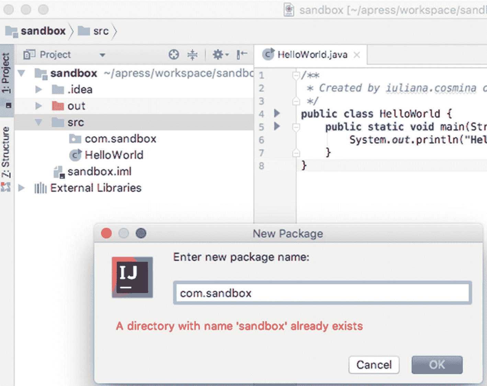

图 3-19

在 IntelliJ IDEA 中创建包

所以，我们创建了包，但类并不在其中。嗯，把它放进去的方法是，选中它并将其拖入包中。会出现一个用于移动类的对话框窗口，因为编辑器必须修改该类，通过添加一个 `package` 语句使其属于该包。并且需要你批准该操作。图 3-20 展示了这个对话框窗口。

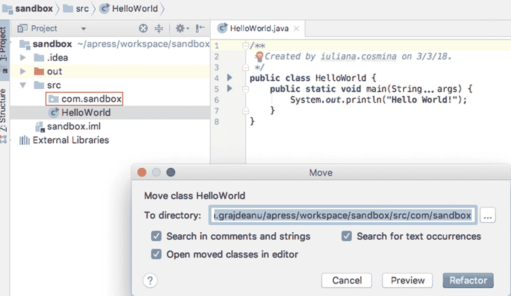

图 3-20

在 IntelliJ IDEA 中将类移入包中

点击**重构**按钮，看看类发生了什么变化。该类现在应该以 `package com.sandbox;` 声明开头。如果你重新构建项目，然后查看目录结构，你会看到类似于图 3-21 所示的内容。

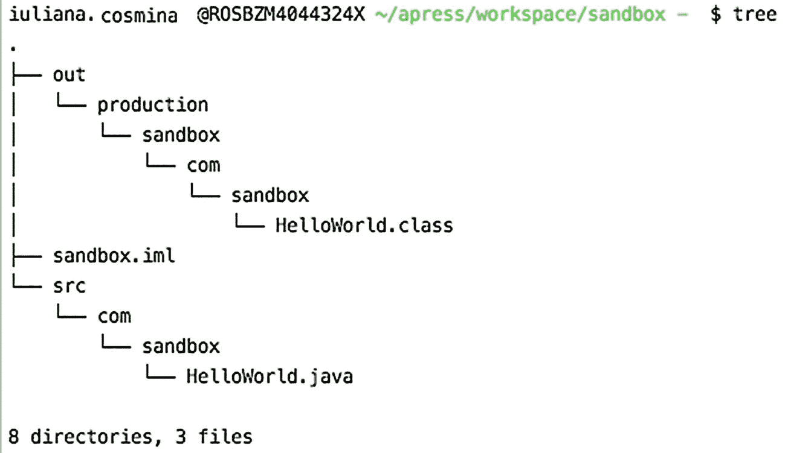

图 3-21

添加 com.sandbox 包后的新目录结构

如果你手动编译和执行该类，现在必须考虑包，因此你的命令变为

```
~/sandbox/src:  $ javac com/sandbox/HelloWorld.java
~/sandbox/src:  $ java com/sandbox/HelloWorld
Hello World!
```

但事情并没有到此结束，因为我们还有 Java 模块。那么，这又是怎么回事呢？没有 `module-info.java` 文件，我们的代码是如何运行的呢？嗯，有一个默认的未命名模块，所有 JAR 文件（无论是否模块化）以及类路径上的类都包含在其中。这个默认的未命名模块会导出所有包并读取所有其他模块。因为它没有名称，所以不能被命名的应用程序模块所要求和读取。因此，即使你的小项目似乎能在 JDK 9 及更高版本上运行，它也无法被其他模块访问；但它能工作，因为它可以访问其他模块。（这确保了与旧版本 JDK 的向后兼容性，但根据项目的复杂性，兼容性并不总是能得到保证。）话虽如此，让我们为项目添加一个模块。

#### 配置 com.sandbox 模块

配置模块就像在 `src` 目录下添加一个 `module-info.java` 文件一样简单。在图 3-14 中，列出的菜单里有一个 `module-info.java` 选项，如果你选择它，IDE 会为你生成该文件。一切都很顺利，如果你不喜欢为你生成的模块名称，可以更改它。我将其更改为 `com.sandbox`，以遵循 Oracle 开发者建立的模块命名约定。

```
/**
* Created on 3/3/18.
*/
module com.sandbox {
}
```

现在我们有了一个模块，会发生什么？从 IDE 的角度来看，变化不大。但是，如果你想手动编译一个模块，你需要了解一些事情。我使用以下命令编译了我们的模块：

```
~/sandbox/src/: $ javac -d ../out/com.sandbox \
module-info.java    \
com/sandbox/HelloWorld.java
```


### **！**

`"\"` 是 macOS/Linux 的分隔符。在 Windows 上，要么将整个命令写在一行，要么将 `"\"` 替换为 `"^"`。

让我解释一下我做了什么。编译模块的语法如下：

```
javac -d [目标位置]/[模块名称] \
[源位置]/module-info.java  \
[java 文件...]
```

执行该命令的结果是，在 `out` 目录下创建了一个名为 `com.sandbox` 的目录——即模块名称。在此目录下，我们拥有 `com.sandbox` 包的标准结构。`out` 目录的内容如图 3-22 所示。

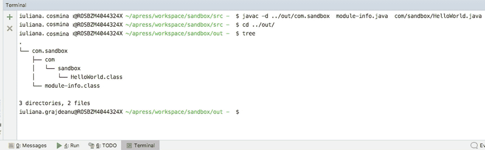

图 3-22

手动编译的 Java 模块 com.sandbox

正如你在本例中注意到的，模块实际上直到我们编译源代码时才真正存在，因为 Java 模块更像是一种由 `module-info.class` 描述符描述的封装包的逻辑模式。创建 `com.sandbox` 目录的唯一原因是我们将其作为参数指定在了 `javac -d` 命令中。

现在我们有了一个编译好的模块，该怎么处理它呢？显然，我们要尝试运行这个应用程序。

```
sandbox/: $ java --module-path out \
--module   com.sandbox/com.sandbox.HelloWorld
Hello  World!
```

执行模块化应用程序的语法如下：

```
java --module-path [目标位置] \
--module [模块名称] /[包名].HelloWorld
Hello  World!
```

关于模块名称，是不是感觉有点冗余？对我来说确实如此，这就是为什么我倾向于不为模块创建目录，除非我在 `src` 目录下有多个模块。而且我们必须讨论模块的标准命名约定。如果开发人员想为模块创建目录，这可能是另一个让他们头疼的问题。在多篇博客文章和 *Oracle Magazine*（2017 年 9 月）中，都推荐这样做。^(⁴⁹) 但现在不必担心；本书的源代码包含名称简单的模块，并且模块配置已经为你准备好了。

#### 使用构建工具（主要是 Gradle）的 Java 项目

Maven 是一种主要用于 Java 项目的构建自动化工具。尽管 Gradle 正在崛起，但 Maven 仍然是使用最广泛的构建工具之一。像 Gradle 和 Maven 这样的工具用于将应用程序的源代码组织成相互依赖的项目模块，并配置一种自动编译、验证、生成源代码、测试和生成工件的方法。工件是一个文件，通常是 JAR，会被部署到 Maven 仓库。Maven 仓库是硬盘上的一个位置，JAR 文件按照特殊的目录结构保存在那里。

关于构建工具的讨论必须从 Maven 开始，因为这个构建工具标准化了我们今天开发中使用的许多术语。Gradle 尊重许多 Maven 标准规则，并被选为本书附带源代码的首选构建工具，因为它更易于配置，且配置文件体积更小。一个拆分为多个子项目的项目可以从 GitHub 下载，并在命令行中构建或导入到 IntelliJ 中。这种方法确保你获得可以一次性编译的高质量源代码。这也很实用，因为我想你不想每次开始阅读新章节时都在 IntelliJ IDEA 中加载一个新项目。此外，这让我更容易维护源代码并使其适应新的 JDK，而且由于 Oracle 发布如此频繁，我需要能够快速做到这一点。

用于测试本书代码以及（如果你想的话）编写自己代码的项目名为 `java-for-absolute-beginners`。它是一个多模块的 Gradle 项目。项目的第一级是 `java-for-absolute-beginners` 项目，它有一个名为 `build.gradle` 的配置文件。在这个文件中，列出了所有依赖项及其版本。子项目，即第二级的项目，是这个项目的模块。我们称它们为*子*项目，因为它们从父项目继承了那些依赖项和模块。在它们的配置文件中，我们可以指定需要父项目中定义的依赖项列表中的哪些依赖项。这些模块是一种为每一章封装源代码的方法，这就是为什么这些模块被命名为 `chapter00`、`chapter01` 等等。如果一个项目很大，需要编写大量代码，代码会再次拆分到另一级模块中。`chapter05` 模块就是这种情况，它被配置为其下项目的父项目。在图 3-23 中，你可以看到这个项目在 IntelliJ IDEA 中加载的样子，并且 `chapter05` 模块已展开，以便你可以看到第三级模块。每一级都用相应的数字标记。

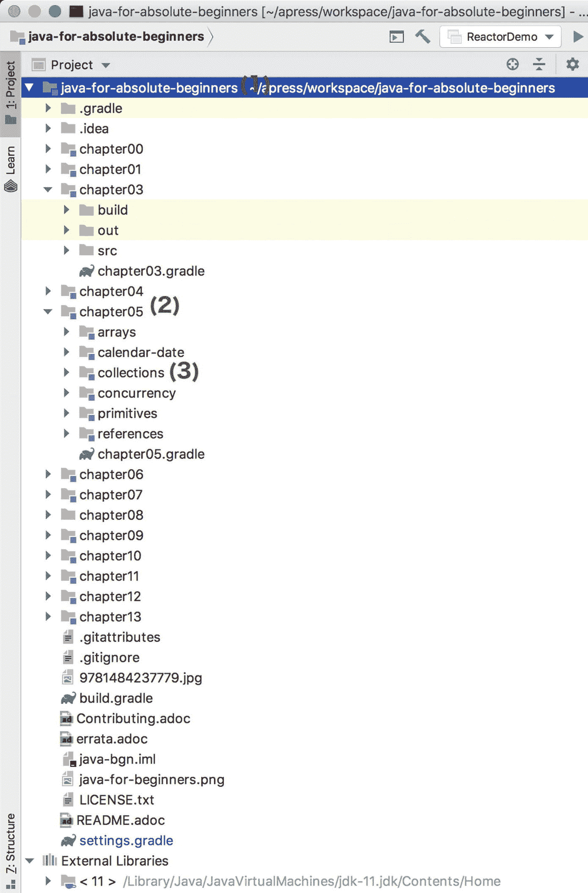

图 3-23

Gradle 多模块层级结构

在附录中，你可以阅读关于此 Gradle 项目配置的详细说明。现在，如果你已经按照**第 2 章** 2 中的指导将其加载到 IntelliJ IDEA 中，你可以通过构建它来确保一切正常工作。操作方法如下。

你可以使用 IntelliJ IDEA 编辑器来完成，在右上角应该有一个名为 **Gradle projects** 的选项卡。

如果项目如图 3-24 所示加载，则项目加载正确。如果 **Gradle projects** 选项卡不可见，请查找像 (1) 标记的标签，并点击它。

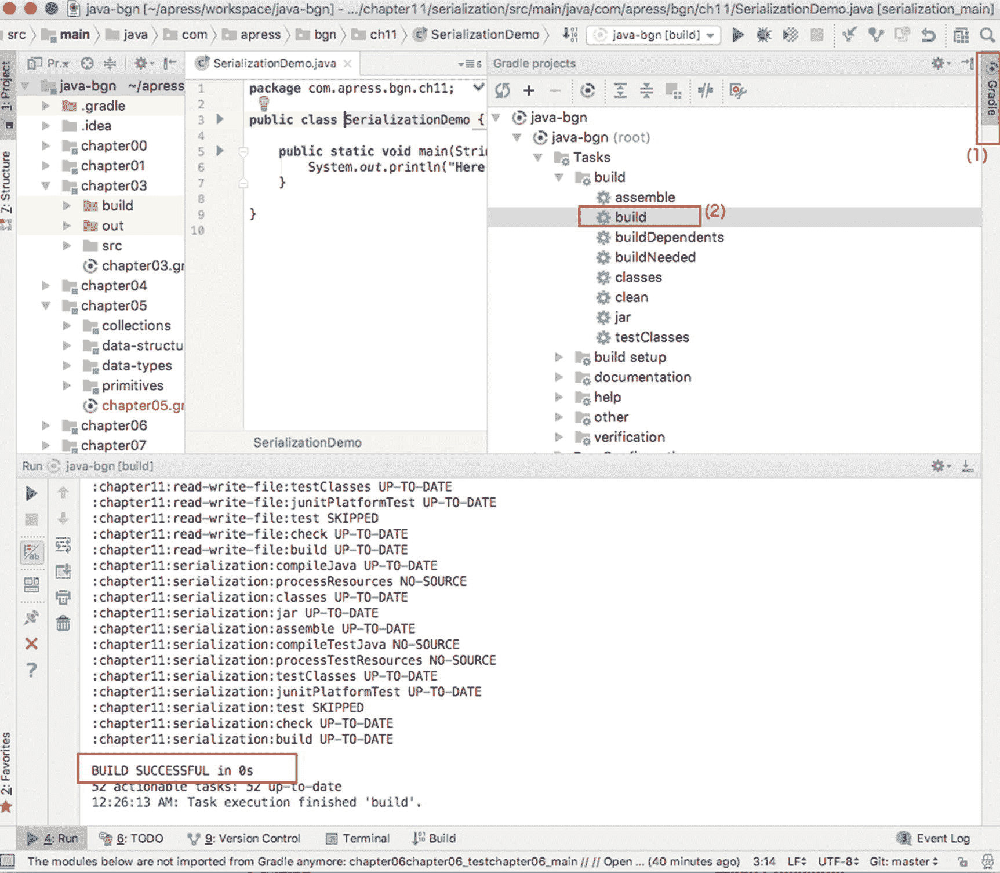

图 3-24

Gradle 多模块层级结构

展开 `java-for-absolute-beginners(root)` 节点，直到找到标记为 (2) 的 `build` 任务。如果你双击它，并且在编辑器底部的视图中没有看到任何错误，那么你所有的项目都已成功构建。

确保 Gradle 项目按预期工作的第二种方法是从命令行构建它。打开一个 IntelliJ IDEA 终端，如果你已经按照**第 2 章** 2 中的说明将 Gradle 安装到了系统路径中，输入 **gradle clean build** 并按下 **Enter** 键。在命令行中，你可能会看到一些警告（如果支持 Java 模块的 Gradle 插件在你拿到本书时仍不稳定），但只要执行以 `BUILD SUCCESSFUL` 结束，一切就都没问题。

除了 `sandbox` 项目之外，本节中提到的所有类、模块和包都是此项目的一部分。`chapter00` 和 `chapter01` 实际上并不包含特定于这些章节的类。我需要它们来构建 Java 模块示例。IntelliJ IDEA 按字母顺序对模块进行排序，因此章节模块的命名方式就是这样选择的。它们按照你应该使用的顺序列出。到目前为止，本章的重点是 Java 应用程序的构建块，你按照说明创建了一个打印 *Hello World!* 的类，但细节并未真正涉及。现在让我们来做这件事，并用新的细节来丰富这个类。


## 解释并丰富 Hello World! 类

我们在沙盒项目中编写了一个名为 `HelloWorld` 的类。我建议你将该类添加到 chapter03 模块中。只需将其复制或创建在 `com.apress.bgn.ch3.helloworld` 包下，然后我们先分析它，再看看还能用它做些什么。在图 3-25 中，该类显示在 IntelliJ IDEA 编辑器中，并且 IDE 的一些细节被加了下划线。我们先来谈谈这个类。

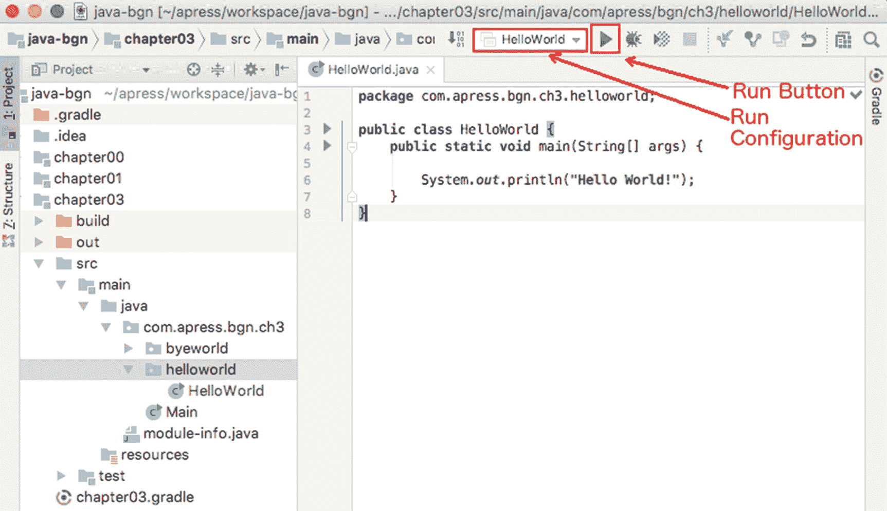

图 3-25

将 HelloWorld 添加到 java-for-absolute-beginners 项目

下面解释包含不同语句的行。

*   **包声明：** 当类属于某个包时，其代码必须以声明该类所属包的行开头。`package` 是 Java 中的保留关键字，除了声明包之外不能用于其他任何用途。

*   <为方便起见留空>（留空以使图片看起来更美观）

*   **类声明：** 这是我们声明类的行；它是 `public` 的，因此可以从任何地方访问；它是一个名为 `HelloWorld` 的 `class`。类的主体用花括号括起来，左花括号也在这一行。

*   **main() 方法声明：** 在 Java 中，方法签名由方法名称以及其参数的数量、类型和顺序组成。方法还有一个返回类型，即它返回的结果的类型。但还有一种特殊类型可以声明不返回任何内容的方法。按出现顺序，以下内容解释了 `main()` 方法中每个术语的含义。
    *   **public：** 方法访问修饰符；main 方法必须是 `public` 的；否则，JRE 无法访问并调用它。

    *   **static：** 当创建该类的对象时，该对象拥有类声明的字段和方法。类是创建对象的模板。由于 `static` 关键字，main 方法不与类的对象关联，而是与类本身关联。更多信息请参见**第 4 章**。

    *   **void：** 此关键字在此处用于告知我们 main 方法不返回任何内容，因此它类似于“无类型”的替代品，因为如果不返回任何内容，则不需要类型。

    *   **String[] args：** 方法有时被声明为接收一些输入数据，`String[] args` 表示一个文本值数组。（数组是固定长度的数据集；在数学中，它们被称为**一维矩阵**或**向量**。）`String` 是 Java 中表示文本对象的类。`[]` 表示数组，`args` 是其名称。但是等等，我们之前运行过这个方法，并没有提供任何参数！嗯，这不是强制性的，但在此列表之后，你将看到如何为其提供参数（提供给方法的值，由方法体中的代码使用）。

### **！**

在前面的代码示例中，你可能已经注意到 main 方法是这样写的：

`public class HelloWorld {`

`public static void main(String... args) {`

`System.out.println("Hello World!");`

`}`

`}`

这三个点被称为 `varargs`，允许你向方法传递多个字符串。这是编写此方法的另一种方式，当源代码需要涉及 `[]` 的特殊格式时，本书会使用这种方式。

*   **{**：`main()` 方法体的起始花括号。

*   <为方便起见留空>（留空以使图片看起来更美观）。

*   **System.out.println("Hello World!");**：用于在控制台输出 *Hello World* 的语句。

*   **}**：`main()` 方法体的结束花括号。

*   **}**：类体的结束花括号。

如果我们执行这个类，*Hello World!* 将被打印到控制台。图 3-17 展示了如何执行一个包含 `main()` 方法的类。通过这种方式执行类后，IntelliJ IDEA 会自动将该执行的配置保存在运行配置中，并显示在一个下拉列表中，该列表旁边有一个绿色的三角形按钮，点击即可执行该类。这两个元素都位于 IDE 的标题栏上，并在图 3-25 中醒目地指向你。这两个元素非常重要，因为可以编辑运行配置并为 JVM 和 `main()` 方法添加参数。让我们先修改 `main()` 方法，使其对参数进行一些处理。

```
package com.apress.bgn.ch3.helloworld;
public class HelloWorld {
public  static  void  main(String[]  args)  {
System.out.println("Hello  " +  args[0]  +  "!");
}
}
```


### ！

数组通过元素的索引进行访问，在 Java 中计数从 0 开始。因此，数组的第一个成员位于索引 0，第二个位于索引 1，以此类推。但数组可能为空，所以在之前的代码片段中，如果未指定任何参数，程序执行会崩溃，并在控制台中以红色打印一条明确的消息。

`Exception in thread "main" java.lang.ArrayIndexOutOfBoundsException: 0`

`at chapter.three/com.apress.bgn.ch3.helloworld.HelloWorld.main(HelloWorld.java:5)`

当我们尝试访问一个空数组，或数组中不存在的元素时，Java 程序会崩溃，JVM 会抛出一个类型为 `ArrayIndexOutOfBoundsException` 的对象，其中包含发生故障的行号以及我们试图访问的元素的索引。JVM 使用异常对象来通知开发者 Java 执行未按预期进行时的异常情况，这些对象包含代码中发生问题的位置以及导致问题的原因。

我们在之前代码片段中所做的修改，会在执行类时打印作为参数提供的文本值。让我们修改此类的运行配置并添加一个参数。如果单击运行配置名称旁边的小灰色箭头，会弹出一个菜单。点击 **Edit Configurations...** 并检查图 3-26 中显示的对话框窗口。

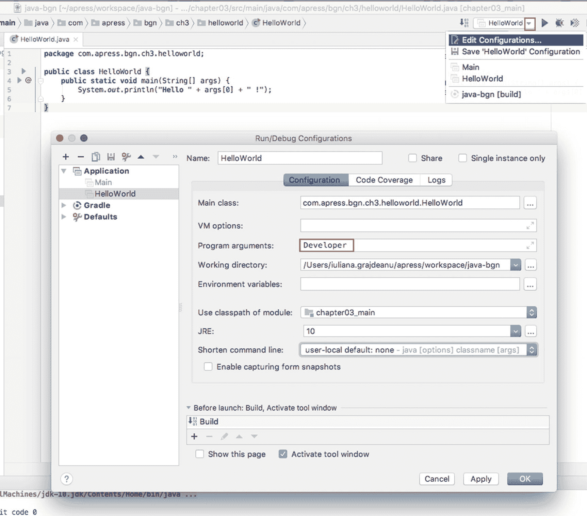

图 3-26

自定义运行配置

在图中，关键元素已被圈出（实际上是用矩形框起来的，但你明白意思！）。如图 3-26 的运行配置列表所示，IntelliJ IDEA 保存了你之前的一些执行记录，包括你在本章前面执行的 Gradle `build` 任务。在 **Run/Debug Configurations** 对话框窗口的左侧，你可以看到按类型分组的 IntelliJ IDEA 运行配置。默认情况下，最后一个运行配置会在窗口右侧打开，在本例中应该是 `HelloWorld` 类的运行配置。你可以为一次执行配置很多选项，其中大部分已由 IDE 自动决定。**Program arguments:** 文本字段是用于输入 `main()` 方法参数的地方。在图 3-26 中，我输入了 `Developer`。因此，如果你点击 **Apply** 按钮，然后点击 **OK** 按钮，再执行该类，控制台中应该会看到 *Hello Developer!* 而不是 *Hello World!*。

那么，我们还能用这个类做什么呢？还记得本书开头的那段代码吗？让我们把它放到 `main()` 方法中。

```
package com.apress.bgn.ch3.helloworld;
import   java.util.List;
public class HelloWorld {
public static void main(String... args) {
List items = List.of("1", "a", "2", "a", "3", "a");
items.forEach(item -> {
if (item.equals("a")) {
System.out.println("A");
} else {
System.out.println("Not A");
}
});
}
}
```

`import java.util.List;` 语句是唯一可以存在于包声明和类声明之间的语句类型。这条语句告诉 Java 编译器，程序中使用了对象类型 `java.util.List`。`import` 关键字后面跟着数据类型的完全限定名。数据类型的完全限定名由包名（`java.util`）、一个点（.）和类的简单名称（`List`）组成。没有它，类将无法编译。你可以试试：只需在该语句前面加上 `//`，这会将这一行变成注释，被编译器忽略。你会看到编辑器报错，任何与该列表相关的代码都会变成亮红色。

语句 `List<String> items = List.of("1", "a", "2", "a", "3", "a");` 创建了一个文本值列表^(⁵⁰,⁵¹)，然后由 `forEach` 方法逐个遍历，并测试每个值是否等于字符 `"a"`。^(⁵²)

如果你现在运行这个类，应该在控制台中看到一系列 `A` 和 `Not A`，每个占一行。

```
Not  A
A
Not  A
A
Not  A
A
```

到目前为止，我们编写的代码使用了少数几种对象类型在控制台中打印一条简单的消息。`List` 对象用于保存几个 `String` 对象。消息通过 `println()` 方法打印，该方法在 `out` 对象上调用，而 `out` 是 `System` 类中的一个静态字段。而这些只是你在代码中可见的对象。在底层，`List` 对象由一个 `Consumer` 对象处理，该对象是在 lambda 表达式为了简化而隐藏的地方即时创建的。

```
package com.apress.bgn.ch3.helloworld;
import java.util.List;
[import  java.util.function.Consumer;]
public class HelloWorld {
public static void main(String... args) {
List items = List.of("1", "a", "2", "a", "3", "a");
items.forEach(new Consumer() {
@Override
public void accept(String item) {
if (item.equals("a")) {
System.out.println("A");
} else {
System.out.println("Not A");
}
}
});
}
}
```

现在看起来可能有点吓人，但我保证本书会在清晰的上下文中介绍每个概念，并与现实生活中的对象和事件进行对比，以便你轻松理解。如果这还不够，还有更多的书籍、博客以及每个 JDK 的官方 Oracle 网页，它们都有很好的教程。有志者，事竟成。

### **！**

另外，请使用你的 IDE！在按住 Control/Command 键的同时点击代码中的任何对象类型，对象类的代码就会打开，你可以看到该类是如何编写的，并直接在编辑器中阅读其文档。作为练习，请对 `forEach` 方法和 `System` 类执行此操作。


## 总结

在本章中，你完成了以下任务：

*   学习了如何使用 JShell
*   了解了 Java 包，并实际创建了一个
*   学习了 Java 访问修饰符
*   了解了模块
*   使用 IntelliJ IDEA 创建了第一个 Java 项目
*   在 IntelliJ IDEA 中编写了第一个程序的代码
*   ……随后我们也手动编译了它
*   运行了第一个程序（Hello World!）
*   为其添加了包
*   为其配置了模块
*   ……并手动编译和执行了它
*   了解了 Gradle 以及它如何让开发者的生活更轻松

本章中你完成的许多任务，在成为 Java 开发者后，很可能每天都会做——除了花在现有代码中查找和修复 Bug 的时间。你可能还会花大量时间阅读文档，因为 JDK 提供了大量类、字段和方法供你编写应用程序。而且随着每个版本的发布，情况会发生变化，你必须让自己保持更新。大脑容量有限，所以任何雇主都不应期望你记住每一个 JDK 类和方法；但请聪明地工作，并在浏览器中保持打开网页^(⁵³) [`https://docs.oracle.com/javase/10/docs/api/`](https://docs.oracle.com/javase/10/docs/api/)。当你对某个 JDK 类或方法有疑问时，可以随时查阅。

脚注 1   2   3   4   5   6   7   8   9   10   11   12   13   14   15   16   17   18   19   20   21   22   23   24

