# 4. Java 语法

语言是人与人之间口头或书面的交流工具。无论是自然语言还是人工语言，它们都由词汇构成，并有一套使用规则来执行交流任务。编程语言是与计算机交流的工具。与计算机的交流是书面交流；基本上，开发者定义一些要执行的指令，通过中介传达给计算机，如果计算机理解这些指令，就会执行一系列操作，并根据应用程序类型，向开发者返回某种形式的回复。

在 Java 语言中，交流是通过中介——Java 虚拟机——完成的。定义词汇应如何连接以生成可理解的交流单元的那套编程规则称为**语法**。Java 的大部分语法借鉴自一种名为 C++ 的编程语言，而 C++ 的语法又基于 C 语言。C 语言的语法从更早的语言中借用了元素和规则，但本质上，所有这些语言都基于自然英语。

也许 Java 在版本 8 中因为引入了 lambda 表达式而变得有些晦涩，但在编写 Java 程序时，如果你用英语恰当地命名词汇，结果代码应该像故事一样易于阅读。

**第** 3 **章**中已经涵盖了一些细节；对包和模块的介绍足以让你扎实理解其用途，避免对项目组织产生混淆以及在代码中盲目摸索。但正如预期的那样，在实际编写代码方面，我们只是浅尝辄止。因此，让我们开始深入探索 Java。

## 编写 Java 代码的基本规则

在编写 Java 代码之前，我们先回顾几条必须遵守的规则，以确保代码能正常工作。让我们通过添加一些细节来描绘**第** 3 **章**结尾的类。

```
01\.  package com.apress.bgn.ch3.helloworld;
02.
03\.  import java.util.List;
04.
05\.  /**
06\.  * 这是一个 JavaDoc 注释
07\.  */
08\.  public class HelloWorld {
09\.     public static void main(String... args) {
10\.          // 这是一个单行注释
11\.          List items = List.of("1", "a", "2", "a", "3", "a");
12\.         items.forEach(item -> {
13\.          /* 这是一个
14\.                  多行
15\.             注释 */
16\.              if (item.equals("a")) {
17\.                 System.out.println("A");
18\.              } else {
19\.                 System.out.println("Not A");
20\.              }
21\.         });
22\.     }
23\.  }
```

接下来，我将逐一介绍每条规则。

### 包声明

Java 文件总是以**包声明**开头。包名可以包含字母和数字，用点号分隔。每个部分对应路径中的一个目录，该目录包含其中的类。包声明应揭示应用程序的名称以及包中类的用途。以本书源码使用的包命名为例：`com.apress.bgn.ch4.basic`。如果我们将包名拆分开，每个部分的含义如下所述。

*   `com.apress` 是应用程序的域名，或者在本例中，是代码的所有者
*   `bgn` 是代码的范围，在本例中，是本书（Java for Absolute **B**e**g**i**n**ners）的缩写
*   `ch4` 是第 4 章中类的用途
*   `basic` 是类用途的更精细级别，这些类很简单，用于描述基本的 Java 概念


### 导入部分

**导入部分**位于包声明之后。该部分包含了文件中使用的所有类、接口和枚举的完整限定名。请看以下代码示例。

```
package java.lang;
import java.io.Serializable;
import java.io.ObjectStreamField;
import java.io.UnsupportedEncodingException;
import java.lang.annotation.Native;
import java.nio.charset.Charset;
import java.util.ArrayList;
import java.util.Arrays;
import java.util.Comparator;
import java.util.Formatter;
import java.util.Locale;
...
public final class String
implements Serializable, Comparable, CharSequence {
private  static  final  ObjectStreamField  serialPersistentFields  =
new ObjectStreamField0;
...
}
```

这是官方 Java `String` 类的一个片段。每条 import 语句都引用了 `String` 类主体中使用的某个类所在的包及其名称。

特殊的 import 语句用于导入静态变量和静态方法。静态变量和方法无需实例化类即可使用。在 JDK 中，有一个用于数学运算的类。它包含开发者可以用来实现解决数学问题的代码的静态变量和方法。请看以下代码。

```
package com.apress.bgn.ch4.basic;
import static java.lang.Math.PI;
import static java.lang.Math.sqrt;
public class Sample extends Object {
public static void main(String... args) {
System.out.println("PI value =" + PI);
double result = sqrt(5.0);
System.out.println("SQRT value =" + result);
}
}
```

通过将 `import` 和 `static` 放在一起，我们可以声明一个类的完整限定名以及我们希望在代码中使用的方法或变量。这允许我们直接使用该变量或方法，而无需使用其声明所在的类名。如果没有静态导入，代码必须重写为：

```
package com.apress.bgn.ch4.basic;
import  java.lang.Math;
public class Sample extends Object {
public static void main(String... args)  {
System.out.println("PI value =" + Math.PI);
double result = Math.sqrt(5.0);
System.out.println("SQRT value =" + result);
}
}
```

编写 Java 代码时，你可能还会做另一件事，那就是**精简** import 语句。当使用同一个包中的多个类来编写代码，或者使用同一个类中的多个静态变量和方法时，建议精简导入。如果不这样做，文件的导入部分会变得非常庞大且难以阅读。这时精简就派上了用场。精简导入意味着用通配符替换来自同一个包的所有类或来自同一个类的所有变量和方法，这样只需要一条 import 语句。因此，`Sample` 类变成了

```
package com.apress.bgn.ch4.basic;
import static java.lang.Math.*;
public class Sample extends Object {
public static void main(String... args) {
System.out.println("PI value  =" + PI);
double result = sqrt(5.0);
System.out.println("SQRT value =" + result);
}
}
```

### Java “语法”

**Java 是区分大小写的**，这意味着你可以编写如下代码。

```
public class Sample {
public static void main(String... args) {
int mynumber = 0;
int myNumber = 1;
int Mynumber = 2;
int MYNUMBER = 3;
System.out.println(mynumber);
System.out.println(myNumber);
System.out.println(Mynumber);
System.out.println(MYNUMBER);
}
}
```

所有四个变量都是不同的，最后几行打印的数字是：`0 1 2 3`。你不能在同一个上下文（例如，在方法体内）中声明两个同名的变量，因为这基本上是在重新声明同一个变量，而 Java 编译器不允许这样做。如果你尝试这样做，你的代码将无法编译，甚至 IntelliJ IDEA 也会尝试通过用红色下划线标出代码并显示相关消息来让你看到错误所在，如图 4-1 所示，其中 `mynumber` 变量被声明了两次。

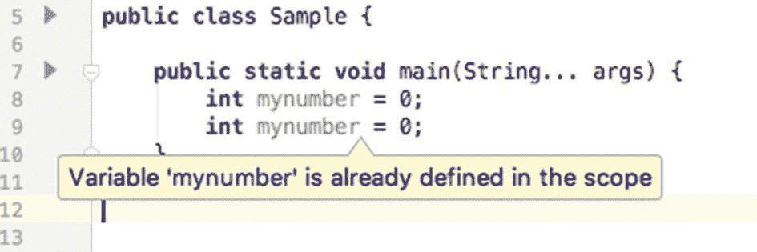

图 4-1

包含错误的相同语句示例

有一组 **Java 关键字**，它们在 Java 代码中只能用于固定的、预定义的目的。其中一些已经介绍过：`import`、`package`、`public`、`class`。其余的关键字将在本章末尾进行介绍，并附有简短说明（见表 4-2 和 4-3）。

除了 `import`、`package`、`interface`（或 `@interface`）、`enum` 和 `class` 声明之外，Java 源文件中的所有其他内容都必须声明在**花括号**（`{}`）内。这些被称为**块分隔符**。请看第 4.1 节的开头部分。那里的花括号用于包裹以下内容。

*   类的内容，也称为类的`主体`（第 08 行和第 23 行的花括号）

*   方法的内容，也称为方法的`主体`（第 09 行和第 22 行的花括号）

*   一组要一起执行的指令（第 12 行和第 21 行的花括号）

**行终止符**：在 Java 中，代码行通常以分号（;）符号或 ASCII 字符 CR、LF 或 CR LF 结束。冒号用于终止功能完整的语句，例如第 11 行的列表声明。如果我们有一个非常小的显示器，并且被迫将该语句拆分成两行以保持代码可读性，那么其末尾的冒号告诉编译器，这个语句只有放在一起才是正确的。请看图 4-2。

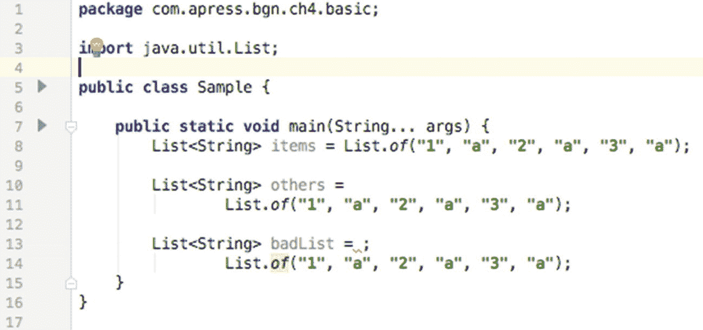

图 4-2

不同语句示例

第 8 行的列表声明等同于第 10 行和第 11 行的声明。第 13 行和第 14 行的声明是故意写错的——在第 13 行添加了一个冒号，该语句在此处结束；但该语句无效，当你尝试编译该类时，编译器会打印一个异常来报错，提示：`"Error:(13, 32) java: illegal start of expression"`。如果这个错误消息看起来与示例不符，可以这样理解：对于编译器来说，问题不在于语句的错误终止，而在于 `=` 符号之后，编译器期望找到某种表达式来为 `badList` 变量生成值，但它却什么也没找到。


### Java 标识符

**标识符**是你为 Java 中的项目（如类、变量、方法等）所起的名称。标识符必须遵守一些规则才能让代码通过编译，同时也要遵循称为 **Java 编码规范** 的常识性编程规则。以下列出其中几条：

*   标识符不能是 Java 的保留字，否则代码将无法编译
*   标识符不能是布尔字面量（`true, false`）或 `null` 字面量，否则代码将无法编译
*   标识符可以由字母、数字以及 `_`、`$` 组成
*   开发者应遵循驼峰命名法来声明标识符，这是一种编写复合词或短语的实践，使得短语中间每个单词或缩写都以大写字母开头，中间没有空格或标点，确保标识符名称中间每个单词或缩写都以大写字母开头（例如，`StringBuilder`、`isAdult`）

**变量**是一组可以与值相关联的字符。它有一个类型。可以赋给它的值被限制在某个特定的值区间或必须遵循该类型定义的特定形式。例如，第 11 行声明的 `items` 是一个类型为 `List` 的变量。

在 Java 中，有三种类型的变量。

*   **字段** 是在类体中、方法体外定义的变量，并且它们前面没有关键字 `static`
*   **局部变量** 是在方法体内声明的变量，它们仅在该上下文中有效
*   **静态变量** 是在类体内声明的变量，并且它们前面有关键字 `static`。如果它们被声明为 public，则可以在全局范围内访问。

### Java 注释

Java 注释指的是解释性文本片段，它们不是所执行代码的一部分，并且会被编译器忽略。在 Java 中，根据用于声明注释的字符不同，有三种在代码中添加注释的方式。

*   `//` 用于单行注释（第 10 行）
*   `/** ... */` Javadoc 注释，是一种特殊的注释，可以使用特殊工具将其导出到名为 Javadoc API 的项目文档中（第 05 到 07 行）
*   `/* ... */` 用于多行注释（第 13 到 15 行）

## Java 对象类型

在**第** 3 章介绍 Java 构建块时，为了简单起见，只提到了类。当时提到 Java 中还有其他对象类型。**对象类型** 这个表述实际上并不准确，在本节中，事情会变得更清晰。

类是创建对象的模板。基于类创建对象的过程称为**实例化**，生成的对象被称为**该类的一个实例**。实例之所以被称为**对象**，是因为默认情况下，如果开发者编写的类没有声明其他超类，它会隐式地继承类 `java.lang.Object`。因此，下面的类声明

```
package com.apress.bgn.ch4.basic;
public class Sample {
}
```

等价于

```
package com.apress.bgn.ch4.basic;
public class Sample extends Object {
}
```

另外，请注意，不需要导入 `java.lang` 包，因为 `Object` 类是 Java 层次结构的根类，所有类（包括数组）都必须能够继承它。因此，`java.lang` 包也是隐式导入的。

但是，除了类之外，Java 中还有其他可用于创建对象的模板类型。以下各节将介绍它们并解释它们的用途。不过，让我们在上下文中进行说明。

让我们创建一组用于定义人类的模板。大多数 Java 教程都使用车辆或几何形状的模板。我想建模一些任何人都能轻松理解和关联的东西。以下各节的目标是开发用于建模不同类型人群的 Java 模板。到目前为止，我解释过的唯一 Java 模板是类，那么我们就从它继续。

### 类

创建实例的操作称为**实例化**。因此，要设计一个建模通用人类的类，我们应该考虑两件事：人类特征和人类行为。那么，所有人类有什么共同点呢？嗯，有很多，但就本节而言，让我们选择三个通用属性：姓名、年龄和身高。这些属性在 Java 类中映射为称为**字段**或**属性**的变量。

#### 字段

所以，我们的类看起来像这样（初始版本）：

```
package com.apress.bgn.ch4.basic;
public class Human {
String name;
int age;
float height;
}
```

在代码示例中，**字段**具有不同的类型，具体取决于应该与它们关联的值。例如，`name` 可以与文本值（如 "John"）关联，而文本在 Java 中用 `String` 类型表示。`age` 可以与数字整数值关联，因此类型为 `int`。就本节而言，我们假设一个人的身高是一个有理数，例如 1.9，因此我们使用了用于此类值的特殊 Java 类型：`float`。

所以，现在我们有了一个对人类的一些基本属性进行建模的类。我们如何使用它？我们需要一个 `main()` 方法，并且需要实例化该类。在下一个代码片段中，创建了一个名为 John 的人类。

```
package com.apress.bgn.ch4.basic;
public class BasicHumanDemo {
public static void main(String... args) {
Human human = new Human();
human.name = "John";
human.age = 40;
human.height  =  1.91f;
}
}
```

要创建一个 `Human` 实例，我们使用 `new` 关键字。接下来，我们调用一个称为 `构造器` 的特殊方法。我之前介绍过方法，但这个很特殊。（有些程序员甚至不认为它是一个方法。）最明显的原因是它没有在 `Human` 类的任何地方定义。那么，它是从哪里来的呢？嗯，它是一个默认构造器，由编译器自动生成，除非显式声明了一个。一个类不能没有构造器；否则，它无法被实例化。这就是为什么如果没有显式声明构造器，编译器会生成一个。默认构造器调用 `super()`，它会调用 `Object` 的无参构造器，该构造器将所有字段初始化为默认值。这可以通过以下示例进行测试。

```
package com.apress.bgn.ch4.basic;
public class BasicHumanDemo {
public static void main(String... args) {
Human human = new Human();
System.out.println("name: " + human.name);
System.out.println("age:  " +  human.age);
System.out.println("height: " + human.height);
}
}
```

你认为运行上述代码会发生什么？如果你认为会打印出一些默认值（中性值），那么你完全正确。以下是上述代码的输出。

```
name: null
age: 0
height: 0.0
```

数值变量被初始化为 0，`String` 值被初始化为 `null`。原因是数值类型是原始数据类型，而 `String` 是对象数据类型。`String` 类是 `java.lang` 包的一部分，它是预定义的 Java 类之一，用于创建 `String` 类型的对象。它是一种表示文本对象的特殊数据类型。我们将在下一章更深入地探讨数据类型。


#### 类变量

除了每个人类个体特有的属性外，所有人类都有一些共同点：一个假设为 100 年的寿命。声明一个名为 *lifespan* 的字段会是冗余的，因为它必须与所有人类实例关联相同的值。因此，我们在 `Human` 类中使用 `static` 关键字声明了一个字段，该字段对所有 `Human` 实例都具有相同的值，并且只初始化一次。我们还可以更进一步，通过在其声明前添加 `final` 修饰符，确保该值在程序执行期间永远不会改变。这样，我们就创建了一种特殊类型的变量，称为**常量**。新的 `Human` 类如下所示：

```
package com.apress.bgn.ch4.basic;
public class Human {
static final int LIFESPAN = 100;
String name;
int age;
float height;
}
```

`LIFESPAN` 变量也被称为**类变量**，因为它不与实例关联，而是与类关联。这在下面的示例中很清楚。

```
package com.apress.bgn.ch4.basic;
public class BasicHumanDemo {
public static void main(String... args) {
Human john = new Human();
john.name = "John";
Human jane = new Human();
jane.name = "Jane";
System.out.println("John’s lifespan = " + john.LIFESPAN);
System.out.println("Jane’s lifespan = " + jane.LIFESPAN);
System.out.println("Human lifespan = " + Human.LIFESPAN);
}
}
```

当执行上述类的 `main()` 方法时，会打印以下内容，这证明了之前提到的所有内容。

```
John's lifespan = 100
Jane's lifespan = 100
Human lifespan = 100
```

#### 封装数据

我们定义的类没有对字段使用访问修饰符，这是不可接受的。Java 被称为面向对象编程语言（OOP），因此，用 Java 编写的代码必须尊重 **OOP 的原则**。遵守这些编码原则可以确保编写的代码质量良好，并完全符合 Java 的基本风格。OOP 的原则之一是**封装**。封装原则指的是通过使用称为**访问器（getters）**和**修改器（setters）**的特殊方法来限制对数据的访问，从而隐藏数据实现。

基本上，类的任何字段都应具有私有访问权限，并且对其访问应由可以被拦截、测试和跟踪以查看其调用位置的方法来控制。Getters 和 setters 是处理对象时的常见做法，以至于大多数 IDE 都有生成它们的默认选项，包括 IntelliJ IDEA。在类体内右键单击，选择 **Generate** 选项查看所有可能性，然后选择 **Getters and Setters** 来为你生成这些方法。菜单如图 4-3 所示。

将字段设为私有并生成 getters 和 setters 后，`Human` 类现在如下所示：

```
package com.apress.bgn.ch4.basic;
public class Human {
static final int LIFESPAN = 100;
private String name;
private int age;
private float height;
public String getName() {
return name;
}
public void setName(String name) {
this.name = name;
}
public int getAge() {
return age;
}
public void setAge(int age) {
this.age = age;
}
public float getHeight() {
return height;
}
public void setHeight(float height) {
this.height = height;
}
}
```

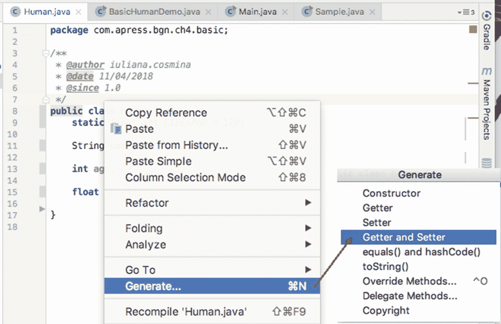

图 4-3

IntelliJ IDEA 代码生成菜单。Generate... ➤ Getter and Setter 子菜单

那么，你可能想知道 `this` 是什么。顾名思义，它是对当前对象的引用。因此，`this.name` 是当前对象字段 `name` 的值。在类体内，当方法中的参数与字段同名时，`this` 用于访问当前对象的字段。正如你所见，IntelliJ IDEA 生成的 setters 和 getters 的参数与字段同名。

Getters 是最简单的方法，声明时没有任何**参数**。它们返回与其关联的字段的值。它们的命名约定使用 `get` 前缀和它们访问的字段名，并将首字母大写。

Setters 是不返回任何内容的方法。它们声明一个与字段类型相同的变量作为参数。它们的名称由 *set* 前缀和它们访问的字段名组成，并将首字母大写。图 4-4 展示了 **name** 字段的 setter 和 getter。

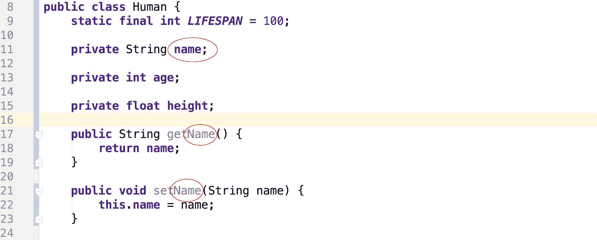

图 4-4

用于 name 字段的 setter 和 getter 方法

这意味着在实例化 `Human` 类时，我们必须使用 setters 来设置字段值，并使用 getters 来访问这些值。因此，我们的类 `BasicHumanDemo` 变为：

```
package  com.apress.bgn.ch4.basic;
public class BasicHumanDemo {
public static void main(String... args) {
Human human = new Human();
human.setName("John");
human.setAge(40);
human.setHeight(1.91f);
System.out.println("name: " + human.getName());
System.out.println("age: " + human.getAge());
System.out.println("height: " + human.getHeight());
}
```

#### 方法

既然 getters 和 setters 是方法，那么是时候开始讨论方法了。方法是一个代码块，由返回类型、名称和参数来表征，它描述了由对象执行或对对象执行的操作，该操作利用了其字段和/或提供的参数的值。Java 方法的抽象模板如下所示。

```
[访问修饰符] [返回类型] [名称] 类型 1 参数 1, 类型 2 参数 2, ... {
// 代码
[ [可能] return 值]
}
```

让我们为 `Human` 类创建一个方法，该方法利用其年龄和 `LIFESPAN` 常量来计算并打印一个人还有多少时间可活。由于该方法不返回任何内容，因此使用的返回类型是 `void`，这是一种特殊类型，告诉编译器该方法不返回任何内容，并且方法体中没有 return 语句。

```
package com.apress.bgn.ch4.basic;
public class Human {
static final int LIFESPAN = 100;
private String name;
private int age;
private float height;
/**
* 计算并打印剩余寿命
*/
public void computeAndPrintTtl(){
int ttl = LIFESPAN - this.age;
System.out.println("剩余寿命: " + ttl);
}
...
}
```

### **!**

Java 中常量的命名约定建议仅使用大写字母、下划线和数字。

上述方法定义没有声明任何参数，因此，假设我们有一个 `Human` 实例，我们可以这样调用该方法：

```
Human human = new Human();
human.setName("John");
human.setAge(40);
human.setHeight(1.91f);
human.computeAndPrintTtl();
```

我们期望它打印 `剩余寿命: 60`，这确实发生了。现在，让我们修改该方法，使其返回值而不是打印它。

```
package com.apress.bgn.ch4.basic;
public class Human {
static final int LIFESPAN = 100;
private String name;
private int age;
private float height;
/**
* @return 剩余寿命
*/
public int getTimeToLive(){
int ttl = LIFESPAN - this.age;
return ttl;
}
...
}
```

在这种情况下，调用该方法不会做任何事情，我们必须修改代码以保存返回的值并打印它。

```
Human human = new Human();
human.setName("John");
human.setAge(40);
human.setHeight(1.91f);
int timeToLive = getTimeToLive();
System.out.println("剩余寿命: " + timeToLive);
```

这里介绍的两种方法都没有声明参数，因此调用它们时无需提供任何参数。我们不会介绍带参数的方法，因为 setters 已经足够明显了。我们继续往下看。


#### 构造函数

现在我们已经完成了这一步。我们不能再使用 `human.name` 而不让编译器报错了。但即便如此，调用所有这些 setter 方法来设置属性仍然很烦人；必须对此有所改进。还记得隐式构造函数吗？好吧，让我们创建一个显式构造函数，为我们感兴趣的每个字段都设置参数。

```
public class Human {
static final int LIFESPAN = 100;
private String name;
private int age;
private float height;
public Human(String name, int age, float height) {
this.name = name;
this.age =  age;
this.height   =   height;
}
...
}
```

在上面的例子中，你可以看到构造函数不包含 `return` 语句，即使调用构造函数的结果是创建一个对象。构造函数在这方面与方法不同。通过声明一个显式构造函数，默认构造函数将不再生成。因此，通过调用默认构造函数来创建 `Human` 实例将不再有效；代码将无法编译，因为默认构造函数不再生成。

```
Human human = new Human();
```

要创建一个 `Human` 实例，我们现在必须调用新的构造函数，并提供与参数对应的、声明类型相同的正确实参。

```
Human human = new Human("John", 40, 1.91f);
```

但是，如果我们不想被迫使用这个构造函数来设置所有字段呢？很简单，我们定义另一个只包含我们感兴趣的参数的构造函数。让我们定义一个只为 `Human` 实例设置姓名和年龄的构造函数。

```
public class Human {
static final int LIFESPAN = 100;
private String name;
private int age;
private float height;
public Human(String name, int age) {
this.name = name;
this.age = age;
}
public Human(String name, int age, float height) {
this.name = name;
this.age = age;
this.height = height;
}
...
}
```

这就是我们遇到一个名为**多态**的面向对象编程原则的地方。这个术语源自希腊语，意为*一个名字，多种形态*。多态表现为拥有多个同名但功能略有不同的方法。多态有两种基本类型：**重写**，也称为**运行时多态**，以及**重载**，被称为**编译时多态**。第二种多态类型适用于前面的构造函数，因为我们有两个构造函数，其中一个的参数集不同，看起来像是较简单构造函数的扩展。

所以，在前面的例子中存在一些代码重复，而有一个常识性的编程原则叫做 **DRY**^(⁵⁴)（不要重复自己！），下面的例子显然违背了这一原则。那么，让我们使用 `this` 关键字来解决这个问题。

```
public class Human {
static final int LIFESPAN = 100;
private  String  name;
private int age;
private float height;
public Human(String name, int age) {
this.name = name;
this.age  =  age;
}
public Human(String name, int age, float height) {
this(name, age);
this.height  =  height;
}
...
}
```

是的，构造函数可以通过使用 `this(...)` 来相互调用。所以现在，我们可以使用这两个构造函数来创建 `Human` 实例。如果我们使用不设置身高的那个构造函数，`height` 字段会被隐式初始化为 `float` 类型的默认值。

现在，我们的类是通用的；我们甚至可以说它以抽象的方式建模了一个 `Human` 类。如果我们试图对具有特定技能或能力的人类进行建模，我们必须丰富这个类。假设我们想要对音乐家和演员进行建模。这意味着我们需要创建两个新类。`Musician` 类如下所示；字段的 getter 和 setter 方法已省略。

```
public class Musician {
static final int LIFESPAN = 100;
private String name;
private int age;
private float height;
private String musicSchool;
private  String  genre;
private List songs;
...
}
```

`Actor` 类如下所示；字段的 getter 和 setter 方法也已省略。

```
public class Actor {
static final int LIFESPAN = 100;
private String name;
private int age;
private float height;
private  String  actingSchool;
private List films;
...
}
```

这两个类之间存在不少共同元素。一项整洁编码原则要求开发者避免代码冗余。这可以通过遵循两个面向对象编程原则来设计类实现：**继承**和**抽象**。


#### 抽象

**抽象**是面向对象编程中用于管理复杂性的原则。抽象将复杂的实现进行分解，并定义可复用的核心部分。在本例中，`Musician` 和 `Actor` 类的公共字段可以归入本章前面定义的 `Human` 类。`Human` 类可被视为一种抽象，因为现实世界中的任何人类都不仅仅是姓名、年龄和身高所能概括的。因此，无需创建 `Human` 实例，因为人类是由其他特质（如热情、目标和技能）来体现的。在 Java 中，不需要实例化，但可以聚合字段和方法供其他类继承或提供具体实现的类，通过抽象类来建模。因此，我们首先将 `Human` 类修改为 `abstract`。由于我们正在抽象化这个类，让我们将 `LIFESPAN` 常量设为 `public`，以便从任何地方都能访问它，并将 `getTimeToLive` 方法设为抽象方法。

```
package com.apress.bgn.ch4.basic;
public abstract class Human {
public static final int LIFESPAN = 100;
private String name;
private int age;
private float height;
public Human(String name, int age) {
this.name = name;
this.age  =  age;
}
public Human(String name, int age, float height) {
this(name, age);
this.height  =  height;
}
/**
* @return 剩余寿命
*/
public abstract int getTimeToLive();
...
// 该类中字段的 setter 和 getter 方法
}
```

示例中声明了一个像 `getTimeToLive()` 这样的抽象方法；这是一个没有方法体的方法。这意味着在 `Human` 类中，该方法没有具体实现，只有一个骨架——一个模板，要求继承它的类必须提供具体实现。

哦，等等，但我们保留了构造函数！既然不能再使用它们了，为什么还要保留呢？确实不能再用了，因为图 4-5 展示了 IntelliJ IDEA 对 `BasicHumanDemo` 类的处理结果。

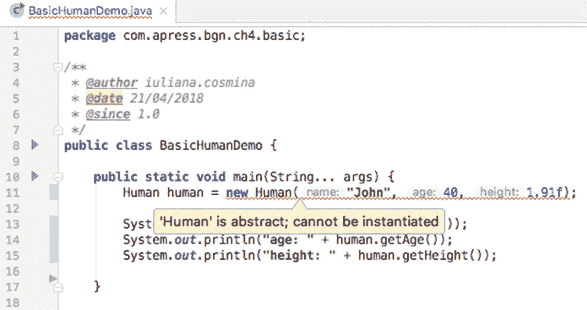

图 4-5

尝试实例化抽象类时的 Java 编译器错误

我们保留构造函数是因为它们有助于进一步抽象化行为。`Musician` 和 `Actor` 类必须重写以继承 `Human` 类。这通过在声明类时使用 `extends` 关键字并指定要扩展的类（也称为**父类**或**超类**）来实现。生成的类称为**子类**。当扩展非抽象类时，子类会**继承**超类中声明的所有字段和具体方法。

当扩展抽象类时，子类必须为所有抽象方法提供具体实现，并且必须声明自己的构造函数，这些构造函数最终会使用抽象类中声明的构造函数。这些构造函数可以通过关键字 `super` 来调用。方法也是如此，但字段除外，除非它们具有适当的访问修饰符。

让我们看看 `Musician` 类在运用抽象和继承后的样子。

```
package com.apress.bgn.ch4.basic;
import java.util.List;
public class Musician extends Human {
private String musicSchool;
private String genre;
private List songs;
public Musician(String name, int age, float height,
String musicSchool, String genre) {
super(name, age, height);
this.musicSchool = musicSchool;
this.genre = genre;
}
public int getTimeToLive() {
return (LIFESPAN - getAge()) / 2;
}
...
// 该类中字段的 setter 和 getter 方法
}
```

为简化起见，此处未将 `songs` 字段作为构造函数参数。

`Musician` 构造函数调用超类中的构造函数来设置其中定义的属性。同时，请注意 `getTimeToLive()` 方法提供了完整实现。

`Actor` 类以类似方式重写。你可以在本书的源码中找到建议的实现，但建议在查看 `com.apress.bgn.ch4.basic` 包之前先尝试自己编写。

图 4-6 展示了 IntelliJ IDEA 生成的 `Human` 类层次结构。

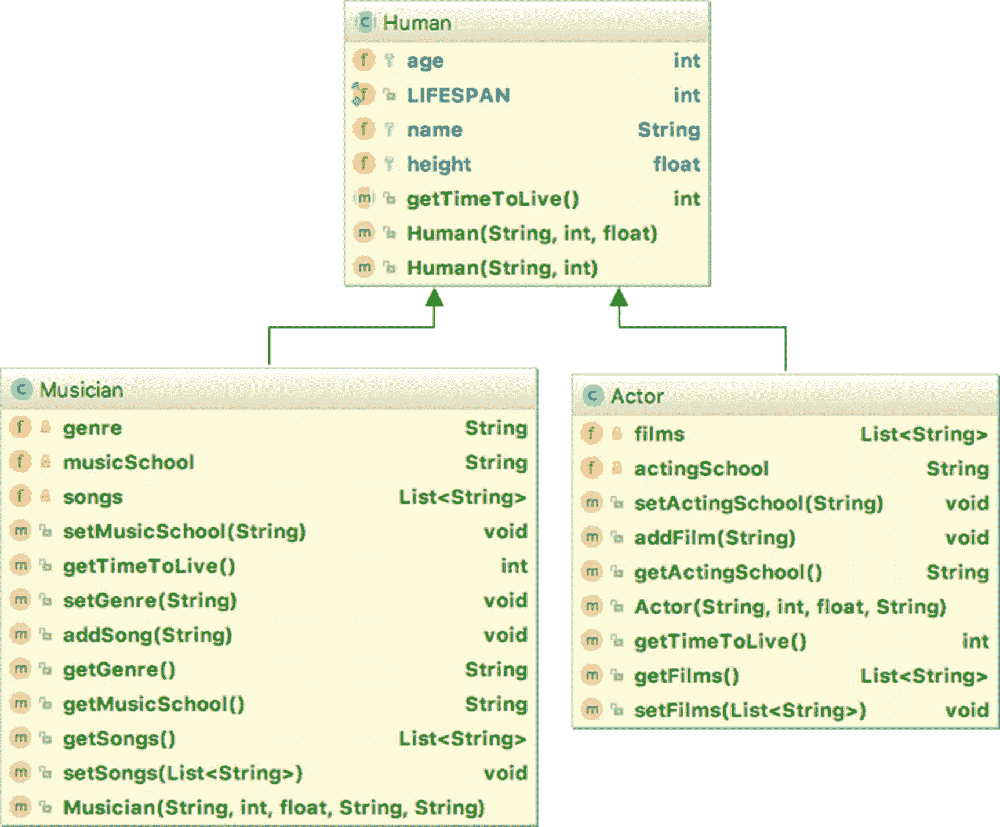

图 4-6

IntelliJ IDEA 生成的 UML 图

UML 图清晰地展示了每个类的成员，箭头指向超类。UML 图是设计类层次结构和定义应用程序逻辑的有用工具。如果你想了解更多关于 UML 图及其多种类型的信息，可以访问 [`www.uml-diagrams.org`](http://www.uml-diagrams.org) 。

在深入探讨了类以及如何创建对象之后，我们需要介绍 Java 中其他重要的组件，这些组件可以创建更详细的对象，进而用于实现更复杂的应用程序。我们的 `Human` 类缺少不少属性，例如 `gender`。一个用于建模性别的字段只能从一组固定的值中取值。过去通常只有两个值，但由于我们生活在一个崇尚政治正确性的美丽新世界，我们不能将性别值限制为两个；因此我们引入第三个值，称为 *UNDEFINED*。这意味着我们必须引入一个新类来表示性别，且该类只能被实例化三次。使用普通类来实现这一点会很棘手。因此，在 Java 1.5 版本中，引入了**枚举**。


### 枚举

`enum` 类型是一种特殊的类类型。它定义了一种只能被实例化固定次数的特殊类。一个枚举声明将所有该枚举的实例组合在一起。它们都是常量。因此，`Gender` 枚举可以像下面这段代码所示那样定义。

```
package com.apress.bgn.ch4.basic;
public enum Gender {
FEMALE,
MALE,
UNDEFINED
}
```

枚举不能在外部被实例化。枚举默认是 final 的，因此它不能被继承。还记得默认情况下 Java 中的每个类都隐式地继承 `Object` 类吗？Java 中的每个枚举都隐式地继承 `java.lang.Enum<E>` 类，这样一来，每个枚举实例都继承了在处理枚举时非常有用的特殊方法。

由于枚举是一种特殊的类，它可以拥有字段和一个只能为 private 的构造器，因为枚举实例不能在外部创建。`private` 修饰符不需要显式写出，因为编译器知道该怎么做。让我们修改 `Gender` 枚举，添加一个表示每种性别数值的整数字段和一个表示文本描述的 `String` 字段。

```
package com.apress.bgn.ch4.basic;
public enum Gender {
FEMALE(1, "f"),
MALE(2, "m") ,
UNDEFINED(3, "u");
private int repr;
private String descr;
Gender(int repr, String descr) {
this.repr = repr;
this.descr = descr;
}
public int getRepr() {
return repr;
}
public String getDescr() {
return descr;
}
}
```

但是等等，有什么能阻止我们声明 setter 方法并修改字段值呢？嗯，没什么。如果这正是你需要做的，你可以这样做。但**这不是一个好习惯**。枚举实例应该是常量。因此，我们可以不创建 setter 方法，并通过将字段声明为 `final` 来确保它们的值永远不会改变。当我们这样做时，字段初始化的唯一方式就是通过调用构造器，而由于构造器不能在外部调用，我们数据的完整性就得到了保证。于是，我们的 `enum` 变成了这样：

```
package com.apress.bgn.ch4.basic;
public enum Gender {
FEMALE(1, "f"),
MALE(2, "m") ,
UNDEFINED(3, "u");
private final int repr;
private final String descr;
Gender(int repr, String descr) {
this.repr = repr;
this.descr = descr;
}
public int getRepr() {
return repr;
}
public String getDescr() {
return descr;
}
}
```

可以向枚举中添加方法，并且每个实例都可以重写它们。因此，如果我们向 `Gender` 枚举添加一个名为 `getComment()` 的方法，每个实例都会继承它。但实例可以重写它。让我们看看这是什么样子。

```
package com.apress.bgn.ch4.basic;
public enum Gender {
FEMALE(1, "f"),
MALE(2, "m") ,
UNDEFINED(3, "u"){
@Override
public String comment() {
return "待定: " + getRepr() + ", " + getDescr();
}
};
private final int repr;
private final String descr;
Gender(int repr, String descr) {
this.repr = repr;
this.descr = descr;
}
public int getRepr() {
return repr;
}
public String getDescr() {
return descr;
}
public String comment() {
return repr + ": " + descr;
}
}
```

如果我们打印每个实例的 `comment()` 方法返回的值，我们会看到以下内容。

```
package com.apress.bgn.ch4.basic;
public class Sample extends Object {
public static void main(String... args) {
System.out.println(Gender.FEMALE.comment());
// 打印 '1: f'
System.out.println(Gender.MALE.comment());
// 打印 '2: m'
System.out.println(Gender.UNDEFINED.comment());
//打印 '待定: 3, u'
}
}
```

在未来的示例中，我们也会继续使用枚举。只需记住，每当你需要将一个类的实现限制为固定数量的实例时，`enum` 就是你的工具。现在，因为我们引入了枚举，我们的 `Human` 类也可以拥有一个 `Gender` 类型的字段了。

```
package com.apress.bgn.ch4.basic;
public abstract class Human {
public static final int LIFESPAN = 100;
protected String name;
protected int age;
protected float height;
private Gender gender;
public Human(String name, int age, Gender gender) {
this.name = name;
this.age = age;
this.gender = gender;
}
public Human(String name, int age, float height, Gender gender) {
this(name, age, gender);
this.height = height;
}
...
}
```

在前面的章节中，**接口**被提及为用于创建对象的 Java 工具之一。现在是时候深入探讨这个主题了。


### 接口

最常见的 Java 面试题之一是：“接口和抽象类有什么区别？”本节将为你提供该问题最详细的答案。**接口**不是类，但它确实有助于创建类。接口是完全抽象的；它没有字段，只有方法定义（骨架）。一个类可以实现一个接口，并且除非该类是抽象的，否则它必须为这些方法提供具体的实现。接口中声明的每个方法都隐式地是 public 和 abstract 的，因为方法需要是抽象的，以强制实现类提供实现，并且是 public 的，以便类可以访问并实现它们。

接口中唯一具有具体方法体的方法是静态方法，以及从 Java 8 开始的 **default**（默认）方法。接口不能被实例化，它们没有构造方法。

没有声明任何方法定义的接口被称为**标记**接口，其目的是为特定目的标记类。最著名的 Java 标记接口是 `java.io.Serializable`，它标记了可以被序列化的对象（其状态可以保存到二进制文件中）。

接口可以在其自己的文件中作为顶层组件声明，也可以嵌套在另一个组件内部。接口有两种类型：普通接口和注解。

抽象类和接口之间的区别，以及何时应该使用其中一种，在**继承**的上下文中变得尤为重要。Java 只支持单继承。这意味着一个类只能有一个超类。这看起来可能是一个限制，但让我们考虑一个简单的例子。让我们修改之前的层次结构，想象一个名为 `Performer` 的类，它应该同时继承 `Musician` 和 `Actor` 类。如果你需要一个可以由这个类建模的真实人物，可以想想大卫·杜楚尼，一位最近涉足音乐领域的演员。

图 4-7 展示了类层次结构。

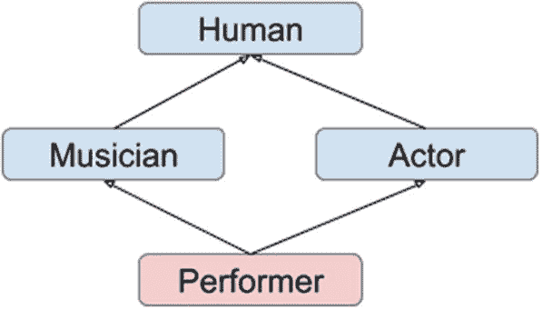

图 4-7

菱形类层次结构

图 4-7 中的层次结构引入了所谓的**菱形问题**，其名称源于类之间关系所形成的形状。这个设计到底有什么问题？如果 `Musician` 和 `Actor` 都继承自 `Human`，并从中继承了所有成员，那么 `Performer` 应该继承哪个成员，又从哪里继承？因为它不能两次继承 `Human` 类的成员——这会使该类变得无用且无效。那么，解决方案是什么？正如你可能已经想到的，鉴于本节标题：**接口**。

需要做的是将 `Musician` 和 `Actor` 类中的方法转变为方法骨架，并将这些类转变为接口。来自 `Musician` 的行为被移到一个名为（比如说）`Guitarist` 的类中，该类继承 `Human` 类并实现 `Musician` 接口。对于 `Actor` 类，可以执行类似的操作，但我将其留作练习给你。图 4-8 所示的层次结构提供了一些帮助。

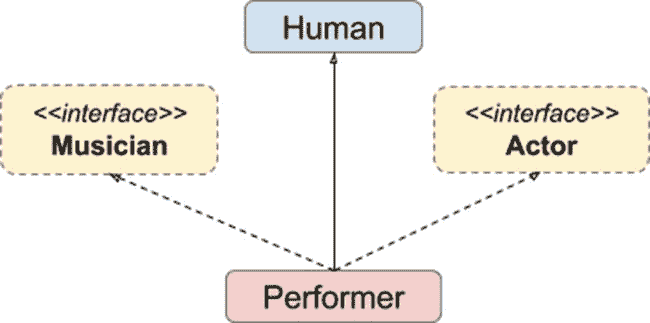

图 4-8

为 Performer 类设计的包含接口的 Java 层次结构

`Musician` 接口只包含映射音乐家行为的方法模板。它不深入细节来建模如何做。`Actor` 接口也是如此。在下面的代码片段中，你可以看到这两个接口的主体。

```
// Musician.java
package com.apress.bgn.ch4.hierarchy;
import java.util.List;
public interface Musician {
String getMusicSchool();
void setMusicSchool(String musicSchool);
List getSongs();
void setSongs(List songs);
String getGenre();
void setGenre(String genre);
}
// Actor
package com.apress.bgn.ch4.hierarchy;
import java.util.List;
public interface Actor {
String getActingSchool();
void setActingSchool(String actingSchool);
List getFilms();
void setFilms(List films);
void addFilm(String filmName);
}
```

字段已被移除，因为它们不能成为接口的一部分；剩下的只有方法模板。`Performer` 类在下一个代码片段中展示。

```
package com.apress.bgn.ch4.hierarchy;
import java.util.List;
public class Performer extends Human
implements Musician, Actor {
private String musicSchool;
private String genre;
private List songs;
private String actingSchool;
private List films;
public Performer(String name, int age, float height, Gender gender) {
super(name, age, height, gender);
}
@Override
public int getTimeToLive() {
return (LIFESPAN - getAge()) / 2;
}
public String getMusicSchool() {
return musicSchool;
}
public void setMusicSchool(String musicSchool) {
this.musicSchool = musicSchool;
}
public List getSongs() {
return songs;
}
public void setSongs(List songs) {
this.songs = songs;
}
public void addSong(String song) {
this.songs.add(song);
}
public String getGenre() {
return genre;
}
public void setGenre(String genre) {
this.genre = genre;
}
public String getActingSchool() {
return actingSchool;
}
public void setActingSchool(String actingSchool) {
this.actingSchool = actingSchool;
}
public List getFilms() {
return films;
}
public void setFilms(List films) {
this.films = films;
}
public void addFilm(String filmName) {
this.films.add(filmName);
}
}
```

从这个例子中你得到的是，在 Java 中使用接口可以实现**多重继承**，并且类可以继承类并实现接口。但继承也适用于接口。例如，`Musician` 和 `Actor` 接口都可以继承一个名为 `Artist` 的接口，该接口包含两者共有的行为模板。例如，我们可以将音乐学校和表演学校合并为一个通用的学校，并为其定义 setter 和 getter 作为方法模板。`Artist` 接口与 `Musician` 一起展示如下。

```
// Artist.java
package com.apress.bgn.ch4.hierarchy;
public interface Artist {
String getSchool();
void setSchool(String chool);
}
// Musician.java
package com.apress.bgn.ch4.hierarchy;
import java.util.List;
public interface Musician extends Artist {
List getSongs();
void setSongs(List songs);
String getGenre();
void setGenre(String genre);
}
```

希望你已经理解了多重继承的概念，以及在设计应用程序时何时适合使用类，何时适合使用接口。现在是时候兑现本节开头做出的承诺，列出抽象类和接口之间的区别了。你可以在表 4-1 中找到它们。

表 4-1

Java 中抽象类和接口的区别

| 抽象类 | 接口 |
| --- | --- |
| 可以有非抽象方法 | 只能有抽象方法（以及自 Java 8 起的默认方法，自 Java 9 起的私有方法） |
| 单继承：一个类只能继承一个类 | 多重继承：一个类可以实现多个接口。 |
| 可以有 final、非 final、static 和非 static 变量 | 只能有 static 和 final 字段。 |
| 使用 **abstract class** 声明 | 使用 **interface** 声明。 |
| 可以使用关键字 **extends** 继承另一个类，并使用关键字 **implements** 实现接口 | 只能使用关键字 **extends** 继承其他接口（一个或多个）。 |
| 可以有非抽象、protected 或 private 成员 | 所有成员都是方法定义，默认是 abstract 和 public。（自 Java 8 起的默认方法和自 Java 9 起的私有方法除外。） |
| 如果一个类有抽象方法，它自身必须声明为 abstract | （无对应项） |


#### 默认方法

接口的一个问题是，如果你修改其主体来添加新方法，大多数情况下，代码会停止编译，因为实现该接口的类没有为接口中声明的新方法提供具体实现。当然，一种解决方案是在新接口中声明这些新方法，然后创建同时实现新旧接口的新类。

接口暴露的方法构成了 API（应用程序编程接口），在开发应用程序时，目标是设计应用程序及其组件，使其拥有稳定的 API。这一规则在**开闭原则**中有所描述，它是 SOLID 五大编程原则之一^(⁵⁵)。该原则指出，你应该能够在不修改类的情况下扩展它。因此，修改类所实现的接口会扩展类的行为，但这仅当该类被修改以提供新方法的具体实现时才成立。所以，实现接口往往会导致违反这一原则。那么，在 Java 中我们该如何避免这种情况呢？

在 Java 8 中，终于引入了针对此问题的解决方案：**默认方法**。从 Java 8 开始，只要使用 `default` 关键字声明，就可以在接口中声明具有完整实现的方法。

让我们考虑之前的例子：`Artist` 接口。任何艺术家都应该能够创造一些东西，对吧？所以，他或她应该具有创造性。鉴于我们所处的世界，我不会提及具体名字，但我们的一些艺术家实际上是产业的产物，因此他们本身并不具有创造性。所以，当我们意识到应该有一个方法来判断艺术家是否具有创造性时，这已经是在我们确定了层次结构之后很久了，如图 4-9 所示。

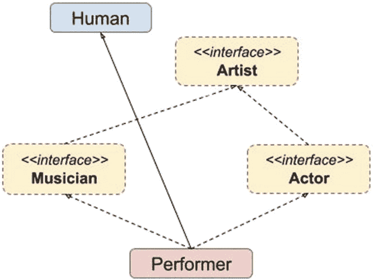

图 4-9

为 Performer 类添加了更多接口的 Java 层次结构

如果我们向 `Artist` 接口添加一个新的方法模板，`Performer` 类会导致编译错误。IntelliJ IDEA 通过显示大量红色内容，清晰地表明我们的应用程序不再工作，如图 4-10 所示。

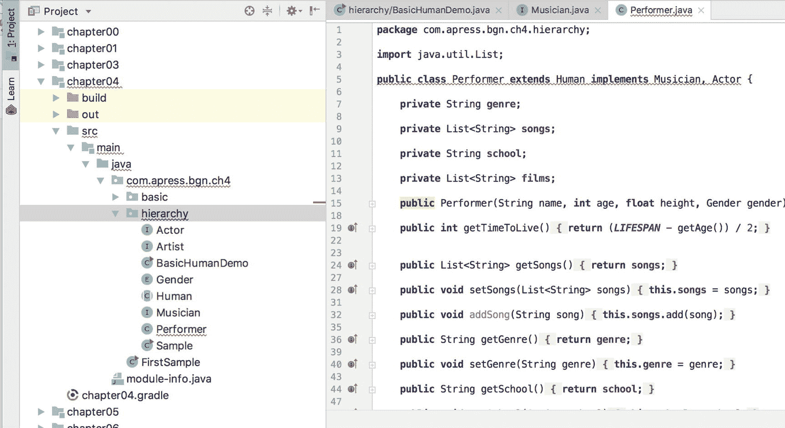

图 4-10

损坏的 Java 层次结构

我们看到的编译器错误是由于我们决定向 `Artist` 接口添加一个名为 `isCreative` 的新方法造成的。它在以下代码片段中被标出。

```
package com.apress.bgn.ch4.hierarchy;
public interface Artist {
String getSchool();
void setSchool(String school);
boolean isCreative();
}
```

为了消除编译错误，我们将 `isCreative` 方法转换为一个返回 `true` 的默认方法，因为每个艺术家都应该是具有创造性的。

```
package com.apress.bgn.ch4.hierarchy;
public interface Artist {
String getSchool();
void setSchool(String school);
default boolean isCreative(){
return true;
}
}
```

现在，代码应该可以再次编译了。如果我们需要向一个接口添加多个默认方法，并且这些方法有一些共同的实现，那么从 Java 9 开始，可以将这些代码隔离到一个私有方法中，该方法可以从默认方法中调用。所以基本上，从 Java 9 开始，只要声明为私有，完整的方法就可以成为接口的一部分。

#### 注解类型

注解的定义方式与接口类似；区别在于 `interface` 关键字前面有一个 *at* 符号（`@`）。注解类型是接口的一种形式，大多数情况下，它们被用作标记。例如，你可能已经注意到了 `@Override` 注解。当扩展类或实现接口的类被自动生成时，智能 IDE 会自动放置此注解。它在 JDK 中的声明如下代码片段所示。

```
package java.lang;
import  java.lang.annotation.*;
@Target(ElementType.METHOD)
@Retention(RetentionPolicy.SOURCE)
public @interface Override {}
```

不声明任何属性的注解被称为**标记**或**信息性**注解。它们仅用于通知应用程序中的其他类，或开发者其所放置组件的用途。它们不是强制性的，没有它们代码也能编译。

在 Java 8 中，引入了一个名为 `@FunctionalInterface` 的注解。此注解被放置在所有可用于**lambda 表达式**的 Java 接口上。

```
package java.lang;
import java.lang.annotation.*;
@Documented
@Retention(RetentionPolicy.RUNTIME)
@Target(ElementType.TYPE)
public @interface FunctionalInterface {}
```

Lambda 表达式也是在 Java 8 中引入的，它们代表了一种从 Groovy 和 Ruby 等语言借鉴而来的、编写代码的紧凑且实用的方式。

**函数式接口**是声明了单个抽象方法的接口。正因为如此，该方法的实现可以当场提供，而无需创建一个类来定义具体实现。

让我们想象以下场景：我们创建一个名为 `Operation` 的接口，其中包含一个方法。

```
package com.apress.bgn.ch4.lambda;
@FunctionalInterface
public interface Operation {
float execute(int a, int b);
}
```

接下来，我们将创建一个名为 `Addition` 的类。

```
package com.apress.bgn.ch4.lambda;
public class Addition implements Operation {
@Override
public float execute(int a, int b) {
return a + b;
}
}
```

如果我们想测试它，还需要另一个类。

```
package com.apress.bgn.ch4.lambda;
public class OperationDemo {
public static void main(String... args) {
Addition addition = new Addition();
float  result = addition.execute(2,5);
System.out.println("Result is " + result);
}
}
```

使用 lambda，`Addition` 类不再需要，实例化和方法调用可以替换为：

```
package com.apress.bgn.ch4.lambda;
public class OperationDemo {
public static void main(String... args) {
Operation addition2 = (a, b) -> a + b;
float result2 = addition2.execute(2, 5);
System.out.println("Lambda Result is " + result2);
}
}
```

Lambda 表达式可用于很多场景。在本书中，只要代码可以使用它们以更实用的方式编写，我都会进行介绍。


## 异常

异常是特殊的 Java 类，用于拦截程序执行过程中出现的特殊意外情况，以便开发者能够实施适当的处理措施。这些类按层次结构组织，如图 4-11 所示。

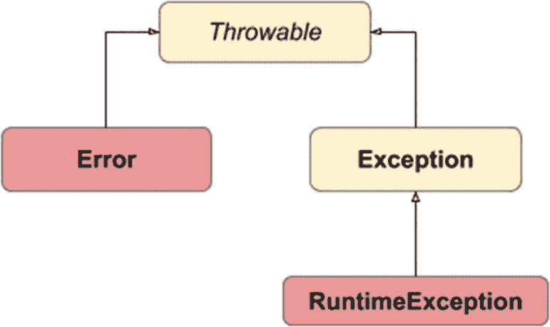

图 4-11

Java 异常层次结构

`Throwable` 是所有可在 Java 应用程序中抛出的错误的超类。异常情况可能由硬件故障（例如，尝试读取受保护的文件）、资源缺失（例如，尝试读取不存在的文件）或不良代码引起。糟糕的开发者往往会这样做：当不确定时，就捕获一个 `Throwable`。你应尽量避免这样做，因为 `Error` 类（它通知开发者系统无法恢复的情况）是 `Throwable` 的子类。让我们从一个简单的例子开始。我们定义一个调用自身的方法（其技术名称为**递归**），但我们会设计得糟糕，让它无限调用自身，导致 JVM 内存耗尽。

```
package com.apress.bgn.ch4.ex;
public class ExceptionsDemo {
// 糟糕的方法
static int rec(int i){
return rec(i*i);
}
public static void main(String... args) {
rec(1000);
System.out.println("发生了一个错误。");
}
}
```

如果我们运行这个类，*发生了一个错误* 不会被打印出来。相反，程序会通过抛出一个 `StackOverFlowError` 异常而异常终止，并指出问题所在的行（在我们的例子中，是递归方法调用自身的行）。

```
Exception in thread "main" java.lang.StackOverflowError
at chapter.four/com.apress.bgn.ch4.ex.ExceptionsDemo.recExceptionsDemo.java:7
at chapter.four/com.apress.bgn.ch4.ex.ExceptionsDemo.recExceptionsDemo.java:7
...
```

`StackOverFlowError` 是 `Error` 的子类，由被调用的有缺陷的递归方法引起。当然，我们可以修改代码，处理这种异常情况，并执行接下来需要执行的任何操作。

```
package com.apress.bgn.ch4.ex;
public class ExceptionsDemo {
...
public static void main(String... args) {
try {
rec(1000);
} catch (Throwable r) {
}
System.out.println("发生了一个错误。");
}
}
```

在控制台中，你只会看到 *发生了一个错误* 这段文本，但没有任何错误的踪迹，这是因为我们捕获了它并决定不打印任何相关信息。这也是一种被称为**异常吞噬**的不良实践，永远不要这样做！此外，系统不应从此类错误中恢复，因为抛出错误后任何操作的结果都是不可靠的。这就是为什么作为经验法则，**永远不要捕获 Throwable！！**

`Exception` 类是所有可被捕获和处理、且系统可以从中恢复的异常的超类。`RuntimeException` 类是在程序执行期间抛出的异常的超类，因此在编写代码时并不知道它们被抛出的可能性。让我们考虑以下代码示例。

```
package com.apress.bgn.ch4.ex;
import com.apress.bgn.ch4.hierarchy.Performer;
public class ExceptionsDemo {
public static void  main(String... args) {
Performer p = PerformerGenerator.get("John");
System.out.println("TTL: " + p.getTimeToLive());
}
}
```

假设我们无法访问 `PerformerGenerator` 类的代码。我们知道，如果调用 `get(..)` 方法并传入一个名字，它会返回一个 `Performer` 实例。因此，我们编写了上述代码，并尝试打印该执行者的存活时间。如果因为调用 `get`("`John`") 方法返回 null 而导致执行者未用合适的对象初始化，会发生什么？结果如下一个代码片段所示。

```
Exception in thread "main" java.lang.NullPointerException
at chapter.four/com.apress.bgn.ch4.ex.ExceptionsDemo.mainExceptionsDemo.java:10
```

但如果我们是有智慧的开发者，或者有点偏执，我们可以为此做好准备，捕获异常并抛出适当的消息，或者在那里执行一个虚拟初始化，以防执行者实例稍后在代码中以其他方式使用。

```
package com.apress.bgn.ch4.ex;
import com.apress.bgn.ch4.hierarchy.Performer;
public class ExceptionsDemo {
public static void main(String... args) {
Performer p = null;//PerformerGenerator.get("John");
try {
System.out.println("TTL: " + p.getTimeToLive());
} catch (Exception e) {
System.out.println("执行者未正确初始化，原因是：" + e.getMessage() );
}
}
}
```

抛出的异常类型是 `NullPointerException`，这是一个继承自 `RuntimeException` 的类，因此 `try/catch 块` 不是强制性的。这类异常被称为**非受检异常**，因为开发者没有义务去检查它们。`NullPointerException` 是 Java 初学者经常遇到的异常类型，因为他们尚未充分培养出“偏执感”，在使用来源不明的对象之前总是忘记测试。

还有另一类异常被称为**受检异常**。这是任何继承自 `Exception` 的异常类型——包括开发者声明的自定义异常类——这些异常被声明为由方法显式抛出。在这种情况下，当调用该方法时，编译器强制开发者处理该异常或将其继续向上抛出。让我们为 `PerformerGenerator` 使用一个模拟实现。

```
package com.apress.bgn.ch4.ex;
import com.apress.bgn.ch4.hierarchy.Gender;
import com.apress.bgn.ch4.hierarchy.Performer;
public class PerformerGenerator {
public static Performer get(String name)
throws EmptyPerformerException {
return new Performer(name,40, 1.91f, Gender.MALE);
}
}
```

`EmptyPerformerException` 是一个简单的自定义异常类，它继承自 `java.lang.exception` 类。

```
package com.apress.bgn.ch4.ex;
public class EmptyPerformerException extends Exception {
public EmptyPerformerException(String message) {
super(message);
}
}
```

我们声明了 `get(..)` 方法可能会抛出 `EmptyPerformerException`；如果没有用 `try/catch` 块包裹该方法调用，编译器会抛出错误，如图 4-12 所示。

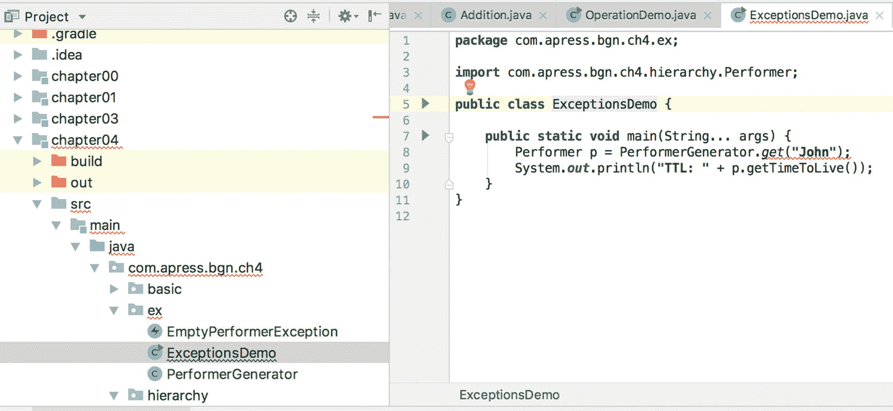

图 4-12

由受检异常引起的 Java 编译器错误

如何修复它？嗯，我们编写代码来捕获它并打印一条相关的消息。

```
package com.apress.bgn.ch4.ex;
import com.apress.bgn.ch4.hierarchy.Performer;
public class ExceptionsDemo {
public static void main(String... args) {
try {
Performer p = PerformerGenerator.get("John");
System.out.println("TTL: " + p.getTimeToLive());
} catch (EmptyPerformerException e) {
System.out.println("无法使用空的执行者，因为 " + e.getMessage());
}
}
}
```

既然我们正在讨论异常，`try/catch` 块可以加上一个 `finally` 块来完成。无论异常是否被进一步抛出，或者方法是否正常返回，`finally` 块中的内容都会被执行。`finally` 块唯一不执行的情况是程序因错误而终止。

```
package com.apress.bgn.ch4.ex;
import com.apress.bgn.ch4.hierarchy.Performer;
public class ExceptionsDemo {
public static void main(String... args) {
try {
Performer p = PerformerGenerator.get("John");
System.out.println("TTL: " +  p.getTimeToLive());
} catch (EmptyPerformerException e) {
System.out.println("无法使用空的执行者！");
} finally {
System.out.println("一切按预期进行！");
}
}
}
```

在本书中，我们会编写一些以异常情况结束的代码，因此当你的知识更深入一些时，我们会有机会扩展这个主题。


## 泛型

到目前为止，我们只讨论了对象类型和用于创建对象的 Java 模板。但如果我们需要设计一个功能适用于多种对象类型的类，该怎么办？由于 Java 中的每个类都继承自 `Object` 类，我们可以创建一个类，其中包含一个接收 `Object` 类型参数的方法，并在该方法中测试对象类型。请先接受这个事实；后续会详细讲解。

在 Java 5 中，引入了在创建对象时使用类型作为参数的可能性。那些为处理其他类而开发的类被称为**泛型**。

在编写 Java 应用程序时，你很可能需要在某个时刻将不同类型的值配对。以下代码片段展示了一个最简单的 `Pair` 类版本，它可以容纳任意类型的一对实例。

```
package com.apress.bgn.ch4.gen;
public class Pair {
protected X  x;
protected Y  y;
private Pair(X x, Y y) {
this.x = x;
this.y = y;
}
public X x() {
return x;
}
public Y y() {
return y;
}
public void x(X x) {
this.x = x;
}
public void y(Y y) {
this.y = y;
}
...
public static  Pair of(X x, Y y) {
return new Pair(x, y);
}
@Override public String toString() {
return "Pair{" + x.toString() +", " + y.toString() + ’}’;
}
}
```

让我们测试一下！让我们创建一对 `Performer` 实例、一个 `String` 和一个 `Performer` 实例组成的对，以及一对 `String`，来检查这是否可行。`toString()` 方法继承自 `Object` 类，并在 `Pair` 类中被重写，以打印字段的值。

```
package com.apress.bgn.ch4.gen;
import com.apress.bgn.ch4.hierarchy.Gender;
import com.apress.bgn.ch4.hierarchy.Performer;
public class GenericsDemo {
public static void main(String... args) {
Performer john = new Performer("John", 40, 1.91f, Gender.MALE);
Performer jane = new Performer("Jane", 34, 1.591f, Gender.FEMALE);
Pair performerPair = Pair.of(john, jane);
System.out.println(performerPair);
Pair stringPair = Pair.of("John", "Jane");
System.out.println(stringPair);
Pair spPair = Pair.of("John", john);
System.out.println(spPair);
System.out.println("all good.");
}
}
```

如果你执行上述类，你会看到类似下面所示的日志输出。

```
Pair{com.apress.bgn.ch4.hierarchy.Performer@1d057a39com.apress.bgn.ch4.
hierarchy.Performer@26be92ad}
Pair{JohnJane}
Pair{Johncom.apress.bgn.ch4.hierarchy.Performer@1d057a39}
all good.
```

`println` 方法期望其参数是一个 `String` 实例；如果参数类型不是 `String`，则会调用给定对象上的 `toString()` 方法。如果 `toString` 方法没有被重写，则会调用 `Object` 类中的方法，该方法返回对象类型的完全限定名以及一个称为**哈希码**的东西，它是对象的数值表示。

## Java 保留字

表 4-2 和表 4-3 列出了 Java 关键字，这些关键字只能用于语言中固定的、预定义的目的。这意味着它们不能用作标识符；你不能将它们用作变量、类、接口、枚举或方法的名称。

表 4-3

Java 关键字（第 2 部分）

| 方法 | 描述 |
| --- | --- |
| `do``while``for` | 用于创建循环的关键字：`do{..} while(condition),``while(condition){..},``for(initialisation;condition;incrementation){..}` |
| `goto` | 另一个从 C 语言借用的关键字，但目前未在 Java 中使用，因为它可以被带标签的 `break` 和 `continue` 语句替代 |
| `if``else` | 创建条件语句：`if(condition) {..}``else {..}``else if (condition ) {..}` |
| `import` | 使类和接口在当前源代码中可用。 |
| `instanceof` | 在条件表达式中测试实例类型。 |
| `native` | 此修饰符指示方法使用 JNI（Java 本地接口）以本地代码实现。 |
| `new` | 创建 Java 实例。 |
| `package` | 声明类/接口/枚举/注解所属的包，并且应该是第一条 Java 语句。 |
| `public``private``protected` | Java 项（模板、字段或方法）的访问级别修饰符。 |
| `return` | 在方法内部使用的关键字，用于返回到调用它的代码。该方法也可以向调用代码返回一个值。 |
| `static` | 此修饰符可应用于变量、方法、块和嵌套类。它声明一个在声明它的类的所有实例之间共享的项。 |
| `stricfp` | 用于限制浮点计算以确保可移植性。在 Java 1.2 中添加。 |
| `super` | 在类内部用于访问超类成员的关键字。 |
| `this` | 用于访问当前对象成员的关键字。 |
| `synchronized` | 确保在任何给定时间只有一个线程执行代码块。这避免了称为“竞态条件”3 的问题。 |
| `transient` | 标记不应序列化的数据。 |
| `volatile` | 确保对变量值的更改对所有访问它的线程都可见。 |
| `void` | 在声明方法时用作返回类型，以指示该方法不返回值。 |
| `_(下划线)` | 从 Java 9 开始不能用作标识符。 |

表 4-2

Java 关键字（第 1 部分）

| 方法 | 描述 |
| --- | --- |
| `abstract` | 将类或方法声明为抽象——任何扩展或实现它的类必须提供具体的实现。 |
| `assert` | 测试关于代码的假设。在 Java 1.4 中引入，除非程序使用 `"-ea"` 选项运行，否则 JVM 会忽略它。 |
| `boolean``byte``char``short``int``long``float``double` | 原始类型名称 |
| `break` | 在循环内部使用的语句，用于立即终止循环。 |
| `continue` | 在循环内部使用的语句，用于立即跳转到下一次迭代。 |
| `switch` | 用于测试与一组称为 case 的值是否相等的语句名称。 |
| `case` | 用于在 `switch` 语句中定义 case 值的语句。 |
| `default` | 在 `switch` 语句中声明默认 case。也用于在接口中声明默认值。从 Java 8 开始，它可以用于在接口中声明默认方法，即具有默认实现的方法。 |
| `try``catch``finally``throw``throws` | 异常处理中使用的关键字。 |
| `class interface` | 类和接口声明中使用的关键字。 |
| `extends implements` | 扩展类和实现接口时使用的关键字。 |
| `enum` | 在 Java 5.0 中引入的关键字，用于声明一种特殊类型的类，该类定义了一组固定的实例。 |
| `const` | 未在 Java 中使用；从 C 语言借用的关键字，在 C 中用于声明常量，即被赋值的变量，在程序执行期间不能更改。 |
| `final` | Java 中 `const` 关键字的等价物。任何用此修饰符定义的内容，在最终初始化后都不能更改。final 类不能被扩展。final 方法不能被重写。final 变量在程序执行期间保持与初始化时相同的值。任何修改 final 项的代码都会导致编译器错误。 |


## 总结

本章介绍了 Java 语言中最常用的元素，这样你在未来的代码示例中就不会遇到任何意外，并且可以专注于正确地学习这门语言。

*   语法错误会阻止 Java 代码被转换为可执行代码。这意味着代码无法编译。

*   如果使用了静态导入语句，则可以在声明类时直接使用静态变量。

*   Java 标识符必须遵守命名规则。

*   注释会被编译器忽略，Java 中有三种类型的注释。

*   类、接口和枚举是用于创建对象的 Java 组件。

*   抽象类不能被实例化，即使它们可以有构造方法。

*   在 Java 8 引入默认方法之前，接口只能包含方法模板。从 Java 9 开始，只要方法被声明为私有且仅从默认方法中调用，接口就可以包含完整实现的方法。

*   枚举是一种特殊类型的类，只能被实例化固定次数。

*   在 Java 中，不支持使用类的多重继承。

*   接口可以扩展其他接口。

*   Java 定义了固定数量的关键字，称为**保留关键字**，它们只能用于特定目的。这些内容已在上一节中介绍过。

3 一篇详细描述此问题及避免方法的文章可以在这里找到：[`https://devopedia.org/race/-condition/-software`](https://devopedia.org/race/-condition/-software)

脚注 1   2

