# 5. 数据类型

在第 4 章中，我们编写了大量 Java 代码，但在设计类时，只使用了最简单的数据类型：一些数值类型和文本类型。在 JDK 中，声明了许多用于多种目的的数据类型：用于建模日历日期、表示多种数值类型、操作文本、集合、文件、数据库连接等等。除了 JDK 之外，还有其他方创建的库提供了更多功能。但 JDK 提供的数据类型是基础，是每个 Java 应用程序的构建基石。当然，根据你正在构建的应用程序类型，你可能不需要所有这些类型。例如，我从未有机会使用 `java.util.logging.Logger` 类。我参与过的大多数应用程序在我加入时已经由其他团队搭建好了，他们使用的是像 Log4j 或 Logback 这样的外部库，或者像 Slf4j 这样的日志抽象层。

本节涵盖了编写大约 80% 的 Java 应用程序所需的基本 Java 数据类型。

## 栈内存与堆内存

Java 类型可以分为两大类：**基本类型**和**引用类型**。Java 代码文件存储在硬盘上，Java 字节码文件也是如此。Java 程序在 JVM 上运行，JVM 通过执行 `java` 可执行文件作为一个进程启动。在执行过程中，所有数据都存储在两种不同类型的内存中，分别称为：`栈`和`堆`，它们由操作系统为程序的执行分配。

**栈**内存在执行期间（也称为*运行时*）用于存储方法的原始类型局部变量以及指向堆中存储的对象的引用。**栈**也是一种数据结构，由一个只能在一端访问的值列表表示，也称为 **LIFO** 顺序，这是 **L**ast **I**n, **F**irst **O**ut（后进先出）的缩写。这个名称很贴切，因为每次调用方法时，都会在栈内存中创建一个新的块来保存该方法的局部变量：原始类型和对方法中其他对象的引用。^(⁵⁶)

每个 JVM 执行线程都有自己的栈内存，其大小可以使用 JVM 参数 `-Xss` 指定。如果分配了太多变量，或者被调用的方法是递归的且设计不良，导致返回条件永远无法满足，从而无限地调用自身，你就会遇到 `java.lang.StackOverFlowError`，这意味着没有剩余的栈内存了，因为每次方法调用都会在栈上创建一个新的块。

**堆**内存在运行时用于为对象和 JRE 类分配内存。对象是 JDK 类或开发者定义的类的实例。任何使用 `new` 创建的对象都存储在堆内存中。在堆内存中创建的对象可以被应用程序的所有线程访问。堆内存的访问和管理稍微复杂一些，将在**第** **13** **章**中详细介绍。`-Xms` 和 `-Xmx` JVM 参数设置了 Java 程序在执行期间堆内存的初始大小和最大大小。堆大小可能会根据程序创建的对象数量而变化，如果分配给 Java 程序的所有堆内存都已满，则会抛出 `java.lang.OutOfMemoryError`。

JVM 参数很有用，因为在开发过程中，你可能需要编写解决复杂问题的代码，这些代码需要比默认大小更大的栈或堆内存，因此你可以设置自己的大小，而不是依赖默认大小。栈和堆的默认值是平台相关的。如果你对这些值感兴趣，可以查看官方文档 [`https://docs.oracle.com/cd/E13150_01/jrockit_jvm/jrockit/jrdocs/refman/optionX.html`](https://docs.oracle.com/cd/E13150_01/jrockit_jvm/jrockit/jrdocs/refman/optionX.html) ，其中涵盖了所有 JVM 参数和默认值。你可以在浏览器中打开该链接并搜索 `-Xss`、`-Xms` 或 `-Xmx`。

`java.lang.String` 类是 Java 编程语言中最常用的类。由于应用程序中的文本值可能具有相同的值，出于效率原因，此类对象在堆中的管理方式略有不同。在堆中有一个特殊的内存区域，称为**字符串池**，JVM 将所有 `String` 实例存储在其中。这里必须提到这一点，因为接下来分析用于解释 Java 中内存管理方式的代码片段包含一个 `String` 实例的定义，但关于字符串池和 `String` 数据类型的其他细节将在本章后面的专门章节中详细介绍。

让我们考虑以下可执行类，并想象在此程序执行期间内存是如何组织的。


```
01\.  package com.apress.bgn.ch5;
02.
03\.  import java.util.Date;
04.
05\.  public class PrimitivesDemo {
06.
07\.    public static void main(String... args) {
08\.         int i = 5;
09\.         int j = 7;
10\.         Date d = new Date();
11\.         int result = add(i, j);
12\.         System.out.print(result);
13\.         d = null;
14\.    }
15.
16\.    static int add(int a, int b) {
17\.        String mess = new String("performing add ...");
18\.        return a + b;
19\.    }
20\.  }
```

你能判断出哪些变量保存在栈上，哪些保存在堆上吗？让我们逐行分析这段程序，看看发生了什么。

*   程序启动后，JVM 所需的运行时类会被加载到堆内存中。

*   **第 07 行**发现了 `main()` 方法，因此会创建一个栈内存，用于该方法执行期间。

*   **第 08 行**的原始局部变量 `i=5` 被创建并存储在 `main()` 方法的栈内存中。

*   **第 09 行**的原始局部变量 `j=7` 被创建并存储在 `main()` 方法的栈内存中。此时，程序内存状态如图 5-1 所示。

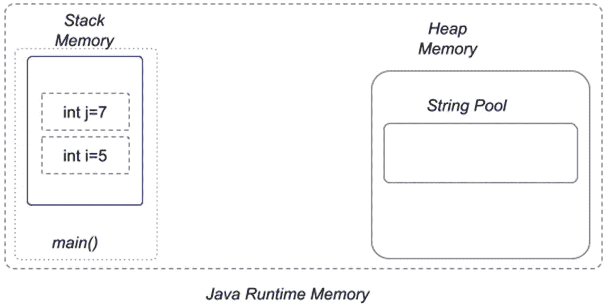

图 5-1

声明两个原始变量后的 Java 栈和堆内存

*   **第 10 行**声明了一个 `java.util.Date` 类型的对象，因此该对象被创建并存储在堆内存中，同时一个名为 `d` 的引用被保存在栈上。此时，程序内存状态如图 5-2 所示。

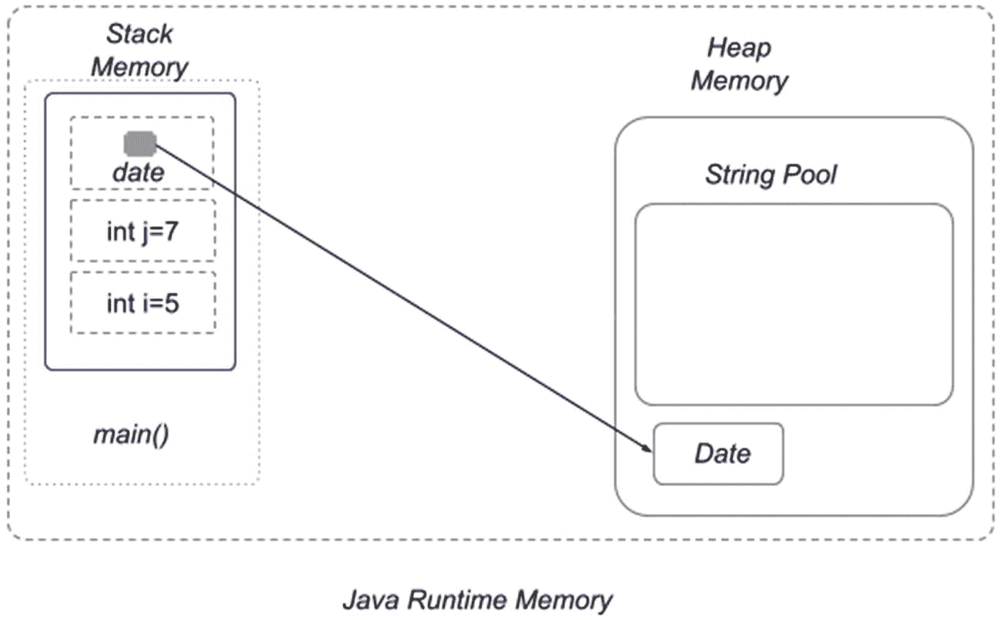

图 5-2

声明两个原始变量和一个对象后的 Java 栈和堆内存

*   **第 11 行**调用了 `add()` 方法，参数为 `i` 和 `j`。这意味着它们的值会被复制到该方法的局部变量 `a` 和 `b` 中，这两个变量会存储在该方法的内存块中。

*   在 `add(..)` 方法体内，**第 17 行**声明了一个 `String` 实例。因此，该字符串对象在堆内存的字符串常量池中被创建，而名为 `mess` 的引用则存储在栈上该方法的内存块中。此时，程序内存状态如图 5-3 所示。

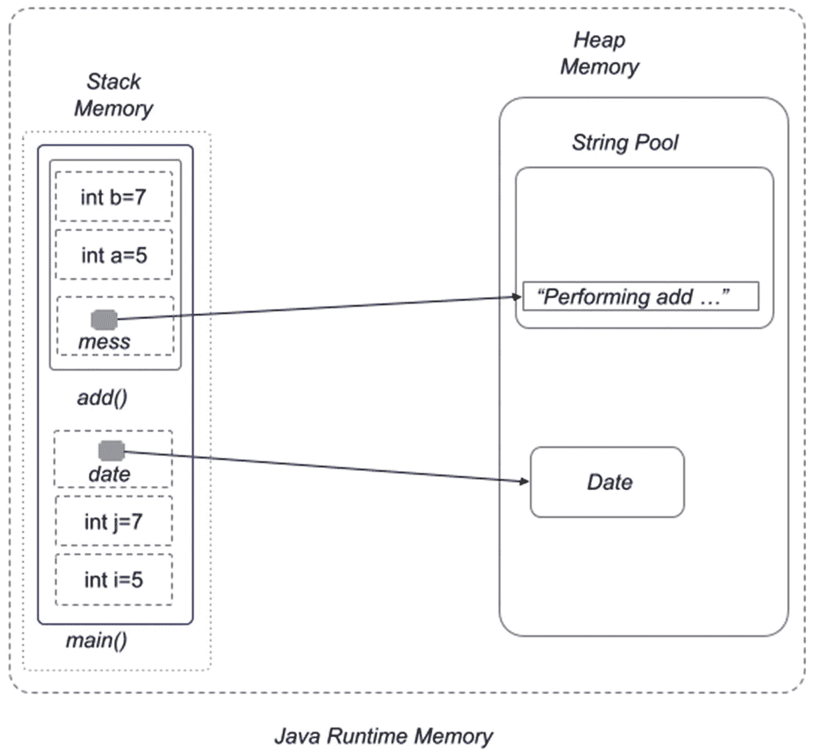

图 5-3

调用 `add(..)` 方法后的 Java 栈和堆内存

*   同样在**第 11 行**，`add(..)` 方法的执行结果被存储在名为 `result` 的局部变量中。由于此时 `add(..)` 方法已执行完毕，其栈内存块被丢弃。因此我们可以得出结论：存储在栈上的变量，其生命周期与创建它的函数运行时间相同。此时，在 `main()` 方法的栈内存中，保存了 `result` 变量。

*   **第 12 行**调用了 `print` 方法，但为简化起见，我们跳过对这一行的解释。

*   **第 13 行**，引用 `d` 被赋值为 `null`，这意味着 `Date` 类型的对象现在仅存在于堆中，并且与 `main` 方法的执行不再有任何关联。可以这样理解：在这一行，我们基本上是在告诉 JVM，我们不再需要那个对象了，因此它所占用的空间可以被**回收**并用于存储其他对象。

此时，程序内存状态如图 5-4 所示。

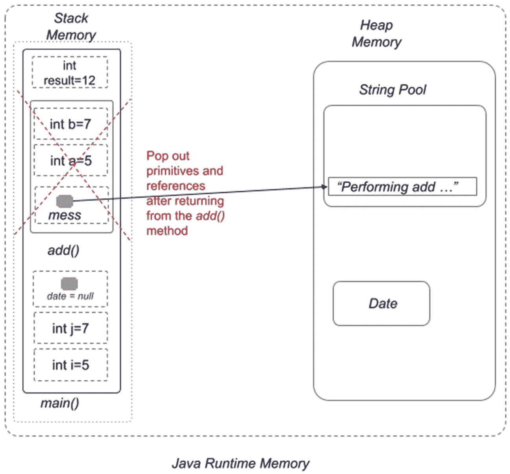

图 5-4

`main(..)` 方法执行结束前的 Java 栈和堆内存

程序退出后，所有内存内容都会被丢弃。

### ！

在申请 Java 开发职位时，你很可能会被问到栈内存和堆内存之间的区别。因此，如果你认为前面的内容没有为你阐明这一点，请随时查阅其他资料。^(⁵⁷)

## Java 数据类型简介

前面的例子表明，Java 中的数据类型可以根据执行时的存储位置分为两大类：原始类型和引用类型。我将简要介绍它们，并在后面解释其最重要的成员。

### 原始数据类型

**原始类型**由 Java 编程语言定义为特殊类型，它们没有对应的支持类，并通过保留关键字来命名。这些类型的变量保存在栈内存中，当使用 `= (等号)` 运算符为其赋值时，值实际上是被复制的。因此，如果我们像下面的代码清单那样声明两个 `int` 类型的原始变量，最终会得到两个变量 `k` 和 `q`，它们都具有相同的值：`42`。

```
package com.apress.bgn.ch5;
public class PrimitivesDemo {
public static void main(String... args) {
int k = 42;
int q = k;
System.out.println("k = " + k);
System.out.println("q = " + q);
}
}
```

当作为参数传递给其他方法时，原始变量的值会被复制并使用，而原始变量本身不会被修改。这可以通过创建一个交换两个 `int` 变量值的方法来证明。以下是该方法的代码。

```
package com.apress.bgn.ch5;
public class PrimitivesDemo {
public static void main(String... args) {
int k = 42;
int q = 44;
swap(k, q);
System.out.println("k = " + k);
System.out.println("q = " + q);
}
static void swap(int a, int b) {
int temp = a;
a = b;
b  =  temp;
}
}
```

那么，你认为 `k` 和 `q` 打印出的值是什么？如果你认为输出结果与下面相同，那么你是正确的。

```
k = 42
q = 44
```

这是因为在 Java 中，向方法传递参数是通过值传递的方式进行的，这意味着对于原始类型，改变形式参数的值不会影响实际参数的值。如果你阅读了上一节，你已经可以想象栈上发生了什么。当 `swap()` 方法被调用时，会创建一个新的栈内存块来保存该方法使用的值。在方法执行期间，这些值可能会改变，但如果它们没有被返回并赋值给调用方法中的变量，那么当方法执行结束时，这些值就会丢失。图 5-5 描述了前面列出的代码执行期间栈上发生的变化。正如你明显注意到的，堆内存完全没有被使用。

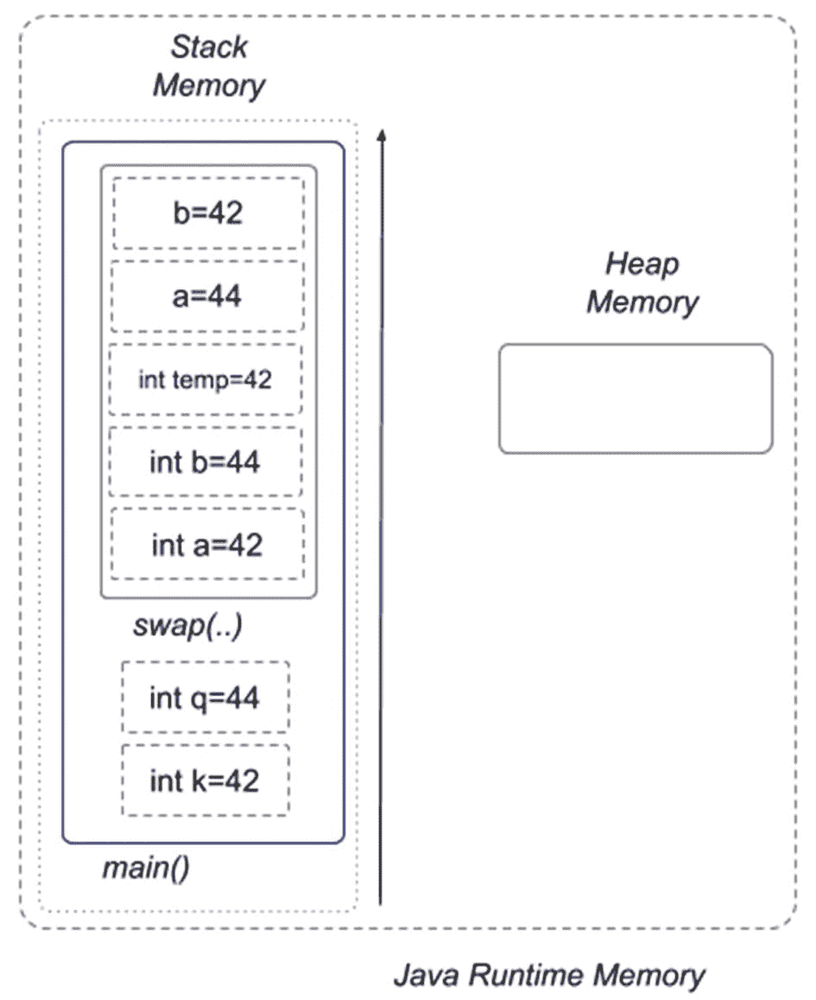

图 5-5

Java 按值传递原始参数


### 引用数据类型

Java 中有四种**引用类型**：

*   类类型
*   接口类型
*   枚举类型
*   数组类型

引用类型与基本类型不同，因为这些类型是可实例化的（接口除外）。这些类型的对象通过调用构造器创建，而这类类型的变量是对存储在堆中的对象的引用。由于引用也存储在栈上，即使我们修改之前的代码来使用引用，其行为也是相同的。让我们引入一个名为 `IntContainer` 的类，其唯一目的是将基本类型值包装成对象。

```
package com.apress.bgn.ch5;
public class IntContainer {
private int value;
public IntContainer(int value) {
this.value = value;
}
public int getValue() {
return value;
}
public void setValue(int value) {
this.value  =  value;
}
}
```

现在，我们创建两个此类型的对象以及它们的两个引用，并重写 `swap` 方法。

```
package com.apress.bgn.ch5;
public class ReferencesDemo {
public static void main(String... args) {
IntContainer k = new IntContainer(42);
IntContainer q = new IntContainer(44);
swap(k,q);
System.out.println("k = " + k.getValue());
System.out.println("q = " + q.getValue());
}
static void swap(IntContainer a, IntContainer b) {
IntContainer temp = a;
a = b;
b = temp;
}
}
```

如果我们运行 `main(..)` 方法，你会注意到我们仍然得到

```
k = 42
q = 44
```

这该如何解释？同样地，Java 仍然使用相同的按值传递参数的方式，只是这次传递的是引用的值。图 5-6 描述了在执行上述代码时，JVM 管理的内存中发生的情况。

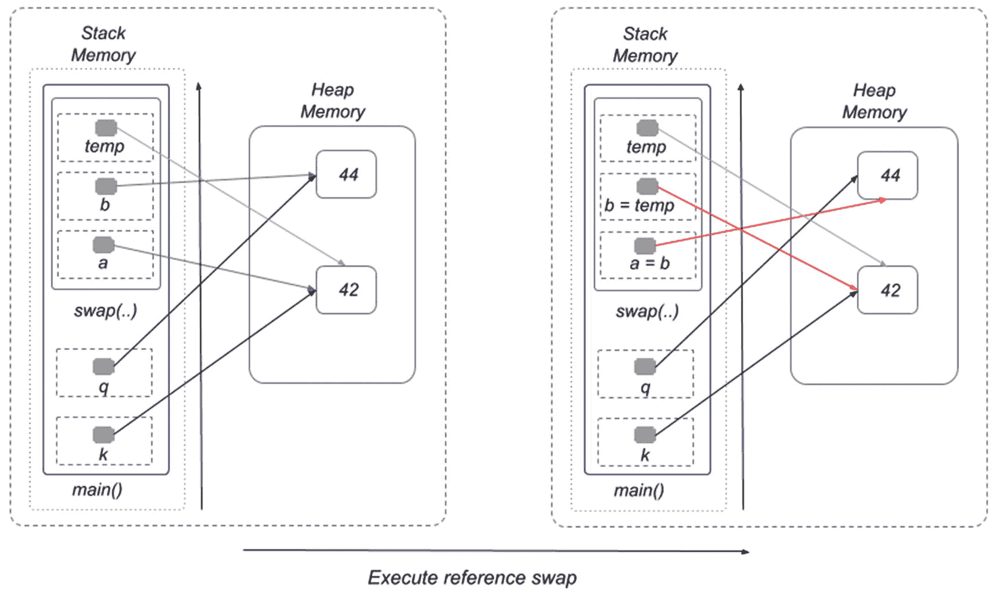

图 5-6

Java 按值传递引用参数

类似地，在 `swap(..)` 方法体内，对象的引用被互换，但这不会影响 `k` 和 `q` 引用，也不会影响它们在堆中指向的对象。要真正交换值，我们需要通过使用一个新对象来交换对象的内容。请看下面 `swap(..)` 方法的新版本。

```
package com.apress.bgn.ch5;
public class ReferencesDemo {
public static void main(String... args) {
IntContainer k = new IntContainer(42);
IntContainer q = new IntContainer(44);
swap(k,q);
System.out.println("k = " + k.getValue());
System.out.println("q = " + q.getValue());
}
static void swap(IntContainer a, IntContainer b) {
IntContainer temp = new IntContainer(a.getValue());
a.setValue(b.getValue());
b.setValue(temp.getValue());
}
}
```

通过使用 setter 和 getter，我们交换了对象的值，因为方法体内从未修改过引用。图 5-7 描述了在执行上述代码片段期间内存中发生的情况。

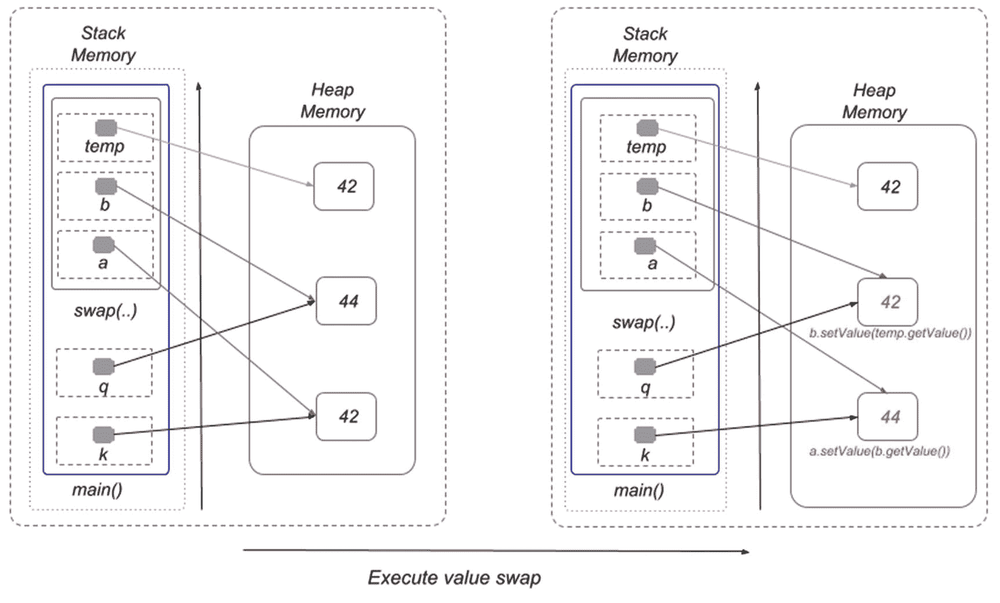

图 5-7

Java 按值传递引用参数，交换对象内容

也许这个例子引入得太早了，但它是必要的，这样你就能尽早目睹基本类型和引用类型之间的主要区别。我们将在总结中列出所有区别，在此之前，让我们先介绍 Java 中最常用的数据类型。

## Java 基本类型

基本类型是 Java 中的基本数据类型。这种类型的变量可以通过直接赋值该类型的值来创建，因此它们不需要实例化。（由于这些类型没有类作为支撑，这样做会相当困难）Java 中有 8 种基本类型，其中六种用于表示数字，一种用于表示字符，一种用于表示布尔值。基本类型是 Java 语言预定义的，并且它们的名称是保留关键字。基本变量只能具有为该类型预定义的区间或数据集内的值。当在实例化时声明为类的字段时，会为该字段分配一个特定于该类型的默认值。基本值不与其他基本值共享状态。

大多数 Java 教程会首先介绍数值类型，但本书从非数值类型开始。

### 布尔类型

此类型的变量只能具有两个可接受值之一：`true` 和 `false`。这种类型的变量用于条件判断中，以决定操作流程。值 `true` 和 `false` 本身就是保留关键字。布尔变量的**默认值**是 `false`。

另一个观察点：当一个字段是 `boolean` 类型时，它的 getter 方法具有不同的语法。它不以 `get` 开头，而是以 `is` 开头。考虑到布尔值的用途，这是有道理的。它们对只有两个值的属性进行建模。例如，假设我们正在编写一个类来对转换过程进行建模。一个布尔字段将过程状态标记为已完成或仍在进行中。如果字段名是 `done`，那么名为 `getDone()` 的 getter 方法会非常不直观且愚蠢，但名为 `isDone()` 的 getter 方法则恰恰相反。让我们编写这个类，并添加一个 main 方法来测试 `done` 字段的默认值。

```
package com.apress.bgn.ch5;
public class ConvertProcess {
/* 其他字段和方法 */
private boolean done;
public boolean isDone() {
return done;
}
public void setDone(boolean done) {
this.done = done;
}
public static void main(String... args) {
ConvertProcess cp = new ConvertProcess();
System.out.println("默认值 = " + cp.isDone());
}
}
```

正如预期的那样，输出的结果是

```
默认值 = false
```

布尔类型与任何其他基本类型都不兼容，通过简单赋值（使用 =）将 `boolean` 值赋给 `int` 变量是不可能的。显式转换也是不可能的。因此，编写类似下面的代码会导致编译错误。

```
boolean f = false;
int fi = (int) f;
```

我们将在**第** 6 章中添加更多关于此类型的信息。

### char 类型

char 类型表示字符。其值是表示 UTF-16 代码单元的 16 位无符号整数。char 变量可能值的区间是：从 `'\u0000'` 到 `'\uffff'`（包含两端），作为数字这意味着：从 0 到 65535。这意味着我们可以尝试打印所有值的集合。由于字符的表示是数字化的，这意味着我们可以将区间内的 `int` 值转换为 `char` 值。以下代码片段打印了 `char` 区间的所有数值及其对应的字符。

```
package com.apress.bgn.ch5;
public class CharLister {
public static void main(String... args) {
for (int i = 0; i < 65536; ++i ) {
char c = (char) i;
System.out.println("c[" + i + "]=" + c);
}
}
}
```

### ！

`for` 循环语句打印的最后一个 `char` 值是 65535。值 65536 被用作上限最大值。所以，如果 `i=65536`，则不会打印任何内容，并且语句的执行结束。`for` 循环将在第 8 章：控制流程中详细讨论。

根据操作系统的不同，某些字符可能不受支持，因此它们不会显示，或者被替换为无效字符。空白字符也是如此。

如果你认为用于表示字符的区间太大，滚动控制台你就会明白为什么。UTF-16 字符集包含所有数字字符、所有分隔符、中文、阿拉伯语字符以及更多符号。^(⁵⁸)


### 整数基本类型

在迄今为止用于介绍 Java 语言基础的代码示例中，我们主要使用了 `int` 类型的变量，但 Java 中不止有一种数值基本类型。Java 定义了六种数值基本类型，每种类型都有特定的内部表示方式，占用一定数量的比特位，这意味着它们都有最小值和最大值。其中有四种数值类型用于表示整数值，两种用于表示实数。图 5-8 展示了整数类型及其各自的值范围。

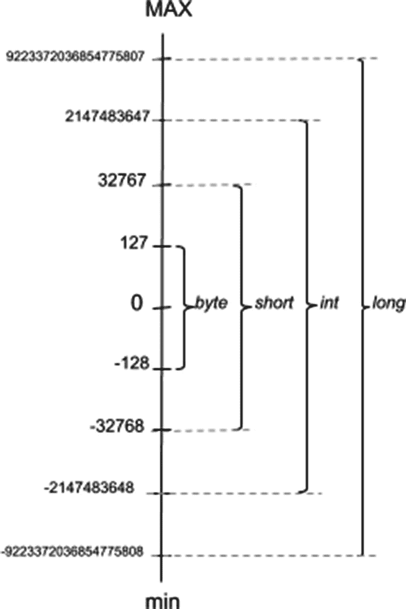

图 5-8

用于表示整数值的 Java 数值类型

计算机中的一切事物都使用信息比特来表示，每个比特只能取值 1 或 0，这就是为什么它被称为*二进制表示*。二进制表示并非本书的重点，但因其重要性，这里稍作提及。你可能现在会好奇，为什么我们的计算机会选择二进制表示？嗯，主要是因为数据（在内存和存储中）是通过一系列 1（开）和 0（关）的二进制表示来存储的；此外，二进制运算非常容易执行，这使得计算机速度极快。以数学为例，我们广泛使用十进制系统，它由 0 到 9 共 10 个唯一数字组成。而计算机内部使用二进制系统，它只使用两个数字：0 和 1。要表示大于 1 的数字，我们需要更多的比特位。所以，在十进制系统中，我们有：0, 1, 2, 3, 4, 5, 6, 7, 8, 9, 10, 11，等等；在二进制系统中，表示数字我们只有两个数字，因此我们会得到：0, 1, 10, 11, 100, 101, 110, 111, 1000，等等。如果你想象一个盒子，只能像计算机那样放入 1 和 0 来表示数字，那么随着数字变大，你需要更多的比特位。一个比特只能有两个值，因此表示它的值的数量由 2 的幂次方定义。请看图 5-9。

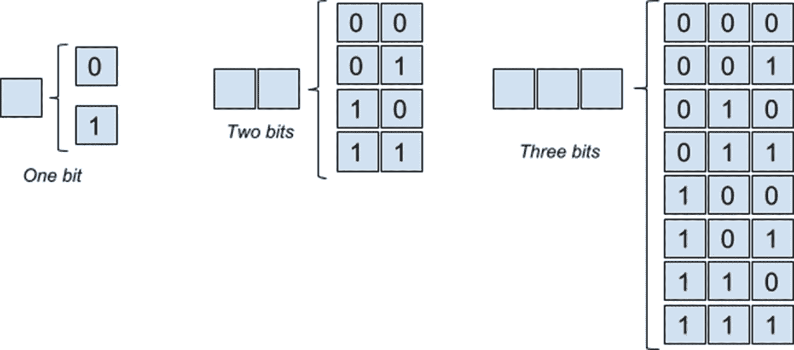

图 5-9

*二进制数值表示*

因此，在一个比特上我们可以表示两个值，即 2¹；在两个比特上我们可以表示四个值，即 2²，以此类推。这就是我们如何指代 Java 基本数值类型表示边界的方式，有时还会包含一个符号位。因此，以下列表包含了整数基本类型及其边界。

*   `byte` 表示介于 −2⁷ 到 2⁷-1 之间（含）的数字（[-128, 127]）。byte 字段的默认值为 `0`，占用 8 个比特位。

*   `short` 表示介于 −2¹⁵ 到 2¹⁵ − 1 之间（含）的数字（`[-32768, 32767]`）。该类型的值范围是 `byte` 值范围的超集，因此 byte 值可以安全地赋值给 short 变量，无需显式转换。这对于所有值范围是 `byte` 类型值范围超集的类型都适用。在接下来的代码片段中，一个 byte 值被赋值给一个 `short` 变量，代码编译通过，执行时会打印 `23`。

    short 字段的默认值为 `0`，占用 16 个比特位。

    ```
    byte bv = 23;
    short sbv = bv;
    System.out.println("byte to short: " + sbv);
    ```

*   `int` 表示介于 −2³¹ 到 2³¹*−*1 之间（含）的整数（`[-2147483648, 2147483647]`）。byte 字段的默认值为 0，占用 32 个比特位。

*   `long` 表示介于 −2⁶³ 到 2⁶³ − 1 之间（含）的整数（`[-9223372036854775808, 9223372036854775807]`）。byte 字段的默认值为 0，占用 64 个比特位。

### !

在实践中，有时会出现需要处理超出 `long` 范围之外的整数的情况。针对这种情况，Java 中定义了一个特殊的类（是的，是一个类，而不是基本类型），名为 `BigInteger`，它会根据需要存储任意大小数字所需的内存来分配空间。使用 `BigInteger` 进行操作可能会比较慢，但这是处理超大数字所付出的代价。

### 实数基本类型

实数非常有用，因为大多数价格以及程序执行的大多数算术运算的结果都不是整数。实数包含一个小数点及其后面的小数部分。为了在 Java 中表示实数，定义了两种基本类型（称为**浮点类型**）：`float` 和 `double`。我们来更详细地讨论一下它们。

*   `float` 表示符合 IEEE 二进制浮点数算术标准（ANSI/IEEE 标准 754-1985，IEEE，纽约）中规定的单精度 32 位格式 IEEE 754 值。默认值为 `0.0`。与相同位宽的定点变量相比，浮点变量能以牺牲精度为代价，表示更广泛的数字范围。正因如此，`int` 或 `long` 类型的值可以赋值给 `float` 类型的变量。实际发生了什么？为什么会损失精度？嗯，一个数字被表示为一个浮点数和一个指数（10 的幂）。因此，当浮点数乘以 10 的该指数次幂时，应该得到原始数字。让我们取最大的 long 值，将其赋值给一个 float 变量，并检查打印结果。

    ```
    float maxLongF = Long.MAX_VALUE;
    System.out.println("max long= " + Long.MAX_VALUE);
    System.out.println("float max long= " + maxLongF);
    ```

`Long.MAX_VALUE` 是一个 final 静态变量，其被赋予了最大的 long 值：9223372036854775807。上述代码会打印以下内容。

```
max long= 9223372036854775807
float max long= 9.223372E18
```

如你所见，`maxLongF` 数字本应等于 9223372036854775807，但由于它被表示为一个较小的数字和 10 的幂，精度丢失了。因为如果我们通过将 9.223372 乘以 10¹⁸ 来重构这个整数，得到的是 9223372000000000000。所以，嗯，很接近，但还不够接近。那么，`float` 的区间边界是多少呢？Float 表示介于 1.4*E* ^(−45) 和 2¹²⁸ * 10³⁸ 之间的实数。

*   `double` 表示符合 IEEE 二进制浮点数算术标准（ANSI/IEEE 标准 754-1985，IEEE，纽约）中规定的单精度 64 位格式 IEEE 754 值，并表示介于 4*.*9*E* ^(−324) 和 2¹²⁷ * 10³⁰⁸ 之间的数字。默认值为 0.0。


### 感叹号

在 Java 中，值 `0` 和 `0.0` 是不同的。对普通用户而言，它们都表示零，但在数学上，带小数点的数值更精确。不过，在 Java 中，我们仍然可以比较 `int` 类型和 `float` 类型的值，如果比较 `0` 和 `0.0`，结果是它们相等。此外，正零和负零也被视为相等；因此，比较 `0.0==-0.0` 的结果是 `true`。

开发者无法通过从头定义或扩展现有基本类型来定义新的基本类型。类型名称是**保留的 Java 关键字**，开发者不能重新定义它们。禁止声明以这些类型命名的字段、方法或类名。

我们打算使用的变量必须先声明。声明时，也可以同时为其关联一个值。对于基本类型的值，数字可以用多种方式书写。以下示例展示了在初始化或后续赋值变量时，数字值可以如何书写。

```
package com.apress.bgn.ch5;
public class NumericDemo {
private byte b;
private short s;
private int i;
private long l;
private float f;
private double d;
public static void main(String... args) {
NumericDemo nd = new NumericDemo();
nd.b = 0b1100;
System.out.println("字节二进制值: " + nd.b);
nd.i = 42 ;     // 十进制情况
nd.i = 045 ;    // 八进制情况 - 基数为 8
System.out.println("整数八进制值: " + nd.i);
nd.i = 0xcafe ; // 十六进制情况 - 基数为 16
System.out.println("整数十六进制值: " + nd.i);
nd.i = 0b10101010101010101010101010101011;
System.out.println("整数二进制值: " + nd.i);
//Java 7 语法
nd.i = 0b1010_1010_1010_1010_1010_1010_1010_1011;
System.out.println("整数二进制值: " + nd.i);
nd.l = 1000_000l; // 等同于 1000_000L
System.out.println("长整型值: " + nd.l);
nd.f =  5;
System.out.println("赋给浮点型变量的整数值: " + nd.f);
nd.f =  2.5f; // 等同于 nd.f =    2.5F;
System.out.println("赋给浮点型变量的小数值: " + nd.f);
nd.d =  2.5d; // 等同于  nd.d =  2.5D;
System.out.println("赋给双精度浮点型变量的小数值: " + nd.f);
}
}
```

从 Java 7 开始，在声明数值时允许使用下划线 `_` 来对数字进行分组，以提高清晰度。运行上述代码时，会打印出以下内容。

```
字节二进制值: 12
整数八进制值: 37
整数十六进制值: 51966
整数二进制值: -1431655765
整数二进制值: -1431655765
长整型值: 1000000
赋给浮点型变量的整数值: 5.0
赋给浮点型变量的小数值: 2.5
赋给双精度浮点型变量的小数值: 2.5
```

由于打印变量时没有进行格式化，控制台中显示的值都是十进制形式。

目前，关于基本类型能说的就是这些了。每种基本类型在 JDK 中都有一个对应的引用类型，将基本类型的值转换为其对应的引用类型称为`装箱`，反之则称为`拆箱`。在某些情况下，这些过程是显式进行的，但更多细节将在后续介绍。

## Java 引用类型

之前已经介绍过 Java 引用类型，以突出基本类型和引用类型之间的区别。现在是时候扩展这个描述，并给出一些编程中最常用的 JDK 引用类型的示例了。

*对象*或*实例*是使用 `new` 关键字后跟构造函数的调用来创建的。构造函数是类的一个特殊成员，用于通过将类的所有字段初始化为其默认值或作为参数接收的值来创建对象。通过调用类的构造函数（其中之一，因为类中可能定义了多个构造函数）来创建类实例。因此，以**第 4 章** 4 中的示例为例，即 `Performer` 类，要声明一个指向 `Performer` 类型对象的引用，使用以下表达式。

```
Performer human = new Performer("John", 40, 1.91f, Gender.MALE);
```

接口引用类型不能被实例化，但实现了该接口的类类型的对象可以赋值给该接口类型的引用。**第 4 章** 4 中使用的层次结构如图 5-10 所示。

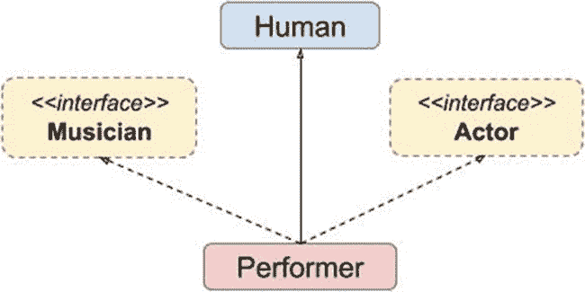

图 5-10

类和接口层次结构

基于这个层次结构，以下四个语句是有效的，并且可以编译通过。

```
package com.apress.bgn.ch5;
import com.apress.bgn.ch4.hierarchy.*;
public class ReferencesDemo {
public static void main(String... args) {
Performer performer = new Performer("John", 40, 1.91f, Gender.MALE);
Human human = new Performer("Jack", 40, 1.91f, Gender.MALE);
Actor actor = new Performer("Jean", 40, 1.91f, Gender.MALE);
Musician musician = new Performer("Jodie", 40, 1.71f, Gender.FEMALE);
}
}
```

在这个例子中，我们创建了四个 `Performer` 类型的对象，并将它们赋值给不同的引用类型，包括两个接口引用类型。如果我们检查前面方法的栈和堆内容，图 5-11 展示了我们会发现的情况。（图 5-11）

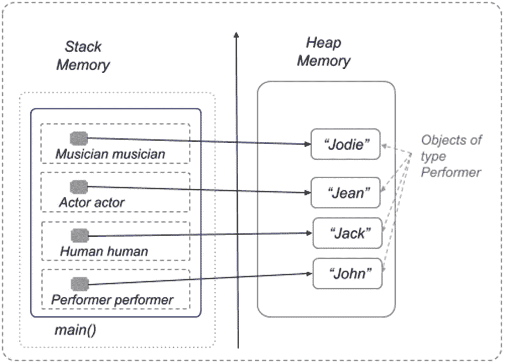

图 5-11

多个引用类型

前面示例中的所有引用都指向堆中的不同对象，但以下代码也是可行的。

```
package com.apress.bgn.ch5;
import com.apress.bgn.ch4.hierarchy.*;
public class ReferencesDemo {
public static void main(String... args) {
Performer performer = new Performer("John", 40, 1.91f, Gender.MALE);
Human human = performer;
Actor actor = performer;
Musician musician = performer;
}
}
```

在这段代码片段中，我们只创建了一个对象，但创建了多个指向它的、不同类型的引用。如果我们检查前面方法的栈和堆内容，图 5-12 展示了我们会发现的情况。

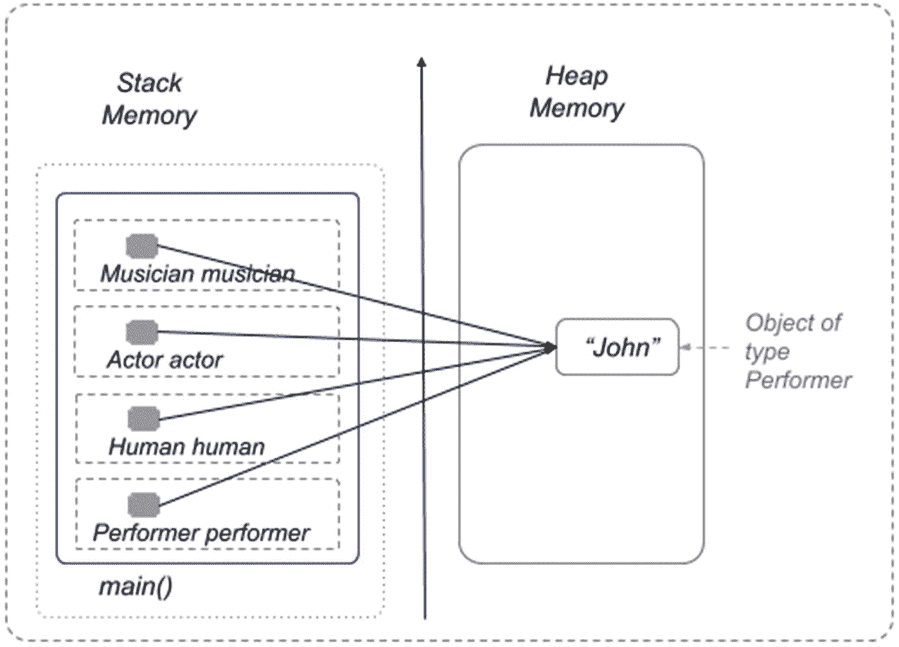

图 5-12

多个引用类型，第二个示例

引用只能是所赋值对象的超类型，因此以下代码片段中的赋值将无法编译通过。

```
package com.apress.bgn.ch5;
import com.apress.bgn.ch4.hierarchy.*;
public class ReferencesDemo {
public static void main(String... args) {
Performer performer = new Performer("John", 40, 1.91f, Gender.MALE);
Human human = performer;
Actor actor = performer;
Musician musician = performer;
//这些将无法编译通过！！！
performer = musician;
//或者
performer = human;
//或者
performer = actor;
}
}
```

原因在于方法是在引用上调用的，因此引用所指向的对象必须拥有这些方法。所以，如果一个引用是 `Performer` 类型，并且在其上调用了 `getSongs()` 方法，那么像最后一行代码中的 actor 类型的对象将没有这个方法。这就是为什么 Java 编译器会报错，也是为什么智能编辑器会用红线标出该语句的原因。

当然，可以进行显式转换：`performer = (Performer) actor;`，这会让编译器认为一切正常，但这只会在运行时导致异常。


### 数组

`new` 关键字也可用于创建数组，其创建方式与创建对象类似。**数组**是一种将一组变量聚合在一起的数据结构。它的大小在创建时确定，且之后无法更改。

每个变量都可以通过索引来访问，索引从 0 开始，最大值为数组长度减 1。数组可以存储基本类型值和引用类型值。让我们声明几个数组，来展示它们是多么灵活和实用。首先，我们声明一个数组字段，并观察在创建对象时它会发生什么变化。

```
package com.apress.bgn.ch5;
public class ArraysDemo {
int array[];
public static void main(String... args) {
ArraysDemo ad = new ArraysDemo();
System.out.println("array was initialized with " + ad.array);
}
}
```

你认为执行上述代码后，控制台会打印出什么？如果你认为 `ad.array` 字段被初始化为 `null`，那么你答对了。

数组是引用类型，因此当交由 JVM 来为此类字段初始化默认值时，会使用 `null`，因为这是引用类型的典型默认值。

`null` 关键字表示一个不存在的值。被赋予此值的引用没有指向任何具体的对象；它不指向堆中的任何对象。这就是为什么在编写代码时，如果在对象（通过其引用）被初始化之前就使用它，会抛出 `NullPointerException` 异常。因此，开发人员在使用对象（或数组）之前，通常会检查其是否为 `null`。让我们修改前面的示例来演示这一点。

```
package com.apress.bgn.ch5;
public class ArraysDemo {
int array[];
public static void main(String... args) {
ArraysDemo ad = new ArraysDemo();
if (ad.array == null) {
System.out.println("array unusable");
}
}
}
```

为什么我们需要用 `null` 关键字来标记尚不存在的东西？因为在编程中，先声明一个引用，仅在首次使用时才进行初始化，这是一种常见做法。这对于那些体积通常较大的对象尤其有用，这个过程被称为**懒加载**。

回到数组的话题。让我们正确初始化之前声明的数组字段，并给它一个大小，看看会发生什么。

```
1\.   package com.apress.bgn.ch5;
2.
3\.   public class ArraysDemo {
4.
5\.       public static void main(String... args) {
6\.           int[] array =  new int[2];
7\.          for (int i = 0; i <  array.length; ++i) {
8\.               System.out.println("array["+ i +"]= " + array[i]);
9\.           }
10\.       }
11\.   }
```

数组的初始化发生在第 6 行，数组的大小为 2。数组的大小作为参数传递给一个看似构造器调用的地方，只不过这里使用的是方括号而不是圆括号。通过将数组的维度设置为 2，我们告诉 JVM，必须为此对象预留两个相邻的内存位置，用于存储两个 `int` 值。并且，由于没有指定数组内容的值，你认为在创建数组时，这些位置会被填充什么值呢？嗯，这很简单：前面的数组被定义为包含两个 `int` 值，因此当数组初始化时，会使用 `int` 类型的默认值。图 5-13 描述了执行上述代码时，栈和堆内存中发生的情况。

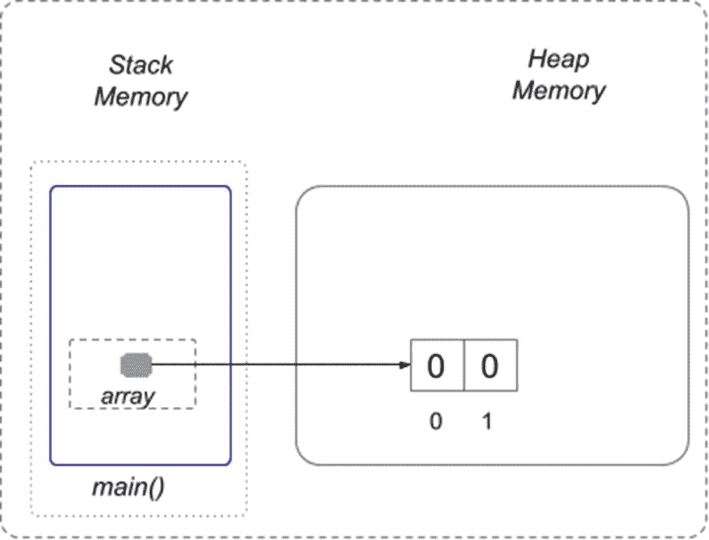

图 5-13

声明一个大小为 2 的 int 数组

在第 7 到第 9 行，一个 `for` 循环打印了数组的值。变量 `int i` 就是我们所说的索引变量，它在循环的每一步中递增 1，遍历数组的所有值。`array.length` 是包含数组大小的属性，表示数组包含多少个元素。正如你可能预料的那样，控制台打印的输出是：

```
array[0]= 0
array[1]= 0
```

要向数组中放入值，我们有以下几种选择。

*   直接访问元素并设置值。

```
    array[0] = 5;
    array[1] = 7;
    //或者
    for (int i = 0; i < array.length; ++i) {
    array[i] = i;
    }
    ```

*   使用我们打算存储的值显式初始化数组。

```
    int another[] = {1,4,3,2};
    ```

数组也可以包含引用。下面的代码示例演示了如何使用 `Performer` 数组。

```
package com.apress.bgn.ch5;
import com.apress.bgn.ch4.hierarchy.*;
public class PerformerArrayDemo {
public static void main(String... args) {
Performer[] array = new Performer[2];
for (int i = 0; i < array.length; ++i) {
System.out.println("performer[" + i + "]= " + array[i] );
}
array[0] = new Performer("John", 40, 1.91f, Gender.MALE);
array[1] = new Performer("Julianna", 35, 1.61f, Gender.FEMALE);
for (int i = 0; i < array.length; ++i) {
System.out.println("performer[" + i + "]= " + array[i].getName() );
}
}
}
```

并且，由于描绘内存内容能更清晰地展示数组和对象发生了什么，我为你提供了图 5-14。

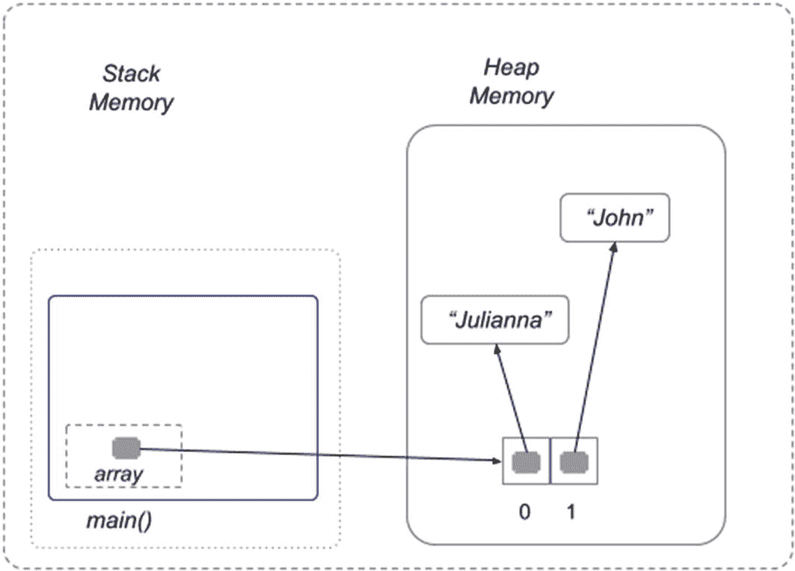

图 5-14

声明一个大小为 2 的 Performer 数组

所以，是的，我们有一个引用数组，它们所指向的对象可以在程序运行期间更改。

数组可以是多维的。如果你学过高等数学，可能还记得*矩阵*的概念，它是一个按行和列排列的矩形数组。在 Java 中，你可以使用数组来模拟矩阵。如果你想要一个简单的包含行和列的矩阵，你可以定义一个二维数组。

```
package com.apress.bgn.ch5;
public class MatricesDemo {
public static void main(String... args) {
// 二维数组：2 行，2 列
int[][] intMatrix = {{1, 0}, {0, 1}};
int[][] intMatrix2 = new int[2][2];
for (int i = 0; i < intMatrix2.length; ++i) {
for (int j = 0; j < intMatrix2[i].length; ++j) {
intMatrix2[i][j] = i + j;
System.out.print(intMatrix[i][j] + " ");
}
System.out.println();
}
}
}
```

但你也可以创建多维数组，并根据需要定义任意数量的坐标。下面的代码片段定义了三个坐标。

```
package com.apress.bgn.ch5;
public class MatricesDemo {
public static void main(String... args) {
// 立方体矩阵，有三个坐标
int[][][] intMatrix3 = new int[2][2][2];
for (int i = 0; i < intMatrix3.length; ++i) {
for (int j = 0; j < intMatrix3[i].length; ++j) {
for (int k = 0; k < intMatrix3[i][j].length; ++k) {
intMatrix3[i][j][k] = i + j + k;
System.out.print("["+i+", "+j+", " + k + "]");
}
System.out.println();
}
System.out.println();
}
}
}
```

对于数组，请根据你的需要和内存允许的范围来创建，但务必确保初始化它们，并在代码中确保不会尝试访问允许范围之外的索引。如果数组的大小是 **N**，那么它的最后一个索引是 **N-1**，第一个索引是 **0**。尝试访问该范围之外的任何索引，都会在运行时抛出 `java.lang.ArrayIndexOutOfBoundsException` 类型的异常。因此，编写如下代码：

```
int array = new int[2];
array[5] =7;
```

会导致程序在运行时崩溃，并在控制台打印以下内容：

```
Exception in thread "main" java.lang.ArrayIndexOutOfBoundsException:
Index 5 out of bounds for length 2
at chapter.five.collections/com.apress.bgn.ch5.ArraysDemo.main(ArraysDemo.java:56)
```

为了更方便地处理 Java 中的数组，有一个专门的类：`java.util.Arrays`。这个类提供了用于排序和比较数组、搜索元素以及将其内容转换为文本或流的实用方法，这样无需编写繁琐的 `for` 循环就能打印它们。


```
int array = new int2;
System.out.println(Arrays.toString(ad.array));
//或
Arrays.stream(array).forEach(ai -> System.out.println(ai));
//或使用方法引用 Arrays.stream(array).forEach(System.out::println);
//排序
Arrays.sort(another);
```

请随意修改本章提供的代码，尝试其中一些方法。

### String 类型

接下来要介绍的特殊 Java 类型是 `String`。到目前为止，你已经频繁看到它的使用，但尚未得到详细解释。与基本类型 `int` 一样，它是 Java 中最常用的类型之一。`String` 实例用于建模文本并对其执行各种操作。`String` 类型是一种特殊类型，因为**该类型的对象会得到 JVM 的特殊处理**。如果你还记得第一张包含内存内容的图片，`String` 对象被分配在堆中一个名为 `String Pool` 的特殊区域。本节将专门讨论它；我们会详细讲解 `String` 类型，你关于此类型的许多疑问应该都能得到解答。

到目前为止，本书中声明 `String` 变量的方式如下：

```
String name= "John";
```

但 `String` 类有许多构造函数可用于初始化 `String` 变量。以下是一组声明并初始化的 `String` 变量。

```
package com.apress.bgn.ch5.refs;
public class StringDemo {
public static void main(String... args) {
1\.      String  text1 = null;
2.
3\.      String text21 = "two";
4\.      String text22 = "two";
5\.      String text23 = new String ("two");
6.
7\.      String piece1 = "t";
8\.      String piece2  = "wo";
9\.      String text24 = piece1 + piece2;
10.
11\.     char[] twoCh = {'t', 'w', 'o'};
12\.     String text25 = new String(twoCh);
}
}
```

第 3、4、5、9 和 11 行都定义了一个内容为 *two* 的 `String` 对象。我们特意这样做，创建了多个具有相同值的 `String` 对象。在实际应用中，尤其是在当前大数据热潮时期，应用程序处理大量数据，其中大部分是文本形式。因此，能够压缩数据并重复使用，可以减少内存消耗，同时减少内存访问尝试，通过减少处理来提升速度，进而降低成本。

在继续本节之前，我必须讨论一下 Java 中**对象相等**的含义。Java 中通过引用来处理对象。`==` 运算符比较引用；但如果要比较对象，我们必须使用 `equals()` 方法。这是一个从 `Object` 类继承的特殊方法。

在 Java 中，`String` 实例是不可变的，这意味着它们一旦创建就无法更改。这意味着 JVM 可以重用现有值来形成新的字符串值，而无需消耗额外内存。这个过程称为*驻留（interning）*。每个文本值（字面量）的一份副本被保存到一个名为 `String Pool` 的特殊内存区域。当创建一个新的 `String` 变量并为其赋值时，JVM 首先在池中搜索相等值的字符串。如果找到，则返回该内存地址的引用，无需分配额外内存。如果未找到，则将其添加到池中并返回其引用。

话虽如此，考虑到前面的示例代码，我们期望 `text21` 和 `text22` 变量指向池中同一个 `String` 对象，这意味着它们的引用也是相等的。让我们来测试一下。

```
package com.apress.bgn.ch5.refs;
public class StringDemo {
public static void main(String... args) {
String text21 = "two";
String text22 = "two";
if (text21 == text22) {
System.out.println("引用相等");
} else {
System.out.println("引用不同");
}
if (text21.equals(text22)) {
System.out.println("对象相等");
} else {
System.out.println("对象不同");
}
}
}
```

运行上述代码时，控制台会打印以下内容，证明了之前的论断以及 `String pool` 的存在。

```
引用相等
对象相等
```

图 5-15 展示了代码执行时内存内容的抽象表示。

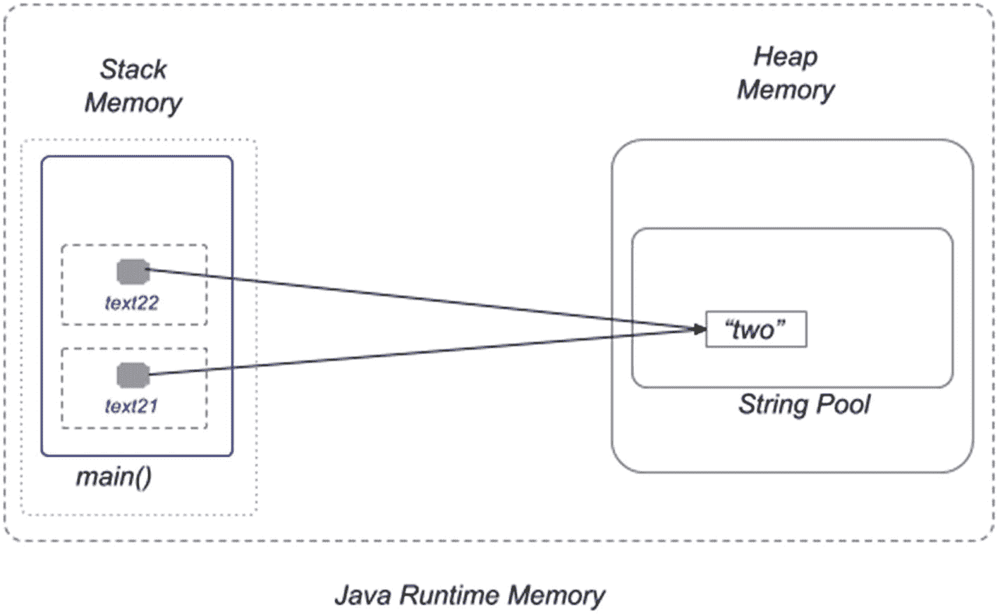

图 5-15

String Pool 示例

当使用 new 运算符创建新的 `String` 对象时，JVM 会为新对象分配新内存并将其存储在堆中，因此不会使用 `String pool`。这导致每个以这种方式创建的 `String` 对象都有自己独立的内存区域和地址。这就是为什么如果我们要比较初始代码示例中的变量 `text22` 和变量 `text23`，我们会预期它们的引用不同，但对象应该相等。让我们来测试一下。

```
package com.apress.bgn.ch5.refs;
public class StringDemo {
public static void main(String... args) {
String text22 = "two";
String text23 = new String ("two");
if (text22 == text23) {
System.out.println("引用相等");
} else {
System.out.println("引用不同");
}
if (text22.equals(text23)) {
System.out.println("对象相等");
} else {
System.out.println("对象不同");
}
}
}
```

运行上述代码时，控制台会打印以下内容，证明了之前提到的所有内容。

```
引用不同
对象相等
```

我将留给你去想象上一个例子中栈和堆内存的样子。^(⁵⁹)

`String Pool` 的默认大小为 1009。从 Java 6 开始，可以使用 `-XX:StringTableSize` 修改其大小。

### ******

初始代码示例中的第 11 和 12 行展示了如何从 `char[3]` 数组创建 `String` 实例。直到 Java 8，这内部就是 String 的初始表示形式：字符数组。一个字符占用 2 个字节，这意味着 *Strings* 会消耗大量内存。在 Java 9 中，引入了一种称为**紧凑字符串（Compact String）** 的新表示形式，它根据内容使用 `byte[]` 或 `char[]`。这意味着从 Java 9 开始，你的字符串处理应用程序消耗的内存会显著降低。


### 转义字符

有些特殊字符不能作为`String`值的一部分。你可能已经注意到，`String`值是在双引号（"`sample`"）之间定义的，这使得"（`双引号`）字符无法作为值使用。要将其用作`String`值，必须进行*转义*。除了这个字符之外，还有`\(反斜杠)`和`\a(警报)`。图 5-16 展示了 IntelliJ IDEA 如何提示你这些字符不能用在`String`值的内容中。

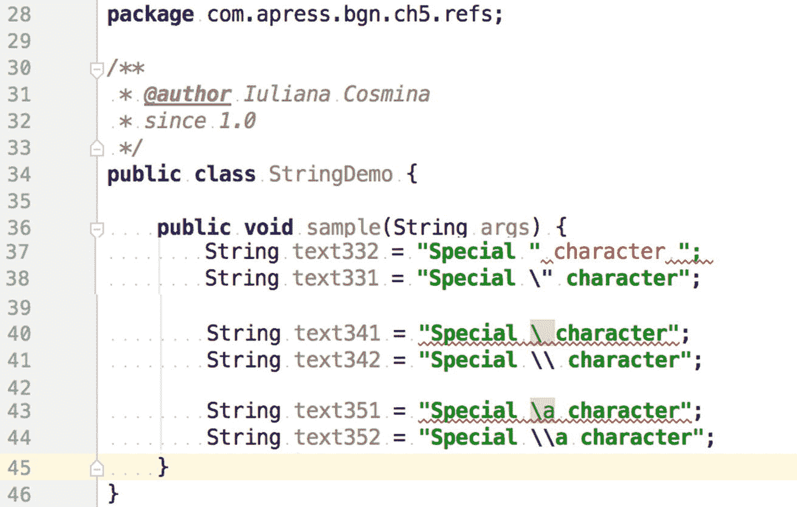

图 5-16

包含特殊字符的代码示例

要转义这些字符，必须在它们前面插入一个反斜杠。`'(单引号)`在用作字符值时也必须进行转义。

```
char quote = '\"';
```

还有一些其他的 Java 转义序列可以在`String`值中使用以达到特定效果，这些序列列在表 5-1 中。

表 5-1

Java 转义序列

| **转义序列** | **效果** |
| --- | --- |
| `\n` | 创建新行（通常称为换行符） |
| `\t` | 创建制表符 |
| `\b` | 创建退格字符（可能会删除前一个字符，具体取决于输出设备） |
| `\r` | 返回到行首（但不换行，相当于键盘上的`Home`键） |
| `\f` | 换页（对于打印机，移动到下一页的顶部） |

换行符`\n`和制表符`\t`在编程中经常用于格式化控制台输出。如果我们像下面这样定义一个`String`实例，

```
String perf = "今晚表演的歌手是: \n\t Paolo Nutini \n\t Seth MacFarlane
\n\t John Mayer";
```

当在控制台打印时，文本会被格式化成如下所示：

```
今晚表演的歌手是:
Paolo Nutini
Seth MacFarlane
John Mayer
```

### 包装类

每种基本类型都有一个对应的引用类型。在逐一介绍它们并解释为什么需要它们之前，请先查看表 5-2。Java 包装类将同名的基本类型的值包装起来。

表 5-2

Java 基本类型及其对应的引用类型

| **基本类型** | **类** |
| --- | --- |
| byte | `java.lang.Byte` |
| short | `java.lang.Short` |
| int | `java.lang.Integer` |
| long | `java.lang.Long` |
| float | `java.lang.Float` |
| double | `java.lang.Double` |
| boolean | `java.lang.Boolean` |
| char | `java.lang.Char` |

此外，这些类提供了将基本类型值转换为`String`以及反向转换的方法，还提供了在处理需要被视为对象的基本类型时有用的常量和工具方法。数值包装类是相关的，它们都扩展了`Number`类，如图 5-17 所示。

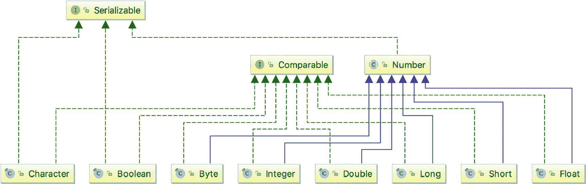

图 5-17

包装类层次结构

以下代码示例主要使用`Integer`类，但其他数值包装类也可以类似地使用。JVM 知道如何在需要时自动将基本类型`int`转换为`Integer`对象，这个操作称为**装箱**；以及将`Integer`对象转换为基本类型`int`，这个操作称为**拆箱**。下面的代码示例包含了一些对`Integer`和`int`值的操作。

```
package com.apress.bgn.ch5.refs;
public class WrapperDemo {
public static void main(String... args) {
// int 的上限区间
Integer max =  Integer.MAX_VALUE;
System.out.println(max);
//拆箱
int pmax =  max;
//装箱
Integer io = 10;
//创建基本类型的工具方法
//如果字符串不是数字，则会抛出异常
int i1 = Integer.parseInt("11");
//构造函数在 Java 9 中已弃用
//如果字符串不是数字，则会抛出异常
Integer i2 = new Integer("12");
//如果字符串不是数字，则会抛出异常
Integer i3 = Integer.valueOf("12");
//将 int 转换为 String
String s0 = Integer.toString(13);
//将 int 转换为 float
float f0 = Integer.valueOf(14).floatValue();
//创建数字 9 的二进制表示字符串 (1001)
String  s1  =  Integer.toBinaryString(9);
//在 Java 1.8 中引入
Integer i4 = Integer.parseUnsignedInt("+15");
//两个整数相加的方法
int sum = Integer.sum(2, 3);
//获取较大值的方法
int maximum = Integer.max(2, 7);
}
}
```

`Character`和`Boolean`类型略有不同，因为这些类型不是数值型的，所以它们不能转换为任何数值。它们之间也不能相互转换。Oracle 为其类提供了非常好的文档，所以如果你对使用这两种类型感到好奇，请查看官方 JDK API 文档，网址为 [`https://docs.oracle.com/javase/10/docs/api/index.html?overview-summary.html`](https://docs.oracle.com/javase/10/docs/api/index.html%253Foverview-summary.html) `.`


### 日期时间 API

许多应用程序都使用日历日期类型来打印当前日期、截止日期和生日。无论你决定构建什么应用程序，很可能都需要使用日历日期。在 Java 8 之前，用于建模日历日期的主要类是 `java.util.Date`。这个类以及处理日历日期的其他类存在一些问题。但在深入探讨之前，我们先看看如何获取当前日期、创建自定义日期以及打印特定细节。

```
package com.apress.bgn.ch5;
import java.util.Date;
import java.text.SimpleDateFormat;
public class CalendarDateDemo {
public static void main(String... args) {
SimpleDateFormat sdf = new SimpleDateFormat("dd-MM-yyyy");
Date currentDate = new Date();
System.out.println("Today: " + sdf.format(currentDate));
//自 1.1 版本起已弃用
Date johnBirthday = new Date(77, 9, 16);
System.out.println("John’s Birthday: " + sdf.format(johnBirthday));
int day = johnBirthday.getDay();
System.out.println("Day: " + day);
int month = johnBirthday.getMonth() + 1;
System.out.println("Month: " + month);
int year = johnBirthday.getYear();
System.out.println("Year: " + year);
}
}
```

获取当前日期很简单；只需调用 `Date` 类的默认构造函数即可。

```
Date currentDate = new Date();
```

`currentDate` 的内容可以直接显示，但通常使用 `java.text.SimpleDateFormat` 的实例将日期格式化为特定于国家/地区的模式。格式化程序也可用于将具有该特定格式的 `String` 转换为 `Date` 实例。当然，如果文本与格式化程序的模式不匹配，则会抛出特定异常（类型：`java.text.ParseException`）。

```
SimpleDateFormat sdf = new SimpleDateFormat("dd-MM-yyyy");
System.out.println(currentDate);
System.out.println("Today: " + sdf.format(currentDate));
Date johnBirthday = sdf.parse("16-10-1977");
```

要从表示日期的数字（年、月、日）创建 `Date` 实例，可以使用接受这些值作为参数的构造函数，尽管该构造函数自 Java 1.1 起已被弃用，推荐的方法是使用 `sdf.parse(..)` 方法。该构造函数在其参数方面有一些特殊性。

*   再次改变技术含义：年份参数必须是目标年份值减去 1900。
*   月份从 0 开始计数，因此作为参数给出的月份必须是目标月份减 1。

从年、月、日的数值构造 `Date` 的代码如下所示。

```
//自 1.1 版本起已弃用
Date johnBirthday = new Date(77, 9, 16);
System.out.println("John's Birthday: " + sdf.format(johnBirthday));
//输出：John's Birthday: 16-10-1977
```

如果我们想从日期中提取年、月、日，有相应的方法：提取月份中日期的方法名为 `getDate()`。

```
try {
johnBirthday = sdf.parse("16-10-1977");
} catch (ParseException e) {
e.printStackTrace();
}
System.out.println("John's Birthday: " + sdf.format(johnBirthday));
//月份中的日期
int day = johnBirthday.getDate();
System.out.println("Day: " + day);
int month = johnBirthday.getMonth() + 1;
System.out.println("Month:  "  +  month);
int year = johnBirthday.getYear();
System.out.println("Year: " + year);
```

如果你在 IntelliJ IDEA 编辑器中检查 `CalendarDateDemo` 类，你会注意到一些构造函数和方法以删除线字体显示。这意味着它们已被弃用，可能会在未来的 Java 版本中被移除，因此不应再使用。这就是为什么还有另一种方法来完成所有这些操作：使用 `java.util.Calendar` 类。下面列出了使用 `Calendar` 类执行相同操作的代码。

```
package com.apress.bgn.ch5;
import java.util.Calendar;
import java.util.Date;
import java.util.GregorianCalendar;
import java.text.SimpleDateFormat;
public class CalendarDateDemo {
public static void main(String... args) {
SimpleDateFormat sdf = new SimpleDateFormat("dd-MM-yyyy");
Calendar calendar = new GregorianCalendar();
Date currentDate = calendar.getTime();
System.out.println("Today: " + sdf.format(currentDate));
calendar.set(1977, 9, 16);
Date johnBirthday = calendar.getTime();
System.out.println("John’s Birthday: " + sdf.format(johnBirthday));
int day = calendar.get(Calendar.DAY_OF_MONTH);
System.out.println("Day: " + day);
int month = calendar.get(Calendar.MONTH);
System.out.println("Month: " + month);
in year = calendar.get(Calendar.YEAR);
System.out.println("Year: " + year);
}
}
```

不幸的是，一些特殊性仍然存在，因为表示日期的核心类仍然是 `java.util.Date`，但至少我们不再使用任何已弃用的内容。

`java.util.Date` 类和 `java.text.SimpleDateFormat` 类不是线程安全的，因此在具有多个执行线程的复杂应用程序中，开发人员必须显式同步对这些类型对象的访问。这些类型的对象不是不可变的，并且处理时区非常麻烦。这就是为什么在 Java 8 中引入了一个新的 API 来建模日历日期操作。它的设计更好，并且日期实例是线程安全且不可变的。该 API 的核心类是 `java.time.LocalDate` 和 `java.time.LocalDateTime`，用于建模日历日期以及带时间的日历日期。让我们看看使用新 API 获取当前日期和创建自定义日期的代码是什么样的。

```
package com.apress.bgn.ch5;
import java.time.LocalDate;
import java.time.LocalDateTime;
import java.time.Month;
public class CalendarDateDemo {
public static void main(String... args) {
LocalDateTime currentTime = LocalDateTime.now();
System.out.println("Current DateTime: " + currentTime);
LocalDate today = currentTime.toLocalDate();
System.out.println("Today: " + today);
LocalDate johnBd = LocalDate.of(1977, Month.OCTOBER, 16);
System.out.println("John’s Birthday: " + johnBd);
int day = johnBd.getDayOfMonth();
System.out.println("Day: " + day + ", " + johnBd.getDayOfWeek());
int month = johnBd.getMonthValue();
System.out.println("Month: " + month + ", " + johnBd.getMonth());
int year = johnBd.getYear();
System.out.println("Year: " + year);
}
}
```

要获取当前日期和时间，调用名为 `now()` 的静态方法，该方法返回一个 `LocalDateTime` 类型的实例。此实例可以通过调用 `toLocalDate()` 获取当前日期。

要创建自定义日期，可以使用实际的年份和月份中的日期作为参数，并且可以使用 `java.time.Month` 枚举中的某个值来指定月份。

通过调用名称直观的方法，可以轻松提取有关日期的信息。查看前面代码片段中的 `getDayOfMonth()` 和 `getDayOfWeek()` 方法。它们的名称准确地反映了它们返回的数据。

`LocalDate` 和 `LocalDateTime` 类简化了不需要时区的开发。处理时区是一个高级主题，因此本书不会涉及。


### 集合

JDK 中最重要的家族类型之一是集合。集合家族中的类和接口对常见的数据集合（如集、列表和映射）进行建模。所有类都存储在 `java.util` 包下，可分为两类：元组和键值对集合。元组是一维数据集：如果值是唯一的，则应使用任何实现 `java.util.Set` 接口的类来建模；如果不是，则应使用任何实现 `java.util.List` 接口的类。对于键值对集合类，应使用 `java.util.Map` 的实现。

从 Java 1.5 开始，集合变得泛型化，这使得开发人员在使用它们时更加精确和安全。在 Java 1.5 之前，集合可以包含任何类型的对象。开发人员仍然可以编写如下代码：

```
package com.apress.bgn.ch5;
import com.apress.bgn.ch4.hierarchy.Gender;
import com.apress.bgn.ch4.hierarchy.Performer;
import java.util.*;
public class CollectionsDemo {
public static void main(String... args) {
List objList = new ArrayList();
objList.add("temp");
objList.add(Integer.valueOf(5));
objList.add(new Performer("John", 40, 1.91f, Gender.MALE));
}
}
```

当你遍历这个列表时，如果没有复杂的代码来分析每个对象的类型，就很难确定你在处理哪些对象。这在**第** 4 章介绍*泛型*时提到过。下面展示了遍历列表并处理元素的代码，以说明为什么在当今的 Java 时代，这是一个糟糕的想法和不良实践。

```
package com.apress.bgn.ch5;
import com.apress.bgn.ch4.hierarchy.Gender;
import com.apress.bgn.ch4.hierarchy.Performer;
import java.util.*;
public class CollectionsDemo {
public static void main(String... args) {
List objList = new ArrayList();
objList.add("temp");
objList.add(Integer.valueOf(5));
objList.add(new Performer("John", 40, 1.91f, Gender.MALE));
for (Object obj : objList) {
if (obj instanceof String) {
System.out.println("String object = " + obj.toString());
} else if (obj instanceof Integer) {
Integer i = (Integer)obj;
System.out.println("Integer object = " + obj.toString());
} else {
Performer p = (Performer) obj;
System.out.println("Performer object = " +  p.getName());
}
}
}
}
```

也许你现在还不清楚，但要使用列表的内容，你必须知道列表中所有对象的类型。在小型项目中这可能可行，但在涉及多个开发人员的大型项目中，这会很快变得混乱不堪。

这时*泛型*就派上用场了。泛型有助于在编译时定义哪些类型的对象应放入集合中，因此，如果将错误的对象类型添加到集合中，代码将无法编译。列表和集都实现了相同的接口：`java.util.Collection<T>`，这意味着它们的 API 几乎相同。图 5-18 展示了集合的简化层次结构，其中包含了编程中最常用的类和接口。

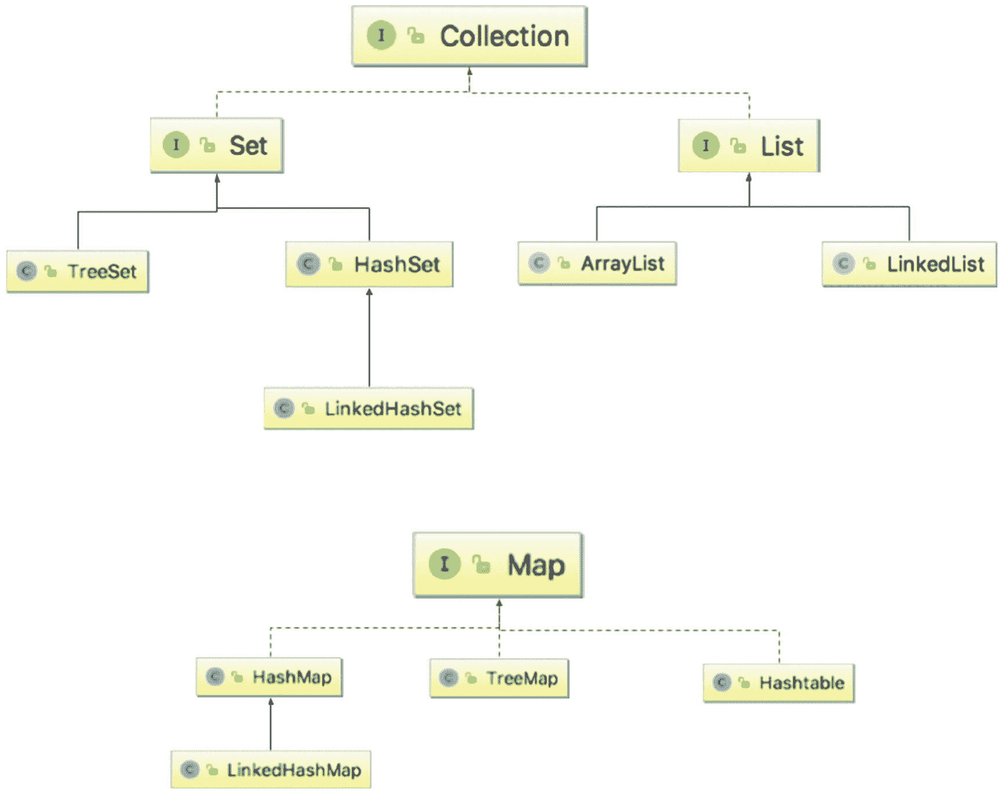

图 5-18

集合层次结构

让我们从一个列表示例开始。

```
package com.apress.bgn.ch5;
import java.util.*;
public class CollectionsDemo {
public static void main(String... args) {
List stringList = new ArrayList();
stringList.add("one");
stringList.add("two");
stringList.add("three");
for (String s : stringList) {
System.out.println(s);
}
}
}
```

`List` 包含一个未排序的非唯一数据集合，包括 null 元素。在示例中，我们声明了一个 `List<T>` 类型的引用和一个 `ArrayList<T>` 类型的对象。我们这样做是因为所有实现都具有相同的 API，我们可以轻松地将 `ArrayList<T>` 替换为 `LinkedList<T>`，代码仍然可以工作。**声明抽象引用是一种良好的编程实践**。

```
List stringList = new ArrayList();
stringList = new LinkedList();
```

前面示例中的语法是 Java 1.7 之前的，当时引入了 **<>（菱形运算符）**。这进一步简化了集合的初始化，因为它只需要在引用声明中声明列表中元素的类型。因此，前面代码片段中的两行变成了：

```
List stringList = new ArrayList();
stringList = new LinkedList();
```

从 Java 1.5 开始，每个新的 Java 版本都对集合框架进行了更改。在 Java 1.8 中，通过 `java.lang.Iterable<T>` 接口（`java.lang.Collection<T>` 扩展了该接口）中一个名为 `forEach` 的默认方法，添加了对 lambda 表达式的支持。因此，我们之前使用 `for` 循环打印列表中所有值的代码可以替换为：

```
stringList.forEach(element -> System.out.println(element));
```

在 Java 9 中，又引入了一项改进：集合的工厂方法。我们的集合是通过重复调用 `add(..)` 来填充元素的，这有点冗余，尤其是当我们已经拥有要放入列表的完整元素集合时。因此，在 Java 9 中引入了用一行代码创建集合对象的方法；例如：

```
List stringList = List.of("one", "two", "three");
```

生成的 `List<T>` 是一个不可变集合；它不能再被修改，也不能从中添加或删除元素。

再近一些，在 Java 10 中，添加了对**局部变量类型推断**的支持，这意味着我们不再需要显式指定引用类型，因为它会根据对象类型自动推断出来，因此以下声明：

```
List stringList = List.of("one", "two", "three");
```

变成了：

```
var stringList = List.of("one", "two", "three");
```

类似的代码可以用 `Set<T>`、`HashSet<T>` 和 `TreeSet<T>` 编写，并且 `Set<T>` 类也存在类似的方法。

Map 实现有一些不同，因为它们对键值对集合进行建模；因此这种情况需要单独处理。以下代码片段展示了创建和初始化一个使用 `String` 类型键和 `Integer` 类型值的映射。语法是 Java 6 的。

```
package com.apress.bgn.ch5;
import java.util.*;
public class CollectionsDemo {
public static void main(String... args) {
Map stringMap = new HashMap();
stringMap.put("one", 1);
stringMap.put("two", 2);
stringMap.put("three", 3);
for (Map.Entry entry : stringMap.entrySet()) {
System.out.println(entry.getKey() + ":  " + entry.getValue());
}
}
}
```

从 `for` 循环中，你可以推断出映射是 `Map.Entry<K, V>` 元素的集合。如果我们向前推进到 Java 1.7 语法，映射的声明变为：

```
Map stringMap = new HashMap();
```

在 Java 1.8 中，遍历和打印映射中的值变得更加实用。

```
stringMap.forEach((k,v) -> System.out.println(k + ": " + v));
```

在 Java 9 中，声明和填充映射变得更加容易。

```
Map stringMap = Map.of("one", 1,"two", 2, "three", 3);
```

局部变量类型推断也适用于映射。

```
var stringMap = new HashMap();
```

用于处理集合的 JDK 类涵盖了广泛的功能，例如排序、搜索、合并集合、交集等。随着本书的深入，代码示例的上下文会越来越广泛，我们将能够使用集合来解决实际问题。因此，其他方法也会被介绍，并提供可运行的代码示例。


### 并发特定类型

一个 Java 程序可以拥有多个执行线程。默认情况下，当 Java 程序执行时，会为从 `main` 方法调用的代码创建一个线程，同时还会为 JVM 相关任务创建并并行执行一些其他实用线程。这些线程可以轻松地通过 `java.lang.Thread` 类中定义的静态实用方法进行访问。以下代码示例正是如此：提取对 `Thread` 实例的引用，并在控制台中打印它们的名称。

```
package com.apress.bgn.ch5;
public class ListJvmThreads {
public static void main(String... args) {
var threadSet = Thread.getAllStackTraces().keySet();
var threadArray = threadSet.toArray(new Thread[threadSet.size()]);
for (int i = 0; i < threadArray.length; ++i) {
System.out.println("thread name: " + threadArray[i].getName());
}
}
}
```

在 JDK 11 中运行上述代码产生的输出如下。

```
thread name: Reference Handler
thread name: Monitor Ctrl-Break
thread name: Finalizer
thread name: main
thread name: Signal Dispatcher
thread name: Common-Cleaner
```

名为 `main` 的线程是执行开发者编写代码的线程。开发者可以编写代码，从主线程启动自己的线程。创建自定义线程最简单的方法是创建一个继承 `Thread` 类的类。`Thread` 类实现了一个名为 `Runnable` 的接口，该接口声明了一个名为 `run()` 的单一方法。`Thread` 类声明了一个名为 `start()` 的方法。当调用此方法时，`run()` 方法的主体将在另一个执行线程中执行。^(⁶⁰) 因此，在继承 `Thread` 类时，必须重写 `run()` 方法。

以下示例展示了一个名为 `CounterThread` 的类。`run()` 方法的内容旨在通过调用 `Thread.sleep(..)` 实用方法，不时地暂停执行。方法主体被包裹在两行代码中，这两行代码分别打印线程名称及开始消息，以及线程名称及结束消息。这对于减慢此类线程的执行速度是必要的，以便我们能清晰地看到它们是并行执行的。

```
package com.apress.bgn.ch5;
public class CounterThread extends Thread {
@Override
public void run() {
System.out.println(this.getName() + " started...");
for (int i = 0; i < 10; ++i) {
try {
Thread.sleep(i * 10);
} catch (InterruptedException e) {
e.printStackTrace();
}
}
System.out.println(this.getName() + " ended.");
}
}
```

测试我们的线程类很简单，只需实例化它几次并调用 `start()` 方法即可。

```
package com.apress.bgn.ch5;
public class ThreadDemo {
public static void main(String... args) {
for (int i = 0; i < 10; ++i) {
new CounterThread().start();
}
}
}
```

在示例中，创建了 `CounterThread` 类的十个实例，并对每个实例调用了 `start()` 方法。执行上述代码时，控制台应打印出类似如下的日志。

```
Thread-0 started...
Thread-3 started...
Thread-8 started...
Thread-9 started...
Thread-7 started...
Thread-6 started...
Thread-1 started...
Thread-2 started...
Thread-4 started...
Thread-5 started...
Thread-4 ended.
Thread-1 ended.
Thread-9 ended.
Thread-7 ended.
Thread-5 ended.
Thread-8 ended.
Thread-0 ended.
Thread-6 ended.
Thread-2 ended.
Thread-3 ended.
```

另一种创建线程的方式是创建一个实现 `Runnable` 接口的类。当我们想对 `run` 方法中的执行进行更多自定义，或者可能需要继承另一个类时，这很有用。或者，考虑到 `Runnable` 只声明了一个方法，也可以使用 lambda 表达式。让我们声明一个等效的 `Runnable` 实现。

```
package com.apress.bgn.ch5;
import  static  java.lang.Thread.*;
public class CounterRunnable implements Runnable {
@Override
public void run() {
System.out.println(Thread.currentThread().getName() + " started...");
for (int i = 0; i < 10; ++i) {
try {
Thread.sleep(i * 10);
} catch (InterruptedException e) {
e.printStackTrace();
}
}
System.out.println(Thread.currentThread().getName() + " ended.");
}
}
```

由于我们不再能直接访问线程的名称，为了打印它，我们必须使用另一个实用方法 `Thread.currentThread()` 来获取对当前正在执行的线程的引用。`Thread` 类提供了一个参数类型为 `Runnable` 的构造器，这意味着它可以接受任何实现了 `Runnable` 的类型的参数。因此，要使用 `CounterRunnable` 创建线程，可以编写类似以下示例的代码。

```
package com.apress.bgn.ch5;
public class LambdaRunnableDemo {
public static void main(String... args) {
for (int i = 0; i < 10; ++i) {
new Thread(new CounterRunnable()).start();
}
}
}
```

如果运行这段代码，我们会得到类似的输出。

这是使用 lambda 表达式的一个好场景，因为 `Runnable` 可以当场实现。因此，前面的代码也可以写成如下形式。

```
for (int i = 0; i  {
System.out.println(currentThread().getName() + " started...");
for (int j = 0; j < 10; ++j) {
try {
sleep(j * 10);
} catch (InterruptedException e) {
e.printStackTrace();
}
}
System.out.println(currentThread().getName() + " ended.");
}).start();
}
```

Java 提供了可以创建和管理线程的线程管理类，因此开发者不必显式声明线程。并发框架对于本书来说是一个过于高级的主题，但如果本节内容引起了你的好奇心，Oracle 的并发教程位于 [`https://docs.oracle.com/javase/tutorial/essential/concurrency/index.html`](https://docs.oracle.com/javase/tutorial/essential/concurrency/index.html) 。

## 总结

在本章中，你学习了 JVM 如何管理 Java 程序的内存，以及最常用的 Java 数据类型的基础知识。我们讨论了以下内容。

*   在 Java 程序执行期间内存是如何管理的
*   原始类型和引用类型之间的区别
*   Java 中定义了多少种原始类型
*   String 类型为何特殊
*   如何处理日历日期
*   如何声明和使用数组
*   如何使用 null
*   如何声明和使用集合实现

如果本章中的某些示例看起来很复杂，请不要气馁。如果不提供你可以执行、测试甚至自行修改的工作代码，就很难解释某些概念。不幸的是，这需要使用后续章节中介绍的概念（例如，`for` 和 `if` 语句）。请记下每个现在不清楚的概念及其页码，并在你稍后阅读本书中关于该概念的更详细内容后，再回到本章。

脚注 1   2   3   4   5


