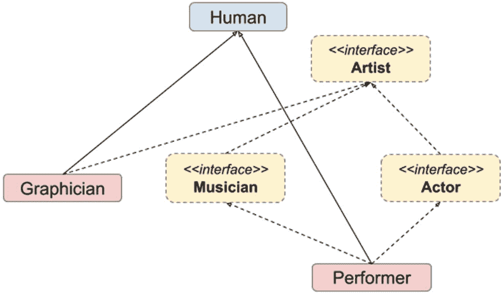
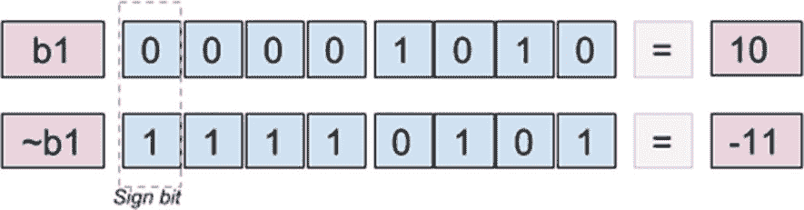
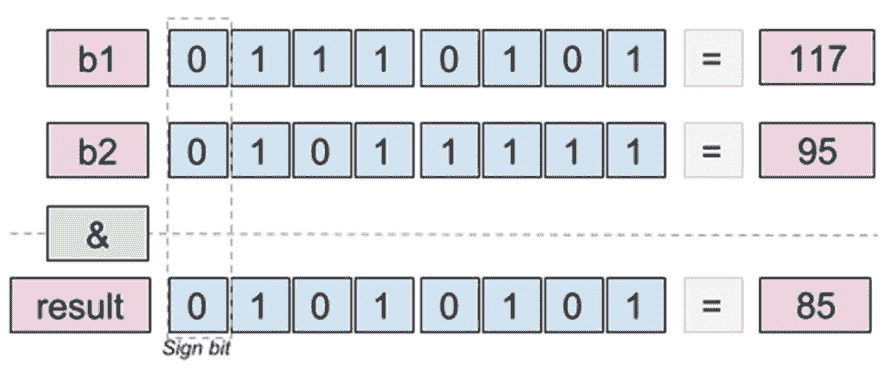
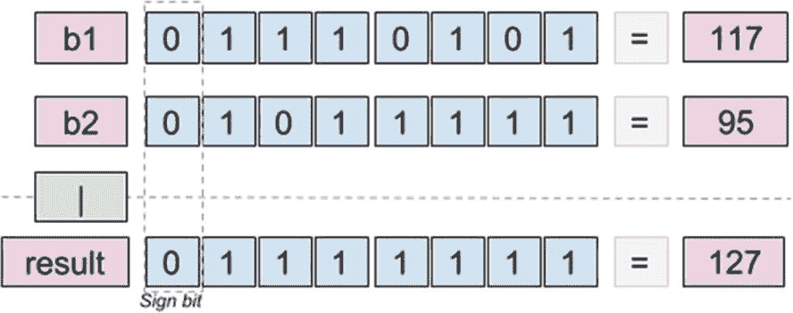
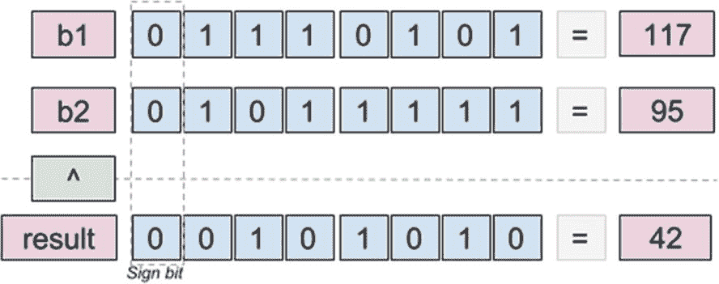
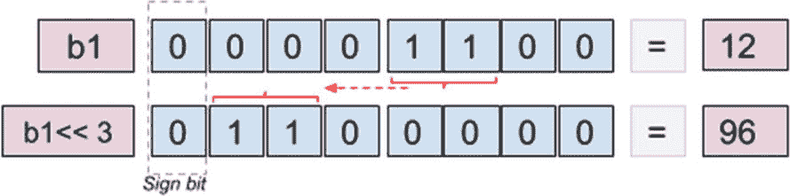
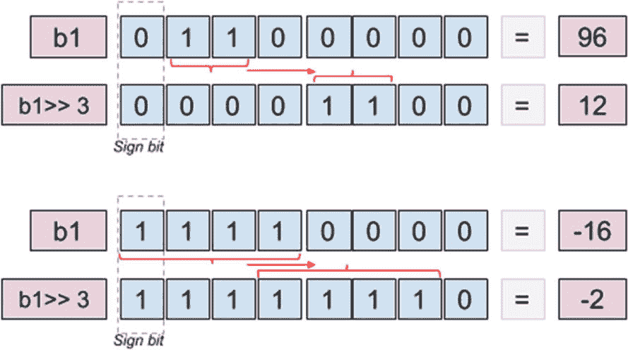
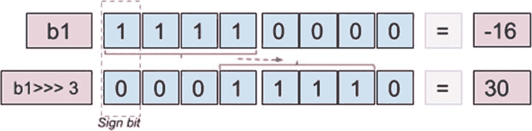

# 6. 运算符

前几章介绍了 Java 编程的基本概念。你学习了如何组织代码、如何命名文件，以及根据要解决的问题可以使用哪些数据类型。你还学习了如何声明字段、变量和方法，以及它们如何在内存中存储，从而帮助你设计解决方案，使资源消耗达到最优。

在本章中，你将学习使用*运算符*组合已声明的变量。大多数 Java 运算符都是你在数学中熟悉的，但由于编程涉及的类型不仅仅是数值型，因此还添加了具有特定用途的额外运算符。表 6-1 列出了所有 Java 运算符及其类别和适用范围。

表 6-1

Java 运算符

| 类别 | 运算符 | 适用范围 |
| --- | --- | --- |
| 类型转换 | *(类型)* | 显式类型转换 |
| 一元，后缀 | expr++, expr– | 后置自增/自减 |
| 一元，前缀 | ++expr, –expr | 前置自增/自减 |
| 一元，逻辑 | `!` | 逻辑非 |
| 一元，按位 | `~` | 按位取反，对整数值逐位取反 |
| 乘法，二元 | `*, /, %` | 用于数值类型：乘法、除法、取余 |
| 加法，二元 | `+, -` | 用于数值类型：加法、减法；“+”也用于`String`拼接 |
| 位移，二元 | `>>, <<, >>>` | 用于数值类型：右移、左移、无符号右移 |
| 条件，关系 | `instanceof` | 测试对象是否为指定类型（类、子类或接口）的实例 |
| 条件，关系 | `==, !=, <, >, <=, >=` | 等于、不等于、小于、大于、小于等于、大于等于 |
| 与，二元 | `&` | 按位逻辑与 |
| 异或，二元 | `^` | 按位逻辑异或 |
| 或，二元 | `&#124;` | 按位逻辑或 |
| 条件，逻辑与 | `&&` |   |
| 条件，逻辑或 | `&#124;&#124;` |   |
| 条件，三元 | `? :` | 也称为*猫王运算符* |
| 赋值 | `=, +=, -=, *=, /= %=, &=, ^=, <<= >>=,  >>>= , &#124;=` | 简单赋值、复合赋值 |

让我们从编程中最常见的运算符开始本章：赋值运算符（=）。

## 赋值运算符（=）

这个运算符在编程中使用最广泛，因为没有它什么都做不了。你创建的任何变量，无论类型是基本类型还是引用类型，在程序的某个时刻都必须被赋予一个值。使用赋值运算符设置值非常简单：运算符左侧是变量名，右侧是一个值。赋值能够生效的唯一条件是值的类型与变量的类型匹配。

要测试这个运算符，你可以用 `jshell` 稍微玩一下；确保以 `verbose` 模式启动它，这样你就能看到赋值的效果。

```
$ jshell -v
|  欢迎使用 JShell -- 版本 11-ea
|  如需介绍，请输入：/help intro
[jshell> int i = 0;
i  ==> 0
|  已创建变量 i : int
[jshell> i = -4;
i ==> -4
|  已为 i 赋值 : int
jshell> String sample = "text"
[sample ==> "text"
|  已创建变量 sample : String
[jshell> List list = new ArrayList()
list ==> []
|  已创建变量 list : List
[jshell> list = new LinkedList();
list ==> []
|  已为 list 赋值 : List
```

在前面的例子中，我们声明了基本类型和引用类型的值，并对它们进行了赋值和重新赋值。不允许将类型与初始类型不匹配的值进行赋值。在下面的代码示例中，我们试图将一个文本值赋给一个先前声明为 `int` 类型的变量。

```
[jshell> int i = 0;
i ==> 0
|  已创建变量 i : int
[jshell> i = -4;
i ==> -4
|  已为 i 赋值 : int
[jshell> i = "gigi pedala"
|  错误：
|  类型不兼容：java.lang.String 无法转换为 int
|  i = "gigi pedala"
|      ^-----------^
```

JDK 10 中引入的类型推断并不影响这一点，变量的类型是根据第一个赋值的类型推断出来的。这意味着你不能使用 `var` 关键字声明一个变量而不指定初始值。这排除了 `null` 值，因为它不能用于声明类型。不过，可以通过将 `null` 值强制转换为我们感兴趣的类型来强制实现这一点。

```
[jshell> var j;
|  错误：
|  无法推断局部变量 j 的类型
|    (不能在未初始化的变量上使用 'var')
|  var j;
|  ^----^
[jshell> var j = 5;
j ==> 5
|  已创建变量 j : int
[jshell> var sample2 = "bubulina"
sample2 ==> "bubulina"
|  已创建变量 sample2 : String
// 是的，这实际上有效！
[jshell> var funny = (Integer) null;
funny ==> null
|  已创建变量 funny : Integer
```

关于赋值运算符，能说的就是这些了。其他细节将在后面介绍复合赋值运算符时涉及。


## 显式类型转换（type）与 instanceof

我们将这两个运算符放在同一节中讲解，因为这样更容易提供与你作为开发者日常工作中频繁使用的代码示例（如果你选择这个方向的话）。

最好让引用类型尽可能通用，以便在不破坏代码的情况下更改具体实现。但有时，我们可能需要将对象分组，并根据其类型执行不同的代码。还记得上一章提到的 `Performer` 层级结构吗？我们将在此处利用这些类型来演示如何使用这些运算符。如果你不想返回上一章查看层级结构，图 6-1 再次展示了它，但做了一点改动：我们添加了一个名为 `Graphician` 的额外类，它实现了 `Artist` 接口并继承了 `Human` 类。^(⁶¹)



图 6-1

Performer 层级结构

在以下代码示例中，创建了一个 `Musician` 类型的对象和一个 `Graphician` 类型的对象，并将两者都添加到一个包含 `Artist` 类型引用的列表中。我们可以这样做，因为这两种类型都实现了 `Artist` 接口。

```
package com.apress.bgn.ch6;
import com.apress.bgn.ch4.hierarchy.*;
import java.util.ArrayList;
import java.util.List;
public class OperatorDemo {
public static void main(String... args) {
List artists = new ArrayList();
Musician john = new Performer("John", 40, 1.91f, Gender.MALE);
List songs = List.of("Gravity");
john.setSongs(songs);
artists.add(john);
Graphician diana = new Graphician("Diana", 23, 1.62f, Gender.FEMALE, "macOs"); artists.add(diana);
for (Artist artist : artists) {
if (artist instanceof Musician) { \\ (*)
Musician musician = (Musician) artist; \\(**)
System.out.println("Songs: " + musician.getSongs());
} else {
System.out.println("Other Type: " + artist.getClass());
}
}
}
}
```

标记为 `(*)` 的行展示了如何使用 `instanceof` 运算符。此运算符测试对象是否为指定类型（类、子类或接口）的实例。它用于编写条件，以决定应执行哪个代码块。

标记为 `(**)` 的行对引用进行了显式转换。由于 `instanceof` 运算符帮助确定了引用指向的对象是 `Musician` 类型，我们现在可以将引用转换为正确的类型，以便调用 `Musician` 类的方法。

但如果显式转换失败会发生什么？为此，我们尝试将之前声明的 `Graphician` 引用转换为 `Musician`。因此，我们将添加以下代码行。

```
Musician fake = (Musician) diana;
```

编译器不会报错，但这并不能改变 `Graphician` 与 `Musician` 类型无关的事实，因此代码将无法运行，并且控制台会抛出一个特殊异常来告诉你哪里出了问题。控制台打印的错误信息很明确，如下面的日志片段所示。

```
Exception in thread "main" java.lang.ClassCastException:
chapter.six/com.apress.bgn.ch6.Graphician cannot be cast to
chapter.four/com.apress.bgn.ch4.hierarchy.Musician
at chapter.six/com.apress.bgn.ch6.OperatorDemo.mainOperatorDemo.java:24
```

该消息明确指出这两种类型不兼容，并包含了包名和模块名。

但显式转换不仅限于引用类型，它也适用于基本类型。任何值范围较小的类型的变量都可以转换为值范围较大的类型，而无需显式转换。但反过来也可以通过显式转换实现，但如果值太大，会丢失位，结果将……出乎意料。请看以下 `byte` 和 `int` 之间转换的示例。

```
[jshell> byte b = 2;
b ==> 2
|  created variable b : byte
[jshell> int i = 10;
i ==> 10
|  created variable i : int
[jshell> i = b
i ==> 2
|  assigned to i : int
[jshell> b = i
|  Error:
|  incompatible types: possible lossy conversion from int to byte
|  b = i
|      ^
[jshell> b = (byte) i
b ==> 2 // 一切正常，因为值在 byte 范围内
|  assigned to b : byte
[jshell> i = 300000
i ==> 300000
|  assigned to i : int
[jshell> b = (byte) i
b ==> -32  // 哎呀！值超出了 byte 范围
|  assigned to b : byte
```

因此，作为一般规则，使用显式转换来扩大变量的范围，而不是缩小它，因为缩小范围可能导致意外结果。

## 数值运算符

本节汇总了主要用于数值类型的运算符。你从数学中了解的数值运算符有：`+`、`-`、`/`。比较运算符在编程中也能找到，但它们可以组合使用以获得不同效果。

### 一元运算符

一元运算符只需要一个操作数，并且会影响它们所应用的变量。

#### 自增与自减运算符

在 Java（以及其他一些编程语言）中，有一元运算符称为*自增运算符*（`++`）和*自减运算符*（`--`）。这些运算符放在变量之前或之后，以将其值增加或减少 1。它们通常用作循环中的计数器，以控制循环的终止条件。当它们放在变量之前时，称为*前缀*形式；当放在变量之后时，称为*后缀*形式。

当使用前缀形式时，操作在变量用于下一条语句之前执行。以下代码示例验证了这一说法。

```
package com.apress.bgn.ch6;
public class UnaryOperatorsDemo {
public static void main(String... args) {
int i  = 1;
int j = ++i;
System.out.println("j is " + j + ", i is " + i);
}
}
```

上述代码的预期结果是 `j=2`，因为 `i` 变量的值在赋值给 `j` 之前被修改为 2。因此，预期输出是 `j is 2, i is 2`。

当使用后缀形式时，操作在变量用于下一条语句之后执行。以下代码示例验证了这一说法。

```
package com.apress.bgn.ch6;
public class UnaryOperatorsDemo {
public static void main(String... args) {
i = 1;
j = i++;
System.out.println("j is " + j + ", i is " + i);
}
}
```

上述代码的预期结果是 `j=1`，因为 `i` 变量的值在赋值给 `j` 之后被修改为 2。因此，预期输出是 `j is 1, i is 2`。

自减运算符可以类似的方式使用，唯一的效果是变量值减少 1。尝试修改 `UnaryOperatorsDemo` 以使用 `--` 运算符。

#### 符号运算符

数学运算符 `+` 用于单个操作数以表示数字为正数（冗余且几乎从不使用）。因此，基本上，

```
int i = 3;
```

等同于

```
int i = +3;
```

数学运算符 `-` 用于声明负数。

```
[jshell> int i = -3
i ==> -3
|  created variable i : int
```

或者它用于否定一个表达式。

```
[jshell> int i = -3
i ==> -3
|  created variable i : int
[jshell> int j = - ( i + 4 )
j ==> -1
|  created variable j : int
```

如示例所示，`( i + 4 )` 的结果是 1，因为 `i = -3`，但由于括号前的 `-`，最终赋值给 `j` 变量的结果是 `-1`。

#### 取反运算符

还有两个一元运算符，它们的作用是对变量取反。运算符 `!` 应用于布尔变量，用于对其取反。因此，`true` 变为 `false`，`false` 变为 `true`。

```
[jshell> boolean t = true
t ==> true
|  created variable t : boolean
[jshell> boolean f = !t
f ==> false
|  created variable f : boolean
[jshell> boolean t2 = !f
t2 ==> true
|  created variable t2 : boolean
```


### 二元运算符

让我们从你可能在数学中已经了解的运算符开始。

*   `+` 将两个变量相加

```
[jshell> int i = 4
i ==> 4
|  created variable i : int
[jshell> int j = 6
j ==> 6
|  created variable j : int
[jshell> int k = i + j
k ==> 10
|  created variable k : int
[jshell> int i = i + 2
i ==> 6
|  modified variable i : int
|    update overwrote variable i : int
```

最后一条语句 `int i = i + 2` 的作用是将变量 `i` 的值增加 2，但这里存在一点冗余。这条语句可以不用重复提及 `i` 两次来编写，因为它的效果就是将 `i` 的值增加 2。这可以通过使用 `+=` 运算符来实现，该运算符由赋值运算符和加法运算符组合而成。最优的写法是 `i += 2`。

`+` 运算符也可以用于连接 `String` 实例，或者将 `String` 实例与其他类型连接。JVM 会根据上下文决定如何使用 `+` 运算符。让我们看下面的例子。

```
package com.apress.bgn.ch6;
public class ConcatenationDemo {
public static void main(String... args) {
int i1 = 0;
int i2 = 1;
int i3 = 2;
System.out.println(i1 + i2 + i3);
System.out.println("Result1 = " + (i1 + i2) + i3);
System.out.println("Result2 = " + i1 + i2 + i3);
System.out.println("Result3 = " + (i1 + i2 + i3));
}
}
```

如果执行上述代码，控制台将显示以下内容。

```
1\.   3
2\.   Result1 = 12
3\.   Result2 = 012
4\.   Result3 = 3
```

我来解释一下。

*   第 1 行的结果可以解释如下：因为所有操作数都是 `int` 类型，JVM 会正常进行加法运算，然后 `println` 函数打印出这个结果。

*   第 2 行的结果可以解释如下：添加了括号来隔离两个项 `(i1+i2)` 的加法。因此，JVM 将括号内的加法作为两个 `int` 项之间的正常加法执行。但在此之后，我们得到的是 `"Result1 = " + 1 + i3`，这个操作包含一个 `String` 操作数，这意味着 `+` 运算符必须用作连接运算符，因为将一个数字与文本值相加在其他情况下是行不通的。

*   第 3 行的结果此时应该很明显了；我们有三个 `int` 操作数和一个 `String` 操作数，因此 JVM 判定该操作的上下文不能是数值运算，所以需要进行连接。

*   第 4 行的结果可以用与第 2 行类似的方式解释；使用括号是为了确保操作的上下文是数值运算，因此三个操作数被相加。

这是一个典型的例子，展示了 JVM 如何决定涉及 `+` 运算符的操作上下文，你可能在其他 Java 教程中也能看到。但 `int` 变量可以替换为 `float` 或 `double` 变量，其行为是类似的。

*   **-** 将两个变量相减，或从变量中减去一个值。下面展示了该运算符以及 `-=` 运算符（由赋值运算符和减法运算符组合而成）的用法。

*   `*` 将两个变量相乘，或将一个值与变量相乘。它的使用方式与 `+` 和 `-` 类似，并且有一个组合运算符 `*=` 可用于将变量的值相乘并立即赋值。

```
[jshell> int i = 4;
i ==> 4
|  created variable i : int
[jshell> int j = 2;
j ==> 2
|  created variable j : int
[jshell> int k = i – j
k ==> 2
|  created variable k : int
[jshell> int i = 4
i ==> 4
|  modified variable i : int
|    update overwrote variable i : int
[jshell> i = i - 3;
i ==> 1
|  assigned to i : int
[jshell> int i = 4
i ==> 4
|  modified variable i : int
|    update overwrote variable i : int
[jshell> i -= 3
$9 ==> 1
|  created scratch variable $9 : int
```

*   `/` 将两个变量相除，或将一个值除以一个变量。它的使用方式与 `+` 和 `-` 类似，并且有一个组合运算符 `/=` 可用于将变量的值相除并立即赋值。除法的结果称为*商*，它被赋值给赋值符号（`"="`）左侧的变量。当操作数为整数时，结果也是整数，并且*余数*会被丢弃。

```
[jshell> int i = 4
i ==> 4
|  created variable i : int
[jshell> int j = 2
j ==> 2
|  created variable j : int
[jshell> int k =    i * j
k ==> 8
|  created variable k : int
[jshell> int i = 4;
i ==> 4
|  modified variable i : int
|    update overwrote variable i : int
[jshell> i = i * 3
i ==> 12
|  assigned to i : int
[jshell> int i = 4
i ==> 4
|  modified variable i : int
|    update overwrote variable i : int
[jshell> i *= 3
$7 ==> 12
|  created scratch variable $7 : int
```

*   `%` 也称为*取模*运算符，它将两个变量相除，但结果是除法的余数。该操作称为*取模运算*，并且还有一个组合运算符 `%=` 可用于将变量的值相除并立即将余数赋值。

```
[jshell> int i = 4
i ==> 4
|  created variable i : int
[jshell> int j = 2
j ==> 2
|  created variable j : int
[jshell> int k = i / j
k ==> 2
|  created variable k : int
[jshell> int i = 4
i ==> 4
|  modified variable i : int
|    update overwrote variable i : int
[jshell> int i = i / 3
i ==> 1
|  modified variable i : int
|    update overwrote variable i : int
[jshell> int i = 4
i ==> 4
|  modified variable i : int
|    update overwrote variable i : int
[jshell> i /= 3
$7 ==> 1
|  created scratch variable $7 : int
```

```
[jshell> int i = 4
i ==> 4
|  created variable i : int
[jshell> int j = 3
j ==> 3
|  created variable j : int
[jshell> int k = i % j
k ==> 1
|  created variable k : int
[jshell> int i = 4
i ==> 4
|  modified variable i : int
|    update overwrote variable i : int
[jshell> i = i % 3
i ==> 1
|  assigned to i : int
[jshell> int i = 4
i ==> 4
|  modified variable i : int
|    update overwrote variable i : int
[jshell> i %= 3
$7 ==> 1
|  created scratch variable $7 : int
```

取模运算符返回余数，但是，当操作数是实数时会发生什么？如果余数是一个小数点后有无限多位小数的实数呢？

```
package com.apress.bgn.ch6;
public class ModulusDemo {
public static void main(String... args) {
float f = 1.9f;
float g = 0.4f;
float h = f % g;
System.out.println("remainder = " + h);
}
}
```

嗯，会进行一些舍入。控制台打印的文本是 `remainder = 0.29999995`，在某些情况下可以四舍五入为 0.3。但是，当数据用于敏感操作时，舍入可能会很危险，例如确定机器人手术的肿瘤体积，或确定发送火箭到火星的完美轨迹。因此，舍入可能会带来问题，因为它会导致精度损失。


### 关系运算符

在某些情况下，设计问题解决方案时，需要引入条件来驱动和控制执行流程。条件要求使用比较运算符对两个项进行比较评估。本节将介绍 Java 中使用的所有比较运算符，并提供代码示例。让我们开始吧。

*   `==` 用于测试项是否相等。由于在 Java 中，单个等号（`=`）用于赋值，因此需要找到一种方法来测试相等性，于是开发者将“=”运算符重复了一次。我们之前使用过 `for` 循环来演示如何使用某些类型或语句，即使它们将在下一章才详细介绍，因为向您展示的代码示例应该是可编译和可运行的。在以下代码示例中，您将看到在数组中搜索值 2 时测试 `==` 比较器的示例。如果找到该值，则会在控制台中打印索引。

```
package com.apress.bgn.ch6;
public class ComparisonOperatorsDemo {
public static void main(String... args) {
int[] values = {1, 7, 9, 2, 6,};
for (int i = 0; i < values.length; ++i) {
if (values[i] == 2) { \\(*)
System.out.println("Fount 2 at index: " + i);
}
}
}
}
```

标记为（`*`）的行中的条件会被评估，结果是一个布尔值。当结果为 `false` 时，不执行任何操作；但如果结果为 `true`，则会打印索引。由于结果是布尔类型，如果您误用了 `=` 而不是 `==`，代码将无法编译。不过，在比较布尔值时需要格外小心。

`==` 符号对于基本类型完全适用；对于引用类型，则需要使用**第** **5** 章中介绍的 `equals()` 方法。

*   **!=** 用于测试项是否不相等。它是 `==` 运算符的相反操作。作为练习，请修改前面的示例，当数组值不为 2 时打印一条消息。此运算符也适用于引用类型。但如果您想测试引用值是否不相等，则必须使用类似这样的表达式：!a.equals(b)

*   **<** 和 **<=** 的用途与您在数学课上学到的可能相同。第一个（`<`）测试运算符左侧的项是否小于右侧的项。下一个（`<=`）测试运算符左侧的项是否小于或等于右侧的项。此运算符不能用于引用类型。

*   **>** 和 **>=** 的用途与您在数学课上学到的可能相同。第一个（`>`）测试运算符左侧的项是否大于右侧的项。下一个（`>=`）测试运算符左侧的项是否大于或等于右侧的项。此运算符不能用于引用类型。

几乎所有数值运算符都可以用于不同基本类型（和包装类型）的变量，因为它们会自动转换为具有更宽区间表示的类型，或者在包装类型的情况下拆箱为适当的类型。以下代码反映了几种情况，但在实践中，您可能需要做出更极端的决策，这些决策并不总是符合编程的常识规则或遵循良好实践。

```
package com.apress.bgn.ch6;
public class MixedOperationsDemo {
public static void main(String... args) {
byte b = 1;
short s = 2;
int i = 3;
long l = 4;
float f = 5;
double d = 6;
int ii = 6;
double resd = l + d;
long  resl = s + 3;
//等等
if (b = b) {
System.out.println("int val >= byte val");
}
if (l > b) {
System.out.println("long val > byte val");
}
if(d > i) {
System.out.println("double val > byte val");
}
if(i == i) {
System.out.println("double val == int val");
}
}
}
```

请确保，如果您遇到需要编写此类不规范的代码（非最优代码结构）的情况，一定要进行大量测试，并仔细考虑您的转换，尤其是在涉及浮点类型时，因为例如以下代码片段可能会产生意外结果。

```
package com.apress.bgn.ch6;
public class DecimalPointDemo {
public static void main(String... args) {
float f1 = 2.2f;
float f2 = 2.0f;
float f3 = f1 * f2;
if (f3 == 4.4) {
System.out.println("expected float value of 4.4");
} else {
System.out.println("unexpected value of " + f3);
}
}
}
```

如果您期望在控制台中打印消息 *expected float value of 4.4*，您会感到惊讶。任何 IEEE 754 浮点数表示都会出现问题，因为一些在十进制系统中看起来具有固定小数位数的数字，在二进制系统中实际上具有无限小数位数。因此，我们不能使用 `==` 来比较浮点数和双精度数。最容易实现的解决方案之一是使用包装类提供的 `compare` 方法；在本例中，是 `Float.compare`。

```
package com.apress.bgn.ch6;
public class DecimalPointDemo {
public static void main(String... args) {
float f1 = 2.2f;
float f2 = 2.0f;
float f3 = f1 * f2;
if (Float.compare(f3,4.4f) == 0) {
System.out.println("expected float value of 4.4");
} else {
System.out.println("unexpected value of " + f3);
}
}
}
```

使用前面的示例，现在控制台中会打印预期的消息：*expected float value of 4.4.*

### 位运算符

在 Java 中，有一些运算符用于在位级别操作数值类型的变量。位运算符用于更改操作数中的单个位。位运算速度更快，并且由于资源使用减少，通常功耗更低。它们在编程可视化应用程序、游戏中最有用，在这些应用中，可以使用位运算快速确定颜色、鼠标点击和移动。

### 按位非

`~` 运算符有点像二进制取反器。它对整数值逐位进行反转。当然，这会影响用于表示该值的所有位。因此，如果我们声明

```
byte b1 = 10;
```

其二进制表示为 00001010。`Integer` 类提供了一个名为 `toBinaryString` 的方法，可以打印之前定义的变量的二进制表示，但它不会打印所有位，因为该方法不知道我们希望在多少位上表示该值。因此，我们需要使用一个特殊的 `String` 函数来格式化输出。以下代码片段在 8 位上打印 b 值的二进制形式。

```
System.out.println("decimal:" + b1);
String str = String.format("%8s", Integer.toBinaryString(b1 & 0xFF))
.replace(' ', '0');
System.out.println("binary:" + str);
```

如果我们在 b 值上应用 `~` 运算符，得到的二进制值为 11110101。第一位是符号位，值为 1 对应 `-`。因此，该数字是 –11，如下代码所示。

```
byte b2 = (byte) ~b1;
System.out.println("decimal:" + b2);
String str2 = String.format("%8s", Integer.toBinaryString(b2 & 0xFF))
.replace(' ', '0');
System.out.println("binary:" + str2);
```

在前面的示例中，您可能注意到了这条语句：

```
byte b2 = (byte) ~b1
```

您期待一个解释。按位补码表达式运算符要求操作数可转换为基本整数类型，否则会发生编译时错误。在内部，Java 使用一个或多个字节来表示值。`~` 运算符将其操作数转换为 `int` 类型，因此在进行补码运算时可以使用 32 位；这是为了避免精度损失所必需的。这就是为什么在前面的示例中需要显式转换为 `byte` 的原因。

并且由于图像能让一切更清晰，图 6-2 展示了 `~` 对 `b1` 变量各位的影响，并与其值进行了对比。



图 6-2

运算符对每一位的影响


### 按位与

按位与运算符用 `&` 表示，其作用是将两个数字逐位比较，如果每个位置上的位值都为 1，则结果中该位为 1。以下代码示例展示了 `&` 运算符的结果。

```
package com.apress.bgn.ch6;
public class BitwiseDemo {
public static void main(String... args) {
byte b1 = 117; // 01110101
byte b2 = 95; // 01011111
byte result = (byte) (b1 &  b2); // 01010101
System.out.println("b1:"+ b1);
System.out.println("b2:"+ b2);
System.out.println("---------");
String str = String.format("%8s", Integer.toBinaryString(result & 0xFF))
.replace('  ', '0');
System.out.println("result:" + result);
System.out.println("binary result:" + str);
}
}
```

我们使用相同的 `String.format(..)` 方法来显示对 `b1` 和 `b2` 运算符应用 `&` 后结果的位表示。上述代码输出如下内容。

```
b1:117
b2:95

result:85
binary result:01010101
```

但 `&` 运算符的效果在图 6-3 中体现得最为清晰。01010101 这个值就是数字 `85` 的二进制表示。



图 6-3

& 运算符对每一位的作用效果

出于实用考虑，Java 提供了复合运算符 `&=`，这样按位 `AND` 操作可以在结果赋值的同一个变量上完成。

```
jshell> byte b1 = 10
b1 ==> 10
|  created variable b1 : byte
[jshell> b1 &= 2
$2 ==> 2
|  created scratch variable $2 : byte
```

### 按位包含 OR

按位 `OR` 运算符用 `|` 表示，其作用是将两个数字逐位比较，如果至少有一个位为 1，则结果中该位为 1。以下代码示例展示了 `|` 运算符的结果。

```
package com.apress.bgn.ch6;
public class BitwiseDemo {
public static void main(String... args) {
byte b1 = 117; // 01110101
byte b2 = 95; // 01011111
byte result = (byte) (b1 | b2);  // 01111111
System.out.println("b1:"+ b1);
System.out.println("b2:"+ b2);
System.out.println("---------");
String str = String.format("%8s", Integer.toBinaryString(result & 0xFF))
.replace(' ', '0');
System.out.println("result: " + result);
System.out.println("binary result: " + str);
}
}
```

我们使用相同的 `String.format(..)` 方法来显示对 `b1` 和 `b2` 运算符应用 `|` 后结果的位表示。上述代码输出如下内容。

```
b1:117
b2:95

result: 127
binary result: 01111111
```

但 `|` 运算符的效果在图 [6-4 中体现得最为清晰。01111111 这个值就是数字 `127` 的二进制表示。



图 6-4

| 运算符对每一位的作用效果

出于实用考虑，Java 提供了复合运算符 `|=`，这样按位包含 `OR` 操作可以在结果赋值的同一个变量上完成。

```
jshell> byte b1 = 10
b1 ==> 10
|  created variable b1 : byte
[jshell> b1 |= 2
$4 ==> 10
|  created scratch variable $4 : byte
```

### 按位异或

按位 `XOR` 运算符用 `^` 表示，其作用是将两个数字逐位比较，如果值不同，则结果中该位为 1。以下代码示例展示了 `^` 运算符的结果。

```
package com.apress.bgn.ch6;
public class BitwiseDemo {
public static void main(String... args) {
byte b1 = 117; // 01110101
byte b2 = 95; // 01011111
byte result = (byte) (b1 ^ b2);  // 00101010
System.out.println("b1:"+ b1);
System.out.println("b2:"+ b2);
System.out.println("---------");
String str = String.format("%8s", Integer.toBinaryString(result & 0xFF))
.replace('  ', '0');
System.out.println("result: " + result);
System.out.println("binary result: " + str);
}
}
```

我们使用相同的 `String.format(..)` 方法来显示对 `b1` 和 `b2` 运算符应用 `^` 后结果的位表示。上述代码输出如下内容。

```
b1:117
b2:95

result:  42
binary result: 00101010
```

但 `^` 运算符的效果在图 [6-5 中体现得最为清晰。00101010 这个值就是数字 `42` 的二进制表示。



图 6-5

^ 运算符对每一位的作用效果

出于实用考虑，Java 提供了复合运算符 `^=`，这样按位异或 `OR` 操作可以在结果赋值的同一个变量上完成。

```
[jshell> byte b1 = 10
b1 ==> 10
|  created variable b1 : byte
[jshell> b1 ^= 2
$6 ==> 8
|  created scratch variable $6 : byte
```


### 逻辑运算符

在设计用于控制程序执行流程的条件时，有时需要编写由多个表达式组合而成的复杂条件。有四个运算符可用于构建复杂条件；其中两个是可复用的位运算：`&(AND)` 和 `|(OR)`；但它们需要计算条件的所有部分。运算符 `&&(AND)` 和 `||(OR)` 与其他两个具有相同的效果，但区别在于它们不需要计算所有表达式，这也是它们被称为**快捷**运算符的原因。为了解释这些运算符的棘手行为，这里有一个典型示例。基本上，我们声明一个包含十个项的列表（其中一些为 `null`），以及一个生成随机索引的方法，用于从列表中选择一个项。然后，我们测试从列表中选择的元素，看它是否不为 `null` 且等于预期值。如果两个条件都为真，则在控制台中打印一条消息。让我们从第一个示例开始。

```
package com.apress.bgn.ch6;
import java.util.ArrayList;
import java.util.List;
import java.util.Random;
public class LogicalDemo {
static List terms = new ArrayList() {{
add("Rose");
add(null);
add("River");
add("Clara");
add("Vastra");
add("Psi");
add("Cas");
add(null);
add("Nardhole");
add("Strax");
}};
public static void main(String... args) {
for (int i = 0; i < 20; ++i) {
int rnd = getRandomNumber();
String term = terms.get(rnd);
System.out.println("Generated index: " + rnd);
if (term != null & term.equals("Rose")) { \\(*)
System.out.println("Rose  was  found");
}
}
}
private static int getRandomNumber() {
Random r = new Random();
return r.nextInt(10);
}
}
```

为了确保得到预期结果，我们重复随机选择项的操作 20 次。在标记为 `(*)` 的行中，`&` 组合了两个表达式。因此，只有当 `term` 变量的值不为 `null` 且等于 *Rose* 时，才应在控制台中打印文本 `"Rose was found"`。因此，当运行上述代码时，预计会在控制台中看到类似这样的内容。

```
Generated index: 8
Exception in thread "main" java.lang.NullPointerException
Generated index: 4
at chapter.six/com.apress.bgn.ch6.LogicalDemo.mainLogicalDemo.java:57
Generated index: 7
```

但是，请这样思考：如果 `term` 为 null，我们是否还应该评估是否等于 *“Rose”*，尤其是在 `null` 对象上调用方法会导致运行时错误的情况下？显然不应该，这就是为什么 `&` 不适用于这种情况。如果 `term` 为 null，则第一个条件失败；评估第二个条件毫无意义。因此，`&&` 快捷运算符应运而生，它正是这样做的。之所以有效，是因为使用逻辑 `AND` 运算符时，如果第一个项为 `false`，那么第二个项等于什么并不重要，结果始终为 `false`。因此，我们可以按如下方式更正前面的代码示例。

```
package com.apress.bgn.ch6;
import java.util.ArrayList;
import java.util.List;
import java.util.Random;
public class LogicalDemo {
static List terms = new ArrayList() {{
add("Rose");
add(null);
..
}};
public static void main(String... args) {
for (int i = 0; i < 20; ++i) {
int rnd = getRandomNumber();
String term = terms.get(rnd);
System.out.println("Generated index: " + rnd);
if (term != null && term.equals("Rose")) { \\(*)
System.out.println("Rose  was  found");
}
}
}
private static int getRandomNumber() {
Random r = new Random();
return r.nextInt(10);
}
}
```

因此，当执行上述代码时，不会抛出异常，因为如果 `term` 为 null，则不会评估第二个条件。

让我们修改前面的代码示例，但这次，如果我们找到 `null` 或找到 *“Rose”*，则打印消息。

```
package com.apress.bgn.ch6;
import java.util.ArrayList;
import java.util.List;
import java.util.Random;
public class LogicalDemo {
static List terms = new ArrayList() {{
add("Rose");
add(null);
..
}};
public static void main(String... args) {
for (int i = 0; i < 20; ++i) {
int rnd = getRandomNumber();
String term = terms.get(rnd);
System.out.println("Generated index: " + rnd);
if (term == null | term.equals("Rose")) { \\(*)
System.out.println("Rose  was  found");
}
}
}
private static int getRandomNumber() {
Random r = new Random();
return r.nextInt(10);
}
}
```

如果我们运行上述代码，使用 `|` 会抛出 `NullPointerException`，因为该运算符要求评估两个表达式。因此，如果 `term` 为 `null`，调用 `.equals(...)` 会导致抛出异常。因此，为了确保代码按预期工作，必须将 `|` 替换为 `||`，后者会短路条件并且不评估第二个表达式。之所以有效，是因为使用逻辑 `OR` 运算符时，如果第一个项为 `true`，那么第二个项等于什么并不重要；结果始终为 `true`。我们将此作为练习留给您。

当然，条件可以由多个表达式和多个运算符组成，无论是 `&&` 还是 `||`。请看以下示例。

```
package com.apress.bgn.ch6;
import java.util.ArrayList;
import java.util.List;
import java.util.Random;
public class LogicalDemo {
static List terms = new ArrayList() {{
add("Rose");
add(null);
..
}};
public static void main(String... args) {
for (int i = 0; i < 20; ++i) {
int rnd = getRandomNumber();
String term = terms.get(rnd);
System.out.println("Generated index: " + rnd);
if (term != null && term.equals("Rose") || term == null) {
System.out.println(rnd + ": found something...");
}
if (rnd > 3 && rnd < 7 || rnd > 0) {
System.out.println(rnd + ": this works too...");
}
}
}
private static int getRandomNumber() {
Random r = new Random();
return r.nextInt(10);
}
}
```

请注意，条件不要变得过于复杂，确保用大量测试覆盖那段代码。在编写复杂条件时，某些表达式可能会变得冗余，IntelliJ IDEA 和其他智能编辑器会在冗余且未使用的表达式上显示死代码警告。


### 移位运算符

移位运算符是在位级别上工作的运算符。由于移动位是一种敏感操作，这些操作数的唯一要求是参数必须为整数。运算符左侧的操作数是要被移位的数字，右侧的操作数是要移动的位数。Java 中有三种移位运算符，每种都可以与赋值运算符组合，以执行移位操作并将结果直接赋值给原始变量。让我们逐一分析它们。

*   **<<** 左移。给定一个以二进制表示的数字，此运算符将位向左移动。请看以下代码片段。

```
public class ShiftDemo {
public static void main(String... args) {
byte b1 = 12; // 00001100
byte result = (byte) (b1 << 3);
str = String.format("%8s",  Integer.toBinaryString(result & 0xFF))
.replace(' ', '0');
System.out.println("result: " + result); // 01100000
}
}
```

当位向左移动时，空出的位置用 `0` 填充。同时，数字会变大，新值是旧值乘以 *−*2^(*N*)，其中 `N` 是第二个操作数。执行上述代码时，控制台会打印以下输出。

```
b1: 12
binary result: 00001100
result:  96
binary result: 01100000
```

上述代码可以使用复合运算符写成 `b <<= 3`，无需声明另一个变量。

因此，结果是 12 * 2³。位移动的方式如图 6-6 所示。



图 6-6

« 运算符的效果

*   **>>** 右移。给定一个以二进制表示的数字，此运算符将位向右移动。请看以下代码片段。

```
public class ShiftDemo {
public static void main(String... args) {
byte b1 = 96; // 01100000
byte result = (byte) (b1 >> 3);
str = String.format("%8s", Integer.toBinaryString(result & 0xFF))
.replace(' ', '0');
System.out.println("result: " + result); // 00001100
}
}
```

当位向右移动时，如果数字为正数，空出的位置用 `0` 填充。如果数字为负数，空出的位置用 1 替换。这样做是为了保留数字的符号。同时，数字会变小，新值是旧值除以 *−*2^(*N*)，其中 `N` 是第二个操作数。执行上述代码时，控制台会打印以下输出。

```
b1: 96
binary result: 01100000
result: 12
binary result: 00001100
```

上述代码可以使用复合运算符写成 `b >>= 3`，无需声明另一个变量。

因此，结果是 96 / 2³。正数和负数位移动的方式如图 6-7 所示。



图 6-7

» 运算符的效果

*   **>>>** 无符号右移。也称为**逻辑移位**。给定一个以二进制表示的数字，此运算符将位连同符号位一起向右移动，空出的位置用零替换。这就是为什么结果总是一个正数。请看以下代码片段。

```
public class ShiftDemo {
public static void main(String... args) {
byte b1 = -16; // 11110000
byte result = (byte) (b1 >>> 3);
str = String.format("%8s", Integer.toBinaryString(result & 0xFF))
.replace(' ', '0');
System.out.println("result: " + result); // 00011110
}
}
```

执行上述代码时，控制台会打印以下输出。

```
b1: -16
binary result: 11110000
result:  30
binary result: 00011110
```

上述代码可以使用复合运算符写成 `b >>>= 3`，无需声明另一个变量。

位移动的方式如图 6-8 所示。



图 6-8

> > > 运算符的效果

与所有按位运算符一样，移位运算符会将 `char`、`byte` 或 `short` 类型的变量提升为 `int`，这就是为什么需要进行显式转换。你可能已经注意到，对负数进行移位操作很棘手，结果数字很容易超出类型允许的取值范围，而显式转换可能导致精度损失或严重异常。那么，为什么要使用它们呢？因为它们速度快。使用移位运算符时，请务必进行充分的测试。

### 埃尔维斯运算符

*埃尔维斯运算符*是 Java 中唯一的三元运算符。它的功能相当于一个测试条件并根据结果返回值的 Java 方法。以下是埃尔维斯运算符的模板。

```
variable = (condition) ? val1 : val2
```

以下 `if` 语句与之等价。

```
variable = methodName(..)
type methodName(..) {
if (condition) {
return val1;
} else {
return val2;
}
}
```

这个运算符被称为*埃尔维斯运算符*的原因在于，问号形似猫王埃尔维斯·普雷斯利的发型，而冒形象征着眼睛。让我们看看它的实际应用。

```
jshell> int a = 4
a ==> 4
|  created variable a : int
[jshell> int result = a > 4 ? 3 : 1;
result ==> 1
|  created variable result : int
[jshell> String a2 = "test"
a2 ==> "test"
|  created variable a2 : String
[jshell> var a3 = a2.length() > 3 ? "hello": "bye-bye"
a3 ==> "hello"
|  created variable a3 : String
```

当你有一个简单的 `if` 语句，且每个分支只包含一个表达式时，这个运算符非常实用，因为使用它你可以将整个内容压缩到一个表达式、一行代码中。使用时请确保它能提高代码的可读性，因为从性能角度来看，`if` 语句和等价的埃尔维斯运算符表达式之间没有区别。使用埃尔维斯运算符的另一个优点是，该表达式可以在单行内联语句中初始化一个变量。

## 总结

在本章中，你学习了

*   Java 有很多运算符，包括简单运算符和复合运算符。

*   按位运算符速度快，但有风险。

*   `+` 运算符在不同上下文中执行不同的操作。

*   Java 有一个三元运算符，它接受三个操作数：一个布尔表达式和两个相同类型的对象。布尔表达式求值的结果决定了哪个操作数成为语句的结果。

本章的目的是让你熟悉本书中使用的所有运算符，帮助你理解所提供的解决方案，甚至设计和编写你自己的解决方案。

脚注 [1


