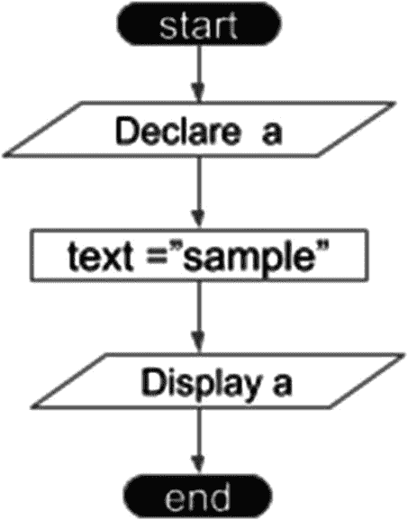
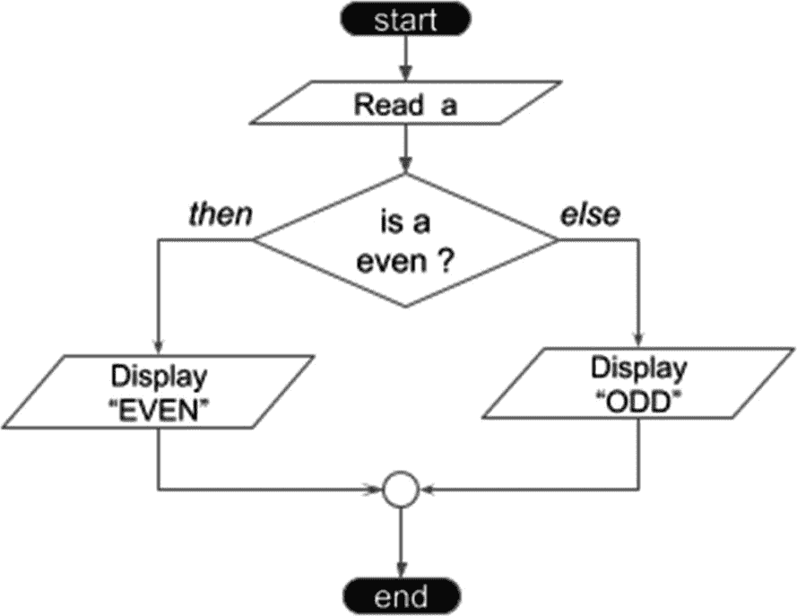
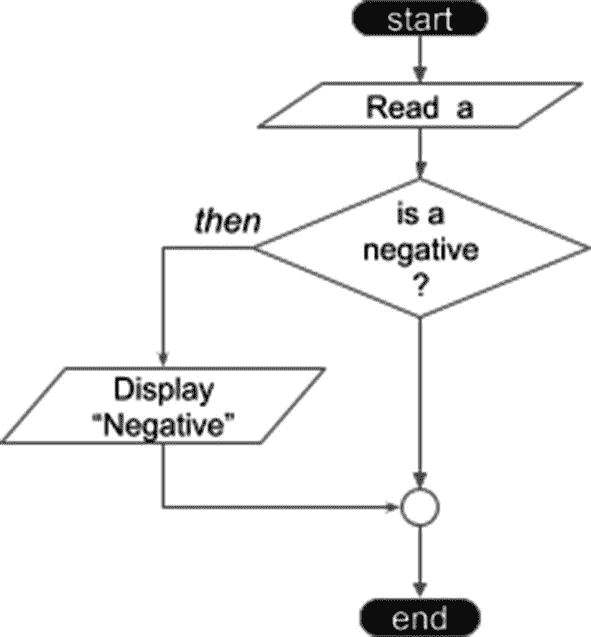
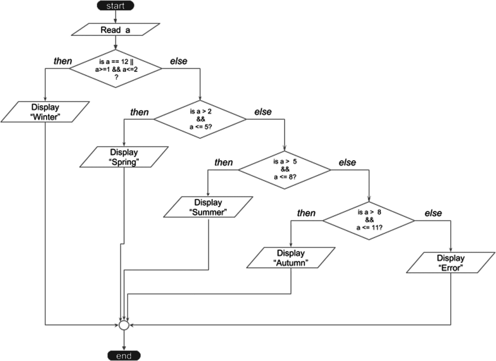
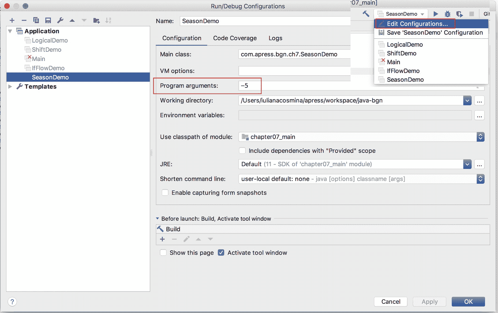
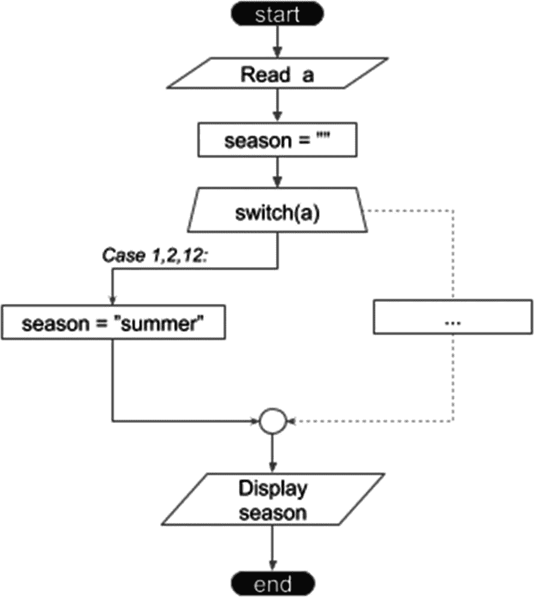
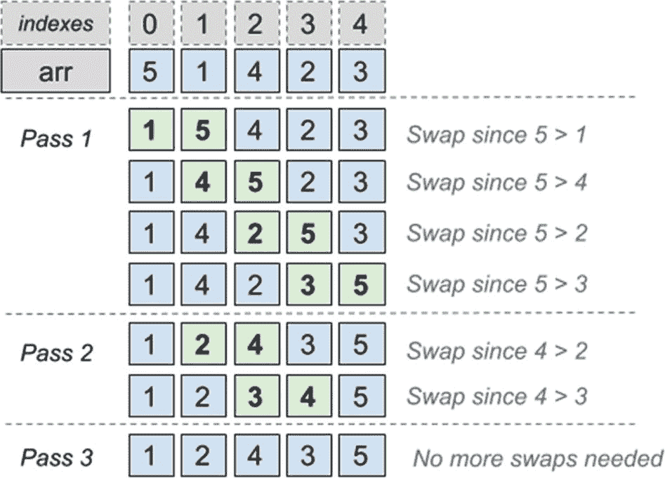
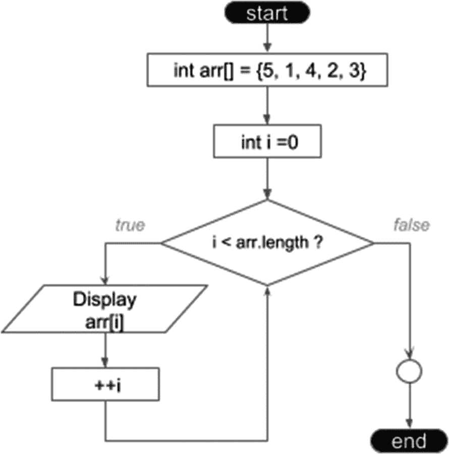
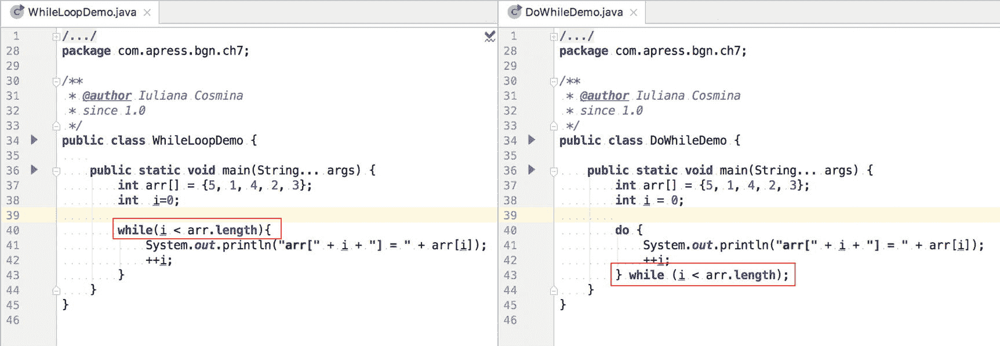
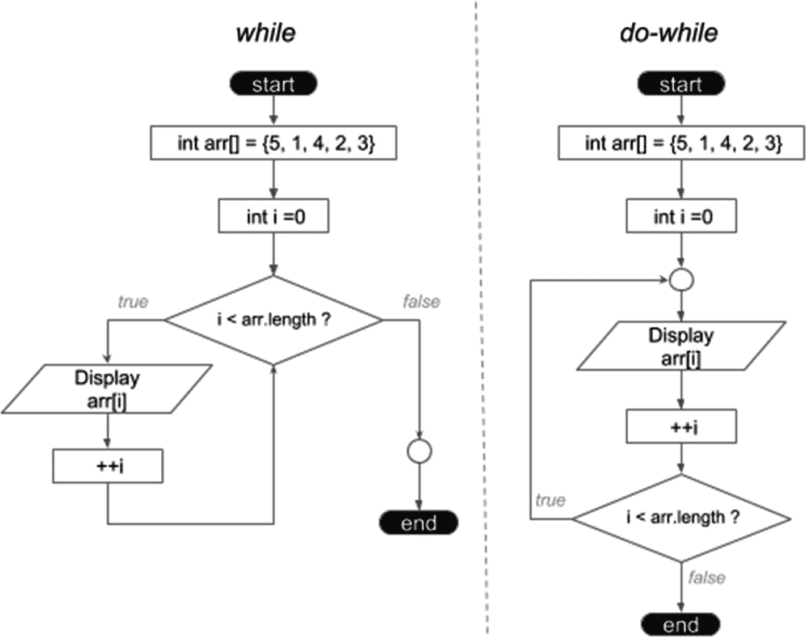

# 7. 控制流

前几章介绍了如何创建语句以及使用哪些运算符。有时，为了让你能够运行代码，我们会加入一些逻辑元素。本章将专门讲解如何利用基础编程中的条件语句和循环语句来控制代码的执行流程。

解决方案和算法可以用流程图来表示。到目前为止，我们在本章之前所做的大部分编程工作都包含声明和打印语句——这些是简单的单步语句。请看下面这段代码。

```
package com.apress.bgn.ch7;
public class Main {
public static void main(String... args) {
String text = "sample";
System.out.println(text);
}
}
```

如果我们要为它设计一个流程图，那么该图将简单且线性，没有判断和重复，如图 7-1 所示。



图 7-1

简单的流程图示例

但解决实际问题通常需要比这更复杂的逻辑，因此需要更复杂的语句。在深入探讨之前，我们先描述一下流程图的组成部分，因为本章会大量用到它们。表 7-1 列出了流程图的元素。

表 7-1

流程图元素

| **形状** | **名称** | **作用** |
| --- | --- | --- |
|  | 起止框 | 表示程序的开始或结束，并包含与其作用相关的文本。 |
|  | 流程线 | 表示程序的流向，即操作的顺序。 |
|  | 输入/输出框 | 表示变量的声明和值的输出。 |
|  | 处理框 | 简单的处理语句：赋值、值的变化等。 |
|  | 判断框 | 显示决定某条执行路径的条件操作。 |
|  | 预定义处理框 | 表示在其他地方定义的处理过程。 |
|  | 页内连接符 | 通常带有标签，表示流程在同一页上的延续。 |
|  | 页外连接符 | 通常带有标签，表示流程在不同页面上的延续。 |
|  | 注释框（或注解） | 当流程或某个元素需要额外解释时，使用此类元素引入。 |

表中展示的流程图元素相当标准；你可能会在任何编程课程或教程中找到非常相似的元素。经过这番扎实的介绍之后，现在正是深入探讨的好时机。

## if-else 语句

Java 中最简单的判断流程语句是 `if-else` 语句（可能在其他语言中也是如此）。在前几章的代码示例中，你可能已经见过 `if-else` 语句。这是无法避免的，因为提供可运行的代码来鼓励你动手编写自己的代码非常重要。但在本节中，我们将严格聚焦于这类语句。

让我们设想这样一个场景：我们运行一个 Java 程序，用户提供一个数值参数。如果该数字是偶数，我们在控制台打印 `EVEN`；否则，打印 `ODD`。与此场景匹配的流程图如图 7-2 所示。



图 7-2

if-else 流程图示例

条件被求值为一个 `boolean` 值，如果结果为 `true`，则执行 `if` 分支对应的语句；如果结果为 `false`，则执行 `else` 分支对应的语句。

实现此流程图所描述过程的 Java 代码如下所示。

```
package com.apress.bgn.ch7;
public class IfFlowDemo {
public static void main(String... args) {
//读取 a
int a = Integer.parseInt(args0);
if (a % 2 == 0) { // 是否为偶数
//显示 EVEN
System.out.println("EVEN");
} else {
//显示 ODD
System.out.println("ODD");
}
}
}
```

要使用不同的参数运行此类，你必须创建一个 IntelliJ IDEA 启动器，并在**程序参数**文本字段中添加你的参数，正如本书开头所解释的那样。上面代码片段中的每条 Java 语句都配有一个与流程图元素对应的注释，以使实现更加清晰。有趣的是，`if` 语句的两个分支并非都是必需的。有时，如果某个值满足条件，你想打印一些内容，但你对其他情况不感兴趣。例如，给定一个用户提供的参数，如果数字为负数，我们想打印一条消息，但如果数字为正数，我们则不想打印或执行任何其他操作。对应的流程图如图 7-3 所示。



图 7-3

缺少 else 分支的 if 流程图示例

Java 代码如下所示：

```
package com.apress.bgn.ch7;
public class IfFlowDemo {
public static void main(String... args) {
//读取 a
int a = Integer.parseInt(args0);
if (a < 0) {
System.out.println("Negative");
}
}
}
```

同样，语句可以变得简单，同样地，如果需要，我们也可以将多个 `if-else` 语句链接在一起。让我们考虑以下示例：用户输入一个 1 到 12 之间的数字，我们必须打印该数字对应的月份所属的季节。流程图会是什么样子？你认为图 7-4 符合这个场景吗？



图 7-4

复杂的 if-else 流程图示例

看起来很复杂，对吧？等你看到与该图匹配的代码时，你会更惊讶，如下一个代码片段所示。

```
package com.apress.bgn.ch7;
public class SeasonDemo {
public static void main(String... args) {
//读取 a
int a = Integer.parseInt(args[0]);
if(a == 12 || (a>=1 && a2 && a 5 && a 8 && a <= 11 ) {
System.out.println("Autumn");
} else {
System.out.println("Error");
}
}
}
}
}
}
```

看起来很丑，对吧？但幸运的是，Java 提供了一种简化它的方法，特别是因为让这么多只包含另一个 `if` 语句的 `else` 块存在是没有意义的。简化后的代码将 `else` 语句与其中包含的 `if` 语句连接起来。最终代码看起来如下一个代码片段所示。


```
package com.apress.bgn.ch7;
public class SeasonDemo {
public static void main(String... args) {
//读取 a
int a = Integer.parseInt(args0);
if (a == 12 || (a >= 1 && a  2 && a  5 && a  8 && a <= 11) {
System.out.println("秋季");
} else {
System.out.println("错误");
}
}
}
```

用户提供的任何不在 `[1,12]` 范围内的参数都会导致程序输出 `Error`。如果你想亲自测试，可以修改 IntelliJ IDEA 启动器。需要关注的部分已在图 7-5 中加下划线标出。



图 7-5

IntelliJ IDEA 启动器与参数

## switch 语句

当某个值需要针对一组固定值执行不同操作时，随着这组值的数量增加，`if` 语句可能会变得愈发复杂。在这种情况下，更合适的语句是 `switch` 语句。我们先看代码，再探讨可以改进的地方。

```
package com.apress.bgn.ch7;
public class SeasonSwitchDemo {
public static void main(String... args) {
//读取 a
int a = Integer.parseInt(args[0]);
var season = "";
switch (a) {
case 1:
season = "冬季";
break;
case 2:
season = "冬季";
break;
case 3:
season = "春季";
break;
case 4:
season = "春季";
break;
case 5:
season = "春季";
break;
case 6:
season = "夏季";
break;
case 7:
season = "夏季";
break;
case 8:
season = "夏季";
break;
case 9:
season = "秋季";
break;
case 10:
season = "秋季";
break;
case 11:
season = "秋季";
break;
case 12:
season = "冬季";
break;
default:
System.out.println("错误");
}
System.out.println(season);
}
}
```

嗯……这看起来不太实用，至少对于这个场景来说是这样。在展示 `switch` 语句的不同写法之前，我们先解释一下它的结构和逻辑。`switch` 语句的通用模板如下：

```
switch ([onvar]) {
case [option]:
[statement;]
break;
...
default:
[statement;]
}
```

方括号中的术语在以下列表中详细说明。

*   `[onvar]` 是与 `case` 语句进行匹配以选择执行语句的变量。它可以是任何基本类型、枚举类型，以及从 Java 7 开始支持的 `String` 类型。显然，`switch` 语句不受限于结果为 `boolean` 的条件，这提供了很大的灵活性。

*   `case [option]` 是一个值，用于与变量进行匹配，以决定要执行的语句。正如关键字所示，它是一个 `case`。

*   `[statement]` 是当 `[onvar] == [option]` 时要执行的一条语句或一组语句。考虑到没有 `else` 分支，我们必须确保只执行与第一个匹配项对应的语句，这就是 `break;` 语句的作用。`break` 语句会停止当前执行路径，并将执行点移动到包含它的语句之外的下一条语句。我将在本章后面介绍它。如果没有 `break`，在第一次匹配之后，会遍历所有后续的 `case`，并执行它们对应的语句。

因此，如果我们执行上述程序并提供数字 7 作为参数，将会输出文本 *夏季*。但如果注释掉 case 7 和 case 8 的 `break` 语句，输出将变为 *秋季*。

*   `default [statement;]` 是当没有找到匹配的 `case` 时执行的语句，`default` 分支不需要 `break` 语句。如果使用 `[1-12]` 区间之外的任何数字运行上述程序，将会输出 `Error`，因为会执行默认语句。

现在你已经了解了 `switch` 的工作原理，让我们看看如何简化之前的语句。月份示例很适合这里，因为它可以进一步修改，以展示当多个 case 需要执行同一条语句时，如何简化 `switch` 语句。在我们的代码中，每个赋值语句都写了三次，这有点冗余。`switch` 可以通过分组 case 来避免这种情况。代码如下所示。

```
package com.apress.bgn.ch7;
public class SeasonSwitchDemo {
public static void main(String... args) {
//读取 a
int a = Integer.parseInt(args0);
var season = "";
switch (a) {
case 1:
case 2:
case 12:
season = "冬季";
break;
case 3:
case 4:
case 5:
season = "春季";
break;
case 6:
case 7:
case 8:
season = "夏季";
break;
case 9:
case 10:
case 11:
season = "秋季";
break;
default:
System.out.println("错误");
}
System.out.println(season);
}
}
```

这种情况下的分组代表将需要执行相同语句的 case 对齐，并且只在最后一个 case 中编写该语句一次。这看起来仍然有点奇怪，但这是减少语句重复的唯一方法。之前案例中的行为之所以可能，是因为每个没有 `break` 语句的 case 后面都会跟着下一个 case 语句。

在 Java 7 中，`switch` 语句开始支持 `String` 值。`switch` 支持 `String` 值的主要问题是始终存在抛出 `NullPointerException` 的风险，因为使用 `equals` 方法来测试项的匹配，而 `switch` 语句中使用的变量可能为 null。此外，由于使用了 `equals`，比较是区分大小写的。如果我们修改前面的示例，要求用户输入代表月份的文本，并使用 `switch` 来决定输出哪个季节，除非我们在 case 选项中使用与用户编写参数时完全相同的文本，否则将无法获得预期结果。

代码修改为：

```
package com.apress.bgn.ch7;
public class StringSwitchSeasonDemo {
public static void main(String... args) {
//读取 a
String a = args0;
var season = "";
switch (a) {
case "january":
case "february":
case "december":
season = "冬季";
break;
case "march":
case "april":
case "may":
season = "春季";
break;
case "june":
case "july":
case "august":
season = "夏季";
break;
case "september":
case "october":
case "november":
season = "秋季";
break;
default:
System.out.println("错误");
}
System.out.println(season);
}
}
```

如果我们使用 `"january"` 参数运行上述程序，控制台将输出文本 `"冬季"`。如果我们使用 `"january"` 参数运行它，控制台将输出文本 `"错误"`。而如果我们使用 `null` 运行它，则会在 `switch` 语句开始的行抛出 `NullPointerException`。

关于 `switch` 语句，这就是所有需要说明的内容。在实践中，根据你尝试开发的解决方案，你可能会决定结合使用 `if` 和 `switch` 语句。

不幸的是，由于其独特的逻辑和灵活的可选数量，很难为 `switch` 语句绘制流程图，但我还是尝试了一下，如图 7-6 所示。



图 7-6

switch 语句流程图


## 循环语句

在编程中，有时我们需要重复执行涉及相同变量的步骤。为了完成任务而一遍又一遍地编写相同的语句是荒谬的。让我们以对整型数组进行排序为例。实现这一目标最著名的算法，也是编程课程中首先教授的算法，因为它简单，被称为*冒泡排序*。该算法将数组中的元素两两比较，如果顺序不对就交换它们。它会一遍又一遍地遍历数组，直到不再需要交换为止。该算法的效果如图 7-7 所示。



图 7-7

冒泡排序的阶段与效果

该算法执行两种类型的循环：一种使用索引遍历数组的每个元素。并且这种遍历会重复进行，直到不需要交换为止。在 Java 中，可以使用不同的循环语句以多种方式编写此算法。但我们稍后会讲到，让我们慢慢来。

Java 中有三种类型的循环语句。

*   `for` 语句

*   `while` 语句

*   `do-while` 语句

`for` 循环语句是最常用的，但 `while` 和 `do-while` 也有其用途。

### for 语句

`for` 语句推荐用于遍历可计数的对象，如数组和列表。例如，遍历数组并打印其每个值，就像以下代码示例所示的那样简单。

```
package com.apress.bgn.ch7;
public class ForLoopDemo {
public static void main(String... args) {
int arr[] = {5, 1, 4, 2, 3};
for (int i = 0; i < arr.length; ++i) {
System.out.println("arr[" + i + "] = " + arr[i]);
}
}
}
```

基于前面的示例，可以绘制出 `for` 语句的流程图，如图 7-8 所示。以下代码片段展示了 `for` 循环的模板。



图 7-8

for 语句流程图

```
for ([int_expr]; [condition];[step]){
[code_block]
}
```

方括号中的每个术语都有特定的用途，下面将进行解释。

*   **[init_expr]** 是一个初始化表达式，用于设置此循环使用的计数器的初始值。它以 `;` 结尾，并且不是强制性的，因为初始化可以在语句外部完成，特别是当我们稍后在代码中且在语句外部使用计数器变量时。前面的代码可以这样写：

*   **[condition]** 是循环的终止条件，只要此条件求值为 `true`，循环就会继续执行。该条件以 `;` 结尾，有趣的是，它也不是强制性的，因为终止条件可以放在循环重复执行的代码内部。因此，前面的代码可以进一步修改，写成这样：

```
package com.apress.bgn.ch7;
public class ForLoopDemo {
public static void main(String... args) {
int arr[] = {5, 1, 4, 2, 3};
int i = 0;
for (; i < arr.length; ++i) {
System.out.println("arr[" + i + "] = " + arr[i]);
}
System.out.println("Loop exited with index: " + i);
}
}
```

*   **[step]** 是步进表达式或增量，用于在循环的每一步增加计数器的值。它应以 `;` 结尾，但通常被省略，并且正如你可能已经预料到的，它也不是强制性的，因为没有什么能阻止开发者在代码块内部操作计数器。因此，前面的代码也可以这样写：

```
package com.apress.bgn.ch7;
public class ForLoopDemo {
public static void main(String... args) {
int arr[] = {5, 1, 4, 2, 3};
int i = 0;
for (; ; ++i) {
if (i >= arr.length) {
break;
}
System.out.println("arr[" + i + "] = " + arr[i]);
}
System.out.println("Loop exited with index: " + i);
}
}
```

```
package com.apress.bgn.ch7;
public class ForLoopDemo {
public static void main(String... args) {
int arr[] = {5, 1, 4, 2, 3};
int i = 0;
for (; ;) {
if (i >= arr.length) {
break;
}
System.out.println("arr[" + i + "] = " + arr[i]);
++i;
}
System.out.println("Loop exited with index: " + i);
}
}
```

计数器的修改不一定非要在代码内部完成；也可以在终止条件中完成，但初始化表达式和终止条件必须相应地进行修改以适应目的。接下来展示的代码与之前所有示例具有相同的效果。

```
package com.apress.bgn.ch7;
public class ForLoopDemo {
public static void main(String... args) {
int arr[] = {5, 1, 4, 2, 3};
for (int i = -1; i++ < arr.length -1;) {
System.out.println("arr[" + i + "] = " + arr[i]);
}
System.out.println("Loop exited with index: " + i);
}
}
```

`step` 表达式不一定非得是递增操作。它可以是任何修改计数器值的表达式。除了 `++i` 或 `i++`，你可以使用 `i = i + 1`，或 `i = i + 3`，甚至如果从较大的索引开始遍历数组或列表，也可以使用递减操作。任何能够将计数器保持在其声明类型的边界内以及索引范围内的数学运算都可以安全使用。


*   `[code_block]` 是一个在循环的每一步中重复执行的代码块。如果这段代码中没有退出条件，那么该代码块会按照计数器通过终止条件的次数来执行。

这是 `for` 循环语句的基本形式，但在 Java 中还有其他遍历一组值的方法。假设我们不是遍历数组，而是要遍历一个列表。

```
package com.apress.bgn.ch7;
import java.util.List;
public class ForLoopDemo {
public static void main(String... args) {
List list = List.of(5, 1, 4, 2, 3);
for (int j = 0; j < list.size(); ++j) {
System.out.println("list[" + j + "] = " + list.get(j));
}
}
}
```

这段代码看起来有些笨拙，这就是为什么 `List<>` 实例可以用另一种 `for` 语句来遍历，这种语句在 Java 8 之前被称为 `forEach`。你马上就会明白原因，但首先让我们看看 `forEach`*。*

```
package com.apress.bgn.ch7;
import java.util.List;
public class ForLoopDemo {
public static void main(String... args) {
List list = List.of(5, 1, 4, 2, 3);
for (Integer item : list) {
System.out.println(item);
}
}
}
```

这种 `for` 语句也被称为具有*增强语法*，它基本上会对其表达式中使用的集合中的每个项目执行代码块。这意味着它适用于任何实现了 `Collection` 接口的实现，也适用于数组。所以，示例代码可以这样写：

```
package com.apress.bgn.ch7;
public class ForLoopDemo {
public static void main(String... args) {
int arr[] = {5, 1, 4, 2, 3};
for (int item : arr) {
System.out.println(item);
}
}
}
```

显然，在这种情况下，最大的好处是我们不再需要终止条件或计数器了。从 Java 8 开始，具有增强语法的 `for` 语句不再需要 `forEach` 这个名称，因为 `forEach` 默认方法已被添加到所有 `Collection` 扩展中。将其与 lambda 表达式结合，打印列表元素的代码就变成了：

```
package com.apress.bgn.ch7;
import java.util.List;
public class ForLoopDemo {
public static void main(String... args) {
List list = List.of(5, 1, 4, 2, 3);
list.forEach(item -> System.out.println(item));
//或者
list.forEach(System.out::println);
}
}
```

很简洁，对吧？但等等，还有更多，它也适用于数组，但首先需要将其转换为合适的 `BaseStream` 实现。不过，这可以通过 `Arrays` 工具类来实现，该类在 Java 8 中得到了增强，添加了支持 lambda 表达式的方法。所以，是的，使用 `arr` 数组的代码（从 Java 8 开始）可以这样写：

```
package com.apress.bgn.ch7;
public class ForLoopDemo {
public static void main(String... args) {
int arr[] = {5, 1, 4, 2, 3};
Arrays.stream(arr).forEach(System.out::println);
}
}
```

在 Java 11 中，上述所有示例都能正常编译和执行，因此在编写解决方案时，你可以使用自己最喜欢的任何语法。

### while 语句

`while` 语句与 `for` 语句的不同之处在于，它没有固定数量的执行步骤，因此并不总是需要计数器。`while` 语句执行的重复次数仅取决于控制该次数的继续条件被评估为 `true` 的次数。因此，该语句的通用模板如下所示：

```
while ([eval(condition)] == true) {
[code_block]
}
```

`while` 语句实际上也不需要初始化语句，因为它可以放在代码块内部或语句外部。`while` 语句可以替代 `for` 语句，但 `for` 语句的优势在于它将初始化、终止条件和计数器的修改封装在一个单独的块中，因此更加简洁。数组遍历的代码示例可以使用 `while` 语句重写；代码如下所示。

```
package com.apress.bgn.ch7;
public class WhileLoopDemo {
public static void main(String... args) {
int arr[] = {5, 1, 4, 2, 3};
int  i=0;
while(i < arr.length){
System.out.println("arr[" + i + "] = " + arr[i]);
++i;
}
}
}
```

如你所见，计数器变量 `int i=0;` 的声明和初始化是在语句外部完成的，而计数器的递增是在要重复的代码块内部完成的。基本上，此时如果我们为此场景设计流程图，它将与图 7-9 中描绘的 `for` 语句相同。

听起来可能难以置信，但 `[condition]` 也不是强制性的，因为它可以直接替换为 `true`。但在这种情况下，你必须确保在某个时刻执行的代码块中存在一个退出条件；否则，执行很可能会以错误结束。并且这个条件必须放在代码块的开头，以防止在不应该执行的情况下执行有用的逻辑。对于我们的简单示例，我们不希望对索引超出数组范围的元素调用 `System.out.println`。

```
package com.apress.bgn.ch7;
public class WhileLoopDemo {
public static void main(String... args) {
int arr[] = {5, 1, 4, 2, 3};
int  i=0;
while(true){
if (i >= arr.length) {
break;
}
System.out.println("arr[" + i + "] = " + arr[i]);
++i;
}
}
}
```

`while` 语句最适合用于处理并非始终在线的资源。假设我们为应用程序使用了一个位于不稳定网络中的远程数据库。与其在第一次超时后就放弃保存数据，我们可以不断尝试直到成功，对吧？这可以通过使用一个在其代码块中尝试初始化连接对象的 `while` 语句来实现。代码大致如下：

```
package com.apress.bgn.ch7;
import java.sql.*;
public class ConnectionTester {
public static void main(String... args) throws Exception {
Connection con = null;
while (con == null) {
try {
Class.forName("com.mysql.cj.jdbc.Driver");
con = DriverManager.getConnection(
"jdbc:mysql://localhost:3306/sample", "root", "pass");
} catch (Exception e) {
System.out.println("连接被拒绝。5 秒后重试 ...");
Thread.sleep(5000);
}
}
// con != null, 执行某些操作
Statement stmt = con.createStatement();
ResultSet rs = stmt.executeQuery("select * from test");
while (rs.next()) {
System.out.println(rs.getInt(1) + "  " + rs.getString(2));
}
con.close();
}
}
```

这段代码的问题在于它会永远运行下去；如果我们想在一定时间后放弃尝试，就必须引入一个变量来记录尝试次数，然后使用 `break` 语句退出循环。


```
package com.apress.bgn.ch7;
import java.sql.*;
public class ConnectionTester {
public static final int MAX_TRIES = 10;
public static void main(String... args) throws Exception {
int cntTries = 0;
Connection con = null;
while (con == null && cntTries < MAX_TRIES) {
try {
Class.forName("com.mysql.cj.jdbc.Driver");
con = DriverManager.getConnection(
"jdbc:mysql://localhost:3306/sample", "root", "pass");
} catch (Exception e) {
++cntTries;
System.out.println("Connection refused. Retrying in 5 seconds ...");
Thread.sleep(5000);
}
}
if (con != null) {
// con != null, do something
Statement stmt = con.createStatement();
ResultSet rs = stmt.executeQuery("select * from test");
while (rs.next()) {
System.out.println(rs.getInt(1) + "  " + rs.getString(2));
}
con.close();
} else {
System.out.println("Could not connect!");
}
}
}
```

因此，根据经验法则，**在使用循环语句时，务必确保存在退出条件**。

既然我们已经涵盖了实现图 7-9 中冒泡排序算法所需的所有语句，接下来让我们看看代码是什么样的。请注意，该算法有多种实现方式，但以下代码最符合前文的解释。因此，当数组中的元素未按正确顺序排列时，会反复遍历数组，并交换相邻元素，使其符合所需的顺序（本例中为升序）。

```
package com.apress.bgn.ch7;
import java.util.Arrays;
public class BubbleSortDemo {
public static final int arr[] = {5, 1, 4, 2, 3};
public static void main(String... args) {
boolean swapped = true;
while (swapped) {
swapped = false;
for (int i = 0; i < arr.length - 1; i++) {
if (arr[i] > arr[i + 1]) {
int temp = arr[i];
arr[i] = arr[i + 1];
arr[i + 1] = temp;
swapped = true;
}
}
}
Arrays.stream(arr).forEach(System.out::println);
}
}
```

运行时，代码会交换 `arr` 数组中的元素，直到它们全部按升序排列，因此代码的最后一行会打印修改后的 `arr`：

```

```

### do-while 语句

`do-while` 语句与 `while` 类似，但有一个区别：继续条件是在执行代码块之后才进行求值。这会导致代码块至少被执行一次，除非其中嵌入了退出条件。该语句的通用模板如下所示：

```
do {
[代码块]
} while ([eval(条件)] == true)
```

大多数情况下，`while` 和 `do-while` 语句可以轻松互换，有时只需对代码块的逻辑进行微小改动。例如，遍历数组并打印其元素值也可以使用 `do-while` 实现，而无需更改代码块。图 7-9 展示了两种实现方式的对比：左侧为 `while`，右侧为 `do-while`。



图 7-9

用于打印数组元素的 while 和 do-while 实现

这两个示例的流程图（见图 7-10）揭示了两种语句之间的不同逻辑。



图 7-10

while 与 do-while 语句流程图对比

当代码块必须至少执行一次时，`do-while` 语句最为适用；否则，我们会不必要地先对条件进行一次求值。还记得那个尝试在不稳定网络中连接数据库的代码示例吗？使用 `while` 时，执行会从测试连接是否不为 null 开始，但此时连接甚至尚未初始化。

```
Connection con = null;
while (con == null) {
Class.forName("com.mysql.cj.jdbc.Driver");
con = DriverManager.getConnection(
"jdbc:mysql://localhost:3306/sample", "root", "pass");
...
}
```

这种实现虽然功能上可行，但略显冗余，且逻辑不符合编程最佳实践。更合适的做法是采用 `do-while` 实现，避免测试 `con` 实例是否为 null，因为很明显它确实是 null，如下所示。

```
package com.apress.bgn.ch7;
import java.sql.*;
public class DoConnectionTester {
public static final int MAX_TRIES = 10;
public static void main(String... args) throws Exception {
int cntTries = 0;
Connection con = null;
do {
try {
Class.forName("com.mysql.cj.jdbc.Driver");
con = DriverManager.getConnection(
"jdbc:mysql://localhost:3306/sample", "root", "pass");
} catch (Exception e) {
++cntTries;
System.out.println("Connection refused. Retrying in 5 seconds ...");
Thread.sleep(5000);
}
} while  (con == null && cntTries < MAX_TRIES);
if (con != null) {
// con != null, do something
Statement stmt = con.createStatement();
ResultSet rs = stmt.executeQuery("select * from test");
while (rs.next()) {
System.out.println(rs.getInt(1) + "  " + rs.getString(2));
}
con.close();
} else {
System.out.println("Could not connect!");
}
}
}
```

诚然，跳过条件求值并非重大的优化，但在大型应用程序中，每一点微小的优化都至关重要。

## 中断循环与跳过步骤

在前面的示例中，我提到过使用 `break` 语句退出循环。有三种方式可以控制循环的行为：

*   `break` 语句退出循环，如果带有标签，则会中断带有该标签的循环；这在存在多层嵌套循环时非常有用，因为我们可以从任何嵌套循环中跳出，而不仅仅是包含该语句的循环。
*   `continue` 语句会跳过其后的任何代码执行，并继续执行下一步。
*   `return` 语句用于退出方法，因此如果循环、`if` 或 `switch` 语句位于方法体内，它也可用于退出循环。关于最佳实践，不应滥用 `return` 语句退出方法，因为这可能会使执行流程难以理解。


### break 语句

`break` 语句只能用在 `switch`、`for`、`while` 和 `do-while` 语句中。你已经看到它如何在 `switch` 语句中使用；现在我们来看看它在其他语句中的用法。

使用 `break` 语句可以跳出 `for`、`while` 或 `do-while` 循环，但它必须由一个退出条件来控制；否则，不会执行任何步骤。在下面的代码示例中，即使 `for` 循环本应遍历所有元素，我们也只打印前三个元素。如果索引等于 3，我们就退出循环。

```
package com.apress.bgn.ch7;
public class ManipulationDemo {
public static final int arr[] = {5, 1, 4, 2, 3};
public static void main(String... args) {
for (int i = 0; i < arr.length ; ++i) {
if  (i == 3) {
System.out.println("Bye bye!");
break;
}
System.out.println("arr[" + i + "] = " + arr[i]);
}
}
}
```

如果遇到嵌套循环的情况，可以使用标签来决定要跳出哪个循环语句。例如，在下面的代码中，我们有三个嵌套的 `for` 循环，当所有索引都相等时，我们退出中间的循环。

```
package com.apress.bgn.ch7;
public class ManipulationDemo {
public static final int arr[] = {5, 1, 4, 2, 3};
public static void main(String... args) {
for (int i = 0; i < 2; ++i) {
HERE: for (int j = 0; j < 2; ++j) {
for (int k = 0; k < 2; ++k) {
System.out.println("(i, j, k) = (" + i + "," + j + "," + k + ")");
if (i == j && j == k) {
break HERE;
}
}
}
}
}
}
```

代码示例中使用的标签名为 `HERE`，它位于满足条件时被退出的 `for` 语句之前，并跟在 `break` 语句之后。在开发中，将标签名全部大写被认为是一种最佳实践，因为这可以避免在阅读代码时将标签与变量或类名混淆。

为了确保其正常工作，你可以查看控制台，看看是否所有 `(i,j,k)` 的组合（包括 `i = j = k` 及其之后的所有组合）都不再打印。在这种情况下，所有以 0 开头的组合都被跳过了，这就是控制台中显示的内容。

```
(i, j, k) = (1,0,0)
(i, j, k) = (1,0,1)
(i, j, k) = (1,1,0)
```

### continue 语句

`continue` 语句不会中断循环，但可以根据条件跳过某些步骤。所以，它基本上会停止循环的当前步骤并进入下一步，因此你可以说这个语句是让循环继续。让我们继续用数组遍历的例子进行实验，这次我们使用 `continue` 语句跳过打印奇数索引的元素。

```
package com.apress.bgn.ch7;
public class ManipulationDemo {
public static final int arr[] = {5, 1, 4, 2, 3};
public static void main(String... args) {
for (int i = 0; i < arr.length; ++i) {
if (i % 2  != 0) {
continue;
}
System.out.println("arr[" + i + "] = " + arr[i]);
}
}
}
```

这个语句必须有条件；否则，循环将进行无用的迭代。`continue` 语句也可以与标签一起使用。让我们采用一个与之前三个嵌套 `for` 循环类似的例子，但这次，当 `k` 索引等于 1 时，不打印任何内容，并跳到包含 `k` 循环的下一轮迭代。

```
package com.apress.bgn.ch7;
public class ManipulationDemo {
public static final int arr[] = {5, 1, 4, 2, 3};
public static void main(String... args) {
for (int i = 0; i < 3; ++i) {
HERE:
for (int j = 0; j < 3; ++j) {
for (int k = 0; k < 3; ++k) {
if (k == 1) {
continue HERE;
}
System.out.println("(i, j, k) = (" + i + "," + j + "," + k + ")");
}
}
}
}
}
```

为了确保其正常工作，你可以查看控制台，看看打印出了哪些组合。我们可以清楚地注意到，没有打印出任何包含 `k=1` 或 `k=2` 的组合。

```
(i, j, k) = (0,0,0)
(i, j, k) = (0,1,0)
(i, j, k) = (0,2,0)
(i, j, k) = (1,0,0)
(i, j, k) = (1,1,0)
(i, j, k) = (1,2,0)
(i, j, k) = (2,0,0)
(i, j, k) = (2,1,0)
(i, j, k) = (2,2,0)
```

### ！

在 Java 社区中，使用标签跳出循环的做法是不被提倡的，因为跳转到标签类似于 `goto` 语句，而 `goto` 语句在某些老式编程语言中仍然可以找到。`goto` 是 Java 的一个保留关键字，因为该语句曾存在于 JVM 的第一个版本中，但后来被移除了。使用跳转会降低代码的可读性、可测试性，并助长不良设计。这就是为什么 `goto` 在后续版本中被移除，但任何此类操作的需求都可以通过 `break` 和 `continue` 语句来实现。

### return 语句

return 语句很简单。它用于退出方法体的执行。如果方法返回一个值，`return` 语句会附带返回的值。`return` 语句可用于退出本节中提到的任何语句。它可以作为一种巧妙的方法来缩短方法的执行，因为当前方法的执行会停止，并从调用该方法的代码点继续处理。

让我们看几个例子。首先，我们编写一个方法，在数组中查找第一个偶数元素；如果找到，该方法返回其索引；否则，返回 -1。

```
package com.apress.bgn.ch7;
public class ReturnDemo {
public static final int arr[] = {5, 1, 4, 2, 3};
public static void main(String... args) {
int foundIdx = findEven(arr);
if (foundIdx != -1) {
System.out.println("First even is at: " + foundIdx);
}
}
public static int findEven(int ... arr) {
for (int i = 0; i < arr.length; ++i) {
if (arr[i] %2 == 0) {
return i;
}
}
return -1;
}
}
```

让我们用 `while` 语句编写同样的方法。

```
package com.apress.bgn.ch7;
public class ReturnDemo {
public static final int arr[] = {5, 1, 4, 2, 3};
public static void main(String... args) {
int foundIdx = findEven(arr);
if (foundIdx != -1) {
System.out.println("First even is at: " + foundIdx);
}
}
public static int findEven(int ... arr) {
int i = 0;
while (i < arr.length) {
if (arr[i] % 2 == 0) {
return i;
}
++i;
}
return -1;
}
}
```

`return` 语句可以在任何我们想要在满足条件时终止方法执行的情况下使用。


## 使用 try-catch 结构控制流程

本书之前已经提及过异常和 `try-catch` 语句，但并未将其作为控制执行流程的工具来讨论。在进入解释和示例之前，我们先来讨论一下 `try-catch-finally` 语句的通用模板。

```
try {
[代码块]
} catch ([异常块]) {
[处理代码块]
} finally {
[清理代码块]
}
```

我将逐一解释每个组成部分。

*   `[代码块]` 是要执行的代码块。

*   `[异常块]` 是 `[代码块]` 可能抛出的一个或多个异常类型的声明。

*   `[处理代码块]` —— 抛出异常标志着出现了意外情况，必须进行处理。一旦捕获到异常，就会执行这段代码来*处理它*，无论是尝试将系统恢复到正常状态，还是记录有关异常原因的详细信息。

*   `[清理代码]` 是一段用于释放资源或将对象设置为 null 以便进行垃圾回收的代码块。

现在你了解了 `try-catch-finally` 的工作原理，大概能想象出如何使用它来控制执行流程了。基本上，在 `[代码块]` 中，你可以显式地抛出异常，并决定如何处理它们。

考虑到我们一直使用的数组，我们将再次基于它来设计一段代码。首先，让我们编写一段在发现偶数值时抛出异常的代码。

```
package com.apress.bgn.ch7.ex;
public class ExceptionFlowDemo {
public static final int arr[] = {5, 1, 4, 2, 3};
public static void main(String... args) {
try {
checkNotEven(arr);
System.out.println("未发现偶数，一切正常！");
} catch (EvenException e) {
System.out.println(e.getMessage());
} finally {
System.out.println("正在清理数组 arr");
for (int i = 0; i < arr.length; ++i) {
arr[i] = 0;
}
}
}
public static int checkNotEven(int... arr) throws EvenException {
for (int i = 0; i < arr.length; ++i) {
if (arr[i] % 2 == 0) {
throw new EvenException("在索引 " + i + " 处未预料到偶数值");
}
}
return -1;
}
}
```

`EvenException` 类型是为这个特定示例编写的自定义异常类型，其具体实现在此不相关。如果我们执行这段代码，将打印以下内容。

```
在索引 2 处未预料到偶数值
正在清理数组 arr
```

通过抛出异常，我们将执行流程导向了处理代码，因此 *未发现偶数，一切正常！* 没有被打印出来，并且由于我们有一个 `finally` 块，它也被执行了。

所以，没错，你可以混合搭配：使用不同类型的异常，拥有多个 `catch` 块——任何你解决问题所需的方式都可以。在我之前工作过的一家公司，我偶然发现了一段代码，它正在验证一个文档，并根据未通过的验证检查抛出不同类型的异常，而在 `finally` 块中，我们有一段将错误对象转换为 PDF 的代码。代码看起来类似这样：

```
...
ErrorContainter errorContainer = new ErrorContainter();
try {
validate(report);
} catch (FileNotFoundException | NotParsable e) {
errorContainer.addBadFileError(e);
} catch (InvestmentMaxException e) {
errorContainer.addInvestmentError(e);
} catch (CreditIncompatibilityException e) {
errorContainer.addIncompatibilityError(e);
} finally {
if (errorContainer.isEmpty()) {
printValidationPassedDocument();
} else {
printValidationFailedDocument(errorContainer);
}
}
...
```

`finally` 代码块中的代码很复杂，完全不建议放在那里。但有时在现实世界中，解决方案并不总是遵循最佳实践，甚至不遵循常识性实践。在处理遗留代码时，你可能会发现自己处于需要编写功能尚可但质量欠佳的代码，并且必须快速交付的境地。因为，当然编程很棒，但在某些管理者眼中，结果更重要。如果你足够幸运，在一家着眼于未来代码构建或将其交接给其他团队成员的公司工作，你可能会遇到一位推崇最佳实践的管理者。只要记住尽力而为，并妥善记录所有内容，你就会没事的。

## 总结

本章涵盖了开发中最重要的内容之一：如何设计你的解决方案及其逻辑。你还了解了什么是流程图及其组成部分，它们作为决定如何编写代码以及如何控制执行路径的工具。最后，你学习了使用哪些语句以及何时使用。我们还讨论了一些 Java 最佳实践，以便你能够设计出最适合解决问题的方案。

Java 提供了

*   编写 `if` 语句的简单和更复杂的方式

*   一个 `switch` 语句，适用于任何原始类型、枚举，并且从 Java 7 开始，也适用于 `String` 实例

*   几种编写 `for` 语句的方式

*   如何使用 `forEach` 方法和流来遍历值集合

*   `while` 语句，用于在满足条件之前重复执行某个步骤

*   `do-while` 语句，用于在满足条件之前重复执行某个步骤，但该步骤至少执行一次，因为继续条件是在其之后评估的

*   如何通过使用 `break`、`continue` 和 `return` 等语句来操控循环行为

*   如何通过使用 `try-catch-finally` 结构来控制执行流程

