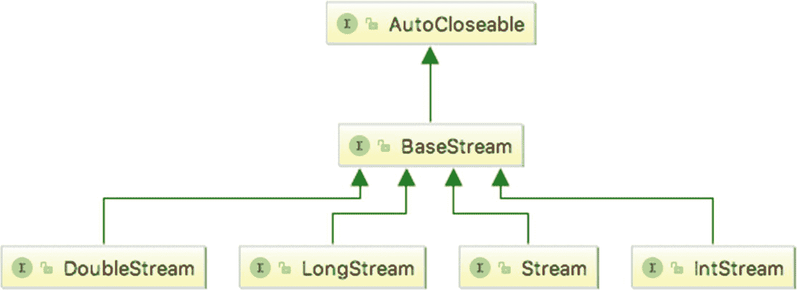
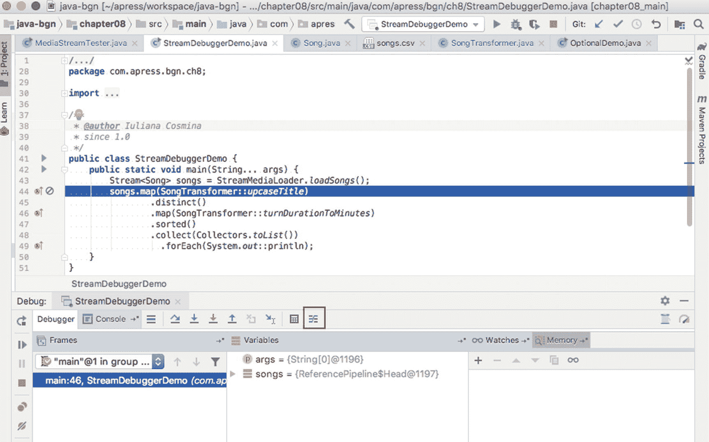
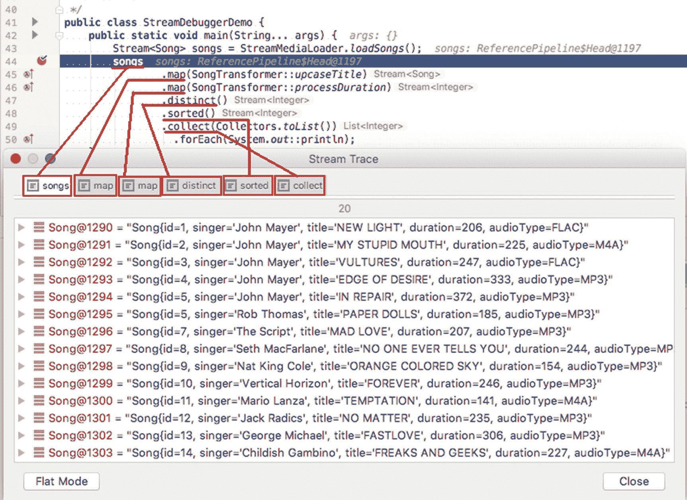
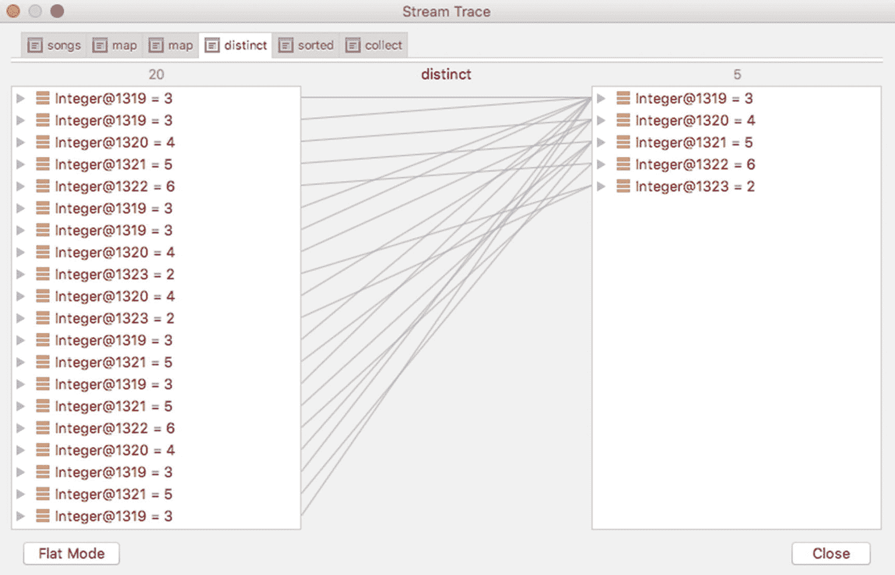
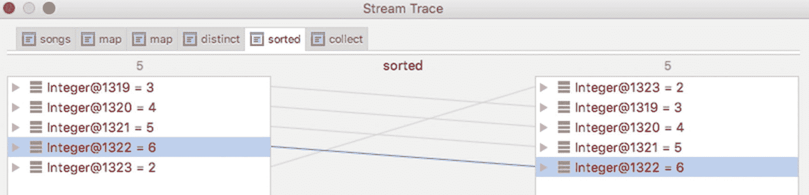

# 8. 流 API

根据 Dictionary.com 的解释，*stream* 一词有不止一种含义。

*   在河道或水道中流动的水体，如河流、小溪或溪流
*   水中的稳定水流，如河流或海洋中
*   水或其他液体或流体的任何流动
*   空气、气体等的电流或流动
*   **任何事物的连续流动或接续**
*   主导方向；趋势
*   *在数字技术中* - **数据流**，如音频广播、电影或实时视频，从源端平稳连续地传输到计算机、移动设备等。

在软件开发语境中，最接近流（stream）的定义是第五个和第七个定义的一部分（以粗体突出显示）。在软件开发中，*流* 是一个来自支持聚合操作的数据源的对象序列。此刻，你心里可能会想：那么，它和集合类似吗？嗯……并不完全一样。


## Streams 简介

假设我们有一个非常大的歌曲集合需要分析。我们要找出所有时长至少为 300 秒的歌曲，将这些歌曲的名称保存到一个列表中，并按时长降序排序。假设我们已经将歌曲存放在一个列表中，代码看起来是这样的：

```
List songList = ...
List resultedSongs = new ArrayList();
for (Song song: songList) {
if (song.getDuration() >= 300) {
resultedSongs.add(song);
}
}
Collections.sort(resultedSongs, new Comparator(){
public int compare(Song s1, Song s2){
return s2.getDuration().compareTo(s1.getDuration());
}
});
System.out.println(resultedSongs);
List finalList = new ArrayList();
for (Song song: resultedSongs) {
finalList.add(song.getTitle());
}
System.out.println(finalList);
```

这段代码的一个问题是处理大型集合的效率并不高。此外，我们反复遍历列表并执行检查才能得到最终结果。如果我们能将所有这些操作链接起来，并在初始列表上执行，那该多好啊？

于是 Java 8 引入了新的 **Stream** 抽象，它表示一个元素序列，可以顺序或并行处理，并支持聚合操作。由于硬件发展的最新演进，CPU 变得更强大、更复杂，包含多个可以并行处理信息的内核。为了在 Java 中利用这些硬件能力，引入了 Fork Join 框架。而在 Java 8 中，*Stream API* 被引入以支持并行数据处理，无需定义和同步线程的样板代码。*Stream API* 的核心接口是 `java.util.stream.BaseStream`。任何具有流能力的对象都是扩展该接口的类型。流本身不存储元素，它不是数据结构，而是用于计算元素并按需提供给某个函数或一组聚合函数。按顺序提供元素涉及内部自动迭代。返回流的函数可以链接成一个 *管道*，这些函数被称为 *中间操作*。它们用于处理流中的元素，并将结果作为流返回给管道中的下一个函数。返回非流结果的函数被称为 *终端操作*，显然位于管道的末尾。在深入探讨之前，先举一个快速示例，之前的代码使用流可以这样写：

```
List finalList = songList.stream().filter(s -> s.getDuration()>= 300)
.sorted(Comparator.comparing(Song::getDuration).reversed())
.map(Song::getTitle)
.collect(Collectors.toList());
System.out.println(finalList);
```

没错，使用流编程真是太棒了。*Stream API* 的概念允许开发者将集合转换为流，编写代码并行处理数据，然后将结果收集到集合中。

由于使用流是一种敏感的编程方式；我建议在设计代码时考虑所有可能性。`NullPointerException` 是 Java 中最常抛出的异常之一。在 Java 8 中，引入了 `Optional<T>` 类来避免此类异常。`Stream<T>` 实例用于存储类型 T 的无限实例，而 `Optional<T>` 是一个可能包含也可能不包含类型 T 实例的实例。由于这两种实现本质上都是其他类型的包装器，因此将它们放在一起讨论。

### ！

出于实际原因，本章中将 `Stream` 实例称为 *流*，类似于将 `List` 实例称为 *列表*，将 `collection` 实例称为 *集合*，等等。

### ！

你可能会注意到引入了术语 *函数*，它指的是在流或其参数上调用的方法。这是因为使用流允许以 **函数式编程** 风格编写 Java 代码。Java 是一种 **面向对象编程** 语言，**对象** 是其核心术语。在函数式编程中，核心术语是 *纯函数*。代码通过组合纯函数来编写，这避免了共享状态，利用了不可变数据，并避免了处理污染的副作用。^(⁶²)

## 创建流

在享受使用流优化代码的乐趣之前，我们先来看看如何创建它们。要创建流，我们需要一个源。这个源可以是任何东西：集合（列表、集合或映射）、数组、用作输入的 I/O 资源（如文件、数据库或任何可以转换为实例序列的东西）。

**流不会修改其源，因此可以从同一源创建多个流实例，并用于不同的操作。**

### 从集合创建流

在本章引言部分的最后一个代码片段中，我们了解了一种从列表创建流的方法。从 Java 8 开始，所有集合接口和类都增加了返回流的默认方法。在以下代码示例中，我们获取一个整数列表，并通过调用其 `stream()` 方法将其转换为流。获得流后，我们使用 `forEach` 方法遍历它，以打印流中的值以及执行此代码的线程名称。你可能会问，为什么要打印线程名称？你很快就会明白。

```
package com.apress.bgn.ch8;
import java.util.List;
public class StreamsDemo {
public static void main(String... args) {
List bigList = List.of( 50, 10, 250, 100 ...);
bigList.stream()
.forEach(i ->
System.out.println(Thread.currentThread().getName() + ": " + i)
);
}
}
```

上述代码创建了一个整数元素的流。`Stream` 接口公开了一组方法，每个 `Stream` 实现都为其提供了具体实现。最常用的是 `forEach` 方法，它遍历流中的元素。`forEach` 方法需要一个 `java.util.function.Consumer<T>` 类型的参数。

### ！

*消费者* 在本书中指的是 `java.util.function.Consumer<T>` 函数式接口的内联实现。这意味着它只有一个方法，实现它的类必须为该接口提供具体实现。该方法名为 `accept(T t)`，接受一个类型为 `T` 的流元素作为参数，处理它，但不返回任何内容。

该方法为流中的每个元素调用，`T` 是流中元素的类型。实现类基本上是通过仅提及方法体来内联声明的。由于 lambda 表达式的魔力，JVM 会处理其余部分。如果没有它们，你将不得不编写如下代码：

```
import java.util.function.Consumer;
...
bigList.stream()
.forEach(new Consumer() {
@Override
public void accept(Integer i) {
System.out.println(Thread.currentThread().getName() + ": " + i);
}
});
```

实际上，这是在 Java 8 引入 lambda 表达式之前编写代码的方式。如果你需要在应用程序的某个特定位置创建实现特定接口的类类型的单个对象，你可以选择编写这样一个看起来像是在实例化接口的复杂结构；该代码的结果被称为 **匿名类**。Lambda 表达式极大地简化了这一过程，但仅适用于一类名为 *函数式接口* 的接口，这些接口定义了一个单一方法，并带有 `@FunctionalInterface` 注解（从 Java 8 开始）。

在前面的示例中，实现打印了线程名称和元素的值。以下是运行该代码的结果。

```
main: 50
main: 10
main: 250
main: 100
...
```

每个数字前面都带有 `main`，这意味着流中的所有整数都由同一个线程顺序处理，并且该线程是应用程序的主线程。


### ！

出于实际考虑，当仅需要顺序流进行遍历时，无需为集合调用 `stream()` 方法，因为集合中定义的 `forEach` 方法已能很好地完成此任务。因此，上述代码可以简化为：

`bigList.forEach(i ->`

`System.out.println(Thread.currentThread().getName() + ": " + i)`

`);`

之所以打印线程名称，是因为还有另一种通过调用 `parallelStream()` 方法来创建流的方式。唯一的区别在于，返回的流是一个并行流。这意味着流中的每个元素都在不同的线程上处理。当然，这也意味着 `Consumer` 的实现必须是线程安全的，并且不能包含涉及不应在线程间共享的实例的代码。打印流元素值的代码既不影响流返回的元素值，也不影响其他外部对象，因此并行化是安全的。那么，让我们使用 `parallelStream()` 代替 `stream` 来创建流，并使用相同的 `Consumer` 实现来打印流中的元素。

```
package com.apress.bgn.ch8;
import java.util.List;
import java.util.function.Consumer;
public class StreamsDemo {
public static void main(String... args) {
List bigList = List.of( 50, 10, 250, 100 ...);
bigList.parallelStream()
.forEach(i ->
System.out.println(Thread.currentThread().getName() + ": " + i)
);
}
}
```

如果我们在控制台中执行这段代码，会看到与下面输出类似但略有不同的结果。

```
ForkJoinPool.commonPool-worker-9: 94
ForkJoinPool.commonPool-worker-7: 10
ForkJoinPool.commonPool-worker-5: 40052
ForkJoinPool.commonPool-worker-3: 50
ForkJoinPool.commonPool-worker-13: 74
ForkJoinPool.commonPool-worker-9: 200
ForkJoinPool.commonPool-worker-11: 250
ForkJoinPool.commonPool-worker-7: 83
ForkJoinPool.commonPool-worker-3: 23
...
```

你首先注意到的是线程名称，我们不再只有一个线程，而是有很多个，它们都命名为 `ForkJoinPool.commonPool-worker-**`。这告诉我们，所有流元素都在不同的线程上处理，但它们都属于同一个*池*。在这种情况下，JVM 会创建一个线程池来容纳几个线程实例，用于并行处理流中的所有元素。使用线程池的好处是线程可以被重用，因此无需创建新的线程实例，这在一定程度上优化了执行时间，但只有在更复杂的解决方案中才能明显体现。如果你查看每个线程关联的数字（线程名称末尾的数字），会发现这些数字有时会重复。这基本上意味着同一个线程被重用来处理另一个流元素。

### 从数组创建流

到目前为止，我们使用的流都是从 `List` 实例创建的。同样的语法也适用于 `Set` 实例。

但流也可以从数组创建。请看下面的代码片段。

```
package com.apress.bgn.ch8;
import java.util.Arrays;
public class ArrayStreamDemo {
public static void main(String... args) {
int[] arr = { 50, 10, 250, 100 ...};
Arrays.stream(arr).forEach(
i -> System.out.println(Thread.currentThread().getName() + ": " + i)
);
}
}
```

工具类 `Arrays` 中的静态方法 `stream(int[] array)` 创建了一个基本类型流。对于包含对象的数组，调用的方法是 `stream(T[] array)`（其中 `T` 是泛型类型），它会被替换为数组中元素的类型。从数组生成的流可以通过调用 `parallel` 方法实现并行化，该方法同样适用于并行流。因此，如下代码可以并行化。

```
package com.apress.bgn.ch8;
import java.util.Arrays;
public class ArrayStreamDemo {
public static void main(String... args) {
int[] arr = { 50, 10, 250, 100 ...};
Arrays.stream(arr).parallel().forEach(
i -> System.out.println(Thread.currentThread().getName() + ": " + i)
);
}
}
```

对于这两种情况，输出结果与之前的示例相同，因此无需再次展示。

数组的新颖之处在于，可以通过指定数组块的起始和结束索引，从数组的一部分创建流。

```
Arrays.stream(arr, 3,6).forEach(
i -> System.out.println(Thread.currentThread().getName() + ": " + i)
);
```

### 创建空流

在编写 Java 代码时，一个好的实践是编写返回对象的方法时避免返回 `null`，以减少抛出 `NullPointerException` 的可能性。当方法返回流时，首选方式是返回一个空流。这可以通过调用 `Stream` 接口的静态方法 `Stream.empty()` 来实现。下面的方法接收一个 `Song` 实例列表作为参数，并使用它作为源返回一个流。如果列表为 `null` 或为空，则返回一个空流。

```
public static Stream asStream(List inputList) {
if (inputList == null || inputList.isEmpty()) {
return Stream.empty();
} else {
return inputList.stream();
}
}
```

### 创建有限流

除了从实际源创建流之外，还可以通过调用流工具方法（如 `Stream.generate()` 或 `Stream.builder()`）即时创建流。

当我们想要构建一个包含固定已知值集合的有限流时，应使用 `builder()` 方法。该方法返回一个 `java.util.stream.Stream.Builder<T>` 实例，这是一个内部接口，声明了一个名为 `add(..)` 的默认方法，需要调用该方法来添加流的元素。要创建 `Stream` 实例，最后必须调用其 `build` 方法。`add(..)` 方法返回对 `Builder` 实例的引用，因此它可以与该类的任何其他方法链式调用。以下代码示例展示了如何使用 `builder()` 方法创建一个包含 `Integer` 值的有限流。

```
Stream built = Stream.builder()
.add(50).add(10).add(250).build();
```

由于 `Builder` 接口是泛型接口，因此必须指定一个类型参数，作为流中元素的类型。此外，`builder()` 方法也是泛型方法，需要在调用之前在其前面提供类型作为参数。如果未指定类型，则默认使用 `Object`。

要创建流，也可以使用 `generate(..)` 方法。该方法接收一个 `java.util.function.Supplier<T>` 类型的实例作为参数。


### !

*供应商*（Supplier）是本书中对 `java.util.function.Supplier<T>` 函数式接口的一种内联实现。该接口要求为其唯一名为 `get()` 的方法提供具体实现。此方法应返回要添加到流中的元素。

因此，如果我们想生成一个整数流，`get()` 的适当实现应返回一个随机整数。展开后的代码如下所示；此处未使用 lambda 表达式，以明确 `get(..)` 接收的是一个即时创建的 `Supplier<Integer>` 实例作为参数。

```
Stream generated = Stream.generate(
new Supplier() {
@Override
public Integer get() {
Random rand = new Random();
return rand.nextInt(300) + 1;
}
}
).limit(15);
```

`limit` 方法将供应商生成的元素数量限制为 15 个；否则，生成的流将是无限的。如果使用 lambda 表达式，上述代码可简化为：

```
Stream generated = Stream.generate(
() -> new Random().nextInt(300) + 1
).limit(15);
```

但这还不是全部；如果 `Supplier<Integer>.get()` 始终返回相同的数字，无论这多么无用，也是可行的，上述代码将变为：

```
Stream generated = Stream.generate( () -> 5).limit(15);
```

如果需要对流中的元素进行更多控制，可以使用 `iterate(..)` 方法。该方法在 Java 9 中引入，使用它就像用 `for` 语句生成流的条目。该方法接收一个称为“种子”（seed）的初始值、一个*谓词*（predicate）用于确定迭代何时停止，以及一个迭代步长作为参数。

### !

*谓词*（Predicate）是对函数式接口 `java.util.function.Predicate<T>` 的一种内联实现，该接口声明了一个返回布尔值的单一方法。此方法的实现应针对某个条件测试其 `T` 类型的单一参数，如果条件满足则返回 `true`，否则返回 `false`。

在以下示例中，流元素从 0 开始生成，步长为 5，并且只要值小于 50（由谓词定义）就会持续生成。

```
Stream iterated = Stream.iterate(0, i -> i < 50, i -> i + 5);
```

与 `for` 语句一样，终止条件并非强制要求，存在一个不需要谓词的 `iterate(...)` 方法版本，但此时必须使用 `limit(...)` 方法来确保流是有限的。

```
Stream iterated = Stream.iterate(0, i -> i + 5).limit(15);
```

流的第一个元素就是种子值。

在 Java 9 中，除了 `limit()` 之外，还有另一种控制流中值数量的方法：`takeWhile(..)` 操作。此方法从原始流中获取与作为参数传入的谓词相匹配的最长元素集，从第一个元素开始。这对于有序流效果很好，但如果流是无序的，结果则是与谓词匹配的任意元素集（可能为空）。让我们看看实际效果！第一个代码示例在整数流上使用 `takeWhile(..)`，并返回一个包含能被 3 整除的元素的流。

```
Stream forTaking = Stream.of( 3, 6, 9, 11, 12, 13, 15);
forTaking.takeWhile(s -> s % 3 == 0)
.forEach(s -> System.out.print(s + " "));
```

代码输出 *3 6 9*，因为这是与给定谓词匹配的第一个元素集。如果在无序流上调用 `takeWhile(..)`，结果将不可预测。结果可能是 *3 6 9* 或 *12 36 18 42*，因为结果是匹配谓词的任意元素子集。因此，在无序流上使用 `takeWhile(..)` 的结果是非确定性的。

```
Stream forTaking = Stream.of( 3, 6, 9, 2, 4, 8, 12, 36, 18, 42, 11, 13);
forTaking.parallel().takeWhile(s -> s % 3 == 0)
.forEach(s -> System.out.print(s + " "));
```

`takeWhile(..)` 操作是 `dropWhile(..)` 的“姊妹”操作；它执行与 `takeWhile(..)` 完全相反的操作：对于有序流，它返回一个流，其中包含丢弃与谓词匹配的最长元素集之后的元素。因此，在以下示例中，我们期望在控制台中打印以下元素：*11 12 13 15*

```
Stream forDropping = Stream.of( 3, 6, 9, 11, 12, 13, 15);
forDropping.dropWhile(s -> s % 3 == 0 )
.forEach(s -> System.out.print(s + " "));
```

对于无序流，此操作的结果也是非确定性的，因为该操作可以丢弃任意元素集，包括空集。

如果这两个操作在并行流上执行，唯一改变的是元素打印的顺序，但结果集包含的元素相同。


### 原始类型流与字符串流

当我们首次创建原始类型流时，我们使用了一个 `int[]` 数组作为数据源。但原始类型流也可以通过其他方式创建，因为 *Stream API* 包含了更多带有默认方法的接口，使得流式编程更加实用。图 8-1 展示了 `Stream` 的层级结构。`IntStream` 接口可用于创建整数的原始类型流。该接口提供了多种方法来实现这一点，其中一些方法继承自 `BaseStream`。可以通过现场指定几个值来创建 `IntStream` 实例，例如使用 `builder()`、`generate()` 或 `iterate()` 方法，或者使用 `of` 方法，如下所示。



图 8-1

Stream API 接口

```
IntStream intStream0 = IntStream.builder().add(0).add(1).add(2).add(5).build();
IntStream intStream1 = IntStream.of(0,1,2,3,4,5);
```

可以通过将区间的起始和结束值作为参数传递给 `range()` 和 `rangeClosed()` 方法来创建 `IntStream` 实例。这两种方法都会以步长 1 生成流中的元素，只有 `rangeClosed()` 方法会包含区间的上限值。

```
intStream2 = IntStream.range(0, 10);
intStream3 = IntStream.rangeClosed(0, 10);
```

此外，在 Java 1.8 中，`java.util.Random` 类新增了一个名为 `ints` 的方法，用于生成随机整数的流。该方法声明了一个参数，表示要生成并放入流中的元素数量，但该方法还有一种不带参数的形式，用于生成无限流。

```
Random random = new Random();
intStream = random.ints(5);
```

所有为 `IntStream` 提及的方法都可以生成 `LongStream` 实例，因为该接口中定义了等效的方法。`DoubleStream` 没有区间方法，但提供了 `of()` 方法、`builder()`、`generate()` 等。同样，在 Java 1.8 中，`java.util.Random` 类新增了 `doubles()` 方法，用于生成随机双精度浮点数的流。该方法声明了一个参数，表示要生成并放入流中的元素数量，但该方法还有一种不带参数的形式，用于生成无限流。以下代码片段展示了创建双精度浮点数流的几种方式。

```
DoubleStream doubleStream0 = DoubleStream.of(1, 2 , 2.3, 3.4, 4.5, 6);
Random random = new Random();
DoubleStream doubleStream1 = random.doubles(3);
DoubleStream doubleStream2 = DoubleStream.iterate(2.5, d -> d = d + 0.2).limit(10);
```

对于 `char` 值的流，没有专门的接口，但使用 `IntStream` 完全可以胜任。

```
IntStream intStream = IntStream.of('a','b','c','d');
intStream.forEach(c -> System.out.println((char) c));
```

另一种创建 `char` 值流的方法是使用 `String` 实例作为流数据源。

```
IntStream charStream = "sample".chars();
charStream.forEach(c -> System.out.println((char) c));
```

在 Java 8 中，`java.util.regex.Pattern` 也新增了流相关的方法；作为一个用于处理 `String` 实例的类，它自然是添加这些方法的合适位置。可以使用 `Pattern` 实例来拆分现有的 `String` 实例，并通过 `splitAsStream(..)` 方法将拆分后的片段作为流返回。

```
Stream stringStream = Pattern.compile(" ")
.splitAsStream("live your life");
```

文件的内容也可以使用 `Files.lines(..)` 工具方法作为字符串流返回。

```
String inputPath = "chapter08/src/main/resources/songs.csv";
Stream stringStream = Files.lines(Path.of(inputPath));
```

到目前为止，这些章节已经向你展示了如何创建所有类型的流；接下来的章节将向你展示如何使用它们来处理数据。

### ！

如果你觉得需要将流实例与真实对象关联起来才能更好地理解它们，我建议如下：将有限流（例如从集合创建的流）想象成倾斜杯子时滴落的水滴。杯子里的水最终会流尽，但在水滴落的过程中，它们形成了一股水流。无限流则像一条有源头的小河，它源源不断地流淌。（当然，除非严重的干旱使河流干涸）


### Optional 简介

`java.util.Optional<T>` 实例就像是 Java 语言中的薛定谔^(⁶³)盒子。它们非常有用，因为可以作为方法的返回类型，从而避免返回 `null` 值，并防止可能抛出的 `NullPointerException`，或者迫使使用该方法的开发者编写额外代码来处理可能抛出的异常。`Optional<T>` 实例的创建方式与流类似。

有一个 `empty()` 方法，用于创建不包含任何内容的任意类型的可选值。

```
Optional empty = Optional.empty();
```

还有一个 `of()` 方法，用于将现有对象包装到 `Optional<T>` 中。

```
Optional value = Optional.of(5L);
```

考虑到这类实例的设计初衷是不允许 `null` 值，以及之前创建 `Optional<T>` 实例的方式，是什么阻止我们编写如下代码呢？

```
Song song = null;
Optional nullable = Optional.of(song);
```

编译器不会阻止，但当代码在运行时执行时，会抛出 `NullPointerException`。不过，如果我们确实需要一个允许 `null` 值的 `Optional<T>` 实例，也是可以的；Java 9 中引入了一个实用方法专门用于此目的。

```
Song song = null;
Optional  nullable = Optional.ofNullable(song);
```

现在我们有了 `Optional<T>` 实例，能用它们做什么呢？当然是使用它们。让我们看看下面的代码。

```
package com.apress.bgn.ch8;
import com.apress.bgn.ch8.util.MediaLoader;
import com.apress.bgn.ch8.util.Song;
import java.util.List;
public class OptionalDemo {
public static void main(String... args) {
List songs = MediaLoader.loadSongs();
song = findFirst(songs, "B.B. King");
if(song != null && song.getSinger().equals("The Thrill Is Gone")) {
System.out.println("好东西！");
} else {
System.out.println("未找到！");
}
}
public static Song findFirst(List songs, String singer) {
for (Song song: songs) {
if (singer.equals(song.getSinger())) {
return song;
}
}
return null;
}
}
```

`findFirst(..)` 方法在列表中查找第一个歌手为“B.B. King”的歌曲，如果找到则返回并打印一条消息，否则打印另一条消息。你可以注意到其中的空值检查和列表迭代。在 Java 8 中，这两者都不再必要。

```
Optional opt = songs.stream()
.filter(s -> "B.B. King".equals(s.getSinger()))
.findFirst();
opt.ifPresent(r -> System.out.println(r.getTitle()));
```

如果 `Optional<T>` 实例不为空，则打印歌曲标题；否则，不打印任何内容，代码从该点继续执行，不会抛出异常。但是，如果我们想在 `Optional<T>` 实例为空时打印一些内容呢？在 Java 11 中，我们可以对此进行处理，因为引入了一个名为 `isEmpty()` 的方法来测试 `Optional<T>` 实例的内容。

```
Optional opt = songs.stream()
.filter(s -> "B.B. King".equals(s.getSinger()))
.findFirst();
if(opt.isEmpty()) {
System.out.println("未找到！");
}
```

但是等等，这有点……不太对劲。难道我们不能在 `Optional<T>` 上调用一个方法，使其行为完全像 `if-else` 语句一样吗？嗯，从 Java 9 开始就可以做到了；`ifPresentOrElse(..)` 方法接受两个参数：一个消费者，用于在 `Optional<T>` 实例不为空时处理其内容；以及一个 `Runner` 实例，用于在 `Optional<T>` 实例为空时执行。

```
Optional opt = songs.stream()
.filter(ss -> "B.B. King".equals(ss.getSinger())).findFirst();
opt.ifPresentOrElse(
r -> System.out.println(r.getTitle()),
() -> System.out.println("未找到！")) ;
```

如果 `Optional<T>` 实例不为空，可以通过调用 `get()` 方法提取其内容。

```
Optional opt2 = songs.stream()
.filter(ss -> "Rob Thomas".equals(ss.getSinger()))
.findFirst();
System.out.println("找到歌曲 " + opt2.get());
```

当未找到所需对象时，代码不会打印任何内容。但如果我们想打印一个默认值，也可以使用名为 `orElse()` 的方法来实现。

```
Optional opt = songs.stream()
.filter(ss -> "B.B. King".equals(ss.getSinger()))
.findFirst();
opt.ifPresent(r -> System.out.println(r.getTitle()));
Song defaultSong = new Song();
defaultSong.setTitle("无标题");
Song s = opt.orElse (defaultSong);
System.out.println("找到: " + s.getTitle());
```

如果我们想在 `Optional<T>` 为空时抛出一个特定的异常，也有一个方法可以实现，名为 `orElseThrow(..)`。

```
Optional opt = songs.stream()
.filter(s -> "B.B. King".equals(s.getSinger()))
.findFirst();
Song song = opt.orElseThrow(IllegalArgumentException::new);
```

正如你可能在代码示例中注意到的，`Optional<T>` 和 `Stream<T>` 可以结合使用，编写实用的代码来解决复杂问题。由于有许多方法也可以应用于 `Optional<T>` 和 `Stream<T>` 实例，接下来的章节将针对流介绍这些方法，并随机引用 `Optional<T>`。


## 如何使用流

创建流之后，下一步就是处理流上的数据。处理的结果会生成另一个流，可以根据需要多次进一步处理。有几种方法可用于处理流并将结果作为另一个流返回。这些方法被称为*中间操作*。那些不返回流，而是返回实际数据结构或不返回任何内容的方法，被称为*终端操作*。所有这些方法都在`Stream`接口中定义。流的关键特性在于，只有当*终端操作*被启动时，才会进行数据处理，并且源中的元素仅在需要时被消费。因此，可以说整个流处理过程是惰性的。对源元素进行惰性加载并在需要时处理，可以实现显著的优化。

经过前面的阐述，你可能已经意识到，用于打印流中值的`forEach`方法是一个终端操作。但在最常见的实现中，你可能会用到另外几个方法。

本章以一个`Song`实例的示例开始，但`Song`类尚未列出。你可以在下面的代码清单中看到其内容。

```
package com.apress.bgn.ch8.util;
public class Song {
private Long id;
private String singer;
private String title;
private Integer duration;
private AudioType audioType;
... //getters and setters
... // toString
}
```

`AudioType`是一个枚举，包含音频文件的类型，如下面的代码片段所示。

```
package com.apress.bgn.ch8.util;
public enum AudioType {
MP3,
FLAC,
OGG,
AAC,
M4A,
WMA
}
```

现在，既然已经描述了后续流示例中使用的数据类型，那么数据本身也应该被描述出来。在本书的示例中，数据包含在一个名为`songs.csv`的文件中。CSV 扩展名表示*逗号分隔文件*，每个`Song`实例对应文件中的一行。每一行包含每个`Song`实例的所有属性值，由逗号分隔。也可以使用其他分隔符，这里出于实际原因使用了分号（这是读取数据的库默认支持的分隔符）。文件内容如下所示。

```
ID;SINGER;TITLE;DURATION;AUDIOTYPE
01;John Mayer;New Light;206;FLAC
02;John Mayer;My Stupid Mouth;225;M4A
03;John Mayer;Vultures;247;FLAC
04;John Mayer;Edge of Desire;333;MP3
05;John Mayer;In Repair;372;MP3
05;Rob Thomas;Paper Dolls;185;MP3
07;The Script;Mad Love;207;MP3
08;Seth MacFarlane;No One Ever Tells You;244;MP3
09;Nat King Cole;Orange Colored Sky;154;MP3
10;Vertical Horizon;Forever;246;MP3
11;Mario Lanza;Temptation;141;M4A
12;Jack Radics;No Matter;235;MP3
13;George Michael;Fastlove;306;MP3
14;Childish Gambino;Freaks And Geeks;227;M4A
15;Bill Evans;Lover Man;304;MP3
16;Darren Hayes;Like It Or Not;381;MP3
17;Stevie Wonder;Superstition;284;MP3
18;Tony Bennett;It Had To Be You;196;MP3
19;Tarja Turunen;An Empty Dream;322;MP3
20;Lykke Li;Little bit;231;M4A
```

文件中的每一行都通过一个名为`Josefa`的库中的类转换为一个`Song`实例。^(⁶⁴) 这个库不是本书的主题，但如果你感兴趣，可以通过脚注中的链接从官方网站获取更多信息。

### 终端函数：forEach 和 forEachOrdered

现在，我们准备开始使用流。假设`songs`流提供了所有声明的实例，让我们首先打印流中的所有元素。

```
package com.apress.bgn.ch8;
import com.apress.bgn.ch8.util.Song;
import com.apress.bgn.ch8.util.StreamMediaLoader;
import java.util.List;
import java.util.stream.Stream;
public class MediaStreamTester {
public static void main(String... args) {
Stream songs = StreamMediaLoader.loadSongs();
songs.forEach(song -> System.out.println(song));
}
}
```

由于我们现在使用的是 Java 11，我们可以利用 Java 8 中引入的方法引用。方法引用是一种快捷方式，适用于 lambda 表达式除了调用一个方法之外不做任何其他事情的情况，因此可以直接通过方法名来引用该方法。所以这一行

```
songs.forEach(song -> System.out.println(song));
```

变成了

```
songs.forEach(System.out::println);
```

`forEach(..)`方法接收一个`Consumer<T>`类型的实例作为参数。在前两个示例中，`accept()`方法的实现只包含了对`System.out.println(song)`的调用，这就是代码如此简洁的原因。但如果这个方法的实现包含更多语句，那么之前编写的简洁代码就不可能实现了。

与其直接打印歌曲，不如先将歌手名字转换为大写。代码如下所示：

```
songs.forEach(new Consumer() {
@Override
public void accept(Song song) {
song.setSinger(song.getSinger().toUpperCase());
System.out.println(song);
}
});
```

当然，可以使用 lambda 表达式来简化它。

```
songs.forEach(song -> {
song.setSinger(song.getSinger().toUpperCase());
System.out.println(song);
});
```

其姊妹函数`forEachOrdered(..)`与`forEach(..)`功能相同，但有一个细微差别：它确保流中的元素按照遭遇顺序进行处理（如果定义了该顺序），即使流是并行流也是如此。所以基本上，以下两行代码会以相同的顺序打印歌曲。

```
songs.forEach(System.out::println);
songs.parallel().forEachOrdered(System.out::println);
```

### 中间操作 filter 和终端操作 toArray

在下面的示例中，我们选择所有 MP3 歌曲并将它们保存到一个数组中。选择所有 MP3 歌曲是通过`filter(..)`方法完成的。该方法接收一个`Predicate<? super T>`类型的参数，该参数定义了一个条件，流中的元素必须满足该条件才能被放入通过调用名为`toArray(..)`的终端方法生成的数组中。

`toArray(..)`接收一个`IntFunction<A[]>`类型的参数。这种类型的函数接受一个整数作为参数，并生成一个该大小的数组，然后由`toArray()`方法填充该数组。

过滤 MP3 条目并将它们放入`Song[]`类型数组的代码如下所示。

```
Song sarray = songs.filter(s -> s.getAudioType() == AudioType.MP3)
.toArray(Song::new);
```


### 中间操作 map 和 flatMap 以及终端操作 collect

在下面的示例中，我们处理所有歌曲并计算以分钟为单位的时长。为此，我们使用 `map` 方法将每首歌曲与处理它的方法关联起来。结果是一个 `Integer` 值的流。其所有元素都通过 `collect(..)` 方法被添加到一个 `List<Integer>` 中。该方法在处理元素时将它们累积到一个 `Collection` 实例中。

```
package com.apress.bgn.ch8.util;
public class SongTransformer {
public static int processDuration(Song song) {
int secs = song.getDuration();
return secs/60;
}
}
...
List durationAsMinutes =  songs
.map(SongTransformer::processDuration)
.collect(Collectors.toList());
```

`map(..)` 方法接收一个类型为 `Function<T,R>` 的参数，这基本上是对一个函数的引用，该函数应用于流中的每个元素。我们在上一个示例中应用的函数从流中获取一个歌曲元素，获取其时长，将其转换为分钟并返回。

对该函数的引用可以写成：

```
Function fct = SongTransformer::processDuration;
```

第一个泛型类型是被处理元素的类型，第二个是返回结果的类型。

`filter` 方法的一个版本是为 `Optional` 类型定义的，它可以与 `map` 方法一起使用，以避免编写复杂的 `if` 语句。假设我们有一个 `Song` 实例，想要检查它的时长是否大于三分钟且小于十分钟。我们可以使用 `Optional<Song>` 和这两个方法来实现相同的功能，而无需编写一个包含两个由 AND 运算符连接的条件 `if` 语句。

```
public static boolean isMoreThan3Mins(Song song) {
return Optional.ofNullable(song)
.map(SongTransformer::processDuration)
.filter(d -> d >= 3)
.filter(d -> d <= 10)
.isPresent();
}
```

所以，`map(..)` 非常强大，但它有一个小缺陷。如果我们查看它在 `Stream.java` 文件中的签名，会看到如下内容：

```
Stream map(Function mapper);
```

因此，如果 `map` 函数应用于流中的每个元素，并返回一个包含结果的新流，该结果被放入另一个包含所有结果的流中，那么 `collect(...)` 方法将在 `Stream<Stream<Integer>>` 上被调用。`Optional<T>` 也是如此，终端方法将在 `<Optional<Optional<T>>>` 上被调用。当对象很简单时，比如我们这里的 `Song` 实例，`map(..)` 方法工作得很好，但如果原始流中的对象更复杂，比如一个 `List<List<Integer>>`，事情就变得复杂了。在这种情况下，应该用 `flatMap` 替换 `map` 方法。展示 `flatMap(..)` 效果的最简单方法是将其直接应用于 `List<List<Integer>>`。让我们看看下面的例子。

```
List> testList = List.of (List.of(2,3), List.of(4,5), List.of(6,7));
System.out.println(processList(testList));
...
public static List processList( List> list) {
List result = list
.stream()
.flatMap(Collection::stream)
.collect(Collectors.toList());
return result;
}
```

`flatMap(..)` 方法接收一个方法引用作为参数，该方法接受一个集合并将其转换为流，这是创建 `Stream<Stream<Integer>>` 的最简单方式。`flatMap(..)` 施展其魔法，结果被转换为 `<Stream<Integer>>`，然后元素被 `collect` 方法收集到 `List<String>` 中。移除无用流包装器的操作称为*扁平化*。

另一种查看 `flatMap(..)` 方法效果的方法是编写一个使用 `Optional` 的更简单示例。假设我们需要一个函数，将字符串转换为整数，并且如果字符串不是有效数字，我们希望避免返回 null。这意味着我们的函数必须接受一个字符串并返回 `Optional<Integer>`。

```
Function> toIntOpt = OptionalDemo::toIntOpt;
...
public static Optional toIntOpt(String string) {
try {
return Optional.of(Integer.parseInt(string));
} catch (NumberFormatException e) {
return Optional.empty();
}
}
```

现在我们有了函数，让我们使用它。

```
Optional str = Optional.of("42");
Optional> resInt = str.map(toIntOpt);
// 扁平化处理
Optional desiredRes = resInt.orElse(Optional.empty());
System.out.println("最终结果: " + desiredRes.get());
```

如果我们想得到真正感兴趣的 `Optional` 实例，就必须去掉外层的 `Optional` 包装器。如果我们使用 `flatMap(..)`，就不需要这样做了。

```
Optional str = Optional.of("42");
Optional desiredRes = str.flatMap(toIntOpt);
System.out.println("嘭: " + desiredRes.get());
```

所以，是的，这两种方法之间有一个细微的差别，你可能从未探究过；因为在大多数使用流的情况下，`map()` 方法通常以 `collect(..)` 结束。

### 中间操作 sorted 和终端操作 findFirst

顾名思义，`sorted()` 方法与排序有关。当在流上调用时，它会创建另一个流，其中包含初始流的所有元素，但按自然顺序排序。如果流中元素的类型不可比较（该类型未实现 `java.lang.Comparable`，则会抛出 `java.lang.ClassCastException`）。由于我们将使用此方法获取排序后的元素流，因此我们使用 `findFirst()` 来获取流中的第一个元素。此方法返回一个 `Optional<T>`，因为流可能为空。

```
List pieces = List.of("some","of", "us", "we’re", "hardly", "ever", "here");
String first = pieces.stream().sorted().findFirst().get();
System.out.println("排序列表中的第一个元素: " + first);
```

这段代码打印 `ever`，因为这是排序后流中的第一个元素。

### 中间操作 distinct 和终端操作 count

`distinct()` 方法接受一个流，并生成一个包含原始流中所有不同元素的流。由于我们需要一个终端函数，让我们使用 `count()`；顾名思义，此函数对流中的元素进行计数。

```
List pieces = List.of("as","long", "as", "there", "is",
"you", "there", "is", "me");
long count = pieces.stream().distinct().count();
System.out.println("流中的元素数量: " + count);
```

如果运行代码，打印的数字是 `6`，因为移除重复项（`as`、`there`、`is`）后，我们剩下六个词。

### 中间操作 limit 和终端操作 min 与 max

本章前面曾使用 `limit(..)` 方法将无限流转换为有限流。由于它将一个流转换为另一个流，显然这是一个中间函数。为了演示其用法，我们将使用一个整数流，并使用两个数学函数作为终端方法：计算流中元素的最小值 - `min()` 和计算流中元素的最大值 - `max()`。如何在代码片段中一起使用这些函数如下所示。

```
Stream ints = Stream.of(5,2,7,9,8,1,12,7,2);
ints.limit(4).min(Integer::compareTo)
.ifPresent(min -> System.out.println("最小值是: " + min));
// 打印 "最小值是: 2"
Stream ints = Stream.of(5,2,7,9,8,1,12,7,2);
ints.limit(4).max(Integer::compareTo)
.ifPresent(max -> System.out.println("最大值是: " + max));
// 打印 "最大值是: 9"
```


### 终端操作 sum 与 reduce

让我们考虑这样一个场景：我们有一个有限的 `Song` 值流，想要计算它们时长的总和。实现此功能的代码如下所示，其中使用了另一个只能用于数值流的终端函数。

```
Stream songs = StreamMediaLoader.loadSongs();
Integer totalDuration = songs
.mapToInt(Song::getDuration)
.sum();
```

使用 `reduce(..)` 函数也能获得相同的结果。

```
Stream songs = StreamMediaLoader.loadSongs();
Integer totalDuration = songs
.mapToInt(Song::getDuration)
.reduce(0, (a, b) -> a + b);
```

`reduce` 函数接受两个参数。

*   `identity` 参数代表归约的初始值，以及当流中没有元素时的默认结果。
*   `accumulator` 函数接受两个参数；对这两个参数执行操作以得到部分结果（在此例中为两个元素相加）。

因此，基本上每次处理流中的一个元素时，`accumulator` 都会返回一个新值，该值是已处理元素与之前部分结果相加的结果。所以，如果处理过程的结果是一个集合，那么 `accumulator` 的结果也是一个集合，这意味着每次处理一个流元素时都会创建一个新集合。这效率相当低下，因此在这种场景下，`collect` 函数更为合适。

### 中间操作 peek

这个函数很特殊，因为它实际上不会以任何方式影响流的结果。`peek` 函数返回一个由调用它的流的元素组成的流，同时还会对其每个元素执行由其 `Consumer<T>` 参数指定的操作。这意味着此函数可用于调试流操作。

让我们以 `Song` 实例流为例，根据它们的时长进行过滤。选择所有时长 >300 秒的歌曲，然后获取它们的标题并收集到一个列表中。以下代码展示了如何实现。

```
Stream songs = StreamMediaLoader.loadSongs();
List result = songs.filter(s -> s.getDuration() > 300)
.map(Song::getTitle)
.collect(Collectors.toList());
```

在 `map` 调用之前，可以插入一个 `peek` 调用来检查过滤后的元素是否是你期望的。之后可以再插入另一个 `peek` 调用来检查映射后的值。

```
Stream songs = StreamMediaLoader.loadSongs();
List result = songs.filter(s -> s.getDuration() > 300)
.peek(e -> System.out.println("\t 过滤后的值: " + e))
.map(Song::getTitle)
.peek(e -> System.out.println("\t 映射后的值: " + e))
.collect(Collectors.toList());
```

### 中间操作 skip 与终端操作 findAny、anyMatch、allMatch 和 noneMatch

这些是本章讨论的最后几个操作，将它们放在一起是因为 `skip` 操作可能会影响其他操作的结果。

`findAny()` 返回一个 `Optional<T>` 实例，该实例包含流的第一个元素，如果流为空，则返回一个空的 `Optional<T>` 实例。当流是并行流时，该函数返回流中一个随机元素，并包装在 `Optional<T>` 中。由于我们到目前为止使用的歌曲流不是并行流，我们通过调用中间函数 `parallel()` 来创建一个并行流。

```
Stream songs = StreamMediaLoader.loadSongs();
Optional optSong = songs.parallel().findAny();
optSong.ifPresent(System.out::println);
```

`anyMatch(..)` 方法接收一个 `Predicate<T>` 类型的参数，如果流中有任何元素匹配该谓词，则返回布尔值 `true`，否则返回 `false`。它同样适用于并行流。以下代码覆盖的场景是：如果我们的流中任何歌曲的标题包含单词 *Paper*，则返回 `true`。

```
Stream songs = StreamMediaLoader.loadSongs();
boolean b = songs
.anyMatch(s -> s.getTitle().contains("Paper"));
System.out.println("是否有歌曲标题包含 'Paper'？ " + b);
```

代码打印 `true`，因为列表中有一首名为 *Paper Dolls* 的歌曲。但是，如果我们想改变这个结果，我们只需通过调用 `skip(6)` 跳过原始流中的前六个元素。是的，这个方法也适用于并行流。

```
Stream songs = StreamMediaLoader.loadSongs();
boolean b = songs.parallel()
.skip(6)
.anyMatch(s -> s.getTitle().contains("Paper"));
System.out.println("是否有歌曲标题包含 \"Paper\"？ " + b);
```

因此，如果原始流中的前六个元素未被处理，那么前面的代码现在返回 `false`。还有另一个函数用于分析流中的所有元素，检查它们是否都匹配同一个谓词，该方法名为 `allMatch(..)`。在下一个代码示例中，我们检查所有 `Song` 实例的时长是否都大于 300。该函数返回一个布尔值，如果所有 `Song` 实例都匹配谓词，则值为 `true`，否则为 `false`。对于我们的示例，我们显然期望得到 `false` 值，因为并非所有 `Song` 实例的 `duration` 字段值都大于 300。

```
Stream songs = StreamMediaLoader.loadSongs();
boolean b = songs.allMatch(s -> s.getDuration() > 300);
System.out.println("所有歌曲时长是否都超过 5 分钟？ " + b);
```

与此函数成对的是名为 `noneMatch` 的函数，它做的事情正好相反：接受一个谓词作为参数并返回一个布尔值。如果流中没有元素匹配所提供的谓词，则该布尔值为 `true`，否则为 `false`。在下一个代码示例中，我们使用 `noneMatch` 检查是否没有 `Song` 实例的时长 > 300，并且我们期望结果为 `false`。

```
Stream songs = StreamMediaLoader.loadSongs();
boolean b = songs.noneMatch(s -> s.getDuration() > 300);
System.out.println("所有歌曲时长是否都短于 5 分钟？ " + b);
```


## 调试流式代码

`peek(..)` 方法可用于轻度调试，更类似于记录流元素在一次流方法调用与另一次调用之间发生的变化。IntelliJ IDEA 编辑器提供了一种更高级的调试流的方式；自 2017 年 5 月 11 日起，该编辑器包含一个名为 Java Stream Debugger 的专用插件，用于流调试。^(⁶⁵)

我假设你已经拥有一个比 2017 年更新的 IntelliJ IDEA 版本，因此你应该已经拥有此插件。要使用它，你需要在定义流处理链的那一行设置一个断点。图 8-2 展示了一段代码，该代码表示在调试模式下执行的对 `Song` 实例流的处理，并且一个断点在第 44 行暂停了执行。当执行暂停时，可以通过单击红色矩形框内的按钮来打开 Stream 调试器视图。



图 8-2

调试

如果你单击图 8-2 中所示的调试器按钮，将出现一个弹出窗口；它为流处理的每个操作都提供了一个选项卡。图 8-3 显示了这些选项卡及其方法，它们带有下划线并相互链接。



图 8-3

Java Stream Debugger 窗口

在每个选项卡中，左侧的文本框包含原始流中的元素，右侧的文本框包含结果流及其元素。对于减少元素数量或改变其顺序的操作，会有一组元素到另一组元素的连线。第一个 `map` 方法将歌曲标题转换为其大写版本。第二个 `map` 方法将歌曲的时长转换为分钟，并返回一个整数流。`distinct` 方法生成一个仅包含不重复元素的新流，此操作的效果在图 8-4 中得到了很好的展示。



图 8-4

IntelliJ IDEA 流调试器中的 distinct() 操作

下一个操作是 `sorted()`，它对由 `distinct()` 操作返回的流中的条目进行排序。元素的重新排序以及将它们添加到新流的过程也在调试器中有所展示，如图 8-5 所示。



图 8-5

IntelliJ IDEA 流调试器中的 sorted() 操作

当然，在调试器中检查结果后，即使你想继续执行，这也是不可能的，因为原始流和结果流中的所有元素都已被调试器消耗，因此控制台中会打印以下异常。

```
Connected to the target VM, address: '127.0.0.1:64083', transport: 'socket'
Exception in thread "main" java.lang.IllegalStateException:
stream has already been operated upon or closed
Disconnected from the target VM, address: '127.0.0.1:64083', transport: 'socket'
at java.base/java.util.stream.AbstractPipeline.AbstractPipeline.java:203
at java.base/java.util.stream.ReferencePipeline.ReferencePipeline.java:94
at java.base/java.util.stream.ReferencePipeline$StatelessOp.
ReferencePipeline.java:696
at java.base/java.util.stream.ReferencePipeline$3.ReferencePipeline.java:189
at java.base/java.util.stream.ReferencePipeline.mapReferencePipeline.java:188
at chapter.eight/com.apress.bgn.ch8.StreamDebuggerDemo.mainStreamDebuggerDemo.java:45
```

## 总结

阅读本章并运行提供的代码示例后，应该清楚为什么 Stream API 如此出色。我最喜欢三点：可以编写更紧凑、更简单的代码来解决问题，同时不丧失可读性（可以避免使用 `if` 和循环）；可以在没有 Java 8 之前所需的样板代码的情况下进行数据的并行处理；以及代码可以以函数式编程风格编写。此外，Stream API 更像是一种声明式编程方式，因为大多数流方法都接受 `Consumer<T>`、`Predicate<T>` 或 `Function<T>` 类型的参数，这些参数声明了应该对每个流元素执行什么操作，但这些方法并非由开发人员编写的代码显式调用。

本章还介绍了如何使用 `Optional<T>` 实例来避免 `NullPointerExceptions` 和编写 `if` 语句。

阅读完本章后，你应该对以下内容有相当清晰的理解。

*   如何从集合创建顺序流和并行流

*   空流的用途

*   关于流需要记住的术语：
    *   元素序列

    *   谓词

    *   消费者

    *   供应者

    *   方法引用

    *   数据源

    *   聚合操作

    *   中间操作

    *   终端操作

    *   流水线

    *   内部自动迭代

*   如何创建和使用 `Optional` 实例

脚注 1   2   3   4

