# 9. 调试、测试与文档编写

开发工作不仅要求你为问题设计解决方案并编写代码。为了确保你的解决方案能解决问题，你必须对其进行测试。**测试**涉及确保构成解决方案的每个组件在预期和非预期情况下都能按预期运行。

测试代码最实用的方法是通过**记录**中间变量的值来检查它们；仅在特定情况下将它们打印到控制台。

当解决方案复杂时，**调试**提供了暂停执行并检查变量状态的机会。调试有时涉及**断点**，并且需要 IDE。断点是应用程序暂停执行的点，可以在这些点检查变量。

在确保你的解决方案符合要求后，你必须为其编写文档，特别是当所解决的问题需要复杂代码来解决时。或者，如果你的解决方案可能是其他应用程序的先决条件，你有责任向其他开发人员解释如何使用它。

本章介绍了几种实现所有这些目标的方法，因为这些是开发人员的关键技能。

## 调试

调试是查找和解决计算机程序中的缺陷或问题的过程。有更多的调试策略，根据应用程序的复杂性，可以使用一种或多种策略。以下是这些技术的列表。

*   记录过程中涉及对象的中间状态并分析日志文件

*   使用断点进行交互式调试，以暂停程序的执行并检查过程中涉及对象的中间状态

*   测试

*   在应用程序或系统级别进行监控

*   分析内存转储项分析，这是一种动态程序分析形式，用于测量程序占用的内存、使用的 CPU、方法调用的持续时间等。

让我们从最简单的调试方式开始：日志记录。


### 日志记录

在现实世界中，伐木是一个破坏性的过程：砍伐和加工树木以生产木材。在软件编程中，**日志记录**意味着编写日志文件，这些文件日后可用于识别代码中的问题。记录信息最简单的方法是使用 `System.out.print` 方法族，如图 9-1 所示。

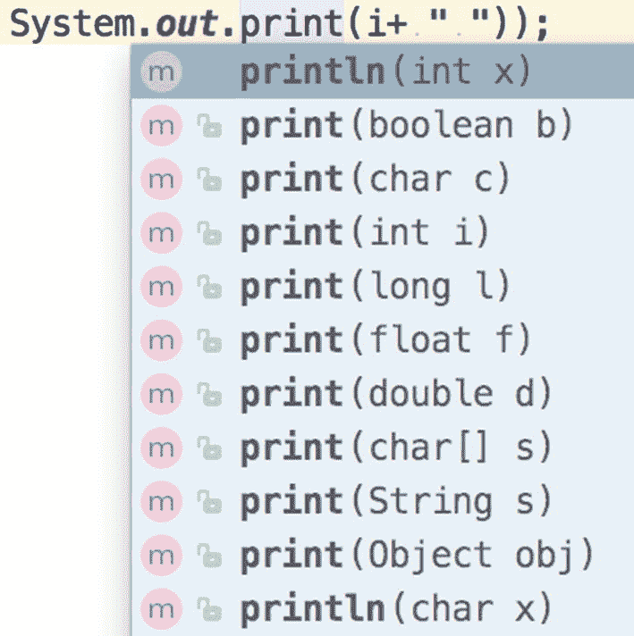

图 9-1

System.out.print 类族

在本章的示例中，我们使用一个提供整数数组排序方法的类层次结构。该类层次结构如图 9-2 所示。

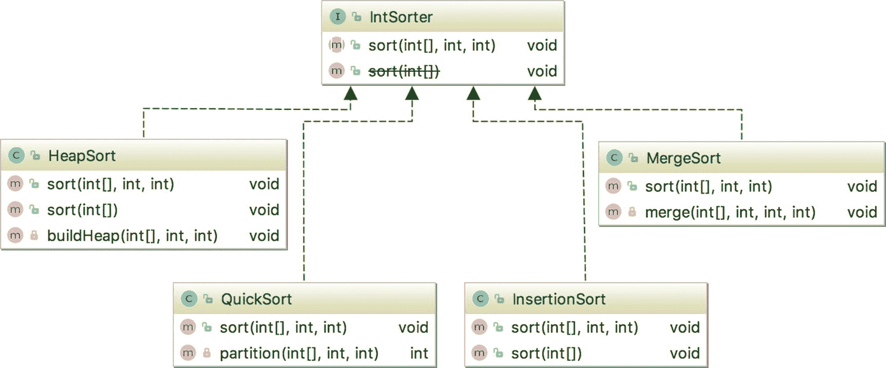

图 9-2

排序类层次结构

我们首先以 `MergeSort` 类为例，添加 `System.out.print` 语句来记录算法的步骤。归并排序是一种排序算法的名称，其性能优于冒泡排序。它的工作原理是将数组分成两半，然后分成更小的片段，直到得到可以轻松排序的两个元素的数组。然后开始合并数组片段。这种反复拆分数组直到排序成为可管理操作的方法称为 **Divide et Impera**，也称为**分治法**。还有更多算法采用相同的方法来解决问题，而归并排序只是本书中介绍的第一种。图 9-3 展示了我们将要实现的归并排序算法每一步所发生的情况。

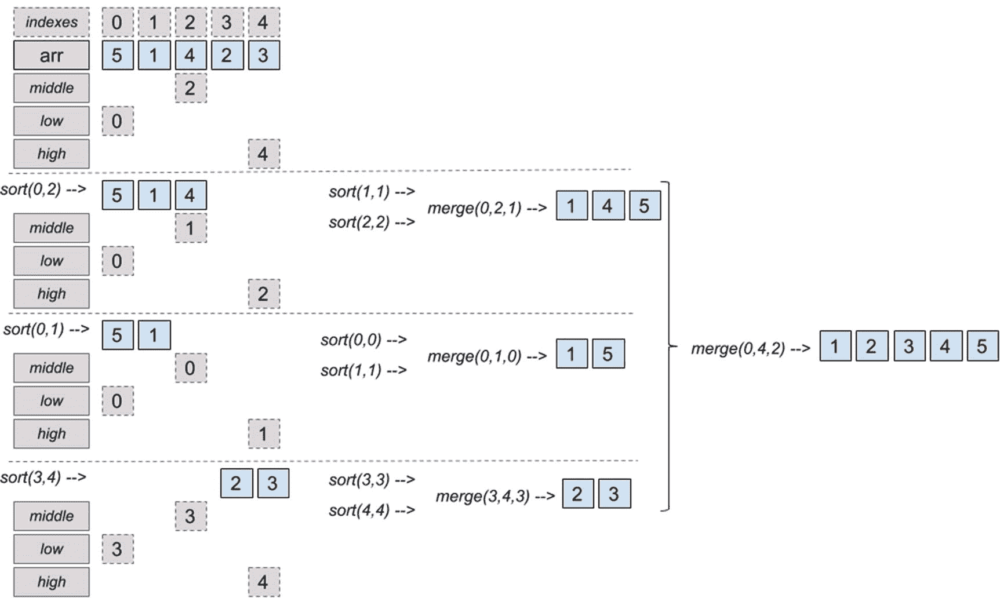

图 9-3

归并排序

在算法的每一步中，都会确定数组的中间位置。只要数组的起始索引 `low` 值小于待排序数组的结束索引 `high` 值，我们就通过调用 `sort(..)` 方法进一步拆分数组，直到得到一个只有一个元素的数组。此时会调用 `merge(..)` 方法，除了合并数组片段外，还会在合并过程中对它们进行排序。要编写代码，我们需要实现这两个方法。

```
package com.apress.bgn.ch9.algs;
public class MergeSort implements IntSorter {
public void sort(int[] arr, int low, int high) {
if (low < high) {
int middle = (low + high) / 2;
sort(arr, low, middle);
sort(arr, middle + 1, high);
merge(arr, low, middle, high);
}
}
private void merge(int arr[], int low, int middle, int high) {
int leftLength = middle - low + 1;
int rightLength = high - middle;
int left[] = new int[leftLength];
int right[] = new int[rightLength];
for (int i = 0; i < leftLength; ++i) {
left[i] = arr[low + i];
}
for (int i = 0; i < rightLength; ++i) {
right[i] = arr[middle + 1 + i];
}
int i = 0, j = 0;
int k = low;
while (i < leftLength && j < rightLength) {
if (left[i] <= right[j]) {
arr[k] = left[i];
i++;
} else {
arr[k] = right[j];
j++;
}
k++;
}
while (i < leftLength) {
arr[k] = left[i];
i++;
k++;
}
while (j < rightLength) {
arr[k] = right[j];
j++;
k++;
}
}
}
清单 9-1
使用 System.out.print 进行日志记录
```

这段代码可能看起来令人望而生畏，但它完全按照图 9-3 所示的方式工作；我们只是需要很多变量来引用所有用于将元素按正确顺序排列的索引。为了确保我们的解决方案正确实现，查看每个方法被调用时的值以及正在处理的数组片段会很有帮助。我们可以通过简单地修改我们的方法并添加一些 `System.out.print` 方法调用来实现这一点。

```
package com.apress.bgn.ch9.algs;
public class MergeSort implements IntSorter {
public void sort(int[] arr, int low, int high) {
System.out.print("Call sort of " + ": [" + low + " " + high + "] ");
for (int i = low; i <= high; ++i) {
System.out.print(arr[i] + " ");
}
System.out.println();
if (low < high) {
int middle = (low + high) / 2;
sort(arr, low, middle);
sort(arr, middle + 1, high);
merge(arr, low, middle, high);
}
}
private void merge(int arr[], int low, int middle, int high) {
int leftLength = middle - low + 1;
int rightLength = high - middle;
int left[] = new int[leftLength];
int right[] = new int[rightLength];
for (int i = 0; i < leftLength; ++i) {
left[i] = arr[low + i];
}
for (int i = 0; i < rightLength; ++i) {
right[i] = arr[middle + 1 + i];
}
int i = 0, j = 0;
int k = low;
while (i < leftLength && j < rightLength) {
if (left[i] <= right[j]) {
arr[k] = left[i];
i++;
} else {
arr[k] = right[j];
j++;
}
k++;
}
while (i < leftLength) {
arr[k] = left[i];
i++;
k++;
}
while (j < rightLength) {
arr[k] = right[j];
j++;
k++;
}
System.out.print("Called merge of: [" + low
+ " " + high + " " + middle + "], ");
for (int z = low; z <= high; ++z) {
System.out.print(arr[z] + " ");
}
System.out.println();
}
}
```

为了测试输出，我们需要一个包含 `main(..)` 方法的类来执行算法。

```
package com.apress.bgn.ch9;
import com.apress.bgn.ch9.algs.IntSorter;
import com.apress.bgn.ch9.algs.MergeSort;
import java.util.Arrays;
public class SortingDemo {
public static void main(String... args) {
int arr[] = {5,1,4,2,3};
IntSorter mergeSort = new MergeSort();
mergeSort.sort(arr, 0, arr.length-1);
System.out.print("Sorted: ");
Arrays.stream(arr).forEach(i -> System.out.print(i+ " "));
}
}
```

如果我们运行上述类，`sort(..)` 和 `merge(..)` 调用处理的中间值将打印在控制台中。

```
Call sort of : [0 4] 5 1 4 2 3
Call sort of : [0 2] 5 1 4
Call sort of : [0 1] 5 1
Call sort of : [0 0] 5
Call sort of : [1 1] 1
Called merge of: [0 1 0], 1 5
Call sort of : [2 2] 4
Called merge of: [0 2 1], 1 4 5
Call sort of : [3 4] 2 3
Call sort of : [3 3] 2
Call sort of : [4 4] 3
Called merge of: [3 4 3], 2 3
Called merge of: [0 4 2], 1 2 3 4 5
Sorted: 1 2 3 4 5
```

你可以看到控制台输出与图 9-3 中描述的算法步骤相匹配；该输出清楚地证明了解决方案按预期工作。但是，现在的代码存在一个问题。每次调用 `sort(..)` 方法时，都会打印输出，如果排序只是更复杂解决方案中的一个步骤，那么该输出并不是真正必要的。它甚至可能污染更大解决方案的输出。此外，如果数组很大，打印该输出可能会影响整体解决方案的性能。因此，应该考虑一种不同的方法，一种可以自定义并决定是否应该打印输出的方法。这就是日志库发挥作用的地方。


#### 使用 JUL 进行日志记录

JDK 提供了自己的日志类，这些类位于 `java.util.logging` 包下，因此 JDK 提供的日志模块也被称为 **JUL**。`Logger` 类实例用于记录日志消息。创建日志记录器实例时应为其指定一个名称，并通过调用专门的方法来打印不同级别的日志消息。对于 JUL 模块，其级别及范围如下所列，但其他日志库也有类似的日志级别。

*   OFF - 应用于关闭所有日志记录
*   SEVERE – 最高级别，消息表示严重故障
*   WARNING - 表示由于潜在问题而打印此消息
*   INFO - 表示这是一条信息性消息
*   CONFIG - 表示这是一条包含配置信息的消息
*   FINE - 表示这是一条提供跟踪信息的消息
*   FINER - 表示这是一条相当详细的跟踪消息
*   FINEST - 表示这是一条非常详细的跟踪消息
*   ALL - 应打印所有日志消息

日志记录器可以使用 XML 或属性文件进行配置，其输出可以定向到外部文件。对于之前介绍的代码示例，让我们将所有 `System.out.print` 方法调用替换为日志记录器调用。我们从 `SorterJulDemo` 类开始。

```
package com.apress.bgn.ch9;
import com.apress.bgn.ch9.algs.IntSorter;
import com.apress.bgn.ch9.algs.MergeSort;
import java.util.Arrays;
import java.util.logging.Logger;
public class SortingJulDemo {
private static final Logger log =
Logger.getLogger(SortingJulDemo.class.getName());
public static void main(String... args) {
int arr[] = {5,1,4,2,3};
log.info("Sorting  an array with merge sort");
IntSorter mergeSort = new MergeSort();
mergeSort.sort(arr, 0, arr.length-1);
StringBuilder sb = new StringBuilder("Sorted: ");
Arrays.stream(arr).forEach(i -> sb.append(i).append(" "));
log.info(sb.toString());
}
}
```

在代码示例中，通过调用静态方法 `Logger.getLogger(..)` 创建了一个 `Logger` 实例。推荐的做法是将日志记录器命名为其正在记录消息的类名。在没有任何额外配置的情况下，使用 `log.info(..)` 打印的每条消息都会在其前面加上完整的系统日期、类名和方法名。现在，让我们在 `MergeSort` 类中将所有 `System.out.print` 方法调用替换为日志记录器调用，并引入一个 `StringBuilder` 来构建更长的消息，然后再通过 `log.info(..)` 写入。

```
package com.apress.bgn.ch9.algs;
import java.util.logging.Logger;
public class MergeSort implements IntSorter {
private static final Logger log =
Logger.getLogger(SortingJulDemo.class.getName());
public void sort(int[] arr, int low, int high) {
StringBuilder sb = new StringBuilder("Call sort of ")
.append(": [")
.append(low).append(" ").append(high)
.append("] ");
for (int i = low; i <= high; ++i) {
sb.append(arr[i]).append(" ");
}
log.info(sb.toString());
if (low < high) {
int middle = (low + high) / 2;
//sort lower half of the interval
sort(arr, low, middle);
//sort upper half of the interval
sort(arr, middle + 1, high);
// merge the two intervals
merge(arr, low, middle, high);
}
}
private void merge(int arr[], int low, int middle, int high) {
...
StringBuilder sb = new StringBuilder("Called merge of: [")
.append(low).append(" ").append(high).append(" ").append(middle)
.append("],) ");
for (int z = low; z <= high; ++z) {
sb.append(arr[z]).append(" ");
}
log.info(sb.toString());
}
}
```

现在让我们运行代码并分析控制台输出。

```
Jul 21, 2018 11:17:30 PM com.apress.bgn.ch9.SortingJulDemo main
INFO: Sorting  an array with merge sort
Jul 21, 2018 11:17:30 PM com.apress.bgn.ch9.algs.MergeSort sort
INFO: Call sort of : [0 4] 5 1 4 2 3
Jul 21, 2018 11:17:30 PM com.apress.bgn.ch9.algs.MergeSort sort
INFO: Call sort of : [0 2] 5 1 4
Jul 21, 2018 11:17:30 PM com.apress.bgn.ch9.algs.MergeSort sort
INFO: Call sort of : [0 1] 5 1
Jul 21, 2018 11:17:30 PM com.apress.bgn.ch9.algs.MergeSort sort
INFO: Call sort of : [0 0] 5
Jul 21, 2018 11:17:30 PM com.apress.bgn.ch9.algs.MergeSort sort
INFO: Call sort of : [1 1] 1
Jul 21, 2018 11:17:30 PM com.apress.bgn.ch9.algs.MergeSort merge
INFO: Called merge of: [0 1 0],) 1 5
Jul 21, 2018 11:17:30 PM com.apress.bgn.ch9.algs.MergeSort sort
INFO: Call sort of : [2 2] 4
Jul 21, 2018 11:17:30 PM com.apress.bgn.ch9.algs.MergeSort merge
INFO: Called merge of: [0 2 1],) 1 4 5
Jul 21, 2018 11:17:30 PM com.apress.bgn.ch9.algs.MergeSort sort
INFO: Call sort of : [3 4] 2 3
Jul 21, 2018 11:17:30 PM com.apress.bgn.ch9.algs.MergeSort sort
INFO: Call sort of : [3 3] 2
Jul 21, 2018 11:17:30 PM com.apress.bgn.ch9.algs.MergeSort sort
INFO: Call sort of : [4 4] 3
Jul 21, 2018 11:17:30 PM com.apress.bgn.ch9.algs.MergeSort merge
INFO: Called merge of: [3 4 3],) 2 3
Jul 21, 2018 11:17:30 PM com.apress.bgn.ch9.algs.MergeSort merge
INFO: Called merge of: [0 4 2],) 1 2 3 4 5
Jul 21, 2018 11:17:30 PM com.apress.bgn.ch9.SortingJulDemo main
INFO: Sorted: 1 2 3 4 5
```

日志消息的写入方式由一个称为格式化器的特殊类决定。当没有显式配置时，默认使用的格式化器是 `java.util.logging.SimpleFormatter`，它会像前面列表所示那样精确地打印日志消息。默认情况下，消息会打印到控制台，用于此目的的类称为处理器，在本例中是 `java.util.logging.ConsoleHandler`。这两者都是可配置的，并且可以通过配置文件替换为更高级的类或自定义类。

前面的日志看起来有点拥挤，而且不够清晰。因此，我们需要通过添加适当的配置来优化它。`StreamFormatter` 类包含一个名为 `format` 的字段，可以用一个模板来初始化，该模板定义了日志消息的写入方式。那么，让我们完全去掉类名和方法名，因为我们已经有非常具体的消息了。以下代码清单包含了 JUL 的一个简单配置。

```
handlers=java.util.logging.ConsoleHandler
.level=ALL
java.util.logging.ConsoleHandler.level=ALL
java.util.logging.ConsoleHandler.formatter=java.util.logging.SimpleFormatter
java.util.logging.SimpleFormatter.format=[%1$tF %1$tT] [%4$-4s] %5$s %n
```

该文件应在执行开始时通过 `java.util.logging.LogManager` 实例加载，并调用 `readConfiguration(..)` 方法，因此 `SortingJulDemo` 类修改如下。

```
public class SortingJulDemo {
private static final Logger log =
Logger.getLogger(SortingJulDemo.class.getName());
static{
try {
LogManager logManager = LogManager.getLogManager();
logManager.readConfiguration (
new FileInputStream("./chapter09/src/main/resources/logging.properties"));
} catch (IOException exception) {
log.log(Level.SEVERE, "Error in loading configuration",exception);
}
}
public static void main(String... args) {
// same code as before
...
}
}
```

如果我们再次运行示例，输出将变为


```
[2018-07-21 23:58:29] [INFO] 使用归并排序对数组进行排序
[2018-07-21 23:58:29] [INFO] 调用排序：[0 4] 5 1 4 2 3
[2018-07-21 23:58:29] [INFO] 调用排序：[0 2] 5 1 4
[2018-07-21 23:58:29] [INFO] 调用排序：[0 1] 5 1
[2018-07-21 23:58:29] [INFO] 调用排序：[0 0] 5
[2018-07-21 23:58:29] [INFO] 调用排序：[1 1] 1
[2018-07-21 23:58:29] [INFO] 调用合并：[0 1 0],) 1 5
[2018-07-21 23:58:29] [INFO] 调用排序：[2 2] 4
[2018-07-21 23:58:29] [INFO] 调用合并：[0 2 1],) 1 4 5
[2018-07-21 23:58:29] [INFO] 调用排序：[3 4] 2 3
[2018-07-21 23:58:29] [INFO] 调用排序：[3 3] 2
[2018-07-21 23:58:29] [INFO] 调用排序：[4 4] 3
[2018-07-21 23:58:29] [INFO] 调用合并：[3 4 3],) 2 3
[2018-07-21 23:58:29] [INFO] 调用合并：[0 4 2],) 1 2 3 4 5
[2018-07-21 23:58:29] [INFO] 排序完成：1 2 3 4 5
```

除了 `SimpleFormatter` 之外，还有另一个可用于格式化日志消息的类，名为 `XMLFormatter`，它可以将消息格式化为 XML（可扩展标记语言）。XML 格式的数据写入规则由一组编码规则定义，这些规则使数据既便于人类阅读，也便于机器读取。此外，这组规则还使得验证和查找错误变得容易。^(⁶⁶) 由于 XML 不适合在控制台中输出，因此我们使用 `FileHandler` 类将日志保存到文件中。接下来展示的是需要添加到配置文件中的修改内容。

```
handlers=java.util.logging.FileHandler
java.util.logging.FileHandler.pattern=chapter09/out/chapter09-log.xml
.level=ALL
java.util.logging.ConsoleHandler.level=ALL
java.util.logging.ConsoleHandler.formatter=java.util.logging.XMLFormatter
```

使用该配置运行代码后，会在 `chapter09/out` 目录下生成一个 `chapter09-log.xml` 文件，其中包含类似下面展示的条目。

```

2018-07-21T23:50:52.905961Z

com.apress.bgn.ch9.SortingJulDemo
INFO
com.apress.bgn.ch9.SortingJulDemo
main

使用归并排序对数组进行排序

...

```

日志输出也可以通过提供自定义类进行定制，唯一的要求是该类必须继承 `java.util.logging.Formatter` 类或其任何 JDK 子类。

在前面的示例中，我们只使用了 `log.info` 调用，因为代码很简单，没有出错的空间；但现在让我们修改代码，允许用户输入数组元素。这需要编写代码来处理用户未输入正确数据的情况。应在类中添加处理用户未提供任何数据的情况的代码，以及处理用户输入错误数据的情况的代码。如果用户未提供任何数据，应打印一条 SEVERE 级别的日志消息，并终止应用程序。如果用户输入了无效数据，则应使用有效数据，并对非整数元素打印警告信息。

这意味着 `SortingJulDemo` 类将变为：

```
package com.apress.bgn.ch9;
import com.apress.bgn.ch9.algs.IntSorter;
import com.apress.bgn.ch9.algs.MergeSort;
import java.io.FileInputStream;
import java.io.IOException;
import java.util.ArrayList;
import java.util.Arrays;
import java.util.List;
import java.util.logging.Level;
import java.util.logging.LogManager;
import java.util.logging.Logger;
public class SortingJulDemo {
private static final Logger log =
Logger.getLogger(SortingJulDemo.class.getName());
static {
try {
LogManager logManager = LogManager.getLogManager();
logManager.readConfiguration(new FileInputStream
("./chapter09/logging-jul/src/main/resources/logging.properties"));
} catch (IOException exception) {
log.log(Level.SEVERE, "加载配置时出错", exception);
}
}
public static void main(String... args) {
if (args.length == 0) {
log.severe ("没有要排序的数据！");
return;
}
int[] arr = getInts(args);
final StringBuilder sb = new
StringBuilder("使用归并排序对数组进行排序：");
Arrays.stream(arr).forEach(i -> sb.append(i).append(" "));
log.info(sb.toString());
IntSorter mergeSort = new MergeSort();
mergeSort.sort(arr, 0, arr.length - 1);
final StringBuilder sb2 = new StringBuilder("排序完成：");
Arrays.stream(arr).forEach(i -> sb2.append(i).append( " "));
log.info(sb2.toString());
}
private static int[] getInts(String[] args) {
List list = new ArrayList();
for (String arg : args) {
try {
int toInt = Integer.parseInt(arg);
list.add(toInt);
} catch (NumberFormatException nfe) {
log.warning ("元素 " + arg + " 不是整数，无法添加到数组中！");
}
}
int[] arr = new int[list.size()];
int j = 0;
for (Integer elem : list) {
arr[j++] = elem;
}
return arr;
}
}
```

`arr` 数组不再硬编码在 `main(..)` 方法中，而是将方法接收的参数值作为待排序数组，并通过 `toInts(..)` 方法将 `String` 值转换为 `int` 值。执行此程序的人可以从命令行提供参数，但由于我们使用的是 IntelliJ IDEA，有一种更简单的方法。如果现在不提供任何参数运行程序，控制台将输出以下内容：

```
[2018-07-22 01:34:37] [SEVERE] 没有要排序的数据！
```

执行在此处停止，因为没有要排序的数据。由于您可能已经运行过这个类几次，IntelliJ 可能已经创建了一个启动配置，您可以自定义该配置并为执行提供参数。如图 9-4 所示，编辑您的配置，将推荐值作为程序参数添加进去。

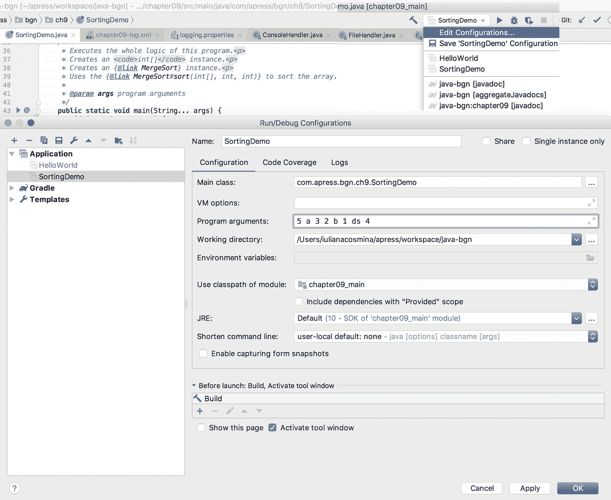

图 9-4

SortingJulDemo 类的 IntelliJ IDEA 启动器

然后运行程序并检查控制台日志。您会看到一些额外的日志消息，其严重级别为 WARNING，这些消息针对无法转换为 `int` 的参数值打印。


```
[2018-07-22 01:43:35] [WARNING] 元素 a 不是整数，无法添加到数组中！
[2018-07-22 01:43:35] [WARNING] 元素 b 不是整数，无法添加到数组中！
[2018-07-22 01:43:35] [WARNING] 元素 ds 不是整数，无法添加到数组中！
[2018-07-22 01:43:35] [INFO] 使用归并排序对数组进行排序：5 3 2 1 4
[2018-07-22 01:43:35] [INFO] 调用排序：[0 4] 5 3 2 1 4
[2018-07-22 01:43:35] [INFO] 调用排序：[0 2] 5 3 2
[2018-07-22 01:43:35] [INFO] 调用排序：[0 1] 5 3
[2018-07-22 01:43:35] [INFO] 调用排序：[0 0] 5
[2018-07-22 01:43:35] [INFO] 调用排序：[1 1] 3
[2018-07-22 01:43:35] [INFO] 调用合并：[0 1 0],) 3 5
[2018-07-22 01:43:35] [INFO] 调用排序：[2 2] 2
[2018-07-22 01:43:35] [INFO] 调用合并：[0 2 1],) 2 3 5
[2018-07-22 01:43:35] [INFO] 调用排序：[3 4] 1 4
[2018-07-22 01:43:35] [INFO] 调用排序：[3 3] 1
[2018-07-22 01:43:35] [INFO] 调用排序：[4 4] 4
[2018-07-22 01:43:35] [INFO] 调用合并：[3 4 3],) 1 4
[2018-07-22 01:43:35] [INFO] 调用合并：[0 4 2],) 1 2 3 4 5
[2018-07-22 01:43:35] [INFO] 排序完成：1 2 3 4 5
```

写入日志会影响性能，在某些情况下，例如当应用程序在生产系统中运行时，我们可能希望优化日志配置，只记录那些能提示问题风险的重要日志消息，并跳过信息性消息。在之前的配置示例中，有一行配置启用了所有日志消息的打印。

```
handlers=java.util.logging.ConsoleHandler
.level=ALL
java.util.logging.ConsoleHandler.level=ALL
java.util.logging.ConsoleHandler.formatter=java.util.logging.SimpleFormatter
java.util.logging.SimpleFormatter.format=[%1$tF %1$tT] [%4$-4s] %5$s %n
```

如果我们将该属性的值改为 OFF，则不会打印任何内容。日志级别都有对应的整数值，这些值可用于比较消息的严重程度。通常，如果你配置了某个级别的消息，那么更严重的消息也会被打印出来。因此，如果我们将该属性设置为 INFO，警告消息也会被打印出来。消息严重级别的值定义在 `java.util.logging.Level` 类中，如果你在编辑器中打开该类，就能看到分配给每个级别的整数值。

```
...
public static final Level OFF = new Level("OFF",Integer.MAX_VALUE, defaultBundle);
public static final Level SEVERE = new Level("SEVERE",1000, defaultBundle);
public static final Level WARNING = new Level("WARNING", 900, defaultBundle);
public static final Level INFO = new Level("INFO", 800, defaultBundle);
public static final Level CONFIG = new Level("CONFIG", 700, defaultBundle);
public static final Level FINE = new Level("FINE", 500, defaultBundle);
public static final Level FINER = new Level("FINER", 400, defaultBundle);
public static final Level FINEST = new Level("FINEST", 300, defaultBundle);
...
```

因此，在之前的配置中，如果我们将 `.level=ALL` 改为 `.level=WARNING`，那么我们应该能看到所有级别为 `WARNING` 和 `SEVERE` 的日志消息。如果我们使用之前的参数运行 `SortingJulDemo` 类，应该只会看到 `WARNING` 级别的消息。

```
[2018-07-22 15:46:19] [WARNING] 元素 a 不是整数，无法添加到数组中！
[2018-07-22 15:46:19] [WARNING] 元素 b 不是整数，无法添加到数组中！
[2018-07-22 15:46:19] [WARNING] 元素 ds 不是整数，无法添加到数组中！
```

定义日志消息格式还有更多方法：可以使用系统属性，也可以通过编程方式实例化一个格式化器并将其设置到日志记录器实例上。这实际上取决于应用程序的具体情况，但你可能需要考虑其他日志记录方案，因为 JUL 在多线程环境中性能较弱，大多数生产应用程序都使用其他库。不过，当 Java 7 发布时，其中一项宣布的特性就是对 JUL 模块的改进，因此如今它或许值得一试。

你还需要考虑的另一件事是，如果你正在构建的应用程序很复杂，且具有大量依赖项，这些依赖项可能使用不同的日志记录库，那么你该如何配置并使用它们呢？这时，*日志门面*就派上用场了。下一节将向你展示如何使用最著名的 Java 日志门面：SLF4J。

### 使用 SLF4J 和 Logback 进行日志记录

最著名的 Java 日志门面是 SLF4J^(⁶⁷)，它作为各种日志框架的日志抽象层。这意味着你使用 SLF4J 的类，而所有实际工作则由类路径中找到的具体日志实现来完成。最棒的是？你可以随时更换日志实现，你的代码仍然可以正确编译和执行，并且无需对其做任何更改。

在本章迄今为止介绍的代码示例中，代码与 JUL 紧密耦合，如果我们出于某种原因想要更换日志库，也需要修改现有代码。第一步是将我们的代码改为使用 SLF4J 的类。使用 SLF4J 的另一个优点是，如果日志配置文件位于类路径中，配置会被自动读取。因此，只要配置文件的命名符合所使用的具体日志实现的标准，我们之前为 JUL 所需的 `LogManager` 初始化块就不再需要了。那么，我们先来看一下代码。

```
package com.apress.bgn.ch9;
import org.slf4j.Logger;
import org.slf4j.LoggerFactory;
import java.util.Arrays;
import java.util.logging.Logger;
public class SortingJulDemo {
private static final Logger log =
LoggerFactory.getLogger(SortingSlf4jDemo.class);
public static void main(String... args) {
if (args.length == 0) {
log.error ("没有数据需要排序！");
return;
}
int[] arr = getInts(args);
final StringBuilder sb = new StringBuilder
("使用归并排序对数组进行排序：");
Arrays.stream(arr).forEach(i -> sb.append(i).append(" "));
log.debug (sb.toString());
IntSorter mergeSort = new MergeSort();
mergeSort.sort(arr, 0, arr.length - 1);
final StringBuilder sb2 = new StringBuilder("排序完成：");
Arrays.stream(arr).forEach(i -> sb2.append(i).append( " "));
log.info (sb2.toString());
}
}
```

你可能已经注意到，我们调用的方法略有不同，这是因为 SLF4J 定义了一个映射到具体实现的 API，但这些方法根据其名称，用于打印具有特定目的和特定级别的日志消息。我将列出它们并逐一进行简要说明。

*   `info.error(..)` 在 ERROR 级别记录消息；通常这些消息用于应用程序发生严重故障且无法继续正常执行时。此方法有不止一种形式，异常和对象可以作为参数传递给它，以便评估故障发生时应用程序的状态。

*   `info.warn(..)` 在 WARN 级别记录消息；通常打印这些消息是为了通知应用程序运行不正常，可能存在需要担忧的原因。与上一个方法类似，它也有不止一种形式，异常和对象可以作为参数传递，以便更好地评估应用程序的当前状态。

*   `log.info(..)` 在 INFO 级别记录消息；这类消息是信息性的，用于让用户知道一切正常。

*   `info.debug(..)` 在 DEBUG 级别记录消息；通常这些消息用于打印应用程序的中间状态，并检查事情是否按预期进行；在发生故障时，你可以追踪应用程序对象的演变过程。

*   `log.trace(..)` 在 TRACE 级别记录消息；这类消息是信息性的，重要性非常低。


本示例使用的日志具体实现称为 Logback^(⁶⁸)，之所以选择它，是因为在 Java 9 引入模块后，它是唯一能与 SLF4J 配合使用的库。Logback 被视为另一种流行的日志实现 Log4j 的继任者，这很合理，因为创建它的团队也曾参与 Log4j 的开发^(⁶⁹)。Logback 原生实现了 SLF4J，因此无需再添加额外的桥接库。而且它的速度更快，因为 Logback 的内部实现已被重写，以便在关键执行点上性能更优。在修改我们的类以使用 SLF4J 后，我们只需将 Logback 添加为应用程序的依赖项，并在 `resources` 目录下添加一个配置文件即可。该配置文件可以用 XML 或 Groovy 编写。标准要求其命名为 `logback.xml`。下面的代码清单展示了本节示例中该文件的内容。

```
%d{HH:mm:ss.SSS} %-5level %logger{5} - %msg%n
```

`ch.qos.logback.core.ConsoleAppender` 类用于在控制台写入日志消息，`<pattern>` 元素定义了日志消息的格式。Logback 可以通过将包名缩写为首字母来格式化完全限定的类名，从而在不丢失信息的情况下实现紧凑的日志记录。这使得 Logback 成为当前 Java 开发世界中最受欢迎的日志实现之一。

`MergeSort` 类中的日志调用全部被替换为 `log.debug(..)`，因为这些消息是中间过程信息，并非真正的通知性信息，只是应用程序在执行过程中所用对象状态的示例。应用程序的通用日志级别可以通过 `<root>` 元素设置为所需级别，但也可以使用 `<logger>` 元素为特定类或包设置不同的日志级别。

因此，如果我们使用之前的配置在类路径上运行 `SortingSlf4jDemo` 类，将会打印出以下内容：

```
19:38:57.950 WARN  c.a.b.c.SortingSlf4jDemo -
元素 a 不是整数，无法添加到数组中！
19:38:57.951 WARN  c.a.b.c.SortingSlf4jDemo -
元素 b 不是整数，无法添加到数组中！
19:38:57.951 WARN  c.a.b.c.SortingSlf4jDemo -
元素 ds 不是整数，无法添加到数组中！
19:38:57.953 DEBUG c.a.b.c.SortingSlf4jDemo - 使用归并排序对数组进行排序：5 3 2 1 4
19:38:57.953 DEBUG c.a.b.c.a.MergeSort - 调用排序：[0 4] 5 3 2 1 4
19:38:57.953 DEBUG c.a.b.c.a.MergeSort - 调用排序：[0 2] 5 3 2
19:38:57.953 DEBUG c.a.b.c.a.MergeSort - 调用排序：[0 1] 5 3
19:38:57.953 DEBUG c.a.b.c.a.MergeSort - 调用排序：[0 0] 5
19:38:57.953 DEBUG c.a.b.c.a.MergeSort - 调用排序：[1 1] 3
19:38:57.953 DEBUG c.a.b.c.a.MergeSort - 调用合并：[0 1 0],) 3 5
19:38:57.953 DEBUG c.a.b.c.a.MergeSort - 调用排序：[2 2] 2
19:38:57.953 DEBUG c.a.b.c.a.MergeSort - 调用合并：[0 2 1],) 2 3 5
19:38:57.953 DEBUG c.a.b.c.a.MergeSort - 调用排序：[3 4] 1 4
19:38:57.953 DEBUG c.a.b.c.a.MergeSort - 调用排序：[3 3] 1
19:38:57.953 DEBUG c.a.b.c.a.MergeSort - 调用排序：[4 4] 4
19:38:57.954 DEBUG c.a.b.c.a.MergeSort - 调用合并：[3 4 3],) 1 4
19:38:57.954 DEBUG c.a.b.c.a.MergeSort - 调用合并：[0 4 2],) 1 2 3 4 5
19:38:57.954 INFO  c.a.b.c.SortingSlf4jDemo - 排序后：1 2 3 4 5
```

完全限定的类名 `com.apress.bgn.ch9.SortingSlf4jDemo` 被缩短为 `c.a.b.c.SortingSlf4jDemo`。

配置文件可以作为 VM 参数提供给程序，这意味着日志格式可以在外部配置。启动该类时，使用 `-Dlogback.configurationFile=\temp\ext-logback.xml` 作为 VM 参数。

Logback 也可以将输出定向到文件；我们只需使用 `ch.qos.logback.core.FileAppender` 类添加配置，并通过在 `<root>` 配置中添加一个 `<appender>` 元素将输出定向到文件即可。

```
chapter09/logging-slf4j/out/output.log
true
%d{HH:mm:ss.SSS} %-5level %logger{5} - %msg%n
UTF-8
%d{HH:mm:ss.SSS} %-5level %logger{5} - %msg%n
```

在这个例子中，我们保留了原始配置，因为我希望向你展示一个同时将日志消息写入两个目标的可行示例。但如果日志文件变得太大而无法打开怎么办？嗯，有一种方法可以解决这个问题。我们可以使用另一个类，它可以配置为在达到设定大小限制时写入一个文件，然后开始写入另一个文件。这个类名为 `ch.qos.logback.core.rolling.RollingFileAppender`，它需要两个参数：一个实现了 `ch.qos.logback.core.rolling.RollingPolicy` 类型的实例，它提供写入新日志文件（也称为*滚动*）的功能；以及一个实现了 `ch.qos.logback.core.rolling.TriggeringPolicy` 类型的实例，它配置触发滚动的条件。

此外，一个同时实现了这两个接口的类型的单个实例也可以配置日志记录器。滚动日志文件意味着日志文件会根据配置重命名；通常，文件最后访问的日期会被添加到其名称中，然后创建一个新的日志文件，其名称与配置的日志文件名相同（不带任何日期信息）。

```
chapter09/logging-slf4j/out/output.log
chapter09/logging-slf4j/out/output_%d{yyyy-MM-dd}.%i.log
10MB
UTF-8
%d{HH:mm:ss.SSS} %-5level %logger{5} - %msg%n
%d{HH:mm:ss.SSS} %-5level %logger{5} - %msg%n
```

因此，`<file>` 元素配置日志文件的位置和名称。`<rollingPolicy>` 元素使用 `<fileNamePattern>` 配置当日志消息不再写入时日志文件接收的名称。例如，在上面的配置中，`output.log` 文件会被重命名为 `output_2018-07-22.log`，然后每天创建一个新的 `output.log` 文件。`<timeBasedFileNamingAndTriggeringPolicy>` 配置在写入新文件之前，`output.log` 文件应该有多大。上面示例中配置的大小是 10 MB。如果日志文件在一天结束前增长到超过 10 MB，该文件会被重命名为 `output_2018-07-22.1.log`，名称中添加一个索引，并创建一个新的 `output.log`。`<maxHistory>` 设置日志文件的生命周期，在我们的例子中是 30 天。

日志记录是一个强大的工具；请确保不要滥用它，因为它可能导致性能问题以及产生大量难以分析有用信息的数据。另一件值得注意的事情是在之前的代码中。`StringBuilder` 实例被用来构建大的日志消息，这些消息在特定级别打印。如果通过配置禁用了该级别的日志记录会发生什么？如果你猜测即使这些消息没有被记录，创建它们也会消耗时间和内存，那么你是对的。那么，我们该怎么办？SLF4J 的创建者也考虑到了这一点，并添加了方法来测试某个日志级别是否启用，这些方法可以在包装性能敏感代码的 `if` 语句中使用。这样一来，`SortingSlf4jDemo.main(..)` 方法就变成了：

```
public static void main(String... args) {
if (args.length == 0) {
log.error("没有数据可排序！");
return;
}
int[] arr = getInts(args);
if (log.isDebugEnabled()) {
final StringBuilder sb = new StringBuilder(
"使用归并排序对数组进行排序：");
Arrays.stream(arr).forEach(i -> sb.append(i).append(" "));
log.debug(sb.toString());
}
IntSorter mergeSort = new MergeSort();
mergeSort.sort(arr, 0, arr.length - 1);
if (log.isInfoEnabled()) {
final StringBuilder sb2 = new StringBuilder("排序后：");
Arrays.stream(arr).forEach(i -> sb2.append(i).append(" "));
log.info(sb2.toString());
}
}
```


在此代码示例中，如果将 `com.apress.bgn.ch9` 包的 SLF4J 配置设为 info，那么以 *Sorting an array with merge sort: ...* 开头的消息将不再生成或打印，因为 `log.isDebugEnabled()` 返回 `false`，因此 `if` 语句中的代码不再执行。`Logger` 类针对所有日志级别都包含 `if..Enabled()` 方法。

本节关于日志记录的内容就到此为止。请记住要适度使用日志，在循环中记录日志时要格外小心，对于大型应用，始终使用日志门面，即 SLF4J。

### 使用断言进行调试

调试代码的另一种工具是使用断言。如果你还记得关于 Java 关键字的章节，可能还记得 `assert` 关键字。`assert` 关键字编写一条 `assertion` 语句，用于测试你对程序执行的假设。在之前的示例中，我们让用户为排序程序提供输入，因此为了让程序正确运行，我们假设用户提供了正确的输入，即数组大小大于 1，因为对单个数字运行算法没有意义。那么，断言在代码中是什么样子的呢？答案在以下代码示例中。

```
package com.apress.bgn.ch9;
import com.apress.bgn.ch9.algs.IntSorter;
import com.apress.bgn.ch9.algs.QuickSort;
import java.util.Arrays;
import static com.apress.bgn.ch9.SortingSlf4jDemo.getInts;
public class AssertionDemo {
public static void main(String... args) {
int[] arr = getInts(args);
assert arr.length > 1;
IntSorter mergeSort = new QuickSort();
mergeSort.sort(arr, 0, arr.length - 1);
final StringBuilder sb2 = new StringBuilder("Sorted: ");
Arrays.stream(arr).forEach(i -> sb2.append(i).append(" "));
System.out.println(sb2.toString());
}
}
```

如果你在未向程序提供任何参数的情况下运行此代码，即使其中包含 `assertion` 语句，也不会发生任何事情。原因是断言需要使用 VM 参数 `-ea` 来启用。要指定此参数，你可以在命令行执行时将其添加到命令中；但由于我们一直使用编辑器，你可以将其添加到 IntelliJ IDEA 启动器的 **VM options** 文本框中，如图 9-5 所示。

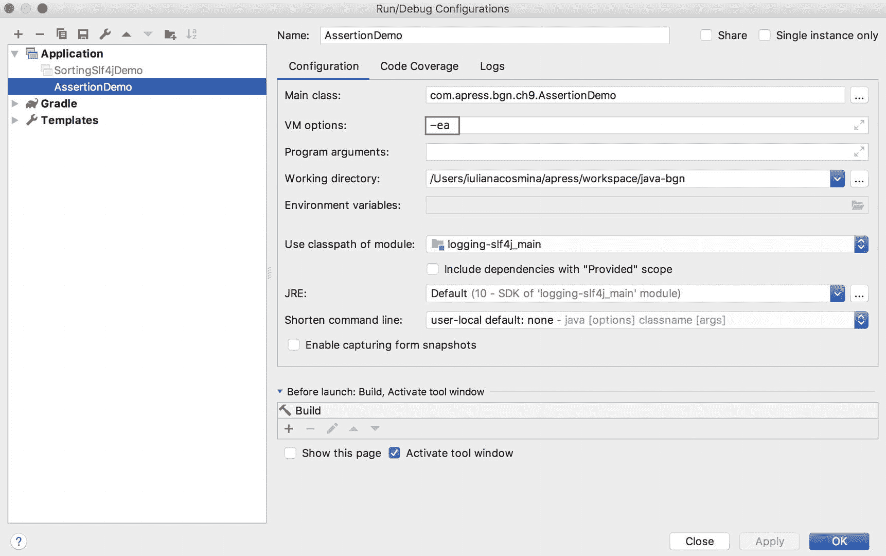

图 9-5

*设置了 -ea VM 参数的 AssertionDemo 类的 IntelliJ IDEA 启动器*

启用断言后，运行上述代码会抛出 `java.lang.AssertionError`，因为断言的表达式计算结果为 `false`——当未提供参数时，`arr.length` 显然不大于 1。断言有两种形式。在简单形式中，它们只有要计算的表达式，即要测试的假设。

```
assertion expression;
```

在这种情况下，会抛出 `java.lang.AssertionError`。它会打印做出假设的行，该假设对于程序的当前运行显然是错误的，同时还会显示模块和完整的类名。

```
Exception in thread "main" java.lang.AssertionError
at chapter.nine.slf4j/com.apress.bgn.ch9.AssertionDemo.main(AssertionDemo.java:48)
```

断言的复杂版本添加了另一个要计算的表达式，或者堆栈中的一个值，用于告知用户假设是错误的。

```
assertion expression1 : expression 2;
```

因此，如果我们把

```
assert arr.length > 1;
```

替换为

```
assert arr.length > 1 : "Not enough data to sort!";
```

当抛出 `java.lang.AssertionError` 时，它会显示 *Not enough data to sort!* 消息，这清楚地说明了为什么断言语句阻止了其余代码的执行。

```
Exception in thread "main" java.lang.AssertionError: Not enough data to sort!
at chapter.nine.slf4j/com.apress.bgn.ch9.AssertionDemo.main(AssertionDemo.java:48)
```

或者我们也可以直接打印数组的大小。

```
assert arr.length > 1 : arr.length;
```

或者两者都打印。

```
assert arr.length > 1 :
"Not enough data to sort! Number of values: " + arr.length;
```

断言可以在需要调试的代码片段之前和之后使用。在本例中，断言被用作执行的前置条件，因为断言的失败阻止了代码的执行。但断言也可以用作后置条件，用于测试执行一段代码的结果。

在前面的代码片段中，断言用于测试用户提供输入的正确性。在这种情况下，无论断言是否启用，都应遵守有效输入的限制。当然，如果我们的数组为空或只包含一个元素，这不是问题，因为算法不会执行，也不会导致技术故障。在使用断言编写代码时，有一些规则需要遵守，或者需要注意的事项。

*   **不应使用断言来检查公共方法参数的正确性。** 参数的正确性应在代码中进行测试，并应抛出适当的 `RuntimeException`，且不应是可避免的。

*   **不应使用断言来完成应用程序正常运行所需的工作。** 主要原因是**断言默认是禁用的**，禁用断言会导致该代码不被执行，因此应用程序的其余部分会因缺少代码而无法正常运行。

*   **出于性能原因，不要在断言中使用计算开销大的表达式。** 这条规则无需解释，即使断言默认是禁用的，想象一下有人在生产应用程序中错误地启用了它们。那将很不幸，不是吗？

如果你有兴趣使用断言，请记住这三条规则，这样应该就没问题了。


### 逐步调试

如果你不想编写日志消息或使用断言，但仍希望在程序执行期间检查变量的值，有一种方法可以通过 IDE 实现：使用断点暂停执行，并借助 IDE 检查变量内容或执行简单方法，以验证程序是否按预期运行。

断点是在可执行的代码行（而非注释行、空行或声明行）上设置的一个标记。在 IntelliJ IDEA 中，要设置断点，你需要点击感兴趣行左侧的装订线区域，或者选中该行后，从**运行**菜单中选择**切换行断点**。当断点设置成功后，该行左侧的装订线区域会出现一个红色圆点。图 9-6 展示了 IntelliJ IDEA 中的几个断点。

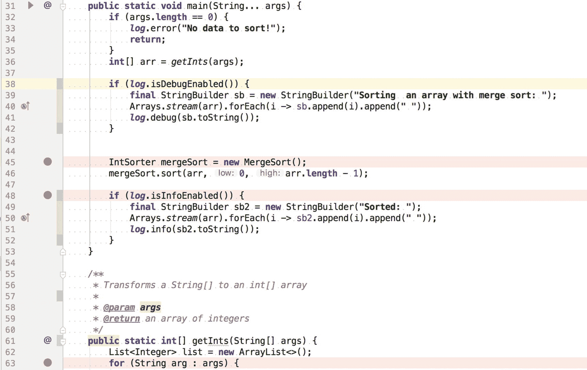

图 9-6

IntelliJ IDEA 断点

一旦断点设置完毕，当应用程序以调试模式运行时，它会在每个断点行暂停。你可以决定是否继续逐步执行并检查变量的值。IntelliJ IDEA 在这方面非常有用，因为它会显示正在执行的每一行代码中每个变量的内容。在图 9-7 中，`SortingSlf4jDemo`类正在以调试模式运行，并通过断点在执行过程中暂停。

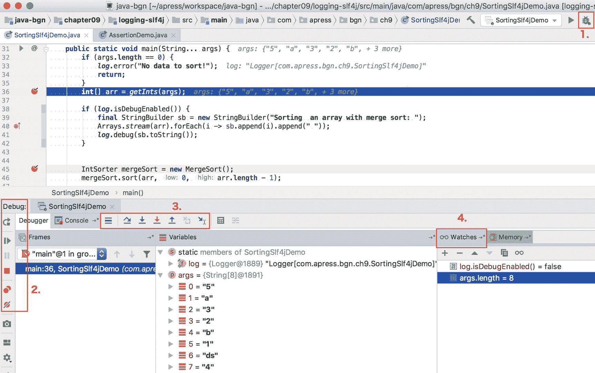

图 9-7

IntelliJ IDEA 中 SortingSlf4jDemo 类在执行过程中暂停

要以调试模式运行应用程序，而不是正常启动启动器，你可以点击绿色的虫子形状按钮（图 9-7 中标记为 1 的按钮）来启动它，该按钮紧挨着通常用于运行应用程序的绿色三角形按钮。应用程序运行并在第一个标记了断点的行处停止。从那时起，开发者可以执行以下操作。

*   通过读取编辑器在该行显示的变量值，来检查断点行所用变量的值。

*   点击**调试**部分（图 9-7 中标记为 2 的按钮）中的绿色三角形，继续执行直到下一个断点。

*   点击**调试**部分（图 9-7 中标记为 2 的按钮）中的红色方形按钮，停止执行。

*   点击**调试**部分（图 9-7 中标记为 2 的按钮）中的对角线切割的红色圆点按钮，禁用所有断点。

*   点击**调试器**部分（图 9-7 中标记为 3 的按钮）中的 90 度角按钮，继续执行到下一行代码。

*   点击**调试器**部分（图 9-7 中标记为 3 的按钮）中的蓝色向下箭头按钮，进入当前代码行的方法内部继续执行。

*   点击**调试器**部分（图 9-7 中标记为 3 的按钮）中的蓝色向上箭头按钮，跳出当前方法继续执行。

*   点击**调试器**部分（图 9-7 中标记为 3 的按钮）中的指向光标符号的对角线箭头按钮，继续执行到光标所在的行。

*   通过将表达式添加到**监视**部分（图 9-7 中标记为 4 的区域）来评估你自己的表达式。唯一的条件是这些表达式只能使用在断点行上下文中可访问的变量。

大多数 Java 智能编辑器都提供了以调试模式运行 Java 应用程序的方法；只需确保你记得定期清理**监视**部分，因为如果你添加了评估成本高昂的表达式，可能会影响应用程序的性能。此外，请注意，使用流的表达式可能会导致应用程序失败，正如第 8 章所证明的那样。

### 使用 Java 工具检查运行中的应用程序

除了用于编译 Java 代码、执行或打包 Java 字节码的可执行文件外，JDK 还提供了一组实用可执行文件，可用于调试和检查正在运行的 Java 应用程序的状态。本节将介绍其中最有用的几个。闲话少叙，让我们来看看最重要的几个。

#### jps

Java 应用程序在运行时会被分配一个进程 ID。操作系统通过这种方式来跟踪所有同时并行运行的应用程序。你可以在诸如 Windows 的 Process Explorer 和 macOS 的活动监视器等工具中查看进程 ID。但如果你习惯在控制台中工作，你可能会更喜欢使用 JDK 提供的`jps`可执行文件，因为它只关注 Java 进程。当从控制台调用`jps`时，所有 Java 进程 ID 都会列出，并附带主类名或应用程序 API 暴露的一些有助于你识别正在运行的应用程序的详细信息。当应用程序崩溃但进程仍处于挂起状态时，这非常有用。当应用程序使用文件或网络端口等资源时，这种情况可能很麻烦，因为它可能会阻塞这些资源，阻止你使用它们。在我的电脑（我使用的是 Mac）上执行`jps`时，我看到正在运行的 Java 进程如下。

```
$ jps
21234 Launcher

21235 SortingSlf4jDemo
3155 muCommander
21236 Jps
```

如列表所示，`jps` 在输出中包含了自身，因为它本身也是一个 Java 进程。ID 为`21235`的进程是`SortingSlf4jDemo`类的执行实例。ID 为`21234`的进程是 IntelliJ IDEA 用于启动`SortingSlf4jDemo`类执行的启动器应用程序。ID 为`3155`的进程是一个 Java 应用程序，它是 Total Commander（一个 Windows 文件管理器应用程序）的替代品。ID 为`18562`的进程没有任何描述，但此时我可以自己识别这个进程，因为我知道我打开了 IntelliJ IDEA，它本身就是一个 Java 应用程序。

了解进程 ID 的好处在于，当它们挂起并阻塞资源时，你可以终止它们。假设由`SortingSlf4jDemo`执行启动的进程最终挂起了。要终止一个进程，所有操作系统都提供了`kill`命令的某个版本。对于 macOS 和 Linux，你应该执行`kill -9 [进程 ID]`。对于前面的例子，如果我调用`kill -9 21235`，然后再次调用`jps`，我可以看到`SortingSlf4jDemo`进程不再被列出。

```
$ jps
21234 Launcher

3155 muCommander
21257 Jps
```

我仍然有`Launcher`进程，但它是 IntelliJ IDEA 的子进程，所以终止它没有意义，因为下次我在 IDE 中运行`main(..)`方法时，该进程会再次启动。

`jps` 是一个用于此特定目的的简单工具，但有时当应用程序安装在配置极简的服务器上时，它可能是你唯一拥有的工具。所以，知道它的存在是件好事。


#### jcmd

`jcmd` 是另一个有用的 JDK 工具。它向 JVM 发送诊断命令请求，有助于排查和诊断 JVM 及正在运行的 Java 应用程序。它必须在运行 JVM 的同一台机器上使用，并且在不带任何命令调用时，会显示当前机器上运行的所有 Java 进程；它会显示进程 ID 以及用于启动这些进程的命令。

```
$ jcmd
3155 com.mucommander.muCommander
21369 jdk.jcmd/sun.tools.jcmd.JCmd
21355 org.jetbrains.jps.cmdline.Launcher /Applications/IntelliJ IDEA 2018.2 EAP
.app/Contents/lib/platform-api.jar:/Applications/IntelliJ IDEA 2018.2 EAP
.app/Contents/lib/jps-builders-6.jar:/Applications/IntelliJ IDEA 2018.2 EAP
...
.app/Contents/lib/netty-transport-4.1.25.Final.jar:/Applications/IntelliJ IDEA 21356 chapter.nine.slf4j/com.apress.bgn.ch9.SortingSlf4jDemo 5 a 3 2 b 1 ds 4
21326 org.jetbrains.idea.maven.server.RemoteMavenServer
```

你可以对正在运行的进程使用 `jcmd` 运行的最简单命令是 `help`，它会列出你可以在该进程上使用的所有附加命令。这仅在应用程序当前正在运行且未因断点而暂停时有效。由于我在撰写本文时 `SortingSlf4jDemo` 已暂停，因此我以 `muCommander` 进程为例。

如果我调用 `jcmd 3155 help`，会看到以下内容：

```
$ jcmd 3155 help
3155:
可用的命令如下：
JFR.configure
JFR.stop
JFR.start
JFR.dump
JFR.check
VM.log
VM.native_memory
VM.check_commercial_features
VM.unlock_commercial_features
ManagementAgent.status
ManagementAgent.stop
ManagementAgent.start_local
ManagementAgent.start
Compiler.directives_clear
Compiler.directives_remove
Compiler.directives_add
Compiler.directives_print
VM.print_touched_methods
Compiler.codecache
Compiler.codelist
Compiler.queue
VM.classloader_stats
Thread.print
JVMTI.data_dump
JVMTI.agent_load
VM.stringtable
VM.symboltable
VM.class_hierarchy
VM.systemdictionary
GC.class_stats
GC.class_histogram
GC.heap_dump
GC.finalizer_info
GC.heap_info
GC.run_finalization
GC.run
VM.info
VM.uptime
VM.dynlibs
VM.set_flag
VM.flags
VM.system_properties
VM.command_line
VM.version
help
```

本书的目标并非涵盖所有这些命令，因为它们是 Java 的高级特性，但你可能对每个命令的适用范围有基本了解。例如，以下内容展示了调用 `jcmd 3155 GC.heap_info` 的输出。

```
$ jcmd 3155 GC.heap_info
3155:
garbage-first heap   total 48128K, used 11698K 0x00000006c0000000, 0x00000007c0000000)
region size 1024K, 1 young (1024K), 0 survivors (0K)
Metaspace     used 35414K, capacity 35923K, committed 36864K, reserved 1081344K
class space  used 4588K, capacity 4835K, committed 5120K, reserved 1048576K
```

如果你还记得，在**第** [5 章中讨论了 JVM 使用的不同类型的内存，而堆是存储应用程序使用的所有对象的内存区域。此命令打印堆的详细信息：已使用和已保留的内存量、区域大小等。这些细节将在**第** **13** 章中更详细地介绍。

#### jconsole

`jconsole` 是一个 JDK 工具，可用于检查各种 JVM 统计信息。要使用它，你需要从命令行启动它，并将其连接到一个已经运行的 Java 应用程序。这个工具非常有用，因为它还可以连接到在不同机器上运行的应用程序，只要这些应用程序在服务器上以调试模式运行并暴露一个用于连接的端口。要以调试模式启动 Java 应用程序并暴露一个端口供外部应用程序连接，你需要使用以下 VM 参数启动应用程序。

```
-agentlib:jdwp=transport=dt_socket,server=y,suspend=y,address=1044
```

实际上，只要端口号大于 1024，任何端口都可以使用，因为小于 1024 的端口受操作系统限制。`transport=dt_socket` 指示 JVM 调试器连接通过套接字进行，`address=1044` 参数告知端口号为 1044。`suspend=y` 指示 JVM 暂停执行，直到有调试器连接到它。要避免这种情况，应使用 `suspend=n`。

对于我们的简单示例，考虑到我们使用 `jconsole` 在同一台机器上调试 Java 应用程序，我们不需要所有这些设置。我们需要从命令行启动 `jconsole`，然后在 **本地进程：** 部分查找并识别我们感兴趣的 Java 进程。图 9-8 显示了 JConsole 的第一个对话框窗口。

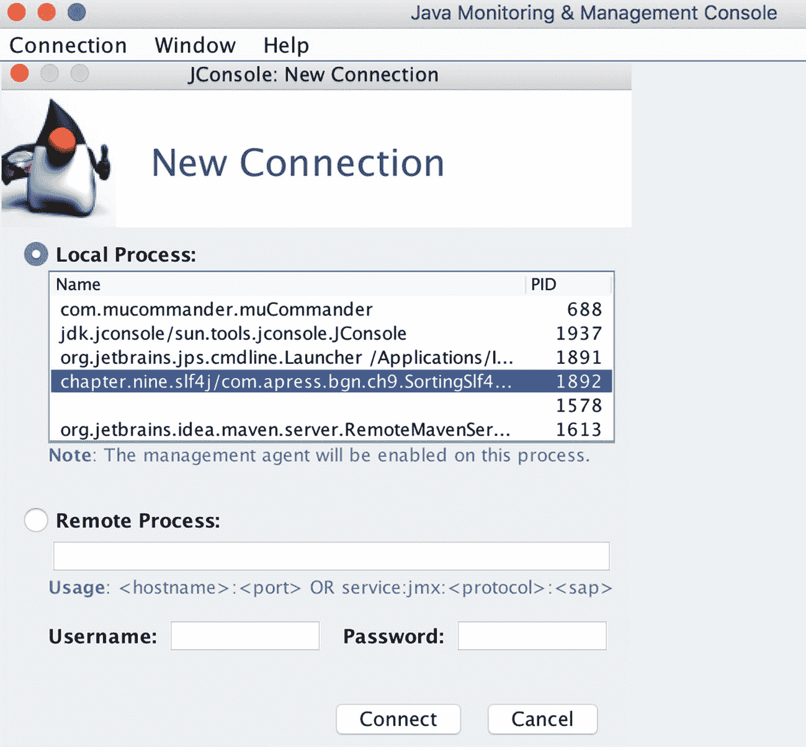

图 9-8

JConsole 第一个对话框窗口

当进程在本地运行时，很容易识别，因为它使用模块和完全限定的主类名来命名。当我们使用 `jconsole` 进行本地调试时，应用程序不必以调试模式运行，但对于像我们这样简单的应用程序，我们需要做一些调整，以确保在应用程序运行期间可以通过 `jconsole` 看到一些统计信息。我们添加了一些 `Thread.sleep(..)` 语句，以便暂停执行足够长的时间让 `jconsole` 连接。此外，我们将使用一个大型数据数组，以确保统计信息具有参考价值。

```
public class SortingSlf4jDemo {
private static final Logger log =
LoggerFactory.getLogger(SortingSlf4jDemo.class);
public static void main(String... args) throws Exception {
Thread.sleep(3000);
Random random = new Random(5);
IntStream intStream = random.ints(100_000_000,0,350);
int[] arr =  intStream.toArray();
if (log.isDebugEnabled()) {
final StringBuilder sb =
new StringBuilder("使用归并排序对数组进行排序: ");
Arrays.stream(arr).forEach(i -> sb.append(i).append(" "));
log.debug(sb.toString());
}
Thread.sleep(3000);
IntSorter mergeSort = new MergeSort();
mergeSort.sort(arr, 0, arr.length - 1);
if (log.isInfoEnabled()) {
final StringBuilder sb2 = new StringBuilder("排序后: ");
Arrays.stream(arr).forEach(i -> sb2.append(i).append(" "));
log.info(sb2.toString());
}
}
...
}
```

完成修改后，我们将正常启动应用程序，并将 `jconsole` 连接到它。成功连接后，会打开一个如图 9-9 所示的窗口，并显示 JVM 内存消耗、线程数、已加载类数和 CPU 使用率的图表。

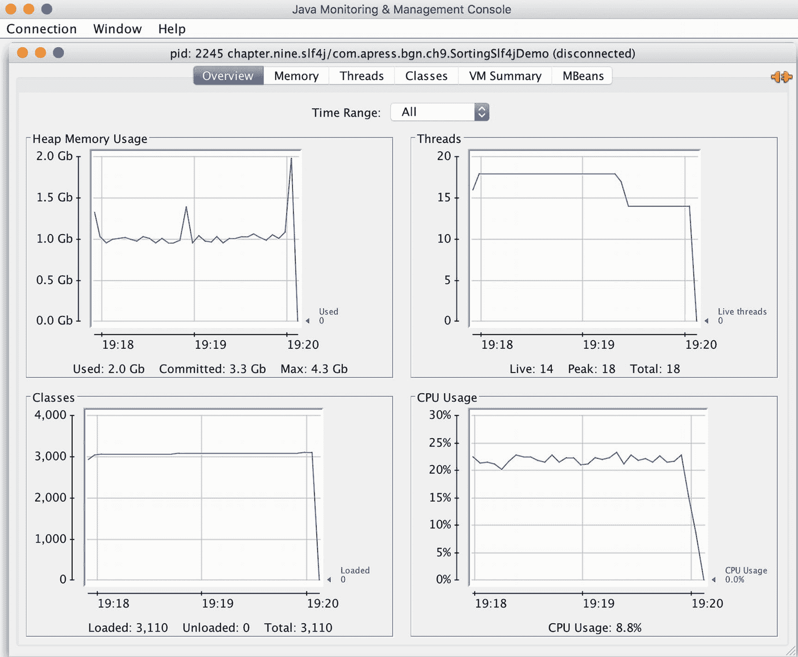

图 9-9

JConsole 统计信息窗口

每个统计信息都有一个选项卡提供更多详细信息，在更复杂的应用程序中，这些信息可用于提高性能、识别潜在问题，甚至预测应用程序在所需场景下的行为。对于我们这个小型应用程序，`jconsole` 的图表并没有揭示太多信息，但如果你真的想看到有价值的统计信息，可以安装一个像 `mucommander`^(⁷⁰) 这样的应用程序，在不关闭它的情况下使用一段时间，然后将 `jconsole` 连接到它，尽情探索吧。


#### jmc

JMC 是 **Oracle Java Mission Control** 的缩写。`jmc` 命令用于启动一个高级 Oracle 应用程序，用于调试和分析正在运行的应用程序的 JVM 统计数据。根据其官方描述：*JMC 是一个用于管理、监控、性能分析和故障排查 Java 应用程序的工具套件*，从 JDK 7 开始，它成为了 JDK 实用工具家族的一员。

与其他工具类似，该实用程序可以识别当前正在运行的 Java 进程，并提供检查以下信息的功能：它们在执行过程中特定时间点所需的内存量、在给定时刻并行运行的线程数、JVM 加载的类，以及运行 Java 应用程序所需的处理能力。JMC 拥有更友好的界面，其最重要的组件之一是 **Java Flight Recorder**，它可以在应用程序运行时记录所有 JVM 活动，在此期间收集的所有数据随后用于诊断和分析应用程序。

为了在应用程序运行时进行检查，我们通过在命令行中运行 `jmc` 来打开 JMC，然后根据与之前相同的规则，选择我们识别为运行 `SortingSlf4jDemo` 主类的进程。当我们找到它时，我们查找一个包含模块名称和完全限定类名的进程名称。右键单击它，然后选择 **Start JMX console**。你应该会看到类似于图 9-10 所示的图像。

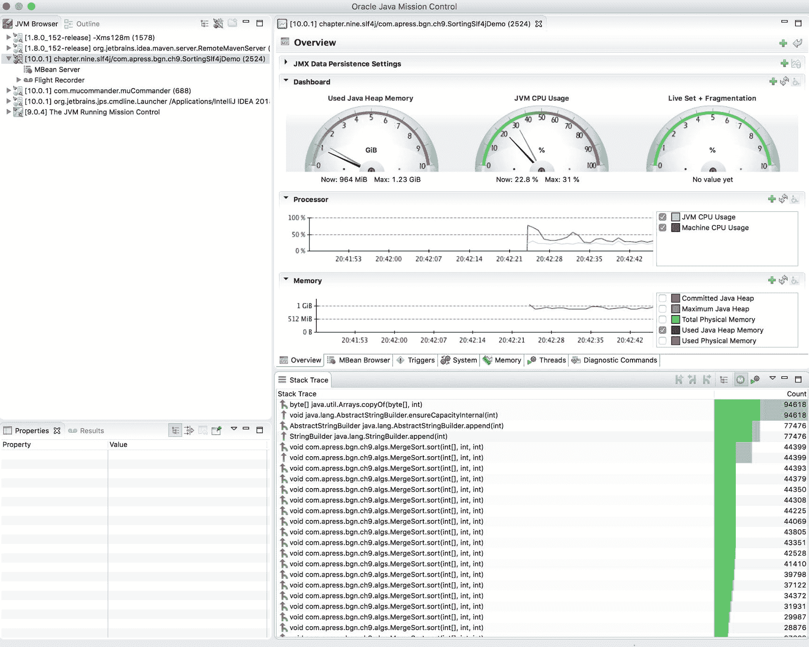

图 9-10

JMX 控制台

正如你可能注意到的，界面确实更友好，提供的统计数据也更详细。使用 JMC，可以记录应用程序和 JVM 在运行期间发生的一切，并可以在之后进行分析，即使应用程序此后已停止运行。**Memory** 选项卡提供了大量关于应用程序所用内存的信息，包括哪些类型的对象占用了内存。`SortingSlf4jDemo` 在运行期间占用的内存信息如图 9-11 所示。

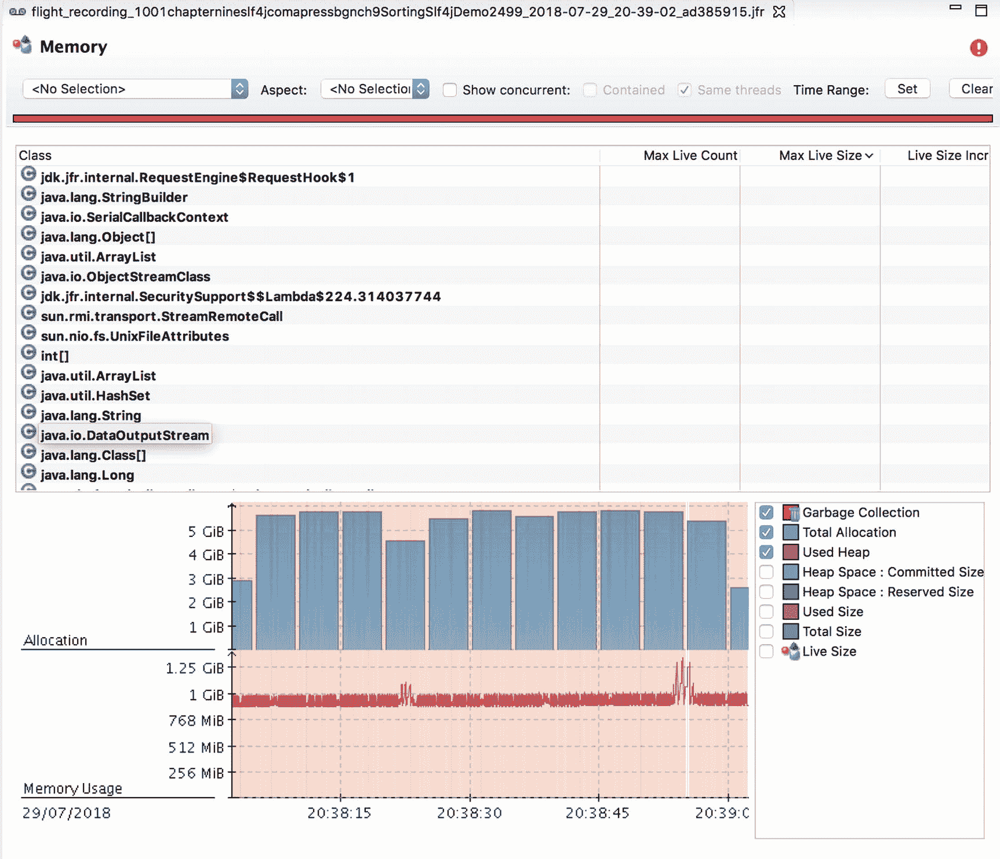

图 9-11

JMX 控制台 ➤ Memory 选项卡

为了在应用程序运行期间或在一段有限的时间内记录此信息，请在 **JVM Browser** 中展开进程节点，然后选择 **Start Flight Recording**。将打开一个窗口，要求你选择保存记录的路径和记录的持续时间。该文件具有 `.jfr` 扩展名，可以使用 JMC 打开进行检查。飞行记录器菜单和开始记录数据的对话框如图 9-12 所示。

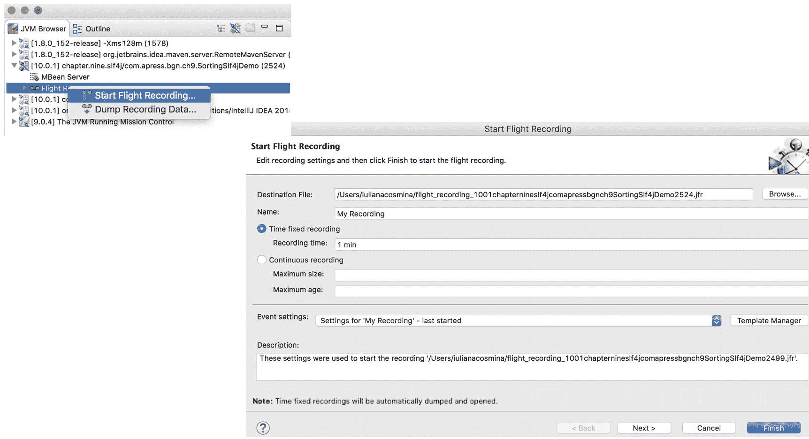

图 9-12

JMC 飞行记录器菜单和对话框窗口

JMC 这个主题对于本节来说过于高级和广泛，可能整本书都用来介绍它的用法以及如何解释统计数据。所以，我将在此打住，如果你想深入了解，推荐阅读这篇 Oracle 文章：[`www.oracle.com/technetwork/java/javaseproducts/mission-control/java-mission-control-1998576.html`](http://www.oracle.com/technetwork/java/javaseproducts/mission-control/java-mission-control-1998576.html)。

## 访问 Java 进程 API

Java 9 除了 Jigsaw 模块之外，还带来了许多其他改进，其中之一就是全新且改进的 Process API。Java Process API 允许你启动、检索信息和管理本地操作系统进程。在早期版本的 Java 中也有操作进程的能力，但非常简陋。请注意在 Java 5 之前是如何创建进程的。

```
package com.apress.bgn.ch9;
import org.slf4j.Logger;
import org.slf4j.LoggerFactory;
import java.io.BufferedReader;
import java.io.InputStream;
import java.io.InputStreamReader;
import java.io.Reader;
import java.nio.charset.Charset;
import java.nio.charset.StandardCharsets;
public class ProcessCreationDemo {
private static final Logger log =
LoggerFactory.getLogger(ProcessCreationDemo.class);
public static void main(String... args) {
try {
Process exec = Runtime.getRuntime()
.exec(new String[] { "/bin/sh", "-c", "echo Java home:  $JAVA_HOME" });
exec.waitFor();
InputStream is = exec.getInputStream();
StringBuilder textBuilder = new StringBuilder();
try (Reader reader = new BufferedReader(new InputStreamReader
(is, Charset.forName(StandardCharsets.UTF_8.name())))) {
int c = 0;
while ((c = reader.read()) != -1) {
textBuilder.append((char) c);
}
}
log.info("Process output -> {}", textBuilder.toString());
log.info("process result: {}", exec.exitValue());
} catch (Exception e) {
e.printStackTrace();
}
}
}
```

拦截已启动进程的输出是一件很痛苦的事情。我们需要将一个 `BufferedReader` 实例包装在连接到进程正常输出的 `InputStream` 实例周围。

Process API 使事情变得稍微实用一些。它的核心是一些类和接口，它们的名称都以 `"Process"` 开头。我们之前用 Java 可执行文件做的事情，现在可以直接通过编写 Java 代码来完成。提供访问本地进程 API 的接口名为 `ProcessHandle`，它是核心 Java 包 `java.lang` 的一部分。与 `Thread` 类类似，该接口上有一个名为 `current` 的静态方法，用于检索当前运行进程的 `ProcessHandle` 实例。一旦我们有了这个实例，就可以使用它的方法来访问更多进程信息。`ProcessHandle` 提供了几个静态实用方法来访问本地进程。可以编写 Java 代码来列出计算机上运行的所有进程，并且可以根据某些条件对它们进行排序。以下代码片段列出了通过运行 `java` 命令创建的所有进程。

```
package com.apress.bgn.ch9;
import org.slf4j.Logger;
import org.slf4j.LoggerFactory;
import java.util.Arrays;
import java.util.Optional;
public class ProcessListingDemo {
private static final Logger log = LoggerFactory.getLogger(ProcessDemo.class);
public static void main(String... args) {
Optional currUser = ProcessHandle.current().info().user();
ProcessHandle.allProcesses()
.filter(ph -> ph.info().user().equals(currUser)
&& ph.info().commandLine().get().contains("java"))
.forEach(p ->  log.info("PID: " + p.pid());
p.info() .arguments()
.ifPresent(s -> Arrays.stream(s)
.forEach(a -> log.info("\t {}", a)));
p.info().command()
.ifPresent(c -> log.info("\t Command: {}", c));
});
}
}
```

这段代码通过获取当前运行进程的句柄并调用 `info()` 来获取 `ProcessHandle.Info` 实例，从而提取当前运行进程的用户。`ProcessHandle.Info` 是一个接口，提供了一组方法来访问关于进程的快照信息，例如用于创建进程的命令和参数。前面代码的输出会打印在控制台中。它应该类似于下面的列表。


```
INFO  c.a.b.c.ProcessDemo - PID: 3077
INFO  c.a.b.c.ProcessDemo -    -Dlogback.configurationFile=
chapter09/processapi/src/main/resources/logback.xml
INFO  c.a.b.c.ProcessDemo -    -javaagent:/Applications/IntelliJ IDEA 2018.2 EAP
.app/Contents/lib/idea_rt.jar=57554:
/Applications/IntelliJ IDEA 2018.2 EAP.app/Contents/bin
INFO  c.a.b.c.ProcessDemo -    -Dfile.encoding=UTF-8
INFO  c.a.b.c.ProcessDemo -    -p
INFO  c.a.b.c.ProcessDemo -    /Users/iulianacosmina/apress/workspace/
java-bgn/chapter09/processapi/out/production/classes ...*.jar
INFO  c.a.b.c.ProcessDemo -    -m
INFO  c.a.b.c.ProcessDemo -    chapter.nine.processapi/com.apress.bgn.ch9.ProcessDemo
INFO  c.a.b.c.ProcessDemo -          Command:
/Library/Java/JavaVirtualMachines/jdk-10.0.1.jdk/Contents/Home/bin/java
INFO  c.a.b.c.ProcessDemo - PID: 3076
INFO  c.a.b.c.ProcessDemo -    -Xmx700m
INFO  c.a.b.c.ProcessDemo -    -Djava.awt.headless=true
INFO  c.a.b.c.ProcessDemo -    -Djdt.compiler.useSingleThread=true
...
INFO  c.a.b.c.ProcessDemo -    org.jetbrains.jps.cmdline.Launcher
INFO  c.a.b.c.ProcessDemo -    /Applications/IntelliJ IDEA 2018.2 EAP.app/Contents/lib/...*.jar
INFO  c.a.b.c.ProcessDemo -    org.jetbrains.jps.cmdline.BuildMain
INFO  c.a.b.c.ProcessDemo -    127.0.0.1
INFO  c.a.b.c.ProcessDemo -    51833
INFO  c.a.b.c.ProcessDemo -    47353a1a-570c-4f45-85f9-91abcbb66e9a
INFO  c.a.b.c.ProcessDemo -
/Users/iulianacosmina/Library/Caches/IntelliJIdea2018.2/compile-server
INFO  c.a.b.c.ProcessDemo -          Command:
/Library/Java/JavaVirtualMachines/jdk-10.0.1.jdk/Contents/Home/bin/java
```

在此日志中，仅展示了用于运行`ProcessDemo`类的 IntelliJ IDEA 启动器及其衍生出的进程，但实际输出可能要大得多。此外，部分参数已被缩短，因为用日志浪费书籍页面毫无意义。不过，为了以防你从未亲自运行过代码，还是有必要对日志格式进行一些描述。

前面的代码示例大致展示了如何访问原生进程并打印其相关信息。但是，借助改进后的 Java 进程 API，可以创建新进程，并启动底层操作系统的命令。例如，我们可以创建一个进程来打印`JAVA_HOME`环境变量的值，并捕获输出以显示在 IntelliJ 控制台中。

```
package com.apress.bgn.ch9;
import org.slf4j.Logger;
import org.slf4j.LoggerFactory;
public class ProcessCreationDemo {
private static final Logger log =
LoggerFactory.getLogger(ProcessCreationDemo.class);
public static void main(String... args) {
try {
ProcessBuilder pb = new
ProcessBuilder("/bin/sh", "-c", "echo Java home:  $JAVA_HOME")
.inheritIO();
Process p = pb.start();
p.onExit();
CompletableFuture future =  p.onExit();
int result = future.get().exitValue();
log.info("Process result: {}", result);
} catch (Exception e) {
e.printStackTrace();
}
}
}
```

可以通过使用`ProcessBuilder`的实例来创建新进程，这些实例可以接收命令列表及其参数值作为参数。该类拥有许多构造函数和不同签名的方法，可用于轻松创建和启动进程。`inheritIO()`方法将子进程标准 I/O 的源和目标设置为与当前进程相同。`onExit()`方法返回一个`CompletableFuture<Process>`，可用于在进程执行结束时访问该进程，以检索进程的退出值。对于正常终止的进程，该值应为 0（零）。

当 Java 程序创建一个进程时，该进程会成为创建它的进程的子进程。要列出所有子进程，我们需要确保它们持续一段时间，因为一旦终止，它们显然就不复存在了。以下代码示例创建了三个相同的进程，每个进程执行三个 Linux shell 命令：第一个是`echo "start"`，用于通知进程已开始执行；第二个是`sleep 3`，使进程暂停 3 秒；最后一个（`echo "done."`）在进程即将结束执行时执行。进程启动后便无法再控制，因此为了确保子进程完成执行，我们将要求用户按下一个键，通过调用`System.in.read();`来决定当前进程何时结束执行。

```
package com.apress.bgn.ch9;
import org.slf4j.Logger;
import org.slf4j.LoggerFactory;
public class ProcessCreationDemo {
private static final Logger log =
LoggerFactory.getLogger(ProcessCreationDemo.class);
public static void main(String... args) {
try {
List builders = List.of(
new ProcessBuilder("/bin/sh", "-c",
"echo \"start...\" ; sleep 3; echo \"done.\"").inheritIO(),
new ProcessBuilder("/bin/sh", "-c",
"echo \"start...\" ; sleep 3; echo \"done.\"").inheritIO(),
new ProcessBuilder("/bin/sh", "-c",
"echo \"start...\" ; sleep 3; echo \"done.\"").inheritIO()
);
builders.parallelStream().forEach(pbs -> {
try {
pbs.start();
} catch (Exception e) {
log.error("Oops, could not start process!", e);
}
});
ProcessHandle ph = ProcessHandle.current();
ph.children().forEach(pc -> {
log.info("Child PID: {}", pc.pid());
pc.parent().ifPresent(parent ->
log.info(" Parent PID: {}", parent.pid()));
});
System.out.println("Press any key to exit!");
System.in.read();
} catch (Exception e) {
e.printStackTrace();
}
}
}
```

我们将`ProcessBuilders`分组到一个列表中，并使用并行流处理这些实例，以确保所有进程几乎同时启动。我们在每个进程终止后打印其结果，以确保所有进程都正确执行。

`children()`方法返回一个包含`ProcessHandle`实例的流，这些实例对应于当前 Java 进程启动的进程。

对于每个子`ProcessHandle`实例，都调用了`parent()`方法，以获取对应于创建它的进程的`ProcessHandle`。

运行上述代码时，控制台中应会看到类似于下一个清单所示的输出。

```
start...
start...
start...
22:29:04.593 [main] INFO com.apress.bgn.ch9.ProcessCreationDemo - Child PID: 3966
22:29:04.594 [main] INFO com.apress.bgn.ch9.ProcessCreationDemo -   Parent PID: 3962
22:29:04.594 [main] INFO com.apress.bgn.ch9.ProcessCreationDemo - Child PID: 3965
22:29:04.594 [main] INFO com.apress.bgn.ch9.ProcessCreationDemo -   Parent PID: 3962
22:29:04.594 [main] INFO com.apress.bgn.ch9.ProcessCreationDemo - Child PID: 3964
22:29:04.594 [main] INFO com.apress.bgn.ch9.ProcessCreationDemo -   Parent PID: 3962
Press any key to exit!
done.
done.
done.
```

改进后的 Java 进程 API 以更实用的方式，对运行中和已衍生的进程提供了更强的控制。过去，需要在更高级别上处理进程的开发者会求助于原生代码。Java 9 中新增的 Java 进程 API 改进的完整列表，可在[`https://docs.oracle.com/javase/9/core/process-api1.htm#JSCOR-GUID-6FAB2491-FD4E-42B4-A883-DCD181A1CE3E`](https://docs.oracle.com/javase/9/core/process-api1.htm%2523JSCOR-GUID-6FAB2491-FD4E-42B4-A883-DCD181A1CE3E)找到。


## 测试

调试是软件流程中称为**测试**的一部分，涉及识别和纠正代码错误。但仅仅避免技术错误是不够的，测试应用程序的意义远不止于此。有一个组织为软件测试人员提供非常优质的培训和认证材料。**国际软件测试资格认证委员会**（ISTQB）是一个国际性的软件测试资格认证组织。它制定了软件测试的教学大纲、资格等级和指南。^(⁷¹) 如果你认为自己更倾向于软件测试领域，那么你应该考虑获取 ISTQB 认证。

ISTQB 将测试定义为：“由所有生命周期活动（包括静态和动态）组成的过程，涉及对软件及相关工作产品的规划、准备和评估，以确定它们满足规定的要求，证明它们适合其用途，并检测缺陷。”

这是一个技术性和学术性的定义。我提出的定义是：“验证一个实现是否在预期的时间内，以可接受的资源消耗完成了它应该完成的任务，并且在执行过程中没有破坏任何东西的过程。”

### 测试小引

*我想成为一名开发者。为什么我需要了解所有这些关于测试的细节？* 简单的答案是，因为测试是一项持续的活动，在软件应用程序生命周期的每个阶段都会进行。在设计阶段，会进行模拟，并由经验丰富的人员审查设计，以判断它是否代表了问题的合适解决方案以及是否可实现。在编写代码时，必须对其进行测试，以确保应用程序不会崩溃并按预期运行。在交付之前，有一个名为验收测试的阶段，客户代表会在受控环境中测试应用程序，以便记录每个操作并识别问题。测试可以通过调试来完成，使用到目前为止介绍的所有方法，但调试的缺点是它是手动且重复的。因此，让我们介绍一种更自动化的应用程序测试方法。

### ！

测试是开发过程中必不可少的一部分，应尽早开始，因为修复缺陷的工作量会随着其被发现的时间呈指数级增长。^(⁷²)

在开发阶段，除了编写实际的解决方案外，你还可以编写代码来测试你的解决方案。这些测试可以手动运行，也可以在构建项目时由构建工具运行。在编写代码时，除了思考解决问题的方案外，你还应该思考如何测试该方案。这种方法被称为**TDD**，即**测试驱动开发**的缩写，这是一种编程范式，它指出你应该在实现解决方案之前思考如何测试它，因为如果它难以测试，那么它很可能难以实现、长期维护以及扩展以解决相关问题。

最简单的测试称为**单元测试**，它测试功能的小单元。如果单元测试无法轻松编写，你的设计可能存在问题。单元测试是抵御失败的第一道防线。如果单元测试失败，那么你的解决方案的基础就是糟糕的。

跨越多个组件，测试功能单元之间的通信以及它们交互的结果与预期结果是否一致的测试，称为**集成测试**。

开发人员应该编写的最后一种测试是**回归测试**，即定期运行的测试，以确保之前测试过的代码在更改后仍然能正确执行。这类测试对于由大量开发人员编写代码的大型项目至关重要，因为有时组件之间的依赖关系并不明显，一个开发人员编写的代码可能会破坏另一个开发人员的代码。

本节仅向你展示如何使用名为 JUnit 的 Java 库编写单元测试。它描述了一些典型的测试组件，开发人员可以构建这些组件来为单元测试设置上下文。因此，正如我的苏格兰同事所说，*让我们开始吧！*

### 测试代码位置

你可能还记得，在**第** 3 章中，我们解释了 `java-for-absolute-beginners` 项目结构。关于测试的讨论必须从项目最低层级模块的结构开始，这些模块包含源代码和测试。图 9-13 显示了本节所用模块的源代码和测试代码的模块结构。

图 9-13 所示的结构可以解释如下。

*   `src` 目录包含项目的所有代码和资源。其内容分为 `main` 和 `test` 两个目录。
    *   `main` 目录包含源代码和应用程序配置文件，分为两个子目录。`java` 目录包含 Java 源代码，`resources` 目录包含配置文件、非可执行文本文件（可以根据各种格式编写：XML、SQL、CSV 等）、媒体文件、PDF 等。当应用程序被构建并打包成 jar（或 war 或 ear）时，只有 `java` 目录中的文件会被考虑，`*.class` 文件与配置文件一起被打包。

    *   `test` 目录包含用于测试 `src` 目录中源代码的代码。Java 文件保存在 `java` 目录下，`resources` 目录中包含构建测试上下文所需的配置文件。`test` 目录的内容不属于交付给客户的项目的一部分。它们的存在是为了在开发过程中帮助测试应用程序。

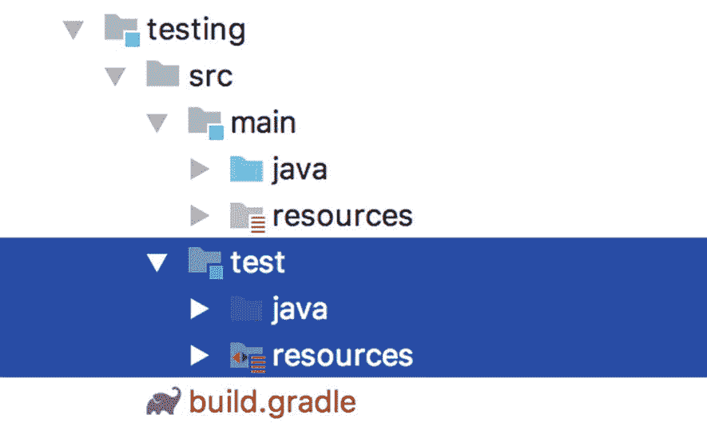

图 9-13

Gradle 模块结构


### 测试应用

在本节的示例中，我们将构建一个简单的应用程序，该程序使用嵌入式 Derby^(⁷³) 数据库来存储数据。这是生产数据库。在测试环境中，该数据库被替换为各种模拟数据库行为的伪构造。该应用程序是基础性的。一个 `AccountService` 实现从输入中获取数据，并使用这些数据来管理 `Account` 实例。`Account` 类是一个非常抽象且不切实际的银行账户实现。它包含一个 `holder` 字段（账户所有者）、一个 `accountNumber` 字段和一个 `amount` 字段。`AccountService` 实现使用一个 `AccountRepo` 实现，通过 `DBConnection` 的实现来执行所有与 `Account` 实例相关的数据库操作。构成这个简单应用程序的类、接口以及它们之间的关系如图 9-14 所示。

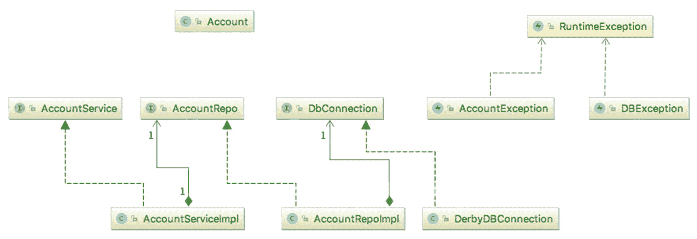

图 9-14

简单的账户管理应用程序组件

这些类的实现与本节的讨论无关，但如果你好奇，可以在本书的官方仓库中找到完整代码。那么，让我们开始测试吧。最简单的方法是编写一个主类并执行一些账户操作。但我们不希望这样做，因为一旦应用程序投入生产，我们就无法再测试新功能，否则存在数据损坏的风险。此外，生产数据库通常托管在昂贵的产品上，例如 Oracle RDBMS（Oracle 关系数据库管理系统）或 Microsoft SQL Server。它们并不真正适合开发或测试。而且，我们的目标是自动运行测试，因此内存数据库或可实例化的实现更为合适。那么，让我们从测试 `AccountRepoImpl` 开始。

#### 介绍 JUnit

JUnit 无疑是 Java 开发世界中使用最广泛的测试框架。2017 年底，JUnit 5^(⁷⁴) 发布，这是该框架的下一代版本。它配备了一个新引擎，兼容 Java 9+，并提供了大量基于 lambda 的功能。JUnit 提供了用于标记测试方法以自动执行的注解、用于初始化和销毁测试上下文的注解，以及用于实际实现测试方法的实用方法。你可以使用多种 JUnit 注解。其中五个（以及一个实用类）构成了 JUnit 框架的核心，这也是学习测试的最佳起点。下面是对每个注解的简短描述，它们共同勾勒出如何使用 JUnit 测试应用程序的总体图景。

*   `@BeforeAll` 来自 `org.junit.jupiter.api` 包，用于返回 `void` 的 `非私有静态` 方法，用于初始化当前类中所有测试方法将使用的对象和变量。此方法仅被调用一次，在类中所有测试方法之前执行，因此测试方法不应修改这些对象，因为它们的状态是共享的，可能会影响测试结果。最终，由该注解方法初始化的静态字段可以声明为 `final`，这样一旦初始化，就无法再更改。一个测试类中可以声明多个带有 `@BeforeAll` 注解的方法，但这有什么意义呢？

*   `@AfterAll` 来自 `org.junit.jupiter.api` 包，是 `@BeforeAll` 的对应注解。它也用于注解返回 `void` 的 `非私有静态` 方法，但其目的是销毁测试方法运行的上下文并执行清理操作。

*   `@BeforeEach` 来自 `org.junit.jupiter.api` 包，用于返回 `void` 的 `非私有非静态` 方法，顾名思义，带有此注解的方法会在每个带有 `@Test` 注解的方法之前执行。这些方法可用于进一步定制测试上下文，为对象填充值，以便在测试方法中进行断言测试。

*   `@AfterEach` 来自 `org.junit.jupiter.api` 包，用于返回 `void` 的 `公共非静态` 方法，顾名思义，带有此注解的方法会在每个带有 `@Test` 注解的方法之后执行。

*   `@Test` 来自 `org.junit.jupiter.api` 包，用于返回 `void` 的 `非私有非静态` 方法，顾名思义，带有此注解的方法是一个测试方法。一个测试类可以有一个或多个测试方法，具体取决于被测试的类。

*   实用类 `org.junit.jupiter.api.Assertions` 提供了一组支持在测试中断言条件的方法。

你可能还想了解另一个注解 `@DisplayName`。它与所有其他注解声明在同一个包中，并接收一个文本参数，该参数代表测试显示名称，会显示在编辑器中以及构建工具创建的报告中。让我们编写一个伪测试类，以便你了解测试类的外观。

```
package com.apress.bgn.ch9.pseudo;
import org.junit.jupiter.api.*;
import org.slf4j.Logger;
import org.slf4j.LoggerFactory;
import static org.junit.jupiter.api.Assertions.assertFalse;
import static org.junit.jupiter.api.Assertions.assertTrue;
public class PseudoTest {
private static final Logger log =
LoggerFactory.getLogger(PseudoTest.class);
@BeforeAll
public static void loadCtx() {
log.info("加载通用测试上下文。");
}
@BeforeEach
public  void setUp(){
log.info("准备单个测试上下文。");
}
@Test
@DisplayName("测试一")
public void testOne() {
log.info("执行测试一。");
assertTrue(true);
}
@Test
@DisplayName("测试二")
public void testTwo() {
log.info("执行测试二。");
assertFalse(false);
}
@AfterEach
public void tearDown(){
log.info("销毁单个测试上下文。");
}
@AfterAll
public static void unloadCtx(){
log.info("卸载通用测试上下文。");
}
}
```


结合目前对这些注解的了解，在运行此类时，我们期望每个方法打印的日志消息严格按照我们定义的顺序出现，因为这些方法已策略性地放置在前面的代码中，从而保证了 JUnit 的执行顺序。唯一无法保证的是测试的执行顺序。此外，可以通过在 `test\resources` 目录下添加一个名为 `junit-platform.properties` 的文件来实现测试的并行执行，该文件需包含以下属性及其与硬件配置匹配的值。

```
junit.jupiter.execution.parallel.enabled=true
junit.jupiter.execution.parallel.config.strategy=fixed
junit.jupiter.execution.parallel.config.fixed.parallelism=8
```

大多数 Java 智能编辑器（如 IntelliJ IDEA）都提供了右键单击类时的相应选项。图 9-15 展示了在 IntelliJ IDEA 中执行测试类的菜单选项。

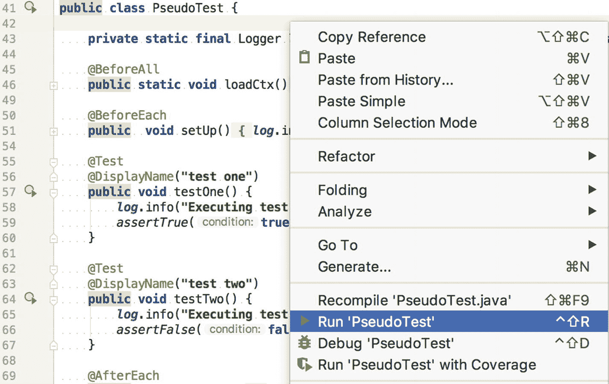

图 9-15

在 IntelliJ IDEA 中执行测试类的菜单选项

右键单击该类后，从出现的菜单中选择 **Run ‘PseudoTest.java’**。测试类即开始执行。此时会创建一个启动器。测试类可以在调试模式下执行，并且可以使用断点。执行上述类时，即使测试方法并行运行，输出结果也与注解规范所对应的方法顺序一致。为了确保测试方法并行执行，日志记录器被配置为打印线程 ID。以下是示例输出。

```
[1-worker-9] INFO  c.a.b.c.p.PseudoTest - Loading general test context.
[1-worker-9] INFO  c.a.b.c.p.PseudoTest - Prepare  single test context.
[1-worker-2] INFO  c.a.b.c.p.PseudoTest - Prepare  single test context.
[1-worker-2] INFO  c.a.b.c.p.PseudoTest - Executing test one.
[1-worker-9] INFO  c.a.b.c.p.PseudoTest - Executing test two.
[1-worker-2] INFO  c.a.b.c.p.PseudoTest - Destroy  single test context.
[1-worker-9] INFO  c.a.b.c.p.PseudoTest - Destroy  single test context.
[1-worker-9] INFO  c.a.b.c.p.PseudoTest - UnLoading general test context.
```

`testOne()` 方法包含这一行：`assertTrue(true);`，此处添加它只是为了展示断言方法的样子。在实际测试中，`true` 值会被替换为一个条件。`textTwo()` 方法中的 `assertFalse(false);` 断言也是如此。

这就是本书中我们能够专门用于 JUnit 的全部篇幅。但我真诚地建议你进一步深入研究它，因为开发者可以编写代码，但优秀的开发者知道如何确保代码正常工作。

##### `使用` Fakes（伪造对象）

**fake** 对象是一个具有工作实现的对象，但与生产环境中的对象不同。编写此类对象所实现的代码，其功能是对生产环境中部署的功能的简化。

为了测试 `AccountRepoImpl` 类，我们必须用 `FakeDBConnection` 替换 `DerbyDBConnection`，后者不依赖数据库，而是依赖更简单、更易访问的东西，比如 `Map`。`DerbyDBConnection` 使用 `java.sql.Connection` 及该包中的其他类来对 Derby 数据库执行数据操作。

`FakeDBConnection` 实现了 `DBConnection` 接口，因此它可以被传递给 `AccountRepoImpl`，并且其所有方法都可以在该对象上调用。

编写测试及测试支持类时的经验法则是：将它们放在与被测试或被替换对象相同的包中，但位于 `test/java` 目录下。但由于我们向你展示了不止一种测试方法，因此每个包都相应地命名。使用 fake 对象测试应用程序类的包名为 `com.apress.bgn.ch9.fake`。

编写测试时的另一个经验法则是：编写一个方法来测试被测试方法的正确结果，再编写一个方法来测试错误行为。在意外情况下，使用意外数据时，你的应用程序会以意外方式运行，因此尽管这看起来有些矛盾，但你必须预料到意外情况并为其编写测试。

`AccountRepoImpl` 类实现了将 `Account` 实例持久化到数据库或从数据库中删除的基本方法。其实现如下所示。

```
package com.apress.bgn.ch9.repo;
import com.apress.bgn.ch9.Account;
import com.apress.bgn.ch9.db.DbConnection;
import java.util.List;
import java.util.Optional;
public class AccountRepoImpl implements AccountRepo {
private DbConnection conn;
public AccountRepoImpl(DbConnection conn) {
this.conn = conn;
}
@Override
public Account save(Account account) {
Account dbAcc = conn.findByHolder(account.getHolder());
if(dbAcc == null) {
return conn.insert(account);
}
return conn.update(account);
}
@Override
public Optional findOne(String holder) {
Account acc = conn.findByHolder(holder);
if(acc != null) {
return Optional.of(acc);
}
return Optional.empty();
}
@Override
public List findAll() {
return conn.findAll();
}
@Override
public int deleteByHolder(String holder) {
Account acc = conn.findByHolder(holder);
conn.delete(holder);
if(acc != null) {
return 0;
}
return 1;
}
}
```

为了测试此方法，我们需要提供一个模拟数据库连接的 `DbConnection` 实现。这就是 `FakeDBConnection` 发挥作用的地方。

```
package com.apress.bgn.ch9.fake.db;
import com.apress.bgn.ch9.Account;
import com.apress.bgn.ch9.db.DBException;
import com.apress.bgn.ch9.db.DbConnection;
import java.util.ArrayList;
import java.util.HashMap;
import java.util.List;
import java.util.Map;
public class FakeDBConnection implements DbConnection {
/**
* 伪数据库 {@code Map}
*/
Map database = new HashMap();
@Override
public void connect() {
// 无需实现
}
@Override
public Account insert(Account account) {
if (database.containsKey(account.getHolder())) {
throw new DBException("无法插入 " + account);
}
database.put(account.getHolder(), account);
return account;
}
@Override
public Account findByHolder(String holder) {
return database.get(holder);
}
@Override
public List findAll() {
List result = new ArrayList();
result.addAll(database.values());
return result;
}
@Override
public Account update(Account account) {
if (!database.containsKey(account.getHolder())) {
throw new DBException("找不到账户 " + account.getHolder());
}
database.put(account.getHolder(), account);
return account;
}
@Override
public void delete(String holder) {
database.remove(holder);
}
@Override
public void disconnect() {
// 无需实现
}
}
```


`FakeDBConnection` 的行为与一个连接对象完全相同，可用于将条目保存到数据库、搜索或删除它们，只不过它并非由真实数据库支持，而是由一个 `Map<String, Account>` 备份。该映射的键是持有者姓名，因为在我们的数据库中，持有者姓名被用作表中 `Account` 条目的唯一标识符。现在，有了这个伪造对象，我们就可以测试 `AccountRepoImpl` 是否按预期运行。出于实际原因，本节仅测试一个方法，但完整代码可在本书的官方 GitHub 仓库中找到。

`AccountRepoImpl` 中的 `deleteByHolder` 方法用于删除一个账户。如果该条目存在，则将其删除并返回 0；否则返回 1。`deleteByHolder` 方法如下代码片段所示。

```
package com.apress.bgn.ch9.repo;
import com.apress.bgn.ch9.Account;
import com.apress.bgn.ch9.db.DbConnection;
import java.util.List;
import java.util.Optional;
public class AccountRepoImpl implements AccountRepo {
private DbConnection conn;
public AccountRepoImpl(DbConnection conn) {
this.conn = conn;
}
@Override
public int deleteByHolder(String holder) {
Account acc = conn.findByHolder(holder);
conn.delete(holder);
if(acc != null) {
return 0;
}
return 1;
}
...
}
```

测试类如下所示，涵盖了两种情况（存在要删除的条目和不存在要删除的条目）。

```
package com.apress.bgn.ch9.fake;
import com.apress.bgn.ch9.Account;
import com.apress.bgn.ch9.db.DbConnection;
import com.apress.bgn.ch9.fake.db.FakeDBConnection;
import com.apress.bgn.ch9.repo.AccountRepo;
import com.apress.bgn.ch9.repo.AccountRepoImpl;
import org.junit.jupiter.api.*;
import org.slf4j.Logger;
import org.slf4j.LoggerFactory;
import static org.junit.jupiter.api.Assertions.assertEquals;
import static org.junit.jupiter.api.Assertions.assertTrue;
public class AccountRepoTest {
private static final Logger log =
LoggerFactory.getLogger(AccountRepoTest.class);
private static DbConnection conn;
private AccountRepo repo;
@BeforeAll
public static void prepare() {
conn = new FakeDBConnection();
}
@BeforeEach
public void setUp(){
repo = new AccountRepoImpl(conn);
// 插入一个条目以便测试更新
repo.save(new Account("Pedala", 200, "2345"));
}
@Test
public void testFindOneExisting (){
Optional expected = repo.findOne("Pedala");
assertTrue(expected.isPresent());
}
@Test
public void testFindOneNonExisting(){
Optional expected = repo.findOne("Dorel");
assertFalse(expected.isPresent());
}
@AfterEach
public void tearDown(){
// 删除该条目
repo.deleteByHolder("Pedala");
}
@AfterAll
public static void cleanUp(){
conn = null;
log.info("全部完成！");
}
}
```

请注意，我们是如何在测试方法执行之前恰好创建一个条目添加到伪造数据库中，并在之后将其删除的。

现在，我们确信仓库类能正常工作，接下来要测试的是 `AccountServiceImpl`。为了测试这个类，我们采用一种不同的方法。伪造对象很有用，但对于功能复杂的类来说，编写一个伪造对象在开发时间上可能成本过高。在下一节中，我们将探讨*桩*。

##### `使用` 桩

**桩**是一个包含预定义数据的对象，它利用这些数据来响应测试调用。`AccountServiceImpl` 的实例使用 `AccountRepo` 的实例从数据库检索数据或将数据保存到数据库。考虑到我们正在编写单元测试，我们希望覆盖服务类的功能，因此我们可以编写一个**桩**类来模拟 `AccountRepo` 的行为。为了让 `AccountServiceImpl` 实例使用它，该桩必须实现 `AccountRepo`。在本节中，测试涵盖了 `createAccount(...)` 方法，因为该方法存在多个失败点，我们可以为其编写大量不同的测试。以下代码片段展示了 `createAccount(...)` 方法。

```
package com.apress.bgn.ch9.service;
import com.apress.bgn.ch9.Account;
import com.apress.bgn.ch9.repo.AccountRepo;
import java.util.Optional;
/**
* @author Iuliana Cosmina
* @since 1.0
*/
public class AccountServiceImpl implements AccountService {
AccountRepo repo;
public AccountServiceImpl(AccountRepo repo) {
this.repo = repo;
}
@Override
public Account createAccount(String holder, String accountNumber,
String amount) {
int intAmount;
try {
intAmount = Integer.parseInt(amount);
} catch (NumberFormatException nfe) {
throw new InvalidDataException(
"无法使用无效金额创建账户！");
}
if (accountNumber == null ||
accountNumber.isEmpty() || accountNumber.length()  existing = repo.findOne(holder);
if (existing.isPresent()) {
throw new AccountCreationException(
"持有者 " + holder + " 的账户已存在");
}
Account acc = new Account(holder, intAmount, accountNumber);
return repo.save(acc);
}
...
}
```

`createAccount(..)` 方法将持有者姓名、要创建的账户编号以及初始金额作为参数。所有这些参数都特意以 `String` 实例的形式提供，以便方法体包含一些需要认真测试的逻辑。让我们分析一下前面方法的行为，并列出所有可能的返回值以及可能抛出的异常。

*   如果金额不是数字，则抛出 `InvalidDataException`。
*   如果 `accountNumber` 参数为空，则抛出 `InvalidDataException`。
*   如果 `accountNumber` 参数为 null，则抛出 `InvalidDataException`。
*   如果 `accountNumber` 参数少于五个字符，则抛出 `InvalidDataException`。
*   如果转换为数字的 `amount` 参数为负数，则抛出 `InvalidDataException`。
*   如果 `holder` 参数对应的账户已存在，则抛出 `AccountCreationException`。
*   如果所有输入都有效且 `holder` 参数没有对应的账户，则创建一个 `Account` 实例，保存到数据库，并返回结果。

因此，如果我们真的对测试有执念，就需要为所有这些情况编写测试场景。在软件领域，有一种叫做*测试覆盖率*的东西，这是一个确定测试用例是否覆盖应用程序代码以及覆盖多少的过程。结果是一个百分比值，公司通常会定义一个测试覆盖率百分比^(⁷⁵)，作为应用程序质量的保证。那么，让我们为了练习而编写所有这些测试方法吧。但在此之前，我们先看看仓库桩是什么样的。


```
package com.apress.bgn.ch9.stub;
import com.apress.bgn.ch9.Account;
import com.apress.bgn.ch9.repo.AccountRepo;
import java.util.List;
import java.util.Optional;
public class AccountRepoStub implements AccountRepo {
private  Integer option = 0;
public synchronized void set(int val) {
option = val;
}
@Override
public Account save(Account account) {
return account;
}
@Override
public Optional findOne(String holder) {
if(option == 0) {
return Optional.of(new Account(holder, 100 ,"22446677"));
}
return Optional.empty();
}
@Override
public List findAll() {
return List.of(new Account("sample", 100, "22446677"));
}
@Override
public int deleteByHolder(String holder) {
return option;
}
}
```

`option` 字段可用于改变桩的行为，以覆盖更多测试用例。这在测试方法不并行执行时非常有用。当时间紧迫时，测试会并行执行，如果使用桩，每个方法应实例化并使用自己的桩，以避免与其他方法发生冲突，否则很可能导致测试失败。

使用 JUnit 可以编写两种方式的负面测试，用于处理输入为无效金额的情况。这两种方式的区别仅在于 lambda 表达式的使用方式。

```
package com.apress.bgn.ch9.service;
import com.apress.bgn.ch9.Account;
import com.apress.bgn.ch9.service.stub.AccountRepoStub;
import org.junit.jupiter.api.*;
import static org.junit.jupiter.api.Assertions.assertEquals;
import static org.junit.jupiter.api.Assertions.assertThrows;
public class AccountServiceTest {
private static AccountRepoStub repo;
private AccountService service;
@BeforeAll
public static void prepare() {
repo = new AccountRepoStub();
}
@BeforeEach
public void setUp() {
service = new AccountServiceImpl(repo);
}
@Test
public void testNonNumericAmountVersionOne() {
assertThrows(InvalidDataException.class,
() -> {
service.createAccount("Gigi", "223311", "2I00");
});
}
@Test
public void testNonNumericAmountVersionTwo() {
InvalidDataException expected = assertThrows(
InvalidDataException.class, () -> {
service.createAccount("Gigi", "223311", "2I00");
}
);
assertEquals("Could not create account with invalid amount!"
, expected.getMessage());
}
@AfterEach
public void tearDown() {
repo.set(0);
}
@AfterAll
public static void destroy() {
repo = null;
}
}
```

`testNonNumericAmountVersionOne()` 方法使用了 `assertThrows`，它接收两个参数：第二个参数（类型为 `Executable`）在执行时预期抛出的异常类型。`Executable` 是定义在 `org.junit.jupiter.api.function` 中的一个函数式接口，可以在 lambda 表达式中使用，从而得到你所见的简洁测试。

`testNonNumericAmountVersionTwo()` 方法保存了 `assertThrows(..)` 调用的结果，这样可以测试异常的消息，并确保执行流程完全符合预期。

其他测试如下面的代码片段所示。

```
package com.apress.bgn.ch9.service;
import com.apress.bgn.ch9.Account;
import com.apress.bgn.ch9.service.stub.AccountRepoStub;
import org.junit.jupiter.api.*;
import static org.junit.jupiter.api.Assertions.assertEquals;
import static org.junit.jupiter.api.Assertions.assertThrows;
public class AccountServiceTest {
private static AccountRepoStub repo;
private AccountService service;
@BeforeAll
public static void prepare() {
repo = new AccountRepoStub();
}
@BeforeEach
public void setUp() {
service = new AccountServiceImpl(repo);
}
@Test
public void testEmptyAccountNumber() {
InvalidDataException expected = assertThrows(
InvalidDataException.class, () -> {
service.createAccount("Gigi", "", "2100");
}
);
assertEquals("Could not create account with invalid account number!",
expected.getMessage());
}
@Test
public void testNullAccountNumber() {
InvalidDataException expected = assertThrows(
InvalidDataException.class, () -> {
service.createAccount("Gigi", null, "2100");
}
);
assertEquals("Could not create account with invalid account number!",
expected.getMessage());
}
@Test
public void testInvalidAccountNumber() {
InvalidDataException expected = assertThrows(
InvalidDataException.class, () -> {
service.createAccount("Gigi", "11", "2100");
}
);
assertEquals("Could not create account with invalid account number!",
expected.getMessage());
}
@Test
public void testNegativeIntAmount() {
InvalidDataException expected = assertThrows(
InvalidDataException.class, () -> {
service.createAccount("Gigi", "112233", "-2100");
}
);
assertEquals("Could not create account with invalid account number!",
expected.getMessage());
}
@Test
public void testCreateAccount() {
repo.set(1);
Account expected = service.createAccount("Gigi", "112233", "2100");
assertEquals("Gigi", expected.getHolder());
assertEquals("112233", expected.getNumber());
assertEquals(2100, expected.getSum());
}
@Test
public void testCreateAccountAlreadyExists() {
AccountCreationException expected = assertThrows(
AccountCreationException.class, () -> {
service.createAccount("Gigi", "112233", "2100");
}
);
assertEquals("Account already exists for holder Gigi",
expected.getMessage());
}
@AfterEach
public void tearDown() {
repo.set(0);
}
@AfterAll
public static void destroy() {
repo = null;
}
}
```

可以编写类似的方法来测试所有其他服务方法。这留作练习供你完成。因为本章还需要介绍另一种测试技术：使用模拟对象。


##### **使用** Mock

Mock 是用于记录其所接收调用的对象。在测试执行期间，通过使用断言工具方法，可以验证所有预期操作是否已在 Mock 上执行。幸运的是，开发者无需手动编写 Mock 代码，有三个广为人知的库提供了使用 Mock 进行测试所需的类类型：Mockito^(⁷⁶)、JMock^(⁷⁷) 和 EasyMock^(⁷⁸)。此外，如果你需要 Mock 静态方法（最常见的原因是设计不佳），还有 PowerMock^(⁷⁹) 可供使用。

使用 Mock，你可以直接跳转到编写测试。因此，让我们为 `createAccount(..)` 方法编写两个测试，重点关注仓库类调用其方法的情况，因为仓库类将被 Mock 替代。

```
package com.apress.bgn.ch9.mock;
import com.apress.bgn.ch9.Account;
import com.apress.bgn.ch9.repo.AccountRepo;
import com.apress.bgn.ch9.service.AccountCreationException;
import com.apress.bgn.ch9.service.AccountServiceImpl;
import com.apress.bgn.ch9.service.InvalidDataException;
import org.junit.jupiter.api.BeforeEach;
import org.junit.jupiter.api.Test;
import org.junit.jupiter.api.extension.ExtendWith;
import org.mockito.InjectMocks;
import org.mockito.Mock;
import org.mockito.junit.jupiter.MockitoExtension;
import java.util.Optional;
import static org.junit.jupiter.api.Assertions.*;
import static org.mockito.ArgumentMatchers.any;
import static org.mockito.Mockito.when;
@ExtendWith(MockitoExtension.class)
public class AccountServiceTest {
@InjectMocks
private AccountServiceImpl service;
@Mock
private AccountRepo mockRepo;
@BeforeEach
public void checkMocks() {
assertNotNull(service);
assertNotNull(mockRepo);
}
@Test
public void testCreateAccount() {
Account expected = new Account("Gigi", 2100, "223311");
when(mockRepo.findOne("Gigi")).thenReturn(Optional.empty());
when(mockRepo.save(any(Account.class))).thenReturn(expected);
Account result = service.createAccount("Gigi", "223311", "2100");
assertEquals(expected, result);
}
@Test
public void testCreateAccountAlreadyExists() {
Account expected = new Account("Gigi", 2100, "223311");
when(mockRepo.findOne("Gigi")).thenReturn(Optional.of(expected));
assertThrows(AccountCreationException.class,
() -> {
service.createAccount("Gigi", "223311", "2100");
});
}
}
```

这些测试不言自明；Mockito 工具方法的命名使其易于理解测试执行过程中发生的情况。但 Mock 是如何创建和注入的，则需要解释一下。那么，让我们来讲解！`@ExtendWith(MockitoExtension.class)` 对于 JUnit 5 测试支持 Mockito 注解是必需的。没有它，像 `@InjectMocks` 和 `@Mock` 这样的注解对代码将不起作用。

`@Mock` 注解用于由 Mockito 创建的 Mock 引用。使用 Mock 的首选方式是指定一个接口类型的引用，该接口由真实对象类型和针对测试场景创建的 Mock 共同实现。但 `@Mock` 也可以放在具体类型引用上，此时创建的 Mock 是该类的子类。

`@InjectMocks` 注解用于待测试的对象，以便 Mockito 知道创建该对象并注入 Mock 以替代依赖项。

因此，这基本上就是你在测试中开始使用 Mockito Mock 所需了解的全部内容。声明要 Mock 的对象和要注入的对象，是包含使用 Mock 的单元测试的类所需的唯一设置。

使用 Mock 的测试方法主体具有典型的结构。前几行必须声明作为参数传递给被测对象方法或传递给 Mockito 工具方法（用于声明 Mock 接受什么参数以及返回什么）的对象和变量。接下来的几行建立了当被测对象调用 Mock 方法时 Mock 的行为。以下两行展示了 `findOne(..)` 方法的这一过程。第一行创建了一个账户对象。第二行定义了 Mock 的行为。当调用 `mockRepo.findOne("Gigi")` 时，先前创建的账户实例被包装在 `Optional<T>` 实例中返回。

```
Account expected = new Account("Gigi", 2100, "223311");
when(mockRepo.findOne("Gigi")).thenReturn(Optional.of(expected));
```

还有许多其他库可以让开发者轻松编写测试。像 Spring 这样的大型框架提供了自己的测试库，帮助开发者编写应用程序测试。像 Ant、Maven 和 Gradle 这样的构建工具可以在项目构建时自动运行测试，并生成与失败相关的有用报告。使用 Gradle，可以通过在控制台中调用 `gradle clean build` 来构建项目。测试模块中声明的所有测试类，如果命名为 `*Test.java`，都会被自动识别。在编写测试且不更改应用程序代码时，你可以仅通过调用 `gradle test` 来运行测试。这是一个可以通过重载 Gradle `test` 任务来更改的配置；如果你好奇，可以深入研究一下。

Gradle 报告采用 HTML 格式，因此可以在浏览器中打开，并且看起来非常棒。这些报告生成为一个包含 `index.html` 静态页面的站点，位于 `java-bgn/chapter09/testing/build/reports/tests/test/index.html`。

我故意让一个测试失败，以便你能看到报告的样子（见图 9-16）。

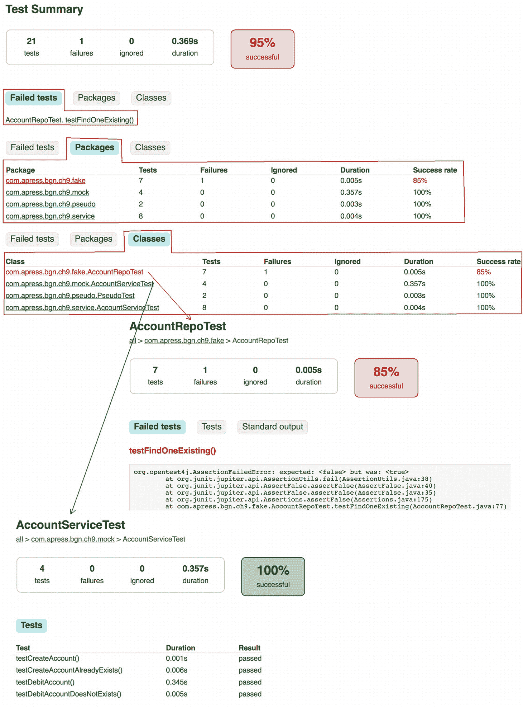

图 9-16

Gradle 测试报告

总结本节，请记住：无论一个开发团队多么优秀，如果没有一个出色的测试团队，最终的应用可能远未达到可接受的质量标准。因此，如果你遇到没有专门测试团队的公司，或者至少没有一种在代码审查和编写测试等技术上不妥协的公司文化，在接受那份工作之前请三思。

## 文档编写

在软件领域，有一个关于文档的笑话可能并非所有人都喜欢，但它值得一提。


### ！

文档就像性爱：当它好的时候，真的非常非常好。而当它糟糕的时候，也总比没有强。

编程的一个常识和最佳实践是编写不言自明的代码，这样你就不需要编写文档了。基本上，如果你需要写太多文档，那说明你做错了。有很多方法可以避免编写文档，比如为类和变量使用有意义的名称、遵循语言的代码规范等等。但是，当你构建一组供其他开发者使用的类时，你需要为主要 API 提供一些文档。当然，如果你的解决方案需要编写非常复杂的算法，你可能需要在各处添加注释；不过在这种情况下，也应该编写包含架构图和示意图的适当技术文档。

Javadoc 块注释与公共类、接口、方法体或公共字段相关联；必要时，有时也会与受保护的元素关联。Javadoc 注释包含特殊的标签，用于链接已文档化的元素，或标记不同类型的信息。Javadoc 注释及其关联的代码可以被 Javadoc 工具处理、提取，并封装成一个 HTML 站点，这个站点被称为项目的 Javadoc API。本项目使用的 Gradle 构建工具暴露了一个名为 `javadoc` 的任务，可以执行该任务来为某个模块生成 Javadoc API 站点。要整合包含多个模块的项目的文档，需要一个特殊的插件。^(⁸⁰) 此外，智能编辑器可以访问这些文档，并在开发者尝试使用已文档化的组件编写代码时显示它们。

让我们从几个 Javadoc 注释的例子开始，解释最常用的标签。

每当我们创建一个类或接口时，都应该添加 Javadoc 注释来解释其用途、添加应用程序的版本号，并链接现有资源。`IntSorter` 是一个实现 `IntSorter` 接口的类层次结构，提供了不同排序算法的实现。如果这些类被其他开发者使用，其中某人可能想要向我们的层次结构中添加一个自定义算法，那么关于 `IntSorter` 接口的一点信息就会大有帮助。在下面的代码片段中，为 `IntSorter` 接口添加了一个 Javadoc 注释。

```
package com.apress.bgn.ch9.algs;
/**
* 接口 {@code IntSorter} 是一个需要由提供对 {@code int} 值数组进行排序方法的类来实现的接口。
*
* 选择 {@code int[]} 作为类型是因为这种类型的值总是可排序的。({@link Comparable})
*
* @author Iuliana Cosmina
* @since 1.0
*/
public interface IntSorter {
...
}
```

在 Javadoc 注释中，可以使用 HTML 标签来格式化信息。在前面的代码中，使用了 `<p>` 元素来确保注释由多个段落组成。`@author` 标签是在 JDK 1.0 中引入的。当开发团队规模较大时，这个标签很有用，因为如果你最终使用别人的代码，当出现问题时，你知道该找谁。`@since` 标签提供了添加此接口的应用程序版本。对于一个经历了长期开发和发布周期的应用程序，这个标签可以用来标记特定版本的元素，这样使用你应用程序代码库的开发者就能知道元素是何时添加的；并且在回滚到旧版本时，知道应用程序中哪些地方会出现编译时错误。

这里最好的例子是 Java 官方 Javadoc；让我们以 `Optional<T>` 接口为例，它是在版本 8 中引入的。但在版本 9、10 和 11 中又为其添加了更多方法，并且每个方法都标记了特定的版本。

```
package java.util;
...
/**
...
* @param <T> 值的类型
* @since 1.8
*/
public final class Optional<T> {
...
/**
...
* @since 9
*/
public void ifPresentOrElse(Consumer<? super T> action, Runnable emptyAction) {
if (value != null) {
action.accept(value);
} else {
emptyAction.run();
}
}
/**
...
* @since 10
*/
public T orElseThrow() {
if (value == null) {
throw new NoSuchElementException("No value present");
}
return value;
}
/**
* 如果值不存在，则返回 {@code true}，否则返回 {@code false}。
*
* @return 如果值不存在则返回 {@code true}，否则返回 {@code false}
* @since   11
*/
public boolean isEmpty() {
return value == null;
}
..
}
```

在 `IntSorter` 示例中，你看到了在 Java 1.5 中引入的 `@code` 标签。它以代码形式显示文本，使用特殊字体并转义可能破坏 HTML 语法的符号（例如 `< 或 >`）。`@link` 标签是在 Java 1.2 中添加的，用于插入指向相关文档的可导航链接。

现在，让我们为方法声明添加文档，让开发者知道这些方法应该用于什么目的。

```
package com.apress.bgn.ch9.algs;
/**
* 接口 {@code IntSorter} 是一个需要由提供对 {@code int} 值数组进行排序方法的类来实现的接口。
*
* 选择 {@code int[]} 作为类型是因为这种类型的值总是可排序的。({@link Comparable})
*
* @author Iuliana Cosmina
* @since 1.0
*/
public interface IntSorter {
/**
* 对 {@code arr} 进行排序
*
* @param arr 要排序的整数数组
* @param low 要排序区间的下限
* @param high 要排序区间的上限
*/
void sort(int[] arr, int low, int high);
/**
* 此方法用于使用冒泡排序对数组进行排序
* @deprecated 自版本 0.1 起已弃用，因为应改用 {@link #sort(int[], int, int) ()} 方法。
* 将在版本 1.1 中移除
* @param arr 要排序的整数数组
*/
@Deprecated (since= "0.1", forRemoval = true)
default void sort(int[] arr) {
System.out.println("不要使用这个！此方法已弃用！！");
}
}
```

IntelliJ IDEA 编辑器（以及其他智能编辑器）会为你生成小段的 Javadoc。一旦你声明了想要文档化的类或方法体，输入 **/****，然后按 Enter 键。生成的注释块包含以下内容。

*   一个或多个带有参数名称的 `@param` 标签，开发者需要做的只是添加额外的文档来解释它们的用途。

*   如果方法返回的值类型不是 `void`，则会添加 `@return`，开发者必须提供文档来解释结果代表什么，以及在哪些特殊情况下会返回某个特定值。既然我们开始使用 `Optional<T>` 作为研究案例，下面是 `isPresent(..)` 方法的 Javadoc。

*   如果方法声明要抛出异常，则会生成一个 `@throws` 标签以及异常类型，开发者的工作是解释何时以及为何会抛出该类型的异常。

```
/**
...
* @param predicate 要应用于值的谓词（如果值存在）
* @return 一个 {@code Optional}，描述此 {@code Optional} 的值（如果值存在且与给定谓词匹配），否则返回一个空的 {@code Optional}
* @throws NullPointerException 如果谓词为 {@code null}
*/
public Optional<T> filter(Predicate<? super T> predicate) {
Objects.requireNonNull(predicate);
if (!isPresent()) {
return this;
} else {
return predicate.test(value) ? this : empty();
}
}
```

```
/**
...
* @param action 要执行的操作（如果值存在）
* @throws NullPointerException 如果值存在且给定的操作为 {@code null}
*/
public void ifPresent(Consumer<? super T> action) {
if (value != null) {
action.accept(value);
}
}
```

`@link` 创建一个指向类页面、方法文档部分或字段的文档链接。在前面的 `sort` 方法声明示例中，我们创建了一个指向接口中另一个方法的链接。


`@deprecated` 标签用于添加文本，说明弃用的原因、版本以及应使用的替代项。Javadoc 生成工具会获取此文本，以斜体格式呈现，并将其添加到方法的主要描述中。

至此，我们已经涵盖了编写 Javadoc 注释时最常用的标签。如果你想查看完整列表，可以在 [`https://docs.oracle.com/javase/7/docs/technotes/tools/windows/javadoc.html#javadoctags`](https://docs.oracle.com/javase/7/docs/technotes/tools/windows/javadoc.html%2523javadoctags) 找到。Javadoc 文档是一个广泛的主题，足以写成一整本书。本节只是浅尝辄止，涵盖了基础知识，以便你有一个良好的开端。

要为 `logging-jul` 模块生成 HTML 站点，最简单的方法是打开 Gradle 项目视图，展开 **chapter09:logging-jul ➤ Tasks ➤ Documentation** 节点，在其下找到 `javadoc` 任务，如图 9-17 所示。要执行该任务，需要双击它。

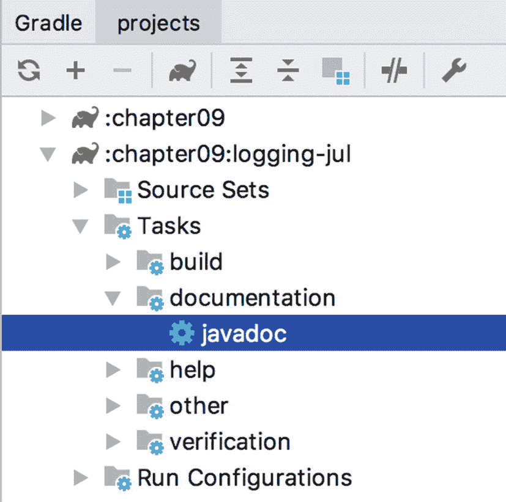

图 9-17

Gradle javadoc 任务

```
00:22:17: Executing task 'javadoc'...
> Task :chapter09:logging-jul:compileJava
/Users/iulianacosmina/apress/workspace/java-bgn/chapter09/logging-jul/
src/main/java/com/apress/bgn/ch9/algs/InsertionSort.java:59:
warning: [removal] sort(int[]) in IntSorter has been deprecated and marked for removal
public void sort(int[] arr) {
^
/Users/iulianacosmina/apress/workspace/java-bgn/chapter09/logging-jul/
src/main/java/com/apress/bgn/ch9/algs/HeapSort.java:55:
warning: [removal] sort(int[]) in IntSorter has been deprecated and marked for removal
public void sort(int[] arr) {
^
2 warnings
> Task :chapter09:logging-jul:processResources
> Task :chapter09:logging-jul:classes
> Task :chapter09:logging-jul:javadoc
BUILD SUCCESSFUL in 2s
3 actionable tasks: 3 executed
00:22:19: Task execution finished 'javadoc'.
```

`javadoc` 任务会识别已弃用的元素，并打印警告信息供开发者查看。该任务成功执行后，可以在 `logging-jul` 目录下找到 `build` 目录。所有从 IntelliJ IDEA 运行的 Gradle 任务的结果都存储在此处。在此目录中，应该有一个 **docs ➤ javadoc** 目录层次结构。展开 **javadoc** 层次结构，我们应该能看到构成我们模块 Javadoc 站点的所有文件。预期的输出如图 9-18 所示。

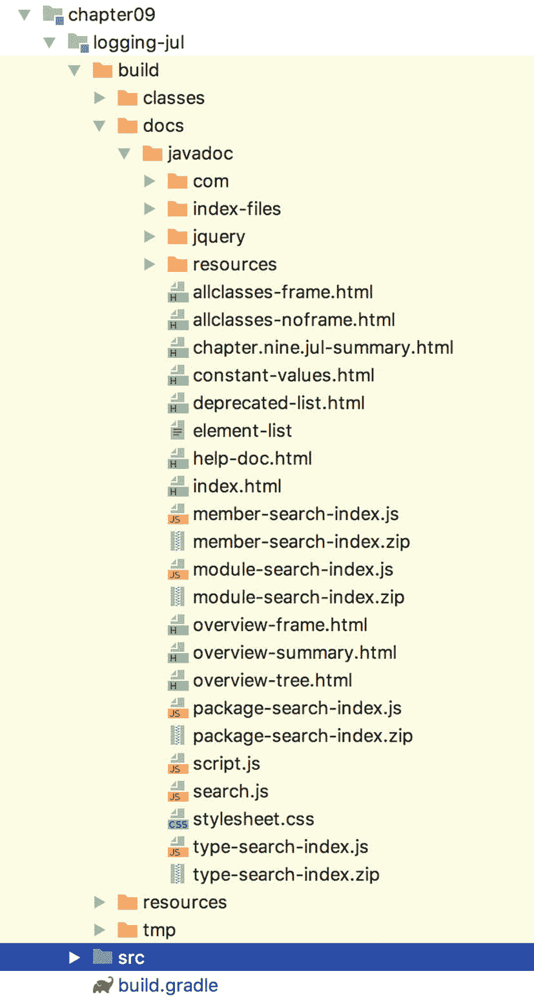

图 9-18

通过执行 Gradle javadoc 任务生成的 Javadoc 站点

任何站点都有一个起始页面，默认的是 `index.html`。右键单击该文件，从弹出的上下文菜单中选择 **Open in Browser**，然后选择你偏好的浏览器。如果你觉得这个页面与 JDK 官方 Javadoc 页面相似，那并非错觉；官方页面也是使用相同的 Doclet API 生成的。要查看模块（项目）中所有文档的详细视图，请点击 **FRAMES** 链接。这会重定向到一个页面，该页面左侧有两个框架：一个显示项目的包，另一个显示类/接口/枚举；右侧的框架则显示在左侧框架中点击的每个项目的详细信息。你应该会看到类似于图 9-19 所示的页面。

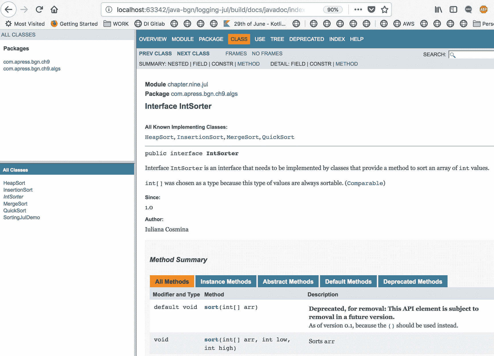

图 9-19

通过执行 Gradle javadoc 任务生成的 Javadoc 站点，在浏览器中打开

IntelliJ IDEA 和其他智能编辑器会拾取 Javadoc 文档，并在开发者在代码中使用已文档化的组件时即时显示。当选择一个类、方法名、接口方法等时，大多数智能编辑器都提供某种包含 F1 的组合键，开发者必须按下该键，文档才会在弹出窗口中显示。在 IntelliJ IDEA 中，点击一个元素并按 F1，Javadoc 文档就会在弹出窗口中显示，并格式良好，如图 9-20 所示。

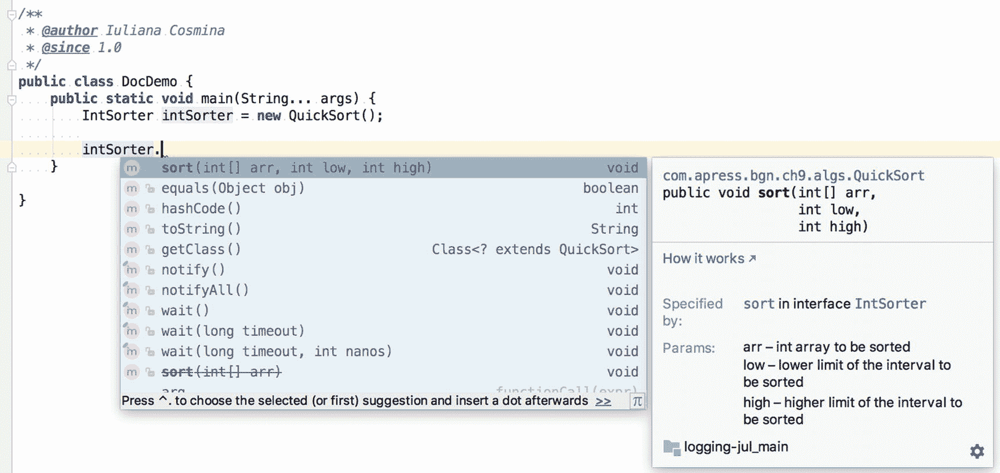

图 9-20

IntelliJ IDEA 中显示的 Javadoc 信息

只要代码是开源的并且模块导出了相应的包，你就可以在智能编辑器中查看项目任何依赖项（包括 JDK 类）的 Javadoc 信息。

在 Java 9 中，用于生成 Javadoc 的 Doclet API 得到了升级和改头换面。在 Java 9 之前，开发者抱怨旧版本存在性能问题、API 晦涩难懂、缺乏支持以及整体功能浅薄。在 Java 9 中，大部分问题都得到了解决。详细的改进描述位于 [`http://openjdk.java.net/jeps/221`](http://openjdk.java.net/jeps/221) 。

文档非常有价值，当它做得非常好时，可以使开发变得实用且愉快。因此，在编写代码时，要像你期望项目依赖项有文档那样去记录它。

你可能听说过 **RTFM** 这个表达，它是 **Read The F***ing Manual!**（读那该死的说明书！）的缩写。在软件开发中，有经验的开发者与新手开发者一起工作时，经常使用这个表达。问题是，当没有说明书时该怎么办？大多数面临截止日期的公司可能倾向于分配很少或根本不分配时间来记录项目。因此，本书加入本节是为了强调文档在软件开发中的重要性，并教你如何在编写代码的同时编写文档，因为你之后可能没有时间去做这件事。

## 总结

本章涵盖了重要的开发工具和技术、JDK 中为它们提供支持的类，以及能够让你的开发工作更实用、更愉快的 Java 重要库。以下是完整的主题列表。

*   如何在 Java 应用程序中配置和使用日志记录
*   如何在控制台中记录消息
*   如何将消息记录到文件
*   如何使用 Java 日志记录
*   什么是日志门面以及为什么推荐使用它
*   配置 SLF4J 与 Logback 一起使用
*   如何使用断言进行编程
*   如何使用 IntelliJ IDEA 进行调试
*   如何在应用程序运行时使用各种 JDK 工具（`jps`、`jcmd`、`jconsole` 和 `jmc`）监控和检查 JVM 统计信息
*   如何使用 Process API
*   如何使用 JUnit 测试应用程序
*   如何使用假对象编写测试
*   如何使用模拟对象编写测试
*   如何使用桩对象编写测试
*   如何记录 Java 应用程序并以 HTML 格式生成文档

脚注 1   2   3   4   5   6   7   8   9   10   11   12   13   14   15


