# 10. 让应用程序具备交互能力

到目前为止，本书中 Java 程序的数据输入都是通过数组或代码内部初始化的变量，或是通过程序参数提供的。但如今大多数应用程序都需要与用户进行交互。用户可以通过输入用户名和密码来获得访问权限；有时用户需要输入信息来确认身份，或指示应用程序执行相应操作。Java 支持多种读取用户输入的方法。本章将介绍几种构建交互式 Java 应用程序的方式。交互式 Java 应用程序可以从控制台、Java 内置界面（无论是桌面端还是 Web 端）获取输入。

JShell 是一个命令行界面，开发者可以在其中输入变量声明和单行语句，按下回车键后即可执行。像 `bash` 这样的命令行界面 shell，以及 Windows 的命令提示符等终端，都可以通过连续的文本行向程序发出命令。本书开头介绍 JShell 的原因很简单，因为它是 Java 9 的新特性。接下来的几节将介绍如何使用命令行界面读取用户提供的数据和指令。后续章节则重点介绍如何构建带有桌面/Web 界面的 Java 应用程序。

## 从命令行读取数据

本节专门介绍如何从命令行读取用户输入，无论是 IntelliJ IDEA 的控制台，还是从可执行 jar 包在特定操作系统的终端中运行程序。在 JDK 中，有两个类可用于从命令行读取用户数据：`java.util.Scanner` 和 `java.io.Console`，本节将详细讲解这两个类。闲话少叙，我们直接开始吧。

### 使用 System.in 读取用户数据

在介绍**第 9 章**的日志记录（用于在控制台打印数据）之前，我们一直使用 `System.out` 下的方法。此外，还有一个对应的工具对象 `System.in`，用于从控制台读取数据，即程序用户为控制应用程序流程而输入的数据。你可能已经注意到，到目前为止，所有 Java 程序在执行时都会启动、处理数据、执行声明的语句，然后终止——要么正常退出，要么在出现问题时抛出异常。将终止决策权交给用户的最简单、最常见的方法是在 main 方法末尾调用 `System.in.read()`。该方法从输入流中读取下一个字节数据，程序会暂停，直到用户输入一个值；由于该值会被返回，我们甚至可以保存并打印它。

```
import java.io.IOException;
public class ReadingFormStdinDemo {
public static void main(String... args) throws IOException {
System.out.print("按任意键终止:");
int read = System.in.read();
System.out.println("按下的键: " + read);
}
```

如果你在 IntelliJ 中运行这个类，你会看到 *按任意键终止:* 这条消息被打印出来，然后应用程序就挂起了。如果你点击显示该消息的窗口并按下任意键，按下的键的字节值就会被打印出来，然后应用程序终止。因此，如果你执行上述代码并按下回车键，控制台中会显示以下内容。^(⁸¹)

```
按任意键终止:
按下的键: 10
```

但是，仅从控制台读取单个字节并没有太大用处，对吧？幸运的是，`read(..)` 方法还有另一种形式，可以将用户输入保存到字节数组中。但由于数组大小是固定的，无论用户输入多长，只有数组能容纳的部分才会被保存。结束输入的最终 <enter> 会作为一个等于 3 的 `int` 值返回，3 是*文本结束*的代码。因此，之前的代码变为：

```
package com.apress.bgn.ch10;
import java.io.IOException;
public class ReadingFormStdinDemo {
public static void main(String... args) throws IOException {
System.out.print("按任意键终止:");
byte[] b = new byte[3];
int read = System.in.read(b);
for (int i = 0; i < b.length; ++i) {
System.out.println(b[i]);
}
System.out.println("按下的键: " + read);
}
}
```

现在，用户输入被保存在 `byte[] b` 数组中。但是，仅仅读取字节并没有太大用处，对吧？那么，让我们来看看如何从用户那里读取完整的文本和数值：这就轮到 `java.util.Scanner` 类登场了。


### 使用 Scanner

`System.in` 变量的类型是 `java.io.InputStream`，这是一个 JDK 特殊类型，所有表示字节输入流的类都扩展了它。这意味着 `System.in` 可以被包装在任何 `java.io.Reader` 扩展类中，从而将字节读取为可读数据。但真正重要的是一个名为 `Scanner` 的类，它位于 `java.util` 包中。可以通过调用其构造函数并将 `System.in` 作为参数来创建该类型的实例。`Scanner` 类提供了许多 `next..()` 方法，可用于从控制台读取几乎任何类型。在图 10-1 中，你可以看到 `next..()` 方法的列表。

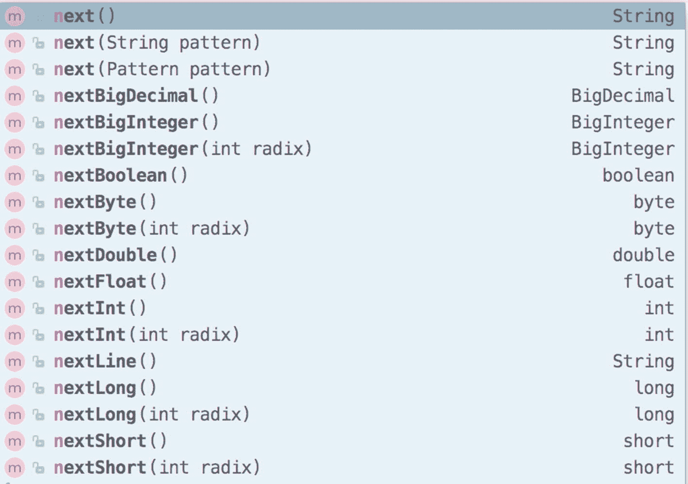

图 10-1

用于读取各种数据类型的 Scanner 方法

使用 `Scanner` 从控制台读取数据的优势在于，读取的值会在可能的情况下自动转换为正确的类型。如果无法转换，则会抛出 `java.util.InputMismatchException`。以下代码的设计目的是让你可以通过输入文本然后输入值来选择要读取的值类型。在代码中，会调用 `Scanner` 实例的相应方法来读取该值。

```
package com.apress.bgn.ch10;
import java.io.IOException;
import java.math.BigInteger;
import java.util.Scanner;
public class ReadingFormStdinDemo {
public static final String EXIT = "exit";
public static final String HELP = "help";
public static final String BYTE = "byte";
public static final String SHORT = "short";
public static final String INT = "int";
public static final String BOOLEAN = "bool";
public static final String DOUBLE = "double";
public static final String LINE = "line";
public static final String BIGINT = "bigint";
public static final String TEXT = "text";
public static void main(String... args) throws IOException {
Scanner sc = new Scanner(System.in);
String help = getHelpString();
System.out.println(help);
String input;
do {
System.out.print("Enter option: ");
input = sc.nextLine();
switch (input) {
case HELP:
System.out.println(help);
break;
case EXIT:
System.out.println("Hope you had fun. Buh-bye!");
break;
case BYTE:
byte b = sc.nextByte();
System.out.println("Nice byte there: " + b);
sc.nextLine();
break;
case SHORT:
short s = sc.nextShort();
System.out.println("Nice short there: " + s);
sc.nextLine();
break;
case INT:
int i = sc.nextInt();
System.out.println("Nice int there: " + i);
sc.nextLine();
break;
case BOOLEAN:
boolean bool = sc.nextBoolean();
System.out.println("Nice boolean there: " + bool);
sc.nextLine();
break;
case DOUBLE:
double d = sc.nextDouble();
System.out.println("Nice double there: " + d);
sc.nextLine();
break;
case LINE:
String line = sc.nextLine();
System.out.println("Nice line of text there: " + line);
break;
case BIGINT:
BigInteger bi = sc.nextBigInteger();
System.out.println("Nice big integer there: " + bi);
sc.nextLine();
break;
case TEXT:
String text = sc.next();
System.out.println("Nice text there: " + text);
sc.nextLine();
break;
default:
System.out.println("No idea what you want bruh!");
}
} while (!input.equalsIgnoreCase(EXIT));
}
private static String getHelpString() {
return new StringBuilder("This application helps you test various usage of Scanner. Enter type to be read next:")
.append("\n\t help >  displays this help")
.append("\n\t exit >  leave the application")
.append("\n\t byte > read a byte")
.append("\n\t short > read a short")
.append("\n\t int > read an int")
.append("\n\t bool > read a boolean")
.append("\n\t double > read a double")
.append("\n\t line > read a line of text")
.append("\n\t bigint > read a BigInteger")
.append("\n\t text > read a text value").toString();
}
}
```

你可能已经注意到，在代码示例中，大多数 scanner 方法都与 `nextLine()` 一起调用，这是因为你提供的每个输入都由实际的标记和一个换行符（你按下 <enter> 结束输入时产生的字符）组成，在输入下一个值之前，你需要将该字符也从流中取出。</enter>

让我们稍微测试一下前面的代码。

```
This application helps you test various usage of Scanner. Enter type to be read next:
help >  displays this help
exit >  leave the application
byte > read a byte
short > read a short
int > read an int
bool > read a boolean
double > read a double
line > read a line of text
bigint > read a BigInteger
text > read a text value
Enter option: byte

Nice byte there: 12
Enter option: bool
true
Nice boolean there: true
Enter option: line
some of us are hardly ever here
Nice line of text there: some of us are hardly ever here
Enter option: text
john
Nice text there: john
Enter option: text
the rest of us are made to disappear...
Nice text there: the
Enter option: double
4.2
Nice double there: 4.2
Enter option: int
AAAA
Exception in thread "main" java.util.InputMismatchException
at java.base/java.util.Scanner.throwFor(Scanner.java:939)
at java.base/java.util.Scanner.next(Scanner.java:1594)
at java.base/java.util.Scanner.nextInt(Scanner.java:2258)
at java.base/java.util.Scanner.nextInt(Scanner.java:2212)
at chapter.ten/com.apress.bgn.ch10.ReadingFormStdinDemo.main(
ReadingFormStdinDemo.java:78)
```

列表中带下划线的输出代表 `next()` 方法的测试用例。此方法应用于读取单个 `String` 标记。下一个标记会被转换为 `String` 实例，并且该标记在遇到空白字符时结束。这就是为什么在前面的示例中，唯一读取到的文本是 *the*。

在最后一种情况下，预期的选项是一个整数值，但输入了 *AAAA*，因此抛出了异常。

当你需要从控制台重复读取相同类型的值时，可以先预览要读取的值，并在读取之前进行检查，以避免抛出 `InputMismatchException`。针对这种特定场景，每个 `next..()` 方法都有一个名为 `hasNext...()` 的配对方法。为了演示如何使用这些方法，让我们在前面的代码中添加一个选项来读取一个长整型值列表。

```
...
public static final String LONGS = "longs";
...
String input;
do {
System.out.print("Enter option: ");
input = sc.nextLine();
switch (input) {
case LONGS:
List longList = new ArrayList();
while (sc.hasNextLong()) {
longList.add(sc.nextLong());
}
System.out.println("Nice long list there: " + longList);
// else all done
sc.nextLine();
sc.nextLine();
break;
default:
System.out.println("No idea what you want bruh!");
}
} while (!input.equalsIgnoreCase(EXIT));
...
```

虽然看起来有点奇怪，但我们需要调用 `nextLine()` 方法两次。一次用于处理无法转换为 `long` 的字符，以便 `while` 循环结束；另一次用于处理行尾字符，以便下一次 `read..()` 读取的是下一个值的类型。

`Scanner` 类中还有其他一些方法可用于过滤输入并仅读取所需的标记，但本节列出的方法是你最可能经常使用的。


### 使用 java.io.Console 读取用户数据

`java.io.Console` 类是在 Java 1.6 版本中引入的，比 Scanner 晚一个版本；它提供了访问基于字符的控制台设备的方法（如果存在的话），该设备与当前 Java 虚拟机相关联。因此，`java.io.Console` 类的方法不仅可以用于读取用户输入，还可以用于向控制台写入内容。如果 JVM 是从后台进程或 Java 编辑器启动的，则控制台将不可用，因为编辑器会将标准输入和输出流重定向到其自身的窗口。这就是为什么如果我们使用 `Console` 编写代码，只能通过在终端中调用 `java ReadingUsingConsoleDemo.class` 或 `java -jar using-console-1.0-SNAPSHOT.jar` 来运行该类或 jar 文件进行测试。JVM 的控制台（如果可用）在代码中由 `Console` 类的单个实例表示，可以通过调用 `System.console()` 获取该实例。

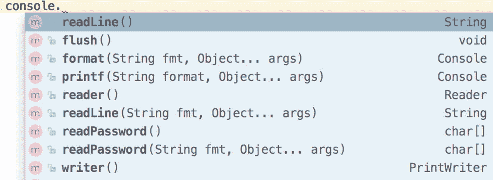

图 10.2

Console 方法

图 10-2 展示了可以在 `console` 实例上调用的方法。

`read*(..)` 方法用于从控制台读取用户输入，而 `printf(..)` 和 `format(..)` 用于在控制台中打印文本。这里的特殊情况是两个 `readPassword(..)` 方法，它们允许从控制台读取文本，但在输入过程中不会显示。这意味着可以编写一个支持身份验证的 Java 应用程序，而无需任何实际的用户界面。让我们编写一个示例代码来实际演示这一切。

```
package com.apress.bgn.ch10;
import java.io.Console;
import java.util.Calendar;
import java.util.GregorianCalendar;
public class ReadingUsingConsoleDemo {
public static void main(String... args) {
Console console = System.console();
if (console == null) {
System.err.println("未找到控制台。");
return;
} else {
console.writer().print("你好！(请回复问候)\n");
console.flush();
String hello = console.readLine();
console.printf("你回复了：'" + hello + "'\n");
Calendar calendar = new GregorianCalendar();
console.format("今天是：%1$tm %1$te,%1$tY\n", calendar);
char[] passwordChar =
console.readPassword("请输入密码：");
String password =  new String(passwordChar);
console.printf("你的密码以'" + password.charAt(0) + "'开头，以'"
+ password.charAt(password.length()-1) + "'结尾\n");
}
}
}
```

在代码示例中，我们使用了多种通过控制台读写数据的方法，以展示它们应如何使用。

`console.writer()` 返回一个 `java.io.PrintWriter` 实例，可用于向控制台打印消息。需要注意的是，在调用 `console.flush()` 之前，消息不会被打印出来。这意味着 `java.io.PrintWriter` 实例可以排队更多消息，并且仅在调用 `flush()` 或其内部缓冲区满时才会打印。

调用 `console.format(..)` 用于打印格式化消息，在此例中，一个 `Calendar` 实例提取当前日期，并根据以下模板打印：`dd mm,yyyy`。使用格式化器的 `console` 方法所接受的模板在 `java.util.Formatter` 类中定义。

现在来看精彩部分：在 IntelliJ 中无法运行此代码，因此我们必须在终端中执行该类或 jar 文件。最简单的方法是创建一个可执行的 jar 文件，当执行 `gradle clean build` 时，Gradle 会创建一个，因为配置已设置为生成的 jar 文件可执行，并且主类为 `ReadingUsingConsoleDemo`。Gradle 生成的 jar 文件位于 `/chapter10/using-console/build/libs/using-console-1.0-SNAPSHOT.jar`。如果你想在 IntelliJ IDEA 中打开终端，请点击 **Terminal** 按钮，然后进入 `libs` 目录。到达后，执行 `java -jar using-console-1.0-SNAPSHOT.jar` 并尽情体验。在下面的代码清单中，你可以看到我用于测试程序的输入。

```
$ cd chapter10/using-console/build/libs/
$ java -jar using-console-1.0-SNAPSHOT.jar
你好！(请回复问候)
Salut!
你回复了：'Salut!'
今天是：08 9,2018
请输入密码：
你的密码以'a'开头，以'e'结尾
```

这就是你需要了解的关于使用控制台的全部内容，尽管在实际的生产级项目中，你可能很少会用到它。

## 使用 Swing 构建应用程序

Swing 是 Java 的一个 GUI 小部件工具包。它从 JDK 1.2 版本开始成为 JDK 的一部分，旨在提供外观更美观、更实用的组件，用于构建具有复杂界面的用户应用程序，包含各种按钮、进度条、可选择的列表等。Swing 基于早期版本的 **AWT**（**Abstract Window Toolkit** 的缩写），AWT 是原始的 Java 用户界面小部件工具包。AWT 相当基础，拥有一组在任何平台上都可用的图形界面组件，这意味着 AWT 是可移植的，但这并不表示在一个平台上编写的 AWT 代码能在另一个平台上运行，因为存在平台特定的限制。AWT 组件依赖于本地的等效组件，因此它们被称为*重量级*组件。图 10-3 展示了一个简单的 Java AWT 应用程序。

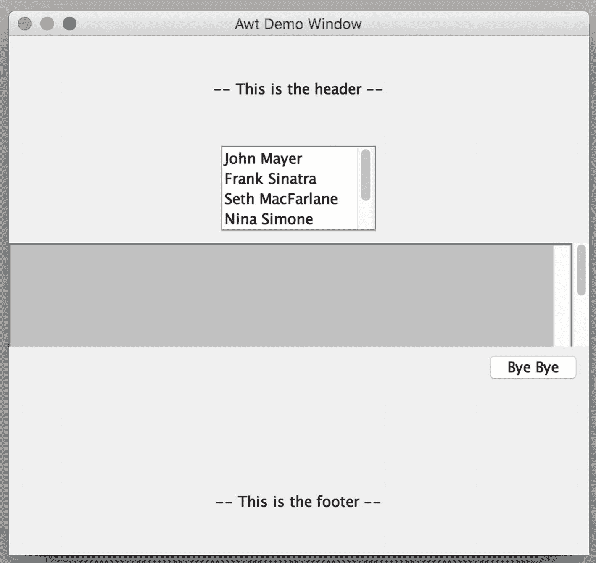

图 10-3

简单的 Java AWT 应用程序

这是一个简单的窗口，包含一个列表、一个文本区域和一个按钮。应用程序的主题（也称为外观和感觉）与其构建的操作系统（本章示例中为 macOS）相同，并且无法更改，因为 AWT 会接入操作系统的原生图形界面。如果你在 Windows 机器上运行相同的代码，窗口的外观会不同，因为它会使用 Windows 主题。

Swing 组件是用 Java 构建的，遵循 AWT 模型，但提供了可插拔的外观和感觉。Swing 完全用 Java 实现，并包含了 AWT 的所有特性，但它们不再依赖于原生 GUI，这就是为什么 Swing 组件被称为*轻量级*组件。Swing 提供了 AWT 的所有功能，并且还通过更高级的组件（如树视图、列表框和选项卡面板）扩展了组件集。此外，主题是可插拔的，并且可以轻松更改。这意味着 Swing 应用程序比 AWT 应用程序具有更好的可移植性，能够使用非平台特定的组件编写更复杂的应用程序设计，并且由于 Swing 是 AWT 的替代品，因此进行了更多的开发工作。

当 Web 应用程序兴起时，它们的外观非常丑陋，因为浏览器的功能有限。AWT 被引入用于构建称为 applet 的 Java Web 应用程序。Java applet 是从浏览器启动的小型应用程序，然后在用户操作系统上安装的 JVM 中执行，该进程与浏览器本身分离。这就是为什么 applet 可以在网页的框架、新的应用程序窗口或专为测试 applet 设计的独立工具中运行。Java applet 使用操作系统的 GUI，这使得它们比当时 HTML 笨重的初始外观更美观。它们现在已被弃用，并计划在 Java 11 中移除。


对于使用 Swing 或 AWT 编写的 Java 桌面应用程序，如今已很少使用。你或许在学校里学过如何构建一个，但除此之外……它们被视为古董。尽管如此，某些长期运营的机构和公司仍在使用基于 Swing 构建的遗留应用程序。我曾见过餐厅使用 Swing 应用来管理餐桌和订单，而且我认为大多数超市也使用 Swing 应用来管理商品。这就是本书中这一节存在的原因——因为你最终可能会从事维护这类应用的工作，了解其基础知识是件好事，因为 Swing 仍然是 JDK 的一部分。所有 Swing 组件（AWT 组件也一样）都属于 `java.desktop` 模块，因此如果你想使用 Swing 组件，就必须声明对该模块的依赖。在下面的配置片段中，你可以看到我们使用 Swing 的项目模块在其 `module-info.java` 中通过 `requires` 指令声明了对 `java.desktop` 模块的依赖。

```
module chapter.ten.swing {
requires java.desktop;
}
```

图 10-3 中展示的应用是使用 AWT 构建的，本节将介绍如何在 Swing 中构建类似的应用，并添加更多组件。任何 Swing 应用的核心类都叫做 `JFrame`，该类型的实例用于创建带有边框和标题的窗口。那么，让我们编写一些代码来实现这一点。

```
package com.apress.bgn.ch10;
import javax.swing.*;
import java.awt.*;
public class SwingDemo extends JFrame {
public static void main(String... args) {
SwingDemo swingDemo = new SwingDemo();
swingDemo.setTitle("Swing Demo Window");
swingDemo.setSize(new Dimension(500,500));
swingDemo.setVisible(true);
}
}
```

在代码中，创建了一个 `javax.swing.JFrame` 实例，为其设置了标题，还设置了大小，这样当窗口创建时我们就能看到一些内容。要显示窗口，必须在 `JFrame` 实例上调用 `setVisible(true)`。当你运行上述代码时，会显示一个如图 10-4 所示的窗口。默认情况下，窗口位于主显示器的左上角，但可以通过使用一些 Swing 组件来计算相对于屏幕大小的位置来改变这一点。确定 Swing 窗口相对于屏幕大小的大小和位置，仅受你愿意投入的数学计算量的限制。图 10-4 展示了一个简单的 Java Swing 窗口。

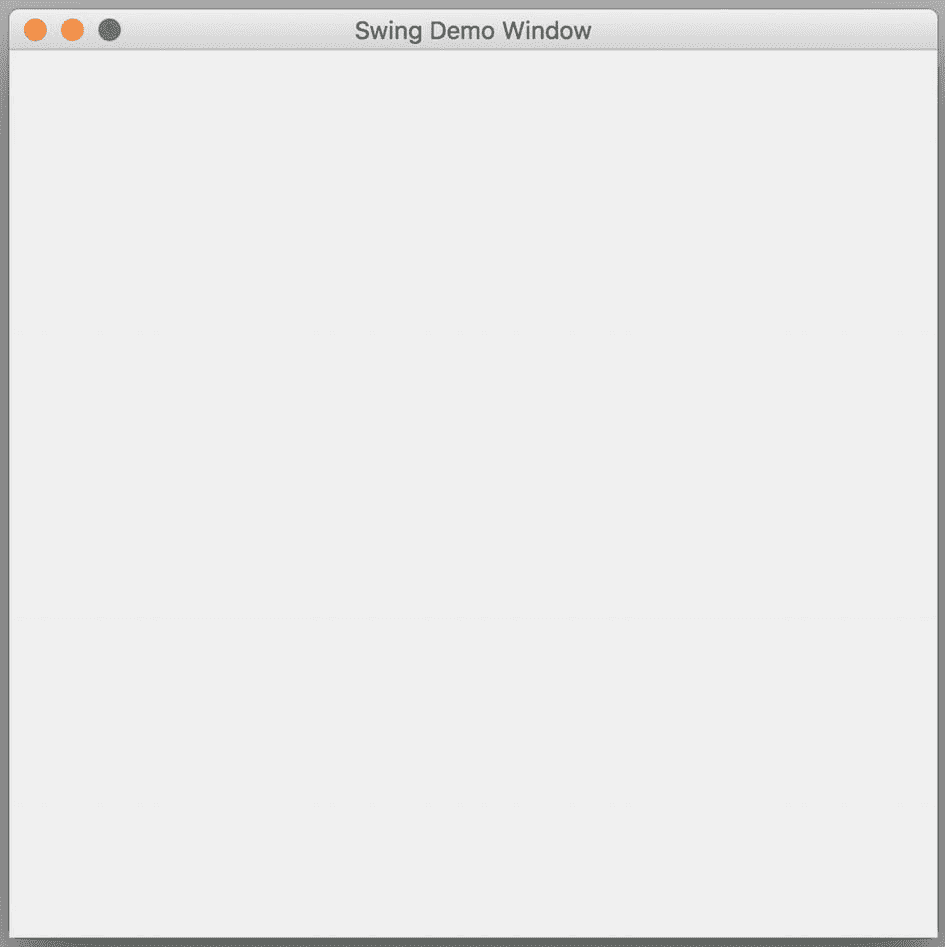

图 10-4

简单的 Java Swing 应用

此时，如果我们关闭显示的窗口，应用会继续运行。因为默认情况下，关闭窗口会通过调用 `setVisible(false)` 使其不可见。如果我们想将默认行为改为退出应用，就必须更改关闭窗口时执行的默认操作。这可以通过在创建 `JFrame` 实例后添加以下代码行轻松实现。

```
swingDemo.setDefaultCloseOperation(JFrame.EXIT_ON_CLOSE);
```

`JFrame.EXIT_ON_CLOSE` 常量是一组定义窗口关闭时应用行为的常量之一。这个常量声明应用应在窗口关闭时退出。其他可用选项如下列表所示：

*   `DO_NOTHING_ON_CLOSE` - 不执行任何操作，包括不关闭窗口。
*   `HIDE_ON_CLOSE` - 默认选项，会导致调用 `setVisible(false)`。
*   `DISPOSE_ON_CLOSE` - 一个应用可以有多个窗口，此选项会在最后一个可显示窗口关闭时退出应用。

大多数 Swing 应用通过扩展 `JFrame` 类来编写，以便对其组件获得更多控制权，因此上述代码也可以这样编写：

```
package com.apress.bgn.ch10;
import javax.swing.*;
import java.awt.*;
public class SwingDemo extends JFrame {
public static void main(String... args) {
SwingDemo swingDemo = new SwingDemo();
swingDemo.setDefaultCloseOperation(JFrame.EXIT_ON_CLOSE);
swingDemo.setTitle("Swing Demo Window");
swingDemo.setSize(new Dimension(500,500));
swingDemo.setVisible(true);
}
}
```

现在我们有了一个窗口，让我们开始添加组件，因为如果我们没有更多组件来注意到变化，那么改变外观和感觉就毫无意义。每个 Swing 应用至少有一个 `JFrame` 作为根，它是所有其他窗口的父窗口，因为窗口也可以使用 `JDialog` 类来创建。`JDialog` 是创建对话框窗口的主要类，这是一种特殊类型的窗口，主要包含消息和用于选择选项的按钮。开发者可以使用这个类创建自定义对话框，或者使用 `JOptionPane` 类的方法来创建各种对话框窗口。

回到向 `JFrame` 实例添加组件的话题；组件是通过添加到其容器中来添加到 `JFrame` 的。可以通过调用 `getContentPane()` 获取对 `JFrame` 容器的引用。默认的内容面板是一个简单的中间容器，它继承自 `JComponent`，而 `JComponent` 又扩展了 `java.awt.Container`（Swing 是 AWT 的扩展，其大多数组件都是 AWT 的扩展）。对于 `JFrame`，默认的内容面板是 `JPane` 的一个实例。这个类有一个 `java.awt.LayoutManager` 类型的字段，它定义了其他组件在 `JPane` 中的排列方式。`JFrame` 实例的默认内容面板使用 `java.awt.BorderLayout` 作为其布局管理器，它将面板分为五个区域：EAST、WEST、NORTH、SOUTH 和 CENTER。每个区域都可以通过 `BorderLayout` 中定义的名称匹配的常量来引用。因此，如果我们想为应用添加一个退出按钮，我们可以通过编写以下代码将其添加到 SOUTH 区域。

```
package com.apress.bgn.ch10;
import javax.swing.*;
import java.awt.*;
import java.awt.event.ActionEvent;
import java.awt.event.ActionListener;
public class SwingDemo extends JFrame {
private JPanel mainPanel;
private JButton exitButton;
public SwingDemo(String title) {
super(title);
mainPanel = (JPanel) this.getContentPane();
exitButton = new JButton("Bye Bye!");
exitButton.addActionListener(new ActionListener() {
@Override
public void actionPerformed(ActionEvent e) {
System.exit(0);
}
});
mainPanel.add(exitButton, BorderLayout.SOUTH);
}
public static void main(String... args) {
SwingDemo swingDemo = new SwingDemo("Swing Demo Window");
swingDemo.setDefaultCloseOperation(JFrame.DO_NOTHING_ON_CLOSE);
swingDemo.setSize(new Dimension(500, 500));
swingDemo.setVisible(true);
}
}
```

图 10-5 展示了修改后的应用。我们在内容面板的 SOUTH 区域添加了一个退出按钮，并标明了 `BorderLayout` 的整体区域划分。

此外，由于新按钮必须是退出我们应用的唯一方式，`setDefaultCloseOperation(JFrame.EXIT_ON_CLOSE);` 被替换为 `setDefaultCloseOperation(JFrame.DO_NOTHING_ON_CLOSE);`，并且一个 `java.awt.event.ActionListener` 实例被附加到按钮上，以便它能记录按钮被点击的事件并做出相应反应，在本例中就是退出应用。大多数 Swing 组件都支持监听器，这些监听器可以被定义来捕获用户对对象执行的事件，并以某种方式做出反应。

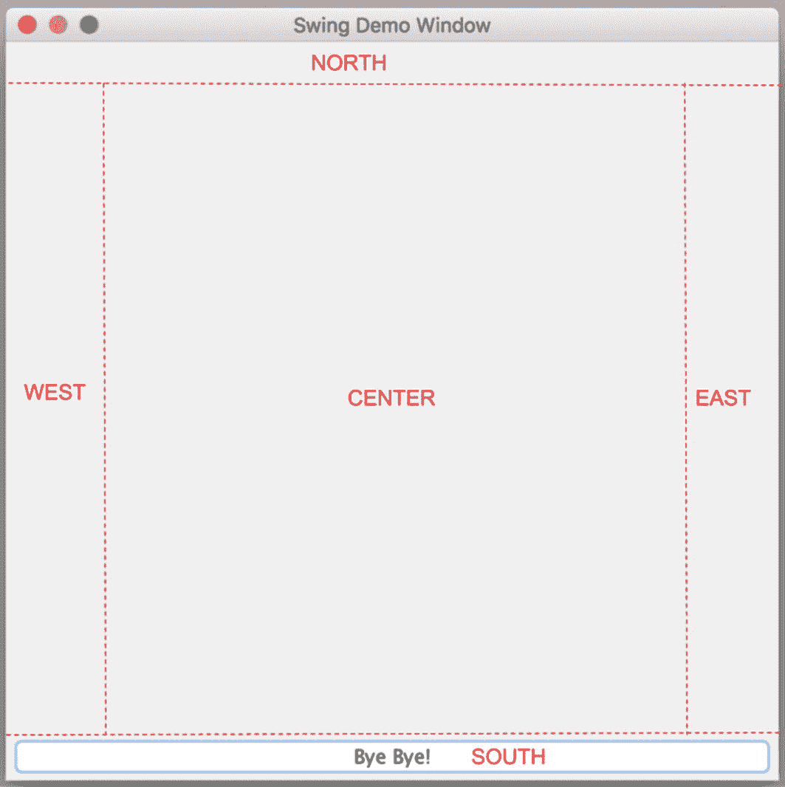

图 10-5

边框布局区域


如您所见，按钮会扩展并填满整个区域空间，因为它继承了该区域的尺寸。要避免这种情况，应将按钮放入另一个容器中，并且该容器应使用不同的布局：`FlowLayout`。顾名思义，这种布局允许 Swing 组件像段落中的文字一样按方向流式添加。可以像在文本文档中格式化文本一样进行调整，并且为组件的对齐方式定义了常量：居中对齐（CENTER）、左对齐（LEFT）等。在下一个代码示例中，我们将 `exitButton` 包装在一个使用了 `FlowLayout` 的 `JPanel` 中。

```
...
public SwingDemo(String title) {
super(title);
mainPanel = (JPanel) this.getContentPane();
exitButton = new JButton("Bye Bye!");
exitButton.addActionListener(e -> System.exit(0));
JPanel exitPanel = new JPanel();
FlowLayout flowLayout = new FlowLayout();
flowLayout.setAlignment(FlowLayout.RIGHT);
exitPanel.setLayout(flowLayout);
exitPanel.setComponentOrientation(ComponentOrientation.RIGHT_TO_LEFT);
exitPanel.add(exitButton);
mainPanel.add(exitPanel, BorderLayout.SOUTH);
}
...
```

还有更多布局可供使用，但让我们先通过添加一个包含若干条目的列表，并为其添加一个监听器来完成这个应用程序，这样当您点击一个元素时，它就会被添加到框架中央的文本区域中。可以通过实例化 `JList<T>` 类来创建一个 Swing 列表。这会创建一个显示对象列表并允许用户选择一个或多个项目的对象。Swing 的 `JList<T>` 类包含一个类型为 `ListModel<T>` 的字段，用于管理列表显示的数据内容。当创建并添加元素后，每个对象都会关联一个索引，当用户选择一个对象时，该索引也可用于后续处理。在下一个代码片段中，声明并初始化了 `JList` 对象，并为其关联了一个 `ListSelectionListener`，用于定义当从列表中选择一个元素时要执行的操作。在我们的例子中，需要将元素值添加到一个 `JTextArea` 中，因此代码中描绘了这个对象。

```
private static  String[] data = {"John Mayer", "Frank Sinatra",
"Seth MacFarlane", "Nina Simone", "BB King", "Peggy Lee"};
private JList list;
private JTextArea textArea;
...
textArea = new JTextArea(50, 10);
//NORTH
list = new JList(data);
list.addListSelectionListener(new ListSelectionListener() {
@Override
public void valueChanged(ListSelectionEvent e) {
if (!e.getValueIsAdjusting()) {
textArea.append(list.getSelectedValue() + "\n");
}
}
});
mainPanel.add(list, BorderLayout.NORTH);
//CENTER
JScrollPane txtPanel = new JScrollPane(textArea);
textArea.setBackground(Color.LIGHT_GRAY);
mainPanel.add(txtPanel, BorderLayout.CENTER);
...
```

如果您点击一个列表元素，会发生两件事：前一个元素被取消选中，而最近点击的那个元素被选中，因此选中的元素发生了变化。`getValueIsAdjusting()` 方法返回当前事件是否属于一系列仍在进行更改的事件之一，我们通过测试该方法是否返回 `false` 来检查选择是否已经完成，这样我们就可以获取当前选中元素的值并将其添加到文本区域中。

关于 `JTextArea` 实例，它被添加到了一个 `JScrollPane` 实例中，这使得当 `textArea` 内容随着文本填充而增多时，通过提供一个或两个滚动条（取决于配置）来保持内容可见。`JScrollPane` 也可以包裹在包含过多项目的列表周围，以确保所有项目都可访问。此外，由于我们不需要用户通过文本区域提供输入，因此调用了 `setEditable(false);` 方法。

现在我们有了一个更复杂的应用程序，是时候调整它的外观和感觉了。到目前为止，我们一直使用的是默认的外观，即底层操作系统提供的外观。但是使用 Swing，可以将外观配置为 JDK 支持的默认外观之一，也可以使用额外的自定义外观（这些外观作为项目类路径中的依赖项提供），或者开发人员可以创建自己的外观。要显式指定一个外观，必须在创建任何 Swing 组件之前，在 main 方法中添加以下代码行：`UIManager.setLookAndFeel(..)`。此方法接收一个 `String` 值作为参数，该值代表外观相应子类的完全限定名称。虽然不是必须的，但您可以通过调用以下代码显式指定要使用原生 GUI：`UIManager.setLookAndFeel(UIManager.getCrossPlatformLookAndFeelClassName());`。知道了这一点，让我们来做一些有趣的事情。`UIManager` 类包含用于管理 Swing 应用程序外观的实用方法和嵌套类。其中一个方法是 `getInstalledLookAndFeels()`，它提取支持的外观列表并将其作为 `LookAndFeelInfo[]` 返回。知道了这一点，让我们列出所有支持的主题，将它们添加到我们的列表中，当用户选择其中一个时，就应用它。不幸的是，由于如今 Swing 很少使用，我们可以在应用程序中使用的自定义外观并不多。所以，唯一能做的就是使用 JDK 提供的内容。首先，让我们用完全限定的类名来初始化 `data` 数组。

```
private static  String[] data;
...
public static void main(String... args) throws Exception {
UIManager.setLookAndFeel(UIManager.getCrossPlatformLookAndFeelClassName());
UIManager.LookAndFeelInfo[] looks = UIManager.getInstalledLookAndFeels();
data = new String[looks.length];
int i =0;
for (UIManager.LookAndFeelInfo look : looks) {
data[i++] = look.getClassName();
}
SwingDemo swingDemo = new SwingDemo("Swing Demo Window");
swingDemo.setDefaultCloseOperation(JFrame.DO_NOTHING_ON_CLOSE);
swingDemo.setSize(new Dimension(500, 500));
swingDemo.setVisible(true);
}
...
```

现在，`ListSelectionListener` 的实现变得稍微复杂了一些，因为在选择新的外观类之后，我们必须调用 `JFrame` 实例上的 `repaint()` 方法来应用新的外观，所以我们将声明提取到它自己的类中，并将 `SwingDemo` 对象作为参数提供，这样在 `valueChanged(..)` 方法内部就可以调用 `repaint()`。

```
private class LFListener implements ListSelectionListener {
private JFrame parent;
public LFListener(JFrame swingDemo) {
parent = swingDemo;
}
@Override
public void valueChanged(ListSelectionEvent e) {
if (!e.getValueIsAdjusting()) {
textArea.append(list.getSelectedValue() + "\n");
try {
UIManager.setLookAndFeel(list.getSelectedValue());
Thread.sleep(1000);
parent.repaint();
} catch (Exception ee) {
System.err.println(" Could not set look and feel! ");
}
}
}
}
```

如果我们运行修改后的程序，并逐一选择列表中的每个项目，我们应该会看到窗口的外观发生一些变化。图 10-6 并排显示了所有窗口；差异几乎难以察觉，但它们确实存在。

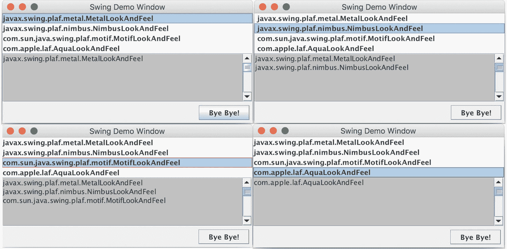

图 10-6

JDK 提供的不同外观

这就是您用几行代码就能用 Swing 组件实现的效果。Swing 库中还有更多的组件，但由于它已不再被广泛使用，重点已转向 Web 应用程序，因此本节内容到此结束。如果您需要创建或维护一个 Swing 应用程序，Oracle 提供了一个内容丰富的教程，其中包含大量示例，您可以直接复制/粘贴并根据需要进行调整。^(⁸²)


## 介绍 JavaFX

JavaFX Script 是 Sun Microsystems 设计的一种脚本语言，是 Java 平台上 JavaFX 技术家族的一部分。它于 2008 年 12 月 JDK 6 发布后不久推出，曾一度被开发者认为会被弃用，因为它作为一种完全不同的语言，并未真正流行起来。但在收购 Sun Microsystems 后，Oracle 决定保留它，并将其转变为 JavaFX 库。这是一组图形和媒体包，开发者可以使用它们来设计、创建、测试、调试和部署能够在不同平台上一致运行的富客户端应用程序。没错，也包括移动平台。JavaFX 旨在取代 Swing 成为 JDK 的主要 GUI 库，但到目前为止，Swing 和 JavaFX 一直是 JDK 10 之前所有版本的一部分。这种情况在 JDK 11 中发生了变化。从 JDK 11 开始，JavaFX 作为一个独立的模块提供，与 JDK 解耦。JavaFX 的使用率仍未达到 Oracle 的预期，将其与 JDK 分离可能会鼓励 OpenJFX 社区贡献一些创新想法，从而将这个库转变为市场上其他现有 GUI 工具包（例如 Eclipse SWT^(⁸³)）的真正竞争对手。所以，让我们不要浪费时间，开始编写代码，使用 JavaFX 创建一个类似于之前示例的应用程序。

作为 JDK 的一部分，并且拥有类和其他组件，JavaFX 代码现在就是普通的 Java 代码，因此不再需要脚本。JavaFX 组件定义在 `java.fx.*` 模块列表下。以下配置片段显示，我们使用 JavaFX 的项目模块在其 `module-info.java` 中通过 `requires` 指令声明了对几个 `java.fx` 模块的依赖。

```
module chapter.ten.javafx {
requires javafx.base;
requires javafx.graphics;
requires javafx.controls;
opens com.apress.bgn.ch10 to javafx.graphics;
}
```

由于 JavaFX 应用程序启动器使用反射来启动应用程序，因此你需要开放包含实现的包；否则会抛出 `java.lang.IllegalAccessException`，这就是为什么在之前的配置中存在 `opens com.apress.bgn.ch10;` 的原因。

让我们从一个带有关闭选项的简单窗口开始。我将解释它的执行方式，因为 JavaFX 与 Swing 和 AWT 略有不同。显示一个普通方形窗口的代码如下所示。

```
package com.apress.bgn.ch10;
import javafx.application.Application;
import javafx.scene.Scene;
import javafx.scene.layout.StackPane;
import javafx.stage.Stage;
public class JavaFxDemo extends Application {
public static void main(String... args) {
launch(args);
}
@Override
public void start(Stage primaryStage) {
primaryStage.setTitle("JavaFX Demo Window!");
StackPane root = new StackPane();
primaryStage.setScene(new Scene(root, 500, 500));
primaryStage.show();
}
}
```

首先需要知道的是，应用程序的主类必须继承 `javafx.application.Application` 类，因为这是 JavaFX 应用程序的入口点。这是必需的，因为 JavaFX 应用程序由一个名为 **Prism** 的新性能图形引擎运行，该引擎位于 JVM 之上。除了图形引擎 Prism 之外，JavaFX 还自带了自己的窗口系统 Glass、一个媒体引擎和一个 Web 引擎。它们不对外公开，开发者唯一能使用的是 JavaFX API，它提供了构建具有精美界面的应用程序所需的任何组件。所有这些引擎都由 **Quantum 工具包** 连接在一起，它是这些引擎与堆栈中上层之间的接口。Quantum 工具包管理执行线程和渲染。

`launch(...)` 方法是 `Application` 类中的一个静态方法，用于启动一个独立的应用程序。它通常从 main 方法中调用，并且只能调用一次；否则会抛出 `java.lang.IllegalStateException`。`launch` 方法在通过关闭所有窗口或调用 `Platform.exit()` 退出应用程序之前不会返回。`launch` 方法创建一个 `JavaFxDemo` 实例，在其上调用 `init()` 方法，然后调用 `start(..)`。`start(..)` 方法在 `Application` 类中被声明为 `abstract`，因此开发者必须提供具体的实现。

JavaFX 应用程序是使用 `javafx.scene` 下定义的组件构建的，并具有层次结构。`javafx.scene` 包的核心类是 `javafx.scene.Node`，它是场景层次结构的根。此层次结构中的类为应用程序用户界面的所有可视元素提供实现。因为它们都以 `Node` 作为根类，所以可视元素被称为**节点**，这使得应用程序成为*节点的场景图*，而该图的初始节点称为*根*。每个节点都有一个唯一的标识符、一个样式类和一个包围体，并且除了根节点之外，图中的每个节点都有一个父节点和零个或多个子节点。除此之外，节点还具有以下属性。

*   效果，例如模糊和阴影 - 当您将鼠标悬停在界面上以确保单击正确的组件时非常有用
*   不透明度
*   变换 - 改变视觉状态或位置
*   事件处理程序 - 类似于 Swing 中的监听器，用于定义对鼠标、按键和输入法的反应
*   应用程序特定状态

场景图极大地简化了丰富界面的构建，并且因为它还包括图形基元，如矩形、文本、图像和媒体，此外，还可以通过 `javax.animation` 包的动画 API 来实现各种图形的动画。如果您有兴趣了解更多关于 JavaFX 底层机制的信息，请阅读 [`https://docs.oracle.com/javafx/2/architecture/jfxpub-architecture.htm`](https://docs.oracle.com/javafx/2/architecture/jfxpub-architecture.htm) 上的文章，因为本书的重点是如何做事，而不是它们如何工作，除非它确实影响您未来解决方案的设计。

我们再次从一个简单的窗口开始。第一步是添加一个按钮来退出应用程序。由于渲染 JavaFX 应用程序涉及渲染引擎，这意味着它必须优雅地关闭，因此调用 `System.exit(0)` 不再是首选选项。所以 `start(..)` 方法的内容变成如下所示。

```
...
public void start(Stage primaryStage) {
primaryStage.setTitle("JavaFX Demo Window!");
Button btn = new Button();
btn.setText("Bye bye! ");
btn.setOnAction(new EventHandler() {
@Override
public void handle(ActionEvent event) {
Platform.exit();
}
});
StackPane root = new StackPane();
root.getChildren().add(btn);
primaryStage.setScene(new Scene(root, 500, 500));
primaryStage.show();
}
...
```

如果我们运行 `JavaFxDemo` 类，图 10-7 中所示的窗口会弹出在屏幕上，如果您单击 **Bye bye!** 按钮，应用程序会因 `Platform.exit();` 调用而优雅地关闭。

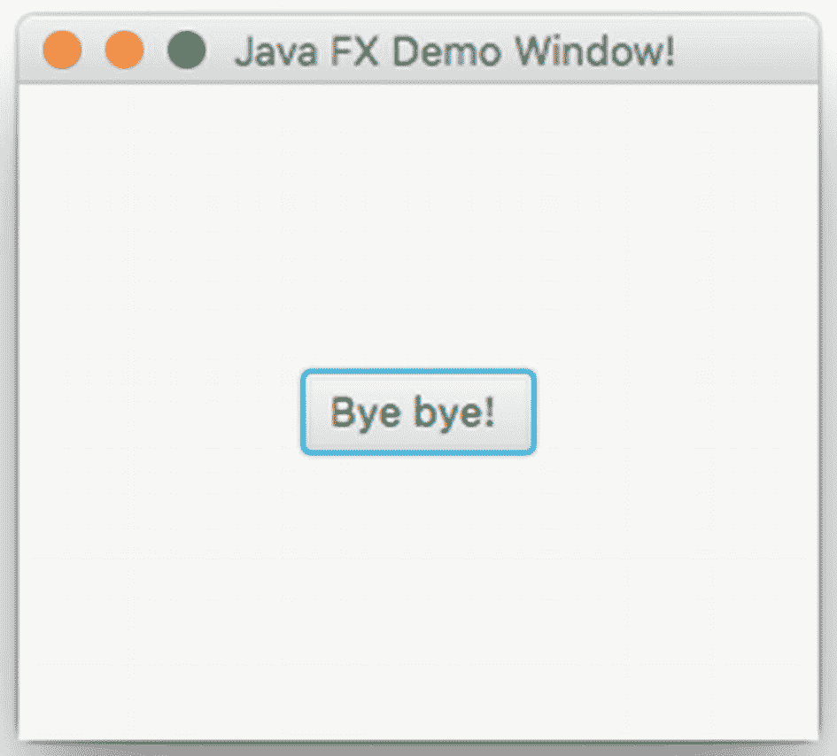

图 10-7

JavaFX 窗口演示


但按钮只是被扔进窗口并默认居中放置，因为没有编写代码来定位它。JavaFX 支持以类似于 Swing 的方式在窗口中排列节点^(⁸⁴)，但 JavaFX 提供了支持多种不同布局样式的布局面板。JavaFX 中与带有 `BorderLayout` 管理器的 `JPane` 等价的内置布局名为 `BorderPane`。`BorderPane` 提供了五个区域来放置节点，其分布方式与 `BorderLayout` 类似，但名称不同。让我们编写代码将按钮放置在底部区域的右角，然后进一步讨论。

```
...
public void start(Stage primaryStage) {
primaryStage.setTitle("JavaFX Demo Window!");
Button exitButton = new Button();
exitButton.setText("Bye bye! ");
exitButton.setOnAction(event -> Platform.exit());
BorderPane borderPane = new BorderPane();
HBox box = new HBox();
box.setPadding(new Insets(10, 12, 10, 12));
box.setSpacing(10);
box.setAlignment(Pos.BASELINE_RIGHT);
box.setStyle("-fx-background-color: #85929e;");
box.getChildren().add(exitButton);
borderPane.setBottom(box);
StackPane root = new StackPane();
root.getChildren().add(borderPane);
primaryStage.setScene(new Scene(root, 500, 500));
primaryStage.show();
}
...
```

如果我们运行 `JavaFxDemo` 类，图 10-8 中描绘的窗口就会弹出在屏幕上。该图已被修改以显示 `BorderPane` 的区域。

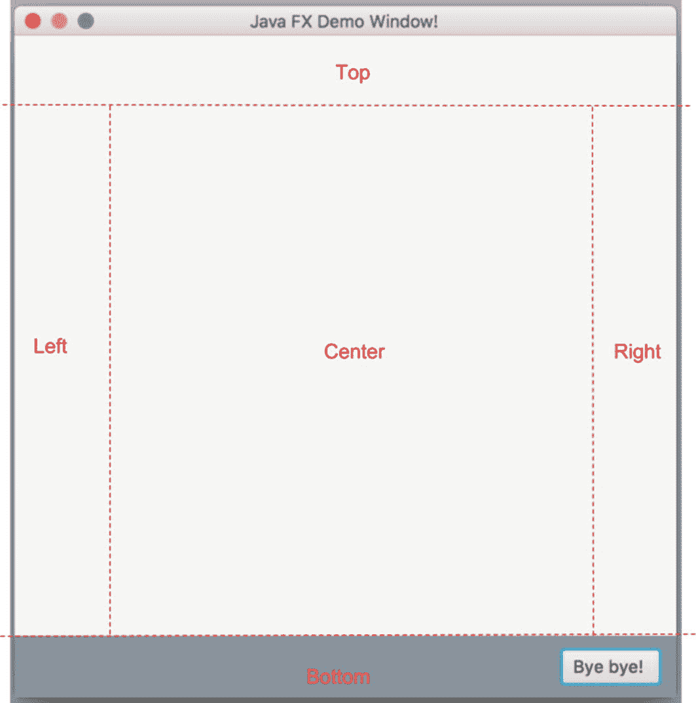

图 10-8

JavaFX 窗口演示

决定按钮位置的方法与 Swing 类似，但有一些不同。`BorderPane` 有 5 个区域，分别命名为：Top、Bottom、Center、Left 和 Right。为了将节点放置在这些区域中的每一个，为每个区域定义了 `set*(..)` 方法：`setTop(..)`、`setBottom(..)`、`setCenter(..)`、`setLeft(..)` 和 `setRight(..)`。为了进一步自定义节点的位置，应将其放置在一个 `HBox` 节点中，这是另一个可以广泛自定义的 JavaFX 元素。从代码中可以看到，我们使用 CSS 样式元素设置背景，通过使用 `Insets` 类的实例自定义节点之间的间距以及包含节点的边框，并通过调用 `box.setAlignment(Pos.BASELINE_RIGHT)` 自定义包含节点的对齐方式。`HBox` 还支持更多功能，因此使用一个盒子能做的事情（主要）只受限于你的想象力。

因此，除了前面代码示例中所有*美化代码*的工作外，还完成了以下操作：*根*节点成为 `BorderPane` 节点的父节点，在 `BorderPane` 的底部区域添加了一个 `HBox`，并且这个 `HBox` 实例成为了一个 `Button` 的父节点。这种组织方式是分层的，按钮是层次结构中的最后一个节点。

此外，我们通过正确设置 `HBox` 节点的样式，避免了使用层叠面板。

现在是时候为我们的应用程序添加最后一个功能了：文本区域和一个包含可选元素以向文本区域添加值的列表。在 JavaFX 中创建文本区域很简单。该类命名清晰：`TextArea`。我们可以直接将节点添加到 `BorderPane` 的中心区域，因为 JavaFX 文本区域默认是可滚动的。因此无需将其放入 `ScrollPane` 中，尽管该类确实存在于 `javafx.scene.control` 包中，并且对于在其中显示比窗口尺寸大的表单节点很有用。以下三行代码创建了一个 `TextArea` 类型的节点，将其声明为不可编辑，并将其添加到 `BorderPane` 的中心区域。

```
TextArea textArea = new TextArea();
textArea.setEditable(false);
borderPane.setCenter(textArea);
```

接下来是列表。列表稍微复杂一些，但操作起来也更有趣，因为使用 JavaFX 可以对列表做很多事情。需要实例化以创建列表对象的类名为 `ComboBox`。这个类只是用于创建列表的更大类族中的一个，其根类是抽象类 `ComboBoxBase`。根据列表所需的行为，例如是否需要支持单选或多选，列表是否可编辑，应选择适当的实现。在我们的例子中，`ComboBox` 类符合要求：我们需要一个不可编辑的列表，支持单选。`ComboBox` 有一个 `valueProperty()` 方法，返回当前用户输入。用户输入可以基于下拉列表的选择，或者当列表可编辑时用户手动提供的输入。让我们看看将列表添加到 `BorderPane` 顶部区域，并添加一个监听器以将所选值记录到我们之前声明的 `TextArea` 中的代码。

```
private static String[] data = {"John Mayer", "Frank Sinatra",
"Seth MacFarlane", "Nina Simone", "BB King", "Peggy Lee"};
...
ComboBox comboBox = new ComboBox();
comboBox.getItems().addAll(data);
borderPane.setTop(comboBox);
comboBox.valueProperty().addListener(
new ChangeListener() {
@Override
public void changed(ObservableValue observable,
String oldValue, String newValue) {
textArea.appendText(newValue + "\n");
}
});
```

`ComboBox` 的 `value` 字段（通过调用 `comboBox.valueProperty()` 访问）是一个 `ObservableValue<T>` 实例。通过调用 `addListener(..)` 方法，将一个 `ChangeListener<String>` 类型的监听器添加到此实例。每当 `comboBox` 的 value 字段发生变化时，监听器的 `changed(..)` 方法就会被调用。`changed(..)` 方法接收列表先前选中的值和当前选中的值作为参数，因为谁知道呢，也许我们的某些逻辑需要同时用到这两个值。

在 AWT 和 Swing 中，对列表的视觉处理能力有限。你只能使用外观和感觉，仅此而已。JavaFX 支持更多的节点视觉自定义，因为它甚至支持 CSS。这就是为什么在下一节中，我们将让 `ComboBox` 列表变得有趣。在 JavaFX 中，列表中的每个条目都是一个可以不同方式绘制的单元格。为此，我们必须向此类添加一个 `CellFactory`，它为列表中的每个项目创建一个 `ListCell` 实例。如果未指定 `CellFactory`，则单元格将以默认样式创建。让我们先看代码，然后再做进一步解释。

```
comboBox.setCellFactory(
new Callback() {
@Override
public ListCell call(ListView param) {
return new ListCell() {
{
super.setPrefWidth(200);
}
@Override
public void updateItem(String item, boolean empty) {
super.updateItem(item, empty);
if (item != null) {
setText(item);
if (item.contains("John") || item.contains("BB")) {
setTextFill(Color.RED);
} else if (item.contains("Frank") || item.contains("Peggy")) {
setTextFill(Color.GREEN);
} else if (item.contains("Seth")) {
setTextFill(Color.BLUE);
} else {
setTextFill(Color.BLACK);
}
} else {
setText(null);
}
}
};
}
});
```

`javafx.util.Callback` 接口是一个实用的接口，如果需要回调，它可以用于为某个动作声明后续动作。在这种情况下，后续动作执行以下操作：在将一个 `String` 值添加到 `ComboBox` 节点的 `ListView` 后（`ListView` 是视觉组件，是 `ComboBox` 显示水平或垂直项目列表的界面类型），会创建一个单元格，并在其中插入一些逻辑，根据单元格的值决定单元格中显示文本的颜色。

在 `ListCell` 声明内部，有一段看起来格格不入的代码块。

```
{
super.setPrefWidth(200);
}
```


在匿名类声明内部调用父类方法是一种有趣的实现方式。此处调用 `setPrefWidth(200)` 是为了确保所有 `ListCell<>` 实例具有相同尺寸。`updateItem(..)` 中的逻辑相当直观，因此无需额外解释。添加单元格工厂后的效果可参见图 10-9。

本书能为 JavaFX 分配的篇幅到此为止。只要您大致理解为何 JavaFX 组件被称为*节点*，您就已经拥有了一个相当不错的起点。如果您对此充满好奇，Oracle 在 [`https://docs.oracle.com/javase/8/javase-clienttechnologies.htm`](https://docs.oracle.com/javase/8/javase-clienttechnologies.htm) 上提供了非常优秀的教程。

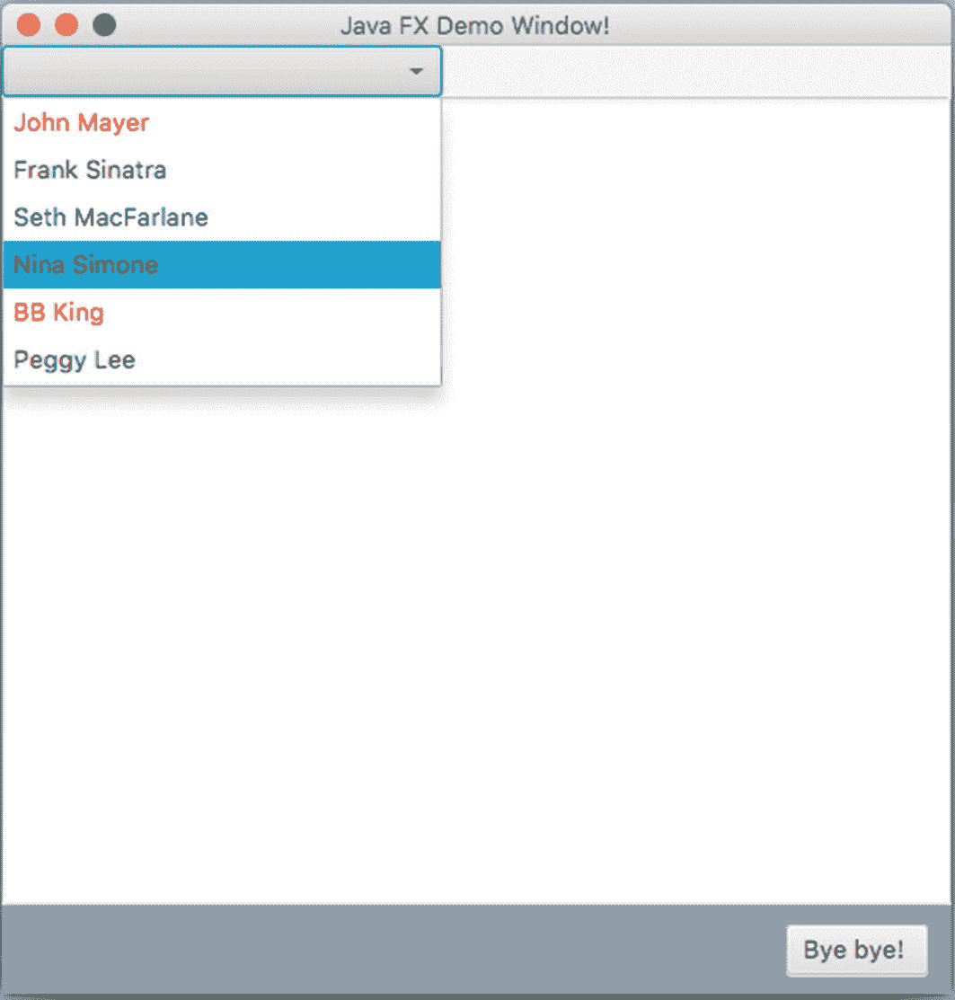

图 10-9

JavaFX 彩色 ComboBox 演示

## 国际化

交互式应用通常设计为部署在多个服务器上，实现 7x24 小时可用并覆盖多个地区。由于并非所有人都使用同一种语言，说服用户成为您的客户并使用您的应用的关键在于构建多语言版本。这种设计应用以满足多国用户需求并易于适配的过程被称为*国际化*。以最初的谷歌页面为例，根据访问位置的不同，页面语言会相应变化。当您创建账户时，可以选择偏好的语言。这并不意味着谷歌为每个地区都构建了一个 Web 应用，而是同一个 Web 应用根据位置显示不同语言的文本。国际化应在应用设计阶段就纳入考量，因为后期添加会非常困难。本节中，我们虽不涉及 Web 应用，但将对一个 JavaFX 应用进行国际化改造。

当您开始了解国际化时，可能会注意到包含国际化属性文件的文件或目录被命名为 `i18n`，这是因为该单词中字母 *i* 和 *n* 之间相隔 18 个字母。

国际化基于区域设置（locale）。**区域设置**是指语言和地区的组合。应用的区域设置决定了哪个国际化文件来定制应用。Java 通过 `java.util.Locale` 类实现区域设置概念，一个 `Locale` 实例代表一个地理、政治或文化区域。当应用依赖于区域设置时，我们称其为区域敏感型应用，如今大多数应用都是如此。但选择区域设置有时也需要用户自行操作。每个 `Locale` 可以选择对应的*区域资源*，这些文件包含特定于区域设置的配置。这些文件按区域设置分组，通常位于 `resources` 目录下。这些资源用于配置 `java.util.ResourceBundle` 的实例，该实例可管理特定于区域设置的资源。

为了构建一个合适的本地化用例，我们对之前的 JavaFX 应用进行了修改：列表内容从歌手名称替换为一组宠物名称，并附带了可翻译成多种语言的标签。同时添加了一个可用语言列表，当从该列表中选择一种语言时，会设置一个 `Locale` 静态变量为对应的区域设置，并重新初始化窗口，以便将所有标签翻译成新语言。让我们从创建*资源文件*开始。

资源文件以 `properties` 为扩展名，包含一系列属性和值。每行遵循以下格式：`property_name=property_value`，不符合格式的行将不会被读取。每个属性名在文件中必须唯一，若出现重复则会被忽略，IntelliJ IDEA 会通过红色下划线提示。对于每种需要支持的语言，我们需要创建一个属性文件，其中包含相同的属性名，但值不同，因为这些值代表该属性在各语言中的翻译。所有文件名必须包含共同后缀，并以语言名称和国家结尾，用下划线分隔，因为这是创建 `Locale` 实例所需的两个要素。对于我们的 JavaFX 应用，我们创建了三个文件，如图 10-10 所示。

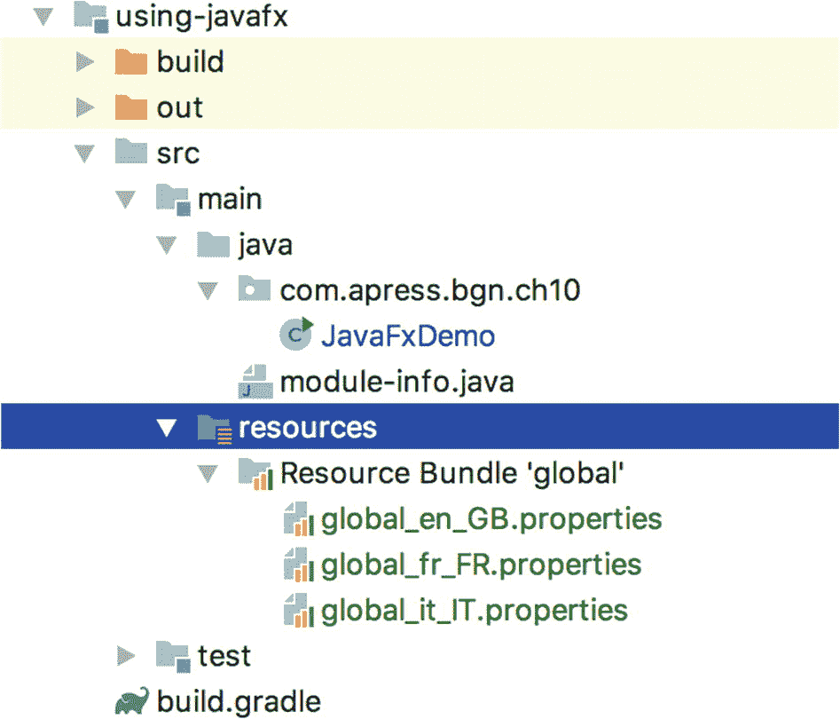

图 10-10

包含三个资源文件的资源包


后缀是 `global`，这也是我们资源包的名字。IntelliJ IDEA 清晰地表明了这一点，它能识别出这些文件的用途并以直观的方式展示出来。这些文件的内容如表 10-1 所示。

表 10-1

资源文件的内容

| **属性名称** | **global_en_GB 中的属性值** | **global_fr_FR 中的属性值** | **global_it_IT 中的属性值** |
| --- | --- | --- | --- |
| English | English | Anglais | Inglese |
| French | French | Français | Francese |
| Italian | Italian | Italien | Italiano |
| Cat | Cat | Chat | Gatto |
| Dog | Dog | Chien | Cane |
| Parrot | Parrot | Chien | Pappagallo |
| Mouse | Mouse | Souris | Topo |
| Cow | Cow | Perroquet | Mucca |
| Pig | Pig | Porc | Maiale |
| WindowTitle | JavaFX Demo Window! | JavaFX Démo Fenêtre! | JavaFX Dimostratione Finestra! |
| Byebye | Bye bye! | Bye bye! | Ciao! |
| ChoosePet | Choose Pet: | Choisissez la langue: | Scegli la lingua: |
| ChooseLanguage | Choose Language: | Choisir un animal de compagnie: | Scegli un animale domestico |

IntelliJ IDEA 可以帮助你轻松编辑资源包文件，并通过提供专门的视图来确保你不会遗漏任何键。当你打开一个资源文件时，在左下角会看到两个标签页。一个叫做**文本**，点击后可以像编辑普通文本文件一样编辑属性文件。另一个叫做**资源包**，点击后会打开一个特殊视图，其中包含资源文件中的所有属性名称，以及所有包含所选属性名称对应值的资源文件视图。图 10-11 展示了这个视图以及**选择语言**属性的值。

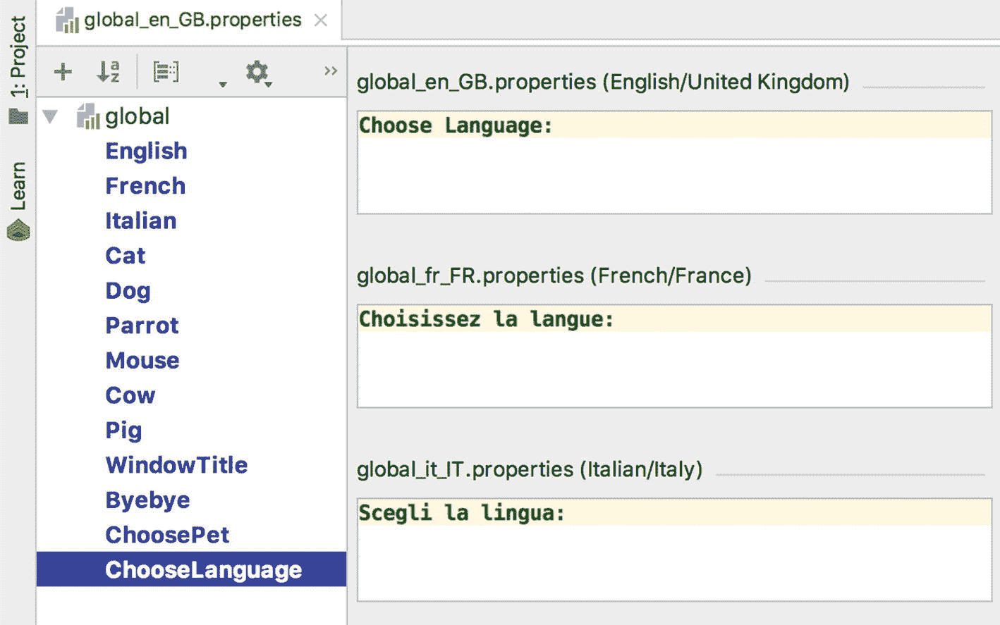

图 10-11

IntelliJ IDEA 资源包编辑器

属性名称可以包含下划线和点等特殊字符来分隔各部分。在本书的示例中，属性名称很简单，因为我们只有这么几个。在更大的应用程序中，属性名称通常包含与其用途相关的前缀，例如，如果属性值是标题，则名称以 `title` 为前缀。例如，我们文件中的属性名称可以改为以下形式：

```
English --> label.lang.english
French --> label.lang.french
Italian --> label.lang.italian
Cat --> label.pet.cat
Dog --> label.pet.dog
Parrot --> label.pet.parrot
Mouse --> label.pet.mouse
Cow --> label.pet.cow
Pig --> label.pet.pig
WindowTitle --> title.window
Byebye --> label.button.byebye
ChoosePet --> label.choose.pet
ChooseLanguage --> label.choose.language
```

现在我们已经介绍了资源文件的编写方式，接下来看看如何使用它们。要创建一个 `ResourceBundle` 实例，我们首先需要一个 `Locale`（区域设置）。应用程序有一个默认的区域设置，可以通过调用 `Locale.getDefault()` 获取，而 `ResourceBundle` 实例可以通过使用包名和区域设置实例来获取，如下面的代码片段所示。

```
Locale locale = Locale.getDefault();
ResourceBundle labels = ResourceBundle.getBundle("global", locale);
```

当获取到有效的 `ResourceBundle` 后，它可以用对资源文件中与所选区域设置匹配的文本值的调用来替换所有硬编码的 `String` 实例。因此，每次我们需要为节点设置标签时，不再使用实际文本，而是调用 `resourceBundle.getString("[property_name]")` 来获取本地化文本。

当 JavaFX 窗口重新加载时，其所有节点都会被重新创建。为了控制这一过程，我们需要添加一些静态属性来保存所选的区域设置。因此，对于我们目前构建的应用程序，在完成国际化后，其代码如下一个清单所示。

```
package com.apress.bgn.ch10;
import javafx.*;
import java.io.File;
import java.net.URL;
import java.net.URLClassLoader;
import java.util.Locale;
import java.util.ResourceBundle;
public class JavaFxDemo extends Application {
private static final String BUNDLE_LOCATION =
"chapter10/using-javafx/src/main/resources";
private static ResourceBundle resourceBundle = null;
private static Locale locale = new Locale("en", "GB");
private static int selectedLang = 0;
public static void main(String... args) {
Application.launch(args);
}
@Override
public void start(Stage primaryStage) throws Exception {
loadLocale(locale);
primaryStage.setTitle(resourceBundle.getString("WindowTitle"));
String[] data = {resourceBundle.getString("Cat"),
resourceBundle.getString("Dog"),
resourceBundle.getString("Parrot"),
resourceBundle.getString("Mouse"),
resourceBundle.getString("Cow"),
resourceBundle.getString("Pig")};
BorderPane borderPane = new BorderPane();
//Top
final ComboBox comboBox = new ComboBox();
comboBox.getItems().addAll(data);
final ComboBox langList = new ComboBox();
String[] languages = {
resourceBundle.getString("English"),
resourceBundle.getString("French"),
resourceBundle.getString("Italian")};
langList.getItems().addAll(languages);
langList.getSelectionModel().select(selectedLang);
GridPane gridPane = new GridPane();
gridPane.setHgap(10);
gridPane.setVgap(10);
Label labelLang = new Label(resourceBundle.getString("ChooseLanguage"));
gridPane.add(labelLang, 0, 0);
gridPane.add(langList, 1, 0);
Label labelPet = new Label(resourceBundle.getString("ChoosePet"));
gridPane.add(labelPet, 0, 1);
gridPane.add(comboBox, 1, 1);
borderPane.setTop(gridPane);
//Center
final TextArea textArea = new TextArea();
textArea.setEditable(false);
borderPane.setCenter(textArea);
comboBox.valueProperty().addListener((observable, oldValue, newValue)
-> textArea.appendText(newValue + "\n"));
langList.valueProperty().addListener((observable, oldValue, newValue)
-> {
int idx = langList.getSelectionModel().getSelectedIndex();
selectedLang = idx;
if (idx == 0) {
//locale = Locale.getDefault();
new Locale("en", "GB");
} else if (idx == 1) {
locale = new Locale("fr", "FR");
} else {
locale = new Locale("it", "IT");
}
primaryStage.close();
Platform.runLater(() -> {
try {
new JavaFxDemo().start(new Stage());
} catch (Exception e) {
System.err.println("Could not reload application!");
}
});
});
HBox box = new HBox();
box.setPadding(new Insets(10, 12, 10, 12));
box.setSpacing(10);
box.setAlignment(Pos.BASELINE_RIGHT);
box.setStyle("-fx-background-color: #85929e;");
Button exitButton = new Button();
exitButton.setText(resourceBundle.getString("Byebye"));
exitButton.setOnAction(event -> Platform.exit());
box.getChildren().add(exitButton);
borderPane.setBottom(box);
//Bottom
StackPane root = new StackPane();
root.getChildren().add(borderPane);
primaryStage.setScene(new Scene(root, 500, 500));
primaryStage.show();
}
private void loadLocale(Locale locale) throws Exception {
File file = new File(BUNDLE_LOCATION);
URL[] url = {file.toURI().toURL()};
ClassLoader loader = new URLClassLoader(url);
resourceBundle = ResourceBundle.getBundle("global", locale, loader);
}
}
```

你可能会疑惑为什么我们使用了另一种加载资源包的方式，以及为什么使用了资源包位置的完整相对路径。这是因为，如果我们希望应用程序能从 IntelliJ 界面运行，就必须提供一个相对于应用程序执行上下文的路径。当应用程序被构建并打包成可运行的 Java 归档文件时，资源文件会包含在其中并位于类路径中。但当我们通过 Java IDE 执行 `main()` 方法来运行应用程序时，类路径是相对于项目实际位置的。


以下代码片段通过关闭`Stage`来重启场景，然后实例化一个`JavaFxDemo`对象并调用`start(..)`方法。这意味着整个层级节点结构会被重新创建；唯一保留的状态是定义在静态对象中的状态。这对于区域设置是必需的，因为`start(..)`方法的执行现在会先调用`loadLocale(locale)`，该方法会选择应用程序的区域设置并加载`ResourceBundle`，以便所有节点都能使用其返回的文本进行标记。

```
primaryStage.close();
Platform.runLater(() -> {
try {
new JavaFxDemo().start(new Stage());
} catch (Exception e) {
System.err.println("无法重新加载应用程序！");
}
});
```

我们到目前为止构建并使用的应用程序是一个简单的程序。如果你需要构建更复杂的界面并且需要国际化，这意味着需要配置的不仅仅是翻译。你可能需要包含不同数字和日期格式的文件，或者多个资源包。国际化是一个重要且庞大的话题，因为如今很少有应用程序只为单一地区使用而构建。但对于 Java 初学者来说，仅仅了解支持类是什么以及如何使用它们，就是一个非常好的起点。

## 构建一个 Web 应用程序

我们开始吧。事情变得严肃起来了。我们正在构建一个 Web 应用程序。Web 应用程序是运行在服务器上，并可以通过浏览器访问的应用程序。直到最近，大多数 Java 应用程序都需要托管在像 Apache Tomcat、Glassfish 或 Enterprise 这样的 Web 服务器，以及像 JBoss（现在称为 WildFly）或 TomEE 这样的服务器上，才能被访问。你需要编写 Web 应用程序，包含类和 HTML 或 JSP 文件，将其打包成 WAR（Web ARchive）或 EAR（Enterprise ARchive）文件，部署到服务器上，然后启动服务器。服务器会提供应用程序的上下文，并将请求映射到能够提供响应内容的类。假设应用程序部署在 Tomcat 服务器上，图 10-12 展示了已部署应用程序功能的抽象架构。

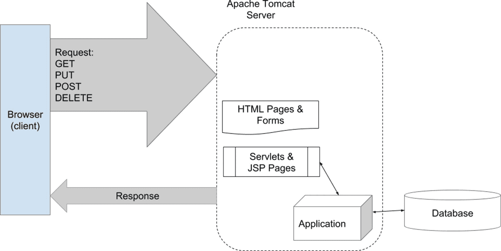

图 10-12

部署在 Apache Tomcat 服务器上的 Web 应用程序

对 Web 应用程序的请求可能来自浏览器以外的其他客户端，但由于本节主要介绍 Web 应用程序，我们假设所有对应用程序的请求都来自浏览器。让我先简单解释一下互联网。

互联网是一个由许多计算机连接在一起组成的信息系统。一些计算机托管着提供应用程序访问的应用服务器，一些计算机访问这些应用程序，还有一些计算机两者都做。这些计算机之间的通信通过网络通过一系列协议进行：HTTP、FTP、SMTP、POP 等。最流行的协议是 HTTP，它代表**超文本传输协议**，是一种非对称的请求-响应客户端-服务器协议，这意味着客户端向服务器发出请求，然后服务器发送响应。后续的请求彼此之间没有关联，也不共享任何状态，因此它们是*无状态的*。HTTP 请求有不同的类型，根据它们要求服务器上的应用程序执行的操作进行分类，但开发人员最常用的有四种类型（如图 10-12 请求箭头中列出的）。我不会深入讨论请求组件的细节，因为这实际上与 Java 无关；我会提供足够的信息来理解 Web 应用程序的工作原理。以下列表包含了四种最常见的请求类型以及服务器为它们生成的响应：


图 10-13

Firefox 中的网络调试器视图

*   `GET`：每当用户在浏览器中输入 URL（例如，[`http://my-site.com/index.html`](http://my-site.com/index.html)）时，浏览器会将地址转换为请求消息并发送到 Web 服务器。浏览器所做的操作可以通过在 Firefox 中打开调试器视图轻松查看。点击**网络**选项卡，然后访问[`www.google.com`](http://www.google.com)。图 10-13 显示了 Firefox 调试器视图，其中显示了正在请求的 URL 以及请求消息的内容。


在图片的右侧，你可以看到正在请求的 URL、请求类型（也称为**请求方法**，此处为 GET）以及请求发送到的服务器的**远程地址**。还有一个 **原始标头** 按钮，点击后会以文本形式展示请求和响应的内容。GET 请求用于从服务器获取某些内容，在此示例中获取的是一个网页。如果网页能够被找到，服务器会发送响应，其中包含供浏览器显示的页面以及其他属性（例如状态码），以表明一切正常。HTTP 状态码有很多，其中最重要的是 200 状态码，它表示一切正常。在图 10-13 中，你可以看到，在初始请求得到响应后，为了显示该页面，浏览器会发起大量额外的请求，并且所有这些后续请求都成功了，因为服务器返回的状态码显示在表格的第一列，且始终是 200。

*   `PUT`：当数据被发送到服务器进行存储时，使用此类型的请求。在企业级应用中，PUT 请求被解释为更新现有对象的请求，并且该请求包含对象的更新版本以及用于标识该对象的信息。

*   `POST`：当需要指示服务器保存数据以供存储时，使用此类型的请求。与 PUT 请求的区别在于，这些数据在服务器上尚不存在。在企业级应用中，POST 请求用于发送凭据以便对用户进行身份验证，或发送用于创建新对象的数据。当 POST 请求发送凭据时，如果用户身份验证成功，响应状态码为 200；如果用户凭据无效，则状态码为 401（未授权）。当 POST 请求发送要保存的数据时，如果对象创建成功，则返回 201 状态码。

*   `DELETE`：当要求服务器删除数据时，使用此类型的请求。如果数据删除成功，响应状态码为 200；否则，将返回与删除失败原因相关的其他错误代码。

在更复杂的应用中，还会用到其他一些 HTTP 方法。如果你对请求方法、状态码以及 HTTP 基础知识感到好奇，我强烈推荐 [`www.ntu.edu.sg/home/ehchua/programming/webprogramming/http_basics.html`](http://www.ntu.edu.sg/home/ehchua/programming/webprogramming/http_basics.html) 上的教程。现在，让我们回到编写 Java Web 应用的话题上。

直到不久前，我们还需要一个服务器来托管 Web 应用，但现在情况已不再如此。就像为了测试目的而用嵌入式数据库取代数据库，以及用功能最简化的应用取代完整应用一样，Web 服务器也经历了同样的变革。如果你想快速编写一个简单的 Web 应用，现在可以选择使用嵌入式服务器，例如 Jetty 或 Tomcat（嵌入式版本）。在本章的这部分内容中，我们将使用一个嵌入式 Tomcat 服务器，并创建一个显示简单 HTML 页面的小型 Web 应用。代码如以下清单所示。

```
package com.apress.bgn.ch10;
import org.apache.catalina.Context;
import org.apache.catalina.LifecycleException;
import org.apache.catalina.startup.Tomcat;
import java.io.File;
public class WebDemo {
public static void main(String... args) throws LifecycleException {
Tomcat tomcat = new Tomcat();
tomcat.setBaseDir("chapter10/web-app/out");
tomcat.setPort(8080);
String contextPath = "/demo";
String docBase = new File(".").getAbsolutePath();
Context context = tomcat.addContext(contextPath, docBase);
SampleServlet servlet = new SampleServlet();
tomcat.addServlet(contextPath, servlet.getServletName(), servlet);
context.addServletMapping(servlet.getUrlPattern(),
servlet.getServletName());
tomcat.start();
tomcat.getServer().await();
}
}
```

如果你觉得这很简单，那确实如此。启动嵌入式服务器所需做的全部工作就是创建一个 `Tomcat` 实例，选择我们希望暴露的端口（本例中为 `8080`），并指定 Tomcat 临时文件的位置。由于我们是从 IntelliJ 运行 `main(..)` 方法，应用的上下文是相对于项目目录的，因此 Tomcat 的基础目录被设置为 `out` 目录，IntelliJ IDEA 会将编译后的类和其他临时文件存储在该目录中。一个 Java Web 应用需要一个上下文路径。上下文路径的值是用于访问应用的 URL 的一部分。一个 URL 由四个部分组成。

*   `protocol`：客户端和服务器通信所使用的应用层协议（例如，http、https、ftp 等）。

*   `hostname`：DNS 域名（例如 [`www.google.com`](http://www.google.com)）、IP 地址（例如 192.168.0.255）或网络中可识别的任何别名。例如，当从与服务器相同的计算机上访问应用时，可以使用 127.0.0.1 或 *localhost*。

*   `port`：服务器监听客户端传入请求的 TCP 端口号。对于 Web 应用，通常为 8080，但大多数 URL 不包含此端口，因为有路由机制将其隐藏。

*   `path and filename`：资源在服务器文档根目录下的名称和位置。用户通常请求查看服务器上托管的特定页面，因此 URL 看起来像这样：[`https://docs.oracle.com/index.html`](https://docs.oracle.com/index.html) 。但出于安全原因，一种非常常见的做法是通过内部映射（称为 URL 重定向）来隐藏路径和文件名。

那么，上下文路径值的作用体现在哪里呢？嗯，当我们像前面的代码示例那样声明一个嵌入式服务器时，任何由它托管的文件都可以通过 `http://localhost:8080/` 来访问，但由于一个服务器可以托管多个应用，因此必须有一种方法来区分它们，对吧？这就是上下文路径值派上用场的地方。因为通过将上下文路径设置为 `/demo`，`WebDemo` 应用及其提供给用户的资源就可以通过 `http://localhost:8080/demo/` 来访问。

Java Web 应用是动态的，页面是通过使用 *Servlets* 和 *JSP（Java Server Pages）* 页面从 Java 代码生成的。因此，Java Web 应用并非直接在服务器上运行，而是在服务器上的 Web 容器内运行。Web 容器为 Java Web 应用提供 Java 运行时环境。Apache Tomcat 就是这样一个运行在 JVM 中的容器；它支持 Servlet 和 JSP 页面的执行。**Servlet** 是一个 Java 类，它是 `javax.servlet.http.HttpServlet` 的子类。此类型的实例在 Web 容器内响应 HTTP 请求。JSP 页面是一个扩展名为 `.jsp` 的文件，其中包含 HTML 和 Java 代码。JSP 页面在首次被访问时，会由 Web 容器编译成一个 Servlet。本质上，*Servlet* 是 Java Web 应用的核心元素。此外，服务器必须知道 Servlet 的存在以及如何识别它，这就是调用 `tomcat.addServlet(contextPath, servlet.getServletName(), servlet);` 的作用所在：它基本上是说：将名为 `servlet.getServletName()` 的 `servlet` 添加到具有 `contextPath` 值的应用上下文中。然后，为了将 URL 模式与 Servlet 关联起来，会调用 `context.addServletMapping(servlet.getUrlPattern(), servlet.getServletName());`。


当 Java Web 应用程序运行时，其所有 Servlet 和 JSP 都在其上下文中运行，但必须通过代码将它们添加到上下文中，并映射到 URL 模式。匹配该 URL 模式的请求 URL 将访问该 Servlet。在上一个代码示例中，可以看到创建了一个 `SampleServlet` 实例。它是一个自定义类，继承自 `javax.servlet.http.HttpServlet`，并重写了 `doGet(..)` 方法，以便为针对 `http://localhost:8080/demo/` 的 GET 请求向客户端返回响应。该类的代码如下所示。

```
package com.apress.bgn.ch10;
import javax.servlet.http.HttpServlet;
import javax.servlet.http.HttpServletRequest;
import javax.servlet.http.HttpServletResponse;
import java.io.BufferedReader;
import java.io.FileReader;
import java.io.IOException;
import java.io.PrintWriter;
public class SampleServlet extends HttpServlet {
private final String servletName = "sampleServlet";
private final String urlPattern = "/";
@Override
protected void doGet(HttpServletRequest request, HttpServletResponse response)
throws IOException {
PrintWriter writer = response.getWriter();
try (BufferedReader reader = new BufferedReader(
new FileReader("chapter10/web-app/src/main/resources/static/index.html"))) {
String line = "";
while ((line = reader.readLine()) != null) {
writer.println(line);
}
}
}
@Override
public String getServletName() {
return servletName;
}
public String getUrlPattern() {    }
return urlPattern;
}
```

出于实际原因，`urlPattern` 属性被添加到了此类中，以便将所有与此 Servlet 相关的内容集中在一处。`servletName` 也是如此。如果打算多次实例化此类以创建多个 Servlet，则应将这两个属性提取到类外部。在 `doGet(..)` 方法内部，我们仅读取 `index.html` 文件的内容，并使用响应的 `PrintWriter` 将它们写入响应对象。

如您所见，`doGet(..)` 方法接收两个对象作为参数：读取 `HttpServletRequest` 实例，可以使用适当的方法访问从客户端发送的请求的所有内容；以及 `HttpServletResponse` 实例，用于向响应中添加信息。在上一个代码示例中，我们只是写入从另一个文件读取的 HTML 代码，但我们也可以通过调用 `response.setStatus(HttpServletResponse.SC_OK);` 来设置状态。除了 `doGet(..)` 方法之外，还有与每个 HTTP 方法匹配的 `do*(..)` 方法，它们声明了相同类型的参数。

另一种编写该类的方式（从 Servlet 3.0 开始）如下代码片段所示：

```
package com.apress.bgn.ch10;
import javax.servlet.annotation.WebServlet;
import javax.servlet.http.HttpServlet;
import javax.servlet.http.HttpServletRequest;
import javax.servlet.http.HttpServletResponse;
import java.io.BufferedReader;
import java.io.FileReader;
import java.io.IOException;
import java.io.PrintWriter;
@WebServlet(
name = "sampleServlet",
urlPatterns = {"/"}
)
public class IndexServlet extends HttpServlet {
@Override
protected void doGet(HttpServletRequest request, HttpServletResponse response)
throws IOException {
PrintWriter writer = response.getWriter();
response.setStatus(HttpServletResponse.SC_OK);
try (BufferedReader reader = new BufferedReader(
new FileReader("chapter10/web-app/src/main/resources/static/index.html"))) {
String line = "";
while ((line = reader.readLine()) != null) {
writer.println(line);
}
}
writer.flush();
writer.close();
}
}
```

使用 `@WebServlet` 注解后，我们不再需要存储 Servlet 名称和 URL 模式的属性，但需要稍微修改 Tomcat 上下文，以告知它扫描带有 `@WebServlet` 注解的类。因此，不再需要显式实例化 Servlet。也不再需要调用 `tomcat.addServlet(..)` 和 `context.addServletMapping(..)`，因为将 Servlet 添加到应用程序上下文并进行映射是使用 `@WebServlet` 注解提供的信息自动完成的。但是，我们必须通过声明一个 `WebResourceSet` 实例并将其添加到上下文资源来定义编译后的 Servlet 类的位置。

```
import org.apache.catalina.Context;
import org.apache.catalina.WebResourceRoot;
import org.apache.catalina.startup.Tomcat;
import org.apache.catalina.webresources.DirResourceSet;
import org.apache.catalina.webresources.StandardRoot;
import java.io.File;
public class WebDemo {
public static void main(String... args) throws Exception {
Tomcat tomcat = new Tomcat();
tomcat.setBaseDir("chapter10/web-app/out");
tomcat.setPort(8080);
String contextPath = "/demo";
String docBase = new File(".").getAbsolutePath();
Context context = tomcat.addContext(contextPath, docBase);
File webInfClasses = new File(root.getAbsolutePath(), "production/classes");
WebResourceRoot resources = new StandardRoot(context);
WebResourceSet resourceSet;
if (webInfClasses.exists()) {
resourceSet = new DirResourceSet(resources,
"/WEB-INF/classes", webInfClasses.getAbsolutePath(), "/");
System.out.println("loading WEB-INF resources from as '"
+ webInfClasses.getAbsolutePath() + "'");
} else {
resourceSet = new EmptyResourceSet(resources);
}
resources.addPreResources(resourceSet);
context.setResources(resources);
tomcat.start();
tomcat.getServer().await();
}
}
```

那么，这就是我们处理 Servlet 的方式，但是如何使用嵌入式服务器处理 JSP 页面呢？首先，我们必须创建一个存放 JSP 页面的目录。因此，我们项目的结构必须改变，如图 10-14 所示。

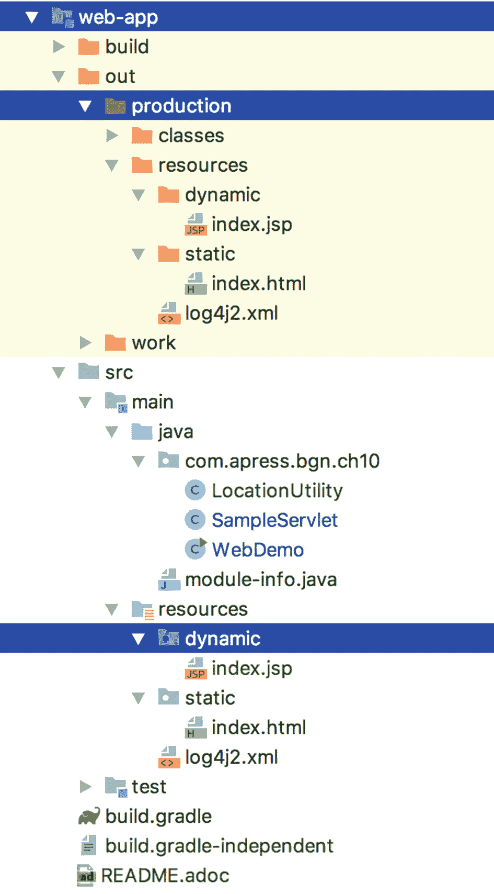

图 10-14

Web 应用程序结构变化

如您所见，添加了 `resource/dynamic` 目录来存放 JSP 页面。随着我们的应用程序变得越来越复杂，是时候对其进行一些清理，并使路径相对于应用程序的执行路径（即 `out` 目录）了。因此，我们引入了以下类。

```
package com.apress.bgn.ch10;
import java.io.File;
public class LocationUtility {
public static File getRootFolder() throws Exception {
String executionPath = WebDemo.class.getProtectionDomain()
.getCodeSource().getLocation().toURI().getPath().replaceAll("\\\\", "/");
int lastIndexOf = executionPath.lastIndexOf("/production/");
return lastIndexOf < 0 ? new File("") :
new File(executionPath.substring(0, lastIndexOf));
}
}
```

我们现在知道，当 IntelliJ IDEA 编译 Gradle 应用程序时，它会在 `out` 目录下创建一个名为 `production` 的目录，其中包含编译后的 Java 类和资源，每个都妥善地组织在自己的目录中。这就是为什么我们应用程序执行的根目录是相对于该目录计算的。由于我们添加了一个 `index.jsp` 页面，我们必须为 `SampleServlet` 添加一个不同的 URL 模式，并且由于我们还添加了相对路径，类代码会稍有变化。


```
package com.apress.bgn.ch10;
import javax.servlet.annotation.WebServlet;
import javax.servlet.http.HttpServlet;
import javax.servlet.http.HttpServletRequest;
import javax.servlet.http.HttpServletResponse;
import java.io.BufferedReader;
import java.io.FileReader;
import java.io.IOException;
import java.io.PrintWriter;
@WebServlet(
name = "sampleServlet",
urlPatterns = {"/sample"}
)
public class SampleServlet extends HttpServlet {
@Override
protected void doGet(HttpServletRequest request, HttpServletResponse response)
throws IOException {
PrintWriter writer = response.getWriter();
response.setStatus(HttpServletResponse.SC_OK);
try (BufferedReader reader = new BufferedReader(
new FileReader(LocationUtility.getRootFolder()
+ "/production/resources/static/index.html"))) {
String line = "";
while ((line = reader.readLine()) != null) {
writer.println(line);
}
} catch (Exception e) {
writer.println(
"Web Application Demo [ERROR] " +
"Something went wrong." +
"The page is not available. Error: " + e.getMessage()
+ "");
e.printStackTrace();
}
writer.flush();
writer.close();
}
}
```

由于我们可能获取 `index.html` 的路径出错，因此我们确保在页面中显示一条合适的消息。接下来是创建一个 JSP 页面。编写 JSP 页面有两种方式。*JSP 脚本小程序* 是最简单的用法。它们是使用 *指令标签* 嵌入在 HTML 代码中的 Java 代码片段。指令标签有三种类型。

*   `<%@ page ... %>` 指令用于向容器提供指令。使用此指令声明的指令属于当前页面，并且可以在页面中的任何位置使用。此类指令可以导入 Java 类型或定义页面属性；例如，

*   `<%@ include ... %>` 指令在翻译阶段包含一个文件。因此，使用此指令的当前 JSP 文件是其内容与使用此指令声明的文件内容的组合。

*   `<%@ taglib ... %>` 指令声明一个标签库，其中包含在 JSP 页面中使用的元素。此指令很重要，因为它导入了一个包含自定义标签和元素的库，用于编写 JSP 页面。这些标签提供了动态功能，无需使用脚本小程序。

我们在本应用程序中使用的 `index.jsp` 页面非常简单。

```
Web Application Demo JSP Page

Today is

```

该页面显示今天的日期，这是通过调用 `new Date()` 实现的。我们在看似 HTML 的页面中使用了 Java 代码。因为这些指令位于页面顶部，并且扩展名是 `.jsp`，所以容器知道此文件必须编译成 servlet。当访问 Web 应用程序的根域时，如果没有任何内容映射到默认 URL 模式 "/"，则应用程序打开的默认页面是名为 `index.html`、`index.htm` 或本例中的 `index.jsp` 的文件。因此，除了将名为 `index.jsp` 的文件添加到正确的目录，并确保容器能够找到该应用程序目录之外，无需再做其他事情，这样当我们访问 `http://localhost:8080/demo/` 时，我们的页面就会显示出来。

那么，让我们看看 `WebDemo` 类如何更改，以确保 `index.jsp` 文件能被找到并正确显示。

```
package com.apress.bgn.ch10;
import org.apache.catalina.WebResourceRoot;
import org.apache.catalina.WebResourceSet;
import org.apache.catalina.core.StandardContext;
import org.apache.catalina.startup.Tomcat;
import org.apache.catalina.webresources.DirResourceSet;
import org.apache.catalina.webresources.EmptyResourceSet;
import org.apache.catalina.webresources.StandardRoot;
import java.io.File;
import java.nio.file.Files;
import static com.apress.bgn.ch10.LocationUtility.getRootFolder;
public class WebDemo {
public static void main(String... args) throws Exception {
File root = getRootFolder();
Tomcat tomcat = new Tomcat();
tomcat.setPort(8080);
tomcat.setBaseDir(root.getAbsolutePath());
File webAppFolder = new File(root.getAbsolutePath(),
"production/resources/dynamic");
if (!webAppFolder.exists()) {
System.err.println("Could not find JSP pages directory!");
}
StandardContext context = (StandardContext) tomcat.
addWebapp("/demo", webAppFolder.getAbsolutePath());
context.setParentClassLoader(WebDemo.class.getClassLoader());
File webInfClasses = new File(root.getAbsolutePath(), "production/classes");
WebResourceRoot resources = new StandardRoot(context);
WebResourceSet resourceSet;
if (webInfClasses.exists()) {
resourceSet = new DirResourceSet(resources, "/WEB-INF/classes",
webInfClasses.getAbsolutePath(), "/");
} else {
resourceSet = new EmptyResourceSet(resources);
}
resources.addPreResources(resourceSet);
context.setResources(resources);
tomcat.start();
tomcat.getServer().await();
}
}
```

所以现在，当我们在浏览器中打开 `http://localhost:8080/demo/` URL 时，你应该会看到类似下面这样的简单消息。

```
Today is Mon Aug 20 01:41:29 BST 2018
```

当然，日期是你系统上的日期。

?
作为给你的练习，想象一下如果你必须编写 Java servlet 类，它会是什么样子。

既然提到了标签库，我们就来简单谈谈它们。最基本的标签库是 JSTL，它代表 **JSP 标准标签库**。其他更高级的标签库由 JSF（JavaServer Faces）、Thymeleaf 或 Spring 提供。此库中定义的标签可用于编写行为可变的 JSP 页面。根据请求属性，它们可用于迭代、测试值、国际化和格式化。根据提供的 JSTL 功能，标签被分为五类。只有在指定了适当的指令后，它们才能在 JSP 页面中使用。接下来，列出了这五个指令及其标签涵盖的总体主题。

*   `<%@ taglib uri="``http://java.sun.com/jsp/jstl/core``" prefix="c" %>`
    JSTL 核心标签提供对显示值、迭代、条件逻辑、捕获异常、URL 以及转发或重定向响应的支持。

*   `<%@ taglib uri="``http://java.sun.com/jsp/jstl/fmt``" prefix="fmt" %>`
    JSTL 格式化标签用于格式化数字、日期，并通过区域设置和资源包提供国际化（i18n）支持。

*   `<%@ taglib uri="``http://java.sun.com/jsp/jstl/sql``" prefix="sql" %>`
    JSTL SQL 标签提供与关系数据库交互的支持，但永远不要这样做，永远不要在网页中使用 SQL，因为它非常容易被黑客攻击（请在 Google 上搜索 *SQL 注入*）。

*   `<%@ taglib uri="``http://java.sun.com/jsp/jstl/xml``" prefix="x" %>`
    JSTL XML 标签提供对处理 XML 文档、解析、转换和 XPath 表达式求值的支持。

*   `<%@ taglib uri="``http://java.sun.com/jsp/jstl/functions``" prefix="fn" %>`
    JSTL 函数标签提供了许多可用于执行常见操作（如文本操作）的函数。


既然我们已经了解了基本的标签类别，那么你认为我们需要使用哪些标签来重新设计我们的 `index.jsp` 页面？如果你想到了 **FMT** 和 **Core**，那就对了。此外，使用标签库的 JSP 页面总是由一个 Servlet 支持，该 Servlet 会在请求中设置 JSP 页面内使用的适当属性。因此，让我们修改 `index.jsp` 页面，如下所示。

```

Web Application Demo JSP Page

Today is

```

同时，我们给它重命名，使其用途一目了然，就叫它 `date.jsp`，并编写一个名为 `DateServlet` 的 Servlet 类，将 `today` 属性添加到请求中，该属性由 `<fmt:formatDate>` 标签格式化。结果保存到 `todayFormatted` 变量中，随后由 `<c:out>` 标签打印输出。

```
package com.apress.bgn.ch10;
import javax.servlet.RequestDispatcher;
import javax.servlet.ServletException;
import javax.servlet.annotation.WebServlet;
import javax.servlet.http.HttpServlet;
import javax.servlet.http.HttpServletRequest;
import javax.servlet.http.HttpServletResponse;
import java.io.IOException;
import java.util.Date;
@WebServlet(
name = "dateServlet",
urlPatterns = {"/"}
)
public class DateServlet extends HttpServlet {
@Override
protected void doGet(HttpServletRequest request, HttpServletResponse response)
throws IOException, ServletException {
System.out.println(" ->>> Getting date ");
request.setAttribute("today", new Date());
RequestDispatcher rd = getServletContext().getRequestDispatcher("/date.jsp");
rd.forward(request, response);
}
}
```

仅此而已。现在，我们重新启动应用程序，首页将显示：`"Today is 20/08/2018"`。当你在自己的机器上运行代码时，显然会看到你系统上的日期。
如果你认为编写 Java Web 应用程序很繁琐，那你是对的。对于这类任务，纯 Java 确实很乏味。专业的 Java Web 应用程序通常使用框架编写，这些框架可以轻松地创建页面并将其与后端连接起来。更进一步，如今的趋势是使用 JavaScript（也使用高级 CSS4，现在许多 UI 设计也可以 100% 用 CSS3 或 CSS4 完成）创建界面，并通过 Web 服务调用（通常是 REST）与托管在企业服务器上的 Java 后端应用程序通信。无论如何，如果你好奇的话可以去查查，这个主题很广泛，但像 Spring 这样的框架可以让你轻松地搭建环境并开始开发。

总结

本章涵盖了重要的开发工具和技术、JDK 中提供支持的类，以及能够让你的开发工作更实用、更愉快的 Java 重要库。JDK 在 GUI 支持方面从未表现出色，但 JavaFX 是 AWT 和 Swing 的演进，它或许有未来。以下是本章内容的完整列表。

*   如何编写交互式控制台应用程序
*   如何编写具有 Swing 界面的交互式应用程序
*   JavaFX 架构的基础知识
*   如何编写具有 JavaFX 界面的交互式应用程序
*   如何国际化你的应用程序
*   如何使用嵌入式服务器编写 Web 应用程序
*   什么是 Servlet
*   什么是 JSP 脚本元素
*   如何使用标签库编写 JSP 页面

脚注

11. 处理文件

软件最重要的功能之一是信息的组织和存储，目的是使用和共享信息。在计算机发明之前，信息写在纸上，存放在有组织的文件柜中，可以手动检索。在计算机上运行的软件应用程序也做着类似的事情。信息写入文件，文件组织在目录中，甚至组织在更复杂的名为数据库的结构中。Java 提供了从文件和数据库中读取信息的类，以及写入文件和将信息写入数据库的类。在**第 9 章**中，介绍了一个使用 Derby 内存数据库的简单示例，向你展示如何模拟像数据库这样重量级的依赖项，以实现更快的单元测试。本章的重点不是使用 Java 执行数据库操作，而是如何使用 Java 操作文件。

文件处理器
在向你展示如何读取或写入文件之前，我需要向你展示如何从代码中访问它们，检查它们是否存在，检查它们的大小并列出它们的属性，等等。不再赘述——让我们开始吧！
在 Java 中处理文件时，最重要的类是 `java.io.File` 类。这个类是文件和目录路径名的抽象表示。此类的实例被称为 *文件处理器*，因为它们允许开发人员使用这种类型的引用（而不是完整的路径名）在 Java 代码中处理文件和目录。可以使用不同的参数创建 `File` 实例。

最简单的方法是使用接收一个包含绝对文件路径名的 `String` 值作为参数的构造函数。在下面的代码示例中，`printStats(..)` 方法打印文件信息。我们在本节中会大量使用它，但不会再次展示代码。

```
package com.apress.bgn.ch11;
import org.slf4j.Logger;
import org.slf4j.LoggerFactory;
import java.io.File;
public class Demo {
private static final Logger log = LoggerFactory.getLogger(Demo.class);
public static void main(String... args) {
File file = new File("/Users/iulianacosmina/apress/vultures.txt");
printFileStats(file);
}
private static void printFileStats(File f) { if (f.exists()) {
log.info("File Details:");
log.info("Type : {}", f.isFile() ? "file" : "directory or symlink");
log.info("Location :{}", f.getAbsolutePath());
log.info("Parent :{}", f.getParent());
log.info("Name : {}", f.getName());
double kilobytes = f.length() / 1024; log.info("Size : {} ", kilobytes);
log.info("Is Hidden : {}", f.isHidden());
log.info("Is Readable? : {}", f.canRead());
log.info("Is Writable? : {}", f.canWrite());
}
}
}
```

在上面的代码片段中，文件处理器实例是通过提供我电脑上的绝对文件路径名创建的。如果你想在自己的电脑上运行代码，必须提供一个指向你电脑上某个文件的路径名。如果你使用的是 Windows，请记住路径名包含 `"\"` 字符，该字符在 Java 中是一个特殊字符，必须通过双写来转义。

`printStats(..)` 方法使用了大量可以在文件处理器上调用的方法。你可以调用的完整方法列表更大。该列表位于官方 API 文档 [`https://docs.oracle.com/javase/10/docs/api/java/io/File.html`](https://docs.oracle.com/javase/10/docs/api/java/io/File.html) 中。所有文件处理器方法都在以下链接中解释：[`https://docs.oracle.com/javase/10/docs/api/java/io/File.html`](https://docs.oracle.com/javase/10/docs/api/java/io/File.html)。


*   `isFile()` 
    如果路径名指向一个文件，则返回 `true`；如果路径名指向一个目录或符号链接（一种特殊类型的文件，用于链接到另一个文件，当你想缩短文件的路径名时非常有用，并且在 Windows 上极其有用，因为 Windows 的路径名长度限制为 256 个字符），则返回 `false`。在前面的代码示例中，该方法返回 `true`，日志打印如下：

```
[main] INFO com.apress.bgn.ch11.Demo - Type : file
```

如果我们想测试该方法是否适用于目录，我们从路径名中删除文件名。

```
File file = new File("/Users/iulianacosmina/apress");
```

然后日志打印如下：

*   `getAbsolutePath()`
     返回文件或目录的绝对路径名。创建文件处理器时，并不总是需要绝对路径名，但如果你以后需要使用它，或者想确保相对路径被正确解析，这个方法正是你所需要的。以下代码片段通过使用相对于项目根目录（在我们的例子中是 `java-for-absolute-beginners` 目录）的路径，在 `resources` 目录中创建了一个指向文件的文件处理器。

```
[main] INFO com.apress.bgn.ch11.Demo - Type : directory or symlink
```

```
File d = new File("chapter11/read-write-file/src/main/resources/input/");
```

现在，`getAbsolutePath()` 方法打印出完整的路径名。

```
[main] INFO com.apress.bgn.ch11.Demo - Location :/Users/iulianacosmina/
java-for-absolute-beginners/chapter11/read-write-file/src/main/resources/input/vultures.txt
```

Java 的 `File` 类非常强大；它也可以用来指向另一台计算机上的共享文件。有一个特殊的构造函数用于此目的，它接收一个 `java.net.URI` 类型的参数，其中 URI 代表*统一资源标识符*。要测试这个构造函数，请在你的计算机上选择一个文件，并在浏览器中打开它，这样你就可以从浏览器地址栏获取它的 URI。

```
try {
URI uri = new URI("file:///Users/iulianacosmina/java-for-absolute-beginners/chapter11/"
+ "read-write-file/src/main/resources/input/vultures.txt"); f = new File(uri);
printFileStats(f);
} catch (URISyntaxException use) {
log.error("Malformed URI, no file there", use);
}
```

因为 URI 可能具有不正确的前缀，或者没有精确指向一个文件，`URI` 构造函数被声明为抛出 `java.net.URISyntaxException`，这就是为什么在代码中你也必须处理这个异常。如果使用 `URI` 来创建文件处理器，`getAbsolutePath()` 方法会返回文件所在计算机和驱动器上的绝对路径名。

*   `getParent()` 
     返回包含该文件的目录的绝对路径，因为在层级结构上，文件不能将另一个文件作为父级。

*   `getName()` 
     返回文件名。文件名包含*扩展名*，即 `"."` 之后的后缀，它表示文件的类型以及预期用途。

*   `length()` 
     返回文件的字节长度。此方法不适用于目录，因为目录可能包含对执行程序的用户受限的文件，并且可能会抛出异常。因此，如果你需要获取目录的大小，你必须自己编写代码。

*   `isHidden()` 
     如果文件对当前用户不可见，则返回 `true`；否则返回 `false`。在 macOS/Linux 系统上，以 `"."` 开头的文件是隐藏的，所以如果我们想看到该方法返回 `true`，我们必须创建一个指向系统配置文件（例如 `.bash_profile`）的处理器。因此，在使用指向隐藏文件的路径名创建的文件处理器上调用 `printStats(..)` 方法，会产生类似于以下的输出：

*   `canRead()` 和 `canWrite()` 可以保护文件免受普通用户的访问。当用户对文件拥有特定权限时，这两个方法都返回 `true`，否则返回 `false`。

```
[main] INFO com.apress.bgn.ch11.Demo - File Details: [main] INFO com.apress.bgn.ch11.Demo - Type : file
[main] INFO com.apress.bgn.ch11.Demo - Location :/Users/iulianacosmina/.viminfo [main] INFO com.apress.bgn.ch11.Demo - Parent :/Users/iulianacosmina
[main] INFO com.apress.bgn.ch11.Demo - Name : .viminfo [main] INFO com.apress.bgn.ch11.Demo - Size : 13.0 [main] INFO com.apress.bgn.ch11.Demo - Is Hidden : true
[main] INFO com.apress.bgn.ch11.Demo - Is Readable? : true [main] INFO com.apress.bgn.ch11.Demo - Is Writable? : true
```

可以为指向目录的路径名创建文件处理器，这意味着有一些可用的方法仅适用于目录。对目录最常见的操作是列出其内容。`list()` 方法返回一个 `String` 数组，包含此目录下的文件（和目录）名称。我们可以使用 lambda 表达式来打印数组中的条目。

```
Arrays.stream(d.list()).forEach(ff -> log.info("\t File Name : {}", ff));
```

但在大多数情况下，文件名并不是很有用，拥有一个包含每个文件处理器的 `File` 数组会更好。这就是为什么在 1.2 版本中添加了 `listFiles()` 方法。

```
Arrays.stream(d.listFiles()).forEach(ff ->
log.info("\t File Name : {}", ff.getName()));
```

并且这个方法有不止一种形式，因为当使用 `FileFilter` 实例调用时，它会过滤文件，并仅返回符合特定要求的文件的文件处理器。

```
Arrays.stream(d.listFiles(new FileFilter() {    @Override
public boolean accept(File pathname) {
return pathname.getAbsolutePath().endsWith("yml")
|| pathname.getAbsolutePath().endsWith("properties");
}
})).forEach(ff -> log.info("\t YML/Properties file : {}", ff.getName()));
```

前面的代码示例以展开形式编写，以明确你应该为 `accept(..)` 方法提供具体的实现。使用 lambda 表达式，代码可以简化，并且更不容易抛出异常。

```
Arrays.stream(Objects.requireNonNull(
d.listFiles(pathname -> pathname.getAbsolutePath()
.endsWith("yml") || pathname.getAbsolutePath().endsWith("properties"))))
.forEach(ff -> log.info("\t YML/Properties file : {}", ff.getName()));
```

在前面的示例中，我们实现了 `accept(..)` 方法来按扩展名过滤，但过滤器实际上可以涉及任何内容。但是，当你需要的过滤器严格涉及文件名时，你可以通过使用该方法的另一个版本来减少样板代码，该版本接收一个 `FilenameFilter` 实例作为参数。

```
Arrays.stream(d.listFiles(new FilenameFilter() {
@Override
public boolean accept(File dir, String name) {
return name.contains("son");
}
})).forEach(ff -> log.info("\t Namesakes : {}", ff.getName()));
```

除了列出文件的属性外，文件处理器还可以用于创建文件。要创建文件，必须在创建具有特定路径名的文件处理器后调用 `createNewFile()` 方法。

```
File created = new File(
"chapter11/read-write-file/src/main/resources/output/created.txt");
if (!created.exists()) {
try {    created.createNewFile();
} catch (IOException e) {
log.error("Could not create file.", e);
}
}
```


`exists()` 方法在文件处理器与文件关联时返回 `true`，否则返回 `false`。该方法用于检测我们尝试创建的文件是否已存在。如果文件已存在，则方法不产生任何效果。如果用户没有在指定路径创建文件的适当权限，则会抛出 `SecurityException`。在某些情况下，我们可能需要创建仅在程序执行期间使用的文件。这意味着我们要么显式创建文件并删除它，要么创建临时文件。临时文件通过调用 `createTempFile(prefix, suffix)` 创建，它们会被创建在操作系统定义的临时目录中。`prefix` 参数的类型为 `String`，创建的文件名以其值开头。`suffix` 参数的类型也是 `String`，用于指定文件的扩展名。文件名的其余部分由操作系统生成。

```
try {
File temp = File.createTempFile("java_bgn_", ".tmp");
log.info("File created.txt at: {}", temp.getAbsolutePath());
temp.deleteOnExit();
} catch (IOException e) {
log.error("Could not create temporary file.", e);
}
```

操作系统会定期删除其临时目录中的文件，但如果你希望确保文件被删除，可以在临时文件的处理器上显式调用 `deleteOnExit()`。在代码示例中，打印了文件的绝对路径以显示临时文件创建的确切位置，在 macOS 系统上，完整路径名类似于：

```
/var/folders/gg/nm_cb2lx72q1lz7xwwdh7tnc0000gn/T/java_bgn_14652264510049064218.tmp
```

文件也可以使用 Java 文件处理器进行重命名，有一个名为 `rename(f)` 的方法，它接收一个文件处理器参数，指向文件应具有的位置和所需名称。如果重命名成功，该方法返回 `true`，否则返回 `false`。

```
File file = new File(
"chapter11/read-write-file/src/main/resources/output/sample/created.txt"); File renamed = new File(
"chapter11/read-write-file/src/main/resources/output/sample/renamed.txt");boolean result = file.renameTo(renamed);
log.info("Renaming succeeded? : {} ", result);
```

`File` 类中的大多数方法在出现意外情况时会抛出 `IOException`，因为操作文件可能因硬件问题或操作系统问题而失败。需要特殊权限访问文件的方法在出现意外情况时会抛出 `SecurityException`。因此，在编写需要操作文件的 Java 应用程序时，你也必须处理这些异常。现在我们已经介绍了使用文件处理器的基础知识，接下来进入下一节。

路径处理器
`java.nio.file.Path` 接口是在 Java 1.7 中与 `java.nio.file.Files` 和 `java.nio.file.Paths` 工具类一起引入的，旨在提供更实用、更现代的文件操作方式。它们属于 `java.nio` 包；**nio** 一词意为*非阻塞输入输出*。`Path` 实例可用于定位文件系统中的文件，因此它表示一个依赖于系统的文件路径。`Path` 实例比 `File` 更实用，因为它们提供了访问路径组件、组合路径和比较路径的方法。

`Path` 实例不能直接创建，因为接口无法实例化，但该接口提供了创建它们的静态工具方法，`Paths` 类也是如此。创建 `Path` 实例的最简单方法是先获取一个文件处理器，然后调用 `Paths.get(fileURI)`。

```
package com.apress.bgn.ch11;
import org.slf4j.Logger;
import org.slf4j.LoggerFactory;
import java.io.File;
import java.nio.file.Path;
import java.nio.file.Paths;
import java.util.Iterator;
public class PathDemo {
private static final Logger log = LoggerFactory.getLogger(PathDemo.class);
public static void main(String... args) {
File file = new File(
"chapter11/read-write-file/src/main/resources/input/vultures.txt");    Path path = Paths.get(file.toURI());
log.info(path.toString());
}
}
```

从 Java 11 开始，`Paths.get(file.toURI())` 可以替换为 `Path.of(file.toURI())`。

创建 `Path` 实例的另一种方法是使用 `Paths.get(..)` 的另一种形式，该形式接收路径的多个片段作为参数。

```
Path composedPath = Paths.get("/Users/iulianacosmina/apress/workspace",
"java-for-absolute-beginners/chapter11/read-write-file/src/main/resources/input",
"vultures.txt");
log.info(composedPath.toString());
```

两个路径指向同一位置，因此如果使用 `compareTo(..)` 方法（因为 `Path` 扩展了 `Comparable<Path>` 接口）相互比较，返回的结果是 0（零），这意味着路径相等。

```
log.info("Is the same path? : {} ", path.compareTo(composedPath) ==0 ? "yes" : "no");
// 输出 : INFO com.apress.bgn.ch11.PathDemo - Is the same path? : yes
```

在下一个代码示例中，对 `path` 实例调用了几个 `Paths` 方法。

```
log.info("Location :{}", path.toAbsolutePath());
log.info("Is Absolute? : {}", path.isAbsolute());
log.info("Parent :{}", path.getParent());
log.info("Root :{}", path.getRoot());
log.info("FileName : {}", path.getFileName());
log.info("FileSystem : {}", path.getFileSystem());
```

以下列表解释了每个方法及其结果：

*   `toAbsolutePath()` 返回一个 `Path` 实例，表示此路径的绝对路径。当在已创建的 `path` 实例上调用时，由于它已经是绝对路径，该方法返回调用该方法的 `path` 对象。此外，调用 `path.isAbsolute()` 会返回 `true`。

*   `getParent()` 返回父级 `Path` 实例。因此，在 `path` 实例上调用此方法会打印：

```
    INFO com.apress.bgn.ch11.PathDemo - Parent :/Users/iulianacosmina/apress/workspace/java-for-absolute-beginners/chapter11/read-write-file/src/main/resources/input
    ```

*   `getRoot()` 将此路径的根组件作为 `Path` 实例返回。在 Linux 或 macOS 系统上，它打印 `"/"`，在 Windows 上，则类似 `"C:\"`。

*   `getFileName()` 返回此路径所表示的文件或目录的名称，作为一个 `Path` 实例。基本上，路径由系统路径分隔符分割，并返回距离根元素最远的那个。

*   `getFileSystem()` 返回创建此对象的文件系统，对于 macOS，它是一个类型为 `sun.nio.fs.MacOSXFileSystem` 的实例。

另一个有用的 `Path` 方法是 `resolve(..)`。此方法接收一个表示路径的 `String` 实例，并针对调用它的 `Path` 实例进行解析。这意味着会根据程序运行的操作系统添加路径分隔符，并返回一个 `Path` 实例。

```
Path chapterPath = Paths.get("/Users/iulianacosmina/apress/workspace",
"java-for-absolute-beginners/chapter11");
Path filePath = chapterPath.resolve(
"read-write-file/src/main/resources/input/vultures.txt");
log.info("Resolved Path :{}", filePath.toAbsolutePath());
```

示例代码打印如下内容：

```
INFO com.apress.bgn.ch11.PathDemo - Resolved Path : :/Users/iulianacosmina/apress/ workspace/java-for-absolute-beginners/chapter11/read-write-file/src/main/resources/input/vultures.txt
```


使用`Path`实例，结合`Files`工具方法，编写管理文件或检索文件属性的代码会变得更加简便。以下代码示例运用了其中几个方法，以打印文件属性，其方式与我们使用`File`处理器时相同。

```
Path outputPath = FileSystems.getDefault()
.getPath("/Users/iulianacosmina/apress/workspace/" +
"java-for-absolute-beginners/chapter11/read-write-file/src/main/resources/output/sample2");
try {
Files.createDirectory(outputPath);
log.info("类型: {}", Files.isDirectory(outputPath) ? "是" : "否");
Path destPath = Paths.get(outputPath.toAbsolutePath().toString(),
"vultures.txt");
Files.copy(path, destPath);
double kilobytes = Files.size(destPath) / (double)1024;
log.info("大小: {} ", kilobytes);
Path newFilePath = Paths.get(outputPath.toAbsolutePath().toString(),
"vultures2.txt");
Files.createFile(newFilePath);
log.info("类型: {}", Files.isRegularFile(newFilePath) ? "是" : "否");
log.info("类型: {}", Files.isSymbolicLink(newFilePath) ? "是" : "否");
log.info("是否隐藏: {}", Files.isHidden(newFilePath) ? "是" : "否");
log.info("是否可读: {}", Files.isReadable(newFilePath) ? "是" : "否");
log.info("是否可写: {}", Files.isWritable(newFilePath) ? "是" : "否");
Path copyFilePath = Paths.get("/Users/iulianacosmina/temp/", "vultures3.txt");
Files.move(newFilePath, copyFilePath);
log.info("是否存在? : {}", Files.exists(copyFilePath)? "是": "否");
log.info("文件已移动到: {}", copyFilePath.toAbsolutePath());
Files.deleteIfExists(copyFilePath);
} catch (FileAlreadyExistsException e) {
log.error("创建失败!", e);
} catch (IOException e) {
log.error("发生了意外错误!", e);
}
```

如您所见，`Files`类在处理文件时提供了更多功能。此外，根据操作的不同，会抛出更具体的异常（扩展自`IOException`的类型），因此失败原因一目了然。例如，`createFile(...)`在文件已存在时会抛出`java.nio.file.FileAlreadyExistsException`，而不会返回关联的`Path`实例。`createDirectory(..)`和`move(..)`也具有相同的行为。此处未使用的`delete(..)`方法，在待删除文件不存在时会抛出`java.nio.file.NoSuchFileException`。为避免代码示例中抛出异常，我们使用了`deleteIfExists(..)`。方法列表甚至更长，但由于本章篇幅有限，您可以自行查阅官方 Javadoc API：[`https://docs.oracle.com/javase/10/docs/api/java/nio/file/Files.html`](https://docs.oracle.com/javase/10/docs/api/java/nio/file/Files.html)。

读取文件
文件是硬盘上的一系列比特位。`File`处理器不提供读取文件内容的方法，但可以使用其他类来实现。根据对文件内容的具体需求，Java 中有多种读取文件内容的方式。实际上，方法很多，本节将介绍最常用的几种。

使用 Scanner 读取文件

`Scanner`类曾用于从命令行读取输入，但可以将`System.in`替换为`File`和`Scanner`方法来读取文件内容。

```
package com.apress.bgn.ch11;
import org.slf4j.Logger;
import org.slf4j.LoggerFactory;
import java.io.File;
import java.io.IOException;
import java.util.Scanner;
public class ReadingFilesDemo {
private static final Logger log =
LoggerFactory.getLogger(ReadingFilesDemo.class);
public static void main(String... args) {
File file = new File(
"chapter11/read-write-file/src/main/resources/input/vultures.txt");
String content = "";
Scanner scanner;
try {
scanner = new Scanner(file);
while (scanner.hasNextLine()) {
content += scanner.nextLine() + "\n";
}
scanner.close();
log.info("使用 Scanner 读取--> {}", content);
scanner.close();
} catch (IOException e) {
log.info("出错了! ", e);
}
}
}
```

也可以使用`Path`实例。

```
scanner = new Scanner(Paths.get(file.toURI()), StandardCharsets.UTF_8.name());
```

使用 Files 工具方法读取文件

另一种读取文件的方式是，当文件大小可预估，且将其内容存储到`String`对象中（内存充足）不成问题时，可以使用`Files`类的相应方法。

```
try {
content = new String(Files.readAllBytes(Paths.get(file.toURI())));
log.info("使用 Files.readAllBytes 读取 --> {}", content);
} catch (IOException e) {
log.info("出错了! ", e);
}
```

使用`Files.readAllBytes(..)`的优势在于无需循环，也无需逐行构建`String`值，因为该方法会读取文件中的所有字节，这些字节可直接作为`String`构造函数的参数。缺点是没有使用`Charset`，因此文本值可能并非我们所期望的。但有一种方法可以解决这个问题：调用`Files.readAllLines(..)`。它返回文件内容作为`String`值的列表，并有两种形式，其中一种将`Charset`声明为参数。

```
try {
List lyricList = Files.readAllLines(Paths.get(file.toURI()),
StandardCharsets.UTF_8);
lyricList.forEach(System.out::println);
} catch (IOException e) {
log.info("出错了! ", e);
}
```

但如果我们不需要`List<String>`，而只需要一个`String`实例呢？在 Java 11 中，有一个方法可以实现，叫做`readString`。

```
try {
content = Files.readString(Paths.get(file.toURI()), StandardCharsets.UTF_8)
log.info("使用 Files.readAllBytes 读取 --> {}", content);
} catch (IOException e) {
log.info("出错了! ", e);
}
```

使用 Reader 读取文件

在`Files`类提供这些便捷方法之前，还有其他方式，当您并不真正关心保存从文件中读取的所有内容时，可能会用到它们。让我们从一个在 Java 1.6 之前逐行读取文件的复杂代码开始。

```
import java.io.BufferedReader;
import java.io.File;
import java.io.FileReader;
...
BufferedReader reader = null;
try {
reader = new BufferedReader(new FileReader(
new File("chapter11/read-write-file/src/main/resources/input/vultures.txt")));
StringBuilder sb = new StringBuilder();
String line;
while ((line = reader.readLine()) != null) {
if(!line.contains("Ooh")) {
sb.append(line).append("\n");
}
}
log.info("使用 BufferedReader 读取 --> {}", sb.toString() );
} catch (Exception e) {
log.info("出错了! ", e);
} finally {
if(reader != null) {
try {
reader.close();
} catch (IOException e1) {
e1.printStackTrace();
}
}
}
```

哇，这是什么，对吧？在 Java 1.7 之前，如果你想逐行读取文件，就必须编写这样的代码。你需要创建一个`File`处理器。然后需要将文件处理器包装到`FileReader`中。这种类型的实例可以完成读取工作，但只能以`char[]`块的形式读取，这在需要实际文本时不太有用。因此，需要将此实例包装到`BufferedReader`实例中，该实例通过内部缓冲区读取字符来提供此功能。所以，它的工作方式是，反复调用`reader.readLine()`，直到没有更多内容可读——即到达文件末尾，然后我们需要调用`reader.close()`；否则，文件可能会被锁定，在重启之前无法读取。


在 Java 1.7 中，引入了许多旨在减少管理文件和文件内容所需样板代码的特性。其中一项是，所有用于访问文件内容且可能对文件保持锁定的类，都被声明为实现 `java.io.Closeable` 接口，从而将这些类型的资源标记为可关闭，并在执行结束前由 JVM 透明地调用 `close()` 方法来释放资源。此外，在 Java 7 中，还引入了 *try-with-resources* 语句。利用所有这些特性，代码可以写成这样：

```
import java.io.BufferedReader;
import java.io.File;
import java.io.FileReader;
...
try (BufferedReader reader = new BufferedReader(new FileReader(
new File("chapter11/read-write-file/src/main/resources/input/vultures.txt")))){
StringBuilder sb = new StringBuilder();
String line;
while ((line = reader.readLine()) != null) {
if(!line.contains("Ooh")) {
sb.append(line).append("\n");
}
}
log.info("Read with BufferedReader --> {}", sb.toString() );
} catch (Exception e) {
log.info("Something went wrong! ", e);
}
```

但我们仍然有那种构造函数嵌套构造函数的丑陋写法，这相当不美观。好在 Java 8 通过引入 `Files.newBufferedReader(Path)` 方法解决了这个问题。因此，之前的代码变成了：

```
import java.io.BufferedReader;
import java.io.File;
import java.io.FileReader;
...
File file = new File(
"chapter11/read-write-file/src/main/resources/input/vultures.txt");
Path sourceFile = Paths.get(file.toURI());
try (BufferedReader reader = Files.newBufferedReader(sourceFile)){
StringBuilder sb = new StringBuilder();
String line;
while ((line = reader.readLine()) != null) {
if(!line.contains("Ooh")) {
sb.append(line).append("\n");
}
}
log.info("Read with BufferedReader --> {}", sb.toString() );
} catch (Exception e) {
log.info("Something went wrong! ", e);
}
```

但是，通过结合使用 lambda 表达式，我们在逐行读取文件时也能获得类似的行为：

```
List lyricList = Files.readAllLines(Paths.get(file.toURI()),
StandardCharsets.UTF_8)
.stream()
.filter(line -> !line.contains("Ooh"))
.collect(Collectors.toList());
```

我们只需要遍历这些行，并将所有内容添加到一个 `StringBuilder` 中，*瞧！*，结果相同，但样板代码更少。或者，我们可以使用 Java 1.8 引入的 `Files.lines(..)` 方法，以流的形式获取所有内容，像这样编写：

```
Stream lyricStream = Files.lines(file.toPath())
.filter(s -> !s.contains("Ooh"));
lyricStream.forEach(System.out::println);
```

`BufferedReader` 类是扩展了 `Reader` 类的类组中的一个成员。它是一个用于读取字符流的抽象类。完整的层次结构如图 11-1 所示。

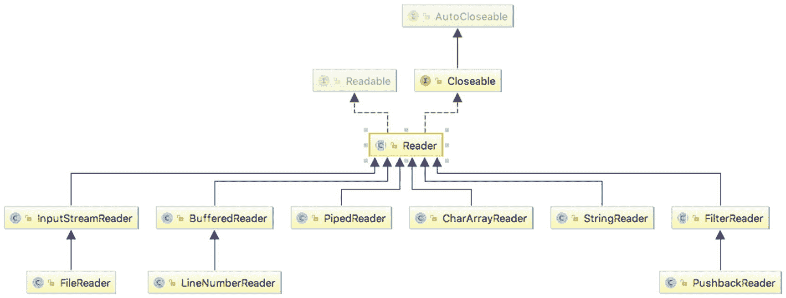

图 11-1
Reader 类层次结构

字符流可以有多种来源，文件是最常见的。它们提供对文件中存储数据的顺序访问。`BufferedReader` 不支持字符编码，但 `BufferedReader` 可以基于另一个 `Reader` 实例，而提供读取字符流并考虑编码的是 `InputStreamReader`。因此，我们可以将

```
try (BufferedReader reader = new BufferedReader(new FileReader(
new File("chapter11/read-write-file/src/main/resources/input/vultures.txt")))){
...
}
```

替换为

```
import java.nio.charset.StandardCharsets;
import java.io.FileInputStream;
...
try (BufferedReader reader = new BufferedReader(new InputStreamReader(
new FileInputStream(
"chapter11/read-write-file/src/main/resources/input/vultures.txt"),
StandardCharsets.UTF_8))){
...
}
```

但从 Java 1.7 开始，我们不再需要这样做，因为有一个版本的 `Files.newBufferedReader` 也接受一个 `Charset` 实例作为参数。因此，代码可以安全地替换为以下内容。

```
try (BufferedReader reader = Files.newBufferedReader(sourceFile,
StandardCharsets.UTF_8)){
...
}
```

在 Java 11 中，`Reader` 增加了 `nullReader()` 方法，该方法返回一个不执行任何操作的 `Reader` 实例。这是应开发人员测试需求而添加的。

使用 InputStream 读取文件
`Reader` 家族中的类是用于以文本形式读取数据的高级类。文件是字节序列，因此这些类是对用于读取字节流的类家族中类的包装。当尝试在使用 `BufferedReader` 读取文本时使用正确的字符编码时，这一点就变得清晰起来，因为作为参数给出的 `InputStreamReader` 实例基于 `java.io.FileInputStream` 实例，而 `FileInputStream` 是 `java.io.InputStream` 的子类。

此层次结构的根类是 `java.io.InputStream`，如图 11-2 所示。

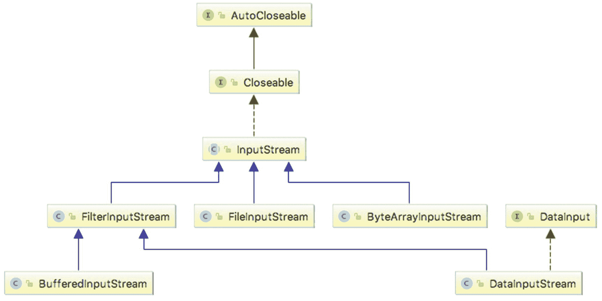

图 11-2
InputStream 类层次结构

`BufferedInputStream` 类相当于用于读取字节流的 `BufferedReader`。我们用来从控制台读取用户数据的 `System.in` 就是这种类型，`Scanner` 实例将其缓冲区中的字节转换为用户可理解的数据。当我们感兴趣的数据不是使用 Unicode 约定存储的文本，而是原始数值数据（例如图像、媒体文件、PDF 等二进制文件）时，使用字节流的类更合适。仅仅为了向您展示如何操作，我们将使用 `FileInputStream` 读取 `vultures.txt` 文件的内容。

```
package com.apress.bgn.ch11.reading;
import org.slf4j.Logger;
import org.slf4j.LoggerFactory;
import java.io.File;
import java.io.FileInputStream;
import java.io.IOException;
public class FileInputStreamReadingDemo {
private static final Logger log =
LoggerFactory.getLogger(FileInputStreamReadingDemo.class);
public static void main(String... args) {
File file = new File(
"chapter11/read-write-file/src/main/resources/input/vultures.txt");
try {
FileInputStream fis = new FileInputStream(file);
byte[] buffer = new byte[1024];
StringBuilder sb = new StringBuilder();
while (fis.read(buffer) != -1) {
sb.append(new String(buffer));
buffer = new byte[1024];
}
fis.close();
log.info("Read with FileInputStream --> {}", sb.toString() );
} catch (IOException e) {
log.info("Something went wrong! ", e);
}
}
}
```

如果你运行这段代码，你会注意到预期的输出会打印在控制台中；但在文本打印之后，也会打印出一组奇怪的字符。在 macOS 系统上，它们看起来如图 11-3 所示。

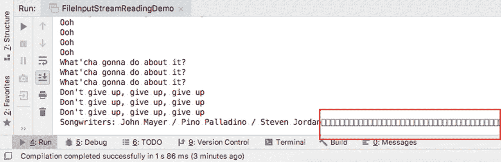

图 11-3
使用 FileInputStream 读取的文本


好的，作为一名高级文档工程师和翻译员，我将严格遵循您提供的注意事项和示例，将给定的英文文本翻译成中文。


你知道这些字符可能是什么吗？
不知道也没关系，我第一次使用 `FileInputStream` 读取文件时也不知道。
这些字符之所以会出现，是因为文件大小不是 1024 的倍数，所以 `FileInputReader` 最终会用零填充最后一个缓冲区的剩余部分。
一个解决方案是计算文件的字节大小，并确保我们相应地调整 `byte[] buffer` 的大小。如果你有心情写点代码，可以尝试将其作为练习。
现在我们已经向你展示了多种读取文件的方法，接下来我们将继续向你展示如何写入文件，因为你已经知道如何创建它们了。
在 Java 11 中，`InputStream` 还增加了一个方法，该方法返回一个什么都不做的 `InputStream`，名为 `nullInputStream()` 方法，用于测试目的。

写入文件
在 Java 中写入文件与读取文件类似，只是需要使用不同的类，因为流是单向的，这意味着用于读取数据的流不能同时用于写入数据。几乎对于每个读取文件的类或方法，都有一个对应的写入文件的类或方法。闲话少说，让我们开始吧。

使用 Files 工具方法写入文件

对于较小的文件，当我们只需要写入一些字节时，`Files.write(Path, byte[])` 方法就很好用。

```
package com.apress.bgn.ch11.writing;
import org.slf4j.Logger;
import org.slf4j.LoggerFactory;
import java.io.File;
import java.io.IOException;
import java.nio.file.Files;
import java.nio.file.Path;
public class FilesWritingDemo {
private static final Logger log =
LoggerFactory.getLogger(FilesWritingDemo.class);
public static void main(String... args) {
File file = new File(
"chapter11/read-write-file/src/main/resources/output/vultures.txt");
byte[] data = "Some of us, we're hardly ever here".getBytes();
try {
Path dataPath = Files.write(file.toPath(), data);
log.info("String written to {}", dataPath.toAbsolutePath());
} catch (IOException e) {
e.printStackTrace();
}
}
}
```

如果文件已存在，其内容将被直接覆盖。

在 Java 11 中，引入了 `Files.writeString(..)` 方法，它允许在将 `String` 实例写入文件时指定一个 `Charset`；也无需转换为字节。

```
try {
Path dataPath = Files.writeString(file.toPath(),
"Some of us, we're hardly ever here",
StandardCharsets.UTF_8);
log.info("String written to {}", dataPath.toAbsolutePath());
} catch (IOException e) {
e.printStackTrace();
}
```

`Files` 类中有三个 `Files.write(..)` 方法：一个是前面代码片段中使用的方法，另外两个可以写入由任何扩展了 `CharSequence` 类型的实例所表示的文本值集合。这两个方法之间的唯一区别是，其中一个还将 `Charset` 作为参数。

```
package com.apress.bgn.ch11.writing;
import org.slf4j.Logger;
import org.slf4j.LoggerFactory;
import java.io.File;
import java.io.IOException;
import java.nio.charset.StandardCharsets;
import java.nio.file.Files;
import java.nio.file.Path;
import java.util.List;
public class FilesWritingDemo {
private static final Logger log =
LoggerFactory.getLogger(FilesWritingDemo.class);
public static void main(String... args) {
List dataList =  List.of("Some of us, we're hardly ever here",
"The rest of us, we're born to disappear",
"How do I stop myself from",
"Being just a number?");
try {
File file2 = new File(
"chapter11/read-write-file/src/main/resources/output/vultures2.txt");
Path dataPath = Files.write(file2.toPath(),  dataList,
StandardCharsets.UTF_8);
log.info("String written to {}", dataPath.toAbsolutePath());
} catch (IOException e) {
e.printStackTrace();
}
}
}
```

以上就是 `Files` 类中所有用于写入文件的方法。接下来，我们将研究如何使用 `Writer` 层次结构中的类来写入文件。

使用 Writer 写入文件

与用于读取文件的 `Reader` 层次结构类似，有一个名为 `Writer` 的抽象类，但在我们讨论它之前，先介绍一下 `BufferedWriter`，它是用于写入文件的 `BufferedReader` 对应类。这个类也有一个内部缓冲区，当调用写入方法时，参数会被存储到缓冲区中，当缓冲区满时，其内容会被写入文件。可以通过调用 `flush()` 方法提前清空缓冲区。我强烈建议在调用 `close()` 之前显式调用此方法，以确保所有输出都已写入文件。下一个代码片段演示了如何将 `String` 实例列表写入文件。

```
package com.apress.bgn.ch11.writing;
import org.slf4j.Logger;
import org.slf4j.LoggerFactory;
import java.io.BufferedWriter;
import java.io.File;
import java.io.FileWriter;
import java.io.IOException;
import java.util.List;
public class FilesWritingDemo {
private static final Logger log =
LoggerFactory.getLogger(FilesWritingDemo.class);
public static void main(String... args) {
File file = new File(
"chapter11/read-write-file/src/main/resources/output/vultures.txt");
List lyricList =  List.of("Some of us, we're hardly ever here",
"The rest of us, we're born to disappear",
"How do I stop myself from",
"Being just a number?");
BufferedWriter writer = null;
try {
writer = new BufferedWriter(new FileWriter(file));
for (String lyric : lyricList) {
writer.write(lyric);
writer.newLine();
}
} catch (IOException e) {
log.info("Something went wrong! ", e);
} finally {
if(writer!= null) {
try {
writer.flush();
writer.close();
} catch (IOException e) {
log.info("Something went wrong! ", e);
}
}
}
}
}
```

写入文件是一个敏感的操作，前面介绍的代码结构可能因多种原因而失败。这种代码是你在 Java 1.7 之前会写的，那时 `try-with-resources` 减少了样板代码。

```
try (final BufferedWriter wr = new BufferedWriter(new FileWriter(file))){
lyricList.forEach(lyric -> {
try {
wr.write(lyric);
log.info("Something went wrong! ", e);wr.newLine();
} catch (IOException e) {
log.info("Something went wrong! ", e);
}
});
wr.flush();
} catch (IOException e) {
log.info("Something went wrong! ", e);
}
```

唯一可以做的真正简化是调用 `Files.newBufferedWriter(..)` 来避免显式实例化 `BufferedWriter`。这还带来了决定要写入文件的字符集的优势。

```
try (final BufferedWriter wr = Files.newBufferedWriter(file.toPath(),
StandardCharsets.UTF_8)){
lyricList.forEach(lyric -> {
try {
wr.write(lyric);
wr.newLine();
} catch (IOException e) {
e.printStackTrace();
}
});
wr.flush();
} catch (IOException e) {
log.info("Something went wrong! ", e);
}
```

如果没有 `Files.newBufferedWriter(..)` 方法，使用给定字符集写入文本值只能通过使用另一个 `Writer` 类 `OutputStreamWriter` 来实现。

```
try (final OutputStreamWriter wr = new OutputStreamWriter(
new FileOutputStream(file), StandardCharsets.UTF_8)){
lyricList.forEach(lyric -> {
try {
wr.write(lyric);
wr.write("\n");
} catch (IOException e) {
e.printStackTrace();
}
});
wr.flush();
} catch (IOException e) {
log.info("Something went wrong! ", e);
}
```

如果文件已存在，调用 `write(..)` 方法会覆盖文件的内容。但这并非总是必需的，有时我们只需要将新文本追加到现有文件中。`BufferedWriter` 提供了 `append()` 方法来实现这一点。

```
try (final BufferedWriter wr = Files.newBufferedWriter(file.toPath(),
StandardCharsets.UTF_8)){
lyricList.forEach(lyric -> {
try {
wr.append(lyric);
wr.append("\n");
} catch (IOException e) {
e.printStackTrace();
}
});
wr.flush();
} catch (IOException e) {
log.info("Something went wrong! ", e);
}
```


好的，作为一名高级文档工程师和翻译员，我将严格遵循您提供的注意事项和示例格式，将给定的英文文本翻译成中文。


现在我们已经介绍了使用 `BufferedWriter` 的基础知识，是时候认识一下 `Writer` 家族了，如图 11-4 所示。

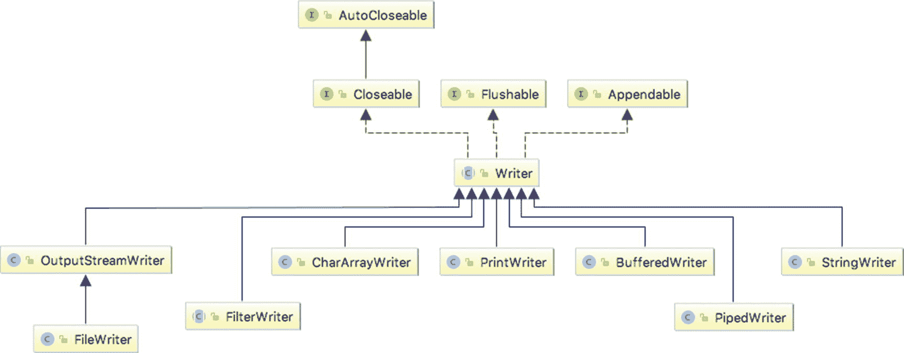

图 11-4
Writer 类层次结构

`Writer` 类是抽象的，因此不能直接使用。追加 API 来自 `java.io.Appendable` 接口，`Writer` 实现了该接口。其他 `Writer` 类用于不同的目的。正如我们已经看到的，`OutputStreamWriter` 使用特定的字符集写入文本。`PrintWriter` 将对象的格式化表示写入文本输出流。（我们在第 10 章中使用它来编写 HTML 代码）。`StringWriter` 将输出收集到其内部缓冲区，并将其写入 `String` 实例。在 Java 11 中，`Writer` 增加了 `nullWriter()` 方法，该方法返回一个不执行任何操作的 `Writer` 实例。这是应开发人员的要求，用于测试目的。

使用 OutputStream 写入文件
`Writer` 家族中的类是用于使用字符流将数据作为文本写入的高级类；但本质上，在数据写入之前，它会被转换为字节。这意味着也可以使用字节流来写入文件。当尝试使用 `OutputStreamWriter` 写入文本时，这一点可能变得很明显，因为作为参数给出的 `OutputStreamWriter` 实例基于 `FileOutputStream` 实例，这是一种将字节流写入文件的类型。

此层次结构的根类是 `java.io.OutputStream`，如图 11-5 所示。

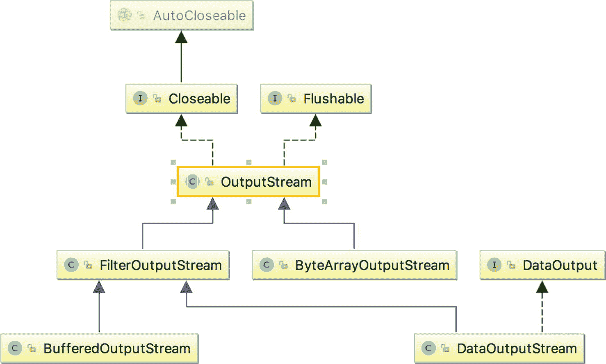

图 11-5
OutputStream 类层次结构

既然我提到了 `FileOutputStream`，让我们看看如何使用它来写入我们之前使用过的相同条目列表。代码如下所示。

```
package com.apress.bgn.ch11.writing;
import com.apress.bgn.ch11.reading.FileInputStreamReadingDemo;
import org.slf4j.Logger;
import org.slf4j.LoggerFactory;
import java.io.File;
import java.io.FileNotFoundException;
import java.io.FileOutputStream;
import java.io.IOException;
import java.util.List;
public class FileOutputStreamWritingDemo {
private static final Logger log =
LoggerFactory.getLogger(FileOutputStreamWritingDemo.class);
public static void main(String... args) {
File file = new File(
"chapter11/read-write-file/src/main/resources/output/vultures3.txt");
List lyricList =  List.of("Some of us, we're hardly ever here",
"The rest of us, we're born to disappear",
"How do I stop myself from",
"Being just a number?");
try (FileOutputStream output = new FileOutputStream(file)){
lyricList.forEach(lyric -> {
try {
output.write(lyric.getBytes());
output.write("\n".getBytes());
} catch (IOException e) {
log.info("Something went wrong! ", e);
}
});
output.flush();
} catch (FileNotFoundException e) {
log.info("Something went wrong! ", e);
} catch (IOException e) {
e.printStackTrace();
}
}
}
```

`OutputStream` 家族类用于写入表示原始数据的字节流，这些数据用户无法直接读取，例如包含在二进制文件（如图像、媒体、PDF 等）中的数据。例如，下面的代码使用 `FileInputStream` 读取图像，并使用 `FileOutputStream` 写入图像，从而制作图像的副本。

```
package com.apress.bgn.ch11;
import org.slf4j.Logger;
import org.slf4j.LoggerFactory;
import java.io.*;
import java.nio.file.Files;
public class DuplicateImageDemo {
private static final Logger log =
LoggerFactory.getLogger(DuplicateImageDemo.class);
public static void main(String... args) {
File src = new File(
"chapter11/read-write-file/src/main/resources/input/cat.jpg");
File dest = new File(
"chapter11/read-write-file/src/main/resources/output/cat1.jpg");
try(FileInputStream fis = new FileInputStream(src);
FileOutputStream fos = new FileOutputStream(dest)) {
int content;
while ((content = fis.read()) != -1) {
fos.write(content);
}
} catch (FileNotFoundException e) {
log.error("Something bad happened.", e);
} catch (IOException e) {
log.error("Something bad happened.", e);
}
}
}
```

但是，由于 Java 1.7 中引入了 `Files.copy(src.toPath(), dest.toPath())` 方法，不再需要编写这样的代码。在 Java 11 中，`OutputStream` 增加了 `nullOutputStream()` 方法，该方法返回一个不执行任何操作的 `OutputStream` 实例。这是应开发人员的要求，用于测试目的。

这就是我在本书中为使用字节流写入文件所能分配的全部篇幅。由于还有很多内容要介绍，在继续之前，有两件事需要注意……

*   处理多个文件时，不要同时打开太多文件，因为某些操作系统对进程可以同时打开的文件数量有限制。如果超出该限制，将会抛出一个带有 *Too many open files* 消息的 `IOException`。
*   我们在本书中没有涉及，但在处理线程和文件时要格外小心，因为一个文件可以被多个线程同时读取，但多个线程同时写入同一个文件可能会导致意外结果。

序列化与反序列化

**序列化** 是指将对象的状态转换为字节流的操作，以便可以通过网络发送或写入文件，然后再还原为该对象的副本。将字节流转换回对象的操作称为 **反序列化**。Java 序列化一直是一个有争议的话题，Java 平台首席架构师 Mark Reinhold 将其描述为 1997 年犯下的一个 *可怕的错误*。显然，大多数 Java 漏洞都与 Java 中序列化的方式有关，并且有一个名为 **Amber**^(⁸⁵) 的项目致力于完全移除 Java 序列化，并允许开发人员选择他们喜欢的序列化格式。目前，Java 中的情况不稳定；在短时间内引入了许多变化，以至于一个依赖向后兼容性的行业无法适应。下一节中的资料可能不稳定，但我会尽最大努力确保它们在本书出版时至少是可编译的，并且我会维护代码仓库并尽可能多地回答问题。

二进制序列化

`java.io.Serializable` 接口没有方法或字段，仅用于将类标记为可序列化。当对象被序列化时，标识对象类型的信息也会被序列化。大多数 Java 类都是可序列化的。可序列化类的任何子类默认被视为可序列化，但如果任何新字段不可序列化，则会抛出 `NotSerializableException` 类型的异常。由开发人员编写的包含不可序列化字段的类必须实现 `Serializable` 接口，并为以下方法提供具体实现：

```
private void writeObject(java.io.ObjectOutputStream out)
throws IOException;
private void readObject(java.io.ObjectInputStream in)
throws IOException, ClassNotFoundException;
private void readObjectNoData()
throws ObjectStreamException;
```


`writeObject` 方法用于写入对象的状态，以便 `readObject` 方法能够恢复它。当反序列化操作因某些原因失败时，`readObjectNoData` 方法会初始化对象的状态，因此该方法能在出现问题（例如，流不完整、客户端应用程序无法识别重新序列化的类等）时提供默认状态。如果你是个乐观主义者，这个方法其实并非必需。

此外，在使一个类可序列化时，必须添加一个 `long` 类型的静态字段作为该类的唯一标识符，以确保将对象作为字节流发送的应用程序和接收它的客户端应用程序拥有相同的已加载类。如果接收字节流的应用程序拥有一个标识符不同的类，则会抛出 `java.io.InvalidClassException`。发生这种情况时，意味着应用程序未更新，或者你甚至可以怀疑是黑客在搞鬼。该字段必须命名为 `serialVersionUID`，如果开发者没有显式添加，序列化运行时将会自动生成。以下代码片段展示了一个名为 `Singer` 的类，其中包含了序列化和反序列化方法。

```
package com.apress.bgn.ch11;
import java.io.*;
import java.time.LocalDate;
import java.util.Objects;
public class Singer implements Serializable {
private static final long serialVersionUID = 42L;
private String name;
private Double rating;
private LocalDate birthDate;
public Singer() {
/* required for deserialization */
}
public Singer(String name, Double rating, LocalDate birthDate) {
this.name = name;
this.rating = rating;
this.birthDate = birthDate;
}
private void writeObject(ObjectOutputStream out)
throws IOException {
out.defaultWriteObject();
}
private void readObject(ObjectInputStream in)
throws IOException, ClassNotFoundException {
in.defaultReadObject();
}
private void readObjectNoData()
throws ObjectStreamException {
this.name = "undefined";
this.rating = 0.0;
this.birthDate = LocalDate.now();
}
@Override
public String toString() {
return "Singer{" +
"name='" + name + '\” +
", rating=" + rating +
", birthDate=" + birthDate +
'}';
}
@Override
public boolean equals(Object o) {
if (this == o) return true;
if (o == null || getClass() != o.getClass()) return false;
Singer singer = (Singer) o;
return Objects.equals(name, singer.name) &&
Objects.equals(rating, singer.rating) &&
Objects.equals(birthDate, singer.birthDate);
}
@Override
public int hashCode() {
return Objects.hash(name, rating, birthDate);
}
}
```

现在我们有了这个类，让我们实例化它，将其序列化并保存到文件中，然后将文件内容反序列化为另一个对象，并与初始对象进行比较。

```
package com.apress.bgn.ch11;
import org.slf4j.Logger;
import org.slf4j.LoggerFactory;
import java.io.*;
import java.time.LocalDate;
import java.time.Month;
public class SerializationDemo {
private static final Logger log =
LoggerFactory.getLogger(SerializationDemo.class);
public static void main(String... args) throws ClassNotFoundException {
LocalDate johnBd = LocalDate.of(1977, Month.OCTOBER, 16);
Singer john = new Singer("John Mayer", 5.0, johnBd);
File file = new File(
"chapter11/serialization/src/main/resources/output/john.txt");
try (ObjectOutputStream out =
new ObjectOutputStream(new FileOutputStream(file))){
out.writeObject(john);
} catch (IOException e) {
log.info("Something went wrong! ", e);
}
try(ObjectInputStream in =
new ObjectInputStream(new FileInputStream(file))){
Singer copyOfJohn = (Singer) in.readObject();
log.info("Are objects equal? {}", copyOfJohn.equals(john));
log.info("--> {}", copyOfJohn.toString());
} catch (IOException e) {
log.info("Something went wrong! ", e);
}
}
}
```

当代码运行时，一切按预期工作；`writeObject` 和 `readObject` 分别由 `ObjectOutputStream` 和 `ObjectInputStream` 调用。如果你想测试它们是否被调用，可以添加日志记录，或者在它们内部设置断点并以调试模式运行程序。如果你打开 `john.txt` 文件，可能无法理解太多内容。里面写入的文本意义不大，因为它是二进制的原始数据。如果你打开该文件，可能会看到类似图 11-6 所示的内容。

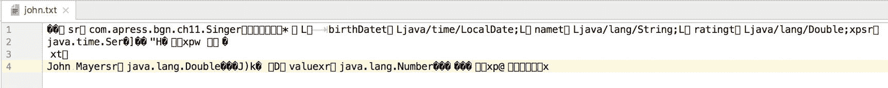

图 11-6 序列化的 Singer 实例

XML 序列化

但是，Java 序列化并不一定非要产生难以理解的文件，对象可以序列化为可读的格式。最常用的序列化格式之一是 XML，JDK 提供了将对象转换为 XML 以及从 XML 转换回原始对象的类。**Java 架构用于 XML 绑定 (JAXB)** 提供了一种快速便捷的方式来绑定 XML 模式和 Java 表示，使 Java 开发者能够轻松地在 Java 应用程序中整合 XML 数据和数据处理功能。将对象序列化为 XML 的操作称为 *编组 (marshalling)*。从 XML 反序列化对象的操作称为 *反编组 (unmarshalling)*。要使一个类可序列化为 XML，必须使用 JAXB 特定的注解进行修饰。

*   `@XmlRootElement(name = "...")` 是一个顶层注解，放置在类级别，用于告诉 JAXB 在序列化时类名将成为一个 XML 元素；如果需要为 XML 元素指定不同的名称，可以通过 `name` 属性来指定。
*   `@XmlElement(name = "..")` 是一个方法或字段级别的注解，用于告诉 JAXB 在序列化时字段名或方法名将成为一个 XML 元素；如果需要为 XML 元素指定不同的名称，可以通过 `name` 属性来指定。
*   `@XmlAttribute(name = "..")` 是一个方法或字段级别的注解，用于告诉 JAXB 在序列化时字段名或方法名将成为一个 XML 属性；如果需要为 XML 属性指定不同的名称，可以通过 `name` 属性来指定。

JAXB 已从 JDK 11 中移除，因此如果你想使用它，必须添加外部依赖。在编写本章时，它也有些不太稳定，类 `com.sun.xml.internal.bind.v2.ContextFactory` 是 `jaxb-impl` 库的一部分，该库目前在任何公共仓库中都找不到，至少没有用 Java 11 编译的版本。以下是使 `Singer` 类可通过 JAXB 序列化的代码。

```
package com.apress.bgn.ch11.xml;
import javax.xml.bind.annotation.XmlAttribute;
import javax.xml.bind.annotation.XmlElement;
import javax.xml.bind.annotation.XmlRootElement;
import java.io.Serializable;
import java.time.LocalDate;
import java.util.Objects;
@XmlRootElement(name = “singer”)
public class Singer implements Serializable {
private static final long serialVersionUID = 42L;
private String name;
private Double rating;
private LocalDate birthDate;
public Singer() {
/* required for deserialization */
}
public Singer(String name, Double rating, LocalDate birthDate) {
this.name = name;
this.rating = rating;
this.birthDate = birthDate;
}
@XmlAttribute(name = “name”)
public String getName() {
return name;
}
@XmlAttribute(name = “rating”)
public Double getRating() {
return rating;
}
@XmlElement(name = “birthdate”)
public LocalDate getBirthDate() {
return birthDate;
}
...
}
```

注意注解放置的位置。根据代码中注解的放置位置，当 `john` 对象被序列化时，你在 `john.xml` 文件中会看到以下内容。

```

1977-10-16T00:00:00Z

```


比二进制版本更易读，对吧？接下来的代码片段展示了将 `Singer` 实例保存到 `john.xml` 文件的过程；它将该实例重新加载到一个副本中，然后比较这两个实例。

```
package com.apress.bgn.ch11.xml;
import org.slf4j.Logger;
import org.slf4j.LoggerFactory;
import javax.xml.bind.JAXBContext;
import javax.xml.bind.JAXBException;
import javax.xml.bind.Marshaller;
import javax.xml.bind.Unmarshaller;
import java.io.*;
import java.time.LocalDate;
import java.time.Month;
public class JAXBSerializationDemo {
private static final Logger log =
LoggerFactory.getLogger(JAXBSerializationDemo.class);
public static void main(String... args)
throws ClassNotFoundException, JAXBException {
LocalDate johnBd = LocalDate.of(1977, Month.OCTOBER, 16);
Singer john = new Singer("John Mayer", 5.0, johnBd);
File file = new File(
"chapter11/serialization/src/main/resources/output/john.xml");
JAXBContext jaxbContext = JAXBContext.newInstance(Singer.class);
try {
Marshaller marshaller = jaxbContext.createMarshaller();
marshaller.setProperty(Marshaller.JAXB_FORMATTED_OUTPUT, true);
marshaller.marshal(john, file);
} catch (Exception e) {
log.info("Something went wrong! ", e);
}
try {
Unmarshaller unmarshaller = jaxbContext.createUnmarshaller();
Singer copyOfJohn = (Singer) unmarshaller.unmarshal(file);
log.info("Are objects equal? {}", copyOfJohn.equals(john));
log.info("--> {}", copyOfJohn.toString());
} catch (Exception e) {
log.info("Something went wrong! ", e);
}
}
}
```

`javax.xml.bind.JAXBContext` 类是通过调用 `newInstance` 静态方法创建的，并传入一个类列表作为参数，这些类将由该上下文实例处理（编组、解组）。如果未指定任何类，则 `JAXBContext` 仅知道规范定义的类，并且只有这些类才能由该实例处理。

XML 序列化多年来一直在开发领域占据主导地位，被广泛应用于大多数 Web 服务和远程通信中。但 XML 文件往往会变得臃肿、冗余，并且随着文件变大而难以阅读。因此，一种新的格式脱颖而出：JSON。

JSON 序列化
**JSON**（JavaScript 对象表示法）是一种轻量级的数据交换格式。它对人来说可读性强，对机器来说易于解析和生成。JSON 是 JavaScript 应用程序中数据使用的首选格式，也是基于 REST 的应用程序的常用格式，并且是许多 NoSQL 数据库使用的内部格式。因此，我们有必要向您展示如何使用这种格式序列化 Java 对象。将 Java 对象序列化为 JSON 的优势在于，有不止一个库提供执行此操作的类，这意味着至少有一个库在 Java 9+ 版本上是稳定的。

最受欢迎的 JSON 序列化库是 Jackson 库^(⁸⁶)，因为它可以将 Java 对象转换为 JSON 对象，反之亦然，且无需编写大量代码。不幸的是，当时尚未发布与 Java 9+ 兼容的版本，因此在本节中，将使用一个与 Java 9+ 兼容但功能较简单的库。

JSON 格式是键值对的集合。值可以是数组，也可以是键值对集合本身。使用 JSON 库（是的，它的名字就是如此）将 Java 对象转换为 JSON 对象很容易。我们创建一个 `JSONObject`，并用 `Singer` 对象的字段名和值填充它，然后将 `JSONObject` 转换为 `String`，最终将其写入文件。在以下代码示例中，我们跳过了写入文件的部分，而是将 `String` 转换回原始 `Singer` 对象的副本。

```
package com.apress.bgn.ch11.json;
import com.apress.bgn.ch11.xml.Singer;
import org.json.JSONObject;
import org.slf4j.Logger;
import org.slf4j.LoggerFactory;
import java.time.LocalDate;
import java.time.Month;
import java.time.format.DateTimeFormatter;
public class JsonSerializationDemo {
private static final Logger log =
LoggerFactory.getLogger(JsonSerializationDemo.class);
public static void main(String... args) {
LocalDate johnBd = LocalDate.of(1977, Month.OCTOBER, 16);
Singer john = new Singer("John Mayer", 5.0, johnBd);
JSONObject jsonObject = new JSONObject();
jsonObject.put("name", john.getName());
jsonObject.put("rating", john.getRating());
jsonObject.put("birthdate", john.getBirthDate().toString());
String jsonData = jsonObject.toString(2);
log.info("--> Serialized {}", jsonData);
JSONObject readJson = new JSONObject(jsonData);
Singer copyOfJohn = new Singer((String) readJson.get("name"),
Double.parseDouble(((Integer)readJson.get("rating")).toString()),
LocalDate.parse((String)readJson.get("birthdate"),
DateTimeFormatter.ISO_LOCAL_DATE));
log.info("Are objects equal? {}", copyOfJohn.equals(john));
log.info("--> Deserialized {}", copyOfJohn);
}
}
```

传递给 `jsonObject.toString(2);` 方法的数字参数是一个缩进值，用于格式化生成的文本。当执行上述程序时，您可以在控制台中看到类似如下的输出。

```
[main] INFO com.apress.bgn.ch11.json.JsonSerializationDemo - -->
Serialized {
"birthdate": "1977-10-16",
"name": "John Mayer",
"rating": 5
}
[main] INFO com.apress.bgn.ch11.json.JsonSerializationDemo - Are objects equal? true
[main] INFO com.apress.bgn.ch11.json.JsonSerializationDemo - -->
Deserialized Singer{name='John Mayer', rating=5.0, birthDate=1977-10-16}
```

理论上，该库提供了一个直接序列化对象的方法，通过调用：

```
LocalDate johnBd = LocalDate.of(1977, Month.OCTOBER, 16);
Singer john = new Singer("John Mayer", 5.0, johnBd);
JSONObject jo = new JSONObject(john);
```

但项目当前使用的版本似乎存在一个 bug，实际上无法做到这一点。因此，对于计划编写 Java 9+ 应用程序并使用实用 JSON 序列化/反序列化的开发者来说，唯一的希望是自行构建一个，或者期待一个基于 Java 9+ 构建的稳定版 Jackson 尽快发布。

媒体 API
除了文本数据，Java 还可以操作二进制文件，例如图像。Java 媒体 API 包含一组针对几种流行图像存储格式的图像编码器/解码器（编解码器）类：BMP、GIF（仅解码器）、FlashPix（仅解码器）、JPEG、PNG、PNM^(⁸⁷)、TIFF 和 WBMP。在 Java 9 中，Java 媒体 API 也进行了改造，并增加了将多个不同分辨率的图像封装到多分辨率图像中的功能。

Java 媒体 API 的核心是 `java.awt.Image` 类，它是表示图形图像的父类。最重要的图像类及其关系如图 11-7 所示。

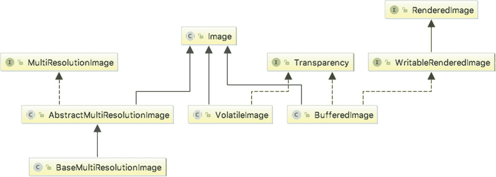

图 11-7
图像类层次结构

尽管 `java.awt.Image` 类在此层次结构中最为重要，但最常用的是 `java.awt.BufferedImage`，它是一个具有可访问图像数据缓冲区的实现。它提供了许多方法来创建图像、设置其大小和内容、提取其内容并进行分析等等。在本节中，我们将使用此类来读取和写入图像。


图像文件是一种复杂的文件，除了图片本身之外，还包含大量附加信息，其中目前最重要的就是图像创建时的位置信息。如果你曾好奇过，社交网络是如何为你发布的图片推荐签到位置的，答案就在这里。这看起来可能没那么重要，但如果你发布一张在家拍摄的猫咪照片，就等于向全世界暴露了你的位置，任何人都能获取到。我不知道你怎么想，但对我来说，这太可怕了。我以前经常在个人博客上发布我的猫舒适地坐在我现在写这本书用的电脑上的照片。我基本上向全世界暴露了我的位置，以及一台昂贵笔记本电脑的位置。当然，大多数人并不关心我的猫，也不关心那台笔记本电脑，但那些想轻松捞一笔的人可能会关心。所以，当一位友好且知识渊博的读者给我发了一封私人邮件，告诉我一种叫做 `EXIF` 数据的东西，并说他是通过我博客上发布的最后一张照片知道我的住址时，我对此进行了研究。一张照片的 EXIF 数据包含关于你相机的大量信息，以及照片的拍摄地点（GPS 坐标）。大多数智能手机都会将 EXIF 数据嵌入到用其相机拍摄的照片中。图 11-8 显示了 macOS **预览** 应用中展示的 EXIF 信息。


图 11-8
JPG 图像上的 EXIF 信息

EXIF 信息包含拍摄照片的确切位置（包括纬度和经度）。**EXIF** 代表可交换图像文件格式（Exchangeable Image File Format）。有一些工具可以移除它，但当你在博客上发布大量图片时（就像我一样），一张一张地清理它们太耗时了。这时 Java 就派上用场了，我将与你分享一段我用来清理图片中 EXIF 数据的代码片段。

```
package com.apress.bgn.ch11;
import org.apache.commons.imaging.formats.jpeg.exif.ExifRewriter;
import org.slf4j.Logger;
import org.slf4j.LoggerFactory;
import javax.imageio.ImageIO;
import java.awt.*;
import java.awt.image.BaseMultiResolutionImage;
import java.awt.image.BufferedImage;
import java.io.*;
import java.util.List;
public class MediaDemo {
private static final Logger log = LoggerFactory.getLogger(MediaDemo.class);
public static void main(String... args) {
File src = new File(
"chapter11/media-handling/src/main/resources/scottish_sky.jpg");
try {
log.info(" --- Removing EXIF info ---");
File destNoExif = new File(
"chapter11/media-handling/src/main/resources/scottish_sky_noexif.jpg");
removeExifTag(destNoExif, src);
} catch (Exception e) {
log.error("Something bad happened.", e);
}
}
private static void removeExifTag(final File dest, final File src)
throws Exception {
new ExifRewriter().removeExifMetadata(src, new FileOutputStream(dest));
}
}
```

为了轻松移除 EXIF 数据，我们使用了一个名为 `ExifRewriter` 的工具类。它是 Apache 创建的一个名为 Sanselan 的库的一部分。这个库已不再维护，但由于它没有任何依赖项，使用 JDK 11 编译它完全没有问题。我已经 fork 了 GitHub 仓库，并在 [`https://github.com/iuliana/sanselan`](https://github.com/iuliana/sanselan) 创建了我自己的分支，名为 `feature/jdk11-gradle-build`。构建该分支产生的工件已作为依赖项添加到项目中。这就是为什么可以使用 `ExifRewriter.removeExifMetadata()` 方法。该方法接收图像源和一个 `OutputStream` 作为参数，用于指定新图像应保存的位置。为了测试生成的图像没有 EXIF 数据，可以在图像查看器中打开它，任何显示 EXIF 的选项要么应该被禁用，要么应该不显示任何内容。在 macOS 的预览图像查看器中，该选项是灰色的。

现在我们已经解决了这个问题，让我们调整生成的图像大小。要调整图像大小，我们需要从原始图像创建一个 `BufferedImage` 实例来获取图像尺寸。之后，我们修改尺寸，并将它们作为参数来创建一个新的 `BufferedImage`，该图像由 `java.awt.Graphics2D` 实例填充数据，这是一种专门渲染 2D 形状、文本和图像的类。代码显示在下一个清单中。该方法被调用来创建缩小 25%、缩小 50% 和缩小 75% 的图像。

```
package com.apress.bgn.ch11;
import org.apache.commons.imaging.formats.jpeg.exif.ExifRewriter;
import org.slf4j.Logger;
import org.slf4j.LoggerFactory;
import javax.imageio.ImageIO;
import java.awt.*;
import java.awt.image.BaseMultiResolutionImage;
import java.awt.image.BufferedImage;
import java.io.*;
import java.util.List;
public class MediaDemo {
private static final Logger log = LoggerFactory.getLogger(MediaDemo.class);
public static void main(String... args) {
File src = new File(
"chapter11/media-handling/src/main/resources/scottish_sky.jpg");
try {
log.info(" --- Removing EXIF info ---");
File destNoExif = new File(
"chapter11/media-handling/src/main/resources/scottish_sky_noexif.jpg");
removeExifTag(destNoExif, src);
log.info(" --- Creating 25% image ---");
File dest25 = new File(
"chapter11/media-handling/src/main/resources/scottish_sky_25.jpg");
resize(dest25, destNoExif, 0.25f);
log.info(" --- Creating 50% image ---");
File dest50 = new File(
"chapter11/media-handling/src/main/resources/scottish_sky_50.jpg");
resize(dest50, destNoExif, 0.5f);
log.info(" --- Creating 75% image ---");
File dest75 = new File(
"chapter11/media-handling/src/main/resources/scottish_sky_75.jpg");
resize(dest75, destNoExif, 0.75f);
} catch (Exception e) {
log.error("Something bad happened.", e);
}
}
private static void resize(final File dest, final File src, final float percent)
throws IOException {
BufferedImage originalImage = ImageIO.read(src);
int scaledWidth = (int) (originalImage.getWidth() * percent);
int scaledHeight = (int) (originalImage.getHeight() * percent);
BufferedImage outputImage = new BufferedImage(scaledWidth,
scaledHeight, originalImage.getType());
Graphics2D g2d = outputImage.createGraphics();
g2d.drawImage(originalImage, 0, 0, scaledWidth, scaledHeight, null);
g2d.dispose();
outputImage.flush();
ImageIO.write(outputImage, “jpg”, dest);
}
...
}
```

为了方便起见，`ImageIO` 类的实用方法对于从文件读取图像或将图像写入特定位置非常有用。如果你想测试调整大小是否有效，可以查看 `resources` 目录。

输出文件已经相应地命名了，但为了确保无误，你可以在文件查看器中仔细检查。你应该会看到类似于图 11-9 所示的内容。

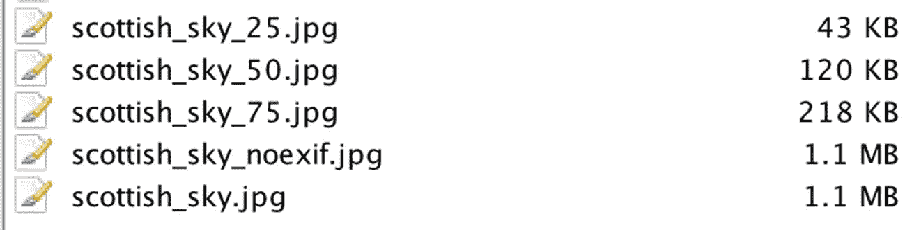

图 11-9
使用 Java 代码调整大小的图像

生成的图像质量不如原始图像高，因为压缩像素并不会带来更高的质量，但它们确实符合我们预期的尺寸。

现在我们已经有了同一张图像的这些不同版本，我们可以使用它们，通过 Java 9 引入的 `BaseMultiResolutionImage` 类来创建一个多分辨率图像。这个类的实例是由一组图像创建的，这些图像都是同一张图像的副本，但具有不同的分辨率。这就是我们创建多个不同尺寸图像副本的原因。`BaseMultiResolutionImage` 根据特定的屏幕分辨率检索图像，适用于设计为从多种设备访问的应用程序。让我们先看代码，然后再解释结果。


```
package com.apress.bgn.ch11;
import org.apache.commons.imaging.formats.jpeg.exif.ExifRewriter;
import org.slf4j.Logger;
import org.slf4j.LoggerFactory;
import javax.imageio.ImageIO;
import java.awt.*;
import java.awt.image.BaseMultiResolutionImage;
import java.awt.image.BufferedImage;
import java.io.*;
import java.util.List;
public class MediaDemo {
private static final Logger log = LoggerFactory.getLogger(MediaDemo.class);
public static void main(String... args) {
File src = new File(
"chapter11/media-handling/src/main/resources/scottish_sky.jpg");
try {
Image[] imgList = new Image[]{
ImageIO.read(dest25), // 1008 x 277
ImageIO.read(dest50), //2016 x 554
ImageIO.read(dest75), // 3024 x 831
ImageIO.read(src) // 4032 x 1108
};
log.info(" --- 创建多分辨率图像 ---");
File destVariant = new File(
"chapter11/media-handling/src/main/resources/sky_variant.jpg");
createMultiResImage(destVariant, imgList);
} catch (Exception e) {
log.error("发生错误。", e);
}
}
private static void createMultiResImage(final File dest, final Image[] imgList)
throws IOException {
MultiResolutionImage mrImage = new BaseMultiResolutionImage(0, imgList);
List variants = mrImage.getResolutionVariants();
variants.forEach(System.out::println);
Image img = mrImage.getResolutionVariant(700, 250);
log.info("最匹配请求尺寸的图像：", 700, 250,
img.getWidth(null), img.getHeight(null));
if (img instanceof BufferedImage) {
ImageIO.write((BufferedImage) img, "jpg", dest);
}
}
...
}
```

为了清晰显示选择了哪张图像，每张图像的分辨率旁都附有注释。`BaseMultiResolutionImage` 实例由一组 `Image` 实例数组创建。当调用 `getResolutionVariant(..)` 时，会将参数与对应图像的属性进行比较，如果两者都小于等于其中一张图像的值，则返回该图像。在接下来的代码片段中，展示了 `BaseMultiResolutionImage.getResolutionVariant(..)` 的代码。

```
@Override
public Image getResolutionVariant(double destImageWidth,
double destImageHeight) {
checkSize(destImageWidth, destImageHeight);
for (Image rvImage : resolutionVariants) {
if (destImageWidth <= rvImage.getWidth(null)
&& destImageHeight <= rvImage.getHeight(null)) {
return rvImage;
}
}
return resolutionVariants[resolutionVariants.length - 1];
}
```

上述代码可得出两个结论。

*   作为参数传入的目标宽度和高度必须小于或等于创建多分辨率图像时所用某张图像的属性；否则，将返回默认图像——即在 `BaseMultiResolutionImage` 构造函数中作为基础图像索引参数所指定的那张图像。这意味着 `getResolutionVariant(700, 250)` 会返回图像 *dest25*，因为 `700 <= 1008 && 250 <= 277`，且 (1008 x 277) 是该图像的（宽度 x 高度）。而调用 `getResolutionVariant(700, 300)` 会导致返回图像 *src*，因为在遍历列表时，之前的条件不再为真，所以会返回列表中的最后一张图像，因为方法通过 `return resolutionVariants[resolutionVariants.length - 1];` 退出。

*   创建 `BaseMultiResolutionImage` 实例所用的数组必须按图像宽度和高度的升序排列；否则，由于决策算法效率不高，可能会返回尺寸错误的图像。

那么，如果算法效率不高，该怎么办呢？很简单：我们可以创建自己的 `MultiResolutionImage` 实现，让它继承 `BaseMultiResolutionImage` 并重写 `getResolutionVariant()` 方法。由于我们知道所有图像都是同一张图像的缩放副本，这意味着宽度和高度是成比例的。因此，可以编写一个始终返回最匹配目标分辨率的图像变体的算法，该算法不关心数组中图像的顺序，并且能返回最合适的图像。因此，该实现可能类似于下面的类。

```
package com.apress.bgn.ch11;
import java.awt.*;
import java.awt.image.BaseMultiResolutionImage;
import java.util.ArrayList;
import java.util.HashMap;
import java.util.Map;
public class SmartMultiResolutionImage
extends BaseMultiResolutionImage {
public SmartMultiResolutionImage(int baseImageIndex,
Image... resolutionVariants) {
super(baseImageIndex, resolutionVariants);
}
@Override
public Image getResolutionVariant(double destImageWidth,
double destImageHeight) {
checkSize(destImageWidth, destImageHeight);
Map result = new HashMap();
for (Image rvImage : getResolutionVariants()) {
double widthDelta = Math.abs(destImageWidth - rvImage.getWidth(null));
double heightDelta = Math.abs(destImageHeight - rvImage.getHeight(null));
double delta = widthDelta + heightDelta;
result.put(delta, rvImage);
}
java.util.List deltaList = new ArrayList(result.keySet());
deltaList.sort(Double::compare);
return result.get(deltaList.get(0));
}
private static void checkSize(double width, double height) {
if (width <= 0 || height <= 0) {
throw new IllegalArgumentException(String.format(
"宽度 (%s) 或高度 (%s) 不能 <= 0", width, height));
}
if (!Double.isFinite(width) || !Double.isFinite(height)) {
throw new IllegalArgumentException(String.format(
"宽度 (%s) 或高度 (%s) 不是有限值", width, height));
}
}
}
```

`checkSize(..)` 方法必须被复制，因为它是私有的，并且在 `getResolutionVariant(..)` 内部使用，所以无法在父类中调用，但这对于拥有一个行为正确的实现来说，只是一个小麻烦。在上述实现中，我们不再需要排序后的数组。此外，调用 `getResolutionVariant(700, 250)`、`getResolutionVariant(700, 300)`、`getResolutionVariant(800, 250)`、`getResolutionVariant(800, 400)` 都会返回图像 `dest25`。

```
Image[] imgList = new Image[]{
ImageIO.read(src),    // 4032 x 1108
ImageIO.read(dest75), // 3024 x 831
ImageIO.read(dest25), // 1008 x 277
ImageIO.read(dest50)  // 2016 x 554
};
log.info(" --- 创建多分辨率图像 ---");
File destVariant = new File(
"chapter11/media-handling/src/main/resources/sky_variant.jpg");
createMultiResImage(destVariant, imgList);
BufferedImage variantImg = ImageIO.read(destVariant);
BufferedImage dest25Img = ImageIO.read(dest25);
log.info("是否相同？ {}", variantImg.equals(dest25Img));
...
private static void createMultiResImage(final File dest, final Image[] imgList)
throws IOException {
MultiResolutionImage mrImage = new SmartMultiResolutionImage(0, imgList);
List variants = mrImage.getResolutionVariants();
variants.forEach(i -> log.info(i.toString()));
Image img = mrImage.getResolutionVariant(700, 400);
log.info("最匹配请求尺寸的图像：", 700, 400,
img.getWidth(null), img.getHeight(null));
if (img instanceof BufferedImage) {
ImageIO.write((BufferedImage) img, "jpg", dest);
}
}
```

运行日志后，控制台会打印以下内容。


```
INFO com.apress.bgn.ch11.MediaDemo -  --- 创建多分辨率图像 ---
INFO com.apress.bgn.ch11.MediaDemo - BufferedImage@3c9d0b9d: type = 5 ColorModel:
#... ByteInterleavedRaster: width = 4032 height = 1108 #numDataElements 3 dataOff[0] = 2
INFO com.apress.bgn.ch11.MediaDemo - BufferedImage@64cd705f: type = 5 ColorModel:
#... ByteInterleavedRaster: width = 3024 height = 831 #numDataElements 3 dataOff[0] = 2
INFO com.apress.bgn.ch11.MediaDemo - BufferedImage@9225652: type = 5 ColorModel:
#... ByteInterleavedRaster: width = 1008 height = 277 #numDataElements 3 dataOff[0] = 2
INFO com.apress.bgn.ch11.MediaDemo - BufferedImage@654f0d9c: type = 5 ColorModel:
#... ByteInterleavedRaster: width = 2016 height = 554 #numDataElements 3 dataOff[0] = 2
INFO com.apress.bgn.ch11.MediaDemo - 最符合请求尺寸的图像：
INFO com.apress.bgn.ch11.MediaDemo - 图像是否相同？ false
```

等等，什么？为什么图像不相同？嗯，它们确实具有相同的分辨率，但作为对象并不相同，因为绘制像素并非那么精确。但如果你真的想确认，可以打印出这两张图像的宽度和高度，用图像查看器打开它们，然后注意到肉眼看来，它们看起来是一样的。

```
log.info("variant width x height :  {} x {}", variantImg.getWidth(),
variantImg.getHeight());
log.info("dest25Img width x height :  {} x {}", dest25Img.getWidth(),
dest25Img.getHeight());
```

这段代码打印了两张图像的宽度和高度，清楚地表明这两张图像具有相同的尺寸，正如预期的那样。

```
INFO com.apress.bgn.ch11.MediaDemo - variant width x height :  1008 x 277
INFO com.apress.bgn.ch11.MediaDemo - dest25Img width x height :  1008 x 277
```

使用 JavaFX 图像类
除了以 `java.awt` 包组件为核心的 Java Media API 之外，另一种显示和编辑图像的方式由 JavaFX 提供。`javafx.scene.image` 包的核心类名为 `Image`，它处理几种常见格式的图像：PNG、JPEG、BMP 和 GIF。JavaFX 应用程序可以使用 `javafx.scene.image.ImageView` 的实例来显示图像。我最喜欢这个类的一点是，图像也可以缩放显示，而无需修改原始图像。

要创建一个 `javafx.scene.image.Image` 实例，我们只需要一个 `FileInputStream` 实例来从用户提供的位置读取图像，或者一个以 `String` 形式给出的 URL 位置。以下代码片段创建了一个 JavaFX 应用程序，该应用程序以其原始宽度和高度显示图像，这些尺寸可以通过 `javafx.scene.image.Image` 类中的方法访问。

```
package com.apress.bgn.ch11;
import javafx.application.Application;
import javafx.scene.Scene;
import javafx.scene.image.Image;
import javafx.scene.image.ImageView;
import javafx.scene.layout.StackPane;
import javafx.stage.Stage;
import java.io.File;
import java.io.FileInputStream;
public class JavaFxMediaDemo extends Application {
public static void main(String... args) {
Application.launch(args);
}
@Override
public void start(Stage primaryStage) throws Exception {
primaryStage.setTitle("JavaFX 图像演示");
File src = new File("chapter11/media-handling/src/main/resources/cover.png");
Image image = new Image(new FileInputStream(src));
ImageView imageView = new ImageView(image);
imageView.setFitHeight(image.getHeight());
imageView.setFitWidth(image.getWidth());
imageView.setPreserveRatio(true);
// 创建一个 Group 对象
StackPane root = new StackPane();
root.getChildren().add(imageView);
primaryStage.setScene(new Scene(root,
image.getWidth()+10,
image.getHeight()+10));
primaryStage.show();
}
}
```

`Image` 实例不能直接添加到 JavaFX 实例的 `Scene` 中，因为它没有实现 `Node` 接口，而所有构成 JavaFX 应用程序的 JavaFX 元素都必须实现该接口。这就是为什么这个实例必须包装在一个 `javafx.scene.image.ImageView` 实例中，该类实现了 Node，是一个专门用于绘制由 `Image` 类加载的图像的类。这个类通过调用 `setPreserveRatio(..)` 方法并传入适当的参数来调整显示图像的大小，同时可以选择是否保持原始宽高比：`true` 表示保持原始宽高比；`false` 则表示不保持。

在前面的代码中，我们使用 `image.getWidth()` 和 `image.getHeight()` 返回的值来设置 `ImageView` 对象的大小以及 `Scene` 实例的大小。但让我们发挥创意，显示缩放后的图像，同时仍然保持宽高比，并在缩放图像时使用 `smooth(..)` 方法采用更高质量的过滤算法。

```
...
ImageView imageView = new ImageView(image);
imageView.setFitWidth(100);
imageView.setPreserveRatio(true);
imageView.setSmooth(true);
...
```

`ImageView` 类还支持一个 `Rectangle2D` 视口，用于旋转图像。

```
import javafx.geometry.Rectangle2D;
...
ImageView imageView = new ImageView(image);
Rectangle2D viewportRect = new Rectangle2D(2, 2, 600, 600);
imageView.setViewport(viewportRect);
imageView.setRotate(90);
...
```

作为 Node 的实现，`ImageView` 支持点击事件，并且很容易编写一些代码来在点击时调整图像大小。请看下面的示例。

```
...
ImageView imageView = new ImageView(image);
imageView.setFitHeight(image.getHeight());
imageView.setFitWidth(image.getWidth());
imageView.setPreserveRatio(true);
root.getChildren().add(imageView);
imageView.setPickOnBounds(true);
imageView.setOnMouseClicked(mouseEvent -> {
if(imageView.getFitWidth() > 100) {
imageView.setFitWidth(100);
imageView.setPreserveRatio(true);
imageView.setSmooth(true);
} else {
imageView.setFitHeight(image.getHeight());
imageView.setFitWidth(image.getWidth());
imageView.setPreserveRatio(true);
}
});
...
```

通过调用 `onMouseClicked`，我们将一个 `EventHandler<? super MouseEvent>` 实例附加到了 `imageView` 的鼠标点击事件上。`EventHandler<T extends Event>` 是一个函数式接口，包含一个名为 `handle` 的单一方法，其具体实现就是前面代码清单中 lambda 表达式的主体。
由于 JavaFX 已从 JDK 11 中移除，本节中再深入介绍更多的图像处理类没有实际意义。但如果你有兴趣了解更多关于这个主题的内容，Oracle 的这篇教程应该能满足你的需求：[`https://docs.oracle.com/javafx/2/image_ops/jfxpub-image_ops.htm`](https://docs.oracle.com/javafx/2/image_ops/jfxpub-image_ops.htm)。此外，作为练习，你可以尝试根据本书中的代码编写自己的代码，添加一个旋转图像的鼠标事件。
这就是我在 Java 中处理图像方面所能分享的全部内容。希望你觉得本节内容有用，并且将来有机会测试你的 Java Media API 技能，即使不为别的，至少可以用来清理图像中的 EXIF 数据。

总结

本章涵盖了处理各种类型文件、序列化 Java 对象、将其保存到文件以及通过反序列化恢复它们所需的大部分信息。在编写 Java 应用程序时，通常需要将数据保存到文件或从文件读取数据，本章提供了大量用于此目的的组件。以下是本章的简要总结。

*   如何使用 `File` 和 `Path` 实例
*   如何使用 `Files` 和 `Paths` 中的实用方法
*   如何将 Java 对象序列化/反序列化为二进制、XML 和 JSON 格式
*   如何使用 Java Media API 调整和修改图像
*   如何在 JavaFX 应用程序中使用图像

脚注


12. 发布/订阅
框架

到目前为止，所有解释的编程概念都涉及需要处理的数据。无论数据以何种形式提供，我们迄今编写的 Java 程序都会获取这些数据，对其进行修改，并打印结果，无论是输出到控制台、文件还是其他软件组件。可以说，所有这些组件都在相互通信，并将处理后的数据从一个组件传递到另一个组件。图 12-1 抽象地描述了程序中 Java 组件之间的交互。

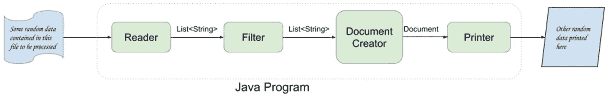

图 12-1
程序内 Java 组件之间的交互

每个箭头都标有从一个组件传递到另一个组件的信息类型。在图 12-1 中，你可以识别出一个起点，信息在此处进入程序（由 `Reader` 读取），以及一个终点，信息在此处由 `Printer` 打印到某个输出组件。因此，可以说 `Reader` 提供数据，`Filter` 和 `DocumentCreator` 是某种内部处理器，负责处理数据，而 `Printer` 是数据的消费者。

到目前为止所描述的内容类似于一种 **点对点（p2p）消息传递模型**，该模型描述了一个消息发送给一个消费者的概念。p2p 模型是 Java 消息服务（JMS）这一 Java API 特有的，它支持网络中计算机之间被称为 *消息传递* 的正式通信。在本章开头的示例中，我们做了一个类比，以说明 Java 程序组件之间的通信以类似的方式工作。因此，可以通过将所有组件视为链接到消息传递风格的通信模型中，来设计实现图 12-1 所述流程的解决方案。通信模型不止一种——生产者/消费者、发布/订阅、发送者/接收者，每种都有其特定之处^(⁸⁸)，但本章重点介绍 **发布/订阅**，因为它是响应式编程所基于的模型。

响应式编程与响应式宣言
**响应式编程** 是一种声明式编程风格，涉及使用数据流和变更传播。你在**第 8 章**学习了如何使用流，所以我们离目标更近了一步。现在我们只需要学习如何使用响应式流。响应式编程涉及使用异步数据流或事件流。使用响应式流并非新概念。

响应式宣言于 2014 年首次公开发布。^(⁸⁹) 它要求软件以这样的方式开发：*系统应是响应式、有韧性、弹性且消息驱动的*，简而言之，它们应该是 *响应式* 的。以下解释这四个术语。

*   **响应式** 应提供快速且一致的响应时间。
*   **有韧性** 应在发生故障时保持响应并能够恢复。
*   **弹性** 应保持响应并能够处理各种工作负载。
*   **消息驱动** 应使用异步消息进行通信，避免阻塞并在必要时应用 *背压*。

以这种方式设计的系统应该更灵活、松耦合且可扩展，但同时它们应该更易于开发、易于变更且更能容忍故障。但要实现所有这些，系统需要一个通用的通信 API。响应式流是一项倡议，旨在为异步、非阻塞的流处理提供这样一个标准 API，该 API 也支持背压。我们稍后将解释 *背压* 的含义。让我们从响应式流处理的基础知识开始。

任何类型的流处理都涉及数据生产者、数据消费者以及它们之间处理数据的组件。数据流的方向是从生产者到消费者。系统的抽象模式如图 12-2 所示。

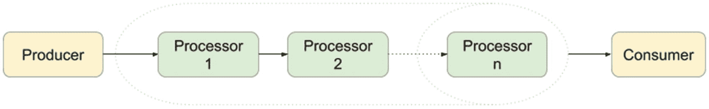

图 12-2
生产者/消费者系统

当生产者比消费者快时，系统可能会陷入困境。因此，必须处理无法处理的额外数据。有多种方法可以做到这一点。


图 12-3
响应式生产者/消费者系统

*   丢弃额外数据（这在网络硬件中完成）。
*   阻塞生产者，以便消费者有时间赶上。
*   缓冲数据，但缓冲区是有限的，如果我们有快速的生产者和慢速的消费者，则存在缓冲区溢出的危险。
*   通过应用 *背压*，这涉及赋予消费者调节生产者的能力，并控制生产多少数据。背压可以看作是从消费者发送给生产者的消息，让其知道必须降低数据生产速率。考虑到这一点，我们可以完善图 12-2 中的设计，从而得到图 12-3。

如果生产者、处理器和消费者不同步，那么通过阻塞直到每个组件准备好处理数据来解决数据过多的问题并不是一个选项，因为这会系统变成同步系统。丢弃数据也不是选项，而缓冲则是不确定的，因此对于响应式系统，我们唯一剩下的选择就是应用 **非阻塞背压**。

在 Java 9 之前，无法编写可以聚合到响应式系统中的应用程序，因此开发人员不得不使用外部库。响应式应用程序必须根据响应式编程的原则进行设计，并使用响应式流来处理数据。响应式编程的标准 API 最初由 `reactive-streams` 库描述，该库也可用于 Java 8。但在 Java 9 中，该标准 API 被添加到 JDK 中。图 12-4 显示了应由具有先前定义角色的组件实现的接口。响应式流 API 由四个非常简单的接口组成。

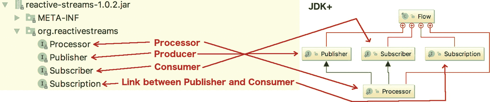

图 12-4
响应式流接口

*   接口 `Publisher<T>` 公开了一个名为 `subscribe(Subscriber<? extends T>)` 的方法，该方法被调用来添加一个 `Subscriber` 实例，并生成类型为 `T` 的元素，这些元素由 `Subscriber` 消费。
*   接口 `Subscriber<R>` 消费来自 `Publisher` 的元素，并公开了四个必须实现的方法，以根据 `Publisher` 实例接收的事件类型来定义实例的具体行为。
    *   `void onSubscribe(Subscription)` 是在订阅者上调用的第一个方法，该方法使用 `Subscription` 参数将 `Publisher` 链接到 `Subscriber` 实例，如果此方法抛出异常，则后续行为无法保证。
    *   `void onNext(T)` 是使用 `Subscription` 的下一个项目来接收数据时调用的方法，如果它抛出异常，`Subscription` 可能会被取消。
    *   `void onError(Throwable)` 是在 `Publisher` 或 `Subscription` 遇到不可恢复错误时调用的方法。


*   `void onComplete()` 是在没有更多数据可消费时调用的方法，因此不会再有额外的 `Subscriber` 方法调用。

*   接口 `Processor<T,R>` 同时继承了 `Publisher<T>` 和 `Subscriber<R>`，因为它需要消费数据并生成数据以进一步向上游发送。

*   接口 `Subscription` 的实现应连接 `Publisher` 和 `Subscriber`，并可通过调用 `request(long)` 来设置要生成并发送给消费者的项目数量，从而实现背压。它还允许通过调用 `cancel()` 方法来取消数据流，以告知 `Subscriber` 停止接收消息。

在 JDK 中，上述所有接口都定义在 `java.util.concurrent.Flow` 类中。这个类的名称显而易见，因为前面的接口用于创建可链接在一起以构建响应式应用的流控制组件。除了这四个接口外，还有一个 JDK 实现，即 `java.util.concurrent.SubmissionPublisher<T>` 类，它实现了 `Publisher<T>`，为生成项目并使用该类中的方法发布项目的子类提供了便捷基础。

`Flow` 接口是基础的，可以在编写响应式应用时使用，但这需要大量工作。目前，多个团队提供了多种实现，为开发响应式应用提供了更实用的方式。使用这些接口的实现，你可以编写响应式应用，而无需编写处理数据的线程同步逻辑。

以下列表是最著名的响应式流 API 实现。

*   Project Reactor ([`https://projectreactor.io/`](https://projectreactor.io/))，被 Spring 用于其 Web 响应式框架
*   Akka Streams ([`https://doc.akka.io/docs/akka/current/stream/stream-flows-and-basics.html`](https://doc.akka.io/docs/akka/current/stream/stream-flows-and-basics.html))
*   MongoDB Reactive Streams Java Driver ([`http://mongodb.github.io/mongo-java-driver-reactivestreams/1.9/`](http://mongodb.github.io/mongo-java-driver-reactivestreams/1.9/))
*   Ratpack ([`https://ratpack.io/`](https://ratpack.io/))
*   RxJava ([`http://reactivex.io/`](http://reactivex.io/))

还有更多，因为在大数据世界中，响应式数据处理已不再是奢侈品，而是必需品。
至此，我们完成了对响应式编程和响应式流的介绍。是时候进入代码部分了。

**使用 JDK 响应式流 API**
由于 JDK 为响应式编程提供的接口相当基础，实现它们来构建真正有用的东西相当繁琐，但我们仍将尝试。在本节中，我们将构建一个应用，该应用生成无限数量的整数值，过滤这些值，并选择小于 127 的值。对于偶数且在 98 到 122 之间的值，我们减去 32（基本上是将小写字母转换为大写）。然后将其转换为字符并打印出来。

显然，最基本的解决方案是：

```
private static final Logger log = LoggerFactory.getLogger(ReactiveMain.class);
private static final Random random = new Random();
public static void main(String... args) {
while (true){
int rndNo = random.nextInt(150);
if (rndNo >=0 && rndNo =98 && rndNo <=122) {
rndNo -=32;
}
char res = (char) rndNo;
log.info("Result: {}", res);
} else {
log.debug("Number {} discarded.", rndNo);
}
}
}
```

前面代码清单中的每一行代码都有其目的和期望的结果。这种方法被称为*命令式编程*，因为它按顺序执行一系列语句以产生期望的输出。

但这并不是我们的目标。在本节中，我们将使用 JDK 响应式接口的实现来实现一个响应式解决方案。因此，我们需要以下组件：

*   一个发布者组件，利用无限流生成随机整数值。该类应实现 `Flow.Publisher<Integer>` 接口。
*   一个处理器，仅选择可转换为可见字符的整数值，假设所有代码在 [0,127) 之间的字符。该类应实现 `Flow.Processor<Integer, Integer>`。
*   一个处理器，修改接收到的元素，对于偶数且在 98 到 122 之间的元素，减去 32。该类也应实现 `Flow.Processor<Integer, Integer>`。
*   一个处理器，将整数元素转换为等效字符。这是一种特殊类型的处理器，将一个值映射为另一个类型的另一个值，应实现 `Flow.Processor<Integer, Character>`。
*   一个订阅者，打印从链中最后一个处理器接收到的元素。该类实现 `Flow.Subscriber<Character>` 接口。

让我们从声明 `Publisher` 开始，它包装了一个无限流以生成待消费的值。我们实现了 `Flow.Publisher<Integer>` 接口，但提供了一个完整的具体实现来异步提交元素。在需要时缓冲它们有点麻烦，因此我们将在类中使用 `SubmissionPublisher<Integer>`。发布者的代码如下所示。

```
package com.apress.bgn.ch12.jdkstreams;
import java.util.Random;
import java.util.concurrent.Flow;
import java.util.concurrent.SubmissionPublisher;
import java.util.stream.IntStream;
public class IntPublisher implements Flow.Publisher {
private static final Random random = new Random();
private final IntStream intStream = IntStream.generate(() -> random.nextInt(150));
private final SubmissionPublisher
submissionPublisher = new SubmissionPublisher();
@Override
public void subscribe(Flow.Subscriber subscriber) {
submissionPublisher.subscribe(subscriber);
}
public void start() {
intStream.forEach(element -> {
submissionPublisher.submit(element);
sleep();
});
}
private void sleep() {
try {
Thread.sleep(1000);
} catch (InterruptedException e) {
throw new RuntimeException("could not sleep!");
}
}
}
```

正如预期，我们提供了 `subscribe()` 方法的实现，在这种情况下，我们必须将订阅者转发给内部的 `submissionPublisher`。此外，我们还添加了一个 `start()` 方法，该方法从无限的 `IntStream` 中获取元素，并使用内部的 `submissionPublisher` 提交它们。`IntStream` 使用一个 `Random` 实例生成 [0,150] 区间内的整数值。选择这个区间是为了让我们看到大于 127 的值如何被连接到发布者的第一个 `Processor` 实例丢弃。为了减慢元素的提交速度，我们添加了对 `Thread.sleep(1000)` 的调用，这基本上保证了每秒向链中发送一个元素。

第一个处理器的名称是 `FilterCharProcessor`，它使用一个内部的 `SubmissionPublisher<Integer>` 实例将处理后的元素发送到下一个处理器。抛出的异常也通过 `SubmissionPublisher<Integer>` 转发。该处理器既充当发布者，也充当订阅者，因此 `onNext(..)` 方法的实现必须包含对 `subscription.request(..)` 的调用以应用背压。从本章前面展示的图中可以看出，处理器本质上是一个允许数据双向流动的组件，它通过同时实现 `Publisher` 和 `Subscriber` 来实现这一点。


处理器必须订阅发布者，当发布者的 `subscribe(..)` 方法被调用时，会触发 `onSubscribe(Flow.Subscription subscription)` 方法的执行。`subscription` 必须存储在本地，以便用于实现背压。但在接受订阅时，我们必须确保该字段尚未被初始化，因为根据响应式流规范，一个发布者只能有一个订阅者；否则结果将不可预测。因此，当新的订阅到达时，必须将其取消，这通过调用 `cancel()` 来实现。处理器的完整代码如下所示。

```
package com.apress.bgn.ch12.jdkstreams;
import com.apress.bgn.ch12.dummy.BasicIntTransformer;
import org.slf4j.Logger;
import org.slf4j.LoggerFactory;
import java.util.concurrent.Flow;
import java.util.concurrent.SubmissionPublisher;
public class FilterCharProcessor implements
Flow.Processor {
private static final Logger log =
LoggerFactory.getLogger(FilterCharProcessor.class);
private final SubmissionPublisher
submissionPublisher = new SubmissionPublisher();
private Flow.Subscription subscription;
@Override
public void subscribe(Flow.Subscriber subscriber) {
submissionPublisher.subscribe(subscriber);
}
@Override
public void onSubscribe(Flow.Subscription subscription) {
if (this.subscription == null) {
this.subscription = subscription;
// 应用背压 - 请求一个元素
this.subscription.request(1);
} else {
subscription.cancel();
}
}
@Override
public void onNext(Integer element) {
if (element >=0 && element < 127){
submit(element);
} else {
log.debug("元素 {} 已丢弃。", element);
}
subscription.request(1);
}
@Override
public void onError(Throwable throwable) {
submissionPublisher.closeExceptionally(throwable);
}
@Override
public void onComplete() {
submissionPublisher.close();
}
protected void submit(Integer element){
submissionPublisher.submit(element);
}
}
```

我们需要构建三个处理器类，除了 `onNext(..)` 方法体中的代码外，其余部分都是样板代码，用于将处理器实例在我们设计的流程中连接起来。因此，将这些代码封装到一个 `AbstractProcessor` 中是实用的，该解决方案所需的所有处理器都可以继承它。由于我们需要实现的最后一个处理器需要将接收到的 `Integer` 值转换为 `Character`，我们保持此实现对于发送到流程中下一个处理器或订阅者的值类型是通用的。代码如下所示。

```
package com.apress.bgn.ch12.jdkstreams;
import java.util.concurrent.Flow;
import java.util.concurrent.SubmissionPublisher;
public abstract class AbstractProcessor
implements Flow.Processor {
protected final SubmissionPublisher
submissionPublisher = new SubmissionPublisher();
protected Flow.Subscription subscription;
@Override
public void subscribe(Flow.Subscriber subscriber) {
submissionPublisher.subscribe(subscriber);
}
@Override
public void onSubscribe(Flow.Subscription subscription) {
if (this.subscription == null) {
this.subscription = subscription;
// 应用背压 - 请求一个或多个
this.subscription.request(1);
} else {
subscription.cancel();
}
}
@Override
public void onError(Throwable throwable) {
submissionPublisher.closeExceptionally(throwable);
}
@Override
public void onComplete() {
submissionPublisher.close();
}
protected void submit(T element) {
submissionPublisher.submit(element);
}
}
```

这大大简化了 `FilterCharProcessor` 以及其他处理器的实现。

```
package com.apress.bgn.ch12.jdkstreams;
import org.slf4j.Logger;
import org.slf4j.LoggerFactory;
public class FilterCharProcessor extends AbstractProcessor {
private static final Logger log =
LoggerFactory.getLogger(FilterCharProcessor.class);
@Override
public void onNext(Integer element) {
if (element >= 0 && element < 127) {
submit(element);
} else {
log.debug("元素 {} 已丢弃。", element);
}
subscription.request(1);
}
}
```

现在我们有了一个发布者和一个处理器，接下来呢？当然是连接它们。在接下来的代码片段中，省略号（`...`）替换了本章后面将要相互连接的所有处理器和订阅者。

```
package com.apress.bgn.ch12.jdkstreams;
public class ReactiveDemo {
public static void main(String... args) {
IntPublisher publisher = new IntPublisher();
FilterCharProcessor filterCharProcessor = new FilterCharProcessor();
publisher.subscribe(filterCharProcessor);
...
publisher.start();
}
}
```

下一个处理器实现的功能是通过减去 32 将小写字母转换为大写字母。它也可以通过继承 `AbstractProcessor` 轻松实现。

```
package com.apress.bgn.ch12.jdkstreams;
public class TransformerProcessor extends
AbstractProcessor {
@Override
public void onNext(Integer element) {
if(element % 2 == 0 && element >=98 && element <=122) {
element -=32;
}
submit(element);
subscription.request(1);
}
}
```

要将此处理器接入流程，我们需要实例化它，调用 `filterCharProcessor.subscribe(..)` 并将此实例作为参数传入。

```
package com.apress.bgn.ch12.jdkstreams;
public class ReactiveDemo {
public static void main(String... args) {
IntPublisher publisher = new IntPublisher();
FilterCharProcessor filterCharProcessor = new FilterCharProcessor();
TransformerProcessor transformerProcessor = new TransformerProcessor();
publisher.subscribe(filterCharProcessor);
filterCharProcessor.subscribe(transformerProcessor);
...
publisher.start();
}
}
```

接下来需要实现的是该解决方案所需的最后一个处理器。它将 `Integer` 值转换为 `Character` 值。为了尽可能保持实现的声明性，该处理器将映射函数作为参数传入。

```
package com.apress.bgn.ch12.jdkstreams;
import java.util.function.Function;
public class MappingProcessor extends
AbstractProcessor  {
private final Function function;
public MappingProcessor(Function function) {
this.function = function;
}
@Override
public void onNext(Integer element) {
submit(function.apply(element));
subscription.request(1);
}
}
```

现在，将其接入流程。

```
package com.apress.bgn.ch12.jdkstreams;
public class ReactiveDemo {
public static void main(String... args) {
IntPublisher publisher = new IntPublisher();
FilterCharProcessor filterCharProcessor = new FilterCharProcessor();
TransformerProcessor transformerProcessor = new TransformerProcessor();
MappingProcessor mappingProcessor =
new MappingProcessor(element -> (char) element.intValue());
publisher.subscribe(filterCharProcessor);
filterCharProcessor.subscribe(transformerProcessor);
transformerProcessor.subscribe(mappingProcessor);
...
publisher.start();
}
}
```

这个流程的最后一个组件是订阅者，它只负责打印从 `transformerProcessor` 接收到的值。该类实现了 `Flow.Subscriber<Character>`，其大部分代码与我们封装在 `AbstractProcessor` 中的代码相同，但事实就是如此。


```
package com.apress.bgn.ch12.jdkstreams;
import org.slf4j.Logger;
import org.slf4j.LoggerFactory;
import java.util.concurrent.Flow;
public class CharPrinter implements Flow.Subscriber {
private static final Logger log =
LoggerFactory.getLogger(CharPrinter.class);
private Flow.Subscription subscription;
@Override
public void onSubscribe(Flow.Subscription subscription) {
if (this.subscription == null) {
this.subscription = subscription;
this.subscription.request(1);
} else {
subscription.cancel();
}
}
@Override
public void onNext(Character element) {
log.info("Result: {}", element);
//apply back-pressure again
subscription.request(1);
}
@Override
public void onError(Throwable throwable) {
log.error("Something went wrong.", throwable);
}
@Override
public void onComplete() {
log.info("Printing complete.");
}
}
```

现在我们有了一个订阅者，可以将其接入并运行应用程序。

```
package com.apress.bgn.ch12.jdkstreams;
public class ReactiveDemo {
public static void main(String... args) {
IntPublisher publisher = new IntPublisher();
FilterCharProcessor filterCharProcessor = new FilterCharProcessor();
TransformerProcessor transformerProcessor = new TransformerProcessor();
MappingProcessor mappingProcessor =
new MappingProcessor(element -> (char) element.intValue());
CharPrinter charPrinter = new CharPrinter();
publisher.subscribe(filterCharProcessor);
filterCharProcessor.subscribe(transformerProcessor);
transformerProcessor.subscribe(mappingProcessor);
mappingProcessor.subscribe(charPrinter);
publisher.start();
}
}
```

如果 `subscribe` 方法能返回调用者实例，我们就可以链式调用 `subscribe(..)` 方法，但我们必须使用现有提供的功能。当上述代码运行时，控制台会打印出类似下面的日志。

```
..
DEBUG c.a.b.c.j.FilterCharProcessor - Element 149 discarded.
INFO  c.a.b.c.j.CharPrinter - Result: >
INFO  c.a.b.c.j.CharPrinter - Result: B
INFO  c.a.b.c.j.CharPrinter - Result: 4
INFO  c.a.b.c.j.CharPrinter - Result: Z
INFO  c.a.b.c.j.CharPrinter - Result: *
INFO  c.a.b.c.j.CharPrinter - Result: o
DEBUG c.a.b.c.j.FilterCharProcessor - Element 141 discarded.
INFO  c.a.b.c.j.CharPrinter - Result: 4
DEBUG c.a.b.c.j.FilterCharProcessor - Element 142 discarded.
INFO  c.a.b.c.j.CharPrinter - Result: Q
DEBUG c.a.b.c.j.FilterCharProcessor - Element 132 discarded.
..
```

该示例使用一个无限的 `IntStream` 来生成待发布、处理和消费的元素。这会导致程序永远运行下去，因此你必须手动停止它。另一个后果是 `onComplete()` 方法永远不会被调用。如果我们想使用它们，就必须确保发布的项目数量是有限的。

JDK 对响应式流的支持很薄弱，即使在 2018 年 9 月 23 日发布的版本 11 中也是如此。原本期望在 Java 9 之后的版本中会添加更多有用的类，但显然 Oracle 专注于其他方面，例如重组模块结构以及决定如何更好地通过 JDK 的使用获利，因为两个版本之后，响应式方面仍然没有任何新内容。这就是为什么下一节将介绍一个使用 Project Reactor 库进行响应式编程的简短示例。

**响应式流技术兼容性工具包**

在构建使用响应式流的应用程序时，很多事情都可能出错。为了确保你构建的是正确的响应式应用程序，你可以使用 **响应式流技术兼容性工具包** 项目（也称为 **TCK**）来编写测试。该库包含的类可以针对响应式流规范测试响应式实现。TCK 旨在验证 Java 9 中包含的接口（位于 `java.util.concurrent.Flow.*` 下），并且出于某种原因，创建该库的团队决定使用 TestNG 作为测试库。项目源码可在 GitHub 上的 [`https://github.com/reactive-streams/reactive-streams-jvm/tree/master/tck-flow`](https://github.com/reactive-streams/reactive-streams-jvm/tree/master/tck-flow) 获取，其中包含四个必须实现的类，以便为测试工具提供它们的 `Flow.Publisher`、`Flow.Subscriber`、`Flow.Processor` 实现进行验证。这四个类是：

*   `FlowPublisherVerification` 测试 `Publisher` 实现。
*   `FlowSubscriberWhiteboxVerification` 用于白盒测试 `Subscriber` 实现和 `Subscription` 实例。
*   `FlowSubscriberBlackboxVerification` 用于黑盒测试 `Subscriber` 实现和 `Subscription` 实例。
*   `IdentityFlowProcessorVerification` 测试 `Processor` 实现。

为了使每个测试的目的清晰明了，库的测试方法名称遵循以下模式：`TYPE_spec####_DESC`，其中 `TYPE` 是 *required、optional、stochastic 或 untested* 之一，表示被测试规则的重要性；`spec####` 中的数字符号代表规则编号，第一个 `1` 用于 `Publisher` 实例，`2` 用于 `Subscribers`；`DESC` 是对测试目的的简短说明。

让我们看看如何测试我们之前定义的 `IntPublisher`。为此，我们将修改此类，使其能够使用有限的 `IntStream` 作为源。

```
package com.apress.bgn.ch12.jdkstreams;
import java.util.Random;
import java.util.concurrent.Flow;
import java.util.concurrent.SubmissionPublisher;
import java.util.stream.IntStream;
public class IntPublisher implements Flow.Publisher {
private static final Random random = new Random();
protected final IntStream intStream;
public IntPublisher(int limit) {
intStream = limit == 0 ? IntStream.generate(() -> random.nextInt(150)) :
IntStream.generate(() -> random.nextInt(150)).limit(30);
}
...
}
```

我们还需要提供对 `IntStream` 流源的访问，以便在测试中使用它。现在，让我们通过实现 `FlowPublisherVerification<Integer>` 来测试我们的发布者。

```
package com.apress.bgn.ch12.jdkstreams;
import org.reactivestreams.tck.TestEnvironment;
import org.reactivestreams.tck.flow.FlowPublisherVerification;
import org.slf4j.Logger;
import org.slf4j.LoggerFactory;
import java.util.concurrent.Flow;
public class IntPublisherTest extends FlowPublisherVerification {
private static final Logger log =
LoggerFactory.getLogger(FilterCharProcessor.class);
public IntPublisherTest() {
super(new TestEnvironment(300));
}
@Override
public Flow.Publisher createFlowPublisher(final long elements) {
return new IntPublisher(30) {
@Override
public void subscribe(Flow.Subscriber subscriber) {
intStream.forEach(subscriber::onNext);
subscriber.onComplete();
}
};
}
@Override
public Flow.Publisher createFailedFlowPublisher() {
return new IntPublisher(0) {
@Override
public void subscribe(Flow.Subscriber subscriber) {
subscriber.onError(new RuntimeException(
"There be dragons!"));
}
};
}
}
```


为了明确起见，`Publisher` 的实现可能无法通过所有测试，这是因为设计决策取决于你所构建的具体应用程序。在我们的案例中，`IntPublisher` 是简化版的；当运行所有已执行测试中的 `createFlowPublisher` 方法时，只有少数测试通过，大部分被忽略，如图 12-5 所示。

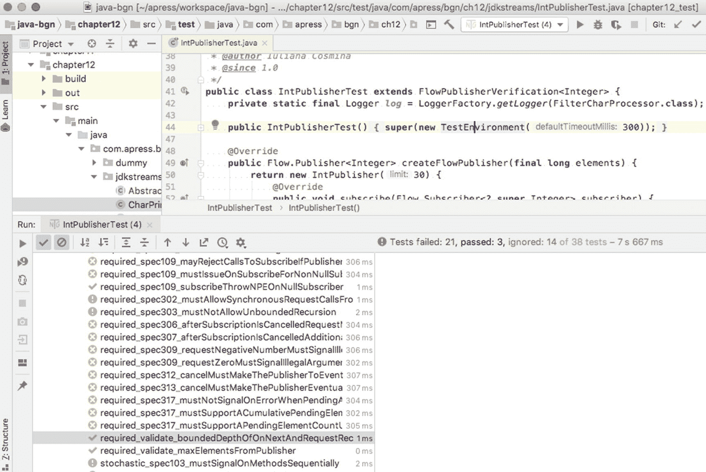

图 12-5
Test NG Reactive
Publisher

测试未通过或被忽略的原因在于，我们实现的目的与这些特定测试不匹配（例如，`maySupportMultiSubscribe`、`maySignalLessThanRequestedAndTerminateSubscription` 和 `mustSignalOn MethodsSequentially`）。我们可以通过扩展测试类来测试上一节中定义的处理器和订阅者，但我会把这个留作练习给你，因为本章中还有一个更有趣的内容我想介绍。

使用 Project Reactor
正如我之前提到的，JDK 对响应式编程的支持非常有限。发布者、处理器和订阅者应该异步运行，所有这些行为都必须由开发者实现，这可能会有些麻烦。目前 JDK 唯一适合做的事情就是为所有其他已有的实现提供一个通用接口。而且这样的实现有很多，它们提供了更多有用的类，用于更专门的响应式组件和实用方法，以便更轻松地创建和连接它们。作为一个 Spring 爱好者，我个人最喜欢的是 **Project Reactor**，这也是 Spring 开发团队青睐的库。
Project Reactor 是最早的响应式编程库之一，它的类为构建响应式应用提供了一个非阻塞的稳定基础，并具备高效的需求管理。它适用于 Java 8，但也为 JDK 9 的响应式流类提供了适配器类，这些类同样可以在 JDK 11 项目中使用。Project Reactor 适用于微服务应用，并且提供了比 JDK 更多的类，旨在使响应式应用的编程更加实用。Project Reactor 提供了两个主要的发布者实现：`reactor.core.publisher.Mono<T>`（一个仅限于发布零个或一个元素的响应式流发布者）和 `reactor.core.publisher.Flux<T>`（一个带有基本流操作符的响应式流发布者）。
使用 Project Reactor 的优势在于，我们有更多的类和方法可以使用。有静态工厂可以创建发布者，还有方法可以更轻松地实现操作链式调用。
Project Reactor 团队不喜欢 `Processor` 这个名称，因此中间组件被称为 **操作符**。

如果你查看官方文档，很可能会遇到图 12-6 中的模式。^(⁹⁰)

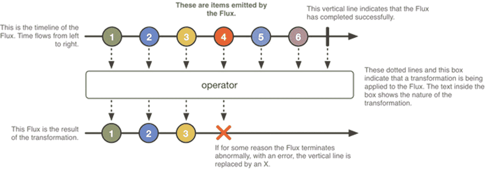

图 12-6
Project Reactor Flux
发布者实现

图 12-6 是 `Flux` 发布者工作原理的抽象示意图。它发射元素、抛出异常，并在没有更多元素可发布时完成。Project Reactor 团队找到了一种更美观的绘制方式。
`Mono` 实现的示意图类似（参见 [`http://projectreactor.io/docs/core/release/api/reactor/core/publisher/Mono.html`](http://projectreactor.io/docs/core/release/api/reactor/core/publisher/Mono.html)）。
但先把这个放在一边，我们来看一些代码示例。使用该类中的多个实用方法，创建 `Flux` 实例非常容易。但在开始发布元素之前，让我们先设计一个通用的订阅者，它除了打印值之外什么都不做，因为我们需要它来确保我们的 `Flux` 发布者确实能工作。

要使用 Project Reactor API 编写订阅者，你有多种选择。你可以直接实现 `org.reactivestreams.Subscriber<T>`。

```
package com.apress.bgn.ch12.reactor;
import org.reactivestreams.Subscriber;
import org.reactivestreams.Subscription;
import org.slf4j.Logger;
import org.slf4j.LoggerFactory;
public class GenericSubscriber implements Subscriber {
private static final Logger log =
LoggerFactory.getLogger(GenericSubscriber.class);
private Subscription subscription;
@Override
public void onSubscribe(Subscription subscription) {
if (this.subscription == null) {
this.subscription = subscription;
this.subscription.request(1);
} else {
subscription.cancel();
}
}
@Override
public void onNext(T element) {
log.info("consumed {} ", element);
subscription.request(1);
}
@Override
public void onError(Throwable t) {
log.error("Unexpected issue!", t);
}
@Override
public void onComplete() {
log.info("All done!");
}
}
```

但是，可以通过实现 `reactor.core.CoreSubscriber<T>`（Reactor 的订阅者基础接口）来避免这样做，或者更好的方法是扩展 `BaseSubscriber<T>` 类，该类提供了基本的订阅者功能。订阅者典型方法的行为可以通过重写同名但以 `hook` 为前缀的方法来修改。在接下来的代码片段中，你可以看到使用 Project Reactor 编写订阅者是多么容易。

```
package com.apress.bgn.ch12.reactor;
import org.slf4j.Logger;
import org.slf4j.LoggerFactory;
import reactor.core.publisher.BaseSubscriber;
public class GenericSubscriber extends BaseSubscriber {
private static final Logger log =
LoggerFactory.getLogger(GenericSubscriber.class);
@Override
protected void hookOnNext(T value) {
log.info("consumed {} ", value);
super.hookOnNext(value);
}
}
```

嗒哒！现在我们有了一个订阅者类，让我们创建一个响应式发布者，它从一个无限的整数流中提供整数，供这个类的实例使用。

```
package com.apress.bgn.ch12.reactor;
import org.slf4j.Logger;
import org.slf4j.LoggerFactory;
import reactor.core.publisher.Flux;
import java.util.Random;
import java.util.stream.Stream;
public class ReactorDemo {
private static final Logger log = LoggerFactory.getLogger(ReactorDemo.class);
private static final Random random = new Random();
public static void main(String... args) {
Flux intFlux = Flux.fromStream(
Stream.generate(() -> random.nextInt(150))
);
intFlux.subscribe(new GenericSubscriber());
}
}
```

如果你运行这段代码，你会看到所有生成的整数值都被打印出来。`Flux` 可以从多种源创建，包括数组和其他发布者。对于特殊情况，为了避免返回 `null` 值，可以通过调用 `empty()` 方法创建一个空的 `Flux`。

```
String[] names = {"Joy", "John", "Anemona", "Takeshi"};
Flux.fromArray(names).subscribe(new GenericSubscriber());
Flux intFlux = Flux.empty();
intFlux.subscribe(new GenericSubscriber());
```

但最棒的方法叫做 `just(..)`，它同时为 `Flux` 和 `Mono` 提供。它接受一个或多个值，并返回一个发布者，根据调用的类型，返回 `Flux` 或 `Mono`。


```
Flux dummyStr = Flux.just("one", "two", "three");
Flux dummyInt = Flux.just(1,2,3);
Mono one = Mono.just(1);
Mono empty = Mono.empty();
```

另一个你可能觉得有用的方法是 `concat()`，它允许我们连接两个 `Flux` 实例。

```
String[] names = {"Joy", "John", "Anemona", "Takeshi"};
Flux namesFlux = Flux.fromArray(names);
String[] names2 = {"Hanna", "Eugen", "Anthony", "David"};
Flux names2Flux = Flux.fromArray(names2);
Flux combined = Flux.concat(namesFlux, names2Flux);
combined.subscribe(new GenericSubscriber());
```

还有一件事你可能会喜欢，还记得 `IntPublisher` 类必须通过 `Thread.sleep(1000)` 调用来减速吗？使用 `Flux` 你就不需要这样做了，因为有两个实用方法组合起来可以达到同样的效果。

```
Flux infiniteFlux = Flux.fromStream(
Stream.generate(() -> random.nextInt(150))
);
Flux delay = Flux.interval(Duration.ofSeconds(1));
Flux delayedInfiniteFlux = infiniteFlux.zipWith(delay, (s,l) -> s);
delayedInfiniteFlux.subscribe(new GenericSubscriber());
```

`interval(..)` 方法创建了一个发布者，它在全局定时器上按指定的时间间隔从 0 开始递增地发出 long 值。它接收一个 `Duration` 类型的参数。在前面的例子中，使用了秒。`zipWith(..)` 方法将作为参数接收的 `Flux` 实例进行压缩。*压缩*操作是一种特定的流操作，意味着两个发布者各自发出一个元素，并使用 `java.util.function.BiFunction<T, U, R>` 将这些元素组合起来。在我们的例子中，该函数丢弃了第二个元素，并返回调用流的元素，这些元素被作为参数传入的流所生成的秒数所减速。

Project Reactor 提供的组件的一个优点是，它们返回的大多是调用它们时所用的相同类型的对象，这意味着它们可以很容易地被链式调用。一段与之前基于 JDK 的示例等效的响应式代码，可以使用 reactor API 编写如下：

```
Flux infiniteFlux = Flux.fromStream(
Stream.generate(() -> random.nextInt(150))
);
Flux delay = Flux.interval(Duration.ofSeconds(1));
Flux delayedInfiniteFlux =
infiniteFlux.zipWith(delay, (s, l) -> s);
delayedInfiniteFlux
.filter(element -> (element >= 0 && element  {
if (item % 2 == 0 && item >= 98 && item  (char) element.intValue())
.subscribe(new GenericSubscriber());
```

你从 `Stream` API 中记得的大部分函数都已在 Project Reactor 中为响应式使用而实现了，所以如果这段代码看起来很熟悉，原因就在于此。
正如本节中的代码示例所证明的那样，使用 Project Reactor API 进行响应式流编程要实用得多，所以如果你需要一个响应式库，可以优先考虑这个。你可以在 [`http://projectreactor.io/docs/core/milestone/reference/`](http://projectreactor.io/docs/core/milestone/reference/) 找到官方文档，它内容很好且充满了示例。如果 Oracle 决定提供他们自己的用于使用响应式流编程响应式应用程序的丰富 API，他们可能已经为时已晚了。

总结
响应式编程不是一个简单的话题，但它似乎是编程的未来。你要记住的是，响应式实现对于非响应式的实现来说几乎毫无用处。我的意思是，将响应式组件与非响应式组件一起设计和使用是没有意义的，因为你可能会引入故障点并拖慢速度。例如，如果你使用的是 Oracle 数据库，那么定义一个使用响应式流返回元素的仓库类是没有意义的，因为 Oracle 数据库不支持响应式访问。所以你添加了一个提供额外实现的响应式层，但在这种情况下并没有真正的好处。但是，如果你选择的数据库是 MongoDB，你可以放心地使用响应式编程，因为 MongoDB 数据库支持响应式访问。此外，如果你正在构建一个带有 ReactJS 或 Angular 界面的 Web 应用程序，你可以设计你的控制器类来响应式地提供数据以供界面显示。

本章涵盖内容

*   响应式编程

*   响应式流的行为

*   JDK 响应式流支持

*   响应式流技术兼容性工具包

*   Project Reactor 组件

脚注

13. 垃圾回收

在执行 Java 代码时，对象会反复地从内存中被创建、使用和丢弃。丢弃未使用的 Java 对象的过程称为**内存管理**，但最常被称为**垃圾回收 (GC)**。在**第**  **5**  **章**中提到了垃圾回收，因为它是解释原始类型和引用类型之间区别所必需的，但在本章中，我们将深入 JVM 的*内部机制*，以解决运行中的 Java 应用程序的另一个谜团。
当 Java 垃圾回收器正常工作，在创建新对象之前清理内存并且内存不会填满时，你可以说分配给程序的内存被*回收*了。像我们到目前为止编写的那些低复杂度的程序，运行时不需要那么多内存，但根据它们的设计（还记得递归吗？），它们最终可能会使用比可用内存更多的内存。在 Java 中，垃圾回收器会自动运行。在更底层的语言中，比如 **C**，没有自动内存管理，开发人员负责编写代码根据需要分配内存，并在不再需要时释放它。虽然自动内存管理看起来很实用，但如果管理不当，垃圾回收器可能会成为一个问题。因此，本章提供了关于垃圾回收器的足够信息，以确保它被明智地使用，并且当问题出现时，至少你有一个解决问题的良好起点。
尽管本章将介绍一些调整垃圾回收器的方法，但请记住，垃圾回收调整不应该是必需的，程序应该以这样一种方式编写：只创建执行其功能所需的对象，并正确管理引用，在应用程序投入生产之前应该进行估算，并且在此之前应该知道并配置其所需的最大内存量。如果分配给 Java 程序的内存不足，通常意味着实现中存在某些问题。

垃圾回收基础
Java 自动垃圾回收是 Java 编程语言的主要特性之一。JVM 是用于执行 Java 程序的虚拟机。由于 Java 程序使用了 JVM 所运行系统的资源，它必须有一种方法来安全地释放这些资源。这项工作由垃圾回收器完成。要理解垃圾回收器，我们必须先看看 JVM 的架构。


Oracle HotSpot JVM 架构
多年来，一些大公司（例如 IBM）已经推出了各自定制的 JVM 版本。如今，随着 Java 进入模块化时代并采用快速交付模式，越来越多维护特定版本 JDK/JVM 的公司（例如 Azul）涌现出来，因为对于拥有遗留依赖的大型应用来说，迁移到 9+ 版本非常困难。此外，另一个重要的经济因素是，自 2019 年 1 月 1 日起，Java 已成为付费软件，开发者需要为他们开发的软件付费。许多人将此举称为*诱饵调包*，因为 Oracle 先是说，“*现在它是免费的，尽管用吧*”，然后又说，“*既然你已经开发了你的 Java 应用，现在你得付钱给我们*”。仔细想想，这就像你买了建房的地基、砖块和所有其他材料。因为构建 Java 应用时，唯一属于你的只有应用的目的和设计；你用来构建它的一切都是 JDK 的一部分，而 JDK 属于 Oracle。

尽管如此，在垃圾回收方面，Oracle 的 HotSpot 仍然是目前最常用的 JVM。该 JVM 提供了一套成熟的垃圾回收选项。其架构如图 13-1 所示。

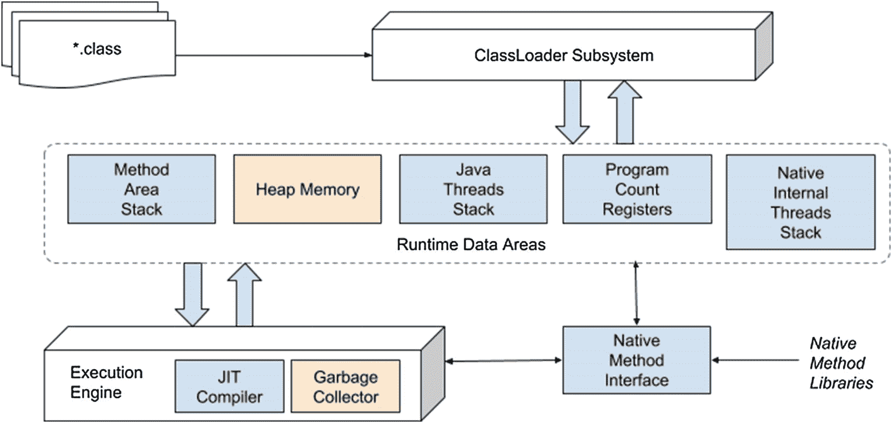

图 13-1
Oracle HotSpot JVM
架构

*堆*内存区域由垃圾回收器管理，并被划分为多个区域。对象在这些区域之间移动，直到被丢弃。图 13-2 展示了传统垃圾回收器和新型垃圾回收器的区域划分，后者遵循 JDK 当前默认垃圾回收器（即 JDK 8 中引入的 G1GC）的模型。

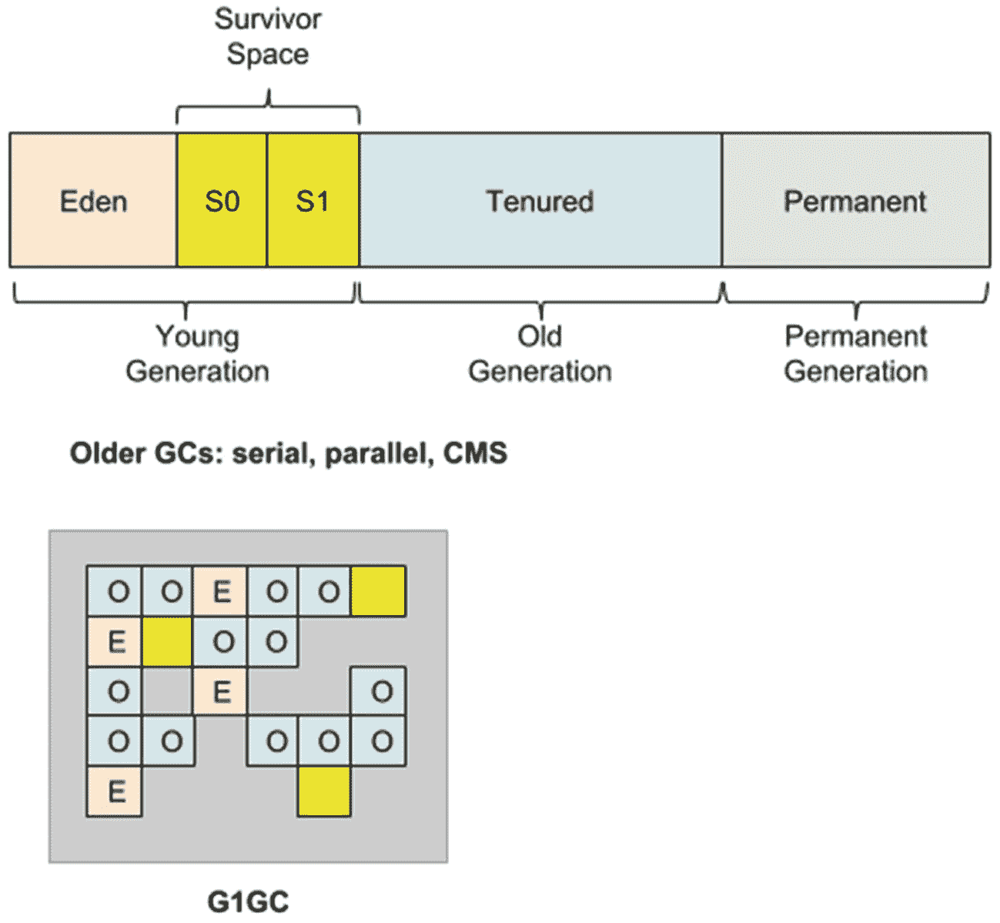

图 13-2
堆结构

G1GC 是专为资源丰富的机器设计的下一代垃圾回收器，因此它对堆的分区方式有所不同。它的堆被划分为一组大小相等的堆区域，每个区域都是一段连续的虚拟内存。某些区域集合被分配了与旧式回收器相同的角色（Eden、Survivor、Old），但它们的尺寸不是固定的。这为内存使用提供了更大的灵活性。你可以在下一节中阅读更多关于不同类型垃圾回收器的内容，现在我们将重点放在*堆*内存及其被称为*代*的区域上。

当应用程序运行时，它创建的对象存储在**年轻代**区域。当一个对象被创建时，它在该代的一个子区域——**Eden 空间**——中开始其生命周期。当 Eden 空间被填满时，会触发一次**次要垃圾回收（minor GC run）**，清理该区域中未被引用的对象，并将被引用的对象移动到第一个幸存者空间（S0）。下一次 Eden 空间被填满时，会再次触发一次 minor GC 运行，再次删除未被引用的对象，并将被引用的对象移动到下一个幸存者空间（S1）。S0 中的对象已经经历了一次 minor GC 运行，因此它们的年龄会增加，并被移动到 S1，这样 S0 和 Eden 就可以被清理。在下一次 minor GC 运行时，操作会重复进行，但这次被引用的对象会被保存到空的 S0 中，而 S1 中较老的对象年龄会增加并也被移动到这里，这样 S1 和 Eden 就可以被清理。当幸存者空间中的对象达到一定年龄后，它们会在 minor GC 运行期间被移动到**老年代**空间。

前面的步骤如图 13-3 所示，`o1` 和 `o2` 对象会一直老化，直到被移动到老年代区域。

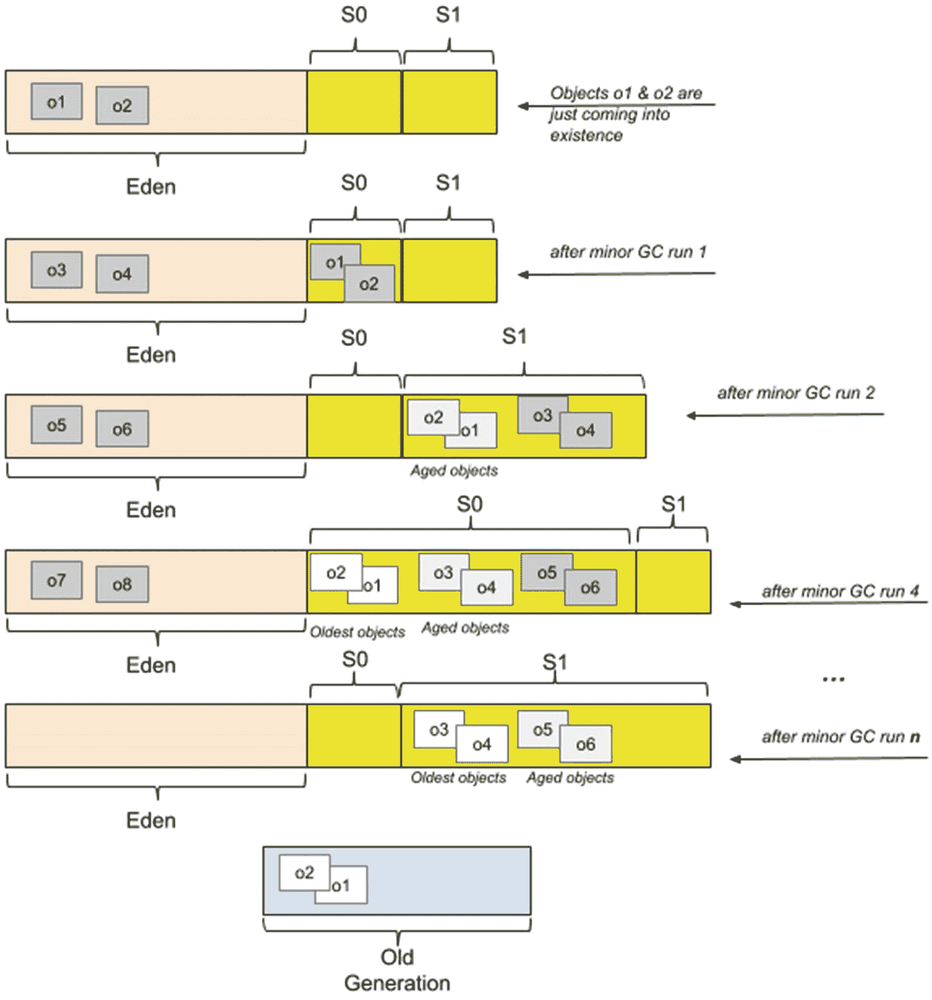

图 13-3
年轻代空间中的 Minor GC 运行

Minor GC 会持续进行，直到老年代空间被填满，此时会触发一次**主要垃圾回收（major GC run）**。它会删除未被引用的对象，压缩内存，并移动对象，使得留下的空闲内存成为一个大的连续空间。*次要垃圾回收*事件是一个*停止世界*事件，这个过程基本上会接管应用程序的运行并暂停其执行，以便释放内存。由于年轻代空间尺寸较小（如你将在下一节中看到的），应用程序的暂停时间通常可以忽略不计。如果在一次 minor GC 运行后无法从年轻代区域回收任何内存，则会触发一次 major GC 运行。

**永久代**区域是为 JVM 元数据（如类和方法）保留的。该区域也会不时地被清理，以移除应用程序中不再使用的类。当堆中没有更多可用内存时，会触发对该区域的清理。

至此描述的垃圾回收过程是分代垃圾回收器（如 G1GC）所特有的；但在 JDK 8 之前，垃圾回收是使用一种更旧的垃圾回收器完成的，该回收器采用一种称为**并发标记清除**的算法。

这种垃圾回收器与应用程序并行运行，标记已使用和未使用的内存区域。然后它会删除未被引用的对象，并通过移动对象将内存压缩成一个连续的区域。这个过程效率低下且耗时。因为随着创建的对象越来越多，执行垃圾回收所需的时间也越来越长。但由于大多数对象都是短命的，这实际上并不是一个问题。因此，CMS 垃圾回收器在一段时间内还是可以接受的。

G1GC 采用了类似的方法，但在标记阶段完成后，G1 会专注于那些大部分为空白的区域，以尽可能多地回收未使用的内存。这就是为什么这种垃圾回收器也被称为 *Garbage-First*。G1 还使用暂停预测模型，根据为应用程序设置的暂停时间来决定可以处理多少个内存区域。来自已处理区域的对象会被复制到堆的单个区域中，从而同时实现内存压缩。此外，G1GC 对 Eden 和 Survivor 空间没有固定的大小，它会在每次 minor GC 运行后决定它们的大小。

有多少种垃圾回收器？

Oracle HotSpot JVM 提供以下类型的垃圾回收器：

*   **串行回收器**：所有垃圾回收事件都在一个线程中串行执行。每次垃圾回收后都会进行内存压缩。

*   **并行回收器**：使用多个线程进行次要垃圾回收。使用单个线程进行主要垃圾回收和老年代压缩。

*   **CMS（并发标记清除）**：使用与并行 GC 相同的算法，通过多个线程进行次要垃圾回收。主要垃圾回收是多线程的，但 CMS 与应用程序进程并发运行，以尽量减少*停止世界*事件。不进行内存压缩。这种垃圾回收器适用于需要较短垃圾回收暂停时间，并且能够承受在应用程序运行时与垃圾回收器共享处理器资源的应用。在 Java 8 正式将 G1 设为默认回收器之前，它一直是默认的垃圾回收器。


*   **G1（垃圾优先）**：在 Oracle JDK 7 Update 4 中引入，旨在永久取代 CMS 垃圾回收器，适用于能够与 CMS 回收器并发运行、需要内存压缩、需要更可预测的 GC 暂停时间，且不需要更大堆内存的应用程序。G1 回收器是一种服务器风格的垃圾回收器，针对具有大内存的多处理器机器设计，考虑到现在大多数笔记本电脑至少拥有八核和 16 GB 内存，它同样适用于这些设备。G1 既有并发阶段（与应用程序线程同时运行——例如，优化、标记、清理），也有并行阶段（多线程——例如，停止世界）。完全垃圾回收仍然是单线程的，但如果调整得当，你的应用程序应能避免完全垃圾回收。

*   **Epsilon 无操作回收器**：在 Java 11 中引入，这种回收器是一种虚拟 GC，不回收或清理内存。当堆内存满时，JVM 会关闭。这种回收器可用于性能测试、内存分配分析、虚拟机接口测试，以及生命周期极短的任务，以及那些内存使用非常有限、开发者必须尽可能精确估算应用程序内存占用量的应用程序。

好了，我已经列出了垃圾回收器的类型，但我们如何知道本地 JVM 使用的是哪一种呢？方法不止一种。最简单的方法是在运行一个简单的 main 类时，添加 `-verbose:gc` 作为虚拟机选项。使用 Java 11 JDK，无需任何其他配置，控制台就会打印出以下信息。

```
[0.016s][info][gc] Using G1
```

所以很清楚了；使用的是 G1 垃圾回收器。我们可以通过添加另一个虚拟机选项 `-Xlog:gc*`^(⁹¹) 来查看这个垃圾回收器的详细信息。

```
[0.012s][info][gc,heap] Heap region size: 1M
[0.017s][info][gc     ] Using G1
[0.017s][info][gc,heap,coops] Heap address: 0x0000000700000000, size: 4096 MB,
Compressed Oops mode: Zero based, Oop shift amount: 3
[0.216s][info][gc,heap,exit ] Heap
[0.216s][info][gc,heap,exit ]  garbage-first heap   total 262144K, used 3072K
[0x0000000700000000, 0x0000000800000000)
[0.216s][info][gc,heap,exit ]    region size 1024K, 4 young (4096K), 0 survivors (0K)
[0.216s][info][gc,heap,exit ]   Metaspace       used 7246K, capacity 7364K, committed 7680K, reserved 1056768K
[0.216s][info][gc,heap,exit ]    class space    used 663K, capacity 709K, committed 768K, reserved 1048576K
```

现在我们可以看到堆的最大大小（4096 MB）、内存区域大小（1 MB）以及每个代的大小和占用情况。

但是，我们可以通过使用它们特定的虚拟机选项，告诉 JVM 使用前面列出的任何垃圾回收器。

*   `-XX:+UseSerialGC` 使用串行 GC（在这种情况下，添加 `-verbose:gc -Xlog:gc*` 作为虚拟机选项）会产生以下输出。

*   `-XX:+UseParallelGC` 使用并行 GC（在这种情况下，添加 `-verbose:gc -Xlog:gc*` 作为虚拟机选项）会产生以下输出。

```
[0.012s][info][gc] Using Serial
[0.012s][info][gc,heap,coops] Heap address: 0x0000000700000000, size: 4096 MB,
Compressed Oops mode: Zero based, Oop shift amount: 3 [0.209s][info][gc,heap,exit ] Heap
[0.209s][info][gc,heap,exit ]  def new generation   total 78656K, used 9794K
[0x0000000700000000, 0x0000000705550000, 0x0000000755550000)
[0.209s][info][gc,heap,exit ]   eden space 69952K,  14% used
[0x0000000700000000, 0x0000000700990808, 0x0000000704450000)
[0.209s][info][gc,heap,exit ]   from space 8704K,   0% used
[0x0000000704450000, 0x0000000704450000, 0x0000000704cd0000)
[0.209s][info][gc,heap,exit ]   to   space 8704K,   0% used
[0x0000000704cd0000, 0x0000000704cd0000, 0x0000000705550000)
[0.209s][info][gc,heap,exit ]  tenured generation   total 174784K, used 0K
[0x0000000755550000, 0x0000000760000000, 0x0000000800000000)
[0.209s][info][gc,heap,exit ]    the space 174784K,   0% used
[0x0000000755550000, 0x0000000755550000, 0x0000000755550200, 0x0000000760000000)
[0.209s][info][gc,heap,exit ]  Metaspace       used 7246K, capacity 7364K, committed 7680K,
reserved 1056768K
[0.209s][info][gc,heap,exit ]   class space    used 663K, capacity 709K, committed 768K,
reserved 1048576K
```

*   `-XX:+UseConcMarkSweepGC` 使用 CMS GC（在这种情况下，添加 `-verbose:gc -Xlog:gc*` 作为虚拟机选项）会产生以下输出。

```
[0.017s][info][gc] Using Parallel
[0.017s][info][gc,heap,coops] Heap address: 0x0000000700000000, size: 4096 MB,
Compressed Oops mode: Zero based, Oop shift amount: 3 [0.231s][info][gc,heap,exit ] Heap
[0.231s][info][gc,heap,exit ]  PSYoungGen      total 76288K, used 9175K
[0x00000007aab00000, 0x00000007b0000000, 0x0000000800000000)
[0.231s][info][gc,heap,exit ]   eden space 65536K, 14% used
[0x00000007aab00000,0x00000007ab3f5f38,0x00000007aeb00000)
[0.231s][info][gc,heap,exit ]   from space 10752K, 0% used
[0x00000007af580000,0x00000007af580000,0x00000007b0000000)
[0.231s][info][gc,heap,exit ]   to   space 10752K, 0% used
[0x00000007aeb00000,0x00000007aeb00000,0x00000007af580000)
[0.231s][info][gc,heap,exit ]  ParOldGen    total 175104K, used 0K
[0x0000000700000000, 0x000000070ab00000, 0x00000007aab00000)
[0.231s][info][gc,heap,exit ]   object space 175104K, 0% used
[0x0000000700000000,0x0000000700000000,0x000000070ab00000)
[0.231s][info][gc,heap,exit ]  Metaspace    used 7245K, capacity 7364K, committed 7680K,
reserved 1056768K
[0.231s][info][gc,heap,exit ]  class space  used 663K, capacity 709K, committed 768K,
reserved 1048576K
```

*   `-XX:+UseG1GC`，默认的垃圾回收器，我们已经介绍过这个了。

*   `-XX:+UseEpsilonGC`，无操作垃圾回收器。如果你在控制台中看到一条消息，要求你在该选项之前也添加 `-XX:+UnlockExperimentalVMOptions` 以启用 Epsilon 垃圾回收器，请照做。需要此虚拟机选项来解锁实验性功能，并且在撰写本书时，这个垃圾回收器还是一个实验性功能。添加 `-verbose:gc -Xlog:gc*` 作为虚拟机选项会产生以下输出。


```
[0.018s][info][gc] 使用并发标记清除算法
[0.018s][info][gc,heap,coops] 堆地址：0x0000000700000000，大小：4096 MB，
压缩对象指针模式：基于零，对象指针偏移量：3 [0.260s][info][gc,heap,exit ] 堆
[0.260s][info][gc,heap,exit ]  新生代（并行复制）  总计 78656K，已使用 9794K
[0x0000000700000000, 0x0000000705550000, 0x0000000729990000)
[0.260s][info][gc,heap,exit ]   Eden 区 69952K，已使用 14%
[0x0000000700000000, 0x0000000700990850, 0x0000000704450000)
[0.260s][info][gc,heap,exit ]   From 区 8704K，已使用 0%
[0x0000000704450000, 0x0000000704450000, 0x0000000704cd0000)
[0.260s][info][gc,heap,exit ]   To 区 8704K，已使用 0%
[0x0000000704cd0000, 0x0000000704cd0000, 0x0000000705550000)
[0.260s][info][gc,heap,exit ]  并发标记清除老年代 总计 174784K，
已使用 0K [0x0000000729990000, 0x0000000734440000, 0x0000000800000000)
[0.260s][info][gc,heap,exit ]  元空间 已使用 7336K，容量 7428K，已提交 7680K，
保留 1056768K
[0.260s][info][gc,heap,exit ]   类空间 已使用 668K，容量 709K，已提交 768K，
保留 1048576K
```

```
[0.013s][info][gc] 可调整大小的堆；起始大小 256M，最大：4096M，步长：128M
[0.013s][info][gc] 使用 TLAB 分配；最大：4096K
[0.013s][info][gc] 启用弹性 TLAB；弹性系数：1.10x
[0.013s][info][gc] 启用弹性 TLAB 衰减；衰减时间：1000ms
[0.013s][info][gc] 使用 Epsilon 垃圾回收器
[0.013s][info][gc,heap,coops] 堆地址：0x0000000700000000，大小：4096 MB，
压缩对象指针模式：基于零，对象指针偏移量：3 [0.213s][info][gc,heap,exit ] 堆
[0.213s][info][gc,heap,exit ] Epsilon 堆
[0.213s][info][gc,heap,exit ] 分配空间：
[0.213s][info][gc,heap,exit ]  空间 262144K，已使用 1%
[0x0000000700000000, 0x000000070030e8f0, 0x0000000710000000)
[0.213s][info][gc           ] 总分配量：3130 KB
[0.213s][info][gc           ] 平均分配速率：14691 KB/秒
```

这些垃圾回收器打印的数据具有共同元素，
例如堆的大小，在应用程序启动时始终为 256 MB，在我的系统上最大为 4096 MB。Eden 区和
新生代有所不同；G1 为新生代使用 4096 KB，
而 CMS 需要 78656 KB（多得多）。
最有趣的是 Epsilon 垃圾回收器，因为正如预期的那样，
它没有将堆划分为分代区域，因为这种
类型的垃圾回收器根本不执行垃圾回收。
**TLAB** 是*线程本地分配缓冲区*的缩写，
它是存储对象的内存区域。只有较大的对象存储在
TLAB 之外。TLAB 在执行期间会针对每个线程
动态调整大小。因此，如果某个线程分配了大量内存，它从堆中获取的新 TLAB
的大小就会增加。TLAB 的最小大小
可以通过两个 VM 选项来控制：`-XX:MinTLABSize`。
对于我们使用先前 VM 选项运行的小型空类，
此输出并不真正相关，但您可以在运行下一节中的代码时尝试这些选项，
因为那时此处打印的统计信息才具有一些相关性。

此外，还有一个名为 `-XX:+PrintCommandLineFlags` 的 VM 选项，
可以在运行类时使用，以描述垃圾回收器的配置：
它使用的线程数、堆大小等。

```
-XX:G1ConcRefinementThreads=8
-XX:GCDrainStackTargetSize=64
-XX:InitialHeapSize=268435456
-XX:MaxHeapSize=4294967296
-XX:+PrintCommandLineFlags
-XX:ReservedCodeCacheSize=251658240
-XX:+SegmentedCodeCache
-XX:+UseCompressedClassPointers
-XX:+UseCompressedOops -XX:
+UseG1GC
```

这些 VM 选项中的大多数
都具有明显的名称，允许开发人员推断
它们的用途。此外，还有来自 Oracle 的官方文档。
如果您需要剖析 Oracle 的内存管理，位于
[ `www.oracle.com/technetwork/java/javase/tech/index-jsp-136373.html`
](http://www.oracle.com/technetwork/java/javase/tech/index-jsp-136373.html) 的文章非常不错。

从代码层面使用 GC
对于大多数应用程序来说，垃圾回收并不是开发人员
必须真正考虑的事情。JVM 会启动一个 GC 线程，该线程
在不妨碍应用程序执行的情况下完成其工作（通常如此）。但对于希望拥有超越 Java 基础技能的开发人员来说，
理解 Java 垃圾回收的工作原理以及如何
对其进行调优是必须的。关于 Java 垃圾回收，开发人员必须接受的第一件事是
它无法在运行时控制。正如您在下一节中看到的，
有一种方法可以向 JVM 建议需要进行一些内存清理，
但无法保证一定会执行内存清理。
唯一能做的就是指定在丢弃对象时要运行的一些代码。

使用 finalize() 方法

每个 Java 类都自动是 JDK `java.lang.Object` 类的子类。
此类位于 JDK 层次结构的根目录，并且是应用程序中所有类的根。
它提供了一些有用的方法，可以扩展或重写以实现特定于
子类的行为。`equals()`、`hashcode()` 和 `toString()` 方法
已经提到过。`finalize()` 方法
在 Java 9 中已被弃用，但并未从 JDK 中移除。当代码中不再存在对该对象的任何引用时，
垃圾回收器会调用此方法。在我们继续之前，让我们
看一下以下代码片段。

```
package com.apress.bgn.ch13;
import com.apress.bgn.ch13.util.NameGenerator;
import org.slf4j.Logger;
import org.slf4j.LoggerFactory;
import java.time.LocalDate;
import java.util.Random;
public class Main {
private static final Logger log = LoggerFactory.getLogger(Main.class);
private static NameGenerator nameGenerator = new NameGenerator();
private static final Random rnd = new Random();
public static void main(String... args) {
while (true) {
genSinger();
}
}
private static void genSinger() {
Singer s = new Singer(nameGenerator.genName(),
rnd.nextDouble(), LocalDate.now());
log.info("JVM created: {}", s.getName());
}
}
```

即使不知道 `NameGenerator` 或 `Singer` 类
是什么样子，代码执行的操作也应该很清楚。main 方法在一个无限循环中调用 `genSinger()` 方法。
这意味着会创建无限数量的 `Singer` 实例。
那么，会发生什么？代码会运行吗？能运行多久？如果您能在脑海中回答这些问题，
那么我的工作就完成了。您现在可以停止阅读本书了。

在**第** **5** **章**中，有一些图表
展示了小程序的内存内容。图 13-4 展示了
在前一个程序执行期间 Java 堆和栈内存
可能的样子。

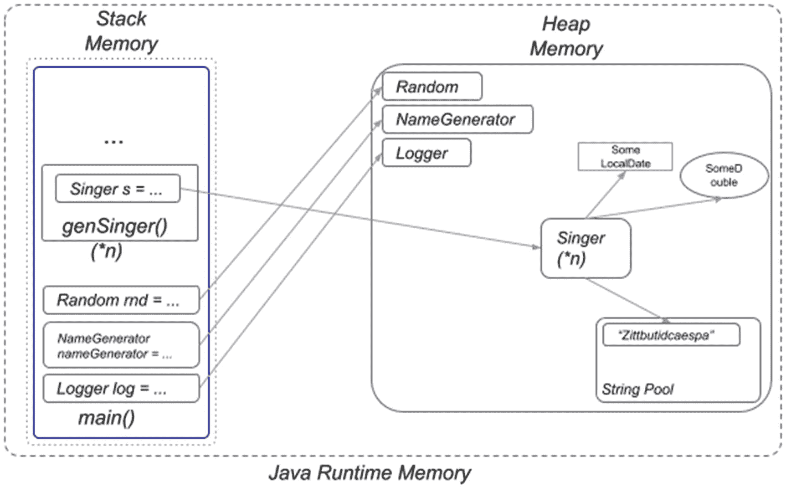

图 13-4
执行 Main.class 期间的 Java 栈和堆内存


当然，示例中只展示了一次 `genSinger()` 调用，也只创建了一个 `Singer` 实例。当 `main(..)` 方法被调用时，会创建对这些静态实例的引用，这些引用在程序执行结束前一直有效。随后，`genSinger()` 方法被重复调用。每个方法都有自己的栈，用于保存在该方法上下文中创建的对象的引用，在本例中就是 `Singer` 实例。这个引用被用来打印在该方法体内创建的 `Singer` 实例的名称。然后方法结束，但并未返回该引用。这意味着创建的实例不再需要，因为它仅在此方法的上下文中使用。当 `genSinger()` 方法执行结束时，对 `Singer` 实例的引用会从栈中丢弃。`Singer` 实例仍然存在于堆内存中，但程序已无法再访问它，因此它对程序来说也不再必要。它现在占据着一个内存块，其中包含其自身内容以及指向其他实例的引用，在本例中，这些引用指向一个 `String`、一个 `Double` 和一个 `LocalDate`。考虑到 `genString()` 方法被无限次调用（在图 13-4 中用 `(*n))` 表示），会创建更多的 `Singer` 实例，它们持续占用着内存。最终，程序会因为内存不足而无法创建新的实例。

这时，垃圾回收器就登场了。那些不再被程序引用（因此不可达）的 `Singer` 实例被视为垃圾。现在你知道这个名字的由来了。这些实例不再需要，其占用的内存可以被安全地清理。垃圾回收器是一个与主执行线程并行运行的清理线程。它会不时地从堆内存中删除未被引用的对象。由于 `finalize()` 方法仍然可用，我们为 `Singer` 类型重写了它，以便打印一条日志消息，这样我们就能看到垃圾回收器何时销毁一个实例，因为在从堆内存中删除一个对象之前，会调用该对象的 `finalize()` 方法。下面的代码片段展示了 `Singer` 实例。

```
package com.apress.bgn.ch13;
import org.slf4j.Logger;
import org.slf4j.LoggerFactory;
import java.io.*;
import java.time.LocalDate;
import java.util.Objects;
public class Singer implements Serializable {
private static final Logger log = LoggerFactory.getLogger(Singer.class);
private final long birthtime;
private String name;
private Double rating;
private LocalDate birthDate;
public Singer(String name, Double rating, LocalDate birthDate) {
this.name = name;
this.rating = rating;
this.birthDate = birthDate;
this.birthtime = System.nanoTime();
}
public String getName() {
return name;
}
@Override
protected void finalize() throws Throwable {
try {
long deathtime = System.nanoTime();
long lifespan =  (deathtime - birthtime) / 1_000_000_000;
log.info("GC Destroyed: {} after {} seconds",  name, lifespan);
} finally {
super.finalize();
}
}
}
```

添加 **birthtime** 字段是为了计算从实例构造函数被调用到垃圾回收器调用 `finalize()` 方法之间经过的时间；基本上我们是在计算实例的生命周期。由于时间以纳秒为单位，我们将差值除以 10⁹ 来得到以秒为单位的时间。

本节使用的代码示例给垃圾回收器带来了大量工作，因为每个创建的 `Singer` 实例在被丢弃前都只被使用了很短的时间。如果你运行这段代码，会在控制台中看到大量日志消息，首先是一大堆关于对象被创建的消息，但如果你等待片刻，关于对象被丢弃的消息也会出现。所有输出都被定向到一个文件，因为 IntelliJ IDEA 的控制台基于一个会不时重置的缓冲区，以防止编辑器崩溃。你必须手动停止程序，因为 `while(true)` 循环永远不会结束，其条件永远不会计算为 `false`。停止程序后，你会在以下位置找到一个日志文件：`/chapter13/out/gc.log`。如果找不到，请修改此类的 IntelliJ IDEA 启动配置，添加 `-Dlogback.configurationFile=chapter13/src/main/resources/logback.xml` VM 选项，然后重新运行。

`gc.log` 的内容应该与下面展示的片段非常相似。

```
INFO  c.a.b.c.Main - JVM created: Ngvuamtkrfeavt
INFO  c.a.b.c.Main - JVM created: Weeqhwssuddcatm
INFO  c.a.b.c.Main - JVM created: Zrtfrjsjwhwlzh
INFO  c.a.b.c.Main - JVM created: Ymsdzcpkatryscf
INFO  c.a.b.c.Main - JVM created: T dkqgjujyz moj
INFO  c.a.b.c.Main - JVM created: Jjqzzetnwzi itu
INFO  c.a.b.c.Main - JVM created: Iuivwasfailc fi
INFO  c.a.b.c.Singer - GC Destroyed: Qtzr gwe ifujbn after 1 seconds
INFO  c.a.b.c.Main - JVM created: Djlui rbftvepf
INFO  c.a.b.c.Singer - GC Destroyed: Wzdwcc cqhisbbq after 0 seconds
INFO  c.a.b.c.Main - JVM created: Caqw iddgborajm
INFO  c.a.b.c.Singer - GC Destroyed: Ntiarzdzbhzolnn after 4 seconds
INFO  c.a.b.c.Main - JVM created: Crtayuigzccufqj
INFO c.a.b.c.Singer - GC Destroyed: Irsovagekpc hca after 0 seconds
INFO c.a.b.c.Singer - GC Destroyed: Hqkzodfrnhuhqwk after 0 seconds
INFO c.a.b.c.Singer - GC Destroyed: Norlcmkzjvkhiev after 0 seconds
INFO c.a.b.c.Singer - GC Destroyed: Gbjknkffngfaghf after 0 seconds
INFO c.a.b.c.Singer - GC Destroyed: Mhkn zpfogcc jm after 0 seconds
INFO c.a.b.c.Main - JVM created: Cningetinfmbunh
INFO c.a.b.c.Main - JVM created: Ipwomacdhzoywce
INFO c.a.b.c.Main - JVM created: Ydobktlzwcqvkfl
INFO c.a.b.c.Main - JVM created: Abjggajzbifghpa
INFO c.a.b.c.Main - JVM created: Hnwdvhnkwc rmbz
INFO  c.a.b.c.Main - JVM created: Hvcwmekbyhjfncc
INFO c.a.b.c.Singer - GC Destroyed: Rbefgb cmvlnfgm after 1 seconds
INFO c.a.b.c.Singer - GC Destroyed: Kusmvtkkikjtzzj after 1 seconds
INFO c.a.b.c.Singer - GC Destroyed: Ouybfhckbtkichc after 1 seconds
INFO c.a.b.c.Singer - GC Destroyed: Djzozlssperibka after 1 seconds
...
```

拿到文件后，你可以打开它并开始分析其内容。但由于 IntelliJ 可能无法打开如此大的文件，请尝试使用专门的文本编辑器（如 Notepad++ 或 Sublime）打开它。或者，如果你使用 Unix/Linux 操作系统，打开控制台并使用 `grep` 命令，如下所示：

```
grep -a 'seconds' gc.log
```

这会显示所有在调用 `finalize()` 方法时打印的日志条目。然后，你可以选择一个实例的名称，执行类似下面的操作：

```
$ grep -a 'Lybhpococssuoz' gc.log
INFO c.a.b.c.Main - JVM created: Lybhpococssuoz
INFO c.a.b.c.Singer - GC Destroyed: Lybhpococssuoz after 7 seconds
```

一个 `Singer` 实例从堆中被删除所需的时间各不相同，这是因为 GC 是随机调用的，开发者无法控制它。有一种方法可以显式请求执行垃圾回收，实际上有两种方法。你可以调用以下代码：

```
System.gc() 或
Runtime.getRuntime().gc();
```


这并不意味着 GC 会立即开始清理内存；它更像是向 JVM 发出一个建议，表明应该努力回收未使用的对象并回收未使用的内存，因为此时需要这样做。

现在，回到 `finalize()` 方法。它在 Java 9 中被标记为已弃用。此方法旨在由处理存储在堆外资源的类进行重写。例如，用于读取文件、URL 和数据库等资源的 I/O 处理类。当运行应用程序的任何活动线程都无法再访问某个对象时，JVM 会调用 `finalize()` 方法，以确保这些资源被释放，并可供其他外部和不相关的程序使用。

******
在旧版本的 Apache Tomcat（一个基于 Java 的 Web 服务器）中，存在一个与资源释放相关的 Windows 错误。当服务器崩溃或停止时，它无法重新启动，因为其某些日志文件未能正确释放，新的服务器实例无法访问这些文件来开始写入新的日志条目。

随着 JDK 1.7 中 `java.lang.AutoCloseable` 接口的引入，`finalize()` 方法的使用越来越少。此外，此方法的另一个问题是 JVM 无法保证哪个线程会为任何给定对象调用此方法。因此，任何有权访问它的线程都可以调用它，我们最终可能会在对象仍然需要时释放资源。另外，如果自定义实现不正确、抛出异常或未能正确释放资源，会发生什么情况？`finalize()` 方法应该只被 JVM 调用一次，但这无法得到保证。另一个缺点是 `finalize()` 调用不会自动链式调用，因此 `finalize()` 方法的实现必须始终显式调用超类的 `finalize()` 方法。还有一个问题：一旦调用了 `finalize()`，就无法阻止该方法执行或撤销其效果，因此你基本上只剩下一个对不再能访问其资源的对象的引用。正如你现在可能已经想到的，在实现此方法时，开发者拥有很大的自由度，这意味着存在很大的出错空间。

这就是为什么 Java 中的终结机制存在缺陷，并在 JDK 9 中被弃用以阻止其使用。不正确的 `finalize()` 实现可能导致：内存泄漏（内存内容未被丢弃）、死锁（资源被两个进程阻塞）和挂起（进程处于无法退出的等待状态）。但是，为了帮助进行内存管理，引入了 `java.lang.ref.Cleaner` 类。但在深入探讨之前，我必须向你展示如何以编程方式检查内存状态。

堆内存统计信息

当程序运行时，`Runtime` 类对于与 JVM 内部进行交互非常有用。可以调用其 `gc()` 方法来建议 JVM 清理内存。几章之前，我们使用此类中的方法从 Java 代码启动进程。此类中有三个方法可用于查看分配给 Java 程序的内存状态。

*   `runtime.maxMemory()` 返回 JVM 在需要时尝试为其堆使用的最大内存量。此方法返回的值因机器而异，并且默认设置为机器上总现有 RAM 内存的四分之一，除非使用 JVM 选项 `-Xmx` 后跟内存量来显式设置（例如，`-Xmx8G` 允许 JVM 最多使用 8 GB 内存）。

*   `runtime.totalMemory()` 返回 JVM 的总内存量。此方法返回的值也因机器而异，并且依赖于实现，除非使用 JVM 选项 `-Xms` 后跟内存量来显式设置（例如，`-Xms1G` 告诉 JVM 其堆内存的初始大小应为 1 GB 内存）。

*   `runtime.freeMemory()` 返回 Java 虚拟机可用内存量的近似值。

使用 `runtime.totalMemory()` 和 `runtime.freeMemory()` 方法，我们可以编写一些代码来检查程序执行期间不同时间点占用了多少内存。为此，我们创建一个名为 `MemAudit` 的类，该类使用当前的日志记录器来打印内存值。

```
package com.apress.bgn.ch13.util;
import org.slf4j.Logger;
public class MemAudit {
private static final long MEGABYTE = 1024L * 1024L;
private static final Runtime runtime = Runtime.getRuntime();
public static void printBusyMemory(Logger log) {
long memory = runtime.totalMemory() - runtime.freeMemory();
log.info("Occupied memory: {} MB", (memory / MEGABYTE));
}
public static void printTotalMemory(Logger log) {
log.info("Total Program memory: {} MB", (runtime.totalMemory()/MEGABYTE));
log.info("Max Program memory: {} MB", (runtime.maxMemory()/MEGABYTE));
}
}
```

并且此类中的方法在我们的程序执行过程中被调用，如下所示。

```
package com.apress.bgn.ch13;
import com.apress.bgn.ch13.util.NameGenerator;
import org.slf4j.Logger;
import org.slf4j.LoggerFactory;
import java.time.LocalDate;
import java.util.Random;
import static com.apress.bgn.ch13.util.MemAudit.printTotalMemory;
import static com.apress.bgn.ch13.util.MemAudit.printBusyMemory;
public class Main {
private static final Logger log = LoggerFactory.getLogger(Main.class);
private static NameGenerator nameGenerator = new NameGenerator();
private static final Random random = new Random();
public static void main(String... args) {
printTotalMemory(log);
int count =0;
while (true) {
genSinger();
count++;
if (count % 1000 == 0) {
printBusyMemory(log);
}
}
}
private static void genSinger() {
Singer s = new Singer(nameGenerator.genName(),
random.nextDouble(), LocalDate.now());
log.info("JVM created: {}", s.getName());
}
}
```

现在，在删除旧的日志文件后，我们应该再次运行它，并让它运行一小会儿。由于再次无法看到输出，我们将使用 `grep` 方法来提取所有包含 `memory` 单词的行，结果应该与下一个列表非常相似。

```
$ grep -a 'memory' gc.log
INFO  c.a.b.c.Main - Total Program memory: 256 MB
INFO  c.a.b.c.Main - Max Program memory: 4096 MB
INFO  c.a.b.c.Main - Occupied memory: 5 MB
INFO  c.a.b.c.Main - Occupied memory: 3 MB
INFO  c.a.b.c.Main - Occupied memory: 4 MB
INFO  c.a.b.c.Main - Occupied memory: 5 MB
INFO  c.a.b.c.Main - Occupied memory: 5 MB
INFO  c.a.b.c.Main - Occupied memory: 4 MB
INFO  c.a.b.c.Main - Occupied memory: 4 MB
INFO  c.a.b.c.Main - Occupied memory: 7 MB
INFO  c.a.b.c.Main - Occupied memory: 8 MB
INFO  c.a.b.c.Main - Occupied memory: 8 MB
INFO  c.a.b.c.Main - Occupied memory: 9 MB
INFO  c.a.b.c.Main - Occupied memory: 7 MB
INFO  c.a.b.c.Main - Occupied memory: 3 MB
INFO  c.a.b.c.Main - Occupied memory: 15 MB
INFO  c.a.b.c.Main - Occupied memory: 7 MB
...
```

最大内存为 4096MB，这意味着我的机器总共有 16 GB 的 RAM，而占用的内存非常少，甚至远未达到 JVM 被允许使用的初始 256MB。如果我们想看到实际占用的内存，可以修改 `genSinger()` 方法，使其返回创建的引用并将它们添加到一个列表中。


```
package com.apress.bgn.ch13;
import com.apress.bgn.ch13.util.NameGenerator;
import org.slf4j.Logger;
import org.slf4j.LoggerFactory;
import java.time.LocalDate;
import java.util.ArrayList;
import java.util.List;
import java.util.Random;
import static com.apress.bgn.ch13.util.MemAudit.printBusyMemory;
import static com.apress.bgn.ch13.util.MemAudit.printTotalMemory;
public class MemoryConsumptionDemo {
private static final Logger log =
LoggerFactory.getLogger(MemoryConsumptionDemo.class);
private static NameGenerator nameGenerator = new NameGenerator();
private static final Random random = new Random();
public static void main(String... args) {
printTotalMemory(log);
List singers = new ArrayList();
for (int i = 0; i < 1_000_000; ++i) {
singers.add(genSinger());
if (i % 1000 == 0) {
printBusyMemory(log);
}
}
}
private static Singer genSinger() {
Singer s = new Singer(nameGenerator.genName(),
random.nextDouble(), LocalDate.now());
log.info("JVM created: {}", s.getName());
return s;
}
}
```

运行程序后，我们可以实际看到内存使用量在逐渐增加。通过 *grep* 命令神奇地过滤日志，可以看到程序在运行期间一直占用着内存，直到结束，因为引用现在都保存在 `List<Singer>` 实例中。

```
$ grep -a 'memory' gc.log
INFO  c.a.b.c.MemoryConsumptionDemo - Total Program memory: 256 MB
INFO  c.a.b.c.MemoryConsumptionDemo - Max Program memory: 4096 MB
INFO  c.a.b.c.MemoryConsumptionDemo - Occupied memory: 13 MB
INFO  c.a.b.c.MemoryConsumptionDemo - Occupied memory: 16 MB
INFO  c.a.b.c.MemoryConsumptionDemo - Occupied memory: 18 MB
INFO  c.a.b.c.MemoryConsumptionDemo - Occupied memory: 21 MB
INFO  c.a.b.c.MemoryConsumptionDemo - Occupied memory: 4 MB
INFO  c.a.b.c.MemoryConsumptionDemo - Occupied memory: 6 MB
INFO  c.a.b.c.MemoryConsumptionDemo - Occupied memory: 9 MB
INFO c.a.b.c.MemoryConsumptionDemo - Occupied memory: 12 MB
INFO c.a.b.c.MemoryConsumptionDemo - Occupied memory: 15 MB
INFO c.a.b.c.MemoryConsumptionDemo - Occupied memory: 17 MB
INFO c.a.b.c.MemoryConsumptionDemo - Occupied memory: 20 MB
INFO c.a.b.c.MemoryConsumptionDemo - Occupied memory: 23 MB
INFO c.a.b.c.MemoryConsumptionDemo - Occupied memory: 26 MB
INFO c.a.b.c.MemoryConsumptionDemo - Occupied memory: 28 MB
...
INFO c.a.b.c.MemoryConsumptionDemo - Occupied memory: 428 MB
INFO c.a.b.c.MemoryConsumptionDemo - Occupied memory: 430 MB
INFO c.a.b.c.MemoryConsumptionDemo - Occupied memory: 433 MB
```

由于我们每 1000 步打印一次已占用的内存，可以得出结论：1000 个 `Singer` 实例大约占用 2 MB。代码不再使用无限循环来生成实例，如果那样做，程序最终会突然崩溃并抛出以下异常。

```
Exception in thread "main" java.lang.OutOfMemoryError: Java heap space
at chapter.thirteen/com.apress.bgn.ch13.MemoryConsumptionDemo
.genSinger(MemoryConsumptionDemo.java:64)
at chapter.thirteen/com.apress.bgn.ch13.MemoryConsumptionDemo
.main(MemoryConsumptionDemo.java:55)
```

还记得 `runtime.maxMemory()` 返回的值吗？在我的机器上，它是 4096 MB。如果查看控制台，就在异常发生之前，会看到以下内容。

```
INFO  c.a.b.c.MemoryConsumptionDemo - Occupied memory: 4094 MB
INFO  c.a.b.c.MemoryConsumptionDemo - Occupied memory: 4094 MB
INFO  c.a.b.c.MemoryConsumptionDemo - Occupied memory: 4095 MB
INFO  c.a.b.c.MemoryConsumptionDemo - Occupied memory: 4095 MB
INFO  c.a.b.c.MemoryConsumptionDemo - Occupied memory: 4095 MB
```

所以 JVM 正在努力创建另一个 `Singer` 实例，但已经没有剩余内存了。异常之前打印的最后一个值是 `4095 MB`，比 JVM 允许使用的最大内存量 `4096 MB` 少了 1 MB。因此，可怜的 JVM 因为堆内存耗尽而崩溃。如果程序以这种方式结束，问题总是出在解决方案的设计上。此外，JVM 的总内存和最大内存值也会影响 GC 的行为。
`-Xms` 和 `-Xmx` 很重要，因为它们决定了堆内存的初始大小和最大大小。配置得当可以提高性能，但使用不合适的值会产生相反的效果。例如，永远不要将堆的初始大小设置得太小，因为如果没有足够的空间容纳应用程序创建的所有对象，JVM 就必须分配更多内存，这基本上相当于重建堆。因此，如果在应用程序运行期间发生几次这种情况，整体耗时就会受到影响。堆的最大大小非常重要，分配太少可能导致应用程序崩溃，分配太多可能会妨碍其他程序运行。通常通过反复实验来确定这些值，从 JDK 11 开始，新的 **Epsilon** 垃圾收集器为此提供了便利。
如果你想了解更多关于 GC 调优的信息，最好的文档是官方文档，位于 [`https://docs.oracle.com/javase/10/gctuning/toc.htm`](https://docs.oracle.com/javase/10/gctuning/toc.htm) 。
那么，既然你已经了解了 GC 的预期行为，让我们看看其他自定义其行为以避免问题的方法。

使用 Cleaner

在 `finalize()` 方法从 JDK 中移除后，如果需要，可以将类开发为实现 `java.lang.AutoCloseable`，并为 `close()` 方法提供实现，并确保在 `try-with-resources` 语句中使用你的对象。但如果你想避免实现该接口，还有另一种方法：使用 `java.lang.ref.Cleaner` 对象。可以实例化此类，并将对象注册到其中，同时注册一个在垃圾收集器丢弃该对象时要执行的操作。使用 `Cleaner` 实例，前面的代码可以重写为下一个代码清单所示。

```
package com.apress.bgn.ch13.cleaner;
import com.apress.bgn.ch13.util.NameGenerator;
import org.slf4j.Logger;
import org.slf4j.LoggerFactory;
import java.lang.ref.Cleaner;
import java.time.LocalDate;
import java.util.Random;
import static com.apress.bgn.ch13.util.MemAudit.printBusyMemory;
import static com.apress.bgn.ch13.util.MemAudit.printTotalMemory;
public class CleanerDemo {
private static final Logger log = LoggerFactory.getLogger(CleanerDemo.class);
public static final Cleaner cleaner = Cleaner.create();
private static NameGenerator nameGenerator = new NameGenerator();
public static void main(String... args) {
printTotalMemory(log);
int count = 0;
for (int i = 0; i < 100_000; ++i) {
genActor();
count++;
if (count % 1000 == 0) {
printBusyMemory(log);
System.gc();
}
}
//用字符串数组填充内存，强制 GC 清理 Actor 对象
for (int i = 1; i <= 10_000; i++) {
String[] s = new String[10_000];
try {
Thread.sleep(1);
} catch (InterruptedException e) {
}
}
}
private static Cleaner.Cleanable genActor() {
Actor a = new Actor(nameGenerator.genName(), LocalDate.now());
log.info("JVM created: {}", a.getName());
Cleaner.Cleanable handle = cleaner.register(a,
new ActorRunnable(a.getName(), log));
return handle;
}
static class ActorRunnable implements Runnable {
private final String actorName;
private final Logger log;
public ActorRunnable(String actorName, Logger log) {
this.actorName = actorName;
this.log = log;
}
@Override
public void run() {
log.info("GC Destroyed: {} ", actorName);
}
}
}
```


为了让您更轻松地浏览代码，由于所有这些源文件都属于同一个项目，我们在此使用一个建模了`Actor`的类，而不是`Singer`，但请放心，其实现非常相似。`Cleaner`实例有一个名为`register(..)`的方法，该方法被调用来注册当对象被清理时要执行的操作。要执行的操作被指定为一个`Runnable`实例，并且我们决定通过实现`Runnable`接口来创建一个类（在此示例中为`ActorRunnable`），这样我们就可以将要销毁的对象名称保存到一个字段中，而无需保留对该对象的引用；否则，在程序执行期间，GC 将无法使用`Cleaner.Cleanable`句柄，因为该对象看起来好像仍然有对它的引用。

`cleaner.register(..)`方法返回一个`Cleaner.Cleanable`类型的实例，该实例通过调用`clean()`方法来显式执行操作。如果你运行上述代码，打印的日志将类似于这样：

```
INFO  c.a.b.c.c.CleanerDemo - Total Program memory: 256 MB
INFO  c.a.b.c.c.CleanerDemo - Max Program memory: 4096 MB
INFO  c.a.b.c.c.CleanerDemo - JVM created: Vgyfr uayznrtu
INFO  c.a.b.c.c.CleanerDemo - JVM created: Cowplkbzshwudhb
INFO  c.a.b.c.c.CleanerDemo - JVM created: Ijwqydlvzldequd
INFO  c.a.b.c.c.CleanerDemo - JVM created: Jfnjgopzmrdacim
INFO  c.a.b.c.c.CleanerDemo - JVM created: Tnnwizmtipgmvsz
INFO  c.a.b.c.c.CleanerDemo - JVM created: Wffuzkzrhrfjrsj
INFO  c.a.b.c.c.CleanerDemo - JVM created: Vlfsvprbtfytdzm
...
INFO  c.a.b.c.c.CleanerDemo - Occupied memory: 16 MB
INFO  c.a.b.c.c.CleanerDemo - JVM created: Vrjflltszakvzgp
INFO  c.a.b.c.c.CleanerDemo - JVM created: Ofu ugogizfwkci
...
INFO c.a.b.c.c.CleanerDemo - GC Destroyed: Dvhwsacmrytebor
INFO c.a.b.c.c.CleanerDemo - GC Destroyed: Sutwbmtegacrgvz
INFO c.a.b.c.c.CleanerDemo - GC Destroyed: Posqthfridobvit
INFO c.a.b.c.c.CleanerDemo - GC Destroyed: Bebmsdraphkpdbs
INFO c.a.b.c.c.CleanerDemo - GC Destroyed: Jrgekcgrkhcfkfv
INFO c.a.b.c.c.CleanerDemo - GC Destroyed: Ugffjeapvbjbqwz
INFO c.a.b.c.c.CleanerDemo - GC Destroyed: Mzkgezhkejfgc e
INFO c.a.b.c.c.CleanerDemo - JVM created: Rlamcgwypkktkah
INFO  c.a.b.c.c.CleanerDemo - GC Destroyed: Tefdzrt zqilo
...
```

因此，我们获得了与使用`finalize()`相同的结果，但无需实现一个已弃用的方法。从这里可以学到的一个良好实践是，如果你正在使用 Java 9+ 编写应用程序，请避免使用`finalize()`，因为该方法显然正在被移除。使用`Cleaner`，你在升级应用程序所使用的 Java 版本时可能会减少麻烦。

**防止 GC 删除对象**

在前两节中，我们重点关注了符合垃圾回收条件的对象。但在应用程序中，有些对象在程序运行期间不应被丢弃，因为它们是必需的。在我们的类中，那些仅在执行结束时才被丢弃的最明显的引用是静态字段，并且它们是 final 的，因此无法重新初始化。

```
private static final Logger log = LoggerFactory.getLogger(CleanerDemo.class);
public static final Cleaner cleaner = Cleaner.create();
private static NameGenerator nameGenerator = new NameGenerator();
private static final Random random = new Random();
```

这些静态值的问题在于它们会占用内存。如果你需要一个大的`Map`来包含一个字典，而该字典在应用程序启动时并不需要，该怎么办？为了解决这个问题，我们引入了**单例**设计模式。**单例**模式是一种特定的类设计，它确保该类在程序执行期间只能被实例化一次。这是通过隐藏构造函数（将其声明为`private`），并声明一个该类的私有静态引用以及一个返回该引用的静态方法来实现的。根据**单例**模式编写类的方法不止一种，但最常见的方式如下面的代码清单所示。

```
package com.apress.bgn.ch13.util;
import org.slf4j.Logger;
import org.slf4j.LoggerFactory;
import java.util.HashMap;
import java.util.Map;
public final class SingletonDictionary {
private static final Logger log =
LoggerFactory.getLogger(SingletonDictionary.class);
private static SingletonDictionary instance = new SingletonDictionary();
private Map  dictionary = new HashMap();
private SingletonDictionary(){
// 初始化字典
log.info("开始创建字典: {}", System.currentTimeMillis());
final NameGenerator keyGen = new NameGenerator(20);
final NameGenerator valGen = new NameGenerator(200);
for (int i = 0; i < 100_000; ++i) {
dictionary.put(keyGen.genName(), valGen.genName());
}
log.info("字典创建完成: {}", System.currentTimeMillis());
}
public synchronized static SingletonDictionary getInstance(){
return instance;
}
}
```

在代码中，我们模拟了一个包含 100,000 个条目的字典，所有条目均由`NameGenerator`类的修改版本生成。在其构造函数中打印了日志消息，以便在创建实例时非常明显。关于**单例**模式，你需要记住四点。

*   构造函数必须是私有的，因为它不应在类外部被调用。
*   该类必须包含一个对其自身类型对象的静态引用，该引用可以通过调用私有构造函数在原地初始化。
*   必须定义一个方法来检索此实例，因此该方法必须是`static`的。
*   检索静态实例的方法也必须是`synchronized`的，这样就不会有两个线程同时调用它并获取该实例的访问权限，因为**单例**模式的核心思想是允许该类在程序执行期间仅被实例化一次，并确保不允许并发访问，因为这可能导致意外行为。此外，还有一种实现版本是在检索实例的方法中初始化该实例，因此并发访问可能导致创建多个实例。

在单例类中，会创建一个对实例的静态引用，并且此静态引用会阻止垃圾回收器在程序执行期间清理此实例。为了测试这一点，我们将编写一个主类，该类声明一个`Cleaner`实例，并为`SingletonDictionary`实例注册一个`Cleanable`。main 方法会创建大量`String`数组来填满内存，以说服 GC 删除`SingletonDictionary`实例，我们甚至将其自身的引用设置为 null。


```
package com.apress.bgn.ch13;
import com.apress.bgn.ch13.util.SingletonDictionary;
import org.slf4j.Logger;
import org.slf4j.LoggerFactory;
import java.lang.ref.Cleaner;
public class SingletonDictionaryDemo {
public static final Cleaner cleaner = Cleaner.create();
private static final Logger log =
LoggerFactory.getLogger(SingletonDictionaryDemo.class);
public static void main(String... args) {
log.info("Testing SingletonDictionary...");
//filling memory with arrays of String to force GC
for (int i = 1; i  {
log.info("Cleaned up the dictionary!");
});
// we delete the reference
singletonDictionary = null;
//filling memory with arrays of String to force GC
for (int i = 1; i <= 10_000; i++) {
String[] s = new String[10_000];
try {
Thread.sleep(1);
} catch (InterruptedException e) {
}
}
log.info("DONE.");
}
}
```

如果我们运行这段代码，期望在控制台中看到 `"Cleaned up the dictionary!"` 消息，那将是徒劳的。
`SingletonDictionary` 中的那个静态引用
在程序结束之前，不会允许 GC 触及该对象。我们在 `SingletonDictionary` 类中拥有的静态引用
也被称为**强**引用，因为它阻止了
对象从内存中被丢弃。

**使用弱引用**
既然有强引用，那么对于我们希望清理的对象，也应该能够使用弱引用，对吧？
没错。在 Java 中，有三个类可用于创建
一个对象的引用，这种引用不会保护该对象免受垃圾回收的影响。这对于那些体积过大的对象非常有用，将它们保留在内存中会降低效率。对于这类对象，重新初始化所消耗的时间成本是值得的，因为将它们保留在内存中会拖慢应用程序的整体性能。

这三个类是：

*   `java.lang.ref.SoftReference<T>`：
    由这类引用所引用的对象，垃圾回收器会根据内存需求自行决定是否清除。软引用最常用于实现内存敏感的缓存。

*   `java.lang.ref.WeakReference<T>`：
    由这类引用所引用的对象，不会阻止其引用对象被终结、完成终结然后被回收。弱引用最常用于实现规范化映射。规范化映射指的是这样一种容器：弱引用可以保存在其中，并且可以被其他对象访问，但它们与容器的链接并不会阻止自身被回收。

*   `java.lang.ref.PhantomReference<T>`：
    由这类引用所引用的对象，在回收器确定其引用对象可能被回收后，会被放入队列。虚引用最常用于安排对象销毁后的清理操作。

我们的 `SingletonDictionary`
包含一个 `Map<>`，它是存储在内存中的大对象。这个 map 可以被包装在一个 `WeakReference` 中，并且我们可以编写一些逻辑：当访问时如果它不存在，就应该重新初始化它。因为我们需要访问这个 map，所以除了将 `Map` 包装到 `WeakReference` 中之外，实现方式也略有变化。这个名为 `WeakDictionary` 的新类，如以下代码清单所示。

```
package com.apress.bgn.ch13.util;
import org.slf4j.Logger;
import org.slf4j.LoggerFactory;
import java.lang.ref.WeakReference;
import java.util.HashMap;
import java.util.Map;
public class WeakDictionary {
private static final Logger log =
LoggerFactory.getLogger(WeakDictionary.class);
private static WeakDictionary instance = new WeakDictionary();
private WeakReference> dictionary;
private static Cleaner cleaner;
private WeakDictionary() {
cleaner = Cleaner.create();
dictionary = new WeakReference(initDictionary());
}
public synchronized String getExplanationFor(Integer key) {
Map dict = dictionary.get();
if (dict == null) {
dict = initDictionary();
dictionary = new WeakReference(dict);
return dict.get(key);
} else {
return dict.get(key);
}
}
public synchronized static WeakDictionary getInstance() {
return instance;
}
private Map initDictionary() {
Map dict = new HashMap();
log.info("Starting to create dictionary: {}", System.currentTimeMillis());
final NameGenerator keyGen = new NameGenerator(20);
final NameGenerator valGen = new NameGenerator(200);
for (int i = 0; i  log.info("Cleaned up the dictionary!"));
return dict;
}
}
```

`getExplanationFor` 方法
访问 map 并获取与键对应的值。但在执行此操作之前，我们必须检查 `Map` 是否仍然存在。这是通过调用 `dictionary` 引用上的 `get()` 方法来完成的，该引用的类型是 `WeakReference<Map<Integer, String>>`。如果 map 没有被 GC 回收，则提取并返回键对应的值；否则，重新初始化 `Map` 并重新创建弱引用。

`Cleaner` 实例被移到了 `WeakDictionary` 类中，并为 `Map` 注册了一个 `Cleanable`，这样我们就可以看到 map 被回收。那么，我们如何测试这个呢？测试方式与我们测试 `SingletonDictionary` 类似。

```
package com.apress.bgn.ch13;
import com.apress.bgn.ch13.util.WeakDictionary;
import org.slf4j.Logger;
import org.slf4j.LoggerFactory;
public class WeakDictionaryDemo {
private static final Logger log =
LoggerFactory.getLogger(WeakDictionaryDemo.class);
public static void main(String... args) {
log.info("Testing WeakDictionaryDemo...");
//filling memory with arrays of String to force GC
for (int i = 1; i <= 10_000; i++) {
String[] s = new String[10_000];
try {
Thread.sleep(1);
} catch (InterruptedException e) {
}
}
WeakDictionary weakDictionary = WeakDictionary.getInstance();
//filling memory with arrays of String to force GC
for (int i = 1; i <= 10_000; i++) {
String[] s = new String[10_000];
try {
Thread.sleep(1);
} catch (InterruptedException e) {
}
}
log.info("Getting val for 3 =  {}", weakDictionary.getExplanationFor(3));
log.info("DONE.");
}
}
```

因此，在获取到 `WeakDictionary` 引用之后，创建了大量 `String` 数组来强制 GC 从内存中删除该 map。之后，我们尝试访问那个有问题的 map。它能工作吗？

```
INFO  c.a.b.c.WeakDictionaryDemo - Testing WeakDictionaryDemo...
INFO  c.a.b.c.u.WeakDictionary - Starting to create dictionary: 1536633126455
INFO  c.a.b.c.u.WeakDictionary - Done creating dictionary: 1536633126701
INFO  c.a.b.c.u.WeakDictionary - Cleaned up the dictionary!
INFO  c.a.b.c.u.WeakDictionary - Starting to create dictionary: 1536633139512
INFO  c.a.b.c.u.WeakDictionary - Done creating dictionary: 1536633139742
INFO  c.a.b.c.WeakDictionaryDemo - Getting val for 3 =  Ingermy...
INFO  c.a.b.c.WeakDictionaryDemo - DONE.
```

日志证明这是可行的。不仅如此，我们还可以看到 map 被 GC 丢弃，然后在需要时重新初始化。这就是软引用的力量。
尽管垃圾回收过程是不确定的，因为无法从代码中对其进行太多控制，Java 程序无法命令它启动、暂停或停止，但通过使用适当的 VM 选项，我们可以控制它所拥有的资源，并且通过使用正确的实现方式，我们可以从代码中告诉它要回收什么或不回收什么，大多数情况下这已经足够了。^(⁹²)

**垃圾回收的异常与原因**


如果对象无法从内存中丢弃，则会抛出类型为 `OutOfMemoryError` 的异常。我不确定你是否注意到，但这实际上并不是一个异常。异常类层次结构曾在**第** **5** **章**中提到过。如果你还记得，在那个层次结构中，有一个名为 `java.lang.Error` 的类，它实现了 `java.lang.Throwable`。当程序遇到无法恢复的严重问题时，会抛出这些类型的对象。以下是 `java.lang.OutOfMemoryError` 的完整层次结构。

```
java.lang.Object
java.lang.Throwable
java.lang.Error
java.lang.VirtualMachineError
java.lang.OutOfMemoryError
```

因此，`OutOfMemoryError` 是你在程序运行时最不希望抛出的那些讨厌东西之一，因为这意味着你的程序已停止运行。在这种情况下，程序停止运行是因为没有剩余内存来存储正在创建的新对象。当 JVM 在执行内存管理时出现任何问题时，就会抛出此错误。虽然最常见的原因是堆内存耗尽，但也存在其他原因。

当分配给 JVM 的堆内存耗尽时，错误会显示以下消息：

```
Exception in thread "main" java.lang.OutOfMemoryError: Java heap space
```

但你可能还会看到另一条消息。

```
Exception in thread "main" java.lang.OutOfMemoryError: GC Overhead Limit Exceeded
```

这条消息仍然与堆大小有关。当程序的数据勉强适合堆的大小时，会抛出带有此消息的错误，因此堆几乎已满，这允许 GC 运行，但由于它无法回收任何内存，GC 会持续运行，从而阻碍应用程序的正常执行。当 GC 花费了 98% 的执行时间，而应用程序只花费了另外 2% 时，错误中会添加此消息。无论出于何种原因，当 GC 无法正常工作时，这两个是你最常见的错误消息。完整列表可在 [`https://docs.oracle.com/javase/8/docs/technotes/guides/troubleshoot/memleaks002.html`](https://docs.oracle.com/javase/8/docs/technotes/guides/troubleshoot/memleaks002.html) 找到，但由于大多数 GC 问题都与堆大小有关，G1GC 大多会抛出带有 *Java heap space* 消息的错误。

总结
本节结束了本书。关于 Java 生态系统，互联网上有大量的书籍和教程。本书只是浅尝辄止，为你作为 Java 开发者提供一个良好的起点。参与本书的整个团队希望它能满足你的需求，并激发你的好奇心去探索更多。请记住，没有万能的解决方案可以确保无论应用程序范围如何，内存始终得到正确管理。如果你遇到问题，尝试总是确定 JVM 正确收集器的一步。

本章涵盖了以下主题。

*   什么是垃圾回收及其涉及的步骤

*   堆内存是如何结构的

*   Oracle HotSpot JVM 中有多少种垃圾回收器，以及我们如何在它们之间切换

*   如何使用 VM 选项查看垃圾回收器的配置和统计信息

*   如何使用 `finalize` 和 `Cleaner` 查看垃圾回收的实际运行情况

*   如何阻止垃圾回收器回收重要对象

*   如何使用软引用创建易于回收的对象

脚注

索引

A

抽象窗口工具包 (AWT)

访问修饰符

编译错误

成员级访问器

包私有修饰符

公共类

顶层

匿名类

anyMatch(..) 方法

Apache Tomcat

数组

赋值运算符 (=)

AudioType

B

二元运算符

二进制表示

二进制序列化

按位运算符

与

非

或

异或

装箱

冒泡排序算法

构建块

访问修饰符

类

字段

JAR

库

方法

模块

package-info.java

C

受检异常

类

抽象

Actor 类

Human 类

Java 编译器错误

Musician 类

父类/超类

子类


UML 图，IntelliJ IDEA

构造函数

数据封装

字段

实例化

方法

变量

注释

紧凑字符串

并发标记清除（CMS）

构造函数

Actor 类

Human 实例

Musician 类

多态

返回语句

控制流语句

流程图元素

if-else

代码

流程图，复杂 if-else

流程图，缺少 else 分支

IntelliJ IDEA 启动器

参数

使用异常

使用 try catch

D

数据封装

调试

断言

java.lang.AssertionError

规则

VM 选项

断点

定义

IntelliJ IDEA 断点

Java 工具

jcmd

jconsole

JMC

jps

日志记录

main(..) 方法

归并排序

sort(..) 方法

排序类层次结构

System.out.print 类族

System.out.print 方法

使用 JUL 进行日志记录

FileHandler 类

IntelliJ IDEA

java.util.logging.ConsoleHandler

java.util.logging.Level 类

java.util.logging.SimpleFormatter

日志记录库

日志输出

日志消息

MergeSort 类

SimpleFormatter

SorterJulDemo 类

SortingJulDemo 类

StreamFormatter 类

StringBuilder

WARNING

XMLFormatter

SLF4J 和 Logback

ch.qos.logback.core.ConsoleAppender 类

ch.qos.logback.core.FileAppender 类

ch.qos.logback.core.rolling.RollingFileAppender

ch.qos.logback.core.rolling.RollingPolicy

配置文件，XML/Groovy

info.debug(..) 日志

info.error(..) 日志

info.warn(..) 日志

日志记录实现

log.info(..) 日志

LogManager

log.trace(..) 日志

MergeSort 类

<rollingPolicy> 元素

SortingSlf4jDemo 类

SortingSlf4jDemo.main(..) 方法

StringBuilder

<timeBasedFileNamingAndTriggeringPolicy>

SortingSlf4jDemo 类

技术

反序列化

distinct() 方法

文档，Javadoc

@author 标签

类与变量

@deprecated 标签

Doclet API

表达式 RTFM

Gradle javadoc 任务

HTML 标签

IntelliJ IDEA

IntSorter 接口

@link 标签

方法声明

Optional<T> 接口

@param 标签

@return 标签

特殊标签

@throws 标签

E

Eden 空间

Elvis 运算符

empty() 方法

枚举

comment() 方法

字段值

Gender 枚举

getComment()

Human 类

private 修饰符

Epsilon 无操作收集器

equals() 方法

异常

已检查异常

编译器错误

定义

EmptyPerformerException

finally 块

层次结构

NullPointerException

PerformerGenerator

RuntimeException

StackOverFlowError

吞没异常

可抛出对象

try/catch 块

未检查异常

可交换图像文件格式（EXIF）数据

显式类型转换

F

文件处理器

accept(..) 方法

canRead() 和 canWrite()

createNewFile()

createTempFile(前缀, 后缀)

deleteOnExit()

描述

exists()

FileFilter

FilenameFilter

getAbsolutePath()

getName()

getParent()

IOException

isFile()

isHidden()

Lambda 表达式

length()

list() 方法

listFiles()

路径名

printStats(..) 方法

rename(f)

SecurityException

String 值

URI

FileInputStream

FileOutputStream

FilterCharProcessor

有限流

flatMap(..) 方法

扁平化

浮点类型

Flow.Processor

Flow.Publisher

FlowPublisherVerification<Integer>

Flow.Subscriber

forEach(..) 方法

函数式接口

G

垃圾回收（GC）

Cleaner 实例

cleaner.register() 方法

CMS

代码

finalize() 方法

genSinger() 方法

grep 命令

IntelliJ IDEA 启动器

删除对象

Eden 空间

Epsilon 无操作收集器

异常与原因

G1

Garbage First（G1）

代

genSinger() 方法

go() 方法

grep 方法

堆内存

堆结构

Java 堆与栈内存

java.lang.ref.Cleaner 对象

老年代空间

Oracle Hotspot JVM 架构

并行收集器

永久代空间

runtime.freeMemory() 方法

runtime.maxMemory() 方法

runtime.totalMemory() 方法

串行收集器

SingletonDictionary 实例

单例模式

强引用

TLAB

VM 选项

弱引用

-Xms 和 -Xmx

年轻代空间

Garbage First（G1）

generate(..) 方法

泛型

Git

Gradle

Gradle 多模块级结构

Gradle 项目

H

重量级组件

Hello World! 类

类声明

配置

IntelliJ IDEA 编辑器

java.util.List

main() 方法

包声明

println() 方法

I

标识符

命令式编程

安装

下载 JDK 按钮

Git

Gradle

JDK 8 *与* 内容对比

JDK 10 *与* JRE 内容

整数原始类型

byte

int

long

short

集成开发环境（IDE）

集成测试

IntelliJ IDEA

IntelliJ IDEA，HelloWorld 项目

构建菜单

构建项目选项


切换目录

命令执行

编译

配置

新建项目选项

目录结构

HelloWorld.java 文件

Java 类

Java 模块

Java 11 项目

JRE

语言级别

菜单选项

模块

移动类

对象类型

包选项

项目 SDK

项目设置

项目视图

重构按钮

沙箱

src 目录

终端按钮

交互，Java 组件

Interface Publisher<T>

接口

*与* 抽象类

注解

API

Artist 接口

编译器错误

isCreative 方法

Java 破碎的层次结构

Performer 类

默认方法

定义

菱形类层次结构

标记

Musician 和 Actor 类

普通

Performer 类

Interface Subscriber<R>

中间操作

国际化

资源文件内容

描述

JavaFX

区域设置

属性名称

Resource Bundle IntelliJ IDEA 编辑器

资源文件

Stage.close()

国际软件测试资格认证委员会 (ISTQB)

驻留

IntPublisher 类

IntStream 接口

J, K

Jar 地狱

Java

应用程序

代码

约定

Gradle

Hello World!

历史

机器码

Node.js

可移植性

实际应用

Sun Microsystems

自动内存管理

Duke

Green 团队

Java 标志

标志

多线程执行

可移植性

安全性

版本 9

Java 归档 (JAR)

Java 架构用于 XML 绑定 (JAXB)

Java 构建块

Java 代码

Java 编码约定

Java 编辑器

JavaFX

应用程序

BorderPane

CellFactory

彩色 ComboBox 演示

ComboBox

组件

CSS 样式元素

图形

GUI 库

java.lang.IllegalAccessException

launch(...) 方法

ListCell 声明

模块

节点

Oracle

Prism

属性

Quantum 工具包

start(..) 方法

Swing 和 AWT

TextArea

窗口演示

JAVA_HOME 环境变量

在 Linux 上

在 macOS 上

在 Windows 系统上

对话框窗口

菜单项

Path 变量

系统变量

Java IDE

GitHub 用户

IntelliJ IDEA

配置 Git 插件

配置 Gradle 插件

配置插件对话框部分

Gradle 项目视图

IDE Feature Trainer 插件

java-for-absolute-beginners 项目

JetBrains

Java 关键字

Java Media API

BaseMultiResolutionImage 类

BufferedImage

checkSize(..)

EXIF 数据

getResolutionVariant()

图像类层次结构

图像文件

ImageIO 类

图像存储格式

java.awt.Graphics2D

java.awt.Image 类

输出文件

图像的宽度和高度

Java 消息服务 (JMS)

Java Mission Control (JMC)

描述

飞行记录菜单和对话框窗口

Java Flight Recorder

内存选项卡

Oracle 文章

SortingSlf4jDemo 主类

启动 JMX 控制台

Java 原生接口 (JNI)

Java 2 平台企业版 (J2EE)

Java 2 平台微型版 (J2ME)

Java 2 平台标准版 (J2SE)

Java 进程 API

BufferedReader

children() 方法

创建

InputStream

JAVA_HOME 环境变量

Linux shell 命令

onExit()

parent() 方法

ProcessBuilder

ProcessDemo 类

ProcessHandle

ProcessHandle.Info

Java 运行时环境 (JRE)

JavaScript 对象表示法 (JSON)

Java 服务器页面 (JSP)

Java Shell 工具 (JShell)

代码补全

定义

帮助

java.lang.String

Java 语句

JDK

+ 运算符

Oracle

REPL

临时变量

String 方法

字符串变量

变量

vars 命令

详细模式

Java 语法

注释

异常

泛型

语法

块定界符

区分大小写

Java 关键字

行终止符

变量

标识符

导入部分

Java 代码

Lambda 表达式

语言

对象类型（*参见* 对象类型）

包声明

变量

java.util.Optional<T> 实例

java.util.stream.Stream.Builder<T>

Java 虚拟机 (JVM)

jcmd

jconsole

JDK 响应式流 API

AbstractProcessor

调用 cancel()

FilterCharProcessor

filterCharProcessor.subscribe(..)

Flow.Publisher<Integer> 接口

命令式编程

实现

无限 IntStream

映射函数

处理器/订阅者，流

发布者 subscribe(..)

start() 方法

SubmissionPublisher<Integer>

subscribe(..) 调用

subscribe() 方法

subscription.request(..)

transformerProcessor

JetBrains

jlink

jps

JShell

JSP 标准标签库 (JSTL)

JUnit

@AfterAll

@AfterEach

注解

@BeforeAll

@BeforeEach

@DisplayName

FakeDBConnection

Account 实例

AccountRepoImpl

DbConnection 实现

deleteByHolder 方法

DerbyDBConnection

Map<String, Account>

模拟

类

createAccount(..) 方法

findOne(..) 方法

Gradle 测试报告

@InjectMocks 和 @Mock

库


对象与变量

PowerMock

伪测试类

执行

junit-platform.properties

菜单选项，IntelliJ IDEA

testOne() 方法

桩

AccountServiceImpl

assertThrows

createAccount(...) 方法

选项字段

仓库桩

返回值与异常

测试覆盖率

testNonNumericAmountVersionOne() 方法

编写测试

@Test

L

Lambda 表达式

后进先出（LIFO）

懒加载

循环语句

do-while

代码块执行

实现

*vs.* while 流程图

for

Arrays 工具类

代码

条件

增强语法

流程图

方括号

循环，跳出

break 语句

continue 语句

return 语句

M

Maven 仓库

成员级访问器

方法

模块描述符

模块地狱

模块

手动编译

定义

指令

IDE 生成

Java 9 项目

Java 10

java--list-modules

JDK

关键字

限制访问

module-info.class 描述符

module-info.java

公开类型

requires 关键字

SimpleReader 类

取模运算符

N

NetBeans

NG 响应式发布者

非阻塞背压

NullPointerException

数值运算符

O

对象类型

类（*参见* 类）

枚举

接口（*参见* 接口）

运算符

赋值

类别

显式转换

数值

二元

Elvis 运算符

逻辑

取反

关系

移位

符号

一元

Oracle

JavaFX 2.0

Java SE 7

Java SE 8

Java SE 9

Java SE 10

Java SE 11

P, Q

包

并行收集器

parallelStream() 方法

路径处理器

compareTo(..) 方法

createFile(...)

delete(..)

getFileName()

getFileSystem()

getRoot()

IOException

java.nio.file.Path

Paths.get(fileURI)

属性

resolve(..)

示例代码

toAbsolutePath()

peek(..) 方法

执行者层次结构

点对点（p2p）消息模型

多态

基本数据类型

二进制表示

布尔类型

byte

char 类型

= (等于) 运算符

float 和 double

int

整数基本类型

long

数值类型

数值

实数基本类型

short

栈

swap() 方法

Project Jigsaw

Project Reactor

优势

empty() 方法

Flux 和 Mono

flux 发布者实现

interval(..) 方法

基于 JDK 的实现

运算符

org.reactivestreams.Subscriber<T>

响应式发布者

reactor.core.CoreSubscriber<T>

编写订阅者

公开类

R

响应式宣言

响应式生产者/消费者系统

响应式编程

流接口

生产者/消费者系统

响应式流 API

标准 API

流 API 实现

响应式流 API 实现

响应式流接口

响应式流技术兼容性工具包

读取-求值-打印-循环（REPL）

读取文件

Files.readAllBytes(..)

InputStream

Reader 类

BufferedReader

Files.newBufferedReader

Files.newBufferedReader(Path) 方法

层次结构

java.io.Closeable 接口

lambda 表达式

nullReader()

StringBuilder

Scanner 类

工具方法

读取用户数据

Scanner

优势

console.format(..)

console 方法

java.io.Console

long 值

next..() 方法列表

ReadingUsingConsoleDemo

读取值

示例代码

System.in

模板

用法

System.in

实数基本类型

装箱与拆箱

double

float

数值

引用数据类型

数组

初始化

int 类型

懒加载

null 关键字

方括号

类与接口层次结构

类构造器

集合

日期时间 API

转义字符

堆

java.lang.Thread 类

lambda 表达式

run() 方法

CounterRunnable 代码

可运行代码

栈与堆内存

start() 方法

字符串

swap() 方法

Thread.currentThread() 方法

线程管理

包装类

回归测试

运行时多态

S

串行收集器

序列化

二进制

JSON

XML

sorted() 操作

栈与堆内存

add() 方法

定义

java.lang.String 类

JVM 参数

main() 方法

对象声明

字符串常量池

变量声明

Stream API

Consumer

创建

从数组创建

集合接口与类

空流

有限流

IntStream 实例

LongStream 实例

基本类型流

字符串流

调试代码

anyMatch(..)

findAny()

peek(..)

dropWhile

函数

接口

中间操作

add(..)

allMatch(..)

anyMatch(..) 方法

collect(..) 方法

count()

distinct() 方法

filter(..) 方法

findAny()

findFirst()

flatMap(..) 方法

limit(..) 方法

map(..) 方法

noneMatch

Optional<T> 实例

parallelStream()

peek(..)

sorted() 方法

toArray() 方法

iterate

java.util.function.Supplier

java.util.stream.BaseStream

limit

NullPointerException

Optional

Optional

并行数据处理

range

rangeClosed

Stream

Stream.builder()

Stream.generate()

takeWhile

终端函数

forEach 和 forEachOrdered

sum 和 reduce

终端操作

min() 和 max()

将集合转换为流

String.format(..) 方法

字符串常量池

splitAsStream

Sun Microsystem 的 Java 版本

特性

J2EE

J2ME

J2SE

J2SE 5.0

Java FX 1.0 SDK

Java 官方标志

JRE

Mac OS X

Oracle 特性

Swing

AWT 模型

边界布局区域

组件

FlowLayout

getInstalledLookAndFeels()

getValueIsAdjusting()

java.awt.BorderLayout

java.awt.event.ActionListener

javax.swing.JFrame

JComponent

JFrame

JFrame.EXIT_ON_CLOSE

JList<T> 类

JScrollPane

JTextArea

ListSelectionListener 实现

操作系统

UIManager 类

Windows

Switch 语句

代码

流程图

NullPointerException

T

终端操作

测试驱动开发（TDD）

测试

应用程序

账户管理

AccountRepo

AccountService

JUnit（*参见* JUnit）

Oracle RDBMS

开发阶段

Gradle 模块结构

集成测试

ISTQB

软件应用生命周期

回归测试

src 目录

TDD

单元测试

线程本地分配缓冲区（TLAB）

toBinaryString 方法

U, V

拆箱

非受检异常

统一资源标识符（URI）

单元测试

W

Web 应用

Apache Tomcat 服务器

DateServlet

嵌入式 Tomcat 服务器

HttpServletRequest

index.jsp 页面

互联网

JavaScript

javax.servlet.http.HttpServlet

JSP 脚本片段、指令标签

JSTL

网络调试器视图，Firefox

请求方法

资源/动态目录

SampleServlet

服务器

Servlet 和 JSP

结构

URL，上下文路径值

urlPattern 属性

@WebServlet

写入文件

Files.write(..)

Files.write(Path, byte[])

Files.writeString(..)

OutputStream

Writer 类

BufferedWriter

Files.newBufferedWriter(..)

flush() 方法

层次结构

nullWriter()

OutputStreamWriter

PrintWriter

String 实例

StringWriter

X, Y

XML 序列化

Z

zipWith(..) 方法

```