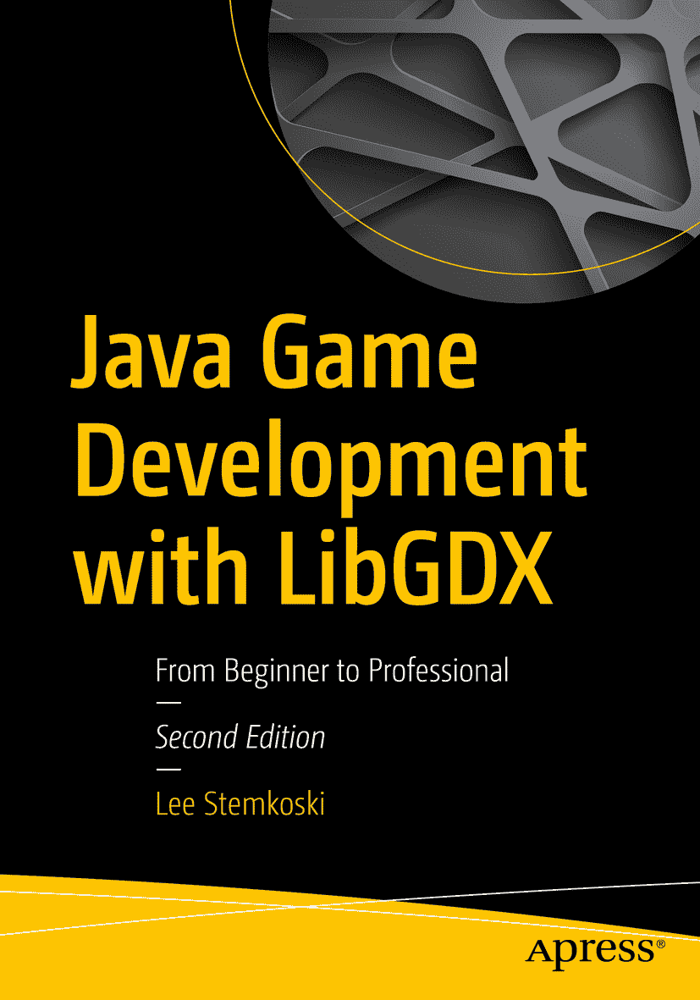

李·斯特姆科斯基（Lee Stemkoski）著《使用 LibGDX 进行 Java 游戏开发：从入门到精通》第二版

本书作者引用的任何源代码或其他补充材料，读者均可通过 GitHub 在本书的产品页面获取，网址为[`www.apress.com/9781484233238`](http://www.apress.com/9781484233238)。如需更详细信息，请访问[`http://www.apress.com/source-code`](http://www.apress.com/source-code)。ISBN 978-1-4842-3323-8 电子书 ISBN 978-1-4842-3324-5 [`doi.org/10.1007/978-1-4842-3324-5`](https://doi.org/10.1007/978-1-4842-3324-5) 美国国会图书馆控制号：2018931188 © 李·斯特姆科斯基 2018 本作品受版权保护。出版商保留所有权利，无论涉及全部或部分材料，具体包括翻译、重印、插图重用、朗诵、广播、以缩微胶卷或任何其他物理方式复制，以及电子改编、计算机软件或目前已知或未来开发的类似或不同方法进行传输或信息存储与检索。本书中可能出现商标名称、标识和图像。我们仅在编辑风格中使用这些名称、标识和图像，以维护商标所有者的利益，并无意侵犯商标权，而非在每次出现商标名称、标识或图像时都使用商标符号。本出版物中对商品名称、商标、服务标志及类似术语的使用，即使未明确标识，也不应被视为对其是否受专有权利保护的表达意见。尽管本书中的建议和信息在出版时被认为是真实准确的，但作者、编辑和出版商均不对可能存在的任何错误或遗漏承担法律责任。出版商对本书所含内容不作任何明示或暗示的保证。本书采用无酸纸印刷。全球图书贸易由 Springer Science+Business Media New York 发行，地址：233 Spring Street, 6th Floor, New York, NY 10013。电话：1-800-SPRINGER，传真：(201) 348-4505，电子邮件：orders-ny@springer-sbm.com，或访问 www.springeronline.com。Apress Media, LLC 是加利福尼亚州的有限责任公司，其唯一成员（所有者）是 Springer Science + Business Media Finance Inc (SSBM Finance Inc)。SSBM Finance Inc 是特拉华州的一家公司。引言

欢迎阅读《使用 LibGDX 进行 Java 游戏开发》！

在本书中，你将学习如何使用 LibGDX 游戏开发框架在 Java 中编写游戏程序。LibGDX 库既强大又易于使用，将使你能够快速高效地创建种类繁多的游戏。LibGDX 是免费且开源的，可用于制作 2D 和 3D 游戏，并能轻松与第三方库集成以支持更多功能。

我教授 Java 编程和视频游戏开发课程多年，常常难以找到可以毫无保留地推荐给学生的游戏编程书籍，这促使我撰写了你现在正在阅读的这本书。特别地，你会发现本书包含以下独特的组合特点，专为有志于成为游戏开发者的你（就是你！）而设计：

*   本书推荐并解释了如何使用一个简单的 Java 开发环境，以便你能更快地投入到游戏编程中。
*   通过使用 LibGDX 框架，你无需为常见的编程任务（如渲染图形和播放音频）而“重新发明轮子”。（从头开始编写此类代码的解释很容易就需要额外五十多页的阅读量。）LibGDX 简化了开发流程，让你能够专注于游戏机制和设计。
*   本书包含许多可使用 LibGDX 开发的视频游戏示例。本书的第一部分将向你介绍该框架提供的基本功能。第二部分将涵盖多种游戏，以展示 LibGDX 的强大功能和灵活性。本书的第三部分将介绍一些高级技术，以便整合到之前和新的游戏项目中。我相信，通过大量示例进行实践是学习过程的基础；你将观察到许多游戏共有的编程模式，看到在实践中编写可重用代码的好处，有机会比较和对比不同项目的代码，并通过自行实现额外功能来积累经验。
*   在本书开头，我假设你仅对 Java 编程有基本的了解。（关于你需要具备哪些背景知识的更多细节，请参阅附录。）在本书的前几章中，高级编程概念将在游戏编程的上下文中自然出现并被需要时，逐步引入和解释。当你读到本书结尾时，你将学到许多高级 Java 编程主题，这些主题对于一般的软件开发也很有用。

感谢你允许我作为你的向导，开启你的游戏程序员之旅。我希望你会发现本书既富有知识性又充满乐趣，并且它能让你有能力并受到启发，去创建你自己的视频游戏，与世界分享。

## 视频游戏项目

如前所述，本书在涵盖的游戏数量与种类上独树一帜。具体而言，你将学习如何在本书中创建以下 12 款视频游戏：

*   **海星收集者**。在这款游戏中，你将引导一只海龟踏上收集海星的旅程。这款简单的游戏用于介绍 LibGDX 的功能以及你将创建的扩展框架，并且在全书介绍新功能（如用户界面、过场动画、音频、瓦片地图和游戏手柄控制）时会频繁回顾。
*   **太空岩石**。这款太空主题的射击游戏灵感来源于经典街机游戏《小行星》，你将控制一艘宇宙飞船，发射激光摧毁在屏幕中飞行的岩石。
*   **失踪的作业**。这是一款完全由故事驱动的视觉小说风格游戏。它向玩家呈现一系列影响故事进程的选择。在这款游戏中，你需要帮助一名学生找到他放错地方的作业，作业就在学校的某个地方。
*   **节奏敲击者**。这是一款基于音乐节奏的游戏，玩家需要按下由下落物体指示的一系列按键，这些物体会与目标重叠；按键序列与背景音乐同步。
*   **飞机躲避者**。这款无限卷轴的横向动作游戏灵感来源于《Flappy Bird》和《Jetpack Joyride》等现代智能手机游戏。在这款游戏中，你控制一架飞机躲避飞过的敌人，同时尝试收集星星以获得尽可能高的分数。
*   **矩形毁灭者**。灵感来源于《打砖块》和《Arkanoid》等街机及早期主机游戏，你移动挡板将球弹向一堵砖墙以摧毁它们，在此过程中获得分数和强化道具。
*   **拼图游戏**。一款拖放游戏，你移动并排列图像的碎片，以重构一幅完整的图片。
*   **52 张牌接龙**。一款拖放式纸牌接龙游戏，你需要整理一堆散乱的扑克牌，并根据点数和花色将它们排列成有序的牌堆。
*   **跳跃杰克**。这是一款横向卷轴平台风格游戏，灵感来源于《大金刚》和《超级马里奥兄弟》等街机及主机游戏。在这款游戏中，你帮助考拉杰克收集硬币和钥匙，踏上通往目标的旅程。
*   **寻宝任务**。这是一款俯视视角的冒险游戏，灵感来源于《塞尔达传说》等经典主机游戏。在这款游戏中，你使用剑和箭击败敌人，收集硬币在道具店使用，并找到通往宝藏的道路。
*   **迷宫奔跑者**。这款基于迷宫的游戏灵感来源于《吃豆人》等街机游戏以及早期主机游戏《Maze Craze》。在这款游戏中，你试图在被一个不断跟随你的幽灵抓住之前，收集随机生成的迷宫中的所有硬币。
*   **海星收集者 3D**。这款游戏是本书开头介绍的《海星收集者》游戏的 3D 重制版，并介绍了 3D 游戏编程概念。

## 与第一版相比的变化

根据读者、学生和教师的反馈，本书的内容和组织结构发生了大量变化。主要变化列举如下：

*   减少了基础示例的数量；特别是，第一版中的《奶酪，拜托》和《气球爆破者》游戏已被移除。
*   `BaseActor`类新增了功能，以简化将类实例收集到列表中的过程。
*   游戏实体现在通常作为`BaseActor`类的扩展编写，以增加封装性并减少`BaseScreen`类所需的代码量。
*   第一版第 4 章（“为游戏增添润色”）的内容在第二版中被拆分到第 5 章和第 6 章，以便更深入地讲解用户界面设计和音频支持。每个主题也都有自己专门的示例游戏项目。
*   关于位图字体生成程序 Hiero 的内容已被位图字体生成类取代，允许开发者通过代码从 TrueType 字体（ttf）文件更快地生成自定义字体。这避免了预先生成位图字体图像的需要，从而简化了开发流程。
*   用于检测《矩形毁灭者》中球弹跳角度的代码已大大简化。
*   与拖放相关的代码和瓦片地图相关的代码已被重构到它们自己的独立类中，以便在其他项目中更容易重用。
*   各个游戏已被重新组织到单独的章节中，并引入了许多新的游戏机制。特别是，第一版第 6 章（“附加游戏案例研究”）在第二版中被拆分到第 4 章、第 7 章、第 8 章和第 9 章。第一版第 7 章（“集成第三方软件”）中的游戏在第二版中被拆分到第 11 章和第 12 章。
*   由于瓦片地图的重要性，相关内容已被移入其专属章节（第 10 章），并用于简化之前的游戏项目（《海星收集者》和《矩形毁灭者》），然后再进入后续章节的更高级游戏。
*   关于物理引擎 Box2D 的内容已被移除，以减少复杂性和不必要的开销，转而使用自定义物理代码。
*   新增了高级主题（第 14 章的迷宫生成和第 15 章的着色器编程）。
*   第一版中的 3D 演示（“海盗巡洋舰”）已被游戏项目《海星收集者 3D》取代。
*   新增了附录，包含游戏设计文档的建议和示例，以及本书中开发的扩展类的完整 JavaDoc 风格列表，作为有用的参考。

致谢

我要感谢 Apress 出版社出色的编辑和支持团队，没有他们的才华和奉献，您正在阅读的这本书将不会存在。特别地，我要感谢 Mark Powers，感谢他不断的支持和鼓励。

我还要感谢技术审阅者 Garry Patchett，感谢他对本书编程和教学法两方面的关注。从一开始，他就凭直觉理解了目标读者是谁，以及他们所需的细节和指导水平。Garry 许多富有洞察力的评论和建议极大地提高了本书的清晰度，我感谢他投入所有时间和精力，帮助使这本书达到最佳状态。

最后，特别感谢我过去和现在的学生们，感谢他们持续且富有感染力的热情。你们对游戏开发的动力和奉献精神是激励我撰写本书的原因。

目录 第一部分：基础概念 第 1 章：Java 与 LibGDX 入门 3 选择开发环境 3 搭建 BlueJ 4 下载与安装 4 使用 BlueJ 5 搭建 LibGDX 8 使用 LibGDX 创建“Hello, World!”程序 9 使用 LibGDX 的优势 14 本章小结 14 第 2 章：LibGDX 框架 15 视频游戏的生命周期 16 游戏项目：海星收集者 19 使用 Actor 与 Stage 管理游戏实体 24 重组游戏流程 32 本章小结与下一步 37 第 3 章：扩展框架 39 动画 41 基于数值的动画 41 基于图像的动画 42 物理与移动 54 速度 54 加速度 56 移动 58 碰撞多边形 60 多边形与矩形 60 检测碰撞 63 模拟固体对象 65 管理 Actor 集合 67 世界边界 72 多屏幕 76 本章小结与下一步 81 第 4 章：射击游戏 83 游戏项目：太空岩石 83 离散输入 84 飞船设置 87 激光、岩石与爆炸 94 终局条件 97 本章小结与下一步 98 第 5 章：文本与用户界面 99 显示文本 101 位图字体 101 标签 104 按钮 106 基于图像的按钮 108 基于文本的按钮 110 使用表格组织布局 114 标志与对话框 116 创建过场动画 121 游戏项目：视觉小说 129 本章小结与下一步 141 第 6 章：音频 143 音效与音乐 143 游戏项目：节奏敲击者 147 处理文件 148 浏览文件 148 录制歌曲数据 151 游戏应用程序 157 同步游戏对象与音频 160 添加交互性并创建用户界面 162 收尾工作 166 本章小结与下一步 169 第二部分：中级示例 第 7 章：横向卷轴游戏 173 游戏项目：飞机躲避者 173 无限滚动 175 玩家飞机与模拟重力 178 收集品与障碍物 180 星星 180 敌机 182 收尾工作 185 本章小结与下一步 187 第 8 章：弹跳与碰撞游戏 189 游戏项目：矩形破坏者 189 创建游戏对象 190 挡板 191 墙壁 192 砖块 193 球 194 四处弹跳 196 用户界面 197 道具 199 音效与音乐 203 本章小结与下一步 205 第 9 章：拖放游戏 207 拖放功能 209 游戏项目：拼图 214 游戏项目：52 张牌拾取 219 本章小结与下一步 225 第 10 章：瓦片地图 227 重访海星收集者游戏 228 创建瓦片地图 229 创建 TilemapActor 类 236 项目集成 240 重访矩形破坏者 241 创建瓦片地图 241 项目集成 244 本章小结与下一步 246 第 11 章：平台游戏 247 游戏项目：跳跃杰克 248 开始关卡 249 平台角色设置 252 游戏世界对象 258 用户界面 260 目标：到达旗帜 261 金币 262 时间与计时器 262 跳板 264 平台 265 钥匙与锁 267 本章小结与下一步 270 第 12 章：冒险游戏 271 游戏项目：寻宝任务 272 关卡设置 273 英雄 276 剑 280 灌木与岩石 283 用户界面 284 敌人 288 箭矢 290 非玩家角色 292 道具商店 295 本章小结与下一步 296 第三部分：高级主题 第 13 章：用户输入的替代来源 299 游戏手柄控制器 299 连续输入 300 离散输入 303 触摸屏控制 305 重新设计窗口布局 306 使用触摸板 308 本章小结与下一步 310 第 14 章：迷宫游戏 311 游戏项目：迷宫奔跑者 311 迷宫生成 312 英雄 322 幽灵 325 游戏的胜负判定 329 音频 332 本章小结与下一步 333 第 15 章：高级 2D 图形 335 粒子系统 335 LibGDX 粒子编辑器 335 火箭推进器效果 338 爆炸效果 339 ParticleActor 类 340 将粒子效果集成到游戏玩法中 342 着色器编程 345 默认着色器 346 在 LibGDX 中使用着色器 348 灰度着色器 349 自定义统一值 349 边框着色器 350 模糊着色器 352 发光着色器 354 波浪扭曲着色器 355 本章小结与下一步 357 第 16 章：3D 图形与游戏入门 359 探索 3D 概念与类 359 创建一个最小 3D 演示 362 重建 Actor/Stage 框架 365 BaseActor3D 类 365 Stage3D 类 369 创建一个交互式 3D 演示 373 游戏项目：海星收集者 3D 380 本章小结与下一步 389 第 17 章：旅程继续 391 持续开发 391 项目实践 391 获取美术资源 392 参加游戏开发大赛 393 克服困难 393 拓宽视野 394 玩不同类型的游戏 394 提升技能组合 395 推荐阅读 395 发布你的游戏 396 打包桌面版 396 编译其他平台版本 397 寻找分发渠道 399 附录 A：游戏设计文档 401 游戏设计文档问题 402 案例研究：太空岩石 405 附录 B：Java 基础回顾 411 数据类型与运算符 411 控制结构 412 条件语句 412 循环语句 414 方法 415 对象与类 416 小结 418 附录 C：扩展框架类参考 419 BaseScreen 类 419 构造函数 419 字段 419 方法 420 BaseActor 类 421 构造函数 421 方法 421 TilemapActor 类 423 构造函数 423 字段 423 方法 424 索引 关于作者与关于技术审校者 关于作者 关于技术审校者

