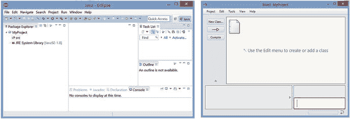
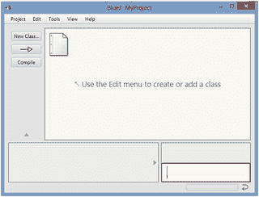
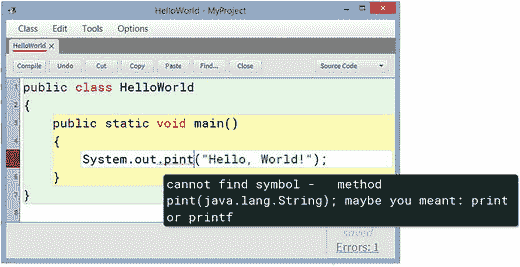
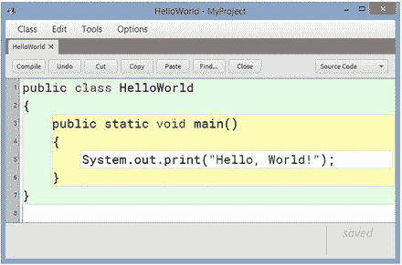
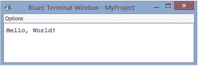
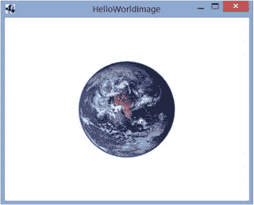

# 1. Java 与 LibGDX 入门

本章将解释如何设置 Java 开发环境，并将其配置为与 LibGDX 游戏开发框架一起运行。你将看到一个简单的“Hello, World!”程序示例，并对其进行足够详细的探索，以理解其不同部分。最后，你将了解使用 LibGDX 库所能获得的一些优势。

## 选择开发环境

在深入 Java 编程之前，你需要设置一个集成开发环境（IDE）——你将用于编写、调试和编译代码的软件。有许多用于编写 Java 程序的编辑器，每个都针对不同的技能水平进行了定制。BlueJ（[`www.bluej.org`](http://www.bluej.org)）和 DrJava（[`www.drjava.org`](http://www.drjava.org)）专为初学者和教育用途设计，常用于学校和大学的编程入门课程。IntelliJ IDEA（[`www.jetbrains.com/idea/`](http://www.jetbrains.com/idea/)）、NetBeans（`netbeans.org`）和 Eclipse（`eclipse.org`）是高级编辑器，受到从业专业人士的青睐。要编译和运行 Java 代码，你需要 Java 开发工具包（JDK），它可以直接从 Oracle 公司获得，或者直接与上面列出的一些编辑器捆绑在一起。

每个编辑器都有优点和缺点。BlueJ 和 DrJava 用户友好，具有简单、极简的用户界面，但缺乏一些高级编辑器的功能，例如字段、方法和导入语句的自动补全。高级编辑器速度更快、功能丰富、更强大、高度可定制，并且拥有各种插件，但它们也有陡峭的学习曲线，并且其用户界面可能对初学者来说更令人生畏。图 1-1 通过并排比较 Eclipse 和 BlueJ 的界面说明了这一点。本章中 BlueJ 软件的截图和描述来自 BlueJ 4.1.0 版本。



图 1-1.

Eclipse（左）和 BlueJ（右）的用户界面

本章将介绍如何设置 BlueJ。我选择这个特定的 IDE，是因为它设置和配置起来快速且简单，这将使你能够更快地开始编写游戏程序。但是，如果你已经熟悉并习惯使用更高级的编辑器之一，当然可以随意使用它而不是 BlueJ。在 LibGDX 维基（[`https://github.com/libgdx/libgdx/wiki`](https://github.com/libgdx/libgdx/wiki)）上有大量关于使用 LibGDX 设置 Eclipse、NetBeans 和 IntelliJ IDEA 的信息资料。如果你选择使用这些程序之一，那么在 IDE 设置完成后，请跳到下一节“为 LibGDX 创建‘Hello, World!’程序”。

## 设置 BlueJ

本节将介绍如何设置 BlueJ IDE。由于它是为初学者设计的，步骤数量很少，过程也很直接，正如你将看到的那样。

### 下载与安装

BlueJ 可以从 [`www.bluej.org`](http://www.bluej.org) 下载。

有多种适用于不同操作系统的下载选项。此外，其中一些下载与 JDK 捆绑在一起，而另一些则没有。JDK 包含用于开发和调试 Java 应用程序的工具；特别是，它对于编译你的代码是必需的。如果你以前使用过你的计算机来开发 Java 应用程序，那么你可能已经安装了 JDK，并且只需选择独立的 BlueJ 安装程序即可。如果你不确定，你应该下载并运行 BlueJ 组合安装程序。


### 使用 BlueJ

在学习一门新的编程语言或库时，编写一个“Hello, World!”应用程序作为第一个程序是计算机科学中一个悠久的传统。本节将介绍使用 BlueJ 编写此程序的基础知识：

1.  启动 BlueJ 软件。（首次运行时，它可能会提示你输入 JDK 存储目录的位置，也可能询问你是否愿意通过提供信息来帮助改进软件。）
2.  当主窗口出现时，在菜单栏中选择“项目”，然后选择“新建项目”。BlueJ 将你的工作组织成项目，这些项目以目录形式存储；所有 Java 源代码和编译后的类文件都存储在项目目录中。
3.  当提示输入项目名称时，导航到你想要存储文件的文件夹，输入 `MyProject`，然后点击“确定”按钮。这会在所选位置创建一个同名文件夹。完成第 3 步后，你的屏幕应类似于图 1-2。



图 1-2.

BlueJ 项目窗口
4.  创建一个新类，可以通过点击“新建类”按钮，或者从菜单栏中选择“编辑”，然后选择“新建类”。
5.  当提示你输入类名时，输入 `HelloWorld` 并按回车键，或点击“确定”按钮。会出现一个橙色矩形，其顶部显示你的类名。灰色的对角线表示代码尚未编译。
6.  双击该矩形，或右键单击并选择“打开编辑器”来编辑文件。你会看到已经添加了一些模板代码。你应该先删除这些代码；最简单的方法是按 Ctrl-A 选中所有代码，然后按 Delete 键。接着，在原来的位置输入以下代码：

```
    public class HelloWorld
    {
    public static void main()
    {
    System.out.print("Hello, World!");
    }
    }
    ```

在 BlueJ 中输入这段代码后，它应该看起来类似于图 1-3 中的截图。暂时不必担心这段代码的作用。如果代码中有任何错误，相应的行号会以红色标记，并且错误的语法会被下划线标出。如果将鼠标指针悬停在错误上，会弹出一个窗口，提供错误的描述，有时还会给出如何修复的建议。图 1-4 展示了如果你在前面的源代码中不小心将 `print` 打成了 `pint` 会发生什么。



图 1-4.

BlueJ 代码编辑器捕获的语法错误



图 1-3.

在 BlueJ 代码编辑器中显示的“Hello, World!”程序
7.  点击“编译”按钮来编译你的代码。（此操作也会自动保存你的代码。）你应该会在窗口底部的状态栏中看到消息“类已编译 – 无语法错误”。
8.  返回 BlueJ 主窗口。右键单击代表该类的橙色矩形（其顶部包含类名 `HelloWorld`），然后从出现的列表中选择方法 `void main()`。这会运行你刚刚编写的方法。会出现一个终端窗口，其中包含文本 Hello, World!，如图 1-5 所示。



图 1-5.

“Hello, World!”程序显示的文本

恭喜你使用 BlueJ 运行了你的第一个程序！

BlueJ 有许多使编程更简单的功能。在输入上述代码时，你可能已经注意到了语法高亮（Java 关键字和字符串以不同颜色显示），以及类和方法周围显示的不同背景色，这使得视觉检查代码更加容易。（稍后，你会注意到条件语句和循环也以类似的背景色区分。）BlueJ 还包含其他你可能觉得有用的功能，例如：

*   **自动代码格式化**。在源代码编辑窗口的“编辑”菜单中选择“自动布局”，将调整代码中的空白，使嵌套语句对齐一致。
*   **列出可用的方法名**。在输入类或对象的名称后，接着输入一个句点，然后按 Ctrl+Space 将显示可用方法名的列表。
*   **用于缩进/取消缩进和注释/取消注释代码块的快捷键**。这些在“编辑”菜单中列出。
*   **用于添加断点的简单界面**，这会激活一个调试器，允许你逐行执行代码并轻松检查对象。

有关这些功能及其他功能的完整信息，请参阅 [`www.bluej.org/doc/bluej-ref-manual.pdf`](http://www.bluej.org/doc/bluej-ref-manual.pdf) 上的 BlueJ 参考手册。此时，你可以关闭代码编辑器窗口和终端窗口。


### 设置 LibGDX

在本节中，你将配置 BlueJ，使其能够使用 LibGDX 软件库。软件库是可供其他程序使用的预编写代码和方法的集合。其价值在于可重用性——当它们实现频繁需要的流程时，能够加速并简化开发过程，使程序员无需在每次编写程序时都“重新发明轮子”。例如，LibGDX 库包含了用于显示图形、播放声音以及获取用户输入的方法。（此外还提供高级功能，本章稍后将进行讨论。）

在 Java 中，库存储在 Java 归档（JAR）文件中。一个 JAR 文件包含许多已编译的 Java 文件（类似于 ZIP 文件），并以 JDK 能够导航的标准目录结构进行存储。你的第一步是获取项目所需的 LibGDX JAR 文件。获取这些文件的最新官方信息位于 [`https://github.com/libgdx/libgdx/wiki/Updating-LibGDX`](https://github.com/libgdx/libgdx/wiki/Updating-LibGDX)，这对初学者来说可能有些令人困惑。另一种更简单的选择是使用本书下载网站 `apress.com` 上包含的这些文件版本。¹ 本书所有项目所需的五个 JAR 文件是 `gdx.jar`、`gdx-sources.jar`、`gdx-natives.jar`、`gdx-backend-lwjgl.jar` 和 `gdx-backend-lwjgl-natives.jar`；它们包含了 LibGDX 库的核心代码。

获取这四个 JAR 文件后，需要配置 BlueJ，使其能够识别并使用这些文件的内容。主要有两种方法：

*   让 BlueJ 识别 JAR 文件的最简单方法是在项目目录中创建一个名为 `+libs` 的目录，将 JAR 文件复制到此目录中，然后重新启动 BlueJ 软件。默认情况下，当在 BlueJ 中打开一个项目时，它会自动扫描是否存在名为 `+libs` 的文件夹，并在编译新代码时将其内容纳入考虑。虽然这是最简单的方法，但你需要为每个新项目重新创建此目录并复制 JAR 文件，这并非最高效的方法。
*   当存在可能用于多个项目的 JAR 文件时，与其为每个项目在 `+libs` 目录中创建这些文件的冗余副本，不如将它们复制到 BlueJ 软件安装文件夹中一个名为 `userlib` 的特殊子目录中。该目录的完整路径应类似于 `C:\Program Files\BlueJ\lib\userlib\`；具体名称可以通过选择菜单选项“工具 ➤ 首选项”（Windows 系统）或“BlueJ ➤ 首选项”（OS X 系统），然后点击“库”选项卡来查看。

完成这些步骤后，需要重新启动 BlueJ，然后你就可以准备编写第一个 LibGDX 程序了。

## 使用 LibGDX 创建“Hello, World!”程序

传统上，“Hello, World!”程序会在屏幕上显示一条文本消息。由于我们的最终目标是创建电子游戏——主要是可视化程序——因此你的第一个 LibGDX 程序将在窗口中绘制一幅世界图片，如图 1-6 所示。



图 1-6.

使用 LibGDX 创建的“Hello, World!”程序

在这里，你将开始看到一些优势，并开始理解在 LibGDX 库提供的类基础上进行构建的含义。我们的第一个项目包含两个类。第一个类名为 `HelloWorldImage`，它通过扩展 LibGDX 中名为 `Game` 的类来利用其功能。

扩展类

软件工程的核心原则之一是设计能够通过创建可重用代码来避免冗余的程序。实现这一目标的一种方法是利用面向对象的继承概念：基于现有类创建新类。

例如，如果我们正在设计一个角色扮演游戏，它可能包含多种可玩角色类型，例如战士、忍者、盗贼和巫师。如果我们设计类来表示每个角色，它们将具有某些共同特征：每个角色都有一个名字、一定数量的生命值（HP），以及一个可能在模拟战斗时使用的名为 `attack` 的方法。

某些特征也可能对每个角色来说是独一无二的；例如，也许巫师还有一定数量的魔法值（MP），以及一个在使用魔法时调用的名为 `castSpell` 的方法。由于这些角色之间的差异，我们无法创建一个能代表所有角色的单一类；同时，在每个单独的类中反复输入相同的字段又显得冗余。针对这种情况，一种优雅的方法是创建一个包含这些角色所有共同特征的基类，然后创建其他类来扩展这个基类。扩展类可以访问基类的所有字段和方法，并且也可以像往常一样包含自己的字段和方法。我们可以用以下代码实现这个场景：

```
public class Person
{
String name;
int HP;
public void attack(Person other)
{
// 在此处插入代码...
}
}
```

然后我们可以按如下方式扩展 `Person` 类：

```
public class Wizard extends Person
{
int MP;
public void castSpell( String spellName )
{
// 在此处插入代码...
}
}
```

接着，如果我们创建这些类的实例：

```
Person percy = new Person();
Wizard merlin = new Wizard();
```

那么，诸如 `merlin.MP += 10` 和 `merlin.castSpell("fireball")` 这样的命令是有效的，涉及基类字段和方法的命令，如 `merlin.HP -= 3` 和 `merlin.attack( percy )`，也同样有效。然而，名为 `percy` 的对象只能使用 `Person` 类的字段和方法；像 `percy.HP += 5` 这样的代码可以编译，但 `percy.castSpell("lightning")` 在编译文件时会导致错误。

扩展类的概念不仅对游戏内实体有用，对类似框架的元素也同样有用。例如，拥有一个包含所有类型菜单通用功能（如打开和关闭菜单）的 `Menu` 类会很有用。然后，可以创建其他类来扩展这个类；例如，可以创建一个名为 `SelectionMenu` 的类，它是一个专门用于显示某种信息并要求玩家从一组选项中进行选择的 `Menu`。而 `InformationMenu` 类可能是一个显示基于文本的信息，并在玩家阅读完毕后直接关闭的菜单。


在 BlueJ 中，名为 MyProject 的项目应仍处于打开状态；如果没有，请打开该项目。在此项目中创建一个新类，命名为 `HelloWorldImage`，并输入以下源代码。请注意，在类本身之前，有一些 import 语句，用于指明你将在本程序中使用的 LibGDX 类（来自你之前设置的 JAR 文件）。另请注意，本程序使用了一个名为 `world.png` 的图像文件；该图像包含在本章的源代码中，位于 `MyProject` 文件夹内（源代码可从 `apress.com` 获取）。你应该将此图像复制到你的 `MyProject` 文件夹中。或者，你也可以使用自己选择的图像；建议本程序使用 256×256 像素的尺寸，如果更换图像，请不要忘记相应修改以下代码中的文件名。

```
import com.badlogic.gdx.Game;
import com.badlogic.gdx.Gdx;
import com.badlogic.gdx.files.FileHandle;
import com.badlogic.gdx.graphics.GL20;
import com.badlogic.gdx.graphics.g2d.SpriteBatch;
import com.badlogic.gdx.graphics.Texture;
public class HelloWorldImage extends Game
{
private Texture texture;
private SpriteBatch batch;
public void create()
{
FileHandle worldFile = Gdx.files.internal("world.png");
texture = new Texture(worldFile);
batch = new SpriteBatch();
}
public void render()
{
Gdx.gl.glClearColor(1, 1, 1, 1);
Gdx.gl.glClear(GL20.GL_COLOR_BUFFER_BIT);
batch.begin();
batch.draw( texture, 192, 112 );
batch.end();
}
}
```

`HelloWorldImage` 类包含两个对象：一个 `Texture` 和一个 `SpriteBatch`。`Texture` 是一个存储图像相关数据的对象：图像的尺寸（宽度和高度）以及每个像素的颜色。`SpriteBatch` 是一个将图像绘制到屏幕上的对象。

`HelloWorldImage` 类还包含两个方法：`create` 和 `render`。

`create` 方法初始化 `Texture` 和 `SpriteBatch` 对象。具体来说，`Texture` 对象需要一个图像文件，它将从中获取图像数据。为此，你需要创建一个 `FileHandle`：这是一个用于访问计算机上存储文件的 LibGDX 对象。`Gdx` 类包含许多有用的静态对象和方法（类似于 Java 的 `Math` 类）；在这里，你使用一个名为 `internal` 的方法来生成一个 `FileHandle` 对象，该对象将被 `Texture` 对象使用。`internal` 方法将在 BlueJ 项目目录中搜索该文件，该目录与编译后的类文件存储位置相同。

`create` 方法执行完毕后，LibGDX 将大约每秒调用 `render` 方法 60 次（因为这是 `Game` 类的默认行为）。² 该方法包含一对静态方法调用：一个用于选择特定的背景颜色（本例中的值对应白色），另一个用于使用该颜色清除窗口。之后，`SpriteBatch` 对象被用于定位纹理并将其绘制到窗口上。

接下来，你将创建第二个类，用于启动程序；它创建 `HelloWorldImage` 类的一个实例并激活其方法。这样的类通常被称为驱动类，并且需要你编写一个静态方法。

静态方法与驱动类

默认情况下，类的方法由该类的实例调用。然而，方法也可以声明为静态的，这意味着它直接从类本身调用（而不是通过实例）。方法是应该基于实例还是基于类（静态）取决于该方法的使用方式及其所需的数据。

基于实例的方法通常依赖于该实例特有的内部数据。例如，每个 `String` 对象都有一个名为 `charAt` 的方法，它接受一个整数作为输入，并返回 `String` 中该位置存储的字符。如果我们按如下方式创建两个 `String` 对象：

```
String player1 = "Lee";
String player2 = "Dan";
```

那么表达式 `player1.charAt(1)` 返回字符 `'e'`，而 `player2.charAt(1)` 返回字符 `'a'`。该方法返回的值取决于该实例中存储的数据，因此 `charAt` 无疑是一个基于实例的方法。

在面向对象的编程语言中，一个类的大部分方法都是基于实例的，因为它们要么依赖于实例变量的值，要么可能改变这些值。当然，也存在静态方法更自然的情况。一般来说，任何不涉及对象内部状态的方法都可以声明为静态的（例如数学公式——Java 的 `Math` 类的所有方法都是静态的）。

驱动类（有时也称为主类、入口点类、启动类或发射器类）是一个其目的是驱动另一个类执行的类，这通常涉及创建该类的实例并调用其一个或多个方法。驱动类通常只需要一个方法来完成此任务；这个方法传统上被称为 `main`。由于它是程序调用的第一个方法，`main` 方法必须声明为静态的，因为当程序启动时，没有可用的实例来运行基于实例的方法。如果 main 方法不是静态的，我们就会遇到类似于哲学难题的问题：先有鸡还是先有蛋？必须有某种东西能够在不被实例化的情况下实例化一个类，而这正是驱动类的静态 `main` 方法所做的事情。

一个标准的“Hello, World!”程序可以使用驱动类重写如下：

```
public class Greeter
{
public void sayHello()
{
System.out.print("Hello!");
}
}
public class Launcher
{
public static void main()
{
Greeter greta = new Greeter();
greta.sayHello();
}
}
```

接下来，在同一个项目中，创建一个名为 `HelloLauncher` 的类，其中包含以下代码：

```
import com.badlogic.gdx.backends.lwjgl.LwjglApplication;
public class HelloLauncher
{
public static void main (String[] args)
{
HelloWorldImage myProgram = new HelloWorldImage();
LwjglApplication launcher = new LwjglApplication( myProgram );
}
}
```

正如前面“静态方法与驱动类”边栏中提到的，该类首先创建了一个 `HelloWorldImage` 类的实例，名为 `myProgram`。然后，`main` 方法不是直接运行 `myProgram` 的方法，而是创建一个 `LwjglApplication` 对象，该对象会设置一个窗口并管理图形和音频、键盘和鼠标输入以及文件访问。`LwjglApplication` 对象将 `myProgram` 作为输入，然后按照之前讨论的方式运行 `myProgram` 的 `create` 和 `render` 方法。

缩写 LWJGL 代表轻量级 Java 游戏库（Lightweight Java Game Library），这是一个最初由 Caspian Rychlik-Prince 创建的开源 Java 库，旨在简化游戏开发中访问台式计算机硬件资源的过程。在 LibGDX 中，LWJGL 被用作桌面后端，以支持所有主要的桌面操作系统，例如 Windows、Linux 和 Mac OS X。

将驱动类与包含游戏功能的类分开的另一个好处是，有可能为其他平台（例如 LibGDX 也支持的 Android）创建驱动类。

当你为两个类都输入完所有代码后，返回 BlueJ 的主窗口并单击“编译”按钮。然后，右键单击 `HelloLauncher` 类的橙色矩形，在出现的方法列表中，选择列出的 `void main(String[] args)` 方法。此时会弹出一个窗口，如果需要，你可以在其中输入一个字符串数组作为输入——但这里不需要。单击“确定”按钮，你应该会看到一个窗口，如图 1-6 所示。

恭喜你完成了第一个使用 LibGDX 的应用程序！

注意


有时，你的程序会包含运行时错误，通常由诸如输入错误的文件名（编译时无法检测到）等问题引起。在这种情况下，修复错误并重新运行程序后，你可能会遇到另一个错误，其中包含消息“No OpenGL context found in the current thread.”。这是由于应用程序之前意外关闭造成的，通常可以通过在 BlueJ 中重置 Java 虚拟机来解决，这可以通过“工具”菜单或快捷键组合（在 Windows 上是 Ctrl-Shift-R）完成。

## 使用 LibGDX 的优势

除了能够编译游戏使其在多个平台上运行之外，使用 LibGDX 游戏开发框架还有许多其他优势。LibGDX 使得完成以下任务变得简单：

*   渲染 2D 图形、动画、基于位图的字体和粒子效果
*   流式播放音乐和播放音效
*   处理来自键盘、鼠标、触摸屏、加速度计或游戏手柄的输入
*   使用场景图和完全可换肤的 UI 控件库组织用户界面
*   集成第三方插件，例如 Box2D 物理引擎（`box2d.org`）、Tiled 地图编辑器文件格式（`mapeditor.org`）和 Spine 2D 动画软件（`esotericsoftware.com`）
*   使用材质和光照效果渲染 3D 图形，并从常见文件格式（如 OBJ 和 FBX）加载 3D 模型

LibGDX 的完整功能列表可在以下网站找到：[`http://libgdx.badlogicgames.com/features.html`](http://libgdx.badlogicgames.com/features.html)。

## 总结

在本章中，你设置了 BlueJ（一个用于 Java 编程的集成开发环境），并配置 BlueJ 以使用 LibGDX 游戏开发框架。然后，你使用 LibGDX 创建了第一个应用程序：一个“Hello, World!”程序，该程序在一个窗口中显示世界图像。这个程序涉及扩展 LibGDX 的 `Game` 类，并创建一个在桌面上运行程序的 `driver` 类。在此过程中，你了解到了该程序中涉及的其他一些类。最后，你了解到了 LibGDX 库的一些其他功能，其中许多将在后续章节中详细讨论。

脚注 1

这些文件的更新版本可以从网站 [`https://libgdx.badlogicgames.com/nightlies/dist/`](https://libgdx.badlogicgames.com/nightlies/dist/) 获取。这些是 LibGDX 库的每日构建版本，包含最新的代码，但它们仍在开发中，因此可能包含一些错误或故障。

  2

由于在此示例中纹理和坐标都没有变化，因此 `render` 方法被重复调用的事实与此无关。但是，如果你定期更改图像，则可以生成动画；如果你逐渐更改坐标，则可以模拟运动。你将在下一章中了解如何实现这两种变化。

