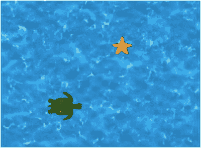
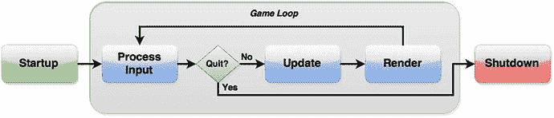
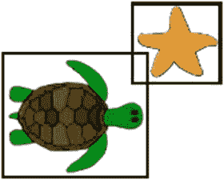

# 2. LibGDX 框架

本章将介绍 LibGDX 库的许多主要功能。它将说明如何在创建名为“海星收集者”的游戏过程中使用它们，在该游戏中，你帮助玩家角色（一只海龟）在海底游动寻找海星。该游戏运行时的截图如图 2-1 所示。首先，你将创建一个基本的、功能性的游戏。在关于面向对象设计原则的激励性讨论之后，你将使用一些 LibGDX 类重写此项目的部分内容，以改进代码的组织结构。后续章节将重新审视此示例，并将其作为引入新的游戏设计原则和 LibGDX 功能的基础。



图 2-1.

游戏“海星收集者”的主屏幕

## 视频游戏的生命周期

在进入游戏开发的编程方面之前，理解游戏程序的整体结构非常重要：游戏程序经历的主要阶段以及游戏程序在每个阶段必须执行的任务。这些阶段如下：

*   **启动**：在此阶段，加载所需的任何文件（例如图像或声音），创建游戏对象，并初始化值。
*   **游戏循环**：在游戏运行时持续重复的阶段，由以下三个子阶段组成：
    *   **处理输入**：程序检查用户是否执行了任何向计算机发送数据的操作：按下键盘按键、移动鼠标或点击鼠标按钮、触摸或滑动触摸屏、或按下游戏手柄上的摇杆或按钮。
    *   **更新**：执行涉及游戏世界状态及其内部实体的任务。这可能包括根据用户输入或物理模拟更改实体的位置、执行碰撞检测以确定两个实体何时相互接触以及响应执行什么操作、或为非玩家角色选择动作。
    *   **渲染**：在屏幕上绘制所有图形，例如背景图像、游戏世界实体和用户界面（通常覆盖在游戏世界之上）。
*   **关闭**：当玩家向计算机提供输入表明他已完成使用软件时（例如，通过点击“退出”按钮），此阶段开始，可能涉及从内存中移除图像或数据、保存玩家数据或游戏状态、指示计算机停止监控硬件设备的用户输入，以及关闭游戏创建的任何窗口。

图 2-2 中的流程图说明了这些阶段发生的顺序。



图 2-2.

游戏程序的阶段

一些游戏开发者可能会在游戏循环中包含额外的阶段，例如：

*   **休眠阶段**：暂停程序执行一段给定的时间。许多游戏开发者旨在编写能够以每秒 60 帧（FPS）运行的程序，这意味着游戏循环每 16.67 毫秒运行一次。¹ 如果游戏循环可以比这运行得更快，则可以指示程序在 16.67 毫秒间隔内剩余的任何时间内暂停，从而为可能在后台运行的任何其他应用程序释放 CPU。LibGDX 会自动为我们处理这个问题，因此我们无需担心在此处包含它。
*   **音频阶段**：在此阶段流式播放背景音乐或播放音效。在本书中，我们将播放音频视为更新阶段的一部分，并将在后续章节中讨论如何实现这一点。

这些阶段中的大多数由 LibGDX 中的相应方法处理。例如，启动阶段由名为 `create` 的方法执行，更新和渲染阶段都由 `render` 方法处理，² 任何关闭操作都由名为 `dispose` 的方法执行。

事实上，当你的驱动类创建任何类型的应用程序（例如 `LwjglApplication`）时，只有当提供给该应用程序的对象包含一组特定的方法（包括 `create`、`render` 和 `dispose`）时，该应用程序才能正常工作；这是一个必要的约定，以便应用程序知道在游戏程序生命周期的每个阶段该做什么。你可以通过使用接口在 Java 程序中强制执行此类要求。

接口


非正式地说，你可以将接口视为一种其他类可以承诺履行的契约。举个简单的例子，假设你编写了一个 `Player` 类，其中包含一个名为 `talkTo` 的方法，用于与环境中的对象进行交互。`talkTo` 方法接收一个名为 `creature` 的输入参数，在后续的代码中，你会看到：

```
creature.speak();
```

为了让 `talkTo` 方法正常工作，无论 `creature` 是哪个类的实例，它都必须有一个名为 `speak` 的方法。也许有时 `creature` 是 `Person` 类的实例，而其他时候 `creature` 是 `Monster` 类的实例。通常，你希望 `talkTo` 方法尽可能包容——任何拥有 `speak` 方法的对象都应被允许作为输入。你可以通过使用接口来指定这种行为。

首先，按如下方式创建一个接口：

```
public interface Speaker
{
public void speak();
}
```

乍一看，接口与类相似，只是方法仅被声明，不包含任何实际代码。所需的一切只是方法的签名：名称、输出类型、输入类型（如果有）以及任何修饰符（如 `public`）。这些信息后面跟着一个分号，而不是我们熟悉的包含代码的花括号。实现该接口的类将为其版本的 `speak` 函数提供代码。需要强调的是，由于 `Speaker` 不是一个类，你不能创建 `Speaker` 对象的实例；相反，你需要编写其他类，这些类包含 `Speaker` 接口中指定的方法。

一个类通过在类名后添加关键字 `implements` 并跟上接口名称，来表示它满足该接口的要求（即包含所有指定的字段和方法）。任何实现 `Speaker` 接口的类都必须为其版本的 `speak` 函数提供代码。下面通过一个名为 `Person` 的类和一个名为 `Monster` 的类来演示：

```
public class Person implements Speaker
{
// 上方其他代码
public void speak()
{   System.out.println( "你好。" );  }
// 下方其他代码
}
public class Monster implements Speaker
{
// 上方其他代码
public void speak()
{  System.out.println("嗷呜！");  }
// 下方其他代码
}
```

永远记住：在实现接口时，你必须为接口中声明的所有内容编写方法；否则，会出现编译时错误。你甚至可以编写一个花括号内不包含任何代码的方法，如下所示（针对一个代表特别沉默的家具的类）。当你只需要使用接口的部分功能时，这会很方便。

```
public class Chair implements Speaker
{
// 上方其他代码
public void speak()  { }
// 下方其他代码
}
```

最后，你编写 `talkTo` 方法，使其接收一个 `Speaker` 作为输入：

```
public class Player
{
// 上方其他代码
public void talkTo(Speaker creature)
{
creature.speak();
}
// 下方其他代码
}
```

任何实现了 `Speaker` 接口的类都可以作为 `Player` 对象的 `talkTo` 方法的输入。例如，我们展示一些代码，这些代码创建了每个类的实例，然后在随附的注释中描述结果：

```
Player dan = new Player();
Person chris = new Person();
Monster grez = new Monster();
Chair footstool = new Chair();
dan.talkTo(chris); // 输出 "你好。"
dan.talkTo(grez); // 输出 "嗷呜！"
dan.talkTo(footstool); // 不输出任何内容
```

在 LibGDX 中，应用程序要求用户创建的类实现 `ApplicationListener` 接口，以便它能处理游戏程序生命周期的所有阶段。然而，你可能还记得，在第 1 章的示例中，`HelloWorldImage` 类并没有实现 `ApplicationListener` 类；它只是继承了 `Game` 类。为什么在编译该类时没有报错呢？如果你深入“引擎盖下”看看（在计算机编程语境中，通常指检查源代码³），你会注意到 `Game` 类本身实现了 `ApplicationListener` 类，并包含了函数的“空”版本；定义每个函数体的花括号之间没有代码。这使你只需编写在继承 `Game` 类的类中需要使用的接口方法变体，这些变体将覆盖 `Game` 类中的版本；任何你没有编写的接口方法将默认使用 `Game` 类中的空版本。（实际上，`ApplicationListener` 接口总共需要六个方法：`create`、`render`、`resize`、`pause`、`resume` 和 `dispose`；在我们的示例中，你只编写了其中两个。）


## 游戏项目：海星收集者

本节将介绍游戏《海星收集者》，该游戏此前已在图 2-1 中展示。在开始编写此游戏的代码之前，精确描述其特性会很有帮助：游戏机制与规则、玩家与软件的交互方式、所需的图形等。这样的描述被称为游戏设计文档，本书附录 A 对此有更详细的说明。由于这是你将使用 LibGDX 创建的第一个游戏，因此只需实现以下最精简的功能集：

*   玩家将控制一只海龟，其目标是收集一颗海星。
*   通过方向键控制移动。上箭头键将海龟移向屏幕顶部，右箭头键将海龟移向屏幕右侧，依此类推。可以同时按下多个方向键，使海龟沿对角线方向移动。移动速度是恒定的。
*   海龟通过接触海星（当它们的图形重叠时）来收集海星。发生这种情况时，海星消失，并出现一条显示“你赢了”的消息。
*   此游戏所需的图形包括海龟、海星、水的图像，以及包含“你赢了”文本的消息。

接下来展示的是实现这些任务的一个代码版本。部分代码和概念与`HelloWorldImage`示例类似，例如`Texture`和`SpriteBatch`类、`create`和`render`方法的作用，以及驱动类的角色。同时也有一些新增内容。由于海龟的坐标可能会变化，你需要使用变量来存储这些值。最重要的是，你引入了一些使程序具有交互性的代码——你将处理来自用户的键盘输入。最后，你将包含一个布尔变量，用于跟踪玩家是否获胜，当海龟到达海星时该变量变为真，并影响“你赢了”消息在屏幕上显示的时间。

在本节以及后续章节中，建议你在 BlueJ 中创建一个新项目（通过从 BlueJ 的项目菜单中选择“关闭”来关闭上一个项目），然后输入所提供的代码；或者，你也可以直接从本书网站下载源代码，并通过附带的 BlueJ 项目文件运行代码。在线源代码还包含你所需的所有图像，这些图像存储在每个项目的`assets`文件夹中，并在以下代码中被引用。

首先，从本书网站下载本章的源代码文件。在 BlueJ 中创建一个名为`Starfish Collector Ch2`的新项目（因为本书后续会创建该项目的多个版本）。在 BlueJ 创建的项目目录中，新建一个名为`assets`的文件夹。将下载项目`assets`文件夹中的图像文件复制到你新项目的`assets`文件夹中；以这种方式将源代码与图像分开存放，有助于保持文件的有序性。接下来，在你的项目目录中，新建一个名为`+libs`的文件夹。将下载项目`+libs`文件夹中的 JAR 文件复制到你新项目的`+libs`文件夹中。重启 BlueJ，以便 BlueJ 能正确识别新添加到`+libs`文件夹中的 JAR 文件。

在你的 BlueJ 项目中，创建一个名为`StarfishCollectorAlpha`的新类。该类的源代码如下所示。其中包含一些新的`import`语句，使你能够创建各种新对象，这些对象将在后续进行说明：

```
import com.badlogic.gdx.ApplicationListener;
import com.badlogic.gdx.Gdx;
import com.badlogic.gdx.Input.Keys;
import com.badlogic.gdx.graphics.GL20;
import com.badlogic.gdx.graphics.Texture;
import com.badlogic.gdx.graphics.g2d.SpriteBatch;
import com.badlogic.gdx.math.Rectangle;
import com.badlogic.gdx.Game;
public class StarfishCollectorAlpha extends Game
{
private SpriteBatch batch;
private Texture turtleTexture;
private float turtleX;
private float turtleY;
private Rectangle turtleRectangle;
private Texture starfishTexture;
private float starfishX;
private float starfishY;
private Rectangle starfishRectangle;
private Texture oceanTexture;
private Texture winMessageTexture;
private boolean win;
public void create()
{
batch = new SpriteBatch();
turtleTexture = new Texture( Gdx.files.internal("assets/turtle-1.png") );
turtleX = 20;
turtleY = 20;
turtleRectangle = new Rectangle( turtleX, turtleY,
turtleTexture.getWidth(), turtleTexture.getHeight() );
starfishTexture = new Texture( Gdx.files.internal("assets/starfish.png") );
starfishX = 380;
starfishY = 380;
starfishRectangle = new Rectangle( starfishX, starfishY,
starfishTexture.getWidth(), starfishTexture.getHeight() );
oceanTexture = new Texture( Gdx.files.internal("assets/water.jpg") );
winMessageTexture = new Texture( Gdx.files.internal("assets/you-win.png") );
win = false;
}
public void render()
{
// 检查用户输入
if (Gdx.input.isKeyPressed(Keys.LEFT))
turtleX--;
if (Gdx.input.isKeyPressed(Keys.RIGHT))
turtleX++;
if (Gdx.input.isKeyPressed(Keys.UP))
turtleY++;
if (Gdx.input.isKeyPressed(Keys.DOWN))
turtleY--;
// 更新海龟矩形位置
turtleRectangle.setPosition(turtleX, turtleY);
// 检查获胜条件：海龟必须与海星重叠
if (turtleRectangle.overlaps(starfishRectangle))
win = true;
// 清除屏幕
Gdx.gl.glClearColor(0,0,0, 1);
Gdx.gl.glClear(GL20.GL_COLOR_BUFFER_BIT);
// 绘制图形
batch.begin();
batch.draw( oceanTexture, 0, 0 );
if (!win)
batch.draw( starfishTexture, starfishX, starfishY );
batch.draw( turtleTexture, turtleX, turtleY );
if (win)
batch.draw( winMessageTexture, 180, 180 );
batch.end();
}
}
```

此时，你可以编译代码；如果出现任何错误消息，请仔细检查你输入的代码是否与上述代码完全一致。你还需要一个启动器类来创建此类的实例并运行它。为此，创建一个名为`LauncherAlpha`的新类，并输入如下代码。请注意，`LwglApplication`构造函数中已包含额外参数，用于设置显示的标题以及窗口的大小（宽度和高度，以像素为单位）。

```
import com.badlogic.gdx.Game;
import com.badlogic.gdx.backends.lwjgl.LwjglApplication;
public class LauncherAlpha
{
public static void main (String[] args)
{
Game myGame = new StarfishCollectorAlpha();
LwjglApplication launcher =
new LwjglApplication( myGame, "Starfish Collector", 800, 600 );
}
}
```

此时，代码可以编译，之后便可在 BlueJ 主窗口中，通过右键单击标有`LauncherAlpha`的橙色矩形，选择`main`方法，然后在出现的窗口中单击“确定”按钮来运行游戏（类似于运行第 1 章“Hello, World!”程序的过程）。

注意

编写代码时，如果出现运行时错误（例如，由于文件名拼写错误导致图像文件加载失败，即使在修复错误并重新运行程序后），BlueJ 可能会报告另一个错误，其中包含诸如“在当前线程中未找到 OpenGL 上下文”之类的消息。这是一个技术性很强的错误，但修复方法很简单：在 BlueJ 主窗口的“工具”菜单中，选择“重置 Java 虚拟机”选项，然后再次尝试运行`main`方法。只要没有其他运行时错误，你的程序就应该能按预期加载。


在 `StarfishCollectorAlpha` 类中，`create` 方法用于初始化变量并加载纹理。该程序包含四张图片，它们以 `Texture` 对象的形式存储：海龟、海星、海洋，以及一张包含“你赢了”字样的图片。为简洁起见，你无需为 `internal` 方法创建的每个 `FileHandle` 对象新建变量，而是在构造每个新的 `Texture` 对象的同一行中直接初始化它们。海龟位置的坐标使用浮点数存储，因为你需要存储小数值，而 LibGDX 游戏开发框架在其类中使用 `float` 而非 `double` 变量，以略微提升程序效率。尽管海星纹理的坐标不会改变，你仍然使用变量来存储它们，以便未来涉及这些值的代码更具可读性。`oceanTexture` 和 `winMessageTexture` 对象不需要变量来存储其坐标，因为它们的位置不会改变，并且其位置将在 `render` 方法中指定（本节稍后讨论）。此外，还创建了与海龟和海星对应的 `Rectangle` 对象；这些对象存储矩形区域的位置和大小，之所以使用它们，是因为 `Rectangle` 类包含一个名为 `overlap` 的方法，可用于检测海龟何时到达海星。布尔变量 `win` 指示玩家是否已赢得游戏，并初始化为 `false`。

`render` 方法包含三个主要代码块，大致对应游戏循环的子阶段：处理输入、更新和渲染。

首先，一系列命令使用属于 `Gdx` 类（的一个对象）的名为 `isKeyPressed` 的方法，该方法用于判断键盘上的某个键当前是否被按下。每个键的名称使用 `Keys` 类中的常量值表示。当按下某个箭头键时，海龟对应的 x 或 y 坐标会相应调整；x 值向右增加，y 值向上增加。⁴ 请注意，如果用户同时按下左箭头键和右箭头键，加法和减法的效果会相互抵消，海龟的位置将不会改变；当用户同时按下上箭头键和下箭头键时，情况类似。另外请注意，这里使用了一系列 `if` 语句，而非 `if`-`else if` 语句，这使得程序能够在同时按下两个键时做出正确响应。

第二组命令执行碰撞检测，判断与 `turtleTexture` 图像对应的矩形区域是否与包含 `starfishTexture` 的矩形区域重叠。海龟的矩形必须更新（使用 `setPosition` 方法），因为海龟的位置可能已改变。如果两个矩形重叠，则布尔变量 `win` 被设置为 `true`，这进而会影响哪些纹理被绘制到屏幕上。在测试此游戏时，你可能会注意到海星似乎在海龟实际到达之前就消失了。这是因为使用了矩形形状来检测重叠；图像的一些透明部分可能发生了重叠，如图 2-3 所示。（这种情况将在下一章中得到解决和改进。）



图 2-3.

透明区域中的重叠矩形

最后，`render` 方法中的第三组命令是实际渲染发生的地方。`glClear` 方法使用 `glClearColor` 方法中指定的颜色（以红/绿/蓝/Alpha 值表示）在屏幕上绘制一个纯色矩形。每次渲染过程都必须以这种方式清除屏幕，即有效地“擦除”屏幕，否则之前渲染调用中的图像可能会可见。`draw` 方法调用的顺序尤为重要：后渲染的纹理将覆盖在先渲染的纹理之上。因此，通常应先绘制背景元素，然后是游戏中的主要实体，最后是用户界面元素。用于绘制的 `Batch` 类通过一次将多个图像发送到计算机的图形处理单元（GPU）来优化图形操作。


## 使用演员与舞台管理游戏实体

在之前的示例中——即《海星收集者》游戏的首个迭代版本——你已看到每个游戏实体（如海龟和海星）都包含大量需要追踪的相关信息，例如纹理和 (x,y) 坐标。在 Java 这类面向对象编程语言中，一个核心设计原则是将相关信息封装在单个类中。虽然你可以创建 `Turtle` 类、`Starfish` 类等来管理这些信息，但这种方法会导致程序中存在大量冗余，既低效又难以管理。由于软件工程的另一个指导原则是编写可复用代码，因此你需要实现一个包含所有游戏实体共有基本信息的单一类，并在必要时对其进行扩展。

LibGDX 库提供了几个可用于管理游戏对象相关数据的类；你将使用 LibGDX 的 `Actor` 类作为基础。该类存储位置、尺寸（宽度和高度）、旋转角度、缩放因子等数据。然而，它并不包含用于存储图像的变量。这种看似“遗漏”的设计实际上赋予了更大的灵活性，让你能够自行指定对象的呈现方式。你可以扩展 `Actor` 类，并包含游戏中所需的任何额外信息，例如碰撞形状、一个或多个图像或动画、自定义渲染方法等。此类对象的构造函数应调用其所扩展类的构造函数；这通过包含 `super()` 语句来实现。例如，一个仅需单个 `Texture` 的游戏对象可使用以下代码：

```
public class TexturedActor extends Actor
{
private Texture image;
// 构造函数
public TexturedActor()
{  super();  }
public void setTexture(Texture t)
{  image = t;  }
public Texture getTexture()
{  return image;  }
public void draw(Batch b)
{
b.draw( getTexture(), getX(), getY() );
}
}
```

举一个更复杂的例子，你的游戏可能包含一个具有生命值的角色，并且你可能希望根据角色剩余生命值使用不同的纹理。此类对象可通过以下代码创建：

```
public class HealthyActor extends Actor
{
private int HP;
private Texture healthyImage;
private Texture damagedImage;
private Texture deceasedImage;
// 省略：构造函数
// 省略：获取/设置前述字段的方法
public void draw(Batch b)
{
if (HP > 50)
b.draw( healthyImage, getX(), getY() );
else if (HP > 0 && HP <= 50)
b.draw( damagedImage, getX(), getY() );
else    // 此情况下 HP <= 0
b.draw( deceasedImage, getX(), getY() );
}
}
```

这里还需要提及默认 `Actor` 类的几个额外特性。首先，除了 `draw` 方法外，`Actor` 类还有一个 `act` 方法，可用于更新或修改 `Actor` 的状态。其次，`Actor` 类被设计为与名为 `Stage` 的类协同使用（你将在不久后用到它）。`Stage` 类的主要作用是存储一个 `Actor` 实例列表；它还包含名为 `act` 和 `draw` 的方法，这些方法会调用已添加到舞台中的每个 `Actor` 的 `act` 和 `draw` 方法，从而免去你自行记住绘制每个 `Actor` 实例的麻烦。`Stage` 类还会创建并管理一个 `Batch` 对象，这减少了你需要编写的代码量。

下一个目标是编写 `Actor` 类的扩展；这需要访问并重写 `Actor` 类中已有的方法。

重写方法与访问超类方法

在 Java 中扩展类时，你可能需要用新版本的方法替换基类中的方法。例如，考虑一个表示人的类，其中包含一个模拟人打招呼的方法：

```
public class Person
{
public void sayHello()
{  System.out.print("你好。");  }
// 其他方法省略
}
```

在你的项目中，你可能希望创建此类的扩展，保留 `sayHello` 方法，但更改打印的消息。为此，你只需编写一个具有相同签名的方法：相同的方法名、参数和输出类型。例如，你可以编写：

```
public class Shopkeeper extends Person
{
public void sayHello()
{  System.out.print("各位旅人，欢迎光临。需要什么补给吗？");  }
}
```

如果你创建了一个 `Shopkeeper` 实例，它将可以访问 `Person` 类中的所有字段和方法（因为 `Shopkeeper` 扩展了 `Person` 类），但如果 `Shopkeeper` 实例调用了 `sayHello` 方法，则 `Shopkeeper` 类中的版本优先，并会被调用。这种技术称为重写方法。

然而，在某些情况下，你希望基于被扩展类（有时称为超类）的代码进行构建（而非替换）。例如，再次假设你有一个表示人的类，它存储一个对应其生命值的值 (HP)，以及一个将其恢复至最大值的方法，如下所示：

```
public class Person
{
int HP;
int maxHP;
public void restore()
{
HP = maxHP;
}
}
```

你可能还有一个表示巫师的类，巫师是一种拥有魔法能力的人，因此有一个对应其可用魔法值 (MP) 的值。自然地，你会扩展 `Person` 类，而对于巫师来说，`restore` 方法应将 HP 和 MP 都设置为其最大值。在这种情况下，你需要 `Wizard` 类重写 `Person` 类的 `restore` 方法，以添加与魔法相关的功能，同时你又希望 `Wizard` 类也能运行 `Person` 类中的 `restore` 方法，以避免重新输入相应代码。实现这一目标的方法是使用关键字 `super`，它指向超类。在 `Wizard` 类的上下文中，表达式 `restore()` 会激活 `Wizard` 类中的方法，而表达式 `super.restore()` 则会按预期激活 `Person` 类中的方法。

利用 `super`，`Wizard` 类可以编写如下：

```
public class Wizard extends Person
{
int MP;
int maxMP;
public void restore()
{
super.restore();
MP = maxMP;
}
}
```

当你编写新类来扩展并构建其他类的功能和方法时，你将有机会反复使用这种技术。

本章将创建的 `Actor` 类的扩展名为 `ActorBeta`。它将用于存储一个 `TextureRegion`（它构建于 `Texture` 类的功能之上）和一个 `Rectangle`（用于检测两个对象之间的重叠）。在同一个 BlueJ 项目中，使用以下代码创建一个名为 `ActorBeta` 的新类：


```
import com.badlogic.gdx.scenes.scene2d.Actor;
import com.badlogic.gdx.graphics.Texture;
import com.badlogic.gdx.graphics.g2d.Batch;
import com.badlogic.gdx.graphics.g2d.TextureRegion;
import com.badlogic.gdx.graphics.Color;
import com.badlogic.gdx.math.Rectangle;
/**
*  扩展 Actor 类以包含图形和碰撞检测功能。
*  Actor 类存储位置和旋转等数据。
*/
public class ActorBeta extends Actor
{
private TextureRegion textureRegion;
private Rectangle rectangle;
public ActorBeta()
{
super();
textureRegion = new TextureRegion();
rectangle = new Rectangle();
}
public void setTexture(Texture t)
{
textureRegion.setRegion(t);
setSize( t.getWidth(), t.getHeight() );
rectangle.setSize( t.getWidth(), t.getHeight() );
}
public Rectangle getRectangle()
{
rectangle.setPosition( getX(), getY() );
return rectangle;
}
public boolean overlaps(ActorBeta other)
{
return this.getRectangle().overlaps( other.getRectangle() );
}
public void act(float dt)
{
super.act(dt);
}
public void draw(Batch batch, float parentAlpha)
{
super.draw( batch, parentAlpha );
Color c = getColor(); // 用于应用色调效果
batch.setColor(c.r, c.g, c.b, c.a);
if ( isVisible() )
batch.draw( textureRegion,
getX(), getY(), getOriginX(), getOriginY(),
getWidth(), getHeight(), getScaleX(), getScaleY(), getRotation() );
}
}
```

以下是关于此代码的一些观察：

*   你使用的是 `TextureRegion` 而非 `Texture` 来存储图像，这将在渲染图像时提供更大的灵活性。这两个类的主要区别在于，`TextureRegion` 可用于存储包含多张图像或动画帧的 `Texture`，并且 `TextureRegion` 还存储了称为 (u,v) 坐标的坐标，用于确定要使用 `Texture` 的哪个矩形子区域。
*   在 `ActorBeta` 类的构造函数中，语句 `super()` 激活了超类（`Actor`）的构造函数，该构造函数初始化了该类使用的数据结构。
*   在 `setTexture` 方法中，还需要（根据纹理的宽度和高度）设置 actor 和矩形的大小，以便 `draw` 和 `overlaps` 方法能正常工作。
*   在 `overlaps` 方法中，关键字 `this` 用于指示调用该方法的对象实例。在此处，使用它是为了清晰起见（以区别于作为方法参数的名为 `other` 的实例）；严格来说并非必须使用 `this`，如果需要可以省略。
*   `act` 和 `draw` 方法都以调用相应的超类方法（`super.act` 和 `super.draw`）开头，这样即使这些方法在此类中被重写，其功能也不会丢失。
*   在 `draw` 方法中，如果已（通过 `setColor` 方法）设置了颜色，则可以在渲染图像时使用该颜色为其着色，并且必须将其传递给负责实际渲染的 `Batch` 对象。（默认颜色为白色，对图像没有影响。）此外，`Batch` 对象在渲染图像时可以利用 `actor` 对象中存储的数据（如位置、旋转和缩放因子），尽管本项目并未使用这些功能中的大部分。
*   有时，你可能希望编写这些类的更专门的扩展。对于本项目，海龟需要比 `ActorBeta` 类提供的更多功能。具体来说，海龟应根据当前按下的箭头键移动。为了遵循良好的面向对象设计实践（特别是封装），`StarfishCollectorAlpha` 类的 `update` 方法中的相应代码将被移动到新的 `Turtle` 类的 `act` 方法中。另外，请注意 `moveBy` 方法（继承自 `Actor` 类）的使用，它按照与之前相同的方式，根据 x 和 y 坐标调整海龟的位置。

接下来，你将在 `ActorBeta` 类功能的基础上进行构建。创建一个名为 `Turtle` 的新类，代码如下：

*   输入此代码后，你可以编译它以检查所有内容是否正确输入。接下来，你将创建海星收集器游戏源代码的新版本。创建一个名为 `StarfishCollectorBeta` 的新类；它将全程使用新的 `ActorBeta` 类。与 alpha 版本的类相比，有一些变化。具体来说：
    *   将创建一个 `Stage` 对象，并将 `Actor` 对象添加到其中。此外，必须调用 `Stage` 的 `act` 和 `draw` 方法（回想一下，在 `Stage` 上调用 `act` 和 `draw` 方法会导致 `Stage` 对象调用已添加到其中的所有 `Actor` 对象的 `act` 和 `draw` 方法）。
*   将 actor 添加到 `Stage` 的顺序很重要，就像在此程序的 alpha 版本中使用 `Batch` 对象时 `draw` 语句的顺序很重要一样。首先添加到 `Stage` 的 `Actor` 对象将首先被绘制，因此会出现在后添加的对象下方。出于这个原因，背景应该首先添加，而用户界面元素（如文本显示）应该最后添加。
*   `winMessage` 的初始可见性设置为 `false`，因为玩家在赢得游戏之前不应该看到该特定图像。
*   `act` 方法需要一个输入：自游戏循环上一次迭代以来经过的时间（以秒为单位）。由于 LibGDX 中的游戏在默认情况下尽可能以每秒 60 帧的速度运行，我们为此值使用了 1/60。（实际上，游戏循环每次迭代所需的时间可能会波动，并且有方法可以获得精确值，但此处不需要。）
*   当海龟与海星重叠时，会在海星上调用 `remove` 方法。这会将海星从之前添加到的 `Stage` 对象中移除。结果，`starfish` 对象的 `act` 和 `draw` 方法此时不再被调用，导致海星图形从屏幕上消失。（但是，即使它不再可见，`starfish` 对象仍保留在计算机内存中。）

```
import com.badlogic.gdx.Gdx;
import com.badlogic.gdx.Input.Keys;
public class Turtle extends ActorBeta
{
public Turtle()
{
super();
}
public void act(float dt)
{
super.act(dt);
if (Gdx.input.isKeyPressed(Keys.LEFT))
this.moveBy(-1,0);
if (Gdx.input.isKeyPressed(Keys.RIGHT))
this.moveBy(1,0);
if (Gdx.input.isKeyPressed(Keys.UP))
this.moveBy(0,1);
if (Gdx.input.isKeyPressed(Keys.DOWN))
this.moveBy(0,-1);
}
}
```

`StarfishCollectorBeta` 类的代码如下：


```
import com.badlogic.gdx.ApplicationListener;
import com.badlogic.gdx.Game;
import com.badlogic.gdx.Gdx;
import com.badlogic.gdx.graphics.GL20;
import com.badlogic.gdx.graphics.Texture;
import com.badlogic.gdx.math.Rectangle;
import com.badlogic.gdx.scenes.scene2d.Stage;
public class StarfishCollectorBeta extends Game
{
private Turtle turtle;
private ActorBeta starfish;
private ActorBeta ocean;
private ActorBeta winMessage;
private Stage mainStage;
private boolean win;
public void create()
{
mainStage = new Stage();
ocean = new ActorBeta();
ocean.setTexture( new Texture( Gdx.files.internal("assets/water.jpg") )  );
mainStage.addActor(ocean);
starfish = new ActorBeta();
starfish.setTexture( new Texture(Gdx.files.internal("assets/starfish.png")) );
starfish.setPosition( 380,380 );
mainStage.addActor( starfish );
turtle = new Turtle();
turtle.setTexture( new Texture(Gdx.files.internal("assets/turtle-1.png")) );
turtle.setPosition( 20,20 );
mainStage.addActor( turtle );
winMessage = new ActorBeta();
winMessage.setTexture( new Texture(Gdx.files.internal("assets/you-win.png")) );
winMessage.setPosition( 180,180 );
winMessage.setVisible( false );
mainStage.addActor( winMessage );
win = false;
}
public void render()
{
// 检查用户输入
mainStage.act(1/60f);
// 检查胜利条件：海龟必须与海星重叠
if (turtle.overlaps(starfish))
{
starfish.remove();
winMessage.setVisible(true);
}
// 清屏
Gdx.gl.glClearColor(0,0,0, 1);
Gdx.gl.glClear(GL20.GL_COLOR_BUFFER_BIT);
// 绘制图形
mainStage.draw();
}
}
```

这些改动使代码更易于理解，并且未来更容易添加其他元素。此时，你应该编译已编写的代码，以验证其没有错误。为了运行这个游戏，创建一个名为 `LauncherBeta` 的新启动器类，代码如下：

```
import com.badlogic.gdx.Game;
import com.badlogic.gdx.backends.lwjgl.LwjglApplication;
public class LauncherBeta
{
public static void main (String[] args)
{
Game myGame = new StarfishCollectorBeta();
LwjglApplication launcher =
new LwjglApplication( myGame, "Starfish Collector", 800, 600 );
}
}
```

在本章的剩余部分，你将按照编程设计原则重新组织这段代码。

## 重新组织游戏流程

一项重要的编程设计实践是：每个方法应只对应一个任务。如果单个方法处理了多个任务，则应将其拆分为多个方法。在本章的第一节讨论视频游戏生命周期时，你了解到在 LibGDX 中，`render` 方法是游戏运行时被反复调用的方法，因此所有与游戏循环相关的代码都包含在该方法中。然而，游戏循环包含多个任务：处理输入、更新游戏世界的状态（例如确定两个对象重叠时会发生什么），以及将图形绘制到屏幕上。如果可能，这些任务应被分离到不同的方法中。使用 `Actor` 类的 `act` 方法来处理影响每个角色的输入，是朝着正确方向迈出的一步。

下一步是将用于更新和用于渲染的代码分离到不同的方法中。同时，你还可以通过将常用代码包含在一个基类中（必要时可继承该基类），来简化未来的开发项目，就像之前对 `Actor` 派生类所做的那样。具体来说，所有未来的游戏项目都需要声明并初始化一个 `Stage` 对象，并运行其 `act` 和 `draw` 方法。你可以使用 `getDeltaTime` 方法来确定自游戏循环上一次迭代以来经过的时间（通常为 1/60 秒，如前所述，但可能因所用计算机和程序复杂度而波动）。此外，在游戏循环的每次迭代中，你通常会在重新绘制图形之前清屏。⁵

为了实现这些任务，创建一个名为 `GameBeta` 的新类，如下所示。不过，本章稍后会对该类进行一些修改，原因将在后续解释。

```
import com.badlogic.gdx.Game;
import com.badlogic.gdx.Gdx;
import com.badlogic.gdx.graphics.GL20;
import com.badlogic.gdx.scenes.scene2d.Stage;
public class GameBeta extends Game
{
protected Stage mainStage;
public void create()
{
mainStage = new Stage();
initialize();
}
public void initialize() {  }
public void render()
{
float dt = Gdx.graphics.getDeltaTime();
// act 方法
mainStage.act(dt);
// 由用户定义
update(dt);
// 清屏
Gdx.gl.glClearColor(0,0,0,1);
Gdx.gl.glClear(GL20.GL_COLOR_BUFFER_BIT);
// 绘制图形
mainStage.draw();
}
public void update(float dt) {  }
}
```

有了这段代码后，`StarfishCollectorBeta` 类可以改为继承 `GameBeta` 类。在 `StarfishCollectorBeta` 类中，`create` 和 `render` 方法将改为 `initialize` 和 `update`（覆盖 `GameBeta` 类中的对应方法），并且 `StarfishCollectorBeta` 类中的冗余代码行（即那些也出现在 `GameBeta` 类中的代码）将被移除。

然而，在继续之前，还有一个最终主题需要讨论，以使这段代码更加健壮。在实践中，任何以此类为基础的程序都应被要求提供自己的 `initialize` 和 `update` 方法实现。这让人联想到接口的概念（本章前面讨论过），但接口在这种情况下并不适用，因为接口只能声明所需的方法，而不包含任何实际代码。而在这种情况下，有一些代码是值得复用的。你需要的是一个结合了接口和可继承标准类元素的结构。Java 恰好提供了这种情况所需的工具：抽象类。

抽象类


在编程中，你常常会希望通过将重复的功能重构到基类中，然后用专门的子类扩展该类，来减少冗余代码。在某些情况下，你还会知道所有扩展类都需要实现某个特定方法——但它们会以不同的方式实现，因此代码无法提前在基类中编写，尽管该方法需要在基类中声明。

例如，考虑一个奇幻风格的角色扮演游戏。假设玩家角色的基类名为 `Person`。这个类很可能包含所有 `Person` 对象都应具备的一些标准字段和方法，例如一个名为 `name` 的 `String` 类型字段，用于存储角色名称，以及用于访问该信息的 get 和 set 方法。你可能想创建两个类，`Wizard` 和 `Warrior`，它们都扩展了 `Person` 类。假设该游戏的用户界面对所有类型的角色都是一致的，并且包含一个剑按钮（激活名为 `useSword` 的方法）和一个法术按钮（激活名为 `useSpell` 的方法）。

尽管 `Person` 类会声明这些方法，但它们的实现在 `Wizard` 和 `Warrior` 类中会大相径庭。传统上，战士使用剑，而巫师不使用；巫师施放魔法，而战士不施放。还可以想象其他类型的角色，既能用剑也能施法，或者两者都不能。无论如何，如果玩家点击了对应角色无法执行的动作按钮，屏幕上应显示一条消息解释这一点；否则，该动作应正常执行。

在这种情况下，你会希望要求 `Person` 类的扩展类提供自定义代码来实现 `useSword` 和 `useSpell` 方法，就像接口所做的那样；然而，`Person` 不能是一个接口，因为它为某些方法提供了代码，例如获取和设置 `name` 字段。在接口中，方法只被声明，而不被编写。

解决这种情况的方法是创建一个抽象类。你使用额外的关键字 `abstract` 将类声明为抽象类（类似于使用关键字 `interface` 声明接口的方式），这表示某些方法可能只声明而不提供代码，并且扩展该类的其他类必须为这些方法提供代码。任何此类方法也使用修饰符 `abstract` 进行声明，如下面的示例代码所示。请注意，由于该类的代码并未全部提供，因此你无法创建该类的实例（同样，类似于接口）。

```
public abstract class Person
{
private String name;
public void setName(String n)  { name = n; }
public String getName()  { return name; }
public abstract void useSword();
public abstract void useSpell();
}
```

任何扩展 `Person` 的类都必须为每个先前声明为抽象的方法提供实现。例如：

```
public class Wizard extends Person
{
public void useSword()
{
System.out.print("巫师无法挥舞剑...");
}
public void useSpell()
{
// 在此处插入选择法术及其目标的代码
}
}
public class Warrior extends Person
{
public void useSword()
{
// 在此处插入攻击敌人的代码
}
public void useSpell()
{
System.out.print("战士无法使用魔法...");
}
}
```

通过这种方式，抽象类结合了标准类和接口的优点。

使用抽象类将要求任何扩展 `GameBeta` 的类提供初始化及更新游戏世界的方法实现。这也有助于开发者避免潜在错误，例如拼错他们应该重写的方法名称。

需要对之前展示的 `GameBeta` 类进行的更改如下。特别注意，`initialize` 和 `update` 方法的方法体已被移除，并且在声明这些方法的行末尾添加了分号。

```
// import 语句保持不变
public abstract class GameBeta extends Game
{
protected Stage mainStage;
// create 方法保持不变
public abstract void initialize();
// render 方法保持不变
public abstract void update(float dt);
}
```

以 `GameBeta` 类作为基类，`StarfishCollectorBeta` 类可以大大简化，如前所述。对该类的更改在下面的注释代码中进行了解释。请注意，当你更改一个类中的代码时，其他依赖它的类会显示错误，直到更改完成。

```
// import 语句保持不变
// 此类现在扩展 GameBeta 而非 Game
public class StarfishCollectorBeta extends GameBeta
{
// 移除了 mainStage 的声明
private Turtle turtle;
private ActorBeta starfish;
private ActorBeta ocean;
private ActorBeta winMessage;
private boolean win;
// create 方法重命名为 initialize
public void initialize()
{
// 移除了 mainStage 的初始化
// 方法的其余部分保持不变
}
// render 方法重命名为 update；需要 float 类型参数 dt
public void update(float dt)
{
// 移除了 render 方法的大部分代码
// 检查获胜条件：海龟必须与海星重叠
if (turtle.overlaps(starfish))
{
starfish.remove();
winMessage.setVisible(true);
}
}
}
```

如你所见，这个类现在专注于游戏本身（游戏对象及其相互交互），而不是框架问题（例如设置和使用舞台）。你现在可以像之前一样，通过运行相应启动器类中的 `main` 方法来游玩该游戏。

恭喜你在 LibGDX 中创建了你的第一个游戏！


## 总结与后续步骤

本章介绍了 LibGDX 库的许多特性。你首先了解了游戏程序的生命周期概览，并学习了生命周期各阶段如何通过遵循特定命名约定的方法（由接口强制执行）来执行。你学习了如何使用 `Gdx` 类处理键盘输入，以及如何使用 `Actor` 类封装游戏实体数据。你学习了如何使用 `Stage` 类管理 `Actor` 实例，以及如何扩展 `Actor` 类以获得更强大的功能。你还学习了如何通过扩展 `Game` 类来重组游戏流程并简化未来的游戏开发项目。

为了练习本章所学的技能，你可以尝试在游戏中添加另一个对象：一只海龟必须避开的鲨鱼；如果海龟与鲨鱼重叠，则应将海龟从舞台上移除，并在屏幕上显示“Game Over”消息。此添加项所需的图形资源已提供在本项目的 `assets` 文件夹中。

在下一章中，你将创建一个更精致的 Starfish Collector 游戏版本，该版本由 `Actor` 类的一个新扩展（将取代 `ActorBeta`）驱动，支持动画、基于物理的运动、改进的碰撞检测以及使用列表管理多个 Actor 实例的能力。

脚注 1

通常无需以高于此速度运行，因为大多数计算机显示硬件无法以高于此速率显示图像。

  2

本章稍后部分将演示如何更直观地组织代码，以便更新和渲染阶段由单独的方法处理。

  3

LibGDX 的源代码目前托管在 GitHub 上，地址为 [`https://github.com/libgdx/libgdx`](https://github.com/libgdx/libgdx) 。

  4

选择让 y 值向上增加的设计，虽然符合数学惯例，但与大多数计算机科学坐标系惯例相反，后者将原点 (0,0) 置于窗口左上角，使得 y 值向下增加。

  5

从技术上讲，如果你的程序包含覆盖整个屏幕区域的背景图形，则此步骤并非必需。

