# 3. 扩展框架

在上一章中，你了解了 LibGDX 中可用的一些基本特性和类，并创建了一个名为 Starfish Collector 的游戏。你还通过将支持常用功能的代码收集到一个名为 `ActorBeta`（它扩展了 LibGDX 的 `Actor` 类）的类中，实践了良好的软件开发习惯。然而，Starfish Collector 游戏仍然“略显粗糙”；上一章版本的一些不足之处包括：

*   缺乏动画。
*   移动不平滑：速度要么为零，要么为恒定值。
*   碰撞检测不精确。
*   没有障碍物或阻挡物。
*   只有一个可收集的对象。
*   游戏世界仅限于窗口大小，海龟可以移动到窗口边缘之外。
*   程序运行时，游戏立即开始。

为了解决这些不足，你将在本章中实现以下改进：

*   将添加动画：海龟在移动时会呈现游泳姿态（并且会面向移动方向），海星会缓慢旋转（以吸引玩家注意），当海龟收集到海星时会出现类似水花飞溅的特殊效果。
*   将通过添加加速度和减速度来实现逼真的运动。
*   将通过用更精确的多边形形状替换矩形来提高碰撞检测的精度。
*   将添加固体障碍物（岩石）。
*   将创建多个对象实例。
*   游戏世界将扩大到超出窗口大小。
*   游戏开始前将显示一个开始菜单屏幕。

添加了这些改进后的 Starfish Collector 游戏截图如图 3-1 所示。

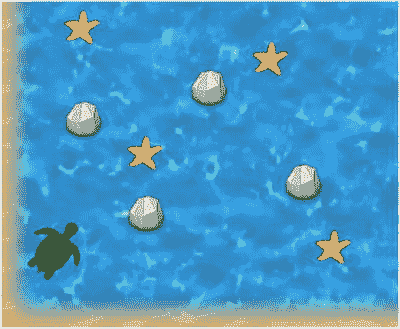

图 3-1.

改进后的 Starfish Collector 游戏

还有其他明显的标准功能缺失，将在后续章节中添加，例如文本和用户界面（第 5 章）以及音乐和音效（第 6 章）。此外，当本书后面介绍高级功能（例如使用瓦片地图编辑器设计关卡和集成游戏手柄控制器支持）时，将首先在 Starfish Collector 游戏的背景下进行演示。

为了整合所有这些更改，你将创建一个名为 `BaseActor` 的新类，它将取代上一章中的 `ActorBeta` 类。`BaseActor` 类将足够健壮且功能丰富，可用于本书剩余部分的所有游戏项目，以及你自己的游戏项目。在本章中，你将逐步重建和改进 Starfish Collector 游戏，并全程使用新的 `BaseActor` 类。

注意

你将在本章中创建的 `BaseActor` 类将包含许多方法和功能，但并非所有游戏对象都需要所有这些功能。例如，并非所有游戏对象都有动画，并非所有游戏对象都会移动，等等。通常，面向对象的设计原则会建议将这些功能拆分到单独的类中。但是，为了简化类依赖关系并减少本书未来项目所需的类总数，我们决定将所有与 Actor 相关的功能包含在一个单独的类中。

首先，从本书网站下载本章的源代码文件。在 BlueJ 中创建一个名为 `Starfish Collector Ch3` 的新项目（以区别于上一章的版本）。在 BlueJ 创建的项目目录中，创建一个名为 `assets` 的新文件夹。将下载项目 `assets` 文件夹中的所有图像文件复制到你新项目的 `assets` 文件夹中。接下来（如果你之前没有将 LibGDX JAR 文件添加到 BlueJ 的 `userlib` 文件夹中），在你的项目目录中，创建一个名为 `+libs` 的新文件夹。将下载项目 `+libs` 文件夹中的 JAR 文件复制到你新项目的 `+libs` 文件夹中。重新启动 BlueJ，以便 BlueJ 正确识别新添加到 `+libs` 文件夹中的 JAR 文件。

在你的 BlueJ 项目中，创建一个名为 `BaseActor` 的新类。第一步是编写 `constructor` 方法。由于你需要设置 Actor 的位置并将其添加到舞台，你可以通过 `constructor` 方法提供这些数据，并使用以下代码自动执行这些操作：

```
import com.badlogic.gdx.scenes.scene2d.Actor;
import com.badlogic.gdx.scenes.scene2d.Stage;
/**
* 扩展 LibGDX Actor 类的功能。
*/
public class BaseActor extends Actor
{
public BaseActor(float x, float y, Stage s)
{
// 调用 Actor 类的构造函数
super();
// 执行额外的初始化任务
setPosition(x,y);
s.addActor(this);
}
}
```

在接下来的章节中，你将添加对动画、基于物理的运动、改进的碰撞检测与处理以及处理特定对象类型集合的方法的支持。


## 动画

你将在 `BaseActor` 类中实现的第一个改动是动画支持：通过改变正在显示的图像来营造运动或变化的外观。本节将讨论两种类型的动画：基于数值的动画，它使用单张图像并持续改变相关数值（如位置或旋转角度）；以及基于图像的动画，它快速连续显示一系列图像。

### 基于数值的动画

许多视觉效果可以通过持续改变与游戏实体相关的数值来实现，例如：

*   通过改变位置坐标值可以创建移动效果。
*   通过改变旋转值可以创建旋转效果。
*   通过改变缩放因子可以创建放大或缩小效果。
*   通过改变红/绿/蓝（RGB）颜色分量值可以创建颜色循环效果。
*   通过改变透明度（alpha）值可以创建淡入/淡出效果。

通过使用 LibGDX 的 `Action` 类，可以轻松地将这些效果添加到你的游戏中。`Action` 是一个可以添加到 `Actor` 的对象，用于随时间自动改变各种字段（位置、旋转、缩放、颜色）的值。处理动作的代码包含在 `Actor` 类的 `act` 方法中（这就是为什么在上一章编写 `BaseActor` 类的 `act` 方法时需要调用 `super.act(dt)`——以确保这段代码被执行）。要创建一个 `Action`，最简单的方法是使用 `Actions` 类中可用的静态方法。该类提供了数十种方法，这里仅讨论其中一部分。

例如，一个名为 `spin` 的 `Action`，可以在两秒内将演员旋转 180 度，可以通过以下代码创建并附加到一个名为 `starfish` 的 `Actor` 上：

```
Action spin = Actions.rotateBy( 180, 2 );
starfish.addAction( spin );
```

类似地，一个名为 `shift` 的 `Action`，可以在 1 秒内将演员水平移动 50 像素（向右）、垂直移动 0 像素，可以通过以下代码创建：

```
Action shift = Actions.moveBy( 50, 0, 1 );
```

你还可以通过组合 `Action` 对象来创建复杂的复合视觉效果。如果你向一个 `Actor` 添加多个动作，它们将同时运行（通常称为并行）。例如，如果你将 `spin` 和 `shift` 这两个动作都添加到一个 `Actor` 上，那么在第一个秒内，该 `Actor` 将旋转 90 度并向右移动 50 像素；在下一秒内，它将再旋转 90 度（但不再向右移动，因为该动作此时已经完成）。或者，你可能希望一组动作一个接一个地运行（通常称为顺序执行）。你可以使用 `Actions` 类的 `after` 方法创建一个动作，该动作仅在所有先前添加的动作完成后才运行。以下示例演示了这一点，其中 `starfish` 演员将先旋转两秒，然后在第三秒内移动：

```
starfish.addAction( spin );
starfish.addAction( Actions.after( shift ) );
```

最后，你可能希望一个动作重复特定次数或无限重复。这些行为分别通过使用 `Actions` 类的 `repeat` 和 `forever` 方法实现，如下所示：

```
Action spinTwice = Actions.repeat( spin, 2 );
Action spinForever = Actions.forever( spin );
```

这只是可用方法的一个示例；有关预定义动作类型的完整列表，请参阅 LibGDX `Actions` 类的文档。方便的是，此功能内置于 `Actor` 类中，并且由于 `BaseActor` 类继承自 `Actor` 类，因此无需对 `BaseActor` 类进行任何添加即可使用 `Action` 对象。

### 基于图像的动画

如前所述，基于图像的动画是由快速连续显示的图像序列创建的，以产生运动的错觉。在 LibGDX 中，这可以通过使用 `Animation` 类来实现。创建动画需要三个信息：

*   要显示的图像数组（`Array`）
*   每张图像应显示的时间长度
*   一个指示帧应如何播放的值——按给定顺序、逆序、从头到尾再从头（乒乓顺序）——以及是否重复（循环）播放动画

动画可以基于存储图像数据的不同类来创建，例如 `Texture` 和 `TextureRegion`。为了获得最大的灵活性，`Animation` 类是泛型设计的，因此当你声明一个 `Animation` 对象时，你也可以声明它将存储的数据类型。

泛型类型和类

数据结构是计算机编程中的一个基本概念，因为它们允许你高效地组织和利用数据。最基本且广为人知的数据结构类型之一是数组，它允许你存储特定类型的固定数量的值。在 Java 编程语言中，你通过先输入要存储的数据类型，后跟一组方括号来表示数组；字符串数组用 `String[]` 表示，而浮点小数数组用 `float[]` 表示。通常，给定 Java 中的任何类，你都可以创建一个元素为该类型的数组。这使得数组成为一种非常灵活且适应性强的数据结构。

有时，你会设计自己的类来存储特定类型的数据。例如，存储一个人的名和姓需要两个字符串，可以使用以下类来存储：

```
public class StringPair
{
private String first;
private String second;
// 构造函数
StringPair(String a, String b)
{
first = a;
second = b;
}
// getter/setter 方法
public void setFirst(String s)  { first = s; }
public String getFirst()  { return first; }
public void setSecond(String s) { second = s; }
public String getSecond()  { return second; }
// 标准方法
public String toString()
{
return "[" + first + "," + second + "]";
}
}
```

类似地，要存储一个点的 x 和 y 坐标，你可以使用以下类：

```
public class FloatPair
{
private float first;
private float second;
// 构造函数
FloatPair(float a, float b)
{
first = a;
second = b;
}
// getter/setter 方法
public void setFirst(float x)  { first = x; }
public float getFirst()  { return first; }
public void setSecond(float x) { second = x; }
public float getSecond()  { return second; }
// 标准方法
public String toString()
{
return "[" + first + "," + second + "]";
}
}
```

比较每个类的代码，你会发现它们几乎相同；唯一实质性的区别是存储的数据类型。在软件开发中，减少冗余代码量是非常可取的。理想情况下，应该有一种方法可以编写一个类，在创建对象时指定结构（例如存储的数据量以及用于访问或修改它的方法）和要存储的数据类型，就像数组一样。事实上，Java 确实具有这样的能力。这是通过泛型编程实现的。

在泛型编程中，你可以像往常一样编写一个类，但在声明字段或方法参数时，不指定具体类型，而是使用一个类型变量，传统上用单个大写字母（如 `T` 或 `K`）表示。为了在类中指示类型变量的存在，类名后面必须跟有尖括号（`<` 和 `>`）。例如，一个保留 `StringPair` 和 `FloatPair` 类结构的泛型类可以编写如下：


```java
public class Pair
{
private T first;
private T second;
// 构造方法
Pair(T a, T b)
{
first = a;
second = b;
}
// getter/setter 方法
public void setFirst(T s)  { first = s; }
public T getFirst()  { return first; }
public void setSecond(T s) { second = s; }
public T getSecond()  { return second; }
// 标准方法
public String toString()
{
return "[" + first + "," + second + "]";
}
}
```

然后，要创建一个可用于存储字符串的 `Pair` 实例，你可以这样写：

```
Pair personName = new Pair("Kondas", "Kismet");
```

类似地，你可以创建一个 `Pair` 来存储浮点数：

```
Pair coordinates = new Pair( 42.9001f, 337.14f );
```

请注意，在最后一个示例中，必须使用类名 `Float`（大写 `F`），而不是 `float`，因为 `float` 指的是原始数据类型，而 `Float` 指的是对应的类。同样，要存储一对整数值，必须使用 `Pair<Integer>`，而不是 `Pair<int>`。

`Animation` 类接受一个泛型类型参数，用于指定存储图像数据的类。你将使用 `TextureRegion` 类，因为它在渲染图像时提供了最多的选项。

为了支持本节中将编写的与动画相关的方法，请将以下 `import` 语句添加到 `BaseActor` 类中：

```
import com.badlogic.gdx.Gdx;
import com.badlogic.gdx.utils.Array;
import com.badlogic.gdx.graphics.Color;
import com.badlogic.gdx.graphics.Texture;
import com.badlogic.gdx.graphics.Texture.TextureFilter;
import com.badlogic.gdx.graphics.g2d.TextureRegion;
import com.badlogic.gdx.graphics.g2d.Animation;
import com.badlogic.gdx.graphics.g2d.Animation.PlayMode;
import com.badlogic.gdx.graphics.g2d.Batch;
```

为了存储动画及相关数据，请在 `BaseActor` 类的开头添加以下字段：

```
private Animation animation;
private float elapsedTime;
private boolean animationPaused;
```

为了初始化这些变量，请在 `constructor` 方法的末尾添加以下代码：

```
animation = null;
elapsedTime = 0;
animationPaused = false;
```

接下来，你将设置一些方法来为这些变量赋值。第一个方法用于设置动画。一旦设置了动画，就可以设置 Actor 的大小（宽度和高度）以及原点（actor 旋转的中心点，通常是 actor 的中心）。actor 的宽度和高度将被设置为动画第一张图像的宽度和高度（动画的图像也称为关键帧）。这通过以下方法实现：

```
public void setAnimation(Animation anim)
{
animation = anim;
TextureRegion tr = animation.getKeyFrame(0);
float w = tr.getRegionWidth();
float h = tr.getRegionHeight();
setSize( w, h );
setOrigin( w/2, h/2 );
}
```

更改 `animationPaused` 的值通过以下方法实现：

```
public void setAnimationPaused(boolean pause)
{
animationPaused = pause;
}
```

变量 `elapsedTime` 用于跟踪动画已播放的时间，从而确定应显示哪一帧图像，该变量无需直接设置。相反，这个值应该自动更新；正确的更新位置是 `Actor` 类的 `act` 方法，该方法由 actor 所属的舞台自动调用。只要游戏当前未暂停（由 `animationPaused` 指示），经过的时间就需要增加自上次游戏循环迭代以来经过的时间量（由 `dt` 表示）。

```
public void act(float dt)
{
super.act( dt );
if (!animationPaused)
elapsedTime += dt;
}
```

你还需要重写 `Actor` 类的 `draw` 方法。具体来说，你将确定要绘制的动画的正确图像（再次使用 `getKeyFrame` 方法和 `elapsedTime` 变量），并考虑 `Actor` 类中存储的各种属性（包括位置、大小、缩放、旋转和原点）来绘制它。你还可以通过设置 actor 存储的颜色来为图像着色（默认颜色为白色；使用白色着色对图像外观没有影响）。

```
public void draw(Batch batch, float parentAlpha)
{
super.draw( batch, parentAlpha );
// 应用颜色着色效果
Color c = getColor();
batch.setColor(c.r, c.g, c.b, c.a);
if ( animation != null && isVisible() )
batch.draw( animation.getKeyFrame(elapsedTime),
getX(), getY(), getOriginX(), getOriginY(),
getWidth(), getHeight(), getScaleX(), getScaleY(), getRotation() );
}
```

下一个任务是编写加载图像数据并使用它创建 `Animation` 对象的代码。动画图像有两种存储方式。它们可以存储为多个文件（每个文件一个动画帧）；海星收集者游戏中的海龟就是这种情况，其图像位于 `turtle-1.png` 到 `turtle-6.png` 文件中，如图 3-2 所示。

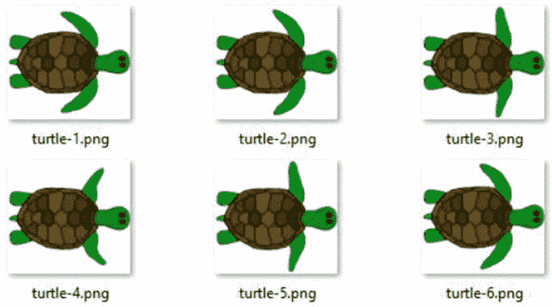

图 3-2.

用于海龟动画的六个图像文件

或者，图像可以合并到单个图像中——排列成矩形网格——并存储为单个文件，称为精灵表。海龟收集海星时显示的漩涡效果就是这种情况，如图 3-3 所示，其中包含一个包含十个子图像的单个图像文件，这些子图像排列成网格（两行五列）。

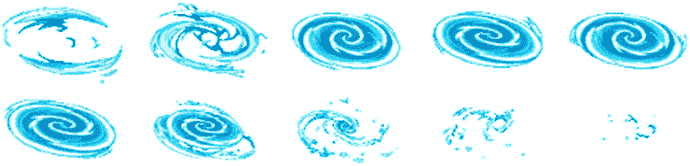

图 3-3.

包含漩涡动画帧的单个图像文件

为了处理这两种可能性，将有两种从图像文件创建动画的代码变体。此外，由于代码具有高度可重用性，它将作为 `BaseActor` 类中的一对方法编写。

回想一下，`Animation` 对象所需的数据包括图像数组、每帧显示的持续时间以及指示帧应如何播放的值。如果图像存储在单独的文件中，你将使用字符串数组指定文件名；如果图像存储在精灵表中，你将指定文件名以及网格中的行数和列数。为简单起见，你将假设动画帧要么从头到尾播放一次（由常量值 `PlayMode.NORMAL` 指示），要么无限循环重复（由 `PlayMode.LOOP` 指示）；这可以通过一个布尔变量来指定，该变量指示动画是否循环。

接下来提供了一个从单独图像文件创建动画的方法。请注意，如果尚未设置动画（由 `animation` 的值为 `null` 指示），此方法也会设置 actor 的动画。此方法还会返回创建的动画，以防 actor 需要多个动画（在这种情况下，应创建 `BaseActor` 类的扩展，并将额外的动画存储在额外的变量中）。

```
public Animation loadAnimationFromFiles(String[] fileNames,
float frameDuration, boolean loop)
{
int fileCount = fileNames.length;
Array textureArray = new Array();
for (int n = 0; n  anim = new Animation(frameDuration, textureArray);
if (loop)
anim.setPlayMode(Animation.PlayMode.LOOP);
else
anim.setPlayMode(Animation.PlayMode.NORMAL);
if (animation == null)
setAnimation(anim);
return anim;
}
```


接下来是一种从精灵表中创建动画的类似方法。方便的是，`TextureRegion` 类有一个名为 `split` 的方法，可用于将图像分割成子图像集合。使用此方法需要知道每个子图像的大小，以下代码根据原始图像的大小以及精灵表中行和列的数量来计算该大小。

```
public Animation loadAnimationFromSheet(String fileName, int rows, int cols,
float frameDuration, boolean loop)
{
Texture texture = new Texture(Gdx.files.internal(fileName), true);
texture.setFilter(TextureFilter.Linear, TextureFilter.Linear);
int frameWidth = texture.getWidth() / cols;
int frameHeight = texture.getHeight() / rows;
TextureRegion[][] temp = TextureRegion.split(texture, frameWidth, frameHeight);
Array textureArray = new Array();
for (int r = 0; r  anim = new Animation(frameDuration, textureArray);
if (loop)
anim.setPlayMode(Animation.PlayMode.LOOP);
else
anim.setPlayMode(Animation.PlayMode.NORMAL);
if (animation == null)
setAnimation(anim);
return anim ;
}
```

某些游戏对象可能由单个图像表示，不需要动画。但为了保持一致性，你可以使用单帧动画来显示静态图像；在这种情况下，帧持续时间和播放样式无关紧要。为方便起见，以下方法将用于这种情况。

```
public Animation loadTexture(String fileName)
{
String[] fileNames = new String[1];
fileNames[0] = fileName;
return loadAnimationFromFiles(fileNames, 1, true);
}
```

此时你应包含的另一个方法将用于检查动画是否结束，如果动画未循环且经过的时间大于显示动画中所有图像所需的时间（帧数乘以每帧的显示时间），则返回 true。这是使用 `Animation` 类的方法 `isAnimationFinished` 计算的；你的方法只需在变量 `animation` 上调用此方法，并自动提供值 `elapsedTime`。

```
public boolean isAnimationFinished()
{
return animation.isAnimationFinished(elapsedTime);
}
```

至此，你已经准备好重新创建《海星收集者》游戏的一部分。首先，你将创建一些扩展 `BaseActor` 类的类：`Turtle`、`Starfish` 和 `Whirlpool`。这些类至少需要一个构造函数，该构造函数会将初始位置和舞台的数据传递给 `BaseActor` 类的构造函数。在扩展类中，你还可以在 `constructor` 方法中设置所使用的纹理或动画。

首先是 `Turtle` 类的代码，它使用来自多个文件的图像实现动画：

```
import com.badlogic.gdx.scenes.scene2d.Stage;
public class Turtle extends BaseActor
{
public Turtle(float x, float y, Stage s)
{
super(x,y,s);
String[] filenames =
{"assets/turtle-1.png", "assets/turtle-2.png", "assets/turtle-3.png",
"assets/turtle-4.png", "assets/turtle-5.png", "assets/turtle-6.png"};
loadAnimationFromFiles(filenames, 0.1f, true );
}
}
```

接下来是 `Whirlpool` 类的代码，它使用基于精灵表的动画。由于此效果应在动画结束时消失，因此应包含一个 `act` 方法，该方法检查动画是否播放完毕，如果是，则调用 `remove` 方法将其从舞台（以及游戏中）移除。

```
import com.badlogic.gdx.scenes.scene2d.Stage;
public class Whirlpool extends BaseActor
{
public Whirlpool(float x, float y, Stage s)
{
super(x,y,s);
loadAnimationFromSheet("assets/whirlpool.png", 2, 5, 0.1f, false);
}
public void act(float dt)
{
super.act(dt);
if ( isAnimationFinished() )
remove();
}
}
```

接下来是 `Starfish` 类的代码。显示此对象仅使用单个图像，因此你将使用之前创建的便捷方法 `loadTexture`。你还会使用 `Action` 类添加一个基于值的动画（每**一**秒缓慢旋转 30 度），以吸引玩家注意此对象。

```
import com.badlogic.gdx.scenes.scene2d.Stage;
import com.badlogic.gdx.scenes.scene2d.Action;
import com.badlogic.gdx.scenes.scene2d.actions.Actions;
public class Starfish extends BaseActor
{
public Starfish(float x, float y, Stage s)
{
super(x,y,s);
loadTexture("assets/starfish.png");
Action spin = Actions.rotateBy(30, 1);
this.addAction( Actions.forever(spin) );
}
}
```

现在游戏实体的类已经创建完毕，你可以将注意力转向游戏本身。此时，游戏将仅显示对象及其动画；交互性将在下一节中添加。

首先，通过创建一个新类并从上一个项目复制代码，将上一章的 `GameBeta` 类添加到此项目中；你需要的代码如下：

```
import com.badlogic.gdx.Game;
import com.badlogic.gdx.Gdx;
import com.badlogic.gdx.graphics.GL20;
import com.badlogic.gdx.scenes.scene2d.Stage;
public abstract class GameBeta extends Game
{
protected Stage mainStage;
public void create()
{
mainStage = new Stage();
initialize();
}
public abstract void initialize();
public void render()
{
float dt = Gdx.graphics.getDeltaTime();
mainStage.act(dt);
update(dt);
Gdx.gl.glClearColor(0,0,0,1);
Gdx.gl.glClear(GL20.GL_COLOR_BUFFER_BIT);
mainStage.draw();
}
public abstract void update (float dt);
}
```

接下来，你将用一个名为 `StarfishCollector` 的新类扩展此类，该类包含以下代码。此类将与上一章中的版本不同。特别注意，背景海洋图像简单地实现为一个 `BaseActor` 对象，并且图像和大小在其初始化后设置。

```
public class StarfishCollector extends GameBeta
{
private Turtle turtle;
private Starfish starfish;
private BaseActor ocean;
public void initialize()
{
ocean = new BaseActor(0,0, mainStage);
ocean.loadTexture( "assets/water.jpg" );
ocean.setSize(800,600);
starfish = new Starfish(380,380, mainStage);
turtle = new Turtle(20,20, mainStage);
}
public void update(float dt)
{
// 代码将在稍后添加
}
}
```

最后，你需要编写一个 `Launcher` 类来运行游戏；它应与上一章的版本相同，如下所示：

```
import com.badlogic.gdx.Game;
import com.badlogic.gdx.backends.lwjgl.LwjglApplication;
public class Launcher
{
public static void main (String[] args)
{
Game myGame = new StarfishCollector();
LwjglApplication launcher =
new LwjglApplication( myGame, "Starfish Collector", 800, 600 );
}
}
```

此时，BlueJ 主窗口应包含七个橙色矩形，它们对应于你编写的七个类。将有箭头连接各个类，表示依赖关系：带虚线的箭头表示一个类正在创建另一个类的实例，而带实线的箭头表示一个类扩展了另一个类。如果你愿意，可以单击并拖动这些矩形，以便更清楚地查看依赖关系。图 3-4 展示了其中一种排列方式。你可能会注意到，`StarfishCollector` 类和 `Whirlpool` 类之间没有连线；这是因为尚未创建 `Whirlpool` 对象的实例（这将在本章后面添加）。

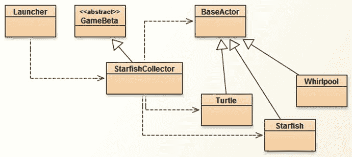

图 3-4.

《海星收集者》游戏中间版本中各类之间的关系


此时，你可以通过右键单击标记为 `Launcher` 的矩形，在出现的弹出菜单中选择 `void main(String[] args)` 方法，然后点击随后出现的窗口中的“确定”按钮来测试你的游戏。游戏将如图 3-5 所示；海龟看起来像是在游泳，而海星则在缓慢旋转。你还无法移动海龟；这一功能将在下一节中添加。


图 3-5.

海星收集者游戏

## 物理与运动

本章开头提出的问题之一是，在上一章的《海星收集者》版本中，移动并不“平滑”：海龟的速度会瞬间从 0 变为每秒 60 像素。在现实中，速度是随时间变化的；物体会加速和减速。在本节中，你将学习一些物理学中的技术术语和概念，以及如何在 `BaseActor` 类中实现它们，这将使你能够为游戏添加移动功能。虽然你无需掌握底层数学概念也能创建本书中的游戏，但书中仍会提供详细解释，以便你理解所编写的代码。

### 速度

物体的速度表示其位置随时间变化的快慢，包括移动的速率和方向。正如位置使用两个值¹——x 和 y 坐标——来指定一样，速度也有两个分量，分别表示每个坐标的变化情况。如果位置的度量单位是像素，时间的单位是秒，那么速度的度量单位就是像素每秒，通常写作 pixels/second。在数学中，速度通常使用向量符号表示：分量 a 和 b 的向量用尖括号写作 < a , b >。相比之下，坐标为 x 和 y 的位置通常用圆括号写作 ( x , y )。向量在视觉上用箭头表示；向量 < a , b > 的绘制方式是从起点开始，终点位于水平方向 a 个单位、垂直方向 b 个单位处，如图 3-6 所示。速率可以视为该向量的长度（也称为模），图中用 S 表示。向量的方向由向量与水平向右（沿 x 轴正方向）的向量之间的夹角量化，图中用 A 表示。给定 a 和 b 的值，可以使用数学方法（分别利用勾股定理和三角函数）计算长度和方向角，但得益于 LibGDX 的 `Vector2` 类提供的方法（分别使用 `len` 和 `angle` 方法），你无需自行编写这些公式。

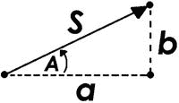

图 3-6.

向量 < a , b > 的可视化表示，长度为 S，方向角为 A

涉及位置和速度的计算相对简单。例如，如果一个物体的初始位置为 ( 7 , 5 )，速度为 < 2 , 3 >，那么：

*   经过一秒后，位置变为 ( 7 + 2 , 5 + 3 ) = ( 9 , 8 )。
*   经过两秒后，位置变为 ( 9 + 2 , 8 + 3 ) = ( 11 , 11 )。
*   经过三秒后，位置变为 ( 11 + 2, 11 + 3 ) = ( 13 , 14 )。

一般来说，如果初始位置为 ( x , y )，速度为 < a , b >，那么经过 t 秒后，位置的公式为 ( x + t*a , y + t*b )。该公式同样适用于 t 为分数的情况。

为了将速度数据整合到 `BaseActor` 类中，请添加以下 `import` 语句：

```
import com.badlogic.gdx.math.Vector2;
import com.badlogic.gdx.math.MathUtils;
```

然后，在类中添加以下字段：

```
private Vector2 velocityVec ;
```

通过在 `constructor` 方法中添加以下语句来初始化该变量：

```
velocityVec = new Vector2(0,0);
```

接下来，你将添加方法来设置和获取 `Actor` 对象的移动速率和角度。需要考虑的一个微妙问题是，当速度向量为 < 0 , 0 >（对应速率为 0 且移动角度未定义）时，应如何设置速率或角度。在这种情况下，设置速率会使移动角度变为零度（沿 x 轴正方向），而设置角度则不会产生任何效果（因为如果物体速率为 0，那么谈论其朝任何方向移动都没有意义）。这些方法的代码如下：

```
public void setSpeed(float speed)
{
// 如果长度为零，则假定移动角度为零度
if (velocityVec.len() == 0)
velocityVec.set(speed, 0);
else
velocityVec.setLength(speed);
}
public float getSpeed()
{
return velocityVec.len();
}
public void setMotionAngle(float angle)
{
velocityVec.setAngle(angle);
}
public float getMotionAngle()
{
return velocityVec.angle();
}
```

`getMotionAngle` 方法特别方便，可用于使物体面向其移动方向，这可以通过在 `Actor` 的 `act` 方法中添加代码 `setRotation( getMotionAngle() )` 来实现。在某些游戏中，你可能需要知道 `Actor` 是否在移动（或静止）；为此，请在 `BaseActor` 类中同时包含以下方法：

```
public boolean isMoving()
{
return (getSpeed() > 0);
}
```


### 加速度

在扎实掌握了速度的概念与术语之后，接下来我们转向加速度。正如速度表示位置的变化，加速度则表示速度的变化。在后续内容中，牢记这一类比将大有裨益：加速度之于速度，正如速度之于位置。

若速度的单位是像素/秒，那么由于加速度衡量的是速度随时间的变化量，其单位即为像素/秒每秒，也可写作(像素/秒)/秒，或像素/秒²。加速度同样采用向量符号表示。基于加速度调整速度的计算，在代数上与基于速度调整位置的计算完全相同。具体而言，若物体的初始速度为 < a , b >，且存在恒定加速度 < c , d >，则经过 t 秒后，该时刻的速度公式为 < a + t*c , b + t*d >。这些随时间更新的速度值将依次用于更新物体的位置。

在 `BaseActor` 类中，为方便起见，您将通过设置加速度大小（通过名为 `setAcceleration` 的方法），然后沿指定方向加速（通过名为 `accelerateAtAngle` 的方法，该方法以方向角为参数）来处理加速度向量。为实现此功能，请添加以下字段：

```
private Vector2 accelerationVec;
private float acceleration ;
```

在 `constructor` 方法中使用以下语句初始化这些变量：

```
accelerationVec = new Vector2(0,0);
acceleration = 0;
```

接下来，按前述说明添加以下方法：

```
public void setAcceleration(float acc)
{
acceleration = acc;
}
public void accelerateAtAngle(float angle)
{
accelerationVec.add( new Vector2(acceleration, 0).setAngle(angle) );
}
```

为方便后续项目，现在正是添加以下方法的好时机，该方法可使物体沿其当前朝向方向加速：

```
public void accelerateForward()
{
accelerateAtAngle( getRotation() );
}
```

最后，还有一些细微的行为需要讨论和实现。当按住方向键时，玩家控制的角色通常应朝该方向加速。然而，大多数物体无法无限加速或提速——它们的移动速度存在上限，即最大速度，该值因物体而异。此外，当松开方向键时，移动的角色通常会减速并最终停止。物体减速的速率（即减速度）可能因情境而异。例如，汽车在沥青路面上比在冰面上减速更快。但有些物体似乎完全不会减速，例如子弹或激光束；它们的减速度为零。这些数值（最大速度和减速度）需要存储起来，并在后续步骤中加以考虑。为此，请在 `BaseActor` 类中添加以下字段：

```
private float maxSpeed ;
private float deceleration;
```

在 `constructor` 中按如下方式初始化：

```
maxSpeed = 1000;
deceleration = 0;
```

同时添加以下用于设置这些值的方法：

```
public void setMaxSpeed(float ms)
{
maxSpeed = ms;
}
public void setDeceleration(float dec)
{
deceleration = dec;
}
```

### 移动

有了这些变量（`velocityVec`、`accelerationVec`、`acceleration`、`maxSpeed` 和 `deceleration`）及其配套方法，您就可以编写执行本节所述计算并相应更新 `Actor` 对象位置的方法了。该方法将命名为 `applyPhysics`，并需要将自上次更新以来经过的时间量作为参数。该方法将处理以下任务：

*   根据加速度向量调整速度向量。
*   如果物体未加速，则必须对当前速度应用减速度值。
*   确保速度不超过最大速度值。
*   根据速度向量调整 `Actor` 对象的位置。
*   重置加速度向量。

该方法的代码如下：

```
public void applyPhysics(float dt)
{
// 应用加速度
velocityVec.add( accelerationVec.x * dt, accelerationVec.y * dt );
float speed = getSpeed();
// 未加速时降低速度（减速）
if (accelerationVec.len() == 0)
speed -= deceleration * dt;
// 将速度保持在设定范围内
speed = MathUtils.clamp(speed, 0, maxSpeed);
// 更新速度
setSpeed(speed);
// 应用速度
moveBy( velocityVec.x * dt, velocityVec.y * dt );
// 重置加速度
accelerationVec.set(0,0);
}
```

现在，将这些方法添加到 `BaseActor` 类后，您就可以在“海星收集者”游戏中实现移动了。唯一需要修改的是 `Turtle` 类，因为海龟是唯一会移动的对象。首先，在 `Turtle` 类中添加以下 `import` 语句：

```
import com.badlogic.gdx.Gdx;
import com.badlogic.gdx.Input.Keys;
```

然后，您需要通过向 `constructor` 方法添加以下代码来初始化一些物理相关参数：

```
setAcceleration(400);
setMaxSpeed(100);
setDeceleration(400);
```

从这段代码可以清楚地看出，海龟的最大速度将为 100 像素/秒。加速度值 400 意味着速度每秒会增加 400 像素/秒，但由于最大速度为 100 像素/秒，海龟将在 100/400 = 0.25 秒内达到此速度（从静止开始）。

最后，您将添加 `act` 方法，该方法将检查方向键是否被按下，如果是，则使海龟朝相应方向加速。要实际更新海龟的位置，必须调用 `applyPhysics` 方法。此外，您还将在海龟未移动时暂停动画（并在海龟移动时恢复动画），以及旋转海龟图像使其与运动角度对齐。以下代码实现了这些任务：

```
public void act(float dt)
{
super.act( dt );
if (Gdx.input.isKeyPressed(Keys.LEFT))
accelerateAtAngle(180);
if (Gdx.input.isKeyPressed(Keys.RIGHT))
accelerateAtAngle(0);
if (Gdx.input.isKeyPressed(Keys.UP))
accelerateAtAngle(90);
if (Gdx.input.isKeyPressed(Keys.DOWN))
accelerateAtAngle(270);
applyPhysics(dt);
setAnimationPaused( !isMoving() );
if ( getSpeed() > 0 )
setRotation( getMotionAngle() );
}
```

现在是一个很好的时机来测试代码，验证海龟是否按预期在屏幕上移动。如果您愿意，可以尝试调整加速度、减速度和最大速度的值，观察它们在游戏中的效果。

目前，当海龟与海星重叠时，不会发生任何事情。这将在下一节中解决，届时将引入碰撞多边形，使您能够判断两个对象何时重叠。

## 碰撞多边形

在上一章创建的“海星收集者”版本中，海龟与海星之间的碰撞对玩家来说并不精确。这是因为使用矩形来近似物体的形状，而每个图像角落附近都包含大片透明像素区域。为了改进游戏的这一方面，在本节中，您将添加使用多边形而非矩形来近似非矩形形状边界的选项。您还将学习如何使用 `Intersector` 类检测多边形形状的碰撞，以及如何在游戏中模拟实体对象。


### 多边形与矩形

`Polygon`（多边形）是一种数据结构，通过其顶点（角）的坐标来定义形状；它使用一个`float`值数组进行初始化，该数组依次定义各个顶点的坐标。（相比之下，`Rectangle`类除了宽度和高度外，只需要一个顶点——左下角。）例如，如果一个多边形的顶点为 (x0,y0), (x1,y1), ... , (xN,yN)，那么对应的`Polygon`对象将使用数组`{x0, y0, x1, y1, ... , xN, yN}`进行初始化。例如，要创建一个与矩形形状相同的多边形，该矩形左下角顶点为 (0,0)，宽度为 w，高度为 h（如图 3-7 所示），其顶点（按逆时针顺序）为 (0,0)、(w,0)、(w,h) 和 (0,h)，则应使用数组`{0, 0, w, 0, w, h, 0, h}`。

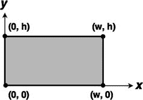

图 3-7.

宽度为 w、高度为 h 的矩形的顶点

实际上，矩形多边形将被用作所有游戏对象的默认形状（第二种选项将在后面讨论）。使用`Polygon`类而非`Rectangle`类的一个重要原因是，`Polygon`对象还可以旋转，这对于也会旋转的游戏实体（例如《海星收集者》中的乌龟）非常有用。

首先，在`BaseActor`类中添加以下`import`语句：

```
import com.badlogic.gdx.math.Polygon;
```

在类中添加以下字段变量：

```
private Polygon boundaryPolygon;
```

接下来，添加以下方法，该方法按上述方式创建一个矩形多边形：

```
public void setBoundaryRectangle()
{
float w = getWidth();
float h = getHeight();
float[] vertices = {0,0, w,0, w,h, 0,h};
boundaryPolygon = new Polygon(vertices);
}
```

调用此方法的最佳时机是在设置宽度和高度之后，以便自动将此形状设为默认形状，这通常发生在`setAnimation`方法中。在该方法的末尾，添加以下代码：

```
if (boundaryPolygon == null)
setBoundaryRectangle();
```

下一个（也是最复杂的）任务是编写一个方法，用于初始化一个比矩形“更圆”的多边形形状（以避免仅包含透明像素的角部重叠问题）。为此，你将创建一个多边形，近似于图 3-8 所示矩形区域内包含的椭圆形状²。此方法涉及一些数学方程来计算顶点坐标。三角函数正弦和余弦可用于参数化圆或椭圆，这意味着你可以根据另一个变量 t 来编写 x 和 y 坐标的函数。例如，如果我们设 x = cos(t) 且 y = sin(t)，那么当变量 t 的取值范围从 0 到 2 × pi（约 6.28）³时，对应的 (x,y) 点将描绘出半径为 1 的圆的形状。你可以调整这些方程来生成一个恰好适合给定矩形区域的椭圆，如图 3-8 所示。首先，必须将 x 乘以 w/2，y 乘以 h/2，以使椭圆具有正确的大小。然而，这样得到的椭圆以原点为中心，而你需要椭圆以 (w/2, h/2) 为中心；因此，将这些值分别加到 x 和 y 方程中。方程的最终形式如下：

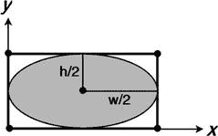

图 3-8.

包含在矩形内的椭圆

```
x = w/2 * cos(t) + w/2
y = h/2 * sin(t) + h/2
```

`setBoundaryPolygon`方法包含一个循环，用于在区间 [0, 6.28] 内生成一组 n 个等间距的 t 值，然后计算对应的 x 和 y 坐标，并将它们存储在一个数组中，该数组将用于初始化多边形。如果 n = 4，多边形将是菱形；如果 n = 8，多边形将是八边形，依此类推。n 的值越大，形状就越平滑。然而，这需要权衡：通用多边形的碰撞检测计算量很大；n 值过大会显著降低程序运行速度。对于本书中创建的游戏，n = 8 的值应该足够精确。图 3-9 展示了一个椭圆及其 n = 8 的多边形近似。

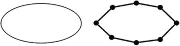

图 3-9.

一个椭圆及其八边形近似

`setBoundaryPolygon`的代码如下所示。请务必记住，在设置`Actor`对象的大小（无论是通过`setSize`方法手动设置，还是通过`setAnimation`方法自动设置）之前，不要调用此方法，因为此方法需要设置宽度和高度值才能正常工作。

```
public void setBoundaryPolygon(int numSides)
{
float w = getWidth();
float h = getHeight();
float[] vertices = new float[2*numSides];
for (int i = 0; i < numSides; i++)
{
float angle = i * 6.28f / numSides;
// x 坐标
vertices[2*i] = w/2 * MathUtils.cos(angle) + w/2;
// y 坐标
vertices[2*i+1] = h/2 * MathUtils.sin(angle) + h/2;
}
boundaryPolygon = new Polygon(vertices);
}
```

接下来是一个名为`getBoundaryPolygon`的方法，它返回此`Actor`的碰撞多边形，并根据`Actor`对象的当前参数（例如位置和旋转）进行调整。

```
public Polygon getBoundaryPolygon()
{
boundaryPolygon.setPosition( getX(), getY() );
boundaryPolygon.setOrigin( getOriginX(), getOriginY() );
boundaryPolygon.setRotation ( getRotation() );
boundaryPolygon.setScale( getScaleX(), getScaleY() );
return boundaryPolygon;
}
```


### 检测碰撞

现在你已为 `BaseActor` 类定义了碰撞多边形，但还需要检测两个多边形何时重叠。与拥有自身 `overlaps` 方法的 `Rectangle` 类不同，`Polygon` 类并没有该方法。幸运的是，LibGDX 提供的另一个名为 `Intersector` 的工具类拥有这样的方法。你将利用这一点为 `BaseActor` 类创建一个 `overlaps` 方法。首先，你需要通过以下语句导入前述类：

```
import com.badlogic.gdx.math.Intersector;
```

接下来，将以下方法添加到 `BaseActor` 类中：

```
public boolean overlaps(BaseActor other)
{
Polygon poly1 = this.getBoundaryPolygon();
Polygon poly2 = other.getBoundaryPolygon();
// 初步测试以提高性能
if ( !poly1.getBoundingRectangle().overlaps(poly2.getBoundingRectangle()) )
return false;
return Intersector.overlapConvexPolygons( poly1, poly2 );
}
```

检查两个多边形是否重叠需要大量计算。因此，为了提高性能，该方法包含一个初步检查，用于判断包围多边形的矩形是否相交（这是一个简单得多的计算）。如果这些更大的矩形不相交，那么多边形就不可能相交，因此该方法可以立即返回 `false`。否则，多边形有可能相交，此时该方法将返回更精确测试的结果，该结果由 `Intersector` 类的静态方法 `overlapConvexPolygons` 执行。

有了这个方法，你就可以为海星收集者游戏添加交互性了。在 `Turtle` 和 `Starfish` 类的 `constructor` 方法中，添加以下代码行（在图像加载之后），以便每个对象使用八边形碰撞多边形来提高精度：

```
setBoundaryPolygon(8);
```

接下来，当海龟与海星重叠时，应发生以下事件：

*   海星应淡出，然后从舞台上移除。
*   应创建一个以海星为中心的漩涡效果，并渲染为半透明，以便可以看到其下方的海星。
*   海星淡出后，屏幕中央应出现一条“你赢了”的消息，初始为透明，然后缓慢淡入。

回想一下，`Actor` 的 `setPosition` 方法实际上是将 `Actor` 对象的左下角设置到给定位置。为了将 `Actor` 居中于给定位置，你需要将其沿 x 方向移动一半宽度，沿 y 方向移动一半高度。由于未来会频繁用到此计算，请将以下方法添加到 `BaseActor` 类中：

```
public void centerAtPosition(float x, float y)
{
setPosition( x - getWidth()/2 , y - getHeight()/2 );
}
public void centerAtActor(BaseActor other)
{
centerAtPosition( other.getX() + other.getWidth()/2 , other.getY() + other.getHeight()/2 );
}
```

可以通过更改与 `Actor` 对象关联的颜色的 alpha 值来改变其透明度。为了简化当前及未来项目中的这一过程，请将以下方法添加到 `BaseActor` 类中：

```
public void setOpacity(float opacity)
{
this.getColor().a = opacity;
}
```

使用刚刚创建的方法以及 `Action` 对象，你可以实现前面列表中的项目。为了确保海星只能被“收集”一次（并且避免不必要地重复添加动作），请在 `Starfish` 类中添加以下变量声明：

```
private boolean collected;
```

在 `constructor` 方法中，按如下方式初始化该变量：

```
collected = false;
```

接下来，向 `Starfish` 类添加以下两个方法：`isCollected`（返回 `collected` 变量的值）和 `collect`（将 `isCollected` 设置为 `true` 并应用淡出动画效果，之后将其从舞台上移除）。

```
public boolean isCollected()
{
return collected;
}
public void collect()
{
collected = true;
clearActions();
addAction( Actions.fadeOut(1) );
addAction( Actions.after( Actions.removeActor() ) );
}
```

接下来，你将把注意力转回 `StarfishCollector` 类。首先，添加以下 `import` 语句：

```
import com.badlogic.gdx.scenes.scene2d.actions.Actions;
```

接下来，在 `StarfishCollector` 类的 `update` 方法中（当前为空），添加以下代码：

```
if (turtle.overlaps(starfish) && !starfish.isCollected() )
{
starfish.collect();
Whirlpool whirl = new Whirlpool(0,0, mainStage);
whirl.centerAtActor( starfish );
whirl.setOpacity(0.25f);
BaseActor youWinMessage = new BaseActor(0,0,mainStage);
youWinMessage.loadTexture("assets/you-win.png");
youWinMessage.centerAtPosition(400,300);
youWinMessage.setOpacity(0);
youWinMessage.addAction( Actions.delay(1) );
youWinMessage.addAction( Actions.after( Actions.fadeIn(1) ) );
}
```

这段代码的第一部分处理海星：`collect` 方法将海星标记为已收集，并应用之前描述的效果。代码的下一部分创建一个 `Whirlpool` 对象，将其居中于海星的位置，并使其大部分透明（如同真实水中的情况）。最后，创建一个新的 `BaseActor`，其中包含“你赢了”文字的图像，居中于屏幕，并在延迟一秒后淡入（对应海星淡出的一秒时间）。完成添加此代码后，这是另一个运行程序并验证一切是否按预期工作的好机会。


### 模拟固体对象

游戏之所以有趣，部分原因在于玩家在努力达成目标时，必须穿越或克服障碍所带来的挑战。目前，《海星收集者》中没有任何障碍；要赢得游戏，你只需让海龟沿直线游向海星即可。你的下一个任务是为游戏添加最基本的障碍：一个固体对象（一块岩石），海龟需要绕过它才能到达海星。诚然，单独一块岩石算不上什么挑战，但一旦你学会本节中如何模拟固体对象，并将其与下一节（管理对象集合）中将获得的知识相结合，一个全新的可能性世界将向你敞开（例如，创建迷宫）。再次强调，LibGDX 框架极大地简化了开发过程。

此前，你已经了解到 `Intersector` 类具备判断两个多边形是否重叠的功能。此外，你很快将看到，这个类还可用于处理碰撞响应。在某些情况下，游戏对象应允许重叠——例如，玩家控制的角色通常就是这样收集物品的。然而，在其他情况下，游戏对象之间应不可能重叠，比如当其中一个代表固体对象（如墙壁）时。在游戏循环的每次迭代中，在计算出角色的新位置（通过诸如 `applyPhysics` 之类的方法）后，你需要检查角色是否与任何固体对象重叠。如果是，则需要调整其位置，使其不再与固体对象重叠。实现这种调整的方法有很多种，例如：

*   将角色返回到其先前的位置（在运行 `applyPhysics` 方法之前的位置）。
*   沿着从当前位置到先前位置的连线，以非常小的增量移动角色，并在不再重叠的第一个点停止。
*   计算角色需要移动的最小距离所对应的方向，以消除重叠，并据此移动。

在这三种方法中，你将使用最后一种，因为使用 `Intersector` 类来实现它特别简单。在 `Intersector` 类中，有一个 `overlapConvexPolygons` 方法的变体，它接受三个参数。前两个参数是正在检查是否重叠的多边形。第三个参数是一个 `MinimumTranslationVector` 对象，用于存储重新定位多边形所需的最小距离和方向，分别存储为一个名为 `depth` 的 `float` 和一个名为 `normal` 的 `Vector2`。如果多边形之间存在重叠，那么调用该方法的 `Actor` 将根据最小平移向量进行移动，并且两个 `Actor` 对象之间将不再有重叠。首先，在 `BaseActor` 类中添加以下 `import` 语句：

```
import com.badlogic.gdx.math.Intersector.MinimumTranslationVector;
```

这个名为 `preventOverlap` 的方法如下所示：

```
public Vector2 preventOverlap(BaseActor other)
{
Polygon poly1 = this.getBoundaryPolygon();
Polygon poly2 = other.getBoundaryPolygon();
// 初始测试以提高性能
if ( !poly1.getBoundingRectangle().overlaps(poly2.getBoundingRectangle()) )
return null;
MinimumTranslationVector mtv = new MinimumTranslationVector();
boolean polygonOverlap = Intersector.overlapConvexPolygons(poly1, poly2, mtv);
if ( !polygonOverlap )
return null;
this.moveBy( mtv.normal.x * mtv.depth, mtv.normal.y * mtv.depth );
return mtv.normal;
}
```

此方法还会返回 `Actor` 被移动的方向（当存在重叠时）。虽然你不会在本游戏中使用此信息，但它对未来项目会很有帮助。

要在你的游戏中添加一块岩石作为固体障碍物，首先使用以下代码创建一个名为 `Rock` 的新类：

```
import com.badlogic.gdx.scenes.scene2d.Stage;
public class Rock extends BaseActor
{
public Rock(float x, float y, Stage s)
{
super(x,y,s);
loadTexture("assets/rock.png");
setBoundaryPolygon(8);
}
}
```

然后，在你的 `StarfishCollector` 类中，创建一个如下所示的新字段：

```
private Rock rock;
```

在 `initialize` 方法中添加以下代码行：

```
rock = new Rock(200,200, mainStage);
```

最后，在 `update` 方法的开头添加以下代码行：

```
turtle.preventOverlap(rock);
```

此时，你可以运行程序并验证岩石确实表现得像一道坚固的屏障。游戏当前将如图 3-10 所示。特别注意，如果海龟直接游向岩石，它似乎会滑过岩石边缘；这是由于碰撞多边形的形状以及使用最小平移向量来调整 `Actor` 对象位置所致。

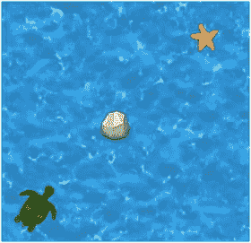

图 3-10.

添加了岩石的《海星收集者》游戏

一个有趣且有用的题外话：如果你在 `preventOverlap` 方法中交换对象的顺序，改为编写 `rock.preventOverlap(turtle)`，那么岩石将成为移动的对象；看起来就像是海龟在推动岩石！这有可能成为未来游戏项目中的一个有用游戏机制。


## 管理演员对象集合

对《海星收集者》游戏的下一项改进，将是向游戏中添加多个海星和岩石对象。你当然不想为每个单独的实例都创建一个新变量，因此需要一种方法来管理所有这些对象。你可以创建一个数组来存储这些数据，但这对于海星来说并不适用，因为海星的数量会随着被收集而减少，而数组用于存储固定数量的对象。在这种情况下，更好的数据结构是使用列表。

### 列表

数据结构是用于存储、组织和访问数据的专用格式。在 Java 编程中，最先遇到的数据结构通常是数组，它可以存储固定数量的单一类型对象；存储在数组中的值之后可以通过一个表示数组内位置索引的整数来访问。虽然数组易于理解，但它也有一些缺点，例如在创建时大小固定，并且需要通过索引号来访问元素。Java 提供了多种替代的数据结构，其中之一就是列表。

列表是一种用于存储元素集合的数据结构。在 Java 编程语言中有多种类型的列表，每种列表都实现了由 `List` 接口定义的方法。这些方法包括：

*   `add`，用于向列表末尾添加一个元素
*   `remove`，用于从列表中移除一个元素（如果该元素在列表中的话）
*   `size`，用于返回列表中的元素数量
*   `contains`，如果列表包含指定元素则返回 true

有许多类实现了 `List` 接口；在本书中，通常会使用 `ArrayList` 类。在初始化一个 `ArrayList`（或任何其他类型的列表）时，不需要指定列表的大小。然而，`ArrayList` 是一个泛型类，你应该（使用尖括号）指定列表中存储的数据类型。例如，考虑以下代码，它创建了一个用于存储 `String` 数据的 `ArrayList`，并添加和移除了一些名字：

```
// 初始化 ArrayList 以存储 String 数据
ArrayList names = new ArrayList();
// 向列表添加数据
names.add("Lee");
names.add("Dan");
names.add("Chris");
// names.size() 返回 3
// names.contains("Lee") 返回 true
// 从列表中移除 "Lee"
names.remove("Lee");
// names.size() 现在返回 2
// names.contains("Lee") 现在返回 false
```

使用 `ArrayList` 的另一个优点是，如果你想使用循环对每个元素执行某些操作，可以使用 `for-each` 循环（如下代码所示），它允许你创建一个索引变量来遍历存储在 `ArrayList` 中的对象；这与遍历标准数组形成对比，在标准数组中，你的索引变量必须是一个 `int`，用于遍历数组中存储对象的位置，并且检索对象本身需要额外的代码行。例如，考虑基于数组的循环遍历代码：

```
String[] nameArray;
// 省略：将值存储到数组中的代码
for (int n = 0; n < nameArray.length; n++)
{
String name = nameArray[n];
// 此处为其他代码
}
```

这等同于以下基于列表的循环遍历代码：

```
ArrayList nameList;
// 省略：将值存储到列表中的代码
for (Sting name : nameList)
{
// 此处为其他代码
}
```

在许多情况下，前面代码的 `ArrayList` 版本更直观且更易于维护。但是，如果你以这种方式遍历列表，则不能在循环内添加或移除列表中的元素，因为这将导致异常（具体来说是 `ConcurrentModification` 异常）。

在本书中，你将使用 `ArrayList` 类来管理演员对象的集合。理论上，在 `game` 类中，你可以为每种类型的演员（例如 `Starfish` 和 `Rock`）创建自己的列表。然而，为了提高开发效率，你将在 `BaseActor` 类中编写一个方法来为你处理这个任务。你可能还记得，每个舞台都存储了一个演员列表。总体思路是编写一个静态⁴方法，该方法接收一个 `Stage` 和一个类名作为参数，从舞台中提取演员列表，并创建一个新的列表，其中包含那些属于给定名称的类（或该类的扩展）的实例的演员。要完成此任务，请将以下 `import` 语句添加到 `BaseActor` 类中：

```
import java.util.ArrayList;
```

接下来，将以下方法添加到 `BaseActor` 类中：

```
public static ArrayList getList(Stage stage, String className)
{
ArrayList list = new ArrayList();
Class theClass = null;
try
{  theClass = Class.forName(className);  }
catch (Exception error)
{  error.printStackTrace();  }
for (Actor a : stage.getActors())
{
if ( theClass.isInstance( a ) )
list.add( (BaseActor)a );
}
return list;
}
```

在上述代码中，`try`-`catch` 块是必需的，以防 `forName` 方法无法返回一个类（如果输入的名称与项目中的类不对应，则可能发生这种情况）。`isInstance` 方法检查特定对象是否是给定类（`theClass`）或扩展了给定类的类的实例。

在某些情况下，了解在特定时间点特定类型的对象还剩下多少个实例也会很方便。借助前面的方法可以轻松计算出这一点。将以下方法添加到 `BaseActor` 类中，该方法检索相应的对象列表，并且不将其赋值给变量（这没有必要，因为在此方法中不需要再次引用它），而是立即调用列表的 `size` 方法并返回此值。

```
public static int count(Stage stage, String className)
{
return getList(stage, className).size();
}
```

接下来，你将重写 `StarfishCollector` 类的大部分内容，以整合多个海星和岩石。你将能够移除 `Starfish` 和 `Rock` 变量，因为实例将通过新添加的 `getList` 方法访问。重复调用构造函数而不将结果存储在变量中可能看起来很奇怪，但请记住，`BaseActor` 类的构造函数会将它们添加到 `Stage` 中，因此实例不会丢失。这些更改主要涉及引入 `for` 循环以及重新排列先前版本中的代码，尽管胜利条件的处理方式有所不同。请按如下方式重写 `StarfishCollector` 类：


```
// 与之前相同的导入语句
public class StarfishCollector extends GameBeta
{
private Turtle turtle;
private boolean win;
public void initialize()
{
BaseActor ocean = new BaseActor(0,0, mainStage);
ocean.loadTexture( "assets/water.jpg" );
ocean.setSize(800,600);
new Starfish(400,400, mainStage);
new Starfish(500,100, mainStage);
new Starfish(100,450, mainStage);
new Starfish(200,250, mainStage);
new Rock(200,150, mainStage);
new Rock(100,300, mainStage);
new Rock(300,350, mainStage);
new Rock(450,200, mainStage);
turtle = new Turtle(20,20, mainStage);
win = false;
}
public void update(float dt)
{
for (BaseActor rockActor : BaseActor.getList(mainStage, "Rock"))
turtle.preventOverlap(rockActor);
for (BaseActor starfishActor : BaseActor.getList(mainStage, "Starfish"))
{
Starfish starfish = (Starfish)starfishActor;
if ( turtle.overlaps(starfish) && !starfish.collected )
{
starfish.collected = true;
starfish.clearActions();
starfish.addAction( Actions.fadeOut(1) );
starfish.addAction( Actions.after( Actions.removeActor() ) );
Whirlpool whirl = new Whirlpool(0,0, mainStage);
whirl.centerAtActor( starfish );
whirl.setOpacity(0.25f);
}
}
if ( BaseActor.count(mainStage, "Starfish") == 0 && !win )
{
win = true;
BaseActor youWinMessage = new BaseActor(0,0,mainStage);
youWinMessage.loadTexture("assets/you-win.png");
youWinMessage.centerAtPosition(400,300);
youWinMessage.setOpacity(0);
youWinMessage.addAction( Actions.delay(1) );
youWinMessage.addAction( Actions.after( Actions.fadeIn(1) ) );
}
}
}
```

完成后，你可以运行并测试游戏；其效果应如图 3-11 所示。

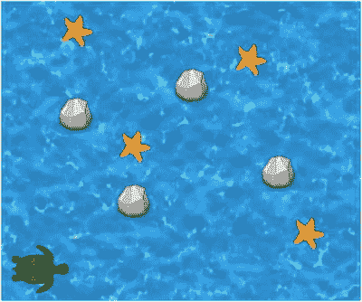

图 3-11.

添加了多个海星和岩石的海星收集者游戏

## 世界边界

海星收集者游戏的下一个改进点与世界本身有关。首先，我们希望将海龟限制在游戏世界的边界内——玩家应该始终能够看到他们控制的角色！游戏世界将被假定为矩形形状。合理的做法是，所有角色都应遵循相同的边界，因此这些数据将存储在一个静态的`Rectangle`变量中。在`BaseActor`类中，添加以下`import`语句：

```
import com.badlogic.gdx.math.Rectangle;
```

然后，添加以下字段：

```
private static Rectangle worldBounds;
```

接下来，添加以下方法，这些方法允许你通过数值或基于某个角色（例如显示背景图像的角色）来存储游戏世界的大小：

```
public static void setWorldBounds(float width, float height)
{
worldBounds = new Rectangle( 0,0, width, height );
}
public static void setWorldBounds(BaseActor ba)
{
setWorldBounds( ba.getWidth(), ba.getHeight() );
}
```

要将角色保持在由世界边界定义的矩形区域内，你需要进行四次比较，以检查角色的任何边缘（左、右、上、下）是否超出了屏幕的对应边缘，如果是，则设置相应的坐标（x 或 y）以将角色保持在屏幕上。这通过以下方法实现：

```
public void boundToWorld()
{
// 检查左边缘
if (getX() < 0)
setX(0);
// 检查右边缘
if (getX() + getWidth() > worldBounds.width)
setX(worldBounds.width - getWidth());
// 检查下边缘
if (getY() < 0)
setY(0);
// 检查上边缘
if (getY() + getHeight() > worldBounds.height)
setY(worldBounds.height - getHeight());
}
```

现在，为了在海星收集者游戏中建立游戏世界的大小，在`StarfishCollector`类的`initialize`方法中，在设置`ocean`大小之后，添加以下代码行：

```
BaseActor.setWorldBounds(ocean);
```

为了将海龟保持在世界边界内，在`Turtle`类的`act`方法末尾添加以下代码行：

```
boundToWorld();
```

这是另一个运行程序并验证边界功能是否按预期工作的好时机——海龟应该无法移动到屏幕边缘之外。

在讨论游戏世界边界的话题时，下一个要实现的功能是增加游戏世界的大小，使其大于窗口的大小。在这种情况下，玩家在任何时候都只能看到游戏世界的一部分——一个与窗口大小相同且以玩家角色为中心的区域。游戏世界中可见的区域由`Camera`对象控制，该对象由`Stage`类自动设置（这就是为什么你之前不需要考虑它）。这个过程的主要步骤是不断更新相机的位置，使其与角色对齐。然而，当角色接近游戏世界边缘时，必须小心处理。如果即使在这种情况下相机仍以角色为中心，相机将显示游戏世界之外的部分区域，这些区域通常会渲染为纯黑色（或`render`方法中初始化的任何颜色），如图 3-12 所示。

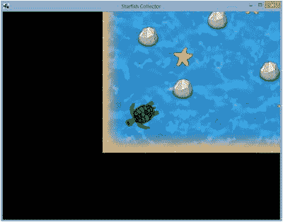

图 3-12.

不正确的相机定位导致游戏世界之外的区域渲染为黑色

为避免此问题，在将相机对准角色后，你可能需要调整相机位置，使其 x 坐标始终至少距离游戏世界左右边缘半个视图区域的宽度（y 坐标同理）。相机位置应被限制的区域由图 3-13 中虚线包围的区域表示。只要相机保持在该区域内，其视图区域将完全包含在游戏世界内。


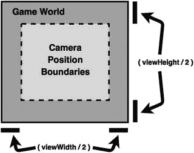

图 3-13.

用于将可视区域保持在游戏世界范围内的摄像机边界

接下来，在 `BaseActor` 类中添加以下 `import` 语句：

```
import com.badlogic.gdx.graphics.Camera;
import com.badlogic.gdx.utils.viewport.Viewport;
```

前面描述的摄像机移动功能通过以下方法实现，该方法应添加到 `BaseActor` 类中：

```
public void alignCamera()
{
Camera cam = this.getStage().getCamera();
Viewport v = this.getStage().getViewport();
// 将摄像机居中于角色
cam.position.set( this.getX() + this.getOriginX(), this.getY() + this.getOriginY(), 0 );
// 将摄像机限制在布局范围内
cam.position.x = MathUtils.clamp(cam.position.x,
cam.viewportWidth/2,  worldBounds.width -  cam.viewportWidth/2);
cam.position.y = MathUtils.clamp(cam.position.y,
cam.viewportHeight/2, worldBounds.height - cam.viewportHeight/2);
cam.update();
}
```

为了扩大游戏世界，在 `StarfishCollector` 类中，不要将海洋的大小设置为 800×600 像素，而应将这两个数值改为 1200 和 900，这比 800×600 的窗口尺寸要大得多。此外，你可能希望将海洋的纹理设置为图像文件 `water-border.jpg` 而不是 `water.jpg`。这个新纹理在边缘处带有类似沙地的边框，游戏开始时屏幕上只有两个边缘会显示该边框，从而给玩家一个视觉提示：游戏世界在其他方向还有延伸。最后，在 `Turtle` 类的 `act` 方法末尾，添加以下这一行代码：

```
alignCamera();
```

完成这些更改后，你就可以再次测试项目，验证摄像机滚动功能是否按预期工作。

然而，如果你玩到游戏结束，会发现一个问题：“You Win”消息并未固定在屏幕中央。这是因为该消息属于 `mainStage` 舞台，而该舞台的摄像机正在根据海龟的位置进行调整。这使得消息看起来像是游戏世界中的一个实体对象，而不是用户界面的一部分（用户界面应渲染在游戏世界之上，保持固定位置，并且始终对玩家可见）。解决方法是向框架中添加第二个 `Stage` 对象，命名为 `uiStage`（用户界面舞台的缩写），它在包含游戏世界实体的舞台之后渲染（因此显示在其上方），并且其绑定的 `Camera` 位置从不改变。实现这第二个舞台主要需要修改 `GameBeta` 类。在该类中添加以下变量声明：

```
protected Stage uiStage ;
```

在 `create` 方法中，在 `mainStage` 对象对应的代码行之后添加以下代码行：

```
uiStage = new Stage();
```

最后，在 `render` 方法中，在 `mainStage` 对象对应的代码行之后立即添加以下代码行：

```
uiStage.act(dt);
uiStage.draw();
```

现在，回到 `StarfishCollector` 类。唯一需要做的更改是在创建 `youWinMessage` 对象时，将 `mainStage` 替换为 `uiStage`。这样就完成了所有必要的修改；如果你运行程序并收集所有海星，将会看到无论海龟游到游戏世界的哪个位置，“You Win”消息都始终保持在屏幕中央。

## 多屏幕

本章将为 Starfish Collector 添加的最后一个功能是支持游戏中的多屏幕，可用于菜单和额外关卡。到目前为止，所有与游戏相关的代码都包含在 `Game` 类的扩展中。对于需要多个屏幕的项目，`Game` 类还可以将程序的控制权传递给 `Screen` 对象，每个 `Screen` 对象都有自己的 `render` 方法，能够处理游戏循环的功能。在本节中，你将把 `GameBeta` 类中的代码重构为两个新的抽象类 `BaseGame` 和 `BaseScreen`，以支持此功能；这些类（连同 `BaseActor`）将成为本书后续所有游戏项目的基础。`BaseGame` 类主要负责存储由 `Launcher` 类初始化的 `Game` 对象的静态引用，以便派生自 `Screen` 的类能够轻松访问和切换当前活动的屏幕。`BaseScreen` 类将包含 `GameBeta` 类中的大部分代码，以及 `Screen` 接口要求的一些额外（空）方法声明。`Launcher` 类将初始化一个扩展 `BaseGame` 的类，而该类又会初始化要显示的第一个屏幕，并将其设置为当前活动屏幕。游戏所需的不同屏幕将扩展 `BaseScreen` 类；在本节中，这将是菜单屏幕（命名为 `MenuScreen`）和游戏玩法发生的屏幕（命名为 `LevelScreen`）。

首先是新的 `BaseGame` 类的代码：

```
import com.badlogic.gdx.Game;
public abstract class BaseGame extends Game
{
private static BaseGame game;
public BaseGame()
{
game = this;
}
public static void setActiveScreen(BaseScreen s)
{
game.setScreen(s);
}
}
```

此时，在创建 `BaseScreen` 类之前，`BaseGame` 类会显示错误。接下来是新的 `BaseScreen` 类的代码（其中大部分内容应该看起来很熟悉）：

```
import com.badlogic.gdx.Gdx;
import com.badlogic.gdx.graphics.GL20;
import com.badlogic.gdx.scenes.scene2d.Stage;
import com.badlogic.gdx.Screen;
public abstract class BaseScreen implements Screen
{
protected Stage mainStage;
protected Stage uiStage;
public BaseScreen()
{
mainStage = new Stage();
uiStage = new Stage();
initialize();
}
public abstract void initialize();
public abstract void update(float dt);
public void render(float dt)
{
uiStage.act(dt);
mainStage.act(dt);
update(dt);
Gdx.gl.glClearColor(0,0,0,1);
Gdx.gl.glClear(GL20.GL_COLOR_BUFFER_BIT);
mainStage.draw();
uiStage.draw();
}
// Screen 接口要求的方法
public void resize(int width, int height) {  }
public void pause()   {  }
public void resume()  {  }
public void dispose() {  }
public void show()    {  }
public void hide()    {  }
}
```

现在，创建一个名为 `LevelScreen` 的新类；除了类声明之外，它与之前的 `StarfishCollector` 类完全相同，因此你只需将该类中的代码复制到这个新类中，如下所示：

```
import com.badlogic.gdx.scenes.scene2d.Action;
import com.badlogic.gdx.scenes.scene2d.actions.Actions;
public class LevelScreen extends BaseScreen
{
private Turtle turtle;
private boolean win;
public void initialize()
{
// 代码与 StarfishCollector 的 initialize 方法相同
}
public void update(float dt)
{
// 代码与 StarfishCollector 的 update 方法相同
}
}
```

现在，创建一个名为 `MenuScreen` 的类，其中包含全新的代码。此屏幕将显示游戏标题和一条消息，内容为“按 'S' 开始”。当玩家按下 `S` 键时（在 `update` 方法中检测到），游戏会创建一个 `LevelScreen` 实例，并将控制权转移给该实例。


```
import com.badlogic.gdx.Gdx;
import com.badlogic.gdx.Input.Keys;
public class MenuScreen extends BaseScreen
{
public void initialize()
{
BaseActor ocean = new BaseActor(0,0, mainStage);
ocean.loadTexture( "assets/water.jpg" );
ocean.setSize(800,600);
BaseActor title = new BaseActor(0,0, mainStage);
title.loadTexture( "assets/starfish-collector.png" );
title.centerAtPosition(400,300);
title.moveBy(0,100);
BaseActor start = new BaseActor(0,0, mainStage);
start.loadTexture( "assets/message-start.png" );
start.centerAtPosition(400,300);
start.moveBy(0,-100);
}
public void update(float dt)
{
if (Gdx.input.isKeyPressed(Keys.S))
StarfishGame.setActiveScreen( new LevelScreen() );
}
}
```

与之前一样，在引用的类（本例中为 `StarfishGame` 类）被创建之前，此类会显示错误且无法编译；此问题将很快得到解决。

游戏运行后出现的菜单屏幕如图 3-14 所示。

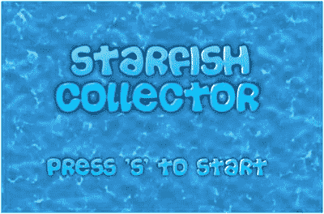

图 3-14.

海星收集者游戏的菜单屏幕

您将通过创建一个名为 `StarfishGame` 的 `BaseGame` 类扩展来指定首先加载哪个屏幕，具体如下：

```
public class StarfishGame extends BaseGame
{
public void create()
{
setActiveScreen( new MenuScreen() );
}
}
```

最后，您需要修改 `Launcher` 类的代码，以便在运行程序时初始化并使用 `StarfishGame` 类。

```
import com.badlogic.gdx.Game ;
import com.badlogic.gdx.backends.lwjgl.LwjglApplication;
public class Launcher
{
public static void main (String[] args)
{
Game myGame = new StarfishGame();
LwjglApplication launcher =
new LwjglApplication( myGame, "Starfish Collector", 800, 600 );
}
}
```

现在，海星收集者游戏中使用了多个类。图 3-15 中 BlueJ 主窗口的截图显示了这些类之间的关系（为清晰起见，已对类对应的矩形进行了排列）。通常，使用此框架创建游戏涉及四个主要类组：`Launcher` 类、`BaseGame` 类及其扩展、`BaseScreen` 类及其扩展，以及 `BaseActor` 类及其扩展。

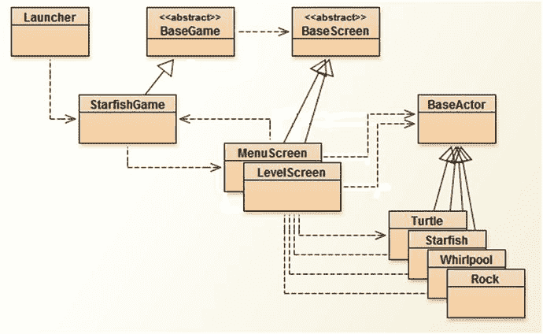

图 3-15.

海星收集者游戏最终版本中各类之间的关系

至此，您已完成本章开头讨论的对海星收集者游戏的所有改进。您应运行程序以验证一切是否按预期工作，并务必为自己所取得的成就感到自豪。您在此处创建的基础将在后续章节中发挥重要作用。恭喜！

## 总结与后续步骤

在本章中，您在提升海星收集者游戏质量的同时，实际上创建了一个坚实的基础，这将使您能够在本书后续部分快速开发各种游戏。您实现了基于数值和基于图像的动画，后者可来自单个图像文件或单个精灵表。您通过编写一组执行基于物理计算的方法来模拟真实运动。您提高了碰撞检测的准确性，并学习了如何模拟实体对象。您增加了对角色列表操作的支持。您编写了用于处理有边界、放大的游戏世界的方法。最后，您重构了代码，以便为游戏添加多个屏幕。

为了练习您新掌握的技能并测试对框架的理解，您应考虑在海星收集者游戏中实现额外功能。首先，您可以在放大的关卡中添加更多海星和岩石，或许可以布置更多岩石，使收集所有海星更具挑战性。您还可以考虑添加敌人：分布在关卡各处的鲨鱼，玩家与其接触会导致游戏失败（海龟被摧毁）。如果您想尝试添加此功能，本章资源中包含了鲨鱼和“游戏结束”消息的图片。您可能还想考虑通过一个名为 `LevelScreen2` 的新类来添加第二关。为此，您需要修改 `LevelScreen` 类中的代码，以便在玩家收集所有海星后显示一条消息（例如“按 'C' 键继续”），并且在 `update` 方法中，当按下 C 键时，游戏将活动屏幕设置为 `LevelScreen2` 类的新实例。同样，本章资源中也包含了对此任务有用的图片。

您可能还有更多关于游戏功能的想法，例如为收集所有海星设置时间限制。其中一些想法在第五章更详细地介绍用户界面和文本显示后会更易于实现。此外，如果您觉得确定岩石和海星的坐标过于耗时，请放心，这个问题将在后续讨论瓦片地图和使用第三方软件简化关卡设计的章节中得到解决。

在下一章中，您将亲身体验并欣赏到您在此开发的框架的灵活性，因为您将使用它创建一个全新的游戏——太空岩石，这是一款受经典街机游戏《小行星》启发的太空主题射击游戏。

脚注 1

在本节中，我们假设运动发生在平坦的二维表面上。如果运动发生在三维空间中，则需要三个值来指定位置和速度。

  2

尽管 LibGDX 包含一个 `Ellipse` 类，但 LibGDX 中没有执行椭圆形状碰撞检测的类或方法；然而，`Polygon` 对象确实具有此类功能。

  3

该区间从 0 延伸到 6.28，因为数学函数通常使用弧度而非角度来度量角度。6.28 弧度大致相当于 360 度，代表绕原点旋转一整圈，我们在计算椭圆周围所有点的值时需要用到这一点。

  4

此方法（以及后续方法）将被定义为静态方法，因为没有理由从 `BaseActor` 的实例中调用它。

