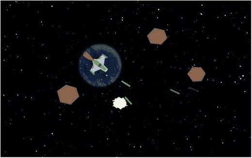
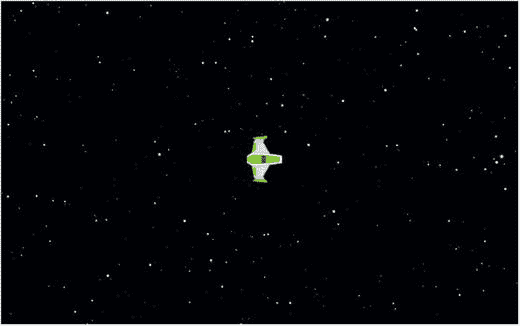
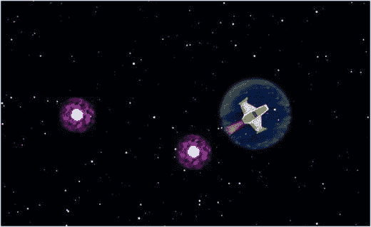

# 4. 射击游戏

在本章中，您将创建一个全新的游戏：太空岩石，如图 4-1 所示，其灵感来源于经典街机游戏《小行星》。您将大量使用上一章创建的框架（`BaseGame`、`BaseScreen` 和 `BaseActor` 类），并在此过程中添加一些新功能。最重要的新增功能是处理离散事件的能力：即每次按键时仅应发生一次的操作。



图 4-1.

太空岩石游戏


## 游戏项目：太空岩石

在启动新游戏项目时，在编写任何代码之前，详细规划功能至关重要。游戏设计文档是创建游戏的蓝图或总体规划：它描述了游戏的总体愿景，提供了清晰度和重点，并作为游戏开发人员的指南和参考。本书附录中更详细地描述了游戏设计文档。随着本书中每个新游戏的引入，将按照此类文档的指导方针给出详细描述；以下是对《太空岩石》游戏的描述。

《太空岩石》是一款太空主题的射击游戏。玩家控制一艘宇宙飞船，其目标是发射激光并摧毁在屏幕上飞行的岩石。游戏世界采用俯视视角，并具有环绕功能：当物体移出屏幕边缘时，它会从对侧边缘重新出现。

宇宙飞船可以向左和向右旋转，并朝其面对的方向加速。减速效果非常小。飞船能够发射激光，激光沿直线飞行一秒钟，如果未与岩石碰撞，则会逐渐淡出并从游戏中消失。如果激光击中岩石，则激光和岩石都会被摧毁。飞船被护盾包围。如果护盾激活时飞船被岩石击中，岩石会被摧毁，护盾会失去能量。当护盾能量降至 0 后，护盾消失，此时被岩石击中会摧毁飞船并结束游戏。飞船还具有瞬间随机传送到屏幕上新位置的能力。

玩家使用方向键控制飞船左右旋转和向前加速。由于减速效果很小，为了突然停止，玩家必须掉头并向相反方向加速。使用空格键发射激光，玩家可以随心所欲地快速发射。使用 X 键激活传送。虽然这可用于快速躲避即将发生的碰撞，但也有可能传送到岩石上，因此玩家可能会谨慎使用此能力。

本游戏所需的图形包括用于背景的星空图，以及用于飞船、激光和岩石的图像。将使用特效来提供视觉用户反馈。当岩石或飞船被摧毁时，会有爆炸动画；当玩家加速时，会出现火箭推进器火焰图像；当使用传送能力时，会出现一个虫洞效果动画，该动画会出现在飞船的原始位置和新位置。如果玩家获胜，将显示“恭喜”消息；如果玩家失败，将显示“游戏结束”消息。

首先，在 BlueJ 中创建一个名为 `Space Rocks` 的新项目。从本书网站下载本章的源代码文件。在 BlueJ 创建的项目目录中，创建一个名为 `assets` 的新文件夹。将下载项目 `assets` 文件夹中的所有图像文件复制到新项目的 `assets` 文件夹中。接下来（如果您尚未设置 BlueJ 的 `userlibs` 文件夹），在您的项目目录中，创建一个名为 `+libs` 的新文件夹。将下载项目 `+libs` 文件夹中的 JAR 文件复制到新项目的 `+libs` 文件夹中。从您之前的 BlueJ 项目（Starfish Collector Ch 3）中，将 `BaseGame.java`、`BaseScreen.java` 和 `BaseActor.java` 文件复制到 Space Rocks 项目目录中。重新启动 BlueJ，以便 BlueJ 能正确识别新添加到 `+libs` 文件夹中的 Java 源代码和 JAR 文件。

## 离散输入

在上一章的《海星收集者》游戏中，乌龟执行的唯一动作是移动。您通过在每个可能的时刻（在 `act` 方法中，该方法每秒运行 60 次）检查某些键是否被按住，如果是，则让乌龟向相应方向加速来处理此问题。这是一个连续动作的示例：一个在一段时间间隔内发生的动作。连续动作的其他示例包括行走、旋转或睡眠。相比之下，离散动作发生在单个时间瞬间。示例包括跳跃、击中物体或发射抛射物。对于键盘，连续动作通常涉及按住一个键一段时间，而离散动作则在按下键的瞬间触发。基于鼠标的动作也可以归入这两类：点击按钮是离散动作，而拖动滑块是连续动作。

将添加到自定义框架类的主要新功能是处理离散输入的能力。到目前为止，您一直在使用一种称为输入轮询的技术：反复检查输入设备（例如键盘）的状态。具体来说，您一直在 `act` 或 `update` 方法（通常每秒运行 60 次）中检查特定键是否被按住。这是处理连续动作的好方法，但这种方法不适用于离散动作。

幸运的是，LibGDX 库也提供了处理离散事件的框架。这涉及编写在特定事件发生时（例如，首次按下或释放键，或点击鼠标按钮）自动调用的函数。任何对象都可以被分配响应离散输入事件的责任，但为了正确执行此操作，它必须包含一组特定的方法：即 `InputProcessor` 接口指定的方法。该接口总共需要八个方法：

*   `keyDown`、`keyUp` 和 `keyTyped` 用于处理键盘事件
*   `touchDown`、`touchUp` 和 `touchDragged` 用于处理鼠标和触摸屏事件
*   `mouseMoved` 和 `scrolled` 用于处理鼠标事件

本节中我们需要解决的最后一个问题是：哪个对象应该承担响应输入事件的责任？一方面，`Stage` 类已经实现了 `InputProcessor` 接口；这对于包含用户界面元素的 `Stage` 特别有用，因为它使类似按钮的对象在被点击时能够激活方法。另一方面，如果 `BaseScreen` 类实现了 `InputProcessor` 接口，那么当您编写一个扩展 `BaseScreen` 的类时，您的类就可以包含处理离散键盘输入的方法，这将非常方便。那么，应该由 `Stage` 类还是 `BaseScreen` 类来负责响应输入事件呢？在实践中，您希望两个对象都有机会这样做。在您的代码中，这种安排将通过 `InputMultiplexer` 类来实现。一个 `InputMultiplexer` 对象本身就是一个 `InputProcessor`，它包含一个其他 `InputProcessor` 的列表。您可以将 `Stage` 和 `BaseScreen` 对象添加到一个 `InputMultiplexer` 中，当输入事件发生时，`InputMultiplexer` 会将输入数据转发给这些对象中的每一个，并让它们有机会做出相应的响应。

首先，您将修改 `BaseGame` 类。添加以下 `import` 语句：

```
import com.badlogic.gdx.Gdx;
import com.badlogic.gdx.InputMultiplexer;
```

接下来，您将向 `BaseGame` 类添加一个 `create` 方法，该方法由 LibGDX 自动调用，并将用于初始化 `InputMultiplexer` 对象。（添加 `InputProcessors` 将在稍后由 `BaseScreen` 类处理。）


```content
```
public void create()
{
// 准备让多个类/阶段接收离散输入
InputMultiplexer im = new InputMultiplexer();
Gdx.input.setInputProcessor( im );
}
```

现在，请将注意力转向 `BaseScreen` 类。首先，添加以下 `import` 语句：

```
import com.badlogic.gdx.InputProcessor;
import com.badlogic.gdx.InputMultiplexer;
```

接下来，你需要修改类的声明，以表明 `InputProcessor` 的方法将由该类实现。你可以通过在关键字 `implements` 后列出多个接口，并用逗号分隔来声明实现多个接口¹，如下所示：

```
public abstract class BaseScreen implements Screen, InputProcessor
```

你需要为 `InputProcessor` 接口要求的所有方法添加空方法；任何你实际计划使用的方法，都可以在 `BaseScreen` 类的扩展中重写。你会注意到这些方法都返回一个布尔值。该值表示此输入数据是否已由该 `InputProcessor` 完全处理；如果设置为 `true`，则输入数据将不会发送到存储在 `InputMultiplexer` 中的任何其他 `InputProcessor`。所有默认值都设置为 `false`，以便每个 `InputProcessor` 都有机会处理数据。你需要添加的方法如下：

```
// InputProcessor 接口要求的方法
public boolean keyDown(int keycode)
{  return false;  }
public boolean keyUp(int keycode)
{  return false;  }
public boolean keyTyped(char c)
{  return false;  }
public boolean mouseMoved(int screenX, int screenY)
{  return false;  }
public boolean scrolled(int amount)
{  return false;  }
public boolean touchDown(int screenX, int screenY, int pointer, int button)
{  return false;  }
public boolean touchDragged(int screenX, int screenY, int pointer)
{  return false;  }
public boolean touchUp(int screenX, int screenY, int pointer, int button)
{  return false;  }
```

最后，当此屏幕显示时，应将两个 `Stage` 对象和 `BaseScreen` 类本身添加到游戏的 `InputMultiplexer` 中，并在设置新屏幕时从 `InputMultiplexer` 中移除。添加此代码的最佳位置是在 `show` 和 `hide` 方法中（之前由 `Screen` 接口要求），这两个方法分别在屏幕在游戏中出现和消失时被调用。首先，按如下方式修改 `show` 方法：

```
public void show()
{
InputMultiplexer im = (InputMultiplexer)Gdx.input.getInputProcessor();
im.addProcessor(this);
im.addProcessor(uiStage);
im.addProcessor(mainStage);
}
```

然后，按如下方式修改 `hide` 方法：

```
public void hide()
{
InputMultiplexer im = (InputMultiplexer)Gdx.input.getInputProcessor();
im.removeProcessor(this);
im.removeProcessor(uiStage);
im.removeProcessor(mainStage);
}
```

至此，你已经准备好处理离散输入，并且可以为 Space Rocks 游戏中的游戏实体创建自定义类。

## 飞船设置

在本节中，你将添加飞船及其相关功能和能力的代码：环绕屏幕、飞船加速时出现的推进器、环绕飞船并多次保护其免受岩石碰撞的护盾，以及将飞船移动到屏幕上随机位置的传送能力。

首先，使用以下代码创建一个名为 `Spaceship` 的新类：

```
import com.badlogic.gdx.scenes.scene2d.Stage;
import com.badlogic.gdx.Gdx;
import com.badlogic.gdx.Input.Keys;
public class Spaceship extends BaseActor
{
public Spaceship(float x, float y, Stage s)
{
super(x,y,s);
loadTexture( "assets/spaceship.png" );
setBoundaryPolygon(8);
setAcceleration(200);
setMaxSpeed(100);
setDeceleration(10);
}
public void act(float dt)
{
super.act( dt );
float degreesPerSecond = 120; // 旋转速度
if (Gdx.input.isKeyPressed(Keys.LEFT))
rotateBy(degreesPerSecond * dt);
if (Gdx.input.isKeyPressed(Keys.RIGHT))
rotateBy(-degreesPerSecond * dt);
if (Gdx.input.isKeyPressed(Keys.UP))
accelerateAtAngle( getRotation() );
applyPhysics(dt);
}
}
```

该类处理加载图像、设置碰撞多边形以及指定物理设置的标准任务。请注意，减速度值接近于零；这是为了模拟外太空中使物体减速的摩擦力或空气阻力的缺失。还要注意在 `act` 方法中，左右箭头键用于向左和向右旋转飞船（与 Starfish Collector 游戏中将物体向左和向右移动屏幕不同），而上箭头键则使飞船向前加速；即朝其当前面对的方向加速。

下一个特征运动功能是环绕屏幕。由于 Space Rocks 游戏中的许多对象都共享此功能，你将通过在 `BaseActor` 类中添加以下方法来实现此功能：

```
public void wrapAroundWorld()
{
if (getX() + getWidth() < 0)
setX( worldBounds.width );
if (getX() > worldBounds.width)
setX( -getWidth());
if (getY() + getHeight() < 0)
setY( worldBounds.height );
if (getY() > worldBounds.height)
setY( -getHeight() );
}
```

请注意，此方法需要设置 `worldBounds` 对象才能正常工作。有了这个方法后，在 `Spaceship` 类的 `act` 方法末尾添加以下代码行：

```
wrapAroundWorld();
```

接下来，你将开始编写屏幕类，这将使你能够测试移动和环绕功能。创建一个名为 `LevelScreen` 的新类，其中包含以下代码：

```
public class LevelScreen extends BaseScreen
{
private Spaceship spaceship;
public void initialize()
{
BaseActor space = new BaseActor(0,0, mainStage);
space.loadTexture( "assets/space.png" );
space.setSize(800,600);
BaseActor.setWorldBounds(space);
spaceship = new Spaceship(400,300, mainStage);
}
public void update(float dt)
{    }
}
```

在测试项目之前，你需要再创建两个类。首先，使用以下代码创建一个名为 `SpaceGame` 的类：

```
public class SpaceGame extends BaseGame
{
public void create()
{
super.create();
setActiveScreen( new LevelScreen() );
}
}
```

接下来，创建一个名为 `Launcher` 的类，其中包含以下代码：

```
import com.badlogic.gdx.Game;
import com.badlogic.gdx.backends.lwjgl.LwjglApplication;
public class Launcher
{
public static void main (String[] args)
{
Game myGame = new SpaceGame();
LwjglApplication launcher = new LwjglApplication( myGame, "Space Rocks", 800, 600 );
}
}
```

现在你可以测试项目，以验证飞船是否按预期移动。此时，游戏将如图 4-2 所示。如果你觉得移动速度太慢或太快，可以随时根据需要调整相应的参数。



图 4-2.

添加了星空背景图像和飞船的 Space Rocks 游戏
```

好的，作为一名高级文档工程师和翻译员，我将严格遵循您提供的注意事项和示例，将给定的英文文本翻译成中文。


接下来，你将为飞船添加一个推进器效果，当玩家按住加速键时，该效果就会出现。这是为玩家提供视觉反馈的一个例子，也是一个重要的游戏设计原则，它能让整体游戏体验感觉响应更迅速、更精致。实现推进器效果（以及接下来会讨论的护盾效果）最棘手的方面是保持推进器的位置和旋转与飞船对齐。实际上，你希望将一个演员附加到另一个演员上，并保持它们的相对位置同步。LibGDX 框架再次提供了这个功能。

LibGDX 包含一个名为 `Group` 的类，它扩展了 `Actor` 类，并提供了向组中添加额外演员的能力。此外，在渲染这些额外演员时，它们的位置和旋转是相对于组本身确定的，这完全符合本游戏及后续游戏的需求。为了将这个功能整合到你的自定义框架中，在 `BaseActor` 类中，添加以下 `import` 语句：

```
import com.badlogic.gdx.scenes.scene2d.Group;
```

修改 `BaseActor` 类的类声明，使其扩展 `Group` 类而不是 `Actor` 类，如下所示：

```
public class BaseActor extends Group
```

最后，为了让附加到组上的演员在组对象本身对应的图像之后渲染（因此，显示在其上方），在 `draw` 方法中，将代码行

```
super.draw( batch, parentAlpha );
```

从方法的开头移动到方法的末尾（在 `batch.draw` 语句之后）。

接下来，创建一个名为 `Thrusters` 的新类，代码如下：

```
import com.badlogic.gdx.scenes.scene2d.Stage;
public class Thrusters extends BaseActor
{
public Thrusters(float x, float y, Stage s)
{
super(x,y,s);
loadTexture("assets/fire.png");
}
}
```

现在，在 `Spaceship` 类中，添加以下字段：

```
private Thrusters thrusters;
```

在 `constructor` 方法中，通过添加以下代码来初始化此对象，该代码将推进器附加到飞船上，并调整它们相对于飞船的位置，使其出现在正确的位置，如图 4-3 所示。

```
thrusters = new Thrusters(0,0, s);
addActor(thrusters);
thrusters.setPosition(-thrusters.getWidth(), getHeight()/2 - thrusters.getHeight()/2 );
```

最后，在 `Spaceship` 类的 `act` 方法中控制推进器的可见性；将检查上箭头键是否按下的代码修改为以下内容：

```
if (Gdx.input.isKeyPressed(Keys.UP))
{
accelerateAtAngle( getRotation() );
thrusters.setVisible(true);
}
else
{
thrusters.setVisible(false);
}
```

这是测试代码以验证此功能是否按预期工作的又一个好时机。

接下来，你将向 `Spaceship` 对象添加护盾，这将使飞船在被摧毁前能够承受多次碰撞。创建一个名为 `Shield` 的新类，代码如下：

```
import com.badlogic.gdx.scenes.scene2d.Stage;
import com.badlogic.gdx.scenes.scene2d.Action;
import com.badlogic.gdx.scenes.scene2d.actions.Actions;
public class Shield extends BaseActor
{
public Shield(float x, float y, Stage s)
{
super(x,y,s);
loadTexture("assets/shields.png");
Action pulse = Actions.sequence(
Actions.scaleTo(1.05f, 1.05f, 1), Actions.scaleTo(0.95f, 0.95f, 1) );
addAction( Actions.forever(pulse) );
}
}
```

请注意，`Shield` 对象中添加了一个小的脉冲效果（基于值的动画），使其在视觉上更有趣。接下来，你将像处理 `Thrusters` 对象一样，向 `Spaceship` 类添加一个 `Shield` 对象。为了衡量 `Shield` 对象在被摧毁前还剩多少能量，你还需要添加一个名为 `shieldPower` 的变量。这将用于改变护盾的不透明度，作为护盾剩余能量的大致视觉指示器。在 `BaseActor` 类中，添加以下字段声明：

```
private Shield shield;
public int shieldPower;
```

这些变量在 `constructor` 方法中初始化，如下所示：

```
shield = new Shield(0,0, s);
addActor(shield);
shield.centerAtPosition( getWidth()/2, getHeight()/2 );
shieldPower = 100;
```

最后，飞船将通过向 `act` 方法添加以下代码来更新护盾不透明度：

```
shield.setOpacity(shieldPower / 100f);
if (shieldPower <= 0)
shield.setVisible(false);
```

如果你愿意，可以运行游戏来验证护盾是否按预期显示。

接下来，你将添加一个功能，当按下 X 键时，可以传送到屏幕上的随机位置；这是你将实现的第一个离散动作。首先，你将设置一个类似虫洞的特殊效果，该效果将同时出现在飞船的原始位置和传送后的新位置。该效果会在出现后不久淡出并从其舞台中移除。创建一个名为 `Warp` 的新类，代码如下：

```
import com.badlogic.gdx.scenes.scene2d.Stage;
import com.badlogic.gdx.scenes.scene2d.Action;
import com.badlogic.gdx.scenes.scene2d.actions.Actions;
public class Warp extends BaseActor
{
public Warp(float x, float y, Stage s)
{
super(x,y,s);
loadAnimationFromSheet("assets/warp.png", 4, 8, 0.05f, true);
addAction( Actions.delay(1) );
addAction( Actions.after( Actions.fadeOut(0.5f) ) );
addAction( Actions.after( Actions.removeActor() ) );
}
}
```

接下来，你将向 `Spaceship` 类添加一个方法，该方法将在按下 X 键时由 `LevelScreen` 类调用。（之所以这样组织代码，是因为 `BaseScreen` 类被设置为处理离散输入，而 `BaseActor` 类没有。）首先，在 `Spaceship` 类中，添加以下 `import` 语句：

```
import com.badlogic.gdx.math.MathUtils;
```

接下来，添加以下方法，该方法使用 `MathUtils` 类的 `random` 方法生成随机浮点数（最大不超过给定参数），用于设置飞船的位置：

```
public void warp()
{
if ( getStage() == null)
return;
Warp warp1 = new Warp(0,0, this.getStage());
warp1.centerAtActor(this);
setPosition(MathUtils.random(800), MathUtils.random(600));
Warp warp2 = new Warp(0,0, this.getStage());
warp2.centerAtActor(this);
}
```

`warp` 方法开头的条件语句的目的是验证飞船是否仍然是游戏的一部分（通过是否附加到舞台来指示）。如果 `getStage` 方法返回 `null`，则表示飞船已从游戏中移除，该方法会立即返回，从而有效地阻止后续代码的执行。

接下来，在 `LevelScreen` 类中，你将添加以下 `keyDown` 方法。这将覆盖 `BaseScreen` 类中指定的默认 `keyDown` 方法。此方法在按下某个键时被激活一次。为了确定按下了哪个键，你将使用 `Keys` 类中存储的字段，因此首先添加以下 `import` 语句：

```
import com.badlogic.gdx.Input.Keys;
```

接下来，添加以下方法：

```
// 覆盖默认的 InputProcessor 方法
public boolean keyDown(int keycode)
{
if ( keycode == Keys.X )
spaceship.warp();
return false;
}
```

同样，请随意运行代码并检查传送功能是否按预期工作。添加了这些效果后，游戏将如图 4-3 所示。接下来，你将添加一些飞船外部的游戏对象：激光、岩石和爆炸效果。



图 4-3.

添加了推进器、护盾和传送效果的太空岩石游戏


## 激光、岩石与爆炸

接下来，你将添加飞船发射的激光。与飞船类似，激光会环绕屏幕；与曲速效果类似，激光会在短暂延迟后自动淡出并从游戏中移除。（如果激光永久存在，游戏就会过于强大。）与飞船不同的是，激光以恒定速度飞行，因此无需设置加速度值，而是直接设定激光对象的速度，并将减速度设为 0。使用以下代码创建一个名为`Laser`的新类：

```
import com.badlogic.gdx.scenes.scene2d.Stage;
import com.badlogic.gdx.scenes.scene2d.Action;
import com.badlogic.gdx.scenes.scene2d.actions.Actions;
public class Laser extends BaseActor
{
public Laser(float x, float y, Stage s)
{
super(x,y,s);
loadTexture("assets/laser.png");
addAction( Actions.delay(1) );
addAction( Actions.after( Actions.fadeOut(0.5f) ) );
addAction( Actions.after( Actions.removeActor() ) );
setSpeed(400);
setMaxSpeed(400);
setDeceleration(0);
}
public void act(float dt)
{
super.act(dt);
applyPhysics(dt);
wrapAroundWorld();
}
}
```

为了发射激光，你需要在`Spaceship`类中添加以下方法；与`warp`方法类似，它将在`LevelScreen`类的`keyDown`方法中被激活。在`Spaceship`类中添加以下代码：

```
public void shoot()
{
if ( getStage() == null )
return;
Laser laser = new Laser(0,0, this.getStage());
laser.centerAtActor(this);
laser.setRotation( this.getRotation() );
laser.setMotionAngle( this.getRotation() );
}
```

在`LevelScreen`类的`keyDown`方法中，添加以下代码：

```
if ( keycode == Keys.SPACE )
spaceship.shoot();
```

此时运行游戏，你就能发射激光了！

接下来，你将在游戏中添加一些岩石对象，作为射击目标。与激光类似，它们会环绕屏幕并以恒定速度飞行。每块岩石都会有一个基于数值的动画（旋转）来增加视觉趣味。为了增加游戏的不可预测性，你将使用 LibGDX 的`MathUtils`类中的`random`函数，对旋转速度和移动速度进行小幅随机化。使用以下代码创建一个名为`Rock`的新类：

```
import com.badlogic.gdx.scenes.scene2d.Stage;
import com.badlogic.gdx.scenes.scene2d.Action;
import com.badlogic.gdx.scenes.scene2d.actions.Actions;
import com.badlogic.gdx.math.MathUtils;
public class Rock extends BaseActor
{
public Rock(float x, float y, Stage s)
{
super(x,y,s);
loadTexture("assets/rock.png");
float random = MathUtils.random(30);
addAction( Actions.forever( Actions.rotateBy(30 + random, 1) ) );
setSpeed(50 + random);
setMaxSpeed(50 + random);
setDeceleration(0);
setMotionAngle( MathUtils.random(360) );
}
public void act(float dt)
{
super.act(dt);
applyPhysics(dt);
wrapAroundWorld();
}
}
```

为了让岩石出现，你需要在`LevelScreen`类的`initialize`方法中使用以下代码创建一些岩石。请注意，岩石被放置在飞船周围一定距离的位置。这给了玩家在游戏开始时公平的机会，让飞船避开岩石的路径。

```
new Rock(600,500, mainStage);
new Rock(600,300, mainStage);
new Rock(600,100, mainStage);
new Rock(400,100, mainStage);
new Rock(200,100, mainStage);
new Rock(200,300, mainStage);
new Rock(200,500, mainStage);
new Rock(400,500, mainStage);
```

在添加控制飞船、岩石和激光如何交互的代码之前，你将添加一个爆炸特效，它使用基于图像的动画，并在动画完成后从舞台上移除自身。使用以下代码创建一个名为`Explosion`的新类：

```
import com.badlogic.gdx.scenes.scene2d.Stage;
public class Explosion extends BaseActor
{
public Explosion(float x, float y, Stage s)
{
super(x,y,s);
loadAnimationFromSheet("assets/explosion.png", 6, 6, 0.03f, false);
}
public void act(float dt)
{
super.act(dt);
if ( isAnimationFinished() )
remove();
}
}
```

最后，你将处理岩石与飞船及激光之间的交互。在`LevelScreen`类的`update`方法中，添加以下代码：

```
for ( BaseActor rockActor : BaseActor.getList(mainStage, "Rock") )
{
if (rockActor.overlaps(spaceship))
{
if (spaceship.shieldPower <= 0)
{
Explosion boom = new Explosion(0,0, mainStage);
boom.centerAtActor(spaceship);
spaceship.remove();
spaceship.setPosition(-1000,-1000);
}
else
{
spaceship.shieldPower -= 34;
Explosion boom = new Explosion(0,0, mainStage);
boom.centerAtActor(rockActor);
rockActor.remove();
}
}
for ( BaseActor laserActor : BaseActor.getList(mainStage, "Laser") )
{
if (laserActor.overlaps(rockActor))
{
Explosion boom = new Explosion(0,0, mainStage);
boom.centerAtActor(rockActor);
laserActor.remove();
rockActor.remove();
}
}
}
```

请注意，每次碰撞后护盾能量减少 34，这意味着护盾可以承受三次撞击，之后飞船才有被摧毁的危险。另外请注意，即使飞船从舞台上移除，它仍然需要被移出屏幕。从舞台上移除对象会停止其`act`和`draw`方法的运行，但`Spaceship`对象仍保留在程序内存中，在`update`方法中检查时，仍能检测到其最终位置上的碰撞。（这个问题也可以通过修改`BaseActor`的`overlap`方法来解决，当任一对象的`getStage`方法返回`null`时，返回`false`，但此处不采用这种方法。）同样，你可能希望运行游戏并验证一切是否按预期工作；你的游戏现在应该看起来类似于本章开头所示的图 4-1。

## 游戏结束条件

判断游戏何时结束相对容易。如果飞船在护盾能量小于或等于零时与岩石相撞，则玩家输掉游戏。如果没有剩余的岩石，则玩家赢得游戏。无论哪种情况，都应显示一条消息，向玩家传达此信息并提供结束感（否则，玩家可能会疑惑是否还有未完成的事情）。为此，在`LevelScreen`类中添加以下字段：

```
private boolean gameOver;
```

在`initialize`方法中将其值设置如下：

```
gameOver = false;
```

当玩家输掉游戏时，将创建一个效果使消息淡入，因此你需要添加以下`import`语句：

```
import com.badlogic.gdx.scenes.scene2d.actions.Actions;
```

接下来，为了处理输掉游戏的情况，在`update`方法中，紧接在移除飞船的代码之后，添加以下代码：

```
BaseActor messageLose = new BaseActor(0,0, uiStage);
messageLose.loadTexture("assets/message-lose.png");
messageLose.centerAtPosition(400,300);
messageLose.setOpacity(0);
messageLose.addAction( Actions.fadeIn(1) );
gameOver = true;
```

最后，为了处理赢得游戏的情况，在`update`方法的末尾添加以下代码：

```
if ( !gameOver && BaseActor.count(mainStage, "Rock") == 0 )
{
BaseActor messageWin = new BaseActor(0,0, uiStage);
messageWin.loadTexture("assets/message-win.png");
messageWin.centerAtPosition(400,300);
messageWin.setOpacity(0);
messageWin.addAction( Actions.fadeIn(1) );
gameOver = true;
}
```

像往常一样，测试你的游戏以验证这些更改是否按预期工作。尝试赢得游戏，然后输掉游戏，检查屏幕上是否出现相应的消息。

恭喜！你已经完成了《太空岩石》游戏所有核心机制的实现。


## 总结与下一步

在本章中，你扩展了正在构建的自定义框架，使游戏程序能够响应离散输入。利用这一功能，你创建了太空主题的射击游戏《太空岩石》，该游戏引入了新的移动方式以及射击激光和传送等离散动作。创建这第二个游戏也展示了游戏框架的灵活性，并为运用上一章介绍的功能提供了极佳的实践机会。

此时，你可能想添加一个在游戏开始前显示的启动菜单界面，就像你在上一章所做的那样。你也可能想添加或修改当前游戏中的各种功能。例如，在测试游戏玩法后，你可能会意识到游戏相对简单：通过原地旋转并尽可能快地发射激光，你就能相对快速地获胜。为了解决这个问题，你可以增加岩石数量、让岩石变小、让岩石移动更快，或者结合这些功能。另外（或此外），你可能想限制飞船发射激光的频率。实现这一点的最简单方法是在`Spaceship`类的`shoot`方法中添加另一个条件，检查舞台上激光的数量是否超过某个值，如果是，则立即从该方法返回（在生成新的激光对象之前）。此外，你可以从原版《小行星》游戏中汲取灵感：当岩石与激光碰撞时，让它生成两个更小的岩石；只有当岩石“足够小”（其宽度或高度小于某个特定值）时，它们才会被永久摧毁而不再生成额外的岩石。另外，为了增加挑战性，你可以添加一个新对象：一个 UFO，它会定期在屏幕外生成，并沿直线移动到对侧，如果与飞船接触，则会摧毁飞船。最后，如果所有这些新增内容使游戏变得过于困难，你可以添加一个“能量增强”功能：一个名为`PowerUp`的新对象，当岩石被摧毁时有一定几率生成，如果玩家收集到（碰撞到）它，飞船的护盾能量将恢复至 100%。

在下一章中，你将把注意力转向用户界面设计和文本显示，这是游戏开发中需要掌握的一项基本技能。

脚注 1

虽然你可以实现多个接口，但一次只能扩展一个类。

