# 5. 文本与用户界面

在本章中，你将学习如何显示文本、创建显示图像或文本的按钮，以及使用表格设计用户界面。首先，你将通过将这些功能添加到第 3 章的《海星收集者》游戏中来学习这些技能，如图 5-1 所示。然后，你将在学习如何创建过场动画（有时称为游戏内动画）的过程中巩固并加强这些技能，过场动画能为你的游戏提供叙事元素；《海星收集者》的一个过场动画如图 5-2 所示。

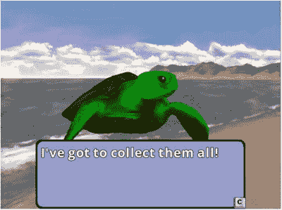

图 5-2.

《海星收集者》游戏的过场动画

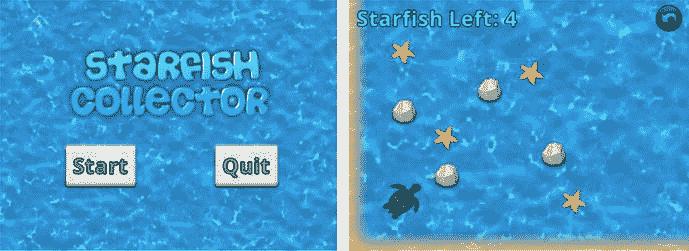

图 5-1.

具有改进用户界面的《海星收集者》游戏

在可选的最后一部分中，你将创建一个视觉小说风格的游戏，该游戏侧重于故事，并允许玩家决定故事的发展方向；你将创建的游戏名为《失踪的作业》，如图 5-3 所示。

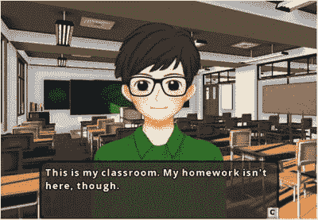

图 5-3.

视觉小说风格游戏《失踪的作业》的截图

首先，复制你之前在第 3 章中创建的项目，即修订版的《海星收集者》游戏，并将项目文件夹的副本重命名为`Starfish Collector Ch 5`（以避免与早期版本混淆）。然后，在项目文件夹中，将`BaseGame.java`、`BaseScreen.java`和`BaseActor.java`文件替换为你在第 4 章中更新了新功能和特性的版本。为了确保第 4 章中引入的`InputMultiplexer`对象被正确初始化，请在`StarfishGame`类的`create`方法开头添加以下代码行：

```
super.create();
```

接下来，从本书网站下载本章的源代码文件，将下载项目`assets`文件夹中的文件复制到你新项目的`assets`文件夹中，并对`+libs`文件夹（或`userlib`文件夹，如果你之前选择了该选项）中的 JAR 文件执行相同操作。在这两个文件夹中，之前项目中使用的文件没有更改（因此你可以保留旧文件的副本），但已添加了你需要的新文件。如果 BlueJ 正在运行，请关闭并重新启动，以便 BlueJ 正确识别新添加到`+libs`文件夹中的 JAR 文件。此时，你可以编译并运行项目，以验证一切是否仍像以前一样正常工作。

## 显示文本

在 LibGDX 框架中，文本通过`Label`对象显示。标签使用一个`String`（包含要显示的文本）和一个`LabelStyle`对象进行初始化，该对象决定了文本的渲染方式。创建`LabelStyle`对象又需要一个`BitmapFont`对象。以下部分将向你展示如何创建和使用这些对象。

为了在游戏中创建一致的设计，你很可能希望创建一个可在多个屏幕间共享的单一样式。因此，初始化这些对象的最佳位置是在某个派生自`Game`的类中，而不是派生自`Screen`的类中。由于每个项目只有一个`Game`对象实例，你可以通过定义公共静态变量来简化对此信息的访问，并且由于这段代码对未来的项目也有用，因此将其添加到`BaseGame`类中（而不是`StarfishGame`类）。为此，在`BaseGame`类中添加以下`import`语句：

```
import com.badlogic.gdx.graphics.g2d.BitmapFont;
import com.badlogic.gdx.scenes.scene2d.ui.Label.LabelStyle;
```

在类中添加以下变量声明：

```
public static LabelStyle labelStyle;
```

在`create`方法中，添加以下代码来初始化标签样式：

```
labelStyle = new LabelStyle();
labelStyle.font = new BitmapFont();
```

构造函数创建的默认字体是 LibGDX 库中包含的 15 号 Arial 字体。这对于你的应用程序来说可能太小了，因此以下部分将演示如何在你的应用程序中创建和使用自定义字体。


### 位图字体

计算机生成字体的数据通常以两种方式之一存储：要么作为一组数学曲线和公式（这被称为轮廓字体或矢量字体，包括 TrueType 字体等标准），要么作为一组图像。后者被称为位图字体，也是`LabelStyle`类所使用的格式。

要创建一个`BitmapFont`对象，你需要两样东西：一张包含应用程序中可能用到的所有字符的图像（图 5-4 包含一个示例），以及一个关联的数据文件，该文件列出了每个字符对应的区域（位置和大小）。例如，图 5-4 中对应字符 A 的区域位于 x=319、y=134 处，宽度为 45，高度为 41。当使用位图字体显示文本时，会提取文本中每个字符对应的图像区域，并将这些图像区域并排对齐，从而产生屏幕上看到的结果。

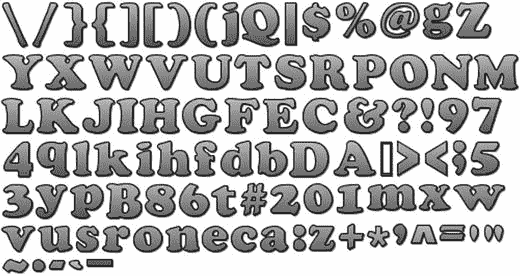

图 5-4.

用于创建位图字体的图像文件（512×256 像素）

接下来将讨论创建位图字体的两种方法：在运行程序之前使用外部应用程序生成所需文件，或者使用特殊类在运行时生成所需对象。每种方法都有其优缺点。使用外部应用程序可以让你立即看到并调整字母渲染后的外观，但运行该应用程序需要额外的时间，并且需要将额外的文件保存到项目的`assets`文件夹中。基于类的方法可以更轻松地更改字体参数（只需修改代码，无需保存新的一对文件），但在运行程序之前你无法看到文本的外观。这两种方法将在下文详细说明。在本章的示例代码中，最终将使用第二种方法，但在你自己的项目中，最终选择由你决定。

#### 使用 Hiero：位图字体编辑器

LibGDX 提供了一个名为 Hiero 的应用程序，可用于使用计算机上安装的字体生成位图字体数据。Hiero 的第一个版本由 Kevin Glass 创建，用于他的 Java 游戏开发库 Slick2D。此后，Hiero 由 LibGDX 库的主要贡献者之一 Nathan Sweet 移植到了 LibGDX。Hiero 被打包成一个可执行的 JAR 文件；当前的下载链接发布在 LibGDX Wiki 页面¹以及 LibGDX 工具页面²上，后者可从 LibGDX 主网站的下载页面访问。

启动 Hiero 后，会显示各种选项。图 5-5 包含了该程序运行时的截图。在左上角区域，你可以选择本地安装的字体；在中央区域，你可以输入想要生成图像的字符（但建议保留默认字符集）；在右上角区域，你可以选择应用于图像的各种效果（前提是已选择渲染方式：Java），包括纯色着色、渐变着色、轮廓和投影。效果的参数可以通过点击其值并输入或选择新值来更改。效果出现的顺序很重要，因为效果是从上到下依次应用的。完成后，从文件菜单中选择保存 BMFont 文件，你将获得一个 FNT 文件和一个 PNG 文件，可供 LibGDX 的`BitmapFont`类使用。本项目的`assets`文件夹包含了保存此图中所示位图字体的结果；对应的文件名为`cooper.fnt`和`cooper.png`。要在 LibGDX 中使用此字体，在`BaseGame`类的`create`方法中，你需要将设置标签样式对象字体变量的代码行更改为以下内容：

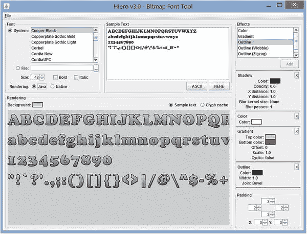

图 5-5.

用于生成位图字体数据的 Hiero 应用程序

```
labelStyle.font = new BitmapFont( Gdx.files.internal("myCustomFont.fnt") );
```

#### 使用 FreeType 字体生成器

除了使用应用程序创建位图字体，还可以使用`FreeTypeFontGenerator`类在代码中创建位图字体，从而消除对外部应用程序的依赖。要创建字体，你需要在`assets`文件夹中包含一个 TrueType 字体文件（扩展名为 TTF）作为位图字体的基础。通过互联网搜索可以轻松找到 TrueType 字体。³

首先，在`BaseGame`类中添加以下`import`语句：

```
import com.badlogic.gdx.graphics.Color;
import com.badlogic.gdx.graphics.Texture.TextureFilter;
import com.badlogic.gdx.graphics.g2d.freetype.FreeTypeFontGenerator;
import com.badlogic.gdx.graphics.g2d.freetype.FreeTypeFontGenerator.FreeTypeFontParameter;
```

然后，在`create`方法中，使用以下代码初始化一个`FreeTypeFontGenerator`对象，并引用 TTF 文件：

```
FreeTypeFontGenerator fontGenerator =
new FreeTypeFontGenerator(Gdx.files.internal("assets/OpenSans.ttf"));
```

接下来，要配置字体的外观，创建一个`FreeTypeFontParameter`对象，该对象允许你指定字体大小、字体颜色、边框宽度、边框颜色、直边或圆角边框边缘等。你还可以设置纹理过滤器，这决定了文本在应用程序中缩放时的显示方式。为此，在`create`方法中添加以下代码：

```
FreeTypeFontParameter fontParameters = new FreeTypeFontParameter();
fontParameters.size = 48;
fontParameters.color = Color.WHITE;
fontParameters.borderWidth = 2;
fontParameters.borderColor = Color.BLACK;
fontParameters.borderStraight = true;
fontParameters.minFilter = TextureFilter.Linear;
fontParameters.magFilter = TextureFilter.Linear;
```

完成此代码后，你可以生成位图字体并通过更改设置标签样式字体的代码行来分配它，如下所示：

```
BitmapFont customFont = fontGenerator.generateFont(fontParameters);
labelStyle.font = customFont;
```

完成此任务后，你就可以将注意力转向创建标签，并使用它们在游戏中显示文本。


### 标签

下一个目标是创建一个标签，用于显示游戏中剩余海星的数量，如图 5-6 所示。利用上一节创建的`BitmapFont`和`LabelStyle`对象，这一过程将非常直接。

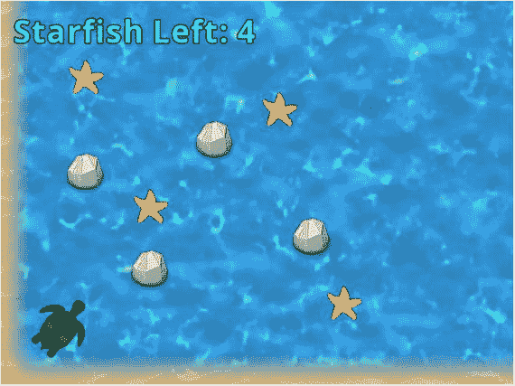

图 5-6.

显示待收集海星数量的标签

首先，在`LevelScreen`类中添加以下`import`语句：

```
import com.badlogic.gdx.graphics.Color;
import com.badlogic.gdx.scenes.scene2d.ui.Label;
```

接下来，在类中添加以下变量声明：

```
private Label starfishLabel;
```

为了初始化标签，请在`initialize`方法中添加以下代码。这些代码会将标签文本着色为浅蓝色（以契合海洋主题），并将其定位在用户界面的左上角附近：

```
starfishLabel = new Label("Starfish Left:", BaseGame.labelStyle);
starfishLabel.setColor( Color.CYAN );
starfishLabel.setPosition( 20, 520 );
uiStage.addActor(starfishLabel);
```

最后，在`update`方法中添加以下代码，用于设置标签文本以显示实际剩余的海星数量：

```
starfishLabel.setText("Starfish Left: " + BaseActor.count(mainStage, "Starfish"));
```

仅此而已！如果你想改变文本大小，可以在`BaseGame`类中配置`FreeTypeFontParameter`对象时调整字体大小，或者使用`Label`类的方法`setFontScale`，该方法会对文本应用缩放因子。

## 按钮

按钮是获取用户输入的最基本用户界面控件之一。在本节中，你将创建两种不同类型的按钮：一种仅包含图像以传达其功能，另一种则包含说明其作用的文本。在项目中添加按钮最复杂的步骤是指定点击按钮时运行的代码，我们将在创建按钮之前讨论这一点。

### 函数式接口与 Lambda 表达式

在许多情况下，将方法存储在变量中会很方便。一种常见的情况是将按钮被点击时应激活的代码存储在按钮对象本身中。然而，在 Java 编程语言中，方法不能存储在变量中。作为此类功能的替代方案，开发者通常会创建一个**函数式接口**：一个仅包含单个方法的接口。当需要存储方法时，就实现该接口并按需指定函数。

例如，考虑一个假设的`Button`类，它需要上述功能。在这种情况下，可以创建以下接口：

```
public interface Function
{
public void run();
}
```

然后，`Button`类可以设计如下：

```
public class Button
{
private Function clickFunction;
public void setFunction(Function f)
{
clickFunction = f;
}
public void click()
{
clickFunction.run();
}
}
```

理论上，设置函数可能需要相当多的代码。你可以创建一个全新的类来实现该接口，然后创建该类的实例并将其作为参数传递给`Button`类的`setFunction`方法。例如，要配置一个退出程序的按钮，你需要创建以下类：

```
public class QuitFunction implements Function
{
public void run()
{
System.exit(0);
}
}
```

然后，在你的应用程序中，你需要编写：

```
Button myButton = new Button();
myButton.setFunction( new QuitFunction() );
```

顺便提一下，这样创建的`QuitFunction`类实例被称为**匿名实例**，因为它没有赋值给变量（这没问题，因为它被`Button`类存储，并且在后续的应用程序代码中不再需要）。

创建单独类的另一种方法是在`application`类中编写`QuitFunction`类的代码，因为这是唯一需要使用它的地方。以这种方式组织代码时，`QuitFunction`将被称为**内部类**（基本上，是在另一个类内部定义的类）。更进一步，由于你只需要创建该类的一个实例，你可以结合这些想法，通过将类定义作为参数传递给方法来创建**匿名内部类**，如下所示：

```
myButton.setFunction(
new Function()
{
public void run()
{
System.exit(0);
}
});
```

然而，为了有效地传递一个方法，这仍然需要编写大量代码。因此，Java 8 引入了一种名为 **lambda 表达式**的新语言特性，它是为函数式接口创建匿名内部类的简化语法。方法的参数放在一对圆括号内，后面跟着一个短横线和大于号（`->`，意在类似箭头），再后面是一对包含要执行代码的花括号。例如，给定以下接口：

```
public interface MathFunction
{
public double calculate(double x);
}
```

考虑 lambda 表达式：

```
(double x) -> { return x*x; }
```

该 lambda 表达式等价于以下匿名内部类：

```
new MathFunction
{
public double calculate(double x)
{
return x*x;
}
}
```

请注意，lambda 表达式特别之处在于，它不需要你指定接口的名称或其包含的方法的名称（这两者都从上下文中推断出来）。

回到之前基于按钮的例子，退出功能可以通过以下简洁的 lambda 表达式添加到按钮对象中：

```
myButton.setFunction(
() -> { System.exit(0); }
);
```

注意圆括号是空的，因为这个方法不需要参数。

如你所见，在可能的情况下使用 lambda 表达式将在编写代码时节省大量时间。

点击按钮是一个离散事件的例子，由于你在上一章中向框架添加了功能，你的程序已经准备好响应点击事件。由于`Stage`类实现了`InputProcessor`接口，它将处理鼠标事件（如点击）。如果舞台在事件发生的位置包含一个演员，并且该演员包含一个`EventListener`对象，那么`EventListener`中包含的方法将被运行。由于`EventListener`是一个函数式接口，你可以在后续内容中使用（并且将会使用）lambda 表达式来指定功能。

在介绍了这些预备知识之后，你现在可以创建按钮并为其添加功能了。


### 基于图像的按钮

首先，你将创建一个基于图像的按钮，用于重新开始关卡，如图 5-7 所示。

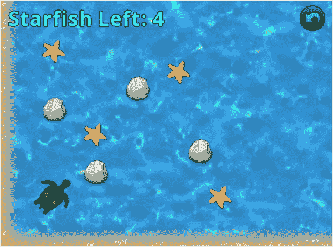

图 5-7.

海星收集器，右上角添加了关卡重启按钮

类似于标签需要一个指定位图字体的 `LabelStyle` 对象，按钮需要一个指定特定类型图像的 `ButtonStyle` 对象。首先，在 `LevelScreen` 类中添加以下 `import` 语句：

```
import com.badlogic.gdx.scenes.scene2d.ui.Button;
import com.badlogic.gdx.scenes.scene2d.ui.Button.ButtonStyle;
import com.badlogic.gdx.Gdx;
import com.badlogic.gdx.graphics.Texture;
import com.badlogic.gdx.graphics.g2d.TextureRegion;
import com.badlogic.gdx.scenes.scene2d.utils.TextureRegionDrawable;
import com.badlogic.gdx.scenes.scene2d.Event;
import com.badlogic.gdx.scenes.scene2d.InputEvent;
import com.badlogic.gdx.scenes.scene2d.InputEvent.Type;
```

接下来，你需要创建一个 `ButtonStyle` 对象，它有一个名为 `up` 的字段，用于存储按钮的默认图像。（还可以存储鼠标悬停在按钮上或按下按钮时对应的其他图像；更多详情请参考 LibGDX 文档。）LibGDX 要求用户界面元素中使用的图像实现 `Drawable` 接口；标准的图像相关类（如 `TextureRegion`）也有对应的实现了该接口的类。以下代码创建了 `ButtonStyle` 对象，创建并添加了一个 `TextureRegionDrawable` 图像，并使用它创建了一个按钮，按钮颜色为浅蓝色，并定位在右上角。将此代码添加到 `LevelScreen` 类的 `initialize` 方法中：

```
ButtonStyle buttonStyle = new ButtonStyle();
Texture buttonTex = new Texture( Gdx.files.internal("assets/undo.png") );
TextureRegion buttonRegion =  new TextureRegion(buttonTex);
buttonStyle.up = new TextureRegionDrawable( buttonRegion );
Button restartButton = new Button( buttonStyle );
restartButton.setColor( Color.CYAN );
restartButton.setPosition(720,520);
uiStage.addActor(restartButton);
```

最后，你需要为这个按钮添加功能。你将使用本节开头描述的 lambda 表达式来实现。这段代码的第一部分包含一个重要条件：你需要确保事件是一个 `InputEvent`，然后将 `Event` 对象转换为 `InputEvent` 对象，并检查事件的 `Type`，以确保它是一个鼠标按钮点击事件（而不是鼠标移动事件）。LibGDX 以相同的方式处理鼠标和触摸屏事件，因此鼠标点击事件被称为触摸按下事件。如果这两个条件中的任何一个不成立，该方法将立即退出并返回 false。考虑到这一点，将以下代码添加到 `create` 方法中，紧跟在之前输入的代码之后：

```
restartButton.addListener(
(Event e) ->
{
if ( !(e instanceof InputEvent) ||
!((InputEvent)e).getType().equals(Type.touchDown) )
return false;
StarfishGame.setActiveScreen( new LevelScreen() );
return false;
}
);
```

此时，你应该测试你的项目，以验证按钮是否按预期工作。

### 基于文本的按钮

接下来，你将在菜单屏幕上添加一些基于文本的按钮，让用户能够开始或退出游戏，如图 5-8 所示。

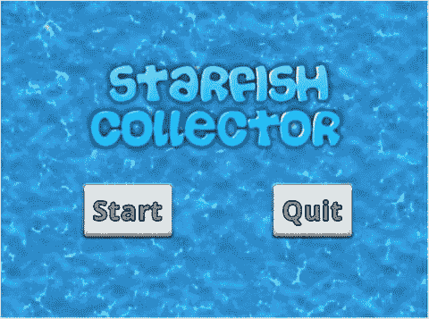

图 5-8.

添加了按钮的海星收集器菜单屏幕

与创建标签和基于图像的按钮一样，创建基于文本的按钮的第一步是创建一个关联的样式对象，用于存储视觉细节。在这种情况下，你需要创建一个 `TextButtonStyle` 对象，在其中指定位图字体、字体颜色和背景图像。

基于图像的按钮的背景图像是一个 `TextureRegionDrawable` 对象。然而，在基于文本的按钮中，一个潜在的复杂情况是当按钮的文本大于提供的图像时，文本会溢出按钮的边界。为了避免这个问题，你可以使用一种特殊类型的图像，称为九宫格图像，这是一种定义了九个子区域的图像。在缩放九宫格图像时，图像会沿着其边缘方向在边界区域进行拉伸。`NinePatch` 对象可以使用一个 `Texture` 后跟四个整数来初始化，如下所示：

```
NinePatch np = new NinePatch( texture, left, right, top, bottom );
```

这些整数表示从图像相应边缘测量的像素距离。它们用于将纹理划分为九个区域，如图 5-9 所示。

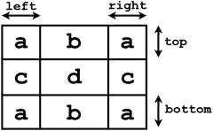

图 5-9.

将纹理划分为九个区域

当转换为 `NinePatch` 对象时，图像的角部（图 5-9 中标记为 `a` 的区域）永远不会被缩放；`b` 区域可以水平缩放，`c` 区域可以垂直缩放，而中心区域 `d` 可以双向缩放。这对于类似按钮的图像特别有用，这样图像的边缘就不会出现变形。图 5-10 展示了一个小图像分别使用标准方法和九宫格方法进行缩放的效果。特别注意，使用标准缩放时，放大图像的边框看起来更粗，而九宫格缩放则更接近地保留了原始边框的外观，因为它只沿着边缘方向缩放边界区域。

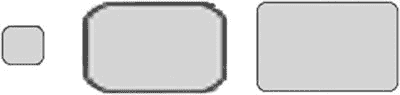

图 5-10.

一个类似按钮的图像，分别使用标准方法和九宫格方法进行缩放

了解了这些信息后，你就可以创建一个 `TextButtonStyle` 对象了。在 `BaseGame` 类中，添加以下 `import` 语句：

```
import com.badlogic.gdx.scenes.scene2d.ui.TextButton.TextButtonStyle;
import com.badlogic.gdx.graphics.g2d.NinePatch;
import com.badlogic.gdx.scenes.scene2d.utils.NinePatchDrawable;
import com.badlogic.gdx.graphics.Texture;
```

接下来，在类中添加以下变量声明：

```
public static TextButtonStyle textButtonStyle;
```

在 `create` 方法中，添加以下代码来初始化和配置 `TextButtonStyle` 对象。请注意，此时设置了 `fontColor`，因为对按钮本身调用 `setColor` 方法只会影响用于图像的色调颜色，而不会影响文本。

```
textButtonStyle = new TextButtonStyle();
Texture   buttonTex   = new Texture( Gdx.files.internal("assets/button.png") );
NinePatch buttonPatch = new NinePatch(buttonTex, 24,24,24,24);
textButtonStyle.up    = new NinePatchDrawable( buttonPatch );
textButtonStyle.font      = customFont;
textButtonStyle.fontColor = Color.GRAY;
```

设置好文本按钮样式后，你就可以准备向菜单屏幕添加文本按钮了。在 `MenuScreen` 类中，首先添加以下 `import` 语句：


```
import com.badlogic.gdx.scenes.scene2d.ui.TextButton;
import com.badlogic.gdx.scenes.scene2d.Event;
import com.badlogic.gdx.scenes.scene2d.InputEvent;
import com.badlogic.gdx.scenes.scene2d.InputEvent.Type;
```

接下来，移除 `initialize` 方法中用于显示名为 `message-start.png` 的图片文件（该图片显示“按‘S’键开始”的消息）的代码。然后，仍在 `initialize` 方法中，添加以下代码以显示两个按钮，分别标注为“开始”和“退出”，如图 5-8 所示。请注意，`TextButton` 对象使用它们将显示的文本以及来自 `BaseGame` 类的样式对象进行初始化，而功能则通过 lambda 表达式添加，这与您之前添加的基于图片的按钮类似。

```
TextButton startButton = new TextButton( "Start", BaseGame.textButtonStyle );
startButton.setPosition(150,150);
uiStage.addActor(startButton);
startButton.addListener(
(Event e) ->
{
if ( !(e instanceof InputEvent) ||
!((InputEvent)e).getType().equals(Type.touchDown) )
return false;
StarfishGame.setActiveScreen( new LevelScreen() );
return false;
}
);
TextButton quitButton = new TextButton( "Quit", BaseGame.textButtonStyle );
quitButton.setPosition(500,150);
uiStage.addActor(quitButton);
quitButton.addListener(
(Event e) ->
{
if ( !(e instanceof InputEvent) ||
!((InputEvent)e).getType().equals(Type.touchDown) )
return false;
Gdx.app.exit();
return false;
}
);
```

最后，出于可访问性的考虑，您将创建一个 `keyDown` 方法，使键盘能够执行与按钮相同的功能：按下回车键将开始游戏，而按下退出键将退出游戏。（尽管这些键盘控制并未列在菜单屏幕上，但它们非常常见，许多玩家会喜欢这些基于键盘的控制方式。）仍在 `MenuScreen` 类中，添加以下方法：

```
public boolean keyDown(int keyCode)
{
if (Gdx.input.isKeyPressed(Keys.ENTER))
StarfishGame.setActiveScreen( new LevelScreen() );
if (Gdx.input.isKeyPressed(Keys.ESCAPE))
Gdx.app.exit();
return false;
}
```

至此，文本按钮已完整且功能正常；现在是测试项目并验证一切是否按预期运行的好时机。

## 使用表格组织布局

确定标签和按钮等用户界面项应显示的确切屏幕坐标，同时考虑所放置项的大小以使它们相互对齐，这可能非常繁琐。幸运的是，LibGDX 库提供了一个名为 `Table` 的类，它通过自动定位和对齐这些元素，极大地简化了这一过程。

`Table` 是 `Actor` 的子类，因此它可以添加到 `Stage` 对象中；此外，`Table` 也是 `Group` 的子类，因此对象也可以添加到 `Table` 中。具体来说，一个 `Table` 由 `Cell` 对象组成，这些对象按行和列排列，每个 `Cell` 包含一个 `Actor`。`add` 方法会创建一个新的 `Cell`（如果指定了 `Actor`，则包含该 `Actor`），并将其添加到当前行的末尾。默认情况下，所有表格都只包含一行；要在 `Table` 中创建位于当前行下方的新行，我们调用 `row` 方法。仅出于说明目的（这不会添加到您的代码中），要创建一个包含 2x2 网格（包含 Actor 对象 `a`、`b`、`c` 和 `d`）的表格，如图 5-11 所示，您需要编写以下代码：

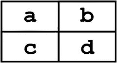

图 5-11.

一个简单的表格，元素排列成 2x2 网格

```
Table t = new Table();
t.add(a);
t.add(b);
t.row();
t.add(c);
t.add(d);
```

重要的是要记住，通常单个表格单元格的大小会尽可能小，同时仍能容纳其内容。然而，每行和每列中单元格的宽度和高度会扩大，以容纳该行或列中最大的元素。此外，`add` 方法会返回所创建的 `Cell` 对象，可以通过对结果调用以下任意方法的组合来调整其大小或格式：

*   `width` 和 `height` 用于设置 `Cell` 的大小（这反过来会影响 `Cell` 内任何 UI 组件的大小）
*   `expandX` 和 `expandY` 用于强制 `Cell` 增大其大小，以分别填充表格在水平或垂直方向上的剩余空间
*   `padLeft`、`padRight`、`padBottom`、`padTop` 用于为当前 `Cell` 的内容添加一定量的内边距（以像素为单位），或者使用 `pad` 方法在所有方向应用内边距

一个被放大到超出其默认大小的表格单元格，其内容默认会在单元格内居中对齐（水平和垂直方向），在这种情况下，您可以使用 `Cell` 类的方法 `left`、`right`、`bottom` 和 `top` 来对齐 `Actor` 在其单元格内的位置。此外，您可以使用 `Cell` 类的方法 `colspan` 声明单个单元格跨越多列，该方法接受单元格应填充的列数作为参数。

有了这些方法，在用户界面中排列元素就变得容易得多，并且无需手动计算坐标。首先，您将在自定义框架中包含一些代码，为每个屏幕添加一个表格到您一直用于用户界面元素的舞台中。在 `BaseScreen` 类中，添加 `import` 语句：

```
import com.badlogic.gdx.scenes.scene2d.ui.Table;
```

在类中，添加变量声明：

```
protected Table uiTable;
```

在 `BaseScreen` 构造函数方法中，添加以下代码来初始化表格：

```
uiTable = new Table();
uiTable.setFillParent(true);
uiStage.addActor(uiTable);
```

现在，您将重写游戏特定屏幕类中的一些代码，以利用这个新添加的表格。例如，考虑菜单屏幕上元素的布局，抽象地表示在图 5-12 的右侧，其中字母 `a` 代表标题图形，字母 `b` 和 `c` 分别代表“开始”和“退出”按钮。

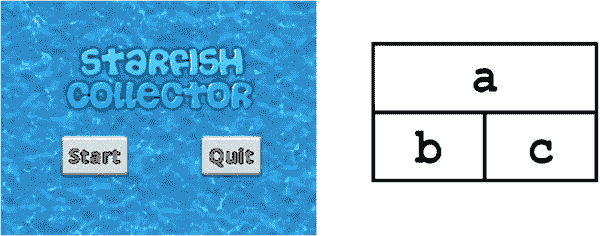


图 5-12.

菜单屏幕元素的抽象布局

在`MenuScreen`类中，删除用于定位名为`title`的`BaseActor`变量的代码，同时删除用于设置文本按钮位置并将其添加到`uiStage`的代码。然后，在`initialize`方法的末尾，添加以下代码以实现图 5-12 所示的布局：

```
uiTable.add(title).colspan(2);
uiTable.row();
uiTable.add(startButton);
uiTable.add(quitButton);
```

如果运行程序，你会看到标题图形和按钮按预期排列。作为此代码灵活性的进一步示例，接下来你将使用表格来简化主游戏屏幕中的用户布局，该布局抽象地表示在图 5-13 的右侧，其中字母`a`代表标签，字母`b`代表重启按钮。为了使这些元素分别出现在窗口的左右边缘，将在它们之间添加一个空单元格，并对其使用`expandX`方法，以用剩余的窗口宽度“填充”该行。类似地，为了将对象沿窗口顶部边缘对齐，将对空单元格使用`expandY`方法，使表格的高度“填满”窗口的整个高度。但是，默认情况下，对象在其单元格中居中对齐，因此必须在其单元格上调用`top`方法，以便将内容移动到顶部。此外，还将使用`pad`方法添加一个小边距。

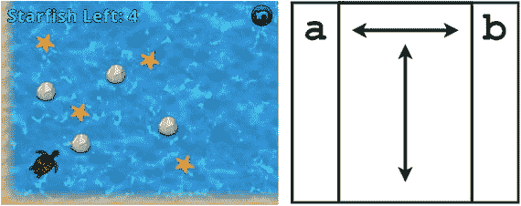

图 5-13.

关卡屏幕元素的抽象布局

在`LevelScreen`类中，删除设置标签和按钮位置的代码，同时删除将这些元素添加到`uiStage`的代码。然后，在`initialize`方法的末尾添加以下代码：

```
uiTable.pad(10);
uiTable.add(starfishLabel).top();
uiTable.add().expandX().expandY();
uiTable.add(restartButton).top();
```

如果此时运行代码，你会看到用户界面元素按预期排列。虽然理论上你可以继续手动计算所有这些元素的屏幕坐标，但希望这些示例已经证明，表格是在游戏项目中组织元素的一种高效且有效的方式。

在本章中，你已经学习了用户界面的基础知识：标签、按钮和表格。本章的其余部分包括基于文本的高级机制（对话框、标志和过场动画），这些内容本身很有趣，但对于后续章节并非必需。因此，如果你愿意，可以跳过本章的其余部分，直接进入下一章；否则，请继续阅读！

## 标志与对话框

许多游戏都设有玩家角色可以阅读的标志，或玩家可以与之对话的非玩家角色（NPC）。这类游戏元素可以服务于多种目的，例如：

*   游戏内教程或说明；
*   大型游戏环境中指向地点的方向（例如，一个写着“南边——道具店”的标志）；或
*   提示或引导（例如，一个 NPC 说“我听说森林西部藏有宝藏的传闻”）。

在本节中，你将学习如何创建对话框，以临时显示与此类交互对应的文本，如图 5-14 所示。

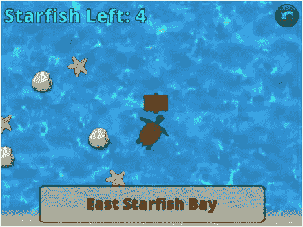

图 5-14.

海龟在《海星收集者》游戏中阅读标志

具体来说，你最终将创建一个名为`DialogBox`的类，该类存储一个背景图像和一个标签，并拥有一组方法，可用于轻松配置其外观。你将使用你最近添加到`BaseScreen`类中的`Table`类功能，将对话框定位在屏幕上。当需要显示文本时，对话框可以设置为可见；当玩家阅读完毕时，则设置为不可见。标志将被添加到《海星收集者》游戏中，海龟将能够阅读它们。为了尽可能保持游戏控制简单直观，每当海龟靠近标志时，阅读标志的机制就会被激活（对话框将变为可见并显示相应的文本）。（其他游戏可能要求玩家按下特定按键或按钮来阅读标志。）为此，将在`BaseActor`类中添加一个新方法，用于检查两个对象是否“接近”。

首先，在你的 BlueJ 项目中，创建一个名为`DialogBox`的新类，其中包含以下代码：

```
import com.badlogic.gdx.scenes.scene2d.Stage;
import com.badlogic.gdx.scenes.scene2d.ui.Label;
import com.badlogic.gdx.graphics.Color;
import com.badlogic.gdx.utils.Align;
public class DialogBox extends BaseActor
{
private Label dialogLabel;
private float padding = 16;
public DialogBox(float x, float y, Stage s)
{
super(x,y,s);
loadTexture("assets/dialog-translucent.png");
dialogLabel = new Label(" ", BaseGame.labelStyle);
dialogLabel.setWrap(true);
dialogLabel.setAlignment( Align.topLeft );
dialogLabel.setPosition( padding, padding );
this.setDialogSize( getWidth(), getHeight() );
this.addActor(dialogLabel);
}
public void setDialogSize(float width, float height)
{
this.setSize(width, height);
dialogLabel.setWidth( width - 2 * padding );
dialogLabel.setHeight( height - 2 * padding );
}
public void setText(String text)
{  dialogLabel.setText(text);  }
public void setFontScale(float scale)
{  dialogLabel.setFontScale(scale);  }
public void setFontColor(Color color)
{  dialogLabel.setColor(color);  }
public void setBackgroundColor(Color color)
{  this.setColor(color);  }
public void alignTopLeft()
{  dialogLabel.setAlignment( Align.topLeft );  }
public void alignCenter()
{  dialogLabel.setAlignment( Align.center );  }
}
```

正如预期，这个类包含一个用于显示文本的标签，并启用了自动换行功能，使标签能够显示多行文本。特别值得注意的是`setDialogSize`方法，它用于保持标签和背景图像的大小同步，同时添加一个由`padding`变量指定大小的小边距。其余方法应该不言自明；它们使你能够轻松更改显示的文本、更改背景图像或文本的颜色，以及缩放和对齐文本（包含英语句子的对话通常左上对齐，而仅显示地点名称的标志通常居中对齐）。


接下来，你将创建游戏中的标志牌。和往常一样，这些对象将继承 `BaseActor` 类，并且如你所料，它们会存储文本，供 `DialogBox` 对象显示。此外，它们还将包含一个布尔变量，用于跟踪该标志牌的文本当前是否正在被查看。（稍后你会看到，在切换对话框的可见性时，这个信息非常方便。）为此，创建一个名为 `Sign` 的新类，包含以下代码：

```
import com.badlogic.gdx.scenes.scene2d.Stage;
public class Sign extends BaseActor
{
// 要显示的文本
private String text;
// 用于判断标志牌文本当前是否正在显示
private boolean viewing;
public Sign(float x, float y, Stage s)
{
super(x,y,s);
loadTexture("assets/sign.png");
text = " ";
viewing = false;
}
public void setText(String t)
{  text = t;  }
public String getText()
{  return text;  }
public void setViewing(boolean v)
{  viewing = v;  }
public boolean isViewing()
{  return viewing;  }
}
```

接下来，你需要一种方法来判断两个角色是否“接近”。你将通过临时放大其中一个角色的边界多边形，然后检查是否重叠来实现这一点。最简便的放大多边形方法是设置其缩放比例（在 x 和 y 两个方向上）⁴；后续的计算假设该角色尚未在任何方向上进行过缩放。例如，如果一个角色的宽度和高度均为 50 像素，而你想判断另一个角色是否进入其 10 像素范围内，那么你需要将每个维度增加 20 像素（每边 10 像素），这相当于缩放因子为 (50 + 20)/50 = 1.4。这个计算由以下方法完成，你应该将其添加到 `BaseActor` 类中：

```
public boolean isWithinDistance(float distance, BaseActor other)
{
Polygon poly1 = this.getBoundaryPolygon();
float scaleX = (this.getWidth() + 2 * distance) / this.getWidth();
float scaleY = (this.getHeight() + 2 * distance) / this.getHeight();
poly1.setScale(scaleX, scaleY);
Polygon poly2 = other.getBoundaryPolygon();
// 初步测试以提高性能
if ( !poly1.getBoundingRectangle().overlaps(poly2.getBoundingRectangle()) )
return false;
return Intersector.overlapConvexPolygons( poly1, poly2 );
}
```

最后，你可以将标志牌和对话框添加到游戏中，并实现阅读标志牌的机制。在 `LevelScreen` 类中，首先添加以下变量声明：

```
private DialogBox dialogBox;
```

接着，在 `initialize` 方法中，添加以下代码来初始化并配置两个标志牌，以及用于显示相应文本的对话框（该对话框通过 `uiTable` 定位在用户界面中）。

```
Sign sign1 = new Sign(20,400, mainStage);
sign1.setText("西海星湾");
Sign sign2 = new Sign(600,300, mainStage);
sign2.setText("东海星湾");
dialogBox = new DialogBox(0,0, uiStage);
dialogBox.setBackgroundColor( Color.TAN );
dialogBox.setFontColor( Color.BROWN );
dialogBox.setDialogSize(600, 100);
dialogBox.setFontScale(0.80f);
dialogBox.alignCenter();
dialogBox.setVisible(false);
uiTable.row();
uiTable.add(dialogBox).colspan(3);
```

最后，在 `update` 方法中，对于每个标志牌，你需要确保乌龟不与标志牌重叠（因为它们在游戏中是实体对象），同时判断乌龟是否足够靠近某个标志牌（在此例中，假设四个像素即为足够接近）。如果乌龟靠近一个标志牌且该标志牌当前未被查看，那么你将根据标志牌中存储的文本设置对话框的文本，使对话框可见，并将该标志牌标记为当前正在被查看。你还需要一种方法，在乌龟离开当前正在查看的标志牌后，使对话框不可见。因此，这个循环中还有第二个条件，用于检查某个标志牌是否正在被查看且乌龟不在附近，在这种情况下，对话框变为不可见，并将该标志牌标记为不再被查看。为了实现这一点，将以下代码添加到 `update` 方法中：

```
for ( BaseActor signActor : BaseActor.getList(mainStage, "Sign") )
{
Sign sign = (Sign)signActor;
turtle.preventOverlap(sign);
boolean nearby = turtle.isWithinDistance(4, sign);
if ( nearby && !sign.isViewing() )
{
dialogBox.setText( sign.getText() );
dialogBox.setVisible( true );
sign.setViewing( true );
}
if (sign.isViewing() && !nearby)
{
dialogBox.setText( " " );
dialogBox.setVisible( false );
sign.setViewing( false );
}
}
```

至此，你已经完成了阅读标志牌机制的实现；你应该测试游戏，确保一切按预期工作。这里演示的相同方法也可以用于实现 NPC，只需将标志牌图形替换为你希望与之对话的角色图像即可。


## 创建过场动画

游戏内的过场动画可用于为游戏提供背景故事、角色与情节发展，以及玩家达成目标后的结局。类似于戏剧中演员表演动作和念白的一场戏，过场动画将由附加了`Action`对象的`Actor`对象组成（在`DialogBox`对象中显示文本是其中的一种特殊情况）。在本节中，你将创建用于显示过场动画的框架，并利用它为海星收集者游戏创建一个场景，该场景将包含以下部分：

*   海滩背景图像淡入。
*   一只海龟从舞台外（从左侧边缘外）移动到舞台中央。
*   一个对话框变得可见。
*   对话框显示文本“我要成为最棒的海星收集者！”
*   对话框显示文本“我要把它们全部收集起来！”
*   对话框变得不可见。
*   海龟向右移动，超出屏幕右侧边缘。
*   背景图像淡出为黑色。

该过场动画的示例图像如图 5-15 所示。


图 5-15.

海星收集者游戏的过场动画

上述每个部分都可以用一个`Actor`和一个`Action`来表示，这些信息将被封装在你即将创建的名为`SceneSegment`的类中。你将要创建的另一个名为`Scene`的类，将管理这些对象的集合（使用`ArrayList`）。通过让`Scene`类继承`Actor`类，你可以编写一个`act`方法，该方法能在相应动作完成时自动推进场景片段。（这反过来需要一个方法来判断`Actor`是否已完成其附加的动作。）

首先，创建一个名为`SceneSegment`的新类，包含以下代码。该类将包含一个名为`start`的方法，用于将动作附加到演员上。`isFinished`方法通过检查演员是否没有附加任何动作来判断其动作是否完成；之所以可行，是因为动作一旦完成就会自动从演员身上移除。最后，`finish`方法会以一个大数值调用动作的`act`方法，以完成任何进行中的动作，然后清除演员上的所有动作，以防有无限重复的动作附加到演员上。

```
import com.badlogic.gdx.scenes.scene2d.Actor;
import com.badlogic.gdx.scenes.scene2d.Action;
public class SceneSegment
{
private Actor actor;
private Action action;
public SceneSegment(Actor a1, Action a2)
{
actor = a1;
action = a2;
}
public void start()
{
actor.clearActions();
actor.addAction(action);
}
public boolean isFinished()
{
return (actor.getActions().size == 0);
}
public void finish()
{
// 模拟经过 100000 秒以完成进行中的动作
if ( actor.hasActions() )
actor.getActions().first().act(100000);
// 移除所有剩余动作
actor.clearActions();
}
}
```

尽管`DialogBox`是`BaseActor`的扩展，但在你创建一个自定义的`Action`来设置`DialogBox`的文本之前，显示文本并不适用于这个框架。为此，你需要扩展`Action`类并重写`act`方法，该方法负责执行相应的动作。`Action`类包含一个名为`target`的变量，它是对添加了该动作的`Actor`的引用，这对于编写`act`方法很重要。`act`方法返回一个布尔值，指示动作是否已完成。有了这些信息，编写自定义的`Action`类就相对简单了：它需要存储将要显示的文本，而`act`方法需要将`Actor`强制转换为`DialogBox`，以便使用其`setText`方法，此时动作完成，因此`act`方法应立即返回`true`。为实现这一点，创建一个名为`SetTextAction`的类，包含以下代码：

```
import com.badlogic.gdx.scenes.scene2d.Stage;
import com.badlogic.gdx.scenes.scene2d.Action;
public class SetTextAction extends Action
{
protected String textToDisplay;
public SetTextAction(String t)
{
textToDisplay = t;
}
public boolean act(float dt)
{
DialogBox db = (DialogBox)target;
db.setText( textToDisplay );
return true;
}
}
```

接下来，你需要一种在显示文本后暂停场景的方法，以便给玩家阅读文本的时间。你还需要一个选项，让玩家在准备好时（通过按键指示）继续场景。这可以通过创建一个设置为无限重复的`DelayAction`，并将其用作场景片段的一部分来实现。按下某个键将调用该片段的`finish`方法，从而使场景继续。为了简化在需要时创建此动作（以及其他动作）的过程，接下来你将创建一个类似于 LibGDX `Actions` 类的类，两者都包含创建各种`Action`对象实例的静态方法。为此，创建一个名为`SceneActions`的新类，包含以下代码：

```
import com.badlogic.gdx.scenes.scene2d.Stage;
import com.badlogic.gdx.scenes.scene2d.Action;
import com.badlogic.gdx.scenes.scene2d.actions.Actions;
import com.badlogic.gdx.graphics.g2d.Animation;
public class SceneActions extends Actions
{
public static Action setText(String s)
{
return new SetTextAction(s);
}
public static Action pause()
{
return Actions.forever( Actions.delay(1) );
}
}
```

与此同时，能够将演员移动到屏幕上的特定区域（左侧、中央、右侧）或屏幕外（左侧或右侧）会很方便，如图 5-16 所示。

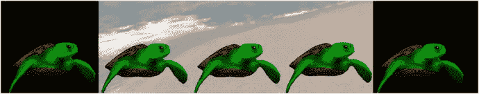

图 5-16.

海龟定位在（从左到右）屏幕外左侧、屏幕左侧、屏幕中央、屏幕右侧和屏幕外右侧的位置

这可以部分通过`MoveToAction`和`Align`类来实现，但它还需要访问屏幕的大小（在此情况下等同于游戏世界的大小），该大小存储在`BaseActor`类的`worldBounds`变量中。为了获取此信息，在`BaseActor`类中添加以下方法：

```
public static Rectangle getWorldBounds()
{
return worldBounds;
}
```

接下来，回到`SceneActions`类，添加以下`import`语句：

```
import com.badlogic.gdx.utils.Align;
```

然后，添加以下五个静态方法，其功能完全由方法名描述：


```
public static Action moveToScreenLeft(float duration)
{
return Actions.moveToAligned( 0, 0, Align.bottomLeft, duration );
}
public static Action moveToScreenRight(float duration)
{
return Actions.moveToAligned( BaseActor.getWorldBounds().width, 0,
Align.bottomRight, duration );
}
public static Action moveToScreenCenter(float duration)
{
return Actions.moveToAligned( BaseActor.getWorldBounds().width / 2, 0,
Align.bottom, duration);
}
public static Action moveToOutsideLeft(float duration)
{
return Actions.moveToAligned( 0, 0, Align.bottomRight, duration );
}
public static Action moveToOutsideRight(float duration)
{
return Actions.moveToAligned( BaseActor.getWorldBounds().width, 0,
Align.bottomLeft, duration );
}
```

现在，你将设计并实现 `Scene` 类，该类将管理一组 `SceneSegment` 对象。该类将使用 `ArrayList` 来实现此目的，并且还将存储当前正在处理的片段的索引。需要实现的标准功能包括添加片段和清除片段列表。`start` 方法会将索引设置为 `0`，并调用第一个片段的 `start` 方法。在 `Scene` 类的 `act` 方法中，如果当前片段已完成且不是列表中的最后一个片段，则应加载下一个片段；这些方面将分别由 `isSegmentFinished`、`isLastSegment` 和 `loadNextSegment` 方法实现。最后，为了方便起见，你将包含一个检查场景是否结束的方法，该方法可用于确定何时进入游戏的下一部分。为了实现所有这些功能，请创建一个名为 `Scene` 的新类，代码如下：

```
import com.badlogic.gdx.scenes.scene2d.Actor;
import java.util.ArrayList;
public class Scene extends Actor
{
private ArrayList segmentList;
private int index;
public Scene()
{
super();
segmentList = new ArrayList();
index = -1;
}
public void addSegment(SceneSegment segment)
{
segmentList.add(segment);
}
public void clearSegments()
{
segmentList.clear();
}
public void start()
{
index = 0;
segmentList.get(index).start();
}
public void act(float dt)
{
if ( isSegmentFinished() && !isLastSegment() )
loadNextSegment();
}
public boolean isSegmentFinished()
{
return segmentList.get(index).isFinished();
}
public boolean isLastSegment()
{
return (index >= segmentList.size() - 1);
}
public void loadNextSegment()
{
if ( isLastSegment() )
return;
segmentList.get(index).finish();
index++;
segmentList.get(index).start();
}
public boolean isSceneFinished()
{
return ( isLastSegment() && isSegmentFinished() );
}
}
```

现在，你已经准备好为 Starfish Collector 游戏创建一个过场动画。首先，创建一个名为 `StoryScreen` 的新类，代码如下：

```
import com.badlogic.gdx.Gdx;
import com.badlogic.gdx.Input.Keys;
import com.badlogic.gdx.scenes.scene2d.Action;
import com.badlogic.gdx.scenes.scene2d.actions.Actions;
import com.badlogic.gdx.graphics.Color;
public class StoryScreen extends BaseScreen
{
Scene scene;
BaseActor continueKey;
public void initialize()
{    }
public void update(float dt)
{    }
public boolean keyDown(int keyCode)
{    return false;  }
}
```

继续键图像将是一个键盘按键（此处为字母“C”），在文本显示后出现，作为视觉提示，告知玩家应按下该键以继续。这将使玩家能够在暂停动作进行时进入下一个场景片段。为此，请在 `keyDown` 方法中添加以下代码（位于 `return` 语句之前）：

```
if ( keyCode == Keys.C && continueKey.isVisible() )
scene.loadNextSegment();
```

接下来，在 `initialize` 方法中，你将设置将成为场景一部分的角色。为此，请添加以下代码：

```
BaseActor background = new BaseActor(0,0, mainStage);
background.loadTexture( "assets/oceanside.png" );
background.setSize(800,600);
background.setOpacity(0);
BaseActor.setWorldBounds(background);
BaseActor turtle = new BaseActor(0,0, mainStage);
turtle.loadTexture( "assets/turtle-big.png" );
turtle.setPosition( -turtle.getWidth(), 0 );
DialogBox dialogBox = new DialogBox(0,0, uiStage);
dialogBox.setDialogSize(600, 200);
dialogBox.setBackgroundColor( new Color(0.6f, 0.6f, 0.8f, 1) );
dialogBox.setFontScale(0.75f);
dialogBox.setVisible(false);
uiTable.add(dialogBox).expandX().expandY().bottom();
continueKey = new BaseActor(0,0,uiStage);
continueKey.loadTexture("assets/key-C.png");
continueKey.setSize(32,32);
continueKey.setVisible(false);
dialogBox.addActor(continueKey);
continueKey.setPosition( dialogBox.getWidth() - continueKey.getWidth(), 0 );
```

现在，你已经准备好创建将添加到场景中的场景片段序列。如前所述，在显示文本后，应使继续键图像可见，并添加一个暂停动作（此动作添加到的对象并不重要）。将所有片段添加到场景后，必须调用场景的 `start` 方法。完整的场景（如本节开头所述）是通过在 `initialize` 方法末尾添加以下代码来创建的：

```
scene = new Scene();
mainStage.addActor(scene);
scene.addSegment( new SceneSegment( background, Actions.fadeIn(1) ));
scene.addSegment( new SceneSegment( turtle, SceneActions.moveToScreenCenter(2) ));
scene.addSegment( new SceneSegment( dialogBox, Actions.show() ));
scene.addSegment( new SceneSegment( dialogBox,
SceneActions.setText("我想成为最棒的……海星收集者！" ) ));
scene.addSegment( new SceneSegment( continueKey, Actions.show() ));
scene.addSegment( new SceneSegment( background, SceneActions.pause() ));
scene.addSegment( new SceneSegment( continueKey, Actions.hide() ));
scene.addSegment( new SceneSegment( dialogBox,
SceneActions.setText("我要把它们全部收集起来！" ) ));
scene.addSegment( new SceneSegment( continueKey, Actions.show() ));
scene.addSegment( new SceneSegment( background, SceneActions.pause() ));
scene.addSegment( new SceneSegment( continueKey, Actions.hide() ));
scene.addSegment( new SceneSegment( dialogBox, Actions.hide() ) );
scene.addSegment( new SceneSegment( turtle, SceneActions.moveToOutsideRight(1) ));
scene.addSegment( new SceneSegment( background, Actions.fadeOut(1) ));
scene.start();
```

当场景结束时，应加载 `LevelScreen` 类。为此，请在 `update` 方法中添加以下代码：

```
if ( scene.isSceneFinished() )
BaseGame.setActiveScreen( new LevelScreen() );
```

最后，当点击“开始”按钮或按下 Enter 键时，应从 `MenuScreen` 类加载 `StoryScreen` 类。因此，在 `MenuScreen` 类中，将对 `LevelScreen` 的两个引用都替换为 `StoryScreen`（一个在“开始”按钮的 lambda 表达式中，另一个在 `keyDown` 方法中）。完成此操作后，测试你的程序，并在投入游戏动作之前欣赏过场动画！


## 游戏项目：视觉小说

在本节中，你将基于用户界面类（如`TextButton`和`Table`）以及过场动画框架，创建一个名为《失踪的作业》的新游戏，如图 5-17 所示。这款游戏属于视觉小说类游戏，完全由故事驱动，并向玩家呈现一系列影响故事进程的选择。虽然这是一个练习和提升你创建用户界面元素技能的好机会，但后续章节并不需要这些内容，因此如果你对这种游戏风格不感兴趣，可以跳过此项目。

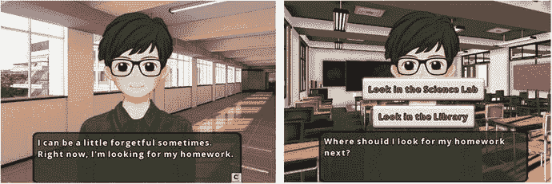

图 5-17.

游戏《失踪的作业》截图

在游戏《失踪的作业》中，一名叫凯尔索·基斯梅特的学生把作业忘在了学校的某个地方。玩家需要选择凯尔索将要搜索的地点，直到他找到作业所在的位置。游戏中共有四个地点，如图 5-18 所示。


图 5-18.

《失踪的作业》中的地点：走廊、教室、科学实验室和图书馆

这些地点的详情如下：

*   **走廊**：这里是角色凯尔索登场并交代故事背景的地方。相应场景结束后，凯尔索前往教室。
*   **教室**：在确认作业不在此处后，玩家可以选择前往科学实验室或图书馆。
*   **科学实验室**：在确认作业不在此处后，玩家可以选择返回教室或前往图书馆。
*   **图书馆**：经过一番简短搜索，凯尔索找到了他丢失的作业，游戏结束。

这些地点之间的连接关系由图 5-19 中的示意图说明，其中圆圈代表故事中对应玩家决策的分支点。

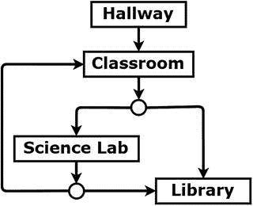

图 5-19.

《失踪的作业》地点示意图

首先，在 BlueJ 中创建一个名为`The Missing Homework`的新项目。从本书网站下载此项目的文件，并将下载项目中的`assets`文件夹和`+libs`文件夹复制到你的本地项目中。此外，在你的本地项目文件夹中，从你的`Starfish Collector Ch 5`项目中复制以下 Java 文件：`BaseGame.java`、`BaseScreen.java`和`BaseActor.java`，以及与过场动画相关的 Java 文件`DialogBox.java`、`Scene.java`、`SceneSegment.java`、`SetTextAction.java`和`SceneActions.java`。之后需要在 BlueJ 中重新打开该项目才能看到添加的类。

在开始编写更多代码之前，确立此项目的结构非常重要。首先，和往常一样，需要有一个自定义的`launcher`类和一个`BaseGame`类的扩展。与添加了过场动画的《海星收集者》游戏类似，这里将有两个`BaseScreen`类的扩展：一个包含菜单，另一个包含显示故事的代码。后者将是一个名为`StoryScreen`的类，它将包含四个方法，用于初始化与前述每个地点相对应的场景片段。（请注意，在创建完所有类之前，以下类将无法编译。）首先，创建一个名为`Launcher`的类，代码如下：

```
import com.badlogic.gdx.Game;
import com.badlogic.gdx.backends.lwjgl.LwjglApplication;
public class Launcher
{
public static void main (String[] args)
{
Game myGame = new HomeworkGame();
LwjglApplication launcher
= new LwjglApplication( myGame, "The Missing Homework", 800, 600 );
}
}
```

接下来，创建一个名为`HomeworkGame`的类，代码如下：

```
public class HomeworkGame extends BaseGame
{
public void create()
{
super.create();
setActiveScreen( new MenuScreen() );
}
}
```

为了减小此游戏中文本的大小，在`BaseGame`类中，修改设置字体大小的代码行（变量`fontParameters.size`），将字体大小设为`24`。接着，创建一个名为`MenuScreen`的类，代码如下；它将生成如图 5-20 所示的菜单界面：

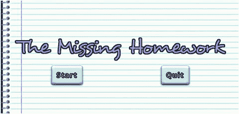

图 5-20.

《失踪的作业》菜单界面

```
import com.badlogic.gdx.Gdx;
import com.badlogic.gdx.Input.Keys;
import com.badlogic.gdx.scenes.scene2d.ui.TextButton;
import com.badlogic.gdx.scenes.scene2d.Event;
import com.badlogic.gdx.scenes.scene2d.InputEvent;
import com.badlogic.gdx.scenes.scene2d.InputEvent.Type;
public class MenuScreen extends BaseScreen
{
public void initialize()
{
BaseActor background = new BaseActor(0,0, mainStage);
background.loadTexture( "assets/notebook.jpg" );
background.setSize(800,600);
BaseActor title = new BaseActor(0,0, mainStage);
title.loadTexture( "assets/missing-homework.png" );
TextButton startButton = new TextButton( "开始", BaseGame.textButtonStyle );
startButton.addListener(
(Event e) ->
{
if ( !(e instanceof InputEvent) ||
!((InputEvent)e).getType().equals(Type.touchDown) )
return false;
BaseGame.setActiveScreen( new StoryScreen() );
return false;
}
);
TextButton quitButton = new TextButton( "退出", BaseGame.textButtonStyle );
quitButton.addListener(
(Event e) ->
{
if ( !(e instanceof InputEvent) ||
!((InputEvent)e).getType().equals(Type.touchDown) )
return false;
Gdx.app.exit();
return false;
}
);
uiTable.add(title).colspan(2);
uiTable.row();
uiTable.add(startButton);
uiTable.add(quitButton);
}
public void update(float dt)
{    }
public boolean keyDown(int keyCode)
{
if (Gdx.input.isKeyPressed(Keys.ENTER))
BaseGame.setActiveScreen( new StoryScreen() );
if (Gdx.input.isKeyPressed(Keys.ESCAPE))
Gdx.app.exit();
return false;
}
}
```

接下来，创建一个名为`StoryScreen`的新类，包含以下代码：

```
import com.badlogic.gdx.Gdx;
import com.badlogic.gdx.Input.Keys;
import com.badlogic.gdx.scenes.scene2d.Action;
import com.badlogic.gdx.scenes.scene2d.actions.Actions;
import com.badlogic.gdx.graphics.Color;
import com.badlogic.gdx.scenes.scene2d.ui.TextButton;
import com.badlogic.gdx.scenes.scene2d.ui.Table;
import com.badlogic.gdx.scenes.scene2d.Event;
import com.badlogic.gdx.scenes.scene2d.InputEvent;
import com.badlogic.gdx.scenes.scene2d.InputEvent.Type;
public class StoryScreen extends BaseScreen
{
public void initialize()
{    }
public void hallway()
{    }
public void classroom()
{    }
public void scienceLab()
{    }
public void library()
{    }
public void update(float dt)
{    }
public boolean keyDown(int keyCode)
{  return false;  }
}
```

由于会使用多张背景图片，并且主角会通过多张图片来表达情绪，你需要创建一些扩展`BaseActor`类的类来存储这些额外数据。首先，创建一个名为`Background`的新类，代码如下：

```
import com.badlogic.gdx.scenes.scene2d.Stage;
import com.badlogic.gdx.graphics.g2d.Animation;
public class Background extends BaseActor
{
public Animation hallway;
public Animation classroom;
public Animation scienceLab;
public Animation library;
public Background(float x, float y, Stage s)
{
super(x,y,s);
hallway = loadTexture("assets/bg-hallway.jpg");
classroom = loadTexture("assets/bg-classroom.jpg");
scienceLab = loadTexture("assets/bg-science-lab.jpg");
library = loadTexture("assets/bg-library.jpg");
setSize(800,600);
}
}
```

接下来，创建一个名为`Kelsoe`的新类，代码如下：


```
import com.badlogic.gdx.scenes.scene2d.Stage;
import com.badlogic.gdx.graphics.g2d.Animation;
public class Kelsoe extends BaseActor
{
public Animation normal;
public Animation sad;
public Animation lookLeft;
public Animation lookRight;
public Kelsoe(float x, float y, Stage s)
{
super(x,y,s);
normal = loadTexture("assets/kelsoe-normal.png");
sad = loadTexture("assets/kelsoe-sad.png");
lookLeft = loadTexture("assets/kelsoe-look-left.png");
lookRight = loadTexture("assets/kelsoe-look-right.png");
}
}
```

在这个游戏中（以及大多数视觉小说风格的游戏），你还需要一些特殊动作。要更改 `BaseActor` 当前显示的动画，请创建一个名为 `SetAnimationAction` 的新类，代码如下。它与 `SetTextAction` 类类似，都存储了一些额外数据（此处为 `Animation`），并对 `target` 演员进行类型转换，以便能够调用设置动画的方法。

```
import com.badlogic.gdx.scenes.scene2d.Action;
import com.badlogic.gdx.graphics.g2d.Animation;
public class SetAnimationAction extends Action
{
protected Animation animationToDisplay;
public SetAnimationAction(Animation a)
{
animationToDisplay = a;
}
public boolean act(float dt)
{
BaseActor ba = (BaseActor)target;
ba.setAnimation( animationToDisplay );
return true;
}
}
```

为了在 `DialogBox` 中逐字显示文本，模拟打字效果（这是视觉小说中常见的替代说话动画的效果），请创建一个名为 `TypewriterAction` 的新类，包含以下代码。请注意，此类继承自 `SetTextAction`（因此可以访问 `String` 变量 `textToDisplay`），并会跟踪已过去的时间。根据 `charactersPerSecond` 中存储的值和已过去的时间，`textToDisplay` 的一个子串将显示在对应的 `DialogBox` 中。

```
import com.badlogic.gdx.scenes.scene2d.Stage;
import com.badlogic.gdx.scenes.scene2d.Action;
public class TypewriterAction extends SetTextAction
{
private float elapsedTime;
private float charactersPerSecond;
public TypewriterAction(String t)
{
super(t);
elapsedTime = 0;
charactersPerSecond = 30;
}
public boolean act(float dt)
{
elapsedTime += dt;
int numberOfCharacters = (int)(elapsedTime * charactersPerSecond);
if (numberOfCharacters > textToDisplay.length())
numberOfCharacters = textToDisplay.length();
String partialText = textToDisplay.substring(0, numberOfCharacters);
DialogBox db = (DialogBox)target;
db.setText( partialText );
// 当所有字符都显示完毕时，动作完成
return ( numberOfCharacters >= textToDisplay.length() );
}
}
```

为了与你之前的工作保持一致，并简化这两个新动作的创建，你将创建一对对应的静态方法。在 `SceneActions` 类中，添加以下两个方法：

```
public static Action setAnimation(Animation a)
{
return new SetAnimationAction(a);
}
public static Action typewriter(String s)
{
return new TypewriterAction(s);
}
```

完成这些添加后，你就拥有了游戏所需的所有 `Actor`。回到 `StoryScreen` 类，并向该类添加以下变量：

```
Scene scene;
Background background;
Kelsoe kelsoe;
DialogBox dialogBox;
BaseActor continueKey;
Table buttonTable;
BaseActor theEnd;
```

接下来，在 `initialize` 方法中添加以下代码来初始化和配置这些变量：

```
background = new Background(0,0, mainStage);
background.setOpacity(0);
BaseActor.setWorldBounds(background);
kelsoe = new Kelsoe(0,0, mainStage);
dialogBox = new DialogBox(0,0, uiStage);
dialogBox.setDialogSize(600, 150);
dialogBox.setBackgroundColor( new Color(0.2f, 0.2f, 0.2f, 1) );
dialogBox.setVisible(false);
continueKey = new BaseActor(0,0,uiStage);
continueKey.loadTexture("assets/key-C.png");
continueKey.setSize(32,32);
continueKey.setVisible(false);
dialogBox.addActor(continueKey);
continueKey.setPosition( dialogBox.getWidth() - continueKey.getWidth(), 0 );
buttonTable = new Table();
buttonTable.setVisible(false);
uiTable.add().expandY();
uiTable.row();
uiTable.add(buttonTable);
uiTable.row();
uiTable.add(dialogBox);
theEnd = new BaseActor(0,0,mainStage);
theEnd.loadTexture("assets/the-end.png");
theEnd.centerAtActor(background);
theEnd.setScale(2);
theEnd.setOpacity(0);
scene = new Scene();
mainStage.addActor(scene);
hallway();
```

为了在用户按下按键（C 键）时推进场景，请将 `keyDown` 方法修改为以下内容：

```
public boolean keyDown(int keyCode)
{
if ( keyCode == Keys.C )
scene.loadNextSegment();
return false;
}
```

在向对应游戏内各个地点的添加代码之前，你将在 `StoryScreen` 类中添加另一个方法，这将大大减少你需要编写的代码量。通常，你需要显示文本、使继续键可见、添加暂停动作，然后使继续键不可见。为了提高效率，请在 `StoryScreen` 类中添加以下方法：

```
public void addTextSequence(String s)
{
scene.addSegment( new SceneSegment( dialogBox, SceneActions.typewriter(s) ));
scene.addSegment( new SceneSegment( continueKey, Actions.show() ));
scene.addSegment( new SceneSegment( background, SceneActions.pause() ));
scene.addSegment( new SceneSegment( continueKey, Actions.hide() ));
}
```

你将实现的第一个方法是 `hallway` 方法。你会注意到，每个特定地点的方法都以设置正确的背景动画、淡入背景、将 Kelsoe 移动到屏幕中央以及使对话框可见开始。此外，这些方法通常以使对话框不可见、将 Kelsoe 移出屏幕以及淡出背景结束。在此方法的末尾，为了自动推进到下一个区域，你需要调用 `classroom` 方法。这可以通过 `RunnableAction` 实现，它接受一个 `Runnable` 对象作为参数。由于 `Runnable` 是一个函数式接口，你将为此动作的参数使用 lambda 表达式。具体来说，这个表达式将是 `() -> { classroom(); }`，表示没有参数，并且应该调用 `classroom` 方法。将以下代码添加到 `hallway` 方法中：

```
background.setAnimation( background.hallway );
dialogBox.setText("");
kelsoe.addAction( SceneActions.moveToOutsideLeft(0) );
scene.addSegment( new SceneSegment( background, Actions.fadeIn(1) ));
scene.addSegment( new SceneSegment( kelsoe, SceneActions.moveToScreenCenter(1) ));
scene.addSegment( new SceneSegment( dialogBox, Actions.show() ));
addTextSequence( "我叫凯尔索·基斯梅特。我是奥雷乌斯·卢杜斯学院的一名学生。" );
addTextSequence( "我有时会有点健忘。现在，我正在找我的作业。" );
scene.addSegment( new SceneSegment( dialogBox, Actions.hide() ));
scene.addSegment( new SceneSegment( kelsoe, SceneActions.moveToOutsideRight(1) ));
scene.addSegment( new SceneSegment( background, Actions.fadeOut(1) ));
scene.addSegment( new SceneSegment( background, Actions.run(() -> { classroom(); }) ));
scene.start();
```


接下来，你将实现 `classroom` 方法。在该方法的末尾，会创建两个文本按钮并添加到之前创建的按钮表格中。在每个按钮的 lambda 表达式中，会根据玩家的选择添加相应的场景片段。请将以下代码添加到 `classroom` 方法中：

```
scene.clearSegments();
background.setAnimation( background.classroom );
dialogBox.setText("");
kelsoe.addAction( SceneActions.moveToOutsideLeft(0) );
scene.addSegment( new SceneSegment( background, Actions.fadeIn(1) ));
scene.addSegment( new SceneSegment( kelsoe, SceneActions.moveToScreenCenter(1) ));
scene.addSegment( new SceneSegment( dialogBox, Actions.show() ));
addTextSequence( "这是我的教室。不过，我的作业不在这里。" );
addTextSequence( "接下来我该去哪里找作业呢？" );
scene.addSegment( new SceneSegment( buttonTable, Actions.show() ));
// 设置选项
TextButton scienceLabButton = new TextButton("去科学实验室看看",
BaseGame.textButtonStyle);
scienceLabButton.addListener(
(Event e) ->
{
if ( !(e instanceof InputEvent) ||
!((InputEvent)e).getType().equals(Type.touchDown) )
return false;
scene.addSegment( new SceneSegment( buttonTable, Actions.hide() ));
addTextSequence( "好主意。我去科学实验室看看。" );
scene.addSegment( new SceneSegment( dialogBox, Actions.hide() ));
scene.addSegment( new SceneSegment( kelsoe, SceneActions.moveToOutsideLeft(1) ));
scene.addSegment( new SceneSegment( background, Actions.fadeOut(1) ));
scene.addSegment( new SceneSegment( background, Actions.run(() -> { scienceLab(); }) ));
return false;
}
);
TextButton libraryButton = new TextButton("去图书馆看看", BaseGame.textButtonStyle);
libraryButton.addListener(
(Event e) ->
{
if ( !(e instanceof InputEvent) ||
!((InputEvent)e).getType().equals(Type.touchDown) )
return false;
scene.addSegment( new SceneSegment( buttonTable, Actions.hide() ));
addTextSequence( "好主意。也许我把它落在图书馆了。" );
scene.addSegment( new SceneSegment( dialogBox, Actions.hide() ));
scene.addSegment( new SceneSegment( kelsoe, SceneActions.moveToOutsideLeft(1) ));
scene.addSegment( new SceneSegment( background, Actions.fadeOut(1) ));
scene.addSegment( new SceneSegment( background, Actions.run(() -> { library(); }) ));
return false;
}
);
buttonTable.clearChildren();
buttonTable.add(scienceLabButton);
buttonTable.row();
buttonTable.add(libraryButton);
scene.start();
```

接下来是 `scienceLab` 方法。这与前一个方法类似——同样会显示两个文本按钮，让玩家选择返回教室或前往图书馆。请将以下代码添加到 `scienceLab` 方法中：

```
scene.clearSegments();
background.setAnimation( background.scienceLab );
dialogBox.setText("");
kelsoe.addAction( SceneActions.moveToOutsideLeft(0) );
scene.addSegment( new SceneSegment( background, Actions.fadeIn(1) ));
scene.addSegment( new SceneSegment( kelsoe, SceneActions.moveToScreenCenter(1) ));
scene.addSegment( new SceneSegment( dialogBox, Actions.show() ));
addTextSequence( "这是科学实验室。" );
scene.addSegment( new SceneSegment( kelsoe, SceneActions.setAnimation( kelsoe.sad ) ));
addTextSequence( "不过，我的作业不在这里。" );
scene.addSegment( new SceneSegment( kelsoe, SceneActions.setAnimation( kelsoe.normal ) ));
addTextSequence( "现在我该去哪儿呢？" );
scene.addSegment( new SceneSegment( buttonTable, Actions.show() ));
// 设置选项
TextButton classroomButton = new TextButton("返回教室",
BaseGame.textButtonStyle);
classroomButton.addListener(
(Event e) ->
{
if ( !(e instanceof InputEvent) ||
!((InputEvent)e).getType().equals(Type.touchDown) )
return false;
scene.addSegment( new SceneSegment( buttonTable, Actions.hide() ));
addTextSequence( "也许有人找到了并放回了教室。我去看看。" );
scene.addSegment( new SceneSegment( dialogBox, Actions.hide() ));
scene.addSegment( new SceneSegment( kelsoe, SceneActions.moveToOutsideRight(1) ));
scene.addSegment( new SceneSegment( background, Actions.fadeOut(1) ));
scene.addSegment( new SceneSegment( background, Actions.run(() -> { classroom(); }) ));
return false;
}
);
TextButton libraryButton = new TextButton("去图书馆看看", BaseGame.textButtonStyle);
libraryButton.addListener(
(Event e) ->
{
if ( !(e instanceof InputEvent) ||
!((InputEvent)e).getType().equals(Type.touchDown) )
return false;
scene.addSegment( new SceneSegment( buttonTable, Actions.hide() ));
addTextSequence( "好主意。也许我把它落在图书馆了。" );
scene.addSegment( new SceneSegment( dialogBox, Actions.hide() ));
scene.addSegment( new SceneSegment( kelsoe, SceneActions.moveToOutsideRight(1) ));
scene.addSegment( new SceneSegment( background, Actions.fadeOut(1) ));
scene.addSegment( new SceneSegment( background, Actions.run(() -> { library(); }) ));
return false;
}
);
buttonTable.clearChildren();
buttonTable.add(classroomButton);
buttonTable.row();
buttonTable.add(libraryButton);
scene.start();
```

最后是 `library` 方法。当玩家到达这个地点时，会触发一些额外的对话，故事将结束，并且屏幕上会淡入一张包含“剧终”字样的图片。请将以下代码添加到 `library` 方法中：

```
scene.clearSegments();
background.setAnimation( background.library );
dialogBox.setText("");
kelsoe.addAction( SceneActions.moveToOutsideLeft(0) );
scene.addSegment( new SceneSegment( background, Actions.fadeIn(1) ));
scene.addSegment( new SceneSegment( kelsoe, SceneActions.moveToScreenCenter(1) ));
scene.addSegment( new SceneSegment( dialogBox, Actions.show() ));
addTextSequence( "这是图书馆。" );
addTextSequence( "让我检查一下我之前学习的那张桌子……" );
scene.addSegment( new SceneSegment( kelsoe, SceneActions.setAnimation( kelsoe.lookRight ) ));
scene.addSegment( new SceneSegment( kelsoe, SceneActions.moveToScreenRight(2) ));
scene.addSegment( new SceneSegment( kelsoe, SceneActions.setAnimation( kelsoe.normal ) ));
addTextSequence( "啊哈！在这里！" );
scene.addSegment( new SceneSegment( kelsoe, SceneActions.moveToScreenCenter(0.5f) ));
addTextSequence( "谢谢你帮我找到它！" );
scene.addSegment( new SceneSegment( dialogBox, Actions.hide() ));
scene.addSegment( new SceneSegment( theEnd, Actions.fadeIn(4) ));
scene.addSegment( new SceneSegment( background, Actions.delay(10) ));
scene.addSegment( new SceneSegment( background, Actions.run(
() -> { BaseGame.setActiveScreen(new MenuScreen()); }) ));
scene.start();
```

至此，你已经完成了游戏《失踪的作业》。恭喜！


## 总结与下一步

在本章中，你学习了如何创建用户界面对象，例如标签、基于图像的按钮和基于文本的按钮。你创建了自定义的位图字体，用于标签和基于文本的按钮，并向 `BaseGame` 类添加了一些便捷的默认样式对象。你使用 lambda 表达式指定了按钮的功能，这是一种为函数式接口创建匿名内部类的便捷简写形式。你学习了如何使用表格高效地排列用户界面元素，并向 `BaseScreen` 类添加了表格支持。

在《海星收集者》游戏中，你添加了一个标签来显示剩余海星数量，以及一个重置关卡的按钮；在菜单屏幕上，你添加了一些文本按钮，让玩家可以开始或退出游戏。接着，你创建了 `DialogBox` 类，以便在游戏过程中方便地显示消息，并借助 `BaseActor` 类中的一个新方法实现了一个标志阅读机制，用于判断两个对象是否彼此靠近。然后，你创建了一个完整的过场动画显示框架，包括新类 `Scene`、`SceneSegment`、`SetTextAction` 和 `SceneActions`。最后，你将过场动画框架发挥到极致，创建了《失踪的作业》，这是一款全新的视觉小说类型游戏。

至此，你可以对这两款游戏进行许多扩展。在《海星收集者》中，你可以添加新的游戏机制，例如为海龟收集所有海星设置时间限制，在这种情况下，你可能需要在另一个标签中显示剩余时间，甚至可以在游戏中加入一个暂停按钮。如果你喜欢创建过场动画，你还可以添加另一个类，在海龟收集完所有海星后播放一段过场动画。

在《失踪的作业》中，简单的添加内容可以是更多的对话或地点。作为更实质性的扩展，你可以添加在游戏过程中需要完成的额外目标。例如，也许某个地点包含一把钥匙，如果玩家收集了钥匙，那么另一个地点就会出现一个额外的选项（文本按钮），例如“解锁门”，从而通向一个之前无法进入的地点。

在下一章中，你将把注意力转向音频——背景音乐和音效——这是你在游戏开发中需要掌握的另一个基本技能。

脚注 1

可在 [`https://github.com/libgdx/libgdx/wiki/Hiero`](https://github.com/libgdx/libgdx/wiki/Hiero) 获取。

  2

可在 [`https://libgdx.badlogicgames.com/tools.html`](https://libgdx.badlogicgames.com/tools.html) 获取。

  3

例如，三个提供免费字体的网站包括 [`http://dafont.com`](http://dafont.com) 、[`http://fontsquirrel.com`](http://fontsquirrel.com) 和 [`http://1001freefonts.com`](http://1001freefonts.com) 。

  4

此计算不会检测到与原始边界多边形在每个方向上的精确距离（例如，在矩形多边形的角落处），但对于所有实际用途来说，它已经足够接近了。

