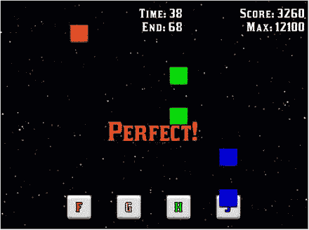
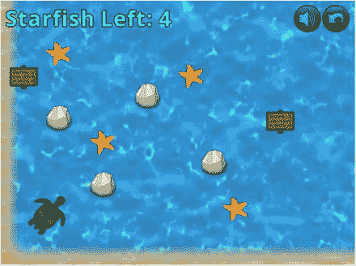
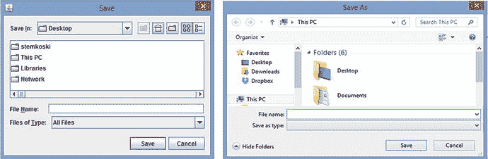
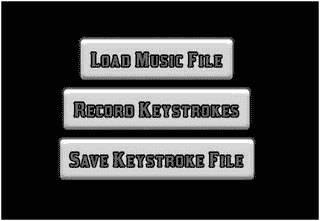
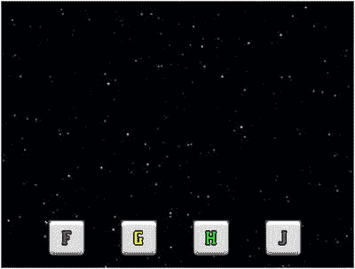

# 6. 音频

在本章中，你将学习如何向游戏添加音频元素——音效和背景音乐。首先，你将通过将这些功能添加到你在前几章中一直在开发的《海星收集者》游戏中来了解这些主题。然后，在一个可选部分中，你将基于这些技能构建一个基于音乐节奏的游戏，名为《节奏敲击者》，在该游戏中，玩家需要按下由下落物体与目标重叠所指示的一系列按键，所有这些操作都与背景中播放的音乐同步。《节奏敲击者》的截图如图 6-1 所示。



图 6-1.

《节奏敲击者》游戏截图


## 声音与音乐

得益于 LibGDX 库的内置功能，为游戏添加音频是一个直接了当的过程。支持的文件类型包括 MP3、OGG 和 WAV。LibGDX 为此提供了两个接口：`Sound` 和 `Music`，每个接口都可以通过 `Gdx` 类的 `audio` 对象创建。实现这些接口的类取决于所使用的平台；方便的是，这些细节已由 LibGDX 为您处理。

`Sound` 接口用于音效：当离散的游戏事件发生时播放的小型音频文件，例如收集物品、角色跳跃或两个物体碰撞时。音效通常很短（几秒或更短），对应的文件不应大于 1 MB。（对于较大的音频片段，您应该使用接下来要解释的 `Music` 接口。）例如，要从名为 `beep.wav` 的音频文件创建一个 `Sound` 对象，您可以编写以下代码：

```
Sound effect = Gdx.audio.newSound( Gdx.files.internal("beep.wav") );
```

创建声音后，使用 `play` 方法播放，该方法可选地接受一个浮点参数，用于确定声音播放的音量（0 为静音，1 为最大音量）。单个音效可以快速连续播放多次；在这种情况下，声音会简单地相互重叠。

`Music` 接口用于较长的音频序列，例如背景音乐或环境音。`Music` 对象是从文件中流式传输的，而不是完全加载到内存中（后者是 `Sound` 对象的情况），这就是为什么在这种情况下可以使用大于 1 MB 的文件。例如，要从名为 `song.mp3` 的音频文件创建一个 `Music` 对象，您可以编写以下代码：

```
Music song = Gdx.audio.newSound( Gdx.files.internal("song.mp3") );
```

`Music` 对象的音量可以随时使用 `setVolume` 方法设置，该方法接受一个浮点值，就像 `Sound` 对象一样。如果您希望音频循环播放，请使用 `setLooping(true)` 方法。要控制播放，有 `play`、`pause` 和 `stop` 方法。要获取有关当前播放状态的信息，您可以使用 `isPlaying`、`isLooping` 和 `getPosition` 方法，后者返回以秒为单位的当前位置。

接下来，您将看到如何向上一章创建的 Starfish Collector 游戏中添加音乐和音效，以及一个可用于静音和取消静音的按钮，如图 6-2 所示。



图 6-2.

添加了音频和静音按钮的 Starfish Collector 游戏

首先，从上一章复制 Starfish Collector 的项目目录，并将文件夹重命名为 `Starfish Collector Ch 6`。从书籍网站下载代码，并将三个音乐文件（扩展名为 `ogg`）和新的图像文件（`audio.png`）从下载项目的 `assets` 文件夹复制到您本地项目的 `assets` 文件夹中。打开您的 BlueJ 项目。首先，在 `BaseScreen` 类中，您将添加一个方法来简化检测触摸事件。添加以下 `import` 语句：

```
import com.badlogic.gdx.scenes.scene2d.Event;
import com.badlogic.gdx.scenes.scene2d.InputEvent;
import com.badlogic.gdx.scenes.scene2d.InputEvent.Type;
```

接下来，添加以下方法，该方法将用于检查鼠标事件是否对应于按钮点击（例如，与鼠标移动事件相对）：

```
public boolean isTouchDownEvent(Event e)
{
return (e instanceof InputEvent) && ((InputEvent)e).getType().equals(Type.touchDown);
}
```

本节中的其余代码将添加到 `LevelScreen` 类中。首先，添加以下 `import` 语句：

```
import com.badlogic.gdx.audio.Sound;
import com.badlogic.gdx.audio.Music;
```

然后，在类中声明以下变量：

```
private float audioVolume;
private Sound waterDrop;
private Music instrumental;
private Music oceanSurf;
```

在 `initialize` 方法的末尾，添加以下代码来初始化这些变量并开始播放背景音乐。此应用程序中使用的歌曲“Master of the Feast”由 Kevin MacLeod 从 `incompetech.com` 创作。¹

```
waterDrop    = Gdx.audio.newSound(Gdx.files.internal("assets/Water_Drop.ogg"));
instrumental = Gdx.audio.newMusic(Gdx.files.internal("assets/Master_of_the_Feast.ogg"));
oceanSurf    = Gdx.audio.newMusic(Gdx.files.internal("assets/Ocean_Waves.ogg"));
audioVolume = 1.00f;
instrumental.setLooping(true);
instrumental.setVolume(audioVolume);
instrumental.play();
oceanSurf.setLooping(true);
oceanSurf.setVolume(audioVolume);
oceanSurf.play();
```

在 `update` 方法中，每当海龟与海星重叠时，将播放水滴音效。找到读取 `starfish.collected = true` 的代码行，并在此行代码之后添加以下内容：

```
waterDrop.play(audioVolume);
```

根据 LibGDX 文档，当您使用完一个音乐对象后，应调用 `Music` 类的 `dispose` 方法来释放内存（并停止歌曲继续播放）。因此，在 `initialize` 方法中，将设置“重新开始”按钮监听器的代码块更改为以下内容：

```
restartButton.addListener(
(Event e) ->
{
if ( !isTouchDownEvent(e) )
return false;
instrumental.dispose();
oceanSurf.dispose();
StarfishGame.setActiveScreen( new LevelScreen() );
return true;
}
);
```

最后，您将向用户界面添加一个按钮，该按钮可通过更改 `audioVolume` 变量的值来静音和取消静音音频。在 `initialize` 方法中，在将监听器添加到 `restartButton` 的代码之后，添加以下代码。特别注意表达式 `audioVolume = 1 - audioVolume`，它用于在 0 和 1 之间切换 `audioVolume` 的值。

```
ButtonStyle buttonStyle2 = new ButtonStyle();
Texture buttonTex2 = new Texture( Gdx.files.internal("assets/audio.png") );
TextureRegion buttonRegion2 =  new TextureRegion(buttonTex2);
buttonStyle2.up = new TextureRegionDrawable( buttonRegion2 );
Button muteButton = new Button( buttonStyle2 );
muteButton.setColor( Color.CYAN );
muteButton.addListener(
(Event e) ->
{
if ( !isTouchDownEvent(e) )
return false;
audioVolume = 1 - audioVolume;
instrumental.setVolume( audioVolume );
oceanSurf.setVolume( audioVolume );
return true;
}
);
```

最后，要将这个新创建的按钮添加到用户界面，在 `initialize` 方法中，找到将 `restartButton` 添加到 `uiTable` 的代码行，并在此行代码之前添加以下内容：

```
uiTable.add(muteButton).top();
```

此外，由于现在 `uiTable` 包含四列，必须再进行一项修改，以便其他用户界面元素保持与之前相同的对齐方式。找到将 `dialogBox` 添加到 `uiTable` 的代码行，并将其更改为以下内容：

```
uiTable.add(dialogBox).colspan(4);
```

现在，您已成功为游戏添加了音频和音频控制！在本章的这个阶段，您已经学习了音频的基础知识：`Sound` 和 `Music` 类及其方法。本章的其余部分包括高级材料以及创建一个基于音频的游戏，这对于后续章节并非必需。因此，如果您愿意，可以跳过本章的其余部分，直接进入下一章；否则，请随意继续阅读。


## 游戏项目：节奏敲击

在本章剩余部分，你将创建一个名为“节奏敲击”的游戏，它属于节奏动作类电子游戏，这类游戏包括科乐美街机游戏《热舞革命》、索尼 PlayStation 游戏《啪啦啪啦啪》以及 Umoni Studio 手机游戏《钢琴块》等经典作品。此类游戏要求玩家在精确的时机执行一系列动作（在本项目中为按下特定按键），且动作需与背景音乐同步。在《节奏敲击》中，玩家需要按下 F、G、H、J 这四个按键，选择它们是因为它们位于键盘中央且水平相邻，便于玩家同时将不同手指分别置于各按键上方。如本章开头图 6-1 的游戏截图所示，屏幕底部有四个方块（我们称之为**目标框**），每个方块显示一个字母。与这些目标对齐的彩色方块（我们称之为**下落方块**）从屏幕上方生成并以恒定速度下落，通常会在歌曲节拍处与目标框重叠。玩家的目标是在下落方块与目标框完全重叠且居中的精确瞬间按下对应按键。每次按键时，系统会根据两个方块的重合程度给予相应分数（方块完全不重叠时得零分），同时屏幕上会短暂闪烁一条消息，告知玩家表现如何（消息包括“完美”、“很棒”、“不错”、“差一点”和“失误”）。

用户界面将显示在屏幕顶部边缘。它包含一个“开始”按钮（点击后开始播放歌曲）、一个显示歌曲当前时间和结束时间的标签，以及一个显示玩家当前得分和该歌曲最高可能得分的标签。此外，整个游戏过程中将使用许多微妙的基于数值的动画效果，例如目标框上的轻微脉冲效果，以及按下对应按键时下落方块的淡出效果。在按下“开始”按钮到歌曲开始播放之间，还会有一个三秒倒计时阶段，让玩家有机会准备按键；此倒计时效果将伴随数字出现，并每隔一秒发出类似“哔”的音效。最后，歌曲结束后会显示“恭喜”消息。

创建这款节奏游戏最困难的部分，是创建一个存储生成下落方块所需时序数据的文件：玩家应按下哪个按键，以及下落方块应与目标框重叠时的歌曲播放时间。因此，在开始游戏应用本身的工作之前，下一节将讨论如何在 LibGDX 中处理文件、如何打开文件选择对话框（以简化文件选择过程）、存储时序数据的文件格式，以及一个可用于帮助你创建额外时序文件的应用。

首先，在 BlueJ 中创建一个名为`Rhythm` `Tapper`的新项目。从本书网站下载此项目的文件，并将下载项目中的`assets`文件夹和`+libs`文件夹（如果不使用 BlueJ 的`userlib`文件夹）复制到你的本地项目中。此外，在你的本地项目文件夹中，从下载项目中复制以下 Java 文件：`BaseGame.java`、`BaseScreen.java`和`BaseActor.java`。为了获得新的视觉风格，你将使用一个新的字体文件（`Kirsty.ttf`）；你可以在`BaseGame.java`文件中更改此字体参数。同时，将字体大小改为 32。

## 处理文件

Java 应用程序通常使用`File`类来提供对系统文件的访问。LibGDX 为此目的提供了一个替代类，名为`FileHandle`，它处理文件操作中特定于平台的细节，并提供了额外功能，用于：

*   读取和写入文件；
*   复制、移动和删除文件；
*   列出文件和目录；以及
*   检查文件和目录是否存在。

你之前已经广泛使用过`FileHandle`对象，通常作为匿名实例作为参数传递给其他方法，使用`Gdx.files`的`internal`方法，例如以下示例：

```
Texture tex = new Texture( Gdx.files.internal("assets/image.png") );
```

`internal`方法假定文件路径相对于应用程序。另一个类似的方法名为`external`，它假定路径相对于应用程序运行所在硬件设备的根文件夹。或者，如果你已经有一个`File`对象，你可以直接使用其构造函数并将`File`对象作为参数来创建`FileHandle`类的实例。

当使用标准 Java 库处理文本文件时，你可能会使用`Scanner`等类来读取文件内容，并使用`PrintWriter`来写入或追加到现有文件。在你将要构建的应用中，由于你要读取和写入的文件仅包含文本，你将改用`FileHandle`的`readString`和`writeString`方法。`readString`方法将文件的全部内容作为单个字符串返回，你可以使用`String`类的`split`方法，并指定换行符`"\n"`表示下一个数组元素，从而按行将其分割成字符串数组。例如，如果你想将一个名为`handle`的`FileHandle`对象分割成字符串数组，每行对应一个数组元素，你可以使用以下代码行：

```
String[] fileData = handle.readString().split("\n");
```

将字符串数据写入由`FileHandle`对象表示的文件同样简单直接。`writeString`方法接受两个参数：一个字符串（要写入的数据）和一个布尔值，该布尔值指示数据是应追加到文件中（值为`true`时），还是应用于覆盖文件中当前的所有数据（值为`false`时）。


### 浏览文件

在下一小节中你将构建的应用程序里，如果能够通过标准的文件选择器窗口来选择要打开的音乐文件，或指定保存的文件名和位置，而不是直接在代码中输入路径和文件名（这样每次处理新文件时都需要修改代码），那么整个过程将得到简化。Java 内置了创建此类窗口的功能，而 LibGDX 目前没有，因此你需要使用标准的 Java 类。有两种不同的 Java 框架可用于创建带有图形用户界面的应用程序：Swing 和 JavaFX。在这两者中，Swing 存在时间更长、更为人所知，但它已不再被积极开发，且用 Swing 制作的应用程序看起来不够现代。在本节中，你将使用 JavaFX 类。例如，图 6-3 展示了使用 Swing 和 JavaFX 框架保存文件时的标准对话框窗口。



图 6-3.

使用 Swing（左）和 JavaFX（右）框架创建的保存对话框窗口

接下来，你将创建一个名为 `FileUtils` 的工具类，其中包含一些静态方法，用于简化这些窗口的创建，并将返回的 `File` 对象转换为可在 LibGDX 中使用的 `FileHandle` 对象。将 JavaFX 类集成到并非完全基于 JavaFX 构建的应用程序中时，一个复杂之处在于，在使用特定的 JavaFX 类本身之前，必须先初始化许多与框架相关的后台类。（这是常见情况；LibGDX 框架也必须在启动游戏程序之前初始化平台相关的对象，例如 `Gdx.files`、`Gdx.input` 和 `Gdx.audio`。）有两种方法可以初始化在后台运行的 JavaFX 工具包：要么创建一个 JavaFX `Application` 对象（并运行其 `start` 方法），要么创建一个 `JFXPanel` 对象。此外，JavaFX 应用程序在其自己的线程上运行：这是一个独立于 CPU 上其他进程运行的独立进程。（当你在电脑或智能手机上运行多个应用程序时，每个应用程序都在不同的线程上运行，所有这些线程都由 CPU 管理和调度。）因此，JavaFX 类和代码不应在 LibGDX 应用程序运行的线程中执行，而应在 JavaFX 应用程序运行的线程中执行。这可以通过 JavaFX 的 `Platform` 类来安排，该类可以通过其 `runLater` 方法安排代码在 JavaFX 线程中运行。为了完成这些任务，创建一个名为 `FileUtils` 的新类，包含以下代码，代码清单之后将进行更详细的解释：

```
import javafx.embed.swing.JFXPanel;
import javafx.application.Platform;
import javafx.stage.FileChooser;
import java.io.File;
import com.badlogic.gdx.files.FileHandle;
public class FileUtils
{
private static boolean finished;
private static FileHandle fileHandle;
private static int openDialog = 1;
private static int saveDialog = 2;
public static FileHandle showOpenDialog()
{
return showDialog(openDialog);
}
public static FileHandle showSaveDialog()
{
return showDialog(saveDialog);
}
private static FileHandle showDialog(int dialogType)
{
new JFXPanel();
finished = false;
Platform.runLater(
() ->
{
FileChooser fileChooser = new FileChooser();
File file;
if (dialogType == openDialog)
file = fileChooser.showOpenDialog(null);
else // dialogType == saveDialog
file = fileChooser.showSaveDialog(null);
if (file != null)
fileHandle = new FileHandle(file);
else
fileHandle = null;
finished = true;
}
);
while ( !finished )
{
// 等待 FileChooser 窗口关闭
}
return fileHandle;
}
}
```

这个类的核心是 `showDialog` 方法，它首先初始化一个 `JFXPanel` 对象，目的仅仅是为了初始化 JavaFX 后台进程；没有使用变量来存储对这个对象的引用，因为你在任何时候都不需要使用它的任何方法。`Platform.runLater` 方法接收一个 `Runnable` 对象（此处以 lambda 表达式形式编写），其中包含要在 JavaFX 进程线程上运行的代码。这段代码打开一个 `FileChooser` 窗口，获取一个 `File` 对象，并进而用它来初始化一个 `FileHandle` 对象。然而，需要小心处理：由于这段代码在单独的线程上运行，CPU 可能会在 JavaFX 代码执行完毕之前返回到 LibGDX 线程并尝试完成 `showDialog` 方法的执行。这就是使用布尔变量 `finished` 的原因：它由 `showDialog` 方法初始化为 `false`，并且仅在 JavaFX 代码运行完成后才被设置为 `true`。`showDialog` 方法中的 `while` 循环会阻止该方法继续执行，直到文件选择器窗口关闭。因此，如果用户在文件选择器窗口仍打开时尝试返回 LibGDX 应用程序窗口，LibGDX 窗口的标题栏可能会显示“未响应”，但在选择文件后应用程序将恢复正常。该类中的另外两个方法 `showOpenDialog` 和 `showSaveDialog` 用于控制 `showDialog` 方法打开哪种类型的文件选择器。

准备好这个类之后，你就可以将注意力转向用于存储 Rhythm Tapper 游戏中下落方块计时信息的数据结构，以及你将创建的用于记录这些数据以便在游戏中使用的应用程序了。


### 录制歌曲数据

在制作节奏动作游戏时，最困难的部分之一就是确定在音乐播放过程中，哪些按键应该在何时被按下。为了完成这个任务，你将采用一种简单的方法：在音乐播放时录制按键操作。（虽然存在更精确的方法，但这超出了本书的讨论范围。）这种方法的主要缺点是，你必须能够精确地执行按键序列，因为玩家的表现将根据其与你创建的录制内容的匹配程度来评判。

你将使用一个简单的文本文件来存储这些数据；第一步是确定需要存储哪些数据。基于这些信息，将创建一个类来存储数据，并编写相关方法将数据写入文件以及从文件读取数据。应用程序所需的信息包括：

*   音乐文件的名称；
*   音乐文件的时长（将显示在节奏游戏的用户界面中）；
*   一个键盘按键列表及其对应的按下时间；以及
*   一个用于跟踪列表当前位置的变量（用于节奏游戏中歌曲播放时）。

由于按键和时间应成对存储，你的数据结构还将包含一个内部类（在类内部定义的类）来存储这些配对。首先，使用以下代码创建一个名为 `SongData` 的新类。请注意，内部类名为 `KeyTimePair`，而 `SongData` 类存储了一个包含这些对象的 `ArrayList`。此处将 `KeyTimePair` 声明为内部类，是因为它仅在此类内部使用。

```
import java.util.ArrayList;
import com.badlogic.gdx.files.FileHandle;
public class SongData
{
private String songName;
private float songDuration;
private ArrayList keyTimeList;
private int keyTimeIndex;
public class KeyTimePair
{
private String key;
private Float time;
public KeyTimePair(String k, Float t)
{
key = k;
time = t;
}
public String getKey()
{  return key;  }
public Float getTime()
{  return time;  }
}
public SongData()
{
keyTimeList = new ArrayList();
}
}
```

接下来，你需要为 `songName` 和 `songDuration` 变量添加一些标准的 set 和 get 方法。因此，请将以下方法添加到 `SongData` 类中：

```
public void setSongName(String s)
{  songName = s;  }
public String getSongName()
{  return songName;  }
public void setSongDuration(float f)
{  songDuration = f;  }
public float getSongDuration()
{  return songDuration;  }
```

接下来，你需要一些方法来创建按键-时间对并将其添加到 `SongData` 类存储的列表中，操作索引列表当前位置的变量，从列表中检索配对，以及判断索引变量是否已到达列表末尾。为了完成这些任务，请将以下方法添加到 `SongData` 类中：

```
public void addKeyTime(String k, Float t)
{  keyTimeList.add( new KeyTimePair(k,t) );  }
public void resetIndex()
{  keyTimeIndex = 0;  }
public void advanceIndex()
{  keyTimeIndex++;  }
public KeyTimePair getCurrentKeyTime()
{  return keyTimeList.get(keyTimeIndex);  }
public int keyTimeCount()
{  return keyTimeList.size();  }
public boolean isFinished()
{  return keyTimeIndex >= keyTimeCount();  }
```

最后，你需要一对方法，用于将这些数据写入文本文件以及从文本文件读取这些数据。文本文件的第一行将存储音乐文件名，第二行将存储时长，其余每一行将存储一个按键-时间数据对，并用逗号分隔。当将文件作为字符串读回时，数值数据将通过 `Float` 类的 `parseFloat` 方法转换为浮点数。将这些方法添加到 `SongData` 类中：

```
public void writeToFile(FileHandle file)
{
file.writeString( getSongName() + "\n", false );
file.writeString( getSongDuration() + "\n", true );
for ( KeyTimePair ktp : keyTimeList )
{
String data = ktp.getKey() + "," + ktp.getTime() + "\n";
file.writeString( data, true );
}
}
public void readFromFile(FileHandle file)
{
String rawData = file.readString();
String[] dataArray = rawData.split("\n");
setSongName( dataArray[0] );
setSongDuration( Float.parseFloat(dataArray[1]) );
keyTimeList.clear();
for (int i = 2; i < dataArray.length; i++)
{
String[] keyTimeData = dataArray[i].split(",");
String key = keyTimeData[0];
Float time = Float.parseFloat( keyTimeData[1] );
keyTimeList.add( new KeyTimePair( key, time ) );
}
}
```

现在，你可以创建应用程序来录制按键的顺序和时间了。（或者，如果你对生成自己的歌曲数据文件不感兴趣，只想使用提供的示例文件[位于 `assets` 文件夹中，名为 `FunkyJunky.key`]，则可以跳过本节剩余部分，直接进入下一节。）你将创建的实用程序应用程序将仅包含三个按钮：一个用于选择要播放的音乐文件，一个用于开始录制过程，一个用于创建（或选择）一个文件来保存录制的歌曲数据。这个简单的应用程序如图 6-4 所示。



图 6-4.

按键录制应用程序的截图

创建一个名为 `RecorderScreen` 的新类，代码如下：

```
import com.badlogic.gdx.Gdx;
import com.badlogic.gdx.Input.Keys;
import com.badlogic.gdx.scenes.scene2d.ui.TextButton;
import com.badlogic.gdx.scenes.scene2d.Event;
import com.badlogic.gdx.files.FileHandle;
import com.badlogic.gdx.audio.Music;
public class RecorderScreen extends BaseScreen
{
Music music;
SongData songData;
float lastSongPosition;
boolean recording;
TextButton loadButton;
TextButton recordButton;
TextButton saveButton;
public void initialize()
{
recording = false;
loadButton = new TextButton( "加载音乐文件", BaseGame.textButtonStyle );
loadButton.addListener(
(Event e) ->
{
if ( !isTouchDownEvent(e) )
return false;
FileHandle musicFile = FileUtils.showOpenDialog();
if ( musicFile != null )
{
music = Gdx.audio.newMusic(musicFile);
songData = new SongData();
songData.setSongName( musicFile.name() );
}
return true;
}
);
recordButton = new TextButton( "录制按键", BaseGame.textButtonStyle );
recordButton.addListener(
(Event e) ->
{
if ( !isTouchDownEvent(e) )
return false;
if ( !recording )
{
music.play();
recording = true;
lastSongPosition = 0;
}
return true;
}
);
saveButton = new TextButton( "保存按键文件", BaseGame.textButtonStyle );
saveButton.addListener(
(Event e) ->
{
if ( !isTouchDownEvent(e) )
return false;
FileHandle textFile = FileUtils.showSaveDialog();
if ( textFile != null )
songData.writeToFile(textFile);
return true;
}
);
uiTable.add(loadButton);
uiTable.row();
uiTable.add(recordButton);
uiTable.row();
uiTable.add(saveButton);
}
public void update(float dt)
{
if ( recording )
{
if ( music.isPlaying() )
lastSongPosition = music.getPosition();
else // 歌曲刚播放完毕
{
recording = false;
songData.setSongDuration( lastSongPosition );
}
}
}
public boolean keyDown(int keycode)
{
if ( recording )
{
String key = Keys.toString(keycode);
Float time = music.getPosition();
songData.addKeyTime(key, time);
}
return false;
}
}
```


布尔变量 `recording` 将用于跟踪按键数据是否仍应添加到 `SongData` 对象中。令人有些意外的是，使用 Java 很难确定音乐文件的长度，因此 `lastSongPosition` 变量用于在歌曲播放时跟踪歌曲位置，一旦歌曲播放完毕，`lastSongPosition` 的值就会被写入 `SongData` 对象，作为歌曲的时长。正如预期的那样，`loadButton` 和 `saveButton` 对象使用了你之前编写的 `FileUtils` 类提供的方法。

要运行此应用程序，你还需要两个类，和往常一样：一个继承 `BaseGame` 类的类，以及一个 `launcher` 类。为此，首先创建一个名为 `RecorderGame` 的新类，代码如下：

```
public class RecorderGame extends BaseGame
{
public void create()
{
super.create();
setActiveScreen( new RecorderScreen() );
}
}
```

接下来，对于 `launcher` 类，创建一个名为 `RecorderLauncher` 的新类，代码如下：

```
import com.badlogic.gdx.backends.lwjgl.LwjglApplication;
public class RecorderLauncher
{
public static void main (String[] args)
{
BaseGame myGame = new RecorderGame();
LwjglApplication launcher = new LwjglApplication( myGame, "Recorder", 800, 600 );
}
}
```

要使用此类，请运行 `RecorderLauncher` 的 `main` 方法，然后点击标有“Load Music File”的按钮并选择一首歌曲。`assets` 文件夹中包含一个示例 MP3 文件，名为 `FunkyJunky.mp3`，由来自 `audionautix.com` 的 Jason Shaw 创建，² 但如果你愿意，也可以随意使用自己的音乐文件。然后，将手指放在 F、G、H 和 J 键上，点击标有“Record Keystrokes”的按钮。音乐将立即开始播放，此时你需要根据所选音乐的节拍及时按下按键。这可能是整个过程中最困难的部分，因为它要求你熟悉音乐并具备精确的节奏感。歌曲播放完毕后，点击标有“Save Keystroke File”的按钮，在出现的文件选择窗口中，选择一个位置并输入文件名以保存文件。你可以为此文件输入任意扩展名。`assets` 文件夹中有一个名为 `FunkyJunky.key` 的示例文件，你可以在后续的游戏应用程序中使用它；你可能希望为你的数据文件选择一个不同的文件名。完成后，请确保音乐文件和数据文件都位于项目的 `assets` 文件夹中，以便你接下来开发的游戏应用程序能够轻松访问。

## 游戏应用程序

现在你已经有了一个与音乐文件配套的歌曲数据文件，接下来将专注于创建游戏应用程序。为了高效地编写此游戏，你将使用多个列表，这些列表将存储玩家可能按下的不同按键、屏幕底部附近出现的四个目标框，以及每个目标框上方的一列下落方块（而这些下落方块列表本身将存储在一个列表中）。

在开始游戏本身之前，你将为目标框和下落方块设置类。首先，创建一个名为 `TargetBox` 的新类，代码如下。请注意，构造函数还需要一个字符串（将显示在方块上的字母）和一个颜色（将由显示字母的标签使用）。

```
import com.badlogic.gdx.scenes.scene2d.Stage;
import com.badlogic.gdx.graphics.Color;
import com.badlogic.gdx.scenes.scene2d.ui.Label;
import com.badlogic.gdx.utils.Align;
public class TargetBox extends BaseActor
{
public TargetBox(float x, float y, Stage s, String letter, Color color)
{
super(x,y,s);
loadTexture("assets/box.png");
setSize(64,64);
// 添加一个包含给定颜色字母的居中标签
Label letterLabel = new Label(letter, BaseGame.labelStyle);
letterLabel.setSize(64,64);
letterLabel.setAlignment(Align.center);
letterLabel.setColor( color );
this.addActor(letterLabel);
}
}
```

接下来，创建一个名为 `FallingBox` 的新类，代码如下。请注意，`TargetBox` 类使用了相同的图像，但 `FallingBox` 类将其缩小，使其看起来能容纳在 `TargetBox` 对象内部。同时注意，`act` 方法已被实现，并且调用了 `applyPhysics`；这是因为下落方块的速度和运动角度将在稍后设置，以便它们看起来确实是在下落。

```
import com.badlogic.gdx.scenes.scene2d.Stage;
public class FallingBox extends BaseActor
{
public FallingBox(float x, float y, Stage s)
{
super(x,y,s);
loadTexture("assets/box.png");
setScale(0.75f, 0.75f);
}
public void act(float dt)
{
super.act(dt);
applyPhysics(dt);
}
}
```

接下来，创建一个名为 `RhythmScreen` 的新类，其中包含以下代码，该代码设置了本节开头描述的列表，创建了四个 `TargetBox` 实例，并使用 `Table` 将它们排列在屏幕底部附近。Java 的 `Collections` 类用于减少向 `ArrayList` 对象添加一组值所需的代码量。

```
import com.badlogic.gdx.graphics.Color;
import com.badlogic.gdx.scenes.scene2d.ui.Table;
import java.util.ArrayList;
import java.util.Collections;
public class RhythmScreen extends BaseScreen
{
private ArrayList keyList;
private ArrayList colorList;
private ArrayList targetList;
private ArrayList> fallingLists;
public void initialize()
{
BaseActor background = new BaseActor(0,0, mainStage);
background.loadTexture( "assets/space.png" );
background.setSize(800,600);
BaseActor.setWorldBounds(background);
keyList = new ArrayList();
String[] keyArray = {"F", "G", "H", "J"};
Collections.addAll(keyList, keyArray);
colorList = new ArrayList();
Color[] colorArray = {Color.RED, Color.YELLOW, Color.GREEN, Color.BLUE};
Collections.addAll(colorList, colorArray);
Table targetTable = new Table();
targetTable.setFillParent(true);
targetTable.add().colspan(4).expandY();
targetTable.row();
mainStage.addActor(targetTable);
targetList = new ArrayList();
for (int i = 0; i  >();
for (int i = 0; i () );
}
}
public void update(float dt)
{    }
public boolean keyDown(int keycode)
{  return false;  }
}
```

为了运行此代码，创建一个名为 `RhythmGame` 的新类，其中包含以下代码：

```
public class RhythmGame extends BaseGame
{
public void create()
{
super.create();
setActiveScreen( new RhythmScreen() );
}
}
```

接下来，创建一个名为 `RhythmLauncher` 的新类，其中包含以下代码：

```
import com.badlogic.gdx.backends.lwjgl.LwjglApplication;
public class RhythmLauncher
{
public static void main (String[] args)
{
BaseGame myGame = new RhythmGame();
LwjglApplication launcher = new LwjglApplication( myGame, "Rhythm Tapper", 800, 600 );
}
}
```

此时，使用 `RhythmLauncher` 类测试你的应用程序，你应该会看到一个类似于图 6-5 的屏幕，其中包含深色背景和四个目标框，分别包含字母 F、G、H 和 J，颜色分别为红色、黄色、绿色和蓝色。



图 6-5.

添加了目标框的 Rhythm Tapper 游戏


### 同步游戏对象与音频

下一个目标是添加播放音乐文件的功能，并利用关联文本文件中存储的数据生成一系列 `FallingBox` 对象，这些对象将在歌曲指定的时间点与对应的 `TargetBox` 对象重叠。此应用程序将假设一个三秒的“提前时间”：点击开始按钮三秒后，歌曲开始播放，而 `FallingBox` 对象将在歌曲数据文件指定时间的三秒前创建于屏幕顶部边缘上方，以便它们能在正确的时间与目标重叠。为了协调这些事件的时机，将创建一个名为 `advanceTimer` 的浮点变量，该变量仅在歌曲数据加载后开始递增；三秒过后，音乐将开始播放，此后 `advanceTimer` 将被设置为音乐播放位置加上三秒。然后，`advanceTimer` 变量将用于确定何时创建 `FallingBox` 对象。

首先，将以下 `import` 语句添加到 `RhythmScreen` 类中：

```
import com.badlogic.gdx.Gdx;
import com.badlogic.gdx.audio.Music;
import com.badlogic.gdx.files.FileHandle;
import com.badlogic.gdx.scenes.scene2d.ui.TextButton;
import com.badlogic.gdx.scenes.scene2d.Event;
```

接下来，将以下变量添加到该类中：

```
private Music gameMusic;
private SongData songData;
private final float leadTime = 3;
private float advanceTimer;
private float spawnHeight;
private float noteSpeed;
```

将以下代码添加到 `initialize` 方法中。请注意，`spawnHeight` 被设置为 `650`，以便下落方块从屏幕顶部边缘上方开始（屏幕高度为 600），而 `noteSpeed` 是通过将下落方块到达目标方块所需的总距离除以它们到达那里所需的时间（`leadTime`）计算得出的。以下代码使用了一个为您提供的歌曲数据文件（`FunkyJunky.key`），但如果您创建了不同的歌曲数据文件，也可以随意使用它。

```
advanceTimer = 0;
spawnHeight = 650;
noteSpeed = ( spawnHeight - targetList.get(0).getY() ) / leadTime;
TextButton startButton = new TextButton( "开始", BaseGame.textButtonStyle );
startButton.addListener(
(Event e) ->
{
if ( !isTouchDownEvent(e) )
return false;
FileHandle dataFileHandle = Gdx.files.internal("assets/FunkyJunky.key");
songData = new SongData();
songData.readFromFile( dataFileHandle );
songData.resetIndex();
FileHandle songFileHandle = Gdx.files.internal("assets/" + songData.getSongName());
gameMusic = Gdx.audio.newMusic( songFileHandle );
startButton.setVisible(false);
return true;
}
);
uiTable.add(startButton);
```

接下来，将以下代码添加到 `update` 方法中。请注意，如果 `songData` 尚未加载，则 `update` 方法会立即返回。否则，`advanceTimer` 的值会按前述方式增加，并且如果 `advanceTimer` 大于三，则播放音乐。如果 `advanceTimer` 的值超过了 `songData` 对象存储的下一个时间点，则会创建一个 `FallingBox` 对象并进行必要的配置，同时内部 `songData` 索引会前进到下一个位置。这里使用 `while` 循环而不是 `if` 语句，以防在此次调用 `update` 方法期间需要创建多个 `FallingBox` 对象。

```
if (songData == null)
return;
if (advanceTimer  leadTime)
gameMusic.play();
if (advanceTimer = songData.getCurrentKeyTime().getTime() )
{
String key = songData.getCurrentKeyTime().getKey();
int i = keyList.indexOf(key);
FallingBox fb = new FallingBox(targetList.get(i).getX(), spawnHeight, mainStage);
fb.setSpeed( noteSpeed );
fb.setMotionAngle( 270 );
fb.setColor( colorList.get(i) );
fallingLists.get(i).add(fb);
songData.advanceIndex();
}
```

此时，如果您运行程序并点击开始按钮，您应该会听到三秒钟的静音，期间会出现一些下落方块，然后音乐开始播放，并且下落方块应能按预期与目标方块在时间上对齐。


### 添加交互功能并创建用户界面

接下来，你将添加交互功能和用户界面。用户界面将由开始按钮、一个显示当前歌曲位置和歌曲时长的标签，以及另一个显示玩家当前得分和该歌曲最高可能得分的标签组成。此外，你还需要创建一个对象，用于显示一条评价玩家表现的消息（根据按下对应按键时下落方块与目标方块的接近程度）。首先，创建一个名为 `Message` 的新类，其中包含以下代码：

```
import com.badlogic.gdx.scenes.scene2d.Stage;
import com.badlogic.gdx.graphics.g2d.Animation;
import com.badlogic.gdx.scenes.scene2d.Action;
import com.badlogic.gdx.scenes.scene2d.actions.Actions;
public class Message extends BaseActor
{
public Animation perfect;
public Animation great;
public Animation good;
public Animation almost;
public Animation miss;
public Message(float x, float y, Stage s)
{
super(x,y,s);
perfect = loadTexture("assets/perfect.png");
great = loadTexture("assets/great.png");
good = loadTexture("assets/good.png");
almost = loadTexture("assets/almost.png");
miss = loadTexture("assets/miss.png");
}
public void pulseFade()
{
setOpacity(1);
clearActions();
Action pulseFade =
Actions.sequence(
Actions.scaleTo(1.1f,1.1f, 0.05f),
Actions.scaleTo(1.0f,1.0f, 0.05f),
Actions.delay(1),
Actions.fadeOut(0.5f) );
addAction(pulseFade);
}
}
```

`Message` 类中的 `pulseFade` 方法包含多个用途。生成的动画中的缩放部分会产生一个短暂的脉冲效果，以吸引玩家的注意力，同时也有助于玩家判断同一消息是否在短时间内显示了两次。此外，动画的淡出部分确保消息不会在对应按键按下后长时间保持可见。

接下来，将以下 `import` 语句添加到 `RhythmScreen` 类中：

```
import com.badlogic.gdx.Gdx;
import com.badlogic.gdx.Input.Keys;
import com.badlogic.gdx.scenes.scene2d.ui.Label;
import com.badlogic.gdx.utils.Align;
```

然后，将以下变量添加到该类中：

```
private Message message;
private Label scoreLabel;
private int score;
private int maxScore;
private Label timeLabel;
private float songDuration;
```

在 `initialize` 方法中，直接在涉及 `uiTable` 的代码之前，添加以下代码，用于初始化其余的用户界面元素：

```
scoreLabel = new Label("Score: 0" + "\n" + "Max: 0", BaseGame.labelStyle);
scoreLabel.setAlignment(Align.right);
timeLabel = new Label("Time: 0" + "\n" + "End: 0", BaseGame.labelStyle);
timeLabel.setAlignment(Align.right);
message = new Message(0,0,uiStage);
message.setOpacity(0);
```

你刚刚添加的一些变量（例如最高可能得分）在歌曲数据加载后才能初始化。歌曲数据加载后，最高得分可以通过将完美按键的得分（本游戏中为 100 分）乘以按键总次数来计算。在开始按钮的 lambda 表达式中，在 `return` 语句之前直接添加以下代码：

```
songDuration = songData.getSongDuration();
score = 0;
maxScore = 100 * songData.keyTimeCount();
scoreLabel.setText("Score: " + score + "\n" + "Max: " + maxScore);
timeLabel.setText("Time: " + 0 + "\n" + "End: " + (int)songDuration);
```

最后，在 `initialize` 方法中，为了将新的标签和消息对象添加到用户界面，请将涉及 `uiTable` 的代码替换为以下内容：

```
uiTable.pad(10);
uiTable.add(startButton).width(200).left();
uiTable.add(timeLabel).width(150);
uiTable.add(scoreLabel).width(200).right();
uiTable.row();
uiTable.add(message).colspan(3).expandX().expandY();
```

为了根据当前歌曲位置更新时间标签，请将以下代码添加到 `update` 方法中：

```
if ( gameMusic.isPlaying() )
timeLabel.setText( "Time: " + (int)gameMusic.getPosition() + "\n"
+ "End: " + (int)songDuration );
```

最后，你将在 `keyDown` 方法中添加交互功能（因为按键是一个离散事件）。如果 `songData` 尚未初始化，则此方法将立即返回。否则，如果按下的键对应于之前指定的键（F、G、H 和 J，存储在 `keyList` 中），则将检索对应的 `TargetBox` 和 `FallingBox` 对象的 `ArrayList`。如果 `FallingBox` 对象列表为空，则此次按键计为“失误”，并显示相应的消息。否则，将计算最低的 `FallingBox` 实例（即列表中的第一个）与 `TargetBox` 之间的距离，并根据距离大小给予分数：

*   0–8 像素：“完美”，价值 100 分
*   8–16 像素：“优秀”，价值 80 分
*   16–24 像素：“良好”，价值 50 分
*   24–32 像素：“接近”，价值 20 分
*   大于 32 像素：视为“失误”，不计分

设置好要显示的正确消息并增加分数后，调用 `pulseFade` 方法对消息进行动画处理，更新显示分数的标签文本，并将对应的 `FallingBox` 对象从列表和游戏中移除。所有这些操作通过将以下代码添加到 `keyDown` 方法中来实现：

```
if (songData == null)
return false;
String keyString = Keys.toString(keycode);
if ( keyList.contains(keyString) )
{
int i = keyList.indexOf(keyString);
TargetBox tb = targetList.get(i);
ArrayList fallingList = fallingLists.get(i);
if ( fallingList.size() == 0 )
{
message.setAnimation(message.miss);
message.pulseFade();
}
else
{
FallingBox fb = fallingList.get(0);
float distance = Math.abs( fb.getY() - tb.getY() );
if (distance < 8)
{
message.setAnimation(message.perfect);
score += 100;
}
else if (distance < 16)
{
message.setAnimation(message.great);
score += 80;
}
else if (distance < 24)
{
message.setAnimation(message.good);
score += 50;
}
else if (distance < 32)
{
message.setAnimation(message.almost);
score += 20;
}
else
{
message.setAnimation(message.miss);
}
message.pulseFade();
scoreLabel.setText("Score: " + score + "\n" + "Max: " + maxScore);
fallingList.remove(fb);
fb.remove();
}
}
```

还需要考虑一种情况：如果 `FallingBox` 从其对应的 `TargetBox` 下方通过，而玩家没有按键怎么办？此时需要自动将 `FallingBox` 从游戏中移除，并显示“失误”消息。为此，请将以下代码添加到 `update` 方法的末尾：

```
for (int i = 0; i  fallingList = fallingLists.get(i);
if ( fallingList.size() > 0 )
{
FallingBox fb = fallingList.get(0);
TargetBox tb = targetList.get(i);
if ( fb.getY() < tb.getY() && !fb.overlaps(tb) )
{
message.setAnimation(message.miss);
message.pulseFade();
fallingList.remove(fb);
fb.remove(); // 立即从舞台中移除
}
}
}
```

这是另一个测试游戏的绝佳时机。所有核心机制都已实现；你可以玩一局完整的游戏，看看自己能多接近最高可能得分。


### 收尾工作

至此，你还可以添加一些收尾工作来提升玩家的体验。其中最重要的可能是，玩家可能会觉得歌曲开始得有些突然；你可以通过添加一个视觉和听觉上都有提示的倒计时来解决这个问题。此外，当歌曲结束时，最好显示一条游戏结束的消息，给玩家更强的结束感。最后，还会添加一些微妙的视觉效果：当按下对应按键时，目标方块会产生脉冲效果；当落下的方块消失时，会应用一个先变亮再淡出的效果。

首先，将新的动作添加到游戏对象中。在 `FallingBox` 类中，添加以下 `import` 语句：

```
import com.badlogic.gdx.scenes.scene2d.Action;
import com.badlogic.gdx.scenes.scene2d.actions.Actions;
import com.badlogic.gdx.graphics.Color;
```

接下来，添加以下方法：

```
public void flashOut()
{
float duration = 0.25f;
Action flashOut =
Actions.parallel(
Actions.scaleTo(1.5f,1.5f, duration),
Actions.color(Color.WHITE, duration),
Actions.fadeOut(duration) );
addAction( flashOut );
addAction( Actions.after( Actions.removeActor() ) );
}
```

在 `TargetBox` 类中，添加以下 `import` 语句：

```
import com.badlogic.gdx.scenes.scene2d.Action;
import com.badlogic.gdx.scenes.scene2d.actions.Actions;
```

然后，添加以下方法：

```
public void pulse()
{
Action pulse =
Actions.sequence(
Actions.scaleTo(1.2f,1.2f, 0.05f),
Actions.scaleTo(1.0f,1.0f, 0.05f) );
addAction(pulse);
}
```

接下来，你将在游戏中激活这些方法。在 `RhythmScreen` 类中，有两处代码中落下的方块会消失，由代码 `fb.remove()` 标识：一处靠近 `update` 方法的末尾，另一处靠近 `keyDown` 方法的末尾。在这两处位置，将代码行 `fb.remove()` 替换为以下两行代码，以应用淡出效果：

```
fb.setSpeed(0);
fb.flashOut();
```

同样在 `keyDown` 方法中，在从 `targetList` 获取 `TargetBox` 的那行代码之后，添加以下代码行以应用脉冲效果：

```
tb.pulse();
```

接下来，你将在 `Message` 类中实现倒计时和游戏结束消息的功能。首先，在 `Message` 类中添加以下 `import` 语句：

```
import com.badlogic.gdx.Gdx;
import com.badlogic.gdx.audio.Sound;
```

接下来，添加以下变量：

```
private Animation countdown3;
private Animation countdown2;
private Animation countdown1;
private Animation countdownGo;
private Animation congratulations;
private Sound blip;
private Sound tone;
```

在 `Message` 类的 `constructor` 方法中，通过添加以下代码来初始化这些新添加的变量：

```
countdown3 = loadTexture("assets/countdown-3.png");
countdown2 = loadTexture("assets/countdown-2.png");
countdown1 = loadTexture("assets/countdown-1.png");
countdownGo = loadTexture("assets/countdown-go.png");
congratulations = loadTexture("assets/congratulations.png");
blip = Gdx.audio.newSound(Gdx.files.internal("assets/blip.wav"));
tone = Gdx.audio.newSound(Gdx.files.internal("assets/tone.wav"));
```

最后，在 `Message` 类中添加以下两个方法。在 `countdown` 方法中，你会看到大量使用了 `Actions.run` 方法和 lambda 表达式，以便在精确的时间切换动画和播放声音。

```
public void displayCountdown()
{
Action countdown =
Actions.sequence(
Actions.run( () -> setAnimation(countdown3) ),
Actions.run( () -> blip.play() ),
Actions.alpha(1),
Actions.scaleTo(1.1f,1.1f, 0.05f), Actions.scaleTo(1.0f,1.0f, 0.05f),
Actions.delay(0.5f), Actions.fadeOut(0.4f),
Actions.run( () -> setAnimation(countdown2) ),
Actions.run( () -> blip.play() ),
Actions.alpha(1),
Actions.scaleTo(1.1f,1.1f, 0.05f), Actions.scaleTo(1.0f,1.0f, 0.05f),
Actions.delay(0.5f), Actions.fadeOut(0.4f),
Actions.run( () -> setAnimation(countdown1) ),
Actions.run( () -> blip.play() ),
Actions.alpha(1),
Actions.scaleTo(1.1f,1.1f, 0.05f), Actions.scaleTo(1.0f,1.0f, 0.05f),
Actions.delay(0.5f), Actions.fadeOut(0.4f),
Actions.run( () -> setAnimation(countdownGo) ),
Actions.run( () -> tone.play() ),
Actions.alpha(1),
Actions.fadeOut(1) );
addAction(countdown);
}
public void displayCongratulations()
{
setOpacity(0);
setAnimation(congratulations);
setScale(2);
addAction( Actions.fadeIn(4) );
}
```

添加完这些方法后，你现在可以在游戏中的适当时机激活它们。在 `RhythmScreen` 类的 `initialize` 方法中，在 Start 按钮的 lambda 表达式内，直接在 `return` 语句之前添加以下代码：

```
message.displayCountdown();
```

在 `update` 方法的末尾，添加以下代码：

```
if ( songData.isFinished() && !gameMusic.isPlaying() )
{
message.displayCongratulations();
songData = null;
}
```

一旦你完成了这些步骤，恭喜你完成了 Rhythm Tapper 游戏！

## 总结与下一步

在本章中，你学习了如何为游戏添加音乐和音效。你首先为 Starfish Collector 游戏添加了音频，以及一个用于静音和取消静音的按钮。然后，你创建了一个全新的基于音频的节奏动作类游戏，名为 Rhythm Tapper。在此过程中，你还学习了如何在 LibGDX 中读写文本文件。

至此，你还可以为你的项目添加许多基于音频的功能。在 Starfish Collector 中，你可以添加一个音效（例如小号演奏的号角声），在所有海星被收集后播放。你也可以考虑为菜单屏幕或过场动画添加背景音乐。在 Rhythm Tapper 中，在游戏结束时添加掌声音效会特别合适。此外，你可以考虑在游戏结束时显示额外信息，例如一个表格，显示歌曲期间各种消息（“完美”、“很棒”等）出现的次数，或者显示玩家获得的可能分数百分比（通过将他们的得分除以最高可能得分计算得出）。为了练习你的音频编码技能，你可以为第 4 章的 Space Rocks 游戏添加音乐和音效，这将大大提升该项目的整体质量。

完成本章后，你已经学习了 LibGDX 的所有基础知识，并创建了一个强大且通用的自定义框架，可用于创建各种类型的游戏。在接下来的章节中，你将学习如何在涉及横向卷轴游戏、弹跳与碰撞游戏、拖放游戏、平台游戏和冒险游戏等类型的项目中实现新的游戏机制。

脚注 1

网站 `incompetech.com` 提供了大量可免费下载的音乐，这些音乐根据知识共享署名 3.0 许可协议发布。

  2

网站 `audionautix.com` 提供了大量可免费下载的音乐，这些音乐根据知识共享署名 3.0 许可协议发布。


