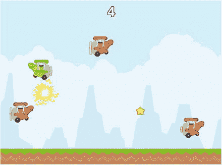
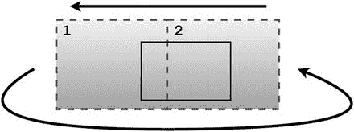

# 7. 横版卷轴游戏

在本章中，你将创建一款名为《飞机躲避者》的横版卷轴动作游戏，如图 7-1 所示，其灵感来源于《Flappy Bird》和《Jetpack Joyride》等现代智能手机游戏。在此过程中，你将创建一个无限滚动的背景效果，利用加速度设置模拟重力，并实现一个随时间推移而增加挑战难度的难度曲线。



图 7-1.

《飞机躲避者》游戏


## 游戏项目：飞机躲避者

《飞机躲避者》是一款无限横向卷轴动作游戏，玩家控制一架可上下移动的飞机，目标是躲避从屏幕飞过的敌机，并尽可能收集出现的星星。若玩家的飞机与敌机相撞，游戏即告结束。躲避敌机和收集星星均可为玩家赢得分数，因此玩家存活时间越长，得分就越高。星星会以固定间隔从屏幕右边缘外随机高度出现，并缓慢从左向右移动。如果玩家调整飞机的垂直位置使其与星星相撞，星星便会消失，玩家获得一分。敌机同样从屏幕右边缘外随机高度出现，并从左向右移动。起初，敌机出现的频率和移动速度与星星相同，但随着时间的推移，敌机出现频率会越来越高，移动速度也会越来越快。每当有敌机从屏幕左边缘外消失，玩家即可获得一分。游戏初期，收集星星是获取额外分数的简单途径，但随着敌机速度加快，其风险可能不再值得。

玩家按下空格键可使飞机获得一个向上的小推力。这是一个离散操作：每次按键对应一次推力。要快速向上移动，需要玩家快速连续按下空格键。重力始终将飞机向下拉，并最终会将其拉至地面。与地面或屏幕顶部边缘碰撞对飞机没有影响；它们仅作为飞机垂直位置的下限和上限。玩家的飞机实际上无法左右移动；向右飞行的视觉效果是通过滚动背景模拟的。用户界面仅在屏幕顶部中央包含一个文本显示（总分数）。当玩家输掉游戏时，屏幕中央会显示“游戏结束”信息。

本游戏采用鲜艳、多彩、卡通化的艺术风格，并配有动感、快节奏的背景音乐，以营造充满活力、激动人心的氛围。物体间的交互通过视觉和音效得到增强。当飞机与星星相撞时，会出现闪烁的视觉效果，并伴有轻柔、清脆的叮当声。当飞机与敌机相撞时，会出现爆炸效果，并伴有低沉、隆隆的爆炸声。

开始此项目所需的步骤与之前项目相同：创建一个新项目，创建 `assets` 文件夹和 `+libs` 文件夹（如果已设置 `userlib` 目录，则后者非必需），复制本书第一部分中创建的自定义框架文件（`BaseGame.java`、`BaseScreen.java`、`BaseActor.java`），并将本项目的图形和音频文件复制到你的 `assets` 文件夹中。为简化此过程，已为你创建了一个名为 `Framework` 的 BlueJ 项目，其中包含这些项目（除项目特定资源外），可作为本项目及未来项目的起点，当然，使用你之前开发的代码也完全可以。因此，要开始本项目：

*   下载本章的源代码文件；
*   复制下载的 `Framework` 文件夹（及其内容）并将其重命名为 `Plane Dodger`；
*   将下载的 `Plane Dodger` 项目资源文件夹中的所有内容复制到你新创建的 `Plane Dodger assets` 文件夹中；
*   打开 `Plane Dodger` 文件夹中的 BlueJ 项目。

你会注意到，为了方便，还提供了几个额外的类，包括一个 `launcher` 类，其代码如下：

```
import com.badlogic.gdx.Game;
import com.badlogic.gdx.backends.lwjgl.LwjglApplication;
public class Launcher
{
public static void main (String[] args)
{
Game myGame = new CustomGame();
LwjglApplication launcher = new LwjglApplication( myGame, "Game Title", 800, 600 );
}
}
```

还包含一个名为 `CustomGame` 的 `BaseGame` 类扩展，其代码如下：

```
public class CustomGame extends BaseGame
{
public void create()
{
super.create();
setActiveScreen( new LevelScreen() );
}
}
```

还包含一个名为 `LevelScreen` 的 `BaseScreen` 类扩展，其代码如下：

```
public class LevelScreen extends BaseScreen
{
public void initialize()
{
}
public void update(float dt)
{
}
}
```

此项目可以立即运行（通过运行 `Launcher` 类的 `main` 方法，与之前项目相同），但此时它只会显示一个黑屏，因为尚未添加任何内容。

要开始你的《飞机躲避者》游戏项目，请在 `CustomGame` 类中，将类名改为 `PlaneDodgerGame`（这也会导致 BlueJ 将源代码文件重命名为 `PlaneDodgerGame.java`）。然后，在 `Launcher` 类中，将 `main` 方法的内容修改为以下内容：

```
Game myGame = new PlaneDodgerGame();
LwjglApplication launcher = new LwjglApplication( myGame, "Plane Dodger", 800, 600 );
```

至此，你就可以开始为游戏特定对象创建类，并编写游戏玩法本身的代码了。


## 无限滚动

首先，将设置背景元素以产生“无限”滚动效果。这需要一张无缝纹理——即一张可以与其自身并排放置而不会产生明显边界的图像。将使用该图像的两个副本，每个副本至少与屏幕一样大。该设置如图 7-2 所示；虚线边框的矩形包含无缝纹理，而实线边框的矩形代表游戏屏幕。图像 2 的左边缘与图像 1 的右边缘相邻，并且两者以相同速度向左移动。当图像 1 的右边缘完全移过屏幕左边缘时，图像 1 将被重新定位到另一侧；图像 1 的左边缘将与图像 2 的右边缘相邻。此过程将无限期持续下去。



图 7-2.

定位无缝纹理以产生无限滚动效果

首先，你将创建一个天空对象，它会缓慢向左滚动。该对象的 `act` 方法将检查图像的右边缘是否已移过屏幕的左边缘。如果是，它将向右移动图像，使其左边缘与另一图像的右边缘对齐，这需要在 x 方向上移动图像宽度的两倍。为了完成这些任务，创建一个名为 `Sky` 的新类，包含以下代码：

```
import com.badlogic.gdx.scenes.scene2d.Stage;
public class Sky extends BaseActor
{
public Sky(float x, float y, Stage s)
{
super(x,y,s);
loadTexture("assets/sky.png");
setSpeed(25);
setMotionAngle(180);
}
public void act(float dt)
{
super.act(dt);
applyPhysics(dt);
// 如果完全移过屏幕左边缘：
//   向右移动，越过另一个实例。
if ( getX() + getWidth() < 0 )
{
moveBy( 2 * getWidth(), 0 );
}
}
}
```

接下来，你将重复此过程来创建一个地面对象，使其以相同方式看似无限滚动。代码几乎相同，只是使用的图像和对象的速度不同。速度差异源于以下观察：如果你曾在汽车或火车上旅行时观看窗外风景，可能会注意到远处的物体看起来比近处的物体位置变化更慢。这种效果称为视差，为在 2D 游戏中增加深度错觉提供了一种简单方法。由于地面应比天空背景图像看起来更靠近玩家，因此地面应以更快的速度移动。为了设置地面对象，创建一个名为 `Ground` 的新类，包含以下代码：

```
import com.badlogic.gdx.scenes.scene2d.Stage;
public class Ground extends BaseActor
{
public Ground(float x, float y, Stage s)
{
super(x,y,s);
loadTexture("assets/ground.png");
setSpeed(100);
setMotionAngle(180);
}
public void act(float dt)
{
super.act(dt);
applyPhysics(dt);
// 如果完全移过屏幕左边缘：
//   向右移动，越过另一个实例。
if ( getX() + getWidth() < 0 )
{
moveBy( 2 * getWidth(), 0 );
}
}
}
```

为了在实际游戏中初始化每个对象的两个实例，在 `LevelScreen` 类的 `initialize` 方法中添加以下代码。（注意，这些对象不需要存储在变量中，因为稍后可以通过 `BaseActor` 类的 `getList` 方法轻松访问它们。）

```
new Sky(0,0, mainStage);
new Sky(800,0, mainStage);
new Ground(0,0, mainStage);
new Ground(800,0, mainStage);
```

现在是测试项目并验证滚动是否按预期工作的好时机；天空和地面都应看起来永远向左滚动，并且地面应比天空移动得更快，从而产生地面比天空更靠近玩家的错觉。

## 玩家飞机与模拟重力

接下来，你将设置由玩家控制的飞机。飞机将使用基于图像的动画，使螺旋桨看起来在旋转。你还需要设置最大速度和一个比默认矩形更精确的碰撞多边形。为此，创建一个名为 `Plane` 的类，包含以下代码：

```
import com.badlogic.gdx.scenes.scene2d.Stage;
public class Plane extends BaseActor
{
public Plane(float x, float y, Stage s)
{
super(x,y,s);
String[] filenames =
{"assets/planeGreen0.png", "assets/planeGreen1.png",
"assets/planeGreen2.png", "assets/planeGreen1.png"};
loadAnimationFromFiles(filenames, 0.1f, true);
setMaxSpeed(800);
setBoundaryPolygon(8);
}
}
```

无论玩家做什么，重力应始终将飞机向下拉。这可以通过以 270 度角（指向下方）加速飞机来模拟。用于加速度的值越大，飞机下落越快，并且对玩家来说飞机看起来越“重”。将此代码放在 `Plane` 类的 `act` 方法中是最佳位置，因为它在游戏循环的每次迭代中自动调用。还有一些其他任务最好在 `act` 方法中处理：

*   飞机不应穿过地面对象。这可以通过检查飞机是否与任何地面对象重叠来实现，如果重叠，则重新定位飞机（通过 `preventOverlap` 方法）并将飞机速度设置为 `0`。最后一步是必要的，否则飞机会持续加速并积累速度，最终积累到足以在游戏循环的单个迭代中穿过地面，这会使飞机看起来突然消失，玩家会认为这是一个故障（根据游戏世界的机制，本应不可能发生的事件）。
*   飞机不应能够越过屏幕顶部边缘。这可以通过在游戏中设置世界边界来实现，如果飞机顶部边缘越过世界边界顶部边缘，则调用 `boundToWorld` 方法并将飞机速度设置为 `0`。在这种情况下，速度调整是必要的，否则残余速度会使飞机看起来漂浮或粘在屏幕顶部边缘，直到模拟重力将其拉下。

为了处理所有这些任务，在 `Plane` 类中添加以下 `act` 方法：

```
public void act(float dt)
{
super.act(dt);
// 模拟重力
setAcceleration(800);
accelerateAtAngle(270);
applyPhysics(dt);
// 阻止飞机穿过地面
for (BaseActor g : BaseActor.getList(this.getStage(), "Ground"))
{
if ( this.overlaps(g) )
{
setSpeed(0);
preventOverlap(g);
}
}
// 阻止飞机移出屏幕顶部
if ( getY() + getHeight() > getWorldBounds().height )
{
setSpeed(0);
boundToWorld();
}
}
```

最后，你需要添加一种方式让玩家控制飞机的垂直运动。如本章前面所述，飞机运动将是离散的：每次按下空格键，飞机都会获得一点速度提升。与 Space Rocks 游戏中实现离散动作的代码组织类似，你将在 `Plane` 类中创建一个方法，为飞机提供垂直速度提升，并且此方法将由 `LevelScreen` 类中的 `keyDown` 方法调用。

首先，在 `Plane` 类中添加以下方法：

```
public void boost()
{
setSpeed(300);
setMotionAngle(90);
}
```


接下来，你将把注意力转向 `LevelScreen` 类，并设置飞机、世界边界以及一个用于处理离散输入的 `keyDown` 方法。由于飞机对象会在多个方法中被引用，为了方便起见，它将被赋值给该类中的一个变量。首先，在 `LevelScreen` 类中添加以下 `import` 语句：

```
import com.badlogic.gdx.Input.Keys;
```

接着，添加以下变量声明：

```
Plane plane;
```

在 `initialize` 方法中，添加以下代码：

```
plane = new Plane(100, 500, mainStage);
BaseActor.setWorldBounds(800,600);
```

最后，在 `LevelScreen` 类中添加以下方法：

```
public boolean keyDown(int keyCode)
{
if (keyCode == Keys.SPACE)
plane.boost();
return true;
}
```

现在是测试游戏的又一个好时机。由于滚动背景的存在，看起来飞机似乎在向前移动，但如你所知，它的 x 坐标从未改变。按下空格键应该会给飞机一个向上的小推力，并且飞机不应能穿过地面或超出屏幕顶部边缘。

## 收集品与障碍物

接下来，你将为《飞机躲避者》游戏添加一个目标和一种障碍物。第一个添加物是可收集的星星，它们会定期在屏幕右侧之外生成，然后向左移动；如果玩家收集到一颗星星（通过与其碰撞），就能获得一分。

第二个添加物是敌机，它们以类似的方式生成。如果玩家的飞机躲避（未碰撞）了一架敌机，就能获得一分。如果玩家确实与敌机相撞，那么游戏结束，屏幕上会显示相应的消息。将使用额外的变量来设置敌机的速度和生成频率，并且这些值会随时间缓慢变化，以逐渐提高游戏难度。分数将简单地以数字形式显示在屏幕顶部中央，如图 7-1 所示。

### 星星

这个项目的第一个添加物将是星星对象。创建一个名为 `Star` 的类，其中包含以下代码。由于星星没有基于图像的动画，因此在该对象的构造函数中应用了一种基于数值的动画——脉冲效果。另请注意，在 `act` 方法中，如果星星完全移出屏幕左边缘，则会将其从游戏中移除；这是为了减少游戏使用的内存量，从而提高性能（如果屏幕外有数百个额外的星星在漂浮，显示帧率可能会低于每秒 60 帧）。

```
import com.badlogic.gdx.scenes.scene2d.Stage;
import com.badlogic.gdx.scenes.scene2d.Action;
import com.badlogic.gdx.scenes.scene2d.actions.Actions;
public class Star extends BaseActor
{
public Star(float x, float y, Stage s)
{
super(x,y,s);
loadTexture("assets/star.png");
Action pulse = Actions.sequence(
Actions.scaleTo(1.2f,1.2f, 0.5f),
Actions.scaleTo(1.0f,1.0f, 0.5f) );
addAction( Actions.forever(pulse) );
setSpeed(100);
setMotionAngle(180);
}
public void act(float dt)
{
super.act(dt);
applyPhysics(dt);
// 移过屏幕左边缘后移除
if ( getX() + getWidth() < 0 )
remove();
}
}
```

接下来，你需要在游戏本身的代码中设置生成机制。这将需要使用一个 `float` 变量（名为 `starTimer`）来跟踪自上一个星星创建以来经过的时间。为了可读性，将设置一个变量（名为 `starSpawnInterval`）来存储星星出现的频率；该变量的值在游戏过程中不会改变。同时，需要创建一个变量来存储玩家的分数，并添加一个标签来显示分数。为了实现这些功能，在 `LevelScreen` 类中，首先添加以下 `import` 语句：

```
import com.badlogic.gdx.scenes.scene2d.ui.Label;
import com.badlogic.gdx.math.MathUtils;
```

接着，在类中添加以下变量声明：

```
float starTimer;
float starSpawnInterval;
int score;
Label scoreLabel;
```

然后，为了初始化这些变量（对于标签，还需将其定位在用户界面上），在 `initialize` 方法中添加以下代码：

```
starTimer = 0;
starSpawnInterval = 4;
score = 0;
scoreLabel = new Label( Integer.toString(score), BaseGame.labelStyle );
uiTable.pad(10);
uiTable.add(scoreLabel);
uiTable.row();
uiTable.add().expandY();
```

接下来，在 `update` 方法中，你需要按上述讨论定期生成星星（并在每个新星星创建后重置 `starTimer` 的值），并检查玩家飞机与星星对象之间的碰撞（如果发生碰撞，则更新分数和标签）。为了完成这些任务，在 `update` 方法中添加以下代码：

```
starTimer += dt;
if (starTimer > starSpawnInterval)
{
new Star( 800, MathUtils.random(100,500), mainStage );
starTimer = 0;
}
for (BaseActor star : BaseActor.getList(mainStage, "Star"))
{
if (plane.overlaps(star))
{
star.remove();
score++;
scoreLabel.setText( Integer.toString(score) );
}
}
```

这是测试游戏的又一个绝佳时机。收集星星，看着你的分数增加吧！然而，如果没有障碍物提供挑战，玩家很快就会失去兴趣，接下来你将添加这些障碍物。


### 敌机

敌机在许多方面与星星类似：它们会定期生成并以相似的方式移动，一旦移出屏幕左边缘就应从游戏中移除，能够影响玩家的得分，并且当玩家与其碰撞时会发生某些事件。首先，使用以下代码创建一个名为 `Enemy` 的新类：

```
import com.badlogic.gdx.scenes.scene2d.Stage;
public class Enemy extends BaseActor
{
public Enemy(float x, float y, Stage s)
{
super(x,y,s);
String[] filenames =
{"assets/planeRed0.png", "assets/planeRed1.png",
"assets/planeRed2.png", "assets/planeRed1.png"};
loadAnimationFromFiles(filenames, 0.1f, true);
setSpeed(100);
setMotionAngle(180);
setBoundaryPolygon(8);
}
public void act(float dt)
{
super.act(dt);
applyPhysics(dt);
}
}
```

你可能会注意到这个类与 `Star` 类的一个区别：在 `Enemy` 类中，`act` 方法没有包含当敌机移出屏幕左边缘时将其从游戏中移除的代码。这是因为你还希望在此事件发生时增加玩家的得分，而这需要在 `LevelScreen` 类中执行。现在，请将注意力转向 `LevelScreen` 类。首先，添加以下 `import` 语句，用于加载“游戏结束”消息图片（因为它不够重要，无需单独创建一个类）：

```
import com.badlogic.gdx.Gdx;
```

接下来，添加以下变量声明：

```
float enemyTimer;
float enemySpawnInterval;
float enemySpeed;
boolean gameOver;
BaseActor gameOverMessage;
```

在 `initialize` 方法的末尾，添加以下代码来初始化这些变量：

```
enemyTimer = 0;
enemySpeed = 100;
enemySpawnInterval = 3;
gameOver = false;
gameOverMessage = new BaseActor(0,0,uiStage);
gameOverMessage.loadTexture("assets/game-over.png");
gameOverMessage.setVisible(false);
```

此外，为了将“游戏结束”消息放入用户界面，请找到包含 `uiTable.add().expandY()` 语句的代码行，并将其修改为以下内容：

```
uiTable.add(gameOverMessage).expandY();
```

接下来，在 `update` 方法的末尾，添加以下代码。如前所述，这段代码将生成敌机，并检查碰撞和移出屏幕的情况。请注意，在敌机生成后，除了重置 `enemyTimer` 变量的值外，敌机生成间隔会缩短，敌机速度会增加，从而提升挑战性。（稍后，你可能希望调整这些变量的变化量。）此外，一对条件语句用于确保这些变量的值不会变得过小或过大，否则会导致游戏难度变得荒谬。（例如，如果生成速率低于 0.016，那么敌机将在每一帧生成，导致几乎连续不断的敌机流，玩家将无法躲避。）

```
enemyTimer += dt;
if (enemyTimer > enemySpawnInterval)
{
Enemy enemy = new Enemy( 800, MathUtils.random(100,500), mainStage );
enemy.setSpeed(enemySpeed);
enemyTimer = 0;
enemySpawnInterval -= 0.10f;
enemySpeed += 10;
if (enemySpawnInterval  400)
enemySpeed = 400;
}
for (BaseActor enemy : BaseActor.getList(mainStage, "Enemy"))
{
if (plane.overlaps(enemy))
{
plane.remove();
gameOver = true;
gameOverMessage.setVisible(true);
}
if (enemy.getX() + enemy.getWidth() < 0)
{
score++;
scoreLabel.setText( Integer.toString(score) );
enemy.remove();
}
}
```

最后，`Boolean` 变量 `gameOver` 的目的是在游戏结束后停止星星和敌机的生成以及分数的增加。这可以通过在 `gameOver` 变为 `true` 时跳过 `update` 方法中先前编写的代码来实现。为此，请在 `update` 方法的开头添加以下语句：

```
if (gameOver)
return;
```

现在，你再次来到了测试游戏的好时机。请确保每次敌机从屏幕左侧移出时你都能获得一分，并且当玩家的飞机与敌机碰撞时，“游戏结束”消息会出现（并且物体停止生成）。在认为游戏完成之前，你还需要添加一些收尾工作：特效和音频。

## 收尾工作

虽然游戏机制已完全实现，但还应额外考虑美学方面。在本节中，你将添加一些背景音乐来营造游戏氛围，并在玩家的飞机与其他物体碰撞时提供视觉和音频反馈（特效和音效）。当飞机与星星碰撞时，会出现闪烁的视觉效果，并伴有轻快、安静的叮当声。当飞机与敌机碰撞时，会出现爆炸效果，并伴有低沉、隆隆的爆炸声。背景音乐是一首富有动感的器乐作品，名为“Prelude and Action”，¹ 旨在为游戏增添紧张感和刺激感。

要开始添加这些功能，你首先需要为视觉效果创建类。首先，使用以下代码创建一个名为 `Sparkle` 的类：

```
import com.badlogic.gdx.scenes.scene2d.Stage;
public class Sparkle extends BaseActor
{
public Sparkle(float x, float y, Stage s)
{
super(x,y,s);
loadAnimationFromSheet("assets/sparkle.png", 8,8, 0.02f, false);
}
public void act(float dt)
{
super.act(dt);
if ( isAnimationFinished() )
remove();
}
}
```

接下来，使用以下代码创建一个名为 `Explosion` 的类：

```
import com.badlogic.gdx.scenes.scene2d.Stage;
public class Explosion extends BaseActor
{
public Explosion(float x, float y, Stage s)
{
super(x,y,s);
loadAnimationFromSheet("assets/explosion.png", 6,6, 0.02f, false);
}
public void act(float dt)
{
super.act(dt);
if ( isAnimationFinished() )
remove();
}
}
```

接下来，在 `LevelScreen` 类中，添加以下两个 `import` 语句以启用游戏中的音频功能：

```
import com.badlogic.gdx.audio.Sound;
import com.badlogic.gdx.audio.Music;
```

然后，添加以下变量声明：

```
Music backgroundMusic;
Sound sparkleSound;
Sound explosionSound;
```

为了初始化这些对象，请在 `initialize` 方法的末尾添加以下代码：

```
backgroundMusic = Gdx.audio.newMusic(Gdx.files.internal("assets/Prelude-and-Action.mp3"));
sparkleSound    = Gdx.audio.newSound(Gdx.files.internal("assets/sparkle.mp3"));
explosionSound  = Gdx.audio.newSound(Gdx.files.internal("assets/explosion.wav"));
backgroundMusic.setLooping(true);
backgroundMusic.setVolume(1.00f);
backgroundMusic.play();
```

为了添加与星星碰撞对应的新功能，请在 `update` 方法中找到条件语句 `if (plane.overlaps(star))` 后面的代码块，并添加以下内容：

```
Sparkle sp = new Sparkle(0,0,mainStage);
sp.centerAtActor(star);
sparkleSound.play();
```

为了添加与敌机碰撞对应的新功能，同样在 `update` 方法中，找到条件语句 `if (plane.overlaps(enemy))` 后面的代码块，并添加以下内容：

```
Explosion ex = new Explosion(0,0,mainStage);
ex.centerAtActor(plane);
ex.setScale(3);
explosionSound.play();
backgroundMusic.stop();
```

通过这些添加，新的美学功能已完全实现。尽管实现这些功能所需的代码总量很少，但它们对玩家体验的影响将是巨大的。再次运行你的项目，确保代码按预期工作。享受你的游戏吧！


## 总结与后续步骤

在本章中，你创建了横向卷轴动作游戏《飞机闪避者》。通过运用本书第一部分开发的自定义框架类，你学会了如何实现一些新的游戏机制，例如无限滚动背景、视差效果、重力以及难度递增。

你还可以添加许多功能来提升这款游戏的质量。一些较简单的改进包括：添加游戏开始前显示的**开始菜单**，以及游戏结束后出现的**按钮**，让玩家能返回开始菜单。你也可以将玩家获得的最高分存储在变量中，并在开始菜单上显示。一个更具挑战性的改进是，利用你在第 6 章学到的技能，将最高分保存到文本文件中，这样即使玩家退出应用后重新启动，最高分也能得以保留。为了增加变化，你还可以考虑改变敌机的移动模式，例如让它们在屏幕上移动时，其 Y 坐标呈正弦波模式变化。为了改善视觉和听觉反馈，你可以为玩家的飞机添加一个类似排气管的动画视觉效果，每当玩家启动垂直加速时出现（其精神类似于《太空岩石》游戏中推进器的外观），并伴有音效。你还可以为每架经过的敌机添加引擎声效。为了获得完全不同的游戏体验，你可以考虑让玩家的飞机连续移动而非离散移动，方法是移除加速方法的功能，并在`update`方法中检测键盘输入（在这种情况下，使玩家的飞机向上加速）。为了延长游戏时长，你可以允许玩家在被摧毁前承受敌机一定次数的撞击（其精神类似于《太空岩石》游戏中护盾的作用）。

在下一章中，你将再次探索这个自定义框架的可能性，通过创建一个名为《矩形毁灭者》的打砖块游戏，学习如何实现弹跳和道具等新机制。

脚注 1

“Prelude and Action”由 Kevin McLeod 创作，来自 [`http://incompetech.com`](http://incompetech.com)，并根据知识共享署名 3.0 许可协议发布。

