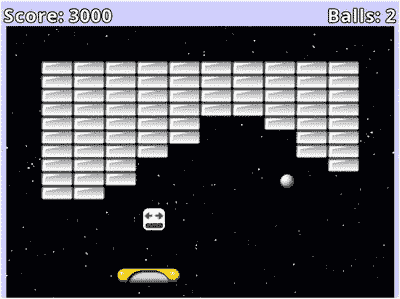
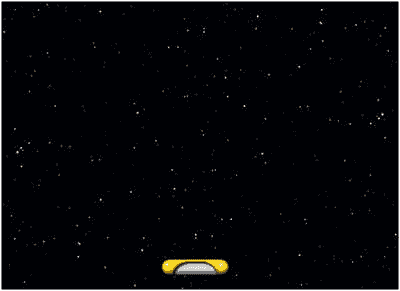
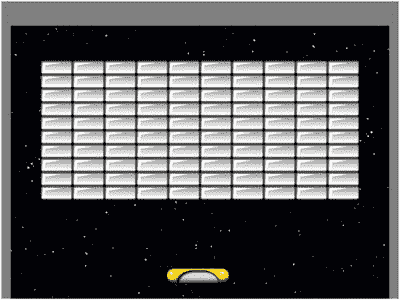

# 8. 弹跳与碰撞游戏

在本章中，你将创建一个名为《矩形毁灭者》的弹球打砖块游戏，如图 8-1 所示，其灵感来源于《打砖块》和《方舟陨石》等街机及早期主机游戏。本游戏将实现的新功能包括物体弹跳和道具物品。



图 8-1.

《矩形毁灭者》游戏

## 游戏项目：矩形毁灭者

《矩形毁灭者》是一款动作游戏，玩家控制一个在屏幕底部左右移动的挡板，用它来将球弹向上方的矩形砖块状物体，以摧毁它们。摧毁每个砖块都会为玩家赢得分数，如果所有砖块都被摧毁，玩家就赢得游戏。如果球落至屏幕底部边缘以下，则球会丢失。如果还有备用球（玩家开始时拥有三个备用球），则会在挡板上方生成一个新球。当球与挡板碰撞时，其弹跳角度由碰撞点决定：击中挡板左侧会使球向左弹跳，击中右侧会使球向右弹跳，击中中心则会使球垂直向上弹起。

偶尔，被摧毁的砖块会释放一个道具，该道具会向屏幕底部飘落。道具可能对游戏产生各种影响，例如改变挡板的大小或改变球的速度。道具的效果由其图像指示。如果挡板收集到道具（通过与之碰撞），则道具的效果被激活。有些道具会使游戏变得更难，例如缩小挡板的道具，玩家可能希望避开它。有时，收集有益道具也伴随着球落向屏幕底部时可能错失它的风险；玩家必须谨慎做出决定。

玩家通过左右移动鼠标来控制挡板。在游戏开始时，以及每次球重生时，球会锁定在挡板顶部，当玩家点击鼠标按钮时才会释放。

用户界面包含一些文本显示。在屏幕顶部，显示玩家的分数和备用球数量。在屏幕中央，会出现文本告知玩家应点击鼠标按钮开始游戏，并且当玩家获胜或输掉游戏时，会显示相应消息。

游戏采用简单的线条艺术风格，并配有欢快的背景音乐以配合游戏节奏。当游戏世界中的物体交互时，会播放短促的音效：例如球弹离挡板、砖块或墙壁时，以及道具出现和被收集时。

开始此项目所需的步骤与之前的项目相同：创建一个新项目，创建一个`assets`文件夹和一个`+libs`文件夹（如果你已经设置了`userlib`目录，则后者非必需），复制你在本书第一部分创建的自定义框架文件（`BaseGame.java`、`BaseScreen.java`、`BaseActor.java`），并将此项目的图形和音频文件复制到你的`assets`文件夹中。如前一章所述，为了方便起见，已创建了一个名为`Framework`的 BlueJ 项目，其中包含这些文件（项目特定的资源除外），以及一个`launcher`类和`BaseGame`与`BaseScreen`类的扩展。为了提高效率，这些文件将作为起点。要开始此项目：

*   下载本章的源代码文件。
*   复制下载的`Framework`文件夹（及其内容）并将其重命名为`Rectangle Destroyer`。
*   将下载的`Rectangle Destroyer`项目`assets`文件夹中的所有内容复制到你新创建的`Rectangle Destroyer assets`文件夹中。
*   在你的`Rectangle Destroyer`文件夹中打开 BlueJ 项目。
*   在`CustomGame`类中，将类名更改为`RectangleGame`（BlueJ 随后会将源代码文件重命名为`RectangleGame.java`）。
*   在`Launcher`类中，将`main`方法的内容更改为以下内容：

```
    Game myGame = new RectangleGame();
    LwjglApplication launcher = new LwjglApplication(
    myGame, "Rectangle Destroyer", 800, 600 );
    ```

至此，你已经准备好开始为游戏特定对象创建类，并编写游戏玩法本身的代码。

## 创建游戏对象

在本节中，你将为主要游戏对象创建四个类：挡板、墙壁、砖块和球。创建每个类后，你将在`screen`类中添加代码，将这些对象添加到游戏中，并使它们能够相互交互。


### 挡板

首先，你需要创建一个代表玩家控制的挡板对象的类，这将是最容易设置的对象。创建一个名为 `Paddle` 的新类，包含以下代码：

```
import com.badlogic.gdx.scenes.scene2d.Stage;
public class Paddle extends BaseActor
{
public Paddle(float x, float y, Stage s)
{
super(x,y,s);
loadTexture("assets/paddle.png");
}
}
```

然后，在 `LevelScreen` 类中添加以下 `import` 语句（这将使你稍后能够获取鼠标位置）：

```
import com.badlogic.gdx.Gdx;
```

接着，在类中添加以下变量声明：

```
Paddle paddle;
```

在 `initialize` 方法中，通过添加以下代码来设置背景图像和挡板：

```
BaseActor background = new BaseActor(0,0, mainStage);
background.loadTexture("assets/space.png");
BaseActor.setWorldBounds(background);
paddle = new Paddle(320, 32, mainStage);
```

然后，在 `update` 方法中添加以下代码，这将使挡板在水平方向上与鼠标对齐（通过调整其 x 坐标），同时确保挡板完全显示在屏幕上。（如果鼠标移出屏幕，此代码将不起作用。）

```
float mouseX = Gdx.input.getX();
paddle.setX( mouseX - paddle.getWidth()/2 );
paddle.boundToWorld();
```

此时是测试游戏的好时机（通过运行 `Launcher` 类中的 `main` 方法）；你应该能够通过移动鼠标来控制挡板的位置；此时，你的游戏应如图 8-2 所示。



图 8-2.

添加了背景图像和挡板的游戏

### 墙壁

接下来，你需要为墙壁对象创建一个类。墙壁将沿着屏幕的左、右和上边缘放置，球会从它们上面弹开。由于墙壁可能有不同的大小，`Wall` 类的 `constructor` 也将把墙壁的宽度和高度作为参数。为此，创建一个名为 `Wall` 的新类，包含以下代码：

```
import com.badlogic.gdx.scenes.scene2d.Stage;
import com.badlogic.gdx.graphics.Color;
public class Wall extends BaseActor
{
public Wall(float x, float y, float width, float height, Stage s)
{
super(x,y,s);
loadTexture("assets/white-square.png");
setSize(width, height);
setColor( Color.GRAY );
setBoundaryRectangle();
}
}
```

如果需要，可以将颜色设置为 `Color.GRAY` 以外的颜色。请注意，由于边界多边形设置为与加载的纹理大小匹配，因此在调用 `setSize` 方法更改对象大小后，应调用 `setBoundaryRectangle` 方法来更新此数据。

接下来，在 `LevelScreen` 类的 `initialize` 方法中添加以下代码：

```
new Wall(  0,0, 20,600, mainStage); // 左墙
new Wall(780,0, 20,600, mainStage); // 右墙
new Wall(0,550, 800,50, mainStage); // 顶墙
```

不需要存储 `Wall` 对象的变量，因为稍后可以使用 `BaseActor` 类的 `getList` 方法轻松获取 `Brick` 对象的列表。特别要注意的是，顶墙的高度很大；这将为本章稍后实现的用户界面中的标签提供空间。如果需要，此时可以再次测试程序，以目视检查墙壁是否正确放置。

### 砖块

接下来，你需要将矩形砖块添加到游戏中。创建一个名为 `Brick` 的新类，包含以下代码：

```
import com.badlogic.gdx.scenes.scene2d.Stage;
public class Brick extends BaseActor
{
public Brick(float x, float y, Stage s)
{
super(x,y,s);
loadTexture("assets/brick-gray.png");
}
}
```

如果需要，可以在构造函数中使用 `setColor` 方法为砖块着色。

接下来，你需要在主屏幕上设置一个矩形砖块网格。最简单的方法是使用嵌套的 `for` 循环。每个砖块的坐标可以根据行和列的位置以及每个砖块的宽度和高度来计算。为了确定砖块的宽度和高度，先创建一个 `Brick` 对象，在存储其大小后将其移除。为了将砖块网格定位在屏幕中央附近，还需要计算并考虑边距。为此，在 `LevelScreen` 类的 `initialize` 方法中添加以下代码：

```
Brick tempBrick = new Brick(0,0,mainStage);
float brickWidth = tempBrick.getWidth();
float brickHeight = tempBrick.getHeight();
tempBrick.remove();
int totalRows = 10;
int totalCols = 10;
float marginX = (800 - totalCols * brickWidth) / 2;
float marginY = (600 - totalRows * brickHeight) - 120;
for (int rowNum = 0; rowNum < totalRows; rowNum++)
{
for (int colNum = 0; colNum < totalCols; colNum++)
{
float x = marginX + brickWidth  * colNum;
float y = marginY + brickHeight * rowNum;
new Brick( x, y, mainStage );
}
}
```

此时，你可以再次测试项目，以验证砖块是否按预期显示。上述代码产生了如图 8-3 所示的排列；如果需要，你可以通过更改 `totalRows` 和 `totalCols` 的值来调整每行和每列的砖块数量，甚至可以通过向 `brickHeight` 和 `brickWidth` 添加一个小的值来在砖块之间添加一些间距。



图 8-3.

添加矩形砖块网格

这类游戏中的一些游戏会通过使用不同颜色的砖块创建像素艺术风格的图片来增加视觉趣味。虽然目前技术上可行，但这并不值得投入太多精力。借助第三方程序进行瓦片地图编辑来设计和加载彩色砖块图案将是未来章节的主题。


### 球体

接下来，你将实现球体对象。球体将利用`BaseActor`类中的物理功能：它将保持恒定速度运动。同时会模拟少量重力，使球体不会在某个垂直位置“卡住”，而是从左墙到右墙来回移动。游戏开始时，球体需要保持静止，直到用户点击鼠标按钮。因此，`Ball`类将包含一个名为`paused`的布尔变量（以及相关方法`setPaused`和`isPaused`），用于控制是否在`act`方法中应用物理效果。首先，创建一个名为`Ball`的新类，代码如下：

```
import com.badlogic.gdx.scenes.scene2d.Stage;
import com.badlogic.gdx.math.Vector2;
public class Ball extends BaseActor
{
public boolean paused;
public Ball(float x, float y, Stage s)
{
super(x,y,s);
loadTexture("assets/ball.png");
setSpeed(400);
setMotionAngle(90);
setBoundaryPolygon(12);
setPaused(true);
}
public boolean isPaused()
{
return paused;
}
public void setPaused(boolean b)
{
paused = b;
}
public void act(float dt)
{
super.act(dt);
if ( !isPaused() )
{
// 模拟重力
setAcceleration(10);
accelerateAtAngle(270);
applyPhysics(dt);
}
}
}
```

此外，球体需要从砖块和墙壁上“弹回”。这借助`BaseActor`类中`preventOverlap`方法返回的向量来实现，该向量表示角色被移动的方向，以使相关角色不再重叠。通过比较向量的 x 和 y 分量，你可以估算重叠主要发生在 x 方向（此时球体应水平弹回）还是 y 方向（此时球体应垂直弹回）。任一方向的弹回都涉及反转该方向的速度，通过将对应分量乘以-1 来实现。因此，将`BaseActor`类中的`velocityVec`字段改为：

```
protected Vector2 velocityVec;
```

做出此更改后，`Ball`类可以访问并修改此变量。为实现此功能，在`Ball`类中添加以下方法：

```
public void bounceOff(BaseActor other)
{
Vector2 v = this.preventOverlap(other);
if ( Math.abs(v.x) >= Math.abs(v.y) ) // 水平弹回
this.velocityVec.x *= -1;
else // 垂直弹回
this.velocityVec.y *= -1;
}
```

要向游戏中添加球体，在`LevelScreen`类中添加以下变量声明：

```
Ball ball;
```

在`initialize`方法中，添加以下代码行：

```
ball = new Ball(0,0, mainStage);
```

为了在球体暂停时将其锁定在挡板上方中央位置，在`update`方法中添加以下代码块：

```
if ( ball.isPaused() )
{
ball.setX( paddle.getX() + paddle.getWidth()/2  - ball.getWidth()/2 );
ball.setY( paddle.getY() + paddle.getHeight()/2 + ball.getHeight()/2 );
}
```

最后，为了在用户点击鼠标按钮时释放球体，在`LevelScreen`类中添加以下方法：

```
public boolean touchDown(int screenX, int screenY, int pointer, int button)
{
if ( ball.isPaused() )
{
ball.setPaused(false);
}
return false;
}
```

此时，你可以再次测试游戏。球体应出现在挡板上方中央，并随挡板来回移动；如果点击鼠标按钮，球体将垂直向上飞向（并越过）屏幕顶部边缘。在下一节中，你将添加代码使球体从各种游戏对象上弹回。

## 弹跳机制

在本节中，你将添加代码使球体能够从墙壁、砖块和挡板上弹回。其中最简单的是从墙壁上弹回。在`LevelScreen`类的`update`方法中，添加以下代码：

```
for (BaseActor wall : BaseActor.getList(mainStage, "Wall"))
{
if ( ball.overlaps(wall) )
{
ball.bounceOff(wall);
}
}
```

从砖块上弹回稍微复杂一些，因为砖块被击中后也会被销毁。在`LevelScreen`类的`update`方法中，添加以下代码：

```
for (BaseActor brick : BaseActor.getList(mainStage, "Brick"))
{
if ( ball.overlaps(brick) )
{
ball.bounceOff(brick);
brick.remove();
}
}
```

最后，你将添加代码使球体能够从挡板上弹回。如本章开头所述，弹回角度取决于被击中的挡板部位，因此这里不会使用`Ball`类的`bounceOff`方法。取而代之，你需要确定球体中心的 x 坐标，并计算其在挡板上的位置百分比：0.00 表示最左端，0.50 表示正中央，1.00 表示最右端。然后使用该百分比，通过`MathUtils`类的`lerp`方法（线性）插值计算弹回角度：百分比 0.00 对应 150 度角（指向左侧），百分比 1.00 对应 30 度角（指向右侧），中间百分比则使用线性函数（连接这两个数据点的直线方程）进行相应插值。为实现此功能，在`LevelScreen`类中添加以下`import`语句：

```
import com.badlogic.gdx.math.MathUtils;
```

然后，在`update`方法中添加以下代码：

```
if ( ball.overlaps(paddle) )
{
float ballCenterX = ball.getX() + ball.getWidth()/2;
float paddlePercentHit = (ballCenterX - paddle.getX()) / paddle.getWidth();
float bounceAngle = MathUtils.lerp( 150, 30, paddlePercentHit );
ball.setMotionAngle( bounceAngle );
}
```

此时，你应该测试游戏，验证球体是否能按预期从墙壁、砖块和挡板上弹回。需要注意的是，游戏过程中可能出现两种奇怪的行为。首先，如果墙壁太薄且球体移动过快，球体可能在游戏循环的单个迭代中穿过墙壁。如果在测试时出现这种情况，你可能需要限制球体的速度或增加墙壁的尺寸。此外，球体可能看起来穿过砖块而非弹回；如果球体恰好同时与两块砖重叠，`bounceOff`方法会被调用两次，而两次反转同一方向的速度会导致球体继续沿原方向运动。目前似乎没有简单或优雅的方法来消除这种行为，但在实际游戏中这种情况很少发生，因此这里不做处理。


## 用户界面

接下来，你将为此游戏实现一个简单的用户界面：三个标签，其中两个将出现在屏幕顶部边缘附近，分别显示已获得的分数和剩余球数，如图 8-1 所示。第三个标签将出现在屏幕中央，在球暂停时显示“点击开始”消息，以及游戏胜利和失败的消息。首先，在 `LevelScreen` 类中添加以下 `import` 语句：

```
import com.badlogic.gdx.scenes.scene2d.ui.Label;
import com.badlogic.gdx.graphics.Color;
```

向该类添加以下变量声明：

```
int score;
int balls;
Label scoreLabel;
Label ballsLabel;
Label messageLabel;
```

为了设置这些变量，在 `initialize` 方法中添加以下代码：

```
score = 0;
balls = 3;
scoreLabel = new Label( "Score: " + score, BaseGame.labelStyle );
ballsLabel = new Label( "Balls: " + balls, BaseGame.labelStyle );
messageLabel = new Label("click to start", BaseGame.labelStyle );
messageLabel.setColor( Color.CYAN );
```

为了使用 `uiTable` 排列标签，你将创建一个两行三列的表格，中间列为空，用于分隔 `scoreLabel` 和 `ballsLabel`。第二行将跨越所有三列，并包含 `messageLabel`，使其出现在屏幕中央附近。这可以通过在 `initialize` 方法中添加以下代码来实现：

```
uiTable.pad(5);
uiTable.add(scoreLabel);
uiTable.add().expandX();
uiTable.add(ballsLabel);
uiTable.row();
uiTable.add(messageLabel).colspan(3).expandY();
```

首先，当玩家点击按钮时，`messageLabel` 应该消失。在 `touchDown` 方法中，检查球是否暂停的代码块内，在 `if` 语句的末尾（但仍在内部）添加以下代码行：

```
messageLabel.setVisible(false);
```

接下来，当砖块被摧毁时，你将获得分数。在 `update` 方法中，检查球是否与砖块重叠的代码块内（在 `brick.remove()` 之后），添加以下两行代码：

```
score += 100;
scoreLabel.setText("Score: " + score);
```

如果所有砖块都被摧毁，则应显示“你赢了！”消息。这可以通过在 `update` 方法中添加以下代码来实现：

```
if ( BaseActor.count(mainStage, "Brick") == 0)
{
messageLabel.setText("You win!");
messageLabel.setColor( Color.LIME );
messageLabel.setVisible(true);
}
```

接下来，你将设置备用球和重生机制。如果球移出屏幕底部边缘，则应将其从游戏中移除。如果还有剩余球，则应生成一个新球，减少球数，并再次显示“点击开始”消息。如果没有剩余球，则应显示“游戏结束”消息。请注意，该条件还会检查是否还有砖块剩余，因为如果玩家已经赢了游戏，则不应显示这些消息。在 `update` 方法中添加以下代码：

```
if ( ball.getY()  0 )
{
ball.remove();
if (balls > 0)
{
balls -= 1;
ballsLabel.setText("Balls: " + balls);
ball = new Ball(0,0,mainStage);
messageLabel.setText("Click to start");
messageLabel.setColor( Color.CYAN );
messageLabel.setVisible(true);
}
else
{
messageLabel.setText("Game Over");
messageLabel.setColor( Color.RED );
messageLabel.setVisible(true);
}
}
```

此时，你的游戏已准备好再次测试！确保分数和球数标签按预期变化，并且消息标签在正确的时间显示正确的文本。

## 道具

为了增加游戏的趣味性和变化性，接下来你将实现道具。为了跟踪不同类型的道具，你将使用枚举类型。

枚举类型

枚举类型是一种你可以定义的特殊数据类型，它由一组固定的值组成。当你希望一个变量只存储特定的一组值时，这尤其有用。

例如，如果你想表示一个指南针方向，你可以创建一个整数变量和一组预定义的常量，如下所示：

```
final int NORTH = 0;
final int SOUTH = 1;
final int EAST = 2;
final int WEST = 3;
int direction;
```

稍后，你可以编写如下代码：

```
direction = NORTH;
```

然而，这段代码的缺点在于任何整数值都可以赋给 `direction` 变量，包括没有意义的值，例如：

```
direction = 4;
```

枚举类型完全消除了这个问题。刚才描述的相同功能可以更健壮地实现。使用 `enum` 关键字，你可以定义一个枚举类型（名为 `Direction`）和相应的变量，如下所示：

```
enum Direction { NORTH, SOUTH, EAST, WEST };
Direction direction;
```

在这个例子中，`Direction` 现在是一个用户定义的数据类型，而 `direction` 是该类型的一个变量。使用枚举类型值的语法类似于访问类中定义的静态字段。例如，要将 `direction` 的值设置为 `Direction` 值 `NORTH`，你可以输入：

```
direction = Direction.NORTH;
```

最后，你可以使用 `==` 或 `equals` 方法来比较枚举类型变量的值，并且可以使用 `values` 方法获取包含这些值的数组。

在本节中，你将创建四种不同类型的道具：两种影响挡板大小（一种扩大，一种缩小），两种影响球的速度（一种加快，一种减慢）。类型将使用一个枚举（名为 `Type`）来指定。每种类型的道具都有对应的图像，如图 8-4 所示。


图 8-4.

道具图像（挡板扩大、挡板缩小、球加速、球减速）

创建道具时，将发生以下情况：

*   将随机选择一种类型。
*   将有一个动画效果，使道具从一个点逐渐增长到其完整大小。
*   道具将以恒定速度向屏幕底部移动。
*   如果道具移出屏幕底部边缘，它将被从游戏中移除。

为了实现这些功能，创建一个名为 `Item` 的新类，其中包含以下代码。请注意，在构造函数中，更改图像大小后，还需要更新原点坐标和边界形状。


```
import com.badlogic.gdx.scenes.scene2d.Stage;
import com.badlogic.gdx.math.MathUtils;
import com.badlogic.gdx.scenes.scene2d.actions.Actions;
public class Item extends BaseActor
{
public enum Type { PADDLE_EXPAND, PADDLE_SHRINK,
BALL_SPEED_UP, BALL_SPEED_DOWN };
private Type type;
public Item(float x, float y, Stage s)
{
super(x,y,s);
setRandomType();
setSpeed(100);
setMotionAngle(270);
setSize(50,50);
setOrigin(25,25);
setBoundaryRectangle();
setScale(0,0);
addAction( Actions.scaleTo(1,1, 0.25f) );
}
public void setType(Type t)
{
type = t;
if (t == Type.PADDLE_EXPAND)
loadTexture("assets/items/paddle-expand.png");
else if (t == Type.PADDLE_SHRINK)
loadTexture("assets/items/paddle-shrink.png");
else if (t == Type.BALL_SPEED_UP)
loadTexture("assets/items/ball-speed-up.png");
else if (t == Type.BALL_SPEED_DOWN)
loadTexture("assets/items/ball-speed-down.png");
else
loadTexture("assets/items/item-blank.png");
}
public void setRandomType()
{
int randomIndex = MathUtils.random(0, Type.values().length - 1);
Type randomType = Type.values()[randomIndex];
setType(randomType);
}
public Type getType()
{
return type;
}
public void act(float dt)
{
super.act(dt);
applyPhysics(dt);
if (getY() < -50)
remove();
}
}
```

当砖块被摧毁时，应偶尔生成道具。为实现此功能，请在 `LevelScreen` 类的 `update` 方法中，找到当球与砖块重叠时运行的代码块，并添加以下代码。（你可以根据需要调整 `spawnProbability` 的值，以控制道具出现的频率。）

```
float spawnProbability = 20;
if ( MathUtils.random(0, 100) < spawnProbability )
{
Item i = new Item(0,0,mainStage);
i.centerAtActor(brick);
}
```

为了实现当挡板与道具重叠时的道具效果，请在 `update` 方法中添加以下代码。请注意，通过 `getList` 方法获取的 `BaseActor` 对象必须强制转换为 `Item` 对象，才能访问 `getType` 方法。另外，在更改挡板尺寸后，其边界形状也必须同步更新。

```
for (BaseActor item : BaseActor.getList(mainStage, "Item"))
{
if ( paddle.overlaps(item) )
{
Item realItem = (Item)item;
if (realItem.getType() == Item.Type.PADDLE_EXPAND)
paddle.setWidth( paddle.getWidth() * 1.25f );
else if (realItem.getType() == Item.Type.PADDLE_SHRINK)
paddle.setWidth( paddle.getWidth() * 0.80f );
else if (realItem.getType() == Item.Type.BALL_SPEED_UP)
ball.setSpeed( ball.getSpeed() * 1.50f );
else if (realItem.getType() == Item.Type.BALL_SPEED_DOWN)
ball.setSpeed( ball.getSpeed() * 0.90f );
paddle.setBoundaryRectangle();
item.remove();
}
}
```

再次强调，这是一个测试代码的好机会，这次请确保所有强化道具都能按预期工作。为了测试方便，你可以临时提高 `spawnProbability` 的值，让道具更频繁地生成，从而获得更多测试机会；或者，如果你特别想测试某一种道具类型，也可以在道具生成后直接设置其类型。

## 音效与音乐

最后，你将向游戏添加一些音效和音乐，以烘托氛围并突出物体之间的交互。具体来说，当球击中墙壁、球击中砖块、球击中挡板、道具生成以及道具被收集时，都需要播放音效。背景音乐名为“Rollin at 5”¹，是一首节奏明快的爵士乐，非常适合本游戏的节奏。首先，在 `LevelScreen` 类中添加以下 `import` 语句：

```
import com.badlogic.gdx.audio.Sound;
import com.badlogic.gdx.audio.Music;
```

接下来，在同一个类中添加以下变量声明：

```
Sound bounceSound;
Sound brickBumpSound;
Sound wallBumpSound;
Sound itemAppearSound;
Sound itemCollectSound;
Music backgroundMusic;
```

在 `initialize` 方法中，添加以下代码：

```
bounceSound      = Gdx.audio.newSound(Gdx.files.internal("assets/boing.wav"));
brickBumpSound   = Gdx.audio.newSound(Gdx.files.internal("assets/bump.wav"));
wallBumpSound    = Gdx.audio.newSound(Gdx.files.internal("assets/bump-low.wav"));
itemAppearSound  = Gdx.audio.newSound(Gdx.files.internal("assets/swoosh.wav"));
itemCollectSound = Gdx.audio.newSound(Gdx.files.internal("assets/pop.wav"));
backgroundMusic = Gdx.audio.newMusic(Gdx.files.internal("assets/Rollin-at-5.mp3"));
backgroundMusic.setLooping(true);
backgroundMusic.setVolume(0.50f);
backgroundMusic.play();
```

接下来，你需要在 `update` 方法中添加在适当时机播放音效的代码行。在检查球是否与墙壁重叠的条件语句后的代码块中，紧接在使球从墙壁反弹的代码行之后，添加以下代码：

```
wallBumpSound.play();
```

在检查球是否与砖块重叠的条件语句后的代码块中，紧接在使球从砖块反弹的代码行之后，添加以下代码：

```
brickBumpSound.play();
```

在生成新 `Item` 对象的代码行之后，添加以下代码：

```
itemAppearSound.play();
```

在检查球是否与挡板重叠的条件语句后的代码块中，紧接在设置球运动角度的代码行之后，添加以下代码：

```
bounceSound.play();
```

最后，在检查挡板是否与道具重叠的条件语句后的代码块中，紧接在将道具从舞台移除的代码行之后，添加以下代码：

```
itemCollectSound.play();
```

测试你的项目，验证音乐和音效是否按预期播放。

恭喜——你已经完成了“矩形毁灭者”游戏的制作！

## 总结与下一步

在本章中，你创建了这款弹球击砖的动作游戏“矩形毁灭者”。你学习了如何模拟反弹，以及如何在创建影响游戏玩法的可收集道具时使用枚举类型。

一如既往，你还可以添加许多功能来提升游戏品质，例如在游戏开始前显示一个开始菜单。你可以为游戏对象的交互添加更多音效，比如球丢失时、玩家获胜时以及玩家失败时的音效。你还可以在砖块区域添加一些固定的、移动的物体来撞击球。最重要的是，你可能想考虑创建一些额外的强化道具。以下是一些额外道具效果的思路：

*   增加分数奖励
*   获得一个额外的备用球
*   改变球的大小（变小或变大）
*   摧毁一个随机砖块
*   让挡板在 1-3 秒内无法移动

在下一章中，你将学习如何实现一种完全不同的游戏机制：拖放功能，这是卡牌类和益智类游戏的关键要素。

脚注 1

“Rollin at 5”由 Kevin McLeod 创作，来源于 [`http://incompetech.com`](http://incompetech.com)，并根据知识共享署名 3.0 许可协议发布。


