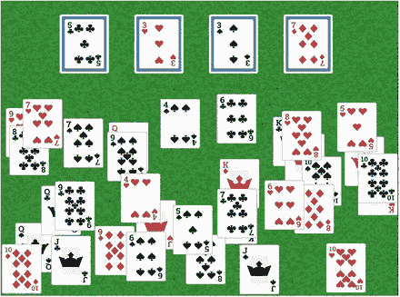
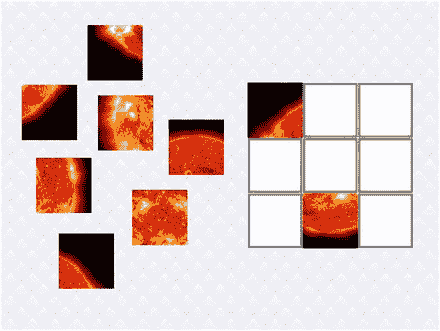
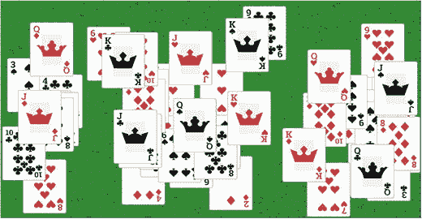

# 9. 拖放游戏

在本章中，你将学习如何为游戏添加拖放功能：即点击一个对象，在按住鼠标按钮的同时，让选中的对象跟随鼠标移动，直到松开按钮。由于此功能在许多场景中都非常实用，你将创建一个名为 `DragAndDropActor` 的 `BaseActor` 类扩展，其中包含相关代码。为了演示这个新类的灵活性，你将创建两个使用该类的全新游戏。第一个是拼图游戏，如图 9-1 所示，它由一张被分割成若干碎片的图像组成，玩家需要将这些碎片在网格上正确排列。第二个是一款名为“52 张牌接龙”的纸牌游戏，如图 9-2 所示，玩家需要将一副标准扑克牌正确排列成一组牌堆。



图 9-2. 一款纸牌游戏



图 9-1. 一款拼图游戏

开始这个项目所需的步骤与之前的项目相同：创建一个新项目，创建 `assets` 文件夹和 `+libs` 文件夹（如果你已经设置了 `userlib` 目录，则后者不是必需的），复制你在本书第一部分创建的自定义框架文件（`BaseGame.java`、`BaseScreen.java`、`BaseActor.java`），并将此项目的图形和音频文件复制到你的 `assets` 文件夹中。如前一章所述，为了方便起见，已创建了一个名为 `Framework` 的 BlueJ 项目，其中包含这些文件（项目特定的资源除外），以及一个 `launcher` 类和 `BaseGame` 与 `BaseScreen` 类的扩展。为了提高效率，这些文件将作为起点。要开始第一个项目：

*   下载本章的源代码文件。
*   复制下载的 `Framework` 文件夹（及其内容），并将其重命名为 `Jigsaw Puzzle`（像往常一样，如果使用 `userlibs` 文件夹存储 JAR 文件，则不需要 `+libs` 文件夹）。
*   将下载的 `Jigsaw Puzzle` 项目 `assets` 文件夹中的所有内容复制到你新创建的 `Jigsaw Puzzle assets` 文件夹中。
*   打开 `Jigsaw Puzzle` 文件夹中的 BlueJ 项目。
*   在 `CustomGame` 类中，将类名改为 `JigsawPuzzleGame`（BlueJ 随后会将源代码文件重命名为 `JigsawPuzzleGame.java`）。
*   在 `Launcher` 类中，将 `main` 方法的内容修改为以下内容：

    ```
    Game myGame = new JigsawPuzzleGame ();
    LwjglApplication launcher = new LwjglApplication(
    myGame, "Jigsaw Puzzle Game", 800, 600 );
    ```

在下一节中，你将创建一些类，这些类将封装此游戏项目以及下一个游戏项目的拖放功能。遗憾的是，在游戏项目本身取得实质性进展之前，你将无法测试拖放角色类的功能。

## 拖放功能

开发新的 `DragAndDropActor` 类的第一步是考虑需要哪些功能。最重要的是，这个类需要能够响应用户输入。在最初创建 `BaseScreen` 类时，你实现了 `InputProcessor` 接口，这使得游戏能够通过 `touchDown`、`touchDragged` 和 `touchUp` 等方法响应鼠标和触摸输入。类似地，`Actor` 类（以及扩展的 `Group` 类，`BaseActor` 类正是基于 `Group` 类）包含一个名为 `addListener` 的方法，该方法允许你向角色附加一个 `InputListener` 对象，该对象实现了与 `InputProcessor` 类相同的方法。这些触摸方法具有以下方法签名：

```
public void touchDown(InputEvent event, float x, float y, int pointer, int button)
public void touchDragged(InputEvent event, float x, float y, int pointer)
public void touchUp(InputEvent event, float x, float y, int pointer, int button)
```

关于触摸方法，最重要的一点是，这些方法中的浮点参数 x 和 y 存储的是鼠标相对于被点击对象的坐标——它们表示偏移量，而非绝对位置。例如，如果一个对象的宽度为 200 像素，高度为 300 像素，点击该对象的中心会将 x 的值设为 100，y 的值设为 150，无论该对象在屏幕上的位置如何。因此，为了在 `touchDragged` 方法中计算角色需要移动多少距离，你需要存储从 `touchDown` 方法接收到的原始 x 和 y 偏移量。

了解了这些之后，你现在可以开始编写一些代码了。首先，创建一个名为 `DragAndDropActor` 的新类，其中包含以下代码。请注意，需要在变量 `self` 中存储对角色本身的引用，以便在 `InputListener` 方法的上下文中访问类变量 `grabOffsetX` 和 `grabOffsetY`。关键字 `this` 是对正在调用其方法的对象的引用。在 `InputListener` 中，`this` 将引用 `InputListener` 本身，而你需要引用的是 `DragAndDropActor`，因此需要使用额外的变量 `self`。

```
import com.badlogic.gdx.scenes.scene2d.Stage;
import com.badlogic.gdx.scenes.scene2d.InputListener;
import com.badlogic.gdx.scenes.scene2d.InputEvent;
/**
*  为角色启用拖放功能。
*/
public class DragAndDropActor extends BaseActor
{
private DragAndDropActor self;
private float grabOffsetX;
private float grabOffsetY;
public DragAndDropActor(float x, float y, Stage s)
{
super(x,y,s);
self = this;
addListener(
new InputListener()
{
public boolean touchDown(InputEvent event, float offsetX, float offsetY,
int pointer, int button)
{
self.grabOffsetX = offsetX;
self.grabOffsetY = offsetY;
self.toFront();
return true;
}
public void touchDragged(InputEvent event, float offsetX, float offsetY,
int pointer)
{
float deltaX = offsetX - self.grabOffsetX;
float deltaY = offsetY - self.grabOffsetY;
self.moveBy(deltaX, deltaY);
}
public void touchUp(InputEvent event, float offsetX, float offsetY,
int pointer, int button)
{
// 稍后将添加代码
}
}
);
}
public void act(float dt)
{
super.act(dt);
}
}
```


目前，上述代码允许对象在屏幕上被拖拽。然而，你通常希望此类对象能与它被放置到的另一类对象进行交互。例如，在拼图游戏中，你希望将拼图块放置到特定的棋盘区域；而在纸牌游戏中，你希望将牌放置到特定的牌堆上。为此，你将创建另一个类，用于表示可以被 `DragAndDropActor` 对象作为目标的对象。你还需要包含一个布尔变量，用于指示该对象是否可以被作为目标。这对于某些游戏可能很重要，因为在这些游戏中，你最终可能需要禁用特定目标的放置功能。例如，在拼图游戏中，一旦你将一个拼图块放置到某个区域，你就不希望再将第二个拼图块放置到同一区域。创建一个名为 `DropTargetActor` 的新类，包含以下代码：

```
import com.badlogic.gdx.scenes.scene2d.Stage;
public class DropTargetActor extends BaseActor
{
private boolean targetable;
public DropTargetActor(float x, float y, Stage s)
{
super(x,y,s);
targetable = true;
}
public void setTargetable(boolean t)
{
targetable = t;
}
public boolean isTargetable()
{
return targetable;
}
}
```

接下来，你将回到 `DragAndDropActor` 类，添加与 `DropTargetActor` 对象交互的功能。在 `InputListener` 的 `touchUp` 方法中，你将识别出 `DragAndDropActor` 被放置到的 `DropTargetActor`（如果有的话），并将其存储在一个变量中以便后续访问。该方法的主要部分涉及一个 `for` 循环，遍历附加到舞台上的所有 `DropTargetActor` 对象，这些对象必须既可被作为目标，又与正在被拖拽的演员重叠。然而，还需要一些额外的代码来处理被拖拽的演员与两个或更多放置目标重叠的情况。在这种情况下，你需要选择距离被拖拽演员最近的目标。为此，你将在循环中记录从被拖拽演员到候选放置目标的距离，如果这个距离小于迄今为止遇到的最短距离，则将该候选目标设置为新的放置目标。

在 `DragAndDropActor` 类中，添加以下 `import` 语句：

```
import com.badlogic.gdx.math.Vector2;
```

在类中添加以下变量声明：

```
private DropTargetActor dropTarget;
```

在 `InputListener` 的 `touchUp` 方法中，添加以下代码：

```
self.setDropTarget(null);
// 跟踪到最近对象的距离
float closestDistance = Float.MAX_VALUE;
for ( BaseActor actor : BaseActor.getList(self.getStage(), "DropTargetActor") )
{
DropTargetActor target = (DropTargetActor)actor;
if ( target.isTargetable() && self.overlaps(target) )
{
float currentDistance =
Vector2.dst(self.getX(),self.getY(), target.getX(),target.getY());
// 检查此目标是否更近
if (currentDistance < closestDistance)
{
self.setDropTarget(target);
closestDistance = currentDistance;
}
}
}
```

此外，为了配合 `dropTarget` 变量，在 `DragAndDropActor` 类中添加以下方法：

```
public boolean hasDropTarget()
{  return (dropTarget != null);  }
public void setDropTarget(DropTargetActor dt)
{  dropTarget = dt;  }
public DropTargetActor getDropTarget()
{  return dropTarget;  }
```

`DragAndDropActor` 类还有几个小的补充。首先，你将添加禁用拖拽功能的能力。如果你想锁定一个对象的位置，这会很有用。例如，在单人纸牌游戏中，一旦一张牌被移动到正确的牌堆上，你就不希望再将它移开。为此，在 `DragAndDropActor` 类中添加以下变量声明：

```
private boolean draggable;
```

在类构造函数中通过添加以下代码行来初始化该值：

```
draggable = true;
```

添加以下方法来配合 `draggable` 变量：

```
public void setDraggable(boolean d)
{  draggable = d;  }
public boolean isDraggable()
{  return draggable;  }
```

在 `InputListener` 的 `touchDown` 方法开头，添加以下代码。当 `draggable` 被设置为 `false` 时，这段代码将通过返回 `false` 来取消拖拽动作，并阻止 `touchDragged` 和 `touchUp` 方法被激活。

```
if ( !self.isDraggable() )
return false;
```

接下来的补充将是一些便捷方法，用于自动将此演员移动到另一个演员的中心，或者将演员移动回其原始位置（在拖拽开始时的位置）。例如，在单人纸牌游戏中，当将一张牌放置到正确的牌堆上时，你希望它在该牌堆上居中。相反，当将一张牌放置到错误的牌堆上时，你希望它返回原始位置，以免遮挡牌堆。为此，首先在 `DragAndDropActor` 类中添加以下 `import` 语句。`Interpolation` 类用于修改演员的移动，使动作在开始和结束时平滑过渡。

```
import com.badlogic.gdx.math.Interpolation;
import com.badlogic.gdx.scenes.scene2d.actions.Actions;
```

在类中添加以下变量声明：

```
private float startPositionX;
private float startPositionY;
```

在 `InputListener` 的 `touchDown` 方法中，在设置 `grabOffsetX` 和 `grabOffsetY` 的值之后，添加以下代码：

```
self.startPositionX = self.getX();
self.startPositionY = self.getY();
```

最后，在类中添加以下方法。`Interpolation` 对象用于在运动开始和结束时减慢移动速度，使其看起来更自然。

```
public void moveToActor(BaseActor other)
{
float x = other.getX() + (other.getWidth()  - this.getWidth())  / 2;
float y = other.getY() + (other.getHeight() - this.getHeight()) / 2;
addAction( Actions.moveTo(x,y, 0.50f, Interpolation.pow3) );
}
public void moveToStart()
{
addAction( Actions.moveTo(startPositionX, startPositionY, 0.50f, Interpolation.pow3) );
}
```

下一个补充是一个微妙的视觉效果，可以增强沉浸感。当拖拽一个对象时，玩家通常会想象该对象被抬起到游戏区域上方；而当放下对象时，玩家会想象该对象被放回游戏区域。离玩家更近的对象应该显得稍大一些；这可以通过在拖拽开始时添加一个将图像缩放到更大尺寸的动作，然后在拖拽结束时将图像缩放回原始尺寸来实现。为此，在 `touchDown` 方法中，在最后一行代码之前，添加以下内容：

```
self.addAction( Actions.scaleTo(1.1f, 1.1f, 0.25f) );
```

然后，在 `touchUp` 方法的末尾，添加以下内容：

```
self.addAction( Actions.scaleTo(1.00f, 1.00f, 0.25f) );
```

最后的补充将简化 `DragAndDropActor` 类在实际游戏中的使用。在使用 `DragAndDropActor` 和 `DropTargetActor` 类的游戏中，你通常会使用代表游戏中特定实体的自定义类来扩展这些类。为了在拖拽开始和对象被放置时添加额外的功能，你将在 `DragAndDropActor` 类中添加两个额外的方法，分别命名为 `onDragStart` 和 `onDrop`，它们分别在 `touchDown` 和 `touchUp` 方法的末尾被调用。在这个类中，这些方法将不包含任何代码；它们旨在被子类重写。在 `DragAndDropActor` 类中，添加以下两个方法：

```
public void onDragStart()
{    }
public void onDrop()
{    }
```

然后，在 `touchDown` 方法中，在最后一个语句之前，添加以下代码行：

```
self.onDragStart();
```

最后，在 `touchUp` 方法的末尾，添加以下代码行：

```
self.onDrop();
```


经过这些补充，`DragAndDropActor` 类就完整了，现在可以开始为拼图游戏创建游戏专属对象了。

## 游戏项目：拼图游戏

在拼图游戏中，一张图片会被分割成若干小块，玩家需要将这些小块拖拽到网格中正确的位置上。这些碎片随机分布在屏幕左侧，而它们应被放置的区域则位于屏幕右侧。当一块碎片被放置到某个方格区域时，它会自动对齐到该区域，并且其他碎片不能再放置到该特定区域，不过该碎片可以被重新移动，从而再次释放该区域。

本项目只需创建两个游戏专属对象：一个名为 `PuzzlePiece` 的类，代表单个碎片，它将继承 `DragAndDropActor`；另一个名为 `PuzzleArea` 的类，代表碎片将被放置的网格方格，它将继承 `DropTargetActor`。在初始化拼图碎片时，会存储一个行值和列值，用于指示其在原始图片中的位置。拼图区域对象也会存储行值和列值，表示它们在区域对象网格中的位置。当拼图碎片与拼图区域的行列值相等时，该碎片即被视为处于正确位置；当所有碎片都处于正确位置时，玩家获胜，屏幕上会显示“你赢了”的消息。

首先，创建一个名为 `PuzzleArea` 的新类，包含以下代码，以提供上述功能：

```
import com.badlogic.gdx.scenes.scene2d.Stage;
public class PuzzleArea extends DropTargetActor
{
private int row;
private int col;
public PuzzleArea(float x, float y, Stage s)
{
super(x,y,s);
loadTexture("assets/border.jpg");
}
public void setRow(int r)
{  row = r;  }
public void setCol(int c)
{  col = c;  }
public int getRow()
{  return row;  }
public int getCol()
{  return col;  }
}
```

接下来，你将设置拼图碎片的类。除了存储其正确行列值的变量外，还会有一个变量用于存储该碎片当前所在的区域（如果有的话），以及一个检查碎片当前是否放置正确的方法。创建一个名为 `PuzzlePiece` 的新类，包含以下代码：

```
import com.badlogic.gdx.scenes.scene2d.Stage;
public class PuzzlePiece extends DragAndDropActor
{
private int row;
private int col;
private PuzzleArea puzzleArea;
public PuzzlePiece(float x, float y, Stage s)
{
super(x,y,s);
}
public void setRow(int r)
{  row = r;  }
public void setCol(int c)
{  col = c;  }
public int getRow()
{  return row;  }
public int getCol()
{  return col;  }
public void setPuzzleArea(PuzzleArea pa)
{  puzzleArea = pa;  }
public PuzzleArea getPuzzleArea()
{  return puzzleArea;  }
public void clearPuzzleArea()
{  puzzleArea = null;  }
public boolean hasPuzzleArea()
{  return puzzleArea != null;  }
public boolean isCorrectlyPlaced()
{
return hasPuzzleArea()
&& this.getRow() == puzzleArea.getRow()
&& this.getCol() == puzzleArea.getCol();
}
}
```

此外，大部分游戏逻辑将通过重写 `DragAndDropActor` 类中的 `onDragStart` 和 `onDrop` 方法在此类中处理。具体来说，当碎片被放下时，如果其下方有一个可用的（可被选中的）拼图区域，该碎片将被移动到该区域，设置碎片对应的拼图区域变量，并且该特定区域将不再可被选中。同时，当碎片被拖拽时，如果已设置了对应的拼图区域，该区域将重新变为可被选中，并且碎片对应的拼图区域变量将被清除。为实现这些功能，请在 `PuzzlePiece` 类中添加以下两个方法：

```
// 重写 DragAndDropActor 类的方法
public void onDragStart()
{
if ( hasPuzzleArea() )
{
PuzzleArea pa = getPuzzleArea();
pa.setTargetable(true);
clearPuzzleArea();
}
}
public void onDrop()
{
if ( hasDropTarget() )
{
PuzzleArea pa = (PuzzleArea)getDropTarget();
moveToActor(pa);
setPuzzleArea(pa);
pa.setTargetable(false);
}
}
```

有了这些类之后，你就可以将注意力转向 `LevelScreen` 类了。首先，加载一张图片，将其分割成更小的区域（如图 9-3 所示），并将这些图片加载到随机放置在屏幕左侧的 `PuzzlePiece` 对象中。


图 9-3.

为拼图碎片分割成小图片的原始图像

在 `LevelScreen` 类中，添加以下 `import` 语句：

```
import com.badlogic.gdx.Gdx;
import com.badlogic.gdx.graphics.Texture;
import com.badlogic.gdx.graphics.g2d.TextureRegion;
import com.badlogic.gdx.math.MathUtils;
import com.badlogic.gdx.graphics.g2d.Animation;
```

然后，在 `initialize` 方法中添加以下代码。特别注意 `TextureRegion` 类的 `split` 方法的使用，它非常适合本游戏的需求，因为它能接收一张图片并创建一个二维的子图片数组。如果没有这个方法，创建拼图碎片的图片将会困难得多。同时注意，由于 `BaseActor` 对象使用动画，`TextureRegion` 对象必须加载到 `Animation` 对象中，才能被 `BaseActor` 类使用。

```
BaseActor background = new BaseActor(0,0, mainStage);
background.loadTexture("assets/background.jpg");
int numberRows = 3;
int numberCols = 3;
Texture texture = new Texture(Gdx.files.internal("assets/sun.jpg"), true);
int imageWidth  = texture.getWidth();
int imageHeight = texture.getHeight();
int pieceWidth  = imageWidth  / numberCols;
int pieceHeight = imageHeight / numberRows;
TextureRegion[][] temp = TextureRegion.split(texture, pieceWidth, pieceHeight);
for (int r = 0; r  anim = new Animation(1, temp[r][c]);
pp.setAnimation( anim );
pp.setRow(r);
pp.setCol(c);
}
}
```

此时，你可以测试程序，验证拼图碎片是否可以在屏幕上拖拽和放置。

接下来，你将在屏幕右侧设置一个 `PuzzleArea` 对象的网格。为了将它们完美居中，需要进行一些计算来确定边距，如下所示。在 `initialize` 方法中最内层的 `for` 循环中，添加以下代码：

```
int marginX = (400 - imageWidth)/2;
int marginY = (600 - imageHeight)/2;
int areaX = (400 + marginX) + pieceWidth * c;
int areaY = (600 - marginY - pieceHeight) - pieceHeight * r;
PuzzleArea pa = new PuzzleArea(areaX, areaY, mainStage);
pa.setSize(pieceWidth, pieceHeight);
pa.setBoundaryRectangle();
pa.setRow(r);
pa.setCol(c);
```

最后，你将设置一个标签，当所有碎片都处于正确位置时显示“你赢了”的消息。在 `LevelScreen` 类中，添加以下 `import` 语句：

```
import com.badlogic.gdx.scenes.scene2d.ui.Label;
import com.badlogic.gdx.graphics.Color;
```

接下来，在类中添加以下变量声明：

```
private Label messageLabel;
```

为了设置标签并将其定位在屏幕中央偏下的区域，请在 `initialize` 方法的末尾添加以下代码：

```
messageLabel = new Label("...", BaseGame.labelStyle);
messageLabel.setColor( Color.CYAN );
uiTable.add(messageLabel).expandX().expandY().bottom().pad(50);
messageLabel.setVisible(false);
```

最后，你将在 `update` 方法中检查拼图是否已正确完成。处理此逻辑的一种方法是先假设拼图已完成，然后检查所有碎片；如果任何一块碎片没有正确放置，则拼图未完成。为实现此功能，请在 `update` 方法中添加以下代码：


```
boolean solved = true;
for (BaseActor actor : BaseActor.getList(mainStage, "PuzzlePiece"))
{
PuzzlePiece pp = (PuzzlePiece)actor;
if ( !pp.isCorrectlyPlaced() )
solved = false;
}
if (solved)
{
messageLabel.setText("You win!");
messageLabel.setVisible(true);
}
else
{
messageLabel.setText("...");
messageLabel.setVisible(false);
}
```

添加这段代码后，拼图游戏就完成了！测试程序，确保将拼图块放入正确区域后，屏幕上会显示“You win!”（你赢了！）消息。你可以自由地将图片分割成不同数量的区域，或者使用完全不同的图片（不过图片应足够小，能容纳在窗口右半部分；最大尺寸为 400 像素 × 600 像素）。

为了展示你创建的拖放类的通用性，现在你将使用这些类创建第二个游戏，玩家将拖放扑克牌而非拼图块。

## 游戏项目：52 张牌收集

在纸牌接龙游戏“52 张牌收集”中，一副标准扑克牌的 52 张牌被随机散落；目标是将牌整理成堆。共有四堆，对应四种花色：梅花、红心、黑桃和方块。每堆牌必须按点数排列：从 A 开始，接着是 2、3、4、5、6、7、8、9、10、J、Q、K。如果一张牌被拖放到正确的牌堆上（即花色相同，且点数紧随牌堆顶部的牌），它将自动对齐到该牌堆。否则，这张牌将返回原位，以免遮挡牌堆顶部的牌。当所有牌都被添加到正确的牌堆后，屏幕上将显示“You win!”（你赢了！）消息。

同样，这个项目只需要创建两个游戏专用对象：一个名为 `Card` 的类，代表单个扑克牌，它将继承 `DragAndDropActor`；以及一个名为 `Pile` 的类，代表牌被拖放的目标区域，它将继承 `DropTargetActor`。

开始这个项目需要与之前相同的步骤：创建一个新项目，创建 `assets` 文件夹和 `+libs` 文件夹（如果已设置 `userlib` 目录，则后者非必需），从之前的项目（或名为 `Framework` 的 BlueJ 项目）复制自定义框架文件，并将此项目的图形和音频文件复制到你的 `assets` 文件夹中。要开始此项目：

*   下载本章的源代码文件（如果尚未下载）。
*   复制下载的 `Framework` 文件夹（及其内容），并将其重命名为 `52 Card Pickup`。
*   将下载的 `52 Card Pickup` 项目 `assets` 文件夹中的所有内容复制到你新创建的 `52 Card Pickup assets` 文件夹中。
*   打开 `52 Card Pickup` 文件夹中的 BlueJ 项目。
*   在 `CustomGame` 类中，将类名改为 `PickupGame`（BlueJ 随后会将源代码文件重命名为 `PickupGame.java`）。
*   在 `Launcher` 类中，将 `main` 方法的内容改为以下代码：

```
    Game myGame = new PickupGame();
    LwjglApplication launcher = new LwjglApplication(
    myGame, "52 Card Pickup", 800, 600 );
    ```

此外，你需要将最近创建的类 `DragAndDropActor` 和 `DropTargetActor` 复制到该项目中。

项目文件设置完成后，第一步是创建一个代表牌对象的类。为了简化比较，每张牌的点数和花色将存储为整数变量，但为了方便，`Card` 类也将包含点数和花色的名称。如果你查看此项目的 assets 文件夹内容，会发现牌图像的命名约定是单词 card，后跟花色名称，再跟点数名称（不过 A、J、Q、K 使用单个字母）。当设置点数和花色值时，将确定对应的名称，并用于将相应图像加载到演员中。创建一个名为 `Card` 的新类，包含以下代码：


```
import com.badlogic.gdx.scenes.scene2d.Stage;
public class Card extends DragAndDropActor
{
public static String[] rankNames = {"A", "2", "3", "4", "5", "6",
"7", "8", "9", "10", "J", "Q", "K"};
public static String[] suitNames = {"Clubs", "Hearts", "Spades", "Diamonds"};
private int rankValue;
private int suitValue;
public Card(float x, float y, Stage s)
{
super(x,y,s);
}
public void setRankValue(int r)
{  rankValue = r;  }
public int getRankValue()
{  return rankValue;  }
public String getRankName()
{  return rankNames[ getRankValue() ];  }
public void setSuitValue(int s)
{  suitValue = s;  }
public int getSuitValue()
{  return suitValue;  }
public String getSuitName()
{  return suitNames[ getSuitValue() ];  }
public void setRankSuitValues(int r, int s)
{
setRankValue(r);
setSuitValue(s);
String imageFileName = "assets/card" + getSuitName() + getRankName() + ".png";
loadTexture(imageFileName);
setSize(80,100);
setBoundaryRectangle();
}
public void act(float dt)
{
super.act(dt);
boundToWorld();
}
}
```

接下来，你将创建一个类来表示牌堆，这些牌堆将按等级升序和匹配花色添加牌。除了作为牌的放置目标外，每个牌堆还将存储一个已添加到该牌堆的牌列表。为此将使用一个`ArrayList`，并创建几个方法，用于将牌添加到牌堆的“顶部”（数组索引 0）、访问该位置的牌，以及确定列表的大小（在检查玩家是否获胜时将用到）。为此，创建一个名为`Pile`的新类，代码如下：

```
import com.badlogic.gdx.scenes.scene2d.Stage;
import java.util.ArrayList;
public class Pile extends DropTargetActor
{
private ArrayList cardList;
public Pile(float x, float y, Stage s)
{
super(x,y,s);
cardList = new ArrayList();
loadTexture("assets/pile.png");
setSize(100,120);
setBoundaryRectangle();
}
public void addCard(Card c)
{
cardList.add(0, c);
}
public Card getTopCard()
{
return cardList.get(0);
}
public int getSize()
{
return cardList.size();
}
}
```

现在`Pile`类已经创建完成，你可以编写`Card`和`Pile`对象之间交互的代码了。具体来说，当一个`Card`对象被拖放到正确的`Pile`对象上时（如本节开头所述），它将被添加到牌堆的列表中，并移动到与牌堆对齐的位置。如果一张`Card`被拖放到错误的`Pile`对象上，它将被移回原位。为实现这一点，在`Card`类中添加以下方法（该方法覆盖了`DragAndDropActor`类中的`onDrop`方法）：

```
public void onDrop()
{
if ( hasDropTarget() )
{
Pile pile = (Pile)getDropTarget();
Card topCard = pile.getTopCard();
if (this.getRankValue() == topCard.getRankValue() + 1
&& this.getSuitValue() == topCard.getSuitValue() )
{
moveToActor(pile);
pile.addCard(this);
}
else
{
// 避免在错误时遮挡牌堆视图
moveToStart();
}
}
}
```

至此，`Card`和`Pile`类已经完成，现在需要将注意力转向`LevelScreen`类。首先，你将在屏幕下半部分的随机位置初始化 52 张牌对象。在`LevelScreen`类中添加以下`import`语句：

```
import com.badlogic.gdx.math.MathUtils;
```

接下来，在`initialize`方法中添加以下代码：

```
BaseActor background = new BaseActor(0,0, mainStage);
background.loadTexture("assets/felt.jpg");
BaseActor.setWorldBounds(background);
for (int r = 0; r < Card.rankNames.length; r++)
{
for (int s = 0; s < Card.suitNames.length; s++)
{
int x = MathUtils.random(0,800);
int y = MathUtils.random(0,300);
Card c = new Card(x,y, mainStage);
c.setRankSuitValues(r,s);
}
}
```

此时，你可以测试程序，应该会在屏幕底部区域看到全部 52 张牌。不过，你可能会注意到低等级牌（A、2、3 等）通常被高等级牌（J、Q、K）压在下面，如图 9-4 所示。



图 9-4.

高等级牌显示在低等级牌之上

这是因为高等级牌初始化并添加到舞台的时间较晚，因此它们渲染得也更晚，从而显示在“上层”。这会让玩家难以找到所需的牌，并可能导致挫败感。为解决这个问题，你可以改变牌的渲染顺序（也称为 z 轴顺序）。每张牌初始化后，将其发送到舞台的底层；这样，高等级牌就会显示在低等级牌下方。为此，在刚添加的代码的内层`for`循环末尾，添加以下代码：

```
c.toBack();
```

然而，如果此时运行程序，似乎所有牌都消失了！原因是牌被指示在所有其他已添加到舞台的角色（包括背景图像）之前渲染！为解决这个问题，在`initialize`方法的`for`循环之后，添加以下代码：

```
background.toBack();
```

现在，如果你测试程序，会看到所有牌都按预期显示，低等级牌显示在上层。

接下来，你将设置四个用于添加牌的牌堆。这些牌堆本身将存储在一个`ArrayList`中，以便更简单地将数字（从而对应花色）与每个`Pile 对象`关联起来。首先，在`LevelScreen`类中添加以下`import`语句。

```
import java.util.ArrayList;
```

接下来，在类中添加以下变量声明：

```
private ArrayList pileList;
```

在`initialize`方法的末尾，添加以下代码来创建四个`Pile`对象，沿屏幕顶部边缘排列：

```
pileList = new ArrayList();
for (int i = 0; i < 4; i++)
{
int pileX = 120 + 150 * i;
int pileY = 450;
Pile pile = new Pile(pileX, pileY, mainStage);
pileList.add(pile);
}
```

如果此时运行代码，将牌拖放到牌堆上会导致错误，因为牌堆列表中还没有任何牌。为解决这个问题并帮助玩家开始游戏，你将把 Ace（等级 0）牌放到牌堆上。为此，在`initialize`方法的末尾添加以下代码：

```
for ( BaseActor actor : BaseActor.getList(mainStage, "Card") )
{
Card card = (Card)actor;
if ( card.getRankValue() == 0 )
{
Pile pile = pileList.get( card.getSuitValue() );
card.toFront();
card.moveToActor(pile);
pile.addCard(card);
card.setDraggable(false);
}
}
```

此时，你可以测试游戏，会发现游戏已经可以玩了。为了在游戏结束时给玩家带来完成感，你现在将添加一个标签，当每个牌堆都按正确顺序包含对应花色的全部 13 张牌时，显示“你赢了！”消息。在`LevelScreen`类中添加以下`import`语句：

```
import com.badlogic.gdx.scenes.scene2d.ui.Label;
import com.badlogic.gdx.graphics.Color;
```

然后，在同一个类中添加以下变量声明：

```
private Label messageLabel;
```

在`initialize`方法的末尾，添加以下代码（与拼图游戏项目中的对应代码相同）：

```
messageLabel = new Label("...", BaseGame.labelStyle);
messageLabel.setColor( Color.CYAN );
uiTable.add(messageLabel).expandX().expandY().bottom().pad(50);
messageLabel.setVisible(false);
```


最后，要判断玩家是否赢得游戏，你需要采用类似拼图游戏的逻辑方法：在 `update` 方法中，首先假设玩家已经获胜，然后检查所有牌堆；如果任何牌堆中的牌少于 13 张，则说明牌并未全部正确放置。为实现此功能，请在 `update` 方法中添加以下代码：

```
boolean complete = true;
for (Pile pile : pileList)
{
if ( pile.getSize() < 13 )
complete = false;
}
if (complete)
{
messageLabel.setText("You win!");
messageLabel.setVisible(true);
}
```

添加此代码后，52 张牌拾取游戏就完成了！测试程序，确保将所有牌正确放置到对应牌堆后，会出现“You win!”消息。

## 总结与下一步

在本章中，你创建了一对类：`DragAndDropActor` 和 `DropTargetActor`，它们实现了拖放功能。你通过 `InputListener` 对象中的 `touchDown`、`touchDragged` 和 `touchUp` 方法实现了相应的方法。随后，你通过创建两个游戏（拼图游戏和纸牌接龙游戏）展示了这些类的灵活性。

和往常一样，这些游戏可以添加许多潜在功能。两个游戏都可以加入一些微妙的音效，对应拼图块/纸牌被拿起和放下的动作，类似于一张纸从牌堆顶部滑落的声音。你还可以考虑在拼图块放到可用区域时播放一个音效，使其听起来像是卡入到位。同样，当纸牌被放到正确的牌堆上时，可以考虑播放金属叮当声；如果纸牌被放到错误的牌堆上，则伴随纸牌移回原位的过程播放轻柔的嗖嗖声。为了方便起见，`Jigsaw Puzzle` 项目的 `assets` 文件夹中包含了一些示例音效文件。如果你选择实现音效，最简单的方法是将 `Sound` 对象添加到 `PuzzlePiece` 类中，并在 `onDragStart` 和 `onDrop` 方法中播放声音。

为了让玩家了解自己在这些游戏中的表现，你可以添加一个标签，显示玩家已花费的游戏时间；对于某些玩家来说，打破自己的最快时间是一个有激励性的目标。或者，为了营造紧张或紧迫感，你可以设置一个时间限制，并显示一个倒计时到 0 的计时器，此时玩家输掉游戏。

你可能已经注意到，拼图游戏目前并不太具有挑战性。一个明显的增加难度的方法是将图片分成更多块。另一种可能更有趣的增加难度的方法是，增加将单个拼图块按 90 度增量旋转的功能。拼图块除了在屏幕左侧有随机初始位置外，还可以初始化为具有随机旋转角度（0、90、180 或 270 度）。`PuzzlePiece` 类需要存储当前的旋转角度，并且在检查拼图块是否放置正确时，需要添加旋转角度等于 0 度的条件。玩家控制旋转拼图块的方式需要一些规划。一种方法是考虑按下的鼠标按钮索引：左键可用于拖拽拼图块，而右键单击可将拼图块顺时针旋转 90 度。另一种方法是使用双击来表示旋转；这可以通过将 `InputListener` 对象替换为 `ClickListener` 对象（`InputListener` 类的扩展）来实现，该对象包含额外的鼠标和触摸相关方法，包括 `getTapCount`，可用于检测双击或双次点击。如果你选择添加旋转功能，你绝对需要考虑添加一个带有控制说明的菜单屏幕，因为你不应该期望玩家能猜出你的控制方案。

同样，纸牌接龙游戏“52 张牌拾取”也并不具有挑战性；它更像是一种耐心的练习。利用你在创建该游戏时培养的技能，一个值得尝试的项目是创建一个类似的、涉及更多玩家选择和策略的游戏。一个建议是创建疯狂八人组（类似于商业游戏 UNO）的纸牌接龙版本。该游戏的设置和规则如下：

*   游戏开始时，屏幕底部会排列八张随机牌。这组牌被称为你的手牌。
*   屏幕中央放置一个牌堆，称为弃牌堆，其中包含一张牌。
*   剩余的牌（为简单起见）放置在屏幕外，称为牌库。
*   任何时候，如果你的手牌与弃牌堆顶部的牌具有相同的点数或相同的花色，则可以将其放到弃牌堆上。此外，点数为 8 的牌被称为万能牌：它们可以随时放到弃牌堆上，并且当它们位于弃牌堆顶部时，任何牌都可以放到上面。
*   当手牌成功放到弃牌堆上时，玩家获得一分，并从牌库中随机选择一张牌移到屏幕上，以替换手牌中的那张牌。
*   如果牌库和手牌中的所有牌都放到了弃牌堆上（换句话说，如果玩家获得 51 分），则玩家赢得游戏。

在下一章中，你将重新审视之前的一些项目（海星收集者和矩形毁灭者），并学习如何使用一些第三方软件来简化关卡设计过程。


