# 10. 瓦片地图

在本书之前开发的某些游戏中，一个具有挑战性的方面是物体的放置：计算角色在主舞台上出现的位置。在本章中，你将学习如何使用 Tiled，这是一款通用地图编辑软件，可用于关卡设计过程中的多个方面。具体来说，你将学习如何在改进之前两款游戏（《海星收集者》和《矩形破坏者》）的设计时使用 Tiled。对于《海星收集者》游戏，你将设计一个迷宫般的关卡（使用岩石作为墙壁）并添加一些场景，如图 10-1 所示。对于《矩形破坏者》游戏，你将设计一个色彩缤纷的砖块布局，如图 10-2 所示。这两款游戏的玩法与之前完全相同；唯一与代码相关的更改是添加一个类来导入你用 Tiled 创建的地图数据文件，并且这些游戏的 `initialize` 方法将被简化。

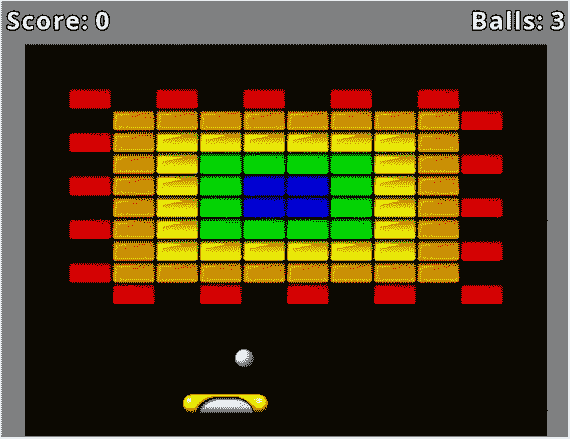

图 10-2.
《矩形破坏者》重新设计的砖块布局

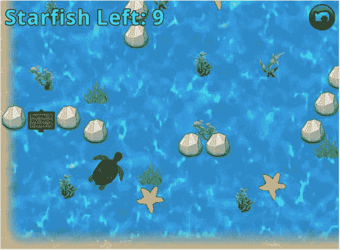

图 10-1.
重新设计的《海星收集者》关卡

Tiled 由 Thorbjørn Lindeijer 于 2008 年创建，目前仍在积极开发中，并定期添加新功能和改进。该软件是开源且免费的（尽管开发者非常感谢为支持开发而进行的捐赠），适用于 Windows、MacOS 和 Linux 系统。软件下载链接可在网站 [`http://www.mapeditor.org/`](http://www.mapeditor.org/) 上找到。

Tiled 的主要功能之一是获取一个图块集（一个由矩形图像或图块组成的精灵表，代表游戏世界地形的可能特征），并允许用户创建一个瓦片地图（对应于游戏世界图像的一组图块的选择和排列）。此外，Tiled 还可用于将基于文本的数据与单个图块或几何形状关联起来，这对于实例化游戏世界实体非常有用。可以根据所使用的图像和图块集，为具有俯视视角或侧视视角的游戏设计关卡。Tiled 使用 XML（可扩展标记语言）存储地图文件，这是一种既适合人类阅读也适合机器读取的基于文本的文件格式；LibGDX 提供了许多类来帮助解析这些数据文件，你将在后续章节中学习。

## 重温《海星收集者》游戏

在本节中，你将学习如何在为《海星收集者》设计和创建瓦片地图的背景下使用 Tiled。首先，复制第 5 章（该章介绍了用户界面并在游戏中包含了 `Sign` 对象）中的 `Starfish Collector` 项目，并将文件夹（以及项目）的名称更改为 `Starfish Collector Ch 10`。理论上，复制第 6 章中的 `Starfish Collector` 项目也是可以接受的，尽管你不会用到该章中的任何音频新增内容。下载本章的源代码文件，并将下载项目中的 `assets` 文件夹内容复制到你新项目的 `assets` 文件夹中；新文件包括一个名为 `large-water.jpg` 的背景图像（1024x1024 像素），一个名为 `ocean-plants.png` 的精灵表（2x2 网格的海底植物图像，每个 64x64 像素），以及图像 `starfish.png`（已调整为 64x64 像素，以便与将要创建的瓦片地图轻松对齐）。此外，请从前面提到的网站下载并安装 Tiled 软件。

### 创建瓦片地图

下载并安装 Tiled 后，运行该程序。程序启动后，从“文件”菜单中选择“新建”，然后选择“新建地图”，将出现一个小窗口，如图 10-3 所示，允许你配置常规地图设置。在标记为“地图大小”的区域中，将“宽度”和“高度”设置更改为 32 个图块，并将“图块大小”的“宽度”和“高度”设置更改为 32 像素。这将创建一个 1024x1024 像素的地图，该信息将显示在地图大小设置下方。其他参数应保留为默认设置，如图 10-3 所示。单击标记为“另存为...”的按钮，并导航到你的项目的 `assets` 目录。将文件保存为 `map.tmx`（你可以替换文件夹中的现有文件）。将瓦片地图文件保存到包含你所用图像的同一目录中非常重要，因为瓦片地图文件存储的是图像文件相对于瓦片地图文件本身的位置，稍后将瓦片地图文件移动到新文件夹会导致图像文件加载失败。

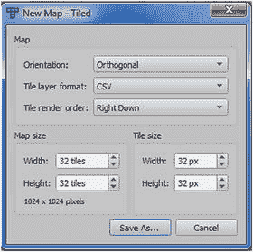

图 10-3.
用于创建新地图的 Tiled 设置窗口

此时，主编辑器窗口将出现，如图 10-4 所示。为了看到中央区域完整的方格网格，你可能需要缩小视图（一次或多次），这可以通过“视图”菜单访问。在此窗口的右上角区域，你将看到一个图层列表，其中默认包含一个图块图层（名为 `Tile Layer 1`），用于从图块集创建图像。

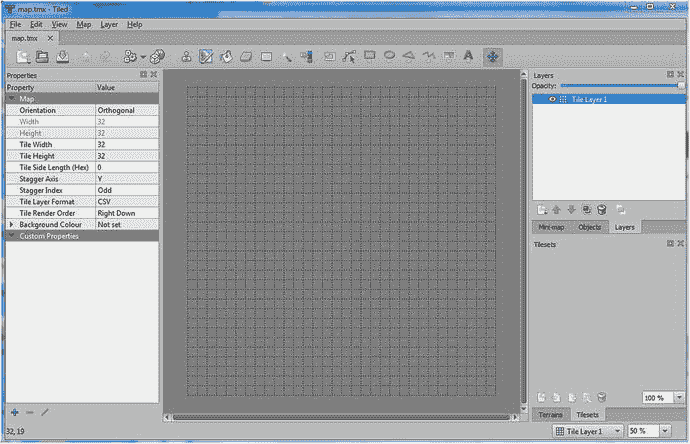

图 10-4.
Tiled 地图编辑器软件的主窗口

你可以添加的其他类型的图层包括图像图层（用于显示单个背景图像）和对象图层（用于添加具有关联的自定义文本数据的图块或几何对象）。你将在此项目中使用所有这些类型的图层，因此从“图层”菜单中选择“新建”，然后选择“图像图层”，并类似地添加一个新的“对象图层”（你可以保留默认名称）。在右上角的面板中，你将看到一个图层列表，其中 `Tile Layer 1` 位于底部。图层的顺序很重要；图层按从列表底部到顶部的顺序渲染。你希望 `Image Layer 1` 首先渲染，因为它代表背景。要降低此图层在列表中的位置，请单击 `Image Layer 1` 使其以蓝色高亮显示，然后在列表下方的图标行中，单击向下箭头图标；图层列表的顺序应如图 10-5 所示。（或者，你也可以选择 `Tile Layer 1` 并单击向上箭头图标。）

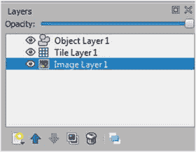

图 10-5.
为《海星收集者》地图重新排序的图层

接下来，你将添加背景图像。在图层列表中，确保当前选中了 `Image Layer 1`。在窗口左侧是一个标题为“属性”的面板，包含两列数据：左列列出属性名称，右列列出相应的值。在属性名为“图像”的行中，单击右侧的值列区域，将出现一个标记为“`...`”的按钮。单击此按钮，并从你的 `assets` 目录中选择图像 `large-water.jpg`。完成后，图像文件的名称应出现在值列中，并且图像本身将显示在中央区域，如图 10-6 所示。

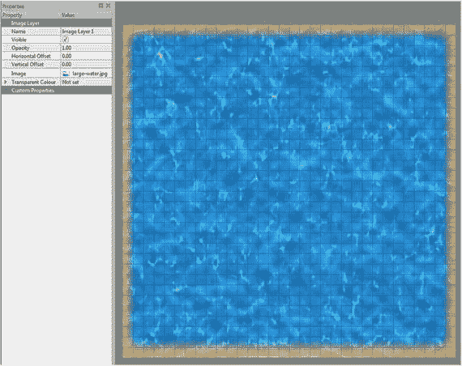

图 10-6.
在 Tiled 中加载背景图像


接下来，你将基于一个精灵表创建图块集。窗口右下角区域的面板用于显示图块集。在该区域底部的一排图标中，点击第一个图标（看起来像一个带有发光星星的矩形），会弹出一个名为“新建图块集”的窗口。点击标有“浏览”的按钮，并从 `assets` 目录中选择 `ocean-plants.png` 图片。然后，将图块宽度和图块高度都改为 64 像素，因为精灵表中的每个独立图像都是这个尺寸。最后，勾选“嵌入到地图”旁边的复选框；这一点非常重要，因为 LibGDX 目前只能处理单个 tmx 文件。标有“另存为...”的按钮随后会变为“确定”；窗口将如图 10-7 左侧所示。点击“确定”按钮，图块集就会出现在 Tiled 窗口的右下角区域，如图 10-7 右侧所示。

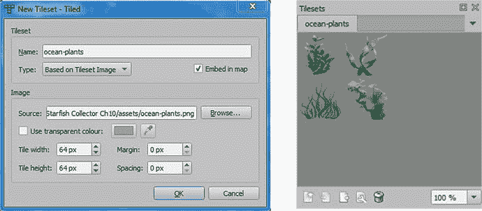

图 10-7.

“新建图块集”窗口的设置（左），以及生成的图块集（右）

接下来，你将设置图块图层。在“图层”面板中，选择“Tile Layer 1”；它应该会以蓝色高亮显示。窗口顶部有一组图标；点击看起来像印章的图标（或按下 `B` 键）。这将激活**图章笔刷**工具。在图块集面板中，点击其中一种植物；它应该会以蓝色矩形高亮显示。然后，将鼠标移动到中央区域，你会看到一个半透明的图像副本，对齐到鼠标下方最近的网格位置。点击鼠标按钮将放置（或“盖章”）该图像的一个副本。根据需要重复此过程，在屏幕周围创建各种植物图像的更多实例；这能为关卡增加多样性和视觉趣味。如果你想从地图中移除某个图块图像，请从顶部的一组图标中选择**橡皮擦**工具（或按下 `E` 键），然后点击你想要移除的图像。由于这些图块占据多个网格方格，你需要点击包含要移除图像的那个左下角网格方格。完成后，你的画面可能类似于图 10-8，尽管植物的排列方式可能不同。

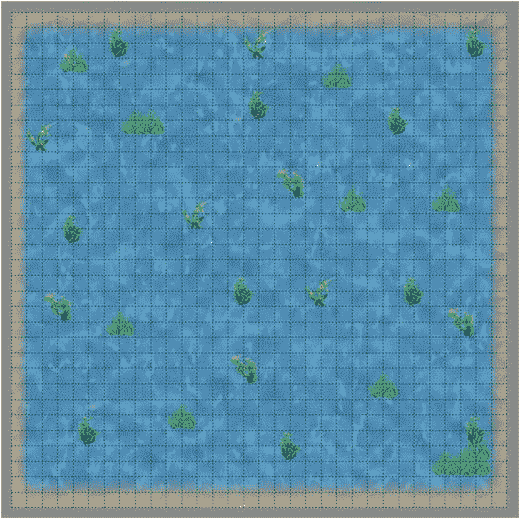

图 10-8.

添加了海洋植物图块集的 Starfish Collector 瓦片地图

最后，你将向此关卡添加一些对象数据，这些数据将用于创建 `Rock`、`Starfish` 和 `Sign` 类的实例。第一步是创建一些额外的图块集来表示每种对象类型，尽管每个图块集只包含单个图像。你将遵循与之前相同的过程：首先，在图块集面板（窗口右下角区域）中，点击图标以创建一个新的图块集。在出现的“新建图块集”窗口中，点击“浏览”，从 `assets` 目录中选择 `starfish.png` 图片，将图块宽度和图块高度都改为 64 像素，勾选“嵌入到地图”复选框，然后点击“确定”按钮。对 `rock.png` 图片重复此过程，再对 `sign.png` 图片重复一次。完成后，不同图块集的名称（ocean-plants、starfish、rock、sign）将出现在图块集面板顶部的选项卡中，你可以通过点击这些选项卡来切换图块集。

接下来，你将向这些新图块集添加一些自定义属性。具体来说，你需要存储将为这些对象实例化的 Java 类的名称，以及所需的任何额外数据（对于标志牌，则是要显示的消息）。首先，点击 starfish 图块集的选项卡。在图块集面板底部的一排图标中，点击看起来像矩形上放了一把扳手的图标（将鼠标悬停在此图标上会显示工具提示“编辑图块集”）。然后，在主窗口中，会出现一个新选项卡，中央区域显示该图块集（海星的图像）。新选项卡应包含文本 `map.tmx#starfish`，这表明你正在编辑嵌入在瓦片地图文件 `map.tmx` 中的 `starfish` 图块集。点击海星的图像，左侧的“属性”面板将出现，如图 10-9 所示。

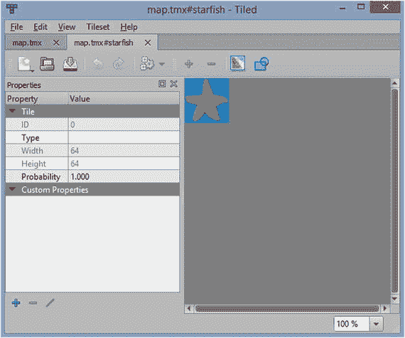

图 10-9.

图块集编辑器

在“属性”面板底部，有一个用于显示自定义属性的区域，目前是空的。这就是你将输入游戏所需自定义数据的地方。点击“属性”面板底部的加号图标以添加一个新属性。在出现的小窗口中，输入 `name`，然后点击“确定”按钮。自定义属性区域将出现一个新行，在值列的文本字段中，输入 `Starfish`。这就是你需要为此对象输入的所有数据，因为 `Starfish` 类不需要其他任何东西。点击窗口顶部标有 `map.tmx` 的选项卡以返回瓦片地图。

然后，在图块集面板中，选择 rock 图块集，并点击编辑图块集的图标。将出现一个新选项卡，标有 `map.tmx#rock`。在这里，点击岩石的图像，然后在“属性”面板中，点击加号图标创建一个名为 `Name` 的新自定义属性，但这次在值中输入 `Rock`。返回瓦片地图，并像之前一样继续操作，编辑 sign 图块集并创建一个名为 `Name` 的自定义属性，其值为 `Sign`。然而，在返回瓦片地图之前，你需要创建第二个自定义属性来存储标志牌要显示的文本。此属性应命名为 `message`，并应包含值 `Hello, world!`（这是此属性的默认值，稍后在地图上放置此图块的实例时会更改）。完成后，点击选项卡返回瓦片地图。


现在，你将使用这些图块集向地图添加对象数据。由于已返回主瓦片地图编辑器，**图层**面板将显示在窗口的右上角区域。点击名为**对象图层 1** 的图层，使其高亮显示为蓝色。在窗口顶部的图标行中，用于编辑瓦片图层的工具图标将显示为灰色（表示在编辑对象图层时无法使用），而右侧的一组不同工具图标将变为彩色（表示它们可供使用）。点击形似照片的图标（或按 `T` 键）以激活**插入瓦片**工具。然后，在**图块集**面板中，点击岩石图块集的标签，点击岩石图像使其高亮显示为蓝色，接着点击地图以添加岩石实例（类似于你在编辑瓦片图层时使用的**印章画笔**工具）。要使对象瓦片与网格对齐，如果尚未激活，你可能需要激活**视图**菜单中的**对齐到网格**设置。要删除已添加的瓦片，请右键点击该瓦片，并在弹出的菜单中选择**移除对象**。放置岩石时，请记住，海龟的移动需要四个网格方块（128 像素）的宽度。添加一些岩石后，重复此过程以添加一些海星（确保海龟能够到达它们）以及至少两个标志对象。图 10-10 展示了一种可能的地图布局。

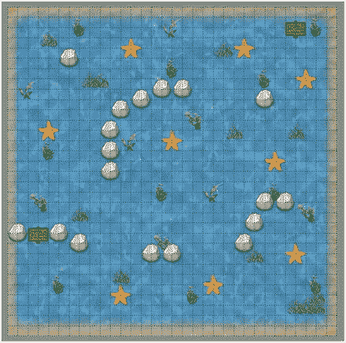

图 10-10.

添加了对象瓦片的瓦片地图

接下来，你将覆盖已放置的标志瓦片实例的默认消息。按 `S` 键激活**选择对象**工具（或点击图标中包含虚线边框矩形的图标）。点击你放置的其中一个标志，它将被一条移动的虚线和一些箭头勾勒出来。在左侧的**属性**面板中，**自定义属性**下方，你将看到之前添加到图块集的两个属性。它们将以灰色字体显示，表示当前值是图块集的默认值。点击名为 `message` 的属性右侧的值列，输入一些新文本（例如 `Collect all the Starfish`），然后按回车键。为另一个标志重复此过程，并输入一些不同的文本。如果你再次点击第一个标志，你会注意到名为 `message` 的自定义属性行现在以黑色字体显示，表示你已更改了默认值。

最后，你将使用矩形（而非瓦片）向对象图层添加一些额外的自定义数据。理论上，所有对象数据都可以使用矩形来指定，但能够看到图像会使关卡设计更易于可视化。此地图中将包含的最后一条数据是海龟对象的起始位置。按 `R` 键激活**插入矩形**工具（或点击带有粗蓝色轮廓矩形的图标），然后在瓦片地图上点击并拖动鼠标指针，在你希望海龟起始的网格方块周围绘制一个矩形。绘制完成后，在你绘制的矩形仍处于选中状态时，点击**属性**面板底部的加号图标以添加新的自定义属性。与之前一样，在出现的窗口中输入 `name`，并在该属性的值列中输入 `Start`。在此情况下，`Start` 并非指代要创建的类；它只是一个我们稍后用来引用此矩形的名称。

完成后，保存文件并关闭 Tiled 地图编辑器程序。在下一节中，你将编写一个类，用于解析瓦片地图文件中的数据，并将其集成到海星收集器项目中。

### 创建 TilemapActor 类

在本节中，你将编写一个类，将 LibGDX 提供的 Tiled 地图文件解析功能与本书第一部分开发的 `BaseActor` 类框架相结合。你创建的类将用于本章重新讨论的游戏，以及接下来两章（平台游戏和冒险游戏）中涉及的游戏。此类将扩展 LibGDX 的 `Actor` 类，而不是 `BaseActor` 类，因为它不会使用任何 `BaseActor` 的功能。这要求你编写两个方法：`act` 和 `draw`。`draw` 方法将使用一个 `OrthographicCamera` 对象（该对象将与主舞台的 `Camera` 对齐）来渲染地图中的图像图层和瓦片图层。对象图层不会渲染到屏幕上；相反，你将编写一些方法，用于提取包含名为 `name` 且具有特定值的自定义属性的对象（瓦片或矩形）列表，这与 `BaseActor` 类的 `getList` 方法非常相似。然后，你可以使用这些数据在游戏中创建相应类的实例。

首先，打开 `Starfish Collector Ch 10` 项目（如果尚未打开）。创建一个名为 `TilemapActor` 的新类，并包含以下代码，稍后将对此进行详细说明：

```
import com.badlogic.gdx.scenes.scene2d.Actor;
import com.badlogic.gdx.scenes.scene2d.Stage;
import com.badlogic.gdx.graphics.Camera;
import com.badlogic.gdx.graphics.OrthographicCamera;
import com.badlogic.gdx.graphics.g2d.Batch;
import com.badlogic.gdx.maps.MapLayer;
import com.badlogic.gdx.maps.MapObject;
import com.badlogic.gdx.maps.MapProperties;
import com.badlogic.gdx.maps.objects.RectangleMapObject;
import com.badlogic.gdx.maps.tiled.TiledMap;
import com.badlogic.gdx.maps.tiled.TmxMapLoader;
import com.badlogic.gdx.maps.tiled.TiledMapTile;
import com.badlogic.gdx.maps.tiled.objects.TiledMapTileMapObject;
import com.badlogic.gdx.maps.tiled.renderers.OrthoCachedTiledMapRenderer;
import java.util.ArrayList;
import java.util.Iterator;
public class TilemapActor extends Actor
{
// 窗口尺寸
public static int windowWidth  = 800;
public static int windowHeight = 600;
private TiledMap tiledMap;
private OrthographicCamera tiledCamera;
private OrthoCachedTiledMapRenderer tiledMapRenderer;
public TilemapActor(String filename, Stage theStage)
{
// 设置瓦片地图、渲染器和摄像机
tiledMap = new TmxMapLoader().load(filename);
int tileWidth          = (int)tiledMap.getProperties().get("tilewidth");
int tileHeight         = (int)tiledMap.getProperties().get("tileheight");
int numTilesHorizontal = (int)tiledMap.getProperties().get("width");
int numTilesVertical   = (int)tiledMap.getProperties().get("height");
int mapWidth  = tileWidth  * numTilesHorizontal;
int mapHeight = tileHeight * numTilesVertical;
BaseActor.setWorldBounds(mapWidth, mapHeight);
tiledMapRenderer = new OrthoCachedTiledMapRenderer(tiledMap);
tiledMapRenderer.setBlending(true);
tiledCamera = new OrthographicCamera();
tiledCamera.setToOrtho(false, windowWidth, windowHeight);
tiledCamera.update();
theStage.addActor(this);
}
public void act(float dt)
{
super.act( dt );
}
public void draw(Batch batch, float parentAlpha)
{
// 调整瓦片地图摄像机以与主摄像机保持同步
Camera mainCamera = getStage().getCamera();
tiledCamera.position.x = mainCamera.position.x;
tiledCamera.position.y = mainCamera.position.y;
tiledCamera.update();
tiledMapRenderer.setView(tiledCamera);
// 需要以下代码来强制批次顺序，
//  否则会被分批并在最后渲染
batch.end();
tiledMapRenderer.render();
batch.begin();
}
}
```


`TilemapActor` 类的构造函数需要两个输入：要打开的瓦片地图文件名以及该角色应添加到的`Stage`。构造函数首先将瓦片地图文件加载到`TiledMap`对象中。之后，可以访问地图的属性。一旦确定了瓦片数量和瓦片尺寸，就可以计算游戏世界的尺寸，并使用`BaseActor`的`setWorldBounds`方法设置世界边界。然后，再初始化几个对象：一个相机和一个渲染器，用于绘制瓦片地图。`draw`方法保持瓦片地图的相机与舞台相机位置一致，然后渲染瓦片地图。对`Batch`类的`end`和`begin`方法进行奇怪的调用是必要的，以确保地图在排队渲染其他角色之前立即被渲染，否则地图可能会（错误地）显示在舞台上其他对象的上方。

接下来，你将编写检索存储在`TiledMap`对象中的对象列表所需的方法。与 Tiled 地图编辑器程序的情况一样，它包含一个图层列表（由`MapLayer`类表示），每个图层又包含一个对象列表（由`MapObject`类表示）。以下每个方法都会遍历这些列表，检查每个对象是否属于特定类型（`RectangleMapObject`或`TiledMapTileMapObject`）。如果是，将进一步分析属性集（由`MapProperties`类表示）。你可以通过`containsKey`方法检查该属性集中是否存在某个名称的自定义属性，并通过`get`方法检索其值（尽管此方法的返回类型为`Object`，结果通常需要强制转换为预期的类）。首先，你将编写两个方法中较简单的一个，即`getRectangleList`，它检查包含名为`name`且具有特定值（存储在变量`propertyName`中）的自定义属性的矩形。在`TilemapActor`类中，添加以下方法：

```
public ArrayList getRectangleList(String propertyName)
{
ArrayList list = new ArrayList();
for ( MapLayer layer : tiledMap.getLayers() )
{
for ( MapObject obj : layer.getObjects() )
{
if ( !(obj instanceof RectangleMapObject) )
continue;
MapProperties props = obj.getProperties();
if ( props.containsKey("name") && props.get("name").equals(propertyName) )
list.add(obj);
}
}
return list;
}
```

接下来，你将编写一个类似的方法`getTileList`，它对瓦片对象执行类似的检查。这个过程稍微复杂一些，因为一个瓦片对象有两个关联的`MapProperty`对象：默认值（在关联的瓦片中指定）和非默认值（通过前面`getRectangleList`方法中的方式访问）。要获取包含默认值的属性集，必须将地图对象强制转换为`TiledMapTileMapObject`。然后，可以通过`getTile`方法访问原始瓦片，再通过`getProperties`方法访问其属性（如前所述）。类名存储在瓦片的属性集中。如果`name`字段存在且与`propertyName`变量中的值匹配，则将该对象添加到列表中。然而，还有一个额外的步骤：必须将瓦片集中存在但地图对象属性集中不存在的任何属性复制过来（这可以通过`while`循环实现）。该方法的代码如下：

```
public ArrayList getTileList(String propertyName)
{
ArrayList list = new ArrayList();
for ( MapLayer layer : tiledMap.getLayers() )
{
for ( MapObject obj : layer.getObjects() )
{
if ( !(obj instanceof TiledMapTileMapObject) )
continue;
MapProperties props = obj.getProperties();
// 默认的 MapProperties 存储在关联的 Tile 对象中
// 实例特定的覆盖值存储在 MapObject 中
TiledMapTileMapObject tmtmo = (TiledMapTileMapObject)obj;
TiledMapTile t = tmtmo.getTile();
MapProperties defaultProps = t.getProperties();
if ( defaultProps.containsKey("name") &&
defaultProps.get("name").equals(propertyName) )
list.add(obj);
// 获取默认属性键的列表
Iterator propertyKeys = defaultProps.getKeys();
// 遍历键；如有必要，将默认值复制到 props 中
while ( propertyKeys.hasNext() )
{
String key = propertyKeys.next();
// 检查值是否已存在；如果不存在，则使用默认值创建属性
if ( props.containsKey(key) )
{
continue;
}
else
{
Object value = defaultProps.get(key);
props.put( key, value );
}
}
}
}
return list;
}
```

添加此方法后，`TilemapActor`类就完成了，可以集成到你的项目中！


### 项目集成

如本章开头所述，在添加瓦片地图时，你的项目玩法将完全不变；只需在初始化屏幕时做少量修改。首先，在 `LevelScreen` 类中找到 `initialize` 方法，删除以下用于初始化背景和所有游戏实体的代码：

```
BaseActor ocean = new BaseActor(0,0, mainStage);
ocean.loadTexture( "assets/water-border.jpg" );
ocean.setSize(1200,900);
BaseActor.setWorldBounds(ocean);
new Starfish(400,400, mainStage);
new Starfish(500,100, mainStage);
new Starfish(100,450, mainStage);
new Starfish(200,250, mainStage);
new Rock(200,150, mainStage);
new Rock(100,300, mainStage);
new Rock(300,350, mainStage);
new Rock(450,200, mainStage);
turtle = new Turtle(20,20, mainStage);
Sign sign1 = new Sign(20,400, mainStage);
sign1.setText("西海星湾");
Sign sign2 = new Sign(600,300, mainStage);
sign2.setText("东海星湾");
```

接下来，为了初始化瓦片地图角色，在 `initialize` 方法的开头添加以下代码：

```
TilemapActor tma = new TilemapActor("assets/map.tmx", mainStage);
```

为了初始化各种对象，你将使用之前实现的方法来获取具有特定名称的对象列表。在遍历这些列表时，你需要获取对象的属性，特别是你需要的特定属性（至少包括对象的 x 和 y 坐标，这是 `BaseActor` 类构造函数所必需的）。首先，在 `LevelScreen` 类中添加以下 `import` 语句：

```
import com.badlogic.gdx.maps.MapObject;
import com.badlogic.gdx.maps.MapProperties;
```

接着，在 `initialize` 方法中，瓦片地图角色初始化之后，添加以下代码来创建 `Starfish`、`Rock` 和 `Sign` 对象。请注意，在创建标志牌时，你还需要获取 `message` 属性（并将其转换为 `String` 类型）。

```
for (MapObject obj : tma.getTileList("Starfish") )
{
MapProperties props = obj.getProperties();
new Starfish( (float)props.get("x"), (float)props.get("y"), mainStage );
}
for (MapObject obj : tma.getTileList("Rock") )
{
MapProperties props = obj.getProperties();
new Rock( (float)props.get("x"), (float)props.get("y"), mainStage );
}
for (MapObject obj : tma.getTileList("Sign") )
{
MapProperties props = obj.getProperties();
Sign s = new Sign( (float)props.get("x"), (float)props.get("y"), mainStage );
s.setText( (String)props.get("message") );
}
```

在初始化海龟之前，你需要检索名为 `Start` 的矩形对象以确定其位置。由于数据存储方式（使用矩形对象），这里你将使用 `getRectangleList` 方法。不过，由于该列表只包含一个对象，你无需使用循环；只需获取列表中索引为 0 的唯一对象即可。为此，请在 `initialize` 方法中添加以下代码：

```
MapObject startPoint = tma.getRectangleList("start").get(0);
MapProperties props = startPoint.getProperties();
turtle = new Turtle( (float)props.get("x"), (float)props.get("y"), mainStage);
```

此时，如果你运行游戏，应该会看到你创建的瓦片地图显示在游戏中。

## 重访矩形破坏者

为了练习你在重新设计海星收集者关卡中学到的技能和实现方法，你还将重新设计矩形破坏者游戏中砖块对象的布局并为其添加颜色。使用瓦片地图还将简化墙壁的放置和尺寸以及挡板的起始位置。

首先，复制第 8 章的 `Rectangle Destroyer` 项目，并将文件夹（以及项目）名称改为 `Rectangle Destroyer Ch 10`。此外，将 `Starfish Collector Ch 10` 项目文件夹中的 `TilemapActor.java` 文件复制到该文件夹中。下载本章的源代码文件，并将下载项目中 `assets` 文件夹的内容复制到新项目的 `assets` 文件夹中；新文件包括：一个更大版本的背景图片，名为 `large-space.png`，尺寸为 832 x 640 像素；一个名为 `wall-square.png` 的图片，尺寸为 32 x 32 像素；以及一个名为 `brick-colors.png` 的精灵表，它是一个 2 行 4 列的彩色砖块网格，每个砖块尺寸为 64 x 32 像素（最终生成的图片整体尺寸为 128 x 128 像素）。与之前一样，这些尺寸的选择是为了与将要创建的瓦片地图对齐。


### 创建瓦片地图

首先，运行 Tiled 地图编辑器程序。启动后，从“文件”菜单中选择“新建”，然后选择“新建地图”，将出现通用地图设置窗口。在标记为“地图大小”的区域中，将“宽度”改为 26 个瓦片，“高度”改为 20 个瓦片，并将“瓦片大小”的“宽度”和“高度”设置改为 32 像素。这将创建一个 832 x 640 像素的瓦片地图；稍后，您将更改窗口大小以匹配。点击标记为“另存为...”的按钮，导航到您项目的 `assets` 目录；将文件保存为 `map.tmx`。瓦片地图将被初始化，屏幕中央会出现一个空白的方格网格，左侧是“属性”面板，右上方是“图层”面板，右下方是“图块集”面板。

从“图层”菜单中，添加一个新的图像图层，然后添加一个新的对象图层。对于此项目，默认的瓦片图层不需要，因此您可以右键单击图层列表中的“瓦片图层 1”，然后选择“移除图层”。

要添加背景图像，请在图层列表中选择“图像图层 1”。在“属性”面板中，找到属性名为“图像”的行，单击值列右侧的区域，会出现一个标记为“`...`”的按钮。单击此按钮，并从您的 `assets` 目录中选择 `large-space.png` 图像。完成后，图像将显示在中央区域。但是，由于背景图像是暗色的，很难看清方格网格。为了提高网格方格的可见性，您可以使用“图层”面板顶部附近的滑块来降低图像的透明度。（但是，这也会影响图像在实际游戏中的显示效果，因此在完成瓦片地图后，您需要将透明度调回 100%。）

接下来，您需要创建两个图块集（一个用于墙壁，一个用于砖块），以便在对象图层中使用。在图块集面板区域，单击图标以创建新的图块集。在出现的“新建图块集”窗口中，单击“浏览”，从 `assets` 目录中选择 `wall-square.png` 图像，将瓦片宽度和瓦片高度值都改为 32 像素，勾选“嵌入到地图中”复选框，然后单击“确定”按钮。然后，在图块集面板中，单击图标以编辑图块集属性。在出现的新选项卡中，单击灰色方块以选中它。在“属性”面板底部，单击加号图标以添加新的自定义属性；输入 `name` 作为属性名称，并在值列中输入 `Wall`。完成后，单击标记为 `map.tmx` 的选项卡以返回瓦片地图。

接下来，您将创建砖块图块集，这稍微复杂一些，因为瓦片包含额外的数据。像之前一样创建一个新的图块集，这次使用图像文件 `brick-colors.png`，并将瓦片宽度改为 64 像素，瓦片高度改为 32 像素。单击图标以编辑图块集属性。单击其中一个砖块瓦片以选中它，然后按住 Ctrl 键并单击其余每个砖块瓦片，以便将它们全部选中，从而可以一次性为它们输入属性。单击加号图标以添加新的自定义属性；输入 `name` 作为属性名称，并在值列中输入 `Brick`。然后，再次单击加号图标以添加一个名为 `color` 的新自定义属性；暂时不要输入任何值。相反，单击红色砖块瓦片，使其成为唯一选中的瓦片，然后在 `color` 旁边的值列中输入 `red`。重复此过程，为其余每个砖块输入值；下一节中的代码假定您将为相应颜色的砖块分配值 `orange`、`yellow`、`green`、`blue`、`purple`、`white` 和 `gray`。

现在，您可以返回瓦片地图了。首先，确保在“图层”面板中选中了“对象图层 1”。选择 wall-square 图块集，然后单击该图块集中的单个瓦片。按 `T` 键激活“插入瓦片”工具，然后单击瓦片地图区域左上角的网格方格。要更改此对象的大小，请按 S 键激活“选择对象”工具。如果对象瓦片已被选中，瓦片的边缘和角落会出现双箭头；如果对象瓦片未被选中，单击它后这些箭头会出现。单击并拖动箭头将更改对象的大小；调整此瓦片的大小，直到它覆盖瓦片地图的顶部两行。按 T 键再次切换到“插入瓦片”工具，并在左下角放置一个 wall-square 瓦片。按 S 键切换到“选择对象”工具，并增加该瓦片的高度，直到它到达之前添加的瓦片，从而形成游戏的左侧墙壁。重复此过程以形成游戏的右侧墙壁。完成后，墙壁应类似于图 10-11。

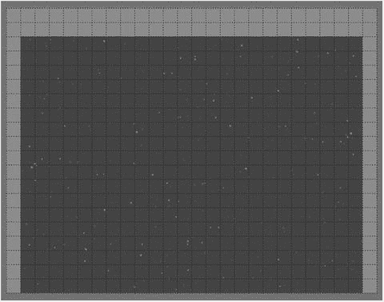

图 10-11.

向瓦片地图添加墙壁

接下来，您将设计并排列该关卡的砖块。切换到 brick-colors 图块集，按 T 键激活“插入瓦片”工具，并以您喜欢的任何方式向瓦片地图添加砖块（记住在瓦片地图底部边缘附近为挡板留出空间）。图 10-12 展示了一种可能的排列方式。

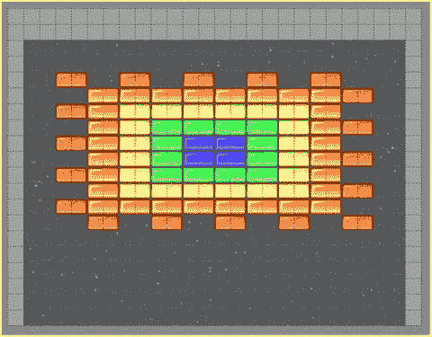

图 10-12.

向瓦片地图添加砖块

您将使用一个矩形对象来指定挡板的起始位置。按 R 键激活“插入矩形”工具，并在屏幕中央底部附近绘制一个小矩形。在此矩形被选中的情况下，单击“属性”面板中的加号图标，添加一个名为 `name`、值为 `Start` 的自定义属性。最后，如果您之前更改了图像图层的透明度，请将其改回 100%。保存您的工作并关闭 Tiled 地图编辑器程序。


### 项目集成

将瓦片地图数据集成到“矩形破坏者”游戏中，与之前在“海星收集者”游戏中看到的方法类似。在 BlueJ 中打开 `Rectangle Destroyer Ch 10` 项目。由于此版本游戏的瓦片地图尺寸比之前略大，需要相应调整窗口大小。在 `Launcher` 类中，将 `main` 方法的最后一行代码修改为：

```
LwjglApplication launcher = new LwjglApplication( myGame, "Rectangle Destroyer", 832, 640 );
```

在 `LevelScreen` 类中，添加以下两条 `import` 语句：

```
import com.badlogic.gdx.maps.MapObject;
import com.badlogic.gdx.maps.MapProperties;
```

接下来，在 `initialize` 方法中，删除以下用于初始化背景、墙壁、砖块和挡板的代码：

```
BaseActor background = new BaseActor(0,0, mainStage);
background.loadTexture("assets/space.png");
BaseActor.setWorldBounds(background);
paddle = new Paddle(320, 32, mainStage);
new Wall(0,0, 20,600, mainStage);
new Wall(780,0, 20,600, mainStage);
new Wall(0,550, 800,50, mainStage);
Brick tempBrick = new Brick(0,0,mainStage);
float brickWidth = tempBrick.getWidth();
float brickHeight = tempBrick.getHeight();
tempBrick.remove();
int totalRows = 10;
int totalCols = 10;
float marginX = (800 - totalCols * brickWidth) / 2;
float marginY = (600 - totalRows * brickHeight) - 120;
for (int rowNum = 0; rowNum < totalRows; rowNum++)
{
for (int colNum = 0; colNum < totalCols; colNum++)
{
float x = marginX + brickWidth  * colNum;
float y = marginY + brickHeight * rowNum;
new Brick( x, y, mainStage );
}
}
```

然后，在 `initialize` 方法的开头添加以下代码，以创建 `TilemapActor`：

```
TilemapActor tma = new TilemapActor("assets/map.tmx", mainStage);
```

为了创建 `Wall` 对象，你将像本章前面那样使用 `getTileList` 方法。由于 `Wall` 类的构造函数还需要墙壁的宽度和高度，你还需要从地图对象中获取这些属性。在 `TilemapActor` 初始化之后添加以下代码：

```
for (MapObject obj : tma.getTileList("Wall") )
{
MapProperties props = obj.getProperties();
new Wall( (float)props.get("x"),     (float)props.get("y"),
(float)props.get("width"), (float)props.get("height"),
mainStage );
}
```

为了创建 `Brick` 对象，你将再次使用 `getTileList` 方法。由于在 Tiled 地图编辑器中使用的瓦片尺寸与 `assets` 文件夹中的砖块图像略有不同，你可以检索瓦片对象的宽度和高度属性来调整砖块对象的大小。此外，你还需要从瓦片对象中检索颜色属性，并据此设置砖块的颜色。要完成这些任务，请添加以下代码：

```
for (MapObject obj : tma.getTileList("Brick") )
{
MapProperties props = obj.getProperties();
Brick b = new Brick( (float)props.get("x"), (float)props.get("y"), mainStage );
b.setSize( (float)props.get("width"), (float)props.get("height") );
b.setBoundaryRectangle();
String colorName = (String)props.get("color");
if ( colorName.equals("red") )
b.setColor(Color.RED);
else if ( colorName.equals("orange") )
b.setColor(Color.ORANGE);
else if ( colorName.equals("yellow") )
b.setColor(Color.YELLOW);
else if ( colorName.equals("green") )
b.setColor(Color.GREEN);
else if ( colorName.equals("blue") )
b.setColor(Color.BLUE);
else if ( colorName.equals("purple") )
b.setColor(Color.PURPLE);
else if ( colorName.equals("white") )
b.setColor(Color.WHITE);
else if ( colorName.equals("gray") )
b.setColor(Color.GRAY);
}
```

最后，就像你在“海星收集者”中设置海龟的起始位置一样，通过添加以下代码来设置挡板的起始位置：

```
MapObject startPoint = tma.getRectangleList("start").get(0);
MapProperties props = startPoint.getProperties();
paddle = new Paddle( (float)props.get("x"), (float)props.get("y"), mainStage);
```

至此，对“矩形破坏者”项目的修改就完成了。测试你的游戏，并享受你新设计的关卡吧！

## 总结与后续步骤

在本章中，你学习了如何使用 Tiled（一个通用的地图编辑程序）来简化关卡开发。你学习了如何设置地图、添加带有自定义属性的瓦片集，以及处理不同类型的地图层（图像层、瓦片层和对象层）。你还学习了如何在创建 `TiledMapActor` 类的过程中，集成 LibGDX 的内置功能来处理 Tiled 地图数据文件。这些知识被实际应用于改进两个早期游戏项目（“海星收集者”和“矩形破坏者”）的关卡设计。

在接下来的两章中，你将继续运用新学到的设计技能和 `TilemapActor` 类，来创建一个平台游戏和一个剑术格斗冒险游戏。

