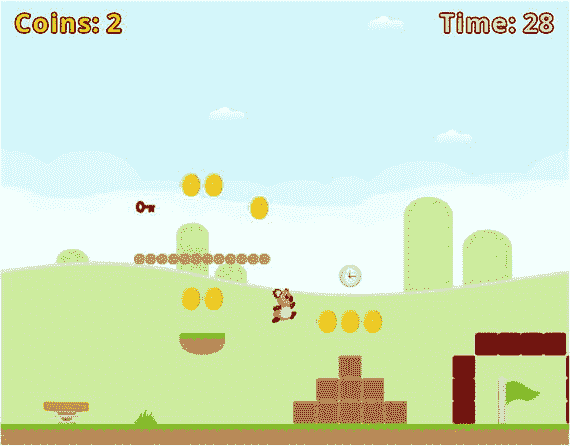
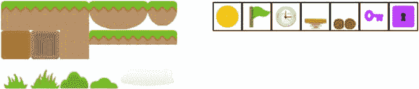
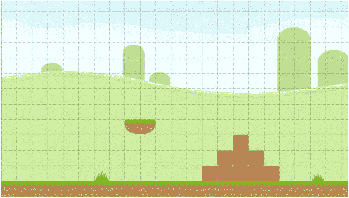
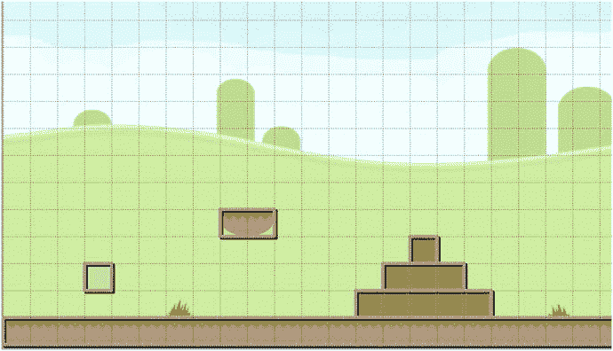
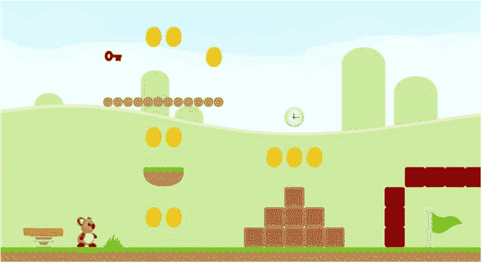
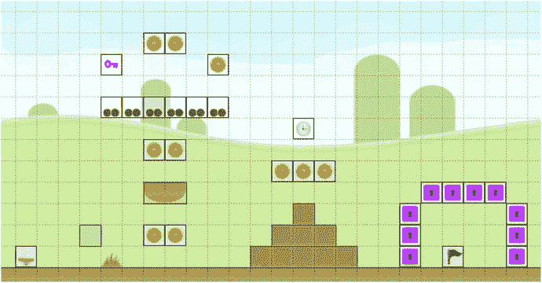

# 11. 平台游戏

在本章中，你将学习如何创建平台游戏“跳跃杰克”，如图 11-1 所示，其灵感来源于《大金刚》和《超级马里奥兄弟》等街机与主机游戏。本章引入的新概念包括：具有多种动画的演员、平台物理机制、使用额外演员作为“传感器”来监控演员周围区域的重叠与碰撞、可穿越平台，以及钥匙与锁的机制。



图 11-1.

平台游戏“跳跃杰克”


## 游戏项目：跳跃杰克

《跳跃杰克》是一款动作游戏，主角考拉杰克在关卡中跳跃，尽可能多地收集金币；他必须在时间耗尽前抵达终点旗帜。收集计时器道具能为考拉争取更多探索时间。游戏中的部分表面为可穿越平台，其行为与实体物体类似，但考拉可以从下方跳穿并落在平台顶部，或从上方坠落穿过平台。此外还有弹跳板道具，若考拉从上方落在弹跳板上，会被弹向高空。最后是锁块，它们可能有多种颜色，在考拉收集到同色钥匙前无法通过。

玩家使用左右方向键控制角色左右移动，按空格键跳跃（当考拉站在实体物体上时）。考拉会自动从下方跳穿平台，但若要向下穿过平台，玩家需在按住下方向键的同时按下跳跃键。用户界面在屏幕左上角显示已收集金币数量，右上角显示剩余时间。收集任何钥匙时，屏幕顶部中央区域会显示对应颜色的钥匙图标。若玩家抵达终点旗帜或时间耗尽，屏幕中央会分别显示"你赢了！"或"时间到——游戏结束"。

游戏采用鲜艳、多彩的卡通艺术风格。大多数可交互对象都包含基于图像或数值的动画以吸引玩家注意。关于额外特效和音效的建议将在本章最后一节讨论，以帮助营造氛围、提供玩家反馈并增强游戏世界对象的交互性。

本章假设你已熟悉第 10 章"瓦片地图"中的概念，并已安装 Tiled 地图编辑器软件。开始本项目需遵循与之前项目相同的步骤：创建新项目，创建`assets`文件夹和`+libs`文件夹（若已设置`userlib`目录则后者非必需），复制本书第一部分创建的自定义框架文件（`BaseGame.java`、`BaseScreen.java`、`BaseActor.java`）以及第 10 章开发的`TilemapActor.java`类，并将本项目的图形和音频文件复制到`assets`文件夹中。如前所述，为方便起见已创建名为`Framework`的 BlueJ 项目，将作为起始点。开始第一个项目：

*   下载本章的源代码文件。
*   复制下载的`Framework`文件夹（及其内容）并将其重命名为`Jumping Jack`。
*   将下载的`Jumping Jack`项目 assets 文件夹中的所有内容复制到新创建的`Jumping Jack assets`文件夹中（若使用 BlueJ `userlib`文件夹则删除`+libs`文件夹）。
*   在`Jumping Jack`文件夹中打开 BlueJ 项目。
*   在`CustomGame`类中，将类名改为`JumpingJackGame`（BlueJ 随后会将源代码文件重命名为`JumpingJackGame.java`）。
*   在`Launcher`类中，将`main`方法的内容修改为：

    ```
    Game my Game = new JumpingJackGame ();
    LwjglApplication launcher = new LwjglApplication(
    myGame, "Jumping Jack", 800, 640 )
    ```

## 开始关卡

首先，启动 Tiled 地图编辑器软件。创建新地图，地图尺寸设置为宽度 50 个瓦片、高度 20 个瓦片，瓦片尺寸宽度和高度均设为 32 像素。生成的地图尺寸将为 1600 像素×640 像素。点击"另存为..."按钮，将文件以文件名`map.tmx`保存到`assets`目录。

接下来，为地图添加一个图像层和一个对象层，并重新排列图层顺序，使瓦片层位于列表中间。在"图层"面板中选择"图像层 1"，在"属性"面板中将图像设置为`background.png`（其尺寸与瓦片地图大小匹配）。然后，在"图块集"面板中，使用图像`platform-tileset.png`（如图 11-2 左侧所示）添加新图块集，设置瓦片尺寸为 32×32，并勾选将图块集嵌入地图的复选框。以相同方式为地图添加另一个新图块集，这次使用图像`object-tileset.png`（如图 11-2 右侧所示）。由于对象瓦片将用于指示游戏世界对象的生成位置，你需要指定对应的 Java 类（稍后创建）。在"图块集"面板中，选择`object-tileset`并点击编辑图块集的图标。在出现的选项卡中，你需要逐个点击每个瓦片，并为每个瓦片添加新的自定义属性。该属性应命名为`name`；各瓦片（从左到右）对应的值分别为`Coin`、`Flag`、`Timer`、`Springboard`、`Platform`、`Key`和`Lock`。此外，对于钥匙和锁对象瓦片，添加第二个名为`color`的自定义属性，值为`red`。（此默认颜色可在后续瓦片地图编辑器中为特定实例覆盖）。



图 11-2.

瓦片层（左）和对象层（右）的图块集

返回显示瓦片地图的选项卡。在"图层"面板中选择"瓦片层 1"。在"图块集"面板中选择`platform-tileset`，然后按 B 键激活图章刷工具。在地图底部行添加瓦片，同时添加一些代表可跳跃实体的瓦片以及一些场景装饰。注意云朵图形占用两个瓦片，因此应以相邻成对的方式添加这些瓦片。图 11-3 展示了一种可能的布局（为清晰起见仅显示地图部分区域）。



图 11-3.

瓦片层的添加内容


需要注意的是，图块层仅用于简化从图块集创建图像的过程；使用 `TilemapActor` 类中的 `getTileList` 方法时，不会返回这些图块中的任何一个。相反，对于由代表实心物体（与代表场景的图块相对）的图块所覆盖的区域，你需要在对象层中添加矩形，以存储对应这些区域的数据。在图层面板中，选择对象层 1，然后按 R 键激活矩形工具。在所有包含实心图块的区域周围绘制矩形；为简单起见，可以绘制一次包围多个图块的矩形。为了使矩形与网格对齐，如果“视图”菜单中的“对齐到网格”设置尚未激活，你可能需要将其激活。对于图 11-3 所示的设计，你需要在地面、浮动平台以及由箱子组成的楼梯周围添加矩形，但不要为那两块带有草地图片的图块添加。每次添加这些矩形时，还必须添加一个名为 `name`、值为 `Solid` 的自定义属性（稍后将用于初始化相应的角色），或者你可以先创建所有矩形，然后使用选择工具一次性为它们赋予相同的属性。最后，在考拉应该开始关卡的位置添加一个矩形，并添加一个名为 `name`、值为 `Start` 的自定义属性。将这一过程应用于图 11-3 所示的设计，会得到图 11-4 所示的结果，其中矩形以灰色边框绘制。现在也是保存你的图块地图文件的好时机！



图 11-4.

添加矩形对象以指示实心物体

接下来，在 BlueJ 中打开 `Jumping Jack` 项目。你需要一种方式来表示与实心物体对应的区域。为此，创建一个名为 `Solid` 的新类，其中包含以下代码。由于此对象不使用图形（图块地图决定了这些区域将显示的图形），因此必须直接设置这些对象的大小和边界形状，宽度和高度值通过构造函数传入。请注意，此类还包含启用和禁用对象实心状态的功能；本章稍后介绍的平台和锁对象将需要此功能。

```
import com.badlogic.gdx.scenes.scene2d.Stage;
public class Solid extends BaseActor
{
private boolean enabled;
public Solid(float x, float y, float width, float height, Stage s)
{
super(x,y,s);
setSize(width,height);
setBoundaryRectangle();
enabled = true;
}
public void setEnabled(boolean b)
{
enabled = b;
}
public boolean isEnabled()
{
return enabled;
}
}
```

接着，在 `LevelScreen` 类中，添加以下 `import` 语句：

```
import com.badlogic.gdx.maps.MapObject;
import com.badlogic.gdx.maps.MapProperties;
```

然后，在 `initialize` 方法中添加以下代码，以加载图块地图并生成与图块地图中矩形对应的 `Solid` 对象：

```
TilemapActor tma = new TilemapActor("assets/map.tmx", mainStage);
for (MapObject obj : tma.getRectangleList("Solid") )
{
MapProperties props = obj.getProperties();
new Solid( (float)props.get("x"),     (float)props.get("y"),
(float)props.get("width"), (float)props.get("height"),
mainStage );
}
```

此时，你可以测试项目，尽管你只会看到关卡的最左侧部分。在下一节中，你将添加玩家角色（考拉杰克），这将使你能够四处移动并查看关卡的其余部分。

## 平台角色设置

在本节中，你将创建一个由玩家控制的主角色（考拉）的类。该类的一个新特性是它将包含对应不同移动类型（站立、行走和跳跃）的多个动画。由于平台角色移动的复杂性，`BaseActor` 类中的物理相关方法对于此类游戏来说是不够的。例如，平台角色在水平移动（行走）和垂直移动（跳跃/下落）时通常具有不同的最大速度。因此，角色的 `act` 方法将包含用于实现基于物理的移动的自定义代码。在继续之前，你可能需要回顾第 3 章中的“物理与移动”部分，其中包含对物理相关概念和计算的广泛讨论，这些内容在此处将再次涉及。

首先，创建一个名为 `Koala` 的新类，其中包含以下代码，该代码初始化两个动画：`stand`（由单个图像组成）和 `walk`（包含多个图像）。

```
import com.badlogic.gdx.scenes.scene2d.Stage;
import com.badlogic.gdx.graphics.g2d.Animation;
public class Koala extends BaseActor
{
private Animation stand;
private Animation walk;
public Koala(float x, float y, Stage s)
{
super(x,y,s);
stand = loadTexture( "assets/koala/stand.png" );
String[] walkFileNames =
{"assets/koala/walk-1.png", "assets/koala/walk-2.png",
"assets/koala/walk-3.png", "assets/koala/walk-2.png"};
walk = loadAnimationFromFiles(walkFileNames, 0.2f, true);
}
}
```

接下来，你将开始实现自定义物理。首先，在 `BaseActor` 类中，将变量 `accelerationVec` 和 `velocityVec` 的访问修饰符从 `private` 改为 `protected`，以便 `Koala` 类可以直接访问这些变量。返回 `Koala` 类并添加以下 `import` 语句：

```
import com.badlogic.gdx.Gdx;
import com.badlogic.gdx.Input.Keys;
import com.badlogic.gdx.math.MathUtils;
import com.badlogic.gdx.math.Vector2;
```

接着，你需要添加变量来存储物理相关常量：行走的加速度和减速率、最大水平（行走）速度、将角色向下拉的重力大小，以及最大可能的垂直（跳跃/下落）速度。为此，在 `Koala` 类中添加以下变量声明：

```
private float walkAcceleration;
private float walkDeceleration;
private float maxHorizontalSpeed;
private float gravity;
private float maxVerticalSpeed;
```

在 `constructor` 方法中，添加以下代码来设置这些变量的值：

```
maxHorizontalSpeed = 100;
walkAcceleration   = 200;
walkDeceleration   = 200;
gravity            = 700;
maxVerticalSpeed   = 1000;
```

现在，你将把注意力转向实现平台游戏的物理。首先，在 `Koala` 类中添加以下方法：

```
public void act(float dt)
{
super.act( dt );
}
```

除非另有说明，以下所有代码都将添加到 `act` 方法中。首先要做的是检查键盘输入。如果玩家正在按下左箭头键或右箭头键，则更新加速度向量。然后，考虑重力的影响，并使用加速度向量来更新速度向量。为此，添加以下代码：

```
if (Gdx.input.isKeyPressed(Keys.LEFT))
accelerationVec.add( -walkAcceleration, 0 );
if (Gdx.input.isKeyPressed(Keys.RIGHT))
accelerationVec.add( walkAcceleration, 0 );
accelerationVec.add(0, -gravity);
velocityVec.add( accelerationVec.x * dt, accelerationVec.y * dt );
```


接下来，如果角色没有加速（即玩家没有按下左或右键），则会进行减速。首先计算减速量（取决于经过的时间 `dt`）。行走方向（正数表示向右，负数表示向左）和行走速度（速度的绝对值）被存储在变量中。行走速度减去减速量，如果结果变为负数，则将其设为 0。完成这些调整后，根据行走速度和方向重新计算 x 轴速度值。请参考以下代码：

```
if ( !Gdx.input.isKeyPressed(Keys.RIGHT) && !Gdx.input.isKeyPressed(Keys.LEFT) )
{
float decelerationAmount = walkDeceleration * dt;
float walkDirection;
if ( velocityVec.x > 0 )
walkDirection = 1;
else
walkDirection = -1;
float walkSpeed = Math.abs( velocityVec.x );
walkSpeed -= decelerationAmount;
if (walkSpeed < 0)
walkSpeed = 0;
velocityVec.x = walkSpeed * walkDirection;
}
```

除了减速效果外，x 和 y 方向的速度也需要保持在存储最大速度的变量所设定的范围内。这可以通过使用 `MathUtils` 类的 `clamp` 方法来实现，如下所示：

```
velocityVec.x = MathUtils.clamp( velocityVec.x, -maxHorizontalSpeed, maxHorizontalSpeed );
velocityVec.y = MathUtils.clamp( velocityVec.y, -maxVerticalSpeed,   maxVerticalSpeed );
```

现在，对速度进行最终调整后，使用速度值来调整位置，并将加速度向量重置为 (0,0)，通过以下代码实现：

```
moveBy( velocityVec.x * dt, velocityVec.y * dt );
accelerationVec.set(0,0);
```

你还需要确保摄像机始终跟随考拉，并且考拉始终保持在屏幕上。为此，添加以下代码行：

```
alignCamera();
boundToWorld();
```

最后，你需要根据 x 方向的速度在动画之间切换；速度为 0 表示考拉静止不动，应使用相应的动画。此外，如果考拉向左移动，你需要使用纹理的镜像，使考拉看起来面向左侧。通过将 x 方向的比例设置为 -1 可以轻松实现图像翻转，将比例设置回 1 即可恢复图像。为此，添加以下代码：

```
if ( velocityVec.x == 0 )
setAnimation(stand);
else
setAnimation(walk);
if ( velocityVec.x > 0 ) // 面向右
setScaleX(1);
if ( velocityVec.x < 0 ) // 面向左
setScaleX(-1);
```

至此，`Koala` 类中已添加了足够多的功能，你可以准备将考拉添加到游戏中了。在 `LevelScreen` 类中，添加以下 `import` 语句：

```
import com.badlogic.gdx.math.Vector2;
```

同时，在类中添加以下变量声明：

```
Koala jack;
```

在 `initialize` 方法中，添加以下代码以获取瓦片地图中指定的起始位置，然后在该位置初始化 `Koala` 对象。

```
MapObject startPoint = tma.getRectangleList("start").get(0);
MapProperties startProps = startPoint.getProperties();
jack = new Koala( (float)startProps.get("x"), (float)startProps.get("y"), mainStage);
```

接下来，处理与固体对象（由 `Solid` 类表示）的碰撞。使用 `preventOverlap` 方法来阻止考拉穿过任何固体对象。一个需要解决的微妙问题是，当发生碰撞时，应如何调整考拉的速度。完全不调整速度会导致异常行为；例如，如果考拉下落并与地面碰撞，而垂直速度未设为零，那么重力会导致速度累积，最终考拉会在单帧内穿过固体对象，使其似乎从游戏中消失。然而，如果在所有碰撞中都将速度向量设为 (0,0)，也会导致问题：例如，如果考拉在下落时撞到墙壁侧面，考拉会瞬间停止；如果玩家在下落时按住一个使考拉紧贴固体（如墙壁）的方向键，考拉会看起来沿着墙壁缓慢飘落。为了避免此类问题，必须考虑碰撞的方向。你在第 8 章创建“矩形破坏者”游戏时遇到过类似问题，当时需要知道被击中物体的侧面。和之前一样，你可以通过分析 `preventOverlap` 方法返回的位移向量来确定碰撞发生的方向，然后将该方向上的速度设为 0 来解决此问题。为了实现这一切，在 `update` 方法中添加以下代码：

```
for (BaseActor actor : BaseActor.getList(mainStage, "Solid"))
{
Solid solid = (Solid)actor;
if ( jack.overlaps(solid) && solid.isEnabled() )
{
Vector2 offset = jack.preventOverlap(solid);
if (offset != null)
{
// 在 X 方向发生碰撞
if ( Math.abs(offset.x) > Math.abs(offset.y) )
jack.velocityVec.x = 0;
else // 在 Y 方向发生碰撞
jack.velocityVec.y = 0;
}
}
}
```

最后，你将向 `Koala` 类添加跳跃功能。此过程中最困难的部分是确定考拉何时在地面上，从而能够跳跃。仅检查 y 方向速度是否等于 0 是不够的，因为考拉在跳跃最高点时也是如此。这里采用的方法是创建一个始终位于考拉正下方的小型辅助对象（名为 `belowSensor`），如图 11-5 所示。如果此对象与固体对象重叠，则考拉可以跳跃。在游戏的最终版本中，此传感器将是不可见的，但为了测试目的，该方框将根据考拉是否站在固体上而显示为绿色或红色。


图 11-5.

考拉及其下方的传感器方框，用于检测考拉是否站在固体对象上

首先，在 `Koala` 类中添加以下 `import` 语句：

```
import com.badlogic.gdx.graphics.Color;
```

接下来，在类中添加以下变量：

```
private Animation jump;
private float jumpSpeed;
private BaseActor belowSensor;
```

这些对象在构造函数中（以及碰撞多边形一起）通过添加以下代码进行设置。请注意，`belowSensor` 的宽度略小于考拉，以匹配所使用的碰撞多边形：

```
jump = loadTexture( "assets/koala/jump.png");
jumpSpeed = 450;
setBoundaryPolygon(6);
belowSensor = new BaseActor(0,0, s);
belowSensor.loadTexture("assets/white.png");
belowSensor.setSize( this.getWidth() - 8, 8 );
belowSensor.setBoundaryRectangle();
belowSensor.setVisible(true);
```

为了保持 `belowSensor` 处于正确位置，在 `act` 方法中，在加速度重置之后添加以下代码：

```
belowSensor.setPosition( getX() + 4, getY() - 8 );
```


要检测考拉是否站在固体物体上，请在 `Koala` 类中添加以下两个方法：

```
public boolean belowOverlaps(BaseActor actor)
{
return belowSensor.overlaps(actor);
}
public boolean isOnSolid()
{
for (BaseActor actor : BaseActor.getList( getStage(), "Solid" ))
{
Solid solid = (Solid)actor;
if ( belowOverlaps(solid) && solid.isEnabled() )
return true;
}
return false;
}
```

跳跃功能将由以下方法处理，该方法也应添加到 `Koala` 类中：

```
public void jump()
{
velocityVec.y = jumpSpeed;
}
```

由于跳跃是一个离散动作，它将从 `LevelScreen` 类中调用（类似于 Space Rocks 游戏中的射击动作）。为此，请在 `LevelScreen` 类中添加以下 `import` 语句：

```
import com.badlogic.gdx.Input.Keys;
```

然后，在 `LevelScreen` 类中添加以下方法：

```
public boolean keyDown(int keyCode)
{
if (keyCode == Keys.SPACE)
{
if ( jack.isOnSolid() )
{
jack.jump();
}
}
return false;
}
```

最后，回到 `Koala` 类，在 `act` 方法中，将用于设置动画的 `if-else` 语句替换为以下改进后的代码，该代码会决定使用三种动画（`stand`、`walk` 或 `jump`）中的哪一种，并设置 `belowSensor` 的颜色，以便进行测试和可视化：

```
if ( this.isOnSolid() )
{
belowSensor.setColor( Color.GREEN );
if ( velocityVec.x == 0 )
setAnimation(stand);
else
setAnimation(walk);
}
else
{
belowSensor.setColor( Color.RED );
setAnimation(jump);
}
```

现在你可以再次测试游戏了。按下空格键（当考拉在地面上时）使其跳跃，并观察 `belowSensor` 矩形的颜色相应变化。尝试在考拉处于空中时按下空格键，以验证考拉在这种情况下无法跳跃。根据你在 Tiled 地图编辑器中设计关卡的方式，你可能会发现需要调整考拉的跳跃力度或修改关卡设计。至此，你已经实现了平台游戏中最困难的部分。测试完成后，在 `Koala` 类中将 `belowSensor` 的可见性设置为 false。在下一节中，你将添加各种供考拉交互的对象（除了地面之外）。

## 游戏世界对象

现在，你将把注意力转向关卡设计。在 Tiled 地图编辑器程序中打开你的 `map.tmx` 文件。在图层面板中，选择对象图层 1，并在图块集面板中选择对象图块集选项卡。按 T 键激活插入图块工具。图 11-6 展示了一个包含所有不同对象图块的最小关卡；图 11-7 显示了你的程序将如何渲染该特定地图。在描绘的关卡中，目标旗帜被红色锁块包围，玩家需要获得红色钥匙才能通过。玩家可以通过跳到左侧的跳板上，或者跳到草地砖块上再穿过平台来获取钥匙。沿途有供玩家收集的金币，以及一个可以收集的计时器，用于增加到达目标的时间。请注意，跳板和旗帜对象将大于单个图块，因此对象图块指示了对象出现位置的左下角。别忘了定期保存你的图块地图文件，以便你所做的更改能整合到游戏项目中。



图 11-7.

图 11-6 中的图块地图在游戏过程中的渲染效果



图 11-6.

在 Tiled 地图编辑器中的关卡设计

### 用户界面

在添加游戏特定对象的代码之前，你需要先设置用户界面。如本章开头所述，屏幕顶部将有一个显示已收集金币数量的标签、一个包含已收集钥匙图像的表格，以及一个显示剩余时间的标签。屏幕中央将有一个在游戏结束时出现的标签，其中包含一条取决于玩家输赢的消息。首先，在 `LevelScreen` 类中添加以下 `import` 语句：

```
import com.badlogic.gdx.graphics.Color;
import com.badlogic.gdx.scenes.scene2d.ui.Label;
import com.badlogic.gdx.scenes.scene2d.ui.Table;
```

接下来，在类中添加以下变量声明：

```
boolean gameOver;
int coins;
float time;
Label coinLabel;
Table keyTable;
Label timeLabel;
Label messageLabel;
```

为了设置所有这些变量，请在 `initialize` 方法中添加以下代码：

```
gameOver = false;
coins = 0;
time = 60;
coinLabel = new Label("Coins: " + coins, BaseGame.labelStyle);
coinLabel.setColor(Color.GOLD);
keyTable = new Table();
timeLabel = new Label("Time: " + (int)time, BaseGame.labelStyle);
timeLabel.setColor(Color.LIGHT_GRAY);
messageLabel = new Label("Message", BaseGame.labelStyle);
messageLabel.setVisible(false);
```

为了在用户界面表格中排列这些显示元素，请在 `initialize` 方法的末尾添加以下代码：

```
uiTable.pad(20);
uiTable.add(coinLabel);
uiTable.add(keyTable).expandX();
uiTable.add(timeLabel);
uiTable.row();
uiTable.add(messageLabel).colspan(3).expandY();
```

### 目标：到达旗帜

你要添加的第一个代码对应的是旗帜，它对游戏玩法至关重要，因为它为玩家提供了一个目标：关卡中考拉必须到达的一个位置。首先，创建一个名为 `Flag` 的新类，其中包含以下代码：

```
import com.badlogic.gdx.scenes.scene2d.Stage;
public class Flag extends BaseActor
{
public Flag(float x, float y, Stage s)
{
super(x,y,s);
loadAnimationFromSheet("assets/items/flag.png", 1, 2, 0.2f, true);
}
}
```

接下来，为了基于图块地图数据创建旗帜的实例，请在 `LevelScreen` 类的 `initialize` 方法中添加以下代码：

```
for (MapObject obj : tma.getTileList("Flag") )
{
MapProperties props = obj.getProperties();
new Flag( (float)props.get("x"), (float)props.get("y"), mainStage );
}
```

最后，为了处理考拉杰克到达旗帜时的情况（结束游戏、显示消息并移除考拉），请在 `update` 方法的开头添加以下代码：

```
if ( gameOver )
return;
for (BaseActor flag : BaseActor.getList(mainStage, "Flag"))
{
if ( jack.overlaps(flag) )
{
messageLabel.setText("You Win!");
messageLabel.setColor(Color.LIME);
messageLabel.setVisible(true);
jack.remove();
gameOver = true;
}
}
```

此时，即使你像图 11-6 中那样用锁块包围了目标旗帜，你也可以测试目标旗帜的机制，因为锁块尚未实现。


### 金币

接下来，你将实现金币的代码。金币能为玩家提供即时的成就感，并衡量其进度；许多玩家还会自发设定一个次要目标：尽可能多地收集金币（最好能集齐所有金币）。首先，创建一个名为 `Coin` 的新类，包含以下代码：

```
import com.badlogic.gdx.scenes.scene2d.Stage;
public class Coin extends BaseActor
{
public Coin(float x, float y, Stage s)
{
super(x,y,s);
loadAnimationFromSheet("assets/items/coin.png", 1, 6, 0.1f, true);
}
}
```

接着，为了根据瓦片地图数据创建金币实例，在 `LevelScreen` 类的 `initialize` 方法中添加以下代码：

```
for (MapObject obj : tma.getTileList("Coin") )
{
MapProperties props = obj.getProperties();
new Coin( (float)props.get("x"), (float)props.get("y"), mainStage );
}
```

最后，处理考拉杰克收集金币时发生的事件（增加金币变量、更新显示、从关卡中移除金币）。在 `update` 方法中（位于检查游戏是否结束的条件语句之后），添加以下代码：

```
for (BaseActor coin : BaseActor.getList(mainStage, "Coin"))
{
if ( jack.overlaps(coin) )
{
coins++;
coinLabel.setText("Coins: " + coins);
coin.remove();
}
}
```

此时，你可以测试游戏，验证金币收集功能是否按预期工作——不过，根据你的关卡设计，考拉可能暂时还无法够到某些金币。

### 时间与计时器

接下来，你将添加基于时间的功能。根据玩家可用的时间量，这能为游戏带来紧迫感和紧张感。计时器对象则能通过增加可用时间，给玩家带来一丝宽慰。计时器对象还可用于创建一组强制检查点：如果玩家在初始给定时间内无法到达终点旗帜，他们就必须沿途收集计时器对象。如果你选择这种设计，别忘了测试关卡，确保玩家确实有可能到达终点！首先，创建一个名为 `Timer` 的新类，代码如下。注意，由于没有基于图像的动画，这里添加了一个基于数值的动画（脉冲动作），以吸引玩家注意力，并表明该对象是可交互的。

```
import com.badlogic.gdx.scenes.scene2d.Stage;
import com.badlogic.gdx.scenes.scene2d.Action;
import com.badlogic.gdx.scenes.scene2d.actions.Actions;
public class Timer extends BaseActor
{
public Timer(float x, float y, Stage s)
{
super(x,y,s);
loadTexture("assets/items/timer.png");
Action pulse = Actions.sequence(
Actions.scaleTo(1.1f, 1.1f, 0.5f),
Actions.scaleTo(1.0f, 1.0f, 0.5f) );
addAction( Actions.forever(pulse) );
}
}
```

接着，为了根据瓦片地图数据创建计时器实例，在 `LevelScreen` 类的 `initialize` 方法中添加以下代码：

```
for (MapObject obj : tma.getTileList("Timer") )
{
MapProperties props = obj.getProperties();
new Timer( (float)props.get("x"), (float)props.get("y"), mainStage );
}
```

最后，你需要自动减少 `time` 变量、更新显示、在收集计时器时增加剩余时间，并在时间耗尽时结束游戏。为此，在 `update` 方法中添加以下代码：

```
time -= dt;
timeLabel.setText("Time: " + (int)time);
for (BaseActor timer : BaseActor.getList(mainStage, "Timer"))
{
if ( jack.overlaps(timer) )
{
time += 20;
timer.remove();
}
}
if (time <= 0)
{
messageLabel.setText("Time Up - Game Over");
messageLabel.setColor(Color.RED);
messageLabel.setVisible(true);
jack.remove();
gameOver = true;
}
```

同样，你可以自由测试代码，验证时间相关功能是否按预期工作。

### 弹跳板

跳跃是任何平台游戏不可或缺的一部分。然而，玩家角色通常无法从屏幕底部一次跳跃就到达顶部。要到达这些更高的位置，你可以添加一系列类似楼梯的实心瓦片，或者另一种选择：添加一个能将角色弹射到高空（高于普通跳跃高度）的对象。基于此，本游戏引入了弹跳板对象，玩家看到的是有弹性的平台。如果考拉落在上面，他就会被高高弹起。（单纯从旁边走过不会触发此效果，这样玩家就能更自主地决定是否要使用弹跳板。）首先，你需要创建一个类来表示这个对象。创建一个名为 `Springboard` 的新类，代码如下：

```
import com.badlogic.gdx.scenes.scene2d.Stage;
public class Springboard extends BaseActor
{
public Springboard(float x, float y, Stage s)
{
super(x,y,s);
loadAnimationFromSheet("assets/items/springboard.png", 1, 3, 0.2f, true);
}
}
```

接着，在 `Koala` 类中添加以下方法，这些方法将用于判断考拉是否正在下落，如果是，则将其弹射到空中（类似于 `jump` 方法）：

```
public boolean isFalling()
{
return (velocityVec.y < 0);
}
public void spring()
{
velocityVec.y = 1.5f * jumpSpeed;
}
```

然后，为了设置弹跳板，在 `LevelScreen` 类的 `initialize` 方法中添加以下代码。同时注意 `toFront` 方法的使用，这会使考拉在走过弹跳板时显示在其前方（而非后方）。

```
for (MapObject obj : tma.getTileList("Springboard") )
{
MapProperties props = obj.getProperties();
new Springboard( (float)props.get("x"), (float)props.get("y"), mainStage );
}
jack.toFront();
```

最后，像往常一样，你需要指定杰克与弹跳板交互时发生的事件，这也包括刚才描述的额外条件。在 `update` 方法中添加以下代码：

```
for (BaseActor springboard : BaseActor.getList(mainStage, "Springboard"))
{
if ( jack.belowOverlaps(springboard) && jack.isFalling() )
{
jack.spring();
}
}
```

你可以自由测试项目，观看考拉高高飞向空中！


### 平台

接下来，你将添加可穿越的平台。这些平台为玩家提供了一种到达关卡更高处的方法（除了跳上跳板或跳上一系列实心砖块之外）。垂直排列的平台对象可以提供类似梯子的功能。`Platform` 类将是继承 `Solid` 类的两个类之一，而可穿越功能正是 `Solid` 类设计时内置 `enabled` 属性的原因之一。首先，使用以下代码创建一个名为 `Platform` 的新类：

```
import com.badlogic.gdx.scenes.scene2d.Stage;
public class Platform extends Solid
{
public Platform(float x, float y, Stage s)
{
super(x,y,32,16,s);
loadTexture("assets/items/platform.png");
}
}
```

接下来，在 `Koala` 类中，添加以下方法，该方法将用于判断考拉是否在跳跃：

```
public boolean isJumping()
{
return (velocityVec.y > 0);
}
```

创建平台对象是一个直接的过程。和之前一样，在 `LevelScreen` 类的 `initialize` 方法中，添加以下代码：

```
for (MapObject obj : tma.getTileList("Platform") )
{
MapProperties props = obj.getProperties();
new Platform( (float)props.get("x"), (float)props.get("y"), mainStage );
}
```

通常，平台的功能与实心物体相同，但有两个例外：当从下方跳起穿过平台时，或者当从上方跳下穿过平台时，实心功能会被禁用。在这两种情况下，在考拉穿过平台后，必须重新启用该平台的实心功能。首先，在 `update` 方法中，找到遍历 `Solid` 对象列表的代码块。由于 `Platform` 类继承自 `Solid` 类，平台对象也包含在该列表中。在将演员转换为 `Solid` 类的代码行之后，直接添加以下代码，该代码完全处理了考拉向上跳起穿过平台的情况：

```
if ( solid instanceof Platform )
{
if ( jack.isJumping() && jack.overlaps(solid) )
solid.setEnabled(false);
if ( jack.isJumping() && !jack.overlaps(solid) )
solid.setEnabled(true);
}
```

向下跳穿过实心物体稍微复杂一些。思路是这样的：当玩家按下空格键跳跃时（由 `keyDown` 方法处理），如果玩家同时按下了向下箭头键，那么考拉下方的任何平台（即与下方传感器重叠的平台）的实心功能都应被禁用。然后，一旦考拉完全掉下平台（可以在 `update` 方法中检查），实心功能将被重新启用。为此，在 `LevelScreen` 类中，添加以下 `import` 语句：

```
import com.badlogic.gdx.Gdx;
```

然后，将 `keyDown` 方法修改为以下内容：

```
public boolean keyDown(int keyCode)
{
if (gameOver)
return false;
if (keyCode == Keys.SPACE)
{
if ( Gdx.input.isKeyPressed(Keys.DOWN) )
{
for (BaseActor actor : BaseActor.getList(mainStage, "Platform"))
{
Platform platform = (Platform)actor;
if ( jack.belowOverlaps(platform) )
{
platform.setEnabled(false);
}
}
}
else if ( jack.isOnSolid() )
{
jack.jump();
}
}
return false;
}
```

此修改负责处理向下跳跃时禁用实心功能。要重新启用它，在 `update` 方法中，在你刚刚添加的代码块（用于检查平台实例）内，添加以下代码：

```
if ( jack.isFalling() && !jack.overlaps(solid) && !jack.belowOverlaps(solid) )
solid.setEnabled(true);
```

完成这些添加后，可穿越功能就实现了。

### 钥匙与锁

Jumping Jack 游戏的最后一项添加涉及钥匙和锁对象。锁是实心方块，考拉在收集到相同颜色的钥匙之前无法通过。锁可以用来包围目标旗帜、封锁金币堆，或者阻挡通往捷径或关卡更深处的前进道路。钥匙、锁以及类似谜题的元素可以用来鼓励玩家回溯和探索关卡。在瓦片地图中，代表钥匙和锁的对象瓦片有一个名为 `color` 的自定义属性，可以设置为任何想要的值；在从瓦片地图读取数据时，可以使用这些数据并相应地设置演员的颜色。

首先，使用以下代码创建一个名为 `Key` 的新类。由于没有基于图像的动画（`Timer` 对象也是如此），因此为此对象添加了一个基于数值的动画，使钥匙小幅来回旋转。

```
import com.badlogic.gdx.scenes.scene2d.Stage;
import com.badlogic.gdx.scenes.scene2d.Action;
import com.badlogic.gdx.scenes.scene2d.actions.Actions;
public class Key extends BaseActor
{
public Key(float x, float y, Stage s)
{
super(x,y,s);
loadTexture("assets/items/key.png");
rotateBy(10);
Action tilt = Actions.sequence(
Actions.rotateBy(-20, 0.5f),
Actions.rotateBy(20, 0.5f) );
addAction( Actions.forever(tilt) );
}
}
```

接下来，使用以下代码创建一个名为 `Lock` 的新类。由于锁是实心的，因此该类继承自 `Solid` 类（与 `Platform` 类相同）。

```
import com.badlogic.gdx.scenes.scene2d.Stage;
public class Lock extends Solid
{
public Lock(float x, float y, Stage s)
{
super(x,y,32,32,s);
loadTexture("assets/items/lock.png");
}
}
```

每当收集到一把钥匙时，会通过在用户界面上添加一个对应颜色的钥匙图标来表示。为了跟踪数据（已收集钥匙的颜色），将使用一个 `ArrayList`。当考拉接触到锁并且已经收集了对应颜色的钥匙时，锁会淡出并从游戏中移除。首先，在 `LevelScreen` 类中，添加以下 `import` 语句：

```
import java.util.ArrayList;
import com.badlogic.gdx.scenes.scene2d.actions.Actions;
```

然后，向该类添加以下变量声明：

```
ArrayList keyList;
```

在 `initialize` 方法中，按如下方式初始化列表：

```
keyList = new ArrayList();
```

为了根据瓦片地图数据设置钥匙和锁，请添加以下代码。请注意，在这两种情况下，都需要确定名为 `color` 的自定义属性的值，并根据该值设置演员的颜色。

```
for (MapObject obj : tma.getTileList("Key") )
{
MapProperties props = obj.getProperties();
Key key = new Key( (float)props.get("x"), (float)props.get("y"), mainStage );
String color = (String)props.get("color");
if ( color.equals("red") )
key.setColor(Color.RED);
else // 默认颜色
key.setColor(Color.WHITE);
}
for (MapObject obj : tma.getTileList("Lock") )
{
MapProperties props = obj.getProperties();
Lock lock = new Lock( (float)props.get("x"), (float)props.get("y"), mainStage );
String color = (String)props.get("color");
if ( color.equals("red") )
lock.setColor(Color.RED);
else // 默认颜色
lock.setColor(Color.WHITE);
}
```

然后，在 `update` 方法中，为了处理钥匙的收集，添加以下代码：

```
for (BaseActor key : BaseActor.getList(mainStage, "Key"))
{
if ( jack.overlaps(key) )
{
Color keyColor = key.getColor();
key.remove();
BaseActor keyIcon =  new BaseActor(0,0,uiStage);
keyIcon.loadTexture("assets/key-icon.png");
keyIcon.setColor(keyColor);
keyTable.add(keyIcon);
keyList.add(keyColor);
}
}
```


同样在 `update` 方法中，找到遍历 `Solid` 对象列表的 `for` 循环。由于 `Lock` 类继承自 `Solid` 类，因此锁也包含在此列表中。紧跟在检查固体是否为 `Platform` 类实例的条件语句对应的代码块之后，添加以下代码。这段代码会检查固体是否为 `Lock` 类的实例，如果是，并且其颜色之前已被添加到 `keyList` 中，则禁用并移除该锁。

```
if ( solid instanceof Lock && jack.overlaps(solid) )
{
Color lockColor = solid.getColor();
if ( keyList.contains(lockColor) )
{
solid.setEnabled(false);
solid.addAction( Actions.fadeOut(0.5f) );
solid.addAction( Actions.after( Actions.removeActor() ) );
}
}
```

添加此代码后，钥匙与锁的游戏机制就完成了。测试你的项目，验证锁最初是实心的。然后，收集对应的钥匙，检查用户界面中是否出现钥匙图标，接着确保之后当你与锁接触时，锁会消失。

至此，你已经完成了本章开头描述的所有游戏机制的实现。恭喜你，尽情享受你的游戏吧！

## 总结与下一步

在本章中，你学习了如何创建一个平台游戏，包括一个具有各种动作动画（站立、行走、跳跃）的主角、自定义物理系统，以及一个用于判断角色是否站在固体物体上从而能够跳跃的“传感器”。你创建了多种供角色交互的对象，包括代表目标的旗帜、可收集的金币、用于增加关卡剩余时间的计时器、能将角色弹向空中的跳板、可穿越的平台，以及用于移除阻挡前进道路的锁的钥匙。

和往常一样，游戏中还应添加更多功能。最大的缺失是标题画面和说明画面，以及音频。应包含背景音乐来营造氛围。应添加与玩家输入（如跳跃）以及游戏对象交互（如收集物品、从跳板弹起、锁消失时，或游戏结束——无论是到达目标旗帜还是时间耗尽）相对应的音效。你可能还想添加一个次要障碍物，例如尖刺，当玩家接触时会受到惩罚。惩罚可以是玩家失去一条命（或许从三条命开始）并需要重新开始关卡，当所有命都失去后游戏结束。或者，玩家可以失去一个“生命值”并从该点继续，当所有生命值耗尽后游戏结束。然而，后一种方法可能更复杂，因为你需要在角色受伤后添加一个“无敌”阶段，让他们有机会远离并逃离危险，否则角色的所有生命值会立即耗尽。

在下一章中，你将通过创建一个名为《寻宝记》的俯视角剑斗冒险游戏，继续运用你基于瓦片地图的设计技能。

