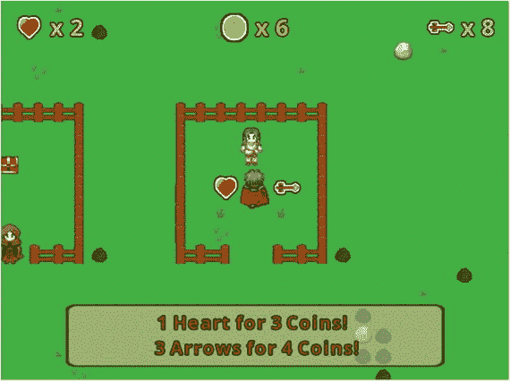
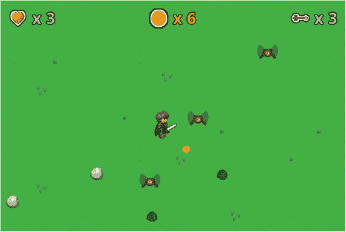
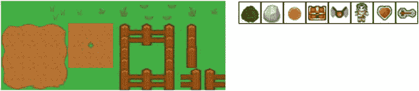
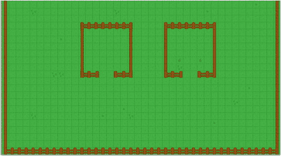
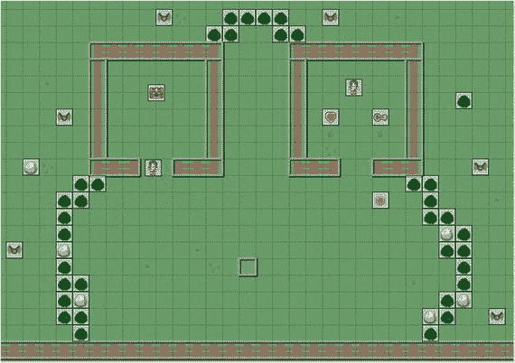
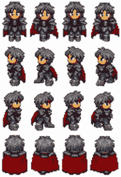
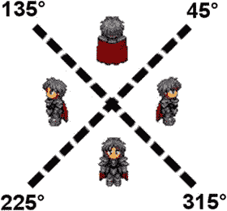
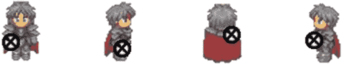
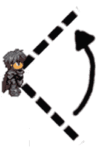
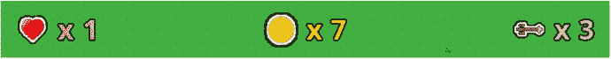

# 12. 冒险游戏

本章包含了整本书中最具雄心的游戏项目：一款名为《寻宝记》的基于战斗的冒险游戏，其灵感来源于《塞尔达传说》等经典主机游戏。该游戏使用了新特性，例如使用两种不同类型武器（剑和箭）与敌人战斗、根据游戏状态（例如剩余敌人数量）显示不同信息的非玩家角色（NPC），以及物品商店机制。图 12-1 和 12-2 分别展示了游戏内战斗和物品商店的截图。



图 12-2.

在物品商店购买物品（心心和箭）



图 12-1.

与飞行敌人进行剑斗


## 游戏项目：寻宝探险

《寻宝探险》是一款冒险游戏，主角被称为英雄，受命消灭陆地上像蝙蝠一样飞行的生物（称为飞行怪），并承诺以宝箱作为奖励。英雄有两种攻击并摧毁飞行怪的方法：挥剑和射箭（英雄初始拥有三支箭）。与这两种武器中的任何一种接触，都能一击摧毁飞行怪。英雄初始拥有三点生命值。与飞行怪相撞会使英雄生命值减少一点，如果英雄生命值降至零，则英雄被摧毁，游戏结束。每只飞行怪被摧毁时，会掉落一枚金币，英雄可以收集金币，并在物品商店中购买额外的生命值或箭矢。游戏中有两个非玩家角色：店主，他会告知你商店中物品的价格和数量（3 枚金币换 1 点生命值，4 枚金币换 3 支箭）；以及守门人，他守护着宝藏，并告诉你还有多少只飞行怪需要击败。

玩家使用方向键移动英雄，使用 S 键和 A 键分别挥剑和射箭。箭矢会沿着玩家面对的方向直线飞行。生命值、金币数量和箭矢数量显示在屏幕顶部。当玩家获胜或失败时，屏幕中央会显示一条大消息。当英雄距离非玩家角色四个像素以内时，非玩家角色的消息会自动显示在屏幕底部（如图 12-2 所示），当英雄离开时，消息会自动消失。

本游戏的图形色彩丰富且具有卡通风格。本项目仅实现了少量动画：英雄行走、挥剑、敌人飞行，以及敌人被摧毁时出现的渐隐烟雾。添加额外的动画和音效以增强与游戏世界对象的互动，将是本项目一个重要且有价值的补充。

本章假设你已经熟悉第 10 章和第 11 章中关于瓦片地图的内容，并且已经安装了 Tiled 地图编辑器软件。此外，你还需要熟悉第 5 章中关于对话框和标志机制的内容，这是设置与非玩家角色交互所必需的。

开始本项目所需的步骤与之前项目相同：创建一个新项目，创建一个`assets`文件夹和一个`+libs`文件夹（如果你已经设置了`userlib`目录，则后者不是必需的），复制你在本书第一部分创建的自定义框架文件（`BaseGame.java`、`BaseScreen.java`、`BaseActor.java`），以及你在第 10 章开发的`TilemapActor.java`类和你在第 5 章开发的`DialogBox.java`类，并将本项目的图形和音频文件复制到你的`assets`文件夹中。如前所述，为了方便起见，已创建了一个名为`Framework`的 BlueJ 项目，其中包含必要的源代码文件，以提供一个便捷的起点。要开始第一个项目：

*   下载本章的源代码文件。
*   复制下载的`Framework`文件夹（及其内容），并将其重命名为`Treasure Quest`。
*   将下载的`Treasure Quest`项目 assets 文件夹中的所有内容复制到你新创建的`Treasure Quest assets`文件夹中。
*   打开你`Treasure Quest`文件夹中的 BlueJ 项目。
*   在`CustomGame`类中，将类名改为`TreasureQuestGame`（BlueJ 随后会将源代码文件重命名为`TreasureQuestGame.java`）。
*   在`Launcher`类中，将`main`方法的内容改为以下内容：

```
    Game myGame = new TreasureQuestGame ();
    LwjglApplication launcher = new LwjglApplication(
    myGame, "Treasure Quest", 800, 600 );
    ```

## 关卡设置

首先，启动 Tiled 地图编辑器软件。创建一个新地图，地图尺寸宽度为 40 个瓦片，高度为 40 个瓦片，瓦片尺寸宽度和高度均设置为 32 像素。生成的地图将为 1280 x 1280 像素。点击“另存为...”按钮，将文件以文件名`map.tmx`保存到你的`assets`目录中。

接下来，为你的地图添加一个对象层。然后，在“图块集”面板中，使用图像`adventure-tiles.png`（如图 12-3 左侧所示）添加一个新图块集，将瓦片尺寸设置为 32 x 32，并勾选将图块集嵌入地图的复选框。以相同方式，这次使用图像`object-tiles.png`（如图 12-3 右侧所示）为地图添加另一个新图块集。由于对象瓦片将用于指示游戏世界对象应生成的位置，你需要指定相应的 Java 类（稍后你将创建这些类）。在图块集面板中，选择 object-tiles，并点击编辑图块集的图标。在出现的选项卡中，你需要逐个点击每个瓦片，并为每个瓦片添加一个新的自定义属性。该属性应命名为`name`；这些瓦片对应的值（从左到右）分别为`Bush`、`Rock`、`Coin`、`Treasure`、`Flyer`、`NPC`、`ShopHeart`和`ShopArrow`。此外，对于 NPC 瓦片，添加第二个名为`id`的自定义属性，值为`default`，以及第三个名为`text`的自定义属性，值为`Hello, World!`。（这些默认值稍后将在瓦片地图编辑器中针对特定实例被覆盖。）



图 12-3.

瓦片层（左）和对象层（右）的图块集

返回到显示瓦片地图的选项卡。在“图层”面板中，选择“Tile Layer 1”。在图块集面板中，选择 adventure-tiles，然后按 B 键激活“印章画笔”工具。在整个地图上添加草地瓦片（使用“桶填充”工具可以大大加快速度），然后沿边缘添加木栅栏瓦片。此外，在地图中心附近添加两个大型围栏区域，每个区域都有一个两瓦片宽的入口，以便英雄通过；瓦片地图的下半部分如图 12-4 所示。



图 12-4.

在瓦片层添加草地和栅栏瓦片

正如前一章所述，瓦片层仅用于简化从图块集创建图像的过程。在实际游戏中，栅栏瓦片应为实心障碍物，因此你需要在对象层中添加矩形来存储对应区域的数据。在“图层”面板中，选择“Object Layer 1”，然后按 R 键激活“矩形”工具。在所有包含实心瓦片的区域周围绘制矩形；为简化操作，可以绘制同时包围多个瓦片的矩形。每次添加这些矩形时，你还必须添加一个名为`name`的自定义属性，值为`Solid`（稍后将用于初始化对应的角色）。为加速此过程，当选中一个矩形且“选择对象”工具处于活动状态时，你可以使用快捷键组合`Ctrl+D`来复制对象（包括自定义属性），然后只需重新定位和调整新对象的大小（新对象会直接出现在原始对象上方）。一旦你为所有包含实心瓦片的区域添加了对应的矩形，在地图底部中央添加最后一个矩形，以指示英雄的起始位置；添加自定义属性`name`，值为`Start`。


接下来，你将添加游戏对象，目标是实现与图 12-5 类似的设计。按下 T 键激活“插入图块”工具。从对象图块集中添加灌木和岩石图块，围出一块包含英雄起始位置以及你之前创建的两个围栏区域入口的区域；这将用于阻挡敌人接近英雄，直到玩家做好准备，用剑清除灌木。在左侧围栏区域中央放置一个宝藏图块，并在入口中间放置一个 NPC 图块。在此过程中，按住 `Ctrl` 键定位图块可能会很有用，这允许将图块放置在网格方格之间。对于那个 NPC 图块，暂时切换到选择工具，并将自定义属性 `id` 的值更改为 `Gatekeeper`。（该 NPC 将显示的文本稍后通过代码设置，因此你无需更改此属性。）在右侧围栏区域，在顶部中央添加一个 NPC 图块，将 `id` 更改为 `Shopkeeper`，并将 `text` 更改为 `1 heart for 3 coins! 3 arrows for 4 coins!`（这将产生图 12-2 中所示的消息。）此外，在中间添加一个 ShopHeart 图块和一个 ShopArrow 图块，两者之间至少相隔一个网格方格。在此区域某处添加一个金币图块，以便后续测试。最后，在你创建的封闭区域之外，添加一堆飞行器图块以及更多散落的灌木和岩石图块。



图 12-5.
向对象层添加对象图块

完成后，保存图块地图，如果愿意可以关闭 Tiled 地图编辑器，然后在 BlueJ 中打开 `Treasure Quest` 项目（如果尚未打开）。首先，为了表示英雄和其他游戏实体将与之碰撞的固体对象，类似于第 11 章的过程，创建一个名为 `Solid` 的类，包含以下代码：

```
import com.badlogic.gdx.scenes.scene2d.Stage;
public class Solid extends BaseActor
{
public Solid(float x, float y, float width, float height, Stage s)
{
super(x,y,s);
setSize(width, height);
setBoundaryRectangle();
}
}
```

接下来，在 `LevelScreen` 类中，添加以下 `import` 语句：

```
import com.badlogic.gdx.maps.MapObject;
import com.badlogic.gdx.maps.MapProperties;
```

然后，在 `initialize` 方法中添加以下代码，以加载图块地图并生成与图块地图中矩形对应的 `Solid` 对象：

```
TilemapActor tma = new TilemapActor("assets/map.tmx", mainStage);
for (MapObject obj : tma.getRectangleList("Solid") )
{
MapProperties props = obj.getProperties();
new Solid( (float)props.get("x"),     (float)props.get("y"),
(float)props.get("width"), (float)props.get("height"),
mainStage );
}
```

此时，你可以测试项目，尽管你只会看到关卡的一小部分，并且尚未编写创建对象图块所表示的游戏实体的代码。你的第一个任务是添加英雄角色，这将在下一节中说明。

## 英雄

在本节中，你将创建英雄角色的代码。由于这款游戏采用俯视视角，英雄将拥有四种不同的动画，分别对应四个基本方向（北、南、东、西）的行走。该类的主要职责是初始化动画，并根据实际运动角度显示正确的动画。此外，该类能够确定角色当前面对的角度（将是 90 度的倍数）也很重要。

对于冒险游戏或角色扮演游戏，许多包含俯视角色行走动画的精灵表通常会将所有四个方向的动画帧放在一个精灵表中，每个方向一行，如图 12-6 所示。这种布局标准尤其因游戏引擎软件 RPG Maker 而普及。要从各行中提取动画帧并创建相应的动画，需要使用 `TextureRegion` 类的 `split` 方法，你将会看到这一点。



图 12-6.
包含四个方向行走动画的单个精灵表

首先，创建一个名为 `Hero` 的类，包含以下代码：

```
import com.badlogic.gdx.scenes.scene2d.Stage;
import com.badlogic.gdx.Gdx;
import com.badlogic.gdx.graphics.Texture;
import com.badlogic.gdx.graphics.g2d.TextureRegion;
import com.badlogic.gdx.graphics.g2d.Animation;
import com.badlogic.gdx.utils.Array;
public class Hero extends BaseActor
{
Animation north;
Animation south;
Animation east;
Animation west;
float facingAngle;
public Hero(float x, float y, Stage s)
{
super(x,y,s);
String fileName = "assets/hero.png";
int rows = 4;
int cols = 4;
Texture texture = new Texture(Gdx.files.internal(fileName), true);
int frameWidth  = texture.getWidth()  / cols;
int frameHeight = texture.getHeight() / rows;
float frameDuration = 0.2f;
TextureRegion[][] temp = TextureRegion.split(texture, frameWidth, frameHeight);
Array textureArray = new Array();
for (int c = 0; c < cols; c++)
textureArray.add( temp[0][c] );
south = new Animation(frameDuration, textureArray, Animation.PlayMode.LOOP_PINGPONG);
textureArray.clear();
for (int c = 0; c < cols; c++)
textureArray.add( temp[1][c] );
west = new Animation(frameDuration, textureArray, Animation.PlayMode.LOOP_PINGPONG);
textureArray.clear();
for (int c = 0; c < cols; c++)
textureArray.add( temp[2][c] );
east = new Animation(frameDuration, textureArray, Animation.PlayMode.LOOP_PINGPONG);
textureArray.clear();
for (int c = 0; c < cols; c++)
textureArray.add( temp[3][c] );
north = new Animation(frameDuration, textureArray, Animation.PlayMode.LOOP_PINGPONG);
setAnimation(south);
facingAngle = 270;
setBoundaryPolygon(8);
setAcceleration(400);
setMaxSpeed(100);
setDeceleration(400);
}
}
```

接下来，你需要根据移动方向选择正确的动画。这是一个直接的计算，如图 12-7 所示。例如，如果运动角度在 45 到 135 度之间，那么玩家的移动主要是向北，英雄面向 90 度方向。东方方向稍微复杂一些，因为它对应的角度要么在 0 到 45 度之间，要么在 315 到 360 度之间，因此这种情况在相应的 `if-else` 语句集中被放在最后处理。



图 12-7.
运动角度范围及对应的动画

为了实现此功能——即根据移动方向激活正确的动画，以及设置和获取英雄当前面对的角度——请向 `Hero` 类添加以下两个方法：


```
public void act(float dt)
{
super.act(dt);
// 当角色不移动时暂停动画
if ( getSpeed() == 0 )
setAnimationPaused(true);
else
{
setAnimationPaused(false);
// 设置方向动画
float angle = getMotionAngle();
if (angle >= 45 && angle < 135)
{
facingAngle = 90;
setAnimation(north);
}
else if (angle >= 135 && angle < 225)
{
facingAngle = 180;
setAnimation(west);
}
else if (angle >= 225 && angle <= 315)
{
facingAngle = 270;
setAnimation(south);
}
else
{
facingAngle = 0;
setAnimation(east);
}
}
alignCamera();
boundToWorld();
applyPhysics(dt);
}
public float getFacingAngle()
{
return facingAngle;
}
```

接下来，你将把英雄添加到游戏中，并添加用于移动英雄的键盘控制。

在 `LevelScreen` 类中，添加以下 `import` 语句：

```
import com.badlogic.gdx.Gdx;
import com.badlogic.gdx.Input.Keys;
```

然后，添加以下变量声明：

```
Hero hero;
```

在 `initialize` 方法中，添加以下代码，该代码从瓦片地图数据中确定英雄的起始位置并初始化对象：

```
MapObject startPoint = tma.getRectangleList("start").get(0);
MapProperties startProps = startPoint.getProperties();
hero = new Hero( (float)startProps.get("x"), (float)startProps.get("y"), mainStage);
```

最后，在 `update` 方法中，为了使用方向键移动英雄并阻止英雄穿过固体对象，添加以下代码：

```
// 英雄移动控制
if (Gdx.input.isKeyPressed(Keys.LEFT))
hero.accelerateAtAngle(180);
if (Gdx.input.isKeyPressed(Keys.RIGHT))
hero.accelerateAtAngle(0);
if (Gdx.input.isKeyPressed(Keys.UP))
hero.accelerateAtAngle(90);
if (Gdx.input.isKeyPressed(Keys.DOWN))
hero.accelerateAtAngle(270);
for (BaseActor solid : BaseActor.getList(mainStage, "Solid"))
{
hero.preventOverlap(solid);
}
```

现在是测试项目的好时机，以确保英雄按预期移动。

## 剑

接下来，你将向游戏中添加一把剑；按下 `S` 键将使剑出现。英雄将做出挥剑弧线动作，然后剑会消失。此过程中的第一个挑战是让剑出现在正确的位置，并与当前显示的动画保持一致。在本游戏中，你将假设英雄是右撇子，因此剑柄应出现在英雄右手的位置，如图 12-8 所示。该位置相对于英雄图像的左下角，将存储为英雄图形宽度和高度的百分比。



图 12-8.

每个方向图像中英雄右手的位置（用 X 标记）

此外，一旦剑被正确放置，它将挥动一个 90 度的弧线，如图 12-9 所示。这可以通过将初始旋转设置为比英雄面向角度小 45 度，然后使用一个动作将剑旋转 90 度（逆时针）来实现。由于剑应围绕其剑柄（而非中心）旋转，因此原点的 x 坐标应设置为 0。



图 12-9.

挥剑时使用的旋转弧线

最后，每次玩家按下 S 键时，不会生成一个新的剑对象，而是只有一个剑对象实例，仅在英雄挥剑时可见。此外，在挥剑过程中，英雄将停止移动，并且在第一次挥剑完成之前（以剑再次变为不可见为标志），剑不能第二次挥动。为了实现所有这些功能，首先创建一个名为 `Sword` 的新类，代码如下：

```
import com.badlogic.gdx.scenes.scene2d.Stage;
public class Sword extends BaseActor
{
public Sword(float x, float y, Stage s)
{
super(x,y,s);
loadTexture("assets/sword.png");
}
}
```

接下来，在 `LevelScreen` 类中，添加以下 `import` 语句：

```
import com.badlogic.gdx.math.Vector2;
import com.badlogic.gdx.scenes.scene2d.actions.Actions;
```

然后，添加以下变量声明：

```
Sword sword;
```

在 `initialize` 方法中，按如下方式设置剑：

```
sword = new Sword(0,0, mainStage);
sword.setVisible(false);
```

在 `update` 方法中，为了在挥剑期间阻止英雄移动，找到与英雄加速对应的 `if` 语句，并将它们包含在一个条件语句中，如下所示：

```
if ( !sword.isVisible() )
{
// 英雄移动控制
// （以下代码省略）
}
```

为了处理实际的挥剑动作，将以下方法添加到 `LevelScreen` 类中：

```
public void swingSword()
{
// 可见性决定剑是否正在挥动
if ( sword.isVisible() )
return;
hero.setSpeed(0);
float facingAngle = hero.getFacingAngle();
Vector2 offset = new Vector2();
if (facingAngle == 0)
offset.set( 0.50f, 0.20f );
else if (facingAngle == 90)
offset.set( 0.65f, 0.50f );
else if (facingAngle == 180)
offset.set( 0.40f, 0.20f );
else // facingAngle == 270
offset.set( 0.25f, 0.20f );
sword.setPosition( hero.getX(), hero.getY() );
sword.moveBy( offset.x * hero.getWidth(), offset.y * hero.getHeight() );
float swordArc = 90;
sword.setRotation(facingAngle - swordArc/2);
sword.setOriginX(0);
sword.setVisible(true);
sword.addAction( Actions.rotateBy(swordArc, 0.25f) );
sword.addAction( Actions.after( Actions.visible(false) ) );
// 当英雄面向北方或西方时，英雄应显示在剑的前面
if (facingAngle == 90 || facingAngle == 180)
hero.toFront();
else
sword.toFront();
}
```

最后，为了让玩家能够挥剑，由于这是一个离散动作，你需要在 `LevelScreen` 类中添加一个 `keyDown` 方法：

```
public boolean keyDown(int keycode)
{
if (keycode == Keys.S)
swingSword();
return false;
}
```

此时，你的代码已准备好再次测试。在屏幕上四处走动，并尝试在每个方向挥剑。不过，目前还没有可以挥砍的目标；这将在下一节中得到解决。


## 灌木与岩石

现在，你将添加代码来创建之前在地图编辑器中放置的灌木和岩石对象。灌木和岩石将是实体对象，因此它们的类将继承 `Solid` 类。灌木被剑击中时会消失，而岩石则不会。岩石被实现为独立对象（而非地图块），以便可以设置非正方形的边界多边形。

首先，使用以下代码创建一个名为 `Bush` 的类：

```
import com.badlogic.gdx.scenes.scene2d.Stage;
public class Bush extends Solid
{
public Bush(float x, float y, Stage s)
{
super(x,y,32,32,s);
loadTexture("assets/bush.png");
setBoundaryPolygon(8);
}
}
```

然后，使用以下代码创建一个名为 `Rock` 的类：

```
import com.badlogic.gdx.scenes.scene2d.Stage;
public class Rock extends Solid
{
public Rock(float x, float y, Stage s)
{
super(x,y,32,32,s);
loadTexture("assets/rock.png");
setBoundaryPolygon(8);
}
}
```

为了从地图数据中创建这些对象，在 `LevelScreen` 类的 `initialize` 方法中添加以下代码：

```
for (MapObject obj : tma.getTileList("Bush") )
{
MapProperties props = obj.getProperties();
new Bush( (float)props.get("x"), (float)props.get("y"), mainStage );
}
for (MapObject obj : tma.getTileList("Rock") )
{
MapProperties props = obj.getProperties();
new Rock( (float)props.get("x"), (float)props.get("y"), mainStage );
}
```

由于 `Bush` 和 `Rock` 类继承自 `Solid` 类，在 `update` 方法中，通过遍历 `Solid` 对象列表的 `for` 循环，已经防止了与这些对象的重叠。为了让剑能够摧毁灌木，在 `update` 方法中添加以下代码：

```
if ( sword.isVisible() )
{
for (BaseActor bush : BaseActor.getList(mainStage, "Bush"))
{
if (sword.overlaps(bush))
bush.remove();
}
}
```

现在，你可以再次测试代码，用英雄的剑尽情砍伐灌木。

## 用户界面

接下来，你将设置用户界面，用于显示剩余生命值以及玩家当前持有的金币和箭矢数量。为了保持界面简洁，将使用图像而非文字，如图 12-10 所示。用户界面还将包含一个标签，用于在适当时显示“游戏结束”消息，以及一个用于与 NPC 对话的对话框（不过这个功能将在后续使用）。



图 12-10.

用户界面中用于表示生命值、金币和箭矢的图像

首先，在 `LevelScreen` 类中添加以下 `import` 语句：

```
import com.badlogic.gdx.graphics.Color;
import com.badlogic.gdx.scenes.scene2d.ui.Label;
```

然后，在类中添加以下变量：

```
int health;
int coins;
int arrows;
boolean gameOver;
Label healthLabel;
Label coinLabel;
Label arrowLabel;
Label messageLabel;
DialogBox dialogBox;
```

接下来，为了初始化所有这些变量，在 `initialize` 方法中添加以下代码：

```
health = 3;
coins = 5;
arrows = 3;
gameOver = false;
healthLabel = new Label(" x " + health, BaseGame.labelStyle);
healthLabel.setColor(Color.PINK);
coinLabel  = new Label(" x " + coins,  BaseGame.labelStyle);
coinLabel.setColor(Color.GOLD);
arrowLabel = new Label(" x " + arrows, BaseGame.labelStyle);
arrowLabel.setColor(Color.TAN);
messageLabel = new Label("...", BaseGame.labelStyle);
messageLabel.setVisible(false);
dialogBox = new DialogBox(0,0, uiStage);
dialogBox.setBackgroundColor( Color.TAN );
dialogBox.setFontColor( Color.BROWN );
dialogBox.setDialogSize(600, 100);
dialogBox.setFontScale(0.80f);
dialogBox.alignCenter();
dialogBox.setVisible(false);
```

为了创建界面中使用的图标，添加以下语句：

```
BaseActor healthIcon = new BaseActor(0,0,uiStage);
healthIcon.loadTexture("assets/heart-icon.png");
BaseActor coinIcon = new BaseActor(0,0,uiStage);
coinIcon.loadTexture("assets/coin-icon.png");
BaseActor arrowIcon = new BaseActor(0,0,uiStage);
arrowIcon.loadTexture("assets/arrow-icon.png");
```

为了在 `uiTable` 中排列所有这些元素，还需要添加以下代码：

```
uiTable.pad(20);
uiTable.add(healthIcon);
uiTable.add(healthLabel);
uiTable.add().expandX();
uiTable.add(coinIcon);
uiTable.add(coinLabel);
uiTable.add().expandX();
uiTable.add(arrowIcon);
uiTable.add(arrowLabel);
uiTable.row();
uiTable.add(messageLabel).colspan(8).expandX().expandY();
uiTable.row();
uiTable.add(dialogBox).colspan(8);
```

为了保持标签显示正确的变量值，在 `update` 方法中添加以下代码：

```
healthLabel.setText(" x " + health);
coinLabel.setText(" x " + coins);
arrowLabel.setText(" x " + arrows);
```

此外，当游戏结束时，你将不再希望移动玩家或挥剑，因此在 `update` 方法的开头添加以下代码：

```
if ( gameOver )
return;
```

同样，在 `keyDown` 方法的开头添加以下内容：

```
if ( gameOver )
return false;
```

现在是一个很好的时机来添加更多游戏对象：可以收集的金币以及找到后即可获胜的宝箱。首先，使用以下代码创建一个名为 `Coin` 的新类：

```
import com.badlogic.gdx.scenes.scene2d.Stage;
public class Coin extends BaseActor
{
public Coin(float x, float y, Stage s)
{
super(x,y,s);
loadTexture("assets/coin.png");
}
}
```

然后，使用以下代码创建一个名为 `Treasure` 的类：

```
import com.badlogic.gdx.scenes.scene2d.Stage;
public class Treasure extends BaseActor
{
public Treasure(float x, float y, Stage s)
{
super(x,y,s);
loadTexture("assets/treasure-chest.png");
}
}
```

由于游戏中只会有一个宝箱对象，为了简化后续代码，在 `LevelScreen` 类中添加以下变量声明：

```
Treasure treasure;
```

为了从地图数据中创建这些对象，在 `initialize` 方法中添加以下内容：

```
for (MapObject obj : tma.getTileList("Coin") )
{
MapProperties props = obj.getProperties();
new Coin( (float)props.get("x"), (float)props.get("y"), mainStage );
}
MapObject treasureTile = tma.getTileList("Treasure").get(0);
MapProperties treasureProps = treasureTile.getProperties();
treasure = new Treasure( (float)treasureProps.get("x"), (float)treasureProps.get("y"),
mainStage );
```

为了处理与这些对象的重叠，在 `update` 方法中添加以下代码：

```
for ( BaseActor coin : BaseActor.getList(mainStage, "Coin") )
{
if ( hero.overlaps(coin) )
{
coin.remove();
coins++;
}
}
if ( hero.overlaps(treasure) )
{
messageLabel.setText("You win!");
messageLabel.setColor(Color.LIME);
messageLabel.setFontScale(2);
messageLabel.setVisible(true);
treasure.remove();
gameOver = true;
}
```

此外，现在也是添加处理游戏失败代码的好时机，当英雄生命值耗尽时触发（尽管目前还无法实现），因此也添加以下内容：

```
if ( health <= 0 )
{
messageLabel.setText("Game over...");
messageLabel.setColor(Color.RED);
messageLabel.setFontScale(2);
messageLabel.setVisible(true);
hero.remove();
gameOver = true;
}
```

再次准备好测试你的游戏。收集金币（如果你添加了的话）并收集宝箱，即可看到屏幕上出现“You win!”消息。


## 敌人

每款游戏都应有障碍物，使玩家难以抵达或达成目标。在《寻宝任务》中，你必须使用武器摧毁在屏幕上飞行的敌人，它们被称为“飞行者”。飞行者的行为具有一定随机性：每个飞行者拥有随机速度，并会在随机时刻将运动方向改变为随机角度。创建一个名为 `Flyer` 的新类，包含以下代码：

```
import com.badlogic.gdx.scenes.scene2d.Stage;
import com.badlogic.gdx.math.MathUtils;
public class Flyer extends BaseActor
{
public Flyer(float x, float y, Stage s)
{
super(x,y,s);
loadAnimationFromSheet( "assets/enemy-flyer.png", 1, 4, 0.05f, true);
setSize(48,48);
setBoundaryPolygon(6);
setSpeed( MathUtils.random(50,80) );
setMotionAngle( MathUtils.random(0,360) );
}
public void act(float dt)
{
super.act(dt);
if ( MathUtils.random(1,120) == 1 )
setMotionAngle( MathUtils.random(0,360) );
applyPhysics(dt);
boundToWorld();
}
}
```

当飞行者被摧毁时，它会化作一团烟雾消失。为此，创建一个名为 `Smoke` 的新类，包含以下代码，用于创建一个逐渐淡出并最终从游戏中移除自身的图像：

```
import com.badlogic.gdx.scenes.scene2d.Stage;
import com.badlogic.gdx.scenes.scene2d.actions.Actions;
public class Smoke extends BaseActor
{
public Smoke(float x, float y, Stage s)
{
super(x,y,s);
loadTexture("assets/smoke.png");
addAction( Actions.fadeOut(0.5f) );
addAction( Actions.after( Actions.removeActor() ) );
}
}
```

像往常一样，你需要在 `LevelScreen` 类的 `initialize` 方法中创建这些新对象，具体如下：

```
for (MapObject obj : tma.getTileList("Flyer") )
{
MapProperties props = obj.getProperties();
new Flyer( (float)props.get("x"), (float)props.get("y"), mainStage );
}
```

飞行者也会被固体物体阻挡，并在碰撞时改变方向。因此，在 `update` 方法中，找到遍历 `Solid` 对象的 `for` 循环，并在相应的代码块中添加以下内容：

```
for (BaseActor flyer : BaseActor.getList(mainStage, "Flyer"))
{
if (flyer.overlaps(solid))
{
flyer.preventOverlap(solid);
flyer.setMotionAngle( flyer.getMotionAngle() + 180 );
}
}
```

当剑处于可见状态（表示正在挥动）时，可以摧毁敌人。在这种情况下，如果剑与敌人重叠，将生成烟雾并产生一枚金币（作为对玩家胜利的奖励）。在 `update` 方法中，找到检查剑是否可见的条件语句，并在相应的代码块中添加以下内容：

```
for (BaseActor flyer : BaseActor.getList(mainStage, "Flyer"))
{
if (sword.overlaps(flyer))
{
flyer.remove();
Coin coin = new Coin(0,0, mainStage);
coin.centerAtActor(flyer);
Smoke smoke = new Smoke(0,0, mainStage);
smoke.centerAtActor(flyer);
}
}
```

最后，英雄与飞行者接触时应损失生命值。检测重叠很简单，但有一个细节需要处理：英雄和飞行者应尽可能“被推开”，否则英雄可能会在短时间内多次与飞行者重叠，导致玩家迅速输掉游戏。因此，碰撞发生后，飞行者将开始向相反方向移动，而英雄会被推离敌人，这有时也被称为击退。要计算运动角度，你需要通过减去两者的位置来计算从英雄到飞行者的向量，然后使用 `Vector2` 类的 `angle` 方法。为实现这些功能，将以下代码添加到 `update` 方法中：

```
for (BaseActor flyer : BaseActor.getList(mainStage, "Flyer"))
{
if ( hero.overlaps(flyer) )
{
hero.preventOverlap(flyer);
flyer.setMotionAngle( flyer.getMotionAngle() + 180 );
Vector2 heroPosition  = new Vector2(  hero.getX(),  hero.getY() );
Vector2 flyerPosition = new Vector2( flyer.getX(), flyer.getY() );
Vector2 hitVector = heroPosition.sub( flyerPosition );
hero.setMotionAngle( hitVector.angle() );
hero.setSpeed(100);
health--;
}
}
```

至此，你已经完成了飞行者敌人的实现。测试你的项目，用剑砍杀敌人，并收集它们掉落的金币。

## 箭矢

许多以战斗为核心的游戏都提供多种武器，以迎合不同的游戏风格。现在你将为此游戏添加一种箭矢武器，使你能从远处攻击敌人。为确保玩家不会完全依赖这种武器，箭矢的数量是有限的（不过可以在本章末尾创建的道具商店中购买额外的箭矢）。玩家可以通过按下 A 键射箭，如果英雄还有剩余箭矢，将生成一支箭矢，并朝英雄面对的方向飞行。如果箭矢击中敌人，敌人将被摧毁；如果箭矢击中固体物体，箭矢将停止移动并淡出。首先，创建一个名为 `Arrow` 的新类，代码如下：

```
import com.badlogic.gdx.scenes.scene2d.Stage;
public class Arrow extends BaseActor
{
public Arrow(float x, float y, Stage s)
{
super(x,y,s);
loadTexture("assets/arrow.png");
setSpeed(400);
}
public void act(float dt)
{
super.act(dt);
applyPhysics(dt);
}
}
```

射箭功能将由以下方法处理，该方法应添加到 `LevelScreen` 类中：

```
public void shootArrow()
{
if ( arrows <= 0 )
return;
arrows--;
Arrow arrow = new Arrow(0,0, mainStage);
arrow.centerAtActor(hero);
arrow.setRotation( hero.getFacingAngle() );
arrow.setMotionAngle( hero.getFacingAngle() );
}
```

在 `keyDown` 方法中，在导致英雄挥剑的代码之后添加以下代码：

```
if (keycode == Keys.A)
shootArrow();
```

最后，为了指定箭矢如何与飞行者和固体物体交互，将以下代码添加到 `update` 方法中：

```
for (BaseActor arrow : BaseActor.getList(mainStage, "Arrow"))
{
for (BaseActor flyer : BaseActor.getList(mainStage, "Flyer"))
{
if (arrow.overlaps(flyer))
{
flyer.remove();
arrow.remove();
Coin coin = new Coin(0,0, mainStage);
coin.centerAtActor(flyer);
Smoke smoke = new Smoke(0,0, mainStage);
smoke.centerAtActor(flyer);
}
}
for (BaseActor solid : BaseActor.getList(mainStage, "Solid"))
{
if (arrow.overlaps(solid))
{
arrow.preventOverlap(solid);
arrow.setSpeed(0);
arrow.addAction( Actions.fadeOut(0.5f) );
arrow.addAction( Actions.after( Actions.removeActor() ) );
}
}
}
```

至此，箭矢射击机制已完成。测试你的游戏，确保箭矢能摧毁飞行者敌人，箭矢在碰撞到固体时停止，箭矢数量在射击后减少，并且当箭矢数量归零后，无法再射出箭矢。


## 非玩家角色

接下来要实现的功能是添加非玩家角色（NPC）。它们与第 5 章中介绍的标志物对象密切相关；建议在继续之前重新阅读相关章节。与标志物类似，靠近 NPC 时，用户界面中的对话框会显示关联消息。但与标志物不同的是，每个 NPC 都有独特的外观，并使用瓦片地图中设置的标识符（`id`）数据。此外，在显示关联消息之前会检查每个 NPC 的 ID，这让你有机会根据游戏状态显示不同的消息。具体来说，本章设计的游戏包含两个 NPC，一个叫守门人，另一个叫店主。守门人最初会阻挡通往宝藏的路径，向玩家提供指示（消灭所有飞行器才能获得宝藏！），告知剩余飞行器的数量，并在玩家消灭所有飞行器后逐渐淡出消失，从而让玩家能够收集宝藏。店主则没有动态文本，他们只是告知英雄物品商店中可售物品的价格和数量（商店将在下一节创建）。

首先，使用以下代码创建一个名为`NPC`的新类。请注意，角色的图像不是在构造函数中设置的，而是在设置 ID 时设置的。

```
import com.badlogic.gdx.scenes.scene2d.Stage;
public class NPC extends BaseActor
{
// 要显示的文本
private String text;
// 用于判断对话框文本是否正在显示
private boolean viewing;
// 用于特定图形和识别具有动态消息的 NPC 的 ID
private String ID;
public NPC(float x, float y, Stage s)
{
super(x,y,s);
text = " ";
viewing = false;
}
public void setText(String t)
{  text = t;  }
public String getText()
{  return text;  }
public void setViewing(boolean v)
{  viewing = v;  }
public boolean isViewing()
{  return viewing;  }
public void setID(String id)
{
ID = id;
if ( ID.equals("Gatekeeper") )
loadTexture("assets/npc-1.png");
else if (ID.equals("Shopkeeper"))
loadTexture("assets/npc-2.png");
else // 默认图像
loadTexture("assets/npc-3.png");
}
public String getID()
{  return ID;  }
}
```

为了设置 NPC，在`LevelScreen`类的`initialize`方法中添加以下代码；请注意，你还需要检索在设计瓦片地图时创建的名为`id`和`text`的属性。注意，NPC 的位置会与在 Tiled 地图编辑器中放置的位置略有偏移，因为 NPC 的尺寸比瓦片集中用于表示它的图标要大。你可能会发现之后需要在 Tiled 中调整 NPC 的位置。

```
for (MapObject obj : tma.getTileList("NPC") )
{
MapProperties props = obj.getProperties();
NPC s = new NPC( (float)props.get("x"), (float)props.get("y"), mainStage );
s.setID( (String)props.get("id") );
s.setText( (String)props.get("text") );
}
```

最后，在`update`方法中添加以下代码。如果英雄在 NPC 的四个像素范围内，则认为英雄在附近，并显示相应的消息。一旦英雄不再靠近正在查看消息的 NPC，对话框就会消失。以下大部分代码用于为守门人 NPC 创建动态消息，这些消息取决于游戏中剩余的飞行器数量。一旦所有飞行器被摧毁，守门人会慢慢淡出并移出屏幕，从而使英雄能够到达宝藏处。

```
for ( BaseActor npcActor : BaseActor.getList(mainStage, "NPC") )
{
NPC npc = (NPC)npcActor;
hero.preventOverlap(npc);
boolean nearby = hero.isWithinDistance(4, npc);
if ( nearby && !npc.isViewing() )
{
// 检查 NPC ID 以获取动态文本
if ( npc.getID().equals("Gatekeeper") )
{
int flyerCount = BaseActor.count(mainStage, "Flyer");
String message = "消灭飞行器，宝藏就是你的了。 ";
if ( flyerCount > 1 )
message += "还剩 " + flyerCount + " 个。";
else if ( flyerCount == 1 )
message += "还剩 " + flyerCount + " 个。";
else // flyerCount == 0
{
message += "它是你的了！";
npc.addAction( Actions.fadeOut(5.0f) );
npc.addAction( Actions.after( Actions.moveBy(-10000, -10000) ) );
}
dialogBox.setText(message);
}
else
{
dialogBox.setText( npc.getText() );
}
dialogBox.setVisible( true );
npc.setViewing( true );
}
if (npc.isViewing() && !nearby)
{
dialogBox.setText( " " );
dialogBox.setVisible( false );
npc.setViewing( false );
}
}
```

至此，NPC 功能已完全实现。测试你的游戏并与每个 NPC 对话。尝试消灭飞行器，然后确保守门人按预期消失。

## 物品商店

你将在《寻宝任务》游戏中实现的最后一个机制是物品商店，它由两个英雄可以站立的瓦片组成，如果玩家按下 B 键（购买）并且有足够的金币，玩家将获得店主所述数量的物品。这赋予了玩家收集的金币实际价值，而不仅仅是抽象的点数或进度衡量标准。首先，使用以下代码创建一个名为`ShopHeart`的新类：

```
import com.badlogic.gdx.scenes.scene2d.Stage;
public class ShopHeart extends BaseActor
{
public ShopHeart(float x, float y, Stage s)
{
super(x,y,s);
loadTexture("assets/heart-icon.png");
}
}
```

同时创建一个名为`ShopArrow`的类，如下所示：

```
import com.badlogic.gdx.scenes.scene2d.Stage;
public class ShopArrow extends BaseActor
{
public ShopArrow(float x, float y, Stage s)
{
super(x,y,s);
loadTexture("assets/arrow-icon.png");
}
}
```

由于每个对象只会有一个实例，在`LevelScreen`类中添加以下变量：

```
ShopHeart shopHeart;
ShopArrow shopArrow;
```

为了创建这些对象，在`initialize`方法中添加以下代码：

```
MapObject shopHeartTile = tma.getTileList("ShopHeart").get(0);
MapProperties shopHeartProps = shopHeartTile.getProperties();
shopHeart = new ShopHeart( (float)shopHeartProps.get("x"), (float)shopHeartProps.get("y"),
mainStage );
MapObject shopArrowTile = tma.getTileList("ShopArrow").get(0);
MapProperties shopArrowProps = shopArrowTile.getProperties();
shopArrow = new ShopArrow( (float)shopArrowProps.get("x"), (float)shopArrowProps.get("y"),
mainStage );
```

由于购买物品是一个离散动作，在`keyDown`方法中激活武器的代码之后添加以下代码：

```
if (keycode == Keys.B)
{
if (hero.overlaps(shopHeart) && coins >= 3)
{
coins -= 3;
health += 1;
}
if (hero.overlaps(shopArrow) && coins >= 4)
{
coins -= 4;
arrows += 3;
}
}
```

就这么简单！再次运行你的游戏，消灭一些飞行器，并花掉你辛苦赚来的金币。

一旦你完成了这一步，值得恭喜，因为你已经完成了本书中最长的项目！


## 总结与下一步

在本章中，你创建了《寻宝探险》这款基于战斗的冒险游戏，其中包含了多项新功能，例如使用多种类型武器的战斗、带有动态文本的 NPC 以及物品商店。在实现这些功能的同时，你还处理了一些细微的细节，例如剑的放置位置、敌人和箭矢与实体的交互，以及英雄与敌人碰撞产生的击退效果。

像往常一样，你应该添加菜单和音效等功能。如果你愿意，还可以增加新类型的武器，例如炸弹，它能产生爆炸，同时摧毁岩石和敌人。炸弹很可能是一种有限资源，类似于箭矢，或许也可以在物品商店购买。此外，你可以创建一种会跟随玩家的新型敌人来增加难度。你也可以改变游戏目标：也许不是摧毁飞行者，而是需要收集一定数量的金币才能继续。你还可以从游戏中移除剑，甚至完全移除武器，让游戏变成躲避和回避敌人。可能性是无限的！

至此，你已经完成了本书的第二部分。本书的最后一部分包含高级技术和算法，讲解如何使用游戏手柄控制器、高级图形等，这些都可以用来改进你到目前为止所制作的所有游戏。

