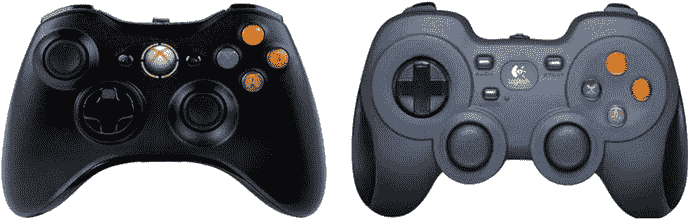
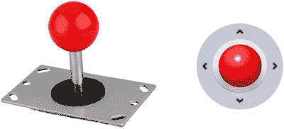
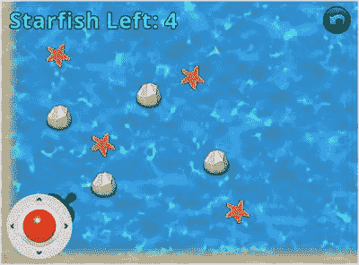
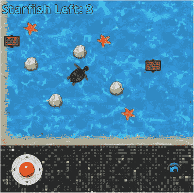

# 13. 用户输入的替代来源

在前面的章节中，你的游戏都是通过传统的台式计算机硬件（键盘和鼠标）进行控制的。在本章中，你将探索用户输入的两种替代来源：游戏手柄控制器和触摸屏控制。具体来说，你将把这些替代输入源添加到前几章中介绍的《海星收集者》游戏中。如果你没有带 USB 接口的游戏手柄（本章后面会讨论），你仍然可以继续学习；代码仍然可以编译，并且你将保留键盘控制作为备用方案（通常这是一个值得考虑的好做法，以方便你的游戏玩家）。同样，即使你无法使用支持触摸屏的设备，了解相关的设计考量也是值得的。此外，在 LibGDX 中，触摸事件和鼠标事件由相同的方法处理；你可以用鼠标模拟单点触摸输入（但不能模拟多点触摸输入）。另一方面，如果你对游戏手柄和触摸输入都不感兴趣，可以跳过整章内容，而不会影响学习的连续性。


## 游戏手柄控制器

游戏手柄控制器是一种专用硬件设备，能让玩家更便捷地输入游戏相关指令。自游戏主机诞生以来，手柄便已存在，并包含摇杆、按钮、方向键、旋钮、扳机和触摸板等多种组件配置。随着桌面电脑上主机风格游戏的普及，如今市面上已有许多可通过 USB 端口连接的游戏手柄。在本节中，你将开发适用于 Xbox 360 手柄（或与之兼容的替代产品，如图 13-1 所示的罗技 F310 手柄）的控制方案。



图 13-1. Xbox 360 与罗技 F310 游戏手柄控制器

游戏手柄输入的支持由 `Controller` 和 `Controllers` 类提供。这些类不属于 LibGDX 核心库，因此其代码包含在独立的 JAR 文件中，必须将其添加到你的项目中。首先，复制第 5 章的 `Starfish Collector` 项目，并将复制后的项目文件夹重命名为 `Starfish Collector Gamepad`。下载本章的源代码，将下载的游戏手柄项目 `+libs` 文件夹中的内容复制到你的项目 `+libs` 文件夹中（如果你在本书开头选择设置 BlueJ 的 `userlib` 目录，则复制到该目录）。具体来说，集成游戏手柄控制器到桌面游戏需要三个新的 JAR 文件：`gdx-controllers.jar`、`gdx-controllers-desktop.jar` 和 `gdx-controllers-desktop-natives.jar`。

回顾一下，输入分为连续输入和离散输入两种类型，它们采用不同的技术处理。对于连续输入（对应行走等动作），你需要在 `update` 方法中轮询硬件设备的状态，该方法通常每秒运行 60 次。稍后你会看到，这个过程类似于轮询键盘输入：键盘轮询使用 `Gdx.input` 对象的方法（如 `isKeyPressed`），而手柄轮询则使用 `Controller` 对象的方法（如 `getAxis` 和 `getButton`）。对于离散输入（对应跳跃等动作），你之前实现了 `InputProcessor` 接口中的方法。当接收到特定输入时（例如按键首次按下），这些方法会自动触发。类似地，你将实现名为 `ControllerListener` 接口的方法，这些方法会在响应离散手柄事件时被激活，例如手柄按钮首次按下时。在接下来的两节中，你将编写连续和离散手柄输入的代码。

### 连续输入

在本节中，你将修改 `Turtle` 类，以便使用手柄的摇杆来控制海龟移动。具体来说，这将使你能够精确控制海龟的运动速度和角度，而仅使用键盘控制是无法实现这一点的。此过程需要你获取活动 `Controller` 对象的实例。`Controllers` 类提供了静态实用方法 `getControllers`，可帮助你完成此过程。获取 `Controller` 后，你可以通过使用四种提供的 `get` 风格方法之一来轮询摇杆、按钮、方向键和扳机按钮的状态。其中许多方法需要一个参数：一个对应于手柄组件的常量值。这些值因手柄而异，特定手柄在不同操作系统上甚至可能有不同的值。确定这些值最可靠的方法是允许玩家在运行时配置手柄映射：遍历游戏所需的不同动作，要求玩家按下对应的按钮，并存储这些值以供后续使用。为简化起见，我们假设玩家使用 Xbox 360 风格的手柄（包括前面提到的罗技 F310 手柄），你将创建一个类来存储此型号手柄各组件的常量值。在 BlueJ 中打开 `Starfish Collector Gamepad` 项目，并创建一个名为 `XBoxGamepad` 的新类，代码如下：

```
import com.badlogic.gdx.controllers.PovDirection;
public class XBoxGamepad
{
/** 按钮代码 */
public static final int BUTTON_A              = 0;
public static final int BUTTON_B              = 1;
public static final int BUTTON_X              = 2;
public static final int BUTTON_Y              = 3;
public static final int BUTTON_LEFT_SHOULDER  = 4;
public static final int BUTTON_RIGHT_SHOULDER = 5;
public static final int BUTTON_BACK           = 6;
public static final int BUTTON_START          = 7;
public static final int BUTTON_LEFT_STICK     = 8;
public static final int BUTTON_RIGHT_STICK    = 9;
/** 方向键代码 */
public static final PovDirection DPAD_UP    = PovDirection.north;
public static final PovDirection DPAD_DOWN  = PovDirection.south;
public static final PovDirection DPAD_RIGHT = PovDirection.east;
public static final PovDirection DPAD_LEFT  = PovDirection.west;
/** 摇杆轴代码 */
// X 轴：-1 = 左，+1 = 右
// Y 轴：-1 = 上，+1 = 下
public static final int AXIS_LEFT_X  = 1;
public static final int AXIS_LEFT_Y  = 0;
public static final int AXIS_RIGHT_X = 3;
public static final int AXIS_RIGHT_Y = 2;
/** 扳机代码 */
// 左、右扳机按钮视为同一轴；ID 值相同
// 值 - 左扳机：0 到 +1。右扳机：0 到 -1。
// 注意：值是可叠加的；如果同时按下两者，它们可能会相互抵消。
public static final int AXIS_LEFT_TRIGGER  = 4;
public static final int AXIS_RIGHT_TRIGGER = 4;
}
```

以下 `Controller` 类方法可用于轮询手柄组件的状态：


*   要轮询摇杆的状态，请使用 `getAxis(code)`，其中 `code` 是一个整数，对应左摇杆或右摇杆，以及 X 轴或 Y 轴方向。返回的值是一个范围在 –1 到 1 之间的 `float` 类型数值。在 X 轴上，–1 对应向左，+1 对应向右；而在 Y 轴上，–1 对应向上，+1 对应向下。例如，考虑以下代码行：`float x = gamepad.getAxis(XBoxGamepad.AXIS_LEFT_X);` 如果 `x` 的值等于 `0.5`，则表示游戏手柄的左摇杆被按向右侧一半的位置。需要记住的是，大多数控制器使用的 Y 轴方向（负值对应“向上”方向）与 LibGDX 库假定的方向（正值对应“向上”方向）是相反的。这在后续处理输入时非常重要。
*   要轮询扳机键的状态，同样使用 `getAxis(code)`。在 Xbox 360 风格的控制器上，左右扳机键被视为一个单独的轴。按下左扳机键会产生范围从 0（未按下）到 +1（完全按下）的值，而按下右扳机键会产生范围从 0（未按下）到 –1（完全按下）的值。如果同时按下两个扳机键，`getAxis` 方法将返回它们值的总和；特别地，如果两个扳机键都完全按下，`getAxis` 将返回 0。
*   要检查游戏手柄按钮的状态，请使用 `getButton(code)`，其中 `code` 是一个整数，对应一个游戏手柄按钮。返回的值是一个布尔值，指示相应的按钮当前是否被按下。
*   要确定方向键上哪个方向被按下，¹ 请使用 `getPov(num)`，其中 `num` 是方向键的索引（通常为 `0`）。方向键的有趣之处在于，它们返回的值比按钮（一个 `Boolean` 值）更复杂，但比摇杆轴（一个 `float` 值）更简单。这种“中间地带”的输入级别是通过返回一个在导入的 `PovDirection` 类中定义的枚举类型（`enum`）来处理的。然而，为了方便起见，`XBoxGamepad` 类定义了一组现代游戏玩家可能更熟悉的替代名称。

为了开始将这些新功能整合到你的项目中，请在 `Turtle` 类中添加以下 `import` 语句：

```
import com.badlogic.gdx.controllers.Controller;
import com.badlogic.gdx.controllers.Controllers;
import com.badlogic.gdx.math.Vector2;
```

接下来，你将修改 `act` 方法中的一些代码，这是处理持续输入的地方。在下面的代码中，你通过测试控制器 `Array`（通过 `getControllers` 方法获取）是否包含至少一个元素来检查是否有控制器连接；如果没有，`else` 块中包含了你之前创建的键盘控制作为备用方案。如果连接了一个游戏手柄，你通过获取数组的第零个元素来检索它。然后，你使用之前创建的 `XBoxGamepad` 类中定义的常量，确定左模拟摇杆在 X 和 Y 方向上被按下的程度（记住要像前面提到的那样对 Y 值取反）。这些值随后被用来创建一个 `Vector2` 对象，该对象表示摇杆被按下的方向。接着，你需要检查摇杆是否移动超过了某个阈值（称为死区，用于补偿控制器的灵敏度，通常设置为 10% 到 20% 之间的值），这可以通过检查向量的长度来确定。如果通过了这个测试，你就将乌龟的速度设置为其最大速度的一个比例（使用方向向量的长度作为百分比），并将乌龟的运动角度设置为方向向量所指的角度。为了完成这些任务，请将以下代码添加到 `Turtle` 类的 `act` 方法中，注意处理键盘输入的代码应被移动到 `else` 块中：

```
if (Controllers.getControllers().size > 0)
{
Controller gamepad = Controllers.getControllers().get(0);
float xAxis =  gamepad.getAxis(XBoxGamepad.AXIS_LEFT_X);
float yAxis = -gamepad.getAxis(XBoxGamepad.AXIS_LEFT_Y);
Vector2 direction = new Vector2(xAxis, yAxis);
float length = direction.len();
float deadZone = 0.10f;
if (length > deadZone)
{
setSpeed( length * 100 );
setMotionAngle( direction.angle() );
}
}
else
{
if (Gdx.input.isKeyPressed(Keys.LEFT))
accelerateAtAngle(180);
if (Gdx.input.isKeyPressed(Keys.RIGHT))
accelerateAtAngle(0);
if (Gdx.input.isKeyPressed(Keys.UP))
accelerateAtAngle(90);
if (Gdx.input.isKeyPressed(Keys.DOWN))
accelerateAtAngle(270);
}
```

如果你有一个 Xbox 360 风格的游戏手柄可用，此时可以测试这段代码。


### 离散输入

接下来，你将编写处理离散游戏手柄输入事件所需的代码。为了避免修改现有的 `BaseScreen` 类，你将创建该类的扩展，实现 `ControllerListener` 接口，并提供所有必要方法的默认版本，这些方法随后可根据需要被重写。（实践中，你可能只会用到 `buttonDown` 方法。）任何使用游戏手柄输入的类都可以扩展这个新类，而非原始的 `BaseScreen` 类。首先，使用以下代码创建一个名为 `BaseGamepadScreen` 的新类：

```
import com.badlogic.gdx.controllers.ControllerListener;
import com.badlogic.gdx.controllers.Controller;
import com.badlogic.gdx.controllers.Controllers;
import com.badlogic.gdx.controllers.PovDirection;
import com.badlogic.gdx.math.Vector3;
public abstract class BaseGamepadScreen extends BaseScreen implements ControllerListener
{
public BaseGamepadScreen()
{
super();
Controllers.clearListeners();
Controllers.addListener(this);
}
// ControllerListener 接口要求的方法
//  启用离散输入处理
public void connected(Controller controller)
{  }
public void disconnected(Controller controller)
{  }
public boolean xSliderMoved(Controller controller, int sliderCode, boolean value)
{  return false;  }
public boolean ySliderMoved(Controller controller, int sliderCode, boolean value)
{  return false;  }
public boolean accelerometerMoved(Controller controller, int accelerometerCode,
Vector3 value)
{  return false;  }
public boolean povMoved(Controller controller, int povCode, PovDirection value)
{  return false;  }
public boolean axisMoved(Controller controller, int axisCode, float value)
{  return false;  }
public boolean buttonDown(Controller controller, int buttonCode)
{  return false;  }
public boolean buttonUp(Controller controller, int buttonCode)
{  return false;  }
}
```

请注意，此类必须声明为 `abstract`，因为它没有实现 `BaseScreen` 类中的 `initialize` 或 `update` 方法。同时注意，监听器是通过将当前活动的 `Screen` 添加到 `Controllers` 类管理的监听器集合中来“激活”的。同时，你还必须移除（通过 `clearListeners` 方法）任何先前添加的 `ControllerListener` 对象；你不希望其他可能处于非活动状态（但仍驻留在内存中）的 `Screen` 对象响应输入，因为这可能导致意外问题。（例如，如果按下游戏手柄上的 Start 按钮用于从菜单屏幕开始新游戏，那么在切换到游戏屏幕后，你不再希望按下游戏手柄 Start 按钮时发生此操作；因此，你必须阻止菜单屏幕“监听”并响应这些事件。）

接下来，你需要修改 `LevelScreen` 类，使得按下游戏手柄上的 Back 键将重新开始关卡（类似于点击用户界面右上角的 Restart 按钮）。这需要三个步骤。首先，在 `LevelScreen` 类中添加以下 `import` 语句：

```
import com.badlogic.gdx.controllers.Controller;
```

接着，修改类声明，使其扩展 `BaseGamepadScreen` 类而非 `BaseScreen` 类，如下所示：

```
public class LevelScreen extends BaseGamepadScreen
```

最后，你需要向此类添加一个 `buttonDown` 方法，用于处理离散的游戏手柄按钮按下事件（类似于 `keyDown` 方法处理离散的键盘按键事件）。将以下方法添加到 `LevelScreen` 类中：

```
public boolean buttonDown(Controller controller, int buttonCode)
{
if (buttonCode == XBoxGamepad.BUTTON_BACK)
StarfishGame.setActiveScreen( new LevelScreen() );
return false;
}
```

仅此而已！请随意再次测试你的项目；移动海龟并收集一些海星，然后按下游戏手柄上的 Back 按钮重置关卡，这样你就可以重新享受收集海星的乐趣了。

## 触摸屏控制

在本节中，你将学习如何实现受游戏手柄启发的屏幕触摸控制。同样，如本章开头所述，测试本节代码无需访问触摸屏设备，因为 LibGDX 使用相同的方法处理鼠标事件和触摸事件；单点触摸输入由鼠标模拟。由于你已经学习了第 5 章中的 `Button` 类，你已经有了良好的基础。接下来，你将了解 LibGDX 库提供的另一个用户界面控件——`Touchpad` 类，该类旨在模拟传统的街机摇杆。图 13-2 展示了一个传统街机风格摇杆以及一个可使用 LibGDX 创建的触摸板控件示例，该控件以俯视视角呈现街机风格摇杆。



图 13-2.

传统街机风格摇杆与 LibGDX 创建的触摸板控件

成功使用这些控件的最大挑战并非对象的创建，而是一个设计挑战：这些元素应如何排列并放置在屏幕上？一种选择是将这些元素叠加在游戏世界之上，就像你在前几章中对各种 `Label` 对象的处理方式一样。然而，你很快会发现一个问题：这些控件——为了便于操作，通常必须比标签大得多——可能会遮挡游戏世界，以至于干扰游戏进行。如果放置不当，触摸板可能会完全遮挡住主要角色。图 13-3 通过将触摸板放置在游戏屏幕左下角，展示了这种可能的情况。请注意它如何部分甚至完全覆盖海龟！



图 13-3.

放置不当的触摸板控件遮挡了海龟

一些游戏试图通过使用户界面上的控件半透明来解决这个问题，但核心困难依然存在，因为玩家的手指通常位于控件所在区域的上方，因此仍然会遮挡游戏世界的视野。你在本节中将实现的另一种方法是为控件保留屏幕的特定区域，并在剩余区域渲染游戏世界，如图 13-4 所示。



图 13-4.

将游戏控件放置在游戏世界下方的专用区域


### 重新设计窗口布局

首先，复制一份第 5 章的 `Starfish Collector` 项目，并将其重命名为 `Starfish Collector Touchscreen`。从本书网站下载该项目的源代码，并将下载项目 `assets` 文件夹中的内容复制到新项目的 `assets` 文件夹中。具体来说，有三个新图像，对应图 13-4 中新增的内容。（你无需复制 `+libs` 文件夹的内容；与本章前半部分的游戏手柄项目不同，这里不需要新的 JAR 文件。）

你的首要目标是重新配置舞台在屏幕上的显示位置，并新增一个舞台和表格来容纳触摸控件。你需要将 `LevelScreen` 窗口的大小调整为 800×800 像素，将下方 800×200 像素的区域保留给触摸控件。但为了尽量减少需要修改的内容，其他屏幕将保持原始尺寸。此外，你还需要在 800×600 的区域中渲染游戏世界，其左下角位于点 (0, 200)；这个渲染区域可以通过一个名为 `glViewport` 的方法来设置，稍后你将看到具体用法。第一步，在 `BaseScreen` 类中，你需要使用 `FitViewport` 对象来设置主舞台和用户界面舞台的大小，否则它们将默认为整个窗口的大小（这在之前的项目中是可以接受的，但本项目不行）。在 `BaseScreen` 类中，添加以下 `import` 语句：

```
import com.badlogic.gdx.utils.viewport.FitViewport;
```

在 `BaseScreen` 构造函数中，将初始化 `mainStage` 和 `uiStage` 对象的代码行修改为以下内容：

```
mainStage = new Stage( new FitViewport(800,600) );
uiStage = new Stage( new FitViewport(800,600) );
```

接下来，你需要为控件创建舞台和表格，并确定所有内容的渲染位置。与上一个项目类似，你将创建一个 `BaseScreen` 类的扩展，名为 `BaseTouchScreen`，它整合了这些新元素并重写了 `render` 方法。但与 `BaseScreen` 类不同的是，你不会在 `BaseTouchScreen` 构造函数中初始化舞台和表格。这是因为 `BaseTouchScreen` 构造函数会立即自动调用 `BaseScreen` 构造函数，而后者又会调用 `initialize` 方法（你将在其中向舞台和表格添加组件），只有在此之后，程序流程才会返回执行 `BaseTouchScreen` 构造函数中的其余代码。由于这种不可避免的执行顺序，你将创建一个名为 `initializeControlArea` 的独立方法，用于设置包含控件的舞台和表格，并在 `LevelScreen` 类的 `initialize` 方法中调用此方法。你还需要确保新舞台能够在适当的时候通过游戏中的 `InputMultiplexer` 添加和移除自身，从而处理离散输入，这将在 `show` 和 `hide` 方法中完成。此外，为了避免将触摸/鼠标坐标转换为视口坐标的复杂性，包含控件的舞台将与窗口高度相同，尽管实际只会使用下方 200 像素的区域。为了实现这些功能，创建一个名为 `BaseTouchScreen` 的新类，代码如下：

```
import com.badlogic.gdx.Gdx;
import com.badlogic.gdx.graphics.GL20;
import com.badlogic.gdx.scenes.scene2d.Stage;
import com.badlogic.gdx.scenes.scene2d.ui.Table;
import com.badlogic.gdx.InputMultiplexer;
import com.badlogic.gdx.utils.viewport.FitViewport;
public abstract class BaseTouchScreen extends BaseScreen
{
protected Stage controlStage;
protected Table controlTable;
public BaseTouchScreen()
{
super();
}
// 在 initialize 期间运行此方法
public void initializeControlArea()
{
controlStage = new Stage( new FitViewport(800,800) );
controlTable = new Table();
controlTable.setFillParent(true);
controlStage.addActor(controlTable);
}
public void show()
{
super.show();
InputMultiplexer im = (InputMultiplexer)Gdx.input.getInputProcessor();
im.addProcessor(controlStage);
}
public void hide()
{
super.hide();
InputMultiplexer im = (InputMultiplexer)Gdx.input.getInputProcessor();
im.removeProcessor(controlStage);
}
public void render(float dt)
{
// act 方法
uiStage.act(dt);
mainStage.act(dt);
controlStage.act(dt);
// 由用户定义
update(dt);
// 清除屏幕
Gdx.gl.glClearColor(0,0,0,1);
Gdx.gl.glClear(GL20.GL_COLOR_BUFFER_BIT);
// 设置绘制区域并绘制图形
Gdx.gl.glViewport(0,200, 800,600);
mainStage.draw();
uiStage.draw();
Gdx.gl.glViewport(0,0, 800,800);
controlStage.draw();
}
}
```

接下来的步骤是添加一个类似摇杆的控件（由 `Touchpad` 类表示），并将“重置”按钮移动到 `controlStage` 中，这将在下一节中介绍。


### 使用触摸板

`Touchpad` 对象使用两张图片进行渲染：一张代表背景，另一张代表旋钮。用户可以触摸（或点击）旋钮并将其拖离中心；其移动范围被限制在一个圆形区域内，该区域包含在背景图片定义的矩形范围中。

这些对象需要两个参数来初始化。首先，你需要提供一个死区半径的值——即旋钮必须被拖动的**最小距离**（以像素为单位），才能触发任何变化。（这与本章前面游戏手柄部分讨论的死区概念相同。）这在玩家希望将手指放在触摸板上但同时又希望角色保持静止的情况下非常有用。如果没有死区设置，控制会过于灵敏，无法实现这种操作。普通玩家不太可能拥有像素级精确的手指定位能力来让旋钮完全居中，这会导致被控制的角色产生不必要的（并且可能让玩家沮丧的）漂移。

其次，`Touchpad` 对象中使用的图片存储在 `TouchpadStyle` 对象中，该对象包含两张图片，均以 `Drawable` 对象的形式存储，这是 LibGDX 中 UI 元素的标准做法；你在之前为“重新开始”按钮对象创建图片时已经遇到过这种情况。和之前一样，你需要将每张图片加载到 `Texture` 对象中，然后将其转换为 `TextureRegion`，再转换为 `TextureRegionDrawable`。

要开始这些添加工作，请在 `LevelScreen` 类中，修改类声明，使其继承你新创建的 `BaseTouchScreen` 类，而不是 `BaseScreen` 类，如下所示：

```
public class LevelScreen extends BaseTouchScreen
```

然后，添加以下 `import` 语句：

```
import com.badlogic.gdx.scenes.scene2d.ui.Touchpad;
import com.badlogic.gdx.scenes.scene2d.ui.Touchpad.TouchpadStyle;
import com.badlogic.gdx.math.Vector2;
```

此外，添加以下变量声明：

```
private Touchpad touchpad;
```

然后，在 `initialize` 方法中，添加以下代码来更改窗口大小、激活设置控制舞台和表格的函数，并添加背景图片：

```
Gdx.graphics.setWindowedMode(800,800);
initializeControlArea();
BaseActor controlBackground = new BaseActor(0,0, controlStage);
controlBackground.loadTexture("assets/pixels.jpg");
```

在此之后，添加以下代码来设置 `Touchpad` 对象，死区半径为 5 像素：

```
TouchpadStyle touchStyle = new TouchpadStyle();
Texture padKnobTex = new Texture(Gdx.files.internal("assets/joystick-knob.png"));
TextureRegion padKnobReg = new TextureRegion(padKnobTex);
touchStyle.knob = new TextureRegionDrawable(padKnobReg);
Texture padBackTex = new Texture(Gdx.files.internal("assets/joystick-background.png"));
TextureRegion padBackReg = new TextureRegion(padBackTex);
touchStyle.background = new TextureRegionDrawable(padBackReg);
touchpad = new Touchpad(5, touchStyle);
```

接下来，将触摸板和“重新开始”按钮添加到 `controlTable` 中，如下所示。注意添加了一个高度为 600 的空行，用于将控件保持在窗口（高度为 800）底部 200 像素的区域内。

```
controlTable.toFront();
controlTable.pad(50);
controlTable.add().colspan(3).height(600);
controlTable.row();
controlTable.add(touchpad);
controlTable.add().expandX();
controlTable.add(restartButton);
```

现在，为了利用触摸板数据，在 `update` 方法中添加以下代码，该代码将触摸板旋钮的位移数据存储在一个向量中，使用向量的长度将乌龟的速度设置为其最大速度（100 像素/秒）的百分比，并使用向量的角度设置乌龟的运动方向。这段代码与前面关于游戏手柄控制器的部分中的代码类似，不同之处在于 `Touchpad` 类本身处理了死区计算，因此这里没有出现比较：

```
Vector2 direction = new Vector2( touchpad.getKnobPercentX(), touchpad.getKnobPercentY() );
float length = direction.len();
if ( length > 0 )
{
turtle.setSpeed( 100 * length );
turtle.setMotionAngle( direction.angle() );
}
```

最后，由于你正在使用触摸板来控制乌龟的运动，你可以删除 `Turtle` 类的 `act` 方法中检查键盘输入并设置乌龟加速度的代码行。此时，海星收集者游戏应如图 13-4 所示进行渲染，你就可以准备测试程序了，使用鼠标来控制现在移动乌龟的触摸板。

## 总结与下一步

在本章中，你为海星收集者游戏添加了两种新的玩家交互方式。首先，你通过使用 LibGDX 库的控制器扩展，为基础游戏添加了游戏手柄控制器支持。这需要在你的项目中包含一些新的 JAR 文件，以及创建一个 `BaseScreen` 类的扩展和一个专门用于存储特定游戏手柄上每个摇杆、按钮、方向键和扳机对应值的类。你学习了如何轮询连续输入，以及如何实现响应离散输入的接口。接着，你学习了如何添加触摸屏风格的支持，创建了另一个 `BaseScreen` 类的扩展，并使用了一个 `Touchpad` 对象。本章还讨论了在添加屏幕控件时出现的设计问题，并展示了一种缓解这些问题的方法——通过使用 `glViewport` 方法重新定位舞台的渲染位置。

此时，为了练习和磨练你新掌握的技能，你可以回到之前的游戏项目，并为它们也实现游戏手柄或触摸屏控制。当你对自己的进展感到满意时，下一章将介绍另一个高级主题：在创建基于迷宫的游戏的背景下进行程序化内容生成。

脚注 1

通常被称为方向键的控制元件，在传统飞行模拟器中被称为视角控制，这解释了 LibGDX 源代码中使用 POV 缩写的原因。

