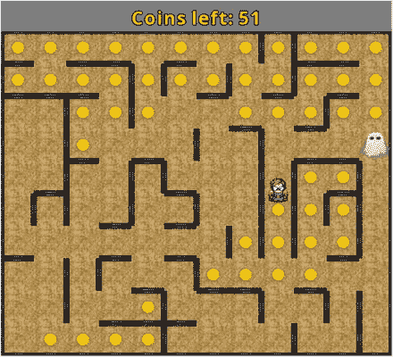
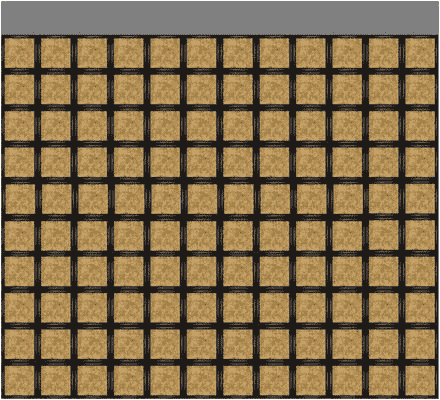
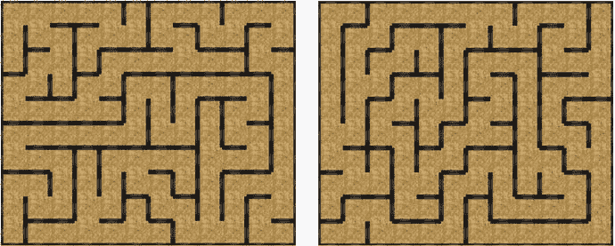
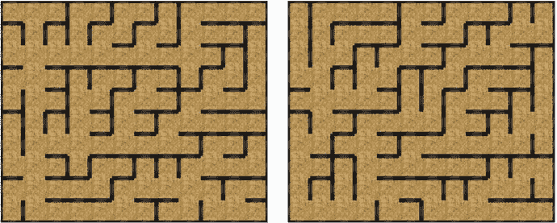
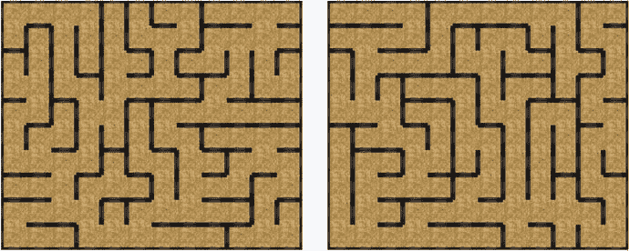
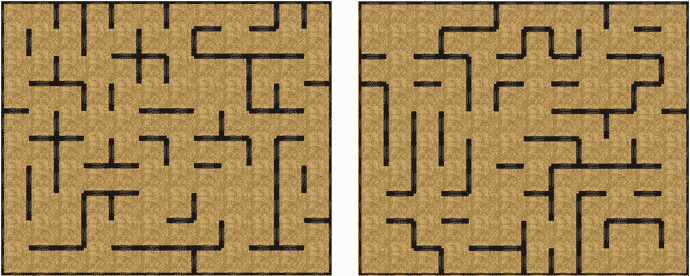
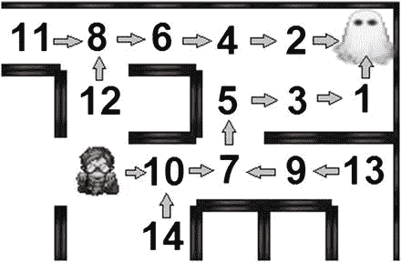
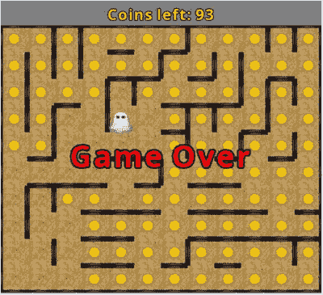

# 14. 迷宫游戏

在本章中，你将学习如何创建基于迷宫的 Maze Runman 游戏，如图 14-1 所示，其灵感来源于诸如《吃豆人》等街机游戏以及 Atari 2600 主机游戏《迷宫狂热：警察与强盗》。本章的主要新概念是用于生成和解决迷宫的算法。



图 14-1.

Maze Runman 游戏


## 游戏项目：迷宫跑者

迷宫跑者是一款动作游戏，主角（称为英雄）在迷宫中竞速，试图在被幽灵抓住前收集所有金币。幽灵的速度比英雄稍慢，但始终沿着最短路径追击玩家，即使这意味着当英雄在迷宫中移动时，幽灵需要突然改变方向。每次玩家开始游戏时，都会生成一个新的迷宫，有些迷宫布局可能比其他布局更难：可能存在英雄需要穿行的长死胡同。应对这种情况的一种策略是，让英雄将幽灵引到迷宫的另一端，为自己争取足够的时间进出走廊，以免被幽灵困住或逼入死角。如果幽灵与英雄接触，玩家立即失败；但如果英雄收集了所有金币，幽灵就会消失，玩家获胜。

游戏采用俯视视角，玩家使用方向键控制英雄向北、南、东、西移动。通过同时按住多个方向键，英雄可以斜向移动，这可能会根据迷宫布局提供一些微小的优势。用户界面包括屏幕顶部（迷宫区域上方）的一个标签，显示剩余金币数量，以及游戏结束时屏幕中央出现的大段文字信息，显示玩家获胜或失败的结果。

游戏世界使用简单的图形，英雄有四方向行走动画（类似于第 12 章《寻宝任务》游戏中使用的动画），幽灵则使用半透明动画。收集金币时会播放音效。此外，背景中会播放安静的环境风声，随着幽灵接近英雄，风声会逐渐变大。

开始此项目需要与之前项目类似的步骤。在 BlueJ 中，创建一个名为 `Maze Runman` 的新项目。在项目文件夹中，创建一个 `assets` 文件夹和一个包含 LibGDX JAR 文件的 `+libs` 文件夹（如果你已经设置了 `userlib` 目录，则后者不是必需的）。添加你在本书第一部分创建的自定义框架文件（`BaseGame.java`、`BaseScreen.java`、`BaseActor.java`）。此外，你应该下载本章的源文件，并将下载的 `assets` 文件夹中的内容复制到项目的 `assets` 文件夹中。

## 迷宫生成

本项目首要且最重要的任务是创建英雄和幽灵将要穿行的迷宫。虽然理论上你可以使用 Tiled 地图编辑器等关卡设计软件来创建迷宫，但在本章中，你将编写一个算法，每次玩家开始游戏时都会生成一个新的迷宫。这种方法的一个好处是大大增加了游戏的重玩价值；每次新的游戏会话都将是一次全新的体验。此类技术属于程序化内容生成的范畴：即使用算法创建结构化的游戏内容。它还可以包含诸如从代码创建整个纹理（而不是从图像文件加载）等技术，但通常不包括随机初始化游戏角色参数（如敌人大小或速度）或对游戏玩法没有影响的背景场景元素等技术。

你将用于迷宫生成的总体流程如下：首先，创建一个由房间组成的矩形网格（每个房间大小为 64x64 像素），并在每条边上放置墙壁。其次，以创建迷宫的方式移除房间之间的墙壁：从迷宫中的任意房间出发，玩家应该能够找到一条路径到达任何其他房间。第三，随机移除一些额外的墙壁，以在房间之间创建多条路径。

要实现此过程的第一步，你将创建一个 `Wall` 类，然后创建一个 `Room` 类（该类将包含四个 `Wall` 对象，并存储对相邻 `Room` 对象的引用），最后创建一个 `Maze` 类，该类将创建房间网格。为了进行测试，你将创建一个扩展 `BaseScreen` 的 `LevelScreen` 类、一个扩展 `BaseGame` 的 `MazeGame` 类，以及一个用于运行游戏的 `Launcher` 类。

首先，使用以下代码创建一个名为 `Wall` 的新类。请注意，构造函数还接受墙壁的宽度和高度作为参数；这将非常有用，因为在每个房间中，北墙和南墙的宽度更大，而东墙和西墙的高度更大。

```
import com.badlogic.gdx.scenes.scene2d.Stage;
public class Wall extends BaseActor
{
public Wall(float x, float y, float w, float h, Stage s)
{
super(x,y,s);
loadTexture("assets/square.jpg");
setSize(w,h);
setBoundaryRectangle();
}
}
```

接下来，按如下方式创建一个名为 `Room` 的类。请注意，其中有用于存储墙壁和相邻房间（称为邻居）引用的数组，以及一组命名常量，以便更轻松地识别每个数组索引代表的方向。此外，还有用于访问和修改这些数组中数据的方法。


```
import com.badlogic.gdx.scenes.scene2d.Stage;
import java.util.ArrayList;
public class Room extends BaseActor
{
public static final int NORTH = 0;
public static final int SOUTH = 1;
public static final int EAST  = 2;
public static final int WEST  = 3;
public static int[] directionArray = {NORTH, SOUTH, EAST, WEST};
private Wall[] wallArray;
private Room[] neighborArray;
public Room(float x, float y, Stage s)
{
super(x,y,s);
loadTexture("assets/dirt.png");
float w = getWidth();
float h = getHeight();
// t = 墙壁厚度（像素）
float t = 6;
wallArray = new Wall[4];
wallArray[SOUTH] = new Wall(x,y, w,t, s);
wallArray[WEST]  = new Wall(x,y, t,h, s);
wallArray[NORTH] = new Wall(x,y+h-t, w,t, s);
wallArray[EAST]  = new Wall(x+w-t,y, t,h, s);
neighborArray = new Room[4];
// 该数组的内容将由 Maze 类初始化
}
public void setNeighbor(int direction, Room neighbor)
{  neighborArray[direction] = neighbor;  }
public boolean hasNeighbor(int direction)
{  return neighborArray[direction] != null;  }
public Room getNeighbor(int direction)
{  return neighborArray[direction];  }
// 检查该方向的墙壁是否仍然存在（尚未从舞台中移除）
public boolean hasWall(int direction)
{  return wallArray[direction].getStage() != null;  }
public void removeWalls(int direction)
{  removeWallsBetween(neighborArray[direction]);  }
public void removeWallsBetween(Room other)
{
if (other == neighborArray[NORTH])
{
this.wallArray[NORTH].remove();
other.wallArray[SOUTH].remove();
}
else if (other == neighborArray[SOUTH])
{
this.wallArray[SOUTH].remove();
other.wallArray[NORTH].remove();
}
else if (other == neighborArray[EAST])
{
this.wallArray[EAST].remove();
other.wallArray[WEST].remove();
}
else // (other == neighborArray[WEST])
{
this.wallArray[WEST].remove();
other.wallArray[EAST].remove();
}
}
}
```

接下来，你将创建一个用于构建迷宫的类，尽管此时它只会设置房间网格，并为每个房间的每个方向（如果存在相邻房间）设置邻居数据（网格边缘的房间只有三个邻居，而网格角落的房间只有两个邻居）。使用以下代码创建一个名为 `Maze` 的新类：

```
import com.badlogic.gdx.scenes.scene2d.Stage;
import java.util.ArrayList;
public class Maze
{
private Room[][] roomGrid;
// 迷宫尺寸常量
private final int roomCountX = 12;
private final int roomCountY = 10;
private final int roomWidth  = 64;
private final int roomHeight = 64;
public Maze(Stage s)
{
roomGrid = new Room[roomCountX][roomCountY];
for (int gridY = 0; gridY < roomCountY; gridY++)
{
for (int gridX = 0; gridX < roomCountX; gridX++)
{
Room room = new Room(gridX * roomWidth, gridY * roomHeight, s);
roomGrid[gridX][gridY] = room;
if (gridY > 0)
room.setNeighbor( Room.SOUTH, roomGrid[gridX][gridY-1] );
if (gridY < roomCountY - 1)
room.setNeighbor( Room.NORTH, roomGrid[gridX][gridY+1] );
if (gridX > 0)
room.setNeighbor( Room.WEST, roomGrid[gridX-1][gridY] );
if (gridX < roomCountX - 1)
room.setNeighbor( Room.EAST, roomGrid[gridX+1][gridY] );
}
}
}
public Room getRoom(int gridX, int gridY)
{  return roomGrid[gridX][gridY];  }
}
```

接下来，你将扩展 `BaseScreen` 类来设置显示游戏的屏幕。背景图像的大小由迷宫的大小决定，顶部还会预留一个区域用于显示剩余金币数量。由于每个房间是 64x64 像素，迷宫横向有 12 个房间、纵向有 10 个房间，因此区域大小为 768x640 像素；另外还会额外保留 60 像素的高度用于用户界面。此外，你还需要添加玩家重新开始游戏的功能（按 R 键），这在玩家想要生成新迷宫，或者游戏结束想要重试时会很有用。按如下方式创建一个名为 `LevelScreen` 的类：

```
import com.badlogic.gdx.graphics.Color;
import com.badlogic.gdx.Input.Keys;
public class LevelScreen extends BaseScreen
{
Maze maze;
public void initialize()
{
BaseActor background = new BaseActor(0,0,mainStage);
background.loadTexture("assets/white.png");
background.setColor(Color.GRAY);
background.setSize(768, 700);
maze = new Maze(mainStage);
}
public void update(float dt)
{    }
public boolean keyDown(int keyCode)
{
if ( keyCode == Keys.R )
BaseGame.setActiveScreen( new LevelScreen() );
return false;
}
}
```

接下来，你需要扩展 `BaseGame` 类来加载这个屏幕。按如下方式创建一个名为 `MazeGame` 的新类：

```
public class MazeGame extends BaseGame
{
public void create()
{
super.create();
setActiveScreen( new LevelScreen() );
}
}
```

最后，要运行游戏，你需要一个启动器风格的类。回顾 `LevelScreen` 类中背景对象的大小，使用以下代码创建一个名为 `Launcher` 的新类：

```
import com.badlogic.gdx.Game;
import com.badlogic.gdx.backends.lwjgl.LwjglApplication;
public class Launcher
{
public static void main (String[] args)
{
Game myGame = new MazeGame();
LwjglApplication launcher = new LwjglApplication( myGame, "Maze Runman", 768, 700 );
}
}
```

至此，你的项目已经可以测试了。运行 `Launcher` 类中的 `main` 函数，你应该会看到如图 14-2 所示的屏幕。



图 14-2.

初始化带有墙壁的房间网格

第二步是移除一系列墙壁，以便你可以从任意房间到达其他任意房间。一种可用的算法称为深度优先搜索。在该算法中，选择一个房间作为起始位置，当某个房间存在从起始位置到该房间的路径时，则称该房间为已连接。该算法还会维护一个已连接房间的列表，这些房间拥有尚未连接的邻居房间。该算法的伪代码如下：

*   选择一个房间作为起始位置；将其标记为已连接并添加到列表中。
*   当列表中仍有房间时：
    *   将 `currentRoom` 设为列表中最晚添加的房间。
    *   如果 `currentRoom` 有任何未连接的邻居，
        *   将 `nextRoom` 设为 `currentRoom` 的一个随机未连接邻居；
        *   移除 `currentRoom` 和 `nextRoom` 之间的墙壁；
        *   将 `nextRoom` 标记为已连接；并且
        *   将 `nextRoom` 添加到列表末尾。
*   如果 `currentRoom` 没有任何未连接的邻居，则将其从列表中移除。

当该算法完成时，不再有已连接且拥有未连接邻居的房间；所有房间都已连接！该算法生成的迷宫如图 14-3 所示。



图 14-3.

使用深度优先算法生成的示例迷宫

顾名思义，深度优先算法会创建在网格中随机移动的路径，尽可能长（或深）地延伸，直到路径到达死胡同（一个没有相邻未连接房间的房间）。此时，将生成另一条路径，从列表中最晚添加的房间分支出去。从图 14-3 的示例迷宫可以看出，这通常会生成只包含少数几条非常长且分支点很少的路径的迷宫。为了创建更多的分支点，你可以将 `while` 循环中的第一行改为 `将 currentRoom 设为列表中的一个随机房间`。这将产生相反的效果：迷宫将不再只有少数几条长路径，而是会产生大量短路径和许多死胡同；图 14-4 展示了一些示例。



图 14-4.


通过始终随机选择房间来生成分支路径的示例迷宫

本章将采用的方法是这两种方法的混合：以 0.50 的概率，算法会返回列表中一个较早的随机房间。这种方法生成的迷宫走廊长度适中，且分支路径比深度优先算法更多。图 14-5 展示了使用该技术生成的一些示例迷宫。



图 14-5.

使用混合方法生成的示例迷宫

为实现该算法，在`Room`类中添加以下变量声明：

```
private boolean connected;
```

在构造函数中，将该变量初始化为 false：

```
connected = false;
```

然后，添加以下方法，用于设置和检查`connected`的值、判断是否有相邻房间已连接，并随机选择一个未连接的相邻房间：

```
public void setConnected(boolean b)
{  connected = b;  }
public boolean isConnected()
{  return connected;  }
public boolean hasUnconnectedNeighbor()
{
for (int direction : directionArray)
{
if ( hasNeighbor(direction) && !getNeighbor(direction).isConnected() )
return true;
}
return false;
}
public Room getRandomUnconnectedNeighbor()
{
ArrayList directionList = new ArrayList();
for (int direction : directionArray)
{
if ( hasNeighbor(direction) && !getNeighbor(direction).isConnected() )
directionList.add(direction);
}
int directionIndex = (int)Math.floor( Math.random() * directionList.size() );
int direction = directionList.get(directionIndex);
return getNeighbor(direction);
}
```

接下来，在创建迷宫时将使用这些方法。在`Maze`类的构造函数中，在设置每个房间相邻数据的代码之后，添加以下内容：

```
ArrayList activeRoomList = new ArrayList();
Room currentRoom = roomGrid[0][0];
currentRoom.setConnected(true);
activeRoomList.add(0, currentRoom);
// 返回随机已连接房间的概率
// 以从该房间创建分支路径
float branchProbability = 0.5f;
while (activeRoomList.size() > 0)
{
if (Math.random() < branchProbability)
{
// 获取随机先前访问过的房间
int roomIndex = (int)(Math.random() * activeRoomList.size());
currentRoom = activeRoomList.get(roomIndex);
}
else
{
// 获取最近访问过的房间
currentRoom = activeRoomList.get(activeRoomList.size() - 1);
}
if ( currentRoom.hasUnconnectedNeighbor() )
{
Room nextRoom = currentRoom.getRandomUnconnectedNeighbor();
currentRoom.removeWallsBetween(nextRoom);
nextRoom.setConnected( true );
activeRoomList.add(0, nextRoom);
}
else
{
// 该房间没有更多相邻的未连接房间
// 因此无需将其保留在列表中
activeRoomList.remove( currentRoom );
}
}
```

对迷宫生成算法的最后一项改进是移除随机数量的墙壁。这对于创建循环路径至关重要，这将为玩家提供多种选择，让英雄在迷宫中灵活移动，并避开不断逼近的幽灵。结果将类似于图 14-6 中所示的迷宫。



图 14-6.

随机移除额外墙壁后生成的迷宫，在不同位置之间创建了多条路径

为实现此目标，在`Maze`类的`constructor`方法末尾添加以下代码。`wallsToRemove`的值可根据需要调整。

```
int wallsToRemove = 24;
while (wallsToRemove > 0)
{
int gridX = (int)Math.floor( Math.random() * roomCountX );
int gridY = (int)Math.floor( Math.random() * roomCountY );
int direction = (int)Math.floor( Math.random() * 4 );
Room room = roomGrid[gridX][gridY];
if ( room.hasNeighbor(direction) && room.hasWall(direction) )
{
room.removeWalls(direction);
wallsToRemove--;
}
}
```

至此，迷宫生成已完成，接下来可以添加英雄：由玩家控制的角色。

## 英雄

接下来为 Maze Runman 游戏添加英雄角色，他将负责在迷宫中导航。该角色将包含四个基本方向（北、南、东、西）的行走动画，如图 14-7 所示的精灵表。¹


图 14-7.

用于四方向英雄动画的精灵表

设置动画的代码以及根据运动角度确定使用哪个动画的逻辑，与第 12 章 Treasure Quest 游戏中的代码完全相同。有关更多详细信息，可查阅相应章节的说明。按如下方式创建一个名为`Hero`的新类：

```
import com.badlogic.gdx.scenes.scene2d.Stage;
import com.badlogic.gdx.Gdx;
import com.badlogic.gdx.Input.Keys;
import com.badlogic.gdx.graphics.Texture;
import com.badlogic.gdx.graphics.g2d.TextureRegion;
import com.badlogic.gdx.graphics.g2d.Animation;
import com.badlogic.gdx.utils.Array;
public class Hero extends BaseActor
{
Animation north;
Animation south;
Animation east;
Animation west;
public Hero(float x, float y, Stage s)
{
super(x,y,s);
String fileName = "assets/hero.png";
int rows = 4;
int cols = 3;
Texture texture = new Texture(Gdx.files.internal(fileName), true);
int frameWidth = texture.getWidth() / cols;
int frameHeight = texture.getHeight() / rows;
float frameDuration = 0.2f;
TextureRegion[][] temp = TextureRegion.split(texture, frameWidth, frameHeight);
Array textureArray = new Array();
for (int c = 0; c = 45 && angle  135 && angle = 225 && angle <= 315)
setAnimation(south);
else
setAnimation(east);
}
applyPhysics(dt);
}
}
```

然后，要将英雄整合到游戏中，在`LevelScreen`类中添加以下变量声明：

```
Hero hero;
```

要在迷宫左下角设置并放置英雄，请在`initialize`方法中添加以下内容：

```
hero = new Hero(0,0,mainStage);
hero.centerAtActor( maze.getRoom(0,0) );
```

最后，要添加英雄与墙壁之间的碰撞检测，请在`update`方法中添加以下内容：

```
for (BaseActor wall : BaseActor.getList(mainStage, "Wall"))
{
hero.preventOverlap(wall);
}
```

至此，你可以测试程序，并按方向键让英雄在迷宫中移动。


## 幽灵

接下来，你将创建一个幽灵角色，它会在迷宫中追逐英雄。用于确定幽灵行进路径的算法，其关键特征是：该路径是幽灵所在房间（称为 `startRoom`）与英雄所在房间（称为 `targetRoom`）之间的最短路径。在此算法中，房间被访问的顺序非常重要：距离 `startRoom` 较近的房间应优先于距离较远的房间被考虑。所有距离 `startRoom` 一格远的房间会首先被检查，接着是距离两格远的房间，然后是三格远的，以此类推。按此顺序考虑房间的算法称为**广度优先搜索算法**，这与最初生成迷宫时使用的深度优先算法形成对比。在搜索路径时，还有两个实际注意事项需要考虑。首先，由于迷宫中存在循环路径，你需要跟踪哪些房间已被算法考虑过，以避免重复考虑它们。这将通过一个名为 `visited` 的布尔变量来跟踪。其次，在搜索路径时，你需要跟踪房间被考虑的序列：每个距离 `startRoom` 为 n+1 格的房间，都是在考虑了某个距离 `startRoom` 为 n 格的房间后到达的。此信息将存储在一个名为 `previousRoom` 的 `Room` 变量中。该算法的伪代码如下：

*   确定 `startRoom` 和 `targetRoom`。
*   将 `currentRoom` 设置为 `startRoom`。
*   将 `currentRoom` 标记为已访问，将其前一个房间设置为 `null`，并将 `currentRoom` 添加到一个列表中。
*   当列表不为空时，执行以下操作：
    *   将 `currentRoom` 设置为列表中的第一个元素，并将其从列表中移除。
    *   对于 `currentRoom` 的每个未访问的邻居（称为 `nextRoom`），
        *   将 `nextRoom` 的前一个房间设置为 `currentRoom`；
        *   如果 `nextRoom` 是 `targetRoom`，则结束`算法`；`并且`
        *   如果 `nextRoom` 不是 `targetRoom`，则将 `nextRoom` 标记为已访问，并将 `nextRoom` 添加到列表末尾。

一旦此算法完成，可以按如下方式检索路径：将 `currentRoom` 设置为 `targetRoom`，并将其添加到一个新的房间列表中。然后，将 `currentRoom` 设置为其前一个房间，并将其添加到列表的前面。重复此过程，直到 `currentRoom` 没有前一个房间（`previousRoom` 为 `null`；这仅对 `startRoom` 成立）。此时，该列表包含一系列房间，这些房间构成了从 `startRoom` 到 `targetRoom` 的最短路径。

该算法的一个实际示例如图 14-8 所示。右上角的房间（由幽灵占据）是 `startRoom`，靠近左下角的房间（由英雄占据）是 `targetRoom`。房间用数字标记，表示算法访问它们的顺序，并用箭头指示每个房间的前一个房间。在图中，房间 1 和 2 距离幽灵一格远，房间 3 和 4 距离两格远，5 和 6 距离三格远，7 和 8 距离四格远，9、10、11 和 12 距离五格远，13、14 和 `targetRoom` 距离六格远。一旦找到目标房间，沿着前一个房间的序列即可得到路径，该路径由 `startRoom`、1、3、5、7、10、`targetRoom` 组成——这是通往英雄的最短路径之一。



图 14-8.

为找到从幽灵到英雄的最短路径而访问房间的顺序

为了实现此算法，每个房间需要跟踪它在算法中是否已被访问，以及之前访问的房间是哪个。为此，在 `Room` 类中添加以下变量：

```
private boolean visited;
private Room previousRoom;
```

在`构造函数`方法中将 `visited` 初始化为 false：

```
visited = false;
```

接下来，你需要一些方法来获取和设置这些新变量，以及检索一个房间所有尚未被访问的相邻邻居。这可以通过以下代码实现，这些代码也应添加到 `Room` 类中：

```
public void setVisited(boolean b)
{  visited = b;  }
public boolean isVisited()
{  return visited;  }
public void setPreviousRoom(Room r)
{  previousRoom = r;  }
public Room getPreviousRoom()
{  return previousRoom;  }
// 用于路径查找：定位尚未被访问的可达邻居
public ArrayList unvisitedPathList()
{
ArrayList list = new ArrayList();
for (int direction : directionArray)
{
if ( hasNeighbor(direction) && !hasWall(direction) &&
!getNeighbor(direction).isVisited() )
list.add( getNeighbor(direction) );
}
return list;
}
```

拥有一个能够识别幽灵和英雄所在房间，并重置每个房间的 `visited` 和 `previousRoom` 变量的方法会很有帮助，这在搜索新路径之前是必需的。在 `Maze` 类中，添加以下方法来执行这些任务：

```
public Room getRoom(BaseActor actor)
{
int gridX = (int)Math.round(actor.getX() / roomWidth);
int gridY = (int)Math.round(actor.getY() / roomHeight);
return getRoom(gridX, gridY);
}
public void resetRooms()
{
for (int gridY = 0; gridY < roomCountY; gridY++)
{
for (int gridX = 0; gridX < roomCountX; gridX++)
{
roomGrid[gridX][gridY].setVisited( false );
roomGrid[gridX][gridY].setPreviousRoom( null );
}
}
}
```

接下来，你将创建 `Ghost` 类，其中包含一个名为 `findPath` 的方法，该方法实现了前面描述的广度优先搜索算法。该方法会向角色添加一系列动作，使其沿着路径的前几个房间移动。幽灵不会一直沿着路径走到终点，因为到那时英雄可能已经移动到了不同的位置。相反，每次幽灵完成其当前的一组移动动作后，到英雄的路径会被重新计算，并沿着这条新路径向幽灵添加一组新的移动动作。创建一个名为 `Ghost` 的新类，代码如下：

```
import com.badlogic.gdx.scenes.scene2d.Stage;
import com.badlogic.gdx.scenes.scene2d.Action;
import com.badlogic.gdx.scenes.scene2d.actions.Actions;
import java.util.ArrayList;
public class Ghost extends BaseActor
{
public float speed = 60; // 像素每秒
public Ghost(float x, float y, Stage s)
{
super(x,y,s);
loadAnimationFromSheet("assets/ghost.png", 1,3, 0.2f, true);
setOpacity(0.8f);
}
public void findPath(Room startRoom, Room targetRoom)
{
Room currentRoom = startRoom;
ArrayList roomList = new ArrayList();
currentRoom.setPreviousRoom( null );
currentRoom.setVisited( true );
roomList.add(currentRoom);
while (roomList.size() > 0)
{
currentRoom = roomList.remove(0);
for (Room nextRoom : currentRoom.unvisitedPathList())
{
nextRoom.setPreviousRoom( currentRoom );
if (nextRoom == targetRoom)
{
// 找到目标！
roomList.clear();
break;
}
else
{
nextRoom.setVisited( true );
roomList.add(nextRoom);
}
}
}
// 创建对应最短路径的房间列表
ArrayList pathRoomList = new ArrayList();
currentRoom = targetRoom;
while (currentRoom != null)
{
// 将当前房间添加到列表开头
pathRoomList.add( 0, currentRoom );
currentRoom = currentRoom.getPreviousRoom();
}
// 仅沿路径移动几步；
//   当这些动作完成时，路径将被重新计算。
int maxStepCount = 2;
// 要消除步骤之间的停顿，请将循环索引从 1 开始
//   但相应地降低幽灵速度以作补偿
for (int i = 0; i < pathRoomList.size(); i++)
{
if (i == maxStepCount)
break;
Room nextRoom = pathRoomList.get(i);
Action move = Actions.moveTo( nextRoom.getX(), nextRoom.getY(), 64/speed );
addAction( move );
}
}
}
```


要将幽灵整合到游戏中，请在 `LevelScreen` 类中添加以下变量声明：

```
Ghost ghost;
```

通过将以下代码添加到 `initialize` 方法中进行设置：

```
ghost = new Ghost(0,0,mainStage);
ghost.centerAtActor( maze.getRoom(11,9) );
```

在 `update` 方法中，检查幽灵是否已完成移动（当幽灵不再包含任何动作时），此时使用以下代码激活其 `findPath` 方法：

```
if (ghost.getActions().size == 0)
{
maze.resetRooms();
ghost.findPath( maze.getRoom(ghost), maze.getRoom(hero) );
}
```

此时，你可以再次测试项目，观察幽灵在迷宫中移动，并始终向英雄靠近。

## 游戏胜负判定

现在迷宫已经搭建完成，同时有了玩家控制的角色和智能编程的对手，是时候为玩家添加目标以及胜负条件了。如本章开头所述，迷宫中会有供英雄收集的金币。如果英雄收集了所有金币，玩家获胜；但如果幽灵先追上英雄，玩家则失败。第一步是创建金币。使用以下代码创建一个名为 `Coin` 的新类：

```
import com.badlogic.gdx.scenes.scene2d.Stage;
public class Coin extends BaseActor
{
public Coin(float x, float y, Stage s)
{
super(x,y,s);
loadTexture("assets/coin.png");
setBoundaryPolygon(6);
}
}
```

接下来，你需要在关卡中添加金币，在每个房间的中心放置一枚。同时，你将设置一个标签来显示剩余金币数量，并顺便添加一个标签用于在游戏结束时显示消息。标签的位置如图 14-9 所示，该图展示了玩家失败时的屏幕画面。



图 14-9.

英雄被幽灵抓住后的迷宫奔跑者游戏

要实现这些添加内容，首先在 `LevelScreen` 类中添加以下 `import` 语句：

```
import com.badlogic.gdx.scenes.scene2d.ui.Label;
import com.badlogic.gdx.graphics.Color;
import com.badlogic.gdx.scenes.scene2d.Action;
import com.badlogic.gdx.scenes.scene2d.actions.Actions;
```

接下来，添加以下变量声明：

```
Label coinsLabel;
Label messageLabel;
```

在 `initialize` 方法中，你将在每个 `Room` 对象的中心创建一个 `Coin` 对象，设置标签，并通过添加以下代码将它们排列在用户界面表格中。注意使用了 `toFront` 方法，以确保幽灵渲染在金币之上，而不是之下。

```
for (BaseActor room : BaseActor.getList(mainStage, "Room"))
{
Coin coin = new Coin(0,0,mainStage);
coin.centerAtActor(room);
}
ghost.toFront();
coinsLabel = new Label("Coins left:", BaseGame.labelStyle);
coinsLabel.setColor( Color.GOLD );
messageLabel = new Label("...", BaseGame.labelStyle);
messageLabel.setFontScale(2);
messageLabel.setVisible(false);
uiTable.pad(10);
uiTable.add(coinsLabel);
uiTable.row();
uiTable.add(messageLabel).expandY();
```

接下来，在 `update` 方法中，你需要检查英雄是否与任何金币重叠，并更新显示剩余金币数量的标签。如果幽灵与英雄重叠，则玩家失败；如果没有剩余金币，则玩家获胜。无论哪种情况，都会显示相应的消息。在失败的情况下，英雄将从舞台中移除。在获胜的情况下，幽灵将从舞台中移除，并为其添加一个无限重复的延迟动作，这样它的 `findPath` 方法就不会被调用。

```
for (BaseActor coin : BaseActor.getList(mainStage, "Coin"))
{
if (hero.overlaps(coin))
{
coin.remove();
}
}
int coins = BaseActor.count(mainStage, "Coin");
coinsLabel.setText("Coins left: " + coins);
if (coins == 0)
{
ghost.remove();
ghost.setPosition(-1000, -1000);
ghost.clearActions();
ghost.addAction( Actions.forever( Actions.delay(1) ) );
messageLabel.setText("You win!");
messageLabel.setColor(Color.GREEN);
messageLabel.setVisible(true);
}
if (hero.overlaps(ghost))
{
hero.remove();
hero.setPosition(-1000, -1000);
ghost.clearActions();
ghost.addAction( Actions.forever( Actions.delay(1) ) );
messageLabel.setText("Game Over");
messageLabel.setColor(Color.RED);
messageLabel.setVisible(true);
}
```

至此，你已经完成了所有游戏机制的实现。测试游戏，看看你是否能获胜。你可能会发现，为了调整游戏难度，需要调整幽灵的速度，或者改变迷宫生成时移除的额外墙壁数量。

## 音频

在本节中，你将通过添加音效来为游戏增添一些润色。第一个效果是每次收集金币时播放的清脆叮当声。不使用背景音乐，而是播放一阵呼啸的风声作为环境音，并且当幽灵接近英雄时，音量会逐渐增大，以微妙地营造紧张感。首先，在 `LevelScreen` 类中添加以下 `import` 语句。（导入的数学相关类将用于计算幽灵到英雄的距离。）

```
import com.badlogic.gdx.Gdx;
import com.badlogic.gdx.audio.Sound;
import com.badlogic.gdx.audio.Music;
import com.badlogic.gdx.math.MathUtils;
import com.badlogic.gdx.math.Vector2;
```

接下来，添加以下变量：

```
Sound coinSound;
Music windMusic;
```

在 `initialize` 方法中，按如下方式加载并启动音频：

```
coinSound  = Gdx.audio.newSound(Gdx.files.internal("assets/coin.wav"));
windMusic = Gdx.audio.newMusic(Gdx.files.internal("assets/wind.mp3"));
windMusic.setLooping(true);
windMusic.setVolume(0.1f);
windMusic.play();
```

在 `update` 方法中，找到英雄与金币重叠对应的代码块，并在金币被移除后直接添加以下行：

```
coinSound.play(0.10f);
```

同样在 `update` 方法中，你将调整风声的音量。为了计算幽灵到英雄的距离，你需要计算从幽灵坐标到英雄坐标的 `Vector2` 对象的长度。当这个距离为 64 像素时（这是幽灵在不与英雄重叠的情况下能接近的最短距离），音量应等于 1。当距离为 300 像素时，音量应等于 0。通过一些代数运算，你可以根据这些值计算出一个将距离转换为音量的线性方程，如下面的代码所示。不过，你还需要将音量限制在 0.10 到 1 之间，这样声音始终能听到一些，并且永远不会超过最大值 1。最后，音频只应在游戏进行时调整，这由消息标签不可见来表示。为了实现这些任务，请添加以下代码：

```
if ( !messageLabel.isVisible() )
{
float distance = new Vector2(hero.getX() - ghost.getX(), hero.getY() - ghost.getY()).len();
float volume = -(distance - 64)/(300 - 64) + 1;
volume = MathUtils.clamp(volume, 0.10f, 1.00f);
windMusic.setVolume(volume);
}
```

添加完这些内容后，你可以再次测试项目，验证音频是否按预期播放。恭喜你完成了这个项目！


## 总结与下一步

在本章中，你开发了一款基于迷宫的《迷宫跑男》游戏，主角需要收集所有金币并躲避幽灵。你学会了如何使用深度优先算法生成迷宫，以及如何使用广度优先算法搜索迷宫中两点之间的最短路径。你再次创建了一个拥有四个方向行走动画的主角。此外，你还添加了特殊的音效，当幽灵接近主角时，音量会逐渐增大。

除了常规建议（添加标题画面、说明画面以及视觉和音效特效）之外，你还可以对这个项目进行许多改进和扩展。你可以设计更大的迷宫，使其无法完全显示在屏幕上，从而增加挑战性。你可以添加更多幽灵来追逐主角，或者让幽灵随时间推移加快速度（不过幽灵的速度绝不能超过主角的速度）。为了平衡这些额外的挑战，你或许可以引入生命值或额外生命，让玩家能够承受多次攻击。你还可以在用户界面中显示计时器，这样玩家就可以将“在最短时间内收集所有金币”作为次要目标；这为玩家衡量自身技巧和比较表现提供了更精确的方式。

在下一章中，你将把关注点从用于内容生成的高级算法，转向高级 2D 图形。具体来说，你将添加粒子效果、图像着色器和滤镜，以改善之前某些游戏项目的视觉效果。

脚注 1

精灵表角色由 Andrew Viola 创建，经许可使用。

