# 15. 高级 2D 图形

在本章中，你将学习两种将复杂图形融入项目中的技术，而不是创建新游戏。第一部分将介绍粒子系统，它可以创建爆炸等特效，并将被整合到《太空岩石》游戏中，取代基于精灵表的动画。第二部分将介绍着色器程序，它通过操作渲染图像的像素来创建模糊或发光等效果，并将被整合到《海星收集者》游戏中。

## 粒子系统

粒子系统是由许多小图像组成的集合，可用于创建多种图形特效。该技术可以模拟的效果包括火焰、烟雾、爆炸、烟花、电火花、喷泉、雨、雪和星空。粒子系统中的每个小图像都称为一个**粒子**。每个粒子都有许多属性（如速度、大小、颜色和透明度），这些属性可以初始化为给定范围内的随机值，并且这些属性值可以配置为随时间变化。粒子由一个称为**发射器**的对象以设定的速率产生，发射器可以配置为在有限时间内或持续生成粒子，具体取决于要创建的视觉效果。

LibGDX 提供了支持粒子系统显示的类。此外，LibGDX 自带的粒子编辑器工具可用于设计和预览粒子效果，然后将其导出为可在 LibGDX 框架内轻松导入的文件格式。

### LibGDX 粒子编辑器

根据 LibGDX 维基百科的说明，可以直接从源代码运行 LibGDX 粒子编辑器。¹ 不过，为简单起见，你可以使用可执行的 JAR 文件 `ParticleEditor.jar`，该文件位于本章源代码目录的 `Particle Editor` 文件夹中。图 15-1 显示了该程序首次启动时的界面。

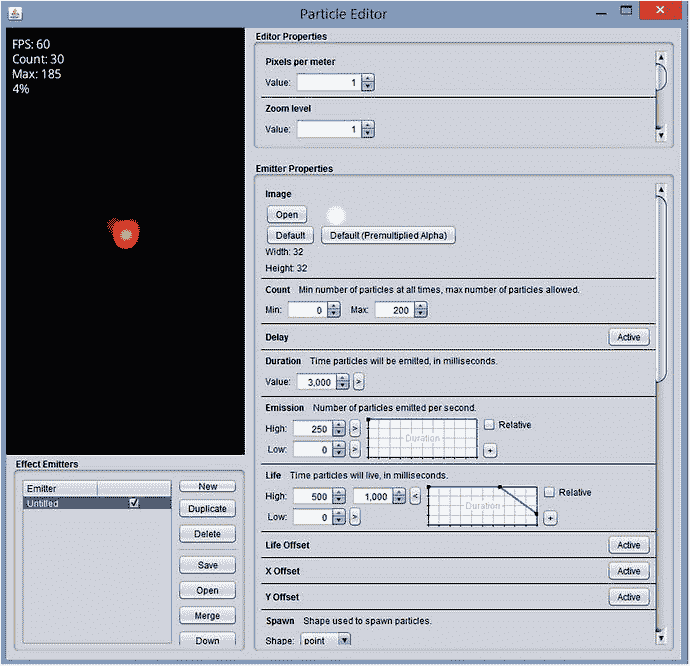

图 15-1.

启动时的 LibGDX 粒子编辑器程序

粒子编辑器窗口左上角面板的预览区域中显示了一个火焰效果。产生该效果的参数显示在占据窗口右侧大部分区域的“发射器属性”面板中。该面板包含众多属性，每个属性都有对应的值和图表，一开始可能会让人有些不知所措。本节将仅讨论对最终视觉效果影响最大的发射器属性；如需更全面的介绍，请查阅 LibGDX 维基百科（前文已提及）以获取详细信息。

*   **图像**：在此区域，你可以选择每个粒子使用的图像。粒子通常会被着色；灰度图像最适合此用途。
*   **数量**：此区域可用于设置屏幕上任意时刻应出现的最小和最大粒子数。
*   **持续时间**：这是发射器产生粒子的时长。（创建连续效果时，此值将被忽略。）
*   **发射率**：这是每秒发射的粒子数。
*   **寿命**：这是每个粒子在粒子系统中保持活跃的时间。
*   **大小**：这是图像的尺寸，以像素为单位。
*   **速度**：这是粒子的速度，以像素/秒为单位。
*   **角度**：这是粒子的方向，以度为单位。
*   **色调**：显示用于为粒子图像着色的颜色。
*   **透明度**：控制粒子随时间变化的透明度。
*   **叠加**：激活时，通过将颜色分量相加来混合颜色，导致存在大量粒子的区域更亮。
*   **连续**：激活时，会导致发射器持续发射粒子（忽略前面的“持续时间”值）。

在某些参数旁边，你会看到文本框和一个图表，如图 15-2 所示，可用于微调初始值以及值随时间的变化。（对于某些参数，你需要单击参数名称右侧的“激活”按钮才能使这些元素出现。）

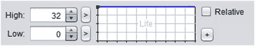

图 15-2.

用于微调参数值的粒子编辑器界面

标记为“高”和“低”的框中的数值，指的是右侧图表顶部和底部边缘的值。图表上的蓝线表示参数值在粒子生命周期内将如何变化。在图 15-2 所示的图表中，深蓝色线在顶部保持平直，表示参数值将保持在“高”值不变。图 15-3 展示了另外两种可能的图表；左侧的图表表示从“高”值持续下降到“低”值，而右侧的图表表示参数在粒子生命周期的大部分时间内保持在“高”值，然后突然下降到“低”值。在本节后面，这两个图表将分别被称为“逐渐下降”和“突然下降”图表。

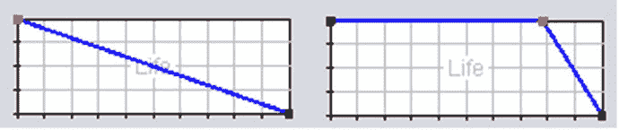

图 15-3.

参数变化图表的变体

要修改这些图表之一，你可以单击任意位置添加一个点，单击并拖动来移动点，然后双击一个点将其删除。


此外，在“高值”和“低值”旁边，有标有 `>` 或 `<` 的小按钮；它们可用于切换对应行中显示一个或两个值。当显示两个值时，它们代表一个数值范围，每个粒子的“高值”或“低值”将从中随机选取。正如你稍后将看到的，这可以产生极佳的效果。

最后，了解如何设置“色调”属性的参数非常有用。如果需要，粒子的颜色可以随时间变化；颜色的变化过程在最顶部的矩形中从左到右显示。例如，图 15-4 表示一个粒子，其颜色将从红色开始，过渡到蓝色，最后以绿色结束。与之前讨论的参数变化图一样，可以通过在矩形内点击来添加额外的点（由三角形表示）。点击三角形即可选中它们，其颜色可以通过下方的滑块进行调整，这些滑块控制颜色的色相、饱和度和亮度。三角形可以通过点击并拖动来移动，也可以通过双击来删除。

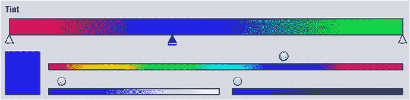

图 15-4.

色调参数图

掌握了粒子编辑器的用户界面知识后，你将通过示例来学习如何为《太空岩石》游戏中的效果创建基于粒子的版本。最重要的是，创建大量效果会让你最终体会到每个参数在塑造基于粒子的效果中所扮演的角色。

你需要一个位置来保存最终的效果文件，因此，现在请复制第 4 章中的 `Space Rocks` 项目，并将副本重命名为 `Space Rocks Particles`。你将把使用 LibGDX 粒子编辑器创建的效果文件存储在此目录的 `assets` 文件夹中。同时，下载本章的源文件，并从下载的 `Space Rocks Particles` 项目的 `assets` 文件夹中，将图像文件 `particle.png` 复制到你自己的 `Space Rocks Particles` 项目的 `assets` 文件夹中。

### 火箭推进器效果

你的第一个目标是创建一个火箭推进器效果，如图 15-5 所示。

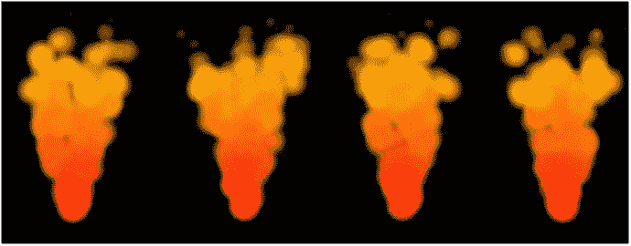

图 15-5.

火箭推进器粒子效果

启动粒子编辑器程序后，在左下角的“效果发射器”面板中，点击“新建”按钮，并将新创建的列表条目重命名为 `thruster`（双击其名称即可重命名）。点击名为 `Untitled` 的列表项（它对应默认的类似火焰的示例），然后点击“删除”按钮将其移除。

在“发射器属性”面板底部的一组选项中，取消选中“叠加”复选框，并选中“连续”复选框。现在你应该会在预览面板中央看到一个红色圆点。

首先，你将调整任意时刻活跃的粒子数量。将“计数”属性的“最大值”改为 100。要达到这个数量，你还必须将“发射”属性的“高值”改为 200。（将此值改为 100 是不够的，因为每个粒子只持续 0.5 秒，而 500 毫秒是“生命”属性的默认值。100 的发射速率在任何给定时刻只会产生 50 个活跃粒子。）

接下来，点击“速度”和“角度”属性旁边的“激活”按钮。对于“速度”，点击“高值”旁边的 `>` 按钮，并输入数值 300 和 400。对于“角度”，再次点击“高值”旁边的 `>` 按钮，并输入数值 70 和 110。现在你应该会看到红色粒子以摇摆的锥形图案向上喷射。

现在，修改“色调”参数图，使色调颜色从起始的红色变为中间的橙色，再到末尾的黄色。完成此步骤后，预览面板中的粒子在发射器底部应显示为红色，并逐渐变色，直到顶部变为黄色。

最后，粒子应在生命周期结束时缩小并淡出消失。为此，修改“大小”和“透明度”的参数变化图，使它们都类似于图 15-3 中的“突然减少”图。

完成此步骤后，点击“保存”按钮，将文件保存到你的项目 `assets` 目录中，文件名为 `thruster.pfx`。尽管粒子效果数据存储在文本文件中，但你会使用扩展名 `pfx` 作为助记符，以指示文件中的数据类型。此外，如果之前没有做过，你还需要将 `particle.png` 图像文件从 `Particle Editor` 目录复制到你本地项目的 `assets` 目录中，以便效果能在 LibGDX 中正确加载。


### 爆炸效果

接下来要创建的是一个经典效果——爆炸，如图 15-6 所示。该效果由两个发射器组成：一个控制初始出现的火焰，另一个控制随后产生的烟雾。

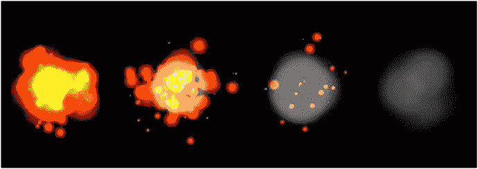

图 15-6.

爆炸粒子效果

重新启动粒子编辑器。像之前一样，创建一个新的发射器。将其命名为 `fire`，然后删除默认发射器。保留默认选项设置：勾选“Additive”复选框，不勾选“Continuous”复选框。

将 Count 属性的 Max 值调整为 100。将 Duration 值改为 250。为了达到最大粒子数量，将 Emission 属性的 High 值设为 400。将 Size 属性的 High 值范围设为 0 到 100，并修改其曲线图，使其类似于“逐渐减小”曲线。将 Velocity 属性设为 Active，将其 High 值范围设为 0 到 160，并修改其曲线图，使其类似于“突然减小”曲线。将 Angle 属性设为 Active，并将其 High 值范围设为 0 到 360。最后，设置 Tint 属性，使粒子颜色在其生命周期内从红色渐变为橙色。

此时，预览面板应反复显示以下效果：出现一个球状物，边缘为红色，中心为黄色，随后喷射出碎片，这些碎片在远离中心时逐渐缩小。

当您对这个效果满意后，创建另一个发射器并将其命名为 `smoke`。（不要删除 fire 发射器！）从列表中选择 smoke 发射器，然后点击“Up”按钮；这会将其在渲染顺序中上移。确保发射器旁边的复选框已勾选，以便其可见。这一点很重要，因为您希望烟雾粒子出现在火焰粒子之后，因此烟雾粒子必须首先渲染。在继续之前，请确保在发射器列表中，smoke 发射器既已勾选（可见）又处于高亮状态（以便接下来修改的是 smoke 发射器的参数）。

下一步是修改烟雾发射器的属性。将 Count Max 值设为 20，Duration 值设为 200，Emission High 值设为 100。将 Delay 属性设为 Active，并将其值设为 400；这将使烟雾发射器在火焰发射器启动 400 毫秒后开始工作。接下来，将 Size High 值改为 64。激活 Velocity 属性，将 High 值设为 100，并修改其曲线图，使其逐渐减小。同时，激活 Angle 属性，将 High 值范围设为 0 到 360。通过将左下角颜色滑块上的旋钮一直拖到右侧，然后将右下角颜色滑块上的旋钮拖到中间，将 Tint 颜色改为中灰色。修改 Transparency 曲线图，使其缓慢减小。最后，取消勾选“Additive”选项。

至此，爆炸效果就完成了！将文件保存到 `assets` 目录，文件名为 `explosion.pfx`。

### ParticleActor 类

现在，您可以将粒子效果集成到 Space Rocks 游戏中。首先，创建一个 `Actor` 类的扩展，命名为 `ParticleActor`。该类存储一个 `ParticleEffect` 对象，用于更新和绘制效果。该类中的大多数方法只是以更直观的名称激活相应 `ParticleEffect` 对象的方法。然而，`ParticleEffect` 类缺少的一个功能是，其 `draw` 方法并未设计为考虑旋转或缩放因子。为了解决这个问题，您将创建一个名为 `ParticleRenderer` 的内部类来渲染粒子效果，让 `ParticleActor` 类继承 `Group` 类而非 `Actor` 类，并将 `ParticleRenderer` 的实例添加到 `ParticleActor` 中。这样，调用 `ParticleActor` 的 `draw` 方法时，会在绘制前将几何变换数据应用于附加的对象，这正是期望的结果。

`ParticleEffect` 类的 `update` 和 `draw` 方法将通过所有 `Actor` 对象共有的标准 `act` 和 `draw` 方法来激活，并且为了方便，还将包含一个 `clone` 方法。打开 BlueJ，然后打开您之前创建的 `Space Rocks Particles` 项目。`ParticleActor` 类的代码如下：

```
import com.badlogic.gdx.Gdx;
import com.badlogic.gdx.scenes.scene2d.Actor;
import com.badlogic.gdx.scenes.scene2d.Group;
import com.badlogic.gdx.graphics.g2d.Batch;
import com.badlogic.gdx.graphics.g2d.ParticleEffect;
import com.badlogic.gdx.graphics.g2d.ParticleEmitter;
public class ParticleActor extends Group
{
private ParticleEffect   effect;
private ParticleRenderer renderingActor;
private class ParticleRenderer extends Actor
{
private ParticleEffect effect;
ParticleRenderer(ParticleEffect e)
{  effect = e;  }
public void draw(Batch batch, float parentAlpha)
{  effect.draw(batch);  }
}
public ParticleActor(String pfxFile, String imageDirectory)
{
super();
effect = new ParticleEffect();
effect.load(Gdx.files.internal(pfxFile), Gdx.files.internal(imageDirectory));
renderingActor = new ParticleRenderer(effect);
this.addActor( renderingActor );
}
public void start()
{  effect.start();  }
// 暂停连续发射器
public void stop()
{  effect.allowCompletion();  }
public boolean isRunning()
{  return !effect.isComplete();  }
public void centerAtActor(Actor other)
{
setPosition( other.getX() + other.getWidth()/2 , other.getY() + other.getHeight()/2 );
}
public void act(float dt)
{
super.act( dt );
effect.update( dt );
if ( effect.isComplete() && !effect.getEmitters().first().isContinuous() )
{
effect.dispose();
this.remove();
}
}
public void draw(Batch batch, float parentAlpha)
{
super.draw( batch, parentAlpha );
}
}
```

有了这个可用的类，您就可以将其与您刚刚生成的粒子效果一起，在 Space Rocks 游戏中使用。


### 将粒子效果融入游戏玩法

下一步是用相应的粒子效果替换爆炸效果和推进器火焰，如图 15-7 所示。

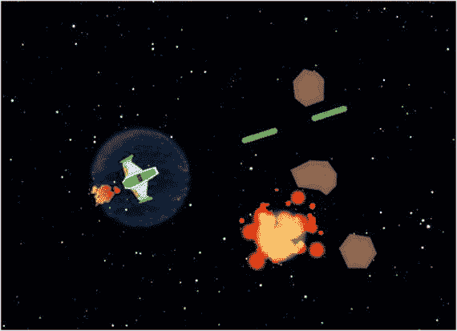

图 15-7.

添加了粒子效果的《太空岩石》游戏

首先，你将扩展 `ParticleActor` 类来创建这些效果。创建一个名为 `ExplosionEffect` 的新类，代码如下：

```
public class ExplosionEffect extends ParticleActor
{
public ExplosionEffect()
{
super("assets/explosion.pfx", "assets/");
}
}
```

爆炸效果应在三种情况下创建：激光与岩石碰撞时、岩石与护盾碰撞时、以及岩石与飞船碰撞时。首先，在 `LevelScreen` 类的 `update` 方法中，找到将飞船从游戏中移除的代码块，并将这两行代码

```
Explosion boom = new Explosion(0,0, mainStage);
boom.centerAtActor(spaceship);
```

替换为以下内容：

```
ExplosionEffect boom = new ExplosionEffect();
boom.centerAtActor( spaceship );
boom.start();
mainStage.addActor(boom);
```

接下来，找到将岩石从游戏中移除的两个代码块（与护盾或激光碰撞时），在这两处都将这两行代码

```
Explosion boom = new Explosion(0,0, mainStage);
boom.centerAtActor(rockActor);
```

替换为以下内容：

```
ExplosionEffect boom = new ExplosionEffect();
boom.centerAtActor( rockActor );
boom.start();
mainStage.addActor(boom);
```

为了集成推进器效果，创建一个名为 `ThrusterEffect` 的新类，代码如下：

```
public class ThrusterEffect extends ParticleActor
{
public ThrusterEffect()
{
super("assets/thruster.pfx", "assets/");
}
}
```

然后，在 `Spaceship` 类中，删除所有引用 `thrusters` 对象的代码：类变量声明、构造函数中用于初始化它的代码，以及 `act` 方法中设置推进器可见性的两行代码。接着，添加以下变量声明：

```
private ThrusterEffect thrusterEffect;
```

在 `constructor` 方法中，添加以下代码来设置并正确定位该效果：

```
thrusterEffect = new ThrusterEffect();
thrusterEffect.setPosition(0,32);
thrusterEffect.setRotation(90);
thrusterEffect.setScale(0.25f);
addActor(thrusterEffect);
```

最后，在 `act` 方法中，将检查向上箭头键是否按下的 `if`-`else` 语句修改为以下内容：

```
if (Gdx.input.isKeyPressed(Keys.UP))
{
accelerateAtAngle( getRotation() );
thrusterEffect.start();
}
else
{
thrusterEffect.stop();
}
```

添加此内容后，对《太空岩石》游戏的修改就完成了。测试你的项目；游戏玩法应与之前相同，但特效得到了改进！在下一节中，你将学习另一种创建不同类型特效的技术，并在《海星收集者》游戏中尝试它们。

## 着色器编程

在本节中，你将学习着色器：一种设计用于在图形处理单元（GPU）上运行的程序，可用于创建复杂的视觉效果。与计算机中的中央处理单元类似，GPU 是一种专门用于加速图像处理和渲染的电路。所有现代视频游戏和多媒体软件都使用着色器来利用 GPU 的强大功能，GPU 采用并行架构，拥有数千个核心同时运行任务。LibGDX（更具体地说，`SpriteBatch` 类）在后台创建并使用着色器程序来高效渲染图形。着色器程序使用 OpenGL（开放图形库），这是一个用于绘制 2D 和 3D 图形的跨平台应用程序编程接口，其语法类似于 C 编程语言。

渲染图形涉及处理大量数据，这些数据被分组到一种称为顶点的数据结构中。通俗地说，你可以将顶点视为空间中带有一些关联信息的点。顶点存储其位置的坐标以及根据需要存储的附加数据，例如关联的颜色或纹理坐标，这些坐标用于确定图像上的对应位置。当渲染一个对象（例如显示图像的方形）时，顶点数据被发送到 GPU 上的缓冲区以实现高速访问，然后通过以下一系列阶段（称为图形管线）进行处理：²

*   **顶点处理**：运行一个称为顶点着色器的程序，该程序可以对每个顶点执行几何变换（平移、旋转和缩放）（通常使用矩阵乘法），并将任何需要的数据沿管线传递。
*   **光栅化**：将顶点分组为集合（例如三角形），并将相应区域转换为片段，这些片段是与显示器上的像素对应的数据结构。每个片段对来自顶点着色器的数据进行插值和存储。例如，与三角形正中心点对应的片段中存储的颜色将是三角形三个顶点存储颜色的平均值。所有片段都被发送到管线的下一阶段。
*   **片段处理**：运行一个称为片段着色器的程序，以确定将要显示的关联像素的颜色。这可以考虑关联的颜色、纹理和透明度。可以在此处创建图像滤镜和效果，例如颜色着色、模糊或发光效果。

这些阶段完成后，最终的图像数据即可用于显示。在接下来的章节中，你将了解 LibGDX 提供的默认着色器程序，以及如何创建自己的片段着色器并将其集成到《海星收集者》游戏中。具体来说，你将创建一个灰度滤镜、一个图像周围的彩色边框、模糊图像、发光效果以及一个动画波浪状扭曲效果。


### 默认着色器

在深入探讨 LibGDX 使用的默认顶点和片段着色器的实际代码之前，先简要概述一下相关的语法和语言。这绝不是一个全面的介绍；如此浩大的工程本身足以写成一整本书！

OpenGL 中可用的许多变量类型在 Java 中都有对应的类型：

*   `float`、`int` 和 `bool` 分别指代浮点数、整数和布尔值（一位整数）。
*   `vec2`、`vec3` 和 `vec4` 指代具有两个、三个和四个分量的向量。这些通常用于存储位置坐标，尽管 `vec4` 也用于存储颜色值（红色、绿色、蓝色和 Alpha/透明度）。此外，算术运算符（`+`、`-`、`*`、`/`）都可以用于这些类型的实例。
*   `mat4` 指代一个 4x4 矩阵，通常编码几何变换（由 LibGDX 库自动为您生成）。
*   `sampler2D` 指代一个二维数值网格，通常是图像关联的颜色数据。

许多关键字和命令也在 OpenGL 中使用，例如 `if`-`else` 语句、`for` 和 `while` 循环以及逻辑运算符（`&&` 表示“与”，`||` 表示“或”，`!` 表示“非”）。还有许多可用的数学函数，例如 `sqrt`、`pow`、`sin`、`cos`、`abs`、`round`、`floor`、`max` 和 `min`，每个函数都直接对应于 Java `Math` 类中的一个函数。您会反复看到的一个特殊的 OpenGL 函数叫做 `texture2D`，它接收一个 `sampler2D` 和一个 `vec2` 作为输入，并返回向量指定位置处的样本数据（图像中的颜色）；如果该向量不对应于图像中的精确像素，则颜色将从附近像素的颜色中插值得到。

顶点着色器和片段着色器都必须包含一个名为 `main` 且返回类型为 `void` 的函数。（如果您愿意，可以编写返回非 `void` 值的额外“辅助”函数，但此处不讨论该主题。）顶点着色器必须为变量 `gl_Position` 赋值一个 `vec4` 值，该值表示顶点的最终位置。片段着色器必须为变量 `gl_FragColor` 赋值一个 `vec4` 值，该值表示关联像素的最终颜色。

您还会看到在 `main` 函数外部声明的变量，除了具有特定的数据类型外，它们还具有三个额外限定符之一：

*   `attribute`：指单个顶点的属性，并且只能出现在顶点着色器程序中。例如，顶点的位置必须限定为 attribute，因为每个顶点的该数据都不同。
*   `varying`：用于从顶点着色器发送到片段着色器的数据。顶点着色器中的任何 varying 变量声明也应出现在关联的片段着色器中。必须在顶点着色器中为这些变量赋值，并且这些变量在片段着色器中是只读的（不可修改）。片段着色器将根据分配给顶点的值对这些变量的值进行插值。
*   `uniform`：指对象每个顶点都相同的全局值。例如，与对象关联的纹理数据应限定为 uniform，因为对象的所有顶点的该数据都相同。类似地，几何变换矩阵是 uniform 变量，因为对象中的所有顶点将以相同方式或相同量进行平移、旋转或缩放。Uniform 变量可以根据需要出现在顶点着色器或片段着色器中。

有了这些背景知识，您就可以开始研究 LibGDX 提供的默认着色器了。首先是默认顶点着色器的代码。在此代码中，设置了三个 attribute 向量来访问每个顶点的位置、颜色和纹理坐标。一个 uniform 矩阵存储几何变换数据，因为所有顶点都相同。创建了两个 varying 变量，用于将特定数据（颜色和纹理坐标）转发到片段着色器，片段着色器需要这些数据来确定像素颜色。请注意 LibGDX 使用的变量命名约定：attribute 变量以 `a_` 为前缀，uniform 变量以 `u_` 为前缀，varying 变量以 `v_` 为前缀。（本章将始终使用此约定。）最后，请注意 `main` 函数为 varying 变量赋值，并通过将变换矩阵乘以顶点的原始位置来计算 `gl_Position`。

```
attribute vec4 a_position;
attribute vec4 a_color;
attribute vec2 a_texCoord0;
uniform mat4 u_projTrans;
varying vec4 v_color;
varying vec2 v_texCoords;
void main()
{
v_color = a_color;
v_texCoords = a_texCoord0;
gl_Position = u_projTrans * a_position;
}
```

接下来是默认片段着色器的代码。在此代码中，有两个 varying 变量，它们对应于顶点着色器中的 varying 变量。还有一个 uniform 变量用于存储纹理数据。在 `main` 函数中，使用 `texture2D` 函数（前面描述过）从关联的纹理中获取颜色数据。然后将其与从顶点着色器传递过来的颜色相乘，其效果是使用通过 `setColor` 方法分配给角色的任何颜色对图像进行着色。（与角色关联的默认颜色是白色，由于白色的红色、绿色和蓝色分量都等于 1.0，因此乘以该颜色不会改变原始图像。）结果被赋值给 `gl_FragColor` 变量，该变量将是关联像素的最终颜色。

```
varying vec4 v_color;
varying vec2 v_texCoords;
uniform sampler2D u_texture;
void main()
{
gl_FragColor = v_color * texture2D(u_texture, v_texCoords);
}
```

现在您已经了解了默认着色器程序是什么，接下来将看到如何将它们整合到您的游戏项目中。


### 在 LibGDX 中使用着色器

在本节中，你将学习如何为 Starfish Collector 游戏中的演员添加着色器。首先，复制第 5 章的 `Starfish Collector` 项目，并将副本重命名为 `Starfish Collector Shaders`。在该项目的 `assets` 文件夹中，新建一个名为 `shaders` 的文件夹；你将在此处添加包含顶点和片段着色器程序代码的文本文件。使用你选择的文本编辑器程序，创建一个包含前述默认顶点着色器代码的新文本文件；将该文件保存在 `shaders` 文件夹中，文件名为 `default.vs`（扩展名 `vs` 是顶点着色器的助记符）。类似地，创建一个包含默认片段着色器代码的文本文件，并将其保存到 `shaders` 文件夹中，文件名为 `default.fs`（`fs` 代表片段着色器）。接下来，在创建着色器程序的过程中，你将把这些文件的内容读取到 `String` 中。

打开 `Starfish Collector Shaders` 项目。首先，在 `Turtle` 类中添加以下 `import` 语句：

```
import com.badlogic.gdx.Gdx;
import com.badlogic.gdx.graphics.glutils.ShaderProgram;
import com.badlogic.gdx.graphics.g2d.Batch;
```

然后，在同一个类中添加以下变量声明：

```
String vertexShaderCode;
String fragmentShaderCode;
ShaderProgram shaderProgram;
```

要初始化着色器程序，你需要顶点着色器和片段着色器的代码。这可以通过 `FileHandle` 类的 `readString` 方法获得，该方法将文本文件的全部内容作为单个 `String` 返回。使用这些代码，你可以初始化 `ShaderProgram` 对象，该对象会自动将代码发送到 GPU 并进行编译。你还需要在编译着色器程序后手动检查错误。为了完成这些任务，请在 `Turtle` 类的 `constructor` 方法中添加以下代码：

```
vertexShaderCode   = Gdx.files.internal("assets/shaders/default.vs").readString();
fragmentShaderCode = Gdx.files.internal("assets/shaders/default.fs").readString();
shaderProgram = new ShaderProgram(vertexShaderCode, fragmentShaderCode);
if (!shaderProgram.isCompiled())
System.out.println( "Shader compile error: " + shaderProgram.getLog() );
```

最后，要使用自定义的 `ShaderProgram` 对象（而非默认对象）实际渲染海龟，你需要重写 `BaseActor` 类中的 `draw` 方法，并使用 `Batch` 类的 `setShader` 方法设置着色器。当完成海龟的渲染后，将 `null` 作为参数传递给 `setShader` 方法会使 `Batch` 类恢复使用 LibGDX 提供的内置默认着色器。在 `Turtle` 类中添加以下方法：

```
public void draw(Batch batch, float parentAlpha)
{
batch.setShader(shaderProgram);
super.draw( batch, parentAlpha );
batch.setShader(null);
}
```

此时，你可以测试程序了。它应该看起来与添加着色器之前完全一样，这是意料之中的，因为你所做的只是重建了默认着色器。然而，你建立的框架将非常有用，因为你将能够快速测试你在后续章节中编写的一系列着色器。

### 灰度着色器

在这里，你将编写一个以灰度渲染纹理的片段着色器。当颜色的红色、绿色和蓝色分量都相等时，结果颜色就是灰色调。因此，要将颜色转换为灰色，你可以计算其红色、绿色和蓝色值的平均值，并将新颜色的所有分量设置为该平均值。然而，alpha 值应保持不变。颜色 `c`（存储为 `vec4`）的红色、绿色、蓝色和 alpha 值可以分别通过 `c.r`、`c.g`、`c.b` 和 `c.a` 访问。在文本编辑器程序中，创建一个名为 `grayscale.fs` 的文件（同样放在 `shaders` 目录中），包含以下代码：

```
varying vec4 v_color;
varying vec2 v_texCoords;
uniform sampler2D u_texture;
void main()
{
vec4 color = texture2D(u_texture, v_texCoords);
float average = (color.r + color.g + color.b) / 3.0;
gl_FragColor = vec4(average, average, average, color.a);
}
```

在你的 BlueJ 项目中，在 `Turtle` 类的 `constructor` 方法中找到设置 `fragmentShaderCode` 的那行代码，并将其更改为以下内容：

```
fragmentShaderCode = Gdx.files.internal("assets/shaders/grayscale.fs").readString();
```

仅此而已；运行你的项目，海龟应该会以灰度显示！

### 自定义统一变量

接下来，你将编写一个着色器，使图像的外观随时间变化。具体来说，你的下一个片段着色器将使海龟在其原始颜色和灰度之间平滑切换。要做到这一点，需要使用一个随时间振荡的值。为此，你将创建一个包含新统一变量 `u_time` 的片段着色器。`Turtle` 类将包含一个名为 `time` 的对应变量，在其 `act` 方法中更新，并且 `time` 的值将被发送到着色器并存储在变量 `u_time` 中。第一步是使用你的文本编辑器程序在 `shaders` 文件夹中创建一个名为 `grayscale-pulse.fs` 的文件，内容如下：

```
varying vec4 v_color;
varying vec2 v_texCoords;
uniform sampler2D u_texture;
uniform float u_time;
void main()
{
vec4 color = texture2D(u_texture, v_texCoords);
float average = (color.r + color.g + color.b) / 3.0;
vec4 grayscale = vec4(average, average, average, color.a);
float value = (sin(6.28 * u_time) + 1.0) * 0.5;
gl_FragColor = value * color + (1.0 - value) * grayscale;
}
```

请注意，变量 `value` 基于正弦函数，它将每秒在 0 和 1 之间振荡一次。相应地，当 `value` 等于 `0` 时，`gl_FragColor` 被设置为 `grayscale`；当 `value` 等于 `1` 时，`gl_FragColor` 被设置为 `color`；当 `value` 在 `0` 和 `1` 之间时，`gl_FragColor` 是中间颜色。

接下来，在 BlueJ 的 `Turtle` 类中，添加以下变量声明：

```
float time;
```

在 `constructor` 方法中，将 `time` 的初始值设置为 0：

```
time = 0;
```

同时，将设置 `fragmentShaderCode` 的那行代码更改为以下内容：

```
fragmentShaderCode = Gdx.files.internal("assets/shaders/grayscale-pulse.fs").readString();
```

在 `act` 方法中，将 `time` 增加经过的时间 `dt`：

```
time += dt;
```

最后，修改 `draw` 方法，使其包含以下代码：

```
batch.setShader(shaderProgram);
shaderProgram.setUniformf("u_time", time);
super.draw( batch, parentAlpha );
batch.setShader(null);
```

请注意，前面新增的那行代码将 `time` 的值发送给名为字符串 `"u_time"` 的着色器变量，并且它必须包含在设置着色器程序之后，但在调用 `super.draw` 之前。（每当你需要设置统一变量的值时，情况都是如此。）至此，你可以测试程序，并观察海龟图像从全彩色到灰度再返回的切换过程。


### 边框着色器

接下来，你将创建一个能在乌龟周围绘制边框的着色器，如图 15-8 所示。边框的颜色和粗细可以通过统一变量轻松设置。

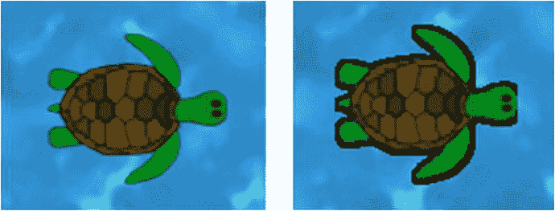

图 15-8.

使用默认着色器（左）和边框着色器（右）渲染的乌龟

从概念上讲，编写此着色器最棘手的部分是确定哪些像素对应于图像可见部分的边框。这里采用的方法如下：对于任何像素，检查所有“附近”的像素（由边框大小参数指定）。如果所有这些像素的 alpha 值都大于 0.5，那么原始像素位于一个基本不透明的区域，将被视为内部点。如果所有附近像素的 alpha 值都小于 0.5，那么原始像素位于一个基本透明的区域，将被视为外部点。如果原始像素既不是内部点也不是外部点，那么附近像素既有不透明的也有透明的，因此原始像素将被视为“在边框上”。半透明区域上的边框像素将使用指定的边框颜色渲染；所有其他像素将使用纹理指定的原始颜色渲染。请注意，如果不透明区域与纹理边缘相邻，那么边框在该点可能会显得被截断，如图 15-8 中带边框图像的右侧所示。

编写此着色器还有第二个微妙的复杂性：纹理坐标以百分比形式指定；x 和 y 纹理坐标的范围都是从 0 到 1。由于边框大小是以像素为单位指定的，你需要将纹理单位转换为像素单位，然后再转换回来。纹理坐标 `(1,1)` 对应于像素坐标 `(w,h)`，其中 `w` 和 `h` 是图像的宽度和高度。因此，纹理坐标 `(tx, ty)` 和像素坐标 `(px, py)` 之间的关系可以表示为 `(px, py) = (tx * w, ty * h)` 或 `(tx, ty) = (px / w, py / h)`。

理解了这一点，你就可以开始编写着色器了。在你的文本编辑器中，在 `shaders` 文件夹中创建一个名为 `border.fs` 的文件，内容如下：

```
varying vec4 v_color;
varying vec2 v_texCoords;
uniform sampler2D u_texture;
uniform vec2  u_imageSize;
uniform vec4  u_borderColor;
uniform float u_borderSize;
void main()
{
vec4 color = texture2D(u_texture, v_texCoords);
vec2 pixelToTextureCoords = 1 / u_imageSize;
bool isInteriorPoint = true;
bool isExteriorPoint = true;
for (float dx = -u_borderSize; dx  0.5 )
isExteriorPoint = false;
}
}
if (!isInteriorPoint && !isExteriorPoint && color.a < 0.5)
gl_FragColor = u_borderColor;
else
gl_FragColor = v_color * color;
}
```

接下来，在 `Turtle` 类中，添加以下 `import` 语句，这些语句对应于你将传递给着色器的数据类型：

```
import com.badlogic.gdx.graphics.Color;
import com.badlogic.gdx.math.Vector2;
```

将设置 `fragmentShaderCode` 的代码行更改为以下内容：

```
fragmentShaderCode = Gdx.files.internal("assets/shaders/border.fs").readString();
```

最后，修改 `draw` 方法，使其包含以下代码。请注意，上一个示例中设置 `"u_time"` 值的代码行已被移除，因为此着色器未使用它。

```
batch.setShader(shaderProgram);
shaderProgram.setUniformf( "u_imageSize", new Vector2(getWidth(), getHeight()) );
shaderProgram.setUniformf( "u_borderColor", Color.BLACK );
shaderProgram.setUniformf( "u_borderSize", 3 );
super.draw( batch, parentAlpha );
batch.setShader(null);
```

完成这些更改后，边框着色器就完成了。测试程序并验证边框是否按预期显示。

### 模糊着色器

接下来，你将创建一个能模糊乌龟图像的着色器，如图 15-9 所示。模糊程度将通过一个统一变量设置。

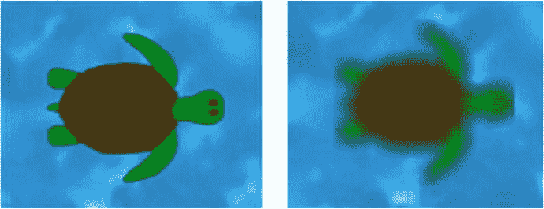

图 15-9.

使用默认着色器（左）和模糊着色器（右）渲染的乌龟

模糊着色器的结构与上一个示例中的边框着色器类似。对于每个像素，使用一个嵌套的 `for` 循环来遍历以原始像素为中心的正方形像素区域。通过将每个像素的颜色向量相加，再除以正方形区域中的像素总数，计算出该区域像素的平均颜色；³ 这就是用于 `gl_FragColor` 的最终值。在你的文本编辑器中，在 `shaders` 文件夹中创建一个名为 `blur.fs` 的文件，内容如下：

```
varying vec4 v_color;
varying vec2 v_texCoords;
uniform sampler2D u_texture;
uniform vec2  u_imageSize;
uniform int   u_blurRadius;
void main()
{
vec4 color = texture2D(u_texture, v_texCoords);
vec2 pixelToTextureCoords = 1 / u_imageSize;
vec4 averageColor = vec4(0.0, 0.0, 0.0, 0.0);
for (int dx = -u_blurRadius; dx <= u_blurRadius; dx++)
{
for (int dy = -u_blurRadius; dy <= u_blurRadius; dy++)
{
vec2 point = v_texCoords + vec2(dx,dy) * pixelToTextureCoords;
averageColor += texture2D(u_texture, point);
}
}
averageColor /= pow(2.0 * u_blurRadius + 1.0, 2.0);
gl_FragColor = v_color * averageColor;
}
```

接下来，在 `Turtle` 类中，将设置 `fragmentShaderCode` 的代码行更改为以下内容：

```
fragmentShaderCode = Gdx.files.internal("assets/shaders/blur.fs").readString();
```

最后，修改 `draw` 方法，使其包含以下代码：

```
batch.setShader(shaderProgram);
shaderProgram.setUniformf( "u_imageSize", new Vector2(getWidth(), getHeight()) );
shaderProgram.setUniformf( "u_blurRadius", 5 );
super.draw( batch, parentAlpha );
batch.setShader(null);
```

完成这些更改后，模糊着色器就完成了。测试程序并验证模糊效果是否按预期显示。


### 发光着色器

理解了模糊着色器的工作原理后，你可以通过将每个像素的原始图像颜色与模糊颜色相加来创建发光效果，这会使图像变亮并轻微混合颜色。为了获得炫酷的视觉效果，在此着色器中你还会添加一个脉冲效果（类似于之前处理灰度着色器时的工作），使海龟在其原始颜色和发光效果之间平滑切换，从而让海龟看起来像从内部发出脉动的光芒。在你的文本编辑器中，在 `shaders` 文件夹内创建一个名为 `glow-pulse.fs` 的文件，内容如下：

```
varying vec4 v_color;
varying vec2 v_texCoords;
uniform sampler2D u_texture;
uniform float u_time;
uniform vec2  u_imageSize;
uniform int   u_glowRadius;
void main()
{
vec4 color = texture2D(u_texture, v_texCoords);
vec2 pixelToTextureCoords = 1 / u_imageSize;
vec4 averageColor = vec4(0.0, 0.0, 0.0, 0.0);
for (int dx = -u_glowRadius; dx <= u_glowRadius; dx++)
{
for (int dy = -u_glowRadius; dy <= u_glowRadius; dy++)
{
vec2 point = v_texCoords + vec2(dx,dy) * pixelToTextureCoords;
averageColor += texture2D(u_texture, point);
}
}
averageColor /= pow(2.0 * u_glowRadius + 1.0, 2.0);
float amount = (sin(6.0 * u_time) + 1.0) * 0.5;
// 额外乘以 2.0 的因子用于增强发光效果
vec4 glowFactor = vec4( 2.0 * averageColor.rgb, averageColor.a );
gl_FragColor = v_color * (color + amount * glowFactor);
}
```

接下来，在 `Turtle` 类中，将设置 `fragmentShaderCode` 的代码行修改为以下内容：

```
fragmentShaderCode = Gdx.files.internal("assets/shaders/glow-pulse.fs").readString();
```

最后，修改 `draw` 方法，使其包含以下代码：

```
batch.setShader(shaderProgram);
shaderProgram.setUniformf( "u_time", time );
shaderProgram.setUniformf( "u_imageSize", new Vector2(getWidth(), getHeight()) );
shaderProgram.setUniformf( "u_glowRadius", 5 );
super.draw( batch, parentAlpha );
batch.setShader(null);
```

完成这些修改后，脉冲发光着色器就完成了。测试程序并验证效果是否符合预期。

### 波浪扭曲着色器

作为本章的最后一个着色器，你将不再修改像素颜色，而是使用正弦函数以波浪模式扭曲图像本身，图 15-10 展示了一些示例。如果需要，还可以对扭曲进行动画处理，以产生涟漪效果。

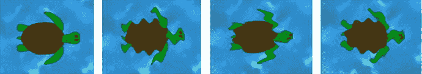

图 15-10.

使用默认着色器、水平波浪扭曲、垂直波浪扭曲以及双向波浪扭曲渲染的海龟

要创建此效果，你需要为纹理坐标添加一个偏移量；该偏移量使用正弦函数计算得出。为了按需自定义效果，你将包含用于调整正弦波波长和振幅的 uniform 参数，这些量在图 15-11 中进行了说明。你还可以设置正弦波的速度，即扭曲在纹理上移动的速率（以像素/秒为单位）；将此值设置为 0 将使扭曲保持静止。由于将同时存在水平和垂直方向的正弦波来扭曲纹理，因此每个参数都将成对出现，每个方向（沿 x 轴和 y 轴）各有一个值。在某个方向上将正弦波的振幅设置为 0 将导致该方向完全没有扭曲。

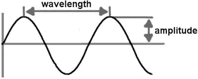

图 15-11.

正弦波的波长和振幅。

产生沿 x 轴方向、振幅为 A、波长为 W、速度为 V 的正弦波的公式为 y = A * sin( 6.283/W * (x + t * V) )，而沿 y 轴方向的正弦波公式为 x = A * sin( 6.28/W * (y + t * V) )。在着色器中实现这些公式非常简单。你还必须记得将纹理坐标转换为像素坐标，然后再转换回来，因为计算中使用的振幅、波长和速度都是以像素为单位表示的。在你的文本编辑器中，在 `shaders` 文件夹内创建一个名为 `wave.fs` 的文件，内容如下：

```
varying vec4 v_color;
varying vec2 v_texCoords;
uniform float u_time;
uniform vec2 u_imageSize;
uniform vec2 u_amplitude;
uniform vec2 u_wavelength;
uniform vec2 u_velocity;
uniform sampler2D u_texture;
void main()
{
vec2 pixelCoords = v_texCoords * u_imageSize;
vec2 offset = u_amplitude * sin(6.283/u_wavelength * (pixelCoords.yx - u_velocity * u_time));
vec2 texCoords = v_texCoords + offset / u_imageSize;
gl_FragColor = v_color * texture2D(u_texture, texCoords);
}
```

接下来，在 `Turtle` 类中，将设置 `fragmentShaderCode` 的代码行修改为以下内容：

```
fragmentShaderCode = Gdx.files.internal("assets/shaders/wave.fs").readString();
```

最后，修改 `draw` 方法，使其包含以下代码：

```
batch.setShader(shaderProgram);
shaderProgram.setUniformf( "u_time", time );
shaderProgram.setUniformf( "u_imageSize", new Vector2(getWidth(), getHeight()) );
shaderProgram.setUniformf("u_amplitude",  new Vector2( 2,  3) );
shaderProgram.setUniformf("u_wavelength", new Vector2(17, 19) );
shaderProgram.setUniformf("u_velocity",   new Vector2(10, 11) );
super.draw( batch, parentAlpha );
batch.setShader(null);
```

完成这些修改后，波浪扭曲着色器就完成了。测试程序并验证效果是否符合预期，然后尝试调整 uniform 值，以了解其可能的范围。


## 总结与下一步

在本章中，你学习了两种用于提升游戏开发项目图形效果的高级且强大的方法。首先，你学会了如何使用 LibGDX 粒子编辑器创建粒子系统，该系统可用于模拟多种效果，例如你创建的推进器和爆炸效果。接着，你设计了一个名为 `ParticleActor` 的类，使你能够将这些效果集成到 Space Rocks 游戏中。其次，你学习了如何编写着色器程序，这些程序利用 GPU 的强大功能来创建模糊、发光和扭曲等效果。然后，你学习了如何使用 `ShaderProgram` 类，在 Starfish Collector 游戏中绘制角色时应用这些着色器程序。

至此，你可以通过在游戏中加入更多特效来巩固所学知识。例如，尝试创建一个看起来像水珠从水坑中溅出的粒子效果，并在 Starfish Collector 游戏中使用该效果来替换 `Whirlpool` 对象。你也可以为 Starfish Collector 中除了海龟之外的其他对象添加着色器程序；例如，你可以为 `Starfish` 类添加发光脉冲效果。你甚至可以创建一个名为 `Water` 的新类来替换包含背景图片的 `BaseActor`，并在其 `draw` 方法中应用波浪扭曲着色器。或者，在 Space Rocks 游戏中，你可以为 `Laser` 类添加发光脉冲效果，并为 `Warp` 类添加波浪扭曲效果。

在下一章中，你将继续学习高级图形技术，但这次是在 3D 游戏的背景下，最后将以本书最初开始的游戏——Starfish Collector 的 3D 版本作为结尾。

脚注 1

[`https://github.com/libgdx/libgdx/wiki/2D-Particle-Editor`](https://github.com/libgdx/libgdx/wiki/2D-Particle-Editor)

  2

严格来说，图形管线中可用的阶段比此处列出的要多，但为简洁起见，此处仅描述了基本且必需的阶段。

  3

更复杂的模糊算法会计算像素颜色的加权平均值，其中像素离中心越近，其在计算最终颜色时的影响力就越大。

