# 16. 3D 图形与游戏入门

本章将介绍 LibGDX 的一些 3D 图形功能。在此过程中，你将学习描述和渲染三维场景所需的概念和类。为了简化和精简此过程，你将既改编一些旧类，也编写一些新类来完成所涉及的各种任务。接下来，为了理解 3D 移动，你将创建一个简单的交互式演示，使玩家能够控制场景中的对象以及观察场景的摄像机。最后，你将创建游戏 Starfish Collector 3D，如图 16-1 所示，该游戏再次以一只海龟为主角，任务是收集所有它能找到的海星。为简单起见，该游戏实际上将使用 2.5D 技术：游戏将渲染三维图形，而底层玩法（移动和碰撞）将在二维中进行。

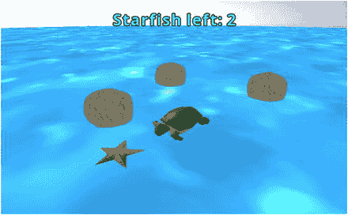

图 16-1.

Starfish Collector 3D 游戏

## 探索 3D 概念与类

事实证明，本书之前创建的所有游戏都存在于一个三维空间中。你可能已经注意到，例如，在设置摄像机对象的位置时（在 `BaseActor` 类的 `alignCamera` 方法中），你需要设置 x、y 和 z 分量。如果 x 轴和 y 轴分别代表屏幕上的水平和垂直方向，那么 z 轴则对应于一条指向观察者的直线，垂直于 xy 平面——即包含 x 轴和 y 轴的平面。可以认为摄像机位于 z 轴上，直接指向 xy 平面；所有游戏实体都隐式地将其 z 坐标设置为 0。此配置如图 16-2 所示，该图大致展示了摄像机如何从之前章节中看到 Starfish Collector 游戏。

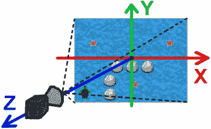

图 16-2.

摄像机沿 z 轴向下观察 Starfish Collector 游戏

你之前的项目严重依赖于 `Stage` 类，该类管理 `Camera` 和 `Batch` 对象（用于渲染目的）。要创建 3D 场景，你需要这些对象的“3D 版本”，由 `PerspectiveCamera` 和 `ModelBatch` 类提供，接下来将详细介绍它们。然而，并没有一个对应的类似 `stage` 的对象来管理它们，因此你将在后面的章节中创建自己的管理器类（称为 `Stage3D`）。

要渲染一个场景，你可以使用两种类型的摄像机之一：正交摄像机或透视摄像机。（`Stage` 类使用 `OrthographicCamera` 对象进行渲染。）这两者的区别在于它们如何将 3D 场景表示或投影到 2D 表面（如计算机屏幕）上。为了说明区别，考虑一个最简单的 3D 形状：立方体。图 16-3 显示了一个立方体的正交投影和透视投影。在正交投影中，如果物体的边长度相同，那么无论它们与观察者的距离如何，它们在投影中都会被绘制成相同的长度。这与透视投影形成对比，在透视投影中，具有两条相同长度边的物体在投影中可能看起来不同；离观察者较远的边看起来会更短。这还有一个副作用：如果物体的两条边平行，那么它们在正交投影中保持平行，但在透视投影中它们看起来会汇聚。（在透视图中，所有这些边看起来汇聚的点称为消失点。）

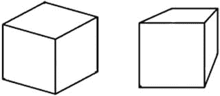

图 16-3.

使用正交投影（左）和透视投影（右）绘制的立方体

在初始化 `PerspectiveCamera` 对象时，你必须定义摄像机可见的区域，该区域呈平截头棱锥体或视锥体形状（如图 16-4 所示）。这由五个参数指定：视野（一个角度，表示摄像机向两侧能看多远）、场景投影到的矩形的宽度和高度（由 LibGDX 中的 `Viewport` 对象确定），以及近平面和远平面值（表示摄像机在渲染时将包含的最近和最远距离）。

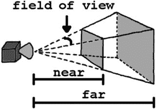

图 16-4.

透视摄像机可见的区域；近平面和远平面距离由阴影平面表示


下一个新类是 `ModelBatch`。正如 `SpriteBatch` 对象可用于渲染二维 `Texture` 对象一样，`ModelBatch` 用于渲染三维对象。描述三维对象外观所需的数据包含在 `Model` 对象中，该对象由两个主要部分组成：`Mesh` 和 `Material`。网格是定义对象形状的顶点、边和三角面的集合。材质包含应用于网格的颜色或纹理数据；材质在渲染时定义了网格的外观。图 16-5 包含一个茶壶的两张图片：网格的线框表示，以及应用材质后的外观。这个特别的茶壶是一个名为“犹他茶壶”的经典模型，由计算机科学家马丁·纽厄尔于 1975 年创建。模型可以从标准的 3D 对象文件格式中加载。

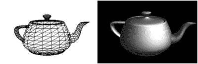

图 16-5.

犹他茶壶，以线框（左）和应用材质（右）渲染

在 LibGDX 中，可以通过两种方式创建模型。使用 `ModelLoader` 类，可以从标准的 3D 对象文件格式（例如 Wavefront 格式，通常以 `.obj` 文件扩展名表示）加载模型，这些文件可能还包含对配套材质所使用的图像文件的引用。或者，可以在运行时使用 `ModelBuilder` 类生成一些基本形状（例如球体和立方体）。在本章中，你将看到这两种方法的示例。

最后，为了使 3D 模型具有逼真的外观，需要考虑光源的效果。事实上，如果场景中没有添加灯光，你将什么也看不见！灯光由 `Environment` 类管理。你将使用的两种光照效果是环境光和方向光。环境光提供整体照明，并从所有方向均匀照射。通常，在场景中包含环境光非常重要，这样即使是背对光源的面也会在一定程度上可见（尽管这个程度可能因你模拟的位置类型而异）。方向光用于模拟沿特定方向照射整个场景的光线。这有助于在场景中提供深度感，特别是当对象的材质仅由单一颜色构成时，可以让你区分不同的面。图 16-6 通过一个立方体的两种渲染效果说明了这些效果。在左侧图像中，场景仅包含环境光，这使得很难看清立方体的所有边缘。右侧图像添加了方向光，主要朝向左侧（因此立方体的右侧看起来最亮）。

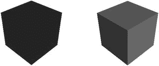

图 16-6.

仅用环境光照明的立方体（左）和添加了方向光的立方体（右）

## 创建一个最小的 3D 演示

现在，你可以创建一个最小的代码示例，使用前面提到的类在 LibGDX 中渲染一个立方体。结果是一个蓝色的立方体，其方向和着色如图 16-6 右侧所示。首先，在 BlueJ 中创建一个名为 `Project3D` 的新项目，将 `+libs` 文件夹（如果不使用 BlueJ 的 `userlib` 文件夹）及其内容从之前的项目复制到这个新项目的目录中，然后重启 BlueJ，以便正确加载 JAR 文件。此时，你不需要向此项目复制任何类或资源。这个示例将是一个独立的程序，而不是像通常那样从 `Game` 类（它实现了 `ApplicationListener` 接口方法）开始；你将自己实现该接口。

首先，创建一个名为 `CubeDemo` 的新类，其中包含以下代码，这些代码构成了一个 3D 应用程序的核心：`import` 语句、变量声明（在多个方法中引用的变量）以及 `ApplicationListener` 接口所需的方法。正如第 2 章所解释的，`create` 方法用于初始化对象，而 `render` 方法处理游戏循环；这些方法的代码将在后面详细给出。（接口所需的其他方法对于此示例并非必要，因此后面不再讨论。）

```
import com.badlogic.gdx.ApplicationListener;
import com.badlogic.gdx.Gdx;
import com.badlogic.gdx.graphics.GL20;
import com.badlogic.gdx.graphics.Color;
import com.badlogic.gdx.graphics.PerspectiveCamera;
import com.badlogic.gdx.graphics.VertexAttributes.Usage;
import com.badlogic.gdx.graphics.g3d.Environment;
import com.badlogic.gdx.graphics.g3d.attributes.ColorAttribute;
import com.badlogic.gdx.graphics.g3d.environment.DirectionalLight;
import com.badlogic.gdx.graphics.g3d.utils.ModelBuilder;
import com.badlogic.gdx.graphics.g3d.Model;
import com.badlogic.gdx.graphics.g3d.ModelBatch;
import com.badlogic.gdx.graphics.g3d.ModelInstance;
import com.badlogic.gdx.graphics.g3d.Material;
import com.badlogic.gdx.math.Vector3;
public class CubeDemo implements ApplicationListener
{
public Environment environment;
public PerspectiveCamera camera;
public ModelBatch modelBatch;
public ModelInstance boxInstance;
public void create() {  }
public void render() {  }
public void dispose() {  }
public void resize(int width, int height) {  }
public void pause() {  }
public void resume() {  }
}
```

`create` 方法首先初始化 `Environment`，并添加一个参数（`Attribute` 类的子类），该参数定义了场景中环境光的颜色。通常，灯光使用灰色调（而不是黄色或蓝色等颜色），这样你的场景就不会被意外的颜色染色。然后，使用更亮的灰色调创建一个 `DirectionalLight` 实例，并指定其方向（使用 `Vector3` 对象）主要朝向左侧和下方；配置好参数后，将该灯光添加到环境中。接着初始化一个 `PerspectiveCamera`，其视野为 67 度，近裁剪面和远裁剪面分别设置为 0.1 和 1000（选择这些值是为了确保视图区域包含你将添加到场景中的对象）。设置相机的位置，并通过 `lookAt` 方法指定其初始应看向的位置。最后，初始化一个 `ModelBatch` 对象，该对象将在后续渲染时使用。这些步骤“设置场景”，通过将以下代码添加到 `create` 方法中来完成：


```
environment = new Environment();
environment.set( new ColorAttribute(ColorAttribute.AmbientLight, 0.4f, 0.4f, 0.4f, 1f) );
DirectionalLight dLight = new DirectionalLight();
Color     lightColor = new Color(0.75f, 0.75f, 0.75f, 1);
Vector3  lightVector = new Vector3(-1.0f, -0.75f, -0.25f);
dLight.set( lightColor, lightVector );
environment.add( dLight ) ;
camera = new PerspectiveCamera(67, Gdx.graphics.getWidth(), Gdx.graphics.getHeight());
camera.near = 0.1f;
camera.far  = 1000f;
camera.position.set(10f, 10f, 10f);
camera.lookAt(0,0,0);
camera.update();
modelBatch = new ModelBatch();
```

下一步是创建模型实例以添加到场景中。为简化本例，你将使用 `ModelBuilder` 类的 `createBox` 方法构建一个立方体。你还需要创建一个 `Material` 来赋予立方体在屏幕上的外观；此处使用纯蓝色漫反射颜色。（物体的漫反射颜色是指物体在纯白光照射下呈现的颜色。）

你还必须确定模型每个顶点应包含的数据类型：在任何情况下，顶点都应存储位置信息，但在此示例中，它们还需存储颜色数据和一个用于确定光线如何从物体反射的向量（称为法线向量），从而提供着色效果。每个属性在 `Usage` 类中都有对应的常量值；位置数据对应 `Usage.Position`，颜色数据对应 `Usage.ColorPacked`，法线向量数据对应 `Usage.Normal`，以此类推。当需要组合这些数据时，通过将所需各属性的常量值相加生成一个值，并将该值作为参数传递给 `createBox` 方法。

你还需要决定立方体本身的尺寸。由于许多建模程序使用的比例，这些值通常在 1 到 10 之间，因此在使用 `ModelBuilder` 类创建对象时，也应使用类似的范围。创建 `Model`（可将其视为模板对象）后，初始化一个 `ModelInstance`。该对象包含模型信息的副本，以及一个存储该特定实例的位置、旋转和缩放数据的变换矩阵。以下代码执行所有这些任务，应添加到 `create` 方法中：

```
ModelBuilder modelBuilder = new ModelBuilder();
Material boxMaterial = new Material();
boxMaterial.set( ColorAttribute.createDiffuse(Color.BLUE) );
int usageCode = Usage.Position + Usage.ColorPacked + Usage.Normal;
Model boxModel = modelBuilder.createBox( 5, 5, 5, boxMaterial, usageCode );
boxInstance = new ModelInstance(boxModel);
```

最后，给出 `render` 方法，游戏循环的所有阶段都在此进行。在本例中，程序由一个静态场景组成，因此无需处理用户输入或执行更新任务——只需执行渲染。该方法的代码应该相对熟悉。一个区别是 `glClear` 函数还需要清除前一次渲染生成的深度信息，因为如果相机移动，场景中每个物体到相机的距离可能会改变，此时需要重新计算深度值。另一个区别是 `ModelBatch` 在其 `begin` 方法中将 `PerspectiveCamera` 作为输入。需要添加到 `render` 方法的相应代码如下：

```
Gdx.gl.glClearColor(1,1,1,1);
Gdx.gl.glViewport(0, 0, Gdx.graphics.getWidth(), Gdx.graphics.getHeight());
Gdx.gl.glClear( GL20.GL_COLOR_BUFFER_BIT | GL20.GL_DEPTH_BUFFER_BIT );
modelBatch.begin(camera);
modelBatch.render( boxInstance, environment );
modelBatch.end();
```

像往常一样，你还需要一个启动器类，如下所示：

```
import com.badlogic.gdx.backends.lwjgl.LwjglApplication;
public class Launcher1
{
public static void main ()
{
CubeDemo myProgram = new CubeDemo();
LwjglApplication launcher = new LwjglApplication( myProgram, "Cube Demo", 800, 600 );
}
}
```

此时，你应该尝试运行代码。可以随意进行一些修改并重新运行代码，以查看更改的效果。例如，你可以更改立方体的颜色、光源的方向或相机的位置。

## 重新创建 Actor/Stage 框架

为了促进和加速未来项目的开发，在本节中，你将编写一些功能类似于 `BaseActor` 和 `Stage` 类的类，但它们存储的是适用于三维图形的数据结构和方法。为方便起见，你将继续在之前创建的项目（名为 `Project3D`）中添加代码。

### BaseActor3D 类

首先，回顾一下 `Actor` 类存储了变换数据（位置、旋转和缩放）以及获取、设置和更改这些值的方法。所有 `Actor` 对象都包含一个 `act` 方法，用于更新其内部状态，以及一个 `draw` 方法，演员可使用该方法通过给定的 `Batch` 对象渲染自身。然后，你编写了 `Actor` 类的扩展，即 `BaseActor` 类，它额外存储了 `Texture`、用于碰撞检测的 `Polygon` 以及相关方法。这里将介绍 `BaseActor3D` 类，它将在 3D 环境中提供类似的功能。

3D 图形中一些最复杂的底层概念是用于存储变换数据的数学结构。这里不会深入介绍技术细节，¹ 但要理解本例的代码，了解这些对象是什么以及如何使用其相关方法非常重要。

`ModelInstance` 对象的变换数据存储在其 `transform` 字段中，作为一个 `Matrix4` 对象：一个四乘四的数字网格。从这个对象中，你可以提取一个包含对象位置的 `Vector3`。你还可以提取另一个包含每个方向缩放因子的 `Vector3`（所有方向初始化为 1，即默认大小不变）。变换还存储了模型的朝向，这不能像 `Actor` 的 `rotation` 值那样用单个数字存储，因为三维空间中的物体可以绕 x、y 和 z 轴的任意组合进行任意角度的旋转。出于许多技术原因（如计算、性能以及避免称为万向锁 ² 的现象），使用一个称为 `Quaternion`（对应同名的数学对象）的对象来存储朝向数据。为方便起见，与其直接操作 `Matrix4`，不如为每个 `BaseActor3D` 对象维护单独的对象来存储位置、旋转和缩放数据，并在需要时将它们组合成一个 `Matrix4`，存储到 `ModelInstance` 中。

接下来，创建一个名为 `BaseActor3D` 的新类，其中包含以下代码，包括 `import` 语句、变量声明和基本方法。这第一组方法包括：构造函数；为该演员设置 `ModelInstance` 的方法；将位置、旋转和缩放数据组合成 `Matrix4` 的 `calculateTransform` 方法；设置 `Color` 和加载关联材质使用的 `Texture` 的方法；更新模型实例变换数据的 `act` 方法；以及使用提供的 `ModelBatch` 和 `Environment` 渲染模型实例的 `draw` 方法。


```
import com.badlogic.gdx.graphics.g3d.Environment;
import com.badlogic.gdx.graphics.g3d.ModelBatch;
import com.badlogic.gdx.graphics.g3d.ModelInstance;
import com.badlogic.gdx.graphics.g3d.Material;
import com.badlogic.gdx.graphics.g3d.attributes.ColorAttribute;
import com.badlogic.gdx.Gdx;
import com.badlogic.gdx.graphics.g3d.attributes.TextureAttribute;
import com.badlogic.gdx.graphics.Color;
import com.badlogic.gdx.graphics.Texture;
import com.badlogic.gdx.graphics.Texture.TextureFilter;
import com.badlogic.gdx.math.Vector3;
import com.badlogic.gdx.math.Quaternion;
import com.badlogic.gdx.math.Matrix4;
public class BaseActor3D
{
private ModelInstance modelData;
private final Vector3 position;
private final Quaternion rotation;
private final Vector3 scale;
public BaseActor3D(float x, float y, float z)
{
modelData = null;
position  = new Vector3(x,y,z);
rotation  = new Quaternion();
scale     = new Vector3(1,1,1);
}
public void setModelInstance(ModelInstance m)
{  modelData = m;  }
public Matrix4 calculateTransform()
{  return new Matrix4(position, rotation, scale);  }
public void setColor(Color c)
{
for (Material m : modelData.materials)
m.set( ColorAttribute.createDiffuse(c) );
}
public void loadTexture(String fileName)
{
Texture tex = new Texture(Gdx.files.internal(fileName), true);
tex.setFilter( TextureFilter.Linear, TextureFilter.Linear );
for (Material m : modelData.materials)
m.set( TextureAttribute.createDiffuse(tex) );
}
public void act(float dt)
{  modelData.transform.set( calculateTransform() );  }
public void draw(ModelBatch batch, Environment env)
{  batch.render(modelData, env);  }
}
```

接下来是与位置变量相关的各种方法：获取和设置方法，以及向当前坐标添加数值的方法。为方便起见，这段代码包含了方法的重载变体；这些变体允许使用`Vector3`或单独的`float`输入。

```
public Vector3 getPosition()
{  return position;  }
public void setPosition(Vector3 v)
{  position.set(v);  }
public void setPosition(float x, float y, float z)
{  position.set(x,y,z);  }
public void moveBy(Vector3 v)
{  position.add(v);  }
public void moveBy(float x, float y, float z)
{  moveBy( new Vector3(x,y,z) );  }
```

接下来要加入的功能是旋转能力。虽然理论上三维物体可以绕 x 轴、y 轴或 z 轴旋转，但为简单起见，你将限制角色只能“向左”和“向右”转动，这对应于绕 y 轴旋转，而 y 轴在这个 3D 世界中指向上方，如图 8-2 所示。³ 绕 y 轴的旋转量将被称为**转向角**。⁴ 将会有获取、设置和调整该值的方法，每个方法都使用`Quaternion`类中的方法实现；将这些方法也添加到`BaseActor3D`类中。

```
public float getTurnAngle()
{  return rotation.getAngleAround(0,-1,0);  }
public void setTurnAngle(float degrees)
{  rotation.set( new Quaternion(Vector3.Y,degrees) );  }
public void turn(float degrees)
{  rotation.mul( new Quaternion(Vector3.Y,-degrees) );  }
```

此外，还必须编写方法，使角色能够相对于其当前朝向的方向移动。当`BaseActor3D`首次初始化时，假设前进方向由向量 (0, 0, –1) 表示，因为相机的初始位置将具有正的 z 坐标，并且角色将背对相机。类似地，初始向上方向是向量 (0, 1, 0)，向右方向是向量 (1, 0, 0)。在角色旋转之后，相对的前进、向上和向右方向可以通过将这些原始向量按角色的当前旋转进行变换来确定。然后，要沿这些相对方向之一移动给定的距离，你可以将相应的向量缩放所需的距离，并将结果添加到当前位置。使角色能够以这些方式移动的方法如下：

```
public void moveForward(float dist)
{  moveBy( rotation.transform( new Vector3(0,0,-1) ).scl( dist ) );  }
public void moveUp(float dist)
{  moveBy( rotation.transform( new Vector3(0,1,0) ).scl( dist ) );  }
public void moveRight(float dist)
{  moveBy( rotation.transform( new Vector3(1,0,0) ).scl( dist ) );  }
```

最后，将添加一个方法来设置对象的缩放比例，这对于调整模型大小非常有用：

```
public void setScale(float x, float y, float z)
{  scale.set(x,y,z);  }
```

至此，`BaseActor3D`类的大部分内容已完成。后续章节将讨论并展示碰撞检测和列表管理方法的代码（类似于`BaseActor`类中的`overlaps`和`getList`方法）。接下来，你将创建一个用于管理所有这些角色的补充类：`Stage3D`类。


### Stage3D 类

回顾一下，LibGDX 的 `Stage` 对象负责处理渲染任务（使用其内部的 `Camera` 和 `Batch` 对象），并管理一个 `Actor` 对象列表。`Stage` 类中还有 `act` 和 `draw` 方法，它们会调用所有已附加角色的 `act` 和 `draw` 方法。你将使用 `Stage3D` 类创建类似的功能。首先，用以下代码创建一个名为 `Stage3D` 的新类。这包括一组 `import` 语句、渲染所需的变量（`Environment`、`PerspectiveCamera` 和 `ModelBatch`），以及一个用于存储 `BaseActor3D` 对象的 `ArrayList`。这些变量在构造函数中初始化，其代码与之前的示例几乎相同。

```
import com.badlogic.gdx.Gdx;
import com.badlogic.gdx.graphics.Color;
import com.badlogic.gdx.math.Vector3;
import com.badlogic.gdx.graphics.PerspectiveCamera;
import com.badlogic.gdx.graphics.g3d.Environment;
import com.badlogic.gdx.graphics.g3d.ModelBatch;
import com.badlogic.gdx.graphics.g3d.attributes.ColorAttribute;
import com.badlogic.gdx.graphics.g3d.environment.DirectionalLight;
import java.util.ArrayList;
public class Stage3D
{
private Environment environment;
private PerspectiveCamera camera;
private final ModelBatch modelBatch;
private ArrayList actorList;
public Stage3D()
{
environment = new Environment();
environment.set(new ColorAttribute(ColorAttribute.AmbientLight, 0.7f, 0.7f, 0.7f, 1));
DirectionalLight dLight = new DirectionalLight();
Color lightColor = new Color(0.9f, 0.9f, 0.9f, 1);
Vector3 lightVector = new Vector3(-1.0f, -0.75f, -0.25f);
dLight.set( lightColor, lightVector );
environment.add( dLight ) ;
camera = new PerspectiveCamera(67, Gdx.graphics.getWidth(), Gdx.graphics.getHeight());
camera.position.set(10f, 10f, 10f);
camera.lookAt(0,0,0);
camera.near = 0.01f;
camera.far = 1000f;
camera.update();
modelBatch = new ModelBatch();
actorList = new ArrayList();
}
}
```

接下来是 `act` 和 `draw` 方法，它们会调用 `ArrayList` 中所有 `BaseActor3D` 对象的对应方法。此外，在 `act` 方法中还会更新相机。

```
public void act(float dt)
{
camera.update();
for (BaseActor3D ba : actorList)
ba.act(dt);
}
public void draw()
{
modelBatch.begin(camera);
for (BaseActor3D ba : actorList)
ba.draw(modelBatch, environment);
modelBatch.end();
}
```

以下是添加和移除角色以及获取列表的方法，代码如下：

```
public void addActor(BaseActor3D ba)
{  actorList.add( ba );  }
public void removeActor(BaseActor3D ba)
{  actorList.remove( ba );  }
public ArrayList getActors()
{  return actorList;  }
```

该类的最后一部分是一组用于调整相机的广泛方法，这比在 2D 游戏中要复杂得多。首先是设置相机位置和按给定量移动相机的方法；这些值可以通过 `Vector3` 对象或三个 `float` 值来指定：

```
public void setCameraPosition(float x, float y, float z)
{  camera.position.set(x,y,z);  }
public void setCameraPosition(Vector3 v)
{  camera.position.set(v);  }
public void moveCamera(float x, float y, float z)
{  camera.position.add(x,y,z);  }
public void moveCamera(Vector3 v)
{  camera.position.add(v);  }
```

接下来，在这些方法的基础上，还有额外的方法可以相对于相机当前位置移动相机。一个 `Camera` 对象存储了两个内部的 `Vector3` 对象：`direction`，它决定了相机当前朝向的方向；以及 `up`，它决定了应该朝向屏幕顶部的方向。在本程序中前后移动相机时，相机应保持恒定高度（即使相机倾斜角度），因此可以将向量 `direction` 的 y 分量设置为 0，从而得到一个能让你以这种方式向前移动的向量。一旦确定了向量，就需要根据相机要移动的距离对其进行缩放，然后通过 `moveCamera` 函数将该向量添加到相机的当前位置。对于向左和向右移动，你将类似地丢弃向量的 y 分量；要将 `direction` 向量转换为指向右侧的向量，可以互换 x 和 z 的值，并取反 z 的值，如图 16-7 中的示例所示。在这张图中，请记住显示的值指的是每个向量所表示的方向变化。

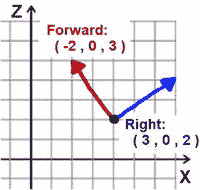

图 16-7.

将前向向量转换为右向向量

向上移动相机是一项简单的任务。在这种情况下，移动将始终沿着 y 轴方向，而不是相机的 `up` 向量，因为当相机倾斜时，其 `up` 向量将不再与 y 轴指向相同的方向。以这些方式移动相机的方法如下：

```
public void moveCameraForward(float dist)
{
Vector3 forward = new Vector3(camera.direction.x, 0, camera.direction.z).nor();
moveCamera( forward.scl( dist ) );
}
public void moveCameraRight(float dist)
{
Vector3 right = new Vector3(camera.direction.z, 0, -camera.direction.x).nor();
moveCamera( right.scl( dist ) );
}
public void moveCameraUp(float dist)
{  moveCamera( 0,dist,0 );  }
```

还应该提供旋转相机的功能，并且同样，限制相机可能的移动类型将使用户更容易直观地进行导航。与 `BaseActor3D` 对象一样，相机将能够向左和向右转动，这对应于绕 y 轴旋转。此外，能够上下倾斜相机以看向更高或更低的位置会很方便。这可以通过像之前一样确定指向右侧的向量，然后让相机的 `direction` 向量绕指向右侧的向量旋转来实现。这两个方法 `turnCamera` 和 `tiltCamera` 如下所示：

```
public void turnCamera(float angle)
{  camera.rotate( Vector3.Y, -angle );  }
public void tiltCamera(float angle)
{
Vector3 right = new Vector3(camera.direction.z, 0, -camera.direction.x);
camera.direction.rotate(right, angle);
}
```

最后，能够将相机朝向某个特定位置是很重要的。这可以通过一个名为 `lookAt` 的相机方法来实现，但该方法可能会产生不期望的结果，即相机向左或向右倾斜，导致地平线不再水平，这可能会让玩家迷失方向。因此，在调用相机的 `lookAt` 方法后，需要将相机的 `up` 轴重置为 y 轴的方向以纠正此问题；这个方法将被称为 `setCameraDirection`。与之前一样，此方法将被重载，以接受 `Vector3` 或三个 `float` 值作为输入。

```
public void setCameraDirection(Vector3 v)
{
camera.lookAt(v);
camera.up.set(0,1,0);
}
public void setCameraDirection(float x, float y, float z)
{   setCameraDirection( new Vector3(x,y,z) );   }
```


这就是 `Stage3D` 类所需的全部功能。完成这个类的编写后，你可以回到 `BaseActor3D` 类添加一些与舞台相关的功能。你需要修改构造函数，添加一个 `Stage3D` 参数，这样当角色被创建时就会被添加到该舞台中，并且会存储对该舞台的引用，方便后续使用。在 `BaseActor3D` 类中，添加以下变量声明：

```
protected Stage3D stage;
```

同时，将该类的构造函数修改为以下内容：

```
public BaseActor3D(float x, float y, float z, Stage3D s)
{
modelData = null;
position  = new Vector3(x,y,z);
rotation  = new Quaternion();
scale     = new Vector3(1,1,1);
stage = s;
s.addActor(this);
}
```

现在，你可以继续使用这些类来创建你的第一个交互式 3D 演示了。

### 创建交互式 3D 演示

本节将展示一个受图 16-2 启发的交互式演示。该演示包含一个扁平盒子形状上的《海星收集者》游戏截图，以及带有彩色板条箱纹理的立方体，用于表示场景的原点以及 x、y、z 轴上的点。还有一个可以前后、左右、上下移动，并能向左或向右旋转的球体；球体带有纹理，以帮助用户可视化这些相对于球体的方向。最后，你将允许用户向任意方向转动、倾斜和移动摄像机。图 16-8 展示了该演示的运行效果。

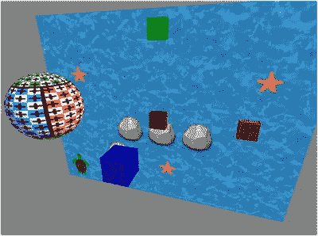

图 16-8.

3D 移动演示程序

继续 `Project3D` 项目，你首先应该下载本章的源代码文件，并将 `assets` 文件夹复制到你的项目中，因为它包含了本项目所需的所有图片。然后，你将创建一个简化版的 `BaseGame` 类，类似于你在前几章中使用过的。创建一个名为 `BaseGame` 的新类，代码如下：

```
import com.badlogic.gdx.Game;
import com.badlogic.gdx.Gdx;
import com.badlogic.gdx.InputMultiplexer;
public abstract class BaseGame extends Game
{
private static BaseGame game;
public BaseGame()
{
game = this;
}
public void create()
{
InputMultiplexer im = new InputMultiplexer();
Gdx.input.setInputProcessor( im );
}
public static void setActiveScreen(BaseScreen s)
{
game.setScreen(s);
}
}
```

接下来，你需要一个新版本的 `BaseScreen` 类，它使用 `Stage3D` 来包含游戏实体，而不是普通的 `Stage` 对象。然而，一个标准的 `Stage` 对象对于用户界面来说仍然足够，并且这个类的大部分内容应该与本书前面代码开发中的内容相似，例如实现 `Screen` 和 `InputProcessor` 接口。创建一个名为 `BaseScreen` 的新类，代码如下：

```
import com.badlogic.gdx.Screen;
import com.badlogic.gdx.InputProcessor;
import com.badlogic.gdx.Gdx;
import com.badlogic.gdx.graphics.GL20;
import com.badlogic.gdx.scenes.scene2d.Stage;
import com.badlogic.gdx.InputMultiplexer;
import com.badlogic.gdx.scenes.scene2d.ui.Table;
public abstract class BaseScreen implements Screen, InputProcessor
{
protected Stage3D mainStage3D;
protected Stage uiStage;
protected Table uiTable;
public BaseScreen()
{
mainStage3D = new Stage3D();
uiStage   = new Stage();
uiTable = new Table();
uiTable.setFillParent(true);
uiStage.addActor(uiTable);
initialize();
}
public abstract void initialize();
public abstract void update(float dt);
// 游戏循环方法
public void render(float dt)
{
// 限制窗口被拖动时可能经过的时间量
dt = Math.min(dt, 1/30f);
// act 方法
uiStage.act(dt);
mainStage3D.act(dt);
// 由特定游戏类定义
update(dt);
// 渲染
Gdx.gl.glClearColor(0.5f,0.5f,0.5f,1);
Gdx.gl.glClear(GL20.GL_COLOR_BUFFER_BIT + GL20.GL_DEPTH_BUFFER_BIT);
// 绘制图形
mainStage3D.draw();
uiStage.draw();
}
// Screen 接口要求的方法
public void resize(int width, int height)
{   uiStage.getViewport().update(width, height, true);  }
public void pause()   {  }
public void resume()  {  }
public void dispose() {  }
public void show()
{
InputMultiplexer im = (InputMultiplexer)Gdx.input.getInputProcessor();
im.addProcessor(this);
im.addProcessor(uiStage);
}
public void hide()
{
InputMultiplexer im = (InputMultiplexer)Gdx.input.getInputProcessor();
im.removeProcessor(this);
im.removeProcessor(uiStage);
}
// InputProcessor 接口要求的方法
public boolean keyDown(int keycode)
{  return false;  }
public boolean keyUp(int keycode)
{  return false;  }
public boolean keyTyped(char c)
{  return false;  }
public boolean mouseMoved(int screenX, int screenY)
{  return false;  }
public boolean scrolled(int amount)
{  return false;  }
public boolean touchDown(int screenX, int screenY, int pointer, int button)
{  return false;  }
public boolean touchDragged(int screenX, int screenY, int pointer)
{  return false;  }
public boolean touchUp(int screenX, int screenY, int pointer, int button)
{  return false;  }
}
```

由于这个程序（以及可能的其他程序）会使用盒子和球体形状，接下来你将创建一些扩展 `BaseActor3D` 类的类，利用之前介绍的 `ModelBuilder` 类的功能为你创建这些形状。首先，创建一个名为 `Box` 的新类，代码如下：

```
import com.badlogic.gdx.graphics.g3d.utils.ModelBuilder;
import com.badlogic.gdx.graphics.g3d.Material;
import com.badlogic.gdx.graphics.VertexAttributes.Usage;
import com.badlogic.gdx.graphics.g3d.Model;
import com.badlogic.gdx.graphics.g3d.ModelInstance;
import com.badlogic.gdx.math.Vector3;
public class Box extends BaseActor3D
{
public Box(float x, float y, float z, Stage3D s)
{
super(x,y,z,s);
ModelBuilder modelBuilder = new ModelBuilder();
Material boxMaterial = new Material();
int usageCode = Usage.Position + Usage.ColorPacked
+ Usage.Normal   + Usage.TextureCoordinates;
Model boxModel = modelBuilder.createBox(1,1,1, boxMaterial, usageCode);
Vector3 position = new Vector3(0,0,0);
setModelInstance( new ModelInstance(boxModel, position) );
}
}
```

接下来，你还需要一个用于创建球体的类。`ModelBuilder` 类包含一个名为 `createSphere` 的方法，类似于 `createBox`，它允许你指定球体在 x、y、z 方向上的半径⁵、球体在纬度和经度方向上的细分数量（为了获得光滑的球体，你可以将两者都设置为 32），以及相关的 `Material` 和用法代码值。创建一个名为 `Sphere` 的新类，包含以下代码：


```
import com.badlogic.gdx.graphics.g3d.utils.ModelBuilder;
import com.badlogic.gdx.graphics.g3d.Material;
import com.badlogic.gdx.graphics.VertexAttributes.Usage;
import com.badlogic.gdx.graphics.g3d.Model;
import com.badlogic.gdx.graphics.g3d.ModelInstance;
import com.badlogic.gdx.math.Vector3;
public class Sphere extends BaseActor3D
{
public Sphere(float x, float y, float z, Stage3D s)
{
super(x,y,z,s);
ModelBuilder modelBuilder = new ModelBuilder();
Material mat = new Material();
int usageCode = Usage.Position + Usage.ColorPacked
+ Usage.Normal   + Usage.TextureCoordinates;
int r = 1;
Model mod = modelBuilder.createSphere(r,r,r, 32,32, mat, usageCode);
Vector3 pos = new Vector3(0,0,0);
setModelInstance( new ModelInstance(mod, pos) );
}
}
```

现在，你已经准备好创建用于设置图 16-8 所示场景的类了。创建一个名为 `DemoScreen` 的新类，并包含以下代码。名为 `player` 的对象将由用户控制。

```
import com.badlogic.gdx.Gdx;
import com.badlogic.gdx.Input.Keys;
import com.badlogic.gdx.graphics.Color;
public class DemoScreen extends BaseScreen
{
BaseActor3D player;
public void initialize()
{    }
public void update(float dt)
{    }
}
```

接下来，为了设置场景中的对象，你将创建一个扁平盒子，其纹理为《海星收集者》游戏的图片；四个立方体盒子，它们纹理相同但颜色不同；以及一个将由用户控制的球体。你还需要设置相机的起始位置和方向。要完成这些任务，请将以下代码添加到 `initialize` 方法中：

```
Box screen = new Box(0,0,0, mainStage3D);
screen.setScale(16, 12, 0.1f);
screen.loadTexture("assets/starfish-collector.png");
Box markerO = new Box(0,0,0, mainStage3D);
markerO.setColor(Color.BROWN);
markerO.loadTexture("assets/crate.jpg");
Box markerX = new Box(5,0,0, mainStage3D);
markerX.setColor(Color.RED);
markerX.loadTexture("assets/crate.jpg");
Box markerY = new Box(0,5,0, mainStage3D);
markerY.setColor(Color.GREEN);
markerY.loadTexture("assets/crate.jpg");
Box markerZ = new Box(0,0,5, mainStage3D);
markerZ.setColor(Color.BLUE);
markerZ.loadTexture("assets/crate.jpg");
player = new Sphere(0,1,8, mainStage3D);
player.loadTexture("assets/sphere-pos-neg.png");
mainStage3D.setCameraPosition(3,4,10);
mainStage3D.setCameraDirection(0,0,0);
```

最后，需要考虑 `update` 方法，它处理大量潜在的玩家输入。玩家使用键盘上的 W/A/S/D 键进行控制，这些键分别对应向前/向左/向后/向右移动，这是许多电脑游戏中的标准配置。在此标准基础上，你还添加了 R 和 F 键用于向上和向下移动（我们将其视为上升和下降方向）。你还使用 Q 和 E 键来向左和向右旋转（这似乎也容易记忆，因为这些键位于左右移动键的上方）。当同时按下 Shift 键时，可以使用相同的键以相同方式控制相机。还可以使用 T 和 G 键（你可以用助记词 Top 和 Ground 来记忆）向上和向下倾斜相机。以下是实现所有这些功能的代码，如前所述，应将其包含在 `update` 方法中：

```
float speed = 3.0f;
float rotateSpeed = 45.0f;
if ( !(Gdx.input.isKeyPressed(Keys.SHIFT_LEFT)
|| Gdx.input.isKeyPressed(Keys.SHIFT_RIGHT)) )
{
if ( Gdx.input.isKeyPressed(Keys.W) )
player.moveForward( speed * dt );
if ( Gdx.input.isKeyPressed(Keys.S) )
player.moveForward( -speed * dt );
if ( Gdx.input.isKeyPressed(Keys.A) )
player.moveRight( -speed * dt );
if ( Gdx.input.isKeyPressed(Keys.D) )
player.moveRight( speed * dt );
if ( Gdx.input.isKeyPressed(Keys.Q) )
player.turn( -rotateSpeed * dt );
if ( Gdx.input.isKeyPressed(Keys.E) )
player.turn( rotateSpeed * dt );
if ( Gdx.input.isKeyPressed(Keys.R) )
player.moveUp( speed * dt );
if ( Gdx.input.isKeyPressed(Keys.F) )
player.moveUp( -speed * dt );
}
if ( Gdx.input.isKeyPressed(Keys.SHIFT_LEFT)
|| Gdx.input.isKeyPressed(Keys.SHIFT_RIGHT) )
{
if (Gdx.input.isKeyPressed(Keys.W))
mainStage3D.moveCameraForward( speed * dt );
if (Gdx.input.isKeyPressed(Keys.S))
mainStage3D.moveCameraForward( -speed * dt );
if (Gdx.input.isKeyPressed(Keys.A))
mainStage3D.moveCameraRight( -speed * dt );
if (Gdx.input.isKeyPressed(Keys.D))
mainStage3D.moveCameraRight( speed * dt );
if (Gdx.input.isKeyPressed(Keys.R))
mainStage3D.moveCameraUp( speed * dt );
if (Gdx.input.isKeyPressed(Keys.F))
mainStage3D.moveCameraUp( -speed * dt );
if (Gdx.input.isKeyPressed(Keys.Q))
mainStage3D.turnCamera(-rotateSpeed * dt);
if (Gdx.input.isKeyPressed(Keys.E))
mainStage3D.turnCamera(rotateSpeed * dt);
if (Gdx.input.isKeyPressed(Keys.T))
mainStage3D.tiltCamera(rotateSpeed * dt);
if (Gdx.input.isKeyPressed(Keys.G))
mainStage3D.tiltCamera(-rotateSpeed * dt);
}
```

至此，`update` 方法的代码就完成了。在运行此演示之前，你需要像之前的项目一样，编写一个启动器风格的类和一个继承自 `BaseGame` 的类。首先，创建一个名为 `MoveDemo` 的新类，代码如下：

```
public class MoveDemo extends BaseGame
{
public void create()
{
super.create();
setActiveScreen( new DemoScreen() );
}
}
```

接下来，创建一个名为 `Launcher2` 的类，其中包含以下代码：

```
import com.badlogic.gdx.backends.lwjgl.LwjglApplication;
public class Launcher2
{
public static void main ()
{
MoveDemo myProgram = new MoveDemo();
LwjglApplication launcher = new LwjglApplication(
myProgram, "Movement Demo", 800, 600 );
}
}
```

现在，尝试运行这个程序，感受一下在三维空间中移动的体验吧！


## 游戏项目：海星收集者 3D

在本节中，你将创建游戏《海星收集者 3D》，顾名思义，它是本书开头介绍的《海星收集者》游戏的 3D 版本；图 16-9 展示了这两个游戏的并排对比。正如你所料，这个新游戏的目标是帮助乌龟收集所有海星。你可以使用方向键控制乌龟：按上箭头键让乌龟向前移动，按左、右箭头键让乌龟向左或向右转弯。大部分困难的基础工作已在上一节中完成。剩余的主题包括从外部文件加载复杂模型、显示环绕游戏世界的图像，以及执行简化的碰撞检测。和之前一样，你将继续向 `Project3D` 中添加代码，因为它已经包含了许多你需要的类（`BaseGame`、`BaseScreen`、`BaseActor3D` 和 `Stage3D`）。

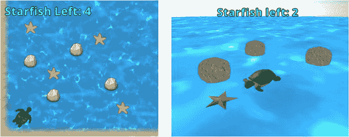

图 16-9.

2D（左）与 3D（右）版本的《海星收集者》

第一个任务——加载模型——相对简单。为此，你需要使用 `ModelLoader` 类的一个扩展，名为 `ObjLoader`，它可以导入使用 Wavefront（`*.obj`）文件格式的 3D 模型；然后你需要使用 `ObjLoader` 类的 `loadModel` 方法，该方法接受一个 `FileHandle` 作为输入，并返回一个 `Model`。接着，你可以使用该模型创建一个 `ModelInstance`，并将其用于 `BaseActor3D` 对象中，就像你对 `Box` 和 `Sphere` 类所做的那样。由于你将在此游戏中导入多个模型，因此创建一个包含此功能的新类是合理的。创建一个名为 `ObjModel` 的新类，其中包含以下代码：

```
import com.badlogic.gdx.Gdx;
import com.badlogic.gdx.graphics.g3d.Model;
import com.badlogic.gdx.graphics.g3d.ModelInstance;
import com.badlogic.gdx.graphics.g3d.loader.ObjLoader;
public class ObjModel extends BaseActor3D
{
public ObjModel(float x, float y, float z, Stage3D s)
{
super(x,y,z,s);
}
public void loadObjModel(String fileName)
{
ObjLoader loader = new ObjLoader();
Model objModel = loader.loadModel(Gdx.files.internal(fileName), true);
setModelInstance( new ModelInstance(objModel) );
}
}
```

接下来，你需要用一张图像环绕游戏世界，以营造背景中天空的效果。在本书之前的 2D 游戏中，你创建了一个仅显示天空图像的矩形对象。由于现在处于 3D 环境中，你将创建一个比游戏世界大得多且环绕它的球体对象，然后为其应用纹理，例如图 16-10 所示的纹理。这通常被称为天空球体或天空穹顶。你可能会注意到，图像在顶部附近看起来略有拉伸（如果底部不是纯灰色，底部也会如此）。这是因为图像经过了球面扭曲：虽然它在矩形中看起来很奇怪，但当图像应用到球体上时，所有内容都会呈现正确的比例。这与尝试制作地球（大致呈球形）的平面矩形地图时发生的现象相同；地图不可避免地会包含与极地附近区域相对应的扭曲区域。在尝试实现天空穹顶时还会出现第二个困难：应用于对象材质的纹理通常只有在从对象外部观察时才可见。（这种约定是为了提高 3D 程序的效率；无需从用户看不到的角度渲染对象。）幸运的是，你可以通过一个几何技巧来解决这个问题：创建球体后，你将网格在 z 方向上缩放 -1；这将使球体“内外翻转”，从而反转图像显示的面。

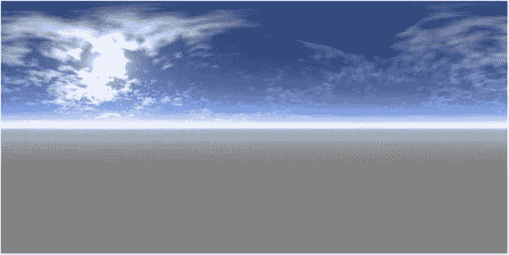

图 16-10.

一张经过球面扭曲的天空图像

第三个也是最后一个要讨论的概念是碰撞检测。为了保持复杂度的可控性，三维物体的运动和位置将被限制在一个二维平面上，从而允许本项目复用原始 `BaseActor` 类中的碰撞代码。这种技术在游戏开发中广为人知。使用这种方法（即拥有 3D 图形但将游戏玩法限制在 2D 平面上，并限制摄像机移动）的游戏被称为 2.5D 游戏。图 16-11 展示了游戏在玩家眼中的样子，而在右侧，你可以看到由网格表示的水面，以及对应于图中游戏实体（两块岩石和乌龟）的碰撞多边形。

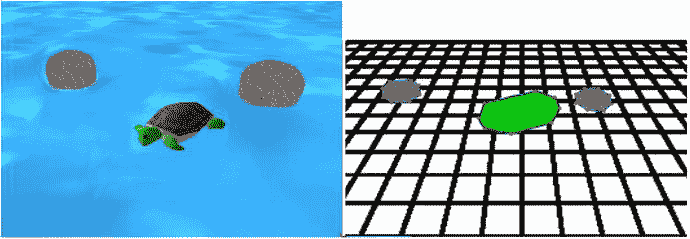

图 16-11.

以 3D 渲染的游戏世界，以及对应的 2D 碰撞多边形

为了将碰撞功能整合到你的项目中，你需要对 `BaseActor3D` 类进行一些补充。首先，添加以下 `import` 语句：

```
import com.badlogic.gdx.math.collision.BoundingBox;
import com.badlogic.gdx.math.Polygon;
import com.badlogic.gdx.math.Intersector;
import com.badlogic.gdx.math.Intersector.MinimumTranslationVector;
```

接下来，向该类添加以下变量声明：

```
private Polygon boundingPolygon;
```

然后是用于将多边形设置为矩形或八边形（八边形）形状的一对方法。在这两种情况下，你都需要确定对象在 x 和 z 维度上的尺寸；这些量类似于二维情况下的宽度和高度。这些值可以通过计算与模型关联的 `BoundingBox` 来确定，`BoundingBox` 是包含整个模型的最小盒子。边界框使用两个 `Vector3` 对象 `min` 和 `max` 存储模型的尺寸，它们分别存储模型所包含的最小和最大坐标值。这些值用于创建传递给多边形对象的顶点数组，如下所示：


```
public void setBaseRectangle ()
{
BoundingBox modelBounds = modelData.calculateBoundingBox( new BoundingBox() );
Vector3 max = modelBounds.max;
Vector3 min = modelBounds.min;
float[] vertices =
{max.x, max.z, min.x, max.z, min.x, min.z, max.x, min.z};
boundingPolygon = new Polygon(vertices);
boundingPolygon.setOrigin(0,0);
}
public void setBasePolygon()
{
BoundingBox modelBounds = modelData.calculateBoundingBox( new BoundingBox() );
Vector3 max = modelBounds.max;
Vector3 min = modelBounds.min;
float a = 0.75f; // 偏移量。
float[] vertices =
{max.x,0, a*max.x,a*max.z, 0,max.z, a*min.x,a*max.z,
min.x,0, a*min.x,a*min.z, 0,min.z, a*max.x,a*min.z };
boundingPolygon = new Polygon(vertices);
boundingPolygon.setOrigin(0,0);
}
```

多边形设置完成后，你需要一个方法，用于返回已根据位置、旋转和缩放更新后的边界多边形。回想一下，由于坐标轴的朝向，水平面包含 x 轴和 z 轴，因此在更新多边形的位置和缩放时会用到这些值，而转向角（绕 y 轴的旋转）则用于设置其旋转。将以下代码添加到 `BaseActor3D` 类中：

```
public Polygon getBoundaryPolygon()
{
boundingPolygon.setPosition( position.x, position.z );
boundingPolygon.setRotation( getTurnAngle() );
boundingPolygon.setScale( scale.x, scale.z );
return boundingPolygon;
}
```

接下来，你需要检测重叠（检查海龟是否收集了海星）和防止重叠（使岩石表现为实体，海龟无法穿过）的方法。这些方法也需要添加到 `BaseActor3D` 类中，与 `BaseActor` 类中的方法相同，只是参数必须传入一个 `BaseActor3D` 对象。添加以下代码：

```
public boolean overlaps(BaseActor3D other)
{
Polygon poly1 = this.getBoundaryPolygon();
Polygon poly2 = other.getBoundaryPolygon();
if ( !poly1.getBoundingRectangle().overlaps(poly2.getBoundingRectangle()) )
return false;
MinimumTranslationVector mtv = new MinimumTranslationVector();
return Intersector.overlapConvexPolygons(poly1, poly2, mtv);
}
public void preventOverlap(BaseActor3D other)
{
Polygon poly1 = this.getBoundaryPolygon();
Polygon poly2 = other.getBoundaryPolygon();
// 初始测试以提高性能
if ( !poly1.getBoundingRectangle().overlaps(poly2.getBoundingRectangle()) )
return;
MinimumTranslationVector mtv = new MinimumTranslationVector();
boolean polygonOverlap = Intersector.overlapConvexPolygons(poly1, poly2, mtv);
if ( polygonOverlap )
this.moveBy( mtv.normal.x * mtv.depth, 0, mtv.normal.y * mtv.depth );
}
```

最后，你将重新创建 `Actor` 和 `BaseActor` 类中的一些方法，以便处理列表：`getList`、`count` 和 `remove`。首先，将以下 `import` 语句添加到 `BaseActor3D` 类中：

```
import java.util.ArrayList;
```

然后，将以下代码添加到 `BaseActor3D` 类中：

```
public static ArrayList getList(Stage3D stage, String className)
{
ArrayList list = new ArrayList();
Class theClass = null;
try
{  theClass = Class.forName(className);  }
catch (Exception error)
{  error.printStackTrace();  }
for (BaseActor3D ba3d : stage.getActors())
{
if ( theClass.isInstance( ba3d ) )
list.add(ba3d);
}
return list;
}
public static int count(Stage3D stage, String className)
{
return getList(stage, className).size();
}
public void remove()
{
stage.removeActor(this);
}
```

至此，`BaseActor3D` 类已具备《海星收集者 3D》游戏所需的所有核心功能。在该游戏中，水面将使用 `Box` 对象显示，天空穹顶将使用 `Sphere` 对象显示，而海龟、海星和岩石将使用从 `ObjModel` 类导入的模型数据。创建一个名为 `Turtle` 的新类，代码如下：

```
public class Turtle extends ObjModel
{
public Turtle(float x, float y, float z, Stage3D s)
{
super(x,y,z,s);
loadObjModel("assets/turtle.obj");
setBasePolygon();
}
}
```

接下来，创建一个名为 `Starfish` 的类，代码如下。请注意，`act` 方法用于使海星旋转。

```
public class Starfish extends ObjModel
{
public Starfish(float x, float y, float z, Stage3D s)
{
super(x,y,z,s);
loadObjModel("assets/star.obj");
setScale(3,1,3);
setBasePolygon();
}
public void act(float dt)
{
super.act(dt);
turn( 90 * dt );
}
}
```

接下来，创建一个名为 `Rock` 的类，代码如下：

```
public class Rock extends ObjModel
{
public Rock(float x, float y, float z, Stage3D s)
{
super(x,y,z,s);
loadObjModel("assets/rock.obj");
setBasePolygon();
setScale(3,3,3);
}
}
```

为了在标签中显示剩余海星的数量，你需要像之前一样设置一个 `LabelStyle` 对象。在 `BaseGame` 类中，添加以下 `import` 语句：

```
import com.badlogic.gdx.graphics.Color;
import com.badlogic.gdx.graphics.Texture;
import com.badlogic.gdx.graphics.Texture.TextureFilter;
import com.badlogic.gdx.graphics.g2d.BitmapFont;
import com.badlogic.gdx.graphics.g2d.freetype.FreeTypeFontGenerator;
import com.badlogic.gdx.graphics.g2d.freetype.FreeTypeFontGenerator.FreeTypeFontParameter;
import com.badlogic.gdx.scenes.scene2d.ui.Label.LabelStyle;
```

然后，添加以下变量声明：

```
public static LabelStyle labelStyle;
```

为了初始化 `labelStyle` 对象，将以下代码添加到 `create` 方法中：

```
FreeTypeFontGenerator fontGenerator = new FreeTypeFontGenerator(Gdx.files.internal("assets/OpenSans.ttf"));
FreeTypeFontParameter fontParameters = new FreeTypeFontParameter();
fontParameters.size = 36;
fontParameters.color = Color.WHITE;
fontParameters.borderWidth = 2;
fontParameters.borderColor = Color.BLACK;
fontParameters.borderStraight = true;
fontParameters.minFilter = TextureFilter.Linear;
fontParameters.magFilter = TextureFilter.Linear;
BitmapFont customFont = fontGenerator.generateFont(fontParameters);
labelStyle = new LabelStyle();
labelStyle.font = customFont;
```

现在你可以设置包含实际游戏画面的屏幕了。首先创建一个名为 `LevelScreen` 的新类，代码如下：

```
import com.badlogic.gdx.Gdx;
import com.badlogic.gdx.Input.Keys;
import com.badlogic.gdx.graphics.Color;
import com.badlogic.gdx.math.Vector3;
import com.badlogic.gdx.scenes.scene2d.ui.Label;
public class LevelScreen extends BaseScreen
{
Turtle turtle;
Label starfishLabel;
Label messageLabel;
public void initialize()
{    }
public void update(float dt)
{    }
}
```

在 `initialize` 方法中，你需要设置地面和天空穹顶，天空穹顶将缩放至非常大的尺寸。你还需要初始化海龟，以及一定数量的岩石和海星。和之前一样，你还应设置摄像机的位置和方向，以便游戏开始时你添加的许多对象都在视野中。最后，你应该初始化标签并将它们添加到用户界面表格中。为了完成这些任务，将以下代码添加到 `initialize` 方法中：


```
Box floor = new Box(0,0,0, mainStage3D);
floor.loadTexture( "assets/water.jpg" );
floor.setScale(500, 0.1f, 500);
Sphere skydome = new Sphere(0,0,0, mainStage3D);
skydome.loadTexture( "assets/sky-sphere.png" );
// 缩放时，负的 z 值会使球体反转
//   以便纹理渲染在内部
skydome.setScale(500,500,-500);
turtle = new Turtle(0, 0, 15, mainStage3D);
turtle.setTurnAngle(90);
new Rock(-15, 1,  0, mainStage3D);
new Rock(-15, 1, 15, mainStage3D);
new Rock(-15, 1, 30, mainStage3D);
new Rock(  0, 1,  0, mainStage3D);
new Rock(  0, 1, 30, mainStage3D);
new Rock( 15, 1,  0, mainStage3D);
new Rock( 15, 1, 15, mainStage3D);
new Rock( 15, 1, 30, mainStage3D);
new Starfish( 10, 0, 10, mainStage3D);
new Starfish( 10, 0, 20, mainStage3D);
new Starfish(-10, 0, 10, mainStage3D);
new Starfish(-10, 0, 20, mainStage3D);
mainStage3D.setCameraPosition(0,10,0);
mainStage3D.setCameraDirection( new Vector3(0,0,0) );
starfishLabel = new Label("剩余海星: 4", BaseGame.labelStyle);
starfishLabel.setColor( Color.CYAN );
messageLabel = new Label("你赢了!", BaseGame.labelStyle);
messageLabel.setColor( Color.LIME );
messageLabel.setFontScale(2);
messageLabel.setVisible(false);
uiTable.pad(20);
uiTable.add(starfishLabel);
uiTable.row();
uiTable.add(messageLabel).expandY();
```

在 `update` 方法中，你需要检查用户输入并相应地移动海龟，同时保持摄像机朝向海龟。你还需要防止海龟与岩石对象重叠，如果海龟与海星重叠，则应将海星“收集”并从游戏中移除。最后，你需要更新显示剩余海星数量的标签，如果没有剩余海星，则显示“你赢了！”消息。要实现所有这些功能，请将以下代码添加到 `update` 方法中：

```
float speed = 3.0f;
float rotateSpeed = 45.0f;
if ( Gdx.input.isKeyPressed(Keys.UP) )
turtle.moveForward( speed * dt );
if ( Gdx.input.isKeyPressed(Keys.LEFT) )
turtle.turn( -rotateSpeed * dt );
if ( Gdx.input.isKeyPressed(Keys.RIGHT) )
turtle.turn( rotateSpeed * dt );
mainStage3D.setCameraDirection( turtle.getPosition() );
for ( BaseActor3D rock : BaseActor3D.getList( mainStage3D, "Rock") )
turtle.preventOverlap(rock);
for ( BaseActor3D starfish : BaseActor3D.getList( mainStage3D, "Starfish") )
if (turtle.overlaps(starfish) )
starfish.remove();
int starfishCount = BaseActor3D.count(mainStage3D, "Starfish");
starfishLabel.setText( "剩余海星: " + starfishCount );
if (starfishCount == 0)
messageLabel.setVisible(true);
```

至此，海星收集者 3D 的游戏代码就完成了。要运行此游戏，你需要创建一个名为 `StarfishCollector3DGame` 的新类，如下所示：

```
public class StarfishCollector3DGame extends BaseGame
{
public void create()
{
super.create();
setActiveScreen( new LevelScreen() );
}
}
```

另外，创建一个名为 `Launcher3` 的新类，如下所示：

```
import com.badlogic.gdx.Game;
import com.badlogic.gdx.backends.lwjgl.LwjglApplication;
public class Launcher3
{
public static void main ()
{
Game myGame = new StarfishCollector3DGame();
LwjglApplication launcher = new LwjglApplication(
myGame, "海星收集者 3D", 800, 600 );
}
}
```

现在，运行你的项目，帮助海龟收集所有海星，并在游戏过程中享受 3D 图形带来的乐趣！

## 总结与下一步

本章可能只是触及了 3D 游戏编程的皮毛，但这是一个涉及大量内容的主题。你探索了 3D 场景的组成部分、透视摄像机和光照。你了解到 3D 模型包含网格和材质，并且模型实例使用矩阵存储变换数据（位置、旋转和缩放）。你改编并扩展了自定义游戏开发框架，加入了 3D 版本的演员和舞台，并学习了在三维世界中移动对象的多种方法。最后，你通过创建两个交互式演示程序，检验了你的技能（和代码）。

有了本章奠定的基础，你现在已经准备好创建一些带有 3D 图形（以及为简单起见采用 2.5D 玩法）的游戏了。一个很好的起点是重新创建本书前面的一些项目。像“矩形毁灭者”这样的游戏可以简单地使用盒子和球体来重新创建。对于其他游戏，你可能会想使用预先创建的模型文件（类似于海龟、海星和岩石）。你可以从以下网站下载模型文件（有多种格式）：

*   OpenGameArt：[`www.opengameart.org`](http://www.opengameart.org)
*   The Models Resource：[`www.models-resource.com`](http://www.models-resource.com)
*   TurboSquid：[`www.turbosquid.com`](http://www.turbosquid.com)（他们提供许多免费模型；可以在搜索选项中指定。）

下载 3D 模型后，在将其加载到 LibGDX 之前，如果需要，你可以使用 3D 图形软件（如 Blender）查看和修改它，该软件可在 [`www.blender.org`](http://www.blender.org) 免费获取；或者，对于有艺术天赋的人来说，甚至可以使用 Blender 从头开始创建 3D 模型。

再次祝贺你完成了本书的最后一个游戏项目！下一章将总结一些通用建议以及游戏开发中可能的后续步骤。

脚注 1

如需更多信息，有两本关于 3D 图形数学细节的优秀书籍：Fletcher Dunn 和 Ian Parberry 合著的《3D 数学基础：图形与游戏开发》（A K Peters/CRC Press, 2011）以及 Eric Lengyel 所著的《3D 游戏编程与计算机图形学中的数学》（Cengage Learning PTR, 2011）。

  2

当使用三个值来表示物体绕三个轴的旋转时，万向锁指的是当物体处于某几种特定方向，且两个旋转轴对齐时出现的问题，这使得物体在该给定方向上无法以某些方式旋转。

  3

理论上，选择 y 轴作为“向上”方向有些随意，因为你可以在游戏世界中调整自己的方向，使任何轴对应向上方向。

  4

绕向上指向轴的旋转量也称为偏航角。类似地，绕侧向指向轴（头部上下倾斜的运动）的旋转称为俯仰角，绕前向指向轴（头部左右倾斜的运动）的旋转称为滚转角。

  5

严格来说，球体只有一个半径值；由 `createSphere` 方法创建的图形更准确地应称为椭球体。然而，在你创建的类中，所有半径值都将设置为相同的数值，因此它确实是一个球形对象。

