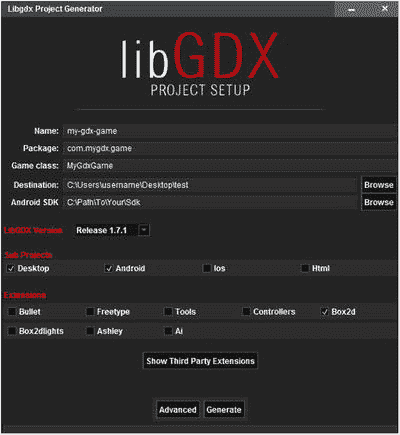

# 17. 旅程继续

这最后一章将介绍在继续游戏开发过程中需要考虑的各种步骤。其中包括探索其他项目、学习相关领域的技能，以及将你的游戏带给更广泛的受众。在此过程中，本章将提供各种类型的资源列表，以及针对多种情况的通用建议。

## 持续开发

本节将介绍如何完善你当前的项目并开始新项目，无论是独立完成还是作为游戏开发马拉松活动的一部分。本节将提供一个在线资源列表，你可以在其中获取美术资源以帮助你前进，同时还会提供大量建议，帮助你克服不可避免的障碍。


### 参与项目实践

希望你一直在动手完成本书中的所有项目示例。许多项目在结尾处都设有“总结与下一步”章节。请尽可能完成其中列出的所有建议！这一点至关重要，因为只有通过实践才能真正学会。无论一个主题在阅读时显得多么清晰，只有当你能够独立进行下一步的设计和编写代码时，才算真正理解。在每个项目功能实现后，你都应该不断尝试修改代码，并加入自己的变体。

请确保你在各个层面都理解每个程序。在局部层面，你应该理解每一行代码的作用、每个方法的目的，以及编写时考虑的设计因素。在全局层面，你应该了解所有类如何作为一个统一的整体协同工作，框架如此构建背后的逻辑，以及以不同方式修改框架的优缺点。

当你觉得自己已从本书中汲取了尽可能多的知识和经验后，就该独立行动，开始创作自己的游戏了。首先，尝试创建简单、极简的示例，实现新的游戏机制（即本书未重点介绍的机制）——比如一款射击类游戏，敌人会定期向你发射激光；或一款集换式卡牌游戏，你随机抽取代表魔法或生物的卡牌，它们会替你攻击敌人；又或一款包含寻物任务和回合制战斗的角色扮演游戏。除了掌握更多编程机制带来的明显好处外，摸索实现方法的过程本身也极具价值。只有通过思考、规划、编写代码、测试、调试和重写代码，你才能培养出创造力、组织力、适应力和毅力等技能。

当你能够自如地独立实现游戏机制后，下一步可以采取“克隆经典”的方法来学习（但切勿用于发布！）。选择一款经典的街机或主机游戏（尤其是 20 世纪 80 年代的作品），尝试尽可能多地重现其功能：实现游戏机制、关卡设计、艺术风格（图形和音频）以及用户界面（菜单界面和屏幕数据展示）。

具体来说，你应该制作一份实体清单，识别并优先排序你将在每个类别中处理的游戏特定功能，如附录 A 所述。此外，你应按照上一段中列出的顺序，对功能本身的类别进行优先级排序。例如，如果你的主角是一位带翅膀的弓箭手，在角色能够飞行和射箭之前，不必担心其腰带的颜色。（事实上，在游戏机制编程阶段，开发者通常使用简单的彩色多边形形状。）如果你不是艺术家，也不必担心；许多网站提供免费的游戏图形资源，而且社区中许多艺术家也在寻找合作者。最后，当你对自己的技能和能力充满信心时，就该开发自己的游戏，或加入一个游戏开发团队，贡献你的编程技能。

### 获取美术资源

本书的典型读者可能主要对游戏开发的编程方面感兴趣，但即便如此，每款游戏仍会受益于高质量的图形和音频。我推荐以下网站来获取美术资源。这些网站大多提供免费和付费选项，而其他一些则依靠用户捐赠运营：

*   **Kenney Game Assets**：[`kenney.nl`](http://kenney.nl) 由 Kenney Vleugels 创建，该网站拥有超过 18,000 个美术资源，适用于多种游戏类型。本书中的《太空岩石》、《飞机躲避》、《52 张牌接龙》、《宝藏探险》和《跳跳杰克》系列均使用了该网站的资源。
*   **GameArtGuppy**：`gameartguppy.com` 由 Vicki Wenderlich 创建，该网站收录了一系列专为独立游戏开发者打造的高质量美术作品。本书中《跳跳杰克》游戏的考拉角色即来自此网站。
*   **OpenGameArt**：[`opengameart.org`](http://opengameart.org) 一个各类媒体资源（2D 和 3D 图形，以及音效和音乐）的仓库。内容由社区贡献。许可细节和条件由创作者个人决定。
*   **The Spriters Resource**：[`www.spriters-resource.com`](http://www.spriters-resource.com) 收录了历史上众多游戏主机系统中几乎全面的游戏美术资源。但由于版权限制，这些资源不能用于已发布或商业游戏。
*   **Cool Text**：[`cooltext.com`](http://cooltext.com) 一个免费的文本艺术图形生成器，可用于创建标题屏幕的图形，以及用户界面的文本和按钮。
*   **Textures.com**：[`textures.com`](http://textures.com) 提供多种材质（包括天然和人造材质）的图片。
*   **Bfxr**：`bfxr.net` 随机生成各种复古风格的游戏音效。
*   **Freesound**：`freesound.org` 一个协作数据库，收录了采用知识共享许可的音效，按包和标签分组。
*   **Incompetech**：`incompetech.com` 由 Kevin MacLeod 创建，该网站收录了一系列免版税原创音乐作品，可按流派、节奏、感觉或乐器进行搜索。
*   **Audionautix**：`audionautix.com` 由 Jason Shaw 创建，该网站也收录了一系列免版税原创音乐，可按流派、情绪或节奏进行搜索。


### 参与游戏开发大赛

获得宝贵游戏开发经验的一种方式是参与游戏开发大赛（Game Jam）。游戏开发大赛是游戏开发者们聚集在一起，挑战在短时间内（通常约 48 小时）设计和制作一款游戏的活动。参与者可能是程序员、美术师、编剧或其他拥有相关技能的人。由于时间限制，这类活动要求快速原型设计和开发技能，并鼓励参与者专注于创意、核心机制，以及将项目推进到完成（或至少达到可玩状态）。个人参与这些活动通常就是为了提升自己在这些领域的能力。此外，许多游戏开发大赛会选择一个主题，所有在活动中开发的游戏都必须融入该主题。主题通常在活动开始时公布，以防止提前规划并鼓励创意发挥。

尽管有些游戏开发大赛设有评审团并宣布一名或多名获胜者，但这些活动通常是非正式且友好的，它们为参与者提供了相互联系的机会，并营造出一种社区感。有些活动可能在一个或多个实体地点举行。有些活动则可能没有中心地点；开发者在自己选择的地点工作（但仍需遵守相同的时间和日程限制）。一些著名的长期举办的游戏开发大赛如下：

*   Global Game Jam：`globalgamejam.org` 这是世界上最大的游戏开发大赛——一项每年举办一次的国际性活动，通常在每年一月底举行。这不是线上活动；需要现场参与，因此全球通常有数百个实体地点（大赛站点）供个人参加。
*   Ludum Dare：`ludumdare.com` 主要活动每年举办三次，而小型（迷你）活动则在没有主要活动的月份举行。一些参与者会聚集在各个站点，但大多数开发者在自己所在地工作。
*   One Game a Month：`onegameamonth.com` 顾名思义，这些游戏开发大赛每月举行一次。规则特别宽松，每次大赛持续整个月，以便为参与者提供最大的灵活性。组织者是克里斯特·凯蒂拉，他还写了一本名为《游戏开发大赛生存指南》（Packt Publishing, 2012）的书，详细讨论了这些活动，并提供了大量关于如何获得成功体验的建议。

### 克服困难

在你作为游戏开发者的旅程中，你有时会遭遇挫折。每个人都会。也许你想不出如何实现某个特定的游戏机制。也许你的程序在运行时出现错误，而你就是不确定原因。也许你的程序能编译并运行，但你的游戏实体却表现出奇怪且意想不到的行为。无论你的困难是什么，都不要放弃！花些时间与问题搏斗。尝试不同的方法——也许需要不同的数据结构、类或算法。尝试降低代码的复杂性，将问题分解成更简单的步骤或方法，或者先实现一个更简单的版本，然后逐步构建到你的最终目标。请记住，克服困难的过程是成为游戏开发者的一部分——并且能帮助你成长为一名更优秀的游戏开发者。

然而，也要记住，平衡在开发中至关重要（就像在游戏中一样）。是的，学习调试和修正有问题的代码很有价值，但如果某个特定问题持续很长时间，在你变得过度沮丧或气馁之前，先休息一下。要客观看待问题：连续花五个小时试图弄清楚为什么你的平台跳跃游戏角色无法走上斜坡，可能并不值得。暂时离开电脑；散散步，想想别的事情，然后带着焕然一新的视角回到你的问题上。

在真诚地努力自行解决困难之后，如果你仍然卡住，不要绝望：活跃且充满热情的同行游戏开发者与爱好者社区可能会提供帮助。LibGDX 论坛（[`www.badlogicgames.com/forum`](http://www.badlogicgames.com/forum)）和 Stack Overflow（[`www.stackoverflow.com`](http://www.stackoverflow.com)）是两个寻求帮助的绝佳去处。首先搜索这些网站，看看是否有人问过相同或类似的问题。如果没有，下一步是阅读任何推荐的提问指南。

通常，你应该全面而简洁地描述你的问题或目标，并包含你尝试过什么、哪些有效、哪些无效的细节。有时，你甚至可能会发现，仔细向外部受众阐述问题的过程有助于澄清问题，并激发你找到可能的解决方案或替代方法。如果你的帖子包含代码，要适度，但要确保所有变量都已定义或向读者解释清楚。最重要的是，要有礼貌和耐心。经常访问这些网站的人通常在其他地方有全职工作，他们是出于社区感自愿访问这些论坛并提供一般性帮助。一个帖子在 48 小时或更长时间内没有收到回复是完全正常的。（在此期间，积极参与社区活动，看看是否有人发布了你能回答的问题。）

每当有人回复你的问题时，一定要表示感谢；如果他们建议了行动方案，请写一篇后续帖子说明它是否有效。最后，如果你最终自己解决了问题，或者决定完全转向另一个方向来规避问题，你也应该发布这些信息，以便为未来的读者提供一个了结。

## 拓宽你的视野

除了加深你的知识深度和编程熟练度之外，你还应该投入时间来拓展游戏相关领域的知识广度，因为这将对你所制作游戏的质量产生积极影响。本节将简要提及几种实现这一目标的方法。

### 玩不同类型的游戏

大多数游戏爱好者都有自己喜欢的类型。有些人大部分时间都在玩第一人称射击游戏，而另一些人则更喜欢把时间花在角色扮演游戏上，等等。作为一名游戏开发者，你应该考虑尽可能广泛地玩各种类型的游戏：动作、冒险、解谜、策略、角色扮演、体育、模拟、叙事等等。同时，尝试不同时期（从经典到现代）以及不同规模开发者（从大型专业公司到小型工作室，再到独立游戏制作者和游戏开发大赛参赛者）制作的游戏。

即使你觉得某个特定游戏或类型并不吸引人，但如果你花些时间玩这类游戏，尤其是带着开发者的思维模式去玩，你也会成长为一名更优秀的开发者。试着理解为什么人们喜欢某个游戏。审视每个游戏的关卡推进、游戏平衡性、叙事和角色发展、艺术风格以及界面设计。留意是什么让每个游戏具有创新性或独特性。试着在脑海中将自己置于创造该游戏的原始开发者的角色，思考他们可能做出那些决定的原因；思考你是否会做出同样的选择，还是会另辟蹊径。


### 提升你的技能组合

在继续开发游戏的同时，你也应该考虑拓宽自己的整体技能组合。扎实的编程技能固然非常受欢迎，但游戏开发者（尤其是独立开发者或小型工作室成员）往往需要成为多面手，特别是在图形和音频领域。要入门这些领域，我推荐以下软件和教程：

*   Inkscape：`inkscape.org` 用于创建矢量图形的软件，免费提供。该网站包含一系列适合所有技能水平的高质量教程。不过，与我们最相关的是由 Chris Hildenbrand 编写的一套游戏美术教程，可在此处获取：[`http://2d-game-art-tutorials.zeef.com/chris.hildenbrand`](http://2d-game-art-tutorials.zeef.com/chris.hildenbrand)。
*   Ocenaudio：`ocenaudio.com` 一款简单、快速且功能强大的音频编辑器，非常适合简单的音频编辑任务。
*   Audacity：`audacityteam.org` 一款多轨音频编辑器和录音机，免费提供。Audacity 手册包含大量教程，将教你各种有用的录音和编辑技巧。

### 推荐阅读

除了拓宽技能组合，扩展知识基础也很有价值。市面上有许多与游戏开发相关的书籍，可以帮助你做到这一点。当然，这里无法一一列举，而且我无疑遗漏了一些高质量的作品。尽管如此，本节列出了来自不同领域的一些代表性样本，涵盖多个主题，以展示现有资源的范围：游戏设计、文学层面、历史和社会影响：

*   《游戏设计基础》（第 3 版），作者：Ernest Adams（2013 年出版；ISBN 0321929675）本书讨论了多种主题：概念开发、玩法设计、核心机制、用户界面、故事叙述和平衡性；还包含练习、工作表和案例研究。
*   《电子游戏写作与设计终极指南》，作者：Flint Dille 和 John Zuur Platten（2008 年出版；ISBN 9781580650663）涵盖的主题包括将故事元素融入游戏、编写游戏脚本、创建设计文档、创意过程、团队动态以及商业考量。
*   《复古游戏 2.0：史上最具影响力游戏的内幕观察》，作者：Matt Barton（2016 年出版；ISBN 1138899135）本书探讨了历史上一些最具影响力的电子游戏的发展历程，特别关注其开发过程、评论反响以及对行业的影响。
*   《游戏改变世界：游戏化如何让现实变得更美好》，作者：Jane McGonigal（2011 年出版；ISBN 9780143120612）在这本书中，作者结合游戏体验，探讨了心理学、认知科学、社会学和哲学的理论，并解释了游戏如何让我们更高效，以及如何让世界变得更美好。

及时了解游戏行业的最新新闻和发展动态，以及听取同行游戏开发者的观点、方法、奋斗历程和成功经验，也很有帮助。为此，关注博客是最好的选择。以下是一些特别重要的网站，它们定期发布博客文章（以及额外的有用信息和资源）：

*   Gamasutra：[`www.gamasutra.com`](http://www.gamasutra.com) 一个致力于游戏制作艺术和商业的网站，除其他资源外，还包含精心整理的博客文章列表，涉及行业的各个方面。
*   GameDev.net：[`www.gamedev.net`](http://www.gamedev.net) 面向所有领域和专业水平开发者的资源网站，包含关于游戏开发技术、创意和商业方面的文章和教程。
*   HobbyGameDev：[`www.hobbygamedev.com`](http://www.hobbygamedev.com) 由 Chris DeLeon（一位专业的电子游戏开发者、作家和讲师）维护，这个定期更新的网站包含文章、建议、教程、案例研究、访谈等内容。

## 发布你的游戏

一旦你设计并创建了自己的游戏，就应该考虑与他人分享——毕竟，游戏就是用来玩的！这个过程需要你将作品打包成可玩的格式，并找到一群热切的游戏爱好者作为受众。

### 为桌面电脑打包

分享游戏最简单的方法是创建可执行的 JAR 文件。

1.  为此，请确认你的 `launcher` 类包含一个按如下方式指定的 `main` 方法（如有必要，请调整方法的名称和参数以匹配此格式）：

    ```
    public static void main (String[] args)
    ```

2.  然后，从 BlueJ 菜单栏中选择“项目”，再选择“创建 Jar 文件”；此时会出现一个小窗口。该窗口提示，如果指定了 `main` 类，你创建的 JAR 文件将是可执行的。这正是你想要做的！从“主类”下拉列表中，选择你的 `launcher` 类的名称。
3.  此外，你的可执行 JAR 文件需要包含 BlueJ 在开发游戏时使用的所有 LibGDX JAR 文件的副本。如果你一直将这些文件存储在项目目录的 `+libs` 文件夹中，可以直接跳到下一段。如果你使用了其他方法，例如将 LibGDX JAR 文件存储在 BlueJ 的 `userlibs` 目录中，那么窗口中标记为“包含用户库”的部分将列出 JAR 文件的名称，包括包含 LibGDX 类的那些。在这种情况下，请务必在继续之前选中所有 LibGDX JAR 文件（以“gdx”开头的文件）旁边的复选框。
4.  此时，你可以单击“继续”按钮。会出现一个文件目录，允许你选择一个文件夹，并要求你为 JAR 文件指定一个名称。通常将可执行文件创建在与源代码不同的位置。
5.  输入你的游戏名称，然后单击“创建”按钮。由于你的应用程序需要额外的 JAR 文件，因此会在你指定的位置创建一个目录，在该目录中，你会找到一个以你的游戏名称命名的 `.jar` 文件；此目录还应包含来自你的 BlueJ 项目 `+libs` 目录（或来自 BlueJ `userlib` 目录，如果你一直使用该设置）的所有 LibGDX JAR 文件，或者你在“创建 Jar 文件”窗口中选择的那些文件。所有这些 JAR 文件必须位于同一目录中才能运行你的游戏。BlueJ 项目目录中其他文件夹（例如 `assets` 文件夹）的所有内容都存储在你的游戏 JAR 文件中。

要运行你的游戏，你只需双击游戏的 JAR 文件，游戏就会启动。¹ 你可以通过将此目录中的文件集发送给他人，轻松地与他们分享你的游戏。² 唯一需要注意的是，潜在用户必须在其计算机上安装 Java 才能运行你的游戏。对于没有安装 Java 的用户，你有两个主要选择：

*   你可以告知用户需要安装 Java，并引导他们访问 Java 网站 [`www.java.com`](http://www.java.com)。
*   你可以使用第三方工具将你的 JAR 文件转换为适用于各种操作系统的原生可执行文件；其中一个这样的工具叫做 JWrapper，可从 [`www.jwrapper.com`](http://www.jwrapper.com) 获取。


### 为其他平台编译

为其他平台（例如 Android、iOS 以及通过 HTML5/JavaScript 运行的网页浏览器）编译项目是 LibGDX 的主要优势之一。然而，要高效地完成此操作，需要使用高级集成开发环境（IDE）。本节仅非常简要地概述了为 Android Studio IDE 设置 LibGDX 项目所需的步骤；此过程所需的时间可能比本节篇幅所显示的要长。有关配置 IDE 设置、编译和导出的更多详细信息，您需要查阅所列出的资源。

1.  Android Studio ³ 是一个基于 IntelliJ 平台的 IDE。下载并安装此软件（与 Android SDK 捆绑的版本）后，安装程序很可能会下载一组更新的软件包。
2.  此过程完成后，请访问 LibGDX Wiki 项目设置网站⁴，并从 wiki 页面上的链接下载 `gdx-tools.jar`，这是一个可执行的 JAR 文件。运行此文件，您将看到一个类似于图 17-1 的屏幕。

    

    图 17-1.

    LibGDX 项目设置工具
3.  在此处，您需要为项目输入一个名称、一个包名（例如 `com.mygdx.spacerocks`）、您的 `Game` 类名称（或者，在我们的扩展框架中，是继承 `BaseGame` 的类）、您希望存储文件的目录，以及安装 Android Studio 时 Android SDK 的安装路径。
4.  在接下来的一系列复选框中，您可以指定将要开发的平台（对于初学者，我建议选择 Android 和 Desktop）。如果您的项目需要任何第三方库或扩展（例如 Box2D 或游戏手柄控制器扩展），您可以在此处指定。
5.  然后，点击“Generate”按钮，系统将在您设置时指定的目录中为您创建一组项目文件。首次生成项目时，此过程可能需要一些时间，因为设置文件会下载许多依赖文件。
6.  全部完成后，重启 Android Studio，选择“Import Project”选项，然后选择名为 `build.gradle` 的文件。

当您的项目打开时，您会注意到已经为您准备了一个目录结构，包括名为 `core`、`android` 和 `desktop` 的目录。后两个目录包含为其对应平台预制的启动器文件。`core` 目录是您放置所有其他类的地方。您需要为项目配置许多设置，例如编辑配置以指定游戏资源所在的工作目录。前面提到的 LibGDX wiki 包含您需要通读的详细信息，以帮助您启动并运行项目，如果您决定进一步朝这个方向发展的话。

### 寻找发布渠道

成为一名游戏开发者最大的乐趣之一就是让其他人玩到你的游戏。即使项目尚未完成，让人们试玩你的游戏并提供反馈，也能帮助你的创作达到更高的高度，并吸引更广泛的受众。许多网站支持独立游戏开发者，并提供论坛供你与社区分享你的作品。其中一些网站（例如 Indie DB 和 Game Jolt）甚至允许你在注册账户后将游戏上传到他们的服务器上。

*   `indiedb.com`
*   `gamejolt.com`
*   `itch.io`
*   `gamedev.net`
*   `tigsource.com`（独立游戏源）
*   `forums.indiegamer.com`（独立游戏者论坛）

如果你将游戏发布到这些来源之一，在等待人们对你作品的评价时，你应该努力成为其论坛的活跃参与者。尝试一些游戏，并向你的开发者同行提供反馈。我们都受益于一个充满活力的游戏开发社区，所以一定要加入并成为其中的一部分！

有了这最后的建议，我们共同穿越本书的旅程就到此结束了。然而，希望你作为游戏开发者的旅程能够继续。祝你在未来的所有事业中好运！

脚注 1

如果你的项目在 BlueJ 中运行正常，但在运行可执行 JAR 文件时遇到困难，BlueJ 网站包含各种建议和有用资源的链接，网址为 [`www.bluej.org/help/ask-help.html`](http://www.bluej.org/help/ask-help.html) 。

  2

为了确保在将文件发送给他人时不会遗漏任何文件，你可能需要使用诸如 7-Zip ([`www.7-zip.org`](http://www.7-zip.org)) 之类的程序来创建一个包含游戏所需所有 JAR 文件的单个文件（称为归档文件或 zip 文件）。

  3

可从以下网址获取：[`http://developer.android.com/sdk/index.html`](http://developer.android.com/sdk/index.html) `.`

  4

可从以下网址获取：[`http://github.com/libgdx/libgdx/wiki/Project-Setup-Gradle`](http://github.com/libgdx/libgdx/wiki/Project-Setup-Gradle) 。


## 附录 A：游戏设计文档

在您通过本书中的示例项目学习游戏开发的众多技术和实践方面的同时，在游戏设计的理论方面打下坚实基础也同样重要。为这些概念创建框架的首次尝试，见于 Robin Hunicke、Marc LeBlanc 和 Robert Zubek 于 2004 年发表的一篇论文。¹ 在该论文中，他们提出了机制-动态-美学（MDA）框架，该框架为分类游戏组件提供了一种有用的方法。他们将**机制**定义为游戏的正式规则，体现在数据结构和算法层面；**动态**定义为游戏进行过程中玩家与游戏机制之间的交互；**美学**则定义为玩家在游戏交互过程中所体验到的情感反应。此后，其他框架也被相继提出，每个框架都提供了不同的游戏分析方法。一个广为人知的例子是 Jesse Schell 的**元素四元组**，² 它由机制、故事、美学和技术组成（其中美学的定义比最初的 MDA 框架更为宽泛）。诸如此类的框架是帮助人们持续且全面地分析游戏的宝贵工具。玩家可以利用框架更好地理解和表达他们对特定游戏的喜爱之处。开发者则可以利用这种形式化的结构来帮助自己创建更具凝聚力的设计，并组织和记录开发过程；而本附录的目标正是解释如何编写此类文档。

游戏设计文档（GDD）是创建游戏的蓝图或总体规划。它描述了游戏的总体愿景以及细节（通常基于诸如 MDA 之类的游戏设计框架）。其中还包含实践方面的内容，例如列出特定功能完成时间的进度表、团队成员及其职责清单，以及游戏测试和发布计划。GDD 可以在为游戏开发人员提供指导和参考的同时，带来清晰度和专注度。为了达到最佳效果，GDD 应在开发过程开始前尽可能完整。根据开发者的灵活程度，在开发过程中可能允许一定程度的修改，并且在收集到游戏玩法测试的反馈后，可能需要进行各种调整。

游戏设计文档没有统一的标准格式；通过互联网搜索可以找到适用于各种开发场景的众多模板。GDD 模板通常包含一个项目符号列表，列出供您考虑的主题或问题（在适用的情况下）。在本章中，我们为您在自行设计游戏时提供了一份类似的问题清单供您思考，随后附上针对本书前面介绍的 Space Rocks 游戏更完善版本的示例回答。这些问题所涵盖的范围特别适合从事游戏开发项目的个人或小团队。通过记录对以下问题的详细回答，您将有效地创建自己的游戏设计文档，从而指导您完成整个开发过程。

### 游戏设计文档问题


1.  总体愿景
    1.  写一段简短的文字（3-6 句话）来解释你的游戏。（这有时被称为电梯演讲：在 30 秒的电梯行程中，用来快速、简单地描述一个想法或产品的简短摘要。）
    2.  你如何描述其游戏类型？它是单人游戏还是多人游戏（如果是后者，是合作还是竞争）？
    3.  目标受众是谁？包括人口统计学特征（潜在玩家的年龄、兴趣和游戏经验）、游戏平台（桌面端、主机或智能手机）以及任何所需的特殊设备（如游戏手柄）。
    4.  人们为什么会想玩这个游戏？哪些特性使这款游戏区别于同类作品？最初吸引玩家兴趣的“钩子”是什么，游戏如何保持玩家的兴趣，以及是什么让它有趣？
2.  机制：游戏世界的规则。（注意，以下问题是从游戏主角的角度来表述的，以区别于玩家，因为玩家是“动态”部分关注的焦点。然而，如果不存在这样的角色，玩家本身可以被视为角色。）
    1.  角色的目标是什么？这些目标可以分为短期、中期和长期目标。
    2.  角色拥有哪些能力？这应包括角色能够执行的任何动作，例如移动、攻击、防御、收集物品、与环境互动等。详细描述这些能力或动作；例如，角色能跳多高？角色既能行走也能奔跑吗？
    3.  角色将面临哪些障碍或困难？有些障碍是主动的（如敌人、抛射物或陷阱），应详细描述（它们如何影响玩家、位置、移动模式等）。其他障碍是被动的（如需要解锁的门、需要穿越的迷宫、需要解决的谜题或需要击败的时间限制）。角色如何克服这些障碍（物品、武器、法术、快速反应）？
    4.  角色可以获得哪些物品？它们的效果是什么，在哪里获得，以及出现的频率如何？
    5.  需要管理哪些资源（如生命值、金钱、能量和经验值）？这些资源如何获得和使用？它们是有限的吗？
    6.  描述游戏世界的环境。这个世界有多大（相对于屏幕）？是否有多个房间或区域？游戏玩法是线性的还是开放的？换句话说，是严格按照线性顺序推进关卡或完成任务，还是角色可以自由选择关卡、探索世界并随意完成任务？
3.  动态：玩家与游戏机制之间的交互。
    1.  游戏需要哪些硬件（键盘、鼠标、扬声器、游戏手柄、触摸屏）？使用哪些按键/按钮，它们的效果是什么？玩家如何获知控制方案（单独的说明书文档、游戏菜单、教程或游戏内标志）？
    2.  玩家需要培养哪种熟练度才能精通游戏？是否存在可以通过基础游戏机制组合而成的复杂操作？游戏机制或游戏世界环境是否直接或间接地鼓励或阻止玩家发展特定的游戏策略？玩家的表现是否会影响游戏机制（如反馈循环）？
    3.  游戏过程中会显示哪些游戏数据（如分数、生命值、已收集物品、剩余时间）？这些信息显示在屏幕的什么位置？信息是如何传达的（文本、图标、图表、状态条）？
    4.  将有哪些菜单、界面或覆盖层（标题画面、帮助/说明、制作人员名单、游戏结束）？玩家如何在各个界面之间切换，哪些界面可以相互访问？
    5.  玩家如何在软件层面与游戏交互（暂停、退出、重新开始、控制音量）？
4.  美学：游戏的视觉、听觉、叙事和心理方面；这些是直接影响玩家体验的元素。
    1.  描述游戏的风格和感觉。游戏是发生在乡村、科技还是魔法世界？游戏世界给人的感觉是杂乱还是稀疏，有序还是混乱，几何化还是有机化？情绪基调是轻松还是严肃？节奏是放松还是疯狂？这里讨论的所有美学元素应协同作用，共同营造一个连贯且统一的主题。
    2.  游戏使用像素艺术、线条艺术还是写实图形？色彩是明亮还是暗淡，丰富还是单一，有光泽还是暗淡？会有基于数值还是基于图像的动画？是否有任何特效？列出你需要的所有图形资源清单。
    3.  游戏将使用什么风格的背景音乐或环境音效？角色动作、与敌人、物体和环境的互动将使用什么音效？是否会有与用户界面交互相对应的音效？列出你需要的所有音乐和音效。
    4.  游戏相关的背景故事是什么？角色追求其目标的动机是什么？随着玩家在游戏中的推进，是否会有情节或故事线展开？
    5.  游戏试图激发哪些情绪状态：快乐、兴奋、平静、惊喜、自豪、悲伤、紧张、恐惧、沮丧？
    6.  是什么让游戏“有趣”？一些玩家可能喜欢游戏的图形、音乐、故事或引发的情绪。玩家可能喜欢的其他特性包括：
        1.  幻想（模拟现实生活中没有的经历）
        2.  角色扮演（认同某个角色）
        3.  竞争（对抗其他玩家或对抗自己先前创下的记录）
        4.  合作（与他人合作达成共同目标）
        5.  同情（提供帮助或拯救他人）
        6.  探索（寻找物品或探索世界）
        7.  克服挑战（如击败敌人或解决谜题）
        8.  收集（包括游戏物品或成就徽章/奖杯）
        9.  社交方面（包括游戏内以及围绕游戏形成的社区）。
5.  开发
    1.  如果是团队合作：列出团队成员及其角色（游戏设计师、程序员、插画师、动画师、作曲师、音效编辑师、编剧、经理等）、职责和技能。
    2.  这个项目需要哪些设备？包括内容创作（图形和音频）、游戏开发和游戏测试所需的硬件和软件。
    3.  创建这个游戏需要完成哪些任务？估算每项任务所需的时间，并注明预计完成日期、负责的团队成员以及每个特性的优先级（以防某些特性因时间限制或意外情况需要被砍掉）。
    4.  开发过程中的哪些节点适合进行游戏测试？你将如何找到人来测试你的游戏？你对收集哪些类型的反馈感兴趣？（例如，你可以询问目标是否清晰、控制是否简单直观、难度平衡性如何，以及游戏中最喜欢和最不喜欢的部分是什么。）最后，你将如何收集这些信息（例如问卷或简短讨论）？
    5.  你的发布计划是什么？你是否计划通过社交媒体、论坛发帖、游戏视频或广告来推广这款游戏？


### 案例研究：太空岩石

本节展示了针对第 4 章中更完整版本的《太空岩石》游戏，所提供的一组游戏设计文档问题的示例回答。


1.  总体愿景
    1.  《太空岩石》是一款以太空为主题的射击游戏。玩家控制一艘宇宙飞船，目标是发射激光并摧毁在屏幕上飞行的岩石，沿途赚取积分。每清空一个屏幕，玩家将根据完成该关卡所需的时间获得奖励积分，然后进入一个类似但难度稍高的关卡。最终目标是获得尽可能高的分数。
    2.  这是一款单人动作游戏。
    3.  本游戏适合所有年龄段，并且足够简单，休闲玩家也能享受其中。目标平台是台式电脑，通过键盘控制游戏；也支持游戏手柄控制（仅需方向键和按钮）。
    4.  本游戏节奏明快，平均游戏时长只有几分钟，鼓励玩家反复尝试以获得最高分。将使用多种背景图像和特效来增加视觉趣味。
2.  机制
    1.  短期目标是避免被岩石击中以求生存。中期目标是摧毁屏幕上飞行的岩石，并尽可能快地完成，以最大化该关卡的得分。长期目标是获得尽可能高的分数。
    2.  能力：
        1.  飞船通过左右旋转和朝其面对的方向加速前进。没有减速功能；要停止或反向，飞船必须旋转并向相反方向加速。
        2.  飞船能够发射激光（每秒一发），激光沿直线飞行一秒，如果未与岩石碰撞，则会逐渐淡出并从游戏中消失。如果激光击中岩石，岩石和激光都会消失。
        3.  飞船被护盾包围。如果在护盾激活时飞船被岩石击中，岩石会被摧毁，护盾会失去能量。当护盾能量降至 0 后，护盾消失，此时被岩石击中会摧毁飞船并结束游戏。
        4.  飞船还具有瞬间随机传送到屏幕上新位置的能力。虽然这可用于快速躲避即将发生的碰撞，但也有可能传送到岩石上，因此玩家可能会谨慎使用此能力（仅在即将被摧毁时使用），或者根本不使用。
    3.  唯一的主动障碍是飞船必须躲避和射击的岩石；它们在给定范围内具有随机的初始方向和速度。完成每个屏幕所需的时间会影响玩家的得分，但不会以任何方式直接影响飞船。在随后的每个关卡中，挑战会通过以下一个或多个因素增加：增加岩石数量、提高岩石整体速度或减小岩石尺寸。
    4.  当小行星被摧毁时，有 10%的几率会留下一个小能量胶囊，这是一个玩家可以收集的物品，用于将护盾充能至 100%。同样，有 10%的几率会留下闪闪发光的金色碎片，这会给玩家奖励更多积分。每个物品在出现四秒后消失，因此玩家如果想收集它们就必须迅速行动。（因此，总共有 20%的几率会出现特殊物品，其中一半是能量胶囊，一半是黄金。）
    5.  玩家可以发射的激光数量是无限的；玩家唯一需要关注的资源是剩余的护盾能量，可以通过收集能量胶囊物品来充能。
    6.  游戏世界是一个单一的屏幕，但具有环绕特性：当一个物体（飞船、岩石或激光）移出屏幕的一侧边缘后，它会从对侧边缘重新出现。这种设计通过消除边界使游戏世界感觉更大，同时仍允许玩家同时看到游戏世界中的所有物体。
3.  动态
    1.  玩此游戏需要一台台式电脑。浏览菜单需要使用鼠标点击各个按钮。飞船完全由键盘控制：左/右箭头键旋转飞船，上箭头键启动推进器并加速飞船前进，空格键发射激光，X 键将飞船传送到随机位置。提供游戏手柄控制，但为可选：方向键左/右旋转飞船，三个按钮（例如 Xbox 360 风格手柄上的 A、B 和 X）分别用于加速、发射激光和传送。控制方式列在说明菜单中。
    2.  要精通此游戏，玩家需要能够精确控制飞船的移动，并预测岩石的位置以便从远处瞄准射击。保持飞船与岩石之间较大的距离可以最大限度地降低护盾受损的几率，但也会增加获取可能掉落的物品的难度。
    3.  护盾剩余能量通过护盾图形直观显示。显示玩家获得分数的数字显示在屏幕顶部中央；用户界面保持简洁，以尽可能避免遮挡游戏世界元素。当每个关卡完成时，屏幕上会出现祝贺信息，以及清空屏幕所用的秒数和相应的积分奖励；玩家按一个键继续进入下一关。
    4.  菜单系统通过鼠标导航。将有一个开始菜单，显示标题图形、获得的最高分，以及允许玩家进入说明菜单或立即开始游戏（针对有经验的玩家）的按钮。说明菜单显示背景故事，列出游戏的控制方式（键盘和游戏手柄），并有一个按钮允许玩家返回主菜单。当玩家输掉游戏时，会出现“游戏结束”信息，如果玩家获得了高分，还会出现另一条信息，随后是一个允许玩家返回开始菜单的按钮。
    5.  游戏内没有暂停或音量控制功能。玩家可以随时通过点击窗口右上角的标准窗口控件退出游戏。
4.  美学
    1.  游戏设定在外太空，并包含许多科技元素。由于以随机角度漂浮的岩石数量越来越多，游戏世界感觉越来越拥挤和混乱。随着每个关卡中的岩石被摧毁，节奏会变得更加轻松。
    2.  图形色彩丰富且卡通化。将使用多种背景图像来使关卡感觉不同。所需的基本图形包括飞船、激光和岩石。将会有与玩家动作和游戏世界物体之间的互动相对应的视觉特效：
        1.  每当玩家加速飞船时，会出现模拟推进器火焰的粒子效果。
        2.  护盾会有缓慢旋转和脉冲效果，使其看起来更具动感，并且其不透明度会根据剩余护盾能量而变化。
        3.  激光在消失前会逐渐淡出。
        4.  传送时，在飞船的原始位置和新位置会出现类似虫洞的动画。
        5.  每当岩石被摧毁时（因激光或护盾碰撞），岩石会消失，并在其位置出现爆炸效果。
        6.  物品会带有脉冲效果以吸引玩家注意，并在消失前淡出。如果被收集，会出现微小的闪光效果。
    3.  菜单将播放安静的环境科技嗡嗡声或低沉的声音，就像人们想象中宇宙飞船的背景音一样。按下导航按钮时会播放一声小哔哔声。游戏本身将播放激动人心、有驱动力的背景音乐，以强化游戏氛围。与之前描述的特效类似，将会有与玩家动作和游戏世界物体之间互动相对应的音效：
        1.  只要玩家在加速飞船，就会持续播放火箭尾焰的声音。
        2.  当岩石与护盾碰撞时，会播放类似电击的声音。
        3.  每次发射激光时，会播放激光射击的声音。
        4.  传送时，会播放深沉的嗖嗖声。
        5.  每当岩石被摧毁时，会听到隆隆的爆炸声。
        6.  如果收集到物品，会播放轻柔的铃声。
    4.  游戏的背景故事是：“你是一名飞船飞行员，任务是清除那些使深空航行对经验不足的飞行员构成危险的星际碎片。借助你先进的激光、护盾和传送技术，在你的飞船被摧毁并被传送回基地之前，尽可能多地摧毁岩石。”
    5.  这款游戏营造出一种兴奋和紧张的感觉。
    6.  这款游戏的乐趣在于与自己和他人竞争，以获得尽可能高的分数。（每位玩家需要自己记录自己的最高分。）
5.  开发
    1.  本项目将独立完成；图形和音频将从第三方网站获取，这些网站根据知识共享许可协议提供其资源，因此主要任务是编程。
    2.  完成本项目需要一台台式电脑（带键盘、鼠标和扬声器）、一个游戏手柄控制器和互联网接入。游戏测试可以在现场或远程进行。
    3.  完成本项目的主要步骤顺序如下：
        1.  获取图形资源。
        2.  编写飞船移动和能力（激光射击、传送、护盾）的程序。
        3.  编写岩石移动和激光-岩石互动的程序。
        4.  实现用户界面（积分系统和最高分存储）和游戏结束画面。
        5.  添加物品（护盾充能和奖励积分）。
        6.  添加视觉效果、音乐和音效。
        7.  屏幕清空后加载难度增加的新关卡。
        8.  菜单系统（开始和说明画面）。
        9.  游戏手柄支持。
    4.  游戏测试的主要时间点是在用户界面完成后、新关卡功能添加后，以及上述所有步骤完成后。将提出的问题是：
        1.  飞船控制感觉如何：太慢/迟钝、太快，还是恰到好处？
        2.  游戏玩法是太难还是太简单，太短还是太长？
        3.  难度等级是以缓慢、适中还是快速的速度增加？
        4.  您对改进这款游戏有什么建议吗？
    5.  本游戏将作为可执行文件通过各种独立游戏门户网站免费传播，游戏截图和视频将通过社交媒体发布。


## 附录 B：Java 基础回顾

本附录将简要回顾您应熟悉的 Java 核心概念，以便理解本书所介绍的内容。这并不是一份完整的 Java 编程入门指南，因此，如果您对其中某些主题不熟悉，建议查阅 Java 教科书或教程系列 ³ 以了解更多相关内容。

### 数据类型与运算符

首先，我们来列举 Java 中可用的一些基本（或称原始）数据类型：

*   `int`：整数（没有小数部分的数字）
*   `float`：小数值
*   `double`：小数值，存储精度为 float 的两倍
*   `char`：单个字符（字母、数字或符号）
*   `boolean`：布尔值 true 或 false

另一种常用的数据类型是 `String`，它表示文本：一组字符。严格来说，这不是一种原始数据类型，但可以用类似的方式进行初始化。

Java 也使用常见的二元算术运算符：加法、减法、乘法、除法（对于整数而言是求商）和取余，分别由符号 `+`、`-`、`*`、`/` 和 `%` 表示。当与两个相同类型的值一起使用时，结果也将是同一类型。例如，`5.0/2.0` 的值是 `2.5`，而 `5/2` 的值是 `2`。结果之所以不同，是因为在第一个示例中，值的类型是 `double`，而在第二个示例中，值的类型是 `int`。

当执行涉及两种类型值的算术运算时，这些值将被转换（或称强制转换）为更复杂的类型。例如，`5.0/2` 的结果是 `2.5`。如果需要，可以通过在值前面加上括号中的目标类型名称，手动将一种类型的数值强制转换为另一种类型。例如，`(double)2` 产生值 `2.0`，而 `(int)2.5` 产生值 `2`。（当强制转换为 `int` 时，该值总是向下舍入到最接近的整数值。）

原始变量可以通过一行代码进行声明和初始化，语法如下：

```
variableType variableName = initialValue;
```

或者，这些操作也可以分步执行：

```
variableType variableName;
variableName = initialValue;
```

除了使用 `=` 为变量赋值外，Java 还提供了赋值运算符（为简洁起见），这些运算符通过一个常量值来修改变量的值。例如，语句 `x = x + 5` 可以替换为语句 `x += 5`。其他算术运算都有对应的赋值运算符：`-=`、`*=`、`/=` 和 `%=`。

数值可以使用条件运算符进行比较：`==` 表示等于，`!=` 表示不等于，`<` 表示小于，`<=` 表示小于等于，`>` 表示大于，`>=` 表示大于等于。比较的结果是一个布尔值——`true` 或 `false`——如果需要，可以将其存储在布尔变量中。布尔值可以使用布尔运算符进行组合：`&&` 表示“与”，`||` 表示“或”，`!` 表示“非”。

数组是一个包含固定数量相同类型值的对象。数组的长度在创建时设定。数组中的值可以在创建时初始化（并且大小将被推断出来）。例如，以下代码创建了一个包含五个字符的数组：

```
char[] letters = { 'g' , 'a' , 'm' , 'e' , 's' } ;
```

或者，可以仅指定长度来创建数组，如下所示，该数组将包含十个整数（并且可以在稍后设置值）：

```
int[] values = new int[10];
```

数组中的项通过其位置（或称索引）来访问，索引从数字 `0` 开始。例如，对于前面名为 `letters` 的数组，表达式 `letters[0]` 产生值 `'g'`，`letters[1]` 产生 `'a'`，依此类推，直到 `letters[4]` 产生 `'s'`。请注意，该数组的长度为 5，但位置编号为 0 到 4。（这通常是成立的；长度为 n 的数组的索引编号为 0 到 n – 1。）请注意，一旦创建了数组，其大小就不能更改；尝试在数组中不存在的索引位置存储值将导致程序运行时出错。

### 控制结构

Java 程序中的语句通常按顺序一条接一条地执行。控制结构可以改变执行顺序，要么仅当满足某些条件时才运行某些语句，要么重复执行一组给定的语句。

#### 条件语句

`if` 语句用于指定仅当某个条件（或条件组合，或布尔表达式）求值为 true 时，才应运行特定的一组语句。例如，以下代码仅当 `time` 的值大于 `60` 时，才会将 `100` 加到变量 `bonus` 上；如果 `time` 的值不大于 `60`，则大括号内的代码将不会执行。

```
if (time > 60)
{
bonus += 100;
}
```

大括号内可以包含任意数量的语句。但是，如果大括号内只包含一条语句，则可以省略大括号，代码将产生相同的结果，如下所示：

```
if (time > 60)
bonus += 100;
```

当需要提供一组备选语句，在相关条件求值为 `false` 时执行时，可以使用 `if-else` 语句。以下代码基于前面的示例进行了扩展，增加了这样的行为：如果 `time` 的值不大于 `60`，则 `bonus` 的值将增加 `50`。

```
if (time > 60)
{
bonus += 100;
}
else
{
bonus += 50;
}
```

有时，您可能希望针对一组值测试变量是否相等，并在每种情况下执行不同的语句集。例如，考虑以下代码，它根据 `itemCount` 的值是等于 `0`、`1`、`2` 还是其他值来打印一条消息。

```
if (itemCount == 0)
System.out.print("You have no items.");
else if (itemCount == 1)
System.out.print("You have a single item.");
else if (itemCount == 2)
System.out.print("You have two items.");
else
System.out.print("You have many items!");
```

`switch` 语句提供了编写此类代码的另一种方式（通常更易于阅读）。以下代码包含一个 `switch` 语句，其效果与前面介绍的 `if-else` 语句完全相同。`if-else` 语句中的每个值比较都对应于 `switch` 代码块中的 `case` 关键字，而最后的 `else` 语句则对应于 `default` 关键字。在列出针对某个 case 要执行的语句集之后，必须包含一个 `break` 语句（否则，无论变量是否等于所呈现的值，后续 case 对应的语句也会被执行）。

```
switch (itemCount)
{
case 0:
System.out.print("You have no items.");
break;
case 1:
System.out.print("You have a single item.");
break;
case 2:
System.out.print("You have two items.");
break;
default:
System.out.print("You have many items!");
}
```


#### 重复语句

`while` 语句用于在给定条件为真时重复执行一组语句。例如，只要变量 `stars` 的值大于 `0`，以下代码就会持续向变量 `score` 加上 `5`，并从 `stars` 的值中减去 `1`：

```
while (stars > 0)
{
score += 5;
stars -= 1;
}
```

当一组语句需要重复执行但次数未知时，`while` 语句特别有用。不过，使用 `while` 语句时必须小心，因为如果关联的条件始终为真，那么这些语句将永远执行下去！

`for` 语句用于按固定次数重复执行一组语句。在典型用法中，一个变量被设置为初始值，只要涉及该变量的条件为真，就执行一组语句。之后，该变量的值按给定数量改变，再次检查条件，依此类推，直到给定条件评估为假。以下示例首先将变量 `n` 设置为 `1`，只要 `n` 小于 `10`，就向 `points` 加上 `3`；每次循环迭代时，`n` 的值增加 `1`。请注意，语句 `n++` 与 `n += 1` 效果相同。

```
for (int n = 1; n < 10; n++)
{
points += 3;
}
```

`For` 循环在处理数组的任务中特别有用。例如，以下代码初始化一个名为 `numbers` 的数组来存储五个整数，`for` 循环将值 `10*n` 存储到数组中每个位置 `n` 处。请注意，循环变量初始化为 `0`（因为这是数组的第一个索引），并且条件是变量小于数组的长度（即大小或容量）。（你必须在条件中使用小于比较，因为数组中的最大索引总是等于数组长度减 1。）

```
int[] numbers = new int[5];
for (int index = 0; index < numbers.length; index++)
{
numbers[index] = 10 * index;
}
```

`for` 语句的一种语法变体，称为增强型 for 语句，便于访问数组的值。作为一个示例，考虑以下代码，它从名为 `grades` 的数组中取出每个值，并将它们全部加到一个名为 `total` 的变量中：

```
for (int index = 0; index < grades.length; index++)
{
int num = grades[index];
total += num;
}
```

使用以下代码可以用更少的代码实现完全相同的结果，它会自动（按顺序）提取数组的元素，并在继续执行循环内的语句之前将它们存储到一个变量中：

```
for (int num : grades)
{
total += num;
}
```

### 方法

方法是一组组合在一起的语句，可以被重复调用来执行一项任务。每个方法都有一个关联的名称，可以接受零个或多个值作为输入，并且可能返回一个值，也可能不返回。每个方法都包含在一个称为类的结构中，稍后将进一步详细介绍。这里介绍方法的语法，并立即总结各个组成部分：

*   `modifier` 是一个关键字（例如 `public` 或 `private`），指示该方法在程序中可以在何处使用（更多信息请参见附录后面的内容）。
*   `returnType` 指示返回的数据类型，如果方法不返回任何数据，则可以设置为 `void`。
*   `methodName` 是方法的名称。

```
modifer returnType methodName ( variableType variableName , ... )
{
// 语句
}
```

在括号内，对于要提供的每个输入，你必须列出输入的类型（由 `variableType` 指示）以及后续语句中引用该输入时使用的名称（由 `variableName` 指示）。

例如，以下名为 `average` 的公共访问方法接受两个 `float` 值作为输入，计算它们的平均值（也是一个 `float`），并返回此值：

```
public float average(float x, float y)
{
return (x + y) / 2;
}
```

根据编写方式的不同，方法可以通过两种方式调用。某些方法可以从包含它们的类中调用。例如，`Math` 类包含一个名为 `sqrt` 的方法，用于计算一个数的平方根；要使用此方法计算 4 的平方根，你可以编写 `Math.sqrt(4)`。或者，某些方法是从变量调用的。例如，每个 `String` 变量都包含一个名为 `charAt` 的方法，该方法返回字符串中给定位置的字符。如果你创建一个名为 `word` 的 `String`，其中包含文本“`games`”，那么 `word.charAt(2)` 将返回字符 `'m'`。


### 对象与类

对象是相关数据及操作这些数据的方法的集合。类是作为创建对象的原型或蓝图的一组代码。Java 中某些类会自动可用（例如 `String`、`Math` 和 `System` 类）。要在程序中使用其他类，必须通过 `import` 语句指明需要加载众多可用类中的哪一个。例如，为了能在程序中使用属于 `java.util` 包的 `Random` 类，⁴ 你需要在程序开头包含以下代码行：

```
import java.util.Random;
```

要从此类创建对象（也称为类的实例），你需要使用 `new` 运算符，后跟一个称为构造函数的类特殊方法。构造函数的方法名始终与对应类的名称相同，并且可能需要输入值来初始化属于该类的数据。例如，要创建 `Random` 类的一个实例，你可以使用以下代码：

```
Random rand = new Random();
```

随后，你就可以使用变量 `rand` 的方法，例如 `nextInt`（它返回一个随机生成的整数），如下所示：

```
int secret = rand.nextInt();
```

前面提到的 `String` 类比较特殊，它可以像基本类型变量（如 `int` 或 `float`）一样被初始化，但也可以使用 `new` 运算符进行初始化（这需要将文本作为输入存储）：

```
String name = new String("Lee");
```

Java（或任何面向对象编程语言）最强大的特性之一，是能够定义你自己的类。例如，下面这个名为 `Fraction` 的类存储了分数中使用的数据：分子和分母（均为整数）。它有一个用于设置这些值的构造函数，一个用于创建分数 `String` 表示形式的方法，以及一个用于将分数转换为 `float` 值（通过计算商）的方法。

```
class Fraction
{
int numerator;
int denominator;
// 构造函数
Fraction(int n, int d)
{
numerator = n;
denominator = d;
}
// 创建字符串表示形式
public String toString()
{
return (numerator + "/" + denominator);
}
// 转换为浮点值
public float convertToFloat()
{
return (float)numerator / denominator;
}
}
```

接下来是一个使用前面定义的 `Fraction` 类的示例类。特别地，它包含一个你将运行的名为 `main` 的方法，该方法创建并初始化一个 `Fraction` 对象，然后使用其方法并将结果打印到屏幕。一个技术细节：你必须将 `main` 方法声明为 `static`，以便能够直接从类（使用代码 `Sample.main()`）而不是从类的实例运行该方法。

```
class Sample
{
public static void main()
{
Fraction frac = new Fraction(3,4);
String fracString = frac.toString();
float  fracValue  = frac.convertToFloat();
System.out.println( "The value of " + fracString + " is " + fracValue );
}
}
```

有时，在编写类时，你会希望控制对数据的访问，要么限制可以赋值的可能值集合，要么防止程序的其他部分意外更改数据（可能是由于代码中的错误）。在这种情况下会使用访问修饰符；它们可以被包含进来，以指定其他类是否可以使用特定的字段或方法。最常见的两个修饰符是 `public`（表示任何类都可以访问相应的变量或方法）和 `private`（表示只能在其定义的类内部访问）。还有一个较少使用的修饰符 `protected`，它允许在定义类及其任何子类（即扩展定义类的类）内进行访问。

作为一个访问修饰符何时有用的实际例子，让我们回到自定义的 `Fraction` 类。分数的分母永远不应设置为零（因为除以零会导致矛盾的数学结果）。你可以通过将类字段设置为 `private` 并重写构造函数（或任何其他相关方法）来防止这种不希望出现的行为，如下所示：

```
class Fraction
{
private int numerator;
private int denominator;
// 构造函数
Fraction(int n, int d)
{
numerator = n;
if (d == 0)
{
System.err.println("无效分母；将值更改为 1。");
denominator = 1;
}
else
{
denominator = d;
}
}
// 其他方法与之前相同
}
```

### 总结

这些主题——数据类型、运算符、控制结构、方法和类——是你创建自己程序的基础。在实际应用中，你的代码通常会比给出的示例长得多；你的类无疑会包含多个 `import` 语句，声明许多不同类型的变量，并拥有各种方法，每个方法都包含大量语句。在从事自己的项目时，除了编写自己的类之外，你的程序可能还会使用许多预定义的类。因此，花些时间熟悉 Java 文档格式中呈现的信息风格和类型是很好的，无论是官方的 Java 语言参考 ⁵ 还是你项目中包含的任何 Java 库的文档。

## 附录 C：扩展框架类参考

在本书中，你开发了多个类来扩展 LibGDX 框架。这些新类中的每一个又包含许多字段和方法。为了方便起见，本附录总结了跨多个章节使用的最重要类的功能：`BaseScreen`、`BaseActor` 和 `TilemapActor`。

### BaseScreen 类

`BaseScreen` 类在第 3 章中引入，用于支持包含多个屏幕的游戏，并简化游戏循环的实现。在本书的几乎每个游戏项目中，你都会扩展这个类。该类的扩展必须实现两个抽象方法：`initialize`（用于设置游戏实体）和 `update`（用于处理连续的用户输入（例如，只要按住键就会移动的角色）并处理游戏逻辑（例如游戏实体之间的交互））。该类还实现了 `InputProcessor` 接口，这使得该类的扩展能够通过重写诸如 `keyDown` 之类的方法来处理离散输入（例如，按下键时角色跳跃一次）。

#### 构造函数

*   `BaseScreen()` 初始化 `mainStage`、`uiStage` 和 `uiTable`

#### 字段

*   `protected Stage mainStage` 所有游戏实体应添加到的舞台
*   `protected Stage uiStage` 包含用户界面表格的舞台
*   `protected Table uiTable` 用于组织用户界面元素的表格


#### 方法

*   `void dispose()` 当此屏幕应释放所有资源时调用
*   `void hide()` 当此屏幕不再是游戏中的活动屏幕时调用
*   `abstract void initialize()` 用于初始化游戏对象并安排用户界面元素。
*   `boolean isTouchDownEvent(Event e)` 用于检查事件是否为触摸按下事件。
*   `boolean keyDown(int keycode)` 当按键被按下时调用。（如果输入已被处理且不应由任何其他方法或 `InputProcessor` 对象处理，则此方法及其他 `InputProcessor` 方法返回 true。）
*   `boolean keyTyped(char c)` 当按键被键入时调用
*   `boolean keyUp(int keycode)` 当按键被释放时调用
*   `boolean mouseMoved(int screenX, int screenY)` 当鼠标移动且没有任何按钮被按下时调用
*   `void pause()` 仅在 Android 应用程序中，当应用程序暂停时调用
*   `void render(float dt)` 当屏幕应渲染自身时调用
*   `void resize(int width, int height)` 当应用程序窗口大小改变时调用
*   `void resume()` 仅在 Android 应用程序中，当应用程序恢复时调用（在暂停之后）
*   `boolean scrolled(int amount)` 当鼠标滚轮滚动时调用
*   `void show()` 当此屏幕成为游戏中的活动屏幕时调用。
*   `boolean touchDown(int screenX, int screenY, int pointer, int button)` 当屏幕被触摸或鼠标按钮被按下时调用
*   `boolean touchDragged(int screenX, int screenY, int pointer)` 当手指或鼠标被拖动时调用
*   `boolean touchUp(int screenX, int screenY, int pointer, int button)` 当手指抬起或鼠标按钮被释放时调用
*   `abstract void update(float dt)` 处理连续输入并更新游戏逻辑

### BaseActor 类

`BaseActor` 类在第 3 章中引入，以支持游戏实体所需的许多功能：创建和渲染动画、实现基于物理的运动以及检测和防止碰撞。后续章节根据需要引入了一些方法（例如第 4 章中的 `wrapAroundWorld` 和第 5 章中的 `isWithinDistance`）。`BaseActor` 类还通过其 `getList` 方法极大地简化了检索特定类实例列表的过程。

#### 构造函数

*   `BaseActor(float x, float y, Stage s)` 设置角色的初始位置并将其添加到舞台

#### 方法

*   `void accelerateAtAngle(float angle)` 根据角度和加速度字段中存储的值更新加速度向量
*   `void accelerateForward()` 根据当前旋转角度和加速度字段中存储的值更新加速度向量
*   `void act(float dt)` 处理此对象的所有动作和相关代码；由 `Stage` 类中的 `act` 方法自动调用
*   `void alignCamera()` 将摄像机居中于该对象，同时保持摄像机的视野范围（由屏幕尺寸决定）完全在世界边界内。
*   `void applyPhysics(float dt)` 根据加速度、减速度和最大速度调整速度向量，然后根据速度向量调整位置。
*   `void boundToWorld()` 如果对象的边缘移出世界边界，则调整其位置以使其完全保持在屏幕上。
*   `void centerAtActor(BaseActor other)` 重新定位此 `BaseActor`，使其中心与另一个 `BaseActor` 的中心对齐
*   `void centerAtPosition(float x, float y)` 将角色的中心与给定的位置坐标对齐
*   `static int count(Stage, String className)` 返回给定类（继承自 `BaseActor`）的实例数量
*   `void draw(Batch batch, float parentAlpha)` 绘制当前动画帧；由 `Stage` 类中的 `draw` 方法自动调用
*   `Polygon getBoundaryPolygon()` 返回此 `BaseActor` 的边界多边形，并根据 `Actor` 的当前位置和旋转进行调整
*   `static ArrayList<BaseActor> getList(Stage stage, String className)` 从给定舞台中检索具有给定类名或其类继承自给定名称的类的所有对象实例的列表
*   `float getMotionAngle()` 获取运动角度（以度为单位），根据速度向量计算
*   `float getSpeed()` 计算移动速度（以像素/秒为单位）
*   `static Rectangle getWorldBounds()` 获取世界尺寸（宽度和高度）
*   `boolean isAnimationFinished()` 检查动画是否完成：如果播放模式为正常（非循环）且经过的时间大于最后一帧对应的时间
*   `boolean isMoving()` 确定此对象是否正在移动（如果速度大于零）
*   `boolean isWithinDistance(float distance, BaseActor other)` 确定此 `BaseActor` 是否靠近另一个 `BaseActor`（根据碰撞多边形）
*   `Animation<TextureRegion> loadAnimationFromFiles(String[] fileNames,` `float frameDuration, boolean loop)` 从存储在单独文件中的图像创建动画。
*   `Animation<TextureRegion> loadAnimationFromSheet(String fileName,` `int rows, int cols, float frameDuration, boolean loop)` 从精灵表创建动画：存储在单个文件中的矩形图像网格。
*   `Animation<TextureRegion> loadTexture(String fileName)` 从单个纹理创建单帧动画的便捷方法。
*   `boolean overlaps(BaseActor other)` 确定此 `BaseActor` 是否与另一个 `BaseActor` 重叠（根据碰撞多边形）
*   `Vector2 preventOverlap(BaseActor other)` 实现“实体”般的行为：当存在重叠时，沿最小平移向量将此 `BaseActor` 移离另一个 `BaseActor`，直到没有重叠。
*   `void setAcceleration(float acc)` 设置此对象的加速度。
*   `void setAnimation(Animation<TextureRegion> anim)` 设置渲染此角色时使用的动画；同时设置角色大小。
*   `void setAnimationPaused(boolean pause)` 设置动画的暂停状态。
*   `void setBoundaryPolygon(int numSides)` 将默认（矩形）碰撞多边形替换为 n 边多边形
*   `void setBoundaryRectangle()` 设置矩形碰撞多边形
*   `void setDeceleration(float dec)` 设置此对象的减速度
*   `void setMaxSpeed(float ms)` 设置此对象的最大速度
*   `void setMotionAngle(float angle)` 设置运动角度（以度为单位）
*   `void setOpacity(float opacity)` 设置此角色的不透明度
*   `void setSpeed(float speed)` 设置当前方向上的移动速度（以像素/秒为单位）
*   `static void setWorldBounds(BaseActor ba)` 设置世界尺寸，供方法 `alignCamera()` 和 `boundToWorld()` 使用
*   `static void setWorldBounds(float width, float height)` 设置世界尺寸，供方法 `alignCamera() 和 boundToWorld` () 使用。
*   `void wrapAroundWorld()` 如果此对象完全移出世界边界，则将其位置调整到世界的另一侧。

### TilemapActor 类

`TilemapActor` 类用于处理由 Tiled 地图编辑器程序创建的文件。它会自动渲染任何图像层或瓦片层，并且可以检索存储在对象层中作为矩形或瓦片的数据。此类首次在第 10 章中创建，并在第 11 章和第 12 章中广泛使用。

#### 构造函数

*   `TilemapActor(String filename, Stage theStage)` 使用给定的文件名加载 Tiled 地图数据文件（`*.tmx`），并将其添加到舞台，以便瓦片地图自动渲染。

#### 字段

*   `static int windowHeight` 将渲染瓦片地图的窗口的宽度
*   `static int` `windowHeight` 将渲染瓦片地图的窗口的宽度


#### 方法

*   `void act(float dt)` 由该演员所附加的`Stage`自动调用
*   `void draw(Batch batch, float parentAlpha)` 由该演员所附加的`Stage`自动调用；使地图摄像机位置与舞台摄像机位置保持同步，并将地图渲染到屏幕上。
*   `ArrayList<MapObject> getRectangleList(String propertyName)` 在地图图层中搜索包含名为“name”的属性（键）且关联值为`propertyName`的矩形对象；通常用于存储非演员信息，例如生成点位置或`Solid`对象的尺寸。
*   `ArrayList<MapObject> getTileList(String propertyName)` 在地图图层中搜索包含名为“name”的属性（键）且关联值为`propertyName`的瓦片对象（对象图层中类似瓦片的元素）；通常用于存储演员信息并创建实例。


索引 A 抽象类 冒险游戏 另请参阅寻宝游戏 环境光 Android Studio 动画 基于图像的 参见基于图像的动画 基于值的 匿名内部类 匿名实例 Audacity 音频 节奏敲击游戏 参见节奏敲击游戏 声音与音乐 Audionautix 网站 B BaseActor3D 类 创建 启用 演员 Matrix4 对象 位置变量 调整模型大小 旋转 旋转角度 BaseActor 类 构造函数 游戏实体 方法 BaseScreen 类 抽象方法 构造函数 字段 InputProcessor 接口 方法 Bfxr 网站 哔哔声效果 BlueJ 代码编辑器 下载 选项 特性 安装 打开编辑器 选择 项目窗口 文本显示 模糊着色器 边框着色器 BounceOff 方法 广度优先搜索算法 C 52 张牌捡拾 另请参阅纸牌游戏 克隆经典方法 集换式卡牌游戏 Cool Text 网站 疯狂八人游戏 过场动画 BaseActor 类 DelayAction DialogBox 框架 SceneActions Scene 类 act 方法 SceneSegment SetTextAction 海星收集者游戏 静态方法 StoryScreen 类 D 默认着色器 属性变量 片段着色器 关键字与命令 数学函数 位置、颜色和纹理坐标 texture2D 函数、颜色数据 变换矩阵 统一变量 变量类型、OpenGL 变化变量 顶点着色器 深度优先搜索 2.5D 游戏 3D 图形 环境光 BaseActor3D 类 参见 BaseActor3D 类 相机 创建最小代码 ApplicationListener 接口 盒子尺寸 create 方法 CubeDemo 3D 应用程序 DirectionalLight glClear 函数 lookAt 方法 PerspectiveCamera Project3D render 方法 Usage 类 创建场景 定向光 交互式演示 实际应用 BaseGame 类 Box 类 创建 BaseScreen 类 创建平面盒子 创建球体 DemoScreen 类 键盘按键 MoveDemo 类 材质 网格 ModelBatch 类 正交相机 透视相机 Stage3D 类 参见 Stage3D 类 海星收集者 3D 游戏 参见海星收集者 3D 游戏 犹他茶壶 消失点 定向光 躲避敌机 拖放功能 DragAndDropActor 启用演员 InputListener 插值对象 拼图游戏 参见拼图游戏 纸牌游戏 参见纸牌游戏 touchDragged 方法 touch 方法 两个额外功能 视觉效果 Driver 类 DrJava E Eclipse 椭球体 枚举类型 爆炸粒子效果 F 下落盒子 FileUtils Freesound 网站 FreeTypeFontGenerator 类 函数式接口 游戏设计基础（书籍） G Gamasutra 网站 GameArtGuppy 网站 游戏设计文档（GDD） 美学 蓝图 开发 动态性 开发者 机制 整体愿景 SpaceRocks 参见太空岩石游戏 标准格式 模板 GameDev.net 游戏实体 act 方法 Actor 类 ActorBeta 类 draw 方法 HealthyActor 方法 LauncherBeta overlaps 方法 重写方法 setTexture 方法 Stage 类 StarfishCollectorBeta 类 超类方法 TextureRegion 纹理 Turtle 类 winMessage 游戏流程 抽象类 设计实践 GameBeta 类 游戏循环 StarfishCollectorBeta 类 更新和渲染方法 游戏开发大赛 游戏手柄控制器 组件 连续输入 控制器数组 Controllers 类 死区 游戏手柄映射 getAxis(code) getButton(code) getPov(num) get-style 方法 Turtle 类 XBoxGamepad 离散输入 BaseGamepadScreen 类 BaseScreen 类 buttonDown 方法 ControllerListener 接口 LevelScreen 类 监听器 JAR 文件 键盘输入 LibGDX 库 USB 端口 Xbox 360 和 Logitech F310 游戏世界对象 硬币 旗帜 钥匙和锁 关卡设计、瓦片地图编辑器 平台 弹簧 时间与计时器 用户界面 GDD 参见游戏设计文档（GDD） 类型 万向节锁定 Global Game Jam 发光着色器 灰度着色器 H 生命值（HP） Hiero 应用程序 高等级卡牌 HobbyGameDev 网站 I 基于图像的动画 BaseActor GameBeta 泛型类 getKeyFrame isAnimationFinished() 关键帧 Launcher 类 精灵表 Turtle 类 Whirlpool 类 基于图像的按钮 Incompetech 网站 无限滚动效果 Inkscape 网站 内部类 输入轮询 插入瓦片工具 集成开发环境（IDE） IntelliJ IDEA J Java 归档（JAR）文件 创建可执行文件 main 选项 Java 开发工具包（JDK） Java 基础 控制结构 条件语句 重复语句 数据类型与运算符 方法 对象与类 JavaFX 框架 类 FileUtils showDialog 方法 线程 工具包 拼图游戏 BaseActor 类 创建项目 DropTargetActor 初始化方法 LevelScreen 类 对象 碎片 PuzzleArea 类 PuzzlePiece 类 示意图 TextureRegion 类 split 方法 update 方法 跳跃杰克游戏 方向键 框架 getTileList 方法 平台与锁定对象 平台角色 设置 加速度向量 BaseActor 类 belowSensor 碰撞多边形 减速度量 Koala 类 LevelScreen 类 MathUtils 类 clamp 方法 物理相关方法 preventOverlap 方法 传感器盒子 空格键 变量声明 矩形对象 添加 实体对象 印章笔刷工具 瓦片地图编辑器软件 图块集面板 K Kenney 游戏资产网站 按键记录应用程序 FunkyJunky.key KeyTimePair RecorderGame 类 RecorderScreen 类 记录按键 截图 SongData 类 任务 文本文件 L Lambda 表达式 表格布局 BaseScreen 构造函数 方法 内容 LevelScreen 类 MenuScreen 类 方法 pad 方法 基于文本的机制 变量声明 LibGDX FileHandle IDE 内部方法 音乐对象 平台相关对象 readString 方法 设置工具 声音与音乐 wiki writeString 方法 LibGDX 框架 ApplicationListener 接口 音频 舞台 游戏循环 舞台 接口 Monster 类 Person 类 Player 类 talkTo 方法 LwjglApplication 处理输入 渲染 关闭 睡眠 阶段 阶段 海星收集者 启动阶段 更新 LibGDX 库 优势 BlueJ 参见 BlueJ Hello, World 程序 castSpell 创建 驱动类 扩展类 Gdx 类 HelloLauncher 类 HelloWorldImage 类 基于实例的方法 LWJGL Person 类 静态方法 IDE 软件库 LibGDX 粒子编辑器 发射器属性 微调 参数值 数值 参数 ParticleEditor.jar 太空岩石项目 启动 色调参数图 用户界面 变体、参数变化图 轻量级 Java 游戏库（LWJGL） Ludum Dare 游戏开发活动 M 魔法值（MP） Matrix4 对象 迷宫奔跑者游戏 动画 音频 优势 BlueJ 分支点 Coin 类 深度优先搜索 游戏结束条件 findPath 方法 生成 幽灵 添加 目标 为玩家添加变量 广度优先搜索算法 currentRoom findPath 方法 Ghost 类 LevelScreen 类 Maze 类 previousRoom Room 类 到英雄的最短路径 startRoom targetRoom 已访问 英雄 混合方法 结合技术 Launcher 类 LevelScreen 类 Maze 类 MazeGame 类 相邻未连接房间 概述 程序化内容生成 伪代码算法 随机移除墙壁 Room 类 示例迷宫 toFront 方法 俯视视角 用户界面 Wall 类 wallsToRemove 值 机制-动态-美学（MDA） 网格 失踪的作业 Background 类 BaseGame 类 BaseScreen 类 BlueJ 项目 classroom 方法 hallway 方法 Kelsoe 类 keyDown 方法 库方法 位置 MenuScreen 类 SceneActions 类 scienceLab 方法 截图 SetAnimationAction 类 StoryScreen 类 TypewriterAction 类 视觉小说 Music 类 dispose 方法 Music 接口 N NetBeans 九宫格图像 非玩家角色（NPCs） O Ocenaudio 每月一游戏 OpenGameArt 网站 正交投影 重写方法 P 视差效果 ParticleActor 类 粒子系统 发射器 爆炸效果 LibGDX 粒子编辑器 ParticleActor 类 火箭推进器效果 太空岩石游戏 透视投影 俯仰角 飞机躲避游戏 可收集星星 与敌机碰撞 与星星碰撞 创建视觉效果 CustomGame 类 躲避敌机 启用音频 游戏结束条件 敌机 Ground 类 无限滚动效果 Launcher 类 LevelScreen 视差效果 Plane 类 Sky 类 空格键 星星 启动项目 使用 多边形 检测碰撞 实体对象 vs. 矩形 伪代码算法 脉冲效果 Q 四元数 QuitFunction 类 R 现实是破碎的：为什么游戏让我们变得更好，以及它们如何改变世界（书籍） 矩形破坏者游戏 BounceOff 方法 brick-colors.png 彩色砖块布局 颜色属性 创建项目 枚举类型 游戏对象 球 砖块 挡板 墙壁 getTileList 方法 initialize 方法 物品效果 物品 Launcher 类 音乐 挡板 挡板缩小物品 声音 Tiled 地图编辑器程序 砖块瓦片 颜色 创建新图块集 “嵌入地图” 通用地图设置 网格方块 图像图层 1 插入矩形工具 插入瓦片工具 图层菜单 选择对象工具 用户界面 添加变量 touchDown 方法 uiTable update 方法 节奏敲击游戏 添加视觉效果 advanceTimer 变量 ArrayList 对象 countdown 方法 创建新项目 FallingBox 类 下落盒子 fb.remove() 代码 类型 目标 initialize 方法 按键 Message 类 脉冲效果 RhythmGame 类 RhythmLauncher 类 RhythmScreen 类 截图 TargetBox 类 update 方法 用户界面 initialize 方法 keyDown 方法 Message 类 pulseFade 方法 RhythmScreen 类 uiTable update 方法 火箭推进器粒子效果 角色扮演游戏 翻滚角 Rollin at 5 音乐 S 着色器程序 模糊 边框 自定义统一值 默认 参见默认着色器 片段处理 发光效果 GPU 图形管线 灰度 LibGDX、海星收集者项目 OpenGL 光栅化 渲染图形 纹理坐标 顶点处理 波浪扭曲 射击游戏 参见太空岩石游戏 横向卷轴动作游戏 参见飞机躲避游戏 标志与对话框 BaseActor 类 BaseScreen 类 BlueJ 项目 DialogBox 游戏元素 游戏内标志 setDialogSize 方法 标志阅读机制 update 方法 天空穹顶 纸牌游戏 Card 类 创建项目 将牌拖到牌堆上 高等级卡牌 initialize 方法 Interpolation 类 LevelScreen 类 低等级卡牌 Pile 类 牌堆 等级 示意图 花色 update 方法 音效 太空岩石游戏 act 方法 添加护盾 美学 BaseActor 类 BaseGame 类 构造函数方法 连续动作 创建新项目 开发 离散动作 draw 方法 动态性 游戏结束条件 Explosion 类 游戏设计文档 getStage 方法 图形 Group 类 InputMultiplexer 类 输入轮询 InputProcessor 接口 keyDown 方法 Laser 类 Launcher 类 LevelScreen 类 MathUtils 类 机制 基于鼠标的动作 整体愿景 项目测试 脉冲效果 Rock 类 show 方法 SpaceGame 类 飞船 Spaceship 类 Stage 类 传送 推进器效果 Warp 类 Spriters Resource 网站 Stack Overflow Stage3D 类 act 方法 添加和移除演员 BaseActor3D 类 转换向量 create lookAt 方法 setCameraDirection tiltCamera turnCamera Vector3 对象 印章笔刷工具 海星收集者 3D 游戏 BaseActor3D 类 碰撞检测 检测重叠方法 2.5D 游戏 目标 initialize 方法 LabelStyle 对象 Launcher3 类 LevelScreen 类 ObjLoader ObjModel 类 多边形 Rock 类 天空穹顶 StarfishCollector3DGame 类 Turtle 类 update 方法 海星收集者游戏 动画 参见动画 ArrayList 资源文件夹 BaseActor 边界 碰撞多边形 参见多边形 构造函数 创建瓦片地图 创建新图块集 创建新地图 自定义属性 “嵌入地图” 橡皮擦工具 通用地图设置 图像图层 插入矩形工具 插入瓦片工具 加载背景图像 主窗口 map.tmx 消息属性 名称属性 对象图层 对象图层 1 海洋植物图块集 重新排序图层 选择对象工具 对齐到网格设置 印章笔刷工具 瓦片图层 瓦片图层 1 创建 TilemapActor 类 getRectangleList getTileList 方法 getTile 方法 输入 地图对象属性 MapProperty 对象 数据结构 特性 getRectangleList 方法 改进 initialize 方法 LauncherAlpha 列表 迷宫式关卡 消息属性 多个屏幕 音乐类 dispose 方法 ocean-plants.png 物理与运动 加速度 applyPhysics 方法 速度 声音与音乐 源代码 StarfishCollectorAlpha starfishTexture Texture 和 SpriteBatch 类 用户输入 碰撞检测 glClear 方法 isKeyPressed 方法 方法创建 重叠 render 方法 水滴音效 Swing 框架 T 基于文本的按钮 文本、显示位图字体 FreeTypeFontGenerator 类 使用 Hiero 标签 LabelStyle 对象 TextureRegion 类 split 方法 Textures.com 推进器效果 Tiled 软件程序 LibGDX 概述 矩形破坏者游戏 参见矩形破坏者游戏 海星收集者游戏 参见海星收集者游戏 瓦片地图 图块集 XML TilemapActor 类 构造函数 字段 方法 触摸方法 触摸屏控制 街机风格摇杆 背景图像 BaseTouchScreen 类 controlTable 死区半径 Drawable 对象 图像 initialize 方法 Label 对象 参数 放置、游戏控制 放置不当、乌龟 重新设计、窗口布局 重新开始按钮 单点触摸输入 触摸板控制、LibGDX 触摸板旋钮位移数据 Turtle 类 act 方法 用户界面控制 寻宝游戏 动画 箭头 BlueJ 项目 灌木丛和岩石 敌人 英雄 动画 方向键 攻击与摧毁、飞行者 生命值 initialize 方法 键盘控制 移动方向 精灵表、角色行走动画 update 方法 物品商店 关卡设置 添加草地和栅栏瓦片 冒险瓦片 BlueJ 桶填充工具 Gatekeeper LevelScreen 类 属性 矩形工具 选择对象工具 Shopkeeper 实体对象 印章笔刷工具 Tiled 地图编辑器软件 图块集面板 NPCs 项目需求 购买物品 剑 旋转弧、摆动 initialize 方法 keyDown 方法 LevelScreen 类 英雄右手位置 update 方法 剑术、飞行者敌人 瓦片地图 用户界面 收集硬币 创建类、Coin 创建图标 生命值、硬币和箭头 initialize 方法 keyDown 方法 uiTable update 方法 变量 武器 旋转角度 U 视频游戏写作与设计终极指南（书籍） 用户输入、海星收集者游戏 键盘控制 游戏手柄控制器 参见游戏手柄控制器 触摸屏控制 参见触摸屏控制 USB 连接器 犹他茶壶 V 基于值的动画 消失点 Vintage Games 2.0（书籍） W 水滴音效 波浪扭曲着色器 带翼弓箭手 X Xbox 360 和 Logitech F310 游戏手柄控制器 Y, Z 偏航角 脚注 1


Hunicke、LeBlanc 和 Zubek 合著。*《MDA：一种游戏设计与研究的正式方法》*。刊载于《第十九届全国人工智能会议论文集》，2004 年。

2

Schell 著。*《游戏设计艺术：透镜之书》*。CRC Press，2008 年。

3

由 Oracle 公司维护的官方 Java 教程，可在线访问：[`http://docs.oracle.com/javase/tutorial/java/index.html`](http://docs.oracle.com/javase/tutorial/java/index.html)。

4

要查找包含特定类的包，你可以查阅 Java 文档或你正在使用的特定库的文档。

5

[`http://docs.oracle.com/javase/8/docs/api/`](http://docs.oracle.com/javase/8/docs/api/)
