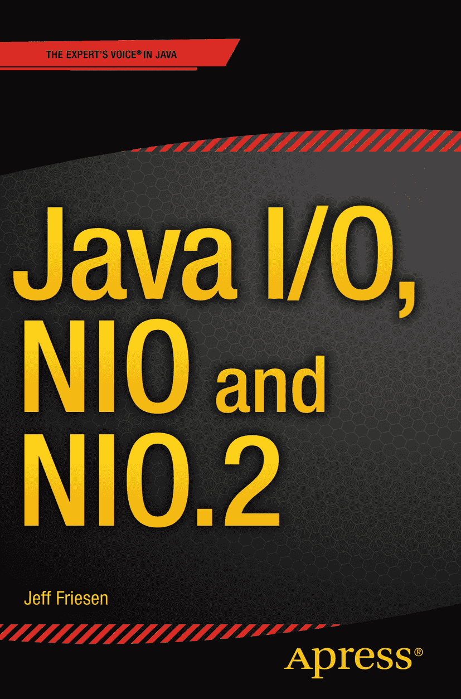

杰夫·弗里森（Jeff Friesen） Java I/O、NIO 与 NIO.2

ISBN 978-1-4842-1566-1 电子书 ISBN 978-1-4842-1565-4 DOI 10.1007/978-1-4842-1565-4 © Apress 2015 Java I/O、NIO 与 NIO.2 常务董事：Welmoed Spahr 首席编辑：Steve Anglin 技术审阅：Vinay Kumar 和 Wallace Jackson 编辑委员会：Steve Anglin、Louise Corrigan、James T. DeWolf、Jonathan Gennick、Robert Hutchinson、Michelle Lowman、James Markham、Susan McDermott、Matthew Moodie、Jeffrey Pepper、Douglas Pundick、Ben Renow-Clarke、Gwenan Spearing、Steve Weiss 协调编辑：Mark Powers 文字编辑：Kezia Endsley 排版：SPi Global 索引编制：SPi Global 插图制作：SPi Global 有关翻译信息，请发送电子邮件至 `rights@apress.com`，或访问 [`www.apress.com`](http://www.apress.com/)。Apress 及 friends of ED 的图书可批量购买，用于学术、企业或促销用途。大多数图书也提供电子书版本和许可证。如需更多信息，请参考我们的特殊批量销售–电子书许可网页：[`www.apress.com/bulk-sales`](http://www.apress.com/bulk-sales)。作者在本书中引用的任何源代码或其他补充材料，读者可在 [`www.apress.com/9781484215661`](http://www.apress.com/9781484215661) 获取。有关如何找到本书源代码的详细信息，请访问 [`www.apress.com/source-code/`](http://www.apress.com/source-code/)。读者也可以在 SpringerLink 上每个章节的“补充材料”部分访问源代码。

本作品受版权保护。出版商保留所有权利，无论是整体还是部分材料，特别是翻译、重印、重用插图、朗诵、广播、以缩微胶片或任何其他物理方式复制，以及电子改编、计算机软件或现在已知或以后开发的类似或不同方法的传输或信息存储与检索的权利。与评论或学术分析相关的简短摘录，或专门为输入和执行于计算机系统而提供的材料，仅供购买者独家使用，不受此法律限制。未经出版商许可，不得复制本出版物或其任何部分，除非符合出版商所在地现行版权法的规定，且必须始终从 Springer 获得使用许可。可通过版权清算中心的 RightsLink 获取使用许可。违反者将根据相应的版权法被起诉。

本书中可能出现商标名称、标识和图像。我们不会在每次出现商标名称、标识或图像时都使用商标符号，而是仅以编辑方式使用这些名称、标识和图像，以维护商标所有者的利益，并无意侵犯商标。本出版物中使用的商品名称、商标、服务标志和类似术语，即使未被标识为如此，也不应被视为对其是否受专有权利保护的看法。

尽管本书中的建议和信息在出版时被认为是真实准确的，但作者、编辑和出版商均不对可能出现的任何错误或遗漏承担法律责任。出版商对本书所含内容不作任何明示或暗示的保证。

本书由 Springer Science+Business Media New York 在全球图书贸易中发行，地址：233 Spring Street, 6th Floor, New York, NY 10013。电话：1-800-SPRINGER，传真：(201) 348-4505，电子邮件：orders-ny@springer-sbm.com，或访问 www.springeronline.com。Apress Media, LLC 是加利福尼亚州的有限责任公司，其唯一成员（所有者）是 Springer Science + Business Media Finance Inc (SSBM Finance Inc)。SSBM Finance Inc 是特拉华州的一家公司。

献给我的父母。

引言

输入/输出（I/O）不是一个吸引人的主题，但它是非平凡应用程序的重要组成部分。本书将向您介绍截至 Java 8 更新 51 的大部分 Java I/O 功能。

第 1 章 从 Java 经典 I/O、新 I/O（NIO）和 NIO.2 类别出发，对 I/O 进行了广泛概述。您将了解每个类别在其功能方面提供了什么，还将了解路径和直接内存访问等概念。

第 2 章 到第 5 章 涵盖了经典 I/O API。您将了解 `File` 和 `RandomAccessFile` 类，以及流（包括对象序列化和外部化）和写入器/读取器。

第 6 章 到第 11 章 重点介绍 NIO。您将探索缓冲区、通道、选择器、正则表达式、字符集和格式化器。（格式化器并未随 Java 1.4 中的其他 NIO 类型一起引入，因为它们依赖于 Java 5 中引入的可变参数功能。）

NIO 缺少一些功能，这些功能随后由 NIO.2 提供。第 12 章 到第 14 章 涵盖了 NIO.2 改进的文件系统接口、异步 I/O 以及套接字通道功能的完善。

每章末尾都附有各种练习，旨在帮助您掌握其内容。除了长答题和判断题外，您还会经常遇到编程练习。附录 A 提供了答案和解决方案。

附录 B 提供了关于套接字和网络接口的教程。虽然与经典 I/O、NIO 和 NIO.2 没有直接关系，但它们利用了 I/O 功能，并在本书的其他地方被提及。

注意

我在一些示例中简要使用了 Java 8 的 lambda 表达式和方法引用语言特性，以及 Java 8 的 Streams API，但并未提供相关教程。您需要从其他途径获取这些知识。

感谢您购买本书。希望它能帮助您理解经典 I/O、NIO 和 NIO.2。

杰夫·弗里森（Jeff Friesen）（2015 年 9 月）

注意

您可以通过将网络浏览器指向 [`www.apress.com/9781484215661`](http://www.apress.com/9781484215661) 并单击“源代码”选项卡，然后单击“立即下载”链接来下载本书的源代码。

致谢

我要感谢许多人在本书编写过程中给予的帮助。我特别感谢 Steve Anglin 邀请我撰写本书，以及 Mark Powers 指导我完成写作过程。

目录 [第一部分：I/​O 入门](http://dx.doi.org/10.1007/978-1-4842-1565-4_Part1) 第 1 章：I/​O 基础与 API 3 经典 I/​O 3 文件系统访问与 File 类 3 通过 RandomAccessFile​ 访问文件内容 5 通过流类进行流式数据传输 5 JDK 1.​1 与 Writer/​Reader 类 8 NIO 8 缓冲区 9 通道 10 选择器 11 正则表达式 12 字符集 13 格式化器 13 NIO.​2 13 改进的文件系统接口 14 异步 I/​O 14 Socket 通道功能的完善 14 小结 15 [第二部分：经典 I/​O API](http://dx.doi.org/10.1007/978-1-4842-1565-4_Part2) 第 2 章：File 19 构造 File 实例 19 了解存储的抽象路径 22 了解路径的文件或目录 25 列出文件系统根目录 27 获取磁盘空间信息 28 列出目录 30 创建/​修改文件和目录 33 设置和获取权限 37 探索其他功能 39 小结 42 第 3 章：RandomAccessFile​ 43 探索 RandomAccessFile​ 43 使用 RandomAccessFile​ 49 小结 57 第 4 章：流 59 流类概述 59 流类巡览 61 OutputStream 和 InputStream 61 ByteArrayOutputS​tream 和 ByteArrayInputSt​ream 64 FileOutputStream​ 和 FileInputStream 67 PipedOutputStrea​m 和 PipedInputStream​ 71 FilterOutputStre​am 和 FilterInputStrea​m 75 BufferedOutputSt​ream 和 BufferedInputStr​eam 84 DataOutputStream​ 和 DataInputStream 86 对象序列化与反序列化 88 PrintStream 104 重温标准 I/​O 107 小结 111 第 5 章：Writer 和 Reader 113 Writer 和 Reader 类概述 114 Writer 和 Reader 116 OutputStreamWrit​er 和 InputStreamReade​r 117 FileWriter 和 FileReader 119 BufferedWriter 和 BufferedReader 121 小结 124 [第三部分：新 I/​O API](http://dx.doi.org/10.1007/978-1-4842-1565-4_Part3) 第 6 章：缓冲区 127 缓冲区简介 127 Buffer 及其子类 128 深入理解缓冲区 133 创建缓冲区 133 缓冲区的写入与读取 136 翻转缓冲区 139 标记缓冲区 141 缓冲区子类操作 142 字节序 143 直接字节缓冲区 145 小结 147 第 7 章：通道 149 通道简介 149 Channel 及其子类 149 深入理解通道 155 分散/​聚集 I/​O 155 文件通道 158 Socket 通道 179 管道 195 小结 201 第 8 章：选择器 203 选择器基础 204 选择器演示 209 小结 214 第 9 章：正则表达式 215 Pattern、PatternSyntaxExc​eption 和 Matcher 215 字符类 221 捕获组 223 边界匹配器与零长度匹配 224 量词 225 实用正则表达式 228 小结 230 第 10 章：字符集 231 基础回顾 231 使用字符集 232 字符集与 String 类 239 小结 241 第 11 章：格式化器 243 探索 Formatter 243 探索 Formattable 和 FormattableFlags​ 249 小结 255 [第四部分：更多新 I/​O API](http://dx.doi.org/10.1007/978-1-4842-1565-4_Part4) 第 12 章：改进的文件系统接口 259 设计更好的 File 类 259 文件系统与文件系统提供者 261 通过 Path 定位文件 263 获取 Path 并访问其名称元素 264 相对路径与绝对路径 267 规范化、相对化与解析 269 其他功能 271 使用 Files 执行文件系统任务 273 访问文件存储 273 管理属性 276 管理文件和目录 305 管理符号链接与硬链接 343 遍历文件树 351 使用其他功能 370 使用路径匹配器与监视服务 373 匹配路径 374 监视目录 377 小结 386 第 13 章：异步 I/​O 387 异步 I/​O 概述 388 异步文件通道 390 异步 Socket 通道 395 AsynchronousServ​erSocketChannel 396 AsynchronousSock​etChannel 403 异步通道组 410 AsynchronousFile​Channel 呢？​ 413 小结 415 第 14 章：Socket 通道功能的完善 417 绑定与选项配置 417 基于通道的多播 422 小结 428 [第五部分：附录](http://dx.doi.org/10.1007/978-1-4842-1565-4_Part5) 附录 A：习题答案 431 第 1 章：I/​O 基础与 API 431 第 2 章：File 432 第 3 章：RandomAccessFile​ 435 第 4 章：流 436 第 5 章：Writer 和 Reader 444 第 6 章：缓冲区 446 第 7 章：通道 449 第 8 章：选择器 453 第 9 章：正则表达式 453 第 10 章：字符集 455 第 11 章：格式化器 457 第 12 章：改进的文件系统接口 458 第 13 章：异步 I/​O 471 第 14 章：Socket 通道功能的完善 475 附录 B：Socket 与网络接口 481 Socket 482 Socket 地址 484 Socket 选项 486 Socket 和 ServerSocket 488 DatagramSocket 和 MulticastSocket 495 网络接口 503 将网络接口与 Socket 结合使用 511 索引 513 内容速览 关于作者 xv   关于技术审校者 xvii   致谢 xix   引言 xxi   [第一部分：I/​O 入门](http://dx.doi.org/10.1007/978-1-4842-1565-4_Part1)   第 1 章：I/​O 基础与 API 3   [第二部分：经典 I/​O API](http://dx.doi.org/10.1007/978-1-4842-1565-4_Part2)   第 2 章：File 19   第 3 章：RandomAccessFile​ 43   第 4 章：流 59   第 5 章：Writer 和 Reader 113   [第三部分：新 I/​O API](http://dx.doi.org/10.1007/978-1-4842-1565-4_Part3)   第 6 章：缓冲区 127   第 7 章：通道 149   第 8 章：选择器 203   第 9 章：正则表达式 215   第 10 章：字符集 231   第 11 章：格式化器 243   [第四部分：更多新 I/​O API](http://dx.doi.org/10.1007/978-1-4842-1565-4_Part4)   第 12 章：改进的文件系统接口 259   第 13 章：异步 I/​O 387   第 14 章：Socket 通道功能的完善 417   [第五部分：附录](http://dx.doi.org/10.1007/978-1-4842-1565-4_Part5)   附录 A：习题答案 431   附录 B：Socket 与网络接口 481   索引 513   关于作者与关于技术审校者 关于作者 关于技术审校者

