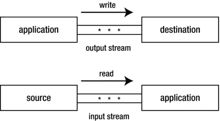
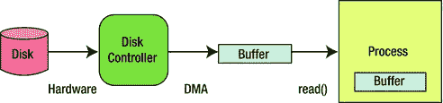
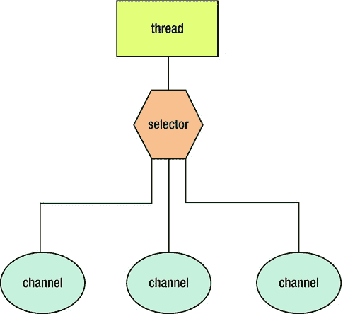

# 1. I/O 基础与 API

输入和输出（I/O）设施是操作系统以及计算机语言及其库的基础组成部分。除了极简单的计算机程序外，所有程序都会执行某种形式的输入和/或输出操作。

Java 一直支持 I/O。其最初的 I/O API 套件及相关架构被称为经典 I/O。由于现代操作系统采用了经典 I/O 所不支持的新 I/O 范式，因此作为 JDK 1.4 的一部分引入了新 I/O（NIO）来支持这些范式。由于时间不足，一些计划中的 NIO 功能未能包含在此版本中，导致这些其他 NIO 功能被推迟到 JDK 5 和 JDK 7 中实现。

本章将向您介绍经典 I/O、NIO 以及更多 NIO（NIO.2）。您将了解它们所解决的基本 I/O 特性。同时，您还将获得其 API 的概览。后续章节将深入探讨这些 API。

## 经典 I/O

JDK 1.0 引入了基本的 I/O 设施，用于访问文件系统（例如创建目录、删除文件或执行其他任务）、随机访问文件内容（相对于顺序访问），以及以顺序方式在源和目标之间流式传输面向字节的数据。

### 文件系统访问与 File 类

文件系统是操作系统的一个组件，负责管理数据存储及后续检索。运行 Java 虚拟机（JVM）的操作系统至少支持一个文件系统。例如，Unix 或 Linux 将所有已挂载（连接并准备就绪）的磁盘合并为一个虚拟文件系统。相比之下，Windows 为每个活动的磁盘驱动器关联一个独立的文件系统。

文件系统将数据存储在文件中，而文件则存储在目录中。其文件和目录对象通过指定路径来访问，路径是定位和标识文件系统对象的紧凑映射。路径可以是绝对路径或相对路径：

*   **绝对路径**是相对于文件系统根目录的路径。它表示为根目录符号后跟一个由分隔符分隔的目录名称层次结构，并以目标目录或文件名结尾。
*   **相对路径**是相对于某个其他目录的路径。其表示方式与绝对路径类似，但没有开头的根目录符号。相反，它通常以一个或多个分隔的“`..`”字符序列作为前缀，每个序列表示一个父目录。

路径的指定方式因操作系统而异。例如，Unix、Linux 及类 Unix 操作系统使用正斜杠（`/`）标识根目录并分隔路径组件，而 Windows 则使用反斜杠（`\`）来实现这些目的。请看两个示例：

`/users/username/bin`

`\users\username\bin`

每个绝对路径都访问根目录下 `users` 子目录中 `username` 子目录下的 `bin` 子目录。第一行的路径在 Unix/Linux 环境下访问 `bin`，而第二行的路径在 Windows 环境下访问该子目录。

Windows 及类似操作系统可以管理多个文件系统。每个文件系统通过一个驱动器标识符（例如“`C:`”）来标识。当指定路径时不带驱动器标识符，则该路径相对于当前文件系统。否则，它相对于指定的文件系统：

`\users\username\bin`

`C:\users\username\bin`

第一行访问相对于当前文件系统的路径，而第二行访问相对于 `C:` 文件系统的路径。

`java.io.File` 类的实例抽象了一个文件或目录路径。该实例提供对文件系统的访问，以在此路径上执行任务，例如删除底层文件或目录。以下示例演示了此类：

`new File("temp").mkdir();`

该示例构造了一个 `File` 对象，初始化为文件系统对象 `temp`。然后在此 `File` 对象上调用 `mkdir()` 来创建一个名为 `temp` 的新目录。

第 2 章将探讨 `File` 类。

### 通过 RandomAccessFile 访问文件内容

文件内容可以顺序访问或随机访问。随机访问可以加速搜索和排序功能。`java.io.RandomAccessFile` 类的实例提供了对文件的随机访问。以下示例演示了此功能：

`RandomAccessFile raf = new RandomAccessFile("employees.dat", "r");`

`int empIndex = 10;`

`raf.seek(empIndex * EMP_REC_LEN);`

`// 读取员工记录的内容。`

在此示例中，正在访问文件 `employees.dat`，该文件被划分为固定长度的员工记录，每条记录长度为 `EMP_REC_LEN` 字节。正在查找索引为 `10` 的员工记录（第一条记录位于索引 `0`）。此任务通过将文件指针定位到该记录第一个字节的字节位置（即索引乘以记录长度）来完成。然后访问该记录。

第 3 章将探讨 `RandomAccessFile` 类。

### 通过流类进行流式数据传输

经典的 I/O 包含用于执行 I/O 操作的流。流是一个任意长度的有序字节序列。字节通过输出流从应用程序流向目的地，并通过输入流从源流向应用程序。图 1-1 展示了这些流程。

图 1-1.

将输出流和输入流概念化为字节流

Java 在 `java.io` 包中提供了用于标识各种写入目的地的流类；例如，字节数组和文件。Java 还在该包中提供了用于标识各种读取来源的流类。示例包括文件和线程管道。

例如，你可以使用 `FileInputStream` 打开一个现有文件，并将一个输入流连接到该文件。然后，你可以调用各种 `read()` 方法，通过输入流从文件中读取字节。最后，调用 `close()` 来关闭流和文件。请参考以下示例：

`FileInputStream fis = null;`

`try`

`{`

   `fis = new FileInputStream("image.jpg");`

   `// 从文件中读取字节。`

   `int _byte;`

   `while ((_byte = fis.read()) != -1) // -1 表示文件结束符`

      `; // 以某种方式处理 _byte。`

`}`

`catch (IOException ioe)`

`{`

   `// 处理异常。`

`}`

`finally`

`{`

   `if (fis != null)`

      `try`

      `{`

         `fis.close();`

      `}`

`}`

此示例演示了打开文件并创建用于从文件读取字节的输入流的传统方式。然后继续读取文件的内容。异常处理器负责处理任何抛出的异常，这些异常由 `java.io.IOException` 类的实例表示。

无论是否抛出异常，输入流和底层文件都必须被关闭。此操作在 `try` 语句的 `finally` 块中执行。由于关闭文件的代码较为冗长，你也可以使用 JDK 7 的 `try`-with-resources 语句来自动关闭它，如下所示：

`try (FileInputStream fis = new FileInputStream("image.jpg"))`

`{`

   `// 从文件中读取字节。`

   `int _byte;`

   `while ((_byte = fis.read()) != -1) // -1 表示文件结束符`

      `; // 以某种方式处理 _byte。`

`}`

`catch (IOException ioe)`

`{`

   `// 处理异常。`

`}`

在后续章节中，我将演示关闭文件的传统方法和 `try`-with-resources 方法。

一些流类用于过滤其他流。例如，为了提高性能，`BufferedInputStream` 从另一个流中读取一个字节块，并从其缓冲区返回字节，直到缓冲区为空，此时它会读取另一个块。请参考以下示例：

`try (FileInputStream fis = new FileInputStream("image.jpg");`

     `BufferedInputStream bis = new BufferedInputStream(fis))`

`{`

   `// 从文件中读取字节。`

   `int _byte;`

   `while ((_byte = bis.read()) != -1) // -1 表示文件结束符`

      `; // 以某种方式处理 _byte。`

`}`

`catch (IOException ioe)`

`{`

   `// 处理异常。`

`}`

创建了一个从 `image.jpg` 文件读取数据的文件输入流。此流被传递给一个缓冲输入流的构造函数。后续的读取操作在缓冲输入流上执行，该流会在适当时调用文件输入流的 `read()` 方法。

第 4 章 将深入探讨流类。

#### 流类与标准 I/O

许多操作系统支持标准 I/O，即计算机程序在开始执行时与其环境之间预先连接的输入和输出数据流。这些预先连接的流被称为标准输入、标准输出和标准错误。

标准输入默认从键盘读取其输入。同样，标准输出和标准错误默认将其输出写入屏幕。但是，这些流可以被重定向，以从不同的源读取输入，并将输出写入不同的目的地（例如文件）。

JDK 1.0 通过在 `java.lang.System` 类中添加类型为 `InputStream` 和 `PrintStream` 的 `in`、`out` 和 `err` 对象，引入了对标准 I/O 的支持。你可以对这些对象调用方法，以访问标准输入、标准输出和标准错误，如下所示：

`int ch = System.in.read(); // 从标准输入读取单个字符。`

`System.out.println("Hello"); // 将字符串写入标准输出。`

`System.err.println("I/O error: " +`

                   `ioe.getMessage()); // 将字符串写入标准错误。`

除了探讨 `InputStream` 和 `PrintStream` 之外，第 4 章 还将重新审视标准 I/O，向你展示如何以编程方式重定向这些流。

### JDK 1.1 与 Writer/Reader 类

JDK 1.0 的 I/O 功能适用于流式传输字节，但由于未考虑字符编码，因此无法正确流式传输字符。JDK 1.1 通过引入考虑字符编码的 writer/reader 类克服了这个问题。例如，`java.io` 包包含了用于写入和读取字符流的 `FileWriter` 和 `FileReader` 类。

第 5 章 将探讨各种 writer 和 reader 类。

## NIO

现代操作系统提供了复杂的 I/O 服务（例如就绪选择），以提高 I/O 性能并简化 I/O。Java 规范请求 (JSR) 51 ( [`www.jcp.org/en/jsr/detail?id=51`](http://www.jcp.org/en/jsr/detail?id=51) ) 的创建就是为了解决这些能力。

JSR 51 的描述表明，它提供了用于可扩展 I/O、快速缓冲二进制和字符 I/O、正则表达式以及字符集转换的 API。这些 API 统称为 NIO。JDK 1.4 通过以下 API 实现了 NIO：

*   缓冲区
*   通道
*   选择器
*   正则表达式
*   字符集

提供正则表达式和字符集 API 是为了简化常见的 I/O 相关任务。

### 缓冲区

缓冲区是 NIO 操作的基础。本质上，NIO 就是关于将数据移入和移出缓冲区。

像 JVM 这样的进程通过请求操作系统将缓冲区内容通过写操作排空到存储设备来执行 I/O。类似地，它也请求操作系统用从存储设备读取的数据来填充缓冲区。

考虑一个涉及磁盘驱动器的读取操作。操作系统向磁盘控制器发出命令，从磁盘读取一个字节块到操作系统缓冲区。一旦此操作完成，操作系统就会将缓冲区内容复制到进程在发出 `read()` 操作时指定的缓冲区。请参见图 1-2。

图 1-2.

在操作系统级别填充缓冲区

在图 1-2 中，一个进程已向操作系统发出了 `read()` 调用。相应地，操作系统已请求磁盘控制器从磁盘读取一个字节块。磁盘控制器（也称为 DMA 控制器）通过直接内存访问（DMA）将这些字节直接读取到操作系统缓冲区中。DMA 是计算机系统的一项特性，它允许某些硬件子系统独立于中央处理单元（CPU）访问主系统（RAM）[内存](https://en.wikipedia.org/wiki/Computer_storage#Computer%20storage)。然后，操作系统将这些字节复制到进程的缓冲区。

将字节从操作系统缓冲区复制到进程缓冲区效率不高。让 DMA 控制器直接复制到进程缓冲区性能会更好，但这种方法存在两个问题：

*   DMA 控制器通常无法直接与 JVM 进程运行的用户空间通信。相反，它与操作系统的内核空间通信。
*   像 DMA 控制器这样的面向块的设备处理的是固定大小的数据块。相比之下，JVM 进程可能请求的数据大小不是块大小的整数倍，或者存在未对齐的情况。

由于这些问题，操作系统充当了中介的角色，在 JVM 进程和 DMA 控制器之间切换时，对数据进行拆分和重组。

通过让 JVM 进程在单个系统调用中向操作系统传递一个缓冲区地址列表，可以使数据组装/拆解任务更加高效。然后，操作系统按顺序填充或排空这些缓冲区，在读取操作时将数据分散到多个缓冲区，或在写入操作时从多个缓冲区收集数据。这种分散/聚集活动减少了 JVM 进程必须进行的（可能代价高昂的）系统调用次数，并且由于操作系统知道总的缓冲区空间大小，它可以优化数据处理。此外，当有多个处理器或核心可用时，操作系统可能允许同时填充或排空多个缓冲区。

JDK 1.4 的 `java.nio.Buffer` 类抽象了 JVM 进程缓冲区的概念。它是 `java.nio.ByteBuffer` 和其他缓冲区类的超类。由于 I/O 从根本上说是面向字节的，因此只有 `ByteBuffer` 实例可以与通道（稍后讨论）一起使用。大多数其他 `Buffer` 子类是为了方便处理多字节数据（如字符或整数）而设计的。

第 6 章 将深入探讨 `Buffer` 类及其子类。

### 通道

强制 CPU 执行 I/O 任务并等待 I/O 完成（这种 CPU 被称为 I/O 密集型）是对这种资源的浪费。通过将这些任务卸载到 DMA 控制器，处理器可以继续处理其他工作，从而提高性能。

通道充当了（通过操作系统）与 DMA 控制器通信的管道，用于高效地将字节缓冲区排空到磁盘或从磁盘填充字节缓冲区。JDK 1.4 的 `java.nio.channels.Channel` 接口、其子接口以及各种类实现了通道架构。

其中一个类叫做 `java.nio.channels.FileChannel`，它抽象了一个用于读取、写入、映射和操作文件的通道。`FileChannel` 的一个有趣特性是它对文件锁定的支持，数据库管理系统等复杂应用程序都依赖于此。

文件锁定允许进程在访问文件时阻止或限制其他进程对该文件的访问。虽然文件锁定可以应用于整个文件，但通常将其缩小到更小的区域。锁定范围从文件中的起始字节偏移量开始，并持续特定数量的字节。

`FileChannel` 的另一个有趣特性是通过 `map()` 方法实现的内存映射文件 I/O。`map()` 返回一个 `java.nio.MappedByteBuffer`，其内容是文件的一个内存映射区域。文件内容通过内存访问来访问；消除了缓冲区复制和读写系统调用。

您可以通过调用 `java.nio.channels.Channels` 类的方法或经典 I/O 类（如 `RandomAccessFile`）中的方法来获取通道。

第 7 章 将深入探讨 `Channel`、`Channels` 等。

### 选择器

I/O 分为面向块和面向流两种。从文件读取或写入文件是面向块 I/O 的一个例子。相比之下，从键盘读取或写入网络连接是面向流 I/O 的一个例子。

流 I/O 通常比块 I/O 慢。此外，输入往往是间歇性的。例如，用户可能在输入一串字符时暂停，或者网络连接的瞬时缓慢会导致播放视频时出现卡顿。

许多操作系统允许将流配置为在非阻塞模式下运行，在这种模式下，线程在没有输入可用时会持续检查可用输入而不会阻塞。线程可以处理传入的数据或执行其他任务，直到数据到达。

这种“轮询可用输入”的活动可能很浪费，尤其是当线程需要监视许多输入流时（例如在 Web 服务器环境中）。现代操作系统可以高效地执行这种检查，这被称为就绪选择，并且通常构建在非阻塞模式之上。操作系统监视一组流，并向线程返回哪些流已准备好执行 I/O 的指示。因此，单个线程可以通过通用代码多路复用许多活动流，并且在 Web 服务器环境中，这使得管理大量网络连接成为可能。

JDK 1.4 通过提供选择器来支持就绪选择，选择器是 `java.nio.channels.Selector` 类的实例，它可以检查一个或多个通道，并确定哪些通道已准备好进行读取或写入。这样，单个线程就可以高效地管理多个通道（因此，也管理多个网络连接）。在性能和/或内存使用方面，线程创建和线程上下文切换代价高昂的情况下，能够使用更少的线程是有利的。请参见图 1-3。

图 1-3.

一个线程通过一个选择器管理三个通道

第 8 章 将深入探讨 `Selector` 及其相关类型。

### 正则表达式

正则表达式是作为 NIO 的一部分引入的。尽管你可能对其引入的理由感到疑惑（正则表达式与 I/O 有什么关系？），但正则表达式通常用于扫描从文件或其他来源读取的文本数据。尽可能快地执行这些扫描的需求促使其被纳入。JDK 1.4 通过 `java.util.regex` 包及其 `Pattern` 和 `Matcher` 类支持正则表达式。

第 9 章 将探讨 `Pattern` 和 `Matcher` 类。

### 字符集

我之前提到过，JDK 1.1 引入了考虑字符编码的 writer/reader 类。最初，诸如 `java.io.InputStreamReader` 之类的类与 `java.io.ByteToCharConverter` 类协同工作，以基于编码执行转换。`ByteToCharConverter` 最终被弃用，并从 JDK 6 及后续版本中移除。取而代之的是引入了功能更强大的 `java.nio.charset` 包及其 `Charset`、`CharsetEncoder`、`CharsetDecoder` 和相关类型。

第 10 章 将探讨 `Charset` 类。

### 格式化器

JSR 51 提到了一种简单的 `printf` 风格的格式化工具。这种工具在准备展示数据方面具有重要价值，许多 C 语言程序员可以证明这一点。然而，JDK 1.4 并未包含此功能，因为它依赖于可变参数列表，而这一语言特性直到 JDK 5 才首次亮相。幸运的是，JDK 5 包含了一个 `java.util.Formatter` 类，它拥有丰富的格式化功能以及支持自定义格式化的相关类型，并且向 `PrintStream` 类添加了 `printf()`（以及相关的 `format()`）方法。

第 11 章 将探讨 `Formatter` 并演示 `printf()`。

## NIO.2

JSR 51 规定 NIO 将引入一个改进的文件系统接口，以克服传统 `File` 类的各种问题。然而，由于时间不足，此功能未能包含在内。此外，也无法支持异步 I/O 和完善套接字通道功能。随后创建了 JSR 203（[`www.jcp.org/en/jsr/detail?id=203`](http://www.jcp.org/en/jsr/detail?id=203)）来解决这些遗漏的问题，该规范在 JDK 7 中首次亮相。

注意

在 JDK 7 正式发布之前，曾考虑为 NIO.2 引入大缓冲区（具有 64 位寻址能力的缓冲区）。计划将 `BigByteBuffer` 和 `MappedBigByteBuffer` 等类包含在 `java.nio` 包或其他包中。然而，正如 OpenJDK 讨论主题“`BigByteBuffer`/`MappedBigByteBuffer`”（[`http://mail.openjdk.java.net/pipermail/nio-discuss/2009-June/000207.html`](http://mail.openjdk.java.net/pipermail/nio-discuss/2009-June/000207.html)）中所解释的那样，此功能已被放弃，转而追求“64 位数组或集合”。

### 改进的文件系统接口

传统的 `File` 类存在各种问题。例如，`renameTo()` 方法在不同操作系统上的行为不一致。此外，`File` 的许多方法不具备可伸缩性；从服务器请求大型目录列表可能会导致挂起。JSR 203 中提到的新的文件系统接口修复了这些问题以及其他问题。例如，它支持批量访问文件属性，提供更改通知工具，提供转义到特定文件系统 API 的能力，并拥有用于可插拔文件系统实现的服务提供者接口。

第 12 章 将探讨改进的文件系统接口。

### 异步 I/O

非阻塞模式通过防止在通道上执行读取或写入操作的线程阻塞（直到输入可用或输出已完全写入）来提高性能。然而，它不允许应用程序在不实际执行操作的情况下确定是否可以执行操作。例如，当非阻塞读取操作成功时，应用程序得知读取操作是可行的，但同时也读取了一些必须管理的数据。这种双重性阻止你将检查流就绪状态的代码与数据处理代码分离，而不会使代码变得非常复杂。

异步 I/O 通过让线程启动操作并立即继续执行其他工作来克服这个问题。线程指定某种回调函数，该函数在操作完成时被调用。

第 13 章 将探讨异步 I/O。

### 完善套接字通道功能

JDK 1.4 向 `java.nio.channels` 包添加了 `DatagramChannel`、`ServerSocketChannel` 和 `SocketChannel` 类。然而，由于时间不足，这些类未能支持绑定和选项配置。此外，基于通道的多播数据报也未得到支持。JDK 7 为上述类添加了绑定支持和选项配置。同时，它还引入了一个新的 `java.nio.channels.MulticastChannel` 接口。

第 14 章 将探讨套接字通道功能的完善。

练习

以下练习旨在测试你对第 1 章内容的理解：

识别构成经典 I/O 的 API 类别。   `try`-with-resources 语句提供了什么好处？   识别构成 NIO 的 API 类别。   哪个 API 类允许 Java 程序利用就绪选择？   识别构成 NIO.2 的 API 类别。   NIO.2 如何完善套接字通道功能？

## 总结

I/O 是操作系统、计算机语言和语言库的基础。Java 通过其经典 I/O、NIO 和 NIO.2 API 类别支持 I/O。

经典 I/O 提供了访问文件系统、随机访问文件内容（相对于顺序访问）、在源和目标之间流式传输面向字节的数据以及支持字符流的 API。

NIO 提供了管理缓冲区、通过通道通信缓冲数据、通过选择器利用就绪选择、通过正则表达式快速扫描文本数据、通过字符集指定字符编码以及支持 `printf` 风格格式化的 API。

NIO.2 提供了改进文件系统接口、支持异步 I/O 以及通过升级 `DatagramChannel`、`ServerSocketChannel` 和 `SocketChannel` 并引入新的 `MulticastChannel` 接口来完善套接字通道功能的 API。

第 2 章 将介绍经典 I/O 的 `File` 类。

