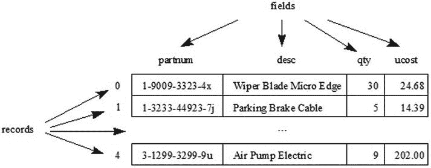

# 3. RandomAccessFile

电子补充材料 本章的在线版本 (doi:[10.​1007/​978-1-4842-1565-4_​3](http://dx.doi.org/10.1007/978-1-4842-1565-4_3)) 包含补充材料，可供授权用户使用。

可以创建和/或打开文件以进行随机访问，在此过程中，可以在文件关闭前在不同位置混合执行写入和读取操作。Java 通过提供 `java.io.RandomAccessFile` 类来支持这种随机访问。我将在本章中探讨 `RandomAccessFile`。

## 探索 RandomAccessFile

`RandomAccessFile` 声明了以下构造方法：

*   `RandomAccessFile(File file, String mode)`：当文件不存在时创建并打开一个新文件，或打开一个现有文件。该文件由 `file` 的抽象路径标识，并根据 `mode` 进行创建和/或打开。
*   `RandomAccessFile(String path, String mode)`：当文件不存在时创建并打开一个新文件，或打开一个现有文件。该文件由 `path` 标识，并根据 `mode` 进行创建和/或打开。

任一构造方法的 `mode` 参数必须是 `"r"`、`"rw"`、`"rws"` 或 `"rwd"` 之一；否则，构造方法会抛出 `java.lang.IllegalArgumentException`。这些字符串字面量的含义如下：

*   `"r"` 告知构造方法仅以读取方式打开一个现有文件。任何尝试写入该文件的操作都会导致抛出 `java.io.IOException` 类的实例。
*   `"rw"` 告知构造方法：当文件不存在时，以读写方式创建并打开一个新文件；或打开一个现有文件进行读写。
*   `"rwd"` 告知构造方法：当文件不存在时，以读写方式创建并打开一个新文件；或打开一个现有文件进行读写。此外，对文件内容的每次更新都必须同步写入底层存储设备。
*   `"rws"` 告知构造方法：当文件不存在时，以读写方式创建并打开一个新文件；或打开一个现有文件进行读写。此外，对文件内容或元数据的每次更新都必须同步写入底层存储设备。

注意

文件的元数据是关于文件的数据，而非实际的文件内容。元数据的示例包括文件长度和文件最后修改时间。

`"rwd"` 和 `"rws"` 模式确保对位于本地存储设备上的文件进行的任何写入操作都会写入该设备，从而保证在操作系统崩溃时关键数据不会丢失。当文件不在本地设备上时，则不做此保证。

注意

对以 `"rwd"` 或 `"rws"` 模式打开的随机访问文件执行的操作，比以 `"rw"` 模式打开的随机访问文件执行相同操作要慢。

当 `mode` 为 `"r"` 且无法打开由 `path` 标识的文件（该文件可能不存在或是一个目录），或者当 `mode` 为 `"rw"` 且 `path` 是只读的或是一个目录时，这些构造方法会抛出 `java.io.FileNotFoundException`。

以下示例通过使用 `"r"` 模式字符串尝试以读取访问方式打开一个现有文件，演示了第二个构造方法：

`RandomAccessFile raf = new RandomAccessFile("employee.dat", "r");`

随机访问文件与一个文件指针相关联，该指针是一个光标，用于标识下一个要写入或读取的字节的位置。当打开一个现有文件时，文件指针被设置在其第一个字节处，偏移量为 0。当创建文件时，文件指针也被设置为 0。

写入或读取操作从文件指针处开始，并在操作完成后将指针向前移动已写入或读取的字节数。写入操作若超过当前文件末尾，会导致文件被扩展。这些操作会持续进行，直到文件被关闭。

`RandomAccessFile` 声明了许多方法。我在表 3-1 中展示了这些方法的一个代表性示例。

表 3-1.

`RandomAccessFile` 方法

| 方法 | 描述 |
| --- | --- |
| `void close()` | 关闭文件并释放所有关联的操作系统资源。后续的写入或读取操作将导致 `IOException`。此外，无法通过此 `RandomAccessFile` 对象重新打开该文件。当发生 I/O 错误时，此方法会抛出 `IOException`。 |
| `FileDescriptor getFD()` | 返回文件关联的文件描述符对象。当发生 I/O 错误时，此方法会抛出 `IOException`。 |
| `long getFilePointer()` | 返回文件指针当前在文件中的基于零的字节偏移量。当发生 I/O 错误时，此方法会抛出 `IOException`。 |
| `long length()` | 返回文件的长度（以字节为单位）。当发生 I/O 错误时，此方法会抛出 `IOException`。 |
| `int read()` | 从文件中读取并返回下一个字节（以 `int` 形式返回，范围 0 到 255），如果到达文件末尾则返回 `-1`。当没有输入可用时，此方法会阻塞；当发生 I/O 错误时，会抛出 `IOException`。 |
| `int read(byte[] b)` | 从文件中读取最多 `b.length` 字节的数据到字节数组 `b` 中。此方法会阻塞，直到至少有一个字节的输入可用。它返回读取到数组中的字节数，如果到达文件末尾则返回 `-1`。当 `b` 为 `null` 时，抛出 `java.lang.NullPointerException`；当发生 I/O 错误时，抛出 `IOException`。 |
| `char readChar()` | 从文件中读取并返回一个字符。此方法从当前文件指针位置开始，从文件中读取两个字节。如果按顺序读取的字节是 `b1` 和 `b2`，其中 0 <= `b1`, `b2` <= 255，则结果等于 `(char) ((b1 << 8) &#124; b2)`。此方法会阻塞，直到读取到两个字节、检测到文件末尾或抛出异常。如果在读取完两个字节之前到达文件末尾，则抛出 `java.io.EOFException`（`IOException` 的子类）；当发生 I/O 错误时，抛出 `IOException`。 |
| `int readInt()` | 从文件中读取并返回一个 32 位整数。此方法从当前文件指针位置开始，从文件中读取四个字节。如果按顺序读取的字节是 `b1`、`b2`、`b3` 和 `b4`，其中 0 <= `b1`, `b2`, `b3`, `b4` <= 255，则结果等于 `(b1 << 24) &#124; (b2 << 16) &#124; (b3 << 8) &#124; b4`。此方法会阻塞，直到读取到四个字节、检测到文件末尾或抛出异常。如果在读取完四个字节之前到达文件末尾，则抛出 `EOFException`；当发生 I/O 错误时，抛出 `IOException`。 |
| `void seek(long pos)` | 将文件指针的当前偏移量设置为 `pos`（以文件开头的字节数计）。如果偏移量设置到文件末尾之后，文件的长度不会改变。只有在将偏移量设置到文件末尾之后进行写入操作时，文件长度才会改变。当 `pos` 的值为负数或发生 I/O 错误时，此方法会抛出 `IOException`。 |
| `void setLength(long newLength)` | 设置文件的长度。如果 `length()` 返回的当前长度大于 `newLength`，则文件会被截断。在这种情况下，如果 `getFilePointer()` 返回的文件偏移量大于 `newLength`，则在 `setLength()` 返回后，偏移量将等于 `newLength`。如果当前长度小于 `newLength`，则文件会被扩展。在这种情况下，文件扩展部分的内容是未定义的。当发生 I/O 错误时，此方法会抛出 `IOException`。 |
| `int skipBytes(int n)` | 尝试跳过 `n` 个字节。如果在跳过 `n` 个字节之前到达文件末尾，此方法会跳过较少数量的字节（可能为零）。在这种情况下，它不会抛出 `EOFException`。如果 `n` 为负数，则不跳过任何字节。返回实际跳过的字节数。当发生 I/O 错误时，此方法会抛出 `IOException`。 |
| `void write(byte[] b)` | 从当前文件指针位置开始，将字节数组 `b` 中的 `b.length` 个字节写入文件。当发生 I/O 错误时，此方法会抛出 `IOException`。 |
| `void write(int b)` | 在当前文件指针位置，将 `b` 的低八位作为 32 位整数写入文件。当发生 I/O 错误时，此方法会抛出 `IOException`。 |
| `void writeChars(String s)` | 从当前文件指针位置开始，将字符串 `s` 作为字符序列写入文件。当发生 I/O 错误时，此方法会抛出 `IOException`。 |
| `void writeInt(int i)` | 从当前文件指针位置开始，将 32 位整数 `i` 写入文件。四个字节按高位优先的顺序写入。当发生 I/O 错误时，此方法会抛出 `IOException`。 |

表 3-1 中的大多数方法都相当不言自明。然而，`getFD()` 方法需要进一步说明。

注意

`RandomAccessFile` 中以 `read` 为前缀的方法和 `skipBytes()` 方法源自 `java.io.DataInput` 接口，该类实现了该接口。此外，`RandomAccessFile` 中以 `write` 为前缀的方法源自 `java.io.DataOutput` 接口，该类也实现了该接口。

当文件被打开时，底层操作系统会创建一个依赖于操作系统的结构来表示该文件。该结构的句柄存储在 `java.io.FileDescriptor` 类的实例中，`getFD()` 方法返回该实例。

注意

句柄是一个标识符，Java 将其传递给底层操作系统，用于在需要底层操作系统执行文件操作时，标识特定的已打开文件。

`FileDescriptor` 是一个小型类，它声明了三个名为 `in`、`out` 和 `err` 的 `FileDescriptor` 常量。这些常量使得 `System.in`、`System.out` 和 `System.err` 能够访问标准输入、标准输出和标准错误流。

`FileDescriptor` 还声明了以下一对方法：

*   `void sync()` 通知底层操作系统将打开文件的输出缓冲区内容刷新（清空）到其关联的本地磁盘设备。在所有修改过的数据和属性都已写入相关设备后，`sync()` 返回。当缓冲区无法刷新，或者因为操作系统无法保证所有缓冲区都已与物理介质同步时，它会抛出 `java.io.SyncFailedException`。
*   `boolean valid()` 判断此文件描述符对象是否有效。如果文件描述符对象表示一个打开的文件或其他活动的 I/O 连接，则返回 true；否则返回 false。

写入打开文件的数据存储在底层操作系统的输出缓冲区中。当缓冲区填满时，操作系统会将其清空到磁盘。缓冲区提高了性能，因为磁盘访问比访问计算机内部内存慢得多。

但是，当你通过模式 `"rwd"` 或 `"rws"` 打开随机访问文件并写入数据时，每次写入操作的数据都会直接写入磁盘。因此，写入操作比以 `"rw"` 模式打开随机访问文件时要慢。

假设你遇到一种情况，需要结合使用输出缓冲区写入数据和直接写入磁盘。以下示例通过以 `"rw"` 模式打开文件并有选择地调用 `FileDescriptor` 的 `sync()` 方法来解决这种混合场景。

`RandomAccessFile raf = new RandomAccessFile("employee.dat", "rw");`

`FileDescriptor fd = raf.getFD();`

`// 执行一次关键的写入操作。`

`raf.write(...);`

`// 通过将操作系统输出缓冲区刷新到磁盘来与底层磁盘同步。`

`fd.sync();`

`// 执行一次非关键的写入操作，无需同步。`

`raf.write(...);`

`// 执行其他工作。`

`// 关闭文件，将输出缓冲区清空到磁盘。`

`raf.close();`

## 使用 RandomAccessFile

`RandomAccessFile` 对于创建平面文件数据库非常有用，这种数据库将单个文件组织成记录和字段。一条记录存储一个单独的条目（例如零件数据库中的一个零件），而一个字段则存储该条目的一个单独属性（例如零件编号）。

注意

术语“字段”也用于指代类中声明的变量。为了避免这种重载术语造成的混淆，可以将字段变量视为类似于记录的字段属性。

平面文件数据库通常将其内容组织成一系列固定长度的记录。每条记录进一步组织成一个或多个固定长度的字段。图 3-1 在零件数据库的上下文中说明了这一概念。

图 3-1.

汽车零件的平面文件数据库被划分为记录和字段

根据图 3-1，每个字段都有一个名称（`partnum`、`desc`、`qty` 和 `ucost`）。此外，每条记录都被分配一个从 0 开始的编号。此示例包含五条记录，为简洁起见，仅显示了其中三条。

为了向您展示如何使用 `RandomAccessFile` 实现平面文件数据库，我创建了一个简单的 `PartsDB` 类来模拟图 3-1。请查看清单 3-1。

清单 3-1. 实现零件平面文件数据库

`import java.io.IOException;`

`import java.io.RandomAccessFile;`

`public class PartsDB`

`{`

`public final static int PNUMLEN = 20;`

`public final static int DESCLEN = 30;`

`public final static int QUANLEN = 4;`

`public final static int COSTLEN = 4;`

`private final static int RECLEN = 2 * PNUMLEN + 2 * DESCLEN + QUANLEN +`

`COSTLEN;`

`private RandomAccessFile raf;`

`public PartsDB(String path) throws IOException`

`{`

`raf = new RandomAccessFile(path, "rw");`

`}`

`public void append(String partnum, String partdesc, int qty, int ucost)`

`throws IOException`

`{`

`raf.seek(raf.length());`

`write(partnum, partdesc, qty, ucost);`

`}`

`public void close()`

`{`

`try`

`{`

`raf.close();`

`}`

`catch (IOException ioe)`

`{`

`System.err.println(ioe);`

`}`

`}`

`public int numRecs() throws IOException`

`{`

`return (int) raf.length() / RECLEN;`

`}`

`public Part select(int recno) throws IOException`

`{`

`if (recno < 0 || recno >= numRecs())`

`throw new IllegalArgumentException(recno + " out of range");`

`raf.seek(recno * RECLEN);`

`return read();`

`}`

`public void update(int recno, String partnum, String partdesc, int qty,`

`int ucost) throws IOException`

`{`

`if (recno < 0 || recno >= numRecs())`

`throw new IllegalArgumentException(recno + " out of range");`

`raf.seek(recno * RECLEN);`

`write(partnum, partdesc, qty, ucost);`

`}`

`private Part read() throws IOException`

`{`

`StringBuffer sb = new StringBuffer();`

`for (int i = 0; i < PNUMLEN; i++)`

`sb.append(raf.readChar());`

`String partnum = sb.toString().trim();`

`sb.setLength(0);`

`for (int i = 0; i < DESCLEN; i++)`

`sb.append(raf.readChar());`

`String partdesc = sb.toString().trim();`

`int qty = raf.readInt();`

`int ucost = raf.readInt();`

`return new Part(partnum, partdesc, qty, ucost);`

`}`

`private void write(String partnum, String partdesc, int qty, int ucost)`

`throws IOException`

`{`

`StringBuffer sb = new StringBuffer(partnum);`

`if (sb.length() > PNUMLEN)`

`sb.setLength(PNUMLEN);`

`else`

`if (sb.length() < PNUMLEN)`

`{`

`int len = PNUMLEN - sb.length();`

`for (int i = 0; i < len; i++)`

`sb.append(" ");`

`}`

`raf.writeChars(sb.toString());`

`sb = new StringBuffer(partdesc);`

`if (sb.length() > DESCLEN)`

`sb.setLength(DESCLEN);`

`else`

`if (sb.length() < DESCLEN)`

`{`

`int len = DESCLEN - sb.length();`

`for (int i = 0; i < len; i++)`

`sb.append(" ");`

`}`

`raf.writeChars(sb.toString());`

`raf.writeInt(qty);`

`raf.writeInt(ucost);`

`}`

`public static class Part`

`{`

`private String partnum;`

`private String desc;`

`private int qty;`

`private int ucost;`

`public Part(String partnum, String desc, int qty, int ucost)`

`{`

`this.partnum = partnum;`

`this.desc = desc;`

`this.qty = qty;`

`this.ucost = ucost;`

`}`

`String getDesc()`

`{`

`return desc;`

`}`

`String getPartnum()`

`{`

`return partnum;`

`}`

`int getQty()`

`{`

`return qty;`

`}`

`int getUnitCost()`

`{`

`return ucost;`

`}`

`}`

`}`

`PartsDB` 首先声明了一些常量，用于标识字符串和 32 位整数字段的长度。然后，它声明了一个常量，用于以字节为单位计算记录长度。该计算考虑到了文件中一个字符占用两个字节的事实。

这些常量之后是一个名为 `raf` 的字段，其类型为 `RandomAccessFile`。在随后的构造函数中，该字段被赋值为 `RandomAccessFile` 类的一个实例，该构造函数由于使用了 `"rw"` 参数，会创建/打开一个新文件或打开一个现有文件。

接下来，`PartsDB` 声明了 `append()`、`close()`、`numRecs()`、`select()` 和 `update()` 方法。这些方法分别用于向文件追加一条记录、关闭文件、返回文件中的记录数、选择并返回特定记录，以及更新特定记录：

*   `append()` 方法首先调用 `length()` 和 `seek()`。这样做是为了确保在调用私有的 `write()` 方法写入一条包含该方法参数的记录之前，文件指针位于文件末尾。
*   `RandomAccessFile` 的 `close()` 方法可能抛出 `IOException`。由于这种情况很少发生，我选择在 `PartDB` 的 `close()` 方法中处理此异常，这保持了该方法签名的简洁性。但是，当发生 `IOException` 时，我会打印一条消息。
*   `numRecs()` 方法返回文件中的记录数。这些记录的编号从 0 开始，到 `numRecs() - 1` 结束。`select()` 和 `update()` 方法都会验证其 `recno` 参数是否在此范围内。
*   `select()` 方法调用私有的 `read()` 方法，以嵌套类 `Part` 的实例形式返回由 `recno` 标识的记录。`Part` 的构造函数将 `Part` 对象初始化为记录的字段值，其 getter 方法返回这些值。
*   `update()` 方法同样简单。与 `select()` 一样，它首先将文件指针定位到由 `recno` 标识的记录的起始位置。与 `append()` 一样，它调用 `write()` 来写出其参数，但替换的是记录而不是添加一条。

记录通过私有的 `write()` 方法写入。由于字段必须有精确的大小，`write()` 会在右侧用空格填充比字段大小短的基于 `String` 的值，并在需要时将这些值截断到字段大小。

记录通过私有的 `read()` 方法读取。`read()` 在将基于 `String` 的字段值保存到 `Part` 对象之前会移除填充。

`PartsDB` 本身是无用的。你需要一个应用程序来试验这个类，而清单 3-2 满足了这一要求。

清单 3-2. 试验零件平面文件数据库

`import java.io.IOException;`

`public class UsePartsDB`

`{`

`public static void main(String[] args)`

`{`

`PartsDB pdb = null;`

`try`

`{`

`pdb = new PartsDB("parts.db");`

`if (pdb.numRecs() == 0)`

`{`

`// 用记录填充数据库。`

`pdb.append("1-9009-3323-4x", "Wiper Blade Micro Edge", 30,`

`2468);`

`pdb.append("1-3233-44923-7j", "Parking Brake Cable", 5, 1439);`

`pdb.append("2-3399-6693-2m", "Halogen Bulb H4 55/60W", 22, 813);`

`pdb.append("2-599-2029-6k", "Turbo Oil Line O-Ring ", 26, 155);`

`pdb.append("3-1299-3299-9u", "Air Pump Electric", 9, 20200);`

`}`

`dumpRecords(pdb);`

`pdb.update(1, "1-3233-44923-7j", "Parking Brake Cable", 5, 1995);`

`dumpRecords(pdb);`

`}`

`catch (IOException ioe)`

`{`

`System.err.println(ioe);`

`}`

`finally`

`{`

`if (pdb != null)`

`pdb.close();`

`}`

`}`

`static void dumpRecords(PartsDB pdb) throws IOException`

`{`

`for (int i = 0; i < pdb.numRecs(); i++)`

`{`

`PartsDB.Part part = pdb.select(i);`

`System.out.print(format(part.getPartnum(), PartsDB.PNUMLEN, true));`

`System.out.print(" | ");`

`System.out.print(format(part.getDesc(), PartsDB.DESCLEN, true));`

`System.out.print(" | ");`

`System.out.print(format("" + part.getQty(), 10, false));`

`System.out.print(" | ");`

`String s = part.getUnitCost() / 100 + "." + part.getUnitCost() %`

`100;`

`if (s.charAt(s.length() - 2) == ’.’) s += "0";`

`System.out.println(format(s, 10, false));`

`}`

`System.out.println("Number of records = " + pdb.numRecs());`

`System.out.println();`

`}`

`static String format(String value, int maxWidth, boolean leftAlign)`

`{`

`StringBuffer sb = new StringBuffer();`

`int len = value.length();`

`if (len > maxWidth)`

`{`

`len = maxWidth;`

`value = value.substring(0, len);`

`}`

`if (leftAlign)`

`{`

`sb.append(value);`

`for (int i = 0; i < maxWidth - len; i++)`

`sb.append(" ");`

`}`

`else`

`{`

`for (int i = 0; i < maxWidth - len; i++)`

`sb.append(" ");`

`sb.append(value);`

`}`

`return sb.toString();`

`}`

`}`

清单 3-2 的 `main()` 方法首先实例化 `PartsDB`，并将 `parts.db` 作为数据库文件的名称。当此文件没有记录时，`numRecs()` 返回 `0`，并通过 `append()` 方法向文件追加若干条记录。

接下来，`main()` 将存储在 `parts.db` 中的五条记录转储到标准输出流，更新编号为 1 的记录中的单位成本，再次将这些记录转储到标准输出流以显示此更改，然后关闭数据库。

注意

我将单位成本值存储为基于整数的便士金额。例如，我指定字面量 `1995` 来表示 1995 便士，即 19.95 美元。如果我使用 `java.math.BigDecimal` 对象来存储货币值，我将不得不重构 `PartsDB` 以利用对象序列化，而我目前不打算这样做。（我将在第 4 章中讨论对象序列化。）

`main()` 依赖于一个 `dumpRecords()` 辅助方法来转储这些记录，而 `dumpRecords()` 又依赖于一个 `format()` 辅助方法来格式化字段值，以便它们能够在对齐的列中呈现——我本可以使用 `java.util.Formatter`（参见第 11 章）来代替。

按如下方式编译清单 3-1 和 3-2：

`javac *.java`

按如下方式运行生成的应用程序：

`java UsePartsDB`

以下输出显示了 `format()` 实现的对齐效果：

`1-9009-3323-4x      | Wiper Blade Micro Edge       |         30 |      24.68`

`1-3233-44923-7j     | Parking Brake Cable          |          5 |      19.95`

`2-3399-6693-2m      | Halogen Bulb H4 55/60W       |         22 |       8.13`

`2-599-2029-6k       | Turbo Oil Line O-Ring        |         26 |       1.55`

`3-1299-3299-9u      | Air Pump Electric            |          9 |     202.00`

`Number of records = 5`

`1-9009-3323-4x      | Wiper Blade Micro Edge       |         30 |      24.68`

`1-3233-44923-7j     | Parking Brake Cable          |          5 |      19.95`

`2-3399-6693-2m      | Halogen Bulb H4 55/60W       |         22 |       8.13`

`2-599-2029-6k       | Turbo Oil Line O-Ring        |         26 |       1.55`

`3-1299-3299-9u      | Air Pump Electric            |          9 |     202.00`

`Number of records = 5`

就是这样：一个简单的平面文件数据库。尽管它缺乏对高级数据库特性（如索引和事务管理）的支持，但一个平面文件数据库可能正是你的 Java 应用程序所需要的全部。

注意

请查阅维基百科的“平面文件数据库”词条（[`https://en.wikipedia.org/wiki/Flat_file_database`](https://en.wikipedia.org/wiki/Flat_file_database)）以了解更多关于平面文件数据库的信息。

练习

以下练习旨在测试你对第 3 章内容的理解：

`RandomAccessFile` 类的用途是什么？  
什么是文件的元数据？  
`"rwd"` 和 `"rws"` 模式参数的作用是什么？  
什么是文件指针？  
当写入位置超过文件末尾时会发生什么？  
判断正误：当你调用 `RandomAccessFile` 的 `seek(long)` 方法设置文件指针的值，且该值大于文件长度时，文件的长度会发生变化。  
方法 `void write(int b)` 实现了什么功能？  
`FileDescriptor` 的 `sync()` 方法实现了什么功能？  
定义平面文件数据库。  
编写一个名为 `RAFDemo` 的小型 Java 应用程序，该程序以读/写模式打开文件 `data`，使用 `void write(int b)` 写入字节值 `127`，接着使用 `void writeChars(String s)` 将字符串 `"Test"`（不含引号）写入该文件，然后将文件指针重置到文件开头，并读取/输出这些值。

## 总结

文件可以以随机访问方式打开，在这种模式下，可以在文件的不同位置混合执行写入和读取操作，直到文件关闭。Java 通过提供 `RandomAccessFile` 类（位于 `java.io` 包中）来支持这种随机访问。

你首先了解了 `RandomAccessFile` 的构造函数、操作模式以及文件指针。然后，你探索了该类的一些方法示例。接着，你学习了 `FileDescriptor` 类及其方法。最后，你学习了如何使用 `RandomAccessFile` 创建平面文件数据库。

第 4 章将介绍经典 I/O 的流类。

