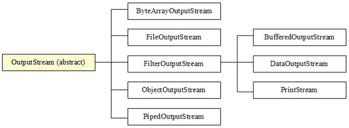
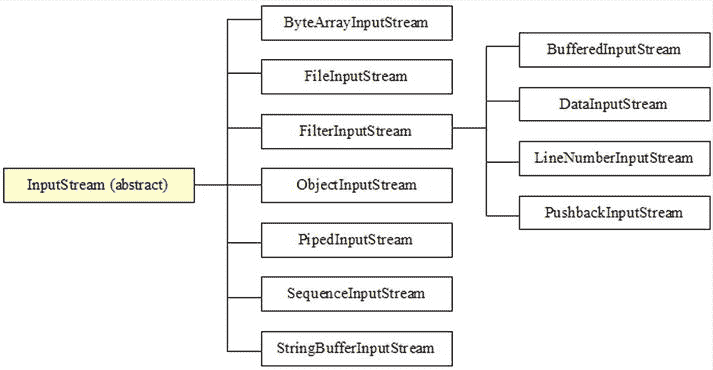
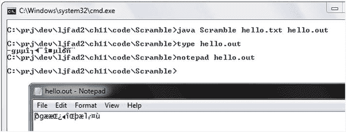
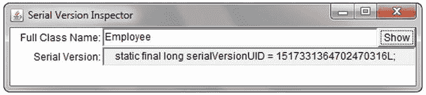

# 4. 流

电子补充材料 本章的在线版本 (doi:[10.​1007/​978-1-4842-1565-4_​4](http://dx.doi.org/10.1007/978-1-4842-1565-4_4)) 包含补充材料，可供授权用户使用。

除了 `java.io.File` 和 `java.io.RandomAccessFile`，Java 的经典 I/O 基础设施还提供了用于执行 I/O 操作的流。流是一个任意长度的有序字节序列。字节通过输出流从应用程序流向目的地，并通过输入流从源流向应用程序。

Java 在 `java.io` 包中提供了标识各种用于写入的流目的地的类；例如，字节数组、文件和线程管道。Java 还在该包中提供了标识各种用于读取的流源的类。例如，字节数组、文件和线程管道。本章将探讨其中的许多类。

## 流类概述

`java.io` 包提供了多个输出流和输入流类，这些类是其抽象类 `OutputStream` 和 `InputStream` 的子类。图 4-1 展示了输出流类的层次结构。

图 4-1.

除 `PrintStream` 外，所有输出流类均以其 `OutputStream` 后缀标识

图 4-2 展示了输入流类的层次结构。

图 4-2.

`LineNumberInputStream` 和 `StringBufferInputStream` 已弃用

`LineNumberInputStream` 和 `StringBufferInputStream` 已被弃用，因为它们不支持不同的字符编码，我将在第 5 章中讨论这个主题。`java.io.LineNumberReader` 和 `java.io.StringReader` 是它们的替代品。（我将在第 5 章中与写入器一起讨论读取器。）

注意

`PrintStream` 是另一个应该被弃用的类，因为它不支持不同的字符编码；`java.io.PrintWriter` 是其替代品。然而，Oracle 不太可能弃用这个类，因为 `PrintStream` 是 `java.lang.System` 类的 `out` 和 `err` 类字段的类型，并且有太多遗留代码依赖于这一事实。

其他 Java 包提供了额外的输出流和输入流类。例如，`java.util.zip` 提供了四个将未压缩数据压缩成各种格式的输出流类，以及四个从相同格式解压压缩数据的匹配输入流类：

*   `CheckedOutputStream`
*   `CheckedInputStream`
*   `DeflaterOutputStream`
*   `GZIPOutputStream`
*   `GZIPInputStream`
*   `InflaterInputStream`
*   `ZipOutputStream`
*   `ZipInputStream`

此外，`java.util.jar` 包提供了一对流类，用于向 JAR 文件写入内容和从 JAR 文件读取内容：

*   `JarOutputStream`
*   `JarInputStream`

## 流类导览

在接下来的几个小节中，我将带你浏览 `java.io` 中的大部分输出流和输入流类，从 `OutputStream` 和 `InputStream` 开始。

### OutputStream 和 InputStream

Java 提供了抽象类 `OutputStream` 和 `InputStream` 来描述执行流 I/O 的类。`OutputStream` 是所有输出流子类的超类。表 4-1 描述了 `OutputStream` 的方法。

表 4-1.

`OutputStream` 方法

| 方法 | 描述 |
| --- | --- |
| `void close()` | 关闭此输出流并释放与该流关联的所有操作系统资源。当发生 I/O 错误时，此方法抛出 `java.io.IOException`。 |
| `void flush()` | 通过将所有缓冲的输出字节写入目的地来刷新此输出流。如果此输出流的目标是底层操作系统提供的抽象（例如文件），刷新流仅保证先前写入流的字节被传递给底层操作系统进行写入；它不保证这些字节被实际写入物理设备（如磁盘驱动器）。当发生 I/O 错误时，此方法抛出 `IOException`。 |
| `void write(byte[] b)` | 将字节数组 `b` 中的 `b.length` 个字节写入此输出流。通常，`write(b)` 的行为如同你指定了 `write(b, 0, b.length)`。当 `b` 为 `null` 时，此方法抛出 `java.lang.NullPointerException`；当发生 I/O 错误时，抛出 `IOException`。 |
| `void write(byte[] b, int off, int len)` | 从字节数组 `b` 的偏移量 `off` 开始，将 `len` 个字节写入此输出流。当 `b` 为 `null` 时，此方法抛出 `NullPointerException`；当 `off` 为负数、`len` 为负数或 `off + len` 大于 `b.length` 时，抛出 `java.lang.IndexOutOfBoundsException`；当发生 I/O 错误时，抛出 `IOException`。 |
| `void write(int b)` | 将字节 `b` 写入此输出流。仅写入低八位，高二十四位被忽略。当发生 I/O 错误时，此方法抛出 `IOException`。 |

`flush()` 方法在需要定期保存更改的长时间运行的应用程序中非常有用，例如，每几分钟将更改保存到临时文件的文本编辑器应用程序。请记住，`flush()` 仅将字节刷新到操作系统；这样做并不一定导致操作系统将这些字节刷新到磁盘。

注意

`close()` 方法会自动刷新输出流。如果在调用 `close()` 之前应用程序结束，输出流会自动关闭，其数据也会被刷新。

`InputStream` 是所有输入流子类的超类。表 4-2 描述了 `InputStream` 的方法。

表 4-2.

`InputStream` 方法

| 方法 | 描述 |
| --- | --- |
| `int available()` | 返回在不阻塞调用线程的情况下，通过下一次 `read()` 方法调用（或通过 `skip()` 跳过）可以从该输入流读取的字节数的估计值。当发生 I/O 错误时，此方法会抛出 `IOException`。切勿使用此方法的返回值来分配用于保存流中所有数据的缓冲区，因为子类可能不会返回流的总大小。 |
| `void close()` | 关闭此输入流并释放与该流关联的所有操作系统资源。当发生 I/O 错误时，此方法会抛出 `IOException`。 |
| `void mark(int readlimit)` | 标记此输入流中的当前位置。后续对 `reset()` 的调用会将此流重新定位到上次标记的位置，以便后续的读取操作重新读取相同的字节。`readlimit` 参数告知此输入流在使此标记失效之前允许读取那么多字节（这样流就无法重置到标记的位置）。 |
| `boolean markSupported()` | 当此输入流支持 `mark()` 和 `reset()` 时返回 true；否则返回 false。 |
| `int read()` | 从此输入流中读取并返回下一个字节（作为范围在 0 到 255 之间的 `int`），或者当到达流末尾时返回 `-1`。此方法会阻塞，直到有输入可用、检测到流末尾或抛出异常。当发生 I/O 错误时，它会抛出 `IOException`。 |
| `int read(byte[] b)` | 从此输入流中读取一定数量的字节并将其存储到字节数组 `b` 中。返回实际读取的字节数（可能小于 `b` 的长度，但绝不会超过其长度），或者当到达流末尾时返回 `-1`（没有可读取的字节）。此方法会阻塞，直到有输入可用、检测到流末尾或抛出异常。当 `b` 为 `null` 时，它会抛出 `NullPointerException`；当发生 I/O 错误时，它会抛出 `IOException`。 |
| `int read(byte[] b, int off, int len)` | 从此输入流中读取不超过 `len` 个字节，并从 `off` 指定的偏移量开始将其存储到字节数组 `b` 中。返回实际读取的字节数（可能小于 `len`，但绝不会超过 `len`），或者当到达流末尾时返回 `-1`（没有可读取的字节）。此方法会阻塞，直到有输入可用、检测到流末尾或抛出异常。当 `b` 为 `null` 时，它会抛出 `NullPointerException`；当 `off` 为负数、`len` 为负数或 `len` 大于 `b.length - off` 时，它会抛出 `IndexOutOfBoundsException`；当发生 I/O 错误时，它会抛出 `IOException`。 |
| `void reset()` | 将此输入流重新定位到上次调用 `mark()` 时的位置。当此输入流尚未被标记或标记已失效时，此方法会抛出 `IOException`。 |
| `long skip(long n)` | 跳过并丢弃此输入流中的 `n` 个字节数据。此方法可能会跳过更少数量的字节（可能为零），例如，在跳过 `n` 个字节之前到达文件末尾时。返回实际跳过的字节数。当 `n` 为负数时，不会跳过任何字节。当此输入流不支持跳过或发生其他 I/O 错误时，此方法会抛出 `IOException`。 |

`InputStream` 的子类（例如 `ByteArrayInputStream`）支持通过 `mark()` 方法标记输入流中的当前读取位置，并随后通过 `reset()` 方法返回到该位置。

注意

不要忘记调用 `markSupported()` 来查明子类是否支持 `mark()` 和 `reset()`。

### ByteArrayOutputStream 和 ByteArrayInputStream

字节数组通常用作流的目标和源。`ByteArrayOutputStream` 类允许你将字节流写入字节数组；`ByteArrayInputStream` 类允许你从字节数组读取字节流。

`ByteArrayOutputStream` 声明了两个构造方法。每个构造方法都会创建一个带有内部字节数组的字节数组输出流；可以通过调用 `ByteArrayOutputStream` 的 `byte[] toByteArray()` 方法返回此数组的副本：

*   `ByteArrayOutputStream()` 创建一个字节数组输出流，其内部字节数组的初始大小为 32 字节。此数组会根据需要增长。
*   `ByteArrayOutputStream(int size)` 创建一个字节数组输出流，其内部字节数组的初始大小由 `size` 指定，并根据需要增长。当 `size` 小于零时，此构造方法会抛出 `java.lang.IllegalArgumentException`。

以下示例使用 `ByteArrayOutputStream()` 创建一个字节数组输出流，其内部字节数组设置为默认大小：

`ByteArrayOutputStream baos = new ByteArrayOutputStream();`

`ByteArrayInputStream` 也声明了一对构造方法。每个构造方法都会基于指定的字节数组创建一个字节数组输入流，并跟踪要从数组中读取的下一个字节以及要读取的字节数：

*   `ByteArrayInputStream(byte[] ba)` 创建一个字节数组输入流，该流使用 `ba` 作为其字节数组（直接使用 `ba`，不会创建副本）。位置设置为 `0`，要读取的字节数设置为 `ba.length`。
*   `ByteArrayInputStream(byte[] ba, int offset, int count)` 创建一个字节数组输入流，该流使用 `ba` 作为其字节数组（不会创建副本）。位置设置为 `offset`，要读取的字节数设置为 `count`。

以下示例使用 `ByteArrayInputStream(byte[])` 创建一个字节数组输入流，其源是前一个字节数组输出流的字节数组的副本：

`ByteArrayInputStream bais = new ByteArrayInputStream(baos.toByteArray());`

当你需要将图像转换为字节数组、以某种方式处理这些字节，然后再将字节转换回图像时，`ByteArrayOutputStream` 和 `ByteArrayInputStream` 非常有用。

例如，假设你正在编写一个基于 Android 的图像处理应用程序。你将包含图像的文件解码为 Android 特定的 `android.graphics.BitMap` 实例，将此实例压缩到 `ByteArrayOutputStream` 实例中，获取字节数组输出流数组的副本，以某种方式处理此数组，将此数组转换为 `ByteArrayInputStream` 实例，然后使用字节数组输入流将这些字节解码为另一个 `BitMap` 实例，如下所示：

`String path = ... ; // 假设是图像的合法路径。`

`Bitmap bm = BitmapFactory.decodeFile(path);`

`ByteArrayOutputStream baos = new ByteArrayOutputStream();`

`if (bm.compress(Bitmap.CompressFormat.PNG, 100, baos))`

`{`

`byte[] imageBytes = baos.toByteArray();`

`// 对 imageBytes 进行一些处理。`

`bm = BitMapFactory.decodeStream(new ByteArrayInputStream(imageBytes));`

`}`

此示例获取图像文件的路径，然后调用具体的 `android.graphics.BitmapFactory` 类的 `Bitmap decodeFile(String path)` 类方法。此方法将由 `path` 标识的图像文件解码为位图，并返回一个表示该位图的 `Bitmap` 实例。

在创建 `ByteArrayOutputStream` 对象后，该示例使用返回的 `BitMap` 实例调用 `BitMap` 的 `boolean compress(Bitmap.CompressFormat format, int quality, OutputStream stream)` 方法，将位图的压缩版本写入字节数组输出流：

*   `format` 标识压缩图像的格式。我选择使用流行的便携式网络图形（PNG）格式。
*   `quality` 向压缩器提示所需的压缩程度。该值的范围是 0 到 100，其中 0 表示以牺牲质量为代价的最大压缩，100 表示以牺牲压缩率为代价的最高质量。像 PNG 这样的格式会忽略 `quality`，因为它们采用无损压缩。
*   `stream` 标识用于写入压缩图像数据的流。

当 `compress()` 返回 true（表示已成功将图像以 PNG 格式压缩到字节数组输出流上）时，会调用 `ByteArrayOutputStream` 对象的 `toByteArray()` 方法来创建并返回一个包含图像字节的字节数组。

接下来，处理该数组，使用处理后的字节作为此流的源创建一个 `ByteArrayInputStream` 对象，并调用 `BitmapFactory` 的 `BitMap decodeStream(InputStream is)` 类方法，将字节数组输入流的字节源转换为 `BitMap` 实例。

### FileOutputStream 和 FileInputStream

文件是常见的流目标和源。具体的 `FileOutputStream` 类允许您将字节流写入文件；具体的 `FileInputStream` 类允许您从文件读取字节流。

`FileOutputStream` 继承自 `OutputStream`，并声明了五个用于创建文件输出流的构造函数。例如，`FileOutputStream(String name)` 创建一个指向由 `name` 标识的现有文件的文件输出流。当文件不存在且无法创建、它是一个目录而不是普通文件，或者存在其他原因导致无法打开文件进行输出时，此构造函数会抛出 `java.io.FileNotFoundException`。

以下示例使用 `FileOutputStream(String path)` 创建一个以 `employee.dat` 为目标的文件输出流：

`FileOutputStream fos = new FileOutputStream("employee.dat");`

提示

`FileOutputStream(String name)` 会覆盖现有文件。若要追加数据而不是覆盖现有内容，请调用包含 `boolean append` 参数的 `FileOutputStream` 构造函数，并向此参数传递 `true`。

`FileInputStream` 继承自 `InputStream`，并声明了三个用于创建文件输入流的构造函数。例如，`FileInputStream(String name)` 从由 `name` 标识的现有文件创建一个文件输入流。当文件不存在、它是一个目录而不是普通文件，或者存在其他原因导致无法打开文件进行输入时，此构造函数会抛出 `FileNotFoundException`。

以下示例使用 `FileInputStream(String name)` 创建一个以 `employee.dat` 为源的文件输入流：

`FileInputStream fis = new FileInputStream("employee.dat");`

`FileOutputStream` 和 `FileInputStream` 在文件复制场景中非常有用。清单 4-1 展示了一个提供演示的 `Copy` 应用程序的源代码。

清单 4-1\. 将源文件复制到目标文件

`import java.io.FileInputStream;`

`import java.io.FileNotFoundException;`

`import java.io.FileOutputStream;`

`import java.io.IOException;`

`public class Copy`

`{`

`public static void main(String[] args)`

`{`

`if (args.length != 2)`

`{`

`System.err.println("usage: java Copy srcfile dstfile");`

`return;`

`}`

`FileInputStream fis = null;`

`FileOutputStream fos = null;`

`try`

`{`

`fis = new FileInputStream(args[0]);`

`fos = new FileOutputStream(args[1]);`

`int b; // 我选择 b 而不是 byte，因为 byte 是保留字。`

`while ((b = fis.read()) != -1)`

`fos.write(b);`

`}`

`catch (FileNotFoundException fnfe)`

`{`

`System.err.println(args[0] + " 无法打开进行输入，或 "`

`+ args[1] + " 无法创建用于输出");`

`}`

`catch (IOException ioe)`

`{`

`System.err.println("I/O 错误: " + ioe.getMessage());`

`}`

`finally`

`{`

`if (fis != null)`

`try`

`{`

`fis.close();`

`}`

`catch (IOException ioe)`

`{`

`assert false; // 在此上下文中不应发生`

`}`

`if (fos != null)`

`try`

`{`

`fos.close();`

`}`

`catch (IOException ioe)`

`{`

`assert false; // 在此上下文中不应发生`

`}`

`}`

`}`

`}`

清单 4-1 的 `main()` 方法首先验证是否指定了两个命令行参数（标识源文件和目标文件的名称）。然后，它实例化 `FileInputStream` 和 `FileOutputStream`，并进入一个 `while` 循环，该循环反复从文件输入流读取字节并将其写入文件输出流。

当然，可能会出现问题。也许源文件不存在，或者目标文件无法创建（例如，可能存在同名的只读文件）。无论哪种情况，都会抛出 `FileNotFoundException` 并必须进行处理。另一种可能性是在复制操作期间发生了 I/O 错误。此类错误会导致 `IOException`。

无论是否抛出异常，输入和输出流都会通过 `finally` 块关闭。在像这样的简单应用程序中，您可以忽略 `close()` 方法调用并让应用程序终止。尽管 Java 此时会自动关闭打开的文件，但在退出时显式关闭文件是一种良好的编程习惯。

由于 `close()` 可能抛出已检查的 `IOException` 类的实例，因此对该方法的调用被包装在一个 `try` 语句中，并带有一个捕获此异常的相应 `catch` 块。请注意每个 `try` 语句前面的 `if` 语句。当 `fis` 或 `fos` 包含空引用时，`if` 语句对于避免抛出 `NullPointerException` 实例是必要的。

Java 7 的 `try`-with-resources 语句可以通过自动关闭打开的流来节省大量编码工作。要亲自了解节省的效果，请查看清单 4-2，其中展示了另一个使用 `try`-with-resources 的 `Copy` 应用程序的源代码。

清单 4-2\. 将源文件复制到目标文件，版本 2

`import java.io.FileInputStream;`

`import java.io.FileNotFoundException;`

`import java.io.FileOutputStream;`

`import java.io.IOException;`

`public class Copy`

`{`

`public static void main(String[] args)`

`{`

`if (args.length != 2)`

`{`

`System.err.println("usage: java Copy srcfile dstfile");`

`return;`

`}`

`try (FileInputStream fis = new FileInputStream(args[0]);`

`FileOutputStream fos = new FileOutputStream(args[1]))`

`{`

`int b; // 我选择 b 而不是 byte，因为 byte 是保留字。`

`while ((b = fis.read()) != -1)`

`fos.write(b);`

`}`

`catch (FileNotFoundException fnfe)`

`{`

`System.err.println(args[0] + " 无法打开进行输入，或 "`

`+ args[1] + " 无法创建用于输出");`

`}`

`catch (IOException ioe)`

`{`

`System.err.println("I/O 错误: " + ioe.getMessage());`

`}`

`}`

`}`

按如下方式编译清单 4-1 或 4-2：

`javac Copy.java`

按如下方式运行生成的应用程序：

`java Copy Copy.java Copy.bak`

如果一切顺利，您应该会看到一个 `Copy.bak` 文件，其长度和内容与 `Copy.java` 完全相同。

### PipedOutputStream 与 PipedInputStream

线程之间经常需要进行通信。一种方法是使用共享变量。另一种方法是通过 `PipedOutputStream` 和 `PipedInputStream` 类使用管道流。`PipedOutputStream` 类允许发送线程将字节流写入 `PipedInputStream` 类的实例，而接收线程则随后使用该实例读取这些字节。

注意

不建议在单个线程中使用 `PipedOutputStream` 对象和 `PipedInputStream` 对象，因为这可能导致线程死锁。

`PipedOutputStream` 声明了一对用于创建管道输出流的构造方法：

*   `PipedOutputStream()` 创建一个尚未连接到管道输入流的管道输出流。在使用前，必须由接收方或发送方将其连接到管道输入流。
*   `PipedOutputStream(PipedInputStream dest)` 创建一个连接到管道输入流 `dest` 的管道输出流。写入此管道输出流的字节可以从 `dest` 中读取。当发生 I/O 错误时，此构造方法会抛出 `IOException`。

`PipedOutputStream` 声明了一个 `void connect(PipedInputStream dest)` 方法，用于将此管道输出流连接到 `dest`。如果此管道输出流已连接到另一个管道输入流，则此方法会抛出 `IOException`。

`PipedInputStream` 声明了四个用于创建管道输入流的构造方法：

*   `PipedInputStream()` 创建一个尚未连接到管道输出流的管道输入流。在使用前，必须将其连接到管道输出流。
*   `PipedInputStream(int pipeSize)` 创建一个尚未连接到管道输出流的管道输入流，并使用 `pipeSize` 来设置管道输入流缓冲区的大小。在使用前，必须将其连接到管道输出流。当 `pipeSize` 小于或等于 0 时，此构造方法会抛出 `IllegalArgumentException`。
*   `PipedInputStream(PipedOutputStream src)` 创建一个连接到管道输出流 `src` 的管道输入流。写入 `src` 的字节可以从该管道输入流中读取。当发生 I/O 错误时，此构造方法会抛出 `IOException`。
*   `PipedInputStream(PipedOutputStream src, int pipeSize)` 创建一个连接到管道输出流 `src` 的管道输入流，并使用 `pipeSize` 来设置管道输入流缓冲区的大小。写入 `src` 的字节可以从该管道输入流中读取。当发生 I/O 错误时，此构造方法会抛出 `IOException`；当 `pipeSize` 小于或等于 0 时，会抛出 `IllegalArgumentException`。

`PipedInputStream` 声明了一个 `void connect(PipedOutputStream src)` 方法，用于将此管道输入流连接到 `src`。如果此管道输入流已连接到另一个管道输出流，则此方法会抛出 `IOException`。

创建一对管道流最简单的方法是在同一个线程中，并且可以按任意顺序创建。例如，可以先创建管道输出流：

`PipedOutputStream pos = new PipedOutputStream();`

`PipedInputStream pis = new PipedInputStream(pos);`

或者，也可以先创建管道输入流：

`PipedInputStream pis = new PipedInputStream();`

`PipedOutputStream pos = new PipedOutputStream(pis);`

你可以让两个流都保持未连接状态，稍后再使用相应管道流的 `connect()` 方法将它们连接起来，如下所示：

`PipedOutputStream pos = new PipedOutputStream();`

`PipedInputStream pis = new PipedInputStream();`

`// ...`

`pos.connect(pis);`

清单 4-3 展示了一个 `PipedStreamsDemo` 应用程序，其发送线程将一系列随机生成的字节整数流式传输到接收线程，接收线程则输出该序列。

清单 4-3\. 将随机生成的字节从发送线程管道传输到接收线程

`import java.io.IOException;`

`import java.io.PipedInputStream;`

`import java.io.PipedOutputStream;`

`public class PipedStreamsDemo`

`{`

`final static int LIMIT = 10;`

`public static void main(String[] args) throws IOException`

`{`

`final PipedOutputStream pos = new PipedOutputStream();`

`final PipedInputStream pis = new PipedInputStream(pos);`

`Runnable senderTask = () -> {`

`try`

`{`

`for (int i = 0 ; i < LIMIT; i++)`

`pos.write((byte)`

`(Math.random() * 256));`

`}`

`catch (IOException ioe)`

`{`

`ioe.printStackTrace();`

`}`

`finally`

`{`

`try`

`{`

`pos.close();`

`}`

`catch (IOException ioe)`

`{`

`ioe.printStackTrace();`

`}`

`}`

`};`

`Runnable receiverTask = () -> {`

`try`

`{`

`int b;`

`while ((b = pis.read()) != -1)`

`System.out.println(b);`

`}`

`catch (IOException ioe)`

`{`

`ioe.printStackTrace();`

`}`

`finally`

`{`

`try`

`{`

`pis.close();`

`}`

`catch (IOException ioe)`

`{`

`ioe.printStackTrace();`

`}`

`}`

`};`

`Thread sender = new Thread(senderTask);`

`Thread receiver = new Thread(receiverTask);`

`sender.start();`

`receiver.start();`

`}`

`}`

清单 4-3 的 `main()` 方法创建了管道输出流和管道输入流，`senderTask` 线程将使用它们来通信一系列随机生成的字节整数，而 `receiverTask` 线程则使用它们来接收该序列。

发送任务的 `run()` 方法在完成数据发送后显式关闭其管道流。如果不这样做，当接收线程最后一次调用 `read()` 时（否则会返回 `-1` 表示流结束），将会抛出一个带有“写入端已死”消息的 `IOException` 实例。有关此消息的更多信息，请查看 Daniel Ferber 的博客文章“这是什么？IOException: Write End Dead”（ [`http://techtavern.wordpress.com/2008/07/16/whats-this-ioexception-write-end-dead/`](http://techtavern.wordpress.com/2008/07/16/whats-this-ioexception-write-end-dead/) ）。

按如下方式编译清单 4-3：

`javac PipedStreamsDemo.java`

按如下方式运行生成的应用程序：

`java PipedStreamsDemo`

你将看到类似于以下的输出：

`243`

`147`

`34`

`68`

`174`

`251`

`99`

`44`

`7`

`19`

### FilterOutputStream 和 FilterInputStream

字节数组、文件和管道流会将字节原封不动地传递到其目标位置。Java 还支持过滤流，这些流可以在字节序列（即过滤器的输入）到达目标位置之前，对其进行缓冲、压缩/解压缩、加密/解密或其他操作。

一个过滤输出流会获取传递给其 `write()` 方法的数据（输入流），对其进行过滤，然后将过滤后的数据写入到底层输出流中，该底层输出流可能是另一个过滤输出流，也可能是目标输出流（例如文件输出流）。

过滤输出流是通过具体类 `FilterOutputStream`（它是 `OutputStream` 的子类）的子类创建的。`FilterOutputStream` 声明了一个唯一的构造函数 `FilterOutputStream(OutputStream out)`，该构造函数用于创建一个构建在底层输出流 `out` 之上的过滤输出流。

清单 4-4 展示了继承 `FilterOutputStream` 是非常容易的。至少，你需要声明一个构造函数，将其 `OutputStream` 参数传递给 `FilterOutputStream` 的构造函数，并重写 `FilterOutputStream` 的 `write(int)` 方法。

**清单 4-4. 打乱字节流**

`import java.io.FilterOutputStream;`

`import java.io.IOException;`

`import java.io.OutputStream;`

`public class` `ScrambledOutputStream` `extends FilterOutputStream`

`{`

`private int[] map;`

`public ScrambledOutputStream(OutputStream out, int[] map)`

`{`

`super(out);`

`if (map == null)`

`throw new NullPointerException("map is null");`

`if (map.length != 256)`

`throw new IllegalArgumentException("map.length != 256");`

`this.map = map;`

`}`

`@Override`

`public void write(int b) throws IOException`

`{`

`out.write(map[b]);`

`}`

`}`

清单 4-4 展示了一个 `ScrambledOutputStream` 类，它通过重映射操作来打乱输入流的字节，从而对其输入流执行简单的加密。该构造函数声明了两个参数：

*   `out` 标识用于写入打乱后字节的输出流。
*   `map` 标识一个包含 256 个字节整数值的数组，输入流的字节将映射到这些值上。

构造函数首先通过 `super(out);` 调用将其 `out` 参数传递给父类 `FilterOutputStream`。然后，在保存 `map` 之前，它会验证 `map` 参数的完整性（`map` 必须非空且长度为 256；一个字节流正好提供 256 个字节用于映射）。

`write(int)` 方法很简单：它使用参数 `b` 所映射到的字节来调用底层输出流的 `write(int)` 方法。`FilterOutputStream` 将 `out` 声明为 `protected`（出于性能考虑），这就是你可以直接访问此字段的原因。

> **注意**
> 只需要重写 `write(int)` 方法，因为 `FilterOutputStream` 的其他两个 `write()` 方法都是通过此方法实现的。

清单 4-5 展示了一个 `Scramble` 应用程序的源代码，用于实验通过 `ScrambledOutputStream` 打乱源文件的字节，并将这些打乱后的字节写入目标文件。

**清单 4-5. 打乱文件字节**

`import java.io.FileInputStream;`

`import java.io.FileOutputStream;`

`import java.io.IOException;`

`import java.util.Random;`

`public class Scramble`

`{`

`public static void main(String[] args)`

`{`

`if (args.length != 2)`

`{`

`System.err.println("usage: java Scramble srcpath destpath");`

`return;`

`}`

`FileInputStream fis = null;`

`ScrambledOutputStream sos = null;`

`try`

`{`

`fis = new FileInputStream(args[0]);`

`FileOutputStream fos = new FileOutputStream(args[1]);`

`sos = new ScrambledOutputStream(fos, makeMap());`

`int b;`

`while ((b = fis.read()) != -1)`

`sos.write(b);`

`}`

`catch (IOException ioe)`

`{`

`ioe.printStackTrace();`

`}`

`finally`

`{`

`if (fis != null)`

`try`

`{`

`fis.close();`

`}`

`catch (IOException ioe)`

`{`

`ioe.printStackTrace();`

`}`

`if (sos != null)`

`try`

`{`

`sos.close();`

`}`

`catch (IOException ioe)`

`{`

`ioe.printStackTrace();`

`}`

`}`

`}`

`static int[] makeMap()`

`{`

`int[] map = new int[256];`

`for (int i = 0; i < map.length; i++)`

`map[i] = i;`

`// 打乱 map。`

`Random r = new Random(0);`

`for (int i = 0; i < map.length; i++)`

`{`

`int n = r.nextInt(map.length);`

`int temp = map[i];`

`map[i] = map[n];`

`map[n] = temp;`

`}`

`return map;`

`}`

`}`

`Scramble` 的 `main()` 方法首先验证命令行参数的数量。第一个参数指定了包含未打乱内容的文件的源路径；第二个参数指定了存储打乱后内容的文件的目标路径。

假设已指定两个命令行参数，`main()` 会实例化 `FileInputStream`，创建一个文件输入流，该流连接到由 `args[0]` 标识的文件。

接着，`main()` 实例化 `FileOutputStream`，创建一个文件输出流，该流连接到由 `args[1]` 标识的文件。然后它实例化 `ScrambledOutputStream`，并将 `FileOutputStream` 实例传递给 `ScrambledOutputStream` 的构造函数。

注意

当将一个流实例传递给另一个流类的构造函数时，这两个流会链接在一起。例如，打乱的输出流会链接到文件输出流。

现在，`main()` 进入一个循环，从文件输入流中读取字节，并通过调用 `ScrambledOutputStream` 的 `write(int)` 方法将它们写入打乱的输出流。此循环持续进行，直到 `FileInputStream` 的 `read()` 方法返回 `-1`（文件末尾）。

`finally` 块通过调用文件输入流和打乱输出流的 `close()` 方法来关闭它们。它不会调用文件输出流的 `close()` 方法，因为 `FilterOutputStream` 会自动调用底层输出流的 `close()` 方法。

`makeMap()` 方法负责创建传递给 `ScrambledOutputStream` 构造函数的映射数组。其思路是用所有 256 个字节整数值填充数组，并以随机顺序存储它们。

注意

在创建 `java.util.Random` 对象时，我传递了 `0` 作为种子参数，以便返回可预测的随机数序列。在稍后介绍的 `Unscramble` 应用程序中创建互补映射数组时，我需要使用相同的随机数序列。如果没有相同的序列，解扰将无法进行。

按如下方式编译清单 4-4 和 4-5：

`javac *.java`

假设你有一个名为 `hello.txt` 的简单 15 字节文件，其中包含“`Hello, World!`”（后跟一个回车符和一个换行符），请按如下方式使用此文件运行生成的应用程序：

`java Scramble hello.txt hello.out`

在 Windows 7 操作系统上，我观察到了图 4-3 所示的打乱输出。

图 4-3.

不同的字体会产生不同外观的打乱输出

过滤器输入流从其底层输入流（可能是另一个过滤器输入流或源输入流，例如文件输入流）获取数据，对其进行过滤，并通过其 `read()` 方法（输出流）使这些数据可用。

过滤器输入流由具体类 `FilterInputStream`（`InputStream` 的子类）的子类创建。`FilterInputStream` 声明了一个构造函数 `FilterInputStream(InputStream in)`，该构造函数创建一个构建在 `in`（底层输入流）之上的过滤器输入流。

清单 4-6 展示了子类化 `FilterInputStream` 很容易。至少，需要声明一个构造函数，将其 `InputStream` 参数传递给 `FilterInputStream` 的构造函数，并重写 `FilterInputStream` 的 `read()` 和 `read(byte[], int, int)` 方法。

清单 4-6\. 解扰字节流

`import java.io.FilterInputStream;`

`import java.io.InputStream;`

`import java.io.IOException;`

`public class` `ScrambledInputStream` `extends FilterInputStream`

`{`

`private int[] map;`

`public ScrambledInputStream(InputStream in, int[] map)`

`{`

`super(in);`

`if (map == null)`

`throw new NullPointerException("map is null");`

`if (map.length != 256)`

`throw new IllegalArgumentException("map.length != 256");`

`this.map = map;`

`}`

`@Override`

`public int read() throws IOException`

`{`

`int value = in.read();`

`return (value == -1) ? -1 : map[value];`

`}`

`@Override`

`public int read(byte[] b, int off, int len) throws IOException`

`{`

`int nBytes = in.read(b, off, len);`

`if (nBytes <= 0)`

`return nBytes;`

`for (int i = 0; i < nBytes; i++)`

`b[off + i] = (byte) map[off + i];`

`return nBytes;`

`}`

`}`

清单 4-6 展示了一个 `ScrambledInputStream` 类，它通过重映射操作对其底层输入流中的加扰字节进行解扰，从而执行简单的解密。

`read()` 方法首先从其底层输入流中读取加扰后的字节。如果返回值为 `-1`（文件末尾），则将该值返回给调用者。否则，将该字节映射为其解扰后的值并返回。

`read(byte[], int, int)` 方法与 `read()` 类似，但将从底层输入流读取的字节存储到一个字节数组中，并考虑了该数组的偏移量和长度（要读取的字节数）。

同样，底层 `read()` 方法调用可能返回 `-1`。如果是这样，必须返回该值。否则，将数组中的每个字节映射为其解扰后的值，并返回读取的字节数。

注意

只需重写 `read()` 和 `read(byte[], int, int)` 方法即可，因为 `FilterInputStream` 的 `read(byte[])` 方法是通过后者实现的。

清单 4-7 展示了一个 `Unscramble` 应用程序的源代码，用于通过解扰源文件的字节并将这些解扰后的字节写入目标文件来试验 `ScrambledInputStream`。

清单 4-7\. 解扰文件字节

`import java.io.FileInputStream;`

`import java.io.FileOutputStream;`

`import java.io.IOException;`

`import java.util.Random;`

`public class Unscramble`

`{`

`public static void main(String[] args)`

`{`

`if (args.length != 2)`

`{`

`System.err.println("usage: java Unscramble srcpath destpath");`

`return;`

`}`

`ScrambledInputStream sis = null;`

`FileOutputStream fos = null;`

`try`

`{`

`FileInputStream fis = new FileInputStream(args[0]);`

`sis = new ScrambledInputStream(fis, makeMap());`

`fos = new FileOutputStream(args[1]);`

`int b;`

`while ((b = sis.read()) != -1)`

`fos.write(b);`

`}`

`catch (IOException ioe)`

`{`

`ioe.printStackTrace();`

`}`

`finally`

`{`

`if (sis != null)`

`try`

`{`

`sis.close();`

`}`

`catch (IOException ioe)`

`{`

`ioe.printStackTrace();`

`}`

`if (fos != null)`

`try`

`{`

`fos.close();`

`}`

`catch (IOException ioe)`

`{`

`ioe.printStackTrace();`

`}`

`}`

`}`

`static int[] makeMap()`

`{`

`int[] map = new int[256];`

`for (int i = 0; i < map.length; i++)`

`map[i] = i;`

`// 打乱映射表。`

`Random r = new Random(0);`

`for (int i = 0; i < map.length; i++)`

`{`

`int n = r.nextInt(map.length);`

`int temp = map[i];`

`map[i] = map[n];`

`map[n] = temp;`

`}`

`int[] temp = new int[256];`

`for (int i = 0; i < temp.length; i++)`

`temp[map[i]] = i;`

`return temp;`

`}`

`}`

`Unscramble` 的 `main()` 方法首先验证命令行参数的数量：第一个参数标识包含加扰内容的源文件路径；第二个参数标识存储解扰后内容的目标文件路径。

假设已指定两个命令行参数，`main()` 实例化 `FileInputStream`，创建一个连接到由 `args[1]` 标识的文件的文件输入流。

接着，`main()` 实例化 `FileInputStream`，创建一个连接到由 `args[0]` 标识的文件的文件输入流。然后实例化 `ScrambledInputStream`，并将 `FileInputStream` 实例传递给 `ScrambledInputStream` 的构造函数。

注意

当一个流实例被传递给另一个流类的构造函数时，这两个流会被链接在一起。例如，加扰输入流被链接到文件输入流。

现在，`main()` 进入一个循环，从加扰输入流中读取字节并将其写入文件输出流。此循环持续进行，直到 `ScrambledInputStream` 的 `read()` 方法返回 `-1`（文件末尾）。

`finally` 块通过调用加扰输入流和文件输出流的 `close()` 方法来关闭它们。它没有调用文件输入流的 `close()` 方法，因为 `FilterOutputStream` 会自动调用底层输入流的 `close()` 方法。

`makeMap()` 方法负责创建传递给 `ScrambledInputStream` 构造函数的映射数组。其思路是复制清单 4-5 中的映射数组，然后将其反转，以便能够执行解扰操作。

按如下方式编译清单 4-6 和 4-7：

`javac *.java`

假设您已将之前生成的 `hello.out` 文件复制到当前目录，请按如下方式使用此文件运行生成的应用程序：

`java Unscramble hello.out hello.bak`

您应该会在 `hello.bak` 中看到与 `hello.txt` 中相同的解扰后内容。

注意

有关过滤输出流及其配套过滤输入流的另一个示例，请参阅 Dr. Dobb's 网站上的文章“扩展 Java 流以支持位流”（[`www.drdobbs.com/184410423`](http://www.drdobbs.com/184410423)）。该文章介绍了 `BitStreamOutputStream` 和 `BitStreamInputStream` 类，它们对于输出和输入位流非常有用。然后，文章在 Lempel-Zif-Welch (LZW) 数据压缩和解压缩算法的 Java 实现中演示了这些类。

### BufferedOutputStream 和 BufferedInputStream

`FileOutputStream` 和 `FileInputStream` 存在性能问题。每次调用文件输出流的 `write()` 方法和文件输入流的 `read()` 方法，都会导致对底层操作系统函数的一次原生方法调用，而这些原生方法调用会拖慢 I/O 速度。

具体的 `BufferedOutputStream` 和 `BufferedInputStream` 过滤流类通过最小化底层输出流 `write()` 和底层输入流 `read()` 方法的调用次数来提升性能。相反，对 `BufferedOutputStream` 的 `write()` 方法和 `BufferedInputStream` 的 `read()` 方法的调用会考虑 Java 缓冲区：

*   当写入缓冲区已满时，`write()` 会调用底层输出流的 `write()` 方法来清空缓冲区。随后对 `BufferedOutputStream` 的 `write()` 方法的调用会将字节存储在此缓冲区中，直到它再次被填满。
*   当读取缓冲区为空时，`read()` 会调用底层输入流的 `read()` 方法来填充缓冲区。随后对 `BufferedInputStream` 的 `read()` 方法的调用会从此缓冲区返回字节，直到它再次变空。

`BufferedOutputStream` 声明了以下构造方法：

*   `BufferedOutputStream(OutputStream out)` 创建一个缓冲输出流，将其输出流式传输到 `out`。会创建一个内部缓冲区来存储写入 `out` 的字节。
*   `BufferedOutputStream(OutputStream out, int size)` 创建一个缓冲输出流，将其输出流式传输到 `out`。会创建一个长度为 `size` 的内部缓冲区来存储写入 `out` 的字节。

以下示例将一个 `BufferedOutputStream` 实例链接到一个 `FileOutputStream` 实例。随后对 `BufferedOutputStream` 实例的 `write()` 方法调用会缓冲字节，并偶尔导致对封装的 `FileOutputStream` 实例的内部 `write()` 方法调用：

`FileOutputStream fos = new FileOutputStream("employee.dat");`

`BufferedOutputStream bos = new BufferedOutputStream(fos); // 将 bos 链接`

                                                          `// 到 fos。`

`bos.write(0); // 通过缓冲区写入 employee.dat。`

`// 其他 write() 方法调用。`

`bos.close(); // 此方法调用内部会调用 fos 的 close() 方法。`

`BufferedInputStream` 声明了以下构造方法：

*   `BufferedInputStream(InputStream in)` 创建一个缓冲输入流，从 `in` 流式读取其输入。会创建一个内部缓冲区来存储从 `in` 读取的字节。
*   `BufferedInputStream(InputStream in, int size)` 创建一个缓冲输入流，从 `in` 流式读取其输入。会创建一个长度为 `size` 的内部缓冲区来存储从 `in` 读取的字节。

以下示例将一个 `BufferedInputStream` 实例链接到一个 `FileInputStream` 实例。随后对 `BufferedInputStream` 实例的 `read()` 方法调用会解除字节缓冲，并偶尔导致对封装的 `FileInputStream` 实例的内部 `read()` 方法调用：

`FileInputStream fis = new FileInputStream("employee.dat");`

`BufferedInputStream bis = new BufferedInputStream(fis); // 将 bis 链接到 fis。`

`int ch = bis.read(); // 通过缓冲区读取 employee.dat。`

`// 其他 read() 方法调用。`

`bis.close(); // 此方法调用内部会调用 fis 的 close() 方法。`

### DataOutputStream 和 DataInputStream

`FileOutputStream` 和 `FileInputStream` 对于写入和读取字节及字节数组很有用。然而，它们不支持写入和读取基本类型值（例如整数）和字符串。

因此，Java 提供了具体的 `DataOutputStream` 和 `DataInputStream` 过滤流类。每个类都通过提供以独立于操作系统的方式写入或读取基本类型值和字符串的方法来克服此限制：

*   整数值以大端格式（最高有效字节在前）写入和读取。请查阅维基百科的“字节序”条目（ [`http://en.wikipedia.org/wiki/Endianness`](http://en.wikipedia.org/wiki/Endianness) ）以了解字节序的概念。
*   浮点数和双精度浮点数值根据 IEEE 754 标准写入和读取，该标准规定每个浮点数值占用四个字节，每个双精度浮点数值占用八个字节。
*   字符串根据修改版的 UTF-8 写入和读取，UTF-8 是一种用于高效存储双字节 Unicode 字符的可变长度编码标准。请查阅维基百科的“UTF-8”条目（ [`http://en.wikipedia.org/wiki/Utf-8`](http://en.wikipedia.org/wiki/Utf-8) ）以了解更多关于 UTF-8 的信息。

`DataOutputStream` 声明了一个单一的 `DataOutputStream(OutputStream out)` 构造方法。由于此类实现了 `java.io.DataOutput` 接口，`DataOutputStream` 还提供了与 `java.io.RandomAccessFile` 提供的同名写入方法相同的访问权限。

`DataInputStream` 声明了一个单一的 `DataInputStream(InputStream in)` 构造方法。由于此类实现了 `java.io.DataInput` 接口，`DataInputStream` 还提供了与 `RandomAccessFile` 提供的同名读取方法相同的访问权限。

清单 4-8 展示了一个 `DataStreamsDemo` 应用程序的源代码，该应用程序使用 `DataOutputStream` 实例将多字节值写入 `FileOutputStream` 实例，并使用 `DataInputStream` 实例从 `FileInputStream` 实例读取多字节值。

清单 4-8\. 输出然后输入多字节值流

`import java.io.DataInputStream;`

`import java.io.DataOutputStream;`

`import java.io.FileInputStream;`

`import java.io.FileOutputStream;`

`import java.io.IOException;`

`public class DataStreamsDemo`

`{`

`final static String FILENAME = "values.dat";`

`public static void main(String[] args)`

`{`

`try (FileOutputStream fos = new FileOutputStream(FILENAME);`

`DataOutputStream dos = new DataOutputStream(fos))`

`{`

`dos.writeInt(1995);`

`dos.writeUTF("Saving this String in modified UTF-8 format!");`

`dos.writeFloat(1.0F);`

`}`

`catch (IOException ioe)`

`{`

`System.err.println("I/O error: " + ioe.getMessage());`

`}`

`try (FileInputStream fis = new FileInputStream(FILENAME);`

`DataInputStream dis = new DataInputStream(fis))`

`{`

`System.out.println(dis.readInt());`

`System.out.println(dis.readUTF());`

`System.out.println(dis.readFloat());`

`}`

`catch (IOException ioe)`

`{`

`System.err.println("I/O error: " + ioe.getMessage());`

`}`

`}`

`}`

`DataStreamsDemo` 创建一个名为 `values.dat` 的文件；调用 `DataOutputStream` 方法向此文件写入一个整数、一个字符串和一个浮点数值；并调用 `DataInputStream` 方法读回这些值。

按如下方式编译清单 4-8：

`javac DataStreamsDemo.java`

按如下方式运行生成的应用程序：

`java DataStreamsDemo`

您应该会看到以下输出：

`1995`

`Saving this String in modified UTF-8 format!`

`1.0`

警告

当读取由一系列 `DataOutputStream` 方法调用写入的值文件时，请确保使用相同的方法调用顺序。否则，您必然会得到错误的数据，并且在 `readUTF()` 方法的情况下，会抛出 `java.io.UTFDataFormatException` 类（`IOException` 的子类）的实例。

### 对象序列化与反序列化

Java 提供了 `DataOutputStream` 和 `DataInputStream` 类来流式传输基本类型值和 `String` 对象。但是，你不能使用这些类来流式传输非 `String` 对象。相反，你必须使用对象序列化和反序列化来流式传输任意类型的对象。

对象序列化是一种 Java 虚拟机（JVM）机制，用于将对象状态序列化为字节流。其对应的反序列化是一种 JVM 机制，用于从字节流中反序列化此状态。

注意

对象的状态由存储基本类型值和/或对其他对象的引用的实例字段组成。当一个对象被序列化时，构成此状态的对象也会被序列化（除非你阻止它们被序列化）。此外，构成这些对象状态的对象也会被序列化（除非你阻止），以此类推。

Java 支持默认序列化和反序列化、自定义序列化和反序列化，以及外部化。

#### 默认序列化与反序列化

默认序列化和反序列化是最容易使用的形式，但对对象如何被序列化和反序列化的控制很少。尽管 Java 为你处理了大部分工作，但仍有一些任务你必须执行。

你的第一个任务是让要被序列化的对象的类实现 `java.io.Serializable` 接口，可以直接实现，也可以通过类的超类间接实现。实现 `Serializable` 的理由是为了避免无限序列化。

注意

`Serializable` 是一个空的标记接口（没有需要实现的方法），类实现它是为了告诉 JVM 可以序列化该类的对象。当序列化机制遇到其类未实现 `Serializable` 的对象时，它会抛出一个 `java.io.NotSerializableException` 类的实例（`IOException` 的间接子类）。

无限序列化是序列化整个对象图的过程。Java 不支持无限序列化，原因如下：

*   **安全性**：如果 Java 自动序列化包含敏感信息（如密码或信用卡号）的对象，黑客很容易发现这些信息并造成严重破坏。最好让开发者有选择权来防止这种情况发生。
*   **性能**：序列化利用了反射 API，这往往会降低应用程序性能。无限序列化可能会严重损害应用程序的性能。
*   **不适合序列化的对象**：某些对象仅存在于正在运行的应用程序的上下文中，序列化它们毫无意义。例如，一个被反序列化的文件流对象不再代表与文件的连接。

清单 4-9 声明了一个 `Employee` 类，它实现了 `Serializable` 接口，以告诉 JVM 可以序列化 `Employee` 对象。

清单 4-9. 实现 `Serializable`

`import java.io.Serializable;`

`public class Employee implements Serializable`

`{`

`private String name;`

`private int age;`

`public Employee(String name, int age)`

`{`

`this.name = name;`

`this.age = age;`

`}`

`public String getName() { return name; }`

`public int getAge() { return age; }`

`}`

因为 `Employee` 实现了 `Serializable`，序列化机制在序列化 `Employee` 对象时不会抛出 `NotSerializableException` 实例。不仅 `Employee` 实现了 `Serializable`，`java.lang.String` 类也实现了这个接口。

你的第二个任务是使用 `ObjectOutputStream` 类及其 `writeObject()` 方法来序列化对象，以及使用 `OutputInputStream` 类及其 `readObject()` 方法来反序列化对象。

注意

尽管 `ObjectOutputStream` 扩展了 `OutputStream` 而不是 `FilterOutputStream`，并且尽管 `ObjectInputStream` 扩展了 `InputStream` 而不是 `FilterInputStream`，但这些类的行为类似于过滤流。

Java 提供了具体的 `ObjectOutputStream` 类来启动将对象状态序列化到对象输出流的过程。该类声明了一个 `ObjectOutputStream(OutputStream out)` 构造函数，该构造函数将对象输出流链接到由 `out` 指定的输出流。

当你将输出流引用传递给 `out` 时，此构造函数会尝试将序列化标头写入该输出流。当 `out` 包含空引用时，它会抛出 `NullPointerException`；当 I/O 错误阻止它写入此标头时，它会抛出 `IOException`。

`ObjectOutputStream` 通过其 `void writeObject(Object obj)` 方法序列化对象。此方法尝试将关于 `obj` 类的信息以及 `obj` 实例字段的值写入底层输出流。

`writeObject()` 不会序列化 `static` 字段的内容。相反，它会序列化所有未显式添加 `transient` 保留字前缀的实例字段的内容。例如，考虑以下字段声明：

`public transient char[] password;`

此声明指定了 `transient`，以避免序列化密码而被某些黑客获取。JVM 的序列化机制会忽略所有标记为 `transient` 的实例字段。

注意

请查看我的“瞬态”博客文章（[`www.javaworld.com/community/node/13451`](http://www.javaworld.com/community/node/13451)），以了解更多关于 `transient` 的信息。

当出现问题时，`writeObject()` 会抛出 `IOException` 或其子类的实例。例如，当该方法遇到其类未实现 `Serializable` 的对象时，会抛出 `NotSerializableException`。

注意

由于 `ObjectOutputStream` 实现了 `DataOutput`，它还声明了用于将基本类型值和字符串写入对象输出流的方法。

Java 提供了具体的 `ObjectInputStream` 类，用于从对象输入流启动对象状态的反序列化。该类声明了一个 `ObjectInputStream(InputStream in)` 构造函数，该构造函数将对象输入流链接到由 `in` 指定的输入流。

当你将输入流引用传递给 `in` 时，此构造函数会尝试从该输入流读取序列化头部。当 `in` 为 `null` 时，它会抛出 `NullPointerException`；当 I/O 错误阻止其读取此头部时，会抛出 `IOException`；当流头部不正确时，会抛出 `java.io.StreamCorruptedException`（`IOException` 的间接子类）。

`ObjectInputStream` 通过其 `Object readObject()` 方法反序列化对象。此方法尝试从底层输入流读取关于 `obj` 类的信息，随后读取 `obj` 实例字段的值。

当出现问题时，`readObject()` 会抛出 `java.lang.ClassNotFoundException`、`IOException` 或其子类的实例。例如，当该方法遇到基本类型值而非对象时，会抛出 `java.io.OptionalDataException`。

注意

由于 `ObjectInputStream` 实现了 `DataInput`，它还声明了用于从对象输入流读取基本类型值和字符串的方法。

清单 4-10 展示了一个应用程序，它使用这些类将清单 4-9 的 `Employee` 类实例序列化到 `employee.dat` 文件，并从中反序列化。

清单 4-10. 序列化和反序列化一个 `Employee` 对象

`import java.io.FileInputStream;`

`import java.io.FileOutputStream;`

`import java.io.IOException;`

`import java.io.ObjectInputStream;`

`import java.io.ObjectOutputStream;`

`public class SerializationDemo`

`{`

`final static String FILENAME = "employee.dat";`

`public static void main(String[] args)`

`{`

`ObjectOutputStream oos = null;`

`ObjectInputStream ois = null;`

`try`

`{`

`FileOutputStream fos = new FileOutputStream(FILENAME);`

`oos = new ObjectOutputStream(fos);`

`Employee emp = new Employee("John Doe", 36);`

`oos.writeObject(emp);`

`oos.close();`

`oos = null;`

`FileInputStream fis = new FileInputStream(FILENAME);`

`ois = new ObjectInputStream(fis);`

`emp = (Employee) ois.readObject(); // (Employee) 强制转换是必要的。`

`ois.close();`

`System.out.println(emp.getName());`

`System.out.println(emp.getAge());`

`}`

`catch (ClassNotFoundException cnfe)`

`{`

`System.err.println(cnfe.getMessage());`

`}`

`catch (IOException ioe)`

`{`

`System.err.println(ioe.getMessage());`

`}`

`finally`

`{`

`if (oos != null)`

`try`

`{`

`oos.close();`

`}`

`catch (IOException ioe)`

`{`

`assert false; // 在此上下文中不应发生`

`}`

`if (ois != null)`

`try`

`{`

`ois.close();`

`}`

`catch (IOException ioe)`

`{`

`assert false; // 在此上下文中不应发生`

`}`

`}`

`}`

`}`

清单 4-10 的 `main()` 方法首先实例化 `Employee`，并通过 `writeObject()` 将此实例序列化到 `employee.dat`。然后，它通过 `readObject()` 从该文件反序列化此实例，并调用该实例的 `getName()` 和 `getAge()` 方法。

按如下方式编译清单 4-9 和 4-10：

`javac *.java`

按如下方式运行生成的应用程序：

`java SerializationDemo`

除了 `employee.dat` 文件外，你应该会看到以下输出：

`John Doe`

`36`

当反序列化一个已序列化的对象时，无法保证相同的类仍然存在（例如，某个实例字段可能已被删除）。在反序列化期间，当此机制检测到反序列化对象与其类之间存在差异时，会导致 `readObject()` 抛出 `java.io.InvalidClassException`——`IOException` 类的间接子类。

每个序列化对象都有一个标识符。反序列化机制会将正在反序列化的对象的标识符与其类的序列化标识符（所有可序列化的类都会自动获得唯一标识符，除非它们显式指定了自己的标识符）进行比较，并在检测到不匹配时导致抛出 `InvalidClassException`。

也许你向一个类添加了一个实例字段，并且你希望反序列化机制将该实例字段设置为默认值，而不是让 `readObject()` 抛出 `InvalidClassException` 实例。（下次序列化该对象时，新字段的值将被写出。）

你可以通过向该类添加 `static final long serialVersionUID = long integer value;` 声明来避免抛出 `InvalidClassException` 实例。`long integer value` 必须是唯一的，并被称为流唯一标识符（SUID）。

在反序列化期间，JVM 会将反序列化对象的 SUID 与其类的 SUID 进行比较。如果它们匹配，当遇到兼容的类更改（例如添加一个实例字段）时，`readObject()` 将不会抛出 `InvalidClassException`。但是，当遇到不兼容的类更改（例如更改实例字段的名称或类型）时，它仍会抛出此异常。

注意

每当你以某种方式更改一个类时，都必须计算一个新的 SUID 并将其分配给 `serialVersionUID`。

JDK 提供了一个 `serialver` 工具用于计算 SUID。例如，要为清单 4-9 的 `Employee` 类生成一个 SUID，请切换到包含 `Employee.class` 的目录并执行以下命令：

`serialver Employee`

作为响应，`serialver` 会生成以下输出，你可以将其（除了 `Employee:` 部分）粘贴到 `Employee.java` 中：

`Employee:    static final long serialVersionUID = 1517331364702470316L;`

Windows 版本的 `serialver` 还提供了一个图形用户界面，你可能会发现使用起来更方便。要访问此界面，请指定以下命令行：

`serialver -show`

当 `serialver` 窗口出现时，在“完整类名”文本字段中输入 `Employee`，然后点击“显示”按钮，如图 4-4 所示。

图 4-4.

`serialver` 用户界面显示了 `Employee` 的 SUID

#### 自定义序列化与反序列化

前面的讨论主要围绕默认的序列化和反序列化（除了将实例字段标记为 `transient` 以防止其被序列化之外）。然而，在某些情况下，你需要自定义这些任务。

例如，假设你想序列化一个未实现 `Serializable` 接口的类的实例。作为一种变通方法，你可以创建该类的子类，让子类实现 `Serializable`，并将子类的构造函数调用转发给父类。

尽管这种变通方法允许你序列化子类对象，但当父类未声明无参构造函数时（反序列化机制要求必须存在无参构造函数），你将无法反序列化这些已序列化的对象。清单 4-11 演示了这个问题。

**清单 4-11\. 有问题的反序列化**

`import java.io.FileInputStream;`

`import java.io.FileOutputStream;`

`import java.io.IOException;`

`import java.io.ObjectInputStream;`

`import java.io.ObjectOutputStream;`

`import java.io.Serializable;`

`class Employee`

`{`

`private String name;`

`Employee(String name)`

`{`

`this.name = name;`

`}`

`@Override`

`public String toString()`

`{`

`return name;`

`}`

`}`

`class SerEmployee extends Employee implements Serializable`

`{`

`SerEmployee(String name)`

`{`

`super(name);`

`}`

`}`

`public class SerializationDemo`

`{`

`public static void main(String[] args)`

`{`

`ObjectOutputStream oos = null;`

`ObjectInputStream ois = null;`

`try`

`{`

`oos = new ObjectOutputStream(new FileOutputStream("employee.dat"));`

`SerEmployee se = new SerEmployee("John Doe");`

`System.out.println(se);`

`oos.writeObject(se);`

`oos.close();`

`oos = null;`

`System.out.println("se object written to file");`

`ois = new ObjectInputStream(new FileInputStream("employee.dat"));`

`se = (SerEmployee) ois.readObject();`

`System.out.println("se object read from file");`

`System.out.println(se);`

`}`

`catch (ClassNotFoundException cnfe)`

`{`

`cnfe.printStackTrace();`

`}`

`catch (IOException ioe)`

`{`

`ioe.printStackTrace();`

`}`

`finally`

`{`

`if (oos != null)`

`try`

`{`

`oos.close();`

`}`

`catch (IOException ioe)`

`{`

`assert false; // 在此上下文中不应发生`

`}`

`if (ois != null)`

`try`

`{`

`ois.close();`

`}`

`catch (IOException ioe)`

`{`

`assert false; // 在此上下文中不应发生`

`}`

`}`

`}`

`}`

清单 4-11 中的 `main()` 方法使用员工姓名实例化 `SerEmployee`。该类的 `SerEmployee(String)` 构造函数将此参数传递给其父类 `Employee` 的对应构造函数。

接着，`main()` 通过 `System.out.println()` 间接调用 `Employee` 的 `toString()` 方法，获取该姓名并输出。

随后，`main()` 通过 `writeObject()` 将 `SerEmployee` 实例序列化到 `employee.dat` 文件中。然后它尝试通过 `readObject()` 反序列化该对象，问题就出在这里，如下输出所示：

`John Doe`

`se object written to file`

`java.io.InvalidClassException: SerEmployee; no valid constructor`

`at java.io.ObjectStreamClass$ExceptionInfo.newInvalidClassException(ObjectStreamClass.java:150)`

`at java.io.ObjectStreamClass.checkDeserialize(ObjectStreamClass.java:768)`

`at java.io.ObjectInputStream.readOrdinaryObject(ObjectInputStream.java:1775)`

`at java.io.ObjectInputStream.readObject0(ObjectInputStream.java:1351)`

`at java.io.ObjectInputStream.readObject(ObjectInputStream.java:371)`

`at SerializationDemo.main(SerializationDemo.java:48)`

该输出显示抛出了 `InvalidClassException` 类的实例。此异常对象在反序列化期间被抛出，原因是 `Employee` 没有无参构造函数。

你可以利用适配器模式（[`https://en.wikipedia.org/wiki/Adapter_pattern`](https://en.wikipedia.org/wiki/Adapter_pattern)）来解决这个问题。此外，你可以在子类中声明一对私有方法，序列化和反序列化机制会查找并调用这些方法。

通常情况下，序列化机制会将类的实例字段写入底层输出流。然而，你可以通过在类中声明一个私有的 `void writeObject(ObjectOutputStream oos)` 方法来阻止这一行为。

当序列化机制发现此方法时，它会调用该方法，而不是自动输出实例字段的值。只有通过该方法显式输出的值才会被写入。

相反，反序列化机制会从底层输入流读取数据，并为类的实例字段赋值。然而，你可以通过在类中声明一个私有的 `void readObject(ObjectInputStream ois)` 方法来阻止这一行为。

当反序列化机制发现此方法时，它会调用该方法，而不是自动为实例字段赋值。只有通过该方法显式赋值的实例字段才会被赋值。

由于 `SerEmployee` 没有引入任何字段，并且 `Employee` 不提供对其内部字段的访问（假设你没有该类的源代码），那么序列化后的 `SerEmployee` 对象会包含什么内容呢？

虽然你无法序列化 `Employee` 的内部状态，但你可以序列化传递给其构造函数的参数，例如员工姓名。

清单 4-12 展示了重构后的 `SerEmployee` 和 `SerializationDemo` 类。

清单 4-12\. 解决有问题的反序列化

`import java.io.FileInputStream;`

`import java.io.FileOutputStream;`

`import java.io.IOException;`

`import java.io.ObjectInputStream;`

`import java.io.ObjectOutputStream;`

`import java.io.Serializable;`

`class Employee`

`{`

`private String name;`

`Employee(String name)`

`{`

`this.name = name;`

`}`

`@Override`

`public String toString()`

`{`

`return name;`

`}`

`}`

`class SerEmployee implements Serializable`

`{`

`private Employee emp;`

`private String name;`

`SerEmployee(String name)`

`{`

`this.name = name;`

`emp = new Employee(name);`

`}`

`private void writeObject(ObjectOutputStream oos) throws IOException`

`{`

`oos.writeUTF(name);`

`}`

`private void readObject(ObjectInputStream ois)`

`throws ClassNotFoundException, IOException`

`{`

`name = ois.readUTF();`

`emp = new Employee(name);`

`}`

`@Override`

`public String toString()`

`{`

`return name;`

`}`

`}`

`public class SerializationDemo`

`{`

`public static void main(String[] args)`

`{`

`ObjectOutputStream oos = null;`

`ObjectInputStream ois = null;`

`try`

`{`

`oos = new ObjectOutputStream(new FileOutputStream("employee.dat"));`

`SerEmployee se = new SerEmployee("John Doe");`

`System.out.println(se);`

`oos.writeObject(se);`

`oos.close();`

`oos = null;`

`System.out.println("se object written to file");`

`ois = new ObjectInputStream(new FileInputStream("employee.dat"));`

`se = (SerEmployee) ois.readObject();`

`System.out.println("se object read from file");`

`System.out.println(se);`

`}`

`catch (ClassNotFoundException cnfe)`

`{`

`cnfe.printStackTrace();`

`}`

`catch (IOException ioe)`

`{`

`ioe.printStackTrace();`

`}`

`finally`

`{`

`if (oos != null)`

`try`

`{`

`oos.close();`

`}`

`catch (IOException ioe)`

`{`

`assert false; // 在此上下文中不应发生`

`}`

`if (ois != null)`

`try`

`{`

`ois.close();`

`}`

`catch (IOException ioe)`

`{`

`assert false; // 在此上下文中不应发生`

`}`

`}`

`}`

`}`

`SerEmployee` 的 `writeObject()` 和 `readObject()` 方法依赖于 `DataOutput` 和 `DataInput` 方法：它们无需调用 `ObjectOutputStream` 的 `writeObject()` 方法和 `ObjectInputStream` 的 `readObject()` 方法来执行任务。

当你运行此应用程序时，它会生成以下输出：

`John Doe`

`se object written to file`

`se object read from file`

`John Doe`

`writeObject()` 和 `readObject()` 方法可用于序列化/反序列化正常状态（非 `transient` 实例字段）之外的数据项，例如，序列化/反序列化 `static` 字段的内容。

然而，在序列化或反序列化这些额外数据项之前，你必须告知序列化和反序列化机制先序列化或反序列化对象的正常状态。以下方法可帮助你完成此任务：

*   `ObjectOutputStream` 的 `defaultWriteObject()` 方法输出对象的正常状态。你的 `writeObject()` 方法首先调用此方法输出该状态，然后通过 `ObjectOutputStream` 的方法（如 `writeUTF()`）输出额外的数据项。
*   `ObjectInputStream` 的 `defaultReadObject()` 方法输入对象的正常状态。你的 `readObject()` 方法首先调用此方法输入该状态，然后通过 `ObjectInputStream` 的方法（如 `readUTF()`）输入额外的数据项。

#### 外部化

除了默认序列化/反序列化和自定义序列化/反序列化之外，Java 还支持外部化。与默认/自定义序列化/反序列化不同，外部化提供了对序列化和反序列化任务的完全控制。

注意

外部化通过让您完全控制哪些字段被序列化和反序列化，帮助您提升基于反射的序列化和反序列化机制的性能。

Java 通过 `java.io.Externalizable` 支持外部化。该接口声明了以下一对 `public` 方法：

*   `void writeExternal(ObjectOutput out)` 通过调用 `out` 对象上的各种方法来保存调用对象的内容。当发生 I/O 错误时，此方法抛出 `IOException`。（`java.io.ObjectOutput` 是 `DataOutput` 的子接口，并由 `ObjectOutputStream` 实现。）
*   `void readExternal(ObjectInput in)` 通过调用 `in` 对象上的各种方法来恢复调用对象的内容。当发生 I/O 错误时，此方法抛出 `IOException`；当找不到正在恢复的对象所属的类时，抛出 `ClassNotFoundException`。（`java.io.ObjectInput` 是 `DataInput` 的子接口，并由 `ObjectInputStream` 实现。）

如果一个类实现了 `Externalizable`，其 `writeExternal()` 方法负责保存所有需要保存的字段值。同时，其 `readExternal()` 方法负责按照保存的顺序恢复所有已保存的字段值。

清单 4-13 展示了清单 4-9 中 `Employee` 类的重构版本，向您展示如何利用外部化。

清单 4-13\. 重构清单 4-9 中的 `Employee` 类以支持外部化

`import java.io.Externalizable;`

`import java.io.IOException;`

`import java.io.ObjectInput;`

`import java.io.ObjectOutput;`

`public class Employee implements Externalizable`

`{`

`private String name;`

`private int age;`

`public` `Employee()`

`{`

`System.out.println("Employee() called");`

`}`

`public Employee(String name, int age)`

`{`

`this.name = name;`

`this.age = age;`

`}`

`public String getName() { return name; }`

`public int getAge() { return age; }`

`@Override`

`public void writeExternal(ObjectOutput out) throws IOException`

`{`

`System.out.println("writeExternal() called");`

`out.writeUTF(name);`

`out.writeInt(age);`

`}`

`@Override`

`public void readExternal(ObjectInput in)`

`throws IOException, ClassNotFoundException`

`{`

`System.out.println("readExternal() called");`

`name = in.readUTF();`

`age = in.readInt();`

`}`

`}`

`Employee` 声明了一个 `public Employee()` 构造函数，因为每个参与外部化的类都必须声明一个 `public` 无参构造函数。反序列化机制会调用此构造函数来实例化对象。

警告

当反序列化机制未检测到 `public` 无参构造函数时，它会抛出带有“no valid constructor”消息的 `InvalidClassException`。

通过实例化 `ObjectOutputStream` 并调用其 `writeObject(Object)` 方法，或者实例化 `ObjectInputStream` 并调用其 `readObject()` 方法来启动外部化。

注意

当将类（直接/间接）实现了 `Externalizable` 的对象传递给 `writeObject()` 时，由 `writeObject()` 发起的序列化机制仅将对象类的标识写入对象输出流。

假设您在同一个目录下编译了清单 4-10 的 `SerializationDemo.java` 源代码和清单 4-13 的 `Employee.java` 源代码。现在假设您执行了 `java SerializationDemo`。作为响应，您将观察到以下输出：

`writeExternal() called`

`Employee() called`

`readExternal() called`

`John Doe`

`36`

在序列化对象之前，序列化机制会检查对象的类是否实现了 `Externalizable`。如果是，该机制会调用 `writeExternal()`。否则，它会查找私有的 `writeObject(ObjectOutputStream)` 方法，如果存在则调用该方法。当此方法不存在时，该机制执行默认序列化，其中仅包含非 `transient` 的实例字段。

在反序列化对象之前，反序列化机制会检查对象的类是否实现了 `Externalizable`。如果是，该机制会尝试通过 `public` 无参构造函数实例化该类。假设成功，它会调用 `readExternal()`。

当对象的类未实现 `Externalizable` 时，反序列化机制会查找私有的 `readObject(ObjectInputStream)` 方法。当此方法不存在时，该机制执行默认反序列化，其中仅包含非 `transient` 的实例字段。

### PrintStream

在所有流类中，`PrintStream` 是个异类：为了与命名规范保持一致，它本应命名为 `PrintOutputStream`。这个过滤输出流类将输入数据项的字符串表示形式写入底层输出流。

注意

`PrintStream` 使用默认字符编码将字符串的字符转换为字节。（我将在第 5 章介绍读写器时讨论字符编码。）由于 `PrintStream` 不支持不同的字符编码，你应该使用等效的 `PrintWriter` 类代替 `PrintStream`。不过，由于标准 I/O 的存在，你仍然需要了解 `PrintStream`。

`PrintStream` 实例是打印流，其各种 `print()` 和 `println()` 方法将整数、浮点值和其他数据项的字符串表示形式打印到底层输出流。与 `print()` 方法不同，`println()` 方法会在其输出后附加一个行终止符。

注意

行终止符（也称为行分隔符）不一定是换行符（通常也称为换行）。相反，为了促进可移植性，行分隔符是由系统属性 `line.separator` 定义的字符序列。在 Windows 操作系统上，`System.getProperty("line.separator")` 返回实际的回车码（13），符号表示为 `\r`，后跟实际的换行码（10），符号表示为 `\n`。相比之下，在 Unix 和 Linux 操作系统上，`System.getProperty("line.separator")` 仅返回实际的换行码。

`println()` 方法会调用对应的 `print()` 方法，然后调用等效于 `void println()` 的方法，最终输出 `line.separator` 的值。例如，`void println(int x)` 输出 `x` 的字符串表示形式，并调用此方法来输出行分隔符。

警告

切勿在通过 `print()` 或 `println()` 方法输出的字符串字面量中硬编码 `\n` 转义序列。这样做不具备可移植性。例如，当 Java 执行 `System.out.print("first line\n");` 后跟 `System.out.println("second line");` 时，在 Windows 命令行中查看输出，你会看到 `first line` 在一行，随后 `second line` 在下一行。相比之下，在 Windows 记事本应用程序中查看此输出时，你会看到 `first linesecond line`（因为记事本需要回车/换行序列来终止行）。当你需要输出一个空行时，最简单的方法是执行 `System.out.println();`，这就是为什么你会在本书其他地方看到此方法调用的原因。我承认我并非总是遵循自己的建议，因此你可能会在本书其他地方看到传递给 `System.out.print()` 或 `System.out.println()` 的字面量字符串中出现 `\n` 的实例。

`PrintStream` 还提供了另外三个你会觉得有用的特性：

*   与其他输出流不同，打印流永远不会重新抛出从底层输出流抛出的 `IOException` 实例。相反，异常情况会设置一个内部标志，可以通过调用 `PrintStream` 的 `boolean checkError()` 方法来测试该标志，该方法返回 true 表示存在问题。
*   `PrintStream` 对象可以创建为自动将其输出刷新到底层输出流。换句话说，在写入字节数组、调用某个 `println()` 方法或写入换行符后，会自动调用 `flush()` 方法。
*   `PrintStream` 声明了一个 `PrintStream format(String format, Object... args)` 方法，用于实现格式化输出。在幕后，此方法与我在第 11 章中介绍的 `Formatter` 类协同工作。`PrintStream` 还声明了一个 `printf(String format, Object... args)` 便捷方法，该方法委托给 `format()` 方法。例如，通过 `out.printf(format, args)` 调用 `printf()` 等同于调用 `out.format(format, args)`。

好的，作为高级文档工程师和翻译员，我将严格遵循您提供的注意事项和示例格式，将给定的英文文本翻译成中文。

## 重温标准 I/O

Java 支持标准 I/O。您可以通过调用 `System.in.read()` 方法从标准输入流输入数据项，通过调用 `System.out.print()` 和 `System.out.println()` 方法向标准输出流输出数据项，并通过调用 `System.err.print()` 和 `System.err.println()` 方法向标准错误流输出数据项。

`System.in`、`System.out` 和 `System.err` 在 `System` 类中由以下类字段正式描述：

*   `public static final InputStream in`
*   `public static final PrintStream out`
*   `public static final PrintStream err`

这些字段包含对 `InputStream` 和 `PrintStream` 对象的引用，这些对象分别代表标准输入、标准输出和标准错误流。

当您调用 `System.in.read()` 时，输入源自分配给 `in` 的 `InputStream` 实例所标识的源。类似地，当您调用 `System.out.print()` 或 `System.err.println()` 时，输出被发送到分别由分配给 `out` 或 `err` 的 `PrintStream` 实例所标识的目标。

当标准输入流被重定向到文件时，Java 会初始化 `in` 以引用键盘或该文件。类似地，当标准输出/错误流被重定向到文件时，Java 会初始化 `out`/`err` 以引用屏幕或该文件。您可以通过调用以下 `System` 类方法以编程方式指定输入源、输出目标和错误目标：

*   `void setIn(InputStream in)`
*   `void setOut(PrintStream out)`
*   `void setErr(PrintStream err)`

清单 4-14 展示了一个 `RedirectIO` 应用程序，它向您展示了如何使用这些方法以编程方式重定向标准输入、标准输出和标准错误目标。

**清单 4-14.** 以编程方式指定标准输入源和标准输出/错误目标

`import java.io.FileInputStream;`

`import java.io.IOException;`

`import java.io.PrintStream;`

`public class RedirectIO`

`{`

`public static void main(String[] args) throws IOException`

`{`

`if (args.length != 3)`

`{`

`System.err.println("usage: java RedirectIO stdinfile " +`

`"stdoutfile stderrfile");`

`return;`

`}`

`System.setIn(new FileInputStream(args[0]));`

`System.setOut(new PrintStream(args[1]));`

`System.setErr(new PrintStream(args[2]));`

`int ch;`

`while ((ch = System.in.read()) != -1)`

`System.out.print((char) ch);`

`System.err.println("Redirected error output");`

`}`

`}`

清单 4-14 允许您（通过命令行参数）指定一个文件名，`System.in.read()` 将从该文件获取其内容，以及 `System.out.print()` 和 `System.err.println()` 将内容发送到的文件名。然后，它继续将标准输入复制到标准输出，并演示向标准错误输出内容。

`new FileInputStream(args[0])` 提供了对存储在由 `args[0]` 标识的文件中的输入字节序列的访问。类似地，`new PrintStream(args[1])` 提供了对由 `args[1]` 标识的文件的访问，该文件将存储输出字节序列；`new PrintStream(args[2])` 提供了对由 `args[2]` 标识的文件的访问，该文件将存储错误字节序列。

按如下方式编译清单 4-14：

`javac RedirectIO.java`

按如下方式运行生成的应用程序：

`java RedirectIO RedirectIO.java out.txt err.txt`

此命令行在屏幕上不产生任何可见输出。相反，它将 `RedirectIO.java` 的内容复制到 `out.txt`。它还将 `Redirected error output` 存储在 `err.txt` 中。

**练习**

以下练习旨在测试您对第 4 章内容的理解：

什么是流？  `OutputStream` 的 `flush()` 方法的目的是什么？  判断正误：`OutputStream` 的 `close()` 方法会自动刷新输出流。  `InputStream` 的 `mark(int)` 和 `reset()` 方法的目的是什么？  您如何访问 `ByteArrayOutputStream` 实例内部字节数组的副本？  判断正误：`FileOutputStream` 和 `FileInputStream` 提供内部缓冲区以提高写入和读取操作的性能。  您为什么使用 `PipedOutputStream` 和 `PipedInputStream`？  定义过滤器流。  两个流被链接在一起意味着什么？  您如何提高文件输出流或文件输入流的性能？  `DataOutputStream` 和 `DataInputStream` 如何支持 `FileOutputStream` 和 `FileInputStream`？  什么是对象序列化和反序列化？  Java 支持哪三种形式的序列化和反序列化？  `Serializable` 接口的目的是什么？  当序列化机制遇到其类未实现 `Serializable` 的对象时，它会做什么？  指出 Java 不支持无限序列化的三个既定原因。  您如何启动序列化？您如何启动反序列化？  判断正误：类字段会被自动序列化。  `transient` 保留字的目的是什么？  当反序列化机制尝试反序列化其类已更改的对象时，它会做什么？  反序列化机制如何检测到序列化对象的类已更改？  您如何向类添加实例字段，并在反序列化在添加该实例字段之前序列化的对象时避免出现问题？您可以使用哪个 JDK 工具来帮助完成此任务？  您如何在不使用外部化的情况下自定义默认的序列化和反序列化机制？  您如何告诉序列化和反序列化机制在序列化或反序列化额外数据项之前，先序列化或反序列化对象的正常状态？  外部化如何与默认和自定义的序列化及反序列化不同？  一个类如何表明它支持外部化？  判断正误：在外部化过程中，当反序列化机制未检测到 `public` 无参构造函数时，它会抛出带有“no valid constructor”消息的 `InvalidClassException`。  `PrintStream` 的 `print()` 和 `println()` 方法有什么区别？  `PrintStream` 的无参 `void println()` 方法完成了什么？  您如何重定向标准输入、标准输出和标准错误流？  通过使用 `BufferedInputStream` 和 `BufferedOutputStream` 来改进清单 4-1 的 `Copy` 应用程序（性能方面）。`Copy` 应从缓冲输入流读取要复制的字节，并将这些字节写入缓冲输出流。  创建一个名为 `Split` 的 Java 应用程序，用于将一个大文件拆分为多个较小的 `partx` 文件（其中 `x` 从 0 开始并递增；例如，`part0`、`part1`、`part2` 等）。每个 `partx` 文件（除了可能保存剩余字节的最后一个 `partx` 文件）将具有相同的大小。此应用程序的使用语法为：`java Split path`。此外，您的实现必须使用 `BufferedInputStream`、`BufferedOutputStream`、`File`、`FileInputStream` 和 `FileOutputStream` 类。

## 摘要

Java 使用流来执行 I/O 操作。流是任意长度的有序字节序列。字节通过输出流从应用程序流向目的地，并通过输入流从源流向应用程序。

`java.io` 包提供了多个用于标识各种流目的地和源的类。这些类是抽象类 `OutputStream` 和 `InputStream` 的子类。`FileOutputStream` 和 `BufferedInputStream` 就是其中的例子。

本章探讨了 `OutputStream` 和 `InputStream`，接着介绍了字节数组流、文件流、管道流、过滤流、缓冲流、数据流、对象流和打印流。在介绍对象流时，引入了序列化和外部化的主题。本章最后重新审视了标准 I/O。

第 5 章将介绍经典 I/O 的写入器和读取器类。

