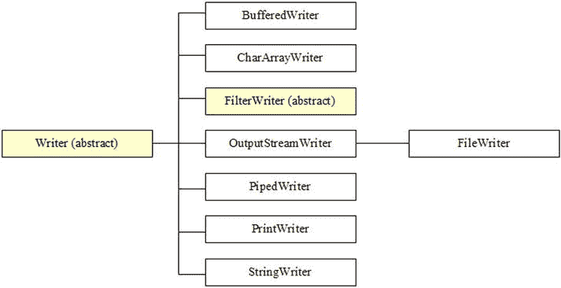
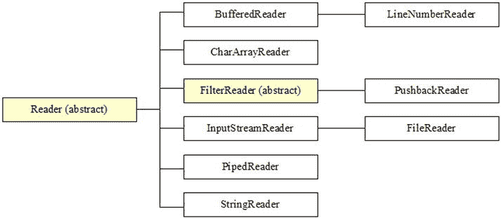

# 5. 写入器和读取器

电子补充材料 本章的在线版本 (doi:[10.​1007/​978-1-4842-1565-4_​5](http://dx.doi.org/10.1007/978-1-4842-1565-4_5)) 包含补充材料，仅供授权用户使用。

Java 的流类非常适合处理字节序列的流式传输，但并不适合处理字符序列的流式传输，因为字节和字符是两种不同的东西：字节代表一个 8 位数据项，而字符代表一个 16 位数据项。此外，Java 的 `char` 和 `java.lang.String` 类型天然地处理字符而非字节。

更重要的是，字节流不了解字符集（整数值（称为码点）与符号（如 Unicode）之间的映射集合）及其字符编码（字符集成员与编码这些字符以提高效率的字节序列之间的映射，例如 UTF-8）。

字符集与字符编码简史

早期的计算机和编程语言主要由英语为母语国家的英语程序员创建。他们开发了码点 0 到 127 与英语中 128 个常用字符（如 A-Z）之间的标准映射。由此产生的字符集/编码被命名为美国信息交换标准码（ASCII）。

ASCII 的问题在于它对大多数非英语语言来说是不够的。例如，ASCII 不支持变音符号，如法语中使用的软音符。由于一个字节最多可以表示 256 个不同的字符，世界各地的开发人员开始创建不同的字符集/编码，这些编码不仅编码了 128 个 ASCII 字符，还编码了额外的字符以满足法语、希腊语和俄语等语言的需求。多年来，已经创建了许多遗留的（但仍然重要的）数据文件，这些文件中的字节代表由特定字符集/编码定义的字符。

国际标准化组织（ISO）和国际电工委员会（IEC）致力于将这些 8 位字符集/编码标准化，形成了一个名为 ISO/IEC 8859 的联合总括标准。结果产生了一系列子标准，分别命名为 ISO/IEC 8859-1、ISO/IEC 8859-2 等。例如，ISO/IEC 8859-1（也称为 Latin-1）定义了一个字符集/编码，它由 ASCII 加上覆盖大多数西欧国家的字符组成。同样，ISO/IEC 8859-2（也称为 Latin-2）定义了一个类似的字符集/编码，覆盖中欧和东欧国家。

尽管 ISO/IEC 做出了最大努力，但过多的字符集/编码仍然不够用。例如，大多数字符集/编码只允许你创建英语和另一种语言（或少数几种其他语言）组合的文档。例如，你不能使用 ISO/IEC 字符集/编码来创建包含英语、法语、土耳其语、俄语和希腊语字符组合的文档。

这个问题和其他问题正通过一项国际努力来解决，该努力已经创建并正在持续开发 Unicode，这是一个单一的通用字符集。由于 Unicode 字符比 ISO/IEC 字符大，Unicode 使用几种可变长度编码方案之一，称为 Unicode 转换格式（UTF），来高效地编码 Unicode 字符。例如，UTF-8 用一到四个字节对 Unicode 字符集中的每个字符进行编码（并且向后兼容 ASCII）。

最后，术语“字符集”和“字符编码”经常互换使用。在 ISO/IEC 字符集的上下文中，它们含义相同，其中码点就是编码。然而，在 Unicode 的上下文中，这些术语是不同的，其中 Unicode 是字符集，而 UTF-8 是 Unicode 字符的几种可能字符编码之一。

如果你需要流式传输字符，你应该利用 Java 的写入器和读取器类，这些类旨在支持字符 I/O（它们处理 `char` 而不是 `byte`）。此外，写入器和读取器类会考虑字符编码。第 5 章 将向你介绍 Java 的写入器和读取器类。

## 写入器和读取器类概述

`java.io` 包提供了多个写入器和读取器类，它们是该包中抽象类 `Writer` 和 `Reader` 的子类。图 5-1 展示了写入器类的层次结构。

图 5-1.

与 `java.io.FilterOutputStream` 不同，`FilterWriter` 是抽象的

图 5-2 展示了读取器类的层次结构。

图 5-2.

与 `java.io.FilterInputStream` 不同，`FilterReader` 是抽象的

尽管写入器和读取器类的层次结构与它们的输出流和输入流对应类相似，但也存在差异。例如，`FilterWriter` 和 `FilterReader` 是抽象的，而它们对应的 `FilterOutputStream` 和 `FilterInputStream` 则不是抽象的。此外，`BufferedWriter` 和 `BufferedReader` 不继承 `FilterWriter` 和 `FilterReader`，而 `java.io.BufferedOutputStream` 和 `java.io.BufferedInputStream` 则继承自 `FilterOutputStream` 和 `FilterInputStream`。

输出流和输入流类是在 Java 1.0 中引入的。在它们发布后，设计问题出现了。例如，`FilterOutputStream` 和 `FilterInputStream` 本应是抽象的。然而，由于这些类已经在使用中，进行这些更改为时已晚；进行这些更改会导致代码出错。Java 1.1 的写入器和读取器类的设计者花时间纠正了这些错误。

注意

关于 `BufferedWriter` 和 `BufferedReader` 直接继承 `Writer` 和 `Reader` 而不是 `FilterWriter` 和 `FilterReader`，我认为这种改变与性能有关。对 `BufferedOutputStream` 的 `write()` 方法和 `BufferedInputStream` 的 `read()` 方法的调用会导致对 `FilterOutputStream` 的 `write()` 方法和 `FilterInputStream` 的 `read()` 方法的调用。因为像将一个文件复制到另一个文件这样的文件 I/O 活动可能涉及许多 `write()`/`read()` 方法调用，所以你希望获得尽可能最佳的性能。通过不继承 `FilterWriter` 和 `FilterReader`，`BufferedWriter` 和 `BufferedReader` 实现了更好的性能。

为简洁起见，本章我将只关注 `Writer`、`Reader`、`OutputStreamWriter`、`InputStreamReader`、`FileWriter`、`FileReader`、`BufferedWriter` 和 `BufferedReader` 类。

## Writer 和 Reader

Java 提供了 `Writer` 和 `Reader` 类来执行字符 I/O 操作。`Writer` 是所有写入器子类的超类。以下列表指出了 `Writer` 与 `java.io.OutputStream` 之间的区别：

*   `Writer` 声明了几个 `append()` 方法，用于向此写入器追加字符。这些方法之所以存在，是因为 `Writer` 实现了 `java.lang.Appendable` 接口，该接口与 `java.util.Formatter` 类（在第 11 章中讨论）配合使用，以输出格式化字符串。
*   `Writer` 声明了额外的 `write()` 方法，包括一个便捷的 `void write(String str)` 方法，用于将 `String` 对象的字符写入此写入器。

`Reader` 是所有读取器子类的超类。以下列表指出了 `Reader` 与 `java.io.InputStream` 之间的区别：

*   `Reader` 声明了 `read(char[])` 和 `read(char[], int, int)` 方法，而不是 `read(byte[])` 和 `read(byte[], int, int)` 方法。
*   `Reader` 没有声明 `available()` 方法。
*   `Reader` 声明了一个 `boolean ready()` 方法，当保证下一次调用 `read()` 不会阻塞等待输入时，该方法返回 true。
*   `Reader` 声明了一个 `int read(CharBuffer target)` 方法，用于从字符缓冲区读取字符。（我在第 6 章中讨论了 `CharBuffer`。）

## OutputStreamWriter 和 InputStreamReader

具体的 `OutputStreamWriter` 类（`Writer` 的子类）是传入字符序列和传出字节流之间的桥梁。写入此写入器的字符会根据默认或指定的字符编码被编码成字节。

注意

默认字符编码可通过 `file.encoding` 系统属性访问。

每次调用 `OutputStreamWriter` 的 `write()` 方法之一都会导致对给定字符调用编码器。生成的字节会累积在缓冲区中，然后写入到底层输出流。传递给 `write()` 方法的字符不会被缓冲。

`OutputStreamWriter` 声明了四个构造器，包括以下一对：

*   `OutputStreamWriter(OutputStream out)` 在传入的字符序列（通过其 `append()` 和 `write()` 方法传递给 `OutputStreamWriter`）与底层输出流 `out` 之间创建一个桥梁。使用默认字符编码将字符编码为字节。
*   `OutputStreamWriter(OutputStream out, String charsetName)` 在传入的字符序列（通过其 `append()` 和 `write()` 方法传递给 `OutputStreamWriter`）与底层输出流 `out` 之间创建一个桥梁。`charsetName` 标识用于将字符编码为字节的字符编码。当指定的字符编码不受支持时，此构造器会抛出 `java.io.UnsupportedEncodingException`。

注意

`OutputStreamWriter` 依赖于抽象的 `java.nio.charset.Charset` 和 `java.nio.charset.CharsetEncoder` 类（参见第 10 章）来执行字符编码。

以下示例使用第二个构造器创建一个到底层文件输出流的桥梁，以便将波兰语文本写入 ISO/IEC 8859-2 编码的文件。

`FileOutputStream fos = new FileOutputStream("polish.txt");`

`OutputStreamWriter osw = new OutputStreamWriter(fos, "8859_2");`

`char ch = ’\u0323’; // 带重音符号的 N。`

`osw.write(ch);`

具体的 `InputStreamReader` 类（`Reader` 的子类）是传入字节流和传出字符序列之间的桥梁。从此读取器读取的字符会根据默认或指定的字符编码从字节解码而来。

每次调用 `InputStreamReader` 的 `read()` 方法之一都可能导致从底层输入流读取一个或多个字节。为了能够高效地将字节转换为字符，可能会从底层流中预读比满足当前读取操作所需更多的字节。

`InputStreamReader` 声明了四个构造器，包括以下一对：

*   `InputStreamReader(InputStream in)` 在底层输入流 `in` 与传出的字符序列（通过其 `read()` 方法从 `InputStreamReader` 返回）之间创建一个桥梁。使用默认字符编码将字节解码为字符。
*   `InputStreamReader(InputStream in, String charsetName)` 在底层输入流 `in` 与传出的字符序列（通过其 `read()` 方法从 `InputStreamReader` 返回）之间创建一个桥梁。`charsetName` 标识用于将字节解码为字符的字符编码。当指定的字符编码不受支持时，此构造器会抛出 `UnsupportedEncodingException`。

注意

`InputStreamReader` 依赖于抽象的 `Charset` 和 `java.nio.charset.CharsetDecoder` 类（参见第 10 章）来执行字符解码。

以下示例使用第二个构造器创建一个到底层文件输入流的桥梁，以便从 ISO/IEC 8859-2 编码的文件中读取波兰语文本。

`FileInputStream fis = new FileInputStream("polish.txt");`

`InputStreamReader isr = new InputStreamReader(fis, "8859_2");`

`char ch = isr.read(ch);`

注意

`OutputStreamWriter` 和 `InputStreamReader` 声明了一个 `String getEncoding()` 方法，该方法返回正在使用的字符编码的名称。如果该编码有历史名称，则返回该名称；否则，返回该编码的规范名称。

## FileWriter 和 FileReader

`FileWriter` 是一个用于向文件写入字符的便捷类。它继承自 `OutputStreamWriter`，其构造函数（例如 [`FileWriter`](http://docs.oracle.com/javase/7/docs/api/java/io/FileWriter.html#FileWriter%28java.lang.String%29) `(` [`String`](http://docs.oracle.com/javase/7/docs/api/java/lang/String.html#class%20in%20java.lang) `path)`）会调用 `OutputStreamWriter(OutputStream)`。该类的实例等价于以下代码片段：

`FileOutputStream fos = new FileOutputStream(path);`

`OutputStreamWriter osw;`

`osw = new OutputStreamWriter(fos, System.getProperty("file.encoding"));`

`FileReader` 是一个用于从文件读取字符的便捷类。它继承自 `InputStreamReader`，其构造函数（例如 `FileReader(` [`String`](http://docs.oracle.com/javase/7/docs/api/java/lang/String.html#class%20in%20java.lang) `path)`）会调用 `InputStreamReader(InputStream)`。该类的实例等价于以下代码片段：

`FileInputStream fis = new FileInputStream(path);`

`InputStreamReader isr;`

`isr = new InputStreamReader(fis, System.getProperty("file.encoding"));`

`FileWriter` 和 `FileReader` 都没有提供自己的方法。相反，你需要调用它们继承的方法，例如：

*   `void write(` [`String`](http://docs.oracle.com/javase/7/docs/api/java/lang/String.html#class%20in%20java.lang) `str, int off, int len)`：从字符串 `str` 的零基偏移量 `off` 开始，写入 `len` 个字符。当发生 I/O 错误时抛出 `java.io.IOException`。
*   `int read(char[] cbuf, int off, int len)`：从零基偏移量 `off` 开始，将 `len` 个字符读入 `cbuf`。当发生 I/O 错误时抛出 `IOException`。

清单 5-1 展示了一个演示 `FileWriter`、`FileReader` 以及这些方法的简短应用程序。

清单 5-1. 演示 `FileWriter` 和 `FileReader` 类

`import java.io.FileReader;`

`import java.io.FileWriter;`

`import java.io.IOException;`

`public class FWFRDemo`

`{`

   `final static String MSG = "Test message";`

   `public static void main(String[] args) throws IOException`

   `{`

      `try (FileWriter fw = new FileWriter("temp"))`

      `{`

         `fw.write(MSG, 0, MSG.length());`

      `}`

      `char[] buf = new char[MSG.length()];`

      `try (FileReader fr = new FileReader("temp"))`

      `{`

         `fr.read(buf, 0, MSG.length());`

         `System.out.println(buf);`

      `}`

   `}`

`}`

`FWFRDemo` 首先创建一个连接到名为 `temp` 的文件的 `FileWriter` 实例。然后它调用 `void write(` [`String`](http://docs.oracle.com/javase/7/docs/api/java/lang/String.html#class%20in%20java.lang) `str, int off, int len)` 向该文件写入一条消息。`try`-with-resources 语句会在该操作后自动关闭文件。

接下来，`FWFRDemo` 创建一个用于存储一行文本的缓冲区，然后创建一个连接到 `temp` 的 `FileReader` 实例。接着它调用 `int read(char[] cbuf, int off, int len)` 读取之前写入的消息，并将其输出到标准输出流。然后文件被关闭。

按如下方式编译清单 5-1：

`javac FWFRDemo.java`

按如下方式运行此应用程序：

`java FWFRDemo`

你应该会看到以下输出（以及一个名为 `temp` 的文件）：

`Test message`

## BufferedWriter 和 BufferedReader

`BufferedWriter` 将文本写入字符输出流（一个 `Writer` 实例），并对字符进行缓冲，以便高效地写入单个字符、数组和字符串。调用以下任一构造函数来构造一个缓冲写入器：

*   `BufferedWriter(` [`Writer`](http://docs.oracle.com/javase/7/docs/api/java/io/Writer.html#class%20in%20java.io) `out)`
*   `BufferedWriter(` [`Writer`](http://docs.oracle.com/javase/7/docs/api/java/io/Writer.html#class%20in%20java.io) `out, int size)`

可以指定缓冲区 `size`，也可以接受默认大小（8,192 字节）。对于大多数用途而言，默认大小已经足够。

`BufferedWriter` 包含一个方便的 `void newLine()` 方法，用于写入行分隔符字符串，从而有效地终止当前行。

`BufferedReader` 从字符输入流（一个 `Reader` 实例）读取文本，并对字符进行缓冲，以便高效地读取字符、数组和行。调用以下任一构造函数来构造一个缓冲读取器：

*   `BufferedReader(` [`Reader`](http://docs.oracle.com/javase/7/docs/api/java/io/Reader.html#class%20in%20java.io) `in)`
*   `BufferedReader(` [`Reader`](http://docs.oracle.com/javase/7/docs/api/java/io/Reader.html#class%20in%20java.io) `in, int size)`

可以指定缓冲区 `size`，也可以使用默认大小（8,192 字节）。对于大多数用途而言，默认大小已经足够。

`BufferedReader` 包含一个方便的 [`String`](http://docs.oracle.com/javase/7/docs/api/java/lang/String.html#class%20in%20java.lang) `readLine()` 方法，用于读取一行文本，不包括任何行终止字符。

清单 5-2 展示了一个演示 `BufferedWriter`、`BufferedReader` 以及这些方法的简短应用程序。

清单 5-2. 演示 `BufferedWriter` 和 `BufferedReader` 类

`import java.io.BufferedReader;`

`import java.io.BufferedWriter;`

`import java.io.FileReader;`

`import java.io.FileWriter;`

`import java.io.IOException;`

`public class BWBRDemo`

`{`

`static String[] lines =`

`{`

`"It was the best of times, it was the worst of times,",`

`"it was the age of wisdom, it was the age of foolishness,",`

`"it was the epoch of belief, it was the epoch of incredulity,",`

`"it was the season of Light, it was the season of Darkness,",`

`"it was the spring of hope, it was the winter of despair."`

`};`

`public static void main(String[] args) throws IOException`

`{`

`try (BufferedWriter bw = new BufferedWriter(new FileWriter("temp")))`

`{`

`for (String line: lines)`

`{`

`bw.write(line, 0, line.length());`

`bw.newLine();`

`}`

`}`

`try (BufferedReader br = new BufferedReader(new FileReader("temp")))`

`{`

`String line;`

`while ((line = br.readLine()) != null)`

`System.out.println(line);`

`}`

`}`

`}`

`BWBRDemo` 首先创建一个 `BufferedWriter` 实例，它包装了一个已创建的、连接到名为 `temp` 的文件的 `FileWriter` 实例。然后它遍历字符串行，写入每一行并在其后添加一个换行序列。

接下来，`BWBRDemo` 创建一个 `BufferedReader` 实例，它包装了一个已创建的、连接到 `temp` 的 `FileReader` 实例。然后它从文件中读取并输出每一行，直到 `readLine()` 返回 `null`。

按如下方式编译清单 5-2：

`javac BWBRDemo.java`

按如下方式运行此应用程序：

`java BWBRDemo`

你应该会看到以下输出（以及一个名为 `temp` 的文件）：

`It was the best of times, it was the worst of times,`

`it was the age of wisdom, it was the age of foolishness,`

`it was the epoch of belief, it was the epoch of incredulity,`

`it was the season of Light, it was the season of Darkness,`

`it was the spring of hope, it was the winter of despair.`

练习

以下练习旨在测试你对第 5 章内容的理解：

为什么 Java 的流类不擅长处理字符流？在字符 I/O 方面，Java 提供了哪种更优的替代方案来替代流类？判断正误：`Reader` 声明了一个 `available()` 方法。`OutputStreamWriter` 类的用途是什么？`InputStreamReader` 类的用途是什么？如何识别默认字符编码？`FileWriter` 类的用途是什么？`FileReader` 类的用途是什么？`BufferedWriter` 提供了哪个方法来写入行分隔符？从标准输入读取文本行通常很方便，而 `InputStreamReader` 和 `BufferedReader` 类使这一任务成为可能。创建一个名为 `CircleInfo` 的 Java 应用程序，在获取一个链接到标准输入的 `BufferedReader` 实例后，呈现一个循环，提示用户输入半径，将输入的半径解析为 `double` 值，并输出两条消息，分别报告基于该半径的圆的周长和面积。

## 摘要

Java 的流类擅长处理字节序列的流，但不擅长处理字符序列的流，因为字节和字符是两种不同的东西。字节表示一个 8 位的数据项，而字符表示一个 16 位的数据项。此外，Java 的 `char` 和 `String` 类型天然处理字符而非字节。更重要的是，字节流不了解字符集及其编码。

Java 提供了 writer 和 reader 类来处理字符流。它们支持字符 I/O（它们处理 `char` 而非 `byte`），并考虑字符编码。抽象类 `Writer` 和 `Reader` 描述了 writer 和 reader 的定义。

`Writer` 和 `Reader` 的子类 `OutputStreamWriter` 和 `InputStreamReader` 弥补了字符流和字节流之间的差距。这些类的子类 `FileWriter` 和 `FileReader` 是便捷类，用于简化向文件写入字符或从文件读取字符的操作。`Writer` 和 `Reader` 的子类还包括 `BufferedWriter` 和 `BufferedReader`，它们通过缓冲字符来提高效率。

第 6 章 介绍了 NIO 的缓冲区类。

