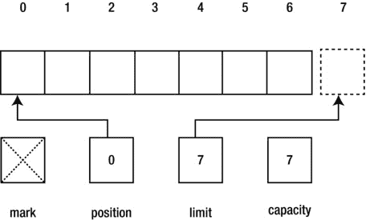
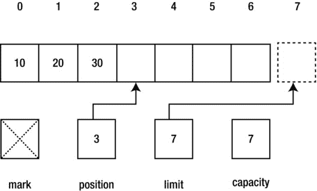
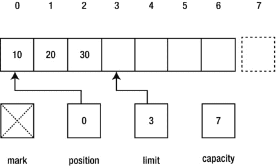
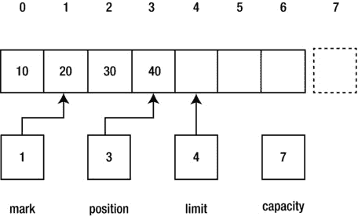

# 6. 缓冲区

电子补充材料 本章的在线版本 (doi:[10.​1007/​978-1-4842-1565-4_​6](http://dx.doi.org/10.1007/978-1-4842-1565-4_6)) 包含补充材料，可供授权用户使用。

NIO 基于缓冲区，缓冲区的内容通过通道发送到 I/O 服务或从 I/O 服务接收。本章将向您介绍 NIO 的缓冲区类。

## 缓冲区简介

缓冲区是一个对象，用于存储要发送到 I/O 服务（执行输入/输出的操作系统组件）或从 I/O 服务接收的固定数量的数据。它位于应用程序和通道之间，通道将缓冲的数据写入服务，或从服务读取数据并将其存入缓冲区。

缓冲区具有四个属性：

*   **容量**：缓冲区中可以存储的数据项总数。容量在创建缓冲区时指定，之后无法更改。
*   **界限**：不应读取或写入的第一个元素的从零开始的索引。换句话说，它标识缓冲区中“活跃”数据项的数量。
*   **位置**：下一个可以读取的数据项的从零开始的索引，或者可以写入数据项的位置。
*   **标记**：一个从零开始的索引，当调用缓冲区的 `reset()` 方法（稍后介绍）时，缓冲区的位置将重置为该索引。标记最初是未定义的。

这四个属性的关系如下：0 <= 标记 <= 位置 <= 界限 <= 容量

图 6-1 展示了一个新创建的、容量为 7 的面向字节的缓冲区。

图 6-1.

面向字节的缓冲区的逻辑布局包括一个未定义的标记、当前的位置、界限和容量

图 6-1 中的缓冲区最多可以存储七个元素。标记最初是未定义的，位置初始设置为 `0`，界限初始设置为容量 (`7`)，这指定了缓冲区中可以存储的最大字节数。您只能访问位置 `0` 到 `6`。位置 `7` 位于缓冲区之外。

## 缓冲区及其子类

缓冲区由继承自抽象类 `java.nio.Buffer` 的类实现。表 6-1 描述了 `Buffer` 的方法。

表 6-1. `Buffer` 方法

| 方法 | 描述 |
| --- | --- |
| `Object array()` | 返回支持此缓冲区的数组。此方法旨在允许将数组支持的缓冲区更高效地传递给本地代码。具体子类会重写此方法，并通过协变返回类型提供更强类型的返回值。当此缓冲区由数组支持但为只读时，此方法抛出 `java.nio.ReadOnlyBufferException`；当此缓冲区没有可访问的数组支持时，抛出 `java.lang.UnsupportedOperationException`。 |
| `int arrayOffset()` | 返回此缓冲区第一个元素在其支持数组中的偏移量。当此缓冲区由数组支持时，缓冲区位置 `p` 对应数组索引 `p + arrayOffset()`。在调用此方法前，请先调用 `hasArray()` 以确保此缓冲区有可访问的支持数组。当此缓冲区由数组支持但为只读时，此方法抛出 `ReadOnlyBufferException`；当此缓冲区没有可访问的数组支持时，抛出 `UnsupportedOperationException`。 |
| `int capacity()` | 返回此缓冲区的容量。 |
| `Buffer clear()` | 清除此缓冲区。位置被设为 `0`，限制被设为容量，标记被丢弃。此方法不会擦除缓冲区中的数据，但之所以如此命名，是因为它最常用于可能擦除数据的情况。 |
| `Buffer flip()` | 翻转此缓冲区。限制被设为当前位置，然后位置被设为 `0`。如果定义了标记，则丢弃它。 |
| `boolean hasArray()` | 当此缓冲区由数组支持且不是只读时返回 `true`；否则返回 `false`。当此方法返回 `true` 时，可以安全地调用 `array()` 和 `arrayOffset()`。 |
| `boolean hasRemaining()` | 当此缓冲区中至少还有一个元素（即当前位置和限制之间）时返回 `true`；否则返回 `false`。 |
| `boolean isDirect()` | 当此缓冲区是直接字节缓冲区（本章稍后讨论）时返回 `true`；否则返回 `false`。 |
| `boolean isReadOnly()` | 当此缓冲区是只读时返回 `true`，否则返回 `false`。 |
| `int limit()` | 返回此缓冲区的限制。 |
| `Buffer limit(int newLimit)` | 将此缓冲区的限制设为 `newLimit`。当位置大于 `newLimit` 时，位置被设为 `newLimit`。当定义了标记且标记大于 `newLimit` 时，丢弃标记。当 `newLimit` 为负数或大于此缓冲区的容量时，此方法抛出 `java.lang.IllegalArgumentException`；否则返回此缓冲区。 |
| `Buffer mark()` | 将此缓冲区的标记设为其位置并返回此缓冲区。 |
| `int position()` | 返回此缓冲区的位置。 |
| `Buffer position(int newPosition)` | 将此缓冲区的位置设为 `newPosition`。当定义了标记且标记大于 `newPosition` 时，丢弃标记。当 `newPosition` 为负数或大于此缓冲区的当前限制时，此方法抛出 `IllegalArgumentException`；否则返回此缓冲区。 |
| `int remaining()` | 返回当前位置和限制之间的元素数量。 |
| `Buffer reset()` | 将此缓冲区的位置重置为先前标记的位置。调用此方法不会更改或丢弃标记的值。当标记尚未设置时，此方法抛出 `java.nio.InvalidMarkException`；否则返回此缓冲区。 |
| `Buffer rewind()` | 倒带并返回此缓冲区。位置被设为 `0`，标记被丢弃。 |

表 6-1 显示，`Buffer` 的许多方法返回 `Buffer` 引用，以便你可以将实例方法调用链接在一起。例如，不必指定以下三行：

`buf.mark();`

`buf.position(2);`

`buf.reset();`

你可以更方便地指定以下一行：

`buf.mark().position(2).reset();`

表 6-1 还显示，所有缓冲区都可以读取，但并非所有缓冲区都可以写入——例如，由只读内存映射文件支持的缓冲区。你不能写入只读缓冲区；否则会抛出 `ReadOnlyBufferException`。在尝试写入缓冲区之前，如果你不确定缓冲区是否可写，请调用 `isReadOnly()`。

警告

缓冲区不是线程安全的。当你希望从多个线程访问缓冲区时，必须使用同步机制。

`java.nio` 包包含几个扩展 `Buffer` 的抽象类，每个类对应一个原始类型（布尔类型除外）：`ByteBuffer`、`CharBuffer`、`DoubleBuffer`、`FloatBuffer`、`IntBuffer`、`LongBuffer` 和 `ShortBuffer`。此外，该包还包含 `MappedByteBuffer` 作为 `ByteBuffer` 的抽象子类。

注意

操作系统执行面向字节的 I/O，你可以使用 `ByteBuffer` 创建面向字节的缓冲区，用于存储要写入目标或从源读取的字节。其他原始类型缓冲区类允许你创建多字节视图缓冲区（稍后讨论），以便你可以在概念上以字符、双精度浮点值、32 位整数等形式执行 I/O。然而，I/O 操作实际上是以字节流的形式进行的。

清单 6-1 通过 `ByteBuffer` 演示了 `Buffer` 类的容量、限制、位置和剩余元素。

清单 6-1. 演示面向字节的缓冲区

`import java.nio.Buffer;`

`import java.nio.ByteBuffer;`

`public class BufferDemo`

`{`

`public static void main(String[] args)`

`{`

`Buffer buffer = ByteBuffer.allocate(7);`

`System.out.println("Capacity: " + buffer.capacity());`

`System.out.println("Limit: " + buffer.limit());`

`System.out.println("Position: " + buffer.position());`

`System.out.println("Remaining: " + buffer.remaining());`

`System.out.println("Changing buffer limit to 5");`

`buffer.limit(5);`

`System.out.println("Limit: " + buffer.limit());`

`System.out.println("Position: " + buffer.position());`

`System.out.println("Remaining: " + buffer.remaining());`

`System.out.println("Changing buffer position to 3");`

`buffer.position(3);`

`System.out.println("Position: " + buffer.position());`

`System.out.println("Remaining: " + buffer.remaining());`

`System.out.println(buffer);`

`}`

`}`

清单 6-1 的 `main()` 方法首先需要获取一个缓冲区。它不能实例化 `Buffer` 类，因为该类是抽象的。相反，它使用 `ByteBuffer` 类及其 `allocate()` 类方法来分配图 6-1 中所示的七字节缓冲区。然后 `main()` 调用各种 `Buffer` 方法来演示容量、限制、位置和剩余元素。

按如下方式编译清单 6-1：

`javac BufferDemo.java`

按如下方式运行生成的应用程序：

`java BufferDemo`

你应该会看到以下输出：

`Capacity: 7`

`Limit: 7`

`Position: 0`

`Remaining: 7`

`Changing buffer limit to 5`

`Limit: 5`

`Position: 0`

`Remaining: 5`

`Changing buffer position to 3`

`Position: 3`

`Remaining: 2`

`java.nio.HeapByteBuffer[pos=3 lim=5 cap=7]`

最后一行输出显示，分配给 `buffer` 的 `ByteBuffer` 实例实际上是包私有类 `java.nio.HeapByteBuffer` 的一个实例。

## 深入理解缓冲区

之前对 `Buffer` 类的讨论已经让你对 NIO 缓冲区有了一些了解。然而，还有更多内容值得探索。本节将通过探讨缓冲区的创建、写入与读取、翻转、标记、`Buffer` 子类操作、字节序以及直接缓冲区，带你更深入地理解缓冲区。

注意

尽管基本类型缓冲区类具有相似的功能，但 `ByteBuffer` 是最大且最通用的。毕竟，字节是操作系统用来传输数据项的基本单位。因此，我将使用 `ByteBuffer` 来演示大多数缓冲区操作。我也会使用 `CharBuffer` 来增加多样性。

### 创建缓冲区

`ByteBuffer` 和其他基本类型缓冲区类声明了多种用于创建该类型缓冲区的类方法。例如，`ByteBuffer` 声明了以下用于创建 `ByteBuffer` 实例的类方法：

*   `ByteBuffer` `allocate` `(int capacity)`：分配一个新的字节缓冲区，其容量为指定的 `capacity` 值。其位置为 0，限制为容量，标记未定义，每个元素初始化为 0。它有一个后备数组，其数组偏移量为 0。当 `capacity` 为负数时，此方法抛出 `IllegalArgumentException`。
*   `ByteBuffer` `allocateDirect` `(int capacity)`：分配一个新的直接字节缓冲区（稍后讨论），其容量为指定的 `capacity` 值。其位置为 0，限制为容量，标记未定义，每个元素初始化为 0。它是否有后备数组未指定。当 `capacity` 为负数时，此方法抛出 `IllegalArgumentException`。

在 JDK 7 之前，通过此方法分配的直接缓冲区在页边界上对齐。在 JDK 7 中，实现发生了变化，直接缓冲区不再按页对齐。这应该会减少创建大量小缓冲区的应用程序的内存需求。（要了解基于页的操作系统分页内存管理机制，请查看维基百科的“分页”主题，网址为 [`https://en.wikipedia.org/wiki/Paging`](https://en.wikipedia.org/wiki/Paging) 。）

*   `ByteBuffer` `wrap` `(byte[] array)`：将字节数组包装到缓冲区中。新缓冲区由 `array` 支持；也就是说，对缓冲区的修改会导致数组被修改，反之亦然。新缓冲区的容量和限制设置为 `array.length`，其位置设置为 `0`，标记未定义。其数组偏移量为 `0`。
*   `ByteBuffer` `wrap` `(byte[] array, int offset, int length)`：将字节数组包装到缓冲区中。新缓冲区由 `array` 支持。新缓冲区的容量设置为 `array.length`，其位置设置为 `offset`，其限制设置为 `offset + length`，标记未定义。其数组偏移量为 `0`。当 `offset` 为负数或大于 `array.length`，或者 `length` 为负数或大于 `array.length - offset` 时，此方法抛出 `java.lang.IndexOutOfBoundsException`。

这些方法展示了创建字节缓冲区的两种方式：创建 `ByteBuffer` 对象并分配一个内部数组来存储 `capacity` 个字节，或者创建 `ByteBuffer` 对象并使用指定的 `array` 来存储这些字节。考虑以下示例：

`ByteBuffer buffer = ByteBuffer.allocate(10);`

`byte[] bytes = new byte[200];`

`ByteBuffer buffer2 = ByteBuffer.wrap(bytes);`

第一行创建了一个字节缓冲区，其内部字节数组最多可存储 10 个字节，第二行和第三行创建了一个字节数组和一个使用该数组最多可存储 200 个字节的字节缓冲区。

现在考虑以下扩展了前一个示例的示例：

`buffer = ByteBuffer.wrap(bytes, 10, 50);`

此示例创建了一个字节缓冲区，其位置为 `10`，限制为 `50`，容量为 `bytes.length`（恰好是 200）。尽管看起来该缓冲区只能访问此数组的一个子范围，但它实际上可以访问整个数组：值 `10` 和 `50` 只是位置和限制的起始值。

通过 `allocate()` 或 `wrap()` 创建的 `ByteBuffer`（和其他基本类型缓冲区）是非直接字节缓冲区——稍后你将了解直接字节缓冲区。非直接字节缓冲区有后备数组，只要 `hasArray()` 返回 true，你就可以通过 `array()` 方法（该方法在 `ByteArray` 类中声明为 `byte[] array()`）访问这些后备数组。（当 `hasArray()` 返回 true 时，你需要调用 `arrayOffset()` 来获取数组中第一个数据项的位置。）

清单 6-2 演示了缓冲区的分配和包装。

清单 6-2\. 通过分配和包装创建面向字节的缓冲区

`import java.nio.ByteBuffer;`

`public class BufferDemo`

`{`

`public static void main(String[] args)`

`{`

`ByteBuffer buffer1 = ByteBuffer.allocate(10);`

`if (buffer1.hasArray())`

`{`

`System.out.println("buffer1 array: " + buffer1.array());`

`System.out.println("Buffer1 array offset: " +`

`buffer1.arrayOffset());`

`System.out.println("Capacity: " + buffer1.capacity());`

`System.out.println("Limit: " + buffer1.limit());`

`System.out.println("Position: " + buffer1.position());`

`System.out.println("Remaining: " + buffer1.remaining());`

`System.out.println();`

`}`

`byte[] bytes = new byte[200];`

`ByteBuffer buffer2 = ByteBuffer.wrap(bytes);`

`buffer2 = ByteBuffer.wrap(bytes, 10, 50);`

`if (buffer2.hasArray())`

`{`

`System.out.println("buffer2 array: " + buffer2.array());`

`System.out.println("Buffer2 array offset: " +`

`buffer2.arrayOffset());`

`System.out.println("Capacity: " + buffer2.capacity());`

`System.out.println("Limit: " + buffer2.limit());`

`System.out.println("Position: " + buffer2.position());`

`System.out.println("Remaining: " + buffer2.remaining());`

`}`

`}`

`}`

编译清单 6-2（`javac BufferDemo.java`）并运行此应用程序（`java BufferDemo`）。你应该会看到类似于以下的输出：

`buffer1 array: [B@659e0bfd`

`Buffer1 array offset: 0`

`Capacity: 10`

`Limit: 10`

`Position: 0`

`Remaining: 10`

`buffer2 array: [B@2a139a55`

`Buffer2 array offset: 0`

`Capacity: 200`

`Limit: 60`

`Position: 10`

`Remaining: 50`

除了管理存储在外部数组中的数据元素（通过 `wrap()` 方法），缓冲区还可以管理存储在其他缓冲区中的数据。当你创建一个管理另一个缓冲区数据的缓冲区时，所创建的缓冲区称为视图缓冲区。任一缓冲区中的更改都会反映在另一个缓冲区中。

视图缓冲区是通过调用 `Buffer` 子类的 `duplicate()` 方法创建的。生成的视图缓冲区等同于原始缓冲区；两个缓冲区共享相同的数据项并具有相同的容量。但是，每个缓冲区都有自己的位置、限制和标记。当被复制的缓冲区是只读或直接缓冲区时，视图缓冲区也是只读或直接缓冲区。

考虑以下示例：

`ByteBuffer buffer = ByteBuffer.allocate(10);`

`ByteBuffer bufferView = buffer.duplicate();`

由 `bufferView` 标识的 `ByteBuffer` 实例与 `buffer` 共享相同的 10 个元素的内部数组。目前，这些缓冲区具有相同的位置、限制和（未定义的）标记。但是，一个缓冲区中的这些属性可以独立于另一个缓冲区中的属性进行更改。

视图缓冲区也可以通过调用 `ByteBuffer` 的某个 `asxBuffer()` 方法来创建。例如，`LongBuffer asLongBuffer()` 返回一个将字节缓冲区概念化为长整数缓冲区的视图缓冲区。

注意

只读视图缓冲区可以通过调用诸如 `ByteBuffer asReadOnlyBuffer()` 之类的方法来创建。任何更改只读视图缓冲区内容的尝试都会导致 `ReadOnlyBufferException`。但是，原始缓冲区内容（前提是它不是只读的）可以被更改，并且只读视图缓冲区将反映这些更改。

### 缓冲区的写入与读取

`ByteBuffer` 和其他基本类型缓冲区类声明了几个重载的 `put()` 和 `get()` 方法，用于向缓冲区写入数据项以及从缓冲区读取数据项。这些方法在需要索引参数时是**绝对**的，在不需要索引时是**相对**的。

例如，`ByteBuffer` 声明了绝对方法 `ByteBuffer put(int index, byte b)`，用于将字节 `b` 存储在缓冲区中 `index` 值指定的位置；以及绝对方法 `byte get(int index)`，用于获取位于 `index` 位置的字节。该类还声明了相对方法 `ByteBuffer put(byte b)`，用于将字节 `b` 存储在缓冲区的当前位置，然后递增当前位置；以及相对方法 `byte get()`，用于获取缓冲区当前位置的字节并递增当前位置。

当 `index` 为负数或大于等于缓冲区的界限时，绝对 `put()` 和 `get()` 方法会抛出 `IndexOutOfBoundsException`。当当前位置大于等于界限时，相对 `put()` 方法会抛出 `java.nio.BufferOverflowException`；当当前位置大于等于界限时，相对 `get()` 方法会抛出 `java.nio.BufferUnderflowException`。此外，当缓冲区为只读时，绝对和相对 `put()` 方法都会抛出 `ReadOnlyBufferException`。

清单 6-3 演示了相对 `put()` 方法和绝对 `get()` 方法。

**清单 6-3.** 向缓冲区写入字节并从缓冲区读取字节

`import java.nio.ByteBuffer;`

`public class BufferDemo`

`{`

   `public static void main(String[] args)`

   `{`

      `ByteBuffer buffer = ByteBuffer.allocate(7);`

      `System.out.println("Capacity = " + buffer.capacity());`

      `System.out.println("Limit = " + buffer.limit());`

      `System.out.println("Position = " + buffer.position());`

      `System.out.println("Remaining = " + buffer.remaining());`

      `buffer.put((byte) 10).put((byte) 20).put((byte) 30);`

      `System.out.println("Capacity = " + buffer.capacity());`

      `System.out.println("Limit = " + buffer.limit());`

      `System.out.println("Position = " + buffer.position());`

      `System.out.println("Remaining = " + buffer.remaining());`

      `for (int i = 0; i < buffer.position(); i++)`

         `System.out.println(buffer.get(i));`

   `}`

`}`

编译清单 6-3（`javac BufferDemo.java`）并运行此应用程序（`java BufferDemo`）。您应该会看到以下输出：

`Capacity = 7`

`Limit = 7`

`Position = 0`

`Remaining = 7`

`Capacity = 7`

`Limit = 7`

`Position = 3`

`Remaining = 4`

`10`

`20`

`30`

图 6-2 展示了在三次 `put()` 方法调用后缓冲区的状态，如之前的输出所示。

**图 6-2.** 缓冲区在达到其容量之前还可以存储四个数据项

随后对绝对 `get()` 方法的调用不会改变位置，该位置仍保持为 `3`。

**提示**

为了获得最大效率，您可以通过使用 `ByteBuffer put(byte[] src)`、`ByteBuffer put(byte[] src, int offset, int length)`、`ByteBuffer get(byte[] dst)` 和 `ByteBuffer get(byte[] dst, int offset, int length)` 方法来执行批量数据传输，以写入和读取字节数组。

### 翻转缓冲区

填充缓冲区后，您必须准备它以便通道进行排空。如果您按原样传递缓冲区，通道将访问当前位置之后的未定义数据。

为了解决这个问题，您可以将位置重置为 `0`，但是通道如何知道已插入数据的结束位置呢？解决方案是使用界限属性，它指示缓冲区活动部分的结束位置。基本上，您将界限设置为当前位置，然后将当前位置重置为 `0`。

您可以通过执行以下代码来完成此任务，该代码还会清除任何已定义的标记：

`buffer.limit(buffer.position()).position(0);`

但是，有一种更简单的方法可以完成相同的任务，如下所示：

`buffer.flip();`

无论哪种情况，缓冲区都已准备好被排空。

假设在清单 6-3 的 `main()` 方法末尾执行了 `buffer.flip();`，图 6-3 显示了调用 `flip()` 后缓冲区的状态。

**图 6-3.** 缓冲区已准备好被排空

调用 `buffer.remaining()` 将返回 `3`。此值表示可用于排空的字节数（10、20 和 30）。

清单 6-4 提供了另一个缓冲区翻转演示，该演示使用了字符缓冲区。

**清单 6-4.** 向字符缓冲区写入字符并从字符缓冲区读取字符

`import java.nio.CharBuffer;`

`public class BufferDemo`

`{`

   `public static void main(String[] args)`

   `{`

      `String[] poem =`

      `{`

         `"Roses are red",`

         `"Violets are blue",`

         `"Sugar is sweet",`

         `"And so are you."`

      `};`

      `CharBuffer buffer = CharBuffer.allocate(50);`

      `for (int i = 0; i < poem.length; i++)`

      `{`

         `// 填充缓冲区。`

         `for (int j = 0; j < poem[i].length(); j++)`

            `buffer.put(poem[i].charAt(j));`

         `// 翻转缓冲区，以便可以读取其内容。`

         `buffer.flip();`

         `// 排空缓冲区。`

         `while (buffer.hasRemaining())`

            `System.out.print(buffer.get());`

         `// 清空缓冲区以防止 BufferOverflowException。`

         `buffer.clear();`

         `System.out.println();`

      `}`

   `}`

`}`

编译清单 6-4（`javac BufferDemo.java`）并运行此应用程序（`java BufferDemo`）。您应该会看到以下输出：

`Roses are red`

`Violets are blue`

`Sugar is sweet`

`And so are you.`

**注意**

`rewind()` 类似于 `flip()`，但会忽略界限。此外，两次调用 `flip()` 不会使您回到原始状态。相反，缓冲区的大小变为零。调用 `put()` 方法会导致 `BufferOverflowException`，调用 `get()` 方法会导致 `BufferUnderflowException` 或（在 `get(int)` 的情况下）`IndexOutOfBoundsException`。

### 标记缓冲区

你可以通过调用 `mark()` 方法来标记一个缓冲区，之后通过调用 `reset()` 方法返回到被标记的位置。例如，假设你执行了 `ByteBuffer buffer = ByteBuffer.allocate(7);`，接着执行 `buffer.put((byte) 10).put((byte) 20).put((byte) 30).put((byte) 40);`，再执行 `buffer.limit(4);`。此时当前位置和界限都被设置为 `4`。

继续，假设你执行 `buffer.position(1).mark().position(3);`。图 6-4 展示了此时缓冲区的状态。

图 6-4.

标记已被设置到位置 1

如果你将这个缓冲区发送到一个通道，字节 40 将被发送（由于 `position(3)`，当前位置是 `3`），并且位置将前进到 `4`。如果你随后执行 `buffer.reset();` 并将此缓冲区发送到通道，位置将被设置为标记（`1`），并且字节 20、30 和 40（从当前位置到界限前一个位置的所有字节）将按顺序发送到通道。

清单 6-5 演示了这个标记/重置场景。

清单 6-5\. 标记当前缓冲区位置并将当前位置重置到被标记的位置

`import java.nio.ByteBuffer;`

`public class BufferDemo`

`{`

   `public static void main(String[] args)`

   `{`

      `ByteBuffer buffer = ByteBuffer.allocate(7);`

      `buffer.put((byte) 10).put((byte) 20).put((byte) 30).put((byte) 40);`

      `buffer.limit(4);`

      `buffer.position(1).mark().position(3);`

      `System.out.println(buffer.get());`

      `System.out.println();`

      `buffer.reset();`

      `while (buffer.hasRemaining())`

         `System.out.println(buffer.get());`

   `}`

`}`

编译清单 6-5（`javac BufferDemo.java`）并运行此应用程序（`java BufferDemo`）。你应该会看到以下输出：

`40`

`20`

`30`

`40`

警告

不要将 `reset()` 与 `clear()` 混淆。`clear()` 方法将缓冲区标记为空，而 `reset()` 将缓冲区的当前位置更改为先前设置的标记，如果没有先前设置的标记，则抛出 `InvalidMarkException`。

### 缓冲区子类操作

`ByteBuffer` 和其他原始类型缓冲区类声明了一个 `compact()` 方法，该方法通过将当前位置和界限之间的所有字节复制到缓冲区的开头来压缩缓冲区。索引 `p = position()` 处的字节被复制到索引 `0`，索引 `p + 1` 处的字节被复制到索引 `1`，依此类推，直到索引 `limit() - 1` 处的字节被复制到索引 `n = limit() - 1 - p`。然后，缓冲区的当前位置被设置为 `n + 1`，其界限被设置为其容量。如果定义了标记，则将其丢弃。

在将数据从缓冲区写入后，你可以调用 `compact()` 来处理并非所有缓冲区内容都被写入的情况。考虑以下示例，该示例通过缓冲区 `buf` 将内容从 `in` 通道复制到 `out` 通道：

`buf.clear(); // 准备缓冲区以供使用`

`while (in.read(buf) != -1)`

`{`

   `buf.flip(); // 准备缓冲区以供排出。`

   `out.write(buf); // 写入缓冲区。`

   `buf.compact(); // 在部分写入的情况下执行此操作。`

`}`

`compact()` 方法调用将未写入的缓冲区数据移动到缓冲区的开头，以便下一次 `read()` 方法调用将读取的数据追加到缓冲区数据之后，而不是在未指定 `compact()` 时覆盖这些数据。

你可能偶尔需要比较缓冲区以判断相等性或顺序。除了 `ByteBuffer` 的 `MappedByteBuffer` 子类之外，所有 `Buffer` 子类都重写了 `equals()` 和 `compareTo()` 方法来执行这些比较——`MappedByteBuffer` 从其 `ByteBuffer` 超类继承了这些方法。以下示例向你展示了如何比较字节缓冲区 `bytBuf1` 和 `bytBuf2` 的相等性和顺序：

`System.out.println(bytBuf1.equals(bytBuf2));`

`System.out.println(bytBuf1.compareTo(bytBuf2));`

`ByteBuffer` 的 `equals()` 约定规定，两个字节缓冲区相等当且仅当它们具有相同的元素类型；它们具有相同数量的剩余元素；并且两个剩余元素序列（独立于它们的起始位置考虑）各自相等。此约定对于其他 `Buffer` 子类相同。

`ByteBuffer` 的 `compareTo()` 方法规定，通过按字典顺序比较两个字节缓冲区的剩余元素序列（不考虑每个序列在其对应缓冲区中的起始位置）来比较它们的顺序。字节元素对进行比较时，如同调用 `Byte.compare(byte, byte)` 一样。类似的描述适用于其他 `Buffer` 子类。

### 字节顺序

除布尔值（可能由一位或一个字节表示）外，非字节基本类型由多个字节组成：一个字符或短整型占用两个字节，一个 32 位整型或浮点值占用四个字节，一个长整型或双精度浮点值占用八个字节。这些多字节类型的每个值都存储在连续的内存位置序列中。然而，这些字节的顺序可能因操作系统而异。

例如，考虑 32 位长整型 `0x10203040`。该值的四个字节在内存中（从低地址到高地址）可以存储为 `10, 20, 30, 40`；这种排列称为大端序（最高有效字节，即“大”端，存储在最低地址）。或者，这些字节可以存储为 `40, 30, 20, 10`；这种排列称为小端序（最低有效字节，即“小”端，存储在最低地址）。

Java 提供了 `java.nio.ByteOrder` 类来帮助你在向多字节缓冲区写入或从多字节缓冲区读取多字节值时处理字节顺序问题。`ByteOrder` 声明了一个 `ByteOrder nativeOrder()` 方法，该方法以 `ByteOrder` 实例的形式返回操作系统的字节顺序。由于该实例是 `ByteOrder` 的 `BIG_ENDIAN` 和 `LITTLE_ENDIAN` 常量之一，并且无法创建其他 `ByteOrder` 实例，因此你可以通过 `==` 或 `!=` 运算符将 `nativeOrder()` 的返回值与这些常量之一进行比较。

此外，每个多字节类（例如 `FloatBuffer`）都声明了一个 `ByteOrder order()` 方法，该方法返回缓冲区的字节顺序。此方法返回 `ByteOrder.BIG_ENDIAN` 或 `ByteOrder.LITTLE_ENDIAN`。

从 `order()` 返回的 `ByteOrder` 值可能根据缓冲区的创建方式而取不同的值。如果多字节缓冲区（例如浮点缓冲区）是通过分配或包装现有数组创建的，则缓冲区的字节顺序是底层操作系统的本机顺序。但是，如果多字节缓冲区是作为字节缓冲区的视图创建的，则视图缓冲区的字节顺序就是创建视图时字节缓冲区的字节顺序。视图缓冲区的字节顺序随后无法更改。

在字节顺序方面，`ByteBuffer` 与多字节类不同。其默认字节顺序始终是大端序，即使底层操作系统的字节顺序是小端序也是如此。`ByteBuffer` 默认使用大端序，因为 Java 的默认字节顺序也是大端序，这允许类文件和序列化对象在 Java 虚拟机（JVM）之间一致地存储数据。

由于这个大端序默认值可能会影响小端序操作系统上的性能，`ByteBuffer` 还声明了一个 `ByteBuffer order(ByteOrder bo)` 方法来更改字节缓冲区的字节顺序。

尽管更改字节缓冲区（其中仅访问单字节数据项）的字节顺序看起来不寻常，但此方法很有用，因为 `ByteBuffer` 还声明了几个用于写入和读取多字节值的便捷方法（例如 `ByteBuffer putInt(int value)` 和 `int getInt()`）。这些便捷方法根据字节缓冲区的当前字节顺序写入这些值。此外，你可以随后调用 `ByteBuffer` 的 `LongBuffer asLongBuffer()` 或其他 `asxBuffer()` 方法来返回一个视图缓冲区，其顺序将反映字节缓冲区更改后的字节顺序。

### 直接字节缓冲区

与多字节缓冲区不同，字节缓冲区可以作为基于通道的 I/O 的源和/或目标。这并不令人惊讶，因为操作系统在内存区域上执行 I/O，这些内存区域是连续的 8 位字节序列（而不是浮点值、32 位整数等）。

操作系统可以直接访问进程的地址空间。例如，操作系统可以直接访问 JVM 进程的地址空间，以基于字节数组执行数据传输操作。然而，JVM 可能不会连续存储字节数组，或者其垃圾收集器可能会将字节数组移动到另一个位置。由于这些限制，创建了直接字节缓冲区。

直接字节缓冲区是一种与通道和本机代码交互以执行 I/O 的字节缓冲区。直接字节缓冲区尝试将字节元素存储在一个内存区域中，通道使用该内存区域通过本机代码执行直接（原始）访问，本机代码告诉操作系统直接排空或填充该内存区域。

直接字节缓冲区是在 JVM 上执行 I/O 的最有效方式。尽管你也可以将非直接字节缓冲区传递给通道，但可能会出现性能问题，因为非直接字节缓冲区并不总是能够作为本机 I/O 操作的目标。

当传递一个非直接字节缓冲区时，通道可能必须创建一个临时的直接字节缓冲区，将非直接字节缓冲区的内容复制到直接字节缓冲区，在临时直接字节缓冲区上执行 I/O 操作，然后将临时直接字节缓冲区的内容复制回非直接字节缓冲区。然后，临时直接字节缓冲区将受到垃圾回收的影响。

尽管对于 I/O 来说是最优的，但创建直接字节缓冲区的成本可能很高，因为操作系统需要分配 JVM 堆之外的内存，并且设置/拆除此内存可能比缓冲区位于堆内时花费更长的时间。

在你的代码正常工作后，如果你想尝试性能优化，可以通过调用我之前讨论过的 `ByteBuffer` 的 `allocateDirect()` 方法轻松获取直接字节缓冲区。

练习

以下练习旨在测试你对第 6 章内容的理解：

什么是缓冲区？   识别缓冲区的四个属性。   当你在由只读数组支持的缓冲区上调用 `Buffer` 的 `array()` 方法时会发生什么？   当你在缓冲区上调用 `Buffer` 的 `flip()` 方法时会发生什么？   当你在未设置标记的缓冲区上调用 `Buffer` 的 `reset()` 方法时会发生什么？   判断正误：缓冲区是线程安全的。   识别扩展抽象 `Buffer` 类的类。   如何创建字节缓冲区？   定义视图缓冲区。   如何创建视图缓冲区？   如何创建只读视图缓冲区？   识别 `ByteBuffer` 用于在字节缓冲区中存储单个字节和从字节缓冲区中获取单个字节的方法。   什么原因会导致 `BufferOverflowException` 或 `BufferUnderflowException` 发生？   执行 `buffer.flip();` 的等价操作是什么？   判断正误：调用 `flip()` 两次会返回到原始状态。   `Buffer` 的 `clear()` 和 `reset()` 方法有什么区别？   `ByteBuffer` 的 `compact()` 方法完成了什么？   `ByteOrder` 类的目的是什么？   定义直接字节缓冲区。   如何获取直接字节缓冲区？   为什么创建直接字节缓冲区的成本可能很高？   创建一个 `ViewBufferDemo` 应用程序，该应用程序用值 `0`、`0x6e`、`0`、`0x69`、`0`、`0x6f` 填充字节缓冲区；创建一个字符视图缓冲区；并遍历该视图缓冲区，输出每个字符。

## 摘要

缓冲区是一种 NIO 对象，用于存储固定数量的数据，这些数据将被发送到 I/O 服务或从 I/O 服务接收。它位于应用程序与通道之间，通道负责将缓冲的数据写入服务，或从服务读取数据并将其存入缓冲区。

缓冲区具有容量、界限、位置和标记属性。这四个属性的关系如下：0 <= 标记 <= 位置 <= 界限 <= 容量。

缓冲区由派生自抽象 `Buffer` 类的抽象类实现。这些类包括 `ByteBuffer`、`CharBuffer`、`DoubleBuffer`、`FloatBuffer`、`IntBuffer`、`LongBuffer` 和 `ShortBuffer`。此外，`ByteBuffer` 还被抽象类 `MappedByteBuffer` 进一步子类化。

在本章中，您学习了如何创建缓冲区（包括视图缓冲区）、写入和读取缓冲区内容、翻转缓冲区、标记缓冲区，以及执行其他缓冲区操作（如压缩）。您还了解了字节顺序和直接字节缓冲区。

第 7 章 将介绍 NIO 的通道类型。

