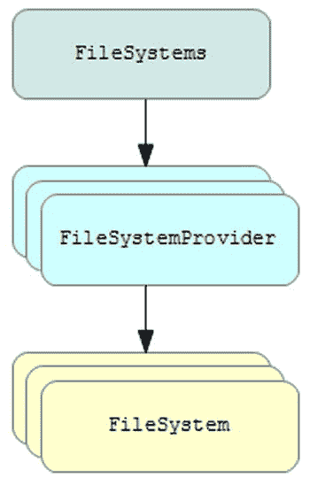
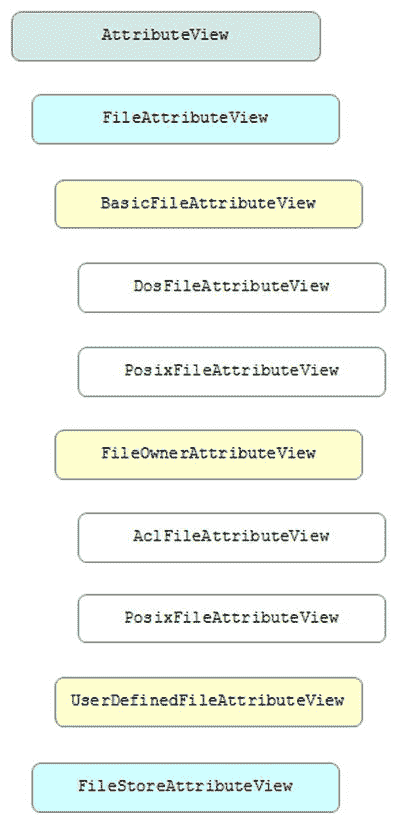
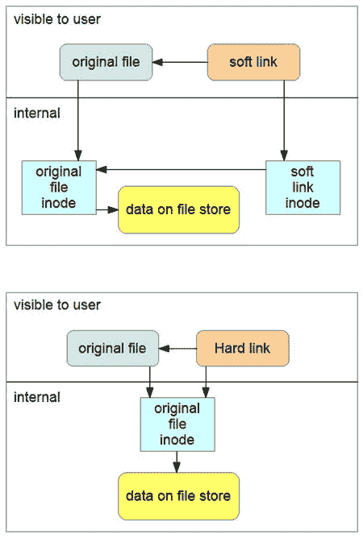

# 12. 改进的文件系统接口

电子补充材料 本章的在线版本 (doi:[10.​1007/​978-1-4842-1565-4_​12](http://dx.doi.org/10.1007/978-1-4842-1565-4_12)) 包含补充材料，仅供授权用户使用。

NIO.2 改进了此前仅限于 `java.io.File` 类的文件系统接口。本章将介绍改进后的文件系统接口架构，并展示如何使用新的 API 来完成各种文件系统任务。

注意

文件系统管理着文件，这些文件可分为常规文件、目录、符号链接（[`https://en.wikipedia.org/wiki/Symbolic_link`](https://en.wikipedia.org/wiki/Symbolic_link)）和硬链接（[`https://en.wikipedia.org/wiki/Hard_link`](https://en.wikipedia.org/wiki/Hard_link)）。

## 构建更好的文件类

基于 `File` 的文件系统接口存在诸多问题。以下列举了几个问题：

*   许多方法返回布尔值而非抛出异常。因此，你无法得知操作失败的原因。例如，当 `delete()` 方法返回 `false` 时，你无法得知文件为何无法删除（例如文件不存在或用户没有执行删除操作的适当权限）。
*   `File` 不支持文件系统特定的符号链接和硬链接。
*   `File` 仅提供对有限文件属性的访问。例如，它不支持访问控制列表（ACL）（[`https://en.wikipedia.org/wiki/Access_control_list`](https://en.wikipedia.org/wiki/Access_control_list)）。
*   `File` 不支持高效的文件属性访问。每次查询都会导致对底层操作系统的调用。
*   `File` 无法扩展到大型目录。通过服务器请求大型目录列表可能导致应用程序挂起。大型目录还可能引发内存资源问题，导致拒绝服务。
*   `File` 仅限于默认文件系统（Java 虚拟机——JVM 可访问的文件系统）。它不支持其他替代方案，例如基于内存的文件系统。
*   `File` 不提供文件复制或文件移动功能。常用于文件移动场景的 `renameTo()` 方法在不同操作系统上表现不一致。

NIO.2 提供了一个改进的文件系统接口，为上述问题提供了解决方案。其部分特性列举如下：

*   方法抛出异常
*   支持符号链接
*   广泛且高效地支持文件属性
*   目录流
*   通过自定义文件系统提供程序支持替代文件系统
*   支持文件复制和文件移动
*   支持遍历文件树/访问文件以及监视目录

改进后的文件系统接口主要由以下包中的各种类型实现：

*   `java.nio.file`：提供用于访问文件系统及其文件的接口和类。
*   `java.nio.file.attribute`：提供用于访问文件系统属性的接口和类。
*   `java.nio.file.spi`：提供用于创建文件系统实现的类。

这些包组织了许多类型。`FileSystem`、`FileSystems` 和 `FileSystemProvider` 构成了改进后的文件系统接口的核心。

### 文件系统与文件系统提供程序

一个操作系统可以托管一个或多个文件系统。例如，Unix/Linux 将所有挂载的磁盘合并为一个虚拟文件系统。相比之下，Windows 为每个活动的磁盘驱动器关联一个独立的文件系统；例如，驱动器 `A:` 使用 FAT16，驱动器 `C:` 使用 NTFS。

`java.nio.file.FileSystem` 类是 Java 代码与文件系统之间的接口。此外，`FileSystem` 是一个工厂，用于获取多种类型的文件系统相关对象（如文件存储和路径）和服务（如监视服务）。

由于 `FileSystem` 类是抽象的，因此无法直接实例化。相反，需要使用 `java.nio.file.FileSystems` 工具类通过多个工厂方法来获取 `FileSystem` 实例。例如，`FileSystem` 的 `getDefault()` 类方法会返回默认文件系统的 `FileSystem` 对象：

`FileSystem fsDefault = FileSystems.getDefault();`

`FileSystems` 还声明了一个 `FileSystem getFileSystem(URI uri)` 类方法，用于获取与指定统一资源标识符（URI）参数关联的 `FileSystem`。此外，`FileSystems` 声明了三个 `newFileSystem()` 方法，用于创建新的 `FileSystem` 实例。

抽象类 `java.nio.file.spi.FileSystemProvider` 被 `FileSystems` 的工厂方法用于获取现有文件系统或创建新的文件系统。`FileSystemProvider` 的具体子类实现了其各种方法，用于复制、移动和删除文件；获取路径；读取属性和符号链接的目标；创建目录、链接和符号链接等。

图 12-1 展示了 `FileSystem`、`FileSystems` 和 `FileSystemProvider` 之间的关系。

图 12-1.

`FileSystems` 方法实例化 `FileSystemProvider` 以获取 `FileSystem`

Java 实现提供了具体的 `FileSystemProvider` 子类，用于描述不同类型的文件系统提供程序。如果你对 Java 实现支持的文件系统提供程序感到好奇，可以运行源代码如清单 12-1 所示的应用程序。

清单 12-1. 识别已安装的文件系统提供程序

`import java.nio.file.spi.FileSystemProvider;`

`import java.util.List;`

`public class ListProviders`

`{`

   `public static void main(String[] args)`

   `{`

      `List<FileSystemProvider> providers =`

         `FileSystemProvider.installedProviders();`

      `for (FileSystemProvider provider: providers)`

         `System.out.println(provider);`

   `}`

`}`

清单 12-1 调用了 `FileSystemProvider` 的 `List<FileSystemProvider>` `installedProviders()` 类方法，以获取已安装文件系统提供程序的列表。然后遍历此列表，隐式调用每个提供程序的 `toString()` 方法并输出结果字符串。

按如下方式编译清单 12-1：

`javac ListProviders.java`

按如下方式运行生成的应用程序：

`java ListProviders`

当我运行此应用程序时，观察到以下输出：

`sun.nio.fs.WindowsFileSystemProvider@4aa298b7`

`com.sun.nio.zipfs.ZipFileSystemProvider@7d4991ad`

此输出告诉了我两件事：与我的 Windows 7 操作系统原生文件系统交互的 `FileSystem` 是从 `WindowsFileSystemProvider` 子类获取的。此外，我还可以获取基于 ZIP 文件的 `FileSystem`。

除了少数例外情况，NIO.2 的各种类型最终都会委托给基础的 `FileSystem`、`FileSystems` 和 `FileSystemProvider` 类型。

## 使用路径定位文件

文件系统用于存储文件（包括常规文件和目录，也可能包含符号链接和硬链接）。文件通常按层级结构存储，并通过指定路径来定位，路径是一种紧凑的映射，通过分隔的名称元素序列在这些层级结构中导航。

`java.nio.file.Path` 接口表示指向某个文件（该文件可能不存在）的层级路径。它可以选择性地以一个标识文件系统层级的名称元素开头，并可以选择性地后跟一系列由分隔符字符分隔的目录元素。距离目录层级根最远的名称元素是目录或其他类型文件的名称。其他名称元素则是目录名称。

注意

`Path` 声明了 `FileSystem getFileSystem()` 方法，用于返回对创建该 `Path` 对象所描述文件的 `FileSystem` 的引用。

一个 `Path` 可以表示根目录、根目录加一系列名称元素，或者一个或多个名称元素。当它完全由一个空名称元素组成时，表示一个空路径。使用空路径访问文件等同于访问文件系统的默认目录。

注意

`Path` 声明了 `File toFile()` 方法，用于返回一个表示其路径的 `File` 对象。当 `Path` 对象未与默认提供程序关联时，`toFile()` 会抛出 `UnsupportedOperationException`。`File` 声明了 `Path toPath()` 方法，用于返回一个表示 `File` 对象抽象路径的 `Path` 对象。当无法从抽象路径构造 `Path` 时，`toPath()` 会抛出 `java.nio.file.InvalidPathException`。这些方法允许你在源代码中混合使用 `Path` 和 `File`，从而可以逐步将基于旧版 `File` 的代码迁移到使用改进后文件系统接口的代码。

### 获取路径并访问其名称元素

`FileSystem` 提供了一个 `Path getPath(String first, String... more)` 方法，用于返回一个 `Path` 对象。传递给 `first` 的参数标识路径字符串的初始部分。分配给 `more` 的可变参数列表标识了附加字符串，这些字符串会与 `first` 连接以形成完整的路径字符串。

注意

在构造 `Path` 时，其名称元素通常使用从 `FileSystem` 的 `String getSeparator()` 方法返回的名称分隔符进行连接。生成的路径字符串表示一个依赖于系统的文件路径。

考虑以下示例：

`Path path = fsDefault.getPath("x", "y");`

此示例构造了一个 `Path`，其中 `y` 从属于 `x`。你也可以按如下方式构造此 `Path`：

`Path path = fsDefault.getPath("x\\y");`

与前一个示例不同，我在这里包含了 Windows 能理解的反斜杠（`\`）名称分隔符字符（已转义以满足 Java 编译器要求）。

`Path` 必须符合创建了调用 `getPath()` 方法的 `FileSystem` 的文件系统提供程序所解析的语法。否则，此方法将抛出 `InvalidPathException`。

警告

在构造 `Path` 时，应避免硬编码名称分隔符字符，例如 Windows 上的反斜杠。尽管某些分隔符是合法的，例如 Windows 上的反斜杠或正斜杠（`/`），但其他分隔符很可能会导致 `InvalidPathException`。例如，在 Windows 上将 `:x:y`（针对某个假设的文件系统）指定为路径会导致 `InvalidPathException`。

NIO.2 提供了一个更方便的 `java.nio.file.Paths` 工具类，其中包含一对用于返回 `Path` 对象的类方法：

*   `Path get(String first, String... more)`
*   `Path get(URI uri)`

第一个方法等同于在默认文件系统上调用 `getPath()` 并返回结果：

`return FileSystems.getDefault().getPath(first, more);`

第二个方法稍微复杂一些。它会遍历已安装的文件系统提供程序，以定位由给定 URI 的 scheme 组件标识的提供程序。当为 `file` scheme 找到此提供程序时，该方法会执行以下代码：

`return FileSystems.getDefault().provider().getPath(uri);`

获取默认文件系统后，会调用 `FileSystem` 的 `FileSystemProvider provider()` 方法来返回创建该 `FileSystem` 对象的文件系统提供程序。然后，调用 `FileSystemProvider` 的 `Path getPath(URI uri)` 方法将 URI 参数转换为 `Path` 对象。

对于任何其他 scheme，会在已安装的提供程序列表中搜索第一个具有匹配 scheme 的提供程序。然后在该提供程序上调用 `getPath(uri)`。

当由于语法错误而无法构造路径时，`get(String, String...)` 会抛出 `InvalidPathException`。当没有 `FileSystem` 与 scheme 匹配时，`get(URI)` 会抛出 `java.nio.file.FileSystemNotFoundException`；对于错误的 URI，则会抛出 `java.lang.IllegalArgumentException`。

`Path` 声明了几个用于访问其名称元素的方法：

*   `Path getFileName()`：返回此路径所表示文件的名称，作为一个 `Path` 对象。
*   `Path getName(int index)`：返回此路径中第 `index` 个名称元素，作为一个 `Path` 对象。`index` 从 0 开始，表示最接近根的元素。距离根最远的元素由名称计数减一来标识。
*   `int getNameCount()`：返回路径中名称元素的数量。
*   `Path getParent()`：返回父路径，如果没有父路径则返回 `null`。
*   `Path getRoot()`：返回此路径中的根名称元素，作为一个 `Path` 对象，如果没有根则返回 `null`。
*   [`Path`](https://docs.oracle.com/javase/8/docs/api/java/nio/file/Path.html#interface%20in%20java.nio.file) `subpath(int beginIndex, int endIndex)`：返回一个相对路径，该路径是此路径中名称元素的一个子序列。第一个名称元素（最接近根）位于 `beginIndex`，最后一个名称元素（距离根最远）位于 `endIndex` 减一的位置。

清单 12-2 展示了一个演示路径构造及上述方法的应用程序源代码。

清单 12-2. 构造路径并访问其名称元素

`import java.nio.file.FileSystem;`

`import java.nio.file.FileSystems;`

`import java.nio.file.Path;`

`public class PathDemo`

`{`

`public static void main(String[] args)`

`{`

`FileSystem fsDefault = FileSystems.getDefault();`

`Path path = fsDefault.getPath("a", "b", "c");`

`System.out.println(path);`

`System.out.printf("File name: %s%n", path.getFileName());`

`for (int i = 0; i < path.getNameCount(); i++)`

`System.out.println(path.getName(i));`

`System.out.printf("Parent: %s%n", path.getParent());`

`System.out.printf("Root: %s%n", path.getRoot());`

`System.out.printf("SubPath 0, 2): %s%n", path.subpath(0, 2));`

`}`

`}`

按如下方式编译清单 [12-2：

`javac PathDemo.java`

按如下方式运行生成的应用程序：

`java PathDemo`

我观察到以下输出：

`a\b\c`

`File name: c`

`a`

`b`

`c`

`Parent: a\b`

`Root: null`

`SubPath [0, 2): a\b`

### 相对路径与绝对路径

前面的路径示例演示了相对路径。你可以通过在 `Path` 对象上调用 `Path` 的 `boolean` 类型方法 `isAbsolute()` 来验证这一点。该方法返回 `false` 表示该路径不是绝对路径。要创建绝对路径，你需要将根元素作为第一个名称元素传入。

你可以通过调用 `FileSystem` 的 `Iterable<Path>` 类型方法 `getRootDirectories()` 来获取文件系统的根目录，该方法返回一个迭代器，遍历描述根目录的 `Path` 实例。清单 12-3 展示了一个演示此方法和绝对路径创建的应用程序的源代码。

**清单 12-3\. 演示根目录迭代与绝对路径创建**

`import java.nio.file.FileSystem;`

`import java.nio.file.FileSystems;`

`import java.nio.file.Path;`

`public class PathDemo`

`{`

   `public static void main(String[] args)`

   `{`

      `FileSystem fsDefault = FileSystems.getDefault();`

      `Path path = fsDefault.getPath("a", "b", "c");`

      `System.out.println(path);`

      `System.out.printf("Absolute: %b%n", path.isAbsolute());`

      `System.out.printf("Root: %s%n", path.getRoot());`

      `for (Path root: fsDefault.getRootDirectories())`

      `{`

         `path = fsDefault.getPath(root.toString(), "a", "b", "c");`

         `System.out.println(path);`

         `System.out.printf("Absolute: %b%n", path.isAbsolute());`

         `System.out.printf("Root: %s%n", path.getRoot());`

      `}`

   `}`

`}`

编译清单 12-3（`javac PathDemo.java`）并运行生成的应用程序（`java PathDemo`）。我观察到以下输出：

`a\b\c`

`Absolute: false`

`Root: null`

`C:\a\b\c`

`Absolute: true`

`Root: C:\`

`D:\a\b\c`

`Absolute: true`

`Root: D:\`

`E:\a\b\c`

`Absolute: true`

`Root: E:\`

`F:\a\b\c`

`Absolute: true`

`Root: F:\`

如果你有一个相对路径，可以通过调用 `Path` 的 `Path` 类型方法 `toAbsolutePath()` 将其转换为绝对路径，如清单 12-4 所示。

**清单 12-4\. 将相对路径转换为绝对路径**

`import java.nio.file.Path;`

`import java.nio.file.Paths;`

`public class PathDemo`

`{`

   `public static void main(String[] args)`

   `{`

      `Path path = Paths.get("a", "b", "c");`

      `System.out.printf("Path: %s%n", path.toString());`

      `System.out.printf("Absolute: %b%n", path.isAbsolute());`

      `path = path.toAbsolutePath();`

      `System.out.printf("Path: %s%n", path.toString());`

      `System.out.printf("Absolute: %b%n", path.isAbsolute());`

   `}`

`}`

`PathDemo` 调用 `Path` 的 `String toString()` 方法返回路径的字符串表示形式。

编译清单 12-4（`javac PathDemo.java`）并运行生成的应用程序（`java PathDemo`）。我观察到以下输出：

`Path: a\b\c`

`Absolute: false`

`Path: C:\prj\books\io\ch12\code\PathDemo\v3\a\b\c`

`Absolute: true`

根据 `toAbsolutePath()` 的 JDK 文档，如果路径已经是绝对路径，此方法会返回该路径。否则，此方法会以依赖于实现的方式解析路径，通常是通过将路径解析到文件系统的默认目录。根据实现的不同，当文件系统不可访问时，此方法可能会抛出 I/O 错误。

### 规范化、相对化与解析

`Path` 声明了几个方法，用于移除路径冗余、创建两个路径之间的相对路径以及解析（连接）两个路径：

*   `Path normalize()`
*   `Path relativize(Path other)`
*   `Path resolve(Path other)`
*   `Path resolve(String other)`

`normalize()` 对于移除路径中的冗余非常有用。例如，`reports/./2015/jan` 包含了冗余的“.”（当前目录）元素。规范化后，该路径变为更短的 `reports/2015/jan`。

`relativize()` 创建两个路径之间的相对路径。例如，在 `reports/2015/jan` 层级结构中，给定当前目录 `jan`，导航到 `reports/2016/mar` 的相对路径是 `../../2016/mar`。

`resolve()` 是 `relativize()` 的逆操作。它允许你将一个部分路径（没有根元素的路径）连接到另一个路径。例如，将 `apr` 解析到 `reports/2015` 会得到 `reports/2015/apr`。

此外，`Path` 声明了以下方法，用于将路径字符串解析到当前路径的父路径：

*   `Path resolveSibling(Path other)`
*   `Path resolveSibling(String other)`

我创建了一个演示这些方法的应用程序。清单 12-5 展示了其源代码。

**清单 12-5\. 规范化、相对化与解析路径**

`import java.nio.file.FileSystems;`

`import java.nio.file.Path;`

`import java.nio.file.Paths;`

`public class PathDemo`

`{`

`public static void main(String[] args)`

`{`

`Path path1 = Paths.get("reports", ".", "2015", "jan");`

`System.out.println(path1);`

`System.out.println(path1.normalize());`

`path1 = Paths.get("reports", "2015", "..", "jan");`

`System.out.println(path1.normalize());`

`System.out.println();`

`path1 = Paths.get("reports", "2015", "jan");`

`System.out.println(path1);`

`System.out.println(path1.relativize(Paths.get("reports", "2016",`

`"mar")));`

`try`

`{`

`Path root = FileSystems.getDefault().getRootDirectories()`

`.iterator().next();`

`if (root != null)`

`{`

`System.out.printf("Root: %s%n", root.toString());`

`Path path = Paths.get(root.toString(), "reports", "2016",`

`"mar");`

`System.out.printf("Path: %s%n", path);`

`System.out.println(path1.relativize(path));`

`}`

`}`

`catch (IllegalArgumentException iae)`

`{`

`iae.printStackTrace();`

`}`

`System.out.println();`

`path1 = Paths.get("reports", "2015");`

`System.out.println(path1);`

`System.out.println(path1.resolve("apr"));`

`System.out.println();`

`Path path2 = Paths.get("reports", "2015", "jan");`

`System.out.println(path2);`

`System.out.println(path2.getParent());`

`System.out.println(path2.resolveSibling(Paths.get("mar")));`

`System.out.println(path2.resolve(Paths.get("mar")));`

`}`

`}`

编译清单 12-5（`javac PathDemo.java`）并运行生成的应用程序（`java PathDemo`）。我观察到以下输出：

`reports\.\2015\jan`

`reports\2015\jan`

`reports\jan`

`reports\2015\jan`

`..\..\2016\mar`

`Root: C:\`

`Path: C:\reports\2016\mar`

`java.lang.IllegalArgumentException: ’other’ is different type of Path`

`at sun.nio.fs.WindowsPath.relativize(WindowsPath.java:388)`

`at sun.nio.fs.WindowsPath.relativize(WindowsPath.java:44)`

`at PathDemo.main(PathDemo.java:29)`

`reports\2015`

`reports\2015\apr`

`reports\2015\jan`

`reports\2015`

`reports\2015\mar`

`reports\2015\jan\mar`

输出中出现了 `IllegalArgumentException`，当 `relativize()` 无法将其 `Path` 参数相对于当前 `Path` 进行相对化时，会抛出此异常。当其中一个 `Path` 包含根元素时，它无法进行相对化。

输出还揭示了 `resolveSibling()` 和 `resolve()` 之间的区别。`resolveSibling()` 将 `mar` 解析到 `reports\2015`（即 `reports\2015\jan` 的父路径）；`resolve()` 将 `mar` 解析到 `reports\2015\jan`。

### 附加功能

`Path` 声明了用于比较路径、判断路径是否以另一路径开头或结尾、将路径转换为 `java.net.URI`（统一资源标识符）对象等附加方法。清单 12-6 演示了其中的大部分方法。

清单 12-6\. 演示附加的 `Path` 方法

`import java.io.IOException;`

`import java.nio.file.Path;`

`import java.nio.file.Paths;`

`public class PathDemo`

`{`

`public static void main(String[] args) throws IOException`

`{`

`Path path1 = Paths.get("a", "b", "c");`

`Path path2 = Paths.get("a", "b", "c", "d");`

`System.out.printf("path1: %s%n", path1.toString());`

`System.out.printf("path2: %s%n", path2.toString());`

`System.out.printf("path1.equals(path2): %b%n", path1.equals(path2));`

`System.out.printf("path1.equals(path2.subpath(0, 3)): %b%n",`

`path1.equals(path2.subpath(0, 3)));`

`System.out.printf("path1.compareTo(path2): %d%n",`

`path1.compareTo(path2));`

`System.out.printf("path1.startsWith(\"x\"): %b%n",`

`path1.startsWith("x"));`

`System.out.printf("path1.startsWith(Paths.get(\"a\"): %b%n",`

`path1.startsWith(Paths.get("a")));`

`System.out.printf("path2.endsWith(\"d\"): %b%n",`

`path2.startsWith("d"));`

`System.out.printf("path2.endsWith(Paths.get(\"c\", \"d\"): " +`

`"%b%n",`

`path2.endsWith(Paths.get("c", "d")));`

`System.out.printf("path2.toUri(): %s%n", path2.toUri());`

`Path path3 = Paths.get(".");`

`System.out.printf("path3: %s%n", path3.toString());`

`System.out.printf("path3.toRealPath(): %s%n", path3.toRealPath());`

`}`

`}`

清单 12-6 的 `main()` 方法首先获取当前文件系统的引用，并使用该引用创建一对 `Path` 对象。在输出每个对象的路径后，它通过调用 `boolean equals(Object other)` 方法来演示路径相等性。

你还可以比较路径，以确定它们是否相等，或者哪个路径在字母顺序上排在另一个路径之前。`main()` 方法为此调用了 `Path` 的 `int compareTo(Path other)` 方法。

接下来，`main()` 调用 `Path` 的 `boolean startsWith(Path other)`、`boolean startsWith(String other)`、`boolean endsWith(Path other)` 和 `boolean endsWith(String other)` 方法，以了解一个路径是否以另一个路径开头或结尾。

此时，`main()` 演示了 `Path` 的 `URI toUri()` 方法，用于将当前 `Path` 实例转换为 `URI` 对象。此方法在转换过程中可能抛出 `java.io.IOError`。

最后，`main()` 演示了 `Path toRealPath(LinkOption... options)` 方法，用于返回 `Path` 对象所代表文件的真实路径。此方法通常根据此路径派生出一个绝对路径，该绝对路径定位与此路径相同的文件，但其名称元素表示目录和任何非目录的实际名称。当文件不存在或发生 I/O 错误时，它会抛出 `java.io.IOException`。

你可以将逗号分隔的 `java.nio.file.LinkOption` 枚举常量列表作为参数传递给此方法。此枚举定义了如何处理符号链接的选项。目前，`LinkOption` 仅声明了一个 `NOFOLLOW_LINKS`（不跟踪符号链接）常量。

编译清单 12-6（`javac PathDemo.java`）并运行生成的应用程序（`java PathDemo`）。我观察到以下输出：

`path1: a\b\c`

`path2: a\b\c\d`

`path1.equals(path2): false`

`path1.equals(path2.subpath(0, 3)): true`

`path1.compareTo(path2): -2`

`path1.startsWith("x"): false`

`path1.startsWith(Paths.get("a"): true`

`path2.endsWith("d"): false`

`path2.endsWith(Paths.get("c", "d"): true`

`path2.toUri(): file:///C:/prj/books/io/ch12/code/PathDemo/v5/a/b/c/d`

`path3: .`

`path3.toRealPath(): C:\prj\books\io\ch12\code\PathDemo\v5`

## 使用 Files 执行文件系统任务

在大多数情况下，你可以使用 `FileSystem`、`FileSystems` 和 `FileSystemProvider` 来执行各种文件系统任务，例如复制或移动文件。然而，有一种更简单的方法来执行这些任务：调用 `java.nio.file.Files` 工具类的 `static` 方法。

注意

`Files` 不支持路径匹配和目录监视任务。但是，`Files` 专门支持遍历文件树并访问其文件。

### 访问文件存储

`FileSystem` 依赖 `java.nio.file.FileStore` 类来提供关于文件存储的信息，这些存储池、设备、分区、卷、具体文件系统或其他特定于实现的文件存储方式。一个文件存储包含名称、类型、空间大小（以字节为单位）以及其他信息。

`Files` 声明了 `FileStore getFileStore(Path path)` 方法，用于返回一个 `FileStore` 对象，该对象代表由 `path` 标识的文件所在的文件存储。一旦你获得了 `FileStore`，就可以调用方法来获取空间大小、判断文件存储是否为只读，以及获取文件存储的名称和类型：

*   `long getTotalSpace()`：返回文件存储的大小（以字节为单位）。当发生 I/O 错误时，此方法会抛出 `IOException`。
*   `long getUnallocatedSpace()`：返回文件存储中未分配的字节数。返回的未分配字节数是一个提示，而非保证，表明可以使用这些字节的大部分或全部。在获取空间属性后立即获取的未分配字节数最可能是准确的。任何外部 I/O 操作（包括在此 JVM 之外的操作系统上进行的操作）都可能导致其不准确。当发生 I/O 错误时，此方法会抛出 `IOException`。
*   `long getUsableSpace()`：返回此 JVM 在文件存储上可用的字节数。返回的可用字节数是一个提示，而非保证，表明可以使用这些字节的大部分或全部。在获取空间属性后立即获取的可用字节数最可能是准确的。任何外部 I/O 操作（包括在此 JVM 之外的操作系统上进行的操作）都可能导致其不准确。当发生 I/O 错误时，此方法会抛出 `IOException`。
*   `boolean isReadOnly()`：当此文件存储为只读时返回 `true`。当文件存储不支持写入操作或对文件的其他更改时，它就是只读的。任何尝试创建文件、打开现有文件进行写入等操作都会导致抛出 `IOException`。
*   `String name()`：返回此文件存储的名称。名称的格式高度依赖于具体实现。它通常是存储池或卷的名称。返回的字符串可能与 `toString()` 方法返回的字符串不同。
*   `String type()`：返回此文件存储的类型。返回字符串的格式高度依赖于具体实现。例如，它可能指示所使用的格式，或者文件存储是本地还是远程的。

清单 12-7 展示了一个应用程序的源代码，该程序获取与路径对应的文件存储，并输出有关该文件存储的信息。

清单 12-7\. 访问文件存储并输出文件存储详情

`import java.io.IOException;`

`import java.nio.file.FileStore;`

`import java.nio.file.Files;`

`import java.nio.file.Paths;`

`public class FSDemo`

`{`

`public static void main(String[] args) throws IOException`

`{`

`if (args.length != 1)`

`{`

`System.err.println("usage: java FSDemo path");`

`return;`

`}`

`FileStore fs = Files.getFileStore(Paths.get(args[0]));`

`System.out.printf("Total space: %d%n", fs.getTotalSpace());`

`System.out.printf("Unallocated space: %d%n",`

`fs.getUnallocatedSpace());`

`System.out.printf("Usable space: %d%n",`

`fs.getUsableSpace());`

`System.out.printf("Read only: %b%n", fs.isReadOnly());`

`System.out.printf("Name: %s%n", fs.name());`

`System.out.printf("Type: %s%n%n", fs.type());`

`}`

`}`

按如下方式编译清单 12-7：

`javac FSDemo.java`

按如下方式运行生成的应用程序：

`java FSDemo FSDemo.java`

在一次运行中，我观察到以下输出：

`Total space: 499808989184`

`Unallocated space: 108411215872`

`Usable space: 108411215872`

`Read only: false`

`Name:`

`Type: NTFS`

`getFileStore()` 方法专注于特定的文件存储。如果你想遍历给定 `FileSystem` 对象的所有文件存储，则需要使用 `FileSystem` 的 `Iterable<FileStore> getFileStores()` 方法，该方法允许你遍历所有文件存储。

清单 12-8 展示了一个应用程序的源代码，该程序遍历默认文件系统的所有文件存储并输出它们的名称。

清单 12-8\. 遍历默认文件系统的文件存储

`import java.io.IOException;`

`import java.nio.file.FileStore;`

`import java.nio.file.FileSystem;`

`import java.nio.file.FileSystems;`

`public class FSDemo`

`{`

`public static void main(String[] args) throws IOException`

`{`

`FileSystem fsDefault = FileSystems.getDefault();`

`for (FileStore fileStore: fsDefault.getFileStores())`

`System.out.printf("Filestore: %s%n", fileStore);`

`}`

`}`

编译清单 12-8（`javac FSDemo.java`）并运行生成的应用程序（`java FSDemo`）。我观察到以下输出：

`Filestore: (C:)`

`Filestore: My Passport (E:)`

`Filestore: BACKUP (F:)`

### 管理属性

文件与属性相关联，例如大小、最后修改时间、隐藏、权限和所有者。NIO.2 通过 `java.nio.file.attribute` 包中的类型以及 `Files` 类和其他类型的面向属性的方法来支持属性。

属性被分组为视图，每个视图对应一个特定的文件系统实现。某些视图通过提供 `readAttributes()` 方法允许你批量读取属性。此外，你可以通过调用 `Files` 的 `getAttribute()` 和 `setAttribute()` 方法来获取和设置属性。

视图由继承自 `AttributeView` 的接口描述，其 `String name()` 方法返回视图的名称。该接口的子类型是 `FileAttributeView`，它是与文件关联的属性的视图。`FileAttributeView` 没有贡献任何方法。

`FileAttributeView` 的子类型包括以下接口：

*   `BasicFileAttributeView`：提供许多文件系统共有的基本文件属性集的视图。
*   `FileOwnerAttributeView`：提供对读取或更新文件所有者的支持。
*   `UserDefinedFileAttributeView`：提供文件用户定义属性（也称为扩展属性）的视图。

`BasicFileAttributeView` 的子类型包括以下接口：

*   `DosFileAttributeView`：提供传统 MS-DOS/PC-DOS 文件属性的视图。
*   `PosixFileAttributeView`：提供在实现可移植操作系统接口（POSIX）标准系列的操作系统所使用的文件系统上，通常与文件关联的文件属性的视图。

`FileOwnerAttributeView` 的子类型包括以下接口：

*   `AclFileAttributeView`：提供对读取或更新文件 ACL 或文件所有者属性的支持。
*   `PosixFileAttributeView`

如你所见，`PosixFileAttributeView` 有两个直接父接口；它是一个专门化的基本文件属性视图和一个专门化的文件所有者属性视图。图 12-2 阐明了这种关系以及视图层次结构中接口之间的其他关系。

图 12-2.

关联视图类型；子类型向右缩进

#### 确定视图支持

在使用这些视图中的任何一个之前，请确保其受支持。实现此任务的一种方法是调用 `FileSystem` 的 `Set<String>` `supportedFileAttributeViews()` 方法，该方法返回一组字符串，用于标识调用方 `FileSystem` 所支持的视图。

清单 12-9 展示了一个应用程序的源代码，该程序输出默认 `FileSystem` 所支持的视图名称。

**清单 12-9\. 输出默认文件系统支持的文件属性视图名称**

`import java.nio.file.FileSystem;`

`import java.nio.file.FileSystems;`

`public class FAVDemo`

`{`

`public static void main(String[] args)`

`{`

`FileSystem fsDefault = FileSystems.getDefault();`

`for (String view: fsDefault.supportedFileAttributeViews())`

`System.out.println(view);`

`}`

`}`

按如下方式编译清单 12-9：

`javac FAVDemo.java`

按如下方式运行生成的应用程序：

`java FAVDemo`

我观察到以下输出：

`owner`

`dos`

`acl`

`basic`

`user`

注意

所有 `FileSystem` 都支持基本文件属性视图，因此你至少应在输出中看到 `basic`。

你也可以使用 `Files` 的 `<V extends FileAttributeView> V getFileAttributeView(Path path, Class<V> type, LinkOption... options)` 方法来完成此任务。该方法返回一个由视图接口类型的实现创建的对象，如果视图不受支持，则返回 `null`。清单 12-10 展示了一个应用程序，它在实用方法上下文中使用此方法来确定视图支持。

**清单 12-10\. 确定特定文件属性视图支持**

`import java.nio.file.Files;`

`import java.nio.file.Paths;`

`import java.nio.file.attribute.AclFileAttributeView;`

`import java.nio.file.attribute.BasicFileAttributeView;`

`import java.nio.file.attribute.FileAttributeView;`

`import java.nio.file.attribute.PosixFileAttributeView;`

`public class FAVDemo`

`{`

`public static void main(String[] args)`

`{`

`System.out.printf("Supports basic: %b%n",`

`isSupported(BasicFileAttributeView.class));`

`System.out.printf("Supports posix: %b%n",`

`isSupported(PosixFileAttributeView.class));`

`System.out.printf("Supports acl: %b%n",`

`isSupported(AclFileAttributeView.class));`

`}`

`static boolean isSupported(Class<? extends FileAttributeView> clazz)`

`{`

`return Files.getFileAttributeView(Paths.get("."), clazz) != null;`

`}`

`}`

清单 12-10 声明了一个 `isSupported()` 实用方法，该方法接受一个代表 `FileAttributeView` 子接口的 `java.lang.Class` 对象作为参数。如果视图受支持，则返回 `true`；否则返回 `false`。

`Class` 参数和一个描述当前目录的 `Path` 对象被传递给 `getFileAttributeView()`，该方法在视图受支持时返回一个由实现该接口的类创建的对象，在视图不受支持时返回 `null`。

编译清单 12-10（`javac FAVDemo.java`）并运行生成的应用程序（`java FAVDemo`）。我观察到以下输出：

`Supports basic: true`

`Supports posix: false`

`Supports acl: true`

最终，`getFileAttributeView()` 为与 `Path` 参数关联的 `FileSystem` 提供了一个结果。由于 `Paths.get(".")` 返回的是默认文件系统的 `FileSystem`，因此 `isSupport()` 仅在默认文件系统上下文中有效。

最后，一个文件存储可以支持多种文件属性视图。调用 `FileStore` 的任一 `supportsFileAttributeView()` 方法，以确定该文件存储是否支持由给定文件属性视图标识的文件属性：

*   `boolean supportsFileAttributeView(Class<? extends FileAttributeView> type)`
*   `boolean supportsFileAttributeView(` [`String`](https://docs.oracle.com/javase/8/docs/api/java/lang/String.html#class%20in%20java.lang) `name)`

其中一个方法接受一个描述 `FileAttributeView` 子接口的 `Class` 对象作为参数：

`System.out.printf("supports basic file attribute view: %b%n",`

`fileStore.supportsFileAttributeView(BasicFileAttributeView.class));`

另一个方法接受一个字符串参数，该字符串是 `FileSystem` 的 `supportedFileAttributeViews()` 方法返回的字符串之一：

`System.out.printf("supports basic file attribute view: %b%n",`

`fileStore.supportsFileAttributeView("basic"));`

#### 探索基本视图

`BasicFileAttributeView` 接口支持多个基本属性。以下列表按字符串名称和类型标识了每个属性：

*   `creationTime` (`FileTime`)
*   `fileKey` (`Object`)
*   `isDirectory` (`Boolean`)
*   `isOther` (`Boolean`)
*   `isRegularFile` (`Boolean`)
*   `isSymbolicLink` (`Boolean`)
*   `lastAccessTime` (`FileTime`)
*   `lastModifiedTime` (`FileTime`)
*   `size` (`Long`)

`creationTime`、`lastAccessTime` 和 `lastModifiedTime` 的类型均为 `java.nio.file.attribute.FileTime`，这是一个表示文件时间戳的不可变类。`fileKey` 的类型为 `java.lang.Object`。`isDirectory`、`isOther`、`isRegularFile` 和 `isSymbolicLink` 的类型均为 `java.lang.Boolean`。`size` 的类型为 `java.lang.Long`。

`BasicFileAttributeView` 声明了以下方法：

*   `BasicFileAttributes readAttributes()`：以批量操作的方式读取基本文件属性。
*   `void setTimes(FileTime lastModifiedTime, FileTime lastAccessTime, FileTime creationTime)`：更新文件的 `lastModifiedTime`、`lastAccessTime` 和 `creationTime` 属性中的任意或全部。

当发生 I/O 错误时，这些方法会抛出 `IOException`。

`readAttributes()` 返回一个 `java.nio.file.attribute.BasicFileAttributes` 对象，该对象提供了用于读取属性值的类型安全方法：

*   `FileTime creationTime()`
*   `Object fileKey()`
*   `boolean isDirectory()`
*   `boolean isOther()`
*   `boolean isRegularFile()`
*   `boolean isSymbolicLink()`
*   `FileTime lastAccessTime()`
*   `FileTime lastModifiedTime()`
*   `long size()`

注意

在某些文件系统上，可以使用一个标识符或标识符组合来唯一标识一个文件。此类标识符称为文件键。文件键对于某些操作非常重要，例如在支持[符号链接](https://docs.oracle.com/javase/8/docs/api/java/nio/file/package-summary.html#links)的文件系统中进行文件树遍历，以及允许一个文件成为多个目录中条目的文件系统。例如，在基于 Unix 的文件系统上，设备 ID 和信息节点（inode）通常用于此目的。

##### 批量读取基本文件属性值

清单 12-11 展示了一个应用程序的源代码，演示如何批量读取文件的基本文件属性。

**清单 12-11. 批量读取基本文件属性**

`import java.io.IOException;`

`import java.nio.file.Files;`

`import java.nio.file.Path;`

`import java.nio.file.Paths;`

`import java.nio.file.attribute.BasicFileAttributes;`

`public class BFAVDemo`

`{`

   `public static void main(String[] args) throws IOException`

   `{`

      `if (args.length != 1)`

      `{`

         `System.err.println("usage: java BFAVDemo path");`

         `return;`

      `}`

      `Path path = Paths.get(args[0]);`

      `BasicFileAttributes bfa;`

      `bfa = Files.readAttributes(path, BasicFileAttributes.class);`

      `System.out.printf("Creation time: %s%n", bfa.creationTime());`

      `System.out.printf("File key: %s%n", bfa.fileKey());`

      `System.out.printf("Is directory: %b%n", bfa.isDirectory());`

      `System.out.printf("Is other: %b%n", bfa.isOther());`

      `System.out.printf("Is regular file: %b%n", bfa.isRegularFile());`

      `System.out.printf("Is symbolic link: %b%n", bfa.isSymbolicLink());`

      `System.out.printf("Last access time: %s%n", bfa.lastAccessTime());`

      `System.out.printf("Last modified time: %s%n", bfa.lastModifiedTime());`

      `System.out.printf("Size: %d%n", bfa.size());`

   `}`

`}`

这些属性通过调用`Files`的`<A extends BasicFileAttributes> A readAttributes(Path path, Class<A> type, LinkOption... options)`方法来读取。传递给`path`的参数是一个封装了单个命令行参数的`Path`对象。`BasicFileAttributes.class`被传递给`type`，表示要读取与`path`对应的基本文件属性。由于没有向`options`传递任何参数，因此会跟随符号链接，并读取链接目标关联的属性。

按如下方式编译清单 12-11：

`javac BFAVDemo.java`

按如下方式运行生成的应用程序：

`java BFAVDemo BFAVDemo.java`

我观察到以下输出：

`Creation time: 2015-09-14T21:39:43.655763Z`

`File key: null`

`Is directory: false`

`Is other: false`

`Is regular file: true`

`Is symbolic link: false`

`Last access time: 2015-09-14T21:39:43.655763Z`

`Last modified time: 2015-09-14T21:44:59.238814Z`

`Size: 1144`

##### 获取和设置单个基本文件属性值

`Files`声明了`getAttribute()`和`setAttribute()`方法，你可以调用它们来获取或设置单个文件属性：

*   `Object getAttribute(Path path, String attribute, LinkOption... options)`
*   [`Path`](https://docs.oracle.com/javase/8/docs/api/java/nio/file/Path.html#interface%20in%20java.nio.file) `setAttribute(` [`Path`](https://docs.oracle.com/javase/8/docs/api/java/nio/file/Path.html#interface%20in%20java.nio.file) `path,` [`String`](https://docs.oracle.com/javase/8/docs/api/java/lang/String.html#class%20in%20java.lang) `attribute,` [`Object`](https://docs.oracle.com/javase/8/docs/api/java/lang/Object.html#class%20in%20java.lang) `value,` [`LinkOption`](https://docs.oracle.com/javase/8/docs/api/java/nio/file/LinkOption.html#enum%20in%20java.nio.file) `... options)`

`getAttribute()`读取单个文件属性的值。`path`标识要读取属性值的文件，`attribute`标识属性名称，`options`标识如何处理符号链接。当你想要获取符号链接文件本身的属性值时，指定`LinkOption.NOFOLLOW_LINKS`。当你想要获取链接最终目标的属性值时，则省略此参数。

`attribute`参数标识要读取的属性，并遵循以下语法：

`[视图名称:]属性名称`

方括号表示可选组件，冒号字符（`:`）表示其本身。`视图名称`是`FileAttributeView`的名称，它标识一组文件属性。如果未指定，则默认为`basic`，这是标识许多文件系统共有的基本文件属性集的文件属性视图名称。`属性名称`是属性的名称。

`setAttribute()`设置单个文件属性的值。`path`标识要设置属性值的文件，`attribute`标识属性名称并遵循之前指定的语法，`value`标识属性的新值，`options`标识如何处理符号链接。

清单 12-12 展示了一个应用程序的源代码，演示如何获取和设置单个基本文件属性值。

**清单 12-12. 获取和设置单个基本文件属性值**

`import java.io.IOException;`

`import java.nio.file.Files;`

`import java.nio.file.Path;`

`import java.nio.file.Paths;`

`import java.nio.file.attribute.FileTime;`

`import java.time.Instant;`

`public class BFAVDemo`

`{`

`public static void main(String[] args) throws IOException`

`{`

`if (args.length < 1 || args.length > 2)`

`{`

`System.err.println("usage: java BFAVDemo path [set]");`

`return;`

`}`

`Path path = Paths.get(args[0]);`

`boolean setAttr = false;`

`if (args.length == 2)`

`setAttr = true;`

`System.out.printf("Creation time: %s%n",`

`Files.getAttribute(path, "creationTime"));`

`System.out.printf("File key: %s%n",`

`Files.getAttribute(path, "fileKey"));`

`System.out.printf("Is directory: %b%n",`

`Files.getAttribute(path, "isDirectory"));`

`System.out.printf("Is other: %b%n",`

`Files.getAttribute(path, "isOther"));`

`System.out.printf("Is regular file: %b%n",`

`Files.getAttribute(path, "isRegularFile"));`

`System.out.printf("Is symbolic link: %b%n",`

`Files.getAttribute(path, "isSymbolicLink"));`

`System.out.printf("Last access time: %s%n",`

`Files.getAttribute(path, "lastAccessTime"));`

`System.out.printf("Last modified time: %s%n",`

`Files.getAttribute(path, "lastModifiedTime"));`

`System.out.printf("Size: %d%n", Files.getAttribute(path, "size"));`

`if (setAttr)`

`{`

`Files.setAttribute(path, "lastModifiedTime",`

`FileTime.from(Instant.now().plusSeconds(60)));`

`System.out.printf("Last modified time: %s%n",`

`Files.getAttribute(path, "lastModifiedTime"));`

`}`

`}`

`}`

清单 12-12 获取每个基本文件属性值并输出该值。你必须至少指定一个命令行参数，该参数标识文件的路径。如果指定了第二个参数，则此对象的`lastModifiedTime`属性将被设置为（借助`FileTime`的`FileTime from(Instant instant)`方法）当前时间加一分钟。

编译清单 12-12（`javac BFAVDemo.java`）并按如下方式运行应用程序：

`java BFAVDemo BFAVDemo.java`

你应该会观察到与这里显示的输出类似的输出：

`Creation time: 2015-09-15T02:58:36.036073Z`

`File key: null`

`Is directory: false`

`Is other: false`

`Is regular file: true`

`Is symbolic link: false`

`Last access time: 2015-09-15T02:58:36.036073Z`

`Last modified time: 2015-09-15T03:07:25.763372Z`

`Size: 1885`

现在，按如下方式运行`BFAVDemo`：

`java BFAVDemo BFAVDemo.java set`

这次，在输出基本文件属性值之后，最后修改时间将被设置为当前时间加一分钟。

**提示**

使用`BasicFileAttributeView`的`setTimes()`方法可以在一次方法调用中设置创建时间、最后访问时间和最后修改时间。

`Files`声明了几个用于访问特定基本文件属性的便捷方法：

*   `FileTime getLastModifiedTime(Path path, LinkOption... options)`
*   `boolean isRegularFile(Path path, LinkOption... options)`
*   `boolean isSymbolicLink(Path path)`
*   `Path setLastModifiedTime(Path path, FileTime time)`
*   `long size(Path path)`

#### 探索 DOS 视图

`DosFileAttributeView` 接口扩展了 `BasicFileAttributeView`，并支持以下四种 MS-DOS/PC-DOS 文件属性：

*   `archive`（`Boolean`）
*   `hidden`（`Boolean`）
*   `readonly`（`Boolean`）
*   `system`（`Boolean`）

`DosFileAttributeView` 声明了以下方法：

*   `DosFileAttributes readAttributes()`：以批量操作的方式读取 DOS 文件属性。
*   `void setArchive(boolean value)`：更新 `archive` 属性的值。
*   `void setHidden(boolean value)`：更新 `hidden` 属性的值。
*   `void setReadOnly(boolean value)`：更新 `readonly` 属性的值。
*   `void setSystem(boolean value)`：更新 `system` 属性的值。

当发生 I/O 错误时，这些方法会抛出 `IOException`。

`readAttributes()` 返回一个 `java.nio.file.attribute.DosFileAttributes` 对象，该对象提供了用于读取属性值的类型安全方法：

*   `boolean isArchive()`
*   `boolean isHidden()`
*   `boolean isReadOnly()`
*   `boolean isSystem()`

##### 批量读取 DOS 文件属性值

清单 12-13 展示了一个应用程序的源代码，该程序演示了如何批量读取文件的 DOS 文件属性。

清单 12-13. 批量读取 DOS 文件属性

`import java.io.IOException;`

`import java.nio.file.Files;`

`import java.nio.file.Path;`

`import java.nio.file.Paths;`

`import java.nio.file.attribute.DosFileAttributes;`

`public class DFAVDemo`

`{`

   `public static void main(String[] args) throws IOException`

   `{`

      `if (args.length != 1)`

      `{`

         `System.err.println("usage: java DFAVDemo path");`

         `return;`

      `}`

      `Path path = Paths.get(args[0]);`

      `DosFileAttributes dfa;`

      `dfa = Files.readAttributes(path, DosFileAttributes.class);`

      `System.out.printf("Is archive: %b%n", dfa.isArchive());`

      `System.out.printf("Is hidden: %b%n", dfa.isHidden());`

      `System.out.printf("Is readonly: %b%n", dfa.isReadOnly());`

      `System.out.printf("Is system: %b%n", dfa.isSystem());`

   `}`

`}`

按如下方式编译清单 12-13：

`javac DFAVDemo.java`

假设支持 DOS 文件属性视图，按如下方式运行生成的应用程序：

`java DFAVDemo DFAVDemo.java`

我观察到以下输出：

`Is archive: true`

`Is hidden: false`

`Is readonly: false`

`Is system: false`

##### 获取和设置单个 DOS 文件属性值

清单 12-14 展示了一个应用程序的源代码，该程序演示了如何获取和设置单个 DOS 文件属性值。

清单 12-14. 获取和设置单个 DOS 文件属性值

`import java.io.IOException;`

`import java.nio.file.Files;`

`import java.nio.file.Path;`

`import java.nio.file.Paths;`

`import java.nio.file.attribute.FileTime;`

`import java.time.Instant;`

`public class DFAVDemo`

`{`

   `public static void main(String[] args) throws IOException`

   `{`

      `if (args.length < 1 || args.length > 2)`

      `{`

         `System.err.println("usage: java DFAVDemo path [set]");`

         `return;`

      `}`

      `Path path = Paths.get(args[0]);`

      `boolean setAttr = false;`

      `if (args.length == 2)`

         `setAttr = true;`

      `System.out.printf("Is archive: %b%n",`

                        `Files.getAttribute(path, "dos:archive"));`

      `System.out.printf("Is hidden: %b%n",`

                        `Files.getAttribute(path, "dos:hidden"));`

      `System.out.printf("Is readonly: %b%n",`

                        `Files.getAttribute(path, "dos:readonly"));`

      `System.out.printf("Is system: %b%n",`

                        `Files.getAttribute(path, "dos:system"));`

      `if (setAttr)`

      `{`

         `Files.setAttribute(path, "dos:system", true);`

         `System.out.printf("Is system: %s%n",`

                           `Files.getAttribute(path, "dos:system"));`

      `}`

   `}`

`}`

与基本文件属性不同，DOS 文件属性名称需要一个前缀，即 `dos:`。

编译清单 12-14（`javac DFAVDemo.java`）并按如下方式运行应用程序：

`java DFAVDemo DFAVDemo.java`

假设支持 DOS 文件属性视图，您应该会观察到以下输出：

`Is archive: true`

`Is hidden: false`

`Is readonly: false`

`Is system: false`

现在，按如下方式运行 `DFAVDemo`：

`java DFAVDemo DFAVDemo.java set`

这一次，在输出 DOS 属性值之后，系统属性应该会被设置。

#### 探索 POSIX 视图

`PosixFileAttributeView` 接口扩展了 `BasicFileAttributeView`，并支持 POSIX 组所有者以及九个访问权限属性：

*   `group`（`GroupPrincipal`）
*   `permissions`（`Set<PosixFilePermission>`）

`PosixFileAttributeView` 声明了以下方法：

*   `PosixFileAttributes readAttributes()`：以批量操作的方式读取 POSIX 文件属性。
*   `void setGroup(GroupPrincipal group)`：更新文件组所有者。
*   `void setPermissions(Set<PosixFilePermission> perms)`：更新文件权限。

当发生 I/O 错误时，这些方法会抛出 `IOException`。当 `java.util.Set` 对象包含的类型不是 `java.nio.file.attribute.PosixFilePermission` 的元素时，`setPermissions()` 会抛出 `java.lang.ClassCastException`。`PosixFilePermission` 是一个枚举，它声明了 `GROUP_EXECUTE`、`GROUP_READ`、`GROUP_WRITE`、`OTHERS_EXECUTE`、`OTHERS_READ`、`OTHERS_WRITE`、`OWNER_EXECUTE`、`OWNER_READ` 和 `OWNER_WRITE` 常量。

`readAttributes()` 返回一个 `java.nio.file.attribute.PosixFileAttributes` 对象，该对象提供了用于读取属性值的类型安全方法：

*   `GroupPrincipal group()`
*   `UserPrincipal owner()`
*   `Set<PosixFilePermission> permissions()`

空的 `java.nio.file.attribute.UserPrincipal` 接口表示用于确定文件系统中对象访问权限的身份标识，并扩展了 `java.security.Principal`。空的 `java.nio.file.attribute.GroupPrincipal` 接口表示组身份标识，并扩展了 `UserPrincipal`。

##### 批量读取 POSIX 文件属性值

清单 12-15 展示了一个应用程序的源代码，该程序演示了如何批量读取文件的 POSIX 文件属性。

清单 12-15. 批量读取 POSIX 文件属性

`import java.io.IOException;`

`import java.nio.file.Files;`

`import java.nio.file.Path;`

`import java.nio.file.Paths;`

`import java.nio.file.attribute.PosixFileAttributes;`

`import java.nio.file.attribute.PosixFilePermission;`

`public class PFAVDemo`

`{`

   `public static void main(String[] args) throws IOException`

   `{`

      `if (args.length != 1)`

      `{`

         `System.err.println("usage: java PFAVDemo path");`

         `return;`

      `}`

      `Path path = Paths.get(args[0]);`

      `PosixFileAttributes pfa;`

      `pfa = Files.readAttributes(path, PosixFileAttributes.class);`

      `System.out.printf("Group: %s%n", pfa.group());`

      `for (PosixFilePermission perm: pfa.permissions())`

         `System.out.printf("Permission: %s%n", perm);`

   `}`

`}`

按如下方式编译清单 12-15：

`javac PFAVDemo.java`

假设支持 POSIX 文件属性视图，按如下方式运行生成的应用程序：

`java PFAVDemo PFAVDemo.java`

因为我运行的是 Windows 7，不支持 POSIX，所以我观察到了一个抛出的 `UnsupportedOperationException` 消息。

##### 获取和设置单个 POSIX 文件属性值

清单 12-16 展示了一个应用程序的源代码，演示如何获取和设置单个 POSIX 文件属性值。

**清单 12-16.** 获取和设置单个 POSIX 文件属性值

`import java.io.IOException;`

`import java.nio.file.Files;`

`import java.nio.file.Path;`

`import java.nio.file.Paths;`

`import java.nio.file.attribute.GroupPrincipal;`

`import java.nio.file.attribute.PosixFilePermission;`

`import java.util.Set;`

`public class PFAVDemo`

`{`

   `public static void main(String[] args) throws IOException`

   `{`

      `if (args.length < 1 || args.length > 2)`

      `{`

         `System.err.println("usage: java PFAVDemo path [group]");`

         `return;`

      `}`

      `Path path = Paths.get(args[0]);`

      `boolean setAttr = false;`

      `if (args.length == 2)`

         `setAttr = true;`

      `System.out.printf("Group: %b%n",`

                        `Files.getAttribute(path, "posix:group"));`

      `@SuppressWarnings("unchecked")`

      `Set<PosixFilePermission> perms =`

         `(Set<PosixFilePermission>)`

         `Files.getAttribute(path, "posix: permissions");`

      `for (PosixFilePermission perm: perms)`

         `System.out.printf("Permission: %s%n", perm);`

      `if (setAttr)`

      `{`

         `GroupPrincipal gp = path.getFileSystem().`

                                  `getUserPrincipalLookupService().`

                                  `lookupPrincipalByGroupName(args[1]);`

         `Files.setAttribute(path, "posix:group", gp);`

         `System.out.printf("Group: %b%n",`

                           `Files.getAttribute(path, "posix:group"));`

      `}`

   `}`

`}`

与基本文件属性不同，POSIX 文件属性名称需要一个前缀，即 `posix:`。

要更改 `group` 属性，你需要获取一个与命令行参数中指定的组名相对应的新 `GroupPrincipal` 对象。此任务通过以下步骤完成：

1.  调用 `Path` 的 `FileSystem getFileSystem()` 方法，返回创建该 `Path` 对象的 `FileSystem`。
2.  调用 `FileSystem` 的 `UserPrincipalLookupService getUserPrincipalLookupService()` 方法，返回 `java.nio.file.attribute.UserPrincipalLookupService` 对象，用于获取 `UserPrincipal` 和 `GroupPrincipal`。
3.  调用 `UserPrincipalLookupService` 的 `GroupPrincipal lookupPrincipalByGroupName(String group)` 方法，返回所需的 `GroupPrincipal` 对象。

编译清单 12-16（`javac PFAVDemo.java`），假设支持 POSIX 文件属性视图，在任意文件上运行此应用程序。我观察到了 `UnsupportedOperationException`。

`Files` 类声明了以下便捷方法来获取和设置 POSIX 权限属性：

*   `Set<PosixFilePermission> getPosixFilePermissions(Path path, LinkOption... options)`
*   `Path setPosixFilePermissions(Path path, Set<PosixFilePermission> perms)`

例如，你可以更便捷地指定：

`Set<PosixFilePermission> perms = Files.getPosixFilePermissions(path);`

而不是：

`Set<PosixFilePermission> perms =`

         `(Set<PosixFilePermission>)`

         `Files.getAttribute(path, "posix: permissions");`

#### 探索文件所有者视图

许多文件系统支持文件所有权的概念。文件所有者是创建文件的拥有者的身份标识。NIO.2 通过提供 `FileOwnerAttributeView` 接口来支持文件所有权，该接口支持以下属性：

*   `owner` (`UserPrincipal`)

`FileOwnerAttributeView` 声明了以下方法来访问此属性：

*   [`UserPrincipal`](https://docs.oracle.com/javase/8/docs/api/java/nio/file/attribute/UserPrincipal.html#interface%20in%20java.nio.file.attribute) `getOwner()`：读取文件所有者。
*   `void setOwner(UserPrincipal owner)`：更新文件所有者。

这些方法表明文件所有者是作为用户主体实现的。当发生 I/O 错误时，它们会抛出 `IOException`。

你通常不需要直接使用这些方法，因为 `Files` 声明了以下更方便的方法：

*   [`UserPrincipal`](https://docs.oracle.com/javase/8/docs/api/java/nio/file/attribute/UserPrincipal.html#interface%20in%20java.nio.file.attribute) `getOwner(` [`Path`](https://docs.oracle.com/javase/8/docs/api/java/nio/file/Path.html#interface%20in%20java.nio.file) `path,` [`LinkOption`](https://docs.oracle.com/javase/8/docs/api/java/nio/file/LinkOption.html#enum%20in%20java.nio.file) `... options)`
*   [`Path`](https://docs.oracle.com/javase/8/docs/api/java/nio/file/Path.html#interface%20in%20java.nio.file) `setOwner(` [`Path`](https://docs.oracle.com/javase/8/docs/api/java/nio/file/Path.html#interface%20in%20java.nio.file) `path,` [`UserPrincipal`](https://docs.oracle.com/javase/8/docs/api/java/nio/file/attribute/UserPrincipal.html#interface%20in%20java.nio.file.attribute) `owner)`

注意

你也可以通过 `Files.getAttribute()` 或 `Files.setAttribute()` 访问文件所有者属性。你需要为视图前缀和属性名称指定 `owner:owner`。

清单 12-17 展示了一个演示 `getOwner()` 和 `setOwner()` 的应用程序源代码。

**清单 12-17.** 获取和设置文件所有权

`import java.io.IOException;`

`import java.nio.file.Files;`

`import java.nio.file.Path;`

`import java.nio.file.Paths;`

`import java.nio.file.attribute.UserPrincipal;`

`public class FOAVDemo`

`{`

`public static void main(String[] args) throws IOException`

`{`

`if (args.length != 1)`

`{`

`System.err.println("usage: java FOAVDemo path");`

`return;`

`}`

`Path path = Paths.get(args[0]);`

`System.out.printf("Owner: %s%n", Files.getOwner(path));`

`UserPrincipal up = path.getFileSystem().`

`getUserPrincipalLookupService().`

`lookupPrincipalByName("jeff");`

`System.out.println(up);`

`Files.setOwner(path, up);`

`System.out.printf("Owner: %s%n", Files.getOwner(path));`

`}`

`}`

`FOAVDemo` 的 `main()` 方法首先验证命令行。它需要一个标识文件路径的单一命令行参数。

随后，`main()` 获取该文件的 `Path` 对象。它在此 `Path` 上调用 `getOwner()` 以获取文件的当前所有者，然后输出该所有者。

在更改所有者之前，会获取并输出一个名为 `jeff` 的 `UserPrincipal`。（你必须在运行应用程序之前将此主体添加到你的操作系统中。）

调用 `setOwner()` 将文件的所有权更改为 `jeff`。然后，调用 `getOwner()` 并输出其值，以验证所有者是否已更改。

按如下方式编译清单 12-17：

`javac FOAVDemo.java`

假设存在一个名为 `test` 的文件，按如下方式运行生成的应用程序：

`java FOAVDemo test`

在我的 Windows 7 机器上，我最初观察到以下输出：

`Owner: Owner-PC\Owner (User)`

`Owner-PC\jeff (User)`

`Exception in thread "main" java.nio.file.FileSystemException: test: This security ID may not be assigned as the owner of this object.`

`at sun.nio.fs.WindowsException.translateToIOException(WindowsException.java:86)`

`at sun.nio.fs.WindowsException.rethrowAsIOException(WindowsException.java:97)`

`at sun.nio.fs.WindowsException.rethrowAsIOException(WindowsException.java:102)`

`at sun.nio.fs.WindowsAclFileAttributeView.setOwner(WindowsAclFileAttributeView.java:201)`

`at sun.nio.fs.FileOwnerAttributeViewImpl.setOwner(FileOwnerAttributeViewImpl.java:102)`

`at java.nio.file.Files.setOwner(Files.java:2127)`

`at FOAVDemo.main(FOAVDemo.java:24)`

`setOwner()` 抛出此异常的原因如下：新对象的所有者必须是您有权指定为所有者的用户或组之一。通常，这是您的用户帐户，如果您是管理员，则可以是管理员本地组。

此问题的解决方案是通过以管理员身份运行 `cmd`（命令解释器）来提升 `java` 应用程序的权限。您可以通过完成以下步骤来完成此任务：

转到“开始”菜单。在“搜索程序和文件”文本字段中，输入 `cmd`。在按住 Shift 和 Ctrl 键的同时，按 Enter 键。随后出现的“用户帐户控制”窗口会询问您是否要进行更改。单击“是”按钮，您将看到管理员命令窗口。

这次，运行 `java FOAVDemo test` 会产生以下输出：

`Owner: BUILTIN\Administrators (Alias)`

`Owner-PC\jeff (User)`

`Owner: Owner-PC\jeff (User)`

注意

`POSIXFileAttributeView` 扩展了 `FileOwnerAttributeView`，继承了 `owner` 属性。POSIX 文件系统上的文件除了组所有者和访问权限外，还有一个文件所有者。

#### 探索 ACL 视图

`AclFileAttributeView` 接口扩展了 `FileOwnerAttributeView`，并支持以下属性：

*   `acl` (`List<AclEntry>`)

`AclFileAttributeView` 声明了以下方法来访问此属性：

*   `List<AclEntry> getAcl()`：将 ACL 读取到 `java.nio.file.attribute.AclEntry` 的 `java.util.List` 中。
*   `void setAcl(List<AclEntry> acl)`：更新（替换）ACL。

当发生 I/O 错误时，这些方法会抛出 `IOException`。

`AclEntry` 类描述了 ACL 中的一个条目。它有四个组成部分：

*   `type` 决定该条目是授予还是拒绝访问。通过调用 `AclEntryType type()` 方法来读取。`java.nio.file.attribute.AclEntryType` 枚举定义了 `ALARM`（以系统相关的方式，为 ACL 条目的 `permissions` 组件中指定的访问生成警报）、`ALLOW`（显式授予对常规文件或目录的访问权限）、`AUDIT`（以系统相关的方式，记录 ACL 条目的 `permissions` 组件中指定的访问）和 `DENY`（显式拒绝对常规文件或目录条目的访问）类型常量。
*   `principal`，有时称为“who”组件，是一个 `UserPrincipal`，对应于该条目授予或拒绝访问的身份。通过调用 `UserPrincipal principal()` 方法来读取。
*   `permissions` 是一组权限。通过调用 `Set<AclEntryPermission> permissions()` 方法来读取。`java.nio.file.attribute.AclEntryPermission` 枚举定义了 `APPEND_DATA`（向文件追加数据的权限）、`DELETE`（删除文件的权限）、`DELETE_CHILD`（删除目录中文件的权限）、`EXECUTE`（执行常规文件的权限）、`READ_ACL`（读取 ACL 属性的权限）、`READ_ATTRIBUTES`（读取非 ACL 文件属性的能力）、`READ_DATA`（读取文件数据的权限）、`READ_NAMED_ATTRS`（读取文件命名属性的权限）、`SYNCHRONIZE`（在服务器上通过同步读写本地访问文件的权限）、`WRITE_ACL`（写入 ACL 属性的权限）、`WRITE_ATTRIBUTES`（写入非 ACL 文件属性的能力）、`WRITE_DATA`（修改文件数据的权限）、`WRITE_NAMED_ATTRS`（写入文件命名属性的权限）和 `WRITE_OWNER`（更改所有者的权限）权限常量。
*   [`flags`](https://docs.oracle.com/javase/8/docs/api/java/nio/file/attribute/AclEntry.html#flags) 是一组[标志](https://docs.oracle.com/javase/8/docs/api/java/nio/file/attribute/AclEntryFlag.html#enum%20in%20java.nio.file.attribute)，指示条目如何被继承和传播。通过调用 `Set<AclEntryFlag> flags()` 方法来读取。`java.nio.file.attribute.AclEntryFlag` 枚举定义了 `DIRECTORY_INHERIT`（可以放置在目录上，表示该 ACL 条目应添加到每个新创建的目录中）、`FILE_INHERIT`（可以放置在目录上，表示该 ACL 条目应添加到每个新创建的非目录文件中）、`INHERIT_ONLY`（可以放置在目录上，但不适用于该目录，仅适用于由 [`FILE_INHERIT`](https://docs.oracle.com/javase/8/docs/api/java/nio/file/attribute/AclEntryFlag.html#FILE_INHERIT) 和 `DIRECTORY_INHERIT` 标志指定的新创建的文件/目录）和 `NO_PROPAGATE_INHERIT`（可以放置在目录上，表示该 ACL 条目不应放置在新创建的目录上，但该目录的子目录可以继承）标志常量。

清单 12-18 展示了一个演示读取 `acl` 和继承的 `owner` 属性的应用程序的源代码。

清单 12-18\. 读取并输出文件的所有者和 ACL 信息

`import java.io.IOException;`

`import java.nio.file.Files;`

`import java.nio.file.Path;`

`import java.nio.file.Paths;`

`import java.util.List;`

`import java.nio.file.attribute.AclEntry;`

`public class ACLAVDemo`

`{`

`public static void main(String[] args) throws IOException`

`{`

`if (args.length != 1)`

`{`

`System.err.println("usage: java ACLAVDemo path");`

`return;`

`}`

`Path path = Paths.get(args[0]);`

`System.out.printf("Owner: %s%n%n",`

`Files.getAttribute(path, "acl:owner"));`

`@SuppressWarnings("unchecked")`

`List<AclEntry> aclentries =`

`(List<AclEntry>) Files.getAttribute(path, "acl:acl");`

`for (AclEntry aclentry: aclentries)`

`System.out.printf("%s%n%n", aclentry);`

`}`

`}`

与基本文件属性不同，ACL 文件属性名称需要一个前缀，恰好是 `acl:`。

按如下方式编译清单 12-18：

`javac ACLAVDemo.java`

按如下方式运行生成的应用程序：

`java ACLAVDemo ACLAVDemo.java`

我观察到以下输出：

`Owner: Owner-PC\Owner (User)`

`NT AUTHORITY\Authenticated Users:READ_DATA/WRITE_DATA/APPEND_DATA/READ_NAMED_ATTRS/WRITE_NAMED_ATTRS/EXECUTE/READ_ATTRIBUTES/WRITE_ATTRIBUTES/DELETE/READ_ACL/SYNCHRONIZE:ALLOW`

`NT AUTHORITY\SYSTEM:READ_DATA/WRITE_DATA/APPEND_DATA/READ_NAMED_ATTRS/WRITE_NAMED_ATTRS/EXECUTE/DELETE_CHILD/READ_ATTRIBUTES/WRITE_ATTRIBUTES/DELETE/READ_ACL/WRITE_ACL/WRITE_OWNER/SYNCHRONIZE:ALLOW`

`BUILTIN\Administrators:READ_DATA/WRITE_DATA/APPEND_DATA/READ_NAMED_ATTRS/WRITE_NAMED_ATTRS/EXECUTE/READ_ATTRIBUTES/WRITE_ATTRIBUTES/READ_ACL/SYNCHRONIZE:ALLOW`

`BUILTIN\Users:READ_DATA/WRITE_DATA/APPEND_DATA/READ_NAMED_ATTRS/WRITE_NAMED_ATTRS/EXECUTE/READ_ATTRIBUTES/WRITE_ATTRIBUTES/READ_ACL/SYNCHRONIZE:ALLOW`

您可以使用 `AclEntry.Builder` 类创建 ACL 条目。以下示例展示了如何创建构建器：

`AclEntry.Builder builder = AclEntry.Builder.newBuilder();`

然后，您调用 `AclEntry.Builder` 的方法（例如 `AclEntry.Builder setType(AclEntryType type)`）来配置构建器。完成后，调用 `AclEntry.Builder` 的 `AclEntry build()` 方法来构建条目。请注意，必须设置 `type` 和 `principal` 才能构建 `AclEntry`：

`builder.build();`

构建完 ACL 条目后，将它们添加到 `List<AclEntry>` 对象中，并将此对象传递给 `Files.setAttribute()` 方法调用中的 `value` 参数，以更新 ACL。

#### 探索用户自定义视图

除了之前的内置文件属性外，你还可以定义自己的属性。例如，你可能希望为文件系统中的对象提供一个 `description` 属性。你可以通过使用 `UserDefinedFileAttributeView` 接口来定义属性。该接口声明了以下方法：

*   `void delete(String name)`：删除一个用户自定义属性。
*   `List<String> list()`：返回用户自定义属性名称的列表。
*   `int read(String name, ByteBuffer dst)`：将用户自定义属性的值读取到缓冲区中。
*   `int size(` [`String`](https://docs.oracle.com/javase/8/docs/api/java/lang/String.html#class%20in%20java.lang) `name)`：返回用户自定义属性值的大小。
*   `int write(` [`String`](https://docs.oracle.com/javase/8/docs/api/java/lang/String.html#class%20in%20java.lang) `name,` [`ByteBuffer`](https://docs.oracle.com/javase/8/docs/api/java/nio/ByteBuffer.html#class%20in%20java.nio) `src)`：从缓冲区写入用户自定义属性的值。

当发生 I/O 错误时，这些方法会抛出 `IOException`。当属性大小大于 `java.lang.Integer.MAX_VALUE` 时，`size()` 会抛出 `java.lang.ArithmeticException`。对于只读的目标缓冲区，`read()` 会抛出 `IllegalArgumentException`。

在定义自己的属性之前，你需要确定文件存储是否支持所需的属性。通过调用 `FileStore` 的 `supportsFileAttributeView()` 方法之一来完成此任务。以下代码片段演示了这一点：

`FileStore fs = Files.getFileStore(path);`

`if (!fs.supportsFileAttributeView(UserDefinedFileAttributeView.class))`

`System.out.println("User-defined attributes are supported.");`

`else`

`System.out.println("User-defined attributes are not supported.");`

清单 12-19 展示了一个应用程序的源代码，该程序演示了用于将描述与文件关联的用户自定义 `file.description` 属性。

清单 12-19\. 将描述与文件关联

`import java.io.IOException;`

`import java.nio.ByteBuffer;`

`import java.nio.charset.Charset;`

`import java.nio.file.Files;`

`import java.nio.file.Path;`

`import java.nio.file.Paths;`

`import java.nio.file.attribute.UserDefinedFileAttributeView;`

`public class UDAVDemo`

`{`

`public static void main(String[] args) throws IOException`

`{`

`if (args.length != 2)`

`{`

`System.err.println("usage: java UDAVDemo path w | l | r | d");`

`return;`

`}`

`Path path = Paths.get(args[0]);`

`UserDefinedFileAttributeView udfav =`

`Files.getFileAttributeView(path,`

`UserDefinedFileAttributeView.class);`

`switch (args[1].charAt(0))`

`{`

`case ’W’:`

`case ’w’: udfav.write("file.description",`

`Charset.defaultCharset().encode("sample"));`

`break;`

`case ’L’:`

`case ’l’: for (String name: udfav.list())`

`System.out.println(name);`

`break;`

`case ’R’:`

`case ’r’: int size = udfav.size("file.description");`

`ByteBuffer buf = ByteBuffer.allocateDirect(size);`

`udfav.read("file.description", buf);`

`buf.flip();`

`System.out.println(Charset.defaultCharset().decode(buf));`

`break;`

`case ’D’:`

`case ’d’: udfav.delete("file.description");`

`}`

`}`

`}`

`UDAVDemo` 使用两个参数调用：一个文件的路径和一个标识关联路径的用户自定义属性操作的字母：

*   `W`：写入值为 `sample` 的 `file.description` 属性。
*   `L`：列出所有用户自定义属性。
*   `R`：读取 `file.description` 属性的值。
*   `D`：删除 `file.description` 属性。

在为指定路径获取 `UserDefinedAttributeView` 对象后，`main()` 执行相应的方法来执行上述字母标识的操作。

按如下方式编译清单 12-19：

`javac UDAVDemo.java`

按如下方式运行生成的应用程序：

`java UDAVDemo UDAVDemo.java w`

你应该看不到任何输出。接着执行以下命令：

`java UDAVDemo UDAVDemo.java l`

你应该会看到以下输出：

`file.description`

现在，执行以下命令：

`java UDAVDemo UDAVDemo.java r`

你应该会看到以下输出：

`sample`

最后，执行以下命令来删除 `file.description`：

`java UDAVDemo UDAVDemo.java d`

你应该看不到任何输出。

#### 探索文件存储视图

`AttributeView` 也被 `java.nio.file.attribute.` `FileStoreAttributeVie` `w` 子类型化，后者是与文件存储关联的属性的视图。该接口没有声明任何方法。

文件存储具有 `totalSpace`、`unallocatedSpace` 和 `usableSpace` 属性。你可以通过调用 `FileStore` 的 `getAttribute()` 方法来访问这些属性的值。

`getAttribute()` 方法接受一个字符串参数，该参数根据 `view-name:attribute-name` 语法标识一个属性。对于 `WindowsFileStore` 子类，我发现 `totalSpace`、`unallocatedSpace` 和 `usableSpace` 名称不需要视图名称：

`System.out.printf("total space: %d%n",`

                   `fileStore.getAttribute("totalSpace"));`

`System.out.printf("unallocated space: %d%n",`

                   `fileStore.getAttribute("unallocatedSpace"));`

`System.out.printf("usable space: %d%n",`

                   `fileStore.getAttribute("usableSpace"));`

注意

与其通过 `getAttribute()` 访问 `totalSpace`、`unallocatedSpace` 和 `usableSpace`，不如使用 `FileStore` 的类型安全方法 `getTotalSpace()`、`getUnallocatedSpace()` 和 `getUsableSpace()`，我在本章前面已经演示过这些方法。

相比之下，在访问 Windows 特定的 `vsn`、`isRemovable` 和 `isCdrom` 属性时，你需要指定 `volume` 作为 `view-name`：

`System.out.printf("volume serial number: %b%n",`

                   `fileStore.getAttribute("volume:vsn"));`

`System.out.printf("is removable: %b%n",`

                   `fileStore.getAttribute("volume:isRemovable"));`

`System.out.printf("is CD-ROM: %b%n",`

                   `fileStore.getAttribute("volume:isCdrom"));`

`totalSpace`、`unallocatedSpace` 和 `usableSpace` 属性是每个文件存储都可用的标准属性。然而，文件存储可能具有非标准属性，例如压缩指示器。你可以通过使用 `FileStoreAttributeView` 来访问这些非标准属性。

空的 `FileStoreAttributeView` 接口可以由标识非标准自定义文件存储属性组的接口扩展。然而，标准类库没有公开任何子接口。如果你可以访问自定义接口，则可以调用以下方法：

`<V extends FileStoreAttributeView> V getFileStoreAttributeView(Class<V> type)`

此方法用于文件存储属性视图声明类型安全的方法来读取或更新文件存储属性的情况。`type` 参数指定所需的属性视图类型，当支持该类型时，该方法返回此类型的一个实例。

### 管理文件和目录

路径让你能够定位文件。你通常会使用路径配合各种 `Files` 方法来管理常规文件、目录等。你可以执行的管理任务范围从检查路径以确定其代表的文件是否存在，到删除文件。

#### 检查路径

`Files` 类声明了一对用于检查路径的方法，以判断其代表的文件是否存在：

*   `boolean` `exists` `(Path path, LinkOption... options)`：检查 `path` 所代表的文件是否存在。默认情况下，会跟随符号链接，但如果你向 `options` 传递 `LinkOption.NOFOLLOW_LINKS`，则不会跟随符号链接。如果文件存在则返回 `true`；如果文件不存在或无法确定其是否存在则返回 `false`。
*   `boolean` `notExists` `(Path path, LinkOption... options)`：检查 `path` 所代表的文件是否不存在。默认情况下，会跟随符号链接，但如果你向 `options` 传递 `LinkOption.NOFOLLOW_LINKS`，则不会跟随符号链接。如果文件不存在则返回 `true`；如果文件存在或无法确定其是否存在则返回 `false`。

注意

表达式 `!exists(path)` 不等同于 `notExists(path)`。这可能是因为 `!exists()` 不是原子操作（作为单个操作执行），而 `notExists()` 是原子操作。此外，当 `exists()` 和 `notExists()` 都返回 `false` 时，表示无法验证文件是否存在。

`Files` 类还声明了几个以 `is` 开头的方法，用于检查路径的其他条件：

*   `boolean` `isDirectory` `(Path path, LinkOption... options)`：检查 `path` 是否代表一个目录。如果是目录则返回 `true`，如果不是目录、`path` 没有对应的文件、或者无法确定 `path` 是否代表目录时返回 `false`。当你不想让此方法跟随符号链接时，请指定 `LinkOption.NOFOLLOW_LINKS`。
*   `boolean` `isExecutable` `(Path path)`：检查 `path` 是否代表一个可执行文件。如果文件存在且可执行则返回 `true`，如果文件不存在、因 JVM 权限不足而拒绝执行访问、或者无法确定访问权限时返回 `false`。
*   `boolean` `isHidden` `(Path path)`：检查 `path` 所代表的文件是否隐藏。隐藏的具体定义取决于操作系统。例如，Unix 认为文件名以句点字符开头的文件是隐藏的。在 Windows 上，如果文件不是目录且设置了 DOS `hidden` 属性，则认为该文件是隐藏的。如果文件被认为是隐藏的，此方法返回 `true`；否则返回 `false`。当发生 I/O 错误时，它会抛出 `IOException`。
*   `boolean` `isReadable` `(Path path)`：检查 `path` 是否代表一个可读文件。如果文件存在且可读则返回 `true`，如果文件不存在、因 JVM 权限不足而拒绝读取访问、或者无法确定访问权限时返回 `false`。
*   `boolean` `isRegularFile` `(Path path, LinkOption... options)`：检查 `path` 是否代表一个常规文件。如果是常规文件则返回 `true`，如果不是常规文件、`path` 没有对应的文件、或者无法确定 `path` 是否代表常规文件时返回 `false`。当你不想让此方法跟随符号链接时，请指定 `LinkOption.NOFOLLOW_LINKS`。
*   `boolean` `isSameFile` `(Path path1, Path path2)`：检查 `path1` 和 `path2` 是否定位到同一个文件，如果是则返回 `true`。如果两个 `Path` 对象关联到不同的文件系统提供者，此方法返回 `false`。当发生 I/O 错误时，它会抛出 `IOException`。
*   `boolean` `isWritable` `(Path path)`：检查 `path` 是否代表一个可写文件。如果文件存在且可写则返回 `true`，如果文件不存在、因 JVM 权限不足而拒绝写入访问、或者无法确定访问权限时返回 `false`。

`isExecutable()`、`isReadable()` 和 `isWritable()` 中的每一个都会检查文件是否存在，以及 JVM 是否具有执行该文件、打开它进行读取或打开它进行写入的适当权限。根据实现的不同，该方法可能需要读取文件权限、ACL 或其他文件属性来检查对文件的有效访问。因此，该方法可能相对于其他文件系统操作不是原子的。

`exists()`、`notExists()`、`isExecutable()`、`isReadable()` 和 `isWritable()` 的返回值会立即过时。在方法调用和其结果使用之间，文件系统可能会发生变化。这种竞态条件 ( [`https://en.wikipedia.org/wiki/Race_condition`](https://en.wikipedia.org/wiki/Race_condition) ) 被称为检查时间到使用时间 (TOCTTOU)。更多信息请查看 [`https://en.wikipedia.org/wiki/Time_of_check_to_time_of_use`](https://en.wikipedia.org/wiki/Time_of_check_to_time_of_use)。

清单 12-20 展示了一个演示这些路径检查方法的应用程序的源代码。

清单 12-20\. 检查各种条件下的路径

`import java.io.IOException;`

`import java.nio.file.Files;`

`import java.nio.file.Path;`

`import java.nio.file.Paths;`

`public class CheckPath`

`{`

`public static void main(String[] args) throws IOException`

`{`

`if (args.length < 1 || args.length > 2)`

`{`

`System.err.println("usage: java CheckPath path1 [path2]");`

`return;`

`}`

`Path path1 = Paths.get(args[0]);`

`System.out.printf("Path1: %s%n", path1);`

`System.out.printf("Exists: %b%n", Files.exists(path1));`

`System.out.printf("Not exists: %b%n", Files.notExists(path1));`

`System.out.printf("Is directory: %b%n", Files.notExists(path1));`

`System.out.printf("Is executable: %b%n", Files.isExecutable(path1));`

`try`

`{`

`System.out.printf("Hidden: %b%n", Files.isHidden(path1));`

`}`

`catch (IOException ioe)`

`{`

`ioe.printStackTrace();`

`}`

`System.out.printf("Is readable: %b%n", Files.isReadable(path1));`

`System.out.printf("Is regular file: %b%n",`

`Files.isRegularFile(path1));`

`System.out.printf("Is writable: %b%n",`

`Files.isWritable(path1));`

`if (args.length == 2)`

`{`

`Path path2 = Paths.get(args[1]);`

`System.out.printf("Path2: %s%n", path2);`

`System.out.printf("Is same path: %b%n",`

`Files.isSameFile(path1, path2));`

`}`

`}`

`}`

按如下方式编译清单 12-20：

`javac CheckPath.java`

按如下方式运行生成的应用程序：

`java CheckPath CheckPath.java`

你应该会看到以下输出：

`Path1: CheckPath.java`

`Exists: true`

`Not exists: false`

`Is directory: false`

`Is executable: true`

`Hidden: false`

`Is readable: true`

`Is regular file: true`

`Is writable: true`

两个路径指向同一个文件可能并不总是显而易见的。例如，一个路径可能是绝对路径，而另一个是相对路径，如下所示：

`java CheckPath C:\prj\books\io\ch12\code\CheckPath\CheckPath.java`  `.\CheckPath.java`

此命令行在 Windows 操作系统上运行 `CheckPath`，使用了指向同一个 `CheckPath.java` 文件的绝对路径和相对路径。我观察到以下输出：

`Path1: C:\prj\books\io\ch12\code\CheckPath\CheckPath.java`

`Exists: true`

`Not exists: false`

`Is directory: false`

`Is executable: true`

`Hidden: false`

`Is readable: true`

`Is regular file: true`

`Is writable: true`

`Path2: .\CheckPath.java`

`Is same path: true`

#### 创建文件

你可以通过调用 `Files` 类的 `Path createFile(Path path, FileAttribute<?>... attrs)` 方法来创建一个新的空普通文件。创建文件时，必须指定一个 `path`，并可选地指定一个可变参数列表的文件属性。

`attrs` 参数指定了一个文件属性对象列表，这些对象的类实现了 `java.nio.file.attribute.FileAttribute` 接口。每个属性由其名称标识。如果列表中包含多个同名属性，则除了最后一个之外，所有之前的同名属性都会被忽略。

`createFile()` 方法在成功时返回文件的 `Path`。当列表包含一个在创建文件时无法原子设置的属性时，它会抛出 `UnsupportedOperationException`；当同名文件已存在时，抛出 `java.nio.file.FileAlreadyExistsException`；当发生 I/O 错误或父目录不存在时，抛出 `IOException`。

注意

`FileAlreadyExistsException` 是一个可选特定异常的例子。之所以说它是可选的，是因为它仅在底层操作系统能够检测到导致该异常的特定错误时才会被抛出。如果无法检测到该错误，则会抛出其父类 `IOException`。

清单 12-21 展示了一个演示不带文件属性的 `createFile()` 方法的应用程序源代码。

清单 12-21\. 创建一个空文件

`import java.io.IOException;`

`import java.nio.file.Files;`

`import java.nio.file.Paths;`

`public class CFDemo`

`{`

   `public static void main(String[] args) throws IOException`

   `{`

      `if (args.length != 1)`

      `{`

         `System.err.println("usage: java CFDemo path");`

         `return;`

      `}`

      `Files.createFile(Paths.get(args[0]));`

   `}`

`}`

按如下方式编译清单 12-21：

`javac CFDemo.java`

按如下方式运行生成的应用程序：

`java CFDemo x`

你应该会看到没有输出，并且在当前目录中有一个名为 `x` 的零字节文件。如果你再次运行此应用程序，你应该会在标准错误流上看到一条 `FileAlreadyExistsException` 消息。

`FileAttribute` 是 `PosixFilePermissions` 类的 `FileAttribute<Set<PosixFilePermission>> asFileAttribute(Set<PosixFilePermission> perms)` 方法的返回类型，该方法创建一个封装了给定文件权限副本的 `FileAttribute`。在创建普通文件时，你可以使用此方法在 POSIX 文件系统上分配一组权限，如下所示：

`Set<PosixFilePermission> perms =`

   `PosixFilePermissions.fromString("rw-------");`

`FileAttribute<Set<PosixFilePermission>> fa =`

   `PosixFilePermissions.asFileAttribute(perms);`

`Files.createFile(Paths.get("report"), fa);`

#### 创建和删除临时文件

应用程序通常需要创建和使用临时普通文件。例如，一个内存密集型的视频编辑应用程序可能会使用临时文件。此外，执行外部排序（ [`https://en.wikipedia.org/wiki/External_sorting`](https://en.wikipedia.org/wiki/External_sorting) ）的应用程序会将中间排序数据输出到临时文件。

你可以通过使用以下任一方法来创建临时文件：

*   `Path createTempFile(Path dir, String prefix, String suffix, FileAttribute<?>... attrs)`
*   `Path createTempFile(String prefix, String suffix, FileAttribute<?>... attrs)`

第一个方法在由 `dir` 标识的目录中创建此文件，第二个方法在默认的临时文件目录（由 Java 属性 `java.io.tmpdir` 标识）中创建此文件。临时文件的名称以指定的 `prefix` 开头，接着是一串数字，并以指定的 `suffix` 结尾。`prefix` 或 `suffix` 都可以是 `null`。当 `prefix` 为 `null` 时，数字序列之前没有任何内容。当 `suffix` 为 `null` 时，数字序列后面跟着 `.tmp`。

成功时，每个方法都返回新创建文件的路径，该文件在调用此方法之前不存在。否则，当发生 I/O 错误时（对于第一个方法，当由 `dir` 标识的目录不存在时），每个方法都会抛出 `IOException`；当 `prefix` 或 `suffix` 无法用于创建候选文件名时，抛出 `IllegalArgumentException`；当 `attrs` 列表包含一个在创建文件时无法原子设置的属性时，抛出 `UnsupportedOperationException`。

清单 12-22 展示了一个演示第一个 `createTempFile()` 方法（不带文件属性）的应用程序源代码。

清单 12-22\. 创建一个空临时文件

`import java.io.IOException;`

`import java.nio.file.Files;`

`import java.nio.file.Paths;`

`public class CTFDemo`

`{`

`public static void main(String[] args) throws IOException`

`{`

`if (args.length != 1)`

`{`

`System.err.println("usage: java CTFDemo path");`

`return;`

`}`

`Files.createTempFile(Paths.get(args[0]), "video", null);`

`}`

`}`

清单 12-22 描述了一个应用程序，它接受一个命令行参数，该参数是用于存储临时文件的目录路径。临时文件被分配了前缀 `video`，并且（由于 `suffix` 被赋值为 `null` 参数）后缀为 `.tmp`。

按如下方式编译清单 12-22：

`javac CTFDemo.java`

按如下方式运行生成的应用程序：

`java CTFDemo .`

句点字符表示当前目录。你应该会在此目录中看到一个空文件，其名称类似于 `video5826353313510732011.tmp`。

当 `CTFDemo` 结束时，临时文件会保留下来，这既不整洁，而且如果我选择向其中写入数据，还会消耗磁盘空间。最好在应用程序结束前删除临时文件。有三种方法可以完成此任务：

*   通过 `java.lang.Runtime` 类的 `void addShutdownHook(` [`Thread`](https://docs.oracle.com/javase/8/docs/api/java/lang/Thread.html#class%20in%20java.lang) `hook)` 方法添加一个关闭钩子（一种运行时机制，允许你在 JVM 关闭前清理资源或保存数据）。
*   将返回的 `Path` 对象转换为 `File` 对象（通过 `Path` 的 `toFile()` 方法），并在该 `File` 对象上调用 `File` 的 `void deleteOnExit()` 方法。
*   使用 `Files` 类的 `newOutputStream()` 方法和 NIO.2 的 `DELETE_ON_CLOSE` 常量。你将在本章后面了解此方法和常量。

清单 12-23 在清单 12-22 的基础上进行了扩展，它使用 `toFile()` 后跟 `deleteOnExit()` 来注册临时文件以便删除。

清单 12-23\. 注册临时文件以便在应用程序退出时删除

`import java.io.IOException;`

`import java.nio.file.Files;`

`import java.nio.file.Path;`

`import java.nio.file.Paths;`

`public class CTFDemo`

`{`

`public static void main(String[] args) throws IOException`

`{`

`if (args.length != 1)`

`{`

`System.err.println("usage: java CTFDemo path");`

`return;`

`}`

`Path path = Files.createTempFile(Paths.get(args[0]), "video", null);`

`path.toFile().deleteOnExit();`

`}`

`}`

编译清单 12-23（`javac CTFDemo.java`）并运行生成的应用程序（`java CTFDemo .`）。应用程序终止后，你应该不会在当前目录中看到该临时文件。

#### 读取文件

`Files` 类通过声明以下方法，支持读取常规文件内容，以便将所有字节或所有文本行读入内存：

*   `byte[] readAllBytes(Path path)`
*   `List<String> readAllLines(Path path)`
*   `List<String> readAllLines(Path path, Charset cs)`

`readAllBytes(Path path)` 方法将 `path` 所标识文件的内容读入一个字节数组，并返回该数组。它确保在读取完所有字节后关闭文件。当从文件读取时发生 I/O 错误，会抛出 `IOException`；当无法分配所需大小的数组时（可能文件长度超过 2 GB），会抛出 `java.lang.OutOfMemoryError`。`readAllBytes()` 适用于将所有字节读入字节数组的简单场景，不适用于读取大文件。

`readAllLines(Path path)` 的行为等同于指定了 `Files.readAllLines(path, java.nio.charset.StandardCharsets.UTF_8);`。

`readAllLines(Path path, Charset cs)` 方法将 `path` 所标识文件中的所有行读入一个字符串列表，并返回该列表。文件中的字节使用字符集 `cs` 解码为字符。它目前将回车符（`\u000D`）、换行符（`\u000A`）或回车符后跟换行符识别为行终止符。此外，它确保在读取完所有行后关闭文件。当从文件读取时发生 I/O 错误，或读取到格式错误或无法映射的字节序列时，会抛出 `IOException`。`readAllLines()` 适用于在单次操作中读取所有行的简单场景，不适用于读取大文件。

清单 12-24 描述了一个使用 `readAllLines(Path path)` 从文本文件读取所有行的应用程序。随后输出这些行。

清单 12-24\. 将文本文件转储到标准输出流

`import java.io.IOException;`

`import java.nio.file.Files;`

`import java.nio.file.Paths;`

`import java.util.List;`

`public class DumpText`

`{`

`public static void main(String[] args) throws IOException`

`{`

`if (args.length != 1)`

`{`

`System.err.println("usage: java DumpText textfilepath");`

`return;`

`}`

`List<String> lines = Files.readAllLines(Paths.get(args[0]));`

`for (String line: lines)`

`System.out.println(line);`

`}`

`}`

按如下方式编译清单 12-24：

`javac DumpText.java`

按如下方式运行生成的应用程序：

`java DumpText DumpText.java`

你应该会在标准输出流上看到清单 12-24 的副本。如果你尝试转储一个二进制文件，你很可能会发现一条 `java.nio.charset.MalformedInputException` 消息。

前述方法仅限于将较小的文件读入内存。对于非常大的文件，`Files` 提供了以下方法：

*   `BufferedReader newBufferedReader(Path path)`
*   `BufferedReader newBufferedReader(Path path, Charset cs)`
*   `InputStream newInputStream(Path path, OpenOption... options)`

`newBufferedReader(Path path)` 的行为等同于指定了 `Files.newBufferedReader(path, StandardCharsets.UTF_8);`。

`newBufferedReader(Path path, Charset cs)` 方法打开 `path` 所标识的文件，并返回一个 `java.io.BufferedReader`（使用默认缓冲区大小），可用于高效地从文件中读取文本。文件中的字节使用字符集 `cs` 解码为字符。读取从文件开头开始。当发生 I/O 错误时，会抛出 `IOException`。当 `BufferedReader` 的某个 `read()` 方法读取到格式错误或无法映射的字节序列时，也会抛出此异常。

`newInputStream(Path path, OpenOption... options)` 方法打开 `path` 所标识的文件，返回一个 `java.io.InputStream` 用于读取文件。该流不会被缓冲，并且不需要支持 `mark()` 或 `reset()` 方法。该流对于多个并发线程的访问是安全的。读取从文件开头开始。

可以传递一个 `java.nio.file.OpenOption` 的可变参数列表。这些选项用于配置如何打开或创建文件。`java.nio.file.StandardOpenOption` 枚举实现了此接口，并提供了以下常量：

*   `APPEND`：如果文件是为 `WRITE` 访问而打开的，则将字节写入文件末尾，而不是开头。
*   `CREATE`：当文件不存在时创建一个新文件。
*   `CREATE_NEW`：创建一个新文件，如果文件已存在则失败。
*   `DELETE_ON_CLOSE`：尽最大努力在文件关闭时删除该文件。
*   `DSYNC`：要求对文件内容的每次更新都同步写入底层存储设备。
*   `READ`：以读取访问权限打开文件。
*   `SPARSE`：打开一个稀疏文件（ [`https://en.wikipedia.org/wiki/Sparse_file`](https://en.wikipedia.org/wiki/Sparse_file) ）。当与 `CREATE_NEW` 选项一起使用时，`SPARSE` 提示新文件将是稀疏的。如果文件系统不支持创建稀疏文件，则忽略此选项。
*   `SYNC`：要求对文件内容或元数据的每次更新都同步写入底层存储设备。
*   `TRUNCATE_EXISTING`：将打开用于 [`WRITE`](https://docs.oracle.com/javase/8/docs/api/java/nio/file/StandardOpenOption.html#WRITE) 访问的现有文件的长度截断为 0。
*   `WRITE`：以写入访问权限打开文件。

并非所有这些常量都适用于 `newInputStream()`；其中一些适用于 `newOutputStream()` 方法，我将在本章后面讨论。

当没有提供选项时，此方法使用 `READ` 选项打开文件。

当发生 I/O 错误时，会抛出 `IOException`。当指定了无效的选项组合时，会抛出 `IllegalArgumentException`。当指定了不受支持的选项（例如 `WRITE`）时，会抛出 `UnsupportedOperationException`。

清单 12-25 描述了一个演示 `newBufferedReader(Path path)` 的应用程序。

清单 12-25\. 将文本文件转储到标准输出流（重访）

`import java.io.BufferedReader;`

`import java.io.IOException;`

`import java.nio.file.Files;`

`import java.nio.file.Paths;`

`public class DumpText`

`{`

`public static void main(String[] args) throws IOException`

`{`

`if (args.length != 1)`

`{`

`System.err.println("usage: java DumpText textfilepath");`

`return;`

`}`

`BufferedReader br = Files.newBufferedReader(Paths.get(args[0]));`

`String line;`

`while ((line = br.readLine()) != null)`

`System.out.println(line);`

`}`

`}`

编译清单 12-25（`javac DumpText.java`）并运行生成的应用程序（`java DumpText DumpText.java`）。你应该会看到与之前相同的输出。

#### 写入文件

`Files` 类通过声明以下用于将所有字节或所有文本行写入文件的方法，为写入常规文件内容提供了支持：

*   `Path write(Path path, byte[] bytes, OpenOption... options)`
*   `Path write(Path path, Iterable<? extends CharSequence> lines, Charset cs, OpenOption... options)`
*   `Path write(Path path, Iterable<? extends CharSequence> lines, OpenOption... options)`

`write(Path path, byte[] bytes, OpenOption... options)` 将字节写入由 `path` 标识的文件。`options` 参数指定了文件的创建或打开方式。当未提供任何选项时，此方法的行为如同指定了 [`CREATE`](https://docs.oracle.com/javase/8/docs/api/java/nio/file/StandardOpenOption.html#CREATE)、[`TRUNCATE_EXISTING`](https://docs.oracle.com/javase/8/docs/api/java/nio/file/StandardOpenOption.html#TRUNCATE_EXISTING) 和 [`WRITE`](https://docs.oracle.com/javase/8/docs/api/java/nio/file/StandardOpenOption.html#WRITE) 选项。字节数组中的所有字节都会被写入文件。然后文件会被关闭，即使抛出异常也是如此。当指定了不支持的打开选项（例如 `READ`）时，此方法会抛出 `UnsupportedOperationException`。当发生 I/O 错误时，会抛出 `IOException`。

`write(Path path, Iterable<? extends CharSequence> lines, Charset cs, OpenOption... options)` 将文本行写入由 `path` 标识的文件。每一行都是一个字符序列，按顺序写入文件，每行由操作系统行分隔符（由 Java 属性 `line.separator` 定义）终止。字符使用字符集 `cs` 编码为字节。`options` 参数指定了文件的创建或打开方式。当未提供任何选项时，此方法的行为如同指定了 [`CREATE`](https://docs.oracle.com/javase/8/docs/api/java/nio/file/StandardOpenOption.html#CREATE)、[`TRUNCATE_EXISTING`](https://docs.oracle.com/javase/8/docs/api/java/nio/file/StandardOpenOption.html#TRUNCATE_EXISTING) 和 [`WRITE`](https://docs.oracle.com/javase/8/docs/api/java/nio/file/StandardOpenOption.html#WRITE) 选项。所有行都会被写入文件。然后文件会被关闭，即使抛出异常也是如此。当指定了不支持的打开选项时，此方法会抛出 `UnsupportedOperationException`。当发生 I/O 错误或无法使用指定字符集对文本进行编码时，会抛出 `IOException`。

`write(Path path, Iterable<? extends CharSequence> lines, OpenOption... options)` 的行为如同指定了 `Files.write(path, lines, StandardCharsets.UTF_8, options);`。

清单 12-26 描述了一个读取网页并将其 HTML 文本保存到名为 `page.html` 的文件中的应用程序。

**清单 12-26\. 将网页 HTML 保存到文本文件**

`import java.io.BufferedReader;`

`import java.io.InputStreamReader;`

`import java.io.IOException;`

`import java.net.URL;`

`import java.nio.file.Files;`

`import java.nio.file.Paths;`

`import java.util.ArrayList;`

`import java.util.List;`

`public class SavePage`

`{`

`public static void main(String[] args) throws IOException`

`{`

`if (args.length != 1)`

`{`

`System.err.println("usage: java SavePage url");`

`return;`

`}`

`URL url = new URL(args[0]);`

`InputStreamReader isr = new InputStreamReader(url.openStream());`

`BufferedReader br = new BufferedReader(isr);`

`List<String> lines = new ArrayList<>();`

`String line;`

`while ((line = br.readLine()) != null)`

`lines.add(line);`

`Files.write(Paths.get("page.html"), lines);`

`}`

`}`

清单 12-26 使用输入流读取器将缓冲读取器连接到 `java.net.URL` 对象的输入流。通过调用 `BufferedReader` 的 `readLine()` 方法读取每一行，并将其存储在一个字符串列表中。随后，通过 `write(Path path, Iterable<? extends CharSequence> lines, OpenOption... options)` 将此列表写入 `page.html`。

按如下方式编译清单 12-26：

`javac SavePage.java`

按如下方式运行生成的应用程序：

`java SavePage` [`http://apress.com`](http://apress.com/)

您应该会看到一个包含 Apress 主页 HTML 内容的 `page.html` 文件。

前述方法仅限于将较小量的内容写入文件。对于非常大量的内容，`Files` 提供了以下方法：

*   [`BufferedWriter`](https://docs.oracle.com/javase/8/docs/api/java/io/BufferedWriter.html#class%20in%20java.io) `newBufferedWriter(` [`Path`](https://docs.oracle.com/javase/8/docs/api/java/nio/file/Path.html#interface%20in%20java.nio.file) `path,` [`Charset`](https://docs.oracle.com/javase/8/docs/api/java/nio/charset/Charset.html#class%20in%20java.nio.charset) `cs,` [`OpenOption`](https://docs.oracle.com/javase/8/docs/api/java/nio/file/OpenOption.html#interface%20in%20java.nio.file) `... options)`
*   [`BufferedWriter`](https://docs.oracle.com/javase/8/docs/api/java/io/BufferedWriter.html#class%20in%20java.io) `newBufferedWriter(` [`Path`](https://docs.oracle.com/javase/8/docs/api/java/nio/file/Path.html#interface%20in%20java.nio.file) `path,` [`OpenOption`](https://docs.oracle.com/javase/8/docs/api/java/nio/file/OpenOption.html#interface%20in%20java.nio.file) `... options)`
*   [`OutputStream`](https://docs.oracle.com/javase/8/docs/api/java/io/OutputStream.html#class%20in%20java.io) `newOutputStream(` [`Path`](https://docs.oracle.com/javase/8/docs/api/java/nio/file/Path.html#interface%20in%20java.nio.file) `path,` [`OpenOption`](https://docs.oracle.com/javase/8/docs/api/java/nio/file/OpenOption.html#interface%20in%20java.nio.file) `... options)`

`newBufferedWriter(` [`Path`](https://docs.oracle.com/javase/8/docs/api/java/nio/file/Path.html#interface%20in%20java.nio.file) `path,` [`Charset`](https://docs.oracle.com/javase/8/docs/api/java/nio/charset/Charset.html#class%20in%20java.nio.charset) `cs,` [`OpenOption`](https://docs.oracle.com/javase/8/docs/api/java/nio/file/OpenOption.html#interface%20in%20java.nio.file) `... options)` 打开或创建由 `path` 标识的文件以进行写入，并返回一个 `java.io.BufferedWriter`（使用默认缓冲区大小），可用于高效地写入文本。字符使用字符集 `cs` 编码为字节。`options` 参数指定了文件的创建或打开方式。当未提供任何选项时，此方法的工作方式如同指定了 [`CREATE`](https://docs.oracle.com/javase/8/docs/api/java/nio/file/StandardOpenOption.html#CREATE)、[`TRUNCATE_EXISTING`](https://docs.oracle.com/javase/8/docs/api/java/nio/file/StandardOpenOption.html#TRUNCATE_EXISTING) 和 [`WRITE`](https://docs.oracle.com/javase/8/docs/api/java/nio/file/StandardOpenOption.html#WRITE) 选项。当指定了不支持的选项（例如 `READ`）时，它会抛出 `UnsupportedOperationException`。当发生 I/O 错误时，会抛出 `IOException`。

`newBufferedWriter(` [`Path`](https://docs.oracle.com/javase/8/docs/api/java/nio/file/Path.html#interface%20in%20java.nio.file) `path,` [`OpenOption`](https://docs.oracle.com/javase/8/docs/api/java/nio/file/OpenOption.html#interface%20in%20java.nio.file) `... options)` 的行为如同指定了 `Files.newBufferedWriter(path, StandardCharsets.UTF_8, options);`。

`newOutputStream(` [`Path`](https://docs.oracle.com/javase/8/docs/api/java/nio/file/Path.html#interface%20in%20java.nio.file) `path,` [`OpenOption`](https://docs.oracle.com/javase/8/docs/api/java/nio/file/OpenOption.html#interface%20in%20java.nio.file) `... options)` 打开由 `path` 标识的文件，返回一个 `java.io.OutputStream` 用于写入文件。该流不会被缓冲，并且可以安全地被多个并发线程访问。`options` 参数指定了文件的创建或打开方式。当未指定任何选项时，此方法的行为如同指定了 [`CREATE`](https://docs.oracle.com/javase/8/docs/api/java/nio/file/StandardOpenOption.html#CREATE)、[`TRUNCATE_EXISTING`](https://docs.oracle.com/javase/8/docs/api/java/nio/file/StandardOpenOption.html#TRUNCATE_EXISTING) 和 [`WRITE`](https://docs.oracle.com/javase/8/docs/api/java/nio/file/StandardOpenOption.html#WRITE) 选项。当指定了不支持的选项（例如 `READ`）时，会抛出 `UnsupportedOperationException`。当发生 I/O 错误时，会抛出 `IOException`。

清单 12-27 描述了一个演示 `newBufferedWriter(Path path, OpenOption... options)` 的应用程序。

清单 12-27\. 将网页 HTML 保存到文本文件（改进版）

`import java.io.BufferedReader;`

`import java.io.BufferedWriter;`

`import java.io.InputStreamReader;`

`import java.io.IOException;`

`import java.net.URL;`

`import java.nio.file.Files;`

`import java.nio.file.Paths;`

`public class SavePage`

`{`

`public static void main(String[] args) throws IOException`

`{`

`if (args.length != 1)`

`{`

`System.err.println("usage: java SavePage url");`

`return;`

`}`

`URL url = new URL(args[0]);`

`InputStreamReader isr = new InputStreamReader(url.openStream());`

`BufferedReader br = new BufferedReader(isr);`

`BufferedWriter bw = Files.newBufferedWriter(Paths.get("page.html"));`

`String line;`

`while ((line = br.readLine()) != null)`

`{`

`bw.write(line, 0, line.length()); bw.newLine();`

`}`

`bw.close(); // 必须关闭文件才能将数据写入存储。`

`}`

`}`

编译清单 12-27（`javac SavePage.java`）并运行生成的应用程序（`java SavePage` [`http://apress.com`](http://apress.com/)）。你应该会观察到与该应用程序先前版本相同的结果。

#### 随机访问文件

第 3 章 介绍了用于创建和/或打开常规文件以进行随机访问的 `java.io.RandomAccessFile` 类。NIO.2 提供了一个等效的 `java.nio.channels.SeekableByteChannel` 接口。

`SeekableByteChannel` 扩展了 `java.nio.channels.ByteChannel` 接口，描述了一个维护当前位置并允许更改位置的字节通道。表 12-1 列出了其方法。

表 12-1.

定义可查找字节通道的方法

| 方法 | 描述 |
| --- | --- |
| `long position()` | 返回此通道的位置，该位置是从可查找实体的开头到当前位置的非负字节计数。当此通道关闭时，此方法抛出 `java.nio.channels.ClosedChannelException`；当发生其他 I/O 错误时，抛出 `IOException`。 |
| `SeekableByteChannel position(long newPosition)` | 将此通道的位置设置为 `newPosition`，即从实体开头算起的非负字节计数。将位置设置为大于当前大小的值是合法的，但不会改变实体的大小。随后尝试在该位置读取字节会立即返回文件结束指示。随后尝试在该位置写入字节会导致实体增长以容纳新字节；先前文件结束与新写入字节之间的任何字节值都是未指定的。当连接到使用 [`APPEND`](https://docs.oracle.com/javase/8/docs/api/java/nio/file/StandardOpenOption.html#APPEND) 选项打开的实体时，不建议设置通道的位置。当以追加模式打开时，位置会在写入前前进到末尾。当此通道关闭时，此方法抛出 `ClosedChannelException`；当新位置为负数时，抛出 `IllegalArgumentException`；当发生其他 I/O 错误时，抛出 `IOException`。 |
| `int read(ByteBuffer dst)` | 从此通道读取一个字节序列到给定的缓冲区。从该通道的当前位置开始读取字节，然后使用实际读取的字节数更新位置。返回读取的字节数。当到达流末尾时，返回 `-1`。当此通道关闭时，此方法抛出 `ClosedChannelException`；当另一个线程在读取操作进行中关闭此通道时，抛出 `java.nio.channels.AsynchronousCloseException`；当另一个线程在读取操作进行中中断当前线程，从而关闭通道并设置当前线程的中断状态时，抛出 `java.nio.channels.ClosedByInterruptException`；当发生其他 I/O 错误时，抛出 `IOException`。 |
| `long size()` | 返回此通道所连接实体的当前大小（以字节为单位）。当此通道关闭时，此方法抛出 `ClosedChannelException`；当发生其他 I/O 错误时，抛出 `IOException`。 |
| `SeekableByteChannel truncate(long size)` | 将此通道所连接的实体截断为 `size`。如果 `size` 小于当前大小，则实体被截断，丢弃新末尾之后的任何字节。如果 `size` 大于或等于当前大小，则实体不会被修改。无论哪种情况，如果当前位置大于 `size`，则位置被设置为 `size`。当此通道未以写入方式打开时，此方法抛出 `java.nio.channels.NonWritableChannelException`；当此通道关闭时，抛出 `ClosedChannelException`；当 `size` 为负数时，抛出 `IllegalArgumentException`；当发生其他 I/O 错误时，抛出 `IOException`。 |
| `int write(ByteBuffer src)` | 从给定的缓冲区向此通道写入一个字节序列。除非通道连接到一个使用 [`APPEND`](https://docs.oracle.com/javase/8/docs/api/java/nio/file/StandardOpenOption.html#APPEND) 选项打开的实体（在这种情况下，位置首先前进到末尾），否则从该通道的当前位置开始写入字节。必要时，通道所连接的实体将增长以容纳写入的字节，然后使用实际写入的字节数更新位置。此方法返回写入通道的字节数。当此通道关闭时，它抛出 `ClosedChannelException`；当另一个线程在写入操作进行中关闭此通道时，抛出 `AsynchronousCloseException`；当另一个线程在写入操作进行中中断当前线程，从而关闭通道并设置当前线程的中断状态时，抛出 `ClosedByInterruptException`；当发生其他 I/O 错误时，抛出 `IOException`。 |

JDK 7 重构了 `java.nio.channels.FileChannel` 类，使其实现了 `SeekableByteChannel`。在第 7 章中，我介绍了 `SeekableByteChannel` 在 `FileChannel` 上下文中的方法。我指定了 `FileChannel position(long newPosition)` 和 `FileChannel truncate(long size)`，而不是 `SeekableByteChannel position(long newPosition)` 和 `SeekableByteChannel truncate(long size)`，因为 `SeekableByteChannel` 的文档建议，实现 `SeekableByteChannel` 的类应特化其方法返回类型，以便在实现类上可以进行方法链式调用。

`Files` 类提供了以下方法，让你可以获取一个 `SeekableByteChannel`：

*   `SeekableByteChannel newByteChannel(Path path, OpenOption... options)`
*   [`SeekableByteChannel`](https://docs.oracle.com/javase/8/docs/api/java/nio/channels/SeekableByteChannel.html#interface%20in%20java.nio.channels) `newByteChannel(` [`Path`](https://docs.oracle.com/javase/8/docs/api/java/nio/file/Path.html#interface%20in%20java.nio.file) `path,` [`Set`](https://docs.oracle.com/javase/8/docs/api/java/util/Set.html#interface%20in%20java.util) `<? extends` [`OpenOption`](https://docs.oracle.com/javase/8/docs/api/java/nio/file/OpenOption.html#interface%20in%20java.nio.file) `> options,` [`FileAttribute`](https://docs.oracle.com/javase/8/docs/api/java/nio/file/attribute/FileAttribute.html#interface%20in%20java.nio.file.attribute) `<?>... attrs)`

每个方法都会打开或创建一个常规文件，并返回一个可查找的字节通道来访问该文件。当指定了无效的打开选项组合时，会抛出 `IllegalArgumentException`；当指定了不支持的打开选项时，会抛出 `UnsupportedOperationException`；当发生 I/O 错误时，会抛出 `IOException`。

我创建了一个应用程序，演示了 `SeekableByteChannel` 在 `FileChannel` 上下文以及更通用上下文中的使用。清单 12-28 展示了该应用程序的源代码。

**清单 12-28.** 演示 `SeekableByteChannel`

`import java.io.IOException;`

`import java.nio.ByteBuffer;`

`import java.nio.channels.FileChannel;`

`import java.nio.channels.SeekableByteChannel;`

`import java.nio.file.Files;`

`import java.nio.file.Path;`

`import java.nio.file.Paths;`

`import java.util.EnumSet;`

`import static java.nio.file.StandardOpenOption.*;`

`public class SBCDemo`

`{`

`final static int RECLEN = 50;`

`public static void main(String[] args) throws IOException`

`{`

`Path path = Paths.get("emp");`

`FileChannel fc;`

`fc = FileChannel.open(path, CREATE, WRITE, SYNC).position(RECLEN * 2);`

`ByteBuffer buffer = ByteBuffer.wrap("John Doe".getBytes());`

`fc.write(buffer);`

`fc.close();`

`buffer.clear();`

`SeekableByteChannel sbc;`

`sbc = Files.newByteChannel(path, EnumSet.of(READ)).`

`position(RECLEN * 2);`

`sbc.read(buffer);`

`sbc.close();`

`System.out.println(new String(buffer.array()));`

`}`

`}`

清单 12-28 的 `main()` 方法首先获取了一个指向 `emp`（员工）文件的路径。然后，它调用 `FileChannel` 的 `FileChannel open(Path path, OpenOption... options)` 方法来打开或创建并返回一个指向该文件的通道。

> **注意**
>
> NIO.2 向 `FileChannel` 类添加了 `FileChannel open(Path path, OpenOption... options)` 和 `FileChannel open(Path path, Set<? extends OpenOption> options, FileAttribute<?>... attrs)` 方法，这样你就不再需要依赖传统的 I/O 类型（例如 `RandomAccessFile`）来获取文件通道了。

调用 `open()` 方法时，传入了 `CREATE`（当文件不存在时创建新文件）、`WRITE`（以写入访问权限打开文件）和 `SYNC`（要求对文件内容或元数据的每次更新都同步写入底层存储设备）这些选项。

成功获取可查找的文件通道后，`main()` 在该通道上调用 `position()` 方法，将读/写位置设置为记录长度的两倍。（假设 `emp` 是一个按记录划分的平面文件数据库，每条记录的长度为 `RECLEN` 字节。）由于 `position()` 返回一个 `FileChannel`，因此该方法调用被链接到 `open()` 方法的结果上。

此时，通过调用 `java.nio.ByteBuffer` 的 `ByteBuffer wrap(byte[] array)` 方法，将 `"John Doe".getBytes()` 返回的字节数组包装到一个缓冲区中，从而创建了一个字节缓冲区。然后，该字节缓冲区被写入文件通道，随后通道被关闭。`emp` 文件应该包含从位置 100 开始的 `John Doe` 字节序列。

`main()` 现在打开 `emp` 文件并读取最近写入的内容，然后将其输出。它通过 `newByteChannel()` 和 `SeekableByteChannel` 以通用的方式处理这些任务。与其在源代码中硬编码 `FileChannel`，不如使用 `SeekableByteChannel` 更有利，原因与你使用 `List` 接口而不是 `java.util.ArrayList` 列表实现类来声明列表集合变量相同：你希望在你更改列表实现类时，最大限度地减少源代码的更改。尽管 `FileChannel` 目前是 `SeekableByteChannel` 的唯一实现，但未来可能会发生变化，你可能希望最大限度地减少源代码的更改。

关闭可查找的字节通道后，为了方便起见，我选择调用 `ByteBuffer` 的 `byte[] array()` 方法来返回支持该字节缓冲区的数组。我将此数组传递给 `java.lang.String` 构造函数，以将字节数组转换为字符串，然后将其打印出来。尽管当缓冲区没有可访问的数组支持时，`array()` 会抛出 `UnsupportedOperationException`，但在此示例中并非如此。

按如下方式编译清单 12-28：

`javac SBCDemo.java`

按如下方式运行生成的应用程序：

`java SBCDemo`

你应该会看到以下输出（以及当前目录中的 `emp` 文件）：

`John Doe`

#### 创建目录

你可以通过调用 `Files` 类的 `Path createDirectory(Path dir, FileAttribute<?>... attrs)` 方法来创建一个新目录。创建目录时，必须指定一个 `path`，并可选地指定一个可变参数的文件属性列表。

`attrs` 参数指定了一个文件属性对象列表，这些对象的类实现了 `FileAttribute` 接口。每个属性由其名称标识。如果列表中包含多个同名属性，则只有最后一个出现的属性会被保留，其余的被忽略。

`createDirectory()` 在成功时返回指向该目录的 `Path`。当列表中包含一个无法在创建文件时原子设置的属性时，它会抛出 `UnsupportedOperationException`；当同名文件已存在时，抛出 `FileAlreadyExistsException`；当发生 I/O 错误或父目录不存在时，抛出 `IOException`。

清单 12-29 展示了一个演示不带文件属性的 `createDirectory()` 方法的应用程序源代码。

清单 12-29\. 创建一个空目录

`import java.io.IOException;`

`import java.nio.file.Files;`

`import java.nio.file.Paths;`

`public class CDDemo`

`{`

   `public static void main(String[] args) throws IOException`

   `{`

      `if (args.length != 1)`

      `{`

         `System.err.println("usage: java CDDemo path");`

         `return;`

      `}`

      `Files.createDirectory(Paths.get(args[0]));`

   `}`

`}`

按如下方式编译清单 12-29：

`javac CDDemo.java`

按如下方式运行生成的应用程序：

`java CDDemo x`

你应该会看到没有输出，并且在当前目录中有一个名为 `x` 的空目录。如果你再次运行此应用程序，你应该会在标准错误流上看到一条 `FileAlreadyExistsException` 消息。

现在，按如下方式运行生成的应用程序：

`java CDDemo a/b`

如果在执行此命令之前目录 `a` 不存在，你将收到一条消息，指出已抛出 `java.nio.file.NoSuchFileException`。创建目录时，所有指定的祖先目录都必须存在，否则会抛出此异常。你可以通过使用 `Files` 类的 [`Path`](https://docs.oracle.com/javase/8/docs/api/java/nio/file/Path.html#interface%20in%20java.nio.file) `createDirectories(` [`Path`](https://docs.oracle.com/javase/8/docs/api/java/nio/file/Path.html#interface%20in%20java.nio.file) `dir,` [`FileAttribute`](https://docs.oracle.com/javase/8/docs/api/java/nio/file/attribute/FileAttribute.html#interface%20in%20java.nio.file.attribute) `<?>... attrs)` 方法来确保它们存在，该方法会在创建所有不存在的祖先目录后创建目录。与 [`createDirectory`](https://docs.oracle.com/javase/8/docs/api/java/nio/file/Files.html#createDirectory-java.nio.file.Path-java.nio.file.attribute.FileAttribute%E2%80%A6-) `()` 不同，当目录因已存在而无法创建时，不会抛出异常。

`FileAttribute` 是 `PosixFilePermissions` 类的 `FileAttribute<Set<PosixFilePermission>> asFileAttribute(Set<PosixFilePermission> perms)` 方法的返回类型，该方法创建一个封装了给定文件权限副本的 `FileAttribute`。你可以在创建目录时使用此方法在 POSIX 文件系统上分配一组权限，如下所示：

`Set<PosixFilePermission> perms =`

   `PosixFilePermissions.fromString("rw-------");`

`FileAttribute<Set<PosixFilePermission>> fa =`

   `PosixFilePermissions.asFileAttribute(perms);`

`Files.createDirectory(Paths.get("images"), fa);`

#### 创建和删除临时目录

应用程序通常需要创建和使用临时目录来存储临时文件。你可以通过使用以下任一方法来创建临时目录：

*   `Path createTempDirectory(Path dir, String prefix, FileAttribute<?>... attrs)`
*   `Path createTempDirectory(String prefix, FileAttribute<?>... attrs)`

第一个方法在由 `dir` 标识的目录中创建此目录，第二个方法在默认的临时文件目录（由 Java 属性 `java.io.tmpdir` 标识）中创建此目录。临时目录的名称以指定的 `prefix` 开头，后跟一系列数字。你可以将 `null` 传递给 `prefix`。当 `prefix` 为 `null` 时，数字序列之前不会出现任何内容。

成功时，每个方法都会返回指向新创建目录的路径，该目录在调用此方法之前不存在。否则，当发生 I/O 错误或目录 `dir`/临时目录不存在时，每个方法都会抛出 `IOException`；当 `prefix` 无法用于创建候选目录名称时，抛出 `IllegalArgumentException`；当 `attrs` 列表包含一个无法在创建目录时原子设置的属性时，抛出 `UnsupportedOperationException`。

清单 12-30 展示了一个演示第一个 `createTempDirectory()` 方法（不带文件属性）的应用程序源代码。

清单 12-30\. 创建一个空的临时目录

`import java.io.IOException;`

`import java.nio.file.Files;`

`import java.nio.file.Paths;`

`public class CTDDemo`

`{`

`public static void main(String[] args) throws IOException`

`{`

`if (args.length != 1)`

`{`

`System.err.println("usage: java CTDDemo path");`

`return;`

`}`

`Files.createTempDirectory(Paths.get(args[0]), "images");`

`}`

`}`

清单 12-30 描述了一个应用程序，它接受一个命令行参数，该参数是用于存储临时目录的目录路径。临时目录被分配了前缀 `images`。

按如下方式编译清单 12-30：

`javac CTDDemo.java`

按如下方式运行生成的应用程序：

`java CTDDemo .`

句点字符表示当前目录。你应该会在此目录中看到一个空目录，其名称类似于 `images403981294881023944`。

当 `CTDDemo` 结束时，临时目录会保留下来，这既不整洁又占用磁盘空间。最好在应用程序结束前删除临时目录。有两种方法可以完成此任务：

*   通过 `Runtime` 类的 `void addShutdownHook(` [`Thread`](https://docs.oracle.com/javase/8/docs/api/java/lang/Thread.html#class%20in%20java.lang) `hook)` 方法添加一个关闭钩子。
*   将返回的 `Path` 对象转换为 `File` 对象（通过 `Path` 的 `toFile()` 方法），并在该 `File` 对象上调用 `File` 的 `void deleteOnExit()` 方法。

清单 12-31 在清单 12-30 的基础上进行了扩展，通过使用关闭钩子在 JVM 关闭前删除临时目录。

清单 12-31\. 使用关闭钩子在 JVM 退出时删除临时目录

`import java.io.IOException;`

`import java.nio.file.Files;`

`import java.nio.file.Path;`

`import java.nio.file.Paths;`

`public class CTDDemo`

`{`

`public static void main(String[] args) throws IOException`

`{`

`if (args.length != 1)`

`{`

`System.err.println("usage: java CTDDemo path");`

`return;`

`}`

`Path path = Files.createTempDirectory(Paths.get(args[0]), "images");`

`Runtime.getRuntime().addShutdownHook(new Thread()`

`{`

`@Override`

`public void run()`

`{`

`try`

`{`

`Files.delete(path);`

`}`

`catch (IOException ioe)`

`{`

`ioe.printStackTrace();`

`}`

`}`

`});`

`}`

`}`

清单 12-31 创建了一个关闭钩子，它注册了一个 `java.lang.Thread` 子类对象，该对象重写的 `run()` 方法将在 JVM 结束前执行。具体来说，它将执行 `Files.delete(path);` 来删除临时目录。我将在本章后面讨论这个方法。

编译清单 12-31（`javac CTDDemo.java`）并运行生成的应用程序（`java CTDDemo .`）。应用程序终止后，您应该不会在当前目录中看到临时目录。

#### 列出目录内容

通常需要获取目录条目的列表。NIO.2 提供了 `java.nio.file.DirectoryStream<T>` 接口来协助完成此任务。`DirectoryStream` 是 `java.lang.Iterable<T>` 的子类型，这使得目录流成为便捷的增强型 `for` 循环语句的目标。

`DirectoryStream` 也是 `java.io.Closeable` 的子类型，而 `java.io.Closeable` 又是 `java.lang.AutoCloseable` 的子类型。这种安排使得可以将 `DirectoryStream` 与 `try`-with-resources 语句一起使用，以自动关闭目录流。

注意

当不使用 `try`-with-resources 时，请在迭代完成后调用目录流的 `close()` 方法，以释放为打开目录所持有的任何资源。当应用程序结束时，流会自动关闭。

`DirectoryStream` 继承了 `Iterable` 的 `Iterator<T> iterator()` 方法，这使得目录流成为增强型 `for` 循环的目标。此外，`DirectoryStream` 声明了一个嵌套的 `Filter<T>` 接口，由类实现该接口来决定是否应接受或过滤目录条目。

您可以通过调用 `Files` 类的 `newDirectoryStream()` 方法之一来获取 `DirectoryStream`：

*   [`DirectoryStream`](https://docs.oracle.com/javase/8/docs/api/java/nio/file/DirectoryStream.html#interface%20in%20java.nio.file) `<` [`Path`](https://docs.oracle.com/javase/8/docs/api/java/nio/file/Path.html#interface%20in%20java.nio.file) `> newDirectoryStream(` [`Path`](https://docs.oracle.com/javase/8/docs/api/java/nio/file/Path.html#interface%20in%20java.nio.file) `dir)`
*   `DirectoryStream<Path> newDirectoryStream(Path dir, DirectoryStream.Filter<? super Path> filter)`
*   [`DirectoryStream`](https://docs.oracle.com/javase/8/docs/api/java/nio/file/DirectoryStream.html#interface%20in%20java.nio.file) `<` [`Path`](https://docs.oracle.com/javase/8/docs/api/java/nio/file/Path.html#interface%20in%20java.nio.file) `> newDirectoryStream(` [`Path`](https://docs.oracle.com/javase/8/docs/api/java/nio/file/Path.html#interface%20in%20java.nio.file) `dir,` [`String`](https://docs.oracle.com/javase/8/docs/api/java/lang/String.html#class%20in%20java.lang) `glob)`

`newDirectoryStream(` `Path` `dir)` 打开一个目录，返回一个 `DirectoryStream` 以迭代该目录中的所有条目。目录流迭代器返回的元素类型为 `Path`；每个 `Path` 对象代表目录中的一个条目。这些 `Path` 对象是通过将目录条目的名称相对于 `dir` 进行解析而获得的。当发生 I/O 错误时，此方法会抛出 `IOException`；当路径无法打开（因为它不是一个目录）时，会抛出 `java.nio.file.NotDirectoryException`。

清单 12-32 展示了一个应用程序，它获取并输出指定目录中的所有条目。

清单 12-32\. 获取并输出目录中的所有条目

`import java.io.IOException;`

`import java.nio.file.DirectoryStream;`

`import java.nio.file.Files;`

`import java.nio.file.Path;`

`import java.nio.file.Paths;`

`public class DSDemo`

`{`

`public static void main(String[] args) throws IOException`

`{`

`if (args.length != 1)`

`{`

`System.err.println("usage: java DSDemo dirpath");`

`return;`

`}`

`Path path = Paths.get(args[0]);`

`DirectoryStream<Path> ds = Files.newDirectoryStream(path);`

`for (Path p: ds)`

`System.out.println(p);`

`}`

`}`

在清单 12-32 中，为了方便起见，我没有费心使用 `try`-with-resources。（毕竟，这只是一个随手可弃的小应用程序。）另外，我也没有费心调用 `close()`，因为当应用程序终止时，目录流会自动关闭。

按如下方式编译清单 12-32：

`javac DSDemo.java`

按如下方式运行生成的应用程序：

`java DSDemo .`

我得到了以下输出：

`.\DSDemo.class`

`.\DSDemo.java`

`newDirectoryStream(Path dir, DirectoryStream.Filter<? super Path> filter)` 用于打开一个目录，并返回一个 `DirectoryStream`，以便遍历该目录中的条目。目录流迭代器返回的元素类型为 `Path`；每个 `Path` 对象代表目录中的一个条目。这些 `Path` 对象是通过将目录条目的名称相对于 `dir` 进行解析而获得的。迭代器返回的条目会通过给定的 `filter` 进行过滤。当发生 I/O 错误时，此方法会抛出 `IOException`；当路径无法打开（因为它不是一个目录）时，会抛出 `NotDirectoryException`。

要创建一个过滤器，你需要继承 `DirectoryStream.Filter<T>` 并重写其 `boolean accept(T path)` 方法，确保将 `Path` 传递给 `T`。当 `path` 被接受（包含在目录流中）时，此方法必须返回 `true`；否则，必须返回 `false`。以下示例演示了一个过滤器：

`DirectoryStream.Filter<Path> filter;`

`filter = new DirectoryStream.Filter<Path>()`

`{`

`@Override`

`public boolean accept(Path path) throws IOException`

`{`

`return path.toString().endsWith(".java");`

`}`

`};`

此过滤器仅接受具有 `.java` 文件扩展名的条目。

清单 12-33 展示了一个应用程序，它获取并输出指定目录中所有匹配特定文件扩展名的条目。

清单 12-33\. 获取并输出所有匹配扩展名的目录条目

`import java.io.IOException;`

`import java.nio.file.DirectoryStream;`

`import java.nio.file.Files;`

`import java.nio.file.Path;`

`import java.nio.file.Paths;`

`public class DSDemo`

`{`

`public static void main(String[] args)`

`{`

`if (args.length != 2)`

`{`

`System.err.println("usage: java DSDemo dirpath ext");`

`return;`

`}`

`DirectoryStream.Filter<Path> filter;`

`filter = new DirectoryStream.Filter<Path>()`

`{`

`@Override`

`public boolean accept(Path path) throws IOException`

`{`

`return path.toString().endsWith(args[1]);`

`}`

`};`

`Path path = Paths.get(args[0]);`

`try (DirectoryStream<Path> ds =`

`Files.newDirectoryStream(path, filter))`

`{`

`for (Path p: ds)`

`System.out.println(p);`

`}`

`catch (IOException ioe)`

`{`

`ioe.printStackTrace();`

`}`

`}`

`}`

编译清单 12-33（`javac DSDemo.java`）并运行生成的应用程序。例如，我指定了以下命令行：

`java DSDemo \temp .java`

然后，我在 `\temp` 目录中观察到了几个扩展名为 `.java` 的文件。

`newDirectoryStream(` `Path` `dir,` `String` `glob)` 与前面的方法类似，但使用通配模式（一种简单的正则表达式类型模式）来过滤文件。此外，当模式无效时，它会抛出 `java.util.regex.PatternSyntaxException`。

清单 12-34 展示了清单 12-33 的一个变体，它使用了 `newDirectoryStream(` `Path` `dir,` `String` `glob)`。

清单 12-34\. 再次获取并输出所有匹配扩展名的目录条目

`import java.io.IOException;`

`import java.nio.file.DirectoryStream;`

`import java.nio.file.Files;`

`import java.nio.file.Path;`

`import java.nio.file.Paths;`

`public class DSDemo`

`{`

`public static void main(String[] args)`

`{`

`if (args.length != 2)`

`{`

`System.err.println("usage: java DSDemo dirpath ext");`

`return;`

`}`

`Path path = Paths.get(args[0]);`

`try (DirectoryStream<Path> ds =`

`Files.newDirectoryStream(path, args[1]))`

`{`

`for (Path p: ds)`

`System.out.println(p);`

`}`

`catch (IOException ioe)`

`{`

`ioe.printStackTrace();`

`}`

`}`

`}`

编译清单 12-34（`javac DSDemo.java`）并运行生成的应用程序。例如，我指定了以下命令行，其中 `*.java` 作为通配模式（`*.java` 周围的双引号用于防止在 Windows 7 上出现与通配符扩展相关的问题）：

`java DSDemo \temp "*.java"`

然后，我观察到了一个具有 `.java` 文件扩展名的文件列表。

#### 复制文件

许多开发者对 `File` 类的一个痛点在于它缺少用于将文件复制到其他文件的 `copy()` 方法。`Files` 类通过提供三个 `copy()` 方法解决了这一缺陷：

*   `long` `copy` `(InputStream in, Path target, CopyOption... options)`：从经典 I/O 输入流复制到路径。
*   `long` `copy` `(Path source, OutputStream out)`：从路径复制到经典 I/O 输出流。
*   `Path` `copy` `(Path source, Path target, CopyOption... options)`：从一个路径复制到另一个路径。

`copy(InputStream in, Path target, CopyOption... options)` 将输入流 `in` 中的所有字节复制到 `target` 路径。返回时，输入流将处于流末尾状态。

可以传递一个 `java.nio.file.CopyOption` 的可变参数列表。这些 `options` 用于配置复制操作。`java.nio.file.StandardCopyOption` 枚举实现了此接口，并提供了以下常量：

*   `ATOMIC_MOVE`：将移动操作作为原子文件系统操作执行。此常量不用于 `copy()` 方法，因为在复制上下文中它没有意义。
*   `COPY_ATTRIBUTES`：同时复制属性和内容。
*   `REPLACE_EXISTING`：替换已存在的目标。

`LinkOption` 枚举也实现了 `CopyOption`，它提供了一个 `NOFOLLOW_LINKS` 常量（不跟踪符号链接），我在本章前面已经介绍过。

默认情况下，当 `target` 已存在或是符号链接时，复制操作会失败。如果指定了 `REPLACE_EXISTING` 且 `target` 已存在，则替换 `target`（除非它是一个非空目录）。如果 `target` 存在且是符号链接，则替换该符号链接。

此方法返回读取或写入的字节数。当发生 I/O 错误时抛出 `IOException`，当 `target` 存在但因未指定 `REPLACE_EXISTING` 而无法替换时抛出 `FileAlreadyExistsException`，当指定了 `REPLACE_EXISTING` 且 `target` 是非空目录时抛出 `DirectoryNotEmptyException`，当 `options` 包含不支持的复制选项（例如 `ATOMIC_MOVE`）时抛出 `UnsupportedOperationException`。

警告

如果在从输入流读取或向目标路径写入时发生 I/O 错误，则可能在目标已创建且已读取或写入部分字节后发生。因此，输入流可能不在流末尾状态，并且可能处于不一致状态。强烈建议在发生 I/O 错误时立即关闭输入流。

清单 12-35 重构了清单 12-27 的 `SavePage` 应用程序，使用 `copy(InputStream in, Path target, CopyOption... options)` 将网页复制到文件。

清单 12-35\. 通过 `copy(InputStream, Path, CopyOption...)` 保存网页 HTML

`import java.io.IOException;`

`import java.net.URL;`

`import java.nio.file.Files;`

`import java.nio.file.Paths;`

`public class SavePage`

`{`

`public static void main(String[] args) throws IOException`

`{`

`if (args.length != 1)`

`{`

`System.err.println("usage: java SavePage url");`

`return;`

`}`

`URL url = new URL(args[0]);`

`Files.copy(url.openStream(), Paths.get("page.html"));`

`}`

`}`

清单 12-35 使用 `copy()` 从 `URL` 的输入流复制到 `Path` 的 `page.html` 文件，结果比其对应的清单 12-27 短得多。

编译清单 12-35（`javac SavePage.java`）并运行应用程序（`java SavePage` [`http://apress.com`](http://apress.com/)）。您应该会看到一个 `page.html` 文件，其内容与之前 `SavePage` 应用程序生成的内容类似。

`copy(Path source, OutputStream out)` 将 `source` 路径中的所有字节复制到输出流 `out`。如果给定的输出流是[可刷新的](https://docs.oracle.com/javase/8/docs/api/java/io/Flushable.html#interface%20in%20java.io)，则可能需要在此方法完成后调用其 `flush()` 方法，以刷新任何缓冲的输出。此方法返回读取或写入的字节数。当读取或写入时发生 I/O 错误时抛出 `IOException`。

警告

如果在从源路径读取或向输出流写入时发生 I/O 错误，则可能在已读取或写入部分字节后发生。因此，输出流可能处于不一致状态。强烈建议在 I/O 错误发生后立即关闭输出流。

清单 12-36 展示了一个应用程序的源代码，该应用程序将 `source` 路径中的所有字节复制到文件输出流。

清单 12-36\. 从源路径复制到文件输出流

`import java.io.FileOutputStream;`

`import java.io.IOException;`

`import java.nio.file.Files;`

`import java.nio.file.Paths;`

`public class Copy`

`{`

`public static void main(String[] args) throws IOException`

`{`

`if (args.length != 2)`

`{`

`System.err.println("usage: java Copy src dst");`

`return;`

`}`

`Files.copy(Paths.get(args[0]), new FileOutputStream(args[1]));`

`}`

`}`

按如下方式编译清单 12-36：

`javac Copy.java`

按如下方式运行生成的应用程序：

`java Copy Copy.java Copy.bak`

您应该会在当前目录中看到一个 `Copy.bak` 文件，其内容与 `Copy.java` 相同。

`copy(Path source, Path target, CopyOption... options)` 将 `source` 路径复制到 `target` 路径，并遵循指定的复制 `options`。默认情况下，当 `target` 存在或是符号链接时，复制操作会失败。但是，当 `source` 和 `target` 相同时，该方法将完成而不执行复制。

还有几点需要注意：

*   属性不一定会被复制到 `target`。
*   当支持符号链接且 `source` 是符号链接时，会复制链接的最终目标。
*   当 `source` 是目录时，`copy()` 会在 `target` 位置创建一个空目录（不复制目录条目）。

您可以指定以下复制选项：

*   `COPY_ATTRIBUTES`：尝试将与此路径关联的属性复制到 `target`。实际复制的属性取决于文件系统，因此未指定。至少，当 `source` 和 `target` 文件存储都支持时，`lastModifiedTime` 会被复制到 `target`。请注意，复制时间戳可能会导致精度损失。
*   `NOFOLLOW_LINKS`：不跟踪符号链接。当路径是符号链接时，复制的是符号链接本身，而不是链接的目标。属性是否可以复制到新链接取决于具体实现。换句话说，复制符号链接时可能会忽略 `COPY_ATTRIBUTES`。
*   `REPLACE_EXISTING`：当 `target` 存在时，替换 `target`，除非它是非空目录。当 `target` 存在且是符号链接时，替换的是符号链接本身，而不是链接的目标。

此方法返回 `target Path` 对象。当 `options` 包含不支持的复制选项时抛出 `UnsupportedOperationException`，当发生 I/O 错误时抛出 `IOException`，当 `target` 存在但因未指定 `REPLACE_EXISTING` 选项而无法替换时抛出 `FileAlreadyExistsException`，当指定了 `REPLACE_EXISTING` 但因路径是非空目录而无法替换时抛出 `DirectoryNotEmptyException`。

清单 12-37 展示了一个应用程序的源代码，该应用程序将 `source` 路径中的所有字节复制到 `target` 路径。

清单 12-37\. 从源路径复制到目标路径

`import java.io.IOException;`

`import java.nio.file.DirectoryNotEmptyException;`

`import java.nio.file.Files;`

`import java.nio.file.FileAlreadyExistsException;`

`import java.nio.file.Path;`

`import java.nio.file.Paths;`

`import java.nio.file.StandardCopyOption;`

`public class Copy`

`{`

`public static void main(String[] args)`

`{`

`if (args.length != 2)`

`{`

`System.err.println("usage: java Copy source target");`

`return;`

`}`

`Path source = Paths.get(args[0]);`

`Path target = Paths.get(args[1]);`

`try`

`{`

`Files.copy(source, target, StandardCopyOption.REPLACE_EXISTING);`

`}`

`catch (FileAlreadyExistsException faee)`

`{`

`System.err.printf("%s: file already exists%n", target);`

`}`

`catch (DirectoryNotEmptyException dnee)`

`{`

`System.err.printf("%s: not empty%n", target);`

`}`

`catch (IOException ioe)`

`{`

`System.err.printf("I/O error: %s%n", ioe.getMessage());`

`}`

`}`

`}`

获取源路径和目标路径后，`main()` 方法调用带有 `REPLACE_EXISTING` 选项的 `copy()` 方法，以便在目标文件存在时替换它。如果没有此选项，则会抛出 `FileAlreadyExistsException` 异常。

编译清单 12-37（`javac Copy.java`）并按如下方式运行生成的应用程序：

`java Copy Copy.java Copy.bak`

你应该会看到一个与 `Copy.java` 内容完全相同的 `Copy.bak` 文件。

在与 `Copy.java` 相同的目录下，创建一个名为 `x` 的目录。然后将任意文件复制到此目录中。最后，执行以下命令行：

`java Copy Copy.java x`

你应该会收到一条关于 `x` 非空的消息，这是由于抛出了 `DirectoryNotEmptyException` 异常。

#### 移动文件

`File` 类缺乏合适的文件移动功能，这也困扰了许多开发者。`Files` 类通过提供 [`Path`](https://docs.oracle.com/javase/8/docs/api/java/nio/file/Path.html#interface%20in%20java.nio.file) `move(` [`Path`](https://docs.oracle.com/javase/8/docs/api/java/nio/file/Path.html#interface%20in%20java.nio.file) `source,` [`Path`](https://docs.oracle.com/javase/8/docs/api/java/nio/file/Path.html#interface%20in%20java.nio.file) `target,` [`CopyOption`](https://docs.oracle.com/javase/8/docs/api/java/nio/file/CopyOption.html#interface%20in%20java.nio.file) `... options)` 方法解决了这个问题。

`move` `(` [`Path`](https://docs.oracle.com/javase/8/docs/api/java/nio/file/Path.html#interface%20in%20java.nio.file) `source,` [`Path`](https://docs.oracle.com/javase/8/docs/api/java/nio/file/Path.html#interface%20in%20java.nio.file) `target,` [`CopyOption`](https://docs.oracle.com/javase/8/docs/api/java/nio/file/CopyOption.html#interface%20in%20java.nio.file) `... options)` 方法将 `source` 路径移动到 `target`。当 `target` 已存在时，该方法会失败，除非 `source` 和 `target` 是[相同](https://docs.oracle.com/javase/8/docs/api/java/nio/file/Files.html#isSameFile-java.nio.file.Path-java.nio.file.Path-)的，在这种情况下该方法不产生任何效果。如果 `source` 是一个符号链接，则移动的是该链接（而非其目标）。

支持以下复制选项：

*   `ATOMIC_MOVE`：该移动作为原子文件系统操作执行，所有其他选项均被忽略。当 `target` 存在时，要么替换现有的 `target`，要么该方法失败并抛出 `IOException`。如果无法作为原子文件系统操作执行移动，则抛出 `java.nio.file.AtomicMoveNotSupportedException`。
*   `REPLACE_EXISTING`：当 `target` 存在时，除非它是一个非空目录，否则替换该 `target`。当 `target` 存在且是一个符号链接时，替换的是符号链接本身，而非链接的目标。

当源和目标文件存储支持时，移动路径会将 `lastModifiedTime` 属性复制到 `target`。复制时间戳可能会导致精度损失。`move()` 的实现也可能尝试复制其他属性。如果无法复制这些属性，也不要求必须失败。

该方法返回 `target Path` 对象。当 `options` 包含不支持的复制选项时，抛出 `UnsupportedOperationException`；当 `target` 存在但因未指定 `REPLACE_EXISTING` 而无法替换时，抛出 `FileAlreadyExistsException`；当指定了 `REPLACE_EXISTING` 但文件因是非空目录而无法替换时，抛出 `DirectoryNotEmptyException`；当 `options` 包含 `ATOMIC_MOVE` 但文件无法作为原子文件系统操作移动时，抛出 `AtomicMoveNotSupportedException`；当发生 I/O 错误时，抛出 `IOException`。

注意

`move()` 可用于移动空目录。当调用它来移动非空目录时，如果不需要移动该目录的条目，则目录会被移动。例如，在同一文件存储上重命名目录通常不需要移动目录条目。当移动目录需要移动其条目时，此方法会失败（通过抛出 `IOException`）。

清单 12-38 展示了一个应用程序的源代码，该应用程序将 `source` 路径的所有字节复制到 `target` 路径。

清单 12-38\. 将源路径移动到目标路径

`import java.io.IOException;`

`import java.nio.file.DirectoryNotEmptyException;`

`import java.nio.file.Files;`

`import java.nio.file.FileAlreadyExistsException;`

`import java.nio.file.Path;`

`import java.nio.file.Paths;`

`public class Move`

`{`

`public static void main(String[] args)`

`{`

`if (args.length != 2)`

`{`

`System.err.println("usage: java Move source target");`

`return;`

`}`

`Path source = Paths.get(args[0]);`

`Path target = Paths.get(args[1]);`

`try`

`{`

`Files.move(source, target);`

`}`

`catch (FileAlreadyExistsException faee)`

`{`

`System.err.printf("%s: file already exists%n", target);`

`}`

`catch (DirectoryNotEmptyException dnee)`

`{`

`System.err.printf("%s: not empty%n", target);`

`}`

`catch (IOException ioe)`

`{`

`System.err.printf("I/O error: %s%n", ioe.getMessage());`

`}`

`}`

`}`

按如下方式编译清单 12-38：

`javac Move.java`

按如下方式运行生成的应用程序：

`java Move report.txt report.bak`

此示例假设存在一个 `report.txt` 文件。当 `Move` 执行完毕后，你应该会发现一个 `report.bak` 文件，而 `report.txt` 文件则消失了。

#### 删除文件

`Files` 类包含一对用于删除文件的方法：

*   `void delete(Path path)`
*   `boolean deleteIfExists(Path path)`

`delete(Path path)` 删除由 `path` 标识的文件。如果 `path` 标识的是一个目录，则该目录必须为空。如果 `path` 标识的是一个符号链接，则会删除该符号链接（而非链接的最终目标）。当文件不存在时，会抛出 `NoSuchFileException`；当 `path` 标识的目录无法删除时，会抛出 `DirectoryNotEmptyException`；当发生 I/O 错误时，会抛出 `IOException`。

我之前在通过关闭钩子删除临时目录的上下文中演示过 `delete(Path path)`。

`deleteIfExists(Path path)` 在文件存在时删除由 `path` 标识的文件。如果 `path` 标识的是一个符号链接，则会删除该符号链接（而非链接的最终目标）。此方法在文件被删除时返回 `true`；否则返回 `false`。当 `path` 标识的目录无法删除时，会抛出 `DirectoryNotEmptyException`；当发生 I/O 错误时，会抛出 `IOException`。

清单 12-39 展示了一个演示 `deleteIfExists()` 的应用程序源代码。

清单 12-39\. 删除存在的文件

`import java.io.IOException;`

`import java.nio.file.Files;`

`import java.nio.file.Paths;`

`public class Delete`

`{`

   `public static void main(String[] args) throws IOException`

   `{`

      `if (args.length != 1)`

      `{`

         `System.err.println("usage: java Delete path");`

         `return;`

      `}`

      `if (!Files.deleteIfExists(Paths.get(args[0])))`

         `System.err.printf("%s does not exist%n", args[0]);`

   `}`

`}`

按如下方式编译清单 12-39：

`javac Delete.java`

按如下方式运行生成的应用程序：

`java Delete x`

当当前目录中没有目录 `x` 时，您应该会看到以下消息：

`x does not exist`

否则，您应该不会看到任何消息。

### 管理符号链接和硬链接

文件系统存储常规文件、目录和链接，这些链接是指向真实文件、目录或其他链接的文件。链接分为符号链接（也称为软链接）和硬链接。除了提供考虑符号链接的方法（例如 `copy()` 和 `move()` 方法）之外，`Files` 类还提供了几个用于管理符号链接的方法。它还提供了一个用于创建硬链接的方法。

#### 管理符号链接

符号链接（软链接或 symlink）是一种引用另一个文件的特殊文件。符号链接通常对应用程序不可见；对符号链接的操作会自动重定向到链接的目标（被指向的文件或目录），除非是删除或重命名符号链接，在这种情况下，删除或重命名的是链接本身，而不是目标。图 12-3 展示了一个符号链接。

图 12-3.

Jack 和 Jill 的符号链接指向最新的季度销售目录（为简洁起见，忽略了 Q3 和 Q4）

在图 12-3 中，`CurSales` 下的 `Jack` 和 `Jill` 文件实际上分别是指向 `Sales\Jack\2015\Q2` 和 `Sales\Jill\2015\Q2` 的符号链接。`Q2` 目录是这些链接的实际目标。每个链接通过将文件系统中的实际位置替换为符号链接来解析。

许多文件系统广泛使用符号链接。有时，可能会创建产生循环引用的符号链接（即链接的目标指回原始链接）。例如，目录 `X` 可能指向目录 `Y`，而 `Y` 包含一个指向回 `X` 的子目录。在递归遍历文件树时，循环引用可能会带来问题，这是本章后面将要讨论的任务。不过，NIO.2 的文件树遍历功能考虑到了这种可能性。

`Files` 类提供了 `Path createSymbolicLink(Path link, Path target, FileAttribute<?>... attrs)` 方法，用于创建指向目标的符号链接。`link` 参数标识符号链接路径，`target` 参数标识目标路径，该路径可以是绝对路径或相对路径，并且可能不存在。当 `target` 是相对路径时，对生成的链接执行的文件系统操作是相对于 `link` 路径的。`attrs` 参数标识在创建链接时可原子性设置的可选属性。每个属性由其名称标识。当包含多个同名属性时，除了最后一个出现之外，所有其他属性都将被忽略。此方法返回 `link Path` 对象。当实现不支持符号链接，或者 `attrs` 包含无法在创建符号链接时原子性设置的属性时，会抛出 `UnsupportedOperationException`；当 `link` 名称已存在时，会抛出 `FileAlreadyExistsException`；当发生 I/O 错误（例如文件存储不支持符号链接）时，会抛出 `IOException`。

清单 12-40 展示了一个演示符号链接创建的应用程序源代码。

清单 12-40\. 创建符号链接

`import java.io.IOException;`

`import java.nio.file.Files;`

`import java.nio.file.Paths;`

`public class CSLDemo`

`{`

`public static void main(String[] args) throws IOException`

`{`

`if (args.length != 2)`

`{`

`System.err.println("usage: java CSLDemo linkpath targetpath");`

`return;`

`}`

`Files.createSymbolicLink(Paths.get(args[0]), Paths.get(args[1]));`

`}`

`}`

按如下方式编译清单 12-40：

`javac CSLDemo.java`

假设当前目录下存在子目录 `target`，按如下方式运行应用程序：

`java CSLDemo link target`

如果您在 Windows 7 上运行此命令行，可能会遇到以下错误消息：

`Exception in thread "main" java.nio.file.FileSystemException: link: A required privilege is not held by the client.`

`at sun.nio.fs.WindowsException.translateToIOException(WindowsException.java:86)`

`at sun.nio.fs.WindowsException.rethrowAsIOException(WindowsException.java:97)`

`at sun.nio.fs.WindowsException.rethrowAsIOException(WindowsException.java:102)`

`at sun.nio.fs.WindowsFileSystemProvider.createSymbolicLink(WindowsFileSystemProvider.java:585)`

`at java.nio.file.Files.createSymbolicLink(Files.java:1043)`

`at CSLDemo.main(CSLDemo.java:15)`

此问题的解决方案是通过以管理员身份运行 `cmd`（命令解释器）来提升 `java` 应用程序的权限。我在本章前面部分（为了更改文件所有者）演示了如何执行此操作。

再次运行该应用程序。这次，你应该看不到任何输出。相反，你应该在当前目录中看到一个 `<SYMLINKD> link [target]` 条目。

你可能想要判断任意路径是否表示一个符号链接。你可以通过调用 `Files` 类的 `boolean isSymbolicLink(Path path)` 方法来完成此任务，当 `path` 是符号链接时，该方法返回 `true`；当 `path` 标识的文件不存在、不是符号链接或无法确定该文件是否为符号链接时，返回 `false`。

清单 12-41 展示了一个演示符号链接判断的应用程序的源代码。

**清单 12-41. 判断路径是否为符号链接**

`import java.nio.file.Files;`

`import java.nio.file.Paths;`

`public class ISLDemo`

`{`

`public static void main(String[] args)`

`{`

`if (args.length != 1)`

`{`

`System.err.println("usage: java ISLDemo path");`

`return;`

`}`

`if (Files.isSymbolicLink(Paths.get(args[0])))`

`System.out.println("is symbolic link");`

`else`

`System.out.println("is not symbolic link");`

`}`

`}`

按如下方式编译清单 12-41：

`javac ISLDemo.java`

假设存在之前的 `target` 目录和 `link` 符号链接，按如下方式运行该应用程序：

`java ISLDemo link`

你应该会看到以下输出：

`is symbolic link`

现在，按如下方式运行该应用程序：

`java ISLDemo target`

你应该会看到以下输出：

`is not symbolic link`

最后，你可能希望能够读取符号链接的目标，以便直接与目标进行交互。你可以通过调用 `Files` 类的 `Path readSymbolicLink(Path link)` 方法来完成此任务。

`readSymbolicLink(Path link)` 读取由 `link` 标识的符号链接的目标。成功时，此方法返回目标的 `Path` 对象，该对象将与 `link` 关联到同一个文件系统。如果文件系统不支持[符号链接](https://docs.oracle.com/javase/8/docs/api/java/nio/file/package-summary.html#links)，此方法会抛出 `UnsupportedOperationException`。此外，当发生 I/O 错误时，它会抛出 `IOException`；当由于 `path` 不是符号链接而无法读取目标时，它会抛出 `java.nio.file.NotLinkException`。

清单 12-42 展示了一个应用程序的源代码，该应用程序向你展示了如何读取符号链接以获取目标。

**清单 12-42. 读取符号链接**

`import java.io.IOException;`

`import java.nio.file.Files;`

`import java.nio.file.Path;`

`import java.nio.file.Paths;`

`public class RSLDemo`

`{`

`public static void main(String[] args) throws IOException`

`{`

`if (args.length != 1)`

`{`

`System.err.println("usage: java ISLDemo linkpath");`

`return;`

`}`

`if (!Files.isSymbolicLink(Paths.get(args[0])))`

`System.out.println("is not symbolic link");`

`else`

`{`

`Path targetpath = Files.readSymbolicLink(Paths.get(args[0]));`

`System.out.println(targetpath);`

`}`

`}`

`}`

按如下方式编译清单 12-42：

`javac RSLDemo.java`

假设存在之前的 `target` 目录和 `link` 符号链接，按如下方式运行该应用程序：

`java RSLDemo link`

你应该会看到以下输出：

`target`

现在，按如下方式运行该应用程序：

`java RSLDemo target`

你应该会看到以下输出：

`is not symbolic link`

#### 管理硬链接

硬链接是一个目录条目，它将一个名称与文件系统上的一个[文件](https://en.wikipedia.org/wiki/Computer_file#Computer%20file)关联起来。它基本上与原始文件是同一个实体。所有属性都是相同的：它们具有相同的文件权限、时间戳等。图 12-4 区分了软链接和硬链接。

**图 12-4. 在 inode 上下文中的软链接（上）与硬链接（下）**

图 12-4 展示了软链接（符号链接）和硬链接在 Linux 上下文中的工作方式。每个图的上半部分显示了用户将软链接或硬链接视为某个文件的别名。然而，下半部分显示了实际发生的情况。

对于软链接，文件指向一个 inode，而软链接指向另一个 inode。软链接 inode 引用文件 inode，文件 inode 指向文件存储上的数据。对于硬链接，文件和硬链接都指向文件 inode，文件 inode 指向文件存储上的数据。

硬链接比软链接更具限制性：

*   链接的目标必须存在。
*   通常不允许在目录上创建硬链接。
*   不允许硬链接跨越分区或卷。换句话说，它们不能跨文件系统存在。
*   硬链接看起来和行为都像普通文件，因此可能很难找到。

`Files` 类提供了 `Path createLink(Path link, Path existing)` 方法，用于为 `existing` 文件创建硬 `link`（目录条目）。此方法返回 `link Path` 对象。当实现不支持将现有文件添加到目录时，它会抛出 `UnsupportedOperationException`；当由于 `link` 名称已存在而无法创建条目时，它会抛出 `FileAlreadyExistsException`；当发生 I/O 错误时，它会抛出 `IOException`。

清单 12-43 展示了一个演示硬链接创建的应用程序的源代码。

**清单 12-43. 创建硬链接**

`import java.io.IOException;`

`import java.nio.file.Files;`

`import java.nio.file.Paths;`

`public class CLDemo`

`{`

   `public static void main(String[] args) throws IOException`

   `{`

      `if (args.length != 2)`

      `{`

         `System.err.println("usage: java CLDemo linkpath existfilepath");`

         `return;`

      `}`

      `Files.createLink(Paths.get(args[0]), Paths.get(args[1]));`

   `}`

`}`

按如下方式编译清单 12-43：

`javac CLDemo.java`

假设存在一个 `report.txt` 文件，按如下方式运行生成的应用程序：

`java CLDemo myrep report.txt`

你应该看不到任何输出。相反，你应该在目录中看到一个 `myrep` 条目。此条目标识的内容和属性与 `report.txt` 相同。如果你更改 `myrep` 或 `report.txt`，则可以在另一个文件中观察到这些更改。

### 遍历文件树

`Files` 类的 `copy()`、`move()` 和 `delete()` 方法复制、移动和删除单个文件，而不是多个对象。当与 NIO.2 的文件树遍历 API 结合使用时，你可以使用这些方法来复制、移动和删除文件层次结构。

#### 探索文件树遍历 API

文件树遍历 API 提供了遍历文件树并访问其所有文件（常规文件、目录和链接）的能力。除了提供执行遍历的私有实现外，此 API 还提供了供应用程序使用的公共接口。

公共接口以 `java.nio.file.FileVisitor<T>` 接口类型为中心，该类型描述了一个访问者。在遍历过程中的各个点，文件树遍历实现会调用此接口的方法，以通知访问者已遇到某个文件并提供其他通知：

*   `FileVisitResult postVisitDirectory(T dir, IOException ioe)`
*   `FileVisitResult preVisitDirectory(T dir, BasicFileAttributes attrs)`
*   `FileVisitResult visitFile(T file, BasicFileAttributes attrs)`
*   [`FileVisitResult`](https://docs.oracle.com/javase/8/docs/api/java/nio/file/FileVisitResult.html#enum%20in%20java.nio.file) `visitFileFailed(` [`T`](https://docs.oracle.com/javase/8/docs/api/java/nio/file/FileVisitor.html#type%20parameter%20in%20FileVisitor) `file,` [`IOException`](https://docs.oracle.com/javase/8/docs/api/java/io/IOException.html#class%20in%20java.io) `ioe)`

每个方法都使用各种参数进行调用，应用程序代码可以查询这些参数。方法执行完毕后，会返回在 `java.nio.file.FileVisitResult` 枚举类型中声明的以下常量之一：

*   `CONTINUE`：继续遍历。当从 `preVisitDirectory()` 方法返回时，表示还应访问该目录中的条目。
*   `SKIP_` `SIBLINGS`：继续遍历，但不访问此文件的同级文件。如果从 [`preVisitDirectory`](https://docs.oracle.com/javase/8/docs/api/java/nio/file/FileVisitor.html#preVisitDirectory-T-java.nio.file.attribute.BasicFileAttributes-) `()` 方法返回，则还会跳过该目录中的条目，并且不会调用 [`postVisitDirectory`](https://docs.oracle.com/javase/8/docs/api/java/nio/file/FileVisitor.html#postVisitDirectory-T-java.io.IOException-) `()` 方法。
*   `SKIP_` `SUBTREE`：继续遍历，但不访问此目录中的条目。此结果仅在从 [`preVisitDirectory`](https://docs.oracle.com/javase/8/docs/api/java/nio/file/FileVisitor.html#preVisitDirectory-T-java.nio.file.attribute.BasicFileAttributes-) `()` 方法返回时才有意义；否则，此结果类型与 [`CONTINUE`](https://docs.oracle.com/javase/8/docs/api/java/nio/file/FileVisitResult.html#CONTINUE) 相同。
*   `TERMINATE`：终止遍历。

`FileVisitResult` `postVisitDirectory` `(T dir, IOException ioe)` 在访问完目录 `dir` 中的条目及其所有后代之后被调用。当目录的迭代提前完成时（由于 [`visitFile`](https://docs.oracle.com/javase/8/docs/api/java/nio/file/FileVisitor.html#visitFile-T-java.nio.file.attribute.BasicFileAttributes-) `()` 返回 [`SKIP_SIBLINGS`](https://docs.oracle.com/javase/8/docs/api/java/nio/file/FileVisitResult.html#SKIP_SIBLINGS) ，或在迭代目录时发生 I/O 错误），也会调用此方法。当目录的迭代无错误完成时，传递给 `ioe` 的值为 `null`；否则，该值为导致目录迭代提前完成的 I/O 异常。

`FileVisitResult` `preVisitDirectory` `(T dir, BasicFileAttributes attrs)` 在访问目录 `dir` 中的条目之前被调用。如果此方法返回 `CONTINUE`，则会访问目录中的条目。如果此方法返回 `SKIP_SUBTREE` 或 `SKIP_SIBLINGS`，则不会访问目录中的条目（以及任何后代）。对于 `SKIP_SIBLINGS`，将不会调用 `postVisitDirectory()`。传递给 `attrs` 的值标识了该目录的基本属性。

`FileVisitResult` `visitFile` `(T file, BasicFileAttributes attrs)` 针对目录中的非目录 `file` 被调用。传递给 `attrs` 的值标识了该文件的基本属性。

[`FileVisitResult`](https://docs.oracle.com/javase/8/docs/api/java/nio/file/FileVisitResult.html#enum%20in%20java.nio.file) `visitFileFailed` `(` [`T`](https://docs.oracle.com/javase/8/docs/api/java/nio/file/FileVisitor.html#type%20parameter%20in%20FileVisitor) `file,` [`IOException`](https://docs.oracle.com/javase/8/docs/api/java/io/IOException.html#class%20in%20java.io) `ioe)` 针对无法访问的 `file` 被调用，原因可能是无法读取其属性、`file` 是一个无法打开的目录，或者其他原因。传递给 `ioe` 的值标识了阻止访问该 `file` 的 I/O 异常。

当发生 I/O 错误时，每个方法都会抛出 `IOException`。

`java.nio.file.SimpleFileVisitor<T>` 类实现了所有四个方法，提供了访问所有文件并重新抛出 I/O 错误的默认行为。除 `visitFileFailed()` 之外的所有方法都返回 `CONTINUE`；`visitFileFailed()` 会重新抛出阻止访问该文件的 I/O 异常。

`SimpleFileVisitor` 声明了一个 `protected` 构造函数，这意味着您不能直接实例化此类。相反，您必须继承 `SimpleFileVisitor`，如下所示：

`class DoNothingVisitor extends SimpleFileVisitor<Path>`

`{`

`}`

声明并实现一个访问者类后，您可以将此类的实例以及一个标识遍历起点的 `Path` 对象传递给 `Files` 类中的以下方法：

`Path walkFileTree(Path start, FileVisitor<? super Path> visitor)`

此方法启动对以 `start` 为根的整个文件树的深度优先遍历。它会根据需要调用 `visitor` 中的各种方法。如果这些方法之一抛出 `IOException`，则 `walkFileTree()` 也会抛出 `IOException`。以下示例演示了从当前目录开始的遍历：

`Files.walkFileTree(Paths.get("."), new DoNothingVisitor());`

不要期望看到任何输出。相反，您需要编写访问者方法的代码来生成输出。此任务在清单 12-44 中演示。

清单 12-44\. 访问文件树并报告最后修改时间和大小

`import java.io.IOException;`

`import java.nio.file.Files;`

`import java.nio.file.FileVisitResult;`

`import java.nio.file.Path;`

`import java.nio.file.Paths;`

`import java.nio.file.SimpleFileVisitor;`

`import java.nio.file.attribute.BasicFileAttributes;`

`public class FTWDemo`

`{`

`public static void main(String[] args) throws IOException`

`{`

`if (args.length != 1)`

`{`

`System.err.println("usage: java FTWDemo path");`

`return;`

`}`

`class DoNothingVisitor extends SimpleFileVisitor<Path>`

`{`

`@Override`

`public FileVisitResult postVisitDirectory(Path dir,`

`IOException ioe)`

`throws IOException`

`{`

`System.out.printf("postVisitDirectory: %s %s%n%n", dir, ioe);`

`return super.postVisitDirectory(dir, ioe);`

`}`

`@Override`

`public FileVisitResult preVisitDirectory(Path dir,`

`BasicFileAttributes attrs)`

`throws IOException`

`{`

`System.out.printf("preVisitDirectory: %s%n", dir);`

`System.out.printf("   lastModifiedTime: %s%n",`

`attrs.lastModifiedTime());`

`System.out.printf("   size: %d%n%n", attrs.size());`

`return super.preVisitDirectory(dir, attrs);`

`}`

`@Override`

`public FileVisitResult visitFile(Path file,`

`BasicFileAttributes attrs)`

`throws IOException`

`{`

`System.out.printf("visitFile: %s%n%n", file);`

`System.out.printf("   lastModifiedTime: %s%n",`

`attrs.lastModifiedTime());`

`System.out.printf("   size: %d%n%n", attrs.size());`

`return super.visitFile(file, attrs);`

`}`

`@Override`

`public FileVisitResult visitFileFailed(Path file,`

`IOException ioe)`

`throws IOException`

`{`

`System.out.printf("visitFileFailed: %s %s%n%n", file, ioe);`

`return super.visitFileFailed(file, ioe);`

`}`

`}`

`Files.walkFileTree(Paths.get(args[0]), new DoNothingVisitor());`

`}`

`}`

清单 12-44 通过重写 `SimpleFileVisitor` 的方法扩展了 `DoNothingVisitor` 局部类。这些重写的方法会输出参数值，然后委托给超类方法。

按如下方式编译清单 12-44：

`javac FTWDemo.java`

按如下方式运行生成的应用程序：

`java FTWDemo .`

此命令行会遍历当前目录的文件树。在我的案例中，该目录包含 `FTWDemo$1DoNothingVisitor.class`、`FTWDemo.class` 和 `FTWDemo.java`。我观察到以下输出：

`preVisitDirectory: .`

`lastModifiedTime: 2015-09-24T19:31:17.841828Z`

`size: 4096`

`visitFile: .\FTWDemo$1DoNothingVisitor.class`

`lastModifiedTime: 2015-09-24T19:25:00.93227Z`

`size: 2226`

`visitFile: .\FTWDemo.class`

`lastModifiedTime: 2015-09-24T19:25:00.93727Z`

`size: 878`

`visitFile: .\FTWDemo.java`

`lastModifiedTime: 2015-09-24T19:24:53.190827Z`

`size: 2324`

`visitFile: .\out`

`lastModifiedTime: 2015-09-24T19:31:17.841828Z`

`size: 0`

`postVisitDirectory: . null`

为了观察 `visitFileFailed()` 的输出，我执行了以下命令行：

`java FTWDemo D:`

此命令行尝试遍历插入 DVD 驱动器（`D:`）中的光盘文件树。由于运行应用程序时该驱动器中没有光盘，我反而观察到以下输出：

`visitFileFailed: D: java.nio.file.FileSystemException: D:: 设备未就绪。`

`Exception in thread "main" java.nio.file.FileSystemException: D:: 设备未就绪。`

`at sun.nio.fs.WindowsException.translateToIOException(WindowsException.java:86)`

`at sun.nio.fs.WindowsException.rethrowAsIOException(WindowsException.java:97)`

`at sun.nio.fs.WindowsException.rethrowAsIOException(WindowsException.java:102)`

`at sun.nio.fs.WindowsFileAttributeViews$Basic.readAttributes(WindowsFileAttributeViews.java:53)`

`at sun.nio.fs.WindowsFileAttributeViews$Basic.readAttributes(WindowsFileAttributeViews.java:38)`

`at sun.nio.fs.WindowsFileSystemProvider.readAttributes(WindowsFileSystemProvider.java:193)`

`at java.nio.file.Files.readAttributes(Files.java:1737)`

`at java.nio.file.FileTreeWalker.getAttributes(FileTreeWalker.java:219)`

`at java.nio.file.FileTreeWalker.visit(FileTreeWalker.java:276)`

`at java.nio.file.FileTreeWalker.walk(FileTreeWalker.java:322)`

`at java.nio.file.Files.walkFileTree(Files.java:2662)`

`at java.nio.file.Files.walkFileTree(Files.java:2742)`

`at FTWDemo.main(FTWDemo.java:64)`

`Path walkFileTree(Path start, FileVisitor<? super Path> visitor)` 方法是执行以下方法的快捷方式：

`Path walkFileTree(Path start, Set<FileVisitOption> options, int maxDepth,`

`FileVisitor<? super Path> visitor)`

除了需要路径和访问者之外，此方法还需要一组 `java.nio.file.FileVisitOption` 和整数参数。`FileVisitOption` 是一个枚举，声明了文件访问选项常量。当前唯一支持的选项是 `FOLLOW_LINKS`（跟随符号链接）。该整数标识要遍历的最大目录层级数。值为 `Integer.MAX_VALUE` 表示应遍历所有层级。

如果 `options` 参数包含 [`FOLLOW_LINKS`](https://docs.oracle.com/javase/8/docs/api/java/nio/file/FileVisitOption.html#FOLLOW_LINKS) 选项，此方法会跟踪已访问的目录，以便检测循环。当目录条目是目录的祖先时，就会产生循环。循环检测通过记录目录文件键来执行，或者当文件键不可用时，通过调用 [`isSameFile`](https://docs.oracle.com/javase/8/docs/api/java/nio/file/Files.html#isSameFile-java.nio.file.Path-java.nio.file.Path-) `()` 方法来测试目录是否与祖先目录是同一个文件。当检测到循环时，它会被视为 I/O 错误，并调用 [`visitFileFailed`](https://docs.oracle.com/javase/8/docs/api/java/nio/file/FileVisitor.html#visitFileFailed-T-java.io.IOException-) `()`，参数为 `java.nio.file.` [`FileSystemLoopException`](https://docs.oracle.com/javase/8/docs/api/java/nio/file/FileSystemLoopException.html#class%20in%20java.nio.file) 对象。

前一个 `walkFileTree()` 方法按如下方式调用此 `walkFileTree()` 方法（它不跟随符号链接，并访问文件树的所有层级）：

`walkFileTree(start, EnumSet.noneOf(FileVisitOption.class),`

`Integer.MAX_VALUE, visitor)`

#### 复制文件树

文件树遍历 API 可用于复制文件树。清单 12-45 展示了一个实现此功能的应用程序的源代码。

**清单 12-45\. 复制文件树**

`import java.io.IOException;`

`import java.nio.file.Files;`

`import java.nio.file.FileVisitOption;`

`import java.nio.file.FileVisitResult;`

`import java.nio.file.Path;`

`import java.nio.file.Paths;`

`import java.nio.file.SimpleFileVisitor;`

`import java.nio.file.StandardCopyOption;`

`import java.nio.file.attribute.BasicFileAttributes;`

`import java.util.EnumSet;`

`public class Copy`

`{`

`public static class CopyVisitor extends SimpleFileVisitor<Path>`

`{`

`private Path fromPath;`

`private Path toPath;`

`private StandardCopyOption copyOption =`

`StandardCopyOption.REPLACE_EXISTING;`

`CopyVisitor(Path fromPath, Path toPath)`

`{`

`this.fromPath = fromPath;`

`this.toPath = toPath;`

`}`

`@Override`

`public FileVisitResult preVisitDirectory(Path dir,`

`BasicFileAttributes attrs)`

`throws IOException`

`{`

`System.out.println("dir = " + dir);`

`System.out.println("fromPath = " + fromPath);`

`System.out.println("toPath = " + toPath);`

`System.out.println("fromPath.relativize(dir) = " +`

`fromPath.relativize(dir));`

`System.out.println("toPath.resolve(fromPath.relativize(dir)) = " +`

`toPath.resolve(fromPath.relativize(dir)));`

`Path targetPath = toPath.resolve(fromPath.relativize(dir));`

`if (!Files.exists(targetPath))`

`Files.createDirectory(targetPath);`

`return FileVisitResult.CONTINUE;`

`}`

`@Override`

`public FileVisitResult visitFile(Path file, BasicFileAttributes attrs)`

`throws IOException`

`{`

`System.out.println("file = " + file);`

`System.out.println("fromPath = " + fromPath);`

`System.out.println("toPath = " + toPath);`

`System.out.println("fromPath.relativize(file) = " +`

`fromPath.relativize(file));`

`System.out.println("toPath.resolve(fromPath.relativize(file)) = " +`

`toPath.resolve(fromPath.relativize(file)));`

`Files.copy(file, toPath.resolve(fromPath.relativize(file)),`

`copyOption);`

`return FileVisitResult.CONTINUE;`

`}`

`@Override`

`public FileVisitResult visitFileFailed(Path file, IOException ioe)`

`{`

`System.err.println(ioe);`

`return FileVisitResult.CONTINUE;`

`}`

`}`

`public static void main(String[] args) throws IOException`

`{`

`if (args.length != 2)`

`{`

`System.err.println("usage: java Copy source target");`

`return;`

`}`

`Path source = Paths.get(args[0]);`

`Path target = Paths.get(args[1]);`

`if (!Files.exists(source))`

`{`

`System.err.printf("%s source path doesn’t exist%n", source);`

`return;`

`}`

`if (!Files.isDirectory(source)) // Is source a nondirectory?`

`{`

`if (Files.exists(target))`

`if (Files.isDirectory(target)) // Is target a directory?`

`target = target.resolve(source.getFileName());`

`try`

`{`

`Files.copy(source, target, StandardCopyOption.REPLACE_EXISTING);`

`}`

`catch (IOException ioe)`

`{`

`System.err.printf("I/O error: %s%n", ioe.getMessage());`

`}`

`return;`

`}`

`if (Files.exists(target) && !Files.isDirectory(target)) // Is target`

`// an`

`{                                                       // existing`

`// file?`

`System.err.printf("%s is not a directory%n", target);`

`return;`

`}`

`EnumSet<FileVisitOption> options`

`= EnumSet.of(FileVisitOption.FOLLOW_LINKS);`

`CopyVisitor copier = new CopyVisitor(source, target);`

`Files.walkFileTree(source, options, Integer.MAX_VALUE, copier);`

`}`

`}`

清单 12-45 展示了一个 `Copy` 类，其成员包括一个嵌套类 `CopyVisitor`（稍后讨论）和一个 `main()` 方法。

`main()` 首先验证是否恰好指定了两个命令行参数（分别标识复制操作的源路径和目标路径），然后获取它们的 `Path` 对象。接着，`main()` 在源路径上调用 `Files` 类的 `exists()` 方法（尝试复制不存在的文件没有意义）。如果此方法返回 `false`，则源路径不存在，输出错误消息，应用程序终止。

`main()` 现在决定执行哪种文件复制操作（非目录到非目录、非目录到目录，或目录层次结构到目录层次结构）。它通过 `Files.isDirectory(source)` 测试源路径，以判断其描述的是非目录文件还是目录。

如果源路径描述的是非目录文件，则执行 `if (!Files.isDirectory(source))` 后面的复合语句。该语句首先判断目标路径是否存在，如果存在，则进一步判断它是否描述了一个目录。如果目标路径描述了一个已存在的目录，则从源路径中提取文件名，并与目标路径进行解析，以便将源文件复制到该目录中（而不是替换该目录）。例如，如果源路径是 `foo`（一个常规文件），目标路径是 `bak`（一个目录），则解析后的目标路径为 `bak\foo`（在 Windows 系统上）。如果目标路径不存在，则假定它是一个非目录。在任何情况下，都会执行复制操作。如果目标已存在，则会被替换。

此时，源路径必须描述一个目录（直接或通过符号链接）。由于唯一允许的其他文件复制操作是目录层次结构到目录层次结构，`main()` 会验证目标路径是否描述了一个已存在的目录（通过 `Files.exists(target) && !Files.isDirectory(target)`），如果不符合条件，则输出错误信息并终止应用程序。

最后，`main()` 准备 NIO.2 的文件树遍历机制，以遍历源层次结构中的所有非目录文件和目录，并将它们复制到目标位置；然后启动遍历。

`main()` 创建一个 `FileVisitOption` 的枚举集合（该接口提供的唯一选项是 `FOLLOW_LINKS`——跟随符号链接，以便复制链接的目标而非链接本身），然后实例化 `CopyVisitor`（稍后将介绍），并将源路径和目标路径传递给其构造函数。`main()` 通过调用 `walkFileTree()` 启动遍历，参数包括源路径、选项列表、`Integer.MAX_VALUE`（遍历所有目录层级）以及 `CopyVisitor` 对象。

`walkFileTree()` 对以源路径为根的文件树执行深度优先遍历。在此遍历过程中，它会调用 `CopyVisitor` 提供的各种方法。

在访问目录之前，`walkFileTree()` 会调用 `preVisitDirectory()`，参数为目录的路径和该目录的基本属性。

在输出某些信息（这些信息有助于更深入地了解遍历的这一方面，并帮助你熟悉相对化和解析操作）之后，`preVisitDirectory()` 执行 `Path targetPath = toPath.resolve(fromPath.relativize(dir));`，原因如下：每个传入的目录路径都是相对于源路径（在 `CopyVisitor` 中称为 `fromPath`）的，必须将其转换为相对于目标路径（在 `CopyVisitor` 中称为 `toPath`）。例如，假设源路径是 `s`，`s` 包含目录 `d`，目标路径是 `t`。当调用该方法时，`dir` 包含 `s\d`。相对化操作产生 `d`；解析操作产生 `t\d`。

变量 `targetPath` 被赋值为解析后的结果（例如 `t\d`）。`preVisitDirectory()` 判断该目录是否存在，如果不存在，则创建该目录（通过 `Files` 类的 `Path createDirectory(Path dir, FileAttribute<?>... attrs)` 方法）。假设 `createDirectory()` 没有抛出 `IOException`，`preVisitDirectory()` 返回 `FileVisitResult.CONTINUE` 以继续遍历。

`visitFile()` 则简单得多。它执行复制操作（在将文件从源路径相对化并解析到目标路径之后），然后返回 `CONTINUE` 以继续遍历。

最后，对于无法访问的文件，会调用 `visitFileFailed()` 方法；例如，无法读取文件属性或文件是一个无法打开的目录。该方法输出异常，并通过返回 `CONTINUE` 继续遍历。

按如下方式编译清单 12-45：

`javac Copy.java`

在运行生成的应用程序之前，在当前目录中创建一个目录结构，该结构包含目录 `s`，其下有子目录 `d`，并且在 `d` 中有一个文件 `foo`。然后，按如下方式运行应用程序：

`java Copy s t`

您应该会看到以下消息，以及一个以 `t` 为根目录的相同目录层次结构：

`dir = s`

`fromPath = s`

`toPath = t`

`fromPath.relativize(dir) =`

`toPath.resolve(fromPath.relativize(dir)) = t`

`dir = s\d`

`fromPath = s`

`toPath = t`

`fromPath.relativize(dir) = d`

`toPath.resolve(fromPath.relativize(dir)) = t\d`

`file = s\d\foo`

`fromPath = s`

`toPath = t`

`fromPath.relativize(file) = d\foo`

`toPath.resolve(fromPath.relativize(file)) = t\d\foo`

在执行复制时，您可能希望将源目录属性（例如 `lastModifiedTime`）保留到等效的目标目录中。您可以通过在 `postVisitDirectory()` 方法中（在文件复制完成后）执行相应的代码来完成此任务。例如，将以下方法添加到清单 12-45 中以保留 `lastModifiedTime`：

`@Override`

`public FileVisitResult postVisitDirectory(Path dir, IOException ioe)`

`{`

`if (ioe == null)`

`{`

`Path newdir = toPath.resolve(fromPath.relativize(dir));`

`try`

`{`

`FileTime time = Files.getLastModifiedTime(dir);`

`Files.setLastModifiedTime(newdir, time);`

`}`

`catch (IOException ioe2)`

`{`

`System.err.printf("cannot change lastModifiedTime: %s%n",`

`newdir);`

`}`

`}`

`else`

`System.err.println(ioe); // 可能应该抛出异常以终止遍历`

`return FileVisitResult.CONTINUE;`

`}`

在结束本讨论之前，我们还应该考虑当检测到循环时 `Copy` 的行为。为了弄清楚这一点，我们需要创建一个循环。我选择使用 Windows 7 的 `mklink` 程序（用于创建符号链接或硬链接）来完成此任务。由于 `C:\prj\books\io\ch12\code\Copy\v4` 是当前目录，我执行以下命令（需要提升权限）来创建一个名为 `link` 的符号链接，该链接指向 `v4` 的父目录：

`mklink /D link ..\v4`

指定了 `/D` 以创建一个目录符号链接。该程序生成以下输出：

`symbolic link created for link <<===>> ..\v4`

我现在执行以下命令行：

`java Copy link link2`

我观察到输出开头部分如下：

`java.nio.file.FileSystemLoopException: link\link`

`dir = link`

`fromPath = link`

`toPath = link2`

`fromPath.relativize(dir) =`

`toPath.resolve(fromPath.relativize(dir)) = link2`

`file = link\Copy$CopyVisitor.class`

`fromPath = link`

`toPath = link2`

`fromPath.relativize(file) = Copy$CopyVisitor.class`

`toPath.resolve(fromPath.relativize(file)) = link2\Copy$CopyVisitor.class`

`file = link\Copy.class`

`fromPath = link`

`toPath = link2`

`fromPath.relativize(file) = Copy.class`

`toPath.resolve(fromPath.relativize(file)) = link2\Copy.class`

`file = link\Copy.java`

`fromPath = link`

`toPath = link2`

`fromPath.relativize(file) = Copy.java`

`toPath.resolve(fromPath.relativize(file)) = link2\Copy.java`

`dir = link\link2`

`fromPath = link`

`toPath = link2`

`fromPath.relativize(dir) = link2`

`toPath.resolve(fromPath.relativize(dir)) = link2\link2`

`file = link\link2\Copy$CopyVisitor.class`

`fromPath = link`

`toPath = link2`

`fromPath.relativize(file) = link2\Copy$CopyVisitor.class`

`toPath.resolve(fromPath.relativize(file)) = link2\link2\Copy$CopyVisitor.class`

`file = link\link2\Copy.class`

`fromPath = link`

`toPath = link2`

`fromPath.relativize(file) = link2\Copy.class`

`toPath.resolve(fromPath.relativize(file)) = link2\link2\Copy.class`

`file = link\link2\Copy.java`

`fromPath = link`

`toPath = link2`

`fromPath.relativize(file) = link2\Copy.java`

`toPath.resolve(fromPath.relativize(file)) = link2\link2\Copy.java`

`dir = link\link2\link2`

`fromPath = link`

`toPath = link2`

`fromPath.relativize(dir) = link2\link2`

`toPath.resolve(fromPath.relativize(dir)) = link2\link2\link2`

`file = link\link2\link2\Copy$CopyVisitor.class`

`fromPath = link`

`toPath = link2`

`fromPath.relativize(file) = link2\link2\Copy$CopyVisitor.class`

`toPath.resolve(fromPath.relativize(file)) = link2\link2\link2\Copy$CopyVisitor.class`

`file = link\link2\link2\Copy.class`

`fromPath = link`

`toPath = link2`

`fromPath.relativize(file) = link2\link2\Copy.class`

`toPath.resolve(fromPath.relativize(file)) = link2\link2\link2\Copy.class`

`file = link\link2\link2\Copy.java`

`fromPath = link`

`toPath = link2`

`fromPath.relativize(file) = link2\link2\Copy.java`

`toPath.resolve(fromPath.relativize(file)) = link2\link2\link2\Copy.java`

`dir = link\link2\link2\link2`

`fromPath = link`

`toPath = link2`

`fromPath.relativize(dir) = link2\link2\link2`

`toPath.resolve(fromPath.relativize(dir)) = link2\link2\link2\link2`

由于循环的存在，此输出会无限持续下去。`copy()` 创建了一个 `link2` 目录；将 `Copy.java`、`Copy.class` 和 `Copy$CopyVisitor.class` 复制到此目录中；创建一个 `link2` 子目录；将这些文件复制到此子目录中；再创建此子目录的一个 `link2` 子目录；将这些文件复制到这个最新的子目录中；依此类推。尽管 `visitFileFailed()` 报告了循环，但该方法返回 `CONTINUE` 是愚蠢的。更好的做法是抛出异常，以避免随后不得不删除庞大的文件层次结构。

#### 删除文件树

文件树遍历 API 可用于删除文件树。清单 12-46 展示了一个实现此功能的应用程序源代码。

清单 12-46\. 删除文件树

`import java.io.IOException;`

`import java.nio.file.Files;`

`import java.nio.file.FileVisitResult;`

`import java.nio.file.Path;`

`import java.nio.file.Paths;`

`import java.nio.file.SimpleFileVisitor;`

`import java.nio.file.attribute.BasicFileAttributes;`

`public class Delete`

`{`

`public static void main(String[] args) throws IOException`

`{`

`if (args.length != 1)`

`{`

`System.err.println("usage: java Delete path");`

`return;`

`}`

`class DeleteVisitor extends SimpleFileVisitor<Path>`

`{`

`@Override`

`public FileVisitResult postVisitDirectory(Path dir,`

`IOException ioe)`

`throws IOException`

`{`

`if (ioe == null)`

`if (Files.deleteIfExists(dir))`

`System.out.printf("deleted directory %s%n", dir);`

`else`

`System.out.printf("couldn’t delete directory %s%n", dir);`

`else`

`throw ioe;`

`return FileVisitResult.CONTINUE;`

`}`

`@Override`

`public FileVisitResult visitFile(Path file,`

`BasicFileAttributes attr)`

`throws IOException`

`{`

`if (Files.deleteIfExists(file))`

`System.out.printf("deleted regular file %s%n", file);`

`else`

`System.out.printf("couldn’t delete regular file %s%n", file);`

`return FileVisitResult.CONTINUE;`

`}`

`}`

`Files.walkFileTree(Paths.get(args[0]), new DeleteVisitor());`

`}`

`}`

清单 12-46 的 `main()` 方法执行删除操作。它首先验证是否恰好指定了一个命令行参数（用于标识要删除的文件树）。然后获取该参数的 `Path` 对象，并实例化 `DeleteVisitor` 局部类。这两个对象都被传递给 `walkFileTree()`，该方法遍历以此路径为根的文件树。符号链接不会被跟踪。

注意

`Delete` 旨在删除符号链接本身，而非其目标。符号链接可能指向文件树之外且不应被删除的文件。

`DeleteVisitor` 在其 `visitFile()` 方法中删除非目录文件。此方法通过调用 `deleteIfExists()` 执行删除。如果该方法返回 `true`，则输出文件已被删除的消息。否则，输出无法删除文件的消息。（在遍历期间发现文件与调用 `deleteIfExists()` 之间，该文件可能已被外部进程删除。）

由于只有在目录的常规文件和其他条目被删除后，才能删除目录本身，因此 `DeleteVisitor` 在其 `postVisitDirectory()` 方法中删除目录。当调用此方法时，目录中的所有条目都已被删除。调用 `deleteIfExists()` 来执行删除操作。

`postVisitDirectory()` 仅在访问非目录文件时未发生异常的情况下，才会尝试删除目录。如果发生异常，则会重新抛出该异常。

按如下方式编译清单 12-46：

`javac Delete.java`

假设当前目录下有以下文件树：

`sales`

`joe`

`2015`

`q1`

`sales.txt`

按如下方式运行生成的应用程序：

`java Delete sales`

您应该会看到以下输出：

`deleted regular file sales\joe\2015\q1\sales.txt`

`deleted directory sales\joe\2015\q1`

`deleted directory sales\joe\2015`

`deleted directory sales\joe`

`deleted directory sales`

#### 移动文件树

文件树遍历 API 可用于移动文件树。清单 12-47 展示了一个实现此功能的应用程序源代码。

清单 12-47\. 移动文件树

`import java.io.IOException;`

`import java.nio.file.Files;`

`import java.nio.file.FileVisitResult;`

`import java.nio.file.Path;`

`import java.nio.file.Paths;`

`import java.nio.file.SimpleFileVisitor;`

`import java.nio.file.StandardCopyOption;`

`import java.nio.file.attribute.BasicFileAttributes;`

`public class Move`

`{`

`public static void main(String[] args) throws IOException`

`{`

`if (args.length != 2)`

`{`

`System.err.println("usage: java Move srcpath destpath");`

`return;`

`}`

`class MoveVisitor extends SimpleFileVisitor<Path>`

`{`

`private Path srcPath, dstPath;`

`MoveVisitor(Path srcPath, Path dstPath)`

`{`

`this.srcPath = srcPath;`

`this.dstPath = dstPath;`

`}`

`@Override`

`public FileVisitResult postVisitDirectory(Path dir,`

`IOException ioe)`

`throws IOException`

`{`

`if (ioe == null)`

`Files.delete(dir);`

`else`

`throw ioe;`

`return FileVisitResult.CONTINUE;`

`}`

`@Override`

`public FileVisitResult preVisitDirectory(Path dir,`

`BasicFileAttributes attrs)`

`throws IOException`

`{`

`Path targetPath = dstPath.resolve(srcPath.relativize(dir));`

`Files.copy(dir, targetPath, StandardCopyOption.REPLACE_EXISTING,`

`StandardCopyOption.COPY_ATTRIBUTES);`

`return FileVisitResult.CONTINUE;`

`}`

`@Override`

`public FileVisitResult visitFile(Path file,`

`BasicFileAttributes attr)`

`throws IOException`

`{`

`Path targetPath = dstPath.resolve(srcPath.relativize(file));`

`Files.move(file, targetPath,`

`StandardCopyOption.REPLACE_EXISTING,`

`StandardCopyOption.ATOMIC_MOVE);`

`return FileVisitResult.CONTINUE;`

`}`

`}`

`Path src = Paths.get(args[0]);`

`Path dst = Paths.get(args[1]);`

`Files.walkFileTree(src, new MoveVisitor(src, dst));`

`}`

`}`

清单 12-47 的 `main()` 方法执行移动操作。它首先验证是否恰好指定了两个命令行参数（用于标识要移动的文件树及其新位置）。然后获取每个参数的 `Path` 对象，并实例化 `MoveVisitor` 局部类，将源和目标 `Path` 对象传递给 `MoveVisitor` 的构造函数。最后，`main()` 调用 `walkFileTree()` 来遍历以源路径为根的文件树。符号链接不会被跟踪。

在移动目录的条目之前，必须先移动目录本身。`MoveVisitor` 的 `preVisitDirectory()` 方法完成此任务。您可能会认为可以使用 `move()` 方法代替。然而，当调用 `move()` 来移动非空目录时，仅当移动该目录不需要移动其条目时，目录才会被移动。当必须移动条目时，此方法会失败（通过抛出 `IOException`）。解决方案是使用 `copy()` 方法，该方法执行以下操作：当文件是目录时，`copy()` 在目标位置创建一个空目录（目录中的条目不会被复制）。

调用 `copy()` 时使用了 `REPLACE_EXISTING` 和 `COPY_ATTRIBUTES` 选项。`REPLACE_EXISTING` 按如下方式配置复制：当目标存在时，如果目标不是非空目录，则替换目标。当目标存在且是符号链接时，替换的是符号链接本身，而不是链接的目标。`COPY_ATTRIBUTES` 尝试将与目录关联的属性复制到目标。实际复制的确切文件属性取决于文件系统，因此未指定。至少，当源和目标文件存储都支持时，`lastModifiedTime` 会被复制到目标。时间戳的复制可能会导致精度损失。

非目录文件通过 `visitFile()` 方法移动，该方法调用带有 `REPLACE_EXISTING` 和 `ATOMIC_MOVE` 选项的 `move()`。`ATOMIC_MOVE` 按如下方式配置移动：移动操作以原子文件系统操作执行，所有其他选项均被忽略（不过我还是指定了 `REPLACE_EXISTING`）。当目标文件已存在时，是否替换现有文件或此方法通过抛出 [`IOException`](https://docs.oracle.com/javase/8/docs/api/java/io/IOException.html#class%20in%20java.io) 而失败，取决于具体实现。如果移动无法作为原子文件系统操作执行，则会抛出 [`AtomicMoveNotSupportedException`](https://docs.oracle.com/javase/8/docs/api/java/nio/file/AtomicMoveNotSupportedException.html#class%20in%20java.nio.file)。例如，当目标位置位于不同的文件存储区且需要复制文件时，就可能出现这种情况。

最后，在 `preVisitDirectory()` 中复制的目录会在 `postVisitDirectory()` 中被删除，从而完成目录的“移动”。

按如下方式编译清单 12-47：

`javac Move.java`

假设当前目录中存在以下文件树：

`sales`

`joe`

`2015`

`q1`

`sales.txt`

按如下方式运行生成的应用程序：

`java Move sales salesbak`

你应该看不到任何输出。相反，你应该会看到一个 `salesbak` 目录，其层次结构与 `sales` 目录完全相同。`sales` 目录应该不再存在。

### 使用其他功能

你已经探索了 `Files` 类中几乎所有的方法，但还有一组方法需要探索。这些方法旨在与 Java 8 的 Streams API 和 lambda 表达式（传递给构造函数或方法以供后续执行的[匿名函数](http://en.wikipedia.org/wiki/Anonymous_function)）一起使用：

*   `Stream<Path> find(Path start, int maxDepth, BiPredicate<Path,BasicFileAttributes> matcher, FileVisitOption... options)`
*   `Stream<String> lines(Path path)`
*   `Stream<String> lines(Path path, Charset cs)`
*   `Stream<Path> list(Path dir)`
*   `Stream<Path> walk(Path start, FileVisitOption... options)`
*   `Stream<Path> walk(Path start, int maxDepth, FileVisitOption... options)`

注意

正如我在本书引言中提到的，我假设你熟悉 Streams API 和 lambda，因此不会在本书中讨论它们。如果你不熟悉流，请查看我的文章“Java SE 8 的新 Streams API”（[`www.informit.com/articles/article.aspx?p=2198914`](http://www.informit.com/articles/article.aspx?p=2198914)）。

`find()` 方法返回一个 `java.util.stream.Stream<Path>` 对象，该对象被延迟填充，包含那些被 `java.util.function.BiPredicate` 对象接受的文件的 `Path`。清单 12-48 展示了一个演示 `find()` 和 `BiPredicate` 的应用程序的源代码。

清单 12-48\. 流式处理并输出所有匹配文件扩展名的文件的路径

`import java.io.IOException;`

`import java.nio.file.Files;`

`import java.nio.file.Path;`

`import java.nio.file.Paths;`

`import java.nio.file.attribute.BasicFileAttributes;`

`import java.util.List;`

`import java.util.function.BiPredicate;`

`import java.util.stream.Collectors;`

`import java.util.stream.Stream;`

`public class StreamsDemo`

`{`

`public static void main(String[] args)`

`{`

`if (args.length != 2)`

`{`

`System.err.println("usage: java StreamsDemo dirpath ext");`

`return;`

`}`

`BiPredicate<Path, BasicFileAttributes> predicate = (path, attrs) ->`

`attrs.isRegularFile() &&`

`path.getFileName().toString().endsWith(args[1]);`

`try (Stream<Path> stream = Files.find(Paths.get(args[0]), 1,`

`predicate))`

`{`

`List<Path> entries = stream.collect(Collectors.toList());`

`for (Path entry: entries)`

`System.out.println(entry);`

`}`

`catch (IOException ioe)`

`{`

`ioe.printStackTrace();`

`}`

`}`

`}`

在验证已传递两个命令行参数（一个目录路径和一个文件扩展名）后，`main()` 使用 lambda 创建一个双参数谓词（布尔值函数）。当路径标识一个常规文件且其文件名以指定的文件扩展名结尾时，此谓词返回 `true`。否则，返回 `false`。

由于 `Stream` 继承自 `AutoCloseable`（流在不再需要时会被关闭），我在 `try`-with-resources 语句的上下文中调用 `find()` 并获取 `Stream`。然后，我获取与谓词匹配的条目列表，并遍历这些条目，将每个条目输出到标准输出流。

按如下方式编译清单 12-48：

`javac StreamsDemo.java`

我选择针对我的 `C:\windows` 目录和 `exe` 文件运行生成的应用程序，如下所示：

`java StreamsDemo C:\windows exe`

然后我观察到以下输出：

`C:\windows\bfsvc.exe`

`C:\windows\explorer.exe`

`C:\windows\fveupdate.exe`

`C:\windows\HelpPane.exe`

`C:\windows\hh.exe`

`C:\windows\IsUninst.exe`

`C:\windows\kindlegen.exe`

`C:\windows\notepad.exe`

`C:\windows\regedit.exe`

`C:\windows\splwow64.exe`

`C:\windows\twunk_16.exe`

`C:\windows\twunk_32.exe`

`C:\windows\unins000.exe`

`C:\windows\winhlp32.exe`

`C:\windows\write.exe`

`lines()` 方法返回 `Stream<String>` 对象，这些对象被延迟填充文本行。`lines(Path path)` 通过 UTF-8 字符集将字节解码为字符。相比之下，`lines(Path path, Charset cs)` 通过字符集 `cs` 执行此解码。清单 12-49 展示了一个演示 `lines(Path path)` 的应用程序的源代码。

清单 12-49\. 流式处理并输出文本文件中的所有行

`import java.io.IOException;`

`import java.nio.file.Files;`

`import java.nio.file.Paths;`

`public class StreamsDemo`

`{`

`public static void main(String[] args) throws IOException`

`{`

`if (args.length != 1)`

`{`

`System.err.println("usage: java StreamsDemo textfilepath");`

`return;`

`}`

`Files.lines(Paths.get(args[0])).forEach(System.out::println);`

`}`

`}`

在此应用程序中，`main()` 首先验证是否恰好指定了一个命令行参数（标识一个文本文件路径）。然后，它在此路径上调用 `lines()`，并在生成的流上调用 `forEach()` 来遍历字符串。我向 `forEach()` 传递了一个 `System.out::println` 方法引用（lambda 的紧凑表示形式）参数，`forEach()` 执行该参数以输出字符串。当应用程序结束时，流被关闭。

编译清单 12-49（`javac StreamsDemo.java`）并运行生成的应用程序（`java StreamsDemo StreamsDemo.java`）。你应该会在标准输出流上看到文本文件的内容。

为简洁起见，我忽略了其余的方法。如果你需要帮助使用它们，请查看 [`http://blog.jooq.org/2014/01/24/java-8-friday-goodies-the-new-new-io-apis/`](http://blog.jooq.org/2014/01/24/java-8-friday-goodies-the-new-new-io-apis/) 上的“Java 8 Friday Goodies: The New New I/O APIs”。

## 使用路径匹配器和监视服务

`Files` 类为你在处理 I/O 时遇到的大多数文件系统任务提供了实用方法。但是，它没有提供处理路径匹配和监视服务的方法。对于这些任务，你需要直接使用 `FileSystem`。

### 匹配路径

在获取目录列表时，我们通常利用模式匹配来过滤出感兴趣的条目。例如，我们可能会指定 `ls -l *.html`（Unix/Linux）或 `dir *.html` 来获取扩展名为 `.html` 的文件列表。

NIO.2 提供了 `java.nio.file.PathMatcher` 来支持路径的模式匹配。该接口声明了一个单一方法：

`boolean matches(Path path)`

`matches()` 方法将其 `path` 参数与 `PathMatcher` 的当前模式进行比较。当匹配成功时返回 `true`；否则返回 `false`。

`FileSystem` 的 `PathMatcher getPathMatcher(String syntaxAndPattern)` 方法返回一个 `PathMatcher` 对象，用于将路径与 `syntaxAndPattern` 所描述的模式进行匹配。`syntaxAndPattern` 通过以下语法标识一种模式语言（`syntax`）和一个模式（`pattern`）：

`syntax:pattern`

支持两种模式语言：`regex` 和 `glob`。当你为 `syntax` 指定 `regex` 时，你可以为 `pattern` 指定任何正则表达式。例如，你可以指定 `regex:([^\s]+(\.(?i)(png|jpg))$)` 来匹配所有扩展名为 `.png` 和 `.jpg` 的文件。（第 9 章 涵盖了正则表达式。）

或者，你可以为语法指定 `glob`。`glob` 模式语言比 `regex` 更有限；它类似于正则表达式，但语法更简单。JDK 文档提供了几个 `glob` 表达式的示例，我在此复述如下：

*   `*.java`：匹配以 `.java` 结尾的文件名所表示的路径。
*   `*.*`：匹配包含句点的文件名。
*   `*.{java,class}`：匹配以 `.java` 或 `.class` 结尾的文件名。
*   `foo.?`：匹配以 `foo.` 开头且扩展名为单个字符的文件名。
*   `/home/*/*`：匹配类似 Unix 的路径，例如 `/home/gus/data`。
*   `/home/**`：匹配类似 Unix 的路径，例如 `/home/gus` 和 `/home/gus/data`。
*   `C:\\*`：匹配类似 Windows 的路径，例如 `C:\foo` 和 `C:\bar`。（反斜杠被转义。作为 Java 字符串字面量，该模式将是 `"C:\\\\*"`。）

JDK 文档还列出了几条解释 `glob` 模式的规则。我在此复述这些规则：

*   `*` 字符匹配名称元素中的零个或多个字符，但不跨越目录边界。
*   `**` 字符匹配零个或多个字符，且跨越目录边界。
*   `?` 字符精确匹配名称元素中的一个字符。
*   反斜杠字符（`\`）用于转义那些本会被解释为特殊字符的字符。例如，表达式 `\\` 匹配单个反斜杠，表达式 `\{` 匹配左花括号。
*   `[` 和 `]` 字符界定一个括号表达式，该表达式从一组字符中匹配名称元素中的单个字符。例如，`[abc]` 匹配 `a`、`b` 或 `c`。连字符（`-`）可用于指定范围，因此 `[a-z]` 指定了一个从 `a` 到 `z`（包含）的范围。这些形式可以混合使用，因此 `[abce-g]` 匹配 `a`、`b`、`c`、`e`、`f` 或 `g`。如果 `[` 后面的字符是 `!`，则 `!` 用于取反，因此 `[!a-c]` 匹配除 `a`、`b` 或 `c` 之外的任何字符。
*   在括号表达式内，`*`、`?` 和 `\` 字符匹配它们自身。当连字符是括号内的第一个字符，或者当它是取反时 `!` 后面的第一个字符时，它匹配自身。
*   `{` 和 `}` 字符标识一组子模式，当组中的任何子模式匹配时，该组即匹配。逗号用于分隔子模式。组不能嵌套。
*   文件名中的前导句点字符在匹配操作中被视为普通字符。例如，`* glob` 模式匹配文件名 `.login`。
*   所有其他字符以依赖于实现的方式匹配自身。这包括表示任何名称分隔符的字符。
*   根元素的匹配高度依赖于实现，并且未作规定。

清单 12-50 向你展示了如何获取 `PathMatcher` 对象并使用该对象来匹配路径。

清单 12-50. 演示 `Path` 匹配

`import java.nio.file.FileSystem;`

`import java.nio.file.FileSystems;`

`import java.nio.file.Path;`

`import java.nio.file.PathMatcher;`

`public class PathMatcherDemo`

`{`

`public static void main(String[] args)`

`{`

`if (args.length != 2)`

`{`

`System.err.println("usage: java PatchMatcherDemo " +`

`"syntax:pattern path");`

`return;`

`}`

`FileSystem fsDefault = FileSystems.getDefault();`

`PathMatcher pm = fsDefault.getPathMatcher(args[0]);`

`if (pm.matches(fsDefault.getPath(args[1])))`

`System.out.printf("%s matches pattern%n", args[1]);`

`else`

`System.out.printf("%s doesn’t match pattern%n", args[1]);`

`}`

`}`

按如下方式编译清单 12-50：

`javac PathMatcherDemo.java`

按如下方式运行生成的应用程序：

`java PathMatcherDemo glob:*.java PathMatcherDemo.java`

你应该会看到以下输出：

`PathMatcherDemo.java matches pattern`

现在，按如下方式运行应用程序：

`java PathMatcherDemo glob:*.java PathMatcherDemo.txt`

这次，你应该会看到以下输出：

`PathMatcherDemo.txt doesn’t match pattern`

在尝试此应用程序时，请执行以下命令行：

`java PathMatcherDemo "regex:([^\s]+(\.(?i)(png|jpg))$)" figure1.jpg`

在 Windows 上，`regex:([^\s]+(\.(?i)(png|jpg))$)` 两边的双引号是必需的。你应该会看到以下输出：

`figure1.jpg matches pattern`

对于第二个参数 `figure1.png`，你会看到类似的输出。但是，你会看到 `figure1.gif` 不匹配该模式。

### 监视目录

改进后的文件系统接口包含一个监视服务 API，用于监视已注册目录的变化和事件。例如，文件管理器可以使用监视服务来监控目录的变化，以便在创建或删除文件时更新其文件列表显示。

监视服务 API 由 `java.nio.file` 包中的以下类型组成：

*   `Watchable`：一个接口，描述任何可以注册到监视服务的对象，以便监视其变化和事件。由于 `Path` 扩展了 `Watchable`，因此可以监视表示为 `Path` 的目录中的所有条目。
*   `WatchEvent<T>`：一个接口，描述已注册到监视服务的对象的任何事件或重复事件。
*   `WatchEvent<T>.Kind`：一个嵌套接口，用于标识事件类型（例如目录条目创建）。
*   `WatchEvent<T>.Modifier`：一个嵌套接口，用于限定如何将可监视对象注册到监视服务。此接口目前尚未使用。
*   `WatchKey`：一个接口，描述表示可监视对象在监视服务中注册的令牌。
*   `WatchService`：一个接口，描述任何监视已注册对象变化和事件的对象。
*   `StandardWatchEventKinds`：一个类，描述四种事件类型常量（目录条目创建、删除或修改；以及溢出，表示由于文件系统生成事件过快，可能已丢失事件）。
*   `ClosedWatchServiceException`：一个类，描述当尝试对已关闭的监视服务调用操作时抛出的非受检异常。

通常，您需要执行以下步骤来与监视服务 API 交互：

创建一个 `WatchService` 对象，用于监视当前或其他文件系统中的一个或多个目录。此对象称为监视器。  
将要监视的每个目录注册到监视器。注册目录时，指定您希望接收通知的事件类型（由 `StandardWatchEventKinds` 类描述）。每次注册，您都会收到一个 `WatchKey` 实例，作为注册令牌。  
实现一个无限循环来等待传入事件。当事件发生时，键被标记为信号状态并放入监视器的队列中。  
从监视器的队列中检索键。您可以从键中获取文件名。  
检索该键的每个待处理事件（可能有多个事件）并根据需要进行处理。  
重置键并继续等待事件。  
关闭监视服务。当线程退出或显式关闭监视服务（通过调用其 `close()` 方法）时，监视服务退出。

您通过调用 `FileSystem` 的 `WatchService newWatchService()` 方法来创建 `WatchService` 对象：

`WatchService watcher = FileSystems.getDefault().newWatchService();`

您通过调用 `Path` 对象的任一注册方法（这些方法标识监视服务和事件类型）来将其注册到监视服务：

*   `WatchKey register(WatchService ws, WatchEvent.Kind<?>... events)`
*   `WatchKey register(WatchService ws, WatchEvent.Kind<?>[] events, WatchEvent.Modifier... modifiers)`

调用前一个 `register()` 方法的行为等同于您指定了 `watchable.` [`register`](https://docs.oracle.com/javase/8/docs/api/java/nio/file/Path.html#register-java.nio.file.WatchService-java.nio.file.WatchEvent.Kind:A-java.nio.file.WatchEvent.Modifier%E2%80%A6-) `(watcher, events, new WatchEvent.Modifier[0]);`。

每个 `register()` 方法都返回一个 `WatchKey` 对象，表示此对象在给定监视服务中的注册。

在循环中，您通常会调用 `WatchService` 的 `WatchKey take()` 方法来检索并移除下一个监视键。此方法会阻塞，直到有监视键可用。或者，您可以调用 `WatchService` 的某个 `poll()` 方法来避免阻塞或设置阻塞时间的上限。

注意

监视键具有状态。初始创建时处于就绪状态，检测到事件时处于信号状态（然后监视键被排队，等待通过 `poll()` 或 `take()` 检索）。当键处于信号状态时检测到的事件会被排队，但不会导致该键被重新排队等待检索。

提取监视键后，您应调用其 `List<WatchEvent<?>> pollEvents()` 方法来检索并移除所有待处理事件。然后，您将遍历返回的 `WatchEvent` 列表，识别事件类型并采取相应操作。

最后，您通过调用 `WatchKey` 的 `boolean reset()` 方法来重置键。当有待处理事件时，调用 `reset()` 会立即将监视键重新排队到监视服务。如果没有待处理事件，监视键将进入就绪状态，并保持此状态直到检测到事件或监视键被取消。当监视键有效且已重置时，此方法返回 `true`。当返回 `false` 时，监视键无法重置，因为它不再有效。您可以使用此条件来退出无限循环。

我创建了一个演示如何与监视服务交互的应用程序。该应用程序没有调用 `close()`，因为监视服务会在应用程序结束时自动关闭（尽管循环不太可能终止）。清单 12-51 展示了源代码。

**清单 12-51.** 监视目录的创建、删除和修改

`import java.io.IOException;`

`import java.nio.file.FileSystem;`

`import java.nio.file.FileSystems;`

`import java.nio.file.Path;`

`import java.nio.file.WatchEvent;`

`import java.nio.file.WatchKey;`

`import java.nio.file.WatchService;`

`import static java.nio.file.StandardWatchEventKinds.*;`

`public class WatchServiceDemo`

`{`

`public static void main(String[] args) throws IOException`

`{`

`if (args.length != 1)`

`{`

`System.err.println("usage: java WatchServiceDemo directory");`

`return;`

`}`

`FileSystem fsDefault = FileSystems.getDefault();`

`WatchService ws = fsDefault.newWatchService();`

`Path dir = fsDefault.getPath(args[0]);`

`dir.register(ws, ENTRY_CREATE, ENTRY_DELETE, ENTRY_MODIFY);`

`for (;;)`

`{`

`WatchKey key;`

`try`

`{`

`key = ws.take();`

`}`

`catch (InterruptedException ie)`

`{`

`return;`

`}`

`for (WatchEvent event: key.pollEvents())`

`{`

`WatchEvent.Kind kind = event.kind();`

`if (kind == OVERFLOW)`

`{`

`System.out.println("overflow");`

`continue;`

`}`

`WatchEvent ev = (WatchEvent) event;`

`Path filename = (Path) ev.context();`

`System.out.printf("%s: %s%n", ev.kind(), filename);`

`}`

`boolean valid = key.reset();`

`if (!valid)`

`break;`

`}`

`}`

`}`

`WatchServiceDemo` 的 `main()` 方法首先验证是否指定了一个标识要监视目录的命令行参数。然后，它创建一个监视服务，将命令行参数转换为 `Path` 对象，并将该 `Path` 对象注册到监视服务。当 `Path` 对象标识的目录中有任何条目被创建、删除或修改时，将触发事件。

此时，程序进入一个无限循环，以获取下一个监视键并轮询其事件。对于每个事件，通过调用 `WatchEvent` 的 `WatchEvent.Kind<T> kind()` 方法来确定其类型。如果类型是 `OVERFLOW`，则输出一条说明此情况的消息。否则，调用 `WatchEvent` 的 [`T`](https://docs.oracle.com/javase/8/docs/api/java/nio/file/WatchEvent.html#type%20parameter%20in%20WatchEvent) `context()` 方法返回事件上下文，随后将其输出。对于 [`ENTRY_CREATE`](https://docs.oracle.com/javase/8/docs/api/java/nio/file/StandardWatchEventKinds.html#ENTRY_CREATE)、[`ENTRY_DELETE`](https://docs.oracle.com/javase/8/docs/api/java/nio/file/StandardWatchEventKinds.html#ENTRY_DELETE) 和 [`ENTRY_MODIFY`](https://docs.oracle.com/javase/8/docs/api/java/nio/file/StandardWatchEventKinds.html#ENTRY_MODIFY) 事件，上下文是一个 `Path`，用于标识向监视服务注册的目录与被创建、删除或修改的条目之间的[相对](https://docs.oracle.com/javase/8/docs/api/java/nio/file/Path.html#relativize-java.nio.file.Path-)路径。

最后，循环尝试重置该键。如果重置失败（可能是因为监视服务已关闭导致该键不再有效），则循环中断，应用程序结束。重置键非常重要。如果未能调用 reset()，该键将不再接收任何后续事件。

按如下方式编译清单 12-51：

`javac WatchServiceDemo.java`

使用合适的目录参数运行生成的应用程序。例如，我指定了以下内容：

`java WatchServiceDemo \temp`

在 `\temp` 目录中，我执行了以下命令：

`md foo`

`rd foo`

`copy con test`

`abc`

然后我按下了 `F6` 功能键。

在运行 `WatchServiceDemo` 的命令窗口中，我观察到以下输出：

`ENTRY_CREATE: foo`

`ENTRY_DELETE: foo`

`ENTRY_CREATE: test`

`ENTRY_MODIFY: test`

`ENTRY_MODIFY: test`

多出的 `ENTRY_MODIFY: test` 行可能与文件关闭时写入文件元数据有关。

注意

如果你尝试使用非目录参数运行此应用程序，可能会观察到 `NotDirectoryException`。

练习

以下练习旨在测试你对第 12 章内容的理解：

定义文件系统和文件。基于`File`的文件系统接口存在问题。例如，当`File`的`delete()`方法无法删除文件时，它会返回`false`。为什么这种行为会是个问题？  
识别实现改进后文件系统接口的包。  
识别构成改进后文件系统接口核心的类型。  
如何获取默认文件系统的引用？  
如何创建一个新的文件系统？  
定义路径。  
判断正误：`Path`接口表示一个必须存在的文件的层级路径。  
描述`Path`对象的元素布局。  
`Path`和`File`提供了哪些方法用于在`Path`和`File`之间相互转换？  
识别返回`Path`对象的`FileSystem`方法。  
当你尝试使用不符合负责创建`Path`对象的`FileSystem`所解析的语法来创建`Path`对象时，会发生什么？  
`Paths`类提供了哪些方法来更方便地返回`Path`对象？  
识别`Path`中用于返回其名称元素的方法。  
判断正误：`Path`的`boolean isRelative()`方法返回`false`表示绝对路径。  
如何获取文件系统的根目录？  
如何将相对路径转换为绝对路径？  
识别`Path`中用于移除路径冗余、创建两个路径之间的相对路径以及解析（连接）两个路径的方法。  
如何将路径字符串解析到当前路径的父路径上？  
如何将当前的`Path`实例转换为`URI`对象？  
`Path toRealPath(LinkOption... options)`方法的作用是什么？  
判断正误：`Files`类提供了用于执行路径匹配和目录监视任务的`static`方法。  
定义文件存储。  
`Files`类提供了什么方法来获取文件存储？  
关于文件存储，你可以获取哪些信息？  
如何访问给定文件系统的所有可用文件存储？  
NIO.2 为处理属性提供了哪些支持？  
属性是如何组织的？  
描述属性类型层次结构。  
如何识别给定文件系统支持的所有属性视图？  
什么是基本属性？识别用于管理基本属性的视图并列出基本属性。  
判断正误：你可以通过调用`BasicFileAttributeView`的`BasicFileAttributes readAttributes()`方法批量读取基本属性。  
定义文件键。  
当你调用`Files`类的`getAttribute()`或`setAttribute()`方法来获取或设置基本或其他类型的属性值时，必须遵循什么语法来标识该属性？  
`UserPrincipal`和`GroupPrincipal`接口分别代表什么？  
在什么情况下，`FileOwnerAttributeView`的`setOwner()`方法会在 Windows 操作系统上抛出`FileSystemException`？  
`AclEntry`类描述了 ACL 中的一个条目。识别其组成部分。  
判断正误：你可以定义自己的文件属性。  
识别`FileStoreAttributeView`支持的属性。  
判断正误：`!exists(path)`等同于`notExists(path)`。  
`isDirectory()`方法关于符号链接的默认策略是什么？  
为什么在使用`exists()`、`notExists()`、`isExecutable()`、`isReadable()`和`isWritable()`的返回值时要小心？  
当调用`createFile()`方法创建一个已存在的文件时会发生什么？  
定义可选特定异常。  
如何在创建文件时设置 POSIX 文件权限？  
`Path createTempFile(String prefix, String suffix, FileAttribute<?>... attrs)`在哪个目录中创建临时文件？  
在应用程序退出前，识别三种删除临时文件的方法。  
识别 NIO.2 中用于将常规文件中的所有字节或文本行读入内存的三种方法。  
上一练习中的方法非常适合将小型常规文件的内容读入内存。你会使用哪些方法来读取非常大的文件（其内容可能无法放入内存）？  
`newInputStream()`方法支持可变参数列表的打开选项。识别并描述`StandardOpenOption`枚举支持的打开选项。（并非所有这些选项都适用于`newInputStream()`。）  
识别 NIO.2 中用于将内存中的所有字节或文本行写入常规文件的三种方法。  
上一练习中的方法非常适合将内存中的内容写入小型常规文件。你会使用哪些方法来将非常大的内容量（可能无法放入内存）写入常规文件？  
判断正误：当未指定任何选项时，`newOutputStream()`的工作方式如同指定了[`CREATE`](https://docs.oracle.com/javase/8/docs/api/java/nio/file/StandardOpenOption.html#CREATE)、[`TRUNCATE_EXISTING`](https://docs.oracle.com/javase/8/docs/api/java/nio/file/StandardOpenOption.html#TRUNCATE_EXISTING)和[`WRITE`](https://docs.oracle.com/javase/8/docs/api/java/nio/file/StandardOpenOption.html#WRITE)选项。  
`SeekableByteChannel`接口的目的是什么？  
`FileChannel`类实现了`SeekableByteChannel`。为什么它指定了`FileChannel position(long newPosition)`和`FileChannel truncate(long size)`，而不是指定`SeekableByteChannel position(long newPosition)`和`SeekableByteChannel truncate(long size)`？  
如何获取`SeekableByteChannel`对象？  
NIO.2 在`FileChannel`类中添加了什么，使得你不再需要依赖传统的 I/O 类型（如`RandomAccessFile`）来获取文件通道？  
`Files`类提供了什么方法来创建目录？  
判断正误：`Files`类的目录创建方法会自动创建被创建目录的不存在的祖先目录。  
识别`Files`类中用于创建临时目录的方法。  
NIO.2 提供了什么来获取目录条目的列表？  
如何过滤目录条目列表，以便只返回所需的条目？  
`Files`提供了哪些方法来将一个文件复制到另一个文件？  
两个`copy()`方法支持可变参数列表的复制选项。识别并描述`StandardCopyOption`枚举支持的复制选项。  
还可以向这些`copy()`方法传递哪些其他复制选项？  
`Files`提供了什么方法来将一个文件移动到另一个文件？  
这个文件移动方法支持哪些复制选项？  
识别`Files`中用于删除文件的方法。  
定义符号链接和循环引用。  
识别`Files`中用于为目标创建符号链接的方法。  
如何判断一个任意路径是否代表一个符号链接？  
如何读取符号链接的目标？  
定义硬链接。  
硬链接在哪些方面比软链接限制更多？  
识别`Files`中用于为现有文件创建硬链接的方法。  
描述文件树遍历 API。  
识别构成文件树遍历 API 公共部分的类型。  
判断正误：`SKIP_SUBTREE`仅在从[`preVisitDirectory`](https://docs.oracle.com/javase/8/docs/api/java/nio/file/FileVisitor.html#preVisitDirectory-T-java.nio.file.attribute.BasicFileAttributes-)`()`方法返回时才有意义；否则，此结果类型与[`CONTINUE`](https://docs.oracle.com/javase/8/docs/api/java/nio/file/FileVisitResult.html#CONTINUE)相同。  
`Files`类提供了哪些方法来遍历文件树？  
`Stream<Path> find(Path start, int maxDepth, BiPredicate<Path,BasicFileAttributes> matcher, FileVisitOption... options)`方法的作用是什么？  
NIO.2 如何支持路径匹配？  
Watch Service API 的目的是什么？  
识别并描述构成 Watch Service API 的类型。  
第 2 章中的练习 22 要求你创建一个`Touch`应用程序。请使用 NIO.2 类型重写此应用程序。

## 摘要

NIO.2 改进了此前仅限于 `File` 类的文件系统接口。改进后的文件系统接口具有以下特性：方法抛出异常、支持符号链接、对文件属性的广泛高效支持、目录流、通过自定义文件系统提供程序支持替代文件系统、支持文件复制和移动、支持遍历文件树/访问文件以及监视目录等。

改进后的文件系统接口主要由 `java.nio.file`、`java.nio.file.attribute` 和 `java.nio.file.spi` 包中的各种类型实现。`FileSystem`、`FileSystems` 和 `FileSystemProvider` 构成了改进后文件系统接口的核心。

第 13 章 介绍了 NIO.2 对异步 I/O 的支持。

