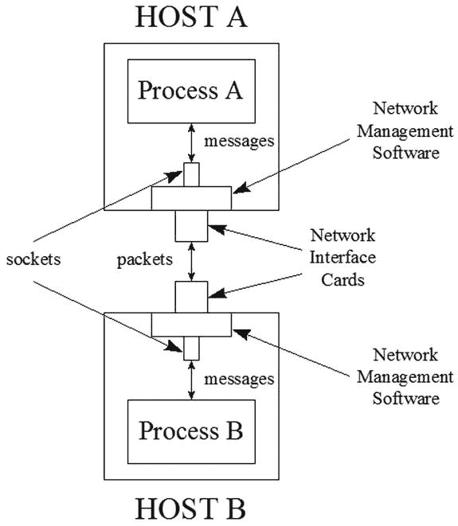

# 套接字与网络接口

电子补充材料 本章在线版本（doi:[10.​1007/​978-1-4842-1565-4_​16](http://dx.doi.org/10.1007/978-1-4842-1565-4_16)）包含补充材料，仅供授权用户使用。

第 7 章介绍了对等套接字的概念，即与通道关联的套接字。第 14 章介绍了网络接口的概念。本附录将介绍套接字、网络接口以及用于与这些网络功能交互的 API。

注意

网络是由相互连接的节点（如平板电脑等计算设备，以及扫描仪或激光打印机等外围设备）组成的群体，可供网络用户共享。网络通常使用 TCP/IP（[`http://en.wikipedia.org/wiki/TCP/IP_model`](http://en.wikipedia.org/wiki/TCP/IP_model)）在节点之间进行通信。TCP/IP 包括传输控制协议（TCP，一种面向连接的协议）、用户数据报协议（UDP，一种无连接协议）以及互联网协议（IP，TCP 和 UDP 执行任务所依赖的基础协议）。

`java.net`包提供了多种类型，用于支持运行在主机（基于计算机的 TCP/IP 节点）上的进程（正在执行的应用程序）之间的 TCP/IP 通信。

## 套接字

两个进程通过套接字进行通信，套接字是这些进程之间通信链路的端点。每个端点由一个标识主机的 IP 地址和一个标识该主机上运行进程的端口号来标识。

IP 地址与端口号

IP 地址是一个 32 位或 128 位的无符号整数，用于唯一标识网络主机或其他网络节点（例如路由器）。

通常，32 位 IP 地址采用点分十进制表示法，表示为四个 8 位整数分量，每个分量是 0 到 255 之间的十进制整数，并通过句点与下一个分量分隔（例如 127.0.0.1）。32 位 IP 地址通常被称为互联网协议版本 4（IPv4）地址（参见[`http://en.wikipedia.org/wiki/IPv4`](http://en.wikipedia.org/wiki/IPv4)）。

通常，128 位 IP 地址采用冒分十六进制表示法，表示为八个 16 位整数分量，每个分量是 0 到 FFFF 之间的十六进制整数，并通过冒号与下一个分量分隔（例如 1080:0:0:0:8:800:200C:417A）。128 位 IP 地址通常被称为互联网协议版本 6（IPv6）地址（参见[`http://en.wikipedia.org/wiki/IPv6`](http://en.wikipedia.org/wiki/IPv6)）。

端口号是一个 16 位整数，用于唯一标识一个进程，该进程是消息的最终来源或接收方。小于 1024 的端口号保留给标准进程。例如，端口号 25 传统上用于标识发送电子邮件的简单邮件传输协议（SMTP）进程，尽管端口号 587 在很大程度上已取代了这个较旧的端口号（参见[`http://en.wikipedia.org/wiki/Smtp`](http://en.wikipedia.org/wiki/Smtp)）。

一个进程将消息（一个字节序列）写入其套接字。底层平台的网络管理软件部分将消息分解为一系列数据包（可寻址的消息块，通常称为 IP 数据报），并将它们转发到另一个进程的套接字，在那里它们被重新组合成原始消息以供处理。

图 B-1 展示了两个套接字在 TCP/IP 上下文中如何通信。

图 B-1.

两个进程通过一对套接字进行通信

在图 B-1 的上下文中，假设进程 A 想要向进程 B 发送一条消息。进程 A 将该消息发送到其套接字，并附带进程 B 的目标套接字地址。主机 A 的网络管理软件（通常称为协议栈）获取此消息，并将其缩减为一系列数据包，每个数据包包含目标主机的 IP 地址和端口号。然后，网络管理软件通过主机 A 的网络接口卡（NIC）将这些数据包发送到主机 B。

注意

NIC 的各种网络接口是计算机与网络之间的连接。

主机 B 的协议栈通过 NIC 接收数据包，并将它们重新组装成原始消息（数据包可能乱序到达），然后通过其套接字将其提供给进程 B。当进程 B 与进程 A 通信时，此场景反转。

网络管理软件使用 TCP 在两个主机之间创建持续的对话，在此过程中来回发送消息。在此对话发生之前，需要在这两个主机之间建立连接。连接建立后，TCP 进入一种模式：发送消息数据包，并等待它们正确到达的回复（或者由于某些网络问题未收到回复时等待超时到期）。此模式重复进行，保证了可靠的连接。有关此模式的详细信息，请查看[`http://en.wikipedia.org/wiki/Tcp_receive_window#Flow_control`](https://en.wikipedia.org/wiki/Tcp_receive_window#Flow_control)。

由于建立连接需要时间，发送数据包也需要时间（因为需要接收回复确认，并且还存在超时），因此 TCP 速度较慢。另一方面，UDP 不需要连接和数据包确认，因此速度要快得多。缺点是 UDP 不那么可靠（无法保证数据包送达、顺序或防止重复数据包，尽管 UDP 使用校验和来验证数据是否正确），因为没有确认机制。此外，UDP 仅限于单数据包对话。

`java.net`包提供了`Socket`、`ServerSocket`以及其他以`Socket`结尾的类，用于执行基于 TCP 或 UDP 的通信。在研究这些类之前，您需要了解套接字地址和套接字选项。

### 套接字地址

以 `Socket` 结尾的类的实例与由 IP 地址和端口号组成的套接字地址相关联。这些类通常依赖 `InetAddress` 类来表示套接字地址中的 IPv4 或 IPv6 地址部分；端口号则单独表示。

注意

`InetAddress` 依赖其 `Inet4Address` 子类来表示 IPv4 地址，并依赖其 `Inet6Address` 子类来表示 IPv6 地址。

`InetAddress` 声明了几个用于获取 `InetAddress` 实例的类方法。这些方法包括：

*   `InetAddress[] getAllByName` `(String host)` 返回一个 `InetAddress` 数组，其中存储了与 `host` 关联的 IP 地址。你可以向此参数传递域名（例如“`tutortutor.ca`”）或 IP 地址（例如“`70.33.247.10`”）作为参数。（要了解域名，请查看维基百科的“域名”条目 [ [`http://en.wikipedia.org/wiki/Domain_name`](http://en.wikipedia.org/wiki/Domain_name) ]。）传递 `null` 以获取一个存储回环接口（一种基于软件的网络接口，发出的数据会作为传入数据循环回来）IP 地址的 `InetAddress` 实例。当找不到指定 `host` 的 IP 地址，或者为全局 IPv6 地址指定了作用域标识符时，此方法会抛出 `UnknownHostException`。
*   `InetAddress getByAddress` `(byte[] addr)` 返回给定原始 IP 地址的 `InetAddress` 对象。传递给 `addr` 的参数采用网络字节序（最高有效字节在前），其中最高位字节存储在 `addr[0]` 中。对于 IPv4 地址，`addr` 数组的长度必须为 4 字节；对于 IPv6 地址，长度必须为 16 字节。当数组为其他长度时，此方法会抛出 `UnknownHostException`。
*   `InetAddress getByAddress` `(String hostName, byte[] ipAddress)` 根据主机名和 IP 地址参数返回一个 `InetAddress` 实例。当数组长度既不是 4 也不是 16 时，此方法会抛出 `UnknownHostException`。
*   `InetAddress getByName` `(String host)` 根据 `host` 参数返回一个 `InetAddress` 实例，该参数可以是机器名称（例如“`tutortutor.ca`”）或其 IP 地址的文本表示形式。向 `host` 传递 `null` 会导致返回一个表示回环接口地址的 `InetAddress` 实例。
*   `InetAddress getLocalHost` `()` 返回本地主机（当前主机）的地址，该地址由主机名 `localhost` 或通常表示为 `127.0.0.1` (IPv4) 或 `::1` (IPv6) 的 IP 地址表示。当无法将本地主机解析为地址时，此方法会抛出 `UnknownHostException`。

获取 `InetAddress` 对象后，你可以通过调用实例方法来查询它，例如 `byte[] getAddress()`，它返回此 `InetAddress` 对象的原始 IP 地址（采用网络字节序）；以及 `boolean isLoopbackAddress()`，它确定此 `InetAddress` 对象是否表示回环地址。

Java 1.4 引入了抽象的 `SocketAddress` 类，用于表示“无协议附加”的套接字地址。（此类的创建者可能预见到 Java 最终会支持除广泛流行的互联网协议之外的低级通信协议。）

`SocketAddress` 由具体的 `InetSocketAddress` 类继承，该类将套接字地址表示为 IP 地址和端口号。它也可以表示主机名和端口号，并会尝试解析该主机名。

通过调用 `InetSocketAddress(InetAddress addr, int port)` 和其他构造函数来创建 `InetSocketAddress` 实例。创建实例后，你可以调用诸如 `InetAddress getAddress()` 和 `int getPort()` 之类的方法来返回套接字地址的组成部分。

### 套接字选项

以 `Socket` 结尾的类的实例共享套接字选项的概念，这些选项是用于配置套接字行为的参数。套接字选项由 `SocketOptions` 接口中声明的常量描述：

*   `IP_MULTICAST_IF`：指定用于多播数据包的传出网络接口（在多宿主 [多个 NIC] 主机上）。
*   `IP_MULTICAST_IF2`：使用接口索引指定用于多播数据包的传出网络接口。
*   `IP_MULTICAST_LOOP`：启用或禁用多播数据报的本地回环。
*   `IP_TOS`：为 TCP 或 UDP 套接字设置 IP 头部中的服务类型 (IPv4) 或流量类别 (IPv6) 字段。
*   `SO_BINDADDR`：获取套接字的本地地址绑定。
*   `SO_BROADCAST`：启用套接字发送广播消息。
*   `SO_KEEPALIVE`：打开套接字的保活设置。
*   `SO_LINGER`：指定在关闭仍有缓冲数据待发送的套接字时要等待的秒数。
*   `SO_OOBINLINE`：启用 TCP 紧急数据的内联接收。
*   `SO_RCVBUF`：设置或获取最大套接字接收缓冲区大小（以字节为单位）。
*   `SO_REUSEADDR`：启用套接字的地址重用。
*   `SO_SNDBUF`：设置或获取最大套接字发送缓冲区大小（以字节为单位）。
*   `SO_TIMEOUT`：为阻塞的 accept 或 read/receive（但不包括 write/send）套接字操作指定超时时间（以毫秒为单位）。（不要永远阻塞！）
*   `TCP_NODELAY`：禁用 Nagle 算法（`http://en.wikipedia.org/wiki/Nagle’s_algorithm`）。写入网络的数据不会被缓冲，以等待先前写入数据的确认。

`SocketOptions` 还声明了以下用于设置和获取这些选项的方法：

*   `void setOption(int optID, Object value)`
*   `Object getOption(int optID)`

`optID` 是上述常量之一，`value` 是合适类（例如 `java.lang.Boolean`）的对象。

`SocketOptions` 由抽象的 `SocketImpl` 和 `DatagramSocketImpl` 类实现。这些类的具体实例被各种以 `Socket` 结尾的类包装。因此，你不能直接调用这些方法。相反，你需要使用以 `Socket` 结尾的类提供的类型安全的 setter 和 getter 方法来设置和获取这些选项。

例如，`Socket` 声明了 `void setKeepAlive(boolean keepAlive)` 用于设置 `SO_KEEPALIVE` 选项，`ServerSocket` 声明了 `void setSoTimeout(int timeout)` 用于设置 `SO_TIMEOUT` 选项。请查阅以 `Socket` 结尾的类的文档，以了解这些及其他套接字选项方法。

注意

适用于 `DatagramSocket` 的套接字选项方法也适用于其 `MulticastSocket` 子类。

### Socket 与 ServerSocket

`Socket` 和 `ServerSocket` 类支持基于 TCP 的客户端进程（例如平板电脑上运行的应用程序）与服务器进程（例如互联网服务提供商计算机上运行的、提供万维网访问权限的应用程序）之间的通信。由于 `Socket` 与 `java.io.InputStream` 和 `java.io.OutputStream` 类相关联，基于 `Socket` 类的套接字通常被称为流套接字。

`Socket` 支持创建客户端套接字。为此，它声明了多个构造函数，包括以下一对：

*   `Socket(InetAddress dstAddress, int dstPort)`：创建一个流套接字，并将其连接到指定 IP 地址（由 `dstAddress` 描述）上的指定端口号（由 `dstPort` 描述）。当创建套接字时发生 I/O 错误，此构造函数会抛出 `java.io.IOException`；当传递给 `dstPort` 的参数超出端口值的有效范围（0 到 65535）时，会抛出 `java.lang.IllegalArgumentException`；当 `dstAddress` 为 `null` 时，会抛出 `java.lang.NullPointerException`。
*   `Socket(String dstName, int dstPort)`：创建一个流套接字，并将其连接到由 `dstName` 标识的主机上由 `dstPort` 标识的端口。当 `dstName` 为 `null` 时，此构造函数等同于调用 `Socket(InetAddress.getByName(null), port)`。它会抛出与前一个构造函数相同的 `IOException` 和 `IllegalArgumentException` 异常。但是，当无法确定主机的 IP 地址时，它会抛出 `UnknownHostException`，而不是 `NullPointerException`。

通过这些构造函数创建 `Socket` 实例后，在连接到远程主机套接字地址之前，它会绑定到一个任意的本地主机套接字地址。绑定使得客户端套接字地址对服务器套接字可用，以便服务器进程可以通过服务器套接字与客户端进程进行通信。

`Socket` 提供了其他构造函数。例如，`Socket()` 和 `Socket(Proxy proxy)` 会创建未绑定且未连接的套接字。在使用这些套接字之前，必须通过调用 `void bind(SocketAddress localAddr)` 将它们绑定到本地套接字地址，然后通过调用 `Socket` 的 `connect()` 方法（例如 `void connect(SocketAddress remoteAddr)`）建立连接。

注意

代理是出于安全目的位于内网和互联网之间的主机。代理设置通过 `Proxy` 类的实例表示，并帮助套接字通过代理进行通信。

另一个构造函数是 `Socket(InetAddress dstAddress, int dstPort, InetAddress localAddr, int localPort)`，它允许你通过 `localAddr` 和 `localPort` 指定自己的本地主机套接字地址。此构造函数会自动绑定到本地套接字地址，然后尝试连接到 `dstAddress` 上的远程 `dstPort`。

创建 `Socket` 实例后，并可能在该实例上调用了 `bind()` 和 `connect()` 之后，应用程序会调用 `Socket` 的 `InputStream getInputStream()` 和 `OutputStream getOutputStream()` 方法来获取用于从套接字读取字节的输入流和用于向套接字写入字节的输出流。此外，当不再需要该套接字进行 I/O 操作时，应用程序通常会调用 `Socket` 的 `void close()` 方法来关闭套接字。

以下示例演示了如何创建一个绑定到本地主机端口 9999 的套接字，然后访问其输入和输出流——为简洁起见，忽略了异常：

`Socket socket = new Socket("localhost", 9999);`

`InputStream is = socket.getInputStream();`

`OutputStream os = socket.getOutputStream();`

`// 使用套接字执行一些工作。`

`socket.close();`

`ServerSocket` 支持创建服务器端套接字。为此，它声明了以下四个构造函数：

*   `ServerSocket()`：创建一个未绑定的服务器套接字。你可以通过调用 `ServerSocket` 的两个 `bind()` 方法中的任意一个，将此套接字绑定到特定的套接字地址（客户端套接字与之通信）。绑定使得服务器套接字地址对客户端套接字可用，以便客户端进程可以通过客户端套接字与服务器进程进行通信。当尝试打开套接字时发生 I/O 错误，此构造函数会抛出 `IOException`。
*   `ServerSocket(int port)`：创建一个绑定到指定 `port` 值以及与主机某个 NIC 关联的 IP 地址的服务器套接字。当你向 `port` 传递 `0` 时，会选择一个任意的端口号。可以通过调用 `int getLocalPort()` 来检索该端口号。来自客户端的传入连接请求的最大队列长度设置为 50。如果在队列已满时收到连接请求，则该连接将被拒绝。当尝试打开套接字时发生 I/O 错误，此构造函数会抛出 `IOException`；当 `port` 的值超出指定的有效端口值范围（0 到 65535，包括两端）时，会抛出 `IllegalArgumentException`。
*   `ServerSocket(int port, int backlog)`：等同于前一个构造函数，但它还允许你通过向 `backlog` 传递一个正整数来指定传入连接的最大队列长度。
*   `ServerSocket(int port, int backlog, InetAddress localAddress)`：等同于前一个构造函数，但它还允许你指定服务器套接字绑定的不同 IP 地址。（当传递 `null` 时，会选择任意地址。）此构造函数对于拥有多个 NIC 并且希望监听特定 NIC 上的连接请求的机器非常有用。

通过这些构造函数创建服务器套接字后，服务器应用程序会进入一个循环，该循环首先调用 `ServerSocket` 的 `Socket accept()` 方法来监听连接请求并返回一个 `Socket` 实例，该实例允许它与关联的客户端套接字通信。然后，它与客户端套接字通信以执行某种处理。当处理完成时，服务器套接字调用客户端套接字的 `close()` 方法来终止与客户端的连接。

注意

`ServerSocket` 声明了一个 `void close()` 方法，用于在终止服务器应用程序之前关闭服务器套接字。当应用程序终止时，未关闭的套接字会自动关闭。

以下示例演示了如何创建一个绑定到当前主机端口 9999 的服务器套接字，监听传入的连接请求，返回它们的套接字，在这些套接字上执行工作，然后关闭套接字；为简洁起见，忽略了异常：

`ServerSocket ss = new ServerSocket(9999);`

`while (true)`

`{`

`Socket socket = ss.accept();`

`// 获取套接字的输入/输出流并与套接字通信`

`socket.close();`

`}`

`accept()` 方法调用会阻塞，直到有连接请求可用，然后返回一个 `Socket` 对象，以便服务器应用程序可以与其关联的客户端通信。通信完成后，套接字被关闭。当应用程序退出时，服务器套接字会自动关闭。

此示例假设套接字通信发生在服务器应用程序的主线程上，当处理需要花费时间执行时，这会成为一个问题，因为服务器对传入连接请求的响应时间会降低。

为了加快响应时间，通常需要在工作线程上与套接字进行通信，如下例所示：

`ServerSocket ss = new ServerSocket(9999);`

`while (true)`

`{`

`final Socket s = ss.accept();`

`new Thread(new Runnable()`

`{`

`@Override`

`public void run()`

`{`

`// 获取套接字的输入/输出流并`

`// 与套接字通信`

`try { s.close(); } catch (IOException ioe) {}`

`}`

`}).start();`

`}`

每当有连接请求到达时，`accept()` 会返回一个 `Socket` 实例，随后创建一个 `java.lang.Thread` 对象，其可运行对象会访问该套接字，以便在工作线程上与该套接字进行通信。

我创建了 `EchoClient` 和 `EchoServer` 应用程序来演示 `Socket` 和 `ServerSocket`。清单 B-1 展示了 `EchoClient` 的源代码。

**清单 B-1.** 向服务器发送数据并接收回显

`import java.io.BufferedReader;`

`import java.io.InputStream;`

`import java.io.InputStreamReader;`

`import java.io.IOException;`

`import java.io.OutputStream;`

`import java.io.OutputStreamWriter;`

`import java.io.PrintWriter;`

`import java.net.Socket;`

`import java.net.UnknownHostException;`

`public class EchoClient`

`{`

`public static void main(String[] args)`

`{`

`if (args.length != 1)`

`{`

`System.err.println("usage  : java EchoClient message");`

`System.err.println("example: java EchoClient \"This is a test.\"");`

`return;`

`}`

`try`

`{`

`Socket socket = new Socket("localhost", 9999);`

`OutputStream os = socket.getOutputStream();`

`OutputStreamWriter osw = new OutputStreamWriter(os);`

`PrintWriter pw = new PrintWriter(osw);`

`pw.println(args[0]);`

`pw.flush();`

`InputStream is = socket.getInputStream();`

`InputStreamReader isr = new InputStreamReader(is);`

`BufferedReader br = new BufferedReader(isr);`

`System.out.println(br.readLine());`

`}`

`catch (UnknownHostException uhe)`

`{`

`System.err.println("unknown host: " + uhe.getMessage());`

`}`

`catch (IOException ioe)`

`{`

`System.err.println("I/O error: " + ioe.getMessage());`

`}`

`}`

`}`

`EchoClient` 首先验证是否收到了一个命令行参数，然后创建一个套接字，该套接字将连接到本地主机 9999 端口上运行的进程。

创建套接字后，`EchoClient` 获取一个输出流，用于向套接字写入字符串。由于输出流只能处理字节序列，因此使用 `java.io.OutputStreamWriter` 和 `java.io.PrintWriter` 类将输出字符的写入器连接到面向字节的输出流。

实例化 `PrintWriter` 后，`EchoClient` 调用其 `void println(String str)` 方法写入字符串并附加一个换行符。随后调用 `void flush()` 方法，以确保所有待处理数据都已写入服务器。

现在，`EchoClient` 获取一个输入流，用于将字符串作为字节序列读取。然后，通过实例化 `java.io.InputStreamReader` 和 `java.io.BufferedReader`，将读取字符的读取器连接到面向字节的输入流。

最后，`EchoClient` 调用 `BufferedReader` 的 `String readLine()` 方法，从套接字读取字符及其后的换行符。（`readLine()` 返回的字符串中不包含换行符。）这些字符及其后的换行符随后被写入标准输出。

注意

在长时间运行的应用程序中，当不再需要 `socket` 实例时，应通过调用其 `void close()` 方法显式关闭它。为简洁起见，在本示例及后续大多数以 `Socket` 结尾的类示例中，我选择不这样做。

清单 B-2 展示了 `EchoServer` 的源代码。

**清单 B-2.** 从客户端接收数据并回显

`import java.io.BufferedReader;`

`import java.io.InputStream;`

`import java.io.InputStreamReader;`

`import java.io.IOException;`

`import java.io.OutputStream;`

`import java.io.OutputStreamWriter;`

`import java.io.PrintWriter;`

`import java.net.ServerSocket;`

`import java.net.Socket;`

`public class EchoServer`

`{`

`public static void main(String[] args) throws IOException`

`{`

`System.out.println("Starting echo server...");`

`ServerSocket ss = new ServerSocket(9999);`

`while (true)`

`{`

`Socket s = ss.accept();`

`try`

`{`

`InputStream is = s.getInputStream();`

`InputStreamReader isr = new InputStreamReader(is);`

`BufferedReader br = new BufferedReader(isr);`

`String msg = br.readLine();`

`System.out.println(msg);`

`OutputStream os = s.getOutputStream();`

`OutputStreamWriter osw = new OutputStreamWriter(os);`

`PrintWriter pw = new PrintWriter(osw);`

`pw.println(msg);`

`pw.flush();`

`}`

`catch (IOException ioe)`

`{`

`System.err.println("I/O error: " + ioe.getMessage());`

`}`

`finally`

`{`

`try`

`{`

`s.close();`

`}`

`catch (IOException ioe)`

`{`

`assert false; // shouldn’t happen in this context`

`}`

`}`

`}`

`}`

`}`

`EchoServer` 首先向标准输出输出一条介绍性消息，然后创建一个服务器套接字，该套接字监听 9999 端口上的连接。接着进入一个无限循环，每次迭代调用 `ServerSocket` 的 `Socket accept()` 方法，阻塞直到收到连接，然后返回一个代表此连接的 `Socket` 对象。

获取套接字后，`EchoServer` 获取一个输入流，用于从套接字读取数据。由于输入流只能处理字节序列，因此使用 `InputStreamReader` 和 `BufferedReader` 类将读取字符的读取器连接到面向字节的输入流。

现在，`EchoServer` 获取一个输出流，用于将字符串作为字节序列写入。然后，通过实例化 `OutputStreamWriter` 和 `PrintWriter`，将输出字符的写入器连接到面向字节的输出流。

将消息输出到标准输出后，`EchoServer` 调用 `flush()` 将输出刷新到客户端。然后关闭客户端套接字。

要试验这些应用程序，首先将 `EchoClient.java` 和 `EchoServer.java` 复制到同一目录，并打开两个控制台窗口，将当前目录设置为此目录。

按如下方式编译这些源文件：

`javac *.java`

在一个窗口中按如下方式运行 `EchoServer`：

`java EchoServer`

您应该会看到以下输出：

`Starting echo server...`

注意

如果您启用了防火墙（ [`http://en.wikipedia.org/wiki/Firewall_(computing)`](http://en.wikipedia.org/wiki/Firewall_(computing)) ），您可能需要启用 9999 端口。

启动服务器后，在另一个窗口中按如下方式运行 `EchoClient`：

`java EchoClient "This is a test."`

您应该会在两个窗口中看到“`This is a test.`”。

### DatagramSocket 与 MulticastSocket

`DatagramSocket` 和 `MulticastSocket` 类允许你在两台主机（`DatagramSocket`）或多台主机（`MulticastSocket`）之间进行基于 UDP 的通信。使用这两个类中的任何一个，你都可以通过数据报包（即与 `DatagramPacket` 类实例关联的字节数组）来发送单向消息。

注意

尽管你可能认为 `Socket` 和 `ServerSocket` 已经足够，但 `DatagramSocket` 及其子类 `MulticastSocket` 仍有其用途。例如，考虑这样一个场景：一组机器需要偶尔向服务器报告它们仍在运行。偶尔丢失消息，甚至消息未能按时到达，都无关紧要。另一个例子是低优先级的股票行情机，它会定期广播股票价格。当一个数据包未能到达时，很可能下一个数据包会到达，然后你就能收到最新价格的通知。在实时应用中，**及时**交付比**可靠**或**有序**交付更为重要。

`DatagramPacket` 声明了多个构造器，其中 `DatagramPacket(byte[] buf, int length)` 是最简单的。此构造器要求你向 `buf` 和 `length` 传递字节数组和整数参数，其中 `buf` 是存储待发送或接收数据的数据缓冲区，而 `length`（必须小于或等于 `buf.length`）指定了从 `buf[0]` 开始要发送/接收的字节数。

以下示例演示了此构造器：

`byte[] buffer = new byte[100];`

`DatagramPacket dgp = new DatagramPacket(buffer, buffer.length);`

注意

其他构造器允许你指定 `buf` 中的一个偏移量，用于标识第一个传出或传入字节的存储位置，和/或允许你指定目标套接字地址。

`DatagramSocket` 描述了 UDP 通信链路中客户端或服务器端的套接字。尽管此类声明了多个构造器，但在本附录中，我发现使用 `DatagramSocket()` 构造器用于客户端，以及使用 `DatagramSocket(int port)` 构造器用于服务器端更为方便。当无法创建数据报套接字或无法将数据报套接字绑定到本地端口时，这两个构造器都会抛出 `SocketException`。

应用程序实例化 `DatagramSocket` 后，会调用 `void send(DatagramPacket dgp)` 和 `void receive(DatagramPacket dgp)` 来发送和接收数据报包。

清单 B-3 在服务器上下文中演示了 `DatagramPacket` 和 `DatagramSocket`。

清单 B-3. 接收来自客户端的数据报包并将其回显给客户端

`import java.io.IOException;`

`import java.net.DatagramPacket;`

`import java.net.DatagramSocket;`

`import java.net.SocketException;`

`public class DGServer`

`{`

`final static int PORT = 10000;`

`public static void main(String[] args) throws SocketException`

`{`

`System.out.println("Server is starting");`

`DatagramSocket dgs = new DatagramSocket(PORT);`

`try`

`{`

`System.out.println("Send buffer size = " +`

`dgs.getSendBufferSize());`

`System.out.println("Receive buffer size = " +`

`dgs.getReceiveBufferSize());`

`byte[] data = new byte[100];`

`DatagramPacket dgp = new DatagramPacket(data, data.length);`

`while (true)`

`{`

`dgs.receive(dgp);`

`System.out.println(new String(data));`

`dgs.send(dgp);`

`}`

`}`

`catch (IOException ioe)`

`{`

`System.err.println("I/O error: " + ioe.getMessage());`

`}`

`}`

`}`

清单 B-3 的 `main()` 方法首先创建一个 `DatagramSocket` 对象，并将该套接字绑定到本地主机的端口 10000。然后，它调用 `DatagramSocket` 的 `int getSendBufferSize()` 和 `int getReceiveBufferSize()` 方法来获取 `SO_SNDBUF` 和 `SO_RCVBUF` 套接字选项的值，并将它们输出。

注意

套接字与底层平台的发送和接收缓冲区相关联，其大小可通过调用 `getSendBufferSize()` 和 `getReceiveBufferSize()` 来访问。同样，也可以通过调用 `DatagramSocket` 的 `void setReceiveBufferSize(int size)` 和 `void setSendBufferSize(int size)` 方法来设置其大小。虽然你可以调整这些缓冲区大小以提高性能，但对于 UDP 来说存在一个实际限制。在 IPv4 下，可以发送或接收的 UDP 数据包的最大大小为 65,507 字节——这是从 65,535 中减去 8 字节的 UDP 头部和 20 字节的 IP 头部值后得出的。尽管你可以指定一个更大的发送/接收缓冲区，但这样做是浪费的，因为最大的数据包被限制为 65,507 字节。此外，尝试发送或接收缓冲区长度超过 65,507 字节的数据包会导致 `IOException`。

接下来，`main()` 实例化 `DatagramPacket`，为从客户端接收数据报包并将该数据包回显给客户端做准备。它假设数据包的大小为 100 字节或更少。

最后，`main()` 进入一个无限循环，该循环接收一个数据包，输出数据包内容，然后将数据包发送回客户端。客户端的寻址信息存储在 `DatagramPacket` 中。

按如下方式编译清单 B-3：

`javac DGServer.java`

按如下方式运行生成的应用程序：

`java DGServer`

你应该会观察到与下面所示相同或类似的输出：

`Server is starting`

`Send buffer size = 8192`

`Receive buffer size = 8192`

清单 B-4 在客户端上下文中演示了 `DatagramPacket` 和 `DatagramSocket`。

清单 B-4. 向服务器发送数据报包并接收回显

`import java.io.IOException;`

`import java.net.DatagramPacket;`

`import java.net.DatagramSocket;`

`import java.net.InetAddress;`

`import java.net.SocketException;`

`public class DGClient`

`{`

`final static int PORT = 10000;`

`final static String ADDR = "localhost";`

`public static void main(String[] args) throws SocketException`

`{`

`System.out.println("client is starting");`

`DatagramSocket dgs = new DatagramSocket();`

`try`

`{`

`byte[] buffer;`

`buffer = "Send me a datagram".getBytes();`

`InetAddress ia = InetAddress.getByName(ADDR);`

`DatagramPacket dgp = new DatagramPacket(buffer, buffer.length,`

`ia, PORT);`

`dgs.send(dgp);`

`byte[] buffer2 = new byte[100];`

`dgp = new DatagramPacket(buffer2, buffer.length, ia, PORT);`

`dgs.receive(dgp);`

`System.out.println(new String(dgp.getData()));`

`}`

`catch (IOException ioe)`

`{`

`System.err.println("I/O error: " + ioe.getMessage());`

`}`

`}`

`}`

清单 B-4 与清单 B-3 类似，但有一个很大的区别。我使用了 `DatagramPacket(byte[] buf, int length, InetAddress address, int port)` 构造器来指定数据报包中服务器的目标地址，该目标恰好是本地主机上的端口 10000。`send()` 方法调用将数据包路由到此目标。

按如下方式编译清单 B-4：

`javac DGClient.java`

按如下方式运行生成的应用程序：

`java DGClient`

假设 `DGServer` 也在运行，你应该会在 `DGClient` 的命令窗口中观察到以下输出（并且该输出的最后一行也会出现在 `DGServer` 的命令窗口中）：

`client is starting`

`Send me a datagram`

`MulticastSocket` 描述了基于 UDP 的多播会话中客户端或服务器端的套接字。两个常用的构造器是 `MulticastSocket()`（创建一个未绑定到端口的组播套接字）和 `MulticastSocket(int port)`（创建一个绑定到指定 `port` 的组播套接字）。当发生 I/O 错误时，这两个构造器都会抛出 `IOException`。

什么是组播？

前面的示例演示了单播（unicasting），即服务器向单个客户端发送消息。然而，也可以将同一条消息广播给多个客户端（例如，向一组已注册在线程序以接收此通知的家长群成员发送“因恶劣天气学校停课”的通知）；这种活动被称为多播（multicasting）。

服务器通过向一个特殊的 IP 地址（称为多播组地址）和特定端口（由端口号指定）发送一系列数据报包来实现多播。想要接收这些数据报包的客户端会创建一个使用该端口号的多播套接字。它们通过一个指定该特殊 IP 地址的加入组操作来请求加入该组。此时，客户端可以接收发送到该组的数据报包，甚至可以向其他组成员发送数据报包。在客户端读取完所有想要读取的数据报包后，它会通过一个指定该特殊 IP 地址的离开组操作将自己从组中移除。

IPv4 地址 224.0.0.1 到 239.255.255.255（含）被保留用作多播组地址。

清单 B-5 展示了一个多播服务器。

**清单 B-5.** 多播数据报包

`import java.io.IOException;`

`import java.net.DatagramPacket;`

`import java.net.InetAddress;`

`import java.net.MulticastSocket;`

`public class MCServer`

`{`

`final static int PORT = 10000;`

`public static void main(String[] args)`

`{`

`try`

`{`

`MulticastSocket mcs = new MulticastSocket();`

`InetAddress group = InetAddress.getByName("231.0.0.1");`

`byte[] dummy = new byte[0];`

`DatagramPacket dgp = new DatagramPacket(dummy, 0, group, PORT);`

`int i = 0;`

`while (true)`

`{`

`byte[] buffer = ("line " + i).getBytes();`

`dgp.setData(buffer);`

`dgp.setLength(buffer.length);`

`mcs.send(dgp);`

`i++;`

`}`

`}`

`catch (IOException ioe)`

`{`

`System.err.println("I/O error: " + ioe.getMessage());`

`}`

`}`

`}`

清单 B-5 的 `main()` 方法首先通过 `MulticastSocket()` 构造器创建了一个 `MulticastSocket` 实例。该多播套接字不需要绑定到端口号，因为端口号会与多播组的 IP 地址（231.0.0.1）一起，作为随后创建的 `DatagramPacket` 实例的一部分来指定。（`dummy` 数组的存在是为了防止 `DatagramPacket` 构造器抛出 `NullPointerException` 对象——该数组不用于存储要广播的数据。）

此时，`main()` 进入一个无限循环，该循环首先从一个 `java.lang.String` 对象创建一个字节数组，并使用平台的默认字符编码将 Unicode 字符转换为字节。（尽管在每次循环迭代中，通过表达式 `"line " + i` 创建了多余的 `java.lang.StringBuilder` 和 `String` 对象，但在这个简短的一次性应用程序中，我并不担心它们对垃圾回收的影响。）

随后，通过调用 `DatagramPacket` 对象的 `void setData(byte[] buf)` 方法，将这个数据缓冲区分配给该对象，然后该数据报包被广播到与端口 10000 和多播 IP 地址 231.0.0.1 关联的组中的所有成员。

按如下方式编译清单 B-5：

`javac MCServer.java`

按如下方式运行生成的应用程序：

`java MCServer`

你应该不会观察到任何输出。

清单 B-6 展示了一个多播客户端。

**清单 B-6.** 接收多播数据报包

`import java.io.IOException;`

`import java.net.DatagramPacket;`

`import java.net.InetAddress;`

`import java.net.MulticastSocket;`

`public class MCClient`

`{`

`final static int PORT = 10000;`

`public static void main(String[] args)`

`{`

`try`

`{`

`MulticastSocket mcs = new MulticastSocket(PORT);`

`InetAddress group = InetAddress.getByName("231.0.0.1");`

`mcs.joinGroup(group);`

`for (int i = 0; i < 10; i++)`

`{`

`byte[] buffer = new byte[256];`

`DatagramPacket dgp = new DatagramPacket(buffer, buffer.length);`

`mcs.receive(dgp);`

`byte[] buffer2 = new byte[dgp.getLength()];`

`System.arraycopy(dgp.getData(), 0, buffer2, 0, dgp.getLength());`

`System.out.println(new String(buffer2));`

`}`

`mcs.leaveGroup(group);`

`}`

`catch (IOException ioe)`

`{`

`System.err.println("I/O error: " + ioe.getMessage());`

`}`

`}`

`}`

清单 B-6 的 `main()` 方法首先通过 `MulticastSocket(int port)` 构造器创建了一个绑定到端口 10000 的 `MulticastSocket` 实例。然后，它获取一个包含多播组 IP 地址 231.0.0.1 的 `InetAddress` 对象，并通过调用 `MulticastSocket` 的 `void joinGroup(InetAddress mcastaddr)` 方法，使用该对象加入此地址的组。

接下来，`main()` 接收 10 个数据报包，打印它们的内容，并通过调用 `MulticastSocket` 的 `void leaveGroup(InetAddress mcastaddr)` 方法（使用相同的多播 IP 地址作为参数）离开该组。

注意

当尝试加入或离开组时发生 I/O 错误，或者当 IP 地址不是多播 IP 地址时，`joinGroup()` 和 `leaveGroup()` 会抛出 `IOException`。

由于客户端不知道字节数组的确切长度，它假设为 256 字节，以确保数据缓冲区能容纳整个数组。如果它尝试打印返回的数组，你会看到在实际数据打印后有很多空白空间。

为了消除这些空白，客户端调用 `DatagramPacket` 的 `int getLength()` 方法来获取数组的实际长度，创建一个具有此长度的第二个字节数组（`buffer2`），并使用 `System.arraycopy()` 将此数量的字节复制到 `buffer2`。在将此字节数组转换为 `String` 对象（通过 `String(byte[] bytes)` 构造器，该构造器使用平台的默认字符集）后，它将生成的字符打印到标准输出流。

按如下方式编译清单 B-6：

`javac MCClient.java`

按如下方式运行生成的应用程序：

`java MCClient`

你应该会观察到类似于以下的输出：

`line 462615`

`line 462616`

`line 462617`

`line 462618`

`line 462619`

`line 462620`

`line 462621`

`line 462622`

`line 462623`

`line 462624`

## 网络接口

`NetworkInterface` 类根据名称（例如 `le0`）和分配给此接口的 IP 地址列表来表示网络接口。尽管网络接口通常在物理网卡上实现，但它也可以在软件中实现；例如，回环接口（对于测试客户端很有用）。

注意

网络接口是计算机与私有或公共网络之间的互连点。它通常是一个网络接口卡（NIC），但不需要物理形态。相反，它可以在软件中实现。例如，回环接口（IPv4 为 127.0.0.1，IPv6 为 ::1）不是一个物理设备，而是一个模拟网络接口的软件。回环接口常用于测试环境。

表 B-1 展示了 `NetworkInterface` 的方法。

**表 B-1.** `NetworkInterface` 方法

| 方法 | 描述 |
| --- | --- |
| `boolean equals(Object obj)` | 将此 `NetworkInterface` 对象与 `obj` 进行比较。当且仅当 `obj` 不为 `null` 且表示与此对象相同的网络接口时，结果为 `true`。（当两个 `NetworkInterface` 对象的名称和地址相同时，它们表示相同的网络接口。） |
| `static NetworkInterface getByInetAddress(InetAddress address)` | 返回与给定 `address` 对应的 `NetworkInterface`，如果没有接口具有此地址则返回 `null`。当发生 I/O 错误时，此方法抛出 `SocketException`；当 `address` 为 `null` 时，抛出 `NullPointerException`。 |
| `static NetworkInterface getByName(String interfaceName)` | 返回具有指定 `name` 的 `NetworkInterface`，如果不存在这样的网络接口则返回 `null`。当发生 I/O 错误时，此方法抛出 `SocketException`；当 `interfaceName` 为 `null` 时，抛出 `NullPointerException`。 |
| `String getDisplayName()` | 返回此网络接口的显示名称（一个描述网络设备的人类可读字符串）。 |
| `byte[] getHardwareAddress()` | 返回一个包含此网络接口硬件地址的字节数组，该地址通常被称为媒体访问控制（MAC）地址。当接口没有 MAC 地址，或无法访问该地址时（可能是用户权限不足），该方法返回 `null`。当发生 I/O 错误时，此方法抛出 `SocketException`。 |
| `Enumeration<InetAddress> getInetAddresses()` | 返回一个枚举（迭代结果），其中包含绑定到此网络接口的全部或部分地址。 |
| `List<InterfaceAddress> getInterfaceAddresses()` | 返回一个 `java.util.List`，其中包含此网络接口的 `InterfaceAddress` 对象。 |
| `int getMTU()` | 返回此网络接口的最大传输单元（MTU）。当发生 I/O 错误时，此方法抛出 `SocketException`。 |
| `String getName()` | 返回此网络接口的名称（例如 `eth0` 或 `lo`）。 |
| `static Enumeration<NetworkInterface> getNetworkInterfaces()` | 返回此机器上的所有网络接口，如果找不到任何网络接口则返回 `null`。当发生 I/O 错误时，此方法抛出 `SocketException`。 |
| `NetworkInterface getParent()` | 当此网络接口是子接口时，返回其父 `NetworkInterface`。当此网络接口没有父接口，或者它是物理（非虚拟）接口时，此方法返回 `null`。（一个物理网络接口可以在逻辑上划分为多个虚拟子接口，这些子接口常用于路由和交换。这些子接口可以组织成一个层次结构，其中物理网络接口作为根。） |
| `Enumeration<NetworkInterface> getSubInterfaces()` | 返回一个枚举，其中包含附加到此网络接口的虚拟子接口。例如，`eth0:1` 是 `eth0` 的一个子接口。 |
| `int hashCode()` | 此方法被重写，因为 `equals()` 被重写了。 |
| `boolean isLoopback()` | 当此网络接口将传出数据作为传入数据回显到自身时，返回 `true`。当发生 I/O 错误时，此方法抛出 `SocketException`。 |
| `boolean isPointToPoint()` | 当此网络接口是点对点接口时（例如通过调制解调器的 PPP 连接），返回 `true`。当发生 I/O 错误时，此方法抛出 `SocketException`。 |
| `boolean isUp()` | 当此网络接口已启动（路由条目已建立）并正在运行（平台资源已分配）时，返回 `true`。当发生 I/O 错误时，此方法抛出 `SocketException`。 |
| `boolean isVirtual()` | 当此网络接口是虚拟子接口时，返回 `true`。在某些平台上，虚拟子接口是作为物理网络接口的子接口创建的网络接口，并具有不同的设置（例如地址或 MTU）。通常，接口的名称将是父接口的名称后跟一个冒号（:）和一个标识子接口的数字，因为一个物理网络接口上可以附加多个虚拟子接口。 |
| `boolean supportsMulticast()` | 当此网络接口支持多播时，返回 `true`。当发生 I/O 错误时，此方法抛出 `SocketException`。 |
| `String toString()` | 返回此网络接口的字符串表示形式。 |

你可以使用这些方法来收集有关平台网络接口的有用信息。例如，清单 B-7 展示了一个应用程序，它遍历所有网络接口，调用表 B-1 中列出的方法，以：

*   获取网络接口的名称和显示名称
*   判断网络接口是否为回环接口
*   判断网络接口是否已启动并正在运行
*   获取 MTU
*   判断网络接口是否支持多播
*   枚举网络接口的所有虚拟子接口

清单 B-7. 枚举所有网络接口

`import java.net.NetworkInterface;`

`import java.net.SocketException;`

`import java.util.Collections;`

`import java.util.Enumeration;`

`public class NetInfo`

`{`

`public static void main(String[] args) throws SocketException`

`{`

`Enumeration<NetworkInterface> eni;`

`eni = NetworkInterface.getNetworkInterfaces();`

`for (NetworkInterface ni: Collections.list(eni))`

`{`

`System.out.println("Name = " + ni.getName());`

`System.out.println("Display Name = " + ni.getDisplayName());`

`System.out.println("Loopback = " + ni.isLoopback());`

`System.out.println("Up and running = " + ni.isUp());`

`System.out.println("MTU = " + ni.getMTU());`

`System.out.println("Supports multicast = " +`

`ni.supportsMulticast());`

`System.out.println("Sub-interfaces");`

`Enumeration<NetworkInterface> eni2;`

`eni2 = ni.getSubInterfaces();`

`for (NetworkInterface ni2: Collections.list(eni2))`

`System.out.println("   " + ni2);`

`System.out.println();`

`}`

`}`

`}`

提示

`java.util.Collections` 类的 `ArrayList<T> list(Enumeration<T> enumeration)` 方法对于将传统的枚举转换为现代的数组列表非常有用。

按如下方式编译清单 B-7：

`javac NetInfo.java`

按如下方式运行生成的应用程序：

`java NetInfo`

当我在 Windows 7 平台上运行 `NetInfo` 时，我观察到以以下输出开头的信息：

`Name = lo`

`Display Name = Software Loopback Interface 1`

`Loopback = true`

`Up and running = true`

`MTU = -1`

`Supports multicast = true`

`Sub-interfaces`

`Name = net0`

`Display Name = WAN Miniport (SSTP)`

`Loopback = false`

`Up and running = false`

`MTU = -1`

`Supports multicast = true`

`Sub-interfaces`

完整的输出显示少数网络接口的 MTU 大小不同。每个大小代表一条消息在不需被分片成多个 IP 数据报的情况下，能够放入一个 IP 数据报的最大长度。这种分片会对性能产生影响，尤其是在网络游戏中。仅此一点，`getMTU()` 方法就是 `NetworkInterface` 中一个非常有价值的成员。

`getInterfaceAddresses()` 方法返回一个 `InterfaceAddress` 对象列表，每个对象包含一个网络接口的 IP 地址以及广播地址和子网掩码（IPv4）或网络前缀长度（IPv6）。

表 B-2 展示了 `InterfaceAddress` 的方法。

表 B-2.

`InterfaceAddress` 方法

| 方法 | 描述 |
| --- | --- |
| `boolean equals(Object obj)` | 将此 `InterfaceAddress` 对象与 `obj` 进行比较。当 `obj` 也是一个 `InterfaceAddress`，并且两个对象包含相同的 `InetAddress`、相同的子网掩码/网络前缀长度（取决于 IPv4 或 IPv6）以及相同的广播地址时，返回 `true`。 |
| `InetAddress getAddress()` | 返回此 `InterfaceAddress` 的 IP 地址，作为一个 `InetAddress` 对象。 |
| `InetAddress getBroadcast()` | 返回此 `InterfaceAddress` 的广播地址（IPv4）或 `null`（IPv6）；IPv6 不支持广播地址。 |
| `short getNetworkPrefixLength()` | 返回此 `InterfaceAddress` 的网络前缀长度（IPv6）或子网掩码（IPv4）。Oracle 的 Java 文档显示 128（::1/128）和 10（fe80::203:baff:fe27:1243/10）是典型的 IPv6 值。典型的 IPv4 值是 8（255.0.0.0）、16（255.255.0.0）和 24（255.255.255.0）。 |
| `int hashCode()` | 返回此 `InterfaceAddress` 的哈希码。该哈希码是 `InetAddress` 的哈希码、广播地址（如果存在）的哈希码以及网络前缀长度的组合。 |
| `String toString()` | 返回此 `InterfaceAddress` 的字符串表示形式。该表示形式的格式为 `InetAddress / 网络前缀长度 [广播地址]`。 |

清单 B-8 扩展了清单 B-7（删除了几行），枚举了所有网络接口，输出它们的显示名称，并枚举每个网络接口的接口地址，输出接口地址信息。

清单 B-8\. 枚举所有网络接口和接口地址

`import java.net.InterfaceAddress;`

`import java.net.NetworkInterface;`

`import java.net.SocketException;`

`import java.util.Collections;`

`import java.util.Enumeration;`

`import java.util.Iterator;`

`import java.util.List;`

`public class NetInfo`

`{`

`public static void main(String[] args) throws SocketException`

`{`

`Enumeration<NetworkInterface> eni;`

`eni = NetworkInterface.getNetworkInterfaces();`

`for (NetworkInterface ni: Collections.list(eni))`

`{`

`System.out.println("Name = " + ni.getName());`

`List<InterfaceAddress> ias = ni.getInterfaceAddresses();`

`Iterator<InterfaceAddress> iter = ias.iterator();`

`while (iter.hasNext())`

`System.out.println(iter.next());`

`System.out.println();`

`}`

`}`

`}`

编译清单 B-8（`javac NetInfo.java`）并执行此应用程序（`java NetInfo`）。当我在 Windows 7 平台上运行 `NetInfo` 时，观察到以下信息：

`Name = lo`

`/127.0.0.1/8 [/127.255.255.255]`

`/0:0:0:0:0:0:0:1/128 [null]`

`Name = net0`

`Name = net1`

`Name = net2`

`Name = ppp0`

`Name = eth0`

`Name = eth1`

`Name = eth2`

`Name = ppp1`

`Name = net3`

`Name = eth3`

`/x.x.x.x/24 [/x.x.x.x]`

`/x:x:x:x:x:x:x:x%eth3/64 [null]`

`Name = net4`

`/x:x:x:x:x:x:x:x%net4/64 [null]`

`Name = eth4`

`Name = eth5`

`/x.x.x.x/24 [/x.x.x.x]`

`/x:x:x:x:x:x:x:x%eth5/64 [null]`

`Name = net5`

`/x:x:x:x:x:x:x:x%net5/128 [null]`

`Name = net6`

`/x:x:x:x:x:x:x:x%net6/128 [null]`

`Name = net7`

`Name = eth6`

`Name = eth7`

`Name = eth8`

`Name = eth9`

`Name = eth10`

`Name = eth11`

`Name = eth12`

`Name = eth13`

`Name = eth14`

## 将网络接口与套接字一起使用

`NetworkInterface` 对于多宿主系统（即具有多个 NIC 的系统）非常有用。使用 `NetworkInterface`，您可以指定用于特定网络活动的 NIC。例如，假设您的机器有两个已配置的 NIC，并且您想要向服务器发送数据。您可以按如下方式创建套接字：

`Socket socket = new Socket();`

`socket.connect(new InetSocketAddress(address, port));`

在发送数据之前，操作系统（OS）会确定要使用哪个接口。但是，如果您有偏好或需要指定要使用的 NIC，您可以向操作系统查询合适的接口，并在您想要使用的接口上找到一个地址。当您创建套接字并将其绑定到该地址时，操作系统会使用关联的接口。请考虑以下示例：

`NetworkInterface nif = NetworkInterface.getByName("bge0");`

`Enumeration<InetAddress> nifAddresses = nif.getInetAddresses();`

`Socket socket = new Socket();`

`socket.bind(new InetSocketAddress(nifAddresses.nextElement(), 0));`

`socket.connect(new InetSocketAddress(address, port));`

您还可以使用 `NetworkInterface` 来标识要加入多播组的本地接口。请考虑以下示例：

`NetworkInterface nif = NetworkInterface.getByName("bge0");`

`MulticastSocket ms = new MulticastSocket();`

`ms.joinGroup(new InetSocketAddress(hostname, port), nif);`

这只是将 `NetworkInterface` 与各种 `Socket` 类一起使用的众多方法中的两种。

索引 A accept( ) 方法 访问控制列表 (ACLs) allocateDirect( ) 方法 allocate( ) 方法 美国信息交换标准码 (ASCII) append( ) 方法 array( ) 方法 AsynchronousByteChannel 接口 AsynchronousChannel AsynchronousChannelGroup AsynchronousChannelGroupwithCachedThreadPool AsynchronousChannelGroup withFixedThreadPool AsynchronousChannelGroup withThreadPool 类方法 默认组 java.nio.channels.DefaultThreadPool.initialSize java.nio.channels.DefaultThreadPool.threadFactory java.util.concurrent.Executors 类 shutdown( ) 方法 shutdownNow( ) 方法 线程池 AsynchronousFileChannel completed( ) 方法 完成处理器 failed( ) 方法 interrupt( ) 方法 isDone( ) 方法 lock( ) 和 tryLock( ) 方法 main( ) 方法 open( ) 方法 read( ) 和 write( ) 方法 在 CompletionHandler 上下文中读取字节 在 Future 上下文中读取字节 线程池 void force 异步 I/O 异步通道 异步通道组 参见(see AsynchronousChannelGroup) 异步文件通道 参见(see AsynchronousFileChannel) 异步服务器套接字通道 参见(see AsynchronousServerSocketChannel) AsynchronousSocketChannel 参见(see AsynchronousSocketChannel) 取消方法 CompletionHandler 完成处理器参数 java.nio.channels.AsynchronousByteChannel 接口 read( ) 方法 AsynchronousServerSocketChannel accept( ) 方法 buffer 字段 channelClient 字段 channelServer 字段 clientAddr 字段 completed( ) 方法 ConnectionHandler 连接处理 异常处理 getLocalAddress( ) 方法 isReadMode 字段 ReadWriteHandler 服务器应用程序 AsynchronousSocketChannel buffer 字段 channel 字段 completed( ) 方法 connect( ) 方法 异常处理 执行 isReadMode 字段 mainThd 字段 open( ) 类方法 ReadWriteHandler 类 ReadWriteHandler SocketAddress getRemoteAddress( ) 方法 available( ) 方法 B 反向引用 bind( ) 方法 blockingLock( ) 方法 boolean connect(SocketAddress remoteAddr) boolean find( ) 方法 boolean finishConnect( ) boolean hasArray( ) 方法 boolean hasRemaining( ) 方法 boolean isAcceptable( ) 方法 boolean isBlocking( ) 方法 boolean isConnectable( ) 方法 boolean isConnected( ) 方法 boolean isConnectionPending( ) boolean isDirect( ) 方法 boolean isLoaded( ) boolean isOpen( ) boolean isReadable( ) 方法 boolean isReadOnly( ) 方法 boolean isShared( ) boolean isValid( ) boolean isWritable( ) 方法 boolean lookingAt( ) 方法 boolean matches( ) 方法 boolean overlaps(long position, long size) boolean ready( ) 方法 boolean valid( ) 缓冲区 ByteBuffer 类和 allocate( ) 类方法 面向字节的缓冲区 创建 分配方法 缓冲区子类的 duplicate( ) 方法 ByteBuffer 的 asxBuffer( ) 方法 包装方法 定义 深入 字节序 创建。缓冲区创建 直接字节缓冲区 翻转 mark( ) 方法 子类操作 写入和读取 java.nio 包 方法 属性 Buffer clear( ) 方法 缓冲区创建 分配方法 缓冲区子类的 duplicate( ) 方法 ByteBuffer 的 asxBuffer( ) 方法 包装方法 BufferedReader BufferedWriter Buffer flip( ) 方法 Buffer mark( ) 方法 Buffer position 方法 Buffer reset( ) 方法 Buffer rewind( ) 方法 ByteArrayOutputStream 的 toByteArray( ) 方法 ByteBuffer encode(String s) 方法 ByteChannel 字节传输 C canExecute( ) 方法 中央处理器 (CPU) 基于通道的 IP 多播 block( ) 方法 channelClient 的输出 配套客户端应用程序 数据报通道 排除模式过滤 第一个 join( ) 方法 包含模式过滤 InetSocketAddress 类 MembershipKey 多播服务器 第二个 join( ) 方法 SO_REUSEADDR 选项 ChannelDemo 类 通道 将字节从输入通道复制到输出通道 定义 文件通道 锁定文件 将文件映射到内存 方法 在通道间传输字节 映射文件 管道 分散/聚集 I/O 套接字通道 数据报通道 非阻塞模式 服务器 字符缓冲区 字符编码 字符集 char readChar( ) CharsetDecoder newDecoder( ) Charset defaultCharset( ) 工厂方法 CharsetEncoder newEncoder( ) 字符集 字节序列 ByteBuffer encode(String s) 方法 encode( ) 方法 编码字符 isISOControl( ) 方法 isWhitespace( ) 方法 main( ) 方法 System.out.printf( ) 字符编码方案 字符 字符集 CharsetDecoder newDecoder( ) CharsetEncoder newEncoder( ) 编码字符集 IANA ISO-8859-1 String 类 byte[ ] getBytes( ) byte[ ] getBytes(String charsetName) 构造器 源代码 Unicode US-ASCII UTF-8 UTF-16 UTF-16BE UTF-16LE close( ) 方法 码点 compact( ) 方法 compile(String) 方法 configureBlocking( ) connect( ) 方法 connect( )/second open( ) 方法 copyAlt( ) 方法 Copy( ) 方法 ATOMIC_MOVE COPY_ATTRIBUTES flush( ) 方法 long copy( ) 方法, 输入流 long copy( ) 方法, 输出流 NOFOLLOW_LINKS Path copy( ) 方法 REPLACE_EXISTING SavePage 应用程序 源到文件 输出 源到目标路径 visitFile( ) 方法 walkFileTree( ) 方法 createFile( ) 方法 D DatagramChannel connect(SocketAddress remoteAddr) DatagramChannel disconnect( ) 数据报通道 实现股票行情客户端 实现股票行情服务器 DatagramSocket socket( ) defaultCharset( ) 工厂方法 deleteOnExit( ) 方法 直接字节缓冲区 直接内存访问 (DMA) dumpRecords( ) 辅助方法 E Employee 类 Formattable 实现 FormatterDemo 应用程序 名称和编号 encode( ) 方法 排他锁 获取方法 F File 的 createNewFile( ) 方法 File 的 delete( ) 方法 File 的 deleteOnExit( ) 方法 File 的 exists( ) 方法 File 的 getCanonicalFile( ) 方法 File 的 lastModified( ) 方法 File 的 listRoots( ) 方法 File 抽象路径信息和目录 boolean createNewFile( ) boolean delete( ) boolean isAbsolute( ) boolean mkdir( ) boolean mkdirs( ) boolean renameTo(File dest) boolean setExecutable boolean setLastModified(long time) boolean setReadable boolean setWritable 磁盘空间信息 File getAbsoluteFile( ) File getCanonicalFile( ) File getParentFile( ) 文件系统根目录 杂项方法 路径的文件/目录 setReadOnly( ) 方法 static File createTempFile String getAbsolutePath( ) String getCanonicalPath( ) String getName( ) String getParent( ) String getPath( ) String toString( ) 临时文件 void deleteOnExit( ) FileChannel channel( ) FileChannel position(long newPosition) 文件通道 锁定 基于每个文件 更小的区域 将文件映射到内存 方法 在通道间传输字节 FileChannel 的 lock( ) 方法 FileChannel truncate(long size) FileChannel 的 tryLock( ) 方法 FileDescriptor 的 sync( ) 方法 FileDescriptor getFD( ) FileLock lock( ) 方法 FileLock lock(long position, long size, boolean shared) 文件锁 释放 FileLock tryLock( ) FileLock tryLock(long position, long size, boolean shared) FileReader 文件系统接口 属性 AclFileAttributeView 接口 BasicFileAttributeView 接口 DosFileAttributeView 接口 FileAttributeView FileOwnerAttributeView 接口 FileStoreAttributeView getAttribute( ) 方法 getFileAttributeView( ) 方法 isSupported( ) 实用方法 PosixFileAttributeView 接口 readAttributes( ) 方法 setAttribute( ) 方法 supportedFileAttributeViews( ) 方法 UserDefinedFileAttributeView 接口 检查路径 绝对路径和相对路径 boolean exists( ) 方法 boolean isDirectory( ) 方法 boolean isExecutable( ) 方法 boolean isHidden( ) 方法 boolean isReadable( ) 方法 boolean isRegularFile( ) 方法 boolean isSameFile( ) 方法 boolean isWritable( ) 方法 boolean notExists( ) 方法 代码实现 copy( ) 方法 参见(see Copy( ) 方法) createDirectory( ) 方法 createFile( ) 方法 createTempDirectory( ) 方法 createTempFile( ) 方法 delete( ) 方法 deleteOnExit( ) 方法 DirectoryStream move( ) 方法 随机访问 读取文件 SeekableByteChannel 关闭钩子 写入文件 delete( ) 方法 FileStore boolean isReadOnly 方法 代码实现 默认文件系统 getFileStore( ) 方法 long getTotalSpace( ) 方法 long getUnallocatedSpace( ) 方法 long getUsableSpace( ) 方法 String name( ) 方法 String type( ) 方法 FileSystem FileSystemProvider 文件树遍历 API CONTINUE 常量 copy( ) 方法 delete( ) 方法 FileVisitResult postVisitDirectory( ) 方法 FileVisitResult preVisitDirectory( ) 方法 FileVisitResult visitFileFailed( ) 方法 FileVisitResult visitFile( ) 方法 find( ) 方法 lines( ) 方法 move( ) 方法 SimpleFileVisitor SKIP_SIBLINGS 常量 SKIP_SUBTREE 常量 TERMINATE 常量 getDefault( ) 类方法 硬链接 installedProviders( ) 类方法 包 路径匹配器 代码实现 glob 表达式 JDK 文档 路径 附加方法 代码实现 File toFile( ) 方法 getFileSystem 方法 getPath( ) 方法 getRootDirectories( ) 方法 getSeparator( ) 方法 int getNameCount( ) 方法 InvalidPathException isAbsolute( ) 方法 normalize( ) 方法 Path getFileName( ) 方法 Path getName( ) 方法 Path getParent( ) 方法 Path getRoot( ) 方法 Path subpath( ) 方法 Path toPath( ) 方法 相对路径 resolve( ) 方法 relativize 方法 String toString( ) 方法 toAbsolutePath( ) 方法 renameTo( ) 方法 符号链接 监视服务 API 代码实现 创建 性能 pollEvents( ) 方法 register( ) 方法 reset( ) 方法 take( ) 方法 类型 File toFile( ) 方法 FileWriter finishConnect( ) 方法 平面文件数据库 append( ) 方法 close( ) 方法 定义 dumpRecords( ) 辅助方法 实验 实现 java UsePartsDB numRecs( ) 方法 PartsDB 类 select( ) 方法 update( ) 方法 flip( ) 方法 flush( ) 方法 force(boolean) 方法 Formatter 的 Appendable out( ) 方法 Formatter argument_index 转换 close( ) 方法 构造器 标志 flush( ) 方法 格式说明符 Formattable 和 FormattableFlags 员工类 参见(see Employee 类) formatTo 参数 Formatter 的 Appendable out( ) 方法 精度 printf( ) 函数 PrintStream 宽度 G GatheringByteChannel getAttribute( ) 方法 getBytes( ) 方法 getChannel( ) 方法 getFD( ) 方法 getFileStores( ) 方法 get( ) 方法 getName( ) 方法 getParent( ) 方法 getRemoteAddress( ) 方法 getRootDirectories( ) 方法 H 文件通道中的空洞 I 输入和输出 (I/O) 异步 I/O 缓冲区 通道 Charset 类 文件内容, 随机访问文件 输入流 文件系统 文件系统接口 FileWriter 和 FileReader 类 格式化器 JDK 1.0 的 I/O 能力 NIO NIO.2 输出和输入流 正则表达式 选择器 套接字通道功能 流类和标准 I/O InputStreamReader 类 InputStream 的 mark(int) 方法 InputStream 的 reset( ) 方法 int arrayOffset( ) int capacity( ) 方法 Integer.parseInt( ) 方法 互联网名称与数字地址分配机构 (IANA) 互联网协议版本 4 (IPv4) 互联网协议版本 6 (IPv6) interrupt( ) 方法 InterruptibleChannel int getNameCount( ) 方法 int limit( ) 方法 int position( ) 方法 int read( ) int read(byte[ ] b) int read(ByteBuffer buffer) 方法 int read(ByteBuffer dst, long position) int readInt( ) int readyOps( ) 方法 int remaining( ) 方法 int select(long timeout) 方法 int select( ) 方法 int selectNow( ) 方法 int send(ByteBuffer buffer, SocketAddress destAddr) int skipBytes(int n) int validOps( ) 方法 int write(ByteBuffer buffer) 方法 int write(ByteBuffer src, long position) I/O 基础 isAbsolute( ) 方法 isDirectory( ) 方法 isISOControl( ) 方法 ISO-8859-1 ISO/IEC 8859 isReadable( ) 方法 isRelative( ) 方法 isWhitespace( ) 方法 iterator( ) 方法 J java.io.RandomAccessFile java.net.Socket K key.isReadable( ) key.isWritable( ) L lock( ) 方法 long getFilePointer( ) long length( ) long position( ) long size( ) lookingAt( ) 方法 M main( ) 方法 map( ) 方法 MappedByteBuffer MappedByteBuffer force( ) MappedByteBuffer load( ) Matcher 应用程序源代码 boolean find( ) boolean lookingAt( ) boolean matches( ) 边界匹配器 零长度匹配 Matcher 的 matches( ) 方法 matches( ) 方法 多播。参见 See 基于通道的多播 N NetworkChannel 网络接口 定义 枚举 InterfaceAddress 方法 方法 NetInfo 套接字 newFileSystem( ) 方法 newLine( ) 方法 numRecs( ) 方法 O Object array( ) 方法 Object blockingLock( ) 方法 open( ) 工厂方法 open( ) 方法 OutputStream 的 close( ) 方法 OutputStream 的 flush( ) 方法 OutputStreamWriter 类 P Path getFileName( ) 方法 Path getParent( ) 方法 Path getRoot( ) 方法 Path toPath( ) 方法 Pattern 的 compile( ) 方法 Pattern 方法 PatternSyntaxException 方法 Pipe open( ) 管道 position( ) 方法 position(long newPosition) 方法 PrintStream 相对 put( ) 方法 put( ) 方法 Q query( ) 方法 R RandomAccessFile char readChar( ) FileDescriptor boolean valid( ) void sync( ) FileDescriptor getFD( ) 平面文件数据库 append( ) 方法 close( ) 方法 定义 dumpRecords( ) 辅助方法 实验 实现 java UsePartsDB numRecs( ) 方法 PartsDB 类 select( ) 方法 update( ) 方法 int read( ) int read(byte[ ] b) int readInt( ) int skipBytes(int n) long getFilePointer( ) long length( ) 指针 void close( ) void seek(long pos) void setLength(long newLength) void write(byte[ ] b) void writeChars(String s) void write(int b) void writeInt(int i) ReadableByteChannel ReadableByteChannel newChannel(InputStream inputStream) readAttributes( ) 方法 Reader 类。参见 See Writer 和 reader 类 就绪选择 readObject( ) 方法 receive( ) 方法 正则表达式 捕获组 字符类 命令行报告 交集 否定 预定义 范围 简单减法 并集 定义 Matcher 应用程序源代码 boolean find( ) boolean lookingAt( ) boolean matches( ) 边界匹配器 零长度匹配 模式方法 PatternSyntaxException 方法 实际使用 量词 贪婪 占有 懒惰 正则表达式 相对 get( ) 方法 reset( ) 方法 run( ) 方法 S 分散/聚集 I/O ScatteringByteChannel SeekableByteChannel select( ) 方法 SelectableChannel 类 SelectableChannel channel( ) 方法 SelectableChannel configureBlocking(boolean block) 可选择通道 注册 SelectionKey 兴趣集 就绪集 SelectionKey register(Selector sel, int ops) SelectionKey register(Selector sel, int ops, Object att) Selector open( ) 类方法 选择器 创建 演示 基础 服务器应用程序 的 Selector selector( ) 方法 SelectorServer 类 send( ) 方法 服务器套接字通道 ServerSocket socket( ) setAttribute( ) 方法 Set<SelectionKey> selectedKeys( ) 方法 setOwner( ) 方法 共享锁 获取方法 shutdownNow( ) 方法 简单邮件传输协议 (SMTP) sink( ) 方法 SinkChannel sink( ) socket( ) 方法 Socket accept( ) 方法 SocketAddress receive(ByteBuffer buffer) SocketChannel SocketChannel accept( ) 套接字通道功能 绑定和选项配置 channelClient 输出 channelServer 应用程序 DatagramChannel NetworkChannel 的方法 ServerSocketChannel SocketChannel 支持的选项 基于通道的 IP 多播 block( ) 方法 channelClient 的输出 配套客户端应用程序 数据报通道 排除模式过滤 第一个 join( ) 方法 包含模式过滤 InetSocketAddress 类 MembershipKey 多播服务器 第二个 join( ) 方法 SO_REUSEADDR 选项 套接字通道 数据报通道 非阻塞模式 服务器 socket( ) 方法 套接字 构造器 DatagramSocket InetAddress[ ] getAllByName InetAddress getByAddress InetAddress getByName InetAddress getLocalHost IP 地址 IP_MULTICAST_IF IP_MULTICAST_IF2 IP_MULTICAST_LOOP IP_TOS MulticastSocket 端口号 进程通信 ServerSocket 构造器 EchoClient 回显数据 EchoServer 端口 9999 SO_BINDADDR SO_BROADCAST SO_KEEPALIVE SO_LINGER SO_OOBINLINE SO_RCVBUF SO_REUSEADDR SO_SNDBUF SO_TIMEOUT TCP_NODELAY Socket socket( ) source( ) 方法 SourceChannel source( ) 标准输入流 static DatagramChannel open( ) static ServerSocketChannel open( ) static SocketChannel open( ) static SocketChannel open(InetSocketAddress remoteAddr) 流 BufferedOutputStream 和 BufferedInputStream ByteArrayInputStream(byte[ ] ba) ByteArrayOutputStream( ) DataOutputStream 和 DataInputStream 默认序列化和反序列化 Employee 对象 实现机制 ObjectOutputStream 类 性能 有问题的反序列化 readObject( ) 方法 安全性 serialver 用户界面 writeObject( ) 方法 外部化 FileOutputStream 和 FileInputStream 过滤输入流 main( ) 方法 makeMap( ) 方法 read( ) 方法 ScrambledInputStream 过滤输出流 文件的字节 main( ) 方法 ScrambledOutputStream write(int) 方法 write( ) 方法 在非阻塞模式下 InputStream 方法 LineNumberInputStream 输出流类 OutputStream 方法 PipedOutputStream 和 PipedInputStream printStream StringBufferInputStream String toString( ) T 文本处理应用程序 toAbsolutePath( ) 方法 toString( ) 方法 transferFrom( ) 方法 transferTo( ) 方法 truncate(long size) 方法 U Unicode Unicode 转换格式 (UTF) 通用命名约定 (UNC) update( ) 方法 US-ASCII UTF-8 UTF-16 UTF-16BE UTF-16LE V 向量化 I/O。参见 See 分散 I/O 虚拟内存 void cancel( ) 方法 void close( ) 方法 void force(boolean metadata) void release( ) void seek(long pos) void setLength(long newLength) void sync( ) void write(byte[ ] b) void writeChars(String s) void write(int b) void writeInt(int i) W, X, Y, Z wakeup( ) 方法 wrap( ) 方法 WritableByteChannel WritableByteChannel newChannel(OutputStream outputStream) write( ) 方法 writeObject( ) 方法 Writer 和 reader 类 append( ) 方法 available( ) 方法 boolean ready( ) 方法 BufferedReader BufferedWriter FileReader FileWriter 层次结构 的 InputStreamReader 类 int read(CharBuffer target) OutputStreamWriter 类
