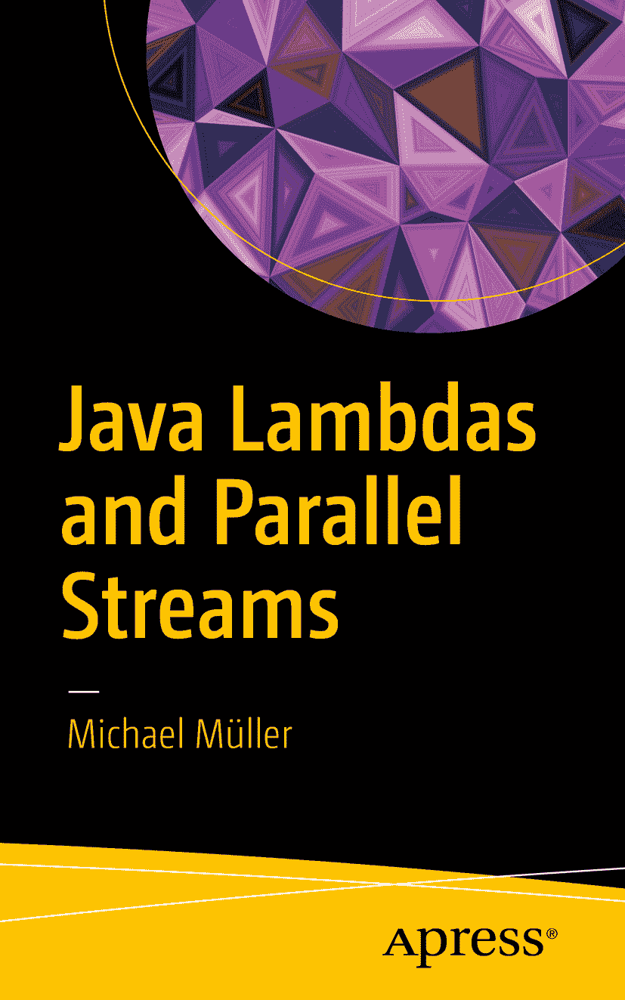

Michael Müller 著《Java Lambda 表达式与并行流》

作者在本文中引用的任何源代码或其他补充材料，读者可在 [`www.apress.com`](http://www.apress.com) 获取。有关如何查找本书源代码的详细信息，请访问 [`www.apress.com/source-code/`](http://www.apress.com/source-code/) 。读者也可在 SpringerLink 上各章的“补充材料”部分访问源代码。ISBN 978-1-4842-2486-1 e-ISBN 978-1-4842-2487-8 DOI 10.1007/978-1-4842-2487-8 美国国会图书馆控制号：2016960327 © Michael Müller 2016 本作品受版权保护。出版商保留所有权利，无论是全部还是部分材料，具体包括翻译、重印、重用插图、朗诵、广播、微缩胶片复制或以任何其他物理方式复制，以及信息存储与检索的传输、电子改编、计算机软件，或现在已知或未来开发的任何类似或不同方法。本书中可能出现商标名称、标识和图像。我们不会在每次出现商标名称、标识或图像时都使用商标符号，而是仅以编辑方式使用这些名称、标识和图像，以维护商标所有者的利益，且无意侵犯商标权。本出版物中使用的商品名称、商标、服务标志和类似术语，即使未明确标识，也不应被视为对其是否受专有权利保护的立场表达。尽管本书中的建议和信息在出版时被认为是真实准确的，但作者、编辑和出版商均不对可能出现的任何错误或遗漏承担法律责任。出版商对本书所含材料不作任何明示或暗示的保证。本书采用无酸纸印刷。全球图书贸易由 Springer Science+Business Media New York 发行，地址：233 Spring Street, 6th Floor, New York, NY 10013。电话：1-800-SPRINGER，传真：(201) 348-4505，电子邮件：orders-ny@springer-sbm.com，或访问 www.springeronline.com。Apress Media, LLC 是一家加利福尼亚有限责任公司，其唯一成员（所有者）是 Springer Science + Business Media Finance Inc (SSBM Finance Inc)。SSBM Finance Inc 是一家特拉华州公司。献给我的妻子克劳迪娅和我的孩子们：感谢你们在我夜间写作和其他长时间工作期间的耐心。我爱你们。献给许多在会议上与我交谈的人以及我演讲的听众：感谢你们富有信息量和有趣的对话。由此，我认识到 Java Lambda 表达式和流对你们来说是多么重要，以及存在多大的信息需求。没有你们，这本书就不会写成。献给你，我亲爱的读者：感谢你对本书的兴趣。我希望我写了一本易于理解且有价值的书，能帮助你取得成功。前言

每当我在会议和圆桌活动中谈论 Java Lambda 表达式和流时，都会引起与会者的浓厚兴趣和热烈讨论。通常，不熟悉的语法形式即使对经验丰富的程序员来说（或者尤其对他们？）也是一个重大障碍。然而，一旦开发者掌握了语法，他或她通常就不想再回到前 Lambda 风格了。

意识到新语法对许多开发者来说是一个障碍，我决定以可作参考的形式分享我的经验和见解。这本简明书籍旨在帮助你克服学习曲线，掌握 Lambda 表达式和流的新世界。

遵循 Leanpub 的座右铭“尽早出版，经常出版”，我以早期但完整的状态出版了前一版本。由 Apress 出版的这一版本包含了关于如何创建自己的并行收集器的额外信息。

希望你喜欢阅读，并在 Java Lambda 表达式和并行流方面取得持续成功。

Michael Müller 目录 第 1 章：引言 1 第 2 章：数据 5 第 3 章：首次分析——从朴素到灵活 7 第 4 章：Lambda 表达式 13 第 5 章：默认方法 19 第 6 章：Optional 25 第 7 章：初识流 29 第 8 章：stream()、Stream 和 Spliterator 35 第 9 章：并行流 41 第 10 章：收集器与并发 47 第 11 章：GroupingCollector 61 附录 A：创建演示数据的程序 69 索引 85 关于作者和技术审阅者 关于作者 关于技术审阅者

