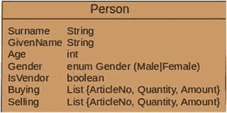

# 2. 数据

回到挑战。

我将分析大量买卖各种产品的人员数据。此任务的数据结构设计简单：一个人有名字、姓氏、年龄和性别。买家也可能是卖家。销售和购买记录存储在列表中。该列表中的每个元素通过其商品编号、销售数量和单价来表示一个产品。由于各种折扣，单价可能会因交易而异。下图（图 2-1）可视化了 Person 类。

图 2-1.

Person 类

在附录中，你将找到一个用于创建示例数据的简单程序。

