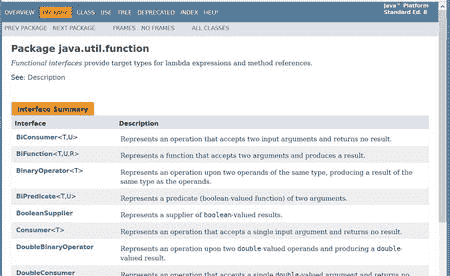

# 4. Lambda 表达式

在介绍了所有这些传统方法之后，是时候转向 Lambda 表达式了，它已被引入 Java 8。

提醒一下，`Condition` 接口的 `test()` 方法期望接收一个 `Person` 对象并检查一个条件。

让我们把这个条件称为一个函数。你还记得学校里的数学吗？许多学生必须学习函数和诸如 `x -> f(x)` 这样的表达式。这意味着一个值 x 将被映射到 x 的函数。在我们当前的任务中，一个 `Person` 对象将被映射到 `Person` 的函数（`Condition`）。而 Java 的 Lambda 语法恰恰让你想起这一点。对于我们的具体分析，这将如代码清单 4-1 所示。

```
1   person -> person.getAge() < 20
代码清单 4-1.
年龄条件的 Lambda 表达式
```

现在，你可以在需要条件接口的地方使用这个表达式（参见代码清单 4-2）。

```
1   persons = getPersonsByCondition(
2                       persons,
3                       person -> person.getAge() < 20);
代码清单 4-2.
使用 Lambda 表达式收集人员
```

这是简洁明了的代码，易于阅读和理解——一旦你熟悉了这种语法。即使（或者尤其是？）对于资深开发人员来说，这种不寻常的语法通常也是最大的障碍。

我预测，一旦程序员习惯了它，他或她通常就不想再失去它了。

最终，我们可以轻松地为我们分析中的条件进行替换。代码清单 4-3 中的示例展示了如何选择所有女性人员。

```
1   persons = getPersonsByCondition(
2   persons,
3   person -> person.getGender() == Gender.Female);
代码清单 4-3.
仅通过一个 Lambda 表达式更改过滤器
```

## 函数式接口

Lambda 表达式可以在期望函数式接口的地方使用。如果一个接口精确定义了一个抽象方法，我们就称其为函数式接口。Lambda 表达式会重写这个方法。

Java 8 包含了一些预定义的函数式接口（例如，参见图 4-1）。因此，像我们之前定义 `Condition` 那样的额外定义就不再需要了。在我们的例子中，我们可以使用预定义的接口 `Predicate`，它用于检查此类条件。Java 8 中可用的函数式接口列表可以在 [Oracle](https://docs.oracle.com/javase/8/docs/api/java/util/function/package-summary.html) 上阅读。¹



图 4-1.
预定义的函数式接口

这些函数式接口通常使用 `@FunctionalInterface` 注解进行标注。这是一个信息性注解，可能被 IDE（集成开发环境）或编译器使用，编译器能够检查此类接口的要求。然而，对于 Lambda 表达式的使用，这个接口并不是必需的。

Java 8 定义的函数式接口大多包含其他有用的具体方法。在接口中实现方法是 Java 8 的一个新特性。这些所谓的默认方法是诸如新的 Stream API 等扩展的前提条件，我将在后面进行描述。

## Lambda 表示法

由于需要实现的接口，编译器能够确定预期参数的数量和数据类型。参数的名称无关紧要，可以由程序员自由选择——就像你为自己编写的方法的参数所做的那样。如果有至少两个参数，或者你希望（或需要）声明类型，那么参数需要用括号括起来——就像方法的参数一样。如果只有一个参数且没有声明类型，则可以省略括号。因此，这些表示法是等价的（参见代码清单 4-4）。

```
1   persons = getPersonsByCondition(persons, person -> person.getAge() < 20);
2   persons = getPersonsByCondition(persons, (Person p) -> p.getAge() < 20);
3   persons = getPersonsByCondition(persons, p -> p.getAge() < 20);
代码清单 4-4.
Lambda 表达式的不同表示法
```

详细来说，一个 Lambda 表达式由参数列表、Lambda 运算符 “–>”（减号 + 大于号）和一个语句组成。通常，这个语句可以是一个块语句，由多个子语句构成。

```
(参数列表) -> 语句
```

以下是简要提及的最重要的规则：类型 + 名称，如同方法参数一样放在括号内 `(int x, int y) -> x * y;`

可以明确确定的类型可以省略。

```
(x, y) -> x * y;
```

空参数列表也是可能的，并且需要一对括号。

```
() -> getVendorCount(persons)
```

如果只有一个参数且没有类型声明，则可以省略括号。

```
x -> x * x;
```

作为特殊表示法，Lambda 表达式可以被所谓的方法引用或对象引用替代。

*   `类名::方法名`
*   `对象::方法名`

让我们看看 `Person` 类。它包含一个布尔方法 `isVendor()`。如果在条件中需要用到它，那么 Lambda 表达式将是

```
p -> p.isVendor()
```

使用方法引用也会改变代码。

```
Person::isVendor
```

注意省略了括号。使用方法引用有时可以使表示法更简洁。我在这里提到它是为了完整性。在本书的后续部分，我很少使用它，并且不再进一步解释。有关此问题的详细信息，例如，可以在 [Java 教程](https://docs.oracle.com/javase/tutorial/java/javaOO/methodreferences.html) 中找到。²


## 惰性求值

你可以将 lambda 表达式视为一种函数引用。该函数并非在你将其赋值给变量时执行，而是在对变量求值时才会执行。这种惰性求值可用于实现环绕调用。例如，我们可以将求值过程推入一个测量执行时间的方法中。

在以下代码片段中，`getVendorCount` 会立即执行。

```
int personCount = getVendorCount(persons);
```

使用 lambda 表达式，可以轻松地将 `getVendorCount` 作为函数传递给另一个方法。

```
int personCount = invokeMethod(() -> getVendorCount(persons));
```

关键在于，`getVendorCount` 在此处不会执行。它将在测量方法内部，当调用 `method.get()` 时才执行（清单 4-5）。

```
1    private static  T invokeMethod(Supplier method) {
2     long start = System.nanoTime();
3     T result = method.get();
4     long elapsedTime = System.nanoTime() - start;
5     System.out.println("Elapsed time: " + elapsedTime/1000000);
6     return result;
7   }
清单 4-5.
用于调用方法的测量函数
```

## 总结

通过使用 lambda 表达式，我们成功地为数据实现了一个灵活的过滤函数。

然而，目前我们只能更改过滤条件。如果我们需要使用不同类型的求值方式，例如，计算某物品的数量和总价，我们仍然需要调整方法。此时，流接口就派上了用场，它允许你无需使用循环，并且可以链式调用其他执行步骤，例如转换或归约。要理解 Java 如何通过此接口得到增强，我们首先需要介绍一些其他新的 Java 特性。其中一项增强是创建默认方法的机会。我将在第 5 章中展示这一点。

脚注 1

[`​docs.​oracle.​com/​javase/​8/​docs/​api/​java/​util/​function/​package-summary.​html`](https://docs.oracle.com/javase/8/docs/api/java/util/function/package-summary.html)

  2

[`​docs.​oracle.​com/​javase/​tutorial/​java/​javaOO/​methodreferences​.​html`](https://docs.oracle.com/javase/tutorial/java/javaOO/methodreferences.html)

