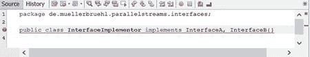

# 5. 默认方法

## 问题

接口可以被视为提供者与使用者之间的一种契约。因此，它不能被单方面撤销或更改。如果你针对某个接口开发软件，就必须依赖该接口的功能。如果提供者（例如，框架开发者）更改了接口，你的软件可能无法再使用新版本。幸运的话，你编译好的程序可能仍能与新版本协同工作。这种情况发生在更改保持了**二进制兼容性**时。但下次你需要编译程序时，编译器通常会报告错误：编译器强制要求实现接口的所有方法。由于更改后的接口不保持**源代码兼容性**，你需要调整你的程序。

那么，如何在不破坏源代码和二进制兼容性的前提下增强接口呢？

## 解决方案——Java 之道

Java 语言的开发者通过引入**默认方法**解决了这个问题。这些是接口内部的具体方法实现，声明为 `default`。如果现有部分没有更改，那么所有实现该接口的类都可以直接使用通过默认方法增强后的接口：无需更改这些实现类！

由于默认方法是一个立即可用的方法，因此无需实现它，并且增强后的接口保持了源代码和二进制兼容性。从 Java 8 开始，你的类既可以使用父类的方法，也可以使用接口的方法。因此，Java 虚拟机现在拥有了一种**多重继承**或**混入**机制。

那么，多重继承的（众所周知的）问题呢？或者，如果你的类或其父类已经拥有一个同名且签名相同的方法，会发生什么？

Java 8 有一套定义明确的规则来防止问题，如下所述。为简化起见，我们在讨论同名且签名相同的方法时，将其称为“同名方法”。

*   如果增强后的接口的（抽象）方法签名保持不变，则该接口将保持源代码和二进制兼容性
*   接口可以通过具体方法进行增强，这些方法可用于继承
*   如果实现类包含一个同名方法，则此方法具有优先权
*   接口提供者能够增强接口
*   库用户无法增强已实现的库（仅提供者可以增强）
*   这与其他语言的扩展方法形成对比，后者由用户来增强现有类
*   对于同名方法的实现，有明确定义的规则来选择正确的方法
*   在接口中定义的字段（“成员”变量）是隐式 `final` 的
*   尽管有这些限制，默认方法仍具有巨大潜力
*   最好的例子不仅是 Java 8 集合中的 `stream()` 和 `parallelStream()` 方法


## 选择默认方法的规则

Java 8 定义了一些规则，用于确定在方法同名时使用哪个方法。如果无法确定，编译器将报告错误。

顾名思义，默认方法仅当实现类中没有提供具体实现时才作为默认方法使用。如果类要实现的多个接口中存在同名方法，编译器会选择与该类“最接近”的方法。无论这些接口是否相互派生或彼此独立，这一规则都适用。

以下示例将对此进行说明（参见清单 5-1 至 5-3）。

```
1   public interface InterfaceA {
2     default void print (){
3       System.out.println("InterfaceA");
4     }
5   }
清单 5-1.
包含默认方法的接口
```

```
1   public class InterfaceImplementor implements InterfaceA{}
清单 5-2.
实现类（无额外功能）
```

```
1   public class InterfaceDemo {
2       public static void main(String[] args) {
3         new InterfaceImplementor().print();
4       }
5   }
清单 5-3.
类的调用
```

 使用这三个文件创建一个 Java 项目，以理解其运行模式。

正如你所料，这个简单的小示例只会输出 `InterfaceA`。接下来，我们将添加另一个包含同名方法的接口（参见清单 5-4）。

```
1   public interface InterfaceB {
2     default void print (){
3       System.out.println("InterfaceB");
4     }
5   }
清单 5-4.
包含同名默认方法的 InterfaceB
```

最后但同样重要的是，类 `InterfaceImplementor` 需要实现这个额外的接口（清单 5-5）。

```
1   public class InterfaceImplementor implements InterfaceA, InterfaceB{}
清单 5-5.
实现类（无额外功能）
```

现代 IDE 会提示错误（参见图 5-1）。



图 5-1.

NetBeans 提示用法错误

无论哪种情况，编译器都会告诉你无法编译此程序。如果对这些接口建立继承关系，会发生什么？

在前面的例子中，可以从 `InterfaceA` 和/或 `InterfaceB` 继承。只要在实现类中使用了两个不同的接口，且它们具有不同的同名默认方法，编译器就会报错。

如果接口继承自一个包含此类默认方法的公共接口，情况会略有不同。创建两个都继承自 `InterfaceA` 的接口，其中一个将重写默认方法。为简洁起见，这三个文件合并为一个清单（清单 5-6）。

```
1   public interface InterfaceA11 {
2     default void print (){
3       System.out.println("InterfaceA11");
4     }
5   }

7   public interface InterfaceA12 {}

9   public class InterfaceImplementor implements InterfaceA11, InterfaceA12{}
清单 5-6.
默认方法的继承
```

如果运行此程序，它将输出 InterfaceA11。`InterfaceA11` 的 `print` 方法位于继承层次结构的最底层，因此它与实现类“最接近”。如果你实现来自不同层次级别的接口，情况同样如此。

```
public class InterfaceImplementor implements InterfaceA, InterfaceA11{}
```

这也会调用 `InterfaceA11` 中的 `print` 方法。

如果你想在同一层级上编程并使用两个同名方法，例如，也在 `InterfaceA12` 中开发一个 `print` 方法，编译器将无法确定选择哪个方法，并报告错误。

## 总结

默认方法使得在不破坏兼容性的前提下增强现有接口成为可能。从这个意义上说，它们为 `stream()` 等新特性奠定了基础，我将在后面介绍这些特性。在此之前，我必须讨论另一个增强功能：`Optional` 类。

请在网上阅读更多关于默认方法的描述，例如在 [Oracle](https://docs.oracle.com/javase/tutorial/java/IandI/defaultmethods.html) 网站上。¹

脚注 1

[`https://docs.oracle.com/javase/tutorial/java/IandI/defaultmethods.html`](https://docs.oracle.com/javase/tutorial/java/IandI/defaultmethods.html)

