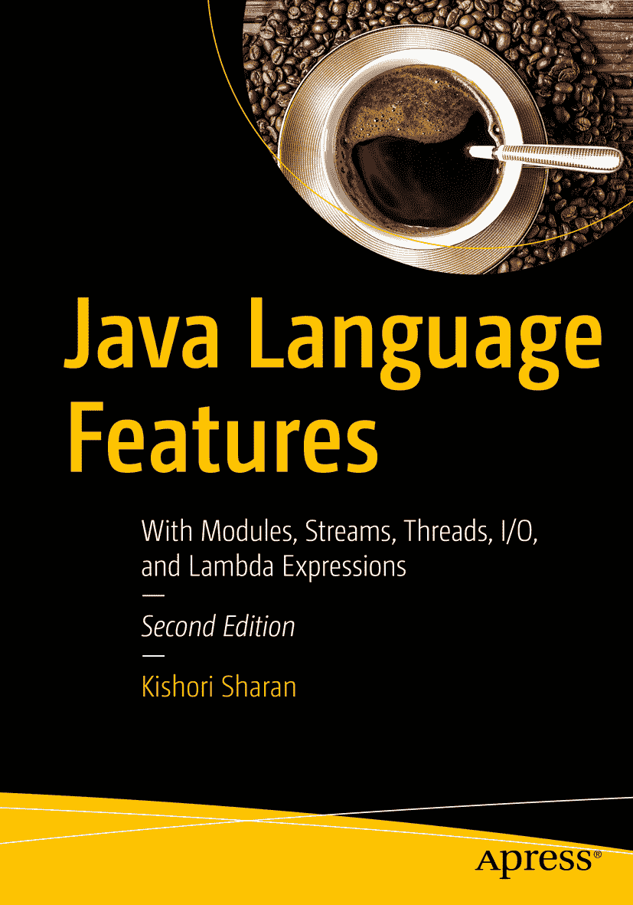

Kishori Sharan 著《Java 语言特性：模块、流、线程、I/O 与 Lambda 表达式》第二版

ISBN 978-1-4842-3347-4  
电子书 ISBN 978-1-4842-3348-1 [`doi.org/10.1007/978-1-4842-3348-1`](https://doi.org/10.1007/978-1-4842-3348-1)  
美国国会图书馆控制号：2018932349  
© Kishori Sharan 2018 作者姓名：“Kishori Sharan”  
本作品受版权保护。出版商保留所有权利，无论涉及全部或部分材料，具体包括翻译、重印、插图复用、朗诵、广播、微缩胶片或其他任何物理形式的复制，以及信息存储与检索的传输、电子改编、计算机软件，或目前已知或未来开发的任何类似或不同方法。  
本书中可能出现商标名称、标识和图像。我们仅在编辑风格中使用这些名称、标识和图像，以维护商标所有者的利益，并无意侵犯商标权，而非在每次出现商标名称、标识或图像时都使用商标符号。  
本出版物中使用的商品名称、商标、服务标志及类似术语，即使未明确标识，也不应被视为对其是否受专有权利保护的表达意见。  
尽管本书中的建议和信息在出版时被认为是真实准确的，但作者、编辑和出版商均不对可能存在的任何错误或遗漏承担法律责任。出版商对本书所含内容不作任何明示或暗示的保证。  
印刷于无酸纸  
全球图书贸易由 Springer Science+Business Media New York 发行，地址：233 Spring Street, 6th Floor, New York, NY 10013。电话：1-800-SPRINGER，传真：(201) 348-4505，电子邮件：orders-ny@springer-sbm.com，或访问 www.springeronline.com。  
Apress Media, LLC 是一家加利福尼亚有限责任公司，其唯一成员（所有者）是 Springer Science + Business Media Finance Inc (SSBM Finance Inc)。SSBM Finance Inc 是一家特拉华州公司。  

引言

## 本书的缘起

我第一次接触 Java 编程语言是在 1997 年参加的一次为期一周的 Java 培训课程中。直到 1999 年，我才有机会在项目中使用 Java。我阅读了两本 Java 书籍，并参加了 Java 2 程序员认证考试。我考得很好，得了 95 分。考试中答错的三道题让我意识到，我读过的那些书并没有充分涵盖所有主题的细节。于是我下定决心要写一本关于 Java 编程语言的书。我制定了一个计划，旨在涵盖 Java 开发者在项目中有效使用 Java 以及通过认证所需的大部分主题。最初，我计划用 700 到 800 页的篇幅涵盖 Java 中所有基本主题。

随着写作的深入，我意识到一本详细涵盖大多数 Java 主题的书不可能在 700 到 800 页内完成。仅数据类型、运算符和语句这一章就写了 90 页。当时我面临一个问题：“我应该缩短书的内容，还是包含我认为 Java 开发者需要的所有细节？”我选择了在书中包含所有细节，而不是为了维持原定页数而缩减内容。我从未打算通过这本书赚大钱。我也从不急于完成这本书，因为仓促可能会损害质量和覆盖面。简而言之，我写这本书是为了帮助 Java 社区有效地理解和使用 Java 编程语言，而无需阅读多本同类书籍。我写这本书的计划是，为所有想要学习和掌握 Java 编程语言精妙之处的人提供一本全面的一站式参考书。

我高中时的一位老师曾告诉我们，如果想了解一栋建筑，就必须先了解构成这栋建筑的砖块、钢筋和砂浆。同样的逻辑也适用于我们生活中想要理解的大多数事物。它当然也适用于理解 Java 编程语言。如果你想掌握 Java 编程语言，你必须从理解其基本构建块开始。我在整本书中都采用了这种方法，努力通过先描述基础知识来逐步构建每个主题。在本书中，你很少会发现一个主题在没有先了解其背景的情况下就被描述。只要可能，我都试图将编程实践与日常生活中的活动联系起来。市面上大多数关于 Java 编程语言的书籍要么根本没有图片，要么只有寥寥几张。我相信这句格言：“一图胜千言。”对读者来说，一张图片能让主题更容易理解和记忆。我在书中加入了大量插图，以帮助读者理解和形象化这些概念。编程经验很少或没有的开发者很难将各个部分组合成一个完整的程序。考虑到这一点，本书包含了超过 390 个完整的 Java 程序，这些程序可以直接编译和运行。

在撰写本书时，我花了无数时间进行研究。我的主要来源是 Java 语言规范、关于 Java 主题的白皮书和文章，以及 Java 规范请求（JSR）。我还花了不少时间阅读 Java 源代码，以更深入地了解某些 Java 主题。有时，在写出某个主题的第一句话之前，我需要花几个月的时间进行研究。最后，编写 Java 程序总是充满乐趣，有时我会花上几个小时来编写它们，以便将它们收录到书中。

## 第二版简介

我很高兴推出《Java 语言特性》一书的第二版。这是《Java 9 入门》三卷系列中的第二卷。由于无法在一卷中涵盖所有 JDK 9 的变更，我已在包括本卷在内的三卷中，在适当位置加入了 JDK 9 特有的变更。如果你只对学习 JDK 9 特有的主题感兴趣，我建议你阅读我的《Java 9 揭秘》一书（ISBN 9781484225912），该书仅包含 JDK 9 特有的主题。本版有以下几处变更：

*   我在本版中新增了以下五章：实现服务（第 14 章）、模块 API（第 15 章）、打破模块封装（第 16 章）、响应式流（第 17 章）和栈遍历（第 18 章）。
*   在 Java 中实现服务对 JDK 9 来说并非新事物。我觉得本书之前缺少一章关于此主题的内容。第 14 章详细介绍了如何定义服务和服务接口，以及如何使用 JDK 9 特有和 JDK 9 之前的构造来实现服务接口。本章将向你展示如何在模块声明中使用 `uses` 和 `provides` 语句。
*   第 15 章详细介绍了模块 API，它使你可以通过编程方式访问模块。本章还涉及一些高级主题，例如模块层。本系列的第一卷涵盖了模块的基础知识，例如如何声明模块和模块依赖关系。
*   第 16 章介绍了如何使用命令行选项打破模块封装。当你迁移到 JDK 9 时，可能会出现需要读取模块内部 API 或导出未导出包的情况。你可以使用本章介绍的命令行选项来完成这些任务。
*   响应式流是一项旨在为具有非阻塞背压的异步流处理提供标准的倡议。它旨在解决处理项目流时遇到的问题，包括如何将项目流从发布者传递给订阅者，而无需发布者阻塞或订阅者拥有无界缓冲区。第 17 章介绍了 JDK 9 中新增的响应式流 API。
*   第 18 章介绍了 JDK 9 中新增的栈遍历 API。该 API 允许你检查线程的栈帧，并获取方法调用者类的类引用。在 JDK 9 之前，检查线程栈和获取调用者类名也是可能的，我在第一卷的第 13 章中介绍过。新的栈遍历 API 让你能够轻松高效地完成这项工作。
*   我收到了读者们的多封邮件，提到本系列书籍没有包含问题和练习，而这些问题和练习主要是学生和初学者所需要的。学生们在 Java 课堂上使用本系列书籍，许多初学者也用它来学习 Java。应此广泛需求，我花了超过 60 个小时为每章末尾准备了问题和练习。我的朋友 Preethi 提供了帮助并给出了解答。

除了这些新增内容，我还更新了第一版中的所有章节。我编辑了内容使其更流畅，更改或添加了新的示例，并更新了内容以包含 JDK 9 特有的特性。

我衷心希望本版能帮助你更好地学习 Java。

## 本书结构

这是《Java 入门》三卷系列中的第二卷。本书包含 18 章。这些章节涵盖了 Java 的语言级主题，例如注解、泛型、Lambda 表达式、线程、I/O、集合、流等。各章按复杂度递增的顺序介绍 Java 主题。Java 9 的新特性已融入这些章节的适当位置。Java 9 中新增的模块 API、响应式流和栈遍历 API 在各自的章节中进行了深入介绍。

完成本书后，你可以通过学习本系列的最后一卷《Java API、扩展与库》中涵盖的 Java API 和模块，将你的 Java 知识提升到新的水平。

## 目标读者

本书旨在对任何想学习 Java 编程语言的人都有用。如果你是初学者，几乎没有或没有 Java 编程背景，建议你在阅读本书之前先阅读配套书籍《Java 9 基础入门》。本书包含各种复杂程度的主题。作为初学者，如果你在阅读某章的某个部分时感到吃力，可以跳到下一节或下一章，等获得更多经验后再回头阅读。

如果你是有中级或高级经验的 Java 开发者，你可以直接跳到某一章或某一章中的某一节。如果某节涉及不熟悉的主题，你需要在继续当前主题之前先了解该主题。

如果你阅读本书是为了获得 Java 编程语言的认证，你需要阅读几乎所有章节，并注意所有详细的描述和规则。大多数认证项目测试的是你对语言的基础知识，而非高级知识。你只需要阅读那些属于你认证考试范围的主题。编译并运行超过 390 个完整的 Java 程序将帮助你为认证做准备。

如果你是在参加 Java 编程语言课程的学生，你应该有选择地阅读本书的章节。有些主题——如 Lambda 表达式、集合和流——在开发 Java 应用程序中被广泛使用，而其他主题——如线程和归档文件——则较少使用。你只需要阅读课程大纲中涵盖的那些章节。我相信，作为一名 Java 学生，你不需要逐页阅读整本书。

## 如何使用本书

本书是学习 Java 编程语言的开始，而非结束。如果你正在阅读本书，这意味着你正朝着学习 Java 编程语言的正确方向前进，这将使你在学术和职业生涯中脱颖而出。然而，总有更高的目标等待你去实现，你必须不断努力才能达成。以下来自一些伟大思想家的语录可能有助于你理解努力工作和始终保持开放心态、不断求知的重要性。

> 我们所拥有的学习和知识，最多也不过是我们所无知的事物中的一小部分。——柏拉图
> 真正的知识在于知道自己一无所知。而知道自己一无所知，这使你成为所有人中最聪明的。——苏格拉底

建议读者在阅读本书时尽可能多地使用 Java 编程语言的 API 文档。Java API 文档包含了 Java 类库中所有可用内容的完整列表。你可以从甲骨文公司的官方网站 [`www.oracle.com`](http://www.oracle.com) 下载（或查看）Java API 文档。在阅读本书时，你需要练习编写 Java 程序。你也可以通过修改本书提供的程序来进行练习。如果你只是阅读本书而不练习编写自己的程序，对你的学习过程帮助不大。请记住“熟能生巧”，这在学习如何用 Java 编程时也同样适用。

## 源代码与勘误

本书的源代码可通过点击位于[`www.apress.com/9781484233474`](http://www.apress.com/9781484233474)的“下载源代码”按钮获取。

注意

在付印时，Java 10 刚刚发布。为了向您提供关于其部分特性以及新版 Java 版本命名方案的有用信息，我编写了三个附录，您可以通过上述“下载源代码”按钮免费下载。这些附录将帮助您抢先了解 Java 10 最重要的特性。

## 问题与评论

请将所有针对作者的问题和评论发送至 `ksharan@jdojo.com`。

作者在本书中引用的任何源代码或其他补充材料，读者均可通过本书在 GitHub 上的产品页面获取，该页面位于[`www.apress.com/9781484233474`](http://www.apress.com/9781484233474)。如需更详细信息，请访问[`http://www.apress.com/source-code`](http://www.apress.com/source-code)。

致谢

我要感谢我的家人和朋友们的鼓励与支持：我的母亲 Pratima Devi，我的兄长 Janki Sharan 和 Dr. Sita Sharan，我的侄子 Gaurav 和 Saurav；我的妹妹 Ratna；我的朋友 Karthikeya Venkatesan、Rahul Nagpal、Ravi Datla、Mahbub Choudhury、Richard Castillo，以及许多未在此提及的朋友。

我的妻子 Ellen 在我长时间伏案撰写本书时始终耐心陪伴。我要感谢她在本书写作过程中给予的所有支持。

特别感谢我的朋友 Preethi Vasudev，她贡献了宝贵的时间，为本书中的练习提供了解决方案。她喜欢编程挑战，尤其是 Google Code Jam。我敢肯定她很享受解决本书中的练习题。

我衷心感谢 Apress 的优秀团队在本书出版过程中给予的支持。感谢编辑运营经理 Mark Powers 提供的出色支持。感谢技术审校 Manuel Jordan Elera 和 Jeff Friesen 在审校过程中提供的技术见解和反馈。他们在剔除多处技术错误方面发挥了关键作用。最后但同样重要的是，我衷心感谢 Apress 的首席编辑 Steve Anglin 主动发起并出版本书。

目录 第 1 章：注解 1 什么是注解？ 1 声明注解类型 4 注解类型的限制 7 限制 #1 7 限制 #2 8 限制 #3 8 限制 #4 9 限制 #5 9 限制 #6 9 注解元素的默认值 9 注解类型及其实例 10 使用注解 11 基本类型 12 字符串类型 12 类类型 13 枚举类型 14 注解类型 16 数组类型注解元素 16 注解中不允许空值 17 简写注解语法 17 标记注解类型 19 元注解类型 19 Target 注解类型 20 Retention 注解类型 23 Inherited 注解类型 24 Documented 注解类型 24 Repeatable 注解类型 25 常用的标准注解 26 弃用 API 27 抑制指定的编译时警告 38 重写方法 39 声明函数式接口 40 注解包 41 注解模块 41 在运行时访问注解 42 演化注解类型 47 源码级别的注解处理 47 小结 53 第 2 章：内部类 57 什么是内部类？ 57 使用内部类的优势 59 内部类的类型 59 成员内部类 59 局部内部类 61 匿名内部类 65 静态成员类不是内部类 68 创建内部类的对象 70 访问外部类成员 73 访问局部变量的限制 80 内部类与继承 81 内部类中不允许静态成员 83 内部类生成的类文件 84 内部类与编译器魔法 85 闭包与回调 89 在静态上下文中定义内部类 91 小结 91 第 3 章：反射 97 什么是反射？ 97 Java 中的反射 98 加载类 99 使用类字面量 99 使用 Object::getClass() 方法 100 使用 Class::forName() 方法 100 类加载器 103 JDK8 中的类加载器 103 JDK9 中的类加载器 104 反射类 107 反射字段 112 反射可执行元素 114 反射方法 116 反射构造器 118 创建对象 120 调用方法 121 访问字段 122 深度反射 124 模块内的深度反射 125 跨模块的深度反射 129 深度反射与未命名模块 134 JDK 模块上的深度反射 134 反射数组 136 扩展数组 138 谁应该使用反射？ 140 小结 140 第 4 章：泛型 143 什么是泛型？ 143 超类型-子类型关系 147 原始类型 148 无界通配符 149 上界通配符 152 下界通配符 153 泛型方法与构造器 155 泛型对象创建中的类型推断 157 无泛型异常类 160 无泛型匿名类 160 泛型与数组 160 泛型对象的运行时类类型 161 堆污染 162 可变参数方法与堆污染警告 163 小结 165 第 5 章：Lambda 表达式 169 什么是 Lambda 表达式？ 169 为什么需要 Lambda 表达式？ 171 Lambda 表达式的语法 173 省略参数类型 174 声明单个参数 175 声明无参数 175 带修饰符的参数 175 声明 Lambda 表达式的主体 176 目标类型 176 函数式接口 184 使用 @FunctionalInterface 注解 184 泛型函数式接口 185 交集类型与 Lambda 表达式 187 常用的函数式接口 188 使用 Function<T,R> 接口 188 使用 Predicate<T> 接口 190 使用函数式接口 191 方法引用 196 静态方法引用 197 实例方法引用 200 超类型实例方法引用 203 构造器引用 205 泛型方法引用 208 词法作用域 209 变量捕获 211 跳转与退出 214 递归 Lambda 表达式 215 比较对象 216 小结 218 第 6 章：线程 223 什么是线程？ 223 在 Java 中创建线程 226 为线程指定代码 228 从 Thread 类继承你的类 229 实现 Runnable 接口 229 使用方法引用 230 快速示例 230 在程序中使用多线程 231 使用多线程的问题 232 Java 内存模型 235 原子性 236 可见性 236 有序性 236 对象的监视器与线程同步 237 规则 #1 244 规则 #2 245 生产者/消费者同步问题 250 哪个线程正在执行？ 254 让线程休眠 255 我会在天堂加入你 256 体谅他人并让步 259 线程的生命周期 259 线程的优先级 263 是恶魔还是守护线程？ 264 我被中断了吗？ 266 线程组工作 270 易失变量 271 停止、挂起和恢复线程 273 自旋等待提示 277 处理线程中未捕获的异常 278 线程并发包 280 原子变量 280 标量原子变量类 281 原子数组类 281 原子字段更新器类 282 原子复合变量类 282 显式锁 283 同步器 288 信号量 289 屏障 292 相位器 295 闭锁 304 交换器 306 执行器框架 310 带结果的任务 315 调度任务 318 处理任务执行中的未捕获异常 321 执行器的完成服务 322 Fork/Join 框架 325 使用 Fork/Join 框架的步骤 326 一个 Fork/Join 示例 328 线程局部变量 330 设置线程的栈大小 333 小结 334 第 7 章：输入/输出 337 什么是输入/输出？ 337 处理文件 338 创建 File 对象 338 了解当前工作目录 339 检查文件是否存在 340 你想走哪条路径？ 340 创建、删除和重命名文件 342 处理文件属性 346 复制文件 346 了解文件大小 346 列出目录和文件 347 装饰器模式 350 输入/输出流 358 使用输入流从文件读取 359 使用输出流将数据写入文件 363 输入流遇上装饰器模式 366 BufferedInputStream 369 PushbackInputStream 370 输出流遇上装饰器模式 371 PrintStream 373 使用管道 375 读写基本数据类型 378 对象序列化 380 序列化对象 381 反序列化对象 383 Externalizable 对象序列化 385 序列化 transient 字段 389 高级对象序列化 389 多次将对象写入流 389 类演化与对象序列化 393 停止序列化 394 Reader 和 Writer 395 自定义输入/输出流 399 随机访问文件 402 复制文件内容 404 标准输入/输出/错误流 405 Console 和 Scanner 类 410 StringTokenizer 和 StreamTokenizer 412 小结 415 第 8 章：处理归档文件 419 什么是归档文件？ 419 数据压缩 419 校验和 420 压缩字节数组 422 处理 ZIP 文件格式 427 创建 ZIP 文件 427 读取 ZIP 文件的内容 431 处理 GZIP 文件格式 434 处理 JAR 文件格式 435 创建 JAR 文件 437 更新 JAR 文件 438 索引 JAR 文件 438 从 JAR 文件中提取条目 439 列出 JAR 文件的内容 439 清单文件 439 在 JAR 文件中密封包 441 使用 JAR API 442 从 JAR 文件访问资源 446 小结 447 第 9 章：新输入/输出 449 什么是 NIO？ 449 缓冲区 450 从缓冲区读取和写入 453 只读缓冲区 460 缓冲区的不同视图 461 字符集 462 通道 471 读/写文件 473 内存映射文件 I/O 477 文件锁定 478 复制文件内容 480 了解机器的字节序 481 字节缓冲区及其字节序 482 小结 483 第 10 章：新输入/输出 2 487 什么是新输入/输出 2？ 487 处理文件系统 488 处理路径 490 创建 Path 对象 491 访问路径的组成部分 491 比较路径 493 规范化、解析和相对化路径 495 符号链接 497 路径的不同形式 497 在路径上执行文件操作 499 创建新文件 499 删除文件 500 检查文件是否存在 501 复制和移动文件 501 常用的文件属性 503 探测文件的内容类型 504 读取文件内容 504 写入文件 507 随机访问文件 508 遍历文件树 511 匹配路径 516 管理文件属性 517 检查文件属性视图支持 518 读取和更新文件属性 520 管理文件所有者 524 管理 ACL 文件权限 526 管理 POSIX 文件权限 529 监视目录的修改 532 创建 Watch Service 533 向 Watch Service 注册目录 533 从 Watch Service 队列中检索 WatchKey 533 处理事件 534 处理事件后重置 WatchKey 534 关闭 Watch Service 534 异步文件 I/O 536 小结 546 第 11 章：垃圾回收 549 什么是垃圾回收？ 549 Java 中的内存分配 551 Java 中的垃圾回收 552 调用垃圾回收器 553 对象终结 555 Finally 还是 Finalize？ 557 对象复活 559 对象的状态 561 弱引用 562 访问和清除引用对象的引用 566 使用 SoftReference 类 569 使用 ReferenceQueue 类 573 使用 WeakReference 类 574 使用 PhantomReference 类 578 使用 Cleaner 类 581 小结 585 第 12 章：集合 587 什么是集合？ 587 集合框架的必要性 589 集合框架的架构 590 Collection<E> 接口 591 基本操作方法 591 批量操作方法 592 聚合操作方法 592 数组操作方法 593 比较操作方法 593 快速示例 593 遍历集合中的元素 594 使用迭代器 595 使用 for-each 循环 598 使用 forEach() 方法 599 使用不同类型的集合 600 处理 Set 600 处理 List 613 处理 Queue 618 处理 Map 641 对集合应用算法 655 排序 List 655 搜索 List 656 打乱、反转、交换和旋转 List 657 创建集合的不同视图 659 集合的只读视图 659 集合的同步视图 660 检查集合 661 创建空集合 662 创建单例集合 662 理解基于哈希的集合 663 小结 668 第 13 章：流 675 什么是流？ 675 流没有存储 676 无限流 676 内部迭代 vs. 外部迭代 676 命令式 vs. 函数式 678 流操作 678 有序流 680 流不可重用 680 Streams API 的架构 680 快速示例 682 创建流 686 从值创建流 686 空流 689 从函数创建流 689 从数组创建流 694 从集合创建流 695 从文件创建流 695 从其他源创建流 697 表示可选值 698 对流应用操作 703 调试流管道 704 应用 ForEach 操作 705 应用 Map 操作 706 扁平化流 708 应用 Filter 操作 710 应用 Reduce 操作 713 使用收集器收集数据 721 收集汇总统计信息 725 将数据收集到 Map 中 727 使用收集器连接字符串 729 分组数据 730 分区数据 734 调整收集器结果 735 在流中查找和匹配 739 并行流 740 小结 742 第 14 章：实现服务 747 什么是服务？ 747 发现服务 749 提供服务实现 750 定义服务接口 752 获取服务提供者实例 752 定义服务 756 定义服务提供者 758 定义默认的 Prime 服务提供者 758 定义更快的 Prime 服务提供者 760 定义可能的 Prime 服务提供者 761 测试 Prime 服务 763 在传统模式下测试 Prime 服务 767 小结 769 第 15 章：模块 API 771 什么是模块 API？ 771 表示模块 773 描述模块 773 表示模块语句 774 表示模块版本 776 模块的其他属性 777 了解模块基本信息 778 查询模块 781 更新模块 783 访问模块资源 786 JDK9 之前访问资源 786 在 JDK9 中访问资源 790 模块上的注解 803 处理模块层 805 查找模块 807 读取模块内容 809 创建配置 811 创建模块层 813 小结 821 第 16 章：打破模块封装 825 什么是打破模块封装？ 825 命令行选项 826 --add-exports 选项 826 --add-opens 选项 827 --add-reads 选项 827 --illegal-access 选项 828 示例 829 使用 JAR 的清单属性 837 小结 841 第 17 章：响应式流 843 什么是流？ 843 什么是响应式流？ 844 JDK9 中的响应式流 API 846 发布者-订阅者交互 846 创建发布者 847 发布项目 848 快速示例 849 创建订阅者 851 使用处理器 856 小结 859 第 18 章：栈遍历 861 什么是栈？ 861 什么是栈遍历？ 862 JDK8 中的栈遍历 862 栈遍历的缺点 865 JDK9 中的栈遍历 866 指定栈遍历选项 866 表示栈帧 866 获取 StackWalker 类 868 遍历栈 869 了解调用者的类 874 栈遍历权限 877 小结 878 索引 881 关于作者和关于技术审阅者 关于作者 关于技术审阅者

