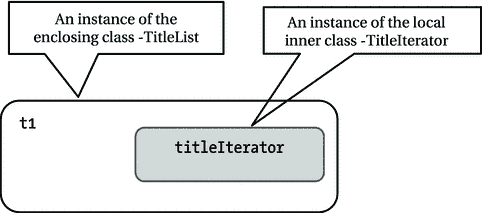

# 2. 内部类

在本章中，你将学习：

*   什么是内部类
*   如何声明内部类
*   如何声明成员内部类、局部内部类和匿名内部类
*   如何创建内部类的对象

本章中的所有示例程序都是 `jdojo.innerclasses` 模块的成员，如清单 2-1 所示。

```
// module-info.java
module jdojo.innerclasses {
exports com.jdojo.innerclasses;
}
清单 2-1.
jdojo.innerclasses 模块的声明
```


## 什么是内部类？

你已经接触过作为包成员的类。作为包成员的类被称为顶层类。例如，清单 2-2 展示了一个名为 `TopLevel` 的顶层类。

```
// TopLevel.java
package com.jdojo.innerclasses;
public class TopLevel {
private int value = 101;
public int getValue() {
return value;
}
public void setValue (int value) {
this.value = value;
}
}
清单 2-2.
顶层类示例
```

`TopLevel` 类是 `com.jdojo.innerclasses` 包的一个成员。该类有三个成员：

*   一个实例变量：`value`
*   两个方法：`getValue()` 和 `setValue()`

类也可以声明在另一个类内部。这种类型的类称为内部类。如果声明在另一个类内部的类被显式或隐式地声明为静态，则称为嵌套类，而非内部类。包含内部类的类称为封闭类或外部类。考虑以下 `Outer` 和 `Inner` 类的声明：

```
// Outer.java
package com.jdojo.innerclasses;
public class Outer {
public class Inner {
// Inner 类的成员写在这里
}
// Outer 类的其他成员写在这里
}
```

`Outer` 类是一个顶层类。它是 `com.jdojo.innerclasses` 包的一个成员。`Inner` 类是一个内部类。它是 `Outer` 类的一个成员。`Outer` 类是 `Inner` 类的封闭类（或外部类）。一个内部类可以是另一个内部类的封闭类。内部类的嵌套层级没有限制。

内部类的实例只能存在于其封闭类的实例中。也就是说，在创建内部类的实例之前，你必须先拥有一个封闭类的实例。这在强制实现“一个对象不能脱离另一个对象而存在”的规则时非常有用。例如，必须先有计算机，才能有处理器；必须先有组织，才能有该组织的总裁。在这种情况下，`Processor` 和 `President` 可以定义为内部类，而 `Computer` 和 `Organization` 则分别是它们的封闭类。内部类可以完全访问其封闭类的所有成员，包括私有成员。

Java 1.0 不支持内部类。它们是在 Java 1.1 中引入的，且未对 JVM 处理类文件的方式进行任何更改。那么，如何在不影响 JVM 的情况下添加像内部类这样的新结构呢？内部类完全是在编译器的帮助下实现的。编译器会为编译单元中的每个内部类生成一个单独的类文件。内部类的类文件与顶层类的类文件格式相同。因此，JVM 对内部类和顶层类的类文件一视同仁。然而，编译器需要做大量的幕后工作来实现内部类。我将在本章后面讨论编译器为实现内部类所做的一些工作。

你可能会问，是否可以在 Java 中不使用内部类就能实现内部类所提供的所有功能？在某种程度上，答案是肯定的。即使不能完全实现，你也可以在不使用内部类的情况下实现内部类提供的大部分功能。编译器会为内部类生成额外的代码。与其使用内部类结构并让编译器为你生成额外的代码，不如自己编写相同的代码。这个想法听起来很简单。然而，谁愿意重新发明轮子呢？

## 使用内部类的优势

以下是使用内部类的一些优势。本章后续部分将通过示例解释内部类的所有优势。

*   它们允许你将类定义在将要使用它们的其他类附近。例如，计算机会使用处理器，因此将 `Processor` 类定义为 `Computer` 类的内部类会更好。
*   它们提供了额外的命名空间来管理类结构。例如，在引入内部类之前，一个类只能是包的一个成员。随着内部类的引入，可以包含内部类的顶层类提供了额外的命名空间。
*   某些设计模式使用内部类更容易实现。例如，适配器模式、枚举模式和状态模式都可以使用内部类轻松实现。
*   使用内部类实现回调机制既优雅又方便。Java 8 中的 Lambda 表达式为在 Java 中实现回调提供了一种更好、更简洁的方式。我将在第 5 章讨论 Lambda 表达式。
*   它有助于在 Java 中实现闭包。
*   你可以使用内部类实现类的一种多重继承风格。内部类可以继承另一个类。因此，内部类既可以访问其封闭类的成员，也可以访问其超类的成员。请注意，访问两个或多个类的成员是多重继承的目标之一，这可以通过内部类实现。然而，仅仅能够访问两个类的成员并不是真正意义上的多重继承。

## 内部类的类型

你可以在类内部任何可以编写 Java 语句的位置定义内部类。内部类有三种类型。内部类的类型取决于其声明的位置和声明方式。

*   成员内部类
*   局部内部类
*   匿名内部类

### 成员内部类

成员内部类的声明方式与类的成员字段或成员方法相同。它可以声明为 `public`、`private`、`protected` 或包级私有。成员内部类的实例只能存在于其封闭类的实例中。考虑清单 2-3 中所示的成员内部类示例。

```
// Car.java
package com.jdojo.innerclasses;
public class Car {
// Car 类的成员变量
private final int year;
// 名为 Tire 的成员内部类
public class Tire {
// Tire 类的成员变量
private final double radius;
// Tire 类的构造器
public Tire(double radius) {
this.radius = radius;
}
// Tire 类的成员方法
public double getRadius() {
return radius;
}
} // 成员内部类声明结束
// Car 类的构造器
public Car(int year) {
this.year = year;
}
// Car 类的成员方法
public int getYear() {
return year;
}
}
清单 2-3.
Tire 是 Car 类的成员内部类
```

在清单 2-3 中，`Car` 是一个顶层类，`Tire` 是 `Car` 类的一个成员内部类。`Car` 类的完全限定名是 `com.jdojo.innerclasses.Car`。`Tire` 类的完全限定名是 `com.jdojo.innerclasses.Car.Tire`。`Tire` 内部类被声明为 public。也就是说，它的名字可以在 `Car` 类外部使用。例如，你可以在 `Car` 类外部声明一个 `Car.Tire` 类型的变量，如下所示：

```
Car.Tire t;
```

`Tire` 类的构造器也被声明为 public。这意味着你可以在 `Car` 类外部创建 `Tire` 类的对象。由于 `Tire` 是 `Car` 类的成员内部类，因此在创建 `Tire` 类的对象之前，你必须先拥有一个 `Car` 类的对象。`new` 操作符用于创建成员内部类对象的方式有所不同。本章的“创建内部类对象”部分将解释如何创建内部成员类的对象。


### 局部内部类

局部内部类是在一个代码块内部声明的。其作用域仅限于声明它的代码块。由于它的作用域始终局限于其所在的封闭块，因此其声明不能使用任何访问修饰符，例如 `public`、`private` 或 `protected`。通常，局部内部类是在方法内部定义的。然而，它也可以在静态初始化器、非静态初始化器和构造器中定义。当你只需要在某个代码块内部使用该类时，就可以使用局部内部类。清单 2-4 展示了一个局部内部类的示例。

```
// TitleList.java
package com.jdojo.innerclasses;
import java.util.ArrayList;
import java.util.Iterator;
public class TitleList {
private ArrayList titleList = new ArrayList();
public void addTitle (String title) {
titleList.add(title);
}
public void removeTitle(String title) {
titleList.remove(title);
}
public Iterator titleIterator() {
// 一个局部内部类 - TitleIterator
class TitleIterator implements Iterator {
int count = 0;
@Override
public boolean hasNext() {
return (count < titleList.size());
}
@Override
public String next() {
return titleList.get(count++);
}
} // 局部内部类 TitleIterator 在此结束
// 创建局部内部类的对象并返回引用
TitleIterator titleIterator = new TitleIterator();
return titleIterator;
}
}
清单 2-4.
局部内部类示例
```

一个 `TitleList` 对象可以持有一个书籍标题列表。`addTitle()` 方法向列表中添加一个标题。`removeTitle()` 方法从列表中移除一个标题。`titleIterator()` 方法为标题列表返回一个迭代器。`titleIterator()` 方法定义了一个名为 `TitleIterator` 的局部内部类，该类实现了 `Iterator` 接口。请注意，`TitleIterator` 类使用了其外部类的私有实例变量 `titleList`。最后，`titleIterator()` 方法创建了一个 `TitleIterator` 类的对象，并返回该对象的引用。清单 2-5 展示了如何使用 `TitleList` 类的 `titleIterator()` 方法。

```
// TitleListTest.java
package com.jdojo.innerclasses;
import java.util.Iterator;
public class TitleListTest {
public static void main(String[] args) {
TitleList tl = new TitleList();
// 添加三个标题
tl.addTitle("Java 9 Revealed");
tl.addTitle("Beginning Java 9");
tl.addTitle("Learn JavaFX 9");
// 获取迭代器
Iterator iterator = tl.titleIterator();
// 使用迭代器打印所有标题
while (iterator.hasNext()) {
System.out.println(iterator.next());
}
}
}
Java 9 Revealed
Beginning Java 9
Learn JavaFX 9
清单 2-5.
使用局部内部类
```

局部内部类的作用域仅限于其封闭块，这一事实对如何声明局部内部类有一些影响。考虑以下类声明：

```
package com.jdojo.innerclasses;
public class SomeTopLevelClass {
public void someMethod() {
class SomeLocalInnerClass {
// SomeLocalInnerClass 的代码写在这里
}
// SomeLocalInnerClass 只能在这里使用
}
}
```

`SomeTopLevelClass` 是一个顶层类。`SomeTopLevelClass` 的 `someMethod()` 方法声明了 `SomeLocalInnerClass` 局部内部类。请注意，局部内部类的名称 `SomeLocalInnerClass` 只能在 `someMethod()` 方法内部使用。这意味着 `SomeLocalInnerClass` 的对象只能在 `someMethod()` 方法内部创建和使用。这限制了局部内部类只能在其封闭块内部使用——在你的例子中就是 `someMethod()` 方法。在这一点上，局部内部类似乎不是很有用。然而，清单 2-5 演示了局部内部类 `TitleIterator` 的代码可以从另一个类 `TitleListTest` 中调用。这是可能的，因为局部内部类 `TitleIterator` 实现了 `Iterator` 接口。

要在其封闭块之外使用局部内部类，局部内部类必须满足以下条件之一或全部：

*   实现一个公共接口
*   继承自另一个公共类并重写其父类的某些方法

接口或另一个类的名称必须在定义局部内部类的封闭块之外可用。清单 2-4 和清单 2-5 说明了第一种情况，即局部内部类实现了一个接口。清单 2-6 和清单 2-7 说明了第二种情况，即局部内部类继承自另一个公共类。清单 2-8 提供了一个测试类来测试局部内部类。这个示例很简单。然而，它说明了如何通过从另一个类继承来使用局部内部类的概念。请注意，当你运行清单 2-8 中的程序时，可能会得到不同的输出。

```
// RandomInteger.java
package com.jdojo.innerclasses;
import java.util.Random;
public class RandomInteger {
protected Random rand = new Random();
public int getValue() {
return rand.nextInt();
}
}
清单 2-6.
声明一个顶层类，用作局部类的父类
```

```
// RandomLocal.java
package com.jdojo.innerclasses;
public class RandomLocal {
public RandomInteger getRandomInteger() {
// 一个继承自 RandomInteger 类的局部内部类
class RandomIntegerLocal extends RandomInteger {
@Override
public int getValue() {
// 获取两个随机整数并返回平均值，忽略小数部分
long n1 = rand.nextInt();
long n2 = rand.nextInt();
int value = (int) ((n1 + n2)/2);
return value;
}
}
return new RandomIntegerLocal();
} // getRandomInteger() 方法结束
}
清单 2-7.
一个继承自另一个类的局部内部类
```

```
// LocalInnerTest.java
package com.jdojo.innerclasses;
public class LocalInnerTest {
public static void main(String[] args) {
// 使用 RandomInteger 类生成随机整数
RandomInteger rTop = new RandomInteger();
System.out.println("使用顶层类生成的随机整数:");
System.out.println(rTop.getValue());
System.out.println(rTop.getValue());
System.out.println(rTop.getValue());
// 使用 RandomIntegerLocal 类生成随机整数
RandomLocal local = new RandomLocal();
RandomInteger rLocal = local.getRandomInteger();
System.out.println("\n 使用局部内部类生成的随机整数:");
System.out.println(rLocal.getValue());
System.out.println(rLocal.getValue());
System.out.println(rLocal.getValue());
}
}
使用顶层类生成的随机整数:

使用局部内部类生成的随机整数:

清单 2-8.
测试局部内部类
```

`RandomInteger` 类包含一个 `getValue()` 方法。`RandomInteger` 类的唯一目的是通过此方法获取一个随机整数。`RandomLocal` 类是另一个类，它有一个 `getRandomInteger()` 方法，该方法声明了一个名为 `RandomIntegerLocal` 的局部内部类，该类继承自 `RandomInteger` 类。`RandomIntegerLocal` 类重写了其父类的 `getValue()` 方法。重写后的 `getValue()` 方法生成两个随机整数。它返回这两个整数的平均值。`LocalInnerTest` 类说明了这两个类的使用。名称 `RandomIntegerLocal` 在其声明所在的方法之外是不可用的，因为它是一个局部内部类。有两点值得注意。


*   `RandomLocal` 类的 `getRandomInteger()` 方法声明其返回一个 `RandomInteger` 类的对象，而非 `RandomIntegerLocal` 类的对象。在方法内部，允许返回 `RandomIntegerLocal` 类的对象，因为 `RandomIntegerLocal` 局部内部类继承自 `RandomInteger` 类。
*   在 `LocalInnerTest` 类中，你声明了一个 `RandomInteger` 类型的 `rLocal` 引用变量。

```
    // 使用 RandomIntegerLocal 类生成随机整数
    RandomLocal local = new RandomLocal();
    RandomInteger rLocal = local.getRandomInteger();
    ```

然而，在运行时，`rLocal` 将接收到一个 `RandomIntegerLocal` 类的引用。由于 `getValue()` 方法在局部内部类中被重写，`rLocal` 对象将以不同的方式生成随机整数。

### 匿名内部类

匿名内部类与局部内部类相同，但有一个区别：它没有名称。由于没有名称，它不能有构造方法。回想一下，构造方法名称与类名相同。你可能会想，如果匿名类没有构造方法，如何创建它的对象。匿名类是一次性类。你可以在定义匿名类的同时创建它的对象。你不能创建匿名类的多个对象。由于匿名类的声明和其对象的创建是交织在一起的，匿名类总是作为表达式的一部分使用 `new` 运算符创建。创建匿名类及其对象的一般语法如下：

```
new  () {
// 匿名类的主体写在这里
}
```

`new` 运算符用于创建匿名类的实例。它后面跟着一个现有的接口名或现有的类名。请注意，接口名或类名不是新创建的匿名类的名称。相反，它是一个现有的接口/类名称。如果使用接口名，则匿名类实现该接口。如果使用类名，则匿名类继承自该类。

`<argument-list>` 仅在 `new` 运算符后面跟着类名时使用。如果 `new` 运算符后面跟着接口名，则它留空。如果存在 `<argument-list>`，它包含要调用的现有类构造方法的实际参数列表。匿名类的主体照常写在花括号内。为简单起见，前面的语法可以分解为两种：第一种语法用于匿名类实现接口时，第二种语法用于匿名类继承类时。

```
new Interface() {
// 匿名类的主体写在这里
}
```

以及

```
new Superclass() {
// 匿名类的主体写在这里
}
```

匿名类非常强大。然而，其语法不易阅读，且有些违反直觉。为了更好的可读性，匿名类的主体应该简短。让我们从一个简单的匿名类示例开始。你将使你的匿名类继承自 `Object` 类，如下所示：

```
new Object() {
// 匿名类的主体写在这里
}
```

这是你在 Java 中可以拥有的最简单的匿名类。它被创建，然后悄无声息地匿名消亡！

现在，你想在创建匿名类对象时打印一条消息。匿名类没有构造方法。你应该把打印消息的代码放在哪里？回想一下，类的所有实例初始化器在创建该类的对象时都会被调用。因此，在你的情况下，你可以使用实例初始化器来打印消息。以下代码片段展示了带有实例初始化器的匿名类：

```
new Object() {
// 一个实例初始化器
{
System.out.println ("来自匿名类的问候。");
}
}
```

清单 2-9 包含一个简单匿名类的完整代码，它在标准输出上打印一条消息。

```
// HelloAnonymous.java
package com.jdojo.innerclasses;
public class HelloAnonymous {
public static void main(String[] args) {
new Object() {
// 一个实例初始化器
{
System.out.println ("来自匿名类的问候。");
}
}; // 需要分号来结束语句
}
}
来自匿名类的问候。
清单 2-9.
一个匿名类示例
```

由于匿名内部类与没有类名的局部类相同，你也可以通过将局部内部类替换为匿名内部类来实现清单 2-4 和清单 2-5 中的示例。清单 2-10 重写了 `TitleList` 类的代码以使用匿名类。你会注意到清单 2-4 和清单 2-10 中 `titleIterator()` 方法内部的语法差异。使用匿名类时，为了更好的可读性，正确缩进代码非常重要。你可以通过在清单 2-5 中将 `TitleList` 替换为 `TitleListWithInnerClass` 来测试 `TitleListWithInnerClass`，你将得到相同的输出。

```
// TitleListWithInnerClass.java
package com.jdojo.innerclasses;
import java.util.ArrayList;
import java.util.Iterator;
public class TitleListWithInnerClass {
private final ArrayList titleList = new ArrayList();
public void addTitle(String title) {
titleList.add(title);
}
public void removeTitle(String title) {
titleList.remove(title);
}
public Iterator titleIterator() {
// 一个匿名类
Iterator iterator  = new Iterator() {
int count = 0;
@Override
public boolean hasNext() {
return (count < titleList.size());
}
@Override
public String next() {
return titleList.get(count++);
}
}; // 匿名内部类在此结束
return iterator;
}
}
清单 2-10.
使用匿名类将 TitleList 类重写为 TitleListWithInnerClass
```

`TitleListWithInnerClass` 的 `titleIterator()` 方法有两个语句。第一个语句创建一个匿名类的对象并将该对象的引用存储在 `iterator` 变量中。第二个语句返回存储在 `iterator` 变量中的对象引用。在这种情况下，你可以将这两个语句合并为一个语句。清单 2-7 中所示的 `getRandomInteger()` 方法可以使用匿名类重写如下：

```
public RandomInteger getRandomInteger() {
// 继承自 RandomInteger 类的匿名内部类
return new RandomInteger() {
public int getValue() {
// 获取两个随机整数并返回忽略小数部分的平均值
long n1 = rand.nextInt();
long n2 = rand.nextInt();
int value = (int)((n1 + n2)/2);
return value;
}
};
}
```


## 静态成员类不是内部类

在另一个类体内定义的成员类可以声明为静态的。以下代码片段声明了一个顶级类 `A` 和一个静态成员类 `B`：

```
package com.jdojo.innerclasses;
public class A {
// 一个静态成员类
public static class B {
// 类 B 的主体在此处
}
}
```

静态成员类不是内部类。它被视为一个顶级类，也被称为嵌套顶级类。由于它是顶级类，你无需创建其外部类的实例即可创建它的对象。类 `A` 的实例和类 `B` 的实例可以独立存在，因为两者都是顶级类。静态成员类可以声明为 `public`、`protected`、包级私有或 `private`，以限制其在外部类之外的可访问性。

如果静态成员类不过是另一个顶级类，那它有什么用呢？使用静态成员类有两个优点：

*   静态成员类可以访问其外部类的静态成员，包括私有静态成员。在你的示例中，如果类 `A` 有任何静态成员，这些静态成员可以在类 `B` 内部被访问。然而，类 `B` 不能访问类 `A` 的任何实例成员，因为类 `B` 的实例可以在没有类 `A` 实例的情况下存在。
*   包通过提供命名空间充当顶级类的容器。在一个命名空间内，所有实体必须具有唯一名称。拥有静态成员类的顶级类提供了额外的命名空间层。静态成员类是其外部顶级类的直接成员，而不是声明它的包的成员。在你的示例中，类 `A` 是包 `com.jdojo.innerclasses` 的成员，而类 `B` 是类 `A` 的成员。类 `A` 的完全限定名是 `com.jdojo.innerclasses.A`。类 `B` 的完全限定名是 `com.jdojo.innerclasses.A.B`。这样，顶级类可用于将定义为其静态成员类的相关类分组在一起。

静态成员类的对象的创建方式与使用 `new` 运算符创建顶级类对象的方式相同。要创建类 `B` 的对象，你可以这样写：

```
A.B bReference = new A.B();
```

由于类 `B` 的简单名称在类 `A` 内部的作用域内，你可以在类 `A` 内部使用其简单名称来创建其对象，如下所示：

```
// 此语句出现在类 A 的代码中
B bReference2 = new B();
```

你也可以通过导入 `com.jdojo.innerclasses.A.B` 类，在类 `A` 外部使用简单名称 `B`。然而，在类 `A` 外部使用简单名称 `B` 并不直观。这会给读者一种印象，即类 `B` 是一个顶级类，而不是嵌套顶级类。为了更好的可读性，你应该在类 `A` 外部使用 `A.B` 来表示类 `B`。清单 2-11 声明了两个静态成员类 `Monitor` 和 `Keyboard`，它们的外部类是 `ComputerAccessory`。清单 2-12 展示了如何创建这些静态成员类的对象。

```
// ComputerAccessory.java
package com.jdojo.innerclasses;
public class ComputerAccessory {
// 一个静态成员类 - Monitor
public static class Monitor {
private final int size;
public Monitor(int size) {
this.size = size;
}
public String toString() {
return "Monitor - Size:" + this.size + " inch";
}
}
// 一个静态成员类 - Keyboard
public static class Keyboard {
private final int keys;
public Keyboard(int keys) {
this.keys = keys;
}
public String toString() {
return "Keyboard - Keys:" + this.keys;
}
}
}
清单 2-11.
声明静态成员类的示例
```

```
// ComputerAccessoryTest.java
package com.jdojo.innerclasses;
public class ComputerAccessoryTest {
public static void main(String[] args) {
// 创建两个显示器
ComputerAccessory.Monitor m17 = new ComputerAccessory.Monitor(17);
ComputerAccessory.Monitor m19 = new ComputerAccessory.Monitor(19);
// 创建两个键盘
ComputerAccessory.Keyboard k122 = new ComputerAccessory.Keyboard(122);
ComputerAccessory.Keyboard k142 = new ComputerAccessory.Keyboard(142);
System.out.println(m17);
System.out.println(m19);
System.out.println(k122);
System.out.println(k142);
}
}
Monitor - Size:17 inch
Monitor - Size:19 inch
Keyboard - Keys:122
Keyboard - Keys:142
清单 2-12.
使用静态成员类的示例
```


## 创建内部类的对象

创建局部内部类、匿名类和静态成员类的对象是直接了当的。局部内部类的对象是在声明该类的块内部使用 `new` 运算符创建的。匿名类的对象在声明该类的同时被创建。静态成员类是另一种顶层类。创建静态成员类对象的方式与创建顶层类对象的方式相同。

请注意，要拥有成员内部类、局部内部类和匿名类的对象，你必须拥有一个外围类的对象。在之前的局部内部类和匿名内部类的示例中，你将这些类放在了实例方法内部。你拥有一个外围类的实例，并在该实例上调用了那些实例方法。因此，那些局部内部类和匿名内部类的实例拥有它们被调用时所依赖的外围类实例。例如，在清单 2-5 中，首先创建了一个 `TitleList` 类的实例，并将其引用存储在 `t1` 中，如下所示：

```
TitleList tl = new TitleList();
```

为了获取 `t1` 的迭代器，你调用了 `titleIterator()` 方法：

```
Iterator iterator = tl.titleIterator();
```

方法调用 `t1.titleIterator()` 在 `titleIterator()` 方法内部创建了一个 `TitleIterator` 局部内部类的实例，如下所示：

```
TitleIterator titleIterator = new TitleIterator();
```

这里，`titleIterator` 是局部内部类的一个实例，它存在于 `t1` 内部，而 `t1` 是其外围类的一个实例。这种关系适用于所有内部类，如图 2-1 所示。



图 2-1.

内部类实例与其外围类实例之间的关系 注意

在某些情况下，局部内部类或匿名内部类的存在并不需要外围类的实例。当局部内部类或匿名内部类在静态上下文中定义时，例如在静态方法或静态初始化器中，就会发生这种情况。我将在本章后面讨论这些情况。

成员内部类的实例始终存在于其外围类的实例内部。`new` 运算符用于创建成员内部类的实例，但其语法略有不同。创建成员内部类实例的通用语法如下：

```
outerClassReference.new MemberInnerClassConstructor()
```

这里，`outerClassReference` 是外围类的引用，后跟一个点，再后跟 `new` 运算符。成员内部类的构造函数调用跟在 `new` 运算符之后。让我们重新审视成员内部类的第一个示例，如下所示：

```
package com.jdojo.innerclasses;
public class Outer {
public class Inner {
}
}
```

要创建 `Inner` 成员内部类的实例，你必须首先创建其外围类 `Outer` 的一个实例：

```
Outer out = new Outer();
```

现在，你需要在 `out` 引用变量上使用 `new` 运算符来创建 `Inner` 类的对象。

```
out.new Inner();
```

要将 `Inner` 成员内部类实例的引用存储在一个引用变量中，你可以编写以下语句：

```
Outer.Inner in = out.new Inner();
```

在 `new` 运算符之后，你总是使用构造函数名称，该名称与成员内部类的简单类名相同。由于 `new` 运算符已经用外围实例引用进行了限定（如 `out.new`），Java 编译器会自动推断出外围类的完全限定名。在创建内部类实例时，用其外部类名限定内部类构造函数会导致编译时错误。以下语句将导致编译时错误：

```
Outer.Inner in = out.new Outer.Inner(); // 编译时错误
```

考虑以下具有多层嵌套内部类的类声明：

```
package com.jdojo.innerclasses;
public class OuterA {
public class InnerA {
public class InnerAA {
public class InnerAAA {
}
}
}
}
```

要创建 `InnerAAA` 的实例，你必须拥有一个 `InnerAA` 的实例。要创建 `InnerAA` 的实例，你必须拥有一个 `InnerA` 的实例。要创建 `InnerA` 的实例，你必须拥有一个 `OuterA` 的实例。因此，要创建 `InnerAAA` 的实例，你必须从创建 `OuterA` 的实例开始。重要的一点是，要创建成员内部类的实例，你必须拥有其直接外围类的实例。以下代码片段说明了如何创建 `InnerAAA` 的实例：

```
OuterA outa = new OuterA();
OuterA.InnerA ina = outa.new InnerA();
OuterA.InnerA.InnerAA inaa = ina.new InnerAA();
OuterA.InnerA.InnerAA.InnerAAA inaaa = inaa.new InnerAAA();
```

清单 2-13 使用了清单 2-3 中名为 `Car.Tire` 的成员内部类，以说明创建成员内部类实例所需的步骤。

```
// CarTest.java
package com.jdojo.innerclasses;
public class CarTest {
public static void main(String[] args) {
// 创建一个年份为 2018 的 Car 实例
Car c = new Car(2018);
// 为该车创建一个半径为 9.0 英寸的 Tire
Car.Tire t = c.new Tire(9.0);
System.out.println("车的年份: " + c.getYear());
System.out.println("车的轮胎半径: " + t.getRadius());
}
}
车的年份: 2018
车的轮胎半径: 9.0
清单 2-13.
创建成员内部类的对象
```


## 访问外部类成员

内部类可以访问其外部类的所有实例成员、实例字段和实例方法。清单 2-14 声明了一个名为 `Outer` 的类和一个名为 `Inner` 的成员内部类。

```
// Outer.java
package com.jdojo.innerclasses;
public class Outer {
private int value = 1116;
// Inner 类从这里开始
public class Inner {
public void printValue() {
System.out.println("Inner: value = " + value);
}
} // Inner 类在这里结束
// Outer 类的一个实例方法
public void printValue() {
System.out.println("Outer: value = " + value);
}
// Outer 类的另一个实例方法
public void setValue(int newValue) {
this.value = newValue;
}
}
清单 2-14.
从内部类访问外部类的实例成员
```

`Outer` 类有一个名为 `value` 的 `private` 实例变量，初始化为 1116。它还定义了两个实例方法：`printValue()` 和 `setValue()`。`Inner` 类也定义了一个名为 `printValue()` 的实例方法，该方法打印其外部类 `Outer` 的 `value` 实例变量的值。

清单 2-15 创建了一个 `Inner` 类的实例并调用其 `printValue()` 方法。输出显示，内部类实例可以访问其外部实例 `out` 的实例变量 `value`。

```
// OuterTest.java
package com.jdojo.innerclasses;
public class OuterTest {
public static void main(String[] args) {
Outer out = new Outer();
Outer.Inner in = out.new Inner();
// 打印值
out.printValue();
in.printValue();
// 设置新值
out.setValue(828);
// 打印值
out.printValue();
in.printValue();
}
}
Outer: value = 1116
Inner: value = 1116
Outer: value = 828
Inner: value = 828
清单 2-15.
测试访问其外部类实例成员的内部类
```

让我们通过向内部类添加一个名为 `value` 的实例变量来让事情变得稍微复杂一些。我们将这两个类命名为 `Outer2` 和 `Inner2`，如清单 2-16 所示。请注意，`Outer2` 和 `Inner2` 类的实例变量名称相同，都是 `value`。

```
// Outer2.java
package com.jdojo.innerclasses;
public class Outer2 {
// Outer2 类的一个实例变量
private int value = 1116;
// Inner2 类从这里开始
public class Inner2 {
// Inner2 类的一个实例变量
private int value = 1720;
public void printValue() {
System.out.println("Inner2: value = " + value);
}
} // Inner2 类在这里结束
// Outer2 类的一个实例方法
public void printValue() {
System.out.println("Outer2: value = " + value);
}
// Outer2 类的另一个实例方法
public void setValue(int newValue) {
this.value = newValue;
}
}
清单 2-16.
成员内部类与其外部类具有相同的实例变量名
```

如果你运行清单 2-17 中所示的 `Outer2Test` 类，其输出与你在清单 2-15 中运行 `OuterTest` 类时的输出不同。

```
// Outer2Test.java
package com.jdojo.innerclasses;
public class Outer2Test {
public static void main(String[] args) {
Outer2 out = new Outer2();
Outer2.Inner2 in = out.new Inner2();
// 打印值
out.printValue();
in.printValue();
// 设置新值
out.setValue(828);
// 打印值
out.printValue();
in.printValue();
}
}
Outer2: value = 1116
Inner2: value = 1720
Outer2: value = 828
Inner2: value = 1720
清单 2-17.
测试访问其外部类实例成员的内部类
```

请注意，输出发生了变化。第一次打印值时，`Outer2` 类的实例打印 1116，而 `Inner2` 类的实例打印 1720。在使用 `out.setValue(828)` 设置新值后，`Outer2` 类的实例打印新值 828，而 `Inner2` 类的实例仍然打印 1720。为什么输出会不同？

要完全理解这个输出，你需要理解当前实例和关键字 `this` 的概念。到目前为止，你了解到关键字 `this` 指的是类的当前实例。例如，在 `Outer2` 类的 `setValue()` 实例方法内部，`this.value` 指的是 `Outer` 类当前实例的 `value` 字段。

你需要根据类的实例来修正关键字 `this` 的含义。关键字 `this` 指的是当前实例，这个含义在你只处理顶级类的实例时是足够的。在处理仅包含顶级类的情况下，当一段代码被执行时，上下文中只有一个当前实例。在这种情况下，你可以使用关键字 `this` 来限定实例成员名称，以引用该类的实例成员。你也可以使用类名来限定关键字 `this`，以引用上下文中的类实例。例如，在 `Outer2` 类的 `setValue()` 方法内部，除了写 `this.value`，你还可以写 `Outer2.this.value`。如果在非静态上下文中，类内部使用的变量名是实例变量名，则关键字 `this` 的使用是隐式的。也就是说，在非静态上下文中，类内部使用变量的简单名称会引用该类的实例变量，除非该变量隐藏了其超类中同名的实例变量。单独使用关键字 `this` 以及使用类名限定它的用法在清单 2-18 中进行了说明。清单 2-19 中的程序测试了关键字 `this` 概念的使用。

```
// QualifiedThis.java
package com.jdojo.innerclasses;
public class QualifiedThis {
// 实例变量 - value
private int value = 828;
public void printValue() {
// 使用实例变量的简单名称打印值
System.out.println("value = " + value);
// 使用关键字 this 打印值
System.out.println("this.value = " + this.value);
// 使用类名限定的关键字 this 打印值
System.out.println("QualifiedThis.this.value = " + QualifiedThis.this.value);
}
public void printHiddenValue() {
// 声明一个名为 value 的局部变量，它隐藏了 value 实例变量
int value = 131;
// 使用简单名称打印值，它引用局部变量 - 131
System.out.println("value = " + value);
// 使用关键字 this 打印值，它引用值为 828 的实例变量 value
System.out.println("this.value = " + this.value);
// 使用类名限定的关键字 this 打印值，它引用值为 828 的实例变量 value
System.out.println("QualifiedThis.this.value = " + QualifiedThis.this.value);
}
}
清单 2-18.
使用类名限定的关键字 this
```

```
// QualifiedThisTest.java
package com.jdojo.innerclasses;
public class QualifiedThisTest {
public static void main(String[] args) {
QualifiedThis qt = new QualifiedThis();
System.out.println("printValue():");
qt.printValue();
System.out.println("\nprintHiddenValue():");
qt.printHiddenValue();
}
}
printValue():
value = 828
this.value = 828
QualifiedThis.this.value = 828
printHiddenValue():
value = 131
this.value = 828
QualifiedThis.this.value = 828
清单 2-19.
测试使用类名限定的关键字 this
```

如果实例变量的名称未被隐藏，你可以通过以下三种方式之一来引用它：


*   使用简单名称，例如 `value`
*   使用带关键字 `this` 限定的简单名称，例如 `this.value`
*   使用带类名和关键字 `this` 限定的简单名称，例如 `QualifiedThis.this.value`

如果实例变量名被隐藏，则必须使用关键字 `this` 或类名以及关键字 `this` 来限定其名称。内部类中的代码总是在多个当前实例的上下文中执行。当前实例的数量取决于内部类的嵌套层级。考虑以下类声明：

```
public class TopLevelOuter {
private int v1 = 100;
// 此处，只有 v1 在作用域内
public class InnerLevelOne {
private int v2 = 200;
// 此处，只有 v1 和 v2 在作用域内
public class InnerLevelTwo {
private int v3 = 300;
// 此处，只有 v1、v2 和 v3 在作用域内
public class InnerLevelThree {
private int v4 = 400;
// 此处，v1、v2、v3 和 v4 都在作用域内
}
}
}
}
```

当执行 `InnerLevelThree` 类的代码时，存在四个当前实例：一个属于 `InnerLevelThree` 类，另外三个分别属于它的三个外层类。当执行 `InnerLevelTwo` 类的代码时，存在三个当前实例：一个属于 `InnerLevelTwo` 类，另外两个分别属于它的两个外层类。当执行 `InnerLevelOne` 类的代码时，存在两个当前实例：一个属于 `InnerLevelOne` 类，另一个属于它的外层类。当执行 `TopLevelOuter` 类的代码时，只有一个当前实例，因为它是一个顶层类。当执行内部类的代码时，所有当前实例的所有实例成员、实例变量和方法都在作用域内，除非被局部变量声明隐藏。

前面的示例通过注释指出了哪些实例变量在内部类的作用域内。当实例成员在内部类中被隐藏时，你始终可以通过使用带类名限定的关键字 `this` 来引用被隐藏的成员。清单 2-20 是清单 2-16 的修改版本。它演示了如何使用带关键字 `this` 的类名来引用内部类外层类的实例成员。清单 2-21 包含用于测试 `ModifiedOuter2` 类的代码。

```
// ModifiedOuter2.java
package com.jdojo.innerclasses;
public class ModifiedOuter2 {
// ModifiedOuter2 类的实例变量
private int value = 1116;
// Inner 类从这里开始
public class Inner {
// Inner 类的实例变量
private int value = 1720;
public void printValue() {
System.out.println("\nInner - printValue()...");
System.out.println("Inner: value = " + value);
System.out.println("Outer: value = " + ModifiedOuter2.this.value);
}
} // Inner 类在这里结束
// ModifiedOuter2 类的实例方法
public void printValue() {
System.out.println("\nOuter - printValue()...");
System.out.println("Outer: value = " + value);
}
// ModifiedOuter2 类的另一个实例方法
public void setValue(int newValue) {
System.out.println("\nSetting Outer's value to " + newValue);
this.value = newValue;
}
}
清单 2-20.
使用带类名限定的关键字 this
```

```
// ModifiedOuter2Test.java
package com.jdojo.innerclasses;
public class ModifiedOuter2Test {
public static void main(String[] args) {
ModifiedOuter2 out = new ModifiedOuter2();
ModifiedOuter2.Inner in = out.new Inner();
// 打印值
out.printValue();
in.printValue();
// 设置新值
out.setValue(828);
// 打印值
out.printValue();
in.printValue();
}
}
Outer - printValue()...
Outer: value = 1116
Inner - printValue()...
Inner: value = 1720
Outer: value = 1116
Setting Outer's value to 828
Outer - printValue()...
Outer: value = 828
Inner - printValue()...
Inner: value = 1720
Outer: value = 828
清单 2-21.
测试 ModifiedOuter2 类
```

注意

Java 限制你不能将内部类命名为与其外层类相同的名称。这是为了让内部类能够使用带关键字 `this` 的外层类名来访问其外层类中被隐藏的成员。

## 访问局部变量的限制

局部内部类是在一个块内声明的——通常是在类的方法内部。局部内部类可以访问其外层类的实例变量以及作用域内的局部变量。内部类的实例存在于其外层类的实例内部。因此，在局部内部类中访问外层类的实例变量没有问题，因为它们在局部内部类实例的整个生命周期内都存在。然而，方法中的局部变量仅在该方法执行期间存在。当方法执行结束时，所有局部变量都变得不可访问。Java 会复制局部内部类中使用的局部变量，并将该副本与内部类对象一起存储。但是，为了确保在方法调用结束后，在局部内部类代码中访问这些局部变量时其值能够被重现，Java 施加了一个限制：局部变量必须是**实际不可变的**。实际不可变的变量是指在初始化后其值不会改变的变量。使变量成为实际不可变的一种方法是将其声明为 `final`。另一种方法是在初始化后不改变其值。因此，如果局部变量或方法参数在局部内部类中使用，则它必须是实际不可变的。此限制也适用于在方法内部声明的匿名内部类。

提示

在 Java 8 之前，如果局部变量在局部内部类或匿名类中被访问，则必须将其声明为 `final`。Java 8 更改了这一规则：局部变量不必声明为 `final`，但应该是实际不可变的。

清单 2-22 中的程序演示了在局部内部类中访问局部变量的规则。`main()` 方法声明了两个名为 `x` 和 `y` 的局部变量。这两个变量都是实际不可变的。变量 `x` 在初始化后从未改变，变量 `y` 无法改变，因为它被声明为 `final`。

```
// AccessingLocalVariables.java
package com.jdojo.innerclasses;
public class AccessingLocalVariables {
public static void main(String... args) {
int x = 100;
final int y = 200;
class LocalInner {
void print() {
// 访问局部变量 x 没问题，因为它是实际不可变的。
System.out.println("x = " + x);
// 局部变量 y 是实际不可变的，因为它已被声明为 final。
System.out.println("y = " + y);
}
}
/* 取消下面语句的注释将使变量 x 不再是实际不可变的变量，
并且 LocalInner 类将无法编译。
*/
// x = 100;
LocalInner li = new LocalInner();
li.print();
}
}
x = 100
y = 200
清单 2-22.
在局部类内部访问局部变量
```


## 内部类与继承

内部类可以继承自另一个内部类、顶层类或其外部类。例如，在以下代码片段中，内部类 `C` 继承自内部类 `B`；内部类 `D` 继承自其外部顶层类 `A`；内部类 `F` 继承自内部类 `A.B`：

```
public class A {
public class B {
}
public class C extends B {
}
public class D extends A {
}
}
public class E extends A {
public class F extends B {
}
}
```

当你想从一个内部类继承一个顶层类时，情况会变得更加棘手：

```
public class G extends A.B {
// 此代码无法编译
}
```

在讨论这段代码为何无法编译之前，请回想一下，在创建内部类的实例之前，你必须先拥有其外部类的一个实例。在这种情况下，如果你想创建类 `G` 的实例（使用 `new G()`），你也必须（间接地）创建 `A.B` 的一个实例，因为 `A.B` 是其父类。这里，`A.B` 是一个内部类。因此，为了创建内部类 `A.B` 的实例，你必须拥有其外部类 `A` 的一个实例。所以，在创建类 `G` 的实例之前，你必须先创建类 `A` 的一个实例。你还必须让类 `G` 能够访问到类 `A` 的实例，以便在创建其子类 `G` 的实例时，该实例能作为 `A.B` 实例的外部实例。Java 编译器强制执行此规则。在这种情况下，你必须为类 `G` 声明一个构造函数，该构造函数接受一个类 `A` 的实例，并在该实例上调用父类的构造函数。之前的类 `G` 声明必须修改为如下形式：

```
public class G extends A.B {
public G(A a) {
a.super(); // 必须是第一条语句
}
}
```

要创建类 `G` 的实例，你应该遵循两个步骤：

```
// 首先创建类 A 的一个实例
A a = new A();
// 将类 A 的实例传递给 G 的构造函数
G g = new G(a);
```

你可以将这两个语句合并为一个：

```
G g = new G(new A());
```

请注意，在 `G` 的构造函数内部，你添加了一条语句：`a.super()`。编译器要求这必须是第一条语句。在编译时，编译器会将 `a.super()` 修改为 `super(a)`。这里，`super(a)` 意味着调用其父类（即类 `B`）的构造函数，并传递类 `A` 的引用。换句话说，通过这种编码规则，Java 编译器确保在创建类 `B` 的实例时，其构造函数能够获得其外部类 `A` 的引用。

让我们将示例中类 `E` 的声明修改如下：

```
// 以下代码无法编译
public class E {
public class F extends A.B {
}
}
```

这段代码将无法编译。要创建内部类 `F` 的实例，你需要一个 `A.B` 的实例，而这又需要一个类 `A` 的实例。在之前的情况下，`E` 继承自 `A`。因此，可以保证在创建 `E` 的实例时，类 `A` 的一个实例是存在的。只有当拥有其祖先 `A.B` 的外部类 `A` 的实例时，才能创建 `F` 的实例。当 `E` 继承自 `A` 时，可以保证在创建 `E` 的实例时，你总是拥有类 `A` 的一个实例。要使这段代码工作，你需要应用与类 `G` 相同的逻辑。你需要为类 `F` 声明一个构造函数，该构造函数接受一个类 `A` 的实例作为参数，如下所示：

```
// 以下代码可以编译
public class E {
public class F extends A.B {
public F(A a) {
a.super(); // 必须是第一条语句
}
}
}
```

## 内部类中不能有静态成员

Java 中的关键字 `static` 使一个构造成为顶层构造。因此，你不能为内部类声明任何静态成员（字段、方法或初始化器）。以下代码将无法编译，因为内部类 `B` 声明了一个静态字段 `DAYS_IN_A_WEEK`：

```
public class A {
public class B {
// 不能有以下声明
public static int DAYS_IN_A_WEEK = 7; // 编译时错误
}
}
```

然而，允许在内部类中拥有作为编译时常量的静态字段。

```
public class A {
public class B {
// 可以拥有编译时的静态常量字段
public final static int DAYS_IN_A_WEEK = 7; // 正确
// 不能有以下声明，因为它不是编译时常量，即使它是 final 的
public final static String str = new String("Hello");
}
}
```

提示

成员接口和成员枚举是隐式静态的，因此，它们不能在内部类内部声明。

## 内部类生成的类文件

每个内部类都会被编译成一个独立的类文件。生成的类文件名称遵循命名约定。成员内部类和嵌套类的类文件名格式如下：

```
<外部类名>$<内部类名>.class
```

局部内部类的类文件名格式如下：

```
<外部类名>$<编号>$<局部内部类名>.class
```

匿名类的类文件名格式如下：

```
<外部类名>$<编号>.class
```

类文件名中的 `<编号>` 是一个从 1 开始顺序生成的数字，用于避免任何名称冲突。当你编译清单 2-23 中的源代码时，会生成以下九个类文件，一个用于顶层类，八个用于内部类：

*   `InnerClassFile.class`
*   `InnerClassFile$MemberInnerClass.class`
*   `InnerClassFile$NestedClass.class`
*   `InnerClassFile$1$LocalInnerClass.class`
*   `InnerClassFile$1$LocalInnerClass$LocalInnerClass2.class`
*   `InnerClassFile$1$AnotherLocalInnerClass.class`
*   `InnerClassFile$1.class`
*   `InnerClassFile$2$AnotherLocalInnerClass.class`
*   `InnerClassFile$1$TestLocalClass.class`

```
// InnerClassFile.java
package com.jdojo.innerclasses;
public class InnerClassFile {
public class MemberInnerClass {
}
public static class NestedClass {
}
public void testMethod1() {
// 一个局部类
class LocalInnerClass {
// 一个局部类
class LocalInnerClass2 {
}
}
// 一个局部类
class AnotherLocalInnerClass {
}
// 匿名内部类
new Object() {
};
}
public void testMethod2() {
// 一个局部类。其名称与 testMethod1() 方法中的局部类相同
class AnotherLocalInnerClass {
}
// 另一个局部类
class TestLocalClass {
}
}
}
清单 2-23.
一个用于生成内部类文件名的示例
```


## 内部类与编译器的魔法

内部类是借助编译器实现的。编译器通过修改你的代码并添加新代码，在幕后完成了内部类所提供的所有功能。以下是一个最简单的内部类示例：

```
public class Outer {
public class Inner {
}
}
```

当 `Outer` 类被编译时，会生成两个类文件：`Outer.class` 和 `Outer$Inner.class`。如果你反编译这两个类文件，会得到如下输出。你可以使用任何可用的类文件反编译器。互联网上可以免费获取一些 Java 类文件反编译器。你也可以使用 JDK 自带的 `javap` 工具来反编译类文件。`javap` 工具位于你机器上的 `JAVA_HOME\bin` 文件夹中，其中 `JAVA_HOME` 是 JDK 的安装目录。

```
// 从 Outer.class 文件反编译的代码
public class Outer {
public Outer() {
}
}
// 从 Outer$Inner.class 文件反编译的代码
public class Outer$Inner {
final Outer this$0;
public Outer$Inner(Outer outer) {
this$0 = outer;
super();
}
}
```

在反编译的代码中可以观察到以下几点：

*   像往常一样，编译器为 `Outer` 类提供了一个默认构造函数，因为你在源代码中没有提供。
*   `Inner` 类的定义已从 `Outer` 类的主体中完全移除。因此，`Inner` 类在其编译后的形式中成为了一个独立的类。根据本章前面讨论的规则，其类名被更改为 `Outer$Inner`。仅通过查看 `Outer$Inner` 类的定义，没有人能注意到 `Outer$Inner` 是一个内部类。
*   在 `Inner` 类定义中（反编译代码中的 `Outer$Inner` 类），编译器添加了一个名为 `this$0` 的实例变量，其类型是其外部类类型 `Outer`（参见反编译代码中的声明 `"final Outer this$0;"`）。

由于你没有为 `Inner` 类包含任何构造函数，你可能期望编译器会添加一个默认构造函数。然而，情况并非如此。对于内部类，如果你没有提供构造函数，编译器会包含一个带有一个参数的构造函数。参数类型与其外部类相同。如果你为内部类包含了一个构造函数，编译器会为你包含的所有构造函数添加一个参数。该参数被添加到构造函数参数列表的开头。参数类型与外部类类型相同。考虑以下 `Inner` 类的声明：

```
public class Outer {
public class Inner {
public Inner(int a) {
}
}
}
```

现在编译器会向其构造函数添加一个额外的参数，如下所示：

```
public class Outer$Inner {
final Outer this$0;
public Outer$Inner(Outer outer, int i) {
this$0 = outer;
super();
}
}
```

编译后的 `Inner` 类的构造函数体如下：

```
this$0 = outer;
super();
```

第一条语句将构造函数的参数（即对其外部类实例的引用）赋值给实例变量。第二条语句调用 `Inner` 类的父类（此处为 `Object` 类）的默认构造函数。回想一下，如果在类的构造函数中调用了父类的构造函数，它必须是构造函数中的第一条语句。然而，对于合成的内部类，它却是第二条语句，如上所示。你能想到为什么对祖先构造函数的调用被放在第二条语句而不是第一条语句吗？

让我们向外部类添加一个实例变量，并在内部类中访问该实例变量。为了保持示例简单，我们在 `Inner` 类中添加了一个新的 `getValue()` 方法来访问 `Outer` 类中名为 `dummy` 的实例变量。修改后的代码如下：

```
public class Outer {
int dummy = 101;
public class Inner {
public int getValue() {
// 访问 Outer 类的 dummy 字段
int x = dummy + 200;
return x;
}
}
}
```

`Outer.class` 和 `Outer$Inner.class` 文件的反编译代码如下：

```
// 从 Outer.class 文件反编译的代码
public class Outer {
int dummy = 0;
public Outer() {
dummy = 101;
}
}
// 从 Outer$Inner.class 文件反编译的代码
public class Outer$Inner {
final Outer this$0;
public Outer$Inner(Outer outer) {
this$0 = outer;
super();
}
public int getValue() {
int x = this$0.dummy + 200;
return x;
}
}
```

注意在 `Inner` 类的 `getValue()` 方法中使用了 `this$0.dummy` 来访问 `Outer` 类的实例变量。`Outer` 类中的 `dummy` 实例变量具有包级访问权限。由于内部类始终与其外部类属于同一个包，这种从外部引用 `Outer` 类实例变量的方法可以正常工作。但是，如果实例变量 `dummy` 被声明为 `private`，`Outer$Inner` 类代码就不能像上一个示例那样直接引用它。编译器使用另一种方式来从内部类访问外部类的私有实例变量。以下是修改后的代码以及 `Outer` 和 `Inner` 类对应的反编译代码：

```
// 修改后的 Outer 类代码，将 dummy 声明为私有实例变量
public class Outer {
private int dummy = 101; // 将 dummy 声明为 private
public class Inner {
public int getValue() {
int x = dummy + 200; // 访问 Outer 的 dummy 字段
return x;
}
}
}
// 从 Outer.class 文件反编译的代码
public class Outer {
private int dummy = 0;
public Outer() {
dummy = 101;
}
// 编译器添加的用于访问 dummy 私有字段的方法
static int access$000(Outer outer) {
return outer.dummy;
}
}
// 从 Outer$Inner.class 文件反编译的代码
public class Outer$Inner {
final Outer this$0;
public Outer$Inner(Outer outer) {
this$0 = outer;
super();
}
public int getValue() {
int x = Outer.access$000(this$0) + 200;
return x;
}
}
```

注意，编译器向 `Outer` 类添加了一个新的静态方法，声明如下：

```
static int access$000(Outer outer)
```

对于在内部类中访问的每个私有实例变量，编译器都会向外部类添加一个新方法。`access$000()` 方法被称为合成方法，因为它是由编译器合成的。编译器为每个合成方法设置一个标志，以防止从源代码直接访问这些方法。另一个值得注意的区别是，在 `Inner` 类的 `getValue()` 方法内部，编译器使用了合成方法 `Outer.access$000(this$0)` 来访问 `Outer` 类的 `dummy` 实例变量。

编译器为了实现内部类做了很多事情。要了解更多关于内部类实现细节的信息，你可以编写内部类；编译代码以生成类文件；然后反编译生成的类文件，查看编译器所做的工作。


## 闭包与回调

在函数式编程中，高阶函数是一种可被视为数据对象的匿名函数。也就是说，它可以存储在变量中，并在不同上下文之间传递。它可能会在并非定义它的上下文中被调用。请注意，高阶函数是匿名函数，因此调用上下文无需知道其名称。闭包是与其定义环境打包在一起的高阶函数。闭包携带了其定义时作用域内的变量，即使它在不同于定义时的上下文中被调用，也能访问这些变量。

在面向对象编程中，函数被称为方法，并且它始终是类的一部分。Java 中的匿名类允许将方法封装在一个对象中，该对象可以像高阶函数一样被处理。该对象可以存储在变量中，并在不同方法之间传递。在匿名类中定义的方法可以在不同于其定义时的上下文中被调用。然而，高阶函数与匿名类中定义的方法之间有一个重要区别：高阶函数是匿名的，而匿名类中的方法是有名称的。匿名类方法的调用者必须知道该方法名。匿名类携带其环境。匿名类可以使用其定义所在方法内部的局部变量和参数。但是，Java 施加了一个限制：如果在匿名类内部访问局部变量和方法参数，这些变量和参数必须是**有效最终（effectively final）** 的。

回调机制可以使用匿名类和接口来实现。在最简单的形式中，你注册一个实现了某个接口的对象。稍后会在该注册对象上调用（回调）一个特定的方法。让我们定义一个名为 `Callable` 的接口，其中包含一个名为 `call()` 的方法，如清单 2-24 所示。

```
// Callable.java
package com.jdojo.innerclasses;
public interface Callable {
void call();
}
清单 2-24.
用于实现回调机制的 Callable 接口
```

清单 2-25 中的 `CallbackTest` 类说明了回调机制的实现细节。`main()` 方法使用匿名内部类创建了三个 `Callable` 对象，并注册它们以便稍后调用。`register()` 方法注册一个 `Callable` 对象，并将该对象的引用存储在一个 `ArrayList` 中，以便稍后可以执行这些对象的 `call()` 方法。`callback()` 方法通过调用所有已注册对象的 `call()` 方法来回调它们。

```
// CallbackTest.java
package com.jdojo.innerclasses;
import java.util.ArrayList;
public class CallbackTest {
// 用于保存所有已注册的 Callable 对象
private final ArrayList callableList = new ArrayList();
public static void main(String[] args) {
CallbackTest cbt = new CallbackTest();
// 创建三个 Callable 对象并注册它们
cbt.register(new Callable() {
@Override
public void call() {
System.out.println("Called #1");
}
});
cbt.register(new Callable() {
@Override
public void call() {
System.out.println("Called #2");
}
});
cbt.register(new Callable() {
@Override
public void call() {
System.out.println("Called #3");
}
});
// 回调所有已注册的 Callable 对象
cbt.callback();
}
private void callback() {
// 回调所有已注册的 Callable 对象
for (Callable c: callableList) {
c.call();
}
}
public void register(Callable c) {
this.callableList.add(c);
}
}
Called #1
Called #2
Called #3
清单 2-25.
使用匿名类实现回调机制
```

本节描述的回调机制在 Java 中广泛用于使用 Swing 和 JavaFX 开发的 GUI 应用程序。

注意

Java 8 引入了 lambda 表达式，使得使用回调更加简洁。我将在第 5 章讨论 lambda 表达式。

## 在静态上下文中定义内部类

你也可以在静态上下文中定义内部类，例如在静态方法或静态初始化器中。在静态上下文中不存在外部类的当前实例，因此这样的内部类无法访问外部类的实例字段。但是，所有静态字段成员对此类内部类都是可访问的。

```
public class Outer {
static int k = 1001;
int m = 9008;
public static void staticMethod() {
// 类 Inner 定义在静态上下文中
class Inner {
int j = k; // 正确。引用静态字段 k
int n = m; // 错误。引用非静态字段 m
}
}
}
```


## 总结

在另一个类内部声明的类称为内部类。声明内部类的类被称为外部类。内部类可以直接访问其外部类的所有成员。内部类的实例仅存在于外部类的实例中，除非它们在静态上下文中声明，例如在静态方法内部。

内部类有三种类型：成员内部类、局部内部类和匿名内部类。内部类在非静态上下文中声明。成员内部类在类内部声明的方式与声明类的成员字段或成员方法相同。它可以声明为`public`、`private`、`protected`或包级私有。局部内部类在代码块内部声明。其作用域仅限于声明它的代码块。匿名内部类与局部内部类类似，但有一个区别：它没有名称。匿名类是一次性类；它被声明的同时，该类的对象也被创建。

在另一个类内部作为静态成员声明的类简称为嵌套类。嵌套类可以访问外部类的静态成员。

在内部类内部，关键字`this`引用的是内部类的当前实例。要引用外部类的当前实例，需要使用外部类的类名来限定关键字`this`。

你不能为内部类声明静态成员。这意味着接口和枚举不能声明为内部类的成员。

问题与练习

1.  什么是内部类？区分成员内部类、局部内部类和匿名内部类。
2.  如下声明的内部类`B`的完全限定名是什么？

```
    // A.java
    package com.jdojo.innerclasses.exercises;
    public class A {
    public class B {
    }
    }
    ```

3.  考虑以下顶级类`Cup`和成员内部类`Handle`的声明：

```
    // Cup.java
    package com.jdojo.innerclasses.exercises;
    public class Cup {
    public class Handle {
    public Handle() {
    System.out.println("Created a handle for the cup");
    }
    }
    public Cup() {
    System.out.println("Created a cup");
    }
    }
    ```

完成以下`CupTest`类的`main()`方法中的代码，该方法将创建一个`Cup.Handle`内部类的实例：

```
    // CupTest.java
    package com.jdojo.innerclasses.exercises;
    public class CupTest {
    public static void main(String[] args) {
    // 创建一个 Cup
    Cup c = new Cup();
    // 创建一个 Handle
    Cup.Handle h = /* 在此处编写你的代码 */ ;
    }
    }
    ```

4.  运行以下`Outer`类时，输出是什么？

```
    // Outer.java
    package com.jdojo.innerclasses.exercises;
    public class Outer {
    private final int value = 19680112;
    public class Inner {
    private final int value = 19690919;
    public void print() {
    System.out.println("Inner: value = " + value);
    System.out.println("Inner: this.value = " + this.value);
    System.out.println("Inner: Inner.this.value = " +
    Inner.this.value);
    System.out.println("Inner: Outer.this.value = " +
    Outer.this.value);
    }
    }
    public void print() {
    System.out.println("Outer: value = " + value);
    System.out.println("Outer: this.value = " + this.value);
    System.out.println("Outer: Outer.this.value = " +
    Outer.this.value);
    }
    public static void main(String[] args) {
    Outer out = new Outer();
    Inner in = out.new Inner();
    out.print();
    in.print();
    }
    }
    ```

5.  以下`AnonymousTest`类的声明无法编译。请描述原因以及修复该错误可能采取的步骤。

```
    // AnonymousTest.java
    package com.jdojo.innerclasses.exercises;
    public class AnonymousTest {
    public static void main(String[] args) {
    int x = 100;
    Object obj = new Object() {
    {
    System.out.println("Inside. x = " + x);
    }
    };
    x = 300;
    System.out.println("Outside. x = " + x);
    }
    }
    ```

6.  考虑以下顶级类`A`和成员内部类`B`的声明：

```
    // A.java
    package com.jdojo.innerclasses.exercises;
    public class A {
    public class B {
    public B() {
    System.out.println("B is created.");
    }
    }
    public A() {
    System.out.println("A is created.");
    }
    }
    ```

考虑以下继承自内部类`A.B`的类`C`的不完整声明：

```
    // C.java
    package com.jdojo.innerclasses.exercises;
    public class C extends A.B {
    /* 在此处为类 C 定义一个构造函数 */
    public static void main(String[] args) {
    C c = /* 在此处编写你的代码 */;
    }
    }
    ```

为类`C`添加一个合适的构造函数，并完成`main()`方法中的语句。当运行类`C`时，它应该向标准输出打印以下内容：

```
    A is created.
    B is created.
    C is created.
    ```

7.  关于匿名内部类，以下哪项是正确的？
    1.  它可以继承一个类并实现一个接口。
    2.  它可以继承一个类并实现多个接口。
    3.  它可以继承一个类或实现一个接口。
    4.  它可以实现多个接口，但只能继承一个类。
8.  编译以下`Computer`类的声明时，会生成多少个类文件？列出所有生成的类文件的名称。

```
    // Computer.java
    package com.jdojo.innerclasses.exercises;
    public class Computer {
    public class Mouse {
    public class Button {
    }
    }
    public static void main(String[] args) {
    Object obj = new Object() {
    };
    System.out.println(obj.hashCode());
    }
    }
    ```

9.  以下类`H`的声明无法编译。指出问题并提出解决方案。

```
    // H.java
    package com.jdojo.innerclasses.exercises;
    public class H {
    private int x = 100;
    public static class J {
    private int y = x * 2;
    }
    }
    ```

10. 考虑以下顶级类`P`和嵌套静态类`Q`的声明：

```
    // P.java
    package com.jdojo.innerclasses.exercises;
    public class P {
    public static class Q {
    {
    System.out.println("Hello from Q.");
    }
    }
    }
    ```

完成以下`PTest`类的`main()`方法，该方法将创建一个嵌套静态类`Q`的对象。当运行`PTest`类时，它应该向标准输出打印消息`"Hello from Q."`。

```
    // PTest.java
    package com.jdojo.innerclasses.exercises;
    public class PTest {
    public static void main(String[] args) {
    P.Q q = /* 在此处编写你的代码 */;
    }
    }
    ```

