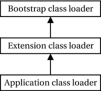
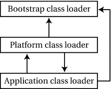

# 3. 反射

在本章中，你将学习：

*   什么是反射
*   什么是类加载器以及内置的类加载器
*   如何使用反射在运行时获取类、构造函数、方法等信息
*   如何使用反射访问对象和类的字段
*   如何使用反射创建类的对象
*   如何使用反射调用类的方法
*   如何使用反射创建数组

本章中的大多数示例程序都是`jdojo.reflection`模块的成员，如清单 3-1 所示。我在本章中使用了更多模块，稍后会展示。

```
// module-info.java
module jdojo.reflection {
exports com.jdojo.reflection;
}
清单 3-1.
jdojo.reflection 模块的声明
```


## 什么是反射？

反射是程序在执行过程中，能够“以数据形式”查询和修改自身状态的能力。程序查询或获取自身信息的能力称为**自省**。程序修改其执行状态、修改自身解释或含义，或在执行过程中为程序添加新行为的能力称为**互操作**。反射进一步分为两类：

*   结构反射
*   行为反射

程序查询其数据和代码实现的能力称为**结构自省**，而修改或创建新数据结构与代码的能力称为**结构互操作**。

程序获取其运行时环境信息的能力称为**行为自省**，而修改运行时环境的能力称为**行为互操作**。

为程序提供查询或修改自身状态的能力，需要一种将执行状态编码为数据的机制。换句话说，程序应能够将其执行状态表示为数据元素（如 Java 等面向对象语言中的对象），以便进行查询和修改。将执行状态编码为数据的过程称为**具体化**。如果一种编程语言为程序提供了反射能力，则称该语言为反射式语言。

## Java 中的反射

Java 对反射的支持主要限于自省。它仅以非常有限的形式支持互操作。Java 提供的自省功能允许你在运行时获取对象的类信息。Java 还允许你在运行时获取类的字段、方法、修饰符以及超类的信息。

Java 提供的互操作功能允许你创建名称在运行时才确定的类的实例，调用此类实例的方法，并获取/设置其字段。然而，Java 不允许你在运行时更改数据结构。例如，你不能在运行时为对象添加新字段或新方法。对象的所有字段始终在编译时确定。行为互操作的示例包括在运行时更改方法执行方式，或为类添加新方法。Java 不提供任何这些互操作功能。也就是说，你不能在运行时更改类的方法代码以改变其执行行为，也不能在运行时为类添加新方法。

Java 通过在运行时为类及其方法、构造函数、字段等提供对象表示来实现具体化。在大多数情况下，Java 不支持泛型类型的具体化。Java 5 增加了对泛型类型的支持。有关泛型类型的更多详细信息，请参阅第 4 章。程序可以操作具体化后的对象，以获取运行时执行的相关信息。例如，你一直在使用 `java.lang.Class` 类的对象来获取对象的类信息。`Class` 对象是对象类字节码的具体化。当你想要收集对象所属类的信息时，无需关心实例化该对象的类的字节码。相反，Java 将字节码具体化为 `Class` 类的对象。

Java 中的反射功能通过反射 API 提供。大多数反射 API 类和接口位于 `java.lang.reflect` 包中。`Class` 类是 Java 反射的核心，位于 `java.lang` 包中。表 3-1 列出了一些反射中常用的类。

表 3-1. 反射中常用的类

| 类名 | 描述 |
| --- | --- |
| `Class` | 此类的对象表示由 JVM 中的类加载器加载的单个类。 |
| `Field` | 此类的对象表示类或接口的单个字段。此对象表示的字段可以是静态字段或实例字段。 |
| `Constructor` | 此类的对象表示类的单个构造函数。 |
| `Method` | 此类的对象表示类或接口的方法。此对象表示的方法可以是类方法或实例方法。 |
| `Modifier` | 此类包含用于解码类及其成员访问修饰符的静态方法。 |
| `Parameter` | 此类的对象表示方法的参数。 |
| `Array` | 此类提供用于在运行时创建数组的静态方法。 |

使用 Java 中的反射功能，你可以执行以下操作：

*   如果你有对象引用，可以确定该对象的类名。
*   如果你有类名，可以了解其完整描述，例如包名、访问修饰符等。
*   如果你有类名，可以确定该类中定义的方法、它们的返回类型、访问修饰符、参数类型、参数名称等。对参数名称的支持是在 Java 8 中添加的。
*   如果你有类名，可以确定该类的所有字段描述。
*   如果你有类名，可以确定该类中定义的所有构造函数。
*   如果你有类名，可以使用其某个构造函数创建该类的对象。
*   如果你有对象引用，只需知道方法名称和方法参数类型，即可调用其方法。
*   你可以在运行时获取或设置对象的状态。
*   你可以在运行时动态创建某种类型的数组并操作其元素。

## 加载类

`Class<T>` 类是 Java 反射的核心。`Class<T>` 类是一个泛型类。它接受一个类型参数，该参数是 `Class` 对象所表示的类的类型。例如，`Class<String>` 表示 `String` 类的类对象。`Class<?>` 表示一个类类型未知的类。

`Class` 类让你能够在运行时发现关于一个类的所有信息。`Class` 类的对象在运行时表示程序中的一个类。当你在程序中创建对象时，Java 会加载该类的字节码，并创建一个 `Class` 类的对象来表示该字节码。Java 使用该 `Class` 对象来创建该类的任何对象。无论你在程序中创建某个类的多少个对象，对于 JVM 中某个类加载器从一个模块加载的每个类，Java 只会创建一个 `Class` 对象。来自某个模块的每个类也只会被特定的类加载器加载一次。在 JVM 中，一个类由其全限定名、类加载器和模块唯一标识。如果两个不同的类加载器加载了同一个类，则这两个被加载的类被视为两个不同的类，它们的对象彼此不兼容。

你可以通过以下方式之一获取某个类的 `Class` 对象的引用：

*   使用类字面常量
*   使用 `Object` 类的 `getClass()` 方法
*   使用 `Class` 类的 `forName()` 静态方法


### 使用类字面量

类字面量是指类名或接口名后跟一个点号和单词“class”。例如，如果你有一个类 `Test`，它的类字面量就是 `Test.class`，你可以这样写：

```
Class testClass = Test.class;
```

请注意，类字面量总是与类名一起使用，而不是与对象引用一起使用。以下获取类引用的语句是无效的：

```
Test t = new Test();
Class testClass = t.class; // 编译时错误。必须使用 Test.class
```

你还可以使用类字面量为基本数据类型和关键字 `void` 获取类对象，例如 `boolean.class`、`byte.class`、`char.class`、`short.class`、`int.class`、`long.class`、`float.class`、`double.class` 和 `void.class`。这些基本数据类型的每个包装类都有一个名为 `TYPE` 的静态字段，该字段持有其所表示的基本数据类型的类对象的引用。因此，`int.class` 和 `Integer.TYPE` 引用的是同一个类对象，表达式 `int.class == Integer.TYPE` 的计算结果为 `true`。表 3-2 展示了所有基本数据类型和 `void` 关键字的类字面量。

表 3-2.

基本数据类型和 void 关键字的类字面量

| 数据类型 | 基本类型类字面量 | 包装类静态字段 |
| --- | --- | --- |
| `boolean` | `boolean.class` | `Boolean.TYPE` |
| `byte` | `byte.class` | `Byte.TYPE` |
| `char` | `char.class` | `Character.TYPE` |
| `short` | `short.class` | `Short.TYPE` |
| `int` | `int.class` | `Integer.TYPE` |
| `long` | `long.class` | `Long.TYPE` |
| `float` | `float.class` | `Float.TYPE` |
| `double` | `double.class` | `Double.TYPE` |
| `void` | `void.class` | `Void.TYPE` |

### 使用 Object::getClass() 方法

`Object` 类包含一个 `getClass()` 方法，该方法返回对象所属类的 `Class` 对象的引用。由于 Java 中的每个类都显式或隐式地继承自 `Object` 类，因此该方法在 Java 的每个类中都可用。该方法被声明为 final，因此没有子类可以重写它。例如，如果你有一个指向 `Test` 类对象的引用 `testRef`，你可以按如下方式获取 `Test` 类的 `Class` 对象的引用：

```
Test testRef = new Test();
Class testClass = testRef.getClass();
```

### 使用 Class::forName() 方法

`Class` 类有一个 `forName()` 静态方法，该方法加载一个类并返回其 `Class` 对象的引用。它是一个重载方法。其声明如下：

*   `Class<?> forName(String className) throws ClassNotFoundException`
*   `Class<?> forName(String className, boolean initialize, ClassLoader loader) throws ClassNotFoundException`
*   `Class<?> forName(Module module, String className)`

`forName(String className)` 方法接受要加载的类的完全限定名。它加载该类，对其进行初始化，并返回其 `Class` 对象的引用。如果该类已加载，它仅返回该类的 `Class` 对象的引用。

`forName(String className, boolean initialize, ClassLoader loader)` 方法允许你选择在加载类时是否对其进行初始化，以及由哪个类加载器来加载该类。如果无法加载该类，前两个版本的方法会抛出 `ClassNotFoundException`。

`forName(Module module, String className)` 方法在指定的 `module` 中加载具有指定 `className` 的类，但不会初始化已加载的类。如果未找到该类，该方法返回 `null`。此方法是在 JDK9 中添加到 `Class` 类的。

要加载名为 `pkg1.Test` 的类，你可以这样写：

```
Class testClass = Class.forName("pkg1.Test");
```

使用 `forName()` 方法获取 `Class` 对象引用时，你无需在运行时之前知道类的名称。`forName(String className)` 方法会初始化该类（如果尚未初始化），而使用类字面量则不会初始化该类。当类被初始化时，其所有静态初始化器都会被执行，所有静态字段都会被初始化。清单 3-2 列出了一个仅包含一个静态初始化器的 `Bulb` 类，该初始化器会在控制台打印一条消息。清单 3-3 使用了多种方法来加载和初始化 `Bulb` 类。

```
// Bulb.java
package com.jdojo.reflection;
public class Bulb {
static {
// 当此类被加载和初始化时，此代码将执行
System.out.println("正在加载类 Bulb...");
}
}
清单 3-2.
用于演示类初始化的 Bulb 类
```

```
// BulbTest.java
package com.jdojo.reflection;
public class BulbTest {
public static void main(String[] args) {
/* 每次只取消注释以下语句之一。
观察输出，了解 Bulb 类被加载和初始化方式的差异。
*/
BulbTest.createObject();
// BulbTest.forNameVersion1();
// BulbTest.forNameVersion2();
// BulbTest.forNameVersion3();
// BulbTest.classLiteral();
}
public static void classLiteral() {
// 将加载该类，但不会初始化它。
Class c = Bulb.class;
}
public static void forNameVersion1() {
try {
String className = "com.jdojo.reflection.Bulb";
// 将加载并初始化该类
Class c = Class.forName(className);
} catch (ClassNotFoundException e) {
System.out.println(e.getMessage());
}
}
public static void forNameVersion2() {
try {
String className = "com.jdojo.reflection.Bulb";
boolean initialize = false;
// 获取当前类的类加载器
ClassLoader cLoader = BulbTest.class.getClassLoader();
// 将加载该类，但不会初始化它，因为我们已将
// initialize 变量设置为 false
Class c = Class.forName(className, initialize, cLoader);
} catch (ClassNotFoundException e) {
System.out.println(e.getMessage());
}
}
public static void forNameVersion3() {
String className = "com.jdojo.reflection.Bulb";
// 获取当前类的模块引用
Module m = BulbTest.class.getModule();
// 将加载该类，但不会初始化它
Class c = Class.forName(m, className);
if(c == null) {
System.out.println("Bulb 类未被加载。");
} else {
System.out.println("Bulb 类已被加载。");
}
}
public static void createObject() {
// 将加载并初始化 Bulb 类
new Bulb();
}
}
清单 3-3.
测试类的加载与初始化
```

```
正在加载类 Bulb...
```

## 类加载器

在运行时，每个类型都由一个类加载器加载，该类加载器由 `java.lang.ClassLoader` 类的一个实例表示。你可以通过使用 `Class` 类的 `getClassLoader()` 方法获取某个类型的类加载器的引用。以下代码片段展示了如何获取 `Bulb` 类的类加载器：

```
Class cls = Bulb.class;
ClassLoader loader = cls.getClassLoader();
```

类加载器在 JDK9 中发生了一些变化。然而，类加载和类加载器的代码行为在 JDK9 中保持不变。以下部分描述了 JDK8 和 JDK9 中的类加载器。


### JDK8 中的类加载器

在 JDK9 之前，运行时使用三个类加载器来加载类，如图 3-1 所示。箭头的方向表示委派方向。这些类加载器从不同的位置加载不同类型的类。你可以添加更多的类加载器，这些类加载器将是 `ClassLoader` 类的子类。使用自定义类加载器，你可以从自定义位置加载类、对用户代码进行分区以及卸载类。对于简单的应用程序，内置的类加载器就足够了。



图 3-1.

9 版本之前 JDK 中的类加载器层次结构

类加载器以层次结构方式工作——启动类加载器位于层次结构的顶部。一个类加载器将加载类的请求委派给其上级。例如，如果请求应用程序类加载器加载一个类，它会将该请求委派给扩展类加载器，而扩展类加载器又会将该请求委派给启动类加载器。如果启动类加载器无法加载该类，则扩展类加载器会尝试加载它。如果扩展类加载器无法加载该类，则应用程序类加载器会尝试加载它。如果应用程序类加载器也无法加载，则会抛出 `ClassNotFoundException`。

启动类加载器是扩展类加载器的父加载器。扩展类加载器是应用程序类加载器的父加载器。启动类加载器没有父加载器。默认情况下，应用程序类加载器将成为你创建的任何额外类加载器的父加载器。

提示

你可以通过使用 `ClassLoader` 类的 `getParent()` 方法来获取类加载器父加载器的引用。

启动类加载器加载构成 Java 平台的启动类，包括 `JAVA_HOME\lib\rt.jar` 和其他几个运行时 JAR 中的类。它完全在虚拟机中实现。你可以使用 `-Xbootclasspath/p` 和 `-Xbootclasspath/a` 命令行选项来前置和追加额外的启动目录。你可以使用 `-Xbootclasspath` 选项指定一个启动类路径，该路径将替换默认的启动类路径。在运行时，`sun.boot.class.path` 系统属性包含启动类路径的只读值。启动类加载器由 `null` 表示。也就是说，你无法获取其引用。例如，`Object` 类由启动类加载器加载，表达式 `Object.class.getClassLoader()` 返回 `null`。

扩展类加载器用于加载通过扩展机制可用的类，这些类位于由 `java.ext.dirs` 系统属性指定的目录中的 JAR 文件中。要获取扩展类加载器的引用，你需要获取应用程序类加载器的引用（见下一段），并在该引用上使用 `getParent()` 方法。

应用程序类加载器从应用程序类路径加载类，该路径由 `CLASSPATH` 环境变量或命令行选项 `-cp` 或 `-classpath` 指定。应用程序类加载器也称为系统类加载器，这种叫法有些用词不当，会让人误以为它加载系统类。你可以使用 `ClassLoader` 类的名为 `getSystemClassLoader()` 的静态方法来获取应用程序类加载器的引用。

### JDK9 中的类加载器

为了向后兼容，JDK9 保留了三级层次结构的类加载器架构。但是，它们从模块系统加载类的方式有一些变化。图 3-2 展示了 JDK9 的类加载器层次结构。



图 3-2.

JDK9 中的类加载器层次结构

请注意，在 JDK9 中，应用程序类加载器可以委派给平台类加载器以及启动类加载器；平台类加载器可以委派给应用程序类加载器。

在 JDK9 中，启动类加载器在库代码和虚拟机中实现。为了向后兼容，它在程序中仍然由 `null` 表示。例如，`Object.class.getClassLoader()` 仍然返回 `null`。并非所有 Java SE 平台和 JDK 模块都由启动类加载器加载。举几个例子，由启动类加载器加载的模块有 `java.base`、`java.logging`、`java.prefs` 和 `java.desktop`。其他 Java SE 平台和 JDK 模块由接下来要描述的平台类加载器和应用程序类加载器加载。用于指定启动类路径的选项 `-Xbootclasspath` 和 `-Xbootclasspath/p`，以及系统属性 `sun.boot.class.path`，在 JDK9 中不再受支持。`-Xbootclasspath/a` 选项仍然受支持，其值存储在系统属性 `jdk.boot.class.path.append` 中。

JDK9 不再支持扩展机制。但是，它保留了扩展类加载器，并赋予其一个新名称：平台类加载器。`ClassLoader` 类包含一个名为 `getPlatformClassLoader()` 的新静态方法，该方法返回平台类加载器的引用。表 3-3 列出了由平台类加载器加载的模块。

表 3-3.

JDK9 中由平台类加载器加载的 JDK 模块

| `java.activation` | `java.transaction` | `jdk.deploy` |
| --- | --- | --- |
| `java.compiler` | `java.xml.bind` | `jdk.dynalink` |
| `java.corba` | `java.xml.crypto` | `jdk.localedata` |
| `java.scripting` | `java.xml.ws` | `jdk.naming.dns` |
| `java.se` | `java.xml.ws.annotation` | `jdk.scripting.nashorn` |
| `java.se.ee` | `jdk.accessibility` | `jdk.security.auth` |
| `java.security.jgss` | `jdk.charsets` | `jdk.security.jgss` |
| `java.smartcardio` | `jdk.crypto.cryptoki` | `jdk.zipfs` |
| `java.sql` | `jdk.crypto.ec` |   |
| `java.sql.rowset` | `jdk.crypto.mscapi` |   |

平台类加载器还有另一个用途。由启动类加载器加载的类默认被授予所有权限。但是，有几个类并不需要所有权限。这些类在 JDK9 中已被降权，并由平台类加载器加载。

应用程序类加载器加载在模块路径上找到的应用程序模块，以及表 3-4 中列出的一些提供工具或导出工具 API 的 JDK 模块。在 JDK9 中，你仍然可以使用 `ClassLoader` 类的名为 `getSystemClassLoader()` 的静态方法来获取应用程序类加载器的引用。

表 3-4.

JDK9 中由应用程序类加载器加载的 JDK 模块

| `jdk.attach` | `jdk.internal.le` | `jdk.jdi` |
| --- | --- | --- |
| `jdk.compiler` | `jdk.internal.opt` | `jdk.jdwp.agent` |
| `jdk.editpad` | `jdk.jartool` | `jdk.jlink` |
| `jdk.internal.ed` | `jdk.javadoc` | `jdk.jshell` |
| `jdk.internal.jvmstat` | `jdk.jdeps` | `jdk.jstatd` |

提示

在 JDK9 之前，扩展类加载器和应用程序类加载器是 `java.net.URLClassLoader` 类的实例。在 JDK9 中，平台类加载器（即先前的扩展类加载器）和应用程序类加载器是内部 JDK 类的实例。如果你的代码依赖于 `URLClassLoader` 类特有的方法，你的代码在 JDK9 中可能会出错。


表 3-3 和表 3-4 中未列出的 JDK 模块由启动类加载器加载。清单 3-4 展示了如何打印模块名称及其类加载器名称。输出结果部分显示，具体内容取决于运行时解析的模块。若要打印所有 JDK 模块及其类加载器，应在运行此类之前，在模块声明中添加`"requires java.se.ee"`。我将在第 15 章讨论模块层。

```
// ModulesByClassLoader.java
package com.jdojo.reflection;
public class ModulesByClassLoader {
public static void main(String[] args) {
// 获取启动层
ModuleLayer layer = ModuleLayer.boot();
// 打印启动层中所有模块的名称及其类加载器名称
for (Module m : layer.modules()) {
ClassLoader loader = m.getClassLoader();
String moduleName = m.getName();
String loaderName = loader == null ? "bootstrap" : loader.getName();
System.out.printf("%s: %s%n", loaderName, moduleName);
}
}
}
清单 3-4.
按类加载器列出已加载模块的名称
```

```
platform: java.xml.ws
app: jdk.compiler
platform: java.transaction
platform: jdk.naming.dns
bootstrap: java.datatransfer
bootstrap: jdk.jfr
app: jdk.jlink
...
```

JDK9 中的类加载机制略有变化。三个内置类加载器协同工作以加载类。当应用类加载器需要加载一个类时，它会搜索所有类加载器定义的模块。如果某个合适的模块定义在这些类加载器之一中，则该类加载器会加载这个类，这意味着应用类加载器现在可以委托给启动类加载器和平台类加载器。如果在这些类加载器定义的命名模块中未找到类，应用类加载器会委托给其父加载器（即平台类加载器）。如果类仍未加载，应用类加载器会搜索类路径。如果在类路径上找到该类，则将其作为自身未命名模块的成员加载。如果在类路径上未找到该类，则会抛出`ClassNotFoundException`。

当平台类加载器需要加载一个类时，它会搜索所有类加载器定义的模块。如果某个合适的模块定义在这些类加载器之一中，则该类加载器会加载这个类，这意味着平台类加载器可以委托给启动类加载器以及应用类加载器。如果在这些类加载器定义的命名模块中未找到类，平台类加载器会委托给其父加载器（即启动类加载器）。

当启动类加载器需要加载一个类时，它会搜索自身的命名模块列表。如果未找到类，它会搜索通过命令行选项`-Xbootclasspath/a`指定的文件和目录列表。如果在启动类路径上找到类，则将其作为自身未命名模块的成员加载。如果仍未找到类，则会抛出`ClassNotFoundException`。

## 反射类

本节演示了 Java 反射的功能，使您能够获取类的描述信息，例如其包名、访问修饰符等。您将使用清单 3-5 中列出的`Person`类来演示反射特性。这是一个简单的类，包含两个实例字段、两个构造方法和一些方法。它实现了两个接口。

```
// Person.java
package com.jdojo.reflection;
import java.io.Serializable;
public class Person implements Cloneable, Serializable {
private int id = -1;
private String name = "Unknown";
public Person() {
}
public Person(int id, String name) {
this.id = id;
this.name = name;
}
public int getId() {
return id;
}
public String getName() {
return name;
}
public void setName(String name) {
this.name = name;
}
@Override
public Person clone() {
try {
return (Person) super.clone();
} catch (CloneNotSupportedException e) {
throw new RuntimeException(e.getMessage());
}
}
@Override
public String toString() {
return "Person: id=" + this.id + ", name=" + this.name;
}
}
清单 3-5.
用于演示反射的 Person 类
```

清单 3-6 演示了如何获取类的描述信息。它列出了类的访问修饰符、类名、其超类名称以及该类实现的所有接口。


```
// ClassReflection.java
package com.jdojo.reflection;
import java.lang.reflect.Modifier;
import java.lang.reflect.TypeVariable;
public class ClassReflection {
public static void main(String[] args) {
// 打印 Person 类的声明
String clsDecl = getClassDescription(Person.class);
System.out.println(clsDecl);
// 打印 Class 类的声明
clsDecl = getClassDescription(Class.class);
System.out.println(clsDecl);
// 打印 Runnable 接口的声明
clsDecl = getClassDescription(Runnable.class);
System.out.println(clsDecl);
// 打印表示 int 数据类型的类的声明
clsDecl = getClassDescription(int.class);
System.out.println(clsDecl);
}
public static String getClassDescription(Class cls) {
StringBuilder classDesc = new StringBuilder();
// 准备修饰符和构造关键字（class, enum, interface 等）
int modifierBits = 0;
String keyword = "";
// 添加关键字 @interface, interface 或 class
if (cls.isPrimitive()) {
// 我们不想添加任何内容
} else if (cls.isInterface()) {
modifierBits = cls.getModifiers() & Modifier.interfaceModifiers();
// 注解是一种接口
if (cls.isAnnotation()) {
keyword = "@interface";
} else {
keyword = "interface";
}
} else if (cls.isEnum()) {
modifierBits = cls.getModifiers() & Modifier.classModifiers();
keyword = "enum";
} else {
modifierBits = cls.getModifiers() & Modifier.classModifiers();
keyword = "class";
}
// 将修饰符转换为其字符串表示形式
String modifiers = Modifier.toString(modifierBits);
// 追加修饰符
classDesc.append(modifiers);
// 追加构造关键字
classDesc.append(" ");
classDesc.append(keyword);
// 追加简单名称
String simpleName = cls.getSimpleName();
classDesc.append(" ");
classDesc.append(simpleName);
// 追加泛型参数
String genericParms = getGenericTypeParams(cls);
classDesc.append(genericParms);
// 追加父类
Class superClass = cls.getSuperclass();
if (superClass != null) {
String superClassSimpleName = superClass.getSimpleName();
classDesc.append(" extends ");
classDesc.append(superClassSimpleName);
}
// 追加接口
String interfaces = ClassReflection.getClassInterfaces(cls);
if (interfaces != null) {
classDesc.append(" implements ");
classDesc.append(interfaces);
}
return classDesc.toString().trim();
}
public static String getClassInterfaces(Class cls) {
// 获取该类实现的接口列表，以逗号分隔
Class[] interfaces = cls.getInterfaces();
if (interfaces.length == 0) {
return null;
}
String[] names = new String[interfaces.length];
for (int i = 0; i < interfaces.length; i++) {
names[i] = interfaces[i].getSimpleName();
}
return String.join(", ", names);
}
public static String getGenericTypeParams(Class cls) {
StringBuilder sb = new StringBuilder();
TypeVariable[] typeParms = cls.getTypeParameters();
if (typeParms.length == 0) {
return "";
}
String[] paramNames = new String[typeParms.length];
for (int i = 0; i < typeParms.length; i++) {
paramNames[i] = typeParms[i].getName();
}
sb.append("<");
sb.append(String.join(",", paramNames));
sb.append('>');
return sb.toString();
}
}
清单 3-6.
反射一个类
```

```
public class Person extends Object implements Cloneable, Serializable
public final class Class extends Object implements Serializable, GenericDeclaration, Type, AnnotatedElement
public abstract interface Runnable
int
```

`Class` 类的 `getName()` 方法返回类的完全限定名。要获取类的简单名称，请使用 `Class` 类的 `getSimpleName()` 方法，如下所示：

```
String simpleName = c.getSimpleName();
```

类的修饰符是类声明中出现在关键字 `class` 之前的那些关键字。在以下示例中，`public` 和 `abstract` 是 `MyClass` 类的修饰符：

```
public abstract class MyClass {
// 代码写在这里
}
```

`Class` 类的 `getModifiers()` 方法返回该类的所有修饰符。请注意，`getModifiers()` 方法返回一个整数。要获取修饰符的文本形式，你需要调用 `Modifier` 类的 `toString(int modifiers)` 静态方法，并将修饰符值以整数形式传入。假设 `cls` 是一个 `Class` 对象的引用，你可以按如下方式获取该类的修饰符：

```
// 你需要将 getModifiers() 方法的返回值与
// Modifiers 类的 xxxModifiers() 方法返回的适当值进行按位与运算
int mod = cls.getModifiers() & Modifier.classModifiers();
String modStr = Modifier.toString(mod);
```

获取一个类的父类名称很简单。使用 `Class` 类的 `getSuperclass()` 方法来获取父类的引用。请注意，在 Java 中，除了 `Object` 类之外，每个类都有一个父类。如果在 `Object` 类上调用 `getSuperclass()` 方法，它将返回 `null`。

```
Class superClass = cls.getSuperclass();
if (superClass != null) {
String superClassName = superClass.getSimpleName();
}
```

提示

当 `Class` 类的 `getSuperclass()` 方法表示 `Object` 类、表示接口的类（例如 `List.class`）以及表示基本类型的类（例如 `int.class`、`void.class` 等）时，它会返回 `null`。

要获取一个类实现的所有接口的名称，你可以使用 `Class` 类的 `getInterfaces()` 方法。它返回一个 `Class` 对象数组。数组中的每个元素代表该类实现的一个接口。

```
// 获取 cls 实现的所有接口
Class[] interfaces = cls.getInterfaces();
```

`ClassReflection` 类的 `getClassDescription()` 方法将类声明的所有部分组合成一个字符串并返回该字符串。该类的 `main()` 方法演示了如何使用这个类。

注意

Java 8 在 `Class` 类中添加了一个名为 `toGenericString()` 的方法，该方法返回一个描述该类的字符串。该字符串包含该类的修饰符和类型参数。调用 `Person.class.toGenericString()` 将返回 `public class com.jdojo.reflection.Person`。


## 反射字段

类的字段由 `java.lang.reflect.Field` 类的对象表示。`Class` 类中的以下四个方法可用于获取类的字段信息：

*   `Field[] getFields()`
*   `Field[] getDeclaredFields()`
*   `Field getField(String name)`
*   `Field getDeclaredField(String name)`

`getFields()` 方法返回类或接口的所有可访问公共字段。可访问公共字段包括在类中声明或从其超类继承的公共字段。`getDeclaredFields()` 方法返回类声明中出现的所有字段。它不包括继承的字段。另外两个方法 `getField()` 和 `getDeclaredField()` 用于在你知道字段名称时获取 `Field` 对象。让我们考虑以下类 `A` 和 `B` 以及接口 `IConstants` 的声明：

```
interface IConstants {
int DAYS_IN_WEEK = 7;
}
class A implements IConstants {
private int aPrivate;
public int aPublic;
protected int aProtected;
}
class B extends A {
private int bPrivate;
public int bPublic;
protected int bProtected;
}
```

如果 `bClass` 是类 `B` 的 `Class` 对象的引用，则表达式 `bClass.getFields()` 将返回以下三个可访问且为 `public` 的字段：

*   `public int B.bPublic`
*   `public int A.aPublic`
*   `public static final int IConstants.DAYS_IN_WEEK`

`bClass.getDeclaredFields()` 方法将返回在类 `B` 中声明的三个字段：

*   `private int B.bPrivate`
*   `public int B.bPublic`
*   `protected int B.bProtected`

要获取一个类及其超类的所有字段，你必须使用 `getSuperclass()` 方法获取超类的引用，并组合使用这些方法。清单 3-7 演示了如何获取类的字段信息。请注意，当你在 `Person` 类的 `Class` 对象上调用 `getFields()` 方法时，你不会得到任何东西，因为 `Person` 类不包含任何 `public` 字段。

```
// FieldReflection.java
package com.jdojo.reflection;
import java.lang.reflect.Field;
import java.lang.reflect.Modifier;
import java.util.ArrayList;
public class FieldReflection {
public static void main(String[] args) {
Class cls = Person.class;
// 打印声明的字段
ArrayList fieldsDescription = getDeclaredFieldsList(cls);
System.out.println("Declared Fields for " + cls.getName());
for (String desc : fieldsDescription) {
System.out.println(desc);
}
// 获取可访问的公共字段
fieldsDescription = getFieldsList(cls);
System.out.println("\nAccessible Fields for " + cls.getName());
for (String desc : fieldsDescription) {
System.out.println(desc);
}
}
public static ArrayList getFieldsList(Class c) {
Field[] fields = c.getFields();
ArrayList fieldsList = getFieldsDescription(fields);
return fieldsList;
}
public static ArrayList getDeclaredFieldsList(Class c) {
Field[] fields = c.getDeclaredFields();
ArrayList fieldsList = getFieldsDescription(fields);
return fieldsList;
}
public static ArrayList getFieldsDescription(Field[] fields) {
ArrayList fieldList = new ArrayList();
for (Field f : fields) {
// 获取字段的修饰符
int mod = f.getModifiers() & Modifier.fieldModifiers();
String modifiers = Modifier.toString(mod);
// 获取字段类型的简单名称
Class type = f.getType();
String typeName = type.getSimpleName();
// 获取字段的名称
String fieldName = f.getName();
fieldList.add(modifiers + " " + typeName + " " + fieldName);
}
return fieldList;
}
}
清单 3-7.
反射类的字段
```

```
Declared Fields for com.jdojo.reflection.Person
private int id
private String name
Accessible Fields for com.jdojo.reflection.Person
```

提示

你不能使用此技术来描述数组对象的 `length` 字段。每个数组类型都有一个对应的类。当你尝试使用 `getFields()` 方法获取数组类的字段时，你会得到一个长度为零的 `Field` 对象数组。数组长度不是数组类定义的一部分。相反，它作为数组对象的一部分存储在对象头中。有关数组 `length` 字段的更多信息，请参阅第 11 章。

## 反射可执行对象

`Method` 类的实例表示一个方法。`Constructor` 类的实例表示一个构造器。在结构上，方法和构造器有一些共同点。两者都使用修饰符、参数和 `throws` 子句。两者都可以被执行。Java 8 重构了这些类，使它们继承自一个共同的抽象超类 `Executable`。用于检索两者共有信息的方法已被添加/移动到 `Executable` 类中。

`Executable` 中的参数由 `Parameter` 类的对象表示，该类是在 Java 8 中添加的。`Executable` 类中的 `getParameters()` 方法返回一个 `Executable` 的所有参数 `Parameter[]`。默认情况下，形式参数名称不会存储在类文件中以保持文件大小较小。除非保留了实际参数名称，否则 `Parameter` 类的 `getName()` 方法会返回合成的参数名称，如 `arg0`、`arg1` 等。如果要在类文件中保留实际参数名称，则需要使用 `javac` 编译器的 `-parameters` 选项编译源代码。

`Executable` 类的 `getExceptionTypes()` 方法返回一个 `Class` 对象数组，该数组描述了 `Executable` 抛出的异常。如果 `throws` 子句中未列出任何异常，则返回一个长度为零的数组。

`Executable` 类的 `getModifiers()` 方法将修饰符作为 `int` 返回。

`Executable` 类的 `getTypeParameters()` 方法返回一个 `TypeVariable` 数组，该数组表示泛型方法/构造器的类型参数。本章中的示例不包括方法/构造器中的泛型类型变量声明。

清单 3-8 包含一个工具类，该类由静态方法组成，用于获取 `Executable` 的信息，例如修饰符、参数和异常列表。在后续章节中讨论方法和构造器时，我将使用此类。

```
// ExecutableUtil.java
package com.jdojo.reflection;
import java.lang.reflect.Constructor;
import java.lang.reflect.Executable;
import java.lang.reflect.Method;
import java.lang.reflect.Modifier;
import java.lang.reflect.Parameter;
import java.util.ArrayList;
public class ExecutableUtil {
public static ArrayList getParameters(Executable exec) {
Parameter[] parms = exec.getParameters();
ArrayList parmList = new ArrayList();
for (int i = 0; i  getExceptionList(Executable exec) {
ArrayList exceptionList = new ArrayList();
for (Class c : exec.getExceptionTypes()) {
exceptionList.add(c.getSimpleName());
}
return exceptionList;
}
public static String getThrowsClause(Executable exec) {
ArrayList exceptionList = getExceptionList(exec);
String exceptions = ExecutableUtil.arrayListToString(exceptionList, ",");
String throwsClause = "";
if (exceptionList.size() > 0) {
throwsClause = "throws " + exceptions;
}
return throwsClause;
}
public static String getModifiers(Executable exec) {
// 获取类的修饰符
int mod = exec.getModifiers();
if (exec instanceof Method) {
mod = mod & Modifier.methodModifiers();
} else if (exec instanceof Constructor) {
mod = mod & Modifier.constructorModifiers();
}
return Modifier.toString(mod);
}
public static String arrayListToString(ArrayList list, String saparator) {
String[] tempArray = new String[list.size()];
tempArray = list.toArray(tempArray);
String str = String.join(saparator, tempArray);
return str;
}
}
清单 3-8.
用于获取可执行对象信息的工具类
```


### 反思方法

`Class` 类中的以下四种方法可用于获取类的方法信息：

*   `Method[] getMethods()`
*   `Method[] getDeclaredMethods()`
*   `Method getMethod(String name, Class... parameterTypes)`
*   `Method getDeclaredMethod(String name, Class... parameterTypes)`

`getMethods()` 方法返回该类所有可访问的公共方法。可访问的公共方法包括在该类中声明的或从超类继承的任何公共方法。`getDeclaredMethods()` 方法仅返回在该类中声明的所有方法。它不会返回任何从超类继承的方法。另外两个方法 `getMethod()` 和 `getDeclaredMethod()` 用于在你知道方法名称及其参数类型时获取 `Method` 对象。

`Method` 类的 `getReturnType()` 方法返回 `Class` 对象，该对象包含有关方法返回类型的信息。

清单 3-9 演示了如何获取类的方法信息。你可以取消注释 `main()` 方法中的代码，以打印 `Person` 类中的所有方法——包括在 `Person` 类中声明的和从 `Object` 类继承的。

```
// MethodReflection.java
package com.jdojo.reflection;
import java.lang.reflect.Method;
import java.util.ArrayList;
public class MethodReflection {
public static void main(String[] args) {
Class cls = Person.class;
// 获取声明的方法
ArrayList methodsDescription = getDeclaredMethodsList(cls);
System.out.println("Declared Methods for " + cls.getName());
for (String desc : methodsDescription) {
System.out.println(desc);
}
/* 取消注释以下代码以打印 Person 类中的所有方法
// 获取可访问的公共方法
methodsDescription = getMethodsList(c);
System.out.println("\nMethods for " + c.getName());
for (String desc : methodsDescription) {
System.out.println(desc);
}
*/
}
public static ArrayList getMethodsList(Class c) {
Method[] methods = c.getMethods();
ArrayList methodsList = getMethodsDescription(methods);
return methodsList;
}
public static ArrayList getDeclaredMethodsList(Class c) {
Method[] methods = c.getDeclaredMethods();
ArrayList methodsList = getMethodsDescription(methods);
return methodsList;
}
public static ArrayList getMethodsDescription(Method[] methods) {
ArrayList methodList = new ArrayList();
for (Method m : methods) {
String modifiers = ExecutableUtil.getModifiers(m);
// 获取方法返回类型
Class returnType = m.getReturnType();
String returnTypeName = returnType.getSimpleName();
// 获取方法名称
String methodName = m.getName();
// 获取方法的参数
ArrayList paramsList = ExecutableUtil.getParameters(m);
String params = ExecutableUtil.arrayListToString(paramsList, ",");
// 获取方法抛出的异常
String throwsClause = ExecutableUtil.getThrowsClause(m);
methodList.add(modifiers + " " + returnTypeName + " "
+ methodName + "(" + params + ") " + throwsClause);
}
return methodList;
}
}
清单 3-9.
反思类的方法
```

```
Declared Methods for com.jdojo.reflection.Person
public String toString()
public Object clone()
public String getName()
public int getId()
public void setName(String arg0)
```

### 反思构造器

获取类的构造器信息与获取类的方法信息类似。`Class` 类中的以下四种方法用于获取由 `Class` 对象表示的构造器的信息：

*   `Constructor[] getConstructors()`
*   `Constructor[] getDeclaredConstructors()`
*   `Constructor<T> getConstructor(Class... parameterTypes)`
*   `Constructor<T> getDeclaredConstructor(Class... parameterTypes)`

`getConstructors()` 方法返回所有公共构造器。`getDeclaredConstructors()` 方法返回所有声明的构造器。另外两个方法 `getConstructor()` 和 `getDeclaredConstructor()` 用于在你知道构造器的参数类型时获取 `Constructor` 对象。清单 3-10 演示了如何获取由 `Class` 对象表示的构造器的信息。

```
// ConstructorReflection.java
package com.jdojo.reflection;
import java.lang.reflect.Constructor;
import java.util.ArrayList;
public class ConstructorReflection {
public static void main(String[] args) {
Class cls = Person.class;
// 获取声明的构造器
System.out.println("Constructors for " + cls.getName());
Constructor[] constructors = cls.getConstructors();
ArrayList constructDescList = getConstructorsDescription(constructors);
for (String desc : constructDescList) {
System.out.println(desc);
}
}
public static ArrayList getConstructorsDescription(Constructor[] constructors) {
ArrayList constructorList = new ArrayList();
for (Constructor constructor : constructors) {
String modifiers = ExecutableUtil.getModifiers(constructor);
// 获取构造器名称
String constructorName = constructor.getName();
// 获取构造器的参数
ArrayList paramsList
= ExecutableUtil.getParameters(constructor);
String params = ExecutableUtil.arrayListToString(paramsList, ",");
// 获取构造器抛出的异常
String throwsClause = ExecutableUtil.getThrowsClause(constructor);
constructorList.add(modifiers + " " + constructorName
+ "(" + params + ") " + throwsClause);
}
return constructorList;
}
}
清单 3-10.
反思类的构造器
```

```
Constructors for com.jdojo.reflection.Person
public com.jdojo.reflection.Person()
public com.jdojo.reflection.Person(int arg0,String arg1)
```


## 创建对象

Java 允许你使用反射来创建类的对象。类名无需在编译时确定，直到运行时才需要知道。你可以通过反射调用类的某个构造方法来创建对象。你还可以访问对象字段的值、设置字段的值以及调用对象的方法。如果你在编译时已知类名并且可以访问该类代码，请不要使用反射来创建其对象；而应在代码中使用 `new` 运算符来创建该类的对象。通常，框架和库会使用反射来创建对象。

你可以使用反射创建类的对象。在创建对象之前，需要获取构造方法的引用。上一节展示了如何获取类的特定构造方法的引用。使用 `Constructor` 类的 `newInstance()` 方法来创建对象。你可以将构造方法的实际参数传递给 `newInstance()` 方法，该方法声明如下：

```
public T newInstance(Object... initargs) throws InstantiationException, IllegalAccessException, IllegalArgumentException, InvocationTargetException
```

这里，`initargs` 是构造方法的实际参数。对于无参构造方法，你不会传递任何参数。

提示

`Class` 类的 `newInstance()` 方法使用类的无参构造方法创建该类的新对象。该方法自 JDK9 起已被弃用，因为它不能正确传播无参构造方法抛出的异常。请使用 `Constructor` 类的 `newInstance()` 方法，通过无参构造方法以及所有其他构造方法来创建类的对象。

以下代码片段获取了 `Person` 类的无参构造方法的引用并调用了它。为简洁起见，我省略了异常处理：

```
Class cls = Person.class;
// 获取 Person() 构造方法的引用
Constructor noArgsCons = cls.getConstructor();
Person p = noArgsCons.newInstance();
```

清单 3-11 包含了完整代码，演示如何使用 `Person` 类的 `Person(int, String)` 构造方法通过反射创建一个 `Person` 对象。请注意，`Constructor<T>` 类是一个泛型类型。其类型参数是声明该构造方法的类类型，例如，`Constructor<Person>` 类型表示 `Person` 类的一个构造方法。

```
// InvokeConstructorTest.java
package com.jdojo.reflection;
import java.lang.reflect.Constructor;
import java.lang.reflect.InvocationTargetException;
public class InvokeConstructorTest {
public static void main(String[] args) {
Class personClass = Person.class;
try {
// 获取构造方法 "Person(int, String)"
Constructor cons = personClass.getConstructor(int.class, String.class);
// 使用 id 和 name 的值调用构造方法
Person chris = cons.newInstance(1994, "Chris");
System.out.println(chris);
} catch (NoSuchMethodException | SecurityException
| InstantiationException | IllegalAccessException
| IllegalArgumentException | InvocationTargetException e) {
System.out.println(e.getMessage());
}
}
}
清单 3-11.
使用特定构造方法创建新对象
```

```
Person: id=1994, name=Chris
```

## 调用方法

你可以使用反射调用对象的方法。你需要获取要调用的方法的引用。假设你想调用 `Person` 类的 `setName()` 方法。你可以按如下方式获取 `setName()` 方法的引用：

```
Class personClass = Person.class;
Method setName = personClass.getMethod("setName", String.class);
```

要调用此方法，请在方法的引用上调用 `invoke()` 方法，该方法声明如下：

```
public Object invoke(Object obj, Object... args) throws IllegalAccessException, lllegalArgumentException, InvocationTargetException
```

`invoke()` 方法的第一个参数是你想要调用该方法的对象。如果 `Method` 对象表示一个静态方法，则第一个参数会被忽略，或者可以为 `null`。第二个参数是一个可变参数，你可以在其中按照方法声明中声明的顺序传递所有实际参数。

由于 `Person` 类的 `setName()` 方法接受一个 `String` 参数，你需要将一个 `String` 对象作为第二个参数传递给 `invoke()` 方法。清单 3-12 演示了如何使用反射在 `Person` 对象上调用方法。

```
// InvokeMethodTest.java
package com.jdojo.reflection;
import java.lang.reflect.InvocationTargetException;
import java.lang.reflect.Method;
public class InvokeMethodTest {
public static void main(String[] args) {
Class personClass = Person.class;
try {
// 创建 Person 类的对象
Person p = personClass.newInstance();
// 打印 Person 对象的详细信息
System.out.println(p);
// 获取 setName() 方法的引用
Method setName = personClass.getMethod("setName", String.class);
// 在 p 上调用 setName() 方法，并传递 "Ann" 作为实际参数
setName.invoke(p, "Ann");
// 打印 Person 对象的详细信息
System.out.println(p);
} catch (InstantiationException | IllegalAccessException
| NoSuchMethodException | SecurityException
| IllegalArgumentException | InvocationTargetException e) {
System.out.println(e.getMessage());
}
}
}
清单 3-12.
使用反射在对象引用上调用方法
```

```
Person: id=-1, name=Unknown
Person: id=-1, name=Ann
```


## 访问字段

你可以使用反射来读取或设置对象字段的值。首先，需要获取要操作的字段的引用。要读取字段的值，需要在字段上调用 `getXxx()` 方法，其中 `Xxx` 是字段的数据类型。例如，要读取一个 `boolean` 字段的值，可以调用 `getBoolean()` 方法；要读取一个 `int` 字段，则调用 `getInt()` 方法。要设置字段的值，需要调用相应的 `setXxx()` 方法。以下是 `getInt()` 和 `setInt()` 方法的声明，其中第一个参数 `obj` 是正在被读取或写入字段的对象引用：

*   `int getInt(Object obj) throws IllegalArgumentException, IllegalAccessException`
*   `void setInt(Object obj, int newValue) throws IllegalArgumentException, IllegalAccessException`

提示

静态字段和实例字段的访问方式相同。对于静态字段，`get()` 和 `set()` 方法的第一个参数是类/接口的引用。

请注意，你只能访问那些被声明为可访问的字段，例如公共字段。在 `Person` 类中，所有字段都被声明为私有。因此，你不能使用常规的 Java 编程语言规则来访问这些字段。要访问通常不可访问的字段（例如，如果它被声明为 `private`），请参考本章后面的“深度反射”部分。你将使用清单 3-13 中列出的 `PublicPerson` 类来学习访问字段的技术。

```
// PublicPerson.java
package com.jdojo.reflection;
public class PublicPerson {
private int id = -1;
public String name = "Unknown";
public PublicPerson() {
}
@Override
public String toString() {
return "Person: id=" + this.id + ", name=" + this.name;
}
}
清单 3-13.
一个具有公共名称字段的 PublicPerson 类
```

清单 3-14 演示了如何获取对象字段的引用以及如何读取和设置其值。

```
// FieldAccessTest.java
package com.jdojo.reflection;
import java.lang.reflect.Field;
public class FieldAccessTest {
public static void main(String[] args) {
Class ppClass = PublicPerson.class;
try {
// 创建一个 PublicPerson 类的对象
PublicPerson p = ppClass.newInstance();
// 获取 name 字段的引用
Field name = ppClass.getField("name");
// 获取并打印 name 字段的当前值
String nameValue = (String) name.get(p);
System.out.println("Current name is " + nameValue);
// 将 name 的值设置为 Ann
name.set(p, "Ann");
// 获取并打印 name 字段的新值
nameValue = (String) name.get(p);
System.out.println("New name is " + nameValue);
} catch (InstantiationException | IllegalAccessException
| NoSuchFieldException | SecurityException
| IllegalArgumentException e) {
System.out.println(e.getMessage());
}
}
}
清单 3-14.
使用反射访问字段
```

```
Current name is Unknown
New name is Ann
```

## 深度反射

使用反射可以完成两件事：

*   描述一个实体
*   访问实体的成员

描述一个实体意味着了解该实体的详细信息。例如，描述一个类意味着知道它的名称、修饰符、包、模块、字段、方法和构造器。访问实体的成员意味着读写字段以及调用方法和构造器。描述实体不会带来任何访问控制问题。如果你有权访问一个类文件，就应该能够了解该类文件所代表的实体的详细信息。然而，访问实体的成员受到 Java 语言访问控制的约束。例如，如果你将一个类的字段声明为私有，则该字段只能在该类内部访问。类外部的代码不应该能够访问该类的私有字段。然而，这只说对了一半。当你静态访问成员时，会应用 Java 语言访问控制规则。当你使用反射访问成员时，可以抑制这些访问控制规则。以下代码片段访问了 `Person` 类的私有 `name` 字段。这段代码只能在 `Person` 类内部编译：

```
Person john = new Person();
String name = john.name; // 静态访问私有字段 name
```

Java 一直允许使用反射在类外部访问那些相当不可访问的成员，例如类的私有字段。这被称为**深度反射**。对不可访问成员的反射访问使得在 Java 中拥有许多优秀的框架成为可能，例如 Hibernate 和 Spring。这些框架大部分工作都是通过深度反射完成的。你可以使用深度反射在 `Person` 类外部访问 `Person` 类的私有 `name` 字段。

到目前为止，在本章中，我保持了示例的简单性，并避免违反 Java 语言访问控制。我只访问了公共字段、方法和构造器；被访问的成员和访问代码位于同一个模块中。在 JDK9 之前，访问不可访问的成员很容易。你所要做的就是在访问不可访问的 `Field`、`Method` 和 `Constructor` 对象之前，调用它们的 `setAccessible(true)` 方法。JDK9 中引入的模块系统使得深度反射变得稍微复杂一些。在本节及其子节中，我将带你了解 JDK9 中深度反射的规则和示例。

提示

如果存在安全管理器，执行深度反射的代码必须具有 `ReflectPermission("suppressAccessChecks")` 权限。

要执行深度反射，你需要使用 `Class` 对象的 `getDeclaredXxx()` 方法获取所需字段、方法和构造器的引用，其中 `Xxx` 可以是 `Field`、`Method` 或 `Constructor`……请注意，使用 `getXxx()` 方法获取不可访问字段、方法或构造器的引用会抛出 `IllegalAccessException`。`Field`、`Method` 和 `Constructor` 类都以 `AccessibleObject` 类作为其超类。`AccessibleObject` 类包含以下方法，让你能够处理 `accessible` 标志：

*   `void setAccessible(boolean flag)`
*   `static void setAccessible(AccessibleObject[] array,  boolean flag)`
*   `boolean trySetAccessible()`
*   `boolean canAccess(Object obj)`

`setAccessible(boolean flag)` 方法将成员（`Field`、`Method` 和 `Constructor`）的 `accessible` 标志设置为 `true` 或 `false`。如果你试图访问一个不可访问的成员，需要在访问该成员之前，在该成员对象上调用 `setAccessible(true)`。如果无法设置 `accessible` 标志，该方法会抛出 `InaccessibleObjectException`。静态方法 `setAccessible(AccessibleObject[] array,  boolean flag)` 是一个便捷方法，用于设置指定数组中所有 `AccessibleObject` 的 accessible 标志。

JDK9 添加了 `trySetAccessible()` 方法，该方法尝试在其调用的对象上将 `accessible` 标志设置为 `true`。如果 `accessible` 标志被成功设置为 `true`，则返回 `true`，否则返回 `false`。将此方法与 `setAccessible(true)` 方法进行比较。此方法在失败时不会抛出运行时异常，而 `setAccessible(true)` 会。

JDK9 添加了 `canAccess(Object obj)` 方法，如果调用者能够访问指定 `obj` 对象的成员，则返回 `true`。否则，返回 `false`。如果成员是静态成员或构造器，则 `obj` 必须为 `null`。

我将在接下来的章节中讨论在模块内、跨模块、在未命名模块中以及访问 JDK 模块中那些相当不可访问的成员。


### 模块内的深度反射

我们先从一个例子开始。假设你想访问 `Person` 对象的私有 `name` 字段。首先，你获取 `name` 字段在 `Field` 对象中的引用，并尝试读取其当前值。清单 3-15 包含了 `IllegalAccess1` 类的代码。

```
// IllegalAccess1.java
package com.jdojo.reflection;
import java.lang.reflect.Constructor;
import java.lang.reflect.Field;
public class IllegalAccess1 {
public static void main(String[] args) throws Exception {
// 获取 Person 类的类引用
String className = "com.jdojo.reflection.Person";
Class cls = Class.forName(className);
// 创建一个 Person 对象
Constructor cons = cls.getConstructor();
Object person = cons.newInstance();
// 获取 name 字段的引用
Field nameField = cls.getDeclaredField("name");
// 尝试通过读取其值来访问 name 字段
String name = (String) nameField.get(person);
// 分别打印 person 对象及其 name
System.out.println(person);
System.out.println("name=" + name);
}
}
清单 3-15.
访问 Person 类的私有 name 字段
```

```
Exception in thread "main" java.lang.IllegalAccessException: class com.jdojo.reflection.IllegalAccess1 (in module jdojo.reflection) cannot access a member of class com.jdojo.reflection.Person (in module jdojo.reflection) with modifiers "private"
at java.base/jdk.internal.reflect.Reflection.newIllegalAccessException(Reflection.java:361)
at java.base/java.lang.reflect.AccessibleObject.checkAccess(AccessibleObject.java:589)
at java.base/java.lang.reflect.Field.checkAccess(Field.java:1075)
at java.base/java.lang.reflect.Field.get(Field.java:416)
at jdojo.reflection/com.jdojo.reflection.IllegalAccess1.main(IllegalAccess1.java:21)
```

在清单 3-15 中，我将 `Exception` 类添加到了 `main()` 方法的 `throws` 子句中，以保持方法内部逻辑的简洁。在本节的所有示例中，我都会这样做，以便你能专注于非法访问规则，而不是异常处理。`IllegalAccess1` 类和 `Person` 类位于同一个 `jdojo.reflection` 模块中。你能够成功创建 `Person` 对象，是因为你使用了 `Person` 类的公共无参构造器。`Person` 类中的 `name` 字段被声明为私有，因此从另一个类访问它失败了。修复这个错误很简单——你可以使用 `setAccessible(true)` 或 `trySetAccessible()` 方法将 `Field` 对象的 accessible 标志设置为 `true`。清单 3-16 包含了完整的代码。

```
// IllegalAccess1.java
package com.jdojo.reflection;
import java.lang.reflect.Constructor;
import java.lang.reflect.Field;
public class IllegalAccess2 {
public static void main(String[] args) throws Exception {
// 获取 Person 类的类引用
String className = "com.jdojo.reflection.Person";
Class cls = Class.forName(className);
// 创建一个 Person 对象
Constructor cons = cls.getConstructor();
Object person = cons.newInstance();
// 获取 name 字段的引用
Field nameField = cls.getDeclaredField("name");
// 在访问之前尝试使 name 字段可访问
boolean accessEnabled = nameField.trySetAccessible();
if (accessEnabled) {
// 尝试通过读取其值来访问 name 字段
String name = (String) nameField.get(person);
// 分别打印 person 对象及其 name
System.out.println(person);
System.out.println("name=" + name);
} else {
System.out.println("Person.name 字段不可访问。");
}
}
}
清单 3-16.
在使 Person 类的私有 name 字段可访问后访问它
```

```
Person: id=-1, name=Unknown
name=Unknown
```

到目前为止，一切看起来都正常。你可能会想，如果你无法访问一个类的私有成员，你总是可以使用反射来访问它们。然而，这并不总是正确的。对类中原本不可访问成员的访问是通过 Java 安全管理器来处理的。默认情况下，当你在自己的计算机上运行应用程序时，你的应用程序并没有安装安全管理器。应用程序缺少安全管理器，使得你在将 accessible 标志设置为 `true` 后（就像你在上一个示例中所做的那样），可以访问同一模块中一个类的所有字段、方法和构造器。但是，如果你的应用程序安装了安全管理器，你是否能访问一个不可访问的类成员，则取决于你的应用程序被授予了访问此类成员的权限。你可以通过以下代码片段来检查你的应用程序是否安装了安全管理器：

```
SecurityManager smgr = System.getSecurityManager();
if (smgr == null) {
System.out.println("安全管理器未安装。");
}
```

你可以在运行 Java 应用程序时，在命令行中传递 `-Djava.security.manager` 选项来安装一个默认的安全管理器。安全管理器使用 Java 安全策略文件来强制执行该策略文件中指定的规则。Java 安全策略文件通过 `-Djava.security.policy` 命令行选项来指定。如果你想在启用了 Java 安全管理器的情况下运行 `IllegalAccess2` 类，并且 Java 策略文件存储在 `C:\Java9LanguageFetaures\conf\myjava.policy` 文件中，你可以使用以下命令：

```
C:\Java9LanguageFeatures>java -Djava.security.manager
-Djava.security.policy=conf\myjava.policy --module-path build\modules\jdojo.reflection
--module jdojo.reflection/com.jdojo.reflection.IllegalAccess2
```

```
Exception in thread "main" java.security.AccessControlException: access denied ("java.lang.reflect.ReflectPermission" "suppressAccessChecks")
at java.base/java.security.AccessControlContext.checkPermission(AccessControlContext.java:472)
at java.base/java.security.AccessController.checkPermission(AccessController.java:895)
at java.base/java.lang.SecurityManager.checkPermission(SecurityManager.java:558)
at java.base/java.lang.reflect.AccessibleObject.checkPermission(AccessibleObject.java:85)
at java.base/java.lang.reflect.AccessibleObject.trySetAccessible(AccessibleObject.java:245)
at jdojo.reflection/com.jdojo.reflection.IllegalAccess2.main(IllegalAccess2.java:26)
```

运行此命令时，`myjava.policy` 文件是空的，这意味着应用程序没有权限来抑制 Java 语言访问控制。

如果你希望允许你的程序使用反射访问一个类的不可访问字段，`myjava.policy` 文件的内容应如清单 3-17 所示。

```
grant {
// 授予所有程序访问不可访问成员的权限
permission java.lang.reflect.ReflectPermission "suppressAccessChecks";
};
清单 3-17.
conf\myjava.policy 文件的内容
```

让我们在启用了安全管理器和清单 3-17 所示的 Java 策略的情况下，重新运行 `IllegalAccess2` 类：

```
C:\Java9LanguageFeatures>java -Djava.security.manager
-Djava.security.policy=conf\myjava.policy
--module-path build\modules\jdojo.reflection
--module jdojo.reflection/com.jdojo.reflection.IllegalAccess2
```

```
Person: id=-1, name=Unknown
name=Unknown
```

这一次，当你授予了适当的安全权限后，你成功访问了 `Person` 类的私有 `name` 字段。关于访问不可访问成员的规则才刚刚开始。你已经了解了在同一个模块内，当进行非法访问的代码和被非法访问的代码位于同一模块时，深度反射的规则。下一节将描述跨模块的非法访问行为。


### 跨模块深度反射

让我们创建一个名为 `jdojo.reflection.model` 的新模块，如清单 3-18 所示，并在其中创建一个名为 `Phone` 的简单类，如清单 3-19 所示。该模块声明中不包含任何模块语句。`Phone` 类包含一个 `number` 实例变量、两个构造方法，以及 `number` 实例变量的 getter 和 setter 方法。`toString()` 方法返回电话号码。

```
// module-info.java
module jdojo.reflection.model {
// 目前没有模块语句
}
清单 3-18.
jdojo.reflection.model 模块的声明
```

```
// Phone.java
package com.jdojo.reflection.model;
public class Phone {
private String number = "9999999999";
public Phone() {
}
public Phone(String number) {
this.number = number;
}
public String getNumber() {
return number;
}
public void setNumber(String number) {
this.number = number;
}
@Override
public String toString() {
return this.number;
}
}
清单 3-19.
Phone 类
```

让我们在 `jdojo.reflection` 模块中创建一个名为 `IllegalAccess3` 的类。该类将尝试在 `jdojo.reflection.model` 模块中创建 `Phone` 类的对象，并读取该对象的私有字段 `number`。清单 3-20 中的 `IllegalAccess3` 类包含了完整的代码。它与 `IllegalAccess2` 类非常相似。唯一的区别在于，你正在跨模块边界访问 `Phone` 类及其私有实例变量。

```
// IllegalAccess1.java
package com.jdojo.reflection;
import java.lang.reflect.Constructor;
import java.lang.reflect.Field;
public class IllegalAccess3 {
public static void main(String[] args) throws Exception {
// 获取 Phone 类的类引用
String className = "com.jdojo.reflection.model.Phone";
Class cls = Class.forName(className);
// 创建一个 Phone 对象
Constructor cons = cls.getConstructor();
Object phone = cons.newInstance();
// 获取 number 字段的引用
Field numberField = cls.getDeclaredField("number");
// 尝试在访问前使 number 字段可访问
boolean accessEnabled = numberField.trySetAccessible();
if (accessEnabled) {
// 尝试通过读取其值来访问 number 字段
String number = (String) numberField.get(phone);
// 打印电话号码
System.out.println("number=" + number);
} else {
System.out.println("Phone.number 字段不可访问。");
}
}
}
清单 3-20.
访问 Phone 类的私有 number 字段
```

让我们使用以下命令运行 `IllegalAccess3` 类：

```
C:\Java9LanguageFeatures>java
--module-path build\modules\jdojo.reflection;build\modules\jdojo.reflection.model
--module jdojo.reflection/com.jdojo.reflection.IllegalAccess3
```

```
Exception in thread "main" java.lang.ClassNotFoundException: com.jdojo.reflection.model.Phone
at java.base/jdk.internal.loader.BuiltinClassLoader.loadClass(BuiltinClassLoader.java:582)
at java.base/jdk.internal.loader.ClassLoaders$AppClassLoader.loadClass(ClassLoaders.java:185)
at java.base/java.lang.ClassLoader.loadClass(ClassLoader.java:496)
at java.base/java.lang.Class.forName0(Native Method)
at java.base/java.lang.Class.forName(Class.java:292)
at jdoj9o.reflection/com.jdojo.reflection.IllegalAccess3.main(IllegalAccess3.java:11)
```

你能猜出这个命令有什么问题吗？错误提示运行时未找到 `Phone` 类。你能够编译 `IllegalAccess3` 类，是因为该类在源代码中没有使用 `Phone` 类的引用。它尝试在运行时通过反射使用 `Phone` 类。你已将 `jdojo.reflection.model` 模块包含在模块路径中。但是，将模块包含在模块路径中并不会解析该模块。`jdojo.reflection` 模块并未读取 `jdojo.reflection.model` 模块，因此运行 `IllegalAccess3` 并未解析 `jdojo.reflection.model` 模块，这就是运行时未找到 `Phone` 类的原因。你需要使用 `--add-modules` 命令行选项手动解析该模块：

```
C:\Java9LanguageFeatures>java
--module-path build\modules\jdojo.reflection;build\modules\jdojo.reflection.model
--add-modules jdojo.reflection.model
--module jdojo.reflection/com.jdojo.reflection.IllegalAccess3
```

```
Exception in thread "main" java.lang.IllegalAccessException: class com.jdojo.reflection.IllegalAccess3 (in module jdojo.reflection) cannot access class com.jdojo.reflection.model.Phone (in module jdojo.reflection.model) because module jdojo.reflection.model does not export com.jdojo.reflection.model to module jdojo.reflection
at java.base/jdk.internal.reflect.Reflection.newIllegalAccessException(Reflection.java:361)
at java.base/java.lang.reflect.AccessibleObject.checkAccess(AccessibleObject.java:589)
at java.base/java.lang.reflect.Constructor.newInstance(Constructor.java:479)
at jdojo.reflection/com.jdojo.reflection.IllegalAccess3.main(IllegalAccess3.java:15)
```

这一次，运行时能够找到 `Phone` 类，但它抱怨从另一个模块 `jdojo.reflection` 访问 `jdojo.reflection.model` 模块中的 `Phone` 类。错误指出 `jdojo.reflection.model` 模块未导出 `com.jdojo.reflection.model` 包，因此 `Phone` 类位于 `com.jdojo.reflection.model` 包中，在 `jdojo.reflection.model` 模块外部不可访问。清单 3-21 包含了 `jdojo.reflection.model` 模块的修改版本。现在它导出了 `com.jdojo.reflection.model` 包。

```
// module-info.java
module jdojo.reflection.model {
exports com.jdojo.reflection.model;
}
清单 3-21.
jdojo.reflection.model 模块的修改声明
```

让我们使用之前的命令重新运行 `IllegalAccess3` 类：

```
C:\Java9LanguageFeatures>java
--module-path build\modules\jdojo.reflection;build\modules\jdojo.reflection.model
--add-modules jdojo.reflection.model
--module jdojo.reflection/com.jdojo.reflection.IllegalAccess3
```

```
The Phone.number field is not accessible.
```

这一次，你能够实例化 `Phone` 类，但无法访问其私有的 `number` 字段。请注意，`jdojo.reflection` 模块并未读取 `jdojo.reflection.model` 模块。尽管如此，`IllegalClass3` 类仍然能够访问 `Phone` 类并通过反射实例化它。如果你在 `IllegalAccess3` 类中编写以下代码片段，它将无法编译：

```
Phone phone = new Phone();
```

当模块 `M` 通过反射访问模块 `N` 中的类型时，会隐式授予从模块 `M` 到模块 `N` 的读取权限。当需要静态（不使用反射）进行此类访问时，必须使用 `requires` 语句显式指定此类读取权限。这就是之前的命令在创建 `Phone` 类对象时所做的事情。

如果你在 `IllegalAccess3` 类中使用 `setAccessible(true)` 来使 `number` 字段可访问，之前的命令将会产生类似于以下的错误消息：

```
Exception in thread "main" java.lang.reflect.InaccessibleObjectException: Unable to make field private java.lang.String com.jdojo.reflection.model.Phone.number accessible: module jdojo.reflection.model does not "opens com.jdojo.reflection.model" to module jdojo.reflection
...
```

这条错误消息清晰明了。它指出运行时无法使私有的 `number` 字段可访问，因为 `jdojo.reflection.model` 模块没有向 `jdojo.reflection` 模块开放 `com.jdojo.reflection.model` 包。这就引出了开放模块包和开放整个模块的概念。

导出模块的包会授予另一个模块访问该包中公共类型以及这些类型的可访问公共成员的权限。导出包在编译时和运行时都授予访问权限。你可以使用反射来访问那些不使用反射也能访问的相同可访问公共成员。也就是说，对于模块的导出包，始终会强制执行 Java 语言访问控制。

如果你希望允许其他模块中的代码在运行时对某个模块中包的类型进行深度反射，则需要使用 `opens` 语句开放该模块的包。`opens` 语句的语法如下：

```
opens <包名> [to <模块名 1>, <模块名 2>, ...];
```

该语法允许你将一个包开放给所有其他模块或一组特定模块。在以下声明中，模块 `M` 将其包 `p` 开放给模块 `S` 和 `T`：

```
module M {
opens p to S, T;
}
```

在以下声明中，模块 `N` 将其包 `q` 开放给所有其他模块：

```
module N {
opens q;
}
```

一个模块可以同时导出和开放同一个包。如果其他模块需要在编译时和运行时静态访问包中的类型，并在运行时使用深度反射，则需要这样做。以下模块声明将同一个包 `p` 导出并开放给所有其他模块：

```
module J {
exports p;
opens p;
}
```

模块声明中的 `opens` 语句允许你将一个包开放给所有其他模块或选定的模块。如果你想将一个模块的所有包都开放给所有其他模块，可以将该模块本身声明为开放模块。你可以通过在模块声明中使用 `open` 修饰符来声明一个开放模块。以下声明了一个名为 `K` 的开放模块：

```
open module K {
// 其他模块语句放在这里
}
```

开放模块不能包含 `opens` 语句。这是因为开放模块意味着它已将所有包开放给所有其他模块进行深度反射。以下模块 `L` 的声明是无效的，因为它将模块声明为开放，同时又包含 `opens` 语句：

```
open module L {
opens p; // 编译时错误
// 其他模块语句放在这里
}
```

在开放模块中导出包是允许的。以下模块 `D` 的声明是有效的：

```
open module D {
exports p;
// 其他模块语句放在这里
}
```

所以，现在你知道需要对 `jdojo.reflection.model` 模块做什么，才能使 `jdojo.reflection` 模块能够对 `Phone` 类执行深度反射了。你需要执行以下任一操作：

*   将 `jdojo.reflection.model` 模块的 `com.jdojo.reflection.model` 包开放给所有其他模块，或者至少开放给 `jdojo.reflection` 模块。
*   将 `jdojo.reflection.model` 模块声明为开放模块。

清单 3-22 和清单 3-23 包含了 `jdojo.reflection.model` 模块的修改后模块声明。你需要使用其中之一，而不是两者都用。对于这个例子，你不需要在模块声明中导出该包，因为你没有在 `jdojo.reflection` 模块中编译时访问 `Phone` 类。

```
// module-info.java
module jdojo.reflection.model {
exports com.jdojo.reflection.model;
opens com.jdojo.reflection.model;
}
清单 3-22.
jdojo.reflection.model 模块的修改声明，该声明将 com.jdojo.reflection.model 包开放给所有其他模块
```

```
// module-info.java
open module jdojo.reflection.model {
exports com.jdojo.reflection.model;
}
清单 3-23.
jdojo.reflection.model 模块的修改声明，该声明将其声明为开放模块
```

让我们在开放 `com.jdojo.reflection.model` 包的情况下，使用之前的命令重新运行 `IllegalAccess3` 类。这一次，你将获得期望的输出。

```
C:\Java9LanguageFeatures>java
--module-path build\modules\jdojo.reflection;build\modules\jdojo.reflection.model
--add-modules jdojo.reflection.model
--module jdojo.reflection/com.jdojo.reflection.IllegalAccess3
```

```
number=9999999999
```


### 深度反射与未命名模块

未命名模块中的所有包都对其他所有模块开放。因此，你始终可以对未命名模块中的类型执行深度反射。

### 对 JDK 模块的深度反射

在 JDK 9 之前，允许对所有类型的成员（包括 JDK 内部类型和你的类型）进行深度反射。JDK 9 的主要目标之一是强封装，你不应该能够使用深度反射访问对象中相当不可访问的成员。然而，对 JDK 类型强制实施强封装会破坏许多现有应用程序，或者要求它们在迁移到 JDK 9 之前进行修改。这意味着这些应用程序要么缓慢迁移到 JDK 9，要么根本不会迁移到 JDK 9。Java 设计者尽力保持新 JDK 的向后兼容性。为了实现向后兼容，JDK 9 允许从未命名模块中的代码对 JDK 内部类型的成员进行深度反射。在首次进行此类非法访问时，运行时会发出警告。此类对 JDK 内部类型的非法访问将在未来版本中被禁止。这意味着，在 JDK 8 中对 JDK 类型使用深度反射的应用程序，如果部署在类路径上，则可以在 JDK 9 中继续运行。回想一下，从类路径加载的所有类型都是未命名模块的一部分。如果此类应用程序在 JDK 9 中被模块化，则需要修复其中使用非法反射访问 JDK 内部类型的代码。有关此主题的更多信息，请参阅第 16 章。

让我们通过一个示例来说明这一点。`java.lang.Long` 类是不可变的。它包含一个名为 `value` 的私有字段，用于保存此对象表示的 `long` 值。清单 3-24 展示了如何使用深度反射访问和修改 `Long` 类的私有 `value` 字段，这是静态使用 `Long` 类无法做到的。

```
// IllegalAccess1.java
package com.jdojo.reflection;
import java.lang.reflect.Field;
public class IllegalAccessJDKType {
public static void main(String[] args) throws Exception {
// 创建一个 Long 对象
Long num = 1969L;
System.out.println("#1: num = " + num);
// 获取 Long 类的类引用
String className = "java.lang.Long";
Class cls = Class.forName(className);
// 获取 value 字段的引用
Field valueField = cls.getDeclaredField("value");
// 在访问之前尝试使 value 字段可访问
boolean accessEnabled = valueField.trySetAccessible();
if (accessEnabled) {
// 获取并打印在本方法开头创建的 num 对象的 Long.value 私有字段的当前值
Long value = (Long) valueField.get(num);
System.out.println("#2: num = " + value);
// 修改 Long.value 字段的值
valueField.set(num, 1968L);
value = (Long) valueField.get(num);
System.out.println("#3: num = " + value);
} else {
System.out.println("Long.value 字段不可访问。");
}
}
}
清单 3-24.
使用深度反射访问和修改 java.lang.Long 类的私有 value 字段
```

在 `main()` 方法的开头，你创建了一个名为 `num` 的 `Long` 对象，并将其值设置为 `1969L`。

```
Long num = 1969L;
System.out.println("#1: num = " + num);
```

随后，你获取了 `Long` 类的 `Class` 对象引用，并获取了私有 `value` 字段的引用，然后尝试使其可访问。如果你能够使该字段可访问，你将读取其当前值，该值应为 `1969L`。现在你将其值更改为 `1968L`，并在程序中再次读取它。

`IllegalAccessJDKType` 类是 `jdojo.reflection` 模块的成员。让我们使用以下命令运行它：

```
C:\Java9LanguageFeatures>java --module-path build\modules\jdojo.reflection
--module jdojo.reflection/com.jdojo.reflection.IllegalAccessJDKType
```

```
#1: num = 1969
Long.value 字段不可访问。
```

你无法使 `Long` 类的私有 `value` 字段可访问，因为 `IllegalAccessJDKType` 类是一个命名模块的一部分，并且不允许命名模块中的代码非法访问 JDK 内部类型的成员。以下命令从类路径重新运行该类，你得到了期望的输出。请注意，即使你访问了私有字段三次，也只会出现一次性警告。

```
C:\Java9LanguageFeatures>java --class-path build\modules\jdojo.reflection com.jdojo.reflection.IllegalAccessJDKType
```

```
#1: num = 1969
警告：发生了一次非法反射访问操作
警告：com.jdojo.reflection.IllegalAccessJDKType（文件：/C:/Java9LanguageFeatures/build/modules/jdojo.reflection/）对字段 java.lang.Long.value 进行了非法反射访问
警告：请考虑向 com.jdojo.reflection.IllegalAccessJDKType 的维护者报告此问题
警告：使用 --illegal-access=warn 以启用对进一步非法反射访问操作的警告
警告：所有非法访问操作将在未来版本中被禁止
#2: num = 1969
#3: num = 1968
```


## 关于数组的反射

Java 提供了特殊的 API 来处理数组。`Class` 类允许你通过其 `isArray()` 方法判断一个 `Class` 引用是否代表一个数组。你还可以使用反射来创建数组，以及读取和修改其元素的值。`java.lang.reflect.Array` 类用于动态创建数组并操作其元素。如前所述，你不能使用常规的反射过程来获取数组的 `length` 字段。不过，`Array` 类提供了 `getLength()` 方法来获取数组的长度值。请注意，`Array` 类中的所有方法都是静态的，并且大多数方法的第一个参数都是它们所操作的数组对象的引用。

要创建数组，请使用 `Array` 类的 `newInstance()` 静态方法。该方法被重载，有两个版本。

*   `Object newInstance(Class<?> componentType, int arrayLength)`
*   `Object newInstance(Class<?> componentType, int... dimensions)`

该方法的一个版本创建指定组件类型和数组长度的数组。另一个版本创建指定组件类型和维度的数组。请注意，`newInstance()` 方法的返回类型是 `Object`。你需要使用适当的强制类型转换将其转换为实际的数组类型。

如果你想创建一个长度为 5 的 `int` 数组，可以这样写：

```
int[] ids = (int[]) Array.newInstance(int.class, 5);
```

这条语句与以下语句效果相同：

```
int[] ids = new int[5];
```

如果你想创建一个维度为 `5x8` 的 `int` 数组，可以这样写：

```
int[][] matrix = (int[][]) Array.newInstance(int.class, 5, 8);
```

清单 3-25 演示了如何动态创建数组并操作其元素。

```
// ArrayReflection.java
package com.jdojo.reflection;
import java.lang.reflect.Array;
public class ArrayReflection {
public static void main(String[] args) {
try {
// 创建长度为 2 的 int 数组
Object arrayObject = Array.newInstance(int.class, 2);
// 打印数组元素的值。默认值为零
int n1 = Array.getInt(arrayObject, 0);
int n2 = Array.getInt(arrayObject, 1);
System.out.println("n1 = " + n1 + ", n2 = " + n2);
// 为两个元素设置值
Array.set(arrayObject, 0, 101);
Array.set(arrayObject, 1, 102);
// 再次打印数组元素的值
n1 = Array.getInt(arrayObject, 0);
n2 = Array.getInt(arrayObject, 1);
System.out.println("n1 = " + n1 + ", n2 = " + n2);
} catch (NegativeArraySizeException | IllegalArgumentException
| ArrayIndexOutOfBoundsException e) {
System.out.println(e.getMessage());
}
}
}
清单 3-25.
关于数组的反射
```

```
n1 = 0, n2 = 0
n1 = 101, n2 = 102
```

Java 不支持真正的多维数组。相反，它支持数组的数组。`Class` 类包含一个名为 `getComponentType()` 的方法，该方法返回数组元素类型的 `Class` 对象。清单 3-26 演示了如何获取数组的维度。

```
// ArrayDimension.java
package com.jdojo.reflection;
public class ArrayDimension {
public static void main(String[] args) {
int[][][] intArray = new int[6][3][4];
System.out.println("int[][][] 的维度是 " + getArrayDimension(intArray));
}
public static int getArrayDimension(Object array) {
int dimension = 0;
Class c = array.getClass();
// 检查该对象是否真的是一个数组
if (!c.isArray()) {
throw new IllegalArgumentException("对象不是一个数组。");
}
while (c.isArray()) {
dimension++;
c = c.getComponentType();
}
return dimension;
}
}
清单 3-26.
获取数组的维度
```

```
int[][][] 的维度是 3
```

## 扩展数组

创建数组后，你无法更改其长度。你可以在运行时创建一个更大尺寸的数组，并将旧数组的元素复制到新数组中。诸如 `ArrayList` 之类的 Java 集合类应用了这种技术，让你可以向集合中添加元素而无需担心其长度。你可以结合使用 `Class` 类的 `getComponentType()` 方法和 `Array` 类的 `newInstance()` 方法来创建给定类型的新数组。你可以使用 `System` 类的 `arraycopy()` 静态方法将旧数组元素复制到新数组中。清单 3-27 演示了如何使用反射创建特定类型的数组。为清晰起见，省略了所有运行时检查。

```
// ExpandingArray.java
package com.jdojo.reflection;
import java.lang.reflect.Array;
import java.util.Arrays;
public class ExpandingArray {
public static void main(String[] args) {
// 创建一个长度为 2 的数组
int[] ids = {101, 102};
System.out.println("旧数组长度: " + ids.length);
System.out.println("旧数组元素: " + Arrays.toString(ids));
// 将数组扩展 1
ids = (int[]) expandBy(ids, 1);
// 将第三个元素设置为 103
ids[2] = 103; // 这是新添加的元素
System.out.println("新数组长度: " + ids.length);
System.out.println("新数组元素: " + Arrays.toString(ids));
}
public static Object expandBy(Object oldArray, int increment) {
// 使用反射获取旧数组的长度
int oldLength = Array.getLength(oldArray);
int newLength = oldLength + increment;
// 获取旧数组的类
Class cls = oldArray.getClass();
// 创建一个新长度的新数组
Object newArray = Array.newInstance(cls.getComponentType(), newLength);
// 将旧数组元素复制到新数组
System.arraycopy(oldArray, 0, newArray, 0, oldLength);
return newArray;
}
}
清单 3-27.
使用反射扩展数组
```

```
旧数组长度: 2
旧数组元素: [101, 102]
新数组长度: 3
新数组元素: [101, 102, 103]
```

## 谁应该使用反射？

如果你曾使用任何集成开发环境（IDE）通过拖放功能开发 GUI 应用程序，那么你已经使用过以某种形式应用反射的应用程序。所有允许你在设计时设置控件（例如按钮）属性的 GUI 工具都使用反射来获取该控件的属性列表。其他工具，如类浏览器和调试器，也使用反射。作为一名应用程序程序员，除非你正在开发使用反射 API 提供的动态特性的高级应用程序，否则你不会经常使用反射。需要注意的是，过度使用反射会降低应用程序的性能。


## 摘要

反射是程序在执行过程中“以数据形式”查询和修改自身状态的能力。Java 将类的字节码表示为 `Class` 类的对象，以方便反射。类的字段、构造器和方法可以分别作为 `Field`、`Constructor` 和 `Method` 类的对象进行访问。使用 `Field` 对象，你可以访问和修改字段的值。使用 `Method` 对象，你可以调用该方法。使用 `Constructor` 对象，你可以调用类的给定构造器。使用 `Array` 类，你还可以通过反射创建指定类型和维度的数组，并操作数组的元素。

Java 一直允许通过反射访问相当难以访问的成员，例如类外部的私有字段。这被称为**深度反射**。在访问不可访问的成员之前，你需要在该成员上调用 `setAccessible(true)`，该成员可以是 `Field`、`Method` 或 `Constructor`。如果无法启用可访问性，`setAccessible()` 方法会抛出一个运行时异常。JDK 9 为此目的添加了一个 `trySetAccessible()` 方法，该方法不会抛出运行时异常。相反，如果可访问性被启用，它返回 `true`，否则返回 `false`。

在 JDK 9 中，默认禁止跨模块进行深度反射。如果一个模块希望允许对给定包中的类型进行深度反射，该模块必须将该包至少开放给将要使用深度反射的模块。你可以使用模块声明中的 `opens` 语句来开放一个包。你可以将一个模块声明为 `open` 模块，这将开放该模块中的所有包以进行深度反射。如果命名模块 `M` 使用反射访问另一个模块 `N` 中的类型，则模块 `M` 隐式读取模块 `N`。未命名模块中的所有包都开放用于深度反射。

JDK 9 允许类路径上的代码对 JDK 内部类型进行深度反射。JDK 9 会在首次非法访问 JDK 内部类型的成员时发出警告。对 JDK 内部类型的非法反射访问将在未来的版本中被移除。

问题与练习

1.  什么是反射？
2.  说出两个包含反射相关类和接口的 Java 包。
3.  `Class` 类的实例代表什么？
4.  列出三种获取 `Class` 类实例引用的方法。
5.  何时使用 `Class` 类的 `forName()` 方法来获取 `Class` 类的实例？
6.  说出三个内置的类加载器。如何获取这些类加载器的引用？
7.  如果你获得了 `Class` 类的引用，如何知道该引用是否代表一个接口？
8.  `Field`、`Constructor` 和 `Method` 类的实例代表什么？
9.  使用 `Class` 类的 `getFields()` 和 `getDeclaredFields()` 方法有什么区别？
10. 你需要使用 `AccessibleObject` 类的 `setAccessible(true)` 或 `trySetAccessible()` 方法来使 `Field`、`Constructor` 和 `Method` 对象可访问，即使它们是不可访问的（例如，它们被声明为 private）。这两种方法有什么区别？
11. 假设你有两个名为 `R` 和 `S` 的模块。模块 `R` 包含一个公共类 `p.Test`，该类有一个公共方法 `m()`。模块 `S` 中的代码需要使用类 `p.Test` 来声明变量并创建其对象。模块 `S` 还需要使用反射来访问模块 `R` 中 `p.Test` 类的公共方法 `m()`。在声明模块 `R` 时，你至少需要做什么，以便模块 `S` 可以执行这些任务？
12. 什么是模块中的开放包？什么是开放模块？
13. 导出和开放模块的包有什么区别？给出一个需要同时导出和开放模块中同一个包的例子。
14. 考虑一个名为 `jdojo.reflection.exercise.model` 的模块以及该模块中 `MagicNumber` 类的声明如下：

```
    // module-info.java
    module jdojo.reflection.exercises.model {
    /* 在此处添加你的模块语句 */
    }
    // MagicNumber.java
    package com.jdojo.reflection.exercises.model;
    public class MagicNumber {
    private int number;
    public int getNumber() {
    return number;
    }
    public void setNumber(int number) {
    this.number = number;
    }
    }
    ```

修改模块声明，以便其他模块中的代码可以对 `MagicNumber` 类的对象执行深度反射。在一个名为 `jdojo.reflection.exercises` 的模块中创建一个名为 `MagicNumberTest` 的类。`MagicNumberTest` 类中的代码应使用反射来创建 `MagicNumber` 类的对象，直接设置其私有 `number` 字段，并使用 `getNumber()` 方法读取 `number` 字段的当前值。
15. 在 Java 9 中，你能访问 JDK 类的私有成员吗？如果你的答案是肯定的，请描述此类访问的规则和限制。
16. 假设有两个模块 `P` 和 `Q`。模块 `P` 是一个开放模块。模块 `Q` 希望对模块 `P` 中的类型执行深度反射。模块 `Q` 是否需要在其模块声明中读取模块 `P`？
17. 假设有两个模块 `M` 和 `N`。模块 `M` 没有向任何模块开放其任何包，但它向所有其他模块导出了 `com.jdojo.m`。模块 `N` 能否使用反射来访问模块 `M` 的 `com.jdojo.m` 包中可公开访问的成员？

