# 4. 泛型

在本章中，你将学习：

*   什么是泛型
*   如何定义泛型类型、方法和构造器
*   如何为类型参数定义边界
*   如何使用通配符作为实际类型参数
*   编译器如何为泛型类型的使用推断实际类型参数
*   泛型及其在数组创建中的限制
*   泛型的不正确使用如何可能导致堆污染

本章中的所有示例程序都是 `jdojo.generics` 模块的成员，如清单 4-1 中所声明。

```
// module-info.java
module jdojo.generics {
exports com.jdojo.generics;
}
清单 4-1.
jdojo.generics 模块的声明
```


## 什么是泛型？

泛型让你能够编写真正的多态代码，这些代码可以适用于任何类型。关于多态和编写多态代码的更多信息，请参考本系列《Beginning Java 9》第一卷的第 1 章。

在我定义什么是泛型以及它们能为你做什么之前，先讨论一个简单的例子。假设你想创建一个新类，其唯一职责是存储对任何类型的引用，这里的“任何类型”指的是任何引用类型。我们将这个类命名为 `ObjectWrapper`，如代码清单 4-2 所示。

```
// ObjectWrapper.java
package com.jdojo.generics;
public class ObjectWrapper {
private Object ref;
public ObjectWrapper(Object ref) {
this.ref = ref;
}
public Object get() {
return ref;
}
public void set(Object ref) {
this.ref = ref;
}
}
代码清单 4-2.
一个用于存储任何类型引用的包装类
```

作为一名 Java 开发者，你会同意，当你不知道要处理的对象类型时，就会编写这种代码。`ObjectWrapper` 类可以存储 Java 中任何类型的引用，例如 `String`、`Integer`、`Person` 等。如何使用 `ObjectWrapper` 类？以下是将其用于 `String` 类型的一种方式：

```
ObjectWrapper stringWrapper = new ObjectWrapper("Hello");
stringWrapper.set("Another string");
String myString = (String) stringWrapper.get();
```

这段代码片段存在一个问题。尽管你知道在 `stringWrapper` 对象中存储了（并且想要存储）一个 `String`，但你不得不在 `(String) stringWrapper.get()` 中将 `get()` 方法的返回值强制转换为 `String` 类型。考虑编写以下代码片段：

```
ObjectWrapper stringWrapper = new ObjectWrapper("Hello");
stringWrapper.set(new Integer(101));
String myString =(String) stringWrapper.get();
```

这段代码片段可以正常编译。然而，第三条语句在运行时抛出了 `ClassCastException`，因为你在第二条语句中存储了一个 `Integer`，并试图在第三条语句中将 `Integer` 强制转换为 `String`。首先，它允许你在 `stringWrapper` 中存储一个 `Integer`。其次，它没有对第三条语句中的代码报错，因为它不知道你只想在 `stringWrapper` 中使用 `String` 的意图。

Java 在帮助开发者编写类型安全程序方面已经取得了一些进展。如果 `ObjectWrapper` 类允许你指定只想将这个类用于特定类型，比如这次用 `String`，下次用 `Integer`，那岂不是很好？你的愿望可以通过 Java 中的泛型来实现。泛型允许你为类型（类或接口）指定一个类型参数。这样的类型被称为泛型类型（更具体地说是泛型类或泛型接口）。当你声明泛型类型的变量并创建泛型类型的对象时，可以指定类型参数的值。你已经见过为方法指定参数。这次，我要讨论的是为类型（如类或接口）指定参数。

提示

在其声明中带有类型参数的类型称为泛型类型。

让我们重写 `ObjectWrapper` 类，使用泛型并将新类简单地命名为 `Wrapper`。泛型类型的形式参数在其声明中指定。参数名称是有效的 Java 标识符，并写在参数化类型名称后的尖括号（< >）中。我们将使用 `T` 作为 `Wrapper` 类的类型参数名称：

```
public class Wrapper {
}
```

有一个不成文的约定：类型参数名称是一个字符，并且使用 `T` 表示该参数是一个类型，`E` 表示该参数是一个元素，`K` 表示该参数是一个键，`N` 表示该参数是一个数字，`V` 表示该参数是一个值。在前面的例子中，你可以为类型参数使用任何名称，例如：

```
public class Wrapper {
}
public class Wrapper {
}
```

多个类型参数用逗号分隔。以下 `MyClass` 的声明包含四个类型参数，分别命名为 `T`、`U`、`V` 和 `W`：

```
public class MyClass {
}
```

你将在类代码中的实例变量声明、构造函数、`get()` 方法和 `set()` 方法中使用名为 `T` 的类型参数。目前，`T` 对你来说意味着任何类型，这个类型将在你使用这个类时才知道。代码清单 4-3 包含了 `Wrapper` 类的完整代码。

```
// Wrapper.java
package com.jdojo.generics;
public class Wrapper {
private T ref;
public Wrapper(T ref) {
this.ref = ref;
}
public T get() {
return ref;
}
public void set(T ref) {
this.ref = ref;
}
}
代码清单 4-3.
使用类型参数定义泛型类
```

你对在代码清单 4-3 中使用 `T` 感到困惑吗？在这里，`T` 表示任何类类型或接口类型。它可以是 `String`、`Object`、`com.jdojo.generics.Person` 等。如果你在这个程序中用 `Object` 替换所有 `T`，并从类名中移除 `<T>`，那么它就是你之前为 `ObjectWrapper` 类编写的相同代码。

如何使用 `Wrapper` 类？由于它的类名不仅仅是 `Wrapper`，而是 `Wrapper<T>`，你可以（但不是必须）为 `T` 指定值。要在 `Wrapper` 对象中存储一个 `String` 引用，你可以这样创建它：

```
Wrapper greetingWrapper = new Wrapper("Hello");
```

如何使用 `Wrapper` 类的 `set()` 和 `get()` 方法？由于你已经为类 `Wrapper<T>` 指定了类型参数为 `String`，那么 `set()` 和 `get()` 方法将只适用于 `String` 类型。这是因为你在 `set()` 方法中使用了 `T` 作为参数类型，在 `get()` 方法声明中使用了 `T` 作为返回类型。想象一下，将类定义中的 `T` 替换为 `String`，你应该就能毫无问题地理解以下代码：

```
greetingWrapper.set("Hi");               // 传递 String 没问题
String greeting = greetingWrapper.get(); // 无需强制转换
```

这次，你不需要强制转换 `get()` 方法的返回值。编译器知道 `greetingWrapper` 被声明为 `Wrapper<String>` 类型，因此它的 `get()` 方法返回一个 `String`。让我们尝试在 `greetingWrapper` 中存储一个 `Integer` 对象。

```
// 编译时错误。你只能使用 greetingWrapper 来存储 String。
greetingWrapper.set(new Integer(101));
```

该语句将生成以下编译时错误：

```
error: 不兼容的类型: Integer 无法转换为 String
greetingWrapper.set(new Integer(101));
```

你不能将 `Integer` 传递给 `set()` 方法。编译器会生成一个错误。如果你想使用 `Wrapper` 类来存储 `Integer`，你的代码将如下所示：

```
Wrapper idWrapper = new Wrapper(new Integer(101));
idWrapper.set(new Integer(897)); // 传递 Integer 没问题
Integer id = idWrapper.get();
// 编译时错误。你只能将 idWrapper 用于 Integer。
idWrapper.set("hello");
```

假设存在一个包含两个参数构造函数的 `Person` 类，你可以像这样在 `Wrapper` 中存储一个 `Person` 对象：

```
Wrapper personWrapper = new Wrapper(new Person(1, "Chris"));
personWrapper.set(new Person(2, "Laynie"));
Person laynie = personWrapper.get();
```


类型声明中指定的参数称为**形式类型参数**；例如，在 `Wrapper<T>` 类声明中，`T` 就是一个形式类型参数。当你用实际类型替换形式类型参数时（例如，在 `Wrapper<String>` 中，你用 `String` 替换了形式类型参数 `T`），这被称为**参数化类型**。Java 中接受一个或多个类型参数的引用类型称为**泛型类型**。泛型类型主要在编译器中实现。JVM 对泛型类型一无所知。所有实际类型参数在编译时都会通过一个称为**擦除**的过程被擦除。编译时类型安全是你在代码中使用参数化泛型类型而无需使用强制转换时获得的好处。

多态是指编写适用于一种类型，同时也适用于许多其他类型的代码。在《Beginning Java 9》系列的第一卷中，你学习了如何使用继承和接口编写多态代码。Java 中的继承提供了**包含多态**，即你基于基类型编写代码，该代码也适用于该基类型的所有子类型。在这种情况下，你被迫让所有其他类型都归属于单一的继承层次结构。也就是说，多态代码适用的所有类型都必须继承自单一的基类型。Java 中的接口解除了这一限制，允许你基于接口编写代码。该代码适用于所有实现了该接口的类型。这一次，代码适用的所有类型不必归属于同一个类型层次结构。不过，你仍然有一个限制：所有这些类型都必须实现同一个接口。Java 中的泛型让你离编写“真正”的多态代码更近了一步。使用泛型编写的代码适用于任何类型。Java 中的泛型对于你能在代码中对泛型类型执行的操作确实有一些限制。向你展示你能用 Java 泛型做什么，并详细解释这些限制，是本章讨论的主题。

## 超类型-子类型关系

我们来玩个把戏。以下代码创建了 `Wrapper<T>` 类的两个参数化实例，一个用于 `String` 类型，一个用于 `Object` 类型：

```
Wrapper stringWrapper = new Wrapper("Hello");
stringWrapper.set("a string");
Wrapper objectWrapper = new Wrapper(new Object());
objectWrapper.set(new Object());
// 在 objectWrapper 中使用 String 对象
objectWrapper.set("a string"); // 可以
```

将 `String` 对象存储在 `objectWrapper` 中是没问题的。毕竟，如果你打算在 `objectWrapper` 中存储一个 `Object`，那么 `String` 也是一个 `Object`。以下赋值是否允许？

```
objectWrapper = stringWrapper;
```

不，这个赋值是不允许的。也就是说，`Wrapper<String>` 不能赋值给 `Wrapper<Object>`。要理解为什么不允许这个赋值，让我们暂时假设它是允许的，并且你可以编写如下代码：

```
// 现在 objectWrapper 指向 stringWrapper
objectWrapper = stringWrapper;
// 我们可以通过 objectWrapper 在 stringWrapper 中存储一个 Object
objectWrapper.set(new Object());
// 以下语句将抛出运行时 ClassCastException
String s = stringWrapper.get();
```

你看到允许像 `objectWrapper = stringWrapper` 这样的赋值的危险性了吗？如果允许这种赋值，编译器无法确保 `stringWrapper` 只存储 `String` 类型的引用。

请记住，`String` 是一个 `Object`，因为 `String` 是 `Object` 的子类。然而，`Wrapper<String>` 并不是一个 `Wrapper<Object>`。常规的超类型/子类型规则不适用于参数化类型。如果你不理解这个规则，也不必担心要记住它。如果你尝试进行此类赋值，编译器会告诉你不能这样做。

## 原始类型

Java 中泛型类型的实现是向后兼容的。如果一个现有的非泛型类被重写以利用泛型，那么使用该类的非泛型版本的现有代码应该能继续工作。代码可以通过省略对泛型类型参数的引用来使用泛型类的非泛型版本（尽管不推荐这样做）。泛型类型的非泛型版本称为**原始类型**。不鼓励使用原始类型。如果你在代码中使用原始类型，编译器会生成未经检查的警告，如下代码片段所示：

```
// 将 Wrapper 泛型类型用作原始类型 Wrapper
Wrapper rawType = new Wrapper("Hello"); // 一个未经检查的警告
// 将 Wrapper 泛型类型用作参数化类型 Wrapper
Wrapper genericType = new Wrapper("Hello");
// 将原始类型赋值给参数化类型
genericType = rawType; // 一个未经检查的警告
// 将参数化类型赋值给原始类型
rawType = genericType;
```

当这段代码片段被编译时，编译器会生成以下警告：

```
warning: [unchecked] unchecked call to Wrapper(T) as a member of the raw type Wrapper
Wrapper rawType = new Wrapper("Hello"); // 一个未经检查的警告
^
where T is a type-variable:
T extends Object declared in class Wrapper
warning: [unchecked] unchecked conversion
genericType = rawType; // 一个未经检查的警告
^
required: Wrapper
found:    Wrapper
2 warnings
```


## 无界通配符

我们先从一个例子开始。它将帮助你理解在泛型类型中使用通配符的必要性及其用法。让我们为 `Wrapper` 类构建一个工具类，并将其命名为 `WrapperUtil`。向该类添加一个名为 `printDetails()` 的静态工具方法，该方法将接收一个 `Wrapper<T>` 类的对象。你应该如何定义这个方法的参数？以下是第一次尝试：

```
public class WrapperUtil {
public static void printDetails(Wrapper wrapper){
// 更多代码写在这里
}
}
```

由于你的 `printDetails()` 方法旨在打印任意类型的 `Wrapper<T>` 的详细信息，因此 `Object` 作为类型参数似乎更合适。让我们使用你新的 `printDetails()` 方法，如下所示：

```
Wrapper objectWrapper = new Wrapper(new Object());
WrapperUtil.printDetails(objectWrapper); // 正确
Wrapper stringWrapper = new Wrapper("Hello");
WrapperUtil.printDetails(stringWrapper); // 编译时错误
```

编译时错误如下：

```
error: method printDetails in class WrapperUtil cannot be applied to given types;
WrapperUtil.printDetails(stringWrapper); // A compile-time error
^
required: Wrapper
found: Wrapper
reason: argument mismatch; Wrapper cannot be converted to Wrapper
1 error
```

你可以使用 `Wrapper<Object>` 类型调用 `printDetails()` 方法，但不能使用 `Wrapper<String>` 类型，因为它们之间不能赋值兼容，这与你的直觉相悖。要完全理解这一点，你需要了解泛型中的通配符类型。通配符类型用问号表示，如 `<?>`。对于泛型类型而言，通配符类型就像原始类型的 `Object` 类型。你可以将已知类型的泛型赋值给通配符类型的泛型。示例代码如下：

```
// String 类型的 Wrapper
Wrapper stringWrapper = new Wrapper("Hi");
// 你可以将 Wrapper 赋值给 Wrapper 类型
Wrapper wildCardWrapper = stringWrapper;
```

通配符泛型类型（例如 `<?>`）中的问号表示未知类型。当你使用通配符（表示未知）作为参数类型声明参数化类型时，意味着它不知道自己的类型。

```
// wildCardWrapper 具有未知类型
Wrapper wildCardWrapper;
// 最好将其命名为 unknownWrapper
Wrapper unknownWrapper;
```

你能创建一个未知类型的 `Wrapper<T>` 对象吗？假设约翰为你做了一些食物。他把食物装进一个包裹里，然后交给你。你把包裹交给唐娜。唐娜问包裹里是什么。你的回答是你不知道。约翰能像你一样回答吗？不能。他必须知道自己做了什么，因为他是烹饪食物的人。即使你不知道包裹里是什么，你拿着它并交给唐娜也没有问题。如果唐娜让你从包裹里拿出蔬菜，你会怎么回答？你会说不知道包裹里是否有蔬菜。

以下是使用通配符（未知）泛型类型的规则。由于它不知道自己的类型，因此你不能用它来创建其未知类型的对象。以下代码是非法的：

```
// 不能与 new 运算符一起使用。这是编译时错误。
new Wrapper("");
```

```
error: unexpected type
new Wrapper("");
^
required: class or interface without bounds
found:    ?
1 error
```

就像你拿着一个未知食物类型的包裹（约翰在烹饪时知道食物的类型）一样，通配符泛型类型可以引用一个已知的泛型类型对象，如下所示：

```
Wrapper unknownWrapper = new Wrapper("Hello");
```

关于通配符泛型类型引用可以对对象执行哪些操作，有一系列复杂的规则。然而，有一条简单的经验法则需要记住。使用泛型的目的是实现编译时类型安全。只要编译器确信该操作在运行时不会产生任何意外结果，它就允许对通配符泛型类型引用执行该操作。

让我们将这条经验法则应用于你的 `unknownWrapper` 引用变量。`unknownWrapper` 变量可以确定的一件事是，它引用了一个已知类型的 `Wrapper<T>` 类的对象。然而，它不知道那个已知类型是什么。你能使用下面的 `get()` 方法吗？以下语句会产生编译时错误：

```
String str = unknownWrapper.get(); // 编译时错误
```

```
error: incompatible types: CAP#1 cannot be converted to String
String str = unknownWrapper.get(); // A compile -time error
^
where CAP#1 is a fresh type-variable:
CAP#1 extends Object from capture of ?
1 error
```

编译器知道 `Wrapper<T>` 类的 `get()` 方法返回一个类型为 `T` 的对象。然而，对于 `unknownWrapper` 变量，类型 `T` 是未知的。因此，编译器无法确保方法调用 `unknownWrapper.get()` 会返回一个 `String`，并且将其赋值给 `str` 变量在运行时是安全的。你所要做的就是说服编译器，该赋值在运行时不会抛出 `ClassCastException`。下面这行代码能编译吗？

```
Object obj = unknownWrapper.get(); // 正确
```

这段代码可以编译，因为编译器确信这条语句在运行时不会抛出 `ClassCastException`。它知道 `get()` 方法返回一个类型的对象，而该类型对于 `unknownWrapper` 变量来说是未知的。无论 `get()` 方法返回什么类型的对象，它始终与 `Object` 类型赋值兼容。毕竟，Java 中的所有引用类型都是 `Object` 类型的子类型。下面这段代码能编译吗？

```
unknownWrapper.set("Hello");        // 编译时错误
unknownWrapper.set(new Integer());  // 编译时错误
unknownWrapper.set(new Object());   // 编译时错误
unknownWrapper.set(null);           // 正确
```

你对这段代码中的错误感到惊讶吗？你会发现它并不像看起来那么令人惊讶。`set(T a)` 方法接受泛型类型参数。这个类型 `T` 对于 `unknownWrapper` 来说是未知的，因此编译器无法确保未知类型是 `String` 类型、`Integer` 类型还是 `Object` 类型。这就是前三个对 `set()` 的调用被编译器拒绝的原因。为什么对 `set()` 方法的第四次调用是正确的？`null` 与 Java 中的任何引用类型都是赋值兼容的。编译器认为，无论 `unknownWrapper` 引用变量所指向对象的 `set(T a)` 方法中的类型 `T` 是什么，使用 `null` 总是安全的。以下是你的 `printDetails()` 方法的代码。如果你向此方法传递一个 `null Wrapper` 对象，它将抛出 `NullPointerException`。

```
public class WrapperUtil {
public static void printDetails(Wrapper wrapper) {
// 可以将 get() 的返回值赋值给 Object
Object value = wrapper.get();
String className = null;
if (value != null) {
className = value.getClass().getName();
}
System.out.println("Class: " + className);
System.out.println("Value: " + value);
}
}
```

提示

仅使用问号作为参数类型（`<?>`）被称为无界通配符。它对其可以引用的类型没有任何限制。你也可以为通配符设置上界或下界。我将在接下来的两节中讨论有界通配符。


## 上界通配符

假设你想在 `WrapperUtil` 类中添加一个方法。该方法应接受两个包装在 `Wrapper` 对象中的数字，并返回它们的和。这些包装对象可以是 `Integer`、`Long`、`Byte`、`Short`、`Double` 或 `Float` 类型。你首先尝试编写 `sum()` 方法，如下所示：

```
public static double sum(Wrapper n1, Wrapper n2) {
//代码写在这里
}
```

这个方法签名存在一些明显的问题。参数 `n1` 和 `n2` 可以是 `Wrapper<T>` 类的任何参数化类型。例如，以下调用对于 `sum()` 方法来说是有效的：

```
// 尝试将一个 Integer 和一个 String 相加
sum(new Wrapper(new Integer(125)), new Wrapper("Hello"));
```

计算一个 `Integer` 和一个 `String` 的和是没有意义的。然而，代码会编译通过，根据 `sum()` 方法的实现，你可能会准备好应对一些运行时异常。你必须阻止这类代码通过编译。它应该只接受类型为 `Number` 或其子类的两个 `Wrapper` 对象，而不是任何类型。因此，你知道 `Wrapper` 对象应具有的实际参数类型的上界。这个上界就是 `Number` 类型。如果你传递任何其他类型，只要是 `Number` 类型的子类，也是可以的。然而，任何不是 `Number` 类型或其子类类型的东西都应在编译时被拒绝。通配符的上界表示如下：

```

这里，`T` 是一个类型。`<? extends T>` 表示任何属于 `T` 类型或其子类型的东西都是可接受的。使用 `Number` 作为上界，你可以将方法定义为：

```
public static double sum(Wrapper<? extends Number> n1, Wrapper<? extends Number> n2) {
Number num1 = n1.get();
Number num2 = n2.get();
double sum = num1.doubleValue() + num2.doubleValue();
return sum;
}
```

方法内部的以下代码片段可以正常编译：

```
Number num1 = n1.get();
Number num2 = n2.get();
```

无论你为 `n1` 和 `n2` 传递什么，它们始终可以与 `Number` 进行赋值兼容，因为编译器会确保传递给 `sum()` 方法的参数遵循其声明中 `<? extends Number>` 所指定的规则。尝试计算 `Integer` 和 `String` 的和将被编译器拒绝。考虑以下代码片段：

```
Wrapper<Integer> intWrapper = new Wrapper<Integer>(new Integer(10));
Wrapper<? extends Number> numberWrapper = intWrapper; // 可以
numberWrapper.set(new Integer(1220)); // 编译时错误
numberWrapper.set(new Double(12.20)); // 编译时错误
```

你能找出这段代码的问题吗？`numberWrapper` 的类型是 `<? extends Number>`，这意味着它可以引用（或者说与）任何 `Number` 类的子类型进行赋值兼容。由于 `Integer` 是 `Number` 的子类，因此允许将 `intWrapper` 赋值给 `numberWrapper`。当你尝试在 `numberWrapper` 上使用 `set()` 方法时，编译器开始报错，因为它无法在编译时确定 `numberWrapper` 是 `Integer` 还是 `Double` 类型（它们都是 `Number` 的子类型）。在使用泛型时，要小心这类编译时错误。表面上，这看起来可能很明显，你会认为代码应该能正常编译和运行。除非编译器确保操作是类型安全的，否则它不会允许你继续。毕竟，编译时和运行时的类型安全是泛型的主要目标！

## 下界通配符

指定下界通配符与指定上界通配符相反。使用下界通配符的语法是 `<? super T>`，意思是“任何是 `T` 的超类型的东西”。让我们向 `WrapperUtil` 类添加另一个方法。你将这个新方法命名为 `copy()`，它将值从一个源包装器对象复制到一个目标包装器对象。这是第一次尝试。`<T>` 是 `copy()` 方法的形式类型参数。它指定 `source` 和 `dest` 参数必须是同一类型。我将在下一节详细解释泛型方法。

```
public class WrapperUtil {
    public static <T> void copy(Wrapper<T> source, Wrapper<T> dest) {
        T value = source.get();
        dest.set(value);
    }
}
```

使用你的 `copy()` 方法将 `Wrapper<String>` 的内容复制到 `Wrapper<Object>` 是行不通的。

```
Wrapper<Object> objectWrapper = new Wrapper<Object>(new Object());
Wrapper<String> stringWrapper = new Wrapper<String>("Hello");
WrapperUtil.copy(stringWrapper, objectWrapper); // 编译时错误
```

这段代码会产生编译时错误，因为 `copy()` 方法要求 `source` 和 `dest` 参数是同一类型。然而，出于所有实际目的，`String` 始终是一个 `Object`。在这里，你需要使用下界通配符，如下所示：

```
public class WrapperUtil {
    // copy() 方法的新定义
    public static <T> void copy(Wrapper<? extends T> source, Wrapper<T> dest) {
        T value = source.get();
        dest.set(value);
    }
}
```

现在你是在说，`copy()` 方法的 `dest` 参数可以是 `T`（与 `source` 相同），也可以是它的任何超类型。你可以使用 `copy()` 方法将 `Wrapper<String>` 的内容复制到 `Wrapper<Object>`，如下所示：

```
Wrapper<Object> objectWrapper = new Wrapper<Object>(new Object());
Wrapper<String> stringWrapper = new Wrapper<String>("Hello");
WrapperUtil.copy(stringWrapper, objectWrapper); // 使用新的 copy() 方法可以
```

由于 `Object` 是 `String` 的超类型，新的 `copy()` 方法将起作用。但是，你不能用它来将内容从 `Object` 类型的包装器复制到 `String` 类型的包装器，因为“一个 `Object` 是一个 `String`”并不总是成立。清单 4-4 展示了 `WrapperUtil` 类的完整代码。

```
// WrapperUtil.java
package com.jdojo.generics;
public class WrapperUtil {
    public static void printDetails(Wrapper<?> wrapper) {
        // 可以将 get() 的返回值赋给 Object
        Object value = wrapper.get();
        String className = null;
        if (value != null) {
            className = value.getClass().getName();
        }
        System.out.println("类: " + className);
        System.out.println("值: " + value);
    }
    public static double sum(Wrapper<? extends Number> n1, Wrapper<? extends Number> n2) {
        Number num1 = n1.get();
        Number num2 = n2.get();
        double sum = num1.doubleValue() + num2.doubleValue();
        return sum;
    }
    public static <T> void copy(Wrapper<? extends T> source, Wrapper<T> dest) {
        T value = source.get();
        dest.set(value);
    }
}
清单 4-4.
一个与 Wrapper 对象配合使用的 WrapperUtil 工具类
```

清单 4-5 向你展示了如何使用 `Wrapper` 和 `WrapperUtil` 类。

```
// WrapperUtilTest.java
package com.jdojo.generics;
public class WrapperUtilTest {
    public static void main(String[] args) {
        Wrapper<Integer> n1 = new Wrapper<Integer>(10);
        Wrapper<Double> n2 = new Wrapper<Double>(15.75);
        // 打印详细信息
        WrapperUtil.printDetails(n1);
        WrapperUtil.printDetails(n2);
        // 将两个 WrapperUtil 中的数值相加
        double sum = WrapperUtil.sum(n1, n2);
        System.out.println("和: " + sum);
        // 将一个 Wrapper 的值复制到另一个 Wrapper
        Wrapper<Integer> holder = new Wrapper<Integer>(45);
        System.out.println("原始 holder: " + holder.get());
        WrapperUtil.copy(n2, holder);
        System.out.println("复制后 holder: " + holder.get());
    }
}
清单 4-5.
使用 WrapperUtil 类
```

```
类: java.lang.Integer
值: 10
类: java.lang.Double
值: 15.75
和: 25.75
原始 holder: 45
复制后 holder: 15.75
```

## 泛型方法和构造器


你可以在方法声明中定义类型参数。这些参数需在方法返回类型之前的尖括号中指定。包含泛型方法声明的类型不必是泛型类型，因此你可以在非泛型类型中定义泛型方法。一个类型及其方法也可以定义不同的类型参数。

提示

为泛型类型定义的类型参数在该类型的静态方法中不可用。因此，如果静态方法需要是泛型的，它必须定义自己的类型参数。如果某个方法需要是泛型的，只需将该方法定义为泛型，而无需将整个类型定义为泛型。

以下代码片段定义了一个泛型类型 `Test`，其类型参数命名为 `T`。它还定义了一个泛型实例方法 `m1()`，该方法定义了自己的泛型类型参数 `V`。该方法还使用了由其类定义的类型参数 `T`。请注意 `m1()` 方法返回类型 void 之前的 `<V>` 用法。它为该方法定义了一个名为 `V` 的新泛型类型。

```
public class Test {
public  void m1(Wrapper a, Wrapper b, T c) {
// 执行某些操作
}
}
```

你能想到为 `m1()` 方法定义并使用泛型类型参数 `V` 的含义吗？观察它在定义方法的第一个和第二个参数时作为 `Wrapper<V>` 的用法。这强制第一个和第二个参数必须是同一类型。第三个参数必须是类型 `T`，即类实例化的类型。

当你想要调用方法时，如何为方法指定泛型类型？通常，在调用方法时无需指定实际类型参数。编译器会根据你传递给方法的值自动推断出来。然而，如果你需要为方法的形式类型参数传递实际类型参数，则必须在方法调用的点号和方法名之间用尖括号（`< >`）指定，如下所示：

```
Test t = new Test();
Wrapper iw1 = new Wrapper(new Integer(201));
Wrapper iw2 = new Wrapper(new Integer(202));
// 指定 Integer 为 m1() 类型参数的实际类型
t.m1(iw1, iw2, "hello");
// 让编译器根据 iw1 和 iw2 的类型推断实际类型参数
t.m1(iw1, iw2, "hello"); // 正确
```

清单 4-4 演示了如何声明一个泛型静态方法。你不能在静态方法内部引用包含类的类型参数。静态方法只能引用它自己声明的类型参数。

以下是来自 `WrapperUtil` 类的 `copy()` 静态方法的副本。它定义了一个类型参数 `T`，用于约束参数 `source` 和 `dest` 的类型。

```
public static  void copy(Wrapper source, Wrapper dest) {
T value = source.get();
dest.set(value);
}
```

无论方法是静态还是非静态，编译器都会推断出方法的实际类型参数。然而，如果你想为静态方法调用指定实际类型参数，可以按如下方式操作：

```
WrapperUtil.copy(iw1, iw2);
```

你也可以像为方法定义类型参数一样，为构造函数定义类型参数。以下代码片段为 `Test` 类的构造函数定义了一个类型参数 `U`。它施加了一个约束：构造函数的类型参数 `U` 必须与其类类型参数 `T` 的实际类型相同或是其子类型。

```
public class Test {
public  Test(U k) {
// 执行某些操作
}
}
```

编译器会通过检查传递给构造函数的参数来推断传递给构造函数的实际类型参数。如果你想为构造函数指定实际类型参数值，可以在 `new` 运算符和构造函数名之间的尖括号中指定，如下代码片段所示：

```
// 为构造函数指定实际类型参数为 Double
Test t1 = new Test(new Double(12.89));
// 让编译器推断我们使用 Integer 作为构造函数的实际类型参数
Test t2 = new Test(new Integer(123));
```

泛型对象创建中的类型推断

在许多情况下，当你创建泛型类型的对象时，编译器可以推断对象创建表达式中类型参数的值。请注意，对象创建表达式中的类型推断支持仅限于类型显而易见的情况。考虑以下语句：

```
List list = new ArrayList();
```

通过将 `list` 声明为 `List<String>`，很明显你想要创建一个类型参数为 `<String>` 的 `ArrayList`。在这种情况下，你可以指定空的尖括号 `<>`（称为菱形运算符或简称菱形）作为 `ArrayList` 的类型参数。你可以将这条语句重写如下：

```
List list = new ArrayList();
```

请注意，如果在对象创建表达式中没有为泛型类型指定类型参数，则该类型是原始类型，编译器会生成未经检查的警告。例如，以下语句在编译时会产生未经检查的警告：

```
// 将 ArrayList 用作原始类型，而非泛型类型
List list = new ArrayList(); // 生成未经检查的警告
```

```
警告：[unchecked] 未经检查的转换
List list = new ArrayList(); // 生成未经检查的警告
^
需要： List
找到： ArrayList
1 个警告
```

有时编译器无法正确推断对象创建表达式中类型的参数类型。在这些情况下，你需要指定参数类型，而不是使用菱形运算符（`<>`）。否则，编译器会推断出错误的类型，从而导致错误。

当在对象创建表达式中使用菱形运算符时，编译器会使用一个四步过程来推断参数化类型的参数类型。让我们考虑一个典型的对象创建表达式：

1.  首先，它尝试从构造函数参数的静态类型推断类型参数。请注意，构造函数参数可能为空，例如 `new ArrayList<>()`。如果在此步骤中推断出类型参数，则过程继续到下一步。

2.  它使用赋值运算符的左侧来推断类型。在前面的语句中，如果构造函数参数为空，它将推断 `T2` 作为类型。请注意，对象创建表达式可能不是赋值语句的一部分。在这种情况下，它将使用下一步。

3.  如果对象创建表达式用作方法调用的实际参数，编译器会通过查看被调用方法的形式参数类型来尝试推断类型。

4.  如果所有其他方法都失败，并且无法通过这些步骤推断类型，则它将推断 `Object` 作为类型参数。

```
T1 var = new T3(constructor-arguments);
```

让我们讨论几个涉及类型推断过程中所有步骤的示例。创建两个列表，`list1` 为 `List<String>` 类型，`list2` 为 `List<Integer>` 类型：

```
import java.util.Arrays;
import java.util.List;
// 更多代码在此处...
List list1 = Arrays.asList("A", "B");
List list2 = Arrays.asList(9, 19, 1969);
```

考虑以下使用菱形运算符的语句：

```
List list3 = new ArrayList(list1); // 推断类型为 String
```

编译器使用构造函数参数 `list1` 来推断类型。`list1` 的静态类型是 `List<String>`，因此编译器推断出类型 `String`。前面的语句编译正常。编译器在推断过程中没有使用赋值运算符的左侧 `List<String> list3`。你可能不相信这个论点。考虑以下语句来证明这一点：

```
List list4 = new ArrayList(list2); // 编译时错误
```

```
需要： List
找到： ArrayList
1 个错误
```


现在你相信了吗？构造器参数是 `list2`，其静态类型为 `List<Integer>`。编译器推断出类型为 `Integer`，并将 `ArrayList<>` 替换为 `ArrayList<Integer>`。`list4` 的类型是 `List<String>`，它与 `ArrayList<Integer>` 不兼容赋值，因此导致了编译时错误。

考虑以下语句：

```
List list5 = new ArrayList(); // 推断类型为 String
```

这次没有构造器参数。编译器使用第二步，查看赋值运算符左侧来推断类型。在左侧，它找到了 `List<String>`，并正确推断出类型为 `String`。考虑一个声明如下的 `process()` 方法：

```
public static void process(List list) {
// 代码写在这里
}
```

以下语句调用了 `process()` 方法，推断的类型参数是 `String`：

```
// 推断类型为 String
process(new ArrayList());
```

编译器查看 `process()` 方法的形参类型，找到 `List<String>`，并推断出类型为 `String`。

提示

使用菱形运算符可以节省一些输入。当类型推断显而易见时，可以使用它。然而，为了可读性，在复杂的对象创建表达式中，最好指定类型，而不是使用菱形运算符。始终选择可读性而非简洁性。

JDK9 在匿名类中增加了对菱形运算符的支持，前提是推断的类型是可表示的。如果推断的类型是不可表示的，即使在 JDK9 中，也不能在匿名类中使用菱形运算符。Java 编译器会使用无法在 Java 程序中编写的类型。可以在 Java 程序中编写的类型称为**可表示类型**。编译器知道但无法在 Java 程序中编写的类型称为**不可表示类型**。例如，`String` 是一种可表示类型，因为你可以在程序中使用它来表示一种类型；然而，`Serializable & CharSequence` 不是一种可表示类型，尽管它对编译器来说是一种有效类型。它是一种交集类型，表示同时实现了 `Serializable` 和 `CharSequence` 这两个接口的类型。交集类型允许在泛型类型定义中使用，但不能使用这种交集类型声明变量：

```
// 不允许在 Java 代码中使用。不能声明交集类型的变量。
Serializable & CharSequence var;
// 允许在 Java 代码中使用
class Magic {
// 更多代码写在这里
}
```

Java 在 `java.util.concurrent` 包中包含一个泛型接口 `Callable<V>`。它声明如下：

```
public interface Callable {
V call() throws Exception;
}
```

在 JDK9 中，编译器将在以下代码片段中将匿名类的类型参数推断为 `Integer`。在 JDK9 之前，你必须编写 `"new Callable<Integer>()"`。

```
// 在 JDK8 中是编译时错误，但在 JDK9 中允许。
Callable c = new Callable() {
@Override
public Integer call() {
return 100;
}
};
```

无泛型异常类

异常在运行时抛出。如果你在 `catch` 子句中使用泛型异常类，编译器无法确保运行时异常的类型安全，因为擦除过程会在编译期间擦除任何类型参数的提及。这就是尝试定义一个直接或间接继承自 `java.lang.Throwable` 的泛型类会导致编译时错误的原因。

无泛型匿名类

匿名类是一次性类。你需要一个类名来指定实际的类型参数。匿名类没有名称。因此，你不能拥有泛型匿名类。但是，你可以在匿名类内部拥有泛型方法。你的匿名类可以继承泛型类。匿名类可以实现泛型接口。任何类，除了异常类型、枚举和匿名内部类，都可以拥有类型参数。

泛型与数组

让我们看看名为 `GenericArrayTest` 的类的以下代码：

```
public class GenericArrayTest {
private T[] elements;
public GenericArrayTest(int howMany) {
elements = new T[howMany]; // 编译时错误
}
// 更多代码写在这里
}
```

`GenericArrayTest` 类声明了一个类型参数 `T`。在构造器中，它尝试创建一个泛型类型的数组。你无法编译上述代码。编译器会抱怨以下语句：

```
elements = new T[howMany]; // 编译时错误
```

回想一下，当泛型类或使用它的代码被编译时，所有对泛型类型参数的引用都会从代码中擦除。数组在创建时需要知道其类型，以便在存储元素时在运行时执行检查，确保元素与数组类型兼容。如果你使用类型参数创建数组，数组的类型信息在运行时将不可用。这就是不允许该语句的原因。

你不能创建泛型类型的数组，因为编译器无法确保对数组元素赋值的类型安全。你不能编写以下代码：

```
Wrapper[] gsArray = null;
// 不能创建泛型类型的数组
gsArray = new Wrapper[10]; // 编译时错误
```

允许创建无界通配符泛型类型的数组，如下所示：

```
Wrapper[] anotherArray = new Wrapper[10]; // 可以
```

假设你想使用泛型类型的数组。你可以通过使用 `java.lang.reflect.Array` 类的 `newInstance()` 方法来实现，如下所示。由于数组创建语句中使用了强制转换，你必须在编译时处理未经检查的警告。以下代码片段显示，当你试图将 `Object` 偷偷放入 `Wrapper<String>` 数组时，你仍然可以绕过编译时的类型安全检查。然而，这是使用泛型时必须承受的后果，因为泛型在运行时不会携带其类型信息。Java 泛型就像你想象的那样肤浅。

```
Wrapper[] a = (Wrapper[]) Array.newInstance(Wrapper.class, 10);
Object[] objArray = (Object[]) a;
objArray[0] = new Object();  // 将抛出 java.lang.ArrayStoreException
a[0] = new Wrapper("Hello"); // 可以。由编译器检查
```

泛型对象的运行时类类型

参数化类型的对象的类类型是什么？考虑清单 4-6 中的程序。

```
// GenericsRuntimeClassTest .java
package com.jdojo.generics;
public class GenericsRuntimeClassTest {
public static void main(String[] args) {
Wrapper a = new Wrapper("Hello");
Wrapper b = new Wrapper(new Integer(123));
Class aClass = a.getClass();
Class bClass = b.getClass();
System.out.println("a 的类: " + aClass.getName());
System.out.println("b 的类: " + bClass.getName());
System.out.println("aClass == bClass: " + (aClass == bClass));
}
}
清单 4-6.
参数化类型的所有对象在运行时共享同一个类
```

```
a 的类: com.jdojo.generics.Wrapper
b 的类: com.jdojo.generics.Wrapper
aClass == bClass: true
```

该程序创建了 `Wrapper<String>` 和 `Wrapper<Integer>` 的对象。它打印了两个对象的类名，并且它们是相同的。输出显示，同一泛型类型的所有参数化对象在运行时共享同一个类对象。如前所述，你提供给泛型类型的类型信息在编译期间会从代码中移除。编译器将 `Wrapper<String> a;` 语句更改为 `Wrapper a;`。对于 JVM 来说，一切照旧（就像泛型之前一样）！

堆污染


在运行时表示类型称为**具现化**。能够在运行时表示的类型称为**可具现化类型**。不能在运行时完全表示的类型称为**不可具现化类型**。大多数泛型类型都是不可具现化的，因为泛型是通过擦除实现的，擦除会在编译时移除类型的参数信息。例如，当你编写 `Wrapper<String>` 时，编译器会移除类型参数 `<String>`，运行时看到的只有 `Wrapper`，而不是 `Wrapper<String>`。

**堆污染** 是指参数化类型的变量引用了不属于同一参数化类型的对象时发生的情况。如果编译器检测到可能的堆污染，它会发出一个未经检查的警告。如果你的程序在编译时没有任何未经检查的警告，则不会发生堆污染。考虑以下代码片段：

```
Wrapper nWrapper = new Wrapper(101);    // #1
// 编译时出现未经检查的警告，运行时出现堆污染
Wrapper sWrapper = nWrapper; // #2
String str = sWrapper.get();         // #3 - ClassCastException
```

第一个语句（标记为 #1）编译正常。第二个语句（标记为 #2）会生成一个未经检查的警告，因为编译器无法确定 `nWrapper` 是否为 `Wrapper<String>` 类型。由于参数类型信息在编译时被擦除，运行时无法检测到这种类型不匹配。第二个语句中的堆污染使得在第三个语句（标记为 #3）运行时可能抛出 `ClassCastException`。如果不允许第二个语句，第三个语句就不会导致 `ClassCastException`。

堆污染也可能由于未经检查的强制转换操作而发生。考虑以下代码片段：

```
Wrapper nW = new Wrapper(1L); // #1
// 编译以下语句 #2 时，会发生未经检查的强制转换并出现未经检查的警告。
// 执行该语句时，会发生堆污染。
Wrapper sw = (Wrapper) nW; // #2
short s = sw.get();                      // #3 - ClassCastException
```

标记为 #2 的语句使用了未经检查的强制转换。编译器会发出一个未经检查的警告。在运行时，它会导致堆污染。因此，标记为 #3 的语句会在运行时生成 `ClassCastException`。

可变参数方法 和 堆污染警告

Java 通过将可变参数转换为数组来实现可变参数方法的可变参数。如果可变参数方法使用了泛型类型的可变参数，Java 无法保证类型安全。不可具现化的泛型类型可变参数可能导致堆污染。

考虑以下声明了一个带有参数化类型参数的 `process()` 方法的代码片段。方法体中的注释指出了堆污染和其他类型的问题。

```
public static void process(Wrapper...nums) {
Object[] obj = nums;               // 堆污染
obj[0] = new Wrapper("Hello");   // 数组损坏
Long lv = nums[0].get();           // ClassCastException
// 其他代码
}
```

提示

你需要使用 `javac` 编译器的 `-Xlint:unchecked,varargs` 选项来查看未经检查的警告和可变参数警告。

当编译 `process()` 方法时，编译器会从其参数化类型参数中移除类型信息 `<Long>`，并将其签名更改为 `process(Wrapper[] nums)`。当你编译 `process()` 方法的声明时，会得到以下未经检查的警告：

```
warning: [unchecked] Possible heap pollution from parameterized vararg type Wrapper
public static void process(Wrapper...nums) {
^
1 warning
```

考虑以下调用 `process()` 方法的代码片段：

```
Wrapper v1 = new Wrapper(10L);
Wrapper v2 = new Wrapper(11L);
process(v1, v2); // 一个未经检查的警告
```

当编译这段代码片段时，它会生成以下编译器未经检查的警告：

```
warning: [unchecked] unchecked generic array creation for varargs parameter of type Wrapper[]
process(v1, v2);
^
1 warning
```

警告既会在方法声明处生成，也会在方法调用的位置生成。如果你创建了这样的方法，你有责任确保方法体内不会发生堆污染。

如果你创建了一个带有不可具现化类型参数的可变参数方法，你可以通过使用 `@SafeVarargs` 注解来抑制方法声明处和方法调用处的未经检查的警告。通过使用 `@SafeVarargs`，你断言你的带有不可具现化类型参数的可变参数方法是安全可用的。以下代码片段在 `process()` 方法上使用了 `@SafeVarargs` 注解：

```
@SafeVarargs
public static void process(Wrapper...nums) {
Object[] obj = nums;                   // 堆污染
obj[0] = new Wrapper("Hello"); // 数组损坏
Long lv = nums[0].get();               // ClassCastException
// 其他代码
}
```

当你编译这个 `process()` 方法的声明时，你不会得到未经检查的警告。但是，你会得到以下可变参数警告，因为编译器看到当可变参数 `nums` 被赋值给 `Object` 数组 `obj` 时，可能发生堆污染：

```
warning: [varargs] Varargs method could cause heap pollution from non-reifiable varargs parameter nums
Object[] obj = nums; // 堆污染
^
1 warning
```

你可以通过使用 `@SuppressWarnings` 注解来抑制带有不可具现化类型参数的可变参数方法的未经检查的警告和可变参数警告，如下所示：

```
@SuppressWarnings({"unchecked", "varargs"})
public static void process(Wrapper...nums) {
// 代码
}
```

请注意，当你对可变参数方法使用 `@SuppressWarnings` 注解时，它只抑制方法声明处的警告，而不会抑制调用该方法的位置处的警告。

总结

泛型是 Java 语言特性，允许你声明使用类型参数的类（类和接口）。类型参数在使用泛型类型时指定。与具体类型参数一起使用的类型称为参数化类型。当使用泛型类型而未指定其类型参数时，称为原始类型。例如，如果 `Wrapper<T>` 是一个泛型类，那么 `Wrapper<String>` 就是一个以 `String` 为实际类型参数的参数化类型，而 `Wrapper` 是原始类型。类型参数也可以为构造器和方法指定。泛型允许你在 Java 中编写真正的多态代码——使用适用于所有类型的类型参数的代码。

默认情况下，类型参数是无界的，这意味着你可以为类型参数指定任何类型。例如，如果一个类声明了类型参数 `<T>`，你可以指定 Java 中可用的任何类型，例如 `<String>`、`<Object>`、`<Person>`、`<Employee>`、`<Integer>` 等，作为 `T` 的实际类型。类型声明中的类型参数也可以指定为具有上界或下界。声明 `Wrapper<U extends Person>` 是为类型参数 `U` 指定上界的示例，它指定 `U` 可以是 `Person` 类型或 `Person` 的子类型。声明 `Wrapper<? super Person>` 是指定下界的示例；它指定类型参数是 `Person` 类型或 `Person` 的超类型。

Java 还允许你指定通配符，即问号，作为实际类型参数。通配符作为实际参数意味着实际类型参数未知；例如，`Wrapper<?>` 意味着泛型类型 `Wrapper<T>` 的类型参数 `T` 是未知的。

编译器会尝试根据使用表达式的上下文来推断使用泛型的表达式的类型。如果编译器无法推断类型，则会生成编译时错误，你需要显式指定类型。


参数化类型不存在超类型-子类型关系。例如，`Wrapper<Long>` 不是 `Wrapper<Number>` 的子类型。

泛型类型参数会被编译器通过一个称为类型擦除的过程擦除。因此，泛型类型参数在运行时不可用。例如，`Wrapper<Long>` 和 `Wrapper<String>` 的运行时类型是相同的，都是 `Wrapper`。

练习

1.  什么是泛型（或泛型类型）、参数化类型和原始类型？请给出一个泛型类型及其参数化类型的示例。

2.  `Number` 类是 `Long` 类的超类。以下代码片段无法编译。请解释原因。

```
    List list1= new ArrayList();
    List list2= new ArrayList();
    list1 = list2;  // 编译时错误
    ```

3.  运行以下 `ClassNamePrinter` 类时，写出输出结果。在编译器编译期间擦除类型参数 `T` 后，重写此类的 `print()` 方法的代码。

```
    // ClassNamePrinter.java
    package com.jdojo.generics.exercises;
    public class ClassNamePrinter {
    public static void main(String[] args) {
    ClassNamePrinter.print(10);
    ClassNamePrinter.print(10L);
    ClassNamePrinter.print(10.2);
    }
    public static  void print(T obj) {
    String className = obj.getClass().getSimpleName();
    System.out.println(className);
    }
    }
    ```

4.  什么是无界通配符？为什么以下代码片段无法编译？

```
    List list = new ArrayList();
    list.add("Hello"); // 编译时错误
    ```

5.  考虑以下 `Util` 类的不完整声明：

```
    // Util.java
    package com.jdojo.generics.exercises;
    import java.lang.reflect.Array;
    import java.util.ArrayList;
    import java.util.Arrays;
    import java.util.List;
    public class Util {
    public static void main(String[] args) {
    Integer[] n1 = {1, 2};
    Integer[] n2 = {3, 4};
    Integer[] m = merge(n1, n2);
    System.out.println(Arrays.toString(m));
    String[] s1 = {"one", "two"};
    String[] s2 = {"three", "four"};
    String[] t = merge(s1, s2);
    System.out.println(Arrays.toString(t));
    List list = new ArrayList();
    add(list, 10, 20, 30L, 40.5F, 50.9);
    System.out.println(list);
    }
    public static  T[] merge(T[] a, T[] b) {
    }
    public static /* 在此处添加类型参数 */ void add(List list, U... elems) {
    /* 在此处添加将 elems 添加到 list 的代码 */
    }
    }
    ```

完成 `merge()` 方法的主体，使其能够连接作为参数传入的两个数组，并返回连接后的数组。

通过指定其类型参数并在其主体中添加代码来完成 `add()` 方法。该方法的第一个参数是一个参数化的 `List<T>`，第二个参数是类型 `T` 或其子类型的可变参数。也就是说，第二个参数类型是其对象可以添加到 `List<T>` 中的任何类型。

运行 `Util` 类应产生以下输出：

```
    [1, 2, 3, 4]
    [one, two, three, four]
    [10, 20, 30, 40.5, 50.9]
    ```

6.  创建一个泛型 `Stack<E>` 类。它的对象表示一个可以存储其类型参数 `E` 的元素的栈。以下是该类的模板。你需要为其所有方法提供实现。编写测试代码来测试所有方法。方法名是栈的标准方法名。任何对栈的非法访问都应抛出运行时异常。

```
    // Stack.java
    package com.jdojo.generics.exercises;
    import java.util.LinkedList;
    import java.util.List;
    public class Stack {
    // 使用 LinkedList 而不是 ArrayList
    private final List stack = new LinkedList();
    public void push(E e) {}
    public E pop() { }
    public E peek() { }
    public boolean isEmpty() { }
    public int size() { }
    }
    ```

7.  什么是堆污染？当编译器检测到可能发生堆污染时，会生成哪些类型的警告？如何在编译期间打印此类警告？如何抑制此类警告？

8.  描述以下 `Test` 类声明无法编译的原因。

```
    public class Test {
    public  void test(T t) {
    // 更多代码在此处
    }
    public  void test(U u) {
    // 更多代码在此处
    }
    }
    ```

5. Lambda 表达式

在本章中，你将学习：

*   什么是 lambda 表达式

*   为什么我们需要 lambda 表达式

*   定义 lambda 表达式的语法

*   lambda 表达式的目标类型

*   常用的内置函数式接口

*   方法和构造器引用

*   lambda 表达式的词法作用域

本章中的所有示例程序都是 `jdojo.lambda` 模块的成员，如清单 5-1 中所声明。

```
// module-info.java
module jdojo.lambda {
exports com.jdojo.lambda;
}
清单 5-1.
jdojo.lambda 模块的声明
```

什么是 Lambda 表达式？

Lambda 表达式是一段未命名的代码块（或未命名的函数），带有一组形式参数和一个主体。有时 lambda 表达式简称为 lambda。Lambda 表达式的主体可以是一个块语句或一个表达式。箭头（`->`）用于分隔参数列表和主体。术语“lambda”起源于 Lambda 演算，它使用希腊字母 lambda (λ) 来表示函数抽象。以下是 Java 中 lambda 表达式的一些示例：

```
// 接受一个 int 参数并返回该参数值加 1
(int x) -> x + 1
// 接受两个 int 参数并返回它们的和
(int x, int y) -> x + y
// 接受两个 int 参数并返回两者中的最大值
(int x, int y) -> { int max = x > y ? x : y;
return max;
}
// 不接受参数并返回 void
() -> { }
// 不接受参数并返回字符串 "OK"
() -> "OK"
// 接受一个 String 参数并将其打印到标准输出
(String msg) -> { System.out.println(msg); }
// 接受一个参数并将其打印到标准输出
msg -> System.out.println(msg)
// 接受一个 String 参数并返回其长度
(String str) -> str.length()
```

此时，你可能无法完全理解 lambda 表达式的语法。我稍后会详细介绍语法。现在，只需感受一下它，记住 lambda 表达式的语法类似于声明方法的语法。

提示

Lambda 表达式不是一个方法，尽管它的声明看起来像一个方法。顾名思义，lambda 表达式是一个表示函数式接口实例的表达式。

Java 中的每个表达式都有一个类型，lambda 表达式也是如此。Lambda 表达式的类型是一个函数式接口类型。当调用函数式接口的抽象方法时，会执行 lambda 表达式的主体。考虑接受一个 `String` 参数并返回其长度的 lambda 表达式：

```
(String str) -> str.length()
```

这个 lambda 表达式的类型是什么？答案是，我们不知道。仅看这个 lambda 表达式，你只能说它接受一个 `String` 参数并返回一个 `int`，即 `String` 参数的长度。它的类型可以是任何具有接受 `String` 作为参数并返回 `int` 的抽象方法的函数式接口类型。以下是此类函数式接口的一个示例：

```
@FunctionalInterface
interface StringToIntMapper {
int map(String str);
}
```

当 lambda 表达式出现在赋值语句中时，它表示 `StringToIntMapper` 函数式接口的一个实例，如下所示：

```
StringToIntMapper mapper = (String str) -> str.length();
```


在此语句中，编译器发现赋值运算符右侧是一个 lambda 表达式。为了推断其类型，它会查看赋值运算符左侧，该侧期望一个 `StringToIntMapper` 接口的实例；它会验证该 lambda 表达式是否符合 `StringToIntMapper` 接口中 `map()` 方法的声明；最后，它会推断出该 lambda 表达式的类型是 `StringToIntMapper` 接口类型。当你在 `mapper` 变量上调用 `map()` 方法并传入一个 `String` 时，lambda 表达式的主体将被执行，如下面的代码片段所示：

```
StringToIntMapper mapper = (String str) -> str.length();
String name = "Kristy";
int mappedValue = mapper.map(name);
System.out.println("name=" + name + ", mapped value=" + mappedValue);
name=Kristy, mapped value=6
```

到目前为止，你还没有看到任何在 Java 中不使用 lambda 表达式就无法做到的事情。下面的代码片段使用匿名类实现了与上一个示例中 lambda 表达式相同的结果：

```
StringToIntMapper mapper = new StringToIntMapper() {
@Override
public int map(String str) {
return str.length();
}
};
String name = "Kristy";
int mappedValue = mapper.map(name);
System.out.println("name=" + name + ", mapped value=" + mappedValue);
name=Kristy, mapped value=6
```

此时，lambda 表达式似乎只是编写匿名类的一种简洁方式，从语法层面来看确实如此。但两者在语义上存在一些细微的差异。我将在后续更详细的讨论中探讨这些差异。

提示

Java 是一种强类型语言，这意味着编译器必须知道 Java 程序中所有表达式的类型。lambda 表达式本身没有类型，因此不能作为独立表达式使用。lambda 表达式的类型总是由编译器根据其使用的上下文来推断。

为什么需要 Lambda 表达式？

Java 从一开始就支持面向对象编程。在面向对象编程中，程序逻辑基于可变对象。类的*方法*包含逻辑。方法在对象上被调用，这通常会修改对象的状态。在面向对象编程中，方法调用的顺序很重要，因为每次方法调用都可能修改对象的状态，从而产生副作用。由于程序状态依赖于代码执行的顺序，因此对程序逻辑进行静态分析很困难。使用可变对象进行编程也给并发编程带来了挑战，因为程序的多个部分可能同时尝试修改同一个对象的状态。

近年来，随着计算机处理能力的提升，需要处理的数据量也在增长。如今，处理 TB 级别的数据已很常见，这需要并行编程。现在，计算机通常配备多核处理器，使用户能够更快地运行软件程序；同时，这也给程序员带来了挑战，即需要编写更多的并行程序，以充分利用处理器中所有可用的核心。Java 从一开始就支持并发编程。它在 Java 7 中通过 fork/join 框架增加了对并行编程的支持，但该框架使用起来并不容易。

函数式编程基于 Lambda 演算，其存在时间远早于面向对象编程。它基于函数的概念，函数是一段接受值（称为参数）的代码块，执行该代码块以计算结果。函数代表一种功能或操作。函数不会修改数据（包括其输入），因此不会产生副作用；正因如此，在函数式编程中，函数的执行顺序并不重要。在函数式编程中，高阶函数是一种可以像数据对象一样被处理的匿名函数。也就是说，它可以存储在变量中，并在不同上下文之间传递。它可能在一个并非其定义所在的上下文中被调用。请注意，高阶函数是匿名函数，因此调用上下文无需知道其名称。闭包是一个与其定义环境打包在一起的高阶函数。闭包携带了其定义时作用域内的变量，并且即使它在与这些变量定义时不同的上下文中被调用，它也能访问这些变量。

近年来，函数式编程因其在并发、并行和事件驱动编程中的适用性而变得流行。现代编程语言如 C#、Groovy、Python 和 Scala 都支持函数式编程。Java 不想落后，因此引入了 lambda 表达式来支持函数式编程，这可以与其已经很流行的面向对象特性相结合，以开发健壮、并行的程序。Java 采用的 lambda 表达式语法与其他编程语言（如 C# 和 Scala）中使用的语法非常相似。

在面向对象编程中，函数被称为方法，并且它总是类的一部分。如果你想在 Java 中传递功能，你需要创建一个类，向该类添加一个方法来表示该功能，创建该类的一个对象，然后传递该对象。Java 中的 lambda 表达式类似于函数式编程中的高阶函数，它是一段未命名的代码块，代表一种可以像数据一样传递的功能。lambda 表达式可以捕获其定义作用域内的变量，并且稍后可以在未定义该捕获变量的上下文中访问这些变量。这个特性让你能够使用 lambda 表达式在 Java 中实现闭包。

Java 8 引入了表示函数式接口实例的 lambda 表达式。在 Java 8 之前，你可以使用匿名类完成所有可以用 lambda 表达式完成的事情。函数式接口对 Java 8 来说并不新鲜；它们从一开始就存在。

那么，为什么以及在哪里需要 lambda 表达式呢？匿名类使用繁琐的语法。lambda 表达式使用非常简洁的语法来实现相同的结果。lambda 表达式并不能完全替代匿名类。在某些情况下，你仍然需要使用匿名类。为了体会 lambda 表达式的简洁性，请比较上一节中创建 `StringToIntMapper` 接口实例的两个语句；一个使用匿名类，需要六行代码，另一个使用 lambda 表达式，只需要一行代码：

```
// 使用匿名类
StringToIntMapper mapper = new StringToIntMapper() {
@Override
public int map(String str) {
return str.length();
}
};
// 使用 lambda 表达式
StringToIntMapper mapper = (String str) -> str.length();
```

Lambda 表达式的语法

lambda 表达式描述了一个匿名函数。使用 lambda 表达式的一般语法与声明方法非常相似。其通用语法是

```
() -> {  }
```


Lambda 表达式由参数列表和主体组成，两者之间用箭头（`->`）分隔。参数列表的声明方式与方法参数列表相同。与方法一样，参数列表也括在圆括号中。Lambda 表达式的主体是一个用花括号括起来的代码块。与方法的主体类似，Lambda 表达式的主体可以声明局部变量；使用包括 `break`、`continue` 和 `return` 在内的语句；抛出异常等。与方法不同，Lambda 表达式没有以下四个部分：

*   Lambda 表达式没有名称。
*   Lambda 表达式没有返回类型。其返回类型由编译器根据其使用上下文及其主体推断得出。
*   Lambda 表达式没有 `throws` 子句。其异常声明由编译器根据其使用上下文及其主体推断得出。
*   Lambda 表达式不能声明类型参数。也就是说，Lambda 表达式不能是泛型的。

表 5-1 包含了一些 Lambda 表达式及其等效方法的示例。我为这些方法赋予了合适的名称，因为在 Java 中方法不能没有名称。编译器会推断 Lambda 表达式的返回类型。

表 5-1.

Lambda 表达式及其等效方法示例

Lambda 表达式
 |
  等效方法
 |

| --- | --- | --- | --- | --- |

`(int x, int y) -> {`

`return x + y;`

`}`
 |
  `int sum(int x, int y) {`

`return x + y;`

`}`
 |

`(Object x) -> {`

`return x;`

`}`
 |
  `Object identity(Object x)  {`

`return x;`

`}`
 |

`(int x, int y) -> {`

`if (x > y) {`

`return x;`

`} else {`

`return y;`

`}`

`}`
 |
  `int getMax(int x, int y) {`

`if (x > y) {`

`return x;`

`} else {`

`return y;`

`}`

`}`
 |

`(String msg) -> {`

`System.out.println(msg);`

`}`
 |
  `void print(String msg) {`

`System.out.println(msg);`

`}`
 |

`() -> {`

`System.out.println(LocalDate.now());`

`}`
 |
  `void printCurrentDate() {`

`System.out.println(LocalDate.now());`

`}`
 |

`() -> {`

`// 此处无代码`

`}`  
 |
  `void doNothing() {`

`// 此处无代码`

`}`
 |

Lambda 表达式的目标之一是保持其语法简洁，并让编译器推断细节。以下各节将讨论声明 Lambda 表达式的简写语法。

省略参数类型

你可以省略参数的声明类型。编译器会根据使用 Lambda 表达式的上下文推断参数的类型。

```
// 声明了参数类型
(int x, int y) -> { return x + y; }
// 省略了参数类型
(x, y) -> { return x + y; }
```

如果你省略了参数的类型，则必须为所有参数都省略，或者都不省略。你不能只为部分参数省略类型。以下 Lambda 表达式将无法编译，因为它声明了一个参数的类型，却省略了另一个参数的类型：

```
// 编译时错误
(int x, y) -> { return x + y; }
```

提示

不声明其参数类型的 Lambda 表达式称为隐式 Lambda 表达式或隐式类型 Lambda 表达式。声明其参数类型的 Lambda 表达式称为显式 Lambda 表达式或显式类型 Lambda 表达式。

声明单个参数

有时 Lambda 表达式只接受一个参数。对于单参数 Lambda 表达式，你可以像处理多参数 Lambda 表达式一样省略参数类型。如果在单参数 Lambda 表达式中省略了参数类型，你还可以省略圆括号。以下是声明单参数 Lambda 表达式的三种方式：

```
// 声明了参数类型
(String msg) -> { System.out.println(msg); }
// 省略了参数类型
(msg) -> { System.out.println(msg); }
// 省略了参数类型和圆括号
msg -> { System.out.println(msg); }
```

只有当单个参数也省略了其类型时，才能省略圆括号。以下 Lambda 表达式将无法编译：

```
// 省略了圆括号，但未省略参数类型，这是不允许的。
String msg -> { System.out.println(msg); }
```

声明无参数

如果 Lambda 表达式不接受任何参数，你需要使用空的圆括号。

```
// 不接受参数
() -> { System.out.println("Hello"); }
```

当 Lambda 表达式不接受参数时，不允许省略圆括号。以下声明将无法编译：

```
-> { System.out.println("Hello"); }
```

带修饰符的参数

你可以在显式 Lambda 表达式的参数声明中使用诸如 `final` 之类的修饰符。以下两个 Lambda 表达式是有效的：

```
(final int x, final int y) -> { return x + y; }
(int x, final int y) -> { return x + y; }
```

以下 Lambda 表达式将无法编译，因为它在参数声明中使用了 `final` 修饰符，但省略了参数类型：

```
(final x, final y) -> { return x + y; }
```

声明 Lambda 表达式的主体

Lambda 表达式的主体可以是一个块语句或单个表达式。块语句用花括号括起来；单个表达式则不用花括号括起来。

Lambda 表达式主体的执行方式与方法主体相同。`return` 语句或主体的结束会将控制权返回给 Lambda 表达式的调用者。

当使用表达式作为主体时，该表达式会被求值并返回给调用者。如果表达式求值结果为 `void`，则不会向调用者返回任何内容。以下两个 Lambda 表达式是相同的；一个使用了块语句，另一个使用了表达式：

```
// 使用块语句。接受两个 int 参数并返回它们的和。
(int x, int y) -> { return x + y; }
// 使用表达式。接受两个 int 参数并返回它们的和。
(int x, int y) -> x + y
```

以下两个 Lambda 表达式是相同的；一个使用块语句作为主体，另一个使用求值结果为 `void` 的表达式：

```
// 使用块语句
(String msg) -> { System.out.println(msg); }
// 使用表达式
(String msg) -> System.out.println(msg)
```

目标类型

每个 Lambda 表达式都有一个类型，即函数式接口类型。换句话说，Lambda 表达式代表了一个函数式接口的实例。考虑以下 Lambda 表达式：

```
(x, y) -> x + y
```

这个 Lambda 表达式的类型是什么？换句话说，这个 Lambda 表达式代表哪个函数式接口的实例？目前我们不知道这个 Lambda 表达式的类型。我们能确定的只是它接受两个名为 `x` 和 `y` 的参数。我们无法判断其返回类型，因为表达式 `x + y` 的结果取决于 `x` 和 `y` 的类型，可能求值为数字（`int`、`long`、`float` 或 `double`）或 `String`。这是一个隐式 Lambda 表达式，因此编译器必须根据使用该表达式的上下文来推断两个参数的类型。根据使用上下文的不同，这个 Lambda 表达式可能属于不同的函数式接口类型。

Java 中有两种类型的表达式：

*   独立表达式
*   多态表达式

独立表达式是指其类型可以在不获知其使用上下文的情况下确定的表达式。以下是独立表达式的示例：

```
// 表达式的类型是 String
new String("Hello")
// 表达式的类型是 String（字符串字面量也是一个表达式）
"Hello"
// 表达式的类型是 ArrayList
new ArrayList()
```


一个多态表达式（poly expression）是指在不同上下文中具有不同类型的表达式。编译器会确定其类型。允许使用多态表达式的上下文被称为多态上下文（poly contexts）。Java 中的所有 lambda 表达式都是多态表达式。你必须在其上下文中使用它才能知道其类型。多态表达式在 Java 8 和 lambda 表达式出现之前就已存在。例如，表达式 `new ArrayList<>()` 就是一个多态表达式。除非你提供其使用上下文，否则无法判断其类型。该表达式在以下两个上下文中被使用，并代表了两种不同的类型：

```
// new ArrayList() 的类型是 ArrayList
ArrayList idList = new ArrayList();
// new ArrayList() 的类型是 ArrayList
ArrayList nameList = new ArrayList();
```

编译器会推断 lambda 表达式的类型。使用 lambda 表达式的上下文期望一个类型，这个类型被称为**目标类型**。从上下文中推断 lambda 表达式类型的过程被称为**目标类型推断**。考虑以下赋值语句的伪代码，其中类型为 `T` 的变量被赋值为一个 lambda 表达式：

```
T t = ;
```

在此上下文中，lambda 表达式的目标类型是 `T`。编译器使用以下规则来确定 `<LambdaExpression>` 是否与其目标类型 `T` 赋值兼容：

*   `T` 必须是一个函数式接口类型。
*   lambda 表达式具有与 `T` 的抽象方法相同数量和类型的参数。对于隐式 lambda 表达式，编译器将从 `T` 的抽象方法中推断参数的类型。
*   lambda 表达式主体返回值的类型必须与 `T` 的抽象方法的返回类型赋值兼容。
*   如果 lambda 表达式主体抛出任何受检异常，这些异常必须与 `T` 的抽象方法声明的 `throws` 子句兼容。如果目标类型的方法不包含 `throws` 子句，则在 lambda 表达式主体中抛出受检异常会导致编译时错误。

让我们看几个目标类型推断的示例。考虑两个函数式接口 `Adder` 和 `Joiner`，如清单 5-2 和清单 5-3 所示。

```
// Adder.java
package com.jdojo.lambda;
@FunctionalInterface
public interface Adder {
double add(double n1, double n2);
}
清单 5-2. 名为 Adder 的函数式接口
```

```
// Joiner.java
package com.jdojo.lambda;
@FunctionalInterface
public interface Joiner {
String join(String s1, String s2);
}
清单 5-3. 名为 Joiner 的函数式接口
```

`Adder` 接口的 `add()` 方法用于将两个数字相加。`Joiner` 接口的 `join()` 方法用于连接两个字符串。这两个接口仅用于演示目的；然而，它们能很好地展示 lambda 表达式的目标类型推断。考虑以下赋值语句：

```
Adder adder = (x, y) -> x + y;
```

`adder` 变量的类型是 `Adder`。lambda 表达式被赋值给变量 `adder`，因此 lambda 表达式的目标类型是 `Adder`。编译器验证 `Adder` 是一个函数式接口。该 lambda 表达式是一个隐式 lambda 表达式。编译器发现 `Adder` 接口包含一个 `double add(double, double)` 抽象方法。它推断出参数 `x` 和 `y` 的类型分别为 `double` 和 `double`。此时，编译器将该语句视为如下形式：

```
Adder adder = (double x, double y) -> x + y;
```

现在编译器验证 lambda 表达式返回的值与 `add()` 方法的返回类型的兼容性。`add()` 方法的返回类型是 `double`。lambda 表达式返回 `x + y`，由于编译器已知 `x` 和 `y` 的类型是 `double`，因此结果类型为 `double`。该 lambda 表达式没有抛出任何受检异常。因此，编译器无需对此进行验证。至此，编译器推断出该 lambda 表达式的类型是 `Adder`。

对以下赋值语句应用目标类型推断规则：

```
Joiner joiner = (x, y) -> x + y;
```

这次，编译器推断出 lambda 表达式的类型是 `Joiner`。你是否看到了一个多态表达式的例子，其中相同的 lambda 表达式 `(x, y) -> x + y` 在一个上下文中是 `Adder` 类型，而在另一个上下文中是 `Joiner` 类型？

清单 5-4 展示了如何在程序中使用这些 lambda 表达式。请注意，在使用 lambda 表达式创建函数式接口的实例后，一切照旧。也就是说，在创建了函数式接口的实例后，你可以像在 Java 8 之前那样使用该实例。lambda 表达式不会改变使用函数式接口实例来调用其方法的方式。

```
// TargetTypeTest.java
package com.jdojo.lambda;
public class TargetTypeTest {
public static void main(String[] args)  {
// 使用 lambda 表达式创建一个 Adder
Adder adder = (x, y) -> x + y;
// 使用 lambda 表达式创建一个 Joiner
Joiner joiner = (x, y) -> x + y;
// 将两个 double 相加
double sum1 = adder.add(10.34, 89.11);
// 将两个 int 相加
double sum2 = adder.add(10, 89);
// 连接两个字符串
String str = joiner.join("Hello", " lambda");
System.out.println("sum1 = " + sum1);
System.out.println("sum2 = " + sum2);
System.out.println("str = " + str);
}
}
sum1 = 99.45
sum2 = 99.0
str = Hello lambda
清单 5-4. 使用 Lambda 表达式的示例
```

现在我将讨论方法调用上下文中的目标类型推断。你可以将 lambda 表达式作为参数传递给方法。考虑清单 5-5 中所示的 `LambdaUtil` 类的代码。

```
// LambdaUtil.java
package com.jdojo.lambda;
public class LambdaUtil {
public void testAdder(Adder adder) {
double x = 190.90;
double y = 8.50;
double sum = adder.add(x, y);
System.out.print("Using an Adder:");
System.out.println(x + " + " + y + " = " + sum);
}
public void testJoiner(Joiner joiner) {
String s1 = "Hello";
String s2 = "World";
String s3 = joiner.join(s1,s2);
System.out.print("Using a Joiner:");
System.out.println("\"" + s1 + "\" + \"" + s2 + "\" = \"" + s3 + "\"");
}
}
清单 5-5. 一个将函数式接口作为方法参数的 LambdaUtil 类
```

`LambdaUtil` 类包含两个方法：`testAdder()` 和 `testJoiner()`。一个方法接受 `Adder` 作为参数，另一个接受 `Joiner` 作为参数。两个方法都有简单的实现。考虑以下代码片段：

```
LambdaUtil util = new LambdaUtil();
util.testAdder((x, y) -> x + y);
```

第一条语句创建了一个 `LambdaUtil` 类的对象。第二条语句在该对象上调用 `testAdder()` 方法，并传递一个 lambda 表达式 `(x, y) -> x + y`。编译器必须推断该 lambda 表达式的类型。lambda 表达式的目标类型是 `Adder`，因为 `testAdder(Adder adder)` 的参数类型是 `Adder`。其余的目标类型推断过程与你之前看到的赋值语句相同。最后，编译器推断出该 lambda 表达式的类型是 `Adder`。

清单 5-6 中的程序创建了一个 `LambdaUtil` 类的对象，并调用了 `testAdder()` 和 `testJoiner()` 方法。


```
// LambdaUtilTest.java
package com.jdojo.lambda;
public class LambdaUtilTest {
public static void main(String[] args)  {
LambdaUtil util = new LambdaUtil();
// 调用 testAdder() 方法
util.testAdder((x, y) -> x + y);
// 调用 testJoiner() 方法
util.testJoiner((x, y) -> x + y);
// 调用 testJoiner() 方法。Joiner 会在两个字符串之间添加一个空格
util.testJoiner((x, y) -> x + " " + y);
// 调用 testJoiner() 方法。Joiner 会将字符串反转，并将反转后的字符串
// 以逗号分隔，按逆序连接
util.testJoiner((x, y) -> {
StringBuilder sbx = new StringBuilder(x);
StringBuilder sby = new StringBuilder(y);
sby.reverse().append(",").append(sbx.reverse());
return sby.toString();
});
}
}
使用加法器：190.9 + 8.5 = 199.4
使用连接器："Hello" + "World" = "HelloWorld"
使用连接器："Hello" + "World" = "Hello World"
使用连接器："Hello" + "World" = "dlroW,olleH"
清单 5-6.
使用 Lambda 表达式作为方法参数
```

请注意 `LambdaUtilTest` 类的输出。
`testJoiner()` 方法
被调用了三次，每次打印出连接两个字符串 `"Hello"` 和 `"World"` 的不同
结果。这是可能的，因为向该方法传递了不同的 lambda 表达式。
至此，可以说你已经将
`testJoiner()` 方法的行为参数化了。也就是说，`testJoiner()` 方法
的行为取决于其参数。通过参数改变方法的行为被称为**行为参数化**。
这也被称为将代码作为数据传递，因为你将封装在 lambda 表达式中的代码（逻辑、
功能或行为）像数据一样传递给方法。

编译器并不总能推断出 lambda 表达式的类型。在某些上下文中，编译器无法推断
lambda 表达式的类型；这些上下文不允许使用 lambda 表达式。某些上下文可能允许使用
lambda 表达式，但其使用本身对编译器来说可能是不明确的；一种情况是
将 lambda 表达式传递给重载方法。

考虑清单 5-7 中所示的
`LambdaUtil2` 类的代码。该类的代码与
清单 5-5 中的 `LambdaUtil` 类相同，只是
该类将两个方法的名称改为相同的 `test()`，使其成为一个重载方法。

```
// LambdaUtil2.java
package com.jdojo.lambda;
public class LambdaUtil2 {
public void test(Adder adder) {
double x = 190.90;
double y = 8.50;
double sum = adder.add(x, y);
System.out.print("使用加法器:");
System.out.println(x + " + " + y + " = " + sum);
}
public void test(Joiner joiner) {
String s1 = "Hello";
String s2 = "World";
String s3 = joiner.join(s1,s2);
System.out.print("使用连接器:");
System.out.println("\"" + s1 + "\" + \"" + s2 + "\" = \"" + s3 + "\"");
}
}
清单 5-7.
一个在方法参数中使用函数式接口的 LambdaUtil2 类
```

考虑以下代码片段：

```
LambdaUtil2 util = new LambdaUtil2();
util.test((x, y) -> x + y); // 编译时错误
```

第二条语句会导致以下编译时错误：

```
对 test 的引用不明确。LambdaUtil2 中的方法 test(Adder) 和 LambdaUtil2 中的方法 test(Joiner) 都匹配。
```

对 `test()` 方法的调用失败，因为 lambda 表达式是隐式的，并且它匹配
`test()` 方法的两个版本。编译器不知道使用哪个方法：`test(Adder adder)` 还是
`test(Joiner joiner)`。在这种情况下，你需要通过提供更多信息来帮助编译器。
以下是帮助编译器解决歧义的一些方法：

*   如果 lambda 表达式是隐式的，通过指定参数的类型使其显式化。
*   使用强制类型转换。
*   不要直接将 lambda 表达式用作方法参数。首先，将其赋值给所需类型的变量，然后将该变量传递给方法。

让我们讨论解决编译时错误的所有三种方法。以下代码片段将 lambda 表达式改为显式
lambda 表达式：

```
LambdaUtil2 util = new LambdaUtil2();
util.test((double x, double y) -> x + y); // 正确。将调用 test(Adder adder)
```

在 lambda 表达式中指定参数类型解决了问题。编译器有两个候选方法：`test(Adder adder)` 和
`test(Joiner joiner)`。有了 `(double x, double y)` 参数信息，只有 `test(Adder adder)` 方法匹配。

以下代码片段使用强制类型转换将 lambda 表达式转换为 `Adder` 类型：

```
LambdaUtil2 util = new LambdaUtil2();
util.test((Adder)(x, y) -> x + y); // 正确。将调用 test(Adder adder)
```

使用强制类型转换告诉编译器 lambda 表达式的类型是 `Adder`，因此，帮助它选择 `test(Adder adder)` 方法。

考虑以下将方法调用分解为两条语句的代码片段：

```
LambdaUtil2 util = new LambdaUtil2();
Adder adder = (x, y) -> x + y;
util.test(adder); // 正确。将调用 test(Adder adder)
```

lambda 表达式被赋值给一个 `Adder` 类型的变量，然后将该变量传递给 `test()` 方法。同样，这有助于编译器根据 `adder` 变量的编译时类型选择 `test(Adder adder)` 方法。

清单 5-8 中的程序与清单 5-6 中所示的程序类似，只是它使用了 `LambdaUtil2` 类。它使用显式 lambda 表达式和强制类型转换来解决 lambda 表达式的歧义匹配。

```
// LambdaUtil2Test.java
package com.jdojo.lambda;
public class LambdaUtil2Test {
public static void main(String[] args) {
LambdaUtil2 util = new LambdaUtil2();
// 调用 testAdder() 方法
util.test((double x, double y) -> x + y);
// 调用 testJoiner() 方法
util.test((String x, String y) -> x + y);
// 调用 testJoiner() 方法。Joiner 会在两个字符串之间添加一个空格
util.test((Joiner) (x, y) -> x + " " + y);
// 调用 testJoiner() 方法。Joiner 会将字符串反转，并将反转后的字符串
// 以逗号分隔，按逆序连接
util.test((Joiner) (x, y) -> {
StringBuilder sbx = new StringBuilder(x);
StringBuilder sby = new StringBuilder(y);
sby.reverse().append(",").append(sbx.reverse());
return sby.toString();
});
}
}
使用加法器：190.9 + 8.5 = 199.4
使用连接器："Hello" + "World" = "HelloWorld"
使用连接器："Hello" + "World" = "Hello World"
使用连接器："Hello" + "World" = "dlroW,olleH"
清单 5-8.
在目标类型推断期间解决歧义
```

Lambda 表达式只能在以下上下文中使用：

*   **赋值上下文**：lambda 表达式可以出现在赋值语句中赋值运算符的右侧。例如

```
    ReferenceType variable1 = LambdaExpression;
    ```

*   **方法调用上下文**：lambda 表达式可以作为方法或构造函数调用的参数出现。例如

```
    util.testJoiner(LambdaExpression);
    ```

*   **返回上下文**：lambda 表达式可以出现在方法内部的 `return` 语句中，其目标类型是该方法声明的返回类型。例如

```
    return LambdaExpression;
    ```

*   **强制类型转换上下文**：如果 lambda 表达式前面有强制类型转换，则可以使用它。强制类型转换中指定的类型是其目标类型。例如

```
    (Joiner) LambdaExpression;
    ```

函数式接口

函数式接口就是只有一个抽象方法的接口。接口中以下类型的方法不计入定义函数式接口：

*   默认方法
*   static 方法
*   从 `Object` 类继承的公共方法


请注意，一个接口可能包含多个抽象方法，但如果除了一个方法之外，其余方法都是对 `Object` 类中方法的重声明，那么它仍然可以是一个函数式接口。
考虑 `java.util` 包中 `Comparator` 接口的声明，如下所示：

```
package java.util;
@FunctionalInterface
public interface Comparator {
// 接口中声明的抽象方法
int compare(T o1, T o2);
// 对 Object 类中 equals() 方法的重声明
boolean equals(Object obj);
// 此处省略了更多静态方法和默认方法
}
```

`Comparator` 接口包含两个抽象方法：`compare()` 和 `equals()`。`Comparator` 接口中的 `equals()` 方法是对 `Object` 类中 `equals()` 方法的重声明，因此它不计入函数式接口要求的“仅有一个抽象方法”之列。`Comparator` 接口还包含几个此处未展示的默认方法和静态方法。

Lambda 表达式用于表示函数式编程中使用的匿名函数。函数式接口通过其唯一的抽象方法来表示一种功能/操作。这种共性正是 lambda 表达式的目标类型始终是函数式接口的原因。

**使用 @FunctionalInterface 注解**

函数式接口的声明可以选择性地使用 `java.lang` 包中的 `@FunctionalInterface` 注解进行标注。到目前为止，本章中声明的所有函数式接口（例如 `Adder` 和 `Joiner`）都已使用 `@FunctionalInterface` 注解。此注解的存在告诉编译器确保所声明的类型是一个函数式接口。如果 `@FunctionalInterface` 注解用于非函数式接口或其他类型（如类），则会发生编译时错误。如果你没有在具有一个抽象方法的接口上使用 `@FunctionalInterface` 注解，该接口仍然是一个函数式接口，并且可以作为 lambda 表达式的目标类型。使用此注解可以为你提供来自编译器的额外保证。该注解的存在还可以保护你免于无意中将函数式接口更改为非函数式接口，因为编译器会捕获此类错误。

以下 `Operations` 接口的声明将无法编译，因为该接口声明使用了 `@FunctionalInterface` 注解，但它不是一个函数式接口（定义了两个抽象方法）：

```
@FunctionalInterface
public interface Operations {
double add(double n1, double n2);
double subtract(double n1, double n2);
}
```

要编译 `Operations` 接口，要么删除两个抽象方法中的一个，要么删除 `@FunctionalInterface` 注解。以下 `Test` 类的声明将无法编译，因为 `@FunctionalInterface` 不能用于函数式接口以外的类型：

```
@FunctionalInterface
public class Test {
// 代码写在这里
}
```

**泛型函数式接口**

函数式接口可以具有类型参数。也就是说，函数式接口可以是泛型的。泛型函数式参数的一个例子是带有一个类型参数 `T` 的 `Comparator` 接口。

```
@FunctionalInterface
public interface Comparator {
int compare(T o1, T o2);
}
```

函数式接口可以有一个泛型抽象方法。也就是说，抽象方法可以声明类型参数。以下是一个名为 `Processor` 的非泛型函数式接口的示例，其抽象方法 `process()` 是泛型的：

```
@FunctionalInterface
public interface Processor {
void process(T[] list);
}
```

Lambda 表达式不能声明类型参数，因此，它不能将抽象方法为泛型的接口作为目标类型。例如，你不能使用 lambda 表达式来表示 `Processor` 接口。在这种情况下，你需要使用方法引用（我将在下一节讨论）或匿名类。

让我们看一个简短的泛型函数式接口示例，并使用 lambda 表达式实例化它。清单 5-9 展示了一个名为 `Mapper` 的函数式接口的代码。

```
// Mapper.java
package com.jdojo.lambda;
@FunctionalInterface
public interface Mapper {
// 一个抽象方法
int map(T source);
// 一个泛型静态方法
public static  int[] mapToInt(U[] list, Mapper mapper) {
int[] mappedValues = new int[list.length];
for (int i = 0; i < list.length; i++) {
// 将对象映射为 int
mappedValues[i] = mapper.map(list[i]);
}
return mappedValues;
}
}
清单 5-9.
一个 Mapper 函数式接口
```

`Mapper` 是一个带有类型参数 `T` 的泛型函数式接口。它的抽象方法 `map()` 接受一个类型为 `T` 的对象作为参数，并返回一个 `int`。`mapToInt()` 方法是一个泛型静态方法，它接受一个类型为 `U` 的数组和一个类型为 `U` 本身或 `U` 的超类型的 `Mapper`。该方法返回一个 `int` 数组，其元素包含作为数组传入的对应元素的映射值。

清单 5-10 中的程序展示了如何使用 lambda 表达式来实例化 `Mapper<T>` 接口。该程序将一个 `String` 数组和一个 `Integer` 数组映射为 `int` 数组。

```
// MapperTest.java
package com.jdojo.lambda;
public class MapperTest {
public static void main(String[] args) {
// 根据名字长度映射
System.out.println("将名字映射到其长度：");
String[] names = {"David", "Li", "Doug"};
int[] lengthMapping = Mapper.mapToInt(names, (String name) -> name.length());
printMapping(names, lengthMapping);
System.out.println("\n 将整数映射到其平方：");
Integer[] numbers = {7, 3, 67};
int[] countMapping = Mapper.mapToInt(numbers, (Integer n) -> n * n);
printMapping(numbers, countMapping);
}
public static void printMapping(Object[] from, int[] to) {
for (int i = 0; i < from.length; i++) {
System.out.println(from[i] + " 映射到 " + to[i]);
}
}
}
将名字映射到其长度：
David 映射到 5
Li 映射到 2
Doug 映射到 4
将整数映射到其平方：
7 映射到 49
3 映射到 9
67 映射到 4489
清单 5-10.
使用 Mapper 函数式接口
```

**交集类型与 Lambda 表达式**

Java 8 引入了一种称为交集类型的新类型，它是多种类型的交集（或子类型）。交集类型可以作为强制转换中的目标类型出现。两个类型之间使用与号（`&`），例如 `(Type1 & Type2 & Type3)`，它表示一个 `Type1`、`Type2` 和 `Type3` 交集的新类型。考虑一个名为 `Sensitive` 的标记接口，如清单 5-11 所示。

```
// Sensitive.java
package com.jdojo.lambda;
public interface Sensitive {
// 这是一个标记接口。因此，没有方法存在。
}
清单 5-11.
一个名为 Sensitive 的标记接口
```

假设你有一个 lambda 表达式赋值给 `Sensitive` 类型的变量。

```
Sensitive sen = (x, y) -> x + y; // 编译时错误
```

此语句无法编译。Lambda 表达式的目标类型必须是函数式接口；`Sensitive` 不是一个函数式接口。然而，你应该能够进行这样的赋值，因为标记接口不包含任何方法。在这种情况下，你需要使用带有交集类型的强制转换，该交集类型会创建一个新的合成类型，该类型是所有类型的子类型。以下语句将编译通过：

```
Sensitive sen = (Sensitive & Adder) (x, y) -> x + y; // 正确
```


交集类型 `Sensitive & Adder` 仍然是一个函数式接口，因此该 lambda 表达式的目标类型是一个包含 `Adder` 接口中一个方法的函数式接口。

在 Java 中，你可以将对象转换为字节流，并在之后恢复该对象。这被称为序列化。一个类必须实现 `java.io.Serializable` 标记接口，其对象才能被序列化。如果你希望 lambda 表达式可被序列化，则需要使用带有交集类型的强制类型转换。以下语句将一个 lambda 表达式赋值给 `Serializable` 接口的变量：

```
Serializable ser = (Serializable & Adder) (x, y) -> x + y;
```

提示

我将在第 7 章中介绍 `Serializable` 接口和对象的序列化。

常用函数式接口

Java 8 在 `java.util.function` 包中新增了许多常用的函数式接口。它们列于表 5-2 中。

表 5-2. java.util.function 包中声明的函数式接口

| 接口名称 | 方法 | 描述 |
| --- | --- | --- |
| `Function<T,R>` | `R apply(T t)` | 表示一个接受类型 `T` 参数并返回类型 `R` 结果的函数。 |
| `BiFunction<T,U,R>` | `R apply(T t, U u)` | 表示一个接受类型 `T` 和 `U` 两个参数并返回类型 `R` 结果的函数。 |
| `Predicate<T>` | `boolean test(T t)` | 在数学中，谓词是一个布尔值函数，它接受一个参数并返回 `true` 或 `false`。该函数表示一个对指定参数返回 `true` 或 `false` 的条件。 |
| `BiPredicate<T,U>` | `boolean test(T t, U u)` | 表示一个带有两个参数的谓词。 |
| `Consumer<T>` | `void accept(T t)` | 表示一个接受参数、对其进行操作以产生某些副作用，并且不返回结果的操作。 |
| `BiConsumer<T,U>` | `void accept(T t, U u)` | 表示一个接受两个参数、对其进行操作以产生某些副作用，并且不返回结果的操作。 |
| `Supplier<T>` | `T get()` | 表示一个返回值的供应商。 |
| `UnaryOperator<T>` | `T apply(T t)` | 继承自 `Function<T,T>`。表示一个接受参数并返回相同类型结果的函数。 |
| `BinaryOperator<T>` | `T apply(T t1, T t2)` | 继承自 `BiFunction<T,T,T>`。表示一个接受两个相同类型参数并返回相同类型结果的函数。 |

表中仅展示了函数式接口的泛型版本。这些接口存在多个特化版本。它们针对常用的原始数据类型进行了特化；例如，`IntConsumer` 是 `Consumer<T>` 的一个特化版本。表中的某些接口包含便捷的默认方法和静态方法。该表仅列出了抽象方法，未列出默认方法和静态方法。

使用 Function<T,R> 接口

`Function<T,R>` 接口有六个特化版本：

*   `IntFunction<R>`
*   `LongFunction<R>`
*   `DoubleFunction<R>`
*   `ToIntFunction<T>`
*   `ToLongFunction<T>`
*   `ToDoubleFunction<T>`

`IntFunction<R>`、`LongFunction<R>` 和 `DoubleFunction<R>` 分别接受一个 `int`、`long` 和 `double` 作为参数，并返回类型 `R` 的值。`ToIntFunction<T>`、`ToLongFunction<T>` 和 `ToDoubleFunction<T>` 接受一个类型 `T` 的参数，并分别返回一个 `int`、`long` 和 `double`。对于表中列出的其他类型的泛型函数，也存在类似的专用函数。

提示

你的 `com.jdojo.lambda.Mapper<T>` 接口与 `java.util.function` 包中的 `ToIntFunction<T>` 表示相同的函数类型。你创建 `Mapper<T>` 接口是为了学习如何创建和使用泛型函数式接口。从现在开始，在创建自己的函数式接口之前，先查看内置的函数式接口；如果它们满足你的需求，就直接使用它们。

以下代码片段展示了如何使用 `Function<T, R>` 函数类型的四种变体，用同一个 lambda 表达式来表示一个接受 `int` 并返回其平方的函数：

```
// 接受一个 int 并返回其平方
Function square1 = x -> x * x;
IntFunction square2 = x -> x * x;
ToIntFunction square3 = x -> x * x;
UnaryOperator square4 = x -> x * x;
System.out.println(square1.apply(5));
System.out.println(square2.apply(5));
System.out.println(square3.applyAsInt(5));
System.out.println(square4.apply(5));
```

`Function` 接口包含以下默认方法和静态方法：

*   `default <V> Function<T,V> andThen(Function<? super R,? extends V> after)`
*   `default <V> Function<V,R> compose(Function<? super V,? extends T> before)`
*   `static <T> Function<T,T> identity()`

`andThen()` 方法返回一个组合的 `Function`，它先将此函数应用于参数，然后将指定的 `after` 函数应用于结果。`compose()` 函数返回一个组合函数，它先将指定的 `before` 函数应用于参数，然后将此函数应用于结果。`identity()` 方法返回一个始终返回其参数的函数。

以下代码片段演示了如何使用 `Function` 接口的默认方法和静态方法来组合新函数：

```
// 创建两个函数
Function square = x -> x * x;
Function addOne = x -> x + 1;
// 从这两个函数组合出新函数
Function squareAddOne = square.andThen(addOne);
Function addOneSquare = square.compose(addOne);
// 获取一个恒等函数
Function identity = Function.identity();
// 测试这些函数
long num = 5L;
System.out.println("数字: " + num);
System.out.println("先平方再加一: " + squareAddOne.apply(num));
System.out.println("先加一再平方: " + addOneSquare.apply(num));
System.out.println("恒等: " + identity.apply(num));
数字: 5
先平方再加一: 26
先加一再平方: 36
恒等: 5
```

你不必局限于组合一个仅由两个按特定顺序执行的函数构成的函数。一个函数可以由任意多个函数组合而成。你可以通过链式调用 lambda 表达式，在一个表达式中创建一个组合函数。请注意，当你链式调用 lambda 表达式时，可能需要向编译器提供提示以解决可能出现的目标类型歧义。以下是一个通过链式调用三个函数来组合函数的示例。这里提供了强制类型转换来帮助编译器。如果没有强制类型转换，编译器将无法推断目标类型。

```
// 对输入平方，结果加一，再对结果平方
Function chainedFunction = ((Function)(x -> x * x))
.andThen(x -> x + 1)
.andThen(x -> x * x);
System.out.println(chainedFunction.apply(3L));
```

使用 Predicate<T> 接口

谓词表示一个对于给定输入为真或假的条件。`Predicate` 接口包含以下默认方法和静态方法，允许你使用逻辑 `NOT`、`AND` 和 `OR` 基于其他谓词来组合谓词。

*   `default Predicate<T> negate()`
*   `default Predicate<T> and(Predicate<? super T> other)`
*   `default Predicate<T> or(Predicate<? super T> other)`
*   `static <T> Predicate<T> isEqual(Object targetRef)`


`negate()` 方法返回一个 `Predicate`，它是原始谓词的逻辑否定。`and()` 方法返回此谓词与指定谓词的短路逻辑 `AND` 谓词。`or()` 方法返回此谓词与指定谓词的短路逻辑 `OR` 谓词。`isEqual()` 方法返回一个谓词，该谓词根据 `Objects.equals(Object o1, Object o2)` 测试指定的 `targetRef` 是否等于谓词的指定参数；如果两个输入均为 `null`，则此谓词计算结果为 true。你可以链式调用这些方法来创建复杂的谓词。以下代码片段展示了创建和使用谓词的一些示例：

```
// 创建一些谓词
Predicate greaterThanTen = x -> x > 10;
Predicate divisibleByThree = x -> x % 3 == 0;
Predicate divisibleByFive = x -> x % 5 == 0;
Predicate equalToTen = Predicate.isEqual(null);
// 使用 NOT、AND 和 OR 在其他谓词上创建谓词
Predicate lessThanOrEqualToTen = greaterThanTen.negate();
Predicate divisibleByThreeAndFive = divisibleByThree.and(divisibleByFive);
Predicate divisibleByThreeOrFive = divisibleByThree.or(divisibleByFive);
// 测试谓词
int num = 10;
System.out.println("Number: " + num);
System.out.println("greaterThanTen: " + greaterThanTen.test(num));
System.out.println("divisibleByThree: " + divisibleByThree.test(num));
System.out.println("divisibleByFive: " + divisibleByFive.test(num));
System.out.println("lessThanOrEqualToTen: " + lessThanOrEqualToTen.test(num));
System.out.println("divisibleByThreeAndFive: " + divisibleByThreeAndFive.test(num));
System.out.println("divisibleByThreeOrFive: " + divisibleByThreeOrFive.test(num));
System.out.println("equalsToTen: " + equalToTen.test(num));
Number: 10
greaterThanTen: false
divisibleByThree: false
divisibleByFive: true
lessThanOrEqualToTen: true
divisibleByThreeAndFive: false
divisibleByThreeOrFive: true
equalsToTen: false
```

使用函数式接口

函数式接口被两类用户用于两种场景：

*   库设计者用于设计 API

*   库用户用于使用 API

函数式接口被库设计者用于设计 API。它们用于在方法声明中声明参数类型和返回类型。它们的使用方式与非函数式接口相同。函数式接口自 Java 诞生之初就已存在，Java 8 并未改变它们在 API 设计中的使用方式。

在 Java 8 中，库用户将函数式接口用作 lambda 表达式的目标类型。也就是说，当 API 中的某个方法接受一个函数式接口作为参数时，API 的用户应使用 lambda 表达式来传递该参数。使用 lambda 表达式的好处是使代码更简洁、更易读。

在本节中，我将向你展示如何使用函数式接口设计 API，以及如何使用 lambda 表达式来使用这些 API。函数式接口在 Java 库的 Collections 和 Streams API 设计中得到了大量使用，我将在第 12 章和第 13 章中介绍这些内容。

在后续示例中，我将使用一个枚举和两个类。`Gender` 枚举（如清单 5-12 所示）包含两个常量，用于表示一个人的性别。`Person` 类（如清单 5-13 所示）表示一个人；除了其他方法外，它还包含一个返回人员列表的 `getPersons()` 方法。

```
// Gender.java
package com.jdojo.lambda;
public enum Gender {
MALE, FEMALE
}
清单 5-12.
Gender 枚举
```

```
// Person.java
package com.jdojo.lambda;
import java.time.LocalDate;
import java.util.ArrayList;
import java.util.List;
import static com.jdojo.lambda.Gender.MALE;
import static com.jdojo.lambda.Gender.FEMALE;
public class Person {
private String firstName;
private String lastName;
private LocalDate dob;
private Gender gender;
public Person(String firstName, String lastName, LocalDate dob, Gender gender) {
this.firstName = firstName;
this.lastName = lastName;
this.dob = dob;
this.gender = gender;
}
public String getFirstName() {
return firstName;
}
public void setFirstName(String firstName) {
this.firstName = firstName;
}
public String getLastName() {
return lastName;
}
public void setLastName(String lastName) {
this.lastName = lastName;
}
public LocalDate getDob() {
return dob;
}
public void setDob(LocalDate dob) {
this.dob = dob;
}
public Gender getGender() {
return gender;
}
public void setGender(Gender gender) {
this.gender = gender;
}
@Override
public String toString() {
return firstName + " " + lastName + ", " + gender + ", " + dob;
}
// 一个便捷方法
public static List getPersons() {
ArrayList list = new ArrayList();
list.add(new Person("John", "Jacobs", LocalDate.of(1975, 1, 20), MALE));
list.add(new Person("Wally", "Inman", LocalDate.of(1965, 9, 12), MALE));
list.add(new Person("Donna", "Jacobs", LocalDate.of(1970, 9, 12), FEMALE));
return list;
}
}
清单 5-13.
Person 类
```

清单 5-14 中的 `FunctionUtil` 类是一个工具类。它的方法对 `List` 应用一个函数。`List` 是一个由 `ArrayList` 类实现的接口。`forEach()` 方法对列表中的每个项目应用一个操作，通常会产生副作用；该操作由 `Consumer` 表示。`filter()` 方法根据指定的 `Predicate` 过滤列表。`map()` 方法使用 `Function` 将列表中的每个项目映射为一个值。作为库设计者，你将使用函数式接口来设计这些方法。请注意，`FunctionUtil` 类中没有提及 lambda 表达式。即使在 Java 8 之前，你也可以用同样的方式设计这个类。

```
// FunctionUtil.java
package com.jdojo.lambda;
import java.util.ArrayList;
import java.util.List;
import java.util.function.Consumer;
import java.util.function.Function;
import java.util.function.Predicate;
public class FunctionUtil {
// 对列表中的每个项目应用一个操作
public static  void forEach(List list, Consumer action) {
for (T item : list) {
action.accept(item);
}
}
// 对列表应用过滤器并返回过滤后的列表项目
public static  List filter(List list, Predicate predicate) {
List filteredList = new ArrayList();
for (T item : list) {
if (predicate.test(item)) {
filteredList.add(item);
}
}
return filteredList;
}
// 将列表中的每个项目映射为一个值
public static  List map(List list, Function mapper) {
List mappedList = new ArrayList();
for (T item : list) {
mappedList.add(mapper.apply(item));
}
return mappedList;
}
}
清单 5-14.
FunctionUtil 类
```

现在，你将作为库用户使用 `FunctionUtil` 类，并将函数式接口用作 lambda 表达式的目标类型。清单 5-15 展示了如何使用 `FunctionUtil` 类。


```
// FunctionUtilTest.java
package com.jdojo.lambda;
import static com.jdojo.lambda.Gender.MALE;
import java.util.List;
public class FunctionUtilTest {
public static void main(String[] args) {
List list = Person.getPersons();
// 使用 forEach() 方法打印列表中的每个人
System.out.println("原始人员列表：");
FunctionUtil.forEach(list, p -> System.out.println(p));
// 仅筛选男性
List maleList = FunctionUtil.filter(list, p -> p.getGender() == MALE);
System.out.println("\n 仅男性：");
FunctionUtil.forEach(maleList, p -> System.out.println(p));
// 将每个人映射到其出生年份
List dobYearList = FunctionUtil.map(list, p -> p.getDob().getYear());
System.out.println("\n 人员映射到出生年份：");
FunctionUtil.forEach(dobYearList, year -> System.out.println(year));
// 对列表中的每个人执行操作。为每位男性的出生日期增加一年
FunctionUtil.forEach(maleList, p -> p.setDob(p.getDob().plusYears(1)));
System.out.println("\n 出生日期增加一年后的男性：");
FunctionUtil.forEach(maleList, p -> System.out.println(p));
}
}
原始人员列表：
John Jacobs, MALE, 1975-01-20
Wally Inman, MALE, 1965-09-12
Donna Jacobs, FEMALE, 1970-09-12
仅男性：
John Jacobs, MALE, 1975-01-20
Wally Inman, MALE, 1965-09-12
人员映射到出生年份：

出生日期增加一年后的男性：
John Jacobs, MALE, 1976-01-20
Wally Inman, MALE, 1966-09-12
清单 5-15.
将函数式接口用作库用户的 Lambda 表达式目标类型

程序获取一个人员列表，对列表应用筛选以仅获取男性列表，将人员映射到其出生年份，并为每位男性的出生日期增加一年。它使用 lambda 表达式执行这些操作中的每一个。请注意代码的简洁性；它仅用一行代码执行每个操作。最值得注意的是 `forEach()` 方法的使用。此方法接受一个 `Consumer` 函数。然后每个项目被传递给此函数。该函数可以对项目执行任何操作。您传递了一个 `Consumer`，它将项目打印到标准输出，如下所示：

```
FunctionUtil.forEach(list, p -> System.out.println(p));
```

通常，`Consumer` 对其接收的项目应用操作以产生副作用。在这种情况下，它只是打印项目，不产生任何副作用。

方法引用

Lambda 表达式表示一个匿名函数，该函数被视为函数式接口的实例。方法引用是使用现有方法创建 lambda 表达式的一种简写方式。使用方法引用可以使您的 lambda 表达式更具可读性和简洁性；它还允许您将现有方法用作 lambda 表达式。如果 lambda 表达式包含一个使用方法调用的表达式主体，则可以使用方法引用代替该 lambda 表达式。

提示

方法引用不是 Java 中的新类型。它不像其他一些编程语言中使用的函数指针。它只是使用现有方法编写 lambda 表达式的简写。它只能在使用 lambda 表达式的地方使用。

在我解释方法引用的语法之前，让我们考虑一个示例。考虑以下代码片段：

```
import java.util.function.ToIntFunction;
...
ToIntFunction lengthFunction = str -> str.length();
String name = "Ellen";
int len = lengthFunction.applyAsInt(name);
System.out.println("Name = " + name + ", length = " + len);
Name = Ellen, length = 5
```

该代码使用 lambda 表达式定义一个匿名函数，该函数接受一个 `String` 作为参数并返回其长度。lambda 表达式的主体仅包含一个方法调用，即 `String` 类的 `length()` 方法。您可以使用对 `String` 类的 `length()` 方法的方法引用来重写 lambda 表达式，如下所示：

```
import java.util.function.ToIntFunction;
...
ToIntFunction lengthFunction = String::length;
String name = "Ellen";
int len = lengthFunction.applyAsInt(name);
System.out.println("Name = " + name + ", length = " + len);
Name = Ellen, length = 5
```

方法引用的通用语法是

```
::
```

`<限定符>` 取决于方法引用的类型。两个连续的冒号充当分隔符。`<方法名>` 是方法的名称。例如，在方法引用 `String::length` 中，`String` 是限定符，`length` 是方法名。

提示

方法引用在声明时不会调用该方法。该方法稍后在其目标类型的方法被调用时才会被调用。

方法引用的语法只允许指定方法名。您不能指定方法的参数类型和返回类型。回想一下，方法引用是 lambda 表达式的简写。目标类型（始终是函数式接口）决定了方法的详细信息。如果方法是重载方法，编译器将根据上下文选择最具体的方法。请参见表 5-3。

表 5-3.

方法引用的类型

语法
 |  描述
 |

| --- | --- | --- | --- | --- |

`类型名::静态方法`
 |  对类、接口或枚举的静态方法的方法引用
 |

`对象引用::实例方法`
 |  对指定对象的实例方法的方法引用
 |

`类名::实例方法`
 |  对指定类的任意对象的实例方法的方法引用
 |

`类型名.super::实例方法`
 |  对特定对象的超类型的实例方法的方法引用
 |

`类名::new`
 |  对指定类的构造函数的构造函数引用
 |

`数组类型名::new`
 |  对指定数组类型的构造函数的数组构造函数引用
 |

一开始使用方法引用可能会有点令人困惑。主要的困惑点在于将实际方法中的参数数量和类型映射到方法引用的过程。为了帮助理解语法，我在所有示例中都使用了方法引用及其等效的 lambda 表达式。

静态方法引用

静态方法引用使用类型的静态方法作为 lambda 表达式。该类型可以是类、接口或枚举。考虑 `Integer` 类的以下静态方法：

```
static String toBinaryString(int i)
```

`toBinaryString()` 方法表示一个函数，该函数接受一个 `int` 作为参数并返回一个 `String`。您可以像这样在 lambda 表达式中使用它：

```
// 使用 lambda 表达式
Function func1 = x -> Integer.toBinaryString(x);
System.out.println(func1.apply(17));

```

编译器通过使用目标类型 `Function<Integer,String>` 推断出 `x` 的类型为 `Integer`，lambda 表达式的返回类型为 `String`。您可以使用静态方法引用重写此语句，如下所示：

```
// 使用方法引用
Function func2 = Integer::toBinaryString;
System.out.println(func2.apply(17));

```

编译器在赋值运算符的右侧找到对 `Integer` 类的 `toBinaryString()` 方法的静态方法引用。`toBinaryString()` 方法接受一个 `int` 作为参数并返回一个 `String`。方法引用的目标类型是一个接受 `Integer` 作为参数并返回 `String` 的函数。编译器验证了在将目标类型的 `Integer` 参数类型拆箱为 `int` 后，方法引用和目标类型是赋值兼容的。

考虑 `Integer` 类中的另一个静态方法 `sum()`：

```
static int sum(int a, int b)
```

方法引用将是 `Integer::sum`。让我们像在前面的示例中使用 `toBinaryString()` 方法一样使用它。


```  
Function func2 = Integer::sum; // 编译时错误  
Error: incompatible types: invalid method reference  
Function func2 = Integer::sum;  
method sum in class Integer cannot be applied to given types  
required: int,int  
found: Integer  
reason: actual and formal argument lists differ in length  
```  

错误信息表明，方法引用 `Integer::sum` 与目标类型 `Function<Integer,Integer>` 不兼容。  
`sum(int, int)` 方法接受两个 `int` 参数，而目标类型只接受一个 `Integer` 参数。  
参数数量不匹配导致了编译时错误。  

要修复此错误，方法引用 `Integer::sum` 的目标类型应为一个函数式接口，其抽象方法接受两个 `int` 参数并返回一个 `int`。  
使用 `BiFunction<Integer,Integer,Integer>` 作为目标类型即可。以下代码片段展示了如何使用方法引用 `Integer::sum` 以及等价的 lambda 表达式：  

```  
// 使用 lambda 表达式  
BiFunction func1 = (x, y) -> Integer.sum(x, y);  
System.out.println(func1.apply(17, 15));  
// 使用方法引用  
BiFunction func2 = Integer::sum;  
System.out.println(func2.apply(17, 15));  
```  

让我们尝试使用 `Integer` 类中重载的静态方法 `valueOf()` 的方法引用。  
该方法有三个版本：  

*   `static Integer valueOf(int i)`  
*   `static Integer valueOf(String s)`  
*   `static Integer valueOf(String s, int radix)`  

以下代码片段展示了不同的目标类型如何使用 `Integer.valueOf()` 静态方法的三个不同版本。读者可以尝试使用 lambda 表达式编写以下代码片段作为练习：  

```  
// 使用 Integer.valueOf(int)  
Function func1 = Integer::valueOf;  
// 使用 Integer.valueOf(String)  
Function func2 = Integer::valueOf;  
// 使用 Integer.valueOf(String, int)  
BiFunction func3 = Integer::valueOf;  
System.out.println(func1.apply(17));  
System.out.println(func2.apply("17"));  
System.out.println(func3.apply("10001", 2));  
```  

以下是此类中的最后一个示例。清单 5-13 中所示的 `Person` 类包含一个声明如下的 `getPersons()` 静态方法：  

```  
static List getPersons()  
```  

该方法不接受参数并返回一个 `List<Person>`。`Supplier<T>` 表示一个不接受参数并返回类型 `T` 结果的函数。  
以下代码片段将方法引用 `Person::getPersons` 用作 `Supplier<List<Person>>`：  

```  
Supplier> supplier = Person::getPersons;  
List personList = supplier.get();  
FunctionUtil.forEach(personList, p -> System.out.println(p));  
John Jacobs, MALE, 1975-01-20  
Wally Inman, MALE, 1965-09-12  
Donna Jacobs, FEMALE, 1970-09-12  
```  

## 实例方法引用  

实例方法在对象的引用上被调用。调用实例方法的对象引用被称为方法调用的接收者。方法调用的接收者可以是一个对象引用，也可以是一个求值为对象引用的表达式。以下代码片段展示了 `String` 类的 `length()` 实例方法的接收者：  

```  
String name = "Kannan";  
// name 是 length() 方法的接收者  
int len1 = name.length();  
// "Hello" 是 length() 方法的接收者  
int len2 = "Hello".length();  
// (new String("Kannan")) 是 length() 方法的接收者  
int len3 = (new String("Kannan")).length();  
```  

在实例方法的方法引用中，你可以显式指定方法调用的接收者，也可以在方法被调用时隐式提供。前者称为**绑定接收者**，后者称为**非绑定接收者**。  
实例方法引用的语法支持两种变体：  

*   `objectRef::instanceMethod`  
*   `ClassName::instanceMethod`  

### 绑定接收者  

对于绑定接收者，使用 `objectRef::instanceMethod` 语法。考虑以下代码片段：  

```  
Supplier supplier = () -> "Ellen".length();  
System.out.println(supplier.get());  
```  

该语句使用了一个 lambda 表达式，表示一个不接受参数并返回 `int` 的函数。表达式的主体使用名为 `"Ellen"` 的 `String` 对象来调用 `String` 类的 `length()` 实例方法。你可以使用实例方法引用重写此语句，将 `"Ellen"` 对象作为绑定接收者，并使用 `Supplier<Integer>` 作为目标类型，如下所示：  

```  
Supplier supplier = "Ellen"::length;  
System.out.println(supplier.get());  
```  

考虑以下表示 `Consumer<String>` 的代码片段，它接受一个 `String` 参数并返回 `void`：  

```  
Consumer consumer = str -> System.out.println(str);  
consumer.accept("Hello");  
Hello  
```  

此 lambda 表达式在 `System.out` 对象上调用了 `println()` 方法。这可以使用方法引用重写，将 `System.out` 作为绑定接收者，如下所示：  

```  
Consumer consumer = System.out::println;  
consumer.accept("Hello");  
Hello  
```  

当使用方法引用 `System.out::println` 时，编译器会查看其目标类型，即 `Consumer<String>`。它表示一个接受 `String` 参数并返回 `void` 的函数类型。编译器在 `System.out` 对象的 `PrintStream` 类中找到了一个 `println(String)` 方法，并将该方法用于方法引用。  

作为此类中的最后一个示例，你将使用方法引用 `System.out::println` 来打印人员列表，如下所示：  

```  
List list = Person.getPersons();  
FunctionUtil.forEach(list, System.out::println);  
John Jacobs, MALE, 1975-01-20  
Wally Inman, MALE, 1965-09-12  
Donna Jacobs, FEMALE, 1970-09-12  
```  

### 非绑定接收者  

对于非绑定接收者，使用 `ClassName::instanceMethod` 语法。考虑以下语句，其中 lambda 表达式接受一个 `Person` 参数并返回一个 `String`：  

```  
Function fNameFunc = (Person p) -> p.getFirstName();  
```  

该语句可以使用实例方法引用重写，如下所示：  

```  
Function fNameFunc = Person::getFirstName;  
```  

起初，这可能会让人困惑，原因有二：  

*   其语法与静态方法的方法引用语法相同。  
*   它引发了一个问题：哪个对象是实例方法调用的接收者？  

第一个困惑可以通过查看方法名称并检查它是静态方法还是实例方法来消除。如果方法是实例方法，则方法引用表示一个实例方法引用。  

第二个困惑可以通过牢记一条规则来消除：目标类型所表示函数的第一个参数是方法调用的接收者。考虑一个使用非绑定接收者的实例方法引用 `String::length`。接收者作为第一个参数提供给 `apply()` 方法，如下所示：  

```  
Function strLengthFunc = String::length;  
String name ="Ellen";  
// name 是 String::length 的接收者  
int len = strLengthFunc.apply(name);  
System.out.println("name = " + name + ", length = " + len);  
name = Ellen, length = 5  
```  

`String` 类的实例方法 `concat()` 具有以下声明：  

```  
String concat(String str)  
```  

方法引用 `String::concat` 表示一个实例方法引用，其目标类型的函数接受两个 `String` 参数并返回一个 `String`。第一个参数将是 `concat()` 方法的接收者，第二个参数将传递给 `concat()` 方法。以下代码片段展示了一个示例：


```
String greeting = "Hello";
String name = " Laynie";
// 使用 lambda 表达式
BiFunction func1 = (s1, s2) -> s1.concat(s2);
System.out.println(func1.apply(greeting, name));
// 使用未绑定接收器上的实例方法引用
BiFunction func2 = String::concat;
System.out.println(func2.apply(greeting, name));
Hello Laynie
Hello Laynie
```

作为本类别中的最后一个示例，你将使用方法引用
`Person::getFirstName`
，这是一个未绑定接收器上的实例方法引用，如下所示：

```
List personList = Person.getPersons();
// 将每个 Person 对象映射为其名字
List firstNameList = FunctionUtil.map(personList, Person::getFirstName);
// 打印名字列表
FunctionUtil.forEach(firstNameList, System.out::println);
John
Wally
Donna
```

超类型实例
方法引用

关键字 `super` 用作
限定符，用于调用类或接口中被重写的方法。
该关键字仅在实例上下文中可用。使用以下
语法构造一个方法引用，该引用指向超类型中的实例方法
以及当前实例上调用的方法：

```
TypeName.super::instanceMethod
```

考虑清单 5-16 和清单
5-17 中的 `Priced` 接口和
`Item` 类。`Priced` 接口
包含一个返回 1.0 的默认方法。`Item` 类实现了
`Priced`
接口。它重写了 `Object`
类的 `toString()` 方法
和 `Priced` 接口的 `getPrice()` 方法
。我为 `Item` 类添加了三个构造函数，
它们会在标准输出上显示一条消息。我将在下一节的示例中使用它们。

```
// Priced.java
package com.jdojo.lambda;
public interface Priced {
default double getPrice() {
return 1.0;
}
}
清单 5-16.
包含默认方法 getPrice() 的 Priced 接口
```

```
// Item.java
package com.jdojo.lambda;
import java.util.function.Supplier;
public class Item implements Priced {
private String name = "Unknown";
private double price = 0.0;
public Item() {
System.out.println("构造函数 Item() 被调用。");
}
public Item(String name) {
this.name = name;
System.out.println("构造函数 Item(String) 被调用。");
}
public Item(String name, double price) {
this.name = name;
this.price = price;
System.out.println("构造函数 Item(String, double) 被调用。");
}
public String getName() {
return name;
}
public void setName(String name) {
this.name = name;
}
public void setPrice(double price) {
this.price = price;
}
@Override
public double getPrice() {
return price;
}
@Override
public String toString() {
return "name = " + getName() + ", price = " + getPrice();
}
public void test() {
// 使用 Item.toString() 方法
Supplier s1 = this::toString;
// 使用 Object.toString() 方法
Supplier s2 = Item.super::toString;
// 使用 Item.getPrice() 方法
Supplier s3 = this::getPrice;
// 使用 Priced.getPrice() 方法
Supplier s4 = Priced.super::getPrice;
// 使用所有方法引用并打印结果
System.out.println("this::toString: " + s1.get());
System.out.println("Item.super::toString: " + s2.get());
System.out.println("this::getPrice: " + s3.get());
System.out.println("Priced.super::getPrice: " + s4.get());
}
}
清单 5-17.
实现 Priced 接口的 Item 类
```

`Item`
类中的 `test()` 方法
使用了四个带有绑定接收器的方法引用。接收器是
调用 `test()` 方法的 `Item` 对象
。

*   方法引用 `this::toString` 指向
    `Item` 类的 `toString()` 方法。

*   方法引用 `Item.super::toString`
    指向 `Object`
    类的 `toString()` 方法，该类是 `Item` 类的超类。

*   方法引用 `this::getPrice` 指向
    `Item` 类的 `getPrice()` 方法。

*   方法引用 `Priced.super::getPrice`
    指向 `Priced`
    接口的 `getPrice()` 方法，该接口是 `Item` 类的超接口。

清单 5-18 中的程序创建了一个
`Item` 类的对象并调用了其
`test()`
方法。输出显示了四个方法引用所使用的具体方法。

```
// ItemTest.java
package com.jdojo.lambda;
public class ItemTest {
public static void main(String[] args) {
Item apple = new Item("Apple", 0.75);
apple.test();
}
}
构造函数 Item(String, double) 被调用。
this::toString: name = Apple, price = 0.75
Item.super::toString: com.jdojo.lambda.Item@24d46ca6
this::getPrice: 0.75
Priced.super::getPrice: 1.0
清单 5-18.
测试 Item 类
```

构造函数引用

有时 lambda 表达式的主体可能只是一个对象创建
表达式。考虑以下两条语句，它们使用 `String` 对象
创建表达式作为 lambda 表达式的主体：

```
Supplier func1 = () -> new String();
Function func2 = str -> new String(str);
```

你可以用构造函数引用替换这些 lambda 表达式来重写这些语句，如下所示：

```
Supplier func1 = String::new;
Function func2 = String::new;
```

使用构造函数的语法如下：

*   `ClassName::new`

*   `ArrayTypeName::new`

`ClassName::new`
中的 `ClassName`
是可实例化的类的名称；它不能是抽象类的名称。关键字 `new` 指的是该类的
构造函数。一个类可能有多个构造函数。该
语法不提供引用特定构造函数的方法。编译器会根据上下文选择特定的构造函数。它
会查看目标类型以及目标类型抽象方法中的参数数量。会选择参数数量与
目标类型抽象方法中参数数量匹配的构造函数。
考虑以下代码片段，它在 lambda
表达式中使用了清单 5-17 中所示的
`Item` 类的三个构造函数：

```
Supplier func1 = () -> new Item();
Function func2 = name -> new Item(name);
BiFunction func3 = (name, price) -> new Item(name, price);
System.out.println(func1.get());
System.out.println(func2.apply("Apple"));
System.out.println(func3.apply("Apple", 0.75));
构造函数 Item() 被调用。
name = Unknown, price = 0.0
构造函数 Item(String) 被调用。
name = Apple, price = 0.0
构造函数 Item(String, double) 被调用。
name = Apple, price = 0.75
```

以下代码片段 用
构造函数引用 `Item::new` 替换了 lambda 表达式。输出
显示了与之前相同的构造函数。

```
Supplier func1 = Item::new;
Function func2 = Item::new;
BiFunction func3 = Item::new;
System.out.println(func1.get());
System.out.println(func2.apply("Apple"));
System.out.println(func3.apply("Apple", 0.75));
构造函数 Item() 被调用。
name = Unknown, price = 0.0
构造函数 Item(String) 被调用。
name = Apple, price = 0.0
构造函数 Item(String, double) 被调用。
name = Apple, price = 0.75
```

当执行语句

```
Supplier func1 = Item::new;
```

时，编译器发现目标类型 `Supplier<Item>`
不接受参数。因此，它使用了 `Item`
类的无参构造函数。

当执行语句

```
Function func2 = Item::new;
```

时，编译器发现目标类型 `Function<String,Item>`
接受一个 `String`
参数。因此，它使用了 `Item` 类中接受一个
`String`
参数的构造函数。

当执行语句

```
BiFunction func3 = Item::new;
```

时，编译器 发现
目标类型 `BiFunction<String,Double,Item>`
 接受两个
参数：一个 `String` 和一个 `Double`。因此，它
使用了 `Item` 类中接受一个
`String` 和一个
`double`
参数的构造函数。


以下语句会产生编译时错误，因为编译器在 `Item` 类中找不到接受 `Double` 类型参数的构造器：

```
Function func4 = Item::new; // 编译时错误
```

Java 中的数组没有构造器。使用数组的构造器引用有特殊的语法。数组构造器被视为接受一个 `int` 类型的参数，该参数表示数组的大小。以下代码片段展示了 `int` 数组的 lambda 表达式及其等价的构造器引用：

```
// 使用 lambda 表达式
IntFunction arrayCreator1 = size -> new int[size];
int[] empIds1 = arrayCreator1.apply(5); // 创建一个包含五个元素的 int 数组
// 使用数组构造器引用
IntFunction arrayCreator2 = int[]::new;
int[] empIds2 = arrayCreator2.apply(5); // 创建一个包含五个元素的 int 数组
```

你也可以使用 `Function<Integer,R>` 类型来使用数组构造器引用，其中 `R` 是数组类型。

```
// 使用数组构造器引用
Function arrayCreator3 = int[]::new;
int[] empIds3 = arrayCreator3.apply(5); // 创建一个包含五个元素的 int 数组
```

数组构造器引用的语法支持创建多维数组。但是，你只能指定第一个维度的长度。以下语句创建了一个二维 `int` 数组，其第一个维度长度为 5：

```
// 使用数组构造器引用
IntFunction TwoDimArrayCreator = int[][]::new;
int[][] matrix = TwoDimArrayCreator.apply(5); // 创建一个 int[5][] 数组
```

你可能会想使用 `BiFunction<Integer,Integer,int[][]>` 来为二维数组使用构造器引用，以便为两个维度都提供长度。但是，这种语法不受支持。数组构造器应该只接受一个参数——第一个维度的长度。以下语句会产生编译时错误：

```
BiFunction arrayCreator = int[][]::new;
```

泛型方法引用

通常，当方法引用指向一个泛型方法时，编译器会推断出泛型类型参数的实际类型。考虑 `java.util.Arrays` 类中的以下泛型方法：

```
static <T> List<T> asList(T... a)
```

`asList()` 方法接受一个类型为 `T` 的可变参数，并返回一个 `List<T>`。你可以使用 `Arrays::asList` 作为方法引用。方法引用的语法允许你在两个连续冒号之后立即指定该方法实际的类型参数。例如，如果你向 `asList()` 方法传递 `String` 对象，其方法引用可以写成 `Arrays::<String>asList`。

提示

方法引用的语法也支持为泛型类型指定实际的类型参数。实际的类型参数在两个连续冒号之前指定。例如，构造器引用 `ArrayList<Long>::new` 为泛型 `ArrayList<T>` 类指定了 `Long` 作为实际的类型参数。

以下代码片段包含一个为泛型方法 `Arrays.asList()` 指定实际类型参数的示例。在这段代码中，`Arrays::asList` 的效果相同，因为编译器会通过检查目标类型来推断 `asList()` 方法的类型参数为 `String`。

```
import java.util.Arrays;
import java.util.List;
import java.util.function.Function;
...
Function<String[], List<String>> asList = Arrays::asList;
String[] namesArray = {"Jim", "Ken", "Li"};
List<String> namesList = asList.apply(namesArray);
for(String name : namesList) {
    System.out.println(name);
}
Jim
Ken
Li
```

词法作用域

作用域是 Java 程序的一部分，在该部分内，名称可以在不使用限定符的情况下使用。类和方法定义了它们自己的作用域。作用域可以嵌套。例如，方法作用域并非独立存在，因为方法总是其他结构（例如类）的一部分；内部类出现在另一个类的作用域内；局部类和匿名类出现在方法的作用域内。

尽管 lambda 表达式看起来像方法声明，但它并不定义自己的作用域。它存在于其封闭作用域中。这被称为 lambda 表达式的**词法作用域**。例如，当 lambda 表达式在方法内部使用时，该 lambda 表达式存在于该方法的作用域中。

关键字 `this` 和 `super` 的含义在 lambda 表达式及其封闭方法内部是相同的。请注意，这与这些关键字在局部和匿名内部类中的含义不同，在局部和匿名内部类中，关键字 `this` 指的是局部或匿名内部类本身的当前实例，而不是其封闭类。

清单 5-19 包含一个名为 `Printer` 的函数式接口的代码，你将使用它在本节的示例中打印消息。

```
// Printer.java
package com.jdojo.lambda;
@FunctionalInterface
public interface Printer {
    void print(String msg);
}
清单 5-19. Printer 函数式接口
```

清单 5-20 中的程序创建了 `Printer` 接口的两个实例：一个在 `getLambdaPrinter()` 方法中使用 lambda 表达式，另一个在 `getAnonymousPrinter()` 方法中使用匿名内部类。两个实例都在 `print()` 方法内部使用了关键字 `this`。两个方法都打印了关键字 `this` 所引用的类名。输出显示，关键字 `this` 在 `getLambdaPrinter()` 方法和 lambda 表达式内部具有相同的含义。然而，关键字 `this` 在 `getAnonymousPrinter()` 方法和匿名类内部具有不同的含义。

```
// ScopeTest.java
package com.jdojo.lambda;
public class ScopeTest {
    public static void main(String[] args) {
        ScopeTest test = new ScopeTest();
        Printer lambdaPrinter = test.getLambdaPrinter();
        lambdaPrinter.print("Lambda Expressions");
        Printer anonymousPrinter = test.getAnonymousPrinter();
        anonymousPrinter.print("Anonymous Class");
    }
    public Printer getLambdaPrinter() {
        System.out.println("getLambdaPrinter(): " + this.getClass());
        // 使用 lambda 表达式
        Printer printer = msg -> {
            // 这里，this 指的是 ScopeTest 类的当前对象
            System.out.println(msg + ": " + this.getClass());
        };
        return printer;
    }
    public Printer getAnonymousPrinter() {
        System.out.println("getAnonymousPrinter(): " + this.getClass());
        // 使用匿名类
        Printer printer = new Printer() {
            @Override
            public void print(String msg) {
                // 这里，this 指的是匿名类的当前对象
                System.out.println(msg + ": " + this.getClass());
            }
        };
        return printer;
    }
}
getLambdaPrinter(): class com.jdojo.lambda.ScopeTest
Lambda Expressions: class com.jdojo.lambda.ScopeTest
getAnonymousPrinter(): class com.jdojo.lambda.ScopeTest
Anonymous Class: class com.jdojo.lambda.ScopeTest$1
清单 5-20. 测试 Lambda 表达式和匿名类的作用域
```

lambda 表达式的词法作用域意味着在 lambda 表达式中声明的变量（包括其参数）存在于封闭作用域中。一个作用域内的简单名称必须是唯一的。这意味着 lambda 表达式不能重新定义在封闭作用域中已经存在的同名变量。

以下在 `main()` 方法内部的 lambda 表达式代码会产生编译时错误，因为其参数名 `msg` 已经在 `main()` 方法的作用域中定义了：


```
public class Test {
public static void main(String[] args) {
String msg = "Hello";
// 编译时错误。msg 变量已定义，
// 而 lambda 参数试图重新定义它。
Printer printer = msg -> System.out.println(msg);
}
}
```

以下代码会产生编译时错误，原因相同：局部变量 `msg` 在 lambda 表达式体内处于作用域内，而 lambda 表达式试图声明一个同名局部变量 `msg`：

```
public class Test {
public static void main(String[] args) {
String msg = "Hello";
Printer printer = msg1 -> {
String msg = "Hi"; // 编译时错误
System.out.println(msg1);
};
}
}
```

变量捕获

与局部内部类和匿名内部类一样，lambda 表达式可以访问**有效 final** 的局部变量。局部变量在以下两种情况下被视为有效 final：

*   它被声明为 final。
*   它未被声明为 final，但只初始化一次。

在以下代码片段中，`msg` 变量是有效 final 的，因为它已被声明为 final。lambda 表达式在其体内访问该变量。

```
public Printer test() {
final String msg = "Hello"; // msg 是有效 final 的
Printer printer = msg1 -> System.out.println(msg + " " + msg1);
return printer;
}
```

在以下代码片段中，`msg` 变量是有效 final 的，因为它只初始化了一次。lambda 表达式在其体内访问该变量。

```
public Printer test() {
String msg = "Hello"; // msg 是有效 final 的
Printer printer = msg1 -> System.out.println(msg + " " + msg1);
return printer;
}
```

以下代码片段是上一个示例的细微变体。`msg` 变量是有效 final 的，因为它只被初始化了一次。

```
public Printer test() {
String msg;
msg = "Hello"; // msg 是有效 final 的
Printer printer = msg1 -> System.out.println(msg + " " + msg1);
return printer;
}
```

在以下代码片段中，`msg` 变量不是有效 final 的，因为它被赋值了两次。lambda 表达式访问了 `msg` 变量，这会产生编译时错误。

```
public Printer test() {
// msg 不是有效 final 的，因为它随后被修改了
String msg = "Hello";
// 编译时错误
Printer printer = msg1 -> System.out.println(msg + " " + msg1);
msg = "Hi"; // msg 被修改，使其变为非有效 final
return printer;
}
```

以下代码片段会产生编译时错误，因为 lambda 表达式访问的 `msg` 变量在其使用之后才进行词法声明。在 Java 中，不允许在方法作用域内前向引用变量名。请注意，`msg` 变量是有效 final 的。

```
public Printer test() {
// 编译时错误。msg 变量尚未声明。
Printer printer = msg1 -> System.out.println(msg + " " + msg1);
String msg = "Hello";  // msg 是有效 final 的
return printer;
}
```

你能猜出为什么以下代码片段会产生编译时错误吗？

```
public Printer test() {
String msg = "Hello";
Printer printer = msg1 ->  {
msg = "Hi " + msg1; // 编译时错误。试图修改 msg。
System.out.println(msg);
};
return printer;
}
```

lambda 表达式访问了局部变量 `msg`。在 lambda 表达式内部访问的任何局部变量都必须是有效 final 的。该 lambda 表达式试图在其体内修改 `msg` 变量，这导致了编译时错误。

提示

lambda 表达式可以访问类的实例变量和类变量，无论它们是否为有效 final。如果实例变量和类变量不是 final 的，则可以在 lambda 表达式体内修改它们。lambda 表达式会保留其体内使用的局部变量的副本。如果局部变量是引用变量，则保留的是引用的副本，而不是对象的副本。

清单 5-21 中的程序演示了如何在 lambda 表达式内部访问局部变量和实例变量。

```
// VariableCapture.java
package com.jdojo.lambda;
public class VariableCapture {
private int counter = 0;
public static void main(String[] args) {
VariableCapture vc1 = new VariableCapture();
VariableCapture vc2 = new VariableCapture();
// 创建 lambda
Printer p1 = vc1.createLambda(1);
Printer p2 = vc2.createLambda(100);
// 执行 lambda 体
p1.print("Lambda #1");
p2.print("Lambda #2");
p1.print("Lambda #1");
p2.print("Lambda #2");
p1.print("Lambda #1");
p2.print("Lambda #2");
}
public Printer createLambda(int incrementBy) {
Printer printer = msg -> {
// 访问实例变量和局部变量
counter += incrementBy;
System.out.println(msg + ": counter = " + counter);
};
return printer;
}
}
Lambda #1: counter = 1
Lambda #2: counter = 100
Lambda #1: counter = 2
Lambda #2: counter = 200
Lambda #1: counter = 3
Lambda #2: counter = 300
清单 5-21.
在 Lambda 表达式内部访问局部变量和实例变量
```

`createLambda()` 方法使用 lambda 表达式创建 `Printer` 函数式接口的一个实例。该 lambda 表达式使用了方法的参数 `incrementBy`。在体内，它递增实例变量 `counter` 并打印其值。`main()` 方法创建了两个 `VariableCapture` 类的实例，并分别以 1 和 100 作为 `incrementBy` 值调用这些实例上的 `createLambda()` 方法。两个实例的 `Printer` 对象的 `print()` 方法都被调用了三次。输出显示，lambda 表达式捕获了 `incrementBy` 值，并在每次调用时递增 `counter` 实例变量。

跳转与退出

`break`、`continue`、`return` 和 `throw` 等语句允许出现在 lambda 表达式体内。这些语句表示方法内的跳转和方法退出。在 lambda 表达式内部，它们表示 lambda 表达式体内的跳转和 lambda 表达式体的退出。它们表示 lambda 表达式中的局部跳转和退出。lambda 表达式中不允许非局部跳转和退出。清单 5-22 中的程序演示了 `break` 和 `continue` 语句在 lambda 表达式体内的有效使用。

```
// LambdaJumps.java
package com.jdojo.lambda;
import java.util.function.Consumer;
public class LambdaJumps {
public static void main(String[] args) {
Consumer printer = ids -> {
int printedCount = 0;
for (int id : ids) {
if (id % 2 != 0) {
continue;
}
System.out.println(id);
printedCount++;
// 打印 3 个 id 后跳出循环
if (printedCount == 3) {
break;
}
}
};
// 打印一个包含 8 个整数的数组
printer.accept(new int[]{1, 2, 3, 4, 5, 6, 7, 8});
}
}

清单 5-22.
在 Lambda 表达式体内使用 Break 和 Continue 语句
```

在以下代码片段中，`break` 语句位于 `for` 循环语句内部，同时也位于 lambda 语句体内。如果允许此 `break` 语句，它将跳出 lambda 表达式体。这就是该代码产生编译时错误的原因。

```
public void test() {
for(int i = 0; i < 10; i++) {
Consumer evenIdPrinter = id -> {
if (id < 0) {
// 编译时错误。试图跳出 lambda 体
break;
}
};
}
}
```

递归 Lambda 表达式

有时函数可能会从其自身内部调用自身。这样的函数称为**递归函数**。lambda 表达式表示一个函数。然而，lambda 表达式不支持递归调用。如果你需要递归函数，则需要使用方法引用或匿名内部类。


清单 5-23 中的程序展示了在需要递归 lambda 表达式时如何使用方法引用。它定义了一个名为 `factorial()` 的递归方法，用于计算整数的阶乘。在 `main()` 方法中，它使用方法引用 `RecursiveTest::factorial` 来代替 lambda 表达式。

```
// RecursiveTest.java
package com.jdojo.lambda;
import java.util.function.IntFunction;
public class RecursiveTest {
public static void main(String[] args) {
IntFunction factorialCalc = RecursiveTest::factorial;
int n = 5;
long fact = factorialCalc.apply(n);
System.out.println("Factorial of " + n + " is " + fact);
}
public static long factorial(int n) {
if (n < 0) {
String msg = "Number must not be negative.";
throw new IllegalArgumentException(msg);
}
if (n == 0) {
return 1;
} else {
return n * factorial(n - 1);
}
}
}
factorial of 5 is 120
清单 5-23. 在需要递归 Lambda 表达式时使用方法引用
```

你也可以使用匿名内部类实现相同的结果，如下所示：

```
IntFunction factorialCalc = new IntFunction() {
@Override
public Long apply(int n) {
if (n < 0) {
String msg = "Number must not be negative.";
throw new IllegalArgumentException(msg);
}
if (n == 0) {
return 1L;
} else {
return n * this.apply(n - 1);
}
}
};
```

比较对象

`Comparator` 接口是一个函数式接口，其声明如下：

```
package java.util;
@FunctionalInterface
public interface Comparator {
int compare(T o1, T o2);
/* 其他方法未显示。 */
}
```

`Comparator<T>` 接口包含许多默认方法和静态方法，这些方法可以与 lambda 表达式一起使用来创建其实例。值得查阅该接口的 API 文档。在本节中，我将讨论 `Comparator` 接口的以下两个方法：

*   `static <T,U extends Comparable<? super U>> Comparator<T> comparing(Function<? super T,? extends U> keyExtractor)`

*   `default <U extends Comparable<? super U>> Comparator<T> thenComparing(Function<? super T,? extends U> keyExtractor)`

`comparing()` 方法接受一个 `Function` 并返回一个 `Comparator`。该 `Function` 应返回一个用于比较两个对象的 `Comparable`。你可以创建一个 `Comparator` 对象来根据 `Person` 对象的名字进行比较，如下所示：

```
Comparator firstNameComp = Comparator.comparing(Person::getFirstName);
```

`thenComparing()` 方法是一个默认方法。如果两个对象基于主排序顺序相同，则使用它来指定次要比较。以下语句创建了一个 `Comparator<Person>`，它根据 `Person` 对象的姓氏、名字和出生日期进行排序：

```
Comparator lastFirstDobComp =
Comparator.comparing(Person::getLastName)
.thenComparing(Person::getFirstName)
.thenComparing(Person::getDob);
```

清单 5-24 中的程序展示了如何使用方法引用来创建 `Comparator` 对象以对 `Person` 对象进行排序。它使用了 `List` 接口的 `sort()` 默认方法来对人员列表进行排序。`sort()` 方法接受一个 `Comparator` 作为参数。多亏了 lambda 表达式和接口中的默认方法，让排序任务变得如此简单！

```
// ComparingObjects.java
package com.jdojo.lambda;
import java.util.Comparator;
import java.util.List;
public class ComparingObjects {
public static void main(String[] args) {
List persons = Person.getPersons();
// 按名字排序
persons.sort(Comparator.comparing(Person::getFirstName));
// 打印排序后的列表
System.out.println("Sorted by the first name:");
FunctionUtil.forEach(persons, System.out::println);
// 按姓氏、名字，然后出生日期排序
persons.sort(Comparator.comparing(Person::getLastName)
.thenComparing(Person::getFirstName)
.thenComparing(Person::getDob));
// 打印排序后的列表
System.out.println("\nSorted by the last name, first name, and dob:");
FunctionUtil.forEach(persons, System.out::println);
}
}
Sorted by the first name:
Donna Jacobs, FEMALE, 1970-09-12
John Jacobs, MALE, 1975-01-20
Wally Inman, MALE, 1965-09-12
Sorted by the last name, first name, and dob:
Wally Inman, MALE, 1965-09-12
Donna Jacobs, FEMALE, 1970-09-12
John Jacobs, MALE, 1975-01-20
清单 5-24. 对 Person 对象列表进行排序
```

小结

Lambda 表达式是一个未命名的代码块（或未命名的函数），包含一组形式参数和一个主体。与匿名内部类相比，lambda 表达式提供了一种简洁的方式来创建函数式接口的实例。就 Java 编程的表达力和流畅性而言，lambda 表达式和接口中的默认方法为 Java 编程语言注入了新的活力。Java 集合库从 lambda 表达式中获益最多。

定义 lambda 表达式的语法类似于声明方法。Lambda 表达式可以有一个形式参数列表和一个主体。Lambda 表达式会被求值为一个函数式接口的实例。当表达式被求值时，lambda 表达式的主体不会被执行。当调用函数式接口的方法时，lambda 表达式的主体才会被执行。

Lambda 表达式的设计目标之一是保持简洁和可读性。Lambda 表达式语法支持常见用例的简写形式。方法引用是用于指定使用现有方法的 lambda 表达式的简写形式。

多态表达式是其类型取决于其使用上下文的表达式。Lambda 表达式始终是多态表达式。Lambda 表达式不能单独使用。其类型由编译器根据上下文推断。Lambda 表达式可用于赋值、方法调用、返回和类型转换中。

当 lambda 表达式出现在方法内部时，它遵循词法作用域。也就是说，lambda 表达式不定义自己的作用域；相反，它存在于方法的作用域内。Lambda 表达式可以使用方法的有效最终局部变量。Lambda 表达式可以使用诸如 `break`、`continue`、`return` 和 `throw` 之类的语句。`break` 和 `continue` 语句指定 lambda 表达式主体内的局部跳转。尝试跳出 lambda 表达式的主体将导致编译时错误。`return` 和 `throw` 语句会退出 lambda 表达式的主体。

问题与练习

1.  什么是 lambda 表达式？它们与函数式接口有何关系？

2.  Lambda 表达式与匿名类有何不同？你是否总能将 lambda 表达式替换为匿名类，反之亦然？

3.  以下两个 lambda 表达式是否不同？

1.  `(int x, int y) -> { return x + y; }`

2.  `(int x, int y) -> x + y`

4.  如果有人向你展示以下 lambda 表达式，请解释它们可能代表的功能。

1.  `(int x, int y) -> x + y`

2.  `(x, y) -> x + y`

3.  `(String msg) -> { System.out.println(msg); }`

4.  `() -> {}`

5.  以下 lambda 表达式可能代表什么类型的函数？

```
    x -> x;
    ```

6.  以下 `MathUtil` 接口的声明会编译通过吗？请解释你的答案。


```
    @FunctionalInterface
    public interface Operations {
    int factorial(int n);
    int abs(int n);
    }
    ```

7.  以下语句能否通过编译？请解释原因。

```
    Object obj = x -> x + 1;
    ```

8.  以下语句能否通过编译？请解释原因。

```
    Function f = x -> x + 1;
    Object obj = f;
    ```

9.  运行以下 `Scope` 类时，输出结果是什么？

```
    // Scope.java
    package com.jdojo.lambda.exercises;
    import java.util.function.Function;
    public class Scope {
    private static long n = 100;
    private static Function f = n -> n + 1;
    public static void main(String[] args) {
    System.out.println(n);
    System.out.println(f.apply(n));
    System.out.println(n);
    }
    }
    ```

10. 为什么以下方法声明无法通过编译？

```
    public static void test() {
    int n = 100;
    Function f = n -> n + 1;
    System.out.println(f.apply(100));
    }
    ```

11. 运行以下 `Capture` 类时，输出结果是什么？

```
    // Capture.java
    package com.jdojo.lambda.exercises;
    import java.util.function.Function;
    public class Capture {
    public static void main(String[] args) {
    test();
    test();
    }
    public static void test() {
    int n = 100;
    Function f = x -> n + 1;
    System.out.println(f.apply(100));
    }
    }
    ```

12. 假设存在一个 `Person` 类，它包含四个构造器，其中一个是无参构造器。给定一个构造器引用 `Person::new`，你能判断它引用的是 `Person` 类的哪个构造器吗？

13. 以下 `FeelingLucky` 接口的声明能否通过编译？请注意，它使用了 `@FunctionalInterface` 注解。

```
    @FunctionalInterface
    public interface FeelingLucky {
    void gamble();
    public static void hitJackpot() {
    System.out.println("You have won 80M dollars.");
    }
    }
    ```

14. 为什么以下 `Mystery` 接口的声明无法通过编译？

```
    @FunctionalInterface
    public interface Mystery {
    @Override
    String toString();
    }
    ```

15. 运行以下 `PredicateTest` 类时，输出结果是什么？

```
    // PredicateTest.java
    package com.jdojo.lambda.exercises;
    import java.util.function.Predicate;
    public class PredicateTest {
    public static void main(String[] args) {
    int[] nums = {1, 2, 3, 4, 5};
    filterThenPrint(nums, n -> n%2 == 0);
    filterThenPrint(nums, n -> n%2 == 1);
    }
    static void filterThenPrint(int[] nums, Predicate p) {
    for(int x : nums) {
    if(p.test(x)) {
    System.out.println(x);
    }
    }
    }
    }
    ```

16. 运行以下 `SupplierTest` 类时，输出结果是什么？请解释原因。

```
    // SupplierTest.java
    package com.jdojo.lambda.exercises;
    import java.util.function.Supplier;
    public class SupplierTest {
    public static void main(String[] args) {
    Supplier supplier = () -> {
    int counter = 0;
    return ++counter;
    };
    System.out.println(supplier.get());
    System.out.println(supplier.get());
    }
    }
    ```

17. 运行以下 `ConsumerTest` 类时，输出结果是什么？

```
    // ConsumerTest.java
    package com.jdojo.lambda.exercises;
    import java.util.function.Consumer;
    public class ConsumerTest {
    public static void main(String[] args) {
    Consumer c1 = System.out::println;
    Consumer c2 = s -> {};
    consume(c1, "Hello");
    consume(c2, "Hello");
    }
    static  void consume(Consumer consumer, T item) {
    consumer.accept(item);
    }
    }
    ```

6.  线程

在本章中，你将学习：

*   什么是线程

*   如何在 Java 中创建线程

*   如何在独立的线程中执行你的代码

*   什么是 Java 内存模型

*   线程的生命周期

*   如何使用对象监视器来同步线程对临界区的访问

*   如何中断、停止、挂起和恢复线程

*   原子变量、显式锁、同步器、执行器框架、fork/join 框架和线程局部变量

本章中的所有示例程序都是 `jdojo.threads` 模块的成员，如代码清单 6-1 所示。

```
// module-info.java
module jdojo.threads {
exports com.jdojo.threads;
}
代码清单 6-1. jdojo.threads 模块的声明
```

什么是线程？

线程是一个庞大的主题，足以写成一整本书。本章不会详细讨论线程的概念，而是讨论如何使用 Java 结构来处理线程。在定义“线程”这个术语之前，有必要理解一些相关术语的含义，例如程序、进程、多任务处理、顺序编程、并发编程等。

**程序**是用编程语言表达的算法。**进程**是程序的一个运行实例，它拥有操作系统分配给该程序实例的所有系统资源。通常，一个进程包含唯一标识符、程序计数器、可执行代码、地址空间、系统资源的打开句柄、安全上下文以及许多其他内容。**程序计数器**，也称为指令指针，是 CPU 寄存器中维护的一个值，用于跟踪 CPU 正在执行的指令。它在一条指令执行结束时自动递增。你也可以将进程视为操作系统中的一个活动单元（或工作单元、执行单元、执行路径）。进程的概念使得一个计算机系统能够支持多个执行单元。

**多任务处理**是操作系统同时执行多个任务（或进程）的能力。在单 CPU 机器上，真正的多任务处理是不可能的，因为一个 CPU 一次只能为一个进程执行指令。在这种情况下，操作系统通过将单个 CPU 的时间分配给所有正在运行的进程，并在进程之间快速切换来实现多任务处理，从而给人一种所有进程都在同时运行的印象。CPU 在进程之间的切换称为**上下文切换**。在上下文切换中，正在运行的进程被停止，其状态被保存，即将获得 CPU 的进程的状态被恢复，然后新进程开始运行。在 CPU 分配给另一个进程之前，必须保存正在运行的进程的状态，这样当该进程再次获得 CPU 时，它可以从上次离开的地方继续执行。通常，进程的状态包括程序计数器、该进程使用的寄存器值以及稍后恢复进程所需的任何其他信息。操作系统将进程状态存储在一个称为**进程控制块**或**切换帧**的数据结构中。上下文切换是一项相当昂贵的操作。

多任务处理有两种类型：协作式和抢占式。在协作式多任务处理中，正在运行的进程决定何时释放 CPU，以便其他进程可以使用 CPU。在抢占式多任务处理中，操作系统为每个进程分配一个时间片。一旦一个进程用完了它的时间片，它就会被抢占，操作系统将 CPU 分配给另一个进程。在协作式多任务处理中，一个进程可能会长时间独占 CPU，导致其他进程可能没有机会运行。在抢占式多任务处理中，操作系统确保所有进程都能获得 CPU 时间。UNIX、OS/2 和 Windows（Windows 3.x 除外）使用抢占式多任务处理。Windows 3.x 使用协作式多任务处理。


多处理（Multiprocessing）是指计算机同时使用多个处理器（processor）的能力。并行处理（Parallel processing）是指系统在多个处理器上同时执行同一任务的能力。你可能会注意到，对于并行处理而言，任务必须被拆分成子任务，以便这些子任务能在多个处理器上同时执行。让我们考虑一个由六条指令组成的程序：

```
指令-1
指令-2
指令-3
指令-4
指令-5
指令-6
```

要完整执行这个程序，CPU 必须执行全部六条指令。假设前三条指令相互依赖。假定`指令-2`使用了`指令-1`的结果；`指令-3`使用了`指令-2`的结果。再假定后三条指令也以同样的方式相互依赖，就像前三条的依赖关系一样。假设前三条和后三条指令作为两组，彼此之间没有依赖关系。你希望如何执行这六条指令以获得最佳结果？其中一种执行方式是按照它们在程序中出现的顺序依次执行。这会在你的程序中产生一个执行序列。另一种执行方式是拥有两个执行序列。一个执行序列将执行`指令-1`、`指令-2`和`指令-3`，与此同时，另一个执行序列将执行`指令-4`、`指令-5`和`指令-6`。“执行单元”和“执行序列”这两个短语含义相同；我会互换使用它们。这两种情况如图 6-1 所示。

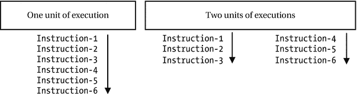

图 6-1.

将程序划分为多个执行单元

请注意，进程（process）也是一个执行单元。因此，这两组指令可以作为两个进程运行，以实现它们执行的并发性。到目前为止，我们假设这两组指令彼此独立。假设这个假设仍然成立。但如果这两组指令访问共享内存；或者，当两组指令都运行完毕时，你需要将两者的结果结合起来计算最终结果，那该怎么办？进程通常不允许访问另一个进程的地址空间。它们必须使用进程间通信设施（如套接字、管道等）进行通信。进程的本质——即它独立于其他进程运行——当多个进程需要通信或共享资源时，可能会带来问题。所有现代操作系统都允许你通过在一个进程内创建多个执行单元来解决这个问题，这些执行单元可以共享分配给该进程的地址空间和资源。进程内的每个执行单元被称为**线程**（thread）。

每个进程至少有一个线程。如果需要，一个进程可以创建多个线程。操作系统可用的资源及其实现决定了进程能创建的最大线程数。一个进程内的所有线程共享包括地址空间在内的所有资源；它们之间也能轻松通信，因为它们在同一个进程内运行并共享同一块内存。进程内的每个线程独立于同一进程内的其他线程运行。

一个线程维护两样东西：一个程序计数器（program counter）和一个栈（stack）。程序计数器让线程跟踪它当前正在执行的指令。为每个线程维护一个独立的程序计数器是必要的，因为进程内的每个线程可能同时执行不同的指令。每个线程维护自己的栈来存储局部变量的值。一个线程还可以维护自己的私有内存，这些内存不能与其他线程共享，即使它们位于同一进程中。线程维护的私有内存称为**线程本地存储（TLS）**。图 6-2 描绘了进程内表示的线程。

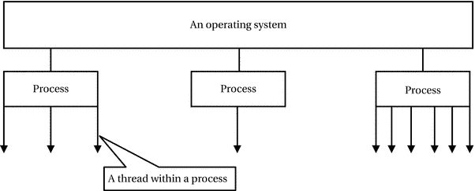

图 6-2.

进程与线程

在所有现代操作系统中，被调度到 CPU 上执行的是线程，而不是进程。因此，CPU 上下文切换发生在线程之间。与进程间的上下文切换相比，线程间的上下文切换开销更小。由于通信方便、进程内线程间资源共享容易以及上下文切换成本更低，将程序拆分为多个线程比拆分为多个进程更受青睐。有时线程也被称为**轻量级进程**（lightweight process）。前面讨论的包含六条指令的程序也可以拆分为一个进程内的两个线程，如图 6-3 所示。在多处理器机器上，一个进程的多个线程可能被调度到不同的处理器上，从而提供真正的程序并发执行。使用多个线程的程序被称为**多线程程序**（multi-threaded program）。

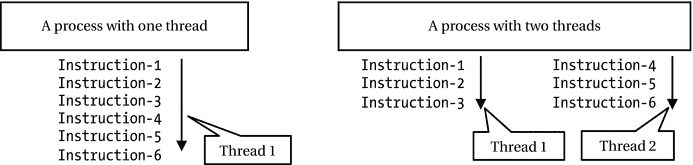

图 6-3.

划分程序逻辑以在进程内使用两个线程

你可以将进程与线程之间的关系理解为：

```
进程 = 地址空间 + 资源 + 线程
```

其中，线程是进程内的执行单元；它们维护自己独特的程序计数器和栈；它们共享进程的地址空间和资源；它们独立地被调度到 CPU 上，并且如果可用，可以在不同的 CPU 上执行。

在 Java 中创建线程

Java API 使得使用线程变得容易。它允许你将线程表示为一个对象。`java.lang.Thread` 类的对象代表一个线程。在 Java 中创建和使用线程就像创建 `Thread` 类的对象并在程序中使用该对象一样简单。让我们从在 Java 中创建线程的最简单示例开始。使用线程至少涉及两个步骤：

*   创建 `Thread` 类的对象

*   调用 `Thread` 类的 `start()` 方法来启动线程

创建 `Thread` 类的对象与在 Java 中创建任何其他类的对象相同。在最简单的形式中，你可以使用 `Thread` 类的无参构造函数来创建一个 `Thread` 对象。

```
// 创建一个线程对象
Thread simplestThread = new Thread();
```

创建 `Thread` 类的对象会在堆上为该对象分配内存。它不会启动或运行线程。你必须调用 `Thread` 对象的 `start()` 方法来启动线程：

```
// 启动线程
simplestThread.start();
```

`start()` 方法在执行一些内务处理后返回。它将线程置于可运行状态。在此状态下，线程已准备好获得 CPU 时间。请注意，调用 `Thread` 对象的 `start()` 方法并不能保证“何时”该线程将开始获得 CPU 时间。也就是说，它不能保证线程何时开始运行。它只是调度该线程以获取 CPU 时间。

让我们编写一个包含这两个语句的简单 Java 程序，如清单 6-2 所示。该程序不会做任何有用的事情。然而，它将帮助你开始使用线程。


```
// SimplestThread.java
package com.jdojo.threads;
public class SimplestThread {
public static void main(String[] args) {
// 创建一个线程对象
Thread simplestThread = new Thread();
// 启动线程
simplestThread.start();
}
}
清单 6-2.
Java 中最简单的线程
```

当你运行 `SimplestThread` 类时，不会看到任何输出。程序会静默地启动并结束。尽管你没有看到任何输出，但在执行 `main()` 方法中的两条语句时，JVM 实际上做了以下几件事：

*   当第二条语句 `simplestThread.start()` 被执行时，JVM 将此线程调度为可执行状态。

*   在某个时间点，该线程获得了 CPU 时间并开始执行。当 Java 中的线程获得 CPU 时间时，它开始执行什么代码呢？

*   Java 中的线程总是在 `run()` 方法中开始执行。当你创建 `Thread` 类的对象时，可以定义由线程执行的 `run()` 方法。在你的例子中，你使用无参构造器创建了 `Thread` 类的对象。当你使用 `Thread` 类的无参构造器创建其对象时（如 `new Thread()`），线程启动时会调用 `Thread` 类的 `run()` 方法。本章后续部分将解释如何为线程定义你自己的 `run()` 方法。

*   `Thread` 类的 `run()` 方法会检查 `Thread` 类的对象是如何创建的。如果线程对象是使用 `Thread` 类的无参构造器创建的，那么它什么也不做，并立即返回。因此，在你的程序中，当线程获得 CPU 时间时，它调用了 `Thread` 类的 `run()` 方法，该方法没有执行任何有意义的代码，然后返回。

*   当 CPU 执行完 `run()` 方法后，线程就死亡了，这意味着该线程将不会再获得 CPU 时间。

图 6-4 描述了最简单线程示例的工作原理。

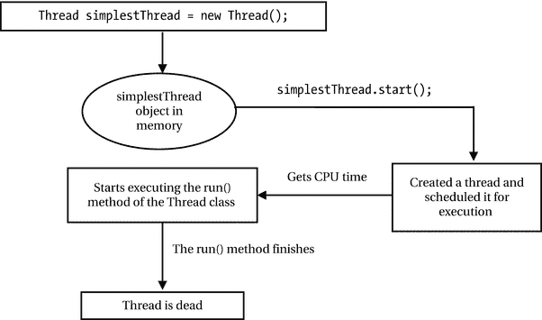

图 6-4.
最简单的线程执行过程

当前讨论中有两个重要的点需要补充。

*   当线程死亡时，并不意味着线程对象会被垃圾回收。请注意，线程是一个执行单元。“线程死亡”意味着该线程所代表的执行单元已完成其工作。然而，代表该执行单元的线程对象仍然存在于内存中。线程死亡后，该对象将根据与其他 Java 对象相同的垃圾回收规则被回收。存在一些限制，规定了在死亡线程上可以调用的方法。例如，你不能再次调用它的 `start()` 方法。也就是说，一个线程对象只能被启动一次。不过，你仍然可以通过调用线程对象的 `isAlive()` 方法来检查线程是否已死亡。

*   线程不会一次性获得 CPU 时间来执行完整个 `run()` 方法。操作系统决定分配给线程的时间量以及何时分配该时间。这意味着在线程完成执行 `run()` 方法之前，可能会发生多次上下文切换。

为线程指定你的代码

有三种方法可以为线程指定要执行的代码：

*   让你的类继承 `Thread` 类

*   在你的类中实现 `Runnable` 接口

*   使用不接收参数且返回 `void` 的方法的方法引用

提示

如果你的类已经继承了另一个类，那么可能无法让它继承 `Thread` 类。在这种情况下，你需要使用第二种方法。从 Java 8 开始，你可以使用第三种方法。在 Java 8 之前，通常使用匿名类来定义线程对象，匿名类要么继承 `Thread` 类，要么实现 `Runnable` 接口。

让你的类继承 Thread 类

当你让类继承 `Thread` 类时，应该重写 `run()` 方法，并提供线程要执行的代码。

```
public class MyThreadClass extends Thread {
@Override
public void run() {
System.out.println("Hello Java threads!");
}
// 更多代码写在这里 }
```

创建线程对象和启动线程的步骤是相同的。

```
MyThreadClass myThread = new MyThreadClass();
myThread.start();
```

该线程将执行 `MyThreadClass` 类的 `run()` 方法。

实现 Runnable 接口

你可以创建一个实现 `java.lang.Runnable` 接口的类。`Runnable` 是一个函数式接口，它在 `java.lang` 包中声明如下：

```
@FunctionalInterface
public interface Runnable {
void run();
}
```

从 Java 8 开始，你可以使用 lambda 表达式来创建 `Runnable` 接口的实例。

```
Runnable aRunnableObject = () -> System.out.println("Hello Java threads!");
```

使用接受 `Runnable` 对象的构造器创建 `Thread` 类的对象。

```
Thread myThread = new Thread(aRunnableObject);
```

通过调用线程对象的 `start()` 方法来启动线程。

```
myThread.start();
```

该线程将执行 lambda 表达式主体中包含的代码。

使用方法引用

从 Java 8 开始，你可以使用不接收参数且返回 `void` 的方法（静态方法或实例方法）的方法引用作为线程要执行的代码。以下代码声明了一个包含 `execute()` 方法的 `ThreadTest` 类。该方法包含要在线程中执行的代码。

```
public class ThreadTest {
public static void execute() {
System.out.println("Hello Java threads!");
}
}
```

以下代码片段使用 `ThreadTest` 类的 `execute()` 方法的方法引用来创建 `Runnable` 对象：

```
Thread myThread = new Thread(ThreadTest::execute);
myThread.start();
```

该线程将执行 `ThreadTest` 类的 `execute()` 方法中包含的代码。

快速示例

让我们看一个在新线程中打印从 1 到 500 的整数的简单示例。清单 6-3 包含了执行此任务的 `PrinterThread` 类的代码。当该类运行时，它会在标准输出上打印从 1 到 500 的整数。

```
// PrinterThread.java
package com.jdojo.threads;
public class PrinterThread {
public static void main(String[] args) {
// 创建一个 Thread 对象
Thread t = new Thread(PrinterThread::print);
// 启动线程
t.start();
}
public static void print() {
for (int i = 1; i <= 500; i++) {
System.out.print(i + " ");
}
}
}
1 2 3 4 5 6 7 8 9 10 11 12 13 14  ... 497 498 499 500
清单 6-3.
在新线程中打印从 1 到 500 的整数
```

在示例中，我使用了方法引用来创建线程对象。你可以使用前面讨论的任何其他方法来创建线程对象。

在程序中使用多个线程

在 Java 程序中使用多个线程就像创建多个 `Thread` 对象并调用它们的 `start()` 方法一样简单。Java 对程序中可以使用的线程数量没有上限。它受限于操作系统和程序可用的内存。清单 6-4 使用了两个线程。两个线程都打印从 1 到 500 的整数。代码在每个整数后打印一个新行。然而，为了保持输出简短，输出中每个整数后显示一个空格。仅显示了部分输出。


```
// MultiPrinterThread.java
package com.jdojo.threads;
public class MultiPrinterThread {
public static void main(String[] args) {
// 创建两个线程对象
Thread t1 = new Thread(MultiPrinterThread::print);
Thread t2 = new Thread(MultiPrinterThread::print);
// 启动两个线程
t1.start();
t2.start();
}
public static void print() {
for (int i = 1; i <= 500; i++) {
System.out.println(i);
}
}
}
1  2  3  4  5  1  2  3  4  5  6  7  8  9  10  11  12  13  14  15  16  17  18  19  20  21  22  23  24  25  26  6  7  27  28  8  9  10  11  12  29  30  31  13  14  32  15  16  17  ...  496  497  498  499  500  424  425 ... 492  493  494  495  496  497  498  499  500
清单 6-4.
在程序中运行多个线程
```

你会在输出中发现一些有趣的现象。每次运行这个程序，你可能会得到不同的输出。不过，你电脑上输出的性质可以与这里展示的输出进行对比。在速度非常快的机器上，输出可能会是打印 1 到 500 和 1 到 500。然而，我们假设你的输出与展示的类似，并以此展开讨论。

该程序创建了两个线程。每个线程打印从 1 到 500 的整数。它先启动线程 `t1`，然后启动线程 `t2`。你可能会认为线程 `t1` 会先开始打印 1 到 500 的整数，然后线程 `t2` 再开始打印 1 到 500 的整数。但从输出可以明显看出，程序并没有按照你预期的方式运行。

`Thread` 类的 `start()` 方法会立即返回。也就是说，当你调用一个线程的 `start()` 方法时，JVM 会记录下你启动线程的指令。然而，它并不会立即启动该线程。在真正启动线程之前，它需要进行一些内部准备工作。当一个线程启动后，由操作系统决定何时以及分配多少 CPU 时间给该线程。因此，一旦 `t1.start()` 和 `t2.start()` 方法返回，你的程序就进入了不确定的领域。也就是说，两个线程都会开始运行；但是，你不知道它们何时开始运行，以及它们会以何种顺序运行来执行各自的代码。当你启动多个线程时，你甚至不知道哪个线程会先开始运行。观察输出，你可以发现其中一个线程启动了，并且在被抢占之前获得了足够的 CPU 时间来打印 1 到 5 的整数。另一个线程在被抢占之前获得了 CPU 时间来打印 1 到 26 的整数。第二次，第一个线程（即最先开始打印整数的那个线程）获得了 CPU 时间，但它只打印了两个整数，6 和 7，以此类推。你可以看到两个线程都获得了 CPU 时间。然而，它们获得的 CPU 时间量以及获得 CPU 时间的顺序是不可预测的。每次运行这个程序，你可能会得到不同的输出。从这个程序中你能得到的唯一保证是，1 到 500 之间的所有整数都会以某种顺序被打印两次。

使用多线程时的问题

在程序中使用多个线程时会涉及一些问题。只有当多个线程需要基于某些条件或某些共享资源进行协调时，你才需要考虑这些问题。

在前面的章节中，涉及线程的例子都很简单。它们只是在标准输出上打印一些整数。让我们看一个不同类型的例子，它使用多个线程来访问和修改变量的值。清单 6-5 展示了 `BalanceUpdate` 类的代码。

```
// BalanceUpdate.java
package com.jdojo.threads;
public class BalanceUpdate {
// 将余额初始化为 100
private static int balance = 100;
public static void main(String[] args) {
startBalanceUpdateThread(); // 用于更新余额值的线程
startBalanceMonitorThread(); // 用于监控余额值的线程
}
public static void updateBalance() {
// 给余额加 10，再从余额中减 10
balance = balance + 10;
balance = balance - 10;
}
public static void monitorBalance() {
int b = balance;
if (b != 100) {
System.out.println("余额已更改: " + b);
System.exit(0); // 退出程序
}
}
public static void startBalanceUpdateThread() {
// 启动一个新线程，该线程在无限循环中调用 updateBalance() 方法
Thread t = new Thread(() -> {
while (true) {
updateBalance();
}
});
t.start();
}
public static void startBalanceMonitorThread() {
// 启动一个监控余额值的线程
Thread t = new Thread(() -> {
while (true) {
monitorBalance();
}
});
t.start();
}
}
余额已更改: 110
清单 6-5.
多个线程修改同一个变量
```

以下是该类各组件的简要说明：

*   `balance`：这是一个 `int` 类型的静态变量。它被初始化为 100。

*   `updateBalance()`：这是一个静态方法，它给静态变量 balance 加 10，然后再从中减 10。该方法执行完毕后，静态变量 `balance` 的值预期仍为 100。

*   `startBalanceUpdateThread()`：它启动一个新线程，该线程在无限循环中持续调用 `updateBalance()` 方法。也就是说，一旦你调用此方法，一个线程就会不断地给 `balance` 变量加 10 再减 10。

*   `startBalanceMonitorThread()`：它启动一个新线程，通过重复调用 `monitorBalance()` 方法来监控 `balance` 静态变量的值。当该线程检测到 `balance` 变量的值不是 100 时，它会打印当前值并退出程序。

*   `main()`：此方法用于运行程序。它启动一个线程，该线程使用 `updateBalance()` 方法在循环中更新 `balance` 类变量。它还启动了另一个线程来监控 `balance` 类变量的值。

该程序包含两个线程。一个线程调用 `updateBalance()` 方法，该方法给 `balance` 加 10 再减 10。也就是说，此方法执行完毕后，`balance` 变量的值预期保持不变。另一个线程监控 `balance` 变量的值。当它检测到 `balance` 变量的值不是 100 时，它会打印新值并退出程序。在 `System.exit(0)` 方法调用中指定 0 表示你想要正常终止程序。

直观上，余额监控线程不应该打印任何内容，因为 `balance` 应该始终是 `100`，并且程序永远不应该结束，因为两个线程都在使用无限循环。然而，情况并非如此。如果你运行这个程序，你会发现，在短时间内，程序会打印出非 `100` 的 `balance` 值并退出。

假设在某台特定机器上，语句 `"balance = balance + 10;"` 被实现为以下机器指令（假设 `register-1` 是一个 CPU 寄存器）：

```
register-1 = balance;
register-1 = register-1 + 10;
balance = register-1;
```

类似地，假设语句 `"balance = balance - 10;"` 被实现为以下机器指令（假设 `register-2` 是另一个 CPU 寄存器）：

```
register-2 = balance;
register-2 = register-2 - 10;
balance = register-2;
```


当调用 `updateBalance()` 方法时，CPU 必须执行六条指令来对 `balance` 变量进行加 10 和减 10 的操作。  
当 `balance` 更新线程正在执行前三条指令中的任意一条时，余额监控线程会将 `balance` 的值读取为 100。  
当余额更新线程执行完第三条指令后，余额监控线程会将其值读取为 110。只有当余额更新线程执行完第六条指令后，`balance` 变量的值 110 才会被恢复为 100。请注意，如果余额监控线程在余额更新线程执行完第三条指令之后、第六条指令之前的任何时刻读取 `balance` 变量的值，它读取到的值将与 `updateBalance()` 方法开始执行时的值不同。表 6-1 展示了两个线程如何修改和读取 `balance` 变量的值。

表 6-1. 多线程的指令执行情况

| 语句（假设初始余额为 100） | 余额更新线程执行的指令 | 余额监控线程读取的余额值 |
| --- | --- | --- |
| `balance = balance + 10;` | `register-1 = balance;` | `100` |
| | `register-1 = register-1 + 10;` | `100` |
| | `balance = register-1;` | 执行前：`100` 执行后：`110` |
| `balance = balance - 10;` | `register-2 = balance;` | `110` |
| | `register-2 = register-2 - 10;` | `110` |
| | `balance = register-2;` | 执行前：`110` 执行后：`100` |

在你的程序中，监控线程能够将 `balance` 变量的值读取为 110，是因为你允许两个线程同时修改和读取 `balance` 变量的值。如果你只允许一次只有一个线程操作（修改或读取）`balance` 变量，那么余额监控线程永远不会读取到 `balance` 变量除 100 以外的值。

多个线程同时操作和访问共享数据，且结果取决于线程执行顺序的情况，称为**竞态条件**。程序中的竞态条件可能导致不可预测的结果。清单 6-5 是一个竞态条件的示例，其中程序输出取决于两个线程的执行顺序。

为了避免程序中的竞态条件，你需要确保一次只有一个竞态线程操作共享数据。为了解决这个问题，你需要同步对 `BalanceUpdate` 类中 `updateBalance()` 和 `monitorBalance()` 两个方法的访问。也就是说，一次只能有一个线程访问这两个方法之一。换句话说，如果一个线程正在执行 `updateBalance()` 方法，另一个想要执行 `monitorBalance()` 方法的线程必须等待，直到执行 `updateBalance()` 方法的线程完成。同样，如果一个线程正在执行 `monitorBalance()` 方法，另一个想要执行 `updateBalance()` 方法的线程必须等待，直到执行 `monitorBalance()` 方法的线程完成。这将确保当一个线程正在更新 `balance` 变量时，没有其他线程会读取到不一致的 `balance` 变量值；并且如果一个线程正在读取 `balance` 变量，没有其他线程会同时更新 `balance` 变量。

在 Java 程序中，这种需要同步多个线程对代码段访问的问题，可以使用 `synchronized` 关键字来解决。为了理解 `synchronized` 关键字的用法，我需要简要讨论 Java 内存模型，以及对象的锁和等待集。

**Java 内存模型**

程序中所有程序变量（实例字段、静态字段和数组元素）都是从计算机的主内存中分配内存的。每个线程都有一个工作内存（处理器缓存或寄存器）。Java 内存模型（JMM）描述了程序变量何时、以何种顺序存储到主内存以及从主内存读取。JMM 在 Java 语言规范中有详细描述。你可以将 JMM 想象为图 6-5 所示。

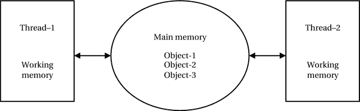

图 6-5. Java 内存模型

图 6-5 显示了两个线程共享主内存。假设你有一个 Java 程序运行着两个线程 `thread-1` 和 `thread-2`，并且每个线程运行在不同的处理器上。假设 `thread-1` 在其工作内存中读取了 `object-1` 的某个实例变量的值，更新了该值，但没有将更新后的值写回主内存。让我们分析几种可能的情况。

*   如果 `thread-2` 尝试从主内存读取 `object-1` 的同一个实例变量的值，会发生什么？`thread-2` 会从主内存读取旧值，还是能够从 `thread-1` 的工作内存中读取更新后的值？

*   假设 `thread-1` 正在将更新后的值写入主内存的过程中，同时 `thread-2` 正尝试从主内存读取同一个值。`thread-2` 会读取到旧值，还是因为值尚未完全写回主内存而读取到一些垃圾值？

JMM 回答了所有这些问题。本质上，JMM 描述了 Java 程序中指令执行的三个重要方面。它们如下：

*   原子性

*   可见性

*   有序性

**原子性**

JMM 描述了应原子执行的操作。它描述了关于实例变量、静态变量和数组元素的读写操作的原子性规则。它保证对任何类型（`long` 和 `double` 除外）的对象字段的读写始终是原子的。但是，如果 `long` 或 `double` 类型的字段被声明为 `volatile`（我将在本章后面详细讨论 `volatile` 关键字），那么对该字段的读写也保证是原子的。

**可见性**

JMM 描述了一个线程中操作产生的结果对其他线程可见的条件。主要地，它确定了一个线程何时将值写入字段，以及该字段的新值在何时对其他线程可见。我将在本章后面讨论锁、同步和 volatile 变量时，进一步讨论 JMM 的可见性方面。为完整起见，以下是一些可见性规则：

*   当一个线程首次读取某个字段的值时，它将读取该字段的初始值，或者由其他线程写入该字段的某个值。

*   对 volatile 变量的写入总是写入主内存。对 volatile 变量的读取总是从主内存读取。也就是说，volatile 变量永远不会缓存在线程的工作内存中。实际上，任何对 volatile 变量的写入都会刷新到主内存，立即使新值对其他线程可见。

*   当一个线程终止时，该线程的工作内存会立即写入主内存。也就是说，线程终止后，所有仅对该终止线程可见的变量值将对所有线程可见。

*   当一个线程进入同步块时，该线程会重新加载其工作内存中所有变量的值。当一个线程离开同步块时，它会将其工作内存中的所有变量值写入主内存。

**有序性**


JMM 描述了在一个线程内部以及多个线程之间操作的执行顺序。它保证一个线程内执行的所有操作都是有序的。不同线程中的操作不保证以任何特定顺序执行。通过使用本章稍后描述的同步技术，你可以在处理多线程时实现一定的顺序。

提示

Java 程序中的每个线程都使用两种内存：工作内存和主内存。一个线程无法访问另一个线程的工作内存。主内存在线程之间共享。线程之间通过主内存进行通信。每个线程都有自己的栈，用于存储局部变量。

对象的监视器与线程同步

在多线程程序中，如果多个线程并发执行，可能会对程序结果产生不良影响的代码段被称为**临界区**。通常，这些不良影响是由临界区内多个线程并发使用某个资源造成的。有必要控制程序中临界区的访问，使得一次只有一个线程能够执行临界区。

在 Java 程序中，临界区可以是一个语句块或一个方法。Java 没有内置的机制来识别程序中的临界区。然而，Java 有许多内置结构，允许程序员声明临界区，并控制和协调对其的访问。识别程序中的临界区并控制多个线程对这些临界区的访问是程序员的责任。控制和协调多个线程对临界区的访问被称为**线程同步**。在编写多线程程序时，线程同步始终是一项具有挑战性的任务。在清单 6-5 中，`updateBalance()` 和 `monitorBalance()` 方法是临界区，你必须同步线程对这些方法的访问，以获得一致的输出。Java 编程语言内置了两种线程同步：

*   互斥同步
*   条件同步

在互斥同步中，在某一时刻只允许一个线程访问某段代码。清单 6-5 是一个需要互斥同步的程序示例，这样在某一时刻只有一个线程可以执行 `updateBalance()` 和 `monitorBalance()`。在这种情况下，你可以将互斥视为线程对 `balance` 变量的独占访问。

条件同步允许多个线程协同工作以达到某个结果。例如，考虑一个解决**生产者/消费者**问题的多线程程序。程序中有两个线程：一个线程生产数据（生产者线程），另一个线程消费数据（消费者线程）。消费者线程必须等待，直到生产者线程生产数据并使其可供消费。生产者线程在生成数据时必须通知消费者线程，以便消费者线程可以消费它。换句话说，生产者和消费者线程必须相互协调/合作以完成任务。在条件同步期间，也可能需要互斥同步。假设生产者线程一次生产一个字节的数据，并将其放入容量也只有一个字节的缓冲区中。消费者线程从同一个缓冲区消费数据。在这种情况下，一次只能有一个线程访问缓冲区（互斥）。如果缓冲区已满，生产者线程必须等待消费者线程清空缓冲区；如果缓冲区为空，消费者线程必须等待生产者线程生成一个字节的数据并将其放入缓冲区（条件同步）。

互斥同步通过锁来实现。锁支持两个操作：`acquire` 和 `release`。想要独占访问某个资源的线程必须获取与该资源关联的锁。只要一个线程持有某个资源的锁，其他线程就无法获取同一个锁。一旦持有锁的线程使用完该资源，它就会释放锁，以便另一个线程可以获取它。

条件同步通过条件变量和三个操作来实现：`wait`、`signal` 和 `broadcast`。条件变量定义了线程同步的条件。`wait` 操作使一个线程等待某个条件变为真，以便它可以继续执行。`signal` 操作唤醒一个正在等待该条件变量的线程。`broadcast` 操作唤醒所有正在等待该条件变量的线程。请注意，`signal` 操作和 `broadcast` 操作的区别在于，前者只唤醒一个等待线程，而后者唤醒所有等待线程。

**监视器**是一种编程结构，它包含一个锁、条件变量以及与之相关的操作。Java 程序中的线程同步是通过监视器实现的。Java 程序中的每个对象都有一个关联的监视器。

Java 程序中的临界区是相对于某个对象的监视器来定义的。线程在开始执行被声明为临界区的代码之前，必须获取该对象的监视器。`synchronized` 关键字用于声明临界区。使用 `synchronized` 关键字有两种方式：

*   将方法声明为临界区
*   将语句块声明为临界区

你可以通过在方法返回类型前使用关键字 `synchronized` 来将方法声明为临界区，如下所示：

```
public class CriticalSection {
public synchronized void someMethod_1() {
// 方法代码写在这里
}
public static synchronized void someMethod_2() {
// 方法代码写在这里
}
}
```

提示

你可以将实例方法和静态方法都声明为同步的。构造函数不能被声明为同步的。构造函数只被创建对象的单个线程调用一次。因此，同步对构造函数的访问是没有意义的。

对于同步实例方法，整个方法是一个临界区，并且它与执行此方法的对象的监视器相关联。也就是说，线程在执行该对象的同步实例方法内的代码之前，必须获取该对象的监视器锁。例如，

```
// 创建一个名为 cs1 的对象
CriticalSection cs1 = new CriticalSection();
// 执行同步实例方法。在此方法开始执行之前，
// 执行此语句的线程必须获取 cs1 对象的监视器锁
cs1.someMethod_1();
```

对于 `synchronized` 静态方法，整个方法是一个临界区，并且它与代表该类的类对象相关联。也就是说，线程在执行该类的同步静态方法内的代码之前，必须获取该类对象的监视器锁。例如，

```
// 执行同步静态方法。在此方法开始执行之前，
// 执行此语句的线程必须获取 CriticalSection.class 对象的监视器锁
CriticalSection.someMethod_2();
```

将代码块声明为临界区的语法如下：

```
synchronized() {
// 临界区的一个或多个语句
}
```


`<objectReference>` 是对象的引用，其监视器锁将用于同步对临界区的访问。此语法用于将方法体的一部分定义为临界区。这样，线程只需在执行被声明为临界区的方法代码的较小部分时获取对象的监视器锁。其他线程仍可同时执行该方法体的其他部分。此外，这种声明临界区的方式允许你将构造函数的某一部分或整个构造函数声明为临界区。回想一下，你不能在构造函数的声明部分使用关键字 `synchronized`。但是，你可以在构造函数体内使用它来将一段代码块声明为 `synchronized`。以下代码片段说明了关键字 `synchronized` 的用法：

```
public class CriticalSection2 {
public synchronized void someMethod10() {
// 方法代码写在这里。一次只有一个线程可以在此处执行。
}
public void someMethod11() {
synchronized(this) {
// 方法代码写在这里。一次只有一个线程可以在此处执行。
}
}
public void someMethod12() {
// 一些语句写在这里。多个线程可以同时在此处执行。
synchronized(this) {
// 一些语句写在这里。一次只有一个线程可以在此处执行。
}
// 一些语句写在这里。多个线程可以同时在此处执行。
}
public static synchronized void someMethod20() {
// 方法代码写在这里。一次只有一个线程可以在此处执行。
}
public static void someMethod21() {
synchronized(CriticalSection2.class) {
// 方法代码写在这里。一次只有一个线程可以在此处执行。
}
}
public static void someMethod_22() {
// 一些语句写在这里：section_1。多个线程可以同时在此处执行。
synchronized(CriticalSection2.class) {
// 一些语句写在这里：section_2。一次只有一个线程可以在此处执行。
}
// 一些语句写在这里：section_3。多个线程可以同时在此处执行。
}
}
```

`CriticalSection2` 类有六个方法：三个实例方法和三个类方法。`someMethod10()` 方法是同步的，因为在方法声明中使用了 `synchronized` 关键字。`someMethod11()` 方法与 `someMethod10()` 方法的不同之处仅在于它使用 `synchronized` 关键字的方式。它将整个方法体作为一个块放入 `synchronized` 关键字中，这实际上与将方法声明为同步的效果相同。方法 `someMethod12()` 则不同。它仅将方法体的一部分声明为同步块。可以有多个线程同时执行 `someMethod12()`。但是，在某一时刻，只有一个线程可以在同步块内部执行。另一组方法——`someMethod20()`、`someMethod21()` 和 `someMethod22()`——是类方法，它们的行为方式相同，只是将使用类的对象监视器来实现线程同步。

获取和释放对象监视器锁的过程由 JVM 处理。你唯一需要做的就是将方法（或块）声明为同步。在进入同步方法或块之前，线程会获取该对象的监视器锁。在退出同步方法或块时，它会释放该对象的监视器锁。一个已经获取了对象监视器锁的线程可以多次重新获取它，次数不限。但是，它必须释放该对象的监视器锁的次数与其获取的次数相同，以便另一个线程能够获取同一个对象的监视器锁。让我们考虑以下 `MultiLocks` 类的代码：

```
public class MultiLocks {
public synchronized void method1() {
// 一些语句写在这里
this.method2();
// 一些语句写在这里
}
public synchronized void method2() {
// 一些语句写在这里
}
public static synchronized void method3() {
// 一些语句写在这里
MultiLocks.method4();
// 一些语句写在这里
}
public static synchronized void method4() {
// 一些语句写在这里
}
}
```

`MultiLocks` 类有四个方法，并且它们都是同步的。其中两个是实例方法，它们使用将要调用方法的对象的引用来进行同步。另外两个是类方法，它们使用 `MultiLocks` 类的类对象的引用来进行同步。如果一个线程想要执行 `method1()` 或 `method2()`，它必须首先获取调用该方法的对象的监视器锁。你正在从方法 `method1()` 内部调用 `method2()`。由于正在执行 `method1()` 的线程必须已经获取了该对象的监视器锁，而对 `method2()` 的调用需要获取同一个锁，因此该线程在从 `method1()` 内部执行 `method2()` 时，会自动重新获取同一个对象的监视器锁，而无需与其他线程竞争来获取该对象的监视器锁。

因此，当一个线程从 `method1()` 内部执行 `method2()` 时，它将已经获取了该对象的监视器锁两次。当它退出 `method2()` 时，它会释放一次锁；当它退出 `method1()` 时，它会第二次释放锁；然后该对象的监视器锁就可以供其他线程获取了。同样的论点也适用于从 `method3()` 内部调用 `method4()`，只是在这种情况下，同步涉及的是 `MultiLocks` 类对象的监视器锁。考虑从 `method1()` 调用 `method3()`，如下所示：

```
public class MultiLocks {
public synchronized void method1() {
// 一些语句写在这里
this.method2();
MultiLocks.method3();
// 一些语句写在这里
}
// 其余代码与之前所示相同
}
```

假设你调用 `method1()`，如下所示：

```
MultiLocks ml = new MultiLocks();
ml.method1();
```

当执行 `ml.method1()` 时，执行线程必须获取对象 `ml` 的监视器锁。然而，执行线程必须获取 `MultiLocks.class` 对象的监视器锁才能执行 `MultiLocks.method3()` 方法。请注意，`ml` 和 `MultiLocks.class` 是两个不同的对象。想要从 `method1()` 方法中执行 `MultiLocks.method3()` 方法的线程必须同时拥有这两个对象的监视器锁。

你可以将相同的论点应用于使用同步块。例如，你可以有如下代码片段：

```
synchronized (objectReference) {
// 尝试在同一个对象上再次同步是可以的
synchronized(objectReference) {
// 一些语句写在这里
}
}
```

现在是时候更深入地研究一下使用对象监视器进行线程同步的工作原理了。图 6-6 描述了多个线程如何使用一个对象的监视器。

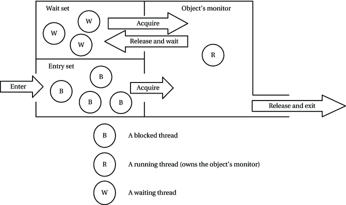

图 6-6.

多个线程使用一个对象的监视器

在讨论线程同步时，我使用了一个医生-病人的类比。假设一位医生有一个诊所来治疗病人。我们知道，一次只允许一个病人看医生是非常重要的。否则，医生可能会把一个病人的症状与另一个病人的症状混淆；发烧的病人可能会得到治疗头痛的处方！因此，我们假设在任何时间点，只有一个病人可以看医生。这类似于一次只有一个线程（病人）可以访问对象的监视器（医生）。


任何想要就诊的患者都必须签到并在候诊室等待。同样，每个对象监视器都有一个入口集（新来者的候诊室），任何想要获取对象监视器锁的线程都必须先进入入口集。如果患者签到，且医生没有正在治疗的患者且候诊室中没有患者在等待，他可能立即就诊。同样，如果对象监视器的入口集为空，且没有其他线程持有该对象监视器锁，那么进入入口集的线程会立即获取该对象监视器锁。然而，如果候诊室中有患者在等待，或者有患者正在接受医生治疗，那么签到的患者将被阻塞，必须等待医生再次空闲。同样，如果一个线程进入入口集，而其他线程已经阻塞在入口集中，或者另一个线程已经持有该对象监视器锁，那么刚刚签到的线程被称为被阻塞，必须在入口集中等待。

一个线程进入入口集由标有`Enter`的箭头表示。线程本身在图 6-6 中用圆圈表示。带有文本`B`的圆圈表示一个在入口集中被阻塞的线程。带有文本`R`的圆圈表示一个已获取对象监视器的线程。

那些在入口集中被阻塞的线程会发生什么？它们何时有机会获取对象监视器？你可以想象一下在候诊室中被阻塞的患者，等待轮到他们接受医生治疗。许多因素决定了下一个接受治疗的患者是谁。首先，正在接受治疗的患者必须先释放医生，其他患者才能就诊。在 Java 中，持有对象监视器所有权的线程必须先释放对象监视器，入口集中被阻塞的线程才能获得对象监视器的所有权。患者可能因以下两个原因之一释放医生：

*   患者完成了治疗，准备回家。这是患者在治疗结束后释放医生的简单情况。

*   患者正在接受治疗中。然而，他必须等待一段时间，医生才能继续他的治疗。假设诊所有一个特殊的候诊室（与刚签到的患者等待的候诊室分开），供那些正在接受治疗中的患者使用。这种情况需要一些解释。假设医生是一位眼科专家，他的诊所里有一些患者。正在接受治疗的患者需要进行眼科检查，为此必须先散瞳。患者滴眼药水后，大约需要 30 分钟才能完全散瞳，这是检查所必需的。医生应该等待 30 分钟让患者的瞳孔散开吗？这个患者是否应该释放医生 30 分钟，让其他患者就诊？你会同意，如果医生可以利用这段时间治疗其他患者，那么让这个患者释放医生是合理的。然而，当这个患者的瞳孔散开后，医生仍在忙于治疗另一个患者，这时应该怎么办？医生不能中途放弃任何患者的治疗。因此，释放了医生并等待某个条件成立（这里是散瞳过程完成）的患者，必须等待医生再次空闲。我将在本章后面进一步解释这个问题，并尝试将这种情况与线程和对象监视器锁联系起来。

在将医生-患者示例与监视器-线程情况进行比较之前，我必须讨论另一个问题。当医生空闲且只有一个患者在等待就诊时，没有问题。唯一等待医生的患者会立即就诊。然而，当医生空闲且有多个患者在等待就诊时，会发生什么？哪个等待的患者应该先就诊？应该是先来的患者（先进先出，FIFO）？应该是最后来的患者（后进先出，LIFO）？应该是治疗所需时间最少（或最多）的患者？应该是病情最严重的患者？答案取决于诊所管理层遵循的政策。

与医生-患者示例中的患者类似，线程也可能因以下两个原因释放对象监视器锁：

*   此时，线程已完成其获取对象监视器锁所需的工作。图 6-6 中标有“释放并退出”的箭头在图中指示了这种情况。当一个线程简单地退出一个同步方法/块时，它会释放它已获取的对象监视器锁。

*   线程正在执行任务的中途，需要等待某个条件成立才能完成剩余任务。让我们考虑生产者/消费者问题。假设生产者获取了缓冲区对象的监视器锁，并想向缓冲区写入一些数据。然而，它发现缓冲区已满，消费者必须先消费数据并清空缓冲区，它才能写入。在这种情况下，生产者必须释放缓冲区对象的监视器锁，并等待消费者获取锁并清空缓冲区。同样的逻辑也适用于消费者，当它获取缓冲区的监视器锁并发现缓冲区为空时。此时，消费者必须释放锁，并等待生产者生产一些数据。这种临时释放对象监视器锁并等待某个条件发生的情况，在图中用标有“释放并等待”的箭头表示。一个对象可以有多个线程同时处于“释放并等待”状态。所有已释放对象监视器锁并正在等待某些条件发生的线程都被放入一个称为等待集的集合中。

线程是如何被放入等待集的？请注意，一个线程只有曾经获取过对象监视器锁，才能被放入该对象监视器的等待集。一旦线程获取了对象监视器锁，它必须调用该对象的`wait()`方法才能将自己放入等待集。这意味着线程必须始终在`synchronized`方法或块内部调用`wait()`方法。`wait()`方法定义在`java.lang.Object`类中，并被声明为 final；也就是说，Java 中没有其他类可以重写此方法。在调用对象的`wait()`方法之前，你必须考虑以下两条规则。

规则 #1

对`wait()`方法的调用必须放在同步方法（静态或非静态）或同步块内部。

规则 #2

`wait()`方法必须在当前线程已获取其监视器的对象上调用。它会抛出`java.lang.InterruptedException`。调用此方法的代码必须处理此异常。当当前线程不是对象监视器的所有者时，`wait()`方法会抛出`IllegalMonitorStateException`。为了保持代码简单易读，以下代码片段没有将对`wait()`方法的调用放在`try-catch`块中。例如，在同步的非静态方法内部，对`wait()`方法的调用可能如下所示：


```java
public class WaitMethodCall {
    // 用于同步代码块的对象
    private Object objectRef = new Object();
    
    public synchronized void someMethod_1() {
        // 在此处运行的线程已经获取了由 this 引用所代表对象的监视器锁，
        // 因为这是一个同步的非静态方法
        // 其他语句写在这里
        while (某些条件为真) {
            // 可以在 this 上调用 wait() 方法，因为当前线程持有 this 的监视器锁
            this.wait();
        }
        // 其他语句写在这里
    }
    
    public static synchronized void someMethod_2() {
        // 在此处执行的线程已经获取了由 WaitMethodCall.class 引用所代表的类对象的监视器锁，
        // 因为这是一个同步的静态方法
        while (某些条件为真) {
            // 可以在 WaitMethodCall.class 上调用 wait() 方法，
            // 因为当前线程持有 WaitMethodCall.class 对象的监视器锁
            WaitMethodCall.class.wait();
        }
        // 其他语句写在这里
    }
    
    public void someMethod_3() {
        // 其他语句写在这里
        synchronized(objectRef) {
            // 当前线程持有 objectRef 的监视器锁
            while (某些条件为真) {
                // 可以在 objectRef 上调用 wait() 方法，
                // 因为当前线程持有 objectRef 的监视器锁
                objectRef.wait();
            }
        }
        // 其他语句写在这里
    }
}
```

请注意，`objectRef` 是一个实例变量，其类型为 `java.lang.Object`。它的唯一用途是同步线程对 `someMethod_3()` 方法内部代码块的访问。由于它被声明为实例变量，所有调用 `someMethod_3()` 的线程都将使用它的监视器来执行同步代码块。初学者常犯的一个错误是将 `objectRef` 声明为方法内部的局部变量，并在同步代码块中使用它。以下代码片段展示了这种错误：

```java
public void wrongSynchronizationMethod {
    // 每次线程调用此方法时都会创建这个 objectRef
    Object objectRef = new Object();
    // 在下面使用 objectRef 进行同步是一个严重错误
    synchronized(objectRef) {
        // 实际上，这个代码块就像没有同步一样，因为每个线程都会创建一个新的 objectRef 并立即获取其监视器锁。
    }
}
```

牢记这段代码，你必须使用对所有线程都通用的对象引用来同步对代码块的访问。

让我们回到那个问题：当医生再次有空时，哪个病人将获得就诊机会？是候诊室里签到后等待的病人，还是另一个候诊室里在治疗中途等待的病人？在回答这个问题之前，我们先明确一点：候诊室里签到后等待的病人，与在另一个候诊室里等待某个条件（例如瞳孔扩张完成）发生的病人，两者之间存在区别。签到后，病人等待的是医生有空；而治疗中途的病人等待的是某个特定条件发生。对于第二类病人，必须先满足特定条件，他们才能寻求医生的诊治；而第一类病人则随时准备尽快获得医生的诊治。因此，必须有人通知第二类病人某个特定条件已经发生，是时候再次寻求医生诊治以继续治疗了。我们假设这个通知来自当前正在接受医生治疗的病人。也就是说，当前拥有医生诊治权的病人会通知那些治疗中途等待的病人，让他们准备好再次获得医生的诊治权。请注意，这只是一个关于某个条件已经发生的通知，并且只发送给治疗中途等待的病人。治疗中途的病人是否能在当前病人结束诊治后立即获得医生的诊治权，这一点无法保证。它只保证病人等待的条件在通知时已经满足，并且等待的病人可以尝试获取医生的诊治权以继续治疗。让我们将这个例子与监视器-线程的例子联系起来。

入口集合中的线程处于阻塞状态，它们准备尽快获取监视器的访问权。等待集合中的线程正在等待某个条件发生。拥有监视器所有权的线程必须通知等待集合中的线程，它们所等待的条件已经满足。在 Java 中，通过调用 `Object` 类的 `notify()` 和 `notifyAll()` 方法来发出通知。与 `wait()` 方法一样，`notify()` 和 `notifyAll()` 方法也被声明为 final。与 `wait()` 方法类似，这两个方法必须由线程在已经获取了某个对象的监视器后，在该对象上调用。如果线程在获取对象监视器之前就调用这些方法，则会抛出 `IllegalMonitorStateException`。调用 `notify()` 方法会唤醒等待集合中的一个线程，而调用 `notifyAll()` 方法则会唤醒等待集合中的所有线程。对于 `notify()` 方法的调用，被唤醒的线程是任意选择的。请注意，当线程调用 `notify()` 或 `notifyAll()` 方法时，它仍然持有对象监视器的锁。等待集合中的线程仅通过 `notify()` 或 `notifyAll()` 调用被唤醒。它们不会立即获取对象的监视器锁。当调用 `notify()` 或 `notifyAll()` 方法的线程通过“释放并退出”或“释放并等待”释放对象监视器锁时，等待集合中被唤醒的线程将与入口集合中的线程竞争，以再次获取对象的监视器。因此，调用 `notify()` 和 `notifyAll()` 仅作为对等待集合中线程的唤醒信号，并不能保证它们能获取对象的监视器。

提示

无法唤醒等待集合中的特定线程。调用 `notify()` 会任意选择一个线程，而调用 `notifyAll()` 会唤醒所有线程。如果你不确定使用哪个方法，请使用 `notifyAll()`。
```


以下代码片段展示了使用 `notifyAll()` 方法和 `wait()` 方法的伪代码。你可能已经注意到，对 `wait()` 和 `notify()` 方法的调用是在同一个对象上进行的，因为如果 `objectRef.wait()` 将一个线程放入 `objectRef` 对象的等待集中，那么 `objectRef.notify()` 或 `objectRef.notifyAll()` 方法会将该线程从 `objectRef` 对象的等待集中唤醒。

```
public class WaitAndNotifyMethodCall {
private Object objectRef = new Object();
public synchronized void someMethod_1() {
while (some condition is true) {
this.wait();
}
if (some other condition is true) {
// 通知所有等待的线程
this.notifyAll();
}
}
public static synchronized void someMethod_2() {
while (some condition is true) {
WaitAndNotifyMethodCall.class.wait();
}
if (some other condition is true) {
// 通知所有等待的线程
WaitAndNotifyMethodCall.class.notifyAll();
}
}
public void someMethod_3() {
synchronized(objectRef) {
while (some condition is true) {
objectRef.wait();
}
if (some other condition is true) {
// 通知所有等待的线程
objectRef.notifyAll();
}
}
}
}
```

一旦线程在等待集中被唤醒，它必须与入口集中的线程竞争以获取对象的监视器锁。线程在等待集中被唤醒并获取对象的监视器锁后，它有两个选择：要么通过再次调用 `wait()` 方法（释放并等待）来完成一些工作并释放锁，要么通过退出同步代码块（释放并退出）来释放锁。关于调用 `wait()` 方法，需要记住的一个重要点是，通常对 `wait()` 方法的调用是放在循环内部的。以下是必须这样做的原因。线程会等待某个条件成立。如果条件不成立，它通过调用 `wait()` 方法并将自身放入等待集来等待。当另一个线程调用 `notify()` 或 `notifyAll()` 方法通知它时，该线程被唤醒。当被唤醒的线程获取锁时，通知时成立的条件可能不再成立。因此，当线程被唤醒并获取锁后，有必要再次检查条件，以确保它正在等待的条件为真，并且它可以继续工作。例如，考虑生产者/消费者问题。假设有一个生产者和多个消费者。假设一个消费者按如下方式调用 `wait()` 方法：

```
if (buffer is empty) {
buffer.wait();
}
buffer.consume();
```

假设缓冲区为空，所有消费者都在等待集中等待。生产者生成了一些数据，并调用 `buffer.notifyAll()` 方法来唤醒等待集中的所有消费者线程。所有消费者线程都被唤醒；然而，只有一个线程有机会接下来获取监视器锁。第一个线程获取锁并执行 `buffer.consume()` 方法来清空缓冲区。当下一个消费者获取监视器锁时，它也会执行 `buffer.consume()` 语句。但是，在此之前被唤醒并获取锁的消费者已经清空了缓冲区。前面代码片段中的逻辑错误在于，对 `wait()` 方法的调用是放在 `if` 语句内部，而不是循环内部。也就是说，在线程被唤醒后，它在尝试消费数据之前，并没有检查缓冲区是否包含数据。修正后的代码片段如下：

```
while (buffer is empty) {
buffer.wait();
}
buffer.consume();
```

在你看完关于线程同步的这场大讨论的实际应用之前，我再回答一个问题。问题是：“当入口集中有一些阻塞线程，等待集中有一些被唤醒的线程时，哪个线程有机会获取对象的监视器锁？”请注意，等待集中的线程在被 `notify()` 或 `notifyAll()` 调用唤醒之前，不会竞争对象的监视器。这个问题的答案是，这取决于操作系统的调度器算法。

清单 6-6 包含了 `BalanceUpdateSynchronized` 类的代码，它是清单 6-5 中列出的 `BalanceUpdate` 类的修改版本。这两个类之间的唯一区别在于，新类中使用 `synchronized` 关键字来声明 `updateBalance()` 和 `monitorBalance()` 方法，因此一次只能有一个线程进入其中一个方法。当你运行这个新类时，你不会看到任何输出，因为 `monitorBalance()` 方法永远不会看到 `balance` 变量的值不是 100。你需要手动终止程序，例如在 Windows 上使用 Ctrl+C。

```
// BalanceUpdateSynchronized.java
package com.jdojo.threads;
public class BalanceUpdateSynchronized {
// 将余额初始化为 100
private static int balance = 100;
public static void main(String[] args) {
startBalanceUpdateThread(); // 用于更新余额值的线程
startBalanceMonitorThread(); // 用于监控余额值的线程
}
public static synchronized void updateBalance() {
// 给余额加 10，再从余额减 10
balance = balance + 10;
balance = balance - 10;
}
public static synchronized void monitorBalance() {
int b = balance;
if (b != 100) {
System.out.println("余额已更改: " + b);
System.exit(1); // 退出程序
}
}
public static void startBalanceUpdateThread() {
// 启动一个新线程，该线程在无限循环中调用 updateBalance() 方法
Thread t = new Thread(() -> {
while (true) {
updateBalance();
}
});
t.start();
}
public static void startBalanceMonitorThread() {
// 启动一个监控余额值的线程
Thread t = new Thread(() -> {
while (true) {
monitorBalance();
}
});
t.start();
}
}
清单 6-6.
同步的余额更新
```

我将在下一节讨论生产者/消费者问题时，展示使用 `wait()` 和 `notify()` 方法的示例。`Object` 类中的 `wait()` 方法被重载了，它有三个版本：

*   `wait()`: 线程在对象的等待集中等待，直到另一个线程在同一个对象上调用 `notify()` 或 `notifyAll()` 方法。

*   `wait(long timeinMillis)`: 线程在对象的等待集中等待，直到另一个线程在同一个对象上调用 `notify()` 或 `notifyAll()` 方法，或者指定的 `timeinMillis` 时间已过。

*   `wait(long timeinMillis, long timeinNanos)`: 此版本允许你以毫秒和纳秒为单位指定时间。

生产者/消费者同步问题

生产者/消费者是一个典型的线程同步问题，它使用了 `wait()` 和 `notify()` 方法。我会保持简单。问题描述如下：

有四个类：Buffer、Producer、Consumer 和 ProducerConsumerTest。Buffer 类的对象将包含一个整数数据元素，该元素由生产者生成并由消费者消费。因此，在此示例中，一个 Buffer 对象在某一时刻只能保存一个整数。你的目标是同步对缓冲区的访问，以便生产者仅在缓冲区为空时生成新的数据元素，而消费者仅在缓冲区有数据时消费它。ProducerConsumerTest 类用于测试程序。


清单 6-7、清单 6-8、清单 6-9 和清单 6-10 包含了这四个类的代码。

```
// Buffer.java
package com.jdojo.threads;
public class Buffer {
private int data;
private boolean empty;
public Buffer() {
this.empty = true;
}
public synchronized void produce(int newData) {
// 等待直到缓冲区为空
while (!this.empty) {
try {
this.wait();
} catch (InterruptedException e) {
e.printStackTrace();
}
}
// 存储生产者生成的新数据
this.data = newData;
// 将空标志设置为 false，以便消费者可以消费数据
this.empty = false;
// 通知等待集中的消费者
this.notify();
System.out.println("Produced: " + newData);
}
public synchronized int consume() {
// 等待直到缓冲区有数据
while (this.empty) {
try {
this.wait();
} catch (InterruptedException e) {
e.printStackTrace();
}
}
// 将空标志设置为 true，以便生产者可以存储新数据
this.empty = true;
// 通知等待集中的生产者
this.notify();
System.out.println("Consumed: " + data);
return data;
}
}
清单 6-7.
用于生产者/消费者同步的 Buffer 类
```

```
// Producer.java
package com.jdojo.threads;
import java.util.Random;
public class Producer extends Thread {
private final Buffer buffer;
public Producer(Buffer buffer) {
this.buffer = buffer;
}
@Override
public void run() {
Random rand = new Random();
while (true) {
// 生成一个随机整数并将其存储在缓冲区中
int n = rand.nextInt();
buffer.produce(n);
}
}
}
清单 6-8.
用于生产者/消费者同步的 Producer 类
```

```
// Consumer.java
package com.jdojo.threads;
public class Consumer extends Thread {
private final Buffer buffer;
public Consumer(Buffer buffer) {
this.buffer = buffer;
}
@Override
public void run() {
int data;
while (true) {
// 从缓冲区消费数据。此处我们未将消费的数据用于其他任何目的
data = buffer.consume();
}
}
}
清单 6-9.
用于生产者/消费者同步的 Consumer 类
```

```
// ProducerConsumerTest.java
package com.jdojo.threads;
public class ProducerConsumerTest {
public static void main(String[] args) {
// 创建 Buffer、Producer 和 Consumer 对象
Buffer buffer = new Buffer();
Producer p = new Producer(buffer);
Consumer c = new Consumer(buffer);
// 启动生产者和消费者线程
p.start();
c.start();
}
}
Produced: 1872733184
Consumed: 1872733184
...
清单 6-10.
用于测试生产者/消费者同步的 ProducerConsumerTest 类
```

当你运行 `ProducerConsumerTest` 类时，可能会得到不同的输出。不过，你的输出在形式上会类似，即打印的两行始终是以下形式，其中 `XXX` 表示一个整数：

```
Produced: XXX
Consumed: XXX
```

在这个例子中，`Buffer` 类需要一些解释。它有两个实例变量：

*   `private int data`

*   `private boolean empty`

生产者使用 `data` 实例变量来存储新数据。消费者读取它。`empty` 实例变量用作指示缓冲区是否为空的标志。在构造函数中，它被初始化为 `true`，表示新缓冲区是空的。

它有两个同步方法：`produce()` 和 `consume()`。这两个方法都被声明为同步，因为目标是保护 `Buffer` 对象不被多个线程同时使用。如果生产者通过调用 `produce()` 方法生成新数据，消费者必须等待生产者完成才能消费数据，反之亦然。生产者线程调用 `produce()` 方法，并将新生成的数据传递给它。然而，在新数据存储到 `data` 实例变量之前，生产者会确保缓冲区是空的。如果缓冲区不为空，它会调用 `this.wait()` 方法，将自身置于缓冲区对象的等待集中，直到消费者在 `consume()` 方法内部通过 `this.notify()` 方法通知它。

一旦生产者线程检测到缓冲区为空，它就将新数据存储到 `data` 实例变量中，将 `empty` 标志设置为 `false`，并调用 `this.notify()` 来唤醒等待集中的消费者线程以消费数据。最后，它还会在控制台上打印一条消息，表明数据已生成。

`Buffer` 类的 `consume()` 方法与其对应的 `produce()` 方法类似。唯一的区别在于，消费者线程调用此方法，并且它执行的逻辑与 `produce()` 方法相反。例如，它在消费数据之前会检查缓冲区是否不为空。

`Producer` 和 `Consumer` 类继承自 `Thread` 类。它们重写了 `Thread` 类的 `run()` 方法。这两个类都在其构造函数中接受一个 `Buffer` 类的对象，以便在其 `run()` 方法中使用。`Producer` 类在其 `run()` 方法内的一个无限循环中生成一个随机整数，并持续将其写入缓冲区。`Consumer` 类在一个无限循环中持续从缓冲区消费数据。

`ProducerConsumerTest` 类创建了所有三个对象（一个缓冲区、一个生产者、一个消费者），并启动了生产者和消费者线程。由于这两个类（`Producer` 和 `Consumer`）在 `run()` 方法内部都使用了无限循环，因此你必须强制终止程序，例如，如果你在 Windows 命令提示符下运行此程序，可以按 Ctrl+C。

哪个线程正在执行？

`Thread` 类有一些有用的静态方法；其中之一是 `currentThread()` 方法。它返回调用此方法的 `Thread` 对象的引用。考虑以下语句：

```
Thread t = Thread.currentThread();
```

该语句会将执行此语句的线程对象的引用赋值给变量 `t`。请注意，在程序执行过程中，Java 中的一条语句可以在不同时间点由不同的线程执行。因此，当同一条语句在同一程序的不同时间执行时，`t` 可能会被赋值为不同 `Thread` 对象的引用。清单 6-11 演示了 `currentThread()` 方法的使用。你可能会在输出中得到相同的文本，但顺序不同。

```
// CurrentThread.java
package com.jdojo.threads;
public class CurrentThread extends Thread {
public CurrentThread(String name) {
super(name);
}
@Override
public void run() {
Thread t = Thread.currentThread();
String threadName = t.getName();
System.out.println("Inside run() method: " + threadName);
}
public static void main(String[] args) {
CurrentThread ct1 = new CurrentThread("Thread #1");
CurrentThread ct2 = new CurrentThread("Thread #2");
ct1.start();
ct2.start();
// 让我们看看哪个线程在执行以下语句
Thread t = Thread.currentThread();
String threadName = t.getName();
System.out.println("Inside main() method: " + threadName);
}
}
Inside main() method: main
Inside run() method: Thread #1
Inside run() method: Thread #2
清单 6-11.
使用 Thread.currentThread() 方法
```


两个不同的线程在 `CurrentThread` 类的 `run()` 方法内部调用了 `Thread.currentThread()` 方法。该方法返回执行调用的线程的引用。程序只是打印正在执行的线程的名称。有趣的是，当你在 `main()` 方法内部调用 `Thread.currentThread()` 方法时，一个名为 `main` 的线程执行了这段代码。当你运行一个类时，JVM 会启动一个名为 `main` 的线程，该线程负责执行 `main()` 方法。

让线程休眠

`Thread` 类包含一个静态的 `sleep()` 方法，它使线程休眠指定的时长。该方法接受一个超时时间作为参数。你可以以毫秒、毫秒和纳秒为单位指定超时时间。执行此方法的线程会休眠指定的时间长度。休眠的线程不会被操作系统调度程序调度以获取 CPU 时间。如果线程在休眠前拥有某个对象监视器锁的所有权，它将继续持有这些监视器锁。`sleep()` 方法可能会抛出 `InterruptedException`，你的代码应准备好处理它。清单 6-12 演示了 `sleep()` 方法的使用。

```
// LetMeSleep.java
package com.jdojo.threads;
public class LetMeSleep {
public static void main(String[] args) {
try {
System.out.println("我将要休眠 5 秒钟。");
Thread.sleep(5000); // "main" 线程将休眠
System.out.println("我醒了。");
} catch (InterruptedException e) {
System.out.println("有人在睡梦中打断了我。");
}
System.out.println("我完成了。");
}
}
我将要休眠 5 秒钟。
我醒了。
我完成了。
清单 6-12.
一个休眠的线程
```

提示

`java.util.concurrent` 包中的 `TimeUnit` 枚举以各种单位（如毫秒、秒、分钟、小时、天等）表示时间度量。它有一些便捷方法。其中之一是 `sleep()` 方法。`Thread.sleep()` 方法接受以毫秒为单位的时间。如果你想让一个线程休眠五秒钟，你需要通过将秒转换为毫秒来调用此方法，如 `Thread.sleep(5000)`。你可以改用 `TimeUnit` 的 `sleep()` 方法来避免时间单位转换，如下所示：

```
TimeUnit.SECONDS.sleep(5); // 等同于 Thread.sleep(5000);
```

我将在天堂与你相会

我可以将本节标题改写为“我会等你死去”。没错。一个线程可以等待另一个线程死亡（或终止）。假设有两个线程，`t1` 和 `t2`。如果线程 `t1` 执行 `t2.join()`，线程 `t1` 将开始等待，直到线程 `t2` 终止。换句话说，调用 `t2.join()` 会阻塞，直到 `t2` 终止。如果某个线程在另一个线程完成执行之前无法继续，那么在程序中使用 `join()` 方法会很有用。

清单 6-13 中的示例希望在程序执行完毕时在标准输出上打印一条消息。要打印的消息是 `"我们完成了。"`

```
// JoinWrong.java
package com.jdojo.threads;
public class JoinWrong {
public static void main(String[] args) {
Thread t1 = new Thread(JoinWrong::print);
t1.start();
System.out.println("我们完成了。");
}
public static void print() {
for (int i = 1; i <= 5; i++) {
try {
System.out.println("计数器: " + i);
Thread.sleep(1000);
} catch (InterruptedException e) {
e.printStackTrace();
}
}
}
}
我们完成了。
计数器: 1
计数器: 2
计数器: 3
计数器: 4
计数器: 5
清单 6-13.
等待线程终止的错误方式
```

在 `main()` 方法中，创建并启动了一个线程。该线程打印从 1 到 5 的整数。每打印一个整数后，它会休眠一秒钟。最后，`main()` 方法打印一条消息。这个程序似乎应该先打印数字 1 到 5，然后打印最后一条消息。但是，如果你查看输出，顺序是相反的。这个程序有什么问题？

JVM 启动一个名为 `main` 的新线程，该线程负责执行你运行的类的 `main()` 方法。在你的例子中，`JoinWrong` 类的 `main()` 方法由 `main` 线程执行。该线程将执行以下语句：

```
Thread t1 =  new Thread(JoinWrong::print);
t1.start();
System.out.println("我们完成了。");
```

当 `t1.start()` 方法调用返回时，你的程序中除了 `main` 线程之外，还有另一个线程在运行（`t1` 线程）。`t1` 线程负责打印从 1 到 5 的整数，而 `main` 线程负责打印消息 `"我们完成了。"`。由于有两个线程负责两个不同的任务，因此无法保证哪个任务会先完成。解决方案是什么？你必须让你的 `main` 线程等待 `t1` 线程终止。这可以通过在 `main()` 方法内部调用 `t1.join()` 方法来实现。

清单 6-14 通过在打印最终消息之前调用 `t1.join()` 方法，给出了清单 6-13 的正确版本。当 `main` 线程执行 `join()` 方法调用时，它会等待，直到 `t1` 线程终止。`Thread` 类的 `join()` 方法可能会抛出 `InterruptedException`，你的代码应准备好处理它。

```
// JoinRight.java
package com.jdojo.threads;
public class JoinRight {
public static void main(String[] args) {
Thread t1 = new Thread(JoinRight::print);
t1.start();
try {
t1.join(); // "main" 线程等待直到 t1 终止
} catch (InterruptedException e) {
e.printStackTrace();
}
System.out.println("我们完成了。");
}
public static void print() {
for (int i = 1; i <= 5; i++) {
try {
System.out.println("计数器: " + i);
Thread.sleep(1000);
} catch (InterruptedException e) {
e.printStackTrace();
}
}
}
}
计数器: 1
计数器: 2
计数器: 3
计数器: 4
计数器: 5
我们完成了。
清单 6-14.
等待线程终止的正确方式
```

`Thread` 类的 `join()` 方法被重载了。它的另外两个版本接受一个超时参数。如果你使用带超时的 `join()` 方法，调用线程将等待，直到被调用的线程终止或超时时间已过。如果你将 `JoinRight` 类中的 `t1.join()` 语句替换为 `t1.join(1000)`，你会发现输出顺序不一致，因为 `main` 线程只会等待 `t1` 线程一秒钟，然后就会打印最终消息。

一个线程可以加入多个线程吗？答案是肯定的。一个线程可以像这样加入多个线程：

```
t1.join(); // 加入 t1
t2.join(); // 加入 t2
t3.join(); // 加入 t3
```

你应该在线程启动后调用它的 `join()` 方法。如果你在一个尚未启动的线程上调用 `join()` 方法，它会立即返回。类似地，如果你在一个已经终止的线程上调用 `join()` 方法，它也会立即返回。

一个线程可以加入自身吗？答案既是肯定的也是否定的。从技术上讲，允许一个线程加入自身。然而，在大多数情况下，一个线程不应该加入自身。在这种情况下，线程会等待自身终止。换句话说，线程会永远等待下去。

```
// 对 join() 的“错误”调用（除非你知道自己在做什么）。它会永远等待，
// 直到另一个线程中断它。
Thread.currentThread().join();
```


如果你编写这条语句，请确保你的程序通过其他线程中断了等待线程。在这种情况下，等待线程会通过抛出 `InterruptedException` 从 `join()` 方法调用中返回。

**体谅他人并礼让**

线程可以通过调用 `Thread` 类的静态 `yield()` 方法自愿放弃 CPU。调用 `yield()` 方法是向调度器发出一个提示，表明它可以暂停当前正在运行的线程，并将 CPU 让给其他线程。只有当线程在一个长时间循环中执行且没有等待或阻塞时，才可能需要调用此方法。如果线程频繁等待或阻塞，`yield()` 方法调用就不是很有用，因为该线程并未独占 CPU，当它被阻塞或等待时，其他线程会获得 CPU 时间。建议不要依赖 `yield()` 方法，因为它只是给调度器的一个提示，并不能保证在不同平台上产生一致的结果。调用 `yield()` 方法的线程会继续持有监视器锁。请注意，无法保证让出 CPU 的线程何时会再次获得 CPU 时间。你可以像这样使用它：

```
// 线程类的 run() 方法
public void run() {
while(true) {
// 在此处进行一些处理...
Thread.yield(); // 让我们将 CPU 让给其他线程
}
}
```

**线程的生命周期**

一个线程始终处于以下六种状态之一：

*   新建（New）
*   可运行（Runnable）
*   阻塞（Blocked）
*   等待（Waiting）
*   定时等待（Timed-waiting）
*   终止（Terminated）

线程的所有这些状态都是 JVM 状态，它们并不代表操作系统分配给线程的状态。

当线程被创建但尚未调用其 `start()` 方法时，它处于新建状态。

```
Thread t = new SomeThreadClass(); // t 处于新建状态
```

准备运行或正在运行的线程处于可运行状态。换句话说，有资格获得 CPU 时间的线程处于可运行状态。

提示

JVM 将两个操作系统级别的线程状态：准备运行和正在运行，合并为一个称为可运行的状态。处于操作系统“准备运行”状态的线程意味着它在等待轮到它获得 CPU 时间。处于操作系统“正在运行”状态的线程意味着它正在 CPU 上运行。

如果一个线程试图进入（或重新进入）一个同步方法或同步块，但监视器正被另一个线程使用，则该线程被称为处于阻塞状态。在入口集中等待获取监视器锁的线程处于阻塞状态。在等待集中被唤醒后等待重新获取监视器锁的线程也处于阻塞状态。

线程可以通过调用表 6-2 中列出的方法之一将自己置于等待状态。线程可以通过调用表 6-3 中列出的方法之一将自己置于定时等待状态。我将在本章后面讨论 `parkNanos()` 和 `parkUntil()` 方法。

表 6-3.

使线程进入定时等待状态的方法

| 方法 | 描述 |
| --- | --- |
| `sleep()` | 此方法位于 `Thread` 类中。 |
| `wait (long millis)`<br>`wait(long millis, int nanos)` | 这些方法位于 `Object` 类中。 |
| `join(long millis)`<br>`join(long millis, int nanos)` | 这些方法位于 `Thread` 类中。 |
| `parkNanos (long nanos)`<br>`parkNanos (Object blocker, long nanos)` | 这些方法位于 `LockSupport` 类中，该类位于 `java.util.concurrent.locks` 包中。 |
| `parkUntil (long deadline)`<br>`parkUntil (Object blocker, long nanos)` | 这些方法位于 `LockSupport` 类中，该类位于 `java.util.concurrent.locks` 包中。 |

表 6-2.

使线程进入等待状态的方法

| 方法 | 描述 |
| --- | --- |
| `wait()` | 这是 `Object` 类的 `wait()` 方法，如果线程想要等待某个特定条件成立，则可以调用它。回想一下，线程必须拥有某个对象的监视器锁才能在该对象上调用 `wait()` 方法。另一个线程必须调用同一个对象上的 `notify()` 或 `notifyAll()` 方法，才能使等待线程转换到可运行状态。 |
| `join()` | 这是 `Thread` 类的 `join()` 方法。调用此方法的线程想要等待，直到调用此方法的那个线程终止。 |
| `park()` | 这是 `LockSupport` 类的 `park()` 方法，该类位于 `java.util.concurrent.locks` 包中。调用此方法的线程可能会等待，直到通过调用某个线程上的 `unpark()` 方法获得许可。我将在本章后面介绍 `LockSupport` 类。 |

已完成执行的线程被称为处于终止状态。当线程退出其 `run()` 方法或其 `stop()` 方法被调用时，线程终止。终止的线程无法转换到任何其他状态。你可以在线程启动后使用其 `isAlive()` 方法来了解它是存活还是已终止。

你可以使用 `Thread` 类的 `getState()` 方法来随时获取线程的状态。此方法返回 `Thread.State` 枚举类型的一个常量。清单 6-15 和清单 6-16 演示了线程从一种状态到另一种状态的转换。清单 6-16 的输出显示了线程在其生命周期中转换到的部分状态。

```
// ThreadState.java
package com.jdojo.threads;
public class ThreadState extends Thread {
private boolean keepRunning = true;
private boolean wait = false;
private final Object syncObject;
public ThreadState(Object syncObject) {
this.syncObject = syncObject;
}
@Override
public void run() {
while (keepRunning) {
synchronized (syncObject) {
if (wait) {
try {
syncObject.wait();
} catch (InterruptedException e) {
e.printStackTrace();
}
}
}
}
}
public void setKeepRunning(boolean keepRunning) {
this.keepRunning = keepRunning;
}
public void setWait(boolean wait) {
this.wait = wait;
}
}
清单 6-15.
一个 ThreadState 类
```

```
// ThreadStateTest.java
package com.jdojo.threads;
public class ThreadStateTest {
public static void main(String[] args) {
Object syncObject = new Object();
ThreadState ts = new ThreadState(syncObject);
System.out.println("Before start()-ts.isAlive(): " + ts.isAlive());
System.out.println("#1: " + ts.getState());
// 启动线程
ts.start();
System.out.println("After start()-ts.isAlive(): " + ts.isAlive());
System.out.println("#2: " + ts.getState());
ts.setWait(true);
// 让当前线程休眠，以便 ts 线程开始等待
sleepNow(100);
synchronized (syncObject) {
System.out.println("#3: " + ts.getState());
ts.setWait(false);
// 唤醒等待的线程
syncObject.notifyAll();
}
// 让当前线程休眠，以便 ts 线程唤醒
sleepNow(2000);
System.out.println("#4: " + ts.getState());
ts.setKeepRunning(false);
// 让当前线程休眠，以便 ts 线程将唤醒
sleepNow(2000);
System.out.println("#5: " + ts.getState());
System.out.println("At the end. ts.isAlive(): " + ts.isAlive());
}
public static void sleepNow(long millis) {
try {
Thread.currentThread().sleep(millis);
} catch (InterruptedException e) {
}
}
}
Before start()-ts.isAlive(): false
#1: NEW
After start()-ts.isAlive(): true
#2: RUNNABLE
#3: WAITING
#4: RUNNABLE
#5: TERMINATED
At the end. ts.isAlive(): false
清单 6-16.
一个用于演示线程状态的 ThreadStateTest 类
```

**线程的优先级**


线程具有优先级。优先级用 1 到 10 之间的整数表示。优先级为 1 的线程被称为具有最低优先级，优先级为 10 的线程则被称为具有最高优先级。`Thread`类中定义了三个常量，用于表示三种不同的线程优先级，如表 6-4 所示。

表 6-4.

Thread 类中定义的线程优先级常量

线程优先级常量
 |
  整数值
 |

| --- | --- | --- | --- | --- |

`MIN_PRIORITY`
 |
  `1`
 |

`NORM_PRIORITY`
 |
  `5`
 |

`MAX_PRIORITY`
 |
  `10`
 |

线程优先级是对调度器的一个提示，表明调度该线程的重要性（或紧迫性）。线程的优先级越高，表示该线程越重要，调度器应优先将 CPU 时间分配给该线程。请注意，线程优先级仅仅是对调度器的一个提示；是否尊重该提示完全取决于调度器本身。不建议依赖线程优先级来保证程序的正确性。例如，如果有十个最高优先级线程和一个最低优先级线程，这并不意味着调度器会等到所有十个最高优先级线程都被调度并执行完毕后，才去调度最低优先级线程。这种调度方案会导致线程饥饿，即低优先级线程将不得不无限期或长时间等待才能获得 CPU 时间。

`Thread`类的`setPriority()`方法用于为线程设置新的优先级。`getPriority()`方法则返回线程当前的优先级。当创建一个线程时，其优先级默认设置为创建该新线程的线程的优先级。

清单 6-17 演示了如何设置和获取线程的优先级。它还演示了新线程如何获取创建它的线程的优先级。在该示例中，线程`t1`和`t2`在创建时获取了`main`线程当时的优先级。

```
// ThreadPriority.java
package com.jdojo.threads;
public class ThreadPriority {
public static void main(String[] args) {
// 获取当前线程的引用
Thread t = Thread.currentThread();
System.out.println("main 线程优先级: " + t.getPriority());
// 线程 t1 此时获取与 main 线程相同的优先级
Thread t1 = new Thread();
System.out.println("线程(t1)优先级: " + t1.getPriority());
t.setPriority(Thread.MAX_PRIORITY);
System.out.println("main 线程优先级: " + t.getPriority());
// 线程 t2 此时获取与 main 线程相同的优先级，即
// Thread.MAX_PRIORITY (10)
Thread t2 = new Thread();
System.out.println("线程(t2)优先级: " + t2.getPriority());
// 将线程 t2 的优先级改为最低
t2.setPriority(Thread.MIN_PRIORITY);
System.out.println("线程(t2)优先级: " + t2.getPriority());
}
}
main 线程优先级: 5
线程(t1)优先级: 5
main 线程优先级: 10
线程(t2)优先级: 10
线程(t2)优先级: 1
清单 6-17.
设置和获取线程优先级
```

是恶魔（Demon）还是守护进程（Daemon）？

线程可以是守护线程或用户线程。“daemon”一词的发音与“demon”相同。然而，在线程上下文中，“daemon”一词与恶魔毫无关系！

守护线程是一种服务提供者线程，而用户线程（或非守护线程）则是使用守护线程服务的线程。如果没有服务消费者，服务提供者就不应该存在。JVM 应用了这一逻辑。当 JVM 检测到应用程序中的所有线程都只是守护线程时，它会退出该应用程序。请注意，如果应用程序中只有守护线程，JVM 不会等待这些守护线程执行完毕再退出应用程序。

你可以通过使用`setDaemon()`方法并传入`true`作为参数，将线程设置为守护线程。你必须在启动线程之前调用线程的`setDaemon()`方法。否则，会抛出`IllegalThreadStateException`异常。你可以使用`isDaemon()`方法来检查一个线程是否为守护线程。

提示

JVM 会启动一个垃圾回收器线程来回收所有未使用对象的内存。垃圾回收器线程就是一个守护线程。

当创建一个线程时，其守护属性与创建它的线程相同。换句话说，新线程会继承其创建线程的守护属性。

清单 6-18 创建了一个线程并将其设置为守护线程。该线程在一个无限循环中打印一个整数并休眠一段时间。在`main()`方法的末尾，程序向标准输出打印一条消息，表明它正在退出`main()`方法。由于线程`t`是一个守护线程，当`main()`方法执行完毕时，JVM 将终止该应用程序。你可以在输出中看到这一点。该应用程序在退出前只从线程中打印了一个整数。当你运行此程序时，可能会得到不同的输出。

```
// DaemonThread.java
package com.jdojo.threads;
public class DaemonThread {
public static void main(String[] args) {
Thread t = new Thread(DaemonThread::print);
t.setDaemon(true);
t.start();
System.out.println("正在退出 main 方法");
}
public static void print() {
int counter = 1;
while (true) {
try {
System.out.println("计数器: " + counter++);
Thread.sleep(2000); // 休眠 2 秒
} catch (InterruptedException e) {
e.printStackTrace();
}
}
}
}
正在退出 main 方法
计数器:1
清单 6-18.
守护线程示例
```

清单 6-19 与清单 6-18 是相同的程序，区别在于它将线程设置为非守护线程。由于此程序有一个非守护（或用户）线程，即使`main()`方法执行完毕，JVM 也会继续运行该应用程序。你必须手动停止此应用程序，因为该线程运行在一个无限循环中。

```
// NonDaemonThread.java
package com.jdojo.threads;
public class NonDaemonThread {
public static void main(String[] args) {
Thread t = new Thread(NonDaemonThread::print);
// t 已经是一个非守护线程，因为运行 main()方法的"main"线程
// 就是一个非守护线程。你可以通过 t.isDaemon()方法验证这一点。
// 它会返回 false。但我们仍然使用下面的语句来明确表示我们希望 t
// 是一个非守护线程。
t.setDaemon(false);
t.start();
System.out.println("正在退出 main 方法");
}
public static void print() {
int counter = 1;
while (true) {
try {
System.out.println("计数器: " + counter++);
Thread.sleep(2000); // 休眠 2 秒
} catch (InterruptedException e) {
e.printStackTrace();
}
}
}
}
正在退出 main 方法
计数器: 1
计数器: 2
...
清单 6-19.
非守护线程示例
```

我被中断了吗？

你可以使用`interrupt()`方法来中断一个存活的线程。对线程调用此方法仅仅是一个指示，表明程序的其他部分正试图引起它的注意。线程如何响应中断完全取决于它自己。Java 通过为每个线程维护一个`interrupted`状态标志来实现中断机制。


线程在被中断时可能处于两种状态之一：**运行中**或**阻塞中**。如果线程在运行时被中断，其 `interrupted` 状态由 JVM 设置。运行中的线程可以通过调用 `Thread.interrupted()` 静态方法来检查自身的 `interrupted` 状态，若当前线程被中断，该方法返回 `true`。调用 `Thread.interrupted()` 方法会清除线程的 `interrupted` 状态。也就是说，如果你对同一线程再次调用此方法，且第一次调用返回了 `true`，则后续调用将返回 `false`，除非该线程在第一次调用之后、后续调用之前被再次中断。

清单 6-20 展示了中断 `main` 线程并打印其中断状态的代码。请注意，第二次调用 `Thread.interrupted()` 方法返回了 `false`，如输出 `#3: false` 所示。此示例还说明了一个线程可以中断自身。在此示例中，负责运行 `main()` 方法的 `main` 线程正在中断自身。

```
// SimpleInterrupt.java
package com.jdojo.threads;
public class SimpleInterrupt {
public static void main(String[] args) {
System.out.println("#1: " + Thread.interrupted());
// 现在中断主线程
Thread.currentThread().interrupt();
// 检查它是否已被中断
System.out.println("#2: " + Thread.interrupted());
// 再次检查它是否已被中断
System.out.println("#3: " + Thread.interrupted());
}
}
#1: false
#2: true
#3: false
清单 6-20.
中断线程的简单示例
```

让我们再看一个同类型的示例。这次，一个线程将中断另一个线程。清单 6-21 启动了一个线程，该线程递增计数器直到被中断。最后，线程打印计数器的值。`main()` 方法启动线程；它休眠一秒钟让计数器线程执行一些工作；然后中断该线程。由于线程在继续执行 `while` 循环之前会检查自己是否已被中断，因此一旦被中断，它就会退出循环。运行此程序时，你可能会得到不同的输出。

```
// SimpleInterruptAnotherThread.java
package com.jdojo.threads;
public class SimpleInterruptAnotherThread {
public static void main(String[] args) {
Thread t = new Thread(SimpleInterruptAnotherThread::run);
t.start();
try {
// 让主线程休眠 1 秒钟
Thread.currentThread().sleep(1000);
} catch (InterruptedException e) {
e.printStackTrace();
}
// 现在中断线程
t.interrupt();
}
public static void run() {
int counter = 0;
while (!Thread.interrupted()) {
counter++;
}
System.out.println("Counter: " + counter);
}
}
Counter: 1313385352
清单 6-21.
一个线程中断另一个线程
```

`Thread` 类有一个非静态的 `isInterrupted()` 方法，可用于测试线程是否已被中断。与 `interrupted()` 方法不同，当你调用此方法时，线程的 `interrupted` 状态不会被清除。清单 6-22 演示了这些方法之间的区别。

```
// SimpleIsInterrupted.java
package com.jdojo.threads;
public class SimpleIsInterrupted {
public static void main(String[] args) {
// 检查主线程是否被中断
System.out.println("#1: " + Thread.interrupted());
// 现在中断主线程
Thread mainThread = Thread.currentThread();
mainThread.interrupt();
// 检查它是否已被中断
System.out.println("#2: " + mainThread.isInterrupted());
// 检查它是否已被中断
System.out.println("#3: " + mainThread.isInterrupted());
// 现在使用静态方法检查它是否已被中断
// 该方法会清除中断状态
System.out.println("#4: " + Thread.interrupted());
// 现在，isInterrupted() 应返回 false，因为上一条语句
// Thread.interrupted() 已经清除了标志
System.out.println("#5: " + mainThread.isInterrupted());
}
}
#1: false
#2: true
#3: true
#4: true
#5: false
清单 6-22.
interrupted() 与 isInterrupted() 方法的区别
```

你可以中断一个阻塞中的线程。回想一下，线程可以通过执行 `sleep()`、`wait()` 和 `join()` 方法之一来阻塞自身。如果阻塞在这三个方法上的线程被中断，则会抛出 `InterruptedException`，并且线程的 `interrupted` 状态会被清除，因为线程已经收到一个异常来通知中断。

清单 6-23 启动了一个线程，该线程休眠一秒钟并打印一条消息，直到被中断。`main` 线程休眠五秒钟，因此休眠线程有机会多次休眠并打印消息。当 `main` 线程醒来时，它会中断休眠线程。运行程序时，你可能会得到不同的输出。

```
// BlockedInterrupted.java
package com.jdojo.threads;
public class BlockedInterrupted {
public static void main(String[] args) {
Thread t = new Thread(BlockedInterrupted::run);
t.start();
// 主线程休眠 5 秒钟
try {
Thread.sleep(5000);
} catch (InterruptedException e) {
e.printStackTrace();
}
// 中断休眠线程
t.interrupt();
}
public static void run() {
int counter = 1;
while (true) {
try {
Thread.sleep(1000);
System.out.println("Counter: " + counter++);
} catch (InterruptedException e) {
System.out.println("我被中断了！");
// 通过返回来终止线程
return;
}
}
}
}
Counter: 1
Counter: 2
Counter: 3
Counter: 4
我被中断了！
清单 6-23.
中断阻塞中的线程
```

如果线程在 I/O 上阻塞，并且你使用的是旧的 I/O API，那么中断线程实际上不会产生任何效果。但是，如果你使用的是新的 I/O API，你的线程将收到一个 `ClosedByInterruptException`，该异常在 `java.nio.channels` 包中声明。我将在后续章节中详细讨论 I/O。

线程在组中工作

一个线程始终是某个线程组的成员。默认情况下，线程的线程组是其创建者线程所在的组。JVM 会创建一个名为 `main` 的线程组，以及该组中一个名为 `main` 的线程，该线程负责在启动时运行主类的 `main()` 方法。Java 程序中的线程组由 `ThreadGroup` 类的对象表示。`Thread` 类的 `getThreadGroup()` 方法返回线程的 `ThreadGroup` 引用。清单 6-24 演示了默认情况下，新线程是其创建者线程所在线程组的成员。


```
// DefaultThreadGroup.java
package com.jdojo.threads;
public class DefaultThreadGroup {
public static void main(String[] args) {
// 获取当前线程，其名称为 "main"
Thread t1 = Thread.currentThread();
// 获取主线程的线程组
ThreadGroup tg1 = t1.getThreadGroup();
System.out.println("当前线程名称: " + t1.getName());
System.out.println("当前线程组名称: " + tg1.getName());
// 创建一个新线程。其线程组与主线程相同。
Thread t2 = new Thread("my new thread");
ThreadGroup tg2 = t2.getThreadGroup();
System.out.println("新线程名称: " + t2.getName());
System.out.println("新线程组名称: " + tg2.getName());
}
}
Current thread's name: main
Current thread's group name: main
New thread's name: my new thread
New thread's group name: main
清单 6-24.
确定线程的默认线程组
```

你也可以创建一个线程组，并将新线程放入该线程组中。要将新线程放入你自己的线程组，必须使用接受 `ThreadGroup` 对象作为参数的 `Thread` 类构造器之一。以下代码片段将一个新线程放入特定的线程组：

```
// 创建一个新的 ThreadGroup
ThreadGroup myGroup = new ThreadGroup("我的线程组");
// 使新线程成为 myGroup 线程组的成员
Thread t = new Thread(myGroup, "myThreadName");
```

线程组以树状结构排列。一个线程组可以包含另一个线程组。`ThreadGroup` 类的 `getParent()` 方法返回线程组的父线程组。顶层线程组的父级为 `null`。

`ThreadGroup` 类的 `activeCount()` 方法返回组中活动线程数的估计值。`ThreadGroup` 类的 `enumerate(Thread[] list)` 方法可用于获取线程组中的线程。

Java 程序中的线程组可用于实现基于组的策略，该策略适用于线程组中的所有线程。例如，通过调用线程组的 `interrupt()` 方法，你可以中断该线程组及其子组中的所有线程。

Volatile 变量

我在前面的章节中讨论了 `synchronized` 关键字的用法。当线程执行 `synchronized` 方法/块时，会发生两件事。

*   线程必须获取方法/块所同步对象的监视器锁。

*   线程获取锁后，其共享变量的工作副本会立即使用主内存中这些变量的值进行更新。线程释放锁之前，主内存中共享变量的值会使用线程的工作副本值进行更新。也就是说，在 `synchronized` 方法/块的开始和结束时，线程工作内存和主内存中共享变量的值是同步的。

如果不使用 `synchronized` 方法/块，你该如何仅实现第二点呢？也就是说，如何使线程工作内存中的变量值与主内存中的值保持同步？答案是关键字 `volatile`。你可以像这样声明一个 volatile 变量：

```
volatile boolean flag = true;
```

对于 volatile 变量的每次读取请求，线程都会从主内存中读取值。对于 volatile 变量的每次写入请求，线程都会将值写入主内存。换句话说，线程不会在其工作内存中缓存 volatile 变量的值。请注意，使用 volatile 变量仅对多线程环境中线程间共享的变量有用。它比使用 synchronized 块更快且开销更小。

你只能将类成员变量（实例字段或静态字段）声明为 volatile。你不能将局部变量声明为 volatile，因为局部变量始终是线程私有的，永远不会与其他线程共享。你不能将 volatile 变量声明为 final，因为 `volatile` 关键字用于会发生变化的变量。

你可以使用 volatile 变量，通过将其值作为标志来停止线程。如果设置了标志，线程可以继续运行。如果另一个线程清除了标志，线程应停止。由于两个线程共享该标志，你需要将其声明为 volatile，以便每次读取时线程都能从主内存中获取其更新后的值。

清单 6-25 演示了 volatile 变量的使用。如果 `keepRunning` 变量未声明为 volatile，JVM 可能会无限期地运行 `run()` 方法中的 `while` 循环，因为 `keepRunning` 的初始值设置为 `true`，并且线程可以将此值缓存在其工作内存中。由于 `keepRunning` 变量被声明为 volatile，JVM 每次使用它时都会从主内存中读取其值。当另一个线程使用 `stopThread()` 方法将 `keepRunning` 变量的值更新为 `false` 时，`while` 循环的下一次迭代将读取其更新后的值并停止循环。即使你不将 `keepRunning` 声明为 volatile，你的程序也可能像清单 6-25 中那样工作。但是，根据 JVM 规范，这种行为是不保证的。如果正确实现了 JVM 规范，以这种方式使用 volatile 变量可以确保程序的正确行为。

```
// VolatileVariable.java
package com.jdojo.threads;
public class VolatileVariable extends Thread {
private volatile boolean keepRunning = true;
@Override
public void run() {
System.out.println("线程已启动...");
// keepRunning 是 volatile 的。因此，每次读取时，线程都会从主内存中读取其最新值
while (keepRunning) {
try {
System.out.println("即将进入睡眠...");
Thread.sleep(1000);
} catch (InterruptedException e) {
e.printStackTrace();
}
}
System.out.println("线程已停止...");
}
public void stopThread() {
this.keepRunning = false;
}
public static void main(String[] args) {
// 创建线程
VolatileVariable vv = new VolatileVariable();
// 启动线程
vv.start();
// 让主线程睡眠 3 秒
try {
Thread.sleep(3000);
} catch (InterruptedException e) {
e.printStackTrace();
}
// 停止线程
System.out.println("即将设置停止标志为 true...");
vv.stopThread();
}
}
Thread started...
Going to sleep ...
Going to sleep ...
Going to sleep ...
Going to set the stop flag to true...
Thread stopped...
清单 6-25.
在多线程程序中使用 volatile 变量
```

提示

`long` 和 `double` 类型的 volatile 变量在读写操作上是原子性的。回想一下，`long` 和 `double` 类型的非 volatile 变量是非原子性处理的。也就是说，如果两个线程分别向一个非 volatile 的 `long` 或 `double` 变量写入两个不同的值（例如 `v1` 和 `v2`），你的程序可能会看到该变量的值既不是 `v1` 也不是 `v2`。但是，如果该 `long` 或 `double` 变量被声明为 volatile，你的程序在给定时间点将看到值 `v1` 或 `v2`。你不能将数组元素声明为 volatile。

停止、挂起和恢复线程

`Thread` 类中的 `stop()`、`suspend()` 和 `resume()` 方法分别用于停止线程、挂起线程和恢复挂起的线程。这些方法已被弃用，因为使用它们容易出错。


你可以通过调用 `stop()` 方法来停止一个线程。当线程的 `stop()` 方法被调用时，JVM 会抛出一个 `ThreadDeath` 错误。由于抛出此错误，被停止线程锁定的所有监视器都会被解锁。监视器锁用于保护一些重要的共享资源（通常是 Java 对象）。如果线程停止时，被监视器保护的任何共享资源处于不一致状态，其他线程可能会看到这些资源的不一致状态。这将导致程序行为不正确。这就是 `stop()` 方法被弃用的原因；建议你不要在程序中使用它。

如何在不使用 `stop()` 方法的情况下停止线程？你可以通过设置一个标志来停止线程，运行中的线程会定期检查该标志。如果标志被设置，线程应停止执行。上一节中的清单 6-25 演示了这种停止线程的方式。

你可以通过调用线程的 `suspend()` 方法来挂起线程。要恢复一个被挂起的线程，你需要调用它的 `resume()` 方法。然而，`suspend()` 方法已被弃用，因为它容易出错，并且可能导致死锁。假设被挂起的线程持有一个对象的监视器锁。将要恢复被挂起线程的线程正试图获取同一个对象的监视器锁。这将导致死锁。被挂起的线程将保持挂起状态，因为没有线程会恢复它；而将要恢复它的线程将保持阻塞状态，因为它试图获取的监视器锁正被挂起的线程持有。这就是 `suspend()` 方法被弃用的原因。`resume()` 方法也被弃用了，因为它与 `suspend()` 方法配合使用。你可以使用类似的技术在你的程序中模拟 `Thread` 类的 `suspend()` 和 `resume()` 方法，就像你模拟 `stop()` 方法一样。

清单 6-26 演示了如何在线程中模拟 `Thread` 类的 `stop()`、`suspend()` 和 `resume()` 方法。

```
// StopSuspendResume.java
package com.jdojo.threads;
public class StopSuspendResume extends Thread {
private volatile boolean keepRunning = true;
private boolean suspended = false;
public synchronized void stopThread() {
this.keepRunning = false;
// 如果调用此方法时线程处于挂起状态，则通知线程，使其唤醒并停止。
this.notify();
}
public synchronized void suspendThread() {
this.suspended = true;
}
public synchronized void resumeThread() {
this.suspended = false;
this.notify();
}
@Override
public void run() {
System.out.println("线程已启动...");
while (keepRunning) {
try {
System.out.println("准备休眠...");
Thread.sleep(1000);
// 检查挂起条件必须在同步块内进行，以便调用 wait() 方法
synchronized (this) {
while (suspended) {
System.out.println("已挂起...");
this.wait();
System.out.println("已恢复...");
}
}
} catch (InterruptedException e) {
e.printStackTrace();
}
}
System.out.println("线程已停止...");
}
public static void main(String[] args) {
StopSuspendResume t = new StopSuspendResume();
// 启动线程
t.start();
// 休眠 2 秒
try {
Thread.sleep(2000);
} catch (InterruptedException e) {
e.printStackTrace();
}
// 挂起线程
t.suspendThread();
// 休眠 2 秒
try {
Thread.sleep(2000);
} catch (InterruptedException e) {
e.printStackTrace();
}
// 恢复线程
t.resumeThread();
try {
Thread.sleep(2000);
} catch (InterruptedException e) {
e.printStackTrace();
}
// 停止线程
t.stopThread();
}
}
线程已启动...
准备休眠...
准备休眠...
准备休眠...
已挂起...
已恢复...
准备休眠...
准备休眠...
准备休眠...
线程已停止...
清单 6-26.
停止、挂起和恢复线程
```

请注意，`StopSuspendResume` 类中有两个实例变量。`suspended` 实例变量没有声明为 `volatile`。没有必要将其声明为 `volatile`，因为它总是在 `synchronized` 方法/块内部被访问。`run()` 方法中的以下代码用于实现挂起和恢复功能：

```
synchronized (this) {
while (suspended) {
System.out.println("已挂起...");
this.wait();
System.out.println("已恢复...");
}
}
```

当 `suspended` 实例变量被设置为 `true` 时，线程会调用自身的 `wait()` 方法来等待。注意同步块的使用。它使用 `this` 作为同步对象。这就是为什么你可以在 `synchronized` 块内部调用 `this.wait()`，因为你在进入同步块之前已经获得了 `this` 对象的锁。一旦调用了 `this.wait()` 方法，线程就会释放 `this` 对象上的锁并一直等待，直到另一个线程调用 `resumeThread()` 方法来通知它。我还在 `stopThread()` 方法内部调用了 `this.notify()` 方法，因为如果在调用 `stopThread()` 方法时线程处于挂起状态，线程将不会停止；相反，它会保持挂起状态。

此示例中的线程在其 `run()` 方法中仅休眠一秒钟。假设你的线程休眠了很长时间。在这种情况下，调用 `stopThread()` 方法不会立即停止线程，因为线程只有在醒来并在下一次循环迭代中检查其 `keepRunning` 实例变量值时才会停止。在这种情况下，你可以在 `stopThread()` 方法内部使用 `interrupt()` 方法来中断休眠/等待的线程，并且当抛出 `InterruptedException` 时，你需要适当地处理它。

如果你使用清单 6-26 中的技术来停止线程，在某些情况下可能会遇到问题。`run()` 方法内部的 `while` 循环依赖于 `keepRunning` 实例变量，该变量在 `stopThread()` 方法中设置。此清单中的示例很简单。它只是为了演示如何停止、挂起和恢复线程的概念。假设在 `run()` 方法内部，你的代码等待其他资源，比如调用一个名为 `someBlockingMethodCall()` 的方法，如下所示：

```
while (keepRunning) {
try {
someBlockingMethodCall();
} catch (InterruptedException e) {
e.printStackTrace();
}
}
```

如果在此线程阻塞于 `someBlockingMethodCall()` 方法调用时调用 `stopThread()` 方法，此线程将不会停止，直到它从阻塞的方法调用返回或被中断。为了克服这个问题，你需要改变停止线程的策略。依赖线程的中断技术来提前停止它是一个好主意。`stopThread()` 方法可以修改如下：

```
public void stopThread() {
// 中断此线程
this.interrupt();
}
```

此外，`run()` 方法内部的 `while` 循环应修改为检查线程是否被中断。你需要修改异常处理代码，以便在此线程在阻塞时被中断时退出循环。以下代码片段说明了此逻辑：

```
public void run() {
while (Thread.currentThread().isInterrupted())) {
try {
// 执行处理
} catch (InterruptedException e) {
// 通过退出循环来停止线程
break;
}
}
}
```

自旋等待提示


有时，一个线程可能需要等待另一个线程更新一个`volatile`变量。当该`volatile`变量被更新为某个特定值时，第一个线程才能继续执行。如果等待时间可能较长，建议第一个线程通过休眠或等待来让出 CPU，并在可以恢复工作时收到通知。然而，让线程休眠或等待会产生延迟。为了缩短等待时间并减少延迟，线程通常会通过循环检查某个条件是否为真来进行等待。考虑以下类中的代码，它使用循环等待一个名为`dataReady`的`volatile`变量变为`true`：

```
volatile boolean dataReady;
...
@Override
public void run() {
// 循环等待，直到数据就绪
while (!dataReady) {
// 无代码
}
processData();
}
private void processData() {
// 数据处理逻辑写在这里
}
```

这段代码中的`while`循环被称为自旋循环、忙自旋、忙等待或自旋等待。`while`循环会持续循环，直到`dataReady`变量的值变为`true`。

尽管自旋等待因其不必要的资源消耗而不被推荐，但它仍然是一种常见需求。在这个例子中，其优势在于一旦`dataReady`变量变为`true`，线程就会立即开始处理数据。然而，代价是性能和功耗，因为线程在持续循环。

某些处理器可以接收到线程处于自旋等待的提示，并在可能的情况下优化资源使用。例如，x86 处理器支持`PAUSE`指令来指示自旋等待。该指令会使线程的下一条指令执行延迟一小段有限的时间，从而改善资源利用率。

JDK9 在`Thread`类中新增了一个静态的`onSpinWait()`方法。它纯粹是向处理器发出的一个提示，表明调用线程暂时无法继续执行，因此可以优化资源使用。当底层平台不支持此类提示时，此方法的一个可能实现是空操作。

清单 6-27 包含了示例代码。请注意，使用自旋等待提示不会改变程序的语义。如果底层硬件支持该提示，程序性能可能会更好。

```
// SpinWaitTest.java
package com.jdojo.misc;
public class SpinWaitTest implements Runnable {
private volatile boolean dataReady = false;
@Override
public void run() {
// 等待数据就绪
while (!dataReady) {
// 使用自旋等待提示
Thread.onSpinWait();
}
processData();
}
private void processData() {
// 数据处理逻辑写在这里
}
public void setDataReady(boolean dataReady) {
this.dataReady = dataReady ;
}
}
清单 6-27.
使用静态 Thread.onSpinWait() 方法向处理器提供自旋等待提示的示例代码
```

处理线程中未捕获的异常

你可以处理线程中抛出的未捕获异常。这是通过实现嵌套接口`Thread.UncaughtExceptionHandler`的类的对象来处理的。该接口包含一个方法：

```
void uncaughtException(Thread t, Throwable e);
```

这里，`t`是抛出异常的线程对象引用，`e`是抛出的未捕获异常。清单 6-28 包含了一个类的代码，该类的对象可用作线程的未捕获异常处理器。

```
// CatchAllThreadExceptionHandler.java
package com.jdojo.threads;
public class CatchAllThreadExceptionHandler implements Thread.UncaughtExceptionHandler {
@Override
public void uncaughtException(Thread t, Throwable e) {
System.out.println("捕获到来自线程的异常: " + t.getName());
}
}
清单 6-28.
线程的未捕获异常处理器
```

该类只是打印一条消息和线程名称，表明已处理来自线程的未捕获异常。通常，你可能希望在处理器的`uncaughtException()`方法中执行一些清理工作，或将异常记录到文件或数据库。`Thread`类包含两个为线程设置未捕获异常处理器的方法：一个是`static setDefaultUncaughtExceptionHandler()`方法，另一个是非静态的`setUncaughtExceptionHandler()`方法。使用`static`方法为应用程序中的所有线程设置默认处理器。使用非静态方法为特定线程设置处理器。当线程发生未捕获异常时，将执行以下步骤：

*   如果线程使用`setUncaughtExceptionHandler()`方法设置了未捕获异常处理器，则调用该处理器的`uncaughtException()`方法。

*   如果线程没有设置未捕获异常处理器，则调用其线程组的`uncaughtException()`方法。如果该线程组有父线程组，则调用其父线程组的`uncaughtException()`方法。否则，检查是否设置了默认的未捕获异常处理器。如果找到默认的未捕获异常处理器，则调用其`uncaughtException()`方法。如果未找到默认的未捕获异常处理器，则在标准错误流上打印一条消息。如果未找到默认的未捕获异常处理器且抛出了`ThreadDeath`异常，则不执行任何操作。

清单 6-29 演示了如何为线程设置未捕获异常处理器。它创建了一个`CatchAllThreadExceptionHandler`类的对象，并将其设置为主线程的未捕获异常处理器。`main`线程在其最后一条语句中抛出了一个非检查异常。输出显示该处理器处理了在`main()`方法中抛出的异常。

```
// UncaughtExceptionInThread.java
package com.jdojo.threads;
public class UncaughtExceptionInThread {
public static void main(String[] args) {
CatchAllThreadExceptionHandler handler = new CatchAllThreadExceptionHandler();
// 为主线程设置未捕获异常处理器
Thread.currentThread().setUncaughtExceptionHandler(handler);
// 抛出一个异常
throw new RuntimeException();
}
}
捕获到来自线程的异常: main
清单 6-29.
为线程设置未捕获异常处理器
```

线程并发包

尽管 Java 从一开始就在语言层面内置了对多线程的支持，但要开发使用高级并发构造的多线程 Java 程序并不容易。例如，用于锁定对象监视器的`synchronized`关键字从一开始就存在。然而，尝试锁定对象监视器的线程在锁不可用时只会阻塞。在这种情况下，开发者别无选择，只能退出。如果有一种基于“尝试并锁定”而非“锁定或阻塞”理念的构造，那岂不是很好？在这种策略下，如果对象的监视器锁不可用，锁定监视器的调用会立即返回。

`java.util.concurrent`包及其两个子包`java.util.concurrent.atomic`和`java.util.concurrent.locks`包含了非常有用的并发构造。只有在开发高级多线程程序时才会使用它们。我不会在本节中涵盖所有并发构造，因为描述这些包中的所有内容可能需要一百多页。我将简要介绍这些包中一些最有用的并发构造。你可以将这些并发特性大致分为四类：

*   原子变量

*   锁

*   同步器

*   并发集合（关于并发集合，请参考第 12 章）

原子变量


通常，当需要在多个线程间共享一个可更新的变量时，会使用同步机制。过去，多线程间的同步是通过 `synchronized` 关键字实现的，它基于对象的监视器（monitor）。如果一个线程无法获取对象的监视器，该线程就会被挂起，并需要在之后被恢复。这种同步方式（挂起和恢复）会消耗大量的系统资源。问题不在于监视器锁的加锁和解锁机制，而在于线程的挂起和恢复。如果不存在获取锁的竞争，使用 `synchronized` 关键字来同步线程并不会造成太大影响。

原子变量（Atomic variable）对单个变量采用无锁同步。请注意，如果你的程序需要对多个共享变量进行同步，你仍然需要使用传统的同步方法。所谓无锁同步，是指多个线程可以在不使用任何对象监视器锁的情况下安全地访问一个共享变量。JDK 利用一种名为“比较并交换”（CAS）的硬件指令来实现对单个变量的无锁同步。

CAS 基于三个操作数：一个内存位置 `M`，一个期望的旧值 `V`，以及一个新值 `N`。如果内存位置 `M` 包含值 `V`，CAS 会将其原子地更新为 `N`；否则，它不执行任何操作。CAS 始终返回在 CAS 操作开始之前位置 `M` 上存在的当前值。CAS 的伪代码如下：

```
CAS(M, V, N) {
currentValueAtM = 获取位置 M 的值;
if (currentValueAtM == V) {
将 M 处的值设置为 N;
}
return currentValueAtM;
}
```

CAS 指令是无锁的。它在大多数现代计算机硬件中直接得到支持。然而，在多线程环境中，CAS 并不总是保证成功。CAS 采取乐观策略，假设没有其他线程在更新位置 `M` 的值；如果位置 `M` 包含值 `V`，则将其更新为 `N`；如果位置 `M` 的值不是 `V`，则不执行任何操作。因此，如果多个线程同时尝试将位置 `M` 的值更新为不同的值，则只有一个线程会成功，其他线程都会失败。

使用锁的同步采取悲观策略，假设其他线程可能正在操作位置 `M`，并在开始操作位置 `M` 之前获取锁，这样当一个线程正在操作时，其他线程就无法访问位置 `M`。如果 CAS 失败，调用线程可以重试该操作或放弃；使用 CAS 的调用线程永远不会阻塞。然而，在使用锁进行同步的情况下，如果调用线程无法获取锁，它可能不得不被挂起和恢复。使用同步机制，你还面临死锁、活锁以及其他与同步相关的故障风险。

原子变量类的命名形式为 `AtomicXxx`，可用于在不使用任何锁的情况下，对单个变量原子地执行多条指令。这里，`Xxx` 被替换为不同的单词，以表示用于不同目的的不同类；例如，`AtomicInteger` 类用于表示一个 `int` 变量，该变量应被原子地操作。Java 类库中有十二个类支持对单个变量进行原子性的读-改-写操作。它们位于 `java.util.concurrent.atomic` 包中。这些类可以分为四类，将在以下各节中讨论。

标量原子变量类

`AtomicInteger`、`AtomicLong` 和 `AtomicBoolean` 类分别支持对原始数据类型 `int`、`long` 和 `boolean` 的操作。

如果你需要使用其他原始数据类型，请使用 `AtomicInteger` 类。你可以直接使用它来处理 `byte` 和 `short` 数据类型。要处理 `float` 数据类型，可以使用 `Float.floatToIntBits()` 方法将 `float` 值转换为 `int` 数据类型，并使用 `AtomicInteger.floatValue()` 方法将 `int` 值转换为 `float` 数据类型。

你可以使用 `AtomicLong` 类来处理 `double` 数据类型，方法是使用 `Double.doubleToLongBits()` 方法将 `double` 值转换为 `long` 数据类型，并使用 `AtomicLong.doubleValue()` 方法将 `long` 值转换为 `double` 数据类型。

`AtomicReference<V>` 类用于在需要原子地更新引用变量时处理引用数据类型。

原子数组类

有三个类——`AtomicIntegerArray`、`AtomicLongArray` 和 `AtomicReferenceArray<E>`——分别表示其元素可以被原子更新的 `int`、`long` 和引用类型数组。

原子字段更新器类

有三个类——`AtomicLongFieldUpdater`、`AtomicIntegerFieldUpdater` 和 `AtomicReferenceFieldUpdater<T,V>`——可用于通过反射原子地更新类的 `volatile` 字段。这些类没有构造方法。要获取这些类对象的引用，你需要使用它们的工厂方法 `newUpdater()`。

原子复合变量类

CAS 的工作原理是询问“位置 `M` 的值仍然是 `V` 吗？”如果答案是肯定的，它将位置 `M` 的值从 `V` 更新为 `N`。在典型场景中，一个线程可能从位置 `M` 读取值为 `V`。当该线程尝试将值从 `V` 更新为 `N` 时，另一个线程已将位置 `M` 的值从 `V` 更改为 `P`，然后又从 `P` 更改回 `V`。因此，调用 `CAS(M, V, N)` 将会成功，因为位置 `M` 的值仍然是 `V`，即使在该线程上次读取值 `V` 之后，该值被更改了两次（`V` 到 `P` 再回到 `V`）。在某些情况下，这是可以的。希望更新位置 `M` 值的线程并不关心它上次读取的旧值 `V` 在其自身更新之前是否被更新过，只要在它将要更新值为 `N` 时，位置 `M` 的值是 `V` 即可。然而，在某些情况下，这是不可接受的。如果一个线程从位置 `M` 读取了值 `V`，该线程希望确保在它读取该值之后，没有其他线程更新过该值。在这种情况下，CAS 需要询问“自从我上次读取位置 `M` 的值为 `V` 以来，该值是否发生了变化？”为了实现此功能，你需要存储一对值：你要操作的值及其版本号。每次更新也会更新版本号。`AtomicMarkableReference` 和 `AtomicStampedReference` 类属于此类原子复合变量类。

让我们看一个使用原子类的简单示例。如果你想编写一个使用内置 Java 同步机制生成计数器的类，它将类似于清单 6-30 中所示的代码。

```
// SynchronizedCounter.java
package com.jdojo.threads;
public class SynchronizedCounter {
private long value;
public synchronized long next() {
return ++value;
}
}
清单 6-30.
一个使用同步的计数器类
```

你可以使用 `AtomicLong` 类重写 `SynchronizedCounter` 类，如清单 6-31 所示。

```
// AtomicCounter.java
package com.jdojo.threads;
import java.util.concurrent.atomic.AtomicLong;
public class AtomicCounter {
private final AtomicLong value = new AtomicLong(0L);
public long next() {
return value.incrementAndGet();
}
}
清单 6-31.
一个使用原子变量的计数器类
```


请注意，`AtomicCounter` 类并未使用任何显式同步机制。它利用了 CAS 硬件指令。`AtomicCounter` 类的 `next()` 方法内部对 `incrementAndGet()` 方法的调用是原子性执行的。

你也可以使用 `AtomicLong` 类的对象作为线程安全的计数器对象，如下所示：

```
AtomicLong aCounter = new AtomicLong(0L);
```

然后，你可以使用 `aCounter.incrementAndGet()` 方法来生成新的计数器值。`AtomicLong` 类的 `incrementAndGet()` 方法会递增其当前值并返回新值。它还有一个对应的方法叫做 `getAndIncrement()`，该方法会递增其值并返回递增前的旧值。

`AtomicXxx` 变量类都有一个 `compareAndSet()` 方法。它是比较并交换（CAS）的一种变体。唯一的区别在于 `compareAndSet()` 方法返回一个 `boolean` 值。如果操作成功，则返回 `true`；否则返回 `false`。以下是 `compareAndSet()` 方法的伪代码表示：

```
compareAndSet(M, V, N) {
// 调用 CAS（参见 CAS 伪代码），如果 CAS 成功，返回 true；
// 否则，返回 false。
return (CAS(M, V, N) == V)
}
```

显式锁

显式锁定机制可用于在多线程环境中协调对共享资源的访问，而无需使用 `synchronized` 关键字。`Lock` 接口（在 `java.util.concurrent.locks` 包中声明）定义了显式锁定操作。同一包中的 `ReentrantLock` 类是 `Lock` 接口的具体实现。`Lock` 接口包含以下方法：

*   `void lock();`
*   `Condition newCondition();`
*   `void lockInterruptibly() throws InterruptedException;`
*   `boolean tryLock();`
*   `boolean tryLock(long time, TimeUnit unit) throws InterruptedException;`
*   `void unlock();`

使用 `lock()` 方法获取锁的行为与使用 `synchronized` 关键字相同。使用 `synchronized` 关键字要求线程在同一个代码块中获取和释放对象的监视器锁。当你使用 `synchronized` 关键字获取对象的监视器锁时，当程序退出获取锁的代码块时，JVM 会自动释放该锁。这一特性使得使用内置锁非常简单且不易出错。然而，对于 `Lock` 接口，并不强制要求在同一个代码块中获取和释放锁。这使得它的使用稍微灵活一些；但同时也更容易出错，因为获取和释放锁的责任落在了开发者身上。很容易出现获取了锁却忘记释放的情况，从而导致难以发现的 bug。你必须确保在使用完锁后，通过调用 `Lock` 接口的 `unlock()` 方法来释放锁。你可以使用 `lock()` 和 `unlock()` 方法的最简单形式，如清单 6-32 所示。

```
// SimpleExplicitLock.java
package com.jdojo.threads;
import java.util.concurrent.locks.Lock;
import java.util.concurrent.locks.ReentrantLock;
public class SimpleExplicitLock {
// 实例化锁对象
private final Lock myLock = new ReentrantLock();
public void updateResource() {
// 获取锁
myLock.lock();
try {
// 更新/读取共享资源的逻辑写在这里
} finally {
// 释放锁
myLock.unlock();
}
}
}
清单 6-32.
使用显式锁的最简单形式
```

请注意在 `updateResource()` 方法中使用 `try-finally` 块来释放锁。在这种情况下，使用 `try-finally` 块是必要的，因为无论你在调用 `myLock.lock()` 之后如何从该方法返回，你都希望释放锁。只有将 `unlock()` 方法的调用放在 `finally` 块中，才能确保这一点。

你可能会想，既然可以使用 `synchronized` 关键字达到同样的效果，如下所示，为什么还要使用清单 6-32 中列出的代码结构呢？

```
public void updateResource() {
// 获取锁，当你的代码退出该块时，JVM 会自动释放锁
synchronized (this) {
// 更新/读取共享资源的逻辑写在这里
}
}
```

你认为在这种情况下使用 `synchronized` 关键字会更好，这是正确的。在这种情况下使用 `synchronized` 关键字更简单且不易出错。当你遇到无法使用 `synchronized` 关键字或使用起来非常繁琐的情况时，使用新的 `Lock` 接口的强大之处就体现出来了。例如，如果你想在 `updateResource()` 方法中获取锁，而在其他方法中释放它，你就不能使用 `synchronized` 关键字。如果你需要获取两个锁才能操作共享资源，但只有一个锁可用，你希望执行其他操作而不是等待另一个锁变得可用。如果你使用 `synchronized` 关键字或 `Lock` 接口的 `lock()` 方法来获取锁，那么当锁不可用时，调用会阻塞，这让你在请求锁之后没有退出的选择。这些被阻塞的线程也无法被中断。`Lock` 接口的两个方法 `tryLock()` 和 `lockInterruptibly()` 使你能够尝试获取锁（而不是直接获取锁或阻塞）。如果已获取锁的线程被阻塞，它可以被中断。使用 `Lock` 接口获取和释放锁的语法应该采用 `try-finally` 或 `try-catch-finally` 块结构，通过将 `unlock()` 调用放在 `finally` 块中，来避免意外的 bug。

你将使用显式锁结构来解决一个经典的同步问题——哲学家就餐问题。问题描述如下：五位哲学家把所有时间都花在思考或吃饭上。他们围坐在一张有五把椅子和五把叉子的圆桌旁，如图 6-7 所示。只有五把叉子，所有五位哲学家都需要拿起最近的两把叉子（左边一把，右边一把）才能吃饭。

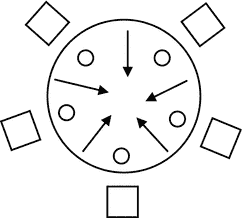

图 6-7.
餐桌旁的五位哲学家

一旦一位哲学家吃完，他就会放下两把叉子并开始思考。如果邻居正在使用叉子，哲学家就不能拿起它。如果五位哲学家每人从右边拿起一把叉子，然后等待邻居释放左边的叉子，会发生什么？这将导致死锁情况，没有哲学家能够吃饭。通过使用 `Lock` 接口的 `tryLock()` 方法，可以轻松避免这种死锁情况。该方法会立即返回，并且永远不会阻塞。如果锁可用，它会获取锁并返回 `true`。如果锁不可用，则返回 `false`。清单 6-33 中的类可用于模拟哲学家，假设 `ReentrantLock` 类的对象代表一把叉子。


```
// Philosopher.java
package com.jdojo.threads;
import java.util.concurrent.locks.Lock;
public class Philosopher {
private final Lock leftFork;
private final Lock rightFork;
private final String name; // 哲学家的名字
public Philosopher(Lock leftFork, Lock rightFork, String name) {
this.leftFork = leftFork;
this.rightFork = rightFork ;
this.name = name;
}
public void think() {
System.out.println(name + " 正在思考...");
}
public void eat() {
// 尝试获取左叉
if (leftFork.tryLock()) {
try {
// 尝试获取右叉
if (rightFork.tryLock()) {
try {
// 两把叉子都拿到了，开始就餐
System.out.println(name + " 正在就餐...");
} finally {
// 释放右叉
rightFork.unlock();
}
}
} finally {
// 释放左叉
leftFork.unlock();
}
}
}
}
清单 6-33.
表示哲学家的哲学家类
```

要创建哲学家，你可以使用如下代码：

```
Lock fork1 = new ReentrantLock();
Lock fork2 = new ReentrantLock();
...
Lock fork5 = new ReentrantLock();
Philosopher p1 = new Philosopher(fork1, fork2, "John");
Philosopher p2 = new Philosopher(fork2, fork3, "Wallace");
...
Philosopher p5 = new Philosopher(fork5, fork1, "Charles");
```

完成代码并在五个不同的线程中运行所有五位哲学家以模拟哲学家就餐问题，这留给读者作为练习。你也可以思考如何使用 `synchronized` 关键字来解决同样的问题。请仔细阅读 `eat()` 方法中的代码。它尝试一次只获取左叉和右叉。如果你只能拿到一把叉子而拿不到另一把，就放下已拿到的那把，以便其他人可以使用。`eat()` 方法中的代码仅包含获取叉子的逻辑。在实际程序中，如果你无法同时拿到两把叉子，你应该等待一段时间，然后再次尝试拿起叉子。你需要编写这部分逻辑。

在实例化 `ReentrantLock` 类时，你可以指定锁的公平性。公平性指的是当多个线程等待获取锁时，锁分配给线程的方式。在公平锁中，线程按照请求锁的顺序获取锁。在非公平锁中，允许线程插队。例如，在非公平锁中，如果某些线程正在等待一把锁，而另一个线程稍后请求同一把锁，并且在该第二个线程请求锁时锁恰好可用，那么该线程可能会在等待线程之前获得锁。这听起来可能有点奇怪，因为让等待线程继续等待，而将锁授予后来请求的线程，对等待线程并不公平。然而，这样做能带来性能提升。使用非公平锁可以减少挂起和恢复线程的开销。`ReentrantLock` 类的 `tryLock()` 方法始终使用非公平锁。你可以按如下方式创建公平锁和非公平锁：

```
Lock nonFairLock1 = new ReentrantLock();       // 非公平锁（默认是非公平）
Lock nonFairLock2 = new ReentrantLock(false);  // 非公平锁
Lock fairLock2 = new ReentrantLock(true);      // 公平锁
```

`ReentrantLock` 提供了一种互斥的锁定机制。也就是说，同一时间只有一个线程可以拥有 `ReentrantLock`。如果你有一个由 `ReentrantLock` 保护的数据结构，那么写入线程和读取线程都必须一次获取一个锁才能修改或读取数据。`ReentrantLock` 一次只能被一个线程拥有的这个限制，如果你的数据结构读取频繁而修改不频繁，可能会降低性能。在这种情况下，你可能希望允许多个读取线程并发访问该数据结构。然而，如果数据结构正在被修改，则只应有一个写入线程能够访问该数据结构。读写锁允许你使用 `ReadWriteLock` 接口的实例来实现这种锁定机制。它有两个方法：一个用于获取读锁，另一个用于获取写锁，如下所示：

```
public interface ReadWriteLock {
Lock readLock();
Lock writeLock();
}
```

`ReentrantReadWriteLock` 类是 `ReadWriteLock` 接口的一个实现。同一时间只有一个线程可以持有 `ReentrantReadWriteLock` 的写锁，而多个线程可以持有它的读锁。清单 6-34 演示了 `ReentrantReadWriteLock` 的用法。注意，在 `getValue()` 方法中，你使用了读锁，这样多个线程可以并发读取数据。`setValue()` 方法使用了写锁，因此同一时间只有一个线程可以修改数据。

提示

`ReadWriteLock` 允许你拥有同一把锁的读版本和写版本。只要没有其他线程持有写锁，多个线程就可以持有读锁。然而，同一时间只有一个线程可以持有写锁。

```
// ReadMostlyData.java
package com.jdojo.threads;
import java.util.concurrent.locks.Lock;
import java.util.concurrent.locks.ReentrantReadWriteLock;
public class ReadMostlyData {
private int value;
private final ReentrantReadWriteLock rwLock = new ReentrantReadWriteLock();
private final Lock rLock = rwLock.readLock();
private final Lock wLock = rwLock.writeLock();
public ReadMostlyData(int value) {
this.value = value;
}
public int getValue() {
// 使用读锁，以便多个线程可以并发读取
rLock.lock();
try {
return this.value;
} finally {
rLock.unlock();
}
}
public void setValue(int value) {
// 使用写锁，以便同一时间只有一个线程可以写入
wLock.lock();
try {
this.value = value ;
} finally {
wLock.unlock();
}
}
}
清单 6-34.
使用 ReentrantReadWriteLock 保护读多写少的数据结构
```

同步器

我讨论了如何使用内部锁和显式锁的互斥机制来协调多个线程对临界区的访问。一些被称为同步器的类用于在需要除临界区互斥访问之外的其他情况下，协调一组线程的控制流。同步器对象与一组线程一起使用。它维护一个状态，并根据其状态，让线程通过或强制其等待。本节讨论以下类型的同步器：

*   信号量

*   屏障

*   阶段器

*   闭锁

*   交换器

其他类也可以充当同步器，例如阻塞队列。

信号量

信号量用于控制可以访问资源的线程数量。同步块也控制对资源（即临界区）的访问。那么，信号量与同步块有何不同？同步块只允许一个线程访问资源（临界区），而信号量允许 N 个线程（N 可以是任何正数）访问资源。

如果 N 设置为 1，信号量可以充当同步块，允许线程对资源进行互斥访问。信号量维护一定数量的虚拟许可。要访问资源，线程需要获取一个许可，并在使用完资源后释放该许可。如果没有可用的许可，请求线程将被阻塞，直到有许可可用。你可以将信号量的许可视为一种令牌。

好的，作为一名高级文档工程师和翻译员，我将严格遵循您提供的注意事项和示例格式，将给定的英文文本翻译成中文。


让我们讨论一个使用信号量的日常生活示例。假设有一家餐厅，里面有三张餐桌。同一时间，这家餐厅只能容纳三位顾客用餐。当一位顾客到达餐厅时，他必须领取一张代表餐桌的令牌。用餐完毕后，他会归还令牌。每张令牌代表一张餐桌。如果一位顾客到达餐厅时，三张餐桌都已在使用中，他必须等待，直到有空桌。如果无法立即获得空桌，你可以选择等待，或者去另一家餐厅。让我们使用信号量来模拟这个示例。你将拥有一个包含三个许可的信号量。每个许可代表一张餐桌。`java.util.concurrent` 包中的 `Semaphore` 类代表了信号量同步器。你可以使用它的其中一个构造器来创建一个信号量：

```
final int MAX_PERMITS = 3;
Semaphore s = new Semaphores(MAX_PERMITS);
```

`Semaphore` 类的另一个构造器将公平性作为第二个参数：

```
final int MAX_PERMITS = 3;
Semaphore s = new Semaphores(MAX_PERMITS, true); // 一个公平的信号量
```

信号量的公平性与锁的公平性含义相同。如果你创建了一个公平的信号量，在多个线程请求许可的情况下，信号量将保证先进先出（FIFO）。也就是说，最先请求许可的线程将最先获得许可。

要获取一个许可，请使用 `acquire()` 方法。如果许可可用，它会立即返回。如果许可不可用，它会阻塞。线程在等待许可变为可用时可以被中断。`Semaphore` 类的其他方法允许你一次性获取一个或多个许可。

要释放一个许可，请使用 `release()` 方法。

清单 6-35 包含了 `Restaurant` 类的代码。它的构造器将餐厅可用的餐桌数量作为参数，并创建一个信号量，该信号量的许可数量等于餐桌数量。顾客使用其 `getTable()` 和 `returnTable()` 方法来分别获取和归还餐桌。在 `getTable()` 方法内部，你获取一个许可。如果顾客调用 `getTable()` 方法时没有可用餐桌，他必须等待直到有空桌。这个类依赖于在清单 6-36 中声明的 `RestaurantCustomer` 类。

```
// Restaurant.java
package com.jdojo.threads;
import java.util.concurrent.Semaphore;
public class Restaurant {
private final Semaphore tables;
public Restaurant(int tablesCount) {
// 使用我们拥有的餐桌数量创建一个信号量
this.tables = new Semaphore(tablesCount);
}
public void getTable(int customerID) {
try {
System.out.println("顾客 #" + customerID
+ " 正在尝试获取一张餐桌。");
// 为一张餐桌获取一个许可
tables.acquire();
System.out.println("顾客 #" + customerID + " 获得了一张餐桌。");
} catch (InterruptedException e) {
e.printStackTrace();
}
}
public void returnTable(int customerID) {
System.out.println("顾客 #" + customerID + " 归还了一张餐桌。");
tables.release();
}
public static void main(String[] args) {
// 创建一个有两张餐桌的餐厅
Restaurant restaurant = new Restaurant(2);
// 创建五位顾客
for (int i = 1; i <= 5; i++) {
RestaurantCustomer c = new RestaurantCustomer(restaurant, i);
c.start();
}
}
}
顾客 #4 正在尝试获取一张餐桌。
顾客 #5 正在尝试获取一张餐桌。
顾客 #1 正在尝试获取一张餐桌。
顾客 #3 正在尝试获取一张餐桌。
...
清单 6-35.
一个使用信号量控制餐桌访问的餐厅类
```

清单 6-36 包含了 `RestaurantCustomer` 类的代码，该类的对象代表餐厅中的一位顾客。顾客线程的 `run()` 方法从餐厅获取一张餐桌，用餐一段随机时间，然后将餐桌归还给餐厅。当你运行 `Restaurant` 类时，你可能会得到类似但不完全相同的输出。你可能会注意到，你创建了一个只有两张餐桌的餐厅，而有五位顾客试图用餐。在任何给定时间，只有两位顾客在用餐，如输出所示。

```
// RestaurantCustomer.java
package com.jdojo.threads;
import java.util.Random;
class RestaurantCustomer extends Thread {
private final Restaurant r;
private final int customerID;
private static final Random random = new Random();
public RestaurantCustomer(Restaurant r, int customerID) {
this.r = r;
this.customerID = customerID;
}
@Override
public void run() {
r.getTable(this.customerID); // 获取一张餐桌
try {
// 用餐一段时间。使用 1 到 30 秒之间的随机数
int eatingTime = random.nextInt(30) + 1;
System.out.println("顾客 #" + this.customerID
+ " 将用餐 " + eatingTime + " 秒。");
Thread.sleep(eatingTime * 1000);
System.out.println("顾客 #" + this.customerID
+ " 用餐完毕。");
} catch (InterruptedException e) {
e.printStackTrace();
} finally {
r.returnTable(this.customerID);
}
}
}
清单 6-36.
一个表示餐厅顾客的 RestaurantCustomer 类
```

信号量的许可数量并不局限于创建时的数量。每次调用 `release()` 方法都会为其增加一个许可。因此，如果你调用 `release()` 方法的次数多于调用其 `acquire()` 方法的次数，你最终拥有的许可数量将超过初始数量。许可的获取不是基于每个线程的。一个线程可以从信号量获取一个许可，而另一个线程可以归还它。这将对正确使用获取和释放许可的责任留给了开发者。信号量还有其他获取许可的方法，这些方法允许你在无法立即获得许可时退出等待，而不是强制等待，例如 `tryAcquire()` 和 `acquireUninterruptibly()` 方法。

屏障

屏障用于让一组线程在某个屏障点会合。组中到达屏障的线程会等待，直到该组中的所有线程都到达。一旦组中的最后一个线程到达屏障，组中的所有线程都会被释放。当你有一个可以分解为子任务的任务时，可以使用屏障；每个子任务可以在单独的线程中执行，并且每个线程必须在一个公共点会合以合并它们的结果。图 6-8 到图 6-11 描述了屏障同步器如何让一组三个线程在屏障点会合并让它们继续执行。

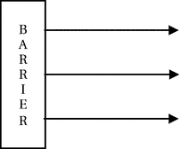

图 6-11.

所有三个线程成功通过屏障

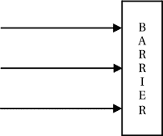

图 6-10.

所有三个线程到达屏障，然后同时被释放

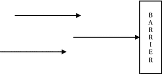

图 6-9.

一个线程等待另外两个线程到达屏障

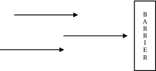

图 6-8.

三个线程到达一个屏障


`java.util.concurrent`包中的`CyclicBarrier`类提供了屏障同步器的实现。它被称为循环屏障，因为一旦屏障点上的所有等待线程被释放，你就可以通过调用其`reset()`方法来重用该屏障。它还允许你关联一个屏障动作，这是一个`Runnable`任务（一个实现了`Runnable`接口的类的对象）。屏障动作在所有线程被释放之前执行。你可以将屏障动作想象成所有线程在屏障处集合时、但在它们被释放之前的“派对时间”。以下是在程序中使用屏障需要执行的步骤：

1.  创建一个`CyclicBarrier`类的对象，并指定线程组中的线程数量。

```
    CyclicBarrier barrier = new CyclicBarrier(5); // 5 个线程
    ```

如果你想在所有线程在屏障处集合时执行一个屏障动作，可以使用`CyclicBarrier`类的另一个构造器。

```
    // 假设 BarrierAction 类实现了 Runnable 接口
    Runnable barrierAction = new BarrierAction();
    CyclicBarrier barrier = new CyclicBarrier(5, barrierAction);
    ```

2.  当一个线程准备在屏障处等待时，该线程执行`CyclicBarrier`类的`await()`方法。`await()`方法有两种形式。一种让你无条件地等待所有其他线程，另一种让你指定超时时间。

清单 6-37 中的程序演示了如何使用循环屏障。你可能会得到不同的输出。然而，事件的顺序是相同的：所有三个线程将工作一段时间，在屏障处等待其他线程到达，举行派对时间，然后通过屏障。

```
// MeetAtBarrier.java
package com.jdojo.threads;
import java.util.Random;
import java.util.concurrent.CyclicBarrier;
import java.util.concurrent.BrokenBarrierException;
public class MeetAtBarrier extends Thread {
private final CyclicBarrier barrier;
private final int ID;
private static final Random random = new Random();
public MeetAtBarrier(int ID, CyclicBarrier barrier) {
this.ID = ID;
this.barrier = barrier;
}
@Override
public void run() {
try {
// 生成一个介于 1 到 30 之间的随机数作为等待时间
int workTime = random.nextInt(30) + 1;
System.out.println("线程 #" + ID + " 将工作 " + workTime + " 秒");
// 是的。对这个线程来说，睡眠就是工作！！！
Thread.sleep(workTime * 1000);
System.out.println("线程 #" + ID + " 正在屏障处等待...");
// 在屏障处等待组内其他线程到达
this.barrier.await();
System.out.println("线程 #" + ID + " 通过了屏障...");
} catch (InterruptedException e) {
e.printStackTrace();
} catch (BrokenBarrierException e) {
System.out.println("屏障已损坏...");
}
}
public static void main(String[] args) {
// 为三个线程的组创建一个屏障，并附带一个屏障动作
String msg = "我们都到齐了。派对时间到了...";
Runnable barrierAction = () -> System.out.println(msg);
CyclicBarrier barrier = new CyclicBarrier(3, barrierAction);
for (int i = 1; i <= 3; i++) {
MeetAtBarrier t = new MeetAtBarrier(i, barrier);
t.start();
}
}
}
线程 #2 将工作 15 秒
线程 #3 将工作 2 秒
线程 #1 将工作 30 秒
线程 #3 正在屏障处等待...
线程 #2 正在屏障处等待...
线程 #1 正在屏障处等待...
我们都到齐了。派对时间到了...
线程 #3 通过了屏障...
线程 #2 通过了屏障...
线程 #1 通过了屏障...
清单 6-37.
演示如何在程序中使用 CyclicBarrier 的类
```

你可能已经注意到，在`MeetAtBarrier`类的`run()`方法内部，你捕获了`BrokenBarrierException`。如果某个线程在屏障点等待时超时或被中断，则该屏障被视为已损坏。超时的线程会通过`TimeoutException`被释放，而屏障处所有等待的线程则会通过`BrokenBarrierException`被释放。

提示

`CyclicBarrier`类的`await()`方法返回调用它的线程的到达索引。最后一个到达屏障的线程索引为零，第一个到达的线程索引为组内线程数减一。你可以使用这个索引在程序中进行任何特殊处理。例如，最后一个到达屏障的线程可以记录所有参与线程完成特定轮次计算的时间。

Phasers

`java.util.concurrent`包中的`Phaser`类为另一种称为 phaser 的同步屏障提供了实现。`Phaser`提供的功能类似于`CyclicBarrier`和`CountDownLatch`同步器。我将在下一节介绍`CountDownLatch`同步器。然而，它更强大、更灵活。它提供了以下特性：

*   与`CyclicBarrier`一样，`Phaser`也是可重用的。

*   与`CyclicBarrier`不同，在`Phaser`上同步的参与方数量可以动态变化。在`CyclicBarrier`中，参与方数量在创建屏障时是固定的。然而，在`Phaser`中，你可以随时添加或移除参与方。

*   `Phaser`有一个关联的阶段编号，从零开始。当所有已注册的参与方到达`Phaser`时，`Phaser`前进到下一个阶段，阶段编号增加一。阶段编号的最大值是`Integer.MAX_VALUE`。达到最大值后，阶段编号从零重新开始。

*   `Phaser`有一个终止状态。在终止状态下，对`Phaser`调用的所有同步方法会立即返回，而无需等待前进。`Phaser`类提供了不同的方式来终止一个 phaser。

*   `Phaser`有三种类型的参与方计数：已注册参与方计数、已到达参与方计数和未到达参与方计数。已注册参与方计数是已注册进行同步的参与方数量。已到达参与方计数是已到达 phaser 当前阶段的参与方数量。未到达参与方计数是尚未到达 phaser 当前阶段的参与方数量。当最后一个参与方到达时，phaser 前进到下一个阶段。请注意，所有三种类型的参与方计数都是动态的。

*   可选地，`Phaser`允许你在所有已注册参与方到达 phaser 时执行一个 phaser 动作。回想一下，`CyclicBarrier`允许你执行一个屏障动作，这是一个`Runnable`任务。与`CyclicBarrier`不同，你通过在`Phaser`类的`onAdvance()`方法中编写代码来指定 phaser 动作。这意味着你需要通过从`Phaser`类继承来使用你自己的 phaser 类，并重写`onAdvance()`方法以提供一个`Phaser`动作。我稍后会讨论一个这样的例子。

图 6-12 展示了一个具有三个阶段的 phaser。它在每个阶段同步不同数量的参与方。图中的箭头代表一个参与方。

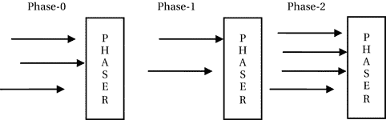

图 6-12.

一个具有三个阶段的 Phaser，每个阶段有不同数量的参与方

使用`Phaser`有几个步骤。你可以使用其默认构造器创建一个没有初始注册参与方的`Phaser`。

```
// 一个没有注册参与方的 phaser
Phaser phaser = new Phaser();
```

另一个构造器允许你在创建`Phaser`时注册参与方。


```
// 一个注册了 5 个参与方的 Phaser
Phaser phaser = new Phaser(5);
```

`Phaser` 可以组织成树状结构。其他构造函数允许你通过指定新创建 `Phaser` 的父级来创建 `Phaser`。创建 `Phaser` 后，下一步是注册那些希望在 phaser 上同步的参与方。你可以通过以下方式注册参与方：

*   在创建 `Phaser` 对象时，通过 `Phaser` 类的构造函数指定要注册的参与方数量

*   使用 `Phaser` 类的 `register()` 方法一次注册一个参与方

*   使用 `Phaser` 类的 `bulkRegister(int parties)` 方法批量注册指定数量的参与方

`Phaser` 的已注册参与方可以随时通过注册新参与方或注销已注册的参与方来改变。你可以使用 `Phaser` 类的 `arriveAndDeregister()` 方法注销一个已注册的参与方。该方法允许一个参与方到达 `Phaser` 并注销，而无需等待其他参与方到达。如果某个参与方被注销，则在 `Phaser` 的下一个阶段中，参与方数量会减少一个。

通常，`Phaser` 中的一个参与方代表一个线程。然而，`Phaser` 并不将参与方的注册与特定线程关联。它只是维护一个计数，当注册一个参与方时计数加一，当注销一个参与方时计数减一。

`Phaser` 最重要的部分是多个参与方在其上同步的方式。在 `Phaser` 上同步的典型方式是让已注册的参与方到达并在 `Phaser` 处等待其他已注册的参与方到达。一旦最后一个注册的参与方到达 `Phaser`，所有参与方将前进到 `Phaser` 的下一个阶段。

`Phaser` 类的 `arriveAndAwaitAdvance()` 方法允许一个参与方到达 `Phaser`，并等待其他参与方到达后才能继续执行。

`Phaser` 类的 `arriveAndDeregister()` 方法允许一个参与方到达 `Phaser` 并注销，而无需等待其他参与方到达。注销后，前进到未来阶段所需的参与方数量减少一个。通常，`arriveAndDeregister()` 方法由控制器参与方使用，其职责是控制其他参与方的前进，而自身不参与前进。通常，控制器参与方先在 `Phaser` 上注册自己，并等待某些条件发生；当所需条件满足时，它到达并注销自己，这样其他参与方就可以在 `Phaser` 上同步并前进。

让我们通过一个使用 `Phaser` 同步一组任务以便它们能同时启动的示例来讲解。清单 6-38 中所示的 `StartTogetherTask` 类实例代表此示例中的一个任务。

```
// StartTogetherTask.java
package com.jdojo.threads;
import java.util.Random;
import java.util.concurrent.Phaser;
public class StartTogetherTask extends Thread {
private final Phaser phaser;
private final String taskName;
private static Random rand = new Random();
public StartTogetherTask(String taskName, Phaser phaser) {
this.taskName = taskName;
this.phaser = phaser;
}
@Override
public void run() {
System.out.println(taskName + ":Initializing...");
// 休眠 1 到 5 秒之间的随机时间
int sleepTime = rand.nextInt(5) + 1;
try {
Thread.sleep(sleepTime * 1000);
} catch (InterruptedException e) {
e.printStackTrace();
}
System.out.println(taskName + ":Initialized...");
// 等待所有参与方到达以启动任务
phaser.arriveAndAwaitAdvance();
System.out.println(taskName + ":Started...");
}
}
清单 6-38.
一个 StartTogetherTask 类，用于表示通过在 Phaser 上同步而同时启动的任务
```

`StartTogetherTask` 类继承自 `Thread` 类。其构造函数接受一个任务名称和一个 `Phaser` 实例。在其 `run()` 方法中，它打印一条正在初始化的消息。它通过休眠 1 到 5 秒的随机时间来模拟初始化过程。之后，它打印一条初始化完成的消息。在此阶段，它通过调用 `Phaser` 的 `arriveAndAwaitAdvance()` 方法等待 `Phaser` 前进。此方法将阻塞，直到所有注册的参与方都到达 `Phaser`。当此方法返回时，它打印一条任务已启动的消息。清单 6-39 包含测试三个 `StartTogetherTask` 类型任务的代码。

```
// StartTogetherTaskTest.java
package com.jdojo.threads;
import java.util.concurrent.Phaser;
public class StartTogetherTaskTest {
public static void main(String[] args) {
// 从 1 个已注册的参与方开始
Phaser phaser = new Phaser(1);
// 让我们启动三个任务
final int TASK_COUNT = 3;
for (int i = 1; i <= TASK_COUNT; i++) {
// 为每个任务向 phaser 注册一个新的参与方
phaser.register();
// 现在创建任务并启动它
String taskName = "Task #" + i;
StartTogetherTask task = new StartTogetherTask(taskName, phaser);
task.start();
}
// 现在，注销自身，以便所有任务可以前进
phaser.arriveAndDeregister();
}
}
Task #3:Initializing...
Task #2:Initializing...
Task #1:Initializing...
Task #3:Initialized...
Task #1:Initialized...
Task #2:Initialized...
Task #2:Started...
Task #1:Started...
Task #3:Started...
清单 6-39.
使用 Phaser 测试 StartTogetherTask 类的若干对象
```

首先，程序通过指定 1 作为初始注册的参与方来创建一个 `Phaser` 对象。

```
// 从 1 个已注册的参与方开始
Phaser phaser = new Phaser(1);
```

你一次一个地向 `Phaser` 注册一个任务。如果某个任务（或参与方）在其他任务注册之前就被注册并启动，那么第一个任务将独自前进 phaser，因为此时只有一个已注册的参与方，并且它会自行到达 phaser。因此，你需要在开始时从一个已注册的参与方开始。它充当其他任务的控制器参与方。

你在一个循环中创建三个任务。在循环内部，你向 `Phaser` 注册一个参与方（代表一个任务），创建一个任务，并启动它。完成任务的设置后，你调用 `Phaser` 的 `arriveAndDeregister()` 方法。这会处理你在创建 `Phaser` 时注册的那个额外参与方。此方法使一个参与方到达 `Phaser` 并注销，而无需等待其他已注册的参与方到达。此方法调用结束后，就由这三个任务自行到达 `Phaser` 并前进。一旦所有三个任务都到达 `Phaser`，它们将同时前进，从而使它们同时启动。你可能会得到不同的输出。然而，输出中的最后三条消息始终是关于启动这三个任务的。

如果你不想使用额外的参与方作为控制器，你需要预先注册所有任务才能使此程序正确运行。你可以将 `StartTogetherTaskTest` 类的 `main()` 方法中的代码重写如下：

```
public static void main(String[] args) {
// 从 0 个已注册的参与方开始
Phaser phaser = new Phaser();
// 让我们启动三个任务
final int TASK_COUNT = 3;
// 一次性初始化所有任务
phaser.bulkRegister(TASK_COUNT);
for(int i = 1; i <= TASK_COUNT; i++) {
// 现在创建任务并启动它
String taskName = "Task #" + i;
StartTogetherTask task = new StartTogetherTask(taskName, phaser);
task.start();
}
}
```

这次，你创建了一个没有注册参与方的 `Phaser`。你使用 `bulkRegister()` 方法一次性注册了所有参与方。请注意，你不再在循环内部注册参与方。新代码与旧代码具有相同的效果。这只是编写相同逻辑的不同方式。


与 `CyclicBarrier` 类似，`Phaser` 允许你在阶段推进时通过其 `onAdvance()` 方法执行一个操作。你需要通过继承 `Phaser` 类来创建自己的 phaser 类，并重写 `onAdvance()` 方法以编写自定义的 `Phaser` 操作。在每个阶段推进时，phaser 的 `onAdvance()` 方法会被调用。`Phaser` 类中的 `onAdvance()` 方法声明如下。第一个参数是阶段编号，第二个参数是已注册的参与方数量。

```
protected boolean onAdvance(int phase, int registeredParties)
```

除了定义阶段推进操作外，`Phaser` 类的 `onAdvance()` 方法还控制着 `Phaser` 的终止状态。如果其 `onAdvance()` 方法返回 `true`，则 `Phaser` 终止。你可以使用 `Phaser` 类的 `isTerminated()` 方法来检查 phaser 是否已终止。你也可以使用其 `forceTermination()` 方法来终止一个 phaser。

清单 6-40 演示了如何添加一个 `Phaser` 操作。这是一个简单的示例，但它展示了添加和执行 `Phaser` 操作的概念。它使用一个匿名类来创建自定义的 `Phaser` 类。该匿名类重写了 `onAdvance()` 方法来定义一个 `Phaser` 操作。它仅在 `onAdvance()` 方法中打印一条消息作为 `Phaser` 操作。它返回 `false`，这意味着 phaser 不会从 `onAdvance()` 方法终止。随后，它将自身注册为一个参与方，并使用 `arriveAndDeregister()` 方法触发阶段推进。在每个阶段推进时，由 `onAdvance()` 方法定义的 `Phaser` 操作都会被执行。

```
// PhaserActionTest.java
package com.jdojo.threads;
import java.util.concurrent.Phaser;
public class PhaserActionTest {
public static void main(String[] args) {
// 使用匿名类创建一个 Phaser 对象，并重写其
// onAdvance() 方法来定义一个 phaser 操作
Phaser phaser = new Phaser() {
@Override
protected boolean onAdvance(int phase, int parties) {
System.out.println("Inside onAdvance(): phase = "
+ phase + ", Registered Parties = " + parties);
// 通过返回 false 来不终止 phaser
return false;
}
};
// 将自身（"main" 线程）注册为一个参与方
phaser.register();
// 此处 phaser 未终止
System.out.println("#1: isTerminated(): " + phaser.isTerminated());
// 由于我们只注册了一个参与方，此次到达将推进
// phaser，并且已注册参与方减少到零
phaser.arriveAndDeregister();
// 触发另一个阶段推进
phaser.register();
phaser.arriveAndDeregister();
// Phaser 仍未终止
System.out.println("#2: isTerminated(): " + phaser.isTerminated());
// 终止 phaser
phaser.forceTermination();
// Phaser 已终止
System.out.println("#3: isTerminated(): " + phaser.isTerminated());
}
}
#1: isTerminated(): false
Inside onAdvance(): phase = 0, Registered Parties = 0
Inside onAdvance(): phase = 1, Registered Parties = 0
#2: isTerminated(): false
#3: isTerminated(): true
清单 6-40.
向 Phaser 添加 Phaser 操作
```

让我们考虑使用 `Phaser` 来解决一个复杂任务。这次，`Phaser` 通过在每个阶段同步多个参与方来在多个阶段中工作。多个任务在每个阶段生成随机整数，并将它们添加到一个 `List` 中。在 `Phaser` 终止后，你计算所有随机生成的整数的总和。

清单 6-41 包含了一个任务的代码。我们将此任务称为 `AdderTask`。在其 `run()` 方法中，它创建一个介于 1 到 10 之间的随机整数，将该整数添加到一个 `List` 中，并等待 `Phaser` 推进。它会在 `Phaser` 的每个阶段持续向列表中添加一个整数，直到 `Phaser` 终止。

```
// AdderTask.java
package com.jdojo.threads;
import java.util.List;
import java.util.Random;
import java.util.concurrent.Phaser;
public class AdderTask extends Thread {
private final Phaser phaser;
private final String taskName;
private final List list;
private static Random rand = new Random();
public AdderTask(String taskName, Phaser phaser, List list) {
this.taskName = taskName;
this.phaser = phaser;
this.list = list;
}
@Override
public void run() {
do {
// 生成一个介于 1 和 10 之间的随机整数
int num = rand.nextInt(10) + 1;
System.out.println(taskName + " added " + num);
// 将整数添加到列表
list.add(num);
// 等待所有参与方到达 phaser
phaser.arriveAndAwaitAdvance();
} while (!phaser.isTerminated());
}
}
清单 6-41.
一个 AdderTask 类，其实例可与 Phaser 一起使用以生成一些整数
```

清单 6-42 通过从 `Phaser` 类继承一个匿名类来创建一个 `Phaser`。在其 `onAdvance()` 方法中，它在第二次推进后终止 phaser（由 `PHASE_COUNT` 常量控制），或者如果已注册参与方减少到零时也终止。你使用一个同步的 `List` 来收集由加法器任务生成的随机整数。你计划使用三个加法器任务，因此你向 phaser 注册了四个参与方（比任务数多一个）。额外的参与方将用于同步每个阶段。它等待每个阶段推进，直到 `Phaser` 终止。最后，计算所有加法器任务生成的随机整数的总和，并显示在标准输出上。你可能会得到不同的输出。

```
// AdderTaskTest.java
package com.jdojo.threads;
import java.util.List;
import java.util.ArrayList;
import java.util.Collections;
import java.util.concurrent.Phaser;
public class AdderTaskTest {
public static void main(String[] args) {
final int PHASE_COUNT = 2;
Phaser phaser
= new Phaser() {
@Override
public boolean onAdvance(int phase, int parties) {
// 打印 phaser 详情
System.out.println("Phase:" + phase
+ ", Parties:" + parties
+ ", Arrived:" + this.getArrivedParties());
boolean terminatePhaser = false;
// 当我们达到 PHASE_COUNT 时终止 phaser
// 或者没有已注册的参与方
if (phase >= PHASE_COUNT - 1 || parties == 0) {
terminatePhaser = true;
}
return terminatePhaser ;
}
};
// 使用一个同步的 List
List list = Collections.synchronizedList(new ArrayList());
// 让我们启动三个任务
final int ADDER_COUNT = 3;
// 注册的参与方数量比加法器任务数多一个。
// 额外的参与方将用于同步以计算所有加法器任务
// 生成的所有整数的结果
phaser.bulkRegister(ADDER_COUNT + 1);
for (int i = 1; i <= ADDER_COUNT; i++) {
// 创建任务并启动它
String taskName = "Task #" + i;
AdderTask task = new AdderTask(taskName, phaser, list);
task.start();
}
// 等待 phaser 终止，以便我们可以计算
// 所有加法器任务生成的整数的总和
while (!phaser.isTerminated()) {
phaser.arriveAndAwaitAdvance();
}
// Phaser 现已终止。计算总和
int sum = 0;
for (Integer num : list) {
sum = sum + num;
}
System.out.println("Sum = " + sum);
}
}
Task #2 added 2
Task #1 added 2
Task #3 added 5
Phase:0, Parties:4, Arrived:4
Task #3 added 5
Task #1 added 1
Task #2 added 7
Phase:1, Parties:4, Arrived:4
Sum = 22
清单 6-42.
一个使用多个 AdderTask 任务与 Phaser 的程序
```

闭锁


锁存器（Latch）的工作方式与屏障（Barrier）类似，它也会让一组线程等待，直到达到其终止状态。一旦锁存器达到终止状态，它就会让所有线程通过。与屏障不同，锁存器是一次性对象。一旦达到终止状态，就不能重置和重复使用。当许多活动必须等待一定数量的一次性活动完成后才能进行时，就可以使用锁存器。例如，一个服务必须在其依赖的所有服务都启动后才能启动。

`java.util.concurrent` 包中的 `CountDownLatch` 类提供了锁存器的实现。它通过构造函数初始化为一个计数。所有调用该锁存器对象 `await()` 方法的线程都会被阻塞，直到锁存器的 `countDown()` 方法被调用的次数与其设置的计数相同。当 `countDown()` 方法的调用次数等于其计数时，锁存器达到终止状态，所有被阻塞的线程都会被释放。一旦锁存器达到终止状态，其 `await()` 方法会立即返回。你可以将锁存器设置的计数视为一组线程将要等待发生的事件数量。每个事件的发生都会调用其 `countDown()` 方法。

清单 6-43 和清单 6-44 分别包含了表示辅助服务和主服务的类。主服务依赖于辅助服务来启动。在所有辅助服务启动之后，主服务才能启动。

```
// LatchHelperService.java
package com.jdojo.threads;
import java.util.concurrent.CountDownLatch;
import java.util.Random;
public class LatchHelperService extends Thread {
private final int ID;
private final CountDownLatch latch;
private final Random random = new Random();
public LatchHelperService(int ID, CountDownLatch latch) {
this.ID = ID;
this.latch = latch;
}
@Override
public void run() {
try {
int startupTime = random.nextInt(30) + 1;
System.out.println("服务 #" + ID + " 将在 " + startupTime + " 秒后启动...");
Thread.sleep(startupTime * 1000);
System.out.println("服务 #" + ID + " 已启动...");
} catch (InterruptedException e) {
e.printStackTrace();
} finally {
// 在锁存器上计数减一，表示它已启动
this.latch.countDown();
}
}
}
清单 6-43.
表示辅助服务的类
```

```
// LatchMainService.java
package com.jdojo.threads;
import java.util.concurrent.CountDownLatch;
public class LatchMainService extends Thread {
private final CountDownLatch latch;
public LatchMainService(CountDownLatch latch) {
this.latch = latch;
}
@Override
public void run() {
try {
System.out.println("主服务正在等待辅助服务启动...");
latch.await();
System.out.println("主服务已启动...");
} catch (InterruptedException e) {
e.printStackTrace();
}
}
}
清单 6-44.
表示依赖于辅助服务才能启动的主服务的类
```

清单 6-45 列出了一个程序，用于测试使用锁存器的辅助服务和主服务概念。你创建了一个初始化为 2 的锁存器。主服务线程首先启动，并调用锁存器的 `await()` 方法等待辅助服务启动。一旦两个辅助线程都调用了锁存器的 `countDown()` 方法，主服务就会启动。输出结果清晰地解释了事件的顺序。

```
// LatchTest.java
package com.jdojo.threads;
import java.util.concurrent.CountDownLatch;
public class LatchTest {
public static void main(String[] args) {
// 创建一个计数器为 2 的倒计时锁存器
CountDownLatch latch = new CountDownLatch(2);
// 创建并启动主服务
LatchMainService ms = new LatchMainService(latch);
ms.start();
// 创建并启动两个辅助服务
for (int i = 1; i <= 2; i++) {
LatchHelperService lhs = new LatchHelperService(i, latch);
lhs.start();
}
}
}
主服务正在等待辅助服务启动...
服务 #1 将在 12 秒后启动...
服务 #2 将在 2 秒后启动...
服务 #2 已启动...
服务 #1 已启动...
主服务已启动...
清单 6-45.
使用辅助服务和主服务测试锁存器概念的类
```

交换器（Exchangers）

交换器是屏障的另一种形式。与屏障类似，交换器允许两个线程在同步点相互等待。当两个线程都到达时，它们交换一个对象并继续各自的活动。这在构建两个独立方需要不时交换信息的系统中非常有用。图 6-13 到图 6-15 描述了交换器如何与两个线程一起工作，并让它们交换一个对象。

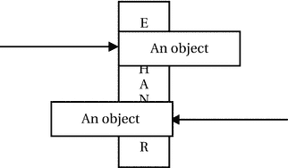

图 6-15.

两个线程在交换点相遇并交换对象

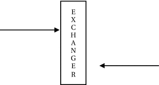

图 6-14.

一个线程到达交换点并等待另一个线程到达

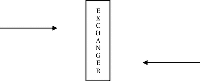

图 6-13.

两个线程独立执行它们的工作

`Exchanger<V>` 类为交换器同步器提供了实现。它有一个构造函数，不带参数。类型参数 `V` 是将在两方之间交换的 Java 对象类型。你可以创建一个允许两个线程交换 `Long` 对象的交换器，如下所示：

```
Exchanger exchanger = new Exchanger();
```

`Exchanger` 类只有一个方法 `exchange()`。当一个线程准备好与另一个线程交换对象时，它会调用交换器的 `exchange()` 方法，并等待另一个线程来交换对象。正在等待交换对象的线程可能会被中断。`exchange()` 方法的另一个重载版本接受一个超时时间。如果指定了超时时间，调用此方法的线程将等待另一个线程来交换对象，直到超时时间过去。`exchange()` 方法将要传递给另一个线程的对象作为参数，并返回另一个线程传递的对象。你可以像这样调用 `exchange()` 方法：

```
objectReceived = exchanger.exchange(objectedPassed);
```

清单 6-46、清单 6-47 和清单 6-48 演示了在构建生产者/消费者系统时如何使用交换器来交换缓冲区，该缓冲区是一个 `Integer` 对象的 `ArrayList`。要声明一个整数对象的数组列表，你必须像下面这样声明：

```
ArrayList buffer = new ArrayList();
```

在清单 6-48 中，你创建了一个交换器，如下所示：

```
Exchanger> exchanger = new Exchanger>();
```


类型声明 `Exchanger<ArrayList<Integer>>` 表示该交换器将允许两个线程交换类型为 `ArrayList<Integer>` 的对象。你还可以注意到，`ExchangerProducer` 和 `ExchangerConsumer` 类中的类型声明与之前的声明相匹配。生产者填充数据并等待一段时间，以便让用户感觉它确实在填充数据。它等待消费者将已填满的缓冲区与消费者提供的空缓冲区进行交换。消费者则执行相反的操作。它等待生产者交换缓冲区。当它从生产者那里获得一个满的缓冲区时，它会清空该缓冲区，然后再次等待生产者将其空缓冲区交换为一个满的缓冲区。由于生产者和消费者都在无限循环中运行，程序将不会结束。你需要手动结束程序。你将得到类似于清单 6-48 所示的输出。

```
// ExchangerProducer.java
package com.jdojo.threads;
import java.util.concurrent.Exchanger;
import java.util.ArrayList;
import java.util.Random;
public class ExchangerProducer extends Thread {
private final Exchanger> exchanger;
private ArrayList buffer = new ArrayList();
private final int bufferLimit;
private final Random random = new Random();
private int currentValue = 0; // 用于生成值
public ExchangerProducer(Exchanger> exchanger,
int bufferLimit) {
this.exchanger = exchanger;
this.bufferLimit = bufferLimit;
}
@Override
public void run() {
// 持续生成整数
while (true) {
try {
System.out.println("生产者正在用数据填充缓冲区...");
// 通过睡眠等待一段时间
int sleepTime = random.nextInt(20) + 1;
Thread.sleep(sleepTime * 1000);
// 填充缓冲区
this.fillBuffer();
System.out.println("生产者已生成:" + buffer);
// 等待消费者交换数据
System.out.println("生产者正在等待交换数据...");
buffer = exchanger.exchange(buffer);
} catch (InterruptedException e) {
e.printStackTrace();
}
}
}
public void fillBuffer() {
for (int i = 1; i <= bufferLimit; i++) {
buffer.add(++currentValue);
}
}
}
清单 6-46.
一个将使用交换器与消费者交换数据的生产者线程
```

```
// ExchangerConsumer.java
package com.jdojo.threads;
import java.util.concurrent.Exchanger;
import java.util.ArrayList;
import java.util.Random;
public class ExchangerConsumer extends Thread {
private final Exchanger> exchanger;
private ArrayList buffer = new ArrayList();
private final Random random = new Random();
public ExchangerConsumer(Exchanger> exchanger) {
this.exchanger = exchanger;
}
@Override
public void run() {
// 持续消费整数
while (true) {
try {
// 等待消费者交换数据
System.out.println("消费者正在等待交换数据...");
buffer = exchanger.exchange(buffer);
System.out.println("消费者已接收:" + buffer);
System.out.println("消费者正在清空缓冲区中的数据...");
// 通过睡眠等待一段时间
int sleepTime = random.nextInt(20) + 1;
// 睡眠一段时间
Thread.sleep(sleepTime * 1000);
// 清空缓冲区
this.emptyBuffer();
} catch (InterruptedException e) {
e.printStackTrace();
}
}
}
public void emptyBuffer() {
buffer.clear();
}
}
清单 6-47.
一个将使用交换器与生产者交换数据的消费者线程
```

```
// ExchangerProducerConsumerTest.java
package com.jdojo.threads;
import java.util.concurrent.Exchanger;
import java.util.ArrayList;
public class ExchangerProducerConsumerTest {
public static void main(String[] args) {
Exchanger> exchanger = new Exchanger();
// 生产者每次将生成 5 个整数
ExchangerProducer producer = new ExchangerProducer(exchanger, 5);
ExchangerConsumer consumer = new ExchangerConsumer(exchanger);
producer.start();
consumer.start();
}
}
生产者正在用数据填充缓冲区...
消费者正在等待交换数据...
生产者已生成:[1, 2, 3, 4, 5]
生产者正在等待交换数据...
生产者正在用数据填充缓冲区...
消费者已接收:[1, 2, 3, 4, 5]
消费者正在清空缓冲区中的数据...
...
清单 6-48.
一个使用交换器测试生产者/消费者系统的类
```

执行器框架

任务是工作的逻辑单元，通常使用线程来表示和执行任务。在程序中对其进行建模之前，应考虑任务执行的许多方面。任务的几个方面如下：

*   如何创建它。
*   如何提交它以供执行。
*   如何执行它。它是同步执行还是异步执行？
*   它执行的时间。是提交后立即执行还是排队执行？
*   哪个线程执行它？它是在提交它的线程中执行还是在另一个线程中执行？
*   当任务执行完成时，我们如何获取其结果？
*   我们如何知道其执行期间发生的错误？
*   它的执行是否依赖于其他任务完成？

任务可以表示为 `Runnable`。如果你想使用线程管理任务，请按照接下来描述的步骤操作。你可以创建一个类来表示任务。

```
public class MyTask implements Runnable {
public void run() {
// 任务处理逻辑写在这里
}
}
```

你可以按如下方式创建任务：

```
MyTask task1 = new MyTask();
MyTask task2 = new MyTask();
MyTask task3 = new MyTask();
```

要执行这些任务，你可以按如下方式使用线程：

```
Thread t1 = new Thread(task1);
Thread t2 = new Thread(task2);
Thread t3 = new Thread(task3);
t1.start();
t2.start();
t3.start();
```

如果你想获取任务执行的结果，你必须编写额外的代码。你可能会注意到，像这样管理任务即使不是不可能，也是很困难的。任务执行的另一个方面非常重要：应该创建多少个线程来执行一组任务？一种方法是为每个任务创建一个线程。为每个任务创建一个线程有以下缺点：

*   创建和销毁线程需要开销和时间，这反过来会延迟任务执行的开始。
*   每个线程都会消耗资源。如果线程数量超过可用的 CPU 数量，其他线程将处于空闲状态并消耗资源。
*   每个平台对其可以支持的最大线程数都有限制。如果应用程序超过该限制，它甚至可能崩溃！

另一种方法是创建一个线程，让它处理所有任务的执行。这是另一个极端情况，具有以下缺点：

*   让一个线程执行所有任务使其成为顺序执行器。
*   如果一个任务提交了另一个任务并且依赖于它所提交任务的结果，则此策略容易发生死锁。
*   如果你有长时间运行的任务，其他等待执行的任务似乎会无响应，因为启动待处理任务需要很长时间。

执行器框架试图解决任务执行的所有这些问题。该框架提供了一种将任务提交与任务执行分离的方法。你创建一个任务并将其提交给执行器。执行器负责处理任务的执行细节。它提供了可配置的策略来控制任务执行的许多方面。


`java.util.concurrent`包中的`Executor`接口是执行器框架的基础。该接口仅包含一个方法，如下所示：

```
public interface Executor {
void execute (Runnable command);
}
```

你可以使用执行器框架来执行前面提到的三个任务，如下所示：

```
// 获取一个执行器实例。
Executor executor = Executors.newCachedThreadPool();
// 向执行器提交三个任务
executor.execute(task1);
executor.execute(task2);
executor.execute(task3);
```

请注意，当你使用执行器时，你并没有创建三个线程来执行这三个任务。执行器会为你决定如何操作。你只需调用执行器的`execute()`方法来提交任务。执行器将管理执行任务的线程以及其他与任务执行相关的细节。

执行器框架提供了一个类库，用于选择线程使用策略来执行任务。你可以选择在一个线程中运行所有任务，在固定数量的线程中运行，或在可变数量的线程中运行。实际上，你可以选择一个线程池来执行你的任务，并且线程池是可配置的，可以设置池中有多少线程以及如何维护这些线程。无论如何，池中的所有线程在可用时都会被重用。使用线程池来执行提交的任务有两个重要优势：

*   减少了创建新线程以及在使用完毕后销毁它们的开销。执行器会重用线程池中的线程。
*   如果在提交任务时线程池中有可用的线程，任务可以立即开始执行。这消除了线程创建与任务执行之间的时间延迟。

此时，有必要提及另一个名为`ExecutorService`的接口。它提供了执行器的一些高级功能，包括管理执行器的关闭以及检查已提交任务的状态。它继承自`Executor`接口。该接口的一些重要方法包括`shutdown()`、`shutdownNow()`、`submit()`和`awaitTermination()`。我稍后会讨论它们。

当不再需要执行器时，务必将其关闭。执行器框架会创建非守护线程来执行任务。通常，当线程执行完一个任务后，它不会被销毁，而是保留在线程池中以备将来重用——线程是否被销毁或保留取决于线程池的配置。如果某些非守护线程仍然存活，Java 应用程序将不会退出。因此，如果你忘记关闭执行器，你的应用程序可能永远不会退出。

执行器如何处理任务执行？为了避免冗长详细的讨论，这里给出一个简单的解释。你在创建执行器时指定执行器应使用哪种类型的线程池来管理任务。你提交给执行器的所有任务都会排队到一个称为工作队列的队列中。当有线程可用时，它会从工作队列中取出一个任务并执行它。当线程执行完一个任务后，根据你的线程池类型，执行器要么销毁该线程，要么将其放回池中以便重用来执行另一个任务。你有多种选项来决定为执行器使用哪种类型的线程池：

*   你可以使用`Executors`类的一个工厂方法来获取一个执行器，该执行器具有预配置的线程池，并且如果你愿意，还可以重新配置它。在示例中，你将使用这种方法来获取执行器。你也可以使用此类来获取一个无法重新配置的预配置执行器。`Executors`类中用于获取执行器服务的常用方法如下：

*   `newCachedThreadPool()`：它返回一个`ExecutorService`对象。该线程池会重用之前创建的线程（如果它们可用）。否则，它会创建一个新线程来执行任务。它会销毁并从池中移除空闲线程。该线程池具有根据工作负载扩展和收缩的特性。

*   `newFixedThreadPool(int nThreads)`：它返回一个`ExecutorService`对象。该线程池维护固定数量的线程。在任何时候，线程池中最多会有`nThread`个线程。如果工作队列中有一个任务到达，而所有线程都在忙于执行其他任务，则该任务必须等待，直到有线程可用。如果某个线程因任务执行期间发生意外故障而终止，它将被一个新线程替换。

*   `newSingleThreadExecutor()`：它返回一个`ExecutorService`对象。该线程池只维护一个线程来执行所有任务。它保证一次只执行一个任务。如果这唯一的线程意外死亡，它将被一个新线程替换。

*   你可以实例化`ThreadPoolExecutor`类并配置线程池。
*   你可以从头开始创建自己的执行器。

清单 6-49 包含了`RunnableTask`类的完整代码。

```
// RunnableTask.java
package com.jdojo.threads;
import java.util.Random;
public class RunnableTask implements Runnable {
private final int taskId;
private final int loopCounter;
private final Random random = new Random();
public RunnableTask(int taskId, int loopCounter) {
this.taskId = taskId;
this.loopCounter = loopCounter;
}
@Override
public void run() {
for (int i = 1; i <= loopCounter; i++) {
try {
int sleepTime = random.nextInt(10) + 1;
System.out.println("Task #" + this.taskId
+ " - Iteration #" + i
+ " is going to sleep for "
+ sleepTime + " seconds.");
Thread.sleep(sleepTime * 1000);
} catch (InterruptedException e) {
System.out.println("Task #" + this.taskId
+ " has been interrupted.");
break;
}
}
}
}
清单 6-49.
一个可运行的任务
```

`RunnableTask`类的对象代表程序中的一个任务。你将有一个任务会休眠一段时间并在标准输出上打印一条消息。休眠时间将在 1 到 10 秒之间随机确定。每个任务都会被分配一个任务 ID 和一个循环计数器。任务 ID 用于标识任务。循环计数器用于控制`run()`方法内部的循环。清单 6-50 包含了测试`Runnable`任务类的完整代码。

```
// RunnableTaskTest.java
package com.jdojo.threads;
import java.util.concurrent.Executors;
import java.util.concurrent.ExecutorService;
public class RunnableTaskTest {
public static void main(String[] args) {
final int THREAD_COUNT = 3;
final int LOOP_COUNT = 3;
final int TASK_COUNT = 5;
// 获取一个线程池中有三个线程的执行器
ExecutorService exec = Executors.newFixedThreadPool(THREAD_COUNT);
// 创建五个任务并提交给执行器
for (int i = 1; i <= TASK_COUNT; i++) {
RunnableTask task = new RunnableTask(i, LOOP_COUNT);
exec.submit(task);
}
// 让我们关闭执行器
exec.shutdown();
}
}
Task #1 - Iteration #1 is going to sleep for 9 seconds.
Task #2 - Iteration #1 is going to sleep for 2 seconds.
Task #3 - Iteration #1 is going to sleep for 7 seconds.
Task #2 - Iteration #2 is going to sleep for 5 seconds.
Task #2 - Iteration #3 is going to sleep for 7 seconds.
Task #3 - Iteration #2 is going to sleep for 2 seconds.
...
清单 6-50.
一个用于测试执行器运行某些可运行任务的类
```


`RunnableTaskTest` 类创建了一个包含三个线程的 `Executor`。它创建了五个 `RunnableTask` 类的实例——每个任务在其 `run()` 方法中执行三次迭代。所有五个任务都被提交给 `Executor`。你使用了一个线程池中线程数固定的执行器。你的执行器的线程池中只有三个线程，因此一次只能执行三个任务。当执行器完成前三个任务中的某一个时，它会启动第四个任务。请注意，在提交所有任务后，调用了 `exec.shutdown()` 方法来关闭执行器。执行器的 `shutdownNow()` 方法调用会尝试通过中断来停止正在执行的任务，并丢弃待处理的任务。它会返回所有被丢弃的待处理任务的列表。如果你将 `main()` 方法中的 `exec.shutdown()` 替换为 `exec.shutdownNow()`，你可能会得到类似如下的输出：

```
Task #1 - Iteration #1 is going to sleep for 7 seconds.
Task #2 - Iteration #1 is going to sleep for 10 seconds.
Task #3 - Iteration #1 is going to sleep for 9 seconds.
Task #2 has been interrupted.
Task #3 has been interrupted.
Task #1 has been interrupted.
```

产生结果的任务

当任务完成时，你如何获取其结果？能够在其执行后返回结果的任务必须表示为 `Callable<V>` 接口的一个实例：

```
public interface Callable {
V call() throws Exception;
}
```

类型参数 `V` 是任务结果的类型。请注意，`Runnable` 接口的 `run()` 方法不能返回值，也不能抛出任何受检异常。`Callable` 接口的 `call()` 方法可以返回任何类型的值。它还允许你抛出异常。

让我们将清单 6-49 中的 `RunnableTask` 类重做为 `CallableTask`，如清单 6-51 所示。

```
// CallableTask.java
package com.jdojo.threads;
import java.util.Random;
import java.util.concurrent.Callable;
public class CallableTask implements Callable {
private final int taskId;
private final int loopCounter;
private final Random random = new Random();
public CallableTask(int taskId, int loopCounter) {
this.taskId = taskId;
this.loopCounter = loopCounter;
}
@Override
public Integer call() throws InterruptedException {
int totalSleepTime = 0;
for (int i = 1; i <= loopCounter; i++) {
try {
int sleepTime = random.nextInt(10) + 1;
System.out.println("Task #" + this.taskId
+ " - Iteration #" + i
+ " is going to sleep for "
+ sleepTime + " seconds.");
Thread.sleep(sleepTime * 1000);
totalSleepTime = totalSleepTime + sleepTime;
} catch (InterruptedException e) {
System.out.println("Task #" + this.taskId
+ " has been interrupted.");
throw e;
}
}
return totalSleepTime ;
}
}
清单 6-51.
一个可调用任务
```

任务的 `call()` 方法返回其所有休眠时间的总和。清单 6-52 演示了 `Callable` 任务的使用。每次运行程序时，你可能会得到不同的输出。

```
// CallableTaskTest.java
package com.jdojo.threads;
import java.util.concurrent.Executors;
import java.util.concurrent.ExecutorService;
import java.util.concurrent.Future;
import java.util.concurrent.ExecutionException;
public class CallableTaskTest {
public static void main(String[] args) {
// 获取一个线程池中有三个线程的执行器
ExecutorService exec = Executors.newFixedThreadPool(3);
// 创建一个循环计数器为 3 的可调用任务
CallableTask task = new CallableTask(1, 3);
// 将可调用任务提交给执行器
Future submittedTask = exec.submit(task);
try {
Integer result = submittedTask.get();
System.out.println("Task's total sleep time: " + result + " seconds");
} catch (ExecutionException e) {
System.out.println("Error in executing the task.");
} catch (InterruptedException e) {
System.out.println("Task execution has been interrupted.");
}
// 让我们关闭执行器
exec.shutdown();
}
}
Task #1 - Iteration #1 is going to sleep for 6 seconds.
Task #1 - Iteration #2 is going to sleep for 5 seconds.
Task #1 - Iteration #3 is going to sleep for 4 seconds.
Task's total sleep time: 15 seconds
清单 6-52.
演示如何将可调用任务与执行器一起使用的类
```

我将逐步解释这两个清单中的逻辑：

`CallableTask` 类定义了 `call()` 方法，该方法包含了任务处理的逻辑。它汇总了任务的所有休眠时间并返回。

`CallableTaskTest` 类使用了一个线程池中有三个线程的执行器。

`ExecutorService.submit()` 方法返回一个 `Future<V>` 对象。`Future` 是一个接口，允许你跟踪所提交任务的进度。它包含以下方法：

*   `boolean cancel(boolean mayInterruptIfRunning)`

*   `V get() throws InterruptedException, ExecutionException`

*   `V get(long timeout, TimeUnit unit) throws InterruptedException, ExecutionException, TimeoutException`

*   `boolean isCancelled()`

*   `boolean isDone()`

`get()` 方法返回任务执行的结果，这与 `Callable` 对象的 `call()` 方法的返回值相同。如果任务尚未执行完毕，`get()` 方法会阻塞。你可以使用 `get()` 方法的另一个版本来指定等待任务执行结果的超时时间。

`cancel()` 方法取消已提交的任务。其调用对已完成的任务没有影响。它接受一个 `boolean` 参数，用于指示如果任务仍在运行，执行器是否应中断该任务。如果你使用 `cancel(true)` 来取消任务，请确保任务能正确响应中断。

`isDone()` 方法告诉你任务是否已执行完毕。如果任务正常执行完毕、已被取消或在执行期间发生异常，它将返回 `true`。

在 `CallableTaskTest` 类中，你将返回的 `Future` 对象保存在 `submittedTask` 变量中。`Future<Integer>` 声明表明你的任务返回一个 `Integer` 对象作为其结果。

```
Future submittedTask = exec.submit(task);
```

另一个重要的方法调用是 `submittedTask` 上的 `get()` 方法。

```
Integer result = submittedTask.get();
```

我将 `get()` 方法的调用放在一个 `try-catch` 块中，因为它可能会抛出异常。如果任务尚未执行完毕，`get()` 方法将阻塞。程序会打印任务执行的结果，即任务在执行期间休眠的总时间。

最后，你使用执行器的 `shutdown()` 方法将其关闭。

调度任务


执行器框架允许你调度一个将在未来运行的任务。你可以让任务在指定延迟后执行，或周期性执行。调度任务需要使用`ScheduledExecutorService`接口的实例，该实例可通过`Executors`类的静态工厂方法获取。你也可以使用该接口的具体实现类`ScheduledThreadPoolExecutor`。要获取`ScheduledExecutorService`接口的实例，请使用以下代码片段：

```
// 获取具有 3 个线程的调度执行器服务
ScheduledExecutorService sexec = Executors.newScheduledThreadPool(3);
```

要在一定延迟（例如 10 秒）后调度一个任务（比如`task1`），请使用：

```
sexec.schedule(task1, 10, TimeUnit.SECONDS);
```

要在一定延迟（例如 10 秒）后调度一个任务（比如`task2`），并每隔一定周期（例如 25 秒）重复执行，请使用：

```
sexec.scheduleAtFixedRate(task2, 10, 25, TimeUnit.SECONDS);
```

经过 10 秒延迟后，`task2`将首次执行。随后，它将在`10 + 25`秒、`10 + 2 * 25`秒、`10 + 3 * 25`秒等时间点持续执行。

你还可以调度一个任务，使其在上一次执行结束与下一次执行开始之间具有固定的延迟周期。要在 40 秒后首次调度`task3`，并在每次执行结束后每隔 60 秒执行一次，请使用：

```
sexec.scheduleWithFixedDelay(task3, 40, 60, TimeUnit.SECONDS);
```

`ScheduledExecutorService`接口没有提供使用绝对时间调度任务的方法。不过，你可以通过以下技术手段在绝对时间调度任务执行。假设`scheduledDateTime`是你希望任务执行的日期和时间。

```
import java.time.LocalDateTime;
import static java.time.temporal.ChronoUnit.SECONDS;
import java.util.concurrent.TimeUnit;
...
LocalDateTime scheduledDateTime = 获取任务计划的日期和时间...;
// 计算从调度任务时起的延迟
long delay = SECONDS.between(LocalDateTime.now(), scheduledDateTime);
// 调度任务
sexec.schedule(task, delay, TimeUnit.MILLISECONDS);
```

提示

`ExecutorService`的`submit()`方法会提交任务立即执行。你可以通过`ScheduledExecutorService.schedule()`方法指定初始延迟为零来提交任务立即执行。负的初始延迟也会将任务调度为立即执行。

清单 6-53 包含一个`Runnable`任务的代码。它仅打印任务运行时的日期和时间。

```
// ScheduledTask.java
package com.jdojo.threads;
import java.time.LocalDateTime;
public class ScheduledTask implements Runnable {
private final int taskId;
public ScheduledTask(int taskId) {
this.taskId = taskId;
}
@Override
public void run() {
LocalDateTime now = LocalDateTime.now();
System.out.println("Task #" + this.taskId + " ran at " + now);
}
}
清单 6-53.
一个调度任务
```

清单 6-54 演示了如何调度任务。第二个任务被调度为重复运行。为了让它运行几次，让`main`线程休眠 60 秒，然后关闭执行器。关闭执行器会丢弃所有待处理任务。停止重复调度任务的一个好方法是使用另一个调度任务在一定延迟后取消它。当你运行`ScheduledTaskTest`类时，可能会得到不同的输出。

```
// ScheduledTaskTest.java
package com.jdojo.threads;
import java.util.concurrent.Executors;
import java.util.concurrent.ScheduledExecutorService;
import java.util.concurrent.TimeUnit;
public class ScheduledTaskTest {
public static void main(String[] args) {
// 获取一个具有 3 个线程的执行器
ScheduledExecutorService sexec = Executors.newScheduledThreadPool(3);
// 任务 #1 和任务 #2
ScheduledTask task1 = new ScheduledTask(1);
ScheduledTask task2 = new ScheduledTask(2);
// 任务 #1 将在 2 秒后运行
sexec.schedule(task1, 2, TimeUnit.SECONDS);
// 任务 #2 在 5 秒延迟后运行，并每隔 10 秒持续运行
sexec.scheduleAtFixedRate(task2, 5, 10, TimeUnit.SECONDS);
// 让当前线程休眠 60 秒，然后关闭执行器，这将取消任务 #2，因为它被调度为每隔 10 秒运行一次
try {
TimeUnit.SECONDS.sleep(60);
} catch (InterruptedException e) {
e.printStackTrace();
}
// 关闭执行器
sexec.shutdown();
}
}
Task #1 ran at 2017-10-07T10:47:48.800387200
Task #2 ran at 2017-10-07T10:47:51.753682400
Task #2 ran at 2017-10-07T10:48:01.754210400
Task #2 ran at 2017-10-07T10:48:11.754739100
Task #2 ran at 2017-10-07T10:48:21.755259400
Task #2 ran at 2017-10-07T10:48:31.755795600
Task #2 ran at 2017-10-07T10:48:41.756322800
清单 6-54.
一个使用执行器框架测试调度任务执行的类
```

处理任务执行中的未捕获异常

当任务执行过程中发生未捕获异常时会发生什么？执行器框架会很好地为你处理此类未捕获异常的发生。如果你使用`Executor`的`execute()`方法执行一个`Runnable`任务，任何未捕获的运行时异常都会终止任务执行，并且异常堆栈跟踪会打印在控制台上，如清单 6-55 的输出所示。

```
// BadRunnableTask.java
package com.jdojo.threads;
import java.util.concurrent.ExecutorService;
import java.util.concurrent.Executors;
public class BadRunnableTask {
public static void main(String[] args) {
Runnable badTask = () -> {
throw new RuntimeException("The task threw an exception...");
};
ExecutorService exec = Executors.newSingleThreadExecutor();
exec.execute(badTask);
exec.shutdown();
}
}
Exception in thread "pool-1-thread-1" java.lang.RuntimeException: The task threw an exception...
at jdojo.threads/com.jdojo.threads.BadRunnableTask.lambda$main$0(BadRunnableTask.java:10)
at java.base/java.util.concurrent.ThreadPoolExecutor.runWorker(ThreadPoolExecutor.java:1167)
at java.base/java.util.concurrent.ThreadPoolExecutor$Worker.run(ThreadPoolExecutor.java:641)
at java.base/java.lang.Thread.run(Thread.java:844)
清单 6-55.
从执行器的 execute() 方法打印运行时堆栈跟踪
```

如果你使用`ExecutorService`的`submit()`方法提交任务，执行器框架会处理异常，并在你使用`get()`方法获取任务执行结果时向你指示该异常。`Future`实例的`get()`方法会抛出`ExecutionException`，并将实际异常包装为其原因。清单 6-56 说明了此类示例。即使你提交的是`Runnable`任务，也可以使用`Future`实例的`get()`方法。任务成功执行后，`get()`方法将返回`null`。如果在任务执行期间抛出了未捕获异常，则会抛出`ExecutionException`。


```
// BadCallableTask.java
package com.jdojo.threads;
import java.util.concurrent.ExecutorService;
import java.util.concurrent.Executors;
import java.util.concurrent.Callable;
import java.util.concurrent.Future;
import java.util.concurrent.ExecutionException;
public class BadCallableTask {
public static void main(String[] args) {
Callable badTask = () -> {
throw new RuntimeException("任务抛出了一个异常...");
};
// 创建一个执行器服务
ExecutorService exec = Executors.newSingleThreadExecutor();
// 提交一个任务
Future submittedTask = exec.submit(badTask);
try {
// get 方法应抛出 ExecutionException
Object result = submittedTask.get();
} catch (ExecutionException e) {
System.out.println("发生了执行异常: "
+ e.getMessage());
System.out.println("执行异常的原因为: "
+ e.getCause().getMessage());
} catch (InterruptedException e) {
e.printStackTrace();
}
exec.shutdown();
}
}
执行异常已发生: java.lang.RuntimeException: 任务抛出了一个异常...
执行异常的原因为: 任务抛出了一个异常...
清单 6-56.
Future 的 get() 方法抛出 ExecutionException，将任务执行中抛出的实际异常包装为其原因
```

执行器的完成服务

在前面的章节中，我解释了如何使用 `Future` 对象获取任务执行的结果。要获取已提交任务的结果，你必须保留执行器返回的 `Future` 对象的引用，如清单 6-52 所示。然而，如果你有多个任务已提交给执行器，并且希望在有结果可用时立即获知，则需要使用执行器的完成服务。它由 `CompletionService<V>` 接口的一个实例表示。该接口结合了一个执行器和一个阻塞队列，用于保存已完成任务的引用。`ExecutorCompletionService<V>` 类是 `CompletionService<V>` 接口的一个具体实现。以下是使用步骤：

1.  创建一个执行器对象。

```
    ExecutorService exec = Executors.newScheduledThreadPool(3);
    ```

2.  创建一个 `ExecutorCompletionService` 类的对象，并将上一步创建的执行器传递给其构造函数。

```
    ExecutorCompletionService CompletionService = new ExecutorCompletionService(exec);
    ```

执行器完成服务在内部使用一个阻塞队列来保存已完成的任务。你也可以使用自己的阻塞队列来保存已完成的任务。

3.  完成服务的 `take()` 方法返回一个已完成任务的引用。如果没有已完成的任务，它会阻塞。如果你不想等待（当没有已完成任务时），可以使用 `poll()` 方法，如果队列中没有已完成的任务，该方法会返回 `null`。这两个方法在找到已完成任务时都会将其从队列中移除。

清单 6-57、清单 6-58 和清单 6-59 说明了完成服务的用法。`TaskResult` 类的一个实例代表一个任务的结果。之所以需要一个像 `TaskResult` 这样的自定义对象来表示任务的结果，是因为完成服务只告诉你某个任务已完成，你可以获取其结果，但它不会告诉你哪个任务完成了。为了识别已完成的任务，你需要在任务结果中标识该任务。你的 `SleepingTask` 通过在其 `call()` 方法中嵌入任务 ID 和任务的总休眠时间，返回一个 `TaskResult`。

```
// TaskResult.java
package com.jdojo.threads;
public class TaskResult {
private final int taskId;
private final int result;
public TaskResult(int taskId, int result) {
this.taskId = taskId;
this.result = result;
}
public int getTaskId() {
return taskId;
}
public int getResult() {
return result;
}
@Override
public String toString() {
return "任务名称: 任务 #" + taskId + ", 任务结果:" + result + " 秒";
}
}
清单 6-57.
一个表示任务结果的类
```

```
// SleepingTask.java
package com.jdojo.threads;
import java.util.Random;
import java.util.concurrent.Callable;
public class SleepingTask implements Callable {
private int taskId;
private int loopCounter;
private Random random = new Random();
public SleepingTask(int taskId, int loopCounter) {
this.taskId = taskId;
this.loopCounter = loopCounter;
}
@Override
public TaskResult call() throws InterruptedException {
int totalSleepTime = 0;
for (int i = 1; i <= loopCounter; i++) {
try {
int sleepTime = random.nextInt(10) + 1;
System.out.println("任务 #" + this.taskId + " - 迭代 #" + i
+ " 将休眠 " + sleepTime + " 秒。");
Thread.sleep(sleepTime * 1000);
totalSleepTime = totalSleepTime + sleepTime;
} catch (InterruptedException e) {
System.out.println("任务 #" + this.taskId
+ " 已被中断。");
throw e;
}
}
return new TaskResult(taskId, totalSleepTime);
}
}
清单 6-58.
一个其对象代表可调用任务并生成 TaskResult 作为其结果的类
```

```
// CompletionServiceTest.java
package com.jdojo.threads;
import java.util.concurrent.Future;
import java.util.concurrent.Executors;
import java.util.concurrent.ExecutorService;
import java.util.concurrent.ExecutionException;
import java.util.concurrent.ExecutorCompletionService;
public class CompletionServiceTest {
public static void main(String[] args) {
// 获取一个线程池中包含三个线程的执行器
ExecutorService exec = Executors.newFixedThreadPool(3);
// 已完成的任务返回 TaskResult 类的对象
ExecutorCompletionService completionService
= new ExecutorCompletionService(exec);
// 提交五个任务，每个任务将休眠三次，每次休眠时间在 1 到 10 秒之间随机
for (int i = 1; i  completedTask = completionService.take();
TaskResult result = completedTask.get();
System.out.println("已完成一个任务 - " + result);
} catch (ExecutionException ex) {
System.out.println("执行任务时出错。");
} catch (InterruptedException ex) {
System.out.println("任务执行已被中断。");
}
}
// 让我们关闭执行器
exec.shutdown();
}
}
任务 #3 - 迭代 #1 将休眠 3 秒。
...
任务 #4 - 迭代 #1 将休眠 5 秒。
已完成一个任务 - 任务名称: 任务 #2, 任务结果:15 秒
...
已完成一个任务 - 任务名称: 任务 #4, 任务结果:15 秒
已完成一个任务 - 任务名称: 任务 #5, 任务结果:18 秒
清单 6-59.
一个测试完成服务的类
```

Fork/Join 框架

Fork/Join 框架是执行器服务的一种实现，其重点是高效解决那些可能利用分治算法，并借助机器上的多个处理器或多个核心的问题。该框架有助于解决涉及并行性的问题。通常，Fork/Join 框架适用于以下情况：

*   一个任务可以分解为多个可以并行执行的子任务。

*   当子任务完成后，可以将部分结果合并以得到最终结果。


fork/join 框架会创建一个线程池来执行子任务。当一个线程正在等待某个子任务完成时，该框架会利用这个线程去执行其他线程的待处理子任务。这种空闲线程执行其他线程任务的技术被称为**工作窃取**。该框架使用工作窃取算法来提升性能。`java.util.concurrent` 包中的以下四个类是学习 fork/join 框架的核心：

*   `ForkJoinPool`

*   `ForkJoinTask<V>`

*   `RecursiveAction`

*   `RecursiveTask<V>`

`ForkJoinPool` 类的实例代表一个线程池。`ForkJoinTask` 类的实例代表一个任务。`ForkJoinTask` 类是一个 `abstract` 类。它有两个具体的子类：`RecursiveAction` 和 `RecursiveTask`。Java 8 为 `ForkJoinTask` 类增加了一个名为 `CountedCompleter<T>` 的抽象子类。该框架支持两种类型的任务：

*   不产生结果的任务和产生结果的任务。`RecursiveAction` 类的实例代表一个不产生结果的任务。

*   `RecursiveTask` 类的实例代表一个产生结果的任务。

`CountedCompleter` 任务可能产生结果，也可能不产生结果。`RecursiveAction` 和 `RecursiveTask` 这两个类都提供了一个抽象的 `compute()` 方法。你的类（其对象代表一个 fork/join 任务）应该继承自这些类之一，并为 `compute()` 方法提供实现。通常，`compute()` 方法内部的逻辑编写方式类似于以下内容：

```
if (任务很小) {
    直接解决任务。
} else {
    将任务拆分为子任务。
    异步启动子任务（fork 阶段）。
    等待子任务完成（join 阶段）。
    合并所有子任务的结果。
}
```

`ForkJoinTask` 类的以下两个方法在任务执行期间提供了两个重要特性：

*   `fork()` 方法从一个任务中启动一个新的子任务以进行异步执行。

*   `join()` 方法让一个任务等待另一个任务完成。

使用 Fork/Join 框架的步骤

使用 fork/join 框架涉及以下五个步骤。

步骤 1：声明一个类来表示任务

创建一个继承自 `RecursiveAction` 或 `RecursiveTask` 类的类。此类的实例代表你想要执行的任务。如果任务产生结果，你需要继承 `RecursiveTask` 类。否则，你将继承 `RecursiveAction` 类。`RecursiveTask` 是一个泛型类。它接受一个类型参数，该参数是你的任务结果的类型。一个返回 `Long` 类型结果的 `MyTask` 类可以声明如下：

```
public class MyTask extends RecursiveTask {
    // 你的任务代码写在这里
}
```

步骤 2：实现 compute() 方法

执行任务的逻辑放在你类的 `compute()` 方法内部。`compute()` 方法的返回类型与你的任务返回的结果类型相同。`MyTask` 类的 `compute()` 方法声明如下所示：

```
public class MyTask extends RecursiveTask {
    public Long compute() {
        // 任务的逻辑写在这里
    }
}
```

步骤 3：创建 Fork/Join 线程池

你可以使用 `ForkJoinPool` 类创建一个工作线程池来执行你的任务。此类的默认构造函数会创建一个线程池，其并行度与机器上可用的处理器数量相同。

```
ForkJoinPool pool = new ForkJoinPool();
```

其他构造函数允许你指定池的并行度和其他属性。

步骤 4：创建 Fork/Join 任务

你需要创建你的任务的一个实例。

```
MyTask task = MyTask();
```

步骤 5：将任务提交到 Fork/Join 池执行

你需要调用 `ForkJoinPool` 类的 `invoke()` 方法，并将你的任务作为参数传递。如果你的任务返回结果，`invoke()` 方法将返回该任务的结果。以下语句将执行你的任务：

```
long result = pool.invoke(task);
```

一个 Fork/Join 示例

让我们考虑一个使用 fork/join 框架的简单示例。你的任务将生成一些随机整数并计算它们的总和。清单 6-60 显示了任务的完整代码。

```
// RandomIntSum.java
package com.jdojo.threads;
import java.util.ArrayList;
import java.util.List;
import java.util.Random;
import java.util.concurrent.RecursiveTask;
public class RandomIntSum extends RecursiveTask {
    private static final Random randGenerator = new Random();
    private final int count;
    public RandomIntSum(int count) {
        this.count = count;
    }
    @Override
    protected Long compute() {
        long result = 0;
        if (this.count == 1) {
            result = this.getRandomInteger();
        } else {
            List> forks = new ArrayList();
            for (int i = 0; i < this.count; i++) {
                RandomIntSum subTask = new RandomIntSum(1);
                subTask.fork();
                forks.add(subTask);
            }
            for (RecursiveTask subTask : forks) {
                result = result + subTask.join();
            }
        }
        return result ;
    }
    public int getRandomInteger() {
        // 生成 1 到 100 之间的下一个随机整数
        int n = randGenerator.nextInt(100) + 1;
        System.out.println("生成一个随机整数: " + n);
        return n;
    }
}
清单 6-60.
一个用于计算几个随机整数之和的 ForkJoinTask 类
```

`RandomIntSum` 类继承自 `RecursiveTask<Long>` 类，因为它产生 `Long` 类型的结果。结果是所有随机整数的总和。它声明了一个用于生成随机数的 `randGenerator` 实例变量。`count` 实例变量存储你想要使用的随机数的数量。`count` 实例变量的值在构造函数中设置。

`getRandomInteger()` 方法生成一个介于 1 和 100 之间的随机整数，将该整数值打印到标准输出，并返回该随机整数。

`compute()` 方法包含执行任务的主要逻辑。如果要使用的随机数的数量为一，则计算结果并将其返回给调用者。如果随机数的数量大于一，则启动与随机数数量相同的子任务。请注意，如果你使用十个随机数，它将启动十个子任务，因为每个随机数都可以独立计算。最后，你需要合并所有子任务的结果。因此，你需要保留子任务的引用以备后用。你使用了一个 `List` 来存储所有子任务的引用。请注意使用 `fork()` 方法来启动子任务。以下代码片段执行此逻辑：

```
List> forks = new ArrayList();
for(int i = 0; i < this.count; i++) {
    RandomIntSum subTask = new RandomIntSum(1);
    subTask.fork(); // 启动子任务
    // 保留子任务引用以便最后合并结果
    forks.add(subTask);
}
```

一旦所有子任务启动，你需要等待所有子任务完成，并合并所有随机整数以获得总和。以下代码片段执行此逻辑。请注意 `join()` 方法的使用，它会使当前任务等待子任务完成。

```
for(RecursiveTask subTask : forks) {
    result = result + subTask.join();
}
```

最后，`compute()` 方法返回结果，即所有随机整数的总和。清单 6-61 包含了执行一个任务（即 `RandomIntSum` 类的实例）的代码。你可能会得到不同的输出。


```
// ForkJoinTest.java
package com.jdojo.threads;
import java.util.concurrent.ForkJoinPool;
public class ForkJoinTest {
public static void main(String[] args) {
// 创建一个 ForkJoinPool 来运行任务
ForkJoinPool pool = new ForkJoinPool();
// 创建任务实例
RandomIntSum task = new RandomIntSum(3);
// 运行任务
long sum = pool.invoke(task);
System.out.println("总和是 " + sum);
}
}
生成的随机整数：26
生成的随机整数：5
生成的随机整数：68
总和是 99
清单 6-61.
使用 Fork/Join 池执行 Fork/Join 任务
```

这是一个使用 fork/join 框架的非常简单的示例。建议你进一步探索 fork/join 框架的类，以了解更多关于该框架的知识。在你的任务的 `compute()` 方法内部，你可以编写复杂的逻辑来将任务拆分为子任务。与本例不同，你可能事先不知道需要启动多少个子任务。你可能会启动一个子任务，而该子任务又可能启动另一个子任务，以此类推。

线程局部变量

线程局部变量提供了一种为每个线程维护变量独立值的方式。`java.lang` 包中的 `ThreadLocal<T>` 类提供了线程局部变量的实现。它有五个方法：

*   `T get()`

*   `protected T initialValue()`

*   `void remove()`

*   `void set(T value)`

*   `static <S> ThreadLocal<S> withInitial(Supplier<? extends S> supplier)`

`get()` 和 `set()` 方法分别用于获取和设置线程局部变量的值。`initialValue()` 方法用于设置变量的初始值，它具有 `protected` 访问权限。要使用它，你需要继承 `ThreadLocal` 类并重写此方法。你可以通过 `remove()` 方法移除该值。`withInitial()` 方法允许你创建一个带有初始值的 `ThreadLocal`。

让我们创建一个 `CallTracker` 类，如清单 6-62 所示，用于跟踪线程调用其 `call()` 方法的次数。

```
// CallTracker.java
package com.jdojo.threads;
public class CallTracker {
// threadLocal 变量用于存储所有线程的计数器
private static final ThreadLocal threadLocal = new ThreadLocal();
public static void call() {
Integer counterObject = threadLocal.get();
// 将计数器初始化为 1
int counter = 1;
if (counterObject != null) {
counter = counterObject + 1;
}
// 设置新的计数器
threadLocal.set(counter);
// 打印当前线程调用此方法的次数
String threadName = Thread.currentThread().getName();
System.out.println("线程 " + threadName + " 的调用计数器 = " + counter);
}
}
清单 6-62.
一个使用 ThreadLocal 对象跟踪其方法调用次数的类
```

`ThreadLocal` 类的 `get()` 方法基于线程工作。它返回由执行 `get()` 方法的同一线程通过 `set()` 方法设置的值。如果某个线程第一次调用 `get()` 方法，它将返回 `null`。如果调用线程是第一次调用，程序会将其调用计数器设置为 1。否则，调用计数器加 1。然后将新的计数器设置回 `threadLocal` 对象中。最后，`call()` 方法打印一条消息，说明当前线程调用此方法的次数。

清单 6-63 在三个线程中使用了 `CallTracker` 类。每个线程以 1 到 5 之间的随机次数调用此方法。你可以在输出中观察到，每个线程的调用计数器是分别维护的。你可能会得到不同的输出。

```
// CallTrackerTest.java
package com.jdojo.threads;
import java.util.Random;
public class CallTrackerTest {
public static void main(String[] args) {
// 启动三个线程来调用 CallTracker.call() 方法
new Thread(CallTrackerTest::run).start();
new Thread(CallTrackerTest::run).start();
new Thread(CallTrackerTest::run).start();
}
public static void run() {
Random random = new Random();
// 生成一个 1 到 5 之间的随机数
int counter = random.nextInt(5) + 1;
// 打印线程名称及其生成的随机数
System.out.println(Thread.currentThread().getName()
+ " 生成的计数器: " + counter);
for (int i = 0; i < counter; i++) {
CallTracker.call();
}
}
}
Thread-0 生成的计数器: 4
Thread-1 生成的计数器: 2
Thread-2 生成的计数器: 3
线程 Thread-0 的调用计数器 = 1
线程 Thread-2 的调用计数器 = 1
线程 Thread-1 的调用计数器 = 1
线程 Thread-2 的调用计数器 = 2
线程 Thread-0 的调用计数器 = 2
线程 Thread-2 的调用计数器 = 3
线程 Thread-1 的调用计数器 = 2
线程 Thread-0 的调用计数器 = 3
线程 Thread-0 的调用计数器 = 4
清单 6-63.
CallTracker 类的测试类
```

`initialValue()` 方法为每个线程设置线程局部变量的初始值。如果你设置了初始值，那么在调用 `set()` 方法之前调用 `get()` 方法将返回该初始值。这是一个 `protected` 方法。你必须在子类中重写它。你可以通过使用匿名类将调用计数器的初始值设置为 1000，如下所示：

```
// 创建一个 ThreadLocal 的匿名子类，并重写其 initialValue()
// 方法，返回 1000 作为初始值
private static ThreadLocal threadLocal = new ThreadLocal() {
@Override
public Integer initialValue() {
return 1000;
}
};
```

仅仅为了获得一个带有初始值的 `ThreadLocal` 实例而去继承 `ThreadLocal` 类有些大材小用。最终，类设计者（在 Java 8 中）意识到了这一点，并在 `ThreadLocal` 类中提供了一个名为 `withInitial()` 的工厂方法，该方法可以指定初始值。该方法声明如下：

```
public static  ThreadLocal withInitial(Supplier supplier)
```

指定的 `supplier` 为 `ThreadLocal` 提供初始值。`supplier` 的 `get()` 方法用于获取初始值。你可以重写此逻辑，并用 lambda 表达式替换匿名类，如下所示：

```
// 创建一个初始值为 1000 的 ThreadLocal
ThreadLocal threadLocal = ThreadLocal.withInitial(() -> 1000);
```

由于 `Supplier` 作为初始值的提供者，你可以延迟生成初始值，并基于某些逻辑生成。以下语句创建了一个 `ThreadLocal`，其初始值为获取初始值时当前时间的秒数：

```
// 返回当前时间的秒数作为初始值
ThreadLocal threadLocal = ThreadLocal.withInitial(() -> LocalTime.now().getSecond());
```

你可以使用 `remove()` 方法来重置线程的线程局部变量值。调用 `remove()` 方法后，第一次调用 `get()` 方法时，会像第一次调用一样返回初始值。

线程局部变量的典型用途是存储线程的用户 ID、事务 ID 或事务上下文。线程在开始时设置这些值，该线程执行期间的任何代码都可以使用这些值。有时，一个线程可能会启动子线程，这些子线程可能需要使用父线程中为线程局部变量设置的值。你可以通过使用 `InheritableThreadLocal<T>` 类的对象来实现这一点，该类继承自 `ThreadLocal` 类。子线程从其父线程继承初始值。但是，子线程可以使用 `set()` 方法设置自己的值。

设置线程的栈大小


JVM 中的每个线程都分配有自己的栈。线程在执行期间使用其栈来存储所有局部变量。局部变量用于构造函数、方法或代码块（静态或非静态）。每个线程的栈大小将限制程序中可以拥有的线程数量。局部变量在其作用域内于栈上分配内存。一旦它们超出作用域，它们所使用的内存就会被回收。如果你的程序使用了过多线程，优化线程的栈大小至关重要。如果栈大小过大，程序中能拥有的线程数量就会减少。线程数量将受到 JVM 可用内存的限制。如果栈大小过小，无法存储某一时刻使用的所有局部变量，你可能会遇到 `StackOverflowError`。
要为每个线程设置栈大小，你可以使用一个非标准的 JVM 选项，名为 `–Xss<size>`，其中 `<size>` 是线程栈的大小。要将栈大小设置为 512 KB，你可以使用如下命令：

```
java –Xss512k 
```

总结

线程是程序中的一个执行单元。`Thread` 类的实例代表 Java 程序中的一个线程。线程在 `Thread` 类或其子类的 `run()` 方法中开始执行。要在线程中执行你的代码，你需要继承 `Thread` 类并重写其 `run()` 方法；你也可以使用 `Runnable` 接口的实例作为线程的目标。从 Java 8 开始，你可以使用任何不接受参数且返回 `void` 的方法的方法引用作为线程的目标。线程通过 `Thread` 类的 `start()` 方法进行调度。

有两种类型的线程：守护线程和非守护线程。非守护线程也称为用户线程。当 JVM 中运行的线程全部是守护线程时，JVM 会退出。

Java 中的每个线程都有一个优先级，它是一个介于 1 到 10 之间的整数，1 表示最低优先级，10 表示最高优先级。线程的优先级是一个提示，操作系统可以忽略它，用于指示该线程获取 CPU 时间的重要性。

在多线程程序中，如果由多个线程并发执行，可能会对程序结果产生不良影响的代码段称为临界区。你可以使用 `synchronized` 关键字在 Java 程序中标记临界区。方法也可以声明为同步的。任何线程在同一时间只能执行一个对象的同步实例方法。任何线程在同一时间只能执行一个类的同步类方法。

Java 程序中的线程会经历一组决定其生命周期的状态。线程可以处于以下任何一种状态：新建、可运行、阻塞、等待、定时等待或终止。这些状态由 `Thread.State` 枚举的常量表示。使用 `Thread` 类的 `getState()` 方法来获取线程的当前状态。

线程可以被中断、停止、挂起和恢复。一个已停止的线程或一个已执行完毕的线程无法重新启动。

原子变量、显式锁、同步器、执行器框架以及 fork/join 框架作为类库提供给 Java 开发者，以协助开发并发应用程序。原子变量是指可以在不使用显式同步的情况下进行原子更新的变量。显式锁具有允许你获取锁并在锁不可用时退出的特性。执行器框架有助于调度任务。fork/join 框架构建在执行器框架之上，用于协助处理可以分解为子任务并最终合并其结果的任务。

线程局部变量通过 `ThreadLocal<T>` 类实现。它们基于线程存储值。它们适用于那些线程局部且其他线程不可见的值。

问题与练习

1.  什么是线程？线程可以共享内存吗？什么是线程局部存储？

2.  什么是多线程程序？

3.  在 Java 程序中，其对象代表线程的类叫什么名字？

4.  假设你创建了一个 `Thread` 类的对象：

```
    Thread t = new Thread();
    ```

接下来你需要做什么，才能使这个 `Thread` 对象获得 CPU 时间？

5.  使用多个线程时，什么是竞态条件？如何在程序中避免竞态条件？

6.  程序中的临界区是什么？

7.  在方法声明中使用 `synchronized` 关键字有什么效果？

8.  什么是线程同步？在 Java 程序中如何实现线程同步？

9.  什么是对象的入口集和等待集？

10. 描述 `wait()`、`notify()` 和 `notifyAll()` 方法在线程同步中的用途。

11. 你使用 `Thread` 类的哪个方法来检查线程是已终止还是存活？

12. 描述线程的以下六种状态：`New`、`Runnable`、`Blocked`、`Waiting`、`Timed-waiting` 和 `Terminated`。`Thread` 类中的哪个方法返回线程的状态？

13. 在线程终止后，你能通过调用其 `start()` 方法来重新启动它吗？

14. 什么是线程饥饿？

15. 什么是守护线程？当 JVM 检测到应用程序中只运行着守护线程时会发生什么？主线程和垃圾回收线程是守护线程吗？

16. 如何中断一个线程？调用 `Thread` 类的实例方法 `isInterrupted()` 和静态方法 `interrupted()` 有什么区别？当一个被阻塞的线程被中断时会发生什么？

17. 什么是线程组？线程的默认线程组是什么？如何获取线程组中活动线程的估计数量？

18. 描述 volatile 变量在 Java 程序中的用途。

19. 使用 `AtomicLong` 变量与使用带有同步 getter 和 setter 的 `long` 变量有什么区别？

20. 什么是信号量、屏障、相位器、闭锁和交换器？说出 Java 中代表这些同步器实例的类名。

21. 什么是执行器框架？`Executor` 接口的实例和 `ExecutorService` 接口的实例有什么区别？你使用哪个类来获取一个预配置的 `Executor` 实例？

22. 如果你想向 `Executor` 提交一个能返回结果的任务，该任务需要是哪个接口的实例：`Runnable` 还是 `Callable<T>`？

23. `Future<T>` 接口的实例代表什么？

24. 使用 `shutdown()` 和 `shutdownNow()` 方法关闭执行器有什么区别？

25. 什么是 Fork/Join 框架？

26. 描述 `ThreadLocal<T>` 类的用途。

27. 你使用哪个 JVM 选项来设置 Java 线程的栈大小？

28. 创建一个继承自 `Thread` 类的类。当该类的实例作为线程运行时，它应该打印类似 `1<name> 2<name>, …N<name>` 的文本，其中 `<name>` 是你指定的线程名称，`N` 是要打印的从 1 开始的整数上限。例如，如果你用 100 和 “A” 创建了该类的一个实例，它应该打印 1A 2A 3A…100A。创建你的类的三个线程并同时运行它们。


29.  创建一个名为 `BankAccount` 的类。该类的实例代表一个银行账户。它应包含三个方法：`deposit()`、`withdraw()` 和 `balance()`。它们分别用于存款、取款和返回账户余额。其实例变量 `balance` 应存储账户余额，并初始化为 100。账户余额不得低于 100。请勿在此类中使用任何线程同步结构或关键字。创建一个 `BankAccount` 类的实例。将此实例传递给四个线程——两个线程应存钱，两个线程应取钱。存款和取款金额应在 1 到 10 之间随机选择。启动另一个线程，即监控线程，该线程持续调用 `balance()` 方法来检查余额是否低于 100。当余额低于 100 时，它应打印一条消息并退出应用程序。

30.  创建 `BankAccount` 类的另一个副本，并将其命名为 `Account`。使用线程同步来保护对 `Account` 类中 `balance` 实例变量的访问，使其值永远不会低于 100。运行与上一个练习相同数量的线程，持续五分钟。这次，监控线程不应打印任何消息。五分钟后，所有线程应被中断，并且您的线程应通过完成任务来响应中断。这样，您的应用程序应在五分钟后正常退出。

7.  输入/输出

在本章中，您将学习：

*   什么是输入/输出

*   如何使用 `File` 对象来表示文件系统中文件或目录的抽象路径名

*   装饰器模式

*   基于字节和基于字符的输入/输出流

*   从文件读取数据以及将数据写入文件

*   向输入/输出流读写基本类型和引用类型数据

*   对象序列化和反序列化

*   如何开发自定义的输入/输出流类

*   使用 `Console` 和 `Scanner` 类与控制台交互

*   使用 `StringTokenizer` 和 `StreamTokenizer` 类根据分隔符将文本分割成标记

本章中的所有示例程序都是 `jdojo.io` 模块的成员，如清单 7-1 中所声明。

```
// module-info.java
module jdojo.io {
    exports com.jdojo.io;
}
清单 7-1. jdojo.io 模块的声明
```

什么是输入/输出？

输入/输出（I/O）涉及从源读取数据和向目标写入数据。数据从输入源（或简称为输入）读取，并写入到输出目标（或简称为输出）。例如，您的键盘作为标准输入，允许您将使用键盘输入的数据读入程序。从第一个 Java 程序开始，您就一直在使用 `System.out.println()` 方法在标准输出上打印文本，而您可能并未意识到自己一直在执行 I/O 操作。

通常，您使用 I/O 读取存储在文件中的数据，或将数据写入文件。然而，您的输入和输出并不仅限于文件。您可以从 `String` 对象读取数据，并将其写入另一个 `String` 对象。在这种情况下，输入是一个 `String` 对象；输出也是一个 `String` 对象。您可以从文件读取数据并将其写入 `String` 对象，这将使用文件作为输入，`String` 对象作为输出。输入和输出有许多可能的组合。输入和输出不必始终一起使用。您可以在程序中仅使用输入，例如将文件内容读入 Java 程序。您也可以在程序中仅使用输出，例如将计算结果写入文件。

`java.io` 和 `java.nio`（`nio` 代表新 I/O）包包含处理 I/O 的 Java 类。`java.io` 包中有数量庞大的类来执行 I/O 操作。这使得学习 Java I/O 变得有些复杂。类数量增加到难以管理程度的情况称为类爆炸，而 `java.io` 包就是一个很好的例子。难怪市面上有些书只讨论 Java I/O。这些书逐一描述了所有 Java I/O 类。本章从不同的角度审视 Java I/O。首先，您将了解用于设计 Java I/O 类的设计模式。一旦理解了设计模式，就很容易理解如何使用这些类来执行 I/O 操作。毕竟，I/O 无非就是读写数据，理解起来不应该那么困难！在开始研究 I/O 类的设计模式之前，您将在下一节学习如何处理文件。

处理文件

您如何引用计算机中的文件？您通过其路径名来引用它。文件的路径名是一系列字符，通过它您可以在文件系统中唯一地标识该文件。路径名由文件名及其在文件系统中的唯一位置组成。例如，在 Windows 平台上，`C:\users\dummy.txt` 是名为 `dummy.txt` 的文件的路径名，该文件位于名为 `users` 的目录中，而该目录又位于 `C:` 驱动器的根目录中。在 UNIX 平台上，`/users/dummy` 是名为 `dummy` 的文件的路径名，该文件位于名为 `users` 的目录中，而该目录又位于根目录中。

路径名可以是绝对路径名，也可以是相对路径名。绝对路径名指向文件系统中相同的位置，与当前工作目录无关。例如，在 Windows 平台上，`C:\users\dummy.txt` 是一个绝对路径名。

相对路径名是相对于工作目录来解析的。假设 `dummy.txt` 是您的路径名。如果工作目录是 `C:\`，则此路径名指向 `C:\dummy.txt`。如果工作目录是 `C:\users`，则它指向 `C:\users\dummy.txt`。请注意，如果您为文件指定了相对路径名，则根据当前工作目录的不同，它指向不同的文件。以根目录开头的路径名是绝对路径名。正斜杠（`/`）是 UNIX 平台上的根目录，而驱动器号后跟反斜杠（例如 `A:\` 或 `C:\`）定义了 Windows 平台的根目录。

提示

路径名语法是平台相关的。使用平台相关语法表示路径名的程序可能无法在其他平台上正常运行。在本章中，大多数情况下我使用术语“文件”来指代文件或目录。

创建 File 对象

`File` 类的对象是以平台无关的方式对文件或目录的路径名的抽象表示。使用 `File` 类的以下构造函数，您可以从路径名、父路径名和子路径名以及 URI 创建 `File` 对象：

*   `File(String pathname)`

*   `File(File parent, String child)`

*   `File(String parent, String child)`

*   `File(URI uri)`

如果您有一个名为“`dummy.txt`”的文件路径名，您可以像这样创建一个 `File` 对象：

```
File dummyFile = new File("dummy.txt");
```

请注意，使用此语句创建 `File` 对象时，名为 `dummy.txt` 的文件不必存在。`dummyFile` 对象表示一个抽象路径名，它可能指向也可能不指向文件系统中的真实文件。

`File` 类包含多个用于处理文件和目录的方法。使用 `File` 对象，您可以创建新文件、删除现有文件、重命名文件、更改文件权限等。您将在后续章节中看到所有这些对文件的操作。

提示


`File` 类包含两个方法：`isFile()` 和 `isDirectory()`。使用这些方法可以判断一个 `File` 对象代表的是文件还是目录。

了解当前工作目录

当前工作目录的概念与操作系统相关，而与 Java 编程语言或 Java I/O 无关。当进程启动时，它会使用当前工作目录来解析文件的相对路径。当你运行 Java 程序时，JVM 作为一个进程运行，因此它拥有一个当前工作目录。JVM 的当前工作目录值取决于你如何运行 `java` 命令。你可以通过读取 `user.dir` 系统属性来获取 JVM 的当前工作目录，如下所示：

```
String workingDir = System.getProperty("user.dir");
```

此时，你可能会想在正在运行的 Java 程序中使用 `System.setProperty()` 方法来更改 JVM 的当前工作目录。以下代码片段不会产生任何错误，但也不会更改当前工作目录：

```
System.setProperty("user.dir", "C:\\kishori");
```

在 Java 程序中尝试设置当前工作目录后，`System.getProperty("user.dir")` 会返回新值。然而，JVM 在解析相对文件路径时，会继续使用 JVM 启动时设置的当前工作目录，而不是通过 `System.setProperty()` 方法更改的那个。

提示

Java 设计者认为允许在正在运行的 Java 程序中途更改 JVM 的当前工作目录过于复杂。例如，如果允许这样做，同一个相对路径名在同一运行中的 JVM 中，在不同时间会解析为不同的绝对路径，从而导致程序行为不一致。

你也可以将 JVM 的当前工作目录指定为 `user.dir` 属性值，作为 JVM 选项。要在 Windows 上将 `C:\test` 指定为 `user.dir` 系统属性值，可以像这样运行程序：

```
java –Duser.dir=C:\test 
```

检查文件是否存在

你可以使用 `File` 类的 `exists()` 方法来检查 `File` 对象的抽象路径名是否存在：

```
// 创建一个 File 对象
File dummyFile = new File("dummy.txt");
// 检查文件是否存在
boolean fileExists = dummyFile.exists();
if (fileExists) {
System.out.println("dummy.txt 文件存在。");
} else {
System.out.println("dummy.txt 文件不存在。");
}
```

我使用了 `dummy.txt` 作为文件名，这是该文件的相对路径。`exists()` 方法会在文件系统的哪个位置查找该文件是否存在？可能没有同名文件，也可能有多个同名文件。当使用相对文件路径时，JVM 会将当前工作目录添加到文件路径前，并使用生成的绝对路径执行所有与文件相关的实际操作。请注意，绝对路径的构建方式与平台相关。例如，如果 Windows 上的当前工作目录是 `C:\ksharan`，文件名将被解析为 `C:\ksharan\dummy.txt`；如果 UNIX 上的当前工作目录是 `/users/ksharan`，文件名将被解析为 `/users/ksharan/dummy.txt`。

你想走哪条路径？

除了相对路径，文件还有绝对路径和规范路径。绝对路径在文件系统中唯一标识一个文件。规范路径是在文件系统中唯一标识该文件的最简单路径。两者之间的唯一区别在于规范路径的形式最简单。例如，在 Windows 上，如果你有一个路径名 `dummy.txt`，其绝对路径名是 `C:\users\dummy.txt`，那么路径名 `C:\users\sharan\..\dummy.txt` 也代表同一个文件的绝对路径名。路径名中的两个连续点表示文件层级中的上一级。在这两个绝对路径中，第二个不是最简单的。`dummy.txt` 的规范路径是最简单的绝对路径，即 `C:\users\dummy.txt`。

`File` 类中的 `getAbsolutePath()` 和 `getCanonicalPath()` 方法分别返回绝对路径和规范路径。请注意，在 Java 程序中，你需要在字符串字面量中使用双反斜杠来表示一个反斜杠；例如，路径 `C:\users\sharan` 需要写成字符串 `"C:\\users\\sharan"`。

提示

`File` 类的 `getAbsoluteFile()` 和 `getCanonicalFile()` 方法分别以 `File` 对象的形式返回绝对路径和规范路径，而 `getAbsolutePath()` 和 `getCanonicalPath()` 方法则以 `String` 形式返回相同的路径。

不同平台使用不同的名称分隔符来分隔路径名的各个部分。例如，Windows 使用反斜杠（`\`）作为名称分隔符，而类 UNIX 操作系统则使用斜杠（`/`）。`File` 类定义了两个常量：`File.separator` 和 `File.separatorChar`，分别以 `String` 和 `char` 形式表示平台相关的名称分隔符。例如，在 Windows 上，`File.separator` 的值是 `"\\"`，`File.separatorChar` 的值是 `'\\'`；在 UNIX 上，它们的值分别是 `"/"` 和 `'/'`。在程序中使用这些常量的好处是，Java 会根据程序运行的操作系统，在文件路径名中使用适当的文件分隔符。

清单 7-2 演示了如何获取文件的绝对路径和规范路径。运行程序时，你可能会得到不同的输出。本章的所有示例均在 Windows 上运行，除非另有说明，否则输出将显示 Windows 路径名。

```
// FilePath.java
package com.jdojo.io;
import java.io.File;
import java.io.IOException;
public class FilePath {
public static void main(String[] args) {
String workingDir = System.getProperty("user.dir");
System.out.println("工作目录: " + workingDir);
System.out.println("----------------------");
String pathname = "dummy.txt";
printFilePath(pathname);
System.out.println("----------------------");
pathname = ".." + File.separator + "notes.txt";
printFilePath(pathname);
}
public static void printFilePath(String pathname) {
File f = new File(pathname);
System.out.println("文件名: " + f.getName());
System.out.println("文件存在: " + f.exists());
System.out.println("绝对路径: " + f.getAbsolutePath());
try {
System.out.println("规范路径: " + f.getCanonicalPath());
} catch (IOException e) {
e.printStackTrace();
}
}
}
工作目录: C:\Java9LanguageFeatures

文件名: dummy.txt
文件存在: false
绝对路径: C:\Java9LanguageFeatures\dummy.txt
规范路径: C:\Java9LanguageFeatures\dummy.txt

文件名: notes.txt
文件存在: false
绝对路径: C:\Java9LanguageFeatures\..\notes.txt
规范路径: C:\notes.txt
清单 7-2.
获取文件的绝对路径和规范路径
```


在 Java 中处理 I/O 时，你需要应对两个“魔鬼”。如果你不指定绝对路径名，你的绝对路径将由 Java 运行时和操作系统决定。如果你指定了绝对路径名，你的代码可能无法在不同的操作系统上运行。处理这种情况的一种方法是使用配置文件，在其中为不同的操作系统指定不同的文件路径名，并在启动时将配置文件路径传递给程序。

文件的规范路径是系统相关的，调用 `getCanonicalPath()` 可能会抛出 `IOException`。你必须将此方法调用放在 `try-catch` 块中，或者从调用此方法的方法中抛出 `IOException`。当请求的 I/O 操作失败时，某些 I/O 方法调用会抛出 `IOException`。

创建、删除和重命名文件

你可以使用 `File` 类的 `createNewFile()` 方法创建一个新文件：

```
// 创建一个 File 对象来表示抽象路径名
File dummyFile = new File("dummy.txt");
// 在文件系统中创建该文件
boolean fileCreated = dummyFile.createNewFile();
```

如果指定名称的文件尚不存在，`createNewFile()` 方法会创建一个新的空文件。如果文件创建成功，它返回 `true`；否则返回 `false`。如果发生 I/O 错误，该方法会抛出 `IOException`。

你也可以使用 `File` 类的以下 `createTempFile()` 静态方法，在默认临时文件目录或你选择的目录中创建临时文件：

*   `File createTempFile(String prefix, String suffix) throws IOException`

*   `File createTempFile(String prefix, String suffix, File directory) throws IOException`

该方法接受一个前缀（长度至少为三个字符）和一个后缀来生成临时文件名。以下代码片段展示了使用这两个版本方法的示例：

```
// 在默认临时目录中创建一个临时文件
File tempFile1 = File.createTempFile("kkk", ".txt");
// 在现有的 C:\kishori\temp 目录中创建一个临时文件
File tempDir = new File("C:\\kishori\\temp");
File tempFile2 = File.createTempFile("kkk", ".txt", tempDir);
```

你可以使用 `mkdir()` 或 `mkdirs()` 方法创建新目录。`mkdir()` 方法仅在路径名中指定的父目录已存在时才会创建目录。例如，如果你想在 Windows 的 `C:` 驱动器的 `users` 目录中创建一个名为 `home` 的新目录，你可以像这样构造表示此路径名的 `File` 对象：

```
File newDir = new File("C:\\users\\home");
```

现在，只有当 `C:\users` 目录已存在时，`newDir.mkdir()` 方法才会创建 `home` 目录。然而，如果 `C:` 驱动器中不存在 `users` 目录，`newDir.mkdirs()` 方法会创建它，从而在 `C:\users` 目录下创建 `home` 目录。

删除文件很简单。你需要使用 `File` 类的 `delete()` 方法来删除文件/目录。目录在删除前必须为空。如果文件/目录被成功删除，该方法返回 `true`；否则返回 `false`。你还可以使用 `deleteOnExit()` 方法将文件的删除延迟到 JVM 终止时。如果你在程序中创建了临时文件并希望在程序退出时删除它们，这会很有用。

```
File dummyFile = new File("dummy.txt");
// 立即删除 dummy.txt 文件
dummyFile.delete();
// 在 JVM 终止时删除 dummy.txt 文件
dummyFile.deleteOnExit();
```

提示

对 `deleteOnExit()` 方法的调用是最终的。也就是说，一旦你调用了此方法，就无法改变主意并告诉 JVM 在终止时不要删除此文件。即使你已经请求 JVM 在退出时删除同一文件，你仍然可以使用 `delete()` 方法立即删除它。


要重命名文件，你可以使用 `renameTo()` 方法，该方法接受一个 `File` 对象来表示新文件：

```
// 将 old-dummy.txt 重命名为 new_dummy.txt
File oldFile = new File("old_dummy.txt");
File newFile = new File("new_dummy.txt");
boolean fileRenamed = oldFile.renameTo(newFile);
if (fileRenamed) {
System.out.println(oldFile + " 已重命名为 " + newFile);
} else {
System.out.println("将 " + oldFile + " 重命名为 " + newFile + " 失败。");
}
```

`renameTo()` 方法在文件重命名成功时返回 `true`；否则返回 `false`。建议你检查此方法的返回值以确保重命名成功，因为此方法的行为非常依赖于系统。

提示

`File` 对象是不可变的。一旦创建，它始终表示传递给其构造函数的同一个路径名。当你重命名文件时，旧的 `File` 对象仍然表示原始的路径名。需要记住的一个重要点是，`File` 对象表示的是一个路径名，而不是文件系统中的实际文件。

清单 7-3 演示了本节中描述的一些方法的使用。你可能会得到不同的输出；此处显示的是在 Windows 上运行程序时的输出。当你第二次运行该程序时，可能会得到不同的输出，因为如果文件在第一次运行时已经存在，则可能无法重命名。

```
// FileCreateDeleteRename.java
package com.jdojo.io;
import java.io.File;
import java.io.IOException;
public class FileCreateDeleteRename {
public static void main(String[] args) {
try {
File newFile = new File("my_new_file.txt");
System.out.println("创建新文件前：");
printFileDetails(newFile);
// 创建一个新文件
boolean fileCreated = newFile.createNewFile();
if (!fileCreated) {
System.out.println(newFile + " 无法被创建。");
}
System.out.println("创建新文件后：");
printFileDetails(newFile);
// 删除新文件
newFile.delete();
System.out.println("删除新文件后：");
printFileDetails(newFile);
// 让我们重新创建文件
newFile.createNewFile();
System.out.println("重新创建新文件后：");
printFileDetails(newFile);
// 让 JVM 在退出时删除此文件
newFile.deleteOnExit();
System.out.println("使用 deleteOnExit() 方法后：");
printFileDetails(newFile);
// 创建一个新文件并重命名它
File firstFile = new File("my_first_file.txt");
File secondFile = new File("my_second_file.txt");
fileCreated = firstFile.createNewFile();
if (fileCreated || firstFile.exists()) {
System.out.println("重命名文件前：");
printFileDetails(firstFile);
printFileDetails(secondFile);
boolean renamedFlag = firstFile.renameTo(secondFile);
if (!renamedFlag) {
System.out.println("无法重命名 " + firstFile);
}
System.out.println("重命名文件后：");
printFileDetails(firstFile);
printFileDetails(secondFile);
}
} catch (IOException e) {
e.printStackTrace();
}
}
public static void printFileDetails (File f) {
System.out.println("绝对路径: " + f.getAbsoluteFile());
System.out.println("文件是否存在: " + f.exists());
System.out.println("------------------------------");
}
}
创建新文件前：
绝对路径: C:\Java9LanguageFeatures\my_new_file.txt
文件是否存在: false

创建新文件后：
绝对路径: C:\Java9LanguageFeatures\my_new_file.txt
文件是否存在: true

删除新文件后：
绝对路径: C:\Java9LanguageFeatures\my_new_file.txt
文件是否存在: false

重新创建新文件后：
绝对路径: C:\Java9LanguageFeatures\my_new_file.txt
文件是否存在: true

使用 deleteOnExit() 方法后：
绝对路径: C:\Java9LanguageFeatures\my_new_file.txt
文件是否存在: true

重命名文件前：
绝对路径: C:\Java9LanguageFeatures\my_first_file.txt
文件是否存在: true

绝对路径: C:\Java9LanguageFeatures\my_second_file.txt
文件是否存在: false

重命名文件后：
绝对路径: C:\Java9LanguageFeatures\my_first_file.txt
文件是否存在: false

绝对路径: C:\Java9LanguageFeatures\my_second_file.txt
文件是否存在: true

清单 7-3.
创建、删除和重命名文件
```

处理文件属性

`File` 类包含一些方法，可以让你以有限的方式获取/设置文件和目录的属性。你可以分别使用 `setReadOnly()`、`setReadable()`、`setWritable()` 和 `setExecutable()` 方法将文件设置为只读、可读、可写和可执行。你可以使用 `lastModified()` 和 `setLastModified()` 方法来获取和设置文件的最后修改日期和时间。你可以使用 `isHidden()` 方法检查文件是否隐藏。请注意，`File` 类不包含 `setHidden()` 方法，因为隐藏文件的定义是平台相关的。

提示

我将在第 10 章中讨论如何使用新的输入/输出 2 (NIO.2) API 处理文件属性。NIO.2 对文件属性提供了广泛的支持。

复制文件

`File` 类没有提供复制文件的方法。要复制文件，你必须创建一个新文件，从原始文件中读取内容，并将其写入新文件。我将在本章后面讨论输入和输出流之后，再讨论如何将一个文件的内容复制到另一个文件中。Java 7 中新增的 NIO 2.0 API 提供了一种直接复制文件内容及其属性的方法。更多详细信息，请参阅第 10 章。

了解文件大小

你可以使用 `File` 类的 `length()` 方法获取文件的大小（以字节为单位）。

```
File myFile = new File("myfile.txt");
long fileLength = myFile.length();
```

如果 `File` 对象表示一个不存在的文件，`length()` 方法返回零。如果它是一个目录名，则返回值未指定。请注意，`length()` 方法的返回类型是 `long`，而不是 `int`。

列出目录和文件

你可以通过使用 `File` 类的 `listRoots()` 静态方法来获取文件系统中可用根目录的列表。它返回一个 `File` 对象数组。

```
// 获取所有根目录的列表
File[] roots = File.listRoots();
```

根目录在不同平台上有所不同。在 Windows 上，每个驱动器都有一个根目录（例如 `C:\`、`A:\`、`D:\` 等）。在 UNIX 上，有一个由斜杠 (`/`) 表示的单一根目录。

清单 7-4 演示了如何获取机器上的根目录。此处显示的是在 Windows 上运行此程序时的输出。在你的机器上运行此程序时，你可能会得到不同的输出。输出将取决于操作系统以及连接到机器的驱动器。

```
// RootList.java
package com.jdojo.io;
import java.io.File;
public class RootList {
public static void main(String[] args) {
File[] roots = File.listRoots();
System.out.println("根目录列表：");
for (File f : roots) {
System.out.println(f.getPath());
}
}
}
根目录列表：
C:\
E:\
清单 7-4.
列出机器上所有可用的根目录
```

你可以通过使用 `File` 类的 `list()` 或 `listFiles()` 方法来列出目录中的所有文件和目录。它们之间的唯一区别是 `list()` 方法返回一个 `String` 数组，而 `listFiles()` 方法返回一个 `File` 数组。你还可以在这些方法中使用文件过滤器，以从返回的结果中排除某些文件和目录。

清单 7-5 演示了如何列出目录中的文件和目录。请注意，`list()` 和 `listFiles()` 方法不会递归地列出文件和目录。你需要编写逻辑来递归地列出文件。你需要更改 `main()` 方法中 `dirPath` 变量的值。你可能会得到不同的输出。此处显示的是在 Windows 上运行该程序时的结果。


```
// FileLists.java
package com.jdojo.io;
import java.io.File;
public class FileLists {
public static void main(String[] args) {
// 修改 dirPath 的值以列出您目录中的文件
String dirPath = "C:\\";
File dir = new File(dirPath);
File[] list = dir.listFiles();
for (File f : list) {
if (f.isFile()) {
System.out.println(f.getPath() + " (文件)");
} else if (f.isDirectory()) {
System.out.println(f.getPath() + " (目录)");
}
}
}
}
C:\gradle (目录)
C:\hiberfil.sys (文件)
C:\Java9LanguageFeatures (目录)
C:\virtualbox (目录)
C:\VS_EXPBSLN_x64_enu.CAB (文件)
C:\Windows (目录)
...
清单 7-5.
列出目录中的所有文件和目录
```

假设您想从列表中排除所有扩展名为 `.SYS` 的文件。您可以通过使用一个文件过滤器来实现，该过滤器由函数式接口 `FileFilter` 的一个实例表示。它包含一个 `accept()` 方法，该方法将正在列出的 `File` 作为参数，如果该 `File` 应该被列出，则返回 `true`。返回 `false` 则不会列出该文件。以下代码片段创建了一个文件过滤器，用于过滤扩展名为 `.SYS` 的文件：

```
// 创建一个文件过滤器以排除任何 .SYS 文件
FileFilter filter = file -> {
if (file.isFile()) {
String fileName = file.getName().toLowerCase();
if (fileName.endsWith(".sys")) {
return false;
}
}
return true;
};
```

使用 lambda 表达式可以轻松构建文件过滤器。以下代码片段创建了两个文件过滤器——一个仅过滤文件，另一个仅过滤目录：

```
// 仅过滤文件
FileFilter fileOnlyFilter = File::isFile;
// 仅过滤目录
FileFilter dirOnlyFilter = File::isDirectory;
```

清单 7-6 演示了如何使用文件过滤器。该程序与清单 7-5 中的程序相同，只是它使用了一个过滤器来从列表中排除所有 `.SYS` 文件。您可以比较这两个清单的输出，以查看过滤器的效果。

```
// FilteredFileList.java
package com.jdojo.io;
import java.io.File;
import java.io.FileFilter;
public class FilteredFileList {
public static void main(String[] args) {
// 修改 dirPath 的值以列出您目录中的文件
String dirPath = "C:\\";
File dir = new File(dirPath);
// 创建一个文件过滤器以排除任何 .SYS 文件
FileFilter filter = file -> {
if (file.isFile()) {
String fileName = file.getName().toLowerCase();
if (fileName.endsWith(".sys")) {
return false;
}
}
return true ;
};
// 将过滤器对象传递给 listFiles() 方法以排除 .sys 文件
File[] list = dir.listFiles(filter);
for (File f : list) {
if (f.isFile()) {
System.out.println(f.getPath() + " (文件)");
} else if (f.isDirectory()) {
System.out.println(f.getPath() + " (目录)");
}
}
}
}
C:\gradle (目录)
C:\Java9LanguageFeatures (目录)
C:\virtualbox (目录)
C:\VS_EXPBSLN_x64_enu.CAB (文件)
C:\Windows (目录)
...
清单 7-6.
使用 FileFilter 过滤文件
```

装饰器模式

假设您需要为一家销售酒精饮料的酒吧设计类。可用的饮料有朗姆酒、伏特加和威士忌。它还销售两种饮料调味品：蜂蜜和香料。您必须为一个 Java 应用程序设计类，以便当客户点饮料时，应用程序能让用户打印一张包含饮料名称和价格的收据。

在类中需要维护哪些内容来计算饮料的价格并获取其名称？您需要分别维护饮料所有配料的名称和价格。当需要打印收据时，您将连接所有配料的名称并累加所有配料的价格。为此应用程序设计类的一种方法是拥有一个包含两个实例变量的 `Drink` 类：`name` 和 `price`。每种饮料都有一个类；该类将继承自 `Drink` 类。一些可能的类如下：

*   `Drink`

*   `Rum`

*   `Vodka`

*   `Whiskey`

*   `RumWithHoney`

*   `RumWithSpices`

*   `VodkaWithHoney`

*   `VodkaWithSpices`

*   `WhiskeyWithHoney`

*   `WhiskeyWithSpices`

*   `WhiskeyWithHoneyAndSpices`

请注意，我们已经列出了 11 个类，而且这个列表还不完整。考虑点一份加了两份蜂蜜的威士忌。您可以看到涉及的类数量非常庞大。如果您再添加一些饮料和调味品，类的数量将急剧增加。使用这种类设计，您将面临维护代码的问题。如果蜂蜜的价格发生变化，您将需要重新审视每个包含蜂蜜的类并更改其价格。这种设计将导致类爆炸。幸运的是，有一种设计模式可以处理此类问题。它被称为装饰器模式。
通常，为了使用装饰器模式，类会按照图 7-1 所示的方式进行组织。

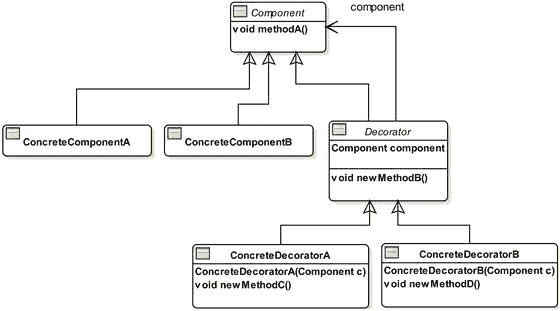

图 7-1.

基于装饰器模式的通用类图

装饰器模式要求您有一个公共的抽象超类，从中派生出您的具体组件类和一个抽象装饰器类。将这个公共超类命名为 `Component`。您可以使用接口来代替抽象类。具体组件（在类图中显示为 `ConcreteComponentA` 和 `ConcreteComponentB`）继承自 `Component` 类。`Decorator` 类是抽象装饰器类，它继承自 `Component` 类。具体装饰器（在类图中显示为 `ConcreteDecoratorA` 和 `ConcreteDecoratorB`）继承自 `Decorator` 类。`Decorator` 类保持对其超类 `Component` 的引用。具体组件的引用作为参数在其构造函数中传递给具体装饰器，如下所示：

```
ConcreteComponentA ca = new ConcreteComponentA();
ConcreteDecoratorA cd = new ConcreteDecoratorA(ca);
```

当在具体装饰器上调用方法时，它会执行一些操作，并调用其封装的组件上的方法。装饰器可以决定在调用组件上的方法之前和/或之后执行其操作。通过这种方式，装饰器扩展了组件的功能。这种模式被称为装饰器模式，因为装饰器类为其封装的组件添加功能（或装饰）。出于同样的原因，它也被称为包装器模式：它封装（包装）了它所装饰的组件。

装饰器具有与具体组件相同的接口，因为它们都继承自公共超类 `Component`。因此，您可以在任何需要 `Component` 对象的地方使用 `Decorator` 对象。有时，装饰器通过添加组件中不存在的新方法来添加功能，如类图中所示：`newMethodB()`、`newMethodC()` 和 `newMethodD()`。

现在，让我们将关于装饰器模式通用类图的讨论应用到为您的饮料应用程序建模的类中。类图如图 7-2 所示。

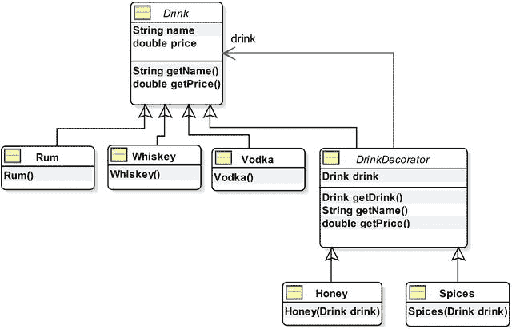

图 7-2.

基于装饰器模式的饮料应用程序类图

在饮料应用程序中，`Rum`、`Vodka` 和 `Whiskey` 是具体组件（主要饮料）。`Honey` 和 `Spices` 是两个装饰器，用于装饰（或改变风味）主要饮料。

`Drink` 类，如清单 7-7 所示，充当主要饮料和装饰器的抽象公共祖先类。`Drink` 类中的 `name` 和 `price` 实例变量保存饮料的名称和价格；该类还包含这些实例变量的 getter 方法。这些方法定义了主要饮料以及调味品的公共接口。


```
// Drink.java
package com.jdojo.io;
public abstract class Drink {
protected String name;
protected double price;
public String getName() {
return name;
}
public double getPrice() {
return price;
}
}
清单 7-7.
一个抽象的 Drink 类，用于建模装饰器模式中的抽象组件
```

清单 7-8 包含了继承自 `Drink` 类的 `Rum` 类的代码。它在构造函数中设置了 `name` 和 `price`。清单 7-9 和清单 7-10 分别列出了 `Vodka` 类和 `Whiskey` 类。这三个类类似。

```
// Rum.java
package com.jdojo.io;
public class Rum extends Drink {
public Rum() {
this.name = "Rum";
this.price = 0.9;
}
}
清单 7-8.
一个 Rum 类
```

```
// Vodka.java
package com.jdojo.io;
public class Vodka extends Drink {
public Vodka() {
this.name = "Vodka";
this.price = 1.2;
}
}
清单 7-9.
一个 Vodka 类
```

```
// Whiskey.java
package com.jdojo.io;
public class Whiskey extends Drink {
public Whiskey() {
this.name = "Whisky";
this.price = 1.5;
}
}
清单 7-10.
一个 Whiskey 类
```

清单 7-11 中展示的 `DrinkDecorator` 是一个抽象装饰器类，它继承自 `Drink` 类。具体的装饰器 `Honey` 和 `Spices` 继承自 `DrinkDecorator` 类。它有一个名为 `drink` 的实例变量，类型为 `Drink`。这个实例变量代表装饰器将要装饰的 `Drink` 对象。它重写了 `getName()` 和 `getPrice()` 方法以供装饰器使用。在其 `getName()` 方法中，它获取正在装饰的饮料的名称，并将自己的名称附加到其后。这就是我所说的装饰器为组件添加功能的意思。`getPrice()` 方法的工作方式相同。它获取所装饰饮料的价格，并将自己的价格加到其上。

```
// DrinkDecorator.java
package com.jdojo.io;
public abstract class DrinkDecorator extends Drink {
protected Drink drink;
@Override
public String getName() {
// 在其装饰的饮料名称后附加自己的名称
return drink.getName() + ", " + this.name;
}
@Override
public double getPrice() {
// 将其价格添加到所装饰饮料的价格上
return drink.getPrice() + this.price;
}
public Drink getDrink() {
return drink;
}
}
清单 7-11.
一个抽象的 DrinkDecorator 类
```

清单 7-12 列出了一个具体的装饰器 `Honey` 类，它继承自 `DrinkDecorator` 类。其构造函数接受一个 `Drink` 对象作为参数。它要求在你创建 `Honey` 类的对象之前，必须有一个 `Drink` 对象。在其构造函数中，它设置了自己的名称、价格以及将要操作的饮料。它将使用其父类 `DrinkDecorator` 的 `getName()` 和 `getPrice()` 方法。

```
// Honey.java
package com.jdojo.io;
public class Honey extends DrinkDecorator{
public Honey(Drink drink) {
this.drink = drink;
this.name = "Honey";
this.price = 0.25;
}
}
清单 7-12.
一个 Honey 类，一个具体的装饰器
```

清单 7-13 列出了另一个具体的装饰器 `Spices` 类，其实现方式与 `Honey` 类相同。

```
// Spices.java
package com.jdojo.io;
public class Spices extends DrinkDecorator {
public Spices(Drink drink) {
this.drink = drink;
this.name = "Spices";
this.price = 0.10;
}
}
清单 7-13.
一个 Spices 类，一个具体的装饰器
```

现在是时候看看饮料应用程序的实际运行了。让我们点一杯加蜂蜜的威士忌。你将如何构造对象来点一杯加蜂蜜的威士忌？很简单。你总是从创建具体组件开始。具体的装饰器被添加到具体组件上。威士忌是你的具体组件，蜂蜜是你的具体装饰器。你总是使用你在这个系列中创建的最后一个组件对象。通常，你创建的最后一个组件是某个具体的装饰器，除非你只处理一个具体组件。

```
// 创建一个 Whiskey 对象
Whiskey w = new Whiskey();
// 向 Whiskey 添加 Honey。将对象 w 传递给 Honey 的构造函数
Honey h = new Honey(w);
// 从现在开始，我们将使用我们创建的最后一个组件
// 即 h（一个 honey 对象）。要获取饮料的名称，
// 在 honey 对象上调用 getName() 方法
String drinkName = h.getName();
```

请注意，`Honey` 类使用了在 `DrinkDecorator` 类中实现的 `getName()` 方法。它将获取饮料的名称（在你的例子中是 `Whiskey`），并添加自己的名称。`h.getName()` 方法将返回“`Whiskey, Honey`”。

```
// 获取价格
double drinkPrice = h.getPrice();
```

`h.getPrice()` 方法将返回 `1.75`。它将获取威士忌的价格（`1.5`）并加上蜂蜜的价格（`0.25`）。

你不需要两步过程来创建一杯加蜂蜜的威士忌。你可以使用以下一条语句来创建它：

```
Drink myDrink = new Honey(new Whiskey());
```

通过使用这种编码风格，你会感觉到 `Honey` 确实在包裹（或装饰）`Whiskey`。你点了一杯饮料：加蜂蜜的威士忌。因此，最好将最终饮料的引用存储到一个 `Drink` 变量（`Drink myDrink`）中，而不是一个 `Honey` 变量（`Honey h`）中。但是，如果 `Honey` 类实现了一些除从 `Drink` 类继承的方法之外的额外方法，并且你打算使用这些额外方法之一，那么你需要使用 `Honey` 类的变量来存储最终引用。

```
// 如果我们的 Honey 类有额外的方法，这些方法未在 Drink 类中定义，
// 则将引用存储在 Honey 类型变量中
Honey h = new Honey(new Whiskey());
```

你如何点一杯加了两份蜂蜜的威士忌？很简单。创建一个 `Whiskey` 对象，将其包裹在一个 `Honey` 对象中，然后将这个 `Honey` 对象包裹在另一个 `Honey` 对象中，如下所示：

```
// 创建一杯加双份蜂蜜的威士忌
Drink myDrink = new Honey(new Honey(new Whiskey()));
```

类似地，你可以创建一杯加蜂蜜和香料的伏特加，并获取其名称和价格，如下所示：

```
// 创建一杯加蜂蜜和香料的伏特加
Drink myDrink = new Spices(new Honey(new Vodka()));
String drinkName = myDrink.getName();
double drinkPrice = myDrink.getPrice();
```

有时，阅读基于装饰器模式的对象构造可能会令人困惑，因为构造函数调用中有多层对象包装。你需要从最内层开始读取对象的构造函数。最内层始终是一个具体组件，所有后续层将是具体的装饰器。在前面的加蜂蜜和香料的伏特加示例中，最内层是创建伏特加 `new Vodka()`，它被包裹在蜂蜜中 `new Honey(new Vodka())`，而蜂蜜又被包裹在香料中 `new Spices(new Honey(new Vodka()))`。图 7-3 描绘了这三个对象是如何排列的。清单 7-14 演示了如何使用你的饮料应用程序。

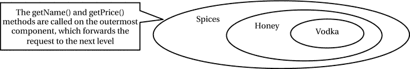

图 7-3.

装饰器模式中组件的排列


```
// DrinkTest.java
package com.jdojo.io;
public class DrinkTest {
public static void main(String[] args) {
// 只喝威士忌
Drink d1 = new Whiskey();
printReceipt(d1);
// 喝加蜂蜜的威士忌
Drink d2 = new Honey(new Whiskey());
printReceipt(d2);
// 喝加香料的伏特加
Drink d3 = new Spices(new Vodka());
printReceipt(d3);
// 喝加双份蜂蜜和香料的朗姆酒
Drink d4 = new Spices(new Honey(new Honey(new Rum())));
printReceipt(d4);
}
public static void printReceipt(Drink drink) {
String name = drink.getName();
double price = drink.getPrice();
System.out.println(name + " - $" + price);
}
}
威士忌 - $1.5
威士忌，蜂蜜 - $1.75
伏特加，香料 - $1.3
朗姆酒，蜂蜜，蜂蜜，香料 - $1.5
清单 7-14.
测试饮料应用
```

你需要考虑装饰器模式的其他方面：

*   抽象的 `Component` 类（示例中的 `Drink` 类）可以用接口替代。请注意，你在 `Drink` 类中包含了两个实例变量。如果你想用接口替换 `Drink` 类，则必须将这两个实例变量下移到类层次结构中。

*   你可以在抽象装饰器和具体装饰器中添加任意数量的新方法，以扩展其组件的功能。

*   使用装饰器模式，最终会得到大量的小类，这可能会让你的应用难以学习。然而，一旦你理解了类的层次结构，就很容易定制和使用它们。

*   装饰器模式的目标是通过为具体组件和具体装饰器提供一个共同的超类来实现的。这使得具体装饰器可以被视为一个组件，从而允许将一个装饰器包裹在另一个装饰器内部。在构建类层次结构时，你可以引入更多类或移除一些类。例如，你可以在 `Drink` 类与 `Rum`、`Vodka` 和 `Whiskey` 类之间引入一个名为 `MainDrink` 的类。

*   具体装饰器不必继承自抽象装饰器类。有时你可能希望让具体装饰器直接继承自抽象的 `Component` 类。例如，`ObjectInputStream` 类继承自 `java.io` 包中的 `InputStream` 类，而不是 `FilterInputStream` 类。详情请参见图 7-5。具体装饰器的主要要求是：它应将抽象组件作为其直接或非直接超类，并且其构造函数应接受一个抽象组件类型的参数。

输入/输出流

“流”这个词的字面意思是“某物的不间断流动”。在 Java I/O 中，流意味着数据的不间断流动（或顺序流动）。流中的数据可以是字节、字符、对象等。

河流是水流，水以不间断的顺序从源头流向目的地。类似地，在 Java I/O 中，数据从称为数据源的源头流向称为数据汇的目的地。数据从数据源被读取到 Java 程序。Java 程序将数据写入数据汇。连接数据源和 Java 程序的流称为输入流。连接 Java 程序和数据汇的流称为输出流。在自然流（如河流）中，源头和目的地通过持续的水流连接。然而，在 Java I/O 中，Java 程序位于输入流和输出流之间。数据从数据源通过输入流流向 Java 程序。数据从 Java 程序通过输出流流向数据汇。换句话说，Java 程序从输入流读取数据，并将数据写入输出流。图 7-4 描述了数据从输入流到 Java 程序以及从 Java 程序到输出流的流动。

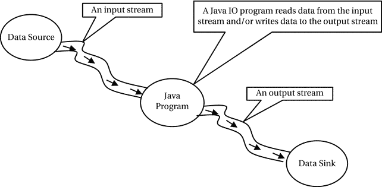

图 7-4.
在 Java 程序中使用输入/输出流的数据流动

要将数据从数据源读入 Java 程序，你需要执行以下步骤：

*   确定数据源。它可以是文件、字符串、数组、网络连接等。
*   使用数据源构造一个输入流。
*   从输入流读取数据。通常，你会在循环中读取数据，直到从输入流中读取完所有数据。输入流的方法会返回一个特殊值来表示输入流的结束。
*   关闭输入流。请注意，构造输入流本身就会打开它以供读取。没有显式的步骤来打开输入流。但是，当你完成从输入流读取数据后，必须关闭它。从 Java 7 开始，你可以使用 `try-with-resources` 块，它会自动关闭输入流。

要将数据从 Java 程序写入数据汇，你需要执行以下步骤：

1.  确定数据汇。即确定数据将被写入的目的地。它可以是文件、字符串、数组、网络连接等。
2.  使用数据汇构造一个输出流。
3.  将数据写入输出流。
4.  关闭输出流。请注意，构造输出流本身就会打开它以供写入。没有显式的步骤来打开输出流。但是，当你完成向输出流写入数据后，必须关闭它。从 Java 7 开始，你可以使用 `try-with-resources` 块，它会自动关闭输出流。

Java 中的输入/输出流类基于装饰器模式。到目前为止，你知道基于装饰器模式的类设计会产生许多小类。Java I/O 也是如此。Java I/O 涉及许多类。一次性学习每个类并非易事。然而，通过将它们与装饰器模式中的类安排进行比较，可以使学习这些类变得容易。稍后我会将 Java I/O 类与装饰器模式进行比较。在接下来的两节中，你将通过简单的程序看到输入/输出流的实际应用，这些程序将从文件读取数据并将数据写入文件。

使用输入流从文件读取

在本节中，我将向你展示如何从文件读取数据。数据将显示在标准输出上。你有一个名为 `luci1.txt` 的文件，其中包含威廉·华兹华斯（1770-1850）的诗歌《露西》的第一节。诗歌的一节如下：

```
我曾有过奇异的激情：
我敢说出来，
但只在情人的耳边，
那曾经发生在我身上的事。
```

你可以用这段文本创建一个 `luci1.txt` 文件，并将其保存在当前工作目录中。从文件读取需要以下步骤：


1.  确定数据源，在本例中即 `luci1.txt` 文件的路径。

2.  使用该文件创建一个输入流。

3.  使用输入流从文件中读取数据。

4.  关闭输入流。

确定数据源

你的数据源可以是一个简单的文件名字符串，也可以是一个代表文件路径名的 `File` 对象。我们假设 `luci1.txt` 文件位于当前工作目录下。

```
// 数据源
String srcFile = "luci1.txt";
```

创建输入流

要从文件中读取数据，你需要创建一个 `FileInputStream` 类的对象，该对象将代表输入流：

```
// 创建一个文件输入流
FileInputStream fin = new FileInputStream(srcFile);
```

当输入流的数据源是文件时，Java 要求你在构造文件输入流时确保该文件存在。如果文件不存在，`FileInputStream` 类的构造方法会抛出一个 `FileNotFoundException`。要处理此异常，你需要将代码放在一个 `try-catch` 块中，如下所示：

```
try {
// 创建一个文件输入流
FileInputStream fin = new FileInputStream(srcFile);
} catch (FileNotFoundException e){
// 错误处理代码写在这里
}
```

读取数据

`FileInputStream` 类有一个重载的 `read()` 方法，用于从文件中读取数据。你可以使用该方法的多个版本一次读取一个字节或多个字节。使用 `read()` 方法时要小心。它的返回类型是 `int`，尽管它返回的是一个 `byte` 值。如果到达文件末尾，它会返回 -1，表示没有更多字节可读。你需要将返回的 `int` 值转换为 `byte`，以获取从文件中读取的 `byte`。你可以在循环中一次读取一个 `byte`，如下所示：

```
int data;
byte byteData;
// 读取第一个字节
data = fin.read();
while (data != -1) {
// 在控制台显示读取的数据。注意从 int 到 byte 的强制转换
byteData = (byte) data;
// 将字节数据转换为 char 以便显示
System.out.print((char) byteData);
// 尝试读取下一个字节
data = fin.read();
}
```

你可以将之前的文件读取逻辑重写为紧凑形式，如下所示：

```
byte byteData;
while ((byteData = (byte) fin.read()) != -1){
System.out.print((char) byteData);
}
```

在后续示例中，我将使用这种紧凑形式从输入流中读取数据。你需要将从输入流读取数据的代码放在一个 `try`-`catch` 块中，因为它可能会抛出 `IOException`。

关闭输入流

最后，你需要使用输入流的 `close()` 方法来关闭它：

```
// 关闭输入流
fin.close();
```

`close()` 方法可能会抛出 `IOException`，因此你需要将此调用封装在一个 `try-catch` 块中。

```
try {
// 关闭输入流
fin.close();
} catch (IOException e) {
e.printStackTrace();
}
```

通常，你会在 `try` 块中构造一个输入流，并在 `finally` 块中关闭它，以确保在使用完毕后它总是被关闭。

所有输入/输出流都是可自动关闭的。你可以使用 `try-with-resources` 来创建它们的实例，这样无论是否抛出异常，它们都会自动关闭，从而无需显式调用它们的 `close()` 方法。以下代码片段展示了如何使用 `try-with-resources` 创建一个文件输入流：

```
String srcFile = "luci1.txt";
try (FileInputStream fin = new FileInputStream(srcFile)) {
// 在此处使用 fin 从文件读取数据
} catch (FileNotFoundException e) {
// 在此处处理异常
}
```

一个工具类

你经常会需要执行一些操作，例如关闭输入/输出流，以及在找不到文件时在标准输出上打印消息等。清单 7-15 包含了一个 `FileUtil` 类的代码，你将在示例程序中使用它。

```
// FileUtil.java
package com.jdojo.io;
import java.io.Closeable;
import java.io.IOException;
public class FileUtil {
// 打印文件的位置详情
public static void printFileNotFoundMsg(String fileName) {
String workingDir = System.getProperty("user.dir");
System.out.println("在 '" + workingDir + "' 目录中找不到文件 '"
+ fileName + "'");
}
// 关闭一个 Closeable 资源，例如输入/输出流
public static void close(Closeable resource) {
if (resource != null) {
try {
resource.close();
} catch (IOException e) {
e.printStackTrace();
}
}
}
}
清单 7-15.
一个包含处理 I/O 类的便捷方法的工具类
```

完成示例

清单 7-16 演示了读取文件 `luci1.txt` 所涉及的步骤。如果你收到指示文件不存在的错误消息，它还会打印期望文件所在的目录。你可以使用源文件的绝对路径代替相对路径，只需将语句

```
String srcFile = "luci1.txt";
```

替换为绝对路径，例如 Windows 上的 `c:\smith\luci1.txt` 或 UNIX 上的 `/users/smith/luci1.txt`。请注意，在构造包含反斜杠的字符串时，必须使用 `c:\\smith\\luci1.txt`（使用两个反斜杠来转义一个反斜杠）。

```
String srcFile = "luci1.txt 文件的绝对路径";
```

通过简单地使用 `luci1.txt` 作为数据源文件路径，程序期望在运行程序时该文件存在于你的当前工作目录中。

```
// SimpleFileReading.java
package com.jdojo.io;
import java.io.FileInputStream;
import java.io.FileNotFoundException;
import java.io.IOException;
public class SimpleFileReading {
public static void main(String[] args) {
String dataSourceFile = "luci1.txt";
try (FileInputStream fin = new FileInputStream(dataSourceFile)) {
byte byteData;
while ((byteData = (byte) fin.read()) != -1) {
System.out.print((char) byteData);
}
} catch (FileNotFoundException e) {
FileUtil.printFileNotFoundMsg(dataSourceFile);
} catch (IOException e) {
e.printStackTrace();
}
}
}
我曾有过奇异的激情：
我敢说出来，
但只对情人的耳朵，
那曾经发生在我身上的事。
清单 7-16.
从文件输入流中一次读取一个字节
```

使用输出流将数据写入文件

在本节中，我将向你展示如何将威廉·华兹华斯的诗歌《露西》中的一节写入一个名为 `luci2.txt` 的文件。该节内容如下：

```
当她，我所爱的，每天看起来
都像六月的玫瑰般清新，
我向她的小屋弯下我的路，
在一个傍晚的月光下。
```

将数据写入文件需要以下步骤：

1.  确定数据接收端，即数据将被写入的文件。

2.  使用该文件创建一个输出流。

3.  使用输出流将数据写入文件。

4.  刷新输出流。

5.  关闭输出流。

确定数据接收端

你的数据接收端可以是一个简单的文件路径字符串，也可以是一个代表文件路径名的 `File` 对象。我们假设 `luci2.txt` 文件位于当前工作目录下。

```
// 数据接收端
String destFile = "luci2.txt";
```

创建输出流

要写入文件，你需要创建一个 `FileOutputStream` 类的对象，该对象将代表输出流。

```
// 创建一个文件输出流
FileOutputStream fos = new FileOutputStream(destFile);
```

当输出流的数据接收端是文件时，如果文件不存在，Java 会尝试创建该文件。如果你使用的文件名是一个目录名，或者由于任何原因无法打开该文件，Java 可能会抛出一个 `FileNotFoundException`。你必须准备好通过将代码放在一个 `try-catch` 块中来处理此异常，如下所示：

```
try {
FileOutputStream fos = new FileOutputStream(srcFile);
} catch (FileNotFoundException e){
// 错误处理代码写在这里
}
```


如果在创建 `FileOutputStream` 时文件包含数据，这些数据将被清除。若希望保留现有数据并将新数据追加到文件中，则需要使用 `FileOutputStream` 类的另一个构造方法，该方法接受一个 `boolean` 标志，用于指示是否将新数据追加到文件。

```
// 要向文件追加数据，请在第二个参数中传入 true
FileOutputStream fos = new FileOutputStream(destFile, true);
```

写入数据

使用输出流向文件写入数据。`FileOutputStream` 类有一个重载的 `write()` 方法，用于向文件写入数据。你可以使用该方法的多个版本一次写入一个字节或多个字节。你需要将写入数据到输出流的代码放在 `try-catch` 块中，因为如果数据无法写入文件，它可能会抛出 `IOException`。

通常，你使用 `FileOutputStream` 写入二进制数据。如果你想将诸如“`Hello`”这样的字符串写入输出流，需要将字符串转换为字节。`String` 类有一个 `getBytes()` 方法，该方法返回表示该字符串的字节数组。你可以按如下方式将字符串写入 `FileOutputStream`：

```
String text = "Hello";
byte[] textBytes = text.getBytes();
fos.write(textBytes);
```

你想将四行文本写入 `luci2.txt`。前三行文本的每一行之后都需要插入一个新行。不同平台的新行表示方式不同。你可以通过读取 `line.separator` 系统变量来获取程序运行平台的新行，如下所示：

```
// 获取当前平台的新行分隔符
String lineSeparator = System.getProperty("line.separator");
```

请注意，行分隔符不一定是一个字符。要将行分隔符写入文件输出流，你需要将其转换为字节数组，然后将该字节数组写入文件，如下所示：

```
fos.write(lineSeparator.getBytes());
```

刷新输出流

你需要使用 `flush()` 方法刷新输出流：

```
// 刷新输出流
fos.flush();
```

刷新输出流表示，如果任何已写入的字节被缓冲，它们可能会被写入数据接收端。例如，如果数据接收端是一个文件，你将字节写入 `FileOutputStream`，这是文件的一种抽象。输出流将字节传递给操作系统，由操作系统负责将它们写入文件。对于文件输出流，如果你调用 `flush()` 方法，输出流会将字节传递给操作系统进行写入。操作系统何时将字节写入文件由其自行决定。如果输出流的实现缓冲了写入的字节，那么当缓冲区满或你通过调用其 `close()` 方法关闭输出流时，它会自动刷新这些字节。

关闭输出流

关闭输出流类似于关闭输入流。你需要使用其 `close()` 方法关闭输出流。

```
// 关闭输出流
fos.close();
```

`close()` 方法可能会抛出 `IOException`。如果你希望输出流自动关闭，可以使用 `try-with-resources` 语句创建输出流。

完成示例

清单 7-17 演示了向名为 `luci2.txt` 的文件写入数据所涉及的步骤。如果该文件在当前目录中不存在，程序将创建它。如果存在，它将被覆盖。运行程序时，输出中显示的文件路径可能不同。

```
// SimpleFileWriting.java
package com.jdojo.io;
import java.io.File;
import java.io.FileNotFoundException;
import java.io.FileOutputStream;
import java.io.IOException;
public class SimpleFileWriting {
public static void main(String[] args) {
String destFile = "luci2.txt";
// 获取当前平台的行分隔符
String lineSeparator = System.getProperty("line.separator");
String line1 = "When she I loved look'd every day";
String line2 = "Fresh as a rose in June,";
String line3 = "I to her cottage bent my way,";
String line4 = "Beneath an evening moon.";
try (FileOutputStream fos = new FileOutputStream(destFile)) {
// 将所有四行文本作为字节写入输出流
fos.write(line1.getBytes());
fos.write(lineSeparator.getBytes());
fos.write(line2.getBytes());
fos.write(lineSeparator.getBytes());
fos.write(line3.getBytes());
fos.write(lineSeparator.getBytes());
fos.write(line4.getBytes());
// 将写入的字节刷新到文件
fos.flush();
// 显示输出文件路径
System.out.println("文本已写入 "
+ (new File(destFile)).getAbsolutePath());
} catch (FileNotFoundException e1) {
FileUtil.printFileNotFoundMsg(destFile);
} catch (IOException e2) {
e2.printStackTrace();
}
}
}
文本已写入 C:\Java9LanguageFeatures\luci2.txt
清单 7-17.
向文件输出流写入字节
```

输入流与装饰器模式

图 7-5 展示了包含一些常用输入流类的类图。你可以参考 `java.io` 包的 API 文档获取输入流类的完整列表。类图中的注释将输入流类与装饰器模式中的类进行了比较。请注意，输入流的类图与你的饮料应用程序的类图相似，后者也是基于装饰器模式。表 7-1 比较了装饰器模式、饮料应用程序和输入流中的类。

表 7-1.

装饰器模式、饮料应用程序和输入流中的类设计比较

装饰器模式
 |
  饮料应用程序
 |
  输入流
 |

| --- | --- | --- | --- | --- | --- | --- |

`Component`
 |
  `Drink`
 |
  `InputStream`
 |

`ConcreteComponentA`

`ConcreteComponentB`
 |
  `Rum`

`Vodka`

`Whisky`
 |
  `FileInputStream`

`ByteArrayInputStream`

`PipedInputStream`
 |

`Decorator`
 |
  `DrinkDecorator`
 |
  `FilterInputStream`
 |

`ConcreteDecoratorA`

`ConcreteDecoratorB`
 |
  `Honey`

`Spices`
 |
  `BufferedInputStream`

`PushbackInputStream`

`DataInputStream`

`ObjectInputStream`
 |

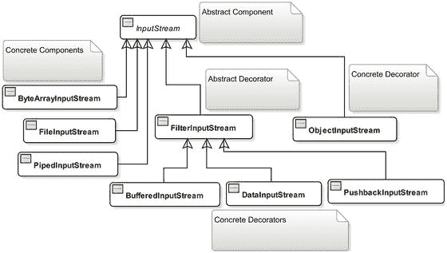

图 7-5.

与装饰器模式相比较的常用输入流类


抽象基类组件是 `InputStream` 类，类似于 `Drink` 类。具体组件类包括 `FileInputStream`、`ByteArrayInputStream` 和 `PipedInputStream`，它们类似于 `Rum`、`Vodka` 和 `Whiskey` 类。还有一个 `FilterInputStream` 类，类似于 `DrinkDecorator` 类。请注意，输入流家族中的装饰器类在其类名中并未使用“Decorator”一词，而是命名为 `FilterInputStream`。它也没有像你声明 `DrinkDecorator` 类那样声明为抽象类。不将其声明为抽象似乎是类设计中的不一致之处。具体装饰器类包括 `BufferedInputStream`、`DataInputStream` 和 `PushbackInputStream`，它们类似于饮料应用中的 `Honey` 和 `Spices` 类。一个显著的区别是 `ObjectInputStream` 类是一个具体装饰器，它继承自抽象组件 `InputStream`，而不是抽象装饰器 `FilterInputStream`。请注意，具体装饰器的要求是：其直接或非直接超类中必须包含抽象组件类，并且必须有一个接受抽象组件作为参数的构造函数。`ObjectInputStream` 类满足这些要求。

一旦你理解了 Java I/O 中输入流的类设计基于装饰器模式，就应该能够轻松地使用这些类构建输入流。超类 `InputStream` 包含从输入流读取数据的基本方法，这些方法由所有具体组件类以及所有具体装饰器类支持。对输入流的基本操作是从中读取数据。`InputStream` 类中定义的一些重要方法列在表 7-2 中。请注意，你已经在 `SimpleFileReading` 类中使用了其中两个方法 `read()` 和 `close()` 来从文件读取数据。

表 7-2. InputStream 类的一些重要方法

| 方法 | 描述 |
| --- | --- |
| `int read()` | 从输入流中读取一个字节，并将读取的字节作为 `int` 返回。当到达输入流末尾时返回 -1。 |
| `int read(byte[] buffer)` | 最多读取指定 `buffer` 长度的字节数。返回读取到 `buffer` 中的字节数。如果到达输入流末尾则返回 -1。 |
| `int read(byte[] buffer, int offset, int length)` | 最多读取指定 `length` 字节。数据从 `offset` 索引开始写入 `buffer`。返回读取的字节数，如果到达输入流末尾则返回 -1。 |
| `byte[] readAllBytes()` | 从输入流中读取所有剩余字节，并将读取的字节以 `byte[]` 形式返回。此方法在 JDK9 中被添加到 `InputStream` 类。 |
| `int readNBytes(byte[] buffer, int offset, int length)` | 从输入流中读取由 `length` 指定的请求字节数到给定的字节数组中。返回实际读取到 `buffer` 中的字节数。读取的数据从 `offset` 开始存储在缓冲区中。此方法在 JDK9 中被添加到 `InputStream` 类。 |
| `void close()` | 关闭输入流。 |
| `int available()` | 返回在不阻塞的情况下可以从该输入流读取的估计字节数。 |
| `long transferTo(OutputStream out)` | 从该输入流读取所有字节，并将这些字节写入指定的输出流。返回传输的字节数。此方法在 JDK9 中被添加到 `InputStream` 类。 |

提示

`InputStream` 中所有读取数据的方法都会阻塞，直到输入数据可供读取、到达输入流末尾或抛出异常。

让我们简要讨论四个输入流具体装饰器：`BufferedInputStream`、`PushbackInputStream`、`DataInputStream` 和 `ObjectInputStream`。我在本节讨论 `BufferedInputStream` 和 `PushbackInputStream`。在“读写基本数据类型”部分讨论 `DataInputStream`。在“对象序列化”部分讨论 `ObjectInputStream`。

BufferedInputStream

`BufferedInputStream` 通过缓冲数据为输入流添加功能。它维护一个内部缓冲区，用于存储从底层输入流读取的字节。当从输入流读取字节时，`BufferedInputStream` 会读取比请求更多的字节，并将其缓冲在内部维护的缓冲区中。当请求读取一个字节时，它会检查请求的字节是否已存在于其缓冲区中。如果请求的字节存在于其缓冲区中，则从其缓冲区返回该字节。否则，它会再读取一些字节到缓冲区中，并仅返回请求的字节。它还支持对输入流进行标记和重置操作，以便你可以重新读取输入流中的字节。使用 `BufferedInputStream` 的主要好处是由于缓冲而带来的更快的速度。清单 7-18 展示了如何使用 `BufferedInputStream` 读取文件内容。

```
// BufferedFileReading.java
package com.jdojo.io;
import java.io.BufferedInputStream;
import java.io.FileInputStream;
import java.io.FileNotFoundException;
import java.io.IOException;
public class BufferedFileReading {
public static void main(String[] args) {
String srcFile = "luci1.txt";
try (BufferedInputStream bis
= new BufferedInputStream(new FileInputStream(srcFile))) {
// 一次读取一个字节并显示读取的数据
byte byteData;
while ((byteData = (byte) bis.read()) != -1) {
System.out.print((char) byteData);
}
} catch (FileNotFoundException e1) {
FileUtil.printFileNotFoundMsg(srcFile);
} catch (IOException e2) {
e2.printStackTrace();
}
}
}
STRANGE fits of passion have I known:
And I will dare to tell,
But in the lover's ear alone,
What once to me befell.
清单 7-18. 使用 BufferedInputStream 读取文件以获得更快的速度
```

`BufferedFileReading` 类中的代码读取 `luci1.txt` 文件中的文本。清单 7-14 中的 `SimpleFileReading` 与清单 7-18 中的 `BufferedFileReading` 之间的唯一区别是，后者为 `FileInputStream` 使用了装饰器 `BufferedInputStream`，而前者仅使用了 `FileInputStream`。在 `SimpleFileReading` 中，你按如下方式构造输入流：

```
String srcFile = "luci1.txt";
FileInputStream fis = new FileInputStream(srcFile);
```

在 `BufferedFileReading` 中，你按如下方式构造输入流：

```
String srcFile = "luci1.txt";
BufferedInputStream bis = new BufferedInputStream(new FileInputStream(srcFile));
```

在此示例中，你可能不会发现 `BufferedFileReading` 相对于 `SimpleFileReading` 有明显的速度提升，因为文件大小很小。在两个示例中，你都是一次读取一个字节，以使代码更易于阅读。你应该使用输入流 `read()` 方法的另一个版本，以便一次读取更多字节。使用 JDK9 中添加到 `InputStream` 的 `readAllBytes()` 方法，你可以一次性读取文件的全部内容。

PushbackInputStream

`PushbackInputStream` 为输入流添加了功能，允许你使用其 `unread()` 方法取消读取字节（或推回已读取的字节）。`unread()` 方法有三个版本。

*   `void unread(byte[] buffer)`

*   `void unread(byte[] buffer, int offset, int length)`

*   `void unread(int buffer)`


`unread(int buffer)` 方法允许你一次推回一个字节，另外两个方法则允许你一次推回多个字节。如果在调用输入流的 `unread()` 方法后调用 `read()` 方法，你将首先读取那些被推回的字节。当所有被推回的字节被重新读取完毕后，你才会开始从输入流中读取新的字节。例如，假设你的输入流包含一个字节字符串 `HELLO`。如果你读取两个字节，你将读取到 `HE`。如果你调用 `unread((byte) 'E')` 来推回刚刚读取的最后一个字节，那么后续的读取将返回 `E`，再接下来的读取将读取到 `LLO`。

清单 7-19 演示了 `PushbackInputStream` 的使用。该程序从当前工作目录下的 `luci1.txt` 文件中读取威廉·华兹华斯诗歌《露西》的第一节。它从文件中读取每个字节两次，如输出所示。例如，`STRANGE` 被读取为 `SSTTRRAANNGGEE`。你可能会注意到两行之间有一个空行，这是因为每个换行符也被读取了两次。

```
// PushbackFileReading.java
package com.jdojo.io;
import java.io.PushbackInputStream;
import java.io.FileInputStream;
import java.io.FileNotFoundException;
import java.io.IOException;
public class PushbackFileReading {
public static void main(String[] args) {
String srcFile = "luci1.txt";
try (PushbackInputStream pis
= new PushbackInputStream(new FileInputStream(srcFile))) {
// 一次读取一个字节并显示
byte byteData;
while ((byteData = (byte) pis.read()) != -1) {
System.out.print((char) byteData);
// 推回刚刚读取的最后一个字节
pis.unread(byteData);
// 重新读取我们推回（或回退）的字节
byteData = (byte) pis.read();
System.out.print((char) byteData);
}
} catch (FileNotFoundException e1) {
FileUtil.printFileNotFoundMsg(srcFile);
} catch (IOException e2) {
e2.printStackTrace();
}
}
}
SSTTRRAANNGGEE  ffiittss  ooff  ppaassssiioonn  hhaavvee  II  kknnoowwnn::
AAnndd  II  wwiillll  ddaarree  ttoo  tteellll,,
BBuutt  iinn  tthhee  lloovveerr''ss  eeaarr  aalloonnee,,
WWhhaatt  oonnccee  ttoo  mmee  bbeeffeellll..
清单 7-19.
使用 PushbackInputStream 类
```

输出流与装饰器模式

图 7-6 展示了包含一些常用输出流类的类图。你可以参考 `java.io` 包的 API 文档以获取输出流类的完整列表。类图中的注释将输出流类与实现装饰器模式所需的类进行了比较。请注意，输出流的类图与输入流以及饮料应用程序的类图相似。

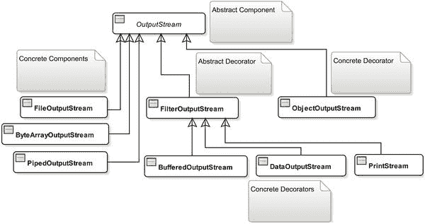

图 7-6.

一些常用的输出流类与装饰器模式的对比

大多数情况下，如果你知道输入流类的名称，可以通过将类名中的“Input”替换为“Output”来找到对应的输出流类。例如，对于 `FileInputStream` 类，有对应的 `FileOutputStream` 类；对于 `BufferedInputStream` 类，有对应的 `BufferedOutputStream` 类，以此类推。并非每个输入流类都有对应的输出流类；例如，`PushbackInputStream` 类就没有对应的输出流类。你可能会发现一些不在输入流类层次结构中的新类，因为它们在读取数据时没有意义；例如，在输出流类层次结构中有一个新的具体装饰器类 `PrintStream`。表 7-3 比较了装饰器模式、你的饮料应用程序以及输出流中的类。

表 7-3.

比较装饰器模式、饮料应用程序和输出流中的类

装饰器模式
 |
  饮料应用程序
 |
  输出流
 |


| --- | --- | --- | --- | --- | --- | --- |

`组件`
 |
  `饮料`
 |
  `输出流`
 |

`具体组件 A`

`具体组件 B`
 |
  `朗姆酒`

`伏特加`

`威士忌`
 |
  `FileOutputStream ByteArrayOutputStream`

`PipedOutputStream`
 |

`装饰器`
 |
  `饮料装饰器`
 |
  `FilterOutputStream`
 |

`具体装饰器 A`

`具体装饰器 B`
 |
  `蜂蜜`

`香料`
 |
  `BufferedOutputStream`

`DataOutputStream`

`ObjectOutputStream`
 |

抽象超类`OutputStream`中定义了三个重要方法：`write()`、`flush()`和`close()`。`write()`方法用于向输出流写入字节。它有三个版本，允许你一次写入一个字节或多个字节。在清单 7-17 的`SimpleFileWriting`类中，你曾用它向文件写入数据。`flush()`方法用于刷新所有缓冲的字节到数据接收端。`close()`方法用于关闭输出流。

将具体装饰器与输出流的具体组件类结合使用的技术，与输入流类相同。例如，要使用`BufferedOutputStream`装饰器来提高写入文件的速度，请使用以下语句：

```
BufferedOutputStream bos = new BufferedOutputStream(
new FileOutputStream("你的输出文件路径")
);
```

要向`ByteArrayOutputStream`写入数据，请使用以下语句：

```
ByteArrayOutputStream baos = new ByteArrayOutputStream();
baos.write(buffer); // 这里，buffer 是一个字节数组
```

`ByteArrayOutputStream`提供了一些重要方法：`reset()`、`size()`、`toString()`和`writeTo()`。`reset()`方法会丢弃所有已写入的字节；`size()`方法返回已写入流的字节数；`toString()`方法返回流中字节的字符串表示形式；`writeTo()`方法将流中的字节写入另一个输出流。例如，如果你已将一些字节写入名为`baos`的`ByteArrayOutputStream`，并希望将其内容写入由名为`fos`的`FileOutputStream`表示的文件，则可以使用以下语句：

```
// 所有写入 baos 的字节都被写入 fos
baos.writeTo(fos);
```

本节不再介绍更多写入输出流的示例。你可以将清单 7-17 中的`SimpleFileWriting`类作为示例，来使用任何其他类型的输出流。你可以通过将任何输出流的具体装饰器用作具体组件或另一个具体装饰器的包装对象来使用它们。我将在后续章节中结合示例讨论`DataOutputStream`、`ObjectOutputStream`和`PrintStream`类。

PrintStream

`PrintStream`类是输出流的一个具体装饰器，如图 7-6 所示。它为输出流增加了以下功能：

*   它包含一些方法，允许你以适合打印的格式打印任何数据类型（基本类型或对象）的值。

*   其向输出流写入数据的方法不会抛出`IOException`。如果某个方法调用抛出了`IOException`，它会设置一个内部标志，而不是将异常抛出给调用者。可以使用其`checkError()`方法检查该标志，如果方法执行期间发生了`IOException`，该方法返回`true`。

*   它具有自动刷新功能。你可以在其构造函数中指定它应自动刷新写入的内容。如果将自动刷新标志设置为`true`，则在写入字节数组、使用其重载的`println()`方法之一写入数据、写入换行符或写入一个字节（`\n`）时，它将刷新其内容。

`PrintStream`类中的一些重要方法如下：

*   `void print(Xxx arg)`

*   `void println(Xxx arg)`

*   `PrintStream printf(String format, Object... args)`

*   `PrintStream printf(Locale l, String format, Object... args)`

这里，`Xxx`是任何基本数据类型（`int, char, float`等）、`String`或`Object`。

`print(Xxx arg)`方法以可打印格式将指定的`arg`值写入输出流。例如，你可以使用`print(10)`向输出流写入一个整数。`Xxx`还包括两种引用类型：`String`和`Object`。如果你的参数是一个对象，则会调用该对象的`toString()`方法，并将返回的字符串写入输出流。如果对象类型参数是`null`，则会将字符串“null”写入输出流。请注意，所有输入和输出流都是基于字节的。当我提到打印流将“null”字符串写入输出流时，意味着打印流将字符串“null”转换为字节，并将这些字节写入输出流。字符到字节的转换是基于平台的默认字符编码完成的。你也可以在`PrintStream`类的某些构造函数中提供用于此类转换的字符编码。

`println(XXX arg)`方法的工作方式与`print(XXX arg)`方法类似，但有一个区别。它会在指定的`arg`后附加一个行分隔符字符串。也就是说，它向输出流写入一个`arg`值和一个行分隔符。不带参数的`println()`方法用于向输出流写入一个行分隔符。行分隔符是平台相关的，由名为`line.separator`的系统属性决定。

`printf()`方法用于向输出流写入格式化字符串。例如，如果你想以`"Today is: <today-date>"`的形式向输出流写入一个字符串，可以像下面这样使用其`printf()`方法：

```
// 假设日期格式为 mm/dd/yyyy，ps 是 PrintStream 对象引用
ps.printf("Today is: %1$tm/%1$td/%1$tY", java.time.LocalDate.now());
```

清单 7-20 演示了如何使用`PrintStream`写入文件。它将威廉·华兹华斯的诗歌《露西》中的另一节写入一个名为`luci3.txt`的文件。运行此程序后，文件内容如下：

```
Upon the moon I fix'd my eye,
All over the wide lea;
With quickening pace my horse drew nigh
Those paths so dear to me.
```

```
// FileWritingWithPrintStream.java
package com.jdojo.io;
import java.io.File;
import java.io.FileNotFoundException;
import java.io.PrintStream;
public class FileWritingWithPrintStream {
public static void main(String[] args) {
String destFile = "luci3.txt";
try (PrintStream ps = new PrintStream(destFile)) {
// 向文件写入数据。println() 会追加一个新行
// 而 print() 不会追加新行
ps.println("Upon the moon I fix'd my eye,");
ps.println("All over the wide lea;");
ps.println("With quickening pace my horse drew nigh");
ps.print("Those paths so dear to me.");
// 刷新打印流
ps.flush();
System.out.println("文本已写入 "
+ (new File(destFile).getAbsolutePath()));
} catch (FileNotFoundException e1) {
FileUtil.printFileNotFoundMsg(destFile);
}
}
}
文本已写入 C:\Java9LanguageFeatures\luci3.txt
清单 7-20.
使用 PrintStream 类写入文件
```

清单 7-20 在结构上与清单 7-17 非常相似。它使用数据接收端文件名创建了一个`PrintStream`对象。你也可以使用任何其他`OutputStream`对象创建`PrintStream`对象。你可能注意到，你不需要在`catch`块中处理`IOException`，因为与其他输出流不同，`PrintStream`对象不会抛出此异常。此外，你使用`println()`和`print()`方法写入四行文本，而无需担心将它们转换为字节。如果你想在此程序中使用自动刷新，则需要使用另一个构造函数创建`PrintStream`对象，如下所示：


```boolean
autoFlush = true;
PrintStream ps = new PrintStream(new FileOutputStream(destFile), autoFlush);
```

使用管道

管道连接输入流和输出流。管道 I/O 基于生产者-消费者模式。
生产者产生数据，消费者消费数据，彼此互不关心。它的工作原理类似于物理管道，
你在管道一端注入东西，在另一端收集。在管道 I/O 中，你创建两个流，分别代表管道的两端。一个
`PipedOutputStream`
对象代表一端，一个 `PipedInputStream`
对象代表另一端。你可以使用任一对象上的 `connect()` 方法连接两端。
你也可以在创建另一个对象时，将一个对象传递给构造函数来连接它们。你可以想象
管道输入流和管道输出流的逻辑布局
，如图 7-7 所示。

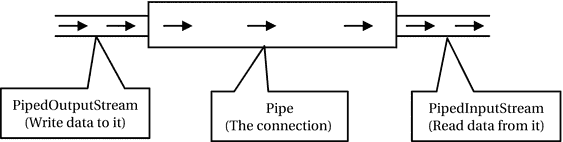

图 7-7.

管道输入流和输出流的逻辑布局

以下代码片段展示了创建和连接管道两端的两种方法：

```
// 方法 #1：创建管道输入和输出流并连接它们
PipedInputStream pis = new PipedInputStream();
PipedOutputStream pos = new PipedOutputStream();
pis.connect(pos); /* 连接两端 */
// 方法 #2：创建管道输入和输出流并连接它们
PipedInputStream pis = new PipedInputStream();
PipedOutputStream pos = new PipedOutputStream(pis);
```

连接管道两端后，你就可以生产和消费数据了。你通过使用
`PipedOutputStream`
对象的某个 `write()` 方法来生产数据。
你写入管道输出流的任何内容都会自动提供给管道输入流对象进行读取。你使用
`PipedInputStream` 的 `read()`
方法从管道读取数据。如果管道输入流尝试从管道读取数据时数据不可用，它会被阻塞。

你是否想过，当你将数据写入管道输出流时，数据存储在哪里？与物理管道类似，管道流有一个固定容量的缓冲区，用于在数据写入管道和从管道读取之间存储数据。你可以在创建管道时设置其容量。如果管道的缓冲区已满，尝试写入管道将会阻塞。

```
// 创建缓冲区容量为 2048 字节的管道输入和输出流
PipedOutputStream pos = new PipedOutputStream();
PipedInputStream pis = new PipedInputStream(pos, 2048);
```

提示

通常，管道用于将数据从一个线程传输到另一个线程。
一个线程将生产数据，另一个线程将消费数据。
请注意，两个线程之间的同步由阻塞的读写操作负责处理。

清单 7-21 演示了
如何使用管道 I/O。`main()` 方法创建并连接
一个管道输入流和一个管道输出流。管道输出流
被传递给 `produceData()` 方法，
生成从 1 到 50 的数字。线程在生成一个数字后休眠半秒钟。`consumeData()` 方法
从管道输入流读取数据。我使用了一种快速而粗糙的方式来处理异常，以保持代码更简洁和可读。数据在两个独立的线程中生产和读取。

```
// PipedStreamTest.java
package com.jdojo.io;
import java.io.PipedInputStream;
import java.io.PipedOutputStream;
public class PipedStreamTest {
public static void main(String[] args) throws Exception {
// 创建并连接管道输入和输出流
PipedInputStream pis = new PipedInputStream();
PipedOutputStream pos = new PipedOutputStream();
pos.connect(pis);
// 创建并启动两个线程，一个用于生产数据（写入数据），
// 一个用于消费数据（读取数据）
Runnable producer = () -> produceData(pos);
Runnable consumer = () -> consumeData(pis);
new Thread(producer).start();
new Thread(consumer).start();
}
public static void produceData(PipedOutputStream pos) {
try {
for (int i = 1; i <= 50; i++) {
pos.write((byte) i);
pos.flush();
System.out.println("写入: " + i);
Thread.sleep(500);
}
pos.close();
} catch (Exception e) {
e.printStackTrace();
}
}
public static void consumeData(PipedInputStream pis) {
try {
int num = -1;
while ((num = pis.read()) != -1) {
System.out.println("读取: " + num);
}
pis.close();
} catch (Exception e) {
e.printStackTrace();
}
}
}
写入 : 1
读取: 1
...
写入: 50
读取: 50
清单 7-21.
使用管道输入和输出流
```

读写基本数据类型

`DataInputStream` 类的对象
用于以与机器无关的方式从输入流读取基本数据类型的值。`DataOutputStream`
类的对象用于以与机器无关的方式将基本数据类型的值写入输出流。

`DataInputStream` 类
包含 `readXxx()` 方法，用于
读取数据类型 `Xxx` 的值，其中 `Xxx` 是基本数据类型，
例如 `int`、`char` 等。例如，要读取一个 `int` 值，
它包含一个 `readInt()` 方法；要读取一个 `char`
值，它有一个 `readChar()` 方法，
等等。它还支持使用 `readUTF()` 方法读取字符串。

`DataOutputStream`
类 包含一个与 `DataInputStream`
类的每个 `readXxx()` 方法相对应的 `writeXxx(Xxx value)`
方法，其中 `Xxx` 是 Java
基本数据类型。它支持使用 `writeUTF(String text)`
方法将字符串写入输出流。

`DataInputStream` 和
`DataOutputStream`
类是具体的装饰器，它们为你提供了一种便捷的方式，分别使用输入流和输出流来读写基本数据类型和字符串的值。你必须有一个连接到数据源或数据接收器的底层具体组件才能使用这些类。例如，要将基本数据类型的值写入名为 `primitives.dat` 的文件，你可以按如下方式构造一个 `DataOutputStream` 对象：

```
DataOutputStream dos = new DataOutputStream(new FileOutputStream("primitives.dat"));
```

清单 7-22 将一个
`int` 值、一个
`double` 值、一个
`boolean` 值
和一个字符串写入名为 `primitives.dat` 的文件。当你运行此程序时，输出中的文件路径可能不同。

```
// WritingPrimitives.java
package com.jdojo.io;
import java.io.DataOutputStream;
import java.io.File;
import java.io.FileNotFoundException;
import java.io.FileOutputStream;
import java.io.IOException;
public class WritingPrimitives {
public static void main(String[] args) {
String destFile = "primitives.dat";
try (DataOutputStream dos = new DataOutputStream(
new FileOutputStream(destFile))) {
// 写入一些基本类型值和字符串
dos.writeInt(765);
dos.writeDouble(6789.50);
dos.writeBoolean(true);
dos.writeUTF("Java 输入/输出很酷！");
// 将写入的数据刷新到文件
dos.flush();
System.out.println("数据已写入 "
+ (new File(destFile)).getAbsolutePath());
} catch (FileNotFoundException e) {
FileUtil.printFileNotFoundMsg(destFile);
} catch (IOException e) {
e.printStackTrace();
}
}
}
数据已写入 C:\Java9LanguageFeatures\primitives.dat
清单 7-22.
将 Java 基本类型值和字符串写入文件
```


清单 7-23 读取了这些原始值。请注意，你必须使用`DataInputStream`按照与`DataOutputStream`写入时相同的顺序读取这些值。在运行`ReadingPrimitives`类之前，你需要先运行`WritingPrimitives`类。

```
// ReadingPrimitives.java
package com.jdojo.io;
import java.io.IOException;
import java.io.FileInputStream;
import java.io.FileNotFoundException;
import java.io.DataInputStream;
public class ReadingPrimitives {
public static void main(String[] args) {
String srcFile = "primitives.dat";
try (DataInputStream dis = new DataInputStream(
new FileInputStream(srcFile))) {
// 按照写入时的相同顺序读取数据
int intValue = dis.readInt();
double doubleValue = dis.readDouble();
boolean booleanValue = dis.readBoolean();
String msg = dis.readUTF();
System.out.println(intValue);
System.out.println(doubleValue);
System.out.println(booleanValue);
System.out.println(msg);
} catch (FileNotFoundException e) {
FileUtil.printFileNotFoundMsg(srcFile);
} catch (IOException e) {
e.printStackTrace();
}
}
}

6789.5
true
Java Input/Output is cool!
清单 7-23.
从文件读取原始值和字符串
```

对象序列化

你使用`new`运算符创建对象。例如，如果你有一个`Person`类，其构造函数接受人的姓名、性别和身高作为参数，你可以按如下方式创建一个`Person`对象：

```
Person john = new Person("John", "Male", 6.7);
```

如果你想将对象`john`保存到文件，并在之后将其恢复到内存中而无需再次使用`new`运算符，你会怎么做？你还没有学会如何做到这一点。这正是本节讨论的主题。

将内存中的对象转换为字节序列，并将该字节序列存储在文件等存储介质中的过程称为**对象序列化**。你可以将字节序列存储到文件或数据库等永久存储中。你也可以通过网络传输该字节序列。读取序列化过程产生的字节序列并将对象恢复到内存中的过程称为**对象反序列化**。对象的序列化也称为**压缩**或**编组**对象。对象的反序列化也称为**解压**或**解组**对象。你可以将序列化视为将对象从内存写入存储介质，将反序列化视为从存储介质将对象读入内存。

`ObjectOutputStream`类的对象用于序列化对象。`ObjectInputStream`类的对象用于反序列化对象。你也可以使用这些类的对象来序列化原始数据类型（如`int`、`double`、`boolean`等）的值。

`ObjectOutputStream`和`ObjectInputStream`类分别是输出流和输入流的具体装饰器类。然而，它们并非继承自其抽象装饰器类，而是继承自各自的抽象组件类。`ObjectOutputStream`继承自`OutputStream`，`ObjectInputStream`继承自`InputStream`。这看起来似乎不一致，但这仍然符合装饰器模式。

你的类必须实现`Serializable`或`Externalizable`接口才能被序列化或反序列化。`Serializable`接口是一个标记接口。如果你希望`Person`类的对象能够被序列化，你需要按如下方式声明`Person`类：

```
public class Person implements Serializable {
// Person 类的代码写在这里
}
```

Java 负责处理从流中读取/向流中写入`Serializable`对象的细节。你只需将对象传递给流类的某个方法，即可实现向流写入或从流读取。

实现`Externalizable`接口可以让你在从流中读取和向流中写入对象时拥有更多控制权。它继承了`Serializable`接口。其声明如下：

```
public interface Externalizable extends Serializable {
void readExternal(ObjectInput in) throws IOException, ClassNotFoundException;
void writeExternal(ObjectOutput out) throws IOException;
}
```

当你从流中读取对象时，会调用`readExternal()`方法。当你向流中写入对象时，会调用`writeExternal()`方法。你需要在`readExternal()`和`writeExternal()`方法中分别编写读取和写入对象字段的逻辑。实现`Externalizable`接口的类看起来像下面这样：

```
public class Person implements Externalizable {
public void readExternal(ObjectInput in) throws IOException, ClassNotFoundException {
// 编写从流中读取 Person 对象字段的逻辑
}
public void writeExternal(ObjectOutput out) throws IOException {
// 编写向流中写入 Person 对象字段的逻辑
}
}
```

序列化对象

要序列化一个对象，你需要执行以下步骤：

1.  拥有待序列化对象的引用。
2.  为将要写入对象的存储介质创建一个对象输出流。
3.  将对象写入输出流。
4.  关闭对象输出流。

通过将`ObjectOutputStream`类用作另一个代表存储介质（用于保存对象）的输出流的装饰器，来创建`ObjectOutputStream`类的对象。例如，要将对象保存到`person.ser`文件，可以按如下方式创建对象输出流：

```
// 创建一个对象输出流，用于将对象写入文件
ObjectOutputStream oos = new ObjectOutputStream(new FileOutputStream("person.ser"));
```

要将对象保存到`ByteArrayOutputStream`，可以按如下方式构造对象输出流：

```
// 创建一个字节数组输出流，用于写入数据
ByteArrayOutputStream baos = new ByteArrayOutputStream();
// 创建一个对象输出流，用于将对象写入字节数组输出流
ObjectOutputStream oos = new ObjectOutputStream(baos);
```

使用`ObjectOutputStream`类的`writeObject()`方法，将对象引用作为参数传入，即可序列化对象，如下所示：

```
// 序列化 john 对象
oos.writeObject(john);
```

最后，当所有对象都写入完成后，使用`close()`方法关闭对象输出流：

```
// 关闭对象输出流
oos.close();
```

清单 7-24 定义了一个实现`Serializable`接口的`Person`类。`Person`类包含三个字段：`name`、`gender`和`height`。它重写了`toString()`方法，并使用这三个字段返回`Person`的描述信息。为了使类保持简短，我没有在`Person`类中添加字段的 getter 和 setter 方法。

```
// Person.java
package com.jdojo.io;
import java.io.Serializable;
public class Person implements Serializable {
private String name = "Unknown";
private String gender = "Unknown";
private double height = Double.NaN;
public Person(String name, String gender, double height) {
this.name = name;
this.gender = gender;
this.height = height;
}
@Override
public String toString() {
return "Name: " + this.name + ", Gender: " + this.gender
+ ", Height: " + this.height;
}
}
清单 7-24.
一个实现 Serializable 接口的 Person 类
```

清单 7-25 演示了如何将`Person`对象写入`person.ser`文件。输出显示了写入文件的对象以及文件的绝对路径（在你的机器上可能有所不同）。


```
// PersonSerializationTest.java
package com.jdojo.io;
import java.io.File;
import java.io.FileOutputStream;
import java.io.IOException;
java.io.ObjectOutputStream;
public class PersonSerializationTest {
public static void main(String[] args) {
// 创建三个 Person 对象
Person john = new Person("John", "Male", 6.7);
Person wally = new Person("Wally", "Male", 5.7);
Person katrina = new Person("Katrina", "Female", 5.4);
// 输出文件
File fileObject = new File("person.ser");
try (ObjectOutputStream oos
= new ObjectOutputStream(new FileOutputStream(fileObject))) {
// 将对象写入（或序列化）到对象输出流
oos.writeObject(john);
oos.writeObject(wally);
oos.writeObject(katrina);
// 在标准输出上显示序列化后的对象
System.out.println(john);
System.out.println(wally);
System.out.println(katrina);
// 打印输出路径
System.out.println("Objects were written to "
+ fileObject.getAbsolutePath());
} catch (IOException e) {
e.printStackTrace();
}
}
}
Name: John, Gender: Male, Height: 6.7
Name: Wally, Gender: Male, Height: 5.7
Name: Katrina, Gender: Female, Height: 5.4
Objects were written to C:\Java9LanguageFeatures\person.ser
清单 7-25.
序列化一个对象
```

反序列化对象

现在是从 `person.ser` 文件中读回对象的时候了。
读取序列化对象是序列化它的逆过程。要
反序列化一个对象，你需要执行以下步骤：

1.  为将要读取对象的存储介质创建一个对象输入流。

2.  读取对象。

3.  关闭对象输入流。

通过将 `ObjectInputStream` 类用作另一个输入流的装饰器来创建该类的对象，该输入流代表存储序列化对象的存储介质。例如，要从 `person.ser` 文件中读取一个对象，可以按如下方式创建对象输入流：

```
// 创建一个对象输入流，用于从文件读取对象
ObjectInputStream ois = new ObjectInputStream(new FileInputStream("person.ser"));
```

要从 `ByteArrayInputStream` 中读取对象，可以按如下方式创建对象输出流：

```
// 创建一个对象输入流，用于从字节数组输入流读取对象
ObjectInputStream ois = new ObjectInputStream(Byte-Array-Input-Stream-Reference);
```

使用 `ObjectInputStream` 类的 `readObject()` 方法来反序列化对象，如下所示：

```
// 从流中读取一个对象
Object obj = oos.readObject();
```

确保按照调用 `writeObject()` 方法写入对象的相同顺序来调用 `readObject()` 方法读取对象。例如，如果你按照 `object-1`、一个 `float` 和 `object-2` 的顺序写入了三条信息，那么你必须按照相同的顺序读取它们：`object-1`、一个 `float` 和 `object-2`。

最后，按如下方式关闭对象输入流：

```
// 关闭对象输入流
ois.close();
```

清单 7-26 演示了如何从 `person.ser` 文件中读取对象。请确保 `person.ser` 文件存在于你的当前目录中。否则，程序将打印一条错误消息，并说明该文件的预期位置。

```
// PersonDeserializationTest.java
package com.jdojo.io;
import java.io.File;
import java.io.FileInputStream;
import java.io.FileNotFoundException;
import java.io.IOException;
import java.io.ObjectInputStream;
public class PersonDeserializationTest {
public static void main(String[] args) {
// 输入文件
File fileObject = new File("person.ser");
try (ObjectInputStream ois
= new ObjectInputStream(new FileInputStream(fileObject))) {
// 读取（或反序列化）三个对象
Person john = (Person) ois.readObject();
Person wally = (Person) ois.readObject();
Person katrina = (Person) ois.readObject();
// 让我们显示读取到的对象
System.out.println(john);
System.out.println(wally);
System.out.println(katrina);
// 打印输入路径
System.out.println("Objects were read from "
+ fileObject.getAbsolutePath());
} catch (FileNotFoundException e) {
FileUtil.printFileNotFoundMsg(fileObject.getPath());
} catch (ClassNotFoundException | IOException e) {
e.printStackTrace();
}
}
}
Name: John, Gender: Male, Height: 6.7
Name: Wally, Gender: Male, Height: 5.7
Name: Katrina, Gender: Female, Height: 5.4
Objects were read from C:\Java9LanguageFeatures\person.ser
清单 7-26.
从文件读取对象
```

Externalizable 对象序列化

在前面的章节中，我向你展示了如何序列化和反序列化 `Serializable` 对象。在本节中，我将向你展示如何序列化和反序列化 `Externalizable` 对象。我修改了 `Person` 类以实现 `Externalizable` 接口。我将新类命名为 `PersonExt`，如清单 7-27 所示。

```
// PersonExt.java
package com.jdojo.io;
import java.io.Externalizable;
import java.io.IOException;
import java.io.ObjectInput;
import java.io.ObjectOutput;
public class PersonExt implements Externalizable {
private String name = "Unknown";
private String gender = "Unknown";
private double height = Double.NaN;
// 你必须为此类定义一个无参构造函数。它
// 用于在反序列化过程中，在调用此类的 readExternal() 方法之前构造对象。
public PersonExt() {
}
public PersonExt(String name, String gender, double height) {
this.name = name;
this.gender = gender;
this.height = height;
}
// 重写 toString() 方法以返回人员描述
@Override
public String toString() {
return "Name: " + this.name + ", Gender: " + this.gender
+ ", Height: " + this.height;
}
@Override
public void readExternal(ObjectInput in) throws IOException, ClassNotFoundException {
// 按照写入的相同顺序读取 name 和 gender
this.name = in.readUTF();
this.gender = in.readUTF();
}
@Override
public void writeExternal(ObjectOutput out) throws IOException {
// 仅将 name 和 gender 写入流
out.writeUTF(this.name);
out.writeUTF(this.gender);
}
}
清单 7-27.
一个实现 Externalizable 接口的 PersonExt 类
```

Java 会将对象输出流和对象输入流的引用分别传递给 `PersonExt` 类的 `writeExternal()` 和 `readExternal()` 方法。

在 `writeExternal()` 方法中，你将 `name` 和 `gender` 字段写入对象输出流。请注意，`height` 字段并未写入对象输出流。这意味着当你在 `readExternal()` 方法中从流中读取对象时，你将无法取回 `height` 字段的值。`writeUTF()` 方法用于将字符串（`name` 和 `gender`）写入对象输出流。

在 `readExternal()` 方法中，你从流中读取 `name` 和 `gender` 字段，并将它们设置到 `name` 和 `gender` 实例变量中。

清单 7-28 和清单 7-29 包含了 `PersonExt` 对象的序列化和反序列化逻辑。


```
// PersonExtSerializationTest.java
package com.jdojo.io;
import java.io.File;
import java.io.FileOutputStream;
import java.io.IOException;
import java.io.ObjectOutputStream;
public class PersonExtSerializationTest {
public static void main(String[] args) {
// 创建三个 Person 对象
PersonExt john = new PersonExt("John", "Male", 6.7);
PersonExt wally = new PersonExt("Wally", "Male", 5.7);
PersonExt katrina = new PersonExt("Katrina", "Female", 5.4);
// 输出文件
File fileObject = new File("personext.ser");
try (ObjectOutputStream oos = new ObjectOutputStream(
new FileOutputStream(fileObject))) {
// 将对象写入（或序列化）到对象输出流
oos.writeObject(john);
oos.writeObject(wally);
oos.writeObject(katrina);
// 在标准输出上显示序列化后的对象
System.out.println(john);
System.out.println(wally);
System.out.println(katrina);
// 打印输出路径
System.out.println("对象已写入 "
+ fileObject.getAbsolutePath());
} catch (IOException e1) {
e1.printStackTrace();
}
}
}
Name: John, Gender: Male, Height: 6.7
Name: Wally, Gender: Male, Height: 5.7
Name: Katrina, Gender: Female, Height: 5.4
Objects were written to C:\Java9LanguageFeatures\personext.ser
清单 7-28.
序列化实现 Externalizable 接口的 PersonExt 对象
```

```
// PersonExtDeserializationTest.java
package com.jdojo.io;
import java.io.File;
import java.io.FileInputStream;
import java.io.FileNotFoundException;
import java.io.IOException;
import java.io.ObjectInputStream;
public class PersonExtDeserializationTest {
public static void main(String[] args) {
// 输入文件
File fileObject = new File("personext.ser");
try (ObjectInputStream ois
= new ObjectInputStream(new FileInputStream(fileObject))) {
// 读取（或反序列化）三个对象
PersonExt john = (PersonExt) ois.readObject();
PersonExt wally = (PersonExt) ois.readObject();
PersonExt katrina = (PersonExt) ois.readObject();
// 显示读取的对象
System.out.println(john);
System.out.println(wally);
System.out.println(katrina);
// 打印输入路径
System.out.println("对象已从 "
+ fileObject.getAbsolutePath() + " 读取");
} catch (FileNotFoundException e) {
FileUtil.printFileNotFoundMsg(fileObject.getPath());
} catch (ClassNotFoundException | IOException e) {
e.printStackTrace();
}
}
}
Name: John, Gender: Male, Height: NaN
Name: Wally, Gender: Male, Height: NaN
Name: Katrina, Gender: Female, Height: NaN
Objects were read from C:\Java9LanguageFeatures\personext.ser
清单 7-29.
反序列化实现 Externalizable 接口的 PersonExt 对象
```

清单 7-29 的输出表明，在反序列化 `PersonExt` 对象后，`height` 字段的值为默认值（`Double.NaN`）。

以下是使用 `Externalizable` 接口序列化和反序列化对象的步骤：

1.  当你调用 `writeObject()` 方法写入一个 `Externalizable` 对象时，Java 会将该对象的标识写入输出流，并调用其类的 `writeExternal()` 方法。你在 `writeExternal()` 方法中将与对象相关的数据写入输出流。在此方法中，你可以完全控制写入流中的对象相关数据。如果你想存储一些敏感数据，可以在写入流之前对其进行加密，并在从流中读取时解密数据。

2.  当你调用 `readObject()` 方法读取一个 `Externalizable` 对象时，Java 会从流中读取该对象的标识。请注意，对于 `Externalizable` 对象，Java 只将对象的标识写入输出流，而不写入其类定义的任何细节。它使用对象类的无参构造函数来创建对象。这就是你必须为 `Externalizable` 对象提供无参构造函数的原因。然后它会调用对象的 `readExternal()` 方法，以便你可以填充对象的字段值。

对于 `Serializable` 对象，JVM 仅序列化未声明为 `transient` 的实例变量。我将在下一节讨论序列化 `transient` 变量。对于 `Externalizable` 对象，你可以完全控制哪些数据片段被序列化。

序列化瞬态字段

关键字 `transient` 用于声明类的字段。正如“transient”一词的字面含义所暗示的，`Serializable` 对象的瞬态字段不会被序列化。以下 `Employee` 类的代码将 `ssn` 和 `salary` 字段声明为 `transient`：

```
public class Employee implements Serializable {
private String name;
private String gender;
private transient String ssn;
private transient double salary;
}
```

当你使用 `ObjectOutputStream` 类的 `writeObject()` 方法时，`Serializable` 对象的瞬态字段不会被序列化。

请注意，如果你的对象是 `Externalizable` 而非 `Serializable`，则声明字段为 `transient` 无效，因为你在 `writeExternal()` 方法中控制哪些字段被序列化。如果你希望类的瞬态字段被序列化，则需要将类声明为 `Externalizable`，并在类的 `writeExternal()` 方法中将瞬态字段写入输出流。我不提供序列化瞬态字段的示例，因为其逻辑与清单 7-27 中所示相同，区别仅在于你将某些实例变量声明为 `transient`，并在 `writeExternal()` 方法中将它们写入输出流。

高级对象序列化

以下部分讨论高级序列化技术。它们是为经验丰富的开发人员设计的。如果你是初学者或中级开发人员，可以跳过以下部分；不过，在获得更多 Java I/O 经验后，你应该重新阅读它们。

多次将对象写入流

JVM 会跟踪使用 `writeObject()` 方法写入对象输出流的对象引用。假设你有一个名为 `john` 的 `PersonMutable` 对象，并使用 `ObjectOutputStream` 对象 `oos` 将其写入文件，如下所示：

```
PersonMutable john = new PersonMutable("John", "Male", 6.7);
oos.writeObject(john);
```

此时，Java 会记录对象 `john` 已被写入流。你可能希望更改 `john` 对象的某些属性，并再次将其写入流，如下所示：

```
john.setName("John Jacobs");
john.setHeight(5.9);
oos.writeObject(john);
```

此时，Java 不会将 `john` 对象写入流。相反，JVM 会将其反向引用到你第一次写入的 `john` 对象。也就是说，对 `name` 和 `height` 字段所做的所有更改都不会单独写入流。对 `john` 对象的两次写入在写入的流中共享同一个对象。当你读回对象时，两个对象将具有相同的 `name`、`gender` 和 `height`。


为了保持序列化对象的大小，同一个对象不会向流中写入多次。清单 7-30 展示了这一过程。清单 7-31 中的 `MultipleSerialization` 类在其 `serialize()` 方法中，写入一个对象，修改该对象的属性，然后再次序列化同一个对象。其 `deserialize()` 方法则负责读取这些对象。输出结果显示，当 Java 第二次写入该对象时，并未写入对该对象所做的修改。

```
// MutablePerson.java
package com.jdojo.io;
import java.io.Serializable;
public class MutablePerson implements Serializable {
private String name = "Unknown";
private String gender = "Unknown";
private double height = Double.NaN;
public MutablePerson(String name, String gender, double height) {
this.name = name;
this.gender = gender;
this.height = height;
}
public void setName(String name) {
this.name = name;
}
public String getName() {
return name ;
}
public void setHeight(double height) {
this.height = height;
}
public double getHeight() {
return height;
}
@Override
public String toString() {
return "Name: " + this.name + ", Gender: " + this.gender
+ ", Height: " + this.height;
}
}
清单 7-30.
一个名称和身高可变的 MutablePerson 类
```

```
// MultipleSerialization.java
package com.jdojo.io;
import java.io.File;
import java.io.FileInputStream;
import java.io.FileOutputStream;
import java.io.IOException;
import java.io.ObjectInputStream;
import java.io.ObjectOutputStream;
public class MultipleSerialization {
public static void main(String[] args) {
String fileName = "mutableperson.ser";
// 将同一个对象向流中写入两次
serialize(fileName);
System.out.println("--------------------------------------");
// 将两个对象读回
deserialize(fileName);
}
public static void serialize(String fileName) {
// 创建一个 MutablePerson 对象
MutablePerson john = new MutablePerson("John", "Male", 6.7);
File fileObject = new File(fileName);
try (ObjectOutputStream oos
= new ObjectOutputStream(new FileOutputStream(fileObject))) {
// 在控制台显示已序列化的对象
System.out.println("对象已写入 "
+ fileObject.getAbsolutePath());
// 第一次将 john 对象写入流
oos.writeObject(john);
System.out.println(john); // 显示写入的内容
// 修改 john 对象的名称和身高
john.setName("John Jacobs");
john.setHeight(6.9);
// 使用修改后的名称和身高再次写入 john 对象
oos.writeObject(john);
System.out.println(john); // 再次显示写入的内容
} catch (IOException e1) {
e1.printStackTrace();
}
}
public static void deserialize(String fileName) {
// personmutable.ser 文件必须存在于当前目录中
File fileObject = new File(fileName);
try (ObjectInputStream ois
= new ObjectInputStream(new FileInputStream(fileObject))) {
// 读取在 serialize() 方法中写入的两个对象
MutablePerson john1 = (MutablePerson) ois.readObject();
MutablePerson john2 = (MutablePerson) ois.readObject();
// 显示对象
System.out.println("对象已从 "
+ fileObject.getAbsolutePath() + " 读取");
System.out.println(john1);
System.out.println(john2);
} catch (IOException | ClassNotFoundException e) {
e.printStackTrace();
}
}
}
对象已写入 C:\Java9LanguageFeatures\mutableperson.ser
Name: John, Gender: Male, Height: 6.7
Name: John Jacobs, Gender: Male, Height: 6.9

对象已从 C:\Java9LanguageFeatures\mutableperson.ser 读取
Name: John, Gender: Male, Height: 6.7
Name: John, Gender: Male, Height: 6.7
清单 7-31.
多次向同一个输出流写入同一个对象
```

如果你不希望 Java 共享对象引用，可以使用 `ObjectOutputStream` 类的 `writeUnshared()` 方法代替 `writeObject()` 方法来序列化对象。使用 `writeUnshared()` 方法写入的对象，不会被后续对同一个对象调用 `writeObject()` 或 `writeUnshared()` 方法所共享或反向引用。你应该使用 `ObjectInputStream` 类的 `readUnshared()` 方法来读取使用 `writeUnshared()` 写入的对象。如果在 `MutipleSerialization` 类中将 `writeObject()` 调用替换为 `writeUnshared()`，并将 `readObject()` 调用替换为 `readUnshared()`，那么第二次读取对象时，你将获得对象修改后的状态。

你还可以通过定义一个名为 `serialPersistentFields` 的字段（该字段是一个 `ObjectStreamField` 对象数组）来以另一种方式控制 `Serializable` 对象的序列化。此字段必须声明为 `private`、`static` 和 `final`。该字段声明数组中提及的所有字段都是可序列化的。请注意，这与在字段上使用 `transient` 关键字正好相反。当你使用 `transient` 关键字时，你声明该字段不可序列化；而通过声明 `serialPersistentFields` 数组，你声明这些字段是可序列化的。`serialPersistentFields` 的声明优先于类中 transient 字段的声明。例如，如果你将一个字段声明为 transient，但又将该字段包含在 `serialPersistentFields` 字段中，那么该字段将被序列化。以下代码片段展示了如何在 `Person` 类中声明 `serialPersistentFields` 字段：

```
public class Person implements Serializable {
private String name;
private String gender;
private double height;
// 声明只有 name 和 height 字段是可序列化的
private static final ObjectStreamField[] serialPersistentFields
= {new ObjectStreamField("name", String.class),
new ObjectStreamField("height", double.class)};
}
```

类的演变与对象序列化

你的类可能会随着时间的推移而演变（或改变）。例如，你可能从类中移除一个现有字段或方法，也可能向类中添加新字段或方法。在对象序列化过程中，Java 会使用一个对你所序列化对象的类来说是唯一的数字。这个唯一的数字被称为**序列版本唯一 ID (SUID)**。Java 通过计算类定义的哈希码来得到这个数字。如果你更改了类定义（例如添加新字段），该类的 SUID 将会改变。当你序列化一个对象时，Java 也会将类信息保存到流中。当你反序列化对象时，Java 通过从流中读取类定义来计算正在反序列化的对象的类的 SUID。它将从流中计算出的 SUID 与加载到 JVM 中的类的 SUID 进行比较。

如果你在序列化某个类的对象之后更改了该类的定义，这两个数字将不匹配，并且在反序列化过程中你将收到 `java.io.InvalidClassException`。如果你从未序列化过你的类的对象，或者在你序列化对象之后、反序列化它们之前从未更改过你的类定义，那么你无需担心类的 SUID。那么，如果你在序列化类的对象之后更改了类定义，应该怎么做才能让你的对象正确反序列化呢？你应该在你的类中声明一个 `private`、`static` 和 `final` 的实例变量，该变量必须是 `long` 类型，并且命名为 `serialVersionUID`。

```
public class MyClass {
// 声明 SUID 字段。
private static final long serialVersionUID = 801890L;
// 更多代码写在这里
}
```


`MyClass` 类使用 801890 作为 `serialVersionUID` 的值。这个数字是任意选择的。你为此字段选择什么数字并不重要。JDK 附带了一个 `serialver` 工具，你可以用它来为你的类生成 `serialVersionUID` 字段的值。你可以在命令提示符下按如下方式使用此工具：

```
serialver -classpath  
```

当你使用你的类名运行此工具时，它会打印出你的类的 `serialVersionUID` 字段的声明以及为其生成的 SUID。你只需将该声明复制并粘贴到你的类声明中即可。

提示

假设你有一个不包含 `serialVersionUID` 字段的类，并且你已经序列化了它的对象。如果你更改了你的类并尝试反序列化该对象，Java 运行时将打印一条错误消息，其中包含预期的 `serialVersionUID`。你需要在你的类中添加具有相同值的 `serialVersionUID` 字段，然后尝试反序列化这些对象。

停止序列化

如何阻止你的类的对象被序列化？一个显而易见的答案是不在你的类中实现 `Serializable` 接口。然而，这在所有情况下都不是一个有效的答案。例如，如果你从一个实现了 `Serializable` 接口的现有类继承你的类，那么你的类会隐式地实现 `Serializable` 接口。这使得你的类自动可序列化。为了始终阻止你的类的对象被序列化，你可以在你的类中添加 `writeObject()` 和 `readObject()` 方法。这些方法应该简单地抛出一个异常。

清单 7-32 包含了一个名为 `NotSerializable` 的类的部分代码。该类实现了 `Serializable` 接口，但它仍然不可序列化，因为它在 `readObject()` 和 `writeObject()` 方法中抛出了异常。

```
// NotSerializable.java
package com.jdojo.io;
import java.io.IOException;
import java.io.ObjectInputStream;
import java.io.ObjectOutputStream;
import java.io.Serializable;
public class NotSerializable implements Serializable {
// 实例变量放在这里
private void readObject(ObjectInputStream ois)
throws IOException, ClassNotFoundException {
// 抛出一个异常
throw new IOException("不用于序列化！！！");
}
private void writeObject(ObjectOutputStream os) throws IOException {
// 抛出一个异常
throw new IOException("不用于序列化！！！");
}
// 类的其他代码放在这里
}
清单 7-32.
阻止类进行序列化
```

读取器和写入器

输入和输出流是基于字节的流。在本节中，我将讨论读取器和写入器，它们是基于字符的流。读取器用于从数据源读取基于字符的数据。写入器用于将基于字符的数据写入数据接收端。

图 7-8 和图 7-9 展示了 `Reader` 和 `Writer` 流家族的一些类以及它们之间的关系。回想一下，输入和输出流的类名分别以单词“InputStream”和“OutputStream”结尾。`Reader` 和 `Writer` 的类名分别以单词“Reader”和“Writer”结尾。

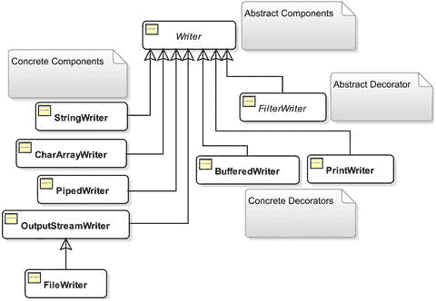

图 7-9.

与装饰器模式相比，Writer 流常用的类

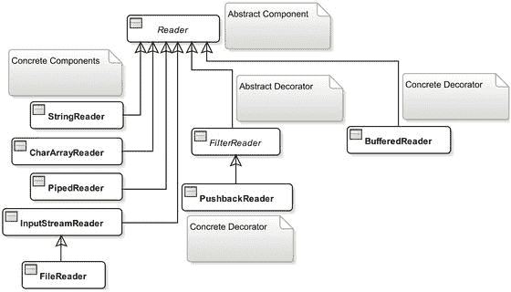

图 7-8.

与装饰器模式相比，Reader 流常用的类

表 7-4 和表 7-5 比较了基于字节和基于字符的输入/输出流中的类。

表 7-5.

比较基于字节的输出流和基于字符的输出流中的类

基于字节的输出流类
 |
 基于字符的输出流类
 |

| --- | --- | --- | --- | --- |

`OutputStream`
 |
  `Writer`
 |

`ByteArrayOutputStream`
 |
  `CharArrayWriter`
 |

无对应类
 |
  `StringWriter`
 |

`PipedOutputStream`
 |
  `PipedWriter`
 |

`FileOutputStream`
 |
  `FileWriter`
 |

无对应类
 |
  `OutputStreamWriter`
 |

`FilterOutputStream`
 |
  `FilterWriter`
 |

`BufferedOutputStream`
 |
  `BufferedWriter`
 |

`DataOutputStream`
 |
  无对应类
 |

`ObjectOutputStream`
 |
  无对应类
 |

`PrintStream`
 |
  `PrintWriter`
 |

表 7-4.

比较基于字节和基于字符的输入流中的类

基于字节的输入流类
 |
 基于字符的输入流类
 |

| --- | --- | --- | --- | --- |

`InputStream`
 |
  `Reader`
 |

`ByteArrayInputStream`
 |
  `CharArrayReader`
 |

`StringBufferInputStream`
 |
  `StringReader`
 |

`PipedInputStream`
 |
  `PipedReader`
 |

`FileInputStream`
 |
  `FileReader`
 |

无对应类
 |
  `InputStreamReader`
 |

`FilterInputStream`
 |
  `FilterReader`
 |

`BufferedInputStream`
 |
  `BufferedReader`
 |

`PushbackInputStream`
 |
  `PushbackReader`
 |

`DataInputStream`
 |
  无对应类
 |

`ObjectInputStream`
 |
  无对应类
 |

基于字节的输入/输出流中的一些类没有对应的基于字符的类，反之亦然。例如，读取和写入原始数据类型和对象始终是基于字节的；因此，在读取器/写入器类家族中，没有与数据/对象输入/输出流相对应的任何类。

我在前面的章节中详细讨论了如何使用基于字节的输入/输出类。你会发现读取器/写入器类别中的类与输入/输出类别中的类相似。它们也基于装饰器模式。

在读取器类层次结构中，`BufferedReader`（一个具体的装饰器）直接继承自 `Reader` 类，而不是抽象装饰器 `FilterReader` 类。在写入器类层次结构中，所有具体的装饰器都继承自 `Writer` 类，而不是 `FilterWriter`。没有具体的装饰器继承 `FilterWriter` 类。

读取器/写入器类家族中的两个类，`InputStreamReader` 和 `OutputStreamWriter`，提供了基于字节和基于字符的流之间的桥梁。如果你有一个 `InputStream` 的实例，并且你想从中获取一个 `Reader`，你可以通过使用 `InputStreamReader` 类来实现。也就是说，如果你有一个提供字节的流，并且你想通过将这些字节解码为字符来读取字符，那么你需要使用 `InputStreamReader` 类。例如，如果你有一个名为 `iso` 的 `InputStream` 对象，并且你想获取一个 `Reader` 对象实例，你可以按如下方式操作：

```
// 使用平台默认编码从 InputStream 对象创建一个 Reader 对象
Reader reader = new InputStreamReader(iso);
```

如果你知道基于字节的流中使用的编码，你可以在创建 `Reader` 对象时指定它，如下所示：

```
// 使用 "US-ASCII" 编码从 InputStream 创建一个 Reader 对象
Reader reader = new InputStreamReader(iso, "US-ASCII");
```

类似地，你可以创建一个 `Writer` 对象来从基于字节的输出流中输出字符，假设 `oso` 是一个 `OutputStream` 对象，如下所示：

```
// 使用平台默认编码从 OutputStream 创建一个 Writer 对象
Writer writer = new OutputStreamWriter(oso);
// 使用 "US-ASCII" 编码从 OutputStream 创建一个 Writer 对象
Writer writer = new OutputStreamWriter(oso, "US-ASCII");
```

使用写入器时，你不必一次只写一个字符或一个字符数组。它有允许你写入 `String` 和 `CharSequence` 对象的方法。

让我们将威廉·华兹华斯的诗《露西》中的另一节写入一个文件，并将其读回程序中。这次，你将使用 `BufferedWriter` 来写入文本，并使用 `BufferedReader` 来读回文本。以下是该节中的四行文本：


```
此刻我们抵达了果园小径；
当我们攀上山丘，
西沉的月亮向露西的小屋
越来越近，越来越近。
```

这段文本保存在当前目录下的 `luci4.txt` 文件中。清单 7-33 演示了如何使用 `Writer` 对象将文本写入该文件。运行程序时，你可能会得到不同的输出，因为它会打印输出文件的路径，而该路径取决于当前工作目录。

```
// FileWritingWithWriter.java
package com.jdojo.io;
import java.io.BufferedWriter;
import java.io.File;
import java.io.FileNotFoundException;
import java.io.FileWriter;
import java.io.IOException;
public class FileWritingWithWriter {
public static void main(String[] args) {
// 输出文件
String destFile = "luci4.txt";
try (BufferedWriter bw = new BufferedWriter(new FileWriter(destFile))) {
// 将文本写入 writer
bw.append("And now we reach'd the orchard-plot;");
bw.newLine();
bw.append("And, as we climb'd the hill,");
bw.newLine();
bw.append("The sinking moon to Lucy's cot");
bw.newLine();
bw.append("Came near and nearer still.");
// 刷新已写入的文本
bw.flush();
System.out.println("文本已写入 "
+ (new File(destFile)).getAbsolutePath());
} catch (FileNotFoundException e1) {
FileUtil.printFileNotFoundMsg(destFile);
} catch (IOException e2) {
e2.printStackTrace();
}
}
}
文本已写入 C:\Java9LanguageFeatures\luci4.txt
清单 7-33.
使用 Writer 对象将文本写入文件
```

如果你将此清单中的代码与任何其他将数据写入流的清单进行比较，你会发现没有根本性的差异。差异仅在于用于构造输出流的类。在本例中，你使用了 `BufferedWriter` 和 `FileWriter` 类来构造一个 `Writer` 对象。你使用了 `Writer` 类的 `append()` 方法将字符串写入文件。你可以使用 `write()` 方法或 `append()` 方法通过 `Writer` 对象写入字符串。然而，`append()` 方法支持将任何 `CharSequence` 对象写入流，而 `write()` 方法仅支持写入字符或字符串。`BufferedWriter` 类提供了一个 `newLine()` 方法，用于向输出流写入一个平台特定的换行符。

如何使用 `Reader` 对象读取写入 `luci4.txt` 文件的文本？这很简单。通过包装一个 `FileReader` 对象来创建一个 `BufferedReader` 对象，然后使用其 `readLine()` 方法一次读取一行文本。`readLine()` 方法将换行符（`'\n'`）、回车符（`'\r'`）以及回车符后紧跟换行符视为行终止符。它返回不包括行终止符的文本行。当到达流末尾时，它返回 `null`。以下是从 `luci4.txt` 文件读取文本的代码片段。你可以将完整程序作为练习来编写。

```
String srcFile = "luci4.txt";
BufferedReader br = new BufferedReader(new FileReader(srcFile));
String text = null;
while ((text = br.readLine()) != null) {
System.out.println(text);
}
br.close();
```

将基于字节的流转换为基于字符的流非常简单。如果你有一个 `InputStream` 对象，可以通过将其包装在 `InputStreamReader` 对象中来获取 `Reader` 对象，如下所示：

```
InputStream is = /* 在此处创建你的 InputStream 对象 */
Reader reader = new InputStreamReader(is);
```

如果你想从 `InputStream` 对象构造一个 `BufferedReader` 对象，可以这样做：

```
InputStream is = /* 在此处创建你的 InputStream 对象 */
BufferedReader br = new BufferedReader(new InputStreamReader(is));
```

你可以从 `OutputStream` 对象构造一个 `Writer` 对象，如下所示：

```
OutputStream os = /* 在此处创建你的 OutputStream 对象 */
Writer writer = new OutputStreamWriter(os);
```

自定义输入/输出流

你能拥有自己的 I/O 类吗？答案是肯定的。拥有自己的 I/O 类有多难？如果你理解装饰器模式，这并不难。拥有自己的 I/O 类只是在 I/O 类层次结构中添加一个具体的装饰器类的问题。在本节中，你将添加一个名为 `LowerCaseReader` 的新读取器类。它将从基于字符的流中读取字符，并将所有字符转换为小写。

`LowerCaseReader` 类是 `Reader` 类家族中的一个具体装饰器类。它应该继承自 `FilterReader` 类。它需要提供一个接受 `Reader` 对象的构造函数。

```
public class LowerCaseReader extends FilterReader {
public LowerCaseReader(Reader in) {
// 构造函数的代码写在这里
}
// 更多代码写在这里
}
```

`FilterReader` 类中有两个版本的 `read()` 方法用于从基于字符的流中读取字符。你只需要覆盖其中一个版本的 `read()` 方法，如下所示。所有其他版本的 `read()` 方法都将读取任务委托给这个方法。

```
public class LowerCaseReader extends FilterReader {
public LowerCaseReader(Reader in) {
// 构造函数的代码写在这里
}
@Override
public int read(char[] cbuf, int off, int len) throws IOException {
// 代码写在这里
}
}
```

这就是拥有你自己的读取器类所需的全部内容。如果需要，你可以在类中提供额外的方法。例如，你可能想要一个 `readLine()` 方法来以小写形式读取一行。或者，你也可以通过将 `LowerCaseReader` 对象包装在 `BufferedReader` 对象中，来使用 `BufferedReader` 类的 `readLine()` 方法。使用这个新类与使用任何其他读取器类相同。你可以将具体的读取器组件（如 `FileReader`）或具体的装饰器（如 `BufferedReader`）包装在 `LowerCaseReader` 对象中。或者，你也可以将 `LowerCaseReader` 对象包装在任何其他具体的读取器装饰器（如 `BufferedReader`）中。清单 7-34 包含了 `LowerCaseReader` 类的完整代码。

```
// LowerCaseReader.java
package com.jdojo.io;
import java.io.Reader;
import java.io.FilterReader;
import java.io.IOException;
public class LowerCaseReader extends FilterReader {
public LowerCaseReader(Reader in) {
super(in);
}
@Override
public int read(char[] cbuf, int off, int len) throws IOException {
int count = super.read(cbuf, off, len);
if (count != -1) {
// 将所有读取的字符转换为小写
int limit = off + count;
for (int i = off; i < limit; i++) {
cbuf[i] = Character.toLowerCase(cbuf[i]);
}
}
return count;
}
}
清单 7-34.
一个名为 LowerCaseReader 的自定义 Java I/O 读取器类
```

清单 7-35 展示了如何使用你的新类。它从 `luci4.txt` 文件中读取内容。它读取该文件两次：第一次使用 `LowerCaseReader` 对象，第二次将 `LowerCaseReader` 对象包装在 `BufferedReader` 对象中。请注意，在第二次读取 `licu4.txt` 文件时，你利用了 `BufferedReader` 类的 `readLine()` 方法。`luci4.txt` 文件应存在于你的当前工作目录中。否则，运行测试程序时会出现错误。


```
// LowerCaseReaderTest.java
package com.jdojo.io;
import java.io.FileReader;
import java.io.BufferedReader;
import java.io.FileNotFoundException;
import java.io.IOException;
public class LowerCaseReaderTest {
public static void main(String[] args) {
String fileName = "luci4.txt";
try (LowerCaseReader lcr
= new LowerCaseReader(new FileReader(fileName))) {
System.out.println("使用 LowerCaseReader 读取 luci4.txt：");
int c;
while ((c = lcr.read()) != -1) {
System.out.print((char) c);
}
} catch (FileNotFoundException e) {
FileUtil.printFileNotFoundMsg(fileName);
} catch (IOException e) {
e.printStackTrace();
}
try (BufferedReader br = new BufferedReader(
new LowerCaseReader(new FileReader(fileName)))) {
System.out.println("\n\n 使用 LowerCaseReader 和 BufferedReader 读取 luci4.txt：");
String str;
while ((str = br.readLine()) != null) {
System.out.println(str);
}
} catch (FileNotFoundException e) {
FileUtil.printFileNotFoundMsg(fileName);
} catch (IOException e) {
e.printStackTrace();
}
}
}
使用 LowerCaseReader 读取 luci4.txt：
And now we reach'd the orchard-plot;
And, as we climb'd the hill,
The sinking moon to Lucy's cot
Came near and nearer still.
使用 LowerCaseReader 和 BufferedReader 读取 luci4.txt：
and now we reach'd the orchard-plot;
and, as we climb'd the hill,
the sinking moon to lucy's cot
came near and nearer still.
清单 7-35.
测试自定义读取器类 LowerCaseReader
```

随机访问文件

`FileInputStream` 允许你从文件中读取数据，而 `FileOutputStream` 允许你将数据写入文件。随机访问文件是两者的结合。使用随机访问文件，你既可以读取文件，也可以写入文件。使用文件输入和输出流进行读写是顺序过程。而使用随机访问文件，你可以在文件中的任意位置进行读取或写入，因此得名“随机访问”。

`RandomAccessFile` 类的对象实现了随机文件访问。它允许你从文件读取/向文件写入字节以及所有基本类型的值。它还允许你使用其 `readUTF()` 和 `writeUTF()` 方法处理字符串。`RandomAccessFile` 类不属于 `InputStream` 和 `OutputStream` 类的类层次结构。

随机访问文件可以以四种不同的访问模式创建。你需要在构造函数中提供其中一种访问模式。访问模式的值是一个字符串。它们列举如下：

*   `"r"`：以只读模式打开文件。如果尝试在此模式下写入文件，将收到 `IOException`。
*   `"rw"`：以读写模式打开文件。如果文件不存在，则会创建该文件。
*   `"rws"`：与 `"rw"` 模式相同，不同之处在于对文件内容及其元数据的任何修改都会立即写入存储设备。
*   `"rwd"`：与 `"rw"` 模式相同，不同之处在于对文件内容的任何修改都会立即写入存储设备。

通过指定文件名和访问模式来创建 `RandomAccessFile` 类的实例，如下所示：

```
RandomAccessFile raf = new RandomAccessFile("randomtest.txt", "rw");
```

随机访问文件有一个文件指针，当你从中读取数据或向其写入数据时，该指针会前进。文件指针是一种光标，指示下一次读取或写入将从何处开始。其值表示光标距离文件开头的字节数。你可以使用 `getFilePointer()` 方法获取文件指针的值。当你创建 `RandomAccessFile` 类的对象时，文件指针被设置为零，表示文件的开头。你可以使用 `seek()` 方法将文件指针设置在文件中的特定位置。

`RandomAccessFile` 的 `length()` 方法返回文件的当前长度。你可以使用 `setLength()` 方法来扩展或截断文件。如果使用此方法扩展文件，则文件扩展部分的内容是未定义的。

对随机访问文件的读写操作，与你对任何输入和输出流进行读写的方式相同。清单 7-36 演示了随机访问文件的使用。当你运行此程序时，它会向文件写入两样东西：文件读取计数器（用于跟踪此程序读取文件的次数）和一条文本消息 `"Hello World!"`。程序每次读取文件时，都会递增文件中的计数器值。当你重复运行此程序时，计数器值会不断递增。每次运行此程序时，你可能会得到不同的输出。

```
// RandomAccessFileReadWrite.java
package com.jdojo.io;
import java.io.File;
import java.io.IOException;
import java.io.RandomAccessFile;
public class RandomAccessFileReadWrite {
public static void main(String[] args) throws IOException {
String fileName = "randomaccessfile.txt";
File fileObject = new File(fileName);
if (!fileObject.exists()) {
initialWrite(fileName);
}
// 读取文件两次
readFile(fileName);
readFile(fileName);
}
public static void readFile(String fileName) throws IOException {
// 以读写模式打开文件
try (RandomAccessFile raf = new RandomAccessFile(fileName, "rw")) {
int counter = raf.readInt();
String msg = raf.readUTF();
System.out.println("文件读取计数器：" + counter);
System.out.println("文件文本：" + msg);
System.out.println("----------------------------");
// 将文件读取计数器递增 1
incrementReadCounter(raf);
}
}
public static void incrementReadCounter(RandomAccessFile raf) throws IOException {
// 读取当前文件指针位置，以便最后恢复它
long currentPosition = raf.getFilePointer();
// 将文件指针设置在开头
raf.seek(0);
// 读取计数器并将其递增 1
int counter = raf.readInt();
counter++;
// 再次将文件指针设置为零，以覆盖计数器的值
raf.seek(0);
raf.writeInt(counter);
// 恢复文件指针
raf.seek(currentPosition);
}
public static void initialWrite(String fileName) throws IOException {
// 将文件读取计数器写为零。以读写模式打开文件。
try (RandomAccessFile raf = new RandomAccessFile(fileName, "rw")) {
// 将文件读取计数器写为零
raf.writeInt(0);
// 写入一条消息
raf.writeUTF("Hello world!");
}
}
}
文件读取计数器：0
文件文本：Hello world!

文件读取计数器：1
文件文本：Hello world!

清单 7-36.
使用 RandomAccessFile 对象读写文件
```

复制文件内容

了解了输入和输出流之后，编写将文件内容复制到另一个文件的代码就很简单了。你需要使用基于字节的输入和输出流（`InputStream` 和 `OutputStream` 对象），这样你的文件复制程序才能适用于所有类型的文件。复制文件的主要逻辑是持续从输入流读取数据直到文件末尾，并在从输入流读取数据的同时持续向输出流写入数据。以下代码片段展示了这种文件复制逻辑：

```
// 复制文件内容
int count = -1;
byte[] buffer = new byte[1024];
while ((count = in.read(buffer)) != -1) {
out.write(buffer, 0, count);
}
```

从 JDK9 开始，你可以使用 `InputStream` 类的 `transferTo(OutputStream out)` 方法将文件内容复制到另一个文件。以下代码片段将 `luci1.txt` 文件的内容复制到 `luci1_copy.txt` 文件。异常处理逻辑未显示。

```
FileInputStream fis = new FileInputStream("luci1.txt");
FileOutputStream fos = new FileOutputStream("luci1_copy.txt");
fis.transferTo(fos);
fos.close();
fis.close();
```

提示


文件复制逻辑仅复制文件的内容。你需要编写逻辑来复制文件的属性。第 10 章介绍的 NIO 2.0 API 在 `java.nio.file.Files` 类中提供了一个 `copy()` 方法，用于将文件的内容和属性复制到另一个文件。请使用 `Files.copy()` 方法来复制文件。

标准输入/输出/错误流

标准输入设备是由操作系统定义和控制的设备，你的 Java 程序可以从中接收输入。类似地，标准输出和错误是其他由操作系统定义（和控制）的设备，你的程序可以向其发送输出。通常，键盘是标准输入设备，而显示器则充当标准输出和标准错误设备。图 7-10 描述了标准输入、输出和错误设备与 Java 程序之间的交互。

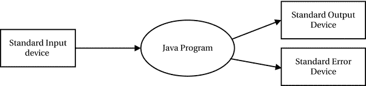

图 7-10.

Java 程序与标准输入、输出和错误设备之间的交互

当你使用以下语句打印消息时会发生什么？

```
System.out.println("这条消息将发送到标准输出设备！");
```

通常，你的消息会打印在控制台上。在这种情况下，显示器是标准输出设备，Java 程序允许你通过调用高级的 `println()` 方法将一些数据发送到标准输出设备。你在上一节中看到了类似的 `println()` 方法调用，当时你使用了 `PrintStream` 类，它是 `OutputStream` 类家族中的一个具体装饰器类。Java 使得与计算机上的标准输出设备交互变得更加容易。它创建了一个 `PrintStream` 类的对象，并通过 `System` 类中一个名为 `out` 的公共静态变量让你访问它。查看 `System` 类的代码；它声明了三个公共静态变量（分别对应标准输入、输出和错误设备），如下所示：

```
public class System {
public static PrintStream out; // 标准输出
public static InputStream in;  // 标准输入
public static PrintStream err; // 标准错误
// 此处为 System 类的更多代码
}
```

JVM 会将这三个变量初始化为适当的值。你可以在任何可以使用 `OutputStream` 对象的地方使用 `System.out` 和 `System.err` 对象引用。你可以在任何可以使用 `InputStream` 对象的地方使用 `System.in` 对象。

Java 还允许你以另一种方式使用 `System` 类中的这三个对象。如果你不希望这三个对象代表标准输入、输出和错误设备，你可以提供你自己的设备；Java 会将数据流重定向到你的设备或从你的设备接收数据流。

假设，每当你调用 `System.out.println()` 方法在控制台上打印消息时，你希望将所有消息发送到一个文件而不是控制台。你可以非常轻松地做到这一点。毕竟，`System.out` 只是一个 `PrintStream` 对象，并且你知道如何使用 `FileOutputStream` 对象创建一个 `PrintStream` 对象（参考清单 7-20）来写入文件。`System` 类提供了三个静态设置方法：`setOut()`、`setIn()` 和 `setErr()`，用于用你自己的设备替换这三个标准设备。要将所有标准输出重定向到一个文件，你需要调用 `setOut()` 方法，并传入一个代表你文件的 `PrintStream` 对象。如果你想将输出重定向到当前目录中名为 `stdout.txt` 的文件，可以通过执行以下代码来实现：

```
// 将所有标准输出重定向到 stdout.txt 文件
PrintStream ps = new PrintStream(new FileOutputStream("stdout.txt"));
System.setOut(ps);
```

清单 7-37 演示了如何将标准输出重定向到一个文件。你可能会在控制台上看到不同的输出。运行此程序后，你将在当前工作目录的 `stdout.txt` 文件中看到以下两条消息：

```
Hello world!
Java I/O is cool!
```

当你运行程序时，可能会得到不同的输出，因为它会使用你的当前工作目录打印 `stdout.txt` 文件的路径。

```
// CustomStdOut.java
package com.jdojo.io;
import java.io.PrintStream;
import java.io.FileOutputStream;
import java.io.File;
public class CustomStdOut {
public static void main(String[] args) throws Exception {
// 为文件 stdout.txt 创建一个 PrintStream
File outFile = new File("stdout.txt");
PrintStream ps = new PrintStream(new FileOutputStream(outFile));
// 在控制台上打印一条消息
System.out.println("消息将被重定向到 "
+ outFile.getAbsolutePath());
// 将标准输出设置为该文件
System.setOut(ps);
// 以下消息将被发送到 stdout.txt 文件
System.out.println("Hello world!");
System.out.println("Java I/O is cool!");
}
}
消息将被重定向到 C:\Java9LanguageFeatures\stdout.txt
清单 7-37.
将标准输出重定向到文件
```

通常，你使用 `System.out.println()` 调用来记录调试消息。假设你在整个应用程序中都使用了这个语句，而现在到了将应用程序部署到生产环境的时候了。如果你不从程序中移除调试代码，它将会持续在用户的控制台上打印消息。你没有时间遍历所有代码来移除调试代码。你能想到一个简单的解决方案吗？有一个简单的解决方案可以吞掉你所有的调试消息。你可以像在清单 7-37 中那样，将调试消息重定向到一个文件。另一个解决方案是在 `OutputStream` 类家族中创建你自己的具体组件类。我们将这个新类命名为 `DummyStandardOutput`，如清单 7-38 所示。

```
// DummyStandardOutput.java
package com.jdojo.io;
import java.io.OutputStream;
import java.io.IOException;
public class DummyStandardOutput extends OutputStream {
@Override
public void write(int b) throws IOException {
// 不执行任何操作。吞掉所有写入的数据
}
}
清单 7-38.
一个将吞掉所有写入数据的虚拟输出流类
```

你需要让 `DummyStandardOutput` 类继承自 `OutputStream` 类。你唯一需要编写的代码是重写 `write(int b)` 方法，并且在该方法中不执行任何操作。然后，通过包装新类的对象创建一个 `PrintStream` 对象，并使用 `System.setOut()` 方法将其设置为标准输出，如清单 7-39 所示。如果你不想创建一个新类，你可以使用匿名类来实现相同的结果，如下所示：

```
System.setOut(new PrintStream(new OutputStream() {
@Override
public void write(int b) {
// 不执行任何操作
}
}));
```

```
// SwallowOutput.java
package com.jdojo.io;
import java.io.PrintStream;
public class SwallowOutput {
public static void main(String[] args) {
PrintStream ps = new PrintStream(new DummyStandardOutput());
// 设置虚拟标准输出
System.setOut(ps);
// 以下消息不会发送到任何地方
System.out.println("Hello world!");
System.out.println("有人在听吗？");
System.out.println("不。我们都在打盹！！！");
}
}
（不会打印任何输出。）
清单 7-39.
吞掉所有发送到标准输出的数据
```


你可以使用 `System.in` 对象从标准输入设备（通常是键盘）读取数据。你也可以将 `System.in` 对象设置为从你选择的任何其他 `InputStream` 对象（例如文件）读取数据。你可以使用 `InputStream` 类的 `read()` 方法从该流中读取字节。`System.in.read()` 每次从键盘读取一个字节。请注意，`InputStream` 类的 `read()` 方法会阻塞，直到有数据可供读取。当用户输入数据并按下回车键时，输入的数据变为可用，`read()` 方法每次返回一个字节的数据。读取的最后一个字节将表示一个换行符。当你从输入设备读取到换行符时，应停止进一步读取，否则 `read()` 调用将阻塞，直到用户输入更多数据并再次按下回车键。清单 7-40 演示了如何读取使用键盘输入的数据。

```
// EchoStdin.java
package com.jdojo.io;
import java.io.IOException;
public class EchoStdin {
public static void main(String[] args) throws IOException {
// 提示用户输入一条消息
System.out.print("请输入一条消息并按回车键：");
// 显示用户输入的任何内容
int c;
while ((c = System.in.read()) != '\n') {
System.out.print((char) c);
}
}
}
清单 7-40.
从标准输入设备读取
```

由于 `System.in` 是 `InputStream` 的一个实例，你可以使用任何具体的装饰器从键盘读取数据；例如，你可以创建一个 `BufferedReader` 对象，并一次一行地从键盘读取数据作为字符串。清单 7-41 演示了如何将 `System.in` 对象与 `BufferedReader` 一起使用。请注意，这种情况正是你需要使用 `InputStreamReader` 类从基于字节的流（`System.in`）获取基于字符的流（`BufferedReader`）的时候。该程序会持续提示用户输入一些文本，直到用户输入 `Q` 或 `q` 退出程序。

```
// EchoBufferedStdin.java
package com.jdojo.io;
import java.io.BufferedReader;
import java.io.InputStreamReader;
import java.io.IOException;
public class EchoBufferedStdin {
public static void main(String[] args) throws IOException {
// 获取一个 BufferedReader，它包装了 System.in 对象。注意使用了
// InputStreamReader，这是基于字节的流和基于字符的流之间的桥梁类
BufferedReader br = new BufferedReader(new InputStreamReader(System.in));
String text;
while (true) {
// 提示用户输入一些文本
System.out.print("请输入一条消息（按 Q/q 退出）"
+ "并按回车键：");
// 读取文本
text = br.readLine();
if (text.equalsIgnoreCase("q")) {
System.out.println("您已决定退出程序");
break;
} else {
System.out.println("您输入的是：" + text);
}
}
}
}
清单 7-41.
将 System.in 与 BufferedReader 一起使用
```

如果你希望标准输入来自文件，你必须创建一个输入流对象来表示该文件，并使用 `System.setIn()` 方法设置该对象，如下所示：

```
FileInputStream fis = new FileInputStream("stdin.txt");
System.setIn(fis); // 现在 System.in.read() 将从 stdin.txt 文件读取
```

标准错误设备（通常是控制台）用于显示错误消息。在你的程序中使用它与使用标准输出设备相同。Java 提供了另一个名为 `System.err` 的 `PrintStream` 对象，而不是用于标准输出设备的 `System.out`。你可以如下使用它：

```
System.err.println("这是一条错误消息。");
```

控制台和 Scanner 类

尽管 Java 提供了三个对象来表示标准输入、输出和错误设备，但使用它们从标准输入读取数字并不容易。`Console` 类的目的是使 Java 程序与控制台之间的交互更加容易。我将在本节讨论 `Console` 类。我还将讨论用于解析从控制台读取的文本的 `Scanner` 类。

`Console` 类是 `java.io` 包中的一个实用类，它提供对与 JVM 关联的系统控制台（如果有）的访问。并非在所有机器上的 Java 程序中都能保证访问控制台。例如，如果你的 Java 程序作为服务运行，则不会有控制台与 JVM 关联，你也就无法访问它。你可以通过使用 `System` 类的 `static console()` 方法获取 `Console` 类的实例，如下所示：

```
Console console = System.console();
if (console != null) {
console.printf("控制台可用。");
}
```

`Console` 类包含一个 `printf()` 方法，用于在控制台上显示格式化字符串。`PrintStream` 类中也有一个 `printf()` 方法用于写入格式化数据。有关使用 `printf()` 方法以及如何使用 `Formatter` 类格式化文本、数字和日期的更多详细信息，请参阅本系列第一卷的第 17 章。

清单 7-42 演示了如何使用 `Console` 类。如果控制台不可用，它会打印一条消息并退出。如果你使用 NetBeans 等 IDE 运行此程序，控制台可能不可用。请尝试使用命令提示符运行此程序。该程序提示用户输入用户名和密码。如果用户输入密码 letmein，程序会打印一条消息。否则，它会打印密码无效。该程序使用 `readLine()` 方法从控制台读取一行文本，并使用 `readPassword()` 方法读取密码。当用户输入密码时，密码不可见；程序以字符数组的形式接收密码。

```
// ConsoleLogin.java
package com.jdojo.io;
import java.io.Console;
public class ConsoleLogin {
public static void main(String[] args) {
Console console = System.console();
if (console != null) {
console.printf("控制台可用。%n");
} else {
System.out.println("控制台不可用。%n");
return; // 控制台不可用
}
String userName = console.readLine("用户名：");
char[] passChars = console.readPassword("密码：");
String passString = new String(passChars);
if (passString.equals("letmein")) {
console.printf("你好 %s", userName);
} else {
console.printf("无效密码");
}
}
}
清单 7-42.
使用 Console 类输入用户名和密码
```

如果你想从标准输入读取数字，你必须将其作为字符串读取，然后解析为数字。`java.util` 包中的 `Scanner` 类根据模式读取并解析文本，将其转换为基本类型和字符串。文本源可以是 `InputStream`、文件、`String` 对象或 `Readable` 对象。你可以使用 `Scanner` 从标准输入 `System.in` 读取基本类型值。它包含许多方法，这些方法命名为 `hasNextXxx()` 和 `nextXxx()`，其中 `Xxx` 是一种数据类型，例如 `int`、`double` 等。`hasNextXxx()` 方法检查源中的下一个标记是否可以被解释为 `Xxx` 类型的值。`nextXxx()` 方法返回特定数据类型的值。

清单 7-43 演示了如何通过构建一个执行加法、减法、乘法和除法的简易计算器来使用 `Scanner` 类。


```
// Calculator.java
package com.jdojo.io;
import java.util.Scanner;
public class Calculator {
public static void main(String[] args) {
// 从控制台读取三个标记：操作数-1 运算符 操作数-2
String msg = "您可以计算一个算术表达式。\n"
+ "表达式必须采用以下格式：a op b\n"
+ "a 和 b 是两个数字，op 是 +、-、* 或 /。"
+ "\n 请输入一个表达式并按回车键：";
System.out.print(msg);
// 为标准输入构建一个扫描器
Scanner scanner = new Scanner(System.in);
try {
double n1 = scanner.nextDouble();
String operation = scanner.next();
double n2 = scanner.nextDouble();
double result = calculate(n1, n2, operation);
System.out.printf("%s %s %s = %.2f%n", n1,
operation, n2, result);
} catch (Exception e) {
System.out.println("无效的表达式。");
}
}
public static double calculate(double op1, double op2, String operation) {
switch (operation) {
case "+":
return op1 + op2;
case "-":
return op1 - op2;
case "*":
return op1 * op2;
case "/":
return op1 / op2;
}
return Double.NaN;
}
}
您可以计算一个算术表达式。
表达式必须采用以下格式：a op b
a 和 b 是两个数字，op 是 +、-、* 或 /。
请输入一个表达式并按回车键：10 + 19
10.0 + 19.0 = 29.00
清单 7-43.
使用 Scanner 类从标准输入读取输入
```

StringTokenizer 和 StreamTokenizer

Java 提供了一些实用类，可以将字符串分解为称为标记的部分。在此上下文中，标记是字符串的一部分。您通过定义分隔符字符来定义被视为标记的字符序列。假设您有一个字符串“This is a test, which is simple”。如果您将空格定义为分隔符，则该字符串包含七个标记：

*   This

*   is

*   a

*   test,

*   which

*   is

*   simple

如果您将逗号定义为分隔符，则同一个字符串包含两个标记：

*   This is a test

*   which is simple

`StringTokenizer` 类位于 `java.util` 包中。`StreamTokenizer` 类位于 `java.io` 包中。`StringTokenizer` 允许您将字符串分解为标记，而 `StreamTokenizer` 则允许您访问基于字符的流中的标记。

`StringTokenizer` 对象允许您根据自己定义的分隔符将字符串分解为标记。它一次返回一个标记。您还可以随时更改分隔符。您可以通过指定字符串并接受默认分隔符（即空格、制表符、换行符、回车符和换页符（`" \t\n\r\f"`））来创建 `StringTokenizer`，如下所示：

```
// 创建一个字符串标记生成器
StringTokenizer st = new StringTokenizer("here is my string");
```

您可以在创建 `StringTokenizer` 时指定自己的分隔符，如下所示：

```
// 将空格、逗号和分号作为分隔符
String delimiters = " ,;";
StringTokenizer st = new StringTokenizer("my text...", delimiters);
```

您可以使用 `hasMoreTokens()` 方法检查是否还有更多标记，并使用 `nextToken()` 方法从字符串中获取下一个标记。

您还可以使用 `String` 类的 `split()` 方法根据分隔符将字符串拆分为标记。`split()` 方法接受一个正则表达式作为分隔符。清单 7-44 演示了如何使用 `StringTokenizer` 和 `String` 类的 `split()` 方法。

```
// StringTokens.java
package com.jdojo.io;
import java.util.StringTokenizer;
public class StringTokens {
public static void main(String[] args) {
String str = "This is a test, which is simple";
String delimiters = " ,"; // 一个空格和一个逗号
StringTokenizer st = new StringTokenizer(str, delimiters);
System.out.println("使用 StringTokenizer 的标记：");
while (st.hasMoreTokens()) {
String token = st.nextToken();
System.out.println(token);
}
// 使用 String.split() 方法拆分同一个字符串
System.out.println("\n 使用 String.split() 方法的标记：");
String regex = "[ ,]+"; // 一个空格或一个逗号
String[] s = str.split(regex);
for (String item : s) {
System.out.println(item);
}
}
}
使用 StringTokenizer 的标记：
This
is
a
test
which
is
simple
使用 String.split() 方法的标记：
This
is
a
test
which
is
simple
清单 7-44.
使用 StringTokenizer 和 String.split() 方法将字符串分解为标记
```

`StringTokenizer` 和 `String` 类的 `split()` 方法都将每个标记作为字符串返回。有时您可能希望根据标记的类型来区分它们；您的字符串可能包含注释。在使用 `StreamTokenizer` 类将基于字符的流分解为标记时，您可以拥有这些高级功能。清单 7-45 演示了如何使用 `StreamTokenizer`。

```
// StreamTokenTest.java
package com.jdojo.io;
import java.io.StreamTokenizer;
import static java.io.StreamTokenizer.*;
import java.io.StringReader;
import java.io.IOException;
public class StreamTokenTest {
public static void main(String[] args) throws Exception {
String str = "This is a test, 200.89 which is simple 50";
StringReader sr = new StringReader(str);
StreamTokenizer st = new StreamTokenizer(sr);
try {
while (st.nextToken() != TT_EOF) {
switch (st.ttype) {
case TT_WORD:
/* 已读取一个单词 */
System.out.println("字符串值："
+ st.sval);
break;
case TT_NUMBER:
/* 已读取一个数字 */
System.out.println("数字值："
+ st.nval);
break;
}
}
} catch (IOException e) {
e.printStackTrace();
}
}
}
字符串值：This
字符串值：is
字符串值：a
字符串值：test
数字值：200.89
字符串值：which
字符串值：is
字符串值：simple
数字值：50.0
清单 7-45.
从基于字符的流中读取标记
```

该程序使用 `StringReader` 对象作为数据源。您可以使用 `FileReader` 对象或任何其他 `Reader` 对象作为数据源。获取标记的语法并不容易使用。`StreamTokenizer` 的 `nextToken()` 方法被重复调用。它会填充 `StreamTokenizer` 对象的三个字段：`ttype`、`sval` 和 `nval`。`ttype` 字段指示已读取的标记的类型。以下是 `ttype` 字段的四个可能值：

*   `TT_EOF`：已到达流的末尾。

*   `TT_EOL`：已到达行尾。

*   `TT_WORD`：已从流中读取一个单词（字符串）作为标记。

*   `TT_NUMBER`：已从流中读取一个数字作为标记。

如果 `ttype` 等于 `TT_WORD`，则字符串值存储在 `sval` 字段中。如果 `ttype` 是 `TT_NUMBER`，则数字值存储在 `nval` 字段中。

`StreamTokenizer` 是一个功能强大的类，用于将流分解为标记。它基于预定义的语法创建标记。您可以使用其 `resetSyntax()` 方法重置整个语法。您可以使用其 `wordChars()` 方法指定自己的可以构成单词的字符集。您可以使用其 `whitespaceChars()` 方法指定自定义的空白字符。

总结

从数据源读取数据以及向数据接收器写入数据称为输入/输出。流代表用于串行读取或写入的数据源或数据接收器。Java I/O API 包含多个类来支持输入和输出流。Java I/O 类位于 `java.io` 和 `java.nio` 包中。Java 中的输入/输出流类基于装饰器模式。


你通过路径名引用计算机中的文件。文件的路径名是一个字符序列，通过它你可以在文件系统中唯一地标识该文件。路径名由文件名及其在文件系统中的唯一位置组成。`File` 类的对象是文件或目录路径名的抽象表示，且与平台无关。`File` 对象所表示的路径名在文件系统中可能存在，也可能不存在。`File` 类提供了多种用于操作文件和目录的方法。

Java I/O 支持两种类型的流：基于字节的流和基于字符的流。基于字节的流继承自 `InputStream` 或 `OutputStream` 类。基于字符的流类继承自 `Reader` 或 `Writer` 类。

将内存中的对象转换为字节序列，并将该字节序列存储在文件等存储介质中的过程称为**对象序列化**。读取序列化过程产生的字节序列，并将对象恢复回内存的过程称为**对象反序列化**。Java 通过 `ObjectInputStream` 和 `ObjectOutputStream` 类支持对象的序列化和反序列化。一个对象必须实现 `Serializable` 接口才能被序列化。

Java I/O API 提供了 `Console` 和 `Scanner` 类来与控制台交互。

你可以使用 `StringTokenizer` 和 `StreamTokenizer` 类根据分隔符将文本分割成标记。`String` 类包含一个便捷的 `split()` 方法，用于根据正则表达式将字符串分割成标记。

问题与练习

1.  `File` 类的实例代表什么？

2.  解释以下语句的效果：

```
    File file = new File("test.txt");
    ```

    如果当前目录中不存在 `test.txt` 文件，该语句会创建它吗？

3.  使用 `File` 类的 `delete()` 和 `deleteOnExit()` 方法有什么区别？

4.  使用 `File` 类的 `mkdir()` 和 `mkdirs()` 方法有什么区别？

5.  完成以下名为 `isExistentDirectory()` 方法的代码。它接受一个路径名作为参数。如果指定的路径名表示一个已存在的目录，则返回 `true`，否则返回 `false`。

```
    public static boolean isExistentDirectory(String pathname) {
    /* 在此处编写你的代码 */
    }
    ```

6.  如果你需要读写 `int` 和 `float` 等基本数据类型的值，你会使用 `java.io` 包中的哪些类？

7.  如果你需要将对象序列化和反序列化到文件，你会使用 `java.io` 包中的哪些类？

8.  在对象序列化的上下文中，类实现 `Serializable` 接口和 `Externalizable` 接口有什么区别？

9.  在对象序列化的上下文中，将类中的实例变量声明为 `transient` 有什么意义？

10. 在序列化对象时，有没有办法序列化 `transient` 实例变量？

11. 你如何阻止你的类的对象被序列化？

12. 在对象序列化的上下文中，`serialVersionUID` 是什么？

13. 假设你当前目录中有一个名为 `test.txt` 的现有文本文件。编写代码将 `"Hello"` 追加到此文件中。

14. 如果你需要同时读写一个文件，你会使用 `java.io` 包中的哪个类？

15. 在执行 I/O 时，`InputStream` 和 `Reader` 类有什么区别？

16. 使用 `Console` 和 `Scanner` 类编写一个程序。该程序提示用户输入一个整数。当用户输入一个整数时，程序打印该整数是奇数还是偶数，并提示用户输入另一个整数。用户可以随时输入 `Q` 或 `q` 退出程序。

17. 编写一个程序，读取文件的内容，并打印文件中所有元音字母（a, e, i, o, u）出现的次数。计数应不区分大小写。也就是说，'A' 和 'a' 都计为 'a'。你需要提示用户指定文件的路径名。在你的代码中包含错误处理，例如处理指定文件不存在的情况。

8. 处理归档文件

在本章中，你将学习：

*   什么是归档文件

*   什么是数据压缩以及如何压缩和解压数据

*   如何使用不同的算法计算数据的校验和

*   如何创建 ZIP、GZIP 和 JAR 文件格式的文件并从中读取数据

*   如何使用 `jar` 命令行工具处理 JAR 文件

本章中的所有示例程序都是 `jdojo.archives` 模块的成员，如清单 8-1 中所声明。

```
// module-info.java
module jdojo.archives {
exports com.jdojo.archives;
}
清单 8-1.
jdojo.archives 模块的声明
```

什么是归档文件？

归档文件由一个或多个文件组成。它还包含元数据，其中可能包括文件的目录结构、注释、错误检测和恢复信息等。归档文件也可以被加密。通常（但不一定）归档文件以压缩格式存储。归档文件是使用文件归档软件创建的。例如，WinZip、7-zip 等工具用于在 Microsoft Windows 上创建 ZIP 格式的文件归档；`tar` 工具用于在基于 UNIX 的操作系统上创建归档文件。归档文件使得将多个文件作为一个文件存储和传输变得更加容易。本章详细讨论如何使用 Java I/O API 和 JDK 中包含的 `jar` 命令行工具来处理归档文件。

数据压缩

数据压缩是对给定数据应用编码算法以使其表示形式更小的过程。假设你有一个字符串 `777778888`。一种编码方式是 `5748`，可以解释为“五个 7 和四个 8”。通过这种编码，你将字符串的长度从九个字符减少到了四个字符。你将 `777778888` 压缩为 `5748` 所应用的算法称为**游程编码 (RLE)**。RLE 通过用计数器和一份数据副本来替换重复的数据序列来对数据进行编码。RLE 易于实现。它仅适用于重复数据较多的情况。

数据压缩的逆过程称为数据解压。在这里，你对压缩数据应用算法以恢复原始数据。

有两种类型的数据压缩：**无损压缩**和**有损压缩**。在无损压缩中，当你解压数据时，可以恢复原始数据。例如，如果你解压 `5748`，你可以恢复原始数据 (`777778888`)，而不会丢失任何信息。在这个例子中你可以恢复信息，因为 RLE 是一种无损数据压缩算法。其他无损数据压缩算法包括 LZ77、LZ78、LZW、霍夫曼编码、动态马尔可夫压缩 (DMC) 等。

在有损数据压缩中，你在压缩过程中会丢失一些数据，并且在解压压缩数据时无法完全恢复原始数据。有损数据压缩在某些情况下是可以接受的，例如查看图片、音频和视频，在这些情况下，用户在使用解压后的数据时不会注意到明显的差异。与无损数据压缩相比，有损数据压缩以较低的数据质量为代价实现了更高的压缩比。有损数据压缩算法的例子包括离散余弦变换 (DCT)、A 律压扩器、μ 律压扩器、矢量量化等。


DEFLATE 是一种
无损数据压缩算法，用于压缩 ZIP 和 GZIP 文件格式中的数据。GZIP
是 GNU ZIP 的缩写。GNU 是一个递归缩写，代表 GNU’s Not
UNIX。ZIP 文件格式用于数据压缩和文件
归档。文件归档是将多个文件合并为一个文件以便于存储的过程。通常，你会压缩
多个文件并将它们一起放入一个归档文件中。

你可能处理过扩展名为 `.zip` 的文件。ZIP 文件使用
ZIP 文件格式。它通过（可选地）压缩多个文件，将它们合并成一个 `.zip` 文件。

如果你是 UNIX 用户，你一定处理过 `.tar` 或 `.tar.gz` 文件。
通常，在 UNIX 上，你使用两步过程来创建一个压缩
归档文件。首先，你使用 tar 文件格式（tar 代表 磁带归档）将多个文件合并成一个 `.tar` 归档
文件，然后使用 GZIP 文件格式压缩该
归档文件，得到一个 `.tar.gz` 或 `.tgz` 文件。`.tar.gz` 或
`.tgz` 文件
也被称为 tarball
。与 ZIP 文件相比，tarball 的压缩率更高。ZIP
文件分别压缩多个文件然后进行归档。而 tarball
先归档多个文件，然后再压缩它们。因为
tarball 将合并后的文件一起压缩，它在压缩过程中利用了所有文件之间的数据重复性，从而实现了比 ZIP 文件更好的压缩效果。

ZLIB 是一个通用的无损数据压缩库。它是免费的
且不受任何专利保护。Java 提供了使用 ZLIB 库进行数据
压缩的支持。`Deflater` 和 `Inflater` 是
`java.util.zip` 包中的两个类
，它们支持在 Java 中使用 ZLIB 库进行通用的数据压缩/解压缩
功能。Java 提供了支持
ZIP 和 GZIP 文件格式的类。它还支持另一种文件格式
，称为 JAR 文件格式，它是 ZIP 文件格式的一种变体。
我将在接下来的几节中讨论 Java 支持的文件格式示例。

校验和

校验和   是一个整数，通过
对字节流应用算法计算得出。有时，从字节流计算整数的算法
也被称为校验和。通常，它用于检查数据传输过程中的错误。发送方为数据包计算校验和，并将该校验和与数据包一起发送给接收方。接收方
为其接收到的数据包计算校验和，并将其与从发送方收到的校验和进行比较。如果两者匹配，
接收方可以认为数据传输过程中没有错误。发送方和接收方必须约定通过应用相同的算法来计算数据的校验和。否则，校验和将不匹配。使用校验和并不是一种用于验证数据真实性的数据安全措施。它被用作一种错误检测方法。黑客可以更改数据的某些位，而你仍然可能得到与原始数据相同的校验和。

让我们讨论一种计算校验和的算法。该算法
以其发明者 Mark Adler 的名字命名为 Adler-32 
。其名称中包含数字 32，因为它
通过计算两个 16 位校验和并将它们连接成一个 32 位整数来计算校验和。让我们将这两个 16 位校验和称为 A 和 B，
最终的校验和称为 C。A 是数据中所有字节之和加 1。B 是每一步中 A 的各个值的总和。在
开始时，A 设置为 1，B 设置为 0。A 和 B 基于
模 65521 计算。也就是说，如果 A 或 B 的值超过 65521，它们的
值变为当前值模 65521。最终校验和的计算如下：

```
C = B * 65536 + A
```

最终校验和是通过连接 16 位的 B 和 A
值计算得出的。你需要将 B 的值乘以 65536 并加上 A
的值，以得到该 32 位最终校验和数字的十进制值。

让我们应用 Adler-32 校验和算法来计算字符串 `HELLO` 的校验和
，如表 8-1 所示。

表 8-1.

计算字符串 HELLO 的 Adler-32 校验和

字符
 |
  ASCII 值（十进制）
 |
  A
 |
  B
 |

| --- | --- | --- | --- | --- | --- | --- | --- | --- |

`H`
 |
  `72`
 |
  `1 + 72 = 73`
 |
  `0 + 73 = 73`
 |

`E`
 |
  `69`
 |
  `73 + 69 = 142`
 |
  `73 + 142 = 215`
 |

`L`
 |
  `76`
 |
  `142 + 76 = 218`
 |
  `215 + 218 = 433`
 |

`L`
 |
  `76`
 |
  `218 + 76 = 294`
 |
  `433 + 294 = 727`
 |

`O`
 |
  `79`
 |
  `294 + 79 = 373`
 |
  `727 + 373 = 1100`
 |

`C = B * 65536 + A`

`= 1100 * 65536 + 373`

`= 72089973`
 |

Java 在 `java.util.zip`
包中提供了一个 `Adler32` 类
，用于计算字节数据的 Adler-32 校验和。你需要
调用此类的 `update()` 方法
向其传递字节。一旦你将所有字节传递给它，
调用其 `getValue()` 方法即可
获取校验和。`CRC32`（循环冗余校验 32 位）是另一种
计算 32 位校验和的算法。同一个包中还有另一个名为
`CRC32` 的类
，它允许你使用 `CRC32` 算法计算校验和。

提示

Java 9 在 `java.util.zip`
包中添加了一个 `CRC32C` 类。该类允许你计算字节流的 CRC-32C。
CRC-32C 在 RFC 3720 中定义，网址为 [`http://www.ietf.org/rfc/rfc3720.txt`](http://www.ietf.org/rfc/rfc3720.txt) 。

清单 8-2 演示了如何
使用 `Adler32`、
`CRC32` 和
`CRC32C` 类 来计算
校验和。

```
// ChecksumTest.java
package com.jdojo.archives;
import java.util.zip.Adler32;
import java.util.zip.CRC32;
import java.util.zip.CRC32C;
import java.util.zip.Checksum;
public class ChecksumTest {
public static void main(String[] args) throws Exception {
String str = "HELLO";
byte[] data = str.getBytes("UTF-8");
System.out.println("Adler32, CRC32, and CRC32C checksums for " + str);
// 计算 Adler32 校验和
Checksum ad = new Adler32();
ad.update(data);
long adler32Checksum = ad.getValue();
System.out.println("Adler32: " + adler32Checksum);
// 计算 CRC32 校验和
Checksum crc32 = new CRC32();
crc32.update(data);
long crc32Checksum = crc32.getValue();
System.out.println("CRC32: " + crc32Checksum);
// 计算 CRC32C 校验和
Checksum crc32c = new CRC32C();
crc32c.update(data);
long crc32cChecksum = crc32c.getValue();
System.out.println("CRC32C: " + crc32cChecksum);
}
}
Adler32, CRC32, and CRC32C checksums for HELLO
Adler32: 72089973
CRC32: 3242484790
CRC32C: 3901656152
清单 8-2.
计算 Adler32、CRC32 和 CRC32C 校验和
```

`Adler32` 比 `CRC32` 更快。然而，`CRC32` 提供了更
健壮的校验和。校验和经常用于检查数据
损坏。`CheckedInputStream`
和 `CheckedOutputStream`
是 `InputStream/OutputStream`
类族中的两个具体装饰器类。它们位于 `java.util.zip`
包中。它们与一个 `Checksum` 对象一起工作。注意
`Checksum`
是一个接口，`Adler32` 和 `CRC32` 类
实现了该接口。`CheckedInputStream`
在你从流中读取数据时计算校验和，而 `CheckedOutputStream`
在你向流中写入数据时计算校验和。`ZipEntry` 类允许你
使用其 `getCrc()` 方法计算 ZIP 文件中条目的 `CRC32` 校验和。

压缩字节数组

你可以使用 `java.util.zip` 包中的 `Deflater` 和
`Inflater` 类
分别压缩和解压缩字节数组中的数据。这些
类是 Java 中压缩和解压缩的基本构建块。你可能不会经常直接使用它们。Java 中还有其他高级、易于使用的类来处理数据压缩。
这些类是 `DeflaterInputStream`、
`DeflaterOutputStream`、
`GZIPInputStream`、
`ZipFile`、`GZIPOutputStream`、
`ZipInputStream`
和 `ZipOutputStream`。我
将在后续章节中详细讨论这些类。


使用 `Deflater` 和 `Inflater` 类并非直观简单。你需要遵循以下步骤来压缩字节数组中的数据。

1.  创建一个 `Deflater` 对象。

2.  使用 `setInput()` 方法设置要压缩的输入数据。

3.  调用 `finish()` 方法，表示你已经提供了所有输入数据。

4.  调用 `deflate()` 方法来压缩输入数据。

5.  调用 `end()` 方法来结束压缩过程。

你可以使用 `Deflater` 类的某个构造函数来创建该类的对象。

```
// 使用无参构造函数
Deflater compressor = new Deflater();
```

`Deflater` 类的其他构造函数允许你指定压缩级别。你可以使用 `Deflater` 类中的常量之一来指定压缩级别。这些常量是 `BEST_COMPRESSION`、`BEST_SPEED`、`DEFAULT_COMPRESSION` 和 `NO_COMPRESSION`。在最佳压缩和最佳速度之间进行选择需要权衡。最佳速度意味着较低的压缩比，而最佳压缩则意味着较慢的压缩速度。

```
// 使用最佳压缩
Deflater compressor = new Deflater(Deflater.BEST_COMPRESSION);
```

默认情况下，压缩数据将采用 ZLIB 格式。如果你希望压缩数据采用 GZIP 或 PKZIP 格式，则需要通过在构造函数中将 `boolean` 标志设置为 `true` 来指定。

```
// 使用最佳速度压缩和 GZIP 格式
Deflater compressor = new Deflater(Deflater.BEST_SPEED, true);
```

你可以将输入数据以字节数组的形式提供给 `Deflater` 对象。

```
byte[] input = /* 获取一个填充了数据的字节数组 */;
compressor.setInput(input);
```

调用 `finish()` 方法，表示你已经提供了所有输入数据。

```
compressor.finish();
```

调用 `deflate()` 方法来压缩输入数据。它接受一个字节数组作为参数。它用压缩后的数据填充该字节数组，并返回它已填充的字节数组中的字节数。每次调用 `deflate()` 方法后，你都需要调用 `finished()` 方法来检查压缩过程是否结束。通常，你会像下面这样在一个循环中进行此检查：

```
// 尝试每次读取 1024 字节的压缩数据
byte[] readBuffer = new byte[1024];
int readCount = 0;
while(!compressor.finished()) {
readCount = compressor.deflate(readBuffer);
/* 此时，readBuffer 数组包含从索引 0 到 readCount - 1 的压缩数据。
*/
}
```

调用 `end()` 方法来释放 `Deflater` 对象所持有的任何资源。

```
// 表示压缩过程结束
compressor.end();
```

以下步骤用于解压缩字节数组中的数据。这些步骤与你压缩字节数组时所执行的步骤正好相反。

1.  创建一个 `Inflater` 对象。

2.  使用 `setInput()` 方法设置要解压缩的输入数据。

3.  调用 `inflate()` 方法来解压缩输入数据。

4.  调用 `end()` 方法来结束解压缩过程。

你可以使用 `Inflater` 类的某个构造函数来创建该类的对象。

```
// 使用无参构造函数
Inflater decompressor = new Inflater();
```

如果压缩数据是 GZIP 或 PKZIP 格式，则使用另一个构造函数并将 `true` 作为参数传递。

```
// 创建一个解压缩器，用于解压缩 GZIP 或 PKZIP 格式的数据
Inflater decompressor = new Inflater(true);
```

你为解压缩器设置输入，即字节数组中的压缩数据。

```
byte[] input = /* 获取字节数组中的压缩数据 */;
decompressor.setInput(input);
```

调用 `inflate()` 方法来解压缩输入数据。它接受一个字节数组作为参数。它用解压缩后的数据填充该字节数组，并返回该字节数组中的字节数。每次调用此方法后，你都需要调用 `finished()` 方法来检查压缩过程是否结束。通常，你会像下面这样使用一个循环：

```
// 尝试每次读取 1024 字节的解压缩数据
byte[] readBuffer = new byte[1024];
int readCount = 0;
while(!decompressor.finished()) {
readCount = decompressor.inflate(readBuffer);
/* 此时，readBuffer 数组包含从索引 0 到 readCount - 1 的解压缩数据。
*/
}
```

你需要调用 `end()` 方法来释放 `Inflater` 对象所持有的任何资源。

```
// 表示解压缩过程结束
decompressor.end();
```

清单 8-3 演示了如何使用 `Deflater` 和 `Inflater` 类。`compress()` 和 `decompress()` 方法分别接受输入并返回压缩和解压缩后的数据。在此示例中，我尝试压缩一个小的字符串 `Hello world!`。它的长度是 12 字节。压缩后变成了 20 字节。压缩的目标是减小数据大小，而不是增大。然而，仅仅因为你尝试压缩数据，并不一定能实现减小数据大小的目的。清单 8-3 中程序的输出就是这样一个例子。当你压缩数据时，压缩格式必须添加一些信息来进行一些内务处理。如果你尝试压缩的数据非常小（就像本例中的情况），或者它已经被压缩过，那么由于压缩过程添加了额外信息，压缩后数据的大小可能会增加。


```
// DeflateInflateTest.java
package com.jdojo.archives;
import java.io.ByteArrayOutputStream;
import java.io.IOException;
import java.util.zip.DataFormatException;
import java.util.zip.Deflater;
import java.util.zip.Inflater;
import static java.util.zip.Deflater.BEST_COMPRESSION;
public class DeflateInflateTest {
public static void main(String[] args) throws Exception {
String input = "Hello world!";
byte[] uncompressedData = input.getBytes("UTF-8");
// 压缩数据
byte[] compressedData = compress(uncompressedData, BEST_COMPRESSION, false);
// 解压数据
byte[] decompressedData = decompress(compressedData, false);
String output = new String(decompressedData, "UTF-8");
// 显示统计信息
System.out.println("输入字符串: " + input);
System.out.println("未压缩数据长度: " + uncompressedData.length);
System.out.println("压缩后数据长度: " + compressedData.length);
System.out.println("解压后数据长度: " + decompressedData.length);
System.out.println("输出字符串: " + output);
}
public static byte[] compress(byte[] input, int compressionLevel,
boolean GZIPFormat) throws IOException {
// 创建一个 Deflater 对象来压缩数据
Deflater compressor = new Deflater(compressionLevel, GZIPFormat);
// 为压缩器设置输入
compressor.setInput(input);
// 调用 finish() 方法，表示不再有输入数据提供给压缩器对象
compressor.finish();
// 压缩数据
ByteArrayOutputStream bao = new ByteArrayOutputStream();
byte[] readBuffer = new byte[1024];
while (!compressor.finished()) {
int readCount = compressor.deflate(readBuffer);
if (readCount > 0) {
// 将压缩后的数据写入输出流
bao.write(readBuffer, 0, readCount);
}
}
// 结束压缩器
compressor.end();
// 返回输出流中已写入的字节
return bao.toByteArray();
}
public static byte[] decompress(byte[] input, boolean GZIPFormat)
throws IOException, DataFormatException {
// 创建一个 Inflater 对象来解压数据
Inflater decompressor = new Inflater(GZIPFormat);
// 为解压器设置输入
decompressor.setInput(input);
// 解压数据
ByteArrayOutputStream bao = new ByteArrayOutputStream();
byte[] readBuffer = new byte[1024];
while (!decompressor.finished()) {
int readCount = decompressor.inflate(readBuffer);
if (readCount > 0) {
// 将数据写入输出流
bao.write(readBuffer, 0, readCount);
}
}
// 结束解压器
decompressor.end();
// 返回输出流中已写入的字节
return bao.toByteArray();
}
}
Input String: Hello world!
Uncompressed data length: 12
Compressed data length: 20
Decompressed data length: 12
Output String: Hello world!
清单 8-3.
使用 Deflater 和 Inflater 类压缩和解压字节数组
```

你可以使用 `DeflaterInputStream` 和 `DeflaterOutputStream` 来压缩输入流和输出流中的数据。此外，还有 `InflaterInputStream` 和 `InflaterOutputStream` 类用于解压输入流和输出流中的数据。这四个类是 `InputStream` 和 `OutputStream` 类家族中的具体装饰器。有关装饰器模式及具体装饰器类的更多详细信息，请参阅第 7 章。

处理 ZIP 文件格式

Java API 直接支持 ZIP 文件格式。通常，你会使用 `java.util.zip` 包中的以下四个类：

*   `ZipEntry`

*   `ZipInputStream`

*   `ZipOutputStream`

*   `ZipFile`

一个 `ZipEntry` 对象代表 ZIP 文件格式归档文件中的一个条目。如果你将 10 个文件归档到一个名为 `test.zip` 的文件中，归档中的每个文件在程序中都由一个 `ZipEntry` 对象表示。一个 ZIP 条目可以是压缩的，也可以是未压缩的。当你从 ZIP 文件中读取所有文件时，你会将每个文件作为一个 `ZipEntry` 对象来读取。当你想要向 ZIP 文件中添加文件时，你会向 ZIP 文件添加一个 `ZipEntry` 对象。`ZipEntry` 类提供了设置和获取 ZIP 文件中条目信息的方法。

`ZipInputStream` 是 `InputStream` 类家族中的一个具体装饰器类；你使用它来从 ZIP 文件中读取每个条目的数据。`ZipOutputStream` 是 `OutputStream` 类家族中的一个具体装饰器类；你使用它的类来向 ZIP 文件中写入每个条目的数据。

`ZipFile` 是一个用于从 ZIP 文件中读取条目的工具类。当你想要从 ZIP 文件中读取条目时，你可以选择使用 `ZipInputStream` 类或 `ZipFile` 类。

创建 ZIP 文件

以下是创建 ZIP 文件的步骤：

1.  创建一个 `ZipOutputStream` 对象。

2.  创建一个 `ZipEntry` 对象来表示 ZIP 文件中的一个条目。

3.  将 `ZipEntry` 添加到 `ZipOutputStream` 中。

4.  将条目的内容写入 `ZipOutputStream`。

5.  关闭 `ZipEntry`。

6.  对要添加到归档中的每个 ZIP 条目重复上述最后四个步骤。

7.  关闭 `ZipOutputStream`。

你可以使用 ZIP 文件的名称来创建 `ZipOutputStream` 对象。你需要创建一个 `FileOutputStream` 对象，并将其包装在 `ZipOutputStream` 对象中，如下所示：

```
// 创建一个 ZIP 输出流
ZipOutputStream zos = new ZipOutputStream(new FileOutputStream("ziptest.zip"));
```

你可以使用任何其他输出流的具体装饰器来包装你的 `FileOutputStream` 对象。例如，你可能希望使用 `BufferedOutputStream` 以获得更好的速度，如下所示：

```
ZipOutputStream zos = new ZipOutputStream(new BufferedOutputStream(
new FileOutputStream("ziptest.zip")));
```

你也可以选择性地设置 ZIP 文件条目的压缩级别。默认情况下，压缩级别设置为 `DEFAULT_COMPRESSION`。例如，以下语句将压缩级别设置为 `BEST_COMPRESSION`：

```
// 设置 ZIP 条目的压缩级别
zos.setLevel(Deflater.BEST_COMPRESSION);
```

你使用每个条目的文件路径创建一个 `ZipEntry` 对象，并使用 `ZipOutputStream` 对象的 `putNextEntry()` 方法将该条目添加到其中，如下所示：

```
ZipEntry ze = new ZipEntry("test1.txt")
zos.putNextEntry(ze);
```

你也可以选择性地设置 ZIP 条目的存储方法，以指示该 ZIP 条目是以压缩形式还是未压缩形式存储。默认情况下，ZIP 条目以压缩形式存储。

```
// 以压缩形式存储 ZIP 条目
ze.setMethod(ZipEntry.DEFLATED);
// 以未压缩形式存储 ZIP 条目
ze.setMethod(ZipEntry.STORED);
```

将上一步中添加的条目的内容写入 `ZipOutputStream` 对象。由于 `ZipEntry` 对象代表一个文件，你需要通过创建一个 `FileInputStream` 对象来读取该文件。

```
// 创建一个输入流来读取条目文件的数据
BufferedInputStream bis = new BufferedInputStream(new FileInputStream("test1.txt"));
byte[] buffer = new byte[1024];
int count;
// 写入条目的数据
while((count = bis.read(buffer)) != -1) {
zos.write(buffer, 0, count);
}
bis.close();
```

现在，使用 `ZipOutputStream` 的 `closeEntry()` 方法关闭该条目。

```
// 关闭 ZIP 条目
zos.closeEntry();
```

对要添加到 ZIP 文件中的每个条目重复上述步骤。最后，你需要关闭 `ZipOutputStream`。

```
// 关闭 ZIP 输出流
zos.close()
```


清单 8-4 演示了如何创建一个 ZIP 文件。它向 `ziptest.zip` 文件中添加了两个文件，分别名为 `test1.txt` 和 `notes\test2.txt`。程序期望这些文件位于当前工作目录中。如果文件不存在，程序会打印一条包含预期文件路径的错误消息并退出。当程序成功完成时，当前目录中会创建一个 `ziptest.zip` 文件，你可以使用 ZIP 文件工具（例如 Windows 上的 WinZip）打开它。程序会打印新创建的 ZIP 文件的路径。运行该程序时，你可能会得到不同的输出。

```
// ZipUtility.java
package com.jdojo.archives;
import java.util.zip.ZipOutputStream;
import java.util.zip.ZipEntry;
import java.io.FileOutputStream;
import java.io.IOException;
import java.io.BufferedInputStream;
import java.io.FileInputStream;
import java.io.BufferedOutputStream;
import java.io.File;
import java.util.zip.Deflater;
public class ZipUtility {
public static void main(String[] args) {
// 我们想要在当前目录中创建一个 ziptest.zip 文件。
// 我们想要向此 zip 文件中添加两个文件。
// 两个文件路径都相对于当前目录。
String zipFileName = "ziptest.zip";
String[] entries = new String[2];
entries[0] = "test1.txt";
entries[1] = "notes" + File.separator + "test2.txt";
zip(zipFileName, entries);
}
public static void zip(String zipFileName, String[] zipEntries) {
// 获取当前目录以供后续使用
String currentDirectory = System.getProperty("user.dir");
try (ZipOutputStream zos
= new ZipOutputStream(
new BufferedOutputStream(
new FileOutputStream(zipFileName)))) {
// 将压缩级别设置为最佳压缩
zos.setLevel(Deflater.BEST_COMPRESSION);
// 向 ZIP 文件中添加每个条目
for (String zipEntry : zipEntries) {
// 确保条目文件存在
File entryFile = new File(zipEntry);
if (!entryFile.exists()) {
System.out.println("条目文件 " + entryFile.getAbsolutePath()
+ " 不存在");
System.out.println("已中止处理。");
System.exit(1);
}
// 创建一个 ZipEntry 对象
ZipEntry ze = new ZipEntry(zipEntry);
// 将 zip 条目对象添加到 ZIP 文件
zos.putNextEntry(ze);
// 将条目的内容添加到 ZIP 文件
addEntryContent(zos, zipEntry);
// 当前条目处理完毕
zos.closeEntry();
}
System.out.println("输出已写入 "
+ currentDirectory + File.separator + zipFileName);
} catch (IOException e) {
e.printStackTrace();
}
}
public static void addEntryContent(ZipOutputStream zos, String entryFileName) {
// 创建一个输入流以从条目文件读取数据
try (BufferedInputStream bis = new BufferedInputStream(
new FileInputStream(entryFileName))) {
byte[] buffer = new byte[1024];
int count;
while ((count = bis.read(buffer)) != -1) {
zos.write(buffer, 0, count);
}
} catch (IOException e) {
e.printStackTrace();
}
}
}
输出已写入 C:\Java9LanguageFeatures\ziptest.zip
清单 8-4.
创建 ZIP 文件
```

读取 ZIP 文件的内容

读取 ZIP 文件的内容与向其中写入内容正好相反。以下是读取 ZIP 文件内容（或提取条目）的步骤。

1.  创建一个 `ZipInputStream` 对象。
2.  通过调用 `ZipInputStream` 对象的 `getNextEntry()` 方法，从输入流中获取一个 `ZipEntry`。
3.  从 `ZipInputStream` 对象中读取该 `ZipEntry` 的数据。
4.  重复最后两个步骤以从归档文件中读取另一个 ZIP 条目。
5.  关闭 `ZipInputStream`。

你可以使用 ZIP 文件名创建一个 `ZipInputStream` 对象，如下所示：

```
ZipInputStream zis = new ZipInputStream(
new BufferedInputStream(
new FileInputStream(zipFileName)));
```

以下代码片段从输入流中获取下一个条目：

```
ZipEntry entry = zis.getNextEntry();
```

现在，你可以从 `ZipInputStream` 对象中读取当前 ZIP 条目的数据。你可以将 ZIP 条目的数据保存到文件或任何其他存储介质中。你可以使用 `ZipEntry` 类的 `isDirectory()` 方法检查 ZIP 条目是否为目录。

清单 8-5 演示了如何读取 ZIP 文件的内容。该示例未检查某些错误。它没有在覆盖文件之前检查文件是否已存在。它还假设所有条目都是文件。程序期望你的当前工作目录中存在一个 `ziptest.zip` 文件。它会从 ZIP 文件中提取所有文件，并输出包含提取文件的目录路径。你可能会得到不同的输出。

```
// UnzipUtility.java
package com.jdojo.archives;
import java.util.zip.ZipEntry;
import java.io.FileOutputStream;
import java.io.FileNotFoundException;
import java.io.IOException;
import java.io.BufferedInputStream;
import java.io.FileInputStream;
import java.io.BufferedOutputStream;
import java.io.File;
import java.util.zip.ZipInputStream;
public class UnzipUtility {
public static void main(String[] args) {
String zipFileName = "ziptest.zip";
String unzipdirectory = "extracted";
unzip(zipFileName, unzipdirectory);
}
public static void unzip(String zipFileName, String unzipdir) {
try (ZipInputStream zis = new ZipInputStream(
new BufferedInputStream(
new FileInputStream(zipFileName)))) {
// 从 ZIP 文件中读取每个条目
ZipEntry entry;
while ((entry = zis.getNextEntry()) != null) {
// 提取条目的内容
extractEntryContent(zis, entry, unzipdir);
}
System.out.println("ZIP 文件的内容已提取到 "
+ (new File(unzipdir)).getAbsolutePath());
} catch (IOException e) {
e.printStackTrace();
}
}
public static void extractEntryContent(ZipInputStream zis,
ZipEntry entry,
String unzipdir)
throws IOException, FileNotFoundException {
String entryFileName = entry.getName();
String entryPath = unzipdir + File.separator + entryFileName;
// 通过创建必要的目录来创建条目文件
createFile(entryPath);
// 创建一个输出流以提取 zip 条目的内容并写入新文件
try (BufferedOutputStream bos = new BufferedOutputStream(
new FileOutputStream(entryPath))) {
byte[] buffer = new byte[1024];
int count;
while ((count = zis.read(buffer)) != -1) {
bos.write(buffer, 0, count);
}
}
}
public static void createFile(String filePath) throws IOException {
File file = new File(filePath);
File parent = file.getParentFile();
// 如果所有父目录不存在，则创建它们
if (!parent.exists()) {
parent.mkdirs();
}
file.createNewFile();
}
}
ZIP 文件的内容已提取到 C:\Java9LanguageFeatures\extracted
清单 8-5.
读取 ZIP 文件的内容
```

使用 `ZipFile` 类来读取 ZIP 文件的内容或列出其条目更为简便。例如，`ZipFile` 允许对 ZIP 条目进行随机访问，而 `ZipInputStream` 仅允许顺序访问。`ZipFile` 对象的 `entries()` 方法返回文件中所有 ZIP 条目的枚举。`getInputStream()` 方法返回用于读取 `ZipEntry` 对象内容的输入流。以下代码片段展示了如何使用 `ZipFile` 类。你可以将清单 8-5 中的代码重写为使用 `ZipFile` 类而不是 `ZipOutputStream` 类，以此作为练习。当你只想列出 ZIP 文件中的条目时，`ZipFile` 类会非常方便。


```
import java.io.InputStream;
import java.util.Enumeration;
import java.util.zip.ZipEntry;
import java.util.zip.ZipFile;
...
// 使用 ZIP 文件名创建 ZipFile 对象
ZipFile zf = new ZipFile("ziptest.zip");
// 获取所有 ZIP 条目的枚举并遍历它们
Enumeration e = zf.entries();
ZipEntry entry;
while (e.hasMoreElements()) {
entry = e.nextElement();
// 获取当前 ZIP 条目的输入流
InputStream is = zf.getInputStream(entry);
/* 使用 is 对象读取该条目的数据 */
// 打印条目的名称
System.out.println(entry.getName());
}
```

Java 8 为 `ZipFile` 类新增了一个 `stream()` 方法，该方法返回一个 `Stream<? extends ZipEntry>`。我在第 13 章中介绍了 `Stream` 类。下面我们使用 `Stream` 类和 lambda 表达式重写之前的代码片段：

```
import java.io.IOException;
import java.io.InputStream;
import java.util.stream.Stream;
import java.util.zip.ZipEntry;
import java.util.zip.ZipFile;
...
// 使用 ZIP 文件名创建 ZipFile 对象
ZipFile zf = new ZipFile("ziptest.zip");
// 获取所有 ZIP 条目的 Stream 并对每个条目执行某些操作
Stream entryStream = zf.stream();
entryStream.forEach(entry -> {
try {
// 获取当前 ZIP 条目的输入流
InputStream is = zf.getInputStream(entry);
/* 使用 is 对象读取该条目的数据 */
} catch(IOException e) {
e.printStackTrace();
}
// 打印条目的名称
System.out.println(entry.getName());
});
```

使用 GZIP 文件格式

`GZIPInputStream` 和 `GZIPOutputStream` 类用于处理 GZIP 文件格式。它们是 `InputStream` 和 `OutputStream` 类族中的具体装饰器类。其用法与 I/O 中其他具体装饰器类类似。你需要将 `OutputStream` 对象包装在 `GZIPOutputStream` 对象中，以便对数据应用 GZIP 压缩。你需要将 `InputStream` 对象包装在 `GZIPInputStream` 对象中，以便应用 GZIP 解压缩。以下代码片段说明了如何使用这些类来压缩和解压缩数据：

```
// 创建 GZIPOutputStream 对象以 GZIP 格式压缩数据
// 并将其写入 gziptest.gz 文件。
GZIPOutputStream gos = new GZIPOutputStream(new FileOutputStream("gziptest.gz"));
// 将未压缩的数据写入 GZIP 输出流，数据将被
// 压缩并写入 gziptest.gz 文件
gos.write(byteBuffer);
```

如果你希望使用缓冲写入以获得更快的速度，应将 `GZIPOutputStream` 包装在 `BufferedOutputStream` 中，并将数据写入 `BufferedOutputStream`。

```
BufferedOutputStream bos = new BufferedOutputStream(new GZIPOutputStream(
new FileOutputStream("gziptest.gz")));
```

如何在序列化对象时对其进行压缩？很简单。只需将 `GZIPOutputStream` 包装在 `ObjectOutputStream` 对象中即可。当你将对象写入 `ObjectOutputStream` 时，其序列化形式将使用 GZIP 格式进行压缩。

```
ObjectOutputStream oos = new ObjectOutputStream(new GZIPOutputStream(
new FileOutputStream("gziptest.ser")));
```

应用相反的逻辑来读取 GZIP 格式的压缩数据以进行解压缩。以下代码片段展示了如何构造一个 `InputStream` 对象来解压缩 GZIP 格式的数据：

```
// 从 gziptest.gz 文件中解压缩 GZIP 格式的数据并读取它
GZIPInputStream gis = new GZIPInputStream(new FileInputStream("gziptest.gz"));
/* 从 GZIP 输入流中读取未压缩的数据，例如 gis.read(byteBuffer);*/
// 构造一个 BufferedInputStream 来读取 GZIP 格式的数据
BufferedInputStream bis = new BufferedInputStream (new GZIPInputStream(
new FileInputStream(gziptest.gz")));
// 构造一个 ObjectInputStream 来读取压缩对象
ObjectInputStream ois = new ObjectInputStream (new GZIPInputStream(
new FileInputStream("gziptest.ser")));
```

使用 JAR 文件格式


JAR（Java 归档）是一种基于 ZIP 文件格式的文件格式。它用于将 Java 应用程序或小程序的资源、类文件、声音文件、图像等打包在一起，并提供数据压缩功能。最初，它被开发用于打包小程序的资源，以减少通过 HTTP 连接下载的时间。

你可以将 JAR 文件视为一种特殊的 ZIP 文件。JAR 文件提供了许多 ZIP 文件不具备的功能。你可以对 JAR 文件的内容进行数字签名以提供安全性。它提供了一种平台无关的文件格式。你可以在 Java 程序中使用 JAR API 来操作 JAR 文件。

JAR 文件可以包含一个可选的 `META-INF` 目录，用于存放包含应用程序配置信息的文件和目录。表 8-2 列出了 `META-INF` 目录中的条目。

表 8-2. JAR 文件的 META-INF 目录内容

名称 | 类型 | 用途
| --- | --- | --- |
`MANIFEST.MF` | 文件 | 包含扩展和包相关的数据。
`INDEX.LIST` | 文件 | 包含包的位置信息。类加载器使用它来加速类的搜索和加载过程。
`X.SF` | 文件 | X 是基本文件名。存储 JAR 文件的签名。
`X.DSA` | 文件 | X 是基本文件名。存储相应签名文件的数字签名。
`/services` | 目录 | 包含所有服务提供者配置文件。如果你的应用程序是使用 JDK9 中的模块系统开发的，则不需要此目录，因为可以在模块声明中配置服务。
`versions` | 目录 | 在多版本 JAR 文件中包含特定于 JDK 版本的文件。我在本系列第三卷的第 11 章中介绍了多版本 JAR。

JDK 附带了一个 `jar` 工具，用于创建和操作 JAR 文件。你也可以使用 Java API 中的 `java.util.jar` 包中的类来创建和操作 JAR 文件。该包中的大多数类与 `java.util.zip` 包中的类相似。实际上，该包中的大多数类都继承自处理 ZIP 文件格式的类。例如，`JarFile` 类继承自 `ZipFile` 类；`JarEntry` 类继承自 `ZipEntry` 类；`JarInputStream` 类继承自 `ZipInputStream` 类；`JarOutputStream` 类继承自 `ZipOutputStream` 类等。JAR API 有一些新的类来处理清单文件。`Manifest` 类表示一个清单文件。我将在本章后面讨论如何使用 JAR API。本节我将讨论 `jar` 工具。

提示

JDK9 为 `JarFile` 类添加了一些方法，用于处理 JDK9 中引入的多版本 JAR 文件。例如，如果 `JarFile` 表示一个多版本 JAR，则 `isMultiRelease()` 方法返回 true。

使用 `jar` 工具创建 JAR 文件时，有许多命令行选项可用。使用 `jar` 工具可以执行四种基本操作。

*   创建 JAR 文件。
*   更新 JAR 文件。
*   从 JAR 文件中提取条目。
*   列出 JAR 文件的内容。

表 8-3 列出了 `jar` 工具的命令行选项。本系列第一卷的第 3 章解释了其中一些选项。GNU 风格的选项是在 JDK9 中添加的。有关 `jar` 工具所有选项的完整列表以及工具的用法，请使用 `--help` 或 `--help-extra` 选项运行该工具，如下所示：

表 8-3. jar 工具的命令行选项

选项 | 描述
| --- | --- |
`-c, --create` | 创建一个新的 JAR 文件。
`-u, --update` | 更新一个现有的 JAR 文件。
`-x, --extract` | 从 JAR 文件中提取指定文件或所有文件。
`-t, --list` | 列出 JAR 文件的目录内容。
`-f, --file=FILE` | 指定 JAR 文件名。
`-m, --manifest=FILE` | 包含来自指定文件的清单信息。
`-M, --no-manifest` | 不创建清单文件。
`-i, --generate-index=FILE` | 为指定的 JAR 文件生成索引信息。它会在 JAR 文件的 `META-INF` 目录下创建一个 `INDEX.LIST` 文件。
`-0, --no-compress` | 不压缩 JAR 文件中的条目。仅存储它们。选项值为零，表示零压缩。
`-e, --main-class=CLASSNAME` | 将指定的类名添加为清单文件主节中 `Main-Class` 条目的值。
`-v, --verbose` | 在标准输出上生成详细输出。
`-C DIR` | 切换到指定目录，并将以下文件包含在 JAR 文件中。注意，该选项是大写的（`C`）。小写（`-c`）用于指示创建 JAR 文件的选项。
`--release VERSION` | 将所有后续文件放置在 JAR 的版本化目录中（即 `META-INF/versions/VERSION/`）。
`-d, --describe-module` | 打印模块描述符或自动模块名称。
`--module-version=VERSION` | 创建模块化 JAR 或更新非模块化 JAR 时的模块版本。
`--hash-modules=PATTERN` | 计算并记录与给定模式匹配且直接或间接依赖于正在创建的模块化 JAR 或正在更新的非模块化 JAR 的模块的哈希值。
`-p, --module-path` | 用于生成哈希的模块依赖位置。
`--version` | 打印程序版本。
`-h, --help[:compat], --help-extra` | 打印 `jar` 工具的帮助信息。

```
C:\Java9LanguageFeatures>jar --help
```

创建 JAR 文件

使用以下命令创建一个名为 `test.jar` 的 JAR 文件，其中包含两个类文件 `A.class` 和 `B.class`：

```
jar --create --file test.jar A.class B.class
```

如果在运行此命令时遇到诸如 `"jar is not recognized as a command"` 的错误，则需要使用 `jar` 命令的完整路径，或者将包含 `jar` 命令的目录添加到计算机的 `PATH` 环境变量中。在 Windows 上，如果你将 JDK 安装在 `C:\java9` 目录中，则 `jar` 命令存储在 `C:\java9\bin` 目录中。

在上一个命令中，`--create` 选项表示你正在创建一个新的 JAR 文件，`--file test.jar` 选项表示你将新的 JAR 文件名指定为 `test.jar`。在命令的末尾，你可以指定一个或多个要包含在 JAR 文件中的文件名或目录名。

要查看 `test.jar` 文件的内容，可以执行以下命令：

```
jar --list --file test.jar
META-INF/
META-INF/MANIFEST.MF
A.class
B.class
```

此命令中的 `--list` 选项表示你希望查看 JAR 文件的目录内容。`--file` 选项指定 JAR 文件名，此处为 `test.jar`。请注意，当你创建 `test.jar` 文件时，`jar` 工具会自动为你创建两个额外的条目：一个名为 `META-INF` 的目录和一个位于 `META-INF` 目录中的名为 `MANIFEST.MF` 的文件。当你列出 JAR 文件的内容时，你会看到这些条目。

以下命令将通过包含当前工作目录中的所有内容来创建一个 `test.jar` 文件。注意使用星号作为通配符来表示当前工作目录中的所有内容。

```
jar --create --file test.jar *
```

以下命令将创建一个 JAR 文件，其中包含 `book/archives` 目录中的所有类文件以及 `book/images` 目录中的所有图像。这里，`book` 是当前工作目录中的一个子目录。

```
jar --create --file test.jar book/archives/*.class book/images
```


您可以在创建 JAR 文件时，通过命令行选项指定一个清单文件。您指定的清单文件将是一个文本文件，其中包含 JAR 文件的所有清单条目。请注意，您的清单文件末尾必须有一个空行。否则，清单文件中的最后一个条目将不会被处理。稍后我将详细讨论清单文件的内容。

以下命令将在创建 `test.jar` 文件时使用 `manifest.txt` 文件，并包含当前目录中的所有文件和子目录。请注意选项 `m` 的使用。

```
jar --create --file test.jar --manifest manifest.txt *
```

**更新 JAR 文件**

使用选项 `--update` 来更新现有 JAR 文件的条目或其清单文件。以下命令将向现有的 `test.jar` 文件中添加一个 `C.class` 文件：

```
jar --update --file test.jar C.class
```

假设您有一个 `test.jar` 文件，并且希望将其清单文件中的 `Main-Class` 条目更改为 `pkg.HelloWorld` 类。您可以通过使用以下命令来实现：

```
jar --update --file test.jar --main-class pkg.HelloWorld
```

**为 JAR 文件建立索引**

您可以为 JAR 文件生成一个索引文件。它用于加速类加载。在创建 JAR 文件后，使用一个单独的命令，将 `--generate-index` 选项与 `jar` 命令一起使用：

```
jar --generate-index test.jar
```

此命令会向 `test.jar` 文件中添加一个 `META-INF/INDEX.LIST` 文件。您可以通过使用以下命令列出 `test.jar` 文件的内容来验证这一点：

```
jar --list --file test.jar
META-INF/INDEX.LIST
META-INF/
META-INF/MANIFEST.MF
A.class
B.class
manifest.txt
```

生成的 `INDEX.LIST` 文件包含了 `test.jar` 文件的 `Class-Path` 属性中列出的所有 JAR 文件中所有包的位置信息。您可以在 JAR 文件的清单文件中包含一个名为 `Class-Path` 的属性。它是一个以空格分隔的 JAR 文件列表。当您运行 JAR 文件时，该属性值用于搜索和加载类。

**从 JAR 文件中提取条目**

您可以使用 `jar` 命令的 `--extract` 选项来提取 JAR 文件中的全部或部分条目。要从 `test.jar` 文件中提取所有条目，您可以使用：

```
jar --extract --file test.jar
```

此命令将 `test.jar` 文件中的所有条目提取到当前工作目录。它会创建与 `test.jar` 文件中相同的目录结构。在提取条目过程中，任何已存在的文件都会被覆盖。此命令不会更改示例中的 JAR 文件 `test.jar`。

要从 JAR 文件中提取单个条目，您需要在命令的末尾列出它们。条目之间应以空格分隔。以下命令将从 `test.jar` 文件中提取 `A.class` 和 `book/HelloWorld.class` 条目：

```
jar --extract --file test.jar A.class book/HelloWorld.class
```

要提取 `book` 目录中的所有类文件，您可以使用以下命令：

```
jar --extract --file test.jar book/*.class
```

**列出 JAR 文件的内容**

将选项 `t` 与 `jar` 命令一起使用，可以在标准输出上列出 JAR 文件的内容：

```
jar --list --file test.jar
```

**清单文件**

JAR 文件与 ZIP 文件的不同之处在于，它可以选择性地在 `META-INF` 目录中包含一个名为 `MANIFEST.MF` 的清单文件。清单文件包含有关 JAR 文件及其条目的信息。它可以包含有关 JAR 文件的 `CLASSPATH` 设置的信息。它的主条目类是包含“`public static void main(String[])`”方法的类，用于启动独立应用程序、包的版本信息等。

清单文件被分成多个节（section），节之间用空行分隔。每个节包含名称-值对。每个名称-值对由新行分隔。名称与其对应的值之间用冒号分隔。清单文件必须以新行结尾。以下是清单文件内容的示例：

```
Manifest-Version: 1.0
Created-By: 1.8.0_20-ea-b05 (Oracle Corporation)
Main-Class: com.jdojo.intro.Welcome
Multi-Release: true
```

此清单文件有一个包含四个属性的节：

*   `Manifest-Version`
*   `Created-By`
*   `Main-Class`
*   `Multi-Release`

清单文件中有两种节：主节（main section）和个体节（individual section）。任何两个节之间必须用一个空行分隔。主节中的条目适用于整个 JAR 文件。个体节中的条目适用于特定的条目。个体节中的属性会覆盖主节中的相同属性。个体条目以 `Name` 属性开头，其值是 JAR 文件中条目的名称，后面跟着该条目的其他属性。例如，假设您有一个包含以下内容的清单文件：

```
Manifest-Version: 1.0
Created-By: 1.6.0 (Sun Microsystems Inc.)
Main-Class: com.jdojo.chapter2.Welcome
Sealed: true
Name: book/data/
Sealed: false
Name: images/logo.bmp
Content-Type: image/bmp
```

该清单文件包含三个节：一个主节和两个个体节。第一个个体节表明包 `book/data` 未被密封。这个个体节的属性 `Sealed: false` 将覆盖主节的属性 `Sealed: true`。另一个个体节针对一个名为 `images/logo.bmp` 的条目。它声明该条目的内容类型是 `bmp` 类型的图像。

`jar` 命令可以创建一个默认的清单文件并将其添加到 JAR 文件中。默认的清单文件只包含两个属性：`Manifest-Version` 和 `Created-By`。您可以使用选项 `--no-manifest` 来告诉 `jar` 工具省略默认的清单文件。以下命令将创建一个 `test.jar` 文件，而不添加默认的清单文件：

```
jar --create --no-manifest --file test.jar book/*.class
```

`jar` 命令为您提供了一个自定义清单文件内容的选项。您可以使用 `--manifest` 选项来指定包含清单文件内容的文件。`jar` 命令将从指定的清单文件中读取名称-值对，并将它们添加到 `MANIFEST.MF` 文件中。假设您有一个名为 `manifest.txt` 的文件，其中包含一个属性条目。请确保在文件末尾添加一个新行。文件内容如下：

```
Main-Class: com.jdojo.intro.Welcome
```

要通过包含当前工作目录中的所有类文件，将 `manifest.txt` 文件中的 `Main-Class` 属性值添加到一个新的 `test.jar` 文件中，您可以执行以下命令：

```
jar --create --manifest manifest.txt --file test.jar *.class
```

此命令将向 `test.jar` 文件中添加一个包含以下内容的清单文件：

```
Manifest-Version: 1.0
Created-By: 9.0.1 (Oracle Corporation)
Main-Class: com.jdojo.intro.Welcome
```

如果您在清单文件中没有指定 `Manifest-Version` 和 `Created-By` 属性，该工具会添加它们。`Manifest-Version` 默认为 1.0，`Created-By` 默认为您使用的 JDK 版本。

您也可以在清单文件中添加 `Main-Class` 属性值，而无需创建自己的清单文件。在创建/更新 JAR 文件时，将选项 `--main-class` 与 `jar` 工具一起使用。以下命令会将 `com.jdojo.intro.Welcome` 作为 `Main-Class` 的值添加到 `test.jar` 文件的 `MANIFEST.MF` 文件中：

```
jar --create --main-class com.jdojo.intro.Welcome --file test.jar *.class
```

您可以在 JAR 文件的清单文件中设置 `CLASSPATH`。属性名称为 `Class-Path`，您必须在自定义清单文件中指定它。它是一个以空格分隔的 JAR 文件、ZIP 文件和目录列表。清单文件中的 `Class-Path` 属性如下所示：

```
Class-Path: chapter8.jar file:/c:/book/ http://www.jdojo.com/jutil.jar
```


此条目为 `CLASSPATH` 提供了三项内容：一个名为 `chapter` `8` `.jar` 的 JAR 文件，一个使用文件协议 `file:/c:/book/` 的目录，以及另一个使用 HTTP 协议 [`http://www.jdojo.com/jutil.jar`](http://www.jdojo.com/jutil.jar) 的 JAR 文件。请注意，目录名必须以正斜杠结尾。假设此 `Class-Path` 设置包含在 `test.jar` 文件的清单文件中。当你使用以下 `java` 命令运行 `test.jar` 文件时，将使用此 `CLASSPATH` 来搜索和加载类。

```
java –jar test.jar
```

当你使用 `java` 命令的 `–jar` 选项运行 JAR 文件时，JAR 文件清单文件外部的任何 `CLASSPATH` 设置（本例中为 `test.jar` 文件）都将被忽略。`Class-Path` 属性的另一个用途是使用 `jar` 工具的 `--generate-index` 选项生成所有包的索引。

在 JAR 文件中密封包

你可以密封 JAR 文件中的包。密封 JAR 文件中的包意味着该包中声明的所有类都必须归档在同一个 JAR 文件中。通常，密封包是为了方便维护包的版本。如果你更改了包中的任何内容，只需重新创建一个 JAR 文件即可。要密封 JAR 文件中的包，你需要包含两个属性：`Name` 和 `Sealed`。`Name` 属性的值是包的名称，`Sealed` 属性的值为 `true`。清单文件中的以下条目将密封名为 `com.jdojo.archives` 的包。请注意，包名必须以正斜杠（`/`）结尾。

```
Name: com/jdojo/archives/
Sealed: true
```

默认情况下，JAR 文件中的包是未密封的。如果你想密封 JAR 文件本身，可以包含一个 `Sealed` 属性，如下所示：

```
Sealed: true
```

密封 JAR 文件将密封该 JAR 文件中的所有包。但是，你可以通过单独不密封某个包来覆盖此设置。清单文件中的以下条目将密封 JAR 文件中的所有包，但 `book/chapter` `8` `/` 包除外：

```
Sealed: true
Name: book/chapter8/
Sealed: false
```

使用 JAR API

使用 JAR API 与使用 ZIP API 非常相似，不同之处在于 JAR API 包含了用于处理清单文件的类。`Manifest` 类的对象代表一个清单文件。你可以按如下方式在代码中创建一个 `Manifest` 对象：

```
Manifest manifest = new Manifest();
```

对于清单文件，你可以做两件事：从中读取条目以及向其写入条目。处理主节和各个节的条目有不同的方法。要向主节添加条目，请使用 `Manifest` 类的 `getMainAttributes()` 方法获取 `Attributes` 类的实例，然后使用其 `put()` 方法不断向其添加名称-值对。以下代码片段向 `Manifest` 对象的主节添加了一些属性。已知的属性名称在 `Attributes.Name` 类中定义为常量。例如，常量 `Attributes.Name.MANIFEST_VERSION` 代表 `Manifest-Version` 属性名称。

```
// 创建一个 Manifest 对象
Manifest manifest = new Manifest();
/* 添加主属性
1. 清单版本
2. 主类
3. 密封
*/
Attributes mainAttribs = manifest.getMainAttributes();
mainAttribs.put(Attributes.Name.MANIFEST_VERSION, "1.0");
mainAttribs.put(Attributes.Name.MAIN_CLASS, "com.jdojo.intro.Welcome");
mainAttribs.put(Attributes.Name.SEALED, "true");
```

向清单文件添加单个条目比添加主条目稍微复杂一些。假设你想向清单文件添加以下单个条目：

```
Name: "com/jdojo/archives/"
Sealed: false
```

你需要执行以下步骤。

1.  获取存储清单单个条目的 `Map` 对象。
2.  创建一个 `Attributes` 对象。
3.  向 `Attributes` 对象添加名称-值对。你可以根据需要添加任意数量的名称-值对。
4.  使用单个节的名称作为键，将 `Attributes` 对象添加到属性 `Map` 中。

以下代码片段展示了如何向 `Manifest` 对象添加单个条目：

```
// 获取 Manifest 的属性 Map
Map attribsMap = manifest.getEntries();
// 创建一个 Attributes 对象
Attributes attribs = new Attributes();
// 为 "Sealed" 属性创建一个 Attributes.Name 对象
Attributes.Name name = new Attributes.Name("Sealed");
// 将 "name: value" 对 (Sealed: false) 添加到 attributes 对象
attribs.put(name, "false");
// 将 Sealed: false 属性添加到 attributes map
attribsMap.put("com/jdojo/archives/", attribs);
```

如果你想向 JAR 文件添加清单文件，可以在 `JarOutputStream` 类的某个构造函数中指定它。例如，以下代码片段创建了一个 JAR 输出流，用于创建一个包含 `Manifest` 对象的 `test.jar` 文件：

```
// 创建一个 Manifest 对象
Manifest manifest = new Manifest();
// 使用 Manifest 对象创建一个 JarOutputStream
JarOutputStream jos = new JarOutputStream(new BufferedOutputStream(
new FileOutputStream("test.jar")), manifest);
```

清单 8-6 包含了创建包含清单文件的 JAR 文件的代码。该代码与创建 ZIP 文件类似。`main()` 方法包含了用于创建 JAR 文件的文件名。所有文件都应位于当前工作目录中。

*   它创建了一个名为 `jartest.jar` 的 JAR 文件。
*   它将 `images/logo.bmp` 和 `com/jdojo/archives/Test.class` 文件添加到 `jartest.jar` 文件中。

如果你的当前工作目录中不存在这些输入文件，运行程序时将会收到错误消息。如果你想向 JAR 文件添加其他文件，请相应地修改 `main()` 方法中的代码。


```
// JARUtility.java
package com.jdojo.archives;
import java.util.jar.Manifest;
import java.util.jar.Attributes;
import java.util.Map;
import java.util.jar.JarOutputStream;
import java.io.FileOutputStream;
import java.io.IOException;
import java.io.BufferedInputStream;
import java.io.FileInputStream;
import java.io.FileNotFoundException;
import java.io.File;
import java.util.zip.Deflater;
import java.io.BufferedOutputStream;
import java.util.jar.JarEntry;
public class JARUtility {
public static void main(String[] args) throws Exception {
// 创建一个 Manifest 对象
Manifest manifest = getManifest();
// 将 jar 条目存储在一个字符串数组中
String jarFileName = "jartest.jar";
String[] entries = new String[2];
entries[0] = "images/logo.bmp";
entries[1] = "com/jdojo/archives/Test.class";
createJAR(jarFileName, entries, manifest);
}
public static void createJAR(String jarFileName, String[] jarEntries, Manifest manifest) {
// 获取当前目录以备后用
String currentDirectory = System.getProperty("user.dir");
// 创建 JAR 文件
try (JarOutputStream jos = new JarOutputStream(
new BufferedOutputStream(
new FileOutputStream(jarFileName)
), manifest)) {
// 设置压缩级别为最佳压缩
jos.setLevel(Deflater.BEST_COMPRESSION);
// 将每个条目添加到 JAR 文件
for (String jarEntry : jarEntries) {
// 确保条目文件存在
File entryFile = new File(jarEntry);
if (!entryFile.exists()) {
System.out.println("条目文件 " + entryFile.getAbsolutePath()
+ " 不存在");
System.out.println("处理已中止。");
System.exit(1);
}
// 创建一个 JarEntry 对象
JarEntry je = new JarEntry(jarEntry);
// 将 jar 条目对象添加到 JAR 文件
jos.putNextEntry(je);
// 将条目的内容添加到 JAR 文件
addEntryContent(jos, jarEntry);
// 通知 JAR 输出流，当前条目的处理已完成
jos.closeEntry();
}
System.out.println("输出已写入 "
+ currentDirectory + File.separator + jarFileName);
} catch (IOException e) {
e.printStackTrace();
}
}
public static void addEntryContent(JarOutputStream jos, String entryFileName)
throws IOException, FileNotFoundException {
// 创建一个输入流，用于从条目文件读取数据
try (BufferedInputStream bis = new BufferedInputStream(
new FileInputStream(entryFileName))) {
byte[] buffer = new byte[1024];
int count;
while ((count = bis.read(buffer)) != -1) {
jos.write(buffer, 0, count);
}
}
}
public static Manifest getManifest() {
Manifest manifest = new Manifest();
/* 添加主要属性
1. Manifest 版本
2. 主类
3. 密封
*/
Attributes mainAttribs = manifest.getMainAttributes();
mainAttribs.put(Attributes.Name.MANIFEST_VERSION, "1.0");
mainAttribs.put(Attributes.Name.MAIN_CLASS, "com.jdojo.archives.Test");
mainAttribs.put(Attributes.Name.SEALED, "true");
/* 添加两个独立节 */
/* 不要密封 com/jdojo/archives/ 包。请注意，您已经密封了整个
JAR 文件，要排除此包，我们必须为此包单独添加一个 Sealed: false 属性。
*/
Map attribsMap = manifest.getEntries();
// 创建一个属性 "Sealed : false" 并
// 将其添加到独立条目 "Name: com/jdojo/archives/"
Attributes a1 = getAttribute("Sealed", "false");
attribsMap.put("com/jdojo/archives/", a1);
// 创建一个属性 "Content-Type: image/bmp" 并将其添加到 images/logo.bmp
Attributes a2 = getAttribute("Content-Type", "image/bmp");
attribsMap.put("images/logo.bmp", a2);
return manifest;
}
public static Attributes getAttribute(String name, String value) {
Attributes a = new Attributes();
Attributes.Name attribName = new Attributes.Name(name);
a.put(attribName, value);
return a;
}
}
清单 8-6.
使用 JAR API 创建 JAR 文件
```

你可以使用类似于从 ZIP 文件读取条目的代码来读取 JAR 文件中的条目。要读取 JAR 文件清单文件中的条目，你需要使用 `JarInputStream` 的 `getManifest()` 方法获取 `Manifest` 类的对象，如下所示：

```
// 创建一个 JAR 输入流对象
JarInputStream jis = new JarInputStream(new FileInputStream("jartest.jar"));
// 从 JAR 文件中获取清单文件。如果 JAR 文件中没有清单文件，则返回 null。
Manifest manifest = jis.getManifest();
if (manifest != null) {
// 从主节获取属性
Attributes mainAttributes = manifest.getMainAttributes();
String mainClass = mainAttributes.getValue("Main-Class");
// 从独立节获取属性
Map entries = manifest.getEntries();
}
```

本节不包含从 JAR 文件读取条目的代码示例。请参考 `UnzipUtility` 类中的代码，该类包含从 ZIP 文件读取条目的代码。从 JAR 文件读取的代码类似，只是你将使用 `java.util.jar` 包中与 JAR 相关的类，而不是 `java.util.zip` 包中与 ZIP 相关的类。

从 JAR 文件访问资源

你将如何访问存储在 JAR 文件中的资源？例如，你将如何访问 JAR 文件中名为 `images/logo.bmp` 的文件，以便在你的 Java 应用程序中将该 BMP 文件显示为图像？你可以通过引用 JAR 文件中的资源来构造一个 URL 对象。JAR 文件 URL 的语法形式如下：

```
jar:!/{entry}
```

以下 URL 使用 HTTP 协议引用 [`www.jdojo.com`](http://www.jdojo.com) 上 `test.jar` 文件中的 `images/logo.bmp` JAR 条目：

```
jar:http://www.jdojo.com/test.jar!/images/logo.bmp
```

以下 URL 使用 `file` 协议引用本地文件系统 `C:\jarfiles\` 目录下 `test.jar` 文件中的 `images/logo.bmp` JAR 条目：

```
jar:file:/C:/jarfiles/test.jar!/images/logo.bmp
```

总结

归档文件由一个或多个文件组成。可选地，归档文件中的文件可以被压缩。它还包含元数据，可能包括文件的目录结构、注释、错误检测和恢复信息等。归档文件也可以被加密。

校验和 是通过对字节流应用算法计算得出的一个数字。通常，它在数据通过网络传输时用于检查数据传输过程中的错误。发送方和接收方使用相同的算法来计算传输数据的校验和。不匹配则表明数据传输中存在错误。Java 包含 `Adler32` 和 `CRC32` 类，分别用于使用 Adler32 和 CRC32 算法计算数据的校验和。Java 提供了 `Deflater` 和 `Inflater` 类来处理数据压缩和解压缩。

JDK 通过 API 和工具支持创建和操作 ZIP、GZIP 和 JAR 格式的归档文件。这些 API 位于 `java.util.zip` 和 `java.util.jar` 包中。除了用于处理 JAR 文件的 JAR API 之外，JDK 还提供了一个 `jar` 命令行工具，可用于创建、读取和更新 JAR 文件。`jar` 工具位于 `JDK_HOME\bin` 目录中。

问题与练习

1.  什么是归档文件？

2.  无损数据压缩和有损数据压缩有什么区别？各举出一种算法。

3.  `Deflater` 和 `Inflater` 类的用途是什么？

4.  什么是校验和？说出三种计算校验和的算法及其对应的 Java 类。

5.  以下类的实例分别代表什么：`ZipEntry`、`ZipFile`、`ZipInputStream` 和 `ZipOutputStream`？

6.  ZIP 文件和 JAR 文件有什么区别？

7.  JAR 文件的 `versions` 目录中存储了哪些类型的内容？

8.  什么是清单文件？如何在 Java 程序中表示清单文件？

9.  用于处理 JAR 文件的命令行工具的名称是什么？

10. 说出你使用 `jar` 工具创建新 JAR 文件和更新现有 JAR 文件时使用的选项。

11. 编写命令以列出名为 `test.jar` 的 JAR 文件的目录内容。


12. 以下类的实例代表什么：`JarEntry`、`JarFile`、`JarInputStream` 和 `JarOutputStream`？

9. 新输入/输出

在本章中，你将学习：

*   什么是新输入/输出
*   如何创建不同类型的缓冲区
*   如何从缓冲区读取数据以及向缓冲区写入数据
*   如何操作缓冲区的 position、limit 和 mark 属性
*   如何创建缓冲区的不同类型视图
*   如何使用不同字符集对缓冲区中的数据进行编码/解码
*   什么是通道，以及如何使用通道读写文件内容
*   如何使用内存映射文件实现更快的 I/O
*   如何使用文件锁
*   如何了解机器的字节序，以及在使用缓冲区时如何处理字节序

本章中的所有示例程序都是 `jdojo.nio` 模块的成员，如代码清单 9-1 所示。

```
// module-info.java
module jdojo.nio {
    exports com.jdojo.nio;
}
代码清单 9-1.
jdojo.nio 模块的声明
```

什么是 NIO？

基于流的 I/O 使用流在数据源/数据接收器与 Java 程序之间传输数据。Java 程序一次从流中读取一个字节或向流中写入一个字节。这种执行 I/O 操作的方式速度较慢。新输入/输出（NIO）解决了旧式基于流的 I/O 中速度慢的问题。

在 NIO 中，你使用通道和缓冲区进行 I/O 操作。通道类似于流。它表示数据源/数据接收器与 Java 程序之间用于数据传输的连接。通道和流之间有一个区别。流只能用于单向数据传输。也就是说，输入流只能将数据从数据源传输到 Java 程序；输出流只能将数据从 Java 程序传输到数据接收器。然而，通道提供了双向数据传输功能。你可以使用通道来读取数据以及写入数据。根据你的需求，你可以获得只读通道、只写通道或读写通道。

在基于流的 I/O 中，数据传输的基本单位是字节。在基于通道的 NIO 中，数据传输的基本单位是缓冲区。缓冲区是一个有界的数据容器。也就是说，缓冲区具有固定的容量，该容量决定了它可以包含的数据的上限。在基于流的 I/O 中，你直接将数据写入流。在基于通道的 I/O 中，你将数据写入缓冲区；然后将该缓冲区传递给通道，通道再将数据写入数据接收器。类似地，当你想从数据源读取数据时，你将一个缓冲区传递给通道。通道将数据从数据源读取到缓冲区中。然后你从缓冲区中读取数据。图 9-1 描述了通道、缓冲区、数据源、数据接收器和 Java 程序之间的交互。很明显，这种交互中最重要的部分是从缓冲区读取数据和向缓冲区写入数据。我将在后续章节中详细讨论缓冲区和通道。

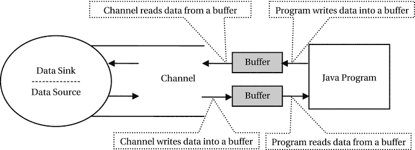

图 9-1.
通道、缓冲区、Java 程序、数据源和数据接收器之间的交互

缓冲区

缓冲区是一个固定长度的数据容器。对于每种基本类型的值（`boolean` 类型值除外），都有一个单独的缓冲区类型来保存数据。缓冲区是程序中的一个对象。每种类型的缓冲区都有一个单独的类来表示。所有缓冲区类都继承自一个抽象的 `Buffer` 类。保存基本类型值的缓冲区类如下：

*   `ByteBuffer`
*   `ShortBuffer`
*   `CharBuffer`
*   `IntBuffer`
*   `LongBuffer`
*   `FloatBuffer`
*   `DoubleBuffer`

`XxxBuffer` 类的对象用于保存 `Xxx` 基本数据类型的数据。例如，`ByteBuffer` 保存字节值；`ShortBuffer` 保存短整型值；`CharBuffer` 保存字符，等等。以下是缓冲区的四个重要属性，你必须理解它们才能有效地使用缓冲区：

*   容量
*   位置
*   限制
*   标记

缓冲区的容量是它可以容纳的最大元素数量。缓冲区的容量在创建时是固定的。你可以将缓冲区的容量视为数组的长度。一旦创建了数组，其长度就是固定的。类似地，一旦创建了缓冲区，其容量就是固定的。然而，缓冲区不一定由数组支持。你可以通过调用其 `hasArray()` 方法来检查缓冲区是否由数组支持，如果缓冲区由数组支持，该方法返回 `true`。你可以通过使用缓冲区对象的 `array()` 方法来访问缓冲区的支持数组。一旦你访问了缓冲区的支持数组，对该数组所做的任何更改都将反映在缓冲区中。缓冲区有一个 `capacity()` 方法，该方法以 `int` 类型返回其容量。

你可以通过多种方式创建特定类型的缓冲区。你可以使用特定缓冲区类的 `allocate()` 工厂方法来创建缓冲区，如下所示：

```
// 创建一个容量为 8 的字节缓冲区
ByteBuffer bb = ByteBuffer.allocate(8);
// 将 8 赋值给 capacity 变量
int capacity = bb.capacity();
// 创建一个容量为 1024 的字符缓冲区
CharBuffer cb = CharBuffer.allocate(1024);
```

字节缓冲区在 NIO 中得到了特殊处理。它有一个额外的方法，名为 `allocateDirect()`，该方法创建一个字节缓冲区，其内存从操作系统内存中分配，而不是从 JVM 堆中分配。这避免了在 I/O 操作期间将内容复制到中间缓冲区。直接缓冲区有额外的创建成本。然而，它在 I/O 操作期间速度更快。当缓冲区生命周期较长时，你应该使用直接字节缓冲区。你可以使用 `ByteBuffer` 类的 `isDirect()` 方法来检查缓冲区是直接的还是非直接的。

```
// 创建一个容量为 512 字节的直接字节缓冲区
ByteBuffer bbd = ByteBuffer.allocateDirect(512);
```

创建缓冲区的另一种方法是使用缓冲区的静态 `wrap()` 方法来包装一个数组：

```
// 创建一个字节数组
byte[] byteArray = new byte[512];
// 通过包装 byteArray 创建一个字节缓冲区
ByteBuffer bb = ByteBuffer.wrap(byteArray);
```

你可以使用相同的技术来创建用于存储其他基本类型值的缓冲区。我将在本节后面讨论创建缓冲区的其他方法。

当你创建缓冲区时，缓冲区的所有元素都被初始化为零值。缓冲区的每个元素都有一个索引。第一个元素的索引为 0，最后一个元素的索引为 `capacity – 1`。

位置和限制是缓冲区的两个属性。当创建缓冲区时，其位置设置为 0，其限制等于其容量。缓冲区的位置是下一个要读取或写入的元素的索引。缓冲区的限制是第一个不应被读取或写入的元素的索引。因此，读取/写入操作从缓冲区的位置（包含）开始，并可能持续到缓冲区的限制（不包含）。

图 9-2 显示了刚创建后容量为 8 的缓冲区的状态。其所有元素的值都为 0。其位置设置为 0。其限制设置为 8，等于其容量。在图中，`P` 和 `L` 分别表示缓冲区的位置和限制。请注意，该图显示了索引 8（超出了缓冲区的范围），以显示限制的值。

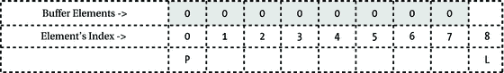

图 9-2.
创建后容量为 8 的缓冲区

你可以使用其重载的 `position()` 方法来获取/设置缓冲区的位置。`position()` 方法返回缓冲区位置的当前值。`position(int newPosition)` 方法将缓冲区的位置设置为指定的 `newPosition` 值，并返回缓冲区的引用。


你可以通过重载的 `limit()` 方法来获取/设置缓冲区的限制。`limit()` 方法返回缓冲区限制的当前值。`limit(int newLimit)` 方法将缓冲区的限制设置为指定的 `newLimit` 值，并返回该缓冲区的引用。

你可以使用 `mark()` 方法来标记缓冲区中的一个位置。当你调用 `mark()` 方法时，缓冲区会将其当前位置的当前值存储为标记值。你可以通过 `reset()` 方法将缓冲区的位置设置回之前标记的值。缓冲区在创建时，其标记是未定义的。你只能在标记已定义的情况下对缓冲区调用 `reset()` 方法。否则，`reset()` 方法会抛出 `InvalidMarkException` 异常。

在缓冲区的生命周期内，必须满足以下不变式：

```
0 <= mark <= position <= limit <= capacity
```

由于缓冲区的容量从不改变，并且标记仅通过 `mark()` 和 `reset()` 方法有限使用，我将只讨论缓冲区的位置和限制属性。更改位置和限制值会带来一些间接后果。由于标记不能大于位置，如果位置被设置为小于当前标记值，则标记会被丢弃。如果你将限制设置为小于位置，则位置会自动设置为等于限制值。

到目前为止，你已经阅读了大量关于缓冲区的内容。是时候看看缓冲区的实际应用了。清单 9-2 包含了创建一个新缓冲区并显示其四个属性的代码。

```
// BufferInfo.java
package com.jdojo.nio;
import java.nio.ByteBuffer;
import java.nio.InvalidMarkException;
public class BufferInfo {
public static void main(String[] args) {
// 创建一个容量为 8 的字节缓冲区
ByteBuffer bb = ByteBuffer.allocate(8);
System.out.println("容量: " + bb.capacity());
System.out.println("限制: " + bb.limit());
System.out.println("位置: " + bb.position());
// 新缓冲区的标记未设置。如果标记未设置，调用 reset() 方法会抛出运行时异常。如果标记已设置，位置会被设置为标记值。
try {
bb.reset();
System.out.println("标记: " + bb.position());
} catch (InvalidMarkException e) {
System.out.println("标记未设置");
}
}
}
容量: 8
限制: 8
位置: 0
标记未设置
清单 9-2.
新缓冲区的标记、位置、限制和容量
```

从缓冲区读取数据和向缓冲区写入数据

从缓冲区读取数据有两种方式：

*   使用绝对位置
*   使用相对位置

在绝对位置读取中，你指定要从缓冲区读取数据的索引。绝对位置读取后，缓冲区的位置不变。

在相对位置读取中，你指定要读取多少个数据元素。缓冲区的当前位置决定了将读取哪些数据元素。在相对位置读取中，读取从缓冲区的当前位置开始，每读取一个数据元素，位置就增加一。

`get()` 方法用于从缓冲区读取数据。`get()` 方法是重载的。它有四个版本。在以下方法中，只需将数据类型 `byte` 替换为其他原始类型缓冲区的相应数据类型即可：

*   `get(int index)`：返回给定索引处的数据。例如，`get(2)` 将返回缓冲区中索引 2 处的数据。这是一种从缓冲区读取数据的绝对方式，因为你提供了要读取数据的元素的绝对位置。此方法不会改变缓冲区的当前位置。

*   `get()`：返回缓冲区当前位置的数据，并将位置增加 1。例如，如果位置设置为索引 2，调用 `get()` 方法将返回缓冲区中索引 2 处的值，并将位置设置为 3。这是一种从缓冲区读取数据的相对方式，因为你是相对于当前位置读取数据的。

*   `get(byte[] destination, int offset, int length)`：批量从缓冲区读取数据。它从缓冲区的当前位置读取 `length` 个字节，并将它们放入指定的 `destination` 数组中，从指定的 `offset` 开始。如果无法从缓冲区读取 `length` 个字节，则会抛出 `BufferUnderflowException` 异常。如果没有异常，当前位置会增加 `length`。这是一种从缓冲区的相对读取。

*   `get(byte[] destination)`：通过从缓冲区的当前位置读取数据来填充指定的 `destination` 数组，每读取一个数据元素，当前位置就增加一。如果没有足够的数据来填充数组，则会抛出 `BufferUnderflowException` 异常。这是一种从缓冲区读取数据的相对方式。此方法调用等同于调用 `get(byte[] destination, 0, destination.length)`。

向缓冲区写入数据是从缓冲区读取数据的逆操作。`put()` 方法用于向缓冲区写入数据。`put()` 方法有五个版本：一个用于绝对位置写入，四个用于相对位置写入。`put()` 方法的绝对版本不影响缓冲区的位置。`put()` 方法的相对版本写入数据，并且每写入一个元素，缓冲区的位置就前进一。不同的缓冲区类有不同的 `put()` 方法版本；然而，在所有类型的缓冲区中，有五个版本是通用的。以下是 `ByteBuffer` 的 `put()` 方法的五个版本。当缓冲区为只读时，这些方法会抛出 `ReadOnlyBufferException` 异常。在以下方法中，只需将数据类型 `byte` 替换为其他原始类型缓冲区的相应数据类型即可。

*   `put(int index, byte b)`：在指定的 `index` 处写入指定的 `b` 数据。调用此方法不会改变缓冲区的当前位置。

*   `put(byte b)`：这是一个相对 `put()` 方法，它将指定的字节写入缓冲区的当前位置，并将位置增加 1。如果缓冲区中没有足够的空间来容纳指定的字节，则会抛出 `BufferOverflowException` 异常。

*   `put(byte[] source, int offset, int length)`：从 `source` 数组中从 `offset` 开始，将 `length` 个字节写入缓冲区，从当前位置开始。缓冲区的位置增加 `length`。如果缓冲区中没有足够的空间来写入所有字节，则会抛出 `BufferOverflowException` 异常。

*   `put(byte[] source)`：等同于调用 `put(byte[] source, 0, source.length)`。

*   `ByteBuffer put(ByteBuffer src)`：从指定的字节缓冲区 `src` 中读取剩余的字节，并将它们写入当前缓冲区。如果目标缓冲区中的剩余空间小于源缓冲区中的剩余字节，则会抛出运行时 `BufferOverflowException` 异常。

让我们通过一些图片来了解每次读写后缓冲区的状态及其属性。图 9-3 到图 9-6 展示了容量为 8 的缓冲区在每次写入后位置是如何前进的。在第八次写入缓冲区后，位置和限制变得相等。如果你尝试第九次写入，将会得到 `BufferOverflowException` 异常。请注意，我使用了 `put(byte b)` 方法进行相对写入。

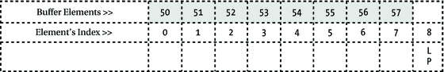


图 9-6.

调用 `put((byte)52)`、`put((byte)53)`、`put((byte)54)`、`put((byte)55)`、`put((byte)56)` 和 `put((byte)57)` 后的缓冲区状态；缓冲区状态为 (position=8, limit=8)

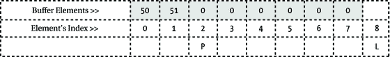

图 9-5.

调用 `put((byte)51)` 后的缓冲区状态；缓冲区状态为 (position=2, limit=8)

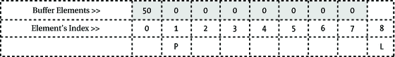

图 9-4.

调用 `put((byte)50)` 后的缓冲区状态；缓冲区状态为 (position=1, limit=8)

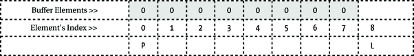

图 9-3.

创建后容量为 8 的缓冲区状态；缓冲区状态为 (position=0, limit=8)

现在，让我们读取刚刚写入到状态如图 9-6 所示的缓冲区中的数据。请注意，该缓冲区的位置为 8，其限制也为 8。如果你调用 `get()` 方法（相对读取）来读取此缓冲区中的数据，将会得到一个 `BufferUnderflowException`。你刚刚用数据填满了缓冲区。然而，当你尝试读取数据时，却得到了一个异常，因为 `get()` 方法从缓冲区的当前位置返回数据，而在此例中该位置已超出范围。只有当缓冲区的位置在 0 到 7 的范围内时，`get()` 方法才会返回数据。别灰心，让我们尝试使用 `get(int index)` 方法通过绝对位置来读取数据。如果你调用 `get(0), get(1) ... get(7)`，你会惊讶地发现可以读取所有已写入的数据。清单 9-3 演示了这一点。

```
// BufferReadWrite.java
package com.jdojo.nio;
import java.nio.ByteBuffer;
public class BufferReadWrite {
public static void main(String[] args) {
// 创建一个容量为 8 的字节缓冲区
ByteBuffer bb = ByteBuffer.allocate(8);
// 打印缓冲区信息
System.out.println("创建后：");
printBufferInfo(bb);
// 用 50 到 57 填充缓冲区元素
for (int i = 50; i < 58; i++) {
bb.put((byte) i);
}
// 打印缓冲区信息
System.out.println("填充数据后：");
printBufferInfo(bb);
}
public static void printBufferInfo(ByteBuffer bb) {
int limit = bb.limit();
System.out.println("Position = " + bb.position() + ", Limit = " + limit);
// 使用绝对读取，不影响位置
System.out.print("数据：");
for (int i = 0; i < limit; i++) {
System.out.print(bb.get(i) + " ");
}
System.out.println();
}
}
创建后：
Position = 0, Limit = 8
数据：0 0 0 0 0 0 0 0
填充数据后：
Position = 8, Limit = 8
数据：50 51 52 53 54 55 56 57
清单 9-3.
向缓冲区写入和从缓冲区读取
```

现在你明白了，使用相对方法和绝对方法进行缓冲区的读写存在巨大差异。两种方法都有一个工作范围。数据必须在工作范围内进行读写。相对方法和绝对方法的工作范围是不同的。

相对读写的工作范围是缓冲区中位置（position）和限制（limit）-1 之间的索引，其中位置小于限制 -1。也就是说，如果缓冲区的位置小于其限制，则可以使用相对的 `get()` 和 `put()` 方法读写数据。

绝对读写的工作范围是 0 到限制 -1 之间的索引。那么，在完成向缓冲区写入数据后，如何使用相对位置读取来读取缓冲区中的所有数据呢？实现此目的的一种方法是将缓冲区的限制设置为其位置，并将其位置设置为 0。以下代码片段展示了这种技术：

```
// 创建一个容量为 8 的字节缓冲区并填充其元素
ByteBuffer bb = ByteBuffer.allocate(8);
for(int i = 50; i < 58; i++) {
bb.put((byte)i);
}
// 将限制设置为与位置相同，并将位置设置为 0
bb.limit(bb.position());
bb.position(0);
// 现在 bb 已设置为使用相对 get() 方法读取所有数据
int limit = bb.limit();
for(int i = 0; i < limit; i++) {
byte b = bb.get(); // 使用相对读取
System.out.println(b);
}
```

`Buffer` 类有一个方法可以实现你在此代码片段中编写的功能。你可以通过使用其 `flip()` 方法将缓冲区的限制设置为其位置，并将位置设置为 0。图 9-7 显示了一个容量为 8 的缓冲区在创建后以及在其索引 0 和 1 处的两个元素被写入后的状态。图 9-8 显示了调用其 `flip()` 方法后缓冲区的状态。如果定义了标记，`flip()` 方法会丢弃缓冲区的标记。

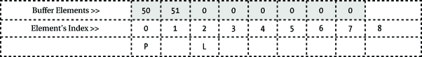

图 9-8.

在索引 0 和 1 处写入两个元素并调用 flip() 方法后的缓冲区状态


图 9-7.

刚刚在索引 0 和 1 处写入两个元素后的缓冲区状态

在前面的代码片段中，你使用了一个 `for` 循环来读取缓冲区中的数据。`for` 循环的索引从 0 运行到限制 -1。然而，有一种更简单的方法可以使用相对读写方法从缓冲区读取/向缓冲区写入数据。缓冲区的 `hasRemaining()` 方法返回 `true`，如果可以在缓冲区上使用相对的 `get()` 或 `put()` 方法读取/写入至少一个元素。你还可以通过使用其 `remaining()` 方法获取可以使用相对的 `get()` 或 `put()` 方法读取/写入的最大元素数量。清单 9-4 演示了这些方法的使用。

```
// BufferReadWriteRelativeOnly.java
package com.jdojo.nio;
import java.nio.ByteBuffer;
public class BufferReadWriteRelativeOnly {
public static void main(String[] args) {
// 创建一个容量为 8 的字节缓冲区
ByteBuffer bb = ByteBuffer.allocate(8);
// 打印缓冲区信息
System.out.println("创建后：");
printBufferInfo(bb);
// 必须调用 flip() 将位置重置为零，因为 printBufferInfo()
// 方法使用了相对 get() 方法，这会增加位置。
bb.flip();
// 用 50 到 57 填充缓冲区元素
int i = 50;
while (bb.hasRemaining()) {
bb.put((byte) i++);
}
// 再次调用 flip() 将位置重置为零，
// 因为上面的 put() 调用增加了位置
bb.flip();
// 打印缓冲区信息
System.out.println("填充数据后：");
printBufferInfo(bb);
}
public static void printBufferInfo(ByteBuffer bb) {
int limit = bb.limit();
System.out.println("Position = " + bb.position() + ", Limit = " + limit);
// 我们使用相对方法读取数据，因此它会影响
// 缓冲区的位置
System.out.print("数据：");
while (bb.hasRemaining()) {
System.out.print(bb.get() + " ");
}
System.out.println();
}
}
创建后：
Position = 0, Limit = 8
数据：0 0 0 0 0 0 0 0
填充数据后：
Position = 0, Limit = 8
数据：50 51 52 53 54 55 56 57
清单 9-4.
在相对读写之间使用缓冲区的 flip() 和 hasRemaining() 方法
```

除了 `flip()` 方法之外，缓冲区还有另外三个方法可以更改其标记、位置和/或限制。它们是 `clear()`、`reset()` 和 `rewind()`。


缓冲区的 `clear()` 方法将位置设为 0，限制设为容量，并丢弃其标记。也就是说，它设置缓冲区的属性，就好像缓冲区刚刚被创建一样。请注意，它不会更改缓冲区中的任何数据。图 9-9 和图 9-10 展示了在调用 `clear()` 方法前后，缓冲区的标记、位置和限制。通常，在开始向缓冲区填充新数据之前，你会调用缓冲区的 `clear()` 方法。

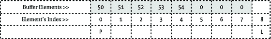

图 9-10.

调用其 clear() 方法后的缓冲区状态；clear() 方法丢弃了标记


图 9-9.

调用其 clear() 方法前的缓冲区状态

`reset()` 方法将缓冲区的位置设置为其标记。如果未定义标记，则会抛出 `InvalidMarkException`。它不影响缓冲区的限制和数据。通常，调用它是为了从先前标记的位置开始，重新访问（用于重读或重写）缓冲区中直到当前位置的元素。`reset()` 方法不会改变缓冲区的标记。图 9-11 和图 9-12 展示了在调用其 `reset()` 方法前后缓冲区的状态。

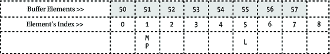

图 9-12.

调用其 reset() 方法后的缓冲区状态


图 9-11.

调用其 reset() 方法前的缓冲区状态

`rewind()` 方法将缓冲区的位置设为 0 并丢弃其标记。它不影响限制。通常，你会在多次读/写操作之间调用此方法，以便多次使用缓冲区中相同数量的数据元素。图 9-13 和图 9-14 展示了在调用其 `rewind()` 方法前后缓冲区的状态。

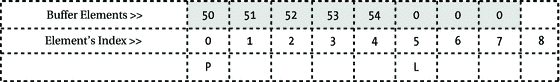

图 9-14.

调用其 rewind() 方法后的缓冲区状态

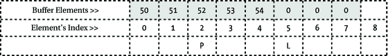

图 9-13.

调用其 rewind() 方法前的缓冲区状态

只读缓冲区

缓冲区可以是只读的或可读写的。你只能读取只读缓冲区的内容。任何更改只读缓冲区内容的尝试都会导致 `ReadOnlyBufferException`。请注意，只读缓冲区的属性（如其位置、限制和标记）可以在读取操作期间更改，但其数据不能更改。

你可能希望从可读写缓冲区获取一个只读缓冲区，这样你就可以将其作为参数传递给某个方法，以确保该方法不会修改缓冲区的内容。你可以通过调用特定缓冲区类的 `asReadOnlyBuffer()` 方法来获取只读缓冲区。你可以通过调用 `isReadOnly()` 方法来检查缓冲区是否为只读，如下所示：

```
// 创建一个默认可读写的缓冲区
ByteBuffer bb = ByteBuffer.allocate(1024);
boolean readOnly = bb.isReadOnly(); // 将 false 赋值给 readOnly
// 获取一个只读缓冲区
ByteBuffer bbReadOnly = bb.asReadOnlyBuffer();
readOnly = bbReadOnly.isReadOnly(); // 将 true 赋值给 readOnly
```

由 `asReadOnlyBuffer()` 方法返回的只读缓冲区是同一缓冲区的不同视图。也就是说，新的只读缓冲区与其原始缓冲区共享数据。对原始缓冲区内容的任何修改都会反映在只读缓冲区中。只读缓冲区在创建时与其原始缓冲区具有相同的位置、标记、限制和容量值，之后会独立维护这些值。

缓冲区的不同视图

你可以获得缓冲区的不同视图。缓冲区的视图与原始缓冲区共享数据，并维护自己的位置、标记和限制。我在上一节讨论了获取缓冲区的只读视图，该视图不允许修改其内容。你也可以复制一个缓冲区，在这种情况下，它们共享内容，但独立维护标记、位置和限制。使用缓冲区的 `duplicate()` 方法获取缓冲区的副本，如下所示：

```
// 创建一个缓冲区
ByteBuffer bb = ByteBuffer.allocate(1024);
// 创建缓冲区的副本视图
ByteBuffer bbDuplicate = bb.duplicate();
```

你还可以创建缓冲区的切片视图。也就是说，你可以创建一个仅反映原始缓冲区部分内容的缓冲区视图。你使用缓冲区的 `slice()` 方法来创建其切片视图，如下所示：

```
// 创建一个缓冲区
ByteBuffer bb = ByteBuffer.allocate(8);
// 在获取切片之前设置位置和限制
bb.position(3);
bb.limit(6);
// bbSlice 缓冲区将共享 bb 中索引 3 到 5 的数据。
// bbSlice 的位置将设为 0，其限制设为 3。
ByteBuffer bbSlice = bb.slice();
```

提示

JDK9 向 `Buffer` 类（其他缓冲区类型的超类）添加了 `duplicate()` 和 `slice()` 方法。在 JDK8 中，这些方法位于 `Buffer` 类的子类中。这些方法在 `Buffer` 类中的返回类型是 `Buffer`，而子类会重写这些方法，其返回类型是特定的子类类型。例如，这些方法在 `ByteBuffer` 类中的返回类型是 `ByteBuffer`。

你还可以为不同的原始数据类型获取字节缓冲区的视图。例如，你可以获取字节缓冲区的字符视图、浮点视图等。`ByteBuffer` 类包含诸如 `asCharBuffer()`、`asLongBuffer()`、`asFloatBuffer()` 等方法，用于获取其他原始数据类型的视图。

```
// 创建一个字节缓冲区
ByteBuffer bb = ByteBuffer.allocate(8);
// 创建字节缓冲区的字符视图
CharBuffer cb = bb.asCharBuffer();
// 创建字节缓冲区的浮点视图
FloatBuffer fb = bb.asFloatBuffer();
```

字符集

一个字符并不总是存储在一个字节中。存储一个字符所用的字节数取决于编码字符集和字符编码方案。编码字符集是一组抽象字符与一组整数之间的映射。字符编码方案是编码字符集与一组八位字节序列之间的映射。有关字符集和字符编码的更多详细信息，请参阅本系列第一册的附录 A。

`java.nio.charset.Charset` 类的一个实例表示一个字符集和一种字符编码方案。一些字符集名称的示例有 US-ASCII、ISO-8859-1、UTF-8、UTF-16BE、UTF-16LE 和 UTF-16。

根据编码方案将字符转换为字节序列的过程称为字符编码。根据编码方案将字节序列转换为字符的过程称为解码。

在 NIO 中，你可以使用编码方案将 Unicode 字符转换为字节序列，反之亦然。`java.nio.charset` 包提供了用于将 `CharBuffer` 编码/解码为 `ByteBuffer` 以及反向操作的类。`Charset` 类的对象表示编码方案。`CharsetEncoder` 类执行编码。`CharsetDecoder` 类执行解码。你可以通过将字符集的名称作为参数传递给 `Charset` 类的 `forName()` 方法来获取其对象。


`String` 和 `InputStreamReader` 类支持字符编码和解码。当你使用 `str.getBytes("UTF-8")` 时，你正在将字符串对象 `str` 中存储的 Unicode 字符，通过 UTF-8 编码方案编码为字节序列。当你使用 `String` 类的构造函数 `String(byte[] bytes, Charset charset)` 创建 `String` 对象时，你正在将 `bytes` 数组中的字节序列从指定的字符集解码为 Unicode 字符集。同样，当你使用字符集创建 `InputStreamReader` 类的对象时，你也在将输入流中的字节序列解码为 Unicode 字符。

对于简单的编码和解码任务，你可以使用 `Charset` 类的 `encode()` 和 `decode()` 方法。让我们将字符串 `Hello` 中存储在字符缓冲区中的字符序列进行编码，并使用 UTF-8 编码方案进行解码。实现此功能的代码片段如下：

```
// 获取 UTF-8 编码的 Charset 对象
Charset cs = Charset.forName("UTF-8");
// 待编码的字符缓冲区
CharBuffer cb = CharBuffer.wrap("Hello");
// 将字符缓冲区编码为字节缓冲区
ByteBuffer encodedData = cs.encode(cb);
// 将字节缓冲区解码回字符缓冲区
CharBuffer decodedData = cs.decode(encodedData);
```

`Charset` 类的 `encode()` 和 `decode()` 方法易于使用。然而，它们并非在所有情况下都能使用。它们要求你预先知道输入内容。有时你无法预先知道要编码/解码的数据。

`CharsetEncoder` 和 `CharsetDecoder` 类在编码和解码过程中提供了更强大的功能。它们接受要编码或解码的输入块。`Charset` 类的 `encode()` 和 `decode()` 方法会返回编码和解码后的缓冲区。然而，`CharsetEncoder` 和 `CharsetDecoder` 允许你使用自己的缓冲区来处理输入和输出数据。这种强大功能也带来了一些复杂性！如果你想要更强大的编码/解码功能，你需要使用以下五个类，而不仅仅是 `Charset` 类：

*   `Charset`

*   `CharsetEncoder`

*   `CharsetDecoder`

*   `CoderResult`

*   `CodingErrorAction`

你仍然需要使用 `Charset` 类来表示字符集。`CharsetEncoder` 对象允许你通过其 `encode()` 方法将字符编码为字节序列。字节序列则通过 `CharsetDecoder` 对象的 `decode()` 方法进行解码。`Charset` 对象的 `newEncoder()` 方法返回 `CharsetEncoder` 类的一个实例，而其 `newDecoder()` 方法则返回 `CharsetDecoder` 类的一个实例。

```
// 从 Charset 对象获取编码器和解码器对象
Charset cs = Charset.forName("UTF-8");
CharsetEncoder encoder = cs.newEncoder();
CharsetDecoder decoder = cs.newDecoder();
```

编码和解码需要两个缓冲区：一个输入缓冲区和一个输出缓冲区。字符缓冲区为编码过程提供输入字符，并从解码过程接收解码后的字符。编码过程将编码结果写入字节缓冲区，解码过程则从字节缓冲区读取其输入。以下代码片段说明了使用编码器和解码器的几个步骤：

```
// 对 inputChars 缓冲区中的字符进行编码。
// outputBytes 缓冲区接收编码后的字节。
CharBuffer inputChars = /* 获取待编码的输入字符 */;
ByteBuffer outputBytes = /* 获取用于编码数据的输出缓冲区 */;
boolean eoi = true; // 表示输入结束
CoderResult result = encoder.encode(inputChars, outputBytes, eoi);
// 对 inputBytes 缓冲区中的字节进行解码。
// outputChars 缓冲区接收解码后的字符。
ByteBuffer inputBytes = /* 获取待解码的输入字节 */;
CharBuffer outputChars = /* 获取用于解码字符的输出缓冲区 */;
boolean eoi = true; // 表示输入结束
CoderResult result = decoder.decode(inputBytes, outputChars, eoi);
```

考虑这样一种情况：使用一个 4 字节的缓冲区对存储在字符缓冲区中的 16 个字符进行编码。编码过程无法在一次 `encode()` 方法调用中编码所有字符。必须有一种方法能够重复读取所有编码后的输出。同样的道理也适用于解码过程。你可以将输入分块传递给编码/解码过程，并分块接收它们的输出。编码器的 `encode()` 方法和解码器的 `decode()` 方法返回一个 `CoderResult` 类的对象，该对象包含编码/解码过程的状态。该对象可以指示两个重要的结果：

*   下溢

*   上溢

**下溢**表示该过程需要更多输入。你可以通过使用 `CoderResult` 对象的 `isUnderflow()` 方法来测试此条件。你也可以通过将 `encode()` 或 `decode()` 方法的返回值与 `CoderResult.UNDERFLOW` 对象进行比较来测试此条件，如下所示：

```
CoderResult result = encoder.encode(input, output, eoi);
if (result == CoderResult.UNDERFLOW) {
// 提供更多输入
}
```

**上溢**表示该过程产生的输出超出了输出缓冲区的容量。你需要清空输出缓冲区，并再次调用 `encode()/decode()` 方法以获取更多输出。你可以通过使用 `CoderResult` 对象的 `isOverflow()` 方法来测试此条件。你也可以通过将 `encode()` 或 `decode()` 方法的返回值与 `CoderResult.OVERFLOW` 对象进行比较来测试此条件，如下所示：

```
CoderResult result = encoder.encode(input, output, eoi);
if (result == CoderResult.OVERFLOW) {
// 清空输出缓冲区，为更多输出腾出空间
}
```

提示

除了报告缓冲区下溢和上溢之外，`CoderResult` 对象还能够报告格式错误的输入错误和不可映射字符错误。你还可以通过使用它们的 `onMalformedInput()` 和 `onUnmappableCharacter()` 方法，自定义编码/解码引擎针对这些错误情况的默认操作。

`encode()/decode()` 方法的最后一个参数是一个 `boolean` 值，用于指示输入的结束。当你传递最后一块数据进行编码或解码时，应该为输入结束参数传递 `true`。

在传递最后一块数据之后，你需要调用 `flush()` 方法来刷新引擎的内部缓冲区。它返回一个 `CoderResult` 对象，该对象可以指示下溢或上溢。如果发生上溢，你需要清空输出缓冲区并再次调用 `flush()` 方法。你需要持续调用 `flush()` 方法，直到其返回值指示下溢为止。`flush()` 方法调用应放在一个循环中，这样你就能获取所有编码/解码后的数据。


`DataSourceSink`类
在清单 9-5 中扮演着
数据源和数据汇的角色。我创建这个类仅用于演示
目的；在实际应用中你不需要这样的类。
它通过字符缓冲区提供威廉·华兹华斯诗歌《露西》中的一个诗节。
`getCharData()`方法
填充字符缓冲区。当没有更多字符可提供时，它返回-1。
你在编码过程中使用此方法。
`storeByteData()`方法用于
在编码过程中累积编码后的字节。
`getByteData()`方法用于
在解码过程中，以块的形式提供你在编码过程中累积的编码字节。

```
// DataSourceSink.java
package com.jdojo.nio;
import java.nio.ByteBuffer;
import java.nio.CharBuffer;
public class DataSourceSink {
private CharBuffer cBuffer = null;
private ByteBuffer bBuffer = null;
public DataSourceSink() {
String text = this.getText();
cBuffer = CharBuffer.wrap(text);
}
public int getByteData(ByteBuffer buffer) {
if (!bBuffer.hasRemaining()) {
return -1;
}
int count = 0;
while (bBuffer.hasRemaining() && buffer.hasRemaining()) {
buffer.put(bBuffer.get());
count++;
}
return count;
}
public int getCharData(CharBuffer buffer) {
if (!cBuffer.hasRemaining()) {
return -1;
}
int count = 0;
while (cBuffer.hasRemaining() && buffer.hasRemaining()) {
buffer.put(cBuffer.get());
count++;
}
return count;
}
public void storeByteData(ByteBuffer byteData) {
if (this.bBuffer == null) {
int total = byteData.remaining();
this.bBuffer = ByteBuffer.allocate(total);
while (byteData.hasRemaining()) {
this.bBuffer.put(byteData.get());
}
this.bBuffer.flip();
} else {
this.bBuffer = this.appendContent(byteData);
}
}
private ByteBuffer appendContent(ByteBuffer content) {
// 创建一个新缓冲区以容纳新数据
int count = bBuffer.limit() + content.remaining();
ByteBuffer newBuffer = ByteBuffer.allocate(count);
// 设置包含一些数据的 bBuffer 的位置
bBuffer.clear();
newBuffer.put(bBuffer);
newBuffer.put(content);
bBuffer.clear();
newBuffer.clear();
return newBuffer;
}
public final String getText() {
String newLine = System.getProperty("line.separator");
StringBuilder sb = new StringBuilder();
sb.append("My horse moved on; hoof after hoof");
sb.append(newLine);
sb.append("He raised, and never stopped:");
sb.append(newLine);
sb.append("When down behind the cottage roof,");
sb.append(newLine);
sb.append("At once, the bright moon dropped.");
return sb.toString();
}
}
清单 9-5.
一个提供字符数据并存储和提供字节数据的数据源与数据汇
```

清单 9-6 演示了
如何使用字符集编码器/解码器。`CharEncoderDecoder`
类的`encode()`和`decode()`方法
包含了编码和解码逻辑。此示例将解码后的字符显示在标准输出上。

```
// CharEncoderDecoder.java
package com.jdojo.nio;
import java.nio.ByteBuffer;
import java.nio.CharBuffer;
import java.nio.charset.Charset;
import java.nio.charset.CharsetDecoder;
import java.nio.charset.CharsetEncoder;
import java.nio.charset.CoderResult;
public class CharEncoderDecoder {
public static void main(String[] args) throws Exception {
DataSourceSink dss = new DataSourceSink();
// 显示将要编码的文本
System.out.println("原始文本:");
System.out.println(dss.getText());
System.out.println("--------------------");
// 使用 UTF-8 编码对文本进行编码。我们将在编码过程中
// 把编码后的字节存储在 dss 对象中
encode(dss, "UTF-8");
// 使用 UTF-8 编码解码存储在 dss 对象中的字节
System.out.println("解码后的文本:");
decode(dss, "UTF-8");
}
public static void encode(DataSourceSink ds, String charset) {
CharsetEncoder encoder = Charset.forName(charset).newEncoder();
CharBuffer input = CharBuffer.allocate(8);
ByteBuffer output = ByteBuffer.allocate(8);
// 初始化循环变量
boolean endOfInput = false;
CoderResult result = CoderResult.UNDERFLOW;
while (!endOfInput) {
if (result == CoderResult.UNDERFLOW) {
input.clear();
endOfInput = (ds.getCharData(input) == -1);
input.flip();
}
// 编码输入字符
result = encoder.encode(input, output, endOfInput);
// 在以下情况排空输出：
// 1. 发生溢出。或者，
// 2. 发生下溢且输入结束
if (result == CoderResult.OVERFLOW
|| (endOfInput && result == CoderResult.UNDERFLOW)) {
output.flip();
ds.storeByteData(output);
output.clear();
}
}
// 刷新编码器的内部状态
while (true) {
output.clear();
result = encoder.flush(output);
output.flip();
if (output.hasRemaining()) {
ds.storeByteData(output);
output.clear();
}
// 下溢意味着 flush() 方法已刷新所有内容
if (result == CoderResult.UNDERFLOW) {
break;
}
}
}
public static void decode(DataSourceSink dss, String charset) {
CharsetDecoder decoder = Charset.forName(charset).newDecoder();
ByteBuffer input = ByteBuffer.allocate(8);
CharBuffer output = CharBuffer.allocate(8);
boolean endOfInput = false;
CoderResult result = CoderResult.UNDERFLOW;
while (!endOfInput) {
if (result == CoderResult.UNDERFLOW) {
input.clear();
endOfInput = (dss.getByteData(input) == -1);
input.flip();
}
// 解码输入字节
result = decoder.decode(input, output, endOfInput);
// 在以下情况排空输出：
// 1. 发生溢出。或者，
// 2. 发生下溢且输入结束
if (result == CoderResult.OVERFLOW
|| (endOfInput && result == CoderResult.UNDERFLOW)) {
output.flip();
while (output.hasRemaining()) {
System.out.print(output.get());
}
output.clear();
}
}
// 刷新解码器的内部状态
while (true) {
output.clear();
result = decoder.flush(output);
output.flip();
while (output.hasRemaining()) {
System.out.print(output.get());
}
if (result == CoderResult.UNDERFLOW) {
break;
}
}
}
}
原始文本:
My horse moved on; hoof after hoof
He raised, and never stopped:
When down behind the cottage roof,
At once, the bright moon dropped.

解码后的文本:
My horse moved on; hoof after hoof
He raised, and never stopped:
When down behind the cottage roof,
At once, the bright moon dropped.
清单 9-6.
使用 DataSourceSink 作为数据提供者/消费者进行编码/解码的字符集编码器和解码器
```

你可以通过`Charset`类的静态方法`availableCharsets()`获取 JVM 支持的所有可用字符集列表，该方法返回一个`SortedMap<String,Charset>`，其键是字符集名称，值是`Charset`对象。

提示

你可以通过使用`java.nio.charset.spi`包中的`CharsetProvider`类创建自己的字符编码器/解码器。你需要查阅`java.nio.charset`和`java.nio.charset.spi`包以了解如何创建和安装自己的字符集的详细信息。本书不涵盖如何创建和安装自定义字符集。


清单 9-7 演示了如何列出 JVM 支持的所有字符集。此处仅显示部分输出。你得到的输出可能有所不同。

```
// AvailableCharsets.java
package com.jdojo.nio;
import java.util.Map;
import java.nio.charset.Charset;
import java.util.Set;
public class AvailableCharsets {
public static void main(String[] args) {
Map map = Charset.availableCharsets();
Set keys = map.keySet();
System.out.println("Available Character Set Count: " + keys.size());
for(String charsetName : keys) {
System.out.println(charsetName);
}
}
}
Available Character Set Count: 170
Big5
ISO-8859-1
US-ASCII
UTF-16
UTF-16BE
UTF-16LE
UTF-32
UTF-32BE
UTF-32LE
UTF-8
windows-1250
x-iso-8859-11
...
清单 9-7.
JVM 支持的可用字符集列表
```

通道

通道是数据源/数据接收器与 Java 程序之间用于执行某些 I/O 操作的开放连接。`Channel` 接口位于 `java.nio.channels` 包中。它被用作在 Java 中实现通道的基础。该接口仅声明了两个方法：`close()` 和 `isOpen()`。当创建一个通道时，它是打开的，其 `isOpen()` 方法返回 `true`。一旦你使用完通道，应调用其 `close()` 方法将其关闭。此时，`isOpen()` 返回 `false`。图 9-15 描绘了 `Channel` 接口的类图。

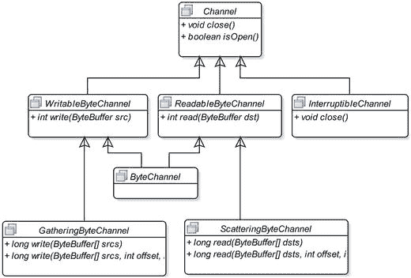

图 9-15.

通道接口的类图

Java 程序通过字节缓冲区与通道进行 I/O 操作交互。也就是说，即使你有多种不同类型的缓冲区，也需要先将它们转换为字节缓冲区，然后才能传递给通道进行数据读取/写入。

`ReadableByteChannel` 用于通过其 `read()` 方法将数据从数据源读取到字节缓冲区中。`WritableByteChannel` 用于通过其 `write()` 方法将数据从字节缓冲区写入到数据接收器。`ByteChannel` 既能读取也能写入字节数据。

`ScatteringByteChannel` 将数据从数据源读取到多个字节缓冲区中。它对于从已知文件格式或类似数据源读取数据非常有用，这类数据源的数据格式通常是固定长度的头部后跟可变长度的主体。例如，假设一个文件有一个 256 字节的固定长度头部和一个可变长度主体。`ScatteringByteChannel` 类的对象用于使用两个字节缓冲区从这种文件中读取数据。第一个字节缓冲区的容量为 256。第二个缓冲区的大小由你选择。当你将这两个缓冲区传递给此通道时，256 字节的固定长度头部将被读入第一个缓冲区。第二个缓冲区将包含文件数据，你可能需要多次使用第二个缓冲区来读取文件中的其余字节。使用此通道的优点是将固定长度的头部数据与其他数据分离开。

`GatheringByteChannel` 执行的操作与 `ScatteringByteChannel` 正好相反。它将数据从多个字节缓冲区写入到数据接收器。它用于以某种格式写入数据，该格式由一些固定长度的头部后跟一个可变长度主体组成。

`InterruptibleChannel` 通道可以被异步关闭。如果一个线程在此通道上的 I/O 操作上被阻塞，另一个线程可以调用其 `close()` 方法将其关闭。被阻塞的线程将收到一个 `AsynchronousCloseException`。如果一个线程在此通道上的 I/O 操作上被阻塞，另一个线程可以调用被阻塞线程的 `interrupt()` 方法。此通道将被关闭，并且被阻塞的线程会收到一个 `ClosedByInterruptException` 异常。

通常，你不会在程序中直接处理这些通道接口。你处理的是实现了一个或多个这些接口的具体通道类。与 I/O 流不同，你不会直接创建通道。而是通过调用某个方法间接获得它。要获取数据源和数据接收器的通道，你需要创建一个 `InputStream` 和 `OutputStream` 对象——使用 `java.io` 包中的类以旧的 I/O 方式工作。`java.nio.channels` 包中的 `Channels` 类是一个工具类，它有许多静态方法用于将流转换为通道，反之亦然。`Channels` 类还提供了将读取器/写入器转换为通道以及反向转换的方法。例如，如果你有一个名为 `myInputStream` 的输入流对象，你可以按如下方式获取一个 `ReadableByteChannel`：

```
ReadableByteChannel rbc = Channels.newChannel(myInputStream);
```

如果你有一个名为 `rbc` 的 `ReadableByteChannel`，你可以按如下方式获取底层的 `InputStream` 对象：

```
// 获取 ReadableByteChannel 的 InputStream
InputStream myInputStream = Channels.newInputStream(rbc);
```

`FileInputStream` 和 `FileOutputStream` 类包含处理通道的方法。它们有一个名为 `getChannel()` 的方法，该方法返回一个 `FileChannel` 对象。`FileChannel` 用于向文件读取和写入数据。从 `FileInputStream` 获取的 `FileChannel` 以只读模式打开。从 `FileOutputStream` 对象获取的 `FileChannel` 以只写模式打开。如果你从 `RandomAccessFile` 获取 `FileChannel`，则根据你创建该 `RandomAccessFile` 对象的方式，它以只读、只写或读写模式打开。以下代码片段为不同类型的文件流获取 `FileChannel` 对象：

```
FileInputStream fis = new FileInputStream("luci1.txt");
FileChannel fcReadOnly = fis.getChannel(); // 一个只读通道
FileOutputStream fos = new FileOutputStream("luci1.txt");
FileChannel fcWriteOnly = fos.getChannel(); // 一个只写通道
// 以只读模式打开文件
RandomAccessFile raf1 = new RandomAccessFile("luci1.txt", "r");
FileChannel rafReadOnly = raf1.getChannel(); // 一个只读通道
// 以读写模式打开文件
RandomAccessFile raf2 = new RandomAccessFile("luci1.txt", "rw");
FileChannel rafReadWrite = raf2.getChannel(); // 一个读写通道
```

提示

你也可以使用 `FileChannel.open()` 静态方法获取 `FileChannel`。这避免了为了创建 `FileChannel` 而创建输入/输出流的需要。新的 `open()` 方法使用一个 `Path` 对象，它是 NIO 2 的一部分。有关使用 `Path` 对象的更多详细信息，请参阅关于 NIO 2 的第 9 章。

读取/写入文件

我已经介绍了缓冲区和通道的基本概念。`FileChannel` 像缓冲区一样维护一个位置。`FileChannel` 的 `read()` 和 `write()` 方法有两种变体：相对位置读取/写入和绝对位置读取/写入。相对和绝对位置读取/写入的含义与缓冲区读取/写入上下文中的含义相同。当你打开一个 `FileChannel` 时，其位置设置为 0，即文件的开头。当你使用相对 `read()` 方法从 `FileChannel` 读取时，其位置会递增已读取的字节数。从 `FileChannel` 进行绝对位置读取不会影响其位置。你可以使用其 `position()` 方法获取 `FileChannel` 当前位置的值。你可以使用其 `position(int newPosition)` 方法将其位置设置为新位置。你需要遵循几个简单的步骤来使用 NIO 从文件读取数据和向文件写入数据。

使用缓冲区和通道从文件读取数据的步骤如下：

1.  创建一个 `FileInputStream` 类的对象。
2.  使用上一步中创建的 `FileInputStream` 对象的 `getChannel()` 方法获取一个 `FileChannel` 对象。


3.  创建一个 `ByteBuffer` 对象，用于从文件中读取数据。

4.  通过传递一个 `ByteBuffer` 对象，调用 `FileChannel` 对象的 `read()` 方法。在传递 `ByteBuffer` 之前，请确保缓冲区的 position 和 limit 已正确设置。一个简单的经验法则是：在将 `ByteBuffer` 传递给通道以读取数据之前，始终调用其 `clear()` 方法。通道的 `read()` 方法返回读取到缓冲区中的字节数。

5.  调用 `ByteBuffer` 的 `flip()` 方法，以便你可以从缓冲区中读取数据到程序中。上一步会改变缓冲区的位置，因为通道会将数据读入其中。如果你读取的字节代表字符，则可能需要使用 `CharsetDecoder` 对象将 `ByteBuffer` 解码为字符缓冲区。

6.  从 `ByteBuffer` 中读取数据到你的程序中。

7.  重复从 `FileChannel` 读取数据到 `ByteBuffer` 的过程，即调用其 `read()` 方法，直到 `read()` 方法返回 0 或 –1。

8.  使用其 `close()` 方法关闭通道。

提示

与输入/输出流一样，通道也是 `AutoCloseable` 的。如果你使用 `try-with-resources` 语句来获取通道，通道将自动关闭，从而无需显式调用通道的 `close()` 方法。

清单 9-8 将所有这些步骤整合在一起。它从一个名为 `luci1.txt` 的文件中读取文本。该文件应位于你的当前工作目录中。如果文件不存在，程序会打印一条消息，其中包含该文件应存在的完整路径。如果你没有此文件，请在运行程序之前创建它，并在文件中输入以下文本：

```
STRANGE fits of passion have I known:
And I will dare to tell,
But in the lover's ear alone,
What once to me befell.
```

你需要密切关注对缓冲区 `clear()` 和 `flip()` 方法的调用。当你调用通道的 `read()` 或 `write()` 方法时，它会对缓冲区执行相对位置的读/写操作。因此，在通道将数据写入缓冲区后，你必须调用缓冲区的 `flip()` 方法才能从中读取数据。

```
// FileChannelRead.java
package com.jdojo.nio;
import java.io.File;
import java.io.FileInputStream;
import java.io.IOException;
import java.nio.ByteBuffer;
import java.nio.channels.FileChannel;
public class FileChannelRead {
public static void main(String[] args) {
// 要读取的输入文件
File inputFile = new File("luci1.txt");
// 确保输入文件存在
if (!inputFile.exists()) {
System.out.println("输入文件 " + inputFile.getAbsolutePath()
+ " 不存在。");
System.out.println("已中止文件读取过程。");
System.exit(1);
}
// 获取用于读取 luci1.txt 文件的通道
try (FileChannel fileChannel = new FileInputStream(inputFile).getChannel()) {
// 创建一个缓冲区
ByteBuffer buffer = ByteBuffer.allocate(1024);
// 从通道中读取所有数据
while (fileChannel.read(buffer) > 0) {
// 在读取数据之前翻转缓冲区
buffer.flip();
// 将读取的数据作为字符显示在控制台上。
// 注意，我们假设一个字节代表一个字符，这并非总是成立。
// 在实际应用中，你应该在显示/使用它们之前，
// 使用 CharsetDecoder 将字节解码为字符。
while (buffer.hasRemaining()) {
byte b = buffer.get();
// 假设一个字节代表一个字符
System.out.print((char) b);
}
// 在下一次读取之前清除缓冲区
buffer.clear();
}
} catch (IOException e) {
e.printStackTrace();
}
}
}
STRANGE fits of passion have I known:
And I will dare to tell,
But in the lover's ear alone,
What once to me befell.
清单 9-8.
使用缓冲区和通道从文件读取
```

使用缓冲区和通道将数据写入文件的步骤如下：

1.  创建一个 `FileOutputStream` 类的对象。

2.  使用上一步创建的 `FileOutputStream` 对象的 `getChannel()` 方法获取一个 `FileChannel` 对象。

3.  创建一个 `ByteBuffer` 对象，用于向文件写入数据。

4.  用数据填充 `ByteBuffer`。

5.  调用缓冲区的 `flip()` 方法，使其准备好被通道读取。

6.  通过传递填充了数据的 `ByteBuffer` 对象，调用 `FileChannel` 对象的 `write()` 方法。

7.  通过调用其 `close()` 方法关闭通道。

清单 9-9 将所有这些步骤整合在一起，将以下文本写入 `luci5.txt` 文件：

```
In one of those sweet dreams I slept,
Kind Nature's gentlest boon!
And all the while my eyes I kept
On the descending moon.
```

该代码从文本创建一个字符串，并在两行之间插入一个平台相关的换行符。它将文本转换为字节数组，通过包装字节数组创建一个 `ByteBuffer`，并将缓冲区写入文件通道。请注意，你不需要对缓冲区使用 `flip()` 方法，因为在将其传递给通道进行写入之前，你的缓冲区对象刚刚用文本创建，并且其 position 和 limit 已由 `wrap()` 方法正确设置。程序会打印写入文本的文件的路径，该路径在你的机器上可能不同。

```
// FileChannelWrite.java
package com.jdojo.nio;
import java.io.File;
import java.nio.channels.FileChannel;
import java.io.IOException;
import java.nio.ByteBuffer;
import java.io.FileOutputStream;
public class FileChannelWrite {
public static void main(String[] args) {
// 要写入的输出文件
File outputFile = new File("luci5.txt");
try (FileChannel fileChannel = new FileOutputStream(outputFile).getChannel()) {
// 将文本作为字符串获取
String text = getText();
// 将文本转换为字节数组
byte[] byteData = text.getBytes("UTF-8");
// 使用字节数组创建一个 ByteBuffer
ByteBuffer buffer = ByteBuffer.wrap(byteData);
// 将字节写入文件
fileChannel.write(buffer);
System.out.println("数据已写入 "
+ outputFile.getAbsolutePath());
} catch (IOException e1) {
e1.printStackTrace();
}
}
public static String getText() {
String lineSeparator = System.getProperty("line.separator");
StringBuilder sb = new StringBuilder();
sb.append("In one of those sweet dreams I slept,");
sb.append(lineSeparator);
sb.append("Kind Nature's gentlest boon!");
sb.append(lineSeparator);
sb.append("And all the while my eyes I kept");
sb.append(lineSeparator);
sb.append("On the descending moon.");
return sb.toString();
}
}
数据已写入 C:\Java9LanguageFeatures\luci5.txt
清单 9-9.
使用缓冲区和通道写入文件
```

一个文件关联着两种数据。一种是其内容，另一种是元数据，例如创建时间、最后修改时间等。当你将数据写入文件通道时，数据可能不会立即实际写入存储设备（例如硬盘）。为了立即将数据写入存储设备，在调用文件通道的 `write()` 方法之后，你可以调用其 `force(boolean metaData)` 方法。它保证文件的内容和元数据被写入其存储设备。如果你调用 `force(false)`，则仅将文件的元数据写入存储设备。如果你调用 `force(true)`，则文件的内容及其元数据都会被写入存储设备。实际上，这仅在存储设备是本地设备时才得到保证。否则，JVM 会尽力将数据写入存储设备。

提示


文件通道仅能与字节缓冲区配合使用。在本节的示例中，我假设一个字符用一个字节表示，这仅在你使用 US-ASCII 或 UTF-8 等编码处理英文字母时才成立。关于如何将字符缓冲区编码为字节缓冲区，以及如何将字节缓冲区解码为字符缓冲区，请参考“字符集”部分。

内存映射文件 I/O

还有另一种在文件上执行 I/O 的方法，即将文件的某个区域映射到物理内存中，并将其视为一个内存数组。这是在 Java 中执行文件 I/O 最快的方法。使用一种名为 `MappedByteBuffer` 的特殊字节缓冲区，可以让你执行内存映射文件 I/O。

对于内存映射文件 I/O，首先需要获取文件的 `FileChannel`，然后使用 `FileChannel` 的 `map()` 方法来获取一个 `MappedByteBuffer`。直接读取或写入映射的字节缓冲区，而不是使用 `FileChannel` 的 `read()` 或 `write()` 方法。当你从映射的字节缓冲区读取时，你实际上是在读取你已映射的文件区域。当你向映射的字节缓冲区写入时，你是在向文件的映射区域写入。如果你想将写入映射字节缓冲区的数据立即写入存储设备，你需要使用映射字节缓冲区的 `force()` 方法。`force()` 方法没有与元数据相关的布尔参数。

一旦你从 `FileChannel` 获取了映射的字节缓冲区，关闭该通道对你的缓冲区没有影响。即使 `FileChannel` 已关闭，你仍然可以继续读取/写入映射的字节缓冲区。

你可以以只读、读写或私有模式映射文件的某个区域。在只读模式下，你只能从映射的字节缓冲区读取。在读写模式下，你可以读取和写入映射的字节缓冲区。私有模式需要稍作解释。这种模式也称为写时复制模式。当多个程序映射文件的同一区域时，并不会为每个程序创建该区域的单独副本。相反，所有程序共享文件的同一区域。当一个程序修改映射区域时，才会为该程序创建该区域的一个单独副本，即其私有副本。对私有副本的任何修改对其他程序都是不可见的。

以下代码片段以只读模式映射了整个 `luci5.txt` 文件。它读取该文件并将内容显示在标准输出上。

```
FileInputStream fis = new FileInputStream("luci5.txt");
FileChannel fc = fis.getChannel();
long startRegion = 0;
long endRegion = fc.size();
MappedByteBuffer mbb = fc.map(FileChannel.MapMode.READ_ONLY, startRegion, endRegion);
while(mbb.hasRemaining()) {
System.out.print((char) mbb.get());
}
fc.close();
```

文件
锁定

NIO 支持文件锁定以同步对文件的访问。你可以锁定文件的某个区域或整个文件。文件锁定机制由操作系统处理，因此其确切效果是平台相关的。在某些操作系统上，文件锁是建议性的，而在另一些操作系统上则是强制性的。由于它由操作系统处理，其效果对其他程序以及在其他 JVM 中运行的 Java 程序都是可见的。

提示

建议性锁允许其他用户使用你已获取锁的文件，但阻止他们获取同一文件上的锁。强制性锁强制用户在可以使用文件之前获取该文件上的锁。

有两种文件锁定：独占锁和共享锁。只有一个程序可以对文件的某个区域持有独占锁。多个程序可以对文件的同一区域持有共享锁。你不能在文件的同一区域上混合使用独占锁和共享锁。如果一个程序在一个区域上持有共享锁，另一个程序必须等待才能获取该区域的独占锁，反之亦然。某些操作系统不支持共享文件锁，在这种情况下，对共享文件锁的请求会被转换为对独占文件锁的请求。

`java.nio.channels` 包中的 `FileLock` 类的对象代表一个文件锁。你可以通过使用 `FileChannel` 类的 `lock()` 或 `tryLock()` 方法来获取文件上的锁。如果请求的文件区域上的锁不可用，`lock()` 方法会阻塞。`tryLock()` 方法不会阻塞；它会立即返回。如果成功获取锁，它会返回一个 `FileLock` 类的对象；否则，返回 `null`。

`lock()` 和 `tryLock()` 方法都有两个版本：一个不带参数，另一个带三个参数。不带参数的版本锁定整个文件。带三个参数的版本接受要锁定区域的起始位置、要锁定的字节数以及一个 `boolean` 标志，用于指示锁是否为共享锁。`FileLock` 对象的 `isShared()` 方法在锁为共享锁时返回 `true`；否则返回 `false`。

以下代码片段展示了获取文件锁的不同方式。为清晰起见，省略了异常处理代码。

```
// 创建一个随机访问文件并为其获取一个通道
RandomAccessFile raf = new RandomAccessFile("test.txt", "rw");
FileChannel fileChannel = raf.getChannel();
// 获取文件上的独占锁
FileLock lock = fileChannel.lock();
// 获取前 10 个字节上的独占锁
FileLock lock = fileChannel.lock(0, 10, false);
// 尝试获取整个文件上的独占锁
FileLock lock = fileChannel.tryLock();
if (lock == null) {
// 无法获取锁
} else {
// 已获取锁
}
// 尝试以共享模式锁定从第 11 个字节开始的 100 个字节
FileLock lock = fileChannel.tryLock(11, 100, true);
if (lock == null) {
// 无法获取锁
} else {
// 已获取锁
}
```

你锁定的文件区域可能不包含在文件大小的范围内。假设你有一个大小为 100 字节的文件。当你请求锁定此文件时，你可以指定要锁定该文件从第 11 个字节开始、覆盖 5000 字节的区域。请注意，此文件仅包含 100 个字节；你正在锁定 5000 个字节。在这种情况下，如果文件大小增长到超过 100 字节，你的锁将覆盖文件的额外区域。假设你锁定了整个文件，其大小为 100 字节。如果此文件增长到 150 字节，你的锁不会覆盖你获取锁之后添加的最后 50 个字节。`FileChannel` 对象的 `lock()` 和 `tryLock()` 方法（不指定任何参数时）会锁定从 0 到 `Long.MAX_VALUE` 的文件区域。`fc.lock()` 和 `fc.lock(0, Long.MAX_VALUE, false)` 这两个方法调用具有相同的效果。

当你完成文件锁的使用后，需要使用 `release()` 方法释放它。文件锁可以通过三种方式释放：调用其 `release()` 方法、关闭获取该锁的文件通道以及关闭 JVM。最佳实践是使用 `try-catch-finally` 块来获取和释放文件锁，如下所示：

```
RandomAccessFile raf = new RandomAccessFile("test.txt", "rw");
FileChannel fileChannel = raf.getChannel();
FileLock lock = null;
try {
lock = fileChannel.lock(0, 10, true);
/* 在此处处理文件 */
} catch(IOException e) {
// 处理异常
} finally {
if (lock != null) {
try {
lock.release();
} catch(IOException e) {
// 处理异常
}
}
}
```

复制文件内容


你可以使用缓冲区和通道来更快地复制文件。当使用 `FileChannel` 时，将一个文件的内容复制到另一个文件只需一次方法调用。
获取源文件和目标文件的 `FileChannel` 对象，然后在源 `FileChannel` 对象上调用 `transferTo()` 方法，或者在目标 `FileChannel` 对象上调用 `transferFrom()` 方法。
以下代码片段展示了如何将 `luci5.txt` 文件复制到 `luci5_copy.txt`：

```
// 获取源通道和目标通道
FileChannel sourceChannel = new FileInputStream(sourceFile).getChannel();
FileChannel sinkChannel = new FileOutputStream(sinkFile).getChannel();
// 将源文件内容复制到目标文件
sourceChannel.transferTo(0, sourceChannel.size(), sinkChannel);
// 除了在源通道上使用 transferTo() 方法，
// 你也可以在目标通道上使用 transferFrom() 方法
sinkChannel.transferFrom(sourceChannel, 0, sourceChannel.size());
```

清单 9-10 包含了完整的代码。当文件复制成功时，程序会打印源文件和目标文件的路径。

```
// FastestFileCopy.java
package com.jdojo.nio;
import java.io.IOException;
import java.io.File;
import java.io.FileInputStream;
import java.io.FileOutputStream;
import java.nio.channels.FileChannel;
public class FastestFileCopy {
public static void main(String[] args) {
File sourceFile = new File("luci5.txt");
File sinkFile = new File("luci5_copy.txt");
try {
copy(sourceFile, sinkFile, false);
System.out.println(sourceFile.getAbsoluteFile()
+ " has been copied to " + sinkFile.getAbsolutePath());
} catch (IOException e) {
System.out.println(e.getMessage());
}
}
public static void copy(File sourceFile,
File sinkFile, boolean overwrite) throws IOException {
// 执行一些错误检查
if (!sourceFile.exists()) {
throw new IOException("源文件 "
+ sourceFile.getAbsolutePath() + " 不存在。");
}
if (sinkFile.exists() && !overwrite) {
throw new IOException("目标文件 "
+ sinkFile.getAbsolutePath() + " 已存在。");
}
// 在 try-with-resources 块中获取源和目标文件通道，以便它们自动关闭。
try (FileChannel srcChannel = new FileInputStream(sourceFile).getChannel();
FileChannel sinkChannel = new FileOutputStream(sinkFile).getChannel()) {
// 将源文件内容复制到目标文件
srcChannel.transferTo(0, srcChannel.size(), sinkChannel);
}
}
}
清单 9-10.
使用 FileChannel 复制文件内容
```

了解机器的字节顺序

如果你曾想知道机器的字节顺序（也称为字节序），你需要使用 `ByteOrder` 类的 `nativeOrder()` 方法，如清单 9-11 所示。机器的字节顺序/缓冲区的字节顺序将在下一节详细讨论。该程序会打印运行它的机器的字节顺序。你可能会得到不同的输出。

```
// MachineByteOrder.java
package com.jdojo.nio;
import java.nio.ByteOrder;
public class MachineByteOrder {
public static void main(String args[]) {
ByteOrder b = ByteOrder.nativeOrder();
if (b.equals(ByteOrder.BIG_ENDIAN)) {
System.out.println("大端序");
} else {
System.out.println("小端序");
}
}
}
小端序
清单 9-11.
了解机器的字节序（字节顺序）
```

字节缓冲区及其字节顺序

字节顺序是指多字节值的字节存储顺序。假设你有一个短整型值 `300` 存储在变量中，如下所示：

```
short s = 300;
```

一个短整型值占用两个字节。值 `300` 可以用 16 位表示为 `0000000100101100`，其中最右边的位是最低有效位，最左边的位是最高有效位。你可以将 16 位拆分为两个字节：`00000001` 和 `00101100`。在字节级别，你可以将 `00000001` 视为最高有效字节，将 `00101100` 视为最低有效字节。如果你单独考虑一个短整型值的两个字节，你可以将它们存储为 `00000001` 后跟 `00101100`，或者 `00101100` 后跟 `00000001`。只要你知道字节的存储顺序，你就可以使用 16 位的任何一种形式计算出正确的值 `300`：`0000000100101100` 或 `0010110000000001`。

如果多字节值的字节从最高有效字节存储到最低有效字节，则字节顺序称为**大端序**。如果多字节值的字节从最低有效字节存储到最高有效字节，则称为**小端序**。为了更容易记住这两个定义，你可以将“大”替换为“最高有效”，“小”替换为“最低有效”，“端”替换为“优先”。也就是说，将“大端序”记为“最高有效优先”，将“小端序”记为“最低有效优先”。

如果你将短整型值 `300` 存储为 `0000000100101100`，那么你使用的是大端序字节顺序。在小端序字节顺序中，你会将 `300` 存储为 `0010110000000001`，这对于表示一个 16 位值来说似乎是反过来的。

当你在字节缓冲区中处理字节数据时，你可能将每个字节视为一个独立的字节。字节缓冲区中的一个字节可能是一个更大值的一部分。当字节缓冲区中的一个字节值是独立的时候，字节顺序不是需要考虑的因素。当字节缓冲区中的一个字节是一个更大值的一部分时（例如，短整型值 `300` 的两个字节），字节顺序在读取时就变得非常重要。如果你从字节缓冲区读取两个字节来计算一个短整型值，你必须知道这两个字节是如何存储的。假设你读取了两个字节为 `0000000100101100`。如果它是大端序字节顺序，它表示的值是 `300`。如果它是小端序字节顺序，它表示的值是 `11265`。

Java 使用大端序字节顺序来存储数据。默认情况下，字节缓冲区使用大端序字节顺序。`java.nio.ByteOrder` 类的实例表示一个字节顺序。你不需要实例化这个类，因为你总是使用表示字节顺序的值；你不会创建一个新的字节顺序。事实上，这个类没有 `public` 构造方法。你可以使用 `ByteOrder` 类中定义的两个常量 `BIG_ENDIAN` 和 `LITTLE_ENDIAN` 来表示这些字节顺序。

提示

字节顺序仅对存储在字节缓冲区中的多字节值有意义。当你处理两个使用不同字节顺序的系统时，你可能也需要处理字节顺序。

清单 9-12 演示了如何获取和设置字节缓冲区的字节顺序。你使用 `ByteBuffer` 类的 `order()` 方法来获取或设置字节顺序。该程序将一个短整型值 `300` 存储在字节缓冲区的两个字节中。它使用大端序和小端序字节顺序显示第一个和第二个字节中存储的值。输出以十进制显示字节值为 `1` 和 `44`，它们的二进制等价形式分别是 `00000001` 和 `00101100`。


```
// ByteBufferOrder.java
package com.jdojo.nio;
import java.nio.ByteBuffer;
import java.nio.ByteOrder;
public class ByteBufferOrder {
public static void main(String[] args) {
ByteBuffer bb = ByteBuffer.allocate(2);
System.out.println("默认字节顺序: " + bb.order());
bb.putShort((short) 300);
bb.flip();
showByteOrder(bb);
// 以小端字节顺序重新填充缓冲区
bb.clear();
bb.order(ByteOrder.LITTLE_ENDIAN);
bb.putShort((short) 300);
bb.flip();
showByteOrder(bb);
}
public static void showByteOrder(ByteBuffer bb) {
System.out.println("字节顺序: " + bb.order());
while (bb.hasRemaining()) {
System.out.print(bb.get() + "  ");
}
System.out.println();
}
}
默认字节顺序: BIG_ENDIAN
字节顺序: BIG_ENDIAN
1  44
字节顺序: LITTLE_ENDIAN
44  1
清单 9-12.
设置字节缓冲区的字节顺序
```

摘要

与基于流的输入/输出相比，新的输入/输出（NIO）提供了更快的 I/O 速度。NIO 使用缓冲区和通道进行 I/O 操作。通道表示数据源/数据接收器与 Java 程序之间用于数据传输的连接。缓冲区包含要写入文件的数据或从文件读取的数据。支持存储不同类型原始值的缓冲区作为独立类的实例存在。对于文件 I/O 操作，你只能使用 `ByteBuffer`。NIO 还支持内存映射文件 I/O，这是读/写文件最快的方式。

缓冲区维护着多个属性，这些属性会因读取其数据或向其写入数据而受到影响。缓冲区的 position 属性是缓冲区中的一个索引，表示下一次读/写操作中要开始读取或写入的起始位置。缓冲区的 limit 属性是缓冲区中的一个索引，表示无效读/写位置的起始索引。当你从缓冲区读取或向缓冲区写入时，缓冲区的 position 可能会发生变化。

缓冲区相关的类也包含直接操作这些属性的方法。缓冲区支持绝对读/写和相对读/写。在绝对读/写中，缓冲区的 position 不受影响。在相对读/写中，缓冲区的 position 属性会自动前进。

字节缓冲区支持不同的视图。你可以使用缓冲区的视图来将数据缓冲区的数据作为不同的原始类型值进行访问，或者仅查看缓冲区数据的一部分。

一个字符并不总是存储在一个字节中。存储一个字符所用的字节数取决于编码字符集和字符编码方案。编码字符集是一组抽象字符与一组整数之间的映射。字符编码方案是编码字符集与一组八位字节序列之间的映射。`java.nio.charset.Charset` 类的实例表示一个字符集和一个字符编码方案。一些字符集名称的示例有 US-ASCII、ISO-8859-1、UTF-8、UTF-16BE、UTF-16LE 和 UTF-16。根据编码方案将字符转换为字节序列的过程称为**编码**。根据编码方案将字节序列转换为字符的过程称为**解码**。在 NIO 中，你可以使用编码方案将 Unicode 字符转换为字节序列，反之亦然。`java.nio.charset` 包提供了将 `CharBuffer` 编码/解码为 `ByteBuffer` 以及反向操作的类。`Charset` 类的对象表示编码方案。`CharsetEncoder` 类执行编码。`CharsetDecoder` 类执行解码。你可以通过调用 `Charset` 类的 `forName()` 方法并传入字符集名称作为参数来获取该类的对象。

`FileChannel` 与缓冲区一起用于读/写文件。你可以从 `InputStream`、`OutputStream` 获取 `FileChannel`，或者使用 `FileChannel` 类的工厂方法获取。你还可以使用 `FileChannel` 类的 `lock()` 方法以独占模式或共享模式锁定文件。


字节顺序是指多字节值中字节的存储顺序。如果多字节值的字节从最高有效字节到最低有效字节存储，则称为大端序。如果多字节值的字节从最低有效字节到最高有效字节存储，则称为小端序。如果字节缓冲区表示多字节数据，则需要处理其字节顺序。`java.nio.ByteOrder` 类表示字节顺序。它包含两个常量 `BIG_ENDIAN` 和 `LITTLE_ENDIAN`，分别表示大端序和小端序字节顺序。

问题与练习

1.  什么是新输入/输出？

2.  什么是缓冲区？请说出三个表示不同类型缓冲区的类。

3.  定义缓冲区的容量、位置和界限。写出缓冲区这三个属性必须始终成立的不变式。

4.  从缓冲区进行相对读取和绝对读取有什么区别？

5.  在向 `Buffer` 写入数据后，在开始使用相对读取读取写入的数据之前，需要在 `Buffer` 上调用什么方法？

6.  `Buffer` 类的 `remaining()` 和 `hasRemaining()` 方法有什么区别？

7.  调用 `Buffer` 的 `clear()` 方法有什么效果？

8.  调用 `Buffer` 的 `reset()` 方法有什么效果？

9.  调用 `Buffer` 的 `rewind()` 方法有什么效果？

10. 写出运行以下 `TestReadOnlyBufferTest` 类代码时的输出。此练习旨在测试你对只读缓冲区属性的了解。

```
    // ReadOnlyBufferTest.java
    package com.jdojo.nio;
    import java.nio.IntBuffer;
    public class ReadOnlyBufferTest {
    public static void main(String[] args) {
    // 创建一个容量为 1 的 IntBuffer
    IntBuffer data = IntBuffer.allocate(1);
    System.out.println(data.isReadOnly());
    // 获取 IntBuffer 的只读副本
    IntBuffer copy = data.asReadOnlyBuffer();
    System.out.println(copy.isReadOnly());
    // 打印只读缓冲区的内容
    System.out.println(copy.get());
    // 写入原始缓冲区
    data.put(64);
    // 再次打印只读缓冲区的内容
    copy.rewind();
    System.out.println(copy.get());
    }
    }
    ```

11. 假设你有一个 `IntBuffer`。通过 `asReadOnlyBuffer()` 方法和 `duplicate()` 方法创建该 `IntBuffer` 的两个副本有什么区别？

12. 以下类的实例分别表示什么：`Charset`、`CharsetEncoder` 和 `CharsetDecoder`？

13. 什么是通道？每个通道实现都实现的接口的完全限定名称是什么？如果你有一个通道的引用，如何判断该通道是否已打开？

14. 何时使用 `GatheringByteChannel` 和 `ScatteringByteChannel` 类的实例？

15. 假设当前目录下有一个名为 `test.txt` 的文件。编写一段代码片段，以读写模式获取该文件的 `FileChannel`。

16. 什么是内存映射文件 I/O？说出一个类，其实例用于处理内存映射文件 I/O。

17. 在锁定文件区域时，使用 `FileChannel` 类的 `lock()` 和 `tryLock()` 方法有什么区别？

18. 编写一段代码片段，打印当前机器的字节顺序（小端序或大端序）。

10. 新输入/输出 2

在本章中，你将学习：

*   什么是新输入/输出 2

*   如何使用文件系统和文件存储

*   如何使用 `Path` 表示平台相关的抽象路径名

*   如何对 `Path` 对象执行不同的文件操作

*   如何遍历文件树

*   如何管理文件属性

*   如何监视目录的更改

*   如何执行异步文件 I/O 操作

本章中的所有示例程序都是 `jdojo.nio2` 模块的成员，如清单 10-1 所示。JDK9 模块系统不鼓励在模块名称末尾包含数字。然而，`jdojo.nio2`（注意名称末尾的 `2`）是我能赋予此模块的最佳名称，因为它包含新输入/输出 2 主题的示例。

```
// module-info.java
module jdojo.nio2 {
exports com.jdojo.nio2;
}
清单 10-1.
jdojo.nio2 模块的声明
```

什么是新输入/输出 2？

Java 7 引入了新输入/输出 2 (NIO.2) API，它提供了一种新的 I/O API。它提供了原始文件 I/O API 中缺少的许多功能。NIO.2 提供的功能对于高效使用文件系统至关重要。它向 Java 类库添加了三个包：`java.nio.file`、`java.nio.file.attribute` 和 `java.nio.file.spi`。以下是 NIO.2 的一些新功能：

*   它允许你以统一的方式处理所有文件系统。NIO.2 提供的文件系统支持是可扩展的。你可以使用文件系统的默认实现，也可以选择实现自己的文件系统。

*   它支持所有文件系统上的基本文件操作（复制、移动和删除）。它支持原子文件移动操作。它具有改进的异常处理支持。

*   它支持符号链接。在适用的情况下，对符号链接的操作会重定向到目标文件。

*   NIO.2 最重要的新增功能之一是支持访问文件系统和文件的属性。

*   它允许你创建监视服务来监视目录上的任何事件，例如添加新文件或子目录、删除文件等。当目录上发生此类事件时，你的程序会通过监视服务收到通知。

*   它添加了一个 API，允许你遍历文件树。你可以在遍历文件树时对节点执行文件操作。

*   它支持网络套接字和文件上的异步 I/O。

*   它支持使用 `DatagramChannel` 进行多播。

使用文件系统

在 Java 程序中，`FileSystem` 类的对象表示文件系统。`FileSystem` 对象用于执行两项任务：

*   充当 Java 程序和文件系统之间的接口。

*   充当工厂，用于创建多种类型的文件系统相关对象和服务。

`FileSystem` 对象是平台相关的。你不直接创建 `FileSystem` 类的对象。要获取平台的默认 `FileSystem` 对象，需要使用 `FileSystems` 类的 `getDefault()` 静态方法，如下所示：

```
// 创建平台特定的默认文件系统对象
FileSystem fs = FileSystems.getDefault();
```

通常，文件系统由一个或多个文件存储组成。文件存储为文件提供存储空间。`FileSystem` 类的 `getFileStores()` 方法返回一个 `Iterable<FileStore>`，你可以使用它来遍历文件系统的所有文件存储。

文件系统在不同平台上的表示方式可能不同。一个平台可能将文件系统表示为具有一个顶级根目录的单一文件层次结构，而另一个平台可能将其表示为具有多个顶级目录的多个文件层次结构。`FileSystem` 类的 `getRootDirectories()` 方法返回一个 `Iterable<Path>`，可用于遍历文件系统中所有顶级目录的路径。我将在下一节详细讨论 `Path` 类。

你可以使用 `FileSystem` 对象的 `isReadOnly()` 方法来测试它是否只允许对文件存储进行只读访问。在后续章节中，你将使用 `FileSystem` 类来创建文件系统相关的对象和服务。


清单 10-2 演示了如何使用 `FileSystem` 对象。它使用了平台的默认文件系统。输出结果显示了在 Windows 上运行程序时的文件系统信息；当你运行该程序时，可能会得到不同的输出。

```
// FileSystemTest.java
package com.jdojo.nio2;
import java.nio.file.FileStore;
import java.nio.file.FileSystem;
import java.nio.file.FileSystems;
import java.nio.file.Path;
import java.io.IOException;
public class FileSystemTest {
public static void main(String[] args) {
// 获取默认文件系统的引用
FileSystem fs = FileSystems.getDefault();
System.out.println("只读文件系统: " + fs.isReadOnly());
System.out.println("文件名分隔符: " + fs.getSeparator());
System.out.println("\n 可用的文件存储区如下");
for (FileStore store : fs.getFileStores()) {
printDetails(store);
}
System.out.println("\n 可用的根目录如下");
for (Path root : fs.getRootDirectories()) {
System.out.println(root);
}
}
public static void printDetails(FileStore store) {
try {
String desc = store.toString();
String type = store.type();
long totalSpace = store.getTotalSpace();
long unallocatedSpace = store.getUnallocatedSpace();
long availableSpace = store.getUsableSpace();
System.out.println(desc + ", 总计: " + totalSpace
+ ", 未分配: " + unallocatedSpace
+ ", 可用: " + availableSpace);
} catch (IOException e) {
e.printStackTrace();
}
}
}
清单 10-2.
检索文件系统的信息
```

```
只读文件系统: false
文件名分隔符: \
可用的文件存储区如下
OS (C:), 总计: 985563918336, 未分配: 828183392256, 可用: 828183392256
可用的根目录如下
C:\
E:\
```

处理路径

通常，文件系统以层级结构存储对象（文件、目录、符号链接等）。文件系统使用一个或多个根节点作为层级结构的根。文件系统中的对象都有一个路径，通常以字符串表示，例如 Windows 上的 `C:\home\test.txt`，以及类 UNIX 操作系统上的 `/home/test.txt`。路径字符串可能包含多个组件，这些组件由称为分隔符或定界符的特殊字符分隔。例如，路径 `C:\home\test.txt` 包含三个组件：`C:\` 作为根，`home` 作为目录，`test.txt` 作为文件名。反斜杠是 Windows 上的路径分隔符。类 UNIX 操作系统使用正斜杠（`/`）作为路径分隔符。请注意，路径表示是平台相关的。

路径可以是绝对路径或相对路径。如果路径以根节点开头，则为绝对路径。相对路径不以根节点开头。定位文件系统中由绝对路径引用的对象无需额外信息。定位文件系统中由相对路径引用的对象需要额外信息。例如，在 Windows 上，路径 `C:\home\test.txt` 是绝对路径，因为它以根节点 `C:\` 开头，而路径 `luci1.txt` 是相对路径。要定位 `luci1.txt` 文件，你需要更多信息，例如它所在目录的路径。

`Path` 对象是文件系统中对象（如文件、目录和符号链接）路径的程序化表示。文件系统路径是平台相关的，因此 `Path` 对象也是平台相关的。

`Path` 是 `java.nio.file` 包中的一个接口。当你使用 `Path` 对象时，很可能还需要使用它的两个伴生类：`Paths` 和 `Files`。在 Java 程序中创建表示某个路径的 `Path` 对象时，该路径在文件系统中不必真实存在。

提示

作为开发者，在使用 NIO.2 API 时，大部分时间你都会使用 `Path` 对象。Path API 满足了开发者大部分与文件 I/O 相关的需求。它被设计为能与旧的 `java.io.File` API 协同工作。你可以通过 `File` 类的 `toPath()` 方法从 `File` 对象获取 `Path` 对象。你也可以通过 `Path` 对象的 `toFile()` 方法从 `Path` 对象获取 `File` 对象。

你可以对 `Path` 对象执行两种操作：

*   路径相关操作

*   文件 I/O 操作

`Path` 接口中的方法允许你执行以下路径相关操作：

*   访问路径的组件，例如文件名、根名称等。

*   比较和测试路径。例如，检查路径是否以 `.txt` 结尾，比较两个路径是否相同，检查路径是绝对路径还是相对路径等。

*   组合和解析路径。

`Path` 接口不包含任何执行文件 I/O 操作的方法。你需要使用 `Files` 类对 `Path` 对象执行文件 I/O 操作。`Files` 类由所有静态方法组成。我稍后会介绍 `Files` 类的使用。首先，我将详细介绍 `Path` 接口的使用。

创建 Path 对象

`FileSystem` 类的 `getPath()` 方法充当创建 `Path` 对象的工厂方法。以下代码片段为 Windows 上的文件路径 `C:\poems\luci1.txt` 创建了一个 `Path` 对象：

```
Path p1 = FileSystems.getDefault().getPath("C:\\poems\\luci1.txt");
```

在构造 `Path` 对象时，你可以将路径的各个组件分别传递给 `getPath()` 方法。Java 会负责使用适当的平台相关文件名分隔符。以下语句在 Windows 上创建了一个表示路径 `C:\poems\luci1.txt` 的 `Path` 对象：

```
Path p2 = FileSystems.getDefault().getPath("C:", "poems", "luci1.txt");
```

Path API 包含一个名为 `Paths` 的工具类，其唯一职责是从路径字符串或 `URI` 的组件创建 `Path` 对象。`Paths` 类包含以下两个静态方法：

*   `Path get(String first, String... more)`

*   `Path get(URI uri)`

`Paths` 类中的这两个方法都在内部将调用委托给默认的 `FileSystem`。以下代码片段创建了表示相同路径 `C:\poems\luci1.txt` 的 `Path` 对象：

```
Path p3 = Paths.get("C:\\poems\\luci1.txt");
Path p4 = Paths.get("C:", "poems", "luci1.txt");
```

提示

你可以从空路径创建 `Path` 对象，例如 `Paths.get("")`。具有空路径的 `Path` 对象引用文件系统的默认目录。默认目录与当前工作目录相同。

访问路径的组件

文件系统中的路径由一个或多个组件组成。`Path` 接口的方法允许你访问这些组件。

`getNameCount()` 方法返回 `Path` 中除根之外的组件数量。例如，路径 `C:\poems\luci1.txt` 包含三个组件：名为 `C:` 的根，以及名为 `poems` 和 `luci1.txt` 的两个组件。在这种情况下，`getNameCount()` 方法返回 2。`getName(int index)` 方法返回指定 `index` 处的组件名称。最靠近根的组件索引为 0。离根最远的组件索引为 `count - 1`。在路径 `C:\poems\luci1.txt` 中，`poems` 组件的索引为 0，`luci1.txt` 组件的索引为 1。

`getParent()` 方法返回路径的父路径。如果路径没有父路径，则返回 `null`。路径的父路径是移除了离根最远的组件后的路径本身。例如，路径 `C:\poems\luci.txt` 的父路径是 `C:\poems`。相对路径 `test.txt` 没有父路径。

`getRoot()` 方法返回路径的根。如果路径没有根，则返回 `null`。例如，Windows 上的路径 `C:\poems\luci1.txt` 以 `C:\` 作为其根。


`getFileName()` 方法
返回路径所表示的文件名。如果路径没有文件名，则
返回 `null`。
文件名是距离根目录最远的组件。例如，在
路径 `C:\poems\luci1.txt`
中，`luci1.txt`
就是文件名。

你可以使用 `isAbsolute()` 方法
检查路径是否表示绝对路径。

提示

要获取路径各组件的信息，该路径不必实际存在于文件系统中。`Path` API 会利用路径字符串中提供的信息，为你提供关于路径组件的所有这些信息。

清单 10-3 演示了
如何访问 `Path` 对象的组件。本例中使用的路径之一是 Windows 路径。如果你不是在 Windows 上运行该程序，请将 `main()` 方法中的路径修改为
你平台上有效的路径。运行程序时，你可能会得到不同的输出。

```
// PathComponentsTest.java
package com.jdojo.nio2;
import java.nio.file.Path;
import java.nio.file.Paths;
public class PathComponentsTest {
public static void main(String[] args) {
Path p1 = Paths.get("C:\\poems\\luci1.txt");
printDetails(p1);
System.out.println("----------------------");
Path p2 = Paths.get("luci1.txt");
printDetails(p2);
}
public static void printDetails(Path p) {
System.out.println("Details for path: " + p);
int count = p.getNameCount();
System.out.println("Name count: " + count);
for (int i = 0; i < count; i++) {
Path name = p.getName(i);
System.out.println("Name at index " + i + " is " + name);
}
Path parent = p.getParent();
Path root = p.getRoot();
Path fileName = p.getFileName();
System.out.println("Parent: " + parent + ", Root: " + root
+ ", File Name: " + fileName);
System.out.println("Absolute Path: " + p.isAbsolute());
}
}
清单 10-3.
演示如何访问路径的组件
```

```
Details for path: C:\poems\luci1.txt
Name count: 2
Name at index 0 is poems
Name at index 1 is luci1.txt
Parent: C:\poems, Root: C:\, File Name: luci1.txt
Absolute Path: true

Details for path: luci1.txt
Name count: 1
Name at index 0 is luci1.txt
Parent: null, Root: null, File Name: luci1.txt
Absolute Path: false
```

比较路径

你可以基于两个 `Path` 对象的文本表示来比较它们是否相等。`equals()` 方法
通过比较两个 `Path` 对象的字符串形式来测试它们是否相等。相等性测试是否区分大小写取决于文件系统。例如，在 Windows 上，路径的相等性比较不区分大小写。以下代码片段展示了如何在 Windows 上比较路径：

```
Path p1 = Paths.get("C:\\poems\\luci1.txt");
Path p2 = Paths.get("C:\\POEMS\\LUCI1.TXT");
Path p3 = Paths.get("C:\\poems\\..\\poems\\luci1.txt");
boolean b1 = p1.equals(p2); // 在 Windows 上返回 true
boolean b2 = p1.equals(p3); // 在 Windows 上返回 false
```

在此代码片段中，`p1.equals(p3)` 返回
`false`，尽管
`p1` 和
`p3` 指向同一个文件；这是因为 `equals()` 方法
在比较两个路径时仅基于文本，而不解析实际的文件引用。

提示

`Path.equals()` 方法
不会测试 `Path` 在文件系统中是否存在。

`Path`
接口实现了 `java.lang.Comparable`
接口。你可以使用其 `compareTo()` 方法
在文本上将其与另一个 `Path` 对象
进行比较。`compareTo()` 方法
返回一个 `int`
值，当两个路径相等时，该值为 0；当该路径小于指定路径时，该值小于 0；当该路径大于指定路径时，该值大于 0。该方法在按文本顺序对多个路径进行排序时非常有用。使用 `compareTo()` 方法比较路径时，不会访问文件系统。此方法用于比较两个路径的排序规则是平台相关的。以下代码片段展示了在 Windows 上使用 `compareTo()` 方法的示例：

```
Path p1 = Paths.get("C:\\poems\\luci1.txt");
Path p2 = Paths.get("C:\\POEMS\\Luci1.txt");
Path p3 = Paths.get("C:\\poems\\..\\poems\\luci1.txt");
int v1 = p1.compareTo(p2); // 将 0 赋值给 v1
int v2 = p1.compareTo(p3); // 将 30 赋值给 v2
```

你可以使用 `endsWith()` 和 `startsWith()` 方法
分别测试路径是否以给定路径结尾和开头。需要注意的是，这些方法并非分别测试路径是否以某段文本结尾和开头。它们分别测试路径是否以另一个路径的组件结尾和开头。以下代码片段展示了在 Windows 上使用这些方法的一些示例：

```
Path p1 = Paths.get("C:\\poems\\luci1.txt");
Path p2 = Paths.get("luci1.txt");
Path p3 = Paths.get("poems\\luci1.txt");
Path p4 = Paths.get(".txt");
// 使用 endsWith()
boolean b1 = p1.endsWith(p2); // 将 true 赋值给 b1
boolean b2 = p1.endsWith(p3); // 将 true 赋值给 b2
boolean b3 = p1.endsWith(p4); // 将 false 赋值给 b3
// 使用 startsWith()
Path p5 = Paths.get("C:\\");
Path p6 = Paths.get("C:\\poems");
Path p7 = Paths.get("C:\\poem");
boolean b4 = p1.startsWith(p5); // 将 true 赋值给 b4
boolean b5 = p1.startsWith(p6); // 将 true 赋值给 b5
boolean b6 = p1.startsWith(p7); // 将 false 赋值给 b6
```

`endsWith()`
方法比较的是路径的组件，而非文本。例如，路径 `C:\poems\luci1.txt`
以 `luci1.txt`、`poems\luci1.txt` 和
`C:\poems\luci1.txt` 结尾。
`startsWith()` 方法
也使用相同的逻辑，只是顺序相反。

你可以使用 `Files` 类的 `isSameFile(Path p1, Path p2)` 方法 来检查两个
路径是否指向同一个文件。如果 `p1.equals(p2)` 返回
`true`，则此
方法返回 `true`，而无需
验证路径在文件系统中是否存在。否则，它会向文件系统查询，检查两个路径是否定位到同一个文件。文件系统的实现可能需要此方法来访问或打开这两个文件。当发生 I/O 错误时，`isSameFile()` 方法
会抛出 `IOException`。清单 10-4 演示了
`isSameFile()` 方法的工作原理。

```
// SameFileTest.java
package com.jdojo.nio2;
import java.io.IOException;
import java.nio.file.Files;
import java.nio.file.Path;
import java.nio.file.Paths;
public class SameFileTest {
public static void main(String[] args) {
// 假设 C:\poems\luci1.txt 文件存在
Path p1 = Paths.get("C:\\poems\\luci1.txt");
Path p2 = Paths.get("C:\\poems\\..\\poems\\luci1.txt");
// 假设 C:\abc.txt 文件不存在
Path p3 = Paths.get("C:\\abc.txt");
Path p4 = Paths.get("C:\\abc.txt");
try {
boolean isSame = Files.isSameFile(p1, p2);
System.out.println("p1 和 p2 相同: " + isSame);
isSame = Files.isSameFile(p3, p4);
System.out.println("p3 和 p4 相同: " + isSame);
} catch (IOException e) {
e.printStackTrace();
}
}
}
清单 10-4.
检查两个路径是否定位到同一个文件
```

```
p1 和 p2 相同: true
p3 和 p4 相同: true
```

假设由 `C:\poems\luci1.txt`
路径表示的文件存在。由于路径 `p1` 和 `p2` 使用 `equals()` 方法比较不相等，因此
`isSameFile()`
方法会在文件系统中查找这两个路径是否存在。它返回
`true`，
因为 `p1` 和
`p2` 在文件系统中会解析到同一个文件。假设由
`C:\abc.txt` 路径
表示的文件不存在。`isSameFile(p3, p4)`
方法调用返回 `true`，因为两个路径在文本上相等。输出取决于这些文件的存在与否。如果程序在相同位置找不到文件，可能会打印错误的堆栈跟踪。修改程序中的文件路径来尝试这些方法。如果你在非 Windows 平台上运行该程序，则必须修改文件路径以符合你平台上使用的路径语法。

规范化、解析和相对化路径


在文件系统中，通常使用一个点（`.`）和两个点（`..`）分别表示当前目录和父目录。有时，文件名和目录名之间也允许出现多个连续的分隔符。`Path` 接口的 `normalize()` 方法会移除这些多余的字符，然后返回一个 `Path` 对象。此方法不会访问文件系统。如果原始路径包含符号链接，那么规范化后的路径有时可能无法定位到与原始路径相同的文件。以下代码片段展示了在 Windows 上规范化路径的一些示例。如果你在其他平台上运行此代码，请修改路径以符合你的平台。

```
Path p1 = Paths.get("C:\\poems\\..\\\\poems\\luci1.txt");
Path p1n = p1.normalize();
System.out.println(p1 + " normalized to " + p1n);
Path p2 = Paths.get("C:\\poems\\luci1.txt");
Path p2n = p2.normalize();
System.out.println(p2 + " normalized to " + p2n);
Path p3 = Paths.get("a\\..\\.\\test.txt");
Path p3n = p3.normalize();
System.out.println(p3 + " normalized to " + p3n);
```

```
C:\poems\..\poems\luci1.txt normalized to C:\poems\luci1.txt
C:\poems\luci1.txt normalized to C:\poems\luci1.txt
a\..\.\test.txt normalized to test.txt
```

你可以使用 `Path` 接口的 `resolve(Path p)` 方法来合并两个路径。如果指定的路径是绝对路径，则返回该指定路径。如果指定的路径是空路径，则返回当前路径。在其他情况下，它只是简单地将两个路径合并并返回结果，因此返回的路径以指定的路径结尾。调用此方法的路径被假定为一个目录。以下代码片段展示了在 Windows 上解析路径的一些示例。如果你在其他平台上运行此代码，请修改路径以符合你的平台。

```
Path p1 = Paths.get("C:\\poems");
Path p2 = Paths.get("luci1.txt");
System.out.println(p1.resolve(p2));
Path p3 = Paths.get("C:\\test.txt");
System.out.println(p1.resolve(p3));
Path p4 = Paths.get("");
System.out.println(p1.resolve(p4));
Path p5 = Paths.get("poems\\Luci");
Path p6 = Paths.get("luci4.txt");
System.out.println(p5.resolve(p6));
```

```
C:\poems\luci1.txt
C:\test.txt
C:\poems
poems\Luci\luci4.txt
```

相对化（Relativizing）是指针对一个给定路径，获取其相对于另一个路径的相对路径的过程。`Path` 接口的 `relativize(Path p)` 方法负责完成此工作。从此方法返回的相对路径，当针对其被相对化的那个路径进行解析时，会返回原始的给定路径。如果其中一个路径包含根元素，则无法获得相对路径。如果两个路径都包含根元素，则能否获得相对路径取决于平台。以下代码片段展示了获取相对路径的一些示例。当两个路径之间没有共同的子路径时，会假定这两个路径定位的是同级对象。例如，在获取 `Doug` 相对于 `Bobby` 的相对路径时，会假定 `Doug` 和 `Bobby` 是同级。输出结果是在 Windows 上运行程序时显示的。在其他平台上，你可能会得到略有不同的输出。

```
Path p1 = Paths.get("poems");
Path p2 = Paths.get("poems", "recent", "Luci");
System.out.println(p1.relativize(p2));
System.out.println(p2.relativize(p1));
Path p3 = Paths.get("Doug");
Path p4 = Paths.get("Bobby");
System.out.println(p3.relativize(p4));
System.out.println(p4.relativize(p3));
```

```
recent\Luci
..\..
..\Bobby
..\Doug
```

符号链接

**符号链接** 是一种特殊类型的文件，它包含对另一个文件或目录的引用。符号链接也称为 symlink 或软链接。符号链接所引用的文件称为该符号链接的目标文件。一些支持符号链接的操作系统包括类 UNIX 操作系统（Linux、Mac OS X 等）、Windows 10 等。

对符号链接的操作对应用程序是透明的。当对符号链接执行操作时，操作系统会对链接的目标执行该操作。例如，对符号链接执行读/写操作，实际上是对其目标执行读/写操作。但是，删除、移动和重命名操作是直接在链接上执行的，而不是在其目标上。有时，符号链接中可能存在循环引用，即符号链接的目标指回原始链接。

NIO.2 API 完全支持符号链接。它内置了检测符号链接中循环引用的安全措施。你可以使用 `java.nio.file.Files` 类来处理符号链接。你可以使用它的 `isSymbolicLink(Path p)` 方法来检查指定路径所表示的文件是否为符号链接。`Files` 类的 `createSymbolicLink()` 方法用于创建符号链接。

提示

`Files` 类中的 `createSymbolicLink()` 方法是一个可选操作，可能并非在所有平台上都受支持。

以下代码片段展示了如何在 Windows 上为文件创建符号链接。我在使用 Windows 时，需要管理员权限才能创建符号链接。如果你没有此权限，将会收到一个异常，并附带一条指示此问题的适当错误消息。

```
Path existingFilePath = Paths.get("C:\\poems\\luci1.txt");
Path symLinkPath = Paths.get("C:\\luci1_link.txt");
try {
Files.createSymbolicLink(symLinkPath, existingFilePath);
} catch (IOException e) {
e.printStackTrace();
}
```

NIO.2 API 默认会跟踪符号链接。在某些情况下，你可以指定是否要跟踪符号链接。不跟踪符号链接的选项通过使用枚举常量 `LinkOption.NOFOLLOW_LINKS` 来表示。`LinkOption` 枚举位于 `java.nio.file` 包中。支持此选项的方法允许你传递一个 `LinkOption` 类型的参数。

提示

NIO.2 API 也支持常规链接（也称为硬链接）。你可以使用 `Files` 类的 `createLink(Path newLink, Path existingPath)` 方法来创建硬链接。

路径的不同形式

你可以获取路径的不同类型的表示形式。假设你创建了一个 `Path` 对象，如下所示：

```
// 创建一个 Path 对象来表示相对路径
Path p1 = Paths.get("test.txt");
```

这里，`p1` 表示一个相对路径。你可以使用它的 `toAbsolutePath()` 方法获取 `p1` 所表示的绝对路径，如下所示：

```
// 获取 p1 所表示的绝对路径
Path p1AbsPath = p1.toAbsolutePath();
```

现在，`p1AbsPath` 是 `p1` 的绝对路径。例如，在 Windows 上，`p1AbsPath` 可能看起来像 `C:\testapp\test.txt`。如果路径不是绝对路径，`toAbsolutePath()` 方法会使用平台相关的默认目录来解析该路径，从而为你提供绝对路径。如果路径是绝对路径，`toAbsolutePath()` 方法会返回相同的路径。

你可以使用 `toRealPath()` 方法来获取现有文件的真实路径。它返回一个现有文件的规范路径。如果该路径表示一个符号链接，则返回目标文件的真实路径。你可以向此方法传递一个链接选项，指示你是否不想跟踪符号链接到其目标。如果路径所表示的文件不存在，`toRealPath()` 会抛出 `IOException`。以下代码片段演示了如何从 `Path` 对象获取真实路径：


```
import java.io.IOException;
import java.nio.file.LinkOption;
import java.nio.file.Path;
import java.nio.file.Paths;
...
try {
Path p2 = Paths.get("test2.txt");
// 如果 p2 是符号链接，则跟踪该链接
Path p2RealPath = p2.toRealPath();
System.out.println("p2RealPath:" + p2RealPath);
} catch (IOException e) {
e.printStackTrace();
}
try {
Path p3 = Paths.get("test3.txt");
// 不跟踪 p3 的链接（如果它是符号链接）
Path p3RealPath = p3.toRealPath(LinkOption.NOFOLLOW_LINKS);
System.out.println("p3RealPath:" + p3RealPath);
} catch (IOException e) {
e.printStackTrace();
}
```

你可以使用 `Path` 对象的 `toUri()` 方法来获取其 URI 表示形式。路径的 URI 表示形式高度依赖于平台。通常，路径的 URI 形式可以在浏览器中用于打开该路径所指示的文件。以下代码片段展示了如何获取路径的 URI 形式。该输出是在 Windows 上生成的，你可能会得到不同的输出。

```
Path p2 = Paths.get("test2.txt");
java.net.URI p2UriPath = p2.toUri();
System.out.println("绝对路径: " + p2.toAbsolutePath());
System.out.println("URI 路径: " + p2UriPath);
```

```
绝对路径: C:\java_code\testapp\test2.txt
URI 路径: file:///C:/java_code/testapp/test2.txt
```

**对路径执行文件操作**

`java.nio.file.Files` 类包含所有静态方法，让你能够对 `Path` 对象执行大部分文件操作。

**创建新文件**

`Files` 类提供了多种方法来创建常规文件、目录、符号链接以及临时文件/目录。这些方法在文件创建过程中发生 I/O 错误时会抛出 `IOException`；例如，如果你尝试创建一个已存在的文件，它们会抛出 `java.nio.file.FileAlreadyExistsException`。大多数方法接受一个 `FileAttribute` 类型的可变参数，允许你指定文件属性。我稍后会讨论文件属性。

你可以使用 `createFile()` 方法来创建一个新的常规文件。新创建的文件是空的。如果文件已存在，或者父目录不存在，文件创建会失败。清单 10-5 展示了如何创建一个新文件。它尝试在你的默认目录中创建一个 `text.txt` 文件。程序会打印文件创建状态的详细信息。

```
// CreateFileTest.java
package com.jdojo.nio2;
import java.io.IOException;
import java.nio.file.FileAlreadyExistsException;
import java.nio.file.Files;
import java.nio.file.NoSuchFileException;
import java.nio.file.Path;
import java.nio.file.Paths;
public class CreateFileTest {
public static void main(String[] args) {
Path p1 = Paths.get("test.txt");
try {
Files.createFile(p1);
System.out.format("文件已创建: %s%n", p1.toRealPath());
} catch (FileAlreadyExistsException e) {
System.out.format("文件 %s 已存在.%n",
p1.normalize());
} catch (NoSuchFileException e) {
System.out.format("目录 %s 不存在.%n",
p1.normalize().getParent());
} catch (IOException e) {
e.printStackTrace();
}
}
}
清单 10-5. 创建新文件
```

`createDirectory()` 和 `createDirectories()` 方法用于创建新目录。如果新目录的父目录不存在，`createDirectory()` 方法会失败。`createDirectories()` 方法会创建不存在的父目录。你可以分别使用 `createTempDirectory()` 和 `createTempFile()` 方法来创建临时目录和临时文件。

以下代码片段展示了如何创建临时文件和目录。该输出是在 Windows 10 上运行程序时生成的。临时目录/文件的名称生成方式取决于具体实现。系统会尝试使用为临时文件/目录提供的前缀和后缀。你需要根据你的平台更改路径，并且可能会得到不同的输出。

```
try {
String dirPrefix = "KDir";
Path tDir = Files.createTempDirectory(dirPrefix);
System.out.println("临时目录: " + tDir);
String fPrefix = "KF_";
String fSuffix = ".txt";
Path tFile1 = Files.createTempFile(fPrefix, fSuffix);
System.out.println("临时文件 1: " + tFile1);
} catch (IOException e) {
e.printStackTrace();
}
```

```
临时目录: C:\Users\ksharan\KDir15281773985593265118
临时文件 1: C:\Users\ksharan\KF_18251942286323641819.txt
```

临时文件/目录不会自动删除。你可能希望使用 `java.io.File` 类的 `deleteOnExit()` 方法在 JVM 退出时删除该文件。

```
Path tempFile = Files.createTempFile("myTempFile", ".txt");
// 当 JVM 退出时删除该文件
tempFile.toFile().deleteOnExit();
```

**删除文件**

`Files` 类包含以下两种方法来删除文件、目录和符号链接：

*   `void delete(Path path) throws IOException`

*   `boolean deleteIfExists(Path path) throws IOException`

如果删除失败，`delete()` 方法会抛出 `IOException`。例如，如果被删除的文件不存在，它会抛出 `NoSuchFileException`；如果被删除的目录不为空，它会抛出 `DirectoryNotEmptyException`。

如果被删除的文件不存在，`deleteIfExists()` 方法不会抛出 `NoSuchFileException`。如果它删除了文件，则返回 `true`，否则返回 `false`。如果被删除的目录不为空，它会抛出 `DirectoryNotEmptyException`。

以下代码片段展示了如何删除文件并处理异常：

```
// 在 Windows 上创建一个 Path 对象
Path p = Paths.get("C:\\poems\\luci1.txt");
try {
// 删除文件
Files.delete(p);
System.out.println(p + " 已成功删除.");
} catch (NoSuchFileException e) {
System.out.println(p + " 不存在.");
} catch (DirectoryNotEmptyException e) {
System.out.println("目录 " + p + " 不为空.");
} catch (IOException e) {
e.printStackTrace();
}
```

**检查文件是否存在**

`Files` 类提供了以下两种方法来检查文件的存在与不存在：

*   `boolean exists(Path path, LinkOption... options)`

*   `boolean notExists(Path path, LinkOption... options)`

这两个方法并非互斥。如果无法确定文件是否存在，两个方法都返回 `false`。如果你需要在文件存在时执行操作，请在逻辑中使用 `exists()` 方法。如果你需要在文件不存在时执行操作，请使用 `notExists()` 方法。

**复制和移动文件**

`Files` 类提供了以下三个版本的 `copy()` 方法，用于将文件的内容和属性复制到另一个文件：

*   `long copy(InputStream in, Path target, CopyOption... options)`

*   `long copy(Path source, OutputStream out)`

*   `Path copy(Path source, Path target, CopyOption... options)`

如果指定的 `source` 文件是符号链接，则复制的是符号链接的目标，而不是符号链接本身。如果指定的 `source` 文件是目录，则会在目标位置创建一个空目录，而不复制该目录的内容。如果指定的 `source` 和 `target` 文件相同，则 `copy()` 方法不执行任何操作。

你可以为 `copy()` 方法指定以下一个或多个复制选项：

*   `StandardCopyOption.REPLACE_EXISTING`

*   `StandardCopyOption.COPY_ATTRIBUTES`

*   `LinkOption.NOFOLLOW_LINKS`

如果目标文件已存在，`copy()` 方法会抛出 `FileAlreadyExistsException`。你可以指定 `REPLACE_EXISTING` 选项来替换现有的目标文件。如果目标文件是一个非空目录，指定 `REPLACE_EXISTING` 选项会抛出 `DirectoryNotEmptyException`。如果目标文件是符号链接且存在，通过指定 `REPLACE_EXISTING` 选项，替换的是符号链接本身，而不是符号链接的目标。


`COPY_ATTRIBUTES`
选项可将源文件的属性复制到目标文件。所复制的文件属性高度依赖于平台和文件系统。至少，如果源文件和目标文件存储均支持，源文件的最后修改时间属性会被复制到目标文件。

如果使用了 `NOFOLLOW_LINKS` 选项，`copy()` 方法会复制符号链接本身，而非符号链接指向的目标。

清单 10-6 演示了如何使用 `copy()` 方法复制文件。它处理了复制操作失败时可能出现的异常。在运行程序前，你需要修改源文件和目标文件的路径。

```
// CopyTest.java
package com.jdojo.nio2;
import java.nio.file.Path;
import java.nio.file.Paths;
import java.nio.file.Files;
import java.io.IOException;
import java.nio.file.FileAlreadyExistsException;
import java.nio.file.DirectoryNotEmptyException;
import static java.nio.file.StandardCopyOption.REPLACE_EXISTING;
import static java.nio.file.StandardCopyOption.COPY_ATTRIBUTES;
public class CopyTest {
public static void main(String[] args) {
// 在运行程序前，请修改源文件和目标文件的路径
Path source = Paths.get("C:\\poems\\luci1.txt");
Path target = Paths.get("C:\\poems\\luci1_backup.txt");
try {
Path p = Files.copy(source, target, REPLACE_EXISTING, COPY_ATTRIBUTES);
System.out.println(source + " 已复制到 " + p);
} catch (FileAlreadyExistsException e) {
System.out.println(target + " 已存在。");
} catch (DirectoryNotEmptyException e) {
System.out.println(target + " 不为空。");
} catch (IOException e) {
e.printStackTrace();
}
}
}
清单 10-6. 使用 Files.copy() 方法复制文件、目录和符号链接
```

`Files` 类的 `move(Path source, Path target, CopyOption... options)` 方法允许你移动或重命名文件。如果指定的目标文件已存在，`move` 操作会失败。你可以指定 `REPLACE_EXISTING` 选项来替换已存在的目标文件。如果要移动的文件是符号链接，它会移动符号链接本身，而非符号链接指向的目标。`move()` 方法只能用于移动空目录。如果目录非空，则会抛出 `DirectoryNotEmptyException`。

除了 `REPLACE_EXISTING CopyOption`，你还可以使用 `ATOMIC_MOVE` 作为另一个 `CopyOption`。如果使用了 `ATOMIC_MOVE` 选项，但文件无法以原子方式移动，则会抛出 `AtomicMoveNotSupportedException`。如果指定了 `ATOMIC_MOVE` 选项，所有其他选项都会被忽略。以下代码片段展示了如何通过处理可能的异常来移动文件：

```
import java.io.IOException;
import java.nio.file.AtomicMoveNotSupportedException;
import java.nio.file.DirectoryNotEmptyException;
import java.nio.file.FileAlreadyExistsException;
import java.nio.file.Files;
import java.nio.file.NoSuchFileException;
import java.nio.file.Path;
import java.nio.file.Paths;
import static java.nio.file.StandardCopyOption.ATOMIC_MOVE;
...
// 使用平台支持的语法创建源路径和目标路径
Path source = Paths.get("C:\\poems\\luci1.txt");
Path target = Paths.get("C:\\poems\\dir2\\luci1.txt");
try {
// 尝试以原子方式将源文件移动到目标位置
Path p = Files.move(source, target, ATOMIC_MOVE);
System.out.println(source + " 已移动到 " + p);
} catch (NoSuchFileException e) {
System.out.println("源文件/目标文件不存在。");
} catch (FileAlreadyExistsException e) {
System.out.println(target + " 已存在。移动失败。");
} catch (DirectoryNotEmptyException e) {
System.out.println(target + " 不为空。移动失败。");
} catch (AtomicMoveNotSupportedException e){
System.out.println("不支持原子移动。移动失败。");
} catch (IOException e) {
e.printStackTrace();
}
```

常用文件属性

`Files` 类包含许多方法，允许你访问文件的常用属性。例如，你可以使用 `Files.isHidden(Path p)` 方法来测试指定 `Path` 所表示的文件是否隐藏。`Files` 类中的以下方法允许你访问文件的各种常用属性。有关管理高级文件属性的内容，请参阅本章的“管理文件属性”部分。

*   `long size(Path)`

*   `boolean isHidden(Path path)`

*   `boolean isRegularFile(Path path, LinkOption... options)`

*   `boolean isDirectory(Path, LinkOption... options)`

*   `boolean isSymbolicLink(Path path)`

*   `FileTime getLastModifiedTime(Path path, LinkOption... options)`

探测文件的内容类型

你可以使用 `Files.probeContentType(Path path)` 方法来探测文件的内容类型。该方法以多用途互联网邮件扩展（MIME）内容类型值的字符串形式返回内容类型。如果无法确定文件的内容类型，则返回 `null`。

清单 10-7 展示了如何探测文件的内容类型。运行此程序时，你可能会得到不同的输出。程序使用了文件路径 `C:\poems\luci1.txt`。请将此路径修改为你想要了解内容类型的文件路径。

```
// ProbeFileContent.java
package com.jdojo.nio2;
import java.nio.file.Files;
import java.nio.file.Path;
import java.nio.file.Paths;
import java.io.IOException;
public class ProbeFileContent {
public static void main(String[] args) {
Path p = Paths.get("C:\\poems\\luci1.txt");
try {
String contentType = Files.probeContentType(p);
System.out.format("文件 %s 的内容类型是 %s%n", p, contentType);
} catch (IOException e) {
e.printStackTrace();
}
}
}
清单 10-7. 探测文件的内容类型
```

```
文件 C:\poems\luci1.txt 的内容类型是 text/plain
```

读取文件内容

NIO.2 API 支持以下三种方式读取文件内容：

*   以字节或文本行的形式读取

*   使用 `java.io` API 中的 `InputStream` 和 `BufferedReader`

*   使用 `SeekableByteChannel` 对象的通道 API

`Files` 类包含以下方法，用于以字节和文本行的形式读取文件内容：

*   `byte[] readAllBytes(Path path)`

*   `List<String> readAllLines(Path path)`

*   `List<String> readAllLines(Path, Charset cs)`

这三个方法都可能抛出 `IOException`。`readAllBytes()` 方法从文件中读取所有字节。`readAllLines()` 方法将文件的全部内容作为文本行读取。`readAllLines()` 方法使用回车符、换行符以及回车符后跟换行符作为行终止符。返回的行不包含行终止符。该方法的版本如果只接受源文件的 `Path` 作为参数，则假定文件内容采用 UTF-8 字符集。

提示

`Files` 类中的 `readAllBytes()` 和 `readAllLines()` 方法旨在读取小文件的内容。这两个方法负责在读取前后自动打开/关闭文件。

`Files` 类提供了从 `Path` 对象获取 `InputStream` 和 `BufferedReader` 对象的方法。`newInputStream(Path path, OpenOption... options)` 方法为指定的 `path` 返回一个 `InputStream`。`newBufferedReader(Path path)` 和 `newBufferedReader(Path path, Charset cs)` 方法返回一个 `BufferedReader`；前者假定文件内容采用 UTF-8 字符集，而后者允许你指定字符集。有关如何使用 `InputStream` 和 `BufferedReader` 读取文件内容的更多详细信息，请参阅第 7 章。


`Files` 类提供了通过其 `newByteChannel(Path path, OpenOption... options)` 方法从 `Path` 获取 `SeekableByteChannel` 对象的方法。`SeekableByteChannel` 对象使用通道 API 提供对文件的随机访问。它可以用于读取和写入文件。你可以将 `SeekableByteChannel` 转换为 `FileChannel`，以使用通道 API 的高级特性，例如锁定文件区域以及将文件区域直接映射到内存中。它维护一个当前位置，你可以从该位置开始读取或写入。有关如何使用通道从文件读取数据的更多详细信息，请参阅第 9 章。我将在本章后面讨论一个使用 `SeekableByteChannel` 读取/写入文件内容的示例。

`Files` 类中许多处理文件读取和写入的方法都接受一个可选的 `OpenOption` 类型参数。此选项允许你配置正在打开的文件。表 10-1 列出了 `OpenOption` 类型的值及其描述。`OpenOption` 是 `java.nio.file` 包中的一个接口。`java.nio.file` 包中的 `StandardOpenOption` 枚举实现了 `OpenOption` 接口。因此，`StandardOpenOption` 中的每个枚举常量都代表 `OpenOption` 类型的一个值。

表 10-1.

StandardOpenOption 枚举中作为枚举常量的 OpenOption 类型值列表

| StandardOpenOption 常量 | 描述 |
| --- | --- |
| `APPEND` | 如果文件是为写入而打开的，则将写入的数据追加到现有文件。 |
| `CREATE` | 如果文件不存在，则创建一个新文件。 |
| `CREATE_NEW` | 如果文件不存在，则创建一个新文件。如果文件已存在，则操作失败。 |
| `DELETE_ON_CLOSE` | 当流关闭时删除文件。与临时文件一起使用时很有用。 |
| `DSYNC` | 保持文件内容与底层存储同步。 |
| `READ` | 以读取权限打开文件。 |
| `SPARSE` | 如果与 `CREATE_NEW` 选项一起使用，则向文件系统提示新文件应为稀疏文件。如果文件系统不支持稀疏文件，则忽略此选项。 |
| `SYNC` | 保持文件的内容和元数据与底层存储同步。 |
| `TRUNCATE_EXISTING` | 如果为写入访问打开文件，则将现有文件的长度截断为零。 |
| `WRITE` | 为写入访问打开文件。 |

以下代码片段获取默认目录中 `luci2.txt` 文件的 `SeekableByteChannel` 对象。它以 `READ` 和 `WRITE` 权限打开该文件。它使用了 `CREATE` 选项，因此如果文件不存在，则会创建该文件。

```
import java.nio.file.Path;
import java.nio.file.Paths;
import java.nio.file.Files;
import java.nio.channels.SeekableByteChannel;
import static java.nio.file.StandardOpenOption.READ;
import static java.nio.file.StandardOpenOption.WRITE;
import static java.nio.file.StandardOpenOption.CREATE;
...
Path src = Paths.get("luci2.txt");
SeekableByteChannel sbc = Files.newByteChannel(src, READ, WRITE, CREATE);
```

清单 10-8 演示了如何读取和显示默认目录中 `luci1.txt` 文件的内容。如果文件不存在，程序会显示一条错误消息。

```
// ReadAllLines.java
package com.jdojo.nio2;
import java.nio.file.Files;
import java.nio.file.Path;
import java.nio.file.Paths;
import java.util.List;
import java.nio.charset.Charset;
import java.io.IOException;
import java.nio.file.NoSuchFileException;
public class ReadAllLines {
public static void main(String[] args) {
Charset cs = Charset.forName("US-ASCII");
Path source = Paths.get("luci1.txt");
try {
// 一次性读取所有行
List lines = Files.readAllLines(source, cs);
// 打印每一行
for (String line : lines) {
System.out.println(line);
}
} catch (NoSuchFileException e) {
System.out.println(source.toAbsolutePath() + " 不存在。");
} catch (IOException e) {
e.printStackTrace();
}
}
}
清单 10-8.
使用 Files.readAllLines() 方法读取文件内容
```

写入文件

NIO.2 API 支持以下三种方式写入文件：

*   一次性将字节数组或文本行集合写入文件。
*   使用 `java.io` API 通过 `OutputStream` 和 `BufferedWriter` 写入文件。
*   使用通道 API 通过 `SeekableByteChannel` 对象写入文件。

你可以使用 `Files` 类的以下 `write()` 方法一次性将内容写入文件：

*   `Path write(Path path, byte[] bytes, OpenOption... options)`
*   `Path write(Path path, Iterable<? extends CharSequence> lines, OpenOption... options)`
*   `Path write(Path path, Iterable<? extends CharSequence> lines, Charset cs, OpenOption... options)`

这些方法旨在将较小的内容写入文件。建议你使用其他方法（稍后讨论）将较大的内容写入文件。

`write()` 方法会打开文件，将传入的内容写入文件，然后关闭它。如果未提供打开选项，它将使用 `CREATE`、`TRUNCATE_EXISTING` 和 `WRITE` 选项打开文件。如果你正在将文本行写入文件，它会在每行文本后写入一个平台相关的行分隔符。如果写入文本行时未指定字符集，则假定使用 UTF-8 字符集。

清单 10-9 演示了如何使用 `write()` 方法将文本行写入文件。该程序将几行文本写入默认目录中名为 `twinkle.txt` 的文件。它会打印文件的路径。运行此程序时，你可能会得到不同的输出。

```
// WriteLinesTest.java
package com.jdojo.nio2;
import java.io.IOException;
import java.nio.charset.Charset;
import java.nio.file.Files;
import java.nio.file.Path;
import java.nio.file.Paths;
import java.util.ArrayList;
import java.util.List;
import static java.nio.file.StandardOpenOption.WRITE;
import static java.nio.file.StandardOpenOption.CREATE;
public class WriteLinesTest {
public static void main(String[] args) {
// 准备要写入的文本行到 List 中
List texts = new ArrayList();
texts.add("Twinkle, twinkle, little star,");
texts.add("How I wonder what you are.");
texts.add("Up above the world so high,");
texts.add("Like a diamond in the sky.");
Path dest = Paths.get("twinkle.txt");
Charset cs = Charset.forName("US-ASCII");
try {
Path p = Files.write(dest, texts, cs, WRITE, CREATE);
System.out.println("文本已写入 "
+ p.toAbsolutePath());
} catch (IOException e) {
e.printStackTrace();
}
}
}
清单 10-9.
使用 NIO.2 API 一次性将文本行写入文件
```

```
文本已写入 C:\Java9LanguageFeatures\twinkle.txt
```

`Files` 类包含一个 `newOutputStream(Path path, OpenOption... options)` 方法，该方法为指定的 `path` 返回一个 `OutputStream`。该类包含一个 `newBufferedWriter(Path path, Charset cs, OpenOption... options)` 方法，该方法为指定的 `path` 返回一个 `BufferedWriter`。你可以使用 `java.io` API 通过 `OutputStream` 和 `BufferedWriter` 将内容写入文件。有关如何使用 `java.io` API 的更多详细信息，请参阅第 7 章。


你可以使用 `newByteChannel(Path path, OpenOption... options)` 方法为指定的 `path` 获取一个 `SeekableByteChannel`。你可以使用 `SeekableByteChannel` 的 `write(ByteBuffer src)` 方法将数据写入文件。有关如何使用通道 API 写入文件的更多详细信息，请参阅第 9 章。我将在下一节讨论一个使用 `SeekableByteChannel` 的示例。

文件的随机访问

`SeekableByteChannel` 通过通道 API 提供对文件的随机访问。你可以使用它从文件读取数据和向文件写入数据。它是 `java.nio.channels` 包中声明的一个接口。`java.nio.channels` 包中的 `FileChannel` 类实现了此接口。你可以使用 `Files` 类的 `newByteChannel()` 方法为 `Path` 获取一个 `SeekableByteChannel`，如下所示：

```
Path src = Paths.get("twinkle2.txt");
SeekableByteChannel seekableChannel =
Files.newByteChannel(src, READ, WRITE, CREATE, TRUNCATE_EXISTING);
```

`SeekableByteChannel` 连接到一个实体（例如文件）。它维护一个当前位置。当你向通道写入时，数据被写入当前位置。如果你从通道读取，数据从当前位置读取。你可以使用其 `position()` 方法获取当前位置。要设置其当前位置，你需要使用其 `position(long newPosition)` 方法。

你可以使用 `SeekableByteChannel` 的 `size()` 方法获取其实体的大小（以字节为单位）。当数据被截断或写入通道时，大小会更新。

`SeekableByteChannel` 的 `truncate(long size)` 方法允许你将实体的大小截断为指定的 `size`。如果指定的 `size` 小于实体的当前大小，它会将数据截断为指定的 `size`。如果指定的大小大于或等于实体的当前大小，此方法不会修改实体。

使用 `read(ByteBuffer destination)` 和 `write(ByteBuffer source)` 方法分别从通道读取数据和向通道写入数据。确保在对通道执行读写操作之前正确设置当前位置。

清单 10-10 展示了如何使用 `SeekableByteChannel` 从文件读取和向文件写入。它在默认目录中创建一个名为 `twinkle2.txt` 的文件，并向其中写入几行文本。写入数据后，它将位置重置为零，并读取文本以将其打印到标准输出。在每一步，它都会打印大小和当前位置。

```
// SeekableByteChannelTest.java
package com.jdojo.nio2;
import java.nio.ByteBuffer;
import java.nio.charset.Charset;
import java.io.IOException;
import java.nio.CharBuffer;
import java.nio.channels.SeekableByteChannel;
import java.nio.file.Path;
import java.nio.file.Paths;
import java.nio.file.Files;
import static java.nio.file.StandardOpenOption.READ;
import static java.nio.file.StandardOpenOption.WRITE;
import static java.nio.file.StandardOpenOption.CREATE;
import static java.nio.file.StandardOpenOption.TRUNCATE_EXISTING;
public class SeekableByteChannelTest {
public static void main(String[] args) {
Path src = Paths.get("twinkle2.txt");
// 获取系统的文件编码
String encoding = System.getProperty("file.encoding");
Charset cs = Charset.forName(encoding);
try (SeekableByteChannel seekableChannel
= Files.newByteChannel(src, READ, WRITE, CREATE, TRUNCATE_EXISTING)) {
// 打印详细信息
printDetails(seekableChannel, "写入数据前");
// 首先，向文件写入一些数据
writeData(seekableChannel, cs);
// 打印详细信息
printDetails(seekableChannel, "写入数据后");
// 将可查找通道的位置重置为 0，
// 以便我们可以从头开始读取数据
seekableChannel.position(0);
// 打印详细信息
printDetails(seekableChannel, "将位置重置为 0 后");
// 从文件读取数据
readData(seekableChannel, cs);
// 打印详细信息
printDetails(seekableChannel, "读取数据后");
} catch (IOException e) {
e.printStackTrace();
}
}
public static void writeData(SeekableByteChannel seekableChannel ,
Charset cs) throws IOException {
// 获取平台相关的行分隔符
String separator = System.getProperty("line.separator");
// 准备要写入文件的文本
StringBuilder sb = new StringBuilder();
sb.append("When the blazing sun is gone,");
sb.append(separator);
sb.append("When he nothing shines upon,");
sb.append(separator);
sb.append("Then you show your little light,");
sb.append(separator);
sb.append("Twinkle, twinkle, all the night");
sb.append(separator);
// 将文本包装到字符缓冲区中
CharBuffer charBuffer = CharBuffer.wrap(sb);
// 将字符缓冲区数据编码为字节缓冲区
ByteBuffer byteBuffer = cs.encode(charBuffer);
// 将数据写入文件
seekableChannel.write(byteBuffer);
}
public static void readData(SeekableByteChannel seekableChannel,
Charset cs) throws IOException {
ByteBuffer byteBuffer = ByteBuffer.allocate(128);
String encoding = System.getProperty("file.encoding");
while (seekableChannel.read(byteBuffer) > 0) {
byteBuffer.rewind();
CharBuffer charBuffer = cs.decode(byteBuffer);
System.out.print(charBuffer);
byteBuffer.flip();
}
}
public static void printDetails(SeekableByteChannel seekableChannel, String msg) {
try {
System.out.println(msg + ": 大小 = " + seekableChannel.size()
+ ", 位置 = " + seekableChannel.position());
} catch (IOException e) {
e.printStackTrace();
}
}
}
清单 10-10. 一个使用 SeekableByteChannel 从文件读取和向文件写入数据的示例程序
```

```
写入数据前: 大小 = 0, 位置 = 0
写入数据后: 大小 = 128, 位置 = 128
将位置重置为 0 后: 大小 = 128, 位置 = 0
When the blazing sun is gone,
When he nothing shines upon,
Then you show your little light,
Twinkle, twinkle, all the night
读取数据后: 大小 = 128, 位置 = 128
```

遍历文件树

NIO.2 提供了一个 FileVisitor API，用于递归处理文件树中的所有文件和目录。当你希望对文件树中的所有或部分文件或目录执行某些操作时，此 API 非常有用。例如，你不能删除一个非空目录。在删除目录之前，你必须删除其下的所有文件和目录，使用 FileVisitor API 可以轻松实现这一点。你需要使用以下步骤来遍历文件树：

1.  通过实现 `java.nio.file.FileVisitor` 接口创建一个文件访问者类。


2.  要开始遍历文件树，请使用 `Files` 类的 `walkFileTree()` 方法，指定起始目录和上一步创建的类的文件访问器对象。当访问文件/目录或访问失败时，会调用 `FileVisitor` 接口的其中一个方法。

提示

NIO.2 API 提供了 `SimpleFileVisitor` 类，它是 `FileVisitor` 接口的一个基本实现。`SimpleFileVisitor` 类中的方法在访问文件/目录时不执行任何操作。当发生故障时，它会重新抛出原始异常。你可以从 `SimpleFileVisitor` 类继承你的文件访问器类，并仅覆盖符合你需求的方法。

表 10-2 列出了 `FileVisitor` 接口的方法及其描述。所有方法都会抛出 `IOException`，并且都返回 `FileVisitResult` 类型的枚举常量。表 10-3 列出了 `FileVisitResult` 枚举类型定义的常量及其描述。

表 10-3.

FileVisitResult 的枚举常量及其描述

枚举常量
 |
  描述
 |

| --- | --- | --- | --- | --- |

`CONTINUE`
 |
  继续处理。
 |

`SKIP_SIBLINGS`
 |
  继续处理，但不访问文件或目录的同级项。如果从 `preVisitDirectory()` 方法返回此值，则还会跳过当前目录中的条目，并且不会在该目录上调用 `postVisitDirectory()` 方法。
 |

`SKIP_SUBTREE`
 |
  继续处理，但不访问目录中的条目。仅当从 `preVisitDirectory()` 方法返回时才有意义。否则，其效果与 `CONTINUE` 相同。
 |

`TERMINATE`
 |
  终止文件访问过程。
 |

表 10-2.

FileVisitor 接口的方法

方法
 |
  描述
 |

| --- | --- | --- | --- | --- |

`FileVisitResult preVisitDirectory(T dir, BasicFileAttributes attrs) throws IOException`
 |
  在访问目录中的条目之前调用此方法一次。
 |

`FileVisitResult postVisitDirectory(T dir, IOException exc) throws IOException`
 |
  在访问完目录中的条目（及其所有后代）后调用此方法。即使在访问目录中的条目期间发生错误，也会调用此方法。

如果在遍历目录期间抛出了任何异常，则该异常对象将作为第二个参数传递给此方法。如果此方法的第二个参数是 `null`，则表示目录遍历期间没有异常。
 |

`FileVisitResult visitFile(T file, BasicFileAttributes attrs) throws IOException`
 |
  当访问目录中的文件时调用此方法。
 |

`FileVisitResult visitFileFailed(T file, IOException exc) throws IOException`
 |
  当由于任何原因无法访问文件或目录时调用此方法。
 |

你不需要在你的文件访问器类的所有四个方法中都编写逻辑。例如，如果你想复制一个目录，你可能希望在 `preVisitDirectory()` 方法中编写代码来创建新目录，并在 `visitFile()` 方法中编写代码来复制文件。如果你想删除一个目录，你需要先删除其中的条目。在这种情况下，你将实现 `visitFile()` 方法来删除文件，然后实现 `postVisitDirectory()` 方法来删除目录。

让我们实现一个文件访问器，它将打印一个目录中所有文件和子目录的名称。它还将以字节为单位打印文件的大小。清单 10-11 包含了完整的程序。它打印默认目录的文件和子目录的详细信息。

```
// WalkFileTreeTest.java
package com.jdojo.nio2;
import java.io.IOException;
import java.nio.file.FileVisitor;
import java.nio.file.Path;
import java.nio.file.Paths;
import java.nio.file.SimpleFileVisitor;
import java.nio.file.attribute.BasicFileAttributes;
import java.nio.file.FileVisitResult;
import java.nio.file.Files;
import static java.nio.file.FileVisitResult.CONTINUE;
public class WalkFileTreeTest {
public static void main(String[] args) {
// 获取默认目录的 Path 对象
Path startDir = Paths.get("");
// 获取一个文件访问器对象
FileVisitor visitor = getFileVisitor();
try {
// 遍历 startDir 的内容
Files.walkFileTree(startDir, visitor);
} catch (IOException e) {
e.printStackTrace();
}
}
public static FileVisitor getFileVisitor() {
// 声明一个局部类 DirVisitor，它继承自 SimpleFileVisitor 类
class DirVisitor extends SimpleFileVisitor {
@Override
public FileVisitResult preVisitDirectory(Path dir, BasicFileAttributes attrs) {
System.out.format("%s [Directory]%n", dir);
return CONTINUE;
}
@Override
public FileVisitResult visitFile(Path file, BasicFileAttributes attrs) {
System.out.format("%s [File, Size: %s bytes]%n", file, attrs.size());
return CONTINUE;
}
}
// 创建一个 DirVisitor 对象
FileVisitor visitor = new DirVisitor();
return visitor ;
}
}
清单 10-11.
一个打印目录的子目录和文件名称的程序
```

`getFileVisitor()` 方法创建了一个 `FileVisitor` 对象，其类继承自 `SimpleFileVisitor` 类。在 `preVisitDirectory()` 方法中，它打印目录的名称并返回 `FileVisitResult.CONTINUE` 以表示它希望继续处理该目录中的条目。在 `visitFile()` 方法中，它打印文件的名称和大小并继续处理。FileVisitor API 以深度优先的顺序遍历文件树。但是，它不保证访问目录子目录的顺序。要遍历文件树，你需要调用 `Files` 类的 `walkFileTree()` 方法。`walkFileTree()` 方法在遍历文件树时会自动调用访问器对象的方法。

当你希望对文件树中的所有条目或某些选定条目执行某些操作时，FileVisitor API 非常有用。诸如复制目录树、删除非空目录、查找文件等操作都可以使用 FileVisitor API 轻松实现。清单 10-12 演示了如何使用 FileVisitor API 删除目录树。在运行程序之前，你需要指定要删除的目录的路径。请注意，你将无法恢复已删除目录的内容。因此，在试验此程序时要小心，不要意外删除任何有用的目录。


```
// DeleteDirectoryTest.java
package com.jdojo.nio2;
import java.io.IOException;
import java.nio.file.FileVisitResult;
import static java.nio.file.FileVisitResult.CONTINUE;
import static java.nio.file.FileVisitResult.TERMINATE;
import java.nio.file.FileVisitor;
import java.nio.file.Files;
import java.nio.file.Path;
import java.nio.file.Paths;
import java.nio.file.SimpleFileVisitor;
import java.nio.file.attribute.BasicFileAttributes;
public class DeleteDirectoryTest {
public static void main(String[] args) {
/* 警告！！！
请将以下语句中的 YOUR_DIR_PATH_TO_DELETE 替换为
要删除其内容的目录路径。
运行此程序后，您将无法恢复该目录的内容。
*/
Path dirToDelete = Paths.get("YOUR_DIR_PATH_TO_DELETE");
FileVisitor visitor = getFileVisitor();
try {
Files.walkFileTree(dirToDelete, visitor);
} catch (IOException e) {
System.out.println(e.getMessage());
}
}
public static FileVisitor getFileVisitor() {
// 一个内部局部类，用作文件访问器来删除目录
class DeleteDirVisitor extends SimpleFileVisitor {
@Override
public FileVisitResult postVisitDirectory(Path dir,
IOException e) throws IOException {
FileVisitResult result = CONTINUE ;
// 最后，删除目录
if (e != null) {
System.out.format("删除 %s 时出错。%s%n", dir, e.getMessage());
result = TERMINATE;
} else {
Files.delete(dir);
System.out.format("已删除目录 %s%n", dir);
}
return result;
}
@Override
public FileVisitResult visitFile(Path file,
BasicFileAttributes attrs) throws IOException {
// 删除正在访问的文件
Files.delete(file);
System.out.format("已删除文件 %s%n", file);
return CONTINUE;
}
}
// 创建 DirVisitor 对象
FileVisitor visitor = new DeleteDirVisitor();
return visitor ;
}
}
清单 10-12.
使用 FileVisitor API 删除目录树
```

默认情况下，`Files.walkFileTree()` 方法不会跟踪符号链接。如果你想跟踪符号链接，需要使用另一个版本的 `walkFileTree()` 方法，该方法允许你指定 `FileVisitOption.FOLLOW_LINKS` 作为选项。它还允许你指定最大深度，即要访问的目录的最大层级数。将深度指定为 0 仅访问起始文件。你可以将深度指定为 `Integer.MAX_VALUE` 来访问所有层级。以下代码片段展示了如何使用 `walkFileTree()` 方法来跟踪符号链接：

```
import java.util.Set;
import java.util.EnumSet;
import java.nio.file.Path;
import java.nio.file.Files;
import java.io.IOException;
import java.nio.file.FileVisitor;
import java.nio.file.FileVisitOption;
import static java.nio.file.FileVisitOption.FOLLOW_LINKS;
...
Path startDir = 获取起始目录的路径;
FileVisitor visitor = 获取一个文件访问器;
// 准备选项集合
Set options = EnumSet.of(FOLLOW_LINKS);
// 访问所有层级
int depth = Integer.MAX_VALUE ;
// 遍历文件树，访问所有层级并跟踪符号链接
Files.walkFileTree(startDir, options, depth, visitor);
```

匹配路径

NIO.2 API 允许你使用 `glob` 和 `regex` 模式对 `Path` 对象的字符串形式执行模式匹配。使用 `PathMatcher` 接口的实例来执行匹配。`PathMatcher` 接口是一个函数式接口。它包含 `matches(Path path)` 方法，如果指定的 `path` 与模式匹配，则返回 `true`。将模式匹配到路径是一个三步过程：

1.  准备一个 `glob` 或 `regex` 模式字符串。
2.  使用 `FileSystem` 对象的 `getPathMatcher()` 方法获取一个 `PathMatcher` 对象。
3.  使用 `Path` 对象调用 `matches()` 方法，检查指定路径是否与模式匹配。

模式字符串由两部分组成，`syntax` 和 `pattern`，用冒号分隔：

```
syntax:pattern
```

`syntax` 的值可以是 `glob` 或 `regex`。`pattern` 部分遵循的语法取决于 `syntax` 部分的值。我简要列出了 `glob` 模式的语法规则。关于 `regex` 模式的语法规则，请参考本系列第一卷的第 18 章。`glob` 模式使用以下语法规则：

*   星号（`*`）匹配零个或多个字符，但不跨越目录边界。
*   两个连续的星号（`**`）匹配零个或多个字符，且跨越目录边界。
*   问号（`?`）精确匹配一个字符。
*   反斜杠（`\`）用于转义后续字符的特殊含义。例如，`\\` 匹配单个反斜杠，`\*` 匹配一个星号。
*   放在方括号（`[]`）内的字符称为括号表达式，它匹配单个字符。例如，`[aeiou]` 匹配 `a`、`e`、`i`、`o` 或 `u`。两个字符之间的连字符指定一个范围。例如，`[a-z]` 匹配 `a` 到 `z` 之间的所有字母。左括号后的感叹号（`!`）被视为取反。例如，`[!tyu]` 匹配除 `t`、`y` 和 `u` 之外的所有字符。
*   你可以通过在大括号（`{}`）内指定逗号分隔的子模式来使用子模式组。例如，`{txt, java, doc}` 匹配 `txt`、`java` 和 `doc`。
*   路径根组件的匹配是依赖于实现的。

清单 10-13 演示了如何使用 `PathMatcher` 对象将路径与 `glob` 模式进行匹配。该程序使用 `glob` 模式在 Windows 上匹配路径。在运行程序之前，请更改路径语法以符合你的平台。

```
// PathMatching.java
package com.jdojo.nio2;
import java.nio.file.FileSystems;
import java.nio.file.Path;
import java.nio.file.PathMatcher;
import java.nio.file.Paths;
public class PathMatching {
public static void main(String[] args) {
String globPattern = "glob:**txt";
PathMatcher matcher = FileSystems.getDefault().getPathMatcher(globPattern);
Path path = Paths.get("C:\\Java9LanguageFeatures\\luci1.txt");
boolean matched = matcher.matches(path);
System.out.format("%s 匹配 %s: %b%n", globPattern, path, matched);
}
}
清单 10-13.
将路径与 Glob/Regex 模式进行匹配
```

```
glob:**txt 匹配 C:\Java9LanguageFeatures\luci1.txt: true
```

管理文件属性

通过 `File` 类，`java.io` API 提供了对访问非常基本的文件属性（例如文件的最后修改时间）的支持。NIO.2 对跨平台管理（读取和写入）文件属性提供了广泛的支持。`java.nio.attribute` 包包含与属性相关的类。它将文件属性捆绑为以下六种视图类型。

*   `BasicFileAttributeView`：此属性视图允许你管理基本文件属性，例如创建时间、最后访问时间、最后修改时间、大小、文件类型（常规文件、目录、符号链接或其他）以及文件键（文件的唯一编号）。它允许你修改文件的创建时间、最后访问时间和最后修改时间。所有平台都支持此视图。
*   `DosFileAttributeView`：它扩展了 `BasicFileAttributeView`。顾名思义，它允许你访问特定于 DOS 的文件属性。它提供支持来检查文件是否为隐藏文件、系统文件、存档文件和只读文件。它仅在支持 DOS 的系统（例如 Microsoft Windows）上可用。


*   `PosixFileAttributeView`
    : POSIX 代表可移植操作系统接口（Portable Operating System Interface for UNIX）。
    它扩展了 `BasicFileAttributeView`，
    并增加了对支持 POSIX 标准（如 UNIX）的系统上可用属性的支持。除了基本文件属性外，
    它还允许你管理所有者、组以及相关的访问权限。

*   `FileOwnerAttributeView`
    : 此属性视图允许你管理文件的所有者。

*   `AclFileAttributeView`
    : ACL 代表访问控制列表（Access Control List）。它是一个附加到文件上的权限列表。
    它允许你管理文件的 ACL。

*   `UserDefinedFileAttributeView`
    : 此视图允许你以名称-值对的形式管理文件的一组用户自定义属性。
    有时，文件的用户自定义属性也被称为扩展属性。属性的名称是一个 `String`。属性的值可以是任何数据类型。

某些属性视图在所有平台上都可用，而某些仅在特定平台上可用。一个实现可能会提供额外的文件属性视图。

检查文件属性视图支持

除基本视图外，并非所有文件属性视图都在所有平台上受支持。你可以使用 `FileStore` 类的 `supportsFileAttributeView()` 方法来检查文件存储是否支持特定的文件属性视图。该方法接受你想要检查是否支持的文件属性视图类型的类引用。如果支持指定的文件属性视图，则返回 `true`；否则返回 `false`。
以下代码片段展示了如何检查文件属性支持：

```
Path path = /* 获取文件存储的路径引用 */;
// 获取路径对应的文件存储引用
FileStore fs = Files.getFileStore(path);
// 检查文件存储是否支持 POSIX 文件属性
boolean supported = fs.supportsFileAttributeView(PosixFileAttributeView.class);
if (supported) {
System.out.println("POSIX 文件属性视图受支持。");
} else {
System.out.println("POSIX 文件属性视图不受支持。");
}
```

清单 10-14 演示了如何检查文件存储是否支持文件属性视图。它检查了 Windows 上 `C:` 驱动器的文件属性支持情况。更改 `main()` 方法中的文件存储路径，以检查你的文件存储所支持的文件属性视图。运行程序时，你可能会得到不同的输出。

```
// SupportedFileAttribViews.java
package com.jdojo.nio2;
import java.io.IOException;
import java.nio.file.FileStore;
import java.nio.file.Files;
import java.nio.file.Path;
import java.nio.file.Paths;
import java.nio.file.attribute.AclFileAttributeView;
import java.nio.file.attribute.BasicFileAttributeView;
import java.nio.file.attribute.DosFileAttributeView;
import java.nio.file.attribute.FileAttributeView;
import java.nio.file.attribute.FileOwnerAttributeView;
import java.nio.file.attribute.PosixFileAttributeView;
import java.nio.file.attribute.UserDefinedFileAttributeView;
public class SupportedFileAttribViews {
public static void main(String[] args) {
// 在 Windows 上使用 C: 作为文件存储路径
Path path = Paths.get("C:");
try {
FileStore fs = Files.getFileStore(path);
printDetails(fs, AclFileAttributeView.class);
printDetails(fs, BasicFileAttributeView.class);
printDetails(fs, DosFileAttributeView.class);
printDetails(fs, FileOwnerAttributeView.class);
printDetails(fs, PosixFileAttributeView.class);
printDetails(fs, UserDefinedFileAttributeView.class);
} catch (IOException ex) {
ex.printStackTrace();
}
}
public static void printDetails(FileStore fs,
Class attribClass) {
// 检查文件属性视图是否受支持
boolean supported = fs.supportsFileAttributeView(attribClass);
System.out.format("%s 受支持: %s%n", attribClass.getSimpleName(), supported);
}
}
清单 10-14.
检查文件存储支持的文件属性视图
```

```
AclFileAttributeView 受支持: true
BasicFileAttributeView 受支持: true
DosFileAttributeView 受支持: true
FileOwnerAttributeView 受支持: true
PosixFileAttributeView 受支持: false
UserDefinedFileAttributeView 受支持: true
```

读取和更新文件属性

NIO.2 API 提供了多种处理文件属性的方式。有时，决定使用哪种方法来管理文件属性可能会令人困惑。

你可能需要一次处理文件的单个属性或多个属性。如果你需要读取或更新文件的单个属性值，你需要查看 `Files` 类中允许你读取/更新该特定属性的可用方法。例如，如果你想检查一个文件是否是目录，请使用 `Files.isDirectory()` 方法。如果你想读取文件的所有者，请使用 `Files.getOwner()` 方法。如果你想更新文件的所有者，请使用 `Files.setOwner()` 方法。`Files` 类有以下两个静态方法，允许你使用属性名称作为字符串来读取和更新文件属性：

*   `Object getAttribute(Path path, String attribute, LinkOption...options)`

*   `Path setAttribute(Path path, String attribute, Object value, LinkOption...options)`

如果你需要读取或更新文件的多个属性，你需要使用特定的文件属性视图。属性的类型决定了你需要使用的文件属性视图。对于大多数文件属性视图，你需要使用两个名为 `XxxAttributes` 和 `XxxAttributeView` 的接口。例如，对于基本文件属性，你有 `BasicFileAttributes` 和 `BasicFileAttributeView` 接口。`XxxAttributes` 允许你读取属性。`XxxAttributeView` 允许你读取和更新属性。如果你只想读取属性，请使用 `XxxAttributes`。如果你想读取和更新属性，请同时使用 `XxxAttributeView` 和 `XxxAttributes`。

`Files` 类的以下两个方法允许你批量读取文件属性，这比一次读取一个属性要高效得多。

*   `<A extends BasicFileAttributes> A readAttributes(Path path, Class<A> type, LinkOption... options)`

*   `Map<String,Object> readAttributes(Path path, String attributes, LinkOption... options)`

两个方法的最后一个参数允许你指定如何处理符号链接。默认情况下，如果文件是符号链接，则会读取符号链接目标的属性。如果你指定 `NOFOLLOW_LINKS` 作为选项，则会读取符号链接本身的属性，而不是其目标的属性。

第一个 `readAttributes()` 方法返回指定类型的所有文件属性，封装在一个 `XxxAttributes` 对象中。例如，你可以编写以下代码片段来读取基本文件属性：

```
// 创建表示文件路径的 Path 对象
Path path = Paths.get("C:\\poems\\luci1.txt");
// 读取基本文件属性
BasicFileAttributes bfa = Files.readAttributes(path, BasicFileAttributes.class);
// 获取最后修改时间
FileTime lastModifiedTime = bfa.lastModifiedTime();
// 获取文件大小
long size = bfa.size();
```

第二个 `readAttributes()` 方法返回特定类型的所有或部分属性。要读取的属性列表以字符串形式提供，使用以下语法：

```
[视图名称:]逗号分隔的属性列表
```


`view-name` 是您想要读取的属性视图的名称，例如 `basic`、`posix`、`acl` 等。如果省略 `view-name`，则默认为 `basic`。如果指定了 `view-name`，则其后需跟一个冒号。您可以通过将星号（`*`）指定为属性列表来读取特定视图类型的所有属性。例如，您可以指定 `"basic:*"` 或 `"*"` 来读取所有基本文件属性。要读取基本视图中的文件大小和最后修改时间，您可以使用 `"basic:size,lastModifiedTime"` 或 `"size,lastModifiedTime"`。要使用 ACL 视图读取文件的属主属性，您可以使用字符串 `"acl:owner"`。要读取文件的所有 `posix` 属性，您可以使用 `"posix:*"`。以下代码片段打印了 `C:\poems\luci1.txt` 文件的大小和最后修改时间。请注意，文件路径使用的是 Windows 语法。

```
// 获取一个 Path 对象
Path path = Paths.get("C:\\poems\\luci1.txt");
// 准备属性列表
String attribList = "basic:size,lastModifiedTime";
// 读取属性
Map attribs = Files.readAttributes(path, attribList);
// 在标准输出上显示属性
System.out.format("Size:%s, Last Modified Time:%s %n",
attribs.get("size"), attribs.get("lastModifiedTime"));
```

清单 10-15 读取了当前目录下 `luci1.txt` 文件的基本文件属性，并在标准输出上打印了其中一些属性。您需要修改 `main()` 方法中的文件路径，以便在您的平台上处理其他文件。运行此程序时，您可能会得到不同的输出。如果指定的文件不存在，则会抛出 `NoSuchFileException` 异常，并且程序会打印该异常的堆栈跟踪信息。

```
// BasicFileAttributesTest.java
package com.jdojo.nio2;
import java.io.IOException;
import java.nio.file.Files;
import java.nio.file.Path;
import java.nio.file.Paths;
import java.nio.file.attribute.BasicFileAttributes;
public class BasicFileAttributesTest {
public static void main(String[] args) {
// 将文件路径更改为一个已存在的文件
Path path = Paths.get("luci1.txt");
try {
// 读取基本文件属性
BasicFileAttributes bfa =
Files.readAttributes(path, BasicFileAttributes.class);
// 打印一些基本文件属性
System.out.format("Size: %s bytes %n", bfa.size());
System.out.format("Creation Time: %s %n", bfa.creationTime());
System.out.format("Last Access Time: %s %n", bfa.lastAccessTime());
} catch (IOException e) {
e.printStackTrace();
}
}
}
清单 10-15.
读取文件的基本文件属性
```

```
Size: 119 bytes
Creation Time: 2017-10-10T23:37:25.684588Z
Last Access Time: 2017-10-10T23:37:25.684588Z
```

您也可以使用特定的视图对象来读取文件属性。您可以使用 `Files` 类的 `getFileAttributeView()` 方法来获取特定的属性视图。如果文件属性视图类型不可用，它将返回 `null`。该方法声明如下：

```
V getFileAttributeView(Path path, Class type, LinkOption... options)
```

一旦您获得了特定视图类型的视图对象，就可以使用该视图对象的 `readAttributes()` 方法读取该视图类型的所有属性。请注意，并非所有视图都提供 `readAttributes()` 方法。例如，`FileOwnerAttributeView` 仅提供 `getOwner()` 方法来读取文件的属主属性。如果属性视图是可更新的，则该视图对象会提供相应的 setter 方法来更新属性。以下代码片段使用基本视图对象读取了 `luci1.txt` 文件的所有基本属性：

```
// 获取一个 Path 对象
Path path = Paths.get("luci1.txt");
// 获取基本视图
BasicFileAttributeView bfv = Files.getFileAttributeView(path, BasicFileAttributeView.class);
// 通过视图读取所有基本属性
BasicFileAttributes bfa = bfv.readAttributes();
```

基本视图允许您更新文件的最后修改时间、最后访问时间和创建时间。`setTimes()` 方法允许您更新所有这三种时间。如果您为某个时间传递 `null` 值，则表示您不想更新该时间。您需要传递给 `setTimes()` 方法的时间是 `FileTime` 类型。

清单 10-16 演示了如何使用基本文件属性视图来读取和更新基本文件属性。将 `main()` 方法中的文件路径更改为您想要读取其属性的现有文件的路径。该程序使用了文件路径 `luci1.txt`，这意味着假定 `luci1.txt` 文件位于您的当前目录中。

```
// BasicFileAttributeViewTest.java
package com.jdojo.nio2;
import java.io.IOException;
import java.nio.file.Files;
import java.nio.file.Path;
import java.nio.file.Paths;
import java.nio.file.attribute.BasicFileAttributeView;
import java.nio.file.attribute.BasicFileAttributes;
import java.nio.file.attribute.FileTime;
import java.time.Instant;
public class BasicFileAttributeViewTest {
public static void main(String[] args) {
// 将路径更改为指向您的文件
Path path = Paths.get("luci1.txt");
try {
// 获取基本视图
BasicFileAttributeView bfv
= Files.getFileAttributeView(path, BasicFileAttributeView.class);
// 通过视图读取所有基本属性
BasicFileAttributes bfa = bfv.readAttributes();
// 打印一些基本属性
System.out.format("Size: %s bytes %n", bfa.size());
System.out.format("Creation Time: %s %n", bfa.creationTime());
System.out.format("Last Access Time: %s %n", bfa.lastAccessTime());
// 将创建时间更新为当前时间
FileTime newLastModifiedTime = null;
FileTime newLastAccessTime = null;
FileTime newCreateTime = FileTime.from(Instant.now());
// 时间为 null 表示您不想更新该时间
bfv.setTimes(newLastModifiedTime, newLastAccessTime, newCreateTime );
} catch (IOException e) {
e.printStackTrace();
}
}
}
清单 10-16.
使用基本文件属性视图读取和更新基本文件属性
```

管理文件的属主

管理文件属主有三种方式：

*   使用 `Files.getOwner()` 和 `Files.setOwner()` 方法
*   使用 `Files.getAttribute()` 和 `Files.setAttribute()` 方法，并将 `"owner"` 作为属性名称
*   使用 `FileOwnerAttributeView`

您需要使用 `UserPrincipal` 和 `GroupPrincipal` 接口来管理文件的属主。文件的属主可以是用户或组。`UserPrincipal` 代表用户，而 `GroupPrincipal` 代表组。当您读取文件的属主时，您会得到一个 `UserPrincipal` 的实例。使用 `UserPrincipal` 对象上的 `getName()` 方法可以获取用户的名称。当您想要设置文件的属主时，您需要从字符串形式的用户名中获取 `UserPrincipal` 对象。要从文件系统中获取 `UserPrincipal`，您需要使用 `UserPrincipalLookupService` 类的实例，您可以通过 `FileSystem` 类的 `getUserPrincipalLookupService()` 方法获取该实例。以下代码片段为用户 ID 是 `ksharan` 的用户获取了一个 `UserPrincipal` 对象：

```
FileSystem fs = FileSystems.getDefault();
UserPrincipalLookupService upls = fs.getUserPrincipalLookupService();
// 如果用户 ksharan 不存在，则抛出 UserPrincipalNotFoundException 异常
UserPrincipal user = upls.lookupPrincipalByName("ksharan");
System.out.format("User principal name is %s%n", user.getName());
```

您可以在前面的代码片段中使用方法链来避免中间变量。

```
UserPrincipal user = FileSystems.getDefault()
.getUserPrincipalLookupService()
.lookupPrincipalByName("ksharan");
System.out.format("User principal name is %s%n", user.getName());
```


用户主体查找服务是文件系统的一个可选操作。当文件系统不支持该服务时，你需要处理抛出的 `UnsupportedOperationException`。

要获取 `GroupPrincipal` 实例，请使用用户主体查找服务的 `lookupPrincipalByGroupName()` 方法。一旦你获得了代表文件所有者的 `UserPrincipal` 或 `GroupPrincipal` 实例，就可以使用本节开头描述的三种方法中的任何一种来更新文件的所有者。

清单 10-17 演示了如何使用 `FileOwnerAttributeView` 读取和更新文件的所有者。在运行程序之前，请将 `main()` 方法中的文件路径更改为你机器上现有的文件。该程序使用 `brice` 作为文件的新用户。请将新用户 ID 更改为你机器上存在的用户。如果你机器上不存在该用户，可能会收到 `UserPrincipalNotFoundException` 异常。运行程序时，你可能会得到不同的输出。

```
// FileOwnerManagement.java
package com.jdojo.nio2;
import java.io.IOException;
import java.nio.file.FileSystem;
import java.nio.file.FileSystems;
import java.nio.file.Files;
import java.nio.file.Path;
import java.nio.file.Paths;
import java.nio.file.attribute.FileOwnerAttributeView;
import java.nio.file.attribute.UserPrincipal;
import java.nio.file.attribute.UserPrincipalLookupService;
public class FileOwnerManagement {
public static void main(String[] args) throws IOException {
try {
// 将文件路径更改为你机器上现有的文件
Path path = Paths.get("luci1.txt");
FileOwnerAttributeView foav
= Files.getFileAttributeView(path, FileOwnerAttributeView.class);
UserPrincipal owner = foav.getOwner();
System.out.format("文件 %s 的原始所有者是 %s%n", path, owner.getName());
FileSystem fs = FileSystems.getDefault();
UserPrincipalLookupService upls = fs.getUserPrincipalLookupService();
// 将文件所有者更改为 brice
UserPrincipal newOwner = upls.lookupPrincipalByName("brice");
foav.setOwner(newOwner);
UserPrincipal changedOwner = foav.getOwner();
System.out.format("文件 %s 的新所有者是 %s%n", path, changedOwner.getName());
} catch (UnsupportedOperationException | IOException e) {
e.printStackTrace();
}
}
}
清单 10-17. 使用 FileOwnerAttributeView 更改文件所有者
```

```
文件 luci1.txt 的原始所有者是 kishori\ksharan
文件 luci1.txt 的新所有者是 kishori\brice
```

以下代码片段使用 `Files.setOwner()` 方法更新由 `luci1.txt` 路径标识的文件的所有者：

```
UserPrincipal owner = /* 获取所有者 */;
Path path = Paths.get("luci1.txt");
Files.setOwner(path, owner);
```

管理 ACL 文件权限

在本节中，我将介绍如何使用 `AclFileAttributeView` 管理文件权限。请注意，ACL 类型的文件属性在 Microsoft Windows 上受支持。ACL 由有序的访问控制条目列表组成。每个条目包含一个 `UserPrincipal`、访问类型以及对该对象的访问级别。在 NIO.2 中，`AclEntry` 类的实例表示 ACL 中的一个条目。你可以使用 `AclFileAttributeView` 的 `getAcl()` 和 `setAcl()` 方法获取和设置文件的 `List` 类型的 `AclEntry`。以下代码片段获取当前目录中名为 `luci1.txt` 的文件的 ACL 条目列表：

```
Path path = Paths.get("luci1.txt");
AclFileAttributeView view = Files.getFileAttributeView(path, AclFileAttributeView.class);
List aclEntries = view.getAcl();
```

`AclEntry` 类具有读取 ACL 条目各种属性的方法。其 `principal()` 方法返回用于标识用户或组的 `UserPrincipal`。其 `permissions()` 方法返回一个 `Set<AclEntryPermission>` 以标识权限。其 `type()` 方法返回 `AclEntryType` 类型的枚举常量，例如 `ALARM`、`ALLOW`、`AUDIT` 和 `DENY`，用于指示访问类型。其 `flags()` 方法返回一个 `Set<AclEntryFlag>`，其中包含 ACL 条目的继承标志。

清单 10-18 演示了如何读取文件 `luci1.txt` 的 ACL 条目。如果该文件在当前目录中不存在，则会抛出 `NoSuchFileException`。该程序会处理异常并打印异常的堆栈跟踪。如果你在类 UNIX 平台上运行该程序，它将打印一条错误消息，指示不支持 ACL 视图。以下是在 Windows 上运行程序时显示的部分输出。你可能会得到不同的输出。

```
// AclReadEntryTest.java
package com.jdojo.nio2;
import java.io.IOException;
import java.nio.file.Files;
import java.nio.file.Path;
import java.nio.file.Paths;
import java.util.List;
import java.util.Set;
import java.nio.file.attribute.AclEntry;
import java.nio.file.attribute.AclEntryPermission;
import java.nio.file.attribute.AclFileAttributeView;
public class AclReadEntryTest {
public static void main(String[] args) {
// 将路径更改为 Windows 上现有的文件
Path path = Paths.get("luci1.txt");
AclFileAttributeView aclView =
Files.getFileAttributeView(path, AclFileAttributeView.class);
if (aclView == null) {
System.out.format("不支持 ACL 视图。%n");
return;
}
try {
List aclEntries = aclView.getAcl();
for (AclEntry entry : aclEntries) {
System.out.format("主体: %s%n", entry.principal());
System.out.format("类型: %s%n", entry.type());
System.out.format("权限为:%n");
Set permissions = entry.permissions();
for (AclEntryPermission p : permissions) {
System.out.format("%s %n", p);
}
System.out.format("------------------------%n");
}
} catch (IOException e) {
e.printStackTrace();
}
}
}
清单 10-18. 读取 ACL 条目及相关权限
```

```
主体: BUILTIN\Administrators (别名)
类型: ALLOW
权限为:
READ_DATA
READ_ACL
DELETE_CHILD
DELETE
...

主体: NT AUTHORITY\SYSTEM (已知组)
类型: ALLOW
权限为:
READ_DATA
...

```

更新文件的 ACL 条目比读取它们更复杂。你需要使用 `AclEntry.Builder` 类创建一个 `AclEntry` 对象。`AclEntry` 类的 `newBuilder()` 方法返回一个空的 `AclEntry.Builder` 对象，该对象充当新 `AclEntry` 对象的暂存区。你需要在构建器对象上调用各种 setter 方法，例如 `setPrincipal()`、`setType()`、`setPermissions()` 等。完成所有属性的设置后，调用构建器对象的 `build()` 方法来创建一个 `AclEntry` 对象。以下代码片段演示了这些步骤：

```
// 让我们构建一个 ACL 条目
UserPrincipal user = /* 在此处获取用户主体 */;
Set permissions = /* 在此处获取权限 */;
AclEntry newEntry = AclEntry.newBuilder()
.setPrincipal(user)
.setType(AclEntryType.ALLOW)
.setPermissions(permissions)
.build();
```

一旦你准备好一个新的 `AclEntry`，你需要将其添加到文件现有的 ACL 条目中。以下代码片段将新的 ACL 条目添加到现有条目中，并使用 ACL 属性视图将其设置回去：

```
// 获取路径的 ACL 条目
List aclEntries = aclView.getAcl();
// 将 ACL 条目添加到现有列表中
aclEntries.add(newEntry);
// 更新文件的 ACL 条目
aclView.setAcl(aclEntries);
```


清单 10-19 演示了如何为名为 `ksharan` 的用户添加新的 ACL 条目。它为当前目录下的 `luci1.txt` 文件中的用户 `ksharan` 添加了 `DATA_READ` 和 `DATA_WRITE` 权限。请确保机器上存在 `luci1.txt` 文件以及用户 ID 为 `ksharan` 的用户，或者在程序中修改文件路径和用户名。

```
// AclUpdateEntryTest.java
package com.jdojo.nio2;
import java.io.IOException;
import java.nio.file.FileSystems;
import java.nio.file.Files;
import java.nio.file.Path;
import java.nio.file.Paths;
import java.util.List;
import java.util.Set;
import java.nio.file.attribute.AclEntry;
import java.nio.file.attribute.AclEntryPermission;
import java.nio.file.attribute.AclEntryType;
import java.nio.file.attribute.AclFileAttributeView;
import java.nio.file.attribute.UserPrincipal;
import java.util.EnumSet;
import static java.nio.file.attribute.AclEntryPermission.READ_DATA;
import static java.nio.file.attribute.AclEntryPermission.WRITE_DATA;
public class AclUpdateEntryTest {
public static void main(String[] args) {
Path path = Paths.get("luci1.txt");
AclFileAttributeView aclView
= Files.getFileAttributeView(path, AclFileAttributeView.class);
if (aclView == null) {
System.out.format("ACL view is not supported.%n");
return;
}
try {
// 获取 ksharan 的 UserPrincipal
UserPrincipal ksharanUser = FileSystems.getDefault()
.getUserPrincipalLookupService()
.lookupPrincipalByName("ksharan");
// 准备权限集合
Set permissions = EnumSet.of(READ_DATA, WRITE_DATA);
// 让我们构建一个 ACL 条目
AclEntry newEntry = AclEntry.newBuilder()
.setPrincipal(ksharanUser)
.setType(AclEntryType.ALLOW)
.setPermissions(permissions)
.build();
// 获取该路径的 ACL 条目列表
List aclEntries = aclView.getAcl();
// 将 ksharan 的 ACL 条目添加到现有列表中
aclEntries.add(newEntry);
// 更新 ACL 条目
aclView.setAcl(aclEntries);
System.out.println("ACL entry added for ksharan successfully");
} catch (IOException e) {
e.printStackTrace();
}
}
}
清单 10-19. 更新文件的 ACL 条目
```

管理 POSIX 文件权限

在本节中，我将介绍如何使用 `PosixFileAttributeView` 管理文件权限。请注意，UNIX 支持 POSIX 标准文件属性。POSIX 文件权限由九个部分组成：所有者三个、组三个、其他用户三个。三种权限类型为读取、写入和执行。典型的 POSIX 文件权限字符串形式类似于 `"rw-rw----"`，表示所有者和组具有读取和写入权限。`PosixFilePermission` 枚举类型定义了九个常量，每个权限组件对应一个。这九个常量命名为 `XXX_YYY`，其中 `XXX` 为 `OWNER`、`GROUP` 和 `OTHERS`，`YYY` 为 `READ`、`WRITE` 和 `EXECUTE`。

`PosixFilePermissions` 是一个工具类。它包含将文件的 POSIX 权限从一种形式转换为另一种形式的方法。其 `toString()` 方法将 `Set<PosixFilePermission>` 枚举常量集合转换为 `rwxrwxrwx` 形式的字符串。其 `fromString()` 方法将 `rwxrwxrwx` 形式的 POSIX 文件权限字符串转换为 `Set<PosixFilePermission>`。其 `asFileAttribute()` 方法将 `Set<PosixFilePermission>` 转换为 `FileAttribute` 对象，你可以在创建新文件时将其作为参数传递给 `Files.createFile()` 方法。

读取 POSIX 文件权限很简单。你需要使用 `PosixFileAttributeView` 类的 `readAttributes()` 方法来获取 `PosixFileAttributes` 实例。`PosixFileAttributes` 的 `permissions()` 方法以 `Set<PosixFilePermission>` 的形式返回所有 POSIX 文件权限。以下代码片段读取并打印默认目录下名为 `luci` 的文件的 POSIX 文件权限（以 `rwxrwxrwx` 形式）：

```
// 获取 luci 文件的 Path 对象
Path path = Paths.get("luci");
// 获取文件的 POSIX 属性视图
PosixFileAttributeView posixView =
Files.getFileAttributeView(path, PosixFileAttributeView.class);
// 此处确保 posixView 不为 null
// 读取所有 POSIX 属性
PosixFileAttributes attribs = posixView.readAttributes();
// 读取文件权限
Set permissions = attribs.permissions();
// 将文件权限转换为 rwxrwxrwx 字符串形式
String rwxFormPermissions = PosixFilePermissions.toString(permissions);
// 打印权限
System.out.println(rwxFormPermissions);
```

更新 POSIX 文件权限也很简单。你需要以 `Set<PosixFilePermission>` 的形式获取所有权限。要更新 POSIX 文件权限，请调用 `PosixFileAttributeView` 的 `setPermissions()` 方法，并将 `Set<PosixFilePermission>` 作为参数传递。以下代码片段展示了如何设置 POSIX 文件权限：

```
// 以字符串形式获取权限
String rwxFormPermissions = "rw-r-----";
// 将字符串形式的权限转换为 Set
Set permissions = PosixFilePermissions.fromString(rwxFormPermissions);
// 更新权限
posixView.setPermissions(permissions);
```

或者，你也可以直接创建 `PosixFilePermission` 枚举常量的 `Set` 并将其设置为文件权限，如下所示：

```
Set permissions = EnumSet.of(OWNER_READ, OWNER_WRITE, GROUP_READ);
posixView.setPermissions(permissions);
```

清单 10-20 演示了如何在类 UNIX 平台上读取和更新名为 `luci` 的文件的 POSIX 文件权限。如果文件不存在，程序将输出 `NoSuchFileException` 的堆栈跟踪。如果你在非类 UNIX 平台上运行该程序，它将打印一条消息，提示不支持 POSIX 属性视图。运行此程序时，你可能会得到不同的输出。

```
// PosixPermissionsTest.java
package com.jdojo.nio2;
import java.io.IOException;
import java.nio.file.Files;
import java.nio.file.Path;
import java.nio.file.Paths;
import java.util.EnumSet;
import java.util.Set;
import java.nio.file.attribute.PosixFileAttributeView;
import java.nio.file.attribute.PosixFileAttributes;
import java.nio.file.attribute.PosixFilePermission;
import java.nio.file.attribute.PosixFilePermissions;
import static java.nio.file.attribute.PosixFilePermission.OWNER_READ;
import static java.nio.file.attribute.PosixFilePermission.OWNER_WRITE;
import static java.nio.file.attribute.PosixFilePermission.GROUP_READ;
public class PosixPermissionsTest {
public static void main(String[] args) {
Path path = Paths.get("luci");
PosixFileAttributeView posixView =
Files.getFileAttributeView(path, PosixFileAttributeView.class);
if (posixView == null) {
System.out.println("POSIX attribute view is not supported.");
return;
}
readPermissions(posixView);
updatePermissions(posixView);
}
public static void readPermissions(PosixFileAttributeView posixView) {
try {
PosixFileAttributes attribs;
attribs = posixView.readAttributes();
Set permissions = attribs.permissions();
// 将 posix 文件权限集合转换为 rwxrwxrwx 形式
String rwxFormPermissions = PosixFilePermissions.toString(permissions);
System.out.println(rwxFormPermissions);
} catch (IOException ex) {
ex.printStackTrace();
}
}
public static void updatePermissions(PosixFileAttributeView posixView) {
try {
Set permissions =
EnumSet.of(OWNER_READ, OWNER_WRITE, GROUP_READ);
posixView.setPermissions(permissions);
System.out.println("Permissions set successfully.");
} catch (IOException ex) {
ex.printStackTrace();
}
}
}
清单 10-20. 读取和写入 POSIX 文件权限
```

```
rw-rw-r--
Permissions set successfully.
```

监视目录的修改


NIO.2 支持一种监视服务，当文件系统中已注册的对象被修改时，该服务会通知 Java 程序。目前，你只能监视目录的修改。监视服务使用文件系统的原生文件事件通知机制。如果文件系统不提供文件事件通知机制，它可能会使用其他机制，例如轮询。`java.nio.file` 包中的以下类和接口参与了监视服务的实现：

*   `Watchable` 接口
*   `WatchService` 接口
*   `WatchKey` 接口
*   `WatchEvent<T>` 接口
*   `WatchEvent.Kind<T>` 接口
*   `StandardWatchEventKinds` 类

`Watchable` 是一个可以被监视更改的文件系统对象。一个 `Watchable` 可以注册到一个监视服务。`Path` 就是一个 `Watchable`。因此，你可以将一个 `Path` 注册到监视服务。

`WatchService` 代表一个监视服务，它监视已注册对象的更改。当一个对象注册到 `WatchService` 时，`WatchService` 会返回一个 `WatchKey`，作为该注册的令牌。换句话说，`WatchKey` 标识了一个对象在 `WatchService` 上的注册。

`WatchEvent` 代表在注册到监视服务的对象上发生的一个事件（或重复事件）。它的 `kind()` 方法返回在已注册对象上发生的事件类型。它的 `context()` 方法返回一个 `Path` 对象，该对象代表事件发生的条目。这个 `Path` 对象表示已注册到监视服务的目录与事件发生的条目之间的相对路径。一个事件在被通知之前可能会重复发生。`count()` 方法返回特定通知中事件发生的次数。如果返回值大于 1，则表示这是一个重复事件。

`WatchEvent.Kind<T>` 代表在已注册对象上发生的事件类型。`StandardWatchEventKinds` 类定义了常量来表示事件的类型。

`StandardWatchEventKinds` 类定义了以下四个常量来标识事件类型。每个常量的类型都是 `WatchEvent.Kind`。

*   `ENTRY_CREATE`
*   `ENTRY_DELETE`
*   `ENTRY_MODIFY`
*   `OVERFLOW`

前三个常量的名称不言自明。它们分别表示在已注册目录中创建、删除和修改条目时的事件。最后一种事件类型是 `OVERFLOW`，它代表一种特殊的事件，用于指示事件可能已丢失或被丢弃。

监视目录更改需要以下步骤：

1.  创建一个监视服务。
2.  将一个目录注册到监视服务。
3.  从监视服务队列中检索一个监视键。
4.  处理在已注册目录上发生的事件。
5.  处理事件后重置监视键。
6.  关闭监视服务。

创建监视服务

你可以按如下方式为文件系统创建一个监视服务：

```
WatchService ws = FileSystems.getDefault()
.newWatchService();
```

将目录注册到监视服务

你需要创建一个代表你想要监视的目录的 `Path` 对象，并调用其 `register()` 方法将其注册到监视服务。在注册时，你需要指定你想要为目录注册的事件类型。`register()` 方法将返回一个 `WatchKey` 作为注册令牌。

```
// 获取要监视的 C:\kishori 目录的 Path 对象
Path dirToWatch = Paths.get("C:\\kishori");
// 为 dirToWatch 注册创建、修改和删除事件
WatchKey token = dirToWatch.register(ws, ENTRY_CREATE, ENTRY_MODIFY, ENTRY_DELETE);
```

你可以使用 `WatchKey` 的 `cancel()` 方法取消目录在监视服务上的注册。当一个目录被注册时，其 `WatchKey` 被认为处于就绪状态。你可以将多个目录注册到一个监视服务。请注意，目录在注册时必须存在。

从监视服务队列中检索 WatchKey

当已注册目录上发生事件时，该已注册目录的 `WatchKey` 被认为处于信号状态，并且该 `WatchKey` 被排队到监视服务中。当一个已注册目录的 `WatchKey` 处于信号状态时，该目录上可能发生另一个事件。如果在 `WatchKey` 处于信号状态时目录上发生了事件，则该事件会被排队到该 `WatchKey`，但 `WatchKey` 本身不会重新排队到监视服务。处于信号状态的 `WatchKey` 会保持此状态，直到调用其 `reset()` 方法将其状态更改为就绪状态。

你可以使用 `WatchService` 对象的 `take()` 或 `poll()` 方法来检索并移除一个已信号化且已排队的 `WatchKey`。`take()` 方法会等待，直到有一个 `WatchKey` 可用。`poll()` 方法允许你指定等待的超时时间。通常，会使用一个无限循环来检索已信号化的 `WatchKey`：

```
while(true) {
// 从监视服务中检索并移除下一个可用的 WatchKey
WatchKey key = ws.take();
// 更多代码写在这里
}
```

处理事件

一旦你从监视服务队列中检索并移除了一个 `WatchKey`，你就可以检索并移除该 `WatchKey` 的所有待处理事件。一个 `WatchKey` 可能有多个待处理事件。`WatchKey` 的 `pollEvents()` 方法会检索并移除其所有待处理事件。它返回一个 `List<WatchEvent>`。列表中的每个元素代表 `WatchKey` 上的一个事件。通常，你需要使用 `WatchEvent` 对象的 `kind()`、`context()` 和 `count()` 方法来了解事件的详细信息。以下代码片段展示了处理事件的典型逻辑：

```
while(true) {
// 检索并移除下一个可用的 WatchKey
WatchKey key = ws.take();
// 处理 WatchKey 的所有事件
for(WatchEvent event : key.pollEvents()) {
// 在这里处理每个事件
}
}
```

处理事件后重置 WatchKey

你必须通过调用 `WatchKey` 对象的 `reset()` 方法来重置它，以便它可以再次接收事件通知并排队到监视服务。`reset()` 方法将 `WatchKey` 置于就绪状态。如果 `WatchKey` 仍然有效，`reset()` 方法返回 `true`。否则，返回 `false`。如果 `WatchKey` 被取消或其监视服务被关闭，它可能会变得无效。

```
// 重置 WatchKey
boolean isKeyValid = key.reset();
if (!isKeyValid) {
System.out.println("不再监视 " + dirToWatch);
}
```

关闭监视服务

当你完成监视服务的使用后，通过调用其 `close()` 方法来关闭它。调用其 `close()` 方法时，你需要处理 `java.io.IOException`。

```
// 关闭监视服务
ws.close();
```

提示

`WatchService` 是 `AutoCloseable` 的。如果你在 `try-with-resources` 块中创建 `WatchService` 对象，当程序退出该块时，它将被自动关闭。

清单 10-21 包含一个完整的程序，用于监视 `C:\kishori` 目录的更改。你可以将 `Watcher` 类中的目录路径替换为你想要监视更改的目录路径。在运行 `Watcher` 类之后，你需要对监视的目录进行更改，例如创建新文件和更改现有文件。输出将显示在被监视目录的条目上发生的事件的详细信息。你可能会得到不同的输出。


```
// Watcher.java
package com.jdojo.nio2;
import java.nio.file.WatchEvent.Kind;
import java.io.IOException;
import java.nio.file.FileSystems;
import java.nio.file.Path;
import java.nio.file.Paths;
import java.nio.file.WatchService;
import java.nio.file.WatchEvent;
import java.nio.file.WatchKey;
import static java.nio.file.StandardWatchEventKinds.ENTRY_CREATE;
import static java.nio.file.StandardWatchEventKinds.ENTRY_MODIFY;
import static java.nio.file.StandardWatchEventKinds.ENTRY_DELETE;
import static java.nio.file.StandardWatchEventKinds.OVERFLOW;
public class Watcher {
public static void main(String[] args) {
try (WatchService ws = FileSystems.getDefault().newWatchService()) {
// 获取要监视的 C:\kishori 目录的 Path 对象
Path dirToWatch = Paths.get("C:\\kishori");
// 将路径注册到监视服务，用于创建、修改和删除事件
dirToWatch.register(ws, ENTRY_CREATE, ENTRY_MODIFY, ENTRY_DELETE);
System.out.println("正在监视 " + dirToWatch + " 的事件。");
// 持续监视 dirToWatch 上的事件
while (true) {
// 检索并移除下一个可用的 WatchKey
WatchKey key = ws.take();
for (WatchEvent event : key.pollEvents()) {
Kind eventKind = event.kind();
if (eventKind == OVERFLOW) {
System.out.println("发生事件溢出");
continue ;
}
// 获取事件的上下文，即发生事件的目录条目
@SuppressWarnings("unchecked")
WatchEvent currEvent = (WatchEvent) event;
Path dirEntry = currEvent.context();
// 打印事件详情
System.out.println(eventKind + " 发生在 " + dirEntry );
}
// 重置键
boolean isKeyValid = key.reset();
if (!isKeyValid) {
System.out.println("不再监视 " + dirToWatch);
break;
}
}
} catch (IOException | InterruptedException e) {
e.printStackTrace();
}
}
}
清单 10-21.
实现监视服务以监控目录变化
```

```
正在监视 C:\kishori 的事件。
ENTRY_DELETE 发生在 temp
ENTRY_CREATE 发生在 hello.txt
ENTRY_MODIFY 发生在 hello.txt
```

异步文件 I/O

NIO.2 支持异步文件 I/O。在同步文件 I/O 中，请求 I/O 操作的线程会一直等待，直到 I/O 操作完成。而在异步文件 I/O 中，Java 应用程序向系统请求一个 I/O 操作，该操作由系统异步执行。当系统执行文件 I/O 操作时，应用程序可以继续执行其他工作。当系统完成文件 I/O 后，它会通知应用程序其请求已完成。

与同步文件 I/O 模型相比，异步文件 I/O 模型具有更好的可扩展性。异步文件 I/O 的请求以及向应用程序发送完成通知，是由专门为此目的创建的线程池来执行的。异步文件 I/O API 提供了选项，允许你使用默认线程池或自定义线程池。它通过使用预定义的专用线程池来处理所有异步文件 I/O 操作，而不是为每个 I/O 操作创建新线程，从而提供了更强的可扩展性。

`java.nio.channels.AsynchronousFileChannel` 类的实例代表一个异步文件通道，用于异步读取、写入以及对文件执行其他操作。可以在一个异步文件通道上同时执行多个 I/O 操作。异步文件通道不维护读或写操作开始的当前位置。你需要在每次请求时为每个读和写操作提供位置。

`AsynchronousFileChannel` 类的静态 `open()` 方法用于获取 `AsynchronousFileChannel` 类的实例。该方法已被重载。其中一个版本使用默认线程池来处理 I/O 操作和完成通知。另一个版本允许你指定一个 `ExecutorService`，异步任务将被提交给该服务以处理 I/O 操作和完成通知。以下代码片段获取了一个用于写入文件的 `AsynchronousFileChannel`。如果文件不存在，则会创建该文件。

```
// 获取 Path 对象
Path path = Paths.get("rainbow.txt");
// 获取用于 WRITE 操作的异步文件通道。如果文件不存在，则创建它
AsynchronousFileChannel afc = AsynchronousFileChannel.open(path, WRITE, CREATE);
```

`AsynchronousFileChannel` 提供了两种处理异步文件 I/O 操作结果的方式。

*   使用 `java.util.concurrent.Future` 对象。
*   使用 `java.nio.channels.CompletionHandler` 对象。

`AsynchronousFileChannel` 类中支持异步文件 I/O 操作的每个方法都有两个版本。其中一个版本返回一个 `Future` 对象，你可以使用它来处理所请求的异步操作的结果。`Future` 对象的 `get()` 方法返回写入文件通道的字节数。以下代码片段使用了 `write()` 方法中返回 `Future` 对象的版本：

```
// 将待写入的数据放入 ByteBuffer
ByteBuffer dataBuffer = /* 获取一个填充了数据的字节缓冲区 */;
// 执行异步写入操作
long startPosition = 0;
Future result = afc.write(dataBuffer, startPosition);
```

一旦你获得了一个 `Future` 对象，就可以使用轮询方法或阻塞等待方法来处理异步文件 I/O 的结果。以下代码片段展示了轮询方法，它不断调用 `Future` 对象的 `isDone()` 方法来检查 I/O 操作是否完成：

```
while (!result.isDone()) {
// 异步文件 I/O 尚未完成。继续处理其他事务
}
// 异步文件 I/O 已完成。获取结果
int writtenNumberOfBytes = result.get();
```

提示

请注意，调用 `Future.get()` 方法会阻塞，直到结果可用。而调用 `Future.isDone()` 方法是非阻塞的。

`AsynchronousFileChannel` 类中支持异步文件 I/O 的方法的另一个版本允许你传递一个 `CompletionHandler` 对象，当所请求的异步 I/O 操作完成或失败时，会调用该对象的方法。`CompletionHandler` 接口有两个方法：`completed()` 和 `failed()`。当所请求的 I/O 操作成功完成时，会调用 `completed()` 方法。当所请求的 I/O 操作失败时，会调用 `failed()` 方法。该 API 允许你向 `completed()` 和 `failed()` 方法传递任何类型的对象。这样的对象称为附件。你可能希望向这些方法传递一个附件，例如 `ByteBuffer` 或通道的引用等，以便你可以在这些方法内部执行额外的操作，例如从 `ByteBuffer` 中读取数据。如果你没有有用的东西作为附件传递给这些方法，则传递 `null`。假设你打算使用以下 `Attachment` 类的对象作为完成处理器的附件：

```
// 用作附件
public class Attachment {
public Path path;
public ByteBuffer buffer;
public AsynchronousFileChannel asyncChannel;
}
```

现在你可以按如下方式声明你的完成处理器类：

```
// 用于处理异步 I/O 操作完成的类
public class MyHandler implements CompletionHandler {
@Override
public void completed(Integer result, Attachment attach) {
// 处理 I/O 操作完成
}
@Override
public void failed(Throwable e, Attachment attach) {
// 处理 I/O 操作失败
}
}
```


你可以使用 `MyHandler` 类的对象来处理异步文件 I/O 操作的完成。以下代码片段使用 `MyHandler` 实例作为异步写入操作的完成处理器。根据 I/O 操作的结果，将调用 `MyHandler` 实例的 `completed()` 或 `failed()` 方法。

```
// 获取一个完成处理器
MyHandler handler = new MyHandler();
// 获取要写入 ByteBuffer 的数据
ByteBuffer dataBuffer = /* 获取数据缓冲区 */;
// 准备附件
Attachment attach = new Attachment();
attach.asyncChannel = afc;
attach.buffer = dataBuffer;
attach.path = path;
// 执行异步写入操作
afc.write(dataBuffer, 0, attach, handler);
```

提示

在异步文件操作中用于读取或写入的 `ByteBuffer`，在异步文件 I/O 请求发起后至请求完成前，应用程序不应再使用该缓冲区。否则，将产生不可预测的结果。你可以通过 `AsynchronousFileChannel` 的 `close()` 方法关闭它。当调用其 `close()` 方法时，所有待处理的操作将以 `java.nio.channels.AsynchronousCloseException` 完成。

清单 10-22 演示了如何使用 `CompletionHandler` 对象处理异步写入文件的结果。在提交对文件的异步写入请求后，主线程休眠五秒钟，以给异步操作留出完成时间。在实际应用中，提交异步文件 I/O 请求后，你可以继续执行其他任务。该程序将一些文本写入默认目录下的 `rainbow.txt` 文件。你可能会得到不同的输出。

```
// AsyncFileWrite.java
package com.jdojo.nio2;
import java.nio.ByteBuffer;
import java.io.IOException;
import java.nio.file.Path;
import java.nio.file.Paths;
import java.nio.channels.CompletionHandler;
import java.nio.channels.AsynchronousFileChannel;
import java.nio.charset.Charset;
import static java.nio.file.StandardOpenOption.WRITE;
import static java.nio.file.StandardOpenOption.CREATE;
public class AsyncFileWrite {
// 用作 CompletionHandler 的附件
private static class Attachment {
public Path path;
public ByteBuffer buffer;
public AsynchronousFileChannel asyncChannel;
}
// 用于处理异步写入操作完成的内部类
private static class WriteHandler implements CompletionHandler {
@Override
public void completed(Integer result, Attachment attach) {
System.out.format("%s bytes written to %s%n",
result, attach.path.toAbsolutePath());
try {
// 关闭通道
attach.asyncChannel.close();
} catch (IOException e) {
e.printStackTrace();
}
}
@Override
public void failed(Throwable e, Attachment attach) {
System.out.format("Write operation on %s file failed."
+ " The error is:  %s%n", attach.path, e.getMessage());
try {
// 关闭通道
attach.asyncChannel.close();
} catch (IOException e1) {
e1.printStackTrace();
}
}
}
public static void main(String[] args) {
Path path = Paths.get("rainbow.txt");
try {
// 获取一个异步通道
AsynchronousFileChannel afc =
AsynchronousFileChannel.open(path, WRITE, CREATE);
// 获取一个完成处理器
WriteHandler handler = new WriteHandler();
// 获取要写入 ByteBuffer 的数据
ByteBuffer dataBuffer = getDataBuffer();
// 准备附件
Attachment attach = new Attachment();
attach.asyncChannel = afc;
attach.buffer = dataBuffer;
attach.path = path;
// 执行异步写入操作
afc.write(dataBuffer, 0, attach, handler);
try {
// 让线程休眠 5 秒，
// 以允许异步写入完成
System.out.println("Sleeping for 5 seconds...");
Thread.sleep(5000);
} catch (InterruptedException e) {
e.printStackTrace();
}
System.out.println("Done...");
} catch (IOException e) {
e.printStackTrace();
}
}
public static ByteBuffer getDataBuffer() {
String lineSeparator = System.getProperty("line.separator");
StringBuilder sb = new StringBuilder();
sb.append("My heart leaps up when I behold");
sb.append(lineSeparator);
sb.append("A Rainbow in the sky");
sb.append(lineSeparator);
sb.append(lineSeparator);
sb.append("So was it when my life began;");
sb.append(lineSeparator);
sb.append("So is it now I am a man;");
sb.append(lineSeparator);
sb.append("So be it when I shall grow old,");
sb.append(lineSeparator);
sb.append("Or let me die!");
sb.append(lineSeparator);
sb.append(lineSeparator);
sb.append("The Child is father of the man;");
sb.append(lineSeparator);
sb.append("And I could wish my days to be");
String str = sb.toString();
Charset cs = Charset.forName("UTF-8");
ByteBuffer bb = ByteBuffer.wrap(str.getBytes(cs));
return bb ;
}
}
清单 10-22.
使用 CompletionHandler 对象处理异步文件写入的结果
```

```
Sleeping for 5 seconds...
228 bytes written to C:\Java9LanguageFeatures\rainbow.txt
Done...
```

清单 10-23 演示了如何使用 `Future` 处理异步写入文件的结果。它使用 `try-with-resources` 子句打开一个 `AsynchronousFileChannel`。它采用轮询方法（调用 `Future.isDone()` 方法）来检查 I/O 操作是否已完成。该程序将一些文本写入默认目录下名为 `rainbow.txt` 的文件。你可能会得到不同的输出。

```
// AsyncFileWriteFuture.java
package com.jdojo.nio2;
import java.util.concurrent.ExecutionException;
import java.util.concurrent.Future;
import java.nio.ByteBuffer;
import java.io.IOException;
import java.nio.file.Path;
import java.nio.file.Paths;
import java.nio.channels.AsynchronousFileChannel;
import static java.nio.file.StandardOpenOption.WRITE;
import static java.nio.file.StandardOpenOption.CREATE;
public class AsyncFileWriteFuture {
public static void main(String[] args) {
Path path = Paths.get("rainbow.txt");
try (AsynchronousFileChannel afc
= AsynchronousFileChannel.open(path, WRITE, CREATE)) {
// 获取要写入 ByteBuffer 的数据
ByteBuffer dataBuffer = AsyncFileWrite.getDataBuffer();
// 执行异步写入操作
Future result = afc.write(dataBuffer, 0);
// 持续轮询以检查 I/O 是否已完成
while (!result.isDone()) {
try {
// 让线程休眠 2 秒
// 然后进行下一次轮询
System.out.println("Sleeping for 2 seconds...");
Thread.sleep(2000);
} catch (InterruptedException e) {
e.printStackTrace();
}
}
// I/O 已完成
try {
int writtenBytes = result.get();
System.out.format("%s bytes written to %s%n",
writtenBytes, path.toAbsolutePath());
} catch (InterruptedException | ExecutionException e) {
e.printStackTrace();
}
} catch (IOException e) {
e.printStackTrace();
}
}
}
清单 10-23.
使用 Future 对象处理异步文件写入的结果
```

```
Sleeping for 2 seconds...
228 bytes written to C:\Java9LanguageFeatures\rainbow.txt
```

清单 10-24 演示了如何使用 `CompletionHandler` 对象处理异步读取文件的结果。该程序读取并打印默认目录下 `rainbow.txt` 文件的内容。要读取其他文件的内容，请更改 `main()` 方法中的文件路径。你可能会得到不同的输出。


```
// AsyncFileRead.java
package com.jdojo.nio2;
import java.nio.ByteBuffer;
import java.io.IOException;
import java.nio.file.Path;
import java.nio.file.Paths;
import java.nio.channels.CompletionHandler;
import java.nio.channels.AsynchronousFileChannel;
import java.nio.charset.Charset;
import static java.nio.file.StandardOpenOption.READ;
public class AsyncFileRead {
// 用作 CompletionHandler 的附件
private static class Attachment {
public Path path;
public ByteBuffer buffer;
public AsynchronousFileChannel asyncChannel;
}
// 用于处理异步读取操作完成的内置类
private static class ReadHandler implements CompletionHandler {
@Override
public void completed(Integer result, Attachment attach) {
System.out.format("从 %s 读取了 %s 字节%n", result, attach.path);
System.out.format("读取的数据为：%n");
byte[] byteData = attach.buffer.array();
Charset cs = Charset.forName("UTF-8");
String data = new String(byteData, cs);
System.out.println(data);
try {
// 关闭通道
attach.asyncChannel.close();
} catch (IOException e) {
e.printStackTrace();
}
}
@Override
public void failed(Throwable e, Attachment attach) {
System.out.format("对文件 %s 的读取操作失败。错误信息为：%s%n",
attach.path, e.getMessage());
try {
// 关闭通道
attach.asyncChannel.close();
} catch (IOException e1) {
e1.printStackTrace();
}
}
}
public static void main(String[] args) {
Path path = Paths.get("rainbow.txt");
try {
// 获取一个异步通道
AsynchronousFileChannel afc = AsynchronousFileChannel.open(path, READ);
// 获取一个完成处理器
ReadHandler handler = new ReadHandler();
// 获取要读取的数据大小（以字节为单位）
int fileSize = (int) afc.size();
ByteBuffer dataBuffer = ByteBuffer.allocate(fileSize);
// 准备附件
Attachment attach = new Attachment();
attach.asyncChannel = afc;
attach.buffer = dataBuffer;
attach.path = path;
// 执行异步读取操作
afc.read(dataBuffer, 0, attach, handler);
try {
// 让线程休眠五秒钟，以允许异步读取完成
System.out.println("正在休眠 5 秒...");
Thread.sleep(5000);
} catch (InterruptedException e) {
e.printStackTrace();
}
System.out.println("完成...");
} catch (IOException e) {
e.printStackTrace();
}
}
}
清单 10-24.
使用 CompletionHandler 处理异步文件读取的结果
```

```
正在休眠 5 秒...
从 rainbow.txt 读取了 228 字节
读取的数据为：
My heart leaps up when I behold
A Rainbow in the sky
So was it when my life began;
So is it now I am a man;
So be it when I shall grow old,
Or let me die!
The Child is father of the man;
And I could wish my days to be
完成...
```

清单 10-25
演示了如何使用 `Future` 对象来处理异步文件读取的结果。它使用等待方法（即调用 `Future.get()` 方法）来等待异步文件 I/O 完成。该程序读取默认目录下 `rainbow.txt` 文件的内容。如果你想读取其他文件的内容，请更改此文件的路径。你可能会得到不同的输出。

```
// AsyncFileReadFuture.java
package com.jdojo.nio2;
import java.util.concurrent.ExecutionException;
import java.util.concurrent.Future;
import java.nio.ByteBuffer;
import java.io.IOException;
import java.nio.file.Path;
import java.nio.file.Paths;
import java.nio.channels.AsynchronousFileChannel;
import java.nio.charset.Charset;
import static java.nio.file.StandardOpenOption.READ;
public class AsyncFileReadFuture {
public static void main(String[] args) {
Path path = Paths.get("rainbow.txt");
try (AsynchronousFileChannel afc = AsynchronousFileChannel.open(path, READ)) {
// 获取一个与文件大小相同的数据缓冲区用于读取
int fileSize = (int) afc.size();
ByteBuffer dataBuffer = ByteBuffer.allocate(fileSize);
// 执行异步读取操作
Future result = afc.read(dataBuffer, 0);
System.out.println("正在等待读取完成...");
try {
// 让我们等待直到读取完成
int readBytes = result.get();
System.out.format("从 %s 读取了 %s 字节%n", readBytes, path);
System.out.format("读取的数据为：%n");
// 从缓冲区读取数据
byte[] byteData = dataBuffer.array();
Charset cs = Charset.forName("UTF-8");
String data = new String(byteData, cs);
System.out.println(data);
} catch (InterruptedException | ExecutionException e) {
e.printStackTrace();
}
} catch (IOException ex) {
ex.printStackTrace();
}
}
}
清单 10-25.
使用 Future 对象处理异步文件读取的结果
```

```
正在等待读取完成...
从 rainbow.txt 读取了 228 字节
读取的数据为：
My heart leaps up when I behold
A Rainbow in the sky
So was it when my life began;
So is it now I am a man;
So be it when I shall grow old,
Or let me die!
The Child is father of the man;
And I could wish my days to be
```

总结

新的输入/输出 2（NIO.2）是一个新的 I/O API，为处理平台相关的文件系统提供了改进的、全面的支持。`FileSystem` 类的实例代表一个平台相关的文件系统。

`Path` 类的实例代表文件系统中的一个抽象路径名。它包含多个用于操作路径的方法。`Path` 与名为 `Files` 的工具类一起使用，以处理其所代表文件的内容和属性。`Files` 类包含所有用于处理文件的静态便捷方法，例如删除、复制和移动文件。

NIO.2 对读取和修改文件属性提供了广泛的支持。属性支持通过不同的属性视图提供。某些视图在所有平台上都受支持，而某些视图则特定于平台。某些视图是可选的。

NIO.2 提供了一个监视服务，用于监视目录内容的变化。Java 程序向监视服务注册一个目录，以便在目录中发生特定事件时（例如创建新文件/目录、文件内容更改、文件删除等）得到通知。当注册的目录上发生感兴趣的事件时，监视服务会通知 Java 程序。

NIO.2 为异步文件 I/O 提供了全面的支持。`java.nio.channels.AsynchronousFileChannel` 类的实例代表一个异步文件通道，用于异步读取、写入和执行文件上的其他操作。可以在一个异步文件通道上同时执行多个 I/O 操作。

问题与练习

1.  什么是文件系统和文件存储？

2.  如何获取代表当前平台上默认文件系统的 `FileSystem` 类的实例？

3.  文件系统中的路径、绝对路径和相对路径是什么？

4.  `File` 类和 `Path` 接口的实例都代表路径名。请区分两者。如何从 `Path` 获取 `File`，反之亦然？


5.  `Paths` 类的用途是什么？编写一段代码，使用 `Paths` 类获取一个 `Path` 实例，该实例表示当前工作目录中名为 `test.txt` 的文件。

6.  编写一段代码，打印当前工作目录的路径字符串。

7.  `Path` 接口中 `startsWith()` 和 `endsWith()` 方法的用途是什么？

8.  假设你有两个名为 `p1` 和 `p2` 的 `Path` 接口实例。调用 `p1.equals(p2)` 和 `Files.isSameFile(p1, p2)` 有什么区别？

9.  什么是符号链接？如何检查一个 `Path` 是否表示一个符号链接？

10. `Files` 类的哪些方法用于创建常规文件和临时文件？

11. 使用 `Files` 类的 `delete()` 和 `deleteIfExists()` 方法删除文件有什么区别？

12. 使用 NIO.2 API，如何检查文件是否存在？

13. `Files` 类中哪些方法用于复制和移动文件？

14. 编写一个程序，打印当前目录中名为 `test` 的文件的创建时间，将该文件的创建时间修改为比原时间早五小时，并打印新的创建时间。

15. 如何知道文件的 MIME 类型？

16. 如何判断一个 `Path` 表示的是目录、常规文件还是符号链接？

17. 哪种文件属性视图在所有平台上都保证可用？

18. 使用 NIO.2 API 中的监视服务，你可以监视哪些类型的文件系统对象？

19. 简要解释以下类和接口的用途：`Watchable`、`WatchService`、`WatchKey`、`WatchEvent<T>`、`WatchEvent.Kind<T>` 和 `StandardWatchEventKinds`。

20. `AsynchronousFileChannel` 类的用途是什么？

11. 垃圾回收

在本章中，你将学习：

*   什么是垃圾回收

*   垃圾回收在 Java 中是如何实现的

*   如何向 JVM 传递提示以运行垃圾回收器

*   如何实现终结器

*   基于对象的可达性和终结状态的不同状态

*   强引用和弱引用的区别

*   如何使用弱引用实现内存敏感的缓存

*   如何使用 `PhantomReference` 和 `ReferenceQueue` 类为对象实现清理任务

*   如何使用 JDK9 中新的 `Cleaner` 类为虚可达对象执行清理工作

本章中的所有示例程序都是 `jdojo.gc` 模块的成员，如清单 11-1 所示。

```
// module-info.java
module jdojo.gc {
    exports com.jdojo.gc;
}
清单 11-1. jdojo.gc 模块的声明
```

什么是垃圾回收？

在编程语言中，内存管理是开发快速、高效且无错误应用程序的核心。内存管理涉及两个活动：

*   内存分配

*   内存回收

当程序需要内存时，会从内存池中分配内存。当程序使用完内存后，内存会被归还给内存池，以便将来程序的其他部分可以重用。将内存归还给内存池的过程称为内存回收或内存循环利用。内存分配和回收可以显式或隐式地完成。

在显式内存分配中，程序员决定需要多少内存。程序员向程序运行时环境（称为内存分配器或简称分配器）请求该数量的内存。分配器分配所请求的内存，并将其标记为正在使用，这样就不会再次分配同一内存块。这里，我们假设向分配器请求新内存块的请求总能得到满足。这只有在拥有无限内存的情况下才可能发生。然而，任何计算机都不是这样。有些计算机可能有兆字节的内存，有些可能有千兆字节。但是，计算机上的可用内存总是有限的。如果我们运行一个程序，它总是从内存池中分配内存块，却从不将内存归还给内存池，我们很快就会耗尽内存，程序也会停止运行。

在显式内存回收中，程序员决定何时将内存归还给内存池。当分配器收到新的内存分配请求时，它可以自由地分配已归还的内存。显式内存回收常常导致程序中出现微妙的错误。它也使模块间的接口设计变得复杂。假设一个应用程序中有两个模块，分别命名为 `m1` 和 `m2`。模块 `m1` 分配了一块内存，对该内存的引用是 `r1`。模块 `m1` 调用模块 `m2`，并传递引用 `r1`。模块 `m2` 存储了引用 `r1` 以备将来使用。哪个模块应该负责回收 `r1` 所引用的内存？根据两个模块之间的程序流程，可能存在不同的情况。假设模块 `m1` 在调用模块 `m2` 后立即回收了内存。在这种情况下，你可能会遇到两个问题：

*   在程序执行的某个时刻，模块 `m2` 尝试使用引用 `r1` 访问内存。由于模块 `m1` 已经回收了 `r1` 所引用的内存，同一内存可能已被分配器重新分配，并且该内存位置可能存储了完全不同的数据。在这种情况下，`r1` 被称为悬空引用，因为它引用了一个已经被回收的内存位置。如果尝试使用悬空引用读取数据，结果将是不可预测的。在 Java 中不能有悬空引用。

*   模块 `m1` 可能在回收了 `r1` 所引用的内存后，仍尝试使用引用 `r1`。这也会导致使用悬空引用的问题。

如果模块 `m2` 回收了 `r1` 所引用的内存，如果任何一个模块（`m1` 或 `m2`）尝试使用引用 `r1`，你最终也会遇到同样的悬空引用问题。如果两个模块都不回收内存，并且再也不使用引用 `r1`，会发生什么？内存将永远不会归还给内存池，也永远不会被重用。这种情况被称为内存泄漏，因为分配器不知道这个内存块没有被归还给它，即使程序再也不使用它。如果内存泄漏经常发生，程序最终将耗尽内存并停止运行。如果你的程序运行时间很短，并且只有少量内存泄漏，你可能在多年甚至程序的整个生命周期内都不会注意到这个错误！

在允许显式内存管理的编程语言中，程序员在程序的内存管理方面花费了大量精力。在另一种与内存相关的问题中，程序员可能会静态地分配大量内存，以便在程序的整个生命周期中使用它。静态内存分配并不总是成功的，因为静态内存有上限。内存管理决策中最困难的部分是决定何时回收内存，以避免悬空引用和内存泄漏。


在隐式内存分配中，程序员向运行时系统指示其希望分配内存以存储特定类型的数据。运行时系统会计算存储所请求数据类型所需的内存，并将其分配给正在运行的程序。在隐式/自动内存回收中，程序员无需担心内存回收问题。运行时系统会自动回收所有程序不再使用的内存块。这种自动回收未使用内存的过程被称为**垃圾回收**。执行垃圾回收的程序称为**垃圾回收器**，或简称为回收器。垃圾回收器可以作为语言运行时系统的一部分实现，也可以作为附加库实现。

Java 中的内存分配

在 Java 中，程序员处理的是对象。对象所需的内存总是在堆上分配。内存通过 `new` 运算符隐式分配。假设你有一个名为 `Employee` 的类。你创建了一个 `Employee` 类的对象。

```
Employee emp = new Employee();
```

根据 `Employee` 类的定义，Java 运行时计算出需要多少内存，在堆上分配所需的内存，并将对该内存块的引用存储在 `emp` 引用变量中。请注意，当你想要创建一个 `Employee` 对象时，你不需要指定需要多少内存。上述语句中的 `new Employee()` 部分向 Java 表明你想要创建一个 `Employee` 类的对象。Java 会查询 `Employee` 类的定义，以计算表示一个 `Employee` 对象所需的内存。

内存中的每个 Java 对象都有两个区域：头部区域和数据区域。头部区域存储供 Java 运行时使用的簿记信息，例如指向对象类的指针、对象的垃圾回收状态、对象的锁定信息、如果对象是数组则存储数组长度等。数据区域用于存储对象所有实例变量的值。对于特定的 JVM 实现，头部区域的布局是固定的，而数据区域的布局则取决于对象类型。Java Hotspot 虚拟机为对象头使用两个机器字（在 32 位架构中，一个字是 4 字节）。如果对象是数组，则其头部使用三个机器字。头部中额外的一个字用于存储数组长度的值。然而，大多数 JVM 为对象头使用三个机器字。图 11-1 描绘了 Java Hotspot VM 的对象布局。

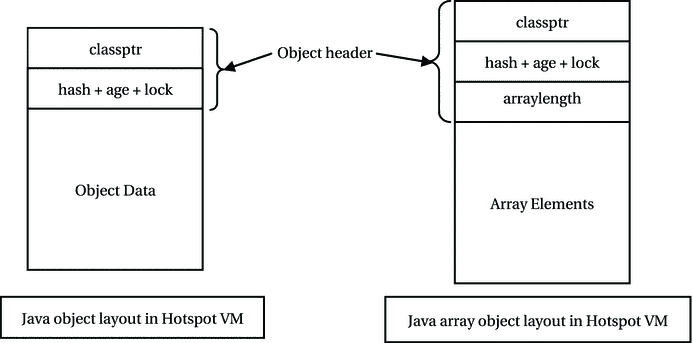

图 11-1.

Java Hotspot VM 中对象的布局

Java Hotspot VM 使用可变长度的对象头来节省堆内存。由于大多数 Java 对象都很小，对于非数组对象，每个对象节省一个机器字可以显著节省堆空间。Java Hotspot VM 的对象头包含以下信息：

*   `classptr`：这是对象布局中的第一个机器字。它包含一个指向对象类信息的指针。类信息包括对象的方法表、对象的大小，以及一个指向 `Class` 结构的指针，该结构包含关于对象所属类的信息等。

*   `hash + age + lock`：这是对象头中的第二个机器字。它包含对象的哈希码、年龄信息和锁字段。年龄信息用于分代垃圾回收器回收对象内存的过程。分代垃圾回收器是一种特殊类型的垃圾回收器，它在回收对象内存的算法中使用了对象的年龄。

*   `arraylength`：这是对象头中的第三个机器字。仅当对象是数组时才包含此字段。它包含数组的长度。在这种情况下，对象的数据区域包含数组元素。

注意

在 Java 中，所有对象都在堆上创建。Java 使用 `new` 运算符在堆上为对象分配内存。数组的长度不是其类定义的一部分。它是在运行时定义的。它存储在对象头中。当你对数组对象进行内省时，你不会在数组的类定义中找到 `length` 实例变量。

Java 不提供任何直接计算对象大小的方法。无论如何，你不应该编写依赖于对象大小的 Java 程序。基本类型（例如 `int`、`long`、`double` 等）的大小在所有 JVM 实现中都是固定的。对象的布局和大小取决于 JVM 实现。因此，任何依赖于对象大小的代码可能在一个平台上工作，而在其他平台上则不行。

Java 中的垃圾回收

垃圾回收器是 Java 平台的一部分。它在一个低优先级线程的后台运行。它会自动回收对象。然而，在回收对象之前，它会确保正在运行的程序在其当前状态下永远不会再使用这些对象。这样，它确保了程序不会出现任何悬空引用。未来无法被正在运行的程序使用的对象称为**死亡对象**或垃圾。未来可以被正在运行的程序使用的对象称为**存活对象**。

有许多算法可以确定一个对象是存活还是死亡。其中一种最简单但效率不高的算法基于引用计数，该算法存储指向某个对象的引用计数。当一个对象的引用被赋值给一个引用变量时，引用计数增加 1。当一个引用变量不再引用某个对象时，引用计数减少 1。当某个对象的引用计数为零时，它就变成了垃圾（或死亡）。这种算法在更新对象的引用计数方面有很大的开销。另一种类型的算法，称为**追踪算法**，基于根集的概念。根集包括以下内容：

*   每个线程的 Java 栈中的引用变量
*   已加载类中定义的静态引用变量
*   使用 Java 本地接口 (JNI) 注册的引用变量

基于追踪算法的垃圾回收器从根集开始遍历引用。可以从根集中的引用变量到达（或访问）的对象称为**可达对象**。可达对象被认为是存活的。从根集可达的对象可能引用其他对象。这些对象也被认为是可达的。因此，所有可以从根集引用变量直接或间接到达的对象都被认为是存活的。其他对象被认为是死亡的，因此有资格进行垃圾回收。


一个对象可能管理堆内存以外的其他资源。这些资源可能包括网络连接、文件句柄、由原生代码显式管理的内存等。例如，一个对象可能在创建时打开一个文件。根据操作系统的不同，可同时打开的文件句柄数量可能存在上限。当对象被垃圾回收时，你可能希望关闭这些文件句柄。垃圾回收器会给即将消亡的对象一个执行清理工作的机会。它通过在回收即将消亡对象的内存之前执行一段预定义的代码来实现这一点。在对象被垃圾回收器回收之前执行清理工作的过程被称为**终结化**。由垃圾回收器调用以执行终结化的代码块被称为**终结器**。在 Java 中，你可以在类中定义一个名为 `finalize()` 的实例方法，它充当该类对象的终结器。Java 垃圾回收器在回收对象占用的内存之前，会调用该对象的 `finalize()` 方法。

调用垃圾回收器

程序员几乎无法控制垃圾回收的运行时机。JVM 在内存不足时会执行垃圾回收。JVM 在抛出 `java.lang.OutOfMemoryError` 错误之前，会尽力释放所有不可达对象的内存。`java.lang.Runtime` 类的 `gc()` 方法可用于向 JVM 传递一个提示，表明它可以运行垃圾回收。对 `gc()` 方法的调用仅仅是对 JVM 的一个提示。JVM 可以忽略该调用。建议运行垃圾回收的调用方式如下所示：

```
// 获取运行时实例并调用垃圾回收
Runtime.getRuntime().gc();
```

`System` 类包含一个便捷方法 `gc()`，其效果等同于执行上述语句。你也可以使用以下语句来运行垃圾回收器：

```
// 调用垃圾回收
System.gc();
```

清单 11-2 中的程序演示了 `System.gc()` 方法的使用。该程序在 `createObjects()` 方法中创建了 2000 个 `Object` 类的对象。新对象的引用未被存储。你无法再次引用这些对象，因此它们成为了垃圾。当你调用 `System.gc()` 方法时，你是在建议 JVM 尝试回收这些对象使用的内存。垃圾回收器释放的内存在输出部分显示。请注意，当你运行此程序时，很可能会得到不同的输出。`Runtime` 类的 `freeMemory()` 方法返回 JVM 中的空闲内存量。

```
// InvokeGC.java
package com.jdojo.gc;
public class InvokeGC {
public static void main(String[] args) {
long m1, m2, m3;
// 获取运行时实例
Runtime rt = Runtime.getRuntime();
for (int i = 0; i < 3; i++) {
// 获取空闲内存
m1 = rt.freeMemory();
// 创建一些对象
createObjects(2000);
// 获取空闲内存
m2 = rt.freeMemory();
// 调用垃圾回收
System.gc();
// 获取空闲内存
m3 = rt.freeMemory();
System.out.println("m1 = " + m1 + ", m2 = " + m2 + ", m3 = "
+ m3 + "\nMemory freed by gc() = " + (m3 - m2));
System.out.println("-------------------------");
}
}
public static void createObjects(int count) {
for (int i = 0; i < count; i++) {
// 不存储新对象的引用，因此它们立即符合垃圾回收条件。
new Object();
}
}
}
m1 = 130188712, m2 = 130188712, m3 = 7402320
Memory freed by gc() = -122786392

m1 = 6225808, m2 = 6225808, m3 = 7241760
Memory freed by gc() = 1015952

m1 = 7207408, m2 = 7207408, m3 = 7241832
Memory freed by gc() = 34424

清单 11-2.
调用垃圾回收
```

通常，不建议以编程方式调用垃圾回收器。调用垃圾回收器会产生一些开销。如果随意调用，可能会降低性能。Java 运行时会自动负责回收未使用对象的内存。你的程序可能会遇到 `OutOfMemoryError`。此错误可能由多种原因引起。Java 运行时会尽一切努力释放内存，在抛出 `OutOfMemoryError` 错误之前会调用垃圾回收器。因此，仅仅通过编程方式调用垃圾回收器并不能消除此错误。要解决此错误，你可以考虑以下几点：

*   检查你的程序，确保你没有持有一些永远不会再使用的对象引用。在使用完这些引用后，将它们设置为 `null`。将所有对某个对象的引用设置为 `null` 会使该对象符合垃圾回收条件。如果你在静态变量中存储了大对象，这些对象将一直保留在内存中，直到类本身被卸载。通常，存储在静态变量中的对象会永久占用内存。检查你的程序，尽量避免在静态变量中存储大对象。

*   检查你的代码，确保你没有在对象中缓存大量数据。你可以使用弱引用在对象中缓存大量数据。与常规引用（常规引用也称为强引用）相比，弱引用有一个优势：在 Java 运行时抛出 `OutOfMemoryError` 之前，被弱引用的对象会被垃圾回收。我将在本章后面讨论弱引用。

*   如果这些解决方案都不起作用，你可以尝试调整堆大小。

对象终结化

终结化是在对象使用的内存被垃圾回收器回收之前，自动对该对象执行的一个操作。包含要执行操作的代码块被称为终结器。`Object` 类有一个 `finalize()` 方法，其声明如下：

```
protected void finalize() throws Throwable
```

因为所有 Java 类都继承自 `Object` 类，所以可以在所有 Java 对象上调用 `finalize()` 方法。任何类都可以重写并实现自己的 `finalize()` 方法。`finalize()` 方法充当 Java 对象的终结器。也就是说，垃圾回收器在回收对象内存之前会自动调用该对象的 `finalize()` 方法。理解 `finalize()` 方法的正确使用是编写良好 Java 程序的关键，该程序管理堆内存以外的资源。

注意

`Object` 类中的 `finalize()` 方法自 JDK9 起已被弃用。请使用其他方式清理对象持有的资源。我将在本章中讨论这些方式。为了完整性，我还会讨论如何使用 `finalize()` 方法，尽管它已被弃用。

让我们先从一个简单的示例开始，该示例演示了 `finalize()` 方法在对象被垃圾回收之前被调用的事实。清单 11-3 在 `Finalizer` 类中定义了一个 `finalize()` 方法。我在 `finalize()` 方法上使用了 `@SuppressWarnings("deprecation")` 注解来抑制编译时的弃用警告，因为该方法在 JDK9 中已被弃用。


```
// Finalizer.java
package com.jdojo.gc;
public class Finalizer {
// id 用于标识对象
private final int id;
// 构造函数，接收 id 作为参数
public Finalizer(int id){
this.id = id;
}
// 这是对象的终结器。JVM 会在对象被垃圾回收前调用此方法。
@SuppressWarnings("deprecation")
@Override
public void finalize(){
// 仅打印一条消息，指示哪个对象正在被垃圾回收。
// 仅在 id 为 100 的倍数时打印消息，以避免输出过多。
if (id % 100 == 0) {
System.out.println ("finalize() called for " + id ) ;
}
}
public static void main(String[] args) {
// 创建 500000 个 Finalizer 类的对象
for(int i = 1; i <= 500000; i++){
// 不存储对新对象的引用
new Finalizer(i);
}
// 调用垃圾回收器
System.gc();
}
}
finalize() called for 63700
finalize() called for 186000
finalize() called for 185000
finalize() called for 184400
...
清单 11-3.
使用 finalize() 方法
```

`finalize()` 方法会在被垃圾回收的对象的 ID 是 100 的倍数时打印一条消息。`main()` 方法创建了 500,000 个 `Finalizer` 类的对象，并调用 `System.gc()` 来调用垃圾回收器。

当垃圾回收器确定某个对象不可达时，它会将该对象标记为待终结，并将其放入一个队列中。如果你希望 Java 运行时终结所有待终结的对象，可以通过调用 `Runtime` 类的 `runFinalization()` 方法来实现，如下所示：

```
Runtime rt = Runtime.getRuntime();
rt.runFinalization();
```

`System` 类有一个便捷方法 `runFinalization()`，它等同于调用 `Runtime` 类的 `runFinalization()` 方法。可以按如下方式调用：

```
System.runFinalization();
```

调用 `runFinalization()` 方法只是向 Java 运行时发出一个提示，建议它调用所有待终结对象的 `finalize()` 方法。从技术上讲，你可以在代码中任意多次地调用某个对象的 `finalize()` 方法。然而，该方法的设计初衷是让垃圾回收器在对象的生命周期内最多调用一次其 `finalize()` 方法。垃圾回收器对对象 `finalize()` 方法的一次性调用，不会因为之前以编程方式调用了该对象的 `finalize()` 方法而受到影响。

程序员不应在类中随意重写 `finalize()` 方法。一个没有代码的 `finalize()` 方法，或者一个仅调用 `Object` 类的 `finalize()` 方法，都是随意重写 `finalize()` 方法的例子。`Object` 类中的该方法不执行任何操作。如果你的类是 `Object` 类的直接子类，并且你的类中的 `finalize()` 方法没有任何有意义的代码，那么最好不要在你的类中包含 `finalize()` 方法。与那些实现了 `finalize()` 方法的对象相比，没有实现该方法的对象的内存回收速度更快、更及时。

**Finally 还是 Finalize？**

对象终结的时机无法保证。所有不可达对象的终结也无法保证。简而言之，无法保证不可达对象的 `finalize()` 方法何时会被调用，甚至是否会被调用。那么，`finalize()` 方法到底有什么用呢？Java 中垃圾回收器的主要目的是减轻程序员释放未使用对象内存的负担，以避免内存泄漏和悬空引用的问题。其次要任务是在不保证时机的情况下对对象执行终结。作为程序员，你不应过分依赖垃圾回收的终结过程。你不应编写 `finalize()` 方法，或者应谨慎编写。如果你需要在资源使用完毕后确保清理它们，可以使用 `try-finally` 块。如果你的资源是 `AutoCloseable` 的，可以使用 `try-with-resources` 块。`try-finally` 块的工作方式如下：

```
try {
/* 获取资源并使用它们 */
} finally {
/* 释放资源 */
}
```

你可以在 `try` 块中获取并使用资源，然后在关联的 `finally` 块中释放它们。`finally` 块保证在 `try` 块执行完毕后执行。这样，你可以确保程序中的稀缺资源在使用完毕后始终被释放。然而，由于性能问题，在资源使用完毕后立即释放它们可能并不总是可行的。例如，你可能不希望每次需要网络连接时都打开一个新的连接。你可以打开一次网络连接，使用它，然后在不再需要时关闭它。有时你可能不知道在程序的哪个确切点之后不再需要该网络连接。在这种情况下，你可以将 `finalize()` 方法作为后备方案来释放尚未释放的资源。当你确定可以释放资源时，可以以编程方式调用 `finalize()` 方法。清单 11-4 包含一个 `FinalizeAsBackup` 类的代码，该类展示了使用这种技术的代码框架。

```
// FinalizeAsBackup.java
package com.jdojo.gc;
public class FinalizeAsBackup {
/* 其他代码在此 */
SomeResource sr;
public void aMethod() {
sr = 在此处获取资源...;
/* 进行一些处理 . . . */
/* 注意有条件地释放资源 */
if (某个条件为真) {
/* 在此处释放资源，调用 finalize() */
this.finalize();
}
}
public void finalize() {
/* 如果资源尚未释放，则释放它们 */
if (资源尚未释放) {
现在释放资源;
}
}
}
清单 11-4.
使用 finalize() 方法作为释放资源后备方案的类模板
```

该类的 `aMethod()` 方法获取资源并将其引用存储在 `sr` 实例变量中。当程序员确定应该释放资源时，他们会调用 `finalize()` 方法。否则，垃圾回收器会调用 `finalize()` 方法，资源将被释放。请注意，`FinalizeAsBackup` 类是一个模板。它包含用于解释该技术的伪代码。此类无法编译。

**提示**

关于使用 `finalize()` 方法的经验法则是：不要使用它，或者谨慎使用，并且仅将其作为释放资源的最后手段。你可以使用 `try-finally` 块来释放资源。对象被终结的顺序是未定义的。例如，如果对象 `obj1` 比对象 `obj2` 更早符合垃圾回收条件，但并不能保证 `obj1` 会在 `obj2` 之前被终结。当抛出未捕获的异常时，主程序会停止。然而，终结器中的未捕获异常只会停止该对象的终结，而不会影响整个应用程序。

**对象复活**


有人即将死去。上帝问他最后一个愿望。他说：“把生命还给我。”上帝满足了他的最后一个愿望，他重获新生。当他第二次即将死去时，上帝保持沉默，没有询问他的最后一个愿望就让他死去了。否则，他会反复要求重获生命，永远不死。

同样的逻辑也适用于 Java 中对象的终结化。调用对象的 `finalize()` 方法，就像垃圾回收器在询问对象的最后一个愿望。通常，对象会回应：“我想清理我所有的烂摊子。”也就是说，对象通过执行一些清理工作来响应其 `finalize()` 方法的调用。它也可能通过将其引用放入一个可达的引用变量中来复活自己，从而响应其 `finalize()` 方法的调用。一旦它通过一个已经可达的引用变量变得可达，它就复活了。垃圾回收器在调用对象的 `finalize()` 方法后，会使用对象的头部标记将其标记为已终结。如果一个已经终结的对象在下次垃圾回收时变得不可达，垃圾回收器不会再次调用该对象的 `finalize()` 方法。

对象的复活是可能的，因为垃圾回收器在调用其 `finalize()` 方法后并不会立即回收对象的内存。调用 `finalize()` 方法后，它只是将对象标记为已终结。在垃圾回收的下一个阶段，它会再次判断对象是否可达。如果对象不可达且已终结，只有到那时它才会回收对象的内存。如果对象可达且已终结，它不会回收对象的内存；这是一个典型的复活案例。

在对象的 `finalize()` 方法中复活对象不是一个好的编程实践。一个简单的原因是，如果你编写了 `finalize()` 方法，你期望它在每次对象死亡时都被执行。如果你在 `finalize()` 方法中复活了对象，当它第二次变得不可达时，垃圾回收器将不会再次调用其 `finalize()` 方法。复活后，你可能已经获得了一些你期望在 `finalize()` 方法中释放的资源。这会在你的程序中留下微妙的错误。如果你的程序在 `finalize()` 方法中复活对象，其他程序员也很难理解你的程序流程。清单 11-5 演示了如何使用 `finalize()` 方法复活一个对象。

```
// Resurrect.java
package com.jdojo.gc;
public class Resurrect {
// 声明一个 Resurrect 类型的静态变量
private static Resurrect res = null;
// 声明一个存储对象名称的实例变量
private String name = "";
public Resurrect(String name) {
this.name = name;
}
public static void main(String[] args) {
// 我们将创建 Resurrect 类的对象，并且不存储它们的引用，
// 因此它们立即符合垃圾回收的条件。
for (int count = 1; count <= 1000; count++) {
new Resurrect("Object #" + count);
// 每创建 100 个对象，就调用一次垃圾回收
if (count % 100 == 0) {
System.gc();
System.runFinalization();
}
}
}
public void sayHello() {
System.out.println("Hello from " + name);
}
public static void resurrectIt(Resurrect r) {
// 将引用 r 赋值给静态变量 res，这使得只要 res 可达，该对象就可达。
res = r;
// 调用一个方法来证明我们确实找回了对象
res.sayHello();
}
@SuppressWarnings("deprecation")
@Override
public void finalize() {
System.out.println("Inside finalize(): " + name);
// 复活此对象
Resurrect.resurrectIt(this);
}
}
Inside finalize(): Object #82
Hello from Object #82
Inside finalize(): Object #100
Hello from Object #100
Inside finalize(): Object #99
Hello from Object #99
...
清单 11-5.
对象复活
```

`Resurrect` 类在 `main()` 方法中创建了 1000 个对象。它没有存储这些新对象的引用，因此它们一被创建就变成了垃圾。每创建 100 个新对象后，它使用 `System.gc()` 方法调用垃圾回收器。它还调用了 `System.runFinalization()` 方法，以便为垃圾对象运行终结器。当垃圾回收器为一个对象调用 `finalize()` 方法时，该对象会将其引用传递给 `resurrectIt()` 方法。此方法将濒死对象的引用存储在静态变量 `res` 中，该变量是可达的。`resurrectIt()` 方法还在复活的对象上调用 `sayHello()` 方法，以显示哪个对象被复活了。请注意，一旦另一个对象复活了自己，你就会用最近复活的对象的引用覆盖静态变量 `res`。先前被复活的对象再次变成垃圾。垃圾回收器将回收先前复活对象的内存，而不会再次调用其 `finalize()` 方法。当你运行程序时，可能会得到不同的输出。

对象的状态

Java 对象的状态 基于两个标准定义：

*   终结状态

*   可达性

基于终结状态，一个对象可以处于以下三种状态之一：

*   未终结

*   可终结

*   已终结

当一个对象被实例化时，它处于未终结状态。例如，

```
Employee john = new Employee();
```

在此语句执行后，由 `john` 引用变量引用的对象处于未终结状态。JVM 从未自动调用过未终结对象的终结器。当垃圾回收器确定可以在对象上调用 `finalize()` 方法时，该对象变为可终结。已终结对象的 `finalize()` 方法已由垃圾回收器自动调用。

基于可达性，一个对象可以处于三种状态之一：

*   可达

*   终结器可达

*   不可达

如果一个对象可以通过从根集出发的任何引用链访问到，则它是可达的。一个终结器可达的对象可以通过任何可终结对象的终结器访问到。如果一个终结器可达的对象，其可达的终结器将其引用存储在一个可达的对象中，那么该终结器可达的对象可能变为可达。这就是对象复活的情况。一个对象可以在其 `finalize()` 方法中复活自己，或者通过另一个对象的 `finalize()` 方法复活。一个不可达的对象无法通过任何方式访问到。

基于对象的终结状态和可达性状态，共有九种对象状态组合。九种组合中的一种，即可终结且不可达，是不可能的。一个可终结对象的 `finalize()` 方法可能会在未来被调用。`finalize()` 方法仍然可以使用 `this` 关键字引用该对象。因此，一个可终结的对象不能同时也是不可达的。一个对象可以存在于以下八种状态之一：

*   未终结 - 可达

*   未终结 - 终结器可达

*   未终结 - 不可达

*   可终结 - 可达

*   可终结 - 终结器可达

*   已终结 - 可达

*   已终结 - 终结器可达

*   已终结 - 不可达

弱引用

在垃圾回收的上下文中，弱引用的概念对 Java 来说并不新鲜。它之前就存在于其他编程语言中。到目前为止，我讨论的对象引用都是强引用。也就是说，只要对象引用在作用域内，它所引用的对象就不能被垃圾回收。例如，考虑以下对象创建和引用赋值语句：

```
Employee john = new Employee("John Jacobs");
```

这里，`john` 是对表达式 `new Employee("John Jacobs")` 创建的对象的引用。执行此语句后存在的内存状态如图 11-2 所示。


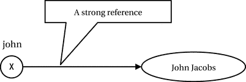

图 11-2.

强引用示例

如果某个对象至少存在一个强引用，垃圾回收器就不会回收该对象。在上一节中，我根据对象的可达性讨论了其状态。所谓对某个对象存在强引用，是指该对象是可达的。随着弱引用的引入，现在根据可达性，对象又多了三种状态：

*   软可达

*   弱可达

*   虚可达

因此，在上一节中我称之为可达的对象，从现在起我将称之为强可达。这种术语上的变化是由于引入了三种新的对象可达性。在讨论这三种新的对象可达性之前，你需要了解 `java.lang.ref` 包中包含的类。其中有四个相关的类，如图 11-3 所示。我不讨论图中的 `Reference` 类。

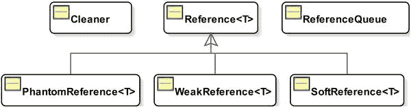

图 11-3.

java.lang.ref 包中部分类的类图

`Reference<T>` 是一个抽象类，它是 `SoftReference<T>`、`WeakReference<T>` 和 `PhantomReference<T>` 类的超类。它们是泛型类；其类型参数 `T` 是它们所引用对象的类型。`SoftReference`、`WeakReference` 和 `PhantomReference` 类用于创建弱引用。请注意，短语“弱引用”指的是非强引用的引用。而短语 `WeakReference` 指的是 `java.lang.ref.WeakReference` 类。`ReferenceQueue` 类用于将 `SoftReference`、`WeakReference` 和 `PhantomReference` 对象的引用放入队列中。让我们看看创建这三种类型对象的不同方式。这三个类的构造函数如表 11-1 所示。

表 11-1.

SoftReference、WeakReference 和 PhantomReference 类的构造函数

| 类 | 构造函数 |
| --- | --- |
| `SoftReference<T>` | `SoftReference(T referent)` |
| | `SoftReference(T referent, ReferenceQueue<? super T> q)` |
| `WeakReference<T>` | `WeakReference(T referent)` |
| | `WeakReference(T referent, ReferenceQueue<? super T> q)` |
| `PhantomReference<T>` | `PhantomReference(T referent, ReferenceQueue<? super T> q)` |

你可以按如下方式创建 `SoftReference` 类的对象：

```
Employee john = new Employee ("John Jacobs");
SoftReference sr = new SoftReference(john);
```

执行这两条语句后的内存状态如图 11-4 所示。

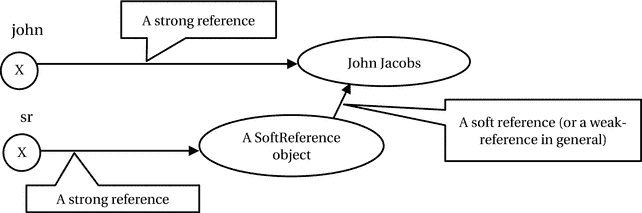

图 11-4.

软引用示例

在图 11-4 中，有两个强引用和一个软引用。所有三个弱引用类都有两个实例变量：`referent` 和 `queue`。它们用于保存传递给这些类构造函数的对象引用和引用队列。存储在这三个类中任何一个类的 `referent` 实例变量中的任何对象引用，通常被称为弱引用——具体来说，根据所使用的类，分别称为软引用、弱引用或虚引用。因此，从软引用对象到图 11-4 中 employee 对象的链接是一个弱引用。具体来说，我称之为软引用，因为我使用了 `SoftReference` 类的对象。在 Java 中，任何不涉及这三个类中任何一个类的 `referent` 实例变量的引用都是强引用。因此，`john` 和 `sr` 是强引用。

弱引用与强引用有何不同？区别在于垃圾回收器如何处理它们。弱引用不会阻止它们所引用的对象被垃圾回收器回收。也就是说，如果某个对象存在一个弱引用，垃圾回收器仍然可以回收该对象。然而，如果某个对象至少存在一个强引用，垃圾回收器就不会回收该对象。在开始详细了解如何使用这三个引用类之前，让我们先讨论当程序中涉及这些类时对象的可达性。

*   **强可达**：如果一个对象可以从根集合通过至少一条不包含任何弱引用的引用链到达，则该对象是强可达的。

*   **软可达**：如果一个对象不是强可达的，并且可以从根集合通过至少一条包含至少一个软引用但不包含弱引用和虚引用的引用链到达，则该对象是软可达的。

*   **弱可达**：如果一个对象既不是强可达也不是软可达，并且可以从根集合通过至少一条包含至少一个弱引用但不包含虚引用的引用链到达，则该对象是弱可达的。

*   **虚可达**：如果一个对象既不是强可达、软可达也不是弱可达，并且可以从根集合通过至少一条包含至少一个虚引用的引用链到达，则该对象是虚可达的。一个虚可达的对象已被终结，但尚未被回收。

在这三种弱引用中，软引用被认为比弱引用和虚引用更强。弱引用被认为比虚引用更强。因此，识别对象可达性的规则是：如果一个对象不是强可达的，那么它的可达性等同于通向该对象的引用链中最弱的引用。也就是说，如果通向某个对象的引用链包含一个虚引用，则该对象必定是虚可达的。如果通向某个对象的引用链不包含虚引用，但包含一个弱引用，则该对象必定是弱可达的。如果通向某个对象的引用链不包含虚引用和弱引用，但包含一个软引用，则该对象必定是软可达的。

当存在多条通向某个对象的引用链时，如何确定该对象的可达性？在这种情况下，你需要使用所有可能的引用链来确定对象的可达性，并采用最强的那一个。也就是说，如果某个对象通过一条引用链是软可达的，而通过另一条是虚可达的，则该对象被视为软可达。图 11-5 展示了如何确定对象可达性的示例。每条引用链末端的椭圆形代表一个对象。对象的可达性已在椭圆形内部标明。矩形表示引用。

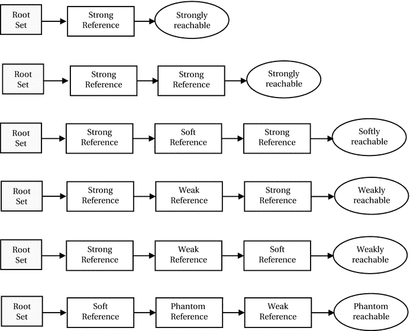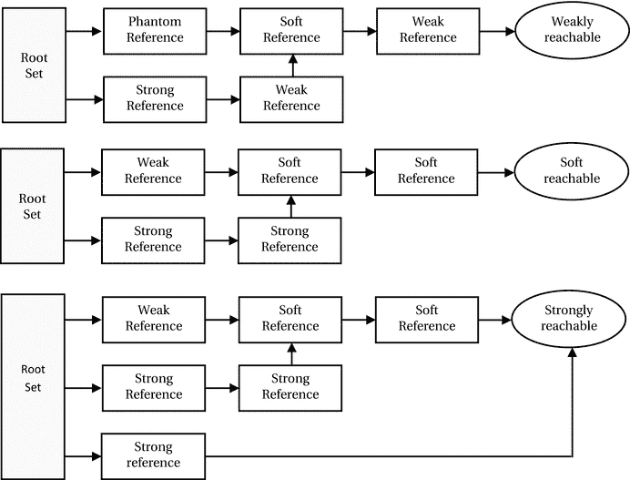

图 11-5.

对象的不同可达性类型

访问和清除引用对象的引用

本节使用一个简单类的对象来演示引用类的使用。这个名为 `BigObject` 的类如清单 11-6 所示。它有一个大的 `long` 类型数组作为实例变量，因此会占用大量内存。`id` 实例变量用于跟踪该类的对象。`finalize()` 方法使用对象的 `id` 在控制台上打印一条消息。


```
// BigObject.java
package com.jdojo.gc;
public class BigObject {
// 声明一个包含 20480 个 long 元素的大数组
private final long[] anArray = new long[20480];
// 使用 ID 追踪对象
private final long id;
public BigObject(long id) {
this.id = id;
}
// 定义 finalize() 方法以追踪对象的终结过程
@SuppressWarnings("deprecation")
@Override
public void finalize() {
System.out.println("finalize() called for id: " + id);
}
@Override
public String toString() {
return "BigObject: id = " + id;
}
}
清单 11-6.
一个占用大内存的 BigObject 类
```

传递给 `WeakReference`、`SoftReference` 和 `PhantomReference` 类构造函数的对象称为**引用对象（referent）**。换句话说，这三个引用类对象所引用的对象被称为引用对象。要获取引用对象的引用，需要调用 `get()` 方法。

```
// 创建一个 ID 为 101 的大对象
BigObject bigObj = new BigObject(101);
/* 此时，ID 为 101 的大对象是强可达的 */
// 使用 bigObj 作为引用对象创建一个软引用对象
SoftReference sr = new SoftReference(bigObj);
/* 此时，ID 为 101 的大对象仍然是强可达的，因为 bigObj 是一个指向它的强引用。同时它也有一个软引用指向它。*/
// 将 bigObj 设为 null，使该对象变为软可达
bigObj = null;
/* 此时，ID 为 101 的大对象是软可达的，因为它只能通过软引用 sr 访问。*/
// 获取软引用对象的引用对象
BigObject referent = sr.get();
/* 此时，ID 为 101 的大对象再次变为强可达，因为 referent 是一个强引用。同时它也有一个软引用指向它。*/
```

图 11-6 展示了执行上述代码片段中每条语句后，所有引用对应的内存状态。

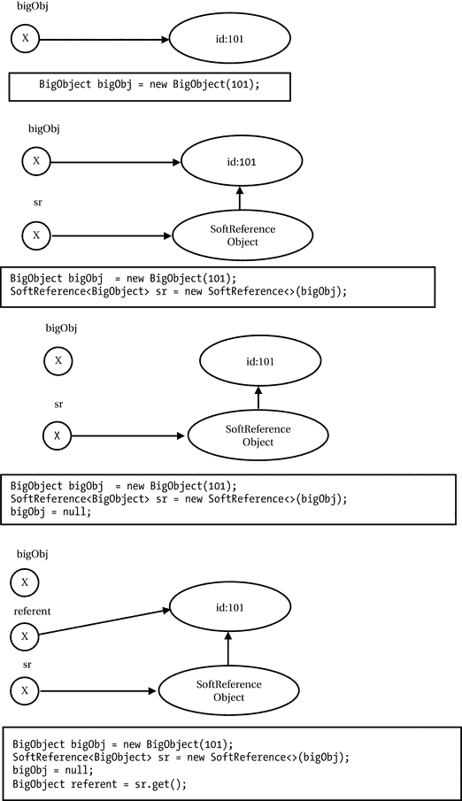

图 11-6.

访问引用对象的引用

`clear()` 方法会清除引用（弱引用、软引用或虚引用）对象与其引用对象之间的链接。以下代码片段说明了其用法：

```
// 创建一个软引用对象，使用 ID 为 976 的 BigObject 作为其引用对象
SoftReference sr1 = new SoftReference(new BigObject(976));
/* 此时，ID 为 976 的 BigObject 是软可达的，因为它只能通过软引用 sr 访问。*/
// 清除引用对象
sr1.clear();
/* 此时，ID 为 976 的大对象是不可达的（准确地说，是终结器可达的），因为我们清除了指向该对象的唯一引用（软引用）。*/
```

执行上述代码片段中每条语句后，所有引用对应的内存状态如图 11-7 所示。使用 `clear()` 方法清除引用对象的引用后，`get()` 方法返回 `null`。请注意，`PhantomReference` 对象的 `get()` 方法始终返回 `null`。

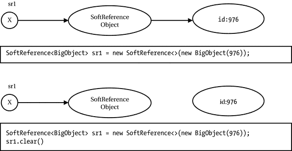

图 11-7.

清除引用对象

使用 SoftReference 类

软可达对象用于维护内存敏感的缓存。也就是说，如果你想在程序内存不紧张时维护一个对象缓存，可以使用软可达对象。当程序内存不足时，垃圾回收器会清除对象的软引用，使该对象符合回收条件。此时，你的程序将从缓存中丢失部分或全部对象。Java 不保证在程序内存不紧张时不会清除软引用。然而，它保证在 JVM 抛出 `OutOfMemoryError` 之前，所有软引用都会被清除。同时，也不保证软引用被清除的顺序。不过，鼓励 JVM 实现优先清除最近最少创建/使用的软引用。清单 11-7 展示了软引用在缓存数据时的错误用法。

```
// WrongSoftRef.java
package com.jdojo.gc;
import java.lang.ref.SoftReference;
import java.util.ArrayList;
public class WrongSoftRef {
public static void main(String[] args) {
// 创建一个 ID 为 101 的大对象用于缓存
BigObject bigObj = new BigObject(101);
// 将软引用包装在软引用中
SoftReference sr = new SoftReference(bigObj);
// 让我们尝试创建许多大对象，并将其引用存储在数组列表中，以消耗大量内存
ArrayList bigList = new ArrayList();
long counter = 102;
while (true) {
bigList.add(new BigObject(counter++));
}
}
}
Exception: java.lang.OutOfMemoryError thrown from the UncaughtExceptionHandler in thread "main"
清单 11-7.
软引用的错误用法
```

程序员的意图是使用软引用缓存一个 ID 为 101 的大对象。如果程序内存不足，ID 为 101 的缓存大对象可能会被回收。程序中的 `while` 循环试图创建许多大对象，以使程序内存不足。程序员期望在执行程序时，在抛出 `OutOfMemoryError` 之前，应该回收 ID 为 101 的大对象所使用的内存。

输出显示程序并未回收 ID 为 101 的大对象所使用的内存。为什么垃圾回收器的行为不符合预期？`WrongSoftRef` 类的代码中存在一个错误。ID 为 101 的大对象是强可达的，因为指向它的 `bigObj` 引用是一个强引用。你必须将 `bigObj` 引用变量设为 `null`，才能使其变为软可达。

清单 11-8 展示了软引用的正确用法。从输出中可以清楚地看到，在 JVM 抛出 `OutOfMemoryError` 之前，ID 为 101 的大对象的 `finalize()` 方法被调用，并且该对象被回收了。你仍然遇到了 `OutOfMemoryError`，因为你在 `while` 循环中创建了许多新对象，并且所有这些对象都通过数组列表强可达。这证明了在 JVM 抛出 `OutOfMemoryError` 之前，软引用会被清除，并且引用对象会被垃圾回收器回收。你可能会得到不同的输出。有时，你会在对象未被回收的情况下遇到 `OutOfMemoryError`。


```
// CorrectSoftRef.java
package com.jdojo.gc;
import java.lang.ref.SoftReference;
import java.util.ArrayList;
public class CorrectSoftRef {
public static void main(String[] args) {
// 创建一个 ID 为 101 的大对象用于缓存
BigObject bigObj = new BigObject(101);
// 将大对象包装在软引用中
SoftReference sr = new SoftReference(bigObj);
// 将 bigObj 设为 null，使大对象变为软可达状态，必要时可被回收
bigObj = null;
// 尝试创建大量大对象，将其引用存储在数组列表中，以耗尽内存
ArrayList bigList = new ArrayList();
long counter = 102;
while (true) {
bigList.add(new BigObject(counter++));
}
}
}
finalize() called for id: 101
Exception: java.lang.OutOfMemoryError thrown from the UncaughtExceptionHandler in thread "main"
清单 11-8.
软引用的正确用法
```

清单 11-9 演示了如何使用软引用实现内存敏感的缓存。

```
// BigObjectCache.java
package com.jdojo.gc;
import java.lang.ref.SoftReference;
public class BigObjectCache {
@SuppressWarnings("unchecked")
private static final SoftReference[] cache = new SoftReference[10];
public static BigObject getObjectById(int id) {
// 检查缓存 ID 是否有效
if (id = cache.length) {
throw new IllegalArgumentException("无效的 ID");
}
BigObject obj;
// 检查该 ID 是否有缓存
if (cache[id] == null) {
// 尚未缓存该对象，创建缓存并返回
obj = createCacheForId(id);
return obj;
}
// 通过软引用获取 BigObject 引用
obj = cache[id].get();
// 确保对象尚未被回收
if (obj == null) {
// 垃圾回收器已回收该对象，重新缓存并返回新缓存的对象
obj = createCacheForId(id);
}
return obj;
}
// 为指定 ID 创建缓存
private static BigObject createCacheForId(int id) {
BigObject obj = null;
if (id >= 0 && id (obj);
}
return obj;
}
}
清单 11-9.
使用软引用创建缓存
```

该缓存最多可缓存 10 个 `BigObject` 类的对象，其 ID 范围为 0 到 9。要获取指定 ID 的缓存对象，需要调用 `getObjectById()` 方法。如果该 ID 尚未缓存，或已被垃圾回收器回收，该方法会创建并缓存该对象。此示例限制性很强，其目的仅在于演示如何使用 `SoftReference` 类来维护内存敏感的缓存。你只能缓存 ID 为 0 到 9 的对象。可根据具体需求对其进行修改。例如，你可以使用 `ArrayList` 而非数组来缓存对象。`BigObjectCache` 类的使用方式如下：

```
// 从缓存中获取对象
BigObject cachedObject = BigObjectCache.getObjectById(5);
/* 执行一些处理...*/
// 使用完毕后，必须将 cachedObject 设为 null，使缓存对象变为软可达状态，以便垃圾回收器可能回收它
cachedObject = null;
```

如果 ID 为 5 的对象尚未在缓存中，它将被缓存，并且新对象的引用将赋值给 `cachedObject`。如果 ID 为 5 的对象已在缓存中，则返回该对象在缓存中的引用，并赋值给 `cachedObject`。

使用 ReferenceQueue 类

当需要在对象可达性发生变化时得到通知，可以将 `ReferenceQueue<T>` 类的对象与 `SoftReference<T>`、`WeakReference<T>` 和 `PhantomReference<T>` 类的对象结合使用。这些引用类中的任何一个对象都可以注册到引用队列中，如下所示：

```
ReferenceQueue q = new ReferenceQueue();
SoftReference sr = new SoftReference(new BigObject(19), q);
WeakReference wr = new WeakReference(new BigObject(20), q);
PhantomReference pr = new PhantomReference(new BigObject(21), q);
```

将 `SoftReference` 和 `WeakReference` 对象注册到引用队列是可选的。但是，必须将 `PhantomReference` 对象注册到引用队列。当垃圾回收器清除 `SoftReference` 或 `WeakReference` 时，`SoftReference` 或 `WeakReference` 对象的引用会被追加到引用队列中。请注意，放入队列的是 `SoftReference` 和 `WeakReference` 的引用，而不是它们所引用对象的引用。例如，如果垃圾回收器清除了上述代码片段中对 ID 为 19 的 `BigObject` 的软引用，`sr` 将被放入引用队列。对于 `PhantomReference`，当其引用对象变为虚可达时，垃圾回收器会将 `PhantomReference` 对象放入引用队列。

在 JDK9 之前，与软引用和弱引用不同，垃圾回收器在将虚引用放入其引用队列时，并不会清除它们。程序必须通过调用 `clear()` 方法来清除虚引用。从 JDK9 开始，所有三种类型的引用在入队之前都会被清除。

有两种方法可以判断引用对象是否已被放入其引用队列。你可以调用 `ReferenceQueue` 的 `poll()` 或 `remove()` 方法，也可以调用软引用、弱引用和虚引用的 `isEnqueued()` 方法。`poll()` 方法从队列中移除一个引用并返回该引用。如果队列中没有可用的引用，则返回 `null`。`remove()` 方法与 `poll()` 方法的工作方式相同，区别在于如果队列中没有可用的引用，它会阻塞直到有引用可用。对于软引用、弱引用和虚引用，如果它们已被放入队列，`isEnqueued()` 方法返回 `true`，否则返回 `false`。清单 11-10 演示了如何使用 `ReferenceQueue` 类。

```
// ReferenceQueueDemo.java
package com.jdojo.gc;
import java.lang.ref.ReferenceQueue;
import java.lang.ref.WeakReference;
public class ReferenceQueueDemo {
public static void main(String[] args) {
// 创建一个引用队列
ReferenceQueue q = new ReferenceQueue();
// 将 BigObject 包装在软引用中
// 同时将软引用注册到引用队列
BigObject bigObj = new BigObject(131);
WeakReference wr = new WeakReference(bigObj, q);
// 清除对大对象的强引用
bigObj = null;
// 检查弱引用是否已入队
System.out.println("调用 gc() 之前：");
printMessage(wr, q);
// 调用垃圾回收器。如果运行，它将清除弱引用
System.out.println("正在调用垃圾回收器...");
System.gc();
System.out.println("垃圾回收器执行完毕...");
// 检查弱引用是否已入队
System.out.println("调用 gc() 之后：");
printMessage(wr, q);
}
public static void printMessage(WeakReference wr,
ReferenceQueue q) {
System.out.println("wr.get() = " + wr.get());
System.out.println("wr.isEnqueued() = " + wr.isEnqueued());
WeakReference temp = (WeakReference) q.poll();
if (temp == wr) {
System.out.println("q.poll() 返回了 wr");
} else {
System.out.println("q.poll() = " + temp);
}
}
}
调用 gc() 之前：
wr.get()= BigObject: id = 131
wr.isEnqueued()= false
q.poll()= null
正在调用垃圾回收器...
垃圾回收器执行完毕...
调用 gc() 之后：
wr.get()= null
wr.isEnqueued()= true
q.poll() 返回了 wr
finalize() called for id: 131
清单 11-10.
使用 ReferenceQueue 类
```

使用 WeakReference 类

软可达对象和弱可达对象之间的唯一区别在于：垃圾回收器每次运行时都会清除并回收弱可达对象，而对于软可达对象，它会使用某种算法来决定是否需要清除并回收。换句话说，垃圾回收器可能会也可能不会回收软可达对象，但它总是会回收弱可达对象。


你可能看不出弱引用有什么重要用途，因为当垃圾回收器运行时，其引用对象（referent）会被回收。通常，弱引用并非用于维护缓存，而是用于将额外数据与某个对象关联。假设你有一个人的详细信息及其地址。如果你丢失了该人的详细信息，你便不再关心其地址。然而，只要该人的详细信息可访问，你就希望保留其地址信息。这类信息可以通过弱引用和`Hashtable`来存储。`Hashtable`以键值对的形式存储对象。在向`Hashtable`添加键值对时，你需要将键对象包装在一个`WeakReference`对象中。

当键可访问或正在使用时，键和值不会被垃圾回收。当键对象不再使用时，由于它被包装在`WeakReference`内部，它将被垃圾回收。此时，你可以从`Hashtable`中移除该条目，这样值对象也将符合垃圾回收的条件。以下是使用`Hashtable`和`WeakReference`对象的示例代码片段：

```
// 创建一个 Hashtable 对象
Hashtable ht = new Hashtable();
// 创建一个引用队列，以便检查键何时被垃圾回收
ReferenceQueue q = new ReferenceQueue();
// 创建键和值对象
key = 此处编写你的键对象创建逻辑
value = 此处编写你的值对象创建逻辑
// 使用键对象作为引用对象创建一个弱引用对象
WeakReference wKey = new WeakReference(key, q);
// 将键值对放入 Hashtable。注意，我们放入的是包装在弱引用中的键。
// 也就是说，我们将使用 wKey 作为键
ht.put(wKey, value);
/* 在你的程序中使用键和值对象... */
// 当键对象使用完毕后，将其设为 null，这样它就不再是强可达的。
key = null;
/* 此时，如果运行垃圾回收器，指向键对象的弱引用将被清除，
并且 WeakReference 对象 wr 将被放入引用队列 q 中。
*/
// 移除已被垃圾回收的键对象对应条目的逻辑如下
if (wr.isEnqueued()) {
// 这将使值对象符合回收条件
ht.remove(wr);
}
```

请注意，使用`WeakReference`对象通过`Hashtable`将额外信息与对象关联，涉及一些复杂的代码和逻辑。`java.util.WeakHashMap`类无需编写任何复杂逻辑即可提供此功能。你可以将键值对添加到`WeakHashMap`中，而无需将键对象包装在`WeakReference`内部。`WeakHashMap`类会负责创建引用队列并将键对象包装在`WeakReference`中。使用`WeakHashMap`时有一个重要点需要记住：当键对象不再是强可达时，它会被回收。然而，值对象不会立即被回收。值对象会在条目从映射中移除后被回收。`WeakHashMap`会在指向键的弱引用被清除后，并且调用了其`put()`、`remove()`或`clear()`方法之一时，移除该条目。清单 11-11 演示了`WeakHashMap`的使用。该示例使用`BigObject`类的对象作为键和值。输出中的消息显示了键和值对象何时被垃圾回收器回收。当你运行此程序时，可能会得到不同的输出。

```
// WeakHashMapDemo.java
package com.jdojo.gc;
import java.util.WeakHashMap;
public class WeakHashMapDemo {
public static void main(String[] args) {
// 创建一个 WeakHashMap
WeakHashMap wmap = new WeakHashMap();
// 向 WeakHashMap 添加两个键值对
BigObject key1 = new BigObject(10);
BigObject value1 = new BigObject(110);
BigObject key2 = new BigObject(20);
BigObject value2 = new BigObject(210);
wmap.put(key1, value1);
wmap.put(key2, value2);
// 打印一条消息
printMessage("添加两个条目后：", wmap);
/* 调用 gc()。这次 gc() 调用不会回收任何键对象，
因为我们仍然持有它们的强引用。
*/
System.out.println("第一次调用 gc()...");
System.gc();
// 打印一条消息
printMessage("第一次 gc() 调用后：", wmap);
// 现在移除对键和值的强引用
key1 = null;
key2 = null;
value1 = null;
value2 = null;
/* 调用 gc()。这次 gc() 调用将回收 id 为 10 和 20 的两个键对象。
然而，对应的两个值对象在 WeakHashMap 内部仍然被强引用，
因此此时不会被回收。
*/
System.out.println("第二次调用 gc()...");
System.gc();
// 打印一条消息
printMessage("第二次 gc() 调用后：", wmap);
/* 此时两个键都已被回收。为了使值对象可回收，我们将调用 WeakHashMap 的 clear() 方法。
通常，在你的程序中不会在这里调用此方法。
*/
wmap.clear();
// 调用 gc() 以便回收值对象
System.out.println("第三次调用 gc()...");
System.gc();
// 打印消息
printMessage("调用 clear() 方法后：", wmap);
}
public static void printMessage(String msgHeader, WeakHashMap wmap) {
System.out.println(msgHeader);
// 打印映射的大小和内容 */
System.out.println("大小 = " + wmap.size());
System.out.println("内容 = " + wmap);
System.out.println();
}
}
添加两个条目后：
大小 = 2
内容 = {BigObject: id = 20=BigObject: id = 210, BigObject: id = 10=BigObject: id = 110}
第一次调用 gc()...
第一次 gc() 调用后：
大小 = 2
内容 = {BigObject: id = 20=BigObject: id = 210, BigObject: id = 10=BigObject: id = 110}
第二次调用 gc()...
第二次 gc() 调用后：
finalize() 被调用，id: 20
finalize() 被调用，id: 10
大小 = 0
内容 = {}
第三次调用 gc()...
finalize() 被调用，id: 210
finalize() 被调用，id: 110
调用 clear() 方法后：
大小 = 0
内容 = {}
清单 11-11.
使用 WeakHashMap
```

使用 PhantomReference 类

`PhantomReference`对象必须与一个`ReferenceQueue`一起创建。当垃圾回收器确定一个对象只有虚引用时，它会终结该对象并将虚引用添加到其引用队列中。

直到 JDK8，虚引用的工作方式与软引用和弱引用略有不同。与软引用和弱引用不同，它不会自动清除指向对象的虚引用。程序必须通过调用`clear()`方法来清除它。在程序清除指向该对象的虚引用之前，垃圾回收器不会回收该对象。因此，就对象回收而言，虚引用表现得像一个强引用。此行为在 JDK9 中已更改。在 JDK9 中，虚引用会像软引用和弱引用一样自动清除引用。

为什么要使用虚引用而不是强引用？虚引用用于执行善后处理。与软引用和弱引用的`get()`方法不同，虚引用的`get()`方法始终返回`null`。当一个对象已被终结时，它处于虚可达状态。如果虚引用从其`get()`方法返回引用对象的引用，那将复活该引用对象。这就是为什么虚引用的`get()`方法始终返回`null`。


清单 11-12 演示了如何使用虚引用对对象进行善后处理。运行此程序时，你可能会得到不同的输出结果。

```
// PhantomRef.java
package com.jdojo.gc;
import java.lang.ref.PhantomReference;
import java.lang.ref.ReferenceQueue;
public class PhantomRef {
public static void main(String[] args) {
BigObject bigObject = new BigObject(1857);
ReferenceQueue q = new ReferenceQueue();
PhantomReference pr = new PhantomReference(bigObject, q);
/* 此处可使用 BigObject 引用 */
// 将 BigObject 设为 null，这样垃圾回收器将只找到其虚引用并对其进行终结处理
bigObject = null;
// 调用垃圾回收器
printMessage(pr, "第一次调用 gc()：");
System.gc();
printMessage(pr, "第一次调用 gc() 后：");
// 再次调用垃圾回收器
printMessage(pr, "第二次调用 gc()：");
System.gc();
printMessage(pr, "第二次调用 gc() 后：");
}
public static void printMessage(PhantomReference pr, String msg) {
System.out.println(msg);
System.out.println("pr.isEnqueued = " + pr.isEnqueued());
System.out.println("pr.get() = " + pr.get());
// 我们将检查 pr 是否已入队。如果已入队，我们将清除其引用对象的引用
if (pr.isEnqueued()) {
// 在 JDK9 之前，调用 pr.clear() 是必要的
// 从 JDK9 开始，虚引用会自动清除
pr.clear();
System.out.println("已清除引用对象的引用");
}
System.out.println("-----------------------");
}
}
第一次调用 gc()：
pr.isEnqueued = false
pr.get() = null

finalize() called for id: 1857
第一次调用 gc() 后：
pr.isEnqueued = false
pr.get() = null

第二次调用 gc()：
pr.isEnqueued = false
pr.get() = null

第二次调用 gc() 后：
pr.isEnqueued = true
pr.get() = null
已清除引用对象的引用

清单 11-12.
使用 PhantomReference 对象
```

你也可以使用虚引用来协调多个对象的善后处理。假设你有三个对象，分别名为 `obj1`、`obj2` 和 `obj3`。它们都共享一个网络连接。当这三个对象都变得不可达时，你希望关闭这个共享的网络连接。你可以通过将这三个对象包装在一个虚引用对象中，并使用一个引用队列来实现这一点。你的程序可以在一个单独的线程上等待所有三个虚引用对象入队。当最后一个虚引用入队时，你就可以关闭共享的网络连接。清单 11-13 演示了使用虚引用进行善后协调。请注意，`PhantomRefDemo` 类的 `startThread()` 方法会创建并启动一个线程，该线程等待三个引用入队。一旦所有三个引用都入队并且它们的引用对象被清除，该线程就会退出应用程序。`ReferenceQueue` 类的 `remove()` 方法会阻塞，直到队列中有虚引用为止。运行此程序时，你可能会得到不同的输出结果。

```
// PhantomRefDemo.java
package com.jdojo.gc;
import java.lang.ref.PhantomReference;
import java.lang.ref.Reference;
import java.lang.ref.ReferenceQueue;
public class PhantomRefDemo {
public static void main(String[] args) {
final ReferenceQueue q = new ReferenceQueue();
BigObject bigObject1 = new BigObject(101);
BigObject bigObject2 = new BigObject(102);
BigObject bigObject3 = new BigObject(103);
PhantomReference pr1 = new PhantomReference(bigObject1, q);
PhantomReference pr2 = new PhantomReference(bigObject2, q);
PhantomReference pr3 = new PhantomReference(bigObject3, q);
/* 此方法将启动一个线程，等待引用队列 q 中出现新的虚引用 */
startThread(q);
/* 此处可使用 bigObject1、bigObject2 和 bigObject3 */
// 将 bigObject1、bigObject2 和 bigObject3 设为 null，
// 这样它们所引用的对象可能变为虚可达
bigObject1 = null;
bigObject2 = null;
bigObject3 = null;
/* 让我们在循环中调用垃圾回收。一次垃圾回收只会终结 ID 为 101、102 和 103 的三个大对象。
它们可能不会被放入引用队列。在另一次垃圾回收运行时，它们将变为虚可达并被放入队列，
等待线程会将其从队列中移除并清除其引用对象的引用。请注意，当线程的 run() 方法内
所有三个对象都被清除时，我们会退出应用程序。因此，以下无限循环对于演示目的来说是可行的。
如果 System.gc() 在你的机器上未调用垃圾回收器，你应该将以下循环替换为一个循环，
该循环会创建许多大对象并保留其引用，以便垃圾回收器运行。
*/
while (true) {
System.gc();
}
}
public static void startThread(final ReferenceQueue q) {
Thread t = new Thread(() -> {
try {
// 等待并清除 3 个引用
for(int i = 0; i < 3; i++) {
Reference r = q.remove();
// 在 JDK9 之前，调用 r.clear() 是必要的
// 从 JDK9 开始，它没有效果
r.clear();
}
System.out.println("所有三个对象已入队并清除。");
/* 通常，你将在此处释放三个对象共享的网络连接或任何资源 */
// 退出应用程序
System.exit(1);
} catch (InterruptedException e) {
System.out.println(e.getMessage());
}
});
// 启动线程，该线程将等待三个虚引用入队
t.start();
}
}
finalize() called for id: 103
finalize() called for id: 102
finalize() called for id: 101
所有三个对象已入队并清除。
清单 11-13.
使用虚引用进行终结后协调
```

使用 Cleaner 类

在前面的章节中，你学习了如何使用 `PhantomReference` 和 `ReferenceQueue` 在对象变为虚可达时为其执行清理工作。设置和执行清理工作并不容易。JDK9 在 `java.lang.ref` 包中引入了一个名为 `Cleaner` 的新类。它用于让你在对象变为虚可达时为其运行一个清理动作。`Cleaner` 类旨在让你更轻松地设置和执行清理工作。以下是需要执行的步骤：

1.  使用名为 `create()` 的工厂方法之一创建一个 `Cleaner` 实例……你可以让 `Cleaner` 使用预定义的线程来执行清理动作，也可以在 `create()` 方法中指定你自己的 `ThreadFactory`。

2.  使用 `Cleaner` 的 `register()` 方法注册对象及其清理动作。清理动作是一个 `Runnable`。

3.  `Cleaner` 类的 `register()` 方法返回一个 `Cleaner.Cleanable` 嵌套接口的实例。该接口只包含一个名为 `clean()` 的方法。


4.  调用 `Cleanable` 的 `clean()` 方法，以取消注册该对象并执行清理工作。执行清理工作就是调用已注册 `Runnable` 的 `run()` 方法。第二次调用 `clean()` 方法不会产生任何效果，因为第一次调用该方法时已经取消了对象的注册。

5.  通常，`Cleanable` 的 `clean()` 方法由 `Cleaner` 中的某个线程调用。但是，如果你知道清理工作需要发生的时间和地点，你可以通过显式调用此方法来执行清理。

6.  如果你打算在 `try-with-resources` 块中使用你类的对象，你需要实现 `AutoCloseable` 接口。你可以在 `close()` 方法内部调用代表你已注册对象的 `Cleanable` 的 `clean()` 方法。

现在，我将带你了解一个如何使用 `Cleaner` 类的示例。你可以使用 `Cleaner` 类的以下方法之一来创建一个 `Cleaner`：

*   `static Cleaner create()`

*   `static Cleaner create(ThreadFactory threadFactory)`

通常，你会为整个应用程序或库创建一个 `Cleaner` 对象，并将其引用存储在一个静态变量中。以下语句创建了一个 `Cleaner`：

```
Cleaner cleaner = Cleaner.create();
```

假设你有以下对象，当它变为虚可达时需要执行清理工作：

```
Object myObject = /* 获取你的对象 */;
```

下一步是定义一个清理动作，即一个 `Runnable`。有几种创建 `Runnable` 的方法，例如使用 lambda 表达式、内部类、匿名内部类、嵌套内部类，以及拥有一个实现 `Runnable` 接口的顶级类。你选择哪种方法创建 `Runnable` 并不重要。重要的是要确保 `Runnable` 不会存储它应该执行清理工作的那个对象的引用。否则，该对象将永远不会变为虚可达，并且你的清理动作也永远不会被 `Cleaner` 调用。你需要确保所有需要清理的资源对 `Runnable` 都是可访问的。假设你有一个存储了网络连接的对象，并且你想在对象清理时关闭该连接。你需要使该网络连接对 `Runnable` 可访问，这样它就能在执行清理工作时关闭连接。以下伪语句创建了一个 `Runnable`：

```
Runnable cleaningAction = /* 获取一个 Runnable 实例 */;
```

以下语句将 `myObject` 及其 `cleaningAction` 注册到 `Cleaner`：

```
Cleaner.Cleanable cleanable = cleaner.register(myObject, cleaningAction);
```

通常，你会将 `Cleanable` 的引用保存在对象的实例变量中，这样如果需要，你可以直接调用其 `clean()` 方法来显式清理你的对象。清单 11-14 包含了 `CleanBigObject` 类的代码。其各部分说明紧随代码之后。

```
// CleanBigObject.java
package com.jdojo.gc;
import java.lang.ref.Cleaner;
public class CleanBigObject implements AutoCloseable {
// 声明一个 20KB 的大数组。
private final long[] anArray = new long[20480];
// 使用 id 来追踪对象
private final long id;
// 让我们使用一个 Cleaner
public static Cleaner cleaner = Cleaner.create();
// 将清理动作的引用保存为 Cleanable
private final Cleaner.Cleanable cleanable;
// 声明一个清理动作类，需要实现 Runnable
private static class BigObjectCleaner implements Runnable {
private final long id;
BigObjectCleaner(long id) {
this.id = id;
}
@Override
public void run() {
System.out.println("正在清理 CleanBigObject: id = " + this.id);
}
}
public CleanBigObject(long id) {
this.id = id;
// 将此对象注册到 cleaner
this.cleanable = cleaner.register(this, new BigObjectCleaner(id));
}
@Override
public void close() {
// 显式清理对象，或作为 try-with-resources 块的一部分进行清理
cleanable.clean();
}
@Override
public String toString() {
return "CleanBigObject: id = " + id;
}
}
清单 11-14.
CleanBigObject 类
```

以下是 `CleanBigObject` 类的不同部分：

*   `CleanBigObject` 类声明了一个大的 `long` 数组。

*   其 `id` 实例变量用于追踪每个对象的 ID。

*   它创建了一个 `Cleaner` 对象并将其存储在一个公有类变量中。这个 `Cleaner` 旨在供此类和其他类的对象用于注册清理动作。

*   它声明了一个 `Cleaner.Cleanable` 类型的私有实例变量，用于存储已注册的清理动作，以便后续使用，例如在其 `close()` 方法中使用。

*   `BigObjectCleaner` 类是一个私有的嵌套静态类，它实现了 `Runnable`；其实例代表 `CleanBigObject` 类对象的清理动作。该类的构造函数接受 `CleanBigObject` 的 ID。在实际应用中，构造函数会接受需要清理的资源。`run()` 方法简单地打印一条消息，其中包含正在被清理的 `CleanBigObject` 的 ID。

*   `CleanBigObject` 类的构造函数接受一个 ID 来标识对象。该 ID 存储在其实例变量中。构造函数将该对象及其清理动作注册到 `Cleaner`。

*   `CleanBigObject` 类的 `close()` 方法已被实现，因为该类实现了 `AutoCloseable` 接口，所以你可以在 `try-with-resources` 块中使用此类的对象。该方法调用 `Cleanable` 的 `clean()` 方法，如果 `CleanBigObject` 尚未被清理，该方法将清理它。

*   `toString()` 方法返回一个包含对象 ID 的字符串表示。

清单 11-15 包含了 `CleanerTest` 类的代码。在其 `main()` 方法中，它创建了三个 `CleanBigObject` 类的对象，并尝试以三种不同的方式清理这些对象。第一个示例使用了 `try-with-resources` 块，因此 `CleanBigObject` 类的 `close()` 方法会被自动调用，从而清理该对象。第二个示例通过显式调用其 `close()` 方法来清理对象。第三个示例创建了对象但没有存储其引用，并通过调用 `System.gc()` 来触发垃圾回收。最后，程序休眠两秒钟，以便在之前对 `System.gc()` 的调用使 JVM 运行垃圾回收时，给垃圾回收留出完成的时间。请注意，不能保证垃圾回收一定会运行，在这种情况下，你可能看不到输出中的最后一行。


```
// CleanerTest.java
package com.jdojo.gc;
public class CleanerTest {
public static void main(String[] args) throws InterruptedException {
// 让我们在 try-with-resources 块中尝试使用 CleanBigObject
try (CleanBigObject cbo1 = new CleanBigObject(1969);) {
System.out.println(cbo1 + " 在 try-with-resources 块内创建。");
}
// 让我们显式创建并清理一个 CleanBigObject
CleanBigObject cbo2 = new CleanBigObject(1968);
System.out.println(cbo2 + " 已创建。");
cbo2.close();
cbo2 = null;
// 让我们创建多个 CleanBigObject，并让 Cleaner
// 自动清理这些对象
new CleanBigObject(1982);
System.gc();
// 等待 2 秒让垃圾回收器完成
Thread.sleep(20000);
}
}
CleanBigObject: id = 1969 在 try-with-resources 块内创建。
正在清理 CleanBigObject: id = 1969
CleanBigObject: id = 1968 已创建。
正在清理 CleanBigObject: id = 1968
正在清理 CleanBigObject: id = 1982
清单 11-15.
用于测试 CleanBigObject 类对象的测试类
```

摘要

回收死亡对象内存的过程称为垃圾回收。Java 中的垃圾回收是自动进行的。Java 运行时在一个低优先级的后台线程中运行垃圾回收。JVM 会在抛出 `OutOfMemoryError` 之前尽最大努力释放死亡对象的内存。你可以向 JVM 传递一个提示（尽管应用程序中并不需要），方法是调用 `Runtime.getRuntime().gc()`。你也可以使用便捷方法 `System.gc()` 向 JVM 传递相同的提示。JVM 可以自由地忽略该提示。

一个不可达对象所占用的内存在两个阶段中被回收。第一阶段称为终结化，是在垃圾回收器回收对象使用的内存之前，自动对不可达对象执行的一个操作。包含要执行操作的代码块称为终结器。终结器通过对象的 `finalize()` 方法实现。在 `finalize()` 方法中，不可达对象可以通过将其引用存储在一个可达对象中来复活自身。在第二阶段，如果对象仍然不可达，则该对象占用的内存将被回收。

有时，你可能希望使用对内存敏感的对象，如果内存充足，这些对象可以保留在内存中。然而，如果应用程序内存不足，回收这些对象也是可以的。通常，为获得更好性能而缓存的对象属于这一类。Java 在 `java.lang.ref` 包中提供了 `SoftReference<T>`、`WeakReference<T>` 和 `PhantomReference<T>` 类来处理此类对内存敏感的对象。当这些对象的引用对象可达性发生变化时，它们可以被排入 `ReferenceQueue`，以便你可以检查队列并执行清理工作。

JDK9 在 `java.lang.ref` 包中新增了一个名为 `Cleaner` 的类。该类提供了一种更好的方式，在对象变为虚可达时对其进行清理。`Cleaner` 允许你将对象及其清理操作注册为一个 `Runnable`。当注册的对象变为虚可达时，`Cleaner` 会使用为该对象注册的 `Runnable` 执行清理工作。`Cleaner` 还允许你显式地清理对象。它保证在任何情况下清理操作只会执行一次。

问题与练习

1.  显式与隐式内存分配及内存回收之间的区别是什么？

2.  什么是悬空引用？

3.  什么是内存泄漏？

4.  什么是垃圾回收和垃圾回收器？

5.  展示在程序中调用垃圾回收器的两种方法。

6.  什么是 `finalize()` 方法？垃圾回收器如何使用它？

7.  在抛出 `OutOfMemoryError` 之前，Java 运行时做了什么？

8.  Java 中的对象复活是什么？

9.  如何请求 Java 运行时运行垃圾回收？

10. 描述 `WeakReference<T>`、`SoftReference<T>` 和 `PhantomReference<T>` 类的用途。

11. 何时使用 `ReferenceQueue`？

12. 如何在 JDK9 中引入的 `Cleaner` 类？

12. 集合

在本章中，你将学习：

*   什么是集合

*   什么是集合框架及其架构

*   遍历集合中元素的不同方式

*   不同类型的集合，例如 `List`、`Set`、`Queue`、`Map` 等

*   对集合应用算法

*   获取集合的不同视图

*   创建空集合和单例集合

*   基于哈希的集合内部如何工作

本章中的所有示例程序都是 `jdojo.collections` 模块的成员，如清单 12-1 所示。

```
// module-info.java
module jdojo.collections {
exports com.jdojo.collections;
}
清单 12-1.
jdojo.collections 模块的声明
```

什么是集合？

集合 是一个包含一组对象的对象。集合也称为容器。集合中的每个对象称为集合的一个元素。

Java 中集合的概念与我们日常生活中的集合概念并无不同。你每天都会看到各种不同的集合。每个集合都包含一组对象。是什么区分了一种集合类型与另一种集合类型？它们根据管理其元素的方式加以区分。让我们从日常生活中举几个集合的例子。

让我们从存钱罐开始。存钱罐是集合的一个例子。它包含一组硬币。你会按特定顺序将硬币放入罐中吗？你会按特定顺序从罐中取出硬币吗？你能在罐中放入多个相同种类的硬币吗？你能一次性取出所有硬币，还是必须一次取一个？

你能称字母表为一个集合吗？它难道不是字母的集合吗？字母表中有重复的字母吗？不，字母表中不能有重复的字母。然而，你的存钱罐中可以有重复的硬币。

考虑邮局柜台前顾客排成的队列。顾客队列难道不是顾客的集合吗？当然是。这个队列遵循任何特定规则吗？是的，它确实遵循一条规则，即先到先服务。你可以将先到先服务的规则重新表述为先进先出（FIFO）。

考虑你书桌上的一摞书。它难道不也是书的集合吗？是的。假设你一次只处理一本书，它是否遵循最后放在书堆上的书将最先被取走的规则？好吧，这条规则似乎与邮局队列中顾客集合的规则相反。这一次，书堆遵循的是后进先出（LIFO）规则。

我刚才提到了几个遵循不同规则来管理其元素的集合的例子。如果你必须将这些对象集合建模到 Java 程序中，你会怎么做？首先，你会对程序中可能处理的所有可能的集合类型进行分类。然后，你会编写一些可重用的通用接口和类，以便在处理对象集合的情况下使用。好消息是，你不需要编写通用代码来管理集合。Java 语言的设计者意识到了这种需求，并在 Java 库中引入了一个框架，称为集合框架。


集合框架
由接口、实现类和一些工具类组成，可让你处理在 Java 应用程序中可能遇到的大多数集合类型。如果你遇到 Java 未提供实现的集合类型，你始终可以自行实现，并且该实现将与集合框架无缝协作。集合框架简单、强大，是一个令人兴奋的学习主题。本章将探讨集合框架中可用的不同类型的集合。图 12-1 展示了五种类型的集合：包、列表、队列、栈和映射。

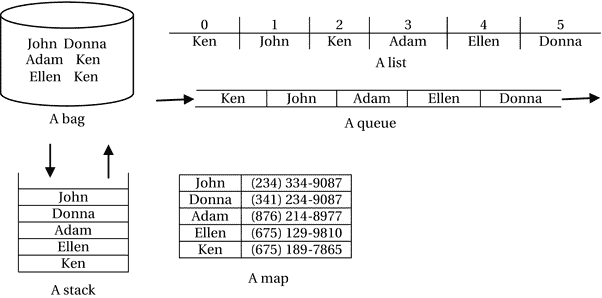

图 12-1.

五种不同类型集合的示意图

图中有一个集合（映射）很突出：它是一个姓名-电话号码对的集合。它将姓名映射到电话号码。此时，这些图片并未与 Java 中任何特定类型的集合类相关联。它们只是帮助你形象地理解 Java 集合与你日常生活中的集合是一样的。某些集合中的箭头表示元素进入和离开集合的方向。你可能会注意到，某些集合强制要求元素必须以特定方式添加到集合中，并且必须以特定方式离开（被移除）集合。例如，在队列中，元素从一端进入，从另一端离开；在栈中，元素从同一端进入和离开。

集合框架的必要性

Java 编程语言从一开始就内置了对数组的支持。使用数组也是存储和检索一组对象引用和原始值最高效的方法之一。既然 Java 中已经有了数组，为什么我们还需要集合框架呢？在 Java 中使用数组具有以下优点：

*   它可以使用索引来存储和检索值，并且速度很快。
*   它知道自己的类型。它提供编译时类型检查，例如，你不能将 `double` 值存储在 `int` 数组中，但如果数组是 `Object` 类型，则没有编译时类型安全性，因为任何类型的对象都可以存储在数组中。
*   你可以拥有对象数组和原始类型数组。
*   有一个名为 `java.util.Arrays` 的辅助类可以帮助你处理数组。例如，它提供了搜索数组、对数组元素进行排序等方法。

在 Java 中使用数组具有以下缺点：

*   数组的大小是固定的。你必须在创建时指定大小。一旦创建，数组大小就不能更改。也就是说，如果你需要，数组不能扩展或收缩。
*   如果你将元素存储在数组的特定位置，之后又想移除它，则无法知道该位置的元素已被移除。
*   编译时类型检查虽然是一个优点，但也成了一个缺点。它不能存储不同类型的值。例如，一个 `Car` 类的数组只能存储 `Car` 类型的对象。一个 `double` 类型的原始数组只能存储 `double` 类型的值。
*   如果你想使用数组实现特定类型的集合，则需要编写大量代码。假设你想要一个不允许重复值的集合。当然，你可以开发一个新类，使用数组来实现你的集合。然而，这是一项耗时的任务。

集合框架提供了数组提供的所有功能。它还提供了许多数组未提供的其他功能。集合框架团队已经经历了设计、开发和测试使用不同类型集合所需的接口和类的痛苦过程。你只需要学习这些类和接口，并在你的 Java 程序中使用它们。在学习集合时，你需要记住以下几点：

*   集合被设计为仅适用于对象。要处理原始类型的集合，你可以将原始值包装和解包到包装器对象中，或者利用 Java 内置的自动装箱功能，该功能会根据需要自动包装和解包原始值。
*   Java 中所有的集合类和接口都是泛型的。也就是说，你可以将集合处理的元素类型指定为类型参数。

集合框架的架构

集合框架的类型主要位于 `java.util` 包中。表示并发集合的类型位于 `java.util.concurrent` 包中。集合框架由三个主要组件组成：

*   接口
*   实现类
*   算法类

接口表示框架中特定类型的集合。每种类型的集合都定义了一个接口；例如，`List<E>` 接口表示列表，`Set<E>` 接口表示集合，`Map<K,V>` 接口表示映射等。使用接口（而不是类）来定义集合具有以下优点：

*   你使用接口编写的代码不依赖于任何特定的实现。
*   实现由接口定义的集合的类可以更改，而无需强制你更改使用接口编写的代码。
*   你可以为集合接口提供自己的实现，以满足特定需求。

集合框架提供了集合接口的实现，这些实现被称为实现类。你需要创建这些类的对象来拥有一个集合。建议使用接口编写代码，而不是使用它们的实现类。以下代码片段展示了如何使用实现类 `ArrayList<E>` 创建一个列表，并将引用存储在类型为 `List`（表示列表的接口）的变量中：

```
// 使用 ArrayList 作为实现类创建一个字符串列表
List names = new ArrayList();
// 从此处开始使用 names 变量
```

注意

所有集合类型中的参数 `E` 代表集合中的元素类型。映射中的类型参数命名为 `K` 和 `V`，分别代表映射中键的类型和值的类型。

有时你需要对集合执行不同的操作，例如搜索集合、将一种类型的集合转换为另一种类型、将元素从一个集合复制到另一个集合、按特定顺序对集合的元素进行排序等。算法类允许你将这些类型的算法应用于你的集合。

通常，你不需要开发这三个类别中的任何接口或类。集合框架为你提供了所需的所有接口和类。你可以从各种集合接口及其实现中进行选择。图 12-2 展示了定义集合的接口。我将在后续章节中详细讨论每种类型的集合。

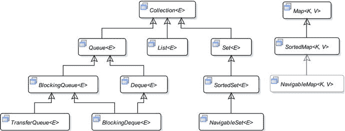

图 12-2.

包含集合框架中大多数接口的类图

Collection<E> 接口


`Collection<E>` 接口是集合接口层次结构的根接口。它定义了一个泛型集合。Collections 框架并未为 `Collection` 接口提供实现。这是最通用的集合类型。你可以将其用作方法中的参数类型，当你不在意参数的具体集合类型（只要它不是 Map）时即可使用。它声明了被其他类型的集合接口所继承的方法。非 Map 的集合接口继承自 `Collection` 接口，并添加了各自的方法，以提供特定于其类型的功能。`Collection` 接口的方法可分为以下几类：

*   基本操作方法
*   批量（或分组）操作方法
*   聚合操作方法
*   数组操作方法
*   比较操作方法

`Collection` 接口中的方法进一步分为可选方法和必需方法。实现类不必为可选方法提供实现。如果某个实现类选择不为可选方法提供实现，那么这些方法必须抛出 `UnsupportedOperationException`。

基本操作方法

基本操作方法允许你对集合执行基本操作，例如获取其大小（元素数量）、添加新元素、移除元素、检查某个对象是否是该集合的元素、检查集合是否为空等。`Collection` 接口中属于此类别的一些方法如下：

*   `int size()`：返回集合中的元素数量。
*   `boolean isEmpty()`：如果集合为空，则返回 `true`。否则返回 `false`。其作用与检查 `size()` 是否为零相同。
*   `boolean contains(Object o)`：如果集合包含指定对象，则返回 `true`。否则返回 `false`。
*   `boolean add(E o)`：向集合添加一个元素。如果集合发生改变，则返回 `true`。否则返回 `false`。如果实现不允许集合中存在重复元素，那么当你用一个已在集合中的元素调用此方法时，它将返回 `false`。如果集合有大小限制且没有空间，该方法会抛出 `IllegalStateException`。
*   `boolean remove(Object o)`：从集合中移除指定对象。如果此调用导致集合发生改变，则返回 `true`。否则返回 `false`。
*   `Iterator<E> iterator()`：返回一个可用于遍历集合中元素的迭代器。

批量操作方法

批量操作方法允许你对集合执行涉及一组对象的操作，例如移除所有元素、检查一个集合是否包含另一个集合的所有元素、将一个集合的所有元素添加到另一个集合等。`Collection` 接口中属于此类别的一些方法如下：

*   `boolean addAll(Collection<? extends E> c)`：将指定集合中的所有元素添加到此集合。如果此调用导致集合发生改变，则返回 `true`。否则返回 `false`。
*   `void clear()`：移除集合中的所有元素。
*   `boolean containsAll(Collection<?> c)`：如果指定集合中的所有元素也都是此集合的元素，则返回 `true`。否则返回 `false`。
*   `boolean removeAll(Collection<?> c)`：移除此集合中所有属于指定集合的元素。如果此调用导致集合发生改变，则返回 `true`。否则返回 `false`。
*   `boolean retainAll(Collection<?> c)`：仅保留那些也属于指定集合的元素。也就是说，它将移除此集合中所有不属于指定集合的元素。如果此调用导致集合发生改变，则返回 `true`。否则返回 `false`。

聚合操作方法

Java 8 通过流（streams）为集合添加了对聚合操作的支持。流是一个元素序列，支持顺序和并行的聚合操作，例如计算元素为整数的集合中所有元素的总和。流是一个庞大的主题，我将在第 13 章讨论。流是 `java.util.stream` 包中 `Stream` 接口的一个实例。你可以使用 `Collection` 接口的以下方法从集合创建 `Stream` 实例：

*   `default Stream<E> stream()`：返回一个顺序 `Stream`，以该集合作为 `Stream` 的元素源。
*   `default Stream<E> parallelStream()`：返回一个可能并行的 `Stream`，以该集合作为 `Stream` 的元素源。

数组操作方法

数组操作方法允许你将集合转换为数组。以下是此类别中的方法：

*   `Object[] toArray()`：以数组形式返回集合中的元素。
*   `<T> T[] toArray(T[] a)`：返回一个包含集合所有元素的指定类型 `T` 的数组。如果指定数组的长度大于或等于集合的大小，则所有元素都会被复制到指定数组中，并返回该数组。数组中的任何额外元素都将被设置为 null。否则，它会创建一个类型为 `T`、长度等于集合大小的新数组，将集合的所有元素复制到新数组中，并返回该新数组。

比较操作方法

比较操作方法允许你比较两个集合是否相等。以下是此类别中的方法：

*   `boolean equals(Object o)`：如果两个集合相等，则返回 `true`。否则返回 `false`。具体的集合类型规定了两个集合相等的标准。
*   `int hashCode()`：返回集合的哈希码。假设 `c1` 和 `c2` 是两个集合的引用。如果 `c1.equals(c2)` 返回 `true`，那么 `c1.hashCode() == c2.hashCode()` 也必须返回 `true`。

快速示例

在讨论不同类型的集合之前，我先给出一个使用列表（一种对象集合）的快速示例。列表是一个有序的对象集合。`List<E>` 接口的实例代表一个列表。`ArrayList<E>` 类是 `List<E>` 接口的一个实现。清单 12-2 中的程序创建了一个用于存储名称的列表，并使用 `Collection` 接口的不同方法操作该列表。

该程序使用 `add()` 方法向列表添加一些名称。它使用 `remove()` 方法从列表中移除一个名称。`clear()` 方法用于移除列表中的所有名称。在每个阶段，程序都会打印列表的大小和列表中的元素。

提示

列表（以及所有类型的集合）的 `toString()` 方法会返回一个用逗号分隔、并用方括号括起来的元素列表。如果集合为空，则返回一对空括号（`[]`）。只要每个元素都有合理的 `toString()` 实现，该字符串对于调试非常有用。


```markdown

```
// NamesList.java
package com.jdojo.collections;
import java.util.ArrayList;
import java.util.List;
public class NamesList {
public static void main(String[] args) {
// 创建一个字符串列表
List names = new ArrayList();
// 打印列表详情
System.out.printf("创建后：大小 = %d，元素 = %s%n",
names.size(), names);
// 向列表添加一些名字
names.add("Ken");
names.add("Lee");
names.add("Joe");
// 打印列表详情
System.out.printf("添加 3 个元素后：大小 = %d，元素 = %s%n",
names.size(), names);
// 从列表中移除 Lee
names.remove("Lee");
// 打印列表详情
System.out.printf("移除 1 个元素后：大小 = %d，元素 = %s%n",
names.size(), names);
// 清除所有元素
names.clear();
// 打印列表详情
System.out.printf("清除所有元素后：大小 = %d，元素 = %s%n",
names.size(), names);
}
}
清单 12-2.
使用列表存储名字
```

```
创建后：大小 = 0，元素 = []
添加 3 个元素后：大小 = 3，元素 = [Ken, Lee, Joe]
移除 1 个元素后：大小 = 2，元素 = [Ken, Joe]
清除所有元素后：大小 = 0，元素 = []
```

遍历集合中的元素

大多数情况下，你需要逐个访问集合中的所有元素。不同类型的集合以不同方式存储其元素。有些集合对元素施加顺序，有些则不然。**集合框架**提供了以下遍历集合的方式：

*   使用 `Iterator`
*   使用 `for-each` 循环
*   使用 `forEach()` 方法

**提示**

某些集合（如列表）会为每个元素分配一个索引，并允许你通过索引访问其元素。你也可以使用常规的 `for` 循环语句来遍历这些集合。

使用迭代器

集合提供一个**迭代器**来遍历其所有元素。有时迭代器也被称为生成器或游标。迭代器允许你对集合执行以下三种操作：

*   检查是否还有尚未被此迭代器访问过的元素。
*   访问集合中的下一个元素。
*   移除集合中最后被访问的元素。

**注意**

集合中“下一个元素”的含义取决于集合类型。迭代器本身不会强加任何顺序来决定它从集合中返回元素的顺序。但是，如果集合对其元素施加了顺序，迭代器将保持相同的顺序。通常，“下一个元素”指的是集合中尚未被此迭代器返回的任何元素。

Java 中的迭代器是 `Iterator<E>` 接口的一个实例。你可以使用 `Collection` 接口的 `iterator()` 方法为集合获取一个迭代器。以下代码片段创建了一个字符串列表，并为其获取了一个迭代器：

```
// 创建一个字符串列表
List names = new ArrayList();
// 为列表获取一个迭代器
Iterator nameIterator = names.iterator();
```

`Iterator<E>` 接口包含以下方法：

*   `boolean hasNext()`
*   `E next()`
*   `default void remove()`
*   `default void forEachRemaining(Consumer<? super E> action)`

`hasNext()` 方法在集合中还有更多元素可供迭代时返回 `true`，否则返回 `false`。通常，在向迭代器请求集合中的下一个元素之前，你会调用此方法。

`next()` 方法返回集合中的下一个元素。在调用 `next()` 方法之前，应始终先调用 `hasNext()` 方法。如果你调用了 `next()` 方法，但迭代器没有更多元素可返回，它会抛出 `NoSuchElementException`。

通常，`hasNext()` 和 `next()` 方法会在循环中一起使用。以下代码片段使用迭代器打印列表的所有元素：

```
List names = /* 获取一个列表 */;
// 为列表获取一个迭代器
Iterator nameIterator = names.iterator();
// 遍历列表中的所有元素
while(nameIterator.hasNext()) {
// 从列表中获取下一个元素
String name = nameIterator.next();
// 打印名字
System.out.println(name);
}
```

`remove()` 方法会移除集合中上一次调用迭代器的 `next()` 方法所返回的元素。每次调用 `next()` 方法后，`remove()` 方法只能被调用一次。如果每次 `next()` 方法调用后多次调用 `remove()` 方法，或者在首次调用 `next()` 方法之前调用，则会抛出 `IllegalStateException`。对 `remove()` 方法的支持是可选的。如果迭代器不支持移除操作，调用其 `remove()` 方法可能会抛出 `UnsupportedOperationException`。

以下代码片段使用迭代器遍历列表的所有元素，如果元素长度仅为两个字符，则使用迭代器的 `remove()` 方法将其移除：

```
List names = /* 获取一个列表 */;
// 为列表获取一个迭代器
Iterator nameIterator = names.iterator();
// 遍历列表中的所有元素
while(nameIterator.hasNext()) {
String name = nameIterator.next();
// 如果名字是两个字符则移除
if (name.length() == 2) {
nameIterator.remove();
}
}
```

`forEachRemaining()` 方法对集合中尚未被迭代器访问的每个元素执行一个操作。该操作被指定为一个 `Consumer`。你可以使用以下代码片段打印列表的所有元素：

```
List names = /* 获取一个列表 */;
// 为列表获取一个迭代器
Iterator nameIterator = names.iterator();
// 打印列表中的名字
nameIterator.forEachRemaining(System.out::println);
```

该代码使用方法引用 `System.out::println` 作为 `forEachRemaining()` 方法的 `Consumer`。请注意，使用 `forEachRemaining()` 方法有助于缩短代码，因为它消除了使用 `hasNext()` 和 `next()` 方法进行循环的需要。有关使用 `Consumer` 接口和方法引用的更多信息，请参阅第 5 章。

清单 12-3 包含一个完整的程序，该程序使用迭代器及其 `forEachRemaining()` 方法将列表的所有元素打印到标准输出。

```
// NameIterator.java
package com.jdojo.collections;
import java.util.ArrayList;
import java.util.List;
public class NameIterator {
public static void main(String[] args) {
// 创建一个字符串列表
List names = new ArrayList();
// 向列表添加一些名字
names.add("Ken");
names.add("Lee");
names.add("Joe");
// 打印 names 列表的所有元素
names.iterator()
.forEachRemaining(System.out::println);
}
}
清单 12-3.
使用迭代器遍历列表元素
```

```
Ken
Lee
Joe
```

**集合框架**支持**快速失败**的并发迭代器。你可以为一个集合获取多个迭代器，并且所有这些迭代器都可以并发地遍历同一个集合。如果在获取迭代器之后，通过任何方式（除了使用同一迭代器的 `remove()` 方法）修改了集合，那么尝试使用该迭代器访问下一个元素将抛出 `ConcurrentModificationException`。这意味着你可以为一个集合拥有多个迭代器；但是，所有迭代器必须都在访问（读取）集合的元素。如果任何迭代器使用其 `remove()` 方法修改了集合，那么修改集合的迭代器将正常工作，而所有其他迭代器将失败。如果在所有迭代器之外修改了集合，则所有迭代器都将失败。

**提示**

```


`Iterator` 是一个一次性对象。你无法重置迭代器，也不能重复使用它来遍历集合中的元素。如果需要再次遍历同一个集合的元素，必须通过调用集合的 `iterator()` 方法来获取一个新的 `Iterator`。

使用 for-each 循环

你可以使用 `for-each` 循环来遍历集合中的元素，该循环隐藏了为集合设置迭代器的逻辑。`for-each` 循环的通用语法如下：

```
Collection yourCollection = /* 获取一个集合 */;
for(T element : yourCollection) {
/* for-each 循环体对 yourCollection 中的每个元素执行一次。
每次执行循环体代码时，element 变量都持有集合中当前元素的引用。
*/
}
```

提示

你可以使用 `for-each` 循环来遍历任何其实现类实现了 `Iterable` 接口的集合。`Collection` 接口继承自 `Iterable` 接口，因此，你可以对实现了 `Collection` 接口的所有类型的集合使用 `for-each` 循环。`Map` 集合类型不继承自 `Iterable` 接口，因此，你不能使用 `for-each` 循环来遍历 `Map` 中的条目。

`for-each` 循环简单且紧凑。在幕后，它会为你的集合获取迭代器，并为你调用 `hasNext()` 和 `next()` 方法。你可以像下面这样遍历字符串列表中的所有元素：

```
List names = /* 获取一个列表 */;
// 使用 for-each 循环打印列表中的所有元素
for(String name : names) {
System.out.println(name);
}
```

清单 12-4 包含了一个完整的程序，演示了如何使用 `for-each` 循环来遍历字符串列表中的元素。该程序简单明了，不言自明。

```
// ForEachLoop.java
package com.jdojo.collections;
import java.util.ArrayList;
import java.util.List;
public class ForEachLoop {
public static void main(String[] args) {
// 创建一个字符串列表
List names = new ArrayList();
// 向列表中添加一些名字
names.add("Ken");
names.add("Lee");
names.add("Joe");
// 打印 names 列表中的所有元素
for(String name : names) {
System.out.println(name);
}
}
}
清单 12-4.
使用 for-each 循环遍历列表中的元素
```

```
Ken
Lee
Joe
```

`for-each` 循环并不能完全替代迭代器的使用。在大多数用例中，`for-each` 循环的紧凑性胜过使用迭代器。然而，`for-each` 循环有几个局限性。

你不能在所有可以使用迭代器的地方都使用 `for-each` 循环。例如，你不能使用 `for-each` 循环从集合中移除元素。以下代码片段会抛出 `ConcurrentModificationException` 异常：

```
List names = 获取一个列表;
for(String name : names) {
// 抛出 ConcurrentModificationException 异常
names.remove(name);
}
```

`for-each` 循环的另一个局限性是，你必须从集合的第一个元素遍历到最后一个元素。它无法从集合的中间开始遍历。`for-each` 循环也无法访问之前已经访问过的元素，而某些集合类型（如列表）的迭代器是允许这样做的。

使用 forEach() 方法

`Iterable<T>` 接口包含一个新的 `forEach(Consumer<? super T> action)` 方法，你可以在所有继承自 `Collection` 接口的集合类型中使用该方法。该方法遍历所有元素并执行指定的操作。它的工作方式与 `Iterator` 接口的 `forEachRemaining(Consumer<? super E> action)` 方法类似，区别在于 `Iterable.forEach()` 方法会遍历所有元素，而 `Iterator.forEachRemaining()` 方法只遍历集合中尚未被 `Iterator` 检索到的元素。

注意

使用 `Iterator` 是遍历集合元素的基本方式（虽然有点繁琐）。它自 Java 编程语言诞生之初就已存在。所有其他方式，例如 `for-each` 循环、`forEach()` 方法和 `forEachRemaining()` 方法，都是 `Iterator` 的语法糖。在内部，它们都使用 `Iterator`。

清单 12-5 演示了如何使用 `forEach()` 方法打印字符串列表中的所有元素。请注意，使用 `forEach()` 方法是遍历集合元素最紧凑的方式。

```
// ForEachMethod.java
package com.jdojo.collections;
import java.util.ArrayList;
import java.util.List;
public class ForEachMethod {
public static void main(String[] args) {
// 创建一个字符串列表
List names = new ArrayList();
// 向列表中添加一些名字
names.add("Ken");
names.add("Lee");
names.add("Joe");
// 打印 names 列表中的所有元素
names.forEach(System.out::println);
}
}
清单 12-5.
使用 Iterable 接口的 forEach() 方法遍历列表中的元素
```

```
Ken
Lee
Joe
```

使用不同类型的集合

在本节中，我将讨论不同类型的集合及其变体，例如集合（Set）、列表（List）、队列（Queue）、映射（Map）等。

使用集合（Set）

集合是一个数学概念，表示一组唯一对象的集合。在数学中，集合中元素的顺序无关紧要。集合框架提供了三种类型的集合：

*   数学集合
*   有序集合
*   可导航集合

以下各节将详细介绍所有类型的集合。

数学集合

`Set<E>` 接口模拟了数学中的集合概念。在数学中，集合是唯一元素的集合。也就是说，集合不能包含重复元素。Java 允许在 `Set` 中最多包含一个 `null` 元素，因为一个 `null` 元素仍然可以与所有其他非 null 元素区分开来，因此它是唯一的。此外，数学集合中元素的顺序并不重要。Java 遵循相同的规则；它不保证 `Set` 中元素的顺序。你可以按一种顺序向 `Set` 中添加元素，但在检索时，它们可能会以不同的顺序返回。唯一能保证的是，在遍历 `Set` 的所有元素时，`Set` 中的每个元素都会出现一次。

集合框架提供了 `HashSet<E>` 类作为 `Set<E>` 接口的实现。以下代码片段创建了一个 `Set<String>` 并向其中添加了三个元素：

```
Set names = new HashSet();
names.add("John");
names.add("Donna");
names.add("Ken");
names.add("Ken"); // 重复！！！无效果
```

请注意，前面代码片段中的最后一条语句再次添加了相同的名字 `Ken`，这没有效果，因为 `Ken` 元素已经存在于 `Set` 中。

通常需要创建并初始化一个包含少量元素的 `Set`。在 Java 9 之前，你无法同时创建和初始化一个 `Set`。请注意，在前面的代码片段中，你必须编写四行代码才能创建一个 `Set` 并向其中添加三个元素。

Java 9 在 `Set` 接口中添加了一个名为 `of()` 的静态工厂方法。该方法已被重载。它可以接受零个到任意数量的元素。`of()` 方法的一个版本接受可变参数。它会创建一个 `Set`，添加所有指定的元素，并返回该 `Set` 的引用。以下语句使用 `Set` 接口的静态 `of()` 方法创建了一个 `Set` 并用三个元素初始化它：

```
// 创建一个包含三个名字的不可变 Set
Set names = Set.of("John", "Donna", "Ken");
```

以下语句创建了一个不可变的空 `Set`：

```
// 创建一个包含三个名字的不可变 Set
Set emptyNames = Set.of();
```

提示


`Set` 接口的静态 `of()` 方法用于创建一个不可变的 `Set`。尝试修改该 `Set` 会抛出 `UnsupportedOperationException`。与 `add()` 方法不同，如果指定了重复元素，`of()` 方法会抛出 `IllegalArgumentException`。与 `add()` 方法不同，如果添加了 `null` 元素，`of()` 方法会抛出 `NullPointerException`。`of()` 方法的实现经过了高度优化，是创建已知元素不可变 `Set` 的首选方式。

清单 12-6 演示了如何创建一个 `Set` 并向其中添加元素。请注意，你可以尝试向 `Set` 添加重复元素，这些元素会被静默忽略。如果使用 `equals()` 方法比较两个元素返回 `true`，则认为它们在 `Set` 中是相等的。你可能会得到包含相同元素但顺序不同的输出。

```
// SetTest.java
package com.jdojo.collections;
import java.util.HashSet;
import java.util.Set;
public class SetTest {
public static void main(String[] args) {
// 创建一个集合
Set s1 = new HashSet();
// 添加几个元素
s1.add("John");
s1.add("Donna");
s1.add("Ken");
s1.add("Ken"); // 重复元素！！！无效果
// 通过复制 s1 创建另一个集合
Set s2 = new HashSet(s1);
// 再添加几个元素
s2.add("Ellen");
s2.add("Sara");
s2.add(null); // 一个 null 没问题
s2.add(null); // 重复元素！！！无效果
// 使用 Set.of() 方法创建一个不可变 Set
Set s3 = Set.of("Corky", "Paul", "Tom");
// 使用 Set.of() 方法创建一个空的不可变 Set
Set s4 = Set.of();
// 打印这些集合
System.out.println("s1: " + s1);
System.out.println("s1.size(): " + s1.size());
System.out.println("s2: " + s2);
System.out.println("s2.size(): " + s2.size());
System.out.println("s3: " + s3);
System.out.println("s3.size(): " + s3.size());
System.out.println("s4: " + s4);
System.out.println("s4.size(): " + s4.size());
}
}
清单 12-6.
使用 Set 接口及其实现类 HashSet
```

```
s1: [Donna, Ken, John]
s1.size(): 3
s2: [null, Ellen, Donna, Ken, John, Sara]
s2.size(): 6
s3: [Paul, Corky, Tom]
s3.size(): 3
s4: []
s4.size(): 0
```

我使用了 `Set` 实例的 `toString()` 方法来打印 `Set` 的元素。在实际应用中，你会使用迭代器、`for-each` 循环或 `Set` 的 `forEach()` 方法，如下所示：

```
// 创建一个 Set 并使用 forEach 方法打印其元素
Set names = Set.of(new String[] {"John", "Donna", "Ken"});
names.forEach(System.out::println);
```

```
Ken
Donna
John
```

Collections 框架提供了 `LinkedHashSet<E>` 类作为 `Set<E>` 接口的另一个实现类。该类在 `HashSet` 实现的基础上增加了一个特性。`HashSet` 实现不保证迭代时元素的顺序。`LinkedHashSet` 实现保证 `Set` 的迭代器会按照元素插入的顺序（插入顺序）返回元素。

我将在下一节讨论 `SortedSet` 时讨论如何维护 `Set` 中元素的顺序。`LinkedHashSet` 类提供了插入顺序，且不会带来任何额外开销。

提示

`Set` 有一个非常有用的应用。当你获得数量未知的对象，并且只需要保留唯一对象时，可以使用它。你可以创建一个 `Set` 并将所有对象添加到其中。它只会保留唯一对象，并忽略重复对象。最终，你的 `Set` 中将只包含唯一对象。

你可以对数学集合执行并集、交集和差集（或减集）操作。你也可以在 Java 中对集合执行相同的操作。为了讨论这些操作，我假设你有两个集合，分别称为 `s1` 和 `s2`。两个集合的并集（数学上写作 `s1` U `s2`）包含两个集合中的所有元素，且没有重复。两个集合的交集（数学上写作 `s1` ∩ `s2`）包含两个集合共有的元素。两个集合 `s1` 和 `s2` 的差集（写作 `s1 – s2`）是一个集合，包含所有在 `s1` 中但不在 `s2` 中的元素。以下是执行这些 `Set` 操作的方法：

```
// s1 和 s2 的并集将存储在 s1 中
s1.add(s2);
// s1 和 s2 的交集将存储在 s1 中
s1.retainAll(s2);
// s1 和 s2 的差集将存储在 s1 中
s1.removeAll(s2);
```

请注意，在执行并集、交集和差集等 `Set` 操作期间，执行操作的集合会被修改。例如，如果你执行 `s1.addAll(s2)` 来计算 `s1` 和 `s2` 的并集，`s1` 会被修改。如果你想计算两个集合的并集并保持原始集合不变，则必须在执行并集操作之前复制原始集合，如下所示：

```
/* 计算两个集合的并集，同时保持原始集合不变 */
// 复制 s1
Set s1Unions2 = new HashSet(s1);
// 现在，s1Unions2 是 s1 和 s2 的并集，并且 s1 和 s2 都保持不变
s1Unions2.addAll(s2);
```

在数学中，你可以测试集合 `s1` 是否是另一个集合 `s2` 的子集。如果集合 `s2` 包含集合 `s1` 中的所有元素，则集合 `s1` 是集合 `s2` 的子集。你可以使用 `s2.containsAll(s1)` 方法来测试 `s1` 是否是 `s2` 的子集。如果 `s1` 是 `s2` 的子集，此方法将返回 `true`。否则，它将返回 `false`。

清单 12-7 演示了如何使用 `Set` 接口执行数学集合操作。

```
// SetOperations.java
package com.jdojo.collections;
import java.util.HashSet;
import java.util.Set;
public class SetOperations {
public static void main(String[] args) {
// 创建一个集合
Set s1 = new HashSet();
s1.add("John");
s1.add("Donna");
s1.add("Ken");
// 创建另一个集合
Set s2 = new HashSet();
s2.add("Ellen");
s2.add("Sara");
s2.add("Donna");
// 打印两个集合的元素
System.out.println("s1: " + s1);
System.out.println("s2: " + s2);
// 执行集合操作
performUnion(s1, s2);
performIntersection(s1, s2);
performDifference(s1, s2);
testForSubset(s1, s2);
}
public static void performUnion(Set s1, Set s2) {
Set s1Unions2 = new HashSet(s1);
s1Unions2.addAll(s2);
System.out.println("s1 union s2: " + s1Unions2);
}
public static void performIntersection(Set s1, Set s2) {
Set s1Intersections2 = new HashSet(s1);
s1Intersections2.retainAll(s2);
System.out.println("s1 intersection s2: " + s1Intersections2);
}
public static void performDifference(Set s1, Set s2) {
Set s1Differences2 = new HashSet(s1);
s1Differences2.removeAll(s2);
Set s2Differences1 = new HashSet(s2);
s2Differences1.removeAll(s1);
System.out.println("s1 difference s2: " + s1Differences2);
System.out.println("s2 difference s1: " + s2Differences1);
}
public static void testForSubset(Set s1, Set s2) {
System.out.println("s2 is subset s1: " + s1.containsAll(s2));
System.out.println("s1 is subset s2: " + s2.containsAll(s1));
}
}
清单 12-7.
使用 Set 接口执行数学集合操作
```

```
s1: [Donna, Ken, John]
s2: [Ellen, Donna, Sara]
s1 union s2: [Ellen, Donna, Ken, John, Sara]
s1 intersection s2: [Donna]
s1 difference s2: [Ken, John]
s2 difference s1: [Ellen, Sara]
s2 is subset s1: false
s1 is subset s2: false
```


在这个例子中，我保留了原始的两个集合 `s1` 和 `s2`，在对其执行某些操作的方法内部未作修改。然而，它们本可以在这些方法中的任何一个内部被修改。如果你不希望方法修改你的集合，那么像本例中那样将集合传递给方法是不明智的。Collections 框架提供了一种方法，可以使用 `java.util.Collections` 类获取集合的不可修改视图。我将在本章后面讨论这个类及其提供的所有其他功能。`Collections.unmodifiableSet(s1)` 方法将返回 `s1` 集合的不可修改版本。尝试修改一个不可修改的集合会导致 `UnsupportedOperationException`。

有序集合

有序集合是一种对其元素施加排序的集合。`SortedSet<E>` 接口的实例代表一个有序集合。`SortedSet<E>` 接口继承自 `Set<E>` 接口。

`SortedSet` 中的元素可以按自然顺序排序，也可以使用 `Comparator` 排序。`SortedSet` 必须知道如何在添加元素时对其进行排序。有序集合依赖以下两点来对其元素进行排序：

*   如果其元素实现了 `Comparable` 接口，它将使用元素的 `compareTo()` 方法对它们进行排序。这称为按自然顺序排序。
*   你可以提供一个 `Comparator` 来使用自定义排序。建议 `SortedSet` 的实现类提供一个接受 `Comparator` 的构造函数，以便使用自定义排序。如果指定了 `Comparator`，则无论元素是否实现 `Comparable` 接口，都将使用该 `Comparator` 进行排序。

如果 `SortedSet` 元素的类没有实现 `Comparable` 接口，并且你没有提供 `Comparator` 对象，会发生什么？答案是，在这种情况下，你无法向 `SortedSet` 添加任何元素。尝试添加元素会导致 `ClassCastException`。

`TreeSet<E>` 类是 Collections 框架中为 `SortedSet` 接口预定义的实现类之一。

`String` 类实现了 `Comparable` 接口。如果你只在 `SortedSet` 中存储字符串，其元素将使用 `String` 类的 `compareTo()` 方法按自然顺序排序。清单 12-8 演示了 `SortedSet` 的使用，它使用自然顺序对其元素进行排序。

```
// SortedSetTest.java
package com.jdojo.collections;
import java.util.SortedSet;
import java.util.TreeSet;
public class SortedSetTest {
public static void main(String[] args) {
// 创建一个包含一些名字的有序集合
SortedSet sortedNames = new TreeSet();
sortedNames.add("John");
sortedNames.add("Adam");
sortedNames.add("Eve");
sortedNames.add("Donna");
// 打印有序的名字集合
System.out.println(sortedNames);
}
}
清单 12-8.
使用按自然顺序对其元素进行排序的 SortedSet
```

```
[Adam, Donna, Eve, John]
```

让我们讨论一个实际例子，其中你想在 `SortedSet` 中存储一个人员列表。清单 12-9 包含一个 `Person` 类的代码。它没有实现 `Comparable` 接口。我在 `SortedSet` 中使用 `Person` 类的对象来演示自定义排序。

```
// Person.java
package com.jdojo.collections;
public class Person {
private int id;
private String name;
public Person(int id, String name) {
this.id = id;
this.name = name;
}
public int getId() {
return id;
}
public void setId(int id) {
this.id = id;
}
public String getName() {
return name;
}
public void setName(String name) {
this.name = name;
}
@Override
public boolean equals(Object o) {
if (!(o instanceof Person)) {
return false;
}
// 两个 Person 对象相等必须 id 相同
Person p = (Person) o;
return this.id == p.getId();
}
@Override
public int hashCode() {
// 一个简单的实现
return this.id;
}
@Override
public String toString() {
return "(" + id + ", " + name + ")";
}
}
清单 12-9.
Person 类
```

除非你也提供一个 `Comparator` 对象，否则你不能将 `Person` 添加到 `SortedSet` 中。以下代码会抛出 `ClassCastException`：

```
Set persons = new TreeSet();
persons.add(new Person(1, "John"));
persons.add(new Person(2, "Donna"));
```

以下代码片段创建了一个人员的 `SortedSet`，使用一个 `Comparator` 按姓名对人员进行排序：

```
SortedSet personsSortedByName = new TreeSet(Comparator.comparing(Person::getName));
```

该代码使用方法引用来创建用于生成 `Comparator` 对象的 lambda 表达式。有关 lambda 表达式和方法引用的更多详细信息，请参阅第 5 章。

如果你向 `personsSortedByName` 有序集合添加两个同名的 `Person` 对象，第二个将被忽略，因为提供的 `Comparator` 通过比较两个 `Person` 对象的姓名来判断相等性。

```
personsSortedByName.add(new Person(1, "John"));
personsSortedByName.add(new Person(2, "Donna"));
personsSortedByName.add(new Person(3, "Donna")); // 重复的 Person。将被忽略。
```

清单 12-10 演示了如何使用 `Comparator` 对象在 `SortedSet` 中应用自定义排序。它对 `Person` 对象使用了两种自定义排序，一种按 `id`，另一种按 `name`。输出显示一个 `SortedSet` 按 `id` 排序，另一个按 `name` 排序。

```
// SortedSetComparatorTest.java
package com.jdojo.collections;
import java.util.Comparator;
import java.util.SortedSet;
import java.util.TreeSet;
public class SortedSetComparatorTest {
public static void main(String[] args) {
// 创建一个按 id 排序的有序集合
SortedSet personsById
= new TreeSet(Comparator.comparing(Person::getId));
// 向集合中添加一些人员
personsById.add(new Person(1, "John"));
personsById.add(new Person(2, "Adam"));
personsById.add(new Person(3, "Eve"));
personsById.add(new Person(4, "Donna"));
personsById.add(new Person(4, "Donna")); // 重复的 Person
// 打印集合
System.out.println("按 id 排序的人员:");
personsById.forEach(System.out::println);
// 创建一个按 name 排序的有序集合
SortedSet personsByName
= new TreeSet(Comparator.comparing(Person::getName));
personsByName.add(new Person(1, "John"));
personsByName.add(new Person(2, "Adam"));
personsByName.add(new Person(3, "Eve"));
personsByName.add(new Person(4, "Donna"));
personsByName.add(new Person(4, "Kip")); // 不是重复的 Person
System.out.println("\n 按 name 排序的人员: ");
personsByName.forEach(System.out::println);
}
}
清单 12-10.
在 SortedSet 中使用自定义排序
```

```
按 id 排序的人员:
(1, John)
(2, Adam)
(3, Eve)
(4, Donna)
按 name 排序的人员:
(2, Adam)
(4, Donna)
(3, Eve)
(1, John)
(4, Kip)
```

假设你有一组字符串，想要去除重复项并按长度升序排序。利用你目前对集合的了解，实现这一目标有多难？以下代码片段展示了如何做到这一点：


```
// 根据名字长度排序
SortedSet names = new TreeSet(Comparator.comparing(String::length));
names.add("Ken");
names.add("Lo");
names.add("Ellen");
names.add("Ken"); // 重复元素，会被忽略
// 打印唯一且排序后的名字
names.forEach(System.out::println);
```

```
Lo
Ken
Ellen
```

`SortedSet`
接口继承了 `Set` 接口的所有方法；它还增加了一些方法，让你能够访问其子集。例如，如果你想获取 `SortedSet` 的一个子集，可以使用它的 `subSet(E fromElement`, `E toElement)` 方法来获取 `fromElement`（包含）和 `toElement`（不包含）之间的元素。清单 12-11 演示了如何使用 `SortedSet` 接口的一些方法来获取其元素的子集。

```
// SortedSetSubset.java
package com.jdojo.collections;
import java.util.SortedSet;
import java.util.TreeSet;
public class SortedSetSubset {
public static void main(String[] args) {
// 创建一个名字的有序集合
SortedSet names = new TreeSet();
names.add("John");
names.add("Adam");
names.add("Eve");
names.add("Donna");
// 打印有序集合
System.out.println("有序集合: " + names);
// 打印有序集合中的第一个和最后一个元素
System.out.println("第一个: " + names.first());
System.out.println("最后一个: " + names.last());
SortedSet ssBeforeDonna = names.headSet("Donna");
System.out.println("Donna 之前的头部子集: " + ssBeforeDonna);
SortedSet ssBetwenDonnaAndJohn = names.subSet("Donna", "John");
System.out.println("Donna 和 John 之间的子集（不包含 John）: "
+ ssBetwenDonnaAndJohn);
// 注意技巧：使用 "John" + "\0" 来包含 "John" 在子集中
SortedSet ssBetwenDonnaAndJohn2 = names.subSet("Donna", "John" + "\0");
System.out.println("Donna 和 John 之间的子集（包含 John）: "
+ ssBetwenDonnaAndJohn2);
SortedSet ssDonnaAndAfter = names.tailSet("Donna");
System.out.println("从 Donna 开始的尾部子集: " + ssDonnaAndAfter);
}
}
清单 12-11.
访问 SortedSet 的子集
```

```
有序集合: [Adam, Donna, Eve, John]
第一个: Adam
最后一个: John
Donna 之前的头部子集: [Adam]
Donna 和 John 之间的子集（不包含 John）: [Donna, Eve]
Donna 和 John 之间的子集（包含 John）: [Donna, Eve, John]
从 Donna 开始的尾部子集: [Donna, Eve, John]
```

`null` 元素是如何存储在 `SortedSet` 中的？如果 `SortedSet` 使用自然顺序（即使用 `Comparable` 接口的 `compareTo()` 方法），添加 `null` 元素会抛出 `NullPointerException`。如果你使用 `Comparator` 来定义排序规则，则由你决定是否允许 `null` 元素出现在 `SortedSet` 中。如果你允许 `null` 元素，你可以决定 `null` 元素是放在有序集合的开头还是结尾。以下代码片段使用一个 `Comparator` 创建了一个 `SortedSet`，该比较器将 `null` 元素放在最前面：

```
// 根据名字长度排序，并将 null 放在最前面
SortedSet names =
new TreeSet(Comparator.nullsFirst(Comparator.comparing(String::length)));
names.add("Ken");
names.add("Lo");
names.add("Ellen");
names.add(null); // 添加一个 null
// 打印名字
names.forEach(System.out::println);
```

```
null
Lo
Ken
Ellen
```

Navigable Set（可导航集合）

可导航集合是一种特殊的有序集合，它允许你以多种方式操作其子集。`NavigableSet<E>` 接口的实例代表一个可导航集合。`NavigableSet` 接口继承自 `SortedSet` 接口，并定义了一些额外的方法来扩展 `SortedSet` 提供的功能。它通过以下方式扩展了 `SortedSet`：

*   它允许你以逆序遍历集合。逆序是指与 `SortedSet` 正常排序顺序相反的顺序。它的 `descendingSet()` 方法返回一个 `NavigableSet`，这是同一个 `NavigableSet` 的逆序视图。如果你修改了原始的 `NavigableSet` 或 `descendingSet()` 方法返回的集合，修改会同时反映在两个集合中。

*   它为 `SortedSet` 中的三个方法 `headSet()`、`tailSet()` 和 `subSet()` 增加了另一个版本，这些版本接受一个 `boolean` 标志，用于决定是否包含子集边界开始或结束处的元素。

`NavigableSet` 接口提供了四个方法——`lower()`、`floor()`、`higher()` 和 `ceiling()`——用于根据搜索条件查找元素。`lower()` 方法返回 `NavigableSet` 中小于指定元素的最大元素。`floor()` 方法与 `lower()` 类似，返回 `NavigableSet` 中小于或等于指定元素的最大元素。`higher()` 方法返回 `NavigableSet` 中大于指定元素的最小元素。`ceiling()` 方法与 `higher()` 类似，返回 `NavigableSet` 中大于或等于指定元素的最小元素。

它还提供了两个方法 `pollFirst()` 和 `pollLast()`，分别用于检索并移除 `NavigableSet` 的第一个和最后一个元素。如果 `NavigableSet` 为空，它们返回 `null`。

`TreeSet<E>` 类是 `NavigableSet<E>` 接口的实现类之一。由于 `NavigableSet` 同时也是 `SortedSet`，而 `SortedSet` 也是 `Set`，因此你可以将 `TreeSet` 的对象用作集合、有序集合和可导航集合。如果你不需要集合中元素的排序，最好使用 `HashSet` 而不是 `TreeSet`。

清单 12-12 演示了如何使用可导航集合。它使用整数作为 `NavigableSet` 的元素，因为当执行 `higher()` 和 `lower()` 等方法时，数字似乎更直观。输出展示了 `NavigableSet` 如何对其元素执行所有操作。


```
// NavigableSetTest.java
package com.jdojo.collections;
import java.util.TreeSet;
import java.util.NavigableSet;
public class NavigableSetTest {
public static void main(String[] args) {
// 创建一个可导航集合，并添加一些整数
NavigableSet ns = new TreeSet();
ns.add(1);
ns.add(2);
ns.add(3);
ns.add(4);
ns.add(5);
// 获取可导航集合的逆序视图
NavigableSet reverseNs = ns.descendingSet();
// 打印正常视图和逆序视图
System.out.println("集合的正常视图: " + ns);
System.out.println("集合的逆序视图: " + reverseNs);
// 获取并打印可导航集合的子集
System.out.println("\n 获取集合的子集");
NavigableSet threeOrMore = ns.tailSet(3, true);
System.out.println("大于等于 3 的元素: " + threeOrMore);
// 在可导航集合中搜索
System.out.println("\n 在集合中搜索");
System.out.println("lower(3): " + ns.lower(3));
System.out.println("floor(3): " + ns.floor(3));
System.out.println("higher(3): " + ns.higher(3));
System.out.println("ceiling(3): " + ns.ceiling(3));
// 从可导航集合中轮询元素
System.out.println("\n 从集合中轮询元素");
// 逐个轮询元素并查看集合
System.out.println("pollFirst(): " + ns.pollFirst());
System.out.println("可导航集合: " + ns);
System.out.println("pollLast(): " + ns.pollLast());
System.out.println("可导航集合: " + ns);
System.out.println("pollFirst(): " + ns.pollFirst());
System.out.println("可导航集合: " + ns);
System.out.println("pollFirst(): " + ns.pollFirst());
System.out.println("可导航集合: " + ns);
System.out.println("pollFirst(): " + ns.pollFirst());
System.out.println("可导航集合: " + ns);
// 由于集合为空，轮询将返回 null
System.out.println("pollFirst(): " + ns.pollFirst());
System.out.println("pollLast(): " + ns.pollLast());
}
}
清单 12-12.
使用 NavigableSet 获取集合的子集
```

```
集合的正常视图: [1, 2, 3, 4, 5]
集合的逆序视图: [5, 4, 3, 2, 1]
获取集合的子集
大于等于 3 的元素: [3, 4, 5]
在集合中搜索
lower(3): 2
floor(3): 3
higher(3): 4
ceiling(3): 3
从集合中轮询元素
pollFirst(): 1
可导航集合: [2, 3, 4, 5]
pollLast(): 5
可导航集合: [2, 3, 4]
pollFirst(): 2
可导航集合: [3, 4]
pollFirst(): 3
可导航集合: [4]
pollFirst(): 4
可导航集合: []
pollFirst(): null
pollLast(): null
```

处理列表

**列表** 是一个有序的对象集合。有时列表也被称为**序列**。`List<E>` 接口的实例在集合框架中代表一个列表。列表可以包含重复元素。你也可以在列表中存储多个 `null` 值。

`List` 接口继承自 `Collection` 接口。它添加了使用索引访问 `List` 元素的方法。它还允许你将元素添加到 `List` 的末尾，或添加到由整数**索引**标识的任意位置。`List` 中元素的索引是从零开始的。也就是说，`List` 的第一个元素索引为 0，第二个元素索引为 1，依此类推。图 12-3 展示了一个包含四个元素及其索引的 `List`。

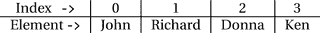

图 12-3.

包含四个元素的列表的**示意图**

与通用集合相比，`List` 提供了以下额外功能：

*   它提供使用**索引**对其元素的访问。你可以使用其 `add(int index, E element)`、`addAll(int index, Collection<? extends E> c)`、`get(int index)`、`remove(int index)` 和 `set(int index, E element)` 方法，通过索引来添加、获取、移除和替换元素。

*   你可以使用 `indexOf(Object o)` 或 `lastIndexOf(Object o)` 方法搜索元素在 `List` 中的位置。`indexOf()` 方法从 `List` 的开头搜索指定对象，并返回该对象首次出现的索引。`lastIndexOf()` 方法从列表末尾开始执行相同操作。如果 `List` 不包含指定对象，则两个方法都返回 -1。

*   它提供了一个名为 `subList(int fromIndex, int toIndex)` 的方法，该方法返回原始列表的一个子列表，范围从索引 `fromIndex`（包含）到索引 `toIndex`（不包含）。该子列表是原始列表的另一个视图。

*   它为其元素提供了一个专门的迭代器，该迭代器是 `ListIterator<E>` 接口的实例。此迭代器允许你同时沿两个方向（向前和向后）遍历其元素。你可以使用 `listIterator()` 方法获取 `List` 的 `ListIterator`。请注意，从 `Collection` 接口的 `iterator()` 方法返回的 `Iterator` 仅返回一个前向迭代器。

以下是 `List` 接口的众多实现类中的两个：

*   `ArrayList<E>`

*   `LinkedList<E>`

`ArrayList` 由数组支持。`LinkedList` 由链表支持。如果你频繁访问（获取和设置）列表元素，`ArrayList` 性能更好。在 `ArrayList` 中访问元素更快，因为元素的索引就是支持数组的索引，而从数组中访问元素总是很快的。从由 `ArrayList` 支持的列表中添加或移除元素（除非在末尾操作）性能较慢，因为 `ArrayList` 必须在内部执行数组复制以保持元素顺序。与 `ArrayList` 相比，`LinkedList` 在列表中间添加和移除元素时性能更好。然而，它在访问列表元素时较慢，除非是在列表头部。

你可以按如下方式创建列表并向其中添加一些元素：

```
// 创建一个字符串列表
List nameList = new ArrayList();
nameList.add("John");    // 在索引 0 处添加 John
nameList.add("Richard"); // 在索引 1 处添加 Richard
```

`List` 接口的 `add(E element)` 方法将元素追加到 `List` 的末尾。`List` 的 `remove(Object o)` 方法从列表开头移除该元素的首次出现。

你还可以使用位置索引向 `List` 添加元素。请注意，用于访问任何元素的索引必须在 0 和 `size` 之间，其中 `size` 是 `List` 的大小。你可以使用 `add(int index, E element)` 方法将指定的 `element` 插入到指定的 `index` 处。例如，`nameList.add(1, "Sara")` 将在索引 1 处插入 `"Sara"`，即 `List` 中的第二个元素。当你使用索引向 `List` 添加元素时，指定索引处的元素以及指定索引右侧的元素会向右移动，并且它们的索引增加 1。假设你有一个如图 12-3 所示的 `List`，并执行以下代码：

```
// 在索引 1 处添加一个元素
nameList.add(1, "Sara");
```

现在 `List` 将如图 12-4 所示。

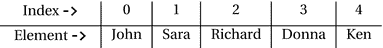

图 12-4.

在列表的索引 1 处添加新元素后得到的列表

提示


`List` 不允许通过使用 `add(int index, E element)` 方法在任意索引处插入元素。如果 `List` 为空，你只能使用 0 作为索引来添加第一个元素。如果 `List` 中有五个元素，则必须使用 0 到 5 之间的索引来向 `List` 添加新元素。索引 0 到 4 会在现有元素之间插入一个元素。索引 5 会将元素追加到 `List` 的末尾。这意味着 `List` 必须按顺序增长。你不能拥有稀疏的 `List`，例如一个包含第一个元素和第十个元素，而第二个到第九个元素为空的 `List`。这就是 `List` 也被称为序列的原因。

Java 9 在 `List` 接口中添加了一个名为 `of()` 的静态工厂方法。该方法已被重载。它可以接受零个到任意数量的元素。`of()` 方法的其中一个版本接受一个可变参数。它会创建一个 `List`，添加所有指定的元素，并返回该 `List` 的引用。以下语句使用 `List` 接口的静态 `of()` 方法来创建一个 `List` 并用三个元素初始化它：

```
// 创建一个包含三个名称的不可变 List
List names = List.of("John", "Donna", "Ken");
```

以下语句创建一个不可变的空 `List`：

```
// 创建一个包含三个名称的不可变 List
List emptyNames = List.of();
```

提示

`List` 接口的静态 `of()` 方法会创建一个不可变的 `List`。尝试修改该 `List` 会抛出 `UnsupportedOperationException`。与 `add()` 方法不同，如果你向 `List` 添加一个 `null` 元素，`of()` 方法会抛出 `NullPointerException`。`of()` 方法的实现经过了高度优化，是创建包含已知元素的不可变 `List` 的首选方式。

清单 12-13 演示了如何使用 `List`。它展示了如何使用索引添加、移除和遍历其元素。

```
// ListTest.java
package com.jdojo.collections;
import java.util.List;
import java.util.ArrayList;
public class ListTest {
public static void main(String[] args) {
// 创建一个 List 并添加几个元素
List list = new ArrayList();
list.add("John");
list.add("Richard");
list.add("Donna");
list.add("Ken");
System.out.println("List: " + list);
int count = list.size();
System.out.println("Size of List: " + count);
// 使用索引打印每个元素
for(int i = 0; i  subList = list.subList(1, 3);
System.out.println("Sub List 1(inclusive) to 3(exclusive): " + subList);
// 从列表中移除 "Donna"
list.remove("Donna"); // 等同于 list.remove(2);
System.out.println("List after removing Donna: " + list);
// 使用静态工厂方法 of() 创建一个 List
List names = List.of("Li", "Xi", "Bo", "Da", "Fa", "Bo");
System.out.println("List using List.of() method: " + names);
}
}
清单 12-13.
使用 ArrayList 作为其实现来使用 List
```

```
List: [John, Richard, Donna, Ken]
Size of List: 4
list[0] = John
list[1] = Richard
list[2] = Donna
list[3] = Ken
Sub List 1(inclusive) to 3(exclusive): [Richard, Donna]
List after removing Donna: [John, Richard, Ken]
List using List.of() method: [Li, Xi, Bo, Da, Fa, Bo]
```

`List` 允许你使用由 `ListIterator` 接口实例表示的特化迭代器来遍历其元素。`ListIterator` 接口继承自 `Iterator` 接口；它添加了几个额外的方法，使你能够从当前位置向后访问列表中的元素。你可以为列表的所有元素或子列表获取一个列表迭代器，如下所示：

```
List list = new ArrayList();
// 在此处填充列表...
// 获取一个完整的列表迭代器
ListIterator fullIterator = list.listIterator();
// 获取一个列表迭代器，它将从索引 5 开始向前迭代。
// 如果你选择这样做，也可以迭代到小于 5 的索引。
ListIterator partialIterator = list.listIterator(5);
```

`ListIterator` 的 `hasPrevious()` 方法在列表迭代器中当前位置之前存在元素时返回 `true`。要获取前一个元素，请使用其 `previous()` 方法。你可以观察到 `hasPrevious()` 和 `previous()` 方法执行相同的工作，但方向与 `hasNext()` 和 `next()` 方法相反。你还可以使用其 `nextIndex()` 和 `previousIndex()` 方法获取当前位置的下一个和上一个元素的索引。`ListIterator` 接口还包含在当前位置插入、替换和移除元素的方法。

提示

`ListIterator` 允许你在 `List` 中向前或向后查看。如果你先使用其 `next()` 方法，然后使用 `previous()` 方法，迭代器会回到相同的位置。调用 `next()` 方法会使其向前移动一个索引，而调用 `previous()` 方法会使其向后移动一个索引。

清单 12-14 演示了如何使用 `ListIterator`。它首先向前方向，然后向后方向遍历 `List` 的元素。你不需要为了向后方向遍历而重新创建 `ListIterator`。

```
// ListIteratorTest.java
package com.jdojo.collections;
import java.util.List;
import java.util.ListIterator;
public class ListIteratorTest {
public static void main(String[] args) {
List list = List.of("John", "Richard", "Donna", "Ken");
System.out.println("List: " + list);
// 获取列表迭代器
ListIterator iterator = list.listIterator();
System.out.println();
System.out.println("List Iterator in the forward direction:");
while (iterator.hasNext()) {
int index = iterator.nextIndex();
String element = iterator.next();
System.out.printf("list[%d] = %s%n", index, element);
}
System.out.println("\nList Iterator in the backward direction:");
// 重用迭代器以从末尾迭代到开头
while (iterator.hasPrevious()) {
int index = iterator.previousIndex();
String element = iterator.previous();
System.out.printf("list[%d] = %s%n", index, element);
}
}
}
清单 12-14.
在列表中向前和向后方向遍历元素
```

```
List: [John, Richard, Donna, Ken]
List Iterator in the forward direction:
list[0] = John
list[1] = Richard
list[2] = Donna
list[3] = Ken
List Iterator in the backward direction:
list[3] = Ken
list[2] = Donna
list[1] = Richard
list[0] = John
```

使用队列

队列是一种基于现实世界队列概念的集合。队列是一个对象集合，对这些对象一次一个地应用某种处理。队列有两个端，称为头部和尾部。在简单队列中，对象被添加到尾部并从头部移除；最先添加的对象将最先被移除。然而，队列可以根据其允许插入和移除元素的方式进行分类。在本节中，我将讨论以下类型的队列：

*   **简单队列** 允许在尾部插入，从头部移除。

*   **优先级队列** 为队列中的每个元素关联一个优先级，并允许从队列中移除具有最高优先级的元素。

*   **延迟队列** 为队列中的每个元素关联一个延迟，并且仅当元素的延迟到期后才允许移除该元素。

*   **双端队列** 允许从头部和尾部插入和移除其元素。

*   **阻塞队列** 在其满时阻塞向其中添加元素的线程，在其空时阻塞从中移除元素的线程。

*   **传输队列** 是一种特殊类型的阻塞队列，其中对象在两个线程（生产者和消费者）之间进行交接。

*   **阻塞双端队列** 是双端队列和阻塞队列的组合。

简单队列


简单队列通过 `Queue<E>` 接口的实例来表示。通常，你将一组对象保存在队列中，以便对它们逐一进行某种处理。例如，邮局柜台前的顾客队伍就是队列的一个实例。你可以根据多种标准对队列进行分类。

一个队列能容纳多少个元素？有时队列中的元素数量是无限的（至少在理论上是这样），有时则具有预定义的容量。当队列长度无限时，称为**无界队列**。当队列长度预定义时，称为**有界队列**。队列的边界定义了当元素被添加到一个已满的有界队列时的行为。尝试向已满队列添加元素可能会抛出异常；可能会静默失败；可能会无限期（或在预定义时间段内）等待队列腾出空间容纳新元素，等等。具体行为取决于队列的类型。

队列中的下一个元素是哪个？队列始终有一个元素的入口点和一个出口点。出口点称为队列的**头部**，入口点称为**尾部**。头部和尾部可能相同。如果队列的头部和尾部相同，则称为后进先出（`LIFO`）队列。`LIFO` 队列也称为栈。队列的头部和尾部可能不同。如果队列遵循先进入队列的元素先离开队列的规则（先到先服务规则），则称为先进先出（`FIFO`）队列。你是否曾有机会在队列中长时间站立，而轮到你时，另一个比你晚到的人却基于优先级在你之前被服务？Java 也有这种队列，称为优先级队列。在优先级队列中，你使用 `Comparator` 定义优先级，或在元素类中实现 `Comparable` 接口，队列中下一个要取出的元素根据队列中元素的优先级决定。

提示

通常，`null` 元素在 `Queue` 中没有意义。毕竟，使用队列的目的是对其元素应用某些处理逻辑，或使用元素执行某些逻辑。无论哪种情况，`null` 值都没有意义。是否允许 `null` 值由 `Queue` 接口的实现决定。不建议在队列中使用 `null` 元素。如果在队列中使用 `null` 元素，你将无法区分从其方法返回的表示特殊情况的 `null` 值和元素的 `null` 值。

队列允许你执行三个基本操作：

*   向尾部添加一个元素
*   从头部移除一个元素
*   查看头部元素

`Queue` 接口为这三个操作中的每一个都定义了两个方法。如果操作无法执行，一个方法会抛出异常；另一个方法则返回一个值（`false` 或 `null`）来表示失败。用于执行特定操作的方法取决于你的需求。`Queue` 接口添加了六个方法以提供 `FIFO` 队列的功能。它们列在表 12-1 中。

表 12-1. Queue<E> 接口声明的其他方法

| 类别 | 方法 | 描述 |
| --- | --- | --- |
| 向队列添加元素 | `boolean add(E e)` | 如果可能，向队列添加一个元素并返回 `true`。否则，抛出 `IllegalStateException`。 |
| | `boolean offer(E e)` | 向队列添加一个元素，如果无法添加则不抛出异常。失败时返回 `false`，成功时返回 `true`。这是在**有界队列**中添加元素的首选方式。 |
| 从队列移除元素 | `E remove()` | 检索并移除队列的头部。如果队列为空，则抛出异常。 |
| | `E poll()` | 执行与 `remove()` 方法相同的工作。但是，如果队列为空，则返回 `null` 而不是抛出异常。 |
| 查看队列头部 | `E element()` | 检索队列的头部但不将其从队列中移除。如果队列为空，则抛出异常。 |
| | `E peek()` | 执行与 `element()` 方法相同的工作。但是，如果队列为空，则返回 `null` 而不是抛出异常。 |

`LinkedList<E>` 和 `PriorityQueue<E>` 是 `Queue<E>` 接口的两个实现类。请注意，`LinkedList` 类也是 `List` 接口的实现类。`LinkedList` 类是一个多用途的集合实现类。本章中我还会多次提到它的名字。

清单 12-15 演示了如何使用 `LinkedList` 作为 `FIFO` 队列。实际上，代表 `FIFO` 队列的是 `Queue` 接口。`LinkedList` 类的实例可以用作 `FIFO` 队列或 `LIFO` 队列。

```
// QueueTest.java
package com.jdojo.collections;
import java.util.Queue;
import java.util.LinkedList;
import java.util.NoSuchElementException;
public class QueueTest {
public static void main(String[] args) {
Queue queue = new LinkedList();
queue.add("John");
// offer() 的工作方式与 add() 相同
queue.offer("Richard");
queue.offer("Donna");
queue.offer("Ken");
System.out.println("Queue: " + queue);
// 让我们移除元素直到队列为空
while (queue.peek() != null) {
System.out.println("Head Element: " + queue.peek());
queue.remove();
System.out.println("Removed one element from Queue");
System.out.println("Queue: " + queue);
}
// 现在队列为空。尝试调用 peek()、
// element()、poll() 和 remove() 方法
System.out.println("queue.isEmpty(): " + queue.isEmpty());
System.out.println("queue.peek(): " + queue.peek());
System.out.println("queue.poll(): " + queue.poll());
try {
String str = queue.element();
System.out.println("queue.element(): " + str);
} catch (NoSuchElementException e) {
System.out.println("queue.element(): Queue is empty.");
}
try {
String str = queue.remove();
System.out.println("queue.remove(): " + str);
} catch (NoSuchElementException e) {
System.out.println("queue.remove(): Queue is empty.");
}
}
}
清单 12-15. 使用 LinkedList 作为实现类来使用 FIFO 队列
```

```
Queue: [John, Richard, Donna, Ken]
Head Element: John
Removed one element from Queue
Queue: [Richard, Donna, Ken]
Head Element: Richard
Removed one element from Queue
Queue: [Donna, Ken]
Head Element: Donna
Removed one element from Queue
Queue: [Ken]
Head Element: Ken
Removed one element from Queue
Queue: []
queue.isEmpty(): true
queue.peek(): null
queue.poll(): null
queue.element(): Queue is empty.
queue.remove(): Queue is empty.
```

如何创建一个 `LIFO` 队列？`Stack<E>` 类的实例代表一个 `LIFO` 队列。`Stack` 类的设计并不恰当。它继承自 `java.util.Vector` 类。你可以使用 `LinkedList` 类轻松地自行实现一个 `LIFO` 队列。我将在下一节讨论 `Deque` 集合接口，你将看到如何将其用作 `LIFO` 队列。你还将开发自己的 `LIFO` 队列。

优先级队列


优先队列是一种每个元素都关联了优先级的队列。优先级最高的元素会最先从队列中移除。Java 提供了 `PriorityQueue<E>` 作为无界优先队列的实现类。你可以使用队列元素的自然顺序作为其优先级。在这种情况下，队列元素必须实现 `Comparable` 接口。你也可以提供一个 `Comparator`，它将决定元素的优先级顺序。当你向优先队列添加新元素时，它会根据其优先级被放置在队列中的相应位置。队列中如何决定优先级由你来实现。

让我们开发一个基于元素自然顺序的优先队列。我们将扩展你的 `Person` 类，使其实现 `Comparable` 接口。你将把这个新类命名为 `ComparablePerson`。`ComparablePerson` 的优先级将根据两个标准来决定：`id` 和 `name`。如果 `id` 越大，其优先级越低。如果两个人的 `id` 相同，则将根据名字的字母顺序来决定优先级。清单 12-16 包含了 `ComparablePerson` 类的代码。

```
// ComparablePerson.java
package com.jdojo.collections;
public class ComparablePerson extends Person implements Comparable {
public ComparablePerson(int id, String name) {
super(id, name);
}
@Override
public int compareTo(ComparablePerson cp) {
int cpId = cp.getId();
String cpName = cp.getName();
if (this.getId()  cpId) {
return 1;
}
if (this.getId() == cpId) {
return this.getName().compareTo(cpName);
}
// 不应执行到这里
return 0;
}
}
清单 12-16.
一个 ComparablePerson 类
```

清单 12-17 演示了如何使用优先队列。

```
// PriorityQueueTest.java
package com.jdojo.collections;
import java.util.Queue;
import java.util.PriorityQueue;
public class PriorityQueueTest {
public static void main(String[] args) {
Queue pq = new PriorityQueue();
pq.add(new ComparablePerson(1, "John"));
pq.add(new ComparablePerson(4, "Ken"));
pq.add(new ComparablePerson(2, "Richard"));
pq.add(new ComparablePerson(3, "Donna"));
pq.add(new ComparablePerson(4, "Adam"));
System.out.println("优先队列: " + pq);
while (pq.peek() != null) {
System.out.println("头部元素: " + pq.peek());
pq.remove();
System.out.println("从队列中移除一个元素");
System.out.println("优先队列: " + pq);
}
}
}
清单 12-17.
使用优先队列
```

```
优先队列: [(1, John), (3, Donna), (2, Richard), (4, Ken), (4, Adam)]
头部元素: (1, John)
从队列中移除一个元素
优先队列: [(2, Richard), (3, Donna), (4, Adam), (4, Ken)]
头部元素: (2, Richard)
从队列中移除一个元素
优先队列: [(3, Donna), (4, Ken), (4, Adam)]
头部元素: (3, Donna)
从队列中移除一个元素
优先队列: [(4, Adam), (4, Ken)]
头部元素: (4, Adam)
从队列中移除一个元素
优先队列: [(4, Ken)]
头部元素: (4, Ken)
从队列中移除一个元素
优先队列: []
```

在输出中你会注意到一个重要现象。当你打印队列时，其元素并非按你预期的方式排序。你可能会期望下一次调用 `peek()` 方法返回的元素位于队列头部。请注意，队列从不用于遍历其元素。相反，它用于从中移除一个元素，处理该元素，然后再移除另一个元素。`PriorityQueue` 类不保证在使用迭代器时元素的任何顺序。它的 `toString()` 方法使用其迭代器来提供元素的字符串表示。这就是为什么当我们打印优先队列时，其元素并未按优先级排序。然而，当我们使用 `peek()` 或 `remove()` 方法时，会基于元素的优先级正确地查看或移除元素。在前面的例子中，使用 `id` 和 `name` 来对元素进行排序。因此，具有最小 `id` 和 `name`（按字母顺序）的元素拥有最高优先级。

在优先队列中使用 `Comparator` 很容易。你需要在创建 `PriorityQueue` 类的对象时指定你的 `Comparator`。清单 12-18 演示了如何使用 `Comparator` 为 `ComparablePerson` 列表创建一个优先队列。它使用 `ComparablePerson` 名字的字母顺序作为判断其优先级的标准。名字在字母顺序中排在前面的那个人拥有更高的优先级。

```
// PriorityQueueComparatorTest.java
package com.jdojo.collections;
import java.util.Queue;
import java.util.PriorityQueue;
import java.util.Comparator;
public class PriorityQueueComparatorTest {
public static void main(String[] args) {
Comparator nameComparator
= Comparator.comparing(ComparablePerson::getName);
// 创建一个带有 Comparator 的优先队列
Queue pq = new PriorityQueue(nameComparator);
pq.add(new ComparablePerson(1, "John"));
pq.add(new ComparablePerson(4, "Ken"));
pq.add(new ComparablePerson(2, "Richard"));
pq.add(new ComparablePerson(3, "Donna"));
pq.add(new ComparablePerson(4, "Adam"));
System.out.println("优先队列: " + pq);
while (pq.peek() != null) {
System.out.println("头部元素: " + pq.peek());
pq.remove();
System.out.println("从队列中移除一个元素");
System.out.println("优先队列: " + pq);
}
}
}
清单 12-18.
在优先队列中使用 Comparator 对象
```

```
优先队列: [(4, Adam), (3, Donna), (2, Richard), (4, Ken), (1, John)]
头部元素: (4, Adam)
从队列中移除一个元素
优先队列: [(3, Donna), (1, John), (2, Richard), (4, Ken)]
头部元素: (3, Donna)
从队列中移除一个元素
优先队列: [(1, John), (4, Ken), (2, Richard)]
头部元素: (1, John)
从队列中移除一个元素
优先队列: [(4, Ken), (2, Richard)]
头部元素: (4, Ken)
从队列中移除一个元素
优先队列: [(2, Richard)]
头部元素: (2, Richard)
从队列中移除一个元素
优先队列: []
```

双端队列

双端队列（deque）是队列的一种扩展版本，允许从两端（头部和尾部）插入和移除元素。`Deque<E>` 接口的实例代表一个双端队列。名称 `Deque` 并不意味着 `Queue` 的反义词。相反，它表示“双端队列”。它的发音是“deck”，而不是“de queue”。


`Deque<E>`接口扩展了`Queue<E>`接口。它声明了额外的方法，以便在队列的头部和尾部执行所有操作。它可以被用作`FIFO`队列或`LIFO`队列。你已经知道什么是`Queue`以及如何使用它。`Deque`只是队列的另一种变体，用于表示不同类型的队列，而不仅仅是`FIFO`队列。在本节中，你只需要学习`Deque`接口提供的新方法。表 12-2 列出了`Deque`接口中声明的新方法，这些方法便于在`Deque`的任一端（头部或尾部）进行插入、移除和查看操作。在方法名中，first 表示头部，last 表示尾部。

表 12-2.

Deque 接口中用于两端插入、移除和查看操作的新方法

| 类别 | 方法 | 描述 |
| --- | --- | --- |
| 向`Deque`添加元素 | `void addFirst(E)`<br>`void addLast(E)`<br>`boolean offerFirst(E)`<br>`boolean offerLast(E)` | `addXxx()`方法在头部或尾部添加一个元素，如果无法添加（例如在已满的有界`Deque`中），则会抛出异常。<br><br>`offerXxx()`方法与`addXxx()`方法的工作方式相同。但是，它们在失败时不会抛出异常。相反，如果无法将指定元素添加到`Deque`，它们会返回`false`。 |
| 从`Deque`移除元素 | `E removeFirst()`<br>`E removeLast()`<br>`E pollFirst()`<br>`E pollLast()` | `removeXxx()`方法从`Deque`的头部或尾部检索并移除元素。如果`Deque`为空，它们会抛出异常。<br><br>`pollXxx()`方法执行与`removeXxx()`方法相同的工作。但是，如果`Deque`为空，它们会返回`null`。 |
| 查看`Deque`两端的元素 | `E getFirst()`<br>`E getLast()`<br>`E peekFirst()`<br>`E peekLast()` | `getXxx()`方法检索但不移除`Deque`头部或尾部的元素。如果`Deque`为空，它们会抛出异常。<br><br>`peekXxx()`方法执行与`getXxx()`方法相同的工作。但是，如果`Deque`为空，它们会返回`null`而不是抛出异常。 |

由于`Deque`继承自`Queue`，因此`Deque`也可以像`FIFO`队列一样工作。表 12-3 比较了`Queue`接口中的方法及其在`Deque`接口中的等效方法。

表 12-3.

Queue 和 Deque 接口的方法比较

| Queue 中的方法 | Deque 中的等效方法 |
| --- | --- |
| `add(e)` | `addLast(e)` |
| `offer(e)` | `offerLast(e)` |
| `remove()` | `removeFirst()` |
| `poll()` | `pollFirst()` |
| `element()` | `getFirst()` |
| `peek()` | `peekFirst()` |

因为在`FIFO`队列中，你总是在尾部（或 Last）添加元素，所以`Queue`接口中的`add()`方法执行的操作与`Deque`接口中的`addLast()`方法相同。

你也可以使用`Deque`作为栈（`LIFO`队列），使用诸如`push()`、`pop()`和`peek()`等熟悉的方法。`push()`方法将一个元素压入（或添加）到栈顶，这与使用`addFirst()`方法相同。`pop()`方法从栈顶弹出（或移除）元素，这与调用`removeFirst()`方法相同。`peek()`方法检索但不移除栈顶的元素；如果栈为空，则返回`null`。调用`peek()`方法与调用`peekFirst()`方法相同。一个栈需要四个方法来执行其操作：`isEmpty()`、`push()`、`pop()`和`peek()`。表 12-4 列出了`Deque`接口中专门用于栈的方法及其替代版本。

表 12-4.

Deque 中专门用于栈的方法

| Deque 中栈专用方法 | Deque 中的等效替代方法 |
| --- | --- |
| `isEmpty()` | 继承自`Collection`接口 |
| `push(E e)` | `addFirst(E e)` |
| `pop()` | `removeFirst()` |
| `peek()` | `peekFirst()` |

回顾到目前为止在`Deque`接口中看到的方法，可以说它是一个庞大的接口。如果程序员不将其方法分解为不同的类别来学习，很容易感到困惑。`Deque`接口包含的方法可分为以下四类：

*   允许你在`Deque`的头部和尾部插入、移除和查看元素的方法，如表 12-2 所列。所有这些方法足以让你将`Deque`用作任何你想要的队列。然而，它还提供了一些名称不同的方法来完成相同的事情。

*   允许你将`Deque`用作`FIFO`队列（或简称为`Queue`）的方法。它们列在表 12-3 中。

*   允许你使用与栈一起使用的熟悉方法名称的方法。请注意，这些方法除了插入、移除和查看之外，并没有执行任何新操作。它们只是名称不同。它们列在表 12-4 中。

*   一些实用方法，可帮助你在特定情况下使用`Deque`。例如，它的`descendingIterator()`方法返回一个`Iterator`，允许你按相反顺序（从尾部到头部）遍历其元素。它还添加了两个方法，分别称为`removeFirstOccurrence(Object o)`和`removeLastOccurrence(Object o)`，允许你分别移除`Deque`中某个对象的第一次出现（从头部向尾部查找）和最后一次出现（从尾部向头部查找）。现在你可以放松了——`Deque`中没有更多的新方法需要学习了。

`ArrayDeque<E>`和`LinkedList<E>`类是`Deque`接口的两个实现类。`ArrayDeque`类由数组支持，而`LinkedList`类由链表支持。如果你将`Deque`用作`LIFO`队列（或栈），则应使用`ArrayDeque`作为`Deque`的实现。如果你将`Deque`用作`FIFO`队列（或简称为`Queue`），则`LinkedList`实现性能更好。

清单 12-19 演示了如何将`Deque`用作`FIFO`队列。如果你将此程序与清单 12-15 中的程序进行比较，在此程序中，你只是使用了`Deque`特有的方法来执行与使用`Queue`接口方法相同的事情。假设一个方法接受一个`Queue`类型的参数。如果你将一个`Deque`传递给该方法，那么在该方法内部，你的`Deque`将被用作`FIFO`队列。


```
// DequeAsQueue.java
package com.jdojo.collections;
import java.util.Deque;
import java.util.LinkedList;
import java.util.NoSuchElementException;
public class DequeAsQueue {
public static void main(String[] args) {
// 创建一个 Deque，并使用 addLast() 或 offerLast() 方法在其尾部添加元素
Deque deque = new LinkedList();
deque.addLast("John");
deque.offerLast("Richard");
deque.offerLast("Donna");
deque.offerLast("Ken");
System.out.println("Deque: " + deque);
// 从 Deque 中移除元素，直到其为空
while (deque.peekFirst() != null) {
System.out.println("头部元素: " + deque.peekFirst());
deque.removeFirst();
System.out.println("已从 Deque 中移除一个元素");
System.out.println("Deque: " + deque);
}
// 现在，Deque 为空。尝试调用其 peekFirst()、getFirst()、pollFirst() 和 removeFirst() 方法
System.out.println("deque.isEmpty(): " + deque.isEmpty());
System.out.println("deque.peekFirst(): " + deque.peekFirst());
System.out.println("deque.pollFirst(): " + deque.pollFirst());
try {
String str = deque.getFirst();
System.out.println("deque.getFirst(): " + str);
} catch (NoSuchElementException e) {
System.out.println("deque.getFirst(): Deque 为空。");
}
try {
String str = deque.removeFirst();
System.out.println("deque.removeFirst(): " + str);
} catch (NoSuchElementException e) {
System.out.println("deque.removeFirst(): Deque 为空。");
}
}
}
清单 12-19.
将 Deque 用作 FIFO 队列
```

```
Deque: [John, Richard, Donna, Ken]
头部元素: John
已从 Deque 中移除一个元素
Deque: [Richard, Donna, Ken]
头部元素: Richard
已从 Deque 中移除一个元素
Deque: [Donna, Ken]
头部元素: Donna
已从 Deque 中移除一个元素
Deque: [Ken]
头部元素: Ken
已从 Deque 中移除一个元素
Deque: []
deque.isEmpty(): true
deque.peekFirst(): null
deque.pollFirst(): null
deque.getFirst(): Deque 为空。
deque.removeFirst(): Deque 为空。
```

清单 12-20
演示了如何将 `Deque` 用作栈（或 `LIFO` 队列）。

```
// DequeAsStack.java
package com.jdojo.collections;
import java.util.ArrayDeque;
import java.util.Deque;
public class DequeAsStack {
public static void main(String[] args) {
// 创建一个 Deque 并将其用作栈
Deque deque = new ArrayDeque();
deque.push("John");
deque.push("Richard");
deque.push("Donna");
deque.push("Ken");
System.out.println("栈: " + deque);
// 从 Deque 中移除所有元素
while (deque.peek() != null) {
System.out.println("顶部元素: " + deque.peek());
System.out.println("弹出: " + deque.pop());
System.out.println("栈: " + deque);
}
System.out.println("栈为空: " + deque.isEmpty());
}
}
清单 12-20.
将 Deque 用作栈
```

```
栈: [Ken, Donna, Richard, John]
顶部元素: Ken
弹出: Ken
栈: [Donna, Richard, John]
顶部元素: Donna
弹出: Donna
栈: [Richard, John]
顶部元素: Richard
弹出: Richard
栈: [John]
顶部元素: John
弹出: John
栈: []
栈为空: true
```

请注意，即使 `Deque` 提供了将其用作栈所需的所有方法，它并没有为程序员提供一种可以真正用作栈的集合类型。如果你在方法中需要一个栈作为其参数，你需要将其声明为 `Deque` 类型，如下所示：

```
public class MyClass {
public void myMethod(Deque stack){
/* 此方法可以自由地将栈参数用作（或误用作）FIFO，
即使它只需要一个 LIFO 队列。
*/
}
}
```

当 `myMethod()` 需要一个栈时，它被传入了一个 `Deque`。如果你信任 `myMethod()`，那没问题。否则，它可以以 `Deque` 接口允许的任何方式访问 `Deque` 的元素。它并不局限于仅用作栈。阻止你的 `Deque` 用户仅将其用作栈的唯一方法是推出你自己的接口和实现类。`Stack` 类可以作为一个栈使用。但是，建议你不要使用 `Stack` 类来处理栈，因为它存在你正试图解决的相同问题。

你可以创建一个名为 `LIFOQueue` 的接口，包含四个方法：`isEmpty()`、`push()`、`pop()` 和 `peek()`。你可以创建一个名为 `ArrayLIFOQueue` 的实现类，它实现了 `LIFOQueue` 接口。你的 `ArrayLIFOQueue` 类将包装一个 `ArrayDeque` 对象。它的所有方法都将委托给 `ArrayDeque`。仅此而已。请注意，通过创建一个新的 `LIFOQueue` 接口及其实现，你正在偏离集合框架。你的新接口和类将位于集合框架之外。但是，如果你确实需要实现自己版本的、可以严格用作栈的数据结构，你可以这样做。

还有另一种从 `Deque` 创建栈的方法。你可以使用 `Collections` 类的 `asLifoQueue()` 静态方法将 `Deque` 转换为 `LIFO 队列`。方法签名如下：

```
public static  Queue asLifoQueue(Deque deque)
```

以下代码片段从 `Deque` 创建了一个栈：

```
Deque deque = /^ 创建一个 Deque */;
// 从 Deque 获取一个 LIFO 队列
Queue stack = Collections.asLifoQueue(deque);
// 现在，你可以传递 stack 引用，该引用只能用作 LIFO 队列
```

阻塞队列

你已经看到了 `Queue` 在两种极端情况下的行为：

*   当你想要向已满的队列添加元素时

*   当你想要从空队列中移除元素时

队列指定了两种类型的方法来处理这两种极端情况下的插入、移除和查看：一种类型的方法抛出异常，而另一种类型的方法返回一个特殊值。

阻塞队列扩展了队列在处理这些极端情况时的行为。它增加了另外两组方法：一组方法无限期阻塞，另一组方法允许你指定阻塞的时间段。

`BlockingQueue<E>` 接口的实例代表一个阻塞队列。`BlockingQueue<E>` 接口继承自 `Queue<E>` 接口。以下是 `BlockingQueue` 接口提供的两个额外特性：

*   它增加了两个方法 `put()` 和 `offer()`，允许你在阻塞队列的尾部添加元素。如果阻塞队列已满，`put()` 方法会无限期阻塞，直到队列中有可用空间。`offer()` 方法允许你指定等待阻塞队列中可用空间的时间段。如果指定的元素成功添加，则返回 `true`；如果在空间可用之前指定的时间段已过，则返回 `false`。

*   它增加了两个方法 `take()` 和 `poll()`，允许你检索并移除阻塞队列的头部元素。如果阻塞队列为空，`take()` 方法会无限期阻塞。`poll()` 方法允许你指定在阻塞队列为空时的等待时间；如果在元素可用之前指定的时间已过，则返回 `null`。

如果你将 `Queue` 接口的方法与 `BlockingQueue` 一起使用，它们的行为将如同你正在使用一个 `Queue`。`BlockingQueue` 被设计为线程安全的。通常它用于生产者/消费者类似的情况，其中一些线程（称为生产者）向其中添加元素，而另一些线程（称为消费者）从中移除元素。


阻塞队列不允许包含 `null` 元素。阻塞队列可以是有界或无界的。它还增加了一个名为 `remainingCapacity()` 的方法，该方法返回在不阻塞的情况下可以添加到阻塞队列中的元素数量。在根据此方法的返回值做决策时需要谨慎。当你调用此方法时，可能还有其他线程同时尝试向阻塞队列添加元素。在这种情况下，当你根据此方法的返回值尝试添加新元素时，即使你知道还有可用空间，你的元素也可能无法被添加。判断元素能否添加到阻塞队列的真正方法是尝试添加一个元素，并检查 `put()` 或 `offer()` 方法的返回值。

还有一点与阻塞队列相关：公平性。公平性用于处理多个线程被阻塞以执行插入或移除操作的情况。如果阻塞队列是公平的，当允许操作继续的条件出现时，它将允许等待时间最长的线程执行该操作。如果阻塞队列是不公平的，则被阻塞线程执行操作的顺序是不确定的。具体实现决定了公平性的可用性。

`BlockingQueue` 接口及其所有实现类都在 `java.util.concurrent` 包中。以下是 `BlockingQueue` 接口的实现类：

*   `ArrayBlockingQueue`：它是 `BlockingQueue` 的一个有界实现类。它由数组支持。它还允许你在其构造函数中指定阻塞队列的公平性。默认情况下，它是不公平的。
*   `LinkedBlockingQueue`：它是 `BlockingQueue` 的另一个实现类。它可以用作有界或无界阻塞队列。它不允许为阻塞队列指定公平性规则。
*   `PriorityBlockingQueue`：它是 `BlockingQueue` 的一个无界实现类。它在对阻塞队列中的元素进行排序时，工作方式与 `PriorityQueue` 相同。它为 `PriorityQueue` 增加了阻塞特性。
*   `SynchronousQueue`：它是 `BlockingQueue` 的一种特殊实现类型。它没有任何容量。`put` 操作会等待 `take` 操作来取走正在放入的元素。它促进了两个线程之间的一种握手。一个线程尝试向阻塞队列放入一个元素，必须等待直到有线程尝试取走该元素。它促进了两个线程之间对象的交换。你也可以为队列指定公平性规则。实际上，这个阻塞队列始终是空的。只有当有两个线程（一个尝试添加元素，一个尝试移除元素）时，它似乎才有一个元素。它的 `isEmpty()` 方法始终返回 `true`。
*   `DelayQueue`：它是 `BlockingQueue` 的另一个无界实现类。它只允许在元素的指定延迟时间过后才能取出该元素。如果阻塞队列中有多个元素的指定延迟时间已过，则延迟最早到期的元素将被置于阻塞队列的头部。

让我们从一个生产者/消费者应用程序的示例开始。清单 12-21 包含生产者的代码。其构造函数接受一个阻塞队列和一个生产者名称。它生成一个字符串，并在等待 1 到 5 秒之间的随机秒数后将其添加到阻塞队列中。如果阻塞队列已满，它将等待直到队列中有可用空间。

```
// BQProducer.java
package com.jdojo.collections;
import java.util.concurrent.BlockingQueue;
import java.util.Random;
public class BQProducer extends Thread {
private final BlockingQueue queue;
private final String name;
private int nextNumber = 1;
private final Random random = new Random();
public BQProducer(BlockingQueue queue, String name) {
this.queue = queue;
this.name = name;
}
@Override
public void run() {
while (true) {
try {
String str = name + "-" + nextNumber;
System.out.println(name + " is trying to add: "
+ str + ". Remaining capacity: "
+ queue.remainingCapacity());
this.queue.put(str);
nextNumber++;
System.out.println(name + " added: " + str);
// Sleep between 1 and 5 seconds
int sleepTime = (random.nextInt(5) + 1) * 1000;
Thread.sleep(sleepTime);
} catch (InterruptedException e) {
e.printStackTrace();
break;
}
}
}
}
清单 12-21.
阻塞队列的生产者类
```

清单 12-22 包含消费者的代码。它执行与生产者相反的操作。它从阻塞队列中移除元素。如果阻塞队列为空，它将无限期等待直到有元素可用。生产者和消费者都在无限循环中运行。

```
// BQConsumer.java
package com.jdojo.collections;
import java.util.concurrent.BlockingQueue;
import java.util.Random;
public class BQConsumer extends Thread {
private final BlockingQueue queue;
private final String name;
private final Random random = new Random();
public BQConsumer(BlockingQueue queue, String name) {
this.queue = queue;
this.name = name;
}
@Override
public void run() {
while (true) {
try {
System.out.println(name + " is trying to take an element. "
+ "Remaining capacity: "
+ queue.remainingCapacity());
String str = this.queue.take();
System.out.println(name + " took: " + str);
// Sleep between 1 and 5 seconds
int sleepTime = (random.nextInt(5) + 1) * 1000;
Thread.sleep(sleepTime);
} catch (InterruptedException e) {
e.printStackTrace();
break;
}
}
}
}
清单 12-22.
阻塞队列的消费者类
```

清单 12-23 创建了一个有界且公平的阻塞队列。它创建了一个生产者和两个消费者。每个生产者和消费者都在单独的线程中创建。显示了部分输出。你需要手动停止应用程序。你可以尝试添加更多生产者或消费者，并调整它们的休眠时间。请注意，输出中打印的消息可能不会以合理的顺序出现；这在多线程程序中是典型的。一个线程执行了一个操作，但在它能够打印表明它已执行该操作的消息之前被抢占。同时，你会看到来自另一个线程的消息。

```
// BQProducerConsumerTest.java
package com.jdojo.collections;
import java.util.concurrent.BlockingQueue;
import java.util.concurrent.ArrayBlockingQueue;
public class BQProducerConsumerTest {
public static void main(String[] args) {
int capacity = 5;
boolean fair = true;
BlockingQueue queue = new ArrayBlockingQueue(capacity, fair);
// Create one producer and two consumer and let them produce
// and consume indefinitely
new BQProducer(queue, "Producer1").start();
new BQConsumer(queue, "Consumer1").start();
new BQConsumer(queue, "Consumer2").start();
}
}
清单 12-23.
运行生产者/消费者程序的类
```

```
Consumer2 is trying to take an element. Remaining capacity: 5
Consumer1 is trying to take an element. Remaining capacity: 5
Producer1 is trying to add: Producer1-1\. Remaining capacity: 5
Consumer2 took: Producer1-1
Producer1 added: Producer1-1
Consumer2 is trying to take an element. Remaining capacity: 5
Producer1 is trying to add: Producer1-2\. Remaining capacity: 5
Producer1 added: Producer1-2
Consumer1 took: Producer1-2
Consumer1 is trying to take an element. Remaining capacity: 5
...
```


我不讨论 `PriorityBlockingQueue` 的示例。你可以使用 `PriorityBlockingQueue` 实现类来创建清单 12-23 中的阻塞队列，同样的示例也能正常工作。请注意，`PriorityBlockingQueue` 是一个无界队列。你可能还想使用不同类型的元素（而非字符串），这样可以更好地模拟元素的优先级。关于简单非阻塞优先级队列的示例，请参考清单 12-17。

延迟队列

让我们来看一个 `DelayQueue` 的示例。`DelayQueue` 是 `BlockingQueue` 接口的实现类之一。它允许你实现一个队列，其中的元素必须在队列中停留一定的时间（称为延迟）。`DelayQueue` 如何知道元素需要在队列中停留多长时间？它使用一个名为 `Delayed` 的接口来了解元素必须在队列中停留的时间。该接口位于 `java.util.concurrent` 包中。其声明如下：

```
public interface Delayed extends Comparable {
long getDelay(TimeUnit timeUnit);
}
```

它扩展了 `Comparable` 接口，该接口的 `compareTo()` 方法接受一个 `Delayed` 对象。`DelayQueue` 会调用每个元素的 `getDelay()` 方法来了解该元素在被取出之前必须在队列中保留多长时间。`DelayQueue` 会向此方法传递一个 `TimeUnit`。你的任务是将元素的延迟时间转换为传入的 `TimeUnit` 并返回该值。例如，如果你希望将元素在队列中保留 10 秒，你的 `getDelay(TimeUnit timeUnit)` 方法将按如下方式实现：

```
public class DelayClass implement Delayed {
public long getDelay(TimeUnit timeUnit){
long delay = timeUnit.convert(10, TimeUnit.SECONDS);
return delay;
}
}
```

只要 `getDelay()` 方法返回的延迟为正数，该元素就会一直留在 `DelayQueue` 中。当 `getDelay()` 方法返回零或负数时，该元素就该离开队列了。然而，当元素准备好离开时，必须有人将其从队列中取出。通常，你会调用 `take()` 方法从队列中取出元素。可能有许多元素已经准备好（其延迟时间已过）离开队列。在这些已过期的元素中，哪一个会被放在队列头部？队列通过调用元素的 `compareTo()` 方法来确定。该方法决定了相对于其他已过期元素，某个已过期元素被移出队列的优先级。通常，你会决定最近过期的元素最先被移出。不过，由你来决定哪个已过期元素下一个准备好被移出。你也可以做出相反的决定，例如最早过期的元素应该最先被移出。

清单 12-24 包含了 `DelayedJob` 类的代码，该类实现了 `Delayed` 接口。其构造函数接受一个作业名称和作业的计划时间作为参数。计划时间可以是过去、现在或未来。它被指定为一个数字，表示指定时间与 UTC 时间 1970 年 1 月 1 日午夜之间经过的毫秒数。其 `getDelay()` 方法返回此作业的延迟时间。其 `compareTo()` 方法使用了 `getDelay()` 方法，以便最早过期的元素最先被移出。其 `toString()` 方法仅打印作业名称和计划时间。

```
// DelayedJob.java
package com.jdojo.collections;
import java.time.Instant;
import java.util.concurrent.Delayed;
import java.util.concurrent.TimeUnit;
import static java.util.concurrent.TimeUnit.MILLISECONDS;
import static java.time.temporal.ChronoUnit.MILLIS;
public class DelayedJob implements Delayed {
private final Instant scheduledTime;
String jobName;
public DelayedJob(String jobName, Instant scheduledTime) {
this.scheduledTime = scheduledTime;
this.jobName = jobName;
}
@Override
public long getDelay(TimeUnit unit) {
// 正延迟表示应留在队列中。零或负延迟
// 表示已准备好从队列中移除。
long delay = MILLIS.between(Instant.now(), scheduledTime);
// 将毫秒延迟转换为指定单位
long returnValue = unit.convert(delay, MILLISECONDS);
return returnValue;
}
@Override
public int compareTo(Delayed job) {
long currentJobDelay = this.getDelay(MILLISECONDS);
long jobDelay = job.getDelay(MILLISECONDS);
int diff = 0;
if (currentJobDelay > jobDelay) {
diff = 1;
} else if (currentJobDelay < jobDelay) {
diff = -1;
}
return diff;
}
@Override
public String toString() {
String str = "(" + this.jobName + ", " + "计划时间: "
+ this.scheduledTime + ")";
return str;
}
}
清单 12-24.
实现 Delayed 接口的 DelayedJob 类
```

清单 12-25 中的程序展示了如何将 `DelayedJob` 对象作为 `DelayQueue` 中的元素使用。它向队列中添加了三个作业（“打印数据”、“填充数据”和“平衡数据”），这些作业分别计划在当前时间之后 9 秒、3 秒和 6 秒运行。请注意这些作业添加到队列中的顺序。我并没有将最先运行的作业作为第一个元素添加。`DelayQueue` 的工作是根据其 `getDelay()` 方法返回的延迟时间来排列队列中的元素。当你运行此程序时，会有大约 3 秒的延迟，因为没有元素过期，队列上的 `take()` 方法将被阻塞。当元素开始过期时，你会看到它们被 `while` 循环中的 `take()` 方法逐个移除。运行程序时，你可能会得到不同的输出。

```
// DelayQueueTest.java
package com.jdojo.collections;
import java.time.Instant;
import java.util.concurrent.BlockingQueue;
import java.util.concurrent.DelayQueue;
public class DelayQueueTest {
public static void main(String[] args) throws InterruptedException {
BlockingQueue queue = new DelayQueue();
Instant now = Instant.now();
// 创建三个延迟作业并将它们添加到队列中
// 作业应按以下顺序运行
// 1. 填充数据（3 秒后）
// 2. 平衡数据（6 秒后）
// 3. 打印数据（9 秒后）
queue.put(new DelayedJob("打印数据", now.plusSeconds(9)));
queue.put(new DelayedJob("填充数据", now.plusSeconds(3)));
queue.put(new DelayedJob("平衡数据", now.plusSeconds(6)));
while (queue.size() > 0) {
System.out.println("等待从队列中取出作业...");
DelayedJob job = queue.take();
System.out.println("取出作业: " + job);
}
System.out.println("所有作业运行完毕。");
}
}
清单 12-25.
使用 DelayQueue 并以 DelayedJob 实例作为其元素
```

```
等待从队列中取出作业...
取出作业: (填充数据, 计划时间: 2017-11-13T03:36:23.197963600Z)
等待从队列中取出作业...
取出作业: (平衡数据, 计划时间: 2017-11-13T03:36:26.197963600Z)
等待从队列中取出作业...
取出作业: (打印数据, 计划时间: 2017-11-13T03:36:29.197963600Z)
所有作业运行完毕。
```

传输队列


传输队列扩展了阻塞队列的功能。`TransferQueue<E>` 接口的实例代表一个传输队列。在 `TransferQueue` 中，生产者会等待将元素移交给消费者。这在消息传递应用中是一个有用的特性，生产者可以确保其消息已被消费者消费。生产者使用 `TransferQueue<E>` 的 `transfer(E element)` 方法将元素移交给消费者。当生产者调用此方法时，它会一直等待，直到消费者取走其元素。如果 `TransferQueue` 中已有一些元素，那么这些元素必须全部被消费后，`transfer()` 方法添加的元素才能被消费。`tryTransfer()` 方法提供了该方法的非阻塞版本和超时版本，如果消费者已经在等待或已等待指定时间，则允许生产者立即移交元素。

`TransferQueue` 还有另外两个方法用于获取关于等待消费者的更多信息。`getWaitingConsumerCount()` 方法返回等待消费者的数量。`hasWaitingConsumer()` 方法在有等待消费者时返回 `true`，否则返回 `false`。

`LinkedTransferQueue<E>` 是 `TransferQueue<E>` 接口的一个实现类。它提供了一个无界的 `TransferQueue`，基于 `FIFO`（先进先出）原则。

清单 12-26 包含了一个 `TQProducer` 类的代码，其实例代表 `TransferQueue` 的生产者。生产者会随机休眠 1 到 5 秒。它生成一个整数。如果该整数是偶数，则将其放入队列。如果该整数是奇数，则尝试使用 `transfer()` 方法将其移交给消费者。请注意，如果 `TransferQueue` 中已有一些元素，消费者会先消费这些元素，然后才会消费生产者尝试使用 `transfer()` 方法移交的元素。

```
// TQProducer.java
package com.jdojo.collections;
import java.util.Random;
import java.util.concurrent.TransferQueue;
import java.util.concurrent.atomic.AtomicInteger;
public class TQProducer extends Thread {
private final String name;
private final TransferQueue tQueue;
private final AtomicInteger sequence;
private Random rand = new Random();
public TQProducer(String name, TransferQueue tQueue, AtomicInteger sequence) {
this.name = name;
this.tQueue = tQueue;
this.sequence = sequence;
}
@Override
public void run() {
while (true) {
try {
// 随机休眠 1 到 5 秒
int sleepTime = rand.nextInt(5) + 1;
Thread.sleep(sleepTime * 1000);
// 生成一个序列号
int nextNum = this.sequence.incrementAndGet();
// 偶数入队，奇数移交给消费者
if (nextNum % 2 == 0) {
System.out.printf("%s: 入队: %d%n", name, nextNum);
tQueue.put(nextNum); // 入队
} else {
System.out.printf("%s: 移交: %d%n", name, nextNum);
System.out.printf("%s: 是否有等待的消费者: %b%n",
name, tQueue.hasWaitingConsumer());
tQueue.transfer(nextNum); // 移交
}
} catch (InterruptedException e) {
e.printStackTrace();
}
}
}
}
清单 12-26.
表示 TransferQueue 生产者的 TQProducer 类
```

清单 12-27 包含了一个消费者的代码，该消费者从 `TransferQueue` 中消费元素。它会随机休眠 1 到 5 秒，然后从 `TransferQueue` 中消费一个元素。

```
// TQConsumer.java
package com.jdojo.collections;
import java.util.Random;
import java.util.concurrent.TransferQueue;
public class TQConsumer extends Thread {
private final String name;
private final TransferQueue tQueue;
private final Random rand = new Random();
public TQConsumer(String name, TransferQueue tQueue) {
this.name = name;
this.tQueue = tQueue;
}
@Override
public void run() {
while (true) {
try {
// 随机休眠 1 到 5 秒
int sleepTime = rand.nextInt(5) + 1;
Thread.sleep(sleepTime * 1000);
int item = tQueue.take();
System.out.printf("%s 移除了: %d%n", name, item);
} catch (InterruptedException e) {
e.printStackTrace();
}
}
}
}
清单 12-27.
表示 TransferQueue 消费者的 TQConsumer 类
```

清单 12-28 包含了一个测试 `TransferQueue` 的代码。运行程序时，你可能会得到不同的输出。

```
// TQProducerConsumerTest.java
package com.jdojo.collections;
import java.util.concurrent.LinkedTransferQueue;
import java.util.concurrent.TransferQueue;
import java.util.concurrent.atomic.AtomicInteger;
public class TQProducerConsumerTest {
public static void main(String[] args) {
final TransferQueue tQueue = new LinkedTransferQueue();
final AtomicInteger sequence = new AtomicInteger();
// 用五个元素初始化传输队列
for (int i = 0; i < 5; i++) {
try {
tQueue.put(sequence.incrementAndGet());
} catch (InterruptedException e) {
e.printStackTrace();
}
}
System.out.println("初始队列: " + tQueue);
// 创建并启动一个生产者和一个消费者
new TQProducer("生产者-1", tQueue, sequence).start();
new TQConsumer("消费者-1", tQueue).start();
}
}
清单 12-28.
测试 TransferQueue 的类
```

```
初始队列: [1, 2, 3, 4, 5]
生产者-1: 入队: 6
消费者-1 移除了: 1
消费者-1 移除了: 2
生产者-1: 移交: 7
生产者-1: 是否有等待的消费者: false
消费者-1 移除了: 3
消费者-1 移除了: 4
消费者-1 移除了: 5
消费者-1 移除了: 6
消费者-1 移除了: 7
生产者-1: 入队: 8
消费者-1 移除了: 8
...
```

程序创建了一个 `TransferQueue` 并向其中添加了五个元素。它创建并启动了一个生产者和一个消费者。其输出需要稍作解释。你最初添加了五个元素，以确保当生产者尝试移交元素时，消费者有元素可以从 `TransferQueue` 中消费。生产者首先执行。它将整数 6 放入队列。消费者从队列中移除了整数 1。此时，生产者尝试将整数 7 移交给消费者，此时 `TransferQueue` 中仍有五个元素（2、3、4、5 和 6）在排队。消费者必须先移除 `TransferQueue` 中的所有这些元素，然后才能接受生产者对整数 7 的移交请求。这一点从输出中可以明显看出。消费者移除了元素 2、3、4、5 和 6，然后移除了元素 7。生产者和消费者都在无限循环中运行。你需要手动停止程序。

阻塞双端队列

阻塞双端队列提供了双端队列和阻塞队列的功能。`BlockingDeque<E>` 接口的实例代表一个阻塞双端队列。它继承自 `Deque<E>` 和 `BlockingQueue<E>` 接口。它增加了八个方法，用于从头部和尾部添加和移除元素。这些方法会无限期阻塞或阻塞指定时间，与 `BlockingQueue` 的情况类似。新增的方法是 `putXxx()`、`offerXxx()`、`takeXxx()` 和 `pollXxx()`，其中 `Xxx` 是 `First` 或 `Last`。后缀为 `First` 的方法用于从 `Deque` 的头部放入或取出元素，而后缀为 `Last` 的方法用于从其尾部放入或取出元素。有关使用这些方法的更多详细信息，请参阅本章前面描述的“双端队列”和“阻塞队列”部分。


`LinkedBlockingDeque<E>` 类是 `BlockingDeque<E>` 接口的一个实现类。它支持有界和无界的阻塞双端队列。

使用 Map

Map 代表一种与你之前见过的集合不同的集合类型。它包含键值映射。你可以很容易地将 Map 想象成一个包含两列的表格。表格的第一列包含键；第二列包含与键关联的值。表 12-5 展示了以人名作为键，其电话号码作为值的例子。你可以将这个表格视为一个包含姓名与电话号码之间映射关系的 Map。有时，Map 也被称为字典。在字典中，你有一个单词，然后查找它的含义。类似地，在 Map 中，你有一个键，然后查找它的值。

表 12-5.

一个包含两列（键和值）的表格。每一行包含一个键值对。

| 键 | 值 |
| --- | --- |
| John | (342)113-9878 |
| Richard | (245)890-9045 |
| Donna | (205)678-9823 |
| Ken | (205)678-9823 |

如果你仍然难以想象 Map 是什么，你可以把它看作一个集合，其中每个元素代表一个键值对，形式为 `<key,value>`。一个 `<key,value>` 对在 Map 中也被称为一个条目。键和值必须是引用类型。你不能在 Map 中对键或值使用基本类型（`int`、`double` 等）。

Map 由 `Map<K,V>` 接口的一个实例表示，其中类型参数 `K` 和 `V` 分别是键和值的类型。`Map` 接口并非继承自 `Collection` 接口。`Map` 不允许有重复的键。每个键恰好映射到一个值。换句话说，`Map` 中的每个键都只有一个值。值不必是唯一的。也就是说，两个键可以映射到同一个值。`Map` 最多允许一个 `null` 值作为其键，并允许多个 `null` 值作为其值。然而，实现类可能会限制 `null` 作为 `Map` 中的值。

`Map` 接口中的方法根据它们执行的操作可以分为以下四类：

*   基本操作方法
*   批量操作方法
*   视图操作方法
*   比较操作方法

基本操作方法类别中的方法允许你对 `Map` 执行基本操作，例如，向 `Map` 中放入一个条目、获取指定键的值、获取条目数量、移除条目、检查 `Map` 是否为空等。此类方法的示例如下：

*   `int size()`
*   `boolean isEmpty()`
*   `boolean containsKey(Object key)`
*   `boolean containsValue(Object value)`
*   `V get(Object key)`
*   `V getOrDefault(Object key, V defaultValue)`
*   `V put(K key, V value)`
*   `V putIfAbsent(K key, V value)`
*   `V remove(Object key)`
*   `boolean remove(Object key, Object value)`
*   `boolean replace(K key, V oldValue, V newValue)`

批量操作方法类别中的方法允许你对 `Map` 执行批量操作，例如，将条目从一个 `Map` 复制到另一个 `Map`，以及从 `Map` 中移除所有条目。此类方法的示例如下：

*   `void clear()`
*   `void putAll(Map<? extends K, ? extends V> m)`
*   `void replaceAll(BiFunction<? super K,? super V,? extends V> function)`

视图操作方法类别包含三个方法。每个方法都返回 `Map` 的一个不同视图。你可以将 `Map<K,V>` 中的所有键视为一个 `Set<K>`，将所有值视为一个 `Collection<V>`，并将所有 `<key,value>` 对视为一个 `Set<Map.Entry<K,V>>`。请注意，在 `Map` 中，所有键和所有 `<key,value>` 对始终是唯一的，这就是为什么你得到的是它们的 `Set` 视图。由于 `Map` 可能包含重复的值，因此你得到的是其值的 `Collection` 视图。此类方法的示例如下：

*   `Set<K> keySet()`
*   `Collection<V> values()`
*   `Set<Map.Entry<K,V>> entrySet()`


比较操作方法用于处理两个`Map`是否相等的比较。
此类方法的示例如下：

*   `boolean equals(Object o)`

*   `int hashCode()`

`HashMap<K,V>`、
`LinkedHashMap<K,V>`、
和`WeakHashMap<K,V>`
是`Map<K,V>`接口的三个可用实现类。

`HashMap`
允许一个`null`值作为键，以及多个`null`值作为
值。以下代码片段演示了如何创建和使用
`Map`。`HashMap`不
保证`Map`中条目的任何特定迭代顺序。

```
// Create a map using HashMap as the implementation class
Map map = new HashMap();
// Put an entry to the map - "John" as the key and "(342)113-9878" as the value
map.put("John", "(342)113-9878");
```

`LinkedHashMap`
是`Map`接口的另一个实现类。它
使用双向链表在`Map`中存储条目。它将迭代顺序定义为条目的插入顺序。
如果你想按照插入顺序迭代`Map`中的条目，你需要使用`LinkedHashMap`而不是
`HashMap`作为实现类。

清单 12-29
演示了如何使用`Map`。请注意，
`remove()`和`get()`方法返回
键的值。如果键在`Map`中不存在，它们返回
`null`。你必须
使用`containsKey()`方法
检查键是否存在于`Map`中，或者使用`getOrDefault()`方法，
该方法允许你在键不存在于映射中时指定默认值。`toString()`方法
为`Map`中的所有条目返回一个格式良好的字符串。它将所有
条目放在大括号（`{}`）内。每个条目都以`key=value`格式
格式化。逗号分隔两个条目。`Map`的`toString()`方法
返回一个类似`{key1=value1, key2=value2, key3=value3 ...}`的字符串。

```
// MapTest.java
package com.jdojo.collections;
import java.util.HashMap;
import java.util.Map;
public class MapTest {
public static void main(String[] args) {
// Create a map and add some key-value pairs
Map map = new HashMap();
map.put("John", "(342)113-9878");
map.put("Richard", "(245)890-9045");
map.put("Donna", "(205)678-9823");
map.put("Ken", "(205)678-9823");
// Print the details
printDetails(map);
// Remove all entries from the map
map.clear();
System.out.printf("%nRemoved all entries from the map.%n%n");
// Print the details
printDetails(map);
}
public static void printDetails(Map map) {
// Get the value for the "Donna" key
String donnaPhone = map.get("Donna");
// Print details
System.out.println("Map: " + map);
System.out.println("Map Size: " + map.size());
System.out.println("Map is empty: " + map.isEmpty());
System.out.println("Map contains Donna key: " + map.containsKey("Donna"));
System.out.println("Donna Phone: " + donnaPhone);
System.out.println("Donna key is removed: " + map.remove("Donna"));
}
}
清单 12-29.
使用 Map
```

```
Map: {Donna=(205)678-9823, Ken=(205)678-9823, John=(342)113-9878, Richard=(245)890-9045}
Map Size: 4
Map is empty: false
Map contains Donna key: true
Donna Phone: (205)678-9823
Donna key is removed: (205)678-9823
Removed all entries from the map.
Map: {}
Map Size: 0
Map is empty: true
Map contains Donna key: false
Donna Phone: null
Donna key is removed: null
```

`WeakHashMap`
类是`Map`接口的另一个实现。正如
类名所示，它包含弱键。当除了映射之外没有对键的引用时，键将成为垃圾回收的候选对象。
如果一个键被垃圾回收，其关联的条目将从`Map`中移除。当你
想要维护一个键值对缓存，并且不介意你的
键值对被垃圾回收器从`Map`中移除时，你可以使用`WeakHashMap`。`WeakHashMap`允许
一个`null`键和
多个`null`
值。有关使用`WeakHashMap`类的完整示例，请参考第 11 章。

有时你想迭代`Map`的键、值或条目。映射的`keySet()`、`values()`和`entrySet()`方法分别返回一个键的`Set`、一个值的`Collection`
和一个条目的`Set`。
迭代`Set`或`Collection`的元素与“遍历集合中的元素”部分中描述的方式相同。
以下代码片段展示了如何打印映射的所有键：

```
Map map = new HashMap();
map.put("John", "(342)113-9878");
map.put("Richard", "(245)890-9045");
map.put("Donna", "(205)678-9823");
map.put("Ken", "(205)678-9823");
// Get the set of keys
Set keys = map.keySet();
// Print all keys using the forEach() method.
// You can also use a for-each loop, an iterator, etc. to do the same.
keys.forEach(System.out::println);
```

```
Donna
Ken
John
Richard
```

映射中的每个键值对
被称为一个条目。一个条目由
`Map.Entry<K,V>`接口的一个实例表示。
`Map.Entry<K,V>`
是`Map<K,V>`接口的一个嵌套静态接口。它有三个常用的方法，分别是`getKey()`、`getValue()`和`setValue()`，它们
分别返回条目的键、返回条目的值以及设置
条目中的新值。对`Map`的条目集进行典型迭代的
写法如下：

```
Map map = new HashMap();
map.put("John", "(342)113-9878");
map.put("Richard", "(245)890-9045");
map.put("Donna", "(205)678-9823");
map.put("Ken", "(205)678-9823");
// Get the entry Set
Set> entries = map.entrySet();
// Print all key-value pairs using the forEach() method of the Collection interface.
// You can use a for-each loop, an iterator, etc. to do the same.
entries.forEach((Map.Entry entry) -> {
String key = entry.getKey();
String value = entry.getValue();
System.out.println("key=" + key + ", value=" + value);
});
```

```
key=Donna, value=(205)678-9823
key=Ken, value=(205)678-9823
key=John, value=(342)113-9878
key=Richard, value=(245)890-9045
```

Java 8 向`Map<K,V>`接口添加了一个`forEach(BiConsumer<? super K,? super V> action)`方法，它允许你以更简洁的方式迭代映射中的所有条目。
该方法接受一个`BiConsumer`实例，
其第一个参数是键，第二个参数是映射中当前条目的值。你可以将前面的代码片段重写
如下：

```
Map map = new HashMap();
map.put("John", "(342)113-9878");
map.put("Richard", "(245)890-9045");
map.put("Donna", "(205)678-9823");
map.put("Ken", "(205)678-9823");
// Use the forEach() method of the Map interface
map.forEach((String key, String value) -> {
System.out.println("key=" + key + ", value=" + value);
});
```

```
key=Donna, value=(205)678-9823
key=Ken, value=(205)678-9823
key=John, value=(342)113-9878
key=Richard, value=(245)890-9045
```

清单 12-30
演示了如何获取`Map`的三种不同视图并迭代
这些视图中的元素。


```
// MapViews.java
package com.jdojo.collections;
import java.util.HashMap;
import java.util.Map;
import java.util.Set;
import java.util.Collection;
public class MapViews {
public static void main(String[] args) {
Map map = new HashMap();
map.put("John", "(342)113-9878");
map.put("Richard", "(245)890-9045");
map.put("Donna", "(205)678-9823");
map.put("Ken", "(205)678-9823");
System.out.println("Map: " + map.toString());
// 打印映射中的键、值和条目
listKeys(map);
listValues(map);
listEntries(map);
}
public static void listKeys(Map map) {
System.out.println("Key Set:");
Set keys = map.keySet();
keys.forEach(System.out::println);
System.out.println();
}
public static void listValues(Map map) {
System.out.println("Values Collection:");
Collection values = map.values();
values.forEach(System.out::println);
System.out.println();
}
public static void listEntries(Map map) {
System.out.println("Entry Set:");
// 获取条目 Set
Set> entries = map.entrySet();
entries.forEach((Map.Entry entry) -> {
String key = entry.getKey();
String value = entry.getValue();
System.out.println("key=" + key + ", value=" + value);
});
}
}
清单 12-30.
使用映射的键、值和条目视图
```

```
Map: {Donna=(205)678-9823, Ken=(205)678-9823, John=(342)113-9878, Richard=(245)890-9045}
Key Set:
Donna
Ken
John
Richard
Values Collection:
(205)678-9823
(205)678-9823
(342)113-9878
(245)890-9045
Entry Set:
key=Donna, value=(205)678-9823
key=Ken, value=(205)678-9823
key=John, value=(342)113-9878
key=Richard, value=(245)890-9045
```

Java 9 为 `Map<K,V>` 接口添加了一个重载的 `of()` 静态工厂方法，提供了一种简单紧凑的方式来创建不可变映射。这些方法的实现针对性能进行了微调。以下是 `of()` 方法的 11 个版本，允许你创建包含零到十个键值条目的不可变 `Map`：

*   `static <K,V> Map<K,V> of()`

*   `static <K,V> Map<K,V> of(K k1, V v1)`

*   `static <K,V> Map<K,V> of(K k1, V v1, K k2, V v2)`

*   `static <K,V> Map<K,V> of(K k1, V v1, K k2, V v2, K k3, V v3)`

*   `static <K,V> Map<K,V> of(K k1, V v1, K k2, V v2, K k3, V v3, K k4, V v4)`

*   `static <K,V> Map<K,V> of(K k1, V v1, K k2, V v2, K k3, V v3, K k4, V v4, K k5, V v5)`

*   `static <K,V> Map<K,V> of(K k1, V v1, K k2, V v2, K k3, V v3, K k4, V v4, K k5, V v5, K k6, V v6)`

*   `static <K,V> Map<K,V> of(K k1, V v1, K k2, V v2, K k3, V v3, K k4, V v4, K k5, V v5, K k6, V v6, K k7, V v7)`

*   `static <K,V> Map<K,V> of(K k1, V v1, K k2, V v2, K k3, V v3, K k4, V v4, K k5, V v5, K k6, V v6, K k7, V v7, K k8, V v8)`

*   `static <K,V> Map<K,V> of(K k1, V v1, K k2, V v2, K k3, V v3, K k4, V v4, K k5, V v5, K k6, V v6, K k7, V v7, K k8, V v8, K k9, V v9)`

*   `static <K,V> Map<K,V> of(K k1, V v1, K k2, V v2, K k3, V v3, K k4, V v4, K k5, V v5, K k6, V v6, K k7, V v7, K k8, V v8, K k9, V v9, K k10, V v10)`

注意 `of()` 方法中参数的位置。第一个和第二个参数分别是映射中第一个键值条目的键和值；第三个和第四个参数分别是映射中第二个键值条目的键和值，以此类推。以下代码片段展示了如何使用 `of()` 方法创建映射：

```
// 一个空的、不可变的 Map
Map emptyMap = Map.of();
// 一个单例的、不可修改的 Map
Map singletonMap = Map.of("Ken", "(205)678-9823");
// 一个包含两个条目的不可变 Map
Map luckyNumbers = Map.of(1, "One", 2, "Two");
```

为了创建具有任意数量条目的不可变 `Map`，Java 9 在 `Map` 接口中提供了一个名为 `ofEntries()` 的静态方法，其签名如下：

```
Map ofEntries(Map.Entry... entries)
```

要使用 `ofEntries()` 方法，你需要将每个映射条目包装在 `Map.Entry` 实例中。Java 9 在 `Map` 接口中提供了一个便捷的 `entry()` 静态方法来创建 `Map.Entry` 实例。`entry()` 方法的签名是：

```
Map.Entry entry(K k, V v)
```

为了使表达式可读且紧凑，你需要对 `Map.entry` 方法进行静态导入，并使用类似下面的语句来创建具有任意数量条目的不可变 `Map`：

```
import java.util.Map;
import static java.util.Map.entry;
// ...
// 使用 Map.ofEntries() 和 Map.entry() 方法创建不可变 Map
Map numberToWord = Map.ofEntries(entry(1, "One"),
entry(2, "Two"),
entry(3, "Three"));
```

从 `Map` 接口的 `of()` 和 `ofEntries()` 方法返回的映射不允许键或值为 `null`。如果映射中的键或值为 `null`，则会抛出 `NullPointerException`。如果所有键和值都是可序列化的，则这些映射是可序列化的。它们的实现类经过优化，并且不保证返回的 `Map` 的实现类。也就是说，你不应对这些方法返回的映射的实现类做任何假设。

清单 12-31 包含一个完整的程序，展示了如何使用 `Map` 接口的新 `of()`、`ofEntries()` 和 `entry()` 静态方法来创建不可变映射。对于映射，你可能会得到不同的输出，这些输出将包含相同元素但顺序不同。

```
// MapFactoryMethodTest.java
package com.jdojo.collections;
import java.util.Map;
import static java.util.Map.entry;
public class MapFactoryMethodTest {
public static void main(String[] args) {
// 创建几个不可修改的映射
Map emptyMap = Map.of();
Map luckyNumber = Map.of(19, "Nineteen");
Map numberToWord = Map.of(1, "One", 2, "Two", 3, "Three");
Map days = Map.ofEntries(
entry("Mon", "Monday"),
entry("Tue", "Tuesday"),
entry("Wed", "Wednesday"),
entry("Thu", "Thursday"),
entry("Fri", "Friday"),
entry("Sat", "Saturday"),
entry("Sun", "Sunday"));
System.out.println("emptyMap = " + emptyMap);
System.out.println("singletonMap = " + luckyNumber);
System.out.println("numberToWord = " + numberToWord);
System.out.println("days = " + days);
try {
// 尝试使用 null 值
Map map = Map.of(1, null);
} catch (NullPointerException e) {
System.out.println("Map.of() 中不允许使用 null。");
}
try {
// 尝试使用重复键
Map map = Map.of(1, "One", 1, "OneAgain");
} catch (IllegalArgumentException e) {
System.out.println(e.getMessage());
}
}
}
清单 12-31.
使用 Map 接口的 of()、ofEntries() 和 entry() 静态方法
```

```
emptyMap = {}
singletonMap = {19=Nineteen}
numberToWord = {1=One, 3=Three, 2=Two}
days = {Tue=Tuesday, Wed=Wednesday, Mon=Monday, Sun=Sunday, Sat=Saturday, Thu=Thursday, Fri=Friday}
Map.of() 中不允许使用 null。
duplicate key: 1
```

排序映射

排序映射以有序方式存储映射中的条目。它根据自然排序顺序或自定义排序顺序对键上的映射条目进行排序。自然排序顺序由键的 `Comparable` 接口定义。如果键未实现 `Comparable` 接口，则必须使用 `Comparator` 对条目进行排序。如果键实现了 `Comparable` 接口并且你使用了 `Comparator`，则使用 `Comparator` 对键进行排序。

`SortedMap<K,V>` 接口的实例表示一个排序映射。`SortedMap<K,V>` 接口继承自 `Map<K,V>` 接口。`SortedMap` 之于 `Map`，就如同 `SortedSet` 之于 `Set`。

`SortedMap` 接口包含一些方法，让你能够利用映射中已排序的键。它提供了获取第一个和最后一个键、或基于条件获取子映射等方法。这些方法如下：

*   `Comparator<? super K> comparator()`：返回用于对 `SortedMap` 中的键进行自定义排序的 `Comparator`。如果你没有使用 `Comparator`，则返回 `null`，并将根据键的 Comparable 接口的实现使用自然排序。


*   `K firstKey()`:
    返回 `SortedMap` 中第一个条目的键。如果 `SortedMap` 为空，则抛出 `NoSuchElementException` 异常。

*   `SortedMap<K, V> headMap(K toKey)`: 返回 `SortedMap` 的一个视图，该视图中的条目的键都小于指定的 `toKey`。如果你向该视图中添加新条目，其键必须小于指定的 `toKey`，否则将抛出异常。该视图由原始的 `SortedMap` 支持。

*   `K lastKey()`: 返回 `SortedMap` 中最后一个条目的键。如果 `SortedMap` 为空，则抛出 `NoSuchElementException` 异常。

*   `SortedMap<K, V> subMap(K fromKey, K toKey)`: 返回 `SortedMap` 的一个视图，该视图中的条目的键范围从指定的 `fromKey`（包含）到 `toKey`（不包含）。原始的 `SortedMap` 支持该 `SortedMap` 的部分视图。对任一映射所做的任何更改都会反映在两者中。你可以向子映射中添加新条目，但其键必须落在 `fromKey`（包含）到 `toKey`（不包含）的范围内。

*   `SortedMap<K, V> tailMap(K fromKey)`: 返回 `SortedMap` 的一个视图，该视图中的条目的键都大于或等于指定的 `fromKey`。如果你向该视图中添加新条目，其键必须大于或等于指定的 `fromKey`，否则将抛出异常。原始的 `SortedMap` 支持该尾部视图。

`TreeMap<K,V>` 类是 `SortedMap<K.V>` 接口的实现类。对于基本操作，你使用 `SortedMap` 的方式与使用 `Map` 相同。清单 12-32 演示了如何使用 `SortedMap`。

```
// SortedMapTest.java
package com.jdojo.collections;
import java.util.SortedMap;
import java.util.TreeMap;
public class SortedMapTest {
public static void main(String[] args) {
SortedMap sMap = new TreeMap();
sMap.put("John", "(342)113-9878");
sMap.put("Richard", "(245)890-9045");
sMap.put("Donna", "(205)678-9823");
sMap.put("Ken", "(205)678-9823");
System.out.println("Sorted Map: " + sMap);
// Get a sub map from Donna (inclusive) to Ken(exclusive)
SortedMap subMap = sMap.subMap("Donna", "Ken");
System.out.println("Sorted Submap from Donna to Ken(exclusive): " + subMap);
// Get the first and last keys
String firstKey = sMap.firstKey();
String lastKey = sMap.lastKey();
System.out.println("First Key: " + firstKey);
System.out.println("Last key: " + lastKey);
}
}
Listing 12-32.
Using a SortedMap
```

```
Sorted Map: {Donna=(205)678-9823, John=(342)113-9878, Ken=(205)678-9823, Richard=(245)890-9045}
Sorted Submap from Donna to Ken(exclusive): {Donna=(205)678-9823, John=(342)113-9878}
First Key: Donna
Last key: Richard
```

如果你想使用 `Comparator` 根据键对 `SortedMap` 中的条目进行排序，你需要使用接受 `Comparator` 作为参数的 `TreeMap` 类的构造函数。以下代码片段展示了如何根据键的长度以及键的字母顺序（忽略大小写）对排序映射中的条目进行排序：

```
// Sort entries on key's length and then on keys ignoring case
Comparator keyComparator =
Comparator.comparing(String::length)
.thenComparing(String::compareToIgnoreCase);
SortedMap sMap = new TreeMap(keyComparator);
sMap.put("John", "(342)113-9878");
sMap.put("Richard", "(245)890-9045");
sMap.put("Donna", "(205)678-9823");
sMap.put("Ken", "(205)678-9823");
sMap.put("Zee", "(205)679-9823");
System.out.println("Sorted Map: " + sMap);
```

```
Sorted Map: {Ken=(205)678-9823, Zee=(205)679-9823, John=(342)113-9878, Donna=(205)678-9823, Richard=(245)890-9045}
```

有关使用 `Comparator` 对键进行排序的更多详细信息，请参考“Sorted Set”部分。`SortedMap` 中的 `Comparator` 对键的作用方式与 `SortedSet` 中对元素的作用方式相同。

可导航映射

可导航映射由 `NavigableMap<K,V>` 接口的实例表示。它通过添加一些有用的特性（例如获取键的最接近匹配项、以相反顺序获取映射视图等）来扩展 `SortedMap<K,V>` 接口。它还添加了一些与 `SortedMap` 添加的方法类似的方法，但它们返回一个条目（`Map.Entry` 对象）而不仅仅是键。`TreeMap<K,V>` 类是 `NavigableMap<K,V>` 接口的实现类。

在本段提到的 `NavigableMap` 接口的方法名称中，将 `Xxx` 替换为 `Entry` 或 `Key`。`lowerXxx(K key)` 方法返回小于指定 `key` 的最大条目或键。`floorXxx(K key)` 方法返回小于或等于指定 `key` 的最大条目或键。`higherXxx(K key)` 方法返回大于指定 `key` 的最小条目或键。`ceilingXxx(K key)` 方法返回大于或等于指定 `key` 的最小条目或键。

`NavigableMap` 包含两个方法，分别称为 `firstEntry()` 和 `lastEntry()`，它们以 `Map.Entry` 对象的形式返回第一个和最后一个条目；如果映射为空，则返回 `null`。它包含使用 `pollFirstEntry()` 和 `pollLastEntry()` 方法从映射中检索并移除第一个和最后一个条目的方法。它添加了 `SortedMap` 中声明的 `headMap()`、`tailMap()` 和 `subMap()` 方法的其他版本，这些版本接受一个 `boolean` 标志，用于指示是否要在这些方法返回的子映射中包含极值。最后，它添加了 `descendingKeySet()` 和 `descendingMap()` 方法，这些方法以相反的顺序提供键的视图和映射本身的视图。清单 12-33 展示了如何使用 `NavigableMap`。

```
// NavigableMapTest.java
package com.jdojo.collections;
import java.util.TreeMap;
import java.util.NavigableMap;
import java.util.Map.Entry;
public class NavigableMapTest {
public static void main(String[] args) {
// Create a sorted map sorted on string keys alphabetically
NavigableMap nMap = new TreeMap();
nMap.put("John", "(342)113-9878");
nMap.put("Richard", "(245)890-9045");
nMap.put("Donna", "(205)678-9823");
nMap.put("Ken", "(205)678-9823");
System.out.println("Navigable Map:" + nMap);
// Get the closest lower and higher matches for Ken
Entry lowerKen = nMap.lowerEntry("Ken");
Entry floorKen = nMap.floorEntry("Ken");
Entry higherKen = nMap.higherEntry("Ken");
Entry ceilingKen = nMap.ceilingEntry("Ken");
System.out.println("Lower Ken: " + lowerKen);
System.out.println("Floor Ken: " + floorKen);
System.out.println("Higher Ken: " + higherKen);
System.out.println("Ceiling Ken: " + ceilingKen);
// Get the reverse order view of the map
NavigableMap reverseMap = nMap.descendingMap();
System.out.println("Navigable Map(Reverse Order):" + reverseMap);
}
}
Listing 12-33.
Using a NavigableMap
```

```
Navigable Map:{Donna=(205)678-9823, John=(342)113-9878, Ken=(205)678-9823, Richard=(245)890-9045}
Lower Ken: John=(342)113-9878
Floor Ken: Ken=(205)678-9823
Higher Ken: Richard=(245)890-9045
Ceiling Ken: Ken=(205)678-9823
Navigable Map(Reverse Order):{Richard=(245)890-9045, Ken=(205)678-9823, John=(342)113-9878, Donna=(205)678-9823}
```

并发映射

有时，当映射被多个线程并发使用时，你需要原子性地对映射执行多个操作。例如，你可能只想在键尚未存在于映射中时，才向映射中添加一个新的键值对。你的代码可能如下所示：

```
Map map = ...;
String key = ...;
String value = ...;
// Need to lock the entire map
synchronized(map) {
if (map.containsKey(key)) {
// Key is already in the map
} else {
map.put(key, value); // Add the new key-value
}
}
```


在这段代码中，为了在键不存在于映射中时插入新的键值对，你不得不锁定整个映射。锁定映射是必要的，因为你需要原子性地执行两个操作：检查键是否存在，以及如果检查失败则插入键值对。当一个线程对映射执行这两个操作时，其他线程无法锁定该映射执行任何其他操作。`ConcurrentMap` 让你能够执行并发操作，就像我讨论的那样，而无需诉诸于锁定映射。

你可以在使用其实现类创建并发映射时选择并发级别。并发级别被指定为预计会对映射执行写操作的线程数量。映射会尝试同时调整这么多线程。`ConcurrentMap` 不会锁定整个映射。即使它锁定了整个映射，其他线程仍然能够对其执行读写操作，因为它使用了一种基于比较并交换原语的细粒度同步机制。

`ConcurrentHashMap<K,V>` 类是 `ConcurrentMap<K,V>` 接口的一个实现类。它们都在 `java.util.concurrent` 包中。

清单 12-34 演示了 `ConcurrentMap` 的使用。该示例仅展示了如何创建和使用 `ConcurrentMap` 的一些方法。通常，你应该在多线程环境中使用 `ConcurrentMap`。该程序并未使用多个线程来访问映射。它仅演示了 `ConcurrentMap` 接口的一些方法的使用。

```
// ConcurrentMapTest.java
package com.jdojo.collections;
import java.util.concurrent.ConcurrentHashMap;
import java.util.concurrent.ConcurrentMap;
public class ConcurrentMapTest {
public static void main(String[] args) {
ConcurrentMap cMap = new ConcurrentHashMap();
cMap.put("one", "one");
System.out.println("Concurrent Map: " + cMap);
System.out.println(cMap.putIfAbsent("one", "nine"));
System.out.println(cMap.putIfAbsent("two", "two"));
System.out.println(cMap.remove("one", "two"));
System.out.println(cMap.replace("one", "two"));
System.out.println("Concurrent Map: " + cMap);
}
}
清单 12-34.
使用 ConcurrentMap
```

```
Concurrent Map: {one=one}
one
null
false
one
Concurrent Map: {one=two, two=two}
```

并发与可导航映射

一个并发可导航映射是映射的并发且可导航的版本。`ConcurrentNavigableMap<K,V>` 接口的实例代表一个并发且可导航的映射。该接口继承自 `ConcurrentMap<K,V>` 和 `NavigableMap<K,V>` 接口。`ConcurrentSkipListMap<K,V>` 是 `ConcurrentNavigableMap<K,V>` 接口的实现类。我已经讨论过并发映射和可导航映射。关于使用 `ConcurrentNavigableMap`，请参考这两种映射的示例。

对集合应用算法

集合框架允许你对集合的全部或部分元素应用多种类型的算法。它允许你搜索集合中的某个值；对集合元素进行排序和打乱；获取集合的只读视图等。好消息是，所有这些功能都集中在一个名为 `Collections` 的类中。请注意，我们有一个名称相似的接口叫做 `Collection`，它是集合框架中定义的大多数集合接口的祖先。`Collections` 类由所有静态方法组成。如果你想对集合应用任何算法，在编写自己的逻辑之前，需要查看此类中的方法列表。我将在后续章节中讨论 `Collections` 类中的许多方法。

对列表排序

你可以使用 `Collections` 类中的以下两个静态方法之一对 `List` 的元素进行排序：

*   `<T extends Comparable<? super T>> void sort(List<T> list)`：它按照 `List` 中元素实现的 `Comparable` 接口定义的自然顺序对 `List` 中的元素进行排序。`List` 中的每个元素都必须实现 `Comparable` 接口，并且它们必须彼此可比较。

*   `<T> void sort(List<T> list, Comparator<? super T> c)`：它允许你传入一个 `Comparator` 来定义元素的自定义顺序。

提示

Java 8 在 `List<E>` 接口中添加了一个名为 `sort(Comparator<? super E> c)` 的默认方法。它允许你在不使用 `Collections` 类的情况下对 `List` 进行排序。

以下代码片段演示了如何对 `List` 进行排序：

```
import java.util.ArrayList;
import java.util.Collections;
import java.util.List;
...
List list = new ArrayList();
list.add("John");
list.add("Richard");
list.add("Donna");
list.add("Ken");
System.out.println("List: " + list);
// 使用 String 中的 Comparable 实现按自然顺序排序
Collections.sort(list);
System.out.println("Sorted List: " + list);
```

```
List: [John, Richard, Donna, Ken]
Sorted List: [Donna, John, Ken, Richard]
```

以下代码片段使用 `List` 接口中的 `sort()` 方法，按照元素长度的升序对同一个列表进行排序：

```
import java.util.ArrayList;
import java.util.Comparator;
import java.util.List;
...
List list = new ArrayList();
list.add("John");
list.add("Richard");
list.add("Donna");
list.add("Ken");
System.out.println("List: " + list);
// 使用 List.sort() 方法并传入一个 Comparator
list.sort(Comparator.comparing(String::length));
System.out.println("Sorted List: " + list);
```

```
List: [John, Richard, Donna, Ken]
Sorted List: [Ken, John, Donna, Richard]
```

`sort()` 方法使用了一种改进的归并排序算法。它是一种稳定排序。也就是说，相等的元素在排序操作后会保持它们当前的位置。在内部，所有元素被复制到一个数组中，在数组中进行排序，然后再复制回 `List` 中。排序保证提供 `n*log(n)` 的性能，其中 `n` 是 `List` 中的元素数量。

搜索列表

你可以使用 `Collections` 类中的以下两个静态 `binarySearch()` 方法之一在 `List` 中搜索指定的对象。

*   `<T> int binarySearch(List<? extends Comparable<? super T>> list, T key)`

*   `<T> int binarySearch(List<? extends T> list, T key, Comparator<? super T> c)`

在对 `List` 使用 `binarySearch()` 方法之前，必须使用自然顺序或 `Comparator` 将 `List` 按升序排序。如果 `List` 未排序，则 `binarySearch()` 方法的结果是未定义的。如果在 `List` 中找到该对象，该方法返回该对象在 `List` 中的索引。否则，它返回 (`-(插入点)-1`)，其中插入点是该对象如果存在时在 `List` 中应被放置的位置的索引。这个返回值确保只有当键在 `List` 中未找到时，你才会得到一个负值。如果你从该方法得到一个负数作为返回值，你可以使用返回索引的绝对值作为插入到列表的基础 `-((返回值) + 1)`。此方法使用二分查找算法来执行搜索。如果 `List` 支持随机访问，则搜索在 log(n) 时间内运行。如果 `List` 不支持随机访问，则搜索在 n×log(n) 时间内运行。以下代码片段展示了如何使用此方法：

```
List list = new ArrayList();
list.add("John");
list.add("Richard");
list.add("Donna");
list.add("Ken");
// 在执行二分查找之前必须排序
Collections.sort(list);
System.out.println("List: " + list);
// 查找 Donna
int index = Collections.binarySearch(list, "Donna");
System.out.println("Donna in List is at " + index);
// 查找 Ellen
index = Collections.binarySearch(list, "Ellen");
System.out.println("Ellen in List is at " + index);
```


```
列表：[Donna, John, Ken, Richard]
Donna 在列表中的索引为 0
Ellen 在列表中的索引为 -2
```

由于 `"Ellen"`
不在 `List` 中，二分
查找返回了 -2。这意味着如果你将 `"Ellen"` 插入到 `List` 中，它将被
插入到索引 1 处，该索引通过表达式 `(-(-2+1))` 计算得出。请注意，
`"Donna"` 的
索引为 0，而 `"John"` 的索引
为 1。如果将 `"Ellen"` 添加到
列表中，其索引将与 `"John"` 当前的索引相同，而 `"John"` 将被
右移到索引 2 处。

打乱、反转、交换和旋转
列表

在本节中，我将讨论如何对
`List` 应用不同类型的算法，例如
打乱、反转、交换和旋转其元素。

打乱    会生成 `List` 中元素的随机
排列。打乱
`List` 元素的概念与
洗牌相同。你可以通过使用
`Collections.shuffle()`
静态方法来打乱 `List` 的元素。你可以提供一个 `java.util.Random`
对象，或者 `shuffle()` 方法也可以
使用默认的随机化器。`shuffle()` 方法的两个版本
如下：

*   `void shuffle(List<?> list)`

*   `void shuffle(List<?> list, Random rnd)`

反转    是一种
将 `List` 中的元素按相反顺序排列的算法。你可以使用 `Collections` 类的以下 `reverse()` 静态
方法来实现这一点：

```
void reverse(List list)
```

交换    允许你交换
`List` 中两个元素的位置。你可以
使用 `Collections` 类的 `swap()` 静态方法
执行交换操作，其定义如下：

```
void swap(List list, int i, int j)
```

这里 `i` 和
`j` 是要交换的两个元素的索引，它们必须介于 `0` 和 `size – 1` 之间，其中 `size` 是
`List` 的大小。
否则，它会抛出 `IndexOutOfBoundsException` 异常。

旋转    涉及将
`List` 中的所有元素向前或
向后移动一定的距离。假设你有一个 `List` 为 `[a, b, c, d]`。你
需要将 `List` 想象成一个循环
列表，其第一个元素紧挨着最后一个元素。如果你将此
`List` 旋转
距离 1，得到的 `List` 变为 `[d, a, b, c]`。如果你
将 `[a, b, c, d]` 列表旋转距离 2，`List` 变为 `[c, d, a, b]`。你
也可以使用负距离向后旋转 `List`。如果你将 `[a, b, c, d]` 列表旋转
距离 -2，`List` 变为 `[c, d, a, b]`。你
还可以使用子列表视图仅旋转 `List` 的一部分。假设 `list` 是一个类型为 `List` 的引用变量，并且它包含 `[a, b, c, d]`
元素。考虑执行以下语句：

```
Collections.rotate(list.subList(1, 4), 1);
```

该语句会将列表更改为 `[a, d, b, c]`。请注意
`list.subList(1, 4)` 返回 `[b, c, d]` 元素的视图，
并且此语句仅旋转子列表中的这三个元素。

以下代码片段展示了如何使用这些方法重新排列 `List` 的元素。当你运行以下代码时，可能会得到不同的输出，
因为 `shuffle()` 使用随机算法来打乱 `List` 的元素。

```
List list = new ArrayList();
list.add("John");
list.add("Richard");
list.add("Donna");
list.add("Ken");
System.out.println("List: " + list);
// 打乱
Collections.shuffle(list);
System.out.println("After Shuffling: " + list);
// 反转列表
Collections.reverse(list);
System.out.println("After Reversing: " + list);
// 交换索引 1 和 3 处的元素
Collections.swap(list, 1, 3);
System.out.println("After Swapping (1 and 3): " + list);
// 将元素旋转 2 位
Collections.rotate(list, 2);
System.out.println("After Rotating by 2: " + list);
```

```
List: [John, Richard, Donna, Ken]
After Shuffling: [Ken, Donna, Richard, John]
After Reversing: [John, Richard, Donna, Ken]
After Swapping (1 and 3): [John, Ken, Donna, Richard]
After Rotating by 2: [Donna, Richard, John, Ken]
```

创建集合的不同视图

你可以使用 `Collections` 类的 `asLifoQueue()` 静态方法获取 `Deque` 的 `LIFO Queue` 视图：

```
Queue asLifoQueue(Deque deque)
```

一些 `Map`
实现也有对应的 `Set`
实现。例如，对于 `HashMap`，有
`HashSet`；对于
`TreeMap`，
有 `TreeSet`。
如果你想将 `Map` 的实现
用作 `Set`
实现，可以使用 `Collections` 类的 `newSetFromMap()`
静态方法：

```
Set newSetFromMap(Map map)
```

请注意，其思想是将 `Map` 的实现用作 `Set`，而不是在
`Map` 和 `Set` 之间共享
元素。这就是
当你在此方法中使用 `Map` 时，它必须为空，并且你根本不应该直接使用 `Map` 的原因。
`Map` 有一个 `WeakHashMap`
实现类。然而，
`Set` 没有对应的 `WeakHashSet`
实现类。以下是你如何
获取 `WeakHashSet` 的方法：

```
Map map = new WeakHashMap();     // 不要填充和使用该 map
Set wSet = Collections.newSetFromMap(map); // 你可以使用 wSet
```

使用弱哈希集合 `wSet` 作为 `Set`，它的行为类似于
`WeakHashMap`
实现。由于你不应该使用 `Map` 对象，因此
最好使用以下语句，利用 `WeakHashMap`
实现类来创建集合：

```
// 不要保留 Map 的引用
Set wSet = Collections.newSetFromMap(new WeakHashMap());
```

当 JVM 需要内存时，垃圾回收可以从
`wSet` 中移除元素，就像
它对任何 `WeakHashMap` 所做的那样。通过
一行代码，你就得到了一个具有 `WeakHashMap` 特性的 `Set`。

集合的只读视图

你可以获取集合的只读
视图
（也称为不可修改视图）。当你想要传递集合
而不希望它被修改时，这非常有用。在这种情况下，你需要
传递集合的只读视图。`Collections` 类
提供了以下方法来获取不同类型集合的只读视图：

*   `<T> Collection<T> unmodifiableCollection(Collection<? extends T> c)`

*   `<T> List<T> unmodifiableList(List<? extends T> list)`

*   `<K,V> Map<K,V> unmodifiableMap(Map<? extends K,? extends V> m)`

*   `<K,V> NavigableMap<K,V> unmodifiableNavigableMap(NavigableMap<K,? extends V> m)`

*   `<T> Set<T> unmodifiableSet(Set<? extends T> s)`

*   `<T> NavigableSet<T> unmodifiableNavigableSet(NavigableSet<T> s)`

*   `<T> SortedSet<T> unmodifiableSortedSet(SortedSet<T> s)`

*   `<K,V> SortedMap<K,V> unmodifiableSortedMap(SortedMap<K,? extends V> m)`

使用这些方法中的任何一个都很简单。你传入一个特定类型的集合，
就会得到一个相同类型的只读集合。
这些方法允许你获取现有可修改集合的只读视图。
如果你已经知道集合的元素，请使用
`List`、`Set` 和 `Map` 接口的 `of()` 静态
方法来创建只读的 `List`、`Set` 和 `Map`。

集合的同步视图

本章讨论的 Collections 框架中的大多数集合
都不是线程安全的，你不应该在多线程环境中使用它们。请注意，名称中包含
"concurrent" 一词的集合被设计为线程安全的。你可以
使用 `Collections` 类的以下
静态方法之一获取集合的同步视图。
每种集合类型都有一个方法，用于返回相同类型的同步版本集合。

*   `<T> Collection<T> synchronizedCollection(Collection<T> c)`

*   `<T> List<T> synchronizedList(List<T> list)`

*   `<K,V> Map<K,V> synchronizedMap(Map<K,V> m)`

*   `<K,V> NavigableMap<K,V> synchronizedNavigableMap(NavigableMap<K,V> m)`

*   `<T> NavigableSet<T> synchronizedNavigableSet(NavigableSet<T> s)`

*   `<T> Set<T> synchronizedSet(Set<T> s)`

*   `<T> SortedSet<T> synchronizedSortedSet(SortedSet<T> s)`

*   `<K,V> SortedMap<K,V> synchronizedSortedMap (SortedMap<K,V> m)`


在处理集合的同步视图时，需要注意以下几点。通过同步视图进行的所有读写操作都是线程安全的，但使用迭代器遍历集合元素时除外。在获取迭代器并使用它的整个过程中，必须对整个集合进行同步。以下代码片段说明了这一概念：

```
// 假设你有一个 Set
Set s = ...; // 未同步的 set
// 获取 Set s 的同步视图
Set ss = Collections.synchronizedSet(s);
// 我们需要遍历 ss 中的元素。必须首先获取 ss 上的锁（而不是 s 上的锁）。
synchronized(ss) {
Iterator iterator = ss.iterator();
// 持有锁时使用迭代器
while (iterator.hasNext()) {
Object obj = iterator.next();
// 在此处对 obj 执行某些操作
}
}
```

在遍历同步 `Map` 的键、值或条目视图时，也需要遵循相同的逻辑。也就是说，在遍历其任何视图时，必须获取 `Map` 同步视图上的锁。

## 受检集合

泛型为集合提供了编译时的类型安全性。如果编译器确定集合可能包含违反其类型声明的元素，它会发出未受检的编译时警告。如果忽略这些警告，你的代码可能会在运行时绕过泛型规则。让我们考虑以下代码片段：

```
Set s = new HashSet();
s.add("Hello");
a.add(123); // 编译时错误
```

你试图向 `Set<String>` 中添加一个 `Integer`。编译器确保你无法成功执行此操作。这次，让我们通过以下代码片段绕过编译器检查：

```
Set s = new HashSet();
s.add("Hello");
Set anythingGoesSet = s;
anythingGoesSet.add(123); // 无运行时异常
```

这次，编译器会为 `anythingGoesSet.add(123);` 语句发出一个未受检警告，因为它无法知道你正在向 `Set` 中添加错误类型的对象。这段代码的结果是，你声明了一个 `Set<String>`，却能够向其中添加一个 `Integer`。当你尝试将 `Integer` 对象作为 `String` 对象读取时，将会出现运行时异常，而此时再找出是哪行代码导致的错误就为时已晚了！

`Collections` 类帮助你创建受检集合，当某段代码尝试添加违反规则的元素时，你会收到一个 `ClassCastException`。这使得调试更加容易。创建受检集合时，你需要指定它必须持有的元素的类类型。添加任何其他类型的元素都会抛出 `ClassCastException`。你可以使用 `Collections` 类的以下静态方法来获取特定类型的受检集合：

*   `<E> Collection<E> checkedCollection(Collection<E> c, Class<E> type)`

*   `<E> List<E> checkedList(List<E> list, Class<E> type)`

*   `<K,V> Map<K,V> checkedMap(Map<K,V> m, Class<K> keyType, Class<V> valueType)`

*   `<K,V> NavigableMap<K,V> checkedNavigableMap(NavigableMap<K,V> m, Class<K> keyType, Class<V> valueType)`

*   `<E> NavigableSet<E> checkedNavigableSet(NavigableSet<E> s, Class<E> type)`

*   `<E> Queue<E> checkedQueue(Queue<E> queue, Class<E> type)`

*   `<E> Set<E> checkedSet(Set<E> s, Class<E> type)`

*   `<K,V> SortedMap<K,V> checkedSortedMap(SortedMap<K,V> m, Class<K> keyType, Class<V> valueType)`

*   `<E> SortedSet<E> checkedSortedSet(SortedSet<E> s, Class<E> type)`

以下是前一个示例的解决方案，当尝试向 `Set<String>` 中添加 `Integer` 时，会抛出 `ClassCastException`：

```
// 使用 String 类型的受检 Set
Set checkedSet = Collections.checkedSet(new HashSet(), String.class);
Set anythingGoesSet = checkedSet;
anythingGoesSet.add(123); // 抛出 ClassCastException
```

注意

使用受检集合并不能阻止你绕过编译器。相反，它有助于你在运行时轻松、准确地识别违规代码。

## 创建空集合

有时你需要调用一个接受集合参数的方法。然而，你没有任何元素可以传递给该集合。在这种情况下，你无需费心创建集合对象。`Collections` 类提供了每种类型的不可变空集合对象，作为其静态方法的返回值。它还提供了返回空 `Iterator` 的方法。以下是 `Collections` 类中此类静态方法的部分列表：

*   `<T> List<T> emptyList()`

*   `<K,V> Map<K,V> emptyMap()`

*   `<T> Set<T> emptySet()`

*   `<T> Iterator<T> emptyIterator()`

*   `<T> ListIterator<T> emptyListIterator()`

使用这些方法很简单。假设有一个名为 `m1(Map<String,String> map)` 的方法。如果你想向该方法传递一个空映射，调用方式如下：

```
m1(Collections.emptyMap());
```

Java 9 向 `List`、`Set` 和 `Map` 接口添加了一个重载的静态 `of()` 方法。该方法分别创建一个空的不可变列表、集合和映射。你可以在 Java 9 中重写上述语句，如下所示：

```
m1(Map.of());
```

## 创建单例集合

有时你需要创建一个只能包含一个元素的集合。当方法接受一个集合作为参数，而你只有一个对象要传递给该方法时，就会出现这种情况。无需费心创建新集合并向其中添加单个元素，你可以使用 `Collections` 类的三个静态方法之一，它们会创建一个包含指定元素的不可变集合。这些方法如下：

*   `<T> Set<T> singleton(T o)`

*   `<T> List<T> singletonList(T o)`

*   `<K,V> Map<K,V> singletonMap(K key, V value)`

以下代码片段创建了一个单例集合：

```
Set singletonSet = Collections.singleton("Lonely");
```

Java 9 向 `List`、`Set` 和 `Map` 接口添加了一个重载的静态 `of()` 方法。该方法分别创建一个空的不可变单例列表、集合和映射。你可以在 Java 9 中重写上述语句，如下所示：

```
Set singletonSet = Set.of("Lonely");
```

提示

`List`、`Set` 和 `Map` 接口中 `of()` 方法的实现经过了高度优化。最好使用此方法而不是 `Collections` 类中的方法来创建不可变的 `List`、`Set` 和 `Map`。

## 理解基于哈希的集合

你已经使用过许多名称中包含“hash”一词的集合实现类，例如 `HashSet`、`LinkedHashSet`、`HashMap` 等。它们被称为基于哈希的集合。它们有助于快速高效地存储和检索对象。本节将简要讨论基于哈希集合的内部工作原理。

让我们从一个日常生活中的例子开始。假设你得到了许多张纸。每张纸上都写着一个数字。你的任务是整理（或存储）这些纸，以便能够尽快告诉我们你收到的这堆纸中是否存在某个特定的数字。将来你可能会收到更多带有数字的纸。

组织数字的一种方法是将它们全部放在一个桶中，如图 12-5 所示。


图 12-5.

将所有数字放在一个桶中


当要求你验证数字 89 是否存在时，你需要逐一查看桶中的所有数字，最终才能确认该数字不在集合中。在最坏情况下，你必须搜索整个桶才能判断某个特定数字是否存在。而在最佳情况下，你可能第一次尝试就能找到该数字。验证数字是否存在所需的平均时间与集合的大小成正比。你可能会意识到，将所有数字放在一个桶中对于检索来说效率并不高。随着数字数量的增加，搜索特定数字所需的时间也会更长。

让我们尝试寻找一种更高效的组织数字方式。假设使用更多桶（例如四个）来存储数字。任何给定的数字都将被存入这四个桶之一。如果随意将数字放入某个桶，搜索时仍会遇到同样的问题。在最坏情况下，你需要搜索所有四个桶才能找到某个数字，因为你不知道具体哪个桶包含该数字。为了避免这种低效，我们采用一种算法将特定数字放入指定桶中。

为了简化算法，我们计算数字对桶数量（此处为四）的模，并将数字放入与模值对应的桶中。若用 4 计算数字的模，结果将为 0、1、2 或 3。我们将四个桶分别命名为 bucket-0、bucket-1、bucket-2 和 bucket-3。数字 17 应放入哪个桶？17 模 4 的结果为 1，因此数字 17 将放入 bucket-1。数字 31 应放入哪个桶？31 模 4 的结果为 3，因此数字 31 将放入 bucket-3。图 12-6 展示了基于该算法使用四个桶存储部分数字的排列方式。

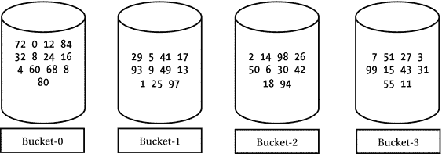

图 12-6. 使用四个桶存储数字

让我们逐步演示如何将数字存入四个桶之一。假设你拿到数字 94，它应放入哪个桶？首先计算 94 模 4 的结果为 2，因此数字 94 将存入 bucket-2。对于每个需要存储的数字，你都将遵循此逻辑决定其所属桶。

现在，我们逐步演示如何验证某个数字是否存在于桶中。假设需要验证数字 67 是否在集合中。首先计算 67 模 4 的结果为 3。根据存储逻辑，若数字 67 存在于集合中，它必然在 bucket-3 中。确定桶编号后，你只需查看该桶（此处为 bucket-3）中的每个数字。在此案例中（见图 12-6），bucket-3 中有十个数字，且均不是 67。查看完 bucket-3 中的十个数字后，你可以回答数字 67 不存在于集合中。请注意，你仅需查看一个桶中的数字即可判断数字 67 是否存在，无需检查所有四个桶。通过使用算法存储和检索集合中的数字，你缩短了搜索数字所需的时间。

故事尚未结束。假设使用四个桶存储数字，且所有数字都是 4 的倍数（如 4、8、12、16、20、24 等）。对于所有 4 的倍数 N，N 模 4 的结果均为 0。这意味着所有此类数字都将仅存入 bucket-0。这种情况是否比将所有数字存入一个桶更好？答案是否定的。只有当数字均匀分布在所有桶中时，使用多个桶才能提升搜索效率。最佳情况是所有桶中仅包含一个数字，此时你只需查看一个桶中的一个数字即可判断数字是否存在。即使数字均匀分布在桶中，随着集合规模增大，搜索性能仍可能下降。例如，假设有 100 个数字均匀分布在四个桶中，最坏情况下你需要搜索一个桶中的 25 个数字。若数字增加到 10,000 个且仍均匀分布在四个桶中，最坏情况下你需要搜索 2,500 个数字。为了保持搜索速度，当单个桶中的数字数量增加到影响搜索性能时，你可以增加桶的数量。

Java 中基于哈希的集合与我刚才讨论的数字集合工作原理类似。请注意，Java 集合仅存储对象，不允许存储基本类型值。`Object`类中的两个方法是哈希集合工作的核心：`equals()`和`hashCode()`。

基于哈希的集合维护多个桶来存储对象。当你向哈希集合添加对象时，Java 通过调用对象的`hashCode()`方法获取其哈希码，然后对哈希码应用算法以计算对象应放入的桶。当需要检查对象是否存在于哈希集合中时，Java 应用相同逻辑计算对象可能所在的桶：调用对象的`hashCode()`方法并应用算法计算桶位置，然后使用对象的`equals()`方法将对象与桶中现有对象进行比较，以确认对象是否存在于该桶中。

Java 中哈希集合的内部工作原理看似简单。然而，如果存储在哈希集合中的对象所属类未正确实现`hashCode()`和`equals()`方法，程序员将面临诸多复杂问题。让我们查看`BadKey`类的代码，如清单 12-35 所示。

```
// BadKey.java
package com.jdojo.collections;
public class BadKey {
private int id;
public BadKey(int id) {
this.id = id;
}
public int getId() {
return this.id;
}
public void setId(int id) {
this.id = id;
}
@Override
public int hashCode() {
// 返回 id 值作为其哈希码
return id;
}
@Override
public boolean equals(Object obj) {
if (obj == this) {
return true;
}
if (obj instanceof BadKey) {
BadKey bk = (BadKey) obj;
if (bk.getId() == this.id) {
return true;
}
}
return false;
}
@Override
public String toString() {
return String.valueOf(this.id);
}
}
清单 12-35. 一个不适合作为哈希集合键的 BadKey 类


`BadKey` 类存储一个整数值。它是一个可变类。你可以通过调用 `setId()` 方法并为其 `id` 提供新值来修改其状态。它重写了 `Object` 类的 `equals()` 和 `hashCode()` 方法。`hashCode()` 方法的实现很简单：它返回 `id` 实例变量的值作为哈希码。`equals()` 方法检查两个 `BadKey` 对象的 `id` 实例变量的值是否相同。如果两个 `BadKey` 对象具有相同的 `id`，则它们被视为相等。

请考虑清单 12-36 中的程序。它在 `Set<BadKey>` 中使用了 `BadKey` 对象。你能通过查看程序和输出来发现问题吗？如果没发现问题，不用担心，我会解释。

```
// BadKeyTest.java
package com.jdojo.collections;
import java.util.HashSet;
import java.util.Set;
public class BadKeyTest {
public static void main(String[] args) {
Set s = new HashSet();
BadKey bk1 = new BadKey(100);
BadKey bk2 = new BadKey(200);
// 将两个对象 bk1 和 bk2 添加到集合中
s.add(bk1);
s.add(bk2);
System.out.println("集合包含: " + s);
System.out.println("集合包含 bk1: " + s.contains(bk1));
// 将 bk1 的 id 设置为 300
bk1.setId(300);
System.out.println("集合包含: " + s);
System.out.println("集合包含 bk1: " + s.contains(bk1));
}
}
清单 12-36.
在集合中使用 BadKey 对象
```

```
集合包含: [100, 200]
集合包含 bk1: true
集合包含: [300, 200]
集合包含 bk1: false
```

该程序将两个名为 `bk1` 和 `bk2` 的 `BadKey` 对象添加到 `Set` 中。输出的第一行确认集合包含这两个对象。然后，`bk1` 对象的 `id` 值从 100 更改为 300，输出的第三行证实了这一点。由于你并未从集合中移除对象 `bk1`，因此输出的第四行出乎意料。输出的第四行指出对象 `bk1` 不存在于集合中，而输出的第三行则指出 `bk1` 对象在集合中。

哪里出了问题？对象 `bk1` 到底在不在集合中？答案是，在你移除它之前，对象 `bk1` 一直在集合中。如果你使用 `for-each` 循环或迭代器来访问集合中的所有对象，你仍然可以找到它。然而，集合（本例中为 Set）将无法找到对象 `bk1`。集合无法找到 `bk1` 对象的原因是，对象 `bk1` 的哈希码在它被添加到集合后发生了改变。回想一下，`HashSet` 是 Java 中一种基于哈希的集合。它使用对象的哈希码来定位对象将被放置的桶。当第二次执行 `s.contains(bk1)` 时，`bk1` 的哈希码将是 300，这是从其 `hashCode()` 方法返回的值。当对象 `bk1` 被放入集合时，其哈希码是 200。由于对象 `bk1` 的哈希码已更改，集合会错误地识别一个不同的桶来定位它。由于集合在不同于对象 `bk1` 所在桶的位置寻找它，因此找不到它。问题出在哪里？问题出在 `BadKey` 类的 `hashCode()` 方法上。`BadKey` 类是一个可变类，并且该类的可变状态（`id` 实例变量）被用来计算其哈希码，这导致了在集合中定位对象时出现问题。

解决这种在集合中看似丢失 `BadKey` 对象问题的一种方法是，从其 `hashCode()` 方法返回一个常量值，例如 99。以下是 `BadKey` 类的 `hashCode()` 方法的一个有效实现（尽管不是一个好的实现）：

```
// BadKey.java
package com.jdojo.collections;
public class BadKey {
// 其他代码在此...
public int hashCode() {
// 始终返回相同的值 99
return 99;
}
}
```

这段代码将解决清单 12-36 所示示例中丢失对象 `bk1` 的问题，因为 `BadKey` 类对象的哈希码永远不会改变。然而，它引入了另一个与基于哈希的集合性能相关的问题。如果你将 `BadKey` 类的对象存储在一个基于哈希的集合（例如 Set）中，所有对象都将哈希到同一个桶，因为 `BadKey` 类的所有对象都具有相同的哈希码值 99。你解决了一个问题，却又引入了另一个问题！

`BadKey` 类的主要问题在于其可变性。它只有一个名为 `id` 的可变实例变量。当你将可变对象与基于哈希的集合一起使用时，应考虑以下指导原则：

*   如果可能，应避免将可变类的对象用作 `Set` 的元素和 `Map` 的键。考虑使用不可变类的对象，例如 `String`、`Integer`，或你自己定义的不可变类，作为 `Map` 的键和 `Set` 的元素。

*   非常谨慎地实现可变类的 `equals()` 和 `hashCode()` 方法。你必须确保可变类对象的 `hashCode()` 方法返回相同的值。否则，你将在基于哈希的集合中丢失对可变类对象的追踪。如果可变类的某些状态是不可变的，请使用这些不可变部分来计算其哈希码值，这样可变类对象的哈希码值就不会改变。作为最后的手段（不推荐），考虑从可变类的 `hashCode()` 方法返回一个常量整数。

*   确保满足 `equals()` 和 `hashCode()` 方法的约定。

总结

集合是一组对象。Java 提供了集合框架，其中包含多个接口和类，用于处理各种集合类型，例如列表、队列、集合和映射。集合框架提供了一个接口来表示特定类型的集合。框架中的每个接口至少有一个实现类，`Collection` 接口除外。与集合相关的接口和类位于 `java.util` 包中。用于需要同步的多线程程序的集合类位于 `java.util.concurrent` 包中。

集合框架包含一个 `Collection` 接口，它是大多数集合的根接口。`Collection` 接口包含用于所有类型集合（基于 `Map` 的集合除外）的大部分方法。该接口提供了添加元素、移除元素、了解集合大小等方法。Collection 接口的特定子接口提供了用于处理特定类型集合的额外方法。

集合框架提供了一种统一的方式来遍历所有类型集合的元素，即使用迭代器。`Iterator` 接口的一个实例代表一个迭代器。所有集合都支持使用 `for-each` 循环和 `forEach()` 方法遍历其元素。

在数学中，集合是一组无序的唯一元素。`Set` 接口的一个实例代表集合框架中的一个集合。`HashSet` 是数学集合的实现类。

`SortedSet` 的一个实例代表一个有序的唯一集合。`TreeSet` 是 `SortedSet` 接口的实现类。有序集合中的元素可以按自然顺序排序，也可以使用 `Comparator` 按自定义顺序排序。


队列是一种用于逐个处理对象的集合。对象从一端进入队列，从另一端退出队列。Collections 框架中的 `Queue` 接口代表队列。Collections 框架为 `Queue` 接口提供了多个实现类，以支持不同类型的队列，例如简单队列、阻塞队列、优先级队列、延迟队列等。

列表（List）是一个有序的对象集合。`List` 接口的实例代表 Collections 框架中的列表。`ArrayList` 和 `LinkedList` 是 `List` 接口的两个实现类，它们分别由数组和链表支持。列表中的每个元素都有一个从 0 开始的索引。`List` 接口提供了方法，允许你使用元素的索引顺序或随机访问其元素。Collections 框架仅支持密集列表；也就是说，列表中两个元素之间不能有间隙。

映射（Map）是另一种类型的集合，用于存储键值对。映射中的键必须是唯一的。`Map` 接口的实例代表 Collections 框架中的映射。`HashMap` 是 `Map` 接口的简单实现类。Collections 框架还支持排序映射、可导航映射和并发映射。排序映射根据键对所有键值对进行排序存储。`SortedMap` 接口的实例代表排序映射。`TreeMap` 是 `SortedMap` 接口的实现类。`NavigableMap` 和 `ConcurrentMap` 的实例分别代表可导航映射和并发映射。

Collections 框架包含一个名为 `Collections` 的工具类，其中仅包含静态方法。该类中的方法允许你对集合应用不同类型的算法——例如，打乱集合中的元素、旋转其元素、对列表元素进行排序等。该类还提供了获取集合不同视图的方法，例如只读视图、同步视图、不可修改视图等。

基于哈希的集合使用桶（bucket）来存储其元素。桶的数量根据集合中的元素数量和所需性能来确定。当向集合添加元素时，会使用元素的哈希码来确定存储该元素的桶。在集合中搜索元素时，会使用反向过程。基于哈希的集合提供了更快的元素存储和检索。

问题与练习

1.  什么是 Collections 框架？

2.  在 Collections 框架中，除映射外，所有集合都实现的接口名称是什么？

3.  列出你可以在 Collections 框架中对集合执行的不同类型操作的名称。

4.  `Collection<E>` 接口中的哪个方法允许你获取集合的大小？

5.  `Collection<E>` 接口中的哪些方法允许你一次性删除集合中的所有元素以及逐个删除元素？

6.  你会使用 `Collection<E>` 接口中的哪个方法来检查集合是否包含给定的对象？

7.  如何检查集合是否为空？

8.  说出 `Collection<E>` 接口中允许你将集合转换为数组的方法名称。

9.  列举三种遍历集合元素的方法。你能使用简单的 `for` 循环语句来遍历集合的元素吗？什么是快速失败迭代器（fail-fast iterator）？

10. Java 支持数学集合、排序集合和可导航集合。区分这三种集合类型，并说出代表这三种集合类型的接口以及至少一个实现类。

11. 如何遍历集合中的元素？

12. 考虑以下两个不可变的整数集合：

```
    Set s1 = Set.of(10, 20, 30, 40);
    Set s2 = Set.of(10, 15, 20, 25, 30);
    ```

编写一段代码片段，打印出集合 `s1` 和 `s2` 的并集、交集和差集（按数学计算方式）。

13. 找出以下尝试创建不可变整数集合的代码片段中的问题：

```
    Set s1 = Set.of(20, 10, 30, 10);
    ```

14. 考虑以下代码片段：

```
    Set s1 = Set.of();
    System.out.println("s1.isEmpty(): " + s1.isEmpty());
    s1.add(2018);
    System.out.println("s1.isEmpty(): " + s1.isEmpty());
    ```

这段代码能编译吗？如果你的答案是肯定的，输出会是什么？如果你认为代码可以编译，但会抛出运行时异常，请描述异常的原因以及解决问题的方法。

15. 在你的应用程序中，你需要处理一个已排序的唯一整数范围。你会使用集合家族中的哪个接口和实现类来实现此目的？

16. 如何按自然顺序和自定义顺序对集合中的元素进行排序？

17. `List` 和 `Set` 之间的区别是什么？

18. 考虑以下不完整的代码片段：

```
    List list = List.of("Li", "Xi", "Bo", "Da", "Fa", "Bo");
    int i1 = /* 你的代码写在这里 */;
    int i2 = /* 你的代码写在这里 */;
    System.out.printf("First and last indexes of Bo are %d and %d.%n", i1, i2);
    ```

完成此代码片段，以打印元素 `"Bo"` 的第一个和最后一个索引。输出应如下所示：

```
    First and last indexes of Bo are 2 and 5.
    ```

19. `Iterator` 和 `ListIterator` 之间的区别是什么？你能使用 `Iterator` 来遍历 `List` 中的元素吗？

20. 假设你需要在程序中使用一个列表，并且需要频繁地从列表的开头插入和删除元素。你会选择 `List` 接口的哪个实现类来实现这一点？

21. 以下代码片段包含一个逻辑错误。描述该错误。

```
    List list = new ArrayList();
    list.add(0, 0);
    list.add(1, 10);
    list.add(2, 20);
    list.add(5, 50);
    System.out.println(list);
    ```

22. 考虑以下不完整的代码片段：

```
    List list = new ArrayList();
    list.add(10);
    list.add(20);
    list.add(30);
    System.out.println(list);
    /* 你的代码写在这里 */
    System.out.println(list);
    ```

完成此代码片段，使得列表中的每个元素都被替换为当前值的两倍。鼓励你使用 `List<E>` 接口的以下 `replaceAll()` 方法来实现：

```
    default void replaceAll(UnaryOperator operator)
    ```

预期输出如下：

```
    [10, 20, 30]
    [20, 40, 60]
    ```

23. 说出在 Java 程序中其实例代表简单队列的接口名称。

24. FIFO 和 LIFO 队列之间的区别是什么？说出实现简单 FIFO 和 LIFO 队列的实现类名称。

25. 使用 `Queue<E>` 接口的 `add(E e)` 和 `offer(E e)` 方法向队列插入元素有什么区别？

26. 什么是优先级队列？说出 Java 中优先级队列的实现类名称。

27. 编写一个完整的程序，使用优先级队列存储几个人的名字。你的程序输出应表明，名字较短的人在队列中具有更高的优先级。向队列中添加几个名字，然后逐个删除它们。每次删除一个元素时，打印出被删除的元素以及队列中剩余的元素。

28. `Queue` 和 `Deque` 之间的区别是什么？说出 `Deque<E>` 接口的两个实现类名称。

29. 你能使用 `Deque` 来表示栈吗？如果你的答案是肯定的，请用一个例子演示。


好的，作为一名高级文档工程师和翻译员，我将严格遵循您提供的注意事项和示例，将给定的英文文本翻译成中文。


30.  什么是阻塞队列？请说出其实例代表阻塞队列的接口名称。什么是阻塞队列的公平性？

31.  什么是映射？请说出在 Java 中其实例代表映射的接口名称。

32.  请说出 Java 中 `Map<K,V>` 接口的两个实现类名称。

33.  你使用什么方法来获取 `Map` 中的条目数？如何获取 `Map` 中所有键的 `Set`？如何获取 `Map` 中所有值的 `Collection`？

34.  考虑以下创建映射并用姓名及其幸运数字填充的代码片段。请补全代码以打印映射中唯一的姓名和唯一的幸运数字。

```
    Map map = new HashMap();
    map.put("Bo", 1);
    map.put("Co", 8);
    map.put("Do", 19);
    map.put("Lo", 1);
    map.put("Mo", 8);
    /* 你的代码写在这里 */
    ```

35.  创建包含以下五个 <键, 值> 条目（国家代码和国家名称）的不可变映射，一次使用 `Map` 接口的 `of()` 方法，一次使用 `ofEntries()` 方法：`<1, "United States">`、`<24, "Austria">`、`<66, "Thailand">`、`<49, "Germany">` 和 `<91, "India">`。键是整数，值是字符串。在单独的行上打印每个条目。

36.  什么是 `Collections` 类？请说出这个类的一些用途。

37.  以下代码片段有什么问题？

```
    List list = new ArrayList();
    list.add(10);
    list.add(20);
    list.add(5, 50);
    ```

38.  补全以下代码片段，该代码片段使用 `List` 接口中的默认 `sort()` 方法对 `List<Integer>` 进行排序：

```
    List list = new ArrayList();
    list.add(40);
    list.add(10);
    list.add(30);
    list.add(20);
    System.out.println("List: " + list);
    list.sort(/* 你的代码写在这里 */);
    System.out.println("Sorted List: " + list);
    ```

预期输出如下：

```
    List: [40, 10, 30, 20]
    Sorted List: [10, 20, 30, 40]
    ```

39.  考虑以下使用二分搜索在列表中搜索 `20` 的代码片段：

```
    List list = new ArrayList();
    list.add(40);
    list.add(10);
    list.add(30);
    list.add(20);
    System.out.println("List: " + list);
    int index = Collections.binarySearch(list, 20); System.out.println("Index of 20 us in the list is " + index);
    ```

当前输出如下：

```
    List: [40, 10, 30, 20]
    Index of 20 us in the list is -3
    ```

输出表明 `20` 不在列表中。然而，`20` 确实存在于列表中。请修复此代码片段，以便使用二分搜索在列表中找到 `20`。描述你的发现。

40.  当你运行以下代码片段时，输出是什么？

```
    List list = new ArrayList();
    list.add(10);
    list.add(20);
    list.add(30);
    list.add(40);
    System.out.println("List: " + list);
    Collections.rotate(list, 4);
    System.out.println("Rotated List: " + list)
    ```

41.  编写一个代码片段来创建一个可修改的 `Set<Integer>`。获取此集合的不可修改视图，并演示你仍然可以修改原始的可修改集合，并且这些修改会反映在只读集合中。同时演示尝试修改只读集合会抛出 `UnsupportedOperationException`。

42.  使用受检集合（checked collections）有什么优势？

43.  编写一个代码片段来创建一个单例不可变的 `List<String>`，其中只有一个元素 `"Hello"`。

44.  什么是基于哈希的集合？如果一个类的对象将存储在基于哈希的集合中，那么对该类必须采取什么样的特殊处理？

13. 流

在本章中，你将学习：

*   什么是流
*   集合与流之间的区别
*   如何从不同类型的数据源创建流
*   如何使用 `Optional` 类表示可选值
*   对流应用不同类型的操作
*   使用收集器从流中收集数据
*   对流的数据进行分组和分区
*   在流中查找和匹配数据
*   如何使用并行流

本章中的所有示例程序都是 `jdojo.streams` 模块的成员，如清单 13-1 中所声明。

```
// module-info.java
module jdojo.streams {
exports com.jdojo.streams;
}
清单 13-1.
jdojo.streams 模块的声明
```

什么是流？

聚合操作从一组值中计算出一个单一值。聚合操作的结果可以是一个原始值、一个对象或一个 `void`。请注意，一个对象可以表示一个单一实体（例如一个人）或一组值（例如一个列表、一个集合、一个映射等）。

流是支持顺序和并行聚合操作的数据元素序列。计算整数流中所有元素的总和、将列表中的所有名称映射到其长度等，都是流的聚合操作示例。

从流的定义来看，它们似乎与集合类似。那么，流与集合有何不同？两者都是数据元素集合的抽象。集合侧重于数据元素的存储以便高效访问，而流侧重于对来自数据源（通常是集合，但不一定）的数据元素进行聚合计算。

在本节中，我将讨论流的以下特性，并在必要时与集合进行比较：

*   流没有存储空间。
*   流可以表示无限元素的序列。
*   流的设计基于内部迭代。
*   流被设计为无需开发人员额外工作即可并行处理。
*   流被设计为支持函数式编程。
*   流支持惰性操作。
*   流可以是有序的或无序的。
*   流不能被重用。

以下各节展示了使用流的简短代码片段。这些代码旨在让你感受 Streams API，并将 Streams API 与 Collections API 进行比较。此时你无需完全理解代码。我将在后面详细解释。

流没有存储空间

集合是一种内存中的数据结构，它存储其所有元素。所有元素在添加到集合之前必须存在于内存中。流没有存储空间；它不存储元素。流按需从数据源拉取元素，并将其传递给操作管道进行处理。

无限流

集合不能表示一组无限的元素，而流可以。集合将其所有元素存储在内存中，因此，集合中不可能有无限数量的元素。拥有无限数量元素的集合将需要无限的内存，并且存储过程将永远持续下去。流从其数据源拉取元素，数据源可以是集合、生成数据的函数、I/O 通道等。因为函数可以生成无限数量的元素，并且流可以按需从中拉取数据，所以流可以表示一个无限数据元素的序列。

内部迭代 vs. 外部迭代

集合基于外部迭代。你为集合获取一个迭代器，并使用该迭代器串行处理集合的元素。假设你有一个从 1 到 5 的整数列表。你可以按如下方式计算列表中所有奇数的平方和：

```
List numbers = List.of(1, 2, 3, 4, 5);
int sum = 0;
for (int n : numbers) {
if (n % 2 == 1) {
int square = n * n;
sum = sum + square;
}
}
```


本示例使用了一个 `for-each` 循环，该循环对整数列表执行**外部迭代**。简而言之，客户端代码（本例中的 `for` 循环）从集合中拉取元素，并应用逻辑来获取结果。请考虑以下使用流来计算同一列表中所有奇数的平方和的代码片段：

```
int sum = numbers.stream()
.filter(n -> n % 2 == 1)
.map(n -> n * n)
.reduce(0, Integer::sum);
```

你是否注意到了流的强大和简洁？你用一条语句替换了五条语句。然而，代码的简洁性并非我想强调的重点。重点在于，当你使用流时，你并没有遍历列表中的元素。流在内部为你完成了遍历。这就是我所说的流支持的**内部迭代**。你通过向流传递一个使用 lambda 表达式的算法来指定你想要什么，然后流通过在其内部迭代元素，将你的算法应用于其数据元素，并返回结果。

使用外部迭代通常会产生顺序代码；也就是说，代码只能由单个线程执行。例如，当你使用 `for-each` 循环编写计算总和的逻辑时，该循环必须仅由一个线程执行。所有现代计算机都配备多核处理器。利用多核处理器并行执行逻辑，岂不美哉？Java 库提供了 Fork/Join 框架，用于将任务递归地拆分为子任务，并利用多核处理器并行执行这些子任务。然而，Fork/Join 框架使用起来并不简单，尤其是对于初学者而言。

流来救你了！它们被设计成能在你甚至没有察觉的情况下并行处理其元素！这并不意味着流会自动为你决定何时串行或并行处理其元素。你只需告诉流你想要使用并行处理，流就会处理剩下的事情。流在内部处理了使用 Fork/Join 框架的细节。你可以像这样并行计算列表中奇数的平方和：

```
int sum = numbers.parallelStream()
.filter(n -> n % 2 == 1)
.map(n -> n * n)
.reduce(0, Integer::sum);
```

你所需要做的只是将方法 `stream()` 替换为 `parallelStream()`！Streams API 使用多个线程来过滤奇数、计算它们的平方并将它们相加得到部分和。最后，它将部分和合并起来给你结果。在这个例子中，列表中只有五个元素，使用多个线程来处理它们有些大材小用。你不会为了如此简单的计算而使用并行处理。我举这个例子是为了强调一个观点：使用流来并行化你的计算是零成本的；你只需使用一个不同的方法名就能实现！第二个观点是，并行化计算之所以成为可能，是因为流提供了内部迭代。

流被设计为使用内部迭代。它们提供了一个 `iterator()` 方法，该方法返回一个 `Iterator`，用于对其元素进行外部迭代。你“永远”不需要自己使用流的迭代器来迭代流的元素。如果你确实需要，以下是使用方法：

```
// 获取一个从 1 到 5 的整数列表
List numbers = List.of(1, 2, 3, 4, 5);
...
// 从流中获取一个迭代器
Iterator iterator = numbers.stream().iterator();
while(iterator.hasNext()) {
int n = iterator.next();
...
}
```

命令式 vs. 函数式

集合支持命令式编程，而流支持声明式编程。这是集合支持外部迭代而流支持内部迭代的衍生结果。当你使用集合时，你需要知道“做什么”以及“怎么做”；这是命令式编程的特点。当你使用流时，你只需通过流操作指定“做什么”；“怎么做”的部分由 Streams API 处理。Streams API 支持函数式编程。对流进行操作会产生结果，而不会修改数据源。就像在函数式编程中一样，当你使用流时，你使用 Streams API 提供的内置方法指定你想对其元素执行“什么”操作，通常是通过向这些方法传递 lambda 表达式来自定义这些操作的行为。

流操作

流支持两种类型的操作：

*   中间操作

*   终端操作

中间操作也称为**惰性操作**。终端操作也称为**急切操作**。操作根据它们从数据源拉取数据元素的方式被称为惰性或急切。对流执行惰性操作不会处理流的元素，直到对该流调用了另一个急切操作。

流通过一系列操作连接起来，形成一个流管道。流本质上是惰性的，直到你对其调用终端操作。对流执行中间操作会产生另一个流。当你对流调用终端操作时，元素会从数据源中拉取出来，并流经流管道。每个中间操作从输入流中获取元素，并转换这些元素以产生输出流。终端操作从流中获取输入并产生结果。图 13-1 展示了一个包含数据源、三个流和三个操作的流管道。`filter` 和 `map` 操作是中间操作，`reduce` 操作是终端操作。


图 13-1.

一个流管道

在图中，第一个流（左侧）从数据源拉取数据，并成为 `filter` 操作的输入源。`filter` 操作产生另一个流，其中包含过滤条件为真的数据。`filter` 操作产生的流成为 `map` 操作的输入。`map` 操作产生另一个流，其中包含映射后的数据。`map` 操作产生的流成为 `reduce` 操作的输入。`reduce` 操作是一个终端操作。它计算并返回结果，然后流处理结束。

注意

我在前面的讨论中使用了“流从其数据源拉取/消费元素”这个短语。这并不意味着流会从数据源中移除元素；它只是读取它们。流被设计为支持函数式编程，在函数式编程中，数据元素被读取，对读取的数据元素进行操作会产生新的数据元素。然而，数据元素不会被修改（或者至少不应该被修改）。

在调用终端操作之前，流处理不会开始。如果你只是对流调用中间操作，除了在内存中创建另一个对象流之外，不会发生任何令人兴奋的事情，也不会从数据源读取数据。这意味着你必须对流使用终端操作，它才能处理数据以产生结果。这也是终端操作被称为**结果承载操作**，而中间操作也被称为**非结果承载操作**的原因。

你看到了以下代码，它使用流操作管道来计算从 1 到 5 的奇数的平方和：


```
List numbers = List.of(1, 2, 3, 4, 5);
int sum = numbers.stream()
.filter(n -> n % 2 == 1)
.map(n -> n * n)
.reduce(0, Integer::sum);
```

图 13-2 至图
13-5 展示了
随着操作的添加，流管道的状态。请注意，在调用 reduce 操作之前，没有
数据流过该流。最后一张图显示了输入流中用于某个操作的整数，以及
该操作产生的映射（或转换）后的整数。reduce 终端操作产生结果 35。


图 13-5.

调用 reduce 操作后的流管道


图 13-4.

调用 map 操作后的流管道


图 13-3.

调用 filter 操作后的流管道


图 13-2.

创建流对象后的流管道

有序流

流可以是有序的或无序的。有序流会保留其元素的顺序。Streams API 允许你将有序流转换为无序流。流之所以可以是有序的，是因为它代表了一个有序的数据源，例如列表或排序集合。你也可以通过应用诸如排序之类的中间操作，将无序流转换为有序流。

如果迭代器遍历元素的顺序是可预测且有意义的，则称该数据源具有遭遇顺序。例如，数组和列表始终具有从索引 0 处的元素到最后一个索引处的元素的遭遇顺序。所有有序数据源的元素都具有遭遇顺序。基于具有遭遇顺序的数据源的流，其元素也具有遭遇顺序。有时，流操作可能会为原本无序的流强加一个遭遇顺序。例如，`HashSet` 的元素没有遭遇顺序。但是，对基于 `HashSet` 的流应用排序操作会强加一个遭遇顺序，以便按排序顺序生成元素。

流不可重用

与集合不同，流不可重用。它们是“一次性”对象。在对其调用终端操作后，流无法重用。如果你需要再次对来自同一数据源的相同元素执行计算，则必须重新创建流管道。如果流实现检测到流正在被重用，它可能会抛出 `IllegalStateException`。

Streams API 的架构

图 13-6 展示了流相关接口的类图。流相关接口和类位于 `java.util.stream` 包中。


图 13-6.

Streams API 中流相关接口的类图

所有流接口都继承自 `BaseStream` 接口，而 `BaseStream` 接口又继承自 `java.lang` 包中的 `AutoCloseable` 接口。在实践中，大多数流使用集合作为其数据源，而集合不需要关闭。当流基于可关闭的数据源（如文件 I/O 通道）时，你可以使用 `try-with-resources` 语句创建流实例，以便自动关闭它。所有流类型共有的方法在 `BaseStream` 接口中声明如下。

*   `Iterator<T> iterator()`：返回流的迭代器。你在代码中几乎永远不需要使用此方法。这是一个终端操作。调用此方法后，你无法在流上调用任何其他方法。

*   `S sequential()`：返回一个顺序流。如果流已经是顺序的，则返回自身。使用此方法将并行流转换为顺序流。这是一个中间操作。

*   `S parallel()`：返回一个并行流。如果流已经是并行的，则返回自身。使用此方法将并行流转换为顺序流。这是一个中间操作。

*   `boolean isParallel()`：如果流是并行的，则返回 `true`，否则返回 `false`。在调用终端流操作方法后调用此方法时，结果不可预测。

*   `S unordered()`：返回流的无序版本。如果流已经是无序的，则返回自身。这是一个中间操作。

*   `void close()`：关闭流。你不需要关闭基于集合的流。对已关闭的流进行操作会抛出 `IllegalStateException`。

*   `S onClose(Runnable closeHandler)`：返回一个等效的流，并带有一个额外的关闭处理器。当在流上调用 `close()` 方法时，会运行关闭处理器，并按照它们被添加的顺序执行。

`Stream<T>` 接口表示元素类型为 `T` 的流；例如，`Stream<Person>` 表示 `Person` 对象的流。该接口包含表示中间操作和终端操作的方法，例如 `filter()`、`map()`、`reduce()`、`collect()`、`max()`、`min()` 等。在使用流时，你大部分时间都会使用这些方法。我稍后会详细讨论每个方法。

请注意，`Stream<T>` 接口接受一个类型参数 `T`，这意味着你只能将其用于处理引用类型的元素。如果你必须处理原始类型的流，例如 `int`、`long` 等，使用 `Stream<T>` 将涉及在需要原始值时对元素进行装箱和拆箱的额外成本。例如，对 `Stream<Integer>` 的所有元素求和需要将所有 `Integer` 元素拆箱为 `int`。Streams API 的设计者意识到了这一点，并提供了三个专门的流接口，称为 `IntStream`、`LongStream` 和 `DoubleStream`，用于处理原始类型；这些接口包含处理原始值的方法。请注意，没有表示其他原始类型（如 `float`、`short` 等）的流接口，因为这三个流类型可用于处理其他原始类型的值。

快速示例

让我们看一个使用流的快速示例。代码读取一个整数列表，并计算列表中所有奇数的平方和。

`Collection` 接口中的 `stream()` 方法返回一个顺序流，其中 `Collection` 充当数据源。以下代码片段创建了一个 `List<Integer>` 并从该列表获取了一个 `Stream<Integer>`：

```
// 获取一个从 1 到 5 的整数列表
List numbersList = List.of(1, 2, 3, 4, 5);
// 从列表中获取一个流
Stream numbersStream = numbersList.stream();
```

`Stream<T>` 接口的 `filter()` 方法接受一个 `Predicate<? super T>` 作为参数，并返回一个 `Stream<T>`，其中包含指定 `Predicate` 返回 `true` 的原始流元素。以下语句获取了一个仅包含奇整数的流：

```
// 获取一个奇整数的流
Stream oddNumbersStream = numbersStream.filter(n -> n % 2 == 1);
```

注意使用 lambda 表达式作为 `filter()` 方法的参数。如果流中的元素不能被 2 整除，则 lambda 表达式返回 `true`。

`Stream<T>` 接口的 `map()` 方法接受 `Function<? super T,? extends R>` 作为参数。流中的每个元素都被传递给此 `Function`，并生成一个包含 `Function` 返回值的新的流。以下语句获取所有奇数整数并将它们映射到其平方：


```
// 获取奇数平方的流
Stream squaredNumbersStream = oddNumbersStream.map(n -> n * n);
```

最后，你需要将所有奇数的平方相加得到结果。`Stream<T>` 接口的 `reduce(T identity, BinaryOperator<T> accumulator)` 方法对流执行归约操作，将流缩减为单个值。它接受一个初始值和一个作为 `BinaryOperator<T>` 的累加器作为参数。第一次调用时，累加器接收初始值和流的第一个元素作为参数，并返回一个值。第二次调用时，累加器接收上一次调用返回的值和流中的第二个元素。此过程持续进行，直到流中的所有元素都传递给累加器。累加器最后一次调用返回的值即为 `reduce()` 方法返回的值。以下代码片段对流中的所有整数执行求和操作：

```
// 对流中所有整数求和
int sum = squaredNumbersStream.reduce(0, (n1, n2) -> n1 + n2);
```

`Integer` 类包含一个静态的 `sum()` 方法来执行两个整数的求和。你可以使用方法引用来重写上述语句，如下所示：

```
// 对流中所有整数求和
int sum = squaredNumbersStream.reduce(0, Integer::sum);
```

在此示例中，我将流上的每个操作分解为单个语句。你不能使用中间操作返回的流，除非对它们应用其他操作。通常，你关心的是终端操作的结果，而不是中间流。流被设计为支持方法链，以避免临时变量，你在本例中使用了这一点。你可以将这些语句组合成一个语句，如下所示：

```
// 对 numbers 列表中所有奇数的平方求和
int sum = numbersList.stream()
.filter(n -> n % 2 == 1)
.map(n -> n * n)
.reduce(0, Integer::sum);
```

在后续示例中，我将流上的所有方法调用链接起来，只形成一个语句。清单 13-2 包含了此示例的完整程序。请注意，本例中你只处理整数。为了获得更好的性能，你本可以在本例中使用 `IntStream`。稍后我将向你展示如何使用 `IntStream`。

```
// SquaredIntsSum.java
package com.jdojo.streams;
import java.util.List;
public class SquaredIntsSum {
public static void main(String[] args) {
// 获取一个从 1 到 5 的整数列表
List numbers = List.of(1, 2, 3, 4, 5);
// 计算列表中所有奇数的平方和
int sum = numbers.stream()
.filter(n -> n % 2 == 1)
.map(n -> n * n)
.reduce(0, Integer::sum);
System.out.println("Sum = " + sum);
}
}
清单 13-2.
计算从 1 到 5 的所有奇数的平方和
```

```
Sum = 35
```

我展示了许多对不同类型流执行聚合操作的示例。大多数情况下，使用数字和字符串流来解释流操作更容易。我通过使用 `Person` 对象的流来展示一些使用流的实际示例。清单 13-3 包含了 `Person` 类的声明。

```
// Person.java
package com.jdojo.streams;
import java.time.LocalDate;
import java.time.Month;
import java.util.List;
public class Person {
// 表示性别的枚举
public static enum Gender {
MALE, FEMALE
}
private long id;
private String name;
private Gender gender;
private LocalDate dob;
private double income;
public Person(long id, String name, Gender gender, LocalDate dob, double income) {
this.id = id;
this.name = name;
this.gender = gender;
this.dob = dob;
this.income = income;
}
public long getId() {
return id;
}
public void setId(long id) {
this.id = id;
}
public String getName() {
return name;
}
public void setName(String name) {
this.name = name;
}
public Gender getGender() {
return gender;
}
public boolean isMale() {
return this.gender == Gender.MALE;
}
public boolean isFemale() {
return this.gender == Gender.FEMALE;
}
public void setGender(Gender gender) {
this.gender = gender;
}
public LocalDate getDob() {
return dob;
}
public void setDob(LocalDate dob) {
this.dob = dob;
}
public double getIncome() {
return income;
}
public void setIncome(double income) {
this.income = income ;
}
public static List persons() {
Person ken = new Person(1, "Ken", Gender.MALE,
LocalDate.of(1970, Month.MAY, 4), 6000.0);
Person jeff = new Person(2, "Jeff", Gender.MALE,
LocalDate.of(1970, Month.JULY, 15), 7100.0);
Person donna = new Person(3, "Donna", Gender.FEMALE,
LocalDate.of(1962, Month.JULY, 29), 8700.0);
Person chris = new Person(4, "Chris", Gender.MALE,
LocalDate.of(1993, Month.DECEMBER, 16), 1800.0);
Person laynie = new Person(5, "Laynie", Gender.FEMALE,
LocalDate.of(2012, Month.DECEMBER, 13), 0.0);
Person lee = new Person(6, "Li", Gender.MALE,
LocalDate.of(2001, Month.MAY, 9), 2400.0);
// 创建一个人物列表
List persons = List.of(ken, jeff, donna, chris, laynie, lee);
return persons;
}
@Override
public String toString() {
String str = String.format("(%s, %s, %s, %s, %.2f)",
id, name, gender, dob, income);
return str;
}
}
清单 13-3.
Person 类
```

`Person` 类包含一个静态的 `Gender` 枚举来表示一个人的性别。该类声明了五个实例变量（`id`、`name`、`gender`、`dob` 和 `income`）、getter 和 setter 方法。`isMale()` 和 `isFemale()` 方法被声明为可在 lambda 表达式中用作方法引用。你将频繁使用一个人物列表，为此，该类包含一个名为 `persons()` 的静态方法来获取人物列表。

创建流

创建流的方法有很多种。Java 库中的许多现有类都新增了返回流的方法。根据数据源，流的创建可以分为以下几类：

*   从值创建流

*   空流

*   从函数创建流

*   从数组创建流

*   从集合创建流

*   从文件创建流

*   从其他源创建流

从值创建流

`Stream` 接口包含以下三个静态方法，用于从单个值和多个值创建顺序流：

*   `<T> Stream<T> of(T t)`

*   `<T> Stream<T> of(T...values)`

*   `<T> Stream<T> ofNullable(T t)`

以下代码片段创建了两个流：

```
// 创建一个包含一个字符串元素的流
Stream stream = Stream.of("Hello");
// 创建一个包含四个字符串元素的流
Stream stream = Stream.of("Ken", "Jeff", "Chris", "Ellen");
```

`ofNullable()` 方法是在 Java 9 中添加到 Stream 接口的。如果指定的值非空，则返回一个包含单个值的流。否则，返回一个空流。

```
String str = "Hello";
// 流 s1 将包含一个元素 "Hello"
Stream s1 = Stream.ofNullable(str);
str = null;
// 流 s2 是一个空流，因为 str 为 null
Stream s2 = Stream.ofNullable(str);
```

你在清单 13-2 中创建了一个 `List<Integer>` 并调用了它的 `stream()` 方法来获取流对象。你可以使用 `Stream.of()` 方法重写该示例，如下所示：


```
import java.util.stream.Stream;
...
// 计算列表中所有奇数的平方和
int sum = Stream.of(1, 2, 3, 4, 5)
.filter(n -> n % 2 == 1)
.map(n -> n * n)
.reduce(0, Integer::sum);
System.out.println("Sum = " + sum);
```

```
Sum = 35
```

请注意，`of()` 方法的第二个版本接受一个可变参数（varargs），你也可以用它从对象数组创建流。以下代码片段从一个 `String` 数组创建流。

```
String[] names  = {"Ken", "Jeff", "Chris", "Ellen"};
// 从 names 数组中创建一个包含四个字符串的流
Stream stream = Stream.of(names);
```

提示

`Stream.of()` 方法创建的流，其元素为引用类型。如果你想从基本类型数组创建基本类型值的流，则需要使用 `Arrays.stream()` 方法，我稍后会解释。

以下代码片段从 `String` 类的 `split()` 方法返回的 `String` 数组创建一个字符串流：

```
String str  = "Ken,Jeff,Chris,Ellen";
// 该流将包含 4 个元素："Ken", "Jeff", "Chris" 和 "Ellen"
Stream stream = Stream.of(str.split(","));
```

`Stream` 接口还支持使用 `Stream.Builder<T>` 接口通过构建器模式创建流，该接口的实例代表一个流构建器。`Stream` 接口的 `builder()` 静态方法返回一个流构建器。

```
// 获取一个流构建器
Stream.Builder builder = Stream.builder();
```

`Stream.Builder<T>` 接口包含以下方法：

*   `void accept(T t)`

*   `Stream.Builder<T> add(T t)`

*   `Stream<T> build()`

`accept()` 和 `add()` 方法用于向正在构建的流中添加元素。你可能会疑惑为什么构建器中存在两个添加元素的方法。`Stream.Builder<T>` 接口继承自 `Consumer<T>` 接口，因此它从 `Consumer<T>` 接口继承了 `accept()` 方法。你可以将构建器的实例传递给接受消费者（Consumer）的方法，该方法可以使用 `accept()` 方法向构建器添加元素。

`add()` 方法返回构建器的引用，这使得它适合使用方法链添加多个元素。添加完元素后，调用 `build()` 方法来创建流。调用 `build()` 方法后，不能再向流中添加元素；否则会导致 `IllegalStateException` 运行时异常。以下代码片段使用构建器模式创建了一个包含四个字符串的流：

```
Stream stream = Stream.builder()
.add("Ken")
.add("Jeff")
.add("Chris")
.add("Ellen")
.build();
```

请注意，在获取构建器 `Stream.<String>builder()` 时，代码指定了类型参数为 `String`。如果不指定，编译器将无法推断类型参数。如果你单独获取构建器，编译器会将类型推断为 `String`，如下所示：

```
// 获取一个构建器
Stream.Builder builder = Stream.builder();
// 添加元素并构建流
Stream stream = builder.add("Ken")
.add("Jeff")
.add("Chris")
.add("Ellen")
.build();
```

`IntStream` 接口包含四个静态方法，允许你从值创建 `IntStream`：

*   `IntStream of(int value)`

*   `IntStream of(int... values)`

*   `IntStream range(int start, int end)`

*   `IntStream rangeClosed(int start, int end)`.

`of()` 方法允许你通过指定单个值来创建 `IntStream`。`range()` 和 `rangeClosed()` 方法生成一个 `IntStream`，其中包含指定 `start` 和 `end` 之间的有序整数。在 `range()` 方法中，指定的 `end` 是排除的，而在 `rangeClosed()` 方法中则是包含的。以下代码片段使用这两种方法创建了一个包含整数 1、2、3、4 和 5 的 `IntStream`：

```
// 创建一个包含 1, 2, 3, 4, 5 的 IntStream
IntStream oneToFive = IntStream.range(1, 6);
// 创建一个包含 1, 2, 3, 4, 5 的 IntStream
IntStream oneToFive = IntStream.rangeClosed(1, 5);
```

`LongStream` 接口也包含 `range()` 和 `rangeClosed()` 方法，它们接受 `long` 类型的参数并返回一个 `LongStream`。`LongStream` 和 `DoubleStream` 接口也包含 `of()` 方法，它们处理 `long` 和 `double` 值，并分别返回 `LongStream` 和 `DoubleStream`。

空流

空流是没有元素的流。`Stream` 接口包含一个 `empty()` 静态方法，用于创建一个空的顺序流。

```
// 创建一个空的字符串流
Stream stream = Stream.empty();
```

`IntStream`、`LongStream` 和 `DoubleStream` 接口也包含一个 `empty()` 静态方法，用于创建基本类型的空流。示例如下：

```
// 创建一个空的整数流
IntStream numbers = IntStream.empty();
```

从函数创建流

无限流是一种数据源能够生成无限数量元素的流。请注意，我说的是数据源应该“能够生成”无限数量的元素，而不是数据源应该拥有或包含无限数量的元素。由于内存和时间限制，存储任何类型的无限数量元素都是不可能的。然而，可以有一个能够按需生成无限数量值的函数。`Stream` 接口包含以下两个静态方法来生成无限流：

*   `<T> Stream<T> iterate(T seed, Predicate<? super T> hasNext, UnaryOperator<T> next)`

*   `<T> Stream<T> iterate(T seed, UnaryOperator<T> f)`

*   `<T> Stream<T> generate(Supplier<? extends T> s)`

`iterate()` 方法创建一个有序的顺序流，而 `generate()` 方法创建一个无序的顺序流。以下部分将向你展示如何使用这些方法。

用于基本类型值的流接口 `IntStream`、`LongStream` 和 `DoubleStream` 也包含 `iterate()` 和 `generate()` 静态方法，这些方法接受特定于其基本类型的参数。例如，这些方法在 `IntStream` 接口中定义如下：

*   `static IntStream iterate(int seed, IntPredicate hasNext, IntUnaryOperator next)`

*   `IntStream iterate(int seed, IntUnaryOperator f)`

*   `IntStream generate(IntSupplier s)`

使用 Stream.iterate() 方法

`iterate()` 方法的第一个版本声明如下：

```
static  Stream iterate(T seed, Predicate hasNext, UnaryOperator next)
```

该方法接受三个参数：一个种子值、一个谓词和一个函数。它通过迭代地应用 `next` 函数来生成元素，只要 `hasNext` 谓词为 `true`。`seed` 参数是初始元素。调用此方法类似于使用如下 `for` 循环：

```
for (int index = seed; hasNext.test(index); index = next.applyAsInt(index)) {
// index 是流中的下一个元素
}
```

以下代码片段生成一个从 1 到 10 的整数流：

```
Stream nums = Stream.iterate(1, n -> n  n + 1);
```

`iterate()` 方法的第二个版本声明如下：

```
static  Stream iterate(T seed, UnaryOperator f)
```

该方法接受两个参数：一个种子值和一个函数。第一个参数是种子值，它是流的第一个元素。第二个元素通过将函数应用于第一个元素来生成。第三个元素通过将函数应用于第二个元素来生成，依此类推。其元素为 `seed`、`f(seed)`、`f(f(seed))`、`f(f(f(seed)))`，等等。以下语句创建了一个无限的自然数流和一个无限的所有奇数自然数流：


```
// 创建一个自然数流
Stream naturalNumbers = Stream.iterate(1L, n -> n + 1);
// 创建一个奇数自然数流
Stream oddNaturalNumbers = Stream.iterate(1L, n -> n + 2);
```

如何处理无限流？你需要明白，不可能消费无限流中的所有元素。原因很简单，因为流处理将永远无法完成。通常，你会通过应用一个限制操作，将无限流转换为固定大小的流，该操作会将输入流截断至不超过指定大小。限制操作是一个中间操作，它会生成另一个流。你可以使用 `Stream` 接口的 `limit(long maxSize)` 方法来应用限制操作。以下代码片段创建了前 10 个自然数的流：

```
// 创建前 10 个自然数的流
Stream tenNaturalNumbers = Stream.iterate(1L, n -> n + 1)
.limit(10);
```

你可以使用 `Stream` 接口的 `forEach(Consumer<? super T> action)` 方法对流应用 `forEach` 操作。该方法返回 `void`。它是一个终端操作。以下代码片段在标准输出上打印前五个奇数自然数：

```
Stream.iterate(1L, n -> n + 2)
.limit(5)
.forEach(System.out::println);
```

```

```

让我们看一个创建无限素数流的实际示例。清单 13-4 包含一个名为 `PrimeUtil` 的工具类。该类包含两个工具方法。`next()` 实例方法返回最后一个找到的素数之后的下一个素数。`next(long after)` 静态方法返回指定数字之后的素数。`isPrime()` 静态方法检查一个数字是否为素数。

```
// PrimeUtil.java
package com.jdojo.streams;
public class PrimeUtil {
// 用于有状态的 PrimeUtil
private long lastPrime = 0L;
// 计算最后一个生成的素数之后的下一个素数
public long next() {
lastPrime = next(lastPrime);
return lastPrime;
}
// 计算指定数字之后的下一个素数
public static long next(long after) {
long counter = after;
// 持续循环直到找到下一个素数
while (!isPrime(++counter));
return counter;
}
// 检查指定数字是否为素数
public static boolean isPrime(long number) {
// 2 不是素数
if (number % 2 == 0) {
return false;
}
long maxDivisor = (long) Math.sqrt(number);
for (int counter = 3; counter <= maxDivisor; counter += 2) {
if (number % counter == 0) {
return false;
}
}
return true;
}
}
清单 13-4.
一个用于处理素数的工具类
```

以下代码片段创建了一个无限素数流，并在标准输出上打印前五个素数：

```
Stream.iterate(2L, PrimeUtil::next)
.limit(5)
.forEach(System.out::println);
```

```

```

还有另一种获取前五个素数的方法。你可以生成一个无限的自然数流，应用一个过滤操作只挑选素数，然后将过滤后的流限制为五个。以下代码片段使用 `PrimeUtil` 类的 `isPrime()` 方法展示了此逻辑：

```
// 打印前 5 个素数
Stream.iterate(2L, n -> n + 1)
.filter(PrimeUtil::isPrime)
.limit(5)
.forEach(System.out::println);
```

```

```

有时你可能想要丢弃流中的某些元素。这可以通过跳过操作来实现。`Stream` 接口的 `skip(long n)` 方法会丢弃（或跳过）流中的前 `n` 个元素。这是一个中间操作。以下代码片段使用此操作打印五个素数，同时跳过前 100 个素数：

```
Stream.iterate(2L, PrimeUtil::next)
.skip(100)
.limit(5)
.forEach(System.out::println);
```

```

```

运用你学到的关于流的所有知识，你能编写一个流管道来打印大于 3000 的五个素数吗？这留给读者作为练习。

使用 generate() 方法

`generate(Supplier<? extends T> s)` 方法使用指定的 `Supplier` 来生成一个无限的无序顺序流。以下代码片段使用 `Math` 类的 `random()` 静态方法打印五个大于等于 0.0 且小于 1.0 的随机数。你可能会得到不同的输出。

```
Stream.generate(Math::random)
.limit(5)
.forEach(System.out::println);
```

```
0.05958352209327644
0.8122226657626394
0.5073323815997652
0.9327951597282766
0.4314430923877808
```

如果你想使用 `generate()` 方法生成一个无限流，其中下一个元素是基于前一个元素的值生成的，你需要使用一个存储了最后生成元素的 `Supplier`。请注意，`PrimeUtil` 对象可以充当 `Supplier`，其实例方法 `next()` 会记住最后生成的素数。以下代码片段在跳过前 100 个素数后打印五个素数：

```
Stream.generate(new PrimeUtil()::next)
.skip(100)
.limit(5)
.forEach(System.out::println);
```

```

```

Java 8 在 `java.util` 包中的 `Random` 类中添加了许多用于处理流的方法。像 `ints()`、`longs()` 和 `doubles()` 这样的方法分别返回无限的 `IntStream`、`LongStream` 和 `DoubleStream`，其中包含 `int`、`long` 和 `double` 类型的随机数。以下代码片段从 `Random` 类的 `ints()` 方法返回的 `IntStream` 中打印五个随机的 `int` 值：

```
// 打印五个随机整数
new Random().ints()
.limit(5)
.forEach(System.out::println);
```

```

```

每次运行代码时，你可能会得到不同的输出。你可以使用 `Random` 类的 `nextInt()` 方法作为 `generate()` 方法中的 `Supplier` 来达到相同的结果。

```
// 打印五个随机整数
Stream.generate(new Random()::nextInt)
.limit(5)
.forEach(System.out::println);
```

如果你只想处理原始类型值，你可以使用原始类型流接口的 `generate()` 方法。例如，以下代码片段使用 `IntStream` 接口的 `generate()` 静态方法打印五个随机整数：

```
IntStream.generate(new Random()::nextInt)
.limit(5)
.forEach(System.out::println);
```

如何生成一个重复值的无限流？例如，如何生成一个全零的无限流？以下代码片段展示了如何做到这一点：

```
IntStream zeroes = IntStream.generate(() -> 0);
```

来自数组的流

`java.util` 包中的 `Arrays` 类包含一个重载的 `stream()` 静态方法，用于从数组创建顺序流。你可以使用它从 `int` 数组创建 `IntStream`，从 `long` 数组创建 `LongStream`，从 `double` 数组创建 `DoubleStream`，以及从引用类型 `T` 的数组创建 `Stream<T>`。以下代码片段从一个 `int` 数组和一个 `String` 数组创建了一个 `IntStream` 和一个 `Stream<String>`：

```
// 从包含元素 1、2 和 3 的 int 数组创建流
IntStream numbers = Arrays.stream(new int[]{1, 2, 3});
// 从包含元素 "Ken" 和 "Jeff" 的 String 数组创建流
Stream names = Arrays.stream(new String[] {"Ken", "Jeff"});
```

提示

你可以使用两种方法从引用类型数组创建流：`Arrays.stream(T[] t)` 和 `Stream.of(T...t)` 方法。在库中提供两种方法来完成相同的事情是有意为之的。

来自集合的流

`Collection` 接口包含 `stream()` 和 `parallelStream()` 方法，它们分别从 `Collection` 创建顺序流和并行流。以下代码片段从一个字符串集合创建流：


```
import java.util.HashSet;
import java.util.Set;
import java.util.stream.Stream;
...
// 创建并填充一个字符串集合
Set names = Set.of("Ken", "jeff");
// 从集合创建顺序流
Stream sequentialStream = names.stream();
// 从集合创建并行流
Stream parallelStream = names.parallelStream();
```

来自文件的流

Java 8 在 `java.io` 和 `java.nio.file` 包中的类里添加了许多方法，以支持使用流进行 I/O 操作。例如：

*   你可以将文件中的文本作为字符串流来读取，其中每个元素代表文件中的一行文本。
*   你可以从 `JarFile` 中获取 `JarEntry` 流。
*   你可以将目录中的条目列表作为 `Path` 流来获取。
*   你可以获取在指定目录中搜索文件所得到的 `Path` 流。
*   你可以获取包含指定目录文件树的 `Path` 流。

在本节中，我将展示一些将流与文件 I/O 结合使用的示例。有关流相关方法的更多详细信息，请参阅 `java.nio.file.Files`、`java.io.BufferedReader` 和 `java.util.jar.JarFile` 类的 API 文档。

`BufferedReader` 和 `Files` 类包含一个 `lines()` 方法，该方法惰性地读取文件，并将内容作为字符串流返回。流中的每个元素代表文件中的一行文本。当你使用完流后，需要关闭文件。调用流的 `close()` 方法将关闭底层文件。或者，你可以在 `try-with-resources` 语句中创建流，这样底层文件会被自动关闭。

清单 13-5 中的程序展示了如何使用流读取文件内容。它还会遍历当前工作目录的整个文件树，并打印目录中的条目。该程序假设当前工作目录中存在 `luci1.txt` 文件（该文件随源代码提供）。如果文件不存在，则会打印一条包含预期文件绝对路径的错误消息。运行该程序时，你可能会得到不同的输出。

```
// IOStream.java
package com.jdojo.streams;
import java.io.IOException;
import java.nio.file.Files;
import java.nio.file.Path;
import java.nio.file.Paths;
import java.util.stream.Stream;
public class IOStream {
public static void main(String[] args) {
// 读取文件 luci1.txt 的内容
readFileContents("luci1.txt");
// 打印当前工作目录的文件树
listFileTree();
}
public static void readFileContents(String filePath) {
Path path = Paths.get(filePath);
if (!Files.exists(path)) {
System.out.println("文件 "
+ path.toAbsolutePath() + " 不存在。");
return;
}
try (Stream lines = Files.lines(path)) {
// 读取并打印所有行
lines.forEach(System.out::println);
} catch (IOException e) {
e.printStackTrace();
}
}
public static void listFileTree() {
Path dir = Paths.get("");
System.out.printf("%n%s 的文件树%n", dir.toAbsolutePath());
try (Stream fileTree = Files.walk(dir)) {
fileTree.forEach(System.out::println);
} catch (IOException e) {
e.printStackTrace();
}
}
}
清单 13-5. 使用流执行文件 I/O
```

```
我经历过奇异的激情冲动：
但我只敢在情人的耳边，
倾诉那曾经降临我身的，
一切际遇与变迁。
C:\Java9LanguageFeatures 的文件树
build
build\modules
build\modules\com
build\modules\com\jdojo
...
```

来自其他源的流

Java 8 在许多其他类中添加了方法，以流的形式返回它们所表示的内容。接下来将介绍两个你可能经常使用的方法。

*   `CharSequence` 接口中的 `chars()` 方法返回一个 `IntStream`，其元素是表示 `CharSequence` 字符的 `int` 值。你可以在 `String`、`StringBuilder` 和 `StringBuffer` 上使用 `chars()` 方法，以获取其内容的字符流，因为这些类实现了 `CharSequence` 接口。
*   `java.util.regex.Pattern` 类的 `splitAsStream(CharSequence input)` 方法返回一个 `String` 流，其元素与模式匹配。

让我们来看一个涵盖这两个类别的示例。以下代码片段从字符串创建字符流，过滤掉所有数字和空白字符，并打印剩余字符：

```
String str = "5 apples and 25 oranges";
str.chars()
.filter(n -> !Character.isDigit((char)n) && !Character.isWhitespace((char)n))
.forEach(n -> System.out.print((char)n));
```

```
applesandoranges
```

以下代码片段通过使用正则表达式（`","`）分割字符串来获取字符串流。匹配到的字符串会被打印到标准输出。

```
String str = "Ken,Jeff,Lee";
Pattern.compile(",")
.splitAsStream(str)
.forEach(System.out::println);
```

```
Ken
Jeff
Lee
```

表示可选值

在 Java 中，`null` 用于表示“无”或“空”结果。大多数情况下，如果方法没有结果可返回，它会返回 `null`。这一直是 Java 程序中频繁出现 `NullPointerException` 的根源。考虑打印一个人的出生年份，如下所示：

```
Person ken = new Person(1, "Ken", Person.Gender.MALE, null, 6000.0);
int year = ken.getDob().getYear(); // 抛出 NullPointerException
System.out.println("Ken 出生于 " + year + " 年");
```

该代码在运行时抛出 `NullPointerException`。问题出在 `ken.getDob()` 方法的返回值上，该方法返回了 `null`。在 `null` 引用上调用 `getYear()` 方法会导致 `NullPointerException`。那么，解决方案是什么？事实上，对此并没有真正的解决方案。Java 8 在 `java.util` 包中引入了 `Optional<T>` 类，以优雅地处理 `NullPointerException`。可能不返回任何内容的方法应返回 `Optional` 而不是 `null`。

`Optional` 是一个容器对象，它可能包含也可能不包含非 null 值。如果它包含非 null 值，其 `isPresent()` 方法返回 `true`，否则返回 `false`。如果它包含非 null 值，其 `get()` 方法返回该非 null 值，否则抛出 `NoSuchElementException`。这意味着，当方法返回 `Optional` 时，作为实践，你必须在请求其值之前检查它是否包含非 null 值。如果你在确保它包含非 null 值之前使用 `get()` 方法，你可能会得到 `NoSuchElementException`，而不是 `NullPointerException`。这就是为什么我在上一段中说对于 `NullPointerException` 并没有真正的解决方案。然而，返回 `Optional` 无疑是处理 `null` 的更好方式，因为开发者会逐渐习惯按照设计的方式使用 `Optional` 对象。

如何创建 `Optional<T>` 对象？`Optional<T>` 类提供了以下静态工厂方法来创建其对象：

*   `<T> Optional<T> empty()`：返回一个空的 `Optional`。也就是说，此方法返回的 `Optional` 不包含非 null 值。
*   `<T> Optional<T> of(T value)`：返回一个包含指定 `value` 作为非 null 值的 `Optional`。如果指定的值为 `null`，则抛出 `NullPointerException`。
*   `<T> Optional<T> ofNullable(T value)`：如果指定的 `value` 非 null，则返回包含该 `value` 的 `Optional`。如果指定的 `value` 为 `null`，则返回一个空的 `Optional`。

以下代码片段展示了如何创建 `Optional` 对象：


```
// 创建一个空的 Optional
Optional empty = Optional.empty();
// 为字符串 "Hello" 创建一个 Optional
Optional str = Optional.of("Hello");
// 为一个可能为 null 的字符串创建 Optional
String nullableString = ""; // 获取一个可能为 null 的字符串...
Optional str2 = Optional.of(nullableString);
```

以下代码片段会在 `Optional` 包含非 null 值时打印其中的值：

```
// 为字符串 "Hello" 创建一个 Optional
Optional str = Optional.of("Hello");
// 打印 Optional 中的值
if (str.isPresent()) {
String value = str.get();
System.out.println("Optional contains " + value);
} else {
System.out.println("Optional is empty.");
}
```

```
Optional contains Hello
```

你可以使用 `Optional` 类的 `ifPresent(Consumer<? super T> action)` 方法对 `Optional` 中包含的值执行操作。如果 `Optional` 为空，此方法不执行任何操作。你可以将之前打印 `Optional` 中值的代码重写如下。请注意，如果 `Optional` 为空，代码将不会打印任何内容。

```
// 为字符串 "Hello" 创建一个 Optional
Optional str = Optional.of("Hello");
// 如果存在，则打印 Optional 中的值
str.ifPresent(value -> System.out.println("Optional contains " + value));
```

```
Optional contains Hello
```

以下是获取 `Optional` 值的四种方法：

*   `T get()`：
    返回 `Optional` 中包含的值。如果 `Optional` 为空，则抛出 `NoSuchElementException`。

*   `T orElse(T defaultValue)`：返回 `Optional` 中包含的值。如果 `Optional` 为空，则返回指定的 `defaultValue`。

*   `T orElseGet(Supplier<? extends T> defaultSupplier)`：返回 `Optional` 中包含的值。如果 `Optional` 为空，则返回指定的 `defaultSupplier` 返回的值。

*   `<X extends Throwable> T orElseThrow(Supplier<? extends X> exceptionSupplier) throws X extends Throwable`：返回 `Optional` 中包含的值。如果 `Optional` 为空，则抛出指定的 `exceptionSupplier` 返回的异常。

`Optional<T>` 类描述了一个非 null 的引用类型值或其缺失。`java.util` 包中还包含另外三个类：`OptionalInt`、`OptionalLong` 和 `OptionalDouble`，用于处理可选的原始类型值。它们包含适用于原始数据类型的方法，名称类似，但获取值的方法除外。它们不包含 `get()` 方法。要返回它们的值，`OptionalInt` 类包含 `getAsInt()` 方法，`OptionalLong` 类包含 `getAsLong()` 方法，`OptionalDouble` 类包含 `getAsDouble()` 方法。与 `Optional` 类的 `get()` 方法类似，原始类型 Optional 类的 getter 方法在它们为空时也会抛出 `NoSuchElementException`。与 `Optional` 类不同，它们不包含 `ofNullable()` 工厂方法，因为原始类型值不能为 `null`。以下代码片段展示了如何使用 `OptionalInt` 类：

```
// 创建一个空的 OptionalInt
OptionalInt empty = OptionalInt.empty();
// 使用 OptionalInt 存储 287
OptionalInt number = OptionalInt.of(287);
if (number.isPresent()){
int value = number.getAsInt();
System.out.println("Number is " + value);
} else {
System.out.println("Number is absent.");
}
```

```
Number is 287
```

Streams API 中的几个方法在无返回值时会返回 `Optional`、`OptionalInt`、`OptionalLong` 和 `OptionalDouble` 的实例。例如，所有类型的流都允许你计算流中的最大元素。如果流为空，则不存在最大元素。请注意，在流管道中，你可能从一个非空流开始，但由于过滤或其他操作（如 limit、skip 等）而最终得到一个空流。因此，所有流类中的 `max()` 方法都返回一个 Optional 对象。清单 13-6 中的程序展示了如何从 `IntStream` 中获取最大整数。

```
// OptionalTest.java
package com.jdojo.streams;
import java.util.Comparator;
import java.util.Optional;
import java.util.OptionalInt;
import java.util.stream.IntStream;
import java.util.stream.Stream;
public class OptionalTest {
public static void main(String[] args) {
// 从流中获取奇整数的最大值
OptionalInt maxOdd = IntStream.of(10, 20, 30)
.filter(n -> n % 2 == 1)
.max();
if (maxOdd.isPresent()) {
int value = maxOdd.getAsInt();
System.out.println("Maximum odd integer is " + value);
} else {
System.out.println("Stream is empty.");
}
// 从流中获取奇整数的最大值
OptionalInt numbers = IntStream.of(1, 10, 37, 20, 31)
.filter(n -> n % 2 == 1)
.max();
if (numbers.isPresent()) {
int value = numbers.getAsInt();
System.out.println("Maximum odd integer is " + value);
} else {
System.out.println("Stream is empty.");
}
// 获取最长的名称
Optional name = Stream.of("Ken", "Ellen", "Li")
.max(Comparator.comparingInt(String::length));
if (name.isPresent()) {
String longestName = name.get();
System.out.println("Longest name is " + longestName);
} else {
System.out.println("Stream is empty.");
}
}
}
清单 13-6.
使用 Optional 值
```

```
Stream is empty.
Maximum odd integer is 37
Longest name is Ellen
```

Java 9 为 `Optional<T>` 类添加了以下方法：

*   `void ifPresentOrElse(Consumer<? super T> action, Runnable emptyAction)`

*   `Optional<T> or(Supplier<? extends Optional<? extends T>> supplier)`

*   `Stream<T> stream()`

在我描述这些方法并展示一个完整程序演示其用法之前，请考虑以下 `Optional<Integer>` 列表：

```
List> optionalList = List.of(Optional.of(1),
Optional.empty(),
Optional.of(2),
Optional.empty(),
Optional.of(3));
```

该列表包含五个 `Optional` 元素，其中两个为空，三个包含值 1、2 和 3。在后续讨论中我将引用此列表。

`ifPresentOrElse()` 方法允许你提供两个备选操作。如果值存在，则使用该值执行指定的 `action`。否则，执行指定的 `emptyAction`。以下代码片段使用流遍历列表中的所有元素，如果 `Optional` 包含值则打印该值，如果 `Optional` 为空则打印 `"Empty"` 字符串：

```
optionalList.stream()
.forEach(p -> p.ifPresentOrElse(System.out::println,
() -> System.out.println("Empty")));
```

```

Empty

Empty

```

`or()` 方法在 `Optional` 包含非 null 值时返回 `Optional` 本身。否则，返回指定的 `supplier` 返回的 `Optional`。以下代码片段从一个 `Optional` 列表创建流，并使用 `or()` 方法将所有空的 `Optional` 映射为包含值 0 的 `Optional`。

```
optionalList.stream()
.map(p -> p.or(() -> Optional.of(0)))
.forEach(System.out::println);
```

```
Optional[1]
Optional[0]
Optional[2]
Optional[0]
Optional[3]
```

`stream()` 方法返回一个顺序流，其中包含 `Optional` 中存在的值。如果 `Optional` 为空，则返回一个空流。假设你有一个 `Optional` 列表，并且想要将所有存在的值收集到另一个列表中。在 Java 8 中，你可以这样实现：


```
// 打印所有非空 Optional 中的值
optionalList.stream()
.filter(Optional::isPresent)
.map(Optional::get)
.forEach(System.out::println);
```

```

```

过去，你必须使用 `filter` 来过滤掉所有空的 `Optional`，并将剩余的 `Optional` 映射为其值。借助 JDK 9 中新增的 `stream()` 方法，你可以将 `filter()` 和 `map()` 操作合并为一次 `flatMap()` 操作，如下所示。我将在本章后续的“展平流”一节中详细讨论流的展平。

```
// 打印所有非空 Optional 中的值
optionalList.stream()
.flatMap(Optional::stream)
.forEach(System.out::println);
```

```

```

对流应用操作

表 13-1 列出了一些常用的流操作、它们的类型及描述。`Stream` 接口包含一个与表中操作名称同名的方法。你在前面的章节中已经见过其中一些操作。后续章节将详细介绍它们。

表 13-1.

Streams API 支持的常用流操作列表

操作
 |
  类型
 |
  描述
 |

| --- | --- | --- | --- | --- | --- | --- |

`distinct`
 |
  中间操作
 |
  返回由该流中不同元素组成的流。如果 `e1.equals(e2)` 返回 `true`，则认为元素 `e1` 和 `e2` 相等。
 |

`filter`
 |
  中间操作
 |
  返回由该流中与指定谓词匹配的元素组成的流。
 |

`flatMap`
 |
  中间操作
 |
  返回由对该流中的元素应用指定函数的结果组成的流。该函数为每个输入元素生成一个流，并将输出流展平。执行一对多映射。
 |

`limit`
 |
  中间操作
 |
  返回由该流中的元素组成的流，截断后长度不超过指定大小。
 |

`map`
 |
  中间操作
 |
  返回由对该流中的元素应用指定函数的结果组成的流。执行一对一映射。
 |

`peek`
 |
  中间操作
 |
  返回一个元素与该流相同的流。它在消费该流元素时应用指定操作。主要用于调试目的。
 |

`skip`
 |
  中间操作
 |
  丢弃流中的前 `N` 个元素，并返回剩余的流。如果该流包含的元素少于 `N` 个，则返回一个空流。
 |

`dropWhile`
 |
  中间操作
 |
  返回流中的元素，丢弃开头满足谓词的元素。此操作在 Java 9 中被添加到 Streams API。
 |

`takeWhile`
 |
  中间操作
 |
  返回流开头与谓词匹配的元素，丢弃其余元素。此操作在 Java 9 中被添加到 Streams API。
 |

`sorted`
 |
  中间操作
 |
  返回由该流中的元素组成的流，按自然顺序或指定的 `Comparator` 排序。对于有序流，排序是稳定的。
 |

`allMatch`
 |
  终端操作
 |
  如果流中的所有元素都匹配指定谓词，则返回 `true`，否则返回 `false`。如果流为空，则返回 `true`。
 |

`anyMatch`
 |
  终端操作
 |
  如果流中的任意元素匹配指定谓词，则返回 `true`，否则返回 `false`。如果流为空，则返回 `false`。
 |

`findAny`
 |
  终端操作
 |
  返回流中的任意元素。对于空流，返回一个空的 `Optional`。
 |

`findFirst`
 |
  终端操作
 |
  返回流的第一个元素。对于有序流，返回相遇顺序中的第一个元素；对于无序流，返回任意元素。
 |

`noneMatch`
 |
  终端操作
 |
  如果流中没有元素匹配指定谓词，则返回 `true`，否则返回 `false`。如果流为空，则返回 `true`。
 |

`forEach`
 |
  终端操作
 |
  对流中的每个元素应用一个操作。
 |


`reduce`
 |
  终端操作
 |
  应用归约操作，从流中计算出一个单一值。
 |

调试流管道

你会在流上应用一系列操作。每个操作都会转换输入流中的元素，要么生成另一个流，要么生成一个结果。有时你可能需要查看元素在流经管道时的状态。你可以通过使用 `Stream<T>` 接口中仅用于调试目的的 `peek(Consumer<? super T> action)` 方法来实现。该方法在对每个输入元素应用操作后生成一个流。`IntStream`、`LongStream` 和 `DoubleStream` 方法也包含一个 `peek()` 方法，该方法分别接受 `IntConsumer`、`LongConsumer` 和 `DoubleConsumer` 作为参数。通常，你会将 lambda 表达式与 `peek()` 方法结合使用，以记录描述正在处理的元素的消息。以下代码片段在三个位置使用了 `peek()` 方法来打印流经管道的元素：

```
int sum = Stream.of(1, 2, 3, 4, 5)
.peek(e -> System.out.println("Taking integer: " + e))
.filter(n -> n % 2 == 1)
.peek(e -> System.out.println("Filtered integer: " + e))
.map(n -> n * n)
.peek(e -> System.out.println("Mapped integer: " + e))
.reduce(0, Integer::sum);
System.out.println("Sum = " + sum);
```

```
Taking integer: 1
Filtered integer: 1
Mapped integer: 1
Taking integer: 2
Taking integer: 3
Filtered integer: 3
Mapped integer: 9
Taking integer: 4
Taking integer: 5
Filtered integer: 5
Mapped integer: 25
Sum = 35
```

请注意，输出显示偶数已从数据源取出，但未通过过滤操作。

应用 ForEach 操作

`forEach` 操作对流中的每个元素执行一个动作。该动作可以简单地将流中的每个元素打印到标准输出，或者将流中每个人的收入增加 10%。`Stream<T>` 接口包含两个执行 `forEach` 操作的方法：

*   `void forEach(Consumer<? super T> action)`

*   `void forEachOrdered(Consumer<? super T> action)`

`IntStream`、`LongStream` 和 `DoubleStream` 也包含相同的方法，只是它们的参数类型是针对原始类型的特化消费者类型；例如，`IntStream` 中 `forEach()` 方法的参数类型是 `IntConsumer`。

为什么会有两个方法来执行 `forEach` 操作？有时，动作应用于流中元素的顺序很重要，有时则不然。`forEach()` 方法不保证流中每个元素应用动作的顺序。`forEachOrdered()` 方法按照流定义的元素相遇顺序执行动作。仅在必要时才对并行流使用 `forEachOrdered()` 方法，因为它可能会降低处理速度。以下代码片段打印了 `person` 列表中女性的详细信息：

```
Person.persons()
.stream()
.filter(Person::isFemale)
.forEach(System.out::println);
```

```
(3, Donna, FEMALE, 1962-07-29, 8700.00)
(5, Laynie, FEMALE, 2012-12-13, 0.00)
```

清单 13-7 中的程序展示了如何使用 `forEach()` 方法将所有女性的收入增加 10%。输出显示只有 Donna 的收入增加了，因为另一位名叫 Laynie 的女性之前的收入为 0.0。

```
// ForEachTest.java
package com.jdojo.streams;
import java.util.List;
public class ForEachTest {
public static void main(String[] args) {
// 获取人员列表
List persons = Person.persons();
// 打印列表
System.out.println("Before increasing the income: " + persons);
// 将女性的收入增加 10%
persons.stream()
.filter(Person::isFemale)
.forEach(p -> p.setIncome(p.getIncome() * 1.10));
// 再次打印列表
System.out.println("After increasing the income: " + persons);
}
}
清单 13-7.
在人员列表上应用 ForEach 操作
```

```
Before increasing the income: [(1, Ken, MALE, 1970-05-04, 6000.00), (2, Jeff, MALE, 1970-07-15, 7100.00), (3, Donna, FEMALE, 1962-07-29, 8700.00), (4, Chris, MALE, 1993-12-16, 1800.00), (5, Laynie, FEMALE, 2012-12-13, 0.00), (6, Li, MALE, 2001-05-09, 2400.00)]
After increasing the income: [(1, Ken, MALE, 1970-05-04, 6000.00), (2, Jeff, MALE, 1970-07-15, 7100.00), (3, Donna, FEMALE, 1962-07-29, 9570.00), (4, Chris, MALE, 1993-12-16, 1800.00), (5, Laynie, FEMALE, 2012-12-13, 0.00), (6, Li, MALE, 2001-05-09, 2400.00)]
```

应用 Map 操作

map 操作（也称为映射）将一个函数应用于输入流的每个元素，以生成另一个流（也称为输出流或映射流）。输入流和输出流中的元素数量相同。该操作不会修改输入流的元素——至少理论上不应该。

图 13-7 描述了在流上应用 map 操作的过程。它展示了输入流中的元素 `e1` 被映射到映射流中的元素 `et1`，元素 `e2` 被映射到 `et2`，以此类推。


图 13-7.

map 操作的示意图

将一个流映射到另一个流并不局限于任何特定类型的元素。你可以将类型 `T` 的流映射到类型 `S` 的流，其中 `T` 和 `S` 可以是相同或不同的类型。例如，你可以将 `Person` 流映射到 `int` 流，其中输入流中的每个 `Person` 元素都映射到映射流中该 `Person` 的 ID。你可以使用 `Stream<T>` 接口的以下方法之一对流应用 map 操作：

*   `<R> Stream<R> map(Function<? super T,? extends R> mapper)`

*   `DoubleStream mapToDouble(ToDoubleFunction<? super T> mapper)`

*   `IntStream mapToInt(ToIntFunction<? super T> mapper)`

*   `LongStream mapToLong(ToLongFunction<? super T> mapper)`

map 操作接受一个函数作为参数。输入流中的每个元素都被传递给该函数。函数返回的值就是映射流中的映射元素。使用 `map()` 方法执行到引用类型元素的映射。如果映射流是原始类型，则使用其他方法；例如，使用 `mapToInt()` 方法将引用类型的流映射到 `int` 流。`IntStream`、`LongStream` 和 `DoubleStream` 接口包含类似的方法，以方便一种流类型到另一种流类型的映射。`IntStream` 上支持 map 操作的方法如下：

*   `IntStream map(IntUnaryOperator mapper)`

*   `DoubleStream mapToDouble(IntToDoubleFunction mapper)`

*   `LongStream mapToLong(IntToLongFunction mapper)`

*   `<U> Stream<U> mapToObj(IntFunction<? extends U> mapper)`

以下代码片段创建了一个 `IntStream`，其元素为 1 到 5 的整数，将流的元素映射到它们的平方，并将映射后的流打印到标准输出。请注意，代码中使用的 `map()` 方法是 `IntStream` 接口的 `map()` 方法。

```
IntStream.rangeClosed(1, 5)
.map(n -> n * n)
.forEach(System.out::println);
```

```

```

以下代码片段将人员流的元素映射到他们的姓名，并打印映射后的流。请注意，代码中使用的 `map()` 方法是 `Stream` 接口的 `map()` 方法。

```
Person.persons()
.stream()
.map(Person::getName)
.forEach(System.out::println);
```

```
Ken
Jeff
Donna
Chris
Laynie
Li
```

展平流

在上一节中，你看到了支持一对一映射的 map 操作。输入流的每个元素都被映射到输出流中的一个元素。Streams API 还通过 `flatMap` 操作支持一对多映射。其工作方式如下：

1.  它接受一个输入流，并使用一个映射函数生成一个输出流。


2.  映射函数从输入流中取出一个元素，并将该元素映射到一个流。输入元素的类型与映射流中的元素类型可能不同。此步骤会生成一个流的流。假设输入流是 `Stream<T>`，而映射流是 `Stream<Stream<R>>`，其中 `T` 和 `R` 可能相同，也可能不同。

3.  最后，它将输出流（即流的流）展平，以生成一个流。也就是说，`Stream<Stream<R>>` 被展平为 `Stream<R>`。

理解 flat map 操作需要一些时间。假设你有一个包含三个数字的流：1、2 和 3。你想要生成一个包含这些数字及其平方的流。你希望输出流包含 1、1、2、4、3 和 9。以下是实现此目标的第一种错误尝试：

```
Stream.of(1, 2, 3)
.map(n -> Stream.of(n, n * n))
.forEach(System.out::println);
```

```
java.util.stream.ReferencePipeline$Head@372f7a8d
java.util.stream.ReferencePipeline$Head@2f92e0f4
java.util.stream.ReferencePipeline$Head@28a418fc
```

你对输出感到惊讶吗？你在输出中看不到数字。`map()` 方法的输入流包含三个整数：1、2 和 3。`map()` 方法为输入流中的每个元素生成一个元素。在这种情况下，`map()` 方法为输入流中的每个整数生成一个 `Stream<Integer>`。它生成了三个 `Stream<Integer>`。第一个流包含 1 和 1；第二个流包含 2 和 4；第三个流包含 3 和 9。`forEach()` 方法接收 `Stream<Integer>` 对象作为其参数，并打印从每个 `Stream<Integer>` 的 `toString()` 方法返回的字符串。你可以在流上调用 `forEach()`，因此让我们嵌套其调用来打印流的流的元素，如下所示：

```
Stream.of(1, 2, 3)
.map(n -> Stream.of(n, n * n))
.forEach(e -> e.forEach(System.out::println));
```

```

```

你成功打印了数字及其平方。但你尚未实现将这些数字放入 `Stream<Integer>` 的目标。它们仍然在 `Stream<Stream<Integer>>` 中。解决方案是使用 `flatMap()` 方法代替 `map()` 方法。以下代码片段实现了这一点：

```
Stream.of(1, 2, 3)
.flatMap(n -> Stream.of(n, n * n))
.forEach(System.out::println);
```

```

```

图 13-8 展示了在此示例中 `flatMap()` 方法如何工作的图示。如果你对 `flatMap` 操作的工作原理仍有疑问，可以反向思考其名称。将其理解为 mapFlat，意思是“将输入流的元素映射到流，然后将映射后的流展平”。


图 13-8.

使用 flatMap() 方法展平流

让我们再举一个 flat map 操作的例子。假设你有一个字符串流。你将如何计算字符串中字母 E 的数量？以下代码片段向你展示了如何操作：

```
long count = Stream.of("Ken", "Jeff", "Ellen")
.map(name -> name.chars())
.flatMap(intStream -> intStream.mapToObj(n -> (char)n))
.filter(ch -> ch == 'e' || ch == 'E')
.count();
System.out.println("Es count: " + count);
```

```
Es count: 4
```

该代码将字符串映射到 `IntStream`。请注意，`String` 类的 `chars()` 方法返回的是 `IntStream`，而不是 `Stream<Character>`。`map()` 方法的输出是 `Stream<IntStream>`。`flatMap()` 方法将 `Stream<IntStream>` 映射到 `Stream<Stream<Character>>`，最后将其展平以生成 `Stream<Character>`。因此，`flatMap()` 方法的输出是 `Stream<Character>`。`filter()` 方法过滤掉任何不是 `E` 或 `e` 的字符。最后，`count()` 方法返回流中元素的数量。主要逻辑是将 `Stream<String>` 转换为 `Stream<Character>`。你也可以使用以下代码实现相同的目的：

```
long count = Stream.of("Ken", "Jeff", "Ellen")
.flatMap(name -> IntStream.range(0, name.length())
.mapToObj(name::charAt))
.filter(ch -> ch == 'e' || ch == 'E')
.count();
```

`IntStream.range()` 方法创建一个 `IntStream`，其中包含输入字符串中所有字符的索引。`mapToObj()` 方法将 `IntStream` 转换为 `Stream<Character>`，其元素是输入字符串中的字符。

应用过滤操作

过滤操作应用于输入流，以生成另一个流，称为过滤流。过滤流包含输入流中所有谓词评估为 `true` 的元素。谓词是一个接受流元素并返回 `boolean` 值的函数。与映射流不同，过滤流的类型与输入流相同。

过滤操作生成输入流的一个子集。如果谓词对输入流的所有元素都评估为 `false`，则过滤流是一个空流。图 13-9 展示了将过滤操作应用于流的图示。该图显示输入流中的两个元素（`e1` 和 `en`）进入了过滤流，而另外两个元素（`e2` 和 `e3`）被过滤掉了。


图 13-9.

过滤操作的图示

你可以使用 `Stream`、`IntStream`、`LongStream` 和 `DoubleStream` 接口的 `filter()` 方法将过滤操作应用于流。该方法接受一个 `Predicate`。Streams API 提供了不同风格的过滤操作，我将在给出几个使用 `filter()` 方法的示例后进行讨论。

提示

在映射操作中，新流包含与输入流相同数量的元素，但值不同。在过滤操作中，新流包含不同数量的元素，但值与输入流相同。

以下代码片段使用一个人流，并仅过滤出女性。它将女性映射到其姓名，并打印到标准输出。

```
Person.persons()
.stream()
.filter(Person::isFemale)
.map(Person::getName)
.forEach(System.out::println);
```

```
Donna
Laynie
```

以下代码片段应用了两个过滤操作，以打印所有收入超过 5000.0 的男性的姓名：

```
Person.persons()
.stream()
.filter(Person::isMale)
.filter(p -> p.getIncome() > 5000.0)
.map(Person::getName)
.forEach(System.out::println);
```

```
Ken
Jeff
```

你也可以使用以下语句实现相同的目的，该语句仅使用一个过滤操作，将两个过滤谓词合并为一个谓词：

```
Person.persons()
.stream()
.filter(p -> p.isMale() && p.getIncome() > 5000.0)
.map(Person::getName)
.forEach(System.out::println);
```

```
Ken
Jeff
```

以下方法可用于对流应用过滤操作：

*   `Stream<T> skip(long count)`

*   `Stream<T> limit(long maxCount)`

*   `default Stream<T> dropWhile(Predicate<? super T> predicate)`

*   `default Stream<T> takeWhile(Predicate<? super T> predicate)`


`skip()`方法会跳过流开头指定数量的`count`个元素，然后返回剩余元素。`limit()`方法则从流开头返回不超过指定`maxCount`个数的元素。这两种方法中，一种是从开头丢弃元素，另一种是从开头获取元素并丢弃剩余部分。它们都基于元素数量进行操作。`dropWhile()`和`takeWhile()`方法分别类似于`skip()`和`limit()`方法；不过，它们基于`Predicate`（谓词）而非元素数量来工作。

提示

`dropWhile()`和`takeWhile()`方法是在 Java 9 中添加到`Stream`接口的。Java 9 还将这些方法添加到了`IntStream`、`LongStream`和`DoubleStream`接口中。

你可以将`dropWhile()`和`takeWhile()`方法视为与`filter()`方法类似，但有一个例外。`filter()`方法会对所有元素评估谓词，而`dropWhile()`和`takeWhile()`方法则从流开头开始评估谓词，直到谓词评估结果为`false`。

对于有序流，`dropWhile()`方法会丢弃流开头满足指定谓词为`true`的元素，然后返回剩余元素。考虑以下有序整数流：

```
1, 2, 3, 4, 5, 6, 7
```

如果你在`dropWhile()`方法中使用一个谓词，该谓词对小于 5 的整数返回`true`，那么该方法将丢弃前四个元素并返回剩余部分：

```
Stream.of(1, 2, 3, 4, 5, 6, 7)
.dropWhile(e -> e < 5)
.forEach(System.out::println);
```

```

```

对于无序流，`dropWhile()`方法的行为是不确定的。它可能会选择丢弃任意匹配谓词的子集元素。当前的实现会从开头丢弃匹配的元素，直到遇到不匹配的元素。以下代码片段在无序流上使用了`dropWhile()`方法，并且只丢弃了一个匹配谓词的元素：

```
Stream.of(1, 5, 6, 2, 3, 4, 7)
.dropWhile(e -> e < 5)
.forEach(System.out::println);
```

```

```

`dropWhile()`方法有两种极端情况。如果第一个元素不匹配谓词，该方法返回原始流。如果所有元素都匹配谓词，该方法返回一个空流。

`takeWhile()`方法的工作方式与`dropWhile()`方法相同，区别在于它返回流开头匹配的元素，并丢弃剩余部分。

警告

在有序的并行流中使用`dropWhile()`和`takeWhile()`方法时要格外小心，因为可能会遇到性能下降的问题。在有序的并行流中，这些方法必须等待所有线程中的元素排序并返回后才能执行。这些方法在顺序流中性能最佳。

应用归约操作

归约操作通过重复应用组合函数，将流中的所有元素合并以生成单个值。它也被称为归约操作或折叠操作。计算整数流元素的总和、最大值、平均值、计数等，都是归约操作的例子。将流中的元素收集到`List`、`Set`或`Map`中也是归约操作的一个例子。

归约操作接受两个参数：一个称为种子（也称为初始值），另一个称为累加器。累加器是一个函数。如果流为空，则种子就是结果。否则，种子代表一个部分结果。部分结果和一个元素被传递给累加器，累加器返回另一个部分结果。这个过程重复进行，直到所有元素都被传递给累加器。累加器返回的最后一个值就是归约操作的结果。图 13-10 展示了归约操作的图示。


图 13-10. 应用归约操作的图示

与流相关的接口包含两个方法：`reduce()`和`collect()`，用于执行通用的归约操作。诸如`sum()`、`max()`、`min()`、`count()`等方法也可用于执行特定的归约操作。请注意，并非所有类型的流都提供这些特定方法。例如，在`Stream<T>`接口中有一个`sum()`方法是没有意义的，因为添加引用类型元素（例如将两个人相加）是无意义的。因此，你只会在`IntStream`、`LongStream`和`DoubleStream`接口中找到像`sum()`这样的方法。计算流中元素的数量对所有类型的流都有意义。因此，`count()`方法适用于所有类型的流。我将在本节讨论`reduce()`方法。我将在接下来的几个小节中讨论`collect()`方法。

让我们考虑以下代码片段，它以命令式编程风格执行归约操作。该代码计算列表中所有整数的总和。

```
// 创建整数列表
List numbers = List.of(1, 2, 3, 4, 5);
// 声明一个名为 sum 的累加器，并将其初始化（或播种）为零
int sum = 0;
for(int num : numbers) {
// 将部分结果累加到 sum 中
sum = sum + num;
}
// 打印结果
System.out.println(sum);
```

```

```

该代码声明了一个名为`sum`的变量，并将其初始化为 0。如果列表中没有元素，则`sum`的初始值就是结果。`for-each`循环遍历列表，并持续将部分结果存储在`sum`变量中，将其用作累加器。当`for-each`循环结束时，`sum`变量包含结果。正如本章开头所指出的，这样的`for`循环没有并行化的空间；整个逻辑必须在单个线程中执行。

考虑另一个例子，该例子计算列表中`persons`的收入总和：

```
// 声明一个名为 sum 的累加器，并将其初始化为零
double sum = 0.0;
for(Person person : Person.persons()) {
// 将 Person 映射为其收入 double
double income = person.getIncome();
// 将部分结果累加到 sum 中
sum = sum + income;
}
System.out.println(sum);
```

这次，你不得不执行一个额外的步骤，将`Person`映射为其收入，然后才能将部分结果累加到`sum`变量中。

`Stream<T>`接口包含一个`reduce()`方法来执行归约操作。该方法有三个重载版本：

*   `T reduce(T identity, BinaryOperator<T> accumulator)`

*   `<U> U reduce(U identity, BiFunction<U,? super T,U> accumulator, BinaryOperator<U> combiner)`

*   `Optional<T> reduce(BinaryOperator<T> accumulator)`

`reduce()`方法的第一个版本接受一个初始值和一个累加器作为参数，并将流归约为相同类型的单个值。你可以将计算列表中整数总和的示例重写如下：

```
List numbers = List.of(1, 2, 3, 4, 5);
int sum = numbers.stream()
.reduce(0, Integer::sum);
System.out.println(sum);
```

```

```

让我们尝试对第二个例子（计算收入总和）做同样的操作。以下代码会产生编译时错误。仅显示错误消息的相关部分。

```
double sum = Person.persons()
.stream()
.reduce(0.0, Double::sum);
```

```
error: no suitable method found for reduce(double,Double::sum)
.reduce(0.0, Double::sum);
^
method Stream.reduce(Person,BinaryOperator) is not applicable
(argument mismatch; double cannot be converted to Person) ...
```


`Person.persons().stream()`中的`stream()`方法返回一个`Stream<Person>`，因此`reduce()`方法本应对`Person`对象执行归约操作。然而，该方法的第一个参数是 0.0，这意味着该方法试图对`Double`类型而非`Person`类型进行操作。这种期望参数类型`Person`与实际参数类型`Double`的不匹配导致了错误。

您想要计算所有人的收入总和。您需要使用`map`操作将人员流映射为其收入流，如下所示：

```
double sum = Person.persons()
.stream()
.map(Person::getIncome)
.reduce(0.0, Double::sum);
System.out.println(sum);
```

```
26000.0
```

执行 map-reduce 操作是函数式编程中的典型做法。为方便参考，这里再次展示`reduce`方法的第二个版本，它允许您先执行 map 操作，再执行 reduce 操作。

```
U reduce(U identity, BiFunction accumulator, BinaryOperator combiner)
```

请注意，第二个参数（即累加器）接受一个参数，其类型可能与流的类型不同。这既用于 map 操作，也用于累积部分结果。第三个参数用于在并行执行 reduce 操作时合并部分结果，稍后我会详细说明。以下代码片段打印了所有人的收入总和：

```
double sum = Person.persons()
.stream()
.reduce(0.0, (partialSum, person) -> partialSum + person.getIncome(), Double::sum);
System.out.println(sum);
```

```
26000.0
```

如果检查代码，您会发现`reduce()`方法的第二个参数在这种情况下足以产生所需结果。那么，第三个参数`Double::sum`（即合并器）的作用是什么？实际上，即使您指定了合并器，它在`reduce()`操作中也完全没有被使用。您可以使用以下代码验证合并器未被使用，该代码会从合并器中打印一条消息：

```
double sum = Person.persons()
.stream()
.reduce(0.0, (partialSum, person) -> partialSum + person.getIncome(),
(a, b) -> {
System.out.println("Combiner called: a = " + a + "b = " + b );
return a + b;
});
System.out.println(sum);
```

```
26000.0
```

输出证明合并器未被调用。既然它没有被使用，为什么还需要提供合并器呢？当 reduce 操作并行执行时，它就会被使用。在这种情况下，每个线程将使用累加器累积部分结果。最后，合并器用于合并所有线程的部分结果以得到最终结果。以下代码片段展示了顺序 reduce 操作的工作原理。该代码在多个步骤中打印消息以及当前执行操作的线程名称。

```
double sum = Person.persons()
.stream()
.reduce(0.0,
(Double partialSum, Person p) -> {
double accumulated = partialSum + p.getIncome();
System.out.println(Thread.currentThread().getName() +
" - Accumulator: partialSum = " +                         partialSum + ", person = " + p +
", accumulated = " + accumulated);
return accumulated;
},
(a, b) -> {
double combined = a + b;
System.out.println(Thread.currentThread().getName() +
" - Combiner: a = " + a + ", b = " + b +
", combined = " + combined);
return combined ;
});
System.out.println(sum);
```

```
main - Accumulator: partialSum = 0.0, person = (1, Ken, MALE, 1970-05-04, 6000.00), accumulated = 6000.0
main - Accumulator: partialSum = 6000.0, person = (2, Jeff, MALE, 1970-07-15, 7100.00), accumulated = 13100.0
main - Accumulator: partialSum = 13100.0, person = (3, Donna, FEMALE, 1962-07-29, 8700.00), accumulated = 21800.0
main - Accumulator: partialSum = 21800.0, person = (4, Chris, MALE, 1993-12-16, 1800.00), accumulated = 23600.0
main - Accumulator: partialSum = 23600.0, person = (5, Laynie, FEMALE, 2012-12-13, 0.00), accumulated = 23600.0
main - Accumulator: partialSum = 23600.0, person = (6, Li, MALE, 2001-05-09, 2400.00), accumulated = 26000.0
26000.0
```

输出显示累加器足以产生结果，而合并器从未被调用。请注意，只有一个名为`main`的线程处理了流中的所有人员。

让我们将流转换为并行流，同时保留所有调试信息。以下代码使用并行流来获取所有人的收入总和。您可能会得到包含不同消息的输出，但总和值将相同，均为 26000.0。

```
double sum = Person.persons()
.parallelStream()
.reduce(0.0,
(Double partialSum, Person p) -> {
double accumulated = partialSum + p.getIncome();
System.out.println(Thread.currentThread().getName() +
" - Accumulator: partialSum = " + partialSum + ", person = " + p +
", accumulated = " + accumulated);
return accumulated;
},
(a, b) -> {
double combined = a + b;
System.out.println(Thread.currentThread().getName() +
" - Combiner: a = " + a + ", b = " + b +
", combined = " + combined);
return combined ;
});
System.out.println(sum);
```

```
ForkJoinPool.commonPool-worker-4 - Accumulator: partialSum = 0.0, person = (5, Laynie, FEMALE, 2012-12-13, 0.00), accumulated = 0.0
ForkJoinPool.commonPool-worker-2 - Accumulator: partialSum = 0.0, person = (6, Li, MALE, 2001-05-09, 2400.00), accumulated = 2400.0
ForkJoinPool.commonPool-worker-1 - Accumulator: partialSum = 0.0, person = (2, Jeff, MALE, 1970-07-15, 7100.00), accumulated = 7100.0
ForkJoinPool.commonPool-worker-2 - Combiner: a = 0.0, b = 2400.0, combined = 2400.0
ForkJoinPool.commonPool-worker-5 - Accumulator: partialSum = 0.0, person = (3, Donna, FEMALE, 1962-07-29, 8700.00), accumulated = 8700.0
main - Accumulator: partialSum = 0.0, person = (4, Chris, MALE, 1993-12-16, 1800.00), accumulated = 1800.0
ForkJoinPool.commonPool-worker-3 - Accumulator: partialSum = 0.0, person = (1, Ken, MALE, 1970-05-04, 6000.00), accumulated = 6000.0
main - Combiner: a = 1800.0, b = 2400.0, combined = 4200.0
ForkJoinPool.commonPool-worker-5 - Combiner: a = 7100.0, b = 8700.0, combined = 15800.0
ForkJoinPool.commonPool-worker-5 - Combiner: a = 6000.0, b = 15800.0, combined = 21800.0
ForkJoinPool.commonPool-worker-5 - Combiner: a = 21800.0, b = 4200.0, combined = 26000.0
26000.0
```

输出显示六个线程（五个 fork/join 工作线程和一个主线程）执行了并行归约操作。它们都使用累加器执行了部分归约以获得部分结果。最后，使用合并器将部分结果合并得到最终结果。

有时您无法为归约操作指定默认值。假设您想从一个整数流中获取最大值。如果流为空，您不能将最大值默认为 0。在这种情况下，结果是不确定的。`reduce(BinaryOperator<T> accumulator)`方法的第三个版本用于执行此类归约操作。该方法返回一个`Optional<T>`，它包装了结果或结果不存在的情况。如果流只包含一个元素，则该元素就是结果。如果流包含多个元素，则前两个元素被传递给累加器，随后部分结果和剩余元素被传递给累加器。以下代码片段计算了流中整数的最大值：


```
Optional max = Stream.of(1, 2, 3, 4, 5)
.reduce(Integer::max);
if (max.isPresent()) {
System.out.println("max = " + max.get());
} else {
System.out.println("max is not defined.");
}
```

```
max = 5
```

以下代码片段尝试获取一个空流中整数的最大值：

```
Optional max = Stream.empty()
.reduce(Integer::max);
if (max.isPresent()) {
System.out.println("max = " + max.get());
} else {
System.out.println("max is not defined.");
}
```

```
max is not defined.
```

以下代码片段打印人员列表中收入最高者的详细信息：

```
Optional person = Person.persons()
.stream()
.reduce((p1, p2) -> p1.getIncome() > p2.getIncome() ? p1 : p2);
if (person.isPresent()) {
System.out.println("Highest earner: " + person.get());
} else {
System.out.println("Could not get the highest earner.");
}
```

```
Highest earner: (3, Donna, FEMALE, 1962-07-29, 8700.00)
```

要计算数值流的和、最大值、最小值、平均值等，你不需要使用 `reduce()` 方法。你可以将非数值流映射为三种数值流类型（`IntStream`、`LongStream` 或 `DoubleStream`）之一，并使用专门的方法来实现这些目的。以下代码片段打印所有人的收入总和。请注意，这里使用了 `mapToDouble()` 方法，它将 `Stream<Person>` 转换为 `DoubleStream`。然后在 `DoubleStream` 上调用 `sum()` 方法。

```
double totalIncome = Person.persons()
.stream()
.mapToDouble(Person::getIncome)
.sum();
System.out.println("Total Income: " + totalIncome);
```

```
Total Income : 26000.0
```

要获取流的最小值和最大值，请使用特定流的 `min()` 和 `max()` 方法。`Stream<T>` 接口中的这些方法接受一个 `Comparator` 作为参数，并返回一个 `Optional<T>`。在 `IntStream`、`LongStream` 和 `DoubleStream` 接口中，它们不接受任何参数，并分别返回 `OptionalInt`、`OptionalLong` 和 `OptionalDouble`。以下代码片段打印人员列表中收入最高者的详细信息：

```
Optional person = Person.persons()
.stream()
.max(Comparator.comparingDouble(Person::getIncome));
if (person.isPresent()) {
System.out.println("Highest earner: " + person.get());
} else {
System.out.println("Could not get the highest earner.");
}
```

```
Highest earner: (3, Donna, FEMALE, 1962-07-29, 8700.00)
```

以下代码片段使用 `DoubleStream` 的 `max()` 方法打印人员列表中的最高收入：

```
OptionalDouble income = Person.persons()
.stream()
.mapToDouble(Person::getIncome)
.max();
if (income.isPresent()) {
System.out.println("Highest income: " + income.getAsDouble());
} else {
System.out.println("Could not get the highest income.");
}
```

```
Highest income: 8700.0
```

如何在一个流管道中获取男性中的最高收入者和女性中的最高收入者？到目前为止，你已经学习了如何使用归约操作计算单个值。在这种情况下，你需要将人员分为男性和女性两组，然后计算每组中收入最高的人。我将在下一节讨论 `collect()` 方法时，向你展示如何执行分组并收集多个值。

流通过 `count()` 方法支持计数操作，该方法简单地返回流中元素的数量，类型为 `long`。以下代码片段打印人员流中的元素数量：

```
long personCount = Person.persons()
.stream()
.count();
System.out.println("Person count: " + personCount);
```

```
Person count: 6
```

计数操作是一种专门的归约操作。你是否想过使用 `map()` 和 `reduce()` 方法来计算流中元素的数量？更简单的方法是将流中的每个元素映射为 1，然后计算总和。这种方法没有使用 `reduce()` 方法。具体做法如下：

```
long personCount = Person.persons()
.stream()
.mapToLong(p -> 1L)
.sum();
```

以下代码片段使用 `map()` 和 `reduce()` 方法来实现计数操作：

```
long personCount = Person.persons()
.stream()
.map(p -> 1L)
.reduce(0L, Long::sum);
```

以下代码片段仅使用 `reduce()` 方法来实现计数操作：

```
long personCount = Person.persons()
.stream()
.reduce(0L, (partialCount, person) -> partialCount + 1L, Long::sum);
```

提示

本节向你展示了在流上执行相同归约操作的多种方法。根据流类型和所使用的并行化方式，某些方法的性能可能优于其他方法。尽可能使用原始类型流，以避免拆箱的开销；尽可能使用并行流，以利用机器上可用的多核优势。

使用收集器收集数据

到目前为止，你一直在对流应用归约，以生成单个值（原始值或引用值）或 `void`。例如，你使用了 `Stream<Integer>` 接口的 `reduce()` 方法来计算一个 `long` 值，该值是所有元素的总和。在许多情况下，你可能希望将执行流管道的结果收集到一个集合中，例如 `List`、`Set`、`Map` 等。有时你可能希望应用复杂的逻辑来汇总流的数据。例如，你可能希望按性别对人员进行分组，并计算每个性别组中收入最高的人。这可以通过使用 `Stream<T>` 接口的 `collect()` 方法来实现。`collect()` 方法有两个重载版本：

*   `<R> R collect(Supplier<R> supplier, BiConsumer<R,? super T> accumulator, BiConsumer<R,R> combiner)`

*   `<R,A> R collect(Collector<? super T,A,R> collector)`

该方法使用可变归约操作。它使用一个可变容器（例如可变的 `Collection`）来计算输入流的结果。`collect()` 方法的第一个版本接受三个参数：

*   一个 供应商 ，它提供一个可变容器来存储（或收集）结果。
*   一个 累加器 ，它将结果累加到可变容器中。
*   一个 组合器 ，当归约操作并行进行时，它用于合并部分结果。

提示

使用 `collect()` 方法收集数据的容器不必是 `Collection`。它可以是任何能够累加结果的可变对象，例如 `StringBuilder`。

假设你有一个人员流，并且希望将所有人员的姓名收集到一个 `ArrayList<String>` 中。以下是实现此目标的步骤。

首先，你需要一个供应商，它将返回一个 `ArrayList<String>` 来存储姓名。你可以使用以下任一语句来创建供应商：

```
// 使用 lambda 表达式
Supplier> supplier = () -> new ArrayList();
// 使用构造方法引用
Supplier> supplier = ArrayList::new;
```

其次，你需要创建一个累加器，它接收两个参数。第一个参数是供应商返回的容器，在本例中是 `ArrayList<String>`。第二个参数是流的元素。你的累加器应该简单地将姓名添加到列表中。你可以使用以下任一语句来创建累加器：

```
// 使用 lambda 表达式
BiConsumer, String> accumulator = (list, name) -> list.add(name);
// 使用方法引用
BiConsumer, String> accumulator = ArrayList::add;
```

最后，你需要一个组合器，它将两个 `ArrayList<String>` 的结果合并为一个 `ArrayList<String>`。请注意，组合器仅在你使用并行流收集结果时使用。在顺序流中，累加器足以收集所有结果。你的组合器将很简单；它将使用 `addAll()` 方法将第二个列表的所有元素添加到第一个列表中。你可以使用以下任一语句来创建组合器：


```
// 使用 lambda 表达式
BiConsumer, ArrayList> combiner =
(list1, list2) -> list1.addAll(list2);
// 使用方法引用
BiConsumer, ArrayList> combiner = ArrayList::addAll;
```

现在，你可以使用 `collect()` 方法，通过以下代码片段来收集列表中所有人的姓名：

```
List names = Person.persons()
.stream()
.map(Person::getName)
.collect(ArrayList::new, ArrayList::add, ArrayList::addAll);
System.out.println(names);
```

```
[Ken, Jeff, Donna, Chris, Laynie, Li]
```

你可以使用类似的方法将数据收集到 `Set` 和 `Map` 中。仅仅为了将数据收集到像列表这样简单的集合中，似乎需要编写大量样板代码。`collect()` 方法的另一个版本提供了更简单的解决方案。它接受一个 `Collector` 接口的实例作为参数，并为你收集数据。`Collector` 接口位于 `java.util.stream` 包中，其声明如下所示。仅展示了抽象方法。

```
public interface Collector {
Supplier supplier();
BiConsumer accumulator();
BinaryOperator combiner();
Function finisher();
Set characteristics();
}
```

`Collector` 接口接受三个类型参数，分别称为 `T`、`A` 和 `R`，其中 `T` 是输入元素的类型，`A` 是累加器的类型，`R` 是结果的类型。前三个方法看起来很熟悉；你刚刚在前面的示例中使用了它们。finisher 用于将中间类型 `A` 转换为结果类型 `R`。`Collector` 的特性描述了由 `Collector.Characteristics` 枚举的常量所表示的属性。

Streams API 的设计者意识到，自己实现收集器工作量太大。他们提供了一个名为 `Collectors` 的工具类，该类为常用的收集器提供了开箱即用的实现。`Collectors` 类中最常用的三个方法是 `toList()`、`toSet()` 和 `toCollection()`。`toList()` 方法返回一个将数据收集到 `List` 中的 `Collector`；`toSet()` 方法返回一个将数据收集到 `Set` 中的 `Collector`；`toCollection()` 接受一个 `Supplier`，该 `Supplier` 返回一个用于收集数据的 `Collection`。以下代码片段将所有姓名收集到一个 `List<String>` 中：

```
List names = Person.persons()
.stream()
.map(Person::getName)
.collect(Collectors.toList());
System.out.println(names);
```

```
[Ken, Jeff, Donna, Chris, Laynie, Li]
```

请注意，这次你以更简洁的方式实现了相同的结果。

以下代码片段将所有姓名收集到一个 `Set<String>` 中。请注意，`Set` 只保留唯一的元素。

```
Set uniqueNames = Person.persons()
.stream()
.map(Person::getName)
.collect(Collectors.toSet());
System.out.println(uniqueNames);
```

```
[Donna, Ken, Chris, Jeff, Laynie, Li]
```

输出没有特定的顺序，因为 `Set` 不对其元素施加任何顺序。你可以使用 `toCollection()` 方法将姓名收集到一个有序集合中，如下所示：

```
SortedSet uniqueSortedNames= Person.persons()
.stream()
.map(Person::getName)
.collect(Collectors.toCollection(TreeSet::new));
System.out.println(uniqueSortedNames);
```

```
[Chris, Donna, Jeff, Ken, Laynie, Li]
```

回想一下，`toCollection()` 方法接受一个 `Supplier` 作为参数，用于收集数据。在这种情况下，你使用了构造函数引用 `TreeSet::new` 作为 `Supplier`。这会产生使用 `TreeSet`（一个有序集合）来收集数据的效果。

你也可以使用 sorted 操作对姓名列表进行排序。`Stream` 接口的 `sorted()` 方法会生成另一个流，其中包含按排序顺序排列的相同元素。以下代码片段展示了如何将排序后的姓名收集到一个列表中：

```
List sortedName = Person.persons()
.stream()
.map(Person::getName)
.sorted()
.collect(Collectors.toList());
System.out.println(sortedName);
```

```
[Chris, Donna, Jeff, Ken, Laynie, Li]
```

请注意，代码在收集姓名之前应用了排序。收集器注意到它正在收集一个有序流（排序后的姓名），并在收集过程中保持该顺序。

你会在 `Collectors` 类中找到许多静态方法，这些方法返回一个旨在用作嵌套收集器的 `Collector`。其中一个方法是 `counting()` 方法，它返回输入元素的数量。以下是一个计算流中人数示例：

```
long count = Person.persons()
.stream()
.collect(Collectors.counting());
System.out.println("Person count: " + count);
```

```
Person count: 6
```

你可能会争辩说，你也可以使用 `Stream` 接口的 `count()` 方法实现相同的结果，如下所示：

```
long count = Person.persons()
.stream()
.count();
System.out.println("Persons count: " + count);
```

```
Persons count: 6
```

什么时候应该使用 `Collectors.counting()` 方法而不是 `Stream.count()` 方法来计算流中的元素数量？如前所述，收集器可以嵌套。你很快就会看到嵌套收集器的示例。`Collectors` 类中的这些方法旨在用作嵌套收集器，而不是像本例这样仅仅用于计算流中的元素数量。两者之间的另一个区别在于它们的类型：`Stream.count()` 方法表示对流的一种操作，而 `Collectors.counting()` 方法返回一个 `Collector`。清单 13-8 展示了将排序后的姓名收集到列表中的完整程序。

```
// CollectTest.java
package com.jdojo.streams;
import java.util.List;
import java.util.stream.Collectors;
public class CollectTest {
public static void main(String[] args) {
List sortedNames = Person.persons()
.stream()
.map(Person::getName)
.sorted()
.collect(Collectors.toList());
System.out.println(sortedNames);
}
}
清单 13-8.
将结果收集到集合中
```

```
[Chris, Donna, Jeff, Ken, Laynie, Li]
```

收集汇总统计信息

在以数据为中心的应用程序中，你需要计算一组数值数据的汇总统计信息。例如，你可能想知道所有人的收入的最大值、最小值、总和、平均值和计数。`java.util` 包包含三个用于收集统计信息的类：

*   `DoubleSummaryStatistics`

*   `LongSummaryStatistics`

*   `IntSummaryStatistics`

这些类不一定需要与流一起使用。你可以使用它们来计算任何一组数值数据的汇总统计信息。使用这些类很简单：创建该类的对象，使用 `accept()` 方法不断添加数值数据，最后调用 getter 方法（例如 `getCount()`、`getSum()`、`getMin()`、`getAverage()` 和 `getMax()`）来获取这组数据的统计信息。清单 13-9 展示了如何计算一组 `double` 值的统计信息。

```
// SummaryStats.java
package com.jdojo.streams;
import java.util.DoubleSummaryStatistics;
public class SummaryStats {
public static void main(String[] args) {
DoubleSummaryStatistics stats = new DoubleSummaryStatistics();
stats.accept(100.0);
stats.accept(500.0);
stats.accept(400.0);
// 获取统计信息
long count = stats.getCount();
double sum = stats.getSum();
double min = stats.getMin();
double avg = stats.getAverage();
double max = stats.getMax();
System.out.printf("count=%d, sum=%.2f, min=%.2f, max=%.2f, average=%.2f%n",
count, sum, min, max, avg);
}
}
清单 13-9.
计算一组数值数据的汇总统计信息
```

```
count=3, sum=1000.00, min=100.00, max=500.00, average=333.33
```


摘要统计类被设计用于与流（streams）配合使用。它们包含一个 `combine()` 方法，用于合并两个摘要统计结果。你能猜到它的用途吗？回想一下，当你从流中收集数据时，需要指定一个合并器（combiner），而此方法可以作为两个摘要统计结果的合并器。以下代码片段计算了所有人的收入摘要统计信息：

```
DoubleSummaryStatistics incomeStats =
Person.persons()
.stream()
.map(Person::getIncome)
.collect(DoubleSummaryStatistics::new,
DoubleSummaryStatistics::accept,
DoubleSummaryStatistics::combine);
System.out.println(incomeStats);
```

```
DoubleSummaryStatistics{count=6, sum=26000.000000, min=0.000000, average=4333.333333, max=8700.000000}
```

`Collectors` 类包含一些方法，用于获取一个收集器（collector）来计算特定数值类型数据的摘要统计信息。这些方法分别命名为 `summarizingDouble()`、`summarizingLong()` 和 `summarizingInt()`。它们接受一个应用于流元素的函数，并分别返回 `DoubleSummaryStatistics`、`LongSummaryStatistics` 和 `IntSummaryStatistics`。你可以将前面示例的代码重写如下：

```
DoubleSummaryStatistics incomeStats =
Person.persons()
.stream()
.collect(Collectors.summarizingDouble(Person::getIncome));
System.out.println(incomeStats);
```

```
DoubleSummaryStatistics{count=6, sum=26000.000000, min=0.000000, average=4333.333333, max=8700.000000}
```

`Collectors` 类还包含诸如 `counting()`、`summingXxx()`、`averagingXxx()`、`minBy()` 和 `maxBy()` 等方法，它们返回一个收集器，用于对一组数值数据执行特定类型的摘要计算。而使用 `summarizingXxx()` 方法则可以一次性获得这些结果。这里的 `Xxx` 可以是 `Double`、`Long` 和 `Int`。

**将数据收集到映射（Map）中**

你可以将流中的数据收集到一个 `Map` 中。`Collectors` 类的 `toMap()` 方法返回一个用于将数据收集到 `Map` 中的收集器。该方法被重载，共有三个版本：

*   `toMap(Function<? super T,? extends K> keyMapper, Function<? super T,? extends U> valueMapper)`

*   `toMap(Function<? super T,? extends K> keyMapper, Function<? super T,? extends U> valueMapper, BinaryOperator<U> mergeFunction)`

*   `toMap(Function<? super T,? extends K> keyMapper, Function<? super T,? extends U> valueMapper, BinaryOperator<U> mergeFunction, Supplier<M> mapSupplier)`

第一个版本接受两个参数。这两个参数都是 `Function`。第一个参数将流元素映射为 Map 中的键。第二个参数将流元素映射为 Map 中的值。如果发现重复的键，则会抛出 `IllegalStateException`。以下代码片段将人员数据收集到一个 `Map<long,String>` 中，其中键是人员 ID，值是人员姓名：

```
Map idToNameMap = Person.persons()
.stream()
.collect(Collectors.toMap(Person::getId, Person::getName));
System.out.println(idToNameMap);
```

```
{1=Ken, 2=Jeff, 3=Donna, 4=Chris, 5=Laynie, 6=Li}
```

假设你想根据性别收集人员姓名。以下是第一次不正确的尝试，它会抛出 `IllegalStateException`。仅显示部分输出。

```
Map genderToNamesMap = Person.persons()
.stream()
.collect(Collectors.toMap(Person::getGender, Person::getName));
```

```
Exception in thread "main" java.lang.IllegalStateException: Duplicate key Ken ...
```

运行时提示存在重复键，因为 `Person::getGender` 会将人员的性别作为键返回，而流中有多个男性和女性。

解决方案是使用 `toMap()` 方法的第二个版本来获取收集器。它允许你指定一个合并函数作为第三个参数。合并函数接收重复键对应的旧值和新值。该函数应合并这两个值，并返回一个将用于该键的新值。在你的场景中，你可以连接所有男性和女性的姓名。以下代码片段实现了这一点：

```
Map genderToNamesMap = Person.persons()
.stream()
.collect(Collectors.toMap(Person::getGender, Person::getName,
(oldValue, newValue) -> String.join(", ", oldValue, newValue)));
System.out.println(genderToNamesMap);
```

```
{FEMALE=Donna, Laynie, MALE=Ken, Jeff, Chris, Li}
```

`toMap()` 方法的前两个版本会为你创建 `Map`。第三个版本允许你传递一个 `Supplier` 来自己提供 `Map`。我不再介绍使用此版本 `toMap()` 方法的示例。

掌握了两个将数据收集到 Map 中的示例后，你能想到将数据收集到 Map 中并汇总按性别统计人数的逻辑吗？以下是实现方法：

```
Map countByGender = Person.persons()
.stream()
.collect(Collectors.toMap(Person::getGender, p -> 1L,
(oldCount, newCount) -> oldCount + 1));
System.out.println(countByGender);
```

```
{MALE=4, FEMALE=2}
```

键映射函数保持不变。值映射函数是 `p -> 1L`，这意味着当首次遇到某个性别的人员时，其值被设置为 1。如果遇到重复键，则会调用合并函数，该函数简单地将旧值加 1。

本类别中最后一个示例是将按性别划分的最高收入者收集到 `Map` 中，如清单 13-10 所示。

```
// CollectIntoMapTest.java
package com.jdojo.streams;
import java.util.Map;
import java.util.function.Function;
import java.util.stream.Collectors;
public class CollectIntoMapTest {
public static void main(String[] args) {
Map highestEarnerByGender =
Person.persons()
.stream()
.collect(Collectors.toMap(Person::getGender, Function.identity(),
(oldPerson, newPerson) ->
newPerson.getIncome() > oldPerson.getIncome()?newPerson:oldPerson));
System.out.println(highestEarnerByGender);
}
}
清单 13-10. 将按性别划分的最高收入者收集到 Map 中
```

```
{FEMALE=(3, Donna, FEMALE, 1962-07-29, 8700.00), MALE=(2, Jeff, MALE, 1970-07-15, 7100.00)}
```

该程序将 `Person` 对象作为值存储在 Map 中。注意使用了 `Function.identity()` 作为值映射函数。此方法返回一个恒等函数，它简单地返回传递给它的值。你也可以使用 lambda 表达式 `person -> person` 来代替。合并函数会比较已存储为键值的 `Person` 对象的收入。如果新人员的收入高于现有人员，则返回新人员。

将数据收集到 Map 中是一种非常强大的数据汇总方式。稍后讨论数据分组和分区时，你将再次看到 Map 的应用。

**提示**

`toMap()` 方法返回一个非并发（non-concurrent）的 Map，当流被并行处理时，这会产生性能开销。它有一个配套方法 `toConcurrentMap()`，该方法返回一个并发收集器，应在流被并行处理时使用。

**使用收集器连接字符串**

`Collectors` 类的 `joining()` 方法返回一个收集器，该收集器连接 `CharSequence` 流中的元素，并将结果作为 `String` 返回。连接按遭遇顺序（encounter order）进行。`joining()` 方法被重载，共有三个版本：

*   `joining()`

*   `joining(CharSequence delimiter)`

*   `joining(CharSequence delimiter, CharSequence prefix, CharSequence suffix)`


无参数版本仅将所有元素拼接在一起。第二个版本在两个元素之间使用分隔符。第三个版本则使用分隔符、前缀和后缀。前缀添加在结果的开头，后缀添加在结果的末尾。清单 13-11 展示了如何使用 `joining()` 方法。

```
// CollectJoiningTest.java
package com.jdojo.streams;
import java.util.List;
import java.util.stream.Collectors;
public class CollectJoiningTest {
public static void main(String[] args) {
List persons = Person.persons();
String names = persons.stream()
.map(Person::getName)
.collect(Collectors.joining());
String delimitedNames = persons.stream()
.map(Person::getName)
.collect(Collectors.joining(", "));
String prefixedNames = persons.stream()
.map(Person::getName )
.collect(Collectors.joining(", ", "Hello ", ". Goodbye."));
System.out.println("Joined names: " + names);
System.out.println("Joined, delimited names: " + delimitedNames);
System.out.println(prefixedNames);
}
}
清单 13-11.
使用收集器连接 CharSequence 流
```

```
Joined names: KenJeffDonnaChrisLaynieLi
Joined, delimited names: Ken, Jeff, Donna, Chris, Laynie, Li
Hello Ken, Jeff, Donna, Chris, Laynie, Li. Goodbye.
```

数据分组

为报表目的对数据进行分组是很常见的。例如，你可能想知道按性别划分的平均收入、按性别划分的最年轻的人等。在前面的章节中，你使用了 `Collectors` 类的 `toMap()` 方法来获取可用于在映射中对数据进行分组的收集器。`Collectors` 类的 `groupingBy()` 方法返回一个收集器，该收集器在将数据收集到 `Map` 之前先对数据进行分组。如果你使用过 SQL 语句，这类似于使用“group by”子句。`groupingBy()` 方法被重载，它有三个版本：

*   `groupingBy(Function<? super T,? extends K> classifier)`

*   `groupingBy(Function<? super T,? extends K> classifier, Collector<? super T,A,D> downstream)`

*   `groupingBy(Function<? super T,? extends K> classifier, Supplier<M> mapFactory, Collector<? super T,A,D> downstream)`

我将讨论第一个和第二个版本。第三个版本与第二个版本相同，只是它允许你指定一个 `Supplier` 作为工厂来获取 `Map`。在前两个版本中，收集器会为你处理创建 `Map` 的工作。

提示

`groupingBy()` 方法返回一个非并发映射，当流被并行处理时，该映射会有性能开销。它有一个配套方法叫做 `groupingByConcurrent()`，该方法返回一个并发收集器，应在并行流处理中使用以获得更好的性能。

在最通用的版本中，`groupingBy()` 方法接受两个参数：

*   一个 **分类器**，它是一个用于生成映射中键的函数。
*   一个 **收集器**，它对与每个键关联的值执行归约操作。

`groupingBy()` 方法的第一个版本返回一个收集器，该收集器将数据收集到 `Map<K, List<T>>` 中，其中 `K` 是分类器函数的返回类型，`T` 是输入流中元素的类型。请注意，映射中分组键的值是来自流的元素列表。以下代码片段按性别收集人员列表：

```
Map> personsByGender =
Person.persons()
.stream()
.collect(Collectors.groupingBy(Person::getGender));
System.out.println(personsByGender);
```

```
{FEMALE=[(3, Donna, FEMALE, 1962-07-29, 8700.00), (5, Laynie, FEMALE, 2012-12-13, 0.00)], MALE=[(1, Ken, MALE, 1970-05-04, 6000.00), (2, Jeff, MALE, 1970-07-15, 7100.00), (4, Chris, MALE, 1993-12-16, 1800.00), (6, Li, MALE, 2001-05-09, 2400.00)]}
```

假设你想获取按性别分组的名称列表。你需要使用 `groupingBy()` 方法的第二个版本，该版本允许你对每个键的值执行归约操作。请注意，第二个参数的类型是 `Collector`。`Collectors` 类包含许多返回 `Collector` 的方法，你将使用这些方法作为第二个参数。

让我们尝试一个简单的案例：你想按性别对人进行分组，并统计每组的人数。`Collectors` 类的 `counting()` 方法返回一个 `Collector` 来统计流中元素的数量。以下代码片段实现了这一点：

```
Map countByGender =
Person.persons()
.stream()
.collect(Collectors.groupingBy(Person::getGender, Collectors.counting()));
System.out.println(countByGender);
```

```
{MALE=4, FEMALE=2}
```

让我们回到按性别列出人名的例子。你需要使用 `Collectors` 类的 `mapping()` 方法来获取一个收集器，该收集器将键值中的人员列表映射到他们的名字并连接起来。`mapping()` 方法的签名如下：

```
mapping(Function mapper, Collector downstream)
```

请注意 `mapping()` 方法第二个参数的类型。它是另一个 `Collector`。这就是处理数据分组变得复杂的地方。你需要在收集器内部嵌套收集器。为了简化分组过程，你需要分解要对数据执行的操作。你已经按性别对人进行了分组。映射中每个键的值是一个 `List<Person>`。现在你想将 `List<Person>` 归约为一个 `String`，该字符串包含所有人的逗号分隔的名称列表。你需要单独考虑这个操作以避免混淆。你可以通过以下步骤完成此归约：

1.  使用一个函数将每个人映射到其姓名。这个函数可以简单到像 `Person::getName` 这样的方法引用。将此步骤的输出视为一个组中人员姓名的流。
2.  你想对第一步生成的姓名流做什么？你可能希望将它们收集到 `String`、`List`、`Set` 或其他数据结构中。在这种情况下，你想连接人员的姓名，因此你使用从 `Collectors` 类的 `joining()` 方法返回的收集器。

以下代码片段展示了如何按性别对人名进行分组：

```
Map namesByGender =
Person.persons()
.stream()
.collect(Collectors.groupingBy(Person::getGender,
Collectors.mapping(Person::getName, Collectors.joining(", "))));
System.out.println(namesByGender);
```

```
{MALE=Ken, Jeff, Chris, Li, FEMALE=Donna, Laynie}
```

该代码将一组的姓名收集到一个逗号分隔的 `String` 中。你能想到一种将姓名收集到 `List` 中的方法吗？这很容易实现。使用 `Collectors` 类的 `toList()` 方法返回的收集器，如下所示：

```
Map> namesByGender =
Person.persons()
.stream()
.collect(Collectors.groupingBy(Person::getGender,
Collectors.mapping(Person::getName, Collectors.toList())));
System.out.println(namesByGender);
```

```
{FEMALE=[Donna, Laynie], MALE=[Ken, Jeff, Chris, Li]}
```


分组可以嵌套。让我们创建一个按性别分组的报告。在每个性别组内，再根据出生月份创建子组，并列出该组中出生的人员姓名。这是一个非常简单的计算。你已经知道如何按性别分组。你只需要对键的值再次进行分组，这实际上就是再次使用 `groupingBy()` 方法获取另一个收集器。在这种情况下，表示顶层分组（按性别）的映射中，键对应的值是一个 `Map`。清单 13-12 包含了完成此任务的完整代码。请注意，为了提升代码可读性，我们使用了静态导入来导入 `Collectors` 类中的静态方法。该程序假设每个人都有出生日期。

```
// NestedGroupings.java
package com.jdojo.streams;
import java.time.Month;
import java.util.Map;
import static java.util.stream.Collectors.groupingBy;
import static java.util.stream.Collectors.mapping;
import static java.util.stream.Collectors.joining;
public class NestedGroupings {
public static void main(String[] args) {
Map> personsByGenderAndDobMonth
= Person.persons()
.stream()
.collect(groupingBy(Person::getGender,
groupingBy(p -> p.getDob().getMonth(),
mapping(Person::getName, joining(", ")))));
System.out.println(personsByGenderAndDobMonth);
}
}
清单 13-12.
使用嵌套分组
```

```
{FEMALE={DECEMBER=Laynie, JULY=Donna}, MALE={DECEMBER=Chris, JULY=Jeff, MAY=Ken, Li}}
```

请注意，输出结果有两个基于性别的顶层组：男性和女性。在每个性别组内，又根据人员的出生月份嵌套了子组。每个月份组都列出了该月出生的人员名单。例如，Ken 和 Li 出生于五月，且为男性，因此他们在输出结果中一同列出。

作为本节的最后一个示例，我们来汇总按性别分组的人员收入。清单 13-13 中的程序计算了按性别划分的收入汇总统计信息。我使用了静态导入来引用 `Collectors` 类中的方法名，以使代码更简洁。查看输出结果，你可以发现女性的平均收入比男性高出 25 美元。你可以在一个组内继续嵌套其他组。分组嵌套的层级没有限制。

```
// IncomeStatsByGender.java
package com.jdojo.streams;
import java.util.DoubleSummaryStatistics;
import java.util.Map;
import static java.util.stream.Collectors.groupingBy;
import static java.util.stream.Collectors.summarizingDouble;
public class IncomeStatsByGender {
public static void main(String[] args) {
Map incomeStatsByGender =
Person.persons()
.stream()
.collect(groupingBy(Person::getGender,
summarizingDouble(Person::getIncome)));
System.out.println(incomeStatsByGender);
}
}
清单 13-13.
按性别分组的收入汇总统计
```

```
{MALE=DoubleSummaryStatistics{count=4, sum=17300.000000, min=1800.000000, average=4325.000000, max=7100.000000}, FEMALE=DoubleSummaryStatistics{count=2, sum=8700.000000, min=0.000000, average=4350.000000, max=8700.000000}}
```

数据分区

数据分区是数据分组的一种特殊情况。数据分组基于函数返回的键进行。有多少个不同的键，就有多少个组。而分区则将数据收集到两个组中：一个组满足某个条件，另一个组不满足该条件。分区条件通过 `Predicate` 来指定。到现在，你可能已经猜到了 `Collectors` 类中用于返回执行分区操作的收集器的方法名。该方法就是 `partitioningBy()`。它被重载了，有两个版本：

*   `partitioningBy(Predicate<? super T> predicate)`

*   `partitioningBy(Predicate<? super T> predicate, Collector<? super T,A,D> downstream)`

与 `groupingBy()` 方法类似，`partitioningBy()` 方法也将数据收集到一个 `Map` 中，其键的类型始终是 `Boolean`。请注意，该收集器返回的 `Map` 始终包含两个条目：一个键值为 `true`，另一个键值为 `false`。

`partitionedBy()` 方法的第一个版本返回一个收集器，该收集器根据指定的谓词执行分区操作。每个键对应的值存储在一个 `List` 中。如果谓词对某个元素的计算结果为 `true`，则该元素被添加到键值为 `true` 的列表中；否则，该值被添加到键值为 `false` 的列表中。以下代码片段根据人员是否为男性进行分区：

```
Map> partionedByMaleGender =
Person.persons()
.stream()
.collect(Collectors.partitioningBy(Person::isMale));
System.out.println(partionedByMaleGender);
```

```
{false=[(3, Donna, FEMALE, 1962-07-29, 8700.00), (5, Laynie, FEMALE, 2012-12-13, 0.00)], true=[(1, Ken, MALE, 1970-05-04, 6000.00), (2, Jeff, MALE, 1970-07-15, 7100.00), (4, Chris, MALE, 1993-12-16, 1800.00), (6, Li, MALE, 2001-05-09, 2400.00)]}
```

该方法的第二个版本允许你指定另一个收集器，该收集器可以对每个键对应的值执行归约操作。在上一节使用 `groupingBy()` 方法对数据进行分组时，你已经见过多个此类示例。以下代码片段将人员分为男性和非男性两组，并将他们的姓名收集到一个以逗号分隔的字符串中：

```
Map partionedByMaleGender =
Person.persons()
.stream()
.collect(Collectors.partitioningBy(Person::isMale,
Collectors.mapping(Person::getName, Collectors.joining(", "))));
System.out.println(partionedByMaleGender );
```

```
{false=Donna, Laynie, true=Ken, Jeff, Chris, Li}
```

调整收集器结果

到目前为止，你已经看到收集器可以独立完成出色的工作：你只需指定需求，收集器就会为你完成所有工作。还有一类收集器，它们收集数据，并允许你在数据收集前后修改结果。你可以将收集器的结果适配为不同的类型；你可以在元素分组之后、收集之前对其进行过滤；你可以在元素分组时、收集之前对其进行映射。`Collectors` 类中的以下静态方法返回此类收集器：

*   `<T,A,R,RR> Collector<T,A,RR> collectingAndThen(Collector<T,A,R> downstream, Function<R,RR> finisher)`

*   `<T,A,R> Collector<T,?,R> filtering(Predicate<? super T> predicate, Collector<? super T,A,R> downstream)`

*   `<T,U,A,R> Collector<T,?,R> flatMapping(Function<? super T,? extends Stream<? extends U>> mapper, Collector<? super U,A,R> downstream)`

`filtering()` 和 `flatMapping()` 方法是在 Java 9 中添加到 `Collectors` 类的。

`collectingAndThen()` 方法允许你在收集器收集完所有元素后修改其结果。它的第一个参数是一个收集数据的收集器。第二个参数是一个完成器函数。该完成器接收一个结果，并可以自由地修改该结果，包括其类型。此类收集器的返回类型就是完成器的返回类型。完成器的一个常见用途是返回收集数据的不可修改视图。以下是一个返回不可修改的人员姓名列表的示例：

```
List names = Person.persons()
.stream()
.map(Person::getName)
.collect(Collectors.collectingAndThen(Collectors.toList(),
result -> Collections.unmodifiableList(result)));
System.out.println(names);
```

```
[Ken, Jeff, Donna, Chris, Laynie, Li]
```


收集器将名称收集到一个可变列表中，终结器则将该可变列表包装成一个不可修改的列表。让我们再看一个使用终结器的例子。假设你想打印一份日历，其中包含按出生月份分组的人员姓名。你已经收集了按出生月份分组的姓名列表。可能有些月份没有任何生日。但你仍然希望打印出月份名称，并添加“None”。以下是第一次尝试：

```
Map dobCalendar = Person.persons()
.stream()
.collect(groupingBy(p -> p.getDob().getMonth(),
mapping(Person::getName, joining(", "))));
dobCalendar.entrySet().forEach(System.out::println);
```

```
MAY=Ken, Li
DECEMBER=Chris, Laynie
JULY=Jeff, Donna
```

这份日历存在三个问题：

*   未按月份排序。
*   未包含所有月份。
*   它是可修改的。`collect()` 方法返回的 `Map` 是可修改的。

你可以通过使用 `collectingAndThen()` 方法返回的收集器并指定一个终结器来解决所有这三个问题。该终结器会在映射中添加缺失的月份，将映射转换为有序映射，并最终将映射包装成不可修改的映射。`collect()` 方法返回终结器处理后的映射。清单 13-14 包含了完整代码。

```
// DobCalendar.java
package com.jdojo.streams;
import java.time.Month;
import java.util.Collections;
import java.util.Map;
import java.util.TreeMap;
import static java.util.stream.Collectors.collectingAndThen;
import static java.util.stream.Collectors.groupingBy;
import static java.util.stream.Collectors.joining;
import static java.util.stream.Collectors.mapping;
public class DobCalendar {
public static void main(String[] args) {
Map dobCalendar = Person.persons()
.stream().collect(collectingAndThen(
groupingBy(p -> p.getDob().getMonth(),
mapping(Person::getName, joining(", "))),
result -> {
// 添加缺失的月份
for (Month m : Month.values()) {
result.putIfAbsent(m, "None");
}
// 返回一个已排序且不可修改的映射
return Collections.unmodifiableMap(new TreeMap(result));
}));
dobCalendar.entrySet().forEach(System.out::println );
}
}
清单 13-14.
调整收集器结果
```

```
JANUARY=None
FEBRUARY=None
MARCH=None
APRIL=None
MAY=Ken, Li
JUNE=None
JULY=Jeff, Donna
AUGUST=None
SEPTEMBER=None
OCTOBER=None
NOVEMBER=None
DECEMBER=Chris, Laynie
```

`filtering()` 方法允许你对元素进行分组，在每个组内应用过滤器，并收集过滤后的元素。以下代码片段展示了如何按性别对人进行分组，并只收集收入超过 8000.00 的人：

```
Map> makingOver8000 = Person.persons()
.stream()
.collect(groupingBy(Person::getGender,
filtering(p -> p.getIncome() > 8000.00, toList())));
System.out.println(makingOver8000);
```

```
{MALE=[], FEMALE=[(3, Donna, FEMALE, 1962-07-29, 8700.00)]}
```

注意男性组中有一个空列表。在收集器中，收集了两个组：男性和女性。`filtering()` 方法过滤掉了男性组中的所有元素，因此你得到了一个空列表。如果你在原始流上使用 `filter()` 方法来过滤掉收入为 8000.00 或更低的人，那么输出中就不会出现男性组，因为收集器根本不会看到男性组。

在“数据分组”部分，你已经看到了 `Collectors` 类的 `mapping()` 函数返回的收集器的用法，它允许你在将元素累积到收集器中之前对每个元素应用一个函数。`flatMapping()` 方法允许你对每个元素应用一个扁平映射函数。考虑表 13-2 中的人员列表。假设你想通过按性别分组以及每种性别类型的人所说的独特语言列表来汇总表格数据。

表 13-2.

人员列表、他们的性别以及他们所说的语言列表

姓名
 |
  性别
 |
  语言
 |

| --- | --- | --- | --- | --- | --- | --- |

Ken
 |
  男
 |
  英语, 法语
 |

Jeff
 |
  男
 |
  西班牙语, 吴语
 |

Donna
 |
  女
 |
  英语, 法语
 |

Chris
 |
  男
 |
  吴语, 老挝语
 |

Laynie
 |
  女
 |
  英语, 德语
 |

Li
 |
  男
 |
  英语
 |

对于这个例子，我使用一个 `Map.Entry<String,Set<String>>` 实例来表示表中的一行。在表的每一行中，我只使用性别和所说的语言，忽略人名。清单 13-15 包含了完整代码。

```
// FlatMappingTest.java
package com.jdojo.streams;
import java.util.List;
import java.util.Map;
import java.util.Map.Entry;
import static java.util.Map.entry;
import java.util.Set;
import static java.util.stream.Collectors.flatMapping;
import static java.util.stream.Collectors.groupingBy;
import static java.util.stream.Collectors.toSet;
public class FlatMappingTest {
public static void main(String[] args) {
// 表示性别和所说的语言列表
List>> list = List.of(
entry("Male", Set.of("English", "French")),
entry("Male", Set.of("Spanish", "Wu")),
entry("Female", Set.of("English", "French")),
entry("Male", Set.of("Wu", "Lao")),
entry("Female", Set.of("English", "German")),
entry("Male", Set.of("English")));
Map> langByGender = list.stream()
.collect(groupingBy(Entry::getKey,
flatMapping(e -> e.getValue().stream(), toSet())));
System.out.println(langByGender);
}
}
清单 13-15.
分组后应用扁平映射操作
```

```
{Female=[English, French, German], Male=[English, French, Spanish, Lao, Wu]}
```

`Entry::getKey` 方法引用用于按性别对列表元素进行分组。第一个参数将列表中的每个条目映射到一个 `Stream<String>`，其中包含该元素所说的语言。`flatMapping()` 方法扁平化生成的流并收集结果，这些结果是 `Set<String>` 中所述语言的名称，从而得到按性别划分的独特语言列表。

流中的查找与匹配

Streams API 支持对流元素执行不同类型的查找和匹配操作。例如，你可以检查流中是否有任何元素匹配某个谓词，是否所有元素都匹配某个谓词等。`Stream` 接口中的以下方法用于执行查找和匹配操作：

*   `boolean allMatch(Predicate<? super T> predicate)`
*   `boolean anyMatch(Predicate<? super T> predicate)`
*   `boolean noneMatch(Predicate<? super T> predicate)`
*   `Optional<T> findAny()`
*   `Optional<T> findFirst()`

原始类型流，如 `IntStream`、`LongStream` 和 `DoubleStream`，也包含相同的方法，这些方法适用于谓词，并为原始类型提供可选的对应方法。例如，`IntStream` 中的 `allMatch()` 方法接受一个 `IntPredicate` 作为参数，而 `findAny()` 方法返回一个 `OptionalInt`。

所有查找和匹配操作都是终端操作。它们也是短路操作。短路操作可能无需处理整个流即可返回结果。例如，`allMatch()` 方法检查指定的谓词是否对流中的所有元素都为 `true`。如果谓词对某个元素求值为 `false`，则此方法返回 `false` 就足够了。一旦谓词对某个元素求值为 `false`，它就会停止进一步处理（短路）元素，并将结果返回为 `false`。同样的道理也适用于所有其他方法。请注意，`findAny()` 和 `findFirst()` 方法的返回类型是 `Optional<T>`，因为如果流为空，这些方法可能没有结果。


清单 13-16 中的程序演示了如何在流上执行查找和匹配操作。该程序使用了顺序流，因为流的大小非常小。如果需要在大型流上执行匹配操作，请考虑使用并行流。在这种情况下，任何线程都可以找到匹配或未找到匹配，从而结束匹配操作。

```
// FindAndMatch.java
package com.jdojo.streams;
import java.util.List;
import java.util.Optional;
public class FindAndMatch {
public static void main(String[] args) {
// 获取人员列表
List persons = Person.persons();
// 检查是否所有人都是男性
boolean allMales = persons.stream()
.allMatch(Person::isMale);
System.out.println("所有人都是男性: " + allMales);
// 检查是否有任何人生于 1970 年
boolean anyoneBornIn1970 =  persons.stream()
.anyMatch(p -> p.getDob().getYear() == 1970);
System.out.println("是否有任何人生于 1970 年: " + anyoneBornIn1970);
// 检查是否有任何人生于 1955 年
boolean anyoneBornIn1955 = persons.stream()
.anyMatch(p -> p.getDob().getYear() == 1955);
System.out.println("是否有任何人生于 1955 年: " + anyoneBornIn1955);
// 查找任意一位男性
Optional anyMale = persons.stream()
.filter(Person::isMale)
.findAny();
if (anyMale.isPresent()) {
System.out.println("任意一位男性: " + anyMale.get());
} else {
System.out.println("未找到男性。");
}
// 查找第一位男性
Optional firstMale = persons.stream()
.filter(Person::isMale)
.findFirst();
if (firstMale.isPresent()) {
System.out.println("第一位男性: " + anyMale.get());
} else {
System.out.println("未找到男性。");
}
}
}
清单 13-16.
在流上执行查找和匹配操作
```

```
所有人都是男性: false
是否有任何人生于 1970 年: true
是否有任何人生于 1955 年: false
任意一位男性: (1, Ken, MALE, 1970-05-04, 6000.00)
第一位男性: (1, Ken, MALE, 1970-05-04, 6000.00)
```

并行流

流可以是顺序的或并行的。对顺序流的操作使用单个线程串行处理。对并行流的操作使用多个线程并行处理。你无需采取额外步骤来处理流，因为它们要么是顺序的，要么是并行的。你只需调用生成顺序流或并行流的适当方法即可。其他一切均由 Streams API 处理。这就是我在本章开头所说的，你“几乎”可以免费获得流处理中的并行性。

Streams API 中的大多数方法默认生成顺序流。要从集合（例如 `List` 或 `Set`）生成并行流，你需要调用 `Collection` 接口的 `parallelStream()` 方法。使用流上的 `parallel()` 方法可以将顺序流转换为并行流。相反，使用流上的 `sequential()` 方法可以将并行流转换为顺序流。以下代码片段展示了流管道的串行处理，因为该流是顺序的：

```
String names = Person.persons()               // 数据源
.stream()                // 生成顺序流
.filter(Person::isMale)  // 串行处理
.map(Person::getName)    // 串行处理
.collect(Collectors.joining(", ")); // 串行处理
```

以下代码片段展示了流管道的并行处理，因为该流是并行的：

```
String names = Person.persons()           // 数据源
.parallelStream()       // 生成并行流
.filter(Person::isMale) // 并行处理
.map(Person::getName)   // 并行处理
.collect(Collectors.joining(", ")); // 并行处理
```

以下代码片段展示了流管道的混合模式处理，因为管道中的操作生成了顺序流和并行流：

```
String names = Person.persons()          // 数据源
.stream()                // 生成顺序流
.filter(Person::isMale)  // 串行处理
.parallel()              // 生成并行流
.map(Person::getName)    // 并行处理
.collect(Collectors.joining(", ")); // 并行处理
```

顺序流之后的操作串行执行，并行流之后的操作并行执行。你可以免费获得流处理中的并行性。那么，何时在流处理中使用并行性？无论何时使用并行性，你都能获得其好处吗？答案是否定的。在使用并行流之前，必须满足一些条件。有时使用并行流可能会导致性能更差。

Streams API 使用 Fork/Join 框架来处理并行流。Fork/Join 框架使用多个线程。它将流元素分成多个块；每个线程处理一个元素块以生成部分结果，然后将这些部分结果合并以得到最终结果。启动多个线程、将数据分成块以及合并部分结果会占用 CPU 时间。这种开销是否值得，取决于完成任务的总体时间。例如，一个包含六个人的流，并行处理所需的时间会比串行处理更长。为如此小的工作量设置线程并协调它们的开销是不值得的。

你已经看到使用 `Iterator` 来遍历集合元素。Streams API 使用 `Spliterator`（可拆分迭代器）来遍历流元素。`Spliterator` 是 `Iterator` 的泛化。迭代器提供对数据元素的顺序访问。`Spliterator` 提供对数据元素的顺序访问和分解。当你创建一个 `Spliterator` 时，它知道它将处理的数据块。你可以将一个 `Spliterator` 拆分成两个：每个将获得自己的数据块进行处理。`Spliterator` 是 `java.util` 包中的一个接口。它被大量用于将流元素拆分成块，以便由多个线程处理。作为 Streams API 的用户，你永远不需要直接与 `Spliterator` 打交道。流的数据源提供了一个 `Spliterator`。如果 `Spliterator` 能够知道流的大小，那么流的并行处理会更快。流可以基于具有固定大小或未知大小的数据源。如果无法确定流的大小，则无法将流元素拆分成块。在这种情况下，即使你可以使用并行流，也可能无法获得并行性的好处。

并行处理中的另一个考虑因素是元素的顺序。如果元素是有序的，线程需要在处理结束时保持顺序。如果顺序对你来说不重要，你可以使用 `unordered()` 方法将有序流转换为无序流。

`Spliterator` 将数据元素分成块。重要的是，流的数据源在流处理期间不会改变；否则结果未定义。例如，如果你的流使用列表/集合作为数据源，则在处理流时不要向列表/集合中添加或删除元素。

流处理基于函数式编程，在处理期间不会修改数据元素。它创建新的数据元素，而不是修改它们。相同的规则适用于流处理，尤其是在并行处理时。流管道中的操作被指定为 lambda 表达式，这些表达式不应修改正在处理的元素的可变状态。

让我们举一个例子，计算一个大的自然数范围内的质数数量，比如从 2 到 214748364。数字 214748364 是 `Integer.MAX_VALUE` 的十分之一。以下代码片段串行执行计数：


```
// 串行处理流
long count = IntStream.rangeClosed(2, Integer.MAX_VALUE/10)
.filter(PrimeUtil::isPrime)
.count();
```

这段代码耗时 758 秒。接下来，我们尝试将流转换为并行流，如下所示：

```
// 并行处理流
long count = IntStream.rangeClosed(2, Integer.MAX_VALUE/10)
.parallel()
.filter(PrimeUtil::isPrime)
.count();
```

这次，代码仅耗时 181 秒，大约是串行处理时间的 24%。这是一个显著的性能提升。两段代码均运行在配备八核处理器的机器上。在你的机器上，代码完成时间可能会有所不同。

**总结**

流（Stream）是一个支持顺序和并行聚合操作的数据元素序列。Java 中的集合侧重于数据存储和数据访问，而流则侧重于数据的计算。流没有存储空间，它们从数据源（通常是集合）获取数据。然而，流也可以从其他来源获取数据，例如文件 I/O 通道、函数等。流还可以基于能够生成无限数据元素的数据源。

流通过操作连接起来，形成管道。流支持两种类型的操作：中间操作和终端操作。对流执行中间操作会生成另一个流，该流可以作为另一个中间操作的输入流。终端操作会以单个值的形式产生结果。一旦在流上调用了终端操作，该流便无法重复使用。

流上的某些操作被称为短路操作。短路操作不一定需要处理流中的所有数据。例如，`findAny` 是一个短路操作，它会在流中查找指定谓词为真的任意元素。一旦找到元素，该操作就会丢弃流中剩余的元素。

流本质上是惰性的。它们按需处理数据。当在流上调用中间操作时，数据不会被处理。终端操作的调用才会处理流数据。

流管道可以串行或并行执行。默认情况下，流是串行的。你可以通过调用流的 `parallel()` 方法将串行流转换为并行流。你也可以通过调用流的 `sequential()` 方法将并行流转换为串行流。

Streams API 支持函数式编程中的大多数操作，例如 filter、map、`forEach`、reduce、`allMatch`、`anyMatch`、`findAny`、`findFirst` 等。流包含一个用于调试目的的 `peek()` 方法，它允许你对流中传递的每个元素执行操作。Streams API 提供了收集器（collectors），用于将数据收集到集合中，例如 map、list、set 等。`Collectors` 类是一个工具类，提供了收集器的多种实现。使用流的 `collect()` 方法和提供的收集器，可以轻松地执行流数据的映射、分组和分区操作。

并行流利用了多核处理器的优势。它们使用 Fork/Join 框架来并行处理流的元素。

**问题与练习**

1.  什么是流以及流上的聚合操作？

2.  流与集合有何不同？

3.  填空：

    1.  集合有存储空间，而流 ____ 存储空间。
    2.  集合支持外部迭代，而流支持 _______ 迭代。
    3.  集合支持命令式编程，而流支持 _______ 编程。
    4.  集合支持有限数量的元素，而流支持 _______ 数量的元素。
    5.  流支持对其元素进行顺序和 ______ 处理。
    6.  直到在流上调用 ___________ 操作时，流才会开始从其数据源拉取元素。
    7.  一旦在流上调用了终端操作，该流 ______ 被重复使用。

4.  描述流上的中间操作和终端操作之间的区别。

5.  创建一个包含从 10 到 30 所有整数的 `Stream<Integer>`，并计算列表中所有整数的和。

6.  完成以下代码片段，该代码使用流计算名称列表中的字符总数。

```
    List names = List.of("Mo", "Jeff", "Li", "Dola");
    int sum = names.stream()
    ./* 你的代码写在这里 */;
    System.out.println("Total characters: " + sum);
    ```

预期输出如下：

```
    Total characters: 12
    ```

7.  完成以下代码片段，该代码创建两个空的 `Stream<String>`。你应该使用 `Stream` 接口的不同方法来完成代码。

```
    Stream noNames1 = Stream./* 你的代码写在这里 */;
    Stream noNames2 = Stream./* 你的代码写在这里 */;
    ```

8.  `Stream` 接口的哪个方法用于将流中的元素数量限制为指定大小？

9.  `Stream` 接口的哪个方法用于跳过流中指定数量的元素？

10. 描述以下代码片段生成的流的特性：

```
    Stream stream = Stream.generate(() -> 1969);
    ```

11. `Optional<T>` 类的实例有什么用途？

12. 完成以下代码片段，该代码旨在打印列表中非空 `Optional` 中的人名及其名字的字符数：

```
    List> names = List.of(Optional.of("Ken"),
    Optional.empty(),
    Optional.of("Li"),
    Optional.empty(),
    Optional.of("Toto"));
    names.stream()
    .flatMap(/* 你的代码写在这里 */)
    .forEach(/* 你的代码写在这里 */);
    ```

预期输出如下：

```
    Ken: 3
    Li: 2
    Toto: 4
    ```

13. `Stream` 接口中的 `peek()` 方法有什么用途？

14. `Stream` 接口中的 `map()` 和 `flatMap()` 方法有什么用途？

15. 比较流上的 filter 和 map 操作，从这些操作的输入和输出流中的元素类型和元素数量方面进行说明。

16. 什么是流上的归约操作？列举三种常用的流归约操作。

17. 编写逻辑，使用并行流和 `Stream` 接口的 `reduce()` 方法计算以下数组中所有整数的和。

```
    int[] nums = {1, 2, 3, 4, 5, 6, 7, 8, 9, 10};
    ```

18. 完成以下代码片段，以打印 map 中唯一的非空值：

```
    Map map = new HashMap();
    map.put(1, "One");
    map.put(2, "One");
    map.put(3, null);
    map.put(4, "Two");
    map.entrySet()
    .stream()
    .flatMap(/* 你的代码写在这里 */)
    ./* 你的代码写在这里 */
    .forEach(System.out::println);
    ```

预期输出如下：

```
    One
    Two
    ```

19. 完成以下代码片段中缺失的代码，该代码旨在计算整数列表中偶数和奇数的数量：

```
    List list = List.of(10, 19, 20, 40, 45, 50);
    Map oddEvenCounts = list.stream()
    .map(/* 你的代码写在这里 */)
    .collect(/* 你的代码写在这里 */);
    System.out.println(oddEvenCounts);
    ```

预期输出如下：

```
    {Even=4, Odd=2}
    ```

20. 以下代码片段旨在打印列表中由冒号分隔的已排序奇数列表。请完成代码中缺失的部分。

```
    List list = List.of(5, 1, 2, 7, 3, 4, 8);
    String str = list.stream()
    ./* 此处放置多个方法调用 */;
    System.out.println(str);
    ```

预期输出如下：


```
    1:3:5:7
    ```

14. 实现服务

在本章中，你将学习：

*   什么是服务、服务接口和服务提供者
*   如何在 Java 9 及 Java 9 之前实现服务
*   如何在 Java 9 中使用 Java 接口作为服务实现
*   如何使用 `ServiceLoader` 类加载服务提供者
*   如何在模块声明中使用 `uses` 语句来指定当前模块通过 `ServiceLoader` 类发现并加载的服务接口
*   如何使用 `provides` 语句来指定当前模块提供的服务提供者
*   如何在不实例化服务提供者的情况下，根据其类型发现、过滤和选择它们
*   如何在 Java 9 之前打包服务提供者

什么是服务？

应用程序（或库）提供的特定功能称为**服务**。例如，你可以有不同的库提供质数服务，该服务可以检查一个数是否为质数，并在给定数之后生成下一个质数。为服务提供实现的应用程序和库称为**服务提供者**。使用服务的应用程序称为**服务消费者**或客户端。客户端如何使用服务？客户端是否知道所有服务提供者？客户端能否在不了解任何服务提供者的情况下获取服务？我将在本章中回答这些问题。

Java SE 6 提供了一种机制，允许服务提供者和服务消费者之间实现松散耦合。也就是说，服务消费者可以在不了解服务提供者的情况下使用其提供的服务。

在 Java 中，服务由一组接口和类定义。服务包含一个接口或抽象类，用于定义服务提供的功能，这被称为**服务提供者接口**或简称为**服务接口**。请注意，“服务提供者接口”和“服务接口”中的“接口”一词并非指 Java 中的接口构造。服务接口可以是 Java 接口或抽象类。使用具体类作为服务接口是可能的，但不推荐。有时，服务接口也被称为**服务类型**——用于标识服务的类型。

服务的特定实现称为**服务提供者**。一个服务接口可以有多个**服务提供者**。通常，服务提供者由多个接口和类组成，为服务接口提供实现。

JDK 包含一个 `java.util.ServiceLoader<S>` 类，其唯一目的是在运行时为类型为 `S` 的服务接口发现并加载服务提供者。`ServiceLoader` 类允许将服务提供者与服务消费者解耦。服务消费者只知道服务接口；`ServiceLoader` 类使实现服务接口的服务提供者实例可供消费者使用。图 14-1 展示了服务、服务提供者和服务消费者的结构示意图。


图 14-1.

服务、服务提供者和服务消费者的结构

通常，服务会使用 `ServiceLoader` 类加载所有服务提供者，并使其可供服务消费者（或客户端）使用。这种架构支持插件机制，可以在不影响服务和消费者的情况下添加或移除服务提供者。服务消费者只知道服务接口，不了解服务接口的任何具体实现（服务提供者）。

提示

我建议阅读 `java.util.ServiceLoader` 类的文档，以全面了解 JDK9 提供的服务加载功能。

在本章中，我将使用一个服务和三个服务提供者。它们的模块、类/接口名称及简要说明列于表 14-1 中。

表 14-1.

本章示例中使用的模块、类和接口

| 模块 | 类/接口 | 描述 |
| --- | --- | --- |
| `jdojo.prime` | `PrimeChecker` | 充当服务、服务接口和服务提供者。为服务接口提供默认实现。 |
| `jdojo.prime.faster` | `FasterPrimeChecker` | 一个服务提供者。 |
| `jdojo.prime.probable` | `ProbablePrimeChecker` | 一个服务提供者。 |
| `jdojo.prime.client` | `Main` | 一个服务消费者。 |

图 14-2 展示了按服务、服务提供者和服务消费者排列的类/接口，可与图 14-1 进行对比。


图 14-2.

本章示例中使用的服务、三个服务提供者和一个服务消费者的结构

发现服务

为了使用服务，需要发现并加载其提供者。`ServiceLoader` 类负责发现和加载服务提供者。发现并加载服务提供者的模块必须在其声明中包含一个 `uses` 语句，其语法如下：

```
uses <服务接口>;
```

其中，`<服务接口>` 是服务接口的名称，可以是 Java 接口名、类名或注解类型名。如果某个模块使用 `ServiceLoader<S>` 类来加载名为 `S` 的服务接口的服务提供者实例，则该模块声明必须包含以下语句：

```
uses S;
```

在我看来，`uses` 这个语句名称似乎有些用词不当。乍一看，似乎当前模块将使用指定的服务。但事实并非如此。服务是由客户端使用的，而不是定义服务的模块。更直观的名称应该是 `discovers` 或 `loads`。如果你将其定义理解为：包含 `uses` 语句的模块使用 `ServiceLoader` 类来加载此服务接口的服务提供者，那么就能正确理解其含义。除非你的客户端模块为服务加载服务提供者，否则无需在客户端模块中使用 `uses` 语句。客户端模块加载服务的情况并不常见。

一个模块可以发现并加载多个服务。以下模块声明使用了两个 `uses` 语句，表明它将发现并加载由 `com.jdojo.PrimeChecker` 和 `com.jdojo.CsvParser` 接口标识的服务：

```
module jdojo.loader {
    uses com.jdojo.PrimeChecker;
    uses com.jdojo.CsvParser;
    // 其他模块语句写在这里
}
```

模块声明允许使用 `import` 语句。为了提高可读性，你可以将上述模块声明重写如下：

```
// 从其他包导入类型
import com.jdojo.PrimeChecker;
import com.jdojo.CsvParser;
module jdojo.loader {
    uses PrimeChecker;
    uses CsvParser;
    // 其他模块语句写在这里
}
```

`uses` 语句中指定的服务接口可以在当前模块中声明，也可以在另一个模块中声明。如果在另一个模块中声明，则该服务接口必须对当前模块中的代码可访问；否则会发生编译时错误。例如，上述声明中 `uses` 语句使用的 `com.jdojo.CsvParser` 服务接口可以在 `jdojo.loader` 模块中声明，也可以在另一个模块（例如 `jdojo.csvUtil`）中声明。在后一种情况下，`com.jdojo.CsvParser` 接口必须对 `jdojo.loader` 模块可访问。


服务提供者的发现发生在运行时。发现服务提供者的模块通常不会（也不需要）在编译时声明对服务提供者模块的依赖，因为不可能预先知道所有提供者模块。服务发现者模块不声明对服务提供者模块依赖的另一个原因，是为了保持服务提供者与服务消费者的解耦。

提供服务实现

一个为服务接口提供实现的模块必须包含一个 `provides` 语句。如果一个模块包含服务提供者，但其声明中没有包含 `provides` 语句，则该服务提供者将不会通过 `ServiceLoader` 类加载。也就是说，模块声明中的 `provides` 语句是一种告诉 `ServiceLoader` 类的方式：“嘿！我为一个服务提供了实现。当你需要那个服务时，你可以把我当作服务提供者。” `provides` 语句的语法如下：

```
provides <服务接口> with <实现类>;
```

这里，`provides` 子句指定了服务接口的名称，`with` 子句指定了实现服务提供者接口的类的名称。在 JDK9 中，服务提供者可以指定一个接口作为服务接口的实现。这听起来可能不正确，但事实确实如此。我在本章中提供了一个示例，其中接口充当了服务提供者实现类型。以下模块声明包含两个 `provides` 语句：

```
module com.jdojo.provider {
provides com.jdojo.PrimeChecker with com.jdojo.impl.PrimeCheckerFactory;
provides com.jdojo.CsvParser with com.jdojo.impl.CsvFastParser;
// 其他模块语句写在这里
}
```

第一个 `provides` 语句声明 `com.jdojo.impl.PrimeCheckerFactory` 是名为 `com.jdojo.PrimeChecker` 的服务接口的一个可能实现。第二个 `provides` 语句声明 `com.jdojo.impl.CsvFastParser` 是名为 `com.jdojo.CsvParser` 的服务接口的一个可能实现。在 JDK9 之前，`PrimeCheckerFactory` 和 `CsvParser` 必须是类。在 JDK9 中，它们可以是类或接口。

一个模块可以包含任意组合的 `uses` 和 `provides` 语句——同一个模块可以为某个服务提供实现并发现同一个服务；它可以只为一项或多项服务提供实现，或者它可以为一项服务提供实现并发现另一种类型的服务。以下模块声明发现并提供了同一服务的实现：

```
module com.jdojo.parser {
uses com.jdojo.XmlParser;
provides com.jdojo.XmlParser with com.jdojo.xml.impl.XmlParserFactory;
// 其他模块语句写在这里
}
```

提示

在 `provides` 语句的 `with` 子句中指定的服务实现类/接口必须在当前模块中声明。否则，会发生编译时错误。

`ServiceLoader` 类会创建服务实现的实例。当服务实现是一个接口时，它会调用该接口的 `provider()` 静态方法来获取提供者的实例。服务实现（一个类或接口）必须遵循以下规则：

*   如果服务实现隐式或显式地声明了一个没有形参的公共构造方法，则该构造方法被称为提供者构造方法。
*   如果服务实现包含一个名为 `provider` 且没有形参的公共静态方法，则该方法被称为提供者方法。
*   提供者方法的返回类型必须是服务接口类型或其子类型。
*   如果服务实现不包含提供者方法，则服务实现的类型必须是一个具有提供者构造方法的类，并且该类必须是服务接口类型或其子类型。

当请求 `ServiceLoader` 类发现并加载服务提供者时，它会检查服务实现是否包含提供者方法。如果找到了提供者方法，则该方法的返回值就是 `ServiceLoader` 类返回的服务。如果未找到提供者方法，它将使用提供者构造方法实例化服务实现。如果服务实现既不包含提供者方法也不包含提供者构造方法，则会发生编译时错误。

根据这些规则，可以使用 Java 接口作为服务实现。该接口应该有一个名为 `provider` 的公共静态方法，该方法返回服务接口类型的实例。

以下各节将引导您完成在 JDK9 中实现服务的步骤。最后一节解释了如何使同一服务在非模块化环境中工作。

定义服务接口

在本节中，您将开发一个名为“质数检查器”的服务。我保持服务简单，以便您可以专注于在 JDK9 中使用服务提供者机制，而不是编写复杂的代码来实现服务功能。该服务的要求如下：

*   服务应提供一个 API 来检查一个数字是否为质数。
*   客户端应该能够知道可用服务提供者的名称。服务提供者的名称将是服务提供者类或接口的完全限定名。
*   服务应提供服务接口的默认实现。
*   客户端应该能够在不指定服务提供者名称的情况下检索服务实例。在这种情况下，将返回默认的服务提供者。
*   客户端应该能够通过指定服务提供者的完全限定名来检索服务实例。如果指定名称的服务提供者不存在，则返回 `null`。

让我们设计这个服务。服务提供的功能将由一个名为 `PrimeChecker` 的接口表示。它包含一个方法：

```
public interface PrimeChecker {
boolean isPrime(long n);
}
```

如果指定的参数是质数，`isPrime()` 方法返回 `true`，否则返回 `false`。所有服务提供者都将实现 `PrimeChecker` 接口。`PrimeChecker` 接口就是我们的服务接口（或服务类型）。

获取服务提供者实例

服务需要向客户端提供 API 来检索服务提供者的实例。服务在将服务提供者提供给客户端之前，需要发现并加载所有服务提供者。服务提供者使用 `ServiceLoader` 类加载。该类没有公共构造方法。您可以使用它的一个 `load()` 方法来获取其实例。您需要将服务接口的类引用指定给 `load()` 方法。`ServiceLoader` 类包含一个 `iterator()` 方法，该方法返回一个 `Iterator`，用于遍历由此 `ServiceLoader` 加载的特定服务接口的所有服务提供者。`ServiceLoader` 类也实现了 `Iterable` 接口，因此您也可以使用 `for-each` 语句遍历所有服务提供者。以下代码片段向您展示了如何加载并遍历 `PrimeChecker` 的所有服务提供者实例：

```
// 加载 PrimeChecker 的服务提供者
ServiceLoader<PrimeChecker> loader = ServiceLoader.load(PrimeChecker.class);
// 遍历所有服务提供者实例
Iterator<PrimeChecker> iterator = loader.iterator();
if (iterator.hasNext()) {
PrimeChecker checker = iterator.next();
// 在这里使用质数检查器...
}
```

以下代码片段向您展示了如何在 `for-each` 语句中使用 `ServiceLoader` 实例来遍历所有服务提供者实例：

```
ServiceLoader<PrimeChecker> loader = ServiceLoader.load(PrimeChecker.class);
for (PrimeChecker checker : loader) {
// checker 是你的服务提供者实例
}
```


有时，您需要根据提供者的类名来选择它们。
例如，您可能只想选择那些完全限定类名以 `com.jdojo` 开头的**主要**服务提供者。
实现这一目标的典型逻辑是使用 `ServiceLoader` 类的 `iterator()` 方法返回的迭代器。
然而，这种方式成本高昂。迭代器在返回之前会实例化一个提供者。JDK9 为 `ServiceLoader` 类新增了一个 `stream()` 方法：

```
public Stream<ServiceLoader.Provider<S>> stream()
```

该方法返回一个 `ServiceProvider.Provider<S>` 接口实例的流，该接口在 `ServiceLoader` 类中声明为嵌套接口，如下所示：

```
public static interface Provider<S> extends Supplier<S> {
    // 返回服务提供者类的 Class 引用
    Class<?> type();
    @Override
    S get();
}
```

`ServiceLoader.Provider` 接口的一个实例代表一个服务提供者。其 `type()` 方法返回服务实现的 `Class` 对象。`get()` 方法返回服务提供者的一个实例。

`ServiceLoader.Provider` 接口有何帮助？当您使用 `stream()` 方法时，流中的每个元素都是 `ServiceLoader.Provider` 类型。您可以基于提供者的类名或类型对流进行过滤，这不会实例化提供者。您可以在过滤器中使用 `type()` 方法。当找到所需的提供者时，再调用 `get()` 方法来实例化它。这样，您只在确定需要时才实例化提供者，而不是在遍历所有提供者时。以下是使用 `ServiceLoader` 类的 `stream()` 方法的示例。它会列出所有类名以 `com.jdojo` 开头的**主要**服务提供者。

```
static List<PrimeChecker> startsWith(String prefix) {
    return ServiceLoader.load(PrimeChecker.class)
            .stream()
            .filter((Provider<PrimeChecker> p) -> p.type().getName().startsWith(prefix))
            .map(Provider::get)
            .collect(Collectors.toList());
}
```

您的素数检查器服务应该允许客户端使用服务提供者的类或接口名称来查找服务提供者。您可以使用 `ServiceLoader` 类的 `stream()` 方法提供一个 `newInstance(String providerName)` 方法，如下所示：

```
static PrimeChecker newInstance(String providerName) {
    // 尝试查找第一个具有指定 providerName 的服务提供者
    Optional<Provider<PrimeChecker>> optional
            = ServiceLoader.load(PrimeChecker.class)
            .stream()
            .filter((Provider<PrimeChecker> p) -> p.type().getName().equals(providerName))
            .findFirst();
    PrimeChecker checker = null;
    // 如果找到，则实例化该提供者
    if (optional.isPresent()) {
        Provider<PrimeChecker> provider = optional.get();
        checker = provider.get();
    }
    return checker;
}
```

使用 `ServiceLoader` 类的 `Iterator` 和 `stream()` 方法来查找服务提供者之间存在巨大差异。`Iterator` 为您提供服务提供者的实例，您可以用它来确定实际服务提供者实现类的详细信息。服务提供者可以使用提供者构造器或提供者方法来提供其实例。`stream()` 方法不会创建服务提供者实例。相反，它会查看提供者构造器和提供者方法，以提供服务提供者实现的类型。如果您使用提供者构造器，`stream()` 方法会知道服务实现的实际类名。如果您使用提供者方法，`stream()` 方法不会（也无法）窥探提供者方法内部以查看实际的实现类类型。在这种情况下，它仅查看提供者方法的返回类型，其 `type()` 方法会返回该返回类型的 `Class` 引用。考虑以下 `PrimeChecker` 服务类型的提供者方法实现。

```
// FasterPrimeChecker.java
package com.jdojo.prime.faster;
import com.jdojo.prime.PrimeChecker;
public class FasterPrimeChecker implements PrimeChecker {
    // 无提供者构造器
    private FasterPrimeChecker() {
        // 无代码
    }
    // 定义一个提供者方法
    public static PrimeChecker provider() {
        return new FasterPrimeChecker();
    }
    @Override
    public boolean isPrime(long n) {
        // 更多代码在此
    }
}
```

假设 `FasterPrimeChecker` 类作为一个服务提供者可用。当您使用 `ServiceLoader` 类的 `stream()` 方法时，您将获得一个针对此服务提供者的 `ServiceLoader.Provider` 元素，其 `type()` 方法将返回 `com.jdojo.prime.PrimeChecker` 接口的 `Class` 引用，这是 `provider()` 方法的返回类型。当您调用 `ServiceLoader.Provider` 实例的 `get()` 方法时，它将调用 `provider()` 方法并返回 `FasterPrimeChecker` 类对象的引用，因为这是从 `provider()` 方法返回的。如果您尝试编写以下代码来查找 `FasterPrimeChecker` 提供者，将会失败：

```
String providerName = "com.jdojo.prime.faster.FasterPrimeChecker";
Optional<Provider<PrimeChecker>> optional = ServiceLoader.load(PrimeChecker.class)
        .stream()
        .filter((Provider<PrimeChecker> p) -> p.type().getName().equals(providerName))
        .findFirst();
```

如果您想使用 `ServiceLoader` 类的 `stream()` 方法通过其类名查找此服务提供者，可以更改 `provider()` 方法的返回类型，如下所示：

```
// FasterPrimeChecker.java
package com.jdojo.prime.faster;
import com.jdojo.prime.PrimeChecker;
public class FasterPrimeChecker implements PrimeChecker {
    // 无提供者构造器
    private FasterPrimeChecker() {
        // 无代码
    }
    // 定义一个提供者方法
    public static FasterPrimeChecker provider() {
        return new FasterPrimeChecker();
    }
    @Override
    public boolean isPrime(long n) {
        // 更多代码在此
    }
}
```

定义服务

在 JDK8 之前，您必须创建一个类来为您的服务提供发现、加载和检索功能。从 JDK8 开始，您可以将静态方法添加到接口中。让我们为服务接口添加两个静态方法来实现这些目的：

```
public interface PrimeChecker {
    // 服务接口的一部分
    boolean isPrime(long n);
    // 服务的一部分
    static PrimeChecker newInstance() { /*...*/ };
    static PrimeChecker newInstance(String providerName) { /*...*/ };
    static List<PrimeChecker> providers() { /*...*/ };
    static List<String> providerNames(/*...*/);
}
```

`newInstance()` 方法将返回一个 `PrimeChecker` 实例，该实例是默认的服务提供者。`newInstance(String providerName)` 方法将返回具有指定提供者名称的服务提供者实例。`providers()` 方法将返回所有提供者实例，而 `providerNames()` 方法将返回所有提供者名称的列表。

请注意，您的 `PrimeChecker` 接口将服务于两个目的：

*   它作为一个服务接口，其中 `isPrime()` 方法是该服务接口中的唯一方法。客户端将使用 `PrimeChecker` 接口作为服务类型。
*   它作为一个服务，包含两个版本的 `newInstance()` 方法、`providers()` 方法和 `providerNames()` 方法。

此时，您可以选择创建一个单独的服务类，例如 `PrimeService` 类，在其中包含 `newInstance()`、`providers()` 和 `providerNames()` 方法——而只在 `PrimeChecker` 接口中保留 `isPrime()` 方法。如果您决定这样做，客户端将使用 `PrimeService` 类来获取服务提供者。

清单 14-1 包含了 `PrimeChecker` 接口的完整代码。


```
// PrimeChecker.java
package com.jdojo.prime;
import java.util.ArrayList;
import java.util.List;
import java.util.Optional;
import java.util.ServiceLoader;
import java.util.ServiceLoader.Provider;
import java.util.stream.Collectors;
public interface PrimeChecker {
boolean isPrime(long n);
static PrimeChecker newInstance() {
// 返回默认服务提供者
String defaultSP = "com.jdojo.prime.impl.GenericPrimeChecker";
return newInstance(defaultSP);
}
static PrimeChecker newInstance(String providerName) {
Optional> optional
= ServiceLoader.load(PrimeChecker.class)
.stream()
.filter((Provider p) -> p.type().getName().equals(providerName))
.findFirst();
PrimeChecker checker = null;
if (optional.isPresent()) {
Provider provider = optional.get();
checker = provider.get();
}
return checker;
}
static List providers() {
List providers = new ArrayList();
ServiceLoader loader = ServiceLoader.load(PrimeChecker.class);
for (PrimeChecker checker : loader) {
providers.add(checker);
}
return providers;
}
static List providerNames() {
List providers
= ServiceLoader.load(PrimeChecker.class)
.stream()
.map((Provider p) -> p.type().getName())
.collect(Collectors.toList());
return providers;
}
}
清单 14-1.
名为 PrimeChecker 的服务提供者接口
```

`jdojo.prime` 模块的声明如清单 14-2 所示。它导出了 `com.jdojo.prime` 包，因为其他服务提供者模块需要使用 `PrimeChecker` 接口。

```
// module-info.java
module jdojo.prime {
exports com.jdojo.prime;
uses com.jdojo.prime.PrimeChecker;
}
清单 14-2.
jdojo.prime 模块的声明
```

你需要使用一条 `uses` 语句，并指定 `PrimeChecker` 接口的完全限定名，因为此模块中的代码将使用 `ServiceLoader` 类来加载该接口的服务提供者。`jdojo.prime` 模块的声明尚未完成。下一节将向此模块添加一个默认服务提供者。

定义服务提供者

在接下来的几节中，你将创建 `PrimeChecker` 服务接口的三个服务提供者。第一个服务提供者将是你的默认质数检查服务提供者。你将把它打包到 `jdojo.prime` 模块中。你将第二个服务提供者称为更快的质数检查提供者。你将第三个服务提供者称为概率质数检查提供者。之后，你将创建一个客户端来测试该服务。你可以选择使用其中一个或全部服务提供者。

这些服务提供者将实现算法来检查给定数字是否为质数。理解质数的定义对你会有帮助。一个不能被 1 或自身整除的正整数称为质数。1 不是质数。质数的一些例子有 2、3、5、7 和 11。

定义默认质数服务提供者

在本节中，你将定义 `PrimeChecker` 服务的默认服务提供者。为服务定义服务提供者，只需创建一个实现服务接口的类，或创建一个带有提供者方法的接口。在本例中，你将创建一个名为 `GenericPrimeChecker` 的类，它实现了 `PrimeChecker` 接口，并将包含一个提供者构造器。

此服务提供者将定义在同一个模块 `jdojo.prime` 中，该模块也包含你的服务接口。清单 14-3 包含了名为 `GenericPrimeChecker` 的类的完整代码。它实现了 `PrimeChecker` 接口，因此其实例可用作服务提供者。请注意，我将此类放在了 `com.jdojo.prime.impl` 包中，只是为了将公共接口和私有实现分开。该类的 `isPrime()` 方法检查指定参数是否为质数。此方法的实现并非最优。下一个服务提供了更好的实现。

```
// GenericPrimeChecker.java
package com.jdojo.prime.impl;
import com.jdojo.prime.PrimeChecker;
public class GenericPrimeChecker implements PrimeChecker {
@Override
public boolean isPrime(long n) {
if (n <= 1) {
return false;
}
if (n == 2) {
return true;
}
if (n % 2 == 0) {
return false;
}
for (long i = 3; i < n; i += 2) {
if (n % i == 0) {
return false;
}
}
return true;
}
}
清单 14-3.
PrimeChecker 服务接口的服务实现类
```

为了使 `GenericPrimeChecker` 类作为 `PrimeChecker` 服务接口的服务提供者，可供 `ServiceLoader` 类使用，你需要在 `jdojo.prime` 模块的声明中包含一条 `provides` 语句。清单 14-4 包含了 `jdojo.prime` 模块声明的修改版本。

```
// module-info.java
module jdojo.prime {
exports com.jdojo.prime;
uses com.jdojo.prime.PrimeChecker;
provides com.jdojo.prime.PrimeChecker
with com.jdojo.prime.impl.GenericPrimeChecker;
}
清单 14-4.
jdojo.prime 模块的修改后声明
```

`provides` 语句指定此模块为 `PrimeChecker` 接口提供了一个实现，其 `with` 子句指定了实现类的名称。实现类必须满足以下条件：

*   它必须是公共的具体类或公共接口。它可以是顶层类或嵌套静态类。它不能是内部类或 `abstract` 类。
*   它必须提供提供者构造器或提供者方法。你有一个公共的无参构造器，它充当提供者构造器。`ServiceLoader` 类使用此构造器通过反射实例化服务提供者。
*   实现类的实例必须与服务提供者接口赋值兼容。

如果这些条件中的任何一个不满足，则会发生编译时错误。请注意，你不需要导出包含服务实现类的 `com.jdojo.prime.impl` 包，因为任何客户端都不应直接依赖于服务实现。客户端只需要引用服务接口，而不需要引用任何特定的服务实现类。`ServiceLoader` 类可以访问并实例化实现类，即使包含该服务实现的包未被模块导出。

提示

如果模块使用了 `provides` 语句，指定的服务接口可以位于当前模块或另一个可访问的模块中。`with` 子句中指定的服务实现类/接口必须在当前模块中定义。

这就是此模块的全部内容。编译此模块并将其打包为模块化 JAR。此时，还没有什么可测试的。

定义更快的质数服务提供者

在本节中，你将定义 `PrimeChecker` 服务接口的另一个服务提供者。我们称之为更快的服务提供者，因为你将实现一个更快的算法来检查质数。此服务提供者将定义在一个名为 `jdojo.prime.faster` 的独立模块中，服务实现类称为 `FasterPrimeChecker`。


清单 14-5 包含了模块声明，该声明与我们为 `jdojo.prime` 模块编写的声明类似。这次，只有 `with` 子句中的类名发生了变化。

```
// module-info.java
module jdojo.prime.faster {
requires jdojo.prime;
provides com.jdojo.prime.PrimeChecker
with com.jdojo.prime.faster.FasterPrimeChecker;
}
清单 14-5.
com.jdojo.prime.faster 模块的模块声明
```

`FasterPrimechecker` 类需要实现 `PrimeChecker` 接口，该接口位于 `jdojo.prime` 模块中。需要使用 `requires` 语句来读取 `jdojo.prime` 模块。

清单 14-6 包含了 `FasterPrimeChecker` 类的代码，其 `isPrime()` 方法的执行速度比 `GenericPrimeChecker` 类的 `isPrime()` 方法更快。这次，该方法会遍历所有从 3 开始、到待检测数字的平方根结束的奇数。

```
// FasterPrimeChecker.java
package com.jdojo.prime.faster;
import com.jdojo.prime.PrimeChecker;
public class FasterPrimeChecker implements PrimeChecker {
// 无提供者构造器
private FasterPrimeChecker() {
// 无代码
}
// 定义一个提供者方法
public static FasterPrimeChecker provider() {
return new FasterPrimeChecker();
}
@Override
public boolean isPrime(long n) {
if (n <= 1) {
return false;
}
if (n == 2) {
return true;
}
if (n % 2 == 0) {
return false;
}
long limit = (long) Math.sqrt(n);
for (long i = 3; i <= limit; i += 2) {
if (n % i == 0) {
return false;
}
}
return true;
}
}
清单 14-6.
PrimeChecker 服务接口的一个实现
```

请注意清单 14-3 和清单 14-6 中 `GenericPrimeChecker` 类与 `FasterPrimeChecker` 类的区别。`GenericPrimeChecker` 类包含一个默认构造器，该构造器充当提供者构造器。它不包含提供者方法。`FasterPrimeChecker` 类将无参构造器设为私有，这使得该构造器不符合提供者构造器的条件。`FasterPrimeChecker` 类转而提供了提供者方法，声明如下：

```
public static FasterPrimeChecker provider() { /*...*/ }
```

当 `ServiceLoader` 类需要实例化更快的素数服务时，它会调用此方法。该方法非常简单——它创建并返回一个 `FasterPrimeChecker` 类的对象。

目前，这个模块所需的内容就是这些。要编译此模块，需要将 `jdojo.prime` 模块放在模块路径中。将此模块编译并打包成一个模块化 JAR。目前，还没有什么需要测试的。

定义概率素数服务提供者

在本节中，我将向你展示如何将 Java 接口用作服务实现。你将定义 `PrimeChecker` 服务接口的另一个服务提供者。我们称之为概率素数服务提供者，因为它会告诉你一个数字可能是素数。该服务提供者将定义在一个名为 `jdojo.prime.probable` 的独立模块中，服务实现接口称为 `ProbablePrimeChecker`。

该服务用于检查素数。`java.math.BigInteger` 类包含一个名为 `isProbablePrime(int certainty)` 的方法。如果该方法返回 `true`，则该数字可能是素数。如果该方法返回 `false`，则该数字肯定不是素数。`certainty` 参数决定了该方法在返回 `true` 之前确保该数字是素数的程度。`certainty` 参数的值越高，此方法产生的开销就越大，并且当方法返回 `true` 时该数字是素数的概率就越高。

清单 14-7 包含了模块声明，该声明与我们之前为 `jdojo.prime.faster` 模块编写的声明类似。这次，只有 `with` 子句中的类/接口名发生了变化。清单 14-8 包含了 `ProbablePrimeChecker` 类的代码。

```
// module-info.java
module jdojo.prime.probable {
requires jdojo.prime;
provides com.jdojo.prime.PrimeChecker
with com.jdojo.prime.probable.ProbablePrimeChecker;
}
清单 14-7.
com.jdojo.prime.probable 模块的模块声明
```

```
// ProbablePrimeChecker.java
package com.jdojo.prime.probable;
import com.jdojo.prime.PrimeChecker;
import java.math.BigInteger;
public interface ProbablePrimeChecker extends PrimeChecker {
// 一个提供者方法
public static ProbablePrimeChecker provider() {
int certainty = 1000;
ProbablePrimeChecker checker = n -> BigInteger.valueOf(n).isProbablePrime(certainty);
return checker;
}
}
清单 14-8.
PrimeChecker 服务接口的一个实现接口
```

`ProbablePrimeChecker` 接口扩展了 `PrimeChecker` 接口，并且只包含一个方法，即提供者方法：

```
public static ProbablePrimeChecker provider() {/*...*/}
```

当 `ServiceLoader` 类需要实例化概率素数服务时，它会调用此方法。该方法非常简单——它创建并返回一个 `ProbablePrimeChecker` 接口的实例。它使用 lambda 表达式来创建提供者。`isPrime()` 方法使用 `BigInteger` 类来检查该数字是否为概率素数。

清单 14-9 包含了 `ProbablePrimeChecker` 接口作为服务提供者的另一种声明。

```
// ProbablePrimeChecker.java
package com.jdojo.prime.probable;
import com.jdojo.prime.PrimeChecker;
import java.math.BigInteger;
public interface ProbablePrimeChecker {
// 一个提供者方法
public static PrimeChecker provider() {
int certainty = 1000;
PrimeChecker checker = n -> BigInteger.valueOf(n).isProbablePrime(certainty);
return checker;
}
}
清单 14-9.
ProbablePrimechecker 接口的另一种声明
```

这次，该接口没有扩展 `PrimeChecker` 接口。要成为服务实现，其提供者方法必须返回服务接口（`PrimeChecker` 接口）或其子类型的实例。通过将提供者方法的返回类型声明为 `PrimeChecker`，你已满足此要求。如清单 14-9 所示声明 `ProbablePrimeChecker` 接口有一个缺点：在不实例化服务提供者的情况下，你无法通过其类名 `com.jdojo.probable.ProbablePrimeChecker` 使用 `ServiceLoader` 类的 `stream()` 方法找到此服务提供者。`ServiceLoader.Provider` 的 `type()` 方法将返回 `com.jdojo.prime.PrimeChecker` 接口的 `Class` 引用，该接口是 `provider()` 方法的返回类型。我使用此接口的声明，如清单 14-8 所示。

目前，这个模块所需的内容就是这些。要编译此模块，你需要将 `jdojo.prime` 模块添加到模块路径中。将此模块编译并打包成一个模块化 JAR。目前，还没有什么需要测试的。

测试素数服务

在本节中，你将通过创建一个客户端应用程序来测试该服务，该应用程序将定义在一个名为 `jdojo.prime.client` 的独立模块中。清单 14-10 包含了模块声明。

```
// module-info.java
module jdojo.prime.client {
requires jdojo.prime;
}
清单 14-10.
jdojo.prime.client 模块的声明
```


客户端模块只需了解服务接口。在本例中，`jdojo.prime` 模块定义了服务接口。因此，客户端模块仅读取服务接口模块，无需其他操作。在实际应用中，客户端模块会比这复杂得多，可能还需要读取其他模块。图 14-3 展示了 `jdojo.prime.client` 模块的模块图。


图 14-3.

com.jdojo.prime.client 模块的模块图

注意

客户端模块并不知晓服务提供者模块，也无需直接读取它们。服务的职责是发现所有服务提供者，并将其实例提供给客户端。在本例中，`jdojo.prime` 模块定义了 `com.jdojo.prime.PrimeChecker` 接口，该接口既是服务接口，也充当服务本身。

清单 14-11 包含了使用 `PrimeChecker` 服务的客户端代码。

```
// Main.java
package com.jdojo.prime.client;
import com.jdojo.prime.PrimeChecker;
public class Main {
public static void main(String[] args) {
// 待检查是否为素数的数字
long[] numbers = {3, 4, 121, 977};
// 使用默认服务提供者
PrimeChecker checker = PrimeChecker.newInstance();
System.out.println("使用默认服务提供者：");
checkPrimes(checker, numbers);
// 尝试使用更快的素数服务提供者
String fasterProviderName = "com.jdojo.prime.faster.FasterPrimeChecker";
PrimeChecker fasterChecker = PrimeChecker.newInstance(fasterProviderName);
if (fasterChecker == null) {
System.out.println("\n 更快的服务提供者不可用。");
} else {
System.out.println("\n 使用更快的服务提供者：");
checkPrimes(fasterChecker, numbers);
}
// 尝试使用概率素数服务提供者
String probableProviderName = "com.jdojo.prime.probable.ProbablePrimeChecker";
PrimeChecker probableChecker = PrimeChecker.newInstance(probableProviderName);
if (probableChecker == null) {
System.out.println("\n 概率服务提供者不可用。");
} else {
System.out.println("\n 使用概率服务提供者：");
checkPrimes(probableChecker, numbers);
}
}
public static void checkPrimes(PrimeChecker checker, long... numbers) {
for (long n : numbers) {
if (checker.isPrime(n)) {
System.out.printf("%d 是素数。%n", n);
} else {
System.out.printf("%d 不是素数。%n", n);
}
}
}
}
清单 14-11.
用于测试 PrimeChecker 服务的主类
```

`checkPrimes()` 方法接收一个 `PrimeChecker` 实例和可变参数 `long` 类型的数字。它使用 `PrimeChecker` 来检查这些数字是否为素数，并打印相应的消息。`main()` 方法获取默认的 `PrimeChecker` 服务提供者实例，以及更快和概率服务提供者的实例。它使用所有三个服务提供者的实例来检查同一组数字是否为素数。编译并打包模块的代码。在模块路径中仅包含 `jdojo.prime` 和 `jdojo.prime.client` 这两个模块的情况下，运行 `Main` 类，命令如下：

```
C:\Java9LanguageFeatures>java --module-path dist\jdojo.prime.jar;dist\jdojo.prime.client.jar
--module jdojo.prime.client/com.jdojo.prime.client.Main
使用默认服务提供者：
3 是素数。
4 不是素数。
121 不是素数。
977 是素数。
更快的服务提供者不可用。
概率服务提供者不可用。
```

模块路径中只有一个服务提供者，即与 `jdojo.prime` 模块打包在一起的默认服务提供者。因此，尝试获取更快和概率服务提供者的操作失败了。从输出中可以明显看出这一点。

提示

当模块系统在已解析模块的模块声明中遇到 `uses` 语句时，它会扫描模块路径，查找所有包含 `provides` 语句的模块，这些语句为 `uses` 语句中指定的服务接口提供了实现。从这个意义上说，模块中的 `uses` 语句表示对其他模块的间接可选依赖关系，系统会自动为你解析这些依赖。因此，要使用某个服务提供者，只需将该服务提供者模块放入模块路径即可；`ServiceLoader` 类会发现并加载它。

接下来，我们运行相同的命令，但将 `jdojo.prime.faster` 模块也添加到模块路径中，如下所示：

```
C:\Java9LanguageFeatures>java
--module-path dist\jdojo.prime.jar;dist\jdojo.prime.client.jar;dist\jdojo.prime.faster.jar
--module jdojo.prime.client/com.jdojo.prime.client.Main
使用默认服务提供者：
3 是素数。
4 不是素数。
121 不是素数。
977 是素数。
使用更快的服务提供者：
3 是素数。
4 不是素数。
121 不是素数。
977 是素数。
概率服务提供者不可用。
```

这次，模块路径上有两个服务提供者，运行时都找到了它们，从输出中可以明显看出。

以下命令将 `jdojo.prime`、`jdojo.prime.faster` 和 `jdojo.prime.probable` 模块都包含在模块路径中。所有三个服务提供者都会被找到，从输出中可以明显看出：

```
c:\Java9LanguageFeatures>java --module-path dist\jdojo.prime.jar;dist\jdojo.prime.client.jar;dist\jdojo.prime.faster.jar;dist\jdojo.prime.probable.jar
--module jdojo.prime.client/com.jdojo.prime.client.Main
使用默认服务提供者：
3 是素数。
4 不是素数。
121 不是素数。
977 是素数。
使用更快的服务提供者：
3 是素数。
4 不是素数。
121 不是素数。
977 是素数。
使用概率服务提供者：
3 是素数。
4 不是素数。
121 不是素数。
977 是素数。
```

在这种情况下，模块的解析过程如下：

*   主类位于 `jdojo.prime.client` 模块中，因此该模块是根模块，首先被解析。

*   `jdojo.prime.client` 模块读取 `jdojo.prime` 模块，因此 `jdojo.prime` 模块被解析。

*   `jdojo.prime` 模块包含一个 `uses` 语句，该语句指定 `com.jdojo.prime.PrimeChecker` 作为服务接口类型。运行时扫描模块路径中的所有模块，检查是否有任何模块包含指定相同服务接口的 `provides` 语句。它发现 `jdojo.prime`、`jdojo.prime.faster` 和 `jdojo.prime.probable` 模块包含此类 `provides` 语句。`jdojo.prime` 模块已在上一 步中被解析。此时，`jdojo.prime.faster` 和 `jdojo.probable` 模块被解析。

你可以使用 `--show-module-resolution` 命令行选项来查看模块解析过程，如下所示。下面显示了部分输出。

```
c:\Java9LanguageFeatures>java --module-path dist\jdojo.prime.jar;dist\jdojo.prime.client.jar;dist\jdojo.prime.faster.jar;dist\jdojo.prime.probable.jar
--show-module-resolution
--module jdojo.prime.client/com.jdojo.prime.client.Main
root jdojo.prime.client ...
jdojo.prime.client requires jdojo.prime ...
jdojo.prime binds jdojo.prime.probable ...
jdojo.prime binds jdojo.prime.faster...
...
```

在传统模式下测试素数服务

并非所有应用程序都会迁移到使用模块。你的素数服务的模块化 JAR 可能会与类路径上的其他 JAR 一起使用。假设你将素数服务的所有模块化 JAR 都放在 `C:\Java9LanguageFeatures\lib` 目录中。使用以下命令，将四个模块化 JAR 放在类路径上，运行 `com.jdojo.prime.client.Main` 类：


```
C:\Java9Revealed>java --class-path lib\com.jdojo.prime.jar;lib\com.jdojo.prime.client.jar;lib\com.jdojo.prime.faster.jar;lib\com.jdojo.prime.generic.jar;lib\com.jdojo.prime.probable.jar com.jdojo.prime.client.Main
C:\Java9LanguageFeatures>java --class-path lib\jdojo.prime.jar;lib\jdojo.prime.client.jar;lib\jdojo.prime.faster.jar;lib\jdojo.prime.probable.jar com.jdojo.prime.client.Main
Using default service provider:
Exception in thread "main" java.lang.NullPointerException
at com.jdojo.prime.client.Main.checkPrimes(Main.java:39)
at com.jdojo.prime.client.Main.main(Main.java:14)
```

输出表明，使用传统模式（即 JDK9 之前的模式，将所有模块化 JAR 包放在类路径上）未能找到任何服务提供者。在传统模式下，服务提供者的发现机制是不同的。`ServiceLoader` 类会扫描类路径上的所有 JAR 包，查找 `META-INF/services` 目录中的文件。文件名是服务接口的完全限定名。文件路径如下所示：

```
META-INF/services/
```

该文件的内容是服务提供者实现类/接口的完全限定名列表。每个类名需要单独占一行。你可以在文件中使用单行注释。以 `#` 字符开头的行上的文本被视为注释。

服务接口名称是 `com.jdojo.prime.PrimeChecker`，因此三个服务提供者的模块化 JAR 包将包含一个名为 `com.jdojo.prime.PrimeChecker` 的文件，其路径如下：

```
META-INF/services/com.jdojo.prime.PrimeChecker
```

你需要将 `META-INF/services` 目录添加到源代码目录的根目录。如果你使用的是 NetBeans 等 IDE，IDE 会为你处理文件的打包。清单 14-12、清单 14-13 和清单 14-14 包含了三个素数服务提供者模块的模块化 JAR 包中该文件的内容。

```

# 通用服务提供者实现类名
com.jdojo.prime.impl.GenericPrimeChecker
清单 14-12.
com.jdojo.prime 模块的模块化 JAR 包中 META-INF/services/com.jdojo.prime.PrimeChecker 文件的内容
```

```

# 快速服务提供者实现类名
com.jdojo.prime.faster.FasterPrimeChecker
清单 14-13.
com.jdojo.prime.faster 模块的模块化 JAR 包中 META-INF/services/com.jdojo.prime.PrimeChecker 文件的内容
```

```

# 概率服务提供者实现接口名
com.jdojo.prime.probable.ProbablePrimeChecker
清单 14-14.
com.jdojo.prime.probable 模块的模块化 JAR 包中 META-INF/services/com.jdojo.prime.PrimeChecker 文件的内容
```

重新编译并重新打包通用和快速素数检查器服务提供者的模块化 JAR 包。运行以下命令：

```
C:\Java9LanguageFeatures>java --class-path lib\jdojo.prime.jar;lib\jdojo.prime.client.jar;lib\jdojo.prime.faster.jar;lib\jdojo.prime.probable.jar com.jdojo.prime.client.Main
Using default service provider:
3 is a prime.
4 is not a prime.
121 is not a prime.
977 is a prime.
Exception in thread "main" java.util.ServiceConfigurationError: com.jdojo.prime.PrimeChecker: com.jdojo.prime.faster.FasterPrimeChecker Unable to get public no-arg constructor
...
Caused by: java.lang.NoSuchMethodException: com.jdojo.prime.faster.FasterPrimeChecker.()
...
```

此处显示了部分输出。输出表明，当 `ServiceLoader` 类尝试实例化快速素数服务提供者时发生了运行时异常。当尝试实例化概率素数服务提供者时，也会出现同样的错误。在 `META-INF/services` 目录中添加服务信息是实现服务的传统方式。为了向后兼容，服务实现必须是一个具有公共无参构造函数的类。回想一下，你只为 `GenericPrimeChecker` 类提供了提供者构造函数。因此，默认的素数检查器服务提供者可以工作，而另外两个在传统模式下无法工作。你可以为 `FasterPrimeChecker` 类添加一个提供者构造函数使其工作。但是，无法为接口添加提供者构造函数，因此 `ProbablePrimeChecker` 在类路径模式下将无法工作。你必须从显式模块中加载它才能使其工作。

总结

应用程序（或库）提供的特定功能称为服务。提供服务实现的应用程序和库称为服务提供者。使用这些服务提供者提供的服务的应用程序称为服务消费者或客户端。

在 Java 中，服务由一组接口和类定义。服务包含一个接口或抽象类，它定义了服务提供的功能，被称为服务提供者接口、服务接口或服务类型。服务接口的特定实现称为服务提供者。一个服务接口可以有多个服务提供者。在 JDK9 中，服务提供者可以是一个类或一个接口。在 JDK9 之前，服务提供者必须是一个类。

JDK 包含一个 `java.util.ServiceLoader<S>` 类，其唯一目的是在运行时为指定的服务接口发现并加载类型为 `S` 的服务提供者。如果包含服务提供者的 JAR 包（模块化或非模块化）被放置在类路径上，`ServiceLoader` 类会使用 `META-INF/services` 目录来查找服务提供者。此目录中的文件名应与服务接口的完全限定名相同。该文件包含服务提供者实现类的完全限定名——每行一个类名。文件可以使用 `#` 字符作为单行注释的开始。`ServiceLoader` 类会扫描类路径上的所有 `META-INF/services` 目录以发现服务提供者。


在 JDK9 中，服务提供者发现机制已发生变更。使用 `ServiceLoader` 类来发现和加载服务提供者的模块，需要使用 `uses` 语句指定服务接口。`uses` 语句中指定的服务接口可以声明在当前模块中，也可以声明在当前模块可访问的任何模块中。你可以使用 `ServiceLoader` 类的 `iterator()` 方法来遍历所有服务提供者。`stream()` 方法则提供一个元素流，这些元素是 `ServiceLoader.Provider` 接口的实例。你可以利用该流，根据提供者的类名来筛选和选择特定类型的提供者，而无需实例化所有提供者。

包含服务提供者的模块需要使用 `provides` 语句指定服务接口及其实现类。该实现类必须声明在当前模块中。

问题与练习

1.  Java 中的服务、服务接口和服务提供者分别是什么？

2.  编写一个名为 `M` 的模块的声明，该模块加载一个服务接口的服务提供者，该服务接口的完整限定名为 `p.S`。

3.  编写一个名为 `N` 的模块的声明，该模块提供服务接口 `p.S` 的实现。服务实现类的完整限定名为 `q.C`。

4.  一个模块可以使用 `ServiceLoader` 类加载多少种类型的服务？

5.  一个模块可以提供某个服务类型的多少个服务实现？

6.  何时使用 `java.util.ServiceLoader<S>` 类？

7.  何时使用嵌套的 `java.util.ServiceLoader.Provider<S>` 接口？

8.  你可以使用 `ServiceLoader` 类的 `iterator()` 方法或 `stream()` 方法来发现和加载特定类型的服务提供者。当你需要根据服务提供者实现类或接口的名称来选择服务提供者时，哪种方法性能更优？

9.  什么是提供者构造方法和提供者方法？如果两者都可用，在从模块化 JAR 加载服务时，会使用哪一个？

10. 在 JDK9 中，定义一个打包在模块化 JAR 中、且放置在类路径上时也应能正常工作的服务，你需要采取哪些步骤？

15. 模块 API

在本章中，你将学习：

*   什么是模块 API

*   如何在程序中表示模块和模块描述符

*   如何在程序中读取模块描述符

*   如何表示模块的版本

*   如何使用 `Module` 和 `ModuleDescriptor` 类读取模块的属性

*   如何在运行时使用 `Module` 类更新模块的定义

*   如何访问模块中的资源

*   如何创建可用于模块的注解，以及如何读取模块上使用的注解

*   什么是模块层和配置

*   如何创建自定义模块层并将模块加载到其中

什么是模块 API？

模块 API 由类和接口组成，使你能够以编程方式访问模块。使用该 API，你可以通过编程方式：

*   读取、修改和构建模块描述符

*   加载模块

*   读取模块的内容

*   搜索已加载的模块

*   创建新的模块层

模块 API 规模较小，包含约 15 个类和接口，分布在两个包中：

*   `java.lang`

*   `java.lang.module`

`Module`、`ModuleLayer` 和 `LayerInstantiationException` 类位于 `java.lang` 包中，其余类位于 `java.lang.module` 包中。表 15-1 列出了模块 API 中的类及其简要说明。该列表未排序。我将 `Module` 和 `ModuleDescriptor` 列在前面，因为应用程序开发者最常使用它们。其他所有类通常由容器和库使用。该列表不包含模块 API 中的异常类。我将在后续章节中详细讨论这些类。


表 15-1.

模块 API 中常用的类及其描述

类
 |
 描述
 |

| --- | --- | --- | --- | --- |

`Module`
 |
  表示一个运行时模块。
 |

`ModuleDescriptor`
 |
  表示一个不可变的模块描述符。
 |

`ModuleDescriptor.Builder`
 |
  一个嵌套的构建器类，用于以编程方式构建模块描述符。
 |

`ModuleDescriptor.Exports`
 |
  一个嵌套类，表示模块声明中的`exports`语句。
 |

`ModuleDescriptor.Opens`
 |
  一个嵌套类，表示模块声明中的`opens`语句。
 |

`ModuleDescriptor.Provides`
 |
  一个嵌套类，表示模块声明中的`provides`语句。
 |

`ModuleDescriptor.Requires`
 |
  一个嵌套类，表示模块声明中的`requires`语句。
 |

`ModuleDescriptor.Version`
 |
  一个嵌套类，表示模块的版本字符串。它包含一个`parse(String v)`工厂方法，可从版本字符串返回其实例。
 |

`ModuleDescriptor.Modifier`
 |
  一个枚举，其常量表示模块声明中使用的修饰符，例如开放模块的`OPEN`。
 |

`ModuleDescriptor.Exports.Modifier`
 |
  一个枚举，其常量表示模块声明中`exports`语句使用的修饰符。
 |

`ModuleDescriptor.Opens.Modifier`
 |
  一个枚举，其常量表示模块声明中`opens`语句使用的修饰符。
 |

`ModuleDescriptor.Requires.Modifier`
 |
  一个枚举，其常量表示模块声明中`requires`语句使用的修饰符。
 |

`ModuleReference`
 |
  对模块内容的引用。它包含模块的描述符及其位置。
 |

`ResolvedModule`
 |
  表示模块图中已解析的模块。包含模块的名称、其依赖项以及对其内容的引用。可用于遍历模块图中某个模块的所有传递依赖项。
 |

`ModuleFinder`
 |
  用于在指定路径或系统模块中查找模块的接口。找到的模块以`ModuleReference`实例的形式返回。它包含用于获取其实例的工厂方法。
 |

`ModuleReader` 
 |
  用于读取模块内容的接口。你可以从`ModuleReference`获取`ModuleReader`。
 |

`Configuration`
 |
  表示已解析模块的模块图。
 |

`ModuleLayer`
 |
  包含一个模块图（一个`Configuration`）以及图中模块与类加载器之间的映射。
 |

`ModuleLayer.Controller`
 |
  一个嵌套类，用于控制`ModuleLayer`中的模块。`ModuleLayer`类中的方法返回此类的实例。
 |

表示模块

`Module`类的实例表示一个运行时模块。加载到 JVM 中的每个类型都属于某个模块。JDK9 向`Class<T>`类添加了一个名为`getModule()`的方法，该方法返回该类型所属模块的引用。以下代码片段展示了如何获取名为`BasicInfo`的类的模块：

```
// 获取 BasicInfo 类的 Class 对象
Class cls = BasicInfo.class;
// 获取模块引用
Module module = cls.getModule();
```

模块可以是有名称的或无名称的。`Module`类的`isNamed()`方法对于有名称的模块返回`true`，对于无名称的模块返回`false`。

每个类加载器都包含一个无名称模块，其中包含该类加载器从类路径加载的所有类型。如果类加载器从模块路径加载类型，则这些类型属于有名称的模块。`Class`类的`getModule()`方法可能返回有名称或无名称的模块。JDK9 向`ClassLoader`类添加了一个名为`getUnnamedModule()`的方法，该方法返回该类加载器的无名称模块。在以下代码片段中，假设`BasicInfo`类是从类路径加载的，那么`m1`和`m2`引用的是同一个`Module`：

```
Class cls = BasicInfo.class;
Module m1 = cls.getClassLoader().getUnnamedModule();
Module m2 = cls.getModule();
```


`Module`类的`getName()`方法返回模块的名称。对于未命名模块，它返回`null`。

```
// 获取模块名称
String moduleName = module.getName();
```

`Module`类中的`getPackages()`方法返回一个包含模块中所有包的`Set<String>`。`getClassLoader()`方法返回该模块的类加载器。

`getLayer()`方法返回包含该模块的`ModuleLayer`；如果模块不在任何层中，则返回`null`。模块层仅包含命名模块。因此，对于未命名模块，此方法始终返回`null`。

描述模块

`ModuleDescriptor`类的实例表示一个模块定义，该定义由模块声明创建——通常来自`module-info.class`文件。也可以使用`ModuleDescriptor.Builder`类动态创建模块描述符。模块声明可以通过命令行选项（如`--add-reads`、`--add-exports`和`--add-opens`）以及`Module`类中的方法（如`addReads()`、`addOpens()`和`addExports()`）进行增强。`ModuleDescriptor`表示在模块声明时添加的模块描述符，而不是增强后的模块描述符。`Module`类的`getDescriptor()`方法返回一个`ModuleDescriptor`：

```
Class cls = BasicInfo.class;
Module module = cls.getModule();
// 获取模块描述符
ModuleDescriptor desc = module.getDescriptor();
```

提示

`ModuleDescriptor`是不可变的。未命名模块没有模块描述符。对于未命名模块，`Module`类的`getDescriptor()`方法返回`null`。

你也可以通过使用`ModuleDescriptor`类的某个静态`read()`方法，从`module-info.class`文件中读取模块声明的二进制形式来创建`ModuleDescriptor`对象。以下代码片段从当前目录读取`module-info.class`文件。为清晰起见，省略了异常处理：

```
String moduleInfoPath = "module-info.class";
ModuleDescriptor desc = ModuleDescriptor.read(new FileInputStream(moduleInfoPath));
```

表示模块语句

`ModuleDescriptor`类包含以下静态嵌套类，其实例表示模块声明中同名的语句：

*   `ModuleDescriptor.Exports`

*   `ModuleDescriptor.Opens`

*   `ModuleDescriptor.Provides`

*   `ModuleDescriptor.Requires`

请注意，没有用于表示`uses`语句的`ModuleDescriptor.Uses`类。这是因为`uses`语句表示一个服务接口名称，该名称可以用`String`表示。

表示 exports 语句

`ModuleDescriptor.Exports`类的实例表示模块声明中的`exports`语句。该类中的以下方法返回`exports`语句的组成部分：

*   `boolean isQualified()`

*   `Set<ModuleDescriptor.Exports.Modifier> modifiers()`

*   `String source()`

*   `Set<String> targets()`

`isQualified()`方法对于限定导出返回`true`，对于非限定导出返回`false`。`source()`方法返回导出包的名称。对于限定导出，`targets()`方法返回包被导出到的模块名称的不可变集合；对于非限定导出，它返回一个空集合。`modifiers()`方法返回`exports`语句的修饰符集合，这些修饰符是嵌套枚举`ModuleDescriptor.Exports.Modifier`的常量。它包含以下两个常量：

*   `MANDATED`：该导出在源模块声明中被隐式声明。

*   `SYNTHETIC`：该导出在模块声明的源文件中未被显式或隐式声明。

表示 opens 语句

`ModuleDescriptor.Opens`类的实例表示模块声明中的`opens`语句。该类中的以下方法返回`opens`语句的组成部分：

*   `boolean isQualified()`

*   `Set<ModuleDescriptor.Opens.Modifier> modifiers()`

*   `String source()`

*   `Set<String> targets()`

`isQualified()`方法对于限定`opens`返回`true`，对于非限定`opens`返回`false`。`source()`方法返回开放包的名称。对于限定`opens`，`targets()`方法返回包被开放到的模块名称的不可变集合；对于非限定`opens`，它返回一个空集合。`modifiers()`方法返回`opens`语句的修饰符集合，这些修饰符是嵌套枚举`ModuleDescriptor.Opens.Modifier`的常量，它包含以下两个常量：

*   `MANDATED`：该`opens`在模块声明的源文件中被隐式声明。

*   `SYNTHETIC`：该`opens`在模块声明的源文件中未被显式或隐式声明。

表示 provides 语句

`ModuleDescriptor.Provides`类的实例表示模块声明中针对特定服务类型的一个或多个`provides`语句。以下两个`provides`语句为同一服务类型`X.Y`指定了两个实现类：

```
provides X.Y with A.B;
provides X.Y with Y.Z;
```

`ModuleDescriptor.Provides`类的一个实例将表示这两个语句。该类中的以下方法返回`provides`语句的组成部分：

*   `List<String> providers()`

*   `String service()`

`providers()`方法返回提供者类或提供者工厂的完全限定类名列表。在前面的示例中，返回的列表将包含`A.B`和`Y.Z`。`service()`方法返回服务类型的完全限定名称。在前面的示例中，它将返回`X.Y`。

表示 requires 语句

`ModuleDescriptor.Requires`类的实例表示模块声明中的`requires`语句。该类中的以下方法返回`requires`语句的组成部分：

*   `Optional<ModuleDescriptor.Version> compiledVersion()`

*   `Optional<String> rawCompiledVersion()`

*   `String name()`

*   `Set<ModuleDescriptor.Requires.Modifier> modifiers()`

假设一个名为`M`的模块包含以下`requires`语句并被编译：

```
module M {
requires N;
}
```

如果在编译时`N`的模块版本可用，则该版本会记录在`M`的模块描述符中。`compiledVersion()`方法以`Optional`形式返回记录的`N`的版本。如果`N`没有可用版本，则该方法返回一个空的`Optional`。`requires`语句中指定的模块的模块版本仅出于信息目的记录在模块描述符中。模块系统在任何阶段都不会使用它。但是，工具和框架可以将其用于诊断目的。例如，工具可能会验证所有使用`requires`语句指定为依赖项的模块，其版本必须等于或高于编译时记录的版本。

继续前面的示例，`rawCompiledVersion()`方法以`Optional<String>`形式返回模块`N`的版本。在大多数情况下，`compiledVersion()`和`rawCompiledVersion()`这两个方法将返回相同的模块版本，但格式不同：一个在`Optional<ModuleDescriptor.Version>`对象中，另一个在`Optional<String>`对象中。你可能有一个模块版本无效的模块。这样的模块可能是在 Java 模块系统之外创建和编译的。你可以将此类具有无效模块版本的模块作为 Java 模块加载。在这种情况下，`compiledVersion()`方法返回一个空的`Optional<ModuleDescriptor.Version>`，因为该模块版本无法解析为有效的 Java 模块版本；而`rawCompiledVersion()`返回一个包含该无效模块版本的`Optional<String>`。

提示


`ModuleDescriptor.Requires` 类的 `rawCompiledVersion()` 方法可能返回所需模块的一个无法解析的版本。

`name()` 方法返回 `requires` 语句中指定的模块名称。`modifiers()` 方法返回 `requires` 语句的修饰符集合，这些修饰符是嵌套枚举 `ModuleDescriptor.Requires.Modifier` 的常量，包含以下常量：

*   `MANDATED`：该依赖关系在模块声明的源代码中被隐式声明。
*   `STATIC`：该依赖关系在编译时是必需的，在运行时是可选的。
*   `SYNTHETIC`：该依赖关系在模块声明的源代码中既未显式声明也未隐式声明。
*   `TRANSITIVE`：该依赖关系会导致任何依赖于当前模块的模块，都隐式声明依赖于此 `requires` 语句所指定的模块。

表示模块版本

`ModuleDescriptor.Version` 类的实例表示模块的版本。它包含一个名为 `parse(String version)` 的静态工厂方法，该方法返回一个实例，表示来自指定版本字符串的版本。回想一下，你不需要在模块声明中指定模块的版本。当你将模块代码打包到模块化 JAR 中时，通常会使用 `jar` 工具来添加模块版本。`javac` 编译器也允许你在编译模块时指定模块版本。模块版本字符串包含三个组成部分：

*   一个必需的版本号
*   一个可选的预发布版本
*   一个可选的构建版本

模块版本的形式如下：

```
vNumToken+ ('-' preToken+)? ('+' buildToken+)?
```

每个组成部分都是一个 token 序列；每个 token 要么是一个非负整数，要么是一个字符串。Token 由标点字符 `.`、`-` 或 `+` 分隔，或者由数字序列过渡到既非数字也非标点字符的字符序列（反之亦然）来分隔。版本字符串必须以数字开头。版本号是由 `.` 字符分隔的 token 序列，以第一个 `-` 或 `+` 字符终止。预发布版本是由 `.` 或 `-` 字符分隔的 token 序列，以第一个 `+` 字符终止。构建版本是由 `.`、`-` 或 `+` 字符分隔的 token 序列。

`ModuleDescriptor` 类的 `version()` 方法返回一个 `Optional<ModuleDescriptor.Version>`。

模块的其他属性

在打包模块化 JAR 时，可以在 `module-info.class` 文件中设置其他模块属性，例如主类名称、操作系统名称等。`ModuleDescriptor` 类包含一个用于获取每个此类属性的方法。`ModuleDescriptor` 类中以下方法值得关注：

*   `Set<ModuleDescriptor.Exports> exports()`
*   `boolean isAutomatic()`
*   `boolean isOpen()`
*   `Optional<String> mainClass()`
*   `String name()`
*   `Set<ModuleDescriptor.Opens> opens()`
*   `Set<String> packages()`
*   `Set<ModuleDescriptor.Provides> provides()`
*   `Optional<String> rawVersion()`
*   `Set<ModuleDescriptor.Requires> requires()`
*   `String toNameAndVersion()`
*   `Set<String> uses()`

这些方法名称直观易懂，可以理解其用途。我将介绍两个需要稍加解释的方法：`packages()` 和 `provides()`。

`ModuleDescriptor` 类包含一个名为 `packages()` 的方法，而 `Module` 类包含一个名为 `getPackages()` 的方法。两者都返回一组包名。为什么会有两个用途相同的方法？实际上，它们服务于不同的目的。在 `ModuleDescriptor` 中，该方法返回模块声明中定义的包集合，无论它们是否被导出。回想一下，你无法为未命名模块获取 `ModuleDescriptor`，在这种情况下，你可以使用 `Module` 类中的 `getPackages()` 方法获取未命名模块中的包名。另一个区别是，`ModuleDescriptor` 报告的包名是静态的；而 `Module` 报告的包名是动态的，它报告在调用 `getPackages()` 方法时模块中已加载的包。`Module` 报告运行时当前加载到其中的所有包。

`provides()` 方法返回一个 `Set<ModuleDescriptor.Provides>`。考虑模块声明中的以下 `provides` 语句：

```
provides A.B with X.Y1;
provides A.B with X.Y2;
provides P.Q with S.T1;
```

在这种情况下，该集合将包含两个元素——一个用于服务类型 `A.B`，另一个用于服务类型 `P.Q`。一个元素的 `service()` 和 `providers()` 方法将分别返回 `A.B` 以及包含 `X.Y1` 和 `X.Y2` 的列表。另一个元素的这些方法将返回 `P.Q` 以及包含 `S.T1` 的单个元素列表。

了解模块基本信息

在本节中，我将向你展示一个示例，说明如何在运行时读取模块的基本信息。清单 15-1 包含一个名为 `com.jdojo.module.api` 的模块的模块声明。它读取三个模块并导出一个包。其中两个被读取的模块 `com.jdojo.prime` 和 `com.jdojo.intro` 来自前面的章节。你需要将这两个模块添加到模块路径中，以便编译它们并在 `com.jdojo.module.api` 模块中运行代码。`java.sql` 模块是一个 JDK 模块。

```
// module-info.java
module jdojo.module.api {
    requires jdojo.prime;
    requires jdojo.intro;
    requires java.sql;
    exports com.jdojo.module.api;
}
清单 15-1. 名为 jdojo.module.api 的模块的声明
```

清单 15-2 包含一个名为 `ModuleBasicInfo` 的类的代码，该类使用 `Module` 和 `ModuleDescriptor` 类打印三个模块的模块详细信息。


```
// ModuleBasicInfo.java
package com.jdojo.module.api;
import com.jdojo.prime.PrimeChecker;
import java.lang.module.ModuleDescriptor;
import java.lang.module.ModuleDescriptor.Exports;
import java.lang.module.ModuleDescriptor.Provides;
import java.lang.module.ModuleDescriptor.Requires;
import java.sql.Driver;
import java.util.Set;
public class ModuleBasicInfo {
public static void main(String[] args) {
// 获取当前类的模块
Class cls = ModuleBasicInfo.class;
Module module = cls.getModule();
// 打印模块信息
printInfo(module);
System.out.println("------------------");
// 打印模块信息
printInfo(PrimeChecker.class.getModule());
System.out.println("------------------");
// 打印模块信息
printInfo(Driver.class.getModule());
}
public static void printInfo(Module m) {
String moduleName = m.getName();
boolean isNamed = m.isNamed();
// 打印模块类型和名称
System.out.printf("模块名称: %s%n", moduleName);
System.out.printf("命名模块: %b%n", isNamed);
// 获取模块描述符
ModuleDescriptor desc = m.getDescriptor();
// 对于未命名模块，desc 将为 null
if (desc == null) {
Set currentPackages = m.getPackages();
System.out.printf("包: %s%n", currentPackages);
return ;
}
Set requires = desc.requires();
Set exports = desc.exports();
Set uses = desc.uses();
Set provides = desc.provides();
Set packages = desc.packages();
System.out.printf("依赖: %s%n", requires);
System.out.printf("导出: %s%n", exports);
System.out.printf("使用: %s%n", uses);
System.out.printf("提供: %s%n", provides);
System.out.printf("包: %s%n", packages);
}
}
清单 15-2.
ModuleBasicInfo 类
```

现在，让我们在模块模式和传统模式下运行 `ModuleBasicInfo` 类。以下命令使用模块模式：

```
c:\Java9LanguageFeatures>java --module-path dist --module jdojo.module.api/com.jdojo.module.api.ModuleBasicInfo
```

```
模块名称: jdojo.module.api
命名模块: true
依赖: [java.sql (@9), jdojo.prime, jdojo.intro, mandated java.base (@9)]
导出: []
使用: []
提供: []
包: [com.jdojo.module.api]

模块名称: jdojo.prime
命名模块: true
依赖: [mandated java.base (@9)]
导出: [com.jdojo.prime]
使用: [com.jdojo.prime.PrimeChecker]
提供: [com.jdojo.prime.PrimeChecker with [com.jdojo.prime.impl.GenericPrimeChecker]]
包: [com.jdojo.prime, com.jdojo.prime.impl]

模块名称: java.sql
命名模块: true
依赖: [transitive java.xml, mandated java.base, transitive java.logging]
导出: [javax.transaction.xa, javax.sql, java.sql]
使用: [java.sql.Driver]
提供: []
包: [java.sql, javax.transaction.xa, javax.sql]
```

现在，让我们通过使用类路径在传统模式下运行 `ModuleBasicInfo` 类，如下所示：

```
c:\Java9LanguageFeatures>java -cp dist\jdojo.module.api.jar;dist\jdojo.module.api.jar;dist\jdojo.prime.jar com.jdojo.module.api.ModuleBasicInfo
```

```
模块名称: null
命名模块: false
包: [com.jdojo.module.api]

模块名称: null
命名模块: false
包: [com.jdojo.module.api, com.jdojo.prime]

模块名称: java.sql
命名模块: true
依赖: [transitive java.xml, transitive java.logging, mandated java.base]
导出: [java.sql, javax.transaction.xa, javax.sql]
使用: [java.sql.Driver]
提供: []
包: [javax.transaction.xa, javax.sql, java.sql]
```

第二次运行时，`ModuleBasicInfo` 和 `PrimeChecker` 类被加载到应用程序类加载器的未命名模块中，这体现在两个模块的 `isNamed()` 方法都返回 `false`。请注意 `Module` 类的 `getPackages()` 方法的动态特性。第一次调用时，它只返回一个包名——`com.jdojo.module.api`。第二次调用时，它返回两个包名——`com.jdojo.module.api` 和 `com.jdojo.prime`。这是因为当来自新包的类型被加载到未命名模块时，这些包会被添加到该模块中。`java.sql` 模块的输出在两种情况下保持不变，因为无论 `java` 启动器以何种模式运行，平台类型总是被加载到同一个模块中。

查询模块

您可能对模块执行的典型查询包括：

*   模块 `M` 能否读取另一个模块 `N`？
*   模块能否使用特定类型的服务？
*   模块是否将特定包导出给所有或部分模块？
*   模块是否向所有或部分模块开放特定包？
*   此模块是命名模块还是未命名模块？
*   这是自动模块吗？
*   这是开放模块吗？

您可以使用命令行选项以及通过 Module API 以编程方式增强模块描述符。您可以将所有关于模块属性的查询分为两类：一类是加载模块后结果可能改变的查询，另一类是加载模块后结果不变的查询。`Module` 类包含用于第一类查询的方法，而 `ModuleDescriptor` 类包含用于第二类查询的方法。`Module` 类为第一类查询提供了以下方法：

*   `boolean canRead(Module other)`
*   `boolean canUse(Class<?> service)`
*   `boolean isExported(String packageName)`
*   `boolean isExported(String packageName, Module other)`
*   `boolean isOpen(String packageName)`
*   `boolean isOpen(String packageName, Module other)`
*   `boolean isNamed()`

方法名称直观地说明了它们的功能。`isNamed()` 方法对命名模块返回 `true`，对未命名模块返回 `false`。模块的类型（命名或未命名）在加载后不会改变。此方法在 `Module` 类中提供，因为您无法为未命名模块获取 `ModuleDescriptor`。

`ModuleDescriptor` 包含三个方法，用于告知模块的类型以及模块描述符的生成方式。`isOpen()` 方法在模块是开放模块时返回 `true`，否则返回 `false`。`isAutomatic()` 方法对自动模块返回 `true`，否则返回 `false`。

清单 15-3 包含一个名为 `QueryModule` 的类的代码，该类是 `jdojo.module.api` 模块的成员。它向您展示了如何查询模块。


```
// QueryModule.java
package com.jdojo.module.api;
import java.sql.Driver;
public class QueryModule {
public static void main(String[] args) throws Exception {
Class cls = QueryModule.class;
Module m = cls.getModule();
// 检查此模块是否可以读取 java.sql 模块
Module javaSqlModule = Driver.class.getModule();
boolean canReadJavaSql = m.canRead(javaSqlModule);
// 检查此模块是否向所有模块导出 com.jdojo.module.api 包
boolean exportsModuleApiPkg = m.isExported("com.jdojo.module.api");
// 检查此模块是否向 java.sql 模块导出 com.jdojo.module.api 包
boolean exportsModuleApiPkgToJavaSql
= m.isExported("com.jdojo.module.api", javaSqlModule);
// 检查此模块是否向 java.sql 模块开放 com.jdojo.module.api 包
boolean openModuleApiPkgToJavaSql = m.isOpen("com.jdojo.module.api", javaSqlModule);
// 打印模块类型和名称
System.out.printf("命名模块: %b%n", m.isNamed());
System.out.printf("模块名称: %s%n", m.getName());
System.out.printf("能否读取 java.sql? %b%n", canReadJavaSql);
System.out.printf("是否导出 com.jdojo.module.api? %b%n", exportsModuleApiPkg);
System.out.printf("是否向 java.sql 导出 com.jdojo.module.api? %b%n",
exportsModuleApiPkgToJavaSql);
System.out.printf("是否向 java.sql 开放 com.jdojo.module.api? %b%n",
openModuleApiPkgToJavaSql);
}
}
清单 15-3.
一个演示如何在运行时查询模块的 QueryModule 类
```

```
命名模块: true
模块名称: jdojo.module.api
能否读取 java.sql? true
是否导出 com.jdojo.module.api? true
是否向 java.sql 导出 com.jdojo.module.api? true
是否向 java.sql 开放 com.jdojo.module.api? false
```

更新模块

在下一章中，我将向你展示如何使用 `--add-exports`、`--add-opens` 和 `--add-reads` 命令行选项来添加导出、开放和读取。在本节中，我将向你展示如何以编程方式实现相同的效果。`Module` 类包含以下方法，允许你在运行时修改模块声明：

*   `Module addExports(String packageName, Module other)`

*   `Module addOpens(String packageName, Module other)`

*   `Module addReads(Module other)`

*   `Module addUses(Class<?> serviceType)`

使用命令行选项和这些方法之一来修改模块声明之间存在显著差异。使用命令行选项，你可以修改任何模块的声明。然而，这些方法是对调用者敏感的。调用这些方法的代码必须位于其声明正在被修改的模块中——除了调用 `addOpens()` 方法的情况。也就是说，如果你无法访问某个模块的源代码，就不能使用这些方法来修改该模块的声明。这些方法通常旨在供框架使用，框架可以适应运行时需求以与其他模块交互。

当处理一个命名模块，且调用者不被允许调用这些方法时，这些方法会抛出 `IllegalCallerException`。

`addExports()` 方法更新模块，将指定的包导出到指定的模块。如果指定的包已经导出或开放给指定的模块，或者该方法是在未命名模块或开放模块上调用的，则调用此方法无效。如果指定的包为 `null` 或不存在于该模块中，则会抛出 `IllegalArgumentException`。调用此方法的效果与向模块声明中添加限定导出相同：

```
exports <包名> to <模块名>;
```

`addOpens()` 方法的工作方式与 `addExports()` 方法相同，不同之处在于它更新模块以将指定的包开放给指定的模块。它类似于在模块中添加以下语句：

```
opens <包名> to <模块名>;
```

`addOpens()` 方法在谁可以调用此方法这一规则上做出了例外。其他方法必须从同一模块的代码中调用。然而，一个模块的 `addOpens()` 方法可以从另一个模块的代码中调用。假设模块 `M` 使用以下声明将包 `P` 开放给模块 `N`：

```
module M {
opens P to N;
}
```

在这种情况下，允许模块 `N` 调用模块 `M` 上的 `addOpens("P", S)` 方法，这允许模块 `N` 将包 `P` 开放给模块 `S`。当模块的作者可能将一个模块的包开放给一个已知的抽象框架模块，而该框架在运行时发现并使用另一个实现模块时，就会发生这种情况。这两个动态已知的模块可能都需要对正在声明的模块进行深度反射访问。在这种情况下，模块的作者只需要知道抽象框架的模块名称，并将包开放给它。在运行时，抽象框架的模块可以将同一个包开放给动态发现的实现模块。可以将 JPA 视为一个定义 `java.persistence` 模块的抽象框架，并在运行时发现其他 JPA 实现，如 Hibernate 和 EclipseLink。在这种情况下，模块的作者只能将包开放给 `java.persistence` 模块，而该模块可以在运行时将同一个包开放给 Hibernate 或 EclipseLink 模块。

`addReads()` 方法从此模块向指定模块添加一条可读性边。如果指定的模块是自身（因为每个模块都可以读取自身），或者该方法是在未命名模块上调用的（因为未命名模块可以读取所有其他模块），则此方法无效。调用此方法等同于在模块声明中添加一条 `requires` 语句：

```
requires <模块名>;
```

`addUses()` 方法更新模块以添加服务依赖，这样它就可以使用 `ServiceLoader` 类来加载指定服务类型的服务。当在未命名模块或自动模块上调用时，它无效。其效果等同于在模块声明中添加以下 `uses` 语句：

```
uses <服务类型>;
```

清单 15-4 包含一个 `UpdateModule` 类的代码。它位于 `jdojo.module.api` 模块中，如清单 15-1 所示。请注意，模块声明中不包含 `uses` 语句。该类包含一个 `findFirstService()` 方法，该方法接受一个服务类型作为参数。它检查模块是否可以加载该服务类型。回想一下，模块必须包含一个带有指定服务类型的 `uses` 语句，才能使用 `ServiceLoader` 类加载该服务类型。该方法使用 `Module` 类的 `addUses()` 方法，在缺少 `uses` 语句时为该服务类型添加一条。最后，该方法加载并返回第一个加载的服务提供者。

```
// UpdateModule.java
package com.jdojo.module.api;
import java.util.ServiceLoader;
public class UpdateModule {
public static <T> T findFirstService(Class<T> service) {
// 在加载服务提供者之前，检查此模块是否可以使用（或加载）
// 该服务。如果不能，则更新模块以使用该服务。
Module m = UpdateModule.class.getModule();
if (!m.canUse(service)) {
m.addUses(service);
}
return ServiceLoader.load(service)
.findFirst()
.orElseThrow(
() -> new RuntimeException("未找到服务类型的服务提供者: "
+ service.getName()));
}
}
清单 15-4.
一个演示如何在运行时向模块声明添加 uses 语句的 UpdateModule 类
```

现在我们将测试 `UpdateModule` 类的 `findFirstService()` 方法。清单 15-5 包含一个名为 `jdojo.module.api.test` 的模块的声明。

```
// module-info.java
module jdojo.module.api.test {
requires jdojo.prime;
requires jdojo.module.api;
}
清单 15-5.
名为 jdojo.module.api.test 的模块的声明
```


`jdojo.module.api.test` 模块声明了对 `jdojo.prime` 模块的依赖，因此它可以
使用 `PrimeChecker` 服务类型接口。它还声明了对 `jdojo.module.api` 模块的依赖，
以便使用 `UpdateModule` 类来加载服务。你需要在 NetBeans 中将这两个模块添加到
`com.jdojo.module.api.test` 模块的模块路径中。清单 15-6 包含了
`com.jdojo.module.api.test` 模块中 `Main` 类的代码。

```
// Main.java
package com.jdojo.module.api.test;
import com.jdojo.module.api.UpdateModule;
import com.jdojo.prime.PrimeChecker;
public class Main {
public static void main(String[] args) {
long[] numbers = {3, 10};
try {
// 获取 com.jdojo.prime.PrimeChecker 服务类型的服务提供者
PrimeChecker pc = UpdateModule.findFirstService(PrimeChecker.class);
// 检查几个数字是否为质数
for (long n : numbers) {
boolean isPrime = pc.isPrime(n);
System.out.printf("%d is a prime: %b%n", n, isPrime);
}
} catch (RuntimeException e) {
System.out.println(e.getMessage());
}
}
}
清单 15-6.
com.jdojo.module.api.test 模块中的 Main 方法
```

尝试按如下方式运行 `Main` 类。确保将 `jdojo.intro` 模块添加到
模块路径中，因为 `jdojo.module.api.test` 模块读取了 `jdojo.module.api` 模块，
而后者又读取了 `jdojo.intro` 模块。

```
c:\Java9LanguageFeatures>java --module-path dist\jdojo.prime.jar;dist\jdojo.intro.jar;dist\jdojo.module.api.jar;dist\jdojo.module.api.test.jar --module jdojo.module.api.test/com.jdojo.module.api.test.Main
```

```
3 is a prime: true
10 is a prime: false
```

访问模块资源

资源由应用程序使用的数据组成，例如图像、音频、视频、文本文件等。访问资源是每个 Java 开发人员都要执行的一项重要任务。Java 提供了以位置无关方式访问资源的 API。通常，类文件和资源被打包在同一个 JAR 中。随着 JDK9 中模块系统的引入，访问资源的规则发生了变化。在接下来的几节中，我将解释 JDK9 及 JDK9 之前访问资源的 API。

JDK9 之前访问资源

在本节中，我将解释 JDK9 之前是如何访问资源的。如果你已经知道如何在 JDK9 之前访问资源，可以跳到下一节，该节描述了如何在 JDK9 中访问资源。

在 Java 代码中，资源由资源名称标识，资源名称是由斜杠 (`/`) 分隔的字符串序列。对于存储在 JAR 中的资源，资源名称就是存储在 JAR 中的文件的路径。例如，在 JDK9 之前，存储在名为 `rt.jar` 的文件中的 `java.lang` 包中的 `Object.class` 文件就是一个资源，其资源名称为 `java/lang/Object.class`。

在 JDK9 之前，你可以使用以下两个类中的方法来访问资源：

*   `java.lang.Class`

*   `java.lang.ClassLoader`

资源由 `ClassLoader` 定位。`Class` 类中的资源查找方法会委托给它的 `ClassLoader`。因此，一旦你理解了 `ClassLoader` 使用的资源加载过程，使用 `Class` 类的方法就不会有问题。这两个类中都有以下两个实例方法：

*   `URL getResource(String name)`

*   `InputStream getResourceAsStream(String name)`

这两个方法以相同的方式查找资源。它们的区别仅在于返回类型。第一个方法返回一个 `URL`，而第二个方法返回一个 `InputStream`。第二个方法等效于调用第一个方法，然后对返回的 `URL` 对象调用 `openStream()`。

提示

如果未找到指定的资源，所有资源查找方法都返回 `null`。

`ClassLoader` 类包含另外三个用于查找资源的静态方法：

*   `static URL getSystemResource(String name)`

*   `static InputStream getSystemResourceAsStream(String name)`

*   `static Enumeration<URL> getSystemResources(String name)`

这些方法使用系统类加载器（也称为应用程序类加载器）来查找资源。第一个方法返回找到的第一个资源的 `URL`。第二个方法返回找到的第一个资源的 `InputStream`。第三个方法返回一个 `Enumeration`，其中包含所有找到的具有指定资源名称的资源的 URL。

要查找资源，你可以从两种类型的方法中进行选择——`getSystemResource*` 和 `getResource*`。在我解释使用哪种方法之前，理解你可以访问两种类型的资源非常重要：

*   系统资源

*   非系统资源

你必须理解它们之间的区别，才能理解资源查找机制。系统资源是在类路径上找到的资源——引导类路径、扩展目录中的 JAR 以及应用程序类路径。非系统资源可能存储在类路径以外的位置，例如特定目录、网络或数据库中。`getSystemResource()` 方法使用应用程序类加载器查找资源，该加载器委托给其父加载器（扩展类加载器），而扩展类加载器又委托给其父加载器（引导类加载器）。如果你的应用程序是独立应用程序，并且仅使用三个内置的 JDK 类加载器，那么使用名为 `getSystemResource*` 的静态方法就可以了。这些方法将找到类路径上的所有资源，包括运行时映像中的资源，例如 `rt.jar` 文件中的资源。如果你的应用程序是在浏览器中运行的 applet，或者是在应用服务器或 Web 服务器中运行的企业应用程序，则应使用名为 `getResource*` 的实例方法，这些方法允许你使用特定的类加载器查找资源。如果你在 `Class` 对象上调用 `getResource*` 方法，则会使用当前类加载器（即加载该 `Class` 对象的类加载器）来查找资源。

传递给 `ClassLoader` 类中所有方法的资源名称都是绝对路径，并且不以斜杠 (`/`) 开头。例如，在调用 `ClassLoader` 的 `getSystemResource()` 方法时，你会使用 `java/lang/Object.class` 作为资源名称。

`Class` 类中的资源查找方法允许你指定绝对资源名称和相对资源名称。绝对资源名称以斜杠开头，而相对资源名称则不以斜杠开头。当使用绝对名称时，`Class` 类中的方法会移除开头的斜杠，并委托给加载该 `Class` 对象的类加载器来查找资源。以下调用

```
Test.class.getResource("/resources/test.config");
```

会被转换为

```
Test.class.getClassLoader()
.getResource("resources/test.config");
```

当使用相对名称时，`Class` 类中的方法会在委托给加载该 `Class` 对象的类加载器查找资源之前，在包名前加上包名，并将包名中的点替换为斜杠，然后再添加一个斜杠。假设 `Test` 类位于 `com.jdojo.test` 包中，以下调用

```
Test.class.getResource("resources/test.config");
```

会被转换为

```
Test.class.getClassLoader()
.getResource("com/jdojo/test/resources/test.config");
```

让我们看一个 JDK9 之前查找资源的示例。我使用 JDK8 运行该示例。你可以在本书的可下载源代码中找到其源代码以及一个 NetBeans 项目。该 NetBeans 项目名为 `jdojo.resource.preJDK9`。如果你创建自己的项目，请确保将项目的 Java 平台和源代码更改为 JDK8。类和资源的安排如下：

*   `wordtonumber.properties`

*   `com/jdojo/resource/prejdk9/ResourceTest.class`

*   `com/jdojo/resource/prejdk9/resources/numbertoword.properties`


项目包含两个资源文件：根目录下的 `wordtonumber.properties` 和 `com/jdojo/resource/prejdk9/resources` 目录下的 `numbertoword.properties`。这些属性文件的内容如清单 15-7 和清单 15-8 所示。

```
One=1
Two=2
Three=3
Four=4
Five=5
清单 15-7.
wordtonumber.properties 文件的内容
```

```
1=One
2=Two
3=Three
4=Four
5=Five
清单 15-8.
numbertoword.properties 文件的内容
```

清单 15-9 包含一个完整的程序，演示了如何使用不同的类及其方法来查找资源。该程序表明，你可以将应用程序中的类文件用作资源，并且可以使用与其他类型资源相同的查找方法来定位它们。你可能会得到不同的输出，这取决于你机器上资源的位置以及 JDK9 的版本。

```
// ResourceTest.java
package com.jdojo.resource.prejdk9;
import java.io.IOException;
import java.net.URL;
import java.util.Properties;
public class ResourceTest {
public static void main(String[] args) {
System.out.println("使用系统类加载器查找资源：");
findSystemResource("java/lang/Object.class");
findSystemResource("com/jdojo/resource/prejdk9/ResourceTest.class");
findSystemResource("com/jdojo/prime/PrimeChecker.class");
findSystemResource("sun/print/resources/duplex.png");
System.out.println("\n 使用 Class 类查找资源：");
// 相对资源名称 - 不会找到 Object.class
findClassResource("java/lang/Object.class");
// 绝对资源名称 - 会找到 Object.class
findClassResource("/java/lang/Object.class");
// 相对资源名称 - 会找到该类
findClassResource("ResourceTest.class");
// 加载 wordtonumber.properties 文件
loadProperties("/wordtonumber.properties");
// 不会找到该属性文件，因为我们使用了绝对资源名称
loadProperties("/resources/numbertoword.properties");
// 会找到该属性文件
loadProperties("resources/numbertoword.properties");
}
public static void findSystemResource(String resource) {
URL url = ClassLoader.getSystemResource(resource);
System.out.println(url);
}
public static URL findClassResource(String resource) {
URL url = ResourceTest.class.getResource(resource);
System.out.println(url);
return url ;
}
public static Properties loadProperties(String resource) {
Properties p1 = new Properties();
URL url = ResourceTest.class.getResource(resource);
if (url == null) {
System.out.println("未找到属性文件：" + resource);
return p1;
}
try {
p1.load(url.openStream());
System.out.println("已从 " + resource + " 加载属性文件");
System.out.println(p1);
} catch (IOException e) {
System.out.println(e.getMessage());
}
return p1;
}
}
清单 15-9.
演示如何在 Pre-JDK9 代码中查找资源的测试类
```

```
使用系统类加载器查找资源：
jar:file:/C:/java8/jre/lib/rt.jar!/java/lang/Object.class
file:/C:/jdojo.resource.preJDK9/build/classes/com/jdojo/resource/prejdk9/ResourceTest.class
null
jar:file:/C:/java8/jre/lib/resources.jar!/sun/print/resources/duplex.png
使用 Class 类查找资源：
null
jar:file:/C:/java8/jre/lib/rt.jar!/java/lang/Object.class
file:/C:/jdojo.resource.preJDK9/build/classes/com/jdojo/resource/prejdk9/ResourceTest.class
已从 /wordtonumber.properties 加载属性文件
{One=1, Three=3, Four=4, Five=5, Two=2}
未找到属性文件：/resources/numbertoword.properties
已从 resources/numbertoword.properties 加载属性文件
{5=Five, 4=Four, 3=Three, 2=Two, 1=One}
```

在 JDK9 中访问资源

在 JDK9 之前，你可以从类路径上的任何 JAR 文件中访问资源。在 JDK9 中，类和资源被封装在模块中。最初，JDK9 的设计者强制实施了模块封装规则，即模块中的资源必须对该模块私有，因此它们只能被该模块内的代码访问。虽然这条规则在理论上看起来不错，但它给那些跨模块共享资源以及从其他模块加载类文件作为资源的框架带来了问题。最终达成了一种折衷方案，允许对模块中的资源进行有限访问，同时仍然强制实施模块的封装性。JDK9 在三个类中包含了资源查找方法：

*   `java.lang.Class`

*   `java.lang.ClassLoader`

*   `java.lang.Module`

`Class` 和 `ClassLoader` 类在 JDK9 中没有新增任何方法。`Module` 类包含一个 `getResourceAsStream(String name)` 方法，如果找到资源，则返回一个 `InputStream`；否则返回 `null`。

资源命名语法

资源使用由斜杠分隔的字符串序列来命名，例如 `com/jdojo/states.png`、`/com/jdojo/words.png` 和 `logo.png`。如果资源名称以斜杠开头，则被视为绝对资源名称。包名根据资源名称使用以下规则计算得出：

*   如果资源名称以斜杠开头，则移除开头的斜杠。例如，对于名为 `/com/jdojo/words.png` 的资源，此步骤得到 `com/jdojo/words.png`。

*   从资源名称中移除从最后一个斜杠开始的所有字符。在此示例中，`com/jdojo/words.png` 得到 `com/jdojo`。

*   将名称中所有剩余的斜杠替换为句点（`.`）。因此，`com/jdojo` 被转换为 `com.jdojo`。得到的字符串即为包名。

在某些情况下，使用这些步骤会导致未命名包或无效的包名。请记住，包名（如果存在）必须由有效的 Java 标识符组成。如果没有包名，则称为未命名包。考虑将 `META-INF/resource/logo.png` 作为资源名称。应用上述规则，其包名将被计算为 `META-INF.resources`，这不是一个有效的包名，但它是一个有效的资源路径。

查找资源的规则

由于向后兼容性以及模块系统所承诺的字符串封装，JDK9 中查找资源的新规则较为复杂，并基于以下几个因素：

*   包含资源的模块类型：具名模块、开放模块、未命名模块或自动模块。

*   访问资源的模块：是同一个模块还是不同的模块？

*   被访问资源的包名：是有效的还是无效的 Java 包？是未命名包吗？

*   包含资源的包的封装性：包含资源的包是已导出、已开放还是对访问资源的模块进行了封装？

*   被访问资源的文件扩展名：资源是 `.class` 文件还是其他类型的文件？

*   用于访问资源的类的方法：是 `Class`、`ClassLoader` 还是 `Module`？

以下规则适用于包含在**具名模块**中的资源：

*   如果资源名称以 `.class` 结尾，则任何模块中的代码都可以访问该资源。也就是说，任何模块都可以访问任何具名模块中的类文件。

*   如果根据资源名称计算出的包名不是有效的 Java 包名（例如 `META-INF.resources`），则任何模块中的代码都可以访问该资源。

*   如果根据资源名称计算出的包名是未命名包（例如对于 `words.png` 这样的资源名称），则任何模块中的代码都可以访问该资源。


*   如果包含资源的包对访问该资源的模块开放，则该模块中的代码可以访问该资源。一个包可以对某个模块开放，原因可能是定义该包的模块是一个开放模块，或者该模块向所有其他模块开放了该包，又或者该模块使用带限定符的 `opens` 语句仅向特定模块开放了该包。如果某个包未通过以上任何方式开放，则该包中的资源无法被该模块外部的代码访问。

*   此规则是上一条规则的衍生。未命名模块、自动模块或开放模块中的每个包都是开放的，因此这些模块中的所有资源都可以被所有其他模块中的代码访问。

提示

命名模块中的包必须被开放（而非导出）才能访问其资源。导出模块的包允许其他模块访问该包中的公共类型（而非资源）。

`Module`、`Class` 和 `ClassLoader` 类中的各种资源查找方法在访问命名模块中的资源时行为有所不同：

*   你可以使用 `Module` 类的 `getResourceAsStream()` 方法来访问模块中的资源。此方法对调用者敏感。如果调用者模块不同，此方法将应用之前描述的所有资源可访问性规则。

*   在命名模块中定义的类的 `Class` 对象中的 `getResource*()` 方法仅在该命名模块中定位资源。也就是说，你不能使用这些方法来定位命名模块外部的资源。

*   `ClassLoader` 类中的 `getResource*()` 方法根据前面描述的规则列表在命名模块中定位资源。这些方法对调用者不敏感。类加载器在尝试自行定位资源之前，会先将资源搜索委托给其父加载器。这些方法有两个例外：1) 它们仅定位无条件开放包中的资源。如果某个包使用带限定符的 `opens` 语句对特定模块开放，这些方法将不会定位这些包中的资源。2) 它们会搜索在类加载器中定义的模块。

`Class` 对象将仅在其所属的模块中查找资源。它还支持以斜杠开头的绝对资源名称和不以斜杠开头的相对资源名称。以下是使用 `Class` 对象的一些示例：

```
// 将找到该资源
URL url1 = Test.class.getResource("Test.class");
// 不会找到该资源，因为 Test 和 Object 类位于不同的模块中
URL url2 = Test.class.getResource("/java/lang/Object.class");
// 将找到该资源，因为 Object 和 Class 类位于同一模块 java.base 中
URL url3 = Object.class.getResource("/java/lang/Class.class");
// 不会找到该资源，因为 Object 类位于 java.base 模块中，
// 而 Driver 类位于 java.sql 模块中
URL url4 = Object.class.getResource("/java/sql/Driver.class");
```

使用 `Module` 类定位资源需要你拥有该模块的引用。如果你可以访问该模块中的某个类，则在该 `Class` 对象上使用 `getModule()` 方法即可获得该模块的引用。这是获取模块引用的最简单方法。有时，你只有模块名称的字符串，但没有该模块中某个类的引用。你可以通过模块名称找到模块引用。模块被组织成层，这些层由 `java.lang` 包中的 `ModuleLayer` 类的实例表示。JVM 至少包含一个称为引导层的层。引导层中的模块映射到内置的类加载器——引导类加载器、平台类加载器和应用程序类加载器。你可以使用 `ModuleLayer` 类的 `boot()` 静态方法获取引导层的引用：

```
// 获取引导层
ModuleLayer bootLayer = ModuleLayer.boot();
```

一旦获得引导层的引用，你就可以使用其 `findModule(String moduleName)` 方法来获取模块的引用：

```
// 在引导层中查找名为 com.jdojo.resource 的模块
Optional m = bootLayer.findModule("jdojo.resource");
// 如果找到了该模块，则在该模块中查找资源
if (m.isPresent()) {
Module testModule = m.get();
String resource = "com/jdojo/resource/opened/opened.properties";
InputStream input = module.getResourceAsStream(resource);
if (input != null) {
System.out.println(resource + " found.");
} else {
System.out.println(resource + " not found.");
}
} else {
System.out.println("Module jdojo.resource does not exist");
}
```

让我们看看资源查找规则的实际应用。你将把资源打包到一个名为 `jdojo.resource` 的模块中，其声明如清单 15-10 所示。

```
// module-info.java
module jdojo.resource {
exports com.jdojo.exported;
opens com.jdojo.opened;
}
清单 15-10.
名为 jdojo.resource 的模块的模块声明
```

该模块导出了 `com.jdojo.exported` 包，并开放了 `com.jdojo.opened` 包。以下是 `com.jdojo.resource` 模块中所有文件的列表：

*   `module-info.class`

*   `unnamed.properties`

*   `META-INF\invalid_pkg.properties`

*   `com\jdojo\encapsulated\encapsulated.properties`

*   `com\jdojo\encapsulated\EncapsulatedTest.class`

*   `com\jdojo\exported\AppResource.class`

*   `com\jdojo\exported\exported.properties`

*   `com\jdojo\opened\opened.properties`

*   `com\jdojo\opened\OpenedTest.class`

共有四个类文件。在此示例中，只有 `module-info.class` 文件是重要的。其他类文件定义了一个同名的类，但没有任何细节。所有扩展名为 `.properties` 的文件都是资源文件，其内容在此示例中并不重要。本书附带的源代码包含这些文件的内容。为节省篇幅，此处不展示这些文件的内容。

`unnamed.properties` 文件位于未命名包中，因此任何其他模块中的代码都可以定位它。`invalid_pkg.properties` 文件位于 `META-INF` 目录中，这不是一个有效的 Java 包名，因此任何其他模块中的代码也可以定位此文件。`com.jdojo.encapsulated` 包未开放，因此其他模块中的代码无法定位 `encapsulated.properties` 文件。`com.jdojo.exported` 包未开放，因此其他模块中的代码无法定位 `exported.properties` 文件。`com.jdojo.opened` 包是开放的，因此其他模块中的代码可以定位 `opened.properties` 文件。此模块中的所有类文件都可以被其他模块中的代码定位。

清单 15-11 包含一个名为 `jdojo.resource.test` 的模块的模块声明。此模块中的代码访问 `jdojo.resource` 模块中的资源以及此模块自身的资源。你需要将 `jdojo.resource` 模块添加到模块路径中才能编译它。

```
// module-info.java
module jdojo.resource.test {
requires jdojo.resource;
exports com.jdojo.resource.test;
}
清单 15-11.
名为 jdojo.resource.test 的模块的模块声明
```

`jdojo.resource.test` 模块中的文件排列如下所示：

*   `module-info.class`

*   `com\jdojo\resource\test\own.properties`

*   `com\jdojo\resource\test\ResourceTest.class`

该模块包含一个名为 `own.properties` 的资源文件，该文件位于 `com.jdojo.resource.test` 包中。`own.properties` 文件是空的。清单 15-12 包含 `ResourceTest` 类的代码。该代码的详细解释位于此类的输出之后。


```
// ResourceTest
package com.jdojo.resource.test;
import com.jdojo.exported.AppResource;
import java.io.IOException;
import java.io.InputStream;
public class ResourceTest {
public static void main(String[] args) {
// 资源列表
String[] resources = {
"java/lang/Object.class",
"com/jdojo/resource/test/own.properties",
"com/jdojo/resource/test/ResourceTest.class",
"unnamed.properties",
"META-INF/invalid_pkg.properties",
"com/jdojo/opened/opened.properties",
"com/jdojo/exported/AppResource.class",
"com/jdojo/resource/exported.properties",
"com/jdojo/encapsulated/EncapsulatedTest.class",
"com/jdojo/encapsulated/encapsulated.properties"
};
System.out.println("使用模块：");
Module otherModule = AppResource.class.getModule();
for (String resource : resources) {
lookupResource(otherModule, resource);
}
System.out.println("\n 使用类：");
Class cls = ResourceTest.class;
for (String resource : resources) {
// 在所有资源名称前添加 / 以使其成为绝对名称
lookupResource(cls, "/" + resource);
}
System.out.println("\n 使用系统类加载器：");
ClassLoader clSystem = ClassLoader.getSystemClassLoader();
for (String resource : resources) {
lookupResource(clSystem, resource);
}
System.out.println("\n 使用平台类加载器：");
ClassLoader clPlatform = ClassLoader.getPlatformClassLoader();
for (String resource : resources) {
lookupResource(clPlatform, resource);
}
}
public static void lookupResource(Module m, String resource) {
try {
InputStream in = m.getResourceAsStream(resource);
print(resource, in);
} catch (IOException e) {
System.out.println(e.getMessage());
}
}
public static void lookupResource(Class cls, String resource) {
InputStream in = cls.getResourceAsStream(resource);
print(resource, in);
}
public static void lookupResource(ClassLoader cl, String resource) {
InputStream in = cl.getResourceAsStream(resource);
print(resource, in);
}
private static void print(String resource, InputStream in) {
if (in != null) {
System.out.println("已找到：" + resource);
} else {
System.out.println("未找到：" + resource);
}
}
}
清单 15-12.
一个演示如何在命名模块中访问资源的 ResourceTest 类
```

```
使用模块：
未找到：java/lang/Object.class
未找到：com/jdojo/resource/test/own.properties
未找到：com/jdojo/resource/test/ResourceTest.class
已找到：unnamed.properties
已找到：META-INF/invalid_pkg.properties
已找到：com/jdojo/opened/opened.properties
已找到：com/jdojo/exported/AppResource.class
未找到：com/jdojo/resource/exported.properties
已找到：com/jdojo/encapsulated/EncapsulatedTest.class
未找到：com/jdojo/encapsulated/encapsulated.properties
使用类：
未找到：/java/lang/Object.class
已找到：/com/jdojo/resource/test/own.properties
已找到：/com/jdojo/resource/test/ResourceTest.class
未找到：/unnamed.properties
未找到：/META-INF/invalid_pkg.properties
未找到：/com/jdojo/opened/opened.properties
未找到：/com/jdojo/exported/AppResource.class
未找到：/com/jdojo/resource/exported.properties
未找到：/com/jdojo/encapsulated/EncapsulatedTest.class
未找到：/com/jdojo/encapsulated/encapsulated.properties
使用系统类加载器：
已找到：java/lang/Object.class
未找到：com/jdojo/resource/test/own.properties
已找到：com/jdojo/resource/test/ResourceTest.class
已找到：unnamed.properties
已找到：META-INF/invalid_pkg.properties
已找到：com/jdojo/opened/opened.properties
已找到：com/jdojo/exported/AppResource.class
未找到：com/jdojo/resource/exported.properties
已找到：com/jdojo/encapsulated/EncapsulatedTest.class
未找到：com/jdojo/encapsulated/encapsulated.properties
使用平台类加载器：
已找到：java/lang/Object.class
未找到：com/jdojo/resource/test/own.properties
未找到：com/jdojo/resource/test/ResourceTest.class
未找到：unnamed.properties
未找到：META-INF/invalid_pkg.properties
未找到：com/jdojo/opened/opened.properties
未找到：com/jdojo/exported/AppResource.class
未找到：com/jdojo/resource/exported.properties
未找到：com/jdojo/encapsulated/EncapsulatedTest.class
未找到：com/jdojo/encapsulated/encapsulated.properties
```

`lookupResource()` 方法被重载了。它们使用三个类来定位资源：`Module`、`Class` 和 `ClassLoader`。这些方法将资源名称和资源引用传递给 `print()` 方法来打印消息。

`main()` 方法准备了一个资源列表，它希望使用不同的资源查找方法来查找这些资源。它将列表存储在一个 `String` 数组中：

```
// 资源列表
String[] resources = {/* 资源列表 */};
```

`main()` 方法尝试使用 `jdojo.resource` 模块的引用来查找所有资源。请注意，`AppResource` 类位于 `jdojo.resource` 模块中，因此 `AppResource.class.getModule()` 方法返回 `jdojo.resource` 模块的引用。

```
System.out.println("使用模块：");
Module otherModule = AppResource.class.getModule();
for (String resource : resources) {
lookupResource(otherModule, resource);
}
```

代码找到了 `jdojo.resource` 模块中所有未命名包、无效包和开放包中的类文件及所有资源。请注意，`java/lang/Object.class` 未被找到，因为它位于 `java.base` 模块中，而不是 `jdojo.resource` 模块中。`jdojo.resource.test` 模块中的资源也因相同原因未被找到。

现在，`main()` 方法使用一个代表 `ResourceTest` 类的 `Class` 对象来定位相同的资源，该类位于 `jdojo.resource.test` 模块中。

```
Class cls = ResourceTest.class;
for (String resource : resources) {
// 在所有资源名称前添加 / 以使其成为绝对名称
lookupResource(cls, "/" + resource);
}
```

这个 `Class` 对象将仅在 `jdojo.resource.test` 模块中定位资源，这在输出中显而易见。在代码中，我在资源名称前添加了斜杠，因为 `Class` 类中的资源查找方法会将不以斜杠开头的资源名称视为相对资源名称，并在其前面加上该类的包名。


最终，`main()` 方法使用系统类加载器和平台类加载器来定位同一组资源：

```
ClassLoader clSystem = ClassLoader.getSystemClassLoader();
for (String resource : resources) {
lookupResource(clSystem, resource);
}
ClassLoader clPlatform = ClassLoader.getPlatformClassLoader();
for (String resource : resources) {
lookupResource(clPlatform, resource);
}
```

类加载器会在其自身或其祖先类加载器已知的所有模块中定位资源。系统类加载器加载了 `jdojo.resource` 和 `jdojo.resource.test` 模块，因此它会在这些模块中查找资源，但需遵守资源查找规则所施加的限制。其父类的父类加载器（即启动类加载器）从 `java.base` 模块加载了 `Object` 类，因此系统类加载器可以定位到 `java/lang/Object.class` 文件。

平台类加载器不加载 `jdojo.resource` 和 `jdojo.resource.test` 应用程序模块。从输出中可以明显看出，平台类加载器只找到了一个资源，即 `java/lang/Object.class`，该资源由其父类加载器（启动类加载器）加载。

访问运行时映像中的资源

让我们通过几个示例来了解如何访问运行时映像中的资源。在 JDK9 之前，你可以使用 `ClassLoader` 类的 `getSystemResource()` 静态方法。以下是在 JDK8 中查找 `Object.class` 文件的代码。输出显示了使用 `jar` 方案并指向 `rt.jar` 文件的返回 URL。

```
import java.net.URL;
...
String resource = "java/lang/Object.class";
URL url = ClassLoader.getSystemResource(resource);
System.out.println(url);
```

```
jar:file:/C:/java8/jre/lib/rt.jar!/java/lang/Object.class
```

JDK9 不再将运行时映像存储在 JAR 中。它以一种内部格式存储，这种格式将来可能会改变。JDK 提供了一种使用 `jrt` 方案以格式和位置无关的方式访问运行时资源的方法。之前的代码在 JDK9 中也能工作，但会返回一个使用 `jrt` 方案（而非 `jar` 方案）的 URL，如下所示：

```
jrt:/java.base/java/lang/Object.class
```

提示

如果你的代码从运行时映像访问资源，并且期望得到一个使用 `jar` 方案的 URL，那么在 JDK9 中需要修改，因为你将得到一个使用 `jrt` 方案的 URL。

使用 `jrt` 方案的语法如下：

```
jrt://
```

这里，`<module-name>` 是模块的名称，`<path>` 是该模块中特定类或资源文件的路径。`<module-name>` 和 `<path>` 都是可选的。URL `jrt:/` 指的是当前运行时映像中存储的所有类和资源文件。`jrt:/<module-name>` 指的是存储在 `<module-name>` 模块中的所有类和资源文件。`jrt:/<module-name>/<path>` 指的是 `<module-name>` 模块中名为 `<path>` 的特定类或资源文件。以下是两个使用 `jrt` 方案引用类文件和资源文件的 URL 示例：

*   `jrt:/java.sql/java/sql/Driver.class`

*   `jrt:/java.desktop/sun/print/resources/duplex.png`

第一个 URL 指定了 `java.sql` 模块中 `java.sql.Driver` 类的类文件。第二个 URL 指定了 `java.desktop` 模块中的图像文件 `sun/print/resources/duplex.png`。

提示

你可以使用 `jrt` 方案访问运行时映像中的资源，而使用 `Module`、`Class` 和 `ClassLoader` 类中的资源查找方法则很难访问到这些资源。

你可以使用 `jrt` 方案创建一个 `URL`。以下代码片段展示了如何从运行时映像中将图像文件读入 `Image` 对象，以及将类文件读入 `byte` 数组。暂时不必担心此代码中涉及的模块和包等细节：

```
// 将 duplex.png 加载到 Image 对象中
URL imageUrl = new URL("jrt:/java.desktop/sun/print/resources/duplex.png");
Image image = ImageIO.read(imageUrl);
// 在此处使用 image 对象
System.out.println(image);
// 加载 Object.class 文件的内容
URL classUrl = new URL("jrt:/java.base/java/lang/Object.class");
InputStream input = classUrl.openStream();
byte[] bytes = input.readAllBytes();
System.out.println("Object.class 文件大小: " + bytes.length);
```

```
BufferedImage@26a7b76d: type = 6 ColorModel: #pixelBits = 32 numComponents = 4 color space = java.awt.color.ICC_ColorSpace@4cf4d528 transparency = 3 has alpha = true isAlphaPre = false ByteInterleavedRaster: width = 41 height = 24 #numDataElements 4 dataOff[0] = 3
Object.class 文件大小: 1932
```

何时可以使用其他形式的 `jrt` 方案来表示运行时映像中的所有文件和模块中的所有文件？你可以使用 `jrt` 方案引用一个模块，以便在 Java 策略文件中授予权限。Java 策略文件中的以下条目授予 `java.activation` 模块中代码所有权限：

```
grant codeBase "jrt:/java.activation" {
permission java.security.AllPermission;
}
```

许多工具和 IDE 需要枚举运行时映像中的所有模块、包和文件。JDK9 附带了一个针对 `jrt` URL 方案的只读 NIO `FileSystem` 提供程序。你可以使用此提供程序列出运行时映像中的所有类和资源文件。有些工具和 IDE 将在 JDK8 上运行，但支持 JDK9 的代码开发。这些工具也需要获取 JDK9 运行时映像中的类和资源文件列表。当你安装 JDK9 时，其 `lib` 目录中包含一个 `jrt-fs.jar` 文件。你可以将此 JAR 文件添加到在 JDK8 上运行的工具的类路径中，并按如下方式使用 `jrt` 文件系统。

`jrt` 文件系统包含一个由斜杠（`/`）表示的根目录，该目录包含两个名为 `packages` 和 `modules` 的子目录：

```
/
/packages
/modules
```

以下代码片段为 `jrt` URL 方案创建了一个 NIO `FileSystem`：

```
// 创建一个 jrt FileSystem
FileSystem fs = FileSystems.getFileSystem(URI.create("jrt:/"));
```

以下代码片段读取一个图像文件和 `Object.class` 文件的内容：

```
// 从模块加载图像
Path imagePath = fs.getPath("modules/java.desktop", "sun/print/resources/duplex.png");
Image image = ImageIO.read(Files.newInputStream(imagePath));
// 在此处使用 image 对象
System.out.println(image);
// 读取 Object.class 文件内容
Path objectClassPath = fs.getPath("modules/java.base", "java/lang/Object.class");
byte[] bytes = Files.readAllBytes(objectClassPath);
System.out.println("Object.class 文件大小: " + bytes.length);
```

```
BufferedImage@371a67ec: type = 6 ColorModel: #pixelBits = 32 numComponents = 4 color space = java.awt.color.ICC_ColorSpace@fe18270 transparency = 3 has alpha = true isAlphaPre = false ByteInterleavedRaster: width = 41 height = 24 #numDataElements 4 dataOff[0] = 3
Object.class 文件大小: 1932
```

以下代码片段打印运行时映像中所有模块的所有条目（类和资源文件）。类似地，你可以为 `packages` 创建一个 `Path` 来枚举运行时映像中的所有包。

```
// 列出运行时映像中的所有模块
Path modules = fs.getPath("modules");
Files.walk(modules)
.forEach(System.out::println);
```

```
/modules
/modules/java.base
/modules/java.base/java
/modules/java.base/java/lang
/modules/java.base/java/lang/Object.class
...
```

让我们看一个从运行时映像访问资源的完整程序。清单 15-13 包含一个名为 `jdojo.resource.jrt` 的模块的模块声明。清单 15-14 包含一个名为 `JrtFileSystem` 的类的源代码，该类位于 `jdojo.resource.jrt` 模块中。


```
// module-info.java
module jdojo.resource.jrt {
requires java.desktop;
}
清单 15-13.
名为 jdojo.resource.jrt 的模块的模块声明
```

```
// JrtFileSystem.java
package com.jdojo.resource.jrt;
import java.awt.Image;
import java.io.IOException;
import java.net.URI;
import java.nio.file.FileSystem;
import java.nio.file.FileSystems;
import java.nio.file.Files;
import java.nio.file.Path;
import javax.imageio.ImageIO;
public class JrtFileSystem {
public static void main(String[] args) throws IOException {
// 创建一个 jrt 文件系统
FileSystem fs = FileSystems.getFileSystem(URI.create("jrt:/"));
// 从模块中加载一张图片
Path imagePath = fs.getPath("modules/java.desktop", "sun/print/resources/duplex.png");
Image image = ImageIO.read(Files.newInputStream(imagePath));
// 在此处使用 image 对象
System.out.println(image);
// 读取 Object.class 文件内容
Path objectClassPath = fs.getPath("modules/java.base", "java/lang/Object.class");
byte[] bytes = Files.readAllBytes(objectClassPath);
System.out.println("Object.class 文件大小: " + bytes.length);
// 列出运行时镜像中的 5 个包
Path packages = fs.getPath("packages");
Files.walk(packages)
.limit(5)
.forEach(System.out::println);
// 列出运行时镜像中 5 个模块的条目
Path modules = fs.getPath("modules");
Files.walk(modules)
.limit(5)
.forEach(System.out::println);
}
}
清单 15-14.
一个演示如何使用 jrt URL 方案从运行时镜像访问资源的 JrtFileSystem 类
```

```
BufferedImage@371a67ec: type = 6 ColorModel: #pixelBits = 32 numComponents = 4 color space = java.awt.color.ICC_ColorSpace@fe18270 transparency = 3 has alpha = true isAlphaPre = false ByteInterleavedRaster: width = 41 height = 24 #numDataElements 4 dataOff[0] = 3
Object.class file size: 1932
packages
packages/com
packages/com/java.activation
packages/com/java.base
packages/com/java.corba
modules
modules/java.desktop
modules/java.desktop/sun
modules/java.desktop/sun/print
modules/java.desktop/sun/print/resources
```

请注意，程序仅从 `packages` 和 `modules` 目录中打印了五个条目。另请注意，您能够访问 `sun/print/resources/duplex.png`，它位于 `java.desktop` 模块中。`java.desktop` 模块并未打开 `sun.print.resources` 包。使用 `Module`、`Class` 和 `ClassLoader` 类中的任何资源查找方法来定位 `sun/print/resources/duplex.png` 都会失败。

模块注解

您可以在模块声明上使用注解。`java.lang.annotation.ElementType` 枚举有一个名为 `MODULE` 的新值。如果您在注解声明中使用 `MODULE` 作为目标类型，则允许该注解用于模块。在 Java 9 中，两个注解——`java.lang.Deprecated` 和 `java.lang.SuppressWarnings`——已被更新，可用于模块声明。它们可以如下使用：

```
@Deprecated(since="1.2", forRemoval=true)
@SuppressWarnings("unchecked")
module com.jdojo.myModule {
// 模块语句写在这里
}
```

当一个模块被弃用时，在 `requires` 语句（而非 `exports` 或 `opens` 语句）中使用该模块会导致发出警告。此规则基于以下事实：如果模块 `M` 被弃用，模块的用户将使用 `requires M`，他们需要收到弃用警告。其他语句如 `exports` 和 `opens` 位于正在被弃用的模块内部。被弃用的模块不会对模块内类型的使用发出警告。类似地，如果在模块声明中抑制了警告，则抑制适用于模块声明中的元素，而不适用于该模块中包含的类型。

`Module` 类实现了 `java.lang.reflect.AnnotatedElement` 接口，因此您可以使用多种与注解相关的方法来读取它们。要在模块声明上使用的注解类型必须包含 `ElementType.MODULE` 作为目标。

提示

您不能注解单个模块语句。例如，您不能使用 `@Deprecated` 注解来注解 `exports` 语句，以指示导出的包将在未来版本中被移除。在早期设计阶段，曾考虑过此功能，但因其会占用大量时间且当前并非必需而被拒绝。如果需要，将来可能会添加此功能。因此，您不会在 `ModuleDescriptor` 类中找到任何与注解相关的方法。

现在，我们将创建一个新的注解类型，并将其用于模块声明。清单 15-15 包含一个名为 `jdojo.module.api.annotation` 的模块的模块声明，该模块包含三个注解。`Version` 注解类型已在同一模块中声明，其源代码如清单 15-16 所示。新注解类型的保留策略为 `RUNTIME`。

```
// module-info.java
import com.jdojo.module.api.annotation.Version;
@Deprecated(since="1.2", forRemoval=false)
@SuppressWarnings("unchecked")
@Version(major=1, minor=2)
module jdojo.module.api.annotation {
// 没有模块语句
}
清单 15-15.
名为 jdojo.module.api.annotation 的模块的模块声明
```

```
// Version.java
package com.jdojo.module.api.annotation;
import static java.lang.annotation.ElementType.MODULE;
import static java.lang.annotation.ElementType.PACKAGE;
import static java.lang.annotation.ElementType.TYPE;
import java.lang.annotation.Retention;
import static java.lang.annotation.RetentionPolicy.RUNTIME;
import java.lang.annotation.Target;
@Retention(RUNTIME)
@Target({PACKAGE, MODULE, TYPE})
public @interface Version {
int major();
int minor();
}
清单 15-16.
可用于包、模块和类型的 Version 注解类型
```

清单 15-17 包含一个 `AnnotationTest` 类的代码。它读取 `jdojo.module.api.annotation` 模块上的注解。输出中不包含模块上存在的 `@SuppressWarnings` 注解，因为该注解使用了 `RetentionPolicy.SOURCE` 保留策略，这意味着该注解在运行时不会被保留。

```
// AnnotationTest.java
package com.jdojo.module.api.annotation;
import java.lang.annotation.Annotation;
public class AnnotationTest {
public static void main(String[] args) {
// 获取 com.jdojo.module.api.annotation 模块的模块引用
Module m = AnnotationTest.class.getModule();
// 打印所有注解
Annotation[] a = m.getAnnotations();
for (Annotation ann : a) {
System.out.println(ann);
}
// 读取 Deprecated 注解
Deprecated d = m.getAnnotation(Deprecated.class);
if (d != null) {
System.out.printf("已弃用: since=%s, forRemoval=%b%n",
d.since(), d.forRemoval());
}
// 读取 Version 注解
Version v = m.getAnnotation(Version.class);
if (v != null) {
System.out.printf("版本: major=%d, minor=%d%n", v.major(), v.minor());
}
}
}
清单 15-17.
演示如何读取模块上注解的 AnnotationTest 类
```

```
@java.lang.Deprecated(forRemoval=false, since="1.2")
@com.jdojo.module.api.annotation.Version(major=1, minor=2)
已弃用: since=1.2, forRemoval=false
版本: major=1, minor=2
```

处理模块层

处理模块层是一个高级主题。通常，Java 开发者不需要直接处理模块层。现有应用程序不会使用模块层。如果您将应用程序迁移到 JDK9 或使用 JDK9 开发新应用程序，无论您是否愿意，您至少在使用一个模块层，该层由 JVM 在启动时创建。通常，使用插件或容器架构的应用程序会使用模块层。在本节中，我将通过一个简单示例简要概述模块层。我交替使用术语“模块层”和“层”。


层是一组已解析的模块（模块图），并配有一个函数，该函数将每个模块映射到一个类加载器，该类加载器负责加载该模块中的所有类型。这组已解析的模块被称为配置。你可以通过下图来直观地理解模块、类加载器、配置和层之间的关系：

```
配置 = 模块图
模块层 = 配置 + (模块 -> 类加载器)
```

模块被组织到各个层中。层之间按层级排列。除了空层之外，每个层至少有一个父层。空层，顾名思义，不包含任何模块，其主要作用是作为启动层的父层。启动层由 JVM 在启动时创建，它通过解析应用程序的初始模块（根模块）与一组可观察模块来生成。在 JDK 9 中，使用类加载器加载类型的方式没有改变。类加载器通常采用父优先委托模型，即加载类型的请求被委托给父加载器，父加载器再委托给其父加载器，直至启动类加载器。如果所有父加载器都无法加载该类型，则最初接收请求的类加载器会加载它。图 15-1 展示了模块、类加载器和层的一种排列示例。


图 15-1.

一个将模块组织到应用程序各层中的示例

在图中，从 X 指向 Y 的箭头表示 X 是 Y 的父级，其中 X 和 Y 可以是类加载器或层。层是堆叠的——空层和启动层是最底部的两个层。在后续讨论中，我将忽略空层，并将启动层视为层堆栈中的最底层。在图中，启动层是两个自定义层`Layer1`和`Layer2`的父层。

堆栈中每个层内的模块可以读取其下方层中的模块。也就是说，`Layer1`和`Layer2`都可以读取启动层中的模块。然而，`Layer1`不能读取`Layer2`中的模块，因为它们是兄弟层。启动层也不能读取`Layer1`和`Layer2`中的模块，因为它是它们的父层。如图所示，两个用户定义层中的类加载器都以应用程序类加载器作为其父加载器，这通常是常见情况。将应用程序类加载器设置为自定义类加载器的父加载器，可以确保后者能够读取启动层中所有模块内的所有类型。当一个层中的模块读取其下方层中的模块时，模块的可读性属性得以遵循。

允许模块按层组织适用于两种常见用例——覆盖机制和扩展机制——这些机制常见于高级 Java 应用程序中，例如作为托管应用程序容器的 Java EE 应用/Web 服务器。在覆盖机制中，托管应用程序需要覆盖容器提供的功能，例如使用同一模块的不同版本。在扩展机制中，托管应用程序需要补充容器已提供的功能，例如提供额外的服务提供者。在图 15-1 中，`com.jdojo.test`模块同时存在于启动层和`Layer1`中。这是一个模块覆盖的案例。`Layer1`将使用`Layer1`中的模块版本，而`Layer2`将使用启动层中该模块的版本。

通常要求容器允许托管应用程序提供它们自己的一组模块，这些模块可能会覆盖容器内嵌的模块。这可以通过将托管应用程序的模块加载到容器层之上的一个层中来实现。加载到特定应用程序层中的模块将覆盖服务器级别的层中的模块。通过这种方式，你可以在同一个 JVM 中使用同一模块的多个版本。

托管应用程序可能希望使用与容器提供的不同的服务提供者。这可以通过将特定于应用程序的服务提供者模块添加到容器层之上的一个层中来实现。你可以使用`ServiceLoader<S>`类的`load(ModuleLayer layer, Class<S> service)`方法来加载服务提供者。指定的层将是托管应用程序特定的层。此方法从指定的层及其父层加载服务提供者。

提示

层是不可变的。一旦创建了一个层，你就不能向其中添加模块或从中移除模块。如果需要添加模块或用另一个版本的模块替换现有模块，你必须拆除该层并重新创建它。

创建层是一个多步骤的过程。你需要按照以下步骤来创建一个层：

1.  创建模块查找器。
2.  创建一组根模块。
3.  创建一个配置对象。
4.  创建一个层。

一旦创建了层，你就可以使用它来加载类型。我将在后续章节中详细引导你完成这些步骤。最后，我将向你展示如何使用层来使用一个模块的多个版本。

查找模块

模块查找器是`ModuleFinder`接口的一个实例。它用于在模块解析和服务绑定期间查找模块。`ModuleFinder`将找到的模块作为`ModuleReference`类的实例返回。`ModuleReference`类的实例表示对模块内容的引用。该接口包含两个用于创建模块查找器的工厂方法：

*   `static ModuleFinder of(Path… entries)`
*   `static ModuleFinder ofSystem()`

`of()`方法通过搜索指定的路径序列来定位模块，这些路径可以是目录或打包模块的路径。该方法按顺序搜索指定路径，找到模块名称的第一次出现。以下代码片段展示了如何创建一个模块查找器，该查找器将在`C:\Java9LanguageFeatures\lib`和`C:\Java9LanguageFeatures\customLib`目录中搜索模块：

```
// 创建模块路径
Path mp1 = Paths.get("C:\\Java9LanguageFeatures\\lib");
Path mp2 = Paths.get("C:\\Java9LanguageFeatures\\customLib");
// 使用两个模块路径创建一个模块查找器
ModuleFinder finder = ModuleFinder.of(mp1, mp2);
```

有时，你需要一个`ModuleFinder`的引用，例如，将其传递给一个方法，但该模块查找器不需要查找任何模块。你可以使用不带任何路径参数的`ModuleFinder.of()`方法来创建这样一个模块查找器。

`ofSystem()`方法返回一个模块查找器，该查找器查找链接到运行时的系统模块。此方法始终能找到`java.base`模块。请注意，你可以将一组自定义模块链接到运行时映像，这意味着使用此方法定位的模块取决于运行时映像。自定义运行时映像包含 JDK 模块以及应用程序模块。此方法将找到这两种类型的模块。

你还可以使用`ModuleFinder`接口的静态`compose()`方法，从零个或多个模块查找器的序列中组合出一个模块查找器：

```
ModuleFinder compose(ModuleFinder... finders)
```

此模块查找器将按指定的顺序使用每个模块查找器。第二个模块查找器将查找第一个模块查找器未找到的所有模块，第三个模块查找器将查找第一个和第二个模块查找器未找到的所有模块，依此类推。

`ModuleFinder`接口包含以下用于查找模块的方法：

*   `Optional<ModuleReference> find(String name)`
*   `Set<ModuleReference> findAll()`

`find()`方法查找具有指定名称的模块。`findAll()`方法查找该查找器能够定位的所有模块。


清单 15-18 包含了一个 `FindingModule` 类的代码，演示了如何使用 `ModuleFinder`。该代码使用了 Windows 上的路径，例如 `C:\Java9LanguageFeatures\dist`，模块存储在此处。在运行该类之前，你可能需要更改模块路径。该类是 `com.jdojo.module.api` 模块的成员。你可能会得到不同的输出。

```
// FindingModule.java
package com.jdojo.module.api;
import java.lang.module.ModuleDescriptor;
import java.lang.module.ModuleFinder;
import java.lang.module.ModuleReference;
import java.net.URI;
import java.nio.file.Path;
import java.nio.file.Paths;
import java.util.Optional;
import java.util.Set;
public class FindingModule {
public static void main(String[] args) {
// 创建模块路径。请更改这些路径，使其指向你计算机上存储模块的目录
Path mp1 = Paths.get("C:\\Java9LanguageFeatures\\dist");
Path mp2 = Paths.get("C:\\Java9LanguageFeatures\\lib");
// 创建一个模块查找器
ModuleFinder finder = ModuleFinder.of(mp1, mp2);
// 查找此查找器能够定位的所有模块
Set moduleRefs = finder.findAll();
// 打印找到的模块的详细信息
moduleRefs.forEach(FindingModule::printInfo);
}
public static void printInfo(ModuleReference mr) {
ModuleDescriptor md = mr.descriptor();
Optional location = mr.location();
URI uri = null ;
if (location.isPresent()) {
uri = location.get();
}
System.out.printf("Module: %s, Location: %s%n", md.name(), uri);
}
}
清单 15-18.
使用 ModuleFinder 定位模块
```

```
Module: jdojo.reflection.model, Location: file:///C:/Java9LanguageFeatures/dist/jdojo.reflection.model.jar
Module: jdojo.prime.probable, Location: file:///C:/Java9LanguageFeatures/dist/jdojo.prime.probable.jar
Module: jdojo.module.api, Location: file:///C:/Java9LanguageFeatures/dist/jdojo.module.api.jar
...
```

读取模块内容

在上一节中，你学习了如何使用 `ModuleFinder` 来查找模块引用，这些引用是 `ModuleReference` 类的实例。一个 `ModuleReference` 封装了 `ModuleDescriptor` 和模块的位置。你可以使用 `ModuleReference` 类的 `open()` 方法来获取 `ModuleReader` 接口的一个实例。`ModuleReader` 用于列出、查找和读取模块的内容。以下代码片段展示了如何为 `java.base` 模块获取一个 `ModuleReader`：

```
// 创建一个系统模块查找器
ModuleFinder finder = ModuleFinder.ofSystem();
// java.base 模块保证存在
Optional omr = finder.find("java.base");
ModuleReference moduleRef = omr.get();
// 获取一个模块读取器
ModuleReader reader = moduleRef.open();
```

`ModuleReference` 类的 `open()` 方法会抛出 `IOException`。为了保持代码简洁，我在前面的代码片段中省略了异常处理。

`ModuleReader` 中的以下方法用于处理模块的内容。这些方法名称直观，足以说明其功能。

*   `void close() throws IOException`

*   `Optional<URI> find(String resourceName) throws IOException`

*   `Stream<String> list() throws IOException`

*   `default Optional<InputStream> open(String resourceName) throws IOException`

*   `default Optional<ByteBuffer> read(String resourceName) throws IOException`

*   `default void release(ByteBuffer bb)`

传递给这些方法的资源名称是一个以**斜杠 (`/`)** 分隔的路径字符串。例如，`java.base` 模块中 `java.lang.Object` 类的资源名称是 `java/lang/Object.class`。

当你完成对 `ModuleReader` 的操作后，需要使用其 `close()` 方法关闭它。如果尝试使用已关闭的 `ModuleReader` 读取模块内容，则会抛出 `IOException`。`read()` 方法返回一个 `Optional<ByteBuffer>`。你需要在消费完字节缓冲区后调用 `release(ByteBuffer bb)` 方法来释放它，以避免资源泄漏。

清单 15-19 包含了一个演示如何读取模块内容的程序。它读取 `Object` 类在 `ByteBuffer` 中的内容，并打印其字节大小。它还打印了 `java.base` 模块中五个资源的名称。你可能会得到不同的输出。

```
// ReadingModuleContents.java
package com.jdojo.module.api;
import java.io.IOException;
import java.lang.module.ModuleFinder;
import java.lang.module.ModuleReader;
import java.lang.module.ModuleReference;
import java.nio.ByteBuffer;
import java.util.Optional;
public class ReadingModuleContents {
public static void main(String[] args) {
// 创建一个系统模块查找器
ModuleFinder finder = ModuleFinder.ofSystem();
// java.base 模块保证存在
Optional omr = finder.find("java.base");
ModuleReference moduleRef = omr.get();
// 获取一个模块读取器并使用它
try (ModuleReader reader = moduleRef.open()) {
// 读取 Object 类并打印其大小
Optional bb = reader.read("java/lang/Object.class");
bb.ifPresent(
buffer -> {System.out.println("Object.class Size: " + buffer.limit());
// 释放字节缓冲区
reader.release(buffer);
});
System.out.println("\njava.base 模块中的五个资源:");
reader.list()
.limit(5)
.forEach(System.out::println);
} catch (IOException e) {
e.printStackTrace();
}
}
}
清单 15-19.
使用 ModuleReader 读取模块内容
```

```
Object.class Size: 1932
java.base 模块中的五个资源:
module-info.class
sun/util/BuddhistCalendar.class
sun/util/PreHashedMap$1$1.class
sun/util/PreHashedMap$1.class
sun/util/PreHashedMap$2$1$1.class
```

创建配置

一个配置代表一组已解析的模块。已解析的模块是指其依赖关系（通过 `requires` 语句指定）已被计算出来的模块。模块解析过程使用两组模块：一组根模块和一组可观察模块。根模块集合中的每个模块都用作初始模块，其 `requires` 语句会针对可观察模块集合进行解析。一个根模块可能依赖于另一个模块，而该模块又可能依赖于另一个模块，依此类推。解析过程会计算所有根模块的整个依赖链。由此产生的模块图称为依赖图。

依赖图仅考虑 `requires` 语句。如果一个模块使用了 `requires transitive` 语句，则依赖于该模块的模块会隐式地依赖于 `requires transitive` 语句中指定的模块。依赖图会因 `requires transitive` 语句导致的额外模块可读性而得到增强，从而产生一个称为可读性图的模块图。

模块中的 `uses` 和 `provides` 语句也形成了一种依赖关系。如果模块 `M` 使用了服务类型 `S`，而另一个模块 `N` 使用 `T` 提供了 `S` 的实现，则模块 `M` 依赖于模块 `N` 来使用服务类型 `S`。可读性图会因针对此类服务使用依赖关系计算出的模块而得到增强。

当为引导层创建配置时，它通过解析依赖关系（`requires` 语句）、隐含的可读性（`requires transitive`）以及服务使用依赖关系（`uses` 和 `provides` 语句）来包含模块。当你为用户定义的层创建配置时，你可以选择包含或排除服务使用依赖关系。

`Configuration` 类的一个实例代表一个配置。除了空配置之外，一个配置至少有一个父配置。


`ResolvedModule` 类的实例表示配置中的一个已解析模块。`ResolvedModule` 类的 `reads()` 方法返回一个 `Set<ResolvedModule>`，表示该已解析模块所读取的模块。其 `configuration()` 方法返回该已解析模块所属的 `Configuration`。其 `reference()` 方法返回一个 `ModuleReference`，你可以通过它获取 `ModuleReader` 来读取该模块的内容。

`Configuration` 类中的以下方法用于创建 `Configuration` 对象：

*   `static Configuration empty()`

*   `Configuration resolve(ModuleFinder before, ModuleFinder after, Collection<String> roots)`

*   `Configuration resolveAndBind(ModuleFinder before, ModuleFinder after, Collection<String> roots)`

*   `static Configuration resolve(ModuleFinder before, List<Configuration> parents, ModuleFinder after, Collection<String> roots)`

*   `static Configuration resolveAndBind(ModuleFinder before, List<Configuration> parents, ModuleFinder after, Collection<String> roots)`

`empty()` 方法返回一个空的 `Configuration`。它主要用于作为引导层配置的父配置。

`resolve()` 和 `resolveAndBind()` 方法有两个版本：实例方法和静态方法。它们之间只有一个区别。实例方法使用当前配置作为父配置来创建一个新配置，而静态方法允许你为新配置传递一个父配置列表。

`resolve()` 方法通过解析模块声明中 `requires` 和 `requires transitive` 语句产生的依赖关系，创建一个新的 `Configuration` 对象。指定的 `roots` 中的模块被用作根模块。在解析过程中，首先使用指定的 `before` 模块查找器搜索模块。如果未找到模块，则搜索父配置。如果仍未找到模块，则使用指定的 `after` 模块查找器来搜索模块。如果你的配置旨在覆盖父配置中的某个模块，你应该将该模块放在 `before` 模块查找器路径中。

`resolveAndBind()` 方法的工作方式与 `resolve()` 方法相同，不同之处在于它还会解析服务使用依赖关系。以下代码片段展示了如何使用引导层的配置作为其父配置来创建一个配置：

```
// 定义模块查找器
String modulePath = "C:\\Java9LanguageFeatures\\dist";
Path path = Paths.get(modulePath);
ModuleFinder beforFinder = ModuleFinder.of(path);
// 我们的 after 模块查找器为空
ModuleFinder afterFinder = ModuleFinder.of();
// 设置根模块
Set rootModules = Set.of("jdojo.layer");
// 使用引导层的配置作为其父配置来创建一个配置
Configuration parentConfig = ModuleLayer.boot().configuration();
Configuration config = parentConfig.resolve(beforFinder, afterFinder, rootModules);
```

`Configuration` 类中的以下方法用于检索配置中已解析模块的详细信息：

*   `Optional<ResolvedModule> findModule(String name)`

*   `Set<ResolvedModule> modules()`

*   `List<Configuration> parents()`

这些方法的名称和签名足以直观地理解其用途。本节不再进一步讨论 `Configuration` 类。在下一节中，我将展示如何使用 `Configuration` 来创建一个模块层。

创建模块层

一个模块层由一个配置和一个将每个模块映射到一个类加载器的函数组成。要创建一个层，你必须首先创建一个配置，并拥有一个或多个类加载器来将模块映射到它们。模块的类加载器负责加载该模块中的所有类型。你可以将配置中的所有模块映射到一个类加载器；也可以将每个模块映射到不同的类加载器；或者你可以采用自定义的映射策略。通常，类加载器使用一种委托策略，将类加载请求委托给其父类加载器。当你为层中的模块定义类加载器时，也可以使用此策略。

`ModuleLayer` 类（位于 `java.lang` 包中）的实例表示一个模块层。该类包含两个方法 `empty()` 和 `boot()`，分别返回一个带有空配置的空层和引导层。该类中的以下方法用于创建自定义层：

*   `ModuleLayer defineModules(Configuration cf, Function<String,ClassLoader> clf)`

*   `static ModuleLayer.Controller defineModules(Configuration cf, List<ModuleLayer> parentLayers, Function<String,ClassLoader> clf)`

*   `ModuleLayer defineModulesWithManyLoaders(Configuration cf, ClassLoader parentClassLoader)`

*   `static ModuleLayer.Controller defineModulesWithManyLoaders(Configuration cf, List<ModuleLayer> parentLayers, ClassLoader parentLoader)`

*   `ModuleLayer defineModulesWithOneLoader(Configuration cf, ClassLoader parentClassLoader)`

*   `static ModuleLayer.Controller defineModulesWithOneLoader(Configuration cf, List<ModuleLayer> parentLayers, ClassLoader parentLoader)`

`defineModulesXxx()` 方法有两个变体：一组包含实例方法，另一组包含静态方法。实例方法使用调用它们的层作为父层，而静态方法允许你为新层指定一个父层列表。静态方法返回一个 `ModuleLayer.Controller` 对象，你可以使用它来操作新层中的模块。`ModuleLayer.Controller` 是 `java.lang` 包中的一个嵌套类，包含以下方法：

*   `ModuleLayer.Controller addExports(Module source, String packageName, Module target)`

*   `ModuleLayer.Controller addOpens(Module source, String packageName, Module target)`

*   `ModuleLayer.Controller addReads(Module source, Module target)`

*   `ModuleLayer layer()`

`addExports()`、`addOpens()` 和 `addReads()` 方法允许你将此层中某个模块的包导出到另一个模块、向另一个模块打开此层中某个模块的包，以及从此层中的某个模块向另一个模块添加读取边。`layer()` 方法返回此控制器正在管理的 `ModuleLayer`。

`defineModules(Configuration cf, Function<String,ClassLoader> clf)` 方法将配置作为其第一个参数。第二个参数是一个映射函数，它接收配置中的模块名称并返回该模块的类加载器。在以下情况下，方法调用可能会失败：

*   多个具有相同包的模块被映射到同一个类加载器。
*   一个模块被映射到一个已经定义了同名模块的类加载器。
*   一个模块被映射到一个已经在该模块的任何包中定义了类型的类加载器。


`defineModulesWithManyLoaders`
`(Configuration cf, ClassLoader parentClassLoader)` 方法使用指定的配置创建一个层。配置中的每个模块都映射到一个不同的类加载器，该类加载器由此方法创建。指定的父类加载器（第二个参数）被设置为该方法创建的类加载器的父级。通常，您会将应用程序类加载器作为该方法创建的所有类加载器的父类加载器。您可以使用 `null` 作为第二个参数，以使用引导类加载器作为该方法创建的所有类加载器的父级。此方法将为配置中的每个模块创建一个新的类加载器。

`defineModulesWithOneLoader`
`(Configuration cf, ClassLoader parentClassLoader)` 方法使用指定的配置创建一个层。它使用指定的父类加载器作为其父级创建一个类加载器。它将配置中的所有模块映射到这一个类加载器。您可以使用 `null` 作为第二个参数，以使用引导类加载器作为该方法创建的所有类加载器的父级。

以下代码片段创建了一个以引导层为父层的层。该层中的所有模块将由一个类加载器加载，其父级是系统类加载器。

```
Configuration config = /* 创建一个配置... */
ClassLoader sysClassLoader = ClassLoader.getSystemClassLoader();
ModuleLayer parentLayer = ModuleLayer.boot();
ModuleLayer layer = parentLayer.defineModulesWithOneLoader(config, sysClassLoader);
```

创建层后，您需要从该层的模块中加载类。模块中的所有类型都由映射到该模块的类加载器加载。请注意，同一个模块可能定义在多个层中，但这些模块将映射到不同的类加载器。`ModuleLayer`
类包含一个 `findLoader(String moduleName)` 方法，该方法接受模块名称作为参数，并返回该模块的 `ClassLoader`。如果该模块未在层中定义，则会检查父层。如果该模块在此层或其祖先层中不存在，则会抛出 `IllegalArgumentException`。一旦获取了模块的 `ClassLoader`，就可以调用其 `loadClass(String className)` 方法来从该模块加载类。以下代码片段（不包括异常处理逻辑）展示了如何在层中加载类：

```
ModuleLayer layer = /* 创建一个层... */
// 使用该层加载一个类
String moduleName = "jdojo.layer";
String className = "com.jdojo.layer.LayerInfo";
// 加载类
Class cls = layer.findLoader(moduleName)
.loadClass(className);
```

一旦获取了 `Class` 对象，就可以使用它来实例化其对象并调用该对象上的方法。以下代码片段创建了所加载类的对象，并调用了该对象上名为 `printInfo` 的方法：

```
// 打印对象详细信息的方法名
String methodName = "printInfo";
// 使用无参构造函数实例化类
Object obj = cls.getConstructor().newInstance();
// 查找方法
Method method = cls.getMethod(methodName);
// 调用将打印详细信息的方法
method.invoke(obj);
```

`ModuleLayer` 类中的以下方法可用于获取关于层本身或层中包含的模块的信息：

*   `Optional<Module> findModule(String moduleName)`

*   `Set<Module> modules()`

*   `List<ModuleLayer> parents()`

`findModule()` 方法在层或其父层中查找具有指定名称的模块。`modules()` 方法返回层中的模块集合，如果层不包含任何模块，则可能为空集合。`parent()` 方法返回此层的父层列表，对于空层，该列表将为空。

接下来，我们将通过一个完整示例来演示如何创建自定义层，以及如何在同一个应用程序的两个层中加载同一模块的两个版本。

模块名称为 `jdojo.layer`，它包含一个名为 `com.jdojo.layer` 的包，该包中只有一个名为 `LayerInfo` 的类。您将拥有同一模块的两个版本，因此所有内容都将重复。我在源代码中创建了两个 NetBeans 项目，名称分别为 `jdojo.layer.v1` 和 `jdojo.layer.v2`。

清单 15-20 和清单 15-21 分别包含了 `com.jdojo.layer` 模块的 1.0 版模块定义和 `LayerInfo` 类的类声明。

```
// module-info.com 版本 1.0
module jdojo.layer {
exports com.jdojo.layer;
}
清单 15-20.
com.jdojo.layer 模块的 1.0 版
```

```
// LayerInfo.java
package com.jdojo.layer;
public class LayerInfo {
private final static String VERSION = "1.0";
static {
System.out.println("正在加载 LayerInfo 版本 " + VERSION);
}
public void printInfo() {
Class cls = this.getClass();
ClassLoader loader = cls.getClassLoader();
Module module = cls.getModule();
String moduleName = module.getName();
ModuleLayer layer = module.getLayer();
System.out.println("类版本: " + VERSION);
System.out.println("类名: " + cls.getName());
System.out.println("类加载器: " + loader);
System.out.println("模块名: " + moduleName);
System.out.println("层名: " + layer);
}
}
清单 15-21.
com.jdojo.layer 模块 1.0 版中的 LayerInfo 类
```

`LayerInfo` 类非常简单。它将版本信息存储在一个名为 `VERSION` 的静态变量中。它在静态初始化器中打印一条包含版本信息的消息。此消息将帮助您了解加载的是哪个版本的 `LayerInfo` 类。`printInfo()` 方法打印类的详细信息：版本、类名、类加载器、模块名和层。

清单 15-22 和清单 15-23 分别包含了 `com.jdojo.layer` 模块的 2.0 版模块定义和 `LayerInfo` 类的类声明。从该模块的 1.0 版到 2.0 版，只有一处发生了变化——静态变量 `VERSION` 的值从 `1.0` 变为了 `2.0`。

```
// module-info.com 版本 2.0
module com.jdojo.layer {
exports com.jdojo.layer;
}
清单 15-22.
com.jdojo.layer 模块的 2.0 版
```

```
// LayerInfo.java
package com.jdojo.layer;
public class LayerInfo {
private final static String VERSION = "2.0";
static {
System.out.println("正在加载 LayerInfo 版本 " + VERSION);
}
public void printInfo() {
Class cls = this.getClass();
ClassLoader loader = cls.getClassLoader();
Module module = cls.getModule();
String moduleName = module.getName();
ModuleLayer layer = module.getLayer();
System.out.println("类版本: " + VERSION);
System.out.println("类名: " + cls.getName());
System.out.println("类加载器: " + loader);
System.out.println("模块名: " + moduleName);
System.out.println("层名: " + layer);
}
}
清单 15-23.
com.jdojo.layer 模块 2.0 版中的 LayerInfo 类
```

现在，您可以测试层，并在同一个 JVM 的两个不同层中加载 `com.jdojo.layer` 模块的两个版本。为此模块的 2.0 版创建一个模块化 JAR，将其命名为 `jdojo.layer.v2.jar` 或您想要的任何其他名称，并将该模块化 JAR 放入 `C:\jdojo.layer.v2\dist` 目录。如果您将模块化 JAR 放在其他目录中，则需要更改清单 15-25 代码中的路径。

测试层的程序位于一个名为 `jdojo.layer.test` 的模块中，其声明如清单 15-24 所示。


```
// module-info.java
module jdojo.layer.test {
// 此模块依赖于 jdojo.layer 模块的 1.0 版本
requires jdojo.layer;
}
清单 15-24.
名为 jdojo.layer.test 的模块的模块声明
```

`jdojo.layer.test`
模块声明了对 `jdojo.layer` 模块 1.0 版本的依赖。
如何确保 `jdojo.layer` 模块的 1.0 版本与 `jdojo.layer.test`
模块一起使用？你只需在运行 `jdojo.layer.test`
模块时，将 `jdojo.layer`
模块 1.0 版本的代码放置在模块路径上即可。要在 NetBeans 中实现这一点，请将 `jdojo.layer.v1`
项目添加到 `jdojo.layer.test`
模块的模块路径中。

清单 15-25 包含了一个 `LayerTest`
类的代码，该类包含创建自定义层并将模块加载到其中的逻辑。该类中使用的逻辑的详细说明位于该类的输出之后。

```
// LayerTest.java
package com.jdojo.layer.test;
import java.lang.module.Configuration;
import java.lang.module.ModuleFinder;
import java.lang.reflect.InvocationTargetException;
import java.lang.reflect.Method;
import java.nio.file.Path;
import java.nio.file.Paths;
import java.util.Set;
public class LayerTest {
/* 自定义模块的位置。你需要更改此路径，
使其指向你电脑上包含 jdojo.layer（版本 2.0）模块的模块化 JAR 的目录。
*/
private static final String MODULE_LOCATION = "C:\\jdojo.layer.v2\\dist";
// 模块名称
private static final String MODULE_NAME = "jdojo.layer";
public static void main(String[] args) {
// 定义要在自定义层中解析的根模块集合
Set rootModules = Set.of(MODULE_NAME);
// 创建一个自定义层
ModuleLayer customLayer = createLayer(MODULE_LOCATION, rootModules);
// 测试引导层中的类
ModuleLayer bootLayer = ModuleLayer.boot();
testLayer(bootLayer);
System.out.println();
// 测试自定义层中的类
testLayer(customLayer);
}
public static ModuleLayer createLayer(String modulePath, Set rootModules) {
Path path = Paths.get(modulePath);
// 定义用于创建自定义层配置的模块查找器
ModuleFinder beforFinder = ModuleFinder.of(path);
ModuleFinder afterFinder = ModuleFinder.of();
// 为自定义层创建配置
Configuration parentConfig = ModuleLayer.boot().configuration();
Configuration config = parentConfig.resolve(beforFinder, afterFinder, rootModules);
/* 使用一个类加载器创建自定义层。该
类加载器的父加载器是系统类加载器。引导层是此自定义层的父层。
*/
ClassLoader sysClassLoader = ClassLoader.getSystemClassLoader();
ModuleLayer parentLayer = ModuleLayer.boot();
ModuleLayer layer = parentLayer.defineModulesWithOneLoader(config, sysClassLoader);
// 检查我们是否在此层中加载了模块
if (layer.modules().isEmpty()) {
System.out.println("\n 无法在 " + modulePath + " 处找到模块 " + rootModules
+ "。"
+ "请确保 com.jdojo.layer.v2.jar 存在于"
+ "此位置。" + "\n");
}
return layer;
}
public static void testLayer(ModuleLayer layer) {
final String className = "com.jdojo.layer.LayerInfo";
final String methodName = "printInfo";
try {
// 加载类
Class cls = layer.findLoader(MODULE_NAME)
.loadClass(className);
// 使用其无参构造函数实例化该类
Object obj = cls.getConstructor().newInstance();
// 查找方法
Method method = cls.getMethod(methodName);
// 调用将打印详细信息的方法
method.invoke(obj);
} catch (ClassNotFoundException | IllegalAccessException
| IllegalArgumentException | InstantiationException
| NoSuchMethodException | SecurityException
| InvocationTargetException e) {
e.printStackTrace();
}
}
}
清单 15-25.
LayerTest 类
```

```
正在加载 LayerInfo 版本 1.0
类版本: 1.0
类名: com.jdojo.layer.LayerInfo
类加载器: jdk.internal.loader.ClassLoaders$AppClassLoader@63d4e2ba
模块名: jdojo.layer
层名: jdk.accessibility, jdk.unsupported, jdk.localedata, jdk.zipfs, java.security.jgss, java.datatransfer, jdk.security.auth, java.scripting, java.desktop, jdk.scripting.nashorn, java.prefs, jdk.jlink, jdk.management, jdk.security.jgss, jdk.dynalink, jdk.javadoc, jdojo.layer, jdk.compiler, java.security.sasl, jdk.naming.rmi, jdk.jdeps, jdojo.layer.test, java.xml.crypto, java.smartcardio, java.base, java.rmi, java.management.rmi, java.xml, jdk.jartool, jdk.charsets, jdk.crypto.mscapi, jdk.crypto.ec, jdk.crypto.cryptoki, java.naming, java.compiler, jdk.deploy, jdk.internal.opt, java.management, jdk.naming.dns, java.logging
正在加载 LayerInfo 版本 2.0
类版本: 2.0
类名: com.jdojo.layer.LayerInfo
类加载器: jdk.internal.loader.Loader@34b7bfc0
模块名: jdojo.layer
层名: jdojo.layer
```

你声明了一个名为 `MODULE_LOCATION` 的类变量，
它存储了 `jdojo.layer` 模块 2.0 版本的位置。
你必须更改此路径，使其指向你电脑上包含 `jdojo.layer` 模块 2.0 版本编译后模块代码的目录。

```
private static final String MODULE_LOCATION = "C:\\jdojo.layer.v2\\dist";
```

你声明了一个名为 `MODULE_NAME` 的类变量，它
存储了模块的名称：

```
private static final String MODULE_NAME = "jdojo.layer";
```

`main()`
方法将 `jdojo.layer` 存储为
自定义层配置的唯一根模块：

```
Set rootModules = Set.of(MODULE_NAME);
```

调用 `createLayer()` 方法
来创建一个自定义层。该方法使用逻辑从 `MODULE_LOCATION` 创建一个包含 `jdojo.layer` 模块 2.0 版本的自定义层：

```
ModuleLayer customLayer = createLayer(MODULE_LOCATION, rootModules);
```

`main()`
方法获取了引导层的引用：

```
ModuleLayer bootLayer = ModuleLayer.boot();
```

现在，`testLayer()` 方法被调用——一次
针对引导层，一次针对自定义层。该方法在该层中查找 `jdojo.layer` 模块的
类加载器，并加载 `com.jdojo.layer.LayerInfo`
类。

```
final String className = "com.jdojo.layer.LayerInfo";
final String methodName = "printInfo";
Class cls = layer.findLoader(MODULE_NAME)
.loadClass(className);
```

使用 `LayerInfo` 类的无参构造函数创建了
一个 `LayerInfo` 类的对象：

```
Object obj = cls.getConstructor().newInstance();
```

最后，获取了 `LayerInfo`
类的 `printInfo()` 方法的引用，并
调用了 `printInfo()` 方法，该方法打印了 `LayerInfo` 类的详细信息：

```
Method method = cls.getMethod(methodName);
method.invoke(obj);
```

你可以在 NetBeans 中运行 `LayerTest`
类，或者使用以下命令。你可能会得到不同的输出。
层名是该层中所有模块的列表，由 `ModuleLayer`
类的 `toString()` 方法返回。

```
C:\>java --module-path jdojo.layer.v1\dist;jdojo.layer.test\dist
--module jdojo.layer.test/com.jdojo.layer.test.LayerTest
```

前面的命令在模块路径中使用了相对路径，例如
`jdojo.layer.v1`。
如果你已将本书的源代码解压到 Windows 的 `C:\`
目录中，这些路径将有效。如果你将源代码解压到了不同的目录，请替换模块路径的值。

总结

模块 API 由类和接口组成，它们允许你以编程方式访问模块。使用该 API，你可以以编程方式读取/修改/构建模块描述符、加载模块、读取模块内容、创建层等。模块 API 很小，包含大约 15 个类和接口，分布在两个包中：`java.lang` 和 `java.lang.module`。`Module`、`ModuleLayer` 和 `LayerInstantiationException`
类位于 `java.lang` 包中，其余类位于 `java.lang.module` 包中。


`Module` 类的实例代表一个运行时模块。加载到 JVM 中的每个类型都属于某个模块。JDK9 在 `Class` 类中添加了一个名为 `getModule()` 的方法；它返回该类所属的模块。

`ModuleDescriptor` 类的实例代表一个模块定义，它由模块声明创建——通常来自 `module-info.class` 文件。也可以使用 `ModuleDescriptor.Builder` 类动态创建模块描述符。模块声明可以通过命令行选项（如 `--add-reads`、`--add-exports` 和 `--add-opens`）以及 `Module` 类中的方法（如 `addReads()`、`addOpens()` 和 `addExports()`）进行增强。`ModuleDescriptor` 代表模块声明时存在的模块描述符，而不是增强后的模块描述符。`Module` 类的 `getDescriptor()` 方法返回一个 `ModuleDescriptor`。`ModuleDescriptor` 是不可变的。未命名模块没有模块描述符。对于未命名模块，`Module` 类的 `getDescriptor()` 方法返回 `null`。`ModuleDescriptor` 类包含多个嵌套类，例如 `ModuleDescriptor.Requires` 嵌套类；每个嵌套类代表程序中的一个模块语句。

你可以使用命令行选项和通过 Module API 以编程方式增强模块描述符。你可以将对模块属性的所有查询分为两类：模块加载后可能发生变化的查询，以及模块加载后不会发生变化的查询。`Module` 类包含第一类查询的方法，`ModuleDescriptor` 类包含第二类查询的方法。

你可以在运行时使用 `Module` 类中的方法之一更新模块的定义：`addExports()`、`addOpens()`、`addReads()` 和 `addUses()`。

访问模块中资源的规则有点复杂。默认情况下，命名模块中的资源是封装的，除非包含资源的包已向访问该资源的模块开放。命名模块中，包含在名称不是有效 Java 包名的目录中的资源，对所有其他模块都是可访问的。模块中的类文件（`.class` 文件）始终对所有其他模块可访问。`Class` 类中的资源查找方法仅在加载 `Class` 对象的模块中查找资源。使用 `Module` 类中的 `getResourceAsStream()` 方法访问其他模块中的资源。

你可以在模块声明上使用注解。`java.lang.annotation.ElementType` 枚举有一个名为 `MODULE` 的新值。你可以在注解声明中使用 `MODULE` 作为目标类型，这允许该注解类型用于模块。在 Java 9 中，两个注解——`java.lang.Deprecated` 和 `java.lang.SuppressWarnings`——已被更新，可用于模块声明。在模块上使用这些注解仅影响模块声明，而不影响模块中包含的类型。

模块被组织成层。一个层是一组已解析的模块，并带有一个函数，该函数将每个模块映射到一个负责加载该模块中所有类型的类加载器。这组已解析的模块称为配置。层是分层组织的。除了空层之外，一个层至少有一个父层。顾名思义，空层不包含任何模块，主要作为引导层的父层存在。引导层由 JVM 在启动时通过针对一组可观察模块解析应用程序的初始模块（根模块）来创建。你可以创建自定义层。层允许将同一模块的多个版本加载到不同的层中，并在同一个 JVM 中使用。

问题与练习

1.  运行时代表模块的类的完全限定名是什么？

2.  编写代码以获取名为 `Person` 的类的模块引用。

3.  如果你有一个名为 `Person` 的类，如何知道这个类是命名模块的成员还是未命名模块的成员？

4.  `ModuleDescriptor` 类的实例代表什么？`ModuleDescriptor` 类的实例是不可变的吗？

5.  你能直接从 `module-info.class` 文件获取 `ModuleDescriptor` 吗？如果你的答案是肯定的，请说明如何操作。

6.  你能为未命名模块获取 `ModuleDescriptor` 吗？

7.  说出其实例代表模块声明中 `exports`、`opens`、`provides` 和 `requires` 语句的类名。

8.  `ModuleDescriptor::packages()` 和 `Module::getPackages()` 方法有什么区别？这两个方法都返回一组包名。

9.  如何检查一个模块是将包导出给所有其他模块还是导出给特定模块？

10. 如何知道一个模块是否是自动模块？

11. 假设有一个名为 `M` 的模块，它包含一个名为 `P` 的包，但未将该包导出给任何其他模块。另一个名为 `N` 的模块中的代码能否在运行时将模块 `M` 中的包 `P` 导出给模块 `N`？

12. 假设有一个名为 `M` 的模块，它包含一个名为 `Q` 的包，并向模块 `N` 开放了该包。模块 `N` 中的代码能否在运行时将模块 `M` 中的包 `Q` 开放给另一个模块 `T`？

13. 如果一个名为 `M` 的模块在名为 `P` 的包中包含资源。模块 `M` 如何使这些资源对所有其他模块可用？

14. 如果一个名为 `M` 的模块在名为 `META-INF` 的目录中包含资源，其他模块可以访问这些资源吗？

15. 在 JDK9 中，访问 Java 运行时映像中的资源必须使用的方案名称是什么？

16. 写出在 JDK9 中从运行时映像访问 `Object.class` 文件需要使用的 URL。

17. 你能在模块声明上使用注解吗？

18. 以下陈述是真还是假？

当一个模块被弃用时，在 requires、exports 和 opens 语句中使用该模块会导致发出警告。

19. 你能在模块声明的 `requires`、`exports` 和 `opens` 语句上使用注解吗？

20. 什么是模块层？层、配置和类加载器之间如何关联？

21. `ModuleFinder` 接口的实例和 `ModuleReference` 类的实例有什么用途？

22. 说出其实例代表模块层中配置的类名。一个配置可以有多个父配置吗？

23. 一个给定的模块层可以有多少个父层？引导层的父层是什么？

24. 编写一个程序，打印加载到引导层中的所有模块的名称。

16. 打破模块封装

在本章中，你将学习：

*   打破模块封装意味着什么

*   如何使用 `--add-exports` 命令行选项以及可执行 JAR 的 `MANIFEST.MF` 文件导出模块的非导出包

*   如何使用 `--add-opens` 命令行选项以及可执行 JAR 的 `MANIFEST.MF` 文件开放模块的非开放包

*   如何使用 `--add-reads` 命令行选项增加模块的可读性

*   如何使用 `--illegal-access` 命令行选项通过深度反射访问 JDK 内部 API

什么是打破模块封装？


JDK9 的主要目标之一是将类型和资源封装在模块中，并且只导出那些公共类型旨在供其他模块访问的包。有时，您可能需要打破模块指定的封装，以便进行白盒测试、使用不受支持的 JDK 内部 API 或使用第三方库。这可以通过在编译时和运行时使用非标准命令行选项来实现。提供这些选项的另一个原因是向后兼容性。并非所有现有应用程序都会完全迁移到 JDK9 并实现模块化。如果这些应用程序需要使用曾经是公共的、但在 JDK9 中已被封装的 JDK API 或库提供的 API，那么它们有一种方法可以继续工作。其中一些选项具有相应的属性，可以添加到可执行 JAR 的 `MANIFEST.MF` 文件中，以避免使用命令行选项。

提示

每个用于打破模块封装的命令行选项也都可以通过 Module API 以编程方式支持，这将在第 15 章中详细介绍。

尽管听起来这些选项的作用与 JDK9 之前相同，但在无限制地访问 JDK 内部 API 时，需要谨慎。如果模块中的某个包未被导出或开放，这意味着模块的设计者不打算让这些包在模块外部使用。这些包可能会被修改，甚至在没有通知的情况下从模块中移除。如果您仍然通过使用命令行选项导出或开放这些包来使用它们，那么您将承担未来应用程序可能因此崩溃的风险！

命令行选项

模块声明中的三个模块语句允许模块封装其类型和资源，并允许其他模块使用第一个模块中的封装类型和资源。这些语句是 `exports`、`opens` 和 `requires`。每个模块语句都有一个对应的命令行选项。对于 `exports` 和 `opens` 语句，存在相应的属性，可用于可执行 JAR 的清单文件中。表 16-1 列出了这些语句以及对应的命令行选项和清单属性。`--illegal-access` 命令行选项允许您处理对 JDK 内部 API 的非法访问。我将在以下各节中详细描述这些选项。

表 16-1. 模块语句及其对应的命令行选项和清单属性

| 模块语句 | 命令行选项 | 清单属性 |
| --- | --- | --- |
| `exports` | `--add-exports` | `Add-Exports` |
| `opens` | `--add-opens` | `Add-Opens` |
| `requires` | `--add-reads` | （无可用属性） |
| （无可用语句） | `--illegal-access` | （无可用属性） |

提示

您可以在同一条命令中多次使用 `--add-exports`、`--add-opens` 和 `--add-reads` 命令行选项。

--add-exports 选项

模块声明中的 `exports` 语句将模块中的包导出给所有或部分其他模块，以便这些模块可以使用导出包中的公共 API。如果某个模块未导出某个包，您可以使用 `--add-exports` 命令行选项将其导出。其语法如下：

```
--add-exports <源模块>/<包>=<目标模块列表>
```

这里，`<源模块>` 是将 `<包>` 导出给 `<目标模块列表>` 的模块，`<目标模块列表>` 是一个以逗号分隔的目标模块名称列表。这相当于在 `<源模块>` 的声明中添加一个限定的 `exports` 语句：

```
module <源模块> {
    exports <包> to <目标模块>;
}
```

提示

如果目标模块列表是特殊值 `ALL-UNNAMED`，对于 `--add-exports` 选项，该模块的包将被导出给所有未命名模块。`--add-exports` 选项可用于 `java` 和 `javac` 命令。

以下选项将 `java.base` 模块中的 `sun.util.logging` 包导出给 `jdojo.test` 和 `jdojo.prime` 模块：

```
--add-exports java.base/sun.util.logging=jdojo.test,jdojo.prime
```

以下选项将 `java.base` 模块中的 `sun.util.logging` 包导出给所有未命名模块：

```
--add-exports java.base/sun.util.logging=ALL-UNNAMED
```

--add-opens 选项

模块声明中的 `opens` 语句将模块中的包开放给所有或部分其他模块，以便这些模块可以在运行时使用深度反射来访问开放包中的所有成员类型。如果模块的某个包未开放，您可以使用 `--add-opens` 命令行选项将其开放。其语法如下：

```
--add-opens <源模块>/<包>=<目标模块列表>
```

这里，`<源模块>` 是将 `<包>` 开放给 `<目标模块列表>` 的模块，`<目标模块列表>` 是一个以逗号分隔的目标模块名称列表。这相当于在 `<源模块>` 的声明中添加一个限定的 `opens` 语句：

```
module <源模块> {
    opens <包> to <目标模块>;
}
```

提示

如果目标模块列表是特殊值 `ALL-UNNAMED`，对于 `--add-opens` 选项，该模块的包将对所有未命名模块开放。`--add-opens` 选项可用于 `java` 命令。

以下选项将 `java.base` 模块中的 `sun.util.logging` 包开放给 `jdojo.test` 和 `jdojo.prime` 模块：

```
--add-opens java.base/sun.util.logging=jdojo.test,jdojo.prime
```

以下选项将 `java.base` 模块中的 `sun.util.logging` 包开放给所有未命名模块：

```
--add-opens java.base/sun.util.logging=ALL-UNNAMED
```

--add-reads 选项

`--add-reads` 选项并非关于打破封装。相反，它是关于增加模块的可读性。在测试和调试期间，有时一个模块需要读取另一个模块，即使第一个模块并不依赖于第二个模块。模块声明中的 `requires` 语句用于声明当前模块对另一个模块的依赖。您可以使用 `--add-reads` 命令行选项从一个模块向另一个模块添加可读性边。这相当于在第一个模块中添加一个 `requires` 语句。其语法如下：

```
--add-reads <源模块>=<目标模块列表>
```

这里，`<源模块>` 是其定义被更新以读取 `<目标模块列表>` 中指定模块列表的模块，`<目标模块列表>` 是一个以逗号分隔的目标模块名称列表。这相当于为源模块添加针对目标模块列表中每个模块的 `requires` 语句：

```
module <源模块> {
    requires <目标模块 1>;
    requires <目标模块 2>;
}
```

提示

如果目标模块列表是特殊值 `ALL-UNNAMED`，对于 `--add-reads` 选项，源模块将读取所有未命名模块。这是命名模块读取未命名模块的唯一方式。在命名模块声明中，没有等效的模块语句可以用来读取未命名模块。此选项可用于 `java` 和 `javac` 命令。

以下选项为 `jdojo.common` 模块添加一个读取边，使其能够读取 `jdk.accessibility` 模块：

```
--add-reads jdojo.common=jdk.accessibility
```

--illegal-access 选项

许多在 JDK9 之前编写的应用程序可能不会很快实现模块化。为了利用最新的 JDK，它们可能会在不进行模块化的情况下迁移到 JDK9。此类应用程序将从类路径运行。这些应用程序之前被允许使用深度反射访问 JDK 内部 API 的非公共成员。为了简化这些应用程序的迁移，JDK9 默认允许对 JDK9 模块进行深度反射，这打破了 JDK 模块的封装。允许这样做是为了帮助 Java 社区更快地适应 JDK9。允许这样做的另一个原因是向后兼容性。对 JDK 内部执行深度反射的应用程序将继续在 JDK9 中工作，因为 Java 社区没有提前收到通知，即对 JDK 内部的深度反射将在 JDK9 中停止工作。


JDK9 为 `java` 命令提供了 `--illegal-access` 选项。顾名思义，它用于处理任何未命名模块（类路径上的代码）通过深度反射对 JDK 中任何命名模块内类型成员的非法访问。其语法如下：

```
java --illegal-access= 
```

该选项接受四个参数之一：`permit`、`deny`、`warn` 和 `debug`。默认值为 `permit`，这意味着不指定 `--illegal-access` 选项等同于 `--illegal-access=permit`。也就是说，默认情况下，JDK 中所有显式模块内的所有包都对所有未命名模块中的代码开放。执行非法反射访问的代码迟早应该被修复。为了帮助识别此类违规代码，JDK9 会在首次发生此类非法访问时向标准错误输出一条警告。你无法抑制此警告。

`deny` 参数会禁用所有通过深度反射对 JDK 内部类型成员的非法访问，除非使用其他选项（如 `--add-opens`）允许此类访问。在未来的版本中，`deny` 将成为默认模式。也就是说，在未来的版本中，默认情况下将禁用非法反射访问，你需要显式使用 `--illegal-access=permit` 来启用非法反射访问。

`warn` 参数会针对每次非法反射访问发出警告。这有助于识别现有应用程序中所有使用非法反射访问的代码。

`debug` 参数会针对每次非法反射访问发出警告并打印堆栈跟踪。这有助于识别现有应用程序中所有使用非法反射访问的代码。

`--illegal-access` 选项不允许命名模块中的代码对其他命名模块中的类型成员进行非法访问。在这种情况下，要执行非法反射访问，你可以将此选项与 `--add-exports`、`--add-opens` 和 `--add-reads` 选项结合使用。

提示

`--illegal-access` 选项将在未来的版本中被移除。首先，其默认模式将从 `permit` 更改为 `deny`，然后该选项本身将被移除。需要注意的是，此选项仅用于允许类路径上的代码非法访问 JDK 内部。此选项不允许非法访问非 JDK 模块的成员；如果需要非法访问非 JDK 模块的成员，你必须使用 `--add-opens` 选项或打开模块/包。

我将在下一节中提供一个使用所有这些选项来打破模块封装的示例。

一个示例

让我们通过几个打破模块封装的示例来逐步了解。我使用简单的示例，但它们足以演示所有可用于打破模块封装的概念和命令行选项。

你在本系列第一卷中创建了 `jdojo.intro` 模块作为你的第一个模块。它包含 `com.jdojo.intro` 包中的一个 `Welcome` 类。该模块未导出该包，因此 `Welcome` 类被封装，无法在模块外部访问。清单 16-1 和清单 16-2 分别包含了 `jdojo.intro` 模块及其 `Welcome` 类的声明。

```
// module-info.java
module jdojo.intro {
}
清单 16-1. 名为 jdojo.intro 的模块的声明
```

```
// Welcome.java
package com.jdojo.intro;
public class Welcome {
public static void main(String[] args) {
System.out.println("Welcome to Java 9!");
}
}
清单 16-2. jdojo.intro 模块中的 Welcome 类
```

在此示例中，你从另一个名为 `jdojo.intruder` 的模块调用 `Welcome` 类的 `main()` 方法，其声明如清单 16-3 所示。清单 16-4 包含了此模块中 `TestNonExported` 类的代码。

```
// module-info.java
module jdojo.intruder {
// 无模块语句
}
清单 16-3. 名为 jdojo.intruder 的模块的声明
```

```
// TestNonExported.java
package com.jdojo.intruder;
import com.jdojo.intro.Welcome;
public class TestNonExported {
public static void main(String[] args) {
Welcome.main(new String[]{});
}
}
清单 16-4. 名为 TestNonExported 的类
```

`TestNonExported` 类只包含一行代码。它调用 `Welcome` 类的静态 `main()` 方法，并传入一个空的 `String` 数组。如果编译并运行此类，它将打印以下消息：

```
Welcome to Java 9!
```

如果你尝试编译 `jdojo.intruder` 模块的代码，将会收到一个错误：

```
c:\Java9LanguageFeatures>javac -d build\modules\jdojo.intruder
--module-path build\modules\jdojo.intro
src\jdojo.intruder\classes\module-info.java src\jdojo.intruder\classes\com\jdojo\intruder\TestNonExported.java
src\jdojo.intruder\classes\com\jdojo\intruder\TestNonExported.java:4: 错误: 包 com.jdojo.intro 不可见
import com.jdojo.intro.Welcome;
^
(包 com.jdojo.intro 在模块 jdojo.intro 中声明，但模块 jdojo.intruder 未读取它)
1 个错误
```

该命令使用 `--module-path` 选项将 `jdojo.intro` 模块包含在模块路径中。错误指向导入 `com.jdojo.intro.Welcome` 类的 `import` 语句。它指出包 `com.jdojo.intro` 对 `jdojo.intruder` 模块不可见。也就是说，`jdojo.intro` 模块没有导出包含 `Welcome` 类的 `com.jdojo.intro` 包。要修复此错误，你需要使用 `--add-exports` 命令行选项将 `jdojo.intro` 模块的 `com.jdojo.intro` 包导出到 `jdojo.intruder` 模块，如下所示：

```
c:\Java9LanguageFeatures>javac -d build\modules\jdojo.intruder
--module-path build\modules\jdojo.intro
--add-exports jdojo.intro/com.jdojo.intro=jdojo.intruder
src\jdojo.intruder\classes\module-info.java
src\jdojo.intruder\classes\com\jdojo\intruder\TestNonExported.java
警告: [选项] --add-exports 选项中的模块名称未找到: jdojo.intro
src\jdojo.intruder\classes\com\jdojo\intruder\TestNonExported.java:4: 错误: 包 com.jdojo.intro 不可见
import com.jdojo.intro.Welcome;
^
(包 com.jdojo.intro 在模块 jdojo.intro 中声明，但模块 jdojo.intruder 未读取它)
1 个错误
1 个警告
```

这次，你收到了一个警告和一个错误。错误与之前相同。警告消息指出编译器找不到 `jdojo.intro` 模块。由于没有对此模块的依赖，即使它在模块路径中，也不会被解析。要解决此警告，你需要使用 `--add-modules` 选项将 `jdojo.intro` 模块添加到默认根模块集中：

```
c:\Java9LanguageFeatures>javac -d build\modules\jdojo.intruder
--module-path build\modules\jdojo.intro
--add-modules jdojo.intro
--add-exports jdojo.intro/com.jdojo.intro=jdojo.intruder
src\jdojo.intruder\classes\module-info.java
src\jdojo.intruder\classes\com\jdojo\intruder\TestNonExported.java
```

这次，即使 `jdojo.intruder` 模块没有读取 `jdojo.intro` 模块，`javac` 命令也成功了。这似乎是一个 bug。如果不是 bug，我也没有找到任何文档支持这种行为。稍后你会看到，`java` 命令对相同的模块将无法工作。如果此命令因 `TestNonExported` 类无法访问 `Welcome` 类而报错，请添加以下选项来修复它：

```
--add-reads jdojo.intruder=jdojo.intro
```

让我们尝试使用以下命令重新运行 `TestNonExported` 类，该命令将 `com.jdojo.intruder` 模块包含在模块路径中：


```
c:\Java9LanguageFeatures>java
--module-path build\modules\jdojo.intro;build\modules\jdojo.intruder
--add-modules jdojo.intro
--add-exports jdojo.intro/com.jdojo.intro=jdojo.intruder
--module jdojo.intruder/com.jdojo.intruder.TestNonExported
Exception in thread "main" java.lang.IllegalAccessError: class com.jdojo.intruder.TestNonExported (in module jdojo.intruder) cannot access class com.jdojo.intro.Welcome (in module jdojo.intro) because module jdojo.intruder does not read module jdojo.intro at jdojo.intruder/com.jdojo.intruder.TestNonExported.main(TestNonExported.java:8)
```

错误信息非常清晰明确。它指出 `jdojo.intruder` 模块必须读取 `jdojo.intro` 模块，前者才能使用后者的 `Welcome` 类。你可以通过使用 `--add-reads` 选项来修复此错误，该选项会在 `jdojo.intruder` 模块中添加一条读取边（相当于 `requires` 语句），使其能够读取 `jdojo.intro` 模块。以下命令可以实现这一点：

```
c:\Java9LanguageFeatures>java
--module-path build\modules\jdojo.intro;build\modules\jdojo.intruder
--add-modules jdojo.intro
--add-exports jdojo.intro/com.jdojo.intro=jdojo.intruder
--add-reads jdojo.intruder=jdojo.intro
--module jdojo.intruder/com.jdojo.intruder.TestNonExported
Welcome to Java 9!
```

这次，你得到了期望的输出。图 16-1 显示了运行此命令时创建的模块图。


图 16-1.

使用 --add-modules 和 --add-reads 选项后的模块图

`jdojo.intruder` 和 `jdojo.intro` 模块都是根模块。`jdojo.intruder` 模块被添加到默认的根模块集合中，因为正在运行的主类位于此模块中。`jdojo.intro` 模块通过 `--add-modules` 选项被添加到默认的根模块集合中。通过 `--add-reads` 选项，从 `jdojo.intruder` 模块到 `jdojo.intro` 模块添加了一条读取边。将此命令与 `--show-module-resolution` 选项一起使用，可以查看模块是如何被解析的。

让我们再看一个示例，该示例将展示如何使用 `--add-opens` 命令行选项将一个模块的包开放给另一个模块。清单 16-5 包含一个名为 `jdojo.contact` 的模块声明。清单 16-6 包含一个名为 `Phone` 的类，它位于 `jdojo.contact` 模块中。`jdojo.contact` 模块导出了 `com.jdojo.contact` 包——这使得 `Phone` 类的公共成员可以从 `jdojo.contact` 模块外部访问。

```
// module-info.java
module jdojo.contact {
    exports com.jdojo.contact;
}
清单 16-5. 名为 jdojo.contact 的模块声明
```

```
// Phone.java
package com.jdojo.contact;
public class Phone {
    private String phoneNumber = "9999999999";
    public Phone(String phoneNumber) {
        this.phoneNumber = phoneNumber;
    }
    public String getPhoneNumber() {
        return phoneNumber;
    }
    public void setPhoneNumber(String phoneNUmber) {
        this.phoneNumber = phoneNUmber;
    }
}
清单 16-6. Phone 类，它是 jdojo.contact 模块的成员
```

如清单 16-7 所示，`TestNonOpen` 类尝试加载 `Phone` 类，创建该类的一个实例，并访问其公共和私有成员。`TestNonOpen` 类是 `jdojo.intruder` 模块的成员。`main()` 方法中的代码可能会抛出多种类型的异常。为了保持逻辑简单，我仅在 `throws` 子句中添加了一个异常。

```
// TestNonOpen.java
package com.jdojo.intruder;
import java.lang.reflect.Constructor;
import java.lang.reflect.Field;
import java.lang.reflect.Method;
public class TestNonOpen {
    public static void main(String[] args) throws Exception {
        String className = "com.jdojo.contact.Phone";
        // 获取类引用
        Class cls = Class.forName(className);
        // 获取无参构造函数
        Constructor constructor = cls.getConstructor(String.class);
        // 创建 Phone 类的对象
        Object phone = constructor.newInstance("2222222222");
        // 调用 getPhoneNumber() 方法获取电话号码值
        Method getPhoneNumberRef = cls.getMethod("getPhoneNumber");
        String phoneNumber = (String) getPhoneNumberRef.invoke(phone);
        System.out.println("使用方法引用，电话: " + phoneNumber);
        // 使用私有的 phoneNumber 实例变量读取其值
        Field phoneNumberField = cls.getDeclaredField("phoneNumber");
        phoneNumberField.setAccessible(true);
        String phoneNumber2 = (String)phoneNumberField.get(phone);
        System.out.println("使用私有字段引用，电话: " + phoneNumber2);
    }
}
清单 16-7. 名为 TestNonOpen 的类
```

尝试编译 `TestNonOpen` 类：

```
c:\Java9LanguageFeatures>javac -d build\modules\jdojo.intruder
src\jdojo.intruder\classes\com\jdojo\intruder\TestNonOpen.java
```

`TestNonOpen` 类编译成功。请注意，它使用深度反射访问 `Phone` 类，而编译器并不知道该类不允许读取 `Phone` 类及其私有字段。现在尝试运行 `TestNonOpen` 类：

```
c:\Java9LanguageFeatures>java
--module-path build\modules\jdojo.contact;build\modules\jdojo.intruder
--add-modules jdojo.contact
--module jdojo.intruder/com.jdojo.intruder.TestNonOpen
Using method reference, Phone: 2222222222
Exception in thread "main" java.lang.reflect.InaccessibleObjectException: Unable to make field private java.lang.String com.jdojo.contact.Phone.phoneNumber accessible: module jdojo.contact does not "opens com.jdojo.contact" to module jdojo.intruder
at java.base/java.lang.reflect.AccessibleObject.checkCanSetAccessible(AccessibleObject.java:337)
at java.base/java.lang.reflect.AccessibleObject.checkCanSetAccessible(AccessibleObject.java:281)
at java.base/java.lang.reflect.Field.checkCanSetAccessible(Field.java:176)
at java.base/java.lang.reflect.Field.setAccessible(Field.java:170)
at jdojo.intruder/com.jdojo.intruder.TestNonOpen.main(TestNonOpen.java:28)
```

我使用 `--add-modules` 选项将 `jdojo.contact` 模块添加到了默认的根模块集合中。即使 `jdojo.intruder` 模块没有读取 `jdojo.contact` 模块，你仍然能够实例化 `Phone` 类。这有两个原因：

*   `jdojo.contact` 模块导出了包含 `Phone` 类的 `com.jdojo.contact` 包。因此，只要其他模块读取了 `jdojo.contact` 模块，`Phone` 类就可以被这些模块访问。
*   Java 反射 API 假定所有反射操作都具有可读性。此规则假定，当使用反射时，`jdojo.intruder` 模块读取了 `jdojo.contact` 模块，即使在模块声明中 `jdojo.intruder` 模块并没有读取 `jdojo.contact` 模块。如果你在编译时使用 `com.jdojo.contact` 包中的类型，例如声明一个 `Phone` 类类型的变量，那么 `jdojo.intruder` 模块必须在其声明中或通过命令行读取 `jdojo.contact` 模块。


输出显示，`TestNonOpen` 类能够调用 `Phone` 类的公共方法 `getPhoneNumber()`。然而，当它尝试访问私有字段 `phoneNumber` 时，抛出了异常。回顾一下，如果一个类型被某个模块导出，其他模块可以使用反射来访问该类型的公共成员。要让其他具名模块访问该类型的私有成员，包含该类型的包必须是开放的。`com.jdojo.contact` 包并未开放。因此，`jdojo.intruder` 模块无法访问 `Phone` 类的私有字段 `phoneNumber`。你可以使用 `--add-opens` 选项将 `com.jdojo.contact` 包开放给 `jdojo.intruder` 模块，操作如下：

```
c:\Java9LanguageFeatures>java
--module-path build\modules\jdojo.contact;build\modules\jdojo.intruder
--add-modules jdojo.contact
--add-opens jdojo.contact/com.jdojo.contact=jdojo.intruder
--module jdojo.intruder/com.jdojo.intruder.TestNonOpen
Using method reference, Phone: 2222222222
Using private field reference, Phone: 2222222222
```

现在是时候看看 `--illegal-access` 选项的实际效果了。你需要编写代码来对 JDK 类的成员进行非法访问。`java.lang.Long` 类包含一个名为 `value` 的私有实例字段。清单 16-8 包含了 `TestIllegalAccess` 类的代码，该类使用深度反射来访问 `Long.value` 字段。它三次访问了 `Long` 对象的私有 `value` 字段。

```
// TestIllegalAccess.java
package com.jdojo.intruder;
import java.lang.reflect.Field;
public class TestIllegalAccess {
public static void main(String[] args) throws Exception {
Long id = 1969L;
Class cls = Long.class;
Field valueField = cls.getDeclaredField("value");
valueField.setAccessible(true);
// 通过私有字段 value 读取 Long 变量中的值
long idValue = (long) valueField.get(id);
System.out.println("Long.value = " + idValue);
// 通过私有字段 value 读取 Long 变量中的值
valueField.set(id, 1968L);
// 通过私有字段 value 读取 Long 变量中的值
idValue = (long) valueField.get(id);
System.out.println("Long.value = " + idValue);
}
}
清单 16-8.
一个名为 TestIllegalAccess 的类
```

`TestIllegalAccess` 类必须从类路径运行才能看到 `--illegal-access` 选项的效果。使用以下命令编译该类。

```
c:\Java9LanguageFeatures>javac -d build\modules\jdojo.intruder
src\jdojo.intruder\classes\com\jdojo\intruder\TestIllegalAccess.java
```

使用以下命令运行 `TestIllegalAccess` 类：

```
c:\Java9LanguageFeatures>java --class-path build\modules\jdojo.intruder com.jdojo.intruder.TestIllegalAccess
WARNING: An illegal reflective access operation has occurred
WARNING: Illegal reflective access by com.jdojo.intruder.TestIllegalAccess (file:/C:/Java9LanguageFeatures/build/modules/jdojo.intruder/) to field java.lang.Long.value
WARNING: Please consider reporting this to the maintainers of com.jdojo.intruder.TestIllegalAccess
WARNING: Use --illegal-access=warn to enable warnings of further illegal reflective access operations
WARNING: All illegal access operations will be denied in a future release
Long.value = 1969
Long.value = 1968
```

注意输出中的警告。该命令会打印关于非法访问 JDK 内部 API 的警告，并允许该访问。以下命令使用 `--illegal-access` 选项的不同模式运行 `TestIllegalAccess` 类。在 deny 模式下，非法访问会抛出一个运行时异常。所有其他模式都允许访问，并附带警告和关于非法访问的其他详细信息。请注意，使用 `--illegal-access=permit` 选项的效果与不使用 `--illegal-access` 选项时相同。

```
c:\Java9LanguageFeatures>java --illegal-access=deny --class-path build\modules\jdojo.intruder com.jdojo.intruder.TestIllegalAccess
Exception in thread "main" java.lang.reflect.InaccessibleObjectException: Unable to make field private final long java.lang.Long.value accessible: module java.base does not "opens java.lang" to unnamed module @2f410acf
at java.base/java.lang.reflect.AccessibleObject.checkCanSetAccessible(AccessibleObject.java:337)
at java.base/java.lang.reflect.AccessibleObject.checkCanSetAccessible(AccessibleObject.java:281)
at java.base/java.lang.reflect.Field.checkCanSetAccessible(Field.java:176)
at java.base/java.lang.reflect.Field.setAccessible(Field.java:170)
at com.jdojo.intruder.TestIllegalAccess.main(TestIllegalAccess.java:11)
at com.jdojo.intruder.TestIllegalAccess.main(TestIllegalAccess.java:10)
```

```
c:\Java9LanguageFeatures>java --illegal-access=warn --class-path build\modules\jdojo.intruder com.jdojo.intruder.TestIllegalAccess
WARNING: Illegal reflective access by com.jdojo.intruder.TestIllegalAccess (file:/C:/Java9LanguageFeatures/build/modules/jdojo.intruder/) to field java.lang.Long.value
Long.value = 1969
Long.value = 1968
```

```
c:\Java9LanguageFeatures>java --illegal-access=debug --class-path build\modules\jdojo.intruder com.jdojo.intruder.TestIllegalAccess
WARNING: Illegal reflective access by com.jdojo.intruder.TestIllegalAccess (file:/C:/Java9LanguageFeatures/build/modules/jdojo.intruder/) to field java.lang.Long.value
at com.jdojo.intruder.TestIllegalAccess.main(TestIllegalAccess.java:11)
Long.value = 1969
Long.value = 1968
```

```
c:\Java9LanguageFeatures>java --illegal-access=permit --class-path build\modules\jdojo.intruder com.jdojo.intruder.TestIllegalAccess
WARNING: An illegal reflective access operation has occurred
WARNING: Illegal reflective access by com.jdojo.intruder.TestIllegalAccess (file:/C:/Java9LanguageFeatures/build/modules/jdojo.intruder/) to field java.lang.Long.value
WARNING: Please consider reporting this to the maintainers of com.jdojo.intruder.TestIllegalAccess
WARNING: Use --illegal-access=warn to enable warnings of further illegal reflective access operations
WARNING: All illegal access operations will be denied in a future release
Long.value = 1969
Long.value = 1968
```

使用 JAR 的清单属性

可执行 JAR 是一种可以使用 `-jar` 选项来运行 Java 应用程序的 JAR 文件：

```
java -jar myapp.jar
```

这里，`myapp.jar` 是一个可执行 JAR。可执行 JAR 在其 `MANIFEST.MF` 文件中包含一个名为 `Main-Class` 的属性，其值是 `java` 命令应该运行的主类的完全限定名。回顾一下，还有其他类型的 JAR，例如模块化 JAR 和多版本 JAR。一个 JAR 基于哪种类型并不重要；可执行 JAR 的定义仅在于使用 `-jar` 选项启动应用程序的上下文。

假设一个打包为可执行 JAR 的现有应用程序使用深度反射来访问 JDK 内部 API。它在 JDK8 中运行良好。你想在 JDK9 上运行这个可执行 JAR。JDK9 中的 JDK 内部 API 已经被封装。现在，你必须将 `--add-exports` 和 `--add-opens` 命令行选项与 `-jar` 选项一起使用，才能运行同一个可执行 JAR。在 JDK9 中使用新的命令行选项提供了一种解决方案。然而，对于可执行 JAR 的最终用户来说，使用这些命令行选项有点不方便。为了简化此类迁移，JDK9 为可执行 JAR 的 `MANIFEST.MF` 文件添加了两个新属性：

*   `Add-Exports`

*   `Add-Opens`


这些属性被添加到清单文件的主节中。
它们与两个命令行选项 `--add-exports` 和 `--add-opens` 相对应。
使用这些属性时有一个区别。这些属性会将模块的包导出和开放给所有未命名模块。因此，你只需指定源模块及其包的列表，而无需为目标模块指定值。换句话说，在清单文件中，你可以将包导出或开放给所有未命名模块，或者不进行任何操作，但不能针对任何具名模块。这些属性的值是由空格分隔的、以斜杠分隔的模块名/包名对列表。示例如下：

```
Add-Exports: m1/p1 m2/p2 m3/p3 m1/p1
```

该条目将在运行时将模块 `m1` 中的包 `p1`、模块 `m2` 中的包 `p2` 以及模块 `m3` 中的包 `p3` 导出给未命名模块。清单文件的解析规则比较宽松，允许重复。请注意值中重复的条目 `m1/p1`。

在清单文件中包含 `Add-Opens` 属性的语法与 `Add-Exports` 属性相同。清单文件中的以下条目将在运行时将模块 `m1` 中的包 `p1`、模块 `m2` 中的包 `p2` 以及模块 `m3` 中的包 `p3` 开放给未命名模块。

```
Add-Opens: m1/p1 m2/p2 m3/p3
```

提示

需要注意的是，`Add-Exports` 和 `Add-Opens` 清单属性仅在通过可执行 JAR 运行应用程序时才会被运行时使用，即使用 `java` 命令的 `-jar` 选项。在其他情况下，这些属性会被忽略。

让我们创建一个示例，将本章前面的三个示例结合起来。这次，你将使用清单文件中的 `Add-Exports` 和 `Add-Opens` 属性使示例生效。你将创建一个名为 `BreakAll` 的类，如清单 16-9 所示。该类简单地调用了你已经见过的 `TestNonExported`、`TestNonOpen` 和 `TestIllegalAccess` 类的 `main()` 方法。

```
// BreakAll.java
package com.jdojo.intruder;
public class BreakAll {
public static void main(String[] args) {
try {
TestNonExported.main(new String[0]);
} catch(Throwable e) {
e.printStackTrace();
}
try {
TestNonOpen.main(new String[0]);
} catch(Throwable e) {
e.printStackTrace();
}
try {
TestIllegalAccess.main(new String[0]);
} catch(Throwable e) {
e.printStackTrace();
}
}
}
清单 16-9.
BreakAll 类
```

清单 16-10 显示了 `MANIFEST.MF` 文件的内容。该文件包含一个 `Add-Exports` 条目，将 `jdojo.intro` 模块中的 `com.jdojo.intro` 包导出给所有未命名模块。该文件还包含一个 `Add-Opens` 条目，将 `jdojo.contact` 模块中的 `com.jdojo.contact` 包和 `java.base` 模块中的 `java.lang` 包开放给所有未命名模块。

```
Manifest-Version: 1.0
Main-Class: com.jdojo.intruder.BreakAll
Add-Exports: jdojo.intro/com.jdojo.intro
Add-Opens: jdojo.address/com.jdojo.address java.base/java.lang
清单 16-10.
MANIFEST.MF 文件的内容
```

以下命令将编译此示例中使用的所有类：

```
c:\Java9LanguageFeatures>javac -d build\classes\jdojo.intruder
--module-path build\modules\jdojo.intro
--add-modules jdojo.intro
--add-exports jdojo.intro/com.jdojo.intro=jdojo.intruder
src\jdojo.intruder\classes\module-info.java
src\jdojo.intruder\classes\com\jdojo\intruder\TestNonExported.java
src\jdojo.intruder\classes\com\jdojo\intruder\TestNonOpen.java
src\jdojo.intruder\classes\com\jdojo\intruder\TestIllegalAccess.java
src\jdojo.intruder\classes\com\jdojo\intruder\BreakAll.java
```

以下命令为此示例创建一个包含所有类的可执行 JAR：

```
c:\Java9LanguageFeatures>jar --create
--file dist\jdojo.intruder.jar
--manifest=src\jdojo.intruder\classes\META_INF\MANIFEST.MF
-C build\modules\jdojo.intruder .
```

现在使用以下命令运行可执行 JAR：

```
c:\Java9LanguageFeatures>java
--module-path build\modules\jdojo.intro;build\modules\jdojo.contact
--add-modules jdojo.intro,jdojo.contact
-jar dist\jdojo.intruder.jar
Welcome to Java 9!
Using method reference, Phone: 2222222222
Using private field reference, Phone: 2222222222
Long.value = 1969
Long.value = 1968
```

输出表明，你能够通过可执行 JAR 中的 `Add-Exports` 和 `Add-Opens` 清单属性，打破 `jdojo.intro`、`jdojo.contact` 和 `java.base` 模块的封装性。尽管此示例使用 `Add-Opens` 清单属性开放了 `java.base` 模块的 `java.lang` 包，但这样做并不可取，因为即使不开放 `java.lang` 包，你也可以成功运行此示例。输出中唯一的区别是你将收到非法访问的警告。更推荐的做法是收到 JDK 内部非法访问的警告，因为你的代码可能在未来的版本中无法运行。如果你看到警告，则需要采取措施修复你的代码。

尝试从类路径运行 `BreakAll` 类，而不是使用带有 `-jar` 命令的可执行 JAR：

```
c:\Java9LanguageFeatures>java --module-path build\modules\jdojo.intro;build\modules\jdojo.contact --add-modules jdojo.intro,jdojo.contact --class-path dist\jdojo.intruder.jar com.jdojo.intruder.BreakAll
java.lang.IllegalAccessError: class com.jdojo.intruder.TestNonExported (in unnamed module @0x9f70c54) cannot access class com.jdojo.intro.Welcome (in module jdojo.intro) because module jdojo.intro does not export com.jdojo.intro to unnamed module @0x9f70c54
at com.jdojo.intruder.TestNonExported.main(TestNonExported.java:8)
at com.jdojo.intruder.BreakAll.main(BreakAll.java:7)
Using method reference, Phone: 2222222222
java.lang.reflect.InaccessibleObjectException: Unable to make field private java.lang.String com.jdojo.contact.Phone.phoneNumber accessible: module jdojo.contact does not "opens com.jdojo.contact" to unnamed module @9f70c54
at java.base/java.lang.reflect.AccessibleObject.checkCanSetAccessible(AccessibleObject.java:337)
at java.base/java.lang.reflect.AccessibleObject.checkCanSetAccessible(AccessibleObject.java:281)
at java.base/java.lang.reflect.Field.checkCanSetAccessible(Field.java:176)
at java.base/java.lang.reflect.Field.setAccessible(Field.java:170)
at com.jdojo.intruder.TestNonOpen.main(TestNonOpen.java:28)
at com.jdojo.intruder.BreakAll.main(BreakAll.java:13)
WARNING: An illegal reflective access operation has occurred
WARNING: Illegal reflective access by com.jdojo.intruder.TestIllegalAccess (file:/C:/Java9LanguageFeatures/dist/jdojo.intruder.jar) to field java.lang.Long.value
WARNING: Please consider reporting this to the maintainers of com.jdojo.intruder.TestIllegalAccess
WARNING: Use --illegal-access=warn to enable warnings of further illegal reflective access operations
WARNING: All illegal access operations will be denied in a future release
Long.value = 1969
Long.value = 1968
```

输出表明清单中的 `Add-Exports` 和 `Add-Opens` 条目被忽略了。但是，你仍然能够执行对 JDK 内部的非法访问，并伴有警告。要修复这些错误，你必须求助于 `--add-exports` 和 `--add-opens` 命令行选项，将所需的包导出和开放给所有未命名模块，如下所示：


```
c:\Java9LanguageFeatures>java
--module-path build\modules\jdojo.intro;build\modules\jdojo.contact
--add-modules jdojo.intro,jdojo.contact
--add-exports jdojo.intro/com.jdojo.intro=ALL-UNNAMED
--add-opens jdojo.contact/com.jdojo.contact=ALL-UNNAMED
--class-path dist\jdojo.intruder.jar com.jdojo.intruder.BreakAll
欢迎使用 Java 9！
使用方法引用，电话：2222222222
使用私有字段引用，电话：2222222222
警告：发生了一次非法的反射访问操作
警告：com.jdojo.intruder.TestIllegalAccess（文件：/C:/Java9LanguageFeatures/dist/jdojo.intruder.jar）对字段 java.lang.Long.value 进行了非法的反射访问
警告：请考虑向 com.jdojo.intruder.TestIllegalAccess 的维护者报告此问题
警告：使用 --illegal-access=warn 可启用对进一步非法反射访问操作的警告
警告：所有非法访问操作将在未来版本中被拒绝
Long.value = 1969
Long.value = 1968
```

摘要

JDK9 的主要目标之一是将类型和资源封装在模块中，并且只导出那些公共类型旨在被其他模块访问的包。有时，您可能需要打破模块指定的封装，以便进行白盒测试或使用不受支持的 JDK 内部 API 或库。这可以通过在编译时和运行时使用非标准命令行选项来实现。提供这些选项的另一个原因是为了向后兼容。

JDK9 提供了两个命令行选项，`--add-exports` 和 `--add-opens`，它们允许您打破模块声明中定义的封装。`--add-exports` 选项允许您在编译时和运行时将一个模块中未导出的包导出给其他模块。`--add-opens` 选项允许您在运行时将一个模块中未开放的包开放给其他模块进行深度反射。这些选项的值形式为 `<源模块>/<包>=<目标模块列表>`，其中 `<源模块>` 是将 `<包>` 导出或开放给 `<目标模块列表>` 的模块，`<目标模块列表>` 是一个以逗号分隔的目标模块名称列表。您可以使用 `ALL-UNNAMED` 作为目标模块列表的特殊值，表示将这些包导出或开放给所有未命名模块。

有两个名为 `Add-Exports` 和 `Add-Opens` 的新属性，可以在可执行 JAR 的清单文件的主节中使用。使用这些属性的效果与使用同名的命令行选项相同，不同之处在于这些属性将指定的包导出或开放给所有未命名模块。这些属性的值是一个以空格分隔的、由斜杠分隔的模块名/包名对列表。例如，在可执行 JAR 的清单文件主节中添加 `Add-Opens: java.base/java.lang` 条目，将会把 `java.base` 模块中的 `java.lang` 包开放给所有未命名模块。

在测试和调试期间，有时需要让一个模块读取另一个模块，而第一个模块在其声明中没有使用 `requires` 语句来读取第二个模块。这可以通过使用 `--add-reads` 命令行选项来实现，其值以 `<源模块>=<目标模块列表>` 的形式指定。`<源模块>` 是其定义被更新以读取 `<目标模块列表>` 中指定模块列表的模块，`<目标模块列表>` 是一个以逗号分隔的目标模块名称列表。目标模块列表的特殊值 `ALL-UNNAMED` 会使源模块读取所有未命名模块。

默认情况下，JDK9 允许类路径上的代码对 JDK 内部进行非法的反射访问。这是为了向后兼容而允许的。也就是说，在 JDK8 上运行的对 JDK 内部进行非法反射访问的应用程序，将继续在 JDK9 的类路径上运行。首次使用此类非法反射访问时，会在标准错误输出上打印一条警告。您可以为 `java` 命令使用 `--illegal-access` 选项，以打印所有此类访问的警告和堆栈跟踪。该选项接受以下四个参数之一：`permit`、`deny`、`warn` 和 `debug`。默认值为 `permit`。在未来的版本中，此默认行为将更改为拒绝此类非法访问，并且您需要显式使用 `--illegal-access=permit` 来允许此类访问。此外，在未来的版本中，`--illegal-access` 选项本身将被停止使用。

问题与练习

1.  什么是打破模块封装？

2.  描述使用 `--add-exports`、`--add-opens` 和 `--add-reads` 命令行选项的效果。

3.  使用 `--add-exports` 和 `--add-opens` 命令行选项与在清单文件中使用对应的 `Add-Exports` 和 `Add-Opens` 属性有什么区别？

4.  假设您有一个名为 `M` 的模块，它需要使用未命名模块中的类型。请写出实现此目标的命令行选项。

5.  描述 `--illegal-access` 命令行选项，包括其在 JDK9 中的默认行为及其在未来 JDK 中的提议行为。

17. 响应式流

在本章中，您将学习：

*   什么是流

*   什么是响应式流倡议及其规范

*   JDK 中的响应式流 API 以及如何使用它

*   如何使用 JDK9 中用于响应式流的 Java API 创建发布者、订阅者和处理器

本章中的所有示例程序都在 `jdojo.reactive.stream` 模块中，如清单 17-1 所示。

```
// module-info.java
module jdojo.reactive.stream {
    exports com.jdojo.reactive.stream;
}
清单 17-1. jdojo.reactive.stream 模块的声明
```

什么是流？

流 是由生产者生成并由一个或多个消费者消费的一系列项目。这种生产者-消费者模型也称为源/汇模型或发布者-订阅者模型。在本章中，我将其称为发布者-订阅者模型。我互换使用术语元素、项目、数据项和数据，来表示由发布者发布并由订阅者接收的一条信息。

有几种流处理机制，其中拉模型和推模型最为常见。在推模型中，发布者将项目推送给订阅者。在拉模型中，订阅者从发布者拉取项目。当发布者和订阅者以相同的速率工作时，这些模型效果很好，这是一种理想情况。我们考虑几种它们不以相同速率工作的情况，这些情况下涉及的问题以及可能的解决方案。

当发布者比订阅者快时，订阅者必须有一个无界缓冲区来存储快速传入的项目，否则它必须丢弃无法处理的项目。另一种解决方案是使用一种称为 背压 的策略，其中订阅者告诉发布者放慢速度并保留项目，直到订阅者准备好处理更多项目。使用背压可以确保较快的发布者不会压垮较慢的订阅者。如果发布者持续为较慢的订阅者生成和存储元素，使用背压可能需要发布者拥有一个无界缓冲区。发布者可以实现一个有界缓冲区来存储有限数量的元素，并且如果其缓冲区已满，可以选择丢弃它们。还可以使用另一种策略，即发布者重试向订阅者发布项目，这些项目在发布时可能无法被订阅者接受。


当订阅者向发布者请求数据项但数据项不可用时，订阅者会如何处理？在同步请求中，订阅者必须等待，甚至可能无限期等待，直到数据项可用。如果发布者同步地向订阅者发送数据项，而订阅者同步地处理这些数据项，那么发布者必须阻塞，直到数据处理完成。解决方案是在两端采用异步处理：订阅者在向发布者请求数据项后，可以继续处理其他任务。当更多数据项准备就绪时，发布者会异步地将它们发送给订阅者。

什么是响应式流？

响应式流始于 2013 年，是一项旨在为带有**非阻塞背压**的异步流处理提供标准的倡议。它旨在解决处理数据流的问题——即如何将数据流从发布者传递给订阅者，而无需发布者阻塞，也无需订阅者拥有无界缓冲区或丢弃数据。

响应式流模型非常简单——订阅者向发布者异步请求 `N` 个数据项。发布者异步地向订阅者发送 `N` 个或更少的数据项。

提示

响应式流在拉取模型和推送模型这两种流处理机制之间动态切换。当订阅者处理速度较慢时，它使用拉取模型；当订阅者处理速度较快时，它使用推送模型。

2015 年，针对响应式流的规范及 Java API 正式发布。有关响应式流的更多信息，请参考网页 [`http://www.reactive-streams.org/`](http://www.reactive-streams.org/)。响应式流的 Java API 仅包含四个接口：

*   `Publisher<T>`
*   `Subscriber<T>`
*   `Subscription`
*   `Processor<T,R>`

发布者是潜在无限数量有序数据项的**生产者**。它根据从当前订阅者收到的需求，向其发布（或发送）数据项。

订阅者**订阅**发布者以接收数据项。发布者向订阅者发送一个订阅令牌。订阅者使用该订阅令牌向发布者请求 `N` 个数据项。当数据项准备就绪时，发布者向订阅者发送 `N` 个或更少的数据项。订阅者可以请求更多数据项。发布者可能拥有来自同一订阅者的多个待处理数据项请求。

订阅表示订阅者对发布者的**订阅令牌**。当订阅请求成功时，发布者将此令牌传递给订阅者。订阅者使用该订阅与发布者进行交互，例如请求更多数据项或取消订阅。

图 17-1 展示了发布者与订阅者之间典型的交互序列。图中未显示订阅令牌，也未显示错误和取消事件。


图 17-1. 发布者与订阅者之间典型的交互序列

处理器代表一个**处理阶段**，它同时充当订阅者和发布者。`Processor` 接口同时扩展了 `Publisher` 和 `Subscriber` 接口。它用于在发布者-订阅者管道中转换数据项。`Processor<T,R>` 订阅类型为 `T` 的数据元素，接收并转换数据为类型 `R`，然后发布转换后的数据。图 17-2 展示了处理器在发布者-订阅者管道中作为转换器的作用。你可以在管道中使用多个处理器。


图 17-2. 在发布者-订阅者管道中使用处理器作为转换器

由响应式流倡议提供的响应式流 Java API 如清单 17-2 所示。请注意，所有方法的返回类型都是 `void`。这是因为这些方法要么表示异步请求，要么表示异步事件通知。我将在下一节解释此 API 如何被纳入 JDK 9 以及如何使用它。

```
public interface Publisher {
public void subscribe(Subscriber s);
}
public interface Subscriber {
public void onSubscribe(Subscription s);
public void onNext(T t);
public void onError(Throwable t);
public void onComplete();
}
public interface Subscription {
public void request(long n);
public void cancel();
}
public interface Processor extends Subscriber, Publisher {
}
清单 17-2. 响应式流 Java API
```

响应式流的 Java API 看起来非常简单易懂。然而，实现起来并不简单。发布者与订阅者之间所有交互的异步特性以及背压的处理，使得实现变得复杂。作为应用程序开发者，你会发现实现这些接口很复杂。库应该提供实现以支持广泛的用例。JDK 9 提供了一个简单的 `Publisher` 接口实现，你可以将其用于简单用例，或进行扩展以满足自身需求。RxJava ([`https://github.com/ReactiveX/RxJava`](https://github.com/ReactiveX/RxJava)) 是响应式流的 Java 实现之一。

JDK 9 中的响应式流 API

JDK 9 在 `java.util.concurrent` 包中提供了一个符合响应式流规范的 API，该包位于 `java.base` 模块中。该 API 包含两个类：

*   `Flow`
*   `SubmissionPublisher<T>`

`Flow` 类是 final 的。它封装了响应式流 Java API 和一个静态方法。响应式流 Java API 指定的四个接口作为嵌套静态接口包含在 `Flow` 类中：

*   `Flow.Processor<T,R>`
*   `Flow.Publisher<T>`
*   `Flow.Subscriber<T>`
*   `Flow.Subscription`

这四个接口包含与清单 17-2 中相同的方法。`Flow` 类包含一个名为 `defaultBufferSize()` 的静态方法，该方法返回发布者和订阅者使用的缓冲区默认大小。目前，它返回 256。

`SubmissionPublisher<T>` 类是 `Flow.Publisher<T>` 接口的实现类。该类实现了 `AutoCloseable` 接口，因此你可以使用 `try-with-resources` 块来管理其实例。JDK 9 没有为 `Flow.Subscriber<T>` 接口提供实现类；你需要自己实现它。不过，`SubmissionPublisher<T>` 类包含一个 `consume(Consumer<? super T> consumer)` 方法，你可以使用它来处理此发布者发布的所有数据项。我将在后面通过示例更详细地解释它。

发布者-订阅者交互

在你开始使用 JDK API 之前，理解使用响应式流的典型发布者-订阅者会话中发生的事件序列非常重要。我列出了每个事件中使用的方法。一个发布者可以有零个或多个订阅者。为了便于讨论，我仅使用一个订阅者。

*   你创建一个发布者和一个订阅者，它们分别是 `Flow.Publisher` 和 `Flow.Subscriber` 接口的实例。
*   订阅者通过调用发布者的 `subscribe()` 方法尝试订阅发布者。如果订阅成功，发布者会异步调用订阅者的 `onSubscribe()` 方法，并传递一个 `Flow.Subscription`。如果订阅尝试失败，则会调用订阅者的 `onError()` 方法并传递一个 `IllegalStateException`，发布者-订阅者交互结束。


*   订阅者通过调用 `Subscription` 的 `request(N)` 方法向发布者请求 `N` 个数据项。订阅者可以多次向发布者请求更多数据项，无需等待之前的请求被满足。

*   发布者会调用订阅者的 `onNext(T item)` 方法，调用次数不超过订阅者在其所有先前请求中请求的数据项总数——每次调用都会向订阅者发送一个数据项。如果发布者没有更多数据项可发送给订阅者，发布者会调用订阅者的 `onComplete()` 方法来通知数据流结束，从而终止发布者-订阅者交互。如果订阅者请求了 `Long.MAX_VALUE` 个元素，这实际上是一个无界请求，数据流也就变成了推送流。

*   如果发布者在任何时候遇到错误，它会调用订阅者的 `onError()` 方法。

*   订阅者可以通过调用其 `Flow.Subscription` 的 `cancel()` 方法来取消订阅。一旦订阅被取消，发布者-订阅者交互即告结束。但是，如果在请求取消之前存在待处理的请求，订阅者在取消订阅后仍有可能收到数据项。

总结上述关于终止条件的步骤，一旦订阅者的 `onComplete()` 或 `onError()` 方法被调用，订阅者将不再从发布者处接收任何通知。

在调用发布者的 `subscribe()` 方法之后，假设订阅者没有取消其订阅，则保证在订阅者上会按以下顺序调用方法：

```
onSubscribe onNext* (onError | onComplete)?
```

这里，`*` 和 `?` 符号被用作正则表达式中的关键字——`*` 表示零次或多次出现，`?` 表示零次或一次出现。

对订阅者的第一个方法调用是 `onSubscribe()` 方法，这是一个成功订阅发布者的通知。订阅者的 `onNext()` 方法可能被调用零次或多次，每次调用都表示发布了一个数据项。`onComplete()` 和 `onError()` 方法中的一个可能被调用零次或一次，以指示终止状态；只要订阅者没有取消其订阅，这两个方法中的一个就会被调用。

**创建发布者**

创建发布者取决于 `Flow.Publisher<T>` 接口的实现类。我将介绍如何使用实现了该接口的 `SubmissionPublisher<T>` 类。该类包含以下构造方法：

*   `SubmissionPublisher()`

*   `SubmissionPublisher(Executor executor, int maxBufferCapacity)`

*   `SubmissionPublisher(Executor executor, int maxBufferCapacity, BiConsumer<? super Flow.Subscriber<? super T>,? super Throwable> handler)`

`SubmissionPublisher` 使用提供的 `Executor` 来向其订阅者传递数据项。如果使用多个线程来生成待发布的数据项，并且可以估算订阅者的数量，则应使用具有固定线程池的 `Executor`，该线程池可通过 `Executors` 类的 `newFixedThreadPool(int nThread)` 静态方法获得。否则，使用默认的 `Executor`，该执行器通过 `ForkJoinPool` 类的 `commonPool()` 方法获得。

`SubmissionPublisher` 类为每个订阅者使用一个独立的缓冲区。缓冲区大小由构造方法中的 `maxBufferCapacity` 参数指定。默认缓冲区大小是 `Flow` 类的 `defaultBufferSize()` 静态方法返回的值，即 256。如果发布的数据项数量超过了某个订阅者的缓冲区大小，多余的元素将被丢弃。你可以使用 `SubmissionPublisher` 类的 `getMaxBufferCapacity()` 方法获取每个订阅者的当前缓冲区大小。

当订阅者的方法抛出异常时，其订阅将被取消。当订阅者的 `onNext()` 方法抛出异常时，在其订阅被取消之前，会调用构造方法中指定的 `handler`。默认情况下，`handler` 为 `null`。

以下代码片段创建了一个 `SubmissionPublisher`，它发布类型为 `Long` 的数据项，所有属性均设置为默认值：

```
// 创建一个可以发布 Long 类型值的发布者
SubmissionPublisher pub = new SubmissionPublisher();
```

`SubmissionPublisher` 类实现了 `AutoCloseable` 接口。调用其 `close()` 方法会对其当前订阅者调用 `onComplete()` 方法。在调用 `close()` 方法后尝试发布元素会抛出 `IllegalStateException`。

**发布数据项**

`SubmissionPublisher<T>` 类包含以下用于发布元素的方法：

*   `int offer(T item, long timeout, TimeUnit unit, BiPredicate<Flow.Subscriber<? super T>,? super T> onDrop)`

*   `int offer(T item, BiPredicate<Flow.Subscriber <? super T>,? super T> onDrop)`

*   `int submit(T item)`

`submit()` 方法会阻塞，直到当前订阅者有可用资源来发布该数据项。考虑一个场景，每个订阅者的缓冲区容量为 10。一个订阅者向发布者订阅但未请求任何数据项。发布者发布了 10 个数据项并将其缓冲给所有订阅者。尝试使用 `submit()` 方法发布另一个数据项将会阻塞，因为在发布者端，该订阅者的缓冲区已满。

`offer()` 方法是非阻塞的。该方法的第一个版本允许你指定一个超时时间，超时后数据项将被丢弃。你可以指定一个丢弃处理器，它是一个 `BiPredicate`。在为一个订阅者丢弃数据项之前，会调用丢弃处理器的 `test()` 方法。如果 `test()` 方法返回 `true`，则会再重试一次该数据项。如果 `test()` 方法返回 `false`，则丢弃该数据项且不再重试。`offer()` 方法返回的负整数表示向订阅者发送数据项失败的尝试次数；正整数表示所有当前订阅者中已提交但尚未消费的数据项的最大数量的估计值。

你应该使用哪种方法来发布数据项：`submit()` 还是 `offer()`？这取决于你的需求。如果每个发布的数据项都必须发送给所有订阅者，`submit()` 方法是选择。如果你想等待特定时间并带重试地发布数据项，`offer()` 方法是选择。

**快速示例**

让我们看一个使用 `SubmissionPublisher` 作为发布者的快速示例。`SubmissionPublisher` 可以使用其 `submit(T item)` 方法发布一个元素。以下代码片段生成并发布了五个整数（1, 2, 3, 4, 5），假设 `pub` 是一个指向 `SubmissionPublisher` 对象的引用：

```
// 生成并发布 5 个整数
LongStream.range(1L, 6L)
.forEach(pub::submit);
```

你需要一个订阅者来消费发布者发布的数据项。`SubmissionPublisher` 类包含一个 `consume(Consumer<? super T> consumer)` 方法，该方法允许你添加一个订阅者，该订阅者希望处理所有已发布的数据项，并且对其他通知（如错误通知和完成通知）不感兴趣。该方法返回一个 `CompletableFuture<Void>`，当发布者调用订阅者的 `onComplete()` 方法时，该 Future 完成。以下代码片段向发布者添加了一个 `Consumer`（该 Consumer 在内部被添加为订阅者）：

```
// 添加一个打印已发布数据项的订阅者
CompletableFuture subTask = pub.consume(System.out::println);
```

清单 17-3 包含了 `NumberPrinter` 类的代码，该类展示了如何使用 `SubmissionPublisher` 类发布整数。示例代码的详细解释位于 `NumberPrinter` 类的输出之后。


```
// NumberPrinter.java
package com.jdojo.reactive.stream;
import java.util.concurrent.CompletableFuture;
import java.util.concurrent.ExecutionException;
import java.util.concurrent.SubmissionPublisher;
import java.util.stream.LongStream;
public class NumberPrinter {
public static void main(String[] args) {
CompletableFuture subTask = null;
// 创建一个发布者
SubmissionPublisher pub = new SubmissionPublisher();
// 当 try 块退出时，发布者将被关闭
try (pub) {
// 打印每个订阅者使用的缓冲区大小
System.out.println("订阅者缓冲区大小: " + pub.getMaxBufferCapacity());
// 向发布者添加一个订阅者。
// 该订阅者会打印已发布的元素
subTask = pub.consume(System.out::println);
// 生成并发布五个整数
LongStream.range(1L, 6L)
.forEach(pub::submit);
}
if (subTask != null) {
try {
// 等待直到订阅者完成
subTask.get();
} catch (InterruptedException | ExecutionException e) {
e.printStackTrace();
}
}
}
}
清单 17-3.
一个发布者-订阅者示例，其中发布并打印了五个整数
```

```
订阅者缓冲区大小: 256

```

`main()` 方法声明了一个名为 `subTask` 的变量，用于存储订阅者任务的引用。`subTask.get()` 方法会阻塞，直到订阅者完成。

```
CompletableFuture subTask = null;
```

创建了一个用于发布 `Long` 类型项目的发布者，并在 `try-with-resources` 块中使用：

```
SubmissionPublisher pub = new SubmissionPublisher();
try (pub) {
//...
}
```

该发布者是 `SubmissionPublisher<Long>` 类的一个实例。当 `try-with-resources` 块退出时，发布者会自动关闭。

程序会打印将要订阅该发布者的每个订阅者的缓冲区大小。

```
// 打印每个订阅者使用的缓冲区大小
System.out.println("订阅者缓冲区大小: " + pub.getMaxBufferCapacity());
```

使用 `consume()` 方法向发布者添加一个订阅者。请注意，该方法允许您指定一个 `Consumer`，它会在内部被转换为一个 `Subscriber`。对于每个已发布的项目，都会向该订阅者发送信号。该订阅者只是打印它接收到的项目。

```
// 向发布者添加一个订阅者。
// 该订阅者会打印已发布的元素
subTask = pub.consume(System.out::println);
```

现在是发布整数的时候了。程序生成五个整数（1 到 5），并使用发布者的 `submit()` 方法发布它们。

```
// 生成并发布五个整数
LongStream.range(1L, 6L)
.forEach(pub::submit);
```

已发布的整数会异步地向订阅者发送信号。当 `try-with-resources` 块退出时，发布者会被关闭。为了让程序持续运行直到订阅者完成对所有已发布项目的处理，您必须调用 `subTask.get()`。如果您不调用此方法，可能无法在输出中看到这五个整数。

创建订阅者

要拥有一个订阅者，您需要创建一个实现 `Flow.Subscriber<T>` 接口的类。如何实现该接口的方法取决于您的需求。在本节中，您将创建一个名为 `SimpleSubscriber` 的类，它实现了 `Flow.Subscriber<Long>` 接口。清单 17-4 包含了此类的代码。

```
// SimpleSubscriber.java
package com.jdojo.reactive.stream;
import java.util.concurrent.Flow;
public class SimpleSubscriber implements Flow.Subscriber {
private Flow.Subscription subscription;
// 订阅者名称
private String name = "未知";
// 此订阅者要处理的最大项目数
private final long maxCount;
// 跟踪已处理的项目数量
private long counter;
public SimpleSubscriber(String name, long maxCount) {
this.name = name;
this.maxCount = maxCount = maxCount) {
System.out.printf("正在取消 %s。已处理项目数: %d.%n", name, counter);
// 取消订阅
subscription.cancel();
}
}
@Override
public void onError(Throwable t) {
System.out.printf("%s 中发生错误: %s.%n", name, t.getMessage());
}
@Override
public void onComplete() {
System.out.printf("%s 已完成.%n", name);
}
}
清单 17-4.
一个实现 Flow.Subscriber 接口的 SimpleSubscriber 类
```

`SimpleSubscriber` 类的实例代表一个订阅者，它将拥有一个名称和它想要处理的最大项目数（`maxCount`）。您需要将其名称和 `maxCount` 传递给它的构造函数。如果 `maxCount` 小于 1，则在构造函数中将其设置为 1。

在 `onSubscribe()` 方法中，它将发布者传递的订阅存储在其名为 `subscription` 的实例变量中。它会打印一条关于该订阅的消息，并一次性请求它可以处理的所有项目。此订阅者实际上使用了推送模型，因为在此请求之后，不会再向发布者发送请求以获取更多项目。发布者将向此订阅者推送 `maxCount` 个或更少的项目。

在 `onNext()` 方法中，它将 `counter` 实例变量增加 1。`counter` 实例变量跟踪此订阅者已接收到的项目数量。该方法会打印一条详细说明接收到的项目的消息。如果它已经接收到了它可以处理的最后一个项目，则会取消订阅。取消订阅后，它将不再从发布者那里接收任何项目。

在 `onError()` 和 `onComplete()` 方法中，它会打印一条关于其状态的消息。

以下代码片段创建了一个名为 `S1` 的 `SimpleSubscriber`，它可以处理最多 10 个项目。

```
SimpleSubscriber sub1 = new SimpleSubscriber("S1", 10);
```

现在是时候看看 `SimpleSubscriber` 的实际运行了。清单 17-5 包含了一个完整的程序。它会定期发布项目。发布一个项目后，它会等待 1 到 3 秒。等待时间是随机的。详细说明将在该程序的输出之后给出。该程序使用异步处理，可能会导致不同的输出。


```
// PeriodicPublisher.java
package com.jdojo.reactive.stream;
import java.util.Random;
import java.util.concurrent.Flow.Subscriber;
import java.util.concurrent.SubmissionPublisher;
import java.util.concurrent.TimeUnit;
public class PeriodicPublisher {
final static int MAX_SLEEP_DURATION = 3;
// 用于生成休眠时间
final static Random sleepTimeGenerator = new Random();
public static void main(String[] args) {
SubmissionPublisher pub = new SubmissionPublisher();
// 创建四个订阅者
SimpleSubscriber sub1 = new SimpleSubscriber("S1", 2);
SimpleSubscriber sub2 = new SimpleSubscriber("S2", 5);
SimpleSubscriber sub3 = new SimpleSubscriber("S3", 6);
SimpleSubscriber sub4 = new SimpleSubscriber("S4", 10);
// 将三个订阅者订阅到发布者
pub.subscribe(sub1);
pub.subscribe(sub2);
pub.subscribe(sub3);
// 2 秒后订阅第四个订阅者
subscribe(pub, sub4, 2);
// 开始发布项目
Thread pubThread = publish(pub, 5);
try {
// 等待发布者完成
pubThread.join();
} catch (InterruptedException e) {
e.printStackTrace();
}
}
public static Thread publish(SubmissionPublisher pub, long count) {
Thread t = new Thread(() -> {
for (long i = 1; i <= count; i++) {
pub.submit(i);
System.out.println("Published " + i + ". Sleeping for " + sleep() + " sec.");
}
pub.close();
});
t.start();
return t;
}
public static int sleep() {
int sleepTime = sleepTimeGenerator.nextInt(MAX_SLEEP_DURATION) + 1;
try {
TimeUnit.SECONDS.sleep(sleepTime);
} catch (InterruptedException e) {
e.printStackTrace();
}
return sleepTime;
}
public static void subscribe(SubmissionPublisher<Long> pub, Subscriber<Long> sub,
long delaySeconds) {
new Thread(() -> {
try {
TimeUnit.SECONDS.sleep(delaySeconds);
pub.subscribe(sub);
} catch (InterruptedException e) {
e.printStackTrace();
}
}).start();
}
}
清单 17-5.
一个发布者-订阅者示例，其中发布者定期发布项目，`SimpleSubscriber` 的实例订阅这些项目
```

```
S1 已订阅，最大计数为 2。
已发布 1。休眠 2 秒。
S3 已订阅，最大计数为 6。
S2 已订阅，最大计数为 5。
S3 收到 1。
S1 收到 1。
S2 收到 1。
S4 已订阅，最大计数为 10。
已发布 2。休眠 2 秒。
S3 收到 2。
S1 收到 2。
S2 收到 2。
正在取消 S1。已处理项目数：2。
S4 收到 2。
已发布 3。休眠 2 秒。
S4 收到 3。
S3 收到 3。
S2 收到 3。
已发布 4。休眠 3 秒。
S4 收到 4。
S2 收到 4。
S3 收到 4。
已发布 5。休眠 1 秒。
S4 收到 5。
S3 收到 5。
S2 收到 5。
正在取消 S2。已处理项目数：5。
S3 已完成。
S4 已完成。
```

`PeriodicPublisher` 类使用了两个静态变量。`MAX_SLEEP_DURATION` 静态变量存储了发布者在发布下一个项目之前应等待的最大秒数，其值设置为 3。`sleepTimeGenerator` 静态变量存储了一个 `Random` 对象的引用，该对象在 `sleep()` 方法中用于生成下一次等待的随机时长。`main()` 方法执行了以下操作：

*   它创建了一个发布者，该发布者是 `SubmissionPublisher<Long>` 类的一个实例。
*   它创建了四个名为 `S1`、`S2`、`S3` 和 `S4` 的订阅者。每个订阅者可以处理不同数量的项目。
*   三个订阅者被立即订阅。
*   名为 `S4` 的订阅者在至少延迟两秒后，在一个单独的线程中进行订阅。`PeriodicPublisher` 类的 `subscribe()` 方法负责处理这种延迟订阅。请注意输出中，`S4` 是在项目 1 已经发布之后才订阅的，因此它不会收到该项目。
*   它调用了 `publish()` 方法，该方法启动一个新线程来发布五个项目，启动线程并返回线程引用。
*   `main()` 方法调用了发布项目的线程的 `join()` 方法，这样程序在所有项目发布完毕之前不会终止。
*   `publish()` 方法负责发布这五个项目。它在最后关闭了发布者。它调用了 `sleep()` 方法，该方法使当前线程休眠一段随机时长，时长在 1 秒到 `MAX_SLEEP_DURATION` 秒之间。
*   请注意输出中，一些订阅者取消了他们的订阅，因为他们已经从发布者那里收到了指定数量的项目。


请注意，该程序保证所有项目在终止前都会被发布，但并不保证所有订阅者都能收到这些项目。在输出中，您看到订阅者收到了所有已发布的项目。这是因为发布者在发布最后一个项目后至少等待了一秒钟，这在这个小程序中给了订阅者足够的时间来接收和处理最后一个项目。

该程序并未演示实际的反压效果，因为所有订阅者都通过一次性请求项目使用了推送模型。您可以修改 `SimpleSubscriber` 类作为练习，以观察实际的反压效果：

*   在 `onSubscribe()` 方法中使用 `subscription.request(1)` 方法请求一个项目。

*   在 `onNext()` 方法中，延迟一段时间后再请求更多项目。该延迟应使订阅者以发布者发布项目的较慢速率工作。

*   您需要发布超过 256 个项目（这是发布者为每个订阅者使用的默认缓冲区大小），或者使用 `SubmissionPublisher` 类的另一个构造函数来使用更小的缓冲区大小。这将迫使发布者发布的项目数量超过订阅者能够处理的数量。

*   使用丢弃处理器来订阅订阅者，这样当发布者遇到反压时您就能看到。

*   使用 `SubmissionPublisher` 类的 `offer()` 方法来发布项目，这样当订阅者无法处理更多项目时，发布者就不会无限期等待。

使用处理器

处理器同时是一个订阅者和一个发布者。要使用处理器，您需要一个实现 `Flow.Processor<T,R>` 接口的类，其中 `T` 是订阅的项目类型，`R` 是发布的项目类型。在本节中，我将创建一个简单的处理器，它基于 `Predicate<T>` 过滤项目。该处理器订阅一个发布六个整数（1、2、3、4、5 和 6）的发布者。一个订阅者订阅该处理器。处理器从其发布者处接收项目，如果这些项目通过了 `Predicate<T>` 指定的标准，则重新发布相同的项目。清单 17-6 包含了 `FilterProcessor<T>` 类的代码，其实例充当处理器。

```
// FilterProcessor.java
package com.jdojo.reactive.stream;
import java.util.concurrent.Flow;
import java.util.concurrent.Flow.Processor;
import java.util.concurrent.SubmissionPublisher;
import java.util.function.Predicate;
public class FilterProcessor extends SubmissionPublisher implements Processor {
private final Predicate filter;
public FilterProcessor(Predicate filter) {
this.filter = filter;
}
@Override
public void onSubscribe(Flow.Subscription subscription) {
// 请求无限数量的项目
subscription.request(Long.MAX_VALUE);
}
@Override
public void onNext(T item) {
// 如果项目通过过滤器则发布它。否则，无需任何操作。
System.out.println("Filter received: " + item);
if (filter.test(item)) {
this.submit(item);
}
}
@Override
public void onError(Throwable t) {
// 将 onError 消息异步传递给所有订阅者
this.getExecutor().execute(() -> this.getSubscribers()
.forEach(s -> s.onError(t)));
}
@Override
public void onComplete() {
System.out.println("Filter is complete.");
// 关闭此发布者，以便其所有订阅者将收到 onComplete 消息
this.close();
}
}
清单 17-6.
一个在重新发布前基于谓词过滤项目的处理器
```

`FilterProcessor<T>` 类继承自 `SubmissionPublisher<T>` 类并实现了 `Flow.Processor<T,T>` 接口。处理器必须同时是发布者和订阅者。我让该类继承自 `SubmissionPublisher<T>` 类，这样我就不必编写代码使其作为发布者工作。该类实现了 `Processor<T,T>` 接口的所有方法，因此它将接收和发布相同类型的项目。

构造函数接受一个 `Predicate<? super T>` 并将其存储在名为 `filter` 的实例变量中，该变量将在 `onNext()` 方法中用于过滤项目。

`onNext()` 方法应用过滤器。如果过滤器返回 `true`，它会将项目重新发布给其订阅者。该类从其超类 `SubmissionPublisher` 继承了用于重新发布项目的 `submit()` 方法。

`onError()` 方法异步地将错误重新发布给其订阅者。它使用 `SubmissionPublisher` 类的 `getExecutor()` 和 `getSubscribers()` 方法，这两个方法分别返回 `Executor` 和当前订阅者的列表。`Executor` 用于异步地向当前订阅者发布消息。

`onComplete()` 方法关闭处理器的发布者部分，这将向所有订阅者发送一条 `onComplete` 消息。

让我们看看这个处理器的实际运行情况。清单 17-7 包含了 `ProcessorTest` 类的代码。由于此程序涉及多个异步步骤，您可能会得到不同的输出。程序输出的详细说明紧随其后。

```
// ProcessorTest.java
package com.jdojo.reactive.stream;
import java.util.concurrent.CompletableFuture;
import java.util.concurrent.SubmissionPublisher;
import java.util.concurrent.TimeUnit;
import java.util.stream.LongStream;
public class ProcessorTest {
public static void main(String[] args) {
CompletableFuture subTask = null;
// 当 try 块退出时，发布者被关闭
try (SubmissionPublisher pub = new SubmissionPublisher()) {
// 创建一个订阅者
SimpleSubscriber sub = new SimpleSubscriber("S1", 10);
// 创建一个处理器
FilterProcessor filter = new FilterProcessor(n -> n % 2 == 0);
// 将过滤器订阅到发布者，并将订阅者订阅到过滤器
pub.subscribe(filter);
filter.subscribe(sub);
// 生成并发布 6 个整数
LongStream.range(1L, 7L)
.forEach(pub::submit);
}
try {
// 休眠两秒钟，让订阅者完成所有项目的处理
TimeUnit.SECONDS.sleep(2);
} catch (InterruptedException e) {
e.printStackTrace();
}
}
}
清单 17-7.
在发布者-订阅者链中使用处理器
```

```
S1 subscribed with max count 10.
Filter received: 1
Filter received: 2
Filter received: 3
S1 received 2.
Filter received: 4
S1 received 4.
Filter received: 5
Filter received: 6
Filter is complete.
S1 received 6.
S1 is complete.
```

`ProcessorTest` 类的 `main()` 方法创建了一个发布者，它将发布六个整数：1、2、3、4、5 和 6。该方法执行了多项操作：

*   它创建了一个发布者，并在 `try-with-resources` 块中使用它，这样当 `try` 块退出时，它会被自动关闭。

*   它创建了一个订阅者，该订阅者是 `SimpleSubscriber` 类的一个实例。订阅者名为 `S1`，最多可以处理 10 个项目。

*   它创建了一个处理器，该处理器是 `FilterProcessor<Long>` 类的一个实例。传入了一个 `Predicate<Long>`，它让处理器重新发布偶数并丢弃奇数。

*   处理器被订阅到发布者，而简单订阅者被订阅到处理器。这完成了发布者-订阅者管道：发布者 -> 过滤器 -> 订阅者。

*   在第一个 `try` 块的末尾，代码生成从 1 到 6 的整数，并使用发布者发布它们。

*   在 `main()` 方法的末尾，程序等待两秒钟，以确保过滤器和订阅者有机会处理它们的事件。如果您移除此逻辑，程序可能不会打印任何内容。您必须包含此逻辑，因为所有事件都是异步处理的。当第一个 `try` 块退出时，发布者将完成向过滤器发送所有通知。然而，过滤器和订阅者需要一些时间来接收和处理这些通知。

摘要


流（Stream）是由生产者生成并由一个或多个消费者消费的元素序列。这种生产者-消费者模型也被称为源/汇模型或发布者-订阅者模型。

存在多种流处理机制，其中拉模型和推模型最为常见。在推模型中，发布者将数据流推送给订阅者。在拉模型中，订阅者从发布者拉取数据。当两端处理速度不一致时，这些模型会出现问题。解决方案是提供一种能够自适应发布者和订阅者双方速度的流。一种称为背压（backpressure）的策略被采用，即订阅者通知发布者自己能够处理多少数据项，而发布者仅向订阅者发送不超过该数量的数据项。

响应式流（Reactive Streams）始于 2013 年，是一项旨在为具有非阻塞背压的异步流处理提供标准的倡议。它旨在解决处理元素流时遇到的问题——如何在不要求发布者阻塞，也不要求订阅者拥有无界缓冲区或丢弃数据的情况下，将元素流从发布者传递给订阅者。响应式流模型在拉模型和推模型这两种流处理机制之间动态切换。当订阅者速度较慢时使用拉模型，当订阅者速度较快时使用推模型。

2015 年，用于处理响应式流的规范及 Java API 发布。用于响应式流的 Java API 包含四个接口：`Publisher<T>`、`Subscriber<T>`、`Subscription` 和 `Processor<T,R>`。

发布者根据从订阅者收到的需求，向其订阅者发布数据项。订阅者订阅发布者以接收数据项。发布者向订阅者发送一个订阅令牌。订阅者使用该订阅令牌向发布者请求 `N` 个数据项。当数据项准备就绪时，发布者向订阅者发送 `N` 个或更少的数据项。订阅者可以请求更多数据项。

JDK9 在 `java.util.concurrent` 包中提供了一个符合响应式流规范的 API，该包位于 `java.base` 模块中。该 API 包含两个类：`Flow` 和 `SubmissionPublisher<T>`。

`Flow` 类封装了响应式流 Java API。响应式流 Java API 指定的四个接口作为嵌套静态接口包含在 `Flow` 类中：`Flow.Processor<T,R>`、`Flow.Publisher<T>`、`Flow.Subscriber<T>` 和 `Flow.Subscription`。

练习题

1.  什么是响应式流？响应式流中的拉模型和推模型是什么？

2.  描述响应式流的四个组成部分——发布者、订阅者、订阅和处理器。

3.  列出响应式流 API 四个接口的完全限定名。

4.  以下陈述正确还是错误？

    响应式流 API 支持数据流的异步处理。

5.  当订阅者与发布者的订阅成功时，会调用订阅者的哪个方法？

6.  当订阅者与发布者的订阅失败时，会调用订阅者的哪个方法？

7.  订阅者如何向发布者请求 200 个数据项？

8.  当订阅者从其发布者接收到一个数据项时，会调用订阅者的哪个方法？

9.  订阅者如何取消与发布者的订阅？订阅者取消订阅后，是否可能从其发布者接收更多数据项？

10. `java.util.concurrent.Flow.Publisher<T>` 接口的实现类的完全限定名是什么？

18. 栈遍历

在本章中，你将学习：

*   什么是栈和栈帧

*   在 JDK9 之前如何遍历线程的栈

*   在 JDK9 中如何使用栈遍历 API 遍历线程的栈

*   如何在 JDK9 中了解方法的调用者所属的类

本章中的所有示例程序都是 `jdojo.stackwalker` 模块的成员，如清单 18-1 所示。

```
// module-info.java
module jdojo.stackwalker {
    exports com.jdojo.stackwalker;
}
清单 18-1.
jdojo.stackwalker 模块的声明
```

什么是栈？

JVM 中的每个线程都有一个私有的 JVM 栈，该栈在线程创建时同时创建。栈是一种后进先出（LIFO）数据结构。栈存储帧。每次调用方法时，都会创建一个新帧并将其推送到栈顶。当方法调用完成时，该帧被销毁（从栈中弹出）。栈上的每个帧都包含自己的局部变量数组、自己的操作数栈、返回值以及对当前方法所在类的运行时常量池的引用。JVM 的特定实现可能会扩展帧以存储更多信息。

JVM 栈上的一个帧表示给定线程中的一次 Java 方法调用。在给定线程中，任何时刻只有一个帧是活动的。这个活动的帧被称为当前帧，其方法被称为当前方法。定义当前方法的类被称为当前类。当当前帧的方法调用另一个方法时，该帧不再是当前帧——一个新帧被推送到栈上，正在执行的方法成为当前方法，新帧成为当前帧。当方法返回时，旧帧再次成为当前帧。有关 JVM 栈和帧的更多详细信息，请参阅 Java 虚拟机规范，网址为 [`https://docs.oracle.com/javase/specs/jvms/se9/html/index.html`](https://docs.oracle.com/javase/specs/jvms/se9/html/index.html)。

提示

如果 JVM 支持本地方法，线程还包含一个本地方法栈，其中包含每次本地方法调用的本地方法帧。

图 18-1 显示了两个线程及其 JVM 栈。第一个线程的 JVM 栈包含四个帧，第二个线程的栈包含三个帧。帧 4 是线程 1 中的活动帧，帧 3 是线程 2 中的活动帧。


图 18-1.

JVM 中线程及其私有 JVM 栈的排列

什么是栈遍历？

栈遍历（或栈遍历）是遍历线程的栈帧并检查帧内容的过程。从 Java 1.4 开始，你可以获取线程栈的快照，并获取每个帧的详细信息，例如发生方法调用的类名和方法名、源文件名、源文件中的行号等。用于栈遍历的类和接口是栈遍历 API 的一部分。

JDK8 中的栈遍历

在 JDK9 之前，可以使用 `java.lang` 包中的以下类遍历线程栈中的所有帧：

*   `Throwable`

*   `Thread`

*   `StackTraceElement`

`StackTraceElement` 类的实例表示一个栈帧。`Throwable` 类的 `getStackTrace()` 方法返回一个 `StackTraceElement[]`，其中包含当前线程栈的帧。`Thread` 类的 `getStackTrace()` 方法返回一个 `StackTraceElement[]`，其中包含该线程栈的帧。数组的第一个元素是栈顶帧，代表序列中的最后一次方法调用。某些 JVM 实现可能会省略返回数组中的一些帧。`StackTraceElement` 类包含以下方法，这些方法返回帧所表示的方法调用的详细信息：

*   `String getClassLoaderName()`

*   `String getClassName()`

*   `String getFileName()`

*   `int getLineNumber()`

*   `String getMethodName()`

*   `String getModuleName()`

*   `String getModuleVersion()`

*   `boolean isNativeMethod()`

提示


`getModuleName()`、
`getModuleVersion()` 和
`getClassLoaderName()` 方法在 JDK9 中被添加到了此类中。

`StackTraceElement` 类中的大多数方法都具有直观的名称，例如，`getMethodName()` 方法返回此栈帧所表示的方法调用的名称。`getFileName()` 方法返回包含方法调用代码的源文件名，而 `getLineNumber()` 返回源文件中方法调用代码的行号。

以下代码片段展示了如何使用 `Throwable` 和 `Thread` 类检查当前线程的堆栈：

```
// 使用 Throwable 类
StackTraceElement[] frames = new Throwable().getStackTrace();
// 使用 Thread 类
StackTraceElement[] frames = Thread.currentThread()
.getStackTrace();
// 在此处处理栈帧...
```

清单 18-2 包含一个名为 `LegacyStackWalk` 的类的代码。输出结果是在 JDK8 中运行该类时生成的。

```
// LegacyStackWalk.java
package com.jdojo.stackwalker;
import java.lang.reflect.InvocationTargetException;
public class LegacyStackWalk {
public static void main(String[] args) {
m1();
}
public static void m1() {
m2();
}
public static void m2() {
// 直接调用 m3()
System.out.println("\n 不使用反射: ");
m3();
// 使用反射调用 m3()
try {
System.out.println("\n 使用反射: ");
LegacyStackWalk.class
.getMethod("m3")
.invoke(null);
} catch (NoSuchMethodException
| InvocationTargetException
| IllegalAccessException
| SecurityException e) {
e.printStackTrace();
}
}
public static void m3() {
// 打印调用栈详情
StackTraceElement[] frames = Thread.currentThread()
.getStackTrace();
for (StackTraceElement frame : frames) {
System.out.println(frame.toString());
}
}
}
不使用反射:
java.lang.Thread.getStackTrace(Thread.java:1552)
com.jdojo.stackwalker.LegacyStackWalk.m3(LegacyStackWalk.java:37)
com.jdojo.stackwalker.LegacyStackWalk.m2(LegacyStackWalk.java:18)
com.jdojo.stackwalker.LegacyStackWalk.m1(LegacyStackWalk.java:12)
com.jdojo.stackwalker.LegacyStackWalk.main(LegacyStackWalk.java:8)
使用反射:
java.lang.Thread.getStackTrace(Thread.java:1552)
com.jdojo.stackwalker.LegacyStackWalk.m3(LegacyStackWalk.java:37)
sun.reflect.NativeMethodAccessorImpl.invoke0(Native Method)
sun.reflect.NativeMethodAccessorImpl.invoke(NativeMethodAccessorImpl.java:62)
sun.reflect.DelegatingMethodAccessorImpl.invoke(DelegatingMethodAccessorImpl.java:43)
java.lang.reflect.Method.invoke(Method.java:498)
com.jdojo.stackwalker.LegacyStackWalk.m2(LegacyStackWalk.java:25)
com.jdojo.stackwalker.LegacyStackWalk.m1(LegacyStackWalk.java:12)
com.jdojo.stackwalker.LegacyStackWalk.main(LegacyStackWalk.java:8)
清单 18-2. 在 JDK9 之前遍历线程的堆栈
```

`LegacyStackWalk` 类的 `main()` 方法调用 `m1()` 方法，`m1()` 再调用 `m2()` 方法。`m2()` 方法调用了两次 `m3()` 方法——一次直接调用，一次使用反射调用。`m3()` 方法使用 `Throwable` 类的 `getStackTrace()` 方法获取当前线程的堆栈快照，并使用 `StackTraceElement` 类的 `toString()` 方法打印栈帧详情。你也可以使用此类的其他方法来获取每个栈帧的相同信息。当你在 JDK9 中运行 `LegacyStackWalk` 类时，输出结果会在每行开头包含模块名和模块版本。使用 JDK9 的输出如下：

```
不使用反射:
java.base/java.lang.Thread.getStackTrace(Thread.java:1654)
com.jdojo.stackwalker/com.jdojo.stackwalker.LegacyStackWalk.m3(LegacyStackWalk.java:37)
com.jdojo.stackwalker/com.jdojo.stackwalker.LegacyStackWalk.m2(LegacyStackWalk.java:18)
com.jdojo.stackwalker/com.jdojo.stackwalker.LegacyStackWalk.m1(LegacyStackWalk.java:12)
com.jdojo.stackwalker/com.jdojo.stackwalker.LegacyStackWalk.main(LegacyStackWalk.java:8)
使用反射:
java.base/java.lang.Thread.getStackTrace(Thread.java:1654)
com.jdojo.stackwalker/com.jdojo.stackwalker.LegacyStackWalk.m3(LegacyStackWalk.java:37)
java.base/jdk.internal.reflect.NativeMethodAccessorImpl.invoke0(Native Method)
java.base/jdk.internal.reflect.NativeMethodAccessorImpl.invoke(NativeMethodAccessorImpl.java:62)
java.base/jdk.internal.reflect.DelegatingMethodAccessorImpl.invoke(DelegatingMethodAccessorImpl.java:43)
java.base/java.lang.reflect.Method.invoke(Method.java:538)
com.jdojo.stackwalker/com.jdojo.stackwalker.LegacyStackWalk.m2(LegacyStackWalk.java:25)
com.jdojo.stackwalker/com.jdojo.stackwalker.LegacyStackWalk.m1(LegacyStackWalk.java:12)
com.jdojo.stackwalker/com.jdojo.stackwalker.LegacyStackWalk.main(LegacyStackWalk.java:8)
```

堆栈遍历的缺点

在 JDK9 之前，堆栈遍历 API 存在以下几个缺点：

*   效率不高。`Throwable` 类的 `getStackTrace()` 方法返回整个堆栈的快照。无法仅获取堆栈中的顶部几个栈帧。

*   栈帧包含方法名和类名，但不包含类引用。

*   JVM 规范允许 VM 实现出于性能原因省略堆栈中的某些栈帧。因此，如果你有兴趣检查整个堆栈，当 VM 隐藏了某些栈帧时，你将无法做到。

*   JDK 和其他库中的许多 API 都是调用者敏感的。它们基于调用者的类来运行。在现有的 API 中，没有简单有效的方法来获取调用者的类引用。此类 API 依赖于使用 JDK 内部 API——`sun.reflect.Reflection` 类的 `getCallerClass()` 静态方法。

*   没有简单的方法来过滤掉特定实现类的栈帧。

现有 API 的这些缺点促使 JDK9 中引入了新的堆栈遍历 API，我将在下一节中解释。

JDK9 中的堆栈遍历

JDK9 引入了一个新的堆栈遍历 API，它由 `java.lang` 包中一个名为 `StackWalker` 的类组成。该类提供了简单高效的堆栈遍历功能。它为当前线程提供栈帧的顺序流。栈帧按顺序报告，从生成堆栈的最顶层帧到最底层帧。`StackWalker` 类非常高效，因为它惰性地评估栈帧。它还包含一个便捷方法来获取调用者类的引用。`StackWalker` 类包含以下成员：

*   `StackWalker.Option` 嵌套枚举

*   `StackWalker.StackFrame` 嵌套接口

*   获取 `StackWalker` 类实例的方法

*   处理栈帧的方法

*   获取调用者类的方法

我将在后续章节中详细解释 `StackWalker` 类的每个组件及其用途。

指定堆栈遍历选项

你可以通过指定零个或多个选项来配置 `StackWalker`。选项是 `StackWalker.Option` 枚举的常量之一。这些常量是：

*   `RETAIN_CLASS_REFERENCE`

*   `SHOW_HIDDEN_FRAMES`

*   `SHOW_REFLECT_FRAMES`

如果指定了 `RETAIN_CLASS_REFERENCE` 选项，则 `StackWalker` 返回的栈帧将包含该帧所表示方法的声明类的 `Class` 对象的引用。如果你还想获取方法调用者的 `Class` 对象引用，也需要指定此选项。默认情况下，此选项不存在。


默认情况下，`StackWalker` 类返回的帧流中不包含特定于实现的帧和反射帧。  
使用 `SHOW_HIDDEN_FRAMES`  
选项可包含所有隐藏帧。

如果指定了 `SHOW_REFLECT_FRAMES`  
选项，`StackWalker` 类返回的帧流将  
包含反射帧。使用此选项仍可能隐藏  
特定于实现的帧，你可以通过 `SHOW_HIDDEN_FRAMES`  
选项显示这些帧。

在后续章节中解释如何创建 `StackWalker` 类的实例时，  
我将展示如何使用这些选项及其效果。

表示栈帧

在 JDK9 之前，`StackTraceElement`  
类的实例用于表示栈帧。JDK9 中的栈遍历 API  
使用 `StackWalker.StackFrame`  
接口的实例来表示栈帧。

提示

没有可供你直接使用的 `StackWalker.StackFrame`  
接口的具体实现类。JDK 中的栈遍历 API  
会在你检索栈帧时提供该接口的实例。

`StackWalker.StackFrame`  
接口包含以下方法，其中大部分与  
`StackTraceElement`  
类中的方法相同：

*   `int getByteCodeIndex()`

*   `String getClassName()`

*   `Class<?> getDeclaringClass()`

*   `String getFileName()`

*   `int getLineNumber()`

*   `String getMethodName()`

*   `boolean isNativeMethod()`

*   `StackTraceElement toStackTraceElement()`

在类文件中，每个方法都使用名为 `method_info` 的结构来描述。`method_info`  
结构包含一个属性表，该表持有一个名为 `Code` 的可变长度属性。`Code` 属性  
包含一个名为 `code` 的数组，该数组保存了方法的字节码指令。`getByteCodeIndex()`  
方法返回 `Code` 属性中 `code` 数组的索引，该索引指向此帧所表示的执行点所在的方法。  
对于本地方法，它返回 -1。有关 `code` 数组和 `Code` 属性的更多信息，请参阅  
Java 虚拟机规范第 4.7.3 节，网址为 [`https://docs.oracle.com/javase/specs/jvms/se9/html/`](https://docs.oracle.com/javase/specs/jvms/se9/html/)。

如何处理方法的代码数组？作为应用程序  
开发者，你不会使用方法中执行点的字节码索引。  
JDK 确实支持使用内部 API 读取类文件及其所有  
属性。你可以使用 `javap` 工具查看方法中每条指令的字节码索引，  
该工具位于 `JDK_HOME\bin`  
目录中。你需要使用 `javap` 的 `–c` 选项来打印  
方法的代码数组。以下命令显示了 `LegacyStackWalk` 类中所有方法的 `code` 数组：

```
C:\Java9LanguageFeatures>javap -c build\modules\jdojo.stackwalker\com\jdojo\stackwalker\LegacyStackWalk.class
Compiled from "LegacyStackWalk.java"
public class com.jdojo.stackwalker.LegacyStackWalk {
public com.jdojo.stackwalker.LegacyStackWalk();
Code:
0: aload_0
1: invokespecial #1                  // Method java/lang/Object."":()V
4: return
public static void main(java.lang.String[]);
Code:
0: invokestatic  #2                  // Method m1:()V
3: return
public static void m1();
Code:
0: invokestatic  #3                  // Method m2:()V
3: return
public static void m2();
Code:
0: getstatic     #4                  // Field java/lang/System.out:Ljava/io/PrintStream;
3: ldc           #5                  // String \nWithout using reflection:
5: invokevirtual #6                  // Method java/io/PrintStream.println:(Ljava/lang/String;)V
8: invokestatic  #7                  // Method m3:()V
...
32: anewarray     #13                 // class java/lang/Object
35: invokevirtual #14                 // Method java/lang/reflect/Method.invoke:(Ljava/lang/Object;[Ljava/lang/Object;)Ljava/lang/Object;
...
public static void m3();
Code:
0: invokestatic  #20                 // Method java/lang/Thread.currentThread:()Ljava/lang/Thread;
3: invokevirtual #21                 // Method java/lang/Thread.getStackTrace:()[Ljava/lang/StackTraceElement;
...
}
```

当你在方法 `m3()` 中获取调用栈的快照时，**粗体**字体的输出表示每个方法中的执行点——`main()`、`m1()`、`m2()` 和 `m3()`。请注意，`m2()` 方法  
调用了 `m3()`  
两次。第一次调用时，字节码索引为 8；第二次调用时，字节码索引为 35。

`getDeclaringClass()`  
方法返回声明此帧所表示方法的类的 `Class` 对象引用。如果此 `StackWalker` 未  
配置 `RETAIN_CLASS_REFERENCE`  
选项，则会抛出 `UnsupportedOperationException`。

`toStackTraceElement()`  
方法  
返回一个 `StackTraceElement`  
类的实例，该实例表示相同的栈帧。如果你想使用 JDK9 API 获取 `StackWalker.StackFrame`，  
但继续使用基于 `StackTraceElement`  
类分析帧的旧代码，此方法非常方便。

获取 StackWalker 类

`StackWalker` 类  
包含以下返回 `StackWalker`  
实例的静态工厂方法：

*   `StackWalker getInstance()`

*   `StackWalker getInstance (StackWalker.Option option)`

*   `static StackWalker getInstance (Set<StackWalker.Option> options)`

*   `static StackWalker getInstance (Set<StackWalker.Option> options, int estimateDepth)`

你可以使用不同版本的 `getInstance()` 方法  
以不同方式配置 `StackWalker`。  
默认配置是排除所有隐藏帧且不  
保留类引用。允许你指定 `StackWalker.Option`  
的版本将使用这些选项进行配置。

`estimateDepth`  
参数是一个提示，指示此 `StackWalker` 预期  
遍历的栈帧数量，以便优化内部缓冲区的大小。

以下代码片段使用不同配置创建了四个 `StackWalker` 类的实例：

```
import java.util.Set;
import static java.lang.StackWalker.Option.*;
...
// 获取默认配置的 StackWalker。
// 它将排除所有隐藏帧且不保留类引用
StackWalker sw1 = StackWalker.getInstance();
// 获取显示反射帧的 StackWalker
StackWalker sw2 = StackWalker.getInstance(SHOW_REFLECT_FRAMES);
// 获取显示所有隐藏帧的 StackWalker
StackWalker sw3 = StackWalker.getInstance(SHOW_HIDDEN_FRAMES);
// 获取显示反射帧并保留类引用的 StackWalker
StackWalker sw4
= StackWalker.getInstance(Set.of(SHOW_REFLECT_FRAMES, RETAIN_CLASS_REFERENCE));
```

提示

`StackWalker`  
是线程安全且可重用的。多个线程可以使用同一个实例  
遍历各自的栈。


下一节将解释如何使用 `StackWalker` 遍历栈帧。

遍历栈

现在我们来遍历一个线程的栈帧。`StackWalker` 类包含两个方法，允许你遍历当前线程的栈：

*   `void forEach(Consumer<? super StackWalker.StackFrame> action)`

*   `<T> T walk(Function<? super Stream<StackWalker.StackFrame>,? extends T> function)`

如果你需要遍历整个栈，请使用 `forEach()` 方法。指定的 `Consumer` 将依次从栈中获取一个帧——从最顶层的帧开始。以下代码片段打印了 `StackWalker` 返回的每个帧的详细信息：

```
// 打印当前线程所有栈帧的详细信息
StackWalker.getInstance()
.forEach(System.out::println);
```

如果你想自定义栈遍历，例如使用过滤器和映射，请使用 `walk()` 方法。`walk()` 方法接受一个 `Function`，该函数接受一个 `Stream<StackWalker.StackFrame>` 作为参数，并可以返回任何类型的对象。`StackWalker` 将创建栈帧流并将其传递给您的函数。当函数完成时，`StackWalker` 将关闭该流。传递给 `walk()` 方法的流只能被遍历一次。尝试第二次遍历该流将抛出 `IllegalStateException`。以下代码片段使用 `walk()` 方法遍历整个栈，并打印每个帧的详细信息。此代码片段与之前使用 `forEach()` 方法的代码片段功能相同。

```
// 打印当前线程所有栈帧的详细信息
StackWalker.getInstance()
.walk(s -> {
s.forEach(System.out::println);
return null;
});
```

提示

`StackWalker` 的 `forEach()` 方法用于一次处理一个栈帧，而 `walk()` 方法用于将整个栈作为帧流进行处理。你可以使用 `walk()` 方法来模拟 `forEach()` 方法的功能，但反之则不行。

你可能想知道为什么 `walk()` 方法不返回栈帧流，而是将流传递给您的函数。不从此方法返回栈帧流是有意为之的。流的元素是惰性求值的。一旦创建了栈帧流，JVM 就可以自由地重新组织栈，并且在你仍然持有对流的引用时，没有确定的方法来检测栈是否已更改。这就是栈帧流的创建和关闭由 `StackWalker` 类控制的原因。

由于 Streams API 功能强大，`walk()` 方法的使用也同样广泛。在展示完整示例之前，我先展示几个示例用法。以下代码片段将当前线程的栈帧快照获取到一个 `List` 中。

```
import java.lang.StackWalker.StackFrame;
import java.util.List;
import static java.util.stream.Collectors.toList;
...
List frames = StackWalker.getInstance()
.walk(s -> s.collect(toList()));
```

以下代码片段将当前线程所有栈帧的字符串形式收集到一个 `List` 中——排除了那些表示方法名以 `m2` 开头的帧：

```
import java.util.List;
import static java.util.stream.Collectors.toList;
...
List list = StackWalker.getInstance()
.walk(s -> s.filter(f -> !f.getMethodName().startsWith("m2"))
.map(f -> f.toString())
.collect(toList())
);
```

以下代码片段将当前线程所有栈帧的字符串形式收集到一个 `List` 中——排除了那些表示其声明类名以 `Test` 结尾的帧：

```
import static java.lang.StackWalker.Option.RETAIN_CLASS_REFERENCE;
import java.util.List;
import static java.util.stream.Collectors.toList;
...
List list = StackWalker
.getInstance(RETAIN_CLASS_REFERENCE)
.walk(s -> s.filter(f -> !f.getDeclaringClass()
.getName().endsWith("Test"))
.map(f -> f.toString())
.collect(toList())
);
```

以下代码片段将整个栈收集到一个字符串中——每个帧之间用平台特定的行分隔符分隔：

```
import static java.util.stream.Collectors.joining;
...
String stackStr = StackWalker.getInstance()
.walk(s -> s.map(f -> f.toString())
.collect(joining(System.getProperty("line.separator")
)));
```

清单 18-3 包含一个完整的程序，展示了 `StackWalker` 类及其 `walk()` 方法的用法。其 `main()` 方法调用了 `m1()` 方法两次——每次为 `StackWalker` 传递一组不同的选项。`m2()` 方法使用反射来调用 `m3()` 方法，该方法打印栈帧详细信息。第一次调用时，反射帧被隐藏，并且类引用不可用。


```
// StackWalking.java
package com.jdojo.stackwalker;
import java.lang.StackWalker.Option;
import static java.lang.StackWalker.Option.RETAIN_CLASS_REFERENCE;
import static java.lang.StackWalker.Option.SHOW_REFLECT_FRAMES;
import java.lang.StackWalker.StackFrame;
import java.lang.reflect.InvocationTargetException;
import java.util.Set;
import java.util.stream.Stream;
public class StackWalking {
public static void main(String[] args) {
m1(Set.of());
System.out.println();
// 保留类引用并显示反射帧
m1(Set.of(RETAIN_CLASS_REFERENCE, SHOW_REFLECT_FRAMES));
}
public static void m1(Set options) {
m2(options);
}
public static void m2(Set options) {
// 使用反射调用 m3()
try {
System.out.println("使用 StackWalker 选项: " + options);
StackWalking.class
.getMethod("m3", Set.class)
.invoke(null, options);
} catch (NoSuchMethodException | InvocationTargetException
| IllegalAccessException | SecurityException e) {
e.printStackTrace();
}
}
public static void m3(Set options) {
// 打印调用栈详情
StackWalker.getInstance(options)
.walk(StackWalking::processStack);
}
public static Void processStack(Stream stack) {
stack.forEach(frame -> {
int bci = frame.getByteCodeIndex();
String className = frame.getClassName();
Class classRef = null;
try {
classRef = frame.getDeclaringClass();
} catch (UnsupportedOperationException e) {
// 不采取任何操作
}
String fileName = frame.getFileName();
int lineNumber = frame.getLineNumber();
String methodName = frame.getMethodName();
boolean isNative = frame.isNativeMethod();
StackTraceElement sfe = frame.toStackTraceElement();
System.out.printf("原生方法=%b", isNative);
System.out.printf(", 字节码索引=%d", bci);
System.out.printf(", 模块名称=%s", sfe.getModuleName());
System.out.printf(", 模块版本=%s", sfe.getModuleVersion());
System.out.printf(", 类名=%s", className);
System.out.printf(", 类引用=%s", classRef);
System.out.printf(", 文件名=%s", fileName);
System.out.printf(", 行号=%d", lineNumber);
System.out.printf(", 方法名=%s.%n", methodName);
});
return null;
}
}
使用 StackWalker 选项: []
原生方法=false, 字节码索引=9, 模块名称=jdojo.stackwalker, 模块版本=null, 类名=com.jdojo.stackwalker.StackWalking, 类引用=null, 文件名=StackWalking.java, 行号=42, 方法名=m3.
原生方法=false, 字节码索引=37, 模块名称=jdojo.stackwalker, 模块版本=null, 类名=com.jdojo.stackwalker.StackWalking, 类引用=null, 文件名=StackWalking.java, 行号=32, 方法名=m2.
原生方法=false, 字节码索引=1, 模块名称=jdojo.stackwalker, 模块版本=null, 类名=com.jdojo.stackwalker.StackWalking, 类引用=null, 文件名=StackWalking.java, 行号=23, 方法名=m1.
原生方法=false, 字节码索引=3, 模块名称=jdojo.stackwalker, 模块版本=null, 类名=com.jdojo.stackwalker.StackWalking, 类引用=null, 文件名=StackWalking.java, 行号=14, 方法名=main.
使用 StackWalker 选项: [RETAIN_CLASS_REFERENCE, SHOW_REFLECT_FRAMES]
原生方法=false, 字节码索引=9, 模块名称=jdojo.stackwalker, 模块版本=null, 类名=com.jdojo.stackwalker.StackWalking, 类引用=class com.jdojo.stackwalker.StackWalking, 文件名=StackWalking.java, 行号=42, 方法名=m3.
原生方法=true, 字节码索引=-1, 模块名称=java.base, 模块版本=9.0.1, 类名=jdk.internal.reflect.NativeMethodAccessorImpl, 类引用=class jdk.internal.reflect.NativeMethodAccessorImpl, 文件名=NativeMethodAccessorImpl.java, 行号=-2, 方法名=invoke0.
原生方法=false, 字节码索引=100, 模块名称=java.base, 模块版本=9.0.1, 类名=jdk.internal.reflect.NativeMethodAccessorImpl, 类引用=class jdk.internal.reflect.NativeMethodAccessorImpl, 文件名=NativeMethodAccessorImpl.java, 行号=62, 方法名=invoke.
原生方法=false, 字节码索引=6, 模块名称=java.base, 模块版本=9.0.1, 类名=jdk.internal.reflect.DelegatingMethodAccessorImpl, 类引用=class jdk.internal.reflect.DelegatingMethodAccessorImpl, 文件名=DelegatingMethodAccessorImpl.java, 行号=43, 方法名=invoke.
原生方法=false, 字节码索引=59, 模块名称=java.base, 模块版本=9.0.1, 类名=java.lang.reflect.Method, 类引用=class java.lang.reflect.Method, 文件名=Method.java, 行号=564, 方法名=invoke.
原生方法=false, 字节码索引=37, 模块名称=jdojo.stackwalker, 模块版本=null, 类名=com.jdojo.stackwalker.StackWalking, 类引用=class com.jdojo.stackwalker.StackWalking, 文件名=StackWalking.java, 行号=32, 方法名=m2.
原生方法=false, 字节码索引=1, 模块名称=jdojo.stackwalker, 模块版本=null, 类名=com.jdojo.stackwalker.StackWalking, 类引用=class com.jdojo.stackwalker.StackWalking, 文件名=StackWalking.java, 行号=23, 方法名=m1.
原生方法=false, 字节码索引=21, 模块名称=jdojo.stackwalker, 模块版本=null, 类名=com.jdojo.stackwalker.StackWalking, 类引用=class com.jdojo.stackwalker.StackWalking, 文件名=StackWalking.java, 行号=19, 方法名=main.
清单 18-3.
使用 StackWalker 遍历当前线程的栈帧
```


了解调用者的类

在 JDK 9 之前，开发者依赖以下方法来获取方法内部调用者类的引用：

*   `SecurityManager` 类的 `getClassContext()` 方法，由于该方法是受保护的，因此需要进行子类化。
*   `sun.reflect.Reflection` 类的 `getCallerClass()` 方法，该类是 JDK 内部类。

JDK 9 通过在 `StackWalker` 类中添加一个名为 `getCallerClass()` 的方法，使得获取调用者类引用变得简单。该方法的返回类型是 `Class<?>`。如果 `StackWalker` 未配置 `RETAIN_CLASS_REFERENCE` 选项，则调用此方法会抛出 `UnsupportedOperationException`。如果栈中没有调用者帧（例如，运行一个其 `main()` 方法调用了此方法的类），则调用此方法会抛出 `IllegalStateException`。

哪个类是调用者类？在 Java 中有两种可调用的结构：方法和构造器。以下讨论使用术语“方法”；然而，它同样适用于方法和构造器。假设你在一个名为 `S` 的方法内部调用了 `getCallerClass()` 方法，而 `S` 方法又被一个名为 `T` 的方法调用。进一步假设名为 `T` 的方法位于名为 `C` 的类中。在这种情况下，类 `C` 就是调用者类。

提示

`StackWalker` 类的 `getCallerClass()` 方法在查找调用者类时，会过滤掉所有隐藏帧和反射帧，无论使用何种选项来获取 `StackWalker` 实例。

清单 18-4 包含一个完整的程序，演示如何获取调用者的类。其 `main()` 方法调用 `m1()` 方法，`m1()` 调用 `m2()` 方法，`m2()` 调用 `m3()` 方法。`m3()` 方法获取 `StackWalker` 类的实例并获取调用者类。请注意，`m2()` 方法使用反射来调用 `m3()` 方法。最后，`main()` 方法尝试获取调用者类。当你运行 `CallerClassTest` 方法时，`main()` 方法由 JVM 调用，栈上将没有调用者帧。这将抛出一个 `IllegalStateException`。

```
// CallerClassTest.java
package com.jdojo.stackwalker;
import java.lang.StackWalker.Option;
import static java.lang.StackWalker.Option.RETAIN_CLASS_REFERENCE;
import static java.lang.StackWalker.Option.SHOW_REFLECT_FRAMES;
import java.lang.reflect.InvocationTargetException;
import java.util.Set;
public class CallerClassTest {
public static void main(String[] args) {
// 将无法获取调用者类，因为未设置 RETAIN_CLASS_REFERENCE 选项。
m1(Set.of());
// 将打印调用者类
m1(Set.of(RETAIN_CLASS_REFERENCE, SHOW_REFLECT_FRAMES));
try {
// 如果运行此类，以下语句将抛出 IllegalStateException。
// 如果在代码中调用 main() 方法，则不会抛出异常。
Class cls = StackWalker
.getInstance(RETAIN_CLASS_REFERENCE)
.getCallerClass();
System.out.println("在 main 方法中，调用者类: " + cls.getName());
} catch (IllegalCallerException e) {
System.out.println("在 main 方法中，异常: " + e.getMessage());
}
}
public static void m1(Set options) {
m2(options);
}
public static void m2(Set options) {
// 使用反射调用 m3()
try {
CallerClassTest.class
.getMethod("m3", Set.class)
.invoke(null, options);
} catch (NoSuchMethodException | InvocationTargetException
| IllegalAccessException | SecurityException e) {
e.printStackTrace();
}
}
public static void m3(Set options) {
try {
// 打印调用者类
Class cls = StackWalker.getInstance(options)
.getCallerClass();
System.out.println("调用者类: " + cls.getName());
} catch (UnsupportedOperationException e) {
System.out.println(e.getMessage());
}
}
}
此栈遍历器没有 RETAIN_CLASS_REFERENCE 访问权限
调用者类: com.jdojo.stackwalker.CallerClassTest
在 main 方法中，异常: 没有调用者帧
清单 18-4.
使用 StackWalker 类获取调用者类引用
```

在前面的例子中，收集栈帧的方法是从同一个类的另一个方法中调用的。让我们从另一个类的方法中调用此方法，以查看不同的结果。清单 18-5 包含一个名为 `CallerClassTest2` 的类的代码。

```
// CallerClassTest2.java
package com.jdojo.stackwalker;
import java.lang.StackWalker.Option;
import java.util.Set;
import static java.lang.StackWalker.Option.RETAIN_CLASS_REFERENCE;
public class CallerClassTest2 {
public static void main(String[] args) {
Set options = Set.of(RETAIN_CLASS_REFERENCE);
CallerClassTest.m1(options);
CallerClassTest.m2(options);
CallerClassTest.m3(options);
System.out.println("\n 调用 main() 方法:");
CallerClassTest.main(null);
System.out.println("\n 使用匿名类:");
new Object() {
{
CallerClassTest.m3(options);
}
};
System.out.println("\n 使用 lambda 表达式:");
new Thread(() -> CallerClassTest.m3(options))
.start();
}
}
调用者类: com.jdojo.stackwalker.CallerClassTest
调用者类: com.jdojo.stackwalker.CallerClassTest
调用者类: com.jdojo.stackwalker.CallerClassTest2
调用 main() 方法:
此栈遍历器没有 RETAIN_CLASS_REFERENCE 访问权限
调用者类: com.jdojo.stackwalker.CallerClassTest
在 main 方法中，调用者类: com.jdojo.stackwalker.CallerClassTest2
使用匿名类:
调用者类: com.jdojo.stackwalker.CallerClassTest2$1
使用 lambda 表达式:
调用者类: com.jdojo.stackwalker.CallerClassTest2
清单 18-5.
使用 StackWalker 类获取调用者类的另一个示例
```

`CallerClassTest2` 类的 `main()` 方法调用了 `CallerClassTest` 类的四个方法。当从 `CallerClassTest2` 类直接调用 `CallerClassTest.m3()` 时，调用者类是 `CallerClassTest2`。当你从 `CallerClassTest2` 类调用 `CallerClassTest.main()` 方法时，存在一个调用者帧，并且调用者类是 `CallerClassTest2` 类。将此与之前运行 `CallerClassTest` 类时的输出进行比较。当时，`CallerClassTest.main()` 方法是由 JVM 调用的，你无法在 `CallerClassTest.main()` 方法内部获取调用者类，因为没有调用者帧。最后，`CallerClassTest.m3()` 方法是从一个匿名类和一个 lambda 表达式中调用的。匿名类被报告为调用者类。对于 lambda 表达式，其封闭类被报告为调用者类。

栈遍历权限

当存在 Java 安全管理器并且你使用 `RETAIN_CLASS_REFERENCE` 选项配置 `StackWalker` 时，会执行权限检查，以确保代码库被授予值为 `getStackWalkerWithClassReference` 的 `java.lang.RuntimePermission`。如果未授予该权限，则会抛出 `SecurityException`。权限检查是在创建 `StackWalker` 实例时执行的，而不是在执行栈遍历时。

清单 18-6 包含 `StackWalkerPermissionCheck` 类的代码。其 `printStackFrames()` 方法使用 `RETAIN_CLASS_REFERENCE` 选项创建一个 `StackWalker` 实例。`main()` 方法调用此方法，该方法在假设没有安全管理器的情况下，可以毫无问题地打印栈跟踪。随后安装了一个安全管理器，并再次调用 `printStackFrames()` 方法。这次抛出了一个 `SecurityException`，如输出中所示。


```
// StackWalkerPermissionCheck.java
package com.jdojo.stackwalker;
import static java.lang.StackWalker.Option.RETAIN_CLASS_REFERENCE;
public class StackWalkerPermissionCheck {
public static void main(String[] args) {
System.out.println("安装安全管理器前：");
printStackFrames();
SecurityManager sm = System.getSecurityManager();
if (sm == null) {
sm = new SecurityManager();
System.setSecurityManager(sm);
}
System.out.println("\n 安装安全管理器后：");
printStackFrames();
}
public static void printStackFrames() {
try {
StackWalker.getInstance(RETAIN_CLASS_REFERENCE)
.forEach(System.out::println);
} catch (SecurityException e) {
System.out.println("无法创建 StackWalker。错误：" + e.getMessage());
}
}
}
安装安全管理器前：
jdojo.stackwalker/com.jdojo.stackwalker.StackWalkerPermissionCheck.printStackFrames(StackWalkerPermissionCheck.java:24)
jdojo.stackwalker/com.jdojo.stackwalker.StackWalkerPermissionCheck.main(StackWalkerPermissionCheck.java:9)
安装安全管理器后：
无法创建 StackWalker。错误：access denied ("java.lang.RuntimePermission" "getStackWalkerWithClassReference")
清单 18-6.
在 Java 安全管理器存在时创建保留类引用的 StackWalker
```

展示了如何授予创建带有 `RETAIN_CLASS_REFERENCE` 选项的 `StackWalker` 所需的权限。该权限被授予整个代码库。你需要将此权限块添加到位于机器上 `JAVA_HOME\conf\security` 目录中的 `java.policy` 文件中。

```
grant {
permission java.lang.RuntimePermission "getStackWalkerWithClassReference";
};
清单 18-7.
授予值为 getStackWalkerWithClassReference 的 java.lang.RuntimePermission
```

当你运行清单 18-6 中的类并已授予相应权限时，应看到以下输出：

```
安装安全管理器前：
jdojo.stackwalker/com.jdojo.stackwalker.StackWalkerPermissionCheck.printStackFrames(StackWalkerPermissionCheck.java:24)
jdojo.stackwalker/com.jdojo.stackwalker.StackWalkerPermissionCheck.main(StackWalkerPermissionCheck.java:9)
安装安全管理器后：
jdojo.stackwalker/com.jdojo.stackwalker.StackWalkerPermissionCheck.printStackFrames(StackWalkerPermissionCheck.java:24)
jdojo.stackwalker/com.jdojo.stackwalker.StackWalkerPermissionCheck.main(StackWalkerPermissionCheck.java:18)
```

总结

JVM 中的每个线程都有一个私有的 JVM 栈，该栈在创建线程的同时被创建。栈存储帧。JVM 栈上的帧表示给定线程中的一次 Java 方法调用。每次调用方法时，都会创建一个新帧并将其推入栈顶。当方法调用完成时，该帧被销毁（从栈中弹出）。在给定线程中，任何时刻只有一个帧处于活动状态。活动帧称为当前帧，其方法称为当前方法。定义当前方法的类称为当前类。

在 JDK9 之前，可以使用以下类遍历线程栈中的所有帧：`Throwable`、`Thread` 和 `StackTraceElement`。`StackTraceElement` 类的实例表示一个栈帧。`Throwable` 类的 `getStackTrace()` 方法返回一个 `StackTraceElement[]`，其中包含当前线程栈的帧。`Thread` 类的 `getStackTrace()` 方法返回一个 `StackTraceElement[]`，其中包含该线程栈的帧。数组的第一个元素是栈顶帧，代表序列中最后一次方法调用。某些 JVM 实现可能会省略返回数组中的一些帧。

JDK9 简化了栈遍历。它在 `java.lang` 包中引入了一个名为 `StackWalker` 的新类。你可以使用其静态工厂方法之一 `getInstance()` 获取 `StackWalker` 实例。`StackWalker` 可以使用选项进行配置，这些选项由枚举 `StackWalker.Option` 中定义的常量表示。嵌套接口 `StackWalker.StackFrame` 的实例表示一个栈帧。`StackWalker` 类与 `StackWalker.StackFrame` 实例一起工作。该接口定义了一个名为 `toStackTraceElement()` 的方法，可用于从 `StackWalker.StackFrame` 获取 `StackTraceElement` 类的实例。

你可以使用 `StackWalker` 实例的 `forEach()` 和 `walk()` 方法来遍历当前线程的栈帧。`StackWalker` 实例的 `getCallerClass()` 方法返回调用者类的引用。如果你想要表示栈帧的类的引用以及调用者类的引用，则必须使用 `RETAIN_CLASS_REFERENCE` 配置 `StackWalker` 实例。默认情况下，`StackWalker` 不会报告所有反射帧和实现特定帧。如果你希望这些帧包含在栈遍历中，请使用 `SHOW_REFLECT_FRAMES` 和 `SHOW_HIDDEN_FRAMES` 选项配置 `StackWalker`。使用 `SHOW_HIDDEN_FRAMES` 选项也会包含反射帧。

当 Java 安全管理器存在，并且你使用 `RETAIN_CLASS_REFERENCE` 选项配置 `StackWalker` 时，会执行权限检查，以确保代码库被授予值为 `getStackWalkerWithClassReference` 的 `java.lang.RuntimePermission`。如果未授予该权限，则会抛出 `SecurityException`。权限检查在创建 `StackWalker` 时执行，而不是在执行栈遍历时执行。

问题与练习

1.  以下陈述是否正确？

Java 中的每个线程都维护自己的栈，线程的每次 Java 方法调用在栈上都表示为一个帧。

2.  什么是栈遍历？

3.  在 JDK9 中，支持栈遍历 API 的类的完全限定名是什么？

4.  说出其实例表示线程栈上帧的类名。

5.  JDK9 添加了一个名为 `StackWalker.StackFrame` 的接口。该接口的实例表示什么？

6.  解释 `StackWalker` 实例在以下三个可用于配置它的选项下的行为差异：`RETAIN_CLASS_REFERENCE`、`SHOW_HIDDEN_FRAMES` 和 `SHOW_REFLECT_FRAMES`。

7.  以下代码片段获取了一个 `StackWalker` 实例：

```
    // 使用默认配置获取 StackWalker
    StackWalker sw1 = StackWalker.getInstance();
    ```

这个 `StackWalker` 会包含隐藏帧并保留类引用吗？

8.  当运行以下 `Test` 类时，它会抛出 `IllegalCallerException`。解释此异常的原因。

```
    // Test.java
    package com.jdojo.stackwalker.exercises;
    import static java.lang.StackWalker.Option.RETAIN_CLASS_REFERENCE;
    public class Test {
    public static void main(String[] args) {
    StackWalker stackWalker =
    StackWalker.getInstance(RETAIN_CLASS_REFERENCE);
    Class callerCls = stackWalker.getCallerClass();
    System.out.println(callerCls);
    }
    }
    ```

9.  以下陈述是否正确？

`StackWalker` 类的 `getCallerClass()` 方法在查找调用者类时会过滤掉所有隐藏帧和反射帧，无论获取 `StackWalker` 实例时使用了何种选项。

10. 当安装了安全管理器时，必须授予什么 `RuntimePermission` 才能创建带有 `RETAIN_CLASS_REFERENCE` 选项的 `StackWalker`？

11. 运行以下 `Test2` 类时，输出是什么？


```
    // Test2.java
    package com.jdojo.stackwalker.exercises;
    public class Test2 {
    public static void main(String[] args) {
    StackWalker.getInstance()
    .forEach(f -> System.out.println(f.getClassName()));
    }
    }
    ```

索引

A

add() 方法

Adler-32

高级对象序列化

类演变

停止序列化

多次写入对象

聚合操作方法

allocateDirect() 方法

allocate() 方法

注解元素

数组类型

默认值

注解

AccessAnnotation 测试类

AnnotatedElement 接口

元素

Employee 类

getAnnotationsByType() 方法

Manager 类

模块

空引用

@Override 注解

包

处理

AbstractProcessor 类

getQualifiedName() 方法

printMessage() 方法

-proc 选项

process() 方法

处理版本注解

SupportedAnnotationTypes 注解

测试版本处理器

setSalary() 方法

简写注解语法

标准注解

参见标准注解类型

测试类

toString() 方法

类型

参见注解类型

版本注解类型

注解类型

声明

DefaultException 类

枚举类型

演变

实例

接口

标记注解

元注解

参见元注解类型

原始类型

限制

String 类型

TestCase 注解类型

匿名内部类

归档文件

字节数组压缩

deflate() 方法

Deflater 和 Inflater 类

end() 方法

finish() 方法

字节数组解压缩

end() 方法

finished() 方法

Inflater 类

校验和

Adler-32

CRC32

定义

数据压缩

无损

有损

RLE

.tar 归档

.tar.gz

ZLIB 库

定义

GZIP 文件

BufferedOutputStream

GZIPInputStream 类

GZIPOutputStream 类

InputStream

ObjectOutputStream

JAR 文件

参见 Java 归档 (JAR) 文件

ZIP 文件

BufferedOutputStream

closeEntry() 方法

创建

FileInputStream 创建

putNextEntry() 方法

读取内容

stream() 方法

ZipOutputStream

Java 数组

array() 方法

数组操作方法

asList() 方法

asReadOnlyBuffer() 方法

异步文件 I/O

AsynchronousFileChannel

completed()/failed()

CompletionHandler

CompletionHandler，异步文件读取

CompletionHandler 对象，异步文件写入

默认/自定义线程池

Future 对象，异步文件读取

原子变量

数组

CAS

复合变量

字段更新器

标量

B

背压

行为参数化

阻塞双端队列

阻塞队列

ArrayBlockingQueue

消费者类

定义

DelayQueue

公平性

特性

LinkedBlockingQueue

PriorityBlockingQueue

生产者类

生产者/消费者程序

remainingCapacity() 方法

SynchronousQueue

有界队列

有界接收器

BreakAll 类

打破模块封装

--add-exports 命令行选项

--add-modules 选项

命令行选项

声明

jdojo.contact 模块

jdojo.intro 模块

jdojo.intruder

jdojo.contact 模块

jdojo.intruder 模块

模块图

TestIllegalAccess 类

TestNonExported 类

TestNonOpen 类

BufferedInputStream 类

缓冲区

clear() 方法

flip() 方法

hasRemaining() 方法

原始值

属性

读取数据

只读缓冲区

相对方法与绝对方法

reset() 方法

rewind() 方法

状态

视图

写入数据

批量操作方法

C

CallableTaskTest 类

回调机制

capacity() 方法

循环冗余校验

字符集

CharsetDecoder 类

CharsetEncoder 类

CoderResult 类

数据源与数据汇

解码

编码

flush() 方法

getByteData() 方法

输入字符

isOverflow() 方法

isUnderflow() 方法

JVM 列表

storeByteData() 方法

已检查集合

checkPrimes() 方法

校验和

类

类爆炸

Cleaner 类

Collection 接口

优势

聚合操作方法

数组操作方法

基本操作方法

批量操作方法

分类

类图

比较操作方法

定义

实现类

列表

List 接口

集合

已检查

创建空集合

创建单例集合

定义

元素

框架

参见集合框架

基于哈希的

jdojo.collections 模块

列表

参见列表

映射

参见映射

存钱罐

队列

参见队列

只读视图

反转列表

旋转列表

搜索列表

打乱列表

排序列表

交换列表

同步视图

WeakHashMap 实现类

集合框架

数组


姓名-电话号码对集合

组件

数学集合

参见“数学集合”

可导航集合

图示视图

有序集合

参见“有序集合”

遍历

参见“遍历集合”

收集器

累加器

参数

日历示例

collect()

collectingAndThen()

组合器

counting()

filtering()

flatMapping()

数据分组

joining()

映射

参见 toMap()方法

参数

数据分区

参见“数据分区”

sorted()

汇总统计

供应商

toCollection()

com.jdojo.CsvParser 接口

com.jdojo.PrimeChecker 接口

命令行选项

--add-exports 选项

--add-opens 选项

--add-reads 选项

--illegal-access 选项

Comparator 接口

比较并交换 (CAS)

comparing() 方法

比较操作方法

Compress() 和 decompress() 方法

并发映射

构造器引用

数组构造器

ClassName

编译时错误

Item 类

String 对象

容器

参见“集合”

CRC32 类

临界区

D

数据压缩

装饰器模式

抽象 Component 类

抽象超类

Drink 类

DrinkDecorator 类

Rum 类

Vodka 类

Whiskey 类

类图

组件排列

具体装饰器

Honey 类

Spices 类

输入流

抽象基础组件

BufferedInputStream

类设计

方法

PushbackInputStream

输出流

BufferedOutputStream

ByteArrayOutputStream

类图

与饮料应用对比

方法

PrintStream 类

测试饮料应用

包装器模式

深度反射

跨模块

在 JDK 模块上

与未命名模块

与模块一起

默认质数服务提供者

DEFLATE 算法

Deflater 类

延迟队列

可表示类型

双端队列

参见“双端队列”

Deque 接口

字典

参见“映射”

文档化注解类型

双端队列

asLifoQueue() 静态方法

类别

定义

FIFO 队列

用于插入、移除和查看操作

LIFO 队列

myMethod()

与队列接口对比

栈

E

EJB 3.0

空集合

企业 JavaBeans (EJB)

equals() 方法

独占文件锁定

Executor

优点

完成服务

缺点

方法

newCachedThreadPool()

newFixedThreadPool(int nThreads)

newSingleThreadExecutor()

返回结果的任务

RunnableTask

调度任务

未捕获异常

工作队列

ExecutorService.submit()

F

公平性，阻塞队列

FasterPrimeChecker 类

更快的质数服务提供者

先进先出 (FIFO)

文件属性

AclFileAttributeView

ACL 文件权限

BasicFileAttributeView

DosFileAttributeView

FileOwnerAttributeView

Files.setOwner()

getUserPrincipalLookupService()

lookupPrincipalByGroupName()

PosixFileAttributeView

POSIX 文件权限

读取和更新

基本文件属性

Files.getOwner()

Files.isDirectory()

Files.setOwner()

getFileAttributeView()

readAttributes()

setTimes()

静态

视图名称

UserDefinedFileAttributeView

视图支持

flatMap

for-each 循环

forEach() 方法

Fork/join 框架

compute()

创建

执行

ForkJoinPool

RecursiveAction/RecursiveTask

任务类型

工作窃取

形式类型参数

forName() 静态方法

FunctionUtil 类

G

垃圾回收

访问引用对象

BigObject 类

Cleaner 类

clear() 方法

清除引用对象

死亡对象

终结过程

finalize() 方法

FinalizeAsBackup 类

调用

java.lang.Runtime 类

Java 对象

内存管理

内存分配

内存回收

对象复活

OutOfMemoryError

虚引用对象

终结后协调

可达对象

ReferenceQueue 类

软引用类

System.gc() 方法

追踪算法

弱引用类

弱引用

构造器

内存状态

对象的可达性

虚引用

引用实例

软引用

强引用

垃圾收集器

泛型函数式接口

GenericPrimeChecker

泛型

匿名类

数组类

定义

异常类

堆污染

下界通配符

copy() 方法

<? super T>

WrapperUtil 类

方法和构造器

对象创建

ArrayList

参数类型

process() 方法

类型推断过程

printDetails() 方法

编译时错误

空指针异常

unknownWrapper 变量

Wrapper<Object> 类型

Wrapper<String> 类型

原始类型

RuntimeClassTest

上界通配符

<? extends Number>

<? extends T>

sum() 方法

可变参数方法

编译器未检查警告

@java.lang.SuppressWarnings 注解

process() 方法


@SafeVarargs 注解

通配符

无界通配符

未知类型

unknownWrapper.get()

通配符类型

包装类

编译时错误语句

形式类型参数

get() 方法

MyClass

参数类型

printDetails() 方法

set() 方法

超类/子类规则

方式

WrapperUtil 方法

泛型类型

getByteCodeIndex() 方法

getCallerClass() 方法

getClass() 方法

getClassDescription() 方法

getComponentType() 方法

getConstructors() 方法

getDeclaredConstructor() 方法

getDeclaredField() 方法

getDeclaredMethods() 方法

getDeclaringClass() 方法

getDefault() 静态方法

getExceptionTypes() 方法

getFields() 方法

getFileName()

getFileStores()

getInterfaces() 方法

getLambdaPrinter() 方法

getLength() 方法

getMainAttributes() 方法

get() 方法

getMethods() 方法

getModifiers() 方法

getName() 方法

getNameCount()

getParameters() 方法

getParent()

getPath() 方法

getReturnType() 方法

getRoot()

getRootDirectories()

getSimpleName() 方法

getStrackTrace() 方法

getSuperclass() 方法

getTypeParameters() 方法

groupingBy()

分类器

收集器

mapping()

嵌套分组

GZIP 文件格式

H

hasArray() 方法

基于哈希的集合

堆污染

I

无限流

Inflater 类

继承型注解类型

内部类

访问实例成员

访问局部变量的限制

优势

匿名类

回调机制

编译器魔法

反编译类文件

反编译后的代码

实例变量

合成方法

创建对象

类声明

实例

成员内部类

titleIterator() 方法

TitleList 类

声明

封闭类

生成的类文件

继承

ModifiedOuter2 类

无静态成员

外部类

限定关键字

同名实例变量

setValue() 实例方法

静态上下文

静态成员类

测试

顶级类

类型

匿名内部类

局部内部类

参见局部内部类

成员内部类

输入/输出 (I/O)

高级对象序列化

参见高级对象序列化

类爆炸

控制台

装饰器模式

参见装饰器模式

文件

绝对路径与规范路径

属性

检查存在性

内容复制

复制

创建

当前工作目录

删除

目录

对象创建

路径名

重命名

大小

对象序列化

参见对象序列化

管道

参见管道 I/O

原始数据类型

读取器和写入器

append()

BufferedReader 类

BufferedWriter 类

基于字节与基于字符

基于字符的流

类

FilterReader 类

InputStreamReader 类

OutputStream 类

OutputStreamWriter 类

readLine()

写入器对象

Scanner 类

StreamTokenizer

String 对象

StringTokenizer

瞬态字段序列化

输入/输出流

装饰器模式

参见装饰器模式

数据流

输入流

关闭

创建

数据源

luci1.txt 文件

读取，字节

读取数据

Utility 类

LowerCaseReader

输出流

关闭

创建

数据接收端

装饰器模式

参见装饰器模式

刷新

写入字节

写入数据

随机访问文件

读取数据

标准错误流

BufferedReader

DummyStandardOutput

Java 程序交互

输出重定向

PrintStream

public static

从输入设备读取

吞掉发送的数据

写入数据

实例方法引用

绑定接收者

length() 方法

test() 方法

未绑定接收者

集成开发环境 (IDE)

接口

isDirect() 方法

isReadOnly() 方法

iterate() 方法

迭代器

创建字符串列表

forEachRemaining() 方法

hasNext() 方法

next() 方法

remove() 方法

使用打印元素

J

Java 归档 (JAR) 文件

访问资源

API

getMainAttributes() 方法

JAR 文件创建

JarInputStream

main() 方法

Manifest 对象

清单文件

book/archives

创建

提取，条目

格式

索引

jar 工具命令行选项

列出内容

清单文件

manifestMain-Class 属性

MANIFEST.MF 文件

META-INF 目录

密封属性

密封包

test.jar 文件

更新

Java Hotspot 虚拟机

Java 内存模型 (JMM)

原子性

有序性

可见性

Java 虚拟机 (JVM)

jdojo.lambda 模块

K

键值映射

L

Lambda 表达式

匿名类

break 和 continue 语句

Comparator 接口

定义

等价方法

函数抽象

函数式接口

compare() 和 equals() 方法

默认方法和静态方法

设计 API

forEach() 方法


`@FunctionalInterface` 注解

`Function<T, R>` 接口

`FunctionUtil` 类

`Gender` 枚举

泛型抽象方法

交集类型

`java.util` 包

`java.util.function` 包

库用户

`Mapper<T>` 接口

`Person` 类

`Predicate<T>` 接口

函数式编程

词法作用域

匿名类

编译时错误

`getLambdaPrinter()` 方法

局部/匿名类

`printer` 函数式接口

局部变量

方法引用

构造器引用

参见构造器引用

定义

泛型方法

实例方法

参见实例方法引用

`length()` 方法

静态方法

参见静态方法引用

超类型实例

类型

面向对象编程

参数

块语句

修饰符

无参数声明

单参数声明

类型

递归函数

字符串参数

`StringToIntMapper` 接口

目标类型

`Adder` 和 `Joiner` 接口

`add()` 方法

赋值上下文

赋值语句

强制转换上下文

编译时错误

函数式接口

`join()` 方法

`LambdaUtil` 类

`LambdaUtil2` 类

方法调用上下文

参数

多态表达式

返回上下文

独立表达式

变量捕获

编译时错误

`createLambda()` 方法

`final` 声明

局部变量和实例变量

`msg` 变量

`print()` 方法

`LambdaUtil` 类

函数式接口

`testAdder()` 方法

`testJoiner()` 方法

后进先出 (LIFO)

词法作用域

轻量级进程

`limit()` 方法

`List`

`add(E element)` 方法

`ArrayList`

定义

特性

正向和反向迭代

索引

`LinkedList`

`ListIterator` 接口

图示

位置索引

反转

旋转

搜索

混排

排序

静态 `of()` 方法

存储名称

交换

局部内部类

`addTitle()` 方法

类声明

`RandomInteger` 类

`removeTitle()` 方法

`someMethod()` 方法

测试

`lock()` 方法

`ReentrantLock`

`ReentrantReadWriteLock`

`synchronized` 关键字

无损数据压缩算法

有损数据压缩算法

下界通配符

M

清单文件

`MANIFEST.MF` 文件

映射

基本操作

批量操作

比较操作

并发

并发导航

条目

`HashMap`

键、值和条目视图

键值映射

`LinkedHashMap`

`Map<K,V>` 接口

导航映射

`ofEntries()` 方法

`of()` 方法

已排序

用法

视图操作

`WeakHashMap` 类

`mapToInt()` 方法

标记注解类型

`mark()` 方法

数学集合

添加元素

定义

差集/减集操作

`HashSet` 类

实现类

交集操作

`LinkedHashSet` 类

`of()` 方法

`Set` 接口

并集操作

成员内部类

内存

分配

泄漏

内存映射文件 I/O

回收

元注解类型

`@Documented`

`@Inherited`

`@Repeatable`

`@Retention`

`@Target`

方法引用

构造器引用

泛型方法

实例

绑定接收者

非绑定接收者

Lambda 表达式

`length()` 方法

静态

参见静态方法引用

语法

类型

模块 API

注解

类和接口

`getModule()`

JDK9

`ClassLoader`

`main()`

命名模块

`numbertoword.properties`

资源命名语法

运行时镜像

`Test` 类

`wordtonumber.properties`

层

参见模块层

`ModuleDescriptor`

参见 `ModuleDescriptor` 类

`ModuleDescriptor` 类

`exports`

`getDescriptor()`

`ModuleBasicInfo`

`opens`

`packages()`

`provides`

`requires`

`version()`

模块层

排列模块

配置

创建

`defineModules`

`defineModulesWithManyLoaders`

`defineModulesWithOneLoader`

`defineModulesXxx()`

`empty()` 和 `boot()`

`findModule()`

`LayerInfo`

`LayerTest`

查找器

读取内容

存钱罐

多线程

`BalanceUpdate`

执行

多处理

多任务

多线程程序

N

导航映射

导航集合

新输入/输出 (NIO)

缓冲区

`clear()` 方法

`flip()` 方法

`hasRemaining()` 方法

原始值

属性

读取数据

只读缓冲区

相对方法与绝对方法

`reset()` 方法

`rewind()` 方法

状态

视图

写入数据

字节顺序

大端序

机器

`order()` 方法

设置

通道

`close()` 方法

`FileInputStream` 和 `FileOutputStream` 类

`GatheringByteChannel()` 方法

`getChannel()` 方法

`InterruptibleChannel`

`isOpen()` 方法

`ReadableByteChannel()` 方法

`ScatteringByteChannel()` 方法

`WritableByteChannel()` 方法

基于通道的

字符集

`CharsetDecoder` 类

`CharsetEncoder` 类

`CoderResult` 类

数据源和数据汇

解码

编码

`getByteData()` 方法

输入字符


`isUnderflow()` 方法

JVM 列表

`flush()` 方法

`isOverflow()` 方法

`storeByteData()` 方法

定义

文件通道

复制内容

读取数据

写入数据

文件锁定

`lock()` 方法

`release()` 方法

`try-catch-finally`

`tryLock()` 方法

内存映射文件 I/O

基于流的 I/O

新输入/输出 2 (NIO.2)

异步文件 I/O

参见异步文件 I/O

特性

文件属性

参见文件属性

文件系统

文件树遍历

目录树删除

枚举常量

`FileVisitor`

`getFileVisitor()`

`postVisitDirectory()`

`preVisitDirectory()`

`SimpleFileVisitor`

子目录和目录文件

遍历步骤

`visitFile()`

`walkFileTree()`

`java.nio.file`

`matches(Path path)`

路径

绝对路径

比较

组件

`copy()`

`delete()`

`deleteIfExists()`

`exists()`

文件属性

文件内容读取

`Files.probeContentType(Path path)` 方法

`getFileName()`

`getNameCount()`

`getParent()`

`getRoot()`

`isAbsolute()`

`java.nio.file` 包

`move()`

创建新文件

`normalize()`

`notExists()`

`Path` 接口

`Path` 对象

相对路径

`relativize(Path p)`

`resolve(Path p)`

`SeekableByteChannel`

分隔符/定界符

`toAbsolutePath()`

`toRealPath()`

`toUri()`

基于 Windows 的路径

`write()`

符号链接

监视服务

`close()`

`context()`

`count()`

创建

实现

`kind()`

`pollEvents()`

`register()`

`reset()`

`StandardWatchEventKinds` 类

`WatchEvent`

`WatchKey`

非阻塞背压

不可表示类型

不可具体化类型

O

对象复活

对象序列化

压缩/编组

反序列化过程

`Externalizable` 接口

`ObjectOutputStream`

`Serializable` 接口

序列化过程

存储字节序列

`onSubscribe()` 方法

`Operations` 接口

有序流

普通弃用

`@Override` 注解类型

P

并行流

数据分区

虚可达

`Phaser`

动作

`AdderTask`

特性

多个 `AdderTask`

`StartTogetherTask`

管道 I/O

创建和连接方式

逻辑安排

生产者-消费者模式

使用过程

多态表达式

`position()` 方法

`PrimeChecker` 接口

`PrimeChecker` 服务接口

素数服务测试

`jdojo.prime.client` 模块

声明

模块图

`jdojo.prime.faster` 模块

`jdojo.prime` 模块

遗留模式

主类，`PrimeChecker` 服务

模块路径

`--show-module-resolution` 命令行选项

原始数据类型

`DataInputStream`

`DataOutputStream`

`ReadingPrimitives`

值和字符串

`WritingPrimitives`

`PrintStream` 类

优先级队列

可能素数检查器提供者

可能素数服务提供者

进程控制块

生产者/消费者同步

程序计数器

`PushbackInputStream` 类

`put()` 方法

Q

`QueryModule`

更新

队列

阻塞队列

参见阻塞队列

阻塞双端队列

定义

延迟队列

双端队列

参见双端队列

队首和队尾

优先级队列

参见优先级队列

简单队列

参见简单队列

传输队列

R

竞态条件

随机访问文件

响应式流

Java API

JDK9

`Flow` 类

`NumberPrinter` 类

处理器

创建发布者

发布者-订阅者交互

发布元素

`SubmissionPublisher`

创建订阅者

处理器

发布者

订阅者

订阅

只读缓冲区

只读视图

递归函数

递归 Lambda 表达式

引用对象

反射

可访问性检查

`AccessibleObject` 类

`Djava.security.manager`

Java 安全管理器

`myjava.policy` 文件

`setAccessible(true)` 方法

访问字段

数组

`arraycopy()` 静态方法

数组维度

`ArrayList`

`ExpandingArray`

`getComponentType()` 方法

`getLength()` 方法

`isArray()` 方法

`newInstance()` 静态方法

行为中介

行为内省

类访问修饰符

类加载器

JDK8

JDK9

创建对象

定义

`Executable` 类

构造函数

`getExceptionTypes()` 方法

`getName()` 方法

`getParameters()` 方法

`getTypeParameters()` 方法

方法

工具类

特性

`getClassDescription()` 方法

`getDeclaredField()` 方法

`getFields()` 方法

`getInterfaces()` 方法

`getModifiers()` 方法

`getSimpleName()` 方法

`getSuperclass()` 方法

GUI 工具

中介

`IConstants` 接口

内省

调用方法

`java.lang.Class` 类

`Bulb` 类

字节码

类字面量

类加载器

`forName()` 静态方法

`getClass()` 方法

`Testing` 类

`MyClass` 类

`person` 类

具体化

结构中介

结构内省

可具体化类型

具体化

移除警告

可重复注解类型

`reset()` 方法


保留注解类型

机器上的根目录

游程编码（RLE）

S

序列

参见列表

序列化瞬态字段

serialPersistentFields

序列版本唯一标识符（SUID）

服务消费者

服务接口

com.jdojo.impl.PrimeCheckerFactory

com.jdojo.prime.PrimeChecker

load() 方法

PrimeChecker

provides 语句

服务提供者

uses 语句

ServiceLoader 类

服务提供者

默认质数服务提供者

FasterPrimeChecker 类

更快的质数服务提供者

过滤器

get() 方法

接口

iterator() 方法

jdojo.prime 模块

PrimeChecker

可能质数检查器提供者

可能质数服务提供者

provider() 方法

provides 语句

ServiceLoader 类

ServiceProvider.Provider<S> 接口

stream() 方法

type() 方法

uses 语句

服务

定义

发现与加载

实现

jdojo.prime 模块

PrimeChecker 接口

ServiceLoader 类

服务提供者

setAccessible(true) 方法

setName() 方法

共享文件锁定

简写注解语法

简单队列

有界队列

定义

先进先出（FIFO）队列

队首与队尾

后进先出（LIFO）队列

操作

无界队列

单例集合

sleep() 方法

软可达

软引用

已排序映射

已排序集合

比较器

自定义排序

定义

自然顺序

null 元素

Person 类

子集

TreeSet 类

自旋等待提示

栈

StackTraceElement 类

StackWalkerPermissionCheck 类

栈遍历

定义

缺点

JDK8

LegacyStackWalk

StackTraceElement 类

Throwable 和 Thread 类

toString() 方法

JDK9

调用者类

forEach() 方法

选项

StackWalker 类

StackWalker.StackFrame 接口

栈遍历权限

遍历当前线程的栈帧

walk() 方法

独立表达式

标准注解类型

弃用 API

Box 类

BoxTest 类

@deprecated Javadoc 标签

动态分析

FileCopier 工具类

import 语句

java.lang.Deprecated 注解类型

JDK9

静态分析

抑制弃用警告

-Xlint

@FunctionalInterface

@Override

@SuppressWarnings

startsWith() 方法

静态上下文

静态成员类

静态方法引用

Integer 类

Integer::sum

Integer.valueOf()

Person 类

toBinaryString() 方法

静态 wrap() 方法

流

API 架构

collect()

集合

收集器

创建

数组

chars()

集合

空流

文件 I/O

generate()

iterate()

来自值

定义

filter()

过滤操作

查找与匹配

扁平化流

forEach 操作

IllegalStateException

命令式与函数式编程

无限流

接口

中间/惰性操作

内部与外部迭代

IntStream

map()

映射操作

操作

可选值

isPresent()

NullPointerException

OptionalDouble

OptionalInt

OptionalLong

程序

有序流

并行

Person 类

归约操作

累加器

collect()

编译时错误

count()

默认值

定义

DoubleStream

命令式编程风格

map-reduce 操作

mapToDouble()

最大整数值

并行流

图示

种子

sum 变量

存储元素

流管道调试

sum()

终端/急切操作

StreamTokenizer

StringTokenizer

强可达

超类型实例方法引用

getPrice() 方法

Item 类

test() 方法

SuppressWarnings 注解类型

同步器

屏障

交换器

闭锁

阶段器

参见阶段器

信号量

合成方法

T

Tarball

Target 注解类型

目标类型

磁带归档

终端弃用

testAdder() 方法

testJoiner() 方法

test() 方法

thenComparing() 方法

线程

原子变量

并发包

守护线程

定义

执行

执行器框架

参见执行器

显式锁

参见 lock() 方法

fork/join

参见 Fork/join 框架

中断

Java

JMM

参见 Java 内存模型 (JMM)

join()

方法引用

多线程

参见多线程

notify() 或 notifyAll() 方法

对象的监视器

PrinterThread

优先级

生产者/消费者同步

参见生产者/消费者同步

程序计数器与栈

Runnable 接口

sleep()

参见 sleep() 方法

自旋等待提示

栈大小

静态 yield()

停止、挂起与恢复

同步器

参见同步器

Thread 类

ThreadGroup

ThreadLocal

CallTracker

initialValue()

方法

withInitial()

ThreadState 类

定时等待状态

uncaughtException()

volatile 变量

线程本地存储（TLS）

线程同步

CriticalSection2 类

monitorBalance()

MultiLocks 类

多线程

objectRef

同步实例方法

同步静态方法

updateBalance()

wait()

toBinaryString() 方法

toMap() 方法

toStackTraceElement() 方法

传输队列

遍历集合

for-each 循环

forEach() 方法

迭代器

U

无界队列

无界通配符

未绑定接收者

uncaughtException() 方法

不可修改视图

参见只读视图

上界通配符

V

可变参数方法

VersionTest 类

Volatile 变量

W, X

walk() 方法

WeakHashMap 类

弱可达

通配符

下界

无界

上界

Y

yield() 方法

Z

ZipEntry 类

ZipFile 类

ZIP 文件格式

ZipInputStream 类

```